Analyzing Combined NetVisLit Data
================
Angela Zoss
July 19, 2017

Notes:

These command files should contain commands that open up your analysis data files, and then use those data to generate the output upon which your results are based.

Every command that generates any of your results should be preceded by a comment that states which result the command generates. A few Hypothetical examples illustrate what these comments might look like:

-   The following command generates the first column of Table 6.

The command files for your analysis phase should not contain any commands that generate new variables or process your data in any way. All the procedures required to prepare your data for analysis should be executed by the command files you wrote for the processing phase.

It is often convenient to write all the commands for the analysis phase in a single command file. However, if the nature of your project or the structure of your data are such that you think it would make sense to divide the code that generates the results into two or more command files, you should feel free to do so. No matter how you organize your analysis command files, your Read Me file will include an explanation of how to use them to reproduce your results.

Save the command files you write for the analysis phase in the Command Files folder.

Load packages
-------------

``` r
require(tidyverse)
```

    ## Loading required package: tidyverse

    ## Loading tidyverse: ggplot2
    ## Loading tidyverse: tibble
    ## Loading tidyverse: tidyr
    ## Loading tidyverse: readr
    ## Loading tidyverse: purrr
    ## Loading tidyverse: dplyr

    ## Warning: package 'dplyr' was built under R version 3.4.2

    ## Conflicts with tidy packages ----------------------------------------------

    ## filter(): dplyr, stats
    ## lag():    dplyr, stats

``` r
library(officer)
```

    ## Warning: package 'officer' was built under R version 3.4.2

``` r
library(rvg)
```

    ## Warning: package 'rvg' was built under R version 3.4.2

``` r
library(devEMF)
library(lme4)
```

    ## Warning: package 'lme4' was built under R version 3.4.2

    ## Loading required package: Matrix

    ## 
    ## Attaching package: 'Matrix'

    ## The following object is masked from 'package:tidyr':
    ## 
    ##     expand

Environmental Variables
-----------------------

``` r
originalDataDir <- "../../Original Data"
analysisDataDir <- "../../Analysis Data"

generatedDataDir <- file.path(originalDataDir, "Generated data")

figureDir <- "../../Documents/"
```

Loading analysis data files
---------------------------

``` r
#all_nodes <- read_csv(file.path(generatedDataDir, "all_nodes.csv"))

node_lookup <- read_csv(file.path(generatedDataDir, "node_lookup.csv"), col_types = cols(MaxValue = col_double(),NodeValue = col_double()))

graded_num_ans <- read_csv(file.path(analysisDataDir, "GradedNumAnswers.csv"))
```

    ## Parsed with column specification:
    ## cols(
    ##   `Demo-ResponseID` = col_character(),
    ##   QType = col_character(),
    ##   Condition = col_character(),
    ##   Dataset = col_integer(),
    ##   Task = col_character(),
    ##   Response = col_double(),
    ##   DatasetOrder = col_integer(),
    ##   TaskOrder = col_integer(),
    ##   CorrectAnswer = col_double(),
    ##   RawDifference = col_double(),
    ##   AbsDifference = col_double(),
    ##   Percentage = col_double(),
    ##   LogError = col_double(),
    ##   ClustConf = col_character()
    ## )

``` r
graded_nodes <- read_csv(file.path(analysisDataDir, "GradedNodes.csv"))
```

    ## Parsed with column specification:
    ## cols(
    ##   .default = col_integer(),
    ##   `Demo-ResponseID` = col_character(),
    ##   QType = col_character(),
    ##   Condition = col_character(),
    ##   NodeID = col_character(),
    ##   NodeXOriginal = col_double(),
    ##   NodeYOriginal = col_double(),
    ##   NodeXAdjusted = col_double(),
    ##   NodeYAdjusted = col_double(),
    ##   Task = col_character(),
    ##   Percentage = col_double(),
    ##   correct = col_logical(),
    ##   Distance = col_double()
    ## )

    ## See spec(...) for full column specifications.

    ## Warning in rbind(names(probs), probs_f): number of columns of result is not
    ## a multiple of vector length (arg 1)

    ## Warning: 12277 parsing failures.
    ## row # A tibble: 5 x 5 col     row       col               expected         actual expected   <int>     <chr>                  <chr>          <chr> actual 1  3216  MaxValue no trailing characters  .314500601013 file 2  3216 NodeValue no trailing characters .5794359413976 row 3  3217  MaxValue no trailing characters  .314500601013 col 4  3217 NodeValue no trailing characters .6473181061426 expected 5  3218  MaxValue no trailing characters  .314500601013 actual # ... with 1 more variables: file <chr>
    ## ... ................. ... ....................................................... ........ ....................................................... ...... ....................................................... .... ....................................................... ... ....................................................... ... ....................................................... ........ ....................................................... ...... .......................................
    ## See problems(...) for more details.

``` r
stats_datasets_tall <- read_csv(file.path(analysisDataDir, "Stats_Datasets_Tall.csv"))
```

    ## Parsed with column specification:
    ## cols(
    ##   filename = col_character(),
    ##   `Demo-ResponseID` = col_character(),
    ##   Dataset = col_integer(),
    ##   DatasetDuration = col_integer(),
    ##   DatasetStartTime = col_integer(),
    ##   `Stats-Group` = col_character(),
    ##   DatasetOrder = col_integer(),
    ##   NetVisExperience = col_character()
    ## )

``` r
stats_demo <- read_csv(file.path(analysisDataDir, "Stats_Demo.csv"))
```

    ## Parsed with column specification:
    ## cols(
    ##   .default = col_character(),
    ##   `Stats-Q_TotalDuration` = col_integer(),
    ##   `Stats-dataset_count` = col_integer(),
    ##   `Stats-ResearcherCode` = col_integer(),
    ##   `Stats-JavaSupport` = col_integer(),
    ##   `Demo-age` = col_integer(),
    ##   `Demo-dailytech_Computer` = col_integer(),
    ##   `Demo-dailytech_Tablet` = col_integer(),
    ##   `Demo-dailytech_SmartPhone` = col_integer()
    ## )
    ## See spec(...) for full column specifications.

``` r
responses <- read_csv(file.path(analysisDataDir, "CombinedResponsesWithOrder.csv"))
```

    ## Parsed with column specification:
    ## cols(
    ##   `Demo-ResponseID` = col_character(),
    ##   QType = col_character(),
    ##   Condition = col_character(),
    ##   Dataset = col_integer(),
    ##   Task = col_character(),
    ##   Coord = col_character(),
    ##   Response = col_character(),
    ##   DatasetOrder = col_integer(),
    ##   TaskOrder = col_integer()
    ## )

``` r
num_ans_lookup <- read_csv(file.path(generatedDataDir, "numerical_answer_lookup.csv"))
```

    ## Parsed with column specification:
    ## cols(
    ##   Dataset = col_integer(),
    ##   Task = col_character(),
    ##   CorrectAnswer = col_double()
    ## )

``` r
#responses <- read_csv(file.path(analysisDataDir, "Pilot3ResponsesWithOrder.csv"))
```

Slight processing for analysis
------------------------------

``` r
graded_num_ans$ClustConf <- factor(graded_num_ans$ClustConf, levels = c("Very doubtful (0-25%)","Somewhat doubtful (26-50%)","Somewhat confident (51-75%)","Very confident (76-100%)"), ordered = TRUE)
```

Summarize Stats and Demo data
-----------------------------

``` r
ggplot(stats_demo) +
  geom_density(aes(`Stats-Q_TotalDuration` / 60, color=filename)) +
#  geom_histogram(aes(`Stats-Q_TotalDuration` / 60)) +
#  geom_dotplot(aes(x = (`Stats-Q_TotalDuration` / 60)), binwidth = 3) +
  scale_x_continuous(limits = c(0,70), name = "Total Duration in Minutes") +
  #facet_grid(filename~.)
  facet_grid(NetVisExperience~.)
```

    ## Warning: Removed 15 rows containing non-finite values (stat_density).


``` r
ggplot(stats_demo) +
  geom_bin2d(aes(x = factor(`Stats-dataset_count`), y=filename))
```


``` r
ggplot(stats_demo) +
#  geom_histogram(aes(`Stats-Q_TotalDuration`)) +
  geom_dotplot(aes(x = (`Stats-Q_TotalDuration` / `Stats-dataset_count` / 60)), binwidth = 1) +
  scale_x_continuous(limits = c(0,25), name = "Average duration in minutes per dataset (bins = 1 minute each)") +
  facet_grid(filename~.)
```

    ## Warning: Removed 14 rows containing non-finite values (stat_bindot).


``` r
ggplot(stats_demo) +
  geom_boxplot(aes(x = NetVisExperience, y = (`Stats-Q_TotalDuration` / `Stats-dataset_count` / 60), color=filename)) +
  labs(y="Avg. Duration per dataset in minutes\n(filtered to exclude averages over 50 min.)") +
  scale_y_continuous(limits = c(0,50))
```

    ## Warning: Removed 5 rows containing non-finite values (stat_boxplot).


``` r
ggplot(stats_datasets_tall) +
  geom_boxplot(aes(x = NetVisExperience, y = (DatasetDuration / 60), color=factor(DatasetOrder))) + 
  scale_y_continuous(limits=c(0,125)) #+
```

    ## Warning: Removed 3 rows containing non-finite values (stat_boxplot).


``` r
  #facet_grid(NetVisExperience~.)
```

``` r
three.block.duration <- stats_datasets_tall %>% filter(filename=="PilotStudents") %>% group_by(`Demo-ResponseID`) %>% summarise(totalDuration=sum(DatasetDuration)/60) %>% dplyr::select(`Demo-ResponseID`,totalDuration)

two.block.duration <- stats_datasets_tall %>% filter(filename=="PilotStudents") %>% filter(DatasetOrder < 3) %>% group_by(`Demo-ResponseID`) %>% summarise(totalDuration=sum(DatasetDuration)/60) %>% dplyr::select(`Demo-ResponseID`,totalDuration)
  
ggplot(two.block.duration) + geom_boxplot(aes(y=totalDuration,x="all"))
```

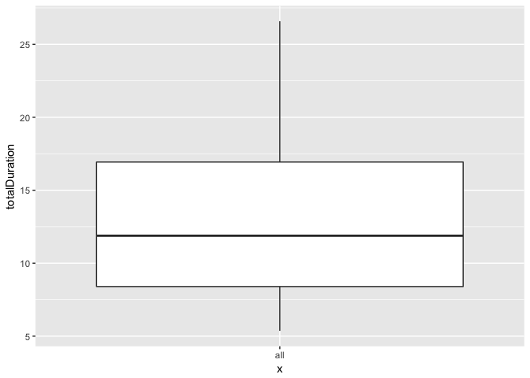

``` r
median(two.block.duration$totalDuration)
```

    ## [1] 11.88333

``` r
median(three.block.duration$totalDuration)
```

    ## [1] 14.83333

``` r
median(stats_demo$`Stats-Q_TotalDuration`/60)
```

    ## [1] 16.9

``` r
ggplot(stats_demo) +
  geom_bar(aes(`Stats-Group`)) +
  facet_grid(NetVisExperience~.)
```


``` r
# Note: only 2 people went all the way through Frucht
```

``` r
ggplot(stats_demo) +
  geom_bar(aes(`Stats-BrowserName`)) +
  facet_grid(filename~.)
```


``` r
ggplot(stats_demo) +
  geom_bar(aes(`Stats-OperatingSystem`)) +
  facet_grid(filename~.)
```


``` r
ggplot(stats_demo) +
  geom_bar(aes(`Stats-ScreenResolution`)) +
  facet_grid(filename~.)
```


``` r
ggplot(stats_demo) +
  geom_dotplot(aes(`Demo-age`)) +
  facet_grid(filename~.)
```

    ## `stat_bindot()` using `bins = 30`. Pick better value with `binwidth`.

    ## Warning: Removed 45 rows containing non-finite values (stat_bindot).


``` r
ggplot(stats_demo) +
  geom_bar(aes(`Demo-gender`)) +
  facet_grid(filename~.)
```


``` r
ggplot(stats_demo) +
  geom_bar(aes(`Demo-lang`)) +
  facet_grid(filename~.)
```

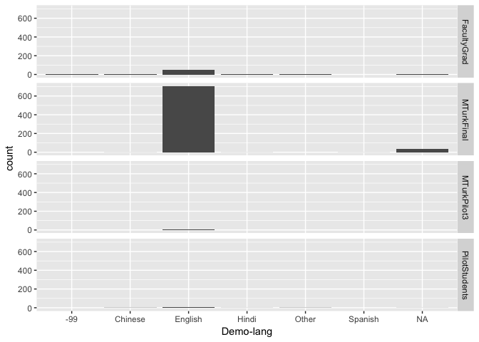

``` r
table(stats_demo$`Demo-lang_TEXT`, stats_demo$filename)
```

    ##             
    ##              FacultyGrad MTurkFinal MTurkPilot3 PilotStudents
    ##   Farsi                1          0           0             0
    ##   Korean               0          0           0             1
    ##   Lithuanian           0          0           0             1
    ##   Portuguese           2          0           0             0

``` r
# TO DO : need to factor Demo-educ

ggplot(stats_demo) +
  geom_bar(aes(`Demo-educ`)) +
  facet_grid(filename~.)
```


``` r
ggplot(stats_demo) +
  geom_bar(aes(`Demo-acfield`)) +
  facet_grid(filename~.)
```

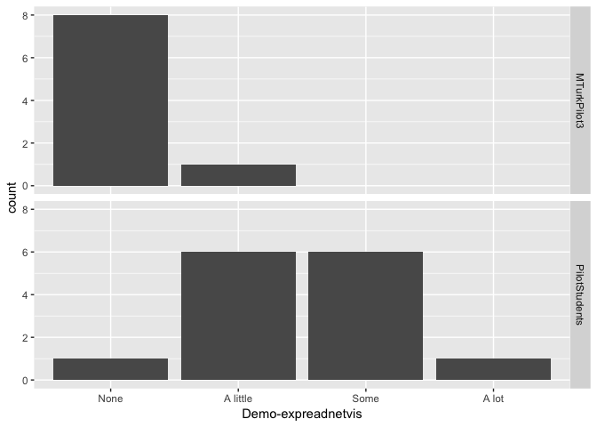

``` r
# TO DO : process -99 and NA(?) values in stats and demo columns (file 3-ProcessingCombinedData)
```

``` r
table(stats_demo$`Demo-acfieldother`, stats_demo$filename)
```

    ##                                                                                                
    ##                                                                                                 FacultyGrad
    ##   1 year of college in 1990's                                                                             0
    ##   accounting                                                                                              0
    ##   Accounting                                                                                              0
    ##   admin assistant                                                                                         0
    ##   Associate of Science degree in Health Information Management                                            0
    ##   Biological Anthropology                                                                                 0
    ##   CADD                                                                                                    0
    ##   Chemical Engineering                                                                                    0
    ##   Complex Systems                                                                                         2
    ##   Computational Neuroscience                                                                              1
    ##   Computational neuroscience, Artificial Life, Cognitive Science                                          1
    ##   Criminal Justice                                                                                        0
    ##   Criminal Justice, that probably falls into one of those i am just not sure to be honest haha.           0
    ##   Data Science                                                                                            0
    ##   Digital Media Design                                                                                    0
    ##   Electronics Technology                                                                                  0
    ##   English                                                                                                 0
    ##   Environmental Policy and Planning                                                                       0
    ##   Environmental Science                                                                                   0
    ##   Family and Human Services                                                                               0
    ##   film                                                                                                    0
    ##   Finance                                                                                                 0
    ##   General AA Degree                                                                                       0
    ##   general studies                                                                                         0
    ##   General Studies                                                                                         0
    ##   Health                                                                                                  0
    ##   Hospitality Management                                                                                  0
    ##   I am not and have not pursuing/completed a college degree                                               0
    ##   Management                                                                                              0
    ##   Medical Office Technology                                                                               0
    ##   medical support                                                                                         0
    ##   more social science focus on psychology                                                                 0
    ##   Music Business Mgmt.                                                                                    0
    ##   Mutrk                                                                                                   0
    ##   n/a                                                                                                     0
    ##   n/a i.e I am not attending college                                                                      0
    ##   none                                                                                                    0
    ##   None                                                                                                    0
    ##   Not pursuing or have completed a college degree..                                                       0
    ##   Nursing                                                                                                 1
    ##   office administrations                                                                                  0
    ##   Physical Therapy                                                                                        0
    ##   POLIScI                                                                                                 0
    ##   professor                                                                                               1
    ##   Public health                                                                                           1
    ##   sales                                                                                                   0
    ##   Technical school                                                                                        0
    ##   Two year technical certificate.                                                                         0
    ##   undecided                                                                                               0
    ##   Undeclared                                                                                              0
    ##   Veterinary                                                                                              0
    ##   Visualization                                                                                           1
    ##   Web Design                                                                                              0
    ##   Writing                                                                                                 0
    ##                                                                                                
    ##                                                                                                 MTurkFinal
    ##   1 year of college in 1990's                                                                            1
    ##   accounting                                                                                             1
    ##   Accounting                                                                                             2
    ##   admin assistant                                                                                        1
    ##   Associate of Science degree in Health Information Management                                           1
    ##   Biological Anthropology                                                                                1
    ##   CADD                                                                                                   1
    ##   Chemical Engineering                                                                                   1
    ##   Complex Systems                                                                                        0
    ##   Computational Neuroscience                                                                             0
    ##   Computational neuroscience, Artificial Life, Cognitive Science                                         0
    ##   Criminal Justice                                                                                       1
    ##   Criminal Justice, that probably falls into one of those i am just not sure to be honest haha.          1
    ##   Data Science                                                                                           0
    ##   Digital Media Design                                                                                   1
    ##   Electronics Technology                                                                                 1
    ##   English                                                                                                1
    ##   Environmental Policy and Planning                                                                      1
    ##   Environmental Science                                                                                  0
    ##   Family and Human Services                                                                              1
    ##   film                                                                                                   1
    ##   Finance                                                                                                1
    ##   General AA Degree                                                                                      1
    ##   general studies                                                                                        1
    ##   General Studies                                                                                        1
    ##   Health                                                                                                 2
    ##   Hospitality Management                                                                                 1
    ##   I am not and have not pursuing/completed a college degree                                              1
    ##   Management                                                                                             1
    ##   Medical Office Technology                                                                              1
    ##   medical support                                                                                        1
    ##   more social science focus on psychology                                                                1
    ##   Music Business Mgmt.                                                                                   1
    ##   Mutrk                                                                                                  1
    ##   n/a                                                                                                    6
    ##   n/a i.e I am not attending college                                                                     1
    ##   none                                                                                                   1
    ##   None                                                                                                   2
    ##   Not pursuing or have completed a college degree..                                                      1
    ##   Nursing                                                                                                0
    ##   office administrations                                                                                 1
    ##   Physical Therapy                                                                                       1
    ##   POLIScI                                                                                                1
    ##   professor                                                                                              0
    ##   Public health                                                                                          0
    ##   sales                                                                                                  1
    ##   Technical school                                                                                       1
    ##   Two year technical certificate.                                                                        1
    ##   undecided                                                                                              1
    ##   Undeclared                                                                                             1
    ##   Veterinary                                                                                             1
    ##   Visualization                                                                                          0
    ##   Web Design                                                                                             1
    ##   Writing                                                                                                1
    ##                                                                                                
    ##                                                                                                 MTurkPilot3
    ##   1 year of college in 1990's                                                                             0
    ##   accounting                                                                                              0
    ##   Accounting                                                                                              0
    ##   admin assistant                                                                                         0
    ##   Associate of Science degree in Health Information Management                                            0
    ##   Biological Anthropology                                                                                 0
    ##   CADD                                                                                                    0
    ##   Chemical Engineering                                                                                    0
    ##   Complex Systems                                                                                         0
    ##   Computational Neuroscience                                                                              0
    ##   Computational neuroscience, Artificial Life, Cognitive Science                                          0
    ##   Criminal Justice                                                                                        0
    ##   Criminal Justice, that probably falls into one of those i am just not sure to be honest haha.           0
    ##   Data Science                                                                                            0
    ##   Digital Media Design                                                                                    0
    ##   Electronics Technology                                                                                  0
    ##   English                                                                                                 0
    ##   Environmental Policy and Planning                                                                       0
    ##   Environmental Science                                                                                   0
    ##   Family and Human Services                                                                               0
    ##   film                                                                                                    0
    ##   Finance                                                                                                 0
    ##   General AA Degree                                                                                       0
    ##   general studies                                                                                         0
    ##   General Studies                                                                                         0
    ##   Health                                                                                                  0
    ##   Hospitality Management                                                                                  0
    ##   I am not and have not pursuing/completed a college degree                                               0
    ##   Management                                                                                              0
    ##   Medical Office Technology                                                                               0
    ##   medical support                                                                                         0
    ##   more social science focus on psychology                                                                 0
    ##   Music Business Mgmt.                                                                                    0
    ##   Mutrk                                                                                                   0
    ##   n/a                                                                                                     1
    ##   n/a i.e I am not attending college                                                                      0
    ##   none                                                                                                    0
    ##   None                                                                                                    0
    ##   Not pursuing or have completed a college degree..                                                       0
    ##   Nursing                                                                                                 0
    ##   office administrations                                                                                  0
    ##   Physical Therapy                                                                                        0
    ##   POLIScI                                                                                                 0
    ##   professor                                                                                               0
    ##   Public health                                                                                           0
    ##   sales                                                                                                   0
    ##   Technical school                                                                                        0
    ##   Two year technical certificate.                                                                         0
    ##   undecided                                                                                               0
    ##   Undeclared                                                                                              0
    ##   Veterinary                                                                                              0
    ##   Visualization                                                                                           0
    ##   Web Design                                                                                              0
    ##   Writing                                                                                                 0
    ##                                                                                                
    ##                                                                                                 PilotStudents
    ##   1 year of college in 1990's                                                                               0
    ##   accounting                                                                                                0
    ##   Accounting                                                                                                0
    ##   admin assistant                                                                                           0
    ##   Associate of Science degree in Health Information Management                                              0
    ##   Biological Anthropology                                                                                   0
    ##   CADD                                                                                                      0
    ##   Chemical Engineering                                                                                      0
    ##   Complex Systems                                                                                           0
    ##   Computational Neuroscience                                                                                0
    ##   Computational neuroscience, Artificial Life, Cognitive Science                                            0
    ##   Criminal Justice                                                                                          0
    ##   Criminal Justice, that probably falls into one of those i am just not sure to be honest haha.             0
    ##   Data Science                                                                                              2
    ##   Digital Media Design                                                                                      0
    ##   Electronics Technology                                                                                    0
    ##   English                                                                                                   0
    ##   Environmental Policy and Planning                                                                         0
    ##   Environmental Science                                                                                     1
    ##   Family and Human Services                                                                                 0
    ##   film                                                                                                      0
    ##   Finance                                                                                                   0
    ##   General AA Degree                                                                                         0
    ##   general studies                                                                                           0
    ##   General Studies                                                                                           0
    ##   Health                                                                                                    0
    ##   Hospitality Management                                                                                    0
    ##   I am not and have not pursuing/completed a college degree                                                 0
    ##   Management                                                                                                0
    ##   Medical Office Technology                                                                                 0
    ##   medical support                                                                                           0
    ##   more social science focus on psychology                                                                   0
    ##   Music Business Mgmt.                                                                                      0
    ##   Mutrk                                                                                                     0
    ##   n/a                                                                                                       0
    ##   n/a i.e I am not attending college                                                                        0
    ##   none                                                                                                      0
    ##   None                                                                                                      0
    ##   Not pursuing or have completed a college degree..                                                         0
    ##   Nursing                                                                                                   0
    ##   office administrations                                                                                    0
    ##   Physical Therapy                                                                                          0
    ##   POLIScI                                                                                                   0
    ##   professor                                                                                                 0
    ##   Public health                                                                                             0
    ##   sales                                                                                                     0
    ##   Technical school                                                                                          0
    ##   Two year technical certificate.                                                                           0
    ##   undecided                                                                                                 0
    ##   Undeclared                                                                                                0
    ##   Veterinary                                                                                                0
    ##   Visualization                                                                                             0
    ##   Web Design                                                                                                0
    ##   Writing                                                                                                   0

``` r
stats_demo$`Demo-dailytech_Tablet` <- type.convert(sub(-99, 0, stats_demo$`Demo-dailytech_Tablet`))

#TO DO: change all -99s to NA?

ggplot(stats_demo) +
  geom_density(aes(`Demo-dailytech_Computer`), color = "blue") +
  geom_density(aes(`Demo-dailytech_Tablet`), color = "red") +
  geom_density(aes(`Demo-dailytech_SmartPhone`), color = "green") +
  facet_grid(filename~.)
```

    ## Warning: Removed 40 rows containing non-finite values (stat_density).

    ## Warning: Removed 40 rows containing non-finite values (stat_density).

    ## Warning: Removed 40 rows containing non-finite values (stat_density).


``` r
ggplot(stats_demo) +
  geom_dotplot(aes(`Demo-weeklygaming`)) +
  facet_grid(filename~.)
```

    ## `stat_bindot()` using `bins = 30`. Pick better value with `binwidth`.


``` r
freq4 <- c("None", "A little", "Some", "A lot")

stats_demo$`Demo-expdataanal` <- factor(stats_demo$`Demo-expdataanal`, 
                                        levels = freq4, 
                                        ordered = TRUE)

ggplot(stats_demo) +
  geom_bar(aes(`Demo-expdataanal`)) +
  facet_grid(filename~.)
```


``` r
stats_demo$`Demo-expdatavis` <- factor(stats_demo$`Demo-expdatavis`, 
                                        levels = freq4, 
                                        ordered = TRUE)

ggplot(stats_demo) +
  geom_bar(aes(`Demo-expdatavis`)) +
  scale_x_discrete(drop=FALSE) +
  facet_grid(filename~.)
```


``` r
stats_demo$`Demo-expreadnetvis` <- factor(stats_demo$`Demo-expreadnetvis`, 
                                        levels = freq4, 
                                        ordered = TRUE)

ggplot(stats_demo) +
  geom_bar(aes(`Demo-expreadnetvis`)) +
  facet_grid(filename~.)
```


``` r
stats_demo$`Demo-expcreatenetvis` <- factor(stats_demo$`Demo-expcreatenetvis`, 
                                        levels = freq4, 
                                        ordered = TRUE)

ggplot(stats_demo) +
  geom_bar(aes(`Demo-expcreatenetvis`)) +
  facet_grid(filename~.)
```


``` r
IDs <- stats_datasets_tall %>% group_by(`Demo-ResponseID`) %>% summarise(TotalDuration = sum(DatasetDuration)) %>% arrange(TotalDuration) %>% select(`Demo-ResponseID`) %>% unlist()

stats_datasets_tall$`Demo-ResponseID` <- factor(stats_datasets_tall$`Demo-ResponseID`, 
                                                levels = IDs) 

ggplot(stats_datasets_tall) +
  geom_col(aes(x = `Demo-ResponseID`, 
               y = `DatasetDuration`)) +
  facet_grid(filename~Dataset, scales="free_y", space="free_y") +
  coord_flip()
```

``` r
ggplot(stats_datasets_tall) +
  geom_boxplot(aes(x = factor(Dataset), y = `DatasetDuration`)) +
  facet_grid(.~filename)
```

    ## Warning: Removed 1 rows containing non-finite values (stat_boxplot).

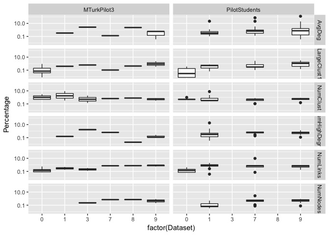

Figures
-------

``` r
graded_num_ans <- left_join(graded_num_ans, stats_demo)
```

    ## Joining, by = "Demo-ResponseID"

``` r
graded_num_ans <- left_join(graded_num_ans, stats_datasets_tall)
```

    ## Joining, by = c("Demo-ResponseID", "Dataset", "DatasetOrder", "filename", "Stats-Group", "NetVisExperience")

``` r
graded_nodes <- left_join(graded_nodes, stats_demo)
```

    ## Joining, by = "Demo-ResponseID"

``` r
graded_nodes <- left_join(graded_nodes, stats_datasets_tall)
```

    ## Joining, by = c("Demo-ResponseID", "Dataset", "DatasetOrder", "filename", "Stats-Group", "NetVisExperience")

``` r
# TO DO : change Percentage to the real calculation

ggplot(graded_num_ans) +
  geom_density(aes(LogError)) + 
  scale_x_log10() +
  facet_grid(.~filename)
```

    ## Warning: Transformation introduced infinite values in continuous x-axis

    ## Warning: Removed 1597 rows containing non-finite values (stat_density).


``` r
ggplot(graded_num_ans) +
  geom_boxplot(aes(factor(Dataset), LogError)) +
  scale_y_log10() +
  facet_grid(.~filename)
```

    ## Warning: Transformation introduced infinite values in continuous y-axis

    ## Warning: Removed 1597 rows containing non-finite values (stat_boxplot).


``` r
ggplot(graded_num_ans) +
  geom_boxplot(aes(Task, LogError)) +
  scale_y_log10() +
  facet_grid(.~filename)
```

    ## Warning: Transformation introduced infinite values in continuous y-axis

    ## Warning: Removed 1597 rows containing non-finite values (stat_boxplot).


``` r
ggplot(graded_num_ans) +
  geom_point(aes(DatasetDuration, LogError)) +
  #scale_y_log10() + 
  facet_grid(Dataset~Task) +
  facet_grid(.~filename)
```

    ## Warning: Removed 64 rows containing missing values (geom_point).


``` r
ggplot(graded_num_ans) +
  geom_boxplot(aes(factor(Dataset), LogError)) +
  scale_y_log10() +
  facet_grid(Task~filename)
```

    ## Warning: Transformation introduced infinite values in continuous y-axis

    ## Warning: Removed 1597 rows containing non-finite values (stat_boxplot).


``` r
ggplot(graded_num_ans) +
  geom_boxplot(aes(Task, LogError)) +
  scale_y_log10() +
  facet_grid(Dataset~filename)
```

    ## Warning: Transformation introduced infinite values in continuous y-axis

    ## Warning: Removed 1597 rows containing non-finite values (stat_boxplot).


``` r
# TO DO : factor Condition so all of the graphical conditions are together and all the layout conditions are together

ggplot(graded_num_ans) +
  geom_boxplot(aes(Condition, LogError)) +
  facet_grid(Task~Dataset)
```


``` r
ggplot(graded_num_ans %>% filter(!is.na(ClustConf))) +
  geom_bar(aes(x=ClustConf)) + 
  facet_grid(Dataset~.)
```


``` r
ggplot(graded_num_ans %>% filter(!is.na(ClustConf)) %>% filter(Task == "NumClust")) +
  geom_boxplot(aes(ClustConf, LogError)) +
  scale_y_log10() +
  coord_flip() +
  facet_grid(Dataset~Condition)
```

    ## Warning: Transformation introduced infinite values in continuous y-axis

    ## Warning: Removed 146 rows containing non-finite values (stat_boxplot).


``` r
ggplot(graded_num_ans %>% filter(!is.na(ClustConf)) %>% filter(Task == "NumClust")) +
  geom_boxplot(aes(ClustConf, LogError)) +
  scale_y_log10() +
  #coord_flip() +
  facet_grid(.~Condition)
```

    ## Warning: Transformation introduced infinite values in continuous y-axis

    ## Warning: Removed 146 rows containing non-finite values (stat_boxplot).


``` r
ggplot(graded_num_ans %>% filter(!is.na(ClustConf)) %>% filter(Task == "NumClust")) +
  geom_boxplot(aes(Condition, LogError)) 
```


``` r
# To DO
```

### Compare results to some of the demographics?

``` r
ggplot() + 
  geom_point(data = node_lookup,
             aes(x=NodeXAdjusted,y=NodeYAdjusted),colour="gray50") +
  geom_point(data = graded_nodes %>% filter(Task == "BC"), 
             aes(x=Click_X,y=Click_Y), colour="red") + 
  facet_grid(Dataset~Condition) +
  theme_bw()
```


``` r
# TO DO: errors in some of the circle conditions?  Clicking in places that aren't around the edges?
# Maybe need to change processing so that distances over a certain amount don't count as a click at all?

# TO DO: remove dataset 6 from raw network data, since I never used it in surveys?
```

``` r
ggplot() + 
  geom_point(data = node_lookup,
             aes(x=NodeXAdjusted,y=NodeYAdjusted),colour="gray50") +
  geom_point(data = graded_nodes %>% filter(Task == "ClickHighDeg"), 
             aes(x=Click_X,y=Click_Y), colour="red") + 
  facet_grid(Dataset~Condition) +
  theme_bw()
```

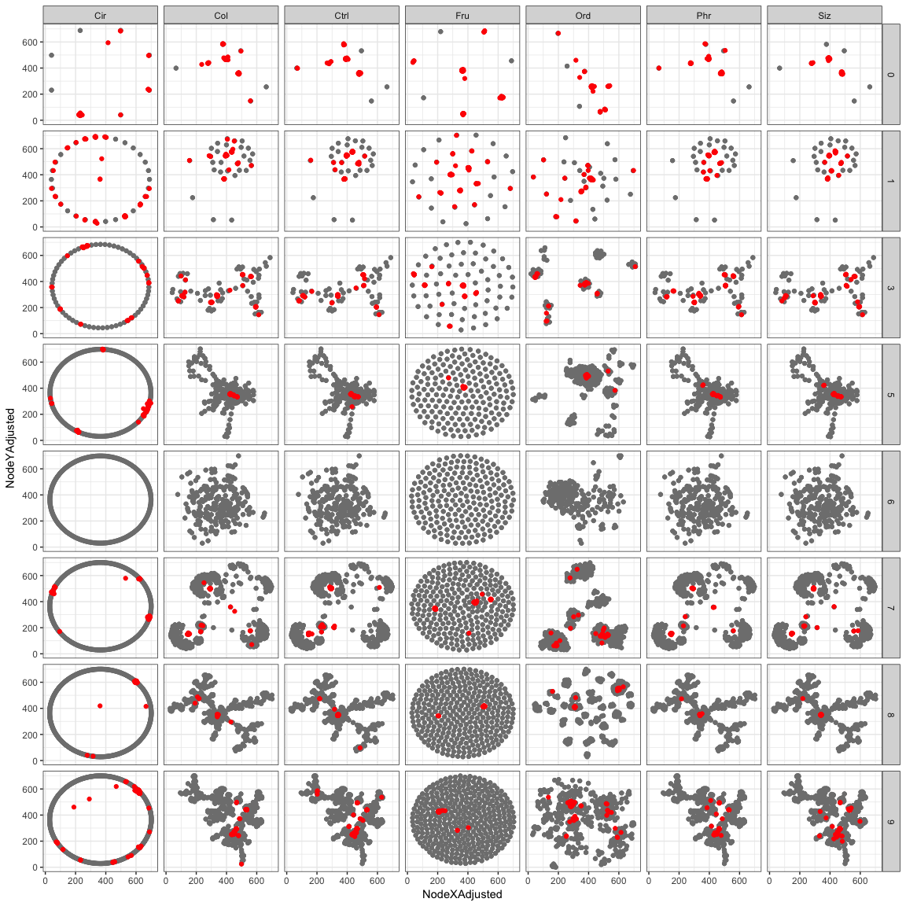

``` r
ggplot(graded_nodes %>% filter(Task == "BC")) +
  geom_point(aes(x=factor(Dataset), y=Percentage)) +
  facet_grid(filename~Condition)
```

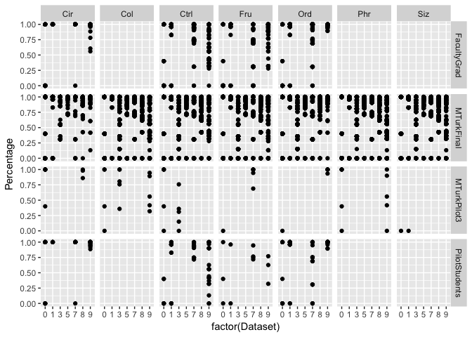

``` r
ggplot(graded_nodes %>% filter(Task == "ClickHighDeg")) +
  geom_point(aes(x=factor(Dataset), y=Percentage)) +
  facet_grid(filename~Condition)
```

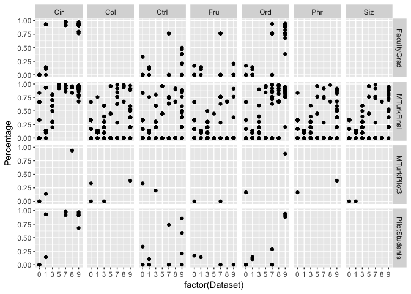

``` r
stats_datasets_tall %>% filter(NetVisExperience=="Low", !is.na(Dataset)) %>% group_by(`Stats-Group`,Dataset) %>% summarise(count=n_distinct(`Demo-ResponseID`)) %>% spread(Dataset,count) %>% View()

stats_datasets_tall %>% filter(NetVisExperience=="High", !is.na(Dataset)) %>% group_by(`Stats-Group`,Dataset) %>% summarise(count=n_distinct(`Demo-ResponseID`)) %>% spread(Dataset,count) %>% View()


stats_demo %>% group_by(NetVisExperience, `Stats-Group`) %>% summarise(count=n_distinct(`Demo-ResponseID`)) %>% spread(`Stats-Group`,count) %>% View()
```

Research Questions
------------------

### Are some tasks harder?

``` r
ggplot(graded_num_ans %>% filter(Task=="AvgDeg",Dataset!=0,Response>0)) +
  geom_violin(aes(factor(Dataset),Response, fill=factor(Dataset))) + 
  #geom_boxplot(aes(factor(Dataset),Response), width=.1, alpha=.3) + 
  geom_point(data=num_ans_lookup %>% filter(Task=="AvgDeg",!(Dataset %in% c(0,6))),aes(y=CorrectAnswer,x=factor(Dataset)))+
  scale_y_log10(limits=c(.1,10000)) +
  labs(title="Average Degree",x="Dataset") +
  guides(fill="none")
```


``` r
ggplot(graded_num_ans %>% filter(Task=="NumNodes",Dataset!=0,Response>0)) +
  geom_violin(aes(factor(Dataset),Response, fill=factor(Dataset))) + 
  geom_point(data=num_ans_lookup %>% filter(Task=="NumNodes",!(Dataset %in% c(0,6))),aes(y=CorrectAnswer,x=factor(Dataset)))+
  scale_y_log10(limits=c(.1,10000)) +
  labs(title="Number of Nodes",x="Dataset") +
  guides(fill="none")
```


``` r
ggplot(graded_num_ans %>% filter(Task=="NumLinks",Dataset!=0,Response>0)) +
  geom_violin(aes(factor(Dataset),Response, fill=factor(Dataset))) + 
  geom_point(data=num_ans_lookup %>% filter(Task=="NumLinks",!(Dataset %in% c(0,6))),aes(y=CorrectAnswer,x=factor(Dataset)))+
  scale_y_log10(limits=c(.1,10000)) +
  labs(title="Number of Links",x="Dataset") +
  guides(fill="none")
```

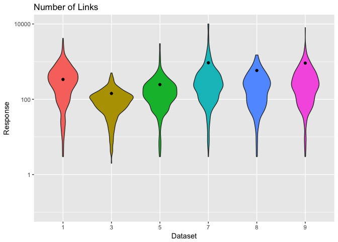

``` r
ggplot(graded_num_ans %>% filter(Task=="NumHighDegree",Dataset!=0,Response>0)) +
  geom_violin(aes(factor(Dataset),Response, fill=factor(Dataset))) + 
  geom_point(data=num_ans_lookup %>% filter(Task=="NumHighDegree",!(Dataset %in% c(0,6))),aes(y=CorrectAnswer,x=factor(Dataset)))+
  scale_y_log10(limits=c(.1,10000)) +
  labs(title="Degree of Highest Degree Node",x="Dataset") +
  guides(fill="none")
```

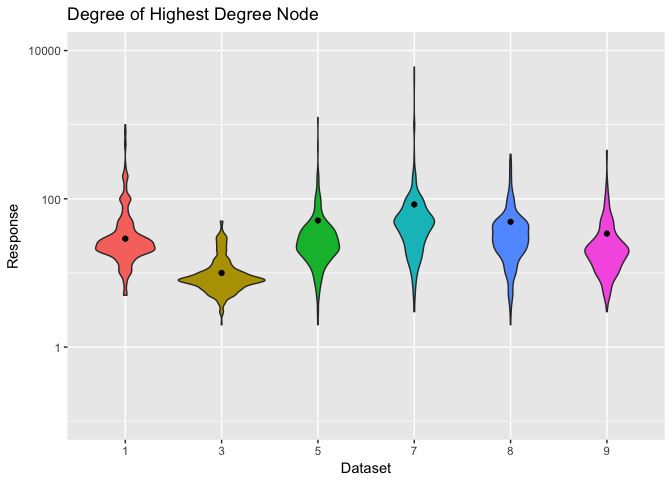

``` r
ggplot(graded_num_ans %>% filter(Task=="NumClust",Dataset!=0,Response>0)) +
  geom_violin(aes(factor(Dataset),Response, fill=factor(Dataset))) + 
  geom_point(data=num_ans_lookup %>% filter(Task=="NumClust",!(Dataset %in% c(0,6))),aes(y=CorrectAnswer,x=factor(Dataset)))+
  scale_y_log10(limits=c(.1,10000)) +
  labs(title="Number of Clusters",x="Dataset") +
  guides(fill="none")
```

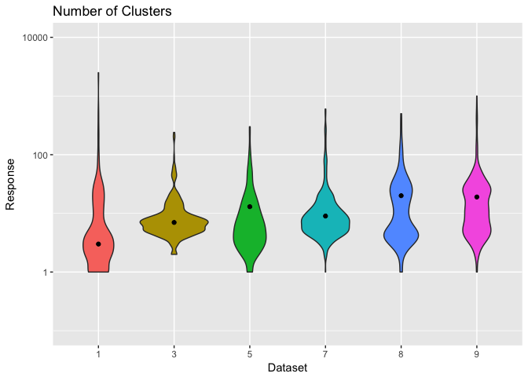

``` r
ggplot(graded_num_ans %>% filter(Task=="LargeClust1",Dataset!=0,Response>0)) +
  geom_violin(aes(factor(Dataset),Response, fill=factor(Dataset))) + 
  geom_point(data=num_ans_lookup %>% filter(Task=="LargeClust1",!(Dataset %in% c(0,6))),aes(y=CorrectAnswer,x=factor(Dataset)))+
  scale_y_continuous(limits=c(0,100)) +
  labs(title="% Nodes in Largest Cluster",x="Dataset") +
  guides(fill="none")
```

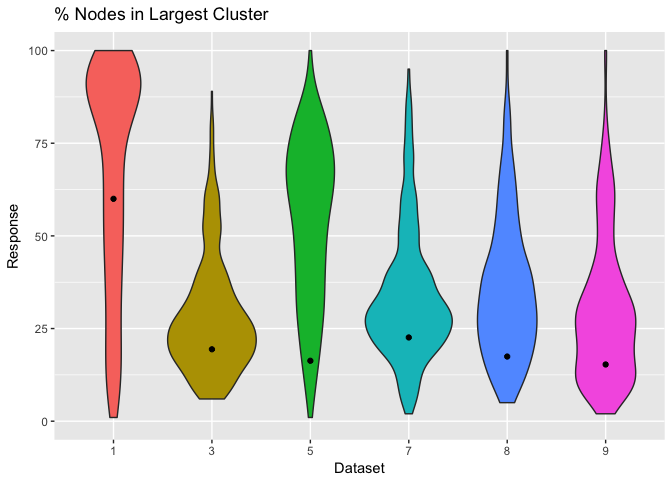

``` r
ggplot(graded_num_ans %>% filter(Task=="AvgDeg",Dataset!=0)) +
  geom_violin(aes(factor(Dataset),LogError, fill=factor(Dataset))) + 
  labs(title="Average Degree",x="Dataset") +
  guides(fill="none")
```

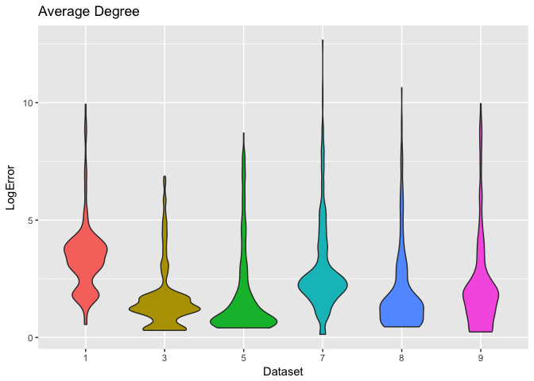

``` r
ggplot(graded_num_ans %>% filter(Task=="NumNodes",Dataset!=0)) +
  geom_violin(aes(factor(Dataset),LogError, fill=factor(Dataset))) + 
  labs(title="Number of Nodes",x="Dataset") +
  guides(fill="none")
```

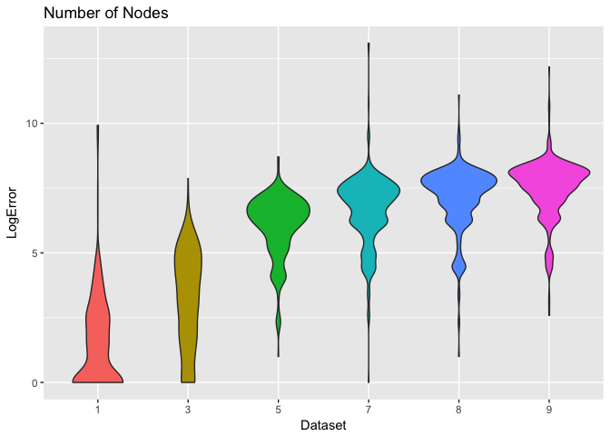

``` r
ggplot(graded_num_ans %>% filter(Task=="NumLinks",Dataset!=0)) +
  geom_violin(aes(factor(Dataset),LogError, fill=factor(Dataset))) + 
  labs(title="Number of Links",x="Dataset") +
  guides(fill="none")
```

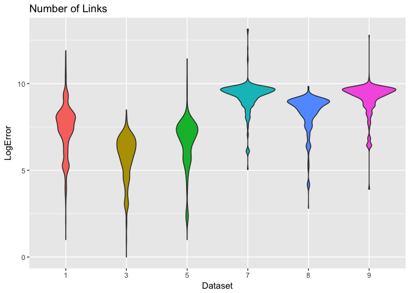

``` r
ggplot(graded_num_ans %>% filter(Task=="NumHighDegree",Dataset!=0)) +
  geom_violin(aes(factor(Dataset),LogError, fill=factor(Dataset))) + 
  labs(title="Degree of Highest Degree Node",x="Dataset") +
  guides(fill="none")
```

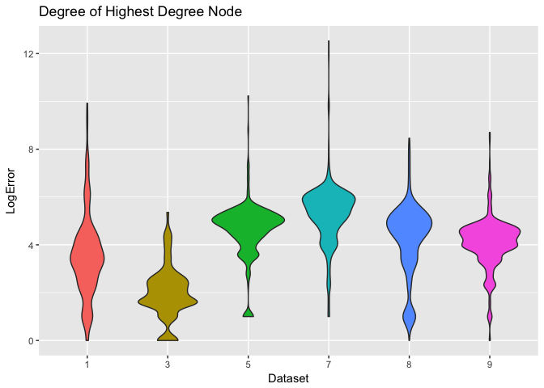

``` r
ggplot(graded_num_ans %>% filter(Task=="NumClust",Dataset!=0)) +
  geom_violin(aes(factor(Dataset),LogError, fill=factor(Dataset))) + 
  labs(title="Number of Clusters",x="Dataset") +
  guides(fill="none")
```

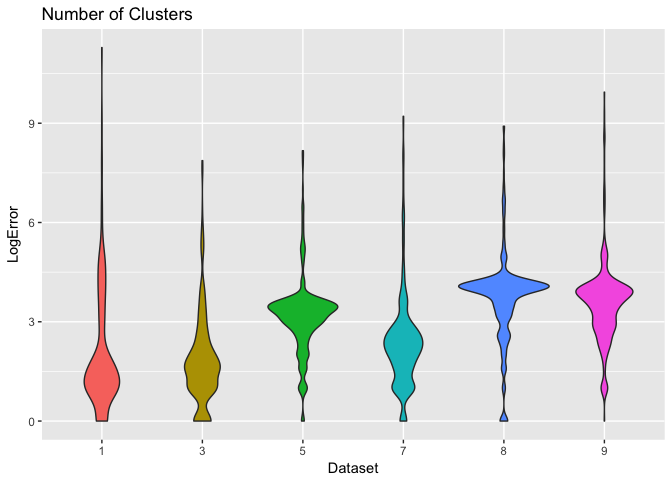

``` r
ggplot(graded_num_ans %>% filter(Task=="LargeClust1",Dataset!=0)) +
  geom_violin(aes(factor(Dataset),LogError, fill=factor(Dataset))) + 
  labs(title="% Nodes in Largest Cluster",x="Dataset") +
  guides(fill="none")
```

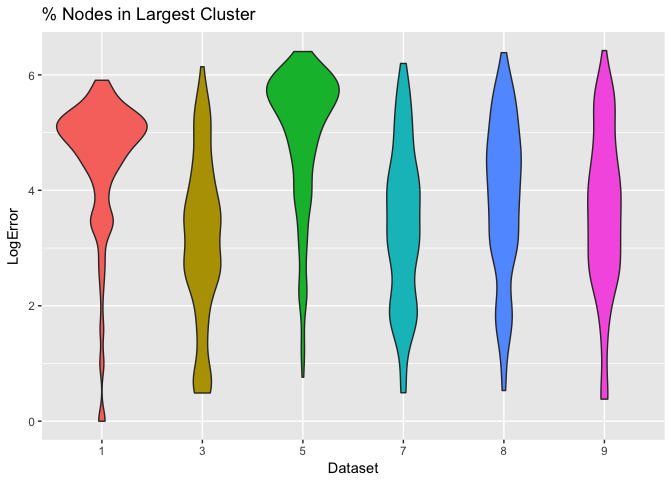

``` r
ggplot(graded_num_ans %>% filter(Condition %in% c("Ctrl","Phr","Col","Siz"))) +
  geom_density(aes(LogError,color=factor(Condition,levels=c("Ctrl","Phr","Col","Siz")))) +
  labs(title="Error by Graphic Condition",x="Condition") +
  scale_color_discrete(name="Condition")
```

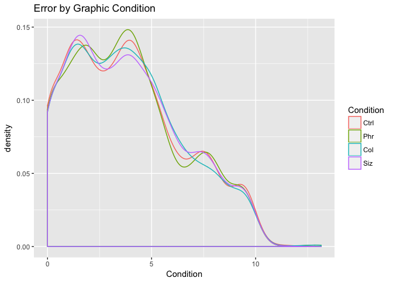

``` r
ggplot(graded_num_ans %>% filter(Condition %in% c("Ctrl","Phr","Col","Siz"))) +
  geom_boxplot(aes(y=LogError,x=factor(Condition,levels=c("Ctrl","Phr","Col","Siz")),color=factor(Condition,levels=c("Ctrl","Phr","Col","Siz")))) +
  labs(title="Error by Graphic Condition",x="Condition") +
  scale_color_discrete(name="Condition")
```

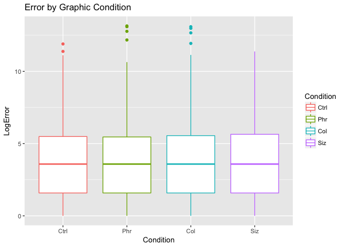

``` r
ggplot(graded_num_ans %>% filter(Condition %in% c("Ctrl","Cir","Fru","Ord"))) +
  geom_density(aes(LogError,color=factor(Condition,levels=c("Ctrl","Cir","Fru","Ord")))) +
  labs(title="Error by Layout Condition",x="Condition") +
  scale_color_discrete(name="Condition")
```

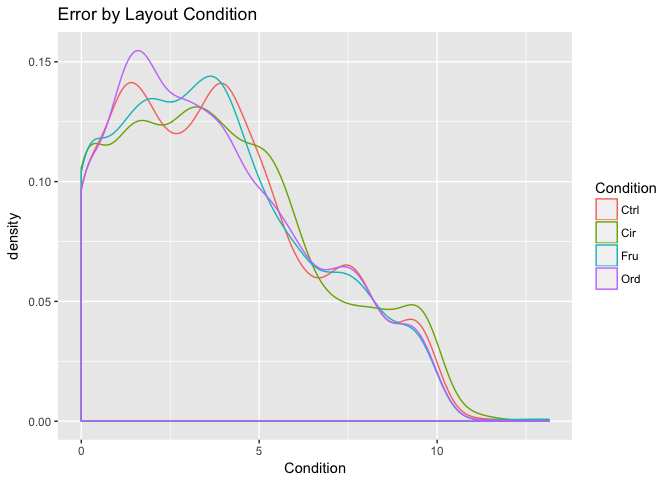

``` r
ggplot(graded_num_ans %>% filter(Condition %in% c("Ctrl","Cir","Fru","Ord"))) +
  geom_boxplot(aes(y=LogError,x=factor(Condition,levels=c("Ctrl","Cir","Fru","Ord")),color=factor(Condition,levels=c("Ctrl","Cir","Fru","Ord")))) +
  labs(title="Error by Layout Condition",x="Condition") +
  scale_color_discrete(name="Condition")
```

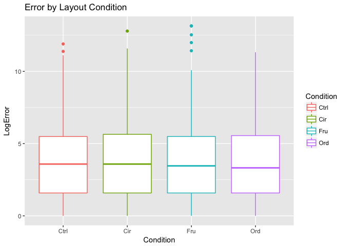

``` r
ggplot(graded_num_ans %>% filter(Condition %in% c("Ctrl","Cir","Fru","Ord"))) +
  geom_density(aes(LogError,color=NetVisExperience)) +
  labs(title="Error by Expertise",x="Expertise") +
  scale_color_discrete(name="Expertise")
```

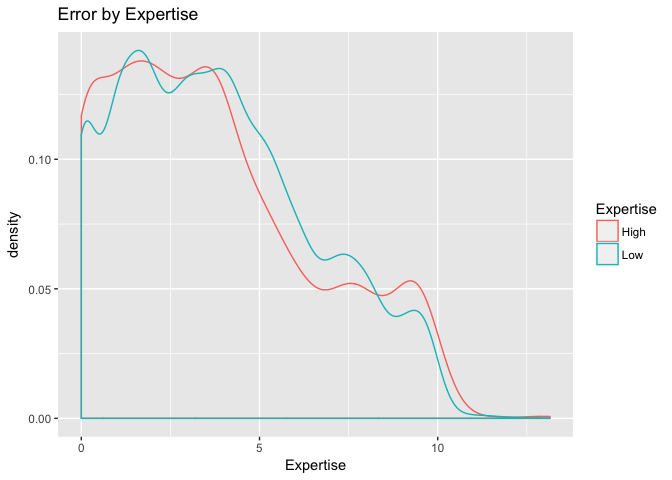

``` r
ggplot(graded_num_ans %>% filter(Condition %in% c("Ctrl","Cir","Fru","Ord"))) +
  geom_boxplot(aes(y=LogError,x=NetVisExperience,color=NetVisExperience)) +
  labs(title="Error by Expertise",x="Expertise") +
  scale_color_discrete(name="Expertise")
```

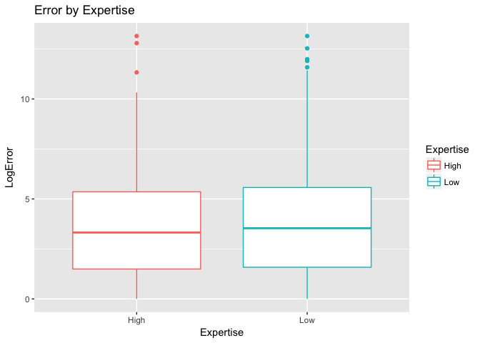

``` r
ggplot(graded_num_ans %>% filter(Condition %in% c("Ctrl","Cir","Fru","Ord")) %>% filter(Dataset!=0)) +
  geom_violin(aes(Task,LogError, fill=Task)) + 
  labs(title="Tasks by Layout Condition") +
  guides(fill="none") +
  facet_wrap(~Condition)
```

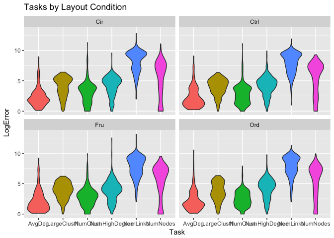

``` r
ggplot(graded_num_ans %>% filter(Condition %in% c("Ctrl","Cir","Fru","Ord")) %>% filter(Dataset!=0)) +
  geom_boxplot(aes(factor(Condition, levels=c("Ctrl","Cir","Fru","Ord")),LogError, fill=Condition)) + 
  labs(title="Tasks by Layout Condition",x="Condition") +
  guides(fill="none") +
  facet_wrap(~Task)
```

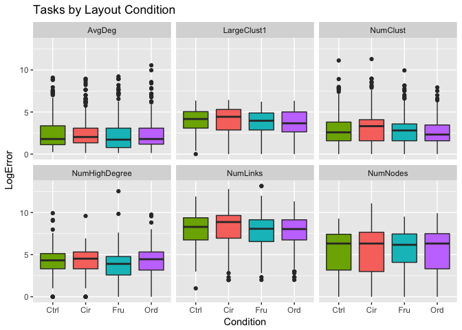

``` r
ggplot(graded_num_ans %>% filter(Condition %in% c("Ctrl","Cir","Fru","Ord")) %>% filter(Dataset!=0)) +
  geom_density(aes(LogError, color=factor(Condition, levels=c("Ctrl","Cir","Fru","Ord")))) + 
  labs(title="Tasks by Layout Condition",x="Condition") +
  scale_color_discrete(name="Condition") +
  facet_wrap(~Task)
```

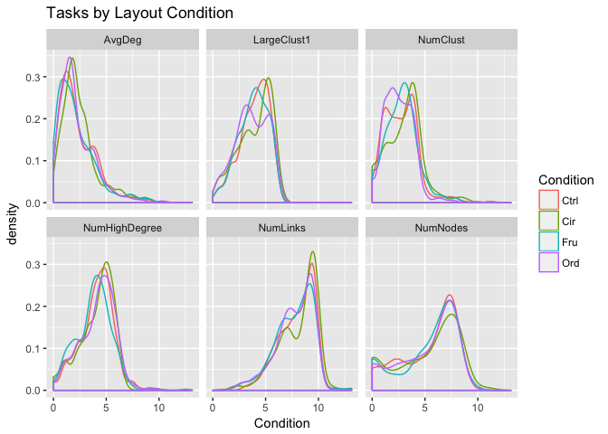

``` r
ggplot(graded_num_ans) +
  geom_density(aes(LogError))
```

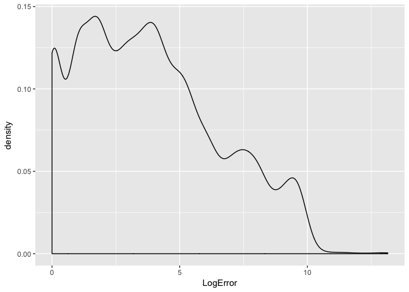

### Does dataset influence accuracy?

``` r
# https://stats.idre.ucla.edu/other/mult-pkg/whatstat/

# Dataset (IV) is ordinal, and categories are *not* independent (individuals do complete multiple datasets)
# LogError (DV) is interval, can be made normal with another log transformation???

# If LogError is interval and normal, can do one-way repeated measures ANOVA?

require(car)
```

    ## Loading required package: car

    ## 
    ## Attaching package: 'car'

    ## The following object is masked from 'package:dplyr':
    ## 
    ##     recode

    ## The following object is masked from 'package:purrr':
    ## 
    ##     some

``` r
require(foreign)
```

    ## Loading required package: foreign

``` r
#kirk <- within(read.dta("~/Desktop/rb4.dta"), 
#    {
#        s <- as.factor(s)
#        a <- as.factor(a)
#    })

#model <- lm(y ~ a + s, data = kirk)
#analysis <- Anova(model, idata = kirk, idesign = ~s)
#print(analysis)

# Okay, here I'm assuming the syntax is lm(DV ~ IV + ParticipantIdentifier)

# LogError is not normally, so taking another log(??), 
# but there are 0 values in LogError so need to add a scalar; not sure what scalar to add, picked .1
# TO DO: adjust LogError so there are no 0s???

model <- lm(log(LogError+.1) ~ factor(Dataset) + factor(`Demo-ResponseID`), data=graded_num_ans)

# Wow!  Model is 138.3Mb

analysis <- Anova(model, idata = graded_num_ans, idesign = ~factor(`Demo-ResponseID`))

print(analysis)
```

    ## Anova Table (Type II tests)
    ## 
    ## Response: log(LogError + 0.1)
    ##                            Sum Sq    Df   F value  Pr(>F)    
    ## factor(Dataset)            7447.1     6 1175.8286 < 2e-16 ***
    ## factor(`Demo-ResponseID`)   960.2   831    1.0947 0.03289 *  
    ## Residuals                 17979.7 17033                      
    ## ---
    ## Signif. codes:  0 '***' 0.001 '**' 0.01 '*' 0.05 '.' 0.1 ' ' 1

``` r
# looks like Dataset is significant at p < .001???

# If LogError is ordinal or interval, can do Friedman test?

#friedman.test(formula, data, subset, na.action, ...)
#friedman.test(LogError ~ Dataset | `Demo-ResponseID`, data=graded_num_ans)

# doesn't work; error is "not an unreplicated complete block design"
```

### Does graphic design/phrasing influence accuracy?

``` r
# Condition (IV) is nominal, and categories are independent (individuals do not complete multiple conditions)
# LogError (DV) is interval, can be made normal with another log transformation???

# If LogError is interval and normal, can do one-way ANOVA?

# not sure if the command below is right; if so, not significant

graphic.design <- filter(graded_num_ans, Condition %in% c("Ctrl","Phr","Col","Siz"))

summary(aov(log(LogError+.1) ~ factor(Condition),data=graphic.design))
```

    ##                     Df Sum Sq Mean Sq F value Pr(>F)
    ## factor(Condition)    3      1  0.2309    0.16  0.923
    ## Residuals         9794  14118  1.4415

``` r
# If LogError is ordinal or interval, can do Kruskal Wallis?

kruskal.test(LogError ~ factor(Condition), data=graphic.design)
```

    ## 
    ##  Kruskal-Wallis rank sum test
    ## 
    ## data:  LogError by factor(Condition)
    ## Kruskal-Wallis chi-squared = 0.15917, df = 3, p-value = 0.9839

``` r
# not significant
```

### Does layout algorithm influence accuracy?

``` r
# Condition (IV) is nominal, and categories are independent (individuals do not complete multiple conditions)
# LogError (DV) is interval, can be made normal with another log transformation???

# If LogError is interval and normal, can do one-way ANOVA?

# not sure if the command below is right; if so, not significant

layout.alg <- filter(graded_num_ans, Condition %in% c("Ctrl","Cir","Fru","Ord"))

summary(aov(log(LogError+.1) ~ factor(Condition),data=layout.alg))
```

    ##                      Df Sum Sq Mean Sq F value Pr(>F)
    ## factor(Condition)     3      1  0.3369    0.22  0.882
    ## Residuals         10797  16520  1.5301

``` r
# If LogError is ordinal or interval, can do Kruskal Wallis?

kruskal.test(LogError ~ factor(Condition), data=layout.alg)
```

    ## 
    ##  Kruskal-Wallis rank sum test
    ## 
    ## data:  LogError by factor(Condition)
    ## Kruskal-Wallis chi-squared = 4.2195, df = 3, p-value = 0.2387

``` r
# p-value lower but still not significant
```

### Does expertise influence accuracy?

``` r
# NetVisExperience (IV) is ordinal, 2 groups, and levels are independent (individuals have one level of experience)
# LogError (DV) is interval, can be made normal with another log transformation???

# If LogError is interval and normal, can do 2 independent sample t-test?

t.test(log(LogError+.1) ~ factor(NetVisExperience), data=graded_num_ans)
```

    ## 
    ##  Welch Two Sample t-test
    ## 
    ## data:  log(LogError + 0.1) by factor(NetVisExperience)
    ## t = -4.5314, df = 2078.2, p-value = 6.191e-06
    ## alternative hypothesis: true difference in means is not equal to 0
    ## 95 percent confidence interval:
    ##  -0.21823906 -0.08639842
    ## sample estimates:
    ## mean in group High  mean in group Low 
    ##          0.7865329          0.9388516

``` r
# looks significant

# If LogError is ordinal or interval, can do Wilcoxon-Mann Whitney test?

wilcox.test(LogError ~ factor(NetVisExperience), data=graded_num_ans)
```

    ## 
    ##  Wilcoxon rank sum test with continuity correction
    ## 
    ## data:  LogError by factor(NetVisExperience)
    ## W = 13483000, p-value = 0.0004933
    ## alternative hypothesis: true location shift is not equal to 0

``` r
# looks significant

# p-value lower but still not significant
```

### Does gender influence accuracy?

``` r
# Demo-gender (IV) is nominal, more than 2 groups, and levels are independent (individuals have one gender)
# LogError (DV) is interval, can be made normal with another log transformation???

# If LogError is interval and normal, can do one-way ANOVA?

# not sure if the command below is right; if so, not significant

summary(aov(log(LogError+.1) ~ factor(`Demo-gender`),data=graded_num_ans))
```

    ##                          Df Sum Sq Mean Sq F value Pr(>F)
    ## factor(`Demo-gender`)     4      7   1.740   1.179  0.318
    ## Residuals             17296  25521   1.476               
    ## 570 observations deleted due to missingness

``` r
# If LogError is ordinal or interval, can do Kruskal Wallis?

kruskal.test(LogError ~ factor(`Demo-gender`), data=graded_num_ans)
```

    ## 
    ##  Kruskal-Wallis rank sum test
    ## 
    ## data:  LogError by factor(`Demo-gender`)
    ## Kruskal-Wallis chi-squared = 2.6784, df = 4, p-value = 0.613

``` r
# not significant
```

### Does self-report previous experience with network visualization influence accuracy?

``` r
# Demo-expreadnetvis (IV) is nominal, more than 2 groups, and levels are independent (individuals have one gender)
# LogError (DV) is interval, can be made normal with another log transformation???

# If LogError is interval and normal, can do one-way ANOVA?

summary(aov(log(LogError+.1) ~ factor(`Demo-expreadnetvis`),data=graded_num_ans)) # not significant
```

    ##                                 Df Sum Sq Mean Sq F value Pr(>F)
    ## factor(`Demo-expreadnetvis`)     3      1  0.2019   0.137  0.938
    ## Residuals                    17231  25443  1.4766               
    ## 636 observations deleted due to missingness

``` r
summary(aov(log(LogError+.1) ~ factor(`Demo-expcreatenetvis`),data=graded_num_ans)) # not significant
```

    ##                                   Df Sum Sq Mean Sq F value Pr(>F)
    ## factor(`Demo-expcreatenetvis`)     3      8   2.580   1.748  0.155
    ## Residuals                      17253  25460   1.476               
    ## 614 observations deleted due to missingness

``` r
# If LogError is ordinal or interval, can do Kruskal Wallis?

kruskal.test(LogError ~ factor(`Demo-expreadnetvis`), data=graded_num_ans) # not significant
```

    ## 
    ##  Kruskal-Wallis rank sum test
    ## 
    ## data:  LogError by factor(`Demo-expreadnetvis`)
    ## Kruskal-Wallis chi-squared = 1.6448, df = 3, p-value = 0.6493

``` r
kruskal.test(LogError ~ factor(`Demo-expcreatenetvis`), data=graded_num_ans) # significant? p < .01
```

    ## 
    ##  Kruskal-Wallis rank sum test
    ## 
    ## data:  LogError by factor(`Demo-expcreatenetvis`)
    ## Kruskal-Wallis chi-squared = 14.513, df = 3, p-value = 0.002284

### Does dataset duration influence accuracy?

``` r
# DatasetDuration (IV) is interval
# LogError (DV) is interval, can be made normal with another log transformation???

# If LogError is interval and normal, can do correlation?  (Q: do both need to be normal?)

cor.test(~DatasetDuration+LogError,data=graded_num_ans) # barely significant (p ~ .01)
```

    ## 
    ##  Pearson's product-moment correlation
    ## 
    ## data:  DatasetDuration and LogError
    ## t = -2.9312, df = 17805, p-value = 0.003381
    ## alternative hypothesis: true correlation is not equal to 0
    ## 95 percent confidence interval:
    ##  -0.036638107 -0.007276584
    ## sample estimates:
    ##         cor 
    ## -0.02196208

``` r
cor.test(~DatasetDuration+log(LogError+.1),data=graded_num_ans) # significant
```

    ## 
    ##  Pearson's product-moment correlation
    ## 
    ## data:  DatasetDuration and log(LogError + 0.1)
    ## t = -2.6664, df = 17805, p-value = 0.007673
    ## alternative hypothesis: true correlation is not equal to 0
    ## 95 percent confidence interval:
    ##  -0.034656518 -0.005292552
    ## sample estimates:
    ##         cor 
    ## -0.01997884

``` r
cor.test(~log(DatasetDuration)+log(LogError+.1),data=graded_num_ans) # significant
```

    ## 
    ##  Pearson's product-moment correlation
    ## 
    ## data:  log(DatasetDuration) and log(LogError + 0.1)
    ## t = -27.969, df = 17805, p-value < 2.2e-16
    ## alternative hypothesis: true correlation is not equal to 0
    ## 95 percent confidence interval:
    ##  -0.2191747 -0.1910351
    ## sample estimates:
    ##        cor 
    ## -0.2051473

``` r
# If LogError is interval and normal, can do simple linear regression?

lm(log(LogError+.1)~log(DatasetDuration),data=graded_num_ans) 
```

    ## 
    ## Call:
    ## lm(formula = log(LogError + 0.1) ~ log(DatasetDuration), data = graded_num_ans)
    ## 
    ## Coefficients:
    ##          (Intercept)  log(DatasetDuration)  
    ##               2.8759               -0.3705

``` r
# don't know how well the model fits...

# If LogError is ordinal or interval, can do non-parametric correlation

cor.test(~DatasetDuration+LogError,data=graded_num_ans, method="spearman")  #significant?
```

    ## Warning in cor.test.default(x = c(97L, 133L, 195L, 99L, 108L, 109L, 63L, :
    ## Cannot compute exact p-value with ties

    ## 
    ##  Spearman's rank correlation rho
    ## 
    ## data:  DatasetDuration and LogError
    ## S = 1.138e+12, p-value < 2.2e-16
    ## alternative hypothesis: true rho is not equal to 0
    ## sample estimates:
    ##        rho 
    ## -0.2092887

### Do task and layout algorithm interact to influence accuracy?

``` r
# Task (IV1) is nominal, categories are dependent (individuals complete multiple tasks)
# Condition (IV2) is nominal, categories are independent (individuals complete a single condition)
# LogError (DV) is interval, can be made normal with another log transformation???

# If LogError is interval and normal, can do mixed ANOVA?

# http://www.cookbook-r.com/Statistical_analysis/ANOVA/#mixed-design-anova

layout.alg <- filter(graded_num_ans, Condition %in% c("Ctrl","Cir","Fru","Ord")) %>% mutate(LogLog = log(LogError+.1), Condition = factor(Condition, levels=c("Ctrl","Cir","Fru","Ord")), Task = factor(Task), `Demo-ResponseID` = factor(`Demo-ResponseID`))


aov_task_condition <- aov(LogLog ~ Condition*Task + Error(`Demo-ResponseID`/Task), data=layout.alg)
```

    ## Warning in aov(LogLog ~ Condition * Task + Error(`Demo-ResponseID`/Task), :
    ## Error() model is singular

``` r
# Model is quite large, 300Mb

summary(aov_task_condition) # Task is significant?  Not sure how to interpret
```

    ## 
    ## Error: Demo-ResponseID
    ##                 Df Sum Sq Mean Sq F value   Pr(>F)    
    ## Condition        3    1.0   0.337   0.228    0.877    
    ## Task             5   68.2  13.635   9.236 2.07e-08 ***
    ## Condition:Task  13   20.5   1.579   1.069    0.384    
    ## Residuals      484  714.6   1.476                     
    ## ---
    ## Signif. codes:  0 '***' 0.001 '**' 0.01 '*' 0.05 '.' 0.1 ' ' 1
    ## 
    ## Error: `Demo-ResponseID`:Task
    ##                  Df Sum Sq Mean Sq F value   Pr(>F)    
    ## Task              5 1912.8   382.6 599.869  < 2e-16 ***
    ## Condition:Task   15   37.5     2.5   3.917 5.07e-07 ***
    ## Residuals      2507 1598.8     0.6                     
    ## ---
    ## Signif. codes:  0 '***' 0.001 '**' 0.01 '*' 0.05 '.' 0.1 ' ' 1
    ## 
    ## Error: Within
    ##             Df Sum Sq Mean Sq F value Pr(>F)
    ## Residuals 7768  12168   1.566

### Mixed Models

``` r
# https://iucat.iu.edu/catalog/14518998
```

Output
------

``` r
# add charts to Word Doc

# ggplot example
gg <- ggplot(mtcars, aes(x = mpg , y = wt, colour = qsec)) + geom_point() + theme_minimal()

# produce an emf file containing the ggplot (won't be editable in Word, but will be vector)
filename <- tempfile(fileext = ".emf")
emf(file = filename, width = 6, height = 7)
print(gg)
dev.off()

read_docx() %>% 
  body_add_img(src = filename, width = 6, height = 7) %>% 
  print(target = "~/Desktop/demo_emf.docx") %>% 
  invisible()

# add charts to PowerPoint (should be editable, though they won't be a chart per se)

read_pptx() %>% 
  add_slide(layout = "Title and Content", master = "Office Theme") %>% 
  ph_with_vg(code = print(gg), type = "body") %>% 
  print(target = "~/Desktop/demo_rvg.pptx") %>% 
  invisible()
```
