Analyzing Combined NetVisLit Data
================
Angela Zoss
July 19, 2017

Notes:

These command files should contain commands that open up your analysis data files, and then use those data to generate the output upon which your results are based.

Every command that generates any of your results should be preceded by a comment that states which result the command generates. A few Hypothetical examples illustrate what these comments might look like:

-   The following command generates the first column of Table 6.

The command files for your analysis phase should not contain any commands that generate new variables or process your data in any way. All the procedures required to prepare your data for analysis should be executed by the command files you wrote for the processing phase.

It is often convenient to write all the commands for the analysis phase in a single command file. However, if the nature of your project or the structure of your data are such that you think it would make sense to divide the code that generates the results into two or more command files, you should feel free to do so. No matter how you organize your analysis command files, your Read Me file will include an explanation of how to use them to reproduce your results.

Save the command files you write for the analysis phase in the Command Files folder.

Load packages
-------------

``` r
require(tidyverse)
```

    ## Loading required package: tidyverse

    ## Loading tidyverse: ggplot2
    ## Loading tidyverse: tibble
    ## Loading tidyverse: tidyr
    ## Loading tidyverse: readr
    ## Loading tidyverse: purrr
    ## Loading tidyverse: dplyr

    ## Conflicts with tidy packages ----------------------------------------------

    ## filter(): dplyr, stats
    ## lag():    dplyr, stats

Environmental Variables
-----------------------

``` r
originalDataDir <- "../../Original Data"
analysisDataDir <- "../../Analysis Data"

generatedDataDir <- file.path(originalDataDir, "Generated data")

figureDir <- "../../Documents/"
```

Loading analysis data files
---------------------------

``` r
#all_nodes <- read_csv(file.path(generatedDataDir, "all_nodes.csv"))

node_lookup <- node_lookup <- read_csv(file.path(generatedDataDir, "node_lookup.csv"), col_types = cols(MaxValue = col_double(),NodeValue = col_double()))

graded_num_ans <- read_csv(file.path(analysisDataDir, "GradedNumAnswers.csv"))
```

    ## Parsed with column specification:
    ## cols(
    ##   `Demo-ResponseID` = col_character(),
    ##   QType = col_character(),
    ##   Condition = col_character(),
    ##   Dataset = col_integer(),
    ##   Task = col_character(),
    ##   Response = col_double(),
    ##   DatasetOrder = col_integer(),
    ##   TaskOrder = col_integer(),
    ##   CorrectAnswer = col_double(),
    ##   Difference = col_double(),
    ##   Percentage = col_double(),
    ##   ClustConf = col_character()
    ## )

``` r
graded_nodes <- read_csv(file.path(analysisDataDir, "GradedNodes.csv"))
```

    ## Parsed with column specification:
    ## cols(
    ##   .default = col_double(),
    ##   `Demo-ResponseID` = col_character(),
    ##   QType = col_character(),
    ##   Condition = col_character(),
    ##   Dataset = col_integer(),
    ##   Attempt = col_integer(),
    ##   DatasetOrder = col_integer(),
    ##   TaskOrder = col_integer(),
    ##   Click_X = col_integer(),
    ##   Click_Y = col_integer(),
    ##   NodeID = col_character(),
    ##   Task = col_character(),
    ##   NodeRank = col_integer()
    ## )

    ## See spec(...) for full column specifications.

``` r
stats_datasets_tall <- read_csv(file.path(analysisDataDir, "Stats_Datasets_Tall.csv"))
```

    ## Parsed with column specification:
    ## cols(
    ##   filename = col_character(),
    ##   `Demo-ResponseID` = col_character(),
    ##   Dataset = col_integer(),
    ##   DatasetDuration = col_integer(),
    ##   DatasetStartTime = col_integer(),
    ##   Condition = col_character(),
    ##   DatasetOrder = col_integer()
    ## )

``` r
stats_demo <- read_csv(file.path(analysisDataDir, "Stats_Demo.csv"))
```

    ## Parsed with column specification:
    ## cols(
    ##   .default = col_character(),
    ##   `Stats-Q_TotalDuration` = col_integer(),
    ##   `Stats-dataset_count` = col_integer(),
    ##   `Stats-JavaSupport` = col_integer(),
    ##   `Demo-age` = col_integer(),
    ##   `Demo-dailytech_Computer` = col_integer(),
    ##   `Demo-dailytech_Tablet` = col_integer(),
    ##   `Demo-dailytech_SmartPhone` = col_integer(),
    ##   `Demo-weeklygaming` = col_integer()
    ## )
    ## See spec(...) for full column specifications.

``` r
responses <- read_csv(file.path(analysisDataDir, "CombinedResponsesWithOrder.csv"))
```

    ## Parsed with column specification:
    ## cols(
    ##   `Demo-ResponseID` = col_character(),
    ##   QType = col_character(),
    ##   Condition = col_character(),
    ##   Dataset = col_integer(),
    ##   Task = col_character(),
    ##   Coord = col_character(),
    ##   Response = col_character(),
    ##   DatasetOrder = col_integer(),
    ##   TaskOrder = col_integer()
    ## )

``` r
#responses <- read_csv(file.path(analysisDataDir, "Pilot3ResponsesWithOrder.csv"))
```

Slight processing for analysis
------------------------------

``` r
graded_num_ans$ClustConf <- factor(graded_num_ans$ClustConf, levels = c("Very doubtful (0-25%)","Somewhat doubtful (26-50%)","Somewhat confident (51-75%)","Very confident (76-100%)"), ordered = TRUE)
```

Summarize Stats and Demo data
-----------------------------

``` r
ggplot(stats_demo) +
#  geom_histogram(aes(`Stats-Q_TotalDuration`)) +
  geom_dotplot(aes(x = (`Stats-Q_TotalDuration` / 60)), binwidth = 3) +
  scale_x_continuous(limits = c(0,70), name = "Total Duration in Minutes (bins = 3 minutes each)") +
  facet_grid(filename~.)
```

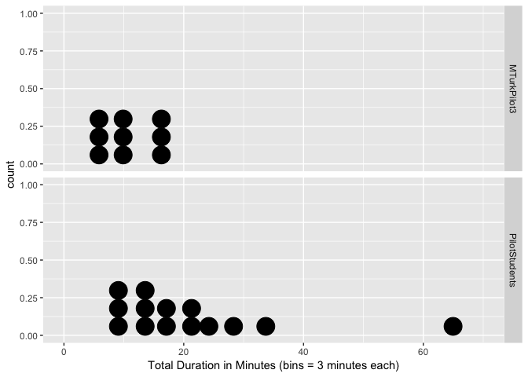

``` r
ggplot(stats_demo) +
#  geom_histogram(aes(`Stats-Q_TotalDuration`)) +
  geom_dotplot(aes(x = (`Stats-Q_TotalDuration` / `Stats-dataset_count` / 60)), binwidth = 1) +
  scale_x_continuous(limits = c(0,25), name = "Average duration in minutes per dataset (bins = 1 minute each)") +
  facet_grid(filename~.)
```

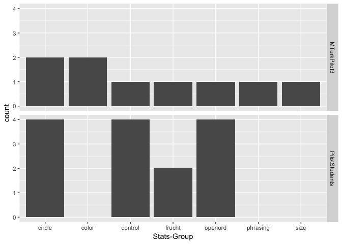

``` r
ggplot(stats_demo) +
  geom_boxplot(aes(x = filename, y = (`Stats-Q_TotalDuration` / `Stats-dataset_count` / 60)))
```

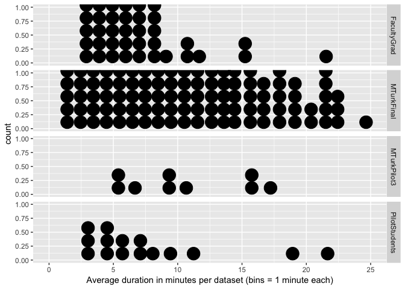

``` r
ggplot(stats_datasets_tall) +
  geom_boxplot(aes(x = factor(DatasetOrder), y = (DatasetDuration / 60))) + 
  facet_grid(filename~.)
```

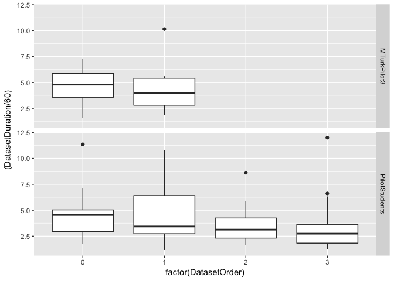

``` r
three.block.duration <- stats_datasets_tall %>% filter(filename=="PilotStudents") %>% group_by(`Demo-ResponseID`) %>% summarise(totalDuration=sum(DatasetDuration)/60) %>% dplyr::select(`Demo-ResponseID`,totalDuration)

two.block.duration <- stats_datasets_tall %>% filter(filename=="PilotStudents") %>% filter(DatasetOrder < 3) %>% group_by(`Demo-ResponseID`) %>% summarise(totalDuration=sum(DatasetDuration)/60) %>% dplyr::select(`Demo-ResponseID`,totalDuration)
  
ggplot(two.block.duration) + geom_boxplot(aes(y=totalDuration,x="all"))
```

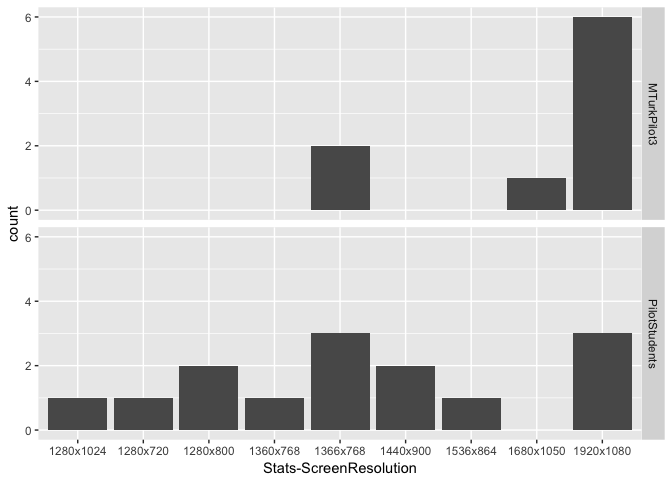

``` r
median(two.block.duration$totalDuration)
```

    ## [1] 11.43333

``` r
median(three.block.duration$totalDuration)
```

    ## [1] 14.01667

``` r
median(stats_demo$`Stats-Q_TotalDuration`/60)
```

    ## [1] 15.05

``` r
ggplot(stats_demo) +
  geom_bar(aes(`Stats-Group`)) +
  facet_grid(filename~.)
```

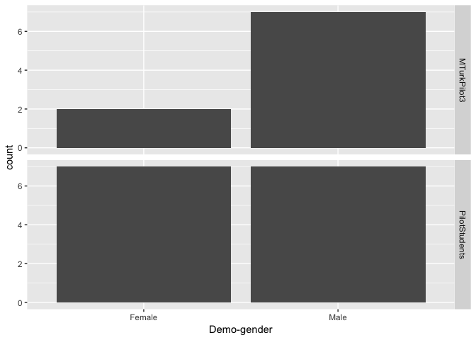

``` r
# Note: only 2 people went all the way through Frucht
```

``` r
ggplot(stats_demo) +
  geom_bar(aes(`Stats-BrowserName`)) +
  facet_grid(filename~.)
```

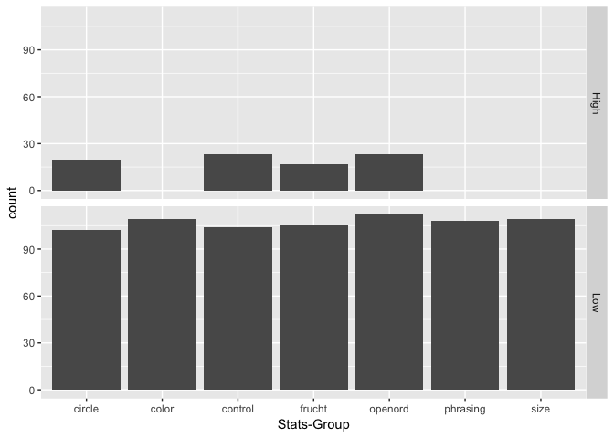

``` r
ggplot(stats_demo) +
  geom_bar(aes(`Stats-OperatingSystem`)) +
  facet_grid(filename~.)
```

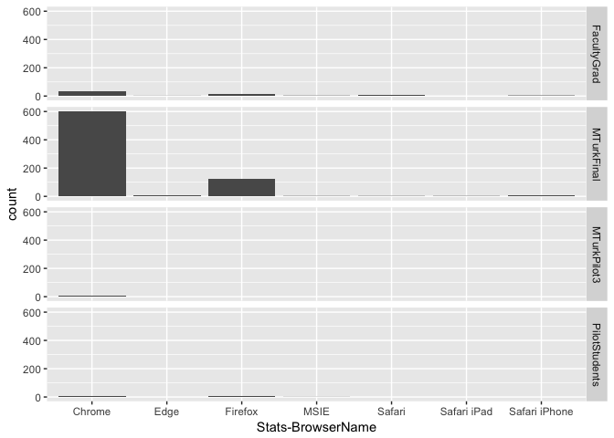

``` r
ggplot(stats_demo) +
  geom_bar(aes(`Stats-ScreenResolution`)) +
  facet_grid(filename~.)
```

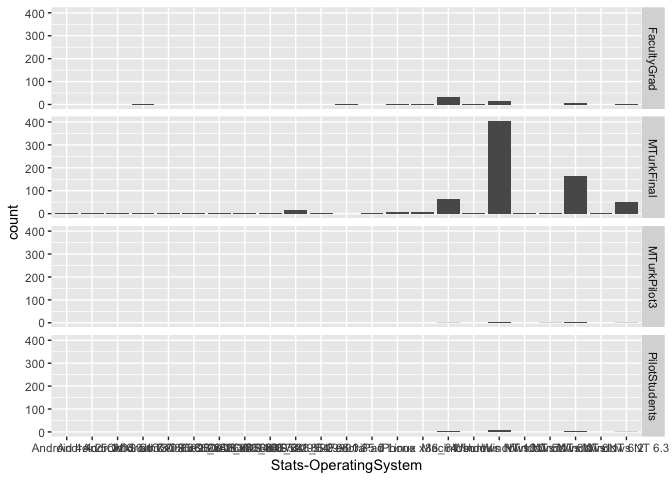

``` r
ggplot(stats_demo) +
  geom_dotplot(aes(`Demo-age`)) +
  facet_grid(filename~.)
```

    ## `stat_bindot()` using `bins = 30`. Pick better value with `binwidth`.

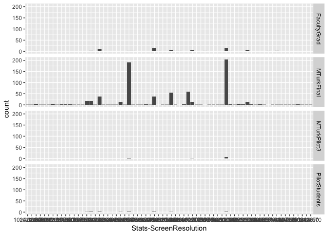

``` r
ggplot(stats_demo) +
  geom_bar(aes(`Demo-gender`)) +
  facet_grid(filename~.)
```

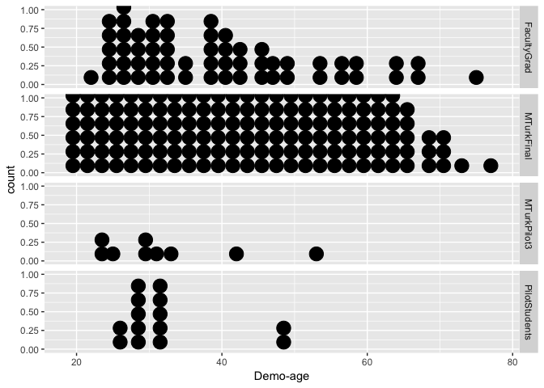

``` r
ggplot(stats_demo) +
  geom_bar(aes(`Demo-lang`)) +
  facet_grid(filename~.)
```

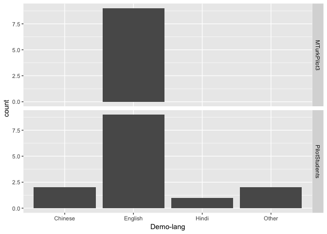

``` r
table(stats_demo$`Demo-lang_TEXT`, stats_demo$filename)
```

    ##             
    ##              MTurkPilot3 PilotStudents
    ##   Korean               0             1
    ##   Lithuanian           0             1

``` r
# TO DO : need to factor Demo-educ

ggplot(stats_demo) +
  geom_bar(aes(`Demo-educ`)) +
  facet_grid(filename~.)
```

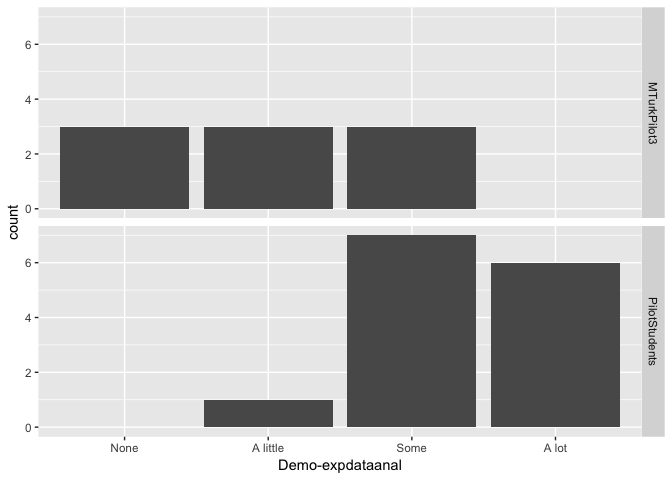

``` r
ggplot(stats_demo) +
  geom_bar(aes(`Demo-acfield`)) +
  facet_grid(filename~.)
```

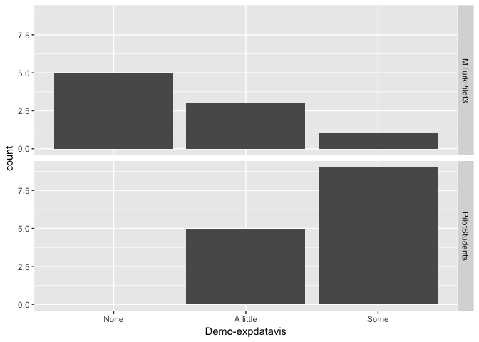

``` r
# TO DO : process -99 and NA(?) values in stats and demo columns (file 3-ProcessingCombinedData)
```

``` r
table(stats_demo$`Demo-acfieldother`, stats_demo$filename)
```

    ##                        
    ##                         MTurkPilot3 PilotStudents
    ##   Data Science                    0             2
    ##   Environmental Science           0             1
    ##   n/a                             1             0

``` r
stats_demo$`Demo-dailytech_Tablet` <- type.convert(sub(-99, 0, stats_demo$`Demo-dailytech_Tablet`))

ggplot(stats_demo) +
  geom_density(aes(`Demo-dailytech_Computer`), color = "blue") +
  geom_density(aes(`Demo-dailytech_Tablet`), color = "red") +
  geom_density(aes(`Demo-dailytech_SmartPhone`), color = "green") +
  facet_grid(filename~.)
```

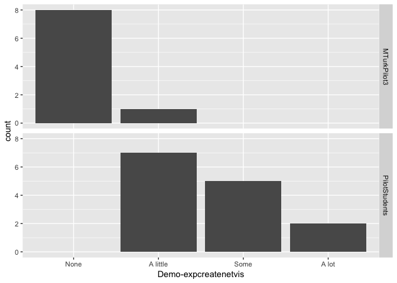

``` r
ggplot(stats_demo) +
  geom_dotplot(aes(`Demo-weeklygaming`)) +
  facet_grid(filename~.)
```

    ## `stat_bindot()` using `bins = 30`. Pick better value with `binwidth`.

    ## Warning: Removed 1 rows containing non-finite values (stat_bindot).

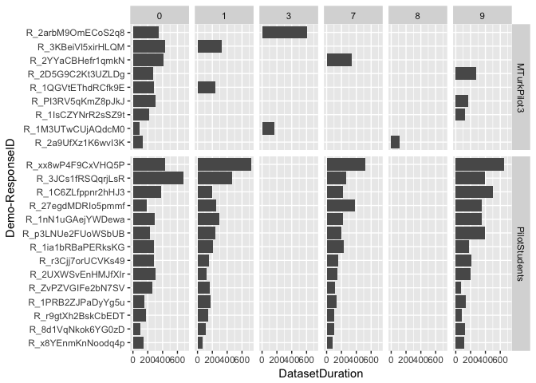

``` r
freq4 <- c("None", "A little", "Some", "A lot")

stats_demo$`Demo-expdataanal` <- factor(stats_demo$`Demo-expdataanal`, 
                                        levels = freq4, 
                                        ordered = TRUE)

ggplot(stats_demo) +
  geom_bar(aes(`Demo-expdataanal`)) +
  facet_grid(filename~.)
```


``` r
stats_demo$`Demo-expdatavis` <- factor(stats_demo$`Demo-expdatavis`, 
                                        levels = freq4, 
                                        ordered = TRUE)

ggplot(stats_demo) +
  geom_bar(aes(`Demo-expdatavis`)) +
  scale_x_discrete(drop=FALSE) +
  facet_grid(filename~.)
```

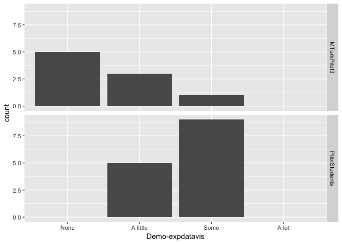

``` r
stats_demo$`Demo-expreadnetvis` <- factor(stats_demo$`Demo-expreadnetvis`, 
                                        levels = freq4, 
                                        ordered = TRUE)

ggplot(stats_demo) +
  geom_bar(aes(`Demo-expreadnetvis`)) +
  facet_grid(filename~.)
```

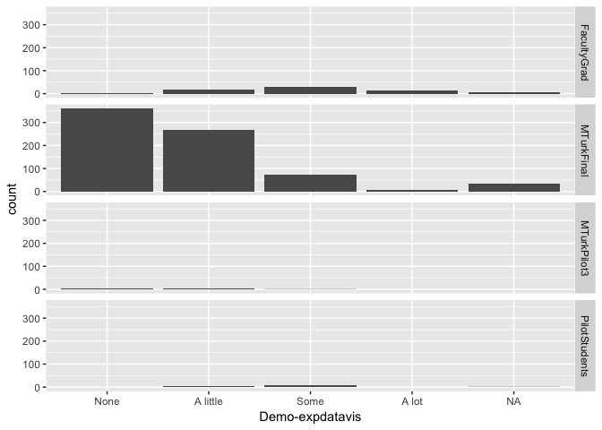

``` r
stats_demo$`Demo-expcreatenetvis` <- factor(stats_demo$`Demo-expcreatenetvis`, 
                                        levels = freq4, 
                                        ordered = TRUE)

ggplot(stats_demo) +
  geom_bar(aes(`Demo-expcreatenetvis`)) +
  facet_grid(filename~.)
```

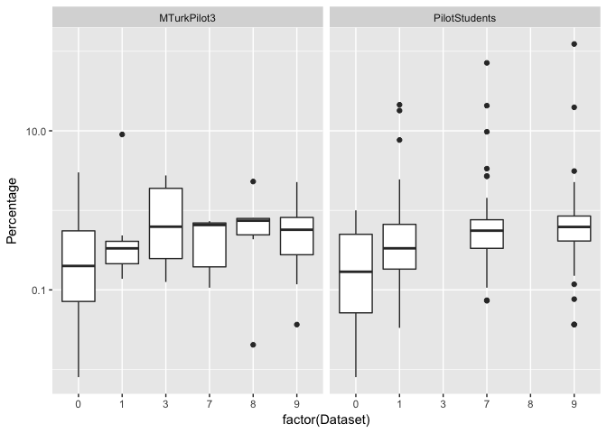

``` r
IDs <- stats_datasets_tall %>% group_by(`Demo-ResponseID`) %>% summarise(TotalDuration = sum(DatasetDuration)) %>% arrange(TotalDuration) %>% select(`Demo-ResponseID`) %>% unlist()

stats_datasets_tall$`Demo-ResponseID` <- factor(stats_datasets_tall$`Demo-ResponseID`, 
                                                levels = IDs) 

ggplot(stats_datasets_tall) +
  geom_col(aes(x = `Demo-ResponseID`, 
               y = `DatasetDuration`)) +
  facet_grid(filename~Dataset, scales="free_y", space="free_y") +
  coord_flip()
```

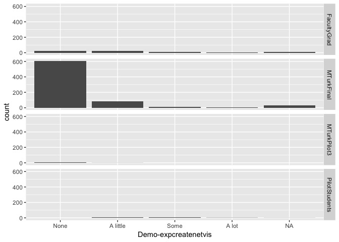

``` r
ggplot(stats_datasets_tall) +
  geom_boxplot(aes(x = factor(Dataset), y = `DatasetDuration`)) +
  facet_grid(.~filename)
```

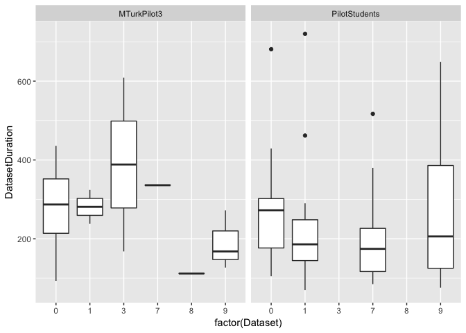

Figures
-------

``` r
graded_num_ans <- left_join(graded_num_ans, stats_demo)
```

    ## Joining, by = "Demo-ResponseID"

``` r
graded_num_ans <- left_join(graded_num_ans, stats_datasets_tall)
```

    ## Joining, by = c("Demo-ResponseID", "Condition", "Dataset", "DatasetOrder", "filename")

    ## Warning: Column `Demo-ResponseID` joining character vector and factor,
    ## coercing into character vector

``` r
graded_nodes <- left_join(graded_nodes, stats_demo)
```

    ## Joining, by = "Demo-ResponseID"

``` r
graded_nodes <- left_join(graded_nodes, stats_datasets_tall)
```

    ## Joining, by = c("Demo-ResponseID", "Condition", "Dataset", "DatasetOrder", "filename")

    ## Warning: Column `Demo-ResponseID` joining character vector and factor,
    ## coercing into character vector

``` r
# TO DO : change Percentage to the real calculation

ggplot(graded_num_ans) +
  geom_density(aes(Percentage)) + 
  scale_x_log10() +
  facet_grid(.~filename)
```

    ## Warning: Transformation introduced infinite values in continuous x-axis

    ## Warning: Removed 49 rows containing non-finite values (stat_density).

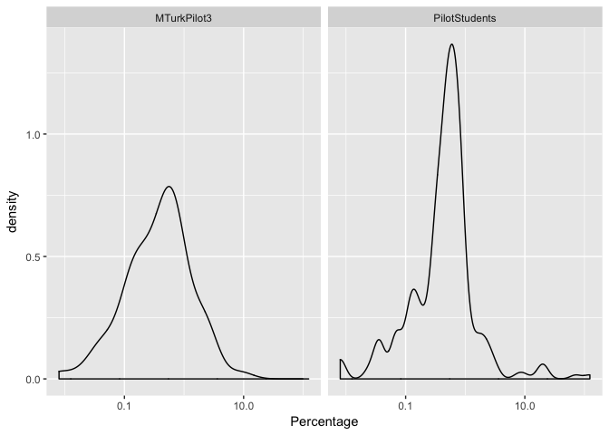

``` r
ggplot(graded_num_ans) +
  geom_boxplot(aes(factor(Dataset), Percentage)) +
  scale_y_log10() +
  facet_grid(.~filename)
```

    ## Warning: Transformation introduced infinite values in continuous y-axis

    ## Warning: Removed 49 rows containing non-finite values (stat_boxplot).

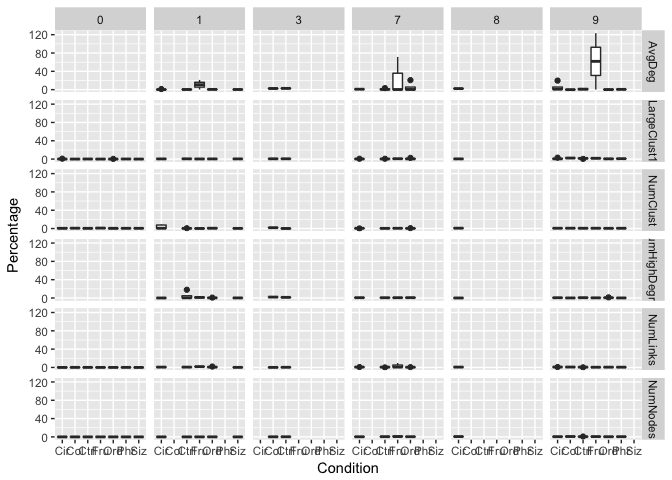

``` r
ggplot(graded_num_ans) +
  geom_boxplot(aes(Task, Percentage)) +
  scale_y_log10() +
  facet_grid(.~filename)
```

    ## Warning: Transformation introduced infinite values in continuous y-axis

    ## Warning: Removed 49 rows containing non-finite values (stat_boxplot).

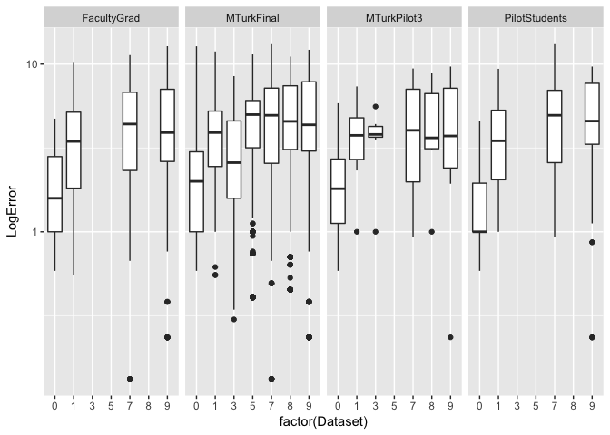

``` r
ggplot(graded_num_ans) +
  geom_point(aes(DatasetDuration, Percentage)) +
  scale_y_log10() + 
  facet_grid(Dataset~Task) +
  facet_grid(.~filename)
```

    ## Warning: Transformation introduced infinite values in continuous y-axis

    ## Warning: Removed 92 rows containing missing values (geom_point).

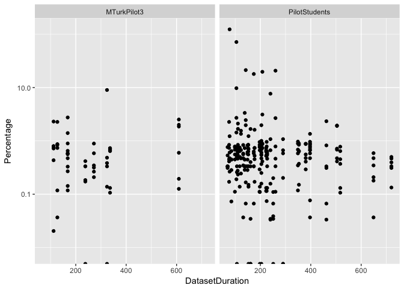

``` r
ggplot(graded_num_ans) +
  geom_boxplot(aes(factor(Dataset), Percentage)) +
  scale_y_log10() +
  facet_grid(Task~filename)
```

    ## Warning: Transformation introduced infinite values in continuous y-axis

    ## Warning: Removed 49 rows containing non-finite values (stat_boxplot).

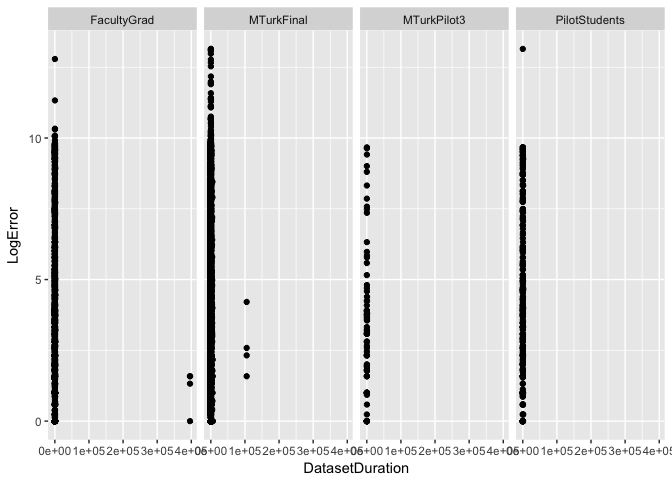

``` r
ggplot(graded_num_ans) +
  geom_boxplot(aes(Task, Percentage)) +
  scale_y_log10() +
  facet_grid(Dataset~filename)
```

    ## Warning: Transformation introduced infinite values in continuous y-axis

    ## Warning: Removed 49 rows containing non-finite values (stat_boxplot).

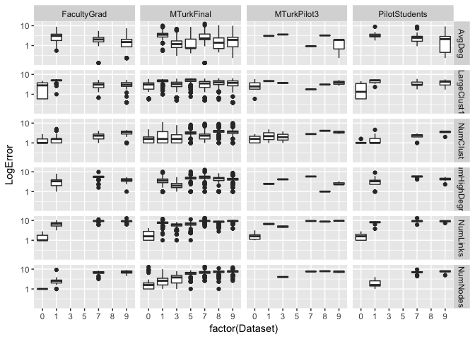

``` r
# TO DO : factor Condition so all of the graphical conditions are together and all the layout conditions are together

ggplot(graded_num_ans) +
  geom_boxplot(aes(Condition, Percentage)) +
  facet_grid(Task~Dataset)
```

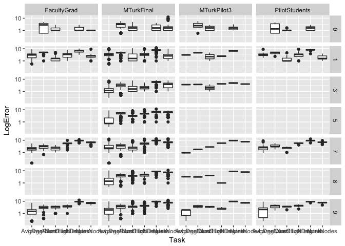

``` r
ggplot(graded_num_ans %>% filter(!is.na(ClustConf))) +
  geom_bar(aes(x=ClustConf)) + 
  facet_grid(Dataset~.)
```

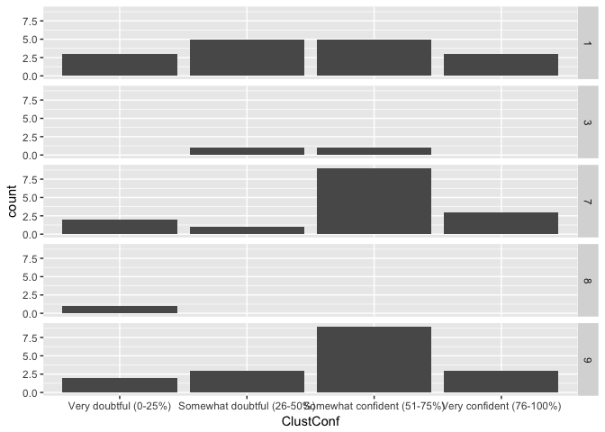

``` r
ggplot(graded_num_ans %>% filter(!is.na(ClustConf)) %>% filter(Task == "NumClust")) +
  geom_boxplot(aes(ClustConf, Percentage)) +
  scale_y_log10() +
  coord_flip() +
  facet_grid(Dataset~Condition)
```

    ## Warning: Transformation introduced infinite values in continuous y-axis

    ## Warning: Removed 2 rows containing non-finite values (stat_boxplot).

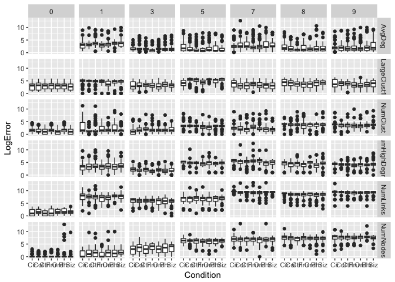

### Compare results to some of the demographics?

``` r
ggplot() + 
  geom_point(data = node_lookup,
             aes(x=NodeXAdjusted,y=NodeYAdjusted),colour="gray50") +
  geom_point(data = graded_nodes %>% filter(Task == "BC"), 
             aes(x=Click_X,y=Click_Y), colour="red") + 
  facet_grid(Dataset~Condition) +
  theme_bw()
```

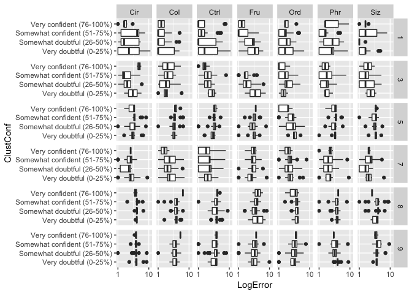

``` r
ggplot() + 
  geom_point(data = node_lookup,
             aes(x=NodeXAdjusted,y=NodeYAdjusted),colour="gray50") +
  geom_point(data = graded_nodes %>% filter(Task == "ClickHighDeg"), 
             aes(x=Click_X,y=Click_Y), colour="red") + 
  facet_grid(Dataset~Condition) +
  theme_bw()
```


``` r
ggplot(graded_nodes %>% filter(Task == "BC")) +
  geom_point(aes(x=factor(Dataset), y=Percentage)) +
  facet_grid(filename~Condition)
```

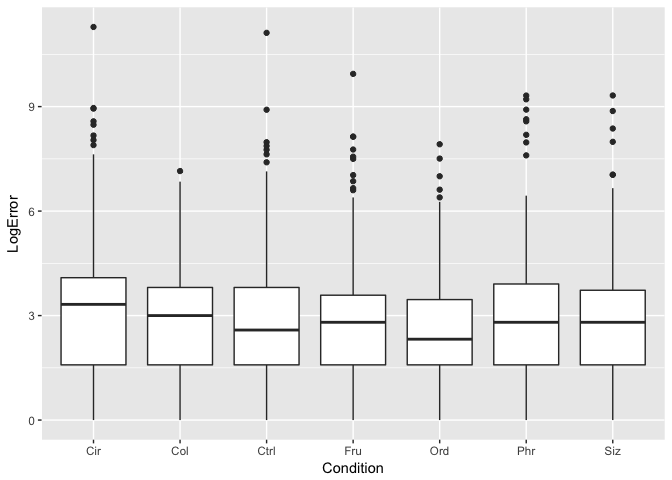

``` r
ggplot(graded_nodes %>% filter(Task == "ClickHighDeg")) +
  geom_point(aes(x=factor(Dataset), y=Percentage)) +
  facet_grid(filename~Condition)
```


