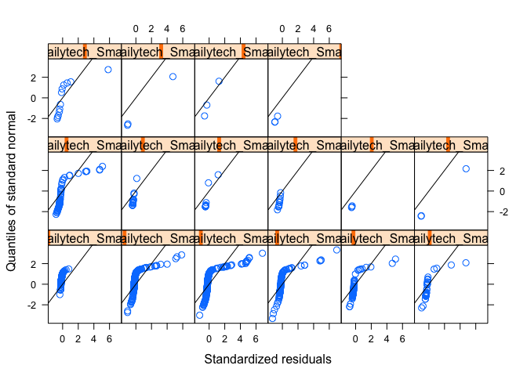
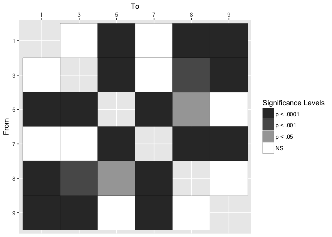
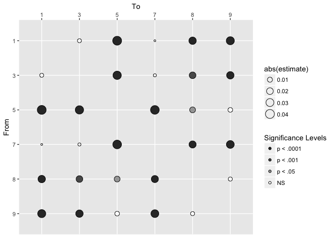
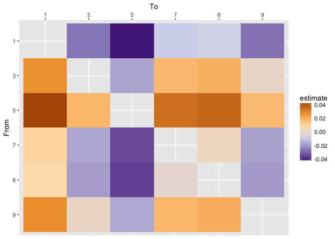
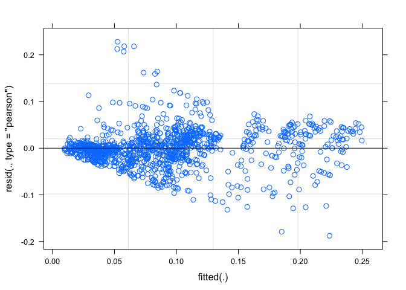
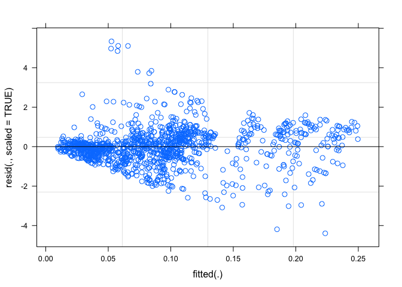

Graphics Models for All Tasks
================
Angela Zoss
March 23, 2018

``` r
knitr::opts_chunk$set(warning=FALSE, message=FALSE)
```

``` r
source('GraphicsSetup.R')
```

## Mixed Models

``` r
graphics %>% filter(Task %in% c("AvgDeg","NumClust","NumHighDegree","NumLinks","NumNodes")) %>% 
  ggplot(aes(Task, LogError)) + geom_boxplot() + #scale_y_log10() +
  labs(title="Distribution of LogError for Numerical Response Tasks,\ngraphics conditions")
```

<!-- -->

``` r
ggsave(file.path(figureDir, "logerrortasksgraphics.pdf"), width=10, height=6)

graphics %>% filter(Task %in% c("AvgDeg","NumClust","NumHighDegree","NumLinks","NumNodes")) %>% 
  ggplot(aes(Dataset, Percentage)) + geom_boxplot() + #scale_y_log10() +
  labs(title="Distribution of Percentage for Numerical Response Tasks,\ngraphics conditions") +
  facet_wrap(~Task) + scale_y_log10()
```

<!-- -->

``` r
graphics %>% filter(Task %in% c("AvgDeg","NumClust","NumHighDegree","NumLinks","NumNodes")) %>% 
  ggplot(aes(Dataset, abs(Response - CorrectAnswer)/CorrectAnswer)) + geom_violin() + #scale_y_log10() +
  labs(title="Error as Percentage of Correct Answer for Numerical Response Tasks,\ngraphics conditions") +
  facet_wrap(~Task) + scale_y_log10(breaks=c(.1,10,1000),labels=c("10%","1,000%","100,000%")) +
  geom_hline(yintercept = 1)
```

<!-- -->

``` r
graphics %>% filter(Task %in% c("AvgDeg","NumClust","NumHighDegree","NumLinks","NumNodes")) %>%
ggplot() + geom_violin(aes(Dataset,Response)) + geom_point(data=graphics %>% filter(Task %in% c("AvgDeg","NumClust","NumHighDegree","NumLinks","NumNodes")) %>% group_by(Task, Dataset) %>% summarise(Correct=mean(CorrectAnswer)), aes(Dataset,Correct)) +
facet_grid(.~Task) + scale_y_log10()
```

<!-- -->

``` r
graphics %>% filter(Task %in% c("AvgDeg","NumClust","NumHighDegree","NumLinks","NumNodes")) %>%
    ggplot() + geom_boxplot(aes(Dataset,LogError)) +
    facet_grid(.~Task) + labs(title="LogError distributions by Task and Dataset, graphics conditions")
```

<!-- -->

``` r
ggsave(file.path(figureDir, "logerrortasksdatasetsgraphics.pdf"), width=10, height=6)

ggplot(graphics_bc) +
  geom_bar(aes(NodeRank)) +
  #coord_flip() +
  labs(title="Rank of Selected Node for Betweenness Centrality Task by Dataset",
       x="Rank of selected node", y="Number of times selected") +
  facet_wrap(~Dataset, scales="free_x")
```

<!-- -->

### Average Degree

#### nlme

``` r
# https://iucat.iu.edu/catalog/14518998, chapters 3 and 5
# data at http://www-personal.umich.edu/~bwest/almmussp.html

# testing models, no nesting/grouping

# Repeated measures, tasks and datasets (crossed)

# starting with older package (nlme), with function lme()

# R by default treats the lowest category (alphabetically or numerically) of a
# categorical fixed factor as the reference category in a model

# We don't really have reference categories for the repeated measures factors, 
# though, so I guess it doesn't matter?  Maybe want to exclude training dataset

# Note about syntax; can use either ":" or "*" for interaction, but using "*" automatically adds
# the main effects of each factor into the model, too, instead of just the interaction

graph.avgdeg.lme <- lme(LogError ~ Dataset, random = ~ 1 | Demo.ResponseID, method="REML", data=graphics_avgdeg)

summary(graph.avgdeg.lme)
```

    ## Linear mixed-effects model fit by REML
    ##  Data: graphics_avgdeg 
    ##         AIC       BIC   logLik
    ##   -3682.659 -3642.032 1849.329
    ## 
    ## Random effects:
    ##  Formula: ~1 | Demo.ResponseID
    ##         (Intercept)   Residual
    ## StdDev:  0.01608554 0.04777583
    ## 
    ## Fixed effects: LogError ~ Dataset 
    ##                    Value   Std.Error  DF   t-value p-value
    ## (Intercept)  0.018550731 0.001600180 783 11.592902  0.0000
    ## Dataset.L    0.000242698 0.003478295 783  0.069775  0.9444
    ## Dataset.Q   -0.001445867 0.003475691 783 -0.415994  0.6775
    ## Dataset.C    0.005496811 0.003481388 783  1.578914  0.1148
    ## Dataset^4   -0.001557014 0.003478417 783 -0.447621  0.6546
    ## Dataset^5   -0.000933591 0.003488293 783 -0.267636  0.7891
    ##  Correlation: 
    ##           (Intr) Dtst.L Dtst.Q Dtst.C Dtst^4
    ## Dataset.L  0.009                            
    ## Dataset.Q -0.003  0.014                     
    ## Dataset.C  0.001 -0.005  0.008              
    ## Dataset^4  0.000  0.002  0.005 -0.003       
    ## Dataset^5  0.004  0.000 -0.002 -0.005  0.010
    ## 
    ## Standardized Within-Group Residuals:
    ##        Min         Q1        Med         Q3        Max 
    ## -1.0963152 -0.3007828 -0.2366621 -0.1120941  5.4589684 
    ## 
    ## Number of Observations: 1192
    ## Number of Groups: 404

``` r
anova(graph.avgdeg.lme)
```

    ##             numDF denDF   F-value p-value
    ## (Intercept)     1   783 134.36237  <.0001
    ## Dataset         5   783   0.58885  0.7086

``` r
# Dataset is not significant for AvgDeg; try Condition

graph.avgdeg.lme <- lme(LogError ~ Condition, random = ~ 1 | Demo.ResponseID, method="REML", data=graphics_avgdeg)

summary(graph.avgdeg.lme)
```

    ## Linear mixed-effects model fit by REML
    ##  Data: graphics_avgdeg 
    ##         AIC       BIC   logLik
    ##   -3704.369 -3673.889 1858.185
    ## 
    ## Random effects:
    ##  Formula: ~1 | Demo.ResponseID
    ##         (Intercept)   Residual
    ## StdDev:  0.01631955 0.04771474
    ## 
    ## Fixed effects: LogError ~ Condition 
    ##                     Value   Std.Error  DF   t-value p-value
    ## (Intercept)   0.017738866 0.003332390 788  5.323166  0.0000
    ## ConditionCol  0.000203067 0.004593855 400  0.044204  0.9648
    ## ConditionPhr -0.000223977 0.004579933 400 -0.048904  0.9610
    ## ConditionSiz  0.003261334 0.004626539 400  0.704919  0.4813
    ##  Correlation: 
    ##              (Intr) CndtnC CndtnP
    ## ConditionCol -0.725              
    ## ConditionPhr -0.728  0.528       
    ## ConditionSiz -0.720  0.522  0.524
    ## 
    ## Standardized Within-Group Residuals:
    ##        Min         Q1        Med         Q3        Max 
    ## -1.1381404 -0.2851412 -0.2408275 -0.1206502  5.4566390 
    ## 
    ## Number of Observations: 1192
    ## Number of Groups: 404

``` r
anova(graph.avgdeg.lme)
```

    ##             numDF denDF   F-value p-value
    ## (Intercept)     1   788 133.63836  <.0001
    ## Condition       3   400   0.26254  0.8524

``` r
# Condition is not significant; try ConditionPhrasing

graph.avgdeg.lme <- lme(LogError ~ ConditionPhrasing, random = ~ 1 | Demo.ResponseID, method="REML", data=graphics_avgdeg)

summary(graph.avgdeg.lme)
```

    ## Linear mixed-effects model fit by REML
    ##  Data: graphics_avgdeg 
    ##         AIC       BIC   logLik
    ##   -3725.891 -3705.564 1866.946
    ## 
    ## Random effects:
    ##  Formula: ~1 | Demo.ResponseID
    ##         (Intercept)   Residual
    ## StdDev:  0.01621788 0.04771299
    ## 
    ## Fixed effects: LogError ~ ConditionPhrasing 
    ##                                    Value   Std.Error  DF   t-value p-value
    ## (Intercept)                  0.018912010 0.001863102 788 10.150816   0.000
    ## ConditionPhrasing2-Informal -0.001397113 0.003648276 402 -0.382951   0.702
    ##  Correlation: 
    ##                             (Intr)
    ## ConditionPhrasing2-Informal -0.511
    ## 
    ## Standardized Within-Group Residuals:
    ##        Min         Q1        Med         Q3        Max 
    ## -1.1307798 -0.2858688 -0.2448741 -0.1307605  5.4611102 
    ## 
    ## Number of Observations: 1192
    ## Number of Groups: 404

``` r
anova(graph.avgdeg.lme)
```

    ##                   numDF denDF   F-value p-value
    ## (Intercept)           1   788 134.07231  <.0001
    ## ConditionPhrasing     1   402   0.14665   0.702

``` r
# ConditionPhrasing is not significant; try ConditionGraphics

graph.avgdeg.lme <- lme(LogError ~ ConditionGraphics, random = ~ 1 | Demo.ResponseID, method="REML", data=graphics_avgdeg)

summary(graph.avgdeg.lme)
```

    ## Linear mixed-effects model fit by REML
    ##  Data: graphics_avgdeg 
    ##         AIC       BIC   logLik
    ##   -3715.302 -3689.898 1862.651
    ## 
    ## Random effects:
    ##  Formula: ~1 | Demo.ResponseID
    ##         (Intercept)   Residual
    ## StdDev:  0.01624071 0.04771457
    ## 
    ## Fixed effects: LogError ~ ConditionGraphics 
    ##                                Value   Std.Error  DF  t-value p-value
    ## (Intercept)              0.017619992 0.002283155 788 7.717386  0.0000
    ## ConditionGraphics2-Color 0.000321980 0.003896993 401 0.082623  0.9342
    ## ConditionGraphics3-Size  0.003380163 0.003935374 401 0.858918  0.3909
    ##  Correlation: 
    ##                          (Intr) CnG2-C
    ## ConditionGraphics2-Color -0.586       
    ## ConditionGraphics3-Size  -0.580  0.340
    ## 
    ## Standardized Within-Group Residuals:
    ##        Min         Q1        Med         Q3        Max 
    ## -1.1340092 -0.2859302 -0.2414717 -0.1211208  5.4583527 
    ## 
    ## Number of Observations: 1192
    ## Number of Groups: 404

``` r
anova(graph.avgdeg.lme)
```

    ##                   numDF denDF   F-value p-value
    ## (Intercept)           1   788 133.96989  <.0001
    ## ConditionGraphics     2   401   0.39364  0.6749

``` r
# ConditionGraphics is not significant; try TaskOrder

graph.avgdeg.lme <- lme(LogError ~ TaskOrder, random = ~ 1 | Demo.ResponseID, method="REML", data=graphics_avgdeg)

summary(graph.avgdeg.lme)
```

    ## Linear mixed-effects model fit by REML
    ##  Data: graphics_avgdeg 
    ##       AIC       BIC logLik
    ##   -3724.4 -3704.074 1866.2
    ## 
    ## Random effects:
    ##  Formula: ~1 | Demo.ResponseID
    ##         (Intercept)   Residual
    ## StdDev:  0.01611297 0.04769289
    ## 
    ## Fixed effects: LogError ~ TaskOrder 
    ##                    Value   Std.Error  DF   t-value p-value
    ## (Intercept)  0.022803110 0.003185520 787  7.158362  0.0000
    ## TaskOrder   -0.000872957 0.000565194 787 -1.544526  0.1229
    ##  Correlation: 
    ##           (Intr)
    ## TaskOrder -0.865
    ## 
    ## Standardized Within-Group Residuals:
    ##        Min         Q1        Med         Q3        Max 
    ## -1.1260379 -0.3002597 -0.2289404 -0.1209639  5.4690299 
    ## 
    ## Number of Observations: 1192
    ## Number of Groups: 404

``` r
anova(graph.avgdeg.lme)
```

    ##             numDF denDF   F-value p-value
    ## (Intercept)     1   787 134.59747  <.0001
    ## TaskOrder       1   787   2.38556  0.1229

``` r
# TaskOrder is not significant; try DatasetOrder

graph.avgdeg.lme <- lme(LogError ~ DatasetOrder, random = ~ 1 | Demo.ResponseID, method="REML", data=graphics_avgdeg)

summary(graph.avgdeg.lme)
```

    ## Linear mixed-effects model fit by REML
    ##  Data: graphics_avgdeg 
    ##         AIC       BIC   logLik
    ##   -3724.321 -3703.994 1866.161
    ## 
    ## Random effects:
    ##  Formula: ~1 | Demo.ResponseID
    ##         (Intercept)   Residual
    ## StdDev:  0.01612682 0.04773892
    ## 
    ## Fixed effects: LogError ~ DatasetOrder 
    ##                    Value   Std.Error  DF  t-value p-value
    ## (Intercept)  0.017437082 0.003732399 787 4.671816   0.000
    ## DatasetOrder 0.000558414 0.001695768 787 0.329299   0.742
    ##  Correlation: 
    ##              (Intr)
    ## DatasetOrder -0.903
    ## 
    ## Standardized Within-Group Residuals:
    ##        Min         Q1        Med         Q3        Max 
    ## -1.1507677 -0.2888267 -0.2442590 -0.1308014  5.4516733 
    ## 
    ## Number of Observations: 1192
    ## Number of Groups: 404

``` r
anova(graph.avgdeg.lme)
```

    ##              numDF denDF   F-value p-value
    ## (Intercept)      1   787 134.34514  <.0001
    ## DatasetOrder     1   787   0.10844   0.742

``` r
# DatasetOrder is not significant; try DatasetDuration

graph.avgdeg.lme <- lme(LogError ~ DatasetDuration, random = ~ 1 | Demo.ResponseID, method="REML", data=graphics_avgdeg %>% filter(!(is.na(DatasetDuration))))

summary(graph.avgdeg.lme)
```

    ## Linear mixed-effects model fit by REML
    ##  Data: graphics_avgdeg %>% filter(!(is.na(DatasetDuration))) 
    ##         AIC       BIC   logLik
    ##   -3701.811 -3681.494 1854.906
    ## 
    ## Random effects:
    ##  Formula: ~1 | Demo.ResponseID
    ##         (Intercept)   Residual
    ## StdDev:  0.01618011 0.04775791
    ## 
    ## Fixed effects: LogError ~ DatasetDuration 
    ##                        Value    Std.Error  DF   t-value p-value
    ## (Intercept)      0.019135370 0.0020372112 784  9.392924  0.0000
    ## DatasetDuration -0.000002612 0.0000053532 784 -0.487896  0.6258
    ##  Correlation: 
    ##                 (Intr)
    ## DatasetDuration -0.617
    ## 
    ## Standardized Within-Group Residuals:
    ##        Min         Q1        Med         Q3        Max 
    ## -1.1455307 -0.2871606 -0.2430231 -0.1284505  5.4432375 
    ## 
    ## Number of Observations: 1189
    ## Number of Groups: 404

``` r
anova(graph.avgdeg.lme)
```

    ##                 numDF denDF   F-value p-value
    ## (Intercept)         1   784 133.38783  <.0001
    ## DatasetDuration     1   784   0.23804  0.6258

``` r
# DatasetDuration is not significant; try Stats.Q_TotalDuration

graph.avgdeg.lme <- lme(LogError ~ Stats.Q_TotalDuration, random = ~ 1 | Demo.ResponseID, method="REML", data=graphics_avgdeg)

summary(graph.avgdeg.lme)
```

    ## Linear mixed-effects model fit by REML
    ##  Data: graphics_avgdeg 
    ##         AIC       BIC   logLik
    ##   -3710.928 -3690.601 1859.464
    ## 
    ## Random effects:
    ##  Formula: ~1 | Demo.ResponseID
    ##         (Intercept)   Residual
    ## StdDev:  0.01618883 0.04771478
    ## 
    ## Fixed effects: LogError ~ Stats.Q_TotalDuration 
    ##                            Value    Std.Error  DF  t-value p-value
    ## (Intercept)           0.01700708 0.0028421659 788 5.983846  0.0000
    ## Stats.Q_TotalDuration 0.00000117 0.0000017833 402 0.656030  0.5122
    ##  Correlation: 
    ##                       (Intr)
    ## Stats.Q_TotalDuration -0.826
    ## 
    ## Standardized Within-Group Residuals:
    ##        Min         Q1        Med         Q3        Max 
    ## -1.1424873 -0.2873906 -0.2413722 -0.1299583  5.4512613 
    ## 
    ## Number of Observations: 1192
    ## Number of Groups: 404

``` r
anova(graph.avgdeg.lme)
```

    ##                       numDF denDF   F-value p-value
    ## (Intercept)               1   788 134.18668  <.0001
    ## Stats.Q_TotalDuration     1   402   0.43037  0.5122

``` r
# Stats.Q_TotalDuration is not significant; try Stats.OperatingSystem

graph.avgdeg.lme <- lme(LogError ~ Stats.OperatingSystem, random = ~ 1 | Demo.ResponseID, method="REML", data=graphics_avgdeg)

summary(graph.avgdeg.lme)
```

    ## Linear mixed-effects model fit by REML
    ##  Data: graphics_avgdeg 
    ##         AIC       BIC   logLik
    ##   -3629.596 -3533.285 1833.798
    ## 
    ## Random effects:
    ##  Formula: ~1 | Demo.ResponseID
    ##         (Intercept)   Residual
    ## StdDev:  0.01566949 0.04771628
    ## 
    ## Fixed effects: LogError ~ Stats.OperatingSystem 
    ##                                                  Value  Std.Error  DF
    ## (Intercept)                                 0.00552789 0.03169355 788
    ## Stats.OperatingSystemAndroid 6.0.1          0.00218192 0.04887162 387
    ## Stats.OperatingSystemAndroid 7.0           -0.00455983 0.04482144 387
    ## Stats.OperatingSystemCrOS armv7l 9592.96.0  0.04816330 0.03881651 387
    ## Stats.OperatingSystemCrOS x86_64 8350.68.0  0.09751629 0.04482144 387
    ## Stats.OperatingSystemCrOS x86_64 9592.96.0  0.01204900 0.03361608 387
    ## Stats.OperatingSystemCrOS x86_64 9901.35.0  0.05097936 0.04482144 387
    ## Stats.OperatingSystemiPhone                 0.05481908 0.03881651 387
    ## Stats.OperatingSystemLinux x86_64          -0.00181461 0.03659655 387
    ## Stats.OperatingSystemMacintosh              0.01034225 0.03221744 387
    ## Stats.OperatingSystemUbuntu                 0.00122148 0.03881651 387
    ## Stats.OperatingSystemWindows NT 10.0        0.01062564 0.03176462 387
    ## Stats.OperatingSystemWindows NT 5.1        -0.00199299 0.04482144 387
    ## Stats.OperatingSystemWindows NT 6.0        -0.00252306 0.03881651 387
    ## Stats.OperatingSystemWindows NT 6.1         0.01546614 0.03186905 387
    ## Stats.OperatingSystemWindows NT 6.2        -0.00407974 0.04482144 387
    ## Stats.OperatingSystemWindows NT 6.3         0.02290998 0.03222223 387
    ##                                               t-value p-value
    ## (Intercept)                                 0.1744170  0.8616
    ## Stats.OperatingSystemAndroid 6.0.1          0.0446459  0.9644
    ## Stats.OperatingSystemAndroid 7.0           -0.1017332  0.9190
    ## Stats.OperatingSystemCrOS armv7l 9592.96.0  1.2407943  0.2154
    ## Stats.OperatingSystemCrOS x86_64 8350.68.0  2.1756615  0.0302
    ## Stats.OperatingSystemCrOS x86_64 9592.96.0  0.3584297  0.7202
    ## Stats.OperatingSystemCrOS x86_64 9901.35.0  1.1373877  0.2561
    ## Stats.OperatingSystemiPhone                 1.4122619  0.1587
    ## Stats.OperatingSystemLinux x86_64          -0.0495842  0.9605
    ## Stats.OperatingSystemMacintosh              0.3210140  0.7484
    ## Stats.OperatingSystemUbuntu                 0.0314680  0.9749
    ## Stats.OperatingSystemWindows NT 10.0        0.3345118  0.7382
    ## Stats.OperatingSystemWindows NT 5.1        -0.0444652  0.9646
    ## Stats.OperatingSystemWindows NT 6.0        -0.0649996  0.9482
    ## Stats.OperatingSystemWindows NT 6.1         0.4853030  0.6277
    ## Stats.OperatingSystemWindows NT 6.2        -0.0910221  0.9275
    ## Stats.OperatingSystemWindows NT 6.3         0.7109992  0.4775
    ##  Correlation: 
    ##                                            (Intr) S.OSA6 S.OSA7 S.OSa9
    ## Stats.OperatingSystemAndroid 6.0.1         -0.649                     
    ## Stats.OperatingSystemAndroid 7.0           -0.707  0.459              
    ## Stats.OperatingSystemCrOS armv7l 9592.96.0 -0.816  0.530  0.577       
    ## Stats.OperatingSystemCrOS x86_64 8350.68.0 -0.707  0.459  0.500  0.577
    ## Stats.OperatingSystemCrOS x86_64 9592.96.0 -0.943  0.611  0.667  0.770
    ## Stats.OperatingSystemCrOS x86_64 9901.35.0 -0.707  0.459  0.500  0.577
    ## Stats.OperatingSystemiPhone                -0.816  0.530  0.577  0.667
    ## Stats.OperatingSystemLinux x86_64          -0.866  0.562  0.612  0.707
    ## Stats.OperatingSystemMacintosh             -0.984  0.638  0.696  0.803
    ## Stats.OperatingSystemUbuntu                -0.816  0.530  0.577  0.667
    ## Stats.OperatingSystemWindows NT 10.0       -0.998  0.647  0.706  0.815
    ## Stats.OperatingSystemWindows NT 5.1        -0.707  0.459  0.500  0.577
    ## Stats.OperatingSystemWindows NT 6.0        -0.816  0.530  0.577  0.667
    ## Stats.OperatingSystemWindows NT 6.1        -0.994  0.645  0.703  0.812
    ## Stats.OperatingSystemWindows NT 6.2        -0.707  0.459  0.500  0.577
    ## Stats.OperatingSystemWindows NT 6.3        -0.984  0.638  0.696  0.803
    ##                                            S.OSx8 S.OSCOSx86_6495
    ## Stats.OperatingSystemAndroid 6.0.1                               
    ## Stats.OperatingSystemAndroid 7.0                                 
    ## Stats.OperatingSystemCrOS armv7l 9592.96.0                       
    ## Stats.OperatingSystemCrOS x86_64 8350.68.0                       
    ## Stats.OperatingSystemCrOS x86_64 9592.96.0  0.667                
    ## Stats.OperatingSystemCrOS x86_64 9901.35.0  0.500  0.667         
    ## Stats.OperatingSystemiPhone                 0.577  0.770         
    ## Stats.OperatingSystemLinux x86_64           0.612  0.816         
    ## Stats.OperatingSystemMacintosh              0.696  0.927         
    ## Stats.OperatingSystemUbuntu                 0.577  0.770         
    ## Stats.OperatingSystemWindows NT 10.0        0.706  0.941         
    ## Stats.OperatingSystemWindows NT 5.1         0.500  0.667         
    ## Stats.OperatingSystemWindows NT 6.0         0.577  0.770         
    ## Stats.OperatingSystemWindows NT 6.1         0.703  0.938         
    ## Stats.OperatingSystemWindows NT 6.2         0.500  0.667         
    ## Stats.OperatingSystemWindows NT 6.3         0.696  0.927         
    ##                                            S.OSCOSx86_6499 St.OSP S.OSLx
    ## Stats.OperatingSystemAndroid 6.0.1                                      
    ## Stats.OperatingSystemAndroid 7.0                                        
    ## Stats.OperatingSystemCrOS armv7l 9592.96.0                              
    ## Stats.OperatingSystemCrOS x86_64 8350.68.0                              
    ## Stats.OperatingSystemCrOS x86_64 9592.96.0                              
    ## Stats.OperatingSystemCrOS x86_64 9901.35.0                              
    ## Stats.OperatingSystemiPhone                 0.577                       
    ## Stats.OperatingSystemLinux x86_64           0.612           0.707       
    ## Stats.OperatingSystemMacintosh              0.696           0.803  0.852
    ## Stats.OperatingSystemUbuntu                 0.577           0.667  0.707
    ## Stats.OperatingSystemWindows NT 10.0        0.706           0.815  0.864
    ## Stats.OperatingSystemWindows NT 5.1         0.500           0.577  0.612
    ## Stats.OperatingSystemWindows NT 6.0         0.577           0.667  0.707
    ## Stats.OperatingSystemWindows NT 6.1         0.703           0.812  0.861
    ## Stats.OperatingSystemWindows NT 6.2         0.500           0.577  0.612
    ## Stats.OperatingSystemWindows NT 6.3         0.696           0.803  0.852
    ##                                            St.OSM St.OSU S.OSN1 S.OSN5
    ## Stats.OperatingSystemAndroid 6.0.1                                    
    ## Stats.OperatingSystemAndroid 7.0                                      
    ## Stats.OperatingSystemCrOS armv7l 9592.96.0                            
    ## Stats.OperatingSystemCrOS x86_64 8350.68.0                            
    ## Stats.OperatingSystemCrOS x86_64 9592.96.0                            
    ## Stats.OperatingSystemCrOS x86_64 9901.35.0                            
    ## Stats.OperatingSystemiPhone                                           
    ## Stats.OperatingSystemLinux x86_64                                     
    ## Stats.OperatingSystemMacintosh                                        
    ## Stats.OperatingSystemUbuntu                 0.803                     
    ## Stats.OperatingSystemWindows NT 10.0        0.982  0.815              
    ## Stats.OperatingSystemWindows NT 5.1         0.696  0.577  0.706       
    ## Stats.OperatingSystemWindows NT 6.0         0.803  0.667  0.815  0.577
    ## Stats.OperatingSystemWindows NT 6.1         0.978  0.812  0.992  0.703
    ## Stats.OperatingSystemWindows NT 6.2         0.696  0.577  0.706  0.500
    ## Stats.OperatingSystemWindows NT 6.3         0.968  0.803  0.981  0.696
    ##                                            S.OSWNT6.0 S.OSWNT6.1
    ## Stats.OperatingSystemAndroid 6.0.1                              
    ## Stats.OperatingSystemAndroid 7.0                                
    ## Stats.OperatingSystemCrOS armv7l 9592.96.0                      
    ## Stats.OperatingSystemCrOS x86_64 8350.68.0                      
    ## Stats.OperatingSystemCrOS x86_64 9592.96.0                      
    ## Stats.OperatingSystemCrOS x86_64 9901.35.0                      
    ## Stats.OperatingSystemiPhone                                     
    ## Stats.OperatingSystemLinux x86_64                               
    ## Stats.OperatingSystemMacintosh                                  
    ## Stats.OperatingSystemUbuntu                                     
    ## Stats.OperatingSystemWindows NT 10.0                            
    ## Stats.OperatingSystemWindows NT 5.1                             
    ## Stats.OperatingSystemWindows NT 6.0                             
    ## Stats.OperatingSystemWindows NT 6.1         0.812               
    ## Stats.OperatingSystemWindows NT 6.2         0.577      0.703    
    ## Stats.OperatingSystemWindows NT 6.3         0.803      0.978    
    ##                                            S.OSWNT6.2
    ## Stats.OperatingSystemAndroid 6.0.1                   
    ## Stats.OperatingSystemAndroid 7.0                     
    ## Stats.OperatingSystemCrOS armv7l 9592.96.0           
    ## Stats.OperatingSystemCrOS x86_64 8350.68.0           
    ## Stats.OperatingSystemCrOS x86_64 9592.96.0           
    ## Stats.OperatingSystemCrOS x86_64 9901.35.0           
    ## Stats.OperatingSystemiPhone                          
    ## Stats.OperatingSystemLinux x86_64                    
    ## Stats.OperatingSystemMacintosh                       
    ## Stats.OperatingSystemUbuntu                          
    ## Stats.OperatingSystemWindows NT 10.0                 
    ## Stats.OperatingSystemWindows NT 5.1                  
    ## Stats.OperatingSystemWindows NT 6.0                  
    ## Stats.OperatingSystemWindows NT 6.1                  
    ## Stats.OperatingSystemWindows NT 6.2                  
    ## Stats.OperatingSystemWindows NT 6.3         0.696    
    ## 
    ## Standardized Within-Group Residuals:
    ##        Min         Q1        Med         Q3        Max 
    ## -1.9869492 -0.2765550 -0.2208704 -0.1006259  5.5055123 
    ## 
    ## Number of Observations: 1192
    ## Number of Groups: 404

``` r
anova(graph.avgdeg.lme)
```

    ##                       numDF denDF  F-value p-value
    ## (Intercept)               1   788 136.3595  <.0001
    ## Stats.OperatingSystem    16   387   1.3685  0.1538

``` r
# Stats.OperatingSystem is not significant; try StatsNumPixels

graph.avgdeg.lme <- lme(LogError ~ StatsNumPixels, random = ~ 1 | Demo.ResponseID, method="REML", data=graphics_avgdeg)

summary(graph.avgdeg.lme)
```

    ## Linear mixed-effects model fit by REML
    ##  Data: graphics_avgdeg 
    ##        AIC       BIC   logLik
    ##   -3699.17 -3678.843 1853.585
    ## 
    ## Random effects:
    ##  Formula: ~1 | Demo.ResponseID
    ##         (Intercept)   Residual
    ## StdDev:  0.01609293 0.04771535
    ## 
    ## Fixed effects: LogError ~ StatsNumPixels 
    ##                       Value   Std.Error  DF   t-value p-value
    ## (Intercept)     0.023777735 0.004420073 788  5.379490  0.0000
    ## StatsNumPixels -0.000000004 0.000000003 402 -1.269247  0.2051
    ##  Correlation: 
    ##                (Intr)
    ## StatsNumPixels -0.932
    ## 
    ## Standardized Within-Group Residuals:
    ##        Min         Q1        Med         Q3        Max 
    ## -1.1618476 -0.2952590 -0.2392146 -0.1263361  5.4758328 
    ## 
    ## Number of Observations: 1192
    ## Number of Groups: 404

``` r
anova(graph.avgdeg.lme)
```

    ##                numDF denDF   F-value p-value
    ## (Intercept)        1   788 134.58673  <.0001
    ## StatsNumPixels     1   402   1.61099  0.2051

``` r
# StatsNumPixels is not significant; try Demo.age

graph.avgdeg.lme <- lme(LogError ~ Demo.age, random = ~ 1 | Demo.ResponseID, method="REML", data=graphics_avgdeg %>% filter(!(is.na(Demo.age))))

summary(graph.avgdeg.lme)
```

    ## Linear mixed-effects model fit by REML
    ##  Data: graphics_avgdeg %>% filter(!(is.na(Demo.age))) 
    ##         AIC       BIC   logLik
    ##   -3638.833 -3618.578 1823.417
    ## 
    ## Random effects:
    ##  Formula: ~1 | Demo.ResponseID
    ##         (Intercept)   Residual
    ## StdDev:  0.01628399 0.04802279
    ## 
    ## Fixed effects: LogError ~ Demo.age 
    ##                    Value   Std.Error  DF   t-value p-value
    ## (Intercept)  0.024448573 0.005670677 777  4.311403  0.0000
    ## Demo.age    -0.000165643 0.000150093 392 -1.103603  0.2704
    ##  Correlation: 
    ##          (Intr)
    ## Demo.age -0.958
    ## 
    ## Standardized Within-Group Residuals:
    ##        Min         Q1        Med         Q3        Max 
    ## -1.1587588 -0.2893515 -0.2338391 -0.1308541  5.4422357 
    ## 
    ## Number of Observations: 1171
    ## Number of Groups: 394

``` r
anova(graph.avgdeg.lme)
```

    ##             numDF denDF   F-value p-value
    ## (Intercept)     1   777 128.69523  <.0001
    ## Demo.age        1   392   1.21794  0.2704

``` r
# Demo.age is not significant; try Demo.gender

graph.avgdeg.lme <- lme(LogError ~ Demo.gender, random = ~ 1 | Demo.ResponseID, method="REML", data=graphics_avgdeg %>% filter(!(is.na(Demo.gender))))

summary(graph.avgdeg.lme)
```

    ## Linear mixed-effects model fit by REML
    ##  Data: graphics_avgdeg %>% filter(!(is.na(Demo.gender))) 
    ##         AIC       BIC   logLik
    ##   -3637.207 -3611.892 1823.604
    ## 
    ## Random effects:
    ##  Formula: ~1 | Demo.ResponseID
    ##         (Intercept)   Residual
    ## StdDev:  0.01636129 0.04802536
    ## 
    ## Fixed effects: LogError ~ Demo.gender 
    ##                              Value   Std.Error  DF   t-value p-value
    ## (Intercept)            0.020055217 0.002343503 777  8.557794  0.0000
    ## Demo.genderMale       -0.002984848 0.003267136 391 -0.913598  0.3615
    ## Demo.genderNon-binary -0.014436371 0.022885450 391 -0.630810  0.5285
    ##  Correlation: 
    ##                       (Intr) Dm.gnM
    ## Demo.genderMale       -0.717       
    ## Demo.genderNon-binary -0.102  0.073
    ## 
    ## Standardized Within-Group Residuals:
    ##        Min         Q1        Med         Q3        Max 
    ## -1.1653509 -0.2881048 -0.2364411 -0.1283797  5.4247159 
    ## 
    ## Number of Observations: 1171
    ## Number of Groups: 394

``` r
anova(graph.avgdeg.lme)
```

    ##             numDF denDF   F-value p-value
    ## (Intercept)     1   777 128.37336  <.0001
    ## Demo.gender     2   391   0.57707   0.562

``` r
# Demo.gender is not significant; try Demo.lang

graph.avgdeg.lme <- lme(LogError ~ Demo.lang, random = ~ 1 | Demo.ResponseID, method="REML", data=graphics_avgdeg %>% filter(!(is.na(Demo.lang))))

summary(graph.avgdeg.lme)
```

    ## Linear mixed-effects model fit by REML
    ##  Data: graphics_avgdeg %>% filter(!(is.na(Demo.lang))) 
    ##         AIC       BIC   logLik
    ##   -3648.617 -3628.361 1828.308
    ## 
    ## Random effects:
    ##  Formula: ~1 | Demo.ResponseID
    ##         (Intercept)   Residual
    ## StdDev:  0.01635646 0.04802425
    ## 
    ## Fixed effects: LogError ~ Demo.lang 
    ##                      Value  Std.Error  DF   t-value p-value
    ## (Intercept)     0.01849574 0.00163063 777 11.342682  0.0000
    ## Demo.langHindi -0.01652840 0.03223304 392 -0.512778  0.6084
    ##  Correlation: 
    ##                (Intr)
    ## Demo.langHindi -0.051
    ## 
    ## Standardized Within-Group Residuals:
    ##        Min         Q1        Med         Q3        Max 
    ## -1.1409724 -0.2858180 -0.2410419 -0.1311505  5.4093166 
    ## 
    ## Number of Observations: 1171
    ## Number of Groups: 394

``` r
anova(graph.avgdeg.lme)
```

    ##             numDF denDF   F-value p-value
    ## (Intercept)     1   777 128.39723  <.0001
    ## Demo.lang       1   392   0.26294  0.6084

``` r
# Demo.lang is not significant; try Demo.educ

graph.avgdeg.lme <- lme(LogError ~ Demo.educ, random = ~ 1 | Demo.ResponseID, method="REML", data=graphics_avgdeg %>% filter(!(is.na(Demo.educ))))

summary(graph.avgdeg.lme)
```

    ## Linear mixed-effects model fit by REML
    ##  Data: graphics_avgdeg %>% filter(!(is.na(Demo.educ))) 
    ##         AIC       BIC   logLik
    ##   -3606.649 -3566.165 1811.325
    ## 
    ## Random effects:
    ##  Formula: ~1 | Demo.ResponseID
    ##         (Intercept)  Residual
    ## StdDev:  0.01645141 0.0480248
    ## 
    ## Fixed effects: LogError ~ Demo.educ 
    ##                    Value   Std.Error  DF   t-value p-value
    ## (Intercept)  0.013902219 0.003464818 777  4.012396  0.0001
    ## Demo.educ.L -0.008781130 0.007138806 388 -1.230056  0.2194
    ## Demo.educ.Q  0.006403919 0.006269779 388  1.021395  0.3077
    ## Demo.educ.C  0.007556701 0.009449104 388  0.799727  0.4244
    ## Demo.educ^4  0.000487322 0.010234715 388  0.047615  0.9620
    ## Demo.educ^5 -0.002350828 0.008708684 388 -0.269941  0.7873
    ##  Correlation: 
    ##             (Intr) Dm.d.L Dm.d.Q Dm.d.C Dm.d^4
    ## Demo.educ.L  0.775                            
    ## Demo.educ.Q -0.463 -0.098                     
    ## Demo.educ.C -0.720 -0.665  0.480              
    ## Demo.educ^4 -0.451 -0.624  0.005  0.720       
    ## Demo.educ^5 -0.206 -0.307 -0.149  0.260  0.685
    ## 
    ## Standardized Within-Group Residuals:
    ##        Min         Q1        Med         Q3        Max 
    ## -1.1719718 -0.2949815 -0.2385320 -0.1214724  5.4060032 
    ## 
    ## Number of Observations: 1171
    ## Number of Groups: 394

``` r
anova(graph.avgdeg.lme)
```

    ##             numDF denDF   F-value p-value
    ## (Intercept)     1   777 128.01234  <.0001
    ## Demo.educ       5   388   0.61457  0.6888

``` r
# Demo.educ is not significant; try Demo.acfield

graph.avgdeg.lme <- lme(LogError ~ Demo.acfield, random = ~ 1 | Demo.ResponseID, method="REML", data=graphics_avgdeg %>% filter(!(is.na(Demo.acfield))))

summary(graph.avgdeg.lme)
```

    ## Linear mixed-effects model fit by REML
    ##  Data: graphics_avgdeg %>% filter(!(is.na(Demo.acfield))) 
    ##         AIC       BIC   logLik
    ##   -3427.664 -3266.395 1745.832
    ## 
    ## Random effects:
    ##  Formula: ~1 | Demo.ResponseID
    ##         (Intercept)   Residual
    ## StdDev:  0.01655616 0.04802504
    ## 
    ## Fixed effects: LogError ~ Demo.acfield 
    ##                                                               Value
    ## (Intercept)                                              0.00510014
    ## Demo.acfieldArchitecture and design                      0.00207945
    ## Demo.acfieldArts                                         0.00471897
    ## Demo.acfieldBiology                                      0.00950040
    ## Demo.acfieldBusiness                                     0.02570901
    ## Demo.acfieldChemistry                                    0.02038014
    ## Demo.acfieldCommunication studies                        0.03219731
    ## Demo.acfieldComputer sciences                            0.01151267
    ## Demo.acfieldEarth sciences                              -0.00152852
    ## Demo.acfieldEconomics                                    0.00905990
    ## Demo.acfieldEducation                                    0.02056044
    ## Demo.acfieldEngineering                                  0.01088704
    ## Demo.acfieldHistory                                      0.00089680
    ## Demo.acfieldInformation science                          0.03638165
    ## Demo.acfieldJournalism, media studies and communication  0.01858291
    ## Demo.acfieldLanguages                                    0.03833091
    ## Demo.acfieldLaw                                         -0.00061040
    ## Demo.acfieldLibrary and museum studies                   0.00369472
    ## Demo.acfieldLinguistics                                 -0.00045830
    ## Demo.acfieldLiterature                                   0.00565599
    ## Demo.acfieldMathematics                                  0.01065163
    ## Demo.acfieldMedicine                                     0.01001701
    ## Demo.acfieldOther                                        0.00962773
    ## Demo.acfieldPhilosophy                                   0.00696216
    ## Demo.acfieldPhysics                                     -0.00177108
    ## Demo.acfieldPolitical science                            0.00088213
    ## Demo.acfieldPsychology                                   0.00220249
    ## Demo.acfieldPublic administration                        0.00309432
    ## Demo.acfieldSkipped                                      0.01355960
    ## Demo.acfieldSociology                                   -0.00253084
    ##                                                          Std.Error  DF
    ## (Intercept)                                             0.01864500 777
    ## Demo.acfieldArchitecture and design                     0.02636801 364
    ## Demo.acfieldArts                                        0.02022334 364
    ## Demo.acfieldBiology                                     0.02054579 364
    ## Demo.acfieldBusiness                                    0.01919620 364
    ## Demo.acfieldChemistry                                   0.03302075 364
    ## Demo.acfieldCommunication studies                       0.02636801 364
    ## Demo.acfieldComputer sciences                           0.01930866 364
    ## Demo.acfieldEarth sciences                              0.03729000 364
    ## Demo.acfieldEconomics                                   0.02125857 364
    ## Demo.acfieldEducation                                   0.02013890 364
    ## Demo.acfieldEngineering                                 0.02022334 364
    ## Demo.acfieldHistory                                     0.02636801 364
    ## Demo.acfieldInformation science                         0.02358427 364
    ## Demo.acfieldJournalism, media studies and communication 0.02636801 364
    ## Demo.acfieldLanguages                                   0.02228504 364
    ## Demo.acfieldLaw                                         0.02358427 364
    ## Demo.acfieldLibrary and museum studies                  0.02948033 364
    ## Demo.acfieldLinguistics                                 0.02636801 364
    ## Demo.acfieldLiterature                                  0.02358427 364
    ## Demo.acfieldMathematics                                 0.02186320 364
    ## Demo.acfieldMedicine                                    0.02042457 364
    ## Demo.acfieldOther                                       0.01965355 364
    ## Demo.acfieldPhilosophy                                  0.02948033 364
    ## Demo.acfieldPhysics                                     0.03729000 364
    ## Demo.acfieldPolitical science                           0.02228504 364
    ## Demo.acfieldPsychology                                  0.02196682 364
    ## Demo.acfieldPublic administration                       0.02636801 364
    ## Demo.acfieldSkipped                                     0.01891403 364
    ## Demo.acfieldSociology                                   0.02358427 364
    ##                                                            t-value p-value
    ## (Intercept)                                              0.2735393  0.7845
    ## Demo.acfieldArchitecture and design                      0.0788627  0.9372
    ## Demo.acfieldArts                                         0.2333429  0.8156
    ## Demo.acfieldBiology                                      0.4624015  0.6441
    ## Demo.acfieldBusiness                                     1.3392758  0.1813
    ## Demo.acfieldChemistry                                    0.6171920  0.5375
    ## Demo.acfieldCommunication studies                        1.2210748  0.2228
    ## Demo.acfieldComputer sciences                            0.5962437  0.5514
    ## Demo.acfieldEarth sciences                              -0.0409900  0.9673
    ## Demo.acfieldEconomics                                    0.4261765  0.6702
    ## Demo.acfieldEducation                                    1.0209315  0.3080
    ## Demo.acfieldEngineering                                  0.5383401  0.5907
    ## Demo.acfieldHistory                                      0.0340108  0.9729
    ## Demo.acfieldInformation science                          1.5426237  0.1238
    ## Demo.acfieldJournalism, media studies and communication  0.7047521  0.4814
    ## Demo.acfieldLanguages                                    1.7200290  0.0863
    ## Demo.acfieldLaw                                         -0.0258818  0.9794
    ## Demo.acfieldLibrary and museum studies                   0.1253283  0.9003
    ## Demo.acfieldLinguistics                                 -0.0173809  0.9861
    ## Demo.acfieldLiterature                                   0.2398205  0.8106
    ## Demo.acfieldMathematics                                  0.4871947  0.6264
    ## Demo.acfieldMedicine                                     0.4904392  0.6241
    ## Demo.acfieldOther                                        0.4898720  0.6245
    ## Demo.acfieldPhilosophy                                   0.2361628  0.8134
    ## Demo.acfieldPhysics                                     -0.0474949  0.9621
    ## Demo.acfieldPolitical science                            0.0395841  0.9684
    ## Demo.acfieldPsychology                                   0.1002645  0.9202
    ## Demo.acfieldPublic administration                        0.1173514  0.9066
    ## Demo.acfieldSkipped                                      0.7169068  0.4739
    ## Demo.acfieldSociology                                   -0.1073106  0.9146
    ##  Correlation: 
    ##                                                         (Intr) Dm.Aad
    ## Demo.acfieldArchitecture and design                     -0.707       
    ## Demo.acfieldArts                                        -0.922  0.652
    ## Demo.acfieldBiology                                     -0.907  0.642
    ## Demo.acfieldBusiness                                    -0.971  0.687
    ## Demo.acfieldChemistry                                   -0.565  0.399
    ## Demo.acfieldCommunication studies                       -0.707  0.500
    ## Demo.acfieldComputer sciences                           -0.966  0.683
    ## Demo.acfieldEarth sciences                              -0.500  0.354
    ## Demo.acfieldEconomics                                   -0.877  0.620
    ## Demo.acfieldEducation                                   -0.926  0.655
    ## Demo.acfieldEngineering                                 -0.922  0.652
    ## Demo.acfieldHistory                                     -0.707  0.500
    ## Demo.acfieldInformation science                         -0.791  0.559
    ## Demo.acfieldJournalism, media studies and communication -0.707  0.500
    ## Demo.acfieldLanguages                                   -0.837  0.592
    ## Demo.acfieldLaw                                         -0.791  0.559
    ## Demo.acfieldLibrary and museum studies                  -0.632  0.447
    ## Demo.acfieldLinguistics                                 -0.707  0.500
    ## Demo.acfieldLiterature                                  -0.791  0.559
    ## Demo.acfieldMathematics                                 -0.853  0.603
    ## Demo.acfieldMedicine                                    -0.913  0.645
    ## Demo.acfieldOther                                       -0.949  0.671
    ## Demo.acfieldPhilosophy                                  -0.632  0.447
    ## Demo.acfieldPhysics                                     -0.500  0.354
    ## Demo.acfieldPolitical science                           -0.837  0.592
    ## Demo.acfieldPsychology                                  -0.849  0.600
    ## Demo.acfieldPublic administration                       -0.707  0.500
    ## Demo.acfieldSkipped                                     -0.986  0.697
    ## Demo.acfieldSociology                                   -0.791  0.559
    ##                                                         Dm.cfA Dm.cfldBl
    ## Demo.acfieldArchitecture and design                                     
    ## Demo.acfieldArts                                                        
    ## Demo.acfieldBiology                                      0.837          
    ## Demo.acfieldBusiness                                     0.895  0.881   
    ## Demo.acfieldChemistry                                    0.521  0.512   
    ## Demo.acfieldCommunication studies                        0.652  0.642   
    ## Demo.acfieldComputer sciences                            0.890  0.876   
    ## Demo.acfieldEarth sciences                               0.461  0.454   
    ## Demo.acfieldEconomics                                    0.809  0.796   
    ## Demo.acfieldEducation                                    0.854  0.840   
    ## Demo.acfieldEngineering                                  0.850  0.837   
    ## Demo.acfieldHistory                                      0.652  0.642   
    ## Demo.acfieldInformation science                          0.729  0.717   
    ## Demo.acfieldJournalism, media studies and communication  0.652  0.642   
    ## Demo.acfieldLanguages                                    0.771  0.759   
    ## Demo.acfieldLaw                                          0.729  0.717   
    ## Demo.acfieldLibrary and museum studies                   0.583  0.574   
    ## Demo.acfieldLinguistics                                  0.652  0.642   
    ## Demo.acfieldLiterature                                   0.729  0.717   
    ## Demo.acfieldMathematics                                  0.786  0.774   
    ## Demo.acfieldMedicine                                     0.842  0.828   
    ## Demo.acfieldOther                                        0.875  0.861   
    ## Demo.acfieldPhilosophy                                   0.583  0.574   
    ## Demo.acfieldPhysics                                      0.461  0.454   
    ## Demo.acfieldPolitical science                            0.771  0.759   
    ## Demo.acfieldPsychology                                   0.783  0.770   
    ## Demo.acfieldPublic administration                        0.652  0.642   
    ## Demo.acfieldSkipped                                      0.909  0.895   
    ## Demo.acfieldSociology                                    0.729  0.717   
    ##                                                         Dm.cfldBs Dm.cfC
    ## Demo.acfieldArchitecture and design                                     
    ## Demo.acfieldArts                                                        
    ## Demo.acfieldBiology                                                     
    ## Demo.acfieldBusiness                                                    
    ## Demo.acfieldChemistry                                    0.548          
    ## Demo.acfieldCommunication studies                        0.687     0.399
    ## Demo.acfieldComputer sciences                            0.938     0.545
    ## Demo.acfieldEarth sciences                               0.486     0.282
    ## Demo.acfieldEconomics                                    0.852     0.495
    ## Demo.acfieldEducation                                    0.899     0.523
    ## Demo.acfieldEngineering                                  0.895     0.521
    ## Demo.acfieldHistory                                      0.687     0.399
    ## Demo.acfieldInformation science                          0.768     0.446
    ## Demo.acfieldJournalism, media studies and communication  0.687     0.399
    ## Demo.acfieldLanguages                                    0.813     0.472
    ## Demo.acfieldLaw                                          0.768     0.446
    ## Demo.acfieldLibrary and museum studies                   0.614     0.357
    ## Demo.acfieldLinguistics                                  0.687     0.399
    ## Demo.acfieldLiterature                                   0.768     0.446
    ## Demo.acfieldMathematics                                  0.828     0.482
    ## Demo.acfieldMedicine                                     0.887     0.515
    ## Demo.acfieldOther                                        0.921     0.536
    ## Demo.acfieldPhilosophy                                   0.614     0.357
    ## Demo.acfieldPhysics                                      0.486     0.282
    ## Demo.acfieldPolitical science                            0.813     0.472
    ## Demo.acfieldPsychology                                   0.824     0.479
    ## Demo.acfieldPublic administration                        0.687     0.399
    ## Demo.acfieldSkipped                                      0.957     0.557
    ## Demo.acfieldSociology                                    0.768     0.446
    ##                                                         Dm.cfldCmms
    ## Demo.acfieldArchitecture and design                                
    ## Demo.acfieldArts                                                   
    ## Demo.acfieldBiology                                                
    ## Demo.acfieldBusiness                                               
    ## Demo.acfieldChemistry                                              
    ## Demo.acfieldCommunication studies                                  
    ## Demo.acfieldComputer sciences                            0.683     
    ## Demo.acfieldEarth sciences                               0.354     
    ## Demo.acfieldEconomics                                    0.620     
    ## Demo.acfieldEducation                                    0.655     
    ## Demo.acfieldEngineering                                  0.652     
    ## Demo.acfieldHistory                                      0.500     
    ## Demo.acfieldInformation science                          0.559     
    ## Demo.acfieldJournalism, media studies and communication  0.500     
    ## Demo.acfieldLanguages                                    0.592     
    ## Demo.acfieldLaw                                          0.559     
    ## Demo.acfieldLibrary and museum studies                   0.447     
    ## Demo.acfieldLinguistics                                  0.500     
    ## Demo.acfieldLiterature                                   0.559     
    ## Demo.acfieldMathematics                                  0.603     
    ## Demo.acfieldMedicine                                     0.645     
    ## Demo.acfieldOther                                        0.671     
    ## Demo.acfieldPhilosophy                                   0.447     
    ## Demo.acfieldPhysics                                      0.354     
    ## Demo.acfieldPolitical science                            0.592     
    ## Demo.acfieldPsychology                                   0.600     
    ## Demo.acfieldPublic administration                        0.500     
    ## Demo.acfieldSkipped                                      0.697     
    ## Demo.acfieldSociology                                    0.559     
    ##                                                         Dm.cfldCmps Dm.cEs
    ## Demo.acfieldArchitecture and design                                       
    ## Demo.acfieldArts                                                          
    ## Demo.acfieldBiology                                                       
    ## Demo.acfieldBusiness                                                      
    ## Demo.acfieldChemistry                                                     
    ## Demo.acfieldCommunication studies                                         
    ## Demo.acfieldComputer sciences                                             
    ## Demo.acfieldEarth sciences                               0.483            
    ## Demo.acfieldEconomics                                    0.847       0.439
    ## Demo.acfieldEducation                                    0.894       0.463
    ## Demo.acfieldEngineering                                  0.890       0.461
    ## Demo.acfieldHistory                                      0.683       0.354
    ## Demo.acfieldInformation science                          0.763       0.395
    ## Demo.acfieldJournalism, media studies and communication  0.683       0.354
    ## Demo.acfieldLanguages                                    0.808       0.418
    ## Demo.acfieldLaw                                          0.763       0.395
    ## Demo.acfieldLibrary and museum studies                   0.611       0.316
    ## Demo.acfieldLinguistics                                  0.683       0.354
    ## Demo.acfieldLiterature                                   0.763       0.395
    ## Demo.acfieldMathematics                                  0.823       0.426
    ## Demo.acfieldMedicine                                     0.881       0.456
    ## Demo.acfieldOther                                        0.916       0.474
    ## Demo.acfieldPhilosophy                                   0.611       0.316
    ## Demo.acfieldPhysics                                      0.483       0.250
    ## Demo.acfieldPolitical science                            0.808       0.418
    ## Demo.acfieldPsychology                                   0.820       0.424
    ## Demo.acfieldPublic administration                        0.683       0.354
    ## Demo.acfieldSkipped                                      0.952       0.493
    ## Demo.acfieldSociology                                    0.763       0.395
    ##                                                         Dm.cfldEc
    ## Demo.acfieldArchitecture and design                              
    ## Demo.acfieldArts                                                 
    ## Demo.acfieldBiology                                              
    ## Demo.acfieldBusiness                                             
    ## Demo.acfieldChemistry                                            
    ## Demo.acfieldCommunication studies                                
    ## Demo.acfieldComputer sciences                                    
    ## Demo.acfieldEarth sciences                                       
    ## Demo.acfieldEconomics                                            
    ## Demo.acfieldEducation                                    0.812   
    ## Demo.acfieldEngineering                                  0.809   
    ## Demo.acfieldHistory                                      0.620   
    ## Demo.acfieldInformation science                          0.693   
    ## Demo.acfieldJournalism, media studies and communication  0.620   
    ## Demo.acfieldLanguages                                    0.734   
    ## Demo.acfieldLaw                                          0.693   
    ## Demo.acfieldLibrary and museum studies                   0.555   
    ## Demo.acfieldLinguistics                                  0.620   
    ## Demo.acfieldLiterature                                   0.693   
    ## Demo.acfieldMathematics                                  0.748   
    ## Demo.acfieldMedicine                                     0.801   
    ## Demo.acfieldOther                                        0.832   
    ## Demo.acfieldPhilosophy                                   0.555   
    ## Demo.acfieldPhysics                                      0.439   
    ## Demo.acfieldPolitical science                            0.734   
    ## Demo.acfieldPsychology                                   0.744   
    ## Demo.acfieldPublic administration                        0.620   
    ## Demo.acfieldSkipped                                      0.865   
    ## Demo.acfieldSociology                                    0.693   
    ##                                                         Dm.cfldEd
    ## Demo.acfieldArchitecture and design                              
    ## Demo.acfieldArts                                                 
    ## Demo.acfieldBiology                                              
    ## Demo.acfieldBusiness                                             
    ## Demo.acfieldChemistry                                            
    ## Demo.acfieldCommunication studies                                
    ## Demo.acfieldComputer sciences                                    
    ## Demo.acfieldEarth sciences                                       
    ## Demo.acfieldEconomics                                            
    ## Demo.acfieldEducation                                            
    ## Demo.acfieldEngineering                                  0.854   
    ## Demo.acfieldHistory                                      0.655   
    ## Demo.acfieldInformation science                          0.732   
    ## Demo.acfieldJournalism, media studies and communication  0.655   
    ## Demo.acfieldLanguages                                    0.775   
    ## Demo.acfieldLaw                                          0.732   
    ## Demo.acfieldLibrary and museum studies                   0.586   
    ## Demo.acfieldLinguistics                                  0.655   
    ## Demo.acfieldLiterature                                   0.732   
    ## Demo.acfieldMathematics                                  0.790   
    ## Demo.acfieldMedicine                                     0.845   
    ## Demo.acfieldOther                                        0.878   
    ## Demo.acfieldPhilosophy                                   0.586   
    ## Demo.acfieldPhysics                                      0.463   
    ## Demo.acfieldPolitical science                            0.775   
    ## Demo.acfieldPsychology                                   0.786   
    ## Demo.acfieldPublic administration                        0.655   
    ## Demo.acfieldSkipped                                      0.913   
    ## Demo.acfieldSociology                                    0.732   
    ##                                                         Dm.cfldEn Dm.cfH
    ## Demo.acfieldArchitecture and design                                     
    ## Demo.acfieldArts                                                        
    ## Demo.acfieldBiology                                                     
    ## Demo.acfieldBusiness                                                    
    ## Demo.acfieldChemistry                                                   
    ## Demo.acfieldCommunication studies                                       
    ## Demo.acfieldComputer sciences                                           
    ## Demo.acfieldEarth sciences                                              
    ## Demo.acfieldEconomics                                                   
    ## Demo.acfieldEducation                                                   
    ## Demo.acfieldEngineering                                                 
    ## Demo.acfieldHistory                                      0.652          
    ## Demo.acfieldInformation science                          0.729     0.559
    ## Demo.acfieldJournalism, media studies and communication  0.652     0.500
    ## Demo.acfieldLanguages                                    0.771     0.592
    ## Demo.acfieldLaw                                          0.729     0.559
    ## Demo.acfieldLibrary and museum studies                   0.583     0.447
    ## Demo.acfieldLinguistics                                  0.652     0.500
    ## Demo.acfieldLiterature                                   0.729     0.559
    ## Demo.acfieldMathematics                                  0.786     0.603
    ## Demo.acfieldMedicine                                     0.842     0.645
    ## Demo.acfieldOther                                        0.875     0.671
    ## Demo.acfieldPhilosophy                                   0.583     0.447
    ## Demo.acfieldPhysics                                      0.461     0.354
    ## Demo.acfieldPolitical science                            0.771     0.592
    ## Demo.acfieldPsychology                                   0.783     0.600
    ## Demo.acfieldPublic administration                        0.652     0.500
    ## Demo.acfieldSkipped                                      0.909     0.697
    ## Demo.acfieldSociology                                    0.729     0.559
    ##                                                         Dm.cIs D.msac
    ## Demo.acfieldArchitecture and design                                  
    ## Demo.acfieldArts                                                     
    ## Demo.acfieldBiology                                                  
    ## Demo.acfieldBusiness                                                 
    ## Demo.acfieldChemistry                                                
    ## Demo.acfieldCommunication studies                                    
    ## Demo.acfieldComputer sciences                                        
    ## Demo.acfieldEarth sciences                                           
    ## Demo.acfieldEconomics                                                
    ## Demo.acfieldEducation                                                
    ## Demo.acfieldEngineering                                              
    ## Demo.acfieldHistory                                                  
    ## Demo.acfieldInformation science                                      
    ## Demo.acfieldJournalism, media studies and communication  0.559       
    ## Demo.acfieldLanguages                                    0.661  0.592
    ## Demo.acfieldLaw                                          0.625  0.559
    ## Demo.acfieldLibrary and museum studies                   0.500  0.447
    ## Demo.acfieldLinguistics                                  0.559  0.500
    ## Demo.acfieldLiterature                                   0.625  0.559
    ## Demo.acfieldMathematics                                  0.674  0.603
    ## Demo.acfieldMedicine                                     0.722  0.645
    ## Demo.acfieldOther                                        0.750  0.671
    ## Demo.acfieldPhilosophy                                   0.500  0.447
    ## Demo.acfieldPhysics                                      0.395  0.354
    ## Demo.acfieldPolitical science                            0.661  0.592
    ## Demo.acfieldPsychology                                   0.671  0.600
    ## Demo.acfieldPublic administration                        0.559  0.500
    ## Demo.acfieldSkipped                                      0.779  0.697
    ## Demo.acfieldSociology                                    0.625  0.559
    ##                                                         Dm.cfldLngg
    ## Demo.acfieldArchitecture and design                                
    ## Demo.acfieldArts                                                   
    ## Demo.acfieldBiology                                                
    ## Demo.acfieldBusiness                                               
    ## Demo.acfieldChemistry                                              
    ## Demo.acfieldCommunication studies                                  
    ## Demo.acfieldComputer sciences                                      
    ## Demo.acfieldEarth sciences                                         
    ## Demo.acfieldEconomics                                              
    ## Demo.acfieldEducation                                              
    ## Demo.acfieldEngineering                                            
    ## Demo.acfieldHistory                                                
    ## Demo.acfieldInformation science                                    
    ## Demo.acfieldJournalism, media studies and communication            
    ## Demo.acfieldLanguages                                              
    ## Demo.acfieldLaw                                          0.661     
    ## Demo.acfieldLibrary and museum studies                   0.529     
    ## Demo.acfieldLinguistics                                  0.592     
    ## Demo.acfieldLiterature                                   0.661     
    ## Demo.acfieldMathematics                                  0.714     
    ## Demo.acfieldMedicine                                     0.764     
    ## Demo.acfieldOther                                        0.794     
    ## Demo.acfieldPhilosophy                                   0.529     
    ## Demo.acfieldPhysics                                      0.418     
    ## Demo.acfieldPolitical science                            0.700     
    ## Demo.acfieldPsychology                                   0.710     
    ## Demo.acfieldPublic administration                        0.592     
    ## Demo.acfieldSkipped                                      0.825     
    ## Demo.acfieldSociology                                    0.661     
    ##                                                         Dm.cfldLw D.Lams
    ## Demo.acfieldArchitecture and design                                     
    ## Demo.acfieldArts                                                        
    ## Demo.acfieldBiology                                                     
    ## Demo.acfieldBusiness                                                    
    ## Demo.acfieldChemistry                                                   
    ## Demo.acfieldCommunication studies                                       
    ## Demo.acfieldComputer sciences                                           
    ## Demo.acfieldEarth sciences                                              
    ## Demo.acfieldEconomics                                                   
    ## Demo.acfieldEducation                                                   
    ## Demo.acfieldEngineering                                                 
    ## Demo.acfieldHistory                                                     
    ## Demo.acfieldInformation science                                         
    ## Demo.acfieldJournalism, media studies and communication                 
    ## Demo.acfieldLanguages                                                   
    ## Demo.acfieldLaw                                                         
    ## Demo.acfieldLibrary and museum studies                   0.500          
    ## Demo.acfieldLinguistics                                  0.559     0.447
    ## Demo.acfieldLiterature                                   0.625     0.500
    ## Demo.acfieldMathematics                                  0.674     0.539
    ## Demo.acfieldMedicine                                     0.722     0.577
    ## Demo.acfieldOther                                        0.750     0.600
    ## Demo.acfieldPhilosophy                                   0.500     0.400
    ## Demo.acfieldPhysics                                      0.395     0.316
    ## Demo.acfieldPolitical science                            0.661     0.529
    ## Demo.acfieldPsychology                                   0.671     0.537
    ## Demo.acfieldPublic administration                        0.559     0.447
    ## Demo.acfieldSkipped                                      0.779     0.623
    ## Demo.acfieldSociology                                    0.625     0.500
    ##                                                         Dm.cfldLngs
    ## Demo.acfieldArchitecture and design                                
    ## Demo.acfieldArts                                                   
    ## Demo.acfieldBiology                                                
    ## Demo.acfieldBusiness                                               
    ## Demo.acfieldChemistry                                              
    ## Demo.acfieldCommunication studies                                  
    ## Demo.acfieldComputer sciences                                      
    ## Demo.acfieldEarth sciences                                         
    ## Demo.acfieldEconomics                                              
    ## Demo.acfieldEducation                                              
    ## Demo.acfieldEngineering                                            
    ## Demo.acfieldHistory                                                
    ## Demo.acfieldInformation science                                    
    ## Demo.acfieldJournalism, media studies and communication            
    ## Demo.acfieldLanguages                                              
    ## Demo.acfieldLaw                                                    
    ## Demo.acfieldLibrary and museum studies                             
    ## Demo.acfieldLinguistics                                            
    ## Demo.acfieldLiterature                                   0.559     
    ## Demo.acfieldMathematics                                  0.603     
    ## Demo.acfieldMedicine                                     0.645     
    ## Demo.acfieldOther                                        0.671     
    ## Demo.acfieldPhilosophy                                   0.447     
    ## Demo.acfieldPhysics                                      0.354     
    ## Demo.acfieldPolitical science                            0.592     
    ## Demo.acfieldPsychology                                   0.600     
    ## Demo.acfieldPublic administration                        0.500     
    ## Demo.acfieldSkipped                                      0.697     
    ## Demo.acfieldSociology                                    0.559     
    ##                                                         Dm.cfldLt
    ## Demo.acfieldArchitecture and design                              
    ## Demo.acfieldArts                                                 
    ## Demo.acfieldBiology                                              
    ## Demo.acfieldBusiness                                             
    ## Demo.acfieldChemistry                                            
    ## Demo.acfieldCommunication studies                                
    ## Demo.acfieldComputer sciences                                    
    ## Demo.acfieldEarth sciences                                       
    ## Demo.acfieldEconomics                                            
    ## Demo.acfieldEducation                                            
    ## Demo.acfieldEngineering                                          
    ## Demo.acfieldHistory                                              
    ## Demo.acfieldInformation science                                  
    ## Demo.acfieldJournalism, media studies and communication          
    ## Demo.acfieldLanguages                                            
    ## Demo.acfieldLaw                                                  
    ## Demo.acfieldLibrary and museum studies                           
    ## Demo.acfieldLinguistics                                          
    ## Demo.acfieldLiterature                                           
    ## Demo.acfieldMathematics                                  0.674   
    ## Demo.acfieldMedicine                                     0.722   
    ## Demo.acfieldOther                                        0.750   
    ## Demo.acfieldPhilosophy                                   0.500   
    ## Demo.acfieldPhysics                                      0.395   
    ## Demo.acfieldPolitical science                            0.661   
    ## Demo.acfieldPsychology                                   0.671   
    ## Demo.acfieldPublic administration                        0.559   
    ## Demo.acfieldSkipped                                      0.779   
    ## Demo.acfieldSociology                                    0.625   
    ##                                                         Dm.cfldMt
    ## Demo.acfieldArchitecture and design                              
    ## Demo.acfieldArts                                                 
    ## Demo.acfieldBiology                                              
    ## Demo.acfieldBusiness                                             
    ## Demo.acfieldChemistry                                            
    ## Demo.acfieldCommunication studies                                
    ## Demo.acfieldComputer sciences                                    
    ## Demo.acfieldEarth sciences                                       
    ## Demo.acfieldEconomics                                            
    ## Demo.acfieldEducation                                            
    ## Demo.acfieldEngineering                                          
    ## Demo.acfieldHistory                                              
    ## Demo.acfieldInformation science                                  
    ## Demo.acfieldJournalism, media studies and communication          
    ## Demo.acfieldLanguages                                            
    ## Demo.acfieldLaw                                                  
    ## Demo.acfieldLibrary and museum studies                           
    ## Demo.acfieldLinguistics                                          
    ## Demo.acfieldLiterature                                           
    ## Demo.acfieldMathematics                                          
    ## Demo.acfieldMedicine                                     0.778   
    ## Demo.acfieldOther                                        0.809   
    ## Demo.acfieldPhilosophy                                   0.539   
    ## Demo.acfieldPhysics                                      0.426   
    ## Demo.acfieldPolitical science                            0.714   
    ## Demo.acfieldPsychology                                   0.724   
    ## Demo.acfieldPublic administration                        0.603   
    ## Demo.acfieldSkipped                                      0.841   
    ## Demo.acfieldSociology                                    0.674   
    ##                                                         Dm.cfldMd Dm.cfO
    ## Demo.acfieldArchitecture and design                                     
    ## Demo.acfieldArts                                                        
    ## Demo.acfieldBiology                                                     
    ## Demo.acfieldBusiness                                                    
    ## Demo.acfieldChemistry                                                   
    ## Demo.acfieldCommunication studies                                       
    ## Demo.acfieldComputer sciences                                           
    ## Demo.acfieldEarth sciences                                              
    ## Demo.acfieldEconomics                                                   
    ## Demo.acfieldEducation                                                   
    ## Demo.acfieldEngineering                                                 
    ## Demo.acfieldHistory                                                     
    ## Demo.acfieldInformation science                                         
    ## Demo.acfieldJournalism, media studies and communication                 
    ## Demo.acfieldLanguages                                                   
    ## Demo.acfieldLaw                                                         
    ## Demo.acfieldLibrary and museum studies                                  
    ## Demo.acfieldLinguistics                                                 
    ## Demo.acfieldLiterature                                                  
    ## Demo.acfieldMathematics                                                 
    ## Demo.acfieldMedicine                                                    
    ## Demo.acfieldOther                                        0.866          
    ## Demo.acfieldPhilosophy                                   0.577     0.600
    ## Demo.acfieldPhysics                                      0.456     0.474
    ## Demo.acfieldPolitical science                            0.764     0.794
    ## Demo.acfieldPsychology                                   0.775     0.805
    ## Demo.acfieldPublic administration                        0.645     0.671
    ## Demo.acfieldSkipped                                      0.900     0.935
    ## Demo.acfieldSociology                                    0.722     0.750
    ##                                                         Dm.cfldPhl
    ## Demo.acfieldArchitecture and design                               
    ## Demo.acfieldArts                                                  
    ## Demo.acfieldBiology                                               
    ## Demo.acfieldBusiness                                              
    ## Demo.acfieldChemistry                                             
    ## Demo.acfieldCommunication studies                                 
    ## Demo.acfieldComputer sciences                                     
    ## Demo.acfieldEarth sciences                                        
    ## Demo.acfieldEconomics                                             
    ## Demo.acfieldEducation                                             
    ## Demo.acfieldEngineering                                           
    ## Demo.acfieldHistory                                               
    ## Demo.acfieldInformation science                                   
    ## Demo.acfieldJournalism, media studies and communication           
    ## Demo.acfieldLanguages                                             
    ## Demo.acfieldLaw                                                   
    ## Demo.acfieldLibrary and museum studies                            
    ## Demo.acfieldLinguistics                                           
    ## Demo.acfieldLiterature                                            
    ## Demo.acfieldMathematics                                           
    ## Demo.acfieldMedicine                                              
    ## Demo.acfieldOther                                                 
    ## Demo.acfieldPhilosophy                                            
    ## Demo.acfieldPhysics                                      0.316    
    ## Demo.acfieldPolitical science                            0.529    
    ## Demo.acfieldPsychology                                   0.537    
    ## Demo.acfieldPublic administration                        0.447    
    ## Demo.acfieldSkipped                                      0.623    
    ## Demo.acfieldSociology                                    0.500    
    ##                                                         Dm.cfldPhy Dm.cPs
    ## Demo.acfieldArchitecture and design                                      
    ## Demo.acfieldArts                                                         
    ## Demo.acfieldBiology                                                      
    ## Demo.acfieldBusiness                                                     
    ## Demo.acfieldChemistry                                                    
    ## Demo.acfieldCommunication studies                                        
    ## Demo.acfieldComputer sciences                                            
    ## Demo.acfieldEarth sciences                                               
    ## Demo.acfieldEconomics                                                    
    ## Demo.acfieldEducation                                                    
    ## Demo.acfieldEngineering                                                  
    ## Demo.acfieldHistory                                                      
    ## Demo.acfieldInformation science                                          
    ## Demo.acfieldJournalism, media studies and communication                  
    ## Demo.acfieldLanguages                                                    
    ## Demo.acfieldLaw                                                          
    ## Demo.acfieldLibrary and museum studies                                   
    ## Demo.acfieldLinguistics                                                  
    ## Demo.acfieldLiterature                                                   
    ## Demo.acfieldMathematics                                                  
    ## Demo.acfieldMedicine                                                     
    ## Demo.acfieldOther                                                        
    ## Demo.acfieldPhilosophy                                                   
    ## Demo.acfieldPhysics                                                      
    ## Demo.acfieldPolitical science                            0.418           
    ## Demo.acfieldPsychology                                   0.424      0.710
    ## Demo.acfieldPublic administration                        0.354      0.592
    ## Demo.acfieldSkipped                                      0.493      0.825
    ## Demo.acfieldSociology                                    0.395      0.661
    ##                                                         Dm.cfldPs Dm.cPa
    ## Demo.acfieldArchitecture and design                                     
    ## Demo.acfieldArts                                                        
    ## Demo.acfieldBiology                                                     
    ## Demo.acfieldBusiness                                                    
    ## Demo.acfieldChemistry                                                   
    ## Demo.acfieldCommunication studies                                       
    ## Demo.acfieldComputer sciences                                           
    ## Demo.acfieldEarth sciences                                              
    ## Demo.acfieldEconomics                                                   
    ## Demo.acfieldEducation                                                   
    ## Demo.acfieldEngineering                                                 
    ## Demo.acfieldHistory                                                     
    ## Demo.acfieldInformation science                                         
    ## Demo.acfieldJournalism, media studies and communication                 
    ## Demo.acfieldLanguages                                                   
    ## Demo.acfieldLaw                                                         
    ## Demo.acfieldLibrary and museum studies                                  
    ## Demo.acfieldLinguistics                                                 
    ## Demo.acfieldLiterature                                                  
    ## Demo.acfieldMathematics                                                 
    ## Demo.acfieldMedicine                                                    
    ## Demo.acfieldOther                                                       
    ## Demo.acfieldPhilosophy                                                  
    ## Demo.acfieldPhysics                                                     
    ## Demo.acfieldPolitical science                                           
    ## Demo.acfieldPsychology                                                  
    ## Demo.acfieldPublic administration                        0.600          
    ## Demo.acfieldSkipped                                      0.837     0.697
    ## Demo.acfieldSociology                                    0.671     0.559
    ##                                                         Dm.cfldSk
    ## Demo.acfieldArchitecture and design                              
    ## Demo.acfieldArts                                                 
    ## Demo.acfieldBiology                                              
    ## Demo.acfieldBusiness                                             
    ## Demo.acfieldChemistry                                            
    ## Demo.acfieldCommunication studies                                
    ## Demo.acfieldComputer sciences                                    
    ## Demo.acfieldEarth sciences                                       
    ## Demo.acfieldEconomics                                            
    ## Demo.acfieldEducation                                            
    ## Demo.acfieldEngineering                                          
    ## Demo.acfieldHistory                                              
    ## Demo.acfieldInformation science                                  
    ## Demo.acfieldJournalism, media studies and communication          
    ## Demo.acfieldLanguages                                            
    ## Demo.acfieldLaw                                                  
    ## Demo.acfieldLibrary and museum studies                           
    ## Demo.acfieldLinguistics                                          
    ## Demo.acfieldLiterature                                           
    ## Demo.acfieldMathematics                                          
    ## Demo.acfieldMedicine                                             
    ## Demo.acfieldOther                                                
    ## Demo.acfieldPhilosophy                                           
    ## Demo.acfieldPhysics                                              
    ## Demo.acfieldPolitical science                                    
    ## Demo.acfieldPsychology                                           
    ## Demo.acfieldPublic administration                                
    ## Demo.acfieldSkipped                                              
    ## Demo.acfieldSociology                                    0.779   
    ## 
    ## Standardized Within-Group Residuals:
    ##         Min          Q1         Med          Q3         Max 
    ## -1.20348036 -0.28560666 -0.20767350 -0.06409526  5.42867005 
    ## 
    ## Number of Observations: 1171
    ## Number of Groups: 394

``` r
anova(graph.avgdeg.lme)
```

    ##              numDF denDF   F-value p-value
    ## (Intercept)      1   777 127.58926  <.0001
    ## Demo.acfield    29   364   0.88883  0.6353

``` r
# Demo.acfield is not significant; try Demo.dailytech_Computer

graph.avgdeg.lme <- lme(LogError ~ Demo.dailytech_Computer, random = ~ 1 | Demo.ResponseID, method="REML", data=graphics_avgdeg %>% filter(!(is.na(Demo.dailytech_Computer))))

summary(graph.avgdeg.lme)
```

    ## Linear mixed-effects model fit by REML
    ##  Data: graphics_avgdeg %>% filter(!(is.na(Demo.dailytech_Computer))) 
    ##         AIC       BIC   logLik
    ##   -3628.039 -3607.794 1818.019
    ## 
    ## Random effects:
    ##  Formula: ~1 | Demo.ResponseID
    ##         (Intercept)   Residual
    ## StdDev:  0.01633872 0.04808513
    ## 
    ## Fixed effects: LogError ~ Demo.dailytech_Computer 
    ##                                Value   Std.Error  DF   t-value p-value
    ## (Intercept)              0.021040063 0.003875573 775  5.428890  0.0000
    ## Demo.dailytech_Computer -0.000302752 0.000417932 391 -0.724406  0.4692
    ##  Correlation: 
    ##                         (Intr)
    ## Demo.dailytech_Computer -0.907
    ## 
    ## Standardized Within-Group Residuals:
    ##        Min         Q1        Med         Q3        Max 
    ## -1.1293078 -0.2846673 -0.2377494 -0.1330796  5.4254906 
    ## 
    ## Number of Observations: 1168
    ## Number of Groups: 393

``` r
anova(graph.avgdeg.lme)
```

    ##                         numDF denDF   F-value p-value
    ## (Intercept)                 1   775 128.45537  <.0001
    ## Demo.dailytech_Computer     1   391   0.52476  0.4692

``` r
# Demo.dailytech_Computer is not significant; try Demo.dailytech_Tablet

graph.avgdeg.lme <- lme(LogError ~ Demo.dailytech_Tablet, random = ~ 1 | Demo.ResponseID, method="REML", data=graphics_avgdeg %>% filter(!(is.na(Demo.dailytech_Tablet))))

summary(graph.avgdeg.lme)
```

    ## Linear mixed-effects model fit by REML
    ##  Data: graphics_avgdeg %>% filter(!(is.na(Demo.dailytech_Tablet))) 
    ##         AIC       BIC   logLik
    ##   -3412.411 -3392.355 1710.206
    ## 
    ## Random effects:
    ##  Formula: ~1 | Demo.ResponseID
    ##         (Intercept)   Residual
    ## StdDev:  0.01645739 0.04922282
    ## 
    ## Fixed effects: LogError ~ Demo.dailytech_Tablet 
    ##                             Value   Std.Error  DF   t-value p-value
    ## (Intercept)            0.01975747 0.002010605 739  9.826630  0.0000
    ## Demo.dailytech_Tablet -0.00083687 0.001453597 373 -0.575723  0.5651
    ##  Correlation: 
    ##                       (Intr)
    ## Demo.dailytech_Tablet -0.531
    ## 
    ## Standardized Within-Group Residuals:
    ##        Min         Q1        Med         Q3        Max 
    ## -1.1113726 -0.2913545 -0.2471982 -0.1393325  5.2830823 
    ## 
    ## Number of Observations: 1114
    ## Number of Groups: 375

``` r
anova(graph.avgdeg.lme)
```

    ##                       numDF denDF   F-value p-value
    ## (Intercept)               1   739 126.30214  <.0001
    ## Demo.dailytech_Tablet     1   373   0.33146  0.5651

``` r
# Demo.dailytech_Tablet is not significant; try Demo.dailytech_SmartPhone

graph.avgdeg.lme.SP <- lme(LogError ~ Demo.dailytech_SmartPhone, random = ~ 1 | Demo.ResponseID, method="REML", data=graphics_avgdeg %>% filter(!(is.na(Demo.dailytech_SmartPhone))))

# TO DO : figure out if SmartPhone should be a factor

summary(graph.avgdeg.lme.SP)
```

    ## Linear mixed-effects model fit by REML
    ##  Data: graphics_avgdeg %>% filter(!(is.na(Demo.dailytech_SmartPhone))) 
    ##         AIC       BIC   logLik
    ##   -3566.402 -3546.219 1787.201
    ## 
    ## Random effects:
    ##  Formula: ~1 | Demo.ResponseID
    ##         (Intercept)   Residual
    ## StdDev:  0.01561448 0.04842078
    ## 
    ## Fixed effects: LogError ~ Demo.dailytech_SmartPhone 
    ##                                 Value    Std.Error  DF  t-value p-value
    ## (Intercept)               0.013324746 0.0023251733 763 5.730647  0.0000
    ## Demo.dailytech_SmartPhone 0.002027007 0.0006278217 385 3.228635  0.0014
    ##  Correlation: 
    ##                           (Intr)
    ## Demo.dailytech_SmartPhone -0.711
    ## 
    ## Standardized Within-Group Residuals:
    ##        Min         Q1        Med         Q3        Max 
    ## -1.1131134 -0.2897044 -0.2223774 -0.1159981  5.4396611 
    ## 
    ## Number of Observations: 1150
    ## Number of Groups: 387

``` r
anova(graph.avgdeg.lme.SP)
```

    ##                           numDF denDF   F-value p-value
    ## (Intercept)                   1   763 130.35124  <.0001
    ## Demo.dailytech_SmartPhone     1   385  10.42408  0.0014

``` r
## Demo.dailytech_SmartPhone *is* significant

ggplot(graphics_avgdeg) +
  geom_point(aes(Demo.dailytech_SmartPhone, LogError)) +
  geom_smooth(aes(Demo.dailytech_SmartPhone, LogError), method="lm")
```

<!-- -->

``` r
# try Demo.weeklygaming

graph.avgdeg.lme <- lme(LogError ~ Demo.weeklygaming, random = ~ 1 | Demo.ResponseID, method="REML", data=graphics_avgdeg %>% filter(!(is.na(Demo.weeklygaming))))

summary(graph.avgdeg.lme)
```

    ## Linear mixed-effects model fit by REML
    ##  Data: graphics_avgdeg %>% filter(!(is.na(Demo.weeklygaming))) 
    ##         AIC       BIC   logLik
    ##   -3540.682 -3520.509 1774.341
    ## 
    ## Random effects:
    ##  Formula: ~1 | Demo.ResponseID
    ##         (Intercept)   Residual
    ## StdDev:  0.01644038 0.04851911
    ## 
    ## Fixed effects: LogError ~ Demo.weeklygaming 
    ##                          Value    Std.Error  DF   t-value p-value
    ## (Intercept)        0.018806595 0.0020853080 761  9.018618  0.0000
    ## Demo.weeklygaming -0.000012418 0.0001931504 384 -0.064294  0.9488
    ##  Correlation: 
    ##                   (Intr)
    ## Demo.weeklygaming -0.605
    ## 
    ## Standardized Within-Group Residuals:
    ##        Min         Q1        Med         Q3        Max 
    ## -1.1266228 -0.2867381 -0.2437705 -0.1349790  5.3530647 
    ## 
    ## Number of Observations: 1147
    ## Number of Groups: 386

``` r
anova(graph.avgdeg.lme)
```

    ##                   numDF denDF   F-value p-value
    ## (Intercept)           1   761 127.20986  <.0001
    ## Demo.weeklygaming     1   384   0.00413  0.9488

``` r
# Demo.weeklygaming not significant; try Demo.expdataanal

graph.avgdeg.lme <- lme(LogError ~ Demo.expdataanal, random = ~ 1 | Demo.ResponseID, method="REML", data=graphics_avgdeg %>% filter(!(is.na(Demo.expdataanal))))

summary(graph.avgdeg.lme)
```

    ## Linear mixed-effects model fit by REML
    ##  Data: graphics_avgdeg %>% filter(!(is.na(Demo.expdataanal))) 
    ##         AIC       BIC   logLik
    ##   -3616.654 -3581.225 1815.327
    ## 
    ## Random effects:
    ##  Formula: ~1 | Demo.ResponseID
    ##         (Intercept)   Residual
    ## StdDev:  0.01649744 0.04802434
    ## 
    ## Fixed effects: LogError ~ Demo.expdataanal 
    ##                           Value   Std.Error  DF    t-value p-value
    ## (Intercept)         0.017951834 0.006860750 777  2.6165994  0.0091
    ## Demo.expdataanal.L -0.004639681 0.020735875 389 -0.2237514  0.8231
    ## Demo.expdataanal.Q -0.010122732 0.017678247 389 -0.5726095  0.5672
    ## Demo.expdataanal.C -0.011986341 0.012204795 389 -0.9821010  0.3267
    ## Demo.expdataanal^4 -0.006888945 0.007067099 389 -0.9747912  0.3303
    ##  Correlation: 
    ##                    (Intr) Dm.x.L Dm.x.Q Dm.x.C
    ## Demo.expdataanal.L 0.963                      
    ## Demo.expdataanal.Q 0.858  0.932               
    ## Demo.expdataanal.C 0.634  0.740  0.887        
    ## Demo.expdataanal^4 0.354  0.433  0.591  0.796 
    ## 
    ## Standardized Within-Group Residuals:
    ##        Min         Q1        Med         Q3        Max 
    ## -1.1502714 -0.2809257 -0.2370029 -0.1263872  5.4138189 
    ## 
    ## Number of Observations: 1171
    ## Number of Groups: 394

``` r
anova(graph.avgdeg.lme)
```

    ##                  numDF denDF   F-value p-value
    ## (Intercept)          1   777 127.82864  <.0001
    ## Demo.expdataanal     4   389   0.38198  0.8215

``` r
# Demo.expdataanal not significant; try Demo.expdatavis

graph.avgdeg.lme <- lme(LogError ~ Demo.expdatavis, random = ~ 1 | Demo.ResponseID, method="REML", data=graphics_avgdeg %>% filter(!(is.na(Demo.expdatavis))))

summary(graph.avgdeg.lme)
```

    ## Linear mixed-effects model fit by REML
    ##  Data: graphics_avgdeg %>% filter(!(is.na(Demo.expdatavis))) 
    ##         AIC       BIC   logLik
    ##   -3626.167 -3595.794 1819.083
    ## 
    ## Random effects:
    ##  Formula: ~1 | Demo.ResponseID
    ##         (Intercept)   Residual
    ## StdDev:  0.01638457 0.04802537
    ## 
    ## Fixed effects: LogError ~ Demo.expdatavis 
    ##                          Value   Std.Error  DF    t-value p-value
    ## (Intercept)        0.015317020 0.005918078 777  2.5881747  0.0098
    ## Demo.expdatavis.L -0.008287752 0.015409896 390 -0.5378201  0.5910
    ## Demo.expdatavis.Q -0.008152139 0.011836156 390 -0.6887488  0.4914
    ## Demo.expdatavis.C -0.000170719 0.006536382 390 -0.0261183  0.9792
    ##  Correlation: 
    ##                   (Intr) Dm.x.L Dm.x.Q
    ## Demo.expdatavis.L 0.958               
    ## Demo.expdatavis.Q 0.869  0.931        
    ## Demo.expdatavis.C 0.645  0.725  0.840 
    ## 
    ## Standardized Within-Group Residuals:
    ##        Min         Q1        Med         Q3        Max 
    ## -1.1173630 -0.2856813 -0.2313819 -0.1219351  5.4334997 
    ## 
    ## Number of Observations: 1171
    ## Number of Groups: 394

``` r
anova(graph.avgdeg.lme)
```

    ##                 numDF denDF  F-value p-value
    ## (Intercept)         1   777 128.2795  <.0001
    ## Demo.expdatavis     3   390   0.6226  0.6007

``` r
# Demo.expdatavis not significant; try Demo.expreadnetvis

graph.avgdeg.lme.RNV <- lme(LogError ~ Demo.expreadnetvis, random = ~ 1 | Demo.ResponseID, method="REML", data=graphics_avgdeg %>% filter(!(is.na(Demo.expreadnetvis))))

summary(graph.avgdeg.lme.RNV)
```

    ## Linear mixed-effects model fit by REML
    ##  Data: graphics_avgdeg %>% filter(!(is.na(Demo.expreadnetvis))) 
    ##         AIC       BIC   logLik
    ##   -3628.481 -3593.052 1821.241
    ## 
    ## Random effects:
    ##  Formula: ~1 | Demo.ResponseID
    ##         (Intercept)   Residual
    ## StdDev:  0.01583485 0.04802562
    ## 
    ## Fixed effects: LogError ~ Demo.expreadnetvis 
    ##                            Value   Std.Error  DF   t-value p-value
    ## (Intercept)           0.03157585 0.009250277 777  3.413503  0.0007
    ## Demo.expreadnetvis.L  0.01798404 0.022635178 389  0.794517  0.4274
    ## Demo.expreadnetvis.Q -0.02797218 0.019754506 389 -1.415990  0.1576
    ## Demo.expreadnetvis.C -0.05987768 0.022688373 389 -2.639135  0.0086
    ## Demo.expreadnetvis^4 -0.03713278 0.017146384 389 -2.165633  0.0309
    ##  Correlation: 
    ##                      (Intr) Dm.x.L Dm.x.Q Dm.x.C
    ## Demo.expreadnetvis.L  0.918                     
    ## Demo.expreadnetvis.Q  0.247  0.578              
    ## Demo.expreadnetvis.C -0.301 -0.003  0.763       
    ## Demo.expreadnetvis^4 -0.391 -0.195  0.486  0.882
    ## 
    ## Standardized Within-Group Residuals:
    ##        Min         Q1        Med         Q3        Max 
    ## -1.9863573 -0.3000979 -0.2226511 -0.1182831  5.4310578 
    ## 
    ## Number of Observations: 1171
    ## Number of Groups: 394

``` r
anova(graph.avgdeg.lme.RNV)
```

    ##                    numDF denDF   F-value p-value
    ## (Intercept)            1   777 130.49489  <.0001
    ## Demo.expreadnetvis     4   389   2.40207  0.0494

``` r
# Demo.expreadnetvis barely significant (p=0.0494); try just the experts (only 1, actually)

graph.avgdeg.lme.RNVAL <- lme(LogError ~ Demo.expreadnetvis.alot, random = ~ 1 | Demo.ResponseID, method="REML", data=graphics_avgdeg %>% filter(!(is.na(Demo.expreadnetvis.alot))))

summary(graph.avgdeg.lme.RNVAL)
```

    ## Linear mixed-effects model fit by REML
    ##  Data: graphics_avgdeg %>% filter(!(is.na(Demo.expreadnetvis.alot))) 
    ##         AIC       BIC   logLik
    ##   -3654.895 -3634.639 1831.447
    ## 
    ## Random effects:
    ##  Formula: ~1 | Demo.ResponseID
    ##         (Intercept)   Residual
    ## StdDev:  0.01584117 0.04802416
    ## 
    ## Fixed effects: LogError ~ Demo.expreadnetvis.alot 
    ##                               Value  Std.Error  DF   t-value p-value
    ## (Intercept)              0.01824300 0.00161757 777 11.278024  0.0000
    ## Demo.expreadnetvis.alot1 0.08211861 0.03197394 392  2.568299  0.0106
    ##  Correlation: 
    ##                          (Intr)
    ## Demo.expreadnetvis.alot1 -0.051
    ## 
    ## Standardized Within-Group Residuals:
    ##        Min         Q1        Med         Q3        Max 
    ## -1.9864177 -0.2856315 -0.2407995 -0.1310812  5.4344243 
    ## 
    ## Number of Observations: 1171
    ## Number of Groups: 394

``` r
anova(graph.avgdeg.lme.RNVAL)
```

    ##                         numDF denDF   F-value p-value
    ## (Intercept)                 1   777 130.47538  <.0001
    ## Demo.expreadnetvis.alot     1   392   6.59616  0.0106

``` r
# better, but still barely significant; p = 0.0106

# try Demo.expcreatenetvis

graph.avgdeg.lme <- lme(LogError ~ Demo.expcreatenetvis, random = ~ 1 | Demo.ResponseID, method="REML", data=graphics_avgdeg %>% filter(!(is.na(Demo.expcreatenetvis))))

summary(graph.avgdeg.lme)
```

    ## Linear mixed-effects model fit by REML
    ##  Data: graphics_avgdeg %>% filter(!(is.na(Demo.expcreatenetvis))) 
    ##         AIC       BIC   logLik
    ##   -3631.579 -3601.205 1821.789
    ## 
    ## Random effects:
    ##  Formula: ~1 | Demo.ResponseID
    ##         (Intercept)  Residual
    ## StdDev:  0.01619954 0.0480261
    ## 
    ## Fixed effects: LogError ~ Demo.expcreatenetvis 
    ##                               Value   Std.Error  DF   t-value p-value
    ## (Intercept)             0.030538825 0.007444414 777  4.102247  0.0000
    ## Demo.expcreatenetvis.L  0.028239379 0.015867861 390  1.779659  0.0759
    ## Demo.expcreatenetvis.Q  0.010917444 0.014888828 390  0.733264  0.4638
    ## Demo.expcreatenetvis.C -0.007123411 0.013840714 390 -0.514671  0.6071
    ##  Correlation: 
    ##                        (Intr) Dm.x.L Dm.x.Q
    ## Demo.expcreatenetvis.L  0.879              
    ## Demo.expcreatenetvis.Q  0.170  0.577       
    ## Demo.expcreatenetvis.C -0.242  0.103  0.798
    ## 
    ## Standardized Within-Group Residuals:
    ##        Min         Q1        Med         Q3        Max 
    ## -1.2565287 -0.2869883 -0.2343330 -0.1266124  5.4131384 
    ## 
    ## Number of Observations: 1171
    ## Number of Groups: 394

``` r
anova(graph.avgdeg.lme)
```

    ##                      numDF denDF   F-value p-value
    ## (Intercept)              1   777 129.02250  <.0001
    ## Demo.expcreatenetvis     3   390   1.36918  0.2518

``` r
# Demo.expcreatenetvis not significant; try AvgDeg

graph.avgdeg.lme <- lme(LogError ~ AvgDeg, random = ~ 1 | Demo.ResponseID, method="REML", data=graphics_avgdeg)

summary(graph.avgdeg.lme)
```

    ## Linear mixed-effects model fit by REML
    ##  Data: graphics_avgdeg 
    ##         AIC       BIC   logLik
    ##   -3721.303 -3700.977 1864.652
    ## 
    ## Random effects:
    ##  Formula: ~1 | Demo.ResponseID
    ##         (Intercept)   Residual
    ## StdDev:  0.01614564 0.04770763
    ## 
    ## Fixed effects: LogError ~ AvgDeg 
    ##                    Value    Std.Error  DF   t-value p-value
    ## (Intercept)  0.020326079 0.0022342842 787  9.097356  0.0000
    ## AvgDeg      -0.000235603 0.0002065992 787 -1.140386  0.2545
    ##  Correlation: 
    ##        (Intr)
    ## AvgDeg -0.698
    ## 
    ## Standardized Within-Group Residuals:
    ##        Min         Q1        Med         Q3        Max 
    ## -1.1561904 -0.2997206 -0.2490128 -0.1182166  5.4634888 
    ## 
    ## Number of Observations: 1192
    ## Number of Groups: 404

``` r
anova(graph.avgdeg.lme)
```

    ##             numDF denDF   F-value p-value
    ## (Intercept)     1   787 134.39807  <.0001
    ## AvgDeg          1   787   1.30048  0.2545

``` r
# AvgDeg not significant; try Density

graph.avgdeg.lme <- lme(LogError ~ Density, random = ~ 1 | Demo.ResponseID, method="REML", data=graphics_avgdeg)

summary(graph.avgdeg.lme)
```

    ## Linear mixed-effects model fit by REML
    ##  Data: graphics_avgdeg 
    ##         AIC   BIC   logLik
    ##   -3727.327 -3707 1867.664
    ## 
    ## Random effects:
    ##  Formula: ~1 | Demo.ResponseID
    ##         (Intercept)   Residual
    ## StdDev:  0.01613841 0.04771751
    ## 
    ## Fixed effects: LogError ~ Density 
    ##                   Value   Std.Error  DF   t-value p-value
    ## (Intercept)  0.01929546 0.001776218 787 10.863225  0.0000
    ## Density     -0.00487529 0.005028265 787 -0.969577  0.3326
    ##  Correlation: 
    ##         (Intr)
    ## Density -0.434
    ## 
    ## Standardized Within-Group Residuals:
    ##        Min         Q1        Med         Q3        Max 
    ## -1.1521500 -0.2986094 -0.2462477 -0.1219662  5.4529520 
    ## 
    ## Number of Observations: 1192
    ## Number of Groups: 404

``` r
anova(graph.avgdeg.lme)
```

    ##             numDF denDF   F-value p-value
    ## (Intercept)     1   787 134.38676  <.0001
    ## Density         1   787   0.94008  0.3326

``` r
# Density not significant; try LargeClust1

graph.avgdeg.lme <- lme(LogError ~ LargeClust1, random = ~ 1 | Demo.ResponseID, method="REML", data=graphics_avgdeg)

summary(graph.avgdeg.lme)
```

    ## Linear mixed-effects model fit by REML
    ##  Data: graphics_avgdeg 
    ##         AIC       BIC   logLik
    ##   -3719.408 -3699.081 1863.704
    ## 
    ## Random effects:
    ##  Formula: ~1 | Demo.ResponseID
    ##         (Intercept)   Residual
    ## StdDev:  0.01614313 0.04771282
    ## 
    ## Fixed effects: LogError ~ LargeClust1 
    ##                   Value    Std.Error  DF   t-value p-value
    ## (Intercept)  0.02085917 0.0027278164 787  7.646839  0.0000
    ## LargeClust1 -0.00009285 0.0000887398 787 -1.046318  0.2957
    ##  Correlation: 
    ##             (Intr)
    ## LargeClust1 -0.81 
    ## 
    ## Standardized Within-Group Residuals:
    ##        Min         Q1        Med         Q3        Max 
    ## -1.1523505 -0.2997767 -0.2463964 -0.1177782  5.4581493 
    ## 
    ## Number of Observations: 1192
    ## Number of Groups: 404

``` r
anova(graph.avgdeg.lme)
```

    ##             numDF denDF   F-value p-value
    ## (Intercept)     1   787 134.38672  <.0001
    ## LargeClust1     1   787   1.09478  0.2957

``` r
# LargeClust1 not significant; try Modularity

graph.avgdeg.lme <- lme(LogError ~ Modularity, random = ~ 1 | Demo.ResponseID, method="REML", data=graphics_avgdeg)

summary(graph.avgdeg.lme)
```

    ## Linear mixed-effects model fit by REML
    ##  Data: graphics_avgdeg 
    ##         AIC       BIC   logLik
    ##   -3726.964 -3706.637 1867.482
    ## 
    ## Random effects:
    ##  Formula: ~1 | Demo.ResponseID
    ##         (Intercept)   Residual
    ## StdDev:  0.01610716 0.04773308
    ## 
    ## Fixed effects: LogError ~ Modularity 
    ##                  Value   Std.Error  DF  t-value p-value
    ## (Intercept) 0.01608469 0.003508121 787 4.584989  0.0000
    ## Modularity  0.00387751 0.004915862 787 0.788775  0.4305
    ##  Correlation: 
    ##            (Intr)
    ## Modularity -0.89 
    ## 
    ## Standardized Within-Group Residuals:
    ##        Min         Q1        Med         Q3        Max 
    ## -1.1551269 -0.2991479 -0.2423893 -0.1251462  5.4498092 
    ## 
    ## Number of Observations: 1192
    ## Number of Groups: 404

``` r
anova(graph.avgdeg.lme)
```

    ##             numDF denDF   F-value p-value
    ## (Intercept)     1   787 134.45216  <.0001
    ## Modularity      1   787   0.62217  0.4305

``` r
# Modularity not significant; try NumClust

graph.avgdeg.lme <- lme(LogError ~ NumClust, random = ~ 1 | Demo.ResponseID, method="REML", data=graphics_avgdeg)

summary(graph.avgdeg.lme)
```

    ## Linear mixed-effects model fit by REML
    ##  Data: graphics_avgdeg 
    ##         AIC       BIC   logLik
    ##   -3720.294 -3699.967 1864.147
    ## 
    ## Random effects:
    ##  Formula: ~1 | Demo.ResponseID
    ##         (Intercept)   Residual
    ## StdDev:    0.016145 0.04773514
    ## 
    ## Fixed effects: LogError ~ NumClust 
    ##                   Value   Std.Error  DF  t-value p-value
    ## (Intercept) 0.017919627 0.003176063 787 5.642089   0.000
    ## NumClust    0.000053293 0.000232847 787 0.228878   0.819
    ##  Correlation: 
    ##          (Intr)
    ## NumClust -0.864
    ## 
    ## Standardized Within-Group Residuals:
    ##        Min         Q1        Med         Q3        Max 
    ## -1.1493027 -0.2921595 -0.2443069 -0.1283240  5.4459688 
    ## 
    ## Number of Observations: 1192
    ## Number of Groups: 404

``` r
anova(graph.avgdeg.lme)
```

    ##             numDF denDF   F-value p-value
    ## (Intercept)     1   787 134.28487  <.0001
    ## NumClust        1   787   0.05238   0.819

``` r
# NumClust not significant; try NumHighDegree

graph.avgdeg.lme <- lme(LogError ~ NumHighDegree, random = ~ 1 | Demo.ResponseID, method="REML", data=graphics_avgdeg)

summary(graph.avgdeg.lme)
```

    ## Linear mixed-effects model fit by REML
    ##  Data: graphics_avgdeg 
    ##         AIC       BIC   logLik
    ##   -3718.239 -3697.912 1863.119
    ## 
    ## Random effects:
    ##  Formula: ~1 | Demo.ResponseID
    ##         (Intercept)   Residual
    ## StdDev:  0.01605573 0.04774677
    ## 
    ## Fixed effects: LogError ~ NumHighDegree 
    ##                      Value    Std.Error  DF   t-value p-value
    ## (Intercept)    0.020671170 0.0030934893 787  6.682154  0.0000
    ## NumHighDegree -0.000049757 0.0000620467 787 -0.801928  0.4228
    ##  Correlation: 
    ##               (Intr)
    ## NumHighDegree -0.856
    ## 
    ## Standardized Within-Group Residuals:
    ##        Min         Q1        Med         Q3        Max 
    ## -1.1252531 -0.2865566 -0.2402748 -0.1396557  5.4586819 
    ## 
    ## Number of Observations: 1192
    ## Number of Groups: 404

``` r
anova(graph.avgdeg.lme)
```

    ##               numDF denDF   F-value p-value
    ## (Intercept)       1   787 134.60980  <.0001
    ## NumHighDegree     1   787   0.64309  0.4228

``` r
# NumHighDegree not significant; try NumLinks

graph.avgdeg.lme <- lme(LogError ~ NumLinks, random = ~ 1 | Demo.ResponseID, method="REML", data=graphics_avgdeg)

summary(graph.avgdeg.lme)
```

    ## Linear mixed-effects model fit by REML
    ##  Data: graphics_avgdeg 
    ##         AIC       BIC   logLik
    ##   -3712.895 -3692.568 1860.447
    ## 
    ## Random effects:
    ##  Formula: ~1 | Demo.ResponseID
    ##         (Intercept)   Residual
    ## StdDev:  0.01613557 0.04772781
    ## 
    ## Fixed effects: LogError ~ NumLinks 
    ##                    Value    Std.Error  DF   t-value p-value
    ## (Intercept)  0.020253857 0.0028849837 787  7.020441  0.0000
    ## NumLinks    -0.000003264 0.0000045913 787 -0.710821  0.4774
    ##  Correlation: 
    ##          (Intr)
    ## NumLinks -0.832
    ## 
    ## Standardized Within-Group Residuals:
    ##        Min         Q1        Med         Q3        Max 
    ## -1.1325596 -0.2811027 -0.2409887 -0.1362596  5.4712448 
    ## 
    ## Number of Observations: 1192
    ## Number of Groups: 404

``` r
anova(graph.avgdeg.lme)
```

    ##             numDF denDF   F-value p-value
    ## (Intercept)     1   787 134.35524  <.0001
    ## NumLinks        1   787   0.50527  0.4774

``` r
# NumLinks not significant; try NumNodes

graph.avgdeg.lme <- lme(LogError ~ NumNodes, random = ~ 1 | Demo.ResponseID, method="REML", data=graphics_avgdeg)

summary(graph.avgdeg.lme)
```

    ## Linear mixed-effects model fit by REML
    ##  Data: graphics_avgdeg 
    ##        AIC       BIC  logLik
    ##   -3714.16 -3693.833 1861.08
    ## 
    ## Random effects:
    ##  Formula: ~1 | Demo.ResponseID
    ##         (Intercept)   Residual
    ## StdDev:  0.01613426 0.04773914
    ## 
    ## Fixed effects: LogError ~ NumNodes 
    ##                    Value    Std.Error  DF   t-value p-value
    ## (Intercept)  0.018712726 0.0028017676 787  6.678900  0.0000
    ## NumNodes    -0.000000798 0.0000111015 787 -0.071855  0.9427
    ##  Correlation: 
    ##          (Intr)
    ## NumNodes -0.821
    ## 
    ## Standardized Within-Group Residuals:
    ##        Min         Q1        Med         Q3        Max 
    ## -1.1375277 -0.2875244 -0.2438427 -0.1326978  5.4485973 
    ## 
    ## Number of Observations: 1192
    ## Number of Groups: 404

``` r
anova(graph.avgdeg.lme)
```

    ##             numDF denDF   F-value p-value
    ## (Intercept)     1   787 134.31306  <.0001
    ## NumNodes        1   787   0.00516  0.9427

``` r
# NumNodes not significant; try NumNodesClust1

graph.avgdeg.lme <- lme(LogError ~ NumNodesClust1, random = ~ 1 | Demo.ResponseID, method="REML", data=graphics_avgdeg)

summary(graph.avgdeg.lme)
```

    ## Linear mixed-effects model fit by REML
    ##  Data: graphics_avgdeg 
    ##         AIC       BIC   logLik
    ##   -3718.264 -3697.937 1863.132
    ## 
    ## Random effects:
    ##  Formula: ~1 | Demo.ResponseID
    ##         (Intercept)   Residual
    ## StdDev:   0.0161214 0.04773737
    ## 
    ## Fixed effects: LogError ~ NumNodesClust1 
    ##                      Value   Std.Error  DF   t-value p-value
    ## (Intercept)     0.01999289 0.003317804 787  6.025942  0.0000
    ## NumNodesClust1 -0.00003806 0.000076532 787 -0.497311  0.6191
    ##  Correlation: 
    ##                (Intr)
    ## NumNodesClust1 -0.876
    ## 
    ## Standardized Within-Group Residuals:
    ##        Min         Q1        Med         Q3        Max 
    ## -1.1232703 -0.2837788 -0.2439381 -0.1387516  5.4617703 
    ## 
    ## Number of Observations: 1192
    ## Number of Groups: 404

``` r
anova(graph.avgdeg.lme)
```

    ##                numDF denDF   F-value p-value
    ## (Intercept)        1   787 134.37438  <.0001
    ## NumNodesClust1     1   787   0.24732  0.6191

``` r
# Final; try both significant factors

graph.avgdeg.lme.SP.RNVAL <- lme(LogError ~ Demo.dailytech_SmartPhone + Demo.expreadnetvis.alot, random = ~ 1 | Demo.ResponseID, method="REML", data=graphics_avgdeg %>% filter(!(is.na(Demo.dailytech_SmartPhone))) %>% filter(!(is.na(Demo.expreadnetvis.alot))))

summary(graph.avgdeg.lme.SP.RNVAL)
```

    ## Linear mixed-effects model fit by REML
    ##  Data: graphics_avgdeg %>% filter(!(is.na(Demo.dailytech_SmartPhone))) %>%      filter(!(is.na(Demo.expreadnetvis.alot))) 
    ##         AIC       BIC   logLik
    ##   -3565.491 -3540.266 1787.745
    ## 
    ## Random effects:
    ##  Formula: ~1 | Demo.ResponseID
    ##         (Intercept)   Residual
    ## StdDev:  0.01516858 0.04842079
    ## 
    ## Fixed effects: LogError ~ Demo.dailytech_SmartPhone + Demo.expreadnetvis.alot 
    ##                                Value  Std.Error  DF  t-value p-value
    ## (Intercept)               0.01322874 0.00230994 763 5.726865  0.0000
    ## Demo.dailytech_SmartPhone 0.00198501 0.00062384 384 3.181897  0.0016
    ## Demo.expreadnetvis.alot1  0.07919284 0.03185881 384 2.485744  0.0134
    ##  Correlation: 
    ##                           (Intr) Dm._SP
    ## Demo.dailytech_SmartPhone -0.710       
    ## Demo.expreadnetvis.alot1  -0.017 -0.027
    ## 
    ## Standardized Within-Group Residuals:
    ##        Min         Q1        Med         Q3        Max 
    ## -1.9701464 -0.2875503 -0.2220491 -0.1157574  5.4611328 
    ## 
    ## Number of Observations: 1150
    ## Number of Groups: 387

``` r
anova(graph.avgdeg.lme.SP.RNVAL)
```

    ##                           numDF denDF   F-value p-value
    ## (Intercept)                   1   763 132.11039  <.0001
    ## Demo.dailytech_SmartPhone     1   384  10.56081  0.0013
    ## Demo.expreadnetvis.alot       1   384   6.17892  0.0134

``` r
# Better than just one predictor?

anova(graph.avgdeg.lme.SP.RNVAL, graph.avgdeg.lme.SP)
```

    ##                           Model df       AIC       BIC   logLik   Test
    ## graph.avgdeg.lme.SP.RNVAL     1  5 -3565.491 -3540.266 1787.745       
    ## graph.avgdeg.lme.SP           2  4 -3566.402 -3546.219 1787.201 1 vs 2
    ##                            L.Ratio p-value
    ## graph.avgdeg.lme.SP.RNVAL                 
    ## graph.avgdeg.lme.SP       1.089036  0.2967

``` r
# no significant difference

graph.avgdeg.lme.RNVAL <- lme(LogError ~ Demo.expreadnetvis.alot, random = ~ 1 | Demo.ResponseID, method="REML", data=graphics_avgdeg %>% filter(!(is.na(Demo.dailytech_SmartPhone))) %>% filter(!(is.na(Demo.expreadnetvis.alot))))

anova(graph.avgdeg.lme.SP.RNVAL, graph.avgdeg.lme.RNVAL)
```

    ##                           Model df       AIC       BIC   logLik   Test
    ## graph.avgdeg.lme.SP.RNVAL     1  5 -3565.491 -3540.266 1787.745       
    ## graph.avgdeg.lme.RNVAL        2  4 -3570.387 -3550.204 1789.194 1 vs 2
    ##                            L.Ratio p-value
    ## graph.avgdeg.lme.SP.RNVAL                 
    ## graph.avgdeg.lme.RNVAL    2.896431  0.0888

``` r
# no significant difference; guess we can use both predictors? or maybe should just use stronger
# predictor, SmartPhone?


random.effects(graph.avgdeg.lme.SP)
```

    ##                     (Intercept)
    ## R_00QI9tEVok6cpJ7 -1.588959e-03
    ## R_06aJ1UJlmyKQ893  1.589725e-02
    ## R_0dEqWPdQqQL91nj -5.162124e-03
    ## R_0dh1Bi8ISCEA0tH -5.519526e-03
    ## R_0eSHVr3x4EFqL1n -1.547121e-03
    ## R_0O3MxR4nLN8iOXL -2.885915e-03
    ## R_0ogJywd6rCCILiV -5.365341e-03
    ## R_0TJeamRSAK4pZYt -3.333980e-03
    ## R_0vwhF9JNt26Lc77  1.026146e-03
    ## R_10DgpPDJLI0lWe4 -3.170415e-03
    ## R_10DwCbnn3mhButQ  2.141296e-02
    ## R_10OYgRlusiSVEUi -1.147008e-03
    ## R_10qSkmqNa7Ge8kk -2.928017e-03
    ## R_10qtuqMgAdz7hL7 -7.334558e-03
    ## R_10Ymaa7unz5Np5q -3.588348e-03
    ## R_10ZO89me8dRCvOX  1.655272e-02
    ## R_10ZU8oA3xU5gGSE -3.587405e-03
    ## R_1111qF6cMxhXybe -3.133722e-03
    ## R_116HC3wx1bjqeJv -6.584691e-04
    ## R_11dT1d8B5KPZcno -3.198151e-03
    ## R_12hZsCZkU8DGrgS -2.451998e-03
    ## R_1BQt909qV1FdMY1 -1.285905e-03
    ## R_1C7qh05Squqi8jo -5.806820e-03
    ## R_1CI3aCGE5xKCFCj -4.426437e-03
    ## R_1Cj4bqpOCjKK2oF  3.885613e-03
    ## R_1d9W3QURj4fv3R4 -4.364740e-03
    ## R_1dAHNApQaAHv8BT -4.093909e-03
    ## R_1DzNm3T7cdPfJOF -6.088208e-03
    ## R_1E4AkoTk8Xj53XU -1.502678e-03
    ## R_1E6bOAFsgR5wuyc -2.157064e-03
    ## R_1eEKztwnLCGpUNs -3.094238e-03
    ## R_1Ej6JTYMKbT87ML -6.699285e-04
    ## R_1erX0bGLOVR8nZR -5.166528e-03
    ## R_1eVIF7UtWqNpTNC -6.799915e-04
    ## R_1EYhqnKs9lwGkmW -1.910747e-03
    ## R_1f8hHRe2riRTrl4  2.145377e-02
    ## R_1FD4h47FF9jtqcE -2.937016e-03
    ## R_1FE8QFLQB2Ja3no  1.232130e-03
    ## R_1g5XoMNiKiYqmxo -3.272683e-03
    ## R_1GBrn1aHfsZZXOr -8.638516e-04
    ## R_1GCTXCYebsSp3YW  1.947250e-02
    ## R_1giLh4WIbZRzldP -1.806838e-03
    ## R_1GIwzHXFwM5GaAN -2.259420e-03
    ## R_1gqgbM1qJiqcVv0 -2.858845e-03
    ## R_1gT7nIvUzX25mHB -2.831910e-03
    ## R_1gUUl3a8xxtbJO8  1.545341e-02
    ## R_1GV16nBEXb9Mqoj  1.141450e-02
    ## R_1GWhyOAE6AaPXXG  1.131275e-02
    ## R_1GxX714nNpCN4oc -2.566196e-03
    ## R_1HbfKcFKifrMMlc -2.391473e-03
    ## R_1hL16zT2GUUoW26 -5.684409e-03
    ## R_1iaq3eEaKETU2pP -6.393875e-03
    ## R_1IfQK5v3tfbRu5o -3.331243e-03
    ## R_1igqQIkneOSXUAJ  1.854459e-02
    ## R_1IgTe23QWj25Opj -5.344576e-04
    ## R_1IMgBl47fdCi5J2 -3.854346e-03
    ## R_1IQqzHpqAfrHTpa  2.664788e-02
    ## R_1IR6Nte8PxkOeWq -2.319169e-03
    ## R_1IsCZYNrR2sSZ9t -1.429935e-03
    ## R_1IuAyejJJGlWyM2 -3.731704e-03
    ## R_1IZ5GSHgwJWj0ek -1.001829e-03
    ## R_1j9uBLg9aLnRjDl -3.023845e-03
    ## R_1jANHLLkQVJyePC -6.856041e-04
    ## R_1JEp6ZtCPPwKn6Z -2.628926e-03
    ## R_1JIRHCwW1EeIzn6 -2.114602e-03
    ## R_1jMT6qhp5KPkVcc -9.825114e-04
    ## R_1jNCsDSXt4Zcu3Y -2.050411e-03
    ## R_1jOGHtPJcsk68CF -3.435269e-03
    ## R_1JOtRT2Dmv5Ju7G -7.084496e-04
    ## R_1jTUjO2lC2qawB3 -2.890919e-03
    ## R_1K1kzDXrkTVEQkL  2.338163e-02
    ## R_1kIF0t1kIVvo0q4  1.454631e-02
    ## R_1kMP4OBNw8oqDD9 -3.293942e-03
    ## R_1Kvv4g1Xc8bWiRI -4.762847e-04
    ## R_1kXHGUoKqrIF7Dg -1.642521e-03
    ## R_1laGmCC2uSY70N8 -2.784961e-03
    ## R_1LTgQwpcfeSsClG -5.078869e-03
    ## R_1LtYLpObTUqguYp -2.231985e-03
    ## R_1M3UTwCUjAQdcM0  4.752990e-03
    ## R_1mL8n6bLQwBKhBs -3.353964e-03
    ## R_1MTbL1gpXpHltpc -3.684195e-03
    ## R_1mUyrc8vOCc5qPo -1.187340e-03
    ## R_1MVUdQ9DNMd9lGZ  1.731955e-02
    ## R_1MVXlw3Swo3FFTv -1.779829e-03
    ## R_1n11cllQ6mZ6Yov -1.823377e-03
    ## R_1N3EwEGmeJY0OJ3 -1.209145e-03
    ## R_1Nf6fu4wV1FxhTj  9.375652e-03
    ## R_1NzBWyEOTUfDZOG -3.482012e-03
    ## R_1OB64xfGndxrVOk -3.627585e-03
    ## R_1ojWyOF3LLUjzmQ -3.439930e-03
    ## R_1OOJdDhAbC1Frvl -3.445236e-03
    ## R_1OTsXLVFVQFtoSB -3.580742e-03
    ## R_1OYJR9IrVReZQu2 -3.787759e-03
    ## R_1oyZGbHEdblXElo -4.331270e-03
    ## R_1P5gCXpjQ6eqoHo -2.835634e-03
    ## R_1P5hggzuXCWj4EN -3.040657e-03
    ## R_1P7cKepeZ63bAmZ -1.282054e-03
    ## R_1PdywUZNbWhSw9g  2.669488e-02
    ## R_1prgAGUJEaenCcp -3.295313e-03
    ## R_1pRQtxaTzHmBNgn -3.891671e-03
    ## R_1q2L6AfogO4FE9w -3.054261e-03
    ## R_1QAdA1G7jqNsZOw  7.240446e-03
    ## R_1QFaMYtAmGWhXbv -2.995004e-03
    ## R_1QGVtEThdRCfk9E -1.140522e-03
    ## R_1r0KeHx23ceqDH2 -2.755731e-03
    ## R_1rpRIXVBrvVJFqW -4.419089e-03
    ## R_20OOIx72pewFxTR -7.828080e-04
    ## R_2118XUeo5q8xpqU -4.278036e-03
    ## R_211lW1lKKc51Mx7 -2.483485e-03
    ## R_21omDshWZJ6YuP2 -3.611194e-03
    ## R_21sSgIRKoz2sp9b -4.742099e-03
    ## R_22npZmESbQuwR6h -2.934768e-03
    ## R_22tbpkkPbVpbu8w -6.041523e-03
    ## R_22y8I0ywLTSnvX1 -4.453659e-03
    ## R_237vojpZdP9fOJW -3.274783e-03
    ## R_239yrt2R60bCHmX -2.753366e-03
    ## R_246u4zxxcOj1FoF -4.051175e-03
    ## R_247tiKUDamNpRbk -3.659115e-03
    ## R_24uQm4mIUiBkWF5 -2.919092e-03
    ## R_25XvsAysKu6jbnP -4.591938e-03
    ## R_25ZAlyZ4JbMsmjY -3.155710e-03
    ## R_265413DkkEe5d6k -2.137262e-03
    ## R_268Q16X7LvrRiwh -2.196597e-03
    ## R_26hGP60m0DuQuO0 -3.191530e-03
    ## R_26hkGNPBOa7YoXn -3.869062e-03
    ## R_26kFg0KKNtLQgpX -2.197628e-03
    ## R_27HgY7EBkbGatHq -3.287826e-03
    ## R_27UKPGKz9zO3cc5 -3.479571e-03
    ## R_28NhOddLlwbFsi9  1.991890e-02
    ## R_28TIJmGJqBjsIeE  1.207441e-03
    ## R_29h28Yi6EVpw16c  1.851955e-02
    ## R_29nPOwOl51dkwrz -1.642334e-03
    ## R_2A0V1wYHGbymREL -5.757339e-03
    ## R_2amdPycmGWHyaoB -4.866249e-03
    ## R_2anUpyXVLx94k1W -1.664719e-03
    ## R_2arbM9OmECoS2q8  2.436254e-03
    ## R_2aRkgQzmq6Ums6d -1.910555e-03
    ## R_2aUzVzxEUCi4O0T -1.788288e-03
    ## R_2b15UKnjwpnBStk -2.726133e-03
    ## R_2CB9BK7ITvACqLu  9.889556e-03
    ## R_2CBaw7sCzLNUzaH  2.857559e-04
    ## R_2ctJBTPmBh4oafD -3.101978e-03
    ## R_2cwlN6F2klmsB10 -4.894809e-03
    ## R_2dLJqlZ5iqUTytk  4.667644e-04
    ## R_2dvhp2PcSrwcVzF -4.945360e-03
    ## R_2DZTwoyR19SJQpY -2.142703e-03
    ## R_2e39z1FnGci6Lld -2.396517e-03
    ## R_2E66vKkii2jLqm7 -2.098634e-03
    ## R_2e9a4oLb8u7b9i8 -5.896887e-03
    ## R_2EoZ83nROBtqJaS -4.539119e-03
    ## R_2EoZn92f9bSf0Bh -1.281341e-03
    ## R_2eQnqweI12P6fOV -4.268424e-03
    ## R_2Et8YM0VJOmw65O -3.786842e-03
    ## R_2eWQFhIVKhDwrbr -2.450706e-03
    ## R_2EyDXQttciIE4zX -4.489935e-03
    ## R_2f6CEeIjqUFFalw -3.415264e-03
    ## R_2fwjQEliDHspYNx  1.839078e-04
    ## R_2gflI3GRd4Mm2vT -3.377570e-03
    ## R_2oi9t5SnJvPWgwh  2.990454e-03
    ## R_2PpO41DTCrzu1M5 -3.160260e-03
    ## R_2pQqNuyAcftDMeo  1.853001e-02
    ## R_2pS6xEYEruWFL1u  3.480752e-02
    ## R_2q3h0v8C5ZerYIE  1.849912e-02
    ## R_2q7wzih6anOwYgi -3.583683e-03
    ## R_2qr7KgyabK6sQ8w -2.297785e-03
    ## R_2qw4PUGsMc9GeK6 -3.152999e-03
    ## R_2rDA9kD3cEw4bEA -1.091067e-04
    ## R_2S1DSVEvOkCUPXO -3.137656e-03
    ## R_2s1Qy3ioA23yQOE  3.131007e-02
    ## R_2SDnlDOSWeDJGlA -3.523930e-03
    ## R_2SDp0i2mduj1RSC -2.726211e-03
    ## R_2SicdlEiS4QFlxC -3.021757e-03
    ## R_2Sl6mmLOTeBz4nP -3.236498e-03
    ## R_2TBFT3SSUK26Zzo -2.649621e-03
    ## R_2tLucYnPMaO7JIK -2.036760e-03
    ## R_2tm81FS3KDqEmtP -5.850664e-03
    ## R_2TQY6Jl6i77kBpk -3.116349e-03
    ## R_2trn2Th2qWHlKuo -5.095731e-03
    ## R_2UgszmmhuRIAoNy -2.823833e-03
    ## R_2uHBCIEg2tLavNq -3.223188e-03
    ## R_2uqUMbqu2Rp8fP5 -1.916743e-03
    ## R_2UVMueJL0CWgEEr -4.059464e-03
    ## R_2uX6Xa6q7IHNj6j  1.304065e-02
    ## R_2v09FpxjW8l7szb -1.794322e-03
    ## R_2vbGP5fLpkCtzt1 -3.518391e-03
    ## R_2VegW0fzS55MDlY  5.536768e-03
    ## R_2veS8yTKJpC1Jfm -3.456765e-03
    ## R_2Vl5jI3RCZe8Kty -3.906395e-03
    ## R_2Vs63Ihqovj6nZ5 -6.556620e-03
    ## R_2VvuSX8lK29OF9R -1.071756e-04
    ## R_2WCfthn22mgyuDs -2.212113e-03
    ## R_2wdyNN3Y9dllnuS -2.750535e-03
    ## R_2wLxzsVHUjwkNZ7 -2.879693e-03
    ## R_2WNhoEcCaD0MbAO  3.474128e-03
    ## R_2X6QpyDKLe2JYk9  1.838842e-02
    ## R_2xRGe0o9obYWRmI -1.735258e-03
    ## R_2y1RWl6bjjEiAT0 -5.040656e-03
    ## R_2Y4isRUNGX1Uzf0 -4.059395e-03
    ## R_2y8E8KfXQwdj7KC -4.168288e-03
    ## R_2YDiXFOHDHe0M29 -2.762187e-03
    ## R_2YhvM8iZ2eHZxcG -3.397477e-03
    ## R_2ymaOKHVJToUTmV -3.032683e-03
    ## R_2YrCw3LlAjYaZRX -2.866869e-03
    ## R_2YynfVWT2jq4LyT -9.414852e-04
    ## R_2z5Bt3aISEkahL8 -4.325256e-04
    ## R_2zGYntlcXNo6Slz -3.139186e-03
    ## R_2zNIzg2C6m2qsBI -2.856794e-03
    ## R_2zOOszVCOUD1OkG -2.312111e-03
    ## R_2zXY4qbvLPxYuzZ  4.540217e-02
    ## R_2ZZyES5t0nokaQo -2.340438e-03
    ## R_30duGyF7H9uurYG  1.895463e-02
    ## R_30kF3ymvWY4JfXP  9.398558e-03
    ## R_30xcn1XGNiUnmy0 -4.319131e-03
    ## R_31GCA9xkX1qyakj -2.157922e-03
    ## R_31XYqQyQWFDpiIp -2.999346e-03
    ## R_32KLz1nODmC57Hu -3.290775e-03
    ## R_33mz0jnOrgBJGdY -2.901842e-03
    ## R_33wqVd2VWgIIZxm  2.132480e-02
    ## R_3CBDMJ3LhNFX8NP -2.626092e-03
    ## R_3CTSa5wMpWHZtWE -1.896077e-03
    ## R_3D24jBXjsp85W1L -3.525654e-03
    ## R_3D8EknclrlmOC7O  6.849805e-03
    ## R_3dJGNCHDlndPYK2  4.140194e-03
    ## R_3dXKC1S1ZLtVXqv -5.240964e-03
    ## R_3dYr08nKUYTDLpA  1.042823e-04
    ## R_3e8rFmOLycR0ICr -2.694162e-03
    ## R_3EbvIrhjqAaboO3 -1.633922e-03
    ## R_3EGqKm5IzIq4MX9  2.069858e-02
    ## R_3EnxzxywKVv5kK6 -5.056258e-03
    ## R_3ERzkSIXbqvploJ -4.181837e-03
    ## R_3EuOUkpWpCQlSBH  1.502983e-02
    ## R_3Ey8Y1UpeZEobVg  3.220836e-03
    ## R_3F4LVnz9T03mfuw -1.299013e-03
    ## R_3fBihmFOwc7UDOF -2.807515e-03
    ## R_3fDkkEu0d3eHYYx  8.814795e-03
    ## R_3fDz5AiKhdol8Lb -2.545709e-03
    ## R_3g0iawK5O3dQ3qD -4.567487e-03
    ## R_3g0XmqD5QwaWymv -2.454242e-03
    ## R_3g5TJNQhmzsQ1Yk  9.913837e-04
    ## R_3GcyygZEQY2lHGk -2.222484e-03
    ## R_3GDlEOoHagJSjv6  9.270233e-03
    ## R_3GpSsefaRA2fKPn -2.017592e-03
    ## R_3gXwvWETatL65GF -2.892049e-03
    ## R_3HiFoskjI7fQaSa  1.511997e-03
    ## R_3hikoZ5Rh1OsNUI  2.446093e-03
    ## R_3HRDDEBWncSvE6b -4.121440e-03
    ## R_3HUqlXgcTdLJdnn -2.499050e-03
    ## R_3Hw59AcdIIgG533 -4.311493e-03
    ## R_3HwEojEqBrOthJd -3.325712e-03
    ## R_3HZZjlSfztpVy94 -3.123699e-03
    ## R_3I06D1D3SQdgYDO  1.645533e-02
    ## R_3ikyTOsRfAuhG8Y -2.678754e-03
    ## R_3IRmYQVhpIxud85  2.937709e-02
    ## R_3iVWmoWrNyEdzB0 -2.704481e-03
    ## R_3iXADYWlOxYAVNd  1.654689e-04
    ## R_3J1JcupUTK10Qu2 -3.405226e-03
    ## R_3JlyCTsuKOOblSh -1.888258e-03
    ## R_3kddEKEuOfSr4Kk  2.680288e-02
    ## R_3kFYJsKi514mvmO  3.503492e-04
    ## R_3KPmeAnNwxCWsGe -1.198664e-02
    ## R_3ktUAxIElkRBdlp -3.565594e-03
    ## R_3Ldlcw3IQU4ZLj4 -1.431453e-03
    ## R_3lLEKV97JuyFZmv  7.777135e-03
    ## R_3lM6w1ngaCvMTPv -2.306518e-03
    ## R_3ltCV4yza76tmes -1.691415e-03
    ## R_3luarSJhXQxhTMI -3.154635e-03
    ## R_3lXM6RNvEbh7Hd9 -3.773891e-03
    ## R_3M5nRwo5Iyil7Iu -3.644520e-03
    ## R_3m97rKwrr4DNgdN -3.460350e-04
    ## R_3MAy33SckOVIvJD -1.103947e-03
    ## R_3nd3NliXgenl4DA -1.978484e-03
    ## R_3nr5GCNTXOMrGQp -2.200529e-03
    ## R_3nSkSug3hh6Dhu3 -4.327392e-03
    ## R_3nTTbR2mMy6wm2x  2.028532e-02
    ## R_3P655E62t7ufi2T -5.518486e-04
    ## R_3PC8sozb4L9sYOF -2.561583e-03
    ## R_3PHws74WpJ7lFMf -3.919414e-03
    ## R_3pshRkCfgFwdl9w -1.062068e-03
    ## R_3PsIBh7lRdmOn4I -3.009994e-03
    ## R_3qjNDydmEsYhWPf -3.968099e-03
    ## R_3qKY7YbpioODgwJ  1.844217e-02
    ## R_3qkyQ4gUJHWfS83 -2.865785e-03
    ## R_3QYRJWEQmUQJNxc -1.514816e-03
    ## R_3r39ZozK7nSlLvm -4.065854e-03
    ## R_3RqKAcO9ROqWqN8 -2.558402e-03
    ## R_3rUTqA6OXOBl5u1 -2.401429e-03
    ## R_3rYU28tsWTVJD28 -5.926392e-03
    ## R_3scAN9BlykTmnvx -4.415905e-03
    ## R_3szS5TTEKkFI5jm -2.788640e-03
    ## R_3V0oyFXXPQkgu9H  1.036404e-02
    ## R_6tyuNFKTuW5orU5  2.113434e-04
    ## R_7Upm72YZn0vO0nv -4.844331e-03
    ## R_8A3fgUkCGT6xSDf -3.955386e-03
    ## R_8H9UEOAGLzKmfLz -4.464585e-03
    ## R_9BSXN7lOzq3H5kd -3.004810e-03
    ## R_9uvLxXBozcjxVoR -3.208656e-03
    ## R_A0w8SUbeYCDt5mx -3.296275e-03
    ## R_aiaGnR9abM343Hb -2.577834e-03
    ## R_AMP1JJS2Kt969J7 -4.715845e-03
    ## R_b43e3ri4GTS9iOR -1.222756e-03
    ## R_b7rKdHburf18qWJ -4.745973e-03
    ## R_bjb2rtwfDiqNWKJ -4.946121e-03
    ## R_BM9Z0ap753yKxUJ -3.909215e-03
    ## R_BPUkaedZQihlzS9 -5.199709e-03
    ## R_BV2g6Mk2AaIqWUF -2.726637e-03
    ## R_C3W2B7zmYFXUjhn -2.068690e-03
    ## R_cA1FE8YIuc7KNHz -3.028422e-03
    ## R_cLKlEufSEZcp8o9 -2.487869e-03
    ## R_cMkfyD8E0MCJsc1 -2.825910e-03
    ## R_Cmol1id0CtT1nvH -1.286486e-03
    ## R_cT23TvzxocxLl5L -3.354534e-03
    ## R_ctKXGP1lMICzxXX  2.007721e-02
    ## R_cXPjtSYtMH55YcN -3.835552e-03
    ## R_d5SdLIsUgOV4nQJ -1.968975e-03
    ## R_dgwQVvV3rVEwwKd -3.648469e-03
    ## R_DhGH8ywFANPvjih -4.764055e-03
    ## R_Diafd0lXEz01a4p -4.841257e-03
    ## R_eDjZ2pkMAIjqfG9 -5.946906e-03
    ## R_ehNBFpp3mcRVJ2p -1.476051e-03
    ## R_ekXir4Z3tA6sfuh -4.517197e-03
    ## R_encrt47YSmOAx8t  7.858270e-03
    ## R_ePskDEUsbvbFHqh  7.345860e-03
    ## R_eqT83t8LRohbRRL -2.585415e-03
    ## R_NUBsktefYNUeJln  1.129074e-02
    ## R_O6X2pUZWcFGIGPL -3.668701e-03
    ## R_O8Tg0nIxgUhOnVD -3.315956e-03
    ## R_OJc55NMnWXO3Dxf -2.189152e-03
    ## R_OvcnhhuTcC1NrUd -1.228599e-03
    ## R_oXkmSJohPBrxHdT -2.729733e-03
    ## R_p4PWkVlf12fW5LX -3.166765e-03
    ## R_p4wUuqXU6Gwvdsd -3.940773e-03
    ## R_paBsHMK0PYdB5Xb -2.062359e-03
    ## R_ph41N8PE8j7qrUl  1.307868e-02
    ## R_PI124y0stIWTPEJ -2.565295e-03
    ## R_PI3RV5qKmZ8pJkJ -1.330608e-03
    ## R_PTaUyd6o0Bj9HTb -3.766218e-03
    ## R_Q0RacnywAoc8Uc9 -3.137733e-03
    ## R_Q5IrI9t8qil4nmN -2.308597e-03
    ## R_QgOzhzGgb18gj9T -2.182108e-03
    ## R_qOuRTNxxhe5gfCh -2.824104e-03
    ## R_qQp5JppWisqzleh -2.441044e-03
    ## R_qU6wX1va4fIlkbv -1.865901e-03
    ## R_qWmcf2sstR0WjKh  1.439310e-02
    ## R_r0Wgqy1fNVEGSYx  1.876828e-02
    ## R_r73hOej3iC7smOd  1.422585e-03
    ## R_R9zVfQSnS0CqC4N -3.487933e-03
    ## R_Rf7V9PZNtfP9Yzv -3.450155e-03
    ## R_Rhm7hgCk607QFGN -1.927069e-03
    ## R_RJrNGaM9dtGw3mN -2.714783e-03
    ## R_RnmRhX6Xw5EGdcB -1.391028e-03
    ## R_RQtws0CTdRQ0uTD -4.441080e-04
    ## R_RRAvxm2meHP7rAl -2.362615e-03
    ## R_s5tYhvWAf2CkBPz -5.091315e-03
    ## R_sNWCgNnh8BjhxlL  3.629259e-03
    ## R_spYLG7q2ASeBNHH -2.663422e-03
    ## R_sQXkoLsGF3GvnyN  1.844423e-02
    ## R_STC0vkeAs5ht5E5 -3.371429e-03
    ## R_svsoqpOvX7SgKul -4.777828e-05
    ## R_T14VVJrrMf69GsF -2.912809e-03
    ## R_TiJNaha4Zs2cMBr -5.104021e-03
    ## R_Tu40dGOKQIqempX -2.814132e-03
    ## R_TvH7RmlWkDTbRdv -1.856389e-03
    ## R_tWokOQSIgDZaGgF  1.480587e-02
    ## R_UfOSvzbMxnRgwDL -4.422523e-03
    ## R_UFPXG5SyTMSxzzP -2.313819e-03
    ## R_um5YMF9GQaGRWb7  5.950072e-03
    ## R_uzaI7GfbcHoTSiR -2.931001e-03
    ## R_vOKxvBYya0EyrF7 -4.375151e-03
    ## R_vOWKykJTafqW7Gp -4.004844e-03
    ## R_VWgpmq0lbp6A6fT -2.755516e-03
    ## R_w0mJs2pLl1oHdOV -2.647438e-03
    ## R_W7rxaZivCPzlaBb -4.069319e-03
    ## R_WeAdy2foCQQCmVr -2.337230e-03
    ## R_WffRoASab6xEktH  1.969652e-02
    ## R_x4scLYm0fIiArnj -2.007777e-03
    ## R_XGrqjmGp37ceHoB -3.452895e-03
    ## R_Xi9nNkHOe3VLv2x -3.405226e-03
    ## R_XjPtNwz5BKXhmV3 -3.507224e-03
    ## R_XTeu43DhrEqRwn7 -3.521558e-03
    ## R_Y4zlOwM8Favs5G1 -2.486418e-03
    ## R_yI3ih2dNPMSvypj -3.225553e-03
    ## R_YREC5wNW9fGWOT7 -2.385948e-03
    ## R_ysaefhMiNKaIFkl  5.216232e-03
    ## R_yyDFlO8vM4Euq5z -2.734650e-03
    ## R_z6BS2dmBgIWvJNn -2.540662e-03
    ## R_z6Ty8L6QabhBOXT -3.784349e-03
    ## R_zfkbczsGwo62jQt -2.321681e-03

``` r
# do we really need random effects?  test model without random effects using gls

graph.avgdeg.gls <- gls(LogError ~ Demo.dailytech_SmartPhone, data=graphics_avgdeg %>% filter(!(is.na(Demo.dailytech_SmartPhone))))

anova(graph.avgdeg.lme.SP, graph.avgdeg.gls)
```

    ##                     Model df       AIC       BIC   logLik   Test  L.Ratio
    ## graph.avgdeg.lme.SP     1  4 -3566.402 -3546.219 1787.201                
    ## graph.avgdeg.gls        2  3 -3558.722 -3543.584 1782.361 1 vs 2 9.680238
    ##                     p-value
    ## graph.avgdeg.lme.SP        
    ## graph.avgdeg.gls     0.0019

``` r
# result of anova is significant (p=0.0019), indicating that there is a significant difference when
# you remove random effects, so should leave them in
```

``` r
# NOTE: nesting is not appropriate, but syntax for tests might be useful in future

# model with nesting; takes *forever* but does finish
# can nest when I recode Condition as 0, 1, 2, 3 (Condition1), 
# but if I just list Ctrl as the ref (Condition), won't converge

model.lme.update.nest <- update(model.lme, random = ~ Condition1 | Demo.ResponseID)

summary(model.lme.update.nest)

anova(model.lme.update.nest)

# might want to check whether nesting makes a difference, but can't run anova because 
# "the test statistic has a null distribution that is a mixture of X12 and X22 distributions
# with equal weights of 0.5, so the anova() function cannot be used for the p-value." (p.220)

# Check summary of each model for -2 REML log-likelihood values 

# "logLik" value for unnested: -14415.3
# "logLik" value for nested: -14441
# -2 REML logLik is just -2 * the logLik value

# test statistics = unnested - nested
test.stat <- abs((-2*-14415.3) - (-2*-14441)) # ~51.4

# note: when test.stat was negative, p-value was not significant, but highly significant when
# positive
p.val <- 0.5*(1-pchisq(test.stat,1)) + 0.5*(1-pchisq(test.stat,2))

# p-value is < 0.001, so nesting is significantly different
```

``` r
# adding weights to have a separate residual variance for each treatment group
# TO DO: are these the only weights I need to consider???  check that these weights make sense

graph.avgdeg.weight <- lme(LogError ~ Demo.dailytech_SmartPhone, 
                 random = ~ 1 | Demo.ResponseID, 
                 method="REML", 
                 data=graphics_avgdeg %>% filter(!(is.na(Demo.dailytech_SmartPhone))),
                 weights = varIdent(form = ~1 | Condition))

summary(graph.avgdeg.weight)
```

    ## Linear mixed-effects model fit by REML
    ##  Data: graphics_avgdeg %>% filter(!(is.na(Demo.dailytech_SmartPhone))) 
    ##         AIC       BIC   logLik
    ##   -3601.244 -3565.923 1807.622
    ## 
    ## Random effects:
    ##  Formula: ~1 | Demo.ResponseID
    ##         (Intercept)   Residual
    ## StdDev:  0.01572712 0.03570482
    ## 
    ## Variance function:
    ##  Structure: Different standard deviations per stratum
    ##  Formula: ~1 | Condition 
    ##  Parameter estimates:
    ##     Ctrl      Siz      Phr      Col 
    ## 1.000000 1.486356 1.409153 1.436532 
    ## Fixed effects: LogError ~ Demo.dailytech_SmartPhone 
    ##                                 Value    Std.Error  DF  t-value p-value
    ## (Intercept)               0.012573379 0.0022531352 763 5.580393   0e+00
    ## Demo.dailytech_SmartPhone 0.002265749 0.0006098195 385 3.715442   2e-04
    ##  Correlation: 
    ##                           (Intr)
    ## Demo.dailytech_SmartPhone -0.705
    ## 
    ## Standardized Within-Group Residuals:
    ##        Min         Q1        Med         Q3        Max 
    ## -1.2659480 -0.2918503 -0.2143443 -0.1133847  6.9572520 
    ## 
    ## Number of Observations: 1150
    ## Number of Groups: 387

``` r
# Parameter estimates are:
#    Ctrl      Siz      Phr      Col 
#1.000000 1.486356 1.409153 1.436532 

anova(graph.avgdeg.lme.SP, graph.avgdeg.weight)
```

    ##                     Model df       AIC       BIC   logLik   Test  L.Ratio
    ## graph.avgdeg.lme.SP     1  4 -3566.402 -3546.219 1787.201                
    ## graph.avgdeg.weight     2  7 -3601.244 -3565.923 1807.622 1 vs 2 40.84209
    ##                     p-value
    ## graph.avgdeg.lme.SP        
    ## graph.avgdeg.weight  <.0001

``` r
# result is significant (p<.0001), which suggests that we should retain the second model with the 
# weights,  otherwise known as the "heterogeneous variances model" (p. 94)
```

``` r
graph.avgdeg.weight.pooled <- lme(LogError ~ Demo.dailytech_SmartPhone, 
                 random = ~ 1 | Demo.ResponseID, 
                 method="REML", 
                 data=graphics_avgdeg %>% filter(!(is.na(Demo.dailytech_SmartPhone))),
                 weights = varIdent(form = ~1 | Ctrl_dummy))

anova(graph.avgdeg.weight, graph.avgdeg.weight.pooled)
```

    ##                            Model df       AIC       BIC   logLik   Test
    ## graph.avgdeg.weight            1  7 -3601.244 -3565.923 1807.622       
    ## graph.avgdeg.weight.pooled     2  5 -3604.499 -3579.270 1807.250 1 vs 2
    ##                              L.Ratio p-value
    ## graph.avgdeg.weight                         
    ## graph.avgdeg.weight.pooled 0.7446543  0.6891

``` r
# test is not significant, so should not keep the weights pooled? p. 95 not clear, since in 
# example difference is not significant but pooled model is retained anyway

summary(graph.avgdeg.weight)
```

    ## Linear mixed-effects model fit by REML
    ##  Data: graphics_avgdeg %>% filter(!(is.na(Demo.dailytech_SmartPhone))) 
    ##         AIC       BIC   logLik
    ##   -3601.244 -3565.923 1807.622
    ## 
    ## Random effects:
    ##  Formula: ~1 | Demo.ResponseID
    ##         (Intercept)   Residual
    ## StdDev:  0.01572712 0.03570482
    ## 
    ## Variance function:
    ##  Structure: Different standard deviations per stratum
    ##  Formula: ~1 | Condition 
    ##  Parameter estimates:
    ##     Ctrl      Siz      Phr      Col 
    ## 1.000000 1.486356 1.409153 1.436532 
    ## Fixed effects: LogError ~ Demo.dailytech_SmartPhone 
    ##                                 Value    Std.Error  DF  t-value p-value
    ## (Intercept)               0.012573379 0.0022531352 763 5.580393   0e+00
    ## Demo.dailytech_SmartPhone 0.002265749 0.0006098195 385 3.715442   2e-04
    ##  Correlation: 
    ##                           (Intr)
    ## Demo.dailytech_SmartPhone -0.705
    ## 
    ## Standardized Within-Group Residuals:
    ##        Min         Q1        Med         Q3        Max 
    ## -1.2659480 -0.2918503 -0.2143443 -0.1133847  6.9572520 
    ## 
    ## Number of Observations: 1150
    ## Number of Groups: 387

``` r
anova(graph.avgdeg.weight)
```

    ##                           numDF denDF   F-value p-value
    ## (Intercept)                   1   763 133.92350  <.0001
    ## Demo.dailytech_SmartPhone     1   385  13.80451   2e-04

``` r
# TO DO: need to conduct Type I F-test (section 5.7)? to try to remove nonsignficant fixed effects?
# note p. 223 explains that large F-statistics can indicate significance, even when you don't compute
# p-values

# another way to test if each additional item is significant:
# create two models, one with and one without the fixed effect
# use ML estimation (REML = F for lmer()) for each
# use anova() to compare the models (see 4.4.3.2)

# On p. 238, talks about needing to be careful about interpretation because an interaction is
# also significant; can investigate "estimated marginal means" of the combinations of levels in the
# interaction (needs to be pairwise for the interaction?)

# On p. 133, "Post-hoc comparisons can also be computed in R with 
# some additional programming (Faraway, 2005)"

# From Faraway, 2015, p. 20:
# https://search.library.duke.edu/search?id=DUKE008022150

# "We can extract the regression quantities we need from the model object. Commonly used are residuals(),
# fitted(), df.residual() which gives the degrees of freedon, deviance() which gives the RSS and
# coef() which gives the ^Beta."

modsum <- summary(graph.avgdeg.weight)
names(modsum)
```

    ##  [1] "modelStruct"  "dims"         "contrasts"    "coefficients"
    ##  [5] "varFix"       "sigma"        "apVar"        "logLik"      
    ##  [9] "numIter"      "groups"       "call"         "terms"       
    ## [13] "method"       "fitted"       "residuals"    "fixDF"       
    ## [17] "na.action"    "data"         "corFixed"     "tTable"      
    ## [21] "BIC"          "AIC"

``` r
modsum$logLik * -2
```

    ## 'log Lik.' -3615.244 (df=3)

``` r
modsum$sigma # 0.711... what is sigma, exactly?
```

    ## [1] 0.03570482

``` r
# Residuals plot
plot(graph.avgdeg.weight)
```

<!-- -->

``` r
# Residuals vs. SmartPhone, scatterplot
plot(graph.avgdeg.weight, Demo.dailytech_SmartPhone ~ resid(.))
```

<!-- -->

``` r
# Predicted vs. SmartPhone
plot(graph.avgdeg.weight, Demo.dailytech_SmartPhone ~ fitted(.))
```

<!-- -->

``` r
# Predicted vs. Actual LogError
plot(graph.avgdeg.weight, LogError ~ fitted(.), abline = c(0,1))
```

<!-- -->

``` r
qqnorm(graph.avgdeg.weight, abline = c(0,1))
```

<!-- -->

``` r
qqnorm(graph.avgdeg.weight, ~ resid(., type = "p") | Demo.dailytech_SmartPhone, abline = c(0,1))
```

<!-- -->

``` r
qqnorm(graph.avgdeg.weight, ~ resid(., type = "p") | Condition, abline = c(0,1))
```

<!-- -->

``` r
qqnorm(graph.avgdeg.weight, ~ranef(.))
```

<!-- -->

#### lme4

``` r
# Trying dataset first

graph.avgdeg.lmer <- lmer(LogError ~ Dataset + (1|Demo.ResponseID), data = graphics_avgdeg, REML = T)

lmsum <- summary(graph.avgdeg.lmer)
lmsum
#names(lmsum)

anova(graph.avgdeg.lmer)

# Dataset not significant; trying SmortPhone

graph.avgdeg.lmer.SP <- lmer(LogError ~ Demo.dailytech_SmartPhone + (1|Demo.ResponseID), data=graphics_avgdeg %>% filter(!(is.na(Demo.dailytech_SmartPhone))), REML = T)

summary(graph.avgdeg.lmer.SP)

anova(graph.avgdeg.lmer.SP)

# Smartphone is significant; trying readnetvisalot

graph.avgdeg.lmer.RNVAL <- lmer(LogError ~ Demo.expreadnetvis.alot + (1|Demo.ResponseID), data=graphics_avgdeg %>% filter(!(is.na(Demo.expreadnetvis.alot))), REML = T)

summary(graph.avgdeg.lmer.RNVAL)

anova(graph.avgdeg.lmer.RNVAL)

# slightly significant; trying both

graph.avgdeg.lmer.SP.RNVAL <- lmer(LogError ~ Demo.dailytech_SmartPhone + Demo.expreadnetvis.alot + (1|Demo.ResponseID), data=graphics_avgdeg %>% filter(!(is.na(Demo.dailytech_SmartPhone))) %>% filter(!(is.na(Demo.expreadnetvis.alot))), REML = T)

summary(graph.avgdeg.lmer.SP.RNVAL)

anova(graph.avgdeg.lmer.SP.RNVAL)
```

``` r
# Condition

graph.avgdeg.lmer <- lmer(LogError ~ Condition + (1|Demo.ResponseID), data=graphics_avgdeg, REML = T)

summary(graph.avgdeg.lmer)
```

    ## Linear mixed model fit by REML t-tests use Satterthwaite approximations
    ##   to degrees of freedom [lmerMod]
    ## Formula: LogError ~ Condition + (1 | Demo.ResponseID)
    ##    Data: graphics_avgdeg
    ## 
    ## REML criterion at convergence: -3716.4
    ## 
    ## Scaled residuals: 
    ##     Min      1Q  Median      3Q     Max 
    ## -1.1381 -0.2851 -0.2408 -0.1207  5.4566 
    ## 
    ## Random effects:
    ##  Groups          Name        Variance  Std.Dev.
    ##  Demo.ResponseID (Intercept) 0.0002663 0.01632 
    ##  Residual                    0.0022767 0.04771 
    ## Number of obs: 1192, groups:  Demo.ResponseID, 404
    ## 
    ## Fixed effects:
    ##                Estimate Std. Error         df t value Pr(>|t|)    
    ## (Intercept)   1.774e-02  3.332e-03  4.042e+02   5.323 1.69e-07 ***
    ## ConditionCol  2.031e-04  4.594e-03  4.025e+02   0.044    0.965    
    ## ConditionPhr -2.240e-04  4.580e-03  4.023e+02  -0.049    0.961    
    ## ConditionSiz  3.261e-03  4.627e-03  4.025e+02   0.705    0.481    
    ## ---
    ## Signif. codes:  0 '***' 0.001 '**' 0.01 '*' 0.05 '.' 0.1 ' ' 1
    ## 
    ## Correlation of Fixed Effects:
    ##             (Intr) CndtnC CndtnP
    ## ConditionCl -0.725              
    ## ConditinPhr -0.728  0.528       
    ## ConditionSz -0.720  0.522  0.524

``` r
anova(graph.avgdeg.lmer)
```

    ## Analysis of Variance Table of type III  with  Satterthwaite 
    ## approximation for degrees of freedom
    ##              Sum Sq    Mean Sq NumDF  DenDF F.value Pr(>F)
    ## Condition 0.0017932 0.00059773     3 401.41 0.26254 0.8524

``` r
# Condition is not significant; trying Ctrl_dummy

graph.avgdeg.lmer <- lmer(LogError ~ Ctrl_dummy + (1|Demo.ResponseID), data=graphics_avgdeg, REML = T)

summary(graph.avgdeg.lmer)
```

    ## Linear mixed model fit by REML t-tests use Satterthwaite approximations
    ##   to degrees of freedom [lmerMod]
    ## Formula: LogError ~ Ctrl_dummy + (1 | Demo.ResponseID)
    ##    Data: graphics_avgdeg
    ## 
    ## REML criterion at convergence: -3733.9
    ## 
    ## Scaled residuals: 
    ##     Min      1Q  Median      3Q     Max 
    ## -1.1505 -0.2898 -0.2450 -0.1278  5.4412 
    ## 
    ## Random effects:
    ##  Groups          Name        Variance Std.Dev.
    ##  Demo.ResponseID (Intercept) 0.000263 0.01622 
    ##  Residual                    0.002277 0.04771 
    ## Number of obs: 1192, groups:  Demo.ResponseID, 404
    ## 
    ## Fixed effects:
    ##              Estimate Std. Error        df t value Pr(>|t|)  
    ## (Intercept) 1.668e-02  6.900e-03 4.059e+02   2.418   0.0161 *
    ## Ctrl_dummy  1.054e-03  3.796e-03 4.053e+02   0.278   0.7814  
    ## ---
    ## Signif. codes:  0 '***' 0.001 '**' 0.01 '*' 0.05 '.' 0.1 ' ' 1
    ## 
    ## Correlation of Fixed Effects:
    ##            (Intr)
    ## Ctrl_dummy -0.973

``` r
anova(graph.avgdeg.lmer)
```

    ## Analysis of Variance Table of type III  with  Satterthwaite 
    ## approximation for degrees of freedom
    ##               Sum Sq   Mean Sq NumDF  DenDF  F.value Pr(>F)
    ## Ctrl_dummy 0.0001755 0.0001755     1 405.33 0.077086 0.7814

``` r
# Ctrl_dummy is not significant; trying ConditionPhrasing

graph.avgdeg.lmer <- lmer(LogError ~ ConditionPhrasing + (1|Demo.ResponseID), data=graphics_avgdeg, REML = T)

summary(graph.avgdeg.lmer)
```

    ## Linear mixed model fit by REML t-tests use Satterthwaite approximations
    ##   to degrees of freedom [lmerMod]
    ## Formula: LogError ~ ConditionPhrasing + (1 | Demo.ResponseID)
    ##    Data: graphics_avgdeg
    ## 
    ## REML criterion at convergence: -3733.9
    ## 
    ## Scaled residuals: 
    ##     Min      1Q  Median      3Q     Max 
    ## -1.1308 -0.2859 -0.2449 -0.1308  5.4611 
    ## 
    ## Random effects:
    ##  Groups          Name        Variance Std.Dev.
    ##  Demo.ResponseID (Intercept) 0.000263 0.01622 
    ##  Residual                    0.002277 0.04771 
    ## Number of obs: 1192, groups:  Demo.ResponseID, 404
    ## 
    ## Fixed effects:
    ##                               Estimate Std. Error         df t value
    ## (Intercept)                   0.018912   0.001863 403.800000  10.151
    ## ConditionPhrasing2-Informal  -0.001397   0.003648 402.600000  -0.383
    ##                             Pr(>|t|)    
    ## (Intercept)                   <2e-16 ***
    ## ConditionPhrasing2-Informal    0.702    
    ## ---
    ## Signif. codes:  0 '***' 0.001 '**' 0.01 '*' 0.05 '.' 0.1 ' ' 1
    ## 
    ## Correlation of Fixed Effects:
    ##             (Intr)
    ## CndtnPhr2-I -0.511

``` r
anova(graph.avgdeg.lmer)
```

    ## Analysis of Variance Table of type III  with  Satterthwaite 
    ## approximation for degrees of freedom
    ##                       Sum Sq    Mean Sq NumDF DenDF F.value Pr(>F)
    ## ConditionPhrasing 0.00033386 0.00033386     1 402.6 0.14665  0.702

``` r
# ConditionPhrasing is not significant

graph.avgdeg.lmer <- lmer(LogError ~ ConditionGraphics + (1|Demo.ResponseID), data=graphics_avgdeg, REML = T)

summary(graph.avgdeg.lmer)
```

    ## Linear mixed model fit by REML t-tests use Satterthwaite approximations
    ##   to degrees of freedom [lmerMod]
    ## Formula: LogError ~ ConditionGraphics + (1 | Demo.ResponseID)
    ##    Data: graphics_avgdeg
    ## 
    ## REML criterion at convergence: -3725.3
    ## 
    ## Scaled residuals: 
    ##     Min      1Q  Median      3Q     Max 
    ## -1.1340 -0.2859 -0.2415 -0.1211  5.4584 
    ## 
    ## Random effects:
    ##  Groups          Name        Variance  Std.Dev.
    ##  Demo.ResponseID (Intercept) 0.0002638 0.01624 
    ##  Residual                    0.0022767 0.04771 
    ## Number of obs: 1192, groups:  Demo.ResponseID, 404
    ## 
    ## Fixed effects:
    ##                           Estimate Std. Error        df t value Pr(>|t|)
    ## (Intercept)              1.762e-02  2.283e-03 4.030e+02   7.717 9.44e-14
    ## ConditionGraphics2-Color 3.220e-04  3.897e-03 4.021e+02   0.083    0.934
    ## ConditionGraphics3-Size  3.380e-03  3.935e-03 4.022e+02   0.859    0.391
    ##                             
    ## (Intercept)              ***
    ## ConditionGraphics2-Color    
    ## ConditionGraphics3-Size     
    ## ---
    ## Signif. codes:  0 '***' 0.001 '**' 0.01 '*' 0.05 '.' 0.1 ' ' 1
    ## 
    ## Correlation of Fixed Effects:
    ##             (Intr) CnG2-C
    ## CndtnGrp2-C -0.586       
    ## CndtnGrp3-S -0.580  0.340

``` r
anova(graph.avgdeg.lmer)
```

    ## Analysis of Variance Table of type III  with  Satterthwaite 
    ## approximation for degrees of freedom
    ##                      Sum Sq    Mean Sq NumDF  DenDF F.value Pr(>F)
    ## ConditionGraphics 0.0017924 0.00089619     2 401.98 0.39364 0.6749

``` r
# ConditionGraphics is not significant

graph.avgdeg.lmer <- lmer(LogError ~ ConditionColor + (1|Demo.ResponseID), data=graphics_avgdeg, REML = T)

summary(graph.avgdeg.lmer)
```

    ## Linear mixed model fit by REML t-tests use Satterthwaite approximations
    ##   to degrees of freedom [lmerMod]
    ## Formula: LogError ~ ConditionColor + (1 | Demo.ResponseID)
    ##    Data: graphics_avgdeg
    ## 
    ## REML criterion at convergence: -3733.8
    ## 
    ## Scaled residuals: 
    ##     Min      1Q  Median      3Q     Max 
    ## -1.1506 -0.2881 -0.2430 -0.1325  5.4542 
    ## 
    ## Random effects:
    ##  Groups          Name        Variance  Std.Dev.
    ##  Demo.ResponseID (Intercept) 0.0002632 0.01622 
    ##  Residual                    0.0022765 0.04771 
    ## Number of obs: 1192, groups:  Demo.ResponseID, 404
    ## 
    ## Fixed effects:
    ##                        Estimate Std. Error        df t value Pr(>|t|)    
    ## (Intercept)           1.794e-02  3.157e-03 4.026e+02   5.683 2.55e-08 ***
    ## ConditionColor2-Other 8.157e-04  3.664e-03 4.029e+02   0.223    0.824    
    ## ---
    ## Signif. codes:  0 '***' 0.001 '**' 0.01 '*' 0.05 '.' 0.1 ' ' 1
    ## 
    ## Correlation of Fixed Effects:
    ##             (Intr)
    ## CndtnClr2-O -0.862

``` r
anova(graph.avgdeg.lmer)
```

    ## Analysis of Variance Table of type III  with  Satterthwaite 
    ## approximation for degrees of freedom
    ##                    Sum Sq    Mean Sq NumDF  DenDF  F.value Pr(>F)
    ## ConditionColor 0.00011283 0.00011283     1 402.86 0.049562 0.8239

``` r
# ConditionColor is not significant

# trying Dataset

graph.avgdeg.lmer <- lmer(LogError ~ Dataset + (1|Demo.ResponseID), data = graphics_avgdeg, REML = T)

summary(graph.avgdeg.lmer)
```

    ## Linear mixed model fit by REML t-tests use Satterthwaite approximations
    ##   to degrees of freedom [lmerMod]
    ## Formula: LogError ~ Dataset + (1 | Demo.ResponseID)
    ##    Data: graphics_avgdeg
    ## 
    ## REML criterion at convergence: -3698.7
    ## 
    ## Scaled residuals: 
    ##     Min      1Q  Median      3Q     Max 
    ## -1.0963 -0.3008 -0.2367 -0.1121  5.4590 
    ## 
    ## Random effects:
    ##  Groups          Name        Variance  Std.Dev.
    ##  Demo.ResponseID (Intercept) 0.0002587 0.01609 
    ##  Residual                    0.0022825 0.04778 
    ## Number of obs: 1192, groups:  Demo.ResponseID, 404
    ## 
    ## Fixed effects:
    ##               Estimate Std. Error         df t value Pr(>|t|)    
    ## (Intercept)  1.855e-02  1.600e-03  4.017e+02  11.593   <2e-16 ***
    ## Dataset.L    2.427e-04  3.478e-03  1.050e+03   0.070    0.944    
    ## Dataset.Q   -1.446e-03  3.476e-03  1.036e+03  -0.416    0.678    
    ## Dataset.C    5.497e-03  3.481e-03  1.046e+03   1.579    0.115    
    ## Dataset^4   -1.557e-03  3.478e-03  1.033e+03  -0.448    0.655    
    ## Dataset^5   -9.336e-04  3.488e-03  1.051e+03  -0.268    0.789    
    ## ---
    ## Signif. codes:  0 '***' 0.001 '**' 0.01 '*' 0.05 '.' 0.1 ' ' 1
    ## 
    ## Correlation of Fixed Effects:
    ##           (Intr) Dtst.L Dtst.Q Dtst.C Dtst^4
    ## Dataset.L  0.009                            
    ## Dataset.Q -0.003  0.014                     
    ## Dataset.C  0.001 -0.005  0.008              
    ## Dataset^4  0.000  0.002  0.005 -0.003       
    ## Dataset^5  0.004  0.000 -0.002 -0.005  0.010

``` r
anova(graph.avgdeg.lmer)
```

    ## Analysis of Variance Table of type III  with  Satterthwaite 
    ## approximation for degrees of freedom
    ##            Sum Sq   Mean Sq NumDF  DenDF F.value Pr(>F)
    ## Dataset 0.0067204 0.0013441     5 1042.3 0.58885 0.7086

``` r
# Dataset is not significant

#graph.avgdeg.lmer <- lmer(LogError ~ QuestionOrder + (1|Demo.ResponseID), data=graphics_avgdeg, REML = T)

graphics_avgdeg.CS <- graphics_avgdeg %>% mutate(QuestionOrder=scale(QuestionOrder))

graph.avgdeg.lmer <- lmer(LogError ~ QuestionOrder + (1|Demo.ResponseID), data=graphics_avgdeg.CS, REML = T)

summary(graph.avgdeg.lmer)
```

    ## Linear mixed model fit by REML t-tests use Satterthwaite approximations
    ##   to degrees of freedom [lmerMod]
    ## Formula: LogError ~ QuestionOrder + (1 | Demo.ResponseID)
    ##    Data: graphics_avgdeg.CS
    ## 
    ## REML criterion at convergence: -3732.3
    ## 
    ## Scaled residuals: 
    ##     Min      1Q  Median      3Q     Max 
    ## -1.1500 -0.2877 -0.2426 -0.1286  5.4622 
    ## 
    ## Random effects:
    ##  Groups          Name        Variance  Std.Dev.
    ##  Demo.ResponseID (Intercept) 0.0002629 0.01621 
    ##  Residual                    0.0022766 0.04771 
    ## Number of obs: 1192, groups:  Demo.ResponseID, 404
    ## 
    ## Fixed effects:
    ##                 Estimate Std. Error         df t value Pr(>|t|)    
    ## (Intercept)    1.855e-02  1.602e-03  4.033e+02   11.58   <2e-16 ***
    ## QuestionOrder -6.738e-04  1.603e-03  4.027e+02   -0.42    0.674    
    ## ---
    ## Signif. codes:  0 '***' 0.001 '**' 0.01 '*' 0.05 '.' 0.1 ' ' 1
    ## 
    ## Correlation of Fixed Effects:
    ##             (Intr)
    ## QuestinOrdr 0.001

``` r
anova(graph.avgdeg.lmer)
```

    ## Analysis of Variance Table of type III  with  Satterthwaite 
    ## approximation for degrees of freedom
    ##                  Sum Sq   Mean Sq NumDF  DenDF F.value Pr(>F)
    ## QuestionOrder 0.0004024 0.0004024     1 402.73 0.17676 0.6744

``` r
# QuestionOrder is not significant

graph.avgdeg.lmer <- lmer(LogError ~ DatasetOrder + (1|Demo.ResponseID), data=graphics_avgdeg, REML = T)

summary(graph.avgdeg.lmer)
```

    ## Linear mixed model fit by REML t-tests use Satterthwaite approximations
    ##   to degrees of freedom [lmerMod]
    ## Formula: LogError ~ DatasetOrder + (1 | Demo.ResponseID)
    ##    Data: graphics_avgdeg
    ## 
    ## REML criterion at convergence: -3732.3
    ## 
    ## Scaled residuals: 
    ##     Min      1Q  Median      3Q     Max 
    ## -1.1508 -0.2888 -0.2443 -0.1308  5.4517 
    ## 
    ## Random effects:
    ##  Groups          Name        Variance  Std.Dev.
    ##  Demo.ResponseID (Intercept) 0.0002601 0.01613 
    ##  Residual                    0.0022790 0.04774 
    ## Number of obs: 1192, groups:  Demo.ResponseID, 404
    ## 
    ## Fixed effects:
    ##               Estimate Std. Error        df t value Pr(>|t|)    
    ## (Intercept)  1.744e-02  3.732e-03 1.080e+03   4.672 3.36e-06 ***
    ## DatasetOrder 5.584e-04  1.696e-03 8.028e+02   0.329    0.742    
    ## ---
    ## Signif. codes:  0 '***' 0.001 '**' 0.01 '*' 0.05 '.' 0.1 ' ' 1
    ## 
    ## Correlation of Fixed Effects:
    ##             (Intr)
    ## DatasetOrdr -0.903

``` r
anova(graph.avgdeg.lmer)
```

    ## Analysis of Variance Table of type III  with  Satterthwaite 
    ## approximation for degrees of freedom
    ##                  Sum Sq    Mean Sq NumDF  DenDF F.value Pr(>F)
    ## DatasetOrder 0.00024713 0.00024713     1 802.81 0.10844  0.742

``` r
# DatasetOrder is not significant

graph.avgdeg.lmer <- lmer(LogError ~ DatasetDuration + (1|Demo.ResponseID), data=graphics_avgdeg, REML = T)

summary(graph.avgdeg.lmer)
```

    ## Linear mixed model fit by REML t-tests use Satterthwaite approximations
    ##   to degrees of freedom [lmerMod]
    ## Formula: LogError ~ DatasetDuration + (1 | Demo.ResponseID)
    ##    Data: graphics_avgdeg
    ## 
    ## REML criterion at convergence: -3709.8
    ## 
    ## Scaled residuals: 
    ##     Min      1Q  Median      3Q     Max 
    ## -1.1455 -0.2872 -0.2430 -0.1285  5.4432 
    ## 
    ## Random effects:
    ##  Groups          Name        Variance  Std.Dev.
    ##  Demo.ResponseID (Intercept) 0.0002618 0.01618 
    ##  Residual                    0.0022808 0.04776 
    ## Number of obs: 1189, groups:  Demo.ResponseID, 404
    ## 
    ## Fixed effects:
    ##                   Estimate Std. Error         df t value Pr(>|t|)    
    ## (Intercept)      1.914e-02  2.037e-03  6.407e+02   9.393   <2e-16 ***
    ## DatasetDuration -2.612e-06  5.353e-06  1.158e+03  -0.488    0.626    
    ## ---
    ## Signif. codes:  0 '***' 0.001 '**' 0.01 '*' 0.05 '.' 0.1 ' ' 1
    ## 
    ## Correlation of Fixed Effects:
    ##             (Intr)
    ## DatasetDrtn -0.617

``` r
anova(graph.avgdeg.lmer)
```

    ## Analysis of Variance Table of type III  with  Satterthwaite 
    ## approximation for degrees of freedom
    ##                     Sum Sq    Mean Sq NumDF  DenDF F.value Pr(>F)
    ## DatasetDuration 0.00054293 0.00054293     1 1158.2 0.23804 0.6257

``` r
# DatasetDuration is not significant

graph.avgdeg.lmer <- lmer(LogError ~ DatasetStartTime + (1|Demo.ResponseID), data=graphics_avgdeg, REML = T)

summary(graph.avgdeg.lmer)
```

    ## Linear mixed model fit by REML t-tests use Satterthwaite approximations
    ##   to degrees of freedom [lmerMod]
    ## Formula: LogError ~ DatasetStartTime + (1 | Demo.ResponseID)
    ##    Data: graphics_avgdeg
    ## 
    ## REML criterion at convergence: -3709.2
    ## 
    ## Scaled residuals: 
    ##     Min      1Q  Median      3Q     Max 
    ## -1.1501 -0.2864 -0.2399 -0.1260  5.4563 
    ## 
    ## Random effects:
    ##  Groups          Name        Variance  Std.Dev.
    ##  Demo.ResponseID (Intercept) 0.0002598 0.01612 
    ##  Residual                    0.0022797 0.04775 
    ## Number of obs: 1189, groups:  Demo.ResponseID, 404
    ## 
    ## Fixed effects:
    ##                   Estimate Std. Error        df t value Pr(>|t|)    
    ## (Intercept)      1.654e-02  2.271e-03 4.896e+02   7.285 1.29e-12 ***
    ## DatasetStartTime 2.571e-06  2.092e-06 5.985e+02   1.229     0.22    
    ## ---
    ## Signif. codes:  0 '***' 0.001 '**' 0.01 '*' 0.05 '.' 0.1 ' ' 1
    ## 
    ## Correlation of Fixed Effects:
    ##             (Intr)
    ## DatstStrtTm -0.709

``` r
anova(graph.avgdeg.lmer)
```

    ## Analysis of Variance Table of type III  with  Satterthwaite 
    ## approximation for degrees of freedom
    ##                     Sum Sq   Mean Sq NumDF  DenDF F.value Pr(>F)
    ## DatasetStartTime 0.0034435 0.0034435     1 598.48  1.5105 0.2195

``` r
# DatasetStartTime is not significant; trying TaskOrder

graph.avgdeg.lmer <- lmer(LogError ~ TaskOrder + (1|Demo.ResponseID), data=graphics_avgdeg, REML = T)

summary(graph.avgdeg.lmer)
```

    ## Linear mixed model fit by REML t-tests use Satterthwaite approximations
    ##   to degrees of freedom [lmerMod]
    ## Formula: LogError ~ TaskOrder + (1 | Demo.ResponseID)
    ##    Data: graphics_avgdeg
    ## 
    ## REML criterion at convergence: -3732.4
    ## 
    ## Scaled residuals: 
    ##     Min      1Q  Median      3Q     Max 
    ## -1.1260 -0.3003 -0.2289 -0.1210  5.4690 
    ## 
    ## Random effects:
    ##  Groups          Name        Variance  Std.Dev.
    ##  Demo.ResponseID (Intercept) 0.0002596 0.01611 
    ##  Residual                    0.0022746 0.04769 
    ## Number of obs: 1192, groups:  Demo.ResponseID, 404
    ## 
    ## Fixed effects:
    ##               Estimate Std. Error         df t value Pr(>|t|)    
    ## (Intercept)  2.280e-02  3.185e-03  1.109e+03   7.158 1.48e-12 ***
    ## TaskOrder   -8.730e-04  5.652e-04  1.174e+03  -1.545    0.123    
    ## ---
    ## Signif. codes:  0 '***' 0.001 '**' 0.01 '*' 0.05 '.' 0.1 ' ' 1
    ## 
    ## Correlation of Fixed Effects:
    ##           (Intr)
    ## TaskOrder -0.865

``` r
anova(graph.avgdeg.lmer)
```

    ## Analysis of Variance Table of type III  with  Satterthwaite 
    ## approximation for degrees of freedom
    ##              Sum Sq   Mean Sq NumDF  DenDF F.value Pr(>F)
    ## TaskOrder 0.0054262 0.0054262     1 1174.1  2.3856 0.1227

``` r
# TaskOrder is not significant; trying CorrectAnswer

graph.avgdeg.lmer <- lmer(LogError ~ CorrectAnswer + (1|Demo.ResponseID), data=graphics_avgdeg, REML = T)

summary(graph.avgdeg.lmer)
```

    ## Linear mixed model fit by REML t-tests use Satterthwaite approximations
    ##   to degrees of freedom [lmerMod]
    ## Formula: LogError ~ CorrectAnswer + (1 | Demo.ResponseID)
    ##    Data: graphics_avgdeg
    ## 
    ## REML criterion at convergence: -3729.3
    ## 
    ## Scaled residuals: 
    ##     Min      1Q  Median      3Q     Max 
    ## -1.1562 -0.2997 -0.2490 -0.1182  5.4635 
    ## 
    ## Random effects:
    ##  Groups          Name        Variance  Std.Dev.
    ##  Demo.ResponseID (Intercept) 0.0002607 0.01615 
    ##  Residual                    0.0022760 0.04771 
    ## Number of obs: 1192, groups:  Demo.ResponseID, 404
    ## 
    ## Fixed effects:
    ##                 Estimate Std. Error         df t value Pr(>|t|)    
    ## (Intercept)    2.033e-02  2.234e-03  9.215e+02   9.097   <2e-16 ***
    ## CorrectAnswer -2.356e-04  2.066e-04  1.053e+03  -1.140    0.254    
    ## ---
    ## Signif. codes:  0 '***' 0.001 '**' 0.01 '*' 0.05 '.' 0.1 ' ' 1
    ## 
    ## Correlation of Fixed Effects:
    ##             (Intr)
    ## CorrctAnswr -0.698

``` r
anova(graph.avgdeg.lmer)
```

    ## Analysis of Variance Table of type III  with  Satterthwaite 
    ## approximation for degrees of freedom
    ##                  Sum Sq   Mean Sq NumDF  DenDF F.value Pr(>F)
    ## CorrectAnswer 0.0029599 0.0029599     1 1053.5  1.3005 0.2544

``` r
# CorrectAnswer is not significant

graph.avgdeg.lmer.underest <- lmer(LogError ~ Underestimated + (1|Demo.ResponseID), data=graphics_avgdeg, REML = T)

summary(graph.avgdeg.lmer.underest)
```

    ## Linear mixed model fit by REML t-tests use Satterthwaite approximations
    ##   to degrees of freedom [lmerMod]
    ## Formula: LogError ~ Underestimated + (1 | Demo.ResponseID)
    ##    Data: graphics_avgdeg
    ## 
    ## REML criterion at convergence: -3824.3
    ## 
    ## Scaled residuals: 
    ##     Min      1Q  Median      3Q     Max 
    ## -1.1321 -0.5342 -0.0582  0.0473  5.4575 
    ## 
    ## Random effects:
    ##  Groups          Name        Variance  Std.Dev.
    ##  Demo.ResponseID (Intercept) 0.0001435 0.01198 
    ##  Residual                    0.0021941 0.04684 
    ## Number of obs: 1192, groups:  Demo.ResponseID, 404
    ## 
    ## Fixed effects:
    ##                       Estimate Std. Error         df t value Pr(>|t|)    
    ## (Intercept)          3.296e-02  2.087e-03  7.070e+02  15.798   <2e-16 ***
    ## Underestimatedunder -2.784e-02  2.834e-03  1.116e+03  -9.825   <2e-16 ***
    ## ---
    ## Signif. codes:  0 '***' 0.001 '**' 0.01 '*' 0.05 '.' 0.1 ' ' 1
    ## 
    ## Correlation of Fixed Effects:
    ##             (Intr)
    ## Undrstmtdnd -0.704

``` r
anova(graph.avgdeg.lmer.underest)
```

    ## Analysis of Variance Table of type III  with  Satterthwaite 
    ## approximation for degrees of freedom
    ##                 Sum Sq Mean Sq NumDF  DenDF F.value    Pr(>F)    
    ## Underestimated 0.21179 0.21179     1 1115.7  96.526 < 2.2e-16 ***
    ## ---
    ## Signif. codes:  0 '***' 0.001 '**' 0.01 '*' 0.05 '.' 0.1 ' ' 1

``` r
# Underestimated is highly significant (p < 2.2e-16)

graph.avgdeg.lmer <- lmer(LogError ~ Stats.Q_TotalDuration + (1|Demo.ResponseID), data=graphics_avgdeg, REML = T)

summary(graph.avgdeg.lmer)
```

    ## Linear mixed model fit by REML t-tests use Satterthwaite approximations
    ##   to degrees of freedom [lmerMod]
    ## Formula: LogError ~ Stats.Q_TotalDuration + (1 | Demo.ResponseID)
    ##    Data: graphics_avgdeg
    ## 
    ## REML criterion at convergence: -3718.9
    ## 
    ## Scaled residuals: 
    ##     Min      1Q  Median      3Q     Max 
    ## -1.1425 -0.2874 -0.2414 -0.1300  5.4513 
    ## 
    ## Random effects:
    ##  Groups          Name        Variance  Std.Dev.
    ##  Demo.ResponseID (Intercept) 0.0002621 0.01619 
    ##  Residual                    0.0022767 0.04771 
    ## Number of obs: 1192, groups:  Demo.ResponseID, 404
    ## 
    ## Fixed effects:
    ##                        Estimate Std. Error        df t value Pr(>|t|)    
    ## (Intercept)           1.701e-02  2.842e-03 4.061e+02   5.984 4.79e-09 ***
    ## Stats.Q_TotalDuration 1.170e-06  1.783e-06 4.057e+02   0.656    0.512    
    ## ---
    ## Signif. codes:  0 '***' 0.001 '**' 0.01 '*' 0.05 '.' 0.1 ' ' 1
    ## 
    ## Correlation of Fixed Effects:
    ##             (Intr)
    ## Stts.Q_TtlD -0.826

``` r
anova(graph.avgdeg.lmer)
```

    ## Analysis of Variance Table of type III  with  Satterthwaite 
    ## approximation for degrees of freedom
    ##                           Sum Sq    Mean Sq NumDF  DenDF F.value Pr(>F)
    ## Stats.Q_TotalDuration 0.00097983 0.00097983     1 405.73 0.43037 0.5122

``` r
# Stats.Q_TotalDuration is not significant; trying Stats.dataset_count

graph.avgdeg.lmer <- lmer(LogError ~ Stats.dataset_count + (1|Demo.ResponseID), data=graphics_avgdeg, REML = T)

summary(graph.avgdeg.lmer)
```

    ## Linear mixed model fit by REML t-tests use Satterthwaite approximations
    ##   to degrees of freedom [lmerMod]
    ## Formula: LogError ~ Stats.dataset_count + (1 | Demo.ResponseID)
    ##    Data: graphics_avgdeg
    ## 
    ## REML criterion at convergence: -3736.2
    ## 
    ## Scaled residuals: 
    ##     Min      1Q  Median      3Q     Max 
    ## -1.1404 -0.2875 -0.2427 -0.1299  5.4475 
    ## 
    ## Random effects:
    ##  Groups          Name        Variance Std.Dev.
    ##  Demo.ResponseID (Intercept) 0.000261 0.01616 
    ##  Residual                    0.002278 0.04773 
    ## Number of obs: 1192, groups:  Demo.ResponseID, 404
    ## 
    ## Fixed effects:
    ##                       Estimate Std. Error         df t value Pr(>|t|)
    ## (Intercept)          3.626e-02  3.167e-02  1.144e+03   1.145    0.252
    ## Stats.dataset_count -5.931e-03  1.059e-02  1.141e+03  -0.560    0.575
    ## 
    ## Correlation of Fixed Effects:
    ##             (Intr)
    ## Stts.dtst_c -0.999

``` r
anova(graph.avgdeg.lmer)
```

    ## Analysis of Variance Table of type III  with  Satterthwaite 
    ## approximation for degrees of freedom
    ##                         Sum Sq    Mean Sq NumDF  DenDF F.value Pr(>F)
    ## Stats.dataset_count 0.00071467 0.00071467     1 1140.7 0.31375 0.5755

``` r
# Stats.dataset_count is not significant; trying Stats.OperatingSystem

graph.avgdeg.lmer <- lmer(LogError ~ Stats.OperatingSystem + (1|Demo.ResponseID), data=graphics_avgdeg, REML = T)

summary(graph.avgdeg.lmer)
```

    ## Linear mixed model fit by REML t-tests use Satterthwaite approximations
    ##   to degrees of freedom [lmerMod]
    ## Formula: LogError ~ Stats.OperatingSystem + (1 | Demo.ResponseID)
    ##    Data: graphics_avgdeg
    ## 
    ## REML criterion at convergence: -3667.6
    ## 
    ## Scaled residuals: 
    ##     Min      1Q  Median      3Q     Max 
    ## -1.9869 -0.2766 -0.2209 -0.1006  5.5055 
    ## 
    ## Random effects:
    ##  Groups          Name        Variance  Std.Dev.
    ##  Demo.ResponseID (Intercept) 0.0002455 0.01567 
    ##  Residual                    0.0022768 0.04772 
    ## Number of obs: 1192, groups:  Demo.ResponseID, 404
    ## 
    ## Fixed effects:
    ##                                              Estimate Std. Error
    ## (Intercept)                                  0.005528   0.031694
    ## Stats.OperatingSystemAndroid 6.0.1           0.002182   0.048872
    ## Stats.OperatingSystemAndroid 7.0            -0.004560   0.044821
    ## Stats.OperatingSystemCrOS armv7l 9592.96.0   0.048163   0.038817
    ## Stats.OperatingSystemCrOS x86_64 8350.68.0   0.097516   0.044821
    ## Stats.OperatingSystemCrOS x86_64 9592.96.0   0.012049   0.033616
    ## Stats.OperatingSystemCrOS x86_64 9901.35.0   0.050979   0.044821
    ## Stats.OperatingSystemiPhone                  0.054819   0.038817
    ## Stats.OperatingSystemLinux x86_64           -0.001815   0.036597
    ## Stats.OperatingSystemMacintosh               0.010342   0.032217
    ## Stats.OperatingSystemUbuntu                  0.001221   0.038817
    ## Stats.OperatingSystemWindows NT 10.0         0.010626   0.031765
    ## Stats.OperatingSystemWindows NT 5.1         -0.001993   0.044821
    ## Stats.OperatingSystemWindows NT 6.0         -0.002523   0.038817
    ## Stats.OperatingSystemWindows NT 6.1          0.015466   0.031869
    ## Stats.OperatingSystemWindows NT 6.2         -0.004080   0.044821
    ## Stats.OperatingSystemWindows NT 6.3          0.022910   0.032222
    ##                                                    df t value Pr(>|t|)  
    ## (Intercept)                                382.500000   0.174   0.8616  
    ## Stats.OperatingSystemAndroid 6.0.1         531.300000   0.045   0.9644  
    ## Stats.OperatingSystemAndroid 7.0           382.500000  -0.102   0.9190  
    ## Stats.OperatingSystemCrOS armv7l 9592.96.0 382.500000   1.241   0.2154  
    ## Stats.OperatingSystemCrOS x86_64 8350.68.0 382.500000   2.176   0.0302 *
    ## Stats.OperatingSystemCrOS x86_64 9592.96.0 382.500000   0.358   0.7202  
    ## Stats.OperatingSystemCrOS x86_64 9901.35.0 382.500000   1.137   0.2561  
    ## Stats.OperatingSystemiPhone                382.500000   1.412   0.1587  
    ## Stats.OperatingSystemLinux x86_64          382.500000  -0.050   0.9605  
    ## Stats.OperatingSystemMacintosh             382.500000   0.321   0.7484  
    ## Stats.OperatingSystemUbuntu                382.500000   0.031   0.9749  
    ## Stats.OperatingSystemWindows NT 10.0       382.500000   0.335   0.7382  
    ## Stats.OperatingSystemWindows NT 5.1        382.500000  -0.044   0.9646  
    ## Stats.OperatingSystemWindows NT 6.0        382.500000  -0.065   0.9482  
    ## Stats.OperatingSystemWindows NT 6.1        382.600000   0.485   0.6277  
    ## Stats.OperatingSystemWindows NT 6.2        382.500000  -0.091   0.9275  
    ## Stats.OperatingSystemWindows NT 6.3        382.700000   0.711   0.4775  
    ## ---
    ## Signif. codes:  0 '***' 0.001 '**' 0.01 '*' 0.05 '.' 0.1 ' ' 1

``` r
anova(graph.avgdeg.lmer)
```

    ## Analysis of Variance Table of type III  with  Satterthwaite 
    ## approximation for degrees of freedom
    ##                         Sum Sq   Mean Sq NumDF  DenDF F.value Pr(>F)
    ## Stats.OperatingSystem 0.049854 0.0031158    16 395.47  1.3685 0.1536

``` r
# Stats.OperatingSystem is not significant

graph.avgdeg.lmer <- lmer(LogError ~ Stats.OperatingSystemCombined + (1|Demo.ResponseID), data=graphics_avgdeg, REML = T)

summary(graph.avgdeg.lmer)
```

    ## Linear mixed model fit by REML t-tests use Satterthwaite approximations
    ##   to degrees of freedom [lmerMod]
    ## Formula: LogError ~ Stats.OperatingSystemCombined + (1 | Demo.ResponseID)
    ##    Data: graphics_avgdeg
    ## 
    ## REML criterion at convergence: -3716.7
    ## 
    ## Scaled residuals: 
    ##     Min      1Q  Median      3Q     Max 
    ## -1.1205 -0.2864 -0.2377 -0.1205  5.4615 
    ## 
    ## Random effects:
    ##  Groups          Name        Variance  Std.Dev.
    ##  Demo.ResponseID (Intercept) 0.0002531 0.01591 
    ##  Residual                    0.0022767 0.04771 
    ## Number of obs: 1192, groups:  Demo.ResponseID, 404
    ## 
    ## Fixed effects:
    ##                                            Estimate Std. Error        df
    ## (Intercept)                               4.438e-03  1.926e-02 4.559e+02
    ## Stats.OperatingSystemCombinedCrOS         2.952e-02  2.134e-02 4.434e+02
    ## Stats.OperatingSystemCombinediPhone       5.591e-02  2.961e-02 4.184e+02
    ## Stats.OperatingSystemCombinedLinux/Ubuntu 4.899e-04  2.395e-02 4.325e+02
    ## Stats.OperatingSystemCombinedMacintosh    1.143e-02  2.012e-02 4.503e+02
    ## Stats.OperatingSystemCombinedWindows      1.387e-02  1.934e-02 4.554e+02
    ##                                           t value Pr(>|t|)  
    ## (Intercept)                                 0.230   0.8179  
    ## Stats.OperatingSystemCombinedCrOS           1.384   0.1672  
    ## Stats.OperatingSystemCombinediPhone         1.888   0.0597 .
    ## Stats.OperatingSystemCombinedLinux/Ubuntu   0.020   0.9837  
    ## Stats.OperatingSystemCombinedMacintosh      0.568   0.5702  
    ## Stats.OperatingSystemCombinedWindows        0.717   0.4735  
    ## ---
    ## Signif. codes:  0 '***' 0.001 '**' 0.01 '*' 0.05 '.' 0.1 ' ' 1
    ## 
    ## Correlation of Fixed Effects:
    ##             (Intr) S.OSCC S.OSCP S.OSCL S.OSCM
    ## Stts.OSCCOS -0.903                            
    ## Stts.OprSCP -0.650  0.587                     
    ## Stts.OSCL/U -0.804  0.726  0.523              
    ## Stts.OprSCM -0.957  0.864  0.623  0.770       
    ## Stts.OprSCW -0.996  0.899  0.648  0.801  0.954

``` r
anova(graph.avgdeg.lmer)
```

    ## Analysis of Variance Table of type III  with  Satterthwaite 
    ## approximation for degrees of freedom
    ##                                 Sum Sq   Mean Sq NumDF  DenDF F.value
    ## Stats.OperatingSystemCombined 0.018112 0.0036225     5 404.49  1.5911
    ##                               Pr(>F)
    ## Stats.OperatingSystemCombined 0.1614

``` r
# Stats.OperatingSystemCombined is not significant

graph.avgdeg.lmer <- lmer(LogError ~ Stats.OperatingSystemiPhone + (1|Demo.ResponseID), data=graphics_avgdeg, REML = T)

summary(graph.avgdeg.lmer)
```

    ## Linear mixed model fit by REML t-tests use Satterthwaite approximations
    ##   to degrees of freedom [lmerMod]
    ## Formula: LogError ~ Stats.OperatingSystemiPhone + (1 | Demo.ResponseID)
    ##    Data: graphics_avgdeg
    ## 
    ## REML criterion at convergence: -3734.4
    ## 
    ## Scaled residuals: 
    ##     Min      1Q  Median      3Q     Max 
    ## -1.1429 -0.2873 -0.2417 -0.1301  5.4488 
    ## 
    ## Random effects:
    ##  Groups          Name        Variance  Std.Dev.
    ##  Demo.ResponseID (Intercept) 0.0002629 0.01621 
    ##  Residual                    0.0022766 0.04771 
    ## Number of obs: 1192, groups:  Demo.ResponseID, 404
    ## 
    ## Fixed effects:
    ##                                   Estimate Std. Error        df t value
    ## (Intercept)                      1.831e-02  1.717e-03 4.038e+02  10.664
    ## Stats.OperatingSystemiPhoneOther 1.814e-03  4.765e-03 4.007e+02   0.381
    ##                                  Pr(>|t|)    
    ## (Intercept)                        <2e-16 ***
    ## Stats.OperatingSystemiPhoneOther    0.704    
    ## ---
    ## Signif. codes:  0 '***' 0.001 '**' 0.01 '*' 0.05 '.' 0.1 ' ' 1
    ## 
    ## Correlation of Fixed Effects:
    ##             (Intr)
    ## Stts.OprSPO -0.360

``` r
anova(graph.avgdeg.lmer)
```

    ## Analysis of Variance Table of type III  with  Satterthwaite 
    ## approximation for degrees of freedom
    ##                                 Sum Sq    Mean Sq NumDF  DenDF F.value
    ## Stats.OperatingSystemiPhone 0.00033001 0.00033001     1 400.74 0.14496
    ##                             Pr(>F)
    ## Stats.OperatingSystemiPhone 0.7036

``` r
# Stats.OperatingSystemiPhone is not significant

graphics_avgdeg.CS <- graphics_avgdeg %>% mutate(StatsNumPixels=scale(StatsNumPixels))

graph.avgdeg.lmer <- lmer(LogError ~ StatsNumPixels + (1|Demo.ResponseID), data=graphics_avgdeg.CS, REML = T)

summary(graph.avgdeg.lmer)
```

    ## Linear mixed model fit by REML t-tests use Satterthwaite approximations
    ##   to degrees of freedom [lmerMod]
    ## Formula: LogError ~ StatsNumPixels + (1 | Demo.ResponseID)
    ##    Data: graphics_avgdeg.CS
    ## 
    ## REML criterion at convergence: -3733.7
    ## 
    ## Scaled residuals: 
    ##     Min      1Q  Median      3Q     Max 
    ## -1.1618 -0.2953 -0.2392 -0.1263  5.4758 
    ## 
    ## Random effects:
    ##  Groups          Name        Variance Std.Dev.
    ##  Demo.ResponseID (Intercept) 0.000259 0.01609 
    ##  Residual                    0.002277 0.04772 
    ## Number of obs: 1192, groups:  Demo.ResponseID, 404
    ## 
    ## Fixed effects:
    ##                  Estimate Std. Error         df t value Pr(>|t|)    
    ## (Intercept)      0.018547   0.001599 403.300000  11.601   <2e-16 ***
    ## StatsNumPixels  -0.002030   0.001600 402.100000  -1.269    0.205    
    ## ---
    ## Signif. codes:  0 '***' 0.001 '**' 0.01 '*' 0.05 '.' 0.1 ' ' 1
    ## 
    ## Correlation of Fixed Effects:
    ##             (Intr)
    ## StatsNmPxls 0.000

``` r
anova(graph.avgdeg.lmer)
```

    ## Analysis of Variance Table of type III  with  Satterthwaite 
    ## approximation for degrees of freedom
    ##                   Sum Sq   Mean Sq NumDF  DenDF F.value Pr(>F)
    ## StatsNumPixels 0.0036678 0.0036678     1 402.15   1.611 0.2051

``` r
# StatsNumPixels is not significant; trying Demo.age

graph.avgdeg.lmer <- lmer(LogError ~ Demo.age + (1|Demo.ResponseID), data=graphics_avgdeg %>% filter(!(is.na(Demo.age))), REML = T)

summary(graph.avgdeg.lmer)
```

    ## Linear mixed model fit by REML t-tests use Satterthwaite approximations
    ##   to degrees of freedom [lmerMod]
    ## Formula: LogError ~ Demo.age + (1 | Demo.ResponseID)
    ##    Data: graphics_avgdeg %>% filter(!(is.na(Demo.age)))
    ## 
    ## REML criterion at convergence: -3646.8
    ## 
    ## Scaled residuals: 
    ##     Min      1Q  Median      3Q     Max 
    ## -1.1588 -0.2894 -0.2338 -0.1309  5.4422 
    ## 
    ## Random effects:
    ##  Groups          Name        Variance  Std.Dev.
    ##  Demo.ResponseID (Intercept) 0.0002652 0.01628 
    ##  Residual                    0.0023062 0.04802 
    ## Number of obs: 1171, groups:  Demo.ResponseID, 394
    ## 
    ## Fixed effects:
    ##               Estimate Std. Error         df t value Pr(>|t|)    
    ## (Intercept)  2.445e-02  5.671e-03  3.914e+02   4.311 2.06e-05 ***
    ## Demo.age    -1.656e-04  1.501e-04  3.907e+02  -1.104     0.27    
    ## ---
    ## Signif. codes:  0 '***' 0.001 '**' 0.01 '*' 0.05 '.' 0.1 ' ' 1
    ## 
    ## Correlation of Fixed Effects:
    ##          (Intr)
    ## Demo.age -0.958

``` r
anova(graph.avgdeg.lmer)
```

    ## Analysis of Variance Table of type III  with  Satterthwaite 
    ## approximation for degrees of freedom
    ##             Sum Sq   Mean Sq NumDF  DenDF F.value Pr(>F)
    ## Demo.age 0.0028088 0.0028088     1 390.68  1.2179 0.2704

``` r
# Demo.age is not significant; trying Demo.gender

graph.avgdeg.lmer <- lmer(LogError ~ Demo.gender + (1|Demo.ResponseID), data=graphics_avgdeg %>% filter(!(is.na(Demo.gender))), REML = T)

summary(graph.avgdeg.lmer)
```

    ## Linear mixed model fit by REML t-tests use Satterthwaite approximations
    ##   to degrees of freedom [lmerMod]
    ## Formula: LogError ~ Demo.gender + (1 | Demo.ResponseID)
    ##    Data: graphics_avgdeg %>% filter(!(is.na(Demo.gender)))
    ## 
    ## REML criterion at convergence: -3647.2
    ## 
    ## Scaled residuals: 
    ##     Min      1Q  Median      3Q     Max 
    ## -1.1654 -0.2881 -0.2364 -0.1284  5.4247 
    ## 
    ## Random effects:
    ##  Groups          Name        Variance  Std.Dev.
    ##  Demo.ResponseID (Intercept) 0.0002677 0.01636 
    ##  Residual                    0.0023064 0.04803 
    ## Number of obs: 1171, groups:  Demo.ResponseID, 394
    ## 
    ## Fixed effects:
    ##                         Estimate Std. Error         df t value Pr(>|t|)
    ## (Intercept)             0.020055   0.002344 388.900000   8.558 2.22e-16
    ## Demo.genderMale        -0.002985   0.003267 390.800000  -0.914    0.361
    ## Demo.genderNon-binary  -0.014436   0.022885 388.100000  -0.631    0.529
    ##                          
    ## (Intercept)           ***
    ## Demo.genderMale          
    ## Demo.genderNon-binary    
    ## ---
    ## Signif. codes:  0 '***' 0.001 '**' 0.01 '*' 0.05 '.' 0.1 ' ' 1
    ## 
    ## Correlation of Fixed Effects:
    ##             (Intr) Dm.gnM
    ## Demo.gndrMl -0.717       
    ## Dm.gndrNn-b -0.102  0.073

``` r
anova(graph.avgdeg.lmer)
```

    ## Analysis of Variance Table of type III  with  Satterthwaite 
    ## approximation for degrees of freedom
    ##               Sum Sq  Mean Sq NumDF  DenDF F.value Pr(>F)
    ## Demo.gender 0.002662 0.001331     2 389.45 0.57707  0.562

``` r
# Demo.gender is not signficant; trying Demo.lang

graph.avgdeg.lmer <- lmer(LogError ~ Demo.lang + (1|Demo.ResponseID), data=graphics_avgdeg %>% filter(!(is.na(Demo.lang))), REML = T)

summary(graph.avgdeg.lmer)
```

    ## Linear mixed model fit by REML t-tests use Satterthwaite approximations
    ##   to degrees of freedom [lmerMod]
    ## Formula: LogError ~ Demo.lang + (1 | Demo.ResponseID)
    ##    Data: graphics_avgdeg %>% filter(!(is.na(Demo.lang)))
    ## 
    ## REML criterion at convergence: -3656.6
    ## 
    ## Scaled residuals: 
    ##     Min      1Q  Median      3Q     Max 
    ## -1.1410 -0.2858 -0.2410 -0.1312  5.4093 
    ## 
    ## Random effects:
    ##  Groups          Name        Variance  Std.Dev.
    ##  Demo.ResponseID (Intercept) 0.0002675 0.01636 
    ##  Residual                    0.0023063 0.04802 
    ## Number of obs: 1171, groups:  Demo.ResponseID, 394
    ## 
    ## Fixed effects:
    ##                  Estimate Std. Error         df t value Pr(>|t|)    
    ## (Intercept)      0.018496   0.001631 391.900000  11.343   <2e-16 ***
    ## Demo.langHindi  -0.016528   0.032233 389.100000  -0.513    0.608    
    ## ---
    ## Signif. codes:  0 '***' 0.001 '**' 0.01 '*' 0.05 '.' 0.1 ' ' 1
    ## 
    ## Correlation of Fixed Effects:
    ##             (Intr)
    ## Demo.lngHnd -0.051

``` r
anova(graph.avgdeg.lmer)
```

    ## Analysis of Variance Table of type III  with  Satterthwaite 
    ## approximation for degrees of freedom
    ##               Sum Sq    Mean Sq NumDF  DenDF F.value Pr(>F)
    ## Demo.lang 0.00060643 0.00060643     1 389.14 0.26294 0.6084

``` r
# Demo.lang is not signficant; trying Demo.educ

graph.avgdeg.lmer <- lmer(LogError ~ Demo.educ + (1|Demo.ResponseID), data=graphics_avgdeg %>% filter(!(is.na(Demo.educ))), REML = T)

summary(graph.avgdeg.lmer)
```

    ## Linear mixed model fit by REML t-tests use Satterthwaite approximations
    ##   to degrees of freedom [lmerMod]
    ## Formula: LogError ~ Demo.educ + (1 | Demo.ResponseID)
    ##    Data: graphics_avgdeg %>% filter(!(is.na(Demo.educ)))
    ## 
    ## REML criterion at convergence: -3622.6
    ## 
    ## Scaled residuals: 
    ##     Min      1Q  Median      3Q     Max 
    ## -1.1720 -0.2950 -0.2385 -0.1215  5.4060 
    ## 
    ## Random effects:
    ##  Groups          Name        Variance  Std.Dev.
    ##  Demo.ResponseID (Intercept) 0.0002706 0.01645 
    ##  Residual                    0.0023064 0.04802 
    ## Number of obs: 1171, groups:  Demo.ResponseID, 394
    ## 
    ## Fixed effects:
    ##               Estimate Std. Error         df t value Pr(>|t|)    
    ## (Intercept)  1.390e-02  3.465e-03  3.852e+02   4.012 7.22e-05 ***
    ## Demo.educ.L -8.781e-03  7.139e-03  3.854e+02  -1.230    0.219    
    ## Demo.educ.Q  6.404e-03  6.270e-03  3.853e+02   1.021    0.308    
    ## Demo.educ.C  7.557e-03  9.449e-03  3.852e+02   0.800    0.424    
    ## Demo.educ^4  4.873e-04  1.023e-02  3.852e+02   0.048    0.962    
    ## Demo.educ^5 -2.351e-03  8.709e-03  3.852e+02  -0.270    0.787    
    ## ---
    ## Signif. codes:  0 '***' 0.001 '**' 0.01 '*' 0.05 '.' 0.1 ' ' 1
    ## 
    ## Correlation of Fixed Effects:
    ##             (Intr) Dm.d.L Dm.d.Q Dm.d.C Dm.d^4
    ## Demo.educ.L  0.775                            
    ## Demo.educ.Q -0.463 -0.098                     
    ## Demo.educ.C -0.720 -0.665  0.480              
    ## Demo.educ^4 -0.451 -0.624  0.005  0.720       
    ## Demo.educ^5 -0.206 -0.307 -0.149  0.260  0.685

``` r
anova(graph.avgdeg.lmer)
```

    ## Analysis of Variance Table of type III  with  Satterthwaite 
    ## approximation for degrees of freedom
    ##              Sum Sq   Mean Sq NumDF  DenDF F.value Pr(>F)
    ## Demo.educ 0.0070871 0.0014174     5 385.97 0.61457 0.6888

``` r
# Demo.educ is not signficant; trying Demo.acfield

graph.avgdeg.lmer <- lmer(LogError ~ Demo.acfield + (1|Demo.ResponseID), data=graphics_avgdeg %>% filter(!(is.na(Demo.acfield))), REML = T)

summary(graph.avgdeg.lmer)
```

    ## Linear mixed model fit by REML t-tests use Satterthwaite approximations
    ##   to degrees of freedom [lmerMod]
    ## Formula: LogError ~ Demo.acfield + (1 | Demo.ResponseID)
    ##    Data: graphics_avgdeg %>% filter(!(is.na(Demo.acfield)))
    ## 
    ## REML criterion at convergence: -3491.7
    ## 
    ## Scaled residuals: 
    ##     Min      1Q  Median      3Q     Max 
    ## -1.2035 -0.2856 -0.2077 -0.0641  5.4287 
    ## 
    ## Random effects:
    ##  Groups          Name        Variance  Std.Dev.
    ##  Demo.ResponseID (Intercept) 0.0002741 0.01656 
    ##  Residual                    0.0023064 0.04803 
    ## Number of obs: 1171, groups:  Demo.ResponseID, 394
    ## 
    ## Fixed effects:
    ##                                                           Estimate
    ## (Intercept)                                              5.100e-03
    ## Demo.acfieldArchitecture and design                      2.080e-03
    ## Demo.acfieldArts                                         4.719e-03
    ## Demo.acfieldBiology                                      9.500e-03
    ## Demo.acfieldBusiness                                     2.571e-02
    ## Demo.acfieldChemistry                                    2.038e-02
    ## Demo.acfieldCommunication studies                        3.220e-02
    ## Demo.acfieldComputer sciences                            1.151e-02
    ## Demo.acfieldEarth sciences                              -1.528e-03
    ## Demo.acfieldEconomics                                    9.060e-03
    ## Demo.acfieldEducation                                    2.056e-02
    ## Demo.acfieldEngineering                                  1.089e-02
    ## Demo.acfieldHistory                                      8.968e-04
    ## Demo.acfieldInformation science                          3.638e-02
    ## Demo.acfieldJournalism, media studies and communication  1.858e-02
    ## Demo.acfieldLanguages                                    3.833e-02
    ## Demo.acfieldLaw                                         -6.104e-04
    ## Demo.acfieldLibrary and museum studies                   3.695e-03
    ## Demo.acfieldLinguistics                                 -4.583e-04
    ## Demo.acfieldLiterature                                   5.656e-03
    ## Demo.acfieldMathematics                                  1.065e-02
    ## Demo.acfieldMedicine                                     1.002e-02
    ## Demo.acfieldOther                                        9.628e-03
    ## Demo.acfieldPhilosophy                                   6.962e-03
    ## Demo.acfieldPhysics                                     -1.771e-03
    ## Demo.acfieldPolitical science                            8.821e-04
    ## Demo.acfieldPsychology                                   2.203e-03
    ## Demo.acfieldPublic administration                        3.094e-03
    ## Demo.acfieldSkipped                                      1.356e-02
    ## Demo.acfieldSociology                                   -2.531e-03
    ##                                                         Std. Error
    ## (Intercept)                                              1.864e-02
    ## Demo.acfieldArchitecture and design                      2.637e-02
    ## Demo.acfieldArts                                         2.022e-02
    ## Demo.acfieldBiology                                      2.055e-02
    ## Demo.acfieldBusiness                                     1.920e-02
    ## Demo.acfieldChemistry                                    3.302e-02
    ## Demo.acfieldCommunication studies                        2.637e-02
    ## Demo.acfieldComputer sciences                            1.931e-02
    ## Demo.acfieldEarth sciences                               3.729e-02
    ## Demo.acfieldEconomics                                    2.126e-02
    ## Demo.acfieldEducation                                    2.014e-02
    ## Demo.acfieldEngineering                                  2.022e-02
    ## Demo.acfieldHistory                                      2.637e-02
    ## Demo.acfieldInformation science                          2.358e-02
    ## Demo.acfieldJournalism, media studies and communication  2.637e-02
    ## Demo.acfieldLanguages                                    2.228e-02
    ## Demo.acfieldLaw                                          2.358e-02
    ## Demo.acfieldLibrary and museum studies                   2.948e-02
    ## Demo.acfieldLinguistics                                  2.637e-02
    ## Demo.acfieldLiterature                                   2.358e-02
    ## Demo.acfieldMathematics                                  2.186e-02
    ## Demo.acfieldMedicine                                     2.042e-02
    ## Demo.acfieldOther                                        1.965e-02
    ## Demo.acfieldPhilosophy                                   2.948e-02
    ## Demo.acfieldPhysics                                      3.729e-02
    ## Demo.acfieldPolitical science                            2.228e-02
    ## Demo.acfieldPsychology                                   2.197e-02
    ## Demo.acfieldPublic administration                        2.637e-02
    ## Demo.acfieldSkipped                                      1.891e-02
    ## Demo.acfieldSociology                                    2.358e-02
    ##                                                                 df t value
    ## (Intercept)                                              3.613e+02   0.274
    ## Demo.acfieldArchitecture and design                      3.613e+02   0.079
    ## Demo.acfieldArts                                         3.613e+02   0.233
    ## Demo.acfieldBiology                                      3.613e+02   0.462
    ## Demo.acfieldBusiness                                     3.613e+02   1.339
    ## Demo.acfieldChemistry                                    4.594e+02   0.617
    ## Demo.acfieldCommunication studies                        3.613e+02   1.221
    ## Demo.acfieldComputer sciences                            3.615e+02   0.596
    ## Demo.acfieldEarth sciences                               3.613e+02  -0.041
    ## Demo.acfieldEconomics                                    3.613e+02   0.426
    ## Demo.acfieldEducation                                    3.613e+02   1.021
    ## Demo.acfieldEngineering                                  3.613e+02   0.538
    ## Demo.acfieldHistory                                      3.613e+02   0.034
    ## Demo.acfieldInformation science                          3.613e+02   1.543
    ## Demo.acfieldJournalism, media studies and communication  3.613e+02   0.705
    ## Demo.acfieldLanguages                                    3.613e+02   1.720
    ## Demo.acfieldLaw                                          3.613e+02  -0.026
    ## Demo.acfieldLibrary and museum studies                   3.613e+02   0.125
    ## Demo.acfieldLinguistics                                  3.613e+02  -0.017
    ## Demo.acfieldLiterature                                   3.613e+02   0.240
    ## Demo.acfieldMathematics                                  3.613e+02   0.487
    ## Demo.acfieldMedicine                                     3.613e+02   0.490
    ## Demo.acfieldOther                                        3.613e+02   0.490
    ## Demo.acfieldPhilosophy                                   3.613e+02   0.236
    ## Demo.acfieldPhysics                                      3.613e+02  -0.047
    ## Demo.acfieldPolitical science                            3.613e+02   0.040
    ## Demo.acfieldPsychology                                   3.664e+02   0.100
    ## Demo.acfieldPublic administration                        3.613e+02   0.117
    ## Demo.acfieldSkipped                                      3.614e+02   0.717
    ## Demo.acfieldSociology                                    3.613e+02  -0.107
    ##                                                         Pr(>|t|)  
    ## (Intercept)                                               0.7846  
    ## Demo.acfieldArchitecture and design                       0.9372  
    ## Demo.acfieldArts                                          0.8156  
    ## Demo.acfieldBiology                                       0.6441  
    ## Demo.acfieldBusiness                                      0.1813  
    ## Demo.acfieldChemistry                                     0.5374  
    ## Demo.acfieldCommunication studies                         0.2229  
    ## Demo.acfieldComputer sciences                             0.5514  
    ## Demo.acfieldEarth sciences                                0.9673  
    ## Demo.acfieldEconomics                                     0.6702  
    ## Demo.acfieldEducation                                     0.3080  
    ## Demo.acfieldEngineering                                   0.5907  
    ## Demo.acfieldHistory                                       0.9729  
    ## Demo.acfieldInformation science                           0.1238  
    ## Demo.acfieldJournalism, media studies and communication   0.4814  
    ## Demo.acfieldLanguages                                     0.0863 .
    ## Demo.acfieldLaw                                           0.9794  
    ## Demo.acfieldLibrary and museum studies                    0.9003  
    ## Demo.acfieldLinguistics                                   0.9861  
    ## Demo.acfieldLiterature                                    0.8106  
    ## Demo.acfieldMathematics                                   0.6264  
    ## Demo.acfieldMedicine                                      0.6241  
    ## Demo.acfieldOther                                         0.6245  
    ## Demo.acfieldPhilosophy                                    0.8134  
    ## Demo.acfieldPhysics                                       0.9621  
    ## Demo.acfieldPolitical science                             0.9684  
    ## Demo.acfieldPsychology                                    0.9202  
    ## Demo.acfieldPublic administration                         0.9066  
    ## Demo.acfieldSkipped                                       0.4739  
    ## Demo.acfieldSociology                                     0.9146  
    ## ---
    ## Signif. codes:  0 '***' 0.001 '**' 0.01 '*' 0.05 '.' 0.1 ' ' 1

``` r
anova(graph.avgdeg.lmer)
```

    ## Analysis of Variance Table of type III  with  Satterthwaite 
    ## approximation for degrees of freedom
    ##               Sum Sq Mean Sq NumDF  DenDF F.value Pr(>F)
    ## Demo.acfield 0.05945 0.00205    29 365.96 0.88883 0.6353

``` r
# Demo.acfield is not signficant overall; trying Demo.acfieldGrouped

graph.avgdeg.lmer <- lmer(LogError ~ Demo.acfieldGrouped + (1|Demo.ResponseID), data=graphics_avgdeg %>% filter(!(is.na(Demo.acfieldGrouped))), REML = T)

summary(graph.avgdeg.lmer)
```

    ## Linear mixed model fit by REML t-tests use Satterthwaite approximations
    ##   to degrees of freedom [lmerMod]
    ## Formula: LogError ~ Demo.acfieldGrouped + (1 | Demo.ResponseID)
    ##    Data: graphics_avgdeg %>% filter(!(is.na(Demo.acfieldGrouped)))
    ## 
    ## REML criterion at convergence: -3614.4
    ## 
    ## Scaled residuals: 
    ##     Min      1Q  Median      3Q     Max 
    ## -1.1494 -0.2892 -0.2229 -0.1225  5.4685 
    ## 
    ## Random effects:
    ##  Groups          Name        Variance  Std.Dev.
    ##  Demo.ResponseID (Intercept) 0.0002703 0.01644 
    ##  Residual                    0.0023068 0.04803 
    ## Number of obs: 1171, groups:  Demo.ResponseID, 394
    ## 
    ## Fixed effects:
    ##                                      Estimate Std. Error         df
    ## (Intercept)                         1.647e-02  4.587e-03  3.878e+02
    ## Demo.acfieldGroupedHumanities      -7.394e-04  7.009e-03  3.856e+02
    ## Demo.acfieldGroupedLife sciences   -2.279e-03  8.986e-03  3.930e+02
    ## Demo.acfieldGroupedOther           -1.745e-03  7.715e-03  3.854e+02
    ## Demo.acfieldGroupedProfessional     6.442e-03  5.477e-03  3.867e+02
    ## Demo.acfieldGroupedSkipped          2.187e-03  5.577e-03  3.883e+02
    ## Demo.acfieldGroupedSocial sciences -2.086e-03  6.823e-03  3.878e+02
    ##                                    t value Pr(>|t|)    
    ## (Intercept)                          3.592 0.000371 ***
    ## Demo.acfieldGroupedHumanities       -0.105 0.916036    
    ## Demo.acfieldGroupedLife sciences    -0.254 0.799907    
    ## Demo.acfieldGroupedOther            -0.226 0.821185    
    ## Demo.acfieldGroupedProfessional      1.176 0.240246    
    ## Demo.acfieldGroupedSkipped           0.392 0.695142    
    ## Demo.acfieldGroupedSocial sciences  -0.306 0.760028    
    ## ---
    ## Signif. codes:  0 '***' 0.001 '**' 0.01 '*' 0.05 '.' 0.1 ' ' 1
    ## 
    ## Correlation of Fixed Effects:
    ##             (Intr) Dm.cGH Dm.GLs Dm.cGO Dm.cGP Dm.cGS
    ## Dm.cfldGrpH -0.654                                   
    ## Dm.cfldGrLs -0.510  0.334                            
    ## Dm.cfldGrpO -0.594  0.389  0.303                     
    ## Dm.cfldGrpP -0.837  0.548  0.427  0.498              
    ## Dm.cfldGrpS -0.822  0.538  0.420  0.489  0.689       
    ## Dm.cfldGrSs -0.672  0.440  0.343  0.400  0.563  0.553

``` r
anova(graph.avgdeg.lmer)
```

    ## Analysis of Variance Table of type III  with  Satterthwaite 
    ## approximation for degrees of freedom
    ##                        Sum Sq   Mean Sq NumDF  DenDF F.value Pr(>F)
    ## Demo.acfieldGrouped 0.0091995 0.0015333     6 387.49 0.66466 0.6783

``` r
# Demo.acfieldGrouped is not significant

graph.avgdeg.lmer <- lmer(LogError ~ Demo.acfieldGrouped2 + (1|Demo.ResponseID), data=graphics_avgdeg %>% filter(!(is.na(Demo.acfieldGrouped2))), REML = T)

summary(graph.avgdeg.lmer)
```

    ## Linear mixed model fit by REML t-tests use Satterthwaite approximations
    ##   to degrees of freedom [lmerMod]
    ## Formula: LogError ~ Demo.acfieldGrouped2 + (1 | Demo.ResponseID)
    ##    Data: graphics_avgdeg %>% filter(!(is.na(Demo.acfieldGrouped2)))
    ## 
    ## REML criterion at convergence: -3735.5
    ## 
    ## Scaled residuals: 
    ##     Min      1Q  Median      3Q     Max 
    ## -1.1123 -0.2835 -0.2355 -0.1271  5.4744 
    ## 
    ## Random effects:
    ##  Groups          Name        Variance  Std.Dev.
    ##  Demo.ResponseID (Intercept) 0.0002582 0.01607 
    ##  Residual                    0.0022768 0.04772 
    ## Number of obs: 1192, groups:  Demo.ResponseID, 404
    ## 
    ## Fixed effects:
    ##                               Estimate Std. Error         df t value
    ## (Intercept)                   0.021759   0.002833 398.400000   7.680
    ## Demo.acfieldGrouped2ZZ-Etc.  -0.004711   0.003431 400.600000  -1.373
    ##                             Pr(>|t|)    
    ## (Intercept)                 1.24e-13 ***
    ## Demo.acfieldGrouped2ZZ-Etc.    0.171    
    ## ---
    ## Signif. codes:  0 '***' 0.001 '**' 0.01 '*' 0.05 '.' 0.1 ' ' 1
    ## 
    ## Correlation of Fixed Effects:
    ##             (Intr)
    ## Dm.cG2ZZ-E. -0.826

``` r
anova(graph.avgdeg.lmer)
```

    ## Analysis of Variance Table of type III  with  Satterthwaite 
    ## approximation for degrees of freedom
    ##                         Sum Sq   Mean Sq NumDF  DenDF F.value Pr(>F)
    ## Demo.acfieldGrouped2 0.0042916 0.0042916     1 400.63  1.8849 0.1705

``` r
# Demo.acfieldGrouped2 is not significant

graph.avgdeg.lmer <- lmer(LogError ~ Demo.acfieldGrouped3 + (1|Demo.ResponseID), data=graphics_avgdeg %>% filter(!(is.na(Demo.acfieldGrouped3))), REML = T)

summary(graph.avgdeg.lmer)
```

    ## Linear mixed model fit by REML t-tests use Satterthwaite approximations
    ##   to degrees of freedom [lmerMod]
    ## Formula: LogError ~ Demo.acfieldGrouped3 + (1 | Demo.ResponseID)
    ##    Data: graphics_avgdeg %>% filter(!(is.na(Demo.acfieldGrouped3)))
    ## 
    ## REML criterion at convergence: -3733.7
    ## 
    ## Scaled residuals: 
    ##     Min      1Q  Median      3Q     Max 
    ## -1.1490 -0.2884 -0.2435 -0.1310  5.4493 
    ## 
    ## Random effects:
    ##  Groups          Name        Variance  Std.Dev.
    ##  Demo.ResponseID (Intercept) 0.0002632 0.01622 
    ##  Residual                    0.0022767 0.04771 
    ## Number of obs: 1192, groups:  Demo.ResponseID, 404
    ## 
    ## Fixed effects:
    ##                               Estimate Std. Error         df t value
    ## (Intercept)                  1.866e-02  1.882e-03  3.999e+02   9.916
    ## Demo.acfieldGrouped3ZZ-Etc. -4.095e-04  3.587e-03  4.090e+02  -0.114
    ##                             Pr(>|t|)    
    ## (Intercept)                   <2e-16 ***
    ## Demo.acfieldGrouped3ZZ-Etc.    0.909    
    ## ---
    ## Signif. codes:  0 '***' 0.001 '**' 0.01 '*' 0.05 '.' 0.1 ' ' 1
    ## 
    ## Correlation of Fixed Effects:
    ##             (Intr)
    ## Dm.cG3ZZ-E. -0.525

``` r
anova(graph.avgdeg.lmer)
```

    ## Analysis of Variance Table of type III  with  Satterthwaite 
    ## approximation for degrees of freedom
    ##                          Sum Sq    Mean Sq NumDF DenDF  F.value Pr(>F)
    ## Demo.acfieldGrouped3 2.9678e-05 2.9678e-05     1   409 0.013036 0.9092

``` r
# Demo.acfieldGrouped3 is not signficant

graph.avgdeg.lmer <- lmer(LogError ~ Demo.dailytech_Computer + (1|Demo.ResponseID), data=graphics_avgdeg %>% filter(!(is.na(Demo.dailytech_Computer))), REML = T)

summary(graph.avgdeg.lmer)
```

    ## Linear mixed model fit by REML t-tests use Satterthwaite approximations
    ##   to degrees of freedom [lmerMod]
    ## Formula: LogError ~ Demo.dailytech_Computer + (1 | Demo.ResponseID)
    ##    Data: graphics_avgdeg %>% filter(!(is.na(Demo.dailytech_Computer)))
    ## 
    ## REML criterion at convergence: -3636
    ## 
    ## Scaled residuals: 
    ##     Min      1Q  Median      3Q     Max 
    ## -1.1293 -0.2847 -0.2377 -0.1331  5.4255 
    ## 
    ## Random effects:
    ##  Groups          Name        Variance Std.Dev.
    ##  Demo.ResponseID (Intercept) 0.000267 0.01634 
    ##  Residual                    0.002312 0.04809 
    ## Number of obs: 1168, groups:  Demo.ResponseID, 393
    ## 
    ## Fixed effects:
    ##                           Estimate Std. Error         df t value Pr(>|t|)
    ## (Intercept)              2.104e-02  3.876e-03  3.921e+02   5.429 9.96e-08
    ## Demo.dailytech_Computer -3.028e-04  4.179e-04  3.910e+02  -0.724    0.469
    ##                            
    ## (Intercept)             ***
    ## Demo.dailytech_Computer    
    ## ---
    ## Signif. codes:  0 '***' 0.001 '**' 0.01 '*' 0.05 '.' 0.1 ' ' 1
    ## 
    ## Correlation of Fixed Effects:
    ##             (Intr)
    ## Dm.dlytch_C -0.907

``` r
anova(graph.avgdeg.lmer)
```

    ## Analysis of Variance Table of type III  with  Satterthwaite 
    ## approximation for degrees of freedom
    ##                            Sum Sq   Mean Sq NumDF  DenDF F.value Pr(>F)
    ## Demo.dailytech_Computer 0.0012133 0.0012133     1 390.95 0.52476 0.4693

``` r
# Demo.dailytech_Computer is not significant; trying Demo.dailytech_Tablet

graph.avgdeg.lmer <- lmer(LogError ~ Demo.dailytech_Tablet + (1|Demo.ResponseID), data=graphics_avgdeg %>% filter(!(is.na(Demo.dailytech_Tablet))), REML = T)

summary(graph.avgdeg.lmer)
```

    ## Linear mixed model fit by REML t-tests use Satterthwaite approximations
    ##   to degrees of freedom [lmerMod]
    ## Formula: LogError ~ Demo.dailytech_Tablet + (1 | Demo.ResponseID)
    ##    Data: graphics_avgdeg %>% filter(!(is.na(Demo.dailytech_Tablet)))
    ## 
    ## REML criterion at convergence: -3420.4
    ## 
    ## Scaled residuals: 
    ##     Min      1Q  Median      3Q     Max 
    ## -1.1114 -0.2914 -0.2472 -0.1393  5.2831 
    ## 
    ## Random effects:
    ##  Groups          Name        Variance  Std.Dev.
    ##  Demo.ResponseID (Intercept) 0.0002708 0.01646 
    ##  Residual                    0.0024229 0.04922 
    ## Number of obs: 1114, groups:  Demo.ResponseID, 375
    ## 
    ## Fixed effects:
    ##                         Estimate Std. Error         df t value Pr(>|t|)
    ## (Intercept)            1.976e-02  2.011e-03  3.728e+02   9.827   <2e-16
    ## Demo.dailytech_Tablet -8.369e-04  1.454e-03  3.708e+02  -0.576    0.565
    ##                          
    ## (Intercept)           ***
    ## Demo.dailytech_Tablet    
    ## ---
    ## Signif. codes:  0 '***' 0.001 '**' 0.01 '*' 0.05 '.' 0.1 ' ' 1
    ## 
    ## Correlation of Fixed Effects:
    ##             (Intr)
    ## Dm.dlytch_T -0.531

``` r
anova(graph.avgdeg.lmer)
```

    ## Analysis of Variance Table of type III  with  Satterthwaite 
    ## approximation for degrees of freedom
    ##                           Sum Sq    Mean Sq NumDF  DenDF F.value Pr(>F)
    ## Demo.dailytech_Tablet 0.00080308 0.00080308     1 370.77 0.33146 0.5652

``` r
# Demo.dailytech_Computer is not significant

graph.avgdeg.lmer.SP <- lmer(LogError ~ Demo.dailytech_SmartPhone + (1|Demo.ResponseID), data=graphics_avgdeg %>% filter(!(is.na(Demo.dailytech_SmartPhone))), REML = T)

summary(graph.avgdeg.lmer.SP)
```

    ## Linear mixed model fit by REML t-tests use Satterthwaite approximations
    ##   to degrees of freedom [lmerMod]
    ## Formula: LogError ~ Demo.dailytech_SmartPhone + (1 | Demo.ResponseID)
    ##    Data: graphics_avgdeg %>% filter(!(is.na(Demo.dailytech_SmartPhone)))
    ## 
    ## REML criterion at convergence: -3574.4
    ## 
    ## Scaled residuals: 
    ##     Min      1Q  Median      3Q     Max 
    ## -1.1131 -0.2897 -0.2224 -0.1160  5.4397 
    ## 
    ## Random effects:
    ##  Groups          Name        Variance  Std.Dev.
    ##  Demo.ResponseID (Intercept) 0.0002438 0.01561 
    ##  Residual                    0.0023446 0.04842 
    ## Number of obs: 1150, groups:  Demo.ResponseID, 387
    ## 
    ## Fixed effects:
    ##                            Estimate Std. Error        df t value Pr(>|t|)
    ## (Intercept)               1.332e-02  2.325e-03 3.852e+02   5.731 2.02e-08
    ## Demo.dailytech_SmartPhone 2.027e-03  6.278e-04 3.850e+02   3.229  0.00135
    ##                              
    ## (Intercept)               ***
    ## Demo.dailytech_SmartPhone ** 
    ## ---
    ## Signif. codes:  0 '***' 0.001 '**' 0.01 '*' 0.05 '.' 0.1 ' ' 1
    ## 
    ## Correlation of Fixed Effects:
    ##             (Intr)
    ## Dm.dlytc_SP -0.711

``` r
anova(graph.avgdeg.lmer.SP)
```

    ## Analysis of Variance Table of type III  with  Satterthwaite 
    ## approximation for degrees of freedom
    ##                            Sum Sq Mean Sq NumDF  DenDF F.value   Pr(>F)   
    ## Demo.dailytech_SmartPhone 0.02444 0.02444     1 385.03  10.424 0.001351 **
    ## ---
    ## Signif. codes:  0 '***' 0.001 '**' 0.01 '*' 0.05 '.' 0.1 ' ' 1

``` r
# Demo.dailytech_SmartPhone is significant

graph.avgdeg.lmer <- lmer(LogError ~ Demo.weeklygaming + (1|Demo.ResponseID), data=graphics_avgdeg %>% filter(!(is.na(Demo.weeklygaming))), REML = T)

summary(graph.avgdeg.lmer)
```

    ## Linear mixed model fit by REML t-tests use Satterthwaite approximations
    ##   to degrees of freedom [lmerMod]
    ## Formula: LogError ~ Demo.weeklygaming + (1 | Demo.ResponseID)
    ##    Data: graphics_avgdeg %>% filter(!(is.na(Demo.weeklygaming)))
    ## 
    ## REML criterion at convergence: -3548.7
    ## 
    ## Scaled residuals: 
    ##     Min      1Q  Median      3Q     Max 
    ## -1.1266 -0.2867 -0.2438 -0.1350  5.3531 
    ## 
    ## Random effects:
    ##  Groups          Name        Variance  Std.Dev.
    ##  Demo.ResponseID (Intercept) 0.0002703 0.01644 
    ##  Residual                    0.0023541 0.04852 
    ## Number of obs: 1147, groups:  Demo.ResponseID, 386
    ## 
    ## Fixed effects:
    ##                     Estimate Std. Error         df t value Pr(>|t|)    
    ## (Intercept)        1.881e-02  2.085e-03  3.832e+02   9.019   <2e-16 ***
    ## Demo.weeklygaming -1.242e-05  1.932e-04  3.833e+02  -0.064    0.949    
    ## ---
    ## Signif. codes:  0 '***' 0.001 '**' 0.01 '*' 0.05 '.' 0.1 ' ' 1
    ## 
    ## Correlation of Fixed Effects:
    ##             (Intr)
    ## Dm.wklygmng -0.605

``` r
anova(graph.avgdeg.lmer)
```

    ## Analysis of Variance Table of type III  with  Satterthwaite 
    ## approximation for degrees of freedom
    ##                       Sum Sq    Mean Sq NumDF  DenDF   F.value Pr(>F)
    ## Demo.weeklygaming 9.7311e-06 9.7311e-06     1 383.33 0.0041337 0.9488

``` r
# Demo.weeklygaming is not significant; trying Demo.expdataanal

graph.avgdeg.lmer <- lmer(LogError ~ Demo.expdataanal + (1|Demo.ResponseID), data=graphics_avgdeg %>% filter(!(is.na(Demo.expdataanal))), REML = T)

summary(graph.avgdeg.lmer)
```

    ## Linear mixed model fit by REML t-tests use Satterthwaite approximations
    ##   to degrees of freedom [lmerMod]
    ## Formula: LogError ~ Demo.expdataanal + (1 | Demo.ResponseID)
    ##    Data: graphics_avgdeg %>% filter(!(is.na(Demo.expdataanal)))
    ## 
    ## REML criterion at convergence: -3630.7
    ## 
    ## Scaled residuals: 
    ##     Min      1Q  Median      3Q     Max 
    ## -1.1503 -0.2809 -0.2370 -0.1264  5.4138 
    ## 
    ## Random effects:
    ##  Groups          Name        Variance  Std.Dev.
    ##  Demo.ResponseID (Intercept) 0.0002722 0.01650 
    ##  Residual                    0.0023063 0.04802 
    ## Number of obs: 1171, groups:  Demo.ResponseID, 394
    ## 
    ## Fixed effects:
    ##                      Estimate Std. Error         df t value Pr(>|t|)   
    ## (Intercept)          0.017952   0.006861 386.300000   2.617  0.00923 **
    ## Demo.expdataanal.L  -0.004640   0.020736 386.200000  -0.224  0.82307   
    ## Demo.expdataanal.Q  -0.010123   0.017678 386.300000  -0.573  0.56724   
    ## Demo.expdataanal.C  -0.011986   0.012205 386.200000  -0.982  0.32666   
    ## Demo.expdataanal^4  -0.006889   0.007067 387.400000  -0.975  0.33027   
    ## ---
    ## Signif. codes:  0 '***' 0.001 '**' 0.01 '*' 0.05 '.' 0.1 ' ' 1
    ## 
    ## Correlation of Fixed Effects:
    ##             (Intr) Dm.x.L Dm.x.Q Dm.x.C
    ## Dm.xpdtnl.L 0.963                      
    ## Dm.xpdtnl.Q 0.858  0.932               
    ## Dm.xpdtnl.C 0.634  0.740  0.887        
    ## Dm.xpdtnl^4 0.354  0.433  0.591  0.796

``` r
anova(graph.avgdeg.lmer)
```

    ## Analysis of Variance Table of type III  with  Satterthwaite 
    ## approximation for degrees of freedom
    ##                     Sum Sq    Mean Sq NumDF  DenDF F.value Pr(>F)
    ## Demo.expdataanal 0.0035239 0.00088098     4 388.14 0.38198 0.8215

``` r
# Demo.expdataanal is not significant; trying Demo.expdatavis

graph.avgdeg.lmer <- lmer(LogError ~ Demo.expdatavis + (1|Demo.ResponseID), data=graphics_avgdeg %>% filter(!(is.na(Demo.expdatavis))), REML = T)

summary(graph.avgdeg.lmer)
```

    ## Linear mixed model fit by REML t-tests use Satterthwaite approximations
    ##   to degrees of freedom [lmerMod]
    ## Formula: LogError ~ Demo.expdatavis + (1 | Demo.ResponseID)
    ##    Data: graphics_avgdeg %>% filter(!(is.na(Demo.expdatavis)))
    ## 
    ## REML criterion at convergence: -3638.2
    ## 
    ## Scaled residuals: 
    ##     Min      1Q  Median      3Q     Max 
    ## -1.1174 -0.2857 -0.2314 -0.1219  5.4335 
    ## 
    ## Random effects:
    ##  Groups          Name        Variance  Std.Dev.
    ##  Demo.ResponseID (Intercept) 0.0002685 0.01638 
    ##  Residual                    0.0023064 0.04803 
    ## Number of obs: 1171, groups:  Demo.ResponseID, 394
    ## 
    ## Fixed effects:
    ##                     Estimate Std. Error         df t value Pr(>|t|)  
    ## (Intercept)        1.532e-02  5.918e-03  3.872e+02   2.588    0.010 *
    ## Demo.expdatavis.L -8.288e-03  1.541e-02  3.871e+02  -0.538    0.591  
    ## Demo.expdatavis.Q -8.152e-03  1.184e-02  3.872e+02  -0.689    0.491  
    ## Demo.expdatavis.C -1.707e-04  6.536e-03  3.874e+02  -0.026    0.979  
    ## ---
    ## Signif. codes:  0 '***' 0.001 '**' 0.01 '*' 0.05 '.' 0.1 ' ' 1
    ## 
    ## Correlation of Fixed Effects:
    ##             (Intr) Dm.x.L Dm.x.Q
    ## Dm.xpdtvs.L 0.958               
    ## Dm.xpdtvs.Q 0.869  0.931        
    ## Dm.xpdtvs.C 0.645  0.725  0.840

``` r
anova(graph.avgdeg.lmer)
```

    ## Analysis of Variance Table of type III  with  Satterthwaite 
    ## approximation for degrees of freedom
    ##                   Sum Sq  Mean Sq NumDF  DenDF F.value Pr(>F)
    ## Demo.expdatavis 0.004308 0.001436     3 388.28  0.6226 0.6007

``` r
# Demo.expdatavis is not significant; trying Demo.expreadnetvis

graph.avgdeg.lmer.ERNV <- lmer(LogError ~ Demo.expreadnetvis + (1|Demo.ResponseID), data=graphics_avgdeg %>% filter(!(is.na(Demo.expreadnetvis))), REML = T)

summary(graph.avgdeg.lmer.ERNV)
```

    ## Linear mixed model fit by REML t-tests use Satterthwaite approximations
    ##   to degrees of freedom [lmerMod]
    ## Formula: LogError ~ Demo.expreadnetvis + (1 | Demo.ResponseID)
    ##    Data: graphics_avgdeg %>% filter(!(is.na(Demo.expreadnetvis)))
    ## 
    ## REML criterion at convergence: -3642.5
    ## 
    ## Scaled residuals: 
    ##     Min      1Q  Median      3Q     Max 
    ## -1.9864 -0.3001 -0.2227 -0.1183  5.4311 
    ## 
    ## Random effects:
    ##  Groups          Name        Variance  Std.Dev.
    ##  Demo.ResponseID (Intercept) 0.0002507 0.01583 
    ##  Residual                    0.0023065 0.04803 
    ## Number of obs: 1171, groups:  Demo.ResponseID, 394
    ## 
    ## Fixed effects:
    ##                       Estimate Std. Error        df t value Pr(>|t|)    
    ## (Intercept)            0.03158    0.00925 386.10000   3.414 0.000709 ***
    ## Demo.expreadnetvis.L   0.01798    0.02263 386.10000   0.795 0.427382    
    ## Demo.expreadnetvis.Q  -0.02797    0.01976 386.10000  -1.416 0.157585    
    ## Demo.expreadnetvis.C  -0.05988    0.02269 386.10000  -2.639 0.008648 ** 
    ## Demo.expreadnetvis^4  -0.03713    0.01715 386.10000  -2.166 0.030951 *  
    ## ---
    ## Signif. codes:  0 '***' 0.001 '**' 0.01 '*' 0.05 '.' 0.1 ' ' 1
    ## 
    ## Correlation of Fixed Effects:
    ##             (Intr) Dm.x.L Dm.x.Q Dm.x.C
    ## Dm.xprdnt.L  0.918                     
    ## Dm.xprdnt.Q  0.247  0.578              
    ## Dm.xprdnt.C -0.301 -0.003  0.763       
    ## Dm.xprdnt^4 -0.391 -0.195  0.486  0.882

``` r
anova(graph.avgdeg.lmer.ERNV)
```

    ## Analysis of Variance Table of type III  with  Satterthwaite 
    ## approximation for degrees of freedom
    ##                      Sum Sq   Mean Sq NumDF  DenDF F.value  Pr(>F)  
    ## Demo.expreadnetvis 0.022161 0.0055403     4 386.99  2.4021 0.04943 *
    ## ---
    ## Signif. codes:  0 '***' 0.001 '**' 0.01 '*' 0.05 '.' 0.1 ' ' 1

``` r
# Demo.expreadnetvis is somewhat significant (p=0.04943), but very small numbers in some categories

graph.avgdeg.lmer <- lmer(LogError ~ Demo.expreadnetvis.none + (1|Demo.ResponseID), data=graphics_avgdeg %>% filter(!(is.na(Demo.expreadnetvis.none))), REML = T)

summary(graph.avgdeg.lmer)
```

    ## Linear mixed model fit by REML t-tests use Satterthwaite approximations
    ##   to degrees of freedom [lmerMod]
    ## Formula: LogError ~ Demo.expreadnetvis.none + (1 | Demo.ResponseID)
    ##    Data: graphics_avgdeg %>% filter(!(is.na(Demo.expreadnetvis.none)))
    ## 
    ## REML criterion at convergence: -3653.8
    ## 
    ## Scaled residuals: 
    ##     Min      1Q  Median      3Q     Max 
    ## -1.1512 -0.2959 -0.2316 -0.1291  5.3950 
    ## 
    ## Random effects:
    ##  Groups          Name        Variance  Std.Dev.
    ##  Demo.ResponseID (Intercept) 0.0002634 0.01623 
    ##  Residual                    0.0023064 0.04803 
    ## Number of obs: 1171, groups:  Demo.ResponseID, 394
    ## 
    ## Fixed effects:
    ##                           Estimate Std. Error        df t value Pr(>|t|)
    ## (Intercept)              1.480e-02  3.179e-03 3.925e+02   4.655 4.44e-06
    ## Demo.expreadnetvis.none1 4.949e-03  3.699e-03 3.923e+02   1.338    0.182
    ##                             
    ## (Intercept)              ***
    ## Demo.expreadnetvis.none1    
    ## ---
    ## Signif. codes:  0 '***' 0.001 '**' 0.01 '*' 0.05 '.' 0.1 ' ' 1
    ## 
    ## Correlation of Fixed Effects:
    ##             (Intr)
    ## Dm.xprdnt.1 -0.859

``` r
anova(graph.avgdeg.lmer)
```

    ## Analysis of Variance Table of type III  with  Satterthwaite 
    ## approximation for degrees of freedom
    ##                            Sum Sq   Mean Sq NumDF  DenDF F.value Pr(>F)
    ## Demo.expreadnetvis.none 0.0041277 0.0041277     1 392.27  1.7897 0.1817

``` r
# Demo.expreadnetvis.none is not significant

graph.avgdeg.lmer <- lmer(LogError ~ Demo.expreadnetvis.three + (1|Demo.ResponseID), data=graphics_avgdeg %>% filter(!(is.na(Demo.expreadnetvis.three))), REML = T)

summary(graph.avgdeg.lmer)
```

    ## Linear mixed model fit by REML t-tests use Satterthwaite approximations
    ##   to degrees of freedom [lmerMod]
    ## Formula: LogError ~ Demo.expreadnetvis.three + (1 | Demo.ResponseID)
    ##    Data: graphics_avgdeg %>% filter(!(is.na(Demo.expreadnetvis.three)))
    ## 
    ## REML criterion at convergence: -3729.3
    ## 
    ## Scaled residuals: 
    ##     Min      1Q  Median      3Q     Max 
    ## -1.1520 -0.3025 -0.2248 -0.1208  5.4540 
    ## 
    ## Random effects:
    ##  Groups          Name        Variance Std.Dev.
    ##  Demo.ResponseID (Intercept) 0.000257 0.01603 
    ##  Residual                    0.002277 0.04771 
    ## Number of obs: 1192, groups:  Demo.ResponseID, 404
    ## 
    ## Fixed effects:
    ##                                Estimate Std. Error        df t value
    ## (Intercept)                   1.325e-02  3.395e-03 4.004e+02   3.902
    ## Demo.expreadnetvis.threeNone  6.499e-03  3.879e-03 4.001e+02   1.675
    ## Demo.expreadnetvis.threeOther 1.092e-02  7.667e-03 4.493e+02   1.424
    ##                               Pr(>|t|)    
    ## (Intercept)                   0.000112 ***
    ## Demo.expreadnetvis.threeNone  0.094648 .  
    ## Demo.expreadnetvis.threeOther 0.155063    
    ## ---
    ## Signif. codes:  0 '***' 0.001 '**' 0.01 '*' 0.05 '.' 0.1 ' ' 1
    ## 
    ## Correlation of Fixed Effects:
    ##             (Intr) Dm.x.N
    ## Dm.xprdnt.N -0.875       
    ## Dm.xprdnt.O -0.443  0.388

``` r
anova(graph.avgdeg.lmer)
```

    ## Analysis of Variance Table of type III  with  Satterthwaite 
    ## approximation for degrees of freedom
    ##                             Sum Sq   Mean Sq NumDF  DenDF F.value Pr(>F)
    ## Demo.expreadnetvis.three 0.0079984 0.0039992     2 427.42  1.7567 0.1739

``` r
# Demo.expreadnetvis.three is not significant; 

graph.avgdeg.lmer <- lmer(LogError ~ Demo.expcreatenetvis + (1|Demo.ResponseID), data=graphics_avgdeg %>% filter(!(is.na(Demo.expcreatenetvis))), REML = T)

summary(graph.avgdeg.lmer)
```

    ## Linear mixed model fit by REML t-tests use Satterthwaite approximations
    ##   to degrees of freedom [lmerMod]
    ## Formula: LogError ~ Demo.expcreatenetvis + (1 | Demo.ResponseID)
    ##    Data: graphics_avgdeg %>% filter(!(is.na(Demo.expcreatenetvis)))
    ## 
    ## REML criterion at convergence: -3643.6
    ## 
    ## Scaled residuals: 
    ##     Min      1Q  Median      3Q     Max 
    ## -1.2565 -0.2870 -0.2343 -0.1266  5.4131 
    ## 
    ## Random effects:
    ##  Groups          Name        Variance  Std.Dev.
    ##  Demo.ResponseID (Intercept) 0.0002624 0.01620 
    ##  Residual                    0.0023065 0.04803 
    ## Number of obs: 1171, groups:  Demo.ResponseID, 394
    ## 
    ## Fixed effects:
    ##                          Estimate Std. Error         df t value Pr(>|t|)
    ## (Intercept)              0.030539   0.007444 387.200000   4.102 4.99e-05
    ## Demo.expcreatenetvis.L   0.028239   0.015868 387.100000   1.780   0.0759
    ## Demo.expcreatenetvis.Q   0.010917   0.014889 387.200000   0.733   0.4638
    ## Demo.expcreatenetvis.C  -0.007123   0.013841 387.300000  -0.515   0.6071
    ##                           
    ## (Intercept)            ***
    ## Demo.expcreatenetvis.L .  
    ## Demo.expcreatenetvis.Q    
    ## Demo.expcreatenetvis.C    
    ## ---
    ## Signif. codes:  0 '***' 0.001 '**' 0.01 '*' 0.05 '.' 0.1 ' ' 1
    ## 
    ## Correlation of Fixed Effects:
    ##             (Intr) Dm.x.L Dm.x.Q
    ## Dm.xpcrtn.L  0.879              
    ## Dm.xpcrtn.Q  0.170  0.577       
    ## Dm.xpcrtn.C -0.242  0.103  0.798

``` r
anova(graph.avgdeg.lmer)
```

    ## Analysis of Variance Table of type III  with  Satterthwaite 
    ## approximation for degrees of freedom
    ##                         Sum Sq  Mean Sq NumDF  DenDF F.value Pr(>F)
    ## Demo.expcreatenetvis 0.0094741 0.003158     3 388.49  1.3692 0.2518

``` r
# Demo.expcreatenetvis is not significant; trying Demo.expcreatenetvis.alot

graph.avgdeg.lmer <- lmer(LogError ~ Demo.expcreatenetvis.alot + (1|Demo.ResponseID), data=graphics_avgdeg %>% filter(!(is.na(Demo.expcreatenetvis.alot))), REML = T)

summary(graph.avgdeg.lmer)
```

    ## Linear mixed model fit by REML t-tests use Satterthwaite approximations
    ##   to degrees of freedom [lmerMod]
    ## Formula: LogError ~ Demo.expcreatenetvis.alot + (1 | Demo.ResponseID)
    ##    Data: graphics_avgdeg %>% filter(!(is.na(Demo.expcreatenetvis.alot)))
    ## 
    ## REML criterion at convergence: -3658
    ## 
    ## Scaled residuals: 
    ##     Min      1Q  Median      3Q     Max 
    ## -1.2562 -0.2839 -0.2396 -0.1296  5.4197 
    ## 
    ## Random effects:
    ##  Groups          Name        Variance  Std.Dev.
    ##  Demo.ResponseID (Intercept) 0.0002619 0.01618 
    ##  Residual                    0.0023063 0.04802 
    ## Number of obs: 1171, groups:  Demo.ResponseID, 394
    ## 
    ## Fixed effects:
    ##                             Estimate Std. Error        df t value Pr(>|t|)
    ## (Intercept)                1.827e-02  1.628e-03 3.919e+02  11.222   <2e-16
    ## Demo.expcreatenetvis.alot1 3.507e-02  2.276e-02 3.891e+02   1.541    0.124
    ##                               
    ## (Intercept)                ***
    ## Demo.expcreatenetvis.alot1    
    ## ---
    ## Signif. codes:  0 '***' 0.001 '**' 0.01 '*' 0.05 '.' 0.1 ' ' 1
    ## 
    ## Correlation of Fixed Effects:
    ##             (Intr)
    ## Dm.xpcrtn.1 -0.072

``` r
anova(graph.avgdeg.lmer)
```

    ## Analysis of Variance Table of type III  with  Satterthwaite 
    ## approximation for degrees of freedom
    ##                              Sum Sq   Mean Sq NumDF  DenDF F.value Pr(>F)
    ## Demo.expcreatenetvis.alot 0.0054773 0.0054773     1 389.13  2.3749 0.1241

``` r
# Demo.expcreatenetvis.alot is not significant; trying AvgDeg

graph.avgdeg.lmer <- lmer(LogError ~ AvgDeg + (1|Demo.ResponseID), data=graphics_avgdeg, REML = T)

summary(graph.avgdeg.lmer)
```

    ## Linear mixed model fit by REML t-tests use Satterthwaite approximations
    ##   to degrees of freedom [lmerMod]
    ## Formula: LogError ~ AvgDeg + (1 | Demo.ResponseID)
    ##    Data: graphics_avgdeg
    ## 
    ## REML criterion at convergence: -3729.3
    ## 
    ## Scaled residuals: 
    ##     Min      1Q  Median      3Q     Max 
    ## -1.1562 -0.2997 -0.2490 -0.1182  5.4635 
    ## 
    ## Random effects:
    ##  Groups          Name        Variance  Std.Dev.
    ##  Demo.ResponseID (Intercept) 0.0002607 0.01615 
    ##  Residual                    0.0022760 0.04771 
    ## Number of obs: 1192, groups:  Demo.ResponseID, 404
    ## 
    ## Fixed effects:
    ##               Estimate Std. Error         df t value Pr(>|t|)    
    ## (Intercept)  2.033e-02  2.234e-03  9.215e+02   9.097   <2e-16 ***
    ## AvgDeg      -2.356e-04  2.066e-04  1.053e+03  -1.140    0.254    
    ## ---
    ## Signif. codes:  0 '***' 0.001 '**' 0.01 '*' 0.05 '.' 0.1 ' ' 1
    ## 
    ## Correlation of Fixed Effects:
    ##        (Intr)
    ## AvgDeg -0.698

``` r
anova(graph.avgdeg.lmer)
```

    ## Analysis of Variance Table of type III  with  Satterthwaite 
    ## approximation for degrees of freedom
    ##           Sum Sq   Mean Sq NumDF  DenDF F.value Pr(>F)
    ## AvgDeg 0.0029599 0.0029599     1 1053.5  1.3005 0.2544

``` r
# AvgDeg is not significant

graph.avgdeg.lmer <- lmer(LogError ~ Density + (1|Demo.ResponseID), data=graphics_avgdeg, REML = T)

summary(graph.avgdeg.lmer)
```

    ## Linear mixed model fit by REML t-tests use Satterthwaite approximations
    ##   to degrees of freedom [lmerMod]
    ## Formula: LogError ~ Density + (1 | Demo.ResponseID)
    ##    Data: graphics_avgdeg
    ## 
    ## REML criterion at convergence: -3735.3
    ## 
    ## Scaled residuals: 
    ##     Min      1Q  Median      3Q     Max 
    ## -1.1522 -0.2986 -0.2462 -0.1220  5.4530 
    ## 
    ## Random effects:
    ##  Groups          Name        Variance  Std.Dev.
    ##  Demo.ResponseID (Intercept) 0.0002604 0.01614 
    ##  Residual                    0.0022770 0.04772 
    ## Number of obs: 1192, groups:  Demo.ResponseID, 404
    ## 
    ## Fixed effects:
    ##               Estimate Std. Error         df t value Pr(>|t|)    
    ## (Intercept)  1.929e-02  1.776e-03  5.600e+02   10.86   <2e-16 ***
    ## Density     -4.875e-03  5.028e-03  1.042e+03   -0.97    0.332    
    ## ---
    ## Signif. codes:  0 '***' 0.001 '**' 0.01 '*' 0.05 '.' 0.1 ' ' 1
    ## 
    ## Correlation of Fixed Effects:
    ##         (Intr)
    ## Density -0.434

``` r
anova(graph.avgdeg.lmer)
```

    ## Analysis of Variance Table of type III  with  Satterthwaite 
    ## approximation for degrees of freedom
    ##            Sum Sq   Mean Sq NumDF  DenDF F.value Pr(>F)
    ## Density 0.0021405 0.0021405     1 1042.3 0.94008 0.3325

``` r
# Density is not significant

graph.avgdeg.lmer <- lmer(LogError ~ LargeClust1 + (1|Demo.ResponseID), data=graphics_avgdeg, REML = T)

summary(graph.avgdeg.lmer)
```

    ## Linear mixed model fit by REML t-tests use Satterthwaite approximations
    ##   to degrees of freedom [lmerMod]
    ## Formula: LogError ~ LargeClust1 + (1 | Demo.ResponseID)
    ##    Data: graphics_avgdeg
    ## 
    ## REML criterion at convergence: -3727.4
    ## 
    ## Scaled residuals: 
    ##     Min      1Q  Median      3Q     Max 
    ## -1.1524 -0.2998 -0.2464 -0.1178  5.4581 
    ## 
    ## Random effects:
    ##  Groups          Name        Variance  Std.Dev.
    ##  Demo.ResponseID (Intercept) 0.0002606 0.01614 
    ##  Residual                    0.0022765 0.04771 
    ## Number of obs: 1192, groups:  Demo.ResponseID, 404
    ## 
    ## Fixed effects:
    ##               Estimate Std. Error         df t value Pr(>|t|)    
    ## (Intercept)  2.086e-02  2.728e-03  1.128e+03   7.647  4.4e-14 ***
    ## LargeClust1 -9.285e-05  8.874e-05  1.044e+03  -1.046    0.296    
    ## ---
    ## Signif. codes:  0 '***' 0.001 '**' 0.01 '*' 0.05 '.' 0.1 ' ' 1
    ## 
    ## Correlation of Fixed Effects:
    ##             (Intr)
    ## LargeClust1 -0.810

``` r
anova(graph.avgdeg.lmer)
```

    ## Analysis of Variance Table of type III  with  Satterthwaite 
    ## approximation for degrees of freedom
    ##                Sum Sq   Mean Sq NumDF  DenDF F.value Pr(>F)
    ## LargeClust1 0.0024923 0.0024923     1 1044.5  1.0948 0.2957

``` r
# LargeClust1 is note significant

graph.avgdeg.lmer <- lmer(LogError ~ Modularity + (1|Demo.ResponseID), data=graphics_avgdeg, REML = T)

summary(graph.avgdeg.lmer)
```

    ## Linear mixed model fit by REML t-tests use Satterthwaite approximations
    ##   to degrees of freedom [lmerMod]
    ## Formula: LogError ~ Modularity + (1 | Demo.ResponseID)
    ##    Data: graphics_avgdeg
    ## 
    ## REML criterion at convergence: -3735
    ## 
    ## Scaled residuals: 
    ##     Min      1Q  Median      3Q     Max 
    ## -1.1551 -0.2991 -0.2424 -0.1251  5.4498 
    ## 
    ## Random effects:
    ##  Groups          Name        Variance  Std.Dev.
    ##  Demo.ResponseID (Intercept) 0.0002594 0.01611 
    ##  Residual                    0.0022784 0.04773 
    ## Number of obs: 1192, groups:  Demo.ResponseID, 404
    ## 
    ## Fixed effects:
    ##              Estimate Std. Error        df t value Pr(>|t|)    
    ## (Intercept) 1.608e-02  3.508e-03 1.190e+03   4.585 5.02e-06 ***
    ## Modularity  3.878e-03  4.916e-03 1.048e+03   0.789     0.43    
    ## ---
    ## Signif. codes:  0 '***' 0.001 '**' 0.01 '*' 0.05 '.' 0.1 ' ' 1
    ## 
    ## Correlation of Fixed Effects:
    ##            (Intr)
    ## Modularity -0.890

``` r
anova(graph.avgdeg.lmer)
```

    ## Analysis of Variance Table of type III  with  Satterthwaite 
    ## approximation for degrees of freedom
    ##               Sum Sq   Mean Sq NumDF  DenDF F.value Pr(>F)
    ## Modularity 0.0014176 0.0014176     1 1048.3 0.62217 0.4304

``` r
# Modularity is not significant

graph.avgdeg.lmer <- lmer(LogError ~ NumClust + (1|Demo.ResponseID), data=graphics_avgdeg, REML = T)

summary(graph.avgdeg.lmer)
```

    ## Linear mixed model fit by REML t-tests use Satterthwaite approximations
    ##   to degrees of freedom [lmerMod]
    ## Formula: LogError ~ NumClust + (1 | Demo.ResponseID)
    ##    Data: graphics_avgdeg
    ## 
    ## REML criterion at convergence: -3728.3
    ## 
    ## Scaled residuals: 
    ##     Min      1Q  Median      3Q     Max 
    ## -1.1493 -0.2922 -0.2443 -0.1283  5.4460 
    ## 
    ## Random effects:
    ##  Groups          Name        Variance  Std.Dev.
    ##  Demo.ResponseID (Intercept) 0.0002607 0.01614 
    ##  Residual                    0.0022786 0.04774 
    ## Number of obs: 1192, groups:  Demo.ResponseID, 404
    ## 
    ## Fixed effects:
    ##              Estimate Std. Error        df t value Pr(>|t|)    
    ## (Intercept) 1.792e-02  3.176e-03 1.181e+03   5.642  2.1e-08 ***
    ## NumClust    5.329e-05  2.328e-04 1.058e+03   0.229    0.819    
    ## ---
    ## Signif. codes:  0 '***' 0.001 '**' 0.01 '*' 0.05 '.' 0.1 ' ' 1
    ## 
    ## Correlation of Fixed Effects:
    ##          (Intr)
    ## NumClust -0.864

``` r
anova(graph.avgdeg.lmer)
```

    ## Analysis of Variance Table of type III  with  Satterthwaite 
    ## approximation for degrees of freedom
    ##              Sum Sq    Mean Sq NumDF DenDF  F.value Pr(>F)
    ## NumClust 0.00011937 0.00011937     1  1058 0.052385  0.819

``` r
# NumClust is not significant

graph.avgdeg.lmer <- lmer(LogError ~ NumHighDegree + (1|Demo.ResponseID), data=graphics_avgdeg, REML = T)

summary(graph.avgdeg.lmer)
```

    ## Linear mixed model fit by REML t-tests use Satterthwaite approximations
    ##   to degrees of freedom [lmerMod]
    ## Formula: LogError ~ NumHighDegree + (1 | Demo.ResponseID)
    ##    Data: graphics_avgdeg
    ## 
    ## REML criterion at convergence: -3726.2
    ## 
    ## Scaled residuals: 
    ##     Min      1Q  Median      3Q     Max 
    ## -1.1253 -0.2866 -0.2403 -0.1397  5.4587 
    ## 
    ## Random effects:
    ##  Groups          Name        Variance  Std.Dev.
    ##  Demo.ResponseID (Intercept) 0.0002578 0.01606 
    ##  Residual                    0.0022798 0.04775 
    ## Number of obs: 1192, groups:  Demo.ResponseID, 404
    ## 
    ## Fixed effects:
    ##                 Estimate Std. Error         df t value Pr(>|t|)    
    ## (Intercept)    2.067e-02  3.093e-03  1.183e+03   6.682 3.62e-11 ***
    ## NumHighDegree -4.976e-05  6.205e-05  1.030e+03  -0.802    0.423    
    ## ---
    ## Signif. codes:  0 '***' 0.001 '**' 0.01 '*' 0.05 '.' 0.1 ' ' 1
    ## 
    ## Correlation of Fixed Effects:
    ##             (Intr)
    ## NumHighDegr -0.856

``` r
anova(graph.avgdeg.lmer)
```

    ## Analysis of Variance Table of type III  with  Satterthwaite 
    ## approximation for degrees of freedom
    ##                  Sum Sq   Mean Sq NumDF  DenDF F.value Pr(>F)
    ## NumHighDegree 0.0014661 0.0014661     1 1029.9 0.64309 0.4228

``` r
# NumHighDegree is not significant

graph.avgdeg.lmer <- lmer(LogError ~ NumLinks + (1|Demo.ResponseID), data=graphics_avgdeg, REML = T)

summary(graph.avgdeg.lmer)
```

    ## Linear mixed model fit by REML t-tests use Satterthwaite approximations
    ##   to degrees of freedom [lmerMod]
    ## Formula: LogError ~ NumLinks + (1 | Demo.ResponseID)
    ##    Data: graphics_avgdeg
    ## 
    ## REML criterion at convergence: -3720.9
    ## 
    ## Scaled residuals: 
    ##     Min      1Q  Median      3Q     Max 
    ## -1.1326 -0.2811 -0.2410 -0.1363  5.4712 
    ## 
    ## Random effects:
    ##  Groups          Name        Variance  Std.Dev.
    ##  Demo.ResponseID (Intercept) 0.0002604 0.01614 
    ##  Residual                    0.0022779 0.04773 
    ## Number of obs: 1192, groups:  Demo.ResponseID, 404
    ## 
    ## Fixed effects:
    ##               Estimate Std. Error         df t value Pr(>|t|)    
    ## (Intercept)  2.025e-02  2.885e-03  1.146e+03   7.020 3.78e-12 ***
    ## NumLinks    -3.264e-06  4.591e-06  1.072e+03  -0.711    0.477    
    ## ---
    ## Signif. codes:  0 '***' 0.001 '**' 0.01 '*' 0.05 '.' 0.1 ' ' 1
    ## 
    ## Correlation of Fixed Effects:
    ##          (Intr)
    ## NumLinks -0.832

``` r
anova(graph.avgdeg.lmer)
```

    ## Analysis of Variance Table of type III  with  Satterthwaite 
    ## approximation for degrees of freedom
    ##            Sum Sq  Mean Sq NumDF  DenDF F.value Pr(>F)
    ## NumLinks 0.001151 0.001151     1 1071.6 0.50527 0.4773

``` r
# NumLinks is not significant

graph.avgdeg.lmer <- lmer(LogError ~ NumNodes + (1|Demo.ResponseID), data=graphics_avgdeg, REML = T)

summary(graph.avgdeg.lmer)
```

    ## Linear mixed model fit by REML t-tests use Satterthwaite approximations
    ##   to degrees of freedom [lmerMod]
    ## Formula: LogError ~ NumNodes + (1 | Demo.ResponseID)
    ##    Data: graphics_avgdeg
    ## 
    ## REML criterion at convergence: -3722.2
    ## 
    ## Scaled residuals: 
    ##     Min      1Q  Median      3Q     Max 
    ## -1.1375 -0.2875 -0.2438 -0.1327  5.4486 
    ## 
    ## Random effects:
    ##  Groups          Name        Variance  Std.Dev.
    ##  Demo.ResponseID (Intercept) 0.0002603 0.01613 
    ##  Residual                    0.0022790 0.04774 
    ## Number of obs: 1192, groups:  Demo.ResponseID, 404
    ## 
    ## Fixed effects:
    ##               Estimate Std. Error         df t value Pr(>|t|)    
    ## (Intercept)  1.871e-02  2.802e-03  1.140e+03   6.679 3.75e-11 ***
    ## NumNodes    -7.977e-07  1.110e-05  1.052e+03  -0.072    0.943    
    ## ---
    ## Signif. codes:  0 '***' 0.001 '**' 0.01 '*' 0.05 '.' 0.1 ' ' 1
    ## 
    ## Correlation of Fixed Effects:
    ##          (Intr)
    ## NumNodes -0.821

``` r
anova(graph.avgdeg.lmer)
```

    ## Analysis of Variance Table of type III  with  Satterthwaite 
    ## approximation for degrees of freedom
    ##              Sum Sq    Mean Sq NumDF  DenDF   F.value Pr(>F)
    ## NumNodes 1.1767e-05 1.1767e-05     1 1051.9 0.0051632 0.9427

``` r
# NumNodes is not significant

graph.avgdeg.lmer <- lmer(LogError ~ NumNodesClust1 + (1|Demo.ResponseID), data=graphics_avgdeg, REML = T)

summary(graph.avgdeg.lmer)
```

    ## Linear mixed model fit by REML t-tests use Satterthwaite approximations
    ##   to degrees of freedom [lmerMod]
    ## Formula: LogError ~ NumNodesClust1 + (1 | Demo.ResponseID)
    ##    Data: graphics_avgdeg
    ## 
    ## REML criterion at convergence: -3726.3
    ## 
    ## Scaled residuals: 
    ##     Min      1Q  Median      3Q     Max 
    ## -1.1233 -0.2838 -0.2439 -0.1388  5.4618 
    ## 
    ## Random effects:
    ##  Groups          Name        Variance  Std.Dev.
    ##  Demo.ResponseID (Intercept) 0.0002599 0.01612 
    ##  Residual                    0.0022789 0.04774 
    ## Number of obs: 1192, groups:  Demo.ResponseID, 404
    ## 
    ## Fixed effects:
    ##                  Estimate Std. Error         df t value Pr(>|t|)    
    ## (Intercept)     1.999e-02  3.318e-03  1.187e+03   6.026 2.24e-09 ***
    ## NumNodesClust1 -3.806e-05  7.653e-05  1.058e+03  -0.497    0.619    
    ## ---
    ## Signif. codes:  0 '***' 0.001 '**' 0.01 '*' 0.05 '.' 0.1 ' ' 1
    ## 
    ## Correlation of Fixed Effects:
    ##             (Intr)
    ## NumNdsClst1 -0.876

``` r
anova(graph.avgdeg.lmer)
```

    ## Analysis of Variance Table of type III  with  Satterthwaite 
    ## approximation for degrees of freedom
    ##                   Sum Sq   Mean Sq NumDF  DenDF F.value Pr(>F)
    ## NumNodesClust1 0.0005636 0.0005636     1 1057.5 0.24732 0.6191

``` r
# NumNodesClust1 is not significant
```

``` r
temp <- graphics_avgdeg %>% dplyr::select(Demo.ResponseID, LogError, Underestimated, Demo.dailytech_SmartPhone) %>% drop_na()

graph.avgdeg.lmer.SP <- lmer(LogError ~ Demo.dailytech_SmartPhone + (1|Demo.ResponseID), data=temp, REML = T)

graph.avgdeg.lmer.underest <- lmer(LogError ~ Underestimated + (1|Demo.ResponseID), data=temp, REML = T)

graph.avgdeg.lmer.full <- lmer(LogError ~ Underestimated + Demo.dailytech_SmartPhone + (1|Demo.ResponseID), data=temp, REML = T)

summary(graph.avgdeg.lmer.full)
```

    ## Linear mixed model fit by REML t-tests use Satterthwaite approximations
    ##   to degrees of freedom [lmerMod]
    ## Formula: LogError ~ Underestimated + Demo.dailytech_SmartPhone + (1 |  
    ##     Demo.ResponseID)
    ##    Data: temp
    ## 
    ## REML criterion at convergence: -3650.1
    ## 
    ## Scaled residuals: 
    ##     Min      1Q  Median      3Q     Max 
    ## -1.1629 -0.5305 -0.0558  0.0433  5.3973 
    ## 
    ## Random effects:
    ##  Groups          Name        Variance  Std.Dev.
    ##  Demo.ResponseID (Intercept) 0.0001328 0.01153 
    ##  Residual                    0.0022587 0.04753 
    ## Number of obs: 1150, groups:  Demo.ResponseID, 387
    ## 
    ## Fixed effects:
    ##                             Estimate Std. Error         df t value
    ## (Intercept)                2.977e-02  2.768e-03  6.003e+02  10.753
    ## Underestimatedunder       -2.791e-02  2.937e-03  1.087e+03  -9.503
    ## Demo.dailytech_SmartPhone  1.367e-03  5.877e-04  3.881e+02   2.326
    ##                           Pr(>|t|)    
    ## (Intercept)                 <2e-16 ***
    ## Underestimatedunder         <2e-16 ***
    ## Demo.dailytech_SmartPhone   0.0205 *  
    ## ---
    ## Signif. codes:  0 '***' 0.001 '**' 0.01 '*' 0.05 '.' 0.1 ' ' 1
    ## 
    ## Correlation of Fixed Effects:
    ##             (Intr) Undrst
    ## Undrstmtdnd -0.625       
    ## Dm.dlytc_SP -0.625  0.118

``` r
anova(graph.avgdeg.lmer.full)
```

    ## Analysis of Variance Table of type III  with  Satterthwaite 
    ## approximation for degrees of freedom
    ##                             Sum Sq  Mean Sq NumDF   DenDF F.value  Pr(>F)
    ## Underestimated            0.203992 0.203992     1 1086.56  90.316 < 2e-16
    ## Demo.dailytech_SmartPhone 0.012225 0.012225     1  388.13   5.413 0.02051
    ##                              
    ## Underestimated            ***
    ## Demo.dailytech_SmartPhone *  
    ## ---
    ## Signif. codes:  0 '***' 0.001 '**' 0.01 '*' 0.05 '.' 0.1 ' ' 1

``` r
anova(graph.avgdeg.lmer.full, graph.avgdeg.lmer.SP)
```

    ## Data: temp
    ## Models:
    ## ..1: LogError ~ Demo.dailytech_SmartPhone + (1 | Demo.ResponseID)
    ## object: LogError ~ Underestimated + Demo.dailytech_SmartPhone + (1 | 
    ## object:     Demo.ResponseID)
    ##        Df     AIC     BIC logLik deviance Chisq Chi Df Pr(>Chisq)    
    ## ..1     4 -3590.3 -3570.1 1799.2  -3598.3                            
    ## object  5 -3674.1 -3648.8 1842.0  -3684.1 85.77      1  < 2.2e-16 ***
    ## ---
    ## Signif. codes:  0 '***' 0.001 '**' 0.01 '*' 0.05 '.' 0.1 ' ' 1

``` r
anova(graph.avgdeg.lmer.full, graph.avgdeg.lmer.underest)
```

    ## Data: temp
    ## Models:
    ## ..1: LogError ~ Underestimated + (1 | Demo.ResponseID)
    ## object: LogError ~ Underestimated + Demo.dailytech_SmartPhone + (1 | 
    ## object:     Demo.ResponseID)
    ##        Df     AIC     BIC logLik deviance  Chisq Chi Df Pr(>Chisq)  
    ## ..1     4 -3670.7 -3650.5 1839.3  -3678.7                           
    ## object  5 -3674.1 -3648.8 1842.0  -3684.1 5.4145      1    0.01997 *
    ## ---
    ## Signif. codes:  0 '***' 0.001 '**' 0.01 '*' 0.05 '.' 0.1 ' ' 1

``` r
# keep full

graph.avgdeg.lmer.int <- lmer(LogError ~ Underestimated + Demo.dailytech_SmartPhone + Underestimated:Demo.dailytech_SmartPhone + (1|Demo.ResponseID), data=temp, REML = T)

summary(graph.avgdeg.lmer.int)
```

    ## Linear mixed model fit by REML t-tests use Satterthwaite approximations
    ##   to degrees of freedom [lmerMod]
    ## Formula: 
    ## LogError ~ Underestimated + Demo.dailytech_SmartPhone + Underestimated:Demo.dailytech_SmartPhone +  
    ##     (1 | Demo.ResponseID)
    ##    Data: temp
    ## 
    ## REML criterion at convergence: -3641.7
    ## 
    ## Scaled residuals: 
    ##     Min      1Q  Median      3Q     Max 
    ## -1.4629 -0.5082 -0.0570  0.0419  5.4446 
    ## 
    ## Random effects:
    ##  Groups          Name        Variance  Std.Dev.
    ##  Demo.ResponseID (Intercept) 0.0001224 0.01106 
    ##  Residual                    0.0022630 0.04757 
    ## Number of obs: 1150, groups:  Demo.ResponseID, 387
    ## 
    ## Fixed effects:
    ##                                                 Estimate Std. Error
    ## (Intercept)                                    2.718e-02  3.101e-03
    ## Underestimatedunder                           -2.247e-02  4.174e-03
    ## Demo.dailytech_SmartPhone                      2.237e-03  7.519e-04
    ## Underestimatedunder:Demo.dailytech_SmartPhone -2.090e-03  1.134e-03
    ##                                                       df t value Pr(>|t|)
    ## (Intercept)                                    6.739e+02   8.764  < 2e-16
    ## Underestimatedunder                            1.060e+03  -5.384 8.98e-08
    ## Demo.dailytech_SmartPhone                      6.370e+02   2.976  0.00304
    ## Underestimatedunder:Demo.dailytech_SmartPhone  1.137e+03  -1.843  0.06556
    ##                                                  
    ## (Intercept)                                   ***
    ## Underestimatedunder                           ***
    ## Demo.dailytech_SmartPhone                     ** 
    ## Underestimatedunder:Demo.dailytech_SmartPhone .  
    ## ---
    ## Signif. codes:  0 '***' 0.001 '**' 0.01 '*' 0.05 '.' 0.1 ' ' 1
    ## 
    ## Correlation of Fixed Effects:
    ##             (Intr) Undrst Dm._SP
    ## Undrstmtdnd -0.716              
    ## Dm.dlytc_SP -0.719  0.512       
    ## Undrs:D._SP  0.457 -0.712 -0.629

``` r
anova(graph.avgdeg.lmer.int)
```

    ## Analysis of Variance Table of type III  with  Satterthwaite 
    ## approximation for degrees of freedom
    ##                                            Sum Sq  Mean Sq NumDF   DenDF
    ## Underestimated                           0.065592 0.065592     1 1059.46
    ## Demo.dailytech_SmartPhone                0.009169 0.009169     1  399.85
    ## Underestimated:Demo.dailytech_SmartPhone 0.007689 0.007689     1 1136.79
    ##                                          F.value    Pr(>F)    
    ## Underestimated                           28.9842 8.984e-08 ***
    ## Demo.dailytech_SmartPhone                 4.0515   0.04480 *  
    ## Underestimated:Demo.dailytech_SmartPhone  3.3975   0.06556 .  
    ## ---
    ## Signif. codes:  0 '***' 0.001 '**' 0.01 '*' 0.05 '.' 0.1 ' ' 1

``` r
anova(graph.avgdeg.lmer.full, graph.avgdeg.lmer.int)
```

    ## Data: temp
    ## Models:
    ## object: LogError ~ Underestimated + Demo.dailytech_SmartPhone + (1 | 
    ## object:     Demo.ResponseID)
    ## ..1: LogError ~ Underestimated + Demo.dailytech_SmartPhone + Underestimated:Demo.dailytech_SmartPhone + 
    ## ..1:     (1 | Demo.ResponseID)
    ##        Df     AIC     BIC logLik deviance  Chisq Chi Df Pr(>Chisq)  
    ## object  5 -3674.1 -3648.8 1842.0  -3684.1                           
    ## ..1     6 -3675.5 -3645.2 1843.7  -3687.5 3.4035      1    0.06506 .
    ## ---
    ## Signif. codes:  0 '***' 0.001 '**' 0.01 '*' 0.05 '.' 0.1 ' ' 1

``` r
# interaction not significantly better; keep full
```

``` r
#SAVE THE RESULTS
save(graph.avgdeg.lmer.full, file = file.path(analysisDataDir,"fits/graph_avgdeg_lmer_full.RData"))
```

``` r
rand(graph.avgdeg.lmer.full)
```

    ## Analysis of Random effects Table:
    ##                 Chi.sq Chi.DF p.value  
    ## Demo.ResponseID    3.4      1    0.07 .
    ## ---
    ## Signif. codes:  0 '***' 0.001 '**' 0.01 '*' 0.05 '.' 0.1 ' ' 1

``` r
# result shows that random effects of participant are not significant (p=0.07), but going to keep anyway(?)

anova(graph.avgdeg.lmer.full)
```

    ## Analysis of Variance Table of type III  with  Satterthwaite 
    ## approximation for degrees of freedom
    ##                             Sum Sq  Mean Sq NumDF   DenDF F.value  Pr(>F)
    ## Underestimated            0.203992 0.203992     1 1086.56  90.316 < 2e-16
    ## Demo.dailytech_SmartPhone 0.012225 0.012225     1  388.13   5.413 0.02051
    ##                              
    ## Underestimated            ***
    ## Demo.dailytech_SmartPhone *  
    ## ---
    ## Signif. codes:  0 '***' 0.001 '**' 0.01 '*' 0.05 '.' 0.1 ' ' 1

``` r
#ranef(graph.avgdeg.lmer.full)

# displays the random effects; not that useful

# unlike lme(), lmer() doesn't allow for heterogeneous error variance structures (the "weights")

ggplot(graphics_avgdeg) + geom_histogram(aes(LogError), binwidth=.005) + labs(title="Distribution of LogError values for Average Degree task,\ngraphics conditions")
```

<!-- -->

``` r
ggsave(file.path(figureDir, "logerroravgdeggraphics.pdf"), width=5, height=3)


(r2nsj = r2beta(graph.avgdeg.lmer.full, method = 'nsj', partial = TRUE))
```

    ##                      Effect   Rsq upper.CL lower.CL
    ## 1                     Model 0.084    0.117    0.057
    ## 2       Underestimatedunder 0.074    0.105    0.048
    ## 3 Demo.dailytech_SmartPhone 0.005    0.017    0.000

``` r
(r2nsj = r2beta(graph.avgdeg.lmer.full, method = 'nsj', partial = TRUE))[1,'Rsq']
```

    ## [1] 0.08395571

``` r
# From Faraway (2015), p. 156 - use step() to start with a complex model and 
# systematically remove each effects

graph.avgdeg.full.lmer <- lmer(LogError ~ Dataset + Condition + 
                           QuestionOrder + (1|Demo.ResponseID), 
                         data = graphics_avgdeg, REML = T)

step(graph.avgdeg.full.lmer)

# not sure this is useful
```

``` r
# Clustered Longitudinal Data (Chapter 7)
# Data are not clustered, so can skip

#model7.1.fit <- lme(gcf ~ time + 
#                   base_gcf + cda + 
#                   age + 
#                   time:base_gcf + time:cda + 
#                   time:age, 
#                   random = list(patient = ~time, tooth = ~1), 
#                   data = veneer, 
#                   method = "REML")

clust.model.fit <- lme(LogError ~ Task + TaskOrder +
                         Dataset + DatasetOrder +
                         Task:TaskOrder + 
                         Task:Dataset + Task:DatasetOrder,
                       random = list(`Demo.ResponseID` = ~Condition),
                       data = graphics_avgdeg,
                       method = "REML")

summary(clust.model.fit)

intervals(clust.model.fit, which="fixed")

random.effects(clust.model.fit)
```

``` r
plot(graph.avgdeg.lmer.full)
```

<!-- -->

``` r
plot(graph.avgdeg.lmer.full, resid(., scaled=TRUE) ~ fitted(.), abline = 0)
```

<!-- -->

``` r
plot(graph.avgdeg.lmer.full, resid(.) ~ fitted(.) | Underestimated, abline = 0)
```

<!-- -->

``` r
plot(graph.avgdeg.lmer.full, resid(., scaled=TRUE) ~ fitted(.) | Underestimated, abline = 0)
```

<!-- -->

``` r
plot(graph.avgdeg.lmer.full, LogError ~ fitted(.), abline = c(0,1))
```

<!-- -->

``` r
graph.avgdeg.lmer.full.f <- fortify(graph.avgdeg.lmer.full)

ggplot(graph.avgdeg.lmer.full.f) +
  geom_density(aes(.fitted))
```

<!-- -->

``` r
ggplot(graph.avgdeg.lmer.full.f, aes(.fitted,.resid)) + 
  geom_point() +
  #facet_grid(.~Sex) + 
  geom_hline(yintercept=0)
```

<!-- -->

``` r
ggplot(graph.avgdeg.lmer.full.f, aes(LogError,.fitted)) + 
  geom_point() +
  geom_abline(aes(slope = 1, intercept = 0)) +
  scale_y_continuous(limits=c(0,0.3)) +
  labs(title="Real vs. Predicted LogError values for Average Degree\ntask, graphics conditions")
```

<!-- -->

``` r
ggsave(file.path(figureDir, "fittedpredictavgdeggraphics.pdf"), width=5, height=3)
```

``` r
# TO DO: check out interpretation for these plots??

library(lattice)

prof <-  profile(graph.avgdeg.lmer.full, optimizer="Nelder_Mead", which="beta_")

prof.CI <- confint(prof)

#CI2 <- confint(graph.avgdeg.lmer.SP, maxpts = 8)

xyplot(prof)

xyplot(prof, absVal = TRUE)

xyplot(prof, conf = c(0.95, 0.99), main = "95% and 99% profile() intervals")

# can also apply logProf() and varianceProf() to profile object

densityplot(prof)

splom(prof)
```

#### Logistic regression for over/underestimation with mixed effects (lme4, glmer)

``` r
# https://stats.idre.ucla.edu/r/dae/mixed-effects-logistic-regression/

#ggpairs(graphics_avgdeg %>% dplyr::select(Response, DatasetDuration, CorrectAnswer, AbsDifference, Stats.Q_TotalDuration, StatsNumPixels, Demo.age, Demo.dailytech_Computer, Demo.dailytech_Tablet, Demo.dailytech_SmartPhone, Demo.weeklygaming, AvgDeg, Density, LargeClust1, Modularity, NumClust, NumHighDegree, NumLinks, NumNodes, NumNodes))
```

``` r
graphics_avgdeg_incorrect <- graphics_avgdeg %>% filter(Underestimated != "correct")

graphics_avgdeg_incorrect$Underestimated <- factor(graphics_avgdeg_incorrect$Underestimated)

graph.avgdeg.logit <- glmer(Underestimated ~ Dataset + Condition +
    (1 | Demo.ResponseID), data = graphics_avgdeg_incorrect, family = binomial, control = glmerControl(optimizer = "bobyqa"),
    nAGQ = 10)

print(graph.avgdeg.logit, corr = FALSE)

se <- sqrt(diag(vcov(graph.avgdeg.logit)))

# table of estimates with 95% CI using coefficients
(tab <- cbind(Est = fixef(graph.avgdeg.logit), LL = fixef(graph.avgdeg.logit) - 1.96 * se, UL = fixef(graph.avgdeg.logit) + 1.96 * se))

# odds ratios instead of coefficients
exp(tab)
```

``` r
# bootstrapping, but sampling function isn't working

sampler <- function(dat, clustervar, replace = TRUE, reps = 1) {
    cid <- unique(dat[, clustervar[1]])
    ncid <- length(cid)
    recid <- sample(cid, size = ncid * reps, replace = TRUE)
    if (replace) {
        rid <- lapply(seq_along(recid), function(i) {
            cbind(NewID = i, RowID = sample(which(dat[, clustervar] == recid[i]),
                size = length(which(dat[, clustervar] == recid[i])), replace = TRUE))
        })
    } else {
        rid <- lapply(seq_along(recid), function(i) {
            cbind(NewID = i, RowID = which(dat[, clustervar] == recid[i]))
        })
    }
    dat <- as.data.frame(do.call(rbind, rid))
    dat$Replicate <- factor(cut(dat$NewID, breaks = c(1, ncid * 1:reps), include.lowest = TRUE,
        labels = FALSE))
    dat$NewID <- factor(dat$NewID)
    return(dat)
}

set.seed(20)
tmp <- sampler(graphics_avgdeg_incorrect, "Demo.ResponseID", reps = 1000)
bigdata <- cbind(tmp, graphics_avgdeg_incorrect[tmp$RowID, ])

# sampler throws an error:
# "Error in Ops.data.frame(dat[, clustervar], recid[i]) : == only defined for equally-sized data frames"

f <- fixef(graph.avgdeg.logit)
r <- getME(graph.avgdeg.logit, "theta")

cl <- makeCluster(4)
clusterExport(cl, c("bigdata", "f", "r"))
clusterEvalQ(cl, require(lme4))

myboot <- function(i) {
    object <- try(glmer(remission ~ IL6 + CRP + CancerStage + LengthofStay +
        Experience + (1 | NewID), data = bigdata, subset = Replicate == i, family = binomial,
        nAGQ = 1, start = list(fixef = f, theta = r)), silent = TRUE)
    if (class(object) == "try-error")
        return(object)
    c(fixef(object), getME(object, "theta"))
}

start <- proc.time()
res <- parLapplyLB(cl, X = levels(bigdata$Replicate), fun = myboot)
end <- proc.time()

# shut down the cluster
stopCluster(cl)

# calculate proportion of models that successfully converged
success <- sapply(res, is.numeric)
mean(success)

# combine successful results
bigres <- do.call(cbind, res[success])

# calculate 2.5th and 97.5th percentiles for 95% CI
(ci <- t(apply(bigres, 1, quantile, probs = c(0.025, 0.975))))

# All results
finaltable <- cbind(Est = c(f, r), SE = c(se, NA), BootMean = rowMeans(bigres),
    ci)
# round and print
round(finaltable, 3)
```

``` r
# temporary data
tmpdat <- graphics_avgdeg_incorrect %>% filter(!is.na(DatasetDuration))

jvalues <- with(graphics_avgdeg_incorrect, seq(from = min(DatasetDuration), to = max(DatasetDuration), length.out = 100))

# calculate predicted probabilities and store in a list
pp <- lapply(jvalues, function(j) {
    tmpdat$LengthofStay <- j
    predict(m, newdata = tmpdat, type = "response")
})
```

``` r
# OLD CODE, NOT MIXED EFFECTS

graphics.est <- graphics_avgdeg %>% mutate(underest = ifelse(RawDifference<0,1,0)) 

graphics.est$underest <- factor(graphics.est$underest, levels=c(1,0), labels = c("underestimated","overestimated"))

graphics.est$Task <- factor(graphics.est$Task)

xtabs(~underest + Task, data = graphics.est)

# difference between family="binomial" and family=binomial(link='logit') ?

#log.model <- glm(underest ~ Task, family=binomial(link='logit'), data=graphics.est)

log.model <- glm(underest ~ Task, family="binomial", data=graphics.est)

summary(log.model)
# Interpretation of Estimate: compared to reference task (AvgDegree), each task changes
# the log odds of underestimation by the estimate shown; negative estimates reduce
# log odds of underestimation compared to AvgDegree

## CIs using profiled log-likelihood
confint(log.model)

## CIs using standard errors
confint.default(log.model)

## Wald test for effect of Task, which is terms 2:8 in the model
wald.test(b = coef(log.model), Sigma = vcov(log.model), Terms = 2:8)

## test two specific tasks against each other (NumHighDegree and NumNodes)
l <- cbind(0,0,0,0,0,1,0,-1)
wald.test(b = coef(log.model), Sigma = vcov(log.model), L = l)
# p = 0.015, so only marginally significant

## odds ratios only
exp(coef(log.model))

## odds ratios and 95% CI
exp(cbind(OR = coef(log.model), confint(log.model)))

# https://stats.idre.ucla.edu/other/mult-pkg/faq/general/faq-how-do-i-interpret-odds-ratios-in-logistic-regression/ 

## testing fit

# likelihood ratio test
with(log.model, pchisq(null.deviance - deviance, df.null - df.residual, lower.tail = FALSE))
# p-value is 0, so model with predictor definitely fits better than the null model

# testing the quality of the variable, is this the best model we can get?

# is this a good fitting model?  check % accuracy; split data into training test, check accuracy on test

anova(log.model, test="Chisq")

pR2(log.model)

# don't know how to interpret; should be looking at McFadden as a sort of pseudo R^2?

# https://stats.idre.ucla.edu/other/mult-pkg/faq/general/faq-what-are-pseudo-r-squareds/
# "If comparing two models on the same data, McFaddens would be higher for the model with the greater likelihood."
```

#### Negative binomial model for responses

Responses are basically count data, so using a negative binomial
distribution to model. Negative binomial is especially useful for
over-dispersed data - data where the conditional variances exceed
conditional
means.

``` r
# https://stats.idre.ucla.edu/r/dae/negative-binomial-regression/ for non-mixed version

# Test for overdispersion

with(graphics_avgdeg, tapply(Response, Condition, function(x) {
    sprintf("M (SD) = %1.2f (%1.2f)", mean(x), sd(x))
}))

# variances in each condition are much larger than means in the conditions
```

``` r
graph.avgdeg.nb.null <- glmer.nb(Response ~ (1|Demo.ResponseID), data=graphics_avgdeg, verbose=TRUE)


graph.avgdeg.nb <- glmer.nb(Response ~ Condition + (1|Demo.ResponseID), data=graphics_avgdeg, verbose=TRUE)

summary(graph.avgdeg.nb)

anova(graph.avgdeg.nb, graph.avgdeg.nb.null)

# model is not significantly different from null model (p=0.4081), so Condition isn't a
# significant predictor

graph.avgdeg.nb.dataset <- glmer.nb(Response ~ Dataset + (1|Demo.ResponseID), data=graphics_avgdeg, verbose=TRUE)

summary(graph.avgdeg.nb.dataset)

anova(graph.avgdeg.nb.dataset, graph.avgdeg.nb.null)

# model is significantly different from null model (p < 2.2e-16), so Dataset is a
# significant predictor

graph.avgdeg.nb <- glmer.nb(Response ~ DatasetOrder + (1|Demo.ResponseID), data=graphics_avgdeg, verbose=TRUE)

summary(graph.avgdeg.nb)

anova(graph.avgdeg.nb, graph.avgdeg.nb.null)

# model is not significantly different from null model (p = 0.2556), so DatasetOrder is not a
# significant predictor

#graph.avgdeg.nb <- glmer.nb(Response ~ DatasetDuration + (1|Demo.ResponseID), data=graphics_avgdeg, verbose=TRUE)

#summary(graph.avgdeg.nb)

#anova(graph.avgdeg.nb, graph.avgdeg.nb.null)

# error trying to run model: 
#"Error in pwrssUpdate(pp, resp, tol = tolPwrss, GQmat = GQmat, compDev = compDev, : pwrssUpdate did not converge in (maxit) iterations"

graph.avgdeg.nb.taskorder <- glmer.nb(Response ~ TaskOrder + (1|Demo.ResponseID), data=graphics_avgdeg, verbose=TRUE)

summary(graph.avgdeg.nb.taskorder)

anova(graph.avgdeg.nb.taskorder, graph.avgdeg.nb.null)

# model is significantly different from null model (p = 0.01659), so TaskOrder is a
# significant predictor

#graph.avgdeg.nb <- glmer.nb(Response ~ QuestionOrder + (1|Demo.ResponseID), data=graphics_avgdeg, verbose=TRUE)

#summary(graph.avgdeg.nb)

#anova(graph.avgdeg.nb, graph.avgdeg.nb.null)

# error trying to run model:
#"Error in pwrssUpdate(pp, resp, tol = tolPwrss, GQmat = GQmat, compDev = compDev, : (maxstephalfit) PIRLS step-halvings failed to reduce deviance in pwrssUpdate"

graph.avgdeg.nb.correct <- glmer.nb(Response ~ CorrectAnswer + (1|Demo.ResponseID), data=graphics_avgdeg, verbose=TRUE)

summary(graph.avgdeg.nb.correct)

anova(graph.avgdeg.nb.correct, graph.avgdeg.nb.null)

# model is significantly different from null model (p < 2.2e-16), so CorrectAnswer is a
# significant predictor

#graph.avgdeg.nb <- glmer.nb(Response ~ Stats.Q_TotalDuration + (1|Demo.ResponseID), data=graphics_avgdeg, verbose=TRUE)

#summary(graph.avgdeg.nb)

#anova(graph.avgdeg.nb, graph.avgdeg.nb.null)

# error trying to run model:
#"Error in pwrssUpdate(pp, resp, tol = tolPwrss, GQmat = GQmat, compDev = compDev, : pwrssUpdate did not converge in (maxit) iterations"

graph.avgdeg.nb <- glmer.nb(Response ~ Stats.OperatingSystem + (1|Demo.ResponseID), data=graphics_avgdeg, verbose=TRUE)

summary(graph.avgdeg.nb)

anova(graph.avgdeg.nb, graph.avgdeg.nb.null)

# model is not significantly different from null model (p = 0.5602), so Stats.OperatingSystems is not a
# significant predictor

#graph.avgdeg.nb <- glmer.nb(Response ~ StatsNumPixels + (1|Demo.ResponseID), data=graphics_avgdeg, verbose=TRUE)

#summary(graph.avgdeg.nb)

#anova(graph.avgdeg.nb, graph.avgdeg.nb.null)

# error trying to run model:
#"Error in pwrssUpdate(pp, resp, tol = tolPwrss, GQmat = GQmat, compDev = compDev, : Downdated VtV is not positive definite"

# TO DO: try to fix errors? try different negative binomial model syntax?

graph.avgdeg.nb <- glmer.nb(Response ~ Demo.age + (1|Demo.ResponseID), data=graphics_avgdeg %>% filter(!is.na(Demo.age)), verbose=TRUE)

summary(graph.avgdeg.nb)

graph.avgdeg.nb.null.2 <- update(graph.avgdeg.nb, . ~ . - Demo.age)

summary(graph.avgdeg.nb.null.2)

anova(graph.avgdeg.nb, graph.avgdeg.nb.null.2)

# model is not significantly different from null model (p = 0.07795), so Demo.age is not a
# significant predictor
# also, model summary says "Model failed to converge with max|grad| = 0.00119421 (tol = 0.001, component 1)"

# TO DO : keep going with predictors, try combinations of the significant ones? do some prediction to check how good model is?

graph.avgdeg.nb <- glmer.nb(Response ~ Demo.gender + (1|Demo.ResponseID), data=graphics_avgdeg %>% filter(!is.na(Demo.gender)), verbose=TRUE)

summary(graph.avgdeg.nb)

graph.avgdeg.nb.null.2 <- update(graph.avgdeg.nb, . ~ . - Demo.gender)

summary(graph.avgdeg.nb.null.2)

anova(graph.avgdeg.nb, graph.avgdeg.nb.null.2)

# model is not significantly different from null model (p = 0.7306), so Demo.gender is not a
# significant predictor

graph.avgdeg.nb <- glmer.nb(Response ~ Demo.lang + (1|Demo.ResponseID), data=graphics_avgdeg %>% filter(!is.na(Demo.lang)), verbose=TRUE)

summary(graph.avgdeg.nb)

graph.avgdeg.nb.null.2 <- update(graph.avgdeg.nb, . ~ . - Demo.lang)

summary(graph.avgdeg.nb.null.2)

anova(graph.avgdeg.nb, graph.avgdeg.nb.null.2)

# null model failed to converge
# "Model failed to converge with max|grad| = 0.0291884 (tol = 0.001, component 1)"

# model is not significantly different from null model (p = 0.1938), so Demo.lang is not a
# significant predictor

graph.avgdeg.nb <- glmer.nb(Response ~ Demo.educ + (1|Demo.ResponseID), data=graphics_avgdeg %>% filter(!is.na(Demo.educ)), verbose=TRUE)

summary(graph.avgdeg.nb)

graph.avgdeg.nb.null.2 <- update(graph.avgdeg.nb, . ~ . - Demo.educ)

summary(graph.avgdeg.nb.null.2)

anova(graph.avgdeg.nb, graph.avgdeg.nb.null.2)

# null model failed to converge

# model is not significantly different from null model (p = 0.7197), so Demo.educ is not a
# significant predictor

# takes forever, not significant
#graph.avgdeg.nb <- glmer.nb(Response ~ Demo.acfield + (1|Demo.ResponseID), data=graphics_avgdeg %>% filter(!is.na(Demo.acfield)), verbose=TRUE)

#summary(graph.avgdeg.nb)

# no categories significant

#graph.avgdeg.nb.null.2 <- update(graph.avgdeg.nb, . ~ . - Demo.acfield)

#summary(graph.avgdeg.nb.null.2)

# model failed to converge

#anova(graph.avgdeg.nb, graph.avgdeg.nb.null.2)

# not significant

# TO DO : test acfield group

graph.avgdeg.nb <- glmer.nb(Response ~ Demo.dailytech_Computer + (1|Demo.ResponseID), data=graphics_avgdeg %>% filter(!is.na(Demo.dailytech_Computer)), verbose=TRUE)

summary(graph.avgdeg.nb)

# not significant

graph.avgdeg.nb.null.2 <- update(graph.avgdeg.nb, . ~ . - Demo.dailytech_Computer)

summary(graph.avgdeg.nb.null.2)

# model failed to converge

anova(graph.avgdeg.nb, graph.avgdeg.nb.null.2)

# not significant

graph.avgdeg.nb <- glmer.nb(Response ~ Demo.dailytech_Tablet + (1|Demo.ResponseID), data=graphics_avgdeg %>% filter(!is.na(Demo.dailytech_Tablet)), verbose=TRUE)

summary(graph.avgdeg.nb)

# not significant

graph.avgdeg.nb.null.2 <- update(graph.avgdeg.nb, . ~ . - Demo.dailytech_Tablet)

summary(graph.avgdeg.nb.null.2)

anova(graph.avgdeg.nb, graph.avgdeg.nb.null.2)

# not significant

graph.avgdeg.nb.sp <- glmer.nb(Response ~ Demo.dailytech_SmartPhone + (1|Demo.ResponseID), data=graphics_avgdeg %>% filter(!is.na(Demo.dailytech_SmartPhone)), verbose=TRUE)

summary(graph.avgdeg.nb.sp)

# significant (p = 0.00253)

graph.avgdeg.nb.null.sp <- update(graph.avgdeg.nb.sp, . ~ . - Demo.dailytech_SmartPhone)

summary(graph.avgdeg.nb.null.sp)

# model failed to converge

anova(graph.avgdeg.nb.sp, graph.avgdeg.nb.null.sp)

# significant (p = 0.002548)

graph.avgdeg.nb <- glmer.nb(Response ~ Demo.weeklygaming + (1|Demo.ResponseID), data=graphics_avgdeg %>% filter(!is.na(Demo.weeklygaming)), verbose=TRUE)

summary(graph.avgdeg.nb)

# not significant

graph.avgdeg.nb.null.2 <- update(graph.avgdeg.nb, . ~ . - Demo.weeklygaming)

summary(graph.avgdeg.nb.null.2)

# model failed to converge

anova(graph.avgdeg.nb, graph.avgdeg.nb.null.2)

# not significant

graph.avgdeg.nb <- glmer.nb(Response ~ Demo.expdataanal + (1|Demo.ResponseID), data=graphics_avgdeg %>% filter(!is.na(Demo.expdataanal)), verbose=TRUE)

summary(graph.avgdeg.nb)

# not significant

graph.avgdeg.nb.null.2 <- update(graph.avgdeg.nb, . ~ . - Demo.expdataanal)

summary(graph.avgdeg.nb.null.2)

# model failed to converge

anova(graph.avgdeg.nb, graph.avgdeg.nb.null.2)

# not significant

graph.avgdeg.nb <- glmer.nb(Response ~ Demo.expdatavis + (1|Demo.ResponseID), data=graphics_avgdeg %>% filter(!is.na(Demo.expdatavis)), verbose=TRUE)

summary(graph.avgdeg.nb)

# not significant

graph.avgdeg.nb.null.2 <- update(graph.avgdeg.nb, . ~ . - Demo.expdatavis)

summary(graph.avgdeg.nb.null.2)

# model failed to converge

anova(graph.avgdeg.nb, graph.avgdeg.nb.null.2)

# not significant

graph.avgdeg.nb <- glmer.nb(Response ~ Demo.expreadnetvis + (1|Demo.ResponseID), data=graphics_avgdeg %>% filter(!is.na(Demo.expreadnetvis)), verbose=TRUE)

summary(graph.avgdeg.nb)

# some categories significant; not sure what the reference category is though!
# TO DO : set reference level to None?

graph.avgdeg.nb.null.2 <- update(graph.avgdeg.nb, . ~ . - Demo.expreadnetvis)

summary(graph.avgdeg.nb.null.2)

# model failed to converge

anova(graph.avgdeg.nb, graph.avgdeg.nb.null.2)

# just over significance (p = 0.06055)

# TO DO : figure out which categories are significant and make some groups to increase
# significance?


graph.avgdeg.nb <- glmer.nb(Response ~ Demo.expcreatenetvis + (1|Demo.ResponseID), data=graphics_avgdeg %>% filter(!is.na(Demo.expcreatenetvis)), verbose=TRUE)

summary(graph.avgdeg.nb)

# one categories significant; not sure what the reference category is though!
# TO DO : set reference level to None?

graph.avgdeg.nb.null.2 <- update(graph.avgdeg.nb, . ~ . - Demo.expcreatenetvis)

summary(graph.avgdeg.nb.null.2)

# model failed to converge

anova(graph.avgdeg.nb, graph.avgdeg.nb.null.2)

# just over significance (p = 0.05901)

# TO DO : figure out which categories are significant and make some groups to increase
# significance?

graph.avgdeg.nb.avgdeg <- glmer.nb(Response ~ AvgDeg + (1|Demo.ResponseID), data=graphics_avgdeg, verbose=TRUE)

summary(graph.avgdeg.nb.avgdeg)

anova(graph.avgdeg.nb.avgdeg, graph.avgdeg.nb.null)

# model is significantly different from null model (p < 2.2e-16), so AvgDeg is a
# significant predictor

graph.avgdeg.nb.density <- glmer.nb(Response ~ Density + (1|Demo.ResponseID), data=graphics_avgdeg, verbose=TRUE)

summary(graph.avgdeg.nb.density)

anova(graph.avgdeg.nb.density, graph.avgdeg.nb.null)

# model is significantly different from null model (p < 2.2e-16), so Density is a
# significant predictor

graph.avgdeg.nb.largeclust <- glmer.nb(Response ~ LargeClust1 + (1|Demo.ResponseID), data=graphics_avgdeg, verbose=TRUE)

summary(graph.avgdeg.nb.largeclust)

anova(graph.avgdeg.nb.largeclust, graph.avgdeg.nb.null)

# model is significantly different from null model (p < 2.2e-16), so LargeClust1 is a
# significant predictor

graph.avgdeg.nb.mod <- glmer.nb(Response ~ Modularity + (1|Demo.ResponseID), data=graphics_avgdeg, verbose=TRUE)

summary(graph.avgdeg.nb.mod)

anova(graph.avgdeg.nb.mod, graph.avgdeg.nb.null)

# model is significantly different from null model (p < 2.2e-16), so Modularity is a
# significant predictor

graph.avgdeg.nb.numclust <- glmer.nb(Response ~ NumClust + (1|Demo.ResponseID), data=graphics_avgdeg, verbose=TRUE)

summary(graph.avgdeg.nb.numclust)

anova(graph.avgdeg.nb.numclust, graph.avgdeg.nb.null)

# model is significantly different from null model (p = 1.174e-12), so NumClust is a
# significant predictor

graph.avgdeg.nb <- glmer.nb(Response ~ NumHighDegree + (1|Demo.ResponseID), data=graphics_avgdeg, verbose=TRUE)

summary(graph.avgdeg.nb)

anova(graph.avgdeg.nb, graph.avgdeg.nb.null)

# model is not significantly different from null model (p = 0.2065), so NumHighDegree is not
# a significant predictor

graph.avgdeg.nb.numlinks <- glmer.nb(Response ~ NumLinks + (1|Demo.ResponseID), data=graphics_avgdeg, verbose=TRUE)

summary(graph.avgdeg.nb.numlinks)

# Error:
# Model failed to converge with max|grad| = 0.0063552 (tol = 0.001, component 1)
# Model is nearly unidentifiable: very large eigenvalue
# - Rescale variables?
# Model is nearly unidentifiable: large eigenvalue ratio
# - Rescale variables?

anova(graph.avgdeg.nb.numlinks, graph.avgdeg.nb.null)

# model is not significantly different from null model (p = 1.875e-06), so NumLinks is 
# a significant predictor

graph.avgdeg.nb.numnodes <- glmer.nb(Response ~ NumNodes + (1|Demo.ResponseID), data=graphics_avgdeg, verbose=TRUE)

summary(graph.avgdeg.nb.numnodes)

# Error:
#  failed to converge with max|grad| = 0.00178473 (tol = 0.001, component 1)
# Model is nearly unidentifiable: very large eigenvalue
#  - Rescale variables?

anova(graph.avgdeg.nb.numnodes, graph.avgdeg.nb.null)

# model is not significantly different from null model (p = 0.0004385), so NumNodes is 
# a significant predictor

graph.avgdeg.nb <- glmer.nb(Response ~ NumNodesClust1 + (1|Demo.ResponseID), data=graphics_avgdeg, verbose=TRUE)

summary(graph.avgdeg.nb)

# Error:
#Model failed to converge with max|grad| = 0.00187437 (tol = 0.001, component 1)
# Model is nearly unidentifiable: very large eigenvalue
# - Rescale variables?

anova(graph.avgdeg.nb, graph.avgdeg.nb.null)

# model is not significantly different from null model (p = 0.4105), so NumNodesClust1 is 
# not a significant predictor

#---------------------------------
# Multiple predictors
#---------------------------------

temp <- graphics_avgdeg %>% drop_na(Response, Dataset, TaskOrder, CorrectAnswer, Demo.dailytech_SmartPhone, AvgDeg, Density, LargeClust1, Modularity, NumClust, NumLinks, NumNodes)

graph.avgdeg.nb.full <- glmer.nb(Response ~ Dataset + TaskOrder + Demo.dailytech_SmartPhone + (1|Demo.ResponseID), 
                            data=temp, verbose=TRUE)

summary(graph.avgdeg.nb.full)
# still significant - Dataset, TaskOrder, SmartPhone

graph.avgdeg.nb.full.2 <- glmer.nb(Response ~ TaskOrder + CorrectAnswer + Demo.dailytech_SmartPhone + LargeClust1 + Modularity + NumNodes + (1|Demo.ResponseID), 
                            data=temp, verbose=TRUE)

summary(graph.avgdeg.nb.full.2)
# still significant: TaskOrder, CorrectAnswer, SmartPhone, LargeClust1, Modularity, NumNodes

# Error:
# Model failed to converge with max|grad| = 0.00841304 (tol = 0.001, component 1)
# Model is nearly unidentifiable: very large eigenvalue
#  - Rescale variables?
# Model is nearly unidentifiable: large eigenvalue ratio
#  - Rescale variables?

anova(graph.avgdeg.nb.full, graph.avgdeg.nb.full.2)
# two models not significantly different

graph.avgdeg.nb.full.3 <- glmer.nb(Response ~ TaskOrder + CorrectAnswer + Demo.dailytech_SmartPhone + LargeClust1 + (1|Demo.ResponseID), 
                            data=temp, verbose=TRUE)

summary(graph.avgdeg.nb.full.3)
# still significant: TaskOrder, CorrectAnswer, SmartPhone, LargeClust1

# Model is nearly unidentifiable: very large eigenvalue
#  - Rescale variables?

anova(graph.avgdeg.nb.full, graph.avgdeg.nb.full.3)

# model is not significantly different from original full model, so probably just keep graph.avgdeg.nb.full

#---------------------------------
# Interactions
#---------------------------------

graph.avgdeg.nb.full.int <- glmer.nb(Response ~ Dataset + 
                                       TaskOrder + Demo.dailytech_SmartPhone + 
                                       Dataset:TaskOrder + 
                                       TaskOrder:Demo.dailytech_SmartPhone + 
                                       Dataset:Demo.dailytech_SmartPhone +
                                       (1|Demo.ResponseID), 
                            data=temp, verbose=TRUE)

summary(graph.avgdeg.nb.full.int)

anova(graph.avgdeg.nb.full, graph.avgdeg.nb.full.int)
# yes, interaction is significantly different from just main effects

# TO DO : check lmer results again after factoring
```

``` r
graph.avgdeg.nb.full.f <- fortify(graph.avgdeg.nb.full)

ggplot(graph.avgdeg.nb.full.f, aes(.fitted,.resid)) + 
  geom_point() +
  geom_hline(yintercept=0)

ggplot(graph.avgdeg.nb.full.f, aes(.fitted,Response)) + 
  geom_point() +
  geom_hline(yintercept=0) +
  scale_y_log10()

ggplot(graph.avgdeg.nb.full.f, aes(.fitted,Response, color=Dataset)) + 
  geom_point() +
  geom_hline(yintercept=0) +
  scale_y_log10()

ggplot(graph.avgdeg.nb.full.f, aes(.fitted,Response)) + 
  geom_point() +
  geom_hline(yintercept=0) +
  scale_y_log10() +
  facet_wrap(~Dataset)

graph.avgdeg.nb.full.int.f <- fortify(graph.avgdeg.nb.full.int)

ggplot(graph.avgdeg.nb.full.int.f, aes(.fitted,.resid)) + 
  geom_point() +
  geom_hline(yintercept=0)

ggplot(graph.avgdeg.nb.full.int.f, aes(.fitted,Response)) + 
  geom_point() +
  geom_hline(yintercept=0) +
  scale_y_log10()
```

``` r
# is negative binomial different from poisson?  if so, indicates over-dispersion is true
# and negative binomial is necessary

graph.avgdeg.pois <- glmer(Response ~ Dataset + 
                                       TaskOrder + Demo.dailytech_SmartPhone + 
                                       Dataset:TaskOrder + 
                                       TaskOrder:Demo.dailytech_SmartPhone + 
                                       Dataset:Demo.dailytech_SmartPhone +
                                       (1|Demo.ResponseID), data=temp, family="poisson")

pchisq(2 * (logLik(graph.avgdeg.nb.full.int) - logLik(graph.avgdeg.pois)), df=1, lower.tail = FALSE)

# value = 0, so keep the negative binomial
```

``` r
# To fit a negative binomial model with known overdispersion parameter (e.g. as part of a model
#comparison exercise), use glmer with the negative.binomial family from the MASS package, e.g.
#glmer(...,family=MASS::negative.binomial(theta=1.75)).

graph.avgdeg.nb2 <- glmer(Response ~ Condition + (1|Demo.ResponseID), data=graphics_avgdeg, family=MASS::negative.binomial(theta=1.75))

graph.avgdeg.nb3 <- glmer(Response ~ Condition + (1|Demo.ResponseID), data=graphics_avgdeg, family=negative.binomial(2))


#graph.avgdeg.nb

summary(graph.avgdeg.nb2)
summary(graph.avgdeg.nb3)
```

``` r
# run without mixed effects to validate

m.glm <- glm.nb(Response ~ Dataset + TaskOrder + Demo.dailytech_SmartPhone + 
                                       Dataset:TaskOrder + 
                                       TaskOrder:Demo.dailytech_SmartPhone + 
                                       Dataset:Demo.dailytech_SmartPhone, data=temp, trace=TRUE)
summary(m.glm)

## The neg.binomial theta parameter:
getME(graph.avgdeg.nb.full.int, "glmer.nb.theta")

#1.567446

## mixed model has 1 additional parameter (RE variance)
stopifnot(attr(logLik(graph.avgdeg.nb.full.int),"df")==attr(logLik(m.glm),"df")+1) # not sure what this does

anova(graph.avgdeg.nb.full.int,m.glm) # can I use anova to compare mixed and fixed effects?
# p < 2.2e-16, so definitely random effects

plot(graph.avgdeg.nb.full.int, resid(.) ~ Response)# works, as long as data 'dd' is found


# TO DO : check if this is all right
```

``` r
par(mfrow=c(2,2))
qqnorm(resid(graph.avgdeg.nb.full.int), main="normal qq-plot, residuals")
qqline(resid(graph.avgdeg.nb.full.int))

qqnorm(ranef(graph.avgdeg.nb.full.int)$Demo.ResponseID[,1])
qqline(ranef(graph.avgdeg.nb.full.int)$Demo.ResponseID[,1])


plot(fitted(graph.avgdeg.nb.full.int), resid(graph.avgdeg.nb.full.int)) #residuals vs fitted
abline(h=0)

#graph.avgdeg.nb2.f <- fortify(graph.avgdeg.nb2)

#ggplot(graph.avgdeg.nb2.f, aes(.fitted,.resid)) + 
#  geom_point() +
#  geom_hline(yintercept=0)

#temp <- graphics_avgdeg

temp$fitted <- fitted(graph.avgdeg.nb.full.int) 
plot(temp$fitted, jitter(temp$Response,0.1)) #fitted vs observed
abline(0,1)

#ggplot(graph.avgdeg.nb2.f, aes(.fitted,Response)) + 
#  geom_point() +
#  geom_abline(aes(slope = 1, intercept = 0))
```

``` r
# Confidence Intervals, using coefficients

(est <- cbind(Estimate = coef(graph.avgdeg.nb.full.int), confint(graph.avgdeg.nb.full.int)))

# exponentiate model to look at incident rate ratios instead of coefficients

exp(est)
```

``` r
# predictions

# model: Response ~ Dataset + TaskOrder + Demo.dailytech_SmartPhone + Dataset:TaskOrder + TaskOrder:Demo.dailytech_SmartPhone + Dataset:Demo.dailytech_SmartPhone + (1 | Demo.ResponseID)

newdata1 <- data.frame(Demo.dailytech_SmartPhone = rep(mean(temp$Demo.dailytech_SmartPhone),54), 
                       Dataset = factor(rep(c(1,3,5,7,8,9),9), levels = levels(temp$Dataset),ordered = TRUE),
                       TaskOrder = rep(1:9,6),
                       Demo.ResponseID = sample(temp$Demo.ResponseID,54))
newdata1$phat <- predict(graph.avgdeg.nb.full.int, newdata1, type = "response")
#newdata1

newdata2 <- data.frame(
  Demo.dailytech_SmartPhone = rep(seq(from = min(temp$Demo.dailytech_SmartPhone), to = max(temp$Demo.dailytech_SmartPhone), length.out = 100), 6),
  Dataset = factor(rep(c(1,3,5,7,8,9), each = 100), levels = levels(temp$Dataset),ordered = TRUE),
  TaskOrder = rep(1:9,len=600),
  Demo.ResponseID = sample(temp$Demo.ResponseID,600)
  )

#predict(graph.avgdeg.nb.full.int, newdata2, type = "link", se.fit=TRUE)
newdata2 <- cbind(newdata2, predict(graph.avgdeg.nb.full.int, newdata2, type = "link", se.fit=TRUE))

# not sure about this; asking for "fit", but that's not recognized. should the new column be called "fit"? what about se.fit?

#newdata2 <- within(newdata2, {
#  Response <- exp(fit)
#  LL <- exp(fit - 1.96 * se.fit)
#  UL <- exp(fit + 1.96 * se.fit)
#})

#ggplot(newdata2, aes(math, DaysAbsent)) +
#  geom_ribbon(aes(ymin = LL, ymax = UL, fill = prog), alpha = .25) +
#  geom_line(aes(colour = prog), size = 2) +
#  labs(x = "Math Score", y = "Predicted Days Absent")

# note on negative binomial:

# TO DO : If the data generating process does not allow for any 0s (such as the number of days spent in the hospital), then a zero-truncated model may be more appropriate.

# TO DO : Count data often have an exposure variable, which indicates the number of times the event could have happened (i.e. a max). This variable should be incorporated into your negative binomial regression model with the use of the offset option. See the glm documentation for details.  (so, that would make sense for click data???)

# other info:
# Cameron, A. C. and Trivedi, P. K. 1998. Regression Analysis of Count Data. New York: Cambridge Press.
# Dupont, W. D. 2002. Statistical Modeling for Biomedical Researchers: A Simple Introduction to the Analysis of Complex Data. New York: Cambridge Press.
```

#### brms/tidybayes

``` r
# graph.avgdeg.lmer.full <- lmer(LogError ~ Underestimated + Demo.dailytech_SmartPhone + (1|Demo.ResponseID), data=temp, REML = T)

#library(rstan)

theme_set(theme_grey())

#avgd.fit <- brm(LogError~Underestimated + Demo.dailytech_SmartPhone + (1|Demo.ResponseID), data = temp, REML=T)
avgd.fit <- brm(LogError~Underestimated + Demo.dailytech_SmartPhone + (1|Demo.ResponseID), data = temp)

summary(avgd.fit, waic = TRUE) 

#plot(avgd.fit)

avgd.fit$formula

#avgd.fit %<>% recover_types(temp)

#tidybayes::parameters(avgd.fit)
```

``` r
#plot(fit, ask=FALSE) 
#plot(marginal_effects(fit, probs = c(0.05, 0.95)),points=TRUE, ask=FALSE)
#plot(marginal_effects(fit, probs = c(0.05, 0.95)),ask=FALSE)
plot(marginal_effects(avgd.fit, effects="Underestimated", probs = c(0.05, 0.95)),ask=FALSE)
```

``` r
# all pairs

avgd.hyp <- c("Underestimatedunder = 0")

(avgd.hyp.res <- hypothesis(avgd.fit, avgd.hyp))

#plot(avgd.hyp.res, chars = NULL, ask=FALSE)

avgd.hyp.res.df <- avgd.hyp.res$hypothesis

avgd.hyp.res.df$contrast <- c("under-over")

avgd.hyp.res.df$contrast <- factor(avgd.hyp.res.df$contrast,
                                    levels=avgd.hyp.res.df %>% arrange(desc(Estimate)) %>%
                                      dplyr::select(contrast) %>% unlist())

ggplot(avgd.hyp.res.df, aes(contrast,Estimate)) + 
  geom_errorbar(aes(ymin=`l-95% CI`,ymax=`u-95% CI`)) +
  geom_point(aes(fill=Star=="*"), size=7, shape=21) +
  #geom_hline(yintercept = 0) +
  scale_fill_manual(values=star.colors,name="Outside 95% CI") +
  coord_flip()
```

``` r
hyp.pairs.2.res.df <- hyp.pairs.2.res.df %>% separate(contrast, c("From", "To"), sep="[-]", remove=FALSE)

copy <- hyp.pairs.2.res.df %>% rename(From=To,To=From) %>% 
  mutate(Estimate=-Estimate,
         `l-95% CI`=-`l-95% CI`,
         `u-95% CI`=-`u-95% CI`)

pairs.compl <- bind_rows(hyp.pairs.2.res.df, copy)


#cond.lev <- c("Ctrl","Phr","Col","Siz")

#graph.numnodes.emm.conddata.pairs.compl$From <- factor(graph.numnodes.emm.conddata.pairs.compl$From, levels=cond.lev)
#graph.numnodes.emm.conddata.pairs.compl$To <- factor(graph.numnodes.emm.conddata.pairs.compl$To, levels=cond.lev)

pairs.compl$From <- factor(pairs.compl$From, levels=c(9,8,7,5,3,1))
pairs.compl$To <- factor(pairs.compl$To, levels=c(1,3,5,7,8,9))

#graph.numlinks.emm.conddata.pairs.compl %>% arrange(desc(estimate))
pairs.compl %>% arrange(Estimate)

# can't get color to go the right direction
ggplot(pairs.compl %>% filter(Estimate >= 0)) +
  geom_tile(aes(x=To,y=From,fill=Estimate), color="black") +
  scale_fill_distiller(palette="Greys", direction=1) +
  scale_x_discrete(drop=FALSE, position = "top") +
  scale_y_discrete(drop=FALSE, name="From")

ggplot(pairs.compl) +
  geom_count(aes(x=To,y=From,size=abs(Estimate),fill=Star=="*"),shape=21, color="black") +
  scale_fill_manual(values=star.colors, name="Outside 95% CI") +
  scale_x_discrete(drop=FALSE, position = "top") +
  scale_y_discrete(drop=FALSE, name="From")

ggplot(pairs.compl) +
  geom_tile(aes(x=To,y=From,fill=Estimate)) +
  scale_fill_distiller(type="div", palette=4) +
  scale_x_discrete(drop=FALSE, position = "top") +
  scale_y_discrete(drop=FALSE, name="From")

ggplot(pairs.compl) +
  geom_count(aes(x=To,y=From,size=abs(Estimate),fill=Estimate, color=Star=="*"), shape=21,stroke=1) +
  scale_fill_distiller(type="div", palette=4, limits=c(-max(abs(pairs.compl$Estimate)),max(abs(pairs.compl$Estimate)))) +
  scale_color_manual(values=c("grey90","black"), name="Outside 95% CI") +
  scale_x_discrete(drop=FALSE, position = "top") +
  scale_y_discrete(drop=FALSE, name="From")

hyp.pairs.2.res.df$From <- factor(hyp.pairs.2.res.df$From, levels=c(9,8,7,5,3,1))
hyp.pairs.2.res.df$To <- factor(hyp.pairs.2.res.df$To, levels=c(1,3,5,7,8,9))


ggplot(hyp.pairs.2.res.df) +
  geom_count(aes(x=To,y=From,size=abs(Estimate),fill=Estimate, color=Star=="*"), shape=21,stroke=1) +
  scale_fill_distiller(type="div", palette=4, limits=c(-max(abs(pairs.compl$Estimate)),max(abs(pairs.compl$Estimate)))) +
  scale_color_manual(values=c("grey90","black"), name="Outside 95% CI") +
  scale_x_discrete(drop=FALSE, position = "top") +
  scale_y_discrete(drop=FALSE, name="From")
```

#### Least Squares Means-numlinks

Do for each categorical predictor. Final model: LogError ~
Underestimated + Demo.dailytech\_SmartPhone + (1 | Demo.ResponseID)

##### Underestimated

###### emmeans

``` r
# trying to use emmeans package for lsmeans table

# can use ref_grid to see if emmeans is finding nestings within variables, which can cause problems(?)
# ref_grid(graph.numhd.lmer.full.int.4)
# unfortunately, considers Overestimated nested in Dataset because I didn't include 
# Overestimated as a fixed effect; can use nesting = NULL to ignore this auto-detection of nesting

# also want to check if any combination of two factors has zeroes in the cells
# with(graphics_numhighdeg, table(Dataset,Overestimated))
# ref_grid(graph.numhd.lmer.full.int.4) @ grid; .wgt. is number of observations

graph.avgdeg.emm.under <- emmeans(graph.avgdeg.lmer.full, "Underestimated", nesting = NULL)
#graph.numhd.emm.condition <- emmeans(graph.numhd.lmer.full.int.4, "Condition", lmer.df = "satterthwaite")

graph.avgdeg.emm.under
```

    ##  Underestimated      emmean          SE     df    lower.CL    upper.CL
    ##  over           0.033366872 0.002170908 690.62 0.029104499 0.037629244
    ##  under          0.005457973 0.002060875 646.68 0.001411159 0.009504787
    ## 
    ## Degrees-of-freedom method: kenward-roger 
    ## Confidence level used: 0.95

``` r
graph.avgdeg.emm.under.df <- dplyr::as_data_frame(graph.avgdeg.emm.under)

graph.avgdeg.emm.under.df
```

    ## # A tibble: 2 x 6
    ##   Underestimated  emmean      SE    df lower.CL upper.CL
    ## * <fct>            <dbl>   <dbl> <dbl>    <dbl>    <dbl>
    ## 1 over           0.0334  0.00217   691  0.0291   0.0376 
    ## 2 under          0.00546 0.00206   647  0.00141  0.00950

``` r
# From: https://cran.r-project.org/web/packages/emmeans/vignettes/comparisons.html
# The blue bars are confidence intervals for the EMMs, and the red arrows are for the comparisons among them. If an arrow from one mean overlaps an arrow from another group, the difference is not significant, based on the adjust setting (which defaults to "tukey"). (Note: Dont ever use confidence intervals for EMMs to perform comparisons; they can be very misleading.)

# TO DO : can't figure out how to extract data about the arrows in order to reproduce the graph

#xtable::xtable(graph.numhd.emm.condition)

graph.avgdeg.emm.under.cld <- cld(graph.avgdeg.emm.under,
                details=TRUE,
                #alpha=0.01,
                #by="Dataset",
                #Letters="|||||||||||||||||||",
                sort=TRUE
)

graph.avgdeg.emm.under.cld.df <- graph.avgdeg.emm.under.cld$emmeans

graph.avgdeg.emm.under.cld.df %>% dplyr::select(Underestimated,.group)
```

    ##  Underestimated .group
    ##  under           1    
    ##  over             2   
    ## 
    ## Degrees-of-freedom method: kenward-roger 
    ## Confidence level used: 0.95 
    ## significance level used: alpha = 0.05

``` r
graph.avgdeg.emm.under.cld.df
```

    ##  Underestimated      emmean          SE     df    lower.CL    upper.CL
    ##  under          0.005457973 0.002060875 646.68 0.001411159 0.009504787
    ##  over           0.033366872 0.002170908 690.62 0.029104499 0.037629244
    ##  .group
    ##   1    
    ##    2   
    ## 
    ## Degrees-of-freedom method: kenward-roger 
    ## Confidence level used: 0.95 
    ## significance level used: alpha = 0.05

``` r
graph.avgdeg.emm.under.cld.df$Underestimated <- factor(graph.avgdeg.emm.under.cld.df$Underestimated, levels=graph.avgdeg.emm.under.cld.df %>% arrange(desc(emmean)) %>% dplyr::select(Underestimated) %>% unlist())


#emmip(graph.numlinks.lmer.full.int, ~Condition, CIs = TRUE)
emmip(graph.avgdeg.emm.under, ~Underestimated, CIs = TRUE)
```

<!-- -->

``` r
plot(graph.avgdeg.emm.under)
```

<!-- -->

``` r
#plot(graph.numlinks.emm.cond, comparisons = TRUE)

graph.avgdeg.emm.under.cld.df %>% arrange(desc(emmean))
```

    ##   Underestimated      emmean          SE       df    lower.CL    upper.CL
    ## 1           over 0.033366872 0.002170908 690.6155 0.029104499 0.037629244
    ## 2          under 0.005457973 0.002060875 646.6752 0.001411159 0.009504787
    ##   .group
    ## 1      2
    ## 2     1

``` r
ggplot(graph.avgdeg.emm.under.cld.df) +
  #geom_point(aes(x=Condition,y=emmean), shape=21, size=7) +
  geom_errorbar(aes(x=Underestimated,ymax=upper.CL,ymin=lower.CL), width=.2) +
  geom_point(aes(x=Underestimated,y=emmean), size=7) +
  #scale_fill_manual("Significance Levels", values=sig.colors) +
  coord_flip()
```

<!-- -->

``` r
#plot(ref_grid(graph.numnodes.lmer.int.3), by="Condition") 
# try to figure this out? maybe only works on the interaction?
```

``` r
graph.avgdeg.emm.under.pairs <- dplyr::as_data_frame(pairs(graph.avgdeg.emm.under)) 
graph.avgdeg.emm.under.pairs
```

    ## # A tibble: 1 x 6
    ##   contrast     estimate      SE    df t.ratio                  p.value
    ## * <fct>           <dbl>   <dbl> <dbl>   <dbl>                    <dbl>
    ## 1 over - under   0.0279 0.00294  1086    9.49 0.0000000000000000000147

``` r
# for some reason, full.cld$comparisons returns estimates that are all positive; 
# pairs(graph.numhd.emm.condition) has both negative and positive estimates
# and joins better to confint()

pairs.CI <- confint(pairs(graph.avgdeg.emm.under))

graph.avgdeg.emm.under.pairs <- full_join(graph.avgdeg.emm.under.pairs, pairs.CI)

#graph.numhd.diffemm.condition <- emmeans(graph.numhd.lmer.full.int.4, pairwise ~ Condition)
#graph.numhd.diffemm.condition$contrasts
#contrast(graph.numhd.emm.condition)
#confint(graph.numhd.emm.condition)
#pairs(graph.numhd.emm.condition, details=TRUE)
#confint(contrast(graph.numhd.emm.condition))
#confint(pairs(graph.numhd.emm.condition))
#coef(pairs(graph.numhd.emm.condition))


plot(pairs(graph.avgdeg.emm.under))
```

<!-- -->

``` r
plot(pairs(graph.avgdeg.emm.under), comparisons = TRUE)
```

<!-- -->

``` r
graph.avgdeg.emm.under.pairs$sig.levels <- 
  case_when(graph.avgdeg.emm.under.pairs$p.value < .0001 ~ sig.level.names[1],
            graph.avgdeg.emm.under.pairs$p.value < .001 ~ sig.level.names[2],
            graph.avgdeg.emm.under.pairs$p.value < .01 ~ sig.level.names[3],
            graph.avgdeg.emm.under.pairs$p.value < .05 ~ sig.level.names[4],
            TRUE ~ sig.level.names[5])

graph.avgdeg.emm.under.pairs$sig.levels <- factor(graph.avgdeg.emm.under.pairs$sig.levels, levels=sig.level.names,ordered=TRUE)


graph.avgdeg.emm.under.pairs$contrast <- factor(graph.avgdeg.emm.under.pairs$contrast, levels=graph.avgdeg.emm.under.pairs %>% arrange(desc(estimate)) %>% dplyr::select(contrast) %>% distinct() %>% unlist())

graph.avgdeg.emm.under.pairs <- graph.avgdeg.emm.under.pairs %>% separate(contrast, c("From", "del", "To"), sep="[ ]", remove=FALSE) %>% dplyr::select(-del)

graph.avgdeg.emm.under.pairs %>% arrange(estimate)
```

    ## # A tibble: 1 x 11
    ##   contrast  From  To    estimate      SE    df t.ratio    p.value lower.CL
    ##   <fct>     <chr> <chr>    <dbl>   <dbl> <dbl>   <dbl>      <dbl>    <dbl>
    ## 1 over - u over  under   0.0279 0.00294  1086    9.49   1.47e   0.0221
    ## # ... with 2 more variables: upper.CL <dbl>, sig.levels <ord>

``` r
ggplot(graph.avgdeg.emm.under.pairs) +
  geom_errorbar(aes(x=contrast,ymax=upper.CL,ymin=lower.CL), width=.5) +
  geom_point(aes(x=contrast,y=estimate, fill=sig.levels), shape=21, size=7) +
  scale_fill_manual("Significance Levels", values=sig.colors) +
  coord_flip()
```

<!-- -->

``` r
ggplot(graph.avgdeg.emm.under.pairs) +
  geom_errorbar(aes(x=contrast,ymax=upper.CL,ymin=lower.CL), width=.5) +
  geom_point(aes(x=contrast,y=estimate, fill=sig.levels), shape=21, size=7) +
  geom_hline(aes(yintercept=0)) +
  scale_fill_manual("Significance Levels", values=sig.colors) +
  coord_flip()
```

<!-- -->

``` r
copy <- graph.avgdeg.emm.under.pairs %>% rename(From=To,To=From) %>% 
  mutate(estimate=-estimate,
         t.ratio=-t.ratio,
         lower.CL=-lower.CL,
         upper.CL=-upper.CL)

graph.avgdeg.emm.under.pairs.compl <- bind_rows(graph.avgdeg.emm.under.pairs, copy)

#cond.lev <- c("Ctrl","Phr","Col","Siz")

graph.avgdeg.emm.under.pairs.compl$From <- factor(graph.avgdeg.emm.under.pairs.compl$From, levels=rev(unique(graph.avgdeg.emm.under.pairs.compl$From)))
#graph.avgdeg.emm.under.pairs.compl$To <- factor(graph.avgdeg.emm.under.pairs.compl$To, levels=cond.lev)

#graph.numlinks.emm.cond.pairs.compl %>% arrange(desc(estimate))
graph.avgdeg.emm.under.pairs.compl %>% arrange(estimate)
```

    ## # A tibble: 2 x 11
    ##   contrast  From  To    estimate      SE    df t.ratio    p.value lower.CL
    ##   <fct>     <fct> <chr>    <dbl>   <dbl> <dbl>   <dbl>      <dbl>    <dbl>
    ## 1 over - u under over   -0.0279 0.00294  1086   -9.49   1.47e  -0.0221
    ## 2 over - u over  under   0.0279 0.00294  1086    9.49   1.47e   0.0221
    ## # ... with 2 more variables: upper.CL <dbl>, sig.levels <ord>

``` r
ggplot(graph.avgdeg.emm.under.pairs.compl) +
  geom_tile(aes(x=To,y=From,fill=sig.levels), color="black") +
  scale_fill_manual("Significance Levels", values=sig.colors) +
  scale_x_discrete(drop=FALSE, position = "top") +
  scale_y_discrete(drop=FALSE, name="From")
```

<!-- -->

``` r
ggplot(graph.avgdeg.emm.under.pairs.compl) +
  geom_count(aes(x=To,y=From,size=abs(estimate),fill=sig.levels), shape=21, color="black") +
  scale_fill_manual("Significance Levels", values=sig.colors) +
  scale_x_discrete(drop=FALSE, position = "top") +
  scale_y_discrete(drop=FALSE, name="From")
```

<!-- -->

``` r
ggplot(graph.avgdeg.emm.under.pairs.compl) +
  geom_tile(aes(x=To,y=From,fill=estimate)) +
    scale_fill_distiller(type="div", palette=4) +
  scale_x_discrete(drop=FALSE, position = "top") +
  scale_y_discrete(drop=FALSE, name="From")
```

<!-- -->

``` r
ggplot(graph.avgdeg.emm.under.pairs.compl) +
  geom_count(aes(x=To,y=From,size=abs(estimate),fill=estimate, color=p.value<.01), shape=21) +
  scale_fill_distiller(type="div", palette=4) +
  scale_color_manual(values=c("grey90","black")) +
  scale_x_discrete(drop=FALSE, position = "top") +
  scale_y_discrete(drop=FALSE, name="From")
```

<!-- -->

###### networks

``` r
# try a network of the pairwise significance values?  bleh...
# using igraph

graph <- graph_from_data_frame(graph.avgdeg.emm.under.pairs %>% dplyr::select(-contrast), directed=TRUE)

E(graph)$width <- abs(E(graph)$estimate)*50
E(graph)$edge.color <- sig.colors[E(graph)$sig.levels]

graph

plot(graph, 
     edge.arrow.size=.5,
     vertex.frame.color="#555555")
```

``` r
# using ggraph and tidygraph

graph <- graph_from_data_frame(graph.avgdeg.emm.under.pairs %>% dplyr::select(-contrast), directed=TRUE)

# plot using ggraph
ggraph(graph, layout = 'kk') +
  geom_edge_link(aes(start_cap = label_rect(node1.name),
                       end_cap = label_rect(node2.name),
                     color=factor(sig.level.names[sig.levels]),
                     edge_width=.5/sig.levels
                     ), 
                   arrow = arrow(length = unit(4, 'mm')))+
  geom_node_text(label = vertex_attr(graph,"name")) +
  scale_edge_color_manual("Significance Levels", values=sig.colors) +
  scale_edge_width_continuous(labels=rev(sig.level.names)) +
  theme_graph()
```

##### Demo.dailytech\_SmartPhone - not a factor

###### emmeans

``` r
# trying to use emmeans package for lsmeans table

# can use ref_grid to see if emmeans is finding nestings within variables, which can cause problems(?)
# ref_grid(graph.numhd.lmer.full.int.4)
# unfortunately, considers Overestimated nested in Dataset because I didn't include 
# Overestimated as a fixed effect; can use nesting = NULL to ignore this auto-detection of nesting

# also want to check if any combination of two factors has zeroes in the cells
# with(graphics_numhighdeg, table(Dataset,Overestimated))
# ref_grid(graph.numhd.lmer.full.int.4) @ grid; .wgt. is number of observations

graph.avgdeg.emm.SP <- emmeans(graph.avgdeg.lmer.full, "Demo.dailytech_SmartPhone", nesting = NULL)
#graph.numhd.emm.condition <- emmeans(graph.numhd.lmer.full.int.4, "Condition", lmer.df = "satterthwaite")

graph.avgdeg.emm.SP

graph.avgdeg.emm.SP.df <- dplyr::as_data_frame(graph.avgdeg.emm.SP)

graph.avgdeg.emm.SP.df


# From: https://cran.r-project.org/web/packages/emmeans/vignettes/comparisons.html
# The blue bars are confidence intervals for the EMMs, and the red arrows are for the comparisons among them. If an arrow from one mean overlaps an arrow from another group, the difference is not significant, based on the adjust setting (which defaults to "tukey"). (Note: Dont ever use confidence intervals for EMMs to perform comparisons; they can be very misleading.)

# TO DO : can't figure out how to extract data about the arrows in order to reproduce the graph

#xtable::xtable(graph.numhd.emm.condition)

graph.avgdeg.emm.SP.cld <- cld(graph.avgdeg.emm.SP,
                details=TRUE,
                #alpha=0.01,
                #by="Dataset",
                #Letters="|||||||||||||||||||",
                sort=TRUE
)

graph.avgdeg.emm.SP.cld.df <- graph.avgdeg.emm.SP.cld$emmeans

graph.avgdeg.emm.SP.cld.df %>% dplyr::select(Demo.dailytech_SmartPhone,.group)

graph.avgdeg.emm.SP.cld.df

graph.avgdeg.emm.SP.cld.df$Demo.dailytech_SmartPhone <- factor(graph.avgdeg.emm.SP.cld.df$Demo.dailytech_SmartPhone, levels=graph.avgdeg.emm.SP.cld.df %>% arrange(desc(emmean)) %>% dplyr::select(Demo.dailytech_SmartPhone) %>% unlist())


#emmip(graph.numlinks.lmer.full.int, ~Condition, CIs = TRUE)
emmip(graph.avgdeg.emm.SP, ~Demo.dailytech_SmartPhone, CIs = TRUE)
plot(graph.avgdeg.emm.SP)
#plot(graph.numlinks.emm.cond, comparisons = TRUE)

graph.avgdeg.emm.SP.cld.df %>% arrange(desc(emmean))

ggplot(graph.avgdeg.emm.SP.cld.df) +
  #geom_point(aes(x=Condition,y=emmean), shape=21, size=7) +
  geom_errorbar(aes(x=Demo.dailytech_SmartPhone,ymax=upper.CL,ymin=lower.CL), width=.2) +
  geom_point(aes(x=Demo.dailytech_SmartPhone,y=emmean), size=7) +
  #scale_fill_manual("Significance Levels", values=sig.colors) +
  coord_flip()


#plot(ref_grid(graph.numnodes.lmer.int.3), by="Condition") 
# try to figure this out? maybe only works on the interaction?
```

``` r
graph.numlinks.emm.data.pairs <- dplyr::as_data_frame(pairs(graph.numlinks.emm.data)) 
graph.numlinks.emm.data.pairs
# for some reason, full.cld$comparisons returns estimates that are all positive; 
# pairs(graph.numhd.emm.condition) has both negative and positive estimates
# and joins better to confint()

pairs.CI <- confint(pairs(graph.numlinks.emm.data))

graph.numlinks.emm.data.pairs <- full_join(graph.numlinks.emm.data.pairs, pairs.CI)

#graph.numhd.diffemm.condition <- emmeans(graph.numhd.lmer.full.int.4, pairwise ~ Condition)
#graph.numhd.diffemm.condition$contrasts
#contrast(graph.numhd.emm.condition)
#confint(graph.numhd.emm.condition)
#pairs(graph.numhd.emm.condition, details=TRUE)
#confint(contrast(graph.numhd.emm.condition))
#confint(pairs(graph.numhd.emm.condition))
#coef(pairs(graph.numhd.emm.condition))


plot(pairs(graph.numlinks.emm.data))
plot(pairs(graph.numlinks.emm.data), comparisons = TRUE)

graph.numlinks.emm.data.pairs$sig.levels <- 
  case_when(graph.numlinks.emm.data.pairs$p.value < .0001 ~ sig.level.names[1],
            graph.numlinks.emm.data.pairs$p.value < .001 ~ sig.level.names[2],
            graph.numlinks.emm.data.pairs$p.value < .01 ~ sig.level.names[3],
            graph.numlinks.emm.data.pairs$p.value < .05 ~ sig.level.names[4],
            TRUE ~ sig.level.names[5])

graph.numlinks.emm.data.pairs$sig.levels <- factor(graph.numlinks.emm.data.pairs$sig.levels, levels=sig.level.names,ordered=TRUE)


graph.numlinks.emm.data.pairs$contrast <- factor(graph.numlinks.emm.data.pairs$contrast, levels=graph.numlinks.emm.data.pairs %>% arrange(desc(estimate)) %>% dplyr::select(contrast) %>% distinct() %>% unlist())

graph.numlinks.emm.data.pairs <- graph.numlinks.emm.data.pairs %>% separate(contrast, c("From", "del", "To"), sep="[ ]", remove=FALSE) %>% dplyr::select(-del)

graph.numlinks.emm.data.pairs %>% arrange(estimate)

ggplot(graph.numlinks.emm.data.pairs) +
  geom_errorbar(aes(x=contrast,ymax=upper.CL,ymin=lower.CL), width=.5) +
  geom_point(aes(x=contrast,y=estimate, fill=sig.levels), shape=21, size=7) +
  scale_fill_manual("Significance Levels", values=sig.colors) +
  coord_flip()

ggplot(graph.numlinks.emm.data.pairs) +
  geom_errorbar(aes(x=contrast,ymax=upper.CL,ymin=lower.CL), width=.5) +
  geom_point(aes(x=contrast,y=estimate, fill=sig.levels), shape=21, size=7) +
  geom_hline(aes(yintercept=0)) +
  scale_fill_manual("Significance Levels", values=sig.colors) +
  coord_flip()
```

``` r
data.copy <- graph.numlinks.emm.data.pairs %>% rename(From=To,To=From) %>% 
  mutate(estimate=-estimate,
         t.ratio=-t.ratio,
         lower.CL=-lower.CL,
         upper.CL=-upper.CL)

graph.numlinks.emm.data.pairs.compl <- bind_rows(graph.numlinks.emm.data.pairs, data.copy)


#cond.lev <- c("Ctrl","Phr","Col","Siz")

#graph.numlinks.emm.data.pairs.compl$From <- factor(graph.numlinks.emm.data.pairs.compl$From, levels=cond.lev)
#graph.numlinks.emm.data.pairs.compl$To <- factor(graph.numlinks.emm.data.pairs.compl$To, levels=cond.lev)

graph.numlinks.emm.data.pairs.compl$From <- factor(graph.numlinks.emm.data.pairs.compl$From, levels=rev(unique(graph.numlinks.emm.data.pairs.compl$From)))

#graph.numlinks.emm.cond.pairs.compl %>% arrange(desc(estimate))
graph.numlinks.emm.data.pairs.compl %>% arrange(estimate)

ggplot(graph.numlinks.emm.data.pairs.compl) +
  geom_tile(aes(x=To,y=From,fill=sig.levels), color="black") +
  scale_fill_manual("Significance Levels", values=sig.colors) +
  scale_x_discrete(drop=FALSE, position = "top") +
  scale_y_discrete(drop=FALSE, name="From")

ggplot(graph.numlinks.emm.data.pairs.compl) +
  geom_count(aes(x=To,y=From,size=abs(estimate),fill=sig.levels), shape=21, color="black") +
  scale_fill_manual("Significance Levels", values=sig.colors) +
  scale_x_discrete(drop=FALSE, position = "top") +
  scale_y_discrete(drop=FALSE, name="From")

ggplot(graph.numlinks.emm.data.pairs.compl) +
  geom_tile(aes(x=To,y=From,fill=estimate)) +
    scale_fill_distiller(type="div", palette=4) +
  scale_x_discrete(drop=FALSE, position = "top") +
  scale_y_discrete(drop=FALSE, name="From")

ggplot(graph.numlinks.emm.data.pairs.compl) +
  geom_count(aes(x=To,y=From,size=abs(estimate),fill=estimate, color=p.value<.01), shape=21) +
  scale_fill_distiller(type="div", palette=4) +
  scale_color_manual(values=c("grey90","black")) +
  scale_x_discrete(drop=FALSE, position = "top") +
  scale_y_discrete(drop=FALSE, name="From")
```

### Betweenness Centrality

#### Negative binomial model for click questions Node Rank

Ranks are like count data, in that they are nonnegative integers, so
using a negative binomial distribution to model. Negative binomial is
especially useful for over-dispersed data - data where the conditional
variances exceed conditional
means.

``` r
# https://stats.idre.ucla.edu/r/dae/negative-binomial-regression/ for non-mixed version

# Test for overdispersion

with(graphics_bc, tapply(NodeRank, Condition, function(x) {
    sprintf("M (SD) = %1.2f (%1.2f)", mean(x), sd(x))
}))
```

    ##                   Ctrl                    Col                    Phr 
    ## "M (SD) = 3.35 (3.77)" "M (SD) = 3.89 (4.20)" "M (SD) = 3.86 (4.70)" 
    ##                    Siz 
    ## "M (SD) = 3.25 (3.08)"

``` r
# variances in each condition (except Size) are larger than means in the conditions
```

``` r
# negative binomial models - no offset, first single fixed effects, then multiple, then interactions

graph.bc.nb.null <- glmer.nb(NodeRank ~ (1|Demo.ResponseID), data=graphics_bc, verbose=TRUE)

# Model failed to converge with max|grad| = 0.040352 (tol = 0.001, component 1) --> dev.= -2*logLik(.) = 5486.616 

graph.bc.nb.null <- glmer.nb(NodeRank ~ (1|Demo.ResponseID), data=graphics_bc, verbose=TRUE, control=glmerControl(optimizer = "nlminbw"))

graph.bc.nb <- glmer.nb(NodeRank ~ Condition + (1|Demo.ResponseID), data=graphics_bc, verbose=TRUE)

summary(graph.bc.nb)

anova(graph.bc.nb, graph.bc.nb.null)

# model is not significantly different from null model (p=0.232), so Condition isn't a
# significant predictor

graph.bc.nb <- glmer.nb(NodeRank ~ factor(Ctrl_dummy) + (1|Demo.ResponseID), 
                        data=graphics_bc, verbose=TRUE, control=glmerControl(optimizer = "nlminbw"))

summary(graph.bc.nb)

anova(graph.bc.nb, graph.bc.nb.null)

# Ctrl_dummy is not significant

graph.bc.nb <- glmer.nb(NodeRank ~ ConditionPhrasing + (1|Demo.ResponseID), 
                        data=graphics_bc, verbose=TRUE)

summary(graph.bc.nb)

anova(graph.bc.nb, graph.bc.nb.null)

# ConditionPhrasing is not significant

graph.bc.nb <- glmer.nb(NodeRank ~ ConditionGraphics + (1|Demo.ResponseID), 
                        data=graphics_bc, verbose=TRUE)

summary(graph.bc.nb)

anova(graph.bc.nb, graph.bc.nb.null)

# ConditionPhrasing is not significant


#graph.bc.nb.dataset <- glmer.nb(NodeRank ~ Dataset + (1|Demo.ResponseID), data=graphics_bc, verbose=TRUE)

# model failed to converge

graph.bc.nb.dataset <- glmer.nb(NodeRank ~ Dataset + (1|Demo.ResponseID), data=graphics_bc, verbose=TRUE, control=glmerControl(optimizer = "nlminbw"))

summary(graph.bc.nb.dataset)

anova(graph.bc.nb.dataset, graph.bc.nb.null)

# model is significantly different from null model (p < 2.2e-16)

#graph.bc.nb.dataOrder <- glmer.nb(NodeRank ~ DatasetOrder + (1|Demo.ResponseID), data=graphics_bc, verbose=TRUE)

# model failed to converge

graph.bc.nb.dataOrder <- glmer.nb(NodeRank ~ DatasetOrder + (1|Demo.ResponseID), data=graphics_bc, verbose=TRUE, control=glmerControl(optimizer = "bobyqa"))

summary(graph.bc.nb.dataOrder)

anova(graph.bc.nb.dataOrder, graph.bc.nb.null)

# model is significantly different from null model (p = 0.005009)

#graph.bc.nb <- glmer.nb(NodeRank ~ DatasetDuration + (1|Demo.ResponseID), data=graphics_bc %>% filter(!is.na(DatasetDuration)), verbose=TRUE)

# major error: PIRLS step-halvings failed to reduce deviance in pwrssUpdate; rescale data

graphics_bc.CS <- graphics_bc %>% mutate(DatasetDuration=scale(DatasetDuration))

graph.bc.nb <- glmer.nb(NodeRank ~ DatasetDuration + (1|Demo.ResponseID), 
                        data=graphics_bc.CS %>% filter(!is.na(DatasetDuration)), verbose=TRUE)

# get an error about model convergence; trying suggestions from lme4 documentation

# try fitting with all optimizers; if all converge to about the same values, convergence warning can be ignored

#source(system.file("utils", "allFit.R", package="lme4"))

#graph.bc.nb.all <- allFit(graph.bc.nb)
#ss <- summary(graph.bc.nb.all)
#ss$fixef
#ss$llik
#ss$sdcor
#ss$theta
#ss$which.OK

# or can restart fit from apparent optimum
#graph.bc.nb.restart <- update(graph.bc.nb, start=pars)
#summary(graph.bc.nb.restart)

# trying just manually changing optimizer

graph.bc.nb <- glmer.nb(NodeRank ~ DatasetDuration + (1|Demo.ResponseID), 
                        data=graphics_bc.CS %>% filter(!is.na(DatasetDuration)), verbose=TRUE, 
                        control=glmerControl(optimizer = "nlminbw"))

#seems okay; don't see any errors

summary(graph.bc.nb)

graph.bc.nb.null2 <- glmer.nb(NodeRank ~ (1|Demo.ResponseID), data=graphics_bc.CS %>% filter(!is.na(DatasetDuration)), verbose=TRUE, control=glmerControl(optimizer = "nlminbw"))

anova(graph.bc.nb, graph.bc.nb.null2)

# DatasetDuration is not significant 

#graph.bc.nb.taskorder <- glmer.nb(NodeRank ~ TaskOrder + (1|Demo.ResponseID), data=graphics_bc, verbose=TRUE)

# failed to converge

graph.bc.nb <- glmer.nb(NodeRank ~ TaskOrder + (1|Demo.ResponseID), data=graphics_bc, verbose=TRUE, control=glmerControl(optimizer = "Nelder_Mead"))

# still have a failed to converge warning, but results seem similar with different optimizers

summary(graph.bc.nb)

anova(graph.bc.nb, graph.bc.nb.null)

# TaskOrder is not significant

#graph.bc.nb <- glmer.nb(NodeRank ~ QuestionOrder + (1|Demo.ResponseID), data=graphics_bc, verbose=TRUE)

# warnings about rescaling variables

graphics_bc.CS <- graphics_bc %>% mutate(QuestionOrder=scale(QuestionOrder))

graph.bc.nb <- glmer.nb(NodeRank ~ QuestionOrder + (1|Demo.ResponseID), 
                        data=graphics_bc.CS, verbose=TRUE, control=glmerControl(optimizer = "nlminbw"))

summary(graph.bc.nb)

graph.bc.nb.null2 <- glmer.nb(NodeRank ~ (1|Demo.ResponseID), data=graphics_bc.CS, verbose=TRUE, control=glmerControl(optimizer = "nlminbw"))

anova(graph.bc.nb, graph.bc.nb.null2)

# QuestionOrder is not significant


#graph.bc.nb <- glmer.nb(NodeRank ~ CorrectAnswer + (1|Demo.ResponseID), data=graphics_bc, verbose=TRUE)

# error about rescaling

graphics_bc.CS <- graphics_bc %>% mutate(CorrectAnswer=scale(CorrectAnswer))

graph.bc.nb.correct <- glmer.nb(NodeRank ~ CorrectAnswer + (1|Demo.ResponseID), 
                        data=graphics_bc.CS, verbose=TRUE)

summary(graph.bc.nb.correct)

graph.bc.nb.null2 <- glmer.nb(NodeRank ~ (1|Demo.ResponseID), data=graphics_bc.CS, verbose=TRUE, control=glmerControl(optimizer = "nlminbw"))

anova(graph.bc.nb.correct, graph.bc.nb.null2)

# CorrectAnswer is significant (p=9.358e-09)

#graph.bc.nb <- glmer.nb(NodeRank ~ Stats.Q_TotalDuration + (1|Demo.ResponseID), data=graphics_bc, verbose=TRUE)

# warnings about rescaling variables

graphics_bc.CS <- graphics_bc %>% mutate(Stats.Q_TotalDuration=scale(Stats.Q_TotalDuration))

graph.bc.nb.totdur <- glmer.nb(NodeRank ~ Stats.Q_TotalDuration + (1|Demo.ResponseID), data=graphics_bc.CS, verbose=TRUE, control=glmerControl(optimizer = "nlminbw"))

summary(graph.bc.nb.totdur)

graph.bc.nb.null2 <- glmer.nb(NodeRank ~ (1|Demo.ResponseID), data=graphics_bc.CS, verbose=TRUE, control=glmerControl(optimizer = "nlminbw"))

anova(graph.bc.nb.totdur, graph.bc.nb.null2)

# Stats.Q_TotalDuration is significant (p=0.003248)


graph.bc.nb <- glmer.nb(NodeRank ~ Stats.OperatingSystem + (1|Demo.ResponseID), data=graphics_bc, verbose=TRUE, control=glmerControl(optimizer = "bobyqa"))
# very slooooooow, but no errors

summary(graph.bc.nb) # nothing significant

anova(graph.bc.nb, graph.bc.nb.null)

# Stats.OperatingSystems is not significant

graph.bc.nb <- glmer.nb(NodeRank ~ Stats.OperatingSystemCombined + (1|Demo.ResponseID), data=graphics_bc, verbose=TRUE, control=glmerControl(optimizer = "bobyqa"))

summary(graph.bc.nb) # iPhone significantly different from Android

anova(graph.bc.nb, graph.bc.nb.null)

# Stats.OperatingSystemCombined is not significant

graph.bc.nb <- glmer.nb(NodeRank ~ Stats.OperatingSystemCombined2 + (1|Demo.ResponseID), data=graphics_bc, verbose=TRUE, control=glmerControl(optimizer = "bobyqa"))

summary(graph.bc.nb)

anova(graph.bc.nb, graph.bc.nb.null)

# Stats.OperatingSystemCombined2 is not significant

graph.bc.nb <- glmer.nb(NodeRank ~ Stats.OperatingSystemCombined3 + (1|Demo.ResponseID), data=graphics_bc, verbose=TRUE, control=glmerControl(optimizer = "bobyqa"))

summary(graph.bc.nb)

anova(graph.bc.nb, graph.bc.nb.null)

# Stats.OperatingSystemCombined3 is not significant

graph.bc.nb <- glmer.nb(NodeRank ~ Stats.OperatingSystemCombined4 + (1|Demo.ResponseID), data=graphics_bc, verbose=TRUE, control=glmerControl(optimizer = "bobyqa"))

summary(graph.bc.nb)

anova(graph.bc.nb, graph.bc.nb.null)

# Stats.OperatingSystemCombined4 is not significant

graph.bc.nb <- glmer.nb(NodeRank ~ Stats.OperatingSystemCombined5 + (1|Demo.ResponseID), data=graphics_bc, verbose=TRUE, control=glmerControl(optimizer = "bobyqa"))

summary(graph.bc.nb)

anova(graph.bc.nb, graph.bc.nb.null)

# Stats.OperatingSystemCombined5 is not significant

graph.bc.nb <- glmer.nb(NodeRank ~ Stats.OperatingSystemWindows + (1|Demo.ResponseID), data=graphics_bc, verbose=TRUE, control=glmerControl(optimizer = "bobyqa"))

summary(graph.bc.nb)

anova(graph.bc.nb, graph.bc.nb.null)

# Stats.OperatingSystemWindows is not significant

graph.bc.nb <- glmer.nb(NodeRank ~ Stats.OperatingSystemMacintosh + (1|Demo.ResponseID), data=graphics_bc, verbose=TRUE, control=glmerControl(optimizer = "bobyqa"))

summary(graph.bc.nb)

anova(graph.bc.nb, graph.bc.nb.null)

# Stats.OperatingSystemMacintosh is not significant

graph.bc.nb <- glmer.nb(NodeRank ~ Stats.OperatingSystemAndroid + (1|Demo.ResponseID), data=graphics_bc, verbose=TRUE, control=glmerControl(optimizer = "bobyqa"))

summary(graph.bc.nb)

anova(graph.bc.nb, graph.bc.nb.null)

# Stats.OperatingSystemAndroid is not significant

graph.bc.nb <- glmer.nb(NodeRank ~ Stats.OperatingSystemiPhone + (1|Demo.ResponseID), data=graphics_bc, verbose=TRUE, control=glmerControl(optimizer = "bobyqa"))

summary(graph.bc.nb)

anova(graph.bc.nb, graph.bc.nb.null)

# Stats.OperatingSystemiPhone is not significant


#graph.bc.nb <- glmer.nb(NodeRank ~ StatsNumPixels + (1|Demo.ResponseID), data=graphics_bc, verbose=TRUE)

# need to rescale

graphics_bc.CS <- graphics_bc %>% mutate(StatsNumPixels=scale(StatsNumPixels))

graph.bc.nb <- glmer.nb(NodeRank ~ StatsNumPixels + (1|Demo.ResponseID), 
                        data=graphics_bc.CS, verbose=TRUE, 
                        control=glmerControl(optimizer = "nlminbw"))

summary(graph.bc.nb)

graph.bc.nb.null2 <- glmer.nb(NodeRank ~ (1|Demo.ResponseID), data=graphics_bc.CS, verbose=TRUE, control=glmerControl(optimizer = "nlminbw"))

anova(graph.bc.nb, graph.bc.nb.null2)

# StatsNumPixels not significant

#graph.bc.nb <- glmer.nb(NodeRank ~ Demo.age + (1|Demo.ResponseID), data=graphics_bc %>% filter(!is.na(Demo.age)), verbose=TRUE)

# need to rescale

graphics_bc.CS <- graphics_bc %>% mutate(Demo.age=scale(Demo.age))

graph.bc.nb <- glmer.nb(NodeRank ~ Demo.age + (1|Demo.ResponseID), 
                        data=graphics_bc.CS %>% filter(!is.na(Demo.age)), verbose=TRUE, 
                        control=glmerControl(optimizer = "bobyqa"))


summary(graph.bc.nb)

graph.bc.nb.null2 <- glmer.nb(NodeRank ~ (1|Demo.ResponseID), 
                        data=graphics_bc.CS %>% filter(!is.na(Demo.age)), verbose=TRUE, 
                        control=glmerControl(optimizer = "nlminbw"))

anova(graph.bc.nb, graph.bc.nb.null2)

# Demo.age is not significant

graph.bc.nb <- glmer.nb(NodeRank ~ Demo.gender + (1|Demo.ResponseID), 
                        data=graphics_bc %>% filter(!is.na(Demo.gender)), verbose=TRUE, 
                        control=glmerControl(optimizer = "bobyqa"))

summary(graph.bc.nb)

graph.bc.nb.null.2 <- update(graph.bc.nb, . ~ . - Demo.gender)

summary(graph.bc.nb.null.2)

anova(graph.bc.nb, graph.bc.nb.null.2)

# Demo.gender is not significant (p=0.09937)

graph.bc.nb <- glmer.nb(NodeRank ~ Demo.lang + (1|Demo.ResponseID), 
                        data=graphics_bc %>% filter(!is.na(Demo.lang)), verbose=TRUE, 
                        control=glmerControl(optimizer = "bobyqa"))

summary(graph.bc.nb)

graph.bc.nb.null.2 <- update(graph.bc.nb, . ~ . - Demo.lang)

summary(graph.bc.nb.null.2)

anova(graph.bc.nb, graph.bc.nb.null.2)

# Demo.lang is not a significant predictor

graph.bc.nb <- glmer.nb(NodeRank ~ Demo.educ + (1|Demo.ResponseID), 
                        data=graphics_bc %>% filter(!is.na(Demo.educ)), verbose=TRUE, 
                        control=glmerControl(optimizer = "bobyqa"))

summary(graph.bc.nb)

graph.bc.nb.null.2 <- update(graph.bc.nb, . ~ . - Demo.educ)

anova(graph.bc.nb, graph.bc.nb.null.2)

# Demo.educ is not significant

graph.bc.nb <- glmer.nb(NodeRank ~ Demo.acfield + (1|Demo.ResponseID), 
                        data=graphics_bc %>% filter(!is.na(Demo.acfield)), verbose=TRUE, 
                        control=glmerControl(optimizer = "bobyqa"))

summary(graph.bc.nb)

# several categories significantly different from Anthropology:
# Architecture and design, Arts, Business, Earth sciences, Information science, Library and museum studies, Other, Political science
# marginal: Computer sciences, History, Languages, Psychology, Skipped, Sociology

graph.bc.nb.null.2 <- update(graph.bc.nb, . ~ . - Demo.acfield)

anova(graph.bc.nb, graph.bc.nb.null.2)

# almost significant (p=0.07284)

graph.bc.nb <- glmer.nb(NodeRank ~ Demo.acfieldGrouped + (1|Demo.ResponseID), 
                        data=graphics_bc %>% filter(!is.na(Demo.acfieldGrouped)), verbose=TRUE, 
                        control=glmerControl(optimizer = "bobyqa"))

graph.bc.nb.null.2 <- update(graph.bc.nb, . ~ . - Demo.acfieldGrouped)

anova(graph.bc.nb, graph.bc.nb.null.2)

# Demo.acfieldGrouped is not significant

graph.bc.nb.acfield2 <- glmer.nb(NodeRank ~ Demo.acfieldGrouped2 + (1|Demo.ResponseID), 
                        data=graphics_bc %>% filter(!is.na(Demo.acfieldGrouped2)), verbose=TRUE, 
                        control=glmerControl(optimizer = "bobyqa"))

graph.bc.nb.null.2 <- update(graph.bc.nb.acfield2, . ~ . - Demo.acfieldGrouped2)

anova(graph.bc.nb.acfield2, graph.bc.nb.null.2)

# Demo.acfieldGrouped2 (actually set up because of results of bc.lmer model) is 
# significant (p=2.861e-05)

graph.bc.nb <- glmer.nb(NodeRank ~ Demo.dailytech_Computer + (1|Demo.ResponseID), 
                        data=graphics_bc %>% filter(!is.na(Demo.dailytech_Computer)), verbose=TRUE, 
                        control=glmerControl(optimizer = "bobyqa"))

summary(graph.bc.nb)

# almost significant

graph.bc.nb.null.2 <- update(graph.bc.nb, . ~ . - Demo.dailytech_Computer)

anova(graph.bc.nb, graph.bc.nb.null.2)

# almost significant (p=0.06008)

graph.bc.nb <- glmer.nb(NodeRank ~ Demo.dailytech_Tablet + (1|Demo.ResponseID), 
                        data=graphics_bc %>% filter(!is.na(Demo.dailytech_Tablet)), verbose=TRUE, 
                        control=glmerControl(optimizer = "bobyqa"))

summary(graph.bc.nb)

graph.bc.nb.null.2 <- update(graph.bc.nb, . ~ . - Demo.dailytech_Tablet)

anova(graph.bc.nb, graph.bc.nb.null.2)

# not significant

graph.bc.nb <- glmer.nb(NodeRank ~ Demo.dailytech_SmartPhone + (1|Demo.ResponseID), 
                        data=graphics_bc %>% filter(!is.na(Demo.dailytech_SmartPhone)), verbose=TRUE, 
                        control=glmerControl(optimizer = "bobyqa"))

summary(graph.bc.nb)

graph.bc.nb.null.2 <- update(graph.bc.nb, . ~ . - Demo.dailytech_SmartPhone)

anova(graph.bc.nb, graph.bc.nb.null.2)

# not significant (p = 0.1108)

graph.bc.nb <- glmer.nb(NodeRank ~ Demo.weeklygaming + (1|Demo.ResponseID), 
                        data=graphics_bc %>% filter(!is.na(Demo.weeklygaming)), verbose=TRUE, 
                        control=glmerControl(optimizer = "bobyqa"))

summary(graph.bc.nb)

graph.bc.nb.null.2 <- update(graph.bc.nb, . ~ . - Demo.weeklygaming)

anova(graph.bc.nb, graph.bc.nb.null.2)

# not significant

graph.bc.nb <- glmer.nb(NodeRank ~ Demo.expdataanal + (1|Demo.ResponseID), 
                        data=graphics_bc %>% filter(!is.na(Demo.expdataanal)), verbose=TRUE, 
                        control=glmerControl(optimizer = "bobyqa"))

summary(graph.bc.nb)

graph.bc.nb.null.2 <- update(graph.bc.nb, . ~ . - Demo.expdataanal)

anova(graph.bc.nb, graph.bc.nb.null.2)

# not significant

graph.bc.nb <- glmer.nb(NodeRank ~ Demo.expdatavis + (1|Demo.ResponseID), 
                        data=graphics_bc %>% filter(!is.na(Demo.expdatavis)), verbose=TRUE)

summary(graph.bc.nb)

graph.bc.nb.null.2 <- update(graph.bc.nb, . ~ . - Demo.expdatavis)

anova(graph.bc.nb, graph.bc.nb.null.2)

# not significant

graph.bc.nb.readNV <- glmer.nb(NodeRank ~ Demo.expreadnetvis + (1|Demo.ResponseID), 
                        data=graphics_bc %>% filter(!is.na(Demo.expreadnetvis)), verbose=TRUE)

summary(graph.bc.nb.readNV)

# most categories significant; not sure what the reference category is though.  "None"?

graph.bc.nb.null.2 <- update(graph.bc.nb.readNV, . ~ . - Demo.expreadnetvis)

anova(graph.bc.nb.readNV, graph.bc.nb.null.2)

# significant (p = 0.007718)

graph.bc.nb.createNV <- glmer.nb(NodeRank ~ Demo.expcreatenetvis + (1|Demo.ResponseID), 
                        data=graphics_bc %>% filter(!is.na(Demo.expcreatenetvis)), verbose=TRUE)

summary(graph.bc.nb.createNV)

graph.bc.nb.null.2 <- update(graph.bc.nb.createNV, . ~ . - Demo.expcreatenetvis)

anova(graph.bc.nb.createNV, graph.bc.nb.null.2)

# significant (p = 0.003442)

graph.bc.nb.avgdeg <- glmer.nb(NodeRank ~ AvgDeg + (1|Demo.ResponseID), 
                               data=graphics_bc, verbose=TRUE, 
                        control=glmerControl(optimizer = "bobyqa"))

summary(graph.bc.nb.avgdeg)

anova(graph.bc.nb.avgdeg, graph.bc.nb.null)

# AvgDeg is significant (p < 2.2e-16)

graph.bc.nb.density <- glmer.nb(NodeRank ~ Density + (1|Demo.ResponseID), 
                                data=graphics_bc, verbose=TRUE)

summary(graph.bc.nb.density)

anova(graph.bc.nb.density, graph.bc.nb.null)

# Density is a significant(p < 2.2e-16)

#graph.bc.nb.largeclust <- glmer.nb(NodeRank ~ LargeClust1 + (1|Demo.ResponseID), 
#                                   data=graphics_bc, verbose=TRUE)

# need to rescale

graphics_bc.CS <- graphics_bc %>% mutate(LargeClust1=scale(LargeClust1))

graph.bc.nb.largeclust <- glmer.nb(NodeRank ~ LargeClust1 + (1|Demo.ResponseID), 
                        data=graphics_bc.CS, verbose=TRUE)

summary(graph.bc.nb.largeclust)

graph.bc.nb.null.2 <- update(graph.bc.nb.largeclust, . ~ . - LargeClust1)

anova(graph.bc.nb.largeclust, graph.bc.nb.null.2)

# LargeClust1 is significant (p < 2.2e-16)

graph.bc.nb.mod <- glmer.nb(NodeRank ~ Modularity + (1|Demo.ResponseID), 
                            data=graphics_bc, verbose=TRUE)

summary(graph.bc.nb.mod)

anova(graph.bc.nb.mod, graph.bc.nb.null)

# Modularity is significant(p < 2.2e-16)

graph.bc.nb.numclust <- glmer.nb(NodeRank ~ NumClust + (1|Demo.ResponseID), 
                                 data=graphics_bc, verbose=TRUE, 
                        control=glmerControl(optimizer = "bobyqa"))

summary(graph.bc.nb.numclust)

anova(graph.bc.nb.numclust, graph.bc.nb.null)

# NumClust is significant (p = 1.91e-11)

#graph.bc.nb <- glmer.nb(NodeRank ~ NumHighDegree + (1|Demo.ResponseID), 
#                        data=graphics_bc, verbose=TRUE)

# need to rescale

graphics_bc.CS <- graphics_bc %>% mutate(NumHighDegree=scale(NumHighDegree))

graph.bc.nb.numhighdeg <- glmer.nb(NodeRank ~ NumHighDegree + (1|Demo.ResponseID), 
                        data=graphics_bc.CS, verbose=TRUE)

summary(graph.bc.nb.numhighdeg)

graph.bc.nb.null.2 <- update(graph.bc.nb.numhighdeg, . ~ . - NumHighDegree)

anova(graph.bc.nb.numhighdeg, graph.bc.nb.null.2)

# NumHighDegree is significant (p=0.003951)

#graph.bc.nb.numlinks <- glmer.nb(NodeRank ~ NumLinks + (1|Demo.ResponseID), 
#                                 data=graphics_bc, verbose=TRUE)

# need to rescale

graphics_bc.CS <- graphics_bc %>% mutate(NumLinks=scale(NumLinks))

graph.bc.nb.numlinks <- glmer.nb(NodeRank ~ NumLinks + (1|Demo.ResponseID), 
                        data=graphics_bc.CS, verbose=TRUE)

summary(graph.bc.nb.numlinks)

graph.bc.nb.null.2 <- update(graph.bc.nb.numlinks, . ~ . - NumLinks)

anova(graph.bc.nb.numlinks, graph.bc.nb.null.2)

# NumLinks is significant (p=1.533e-08)

#graph.bc.nb.numnodes <- glmer.nb(NodeRank ~ NumNodes + (1|Demo.ResponseID), 
#                                 data=graphics_bc, verbose=TRUE)

# need to rescale

graphics_bc.CS <- graphics_bc %>% mutate(NumNodes=scale(NumNodes))

graph.bc.nb.numnodes <- glmer.nb(NodeRank ~ NumNodes + (1|Demo.ResponseID), 
                        data=graphics_bc.CS, verbose=TRUE)

summary(graph.bc.nb.numnodes)

graph.bc.nb.null.2 <- update(graph.bc.nb.numnodes, . ~ . - NumNodes)

anova(graph.bc.nb.numnodes, graph.bc.nb.null.2)

# NumNodes is significant (p=1.075e-14)

#graph.bc.nb <- glmer.nb(NodeRank ~ NumNodesClust1 + (1|Demo.ResponseID), 
#                        data=graphics_bc, verbose=TRUE)

# need to rescale

graphics_bc.CS <- graphics_bc %>% mutate(NumNodesClust1=scale(NumNodesClust1))

graph.bc.nb.numnodesclust1 <- glmer.nb(NodeRank ~ NumNodesClust1 + (1|Demo.ResponseID), 
                        data=graphics_bc.CS, verbose=TRUE)

summary(graph.bc.nb.numnodesclust1)

graph.bc.nb.null.2 <- update(graph.bc.nb.numnodesclust1, . ~ . - NumNodesClust1)

anova(graph.bc.nb.numnodesclust1, graph.bc.nb.null.2)

# NumNodesClust1 is significant (p=1.08e-10)
```

``` r
# Trying offset, since NodeRank does have a maximum, and that changes by dataset

graph.bc.nb.null.offset <- glmer.nb(NodeRank ~ (1|Demo.ResponseID) + offset(log(MaxNodeRank)), data=graphics_bc, verbose=TRUE)

summary(graph.bc.nb.null.offset)

anova(graph.bc.nb.null, graph.bc.nb.null.offset)

# no significant difference with offset; try once with a significant predictor 

graph.bc.nb.dataset.offset <- glmer.nb(NodeRank ~ Dataset + offset(log(MaxNodeRank)) + (1|Demo.ResponseID), data=graphics_bc, verbose=TRUE, control=glmerControl(optimizer = "nlminbw"))

summary(graph.bc.nb.dataset.offset)

anova(graph.bc.nb.dataset, graph.bc.nb.dataset.offset)

# nope, offset didn't make any difference; proceeding with no-offset models
```

``` r
#---------------------------------
# Multiple predictors
#---------------------------------

temp <- graphics_bc %>% dplyr::select(Demo.ResponseID, NodeRank, Dataset, DatasetOrder, CorrectAnswer, Stats.Q_TotalDuration, Demo.acfieldGrouped2, Demo.expreadnetvis, Demo.expcreatenetvis, AvgDeg, Density, LargeClust1, Modularity, NumClust, NumHighDegree, NumLinks, NumNodes, NumNodesClust1) %>% drop_na()

temp <- temp %>% mutate(Stats.Q_TotalDuration=scale(Stats.Q_TotalDuration),
                        NormRank=NodeRank/NumNodes)

graph.bc.nb.full <- glmer.nb(NodeRank ~ Dataset + Stats.Q_TotalDuration + 
                               Demo.acfieldGrouped2 + Demo.expcreatenetvis +
                               (1|Demo.ResponseID),
                             data=temp, verbose=TRUE,
                             control=glmerControl(optimizer = "bobyqa"))
```

    ## th := est_theta(glmer(..)) = 8.191523 --> dev.= -2*logLik(.) = 5199.928 
    ##  1: th=    4.034554657, dev= 5154.98222411, beta[1]=    1.25707713
    ##  2: th=    16.63158820, dev= 5281.19121332, beta[1]=    1.24632078
    ##  3: th=    1.681199830, dev= 5243.19549841, beta[1]=    1.29010899
    ##  4: th=    4.784356052, dev= 5159.35401931, beta[1]=    1.25463397
    ##  5: th=    3.951255204, dev= 5154.81856063, beta[1]=    1.25742358
    ##  6: th=    3.827885698, dev= 5154.73702682, beta[1]=    1.25797249
    ##  7: th=    3.839570061, dev= 5154.73594730, beta[1]=    1.25791870
    ##  8: th=    3.840385729, dev= 5154.73594446, beta[1]=    1.25791108
    ##  9: th=    3.840223165, dev= 5154.73594447, beta[1]=    1.25791233
    ## 10: th=    3.840449813, dev= 5154.73594461, beta[1]=    1.25791110
    ## 11: th=    3.840321646, dev= 5154.73594445, beta[1]=    1.25791219
    ## 12: th=    3.840321646, dev= 5154.73594445, beta[1]=    1.25791215

``` r
summary(graph.bc.nb.full)
```

    ## Generalized linear mixed model fit by maximum likelihood (Laplace
    ##   Approximation) [glmerMod]
    ##  Family: Negative Binomial(3.8403)  ( log )
    ## Formula: 
    ## NodeRank ~ Dataset + Stats.Q_TotalDuration + Demo.acfieldGrouped2 +  
    ##     Demo.expcreatenetvis + (1 | Demo.ResponseID)
    ##    Data: temp
    ## Control: glmerControl(optimizer = "bobyqa")
    ## 
    ##      AIC      BIC   logLik deviance df.resid 
    ##   5180.7   5246.4  -2577.4   5154.7     1143 
    ## 
    ## Scaled residuals: 
    ##     Min      1Q  Median      3Q     Max 
    ## -1.4694 -0.6739 -0.2109  0.3507  5.4444 
    ## 
    ## Random effects:
    ##  Groups          Name        Variance Std.Dev.
    ##  Demo.ResponseID (Intercept) 0.1821   0.4267  
    ## Number of obs: 1156, groups:  Demo.ResponseID, 394
    ## 
    ## Fixed effects:
    ##                             Estimate Std. Error z value Pr(>|z|)    
    ## (Intercept)                  1.25791    0.14772   8.516  < 2e-16 ***
    ## Dataset.L                    0.61285    0.06282   9.755  < 2e-16 ***
    ## Dataset.Q                   -0.39563    0.06228  -6.353 2.11e-10 ***
    ## Dataset.C                    0.35261    0.05942   5.934 2.95e-09 ***
    ## Dataset^4                   -0.19945    0.05695  -3.502 0.000462 ***
    ## Dataset^5                    0.28919    0.05702   5.072 3.93e-07 ***
    ## Stats.Q_TotalDuration       -0.08138    0.03255  -2.500 0.012417 *  
    ## Demo.acfieldGrouped2ZZ-Etc.  0.27773    0.06910   4.019 5.84e-05 ***
    ## Demo.expcreatenetvis.L       0.98472    0.29679   3.318 0.000907 ***
    ## Demo.expcreatenetvis.Q       0.74121    0.28084   2.639 0.008308 ** 
    ## Demo.expcreatenetvis.C       0.35903    0.26398   1.360 0.173814    
    ## ---
    ## Signif. codes:  0 '***' 0.001 '**' 0.01 '*' 0.05 '.' 0.1 ' ' 1
    ## 
    ## Correlation of Fixed Effects:
    ##             (Intr) Dtst.L Dtst.Q Dtst.C Dtst^4 Dtst^5 S.Q_TD D.G2ZZ Dm.x.L
    ## Dataset.L   -0.044                                                        
    ## Dataset.Q    0.042 -0.184                                                 
    ## Dataset.C   -0.002  0.123 -0.152                                          
    ## Dataset^4    0.045 -0.094  0.071 -0.029                                   
    ## Dataset^5   -0.018  0.028  0.014 -0.009 -0.015                            
    ## Stts.Q_TtlD  0.018  0.012  0.004 -0.004  0.011 -0.012                     
    ## Dm.cG2ZZ-E. -0.304 -0.011  0.026  0.016  0.003  0.003  0.087              
    ## Dm.xpcrtn.L  0.815 -0.022  0.027  0.022  0.025 -0.023  0.042  0.051       
    ## Dm.xpcrtn.Q  0.119 -0.010 -0.003  0.012 -0.025 -0.037  0.018  0.055  0.561
    ## Dm.xpcrtn.C -0.244 -0.003 -0.016 -0.004 -0.054 -0.030  0.007 -0.018  0.085
    ##             Dm.x.Q
    ## Dataset.L         
    ## Dataset.Q         
    ## Dataset.C         
    ## Dataset^4         
    ## Dataset^5         
    ## Stts.Q_TtlD       
    ## Dm.cG2ZZ-E.       
    ## Dm.xpcrtn.L       
    ## Dm.xpcrtn.Q       
    ## Dm.xpcrtn.C  0.796

``` r
# still significant - Dataset, Stats.Q_TotalDuration, Demo.acfieldGrouped2, Demo.expcreatenetvis
```

``` r
#---------------------------------
# Interactions
#---------------------------------

graph.bc.nb.full.int <- glmer.nb(NodeRank ~ Dataset + Stats.Q_TotalDuration + 
                                   Demo.acfieldGrouped2 + Demo.expcreatenetvis +
                                   Stats.Q_TotalDuration:Demo.acfieldGrouped2 +
                                   (1|Demo.ResponseID),
                                 data=temp, verbose=TRUE,
                                 control=glmerControl(optimizer = "bobyqa"))
```

    ## th := est_theta(glmer(..)) = 8.168967 --> dev.= -2*logLik(.) = 5194.94 
    ##  1: th=    4.023444956, dev= 5150.14588453, beta[1]=    1.25420798
    ##  2: th=    16.58579083, dev= 5276.22375992, beta[1]=    1.24274881
    ##  3: th=    1.676570415, dev= 5238.60005123, beta[1]=    1.28655041
    ##  4: th=    4.776312498, dev= 5154.50922887, beta[1]=    1.25167997
    ##  5: th=    3.945706334, dev= 5149.99649278, beta[1]=    1.25453782
    ##  6: th=    3.823816242, dev= 5149.91638308, beta[1]=    1.25508763
    ##  7: th=    3.835160570, dev= 5149.91536606, beta[1]=    1.25503736
    ##  8: th=    3.835939263, dev= 5149.91536351, beta[1]=    1.25503257
    ##  9: th=    3.835780863, dev= 5149.91536352, beta[1]=    1.25503171
    ## 10: th=    3.836003272, dev= 5149.91536366, beta[1]=    1.25503120
    ## 11: th=    3.835875254, dev= 5149.91536350, beta[1]=    1.25503128
    ## 12: th=    3.835875254, dev= 5149.91536349, beta[1]=    1.25503118

``` r
summary(graph.bc.nb.full.int)
```

    ## Generalized linear mixed model fit by maximum likelihood (Laplace
    ##   Approximation) [glmerMod]
    ##  Family: Negative Binomial(3.8359)  ( log )
    ## Formula: 
    ## NodeRank ~ Dataset + Stats.Q_TotalDuration + Demo.acfieldGrouped2 +  
    ##     Demo.expcreatenetvis + Stats.Q_TotalDuration:Demo.acfieldGrouped2 +  
    ##     (1 | Demo.ResponseID)
    ##    Data: temp
    ## Control: glmerControl(optimizer = "bobyqa")
    ## 
    ##      AIC      BIC   logLik deviance df.resid 
    ##   5177.9   5248.7  -2575.0   5149.9     1142 
    ## 
    ## Scaled residuals: 
    ##     Min      1Q  Median      3Q     Max 
    ## -1.4732 -0.6740 -0.2127  0.3539  5.5959 
    ## 
    ## Random effects:
    ##  Groups          Name        Variance Std.Dev.
    ##  Demo.ResponseID (Intercept) 0.1762   0.4198  
    ## Number of obs: 1156, groups:  Demo.ResponseID, 394
    ## 
    ## Fixed effects:
    ##                                                     Estimate Std. Error
    ## (Intercept)                                        1.2550312  0.1466623
    ## Dataset.L                                          0.6136049  0.0627932
    ## Dataset.Q                                         -0.3940613  0.0622477
    ## Dataset.C                                          0.3507486  0.0593639
    ## Dataset^4                                         -0.1954468  0.0569366
    ## Dataset^5                                          0.2924460  0.0570012
    ## Stats.Q_TotalDuration                             -0.0005004  0.0487239
    ## Demo.acfieldGrouped2ZZ-Etc.                        0.2807006  0.0686128
    ## Demo.expcreatenetvis.L                             0.9898089  0.2947481
    ## Demo.expcreatenetvis.Q                             0.7395187  0.2788652
    ## Demo.expcreatenetvis.C                             0.3584691  0.2620933
    ## Stats.Q_TotalDuration:Demo.acfieldGrouped2ZZ-Etc. -0.1436770  0.0651322
    ##                                                   z value Pr(>|z|)    
    ## (Intercept)                                         8.557  < 2e-16 ***
    ## Dataset.L                                           9.772  < 2e-16 ***
    ## Dataset.Q                                          -6.331 2.44e-10 ***
    ## Dataset.C                                           5.908 3.45e-09 ***
    ## Dataset^4                                          -3.433 0.000598 ***
    ## Dataset^5                                           5.131 2.89e-07 ***
    ## Stats.Q_TotalDuration                              -0.010 0.991805    
    ## Demo.acfieldGrouped2ZZ-Etc.                         4.091 4.29e-05 ***
    ## Demo.expcreatenetvis.L                              3.358 0.000785 ***
    ## Demo.expcreatenetvis.Q                              2.652 0.008004 ** 
    ## Demo.expcreatenetvis.C                              1.368 0.171401    
    ## Stats.Q_TotalDuration:Demo.acfieldGrouped2ZZ-Etc.  -2.206 0.027389 *  
    ## ---
    ## Signif. codes:  0 '***' 0.001 '**' 0.01 '*' 0.05 '.' 0.1 ' ' 1
    ## 
    ## Correlation of Fixed Effects:
    ##             (Intr) Dtst.L Dtst.Q Dtst.C Dtst^4 Dtst^5 St.Q_TD D.G2ZZ
    ## Dataset.L   -0.044                                                  
    ## Dataset.Q    0.042 -0.185                                           
    ## Dataset.C   -0.002  0.123 -0.152                                    
    ## Dataset^4    0.046 -0.095  0.071 -0.029                             
    ## Dataset^5   -0.018  0.029  0.014 -0.009 -0.014                      
    ## Stts.Q_TtlD  0.002  0.014  0.013 -0.015  0.032  0.011               
    ## Dm.cG2ZZ-E. -0.303 -0.011  0.027  0.016  0.004  0.004  0.075        
    ## Dm.xpcrtn.L  0.814 -0.023  0.028  0.022  0.025 -0.023  0.036   0.052
    ## Dm.xpcrtn.Q  0.119 -0.010 -0.003  0.012 -0.025 -0.037  0.011   0.055
    ## Dm.xpcrtn.C -0.244 -0.003 -0.016 -0.005 -0.054 -0.030  0.004  -0.017
    ## S.Q_TD:D.G2  0.012 -0.008 -0.014  0.017 -0.032 -0.026 -0.748  -0.019
    ##             Dm.x.L Dm.x.Q Dm.x.C
    ## Dataset.L                       
    ## Dataset.Q                       
    ## Dataset.C                       
    ## Dataset^4                       
    ## Dataset^5                       
    ## Stts.Q_TtlD                     
    ## Dm.cG2ZZ-E.                     
    ## Dm.xpcrtn.L                     
    ## Dm.xpcrtn.Q  0.561              
    ## Dm.xpcrtn.C  0.085  0.796       
    ## S.Q_TD:D.G2 -0.010  0.001  0.000

``` r
anova(graph.bc.nb.full, graph.bc.nb.full.int)
```

    ## Data: temp
    ## Models:
    ## graph.bc.nb.full: NodeRank ~ Dataset + Stats.Q_TotalDuration + Demo.acfieldGrouped2 + 
    ## graph.bc.nb.full:     Demo.expcreatenetvis + (1 | Demo.ResponseID)
    ## graph.bc.nb.full.int: NodeRank ~ Dataset + Stats.Q_TotalDuration + Demo.acfieldGrouped2 + 
    ## graph.bc.nb.full.int:     Demo.expcreatenetvis + Stats.Q_TotalDuration:Demo.acfieldGrouped2 + 
    ## graph.bc.nb.full.int:     (1 | Demo.ResponseID)
    ##                      Df    AIC    BIC  logLik deviance  Chisq Chi Df
    ## graph.bc.nb.full     13 5180.7 5246.4 -2577.4   5154.7              
    ## graph.bc.nb.full.int 14 5177.9 5248.7 -2575.0   5149.9 4.8206      1
    ##                      Pr(>Chisq)  
    ## graph.bc.nb.full                 
    ## graph.bc.nb.full.int    0.02812 *
    ## ---
    ## Signif. codes:  0 '***' 0.001 '**' 0.01 '*' 0.05 '.' 0.1 ' ' 1

``` r
# yes, interaction is significantly different from just main effects (p = 0.02812)
```

``` r
#SAVE THE RESULTS
save(graph.bc.nb.full.int, file = file.path(analysisDataDir,"fits/graph_bc_nb_full_int.RData"))
```

``` r
graph.bc.nb.full.int.f <- fortify(graph.bc.nb.full.int)

ggplot(graph.bc.nb.full.int.f, aes(.fitted,.resid)) + 
  geom_point() +
  geom_hline(yintercept=0)
```

<!-- -->

``` r
ggplot(graph.bc.nb.full.int.f, aes(.resid)) +
  geom_histogram()
```

<!-- -->

``` r
# not *quite* normally distributed...  but not too skewed?

ggplot(graph.bc.nb.full.int.f, aes(.fitted,NodeRank)) + 
  geom_point() +
  geom_hline(yintercept=0) +
  scale_y_log10()
```

<!-- -->

``` r
ggplot(graph.bc.nb.full.int.f, aes(.fitted,NodeRank, color=Dataset)) + 
  geom_point() +
  geom_hline(yintercept=0) +
  scale_y_log10() +
  scale_color_brewer(palette = "Dark2")
```

<!-- -->

``` r
ggplot(graph.bc.nb.full.int.f, aes(NodeRank,.fitted)) + 
  geom_point() +
  geom_hline(yintercept=0)
```

<!-- -->

``` r
ggplot(graph.bc.nb.full.int.f, aes(NodeRank, .fitted, color=Dataset)) + 
  geom_point() +
  geom_hline(yintercept=0) +
  scale_color_brewer(palette = "Dark2")
```

<!-- -->

``` r
ggplot(graph.bc.nb.full.int.f, aes(NodeRank,.fitted)) + 
  geom_point() +
  geom_hline(yintercept=0) +
  facet_wrap(~Dataset)
```

<!-- -->

``` r
(r2nsj = r2beta(graph.bc.nb.full.int, method = 'nsj', partial = TRUE))[1,'Rsq']
```

    ## [1] 0.1738031

``` r
ggplot(graphics_bc) + geom_histogram(aes(NodeRank), binwidth=1) + 
  labs(title="Distribution of NodeRank values for\nNode Betweenness Centrality task, graphics conditions")
```

<!-- -->

``` r
ggplot(graph.bc.nb.full.int.f, aes(NodeRank,.fitted)) +
geom_bin2d() +
geom_abline(aes(slope = 1, intercept = 0)) +
#scale_y_continuous(limits=c(0,0.3)) +
labs(title="Real vs. Predicted NodeRank values for\nNode Betweenness Centrality task, graphics conditions")
```

<!-- -->

``` r
# is negative binomial different from poisson?  if so, indicates over-dispersion is true
# and negative binomial is necessary

graph.bc.pois <- glmer(NodeRank ~ Dataset + Stats.Q_TotalDuration + 
                                   Demo.acfieldGrouped2 + Demo.expcreatenetvis +
                                   Stats.Q_TotalDuration:Demo.acfieldGrouped2 +
                                   (1|Demo.ResponseID), data=temp, family="poisson")


pchisq(2 * (logLik(graph.bc.nb.full.int) - logLik(graph.bc.pois)), df=1, lower.tail = FALSE)
```

    ## 'log Lik.' 6.566148e-73 (df=14)

``` r
# value = 6.566148e-73, so keep the negative binomial
```

``` r
# run without mixed effects to validate

m.glm <- glm.nb(NodeRank ~ Dataset + Stats.Q_TotalDuration + 
                                   Demo.acfieldGrouped2 + Demo.expcreatenetvis +
                                   Stats.Q_TotalDuration:Demo.acfieldGrouped2, data=temp, trace=TRUE)
summary(m.glm)
```

    ## 
    ## Call:
    ## glm.nb(formula = NodeRank ~ Dataset + Stats.Q_TotalDuration + 
    ##     Demo.acfieldGrouped2 + Demo.expcreatenetvis + Stats.Q_TotalDuration:Demo.acfieldGrouped2, 
    ##     data = temp, trace = TRUE, init.theta = 2.343582214, link = log)
    ## 
    ## Deviance Residuals: 
    ##     Min       1Q   Median       3Q      Max  
    ## -1.5107  -1.0040  -0.3177   0.2443   4.8431  
    ## 
    ## Coefficients:
    ##                                                    Estimate Std. Error
    ## (Intercept)                                        1.313148   0.120134
    ## Dataset.L                                          0.610858   0.066013
    ## Dataset.Q                                         -0.430991   0.065294
    ## Dataset.C                                          0.399800   0.062233
    ## Dataset^4                                         -0.197515   0.060525
    ## Dataset^5                                          0.310676   0.060223
    ## Stats.Q_TotalDuration                              0.003274   0.039521
    ## Demo.acfieldGrouped2ZZ-Etc.                        0.303137   0.055941
    ## Demo.expcreatenetvis.L                             0.889321   0.247780
    ## Demo.expcreatenetvis.Q                             0.663185   0.229865
    ## Demo.expcreatenetvis.C                             0.335973   0.210268
    ## Stats.Q_TotalDuration:Demo.acfieldGrouped2ZZ-Etc. -0.161578   0.053468
    ##                                                   z value Pr(>|z|)    
    ## (Intercept)                                        10.931  < 2e-16 ***
    ## Dataset.L                                           9.254  < 2e-16 ***
    ## Dataset.Q                                          -6.601 4.09e-11 ***
    ## Dataset.C                                           6.424 1.33e-10 ***
    ## Dataset^4                                          -3.263 0.001101 ** 
    ## Dataset^5                                           5.159 2.49e-07 ***
    ## Stats.Q_TotalDuration                               0.083 0.933973    
    ## Demo.acfieldGrouped2ZZ-Etc.                         5.419 6.00e-08 ***
    ## Demo.expcreatenetvis.L                              3.589 0.000332 ***
    ## Demo.expcreatenetvis.Q                              2.885 0.003913 ** 
    ## Demo.expcreatenetvis.C                              1.598 0.110081    
    ## Stats.Q_TotalDuration:Demo.acfieldGrouped2ZZ-Etc.  -3.022 0.002512 ** 
    ## ---
    ## Signif. codes:  0 '***' 0.001 '**' 0.01 '*' 0.05 '.' 0.1 ' ' 1
    ## 
    ## (Dispersion parameter for Negative Binomial(2.3436) family taken to be 1)
    ## 
    ##     Null deviance: 1303.0  on 1155  degrees of freedom
    ## Residual deviance: 1050.3  on 1144  degrees of freedom
    ## AIC: 5247.2
    ## 
    ## Number of Fisher Scoring iterations: 1
    ## 
    ## 
    ##               Theta:  2.344 
    ##           Std. Err.:  0.152 
    ## 
    ##  2 x log-likelihood:  -5221.236

``` r
## The neg.binomial theta parameter:
getME(graph.bc.nb.full.int, "glmer.nb.theta")
```

    ## [1] 3.835875

``` r
#3.835875

## mixed model has 1 additional parameter (RE variance)
stopifnot(attr(logLik(graph.bc.nb.full.int),"df")==attr(logLik(m.glm),"df")+1) # not sure what this does

anova(graph.bc.nb.full.int,m.glm) # can I use anova to compare mixed and fixed effects?
```

    ## Data: temp
    ## Models:
    ## m.glm: NodeRank ~ Dataset + Stats.Q_TotalDuration + Demo.acfieldGrouped2 + 
    ## m.glm:     Demo.expcreatenetvis + Stats.Q_TotalDuration:Demo.acfieldGrouped2
    ## graph.bc.nb.full.int: NodeRank ~ Dataset + Stats.Q_TotalDuration + Demo.acfieldGrouped2 + 
    ## graph.bc.nb.full.int:     Demo.expcreatenetvis + Stats.Q_TotalDuration:Demo.acfieldGrouped2 + 
    ## graph.bc.nb.full.int:     (1 | Demo.ResponseID)
    ##                      Df    AIC    BIC  logLik deviance  Chisq Chi Df
    ## m.glm                13 5247.2 5312.9 -2610.6   5221.2              
    ## graph.bc.nb.full.int 14 5177.9 5248.7 -2575.0   5149.9 71.321      1
    ##                      Pr(>Chisq)    
    ## m.glm                              
    ## graph.bc.nb.full.int  < 2.2e-16 ***
    ## ---
    ## Signif. codes:  0 '***' 0.001 '**' 0.01 '*' 0.05 '.' 0.1 ' ' 1

``` r
# p < 2.2e-16, so definitely random effects

plot(graph.bc.nb.full.int, resid(.) ~ NodeRank)# works, as long as data 'dd' is found
```

<!-- -->

``` r
# TO DO : check if this is all right
```

``` r
par(mfrow=c(2,2))
qqnorm(resid(graph.bc.nb.full.int), main="normal qq-plot, residuals")
qqline(resid(graph.bc.nb.full.int))

qqnorm(ranef(graph.bc.nb.full.int)$Demo.ResponseID[,1])
qqline(ranef(graph.bc.nb.full.int)$Demo.ResponseID[,1])


plot(fitted(graph.bc.nb.full.int), resid(graph.bc.nb.full.int)) #residuals vs fitted
abline(h=0)

#graph.avgdeg.nb2.f <- fortify(graph.avgdeg.nb2)

#ggplot(graph.avgdeg.nb2.f, aes(.fitted,.resid)) + 
#  geom_point() +
#  geom_hline(yintercept=0)

#temp <- graphics_avgdeg

temp$fitted <- fitted(graph.bc.nb.full.int) 
plot(temp$fitted, jitter(temp$NodeRank,0.1)) #fitted vs observed
abline(0,1)
```

<!-- -->

``` r
#ggplot(graph.avgdeg.nb2.f, aes(.fitted,Response)) + 
#  geom_point() +
#  geom_abline(aes(slope = 1, intercept = 0))
```

``` r
# Confidence Intervals, using coefficients

(est <- cbind(Estimate = coef(graph.avgdeg.nb.full.int), confint(graph.avgdeg.nb.full.int)))

# exponentiate model to look at incident rate ratios instead of coefficients

exp(est)
```

``` r
# predictions

# model: Response ~ Dataset + TaskOrder + Demo.dailytech_SmartPhone + Dataset:TaskOrder + TaskOrder:Demo.dailytech_SmartPhone + Dataset:Demo.dailytech_SmartPhone + (1 | Demo.ResponseID)

newdata1 <- data.frame(Demo.dailytech_SmartPhone = rep(mean(temp$Demo.dailytech_SmartPhone),54), 
                       Dataset = factor(rep(c(1,3,5,7,8,9),9), levels = levels(temp$Dataset),ordered = TRUE),
                       TaskOrder = rep(1:9,6),
                       Demo.ResponseID = sample(temp$Demo.ResponseID,54))
newdata1$phat <- predict(graph.avgdeg.nb.full.int, newdata1, type = "response")
#newdata1

newdata2 <- data.frame(
  Demo.dailytech_SmartPhone = rep(seq(from = min(temp$Demo.dailytech_SmartPhone), to = max(temp$Demo.dailytech_SmartPhone), length.out = 100), 6),
  Dataset = factor(rep(c(1,3,5,7,8,9), each = 100), levels = levels(temp$Dataset),ordered = TRUE),
  TaskOrder = rep(1:9,len=600),
  Demo.ResponseID = sample(temp$Demo.ResponseID,600)
  )

#predict(graph.avgdeg.nb.full.int, newdata2, type = "link", se.fit=TRUE)
newdata2 <- cbind(newdata2, predict(graph.avgdeg.nb.full.int, newdata2, type = "link", se.fit=TRUE))

# not sure about this; asking for "fit", but that's not recognized. should the new column be called "fit"? what about se.fit?

#newdata2 <- within(newdata2, {
#  Response <- exp(fit)
#  LL <- exp(fit - 1.96 * se.fit)
#  UL <- exp(fit + 1.96 * se.fit)
#})

#ggplot(newdata2, aes(math, DaysAbsent)) +
#  geom_ribbon(aes(ymin = LL, ymax = UL, fill = prog), alpha = .25) +
#  geom_line(aes(colour = prog), size = 2) +
#  labs(x = "Math Score", y = "Predicted Days Absent")

# note on negative binomial:

# TO DO : If the data generating process does not allow for any 0s (such as the number of days spent in the hospital), then a zero-truncated model may be more appropriate.

# TO DO : Count data often have an exposure variable, which indicates the number of times the event could have happened (i.e. a max). This variable should be incorporated into your negative binomial regression model with the use of the offset option. See the glm documentation for details.  (so, that would make sense for click data???)

# other info:
# Cameron, A. C. and Trivedi, P. K. 1998. Regression Analysis of Count Data. New York: Cambridge Press.
# Dupont, W. D. 2002. Statistical Modeling for Biomedical Researchers: A Simple Introduction to the Analysis of Complex Data. New York: Cambridge Press.
```

#### Least Squares

Full model (graph.bc.nb.full.int): NodeRank ~ Dataset +
Stats.Q\_TotalDuration + Demo.acfieldGrouped2 + Demo.expcreatenetvis +
Stats.Q\_TotalDuration:Demo.acfieldGrouped2 + (1|Demo.ResponseID)

##### Dataset

###### emmeans

``` r
# trying to use emmeans package for lsmeans table

# can use ref_grid to see if emmeans is finding nestings within variables, which can cause problems(?)
# ref_grid(graph.numhd.lmer.full.int.4)
# unfortunately, considers Overestimated nested in Dataset because I didn't include 
# Overestimated as a fixed effect; can use nesting = NULL to ignore this auto-detection of nesting

# also want to check if any combination of two factors has zeroes in the cells
# with(graphics_numhighdeg, table(Dataset,Overestimated))
# ref_grid(graph.numhd.lmer.full.int.4) @ grid; .wgt. is number of observations

graph.bc.emm.data <- emmeans(graph.bc.nb.full.int, "Dataset", nesting = NULL)
#graph.numhd.emm.condition <- emmeans(graph.numhd.lmer.full.int.4, "Condition", lmer.df = "satterthwaite")

graph.bc.emm.data
```

    ##  Dataset    emmean        SE  df asymp.LCL asymp.UCL
    ##  1       0.6276297 0.1581509 Inf 0.3176595 0.9375998
    ##  3       1.6042802 0.1482513 Inf 1.3137130 1.8948474
    ##  5       1.3405016 0.1507783 Inf 1.0449816 1.6360215
    ##  7       1.6464824 0.1479834 Inf 1.3564402 1.9365246
    ##  8       1.4940898 0.1470611 Inf 1.2058553 1.7823242
    ##  9       1.6593051 0.1496461 Inf 1.3660042 1.9526061
    ## 
    ## Results are averaged over the levels of: Demo.acfieldGrouped2, Demo.expcreatenetvis 
    ## Results are given on the log (not the response) scale. 
    ## Confidence level used: 0.95

``` r
graph.bc.emm.data.df <- dplyr::as_data_frame(graph.bc.emm.data)

graph.bc.emm.data.df
```

    ## # A tibble: 6 x 6
    ##   Dataset emmean    SE    df asymp.LCL asymp.UCL
    ## * <fct>    <dbl> <dbl> <dbl>     <dbl>     <dbl>
    ## 1 1        0.628 0.158   Inf     0.318     0.938
    ## 2 3        1.60  0.148   Inf     1.31      1.89 
    ## 3 5        1.34  0.151   Inf     1.04      1.64 
    ## 4 7        1.65  0.148   Inf     1.36      1.94 
    ## 5 8        1.49  0.147   Inf     1.21      1.78 
    ## 6 9        1.66  0.150   Inf     1.37      1.95

``` r
# From: https://cran.r-project.org/web/packages/emmeans/vignettes/comparisons.html
# The blue bars are confidence intervals for the EMMs, and the red arrows are for the comparisons among them. If an arrow from one mean overlaps an arrow from another group, the difference is not significant, based on the adjust setting (which defaults to "tukey"). (Note: Dont ever use confidence intervals for EMMs to perform comparisons; they can be very misleading.)

# TO DO : can't figure out how to extract data about the arrows in order to reproduce the graph

#xtable::xtable(graph.numhd.emm.condition)

graph.bc.emm.data.cld <- cld(graph.bc.emm.data,
                details=TRUE,
                #alpha=0.01,
                #by="Dataset",
                #Letters="|||||||||||||||||||",
                sort=TRUE
)

graph.bc.emm.data.cld.df <- graph.bc.emm.data.cld$emmeans

graph.bc.emm.data.cld.df %>% dplyr::select(Dataset,.group)
```

    ##  Dataset .group
    ##  1        1    
    ##  5         2   
    ##  8         23  
    ##  3          3  
    ##  7          3  
    ##  9          3  
    ## 
    ## Results are averaged over the levels of: Demo.acfieldGrouped2, Demo.expcreatenetvis 
    ## Results are given on the log (not the response) scale. 
    ## Confidence level used: 0.95 
    ## P value adjustment: tukey method for comparing a family of 6 estimates 
    ## significance level used: alpha = 0.05

``` r
graph.bc.emm.data.cld.df
```

    ##  Dataset    emmean        SE  df asymp.LCL asymp.UCL .group
    ##  1       0.6276297 0.1581509 Inf 0.3176595 0.9375998  1    
    ##  5       1.3405016 0.1507783 Inf 1.0449816 1.6360215   2   
    ##  8       1.4940898 0.1470611 Inf 1.2058553 1.7823242   23  
    ##  3       1.6042802 0.1482513 Inf 1.3137130 1.8948474    3  
    ##  7       1.6464824 0.1479834 Inf 1.3564402 1.9365246    3  
    ##  9       1.6593051 0.1496461 Inf 1.3660042 1.9526061    3  
    ## 
    ## Results are averaged over the levels of: Demo.acfieldGrouped2, Demo.expcreatenetvis 
    ## Results are given on the log (not the response) scale. 
    ## Confidence level used: 0.95 
    ## P value adjustment: tukey method for comparing a family of 6 estimates 
    ## significance level used: alpha = 0.05

``` r
graph.bc.emm.data.cld.df$Dataset <- factor(graph.bc.emm.data.cld.df$Dataset, levels=graph.bc.emm.data.cld.df %>% arrange(desc(emmean)) %>% dplyr::select(Dataset) %>% unlist())


#emmip(graph.numlinks.lmer.full.int, ~Condition, CIs = TRUE)
emmip(graph.bc.emm.data, ~Dataset, CIs = TRUE)
```

<!-- -->

``` r
plot(graph.bc.emm.data)
```

<!-- -->

``` r
#plot(graph.numlinks.emm.cond, comparisons = TRUE)

graph.bc.emm.data.cld.df %>% arrange(desc(emmean))
```

    ##   Dataset    emmean        SE  df asymp.LCL asymp.UCL .group
    ## 1       9 1.6593051 0.1496461 Inf 1.3660042 1.9526061      3
    ## 2       7 1.6464824 0.1479834 Inf 1.3564402 1.9365246      3
    ## 3       3 1.6042802 0.1482513 Inf 1.3137130 1.8948474      3
    ## 4       8 1.4940898 0.1470611 Inf 1.2058553 1.7823242     23
    ## 5       5 1.3405016 0.1507783 Inf 1.0449816 1.6360215     2 
    ## 6       1 0.6276297 0.1581509 Inf 0.3176595 0.9375998    1

``` r
ggplot(graph.bc.emm.data.cld.df) +
  #geom_point(aes(x=Condition,y=emmean), shape=21, size=7) +
  geom_errorbar(aes(x=Dataset,ymax=asymp.UCL,ymin=asymp.LCL), width=.2) +
  geom_point(aes(x=Dataset,y=emmean), size=7) +
  #scale_fill_manual("Significance Levels", values=sig.colors) +
  coord_flip()
```

<!-- -->

``` r
ggplot(graph.bc.emm.data.cld.df) +
  #geom_point(aes(x=Condition,y=emmean), shape=21, size=7) +
  geom_errorbar(aes(x=Dataset,ymax=asymp.UCL,ymin=asymp.LCL), width=.2) +
  geom_point(aes(x=Dataset,y=emmean), size=7) +
  #scale_fill_manual("Significance Levels", values=sig.colors) +
  coord_flip() +
labs(title="Estimated Marginal Means for Dataset for\nNode Betweenness Centrality task, graphics conditions")
```

<!-- -->

``` r
#plot(ref_grid(graph.numnodes.lmer.int.3), by="Condition") 
# try to figure this out? maybe only works on the interaction?
```

``` r
graph.bc.emm.data.pairs <- dplyr::as_data_frame(pairs(graph.bc.emm.data)) 
graph.bc.emm.data.pairs
```

    ## # A tibble: 15 x 6
    ##    contrast estimate     SE    df z.ratio            p.value
    ##  * <fct>       <dbl>  <dbl> <dbl>   <dbl>              <dbl>
    ##  1 1 - 3     -0.977  0.0928   Inf -10.5   0.0000000000000586
    ##  2 1 - 5     -0.713  0.0946   Inf - 7.53  0.000000000000772 
    ##  3 1 - 7     -1.02   0.0919   Inf -11.1   0.0000000000000266
    ##  4 1 - 8     -0.866  0.0934   Inf - 9.27  0.0000000000000638
    ##  5 1 - 9     -1.03   0.0921   Inf -11.2   0.0000000000000147
    ##  6 3 - 5      0.264  0.0799   Inf   3.30  0.0123            
    ##  7 3 - 7     -0.0422 0.0785   Inf - 0.537 0.995             
    ##  8 3 - 8      0.110  0.0796   Inf   1.38  0.736             
    ##  9 3 - 9     -0.0550 0.0788   Inf - 0.698 0.982             
    ## 10 5 - 7     -0.306  0.0813   Inf - 3.76  0.00232           
    ## 11 5 - 8     -0.154  0.0818   Inf - 1.88  0.417             
    ## 12 5 - 9     -0.319  0.0812   Inf - 3.93  0.00121           
    ## 13 7 - 8      0.152  0.0795   Inf   1.92  0.391             
    ## 14 7 - 9     -0.0128 0.0785   Inf - 0.163 1.000             
    ## 15 8 - 9     -0.165  0.0795   Inf - 2.08  0.299

``` r
# for some reason, full.cld$comparisons returns estimates that are all positive; 
# pairs(graph.numhd.emm.condition) has both negative and positive estimates
# and joins better to confint()

pairs.CI <- confint(pairs(graph.bc.emm.data))

graph.bc.emm.data.pairs <- full_join(graph.bc.emm.data.pairs, pairs.CI)

#graph.numhd.diffemm.condition <- emmeans(graph.numhd.lmer.full.int.4, pairwise ~ Condition)
#graph.numhd.diffemm.condition$contrasts
#contrast(graph.numhd.emm.condition)
#confint(graph.numhd.emm.condition)
#pairs(graph.numhd.emm.condition, details=TRUE)
#confint(contrast(graph.numhd.emm.condition))
#confint(pairs(graph.numhd.emm.condition))
#coef(pairs(graph.numhd.emm.condition))


plot(pairs(graph.bc.emm.data))
```

<!-- -->

``` r
plot(pairs(graph.bc.emm.data), comparisons = TRUE)
```

<!-- -->

``` r
graph.bc.emm.data.pairs$sig.levels <- 
  case_when(graph.bc.emm.data.pairs$p.value < .0001 ~ sig.level.names[1],
            graph.bc.emm.data.pairs$p.value < .001 ~ sig.level.names[2],
            graph.bc.emm.data.pairs$p.value < .01 ~ sig.level.names[3],
            graph.bc.emm.data.pairs$p.value < .05 ~ sig.level.names[4],
            TRUE ~ sig.level.names[5])

graph.bc.emm.data.pairs$sig.levels <- factor(graph.bc.emm.data.pairs$sig.levels, levels=sig.level.names,ordered=TRUE)


graph.bc.emm.data.pairs$contrast <- factor(graph.bc.emm.data.pairs$contrast, levels=graph.bc.emm.data.pairs %>% arrange(desc(estimate)) %>% dplyr::select(contrast) %>% distinct() %>% unlist())

graph.bc.emm.data.pairs <- graph.bc.emm.data.pairs %>% separate(contrast, c("From", "del", "To"), sep="[ ]", remove=FALSE) %>% dplyr::select(-del)

graph.bc.emm.data.pairs %>% arrange(estimate)
```

    ## # A tibble: 15 x 11
    ##    contrast From  To    estimate     SE    df z.ratio    p.value asymp.LCL
    ##    <fct>    <chr> <chr>    <dbl>  <dbl> <dbl>   <dbl>      <dbl>     <dbl>
    ##  1 1 - 9    1     9      -1.03   0.0921   Inf -11.2     1.47e   -1.29  
    ##  2 1 - 7    1     7      -1.02   0.0919   Inf -11.1     2.66e   -1.28  
    ##  3 1 - 3    1     3      -0.977  0.0928   Inf -10.5     5.86e   -1.24  
    ##  4 1 - 8    1     8      -0.866  0.0934   Inf - 9.27    6.38e   -1.13  
    ##  5 1 - 5    1     5      -0.713  0.0946   Inf - 7.53    7.72e   -0.982 
    ##  6 5 - 9    5     9      -0.319  0.0812   Inf - 3.93    1.21e    -0.550 
    ##  7 5 - 7    5     7      -0.306  0.0813   Inf - 3.76    2.32e    -0.538 
    ##  8 8 - 9    8     9      -0.165  0.0795   Inf - 2.08    2.99e    -0.392 
    ##  9 5 - 8    5     8      -0.154  0.0818   Inf - 1.88    4.17e    -0.387 
    ## 10 3 - 9    3     9      -0.0550 0.0788   Inf - 0.698   9.82e    -0.280 
    ## 11 3 - 7    3     7      -0.0422 0.0785   Inf - 0.537   9.95e    -0.266 
    ## 12 7 - 9    7     9      -0.0128 0.0785   Inf - 0.163  10.00e    -0.236 
    ## 13 3 - 8    3     8       0.110  0.0796   Inf   1.38    7.36e    -0.117 
    ## 14 7 - 8    7     8       0.152  0.0795   Inf   1.92    3.91e    -0.0741
    ## 15 3 - 5    3     5       0.264  0.0799   Inf   3.30    1.23e     0.0362
    ## # ... with 2 more variables: asymp.UCL <dbl>, sig.levels <ord>

``` r
ggplot(graph.bc.emm.data.pairs) +
  geom_errorbar(aes(x=contrast,ymax=asymp.UCL,ymin=asymp.LCL), width=.5) +
  geom_point(aes(x=contrast,y=estimate, fill=sig.levels), shape=21, size=7) +
  scale_fill_manual("Significance Levels", values=sig.colors) +
  coord_flip()
```

<!-- -->

``` r
ggplot(graph.bc.emm.data.pairs) +
  geom_errorbar(aes(x=contrast,ymax=asymp.UCL,ymin=asymp.LCL), width=.5) +
  geom_point(aes(x=contrast,y=estimate, fill=sig.levels), shape=21, size=7) +
  geom_hline(aes(yintercept=0)) +
  scale_fill_manual("Significance Levels", values=sig.colors) +
  coord_flip()
```

<!-- -->

``` r
#cond.lev <- c("Ctrl","Phr","Col","Siz")


copy <- graph.bc.emm.data.pairs %>% rename(From=To,To=From) %>% 
  mutate(estimate=-estimate,
         z.ratio=-z.ratio,
         asymp.LCL=-asymp.LCL,
         asymp.UCL=-asymp.UCL)

graph.bc.emm.data.pairs.compl <- bind_rows(graph.bc.emm.data.pairs, copy)

copy$From <- factor(copy$From, levels=rev(unique(copy$From)))
#graph.bc.emm.data.pairs$To <- factor(graph.bc.emm.data.pairs$To, levels=cond.lev)
#graph.bc.emm.data.pairs$From <- factor(graph.bc.emm.data.pairs$From, levels=rev(cond.lev))

highest<-max(abs(copy$estimate))

ggplot(copy, aes(x=To,y=From)) +
  geom_tile(aes(fill=estimate)) +
  geom_text(aes(label=paste0(format(estimate, digits=2, nsmall=2),"\n(",sig.levels,")"))) +
    scale_fill_distiller(type="div", palette=4, limits=c(-highest,highest)) +
  scale_x_discrete(drop=FALSE, position = "top") +
  scale_y_discrete(drop=FALSE, name="From")
```

<!-- -->

``` r
graph.bc.emm.data.pairs.compl$From <- factor(graph.bc.emm.data.pairs.compl$From, levels=rev(unique(graph.bc.emm.data.pairs.compl$From)))
#graph.bc.emm.data.pairs.compl$To <- factor(graph.bc.emm.data.pairs.compl$To, levels=cond.lev)
#graph.bc.emm.data.pairs.compl$From <- factor(graph.bc.emm.data.pairs.compl$From, levels=rev(cond.lev))


#graph.numlinks.emm.cond.pairs.compl %>% arrange(desc(estimate))
graph.bc.emm.data.pairs.compl %>% arrange(estimate)
```

    ## # A tibble: 30 x 11
    ##    contrast From  To    estimate     SE    df z.ratio    p.value asymp.LCL
    ##    <fct>    <fct> <chr>    <dbl>  <dbl> <dbl>   <dbl>      <dbl>     <dbl>
    ##  1 1 - 9    1     9       -1.03  0.0921   Inf  -11.2    1.47e   -1.29  
    ##  2 1 - 7    1     7       -1.02  0.0919   Inf  -11.1    2.66e   -1.28  
    ##  3 1 - 3    1     3       -0.977 0.0928   Inf  -10.5    5.86e   -1.24  
    ##  4 1 - 8    1     8       -0.866 0.0934   Inf  - 9.27   6.38e   -1.13  
    ##  5 1 - 5    1     5       -0.713 0.0946   Inf  - 7.53   7.72e   -0.982 
    ##  6 5 - 9    5     9       -0.319 0.0812   Inf  - 3.93   1.21e    -0.550 
    ##  7 5 - 7    5     7       -0.306 0.0813   Inf  - 3.76   2.32e    -0.538 
    ##  8 3 - 5    5     3       -0.264 0.0799   Inf  - 3.30   1.23e    -0.0362
    ##  9 8 - 9    8     9       -0.165 0.0795   Inf  - 2.08   2.99e    -0.392 
    ## 10 5 - 8    5     8       -0.154 0.0818   Inf  - 1.88   4.17e    -0.387 
    ## # ... with 20 more rows, and 2 more variables: asymp.UCL <dbl>,
    ## #   sig.levels <ord>

``` r
ggplot(graph.bc.emm.data.pairs.compl) +
  geom_tile(aes(x=To,y=From,fill=sig.levels), color="black") +
  scale_fill_manual("Significance Levels", values=sig.colors) +
  scale_x_discrete(drop=FALSE, position = "top") +
  scale_y_discrete(drop=FALSE, name="From")
```

<!-- -->

``` r
ggplot(graph.bc.emm.data.pairs.compl) +
  geom_count(aes(x=To,y=From,size=abs(estimate),fill=sig.levels), shape=21, color="black") +
  scale_fill_manual("Significance Levels", values=sig.colors) +
  scale_x_discrete(drop=FALSE, position = "top") +
  scale_y_discrete(drop=FALSE, name="From")
```

<!-- -->

``` r
ggplot(graph.bc.emm.data.pairs.compl) +
  geom_tile(aes(x=To,y=From,fill=estimate)) +
    scale_fill_distiller(type="div", palette=4) +
  scale_x_discrete(drop=FALSE, position = "top") +
  scale_y_discrete(drop=FALSE, name="From")
```

<!-- -->

``` r
ggplot(graph.bc.emm.data.pairs.compl) +
  geom_count(aes(x=To,y=From,size=abs(estimate),fill=estimate, color=p.value<.01), shape=21) +
  scale_fill_distiller(type="div", palette=4) +
  scale_color_manual(values=c("grey90","black")) +
  scale_x_discrete(drop=FALSE, position = "top") +
  scale_y_discrete(drop=FALSE, name="From")
```

<!-- -->

###### networks

``` r
# try a network of the pairwise significance values?  bleh...
# using igraph

graph <- graph_from_data_frame(graph.bc.emm.data.pairs %>% dplyr::select(-contrast), directed=TRUE)

E(graph)$width <- abs(E(graph)$estimate)*10
E(graph)$edge.color <- sig.colors[E(graph)$sig.levels]

graph

plot(graph, 
     edge.arrow.size=.5,
     vertex.frame.color="#555555")
```

``` r
# using ggraph and tidygraph

graph <- graph_from_data_frame(graph.bc.emm.data.pairs.compl %>% dplyr::select(-contrast) %>% filter(sig.levels != "NS"), directed=TRUE)

# plot using ggraph
ggraph(graph, layout = 'kk') +
  geom_edge_link(aes(start_cap = label_rect(node1.name),
                       end_cap = label_rect(node2.name),
                     color=factor(sig.level.names[sig.levels]),
                     edge_width=.5/sig.levels
                     ), 
                   arrow = arrow(length = unit(4, 'mm')))+
  geom_node_text(label = vertex_attr(graph,"name")) +
  scale_edge_color_manual("Significance Levels", values=sig.colors) +
  scale_edge_width_continuous(labels=rev(sig.level.names)) +
  theme_graph()
```

##### Stats.Q\_TotalDuration

``` r
ggplot(graphics_bc) + 
  geom_bin2d(aes(Stats.Q_TotalDuration,NodeRank)) +
  geom_smooth(aes(Stats.Q_TotalDuration,NodeRank), method="lm") +
  labs(title="Total Survey Duration vs. NodeRank for\nNode Betweenness Centrality task, graphics conditions",
       x="Total Duration (sec)")
```

<!-- -->

##### Demo.acfieldGrouped2

###### emmeans

``` r
# trying to use emmeans package for lsmeans table

# can use ref_grid to see if emmeans is finding nestings within variables, which can cause problems(?)
# ref_grid(graph.numhd.lmer.full.int.4)
# unfortunately, considers Overestimated nested in Dataset because I didn't include 
# Overestimated as a fixed effect; can use nesting = NULL to ignore this auto-detection of nesting

# also want to check if any combination of two factors has zeroes in the cells
# with(graphics_numhighdeg, table(Dataset,Overestimated))
# ref_grid(graph.numhd.lmer.full.int.4) @ grid; .wgt. is number of observations

graph.bc.emm.acfield2 <- emmeans(graph.bc.nb.full.int, "Demo.acfieldGrouped2", nesting = NULL)
#graph.numhd.emm.condition <- emmeans(graph.numhd.lmer.full.int.4, "Condition", lmer.df = "satterthwaite")

graph.bc.emm.acfield2
```

    ##  Demo.acfieldGrouped2   emmean        SE  df asymp.LCL asymp.UCL
    ##  SignificantGroup     1.255031 0.1466623 Inf 0.9675784  1.542484
    ##  ZZ-Etc.              1.535732 0.1418258 Inf 1.2577584  1.813705
    ## 
    ## Results are averaged over the levels of: Dataset, Demo.expcreatenetvis 
    ## Results are given on the log (not the response) scale. 
    ## Confidence level used: 0.95

``` r
graph.bc.emm.acfield2.df <- dplyr::as_data_frame(graph.bc.emm.acfield2)

graph.bc.emm.acfield2.df
```

    ## # A tibble: 2 x 6
    ##   Demo.acfieldGrouped2 emmean    SE    df asymp.LCL asymp.UCL
    ## * <fct>                 <dbl> <dbl> <dbl>     <dbl>     <dbl>
    ## 1 SignificantGroup       1.26 0.147   Inf     0.968      1.54
    ## 2 ZZ-Etc.                1.54 0.142   Inf     1.26       1.81

``` r
# From: https://cran.r-project.org/web/packages/emmeans/vignettes/comparisons.html
# The blue bars are confidence intervals for the EMMs, and the red arrows are for the comparisons among them. If an arrow from one mean overlaps an arrow from another group, the difference is not significant, based on the adjust setting (which defaults to "tukey"). (Note: Dont ever use confidence intervals for EMMs to perform comparisons; they can be very misleading.)

# TO DO : can't figure out how to extract data about the arrows in order to reproduce the graph

#xtable::xtable(graph.numhd.emm.condition)

graph.bc.emm.acfield2.cld <- cld(graph.bc.emm.acfield2,
                details=TRUE,
                #alpha=0.01,
                #by="Dataset",
                #Letters="|||||||||||||||||||",
                sort=TRUE
)

graph.bc.emm.acfield2.cld.df <- graph.bc.emm.acfield2.cld$emmeans

graph.bc.emm.acfield2.cld.df %>% dplyr::select(Demo.acfieldGrouped2,.group)
```

    ##  Demo.acfieldGrouped2 .group
    ##  SignificantGroup      1    
    ##  ZZ-Etc.                2   
    ## 
    ## Results are averaged over the levels of: Dataset, Demo.expcreatenetvis 
    ## Results are given on the log (not the response) scale. 
    ## Confidence level used: 0.95 
    ## significance level used: alpha = 0.05

``` r
graph.bc.emm.acfield2.cld.df
```

    ##  Demo.acfieldGrouped2   emmean        SE  df asymp.LCL asymp.UCL .group
    ##  SignificantGroup     1.255031 0.1466623 Inf 0.9675784  1.542484  1    
    ##  ZZ-Etc.              1.535732 0.1418258 Inf 1.2577584  1.813705   2   
    ## 
    ## Results are averaged over the levels of: Dataset, Demo.expcreatenetvis 
    ## Results are given on the log (not the response) scale. 
    ## Confidence level used: 0.95 
    ## significance level used: alpha = 0.05

``` r
graph.bc.emm.acfield2.cld.df$Demo.acfieldGrouped2 <- factor(graph.bc.emm.acfield2.cld.df$Demo.acfieldGrouped2, levels=graph.bc.emm.acfield2.cld.df %>% arrange(desc(emmean)) %>% dplyr::select(Demo.acfieldGrouped2) %>% unlist())


#emmip(graph.numlinks.lmer.full.int, ~Condition, CIs = TRUE)
emmip(graph.bc.emm.acfield2, ~Demo.acfieldGrouped2, CIs = TRUE)
```

<!-- -->

``` r
plot(graph.bc.emm.acfield2)
```

<!-- -->

``` r
#plot(graph.numlinks.emm.cond, comparisons = TRUE)

graph.bc.emm.acfield2.cld.df %>% arrange(desc(emmean))
```

    ##   Demo.acfieldGrouped2   emmean        SE  df asymp.LCL asymp.UCL .group
    ## 1              ZZ-Etc. 1.535732 0.1418258 Inf 1.2577584  1.813705      2
    ## 2     SignificantGroup 1.255031 0.1466623 Inf 0.9675784  1.542484     1

``` r
ggplot(graph.bc.emm.acfield2.cld.df) +
  #geom_point(aes(x=Condition,y=emmean), shape=21, size=7) +
  geom_errorbar(aes(x=Demo.acfieldGrouped2,ymax=asymp.UCL,ymin=asymp.LCL), width=.2) +
  geom_point(aes(x=Demo.acfieldGrouped2,y=emmean), size=7) +
  #scale_fill_manual("Significance Levels", values=sig.colors) +
  coord_flip()
```

<!-- -->

``` r
ggplot(graph.bc.emm.acfield2.cld.df) +
  #geom_point(aes(x=Condition,y=emmean), shape=21, size=7) +
  geom_errorbar(aes(x=Demo.acfieldGrouped2,ymax=asymp.UCL,ymin=asymp.LCL), width=.2) +
  geom_point(aes(x=Demo.acfieldGrouped2,y=emmean), size=7) +
  #scale_fill_manual("Significance Levels", values=sig.colors) +
  coord_flip() +
  scale_x_discrete(labels=c("High Error Group","Low Error Group")) +
labs(title="Estimated Marginal Means for Academic Field for\nNode Betweenness Centrality task, graphics conditions",
     x="Academic Field")
```

<!-- -->

``` r
#plot(ref_grid(graph.numnodes.lmer.int.3), by="Condition") 
# try to figure this out? maybe only works on the interaction?
```

``` r
graph.bc.emm.acfield2.pairs <- dplyr::as_data_frame(pairs(graph.bc.emm.acfield2)) 
graph.bc.emm.acfield2.pairs
```

    ## # A tibble: 1 x 6
    ##   contrast                   estimate     SE    df z.ratio   p.value
    ## * <fct>                         <dbl>  <dbl> <dbl>   <dbl>     <dbl>
    ## 1 SignificantGroup - ZZ-Etc.   -0.281 0.0686   Inf   -4.09 0.0000429

``` r
# for some reason, full.cld$comparisons returns estimates that are all positive; 
# pairs(graph.numhd.emm.condition) has both negative and positive estimates
# and joins better to confint()

pairs.CI <- confint(pairs(graph.bc.emm.acfield2))

graph.bc.emm.acfield2.pairs <- full_join(graph.bc.emm.acfield2.pairs, pairs.CI)

#graph.numhd.diffemm.condition <- emmeans(graph.numhd.lmer.full.int.4, pairwise ~ Condition)
#graph.numhd.diffemm.condition$contrasts
#contrast(graph.numhd.emm.condition)
#confint(graph.numhd.emm.condition)
#pairs(graph.numhd.emm.condition, details=TRUE)
#confint(contrast(graph.numhd.emm.condition))
#confint(pairs(graph.numhd.emm.condition))
#coef(pairs(graph.numhd.emm.condition))


plot(pairs(graph.bc.emm.acfield2))
```

<!-- -->

``` r
#plot(pairs(graph.bc.emm.acfield2), comparisons = TRUE)

graph.bc.emm.acfield2.pairs$sig.levels <- 
  case_when(graph.bc.emm.acfield2.pairs$p.value < .0001 ~ sig.level.names[1],
            graph.bc.emm.acfield2.pairs$p.value < .001 ~ sig.level.names[2],
            graph.bc.emm.acfield2.pairs$p.value < .01 ~ sig.level.names[3],
            graph.bc.emm.acfield2.pairs$p.value < .05 ~ sig.level.names[4],
            TRUE ~ sig.level.names[5])

graph.bc.emm.acfield2.pairs$sig.levels <- factor(graph.bc.emm.acfield2.pairs$sig.levels, levels=sig.level.names,ordered=TRUE)


graph.bc.emm.acfield2.pairs$contrast <- factor(graph.bc.emm.acfield2.pairs$contrast, levels=graph.bc.emm.acfield2.pairs %>% arrange(desc(estimate)) %>% dplyr::select(contrast) %>% distinct() %>% unlist())

graph.bc.emm.acfield2.pairs <- graph.bc.emm.acfield2.pairs %>% separate(contrast, c("From", "del", "To"), sep="[ ]", remove=FALSE) %>% dplyr::select(-del)

graph.bc.emm.acfield2.pairs %>% arrange(estimate)
```

    ## # A tibble: 1 x 11
    ##   contrast    From   To    estimate     SE    df z.ratio p.value asymp.LCL
    ##   <fct>       <chr>  <chr>    <dbl>  <dbl> <dbl>   <dbl>   <dbl>     <dbl>
    ## 1 Significan Signi ZZ-E   -0.281 0.0686   Inf   -4.09 4.29e    -0.415
    ## # ... with 2 more variables: asymp.UCL <dbl>, sig.levels <ord>

``` r
ggplot(graph.bc.emm.acfield2.pairs) +
  geom_errorbar(aes(x=contrast,ymax=asymp.UCL,ymin=asymp.LCL), width=.5) +
  geom_point(aes(x=contrast,y=estimate, fill=sig.levels), shape=21, size=7) +
  scale_fill_manual("Significance Levels", values=sig.colors) +
  coord_flip()
```

<!-- -->

``` r
ggplot(graph.bc.emm.acfield2.pairs) +
  geom_errorbar(aes(x=contrast,ymax=asymp.UCL,ymin=asymp.LCL), width=.5) +
  geom_point(aes(x=contrast,y=estimate, fill=sig.levels), shape=21, size=7) +
  geom_hline(aes(yintercept=0)) +
  scale_fill_manual("Significance Levels", values=sig.colors) +
  coord_flip()
```

<!-- -->

``` r
#cond.lev <- c("Ctrl","Phr","Col","Siz")


copy <- graph.bc.emm.acfield2.pairs %>% rename(From=To,To=From) %>% 
  mutate(estimate=-estimate,
         z.ratio=-z.ratio,
         asymp.LCL=-asymp.LCL,
         asymp.UCL=-asymp.UCL)

graph.bc.emm.acfield2.pairs.compl <- bind_rows(graph.bc.emm.acfield2.pairs, copy)

copy$From <- factor(copy$From, levels=rev(unique(copy$From)))
#graph.bc.emm.data.pairs$To <- factor(graph.bc.emm.data.pairs$To, levels=cond.lev)
#graph.bc.emm.data.pairs$From <- factor(graph.bc.emm.data.pairs$From, levels=rev(cond.lev))

highest<-max(abs(copy$estimate))

ggplot(copy, aes(x=To,y=From)) +
  geom_tile(aes(fill=estimate)) +
  geom_text(aes(label=paste0(format(estimate, digits=2, nsmall=2),"\n(",sig.levels,")"))) +
    scale_fill_distiller(type="div", palette=4, limits=c(-highest,highest)) +
  scale_x_discrete(drop=FALSE, position = "top") +
  scale_y_discrete(drop=FALSE, name="From")
```

<!-- -->

``` r
graph.bc.emm.acfield2.pairs.compl$From <- factor(graph.bc.emm.acfield2.pairs.compl$From, levels=rev(unique(graph.bc.emm.acfield2.pairs.compl$From)))
#graph.bc.emm.data.pairs.compl$To <- factor(graph.bc.emm.data.pairs.compl$To, levels=cond.lev)
#graph.bc.emm.data.pairs.compl$From <- factor(graph.bc.emm.data.pairs.compl$From, levels=rev(cond.lev))


#graph.numlinks.emm.cond.pairs.compl %>% arrange(desc(estimate))
graph.bc.emm.acfield2.pairs.compl %>% arrange(estimate)
```

    ## # A tibble: 2 x 11
    ##   contrast   From   To     estimate     SE    df z.ratio p.value asymp.LCL
    ##   <fct>      <fct>  <chr>     <dbl>  <dbl> <dbl>   <dbl>   <dbl>     <dbl>
    ## 1 Significa Signi ZZ-Et   -0.281 0.0686   Inf   -4.09 4.29e    -0.415
    ## 2 Significa ZZ-Et Signi    0.281 0.0686   Inf    4.09 4.29e     0.415
    ## # ... with 2 more variables: asymp.UCL <dbl>, sig.levels <ord>

``` r
ggplot(graph.bc.emm.acfield2.pairs.compl) +
  geom_tile(aes(x=To,y=From,fill=sig.levels), color="black") +
  scale_fill_manual("Significance Levels", values=sig.colors) +
  scale_x_discrete(drop=FALSE, position = "top") +
  scale_y_discrete(drop=FALSE, name="From")
```

<!-- -->

``` r
ggplot(graph.bc.emm.acfield2.pairs.compl) +
  geom_count(aes(x=To,y=From,size=abs(estimate),fill=sig.levels), shape=21, color="black") +
  scale_fill_manual("Significance Levels", values=sig.colors) +
  scale_x_discrete(drop=FALSE, position = "top") +
  scale_y_discrete(drop=FALSE, name="From")
```

<!-- -->

``` r
ggplot(graph.bc.emm.acfield2.pairs.compl) +
  geom_tile(aes(x=To,y=From,fill=estimate)) +
    scale_fill_distiller(type="div", palette=4) +
  scale_x_discrete(drop=FALSE, position = "top") +
  scale_y_discrete(drop=FALSE, name="From")
```

<!-- -->

``` r
ggplot(graph.bc.emm.acfield2.pairs.compl) +
  geom_count(aes(x=To,y=From,size=abs(estimate),fill=estimate, color=p.value<.01), shape=21) +
  scale_fill_distiller(type="div", palette=4) +
  scale_color_manual(values=c("grey90","black")) +
  scale_x_discrete(drop=FALSE, position = "top") +
  scale_y_discrete(drop=FALSE, name="From")
```

<!-- -->

###### networks

``` r
# try a network of the pairwise significance values?  bleh...
# using igraph

graph <- graph_from_data_frame(graph.bc.emm.acfield2.pairs %>% dplyr::select(-contrast), directed=TRUE)

E(graph)$width <- abs(E(graph)$estimate)*10
E(graph)$edge.color <- sig.colors[E(graph)$sig.levels]

graph

plot(graph, 
     edge.arrow.size=.5,
     vertex.frame.color="#555555")
```

``` r
# using ggraph and tidygraph

graph <- graph_from_data_frame(graph.bc.emm.acfield2.pairs %>% dplyr::select(-contrast) %>% filter(sig.levels != "NS"), directed=TRUE)

# plot using ggraph
ggraph(graph, layout = 'kk') +
  geom_edge_link(aes(start_cap = label_rect(node1.name),
                       end_cap = label_rect(node2.name),
                     color=factor(sig.level.names[sig.levels]),
                     edge_width=.5/sig.levels
                     ), 
                   arrow = arrow(length = unit(4, 'mm')))+
  geom_node_text(label = vertex_attr(graph,"name")) +
  #scale_edge_color_manual("Significance Levels", values=sig.colors) +
  #scale_edge_width_continuous(labels=rev(sig.level.names)) +
  theme_graph()
```

##### Demo.expcreatenetvis

###### emmeans

``` r
# trying to use emmeans package for lsmeans table

# can use ref_grid to see if emmeans is finding nestings within variables, which can cause problems(?)
# ref_grid(graph.numhd.lmer.full.int.4)
# unfortunately, considers Overestimated nested in Dataset because I didn't include 
# Overestimated as a fixed effect; can use nesting = NULL to ignore this auto-detection of nesting

# also want to check if any combination of two factors has zeroes in the cells
# with(graphics_numhighdeg, table(Dataset,Overestimated))
# ref_grid(graph.numhd.lmer.full.int.4) @ grid; .wgt. is number of observations

graph.bc.emm.ecnv <- emmeans(graph.bc.nb.full.int, "Demo.expcreatenetvis", nesting = NULL)
#graph.numhd.emm.condition <- emmeans(graph.numhd.lmer.full.int.4, "Condition", lmer.df = "satterthwaite")

graph.bc.emm.ecnv
```

    ##  Demo.expcreatenetvis   emmean         SE  df asymp.LCL asymp.UCL
    ##  None                 1.021001 0.03678073 Inf 0.9489118  1.093090
    ##  A little             1.044763 0.09725288 Inf 0.8541504  1.235375
    ##  Some                 1.006482 0.35280439 Inf 0.3149978  1.697966
    ##  A lot                2.509281 0.42023116 Inf 1.6856430  3.332919
    ## 
    ## Results are averaged over the levels of: Dataset, Demo.acfieldGrouped2 
    ## Results are given on the log (not the response) scale. 
    ## Confidence level used: 0.95

``` r
graph.bc.emm.ecnv.df <- dplyr::as_data_frame(graph.bc.emm.ecnv)

graph.bc.emm.ecnv.df
```

    ## # A tibble: 4 x 6
    ##   Demo.expcreatenetvis emmean     SE    df asymp.LCL asymp.UCL
    ## * <fct>                 <dbl>  <dbl> <dbl>     <dbl>     <dbl>
    ## 1 None                   1.02 0.0368   Inf     0.949      1.09
    ## 2 A little               1.04 0.0973   Inf     0.854      1.24
    ## 3 Some                   1.01 0.353    Inf     0.315      1.70
    ## 4 A lot                  2.51 0.420    Inf     1.69       3.33

``` r
# From: https://cran.r-project.org/web/packages/emmeans/vignettes/comparisons.html
# The blue bars are confidence intervals for the EMMs, and the red arrows are for the comparisons among them. If an arrow from one mean overlaps an arrow from another group, the difference is not significant, based on the adjust setting (which defaults to "tukey"). (Note: Dont ever use confidence intervals for EMMs to perform comparisons; they can be very misleading.)

# TO DO : can't figure out how to extract data about the arrows in order to reproduce the graph

#xtable::xtable(graph.numhd.emm.condition)

graph.bc.emm.ecnv.cld <- cld(graph.bc.emm.ecnv,
                details=TRUE,
                #alpha=0.01,
                #by="Dataset",
                #Letters="|||||||||||||||||||",
                sort=TRUE
)

graph.bc.emm.ecnv.cld.df <- graph.bc.emm.ecnv.cld$emmeans

graph.bc.emm.ecnv.cld.df %>% dplyr::select(Demo.expcreatenetvis,.group)
```

    ##  Demo.expcreatenetvis .group
    ##  Some                  1    
    ##  None                  1    
    ##  A little              1    
    ##  A lot                  2   
    ## 
    ## Results are averaged over the levels of: Dataset, Demo.acfieldGrouped2 
    ## Results are given on the log (not the response) scale. 
    ## Confidence level used: 0.95 
    ## P value adjustment: tukey method for comparing a family of 4 estimates 
    ## significance level used: alpha = 0.05

``` r
graph.bc.emm.ecnv.cld.df
```

    ##  Demo.expcreatenetvis   emmean         SE  df asymp.LCL asymp.UCL .group
    ##  Some                 1.006482 0.35280439 Inf 0.3149978  1.697966  1    
    ##  None                 1.021001 0.03678073 Inf 0.9489118  1.093090  1    
    ##  A little             1.044763 0.09725288 Inf 0.8541504  1.235375  1    
    ##  A lot                2.509281 0.42023116 Inf 1.6856430  3.332919   2   
    ## 
    ## Results are averaged over the levels of: Dataset, Demo.acfieldGrouped2 
    ## Results are given on the log (not the response) scale. 
    ## Confidence level used: 0.95 
    ## P value adjustment: tukey method for comparing a family of 4 estimates 
    ## significance level used: alpha = 0.05

``` r
#graph.bc.emm.ecnv.cld.df$Demo.expcreatenetvis <- factor(graph.bc.emm.ecnv.cld.df$Demo.expcreatenetvis, levels=graph.bc.emm.ecnv.cld.df %>% arrange(desc(emmean)) %>% dplyr::select(Demo.expcreatenetvis) %>% unlist())
graph.bc.emm.ecnv.cld.df$Demo.expcreatenetvis <- factor(graph.bc.emm.ecnv.cld.df$Demo.expcreatenetvis, levels=freq4)


#emmip(graph.numlinks.lmer.full.int, ~Condition, CIs = TRUE)
emmip(graph.bc.emm.ecnv, ~Demo.expcreatenetvis, CIs = TRUE)
```

<!-- -->

``` r
plot(graph.bc.emm.ecnv)
```

<!-- -->

``` r
#plot(graph.numlinks.emm.cond, comparisons = TRUE)

graph.bc.emm.ecnv.cld.df %>% arrange(Demo.expcreatenetvis)
```

    ##   Demo.expcreatenetvis   emmean         SE  df asymp.LCL asymp.UCL .group
    ## 1                 None 1.021001 0.03678073 Inf 0.9489118  1.093090     1 
    ## 2             A little 1.044763 0.09725288 Inf 0.8541504  1.235375     1 
    ## 3                 Some 1.006482 0.35280439 Inf 0.3149978  1.697966     1 
    ## 4                A lot 2.509281 0.42023116 Inf 1.6856430  3.332919      2

``` r
ggplot(graph.bc.emm.ecnv.cld.df) +
  #geom_point(aes(x=Condition,y=emmean), shape=21, size=7) +
  geom_errorbar(aes(x=Demo.expcreatenetvis,ymax=asymp.UCL,ymin=asymp.LCL), width=.2) +
  geom_point(aes(x=Demo.expcreatenetvis,y=emmean), size=7) +
  #scale_fill_manual("Significance Levels", values=sig.colors) +
  coord_flip()
```

<!-- -->

``` r
ggplot(graph.bc.emm.ecnv.cld.df) +
  #geom_point(aes(x=Condition,y=emmean), shape=21, size=7) +
  geom_errorbar(aes(x=ordered(Demo.expcreatenetvis,levels=rev(freq4)),ymax=asymp.UCL,ymin=asymp.LCL), width=.2) +
  geom_point(aes(x=Demo.expcreatenetvis,y=emmean), size=7) +
  coord_flip() +
  labs(title="Estimated Marginal Means for Experience Creating Network Visualizations for\nNode Betweenness Centrality task, graphics conditions",
       x="Experience Creating Network Visualizations")
```

<!-- -->

``` r
#plot(ref_grid(graph.numnodes.lmer.int.3), by="Condition") 
# try to figure this out? maybe only works on the interaction?
```

``` r
graph.bc.emm.ecnv.pairs <- dplyr::as_data_frame(pairs(graph.bc.emm.ecnv)) 
graph.bc.emm.ecnv.pairs
```

    ## # A tibble: 6 x 6
    ##   contrast         estimate    SE    df z.ratio p.value
    ## * <fct>               <dbl> <dbl> <dbl>   <dbl>   <dbl>
    ## 1 None - A little   -0.0238 0.100   Inf -0.237  0.995  
    ## 2 None - Some        0.0145 0.354   Inf  0.0410 1.000  
    ## 3 None - A lot      -1.49   0.422   Inf -3.53   0.00237
    ## 4 A little - Some    0.0383 0.365   Inf  0.105  1.000  
    ## 5 A little - A lot  -1.46   0.431   Inf -3.39   0.00384
    ## 6 Some - A lot      -1.50   0.548   Inf -2.74   0.0312

``` r
# for some reason, full.cld$comparisons returns estimates that are all positive; 
# pairs(graph.numhd.emm.condition) has both negative and positive estimates
# and joins better to confint()

pairs.CI <- confint(pairs(graph.bc.emm.ecnv))

graph.bc.emm.ecnv.pairs <- full_join(graph.bc.emm.ecnv.pairs, pairs.CI)

#graph.numhd.diffemm.condition <- emmeans(graph.numhd.lmer.full.int.4, pairwise ~ Condition)
#graph.numhd.diffemm.condition$contrasts
#contrast(graph.numhd.emm.condition)
#confint(graph.numhd.emm.condition)
#pairs(graph.numhd.emm.condition, details=TRUE)
#confint(contrast(graph.numhd.emm.condition))
#confint(pairs(graph.numhd.emm.condition))
#coef(pairs(graph.numhd.emm.condition))


plot(pairs(graph.bc.emm.ecnv))
```

<!-- -->

``` r
#plot(pairs(graph.bc.emm.acfield2), comparisons = TRUE)

graph.bc.emm.ecnv.pairs$sig.levels <- 
  case_when(graph.bc.emm.ecnv.pairs$p.value < .0001 ~ sig.level.names[1],
            graph.bc.emm.ecnv.pairs$p.value < .001 ~ sig.level.names[2],
            graph.bc.emm.ecnv.pairs$p.value < .01 ~ sig.level.names[3],
            graph.bc.emm.ecnv.pairs$p.value < .05 ~ sig.level.names[4],
            TRUE ~ sig.level.names[5])

graph.bc.emm.ecnv.pairs$sig.levels <- factor(graph.bc.emm.ecnv.pairs$sig.levels, levels=sig.level.names,ordered=TRUE)


graph.bc.emm.ecnv.pairs$contrast <- factor(graph.bc.emm.ecnv.pairs$contrast, levels=graph.bc.emm.ecnv.pairs %>% arrange(desc(estimate)) %>% dplyr::select(contrast) %>% distinct() %>% unlist())

graph.bc.emm.ecnv.pairs <- graph.bc.emm.ecnv.pairs %>% separate(contrast, c("From", "To"), sep="[-]", remove=FALSE) %>% mutate(From=str_trim(From),To=str_trim(To))

graph.bc.emm.ecnv.pairs %>% arrange(estimate)
```

    ## # A tibble: 6 x 11
    ##   contrast    From   To     estimate    SE    df z.ratio p.value asymp.LCL
    ##   <fct>       <chr>  <chr>     <dbl> <dbl> <dbl>   <dbl>   <dbl>     <dbl>
    ## 1 Some - A l Some   A lot   -1.50   0.548   Inf -2.74   0.0312     -2.91 
    ## 2 None - A l None   A lot   -1.49   0.422   Inf -3.53   0.00237    -2.57 
    ## 3 A little - A lit A lot   -1.46   0.431   Inf -3.39   0.00384    -2.57 
    ## 4 None - A l None   A lit  -0.0238 0.100   Inf -0.237  0.995      -0.281
    ## 5 None - Some None   Some     0.0145 0.354   Inf  0.0410 1.000      -0.895
    ## 6 A little - A lit Some     0.0383 0.365   Inf  0.105  1.000      -0.899
    ## # ... with 2 more variables: asymp.UCL <dbl>, sig.levels <ord>

``` r
ggplot(graph.bc.emm.ecnv.pairs) +
  geom_errorbar(aes(x=contrast,ymax=asymp.UCL,ymin=asymp.LCL), width=.5) +
  geom_point(aes(x=contrast,y=estimate, fill=sig.levels), shape=21, size=7) +
  scale_fill_manual("Significance Levels", values=sig.colors) +
  coord_flip()
```

<!-- -->

``` r
ggplot(graph.bc.emm.ecnv.pairs) +
  geom_errorbar(aes(x=contrast,ymax=asymp.UCL,ymin=asymp.LCL), width=.5) +
  geom_point(aes(x=contrast,y=estimate, fill=sig.levels), shape=21, size=7) +
  geom_hline(aes(yintercept=0)) +
  scale_fill_manual("Significance Levels", values=sig.colors) +
  coord_flip()
```

<!-- -->

``` r
#cond.lev <- c("Ctrl","Phr","Col","Siz")


copy <- graph.bc.emm.ecnv.pairs %>% rename(From=To,To=From) %>% 
  mutate(estimate=-estimate,
         z.ratio=-z.ratio,
         asymp.LCL=-asymp.LCL,
         asymp.UCL=-asymp.UCL)

graph.bc.emm.ecnv.pairs.compl <- bind_rows(graph.bc.emm.ecnv.pairs, copy)

#copy$From <- factor(copy$From, levels=rev(unique(copy$From)))
copy$To <- factor(copy$To, levels=freq4)
copy$From <- factor(copy$From, levels=rev(freq4))

highest<-max(abs(copy$estimate))

ggplot(copy, aes(x=To,y=From)) +
  geom_tile(aes(fill=estimate)) +
  geom_text(aes(label=paste0(format(estimate, digits=2, nsmall=2),"\n(",sig.levels,")"))) +
    scale_fill_distiller(type="div", palette=4, limits=c(-highest,highest)) +
  scale_x_discrete(drop=FALSE, position = "top") +
  scale_y_discrete(drop=FALSE, name="From")
```

<!-- -->

``` r
#graph.bc.emm.ecnv.pairs.compl$From <- factor(graph.bc.emm.ecnv.pairs.compl$From, levels=rev(unique(graph.bc.emm.ecnv.pairs.compl$From)))
graph.bc.emm.ecnv.pairs.compl$To <- factor(graph.bc.emm.ecnv.pairs.compl$To, levels=freq4)
graph.bc.emm.ecnv.pairs.compl$From <- factor(graph.bc.emm.ecnv.pairs.compl$From, levels=rev(freq4))


#graph.numlinks.emm.cond.pairs.compl %>% arrange(desc(estimate))
graph.bc.emm.ecnv.pairs.compl %>% arrange(estimate)
```

    ## # A tibble: 12 x 11
    ##    contrast    From   To    estimate    SE    df z.ratio p.value asymp.LCL
    ##    <fct>       <fct>  <fct>    <dbl> <dbl> <dbl>   <dbl>   <dbl>     <dbl>
    ##  1 Some - A l Some   A lot  -1.50   0.548   Inf -2.74   0.0312     -2.91 
    ##  2 None - A l None   A lot  -1.49   0.422   Inf -3.53   0.00237    -2.57 
    ##  3 A little - A lit A lot  -1.46   0.431   Inf -3.39   0.00384    -2.57 
    ##  4 A little - Some   A li  -0.0383 0.365   Inf -0.105  1.000       0.899
    ##  5 None - A l None   A li  -0.0238 0.100   Inf -0.237  0.995      -0.281
    ##  6 None - Some Some   None   -0.0145 0.354   Inf -0.0410 1.000       0.895
    ##  7 None - Some None   Some    0.0145 0.354   Inf  0.0410 1.000      -0.895
    ##  8 None - A l A lit None    0.0238 0.100   Inf  0.237  0.995       0.281
    ##  9 A little - A lit Some    0.0383 0.365   Inf  0.105  1.000      -0.899
    ## 10 A little - A lot  A li   1.46   0.431   Inf  3.39   0.00384     2.57 
    ## 11 None - A l A lot  None    1.49   0.422   Inf  3.53   0.00237     2.57 
    ## 12 Some - A l A lot  Some    1.50   0.548   Inf  2.74   0.0312      2.91 
    ## # ... with 2 more variables: asymp.UCL <dbl>, sig.levels <ord>

``` r
ggplot(graph.bc.emm.ecnv.pairs.compl) +
  geom_tile(aes(x=To,y=From,fill=sig.levels), color="black") +
  scale_fill_manual("Significance Levels", values=sig.colors) +
  scale_x_discrete(drop=FALSE, position = "top") +
  scale_y_discrete(drop=FALSE, name="From")
```

<!-- -->

``` r
ggplot(graph.bc.emm.ecnv.pairs.compl) +
  geom_count(aes(x=To,y=From,size=abs(estimate),fill=sig.levels), shape=21, color="black") +
  scale_fill_manual("Significance Levels", values=sig.colors) +
  scale_x_discrete(drop=FALSE, position = "top") +
  scale_y_discrete(drop=FALSE, name="From")
```

<!-- -->

``` r
ggplot(graph.bc.emm.ecnv.pairs.compl) +
  geom_tile(aes(x=To,y=From,fill=estimate)) +
    scale_fill_distiller(type="div", palette=4) +
  scale_x_discrete(drop=FALSE, position = "top") +
  scale_y_discrete(drop=FALSE, name="From")
```

<!-- -->

``` r
ggplot(graph.bc.emm.ecnv.pairs.compl) +
  geom_count(aes(x=To,y=From,size=abs(estimate),fill=estimate, color=p.value<.01), shape=21) +
  scale_fill_distiller(type="div", palette=4) +
  scale_color_manual(values=c("grey90","black")) +
  scale_x_discrete(drop=FALSE, position = "top") +
  scale_y_discrete(drop=FALSE, name="From")
```

<!-- -->

###### networks

``` r
# try a network of the pairwise significance values?  bleh...
# using igraph

graph <- graph_from_data_frame(graph.bc.emm.ecnv.pairs %>% dplyr::select(-contrast), directed=TRUE)

E(graph)$width <- abs(E(graph)$estimate)*10
E(graph)$edge.color <- sig.colors[E(graph)$sig.levels]

graph

plot(graph, 
     edge.arrow.size=.5,
     vertex.frame.color="#555555")
```

``` r
# using ggraph and tidygraph

graph <- graph_from_data_frame(graph.bc.emm.ecnv.pairs %>% dplyr::select(-contrast) %>% filter(sig.levels != "NS"), directed=TRUE)

# plot using ggraph
ggraph(graph, layout = 'kk') +
  geom_edge_link(aes(start_cap = label_rect(node1.name),
                       end_cap = label_rect(node2.name),
                     color=factor(sig.level.names[sig.levels]),
                     edge_width=.5/sig.levels
                     ), 
                   arrow = arrow(length = unit(4, 'mm')))+
  geom_node_text(label = vertex_attr(graph,"name")) +
  #scale_edge_color_manual("Significance Levels", values=sig.colors) +
  #scale_edge_width_continuous(labels=rev(sig.level.names)) +
  theme_graph()
```

##### Demo.acfieldGrouped2:Stats.Q\_TotalDuration

``` r
ggplot(graphics_bc) + 
  geom_bin2d(aes(Stats.Q_TotalDuration,NodeRank)) +
  geom_smooth(aes(Stats.Q_TotalDuration,NodeRank), method="lm") +
  labs(title="Total Survey Duration vs. NodeRank by Academic Field for\nNode Betweenness Centrality task, graphics conditions",
       x="Total Duration (sec)") +
  facet_wrap(~factor(Demo.acfieldGrouped2, labels=c("Low Error Group","High Error Group")))
```

<!-- -->

### Select Highest Degree Node

#### Negative binomial model for click questions Node Rank

Ranks are like count data, in that they are nonnegative integers, so
using a negative binomial distribution to model. Negative binomial is
especially useful for over-dispersed data - data where the conditional
variances exceed conditional
means.

``` r
# https://stats.idre.ucla.edu/r/dae/negative-binomial-regression/ for non-mixed version

# Test for overdispersion

with(graphics_clickhighdeg, tapply(NodeRank, Condition, function(x) {
    sprintf("M (SD) = %1.2f (%1.2f)", mean(x), sd(x))
}))
```

    ##                   Ctrl                    Col                    Phr 
    ## "M (SD) = 2.15 (2.08)" "M (SD) = 2.10 (2.29)" "M (SD) = 1.92 (1.97)" 
    ##                    Siz 
    ## "M (SD) = 2.06 (2.23)"

``` r
# variances in each condition (except Control) are larger than means in the conditions
```

``` r
graph.clickhd.nb.null <- glmer.nb(NodeRank ~ (1|Demo.ResponseID), data=graphics_clickhighdeg, verbose=TRUE)

graph.clickhd.nb <- glmer.nb(NodeRank ~ Condition + (1|Demo.ResponseID), data=graphics_clickhighdeg, verbose=TRUE)

summary(graph.clickhd.nb)

anova(graph.clickhd.nb, graph.clickhd.nb.null)

# model is not significantly different from null model (p=0.5654), so Condition isn't a
# significant predictor

graph.clickhd.nb <- glmer.nb(NodeRank ~ factor(Ctrl_dummy) + (1|Demo.ResponseID), 
                        data=graphics_clickhighdeg, verbose=TRUE)

summary(graph.clickhd.nb)

anova(graph.clickhd.nb, graph.clickhd.nb.null)

# Ctrl_dummy is not significant

graph.clickhd.nb <- glmer.nb(NodeRank ~ ConditionPhrasing + (1|Demo.ResponseID), 
                        data=graphics_clickhighdeg, verbose=TRUE)

summary(graph.clickhd.nb)

anova(graph.clickhd.nb, graph.clickhd.nb.null)

# ConditionPhrasing is not significant

graph.clickhd.nb <- glmer.nb(NodeRank ~ ConditionPhrasing + (1|Demo.ResponseID), 
                        data=graphics_clickhighdeg %>% filter(Condition %in% c("Ctrl","Phr")), verbose=TRUE)

summary(graph.clickhd.nb)

graph.clickhd.nb.null.2 <- update(graph.clickhd.nb, . ~ . - ConditionPhrasing)

anova(graph.clickhd.nb, graph.clickhd.nb.null.2)

# ConditionPhrasing is not significant


graph.clickhd.nb <- glmer.nb(NodeRank ~ ConditionGraphics + (1|Demo.ResponseID), 
                        data=graphics_clickhighdeg, verbose=TRUE)

summary(graph.clickhd.nb)

anova(graph.clickhd.nb, graph.clickhd.nb.null)

# ConditionGraphics is not significant


graph.clickhd.nb.dataset <- glmer.nb(NodeRank ~ Dataset + (1|Demo.ResponseID), data=graphics_clickhighdeg, verbose=TRUE)

summary(graph.clickhd.nb.dataset)

anova(graph.clickhd.nb.dataset, graph.clickhd.nb.null)

# model is significantly different from null model (p < 2.2e-16)

graph.clickhd.nb <- glmer.nb(NodeRank ~ DatasetOrder + (1|Demo.ResponseID), data=graphics_clickhighdeg, verbose=TRUE)

summary(graph.clickhd.nb)

anova(graph.clickhd.nb, graph.clickhd.nb.null)

# DatasetOrder is not significant

#graph.clickhd.nb <- glmer.nb(NodeRank ~ DatasetDuration + (1|Demo.ResponseID), data=graphics_clickhighdeg %>% filter(!is.na(DatasetDuration)), verbose=TRUE)

# major error: PIRLS step-halvings failed to reduce deviance in pwrssUpdate; rescale data

graphics_clickhighdeg.CS <- graphics_clickhighdeg %>% mutate(DatasetDuration=scale(DatasetDuration))

graph.clickhd.nb <- glmer.nb(NodeRank ~ DatasetDuration + (1|Demo.ResponseID), 
                        data=graphics_clickhighdeg.CS %>% filter(!is.na(DatasetDuration)), verbose=TRUE)

summary(graph.clickhd.nb)

graph.clickhd.nb.null2 <- update(graph.clickhd.nb, . ~ . - DatasetDuration)

anova(graph.clickhd.nb, graph.clickhd.nb.null2)

# DatasetDuration is not significant 

graph.clickhd.nb <- glmer.nb(NodeRank ~ TaskOrder + (1|Demo.ResponseID), data=graphics_clickhighdeg, verbose=TRUE)

summary(graph.clickhd.nb)

anova(graph.clickhd.nb, graph.clickhd.nb.null)

# TaskOrder is not significant

#graph.clickhd.nb <- glmer.nb(NodeRank ~ QuestionOrder + (1|Demo.ResponseID), data=graphics_clickhighdeg, verbose=TRUE)

# warnings about rescaling variables

graphics_clickhighdeg.CS <- graphics_clickhighdeg %>% mutate(QuestionOrder=scale(QuestionOrder))

graph.clickhd.nb <- glmer.nb(NodeRank ~ QuestionOrder + (1|Demo.ResponseID), 
                        data=graphics_clickhighdeg.CS, verbose=TRUE)

summary(graph.clickhd.nb)

graph.clickhd.nb.null2 <- update(graph.clickhd.nb, . ~ . - QuestionOrder)

anova(graph.clickhd.nb, graph.clickhd.nb.null2)

# QuestionOrder is not significant


#graph.clickhd.nb <- glmer.nb(NodeRank ~ CorrectAnswer + (1|Demo.ResponseID), data=graphics_clickhighdeg, verbose=TRUE)

# error about rescaling

graphics_clickhighdeg.CS <- graphics_clickhighdeg %>% mutate(CorrectAnswer=scale(CorrectAnswer))

graph.clickhd.nb.correct <- glmer.nb(NodeRank ~ CorrectAnswer + (1|Demo.ResponseID), 
                        data=graphics_clickhighdeg.CS, verbose=TRUE)

summary(graph.clickhd.nb.correct)

graph.clickhd.nb.null2 <- update(graph.clickhd.nb.correct, . ~ . - CorrectAnswer)

anova(graph.clickhd.nb.correct, graph.clickhd.nb.null2)

# CorrectAnswer is significant (p=4.931e-13)

#graph.clickhd.nb <- glmer.nb(NodeRank ~ Stats.Q_TotalDuration + (1|Demo.ResponseID), data=graphics_clickhighdeg, verbose=TRUE)

# warnings about rescaling variables

graphics_clickhighdeg.CS <- graphics_clickhighdeg %>% mutate(Stats.Q_TotalDuration=scale(Stats.Q_TotalDuration))

graph.clickhd.nb <- glmer.nb(NodeRank ~ Stats.Q_TotalDuration + (1|Demo.ResponseID), data=graphics_clickhighdeg.CS, verbose=TRUE, control=glmerControl(optimizer = "nlminbw"))

summary(graph.clickhd.nb)

graph.clickhd.nb.null2 <- update(graph.clickhd.nb, . ~ . - Stats.Q_TotalDuration)

anova(graph.clickhd.nb, graph.clickhd.nb.null2)

# Stats.Q_TotalDuration is not significant


graph.clickhd.nb <- glmer.nb(NodeRank ~ Stats.OperatingSystem + (1|Demo.ResponseID), data=graphics_clickhighdeg, verbose=TRUE, control=glmerControl(optimizer = "bobyqa"))
# very slooooooow, but no errors

summary(graph.clickhd.nb) # nothing significant

anova(graph.clickhd.nb, graph.clickhd.nb.null)

# Stats.OperatingSystems is not significant

graph.clickhd.nb <- glmer.nb(NodeRank ~ Stats.OperatingSystemCombined + (1|Demo.ResponseID), data=graphics_clickhighdeg, verbose=TRUE, control=glmerControl(optimizer = "bobyqa"))

summary(graph.clickhd.nb) # nothing significant

anova(graph.clickhd.nb, graph.clickhd.nb.null)

# Stats.OperatingSystemCombined is not significant

graph.clickhd.nb <- glmer.nb(NodeRank ~ Stats.OperatingSystemCombined2 + (1|Demo.ResponseID), data=graphics_clickhighdeg, verbose=TRUE, control=glmerControl(optimizer = "bobyqa"))

summary(graph.clickhd.nb)

anova(graph.clickhd.nb, graph.clickhd.nb.null)

# Stats.OperatingSystemCombined2 is not significant

graph.clickhd.nb <- glmer.nb(NodeRank ~ Stats.OperatingSystemCombined3 + (1|Demo.ResponseID), data=graphics_clickhighdeg, verbose=TRUE, control=glmerControl(optimizer = "bobyqa"))

summary(graph.clickhd.nb)

anova(graph.clickhd.nb, graph.clickhd.nb.null)

# Stats.OperatingSystemCombined3 is not significant

graph.clickhd.nb <- glmer.nb(NodeRank ~ Stats.OperatingSystemCombined4 + (1|Demo.ResponseID), data=graphics_clickhighdeg, verbose=TRUE, control=glmerControl(optimizer = "bobyqa"))

summary(graph.clickhd.nb)

anova(graph.clickhd.nb, graph.clickhd.nb.null)

# Stats.OperatingSystemCombined4 is not significant

graph.clickhd.nb <- glmer.nb(NodeRank ~ Stats.OperatingSystemCombined5 + (1|Demo.ResponseID), data=graphics_clickhighdeg, verbose=TRUE, control=glmerControl(optimizer = "bobyqa"))

summary(graph.clickhd.nb)

anova(graph.clickhd.nb, graph.clickhd.nb.null)

# Stats.OperatingSystemCombined5 is not significant

graph.clickhd.nb <- glmer.nb(NodeRank ~ Stats.OperatingSystemWindows + (1|Demo.ResponseID), data=graphics_clickhighdeg, verbose=TRUE, control=glmerControl(optimizer = "bobyqa"))

summary(graph.clickhd.nb)

anova(graph.clickhd.nb, graph.clickhd.nb.null)

# Stats.OperatingSystemWindows is not significant

graph.clickhd.nb <- glmer.nb(NodeRank ~ Stats.OperatingSystemMacintosh + (1|Demo.ResponseID), data=graphics_clickhighdeg, verbose=TRUE, control=glmerControl(optimizer = "bobyqa"))

summary(graph.clickhd.nb)

anova(graph.clickhd.nb, graph.clickhd.nb.null)

# Stats.OperatingSystemMacintosh is not significant

graph.clickhd.nb <- glmer.nb(NodeRank ~ Stats.OperatingSystemAndroid + (1|Demo.ResponseID), data=graphics_clickhighdeg, verbose=TRUE, control=glmerControl(optimizer = "bobyqa"))

summary(graph.clickhd.nb)

anova(graph.clickhd.nb, graph.clickhd.nb.null)

# Stats.OperatingSystemAndroid is not significant

graph.clickhd.nb <- glmer.nb(NodeRank ~ Stats.OperatingSystemiPhone + (1|Demo.ResponseID), data=graphics_clickhighdeg, verbose=TRUE, control=glmerControl(optimizer = "bobyqa"))

summary(graph.clickhd.nb)

anova(graph.clickhd.nb, graph.clickhd.nb.null)

# Stats.OperatingSystemiPhone is not significant


#graph.clickhd.nb <- glmer.nb(NodeRank ~ StatsNumPixels + (1|Demo.ResponseID), data=graphics_clickhighdeg, verbose=TRUE)

# need to rescale

graphics_clickhighdeg.CS <- graphics_clickhighdeg %>% mutate(StatsNumPixels=scale(StatsNumPixels))

graph.clickhd.nb <- glmer.nb(NodeRank ~ StatsNumPixels + (1|Demo.ResponseID), 
                        data=graphics_clickhighdeg.CS, verbose=TRUE, 
                        control=glmerControl(optimizer = "nlminbw"))

summary(graph.clickhd.nb)

graph.clickhd.nb.null2 <- update(graph.clickhd.nb, . ~ . - StatsNumPixels)

anova(graph.clickhd.nb, graph.clickhd.nb.null2)

# StatsNumPixels not significant

#graph.clickhd.nb <- glmer.nb(NodeRank ~ Demo.age + (1|Demo.ResponseID), data=graphics_clickhighdeg %>% filter(!is.na(Demo.age)), verbose=TRUE)

# need to rescale

graphics_clickhighdeg.CS <- graphics_clickhighdeg %>% mutate(Demo.age=scale(Demo.age))

graph.clickhd.nb <- glmer.nb(NodeRank ~ Demo.age + (1|Demo.ResponseID), 
                        data=graphics_clickhighdeg.CS %>% filter(!is.na(Demo.age)), verbose=TRUE, 
                        control=glmerControl(optimizer = "bobyqa"))


summary(graph.clickhd.nb)

graph.clickhd.nb.null2 <- update(graph.clickhd.nb, . ~ . - Demo.age)

anova(graph.clickhd.nb, graph.clickhd.nb.null2)

# Demo.age is not significant

graph.clickhd.nb <- glmer.nb(NodeRank ~ Demo.gender + (1|Demo.ResponseID), 
                        data=graphics_clickhighdeg %>% filter(!is.na(Demo.gender)), verbose=TRUE, 
                        control=glmerControl(optimizer = "bobyqa"))

summary(graph.clickhd.nb)

graph.clickhd.nb.null.2 <- update(graph.clickhd.nb, . ~ . - Demo.gender)

anova(graph.clickhd.nb, graph.clickhd.nb.null.2)

# Demo.gender is not significant 

graph.clickhd.nb <- glmer.nb(NodeRank ~ Demo.lang + (1|Demo.ResponseID), 
                        data=graphics_clickhighdeg %>% filter(!is.na(Demo.lang)), verbose=TRUE, 
                        control=glmerControl(optimizer = "bobyqa"))

summary(graph.clickhd.nb)

graph.clickhd.nb.null.2 <- update(graph.clickhd.nb, . ~ . - Demo.lang)

anova(graph.clickhd.nb, graph.clickhd.nb.null.2)

# Demo.lang is not a significant predictor

graph.clickhd.nb <- glmer.nb(NodeRank ~ Demo.educ + (1|Demo.ResponseID), 
                        data=graphics_clickhighdeg %>% filter(!is.na(Demo.educ)), verbose=TRUE, 
                        control=glmerControl(optimizer = "bobyqa"))

summary(graph.clickhd.nb)

graph.clickhd.nb.null.2 <- update(graph.clickhd.nb, . ~ . - Demo.educ)

anova(graph.clickhd.nb, graph.clickhd.nb.null.2)

# Demo.educ is not significant

graph.clickhd.nb <- glmer.nb(NodeRank ~ Demo.acfield + (1|Demo.ResponseID), 
                        data=graphics_clickhighdeg %>% filter(!is.na(Demo.acfield)), verbose=TRUE, 
                        control=glmerControl(optimizer = "bobyqa"))
# tons of categories, very slow

summary(graph.clickhd.nb)

# many categories significantly different from Anthropology:
# ***: Business
# **: Arts, Computer sciences, Economics, Information science, Law, Linguistics, 
#     Medicine, Other, Political science, Skipped, Sociology
# *: Architecture and design, Biology, Education, Engineering, History, Journalism, 
#    media studies and communication, Languages, Library and museum studies, Literature, 
#    Mathematics, Philosophy, Psychology, Public administration

graph.clickhd.nb.null.2 <- update(graph.clickhd.nb, . ~ . - Demo.acfield)

anova(graph.clickhd.nb, graph.clickhd.nb.null.2)

# not significant

graph.clickhd.nb <- glmer.nb(NodeRank ~ Demo.acfieldGrouped + (1|Demo.ResponseID), 
                        data=graphics_clickhighdeg %>% filter(!is.na(Demo.acfieldGrouped)), verbose=TRUE, 
                        control=glmerControl(optimizer = "bobyqa"))

summary(graph.clickhd.nb)

graph.clickhd.nb.null.2 <- update(graph.clickhd.nb, . ~ . - Demo.acfieldGrouped)

anova(graph.clickhd.nb, graph.clickhd.nb.null.2)

# Demo.acfieldGrouped is not significant

graph.clickhd.nb <- glmer.nb(NodeRank ~ Demo.acfieldGrouped2 + (1|Demo.ResponseID), 
                        data=graphics_clickhighdeg %>% filter(!is.na(Demo.acfieldGrouped2)), verbose=TRUE, 
                        control=glmerControl(optimizer = "bobyqa"))

summary(graph.clickhd.nb)

graph.clickhd.nb.null.2 <- update(graph.clickhd.nb, . ~ . - Demo.acfieldGrouped2)

anova(graph.clickhd.nb, graph.clickhd.nb.null.2)

# Demo.acfieldGrouped2 is not significant

graph.clickhd.nb.acfield3 <- glmer.nb(NodeRank ~ Demo.acfieldGrouped3 + (1|Demo.ResponseID), 
                        data=graphics_clickhighdeg %>% filter(!is.na(Demo.acfieldGrouped3)), verbose=TRUE, 
                        control=glmerControl(optimizer = "bobyqa"))

summary(graph.clickhd.nb.acfield3)

graph.clickhd.nb.null.2 <- update(graph.clickhd.nb.acfield3, . ~ . - Demo.acfieldGrouped3)

anova(graph.clickhd.nb.acfield3, graph.clickhd.nb.null.2)

# Demo.acfieldGrouped3 (made up of ** and *** fields from clickhd.nb - Demo.acfield) is significant

graph.clickhd.nb <- glmer.nb(NodeRank ~ Demo.dailytech_Computer + (1|Demo.ResponseID), 
                        data=graphics_clickhighdeg %>% filter(!is.na(Demo.dailytech_Computer)), verbose=TRUE)

summary(graph.clickhd.nb)

# almost significant

graph.clickhd.nb.null.2 <- update(graph.clickhd.nb, . ~ . - Demo.dailytech_Computer)

anova(graph.clickhd.nb, graph.clickhd.nb.null.2)

# not significant

graph.clickhd.nb <- glmer.nb(NodeRank ~ Demo.dailytech_Tablet + (1|Demo.ResponseID), 
                        data=graphics_clickhighdeg %>% filter(!is.na(Demo.dailytech_Tablet)), verbose=TRUE, 
                        control=glmerControl(optimizer = "bobyqa"))

summary(graph.clickhd.nb)

graph.clickhd.nb.null.2 <- update(graph.clickhd.nb, . ~ . - Demo.dailytech_Tablet)

anova(graph.clickhd.nb, graph.clickhd.nb.null.2)

# almost significant (p=0.06001)

graph.clickhd.nb.SP <- glmer.nb(NodeRank ~ Demo.dailytech_SmartPhone + (1|Demo.ResponseID), 
                        data=graphics_clickhighdeg %>% filter(!is.na(Demo.dailytech_SmartPhone)), verbose=TRUE)

summary(graph.clickhd.nb.SP)

graph.clickhd.nb.null.2 <- update(graph.clickhd.nb.SP, . ~ . - Demo.dailytech_SmartPhone)

anova(graph.clickhd.nb.SP, graph.clickhd.nb.null.2)

# significant (p = 0.008337)

graph.clickhd.nb <- glmer.nb(NodeRank ~ Demo.weeklygaming + (1|Demo.ResponseID), 
                        data=graphics_clickhighdeg %>% filter(!is.na(Demo.weeklygaming)), verbose=TRUE)

summary(graph.clickhd.nb)

graph.clickhd.nb.null.2 <- update(graph.clickhd.nb, . ~ . - Demo.weeklygaming)

anova(graph.clickhd.nb, graph.clickhd.nb.null.2)

# not significant

graph.clickhd.nb <- glmer.nb(NodeRank ~ Demo.expdataanal + (1|Demo.ResponseID), 
                        data=graphics_clickhighdeg %>% filter(!is.na(Demo.expdataanal)), verbose=TRUE)

summary(graph.clickhd.nb)

graph.clickhd.nb.null.2 <- update(graph.clickhd.nb, . ~ . - Demo.expdataanal)

anova(graph.clickhd.nb, graph.clickhd.nb.null.2)

# not significant

graph.clickhd.nb <- glmer.nb(NodeRank ~ Demo.expdatavis + (1|Demo.ResponseID), 
                        data=graphics_clickhighdeg %>% filter(!is.na(Demo.expdatavis)), verbose=TRUE)

summary(graph.clickhd.nb)

graph.clickhd.nb.null.2 <- update(graph.clickhd.nb, . ~ . - Demo.expdatavis)

anova(graph.clickhd.nb, graph.clickhd.nb.null.2)

# not significant

graph.clickhd.nb <- glmer.nb(NodeRank ~ Demo.expreadnetvis + (1|Demo.ResponseID), 
                        data=graphics_clickhighdeg %>% filter(!is.na(Demo.expreadnetvis)), verbose=TRUE)

summary(graph.clickhd.nb)

graph.clickhd.nb.null.2 <- update(graph.clickhd.nb, . ~ . - Demo.expreadnetvis)

anova(graph.clickhd.nb, graph.clickhd.nb.null.2)

# not significant

graph.clickhd.nb <- glmer.nb(NodeRank ~ Demo.expcreatenetvis + (1|Demo.ResponseID), 
                        data=graphics_clickhighdeg %>% filter(!is.na(Demo.expcreatenetvis)), verbose=TRUE)

summary(graph.clickhd.nb)

graph.clickhd.nb.null.2 <- update(graph.clickhd.nb, . ~ . - Demo.expcreatenetvis)

anova(graph.clickhd.nb, graph.clickhd.nb.null.2)

# not significant

graph.clickhd.nb.avgdeg <- glmer.nb(NodeRank ~ AvgDeg + (1|Demo.ResponseID), 
                               data=graphics_clickhighdeg, verbose=TRUE, 
                        control=glmerControl(optimizer = "bobyqa"))

summary(graph.clickhd.nb.avgdeg)

anova(graph.clickhd.nb.avgdeg, graph.clickhd.nb.null)

# AvgDeg is marginally significant (p < 0.02327)

graph.clickhd.nb <- glmer.nb(NodeRank ~ Density + (1|Demo.ResponseID), 
                                data=graphics_clickhighdeg, verbose=TRUE)

summary(graph.clickhd.nb)

anova(graph.clickhd.nb, graph.clickhd.nb.null)

# Density is not significant

#graph.clickhd.nb.largeclust <- glmer.nb(NodeRank ~ LargeClust1 + (1|Demo.ResponseID), 
#                                   data=graphics_clickhighdeg, verbose=TRUE)

# need to rescale

graphics_clickhighdeg.CS <- graphics_clickhighdeg %>% mutate(LargeClust1=scale(LargeClust1))

graph.clickhd.nb <- glmer.nb(NodeRank ~ LargeClust1 + (1|Demo.ResponseID), 
                        data=graphics_clickhighdeg.CS, verbose=TRUE)

summary(graph.clickhd.nb)

graph.clickhd.nb.null.2 <- update(graph.clickhd.nb, . ~ . - LargeClust1)

anova(graph.clickhd.nb, graph.clickhd.nb.null.2)

# LargeClust1 is not significant

graph.clickhd.nb <- glmer.nb(NodeRank ~ Modularity + (1|Demo.ResponseID), 
                            data=graphics_clickhighdeg, verbose=TRUE)

summary(graph.clickhd.nb)

anova(graph.clickhd.nb, graph.clickhd.nb.null)

# Modularity is not significant

graph.clickhd.nb.numclust <- glmer.nb(NodeRank ~ NumClust + (1|Demo.ResponseID), 
                                 data=graphics_clickhighdeg, verbose=TRUE, 
                        control=glmerControl(optimizer = "bobyqa"))

summary(graph.clickhd.nb.numclust)

anova(graph.clickhd.nb.numclust, graph.clickhd.nb.null)

# NumClust is significant (p = 0.0008861)

#graph.clickhd.nb <- glmer.nb(NodeRank ~ NumHighDegree + (1|Demo.ResponseID), 
#                        data=graphics_clickhighdeg, verbose=TRUE)

# need to rescale

graphics_clickhighdeg.CS <- graphics_clickhighdeg %>% mutate(NumHighDegree=scale(NumHighDegree))

graph.clickhd.nb.numhighdeg <- glmer.nb(NodeRank ~ NumHighDegree + (1|Demo.ResponseID), 
                        data=graphics_clickhighdeg.CS, verbose=TRUE)

summary(graph.clickhd.nb.numhighdeg)

graph.clickhd.nb.null.2 <- update(graph.clickhd.nb.numhighdeg, . ~ . - NumHighDegree)

anova(graph.clickhd.nb.numhighdeg, graph.clickhd.nb.null.2)

# NumHighDegree is significant (p=4.931e-13)

#graph.clickhd.nb.numlinks <- glmer.nb(NodeRank ~ NumLinks + (1|Demo.ResponseID), 
#                                 data=graphics_clickhighdeg, verbose=TRUE)

# need to rescale

graphics_clickhighdeg.CS <- graphics_clickhighdeg %>% mutate(NumLinks=scale(NumLinks))

graph.clickhd.nb <- glmer.nb(NodeRank ~ NumLinks + (1|Demo.ResponseID), 
                        data=graphics_clickhighdeg.CS, verbose=TRUE)

summary(graph.clickhd.nb)

graph.clickhd.nb.null.2 <- update(graph.clickhd.nb, . ~ . - NumLinks)

anova(graph.clickhd.nb, graph.clickhd.nb.null.2)

# NumLinks is barely not significant (p=0.05679)

#graph.clickhd.nb.numnodes <- glmer.nb(NodeRank ~ NumNodes + (1|Demo.ResponseID), 
#                                 data=graphics_clickhighdeg, verbose=TRUE)

# need to rescale

graphics_clickhighdeg.CS <- graphics_clickhighdeg %>% mutate(NumNodes=scale(NumNodes))

graph.clickhd.nb <- glmer.nb(NodeRank ~ NumNodes + (1|Demo.ResponseID), 
                        data=graphics_clickhighdeg.CS, verbose=TRUE)

summary(graph.clickhd.nb)

graph.clickhd.nb.null.2 <- update(graph.clickhd.nb, . ~ . - NumNodes)

anova(graph.clickhd.nb, graph.clickhd.nb.null.2)

# NumNodes is barely not significant (p=0.07374)

#graph.clickhd.nb <- glmer.nb(NodeRank ~ NumNodesClust1 + (1|Demo.ResponseID), 
#                        data=graphics_clickhighdeg, verbose=TRUE)

# need to rescale

graphics_clickhighdeg.CS <- graphics_clickhighdeg %>% mutate(NumNodesClust1=scale(NumNodesClust1))

graph.clickhd.nb.numnodesclust1 <- glmer.nb(NodeRank ~ NumNodesClust1 + (1|Demo.ResponseID), 
                        data=graphics_clickhighdeg.CS, verbose=TRUE)

summary(graph.clickhd.nb.numnodesclust1)

graph.clickhd.nb.null.2 <- update(graph.clickhd.nb.numnodesclust1, . ~ . - NumNodesClust1)

anova(graph.clickhd.nb.numnodesclust1, graph.clickhd.nb.null.2)

# NumNodesClust1 is significant (p=0.008985)
```

``` r
#---------------------------------
# Multiple predictors
#---------------------------------

temp <- graphics_clickhighdeg %>% dplyr::select(Demo.ResponseID, NodeRank, Dataset, CorrectAnswer, Demo.acfieldGrouped3, Demo.dailytech_SmartPhone, AvgDeg, NumClust, NumHighDegree, NumNodesClust1) %>% drop_na()

#temp <- temp %>% mutate(Stats.Q_TotalDuration=scale(Stats.Q_TotalDuration))

graph.clickhd.nb.full <- glmer.nb(NodeRank ~ Dataset +
                                    Demo.acfieldGrouped3 + Demo.dailytech_SmartPhone +
                                    (1|Demo.ResponseID),
                                  data=temp, verbose=TRUE,
                                  control=glmerControl(optimizer = "bobyqa"))
```

    ## th := est_theta(glmer(..)) = 36.53448 --> dev.= -2*logLik(.) = 3819.137 
    ##  1: th=    17.99425337, dev= 3809.85344292, beta[1]=    0.49016362
    ##  2: th=    74.17745885, dev= 3827.07142393, beta[1]=    0.48264280
    ##  3: th=    7.498209416, dev= 3811.93607386, beta[1]=    0.50283547
    ##  4: th=    14.01204039, dev= 3807.61246294, beta[1]=    0.49279679
    ##  5: th=    12.40323051, dev= 3807.06617642, beta[1]=    0.49431752
    ##  6: th=    10.94534993, dev= 3807.04217850, beta[1]=    0.49606891
    ##  7: th=    11.58727354, dev= 3806.97667972, beta[1]=    0.49524377
    ##  8: th=    11.59491861, dev= 3806.97672100, beta[1]=    0.49523571
    ##  9: th=    11.57385272, dev= 3806.97669513, beta[1]=    0.49526139
    ## 10: th=    11.58214541, dev= 3806.97668921, beta[1]=    0.49525076
    ## 11: th=    11.59019310, dev= 3806.97670363, beta[1]=    0.49524113
    ## 12: th=    11.58531450, dev= 3806.97669293, beta[1]=    0.49524693
    ## 13: th=    11.58838862, dev= 3806.97669886, beta[1]=    0.49524265
    ## 14: th=    11.58652521, dev= 3806.97669494, beta[1]=    0.49524455
    ## 15: th=    11.58769945, dev= 3806.97669729, beta[1]=    0.49524419
    ## 16: th=    11.58698770, dev= 3806.97669581, beta[1]=    0.49524503
    ## 17: th=    11.58746708, dev= 3806.97669679, beta[1]=    0.49524454
    ## 18: th=    11.58727354, dev= 3806.97669639, beta[1]=    0.49524468

``` r
# not every dataset is significant; should i be combining? TO DO

summary(graph.clickhd.nb.full)
```

    ## Generalized linear mixed model fit by maximum likelihood (Laplace
    ##   Approximation) [glmerMod]
    ##  Family: Negative Binomial(11.5873)  ( log )
    ## Formula: 
    ## NodeRank ~ Dataset + Demo.acfieldGrouped3 + Demo.dailytech_SmartPhone +  
    ##     (1 | Demo.ResponseID)
    ##    Data: temp
    ## Control: glmerControl(optimizer = "bobyqa")
    ## 
    ##      AIC      BIC   logLik deviance df.resid 
    ##   3827.0   3877.3  -1903.5   3807.0     1127 
    ## 
    ## Scaled residuals: 
    ##     Min      1Q  Median      3Q     Max 
    ## -1.4946 -0.4926 -0.1201  0.1199  5.6140 
    ## 
    ## Random effects:
    ##  Groups          Name        Variance Std.Dev.
    ##  Demo.ResponseID (Intercept) 0.09365  0.306   
    ## Number of obs: 1137, groups:  Demo.ResponseID, 387
    ## 
    ## Fixed effects:
    ##                              Estimate Std. Error z value Pr(>|z|)    
    ## (Intercept)                  0.495245   0.043671  11.340  < 2e-16 ***
    ## Dataset.L                   -0.073770   0.055808  -1.322   0.1862    
    ## Dataset.Q                    0.494388   0.058023   8.521  < 2e-16 ***
    ## Dataset.C                    0.439813   0.060862   7.226 4.96e-13 ***
    ## Dataset^4                    0.006269   0.063234   0.099   0.9210    
    ## Dataset^5                    0.613740   0.064783   9.474  < 2e-16 ***
    ## Demo.acfieldGrouped3ZZ-Etc.  0.141876   0.061938   2.291   0.0220 *  
    ## Demo.dailytech_SmartPhone    0.024111   0.010176   2.369   0.0178 *  
    ## ---
    ## Signif. codes:  0 '***' 0.001 '**' 0.01 '*' 0.05 '.' 0.1 ' ' 1
    ## 
    ## Correlation of Fixed Effects:
    ##             (Intr) Dtst.L Dtst.Q Dtst.C Dtst^4 Dtst^5 D.G3ZZ
    ## Dataset.L    0.018                                          
    ## Dataset.Q   -0.095 -0.054                                   
    ## Dataset.C   -0.086 -0.169 -0.039                            
    ## Dataset^4    0.009 -0.204 -0.085  0.250                     
    ## Dataset^5   -0.084 -0.016  0.136 -0.043  0.043              
    ## Dm.cG3ZZ-E. -0.354  0.033  0.007  0.009 -0.037 -0.031       
    ## Dm.dlytc_SP -0.609  0.006 -0.021  0.009  0.007 -0.008 -0.079

``` r
# still significant - Dataset, Demo.acfieldGrouped3, Demo.dailytech_SmartPhone
```

``` r
#---------------------------------
# Interactions
#---------------------------------

graph.clickhd.nb.full.int <- glmer.nb(NodeRank ~ Dataset +
                                        Demo.acfieldGrouped3 + Demo.dailytech_SmartPhone +
                                        Demo.acfieldGrouped3:Demo.dailytech_SmartPhone +
                                        (1|Demo.ResponseID),
                                      data=temp, verbose=TRUE,
                                      control=glmerControl(optimizer = "bobyqa"))

summary(graph.clickhd.nb.full.int)

anova(graph.clickhd.nb.full, graph.clickhd.nb.full.int)

# no significant interactions
```

``` r
#SAVE THE RESULTS
save(graph.clickhd.nb.full, file = file.path(analysisDataDir,"fits/graph_clickhd_nb_full.RData"))
```

``` r
graph.clickhd.nb.full.f <- fortify(graph.clickhd.nb.full)

ggplot(graph.clickhd.nb.full.f, aes(.fitted,.resid)) + 
  geom_point() +
  geom_hline(yintercept=0)
```

<!-- -->

``` r
ggplot(graph.clickhd.nb.full.f, aes(.resid)) +
  geom_histogram()
```

<!-- -->

``` r
# not *quite* normally distributed...  but not too skewed?

ggplot(graph.clickhd.nb.full.f, aes(.fitted,NodeRank)) + 
  geom_point() +
  geom_hline(yintercept=0) +
  scale_y_log10()
```

<!-- -->

``` r
ggplot(graph.clickhd.nb.full.f, aes(.fitted,NodeRank, color=Dataset)) + 
  geom_point() +
  geom_hline(yintercept=0) +
  scale_y_log10() +
  scale_color_brewer(palette = "Dark2")
```

<!-- -->

``` r
ggplot(graph.clickhd.nb.full.f, aes(.fitted,NodeRank)) + 
  geom_point() +
  geom_hline(yintercept=0) +
  scale_y_log10() +
  facet_wrap(~Dataset)
```

<!-- -->

``` r
#(r2nsj = r2beta(graph.clickhd.nb.full, method = 'nsj', partial = TRUE))[1,'Rsq']

ggplot(graphics_clickhighdeg) + geom_histogram(aes(NodeRank), binwidth=1) +
labs(title="Distribution of NodeRank values for\nHighest Degree Node task, graphics conditions")
```

<!-- -->

``` r
ggplot(graph.clickhd.nb.full.f, aes(NodeRank,.fitted)) +
geom_bin2d() +
geom_abline(aes(slope = 1, intercept = 0)) +
#scale_y_continuous(limits=c(0,0.3)) +
labs(title="Real vs. Predicted NodeRank values for\nHighest Degree Node task, graphics conditions")
```

<!-- -->

``` r
# is negative binomial different from poisson?  if so, indicates over-dispersion is true
# and negative binomial is necessary

graph.clickhd.pois <- glmer(NodeRank ~ Dataset + Demo.acfieldGrouped3 + Demo.dailytech_SmartPhone +
                                   (1|Demo.ResponseID), data=temp, family="poisson")

pchisq(2 * (logLik(graph.clickhd.nb.full) - logLik(graph.clickhd.pois)), df=1, lower.tail = FALSE)

# value = 2.926157e-08, so keep the negative binomial
```

``` r
# run without mixed effects to validate

m.glm <- glm.nb(NodeRank ~ Dataset + Demo.acfieldGrouped3 + Demo.dailytech_SmartPhone, 
                data=temp, trace=TRUE)
summary(m.glm)

## The neg.binomial theta parameter:
getME(graph.clickhd.nb.full, "glmer.nb.theta")

#11.58727

## mixed model has 1 additional parameter (RE variance)
stopifnot(attr(logLik(graph.clickhd.nb.full),"df")==attr(logLik(m.glm),"df")+1) # not sure what this does

anova(graph.clickhd.nb.full,m.glm) # can I use anova to compare mixed and fixed effects?
# p < 5.213e-09, so definitely random effects

plot(graph.clickhd.nb.full, resid(.) ~ NodeRank)# works, as long as data 'dd' is found


# TO DO : check if this is all right
```

``` r
par(mfrow=c(2,2))
qqnorm(resid(graph.clickhd.nb.full), main="normal qq-plot, residuals")
qqline(resid(graph.clickhd.nb.full))

qqnorm(ranef(graph.clickhd.nb.full)$Demo.ResponseID[,1])
qqline(ranef(graph.clickhd.nb.full)$Demo.ResponseID[,1])


plot(fitted(graph.clickhd.nb.full), resid(graph.clickhd.nb.full)) #residuals vs fitted
abline(h=0)

#graph.avgdeg.nb2.f <- fortify(graph.avgdeg.nb2)

#ggplot(graph.avgdeg.nb2.f, aes(.fitted,.resid)) + 
#  geom_point() +
#  geom_hline(yintercept=0)

#temp <- graphics_avgdeg

temp$fitted <- fitted(graph.clickhd.nb.full) 
plot(temp$fitted, jitter(temp$NodeRank,0.1)) #fitted vs observed
abline(0,1)

#ggplot(graph.avgdeg.nb2.f, aes(.fitted,Response)) + 
#  geom_point() +
#  geom_abline(aes(slope = 1, intercept = 0))
```

``` r
# Confidence Intervals, using coefficients

(est <- cbind(Estimate = coef(graph.avgdeg.nb.full.int), confint(graph.avgdeg.nb.full.int)))

# exponentiate model to look at incident rate ratios instead of coefficients

exp(est)
```

``` r
# predictions

# model: Response ~ Dataset + TaskOrder + Demo.dailytech_SmartPhone + Dataset:TaskOrder + TaskOrder:Demo.dailytech_SmartPhone + Dataset:Demo.dailytech_SmartPhone + (1 | Demo.ResponseID)

newdata1 <- data.frame(Demo.dailytech_SmartPhone = rep(mean(temp$Demo.dailytech_SmartPhone),54), 
                       Dataset = factor(rep(c(1,3,5,7,8,9),9), levels = levels(temp$Dataset),ordered = TRUE),
                       TaskOrder = rep(1:9,6),
                       Demo.ResponseID = sample(temp$Demo.ResponseID,54))
newdata1$phat <- predict(graph.avgdeg.nb.full.int, newdata1, type = "response")
#newdata1

newdata2 <- data.frame(
  Demo.dailytech_SmartPhone = rep(seq(from = min(temp$Demo.dailytech_SmartPhone), to = max(temp$Demo.dailytech_SmartPhone), length.out = 100), 6),
  Dataset = factor(rep(c(1,3,5,7,8,9), each = 100), levels = levels(temp$Dataset),ordered = TRUE),
  TaskOrder = rep(1:9,len=600),
  Demo.ResponseID = sample(temp$Demo.ResponseID,600)
  )

#predict(graph.avgdeg.nb.full.int, newdata2, type = "link", se.fit=TRUE)
newdata2 <- cbind(newdata2, predict(graph.avgdeg.nb.full.int, newdata2, type = "link", se.fit=TRUE))

# not sure about this; asking for "fit", but that's not recognized. should the new column be called "fit"? what about se.fit?

#newdata2 <- within(newdata2, {
#  Response <- exp(fit)
#  LL <- exp(fit - 1.96 * se.fit)
#  UL <- exp(fit + 1.96 * se.fit)
#})

#ggplot(newdata2, aes(math, DaysAbsent)) +
#  geom_ribbon(aes(ymin = LL, ymax = UL, fill = prog), alpha = .25) +
#  geom_line(aes(colour = prog), size = 2) +
#  labs(x = "Math Score", y = "Predicted Days Absent")

# note on negative binomial:

# TO DO : If the data generating process does not allow for any 0s (such as the number of days spent in the hospital), then a zero-truncated model may be more appropriate.

# TO DO : Count data often have an exposure variable, which indicates the number of times the event could have happened (i.e. a max). This variable should be incorporated into your negative binomial regression model with the use of the offset option. See the glm documentation for details.  (so, that would make sense for click data???)

# other info:
# Cameron, A. C. and Trivedi, P. K. 1998. Regression Analysis of Count Data. New York: Cambridge Press.
# Dupont, W. D. 2002. Statistical Modeling for Biomedical Researchers: A Simple Introduction to the Analysis of Complex Data. New York: Cambridge Press.
```

#### Least Squares

Full model (graph.clickhd.nb.full): NodeRank ~ Dataset +
Demo.acfieldGrouped3 + Demo.dailytech\_SmartPhone + (1|Demo.ResponseID)

##### Dataset

###### broom

``` r
graph.clickhd.broom.tidy <- tidy(graph.clickhd.nb.full, conf.int=TRUE)
graph.clickhd.broom.aug <- augment(graph.clickhd.nb.full, temp)
graph.clickhd.broom.ci <- confint_tidy(graph.clickhd.nb.full)
graph.clickhd.broom.tidyci <- bind_cols(graph.clickhd.broom.tidy %>% arrange(group), graph.clickhd.broom.ci)

graph.clickhd.broom.tidyci$term <- factor(graph.clickhd.broom.tidyci$term,
                                          levels=graph.clickhd.broom.tidyci %>% arrange(estimate) %>%
                                            dplyr::select(term) %>% unlist())

ggplot(graph.clickhd.broom.tidyci, aes(term, estimate)) + 
  geom_point() + 
  coord_flip()
```

<!-- -->

``` r
ggplot(graph.clickhd.broom.aug %>% group_by(Dataset) %>% summarize(est=mean(.fitted))) +
  geom_point(aes(Dataset,est)) +
  scale_y_continuous(limits = c(-.06,1.2), breaks=c(0,.3,.6,.9,1.2)) +
  coord_flip()
```

<!-- -->

``` r
plot(emmeans(graph.clickhd.nb.full, "Dataset"))
```

<!-- -->

``` r
ggplot(graph.clickhd.broom.aug) +
  geom_violin(aes(Dataset,.fitted)) +
  scale_y_continuous(limits = c(-.06,1.2), breaks=c(0,.3,.6,.9,1.2)) +
  coord_flip()
```

<!-- -->

###### emmeans

``` r
# trying to use emmeans package for lsmeans table

# can use ref_grid to see if emmeans is finding nestings within variables, which can cause problems(?)
# ref_grid(graph.numhd.lmer.full.int.4)
# unfortunately, considers Overestimated nested in Dataset because I didn't include 
# Overestimated as a fixed effect; can use nesting = NULL to ignore this auto-detection of nesting

# also want to check if any combination of two factors has zeroes in the cells
# with(graphics_numhighdeg, table(Dataset,Overestimated))
# ref_grid(graph.numhd.lmer.full.int.4) @ grid; .wgt. is number of observations

graph.clickhd.emm.data <- emmeans(graph.clickhd.nb.full, "Dataset", nesting = NULL)
#graph.numhd.emm.condition <- emmeans(graph.numhd.lmer.full.int.4, "Condition", lmer.df = "satterthwaite")

graph.clickhd.emm.data
```

    ##  Dataset    emmean         SE  df   asymp.LCL asymp.UCL
    ##  1       0.7422954 0.05866838 Inf  0.62730747 0.8572833
    ##  3       1.0216216 0.05489035 Inf  0.91403844 1.1292047
    ##  5       0.1698092 0.07395114 Inf  0.02486762 0.3147508
    ##  7       0.6631614 0.06303405 Inf  0.53961695 0.7867059
    ##  8       0.1231543 0.07674066 Inf -0.02725462 0.2735632
    ##  9       1.0592641 0.05492148 Inf  0.95162002 1.1669083
    ## 
    ## Results are averaged over the levels of: Demo.acfieldGrouped3 
    ## Results are given on the log (not the response) scale. 
    ## Confidence level used: 0.95

``` r
graph.clickhd.emm.data.df <- dplyr::as_data_frame(graph.clickhd.emm.data)

graph.clickhd.emm.data.df
```

    ## # A tibble: 6 x 6
    ##   Dataset emmean     SE    df asymp.LCL asymp.UCL
    ## * <fct>    <dbl>  <dbl> <dbl>     <dbl>     <dbl>
    ## 1 1        0.742 0.0587   Inf    0.627      0.857
    ## 2 3        1.02  0.0549   Inf    0.914      1.13 
    ## 3 5        0.170 0.0740   Inf    0.0249     0.315
    ## 4 7        0.663 0.0630   Inf    0.540      0.787
    ## 5 8        0.123 0.0767   Inf   -0.0273     0.274
    ## 6 9        1.06  0.0549   Inf    0.952      1.17

``` r
# From: https://cran.r-project.org/web/packages/emmeans/vignettes/comparisons.html
# The blue bars are confidence intervals for the EMMs, and the red arrows are for the comparisons among them. If an arrow from one mean overlaps an arrow from another group, the difference is not significant, based on the adjust setting (which defaults to "tukey"). (Note: Dont ever use confidence intervals for EMMs to perform comparisons; they can be very misleading.)

# TO DO : can't figure out how to extract data about the arrows in order to reproduce the graph

#xtable::xtable(graph.numhd.emm.condition)

graph.clickhd.emm.data.cld <- cld(graph.clickhd.emm.data,
                details=TRUE,
                #alpha=0.01,
                #by="Dataset",
                #Letters="|||||||||||||||||||",
                sort=TRUE
)

graph.clickhd.emm.data.cld.df <- graph.clickhd.emm.data.cld$emmeans

graph.clickhd.emm.data.cld.df %>% dplyr::select(Dataset,.group)
```

    ##  Dataset .group
    ##  8        1    
    ##  5        1    
    ##  7         2   
    ##  1         2   
    ##  3          3  
    ##  9          3  
    ## 
    ## Results are averaged over the levels of: Demo.acfieldGrouped3 
    ## Results are given on the log (not the response) scale. 
    ## Confidence level used: 0.95 
    ## P value adjustment: tukey method for comparing a family of 6 estimates 
    ## significance level used: alpha = 0.05

``` r
graph.clickhd.emm.data.cld.df
```

    ##  Dataset    emmean         SE  df   asymp.LCL asymp.UCL .group
    ##  8       0.1231543 0.07674066 Inf -0.02725462 0.2735632  1    
    ##  5       0.1698092 0.07395114 Inf  0.02486762 0.3147508  1    
    ##  7       0.6631614 0.06303405 Inf  0.53961695 0.7867059   2   
    ##  1       0.7422954 0.05866838 Inf  0.62730747 0.8572833   2   
    ##  3       1.0216216 0.05489035 Inf  0.91403844 1.1292047    3  
    ##  9       1.0592641 0.05492148 Inf  0.95162002 1.1669083    3  
    ## 
    ## Results are averaged over the levels of: Demo.acfieldGrouped3 
    ## Results are given on the log (not the response) scale. 
    ## Confidence level used: 0.95 
    ## P value adjustment: tukey method for comparing a family of 6 estimates 
    ## significance level used: alpha = 0.05

``` r
graph.clickhd.emm.data.cld.df$Dataset <- factor(graph.clickhd.emm.data.cld.df$Dataset, levels=graph.clickhd.emm.data.cld.df %>% arrange(desc(emmean)) %>% dplyr::select(Dataset) %>% unlist())


#emmip(graph.numlinks.lmer.full.int, ~Condition, CIs = TRUE)
emmip(graph.clickhd.emm.data, ~Dataset, CIs = TRUE)
```

<!-- -->

``` r
plot(graph.clickhd.emm.data)
```

<!-- -->

``` r
#plot(graph.numlinks.emm.cond, comparisons = TRUE)

graph.clickhd.emm.data.cld.df %>% arrange(desc(emmean))
```

    ##   Dataset    emmean         SE  df   asymp.LCL asymp.UCL .group
    ## 1       9 1.0592641 0.05492148 Inf  0.95162002 1.1669083      3
    ## 2       3 1.0216216 0.05489035 Inf  0.91403844 1.1292047      3
    ## 3       1 0.7422954 0.05866838 Inf  0.62730747 0.8572833     2 
    ## 4       7 0.6631614 0.06303405 Inf  0.53961695 0.7867059     2 
    ## 5       5 0.1698092 0.07395114 Inf  0.02486762 0.3147508    1  
    ## 6       8 0.1231543 0.07674066 Inf -0.02725462 0.2735632    1

``` r
ggplot(graph.clickhd.emm.data.cld.df) +
  #geom_point(aes(x=Condition,y=emmean), shape=21, size=7) +
  geom_errorbar(aes(x=Dataset,ymax=asymp.UCL,ymin=asymp.LCL), width=.2) +
  geom_point(aes(x=Dataset,y=emmean), size=7) +
  #scale_fill_manual("Significance Levels", values=sig.colors) +
  coord_flip()
```

<!-- -->

``` r
ggplot(graph.clickhd.emm.data.cld.df) +
  #geom_point(aes(x=Condition,y=emmean), shape=21, size=7) +
  geom_errorbar(aes(x=Dataset,ymax=asymp.UCL,ymin=asymp.LCL), width=.2) +
  geom_point(aes(x=Dataset,y=emmean), size=7) +
  #scale_fill_manual("Significance Levels", values=sig.colors) +
  coord_flip() +
labs(title="Estimated Marginal Means for Dataset for\nHighest Degree Node task, graphics conditions")
```

<!-- -->

``` r
#plot(ref_grid(graph.numnodes.lmer.int.3), by="Condition") 
# try to figure this out? maybe only works on the interaction?
```

``` r
graph.clickhd.emm.data.pairs <- dplyr::as_data_frame(pairs(graph.clickhd.emm.data)) 
graph.clickhd.emm.data.pairs
```

    ## # A tibble: 15 x 6
    ##    contrast estimate     SE    df z.ratio            p.value
    ##  * <fct>       <dbl>  <dbl> <dbl>   <dbl>              <dbl>
    ##  1 1 - 3     -0.279  0.0749   Inf - 3.73  0.00264           
    ##  2 1 - 5      0.572  0.0895   Inf   6.39  0.00000000242     
    ##  3 1 - 7      0.0791 0.0804   Inf   0.985 0.923             
    ##  4 1 - 8      0.619  0.0921   Inf   6.72  0.000000000264    
    ##  5 1 - 9     -0.317  0.0742   Inf - 4.27  0.000279          
    ##  6 3 - 5      0.852  0.0868   Inf   9.82  0.0000000000000614
    ##  7 3 - 7      0.358  0.0781   Inf   4.59  0.0000652         
    ##  8 3 - 8      0.898  0.0894   Inf  10.1   0.0000000000000682
    ##  9 3 - 9     -0.0376 0.0715   Inf - 0.527 0.995             
    ## 10 5 - 7     -0.493  0.0924   Inf - 5.34  0.00000140        
    ## 11 5 - 8      0.0467 0.102    Inf   0.457 0.998             
    ## 12 5 - 9     -0.889  0.0869   Inf -10.2   0.0000000000000505
    ## 13 7 - 8      0.540  0.0947   Inf   5.70  0.000000177       
    ## 14 7 - 9     -0.396  0.0777   Inf - 5.10  0.00000509        
    ## 15 8 - 9     -0.936  0.0893   Inf -10.5   0.0000000000000528

``` r
# for some reason, full.cld$comparisons returns estimates that are all positive; 
# pairs(graph.numhd.emm.condition) has both negative and positive estimates
# and joins better to confint()

pairs.CI <- confint(pairs(graph.clickhd.emm.data))

graph.clickhd.emm.data.pairs <- full_join(graph.clickhd.emm.data.pairs, pairs.CI)

#graph.numhd.diffemm.condition <- emmeans(graph.numhd.lmer.full.int.4, pairwise ~ Condition)
#graph.numhd.diffemm.condition$contrasts
#contrast(graph.numhd.emm.condition)
#confint(graph.numhd.emm.condition)
#pairs(graph.numhd.emm.condition, details=TRUE)
#confint(contrast(graph.numhd.emm.condition))
#confint(pairs(graph.numhd.emm.condition))
#coef(pairs(graph.numhd.emm.condition))


plot(pairs(graph.clickhd.emm.data))
```

<!-- -->

``` r
plot(pairs(graph.clickhd.emm.data), comparisons = TRUE)
```

<!-- -->

``` r
graph.clickhd.emm.data.pairs$sig.levels <- 
  case_when(graph.clickhd.emm.data.pairs$p.value < .0001 ~ sig.level.names[1],
            graph.clickhd.emm.data.pairs$p.value < .001 ~ sig.level.names[2],
            graph.clickhd.emm.data.pairs$p.value < .01 ~ sig.level.names[3],
            graph.clickhd.emm.data.pairs$p.value < .05 ~ sig.level.names[4],
            TRUE ~ sig.level.names[5])

graph.clickhd.emm.data.pairs$sig.levels <- factor(graph.clickhd.emm.data.pairs$sig.levels, levels=sig.level.names,ordered=TRUE)


graph.clickhd.emm.data.pairs$contrast <- factor(graph.clickhd.emm.data.pairs$contrast, levels=graph.clickhd.emm.data.pairs %>% arrange(desc(estimate)) %>% dplyr::select(contrast) %>% distinct() %>% unlist())

graph.clickhd.emm.data.pairs <- graph.clickhd.emm.data.pairs %>% separate(contrast, c("From", "del", "To"), sep="[ ]", remove=FALSE) %>% dplyr::select(-del)

graph.clickhd.emm.data.pairs %>% arrange(estimate)
```

    ## # A tibble: 15 x 11
    ##    contrast From  To    estimate     SE    df z.ratio    p.value asymp.LCL
    ##    <fct>    <chr> <chr>    <dbl>  <dbl> <dbl>   <dbl>      <dbl>     <dbl>
    ##  1 8 - 9    8     9      -0.936  0.0893   Inf -10.5     5.28e    -1.19 
    ##  2 5 - 9    5     9      -0.889  0.0869   Inf -10.2     5.05e    -1.14 
    ##  3 5 - 7    5     7      -0.493  0.0924   Inf - 5.34    1.40e     -0.757
    ##  4 7 - 9    7     9      -0.396  0.0777   Inf - 5.10    5.09e     -0.618
    ##  5 1 - 9    1     9      -0.317  0.0742   Inf - 4.27    2.79e     -0.528
    ##  6 1 - 3    1     3      -0.279  0.0749   Inf - 3.73    2.64e     -0.493
    ##  7 3 - 9    3     9      -0.0376 0.0715   Inf - 0.527   9.95e     -0.241
    ##  8 5 - 8    5     8       0.0467 0.102    Inf   0.457   9.98e     -0.244
    ##  9 1 - 7    1     7       0.0791 0.0804   Inf   0.985   9.23e     -0.150
    ## 10 3 - 7    3     7       0.358  0.0781   Inf   4.59    6.52e      0.136
    ## 11 7 - 8    7     8       0.540  0.0947   Inf   5.70    1.77e      0.270
    ## 12 1 - 5    1     5       0.572  0.0895   Inf   6.39    2.42e      0.317
    ## 13 1 - 8    1     8       0.619  0.0921   Inf   6.72    2.64e     0.357
    ## 14 3 - 5    3     5       0.852  0.0868   Inf   9.82    6.14e     0.605
    ## 15 3 - 8    3     8       0.898  0.0894   Inf  10.1     6.82e     0.644
    ## # ... with 2 more variables: asymp.UCL <dbl>, sig.levels <ord>

``` r
ggplot(graph.clickhd.emm.data.pairs) +
  geom_errorbar(aes(x=contrast,ymax=asymp.UCL,ymin=asymp.LCL), width=.5) +
  geom_point(aes(x=contrast,y=estimate, fill=sig.levels), shape=21, size=7) +
  scale_fill_manual("Significance Levels", values=sig.colors) +
  coord_flip()
```

<!-- -->

``` r
ggplot(graph.clickhd.emm.data.pairs) +
  geom_errorbar(aes(x=contrast,ymax=asymp.UCL,ymin=asymp.LCL), width=.5) +
  geom_point(aes(x=contrast,y=estimate, fill=sig.levels), shape=21, size=7) +
  geom_hline(aes(yintercept=0)) +
  scale_fill_manual("Significance Levels", values=sig.colors) +
  coord_flip()
```

<!-- -->

``` r
#cond.lev <- c("Ctrl","Phr","Col","Siz")


copy <- graph.clickhd.emm.data.pairs %>% rename(From=To,To=From) %>% 
  mutate(estimate=-estimate,
         z.ratio=-z.ratio,
         asymp.LCL=-asymp.LCL,
         asymp.UCL=-asymp.UCL)

graph.clickhd.emm.data.pairs.compl <- bind_rows(graph.clickhd.emm.data.pairs, copy)

copy$From <- factor(copy$From, levels=rev(unique(copy$From)))
#graph.bc.emm.data.pairs$To <- factor(graph.bc.emm.data.pairs$To, levels=cond.lev)
#graph.bc.emm.data.pairs$From <- factor(graph.bc.emm.data.pairs$From, levels=rev(cond.lev))

highest<-max(abs(copy$estimate))

ggplot(copy, aes(x=To,y=From)) +
  geom_tile(aes(fill=estimate)) +
  geom_text(aes(label=paste0(format(estimate, digits=2, nsmall=2),"\n(",sig.levels,")"))) +
    scale_fill_distiller(type="div", palette=4, limits=c(-highest,highest)) +
  scale_x_discrete(drop=FALSE, position = "top") +
  scale_y_discrete(drop=FALSE, name="From")
```

<!-- -->

``` r
graph.clickhd.emm.data.pairs.compl$From <- factor(graph.clickhd.emm.data.pairs.compl$From, levels=rev(unique(graph.clickhd.emm.data.pairs.compl$From)))
#graph.bc.emm.data.pairs.compl$To <- factor(graph.bc.emm.data.pairs.compl$To, levels=cond.lev)
#graph.bc.emm.data.pairs.compl$From <- factor(graph.bc.emm.data.pairs.compl$From, levels=rev(cond.lev))


#graph.numlinks.emm.cond.pairs.compl %>% arrange(desc(estimate))
graph.clickhd.emm.data.pairs.compl %>% arrange(estimate)
```

    ## # A tibble: 30 x 11
    ##    contrast From  To    estimate     SE    df z.ratio    p.value asymp.LCL
    ##    <fct>    <fct> <chr>    <dbl>  <dbl> <dbl>   <dbl>      <dbl>     <dbl>
    ##  1 8 - 9    8     9       -0.936 0.0893   Inf  -10.5    5.28e    -1.19 
    ##  2 3 - 8    8     3       -0.898 0.0894   Inf  -10.1    6.82e    -0.644
    ##  3 5 - 9    5     9       -0.889 0.0869   Inf  -10.2    5.05e    -1.14 
    ##  4 3 - 5    5     3       -0.852 0.0868   Inf  - 9.82   6.14e    -0.605
    ##  5 1 - 8    8     1       -0.619 0.0921   Inf  - 6.72   2.64e    -0.357
    ##  6 1 - 5    5     1       -0.572 0.0895   Inf  - 6.39   2.42e     -0.317
    ##  7 7 - 8    8     7       -0.540 0.0947   Inf  - 5.70   1.77e     -0.270
    ##  8 5 - 7    5     7       -0.493 0.0924   Inf  - 5.34   1.40e     -0.757
    ##  9 7 - 9    7     9       -0.396 0.0777   Inf  - 5.10   5.09e     -0.618
    ## 10 3 - 7    7     3       -0.358 0.0781   Inf  - 4.59   6.52e     -0.136
    ## # ... with 20 more rows, and 2 more variables: asymp.UCL <dbl>,
    ## #   sig.levels <ord>

``` r
ggplot(graph.clickhd.emm.data.pairs.compl) +
  geom_tile(aes(x=To,y=From,fill=sig.levels), color="black") +
  scale_fill_manual("Significance Levels", values=sig.colors) +
  scale_x_discrete(drop=FALSE, position = "top") +
  scale_y_discrete(drop=FALSE, name="From")
```

<!-- -->

``` r
ggplot(graph.clickhd.emm.data.pairs.compl) +
  geom_count(aes(x=To,y=From,size=abs(estimate),fill=sig.levels), shape=21, color="black") +
  scale_fill_manual("Significance Levels", values=sig.colors) +
  scale_x_discrete(drop=FALSE, position = "top") +
  scale_y_discrete(drop=FALSE, name="From")
```

<!-- -->

``` r
ggplot(graph.clickhd.emm.data.pairs.compl) +
  geom_tile(aes(x=To,y=From,fill=estimate)) +
    scale_fill_distiller(type="div", palette=4) +
  scale_x_discrete(drop=FALSE, position = "top") +
  scale_y_discrete(drop=FALSE, name="From")
```

<!-- -->

``` r
ggplot(graph.clickhd.emm.data.pairs.compl) +
  geom_count(aes(x=To,y=From,size=abs(estimate),fill=estimate, color=p.value<.01), shape=21) +
  scale_fill_distiller(type="div", palette=4) +
  scale_color_manual(values=c("grey90","black")) +
  scale_x_discrete(drop=FALSE, position = "top") +
  scale_y_discrete(drop=FALSE, name="From")
```

<!-- -->

###### networks

``` r
# try a network of the pairwise significance values?  bleh...
# using igraph

graph <- graph_from_data_frame(graph.clickhd.emm.data.pairs %>% dplyr::select(-contrast), directed=TRUE)

E(graph)$width <- abs(E(graph)$estimate)*10
E(graph)$edge.color <- sig.colors[E(graph)$sig.levels]

graph

plot(graph, 
     edge.arrow.size=.5,
     vertex.frame.color="#555555")
```

``` r
# using ggraph and tidygraph

graph <- graph_from_data_frame(graph.clickhd.emm.data.pairs %>% dplyr::select(-contrast) %>% filter(sig.levels != "NS"), directed=TRUE)

# plot using ggraph
ggraph(graph, layout = 'kk') +
  geom_edge_link(aes(start_cap = label_rect(node1.name),
                       end_cap = label_rect(node2.name),
                     color=factor(sig.level.names[sig.levels]),
                     edge_width=.5/sig.levels
                     ), 
                   arrow = arrow(length = unit(4, 'mm')))+
  geom_node_text(label = vertex_attr(graph,"name")) +
  #scale_edge_color_manual("Significance Levels", values=sig.colors) +
  #scale_edge_width_continuous(labels=rev(sig.level.names)) +
  theme_graph()
```

##### Demo.acfieldGrouped3

###### emmeans

``` r
# trying to use emmeans package for lsmeans table

# can use ref_grid to see if emmeans is finding nestings within variables, which can cause problems(?)
# ref_grid(graph.numhd.lmer.full.int.4)
# unfortunately, considers Overestimated nested in Dataset because I didn't include 
# Overestimated as a fixed effect; can use nesting = NULL to ignore this auto-detection of nesting

# also want to check if any combination of two factors has zeroes in the cells
# with(graphics_numhighdeg, table(Dataset,Overestimated))
# ref_grid(graph.numhd.lmer.full.int.4) @ grid; .wgt. is number of observations

graph.bc.emm.acfield3 <- emmeans(graph.clickhd.nb.full, "Demo.acfieldGrouped3", nesting = NULL)
#graph.numhd.emm.condition <- emmeans(graph.numhd.lmer.full.int.4, "Condition", lmer.df = "satterthwaite")

graph.bc.emm.acfield3
```

    ##  Demo.acfieldGrouped3    emmean         SE  df asymp.LCL asymp.UCL
    ##  SignificantGroup     0.5589462 0.03462688 Inf 0.4910787 0.6268136
    ##  ZZ-Etc.              0.7008225 0.05347614 Inf 0.5960112 0.8056338
    ## 
    ## Results are averaged over the levels of: Dataset 
    ## Results are given on the log (not the response) scale. 
    ## Confidence level used: 0.95

``` r
graph.bc.emm.acfield3.df <- dplyr::as_data_frame(graph.bc.emm.acfield3)

graph.bc.emm.acfield3.df
```

    ## # A tibble: 2 x 6
    ##   Demo.acfieldGrouped3 emmean     SE    df asymp.LCL asymp.UCL
    ## * <fct>                 <dbl>  <dbl> <dbl>     <dbl>     <dbl>
    ## 1 SignificantGroup      0.559 0.0346   Inf     0.491     0.627
    ## 2 ZZ-Etc.               0.701 0.0535   Inf     0.596     0.806

``` r
# From: https://cran.r-project.org/web/packages/emmeans/vignettes/comparisons.html
# The blue bars are confidence intervals for the EMMs, and the red arrows are for the comparisons among them. If an arrow from one mean overlaps an arrow from another group, the difference is not significant, based on the adjust setting (which defaults to "tukey"). (Note: Dont ever use confidence intervals for EMMs to perform comparisons; they can be very misleading.)

# TO DO : can't figure out how to extract data about the arrows in order to reproduce the graph

#xtable::xtable(graph.numhd.emm.condition)

graph.bc.emm.acfield3.cld <- cld(graph.bc.emm.acfield3,
                details=TRUE,
                #alpha=0.01,
                #by="Dataset",
                #Letters="|||||||||||||||||||",
                sort=TRUE
)

graph.bc.emm.acfield3.cld.df <- graph.bc.emm.acfield3.cld$emmeans

graph.bc.emm.acfield3.cld.df %>% dplyr::select(Demo.acfieldGrouped3,.group)
```

    ##  Demo.acfieldGrouped3 .group
    ##  SignificantGroup      1    
    ##  ZZ-Etc.                2   
    ## 
    ## Results are averaged over the levels of: Dataset 
    ## Results are given on the log (not the response) scale. 
    ## Confidence level used: 0.95 
    ## significance level used: alpha = 0.05

``` r
graph.bc.emm.acfield3.cld.df
```

    ##  Demo.acfieldGrouped3    emmean         SE  df asymp.LCL asymp.UCL .group
    ##  SignificantGroup     0.5589462 0.03462688 Inf 0.4910787 0.6268136  1    
    ##  ZZ-Etc.              0.7008225 0.05347614 Inf 0.5960112 0.8056338   2   
    ## 
    ## Results are averaged over the levels of: Dataset 
    ## Results are given on the log (not the response) scale. 
    ## Confidence level used: 0.95 
    ## significance level used: alpha = 0.05

``` r
graph.bc.emm.acfield3.cld.df$Demo.acfieldGrouped3 <- factor(graph.bc.emm.acfield3.cld.df$Demo.acfieldGrouped3, levels=graph.bc.emm.acfield3.cld.df %>% arrange(desc(emmean)) %>% dplyr::select(Demo.acfieldGrouped3) %>% unlist())


#emmip(graph.numlinks.lmer.full.int, ~Condition, CIs = TRUE)
emmip(graph.bc.emm.acfield3, ~Demo.acfieldGrouped3, CIs = TRUE)
```

<!-- -->

``` r
plot(graph.bc.emm.acfield3)
```

<!-- -->

``` r
#plot(graph.numlinks.emm.cond, comparisons = TRUE)

graph.bc.emm.acfield3.cld.df %>% arrange(desc(emmean))
```

    ##   Demo.acfieldGrouped3    emmean         SE  df asymp.LCL asymp.UCL .group
    ## 1              ZZ-Etc. 0.7008225 0.05347614 Inf 0.5960112 0.8056338      2
    ## 2     SignificantGroup 0.5589462 0.03462688 Inf 0.4910787 0.6268136     1

``` r
ggplot(graph.bc.emm.acfield3.cld.df) +
  #geom_point(aes(x=Condition,y=emmean), shape=21, size=7) +
  geom_errorbar(aes(x=Demo.acfieldGrouped3,ymax=asymp.UCL,ymin=asymp.LCL), width=.2) +
  geom_point(aes(x=Demo.acfieldGrouped3,y=emmean), size=7) +
  #scale_fill_manual("Significance Levels", values=sig.colors) +
  coord_flip()
```

<!-- -->

``` r
ggplot(graph.bc.emm.acfield3.cld.df) +
  #geom_point(aes(x=Condition,y=emmean), shape=21, size=7) +
  geom_errorbar(aes(x=Demo.acfieldGrouped3,ymax=asymp.UCL,ymin=asymp.LCL), width=.2) +
  geom_point(aes(x=Demo.acfieldGrouped3,y=emmean), size=7) +
  scale_x_discrete(labels=c("High Error Group","Low Error Group"),name="Academic Field") +
  coord_flip() +
labs(title="Estimated Marginal Means for Academic Field for\nHighest Degree Node task, graphics conditions")
```

<!-- -->

``` r
#plot(ref_grid(graph.numnodes.lmer.int.3), by="Condition") 
# try to figure this out? maybe only works on the interaction?
```

``` r
graph.bc.emm.acfield3.pairs <- dplyr::as_data_frame(pairs(graph.bc.emm.acfield3)) 
graph.bc.emm.acfield3.pairs
```

    ## # A tibble: 1 x 6
    ##   contrast                   estimate     SE    df z.ratio p.value
    ## * <fct>                         <dbl>  <dbl> <dbl>   <dbl>   <dbl>
    ## 1 SignificantGroup - ZZ-Etc.   -0.142 0.0619   Inf   -2.29  0.0220

``` r
# for some reason, full.cld$comparisons returns estimates that are all positive; 
# pairs(graph.numhd.emm.condition) has both negative and positive estimates
# and joins better to confint()

pairs.CI <- confint(pairs(graph.bc.emm.acfield3))

graph.bc.emm.acfield3.pairs <- full_join(graph.bc.emm.acfield3.pairs, pairs.CI)

#graph.numhd.diffemm.condition <- emmeans(graph.numhd.lmer.full.int.4, pairwise ~ Condition)
#graph.numhd.diffemm.condition$contrasts
#contrast(graph.numhd.emm.condition)
#confint(graph.numhd.emm.condition)
#pairs(graph.numhd.emm.condition, details=TRUE)
#confint(contrast(graph.numhd.emm.condition))
#confint(pairs(graph.numhd.emm.condition))
#coef(pairs(graph.numhd.emm.condition))


plot(pairs(graph.bc.emm.acfield3))
```

<!-- -->

``` r
#plot(pairs(graph.bc.emm.acfield2), comparisons = TRUE)

graph.bc.emm.acfield3.pairs$sig.levels <- 
  case_when(graph.bc.emm.acfield3.pairs$p.value < .0001 ~ sig.level.names[1],
            graph.bc.emm.acfield3.pairs$p.value < .001 ~ sig.level.names[2],
            graph.bc.emm.acfield3.pairs$p.value < .01 ~ sig.level.names[3],
            graph.bc.emm.acfield3.pairs$p.value < .05 ~ sig.level.names[4],
            TRUE ~ sig.level.names[5])

graph.bc.emm.acfield3.pairs$sig.levels <- factor(graph.bc.emm.acfield3.pairs$sig.levels, levels=sig.level.names,ordered=TRUE)


graph.bc.emm.acfield3.pairs$contrast <- factor(graph.bc.emm.acfield3.pairs$contrast, levels=graph.bc.emm.acfield3.pairs %>% arrange(desc(estimate)) %>% dplyr::select(contrast) %>% distinct() %>% unlist())

graph.bc.emm.acfield3.pairs <- graph.bc.emm.acfield3.pairs %>% separate(contrast, c("From", "del", "To"), sep="[ ]", remove=FALSE) %>% dplyr::select(-del)

graph.bc.emm.acfield3.pairs %>% arrange(estimate)
```

    ## # A tibble: 1 x 11
    ##   contrast    From   To    estimate     SE    df z.ratio p.value asymp.LCL
    ##   <fct>       <chr>  <chr>    <dbl>  <dbl> <dbl>   <dbl>   <dbl>     <dbl>
    ## 1 Significan Signi ZZ-E   -0.142 0.0619   Inf   -2.29  0.0220    -0.263
    ## # ... with 2 more variables: asymp.UCL <dbl>, sig.levels <ord>

``` r
ggplot(graph.bc.emm.acfield3.pairs) +
  geom_errorbar(aes(x=contrast,ymax=asymp.UCL,ymin=asymp.LCL), width=.5) +
  geom_point(aes(x=contrast,y=estimate, fill=sig.levels), shape=21, size=7) +
  scale_fill_manual("Significance Levels", values=sig.colors) +
  coord_flip()
```

<!-- -->

``` r
ggplot(graph.bc.emm.acfield3.pairs) +
  geom_errorbar(aes(x=contrast,ymax=asymp.UCL,ymin=asymp.LCL), width=.5) +
  geom_point(aes(x=contrast,y=estimate, fill=sig.levels), shape=21, size=7) +
  geom_hline(aes(yintercept=0)) +
  scale_fill_manual("Significance Levels", values=sig.colors) +
  coord_flip()
```

<!-- -->

``` r
#cond.lev <- c("Ctrl","Phr","Col","Siz")


copy <- graph.bc.emm.acfield3.pairs %>% rename(From=To,To=From) %>% 
  mutate(estimate=-estimate,
         z.ratio=-z.ratio,
         asymp.LCL=-asymp.LCL,
         asymp.UCL=-asymp.UCL)

graph.bc.emm.acfield3.pairs.compl <- bind_rows(graph.bc.emm.acfield3.pairs, copy)

copy$From <- factor(copy$From, levels=rev(unique(copy$From)))
#graph.bc.emm.data.pairs$To <- factor(graph.bc.emm.data.pairs$To, levels=cond.lev)
#graph.bc.emm.data.pairs$From <- factor(graph.bc.emm.data.pairs$From, levels=rev(cond.lev))

highest<-max(abs(copy$estimate))

ggplot(copy, aes(x=To,y=From)) +
  geom_tile(aes(fill=estimate)) +
  geom_text(aes(label=paste0(format(estimate, digits=2, nsmall=2),"\n(",sig.levels,")"))) +
    scale_fill_distiller(type="div", palette=4, limits=c(-highest,highest)) +
  scale_x_discrete(drop=FALSE, position = "top") +
  scale_y_discrete(drop=FALSE, name="From")
```

<!-- -->

``` r
graph.bc.emm.acfield3.pairs.compl$From <- factor(graph.bc.emm.acfield3.pairs.compl$From, levels=rev(unique(graph.bc.emm.acfield3.pairs.compl$From)))
#graph.bc.emm.data.pairs.compl$To <- factor(graph.bc.emm.data.pairs.compl$To, levels=cond.lev)
#graph.bc.emm.data.pairs.compl$From <- factor(graph.bc.emm.data.pairs.compl$From, levels=rev(cond.lev))


#graph.numlinks.emm.cond.pairs.compl %>% arrange(desc(estimate))
graph.bc.emm.acfield3.pairs.compl %>% arrange(estimate)
```

    ## # A tibble: 2 x 11
    ##   contrast   From   To     estimate     SE    df z.ratio p.value asymp.LCL
    ##   <fct>      <fct>  <chr>     <dbl>  <dbl> <dbl>   <dbl>   <dbl>     <dbl>
    ## 1 Significa Signi ZZ-Et   -0.142 0.0619   Inf   -2.29  0.0220    -0.263
    ## 2 Significa ZZ-Et Signi    0.142 0.0619   Inf    2.29  0.0220     0.263
    ## # ... with 2 more variables: asymp.UCL <dbl>, sig.levels <ord>

``` r
ggplot(graph.bc.emm.acfield3.pairs.compl) +
  geom_tile(aes(x=To,y=From,fill=sig.levels), color="black") +
  scale_fill_manual("Significance Levels", values=sig.colors) +
  scale_x_discrete(drop=FALSE, position = "top") +
  scale_y_discrete(drop=FALSE, name="From")
```

<!-- -->

``` r
ggplot(graph.bc.emm.acfield3.pairs.compl) +
  geom_count(aes(x=To,y=From,size=abs(estimate),fill=sig.levels), shape=21, color="black") +
  scale_fill_manual("Significance Levels", values=sig.colors) +
  scale_x_discrete(drop=FALSE, position = "top") +
  scale_y_discrete(drop=FALSE, name="From")
```

<!-- -->

``` r
ggplot(graph.bc.emm.acfield3.pairs.compl) +
  geom_tile(aes(x=To,y=From,fill=estimate)) +
    scale_fill_distiller(type="div", palette=4) +
  scale_x_discrete(drop=FALSE, position = "top") +
  scale_y_discrete(drop=FALSE, name="From")
```

<!-- -->

``` r
ggplot(graph.bc.emm.acfield3.pairs.compl) +
  geom_count(aes(x=To,y=From,size=abs(estimate),fill=estimate, color=p.value<.01), shape=21) +
  scale_fill_distiller(type="div", palette=4) +
  scale_color_manual(values=c("grey90","black")) +
  scale_x_discrete(drop=FALSE, position = "top") +
  scale_y_discrete(drop=FALSE, name="From")
```

<!-- -->

###### networks

``` r
# try a network of the pairwise significance values?  bleh...
# using igraph

graph <- graph_from_data_frame(graph.bc.emm.acfield3.pairs %>% dplyr::select(-contrast), directed=TRUE)

E(graph)$width <- abs(E(graph)$estimate)*10
E(graph)$edge.color <- sig.colors[E(graph)$sig.levels]

graph

plot(graph, 
     edge.arrow.size=.5,
     vertex.frame.color="#555555")
```

``` r
# using ggraph and tidygraph

graph <- graph_from_data_frame(graph.bc.emm.acfield3.pairs %>% dplyr::select(-contrast) %>% filter(sig.levels != "NS"), directed=TRUE)

# plot using ggraph
ggraph(graph, layout = 'kk') +
  geom_edge_link(aes(start_cap = label_rect(node1.name),
                       end_cap = label_rect(node2.name),
                     color=factor(sig.level.names[sig.levels]),
                     edge_width=.5/sig.levels
                     ), 
                   arrow = arrow(length = unit(4, 'mm')))+
  geom_node_text(label = vertex_attr(graph,"name")) +
  #scale_edge_color_manual("Significance Levels", values=sig.colors) +
  #scale_edge_width_continuous(labels=rev(sig.level.names)) +
  theme_graph()
```

##### Demo.dailytech\_SmartPhone

``` r
ggplot(graphics_clickhighdeg, aes(Demo.dailytech_SmartPhone, NodeRank)) +
  geom_bin2d() +
  geom_smooth(method="lm") +
  labs(title="Smart Phone Usage vs. NodeRank for\nHighest Degree Node task, graphics conditions",
x="Average Daily Time Using Smart Phone (hours)")
```

<!-- -->

### Percentage of Nodes in Largest Cluster

#### Beta regression for percentage

See also:
<http://rcompanion.org/handbook/J_02.html>

``` r
#graphics_lgclust.2 <- graphics_lgclust %>% mutate(ResponsePct = (Response-.001)/100)
graphics_lgclust.2 <- graphics_lgclust %>% mutate(ResponseInfl = Response/100,
                                                  ResponsePct = (Response+0.00000001)/100.01)
# should give a min of .00001 and a max of .99999
```

``` r
temp <- graphics_lgclust %>% dplyr::select(Demo.ResponseID, Response, Condition, Dataset, DatasetOrder, DatasetStartTime, TaskOrder, CorrectAnswer, Underestimated, Stats.Q_TotalDuration, Stats.OperatingSystem, Demo.age, Demo.gender, Demo.lang, Demo.educ, Demo.acfield, Demo.dailytech_Computer, Demo.dailytech_Tablet, Demo.dailytech_SmartPhone, Demo.weeklygaming, Demo.expdataanal, Demo.expdatavis, Demo.expreadnetvis, Demo.expcreatenetvis, StatsNumPixels, AvgDeg, Density, LargeClust1, Modularity, NumClust, NumHighDegree, NumLinks, NumNodes, NumNodesClust1, ConditionPhrasing, ConditionGraphics, ConditionColor, Ctrl_dummy, Demo.expreadnetvis.alot, Demo.expcreatenetvis.alot, Stats.OperatingSystemCombined, Stats.OperatingSystemCombined2, Stats.OperatingSystemCombined3, Stats.OperatingSystemCombined4, Stats.OperatingSystemCombined5, Stats.OperatingSystemWindows, Stats.OperatingSystemMacintosh, Stats.OperatingSystemAndroid, Stats.OperatingSystemiPhone, Stats.OperatingSystemNumClust, Demo.acfieldGrouped, Demo.acfieldGrouped2, Demo.acfieldGrouped3, Overestimated, UnderestDummy, DatasetDuration) %>% drop_na() %>% mutate(ResponsePct = Response/100, StatsNumPixels=scale(StatsNumPixels))
```

##### brms/tidybayes

``` r
#library(rstan)

theme_set(theme_grey())

#fit <- brm(ResponseInfl~Dataset, data = graphics_lgclust.2, family = zero_one_inflated_beta())
#fit <- brm(bf(ResponseInfl ~ Dataset + UnderestDummy + Demo.gender + 
#    Demo.lang + Demo.expreadnetvis + Stats.OperatingSystemWindows + 
#    Dataset:UnderestDummy + Demo.gender:Stats.OperatingSystemWindows + 
#    UnderestDummy:Demo.gender + UnderestDummy:Stats.OperatingSystemWindows, 
#    sigma ~ Dataset + UnderestDummy), data = graphics_lgclust.2, family = zero_one_inflated_beta())

#compose_data(graphics_lgclust.2)

# THIS WAS RUN
#fit <- brm(bf(ResponseInfl ~ Dataset + UnderestDummy + Demo.gender + 
#    Demo.lang + Demo.expreadnetvis + Stats.OperatingSystemWindows + 
#    Dataset:UnderestDummy + Demo.gender:Stats.OperatingSystemWindows + 
#    UnderestDummy:Demo.gender + UnderestDummy:Stats.OperatingSystemWindows), 
#    data = graphics_lgclust.2, family = zero_one_inflated_beta())

#fit2 <- update(fit, formula = . ~ . + (1 | Demo.ResponseID), newdata=graphics_lgclust.2)

LOO(fit, fit2)

# fit2 has lower LOOIC (1646.85 < 1620.62), which is good

fit2$formula

#fixed_form <- brms:::extract_effects(fit$formula)$fixed
#mm <- brms:::get_model_matrix(fixed_form, data = fit$data) 

coef(fit2)
fixef(fit2)
fixef(fit2, robust=TRUE)
fitted(fit2)
tidy(fit2)


fit2 %<>% recover_types(graphics_lgclust.2)

#print(fit2, pars = c("b_Intercept"))

#str(extract(fit2))

summary(fit2, waic = TRUE) 
```

``` r
#plot(fit, ask=FALSE) 
#plot(marginal_effects(fit, probs = c(0.05, 0.95)),points=TRUE, ask=FALSE)
#plot(marginal_effects(fit, probs = c(0.05, 0.95)),ask=FALSE)
plot(marginal_effects(fit, effects="Dataset", probs = c(0.05, 0.95)),ask=FALSE)
```

``` r
#fit.df <- tidy(fit2)

# diff between each dataset and dataset 1
hyp.vs.1 <- c("Dataset.L = 0", 
         "Dataset.Q = 0",
         "Dataset.C = 0",
         "DatasetE4 = 0",
         "DatasetE5 = 0")

hyp.vs.1.res <- hypothesis(fit2, hyp.vs.1)

# 1 = Intercept
# 3 = Dataset.L + Intercept
# 5 = Dataset.Q + Intercept
# 7 = Dataset.C + Intercept
# 8 = DatasetE4 + Intercept
# 9 = DatasetE5 + Intercept

# diff between each dataset and dataset 3
hyp.vs.3 <- c("Dataset.Q > Dataset.L", # 5 vs. 3
         "Dataset.C > Dataset.L",
         "DatasetE4 > Dataset.L",
         "DatasetE5 > Dataset.L")

hyp.vs.3.res <- hypothesis(fit2, hyp.vs.3)

# diff between each dataset and dataset 5
hyp.vs.5 <- c("Dataset.C > Dataset.Q", # 7 vs. 5
         "DatasetE4 > Dataset.Q",
         "DatasetE5 > Dataset.Q")

hyp.vs.5.res <- hypothesis(fit2, hyp.vs.5)

# diff between each dataset and dataset 7
hyp.vs.7 <- c("DatasetE4 > Dataset.C", # 8 vs. 7
         "DatasetE5 > Dataset.C")

hyp.vs.7.res <- hypothesis(fit2, hyp.vs.7)

# diff between each dataset and dataset 8
hyp.vs.8 <- c("DatasetE5 > DatasetE4" # 9 vs. 8
         )

hyp.vs.8.res <- hypothesis(fit2, hyp.vs.8)

# sequential differences
hyp.seq <- c("Dataset.L = 0",
             "Dataset.L + Dataset.Q > Dataset.L",
             "Dataset.Q + Dataset.C > Dataset.Q",
             "Dataset.C + DatasetE4 > Dataset.C",
             "DatasetE4 + DatasetE5 > DatasetE4")

(hyp.seq.res <- hypothesis(fit2, hyp.seq))
```

``` r
# all pairs

hyp.pairs <- c("Dataset.L = 0", # 3 vs. 1
         "Dataset.Q = 0",
         "Dataset.C = 0",
         "DatasetE4 = 0",
         "DatasetE5 = 0",
         "Dataset.Q > Dataset.L", # 5 vs. 3
         "Dataset.C > Dataset.L",
         "DatasetE4 > Dataset.L",
         "DatasetE5 > Dataset.L",
         "Dataset.C > Dataset.Q", # 7 vs. 5
         "DatasetE4 > Dataset.Q",
         "DatasetE5 > Dataset.Q",
         "DatasetE4 > Dataset.C", # 8 vs. 7
         "DatasetE5 > Dataset.C",
         "DatasetE5 > DatasetE4")

# above syntax converts to Dataset.Q - Dataset.L > 0, which then calculates evidence ratio, which often makes upper CI infinite; correct syntax is Dataset.Q - Dataset.L = 0

hyp.pairs.2 <- c("Dataset.L = 0", # 3 vs. 1
         "Dataset.Q = 0",
         "Dataset.C = 0",
         "DatasetE4 = 0",
         "DatasetE5 = 0",
         "Dataset.Q - Dataset.L = 0", # 5 vs. 3
         "Dataset.C - Dataset.L = 0",
         "DatasetE4 - Dataset.L = 0",
         "DatasetE5 - Dataset.L = 0",
         "Dataset.C - Dataset.Q = 0", # 7 vs. 5
         "DatasetE4 - Dataset.Q = 0",
         "DatasetE5 - Dataset.Q = 0",
         "DatasetE4 - Dataset.C = 0", # 8 vs. 7
         "DatasetE5 - Dataset.C = 0",
         "DatasetE5 - DatasetE4 = 0")


(hyp.pairs.2.res <- hypothesis(fit2, hyp.pairs.2))

#plot(hyp.pairs.2.res, chars = NULL, ask=FALSE)

hyp.pairs.2.res.df <- hyp.pairs.2.res$hypothesis

hyp.pairs.2.res.df$contrast <- c("3-1","5-1","7-1","8-1","9-1","5-3","7-3","8-3","9-3","7-5","8-5","9-5","8-7","9-7","9-8")

hyp.pairs.2.res.df$contrast <- factor(hyp.pairs.2.res.df$contrast,
                                    levels=hyp.pairs.2.res.df %>% arrange(desc(Estimate)) %>%
                                      dplyr::select(contrast) %>% unlist())

ggplot(hyp.pairs.2.res.df, aes(contrast,Estimate)) + 
  geom_errorbar(aes(ymin=`l-95% CI`,ymax=`u-95% CI`)) +
  geom_point(aes(fill=Star=="*"), size=7, shape=21) +
  geom_hline(yintercept = 0) +
  scale_fill_manual(values=star.colors,name="Outside 95% CI") +
  coord_flip()
```

``` r
hyp.pairs.2.res.df <- hyp.pairs.2.res.df %>% separate(contrast, c("From", "To"), sep="[-]", remove=FALSE)

copy <- hyp.pairs.2.res.df %>% rename(From=To,To=From) %>% 
  mutate(Estimate=-Estimate,
         `l-95% CI`=-`l-95% CI`,
         `u-95% CI`=-`u-95% CI`)

pairs.compl <- bind_rows(hyp.pairs.2.res.df, copy)


#cond.lev <- c("Ctrl","Phr","Col","Siz")

#graph.numnodes.emm.conddata.pairs.compl$From <- factor(graph.numnodes.emm.conddata.pairs.compl$From, levels=cond.lev)
#graph.numnodes.emm.conddata.pairs.compl$To <- factor(graph.numnodes.emm.conddata.pairs.compl$To, levels=cond.lev)

pairs.compl$From <- factor(pairs.compl$From, levels=c(9,8,7,5,3,1))
pairs.compl$To <- factor(pairs.compl$To, levels=c(1,3,5,7,8,9))

#graph.numlinks.emm.conddata.pairs.compl %>% arrange(desc(estimate))
pairs.compl %>% arrange(Estimate)

# can't get color to go the right direction
ggplot(pairs.compl %>% filter(Estimate >= 0)) +
  geom_tile(aes(x=To,y=From,fill=Estimate), color="black") +
  scale_fill_distiller(palette="Greys", direction=1) +
  scale_x_discrete(drop=FALSE, position = "top") +
  scale_y_discrete(drop=FALSE, name="From")

ggplot(pairs.compl) +
  geom_count(aes(x=To,y=From,size=abs(Estimate),fill=Star=="*"),shape=21, color="black") +
  scale_fill_manual(values=star.colors, name="Outside 95% CI") +
  scale_x_discrete(drop=FALSE, position = "top") +
  scale_y_discrete(drop=FALSE, name="From")

ggplot(pairs.compl) +
  geom_tile(aes(x=To,y=From,fill=Estimate)) +
  scale_fill_distiller(type="div", palette=4) +
  scale_x_discrete(drop=FALSE, position = "top") +
  scale_y_discrete(drop=FALSE, name="From")

ggplot(pairs.compl) +
  geom_count(aes(x=To,y=From,size=abs(Estimate),fill=Estimate, color=Star=="*"), shape=21,stroke=1) +
  scale_fill_distiller(type="div", palette=4, limits=c(-max(abs(pairs.compl$Estimate)),max(abs(pairs.compl$Estimate)))) +
  scale_color_manual(values=c("grey90","black"), name="Outside 95% CI") +
  scale_x_discrete(drop=FALSE, position = "top") +
  scale_y_discrete(drop=FALSE, name="From")

hyp.pairs.2.res.df$From <- factor(hyp.pairs.2.res.df$From, levels=c(9,8,7,5,3,1))
hyp.pairs.2.res.df$To <- factor(hyp.pairs.2.res.df$To, levels=c(1,3,5,7,8,9))


ggplot(hyp.pairs.2.res.df) +
  geom_count(aes(x=To,y=From,size=abs(Estimate),fill=Estimate, color=Star=="*"), shape=21,stroke=1) +
  scale_fill_distiller(type="div", palette=4, limits=c(-max(abs(pairs.compl$Estimate)),max(abs(pairs.compl$Estimate)))) +
  scale_color_manual(values=c("grey90","black"), name="Outside 95% CI") +
  scale_x_discrete(drop=FALSE, position = "top") +
  scale_y_discrete(drop=FALSE, name="From")
```

##### mgcv

``` r
#mgcv

library(mgcv)

graph.lgclust.beta.data <- gam(ResponsePct~Dataset,family=mgcv::betar(),data=graphics_lgclust.2)
graph.lgclust.beta.data.infl <- gam(ResponseInfl~Dataset,family=mgcv::betar(),data=graphics_lgclust.2)

gam.check(graph.lgclust.beta.data.infl)

bGAM <- coef(graph.lgclust.beta.data.infl)[2:6]
seGAM <- diag(vcov(graph.lgclust.beta.data.infl))[2:6]

    df <- data.frame(term     = nms <- names(bGAM),
                     estimate = bGAM)
    df <- transform(df,
                    upper = estimate + sqrt(seGAM),
                    lower = estimate - sqrt(seGAM))
    df
    
    p1 <- ggplot(df, aes(y = estimate, x = term, ymax = upper, ymin = lower)) +
    geom_pointrange() +
    labs(y = NULL,
         x = "Regression estimate",
         caption = "Bars are 1 SE")

p1
```

##### glmmTMB

``` r
#package glmmTMB:

(graph.lgclust.beta.cond <- glmmTMB(ResponsePct ~ Condition + (1|Demo.ResponseID), graphics_lgclust.2, family=list(family="beta",link="logit")))

summary(graph.lgclust.beta.cond) # no pseudo R^2, unlike betareg

#(graph.lgclust.beta.cond.ZI <- glmmTMB(Response ~ Condition + (1|Demo.ResponseID), graphics_lgclust.2, family=list(family="beta",link="logit"),ziformula =~1))
#Error in nlminb(start = par, objective = fn, gradient = gr, control = control$optCtrl) : gradient function must return a numeric vector of length 7

#ranef(graph.lgclust.beta.cond)

#fixef(graph.lgclust.beta.cond)

#confint(graph.lgclust.beta.cond)

#getME(graph.lgclust.beta.cond, name=c("X"))

hist(residuals(graph.lgclust.beta.cond))

lrtest(graph.lgclust.beta.cond)
```

##### betareg

``` r
# betareg package

graph.lgclust.beta.cond <- betareg(ResponsePct~Condition, data=graphics_lgclust.2, type="ML") 
# specify random effects?
# no zero inflation?

summary(graph.lgclust.beta.cond)

lrtest(graph.lgclust.beta.cond)

# from car library

Anova(graph.lgclust.beta.cond, type="II")
```

##### gamlss

``` r
# gamlss
# also from http://rcompanion.org/handbook/J_02.html
# https://stats.stackexchange.com/questions/48028/beta-regression-of-proportion-data-including-1-and-0
# http://www.de.ufpe.br/~raydonal/Talks/talk-10-12-2008.pdf
# https://stats.stackexchange.com/questions/253738/what-is-mu-in-zero-one-beta-inflated-models-gamlss-beinf
# http://www.de.ufpe.br/~raydonal/Talks/Gamlss-Theory.pdf
# http://www.de.ufpe.br/~raydonal/Talks/Gamlss-Applications.pdf
# https://www.researchgate.net/publication/228429663_Instructions_on_how_to_use_the_gamlss_package_in_R_Second_Edition

# For subsets use data=subset(mydata, subset_of_mydata),
# for na.action use data=na.omit(mydata)
# The function refit() can be used if the converged component of the gamlss fitted object is FALSE
# Warning: The random(), ra() and rc() additive functions do not have a predict option implemented.

#temp <- graphics_lgclust %>% mutate(Response=Response/100) %>% dplyr::select(Demo.ResponseID, Response, Condition, Dataset, DatasetOrder) %>% drop_na()
```

``` r
#===== Fit model (all covariates) =====
mod.0 <- gamlss(Response~. + re(random=~1|Demo.ResponseID, opt = 'optim'), nu.formula=~., family=BEINF, data=temp)

#==== model selection for alpha using AIC ====
mod.1 <- stepGAIC(mod.0, what="nu")

#==== model selection for mu using AIC ====
mod.2 <- stepGAIC(mod.1)

#==== final fit model ====
fit <- gamlss(formula = Response ~ Dataset + (re(random = ~1 | Demo.ResponseID, opt = "optim")) , nu.formula = ~1, family = BEINF, data = temp, trace = FALSE)

summary(fit)
mean.fit <- meanBEINF(fit)

# https://stats.stackexchange.com/questions/309047/zero-inflated-beta-regression-using-gamlss-for-vegetation-cover-data

#means_m1 <- lpred(fit, type='response', what='mu', se.fit=T)
# can't do prediction with random effects?
```

``` r
graph.lgclust.beta.cond <- gamlss(Response~Condition+random(factor(Demo.ResponseID)), data=temp, family=BEINF) 

graph.lgclust.beta.cond.2 <- gamlss(Response~Condition+re(random=~1|Demo.ResponseID, opt = 'optim'), data=temp, family=BEINF) 

graph.lgclust.beta.cond.3 <- gamlss(Response~re(fixed=~Condition, random=~1|Demo.ResponseID, opt = 'optim'), data=temp, family=BEINF) 


car::Anova(graph.lgclust.beta.cond.2)
# Error: $ operator is invalid for atomic vectors

AIC(graph.lgclust.beta.cond,graph.lgclust.beta.cond.2,graph.lgclust.beta.cond.3)

lrtest(graph.lgclust.beta.cond.2)

print(graph.lgclust.beta.cond.2)

summary(graph.lgclust.beta.cond.2)

#names(graph.lgclust.beta.cond.2)

#deviance(graph.lgclust.beta.cond.2, "G")
#deviance(graph.lgclust.beta.cond.2, "P")


#plot(fitted(graph.lgclust.beta.cond), fitted(graph.lgclust.beta.cond.2))

plot(fitted(graph.lgclust.beta.cond.2), residuals(graph.lgclust.beta.cond.2))

plot(graph.lgclust.beta.cond.2)

#term.plot(graph.lgclust.beta.cond.2)
wp(graph.lgclust.beta.cond.2)
wp(graph.lgclust.beta.cond.2,ylim.all=2)

#summary results
summary(graph.lgclust.beta.cond)
# fit values
mean.fit <- meanBEINF(graph.lgclust.beta.cond)
#meanBEINF(graph.lgclust.beta.cond)[1]

#source("ExtraBIc.R")
#source("residualsBIc.R")
# can't find these files

#==== residuals =====
#a <- residuals.BIc(graph.lgclust.beta.cond) #standardized residual
#b <- residuals.BIc(graph.lgclust.beta.cond, type="experimental") #weighted residual
#c <- residuals.BIc(graph.lgclust.beta.cond, type="quantil") #quantal residual

#==== normal probability plots ====
#envelope.BIc(graph.lgclust.beta.cond, main="standardized residual" )
#envelope.BIc(graph.lgclust.beta.cond, type="experimental", main="weighted residual" )
#envelope.BIc(graph.lgclust.beta.cond, type="quantil", main="quantal residual")
```

``` r
# from https://pdfs.semanticscholar.org/ed3d/f96aa477d6454d5737403a5aab751ccd9315.pdf

#gamlss(Response~Condition+random(factor(Demo.ResponseID)), data=temp, family=BEINF) 
#gamlss(Response~Condition+re(random=~1|Demo.ResponseID, opt = 'optim'), data=temp, family=BEINF) 
#gamlss(Response~re(fixed=~Condition, random=~1|Demo.ResponseID, opt = 'optim'), data=temp, family=BEINF)

mod01.0 <- gamlss(Response ~ 1, data = temp, family = BEINF)
mod01.r <- gamlss(Response ~ 1 + random(factor(Demo.ResponseID)), data = temp, family = BEINF) # lowest deviance, highest AIC, highest df
mod01.r1 <- gamlss(Response ~ 1 + re(random=~1|Demo.ResponseID), data = temp, family = BEINF)
mod01.r2 <- gamlss(Response ~ re(fixed=~1, random=~1|Demo.ResponseID), data = temp, family = BEINF)
mod01.r3 <- gamlss(Response ~ 1 + re(random=~1|Demo.ResponseID, opt = 'optim'), data = temp, family = BEINF) # change in optimizer decreases df a small fraction, much faster 
mod01.r4 <- gamlss(Response ~ re(fixed=~1, random=~1|Demo.ResponseID, opt = 'optim'), data = temp, family = BEINF)
AIC(mod01.0,mod01.r,mod01.r1,mod01.r2,mod01.r3,mod01.r4) # keep .r3 syntax

mod01 <- gamlss(Response ~ 1 + re(random=~1|Demo.ResponseID, opt = 'optim'), data = temp, family = BEINF)

mod02.0 <- gamlss(Response ~ Condition, data = temp, family = BEINF)
mod02.r <- gamlss(Response ~ Condition + re(random=~1|Demo.ResponseID, opt = 'optim'), data = temp, family = BEINF)
mod02.0.s <- gamlss(Response ~ 1 + re(random=~1|Demo.ResponseID, opt = 'optim'), sigma.fo = ~Condition, data = temp, family = BEINF)
mod02.0.n <- gamlss(Response ~ 1 + re(random=~1|Demo.ResponseID, opt = 'optim'), nu.fo = ~Condition, data = temp, family = BEINF)
mod02.0.t <- gamlss(Response ~ 1 + re(random=~1|Demo.ResponseID, opt = 'optim'), tau.fo = ~Condition, data = temp, family = BEINF)
mod02.0.s.n <- gamlss(Response ~ 1 + re(random=~1|Demo.ResponseID, opt = 'optim'), sigma.fo = ~Condition, nu.fo = ~Condition, data = temp, family = BEINF)
mod02.0.s.t <- gamlss(Response ~ 1 + re(random=~1|Demo.ResponseID, opt = 'optim'), sigma.fo = ~Condition, tau.fo = ~Condition, data = temp, family = BEINF)
mod02.0.n.t <- gamlss(Response ~ 1 + re(random=~1|Demo.ResponseID, opt = 'optim'), tau.fo = ~Condition, nu.fo = ~Condition, data = temp, family = BEINF)
mod02.0.s.n.t <- gamlss(Response ~ 1 + re(random=~1|Demo.ResponseID, opt = 'optim'), sigma.fo = ~Condition, nu.fo = ~Condition, tau.fo = ~Condition, data = temp, family = BEINF)
mod02.r.s <- gamlss(Response ~ Condition + re(random=~1|Demo.ResponseID, opt = 'optim'), sigma.fo = ~Condition, data = temp, family = BEINF)
mod02.r.n <- gamlss(Response ~ Condition + re(random=~1|Demo.ResponseID, opt = 'optim'), nu.fo = ~Condition, data = temp, family = BEINF)
mod02.r.t <- gamlss(Response ~ Condition + re(random=~1|Demo.ResponseID, opt = 'optim'), tau.fo = ~Condition, data = temp, family = BEINF)
mod02.r.s.n <- gamlss(Response ~ Condition + re(random=~1|Demo.ResponseID, opt = 'optim'), sigma.fo = ~Condition, nu.fo = ~Condition, data = temp, family = BEINF)
mod02.r.s.t <- gamlss(Response ~ Condition + re(random=~1|Demo.ResponseID, opt = 'optim'), sigma.fo = ~Condition, tau.fo = ~Condition, data = temp, family = BEINF)
mod02.r.n.t <- gamlss(Response ~ Condition + re(random=~1|Demo.ResponseID, opt = 'optim'), tau.fo = ~Condition, nu.fo = ~Condition, data = temp, family = BEINF)
mod02.r.s.n.t <- gamlss(Response ~ Condition + re(random=~1|Demo.ResponseID, opt = 'optim'), sigma.fo = ~Condition, nu.fo = ~Condition, tau.fo = ~Condition, data = temp, family = BEINF)

#summary(mod02.r.s.n.t)

AIC(mod01, mod02.0, mod02.r, mod02.0.s, mod02.0.n, mod02.0.t, mod02.0.s.n, mod02.0.s.t, mod02.0.n.t, mod02.0.s.n.t, mod02.r.s, mod02.r.n, mod02.r.t, mod02.r.s.n, mod02.r.s.t, mod02.r.n.t, mod02.r.s.n.t) 
# best is mod01

AIC(mod01, mod02.0, mod02.r, mod02.0.s, mod02.0.n, mod02.0.t, mod02.0.s.n, mod02.0.s.t, mod02.0.n.t, mod02.0.s.n.t, mod02.r.s, mod02.r.n, mod02.r.t, mod02.r.s.n, mod02.r.s.t, mod02.r.n.t, mod02.r.s.n.t, k=3.8) 
# best is mod01

AIC(mod01, mod02.0, mod02.r, mod02.0.s, mod02.0.n, mod02.0.t, mod02.0.s.n, mod02.0.s.t, mod02.0.n.t, mod02.0.s.n.t, mod02.r.s, mod02.r.n, mod02.r.t, mod02.r.s.n, mod02.r.s.t, mod02.r.n.t, mod02.r.s.n.t, k=7.96) 
# best is mod01

# adding condition does not improve model 

plot(mod01)
term.plot(mod01, se=T)

#op <- par(mfrow = c(4, 2))
#lev <- c(1, 2, 3, 4, 5, 6, 7)
#ind <- c(3, 2, 9, 12, 1, 7, 4)
#j <- 0
#for (i in ind) {
#  j = 1 + j
#  xlab <- paste("treatment = ", eval(substitute(lev[j])))
#  ylab <- paste("p(y)")
#  plotBEINF(mu = fitted(mod22)[i],
#  sigma = fitted(mod22, "sigma")[i],
#  nu = fitted(mod22, "nu")[i],
#  tau = fitted(mod22, "tau")[i],
#  from = 0, to = 1, n = 101, xlab = xlab, ylab = ylab)
#  }
#term.plot(mod22, se = T)
#par(op)

plotBEINF(mu=fitted(mod01)[1],
          sigma=fitted(mod01, "sigma")[1],
          nu=fitted(mod01, "nu")[1],
          tau=fitted(mod01, "tau")[1],
          from = 0, to = 1, n=101)
```

``` r
#data(usair)
#mod1 <- gamlss(y ~ ., data = usair, family = GA)

#mod1 <- gamlss(ResponsePct ~ Condition +
#Dataset + DatasetOrder +
#DatasetStartTime + TaskOrder + CorrectAnswer + Underestimated +
#Stats.Q_TotalDuration + Stats.OperatingSystem + Demo.age +
#Demo.gender + Demo.lang + Demo.educ + Demo.acfield +
#Demo.dailytech_Computer + Demo.dailytech_Tablet + Demo.dailytech_SmartPhone +
#Demo.weeklygaming + Demo.expdataanal + Demo.expdatavis + Demo.expreadnetvis +
#Demo.expcreatenetvis + StatsNumPixels + AvgDeg + Density + LargeClust1 +
#Modularity + NumClust + NumHighDegree + NumLinks + NumNodes + NumNodesClust1 +
#ConditionPhrasing + ConditionGraphics + ConditionColor + Ctrl_dummy +
#Demo.expreadnetvis.alot + Demo.expcreatenetvis.alot + Stats.OperatingSystemCombined +
#Stats.OperatingSystemCombined2 + Stats.OperatingSystemCombined3 +
#Stats.OperatingSystemCombined4 + Stats.OperatingSystemCombined5 +
#Stats.OperatingSystemWindows + Stats.OperatingSystemMacintosh +
#Stats.OperatingSystemAndroid + Stats.OperatingSystemiPhone +
#Stats.OperatingSystemNumClust + Demo.acfieldGrouped + Demo.acfieldGrouped2 +
#Demo.acfieldGrouped3 + Overestimated + UnderestDummy +
#DatasetDuration,
#data = temp, family = BEINF)

mod1 <- gamlss(ResponsePct ~ Dataset + 
                 UnderestDummy + 
                 Demo.gender + Demo.lang + 
                 Demo.expreadnetvis + 
                 Stats.OperatingSystemWindows,
               data = temp, family = BEINF)
```

    ## GAMLSS-RS iteration 1: Global Deviance = -1285.564 
    ## GAMLSS-RS iteration 2: Global Deviance = -1414.452 
    ## GAMLSS-RS iteration 3: Global Deviance = -1417.292 
    ## GAMLSS-RS iteration 4: Global Deviance = -1417.318 
    ## GAMLSS-RS iteration 5: Global Deviance = -1417.318

``` r
#library(MASS)
#dropterm(mod1, test = "Chisq")

dropterm(mod1, test = "Chisq")
```

    ## Single term deletions for
    ## mu
    ## 
    ## Model:
    ## ResponsePct ~ Dataset + UnderestDummy + Demo.gender + Demo.lang + 
    ##     Demo.expreadnetvis + Stats.OperatingSystemWindows
    ##                              Df      AIC     LRT   Pr(Chi)    
    ## <none>                          -1381.32                      
    ## Dataset                       5  -332.33 1058.99 < 2.2e-16 ***
    ## UnderestDummy                 1  -850.83  532.49 < 2.2e-16 ***
    ## Demo.gender                   2 -1378.22    7.10  0.028771 *  
    ## Demo.lang                     1 -1377.22    6.10  0.013497 *  
    ## Demo.expreadnetvis            4 -1349.48   39.83 4.686e-08 ***
    ## Stats.OperatingSystemWindows  1 -1376.61    6.71  0.009607 ** 
    ## ---
    ## Signif. codes:  0 '***' 0.001 '**' 0.01 '*' 0.05 '.' 0.1 ' ' 1

``` r
#To demonstrate the function addterm consider adding a two way interaction term into the model mod1. Note that the scope argument has to be defined explicitly here.
#addterm(mod1, scope = ~(x1 + x2 + x3 + x4 + x5 + x6)^2, test = "Chisq")

addterm(mod1, scope = ~(Dataset + UnderestDummy + Demo.gender + Demo.lang + Demo.expreadnetvis + Stats.OperatingSystemWindows)^2, test = "Chisq")
```

    ## Single term additions for
    ## mu
    ## 
    ## Model:
    ## ResponsePct ~ Dataset + UnderestDummy + Demo.gender + Demo.lang + 
    ##     Demo.expreadnetvis + Stats.OperatingSystemWindows
    ##                                                 Df     AIC     LRT Pr(Chi)
    ## <none>                                             -1381.3                
    ## Dataset:UnderestDummy                            5 -1518.5 147.182 < 2e-16
    ## Dataset:Demo.gender                              8 -1374.9   9.591 0.29489
    ## Dataset:Demo.lang                                2 -1379.4   2.124 0.34576
    ## Dataset:Demo.expreadnetvis                      14 -1367.1  13.746 0.46877
    ## Dataset:Stats.OperatingSystemWindows             5 -1379.8   8.519 0.12985
    ## UnderestDummy:Demo.gender                        1 -1383.3   4.004 0.04540
    ## UnderestDummy:Demo.lang                          0 -1381.3   0.000        
    ## UnderestDummy:Demo.expreadnetvis                 3 -1378.1   2.818 0.42051
    ## UnderestDummy:Stats.OperatingSystemWindows       1 -1384.4   5.038 0.02479
    ## Demo.gender:Demo.lang                            0 -1381.3   0.000        
    ## Demo.gender:Demo.expreadnetvis                   3 -1376.0   0.651 0.88461
    ## Demo.gender:Stats.OperatingSystemWindows         1 -1381.7   2.383 0.12265
    ## Demo.lang:Demo.expreadnetvis                     0 -1381.3   0.000        
    ## Demo.lang:Stats.OperatingSystemWindows           0 -1381.3   0.000        
    ## Demo.expreadnetvis:Stats.OperatingSystemWindows  2 -1378.4   1.038 0.59518
    ##                                                    
    ## <none>                                             
    ## Dataset:UnderestDummy                           ***
    ## Dataset:Demo.gender                                
    ## Dataset:Demo.lang                                  
    ## Dataset:Demo.expreadnetvis                         
    ## Dataset:Stats.OperatingSystemWindows               
    ## UnderestDummy:Demo.gender                       *  
    ## UnderestDummy:Demo.lang                            
    ## UnderestDummy:Demo.expreadnetvis                   
    ## UnderestDummy:Stats.OperatingSystemWindows      *  
    ## Demo.gender:Demo.lang                              
    ## Demo.gender:Demo.expreadnetvis                     
    ## Demo.gender:Stats.OperatingSystemWindows           
    ## Demo.lang:Demo.expreadnetvis                       
    ## Demo.lang:Stats.OperatingSystemWindows             
    ## Demo.expreadnetvis:Stats.OperatingSystemWindows    
    ## ---
    ## Signif. codes:  0 '***' 0.001 '**' 0.01 '*' 0.05 '.' 0.1 ' ' 1

``` r
#Dataset:UnderestDummy, UnderestDummy:Stats.OperatingSystemWindows, UnderestDummy:Demo.gender

mod2 <- gamlss(ResponsePct ~ Dataset + 
                 UnderestDummy + 
                 Demo.gender + Demo.lang + 
                 Demo.expreadnetvis + 
                 Stats.OperatingSystemWindows +
                 Dataset:UnderestDummy +
                 UnderestDummy:Stats.OperatingSystemWindows +
                 UnderestDummy:Demo.gender,
               data = temp, family = BEINF)
```

    ## GAMLSS-RS iteration 1: Global Deviance = -1411.684 
    ## GAMLSS-RS iteration 2: Global Deviance = -1566.292 
    ## GAMLSS-RS iteration 3: Global Deviance = -1568.963 
    ## GAMLSS-RS iteration 4: Global Deviance = -1568.976 
    ## GAMLSS-RS iteration 5: Global Deviance = -1568.976

``` r
summary(mod2)
```

    ## ******************************************************************
    ## Family:  c("BEINF", "Beta Inflated") 
    ## 
    ## Call:  gamlss(formula = ResponsePct ~ Dataset + UnderestDummy +  
    ##     Demo.gender + Demo.lang + Demo.expreadnetvis +  
    ##     Stats.OperatingSystemWindows + Dataset:UnderestDummy +  
    ##     UnderestDummy:Stats.OperatingSystemWindows + UnderestDummy:Demo.gender,  
    ##     family = BEINF, data = temp) 
    ## 
    ## Fitting method: RS() 
    ## 
    ## ------------------------------------------------------------------
    ## Mu link function:  logit
    ## Mu Coefficients:
    ##                                                                  Estimate
    ## (Intercept)                                                      -1.15847
    ## Dataset.L                                                        -0.56372
    ## Dataset.Q                                                         0.46848
    ## Dataset.C                                                        -0.48354
    ## Dataset^4                                                         0.12263
    ## Dataset^5                                                         0.11688
    ## UnderestDummy2-CorrectOrOver                                      1.85495
    ## Demo.genderMale                                                   0.13477
    ## Demo.genderNon-binary                                             0.59884
    ## Demo.langHindi                                                    0.94851
    ## Demo.expreadnetvis.L                                              0.78264
    ## Demo.expreadnetvis.Q                                             -0.73220
    ## Demo.expreadnetvis.C                                             -1.45463
    ## Demo.expreadnetvis^4                                             -0.80385
    ## Stats.OperatingSystemWindowsWindows                              -0.01272
    ## Dataset.L:UnderestDummy2-CorrectOrOver                           -0.97109
    ## Dataset.Q:UnderestDummy2-CorrectOrOver                            0.52031
    ## Dataset.C:UnderestDummy2-CorrectOrOver                           -0.26585
    ## Dataset^4:UnderestDummy2-CorrectOrOver                            0.72285
    ## Dataset^5:UnderestDummy2-CorrectOrOver                           -0.96887
    ## UnderestDummy2-CorrectOrOver:Stats.OperatingSystemWindowsWindows -0.17774
    ## UnderestDummy2-CorrectOrOver:Demo.genderMale                     -0.20458
    ##                                                                  Std. Error
    ## (Intercept)                                                         0.19042
    ## Dataset.L                                                           0.12454
    ## Dataset.Q                                                           0.17663
    ## Dataset.C                                                           0.15576
    ## Dataset^4                                                           0.17180
    ## Dataset^5                                                           0.22807
    ## UnderestDummy2-CorrectOrOver                                        0.15953
    ## Demo.genderMale                                                     0.11025
    ## Demo.genderNon-binary                                               0.26327
    ## Demo.langHindi                                                      0.35891
    ## Demo.expreadnetvis.L                                                0.27381
    ## Demo.expreadnetvis.Q                                                0.23894
    ## Demo.expreadnetvis.C                                                0.31605
    ## Demo.expreadnetvis^4                                                0.23732
    ## Stats.OperatingSystemWindowsWindows                                 0.13859
    ## Dataset.L:UnderestDummy2-CorrectOrOver                              0.13566
    ## Dataset.Q:UnderestDummy2-CorrectOrOver                              0.18402
    ## Dataset.C:UnderestDummy2-CorrectOrOver                              0.16356
    ## Dataset^4:UnderestDummy2-CorrectOrOver                              0.17851
    ## Dataset^5:UnderestDummy2-CorrectOrOver                              0.23262
    ## UnderestDummy2-CorrectOrOver:Stats.OperatingSystemWindowsWindows    0.14984
    ## UnderestDummy2-CorrectOrOver:Demo.genderMale                        0.11707
    ##                                                                  t value
    ## (Intercept)                                                       -6.084
    ## Dataset.L                                                         -4.526
    ## Dataset.Q                                                          2.652
    ## Dataset.C                                                         -3.104
    ## Dataset^4                                                          0.714
    ## Dataset^5                                                          0.513
    ## UnderestDummy2-CorrectOrOver                                      11.628
    ## Demo.genderMale                                                    1.222
    ## Demo.genderNon-binary                                              2.275
    ## Demo.langHindi                                                     2.643
    ## Demo.expreadnetvis.L                                               2.858
    ## Demo.expreadnetvis.Q                                              -3.064
    ## Demo.expreadnetvis.C                                              -4.602
    ## Demo.expreadnetvis^4                                              -3.387
    ## Stats.OperatingSystemWindowsWindows                               -0.092
    ## Dataset.L:UnderestDummy2-CorrectOrOver                            -7.158
    ## Dataset.Q:UnderestDummy2-CorrectOrOver                             2.827
    ## Dataset.C:UnderestDummy2-CorrectOrOver                            -1.625
    ## Dataset^4:UnderestDummy2-CorrectOrOver                             4.049
    ## Dataset^5:UnderestDummy2-CorrectOrOver                            -4.165
    ## UnderestDummy2-CorrectOrOver:Stats.OperatingSystemWindowsWindows  -1.186
    ## UnderestDummy2-CorrectOrOver:Demo.genderMale                      -1.748
    ##                                                                  Pr(>|t|)
    ## (Intercept)                                                      1.63e-09
    ## Dataset.L                                                        6.68e-06
    ## Dataset.Q                                                        0.008112
    ## Dataset.C                                                        0.001957
    ## Dataset^4                                                        0.475496
    ## Dataset^5                                                        0.608407
    ## UnderestDummy2-CorrectOrOver                                      < 2e-16
    ## Demo.genderMale                                                  0.221800
    ## Demo.genderNon-binary                                            0.023127
    ## Demo.langHindi                                                   0.008343
    ## Demo.expreadnetvis.L                                             0.004342
    ## Demo.expreadnetvis.Q                                             0.002236
    ## Demo.expreadnetvis.C                                             4.68e-06
    ## Demo.expreadnetvis^4                                             0.000732
    ## Stats.OperatingSystemWindowsWindows                              0.926868
    ## Dataset.L:UnderestDummy2-CorrectOrOver                           1.52e-12
    ## Dataset.Q:UnderestDummy2-CorrectOrOver                           0.004780
    ## Dataset.C:UnderestDummy2-CorrectOrOver                           0.104373
    ## Dataset^4:UnderestDummy2-CorrectOrOver                           5.51e-05
    ## Dataset^5:UnderestDummy2-CorrectOrOver                           3.36e-05
    ## UnderestDummy2-CorrectOrOver:Stats.OperatingSystemWindowsWindows 0.235811
    ## UnderestDummy2-CorrectOrOver:Demo.genderMale                     0.080836
    ##                                                                     
    ## (Intercept)                                                      ***
    ## Dataset.L                                                        ***
    ## Dataset.Q                                                        ** 
    ## Dataset.C                                                        ** 
    ## Dataset^4                                                           
    ## Dataset^5                                                           
    ## UnderestDummy2-CorrectOrOver                                     ***
    ## Demo.genderMale                                                     
    ## Demo.genderNon-binary                                            *  
    ## Demo.langHindi                                                   ** 
    ## Demo.expreadnetvis.L                                             ** 
    ## Demo.expreadnetvis.Q                                             ** 
    ## Demo.expreadnetvis.C                                             ***
    ## Demo.expreadnetvis^4                                             ***
    ## Stats.OperatingSystemWindowsWindows                                 
    ## Dataset.L:UnderestDummy2-CorrectOrOver                           ***
    ## Dataset.Q:UnderestDummy2-CorrectOrOver                           ** 
    ## Dataset.C:UnderestDummy2-CorrectOrOver                              
    ## Dataset^4:UnderestDummy2-CorrectOrOver                           ***
    ## Dataset^5:UnderestDummy2-CorrectOrOver                           ***
    ## UnderestDummy2-CorrectOrOver:Stats.OperatingSystemWindowsWindows    
    ## UnderestDummy2-CorrectOrOver:Demo.genderMale                     .  
    ## ---
    ## Signif. codes:  0 '***' 0.001 '**' 0.01 '*' 0.05 '.' 0.1 ' ' 1
    ## 
    ## ------------------------------------------------------------------
    ## Sigma link function:  logit
    ## Sigma Coefficients:
    ##             Estimate Std. Error t value Pr(>|t|)    
    ## (Intercept) -0.94518    0.02675  -35.33   <2e-16 ***
    ## ---
    ## Signif. codes:  0 '***' 0.001 '**' 0.01 '*' 0.05 '.' 0.1 ' ' 1
    ## 
    ## ------------------------------------------------------------------
    ## Nu link function:  log 
    ## Nu Coefficients:
    ##             Estimate Std. Error t value Pr(>|t|)
    ## (Intercept)   -19.54     534.84  -0.037    0.971
    ## 
    ## ------------------------------------------------------------------
    ## Tau link function:  log 
    ## Tau Coefficients:
    ##             Estimate Std. Error t value Pr(>|t|)    
    ## (Intercept)  -6.2999     0.7078  -8.901   <2e-16 ***
    ## ---
    ## Signif. codes:  0 '***' 0.001 '**' 0.01 '*' 0.05 '.' 0.1 ' ' 1
    ## 
    ## ------------------------------------------------------------------
    ## No. of observations in the fit:  1091 
    ## Degrees of Freedom for the fit:  25
    ##       Residual Deg. of Freedom:  1066 
    ##                       at cycle:  5 
    ##  
    ## Global Deviance:     -1568.976 
    ##             AIC:     -1518.976 
    ##             SBC:     -1394.105 
    ## ******************************************************************

``` r
mod3 <- stepGAIC(mod1, scope = list(lower = ~1, upper = ~(Dataset + UnderestDummy + Demo.gender + Demo.lang + Demo.expreadnetvis + Stats.OperatingSystemWindows)^2))
```

    ## Distribution parameter:  mu 
    ## Start:  AIC= -1381.32 
    ##  ResponsePct ~ Dataset + UnderestDummy + Demo.gender + Demo.lang +  
    ##     Demo.expreadnetvis + Stats.OperatingSystemWindows 
    ## 
    ##                                                   Df      AIC
    ## + Dataset:UnderestDummy                            5 -1518.50
    ## + UnderestDummy:Stats.OperatingSystemWindows       1 -1384.36
    ## + UnderestDummy:Demo.gender                        1 -1383.32
    ## + Demo.gender:Stats.OperatingSystemWindows         1 -1381.70
    ## <none>                                               -1381.32
    ## + Dataset:Stats.OperatingSystemWindows             5 -1379.84
    ## + Dataset:Demo.lang                                2 -1379.44
    ## + Demo.expreadnetvis:Stats.OperatingSystemWindows  2 -1378.36
    ## - Demo.gender                                      2 -1378.22
    ## + UnderestDummy:Demo.expreadnetvis                 3 -1378.14
    ## - Demo.lang                                        1 -1377.22
    ## - Stats.OperatingSystemWindows                     1 -1376.61
    ## + Demo.gender:Demo.expreadnetvis                   3 -1375.97
    ## + Dataset:Demo.gender                              8 -1374.91
    ## + Dataset:Demo.expreadnetvis                      14 -1367.06
    ## - Demo.expreadnetvis                               4 -1349.48
    ## - UnderestDummy                                    1  -850.83
    ## - Dataset                                          5  -332.33
    ## 
    ## Step:  AIC= -1518.5 
    ##  ResponsePct ~ Dataset + UnderestDummy + Demo.gender + Demo.lang +  
    ##     Demo.expreadnetvis + Stats.OperatingSystemWindows + Dataset:UnderestDummy 
    ## 
    ##                                                   Df     AIC
    ## + Demo.gender:Stats.OperatingSystemWindows         1 -1521.3
    ## + UnderestDummy:Demo.gender                        1 -1519.5
    ## <none>                                               -1518.5
    ## + UnderestDummy:Stats.OperatingSystemWindows       1 -1517.9
    ## + Dataset:Demo.lang                                2 -1517.2
    ## + Dataset:Stats.OperatingSystemWindows             5 -1516.8
    ## + Demo.expreadnetvis:Stats.OperatingSystemWindows  2 -1515.1
    ## - Demo.gender                                      2 -1514.8
    ## + UnderestDummy:Demo.expreadnetvis                 3 -1514.0
    ## + Dataset:Demo.gender                              8 -1513.8
    ## - Demo.lang                                        1 -1513.2
    ## + Demo.gender:Demo.expreadnetvis                   3 -1512.8
    ## - Stats.OperatingSystemWindows                     1 -1510.8
    ## + Dataset:Demo.expreadnetvis                      14 -1506.0
    ## - Demo.expreadnetvis                               4 -1478.9
    ## - Dataset:UnderestDummy                            5 -1381.3
    ## 
    ## Step:  AIC= -1521.34 
    ##  ResponsePct ~ Dataset + UnderestDummy + Demo.gender + Demo.lang +  
    ##     Demo.expreadnetvis + Stats.OperatingSystemWindows + Dataset:UnderestDummy +  
    ##     Demo.gender:Stats.OperatingSystemWindows 
    ## 
    ##                                                   Df     AIC
    ## + UnderestDummy:Demo.gender                        1 -1522.0
    ## <none>                                               -1521.3
    ## + UnderestDummy:Stats.OperatingSystemWindows       1 -1521.3
    ## + Dataset:Demo.lang                                2 -1520.0
    ## + Dataset:Stats.OperatingSystemWindows             5 -1519.9
    ## - Demo.gender:Stats.OperatingSystemWindows         1 -1518.5
    ## + Demo.expreadnetvis:Stats.OperatingSystemWindows  2 -1518.5
    ## + UnderestDummy:Demo.expreadnetvis                 3 -1517.1
    ## + Dataset:Demo.gender                              8 -1516.6
    ## - Demo.lang                                        1 -1516.2
    ## + Demo.gender:Demo.expreadnetvis                   3 -1515.6
    ## + Dataset:Demo.expreadnetvis                      14 -1508.6
    ## - Demo.expreadnetvis                               4 -1479.4
    ## - Dataset:UnderestDummy                            5 -1381.7
    ## 
    ## Step:  AIC= -1521.97 
    ##  ResponsePct ~ Dataset + UnderestDummy + Demo.gender + Demo.lang +  
    ##     Demo.expreadnetvis + Stats.OperatingSystemWindows + Dataset:UnderestDummy +  
    ##     Demo.gender:Stats.OperatingSystemWindows + UnderestDummy:Demo.gender 
    ## 
    ##                                                   Df     AIC
    ## + UnderestDummy:Stats.OperatingSystemWindows       1 -1522.2
    ## <none>                                               -1522.0
    ## - UnderestDummy:Demo.gender                        1 -1521.3
    ## + Dataset:Demo.lang                                2 -1520.6
    ## + Dataset:Stats.OperatingSystemWindows             5 -1520.5
    ## - Demo.gender:Stats.OperatingSystemWindows         1 -1519.5
    ## + Demo.expreadnetvis:Stats.OperatingSystemWindows  2 -1519.1
    ## + UnderestDummy:Demo.expreadnetvis                 3 -1517.6
    ## - Demo.lang                                        1 -1516.9
    ## + Demo.gender:Demo.expreadnetvis                   3 -1516.2
    ## + Dataset:Demo.gender                              8 -1515.7
    ## + Dataset:Demo.expreadnetvis                      14 -1509.2
    ## - Demo.expreadnetvis                               4 -1479.6
    ## - Dataset:UnderestDummy                            5 -1383.4
    ## 
    ## Step:  AIC= -1522.17 
    ##  ResponsePct ~ Dataset + UnderestDummy + Demo.gender + Demo.lang +  
    ##     Demo.expreadnetvis + Stats.OperatingSystemWindows + Dataset:UnderestDummy +  
    ##     Demo.gender:Stats.OperatingSystemWindows + UnderestDummy:Demo.gender +  
    ##     UnderestDummy:Stats.OperatingSystemWindows 
    ## 
    ##                                                   Df     AIC
    ## <none>                                               -1522.2
    ## - UnderestDummy:Stats.OperatingSystemWindows       1 -1522.0
    ## - UnderestDummy:Demo.gender                        1 -1521.3
    ## + Dataset:Demo.lang                                2 -1520.8
    ## + Dataset:Stats.OperatingSystemWindows             5 -1520.1
    ## + Demo.expreadnetvis:Stats.OperatingSystemWindows  2 -1519.7
    ## - Demo.gender:Stats.OperatingSystemWindows         1 -1519.0
    ## + UnderestDummy:Demo.expreadnetvis                 3 -1517.4
    ## - Demo.lang                                        1 -1517.0
    ## + Demo.gender:Demo.expreadnetvis                   3 -1516.5
    ## + Dataset:Demo.gender                              8 -1516.2
    ## + Dataset:Demo.expreadnetvis                      14 -1509.5
    ## - Demo.expreadnetvis                               4 -1479.2
    ## - Dataset:UnderestDummy                            5 -1387.7

``` r
# Final
# ResponsePct ~ Dataset + UnderestDummy + Demo.gender + Demo.lang + 
#    Demo.expreadnetvis + Stats.OperatingSystemWindows + Dataset:UnderestDummy + 
#    Demo.gender:Stats.OperatingSystemWindows + UnderestDummy:Demo.gender + 
#    UnderestDummy:Stats.OperatingSystemWindows

AIC(mod1, mod2, mod3)
```

    ##      df       AIC
    ## mod3 26 -1522.169
    ## mod2 25 -1518.976
    ## mod1 18 -1381.318

``` r
# mod3 is best

mod3$anova
```

    ## Stepwise Model Path 
    ## Analysis of Deviance Table
    ## 
    ## Initial
    ## mu
    ##  Model:
    ## ResponsePct ~ Dataset + UnderestDummy + Demo.gender + Demo.lang + 
    ##     Demo.expreadnetvis + Stats.OperatingSystemWindows
    ## 
    ## Final
    ## mu
    ##  Model:
    ## ResponsePct ~ Dataset + UnderestDummy + Demo.gender + Demo.lang + 
    ##     Demo.expreadnetvis + Stats.OperatingSystemWindows + Dataset:UnderestDummy + 
    ##     Demo.gender:Stats.OperatingSystemWindows + UnderestDummy:Demo.gender + 
    ##     UnderestDummy:Stats.OperatingSystemWindows
    ## 
    ## 
    ##                                           Step Df   Deviance Resid. Df
    ## 1                                                                 1073
    ## 2                      + Dataset:UnderestDummy  5 147.181982      1068
    ## 3   + Demo.gender:Stats.OperatingSystemWindows  1   4.842616      1067
    ## 4                  + UnderestDummy:Demo.gender  1   2.625038      1066
    ## 5 + UnderestDummy:Stats.OperatingSystemWindows  1   2.200999      1065
    ##   Resid. Dev       AIC
    ## 1  -1417.318 -1381.318
    ## 2  -1564.500 -1518.500
    ## 3  -1569.343 -1521.343
    ## 4  -1571.968 -1521.968
    ## 5  -1574.169 -1522.169

``` r
# pretty complicated model, though

#gs <- gamlss.scope(model.frame(ResponsePct ~ Dataset + factor(UnderestDummy) + factor(Demo.gender) + factor(Demo.lang) + Demo.expreadnetvis + factor(Stats.OperatingSystemWindows), data = temp))

#gs

#mod4 <- stepGAIC.CH(mod3, scope = gs, k = 2)
# no real point looking for smoothing functions; all of these are factor variables
#mod4$anova
#formula(mod4, "mu")

#op <- par(mfrow = c(3, 2))
# term.plot(mod3, se = T, partial = T)
# par(op)

mod7<-stepGAIC(mod3, what="sigma", scope=~Dataset + UnderestDummy + Demo.gender + Demo.lang + Demo.expreadnetvis + Stats.OperatingSystemWindows)
```

    ## Distribution parameter:  sigma 
    ## Start:  AIC= -1522.17 
    ##  ~1 
    ## 
    ##                                Df     AIC
    ## + Dataset                       5 -1615.7
    ## + UnderestDummy                 1 -1575.7
    ## + Demo.expreadnetvis            4 -1528.3
    ## <none>                            -1522.2
    ## + Demo.gender                   2 -1522.1
    ## + Stats.OperatingSystemWindows  1 -1520.2
    ## + Demo.lang                     1 -1520.2
    ## 
    ## Step:  AIC= -1615.71 
    ##  ~Dataset 
    ## 
    ##                                Df     AIC
    ## + UnderestDummy                 1 -1669.6
    ## + Demo.expreadnetvis            4 -1617.4
    ## <none>                            -1615.7
    ## + Stats.OperatingSystemWindows  1 -1614.8
    ## + Demo.gender                   2 -1614.5
    ## + Demo.lang                     1 -1614.3
    ## - Dataset                       5 -1522.2
    ## 
    ## Step:  AIC= -1669.64 
    ##  ~Dataset + UnderestDummy 
    ## 
    ##                                Df     AIC
    ## <none>                            -1669.6
    ## + Stats.OperatingSystemWindows  1 -1668.3
    ## + Demo.gender                   2 -1668.3
    ## + Demo.lang                     1 -1668.3
    ## + Demo.expreadnetvis            4 -1667.1
    ## - UnderestDummy                 1 -1615.7
    ## - Dataset                       5 -1575.7

``` r
# final sigma: ~Dataset + UnderestDummy 
```

``` r
#SAVE THE RESULTS
save(mod7, file = file.path(analysisDataDir,"fits/graph_lgclust_beinf_int.RData"))
```

##### broom

``` r
mod7$call
```

    ## gamlss(formula = ResponsePct ~ Dataset + UnderestDummy + Demo.gender + 
    ##     Demo.lang + Demo.expreadnetvis + Stats.OperatingSystemWindows + 
    ##     Dataset:UnderestDummy + Demo.gender:Stats.OperatingSystemWindows + 
    ##     UnderestDummy:Demo.gender + UnderestDummy:Stats.OperatingSystemWindows, 
    ##     sigma.formula = ~Dataset + UnderestDummy, family = BEINF, 
    ##     data = temp, trace = FALSE)

``` r
mod7.tidy.df <- tidy(mod7)
mod7.tidy.df.mu <- mod7.tidy.df %>% filter(parameter == "mu")

mod7.ci.df <- confint_tidy(mod7)
mod7.ci.df.nona <- mod7.ci.df %>% drop_na()

mod7.tidyci.df <- bind_cols(mod7.tidy.df.mu, mod7.ci.df.nona)

mod7.aug.df <- augment(mod7,temp) # augment isn't supposed to work but seems to
```

    ## ******************************************************************
    ## Family:  c("BEINF", "Beta Inflated") 
    ## 
    ## Call:  gamlss(formula = ResponsePct ~ Dataset + UnderestDummy +  
    ##     Demo.gender + Demo.lang + Demo.expreadnetvis +  
    ##     Stats.OperatingSystemWindows + Dataset:UnderestDummy +  
    ##     Demo.gender:Stats.OperatingSystemWindows + UnderestDummy:Demo.gender +  
    ##     UnderestDummy:Stats.OperatingSystemWindows, sigma.formula = ~Dataset +  
    ##     UnderestDummy, family = BEINF, data = temp, trace = FALSE) 
    ## 
    ## Fitting method: RS() 
    ## 
    ## ------------------------------------------------------------------
    ## Mu link function:  logit
    ## Mu Coefficients:
    ##                                                                  Estimate
    ## (Intercept)                                                      -1.37588
    ## Dataset.L                                                        -0.65275
    ## Dataset.Q                                                         0.50097
    ## Dataset.C                                                        -0.56112
    ## Dataset^4                                                         0.17316
    ## Dataset^5                                                         0.06056
    ## UnderestDummy2-CorrectOrOver                                      1.92606
    ## Demo.genderMale                                                   0.34487
    ## Demo.genderNon-binary                                             0.48720
    ## Demo.langHindi                                                    1.07896
    ## Demo.expreadnetvis.L                                              0.93044
    ## Demo.expreadnetvis.Q                                             -0.66814
    ## Demo.expreadnetvis.C                                             -1.47028
    ## Demo.expreadnetvis^4                                             -0.85495
    ## Stats.OperatingSystemWindowsWindows                               0.15433
    ## Dataset.L:UnderestDummy2-CorrectOrOver                           -0.79502
    ## Dataset.Q:UnderestDummy2-CorrectOrOver                            0.42540
    ## Dataset.C:UnderestDummy2-CorrectOrOver                           -0.15352
    ## Dataset^4:UnderestDummy2-CorrectOrOver                            0.64204
    ## Dataset^5:UnderestDummy2-CorrectOrOver                           -0.90461
    ## Demo.genderMale:Stats.OperatingSystemWindowsWindows              -0.27787
    ## UnderestDummy2-CorrectOrOver:Demo.genderMale                     -0.16481
    ## UnderestDummy2-CorrectOrOver:Stats.OperatingSystemWindowsWindows -0.15668
    ##                                                                  Std. Error
    ## (Intercept)                                                         0.15841
    ## Dataset.L                                                           0.08645
    ## Dataset.Q                                                           0.14318
    ## Dataset.C                                                           0.11465
    ## Dataset^4                                                           0.13058
    ## Dataset^5                                                           0.18928
    ## UnderestDummy2-CorrectOrOver                                        0.11866
    ## Demo.genderMale                                                     0.10661
    ## Demo.genderNon-binary                                               0.26540
    ## Demo.langHindi                                                      0.34833
    ## Demo.expreadnetvis.L                                                0.23150
    ## Demo.expreadnetvis.Q                                                0.20328
    ## Demo.expreadnetvis.C                                                0.29962
    ## Demo.expreadnetvis^4                                                0.22829
    ## Stats.OperatingSystemWindowsWindows                                 0.11125
    ## Dataset.L:UnderestDummy2-CorrectOrOver                              0.10642
    ## Dataset.Q:UnderestDummy2-CorrectOrOver                              0.15629
    ## Dataset.C:UnderestDummy2-CorrectOrOver                              0.12612
    ## Dataset^4:UnderestDummy2-CorrectOrOver                              0.13852
    ## Dataset^5:UnderestDummy2-CorrectOrOver                              0.19540
    ## Demo.genderMale:Stats.OperatingSystemWindowsWindows                 0.09635
    ## UnderestDummy2-CorrectOrOver:Demo.genderMale                        0.07962
    ## UnderestDummy2-CorrectOrOver:Stats.OperatingSystemWindowsWindows    0.10725
    ##                                                                  t value
    ## (Intercept)                                                       -8.685
    ## Dataset.L                                                         -7.551
    ## Dataset.Q                                                          3.499
    ## Dataset.C                                                         -4.894
    ## Dataset^4                                                          1.326
    ## Dataset^5                                                          0.320
    ## UnderestDummy2-CorrectOrOver                                      16.232
    ## Demo.genderMale                                                    3.235
    ## Demo.genderNon-binary                                              1.836
    ## Demo.langHindi                                                     3.098
    ## Demo.expreadnetvis.L                                               4.019
    ## Demo.expreadnetvis.Q                                              -3.287
    ## Demo.expreadnetvis.C                                              -4.907
    ## Demo.expreadnetvis^4                                              -3.745
    ## Stats.OperatingSystemWindowsWindows                                1.387
    ## Dataset.L:UnderestDummy2-CorrectOrOver                            -7.470
    ## Dataset.Q:UnderestDummy2-CorrectOrOver                             2.722
    ## Dataset.C:UnderestDummy2-CorrectOrOver                            -1.217
    ## Dataset^4:UnderestDummy2-CorrectOrOver                             4.635
    ## Dataset^5:UnderestDummy2-CorrectOrOver                            -4.630
    ## Demo.genderMale:Stats.OperatingSystemWindowsWindows               -2.884
    ## UnderestDummy2-CorrectOrOver:Demo.genderMale                      -2.070
    ## UnderestDummy2-CorrectOrOver:Stats.OperatingSystemWindowsWindows  -1.461
    ##                                                                  Pr(>|t|)
    ## (Intercept)                                                       < 2e-16
    ## Dataset.L                                                        9.33e-14
    ## Dataset.Q                                                        0.000487
    ## Dataset.C                                                        1.14e-06
    ## Dataset^4                                                        0.185111
    ## Dataset^5                                                        0.749074
    ## UnderestDummy2-CorrectOrOver                                      < 2e-16
    ## Demo.genderMale                                                  0.001254
    ## Demo.genderNon-binary                                            0.066686
    ## Demo.langHindi                                                   0.002003
    ## Demo.expreadnetvis.L                                             6.25e-05
    ## Demo.expreadnetvis.Q                                             0.001047
    ## Demo.expreadnetvis.C                                             1.07e-06
    ## Demo.expreadnetvis^4                                             0.000190
    ## Stats.OperatingSystemWindowsWindows                              0.165657
    ## Dataset.L:UnderestDummy2-CorrectOrOver                           1.67e-13
    ## Dataset.Q:UnderestDummy2-CorrectOrOver                           0.006599
    ## Dataset.C:UnderestDummy2-CorrectOrOver                           0.223755
    ## Dataset^4:UnderestDummy2-CorrectOrOver                           4.01e-06
    ## Dataset^5:UnderestDummy2-CorrectOrOver                           4.12e-06
    ## Demo.genderMale:Stats.OperatingSystemWindowsWindows              0.004005
    ## UnderestDummy2-CorrectOrOver:Demo.genderMale                     0.038702
    ## UnderestDummy2-CorrectOrOver:Stats.OperatingSystemWindowsWindows 0.144362
    ##                                                                     
    ## (Intercept)                                                      ***
    ## Dataset.L                                                        ***
    ## Dataset.Q                                                        ***
    ## Dataset.C                                                        ***
    ## Dataset^4                                                           
    ## Dataset^5                                                           
    ## UnderestDummy2-CorrectOrOver                                     ***
    ## Demo.genderMale                                                  ** 
    ## Demo.genderNon-binary                                            .  
    ## Demo.langHindi                                                   ** 
    ## Demo.expreadnetvis.L                                             ***
    ## Demo.expreadnetvis.Q                                             ** 
    ## Demo.expreadnetvis.C                                             ***
    ## Demo.expreadnetvis^4                                             ***
    ## Stats.OperatingSystemWindowsWindows                                 
    ## Dataset.L:UnderestDummy2-CorrectOrOver                           ***
    ## Dataset.Q:UnderestDummy2-CorrectOrOver                           ** 
    ## Dataset.C:UnderestDummy2-CorrectOrOver                              
    ## Dataset^4:UnderestDummy2-CorrectOrOver                           ***
    ## Dataset^5:UnderestDummy2-CorrectOrOver                           ***
    ## Demo.genderMale:Stats.OperatingSystemWindowsWindows              ** 
    ## UnderestDummy2-CorrectOrOver:Demo.genderMale                     *  
    ## UnderestDummy2-CorrectOrOver:Stats.OperatingSystemWindowsWindows    
    ## ---
    ## Signif. codes:  0 '***' 0.001 '**' 0.01 '*' 0.05 '.' 0.1 ' ' 1
    ## 
    ## ------------------------------------------------------------------
    ## Sigma link function:  logit
    ## Sigma Coefficients:
    ##                              Estimate Std. Error t value Pr(>|t|)    
    ## (Intercept)                  -1.58216    0.06940 -22.798  < 2e-16 ***
    ## Dataset.L                    -0.26290    0.07116  -3.694 0.000232 ***
    ## Dataset.Q                     0.01998    0.06945   0.288 0.773664    
    ## Dataset.C                    -0.12887    0.06501  -1.982 0.047718 *  
    ## Dataset^4                     0.37146    0.06430   5.777 1.00e-08 ***
    ## Dataset^5                    -0.44845    0.06639  -6.755 2.35e-11 ***
    ## UnderestDummy2-CorrectOrOver  0.65048    0.07841   8.296 3.25e-16 ***
    ## ---
    ## Signif. codes:  0 '***' 0.001 '**' 0.01 '*' 0.05 '.' 0.1 ' ' 1
    ## 
    ## ------------------------------------------------------------------
    ## Nu link function:  log 
    ## Nu Coefficients:
    ##             Estimate Std. Error t value Pr(>|t|)
    ## (Intercept)   -20.54     874.57  -0.023    0.981
    ## 
    ## ------------------------------------------------------------------
    ## Tau link function:  log 
    ## Tau Coefficients:
    ##             Estimate Std. Error t value Pr(>|t|)    
    ## (Intercept)  -6.2999     0.7078  -8.901   <2e-16 ***
    ## ---
    ## Signif. codes:  0 '***' 0.001 '**' 0.01 '*' 0.05 '.' 0.1 ' ' 1
    ## 
    ## ------------------------------------------------------------------
    ## No. of observations in the fit:  1091 
    ## Degrees of Freedom for the fit:  32
    ##       Residual Deg. of Freedom:  1059 
    ##                       at cycle:  6 
    ##  
    ## Global Deviance:     -1733.639 
    ##             AIC:     -1669.639 
    ##             SBC:     -1509.804 
    ## ******************************************************************

``` r
#mod7.summ.df <- glance(mod7) #glance doesn't work

mod7.tidyci.df$term <- factor(mod7.tidyci.df$term,
                                          levels=mod7.tidyci.df %>% arrange(estimate) %>%
                                            dplyr::select(term) %>% unlist())

ggplot(mod7.aug.df) + geom_point(aes(ResponsePct,.fitted))
```

<!-- -->

``` r
#ggplot(mod7.tidyci.df, aes(term, estimate)) + 
#  geom_point() + 
#  coord_flip()

#ggplot(mod7.aug.df %>% group_by(Dataset) %>% summarize(est=mean(.fitted))) +
#  geom_point(aes(Dataset,est)) +
#  #scale_y_continuous(limits = c(-.06,1.2), breaks=c(0,.3,.6,.9,1.2)) +
#  coord_flip()

#plot(emmeans(graph.clickhd.nb.full, "Dataset"))

#ggplot(mod7.aug.df) +
#  geom_violin(aes(Dataset,.fitted)) +
#  geom_point(data=mod7.aug.df %>% group_by(Dataset) %>% summarize(est=median(ResponsePct)),aes(Dataset,est)) +
#  #scale_y_continuous(limits = c(-.06,1.2), breaks=c(0,.3,.6,.9,1.2)) +
#  coord_flip()

# could be okay, but not sure of calculation
#ggplot(data = mod7.aug.df) + 
#  geom_errorbar(data=mod7.aug.df %>% group_by(Dataset) %>% 
#               summarize(est=mean(.fitted), 
#                         ymin=mean(.fitted-1.96*.se.fit), 
#                         ymax=mean(.fitted+1.96*.se.fit)),
#             aes(Dataset,est, ymin=ymin, ymax=ymax, width=.2)) +
#  geom_point(data=mod7.aug.df %>% group_by(Dataset) %>% 
#               summarize(est=mean(.fitted), 
#                         ymin=mean(.fitted-1.96*.se.fit), 
#                         ymax=mean(.fitted+1.96*.se.fit)),
#             aes(Dataset,est))

# no good
#ggplot(data = mod7.aug.df) + 
#  geom_errorbar(data=mod7.aug.df %>% group_by(Dataset) %>% 
#               summarize(est=mean(ResponsePct), 
#                         ymin=mean(.fitted-1.96*.se.fit), 
#                         ymax=mean(.fitted+1.96*.se.fit)),
#             aes(Dataset,est, ymin=ymin, ymax=ymax, width=.2)) +
#  geom_point(data=mod7.aug.df %>% group_by(Dataset) %>% 
#               summarize(est=mean(ResponsePct), 
#                         ymin=mean(.fitted-1.96*.se.fit), 
#                         ymax=mean(.fitted+1.96*.se.fit)),
#             aes(Dataset,est))
```

``` r
set.seed(2014)

# doesn't work
bootnls <- mod7.aug.df %>% bootstrap(100) %>% do(tidy(
      gamlss(formula = ResponsePct ~ Dataset + UnderestDummy + Demo.gender + 
    Demo.lang + Demo.expreadnetvis + Stats.OperatingSystemWindows + 
    Dataset:UnderestDummy + Demo.gender:Stats.OperatingSystemWindows + 
    UnderestDummy:Demo.gender + UnderestDummy:Stats.OperatingSystemWindows, 
    sigma.formula = ~Dataset + UnderestDummy, family = BEINF, 
    ., trace = FALSE)
    ))
alpha = .05
bootnls %>% group_by(term) %>% summarize(low=quantile(estimate, alpha / 2),
                                         high=quantile(estimate, 1 - alpha / 2))
ggplot(bootnls, aes(estimate)) + geom_histogram(binwidth=2) + facet_wrap(~ term, scales="free")

bootnls_aug <- mtcars %>% bootstrap(100) %>%
    do(augment(nls(mpg ~ k / wt + b, ., start=list(k=1, b=0)), .))

ggplot(bootnls_aug, aes(wt, mpg)) + geom_point() +
    geom_line(aes(y=.fitted, group=replicate), alpha=.2)

smoothspline_aug <- mtcars %>% bootstrap(100) %>%
    do(augment(smooth.spline(.$wt, .$mpg, df=4), .))

ggplot(smoothspline_aug, aes(wt, mpg)) + geom_point() +
    geom_line(aes(y=.fitted, group=replicate), alpha=.2)
```

``` r
graph.lgclust.broom.tidy <- tidy(mod7)
graph.lgclust.broom.aug <- augment(graph.lgclust.nb.full, temp)
graph.lgclust.broom.ci <- confint_tidy(graph.lgclust.nb.full)
graph.lgclust.broom.tidyci <- bind_cols(graph.lgclust.broom.tidy %>% arrange(group), graph.lgclust.broom.ci)

graph.clickhd.broom.tidyci$term <- factor(graph.clickhd.broom.tidyci$term,
                                          levels=graph.clickhd.broom.tidyci %>% arrange(estimate) %>%
                                            select(term) %>% unlist())

ggplot(graph.clickhd.broom.tidyci, aes(term, estimate)) + 
  geom_point() + 
  coord_flip()

ggplot(graph.clickhd.broom.aug %>% group_by(Dataset) %>% summarize(est=mean(.fitted))) +
  geom_point(aes(Dataset,est)) +
  scale_y_continuous(limits = c(-.06,1.2), breaks=c(0,.3,.6,.9,1.2)) +
  coord_flip()

plot(emmeans(graph.clickhd.nb.full, "Dataset"))

ggplot(graph.clickhd.broom.aug) +
  geom_violin(aes(Dataset,.fitted)) +
  scale_y_continuous(limits = c(-.06,1.2), breaks=c(0,.3,.6,.9,1.2)) +
  coord_flip()
```

``` r
predict.current <- bind_cols(temp,as.data.frame(predict(mod7,what="mu",type="response",se.fit=TRUE)))
# can also get fitted values with fitted(mod7), just join to temp

ggplot(predict.current) + geom_point(aes(ResponsePct,fit))
```

<!-- -->

``` r
# trying to reproduce other M/SE calculations; doesn't seem quite right
#ggplot(predict.current %>% 
#         group_by(Dataset) %>% 
#         summarise(avgFit=mean(fit),avgSE=mean(se.fit)) %>% 
#         mutate(lower.CI=avgFit-avgSE, upper.CI=avgFit+avgSE)) + 
#  geom_pointrange(aes(Dataset,avgFit,ymin=lower.CI,ymax=upper.CI))

#lsmeans(mod7, ~ Dataset)
#Anova(mod7)

ggplot(mod7.aug.df) + geom_point(aes(ResponsePct, .fitted))
```

<!-- -->

``` r
# the fitted values from this are different from the fitted values from augment with broom --
# different scale anyway.  why?
# answer: augment is using type="link" rather than type="response"; hard to compare to ResponsePct directly, but
# matches result from term.plot better?
```

##### gamlss 2

``` r
ggplot(graphics_lgclust, aes(Response)) +
  geom_histogram(binwidth = 1) +
  labs(title="Distribution of Response values for Percentage of Nodes\nin Largest Cluster task, graphics conditions")
```

<!-- -->

``` r
Rsq(mod7)
```

    ## [1] 0.7805144

``` r
Rsq(mod7, type="both")
```

    ## $CoxSnell
    ## [1] 0.7805144
    ## 
    ## $CraggUhler
    ## [1] -10.37013

``` r
#mod7.aug.df <- augment(mod7,temp)

ggplot(mod7.aug.df, aes(ResponsePct,.fitted)) + 
  geom_bin2d() +
  geom_smooth(method="lm") +
  labs(title="Real vs. Predicted Response values for Percentage of Nodes\nin Largest Cluster task, graphics conditions",
       x="Response as a Percentage")
```

<!-- -->

``` r
#a1 <- mod7$anova
#a1 <- anova(mod7)
#a1 <- aov(mod7, what="mu")

#posthoc <- TukeyHSD(x=a1, 'temp$Dataset', conf.level=0.95)
# doesn't work

summary(mod7)

#acfResid(mod7)

#dtop(mod7)

plot(mod7)

plot2way(mod7,c("Dataset","UnderestDummy"))

print(mod7)

rqres.plot(mod7, ylim.all=1)
#rqres.plot(mod7, howmany=40, plot="all")

term.plot(mod7, ask=FALSE)

ggplot(mod7.aug.df %>% group_by(Dataset) %>% summarise(median=median(.fitted))) + geom_boxplot(aes(Dataset,median)) + scale_y_continuous(limits=c(-2,3))

#term.plot(mod7, ask=FALSE, pages=1)
#term.plot(mod7, ask=FALSE, partial.resid = TRUE)
term.plot(mod7, what="mu", ask=FALSE)
term.plot(mod7, what="sigma", ask=FALSE)


temp2 <- temp
temp2$Demo.ResponseID <- factor(temp2$Demo.ResponseID)


hist(temp$ResponsePct)

pdf.plot(obj=mod7, min=0, max=1, step=.01)

# plotting the distribution
plotBEINF(mu = predict(mod7, what="mu", type="response")[1], 
          sigma = predict(mod7, what="sigma", type="response")[1], 
          nu = predict(mod7, what="nu", type="response")[1], 
          tau = predict(mod7, what="tau", type="response")[1],
          from = 0, 
          to = 1, 
          n = 101)

# trying link instead
#plotBEINF(mu = predict(mod7, what="mu", type="link"), 
#          sigma = predict(mod7, what="sigma", type="link"), 
#          nu = predict(mod7, what="nu", type="link"), 
#          tau = predict(mod7, what="tau", type="link"),
#          from = 0, 
#          to = 1, 
#          n = 101)


# plotting the cdf
plot(function(y) pBEINF(y, mu = predict(mod7, what="mu", type="response")[1], 
          sigma = predict(mod7, what="sigma", type="response")[1], 
          nu = predict(mod7, what="nu", type="response")[1], 
          tau = predict(mod7, what="tau", type="response")[1]), 0, 1)

# plotting the inverse cdf
plot(function(y) qBEINF(y, mu = predict(mod7, what="mu", type="response")[1], 
          sigma = predict(mod7, what="sigma", type="response")[1], 
          nu = predict(mod7, what="nu", type="response")[1], 
          tau = predict(mod7, what="tau", type="response")[1]), 0.01, .99)

# mean
meanBEINF(mod7)[1]


# from http://www.stat.tugraz.at/friedl/GAMLSS/Practical-Graz.pdf
# The worm plot (see Section ??) is a de-trended normal Q-Q plot of the residuals. Modelinadequacy is indicated when many points plotted lie outside the (dotted) point-wise 95% confidence bands. 

wp(mod7, ylim.all=1) # not great

#wp(mod7, resid = resid(mod7), xvar=~temp$Dataset)
# not quite right

#edfAll(mod7)

fittedPlot(mod7, x=temp$Dataset)
fittedPlot(mod7, x=temp$Demo.expreadnetvis)
fittedPlot(mod7, x=temp$Demo.lang)
fittedPlot(mod7, x=factor(temp$Stats.OperatingSystemWindows))
fittedPlot(mod7, x=factor(temp$UnderestDummy))
fittedPlot(mod7, x=factor(temp$Demo.gender))

#Q.stats(mod7,xvar=temp$Dataset,n.inter=30)
```

``` r
smod7<-summary(mod7, save=TRUE)
smod7$mu.coef.table
smod7$sigma.coef.table
smod7$coef.table
smod7$coef
smod7$object$anova
#to get a list of all the slots in the object
str(smod7)

estimate.pval.mu <- as.data.frame(cbind(term=rownames(smod7$coef.table[c(1:23),]),smod7$coef.table[c(1:23),]), row.names=FALSE, stringsAsFactors = FALSE)
```

``` r
# try https://stats.stackexchange.com/questions/29044/plotting-confidence-intervals-for-the-predicted-probabilities-from-a-logistic-re

# https://stats.stackexchange.com/questions/299792/r-lm-covariance-matrix-manual-calculation-failure

#print(vcov(mod7))

#new.data <- expand.grid(
#  ResponsePct=seq(0,1,by=.001),
#  Dataset=unique(temp$Dataset),
#  UnderestDummy=unique(temp$UnderestDummy),
#  Demo.gender=unique(temp$Demo.gender),
#  Demo.lang=unique(temp$Demo.lang),
#  Demo.expreadnetvis=unique(temp$Demo.expreadnetvis),
#  Stats.OperatingSystemWindows=unique(temp$Stats.OperatingSystemWindows)
#  )

#beta.pred <-bind_cols(as.data.frame(predictAll(mod7, newdata=new.data, type="response")))

pi <- mod7.aug.df$.fitted

w <- pi * (1 - pi)

v <- diag(w, length(w), length(w))

#XtX_inv <- solve(t(as.matrix(new.data)) %*% v %*% as.matrix(new.data))
# still doesn't work

#p0 = nu /(1+nu+tau) & p1 = tau/(1+nu+tau)

vcov.mod7 <- vcov(mod7) # just mu? 23 x 23 (no, mu has 25 coefficients, but 23 df?)
vcov.mod7.2 <- smod7$covmat$vcov # all? 32 x 32
std.err <- sqrt(t(as.matrix(new.data)) %*% vcov.mod7 %*% as.matrix(new.data))

trans <- t(as.matrix(new.data))
new.data.mat <- as.matrix(new.data)

trans %*% new.data.mat

plot(mod7)

sum.pred <- beta.pred %>% group_by(Dataset) %>% summarise(mean=mean(mu),
                                                          sd=sd(mu),
                                                          sample.size=n(),
                                                          df=sample.size-1,
                                                          alpha=.025,
                                                          t.dist=1.96,
                                                          mod=t.dist*(sd/sqrt(sample.size)),
                                                          lower.ci=mean-mod,
                                                          upper.ci=mean+mod
                                                          )

ggplot(beta.pred) + geom_boxplot(aes(Dataset, mu)) + scale_y_continuous(limits=c(0,1)) + coord_flip()
ggplot(sum.pred, aes(Dataset, mean)) + geom_errorbar(aes(ymin=lower.ci,ymax=upper.ci)) + geom_point() + scale_y_continuous(limits=c(0,1)) + coord_flip()
```

``` r
#mod2 <- stepGAIC.VR(mod1) 
#or
#mod2<-stepGAIC(mod1, additive=FALSE)
#mod2$anova
#mod2 <- stepGAIC(mod1, k = log(41))
#mod3 <- stepGAIC(mod1, scope = list(lower = ~1, upper = ~(x1 + x2 + x3 + x4 + x5 + x6)^2))
#mod3$anova
#mod2 <- stepGAIC.VR(mod1)
#mod2$anova
#mod2 <- stepGAIC(mod1, k = log(41))
#mod3 <- stepGAIC(mod1, scope = list(lower = ~1, upper = ~(x1 + x2 + x3 + x4 + x5 + x6)^2))
#gs <- gamlss.scope(model.frame(y ~ x1 + x2 + x3 + x4 + x5 + x6, data = usair))
#gs
#gs1 <- gamlss.scope(model.frame(y ~ x1 + x2 + x3 + x4 + x5 + x6, data = usair), smoother = "lo", arg = "span=.7", form = TRUE)
#gs1
#mod5 <- gamlss(y ~ 1, data = usair, family = GA)
#mod6 <- stepGAIC(mod5, gs, additive = TRUE)
#mod6$anova
#mod6
#mod7<-stepGAIC(mod6, what="sigma", scope=~x1+x2+x3+x4+x5+x6)
#mod7$anova

#We start with a model for mu including all the explanatory variables.
#We shall now use the dropterm to check if model m1 can be simplified by dropping any of the existing terms in mu and the function addterm to check whether two way interactions of the existing terms are needed.
#Based on the Chi square tests no terms can be left out and no two way interaction is needed.
#Since we established that adding or dropping terms in mu is not beneficial there is nopoint using stepGAIC.VR() for modelling the mu parameter with linear terms. Instead we will use (stepGAIC.CH()) trying to establish if smoothing terms are needed in the mu model.
#gs <- gamlss.scope(model.frame(Claims ~ factor(SD) + L_Popdensity + L_KI + L_Accidents + L_Population, data = LGAclaims))
#gs
#m2 <- stepGAIC.CH(m1, scope = gs, k = 2)
#m2$anova
#formula(m2, "mu")
#The best model includes smoothing terms for L_Popdensity, L_Accidents and L_Population but not for L_KI.
#op <- par(mfrow = c(3, 2))
#term.plot(m2, se = T, partial = T)
#par(op)
#Given that we have establish a good model for mu, we proceed to find a good model for sigma. We start first with linear terms but we exclude the factor SD since some of the levels of the factor have very few observations.
#m11 <- stepGAIC.VR(m2, scope = ~L_Popdensity + L_KI + L_Accidents + L_Population, what = "sigma", k = 2)
#m11$anova
#Note that the argument what is used here to determine which distribution parameter is to be modelled. Here variables L_Population, L_KI and L_Accidents were found important in explaining the sigma parameter. The model chosen using AIC appears over complicated. Maybe a higher penalty for GAIC would be more appropriate here.
```

``` r
# https://github.com/mjskay/when-ish-is-my-bus/blob/master/bus-model.Rmd

predictions <- expand.grid(
  ResponsePct=seq(0,1,by=.001),
  Dataset=unique(temp$Dataset),
  UnderestDummy=unique(temp$UnderestDummy),
  Demo.gender=unique(temp$Demo.gender),
  Demo.lang=unique(temp$Demo.lang),
  Demo.expreadnetvis=unique(temp$Demo.expreadnetvis),
  Stats.OperatingSystemWindows=unique(temp$Stats.OperatingSystemWindows)
  ) %>% 
  cbind(predictAll(mod7, newdata = ., data=temp)) %>% 
  mutate(
        upper95 = qBEINF(.975, mu, sigma, nu, tau),
        lower95 = qBEINF(.025, mu, sigma, nu, tau),
        upper80 = qBEINF(.9, mu, sigma, nu, tau),
        lower80 = qBEINF(.1, mu, sigma, nu, tau),
        upper50 = qBEINF(.75, mu, sigma, nu, tau),
        lower50 = qBEINF(.25, mu, sigma, nu, tau),
        upper10 = qBEINF(.55, mu, sigma, nu, tau),
        lower10 = qBEINF(.45, mu, sigma, nu, tau)
    )
  
# What is predictAll adding?  is it really predicting a new value for ResponsePct? maybe need to take a log of mu?

predictions %>%
    ggplot(aes(x = ResponsePct, y=mu)) +
  geom_bin2d() +
  facet_wrap(~Dataset)
```

``` r
mbi1 <- gamlss(ResponsePct ~ 1, data = temp, family = BEINF)
mbi2<-stepGAIC(mbi1,scope=list(upper=~(Condition + Dataset + DatasetOrder)^2))

summary(mbi2)
mbi2$anova

mBB21<-stepGAIC(mbi2,what="sigma",scope=list(upper=~(Condition + Dataset + DatasetOrder)^2))

mBB22<-stepGAIC(mBB21,what="mu")

mBB22$call

mBB23 <- stepGAIC(mBB22,scope=gamlss.scope(model.frame(Response~Dataset, data=temp)),what="mu")

mBB23$anova

term.plot(mBB23)

mBB23$call
```

#### Least Squares

mod7 gamlss(formula = ResponsePct ~ Dataset + UnderestDummy +
Demo.gender + Demo.lang + Demo.expreadnetvis +
Stats.OperatingSystemWindows + Dataset:UnderestDummy +
Demo.gender:Stats.OperatingSystemWindows + UnderestDummy:Demo.gender +
UnderestDummy:Stats.OperatingSystemWindows, sigma.formula = ~Dataset +
UnderestDummy, family = BEINF, data = temp, trace =
FALSE)

##### Dataset

###### gamlss

``` r
term.plot(mod7, ask=FALSE)
```

<!-- --><!-- --><!-- --><!-- --><!-- --><!-- -->

``` r
#means_m1 <- lpred(mod7, type='response', what='mu', se.fit=T)

means_m1 <- lpred(mod7, type='terms', terms="Dataset", what='mu', se.fit=T)

#mod.t <- lpred(mod7, type = "terms", terms= "Dataset")
#mod.t

#mod.lp <- lp(mod7)
#mod.lp

df_fit <- data.frame(Dataset = temp$Dataset, M = means_m1$fit, SE = means_m1$se.fit)
names(df_fit) <- c("Dataset","M","SE")

#ggplot(df_fit, aes(Dataset, M)) + 
#  geom_pointrange(aes(ymin=M-SE, ymax=M+SE)) + 
#  scale_y_continuous(labels=scales::percent)

# not bad, might work
ggplot(df_fit, aes(Dataset, M)) + 
  geom_errorbar(aes(ymin=M-SE, ymax=M+SE), width=.2) + 
  geom_point(size=7) +
  labs(title="Model Fit for Dataset for Percentage of Nodes\nin Largest Cluster task, graphics conditions",
       y="Fit")
```

<!-- -->

``` r
#df_fit.compare <- df_fit %>% tibble::rowid_to_column(., ".iteration") %>% 
#  mutate(.chain=1,
#         Dataset=as.character(Dataset)) %>% 
#  rename(estimate=M) %>%
#  dplyr::select(-SE)

df_fit.compare <- mod7.aug.df %>% 
  dplyr::select(Dataset,.fitted) %>%
  tibble::rowid_to_column(., ".iteration") %>% 
  mutate(.chain=1, Dataset=as.character(Dataset)) %>% 
  rename(estimate=.fitted) 

mod7.pairs <- df_fit.compare %>% compare_levels(estimate, by=Dataset)
```

``` r
library(modelr)

mod7.aug.df %>%
  data_grid(Dataset) %>%
  add_predicted_samples(mod7) %>%
  ggplot(aes(x = pred, y = Dataset)) +
  stat_pointintervalh(.prob = c(.66, .95))
```

###### lsmeans/emmeans

``` r
# any way to get post-hoc analysis? emmeans and lsmeans don't seem to work 
# (lsmeans only works on linear models, emmeans doesn't handle the random effects??)

lsmeansLT(graph.lgclust.beta.cond, test.effs = "Condition")
#Error in lsmeansLT(graph.lgclust.beta.cond, test.effs = "Condition") : The model is not linear mixed effects model

emmeans(graph.lgclust.beta.cond, "Condition")
#Error in `contrasts<-`(`*tmp*`, how.many, value = contr) : 
#  contrasts can be applied only to factors with 2 or more levels

graph.lgclust.beta.cond.norand <- gamlss(Response~Condition, data=temp, family=BEINF) 

emmeans(graph.lgclust.beta.cond.norand, "Condition")
```

###### brms/tidybayes

note: moved code up ; this section never got updated

``` r
# https://mvuorre.github.io/post/2017/bayes-factors-with-brms/

# http://mjskay.github.io/tidybayes/articles/tidy-brms.html#gathering-samples-from-a-fit-in-tidy-format-using-spread_samples

# https://github.com/paul-buerkner/brms/issues/95

# Check exact names of terms
#tidybayes::parameters(fit)

# b_Intercept is the global mean, and sigma is the standard deviation of observations

fit %>%
  gather_samples(b_Intercept, sigma) %>%
  head(10)

# If we want the mean and 95% quantile interval of the parameters, we can apply mean_qi
# We can specify the columns we want to get means and intervals from, as above, or if we omit the list of columns, mean_qi will use every column that is not a grouping column or a special column (one that starts with ., like .chain or .iteration).

fit %>%
  gather_samples(b_Intercept, sigma) %>%
  mean_qi()

# b_Intercept is the global mean, and the individual parameters are offsets from that mean

fit %>%
  gather_samples(b_Intercept, b_Dataset.L, b_Dataset.Q, b_Dataset.C, b_DatasetE4, b_DatasetE5) %>%
  head(10)

m %>%
  spread_samples(`condition_.*`[condition], regex = TRUE) %>%
  head(10)
```

``` r
library(modelr)

graphics_lgclust.2 %>%
  data_grid(Dataset) %>%
  add_fitted_samples(fit) %>%
  ggplot(aes(x = estimate, y = Dataset)) +
  stat_pointintervalh(.prob = c(.66, .95))
```

``` r
# https://github.com/paul-buerkner/brms/issues/95

(hyp2 <- hypothesis(fit, c("Aa2 + Bb2 + Aa2:Bb2 = 0", "Intercept = 0"),
                    alpha = 0.025))
plot(hyp2)
```

``` r
pairs <- fit %>%
  gather_samples(b_Intercept, b_Dataset.L, b_Dataset.Q, b_Dataset.C, b_DatasetE4, b_DatasetE5) %>%
  mutate(contrast=case_when(
    term=="b_Intercept" ~ 1,
    term=="b_Dataset.L" ~ 3,
    term=="b_Dataset.Q" ~ 5,
    term=="b_Dataset.C" ~ 7,
    term=="b_DatasetE4" ~ 8,
    term=="b_DatasetE5" ~ 9
  )) %>%
  compare_levels(estimate, by=contrast)
  
pairs$contrast <- factor(pairs$contrast, 
                         levels=pairs %>% 
                           group_by(contrast) %>% 
                           summarise(avgEst=mean(estimate)) %>%
                           arrange(desc(avgEst)) %>% dplyr::select(contrast) %>% unlist())

m %>%
  spread_samples(b_Intercept, r_condition[condition,]) %>%
  mean_qi(condition_mean = b_Intercept + r_condition)

m %>%
  spread_samples(b_Intercept, r_condition[condition,]) %>%
  mean_qi(condition_mean = b_Intercept + r_condition, .prob = c(.95, .66)) %>%
  ggplot(aes(y = condition, x = condition_mean)) +
  geom_pointintervalh() 

ggplot(pairs, aes(y=contrast,x=estimate)) + geom_halfeyeh()
ggplot(pairs, aes(y=contrast,x=estimate)) + geom_halfeyeh() + geom_vline(xintercept=0)
```

``` r
grouped_pairs <- pairs %>% group_by(contrast) %>% summarise(avgEst=mean(estimate)) %>% 
  separate(contrast, c("From", "del", "To"), sep="[ ]", remove=FALSE) %>% dplyr::select(-del)

grouped_pairs %>% arrange(avgEst)
#graph.numlinks.emm.conddata.pairs %>% View()

copy <- grouped_pairs %>% rename(From=To,To=From) %>% 
  mutate(avgEst=-avgEst)

pairs.compl <- bind_rows(grouped_pairs, copy)


#cond.lev <- c("Ctrl","Phr","Col","Siz")

#graph.numnodes.emm.conddata.pairs.compl$From <- factor(graph.numnodes.emm.conddata.pairs.compl$From, levels=cond.lev)
#graph.numnodes.emm.conddata.pairs.compl$To <- factor(graph.numnodes.emm.conddata.pairs.compl$To, levels=cond.lev)

pairs.compl$From <- factor(pairs.compl$From, levels=c(9,8,7,5,3,1))


#graph.numlinks.emm.conddata.pairs.compl %>% arrange(desc(estimate))
pairs.compl %>% arrange(avgEst)

ggplot(pairs.compl) +
  geom_tile(aes(x=To,y=From), color="black") +
  #scale_fill_manual("Significance Levels", values=sig.colors) +
  scale_x_discrete(drop=FALSE, position = "top") +
  scale_y_discrete(drop=FALSE, name="From")

ggplot(pairs.compl) +
  geom_count(aes(x=To,y=From,size=abs(avgEst))) +
  #scale_fill_manual("Significance Levels", values=sig.colors) +
  scale_x_discrete(drop=FALSE, position = "top") +
  scale_y_discrete(drop=FALSE, name="From")

ggplot(pairs.compl) +
  geom_tile(aes(x=To,y=From,fill=avgEst)) +
  scale_fill_distiller(type="div", palette=4) +
  scale_x_discrete(drop=FALSE, position = "top") +
  scale_y_discrete(drop=FALSE, name="From")

ggplot(pairs.compl) +
  geom_count(aes(x=To,y=From,size=abs(avgEst),color=avgEst)) +
  scale_color_distiller(type="div", palette=4) +
  scale_x_discrete(drop=FALSE, position = "top") +
  scale_y_discrete(drop=FALSE, name="From")
```

###### bayesplot

``` r
# https://cran.r-project.org/web/packages/bayesplot/vignettes/plotting-mcmc-draws.html

library(bayesplot)

posterior <- as.array(fit) # in example, model is from stan_glm

mcmc_scatter(x, pars = c("alpha", "sigma"),
                  transform = list(sigma = "log"))

mcmc_hex(x, pars = c("sigma", "alpha"), transform = list(sigma = "log"))

mcmc_intervals(posterior, pars = c("cyl", "drat", "am", "sigma"))

mcmc_violin(posterior, pars = c("wt", "sigma"), probs = c(0.1, 0.5, 0.9))

mcmc_pairs(posterior, pars = c("(Intercept)", "wt", "sigma"),
           off_diag_args = list(size = 1.5))

mcmc_pairs(x, pars = "alpha", regex_pars = "beta\\[[1,4]\\]",
           diag_fun = "dens", off_diag_fun = "hex")
```

###### ggmcmc

``` r
library(ggmcmc)

# http://xavier-fim.net/packages/ggmcmc/
# S is a data frame object with four variables, namely:
# - Iteration Number of iteration.
# - Chain Number of the chain.
# - Parameter Name of the parameter.
# - value value sampled.

ggmcmc(S)

ggs_histogram(S)

ggs_crosscorrelation(S)

L.radon.intercepts <- data.frame(
  Parameter=paste("alpha[", radon$counties$id.county, "]", sep=""),
  Label=radon$counties$County)
head(L.radon.intercepts)

S.full <- ggs(radon$s.radon, par_labels=L.radon.intercepts, family="^alpha")

ggs_caterpillar(S.full)
```

###### networks

``` r
# try a network of the pairwise significance values?  bleh...
# using igraph

graph <- graph_from_data_frame(graph.bc.emm.data.pairs %>% dplyr::select(-contrast), directed=TRUE)

E(graph)$width <- abs(E(graph)$estimate)*10
E(graph)$edge.color <- sig.colors[E(graph)$sig.levels]

graph

plot(graph, 
     edge.arrow.size=.5,
     vertex.frame.color="#555555")
```

``` r
# using ggraph and tidygraph

graph <- graph_from_data_frame(graph.bc.emm.data.pairs.compl %>% dplyr::select(-contrast) %>% filter(sig.levels != "NS"), directed=TRUE)

# plot using ggraph
ggraph(graph, layout = 'kk') +
  geom_edge_link(aes(start_cap = label_rect(node1.name),
                       end_cap = label_rect(node2.name),
                     color=factor(sig.level.names[sig.levels]),
                     edge_width=.5/sig.levels
                     ), 
                   arrow = arrow(length = unit(4, 'mm')))+
  geom_node_text(label = vertex_attr(graph,"name")) +
  scale_edge_color_manual("Significance Levels", values=sig.colors) +
  scale_edge_width_continuous(labels=rev(sig.level.names)) +
  theme_graph()
```

##### UnderestDummy

###### gamlss

``` r
term.plot(mod7, ask=FALSE)
```

<!-- --><!-- --><!-- --><!-- --><!-- --><!-- -->

``` r
#means_m1 <- lpred(mod7, type='response', what='mu', se.fit=T)

means_m1 <- lpred(mod7, type='terms', terms="UnderestDummy", what='mu', se.fit=T)

#mod.t <- lpred(mod7, type = "terms", terms= "Dataset")
#mod.t

#mod.lp <- lp(mod7)
#mod.lp

df_fit <- data.frame(UnderestDummy = temp$UnderestDummy, M = means_m1$fit, SE = means_m1$se.fit)
names(df_fit) <- c("UnderestDummy","M","SE")

#ggplot(df_fit, aes(Dataset, M)) + 
#  geom_pointrange(aes(ymin=M-SE, ymax=M+SE)) + 
#  scale_y_continuous(labels=scales::percent)

# not bad, might work
ggplot(df_fit, aes(UnderestDummy, M)) + 
  geom_errorbar(aes(ymin=M-SE, ymax=M+SE), width=.2) + 
  geom_point(size=7)
```

<!-- -->

``` r
ggplot(df_fit, aes(UnderestDummy, M)) + 
  geom_errorbar(aes(ymin=M-SE, ymax=M+SE), width=.2) + 
  geom_point(size=7) +
  scale_x_discrete(labels=c("Underestimated", "Correct or Overestimated"), name="Underestimated") +
  labs(title="Model Fit for Underestimated for Percentage of Nodes\nin Largest Cluster task, graphics conditions",
       y="Fit")
```

<!-- -->

##### Demo.gender

###### gamlss

``` r
term.plot(mod7, ask=FALSE)
```

<!-- --><!-- --><!-- --><!-- --><!-- --><!-- -->

``` r
#means_m1 <- lpred(mod7, type='response', what='mu', se.fit=T)

means_m1 <- lpred(mod7, type='terms', terms="Demo.gender", what='mu', se.fit=T)

#mod.t <- lpred(mod7, type = "terms", terms= "Dataset")
#mod.t

#mod.lp <- lp(mod7)
#mod.lp

df_fit <- data.frame(Demo.gender = temp$Demo.gender, M = means_m1$fit, SE = means_m1$se.fit)
names(df_fit) <- c("Demo.gender","M","SE")

#ggplot(df_fit, aes(Dataset, M)) + 
#  geom_pointrange(aes(ymin=M-SE, ymax=M+SE)) + 
#  scale_y_continuous(labels=scales::percent)

# not bad, might work
ggplot(df_fit, aes(Demo.gender, M)) + 
  geom_errorbar(aes(ymin=M-SE, ymax=M+SE), width=.2) + 
  geom_point(size=7)
```

<!-- -->

``` r
ggplot(df_fit, aes(Demo.gender, M)) + 
  geom_errorbar(aes(ymin=M-SE, ymax=M+SE), width=.2) + 
  geom_point(size=7) +
  #scale_x_discrete(labels=c("Underestimated", "Correct or Overestimated"), name="Underestimated") +
  labs(title="Model Fit for Gender for Percentage of Nodes\nin Largest Cluster task, graphics conditions",
       y="Fit")
```

<!-- -->

##### Demo.lang

###### gamlss

``` r
term.plot(mod7, ask=FALSE)
```

<!-- --><!-- --><!-- --><!-- --><!-- --><!-- -->

``` r
#means_m1 <- lpred(mod7, type='response', what='mu', se.fit=T)

means_m1 <- lpred(mod7, type='terms', terms="Demo.lang", what='mu', se.fit=T)

#mod.t <- lpred(mod7, type = "terms", terms= "Dataset")
#mod.t

#mod.lp <- lp(mod7)
#mod.lp

df_fit <- data.frame(Demo.lang = temp$Demo.lang, M = means_m1$fit, SE = means_m1$se.fit)
names(df_fit) <- c("Demo.lang","M","SE")

#ggplot(df_fit, aes(Dataset, M)) + 
#  geom_pointrange(aes(ymin=M-SE, ymax=M+SE)) + 
#  scale_y_continuous(labels=scales::percent)

# not bad, might work
ggplot(df_fit, aes(Demo.lang, M)) + 
  geom_errorbar(aes(ymin=M-SE, ymax=M+SE), width=.2) + 
  geom_point(size=7)
```

<!-- -->

``` r
ggplot(df_fit, aes(Demo.lang, M)) + 
    geom_errorbar(aes(ymin=M-SE, ymax=M+SE), width=.2) + 
    geom_point(size=7) +
    #scale_x_discrete(labels=c("Underestimated", "Correct or Overestimated"), name="Underestimated") +
    labs(title="Model Fit for Language for Percentage of Nodes\nin Largest Cluster task, graphics conditions",
         y="Fit", x="Primary Language Spoken at Home")
```

<!-- -->

##### Demo.expreadnetvis

###### gamlss

``` r
term.plot(mod7, ask=FALSE)
```

<!-- --><!-- --><!-- --><!-- --><!-- --><!-- -->

``` r
#means_m1 <- lpred(mod7, type='response', what='mu', se.fit=T)

means_m1 <- lpred(mod7, type='terms', terms="Demo.expreadnetvis", what='mu', se.fit=T)

#mod.t <- lpred(mod7, type = "terms", terms= "Dataset")
#mod.t

#mod.lp <- lp(mod7)
#mod.lp

df_fit <- data.frame(Demo.expreadnetvis = temp$Demo.expreadnetvis, M = means_m1$fit, SE = means_m1$se.fit)
names(df_fit) <- c("Demo.expreadnetvis","M","SE")

#ggplot(df_fit, aes(Dataset, M)) + 
#  geom_pointrange(aes(ymin=M-SE, ymax=M+SE)) + 
#  scale_y_continuous(labels=scales::percent)

# not bad, might work
ggplot(df_fit, aes(Demo.expreadnetvis, M)) + 
  geom_errorbar(aes(ymin=M-SE, ymax=M+SE), width=.2) + 
  geom_point(size=7)
```

<!-- -->

``` r
ggplot(df_fit, aes(Demo.expreadnetvis, M)) + 
    geom_errorbar(aes(ymin=M-SE, ymax=M+SE), width=.2) + 
    geom_point(size=7) +
    #scale_x_discrete(labels=c("Underestimated", "Correct or Overestimated"), name="Underestimated") +
    labs(title="Model Fit for Experience Reading Network Visualizations for Percentage of Nodes\nin Largest Cluster task, graphics conditions",
         y="Fit", x="Experience Reading Network Visualizations")
```

<!-- -->

##### Stats.OperatingSystemWindows

###### gamlss

``` r
term.plot(mod7, ask=FALSE)
```

<!-- --><!-- --><!-- --><!-- --><!-- --><!-- -->

``` r
#means_m1 <- lpred(mod7, type='response', what='mu', se.fit=T)

means_m1 <- lpred(mod7, type='terms', terms="Stats.OperatingSystemWindows", what='mu', se.fit=T)

#mod.t <- lpred(mod7, type = "terms", terms= "Dataset")
#mod.t

#mod.lp <- lp(mod7)
#mod.lp

df_fit <- data.frame(Stats.OperatingSystemWindows = temp$Stats.OperatingSystemWindows, M = means_m1$fit, SE = means_m1$se.fit)
names(df_fit) <- c("Stats.OperatingSystemWindows","M","SE")

#ggplot(df_fit, aes(Dataset, M)) + 
#  geom_pointrange(aes(ymin=M-SE, ymax=M+SE)) + 
#  scale_y_continuous(labels=scales::percent)

# not bad, might work
ggplot(df_fit, aes(Stats.OperatingSystemWindows, M)) + 
  geom_errorbar(aes(ymin=M-SE, ymax=M+SE), width=.2) + 
  geom_point(size=7)
```

<!-- -->

``` r
ggplot(df_fit, aes(Stats.OperatingSystemWindows, M)) + 
    geom_errorbar(aes(ymin=M-SE, ymax=M+SE), width=.2) + 
    geom_point(size=7) +
    #scale_x_discrete(labels=c("Underestimated", "Correct or Overestimated"), name="Underestimated") +
    labs(title="Model Fit for Operating Systems for Percentage of Nodes\nin Largest Cluster task, graphics conditions",
         y="Fit", x="Operating Systems")
```

<!-- -->

##### Dataset:UnderestDummy

###### gamlss

``` r
plot2way(mod7,c("Dataset","UnderestDummy"))
```

<!-- -->

``` r
plot2way(mod7,c("UnderestDummy","Dataset"))
```

<!-- -->

``` r
means_m1 <- data.frame(lpred(mod7, type='terms', terms=c("Dataset","UnderestDummy"), what='mu', se.fit=T)) %>%
  unite(data.comb, fit.Dataset, se.fit.Dataset) %>% 
  unite(under.comb, fit.UnderestDummy, se.fit.UnderestDummy) %>%
  bind_cols(temp %>% dplyr::select(Dataset, UnderestDummy),.) %>%
  gather(key=term,value=united, data.comb, under.comb) %>%
  separate(united,into=c("fit","se.fit"), sep="[_]",convert=TRUE) %>%
  mutate(term=case_when(term=="data.comb" ~ "Dataset",
                        term=="under.comb" ~ "UnderestDummy"))

#means_m1

means_m1 <- data.frame(lpred(mod7, type='terms', terms=c("Dataset","UnderestDummy"), what='mu', se.fit=T)) %>%
  unite(data.comb, fit.Dataset, se.fit.Dataset) %>% 
  unite(under.comb, fit.UnderestDummy, se.fit.UnderestDummy) %>%
  bind_cols(temp %>% dplyr::select(Dataset, UnderestDummy),.) %>%
  gather(key=term,value=united, data.comb, under.comb) %>%
  separate(united,into=c("fit","se.fit"), sep="[_]",convert=TRUE) %>%
  mutate(term=case_when(term=="data.comb" ~ "Dataset",
                        term=="under.comb" ~ "UnderestDummy")) %>%
  group_by(Dataset, UnderestDummy,term) %>%
  summarize(meanFit=mean(fit),
            meanSE=mean(se.fit))

ggplot(means_m1, aes(Dataset, meanFit, color=term)) + 
  geom_errorbar(aes(ymin=meanFit-meanSE, ymax=meanFit+meanSE), width=.2) + 
  geom_point(size=7) +
  facet_grid(.~term)
```

##### Demo.gender:Stats.OperatingSystemWindows

``` r
plot2way(mod7,c("Demo.gender","Stats.OperatingSystemWindows"))
```

<!-- -->

``` r
plot2way(mod7,c("Stats.OperatingSystemWindows","Demo.gender"))
```

<!-- -->

##### UnderestDummy:Demo.gender

``` r
plot2way(mod7,c("UnderestDummy","Demo.gender"))
```

<!-- -->

``` r
plot2way(mod7,c("Demo.gender","UnderestDummy"))
```

<!-- -->

##### UnderestDummy:Stats.OperatingSystemWindows

``` r
plot2way(mod7,c("UnderestDummy","Stats.OperatingSystemWindows"))
```

<!-- -->

``` r
plot2way(mod7,c("Stats.OperatingSystemWindows","UnderestDummy"))
```

<!-- -->

### Number of Clusters

#### lme4

``` r
# Individual fixed effects

graph.numclust.lmer.cond <- lmer(LogError ~ Condition + (1|Demo.ResponseID), data=graphics_numclust, REML = T)

summary(graph.numclust.lmer.cond) # Color significantly different from Control
```

    ## Linear mixed model fit by REML t-tests use Satterthwaite approximations
    ##   to degrees of freedom [lmerMod]
    ## Formula: LogError ~ Condition + (1 | Demo.ResponseID)
    ##    Data: graphics_numclust
    ## 
    ## REML criterion at convergence: -3760
    ## 
    ## Scaled residuals: 
    ##     Min      1Q  Median      3Q     Max 
    ## -1.9412 -0.4185 -0.2599  0.1119  5.4325 
    ## 
    ## Random effects:
    ##  Groups          Name        Variance  Std.Dev.
    ##  Demo.ResponseID (Intercept) 0.0004951 0.02225 
    ##  Residual                    0.0020130 0.04487 
    ## Number of obs: 1191, groups:  Demo.ResponseID, 404
    ## 
    ## Fixed effects:
    ##                Estimate Std. Error         df t value Pr(>|t|)    
    ## (Intercept)   2.738e-02  3.545e-03  3.993e+02   7.724 9.19e-14 ***
    ## ConditionCol  2.078e-02  4.891e-03  3.986e+02   4.248 2.69e-05 ***
    ## ConditionPhr -4.407e-03  4.880e-03  3.986e+02  -0.903    0.367    
    ## ConditionSiz  6.198e-04  4.928e-03  3.994e+02   0.126    0.900    
    ## ---
    ## Signif. codes:  0 '***' 0.001 '**' 0.01 '*' 0.05 '.' 0.1 ' ' 1
    ## 
    ## Correlation of Fixed Effects:
    ##             (Intr) CndtnC CndtnP
    ## ConditionCl -0.725              
    ## ConditinPhr -0.726  0.527       
    ## ConditionSz -0.719  0.521  0.523

``` r
anova(graph.numclust.lmer.cond)
```

    ## Analysis of Variance Table of type III  with  Satterthwaite 
    ## approximation for degrees of freedom
    ##             Sum Sq  Mean Sq NumDF  DenDF F.value    Pr(>F)    
    ## Condition 0.066986 0.022329     3 398.63  11.092 5.234e-07 ***
    ## ---
    ## Signif. codes:  0 '***' 0.001 '**' 0.01 '*' 0.05 '.' 0.1 ' ' 1

``` r
# Condition is significant (p=5.234e-07)

graph.numclust.lmer.phr <- lmer(LogError ~ ConditionPhrasing + (1|Demo.ResponseID), data=graphics_numclust, REML = T)

summary(graph.numclust.lmer.phr)
```

    ## Linear mixed model fit by REML t-tests use Satterthwaite approximations
    ##   to degrees of freedom [lmerMod]
    ## Formula: LogError ~ ConditionPhrasing + (1 | Demo.ResponseID)
    ##    Data: graphics_numclust
    ## 
    ## REML criterion at convergence: -3754.4
    ## 
    ## Scaled residuals: 
    ##     Min      1Q  Median      3Q     Max 
    ## -1.9629 -0.4429 -0.2797  0.1550  5.3791 
    ## 
    ## Random effects:
    ##  Groups          Name        Variance  Std.Dev.
    ##  Demo.ResponseID (Intercept) 0.0005588 0.02364 
    ##  Residual                    0.0020138 0.04487 
    ## Number of obs: 1191, groups:  Demo.ResponseID, 404
    ## 
    ## Fixed effects:
    ##                               Estimate Std. Error         df t value
    ## (Intercept)                   0.034831   0.002042 401.000000  17.060
    ## ConditionPhrasing2-Informal  -0.011862   0.004003 400.300000  -2.963
    ##                             Pr(>|t|)    
    ## (Intercept)                  < 2e-16 ***
    ## ConditionPhrasing2-Informal  0.00323 ** 
    ## ---
    ## Signif. codes:  0 '***' 0.001 '**' 0.01 '*' 0.05 '.' 0.1 ' ' 1
    ## 
    ## Correlation of Fixed Effects:
    ##             (Intr)
    ## CndtnPhr2-I -0.510

``` r
anova(graph.numclust.lmer.phr)
```

    ## Analysis of Variance Table of type III  with  Satterthwaite 
    ## approximation for degrees of freedom
    ##                     Sum Sq  Mean Sq NumDF  DenDF F.value   Pr(>F)   
    ## ConditionPhrasing 0.017682 0.017682     1 400.32  8.7807 0.003226 **
    ## ---
    ## Signif. codes:  0 '***' 0.001 '**' 0.01 '*' 0.05 '.' 0.1 ' ' 1

``` r
# ConditionPhrasing is significant (p=0.003226)

graph.numclust.lmer.gr <- lmer(LogError ~ ConditionGraphics + (1|Demo.ResponseID), data=graphics_numclust, REML = T)

summary(graph.numclust.lmer.gr)
```

    ## Linear mixed model fit by REML t-tests use Satterthwaite approximations
    ##   to degrees of freedom [lmerMod]
    ## Formula: LogError ~ ConditionGraphics + (1 | Demo.ResponseID)
    ##    Data: graphics_numclust
    ## 
    ## REML criterion at convergence: -3768
    ## 
    ## Scaled residuals: 
    ##     Min      1Q  Median      3Q     Max 
    ## -1.9395 -0.4131 -0.2627  0.1153  5.4063 
    ## 
    ## Random effects:
    ##  Groups          Name        Variance  Std.Dev.
    ##  Demo.ResponseID (Intercept) 0.0004941 0.02223 
    ##  Residual                    0.0020133 0.04487 
    ## Number of obs: 1191, groups:  Demo.ResponseID, 404
    ## 
    ## Fixed effects:
    ##                           Estimate Std. Error        df t value Pr(>|t|)
    ## (Intercept)              2.506e-02  2.435e-03 3.993e+02  10.289   <2e-16
    ## ConditionGraphics2-Color 2.310e-02  4.156e-03 3.989e+02   5.558    5e-08
    ## ConditionGraphics3-Size  2.946e-03  4.200e-03 4.000e+02   0.701    0.484
    ##                             
    ## (Intercept)              ***
    ## ConditionGraphics2-Color ***
    ## ConditionGraphics3-Size     
    ## ---
    ## Signif. codes:  0 '***' 0.001 '**' 0.01 '*' 0.05 '.' 0.1 ' ' 1
    ## 
    ## Correlation of Fixed Effects:
    ##             (Intr) CnG2-C
    ## CndtnGrp2-C -0.586       
    ## CndtnGrp3-S -0.580  0.340

``` r
anova(graph.numclust.lmer.gr)
```

    ## Analysis of Variance Table of type III  with  Satterthwaite 
    ## approximation for degrees of freedom
    ##                     Sum Sq  Mean Sq NumDF  DenDF F.value    Pr(>F)    
    ## ConditionGraphics 0.065403 0.032701     2 399.46  16.242 1.653e-07 ***
    ## ---
    ## Signif. codes:  0 '***' 0.001 '**' 0.01 '*' 0.05 '.' 0.1 ' ' 1

``` r
# ConditionGraphics is significant (p=1.653e-07)

graph.numclust.lmer.col <- lmer(LogError ~ ConditionColor + (1|Demo.ResponseID), data=graphics_numclust, REML = T)

summary(graph.numclust.lmer.col)
```

    ## Linear mixed model fit by REML t-tests use Satterthwaite approximations
    ##   to degrees of freedom [lmerMod]
    ## Formula: LogError ~ ConditionColor + (1 | Demo.ResponseID)
    ##    Data: graphics_numclust
    ## 
    ## REML criterion at convergence: -3776.6
    ## 
    ## Scaled residuals: 
    ##     Min      1Q  Median      3Q     Max 
    ## -1.9375 -0.4159 -0.2633  0.1056  5.3948 
    ## 
    ## Random effects:
    ##  Groups          Name        Variance  Std.Dev.
    ##  Demo.ResponseID (Intercept) 0.0004927 0.02220 
    ##  Residual                    0.0020133 0.04487 
    ## Number of obs: 1191, groups:  Demo.ResponseID, 404
    ## 
    ## Fixed effects:
    ##                         Estimate Std. Error         df t value Pr(>|t|)
    ## (Intercept)             0.048157   0.003366 399.700000   14.31  < 2e-16
    ## ConditionColor2-Other  -0.022111   0.003907 400.000000   -5.66  2.9e-08
    ##                          
    ## (Intercept)           ***
    ## ConditionColor2-Other ***
    ## ---
    ## Signif. codes:  0 '***' 0.001 '**' 0.01 '*' 0.05 '.' 0.1 ' ' 1
    ## 
    ## Correlation of Fixed Effects:
    ##             (Intr)
    ## CndtnClr2-O -0.862

``` r
anova(graph.numclust.lmer.col)
```

    ## Analysis of Variance Table of type III  with  Satterthwaite 
    ## approximation for degrees of freedom
    ##                  Sum Sq  Mean Sq NumDF  DenDF F.value    Pr(>F)    
    ## ConditionColor 0.064489 0.064489     1 399.97  32.031 2.897e-08 ***
    ## ---
    ## Signif. codes:  0 '***' 0.001 '**' 0.01 '*' 0.05 '.' 0.1 ' ' 1

``` r
# ConditionColor is significant (p=2.897e-08)

graph.numclust.lmer <- lmer(LogError ~ Ctrl_dummy + (1|Demo.ResponseID), data=graphics_numclust, REML = T)

summary(graph.numclust.lmer)
```

    ## Linear mixed model fit by REML t-tests use Satterthwaite approximations
    ##   to degrees of freedom [lmerMod]
    ## Formula: LogError ~ Ctrl_dummy + (1 | Demo.ResponseID)
    ##    Data: graphics_numclust
    ## 
    ## REML criterion at convergence: -3747.6
    ## 
    ## Scaled residuals: 
    ##     Min      1Q  Median      3Q     Max 
    ## -1.9662 -0.4400 -0.2845  0.1389  5.2418 
    ## 
    ## Random effects:
    ##  Groups          Name        Variance  Std.Dev.
    ##  Demo.ResponseID (Intercept) 0.0005784 0.02405 
    ##  Residual                    0.0020150 0.04489 
    ## Number of obs: 1191, groups:  Demo.ResponseID, 404
    ## 
    ## Fixed effects:
    ##              Estimate Std. Error        df t value Pr(>|t|)   
    ## (Intercept) 2.173e-02  7.612e-03 4.008e+02   2.854  0.00454 **
    ## Ctrl_dummy  5.671e-03  4.189e-03 4.006e+02   1.354  0.17660   
    ## ---
    ## Signif. codes:  0 '***' 0.001 '**' 0.01 '*' 0.05 '.' 0.1 ' ' 1
    ## 
    ## Correlation of Fixed Effects:
    ##            (Intr)
    ## Ctrl_dummy -0.973

``` r
anova(graph.numclust.lmer)
```

    ## Analysis of Variance Table of type III  with  Satterthwaite 
    ## approximation for degrees of freedom
    ##               Sum Sq   Mean Sq NumDF  DenDF F.value Pr(>F)
    ## Ctrl_dummy 0.0036924 0.0036924     1 400.62  1.8325 0.1766

``` r
# Ctrl_dummy not significant; trying Dataset

graph.numclust.lmer.dataset <- lmer(LogError ~ Dataset + (1|Demo.ResponseID), data = graphics_numclust, REML = T)

lmsum <- summary(graph.numclust.lmer.dataset)
lmsum
```

    ## Linear mixed model fit by REML t-tests use Satterthwaite approximations
    ##   to degrees of freedom [lmerMod]
    ## Formula: LogError ~ Dataset + (1 | Demo.ResponseID)
    ##    Data: graphics_numclust
    ## 
    ## REML criterion at convergence: -3816.7
    ## 
    ## Scaled residuals: 
    ##     Min      1Q  Median      3Q     Max 
    ## -1.9254 -0.3723 -0.1811  0.0448  5.7770 
    ## 
    ## Random effects:
    ##  Groups          Name        Variance Std.Dev.
    ##  Demo.ResponseID (Intercept) 0.000640 0.02530 
    ##  Residual                    0.001779 0.04217 
    ## Number of obs: 1191, groups:  Demo.ResponseID, 404
    ## 
    ## Fixed effects:
    ##               Estimate Std. Error         df t value Pr(>|t|)    
    ## (Intercept)   0.031798   0.001757 400.400000  18.094  < 2e-16 ***
    ## Dataset.L     0.010763   0.003169 970.800000   3.396 0.000712 ***
    ## Dataset.Q    -0.010717   0.003156 956.100000  -3.396 0.000711 ***
    ## Dataset.C     0.015776   0.003170 967.400000   4.977 7.63e-07 ***
    ## Dataset^4     0.005652   0.003160 956.100000   1.789 0.073967 .  
    ## Dataset^5    -0.025560   0.003174 972.300000  -8.053 2.22e-15 ***
    ## ---
    ## Signif. codes:  0 '***' 0.001 '**' 0.01 '*' 0.05 '.' 0.1 ' ' 1
    ## 
    ## Correlation of Fixed Effects:
    ##           (Intr) Dtst.L Dtst.Q Dtst.C Dtst^4
    ## Dataset.L  0.008                            
    ## Dataset.Q -0.002  0.021                     
    ## Dataset.C  0.002 -0.006  0.005              
    ## Dataset^4 -0.001  0.001  0.015 -0.008       
    ## Dataset^5  0.002 -0.001  0.002 -0.009  0.012

``` r
#names(lmsum)

anova(graph.numclust.lmer.dataset)
```

    ## Analysis of Variance Table of type III  with  Satterthwaite 
    ## approximation for degrees of freedom
    ##          Sum Sq Mean Sq NumDF  DenDF F.value    Pr(>F)    
    ## Dataset 0.20745 0.04149     5 963.38  23.328 < 2.2e-16 ***
    ## ---
    ## Signif. codes:  0 '***' 0.001 '**' 0.01 '*' 0.05 '.' 0.1 ' ' 1

``` r
# Dataset is significant (p < 2.2e-16); trying QuestionOrder

graph.numclust.lmer <- lmer(LogError ~ QuestionOrder + (1|Demo.ResponseID), data=graphics_numclust, REML = T)

summary(graph.numclust.lmer)
```

    ## Linear mixed model fit by REML t-tests use Satterthwaite approximations
    ##   to degrees of freedom [lmerMod]
    ## Formula: LogError ~ QuestionOrder + (1 | Demo.ResponseID)
    ##    Data: graphics_numclust
    ## 
    ## REML criterion at convergence: -3727.2
    ## 
    ## Scaled residuals: 
    ##     Min      1Q  Median      3Q     Max 
    ## -1.9349 -0.4410 -0.2854  0.1312  5.2584 
    ## 
    ## Random effects:
    ##  Groups          Name        Variance  Std.Dev.
    ##  Demo.ResponseID (Intercept) 0.0005836 0.02416 
    ##  Residual                    0.0020146 0.04488 
    ## Number of obs: 1191, groups:  Demo.ResponseID, 404
    ## 
    ## Fixed effects:
    ##                 Estimate Std. Error         df t value Pr(>|t|)    
    ## (Intercept)    3.354e-02  3.435e-03  4.016e+02   9.762   <2e-16 ***
    ## QuestionOrder -1.929e-07  3.172e-07  4.001e+02  -0.608    0.543    
    ## ---
    ## Signif. codes:  0 '***' 0.001 '**' 0.01 '*' 0.05 '.' 0.1 ' ' 1
    ## 
    ## Correlation of Fixed Effects:
    ##             (Intr)
    ## QuestinOrdr -0.856
    ## fit warnings:
    ## Some predictor variables are on very different scales: consider rescaling

``` r
anova(graph.numclust.lmer)
```

    ## Analysis of Variance Table of type III  with  Satterthwaite 
    ## approximation for degrees of freedom
    ##                   Sum Sq    Mean Sq NumDF  DenDF F.value Pr(>F)
    ## QuestionOrder 0.00074487 0.00074487     1 400.05 0.36974 0.5435

``` r
# QuestionOrder is not significant; trying DatasetOrder

graph.numclust.lmer <- lmer(LogError ~ DatasetOrder + (1|Demo.ResponseID), data=graphics_numclust, REML = T)

summary(graph.numclust.lmer)
```

    ## Linear mixed model fit by REML t-tests use Satterthwaite approximations
    ##   to degrees of freedom [lmerMod]
    ## Formula: LogError ~ DatasetOrder + (1 | Demo.ResponseID)
    ##    Data: graphics_numclust
    ## 
    ## REML criterion at convergence: -3747.2
    ## 
    ## Scaled residuals: 
    ##     Min      1Q  Median      3Q     Max 
    ## -1.8994 -0.4504 -0.2794  0.1242  5.1958 
    ## 
    ## Random effects:
    ##  Groups          Name        Variance  Std.Dev.
    ##  Demo.ResponseID (Intercept) 0.0005843 0.02417 
    ##  Residual                    0.0020082 0.04481 
    ## Number of obs: 1191, groups:  Demo.ResponseID, 404
    ## 
    ## Fixed effects:
    ##               Estimate Std. Error        df t value Pr(>|t|)    
    ## (Intercept)  2.597e-02  3.628e-03 1.140e+03   7.158 1.46e-12 ***
    ## DatasetOrder 2.908e-03  1.593e-03 7.974e+02   1.825   0.0684 .  
    ## ---
    ## Signif. codes:  0 '***' 0.001 '**' 0.01 '*' 0.05 '.' 0.1 ' ' 1
    ## 
    ## Correlation of Fixed Effects:
    ##             (Intr)
    ## DatasetOrdr -0.872

``` r
anova(graph.numclust.lmer)
```

    ## Analysis of Variance Table of type III  with  Satterthwaite 
    ## approximation for degrees of freedom
    ##                 Sum Sq   Mean Sq NumDF DenDF F.value Pr(>F)  
    ## DatasetOrder 0.0066875 0.0066875     1 797.4    3.33 0.0684 .
    ## ---
    ## Signif. codes:  0 '***' 0.001 '**' 0.01 '*' 0.05 '.' 0.1 ' ' 1

``` r
# DatasetOrder is barely not significant (p=0.0684); trying DatasetDuration

graph.numclust.lmer <- lmer(LogError ~ DatasetDuration + (1|Demo.ResponseID), data=graphics_numclust, REML = T)

summary(graph.numclust.lmer)
```

    ## Linear mixed model fit by REML t-tests use Satterthwaite approximations
    ##   to degrees of freedom [lmerMod]
    ## Formula: LogError ~ DatasetDuration + (1 | Demo.ResponseID)
    ##    Data: graphics_numclust
    ## 
    ## REML criterion at convergence: -3746
    ## 
    ## Scaled residuals: 
    ##     Min      1Q  Median      3Q     Max 
    ## -1.9977 -0.4364 -0.2826  0.1514  5.3003 
    ## 
    ## Random effects:
    ##  Groups          Name        Variance  Std.Dev.
    ##  Demo.ResponseID (Intercept) 0.0005875 0.02424 
    ##  Residual                    0.0019733 0.04442 
    ## Number of obs: 1189, groups:  Demo.ResponseID, 404
    ## 
    ## Fixed effects:
    ##                   Estimate Std. Error         df t value Pr(>|t|)    
    ## (Intercept)      3.215e-02  2.162e-03  6.345e+02   14.87   <2e-16 ***
    ## DatasetDuration -2.544e-06  5.303e-06  1.187e+03   -0.48    0.632    
    ## ---
    ## Signif. codes:  0 '***' 0.001 '**' 0.01 '*' 0.05 '.' 0.1 ' ' 1
    ## 
    ## Correlation of Fixed Effects:
    ##             (Intr)
    ## DatasetDrtn -0.576

``` r
anova(graph.numclust.lmer)
```

    ## Analysis of Variance Table of type III  with  Satterthwaite 
    ## approximation for degrees of freedom
    ##                     Sum Sq    Mean Sq NumDF DenDF F.value Pr(>F)
    ## DatasetDuration 0.00045408 0.00045408     1  1187 0.23011 0.6315

``` r
# DatasetDuration is not significant; trying DatasetStartTime

graph.numclust.lmer <- lmer(LogError ~ DatasetStartTime + (1|Demo.ResponseID), data=graphics_numclust, REML = T)

summary(graph.numclust.lmer)
```

    ## Linear mixed model fit by REML t-tests use Satterthwaite approximations
    ##   to degrees of freedom [lmerMod]
    ## Formula: LogError ~ DatasetStartTime + (1 | Demo.ResponseID)
    ##    Data: graphics_numclust
    ## 
    ## REML criterion at convergence: -3744.8
    ## 
    ## Scaled residuals: 
    ##     Min      1Q  Median      3Q     Max 
    ## -1.9888 -0.4356 -0.2819  0.1390  5.2910 
    ## 
    ## Random effects:
    ##  Groups          Name        Variance  Std.Dev.
    ##  Demo.ResponseID (Intercept) 0.0005917 0.02432 
    ##  Residual                    0.0019696 0.04438 
    ## Number of obs: 1189, groups:  Demo.ResponseID, 404
    ## 
    ## Fixed effects:
    ##                   Estimate Std. Error        df t value Pr(>|t|)    
    ## (Intercept)      3.005e-02  2.464e-03 5.103e+02  12.197   <2e-16 ***
    ## DatasetStartTime 1.952e-06  2.227e-06 6.660e+02   0.877    0.381    
    ## ---
    ## Signif. codes:  0 '***' 0.001 '**' 0.01 '*' 0.05 '.' 0.1 ' ' 1
    ## 
    ## Correlation of Fixed Effects:
    ##             (Intr)
    ## DatstStrtTm -0.696

``` r
anova(graph.numclust.lmer)
```

    ## Analysis of Variance Table of type III  with  Satterthwaite 
    ## approximation for degrees of freedom
    ##                     Sum Sq   Mean Sq NumDF  DenDF F.value Pr(>F)
    ## DatasetStartTime 0.0015135 0.0015135     1 665.98 0.76845  0.381

``` r
# DatasetStartTime is not significant; trying TaskOrder

graph.numclust.lmer <- lmer(LogError ~ TaskOrder + (1|Demo.ResponseID), data=graphics_numclust, REML = T)

summary(graph.numclust.lmer)
```

    ## Linear mixed model fit by REML t-tests use Satterthwaite approximations
    ##   to degrees of freedom [lmerMod]
    ## Formula: LogError ~ TaskOrder + (1 | Demo.ResponseID)
    ##    Data: graphics_numclust
    ## 
    ## REML criterion at convergence: -3742.8
    ## 
    ## Scaled residuals: 
    ##     Min      1Q  Median      3Q     Max 
    ## -1.9728 -0.4376 -0.2835  0.1406  5.2827 
    ## 
    ## Random effects:
    ##  Groups          Name        Variance  Std.Dev.
    ##  Demo.ResponseID (Intercept) 0.0005805 0.02409 
    ##  Residual                    0.0020152 0.04489 
    ## Number of obs: 1191, groups:  Demo.ResponseID, 404
    ## 
    ## Fixed effects:
    ##               Estimate Std. Error         df t value Pr(>|t|)    
    ## (Intercept)  3.462e-02  3.309e-03  1.134e+03  10.463   <2e-16 ***
    ## TaskOrder   -5.665e-04  5.506e-04  1.118e+03  -1.029    0.304    
    ## ---
    ## Signif. codes:  0 '***' 0.001 '**' 0.01 '*' 0.05 '.' 0.1 ' ' 1
    ## 
    ## Correlation of Fixed Effects:
    ##           (Intr)
    ## TaskOrder -0.845

``` r
anova(graph.numclust.lmer)
```

    ## Analysis of Variance Table of type III  with  Satterthwaite 
    ## approximation for degrees of freedom
    ##              Sum Sq   Mean Sq NumDF  DenDF F.value Pr(>F)
    ## TaskOrder 0.0021332 0.0021332     1 1117.6  1.0586 0.3038

``` r
# TaskOrder is not significant; trying CorrectAnswer

graph.numclust.lmer.correct <- lmer(LogError ~ CorrectAnswer + (1|Demo.ResponseID), data=graphics_numclust, REML = T)

summary(graph.numclust.lmer.correct)
```

    ## Linear mixed model fit by REML t-tests use Satterthwaite approximations
    ##   to degrees of freedom [lmerMod]
    ## Formula: LogError ~ CorrectAnswer + (1 | Demo.ResponseID)
    ##    Data: graphics_numclust
    ## 
    ## REML criterion at convergence: -3765.1
    ## 
    ## Scaled residuals: 
    ##     Min      1Q  Median      3Q     Max 
    ## -1.9996 -0.4281 -0.2453  0.0919  5.5192 
    ## 
    ## Random effects:
    ##  Groups          Name        Variance  Std.Dev.
    ##  Demo.ResponseID (Intercept) 0.0005934 0.02436 
    ##  Residual                    0.0019592 0.04426 
    ## Number of obs: 1191, groups:  Demo.ResponseID, 404
    ## 
    ## Fixed effects:
    ##                Estimate Std. Error        df t value Pr(>|t|)    
    ## (Intercept)   1.856e-02  3.152e-03 1.168e+03   5.889 5.08e-09 ***
    ## CorrectAnswer 1.120e-03  2.217e-04 9.927e+02   5.050 5.25e-07 ***
    ## ---
    ## Signif. codes:  0 '***' 0.001 '**' 0.01 '*' 0.05 '.' 0.1 ' ' 1
    ## 
    ## Correlation of Fixed Effects:
    ##             (Intr)
    ## CorrctAnswr -0.828

``` r
anova(graph.numclust.lmer.correct)
```

    ## Analysis of Variance Table of type III  with  Satterthwaite 
    ## approximation for degrees of freedom
    ##                 Sum Sq  Mean Sq NumDF  DenDF F.value    Pr(>F)    
    ## CorrectAnswer 0.049969 0.049969     1 992.72  25.504 5.251e-07 ***
    ## ---
    ## Signif. codes:  0 '***' 0.001 '**' 0.01 '*' 0.05 '.' 0.1 ' ' 1

``` r
# CorrectAnswer is highly significant (p = 5.251e-07); trying Underestimated

graph.numclust.lmer.underest <- lmer(LogError ~ Underestimated + (1|Demo.ResponseID), data=graphics_numclust, REML = T)

summary(graph.numclust.lmer.underest)
```

    ## Linear mixed model fit by REML t-tests use Satterthwaite approximations
    ##   to degrees of freedom [lmerMod]
    ## Formula: LogError ~ Underestimated + (1 | Demo.ResponseID)
    ##    Data: graphics_numclust
    ## 
    ## REML criterion at convergence: -3837.8
    ## 
    ## Scaled residuals: 
    ##     Min      1Q  Median      3Q     Max 
    ## -1.9378 -0.4577 -0.2105  0.1683  5.1247 
    ## 
    ## Random effects:
    ##  Groups          Name        Variance  Std.Dev.
    ##  Demo.ResponseID (Intercept) 0.0004185 0.02046 
    ##  Residual                    0.0019316 0.04395 
    ## Number of obs: 1191, groups:  Demo.ResponseID, 404
    ## 
    ## Fixed effects:
    ##                      Estimate Std. Error        df t value Pr(>|t|)    
    ## (Intercept)         5.401e-04  5.679e-03 1.183e+03   0.095    0.924    
    ## Underestimatedover  5.111e-02  6.140e-03 1.158e+03   8.324 2.22e-16 ***
    ## Underestimatedunder 2.403e-02  5.885e-03 1.152e+03   4.083 4.75e-05 ***
    ## ---
    ## Signif. codes:  0 '***' 0.001 '**' 0.01 '*' 0.05 '.' 0.1 ' ' 1
    ## 
    ## Correlation of Fixed Effects:
    ##             (Intr) Undrstmtdv
    ## Undrstmtdvr -0.901           
    ## Undrstmtdnd -0.942  0.864

``` r
anova(graph.numclust.lmer.underest)
```

    ## Analysis of Variance Table of type III  with  Satterthwaite 
    ## approximation for degrees of freedom
    ##                 Sum Sq Mean Sq NumDF  DenDF F.value    Pr(>F)    
    ## Underestimated 0.20748 0.10374     2 1152.6  53.706 < 2.2e-16 ***
    ## ---
    ## Signif. codes:  0 '***' 0.001 '**' 0.01 '*' 0.05 '.' 0.1 ' ' 1

``` r
# Underestimated is highly significant (p < 2.2e-16)

graph.numclust.lmer.overest <- lmer(LogError ~ Overestimated + (1|Demo.ResponseID), data=graphics_numclust, REML = T)

summary(graph.numclust.lmer.overest)
```

    ## Linear mixed model fit by REML t-tests use Satterthwaite approximations
    ##   to degrees of freedom [lmerMod]
    ## Formula: LogError ~ Overestimated + (1 | Demo.ResponseID)
    ##    Data: graphics_numclust
    ## 
    ## REML criterion at convergence: -3829.6
    ## 
    ## Scaled residuals: 
    ##     Min      1Q  Median      3Q     Max 
    ## -1.9076 -0.4540 -0.2137  0.1783  5.0810 
    ## 
    ## Random effects:
    ##  Groups          Name        Variance  Std.Dev.
    ##  Demo.ResponseID (Intercept) 0.0004149 0.02037 
    ##  Residual                    0.0019635 0.04431 
    ## Number of obs: 1191, groups:  Demo.ResponseID, 404
    ## 
    ## Fixed effects:
    ##                                 Estimate Std. Error         df t value
    ## (Intercept)                    5.186e-02  2.681e-03  8.324e+02  19.346
    ## Overestimated2-CorrectOrUnder -2.950e-02  3.110e-03  1.141e+03  -9.483
    ##                               Pr(>|t|)    
    ## (Intercept)                     <2e-16 ***
    ## Overestimated2-CorrectOrUnder   <2e-16 ***
    ## ---
    ## Signif. codes:  0 '***' 0.001 '**' 0.01 '*' 0.05 '.' 0.1 ' ' 1
    ## 
    ## Correlation of Fixed Effects:
    ##             (Intr)
    ## Ovrstm2-COU -0.792

``` r
anova(graph.numclust.lmer.overest)
```

    ## Analysis of Variance Table of type III  with  Satterthwaite 
    ## approximation for degrees of freedom
    ##                Sum Sq Mean Sq NumDF  DenDF F.value    Pr(>F)    
    ## Overestimated 0.17658 0.17658     1 1140.8  89.935 < 2.2e-16 ***
    ## ---
    ## Signif. codes:  0 '***' 0.001 '**' 0.01 '*' 0.05 '.' 0.1 ' ' 1

``` r
# Underestimated is highly significant (p < 2.2e-16)

graph.numclust.lmer <- lmer(LogError ~ ClustConf + (1|Demo.ResponseID), data=graphics_numclust, REML = T)

summary(graph.numclust.lmer)
```

    ## Linear mixed model fit by REML t-tests use Satterthwaite approximations
    ##   to degrees of freedom [lmerMod]
    ## Formula: LogError ~ ClustConf + (1 | Demo.ResponseID)
    ##    Data: graphics_numclust
    ## 
    ## REML criterion at convergence: -3716.7
    ## 
    ## Scaled residuals: 
    ##     Min      1Q  Median      3Q     Max 
    ## -1.9093 -0.4406 -0.2795  0.1341  5.3068 
    ## 
    ## Random effects:
    ##  Groups          Name        Variance  Std.Dev.
    ##  Demo.ResponseID (Intercept) 0.0005837 0.02416 
    ##  Residual                    0.0020191 0.04493 
    ## Number of obs: 1188, groups:  Demo.ResponseID, 404
    ## 
    ## Fixed effects:
    ##               Estimate Std. Error         df t value Pr(>|t|)    
    ## (Intercept)  3.154e-02  2.013e-03  5.529e+02  15.666   <2e-16 ***
    ## ClustConf.L -5.797e-03  4.341e-03  1.112e+03  -1.335    0.182    
    ## ClustConf.Q  8.802e-04  3.514e-03  1.184e+03   0.250    0.802    
    ## ClustConf.C  9.707e-04  2.648e-03  1.160e+03   0.367    0.714    
    ## ---
    ## Signif. codes:  0 '***' 0.001 '**' 0.01 '*' 0.05 '.' 0.1 ' ' 1
    ## 
    ## Correlation of Fixed Effects:
    ##             (Intr) ClsC.L ClsC.Q
    ## ClustConf.L 0.288               
    ## ClustConf.Q 0.438  0.291        
    ## ClustConf.C 0.145  0.322  0.148

``` r
anova(graph.numclust.lmer)
```

    ## Analysis of Variance Table of type III  with  Satterthwaite 
    ## approximation for degrees of freedom
    ##              Sum Sq   Mean Sq NumDF  DenDF F.value Pr(>F)
    ## ClustConf 0.0058037 0.0019346     3 1144.2 0.95812 0.4118

``` r
# ClustConf is not significant

graph.numclust.lmer <- lmer(LogError ~ Stats.Q_TotalDuration + (1|Demo.ResponseID), data=graphics_numclust, REML = T)

summary(graph.numclust.lmer)
```

    ## Linear mixed model fit by REML t-tests use Satterthwaite approximations
    ##   to degrees of freedom [lmerMod]
    ## Formula: LogError ~ Stats.Q_TotalDuration + (1 | Demo.ResponseID)
    ##    Data: graphics_numclust
    ## 
    ## REML criterion at convergence: -3730.5
    ## 
    ## Scaled residuals: 
    ##     Min      1Q  Median      3Q     Max 
    ## -1.9616 -0.4393 -0.2859  0.1264  5.2539 
    ## 
    ## Random effects:
    ##  Groups          Name        Variance  Std.Dev.
    ##  Demo.ResponseID (Intercept) 0.0005845 0.02418 
    ##  Residual                    0.0020147 0.04489 
    ## Number of obs: 1191, groups:  Demo.ResponseID, 404
    ## 
    ## Fixed effects:
    ##                         Estimate Std. Error         df t value Pr(>|t|)
    ## (Intercept)            3.225e-02  3.146e-03  4.021e+02  10.250   <2e-16
    ## Stats.Q_TotalDuration -3.799e-07  1.972e-06  4.001e+02  -0.193    0.847
    ##                          
    ## (Intercept)           ***
    ## Stats.Q_TotalDuration    
    ## ---
    ## Signif. codes:  0 '***' 0.001 '**' 0.01 '*' 0.05 '.' 0.1 ' ' 1
    ## 
    ## Correlation of Fixed Effects:
    ##             (Intr)
    ## Stts.Q_TtlD -0.826

``` r
anova(graph.numclust.lmer)
```

    ## Analysis of Variance Table of type III  with  Satterthwaite 
    ## approximation for degrees of freedom
    ##                           Sum Sq    Mean Sq NumDF  DenDF F.value Pr(>F)
    ## Stats.Q_TotalDuration 7.4805e-05 7.4805e-05     1 400.12 0.03713 0.8473

``` r
# Stats.Q_TotalDuration is not significant; trying Stats.dataset_count

graph.numclust.lmer <- lmer(LogError ~ Stats.dataset_count + (1|Demo.ResponseID), data=graphics_numclust, REML = T)

summary(graph.numclust.lmer)
```

    ## Linear mixed model fit by REML t-tests use Satterthwaite approximations
    ##   to degrees of freedom [lmerMod]
    ## Formula: LogError ~ Stats.dataset_count + (1 | Demo.ResponseID)
    ##    Data: graphics_numclust
    ## 
    ## REML criterion at convergence: -3747.7
    ## 
    ## Scaled residuals: 
    ##     Min      1Q  Median      3Q     Max 
    ## -1.9548 -0.4398 -0.2860  0.1286  5.2539 
    ## 
    ## Random effects:
    ##  Groups          Name        Variance  Std.Dev.
    ##  Demo.ResponseID (Intercept) 0.0005826 0.02414 
    ##  Residual                    0.0020160 0.04490 
    ## Number of obs: 1191, groups:  Demo.ResponseID, 404
    ## 
    ## Fixed effects:
    ##                       Estimate Std. Error         df t value Pr(>|t|)
    ## (Intercept)          3.404e-02  3.262e-02  1.080e+03   1.043    0.297
    ## Stats.dataset_count -7.668e-04  1.091e-02  1.075e+03  -0.070    0.944
    ## 
    ## Correlation of Fixed Effects:
    ##             (Intr)
    ## Stts.dtst_c -0.999

``` r
anova(graph.numclust.lmer)
```

    ## Analysis of Variance Table of type III  with  Satterthwaite 
    ## approximation for degrees of freedom
    ##                        Sum Sq   Mean Sq NumDF  DenDF   F.value Pr(>F)
    ## Stats.dataset_count 9.955e-06 9.955e-06     1 1075.3 0.0049381  0.944

``` r
# Stats.dataset_count is not significant; trying Stats.OperatingSystem

graph.numclust.lmer <- lmer(LogError ~ Stats.OperatingSystem + (1|Demo.ResponseID), data=graphics_numclust, REML = T)

summary(graph.numclust.lmer)
```

    ## Linear mixed model fit by REML t-tests use Satterthwaite approximations
    ##   to degrees of freedom [lmerMod]
    ## Formula: LogError ~ Stats.OperatingSystem + (1 | Demo.ResponseID)
    ##    Data: graphics_numclust
    ## 
    ## REML criterion at convergence: -3683.4
    ## 
    ## Scaled residuals: 
    ##     Min      1Q  Median      3Q     Max 
    ## -2.4326 -0.4388 -0.2613  0.1253  5.3011 
    ## 
    ## Random effects:
    ##  Groups          Name        Variance  Std.Dev.
    ##  Demo.ResponseID (Intercept) 0.0005619 0.02370 
    ##  Residual                    0.0020136 0.04487 
    ## Number of obs: 1191, groups:  Demo.ResponseID, 404
    ## 
    ## Fixed effects:
    ##                                             Estimate Std. Error        df
    ## (Intercept)                                  0.10936    0.03512 380.40000
    ## Stats.OperatingSystemAndroid 6.0.1          -0.09848    0.04966 380.40000
    ## Stats.OperatingSystemAndroid 7.0            -0.09555    0.04966 380.40000
    ## Stats.OperatingSystemCrOS armv7l 9592.96.0  -0.06742    0.04386 407.30000
    ## Stats.OperatingSystemCrOS x86_64 8350.68.0  -0.08713    0.04966 380.40000
    ## Stats.OperatingSystemCrOS x86_64 9592.96.0  -0.07490    0.03725 380.40000
    ## Stats.OperatingSystemCrOS x86_64 9901.35.0  -0.08734    0.04966 380.40000
    ## Stats.OperatingSystemiPhone                 -0.03714    0.04301 380.40000
    ## Stats.OperatingSystemLinux x86_64           -0.09275    0.04055 380.40000
    ## Stats.OperatingSystemMacintosh              -0.06719    0.03570 380.40000
    ## Stats.OperatingSystemUbuntu                 -0.09740    0.04301 380.40000
    ## Stats.OperatingSystemWindows NT 10.0        -0.08013    0.03519 380.40000
    ## Stats.OperatingSystemWindows NT 5.1         -0.10017    0.04966 380.40000
    ## Stats.OperatingSystemWindows NT 6.0         -0.08825    0.04301 380.40000
    ## Stats.OperatingSystemWindows NT 6.1         -0.08071    0.03531 380.50000
    ## Stats.OperatingSystemWindows NT 6.2         -0.09376    0.04966 380.40000
    ## Stats.OperatingSystemWindows NT 6.3         -0.05950    0.03570 380.70000
    ##                                            t value Pr(>|t|)   
    ## (Intercept)                                  3.114  0.00198 **
    ## Stats.OperatingSystemAndroid 6.0.1          -1.983  0.04809 * 
    ## Stats.OperatingSystemAndroid 7.0            -1.924  0.05509 . 
    ## Stats.OperatingSystemCrOS armv7l 9592.96.0  -1.537  0.12501   
    ## Stats.OperatingSystemCrOS x86_64 8350.68.0  -1.755  0.08014 . 
    ## Stats.OperatingSystemCrOS x86_64 9592.96.0  -2.011  0.04504 * 
    ## Stats.OperatingSystemCrOS x86_64 9901.35.0  -1.759  0.07942 . 
    ## Stats.OperatingSystemiPhone                 -0.864  0.38834   
    ## Stats.OperatingSystemLinux x86_64           -2.287  0.02272 * 
    ## Stats.OperatingSystemMacintosh              -1.882  0.06055 . 
    ## Stats.OperatingSystemUbuntu                 -2.265  0.02409 * 
    ## Stats.OperatingSystemWindows NT 10.0        -2.277  0.02335 * 
    ## Stats.OperatingSystemWindows NT 5.1         -2.017  0.04438 * 
    ## Stats.OperatingSystemWindows NT 6.0         -2.052  0.04085 * 
    ## Stats.OperatingSystemWindows NT 6.1         -2.286  0.02281 * 
    ## Stats.OperatingSystemWindows NT 6.2         -1.888  0.05979 . 
    ## Stats.OperatingSystemWindows NT 6.3         -1.667  0.09643 . 
    ## ---
    ## Signif. codes:  0 '***' 0.001 '**' 0.01 '*' 0.05 '.' 0.1 ' ' 1

``` r
# Various significant categories:
# *: Android 6.0.1, CrOS x86_64 9592.96.0, Linux x86_64, Ubuntu, Windows NT 10.0
#    Windows NT 5.1, Windows NT 6.0, Windows NT 6.1

anova(graph.numclust.lmer)
```

    ## Analysis of Variance Table of type III  with  Satterthwaite 
    ## approximation for degrees of freedom
    ##                         Sum Sq   Mean Sq NumDF  DenDF F.value Pr(>F)
    ## Stats.OperatingSystem 0.046044 0.0028778    16 385.86  1.4292 0.1244

``` r
# Stats.OperatingSystem is not quite significant; trying Stats.OperatingSystemCombined

graph.numclust.lmer <- lmer(LogError ~ Stats.OperatingSystemCombined + (1|Demo.ResponseID), data=graphics_numclust, REML = T)

summary(graph.numclust.lmer) # no significant categories
```

    ## Linear mixed model fit by REML t-tests use Satterthwaite approximations
    ##   to degrees of freedom [lmerMod]
    ## Formula: LogError ~ Stats.OperatingSystemCombined + (1 | Demo.ResponseID)
    ##    Data: graphics_numclust
    ## 
    ## REML criterion at convergence: -3728.7
    ## 
    ## Scaled residuals: 
    ##     Min      1Q  Median      3Q     Max 
    ## -2.0705 -0.4418 -0.2771  0.1134  5.2732 
    ## 
    ## Random effects:
    ##  Groups          Name        Variance  Std.Dev.
    ##  Demo.ResponseID (Intercept) 0.0005745 0.02397 
    ##  Residual                    0.0020148 0.04489 
    ## Number of obs: 1191, groups:  Demo.ResponseID, 404
    ## 
    ## Fixed effects:
    ##                                             Estimate Std. Error         df
    ## (Intercept)                                 0.044680   0.020381 390.500000
    ## Stats.OperatingSystemCombinedCrOS          -0.011178   0.022828 392.700000
    ## Stats.OperatingSystemCombinediPhone         0.027534   0.032225 390.500000
    ## Stats.OperatingSystemCombinedLinux/Ubuntu  -0.029934   0.025780 390.500000
    ## Stats.OperatingSystemCombinedMacintosh     -0.002517   0.021376 390.500000
    ## Stats.OperatingSystemCombinedWindows       -0.013994   0.020469 390.500000
    ##                                           t value Pr(>|t|)  
    ## (Intercept)                                 2.192    0.029 *
    ## Stats.OperatingSystemCombinedCrOS          -0.490    0.625  
    ## Stats.OperatingSystemCombinediPhone         0.854    0.393  
    ## Stats.OperatingSystemCombinedLinux/Ubuntu  -1.161    0.246  
    ## Stats.OperatingSystemCombinedMacintosh     -0.118    0.906  
    ## Stats.OperatingSystemCombinedWindows       -0.684    0.495  
    ## ---
    ## Signif. codes:  0 '***' 0.001 '**' 0.01 '*' 0.05 '.' 0.1 ' ' 1
    ## 
    ## Correlation of Fixed Effects:
    ##             (Intr) S.OSCC S.OSCP S.OSCL S.OSCM
    ## Stts.OSCCOS -0.893                            
    ## Stts.OprSCP -0.632  0.565                     
    ## Stts.OSCL/U -0.791  0.706  0.500              
    ## Stts.OprSCM -0.953  0.851  0.603  0.754       
    ## Stts.OprSCW -0.996  0.889  0.630  0.787  0.949

``` r
anova(graph.numclust.lmer)
```

    ## Analysis of Variance Table of type III  with  Satterthwaite 
    ## approximation for degrees of freedom
    ##                                 Sum Sq   Mean Sq NumDF  DenDF F.value
    ## Stats.OperatingSystemCombined 0.014396 0.0028792     5 392.78   1.429
    ##                               Pr(>F)
    ## Stats.OperatingSystemCombined 0.2127

``` r
# Stats.OperatingSystemCombined is not significant; trying Stats.OperatingSystemCombined2

graph.numclust.lmer <- lmer(LogError ~ Stats.OperatingSystemCombined2 + (1|Demo.ResponseID), data=graphics_numclust, REML = T)

summary(graph.numclust.lmer)
```

    ## Linear mixed model fit by REML t-tests use Satterthwaite approximations
    ##   to degrees of freedom [lmerMod]
    ## Formula: LogError ~ Stats.OperatingSystemCombined2 + (1 | Demo.ResponseID)
    ##    Data: graphics_numclust
    ## 
    ## REML criterion at convergence: -3733
    ## 
    ## Scaled residuals: 
    ##     Min      1Q  Median      3Q     Max 
    ## -2.0695 -0.4403 -0.2750  0.1133  5.2737 
    ## 
    ## Random effects:
    ##  Groups          Name        Variance  Std.Dev.
    ##  Demo.ResponseID (Intercept) 0.0005737 0.02395 
    ##  Residual                    0.0020148 0.04489 
    ## Number of obs: 1191, groups:  Demo.ResponseID, 404
    ## 
    ## Fixed effects:
    ##                                             Estimate Std. Error        df
    ## (Intercept)                                  0.05569    0.01578 391.50000
    ## Stats.OperatingSystemCombined2CrOS          -0.02219    0.01883 394.80000
    ## Stats.OperatingSystemCombined2Linux/Ubuntu  -0.04095    0.02232 391.50000
    ## Stats.OperatingSystemCombined2Macintosh     -0.01353    0.01705 391.50000
    ## Stats.OperatingSystemCombined2Windows       -0.02501    0.01589 391.60000
    ##                                            t value Pr(>|t|)    
    ## (Intercept)                                  3.529 0.000467 ***
    ## Stats.OperatingSystemCombined2CrOS          -1.178 0.239371    
    ## Stats.OperatingSystemCombined2Linux/Ubuntu  -1.835 0.067311 .  
    ## Stats.OperatingSystemCombined2Macintosh     -0.794 0.427812    
    ## Stats.OperatingSystemCombined2Windows       -1.573 0.116453    
    ## ---
    ## Signif. codes:  0 '***' 0.001 '**' 0.01 '*' 0.05 '.' 0.1 ' ' 1
    ## 
    ## Correlation of Fixed Effects:
    ##             (Intr) S.OSC2C S.OSC2L S.OSC2M
    ## Stt.OSC2COS -0.838                        
    ## Stt.OSC2L/U -0.707  0.593                 
    ## Stts.OpSC2M -0.926  0.776   0.655         
    ## Stts.OpSC2W -0.993  0.832   0.702   0.919

``` r
anova(graph.numclust.lmer)
```

    ## Analysis of Variance Table of type III  with  Satterthwaite 
    ## approximation for degrees of freedom
    ##                                  Sum Sq   Mean Sq NumDF  DenDF F.value
    ## Stats.OperatingSystemCombined2 0.012934 0.0032335     4 394.36  1.6049
    ##                                Pr(>F)
    ## Stats.OperatingSystemCombined2 0.1723

``` r
# Stats.OperatingSystemCombined2 is not significant; trying Stats.OperatingSystemCombined3

graph.numclust.lmer <- lmer(LogError ~ Stats.OperatingSystemCombined3 + (1|Demo.ResponseID), data=graphics_numclust, REML = T)

summary(graph.numclust.lmer) # Windows almost significantly different from Macintosh (0.0888)
```

    ## Linear mixed model fit by REML t-tests use Satterthwaite approximations
    ##   to degrees of freedom [lmerMod]
    ## Formula: LogError ~ Stats.OperatingSystemCombined3 + (1 | Demo.ResponseID)
    ##    Data: graphics_numclust
    ## 
    ## REML criterion at convergence: -3741.9
    ## 
    ## Scaled residuals: 
    ##     Min      1Q  Median      3Q     Max 
    ## -2.0749 -0.4421 -0.2805  0.1200  5.2708 
    ## 
    ## Random effects:
    ##  Groups          Name        Variance  Std.Dev.
    ##  Demo.ResponseID (Intercept) 0.0005781 0.02404 
    ##  Residual                    0.0020148 0.04489 
    ## Number of obs: 1191, groups:  Demo.ResponseID, 404
    ## 
    ## Fixed effects:
    ##                                         Estimate Std. Error         df
    ## (Intercept)                             0.042163   0.006454 393.500000
    ## Stats.OperatingSystemCombined3Other    -0.007872   0.009950 397.000000
    ## Stats.OperatingSystemCombined3Windows  -0.011477   0.006727 394.000000
    ##                                       t value Pr(>|t|)    
    ## (Intercept)                             6.533    2e-10 ***
    ## Stats.OperatingSystemCombined3Other    -0.791   0.4293    
    ## Stats.OperatingSystemCombined3Windows  -1.706   0.0888 .  
    ## ---
    ## Signif. codes:  0 '***' 0.001 '**' 0.01 '*' 0.05 '.' 0.1 ' ' 1
    ## 
    ## Correlation of Fixed Effects:
    ##             (Intr) S.OSC3O
    ## Stts.OpSC3O -0.649        
    ## Stts.OpSC3W -0.959  0.622

``` r
anova(graph.numclust.lmer)
```

    ## Analysis of Variance Table of type III  with  Satterthwaite 
    ## approximation for degrees of freedom
    ##                                   Sum Sq   Mean Sq NumDF  DenDF F.value
    ## Stats.OperatingSystemCombined3 0.0061044 0.0030522     2 396.77  1.5149
    ##                                Pr(>F)
    ## Stats.OperatingSystemCombined3 0.2211

``` r
# Stats.OperatingSystemCombined3 is not significant; trying Stats.OperatingSystemCombined4

graph.numclust.lmer <- lmer(LogError ~ Stats.OperatingSystemCombined4 + (1|Demo.ResponseID), data=graphics_numclust, REML = T)

summary(graph.numclust.lmer)
```

    ## Linear mixed model fit by REML t-tests use Satterthwaite approximations
    ##   to degrees of freedom [lmerMod]
    ## Formula: LogError ~ Stats.OperatingSystemCombined4 + (1 | Demo.ResponseID)
    ##    Data: graphics_numclust
    ## 
    ## REML criterion at convergence: -3747.2
    ## 
    ## Scaled residuals: 
    ##     Min      1Q  Median      3Q     Max 
    ## -1.9566 -0.4412 -0.2848  0.1247  5.2558 
    ## 
    ## Random effects:
    ##  Groups          Name        Variance  Std.Dev.
    ##  Demo.ResponseID (Intercept) 0.0005843 0.02417 
    ##  Residual                    0.0020147 0.04488 
    ## Number of obs: 1191, groups:  Demo.ResponseID, 404
    ## 
    ## Fixed effects:
    ##                                      Estimate Std. Error        df t value
    ## (Intercept)                         3.160e-02  1.825e-03 4.004e+02  17.316
    ## Stats.OperatingSystemCombined4Other 2.692e-03  7.808e-03 4.007e+02   0.345
    ##                                     Pr(>|t|)    
    ## (Intercept)                           <2e-16 ***
    ## Stats.OperatingSystemCombined4Other     0.73    
    ## ---
    ## Signif. codes:  0 '***' 0.001 '**' 0.01 '*' 0.05 '.' 0.1 ' ' 1
    ## 
    ## Correlation of Fixed Effects:
    ##             (Intr)
    ## Stts.OpSC4O -0.234

``` r
anova(graph.numclust.lmer)
```

    ## Analysis of Variance Table of type III  with  Satterthwaite 
    ## approximation for degrees of freedom
    ##                                    Sum Sq    Mean Sq NumDF  DenDF F.value
    ## Stats.OperatingSystemCombined4 0.00023943 0.00023943     1 400.68 0.11884
    ##                                Pr(>F)
    ## Stats.OperatingSystemCombined4 0.7305

``` r
# Stats.OperatingSystemCombined4 is not significant; trying Stats.OperatingSystemCombined5

graph.numclust.lmer <- lmer(LogError ~ Stats.OperatingSystemCombined5 + (1|Demo.ResponseID), data=graphics_numclust, REML = T)

summary(graph.numclust.lmer)
```

    ## Linear mixed model fit by REML t-tests use Satterthwaite approximations
    ##   to degrees of freedom [lmerMod]
    ## Formula: LogError ~ Stats.OperatingSystemCombined5 + (1 | Demo.ResponseID)
    ##    Data: graphics_numclust
    ## 
    ## REML criterion at convergence: -3747.9
    ## 
    ## Scaled residuals: 
    ##     Min      1Q  Median      3Q     Max 
    ## -1.9573 -0.4403 -0.2854  0.1240  5.2551 
    ## 
    ## Random effects:
    ##  Groups          Name        Variance  Std.Dev.
    ##  Demo.ResponseID (Intercept) 0.0005843 0.02417 
    ##  Residual                    0.0020147 0.04488 
    ## Number of obs: 1191, groups:  Demo.ResponseID, 404
    ## 
    ## Fixed effects:
    ##                                      Estimate Std. Error        df t value
    ## (Intercept)                         3.166e-02  1.797e-03 4.006e+02  17.616
    ## Stats.OperatingSystemCombined5Other 3.563e-03  1.135e-02 3.947e+02   0.314
    ##                                     Pr(>|t|)    
    ## (Intercept)                           <2e-16 ***
    ## Stats.OperatingSystemCombined5Other    0.754    
    ## ---
    ## Signif. codes:  0 '***' 0.001 '**' 0.01 '*' 0.05 '.' 0.1 ' ' 1
    ## 
    ## Correlation of Fixed Effects:
    ##             (Intr)
    ## Stts.OpSC5O -0.158

``` r
anova(graph.numclust.lmer)
```

    ## Analysis of Variance Table of type III  with  Satterthwaite 
    ## approximation for degrees of freedom
    ##                                   Sum Sq   Mean Sq NumDF  DenDF  F.value
    ## Stats.OperatingSystemCombined5 0.0001985 0.0001985     1 394.72 0.098528
    ##                                Pr(>F)
    ## Stats.OperatingSystemCombined5 0.7538

``` r
# Stats.OperatingSystemCombined5 is not significant; trying Stats.OperatingSystemWindows

graph.numclust.lmer <- lmer(LogError ~ Stats.OperatingSystemWindows + (1|Demo.ResponseID), data=graphics_numclust, REML = T)

summary(graph.numclust.lmer)
```

    ## Linear mixed model fit by REML t-tests use Satterthwaite approximations
    ##   to degrees of freedom [lmerMod]
    ## Formula: LogError ~ Stats.OperatingSystemWindows + (1 | Demo.ResponseID)
    ##    Data: graphics_numclust
    ## 
    ## REML criterion at convergence: -3748.7
    ## 
    ## Scaled residuals: 
    ##     Min      1Q  Median      3Q     Max 
    ## -2.0339 -0.4444 -0.2788  0.1136  5.2716 
    ## 
    ## Random effects:
    ##  Groups          Name        Variance Std.Dev.
    ##  Demo.ResponseID (Intercept) 0.000577 0.02402 
    ##  Residual                    0.002015 0.04489 
    ## Number of obs: 1191, groups:  Demo.ResponseID, 404
    ## 
    ## Fixed effects:
    ##                                       Estimate Std. Error         df
    ## (Intercept)                           0.038851   0.004910 397.100000
    ## Stats.OperatingSystemWindowsWindows  -0.008165   0.005264 397.600000
    ##                                     t value Pr(>|t|)    
    ## (Intercept)                           7.912 2.53e-14 ***
    ## Stats.OperatingSystemWindowsWindows  -1.551    0.122    
    ## ---
    ## Signif. codes:  0 '***' 0.001 '**' 0.01 '*' 0.05 '.' 0.1 ' ' 1
    ## 
    ## Correlation of Fixed Effects:
    ##             (Intr)
    ## Stts.OprSWW -0.933

``` r
anova(graph.numclust.lmer)
```

    ## Analysis of Variance Table of type III  with  Satterthwaite 
    ## approximation for degrees of freedom
    ##                                 Sum Sq   Mean Sq NumDF  DenDF F.value
    ## Stats.OperatingSystemWindows 0.0048475 0.0048475     1 397.57   2.406
    ##                              Pr(>F)
    ## Stats.OperatingSystemWindows 0.1217

``` r
# Stats.OperatingSystemWindows is not significant; trying Stats.OperatingSystemMacintosh

graph.numclust.lmer <- lmer(LogError ~ Stats.OperatingSystemMacintosh + (1|Demo.ResponseID), data=graphics_numclust, REML = T)

summary(graph.numclust.lmer)
```

    ## Linear mixed model fit by REML t-tests use Satterthwaite approximations
    ##   to degrees of freedom [lmerMod]
    ## Formula: LogError ~ Stats.OperatingSystemMacintosh + (1 | Demo.ResponseID)
    ##    Data: graphics_numclust
    ## 
    ## REML criterion at convergence: -3748.7
    ## 
    ## Scaled residuals: 
    ##     Min      1Q  Median      3Q     Max 
    ## -2.0339 -0.4444 -0.2788  0.1136  5.2716 
    ## 
    ## Random effects:
    ##  Groups          Name        Variance Std.Dev.
    ##  Demo.ResponseID (Intercept) 0.000577 0.02402 
    ##  Residual                    0.002015 0.04489 
    ## Number of obs: 1191, groups:  Demo.ResponseID, 404
    ## 
    ## Fixed effects:
    ##                                      Estimate Std. Error        df t value
    ## (Intercept)                         3.069e-02  1.897e-03 4.009e+02  16.179
    ## Stats.OperatingSystemMacintoshOther 8.165e-03  5.264e-03 3.976e+02   1.551
    ##                                     Pr(>|t|)    
    ## (Intercept)                           <2e-16 ***
    ## Stats.OperatingSystemMacintoshOther    0.122    
    ## ---
    ## Signif. codes:  0 '***' 0.001 '**' 0.01 '*' 0.05 '.' 0.1 ' ' 1
    ## 
    ## Correlation of Fixed Effects:
    ##             (Intr)
    ## Stts.OprSMO -0.360

``` r
anova(graph.numclust.lmer)
```

    ## Analysis of Variance Table of type III  with  Satterthwaite 
    ## approximation for degrees of freedom
    ##                                   Sum Sq   Mean Sq NumDF  DenDF F.value
    ## Stats.OperatingSystemMacintosh 0.0048475 0.0048475     1 397.57   2.406
    ##                                Pr(>F)
    ## Stats.OperatingSystemMacintosh 0.1217

``` r
# Stats.OperatingSystemMacintosh is not significant

graph.numclust.lmer.OShighsig <- lmer(LogError ~ Stats.OperatingSystemNumClust + (1|Demo.ResponseID), data=graphics_numclust, REML = T)

summary(graph.numclust.lmer.OShighsig)
```

    ## Linear mixed model fit by REML t-tests use Satterthwaite approximations
    ##   to degrees of freedom [lmerMod]
    ## Formula: LogError ~ Stats.OperatingSystemNumClust + (1 | Demo.ResponseID)
    ##    Data: graphics_numclust
    ## 
    ## REML criterion at convergence: -3759.5
    ## 
    ## Scaled residuals: 
    ##     Min      1Q  Median      3Q     Max 
    ## -2.0805 -0.4401 -0.2702  0.1139  5.3190 
    ## 
    ## Random effects:
    ##  Groups          Name        Variance  Std.Dev.
    ##  Demo.ResponseID (Intercept) 0.0005443 0.02333 
    ##  Residual                    0.0020136 0.04487 
    ## Number of obs: 1191, groups:  Demo.ResponseID, 404
    ## 
    ## Fixed effects:
    ##                                     Estimate Std. Error        df t value
    ## (Intercept)                        2.881e-02  1.918e-03 4.009e+02  15.020
    ## Stats.OperatingSystemNumClustOther 1.715e-02  4.633e-03 4.010e+02   3.701
    ##                                    Pr(>|t|)    
    ## (Intercept)                         < 2e-16 ***
    ## Stats.OperatingSystemNumClustOther 0.000244 ***
    ## ---
    ## Signif. codes:  0 '***' 0.001 '**' 0.01 '*' 0.05 '.' 0.1 ' ' 1
    ## 
    ## Correlation of Fixed Effects:
    ##             (Intr)
    ## Stts.OpSNCO -0.414

``` r
anova(graph.numclust.lmer.OShighsig)
```

    ## Analysis of Variance Table of type III  with  Satterthwaite 
    ## approximation for degrees of freedom
    ##                                 Sum Sq  Mean Sq NumDF  DenDF F.value
    ## Stats.OperatingSystemNumClust 0.027586 0.027586     1 401.01    13.7
    ##                                  Pr(>F)    
    ## Stats.OperatingSystemNumClust 0.0002445 ***
    ## ---
    ## Signif. codes:  0 '***' 0.001 '**' 0.01 '*' 0.05 '.' 0.1 ' ' 1

``` r
# Stats.OperatingSystemNumClust is significant (p=0.0002445); trying StatsNumPixels

graph.numclust.lmer.pixels <- lmer(LogError ~ StatsNumPixels + (1|Demo.ResponseID), data=graphics_numclust, REML = T)

summary(graph.numclust.lmer.pixels)
```

    ## Linear mixed model fit by REML t-tests use Satterthwaite approximations
    ##   to degrees of freedom [lmerMod]
    ## Formula: LogError ~ StatsNumPixels + (1 | Demo.ResponseID)
    ##    Data: graphics_numclust
    ## 
    ## REML criterion at convergence: -3722.6
    ## 
    ## Scaled residuals: 
    ##     Min      1Q  Median      3Q     Max 
    ## -1.8892 -0.4449 -0.2731  0.1448  5.2280 
    ## 
    ## Random effects:
    ##  Groups          Name        Variance  Std.Dev.
    ##  Demo.ResponseID (Intercept) 0.0005685 0.02384 
    ##  Residual                    0.0020149 0.04489 
    ## Number of obs: 1191, groups:  Demo.ResponseID, 404
    ## 
    ## Fixed effects:
    ##                  Estimate Std. Error         df t value Pr(>|t|)    
    ## (Intercept)     4.195e-02  4.867e-03  3.971e+02   8.618   <2e-16 ***
    ## StatsNumPixels -6.847e-09  3.045e-09  3.973e+02  -2.249   0.0251 *  
    ## ---
    ## Signif. codes:  0 '***' 0.001 '**' 0.01 '*' 0.05 '.' 0.1 ' ' 1
    ## 
    ## Correlation of Fixed Effects:
    ##             (Intr)
    ## StatsNmPxls -0.932
    ## fit warnings:
    ## Some predictor variables are on very different scales: consider rescaling

``` r
anova(graph.numclust.lmer.pixels)
```

    ## Analysis of Variance Table of type III  with  Satterthwaite 
    ## approximation for degrees of freedom
    ##                  Sum Sq  Mean Sq NumDF  DenDF F.value  Pr(>F)  
    ## StatsNumPixels 0.010188 0.010188     1 397.31  5.0564 0.02508 *
    ## ---
    ## Signif. codes:  0 '***' 0.001 '**' 0.01 '*' 0.05 '.' 0.1 ' ' 1

``` r
# StatsNumPixels is significant (p=0.02508); trying Demo.age

graph.numclust.lmer <- lmer(LogError ~ Demo.age + (1|Demo.ResponseID), data=graphics_numclust %>% filter(!(is.na(Demo.age))), REML = T)

summary(graph.numclust.lmer)
```

    ## Linear mixed model fit by REML t-tests use Satterthwaite approximations
    ##   to degrees of freedom [lmerMod]
    ## Formula: LogError ~ Demo.age + (1 | Demo.ResponseID)
    ##    Data: graphics_numclust %>% filter(!(is.na(Demo.age)))
    ## 
    ## REML criterion at convergence: -3716.4
    ## 
    ## Scaled residuals: 
    ##     Min      1Q  Median      3Q     Max 
    ## -2.0711 -0.4391 -0.2783  0.1434  5.3529 
    ## 
    ## Random effects:
    ##  Groups          Name        Variance  Std.Dev.
    ##  Demo.ResponseID (Intercept) 0.0005951 0.02439 
    ##  Residual                    0.0019283 0.04391 
    ## Number of obs: 1171, groups:  Demo.ResponseID, 394
    ## 
    ## Fixed effects:
    ##              Estimate Std. Error        df t value Pr(>|t|)    
    ## (Intercept) 2.338e-02  6.203e-03 3.916e+02   3.769 0.000189 ***
    ## Demo.age    2.211e-04  1.642e-04 3.907e+02   1.346 0.178970    
    ## ---
    ## Signif. codes:  0 '***' 0.001 '**' 0.01 '*' 0.05 '.' 0.1 ' ' 1
    ## 
    ## Correlation of Fixed Effects:
    ##          (Intr)
    ## Demo.age -0.958

``` r
anova(graph.numclust.lmer)
```

    ## Analysis of Variance Table of type III  with  Satterthwaite 
    ## approximation for degrees of freedom
    ##             Sum Sq   Mean Sq NumDF  DenDF F.value Pr(>F)
    ## Demo.age 0.0034954 0.0034954     1 390.66  1.8127  0.179

``` r
# Demo.age is not significant; trying Demo.gender

graph.numclust.lmer <- lmer(LogError ~ Demo.gender + (1|Demo.ResponseID), data=graphics_numclust %>% filter(!(is.na(Demo.gender))), REML = T)

summary(graph.numclust.lmer)
```

    ## Linear mixed model fit by REML t-tests use Satterthwaite approximations
    ##   to degrees of freedom [lmerMod]
    ## Formula: LogError ~ Demo.gender + (1 | Demo.ResponseID)
    ##    Data: graphics_numclust %>% filter(!(is.na(Demo.gender)))
    ## 
    ## REML criterion at convergence: -3715.9
    ## 
    ## Scaled residuals: 
    ##     Min      1Q  Median      3Q     Max 
    ## -2.0399 -0.4373 -0.2793  0.1417  5.3293 
    ## 
    ## Random effects:
    ##  Groups          Name        Variance  Std.Dev.
    ##  Demo.ResponseID (Intercept) 0.0006014 0.02452 
    ##  Residual                    0.0019285 0.04391 
    ## Number of obs: 1171, groups:  Demo.ResponseID, 394
    ## 
    ## Fixed effects:
    ##                         Estimate Std. Error         df t value Pr(>|t|)
    ## (Intercept)             0.032749   0.002567 388.500000  12.757   <2e-16
    ## Demo.genderMale        -0.002528   0.003577 390.600000  -0.707    0.480
    ## Demo.genderNon-binary  -0.013809   0.025074 387.900000  -0.551    0.582
    ##                          
    ## (Intercept)           ***
    ## Demo.genderMale          
    ## Demo.genderNon-binary    
    ## ---
    ## Signif. codes:  0 '***' 0.001 '**' 0.01 '*' 0.05 '.' 0.1 ' ' 1
    ## 
    ## Correlation of Fixed Effects:
    ##             (Intr) Dm.gnM
    ## Demo.gndrMl -0.718       
    ## Dm.gndrNn-b -0.102  0.073

``` r
anova(graph.numclust.lmer)
```

    ## Analysis of Variance Table of type III  with  Satterthwaite 
    ## approximation for degrees of freedom
    ##                Sum Sq   Mean Sq NumDF  DenDF F.value Pr(>F)
    ## Demo.gender 0.0014456 0.0007228     2 389.21  0.3748 0.6877

``` r
# Demo.gender is not significant; trying Demo.lang

graph.numclust.lmer <- lmer(LogError ~ Demo.lang + (1|Demo.ResponseID), data=graphics_numclust %>% filter(!(is.na(Demo.lang))), REML = T)

summary(graph.numclust.lmer)
```

    ## Linear mixed model fit by REML t-tests use Satterthwaite approximations
    ##   to degrees of freedom [lmerMod]
    ## Formula: LogError ~ Demo.lang + (1 | Demo.ResponseID)
    ##    Data: graphics_numclust %>% filter(!(is.na(Demo.lang)))
    ## 
    ## REML criterion at convergence: -3725.5
    ## 
    ## Scaled residuals: 
    ##     Min      1Q  Median      3Q     Max 
    ## -2.0513 -0.4362 -0.2839  0.1380  5.3468 
    ## 
    ## Random effects:
    ##  Groups          Name        Variance Std.Dev.
    ##  Demo.ResponseID (Intercept) 0.000600 0.02450 
    ##  Residual                    0.001928 0.04391 
    ## Number of obs: 1171, groups:  Demo.ResponseID, 394
    ## 
    ## Fixed effects:
    ##                 Estimate Std. Error        df t value Pr(>|t|)    
    ## (Intercept)    3.134e-02  1.785e-03 3.917e+02  17.564   <2e-16 ***
    ## Demo.langHindi 1.544e-02  3.530e-02 3.889e+02   0.437    0.662    
    ## ---
    ## Signif. codes:  0 '***' 0.001 '**' 0.01 '*' 0.05 '.' 0.1 ' ' 1
    ## 
    ## Correlation of Fixed Effects:
    ##             (Intr)
    ## Demo.lngHnd -0.051

``` r
anova(graph.numclust.lmer)
```

    ## Analysis of Variance Table of type III  with  Satterthwaite 
    ## approximation for degrees of freedom
    ##               Sum Sq    Mean Sq NumDF  DenDF F.value Pr(>F)
    ## Demo.lang 0.00036872 0.00036872     1 388.86  0.1912 0.6622

``` r
# Demo.lang is not significant; trying Demo.educ

graph.numclust.lmer <- lmer(LogError ~ Demo.educ + (1|Demo.ResponseID), data=graphics_numclust %>% filter(!(is.na(Demo.educ))), REML = T)

summary(graph.numclust.lmer)
```

    ## Linear mixed model fit by REML t-tests use Satterthwaite approximations
    ##   to degrees of freedom [lmerMod]
    ## Formula: LogError ~ Demo.educ + (1 | Demo.ResponseID)
    ##    Data: graphics_numclust %>% filter(!(is.na(Demo.educ)))
    ## 
    ## REML criterion at convergence: -3693.1
    ## 
    ## Scaled residuals: 
    ##     Min      1Q  Median      3Q     Max 
    ## -2.3424 -0.4304 -0.2768  0.1361  5.3610 
    ## 
    ## Random effects:
    ##  Groups          Name        Variance Std.Dev.
    ##  Demo.ResponseID (Intercept) 0.000601 0.02452 
    ##  Residual                    0.001929 0.04392 
    ## Number of obs: 1171, groups:  Demo.ResponseID, 394
    ## 
    ## Fixed effects:
    ##               Estimate Std. Error         df t value Pr(>|t|)    
    ## (Intercept)   0.035831   0.003791 385.200000   9.451   <2e-16 ***
    ## Demo.educ.L   0.005995   0.007815 386.100000   0.767    0.443    
    ## Demo.educ.Q  -0.010228   0.006864 386.100000  -1.490    0.137    
    ## Demo.educ.C  -0.013607   0.010338 385.100000  -1.316    0.189    
    ## Demo.educ^4  -0.011993   0.011196 384.900000  -1.071    0.285    
    ## Demo.educ^5  -0.009470   0.009527 384.800000  -0.994    0.321    
    ## ---
    ## Signif. codes:  0 '***' 0.001 '**' 0.01 '*' 0.05 '.' 0.1 ' ' 1
    ## 
    ## Correlation of Fixed Effects:
    ##             (Intr) Dm.d.L Dm.d.Q Dm.d.C Dm.d^4
    ## Demo.educ.L  0.775                            
    ## Demo.educ.Q -0.461 -0.096                     
    ## Demo.educ.C -0.720 -0.663  0.480              
    ## Demo.educ^4 -0.451 -0.623  0.005  0.720       
    ## Demo.educ^5 -0.206 -0.307 -0.149  0.260  0.685

``` r
anova(graph.numclust.lmer)
```

    ## Analysis of Variance Table of type III  with  Satterthwaite 
    ## approximation for degrees of freedom
    ##              Sum Sq   Mean Sq NumDF  DenDF F.value Pr(>F)
    ## Demo.educ 0.0073835 0.0014767     5 386.36 0.76569  0.575

``` r
# Demo.educ is not significant; trying Demo.acfield

graph.numclust.lmer <- lmer(LogError ~ Demo.acfield + (1|Demo.ResponseID), data=graphics_numclust %>% filter(!(is.na(Demo.acfield))), REML = T)

summary(graph.numclust.lmer) # no significant categories
```

    ## Linear mixed model fit by REML t-tests use Satterthwaite approximations
    ##   to degrees of freedom [lmerMod]
    ## Formula: LogError ~ Demo.acfield + (1 | Demo.ResponseID)
    ##    Data: graphics_numclust %>% filter(!(is.na(Demo.acfield)))
    ## 
    ## REML criterion at convergence: -3562.3
    ## 
    ## Scaled residuals: 
    ##     Min      1Q  Median      3Q     Max 
    ## -2.4596 -0.4358 -0.2612  0.1431  5.3437 
    ## 
    ## Random effects:
    ##  Groups          Name        Variance  Std.Dev.
    ##  Demo.ResponseID (Intercept) 0.0006186 0.02487 
    ##  Residual                    0.0019288 0.04392 
    ## Number of obs: 1171, groups:  Demo.ResponseID, 394
    ## 
    ## Fixed effects:
    ##                                                          Estimate
    ## (Intercept)                                               0.04880
    ## Demo.acfieldArchitecture and design                       0.01258
    ## Demo.acfieldArts                                         -0.02274
    ## Demo.acfieldBiology                                      -0.01829
    ## Demo.acfieldBusiness                                     -0.01308
    ## Demo.acfieldChemistry                                    -0.04555
    ## Demo.acfieldCommunication studies                        -0.02532
    ## Demo.acfieldComputer sciences                            -0.02081
    ## Demo.acfieldEarth sciences                               -0.03669
    ## Demo.acfieldEconomics                                    -0.02783
    ## Demo.acfieldEducation                                    -0.02524
    ## Demo.acfieldEngineering                                  -0.01633
    ## Demo.acfieldHistory                                      -0.01548
    ## Demo.acfieldInformation science                          -0.02948
    ## Demo.acfieldJournalism, media studies and communication  -0.02445
    ## Demo.acfieldLanguages                                     0.01985
    ## Demo.acfieldLaw                                          -0.01650
    ## Demo.acfieldLibrary and museum studies                   -0.02004
    ## Demo.acfieldLinguistics                                  -0.02712
    ## Demo.acfieldLiterature                                    0.01570
    ## Demo.acfieldMathematics                                  -0.01208
    ## Demo.acfieldMedicine                                     -0.01922
    ## Demo.acfieldOther                                        -0.02314
    ## Demo.acfieldPhilosophy                                   -0.02461
    ## Demo.acfieldPhysics                                      -0.03607
    ## Demo.acfieldPolitical science                            -0.02403
    ## Demo.acfieldPsychology                                   -0.01832
    ## Demo.acfieldPublic administration                        -0.01333
    ## Demo.acfieldSkipped                                      -0.01631
    ## Demo.acfieldSociology                                    -0.02331
    ##                                                         Std. Error
    ## (Intercept)                                                0.02051
    ## Demo.acfieldArchitecture and design                        0.02900
    ## Demo.acfieldArts                                           0.02224
    ## Demo.acfieldBiology                                        0.02260
    ## Demo.acfieldBusiness                                       0.02111
    ## Demo.acfieldChemistry                                      0.03556
    ## Demo.acfieldCommunication studies                          0.02900
    ## Demo.acfieldComputer sciences                              0.02123
    ## Demo.acfieldEarth sciences                                 0.04101
    ## Demo.acfieldEconomics                                      0.02338
    ## Demo.acfieldEducation                                      0.02217
    ## Demo.acfieldEngineering                                    0.02224
    ## Demo.acfieldHistory                                        0.02900
    ## Demo.acfieldInformation science                            0.02594
    ## Demo.acfieldJournalism, media studies and communication    0.02900
    ## Demo.acfieldLanguages                                      0.02451
    ## Demo.acfieldLaw                                            0.02594
    ## Demo.acfieldLibrary and museum studies                     0.03242
    ## Demo.acfieldLinguistics                                    0.02900
    ## Demo.acfieldLiterature                                     0.02594
    ## Demo.acfieldMathematics                                    0.02405
    ## Demo.acfieldMedicine                                       0.02246
    ## Demo.acfieldOther                                          0.02162
    ## Demo.acfieldPhilosophy                                     0.03242
    ## Demo.acfieldPhysics                                        0.04101
    ## Demo.acfieldPolitical science                              0.02451
    ## Demo.acfieldPsychology                                     0.02405
    ## Demo.acfieldPublic administration                          0.02900
    ## Demo.acfieldSkipped                                        0.02080
    ## Demo.acfieldSociology                                      0.02594
    ##                                                                df t value
    ## (Intercept)                                             361.00000   2.380
    ## Demo.acfieldArchitecture and design                     361.00000   0.434
    ## Demo.acfieldArts                                        361.00000  -1.022
    ## Demo.acfieldBiology                                     361.00000  -0.809
    ## Demo.acfieldBusiness                                    361.00000  -0.619
    ## Demo.acfieldChemistry                                   454.20000  -1.281
    ## Demo.acfieldCommunication studies                       361.00000  -0.873
    ## Demo.acfieldComputer sciences                           361.30000  -0.980
    ## Demo.acfieldEarth sciences                              361.00000  -0.894
    ## Demo.acfieldEconomics                                   361.00000  -1.190
    ## Demo.acfieldEducation                                   362.00000  -1.139
    ## Demo.acfieldEngineering                                 361.00000  -0.734
    ## Demo.acfieldHistory                                     361.00000  -0.534
    ## Demo.acfieldInformation science                         361.00000  -1.136
    ## Demo.acfieldJournalism, media studies and communication 361.00000  -0.843
    ## Demo.acfieldLanguages                                   361.00000   0.810
    ## Demo.acfieldLaw                                         361.00000  -0.636
    ## Demo.acfieldLibrary and museum studies                  361.00000  -0.618
    ## Demo.acfieldLinguistics                                 361.00000  -0.935
    ## Demo.acfieldLiterature                                  361.00000   0.605
    ## Demo.acfieldMathematics                                 361.00000  -0.502
    ## Demo.acfieldMedicine                                    361.00000  -0.856
    ## Demo.acfieldOther                                       361.00000  -1.070
    ## Demo.acfieldPhilosophy                                  361.00000  -0.759
    ## Demo.acfieldPhysics                                     361.00000  -0.880
    ## Demo.acfieldPolitical science                           361.00000  -0.980
    ## Demo.acfieldPsychology                                  361.00000  -0.762
    ## Demo.acfieldPublic administration                       361.00000  -0.460
    ## Demo.acfieldSkipped                                     361.20000  -0.784
    ## Demo.acfieldSociology                                   361.00000  -0.899
    ##                                                         Pr(>|t|)  
    ## (Intercept)                                               0.0178 *
    ## Demo.acfieldArchitecture and design                       0.6646  
    ## Demo.acfieldArts                                          0.3074  
    ## Demo.acfieldBiology                                       0.4189  
    ## Demo.acfieldBusiness                                      0.5360  
    ## Demo.acfieldChemistry                                     0.2008  
    ## Demo.acfieldCommunication studies                         0.3832  
    ## Demo.acfieldComputer sciences                             0.3277  
    ## Demo.acfieldEarth sciences                                0.3717  
    ## Demo.acfieldEconomics                                     0.2347  
    ## Demo.acfieldEducation                                     0.2556  
    ## Demo.acfieldEngineering                                   0.4633  
    ## Demo.acfieldHistory                                       0.5938  
    ## Demo.acfieldInformation science                           0.2566  
    ## Demo.acfieldJournalism, media studies and communication   0.3998  
    ## Demo.acfieldLanguages                                     0.4185  
    ## Demo.acfieldLaw                                           0.5252  
    ## Demo.acfieldLibrary and museum studies                    0.5369  
    ## Demo.acfieldLinguistics                                   0.3503  
    ## Demo.acfieldLiterature                                    0.5453  
    ## Demo.acfieldMathematics                                   0.6158  
    ## Demo.acfieldMedicine                                      0.3927  
    ## Demo.acfieldOther                                         0.2851  
    ## Demo.acfieldPhilosophy                                    0.4483  
    ## Demo.acfieldPhysics                                       0.3797  
    ## Demo.acfieldPolitical science                             0.3276  
    ## Demo.acfieldPsychology                                    0.4466  
    ## Demo.acfieldPublic administration                         0.6461  
    ## Demo.acfieldSkipped                                       0.4334  
    ## Demo.acfieldSociology                                     0.3694  
    ## ---
    ## Signif. codes:  0 '***' 0.001 '**' 0.01 '*' 0.05 '.' 0.1 ' ' 1

``` r
anova(graph.numclust.lmer)
```

    ## Analysis of Variance Table of type III  with  Satterthwaite 
    ## approximation for degrees of freedom
    ##                Sum Sq   Mean Sq NumDF  DenDF F.value Pr(>F)
    ## Demo.acfield 0.043003 0.0014829    29 365.25  0.7688 0.8019

``` r
# Demo.acfield is not significant; trying Demo.acfieldGrouped

graph.numclust.lmer <- lmer(LogError ~ Demo.acfieldGrouped + (1|Demo.ResponseID), data=graphics_numclust %>% filter(!(is.na(Demo.acfieldGrouped))), REML = T)

summary(graph.numclust.lmer)
```

    ## Linear mixed model fit by REML t-tests use Satterthwaite approximations
    ##   to degrees of freedom [lmerMod]
    ## Formula: LogError ~ Demo.acfieldGrouped + (1 | Demo.ResponseID)
    ##    Data: graphics_numclust %>% filter(!(is.na(Demo.acfieldGrouped)))
    ## 
    ## REML criterion at convergence: -3686.6
    ## 
    ## Scaled residuals: 
    ##     Min      1Q  Median      3Q     Max 
    ## -2.1679 -0.4513 -0.2699  0.1510  5.4111 
    ## 
    ## Random effects:
    ##  Groups          Name        Variance Std.Dev.
    ##  Demo.ResponseID (Intercept) 0.000596 0.02441 
    ##  Residual                    0.001928 0.04391 
    ## Number of obs: 1171, groups:  Demo.ResponseID, 394
    ## 
    ## Fixed effects:
    ##                                      Estimate Std. Error         df
    ## (Intercept)                          0.029400   0.005003 387.800000
    ## Demo.acfieldGroupedHumanities        0.012250   0.007649 385.500000
    ## Demo.acfieldGroupedLife sciences    -0.003275   0.009791 393.100000
    ## Demo.acfieldGroupedOther            -0.003734   0.008421 385.300000
    ## Demo.acfieldGroupedProfessional      0.003279   0.005978 386.900000
    ## Demo.acfieldGroupedSkipped           0.003090   0.006083 388.300000
    ## Demo.acfieldGroupedSocial sciences  -0.005335   0.007433 385.600000
    ##                                    t value Pr(>|t|)    
    ## (Intercept)                          5.876 9.05e-09 ***
    ## Demo.acfieldGroupedHumanities        1.601    0.110    
    ## Demo.acfieldGroupedLife sciences    -0.334    0.738    
    ## Demo.acfieldGroupedOther            -0.443    0.658    
    ## Demo.acfieldGroupedProfessional      0.549    0.584    
    ## Demo.acfieldGroupedSkipped           0.508    0.612    
    ## Demo.acfieldGroupedSocial sciences  -0.718    0.473    
    ## ---
    ## Signif. codes:  0 '***' 0.001 '**' 0.01 '*' 0.05 '.' 0.1 ' ' 1
    ## 
    ## Correlation of Fixed Effects:
    ##             (Intr) Dm.cGH Dm.GLs Dm.cGO Dm.cGP Dm.cGS
    ## Dm.cfldGrpH -0.654                                   
    ## Dm.cfldGrLs -0.511  0.334                            
    ## Dm.cfldGrpO -0.594  0.389  0.304                     
    ## Dm.cfldGrpP -0.837  0.547  0.428  0.497              
    ## Dm.cfldGrpS -0.822  0.538  0.420  0.489  0.688       
    ## Dm.cfldGrSs -0.673  0.440  0.344  0.400  0.563  0.554

``` r
anova(graph.numclust.lmer)
```

    ## Analysis of Variance Table of type III  with  Satterthwaite 
    ## approximation for degrees of freedom
    ##                       Sum Sq   Mean Sq NumDF  DenDF F.value Pr(>F)
    ## Demo.acfieldGrouped 0.012418 0.0020697     6 387.01  1.0733 0.3779

``` r
# Demo.acfieldGrouped is not significant; trying Demo.dailytech_Computer

graph.numclust.lmer <- lmer(LogError ~ Demo.dailytech_Computer + (1|Demo.ResponseID), data=graphics_numclust %>% filter(!(is.na(Demo.dailytech_Computer))), REML = T)

summary(graph.numclust.lmer)
```

    ## Linear mixed model fit by REML t-tests use Satterthwaite approximations
    ##   to degrees of freedom [lmerMod]
    ## Formula: LogError ~ Demo.dailytech_Computer + (1 | Demo.ResponseID)
    ##    Data: graphics_numclust %>% filter(!(is.na(Demo.dailytech_Computer)))
    ## 
    ## REML criterion at convergence: -3709.7
    ## 
    ## Scaled residuals: 
    ##     Min      1Q  Median      3Q     Max 
    ## -2.0312 -0.4337 -0.2782  0.1374  5.3085 
    ## 
    ## Random effects:
    ##  Groups          Name        Variance  Std.Dev.
    ##  Demo.ResponseID (Intercept) 0.0005903 0.02430 
    ##  Residual                    0.0019296 0.04393 
    ## Number of obs: 1168, groups:  Demo.ResponseID, 393
    ## 
    ## Fixed effects:
    ##                           Estimate Std. Error         df t value Pr(>|t|)
    ## (Intercept)              3.838e-02  4.217e-03  3.900e+02   9.101   <2e-16
    ## Demo.dailytech_Computer -8.405e-04  4.550e-04  3.894e+02  -1.847   0.0655
    ##                            
    ## (Intercept)             ***
    ## Demo.dailytech_Computer .  
    ## ---
    ## Signif. codes:  0 '***' 0.001 '**' 0.01 '*' 0.05 '.' 0.1 ' ' 1
    ## 
    ## Correlation of Fixed Effects:
    ##             (Intr)
    ## Dm.dlytch_C -0.907

``` r
anova(graph.numclust.lmer)
```

    ## Analysis of Variance Table of type III  with  Satterthwaite 
    ## approximation for degrees of freedom
    ##                            Sum Sq   Mean Sq NumDF  DenDF F.value  Pr(>F)  
    ## Demo.dailytech_Computer 0.0065834 0.0065834     1 389.42  3.4118 0.06549 .
    ## ---
    ## Signif. codes:  0 '***' 0.001 '**' 0.01 '*' 0.05 '.' 0.1 ' ' 1

``` r
# Demo.dailytech_Computer is not quite significant (p=0.0655); trying Demo.dailytech_Tablet

graph.numclust.lmer <- lmer(LogError ~ Demo.dailytech_Tablet + (1|Demo.ResponseID), data=graphics_numclust %>% filter(!(is.na(Demo.dailytech_Tablet))), REML = T)

summary(graph.numclust.lmer)
```

    ## Linear mixed model fit by REML t-tests use Satterthwaite approximations
    ##   to degrees of freedom [lmerMod]
    ## Formula: LogError ~ Demo.dailytech_Tablet + (1 | Demo.ResponseID)
    ##    Data: graphics_numclust %>% filter(!(is.na(Demo.dailytech_Tablet)))
    ## 
    ## REML criterion at convergence: -3514.6
    ## 
    ## Scaled residuals: 
    ##     Min      1Q  Median      3Q     Max 
    ## -2.0503 -0.4410 -0.2797  0.1639  5.3003 
    ## 
    ## Random effects:
    ##  Groups          Name        Variance  Std.Dev.
    ##  Demo.ResponseID (Intercept) 0.0006066 0.02463 
    ##  Residual                    0.0019719 0.04441 
    ## Number of obs: 1114, groups:  Demo.ResponseID, 375
    ## 
    ## Fixed effects:
    ##                        Estimate Std. Error        df t value Pr(>|t|)    
    ## (Intercept)           3.065e-02  2.175e-03 3.722e+02  14.094   <2e-16 ***
    ## Demo.dailytech_Tablet 1.646e-03  1.573e-03 3.704e+02   1.046    0.296    
    ## ---
    ## Signif. codes:  0 '***' 0.001 '**' 0.01 '*' 0.05 '.' 0.1 ' ' 1
    ## 
    ## Correlation of Fixed Effects:
    ##             (Intr)
    ## Dm.dlytch_T -0.531

``` r
anova(graph.numclust.lmer)
```

    ## Analysis of Variance Table of type III  with  Satterthwaite 
    ## approximation for degrees of freedom
    ##                          Sum Sq   Mean Sq NumDF  DenDF F.value Pr(>F)
    ## Demo.dailytech_Tablet 0.0021585 0.0021585     1 370.36  1.0947 0.2961

``` r
# Demo.dailytech_Tablet is not significant; trying Demo.dailytech_SmartPhone

graph.numclust.lmer.SP <- lmer(LogError ~ Demo.dailytech_SmartPhone + (1|Demo.ResponseID), data=graphics_numclust %>% filter(!(is.na(Demo.dailytech_SmartPhone))), REML = T)

summary(graph.numclust.lmer.SP)
```

    ## Linear mixed model fit by REML t-tests use Satterthwaite approximations
    ##   to degrees of freedom [lmerMod]
    ## Formula: LogError ~ Demo.dailytech_SmartPhone + (1 | Demo.ResponseID)
    ##    Data: graphics_numclust %>% filter(!(is.na(Demo.dailytech_SmartPhone)))
    ## 
    ## REML criterion at convergence: -3648.5
    ## 
    ## Scaled residuals: 
    ##     Min      1Q  Median      3Q     Max 
    ## -2.0162 -0.4372 -0.2704  0.1378  5.3541 
    ## 
    ## Random effects:
    ##  Groups          Name        Variance  Std.Dev.
    ##  Demo.ResponseID (Intercept) 0.0005902 0.02429 
    ##  Residual                    0.0019388 0.04403 
    ## Number of obs: 1150, groups:  Demo.ResponseID, 387
    ## 
    ## Fixed effects:
    ##                            Estimate Std. Error        df t value Pr(>|t|)
    ## (Intercept)               2.703e-02  2.551e-03 3.846e+02  10.594   <2e-16
    ## Demo.dailytech_SmartPhone 1.620e-03  6.890e-04 3.844e+02   2.351   0.0192
    ##                              
    ## (Intercept)               ***
    ## Demo.dailytech_SmartPhone *  
    ## ---
    ## Signif. codes:  0 '***' 0.001 '**' 0.01 '*' 0.05 '.' 0.1 ' ' 1
    ## 
    ## Correlation of Fixed Effects:
    ##             (Intr)
    ## Dm.dlytc_SP -0.711

``` r
anova(graph.numclust.lmer.SP)
```

    ## Analysis of Variance Table of type III  with  Satterthwaite 
    ## approximation for degrees of freedom
    ##                             Sum Sq  Mean Sq NumDF  DenDF F.value  Pr(>F)  
    ## Demo.dailytech_SmartPhone 0.010713 0.010713     1 384.44  5.5254 0.01925 *
    ## ---
    ## Signif. codes:  0 '***' 0.001 '**' 0.01 '*' 0.05 '.' 0.1 ' ' 1

``` r
# Demo.dailytech_SmartPhone is significant (p=0.01925); trying Demo.weeklygaming

graph.numclust.lmer <- lmer(LogError ~ Demo.weeklygaming + (1|Demo.ResponseID), data=graphics_numclust %>% filter(!(is.na(Demo.weeklygaming))), REML = T)

summary(graph.numclust.lmer)
```

    ## Linear mixed model fit by REML t-tests use Satterthwaite approximations
    ##   to degrees of freedom [lmerMod]
    ## Formula: LogError ~ Demo.weeklygaming + (1 | Demo.ResponseID)
    ##    Data: graphics_numclust %>% filter(!(is.na(Demo.weeklygaming)))
    ## 
    ## REML criterion at convergence: -3649.3
    ## 
    ## Scaled residuals: 
    ##     Min      1Q  Median      3Q     Max 
    ## -2.0795 -0.4404 -0.2791  0.1554  5.3685 
    ## 
    ## Random effects:
    ##  Groups          Name        Variance Std.Dev.
    ##  Demo.ResponseID (Intercept) 0.000601 0.02451 
    ##  Residual                    0.001907 0.04367 
    ## Number of obs: 1147, groups:  Demo.ResponseID, 386
    ## 
    ## Fixed effects:
    ##                     Estimate Std. Error         df t value Pr(>|t|)    
    ## (Intercept)        3.188e-02  2.256e-03  3.828e+02  14.128   <2e-16 ***
    ## Demo.weeklygaming -5.936e-05  2.090e-04  3.831e+02  -0.284    0.777    
    ## ---
    ## Signif. codes:  0 '***' 0.001 '**' 0.01 '*' 0.05 '.' 0.1 ' ' 1
    ## 
    ## Correlation of Fixed Effects:
    ##             (Intr)
    ## Dm.wklygmng -0.605

``` r
anova(graph.numclust.lmer)
```

    ## Analysis of Variance Table of type III  with  Satterthwaite 
    ## approximation for degrees of freedom
    ##                       Sum Sq    Mean Sq NumDF  DenDF  F.value Pr(>F)
    ## Demo.weeklygaming 0.00015381 0.00015381     1 383.06 0.080669 0.7765

``` r
# Demo.weeklygaming is not significant; trying Demo.expdataanal

graph.numclust.lmer <- lmer(LogError ~ Demo.expdataanal + (1|Demo.ResponseID), data=graphics_numclust %>% filter(!(is.na(Demo.expdataanal))), REML = T)

summary(graph.numclust.lmer)
```

    ## Linear mixed model fit by REML t-tests use Satterthwaite approximations
    ##   to degrees of freedom [lmerMod]
    ## Formula: LogError ~ Demo.expdataanal + (1 | Demo.ResponseID)
    ##    Data: graphics_numclust %>% filter(!(is.na(Demo.expdataanal)))
    ## 
    ## REML criterion at convergence: -3702.4
    ## 
    ## Scaled residuals: 
    ##     Min      1Q  Median      3Q     Max 
    ## -2.0582 -0.4394 -0.2809  0.1388  5.3389 
    ## 
    ## Random effects:
    ##  Groups          Name        Variance  Std.Dev.
    ##  Demo.ResponseID (Intercept) 0.0005981 0.02446 
    ##  Residual                    0.0019284 0.04391 
    ## Number of obs: 1171, groups:  Demo.ResponseID, 394
    ## 
    ## Fixed effects:
    ##                      Estimate Std. Error         df t value Pr(>|t|)    
    ## (Intercept)          0.029196   0.007490 386.000000   3.898 0.000114 ***
    ## Demo.expdataanal.L  -0.011349   0.022640 385.900000  -0.501 0.616457    
    ## Demo.expdataanal.Q  -0.021419   0.019301 386.000000  -1.110 0.267783    
    ## Demo.expdataanal.C  -0.019553   0.013325 385.900000  -1.467 0.143096    
    ## Demo.expdataanal^4  -0.012522   0.007711 386.600000  -1.624 0.105211    
    ## ---
    ## Signif. codes:  0 '***' 0.001 '**' 0.01 '*' 0.05 '.' 0.1 ' ' 1
    ## 
    ## Correlation of Fixed Effects:
    ##             (Intr) Dm.x.L Dm.x.Q Dm.x.C
    ## Dm.xpdtnl.L 0.963                      
    ## Dm.xpdtnl.Q 0.858  0.932               
    ## Dm.xpdtnl.C 0.634  0.740  0.887        
    ## Dm.xpdtnl^4 0.354  0.433  0.591  0.796

``` r
anova(graph.numclust.lmer)
```

    ## Analysis of Variance Table of type III  with  Satterthwaite 
    ## approximation for degrees of freedom
    ##                     Sum Sq   Mean Sq NumDF  DenDF F.value Pr(>F)
    ## Demo.expdataanal 0.0074123 0.0018531     4 387.45 0.96096 0.4288

``` r
# Demo.expdataanal is not significant; trying Demo.expdatavis

graph.numclust.lmer <- lmer(LogError ~ Demo.expdatavis + (1|Demo.ResponseID), data=graphics_numclust %>% filter(!(is.na(Demo.expdatavis))), REML = T)

summary(graph.numclust.lmer)
```

    ## Linear mixed model fit by REML t-tests use Satterthwaite approximations
    ##   to degrees of freedom [lmerMod]
    ## Formula: LogError ~ Demo.expdatavis + (1 | Demo.ResponseID)
    ##    Data: graphics_numclust %>% filter(!(is.na(Demo.expdatavis)))
    ## 
    ## REML criterion at convergence: -3709.4
    ## 
    ## Scaled residuals: 
    ##     Min      1Q  Median      3Q     Max 
    ## -2.0925 -0.4395 -0.2809  0.1396  5.3043 
    ## 
    ## Random effects:
    ##  Groups          Name        Variance Std.Dev.
    ##  Demo.ResponseID (Intercept) 0.000596 0.02441 
    ##  Residual                    0.001928 0.04391 
    ## Number of obs: 1171, groups:  Demo.ResponseID, 394
    ## 
    ## Fixed effects:
    ##                     Estimate Std. Error         df t value Pr(>|t|)    
    ## (Intercept)         0.028613   0.006467 387.100000   4.425 1.26e-05 ***
    ## Demo.expdatavis.L  -0.008010   0.016839 387.100000  -0.476    0.635    
    ## Demo.expdatavis.Q  -0.011947   0.012934 387.100000  -0.924    0.356    
    ## Demo.expdatavis.C  -0.001712   0.007142 387.300000  -0.240    0.811    
    ## ---
    ## Signif. codes:  0 '***' 0.001 '**' 0.01 '*' 0.05 '.' 0.1 ' ' 1
    ## 
    ## Correlation of Fixed Effects:
    ##             (Intr) Dm.x.L Dm.x.Q
    ## Dm.xpdtvs.L 0.958               
    ## Dm.xpdtvs.Q 0.869  0.931        
    ## Dm.xpdtvs.C 0.645  0.725  0.840

``` r
anova(graph.numclust.lmer)
```

    ## Analysis of Variance Table of type III  with  Satterthwaite 
    ## approximation for degrees of freedom
    ##                    Sum Sq   Mean Sq NumDF  DenDF F.value Pr(>F)
    ## Demo.expdatavis 0.0072673 0.0024224     3 388.16  1.2565  0.289

``` r
# Demo.expdatavis is not significant; trying Demo.expreadnetvis

graph.numclust.lmer.ERNV <- lmer(LogError ~ Demo.expreadnetvis + (1|Demo.ResponseID), data=graphics_numclust %>% filter(!(is.na(Demo.expreadnetvis))), REML = T)

summary(graph.numclust.lmer.ERNV) # several levels significant
```

    ## Linear mixed model fit by REML t-tests use Satterthwaite approximations
    ##   to degrees of freedom [lmerMod]
    ## Formula: LogError ~ Demo.expreadnetvis + (1 | Demo.ResponseID)
    ##    Data: graphics_numclust %>% filter(!(is.na(Demo.expreadnetvis)))
    ## 
    ## REML criterion at convergence: -3723.8
    ## 
    ## Scaled residuals: 
    ##     Min      1Q  Median      3Q     Max 
    ## -3.4065 -0.4463 -0.2833  0.1313  5.3980 
    ## 
    ## Random effects:
    ##  Groups          Name        Variance  Std.Dev.
    ##  Demo.ResponseID (Intercept) 0.0005429 0.02330 
    ##  Residual                    0.0019284 0.04391 
    ## Number of obs: 1171, groups:  Demo.ResponseID, 394
    ## 
    ## Fixed effects:
    ##                        Estimate Std. Error         df t value Pr(>|t|)    
    ## (Intercept)            0.064013   0.009975 385.800000   6.417 4.08e-10 ***
    ## Demo.expreadnetvis.L   0.053340   0.024410 385.800000   2.185   0.0295 *  
    ## Demo.expreadnetvis.Q  -0.040707   0.021303 385.800000  -1.911   0.0568 .  
    ## Demo.expreadnetvis.C  -0.098749   0.024467 385.800000  -4.036 6.56e-05 ***
    ## Demo.expreadnetvis^4  -0.077743   0.018490 385.800000  -4.204 3.26e-05 ***
    ## ---
    ## Signif. codes:  0 '***' 0.001 '**' 0.01 '*' 0.05 '.' 0.1 ' ' 1
    ## 
    ## Correlation of Fixed Effects:
    ##             (Intr) Dm.x.L Dm.x.Q Dm.x.C
    ## Dm.xprdnt.L  0.918                     
    ## Dm.xprdnt.Q  0.247  0.578              
    ## Dm.xprdnt.C -0.301 -0.003  0.763       
    ## Dm.xprdnt^4 -0.391 -0.195  0.486  0.882

``` r
anova(graph.numclust.lmer.ERNV)
```

    ## Analysis of Variance Table of type III  with  Satterthwaite 
    ## approximation for degrees of freedom
    ##                      Sum Sq  Mean Sq NumDF DenDF F.value   Pr(>F)    
    ## Demo.expreadnetvis 0.042368 0.010592     4 386.4  5.4926 0.000261 ***
    ## ---
    ## Signif. codes:  0 '***' 0.001 '**' 0.01 '*' 0.05 '.' 0.1 ' ' 1

``` r
# Demo.expreadnetvis is significant (p=0.000261); trying Demo.expreadnetvis.alot

graph.numclust.lmer.ERNVAL <- lmer(LogError ~ Demo.expreadnetvis.alot + (1|Demo.ResponseID), data=graphics_numclust %>% filter(!(is.na(Demo.expreadnetvis.alot))), REML = T)

summary(graph.numclust.lmer.ERNVAL)
```

    ## Linear mixed model fit by REML t-tests use Satterthwaite approximations
    ##   to degrees of freedom [lmerMod]
    ## Formula: LogError ~ Demo.expreadnetvis.alot + (1 | Demo.ResponseID)
    ##    Data: graphics_numclust %>% filter(!(is.na(Demo.expreadnetvis.alot)))
    ## 
    ## REML criterion at convergence: -3746.5
    ## 
    ## Scaled residuals: 
    ##     Min      1Q  Median      3Q     Max 
    ## -3.4064 -0.4383 -0.2851  0.1339  5.3977 
    ## 
    ## Random effects:
    ##  Groups          Name        Variance  Std.Dev.
    ##  Demo.ResponseID (Intercept) 0.0005346 0.02312 
    ##  Residual                    0.0019285 0.04392 
    ## Number of obs: 1171, groups:  Demo.ResponseID, 394
    ## 
    ## Fixed effects:
    ##                           Estimate Std. Error        df t value Pr(>|t|)
    ## (Intercept)              3.097e-02  1.737e-03 3.916e+02  17.829  < 2e-16
    ## Demo.expreadnetvis.alot1 1.604e-01  3.436e-02 3.887e+02   4.669 4.18e-06
    ##                             
    ## (Intercept)              ***
    ## Demo.expreadnetvis.alot1 ***
    ## ---
    ## Signif. codes:  0 '***' 0.001 '**' 0.01 '*' 0.05 '.' 0.1 ' ' 1
    ## 
    ## Correlation of Fixed Effects:
    ##             (Intr)
    ## Dm.xprdnt.1 -0.051

``` r
anova(graph.numclust.lmer.ERNVAL)
```

    ## Analysis of Variance Table of type III  with  Satterthwaite 
    ## approximation for degrees of freedom
    ##                           Sum Sq  Mean Sq NumDF  DenDF F.value    Pr(>F)
    ## Demo.expreadnetvis.alot 0.042039 0.042039     1 388.73  21.798 4.177e-06
    ##                            
    ## Demo.expreadnetvis.alot ***
    ## ---
    ## Signif. codes:  0 '***' 0.001 '**' 0.01 '*' 0.05 '.' 0.1 ' ' 1

``` r
# Demo.expreadnetvis.alot is significant (p=4.177e-06)

graph.numclust.lmer <- lmer(LogError ~ Demo.expreadnetvis.none + (1|Demo.ResponseID), data=graphics_numclust %>% filter(!(is.na(Demo.expreadnetvis.none))), REML = T)

summary(graph.numclust.lmer)
```

    ## Linear mixed model fit by REML t-tests use Satterthwaite approximations
    ##   to degrees of freedom [lmerMod]
    ## Formula: LogError ~ Demo.expreadnetvis.none + (1 | Demo.ResponseID)
    ##    Data: graphics_numclust %>% filter(!(is.na(Demo.expreadnetvis.none)))
    ## 
    ## REML criterion at convergence: -3721.7
    ## 
    ## Scaled residuals: 
    ##     Min      1Q  Median      3Q     Max 
    ## -2.0807 -0.4410 -0.2807  0.1322  5.3585 
    ## 
    ## Random effects:
    ##  Groups          Name        Variance  Std.Dev.
    ##  Demo.ResponseID (Intercept) 0.0005984 0.02446 
    ##  Residual                    0.0019283 0.04391 
    ## Number of obs: 1171, groups:  Demo.ResponseID, 394
    ## 
    ## Fixed effects:
    ##                            Estimate Std. Error         df t value Pr(>|t|)
    ## (Intercept)                0.034001   0.003480 390.800000   9.770   <2e-16
    ## Demo.expreadnetvis.none1  -0.003547   0.004051 391.100000  -0.876    0.382
    ##                             
    ## (Intercept)              ***
    ## Demo.expreadnetvis.none1    
    ## ---
    ## Signif. codes:  0 '***' 0.001 '**' 0.01 '*' 0.05 '.' 0.1 ' ' 1
    ## 
    ## Correlation of Fixed Effects:
    ##             (Intr)
    ## Dm.xprdnt.1 -0.859

``` r
anova(graph.numclust.lmer)
```

    ## Analysis of Variance Table of type III  with  Satterthwaite 
    ## approximation for degrees of freedom
    ##                            Sum Sq   Mean Sq NumDF  DenDF F.value Pr(>F)
    ## Demo.expreadnetvis.none 0.0014786 0.0014786     1 391.14 0.76678 0.3818

``` r
# Demo.expreadnetvis.none is not significant

graph.numclust.lmer <- lmer(LogError ~ Demo.expreadnetvis.three + (1|Demo.ResponseID), data=graphics_numclust %>% filter(!(is.na(Demo.expreadnetvis.three))), REML = T)

summary(graph.numclust.lmer)
```

    ## Linear mixed model fit by REML t-tests use Satterthwaite approximations
    ##   to degrees of freedom [lmerMod]
    ## Formula: LogError ~ Demo.expreadnetvis.three + (1 | Demo.ResponseID)
    ##    Data: graphics_numclust %>% filter(!(is.na(Demo.expreadnetvis.three)))
    ## 
    ## REML criterion at convergence: -3741.5
    ## 
    ## Scaled residuals: 
    ##     Min      1Q  Median      3Q     Max 
    ## -1.9608 -0.4409 -0.2816  0.1299  5.2745 
    ## 
    ## Random effects:
    ##  Groups          Name        Variance Std.Dev.
    ##  Demo.ResponseID (Intercept) 0.000577 0.02402 
    ##  Residual                    0.002015 0.04488 
    ## Number of obs: 1191, groups:  Demo.ResponseID, 404
    ## 
    ## Fixed effects:
    ##                                 Estimate Std. Error         df t value
    ## (Intercept)                     0.032740   0.003756 396.100000   8.716
    ## Demo.expreadnetvis.threeNone   -0.002286   0.004294 396.400000  -0.532
    ## Demo.expreadnetvis.threeOther   0.012148   0.008466 441.500000   1.435
    ##                               Pr(>|t|)    
    ## (Intercept)                     <2e-16 ***
    ## Demo.expreadnetvis.threeNone     0.595    
    ## Demo.expreadnetvis.threeOther    0.152    
    ## ---
    ## Signif. codes:  0 '***' 0.001 '**' 0.01 '*' 0.05 '.' 0.1 ' ' 1
    ## 
    ## Correlation of Fixed Effects:
    ##             (Intr) Dm.x.N
    ## Dm.xprdnt.N -0.875       
    ## Dm.xprdnt.O -0.444  0.388

``` r
anova(graph.numclust.lmer)
```

    ## Analysis of Variance Table of type III  with  Satterthwaite 
    ## approximation for degrees of freedom
    ##                             Sum Sq   Mean Sq NumDF  DenDF F.value Pr(>F)
    ## Demo.expreadnetvis.three 0.0069632 0.0034816     2 421.65  1.7282 0.1789

``` r
# Demo.expreadnetvis.three is not significant

graph.numclust.lmer.ECNV <- lmer(LogError ~ Demo.expcreatenetvis + (1|Demo.ResponseID), data=graphics_numclust %>% filter(!(is.na(Demo.expcreatenetvis))), REML = T)

summary(graph.numclust.lmer.ECNV) # a couple significant differences
```

    ## Linear mixed model fit by REML t-tests use Satterthwaite approximations
    ##   to degrees of freedom [lmerMod]
    ## Formula: LogError ~ Demo.expcreatenetvis + (1 | Demo.ResponseID)
    ##    Data: graphics_numclust %>% filter(!(is.na(Demo.expcreatenetvis)))
    ## 
    ## REML criterion at convergence: -3718.4
    ## 
    ## Scaled residuals: 
    ##     Min      1Q  Median      3Q     Max 
    ## -2.3955 -0.4378 -0.2805  0.1289  5.3695 
    ## 
    ## Random effects:
    ##  Groups          Name        Variance  Std.Dev.
    ##  Demo.ResponseID (Intercept) 0.0005763 0.02401 
    ##  Residual                    0.0019285 0.04391 
    ## Number of obs: 1171, groups:  Demo.ResponseID, 394
    ## 
    ## Fixed effects:
    ##                         Estimate Std. Error        df t value Pr(>|t|)    
    ## (Intercept)            5.277e-02  8.094e-03 3.870e+02   6.520  2.2e-10 ***
    ## Demo.expcreatenetvis.L 5.335e-02  1.725e-02 3.869e+02   3.093  0.00213 ** 
    ## Demo.expcreatenetvis.Q 3.245e-02  1.619e-02 3.870e+02   2.004  0.04573 *  
    ## Demo.expcreatenetvis.C 1.074e-02  1.505e-02 3.871e+02   0.714  0.47567    
    ## ---
    ## Signif. codes:  0 '***' 0.001 '**' 0.01 '*' 0.05 '.' 0.1 ' ' 1
    ## 
    ## Correlation of Fixed Effects:
    ##             (Intr) Dm.x.L Dm.x.Q
    ## Dm.xpcrtn.L  0.879              
    ## Dm.xpcrtn.Q  0.170  0.577       
    ## Dm.xpcrtn.C -0.242  0.103  0.798

``` r
anova(graph.numclust.lmer.ECNV)
```

    ## Analysis of Variance Table of type III  with  Satterthwaite 
    ## approximation for degrees of freedom
    ##                        Sum Sq   Mean Sq NumDF  DenDF F.value  Pr(>F)  
    ## Demo.expcreatenetvis 0.018841 0.0062804     3 388.28  3.2567 0.02167 *
    ## ---
    ## Signif. codes:  0 '***' 0.001 '**' 0.01 '*' 0.05 '.' 0.1 ' ' 1

``` r
# Demo.expcreatenetvis is marginally significant (p=0.02167); trying Demo.expcreatenetvis.alot

graph.numclust.lmer.ECNVAL <- lmer(LogError ~ Demo.expcreatenetvis.alot + (1|Demo.ResponseID), data=graphics_numclust %>% filter(!(is.na(Demo.expcreatenetvis.alot))), REML = T)

summary(graph.numclust.lmer.ECNVAL)
```

    ## Linear mixed model fit by REML t-tests use Satterthwaite approximations
    ##   to degrees of freedom [lmerMod]
    ## Formula: LogError ~ Demo.expcreatenetvis.alot + (1 | Demo.ResponseID)
    ##    Data: graphics_numclust %>% filter(!(is.na(Demo.expcreatenetvis.alot)))
    ## 
    ## REML criterion at convergence: -3734
    ## 
    ## Scaled residuals: 
    ##     Min      1Q  Median      3Q     Max 
    ## -2.3910 -0.4378 -0.2826  0.1324  5.3710 
    ## 
    ## Random effects:
    ##  Groups          Name        Variance  Std.Dev.
    ##  Demo.ResponseID (Intercept) 0.0005709 0.02389 
    ##  Residual                    0.0019285 0.04391 
    ## Number of obs: 1171, groups:  Demo.ResponseID, 394
    ## 
    ## Fixed effects:
    ##                             Estimate Std. Error        df t value Pr(>|t|)
    ## (Intercept)                3.099e-02  1.766e-03 3.916e+02  17.551  < 2e-16
    ## Demo.expcreatenetvis.alot1 7.619e-02  2.470e-02 3.888e+02   3.085  0.00218
    ##                               
    ## (Intercept)                ***
    ## Demo.expcreatenetvis.alot1 ** 
    ## ---
    ## Signif. codes:  0 '***' 0.001 '**' 0.01 '*' 0.05 '.' 0.1 ' ' 1
    ## 
    ## Correlation of Fixed Effects:
    ##             (Intr)
    ## Dm.xpcrtn.1 -0.071

``` r
anova(graph.numclust.lmer.ECNVAL)
```

    ## Analysis of Variance Table of type III  with  Satterthwaite 
    ## approximation for degrees of freedom
    ##                             Sum Sq  Mean Sq NumDF  DenDF F.value   Pr(>F)
    ## Demo.expcreatenetvis.alot 0.018355 0.018355     1 388.81  9.5177 0.002181
    ##                             
    ## Demo.expcreatenetvis.alot **
    ## ---
    ## Signif. codes:  0 '***' 0.001 '**' 0.01 '*' 0.05 '.' 0.1 ' ' 1

``` r
# Demo.expcreatenetvis.alot is significant (p=0.002181); trying AvgDeg

graph.numclust.lmer.avgdeg <- lmer(LogError ~ AvgDeg + (1|Demo.ResponseID), data=graphics_numclust, REML = T)

summary(graph.numclust.lmer.avgdeg)
```

    ## Linear mixed model fit by REML t-tests use Satterthwaite approximations
    ##   to degrees of freedom [lmerMod]
    ## Formula: LogError ~ AvgDeg + (1 | Demo.ResponseID)
    ##    Data: graphics_numclust
    ## 
    ## REML criterion at convergence: -3779.8
    ## 
    ## Scaled residuals: 
    ##     Min      1Q  Median      3Q     Max 
    ## -2.0415 -0.4469 -0.2393  0.1225  5.7166 
    ## 
    ## Random effects:
    ##  Groups          Name        Variance  Std.Dev.
    ##  Demo.ResponseID (Intercept) 0.0006023 0.02454 
    ##  Residual                    0.0019246 0.04387 
    ## Number of obs: 1191, groups:  Demo.ResponseID, 404
    ## 
    ## Fixed effects:
    ##               Estimate Std. Error         df t value Pr(>|t|)    
    ## (Intercept)  4.119e-02  2.300e-03  8.424e+02  17.906  < 2e-16 ***
    ## AvgDeg      -1.249e-03  1.951e-04  9.866e+02  -6.403 2.35e-10 ***
    ## ---
    ## Signif. codes:  0 '***' 0.001 '**' 0.01 '*' 0.05 '.' 0.1 ' ' 1
    ## 
    ## Correlation of Fixed Effects:
    ##        (Intr)
    ## AvgDeg -0.641

``` r
anova(graph.numclust.lmer.avgdeg)
```

    ## Analysis of Variance Table of type III  with  Satterthwaite 
    ## approximation for degrees of freedom
    ##         Sum Sq Mean Sq NumDF  DenDF F.value    Pr(>F)    
    ## AvgDeg 0.07891 0.07891     1 986.58      41 2.351e-10 ***
    ## ---
    ## Signif. codes:  0 '***' 0.001 '**' 0.01 '*' 0.05 '.' 0.1 ' ' 1

``` r
# AvgDeg is significant (p=2.351e-10); trying Density

graph.numclust.lmer.dens <- lmer(LogError ~ Density + (1|Demo.ResponseID), data=graphics_numclust, REML = T)

summary(graph.numclust.lmer.dens)
```

    ## Linear mixed model fit by REML t-tests use Satterthwaite approximations
    ##   to degrees of freedom [lmerMod]
    ## Formula: LogError ~ Density + (1 | Demo.ResponseID)
    ##    Data: graphics_numclust
    ## 
    ## REML criterion at convergence: -3775.2
    ## 
    ## Scaled residuals: 
    ##     Min      1Q  Median      3Q     Max 
    ## -2.0702 -0.4487 -0.2563  0.1297  5.6508 
    ## 
    ## Random effects:
    ##  Groups          Name        Variance  Std.Dev.
    ##  Demo.ResponseID (Intercept) 0.0005946 0.02438 
    ##  Residual                    0.0019509 0.04417 
    ## Number of obs: 1191, groups:  Demo.ResponseID, 404
    ## 
    ## Fixed effects:
    ##               Estimate Std. Error         df t value Pr(>|t|)    
    ## (Intercept)   0.035729   0.001912 522.900000  18.683  < 2e-16 ***
    ## Density      -0.025904   0.004768 978.600000  -5.433 7.01e-08 ***
    ## ---
    ## Signif. codes:  0 '***' 0.001 '**' 0.01 '*' 0.05 '.' 0.1 ' ' 1
    ## 
    ## Correlation of Fixed Effects:
    ##         (Intr)
    ## Density -0.383

``` r
anova(graph.numclust.lmer.dens)
```

    ## Analysis of Variance Table of type III  with  Satterthwaite 
    ## approximation for degrees of freedom
    ##           Sum Sq  Mean Sq NumDF  DenDF F.value    Pr(>F)    
    ## Density 0.057575 0.057575     1 978.63  29.512 7.012e-08 ***
    ## ---
    ## Signif. codes:  0 '***' 0.001 '**' 0.01 '*' 0.05 '.' 0.1 ' ' 1

``` r
# Density is significant (p=7.012e-08); trying LargeClust1

graph.numclust.lmer.lgclust <- lmer(LogError ~ LargeClust1 + (1|Demo.ResponseID), data=graphics_numclust, REML = T)

summary(graph.numclust.lmer.lgclust)
```

    ## Linear mixed model fit by REML t-tests use Satterthwaite approximations
    ##   to degrees of freedom [lmerMod]
    ## Formula: LogError ~ LargeClust1 + (1 | Demo.ResponseID)
    ##    Data: graphics_numclust
    ## 
    ## REML criterion at convergence: -3771.7
    ## 
    ## Scaled residuals: 
    ##     Min      1Q  Median      3Q     Max 
    ## -2.0621 -0.4500 -0.2421  0.1356  5.6847 
    ## 
    ## Random effects:
    ##  Groups          Name        Variance  Std.Dev.
    ##  Demo.ResponseID (Intercept) 0.0005971 0.02444 
    ##  Residual                    0.0019404 0.04405 
    ## Number of obs: 1191, groups:  Demo.ResponseID, 404
    ## 
    ## Fixed effects:
    ##               Estimate Std. Error         df t value Pr(>|t|)    
    ## (Intercept)  4.399e-02  2.738e-03  1.082e+03  16.067  < 2e-16 ***
    ## LargeClust1 -4.915e-04  8.399e-05  9.802e+02  -5.851 6.65e-09 ***
    ## ---
    ## Signif. codes:  0 '***' 0.001 '**' 0.01 '*' 0.05 '.' 0.1 ' ' 1
    ## 
    ## Correlation of Fixed Effects:
    ##             (Intr)
    ## LargeClust1 -0.764

``` r
anova(graph.numclust.lmer.lgclust)
```

    ## Analysis of Variance Table of type III  with  Satterthwaite 
    ## approximation for degrees of freedom
    ##               Sum Sq  Mean Sq NumDF  DenDF F.value    Pr(>F)    
    ## LargeClust1 0.066432 0.066432     1 980.19  34.236 6.648e-09 ***
    ## ---
    ## Signif. codes:  0 '***' 0.001 '**' 0.01 '*' 0.05 '.' 0.1 ' ' 1

``` r
# LargeClust1 is significant (p=6.648e-09); trying Modularity

graph.numclust.lmer.mod <- lmer(LogError ~ Modularity + (1|Demo.ResponseID), data=graphics_numclust, REML = T)

summary(graph.numclust.lmer.mod)
```

    ## Linear mixed model fit by REML t-tests use Satterthwaite approximations
    ##   to degrees of freedom [lmerMod]
    ## Formula: LogError ~ Modularity + (1 | Demo.ResponseID)
    ##    Data: graphics_numclust
    ## 
    ## REML criterion at convergence: -3762
    ## 
    ## Scaled residuals: 
    ##     Min      1Q  Median      3Q     Max 
    ## -2.0258 -0.4392 -0.2649  0.1286  5.5292 
    ## 
    ## Random effects:
    ##  Groups          Name        Variance  Std.Dev.
    ##  Demo.ResponseID (Intercept) 0.0005883 0.02425 
    ##  Residual                    0.0019805 0.04450 
    ## Number of obs: 1191, groups:  Demo.ResponseID, 404
    ## 
    ## Fixed effects:
    ##              Estimate Std. Error        df t value Pr(>|t|)    
    ## (Intercept) 1.978e-02  3.467e-03 1.188e+03   5.706 1.46e-08 ***
    ## Modularity  1.885e-02  4.696e-03 9.857e+02   4.015 6.41e-05 ***
    ## ---
    ## Signif. codes:  0 '***' 0.001 '**' 0.01 '*' 0.05 '.' 0.1 ' ' 1
    ## 
    ## Correlation of Fixed Effects:
    ##            (Intr)
    ## Modularity -0.860

``` r
anova(graph.numclust.lmer.mod)
```

    ## Analysis of Variance Table of type III  with  Satterthwaite 
    ## approximation for degrees of freedom
    ##              Sum Sq  Mean Sq NumDF  DenDF F.value    Pr(>F)    
    ## Modularity 0.031919 0.031919     1 985.74  16.117 6.408e-05 ***
    ## ---
    ## Signif. codes:  0 '***' 0.001 '**' 0.01 '*' 0.05 '.' 0.1 ' ' 1

``` r
# Modularity is significant (p=6.408e-05); trying NumClust

graph.numclust.lmer.numclust <- lmer(LogError ~ NumClust + (1|Demo.ResponseID), data=graphics_numclust, REML = T)

summary(graph.numclust.lmer.numclust)
```

    ## Linear mixed model fit by REML t-tests use Satterthwaite approximations
    ##   to degrees of freedom [lmerMod]
    ## Formula: LogError ~ NumClust + (1 | Demo.ResponseID)
    ##    Data: graphics_numclust
    ## 
    ## REML criterion at convergence: -3765.1
    ## 
    ## Scaled residuals: 
    ##     Min      1Q  Median      3Q     Max 
    ## -1.9996 -0.4281 -0.2453  0.0919  5.5192 
    ## 
    ## Random effects:
    ##  Groups          Name        Variance  Std.Dev.
    ##  Demo.ResponseID (Intercept) 0.0005934 0.02436 
    ##  Residual                    0.0019592 0.04426 
    ## Number of obs: 1191, groups:  Demo.ResponseID, 404
    ## 
    ## Fixed effects:
    ##              Estimate Std. Error        df t value Pr(>|t|)    
    ## (Intercept) 1.856e-02  3.152e-03 1.168e+03   5.889 5.08e-09 ***
    ## NumClust    1.120e-03  2.217e-04 9.927e+02   5.050 5.25e-07 ***
    ## ---
    ## Signif. codes:  0 '***' 0.001 '**' 0.01 '*' 0.05 '.' 0.1 ' ' 1
    ## 
    ## Correlation of Fixed Effects:
    ##          (Intr)
    ## NumClust -0.828

``` r
anova(graph.numclust.lmer.numclust)
```

    ## Analysis of Variance Table of type III  with  Satterthwaite 
    ## approximation for degrees of freedom
    ##            Sum Sq  Mean Sq NumDF  DenDF F.value    Pr(>F)    
    ## NumClust 0.049969 0.049969     1 992.72  25.504 5.251e-07 ***
    ## ---
    ## Signif. codes:  0 '***' 0.001 '**' 0.01 '*' 0.05 '.' 0.1 ' ' 1

``` r
# NumClust is significant (p=5.251e-07); trying NumHighDegree

graph.numclust.lmer <- lmer(LogError ~ NumHighDegree + (1|Demo.ResponseID), data=graphics_numclust, REML = T)

summary(graph.numclust.lmer)
```

    ## Linear mixed model fit by REML t-tests use Satterthwaite approximations
    ##   to degrees of freedom [lmerMod]
    ## Formula: LogError ~ NumHighDegree + (1 | Demo.ResponseID)
    ##    Data: graphics_numclust
    ## 
    ## REML criterion at convergence: -3737.6
    ## 
    ## Scaled residuals: 
    ##     Min      1Q  Median      3Q     Max 
    ## -1.9780 -0.4448 -0.2835  0.1323  5.2653 
    ## 
    ## Random effects:
    ##  Groups          Name        Variance  Std.Dev.
    ##  Demo.ResponseID (Intercept) 0.0005809 0.02410 
    ##  Residual                    0.0020166 0.04491 
    ## Number of obs: 1191, groups:  Demo.ResponseID, 404
    ## 
    ## Fixed effects:
    ##                Estimate Std. Error        df t value Pr(>|t|)    
    ## (Intercept)   3.047e-02  3.101e-03 1.169e+03   9.826   <2e-16 ***
    ## NumHighDegree 2.993e-05  5.953e-05 9.671e+02   0.503    0.615    
    ## ---
    ## Signif. codes:  0 '***' 0.001 '**' 0.01 '*' 0.05 '.' 0.1 ' ' 1
    ## 
    ## Correlation of Fixed Effects:
    ##             (Intr)
    ## NumHighDegr -0.821

``` r
anova(graph.numclust.lmer)
```

    ## Analysis of Variance Table of type III  with  Satterthwaite 
    ## approximation for degrees of freedom
    ##                   Sum Sq    Mean Sq NumDF  DenDF F.value Pr(>F)
    ## NumHighDegree 0.00050979 0.00050979     1 967.12  0.2528 0.6152

``` r
# NumHighDegree is not significant; trying NumLinks

graph.numclust.lmer <- lmer(LogError ~ NumLinks + (1|Demo.ResponseID), data=graphics_numclust, REML = T)

summary(graph.numclust.lmer)
```

    ## Linear mixed model fit by REML t-tests use Satterthwaite approximations
    ##   to degrees of freedom [lmerMod]
    ## Formula: LogError ~ NumLinks + (1 | Demo.ResponseID)
    ##    Data: graphics_numclust
    ## 
    ## REML criterion at convergence: -3735.4
    ## 
    ## Scaled residuals: 
    ##     Min      1Q  Median      3Q     Max 
    ## -1.8851 -0.4476 -0.2706  0.1362  5.2106 
    ## 
    ## Random effects:
    ##  Groups          Name        Variance  Std.Dev.
    ##  Demo.ResponseID (Intercept) 0.0005852 0.02419 
    ##  Residual                    0.0020077 0.04481 
    ## Number of obs: 1191, groups:  Demo.ResponseID, 404
    ## 
    ## Fixed effects:
    ##               Estimate Std. Error         df t value Pr(>|t|)    
    ## (Intercept)  3.596e-02  2.916e-03  1.120e+03   12.33   <2e-16 ***
    ## NumLinks    -8.055e-06  4.425e-06  1.006e+03   -1.82    0.069 .  
    ## ---
    ## Signif. codes:  0 '***' 0.001 '**' 0.01 '*' 0.05 '.' 0.1 ' ' 1
    ## 
    ## Correlation of Fixed Effects:
    ##          (Intr)
    ## NumLinks -0.794

``` r
anova(graph.numclust.lmer)
```

    ## Analysis of Variance Table of type III  with  Satterthwaite 
    ## approximation for degrees of freedom
    ##             Sum Sq   Mean Sq NumDF  DenDF F.value  Pr(>F)  
    ## NumLinks 0.0066532 0.0066532     1 1006.1  3.3139 0.06899 .
    ## ---
    ## Signif. codes:  0 '***' 0.001 '**' 0.01 '*' 0.05 '.' 0.1 ' ' 1

``` r
# NumLinks is not quite significant; trying NumNodes

graph.numclust.lmer.numnodes <- lmer(LogError ~ NumNodes + (1|Demo.ResponseID), data=graphics_numclust, REML = T)

summary(graph.numclust.lmer.numnodes)
```

    ## Linear mixed model fit by REML t-tests use Satterthwaite approximations
    ##   to degrees of freedom [lmerMod]
    ## Formula: LogError ~ NumNodes + (1 | Demo.ResponseID)
    ##    Data: graphics_numclust
    ## 
    ## REML criterion at convergence: -3744.8
    ## 
    ## Scaled residuals: 
    ##     Min      1Q  Median      3Q     Max 
    ## -2.0394 -0.4433 -0.2720  0.1095  5.4251 
    ## 
    ## Random effects:
    ##  Groups          Name        Variance  Std.Dev.
    ##  Demo.ResponseID (Intercept) 0.0005845 0.02418 
    ##  Residual                    0.0019930 0.04464 
    ## Number of obs: 1191, groups:  Demo.ResponseID, 404
    ## 
    ## Fixed effects:
    ##              Estimate Std. Error        df t value Pr(>|t|)    
    ## (Intercept) 2.444e-02  2.827e-03 1.107e+03   8.648  < 2e-16 ***
    ## NumNodes    3.526e-05  1.064e-05 9.891e+02   3.313 0.000957 ***
    ## ---
    ## Signif. codes:  0 '***' 0.001 '**' 0.01 '*' 0.05 '.' 0.1 ' ' 1
    ## 
    ## Correlation of Fixed Effects:
    ##          (Intr)
    ## NumNodes -0.780

``` r
anova(graph.numclust.lmer.numnodes)
```

    ## Analysis of Variance Table of type III  with  Satterthwaite 
    ## approximation for degrees of freedom
    ##            Sum Sq  Mean Sq NumDF  DenDF F.value    Pr(>F)    
    ## NumNodes 0.021871 0.021871     1 989.14  10.974 0.0009575 ***
    ## ---
    ## Signif. codes:  0 '***' 0.001 '**' 0.01 '*' 0.05 '.' 0.1 ' ' 1

``` r
# NumNodes is significant (p=0.0009575); trying NumNodesClust1

graph.numclust.lmer <- lmer(LogError ~ NumNodesClust1 + (1|Demo.ResponseID), data=graphics_numclust, REML = T)

summary(graph.numclust.lmer)
```

    ## Linear mixed model fit by REML t-tests use Satterthwaite approximations
    ##   to degrees of freedom [lmerMod]
    ## Formula: LogError ~ NumNodesClust1 + (1 | Demo.ResponseID)
    ##    Data: graphics_numclust
    ## 
    ## REML criterion at convergence: -3739.6
    ## 
    ## Scaled residuals: 
    ##     Min      1Q  Median      3Q     Max 
    ## -1.9970 -0.4398 -0.2904  0.1408  5.3081 
    ## 
    ## Random effects:
    ##  Groups          Name        Variance Std.Dev.
    ##  Demo.ResponseID (Intercept) 0.000581 0.02410 
    ##  Residual                    0.002013 0.04487 
    ## Number of obs: 1191, groups:  Demo.ResponseID, 404
    ## 
    ## Fixed effects:
    ##                 Estimate Std. Error        df t value Pr(>|t|)    
    ## (Intercept)    2.793e-02  3.314e-03 1.181e+03   8.428   <2e-16 ***
    ## NumNodesClust1 1.004e-04  7.374e-05 9.942e+02   1.362    0.173    
    ## ---
    ## Signif. codes:  0 '***' 0.001 '**' 0.01 '*' 0.05 '.' 0.1 ' ' 1
    ## 
    ## Correlation of Fixed Effects:
    ##             (Intr)
    ## NumNdsClst1 -0.845

``` r
anova(graph.numclust.lmer)
```

    ## Analysis of Variance Table of type III  with  Satterthwaite 
    ## approximation for degrees of freedom
    ##                   Sum Sq   Mean Sq NumDF  DenDF F.value Pr(>F)
    ## NumNodesClust1 0.0037354 0.0037354     1 994.19  1.8554 0.1735

``` r
# NumNodesClust1 is not significant 
```

``` r
# combining individual predictors

temp <- graphics_numclust %>% dplyr::select(Demo.ResponseID, LogError, Condition, ConditionPhrasing, ConditionGraphics, ConditionColor, Dataset, CorrectAnswer, Underestimated, Overestimated, Stats.OperatingSystemNumClust, StatsNumPixels, Demo.dailytech_SmartPhone, Demo.expreadnetvis, Demo.expreadnetvis.alot, Demo.expcreatenetvis, Demo.expcreatenetvis.alot, AvgDeg, Density, LargeClust1, Modularity, NumClust, NumNodes) %>% drop_na()

#temp <- temp%>% mutate(StatsNumPixels=scale(StatsNumPixels))

graph.numclust.lmer.full <- lmer(LogError ~ ConditionColor + Dataset + 
                                   Overestimated + 
                                   Stats.OperatingSystemNumClust + 
                                   Demo.dailytech_SmartPhone +
                                   Demo.expreadnetvis +
                                   (1|Demo.ResponseID), data=temp, REML = T)

summary(graph.numclust.lmer.full)
```

    ## Linear mixed model fit by REML t-tests use Satterthwaite approximations
    ##   to degrees of freedom [lmerMod]
    ## Formula: 
    ## LogError ~ ConditionColor + Dataset + Overestimated + Stats.OperatingSystemNumClust +  
    ##     Demo.dailytech_SmartPhone + Demo.expreadnetvis + (1 | Demo.ResponseID)
    ##    Data: temp
    ## 
    ## REML criterion at convergence: -3836.1
    ## 
    ## Scaled residuals: 
    ##     Min      1Q  Median      3Q     Max 
    ## -4.0406 -0.4430 -0.0821  0.1990  6.1166 
    ## 
    ## Random effects:
    ##  Groups          Name        Variance  Std.Dev.
    ##  Demo.ResponseID (Intercept) 0.0003401 0.01844 
    ##  Residual                    0.0015966 0.03996 
    ## Number of obs: 1150, groups:  Demo.ResponseID, 387
    ## 
    ## Fixed effects:
    ##                                      Estimate Std. Error         df
    ## (Intercept)                         9.002e-02  9.196e-03  3.911e+02
    ## ConditionColor2-Other              -1.863e-02  3.484e-03  3.783e+02
    ## Dataset.L                           1.470e-02  3.025e-03  9.787e+02
    ## Dataset.Q                          -1.557e-02  3.039e-03  9.657e+02
    ## Dataset.C                           1.569e-02  3.017e-03  9.697e+02
    ## Dataset^4                           8.359e-03  3.021e-03  9.693e+02
    ## Dataset^5                          -2.755e-02  3.027e-03  9.672e+02
    ## Overestimated2-CorrectOrUnder      -3.453e-02  2.949e-03  1.082e+03
    ## Stats.OperatingSystemNumClustOther  1.142e-02  4.082e-03  3.778e+02
    ## Demo.dailytech_SmartPhone           1.298e-03  5.834e-04  3.780e+02
    ## Demo.expreadnetvis.L                4.787e-02  2.097e-02  3.745e+02
    ## Demo.expreadnetvis.Q               -2.191e-02  1.850e-02  3.775e+02
    ## Demo.expreadnetvis.C               -6.870e-02  2.129e-02  3.788e+02
    ## Demo.expreadnetvis^4               -6.159e-02  1.613e-02  3.769e+02
    ##                                    t value Pr(>|t|)    
    ## (Intercept)                          9.788  < 2e-16 ***
    ## ConditionColor2-Other               -5.349 1.53e-07 ***
    ## Dataset.L                            4.859 1.38e-06 ***
    ## Dataset.Q                           -5.125 3.60e-07 ***
    ## Dataset.C                            5.200 2.43e-07 ***
    ## Dataset^4                            2.767 0.005771 ** 
    ## Dataset^5                           -9.104  < 2e-16 ***
    ## Overestimated2-CorrectOrUnder      -11.709  < 2e-16 ***
    ## Stats.OperatingSystemNumClustOther   2.798 0.005399 ** 
    ## Demo.dailytech_SmartPhone            2.224 0.026709 *  
    ## Demo.expreadnetvis.L                 2.283 0.022995 *  
    ## Demo.expreadnetvis.Q                -1.184 0.237134    
    ## Demo.expreadnetvis.C                -3.227 0.001358 ** 
    ## Demo.expreadnetvis^4                -3.819 0.000156 ***
    ## ---
    ## Signif. codes:  0 '***' 0.001 '**' 0.01 '*' 0.05 '.' 0.1 ' ' 1

``` r
anova(graph.numclust.lmer.full)
```

    ## Analysis of Variance Table of type III  with  Satterthwaite 
    ## approximation for degrees of freedom
    ##                                 Sum Sq  Mean Sq NumDF   DenDF F.value
    ## ConditionColor                0.045681 0.045681     1  378.32  28.611
    ## Dataset                       0.265714 0.053143     5  969.91  33.285
    ## Overestimated                 0.218900 0.218900     1 1082.24 137.103
    ## Stats.OperatingSystemNumClust 0.012503 0.012503     1  377.76   7.831
    ## Demo.dailytech_SmartPhone     0.007900 0.007900     1  377.96   4.948
    ## Demo.expreadnetvis            0.029408 0.007352     4  376.97   4.605
    ##                                  Pr(>F)    
    ## ConditionColor                1.535e-07 ***
    ## Dataset                       < 2.2e-16 ***
    ## Overestimated                 < 2.2e-16 ***
    ## Stats.OperatingSystemNumClust  0.005399 ** 
    ## Demo.dailytech_SmartPhone      0.026709 *  
    ## Demo.expreadnetvis             0.001217 ** 
    ## ---
    ## Signif. codes:  0 '***' 0.001 '**' 0.01 '*' 0.05 '.' 0.1 ' ' 1

``` r
# adding interactions

graph.numclust.lmer.full.int <- lmer(LogError ~ ConditionColor + Dataset + 
                                       Overestimated + 
                                       Stats.OperatingSystemNumClust + 
                                       Demo.expreadnetvis +
                                       ConditionColor:Dataset +
                                       (1|Demo.ResponseID), data=temp, REML = T)

summary(graph.numclust.lmer.full.int)
```

    ## Linear mixed model fit by REML t-tests use Satterthwaite approximations
    ##   to degrees of freedom [lmerMod]
    ## Formula: 
    ## LogError ~ ConditionColor + Dataset + Overestimated + Stats.OperatingSystemNumClust +  
    ##     Demo.expreadnetvis + ConditionColor:Dataset + (1 | Demo.ResponseID)
    ##    Data: temp
    ## 
    ## REML criterion at convergence: -3873.8
    ## 
    ## Scaled residuals: 
    ##     Min      1Q  Median      3Q     Max 
    ## -4.5879 -0.3818 -0.0317  0.1940  6.2555 
    ## 
    ## Random effects:
    ##  Groups          Name        Variance  Std.Dev.
    ##  Demo.ResponseID (Intercept) 0.0003968 0.01992 
    ##  Residual                    0.0014626 0.03824 
    ## Number of obs: 1150, groups:  Demo.ResponseID, 387
    ## 
    ## Fixed effects:
    ##                                      Estimate Std. Error         df
    ## (Intercept)                         9.391e-02  9.167e-03  3.931e+02
    ## ConditionColor2-Other              -1.885e-02  3.506e-03  3.788e+02
    ## Dataset.L                           3.765e-02  5.673e-03  9.458e+02
    ## Dataset.Q                           1.770e-02  5.703e-03  9.647e+02
    ## Dataset.C                           1.223e-02  5.723e-03  9.170e+02
    ## Dataset^4                          -4.233e-03  5.828e-03  9.902e+02
    ## Dataset^5                          -2.987e-02  5.704e-03  9.051e+02
    ## Overestimated2-CorrectOrUnder      -3.544e-02  2.888e-03  1.101e+03
    ## Stats.OperatingSystemNumClustOther  1.089e-02  4.096e-03  3.794e+02
    ## Demo.expreadnetvis.L                4.626e-02  2.113e-02  3.764e+02
    ## Demo.expreadnetvis.Q               -2.393e-02  1.862e-02  3.777e+02
    ## Demo.expreadnetvis.C               -7.009e-02  2.144e-02  3.802e+02
    ## Demo.expreadnetvis^4               -6.296e-02  1.625e-02  3.789e+02
    ## ConditionColor2-Other:Dataset.L    -3.115e-02  6.591e-03  9.442e+02
    ## ConditionColor2-Other:Dataset.Q    -4.489e-02  6.623e-03  9.547e+02
    ## ConditionColor2-Other:Dataset.C     4.168e-03  6.644e-03  9.276e+02
    ## ConditionColor2-Other:Dataset^4     1.650e-02  6.717e-03  9.723e+02
    ## ConditionColor2-Other:Dataset^5     2.519e-03  6.626e-03  9.223e+02
    ##                                    t value Pr(>|t|)    
    ## (Intercept)                         10.244  < 2e-16 ***
    ## ConditionColor2-Other               -5.375 1.34e-07 ***
    ## Dataset.L                            6.638 5.37e-11 ***
    ## Dataset.Q                            3.104 0.001967 ** 
    ## Dataset.C                            2.136 0.032914 *  
    ## Dataset^4                           -0.726 0.467745    
    ## Dataset^5                           -5.237 2.03e-07 ***
    ## Overestimated2-CorrectOrUnder      -12.275  < 2e-16 ***
    ## Stats.OperatingSystemNumClustOther   2.658 0.008194 ** 
    ## Demo.expreadnetvis.L                 2.190 0.029150 *  
    ## Demo.expreadnetvis.Q                -1.285 0.199501    
    ## Demo.expreadnetvis.C                -3.269 0.001177 ** 
    ## Demo.expreadnetvis^4                -3.875 0.000126 ***
    ## ConditionColor2-Other:Dataset.L     -4.727 2.63e-06 ***
    ## ConditionColor2-Other:Dataset.Q     -6.777 2.14e-11 ***
    ## ConditionColor2-Other:Dataset.C      0.627 0.530622    
    ## ConditionColor2-Other:Dataset^4      2.456 0.014227 *  
    ## ConditionColor2-Other:Dataset^5      0.380 0.703931    
    ## ---
    ## Signif. codes:  0 '***' 0.001 '**' 0.01 '*' 0.05 '.' 0.1 ' ' 1

``` r
anova(graph.numclust.lmer.full.int)
```

    ## Analysis of Variance Table of type III  with  Satterthwaite 
    ## approximation for degrees of freedom
    ##                                 Sum Sq  Mean Sq NumDF   DenDF F.value
    ## ConditionColor                0.042255 0.042255     1  378.84  28.890
    ## Dataset                       0.206204 0.041241     5  946.76  28.197
    ## Overestimated                 0.220368 0.220368     1 1100.79 150.669
    ## Stats.OperatingSystemNumClust 0.010333 0.010333     1  379.39   7.065
    ## Demo.expreadnetvis            0.027436 0.006859     4  378.26   4.690
    ## ConditionColor:Dataset        0.107490 0.021498     5  943.29  14.699
    ##                                  Pr(>F)    
    ## ConditionColor                1.342e-07 ***
    ## Dataset                       < 2.2e-16 ***
    ## Overestimated                 < 2.2e-16 ***
    ## Stats.OperatingSystemNumClust  0.008194 ** 
    ## Demo.expreadnetvis             0.001051 ** 
    ## ConditionColor:Dataset        6.717e-14 ***
    ## ---
    ## Signif. codes:  0 '***' 0.001 '**' 0.01 '*' 0.05 '.' 0.1 ' ' 1

``` r
graph.numclust.lmer.full.int.2 <- lmer(LogError ~ ConditionColor + Dataset + 
                                       Overestimated + 
                                       Stats.OperatingSystemNumClust + 
                                       Demo.expreadnetvis +
                                       ConditionColor:Dataset +
                                       #Dataset:Overestimated + 
                                        Dataset:Demo.expreadnetvis + 
                                       (1|Demo.ResponseID), data=temp, REML = T)

# Note: Dataset5CorrectUnder is diff from Dataset1CorrectUnder?

summary(graph.numclust.lmer.full.int.2)
```

    ## Linear mixed model fit by REML t-tests use Satterthwaite approximations
    ##   to degrees of freedom [lmerMod]
    ## Formula: 
    ## LogError ~ ConditionColor + Dataset + Overestimated + Stats.OperatingSystemNumClust +  
    ##     Demo.expreadnetvis + ConditionColor:Dataset + Dataset:Demo.expreadnetvis +  
    ##     (1 | Demo.ResponseID)
    ##    Data: temp
    ## 
    ## REML criterion at convergence: -3838.8
    ## 
    ## Scaled residuals: 
    ##     Min      1Q  Median      3Q     Max 
    ## -2.6537 -0.3995 -0.0285  0.1999  6.3424 
    ## 
    ## Random effects:
    ##  Groups          Name        Variance  Std.Dev.
    ##  Demo.ResponseID (Intercept) 0.0004175 0.02043 
    ##  Residual                    0.0014048 0.03748 
    ## Number of obs: 1150, groups:  Demo.ResponseID, 387
    ## 
    ## Fixed effects:
    ##                                      Estimate Std. Error         df
    ## (Intercept)                         9.054e-02  5.668e-02  8.630e+02
    ## ConditionColor2-Other              -1.888e-02  3.512e-03  3.789e+02
    ## Dataset.L                          -8.991e-02  3.957e-02  8.012e+02
    ## Dataset.Q                           8.064e-02  3.187e-02  8.034e+02
    ## Dataset.C                           6.123e-02  2.272e-01  8.244e+02
    ## Dataset^4                           1.253e-01  3.061e-02  7.772e+02
    ## Dataset^5                           3.782e-02  3.360e-02  8.922e+02
    ## Overestimated2-CorrectOrUnder      -3.560e-02  2.864e-03  1.094e+03
    ## Stats.OperatingSystemNumClustOther  1.094e-02  4.109e-03  3.810e+02
    ## Demo.expreadnetvis.L                3.185e-02  2.073e-01  8.401e+02
    ## Demo.expreadnetvis.Q               -4.151e-02  2.253e-01  8.356e+02
    ## Demo.expreadnetvis.C               -8.648e-02  1.787e-01  8.476e+02
    ## Demo.expreadnetvis^4               -7.425e-02  9.080e-02  8.744e+02
    ## ConditionColor2-Other:Dataset.L    -3.381e-02  6.524e-03  9.231e+02
    ## ConditionColor2-Other:Dataset.Q    -4.379e-02  6.560e-03  9.374e+02
    ## ConditionColor2-Other:Dataset.C     5.002e-03  6.573e-03  9.114e+02
    ## ConditionColor2-Other:Dataset^4     1.932e-02  6.695e-03  9.586e+02
    ## ConditionColor2-Other:Dataset^5     5.032e-03  6.578e-03  9.014e+02
    ## Dataset.L:Demo.expreadnetvis.L     -3.769e-01  1.176e-01  8.223e+02
    ## Dataset.Q:Demo.expreadnetvis.L      2.008e-01  9.548e-02  8.068e+02
    ## Dataset.C:Demo.expreadnetvis.L      1.323e-01  6.475e-01  8.235e+02
    ## Dataset^4:Demo.expreadnetvis.L      3.889e-01  8.951e-02  7.947e+02
    ## Dataset^5:Demo.expreadnetvis.L      1.817e-01  8.316e-02  8.916e+02
    ## Dataset.L:Demo.expreadnetvis.Q     -2.537e-01  8.914e-02  8.717e+02
    ## Dataset.Q:Demo.expreadnetvis.Q      1.574e-01  7.439e-02  8.147e+02
    ## Dataset.C:Demo.expreadnetvis.Q      7.032e-02  4.280e-01  8.235e+02
    ## Dataset^4:Demo.expreadnetvis.Q      2.660e-01  6.777e-02  8.529e+02
    ## Dataset^5:Demo.expreadnetvis.Q      8.864e-02  3.721e-02  8.964e+02
    ## Dataset.L:Demo.expreadnetvis.C     -8.627e-02  3.987e-02  9.283e+02
    ## Dataset.Q:Demo.expreadnetvis.C      6.673e-02  3.476e-02  8.290e+02
    ## Dataset.C:Demo.expreadnetvis.C      1.024e-02  1.470e-01  8.259e+02
    ## Dataset^4:Demo.expreadnetvis.C      8.422e-02  3.163e-02  9.249e+02
    ##                                    t value Pr(>|t|)    
    ## (Intercept)                          1.597  0.11056    
    ## ConditionColor2-Other               -5.375 1.34e-07 ***
    ## Dataset.L                           -2.272  0.02334 *  
    ## Dataset.Q                            2.530  0.01158 *  
    ## Dataset.C                            0.269  0.78763    
    ## Dataset^4                            4.095 4.66e-05 ***
    ## Dataset^5                            1.125  0.26070    
    ## Overestimated2-CorrectOrUnder      -12.430  < 2e-16 ***
    ## Stats.OperatingSystemNumClustOther   2.662  0.00811 ** 
    ## Demo.expreadnetvis.L                 0.154  0.87791    
    ## Demo.expreadnetvis.Q                -0.184  0.85387    
    ## Demo.expreadnetvis.C                -0.484  0.62853    
    ## Demo.expreadnetvis^4                -0.818  0.41374    
    ## ConditionColor2-Other:Dataset.L     -5.183 2.68e-07 ***
    ## ConditionColor2-Other:Dataset.Q     -6.676 4.20e-11 ***
    ## ConditionColor2-Other:Dataset.C      0.761  0.44689    
    ## ConditionColor2-Other:Dataset^4      2.886  0.00399 ** 
    ## ConditionColor2-Other:Dataset^5      0.765  0.44449    
    ## Dataset.L:Demo.expreadnetvis.L      -3.204  0.00141 ** 
    ## Dataset.Q:Demo.expreadnetvis.L       2.103  0.03578 *  
    ## Dataset.C:Demo.expreadnetvis.L       0.204  0.83818    
    ## Dataset^4:Demo.expreadnetvis.L       4.345 1.57e-05 ***
    ## Dataset^5:Demo.expreadnetvis.L       2.185  0.02915 *  
    ## Dataset.L:Demo.expreadnetvis.Q      -2.847  0.00452 ** 
    ## Dataset.Q:Demo.expreadnetvis.Q       2.116  0.03463 *  
    ## Dataset.C:Demo.expreadnetvis.Q       0.164  0.86952    
    ## Dataset^4:Demo.expreadnetvis.Q       3.925 9.37e-05 ***
    ## Dataset^5:Demo.expreadnetvis.Q       2.382  0.01741 *  
    ## Dataset.L:Demo.expreadnetvis.C      -2.164  0.03075 *  
    ## Dataset.Q:Demo.expreadnetvis.C       1.920  0.05524 .  
    ## Dataset.C:Demo.expreadnetvis.C       0.070  0.94449    
    ## Dataset^4:Demo.expreadnetvis.C       2.663  0.00787 ** 
    ## ---
    ## Signif. codes:  0 '***' 0.001 '**' 0.01 '*' 0.05 '.' 0.1 ' ' 1
    ## fit warnings:
    ## fixed-effect model matrix is rank deficient so dropping 6 columns / coefficients

``` r
anova(graph.numclust.lmer.full.int.2)
```

    ## Analysis of Variance Table of type III  with  Satterthwaite 
    ## approximation for degrees of freedom
    ##                                 Sum Sq  Mean Sq NumDF   DenDF F.value
    ## ConditionColor                0.040587 0.040587     1  378.94  28.893
    ## Dataset                       0.042764 0.008553     5  823.24   6.089
    ## Overestimated                 0.217038 0.217038     1 1094.50 154.503
    ## Stats.OperatingSystemNumClust 0.009951 0.009951     1  381.00   7.084
    ## Demo.expreadnetvis            0.027718 0.006930     4  387.01   4.933
    ## ConditionColor:Dataset        0.110821 0.022164     5  925.32  15.778
    ## Dataset:Demo.expreadnetvis    0.062598 0.004471    14  867.93   3.183
    ##                                  Pr(>F)    
    ## ConditionColor                1.340e-07 ***
    ## Dataset                       1.510e-05 ***
    ## Overestimated                 < 2.2e-16 ***
    ## Stats.OperatingSystemNumClust 0.0081082 ** 
    ## Demo.expreadnetvis            0.0006878 ***
    ## ConditionColor:Dataset        6.217e-15 ***
    ## Dataset:Demo.expreadnetvis    6.484e-05 ***
    ## ---
    ## Signif. codes:  0 '***' 0.001 '**' 0.01 '*' 0.05 '.' 0.1 ' ' 1

``` r
anova(graph.numclust.lmer.full.int.2,graph.numclust.lmer.full.int)
```

    ## Data: temp
    ## Models:
    ## ..1: LogError ~ ConditionColor + Dataset + Overestimated + Stats.OperatingSystemNumClust + 
    ## ..1:     Demo.expreadnetvis + ConditionColor:Dataset + (1 | Demo.ResponseID)
    ## object: LogError ~ ConditionColor + Dataset + Overestimated + Stats.OperatingSystemNumClust + 
    ## object:     Demo.expreadnetvis + ConditionColor:Dataset + Dataset:Demo.expreadnetvis + 
    ## object:     (1 | Demo.ResponseID)
    ##        Df     AIC     BIC logLik deviance  Chisq Chi Df Pr(>Chisq)    
    ## ..1    20 -3992.7 -3891.8 2016.4  -4032.7                             
    ## object 34 -4009.3 -3837.7 2038.7  -4077.3 44.604     14  4.729e-05 ***
    ## ---
    ## Signif. codes:  0 '***' 0.001 '**' 0.01 '*' 0.05 '.' 0.1 ' ' 1

``` r
# keep int.2

graph.numclust.lmer.full.int.3 <- lmer(LogError ~ ConditionColor + Dataset + 
                                       Overestimated + 
                                       Stats.OperatingSystemNumClust + 
                                       Demo.expreadnetvis +
                                       ConditionColor:Dataset +
                                       Dataset:Overestimated + 
                                        Dataset:Demo.expreadnetvis + 
                                       (1|Demo.ResponseID), data=temp, REML = T)

summary(graph.numclust.lmer.full.int.3)
```

    ## Linear mixed model fit by REML t-tests use Satterthwaite approximations
    ##   to degrees of freedom [lmerMod]
    ## Formula: 
    ## LogError ~ ConditionColor + Dataset + Overestimated + Stats.OperatingSystemNumClust +  
    ##     Demo.expreadnetvis + ConditionColor:Dataset + Dataset:Overestimated +  
    ##     Dataset:Demo.expreadnetvis + (1 | Demo.ResponseID)
    ##    Data: temp
    ## 
    ## REML criterion at convergence: -3808.9
    ## 
    ## Scaled residuals: 
    ##     Min      1Q  Median      3Q     Max 
    ## -2.9633 -0.3907 -0.0215  0.1879  6.4880 
    ## 
    ## Random effects:
    ##  Groups          Name        Variance  Std.Dev.
    ##  Demo.ResponseID (Intercept) 0.0004166 0.02041 
    ##  Residual                    0.0013960 0.03736 
    ## Number of obs: 1150, groups:  Demo.ResponseID, 387
    ## 
    ## Fixed effects:
    ##                                           Estimate Std. Error         df
    ## (Intercept)                              9.580e-02  5.666e-02  8.597e+02
    ## ConditionColor2-Other                   -1.851e-02  3.510e-03  3.793e+02
    ## Dataset.L                               -9.436e-02  3.966e-02  7.975e+02
    ## Dataset.Q                                7.047e-02  3.204e-02  8.033e+02
    ## Dataset.C                                5.371e-02  2.273e-01  8.222e+02
    ## Dataset^4                                1.280e-01  3.074e-02  7.765e+02
    ## Dataset^5                                3.311e-02  3.390e-02  8.923e+02
    ## Overestimated2-CorrectOrUnder           -3.704e-02  2.910e-03  1.086e+03
    ## Stats.OperatingSystemNumClustOther       1.053e-02  4.103e-03  3.804e+02
    ## Demo.expreadnetvis.L                     4.507e-02  2.072e-01  8.367e+02
    ## Demo.expreadnetvis.Q                    -2.821e-02  2.252e-01  8.325e+02
    ## Demo.expreadnetvis.C                    -7.616e-02  1.787e-01  8.446e+02
    ## Demo.expreadnetvis^4                    -6.872e-02  9.082e-02  8.711e+02
    ## ConditionColor2-Other:Dataset.L         -3.411e-02  6.506e-03  9.176e+02
    ## ConditionColor2-Other:Dataset.Q         -4.465e-02  6.565e-03  9.384e+02
    ## ConditionColor2-Other:Dataset.C          4.753e-03  6.562e-03  9.049e+02
    ## ConditionColor2-Other:Dataset^4          2.019e-02  6.690e-03  9.544e+02
    ## ConditionColor2-Other:Dataset^5          5.209e-03  6.598e-03  8.970e+02
    ## Dataset.L:Overestimated2-CorrectOrUnder -1.148e-03  6.237e-03  1.042e+03
    ## Dataset.Q:Overestimated2-CorrectOrUnder  1.924e-02  6.605e-03  1.012e+03
    ## Dataset.C:Overestimated2-CorrectOrUnder -9.965e-03  6.340e-03  9.654e+02
    ## Dataset^4:Overestimated2-CorrectOrUnder -4.345e-03  6.523e-03  9.810e+02
    ## Dataset^5:Overestimated2-CorrectOrUnder  4.243e-03  7.150e-03  1.017e+03
    ## Dataset.L:Demo.expreadnetvis.L          -3.879e-01  1.176e-01  8.202e+02
    ## Dataset.Q:Demo.expreadnetvis.L           2.083e-01  9.546e-02  8.046e+02
    ## Dataset.C:Demo.expreadnetvis.L           9.255e-02  6.473e-01  8.204e+02
    ## Dataset^4:Demo.expreadnetvis.L           3.850e-01  8.949e-02  7.908e+02
    ## Dataset^5:Demo.expreadnetvis.L           1.813e-01  8.301e-02  8.892e+02
    ## Dataset.L:Demo.expreadnetvis.Q          -2.588e-01  8.901e-02  8.689e+02
    ## Dataset.Q:Demo.expreadnetvis.Q           1.617e-01  7.432e-02  8.114e+02
    ## Dataset.C:Demo.expreadnetvis.Q           4.601e-02  4.278e-01  8.205e+02
    ## Dataset^4:Demo.expreadnetvis.Q           2.633e-01  6.769e-02  8.488e+02
    ## Dataset^5:Demo.expreadnetvis.Q           8.901e-02  3.713e-02  8.931e+02
    ## Dataset.L:Demo.expreadnetvis.C          -8.628e-02  3.979e-02  9.238e+02
    ## Dataset.Q:Demo.expreadnetvis.C           6.607e-02  3.470e-02  8.245e+02
    ## Dataset.C:Demo.expreadnetvis.C           4.053e-03  1.470e-01  8.231e+02
    ## Dataset^4:Demo.expreadnetvis.C           8.361e-02  3.157e-02  9.198e+02
    ##                                         t value Pr(>|t|)    
    ## (Intercept)                               1.691 0.091235 .  
    ## ConditionColor2-Other                    -5.274 2.25e-07 ***
    ## Dataset.L                                -2.379 0.017575 *  
    ## Dataset.Q                                 2.199 0.028161 *  
    ## Dataset.C                                 0.236 0.813308    
    ## Dataset^4                                 4.166 3.45e-05 ***
    ## Dataset^5                                 0.977 0.328948    
    ## Overestimated2-CorrectOrUnder           -12.727  < 2e-16 ***
    ## Stats.OperatingSystemNumClustOther        2.567 0.010650 *  
    ## Demo.expreadnetvis.L                      0.218 0.827840    
    ## Demo.expreadnetvis.Q                     -0.125 0.900345    
    ## Demo.expreadnetvis.C                     -0.426 0.670047    
    ## Demo.expreadnetvis^4                     -0.757 0.449464    
    ## ConditionColor2-Other:Dataset.L          -5.242 1.97e-07 ***
    ## ConditionColor2-Other:Dataset.Q          -6.802 1.84e-11 ***
    ## ConditionColor2-Other:Dataset.C           0.724 0.469039    
    ## ConditionColor2-Other:Dataset^4           3.017 0.002617 ** 
    ## ConditionColor2-Other:Dataset^5           0.789 0.430051    
    ## Dataset.L:Overestimated2-CorrectOrUnder  -0.184 0.853962    
    ## Dataset.Q:Overestimated2-CorrectOrUnder   2.913 0.003653 ** 
    ## Dataset.C:Overestimated2-CorrectOrUnder  -1.572 0.116349    
    ## Dataset^4:Overestimated2-CorrectOrUnder  -0.666 0.505438    
    ## Dataset^5:Overestimated2-CorrectOrUnder   0.593 0.553046    
    ## Dataset.L:Demo.expreadnetvis.L           -3.299 0.001011 ** 
    ## Dataset.Q:Demo.expreadnetvis.L            2.182 0.029396 *  
    ## Dataset.C:Demo.expreadnetvis.L            0.143 0.886346    
    ## Dataset^4:Demo.expreadnetvis.L            4.303 1.90e-05 ***
    ## Dataset^5:Demo.expreadnetvis.L            2.185 0.029175 *  
    ## Dataset.L:Demo.expreadnetvis.Q           -2.907 0.003743 ** 
    ## Dataset.Q:Demo.expreadnetvis.Q            2.176 0.029881 *  
    ## Dataset.C:Demo.expreadnetvis.Q            0.108 0.914380    
    ## Dataset^4:Demo.expreadnetvis.Q            3.889 0.000108 ***
    ## Dataset^5:Demo.expreadnetvis.Q            2.397 0.016719 *  
    ## Dataset.L:Demo.expreadnetvis.C           -2.168 0.030407 *  
    ## Dataset.Q:Demo.expreadnetvis.C            1.904 0.057260 .  
    ## Dataset.C:Demo.expreadnetvis.C            0.028 0.978007    
    ## Dataset^4:Demo.expreadnetvis.C            2.649 0.008220 ** 
    ## ---
    ## Signif. codes:  0 '***' 0.001 '**' 0.01 '*' 0.05 '.' 0.1 ' ' 1
    ## fit warnings:
    ## fixed-effect model matrix is rank deficient so dropping 6 columns / coefficients

``` r
anova(graph.numclust.lmer.full.int.3)
```

    ## Analysis of Variance Table of type III  with  Satterthwaite 
    ## approximation for degrees of freedom
    ##                                 Sum Sq  Mean Sq NumDF   DenDF F.value
    ## ConditionColor                0.038827 0.038827     1  379.33  27.813
    ## Dataset                       0.046950 0.009390     5  821.50   6.727
    ## Overestimated                 0.226129 0.226129     1 1086.34 161.986
    ## Stats.OperatingSystemNumClust 0.009196 0.009196     1  380.35   6.588
    ## Demo.expreadnetvis            0.028177 0.007044     4  386.66   5.046
    ## ConditionColor:Dataset        0.114075 0.022815     5  921.25  16.343
    ## Dataset:Overestimated         0.015791 0.003158     5 1003.25   2.262
    ## Dataset:Demo.expreadnetvis    0.061920 0.004423    14  864.00   3.168
    ##                                  Pr(>F)    
    ## ConditionColor                2.250e-07 ***
    ## Dataset                       3.725e-06 ***
    ## Overestimated                 < 2.2e-16 ***
    ## Stats.OperatingSystemNumClust 0.0106504 *  
    ## Demo.expreadnetvis            0.0005657 ***
    ## ConditionColor:Dataset        1.776e-15 ***
    ## Dataset:Overestimated         0.0463710 *  
    ## Dataset:Demo.expreadnetvis    6.985e-05 ***
    ## ---
    ## Signif. codes:  0 '***' 0.001 '**' 0.01 '*' 0.05 '.' 0.1 ' ' 1

``` r
anova(graph.numclust.lmer.full.int.2,graph.numclust.lmer.full.int.3)
```

    ## Data: temp
    ## Models:
    ## object: LogError ~ ConditionColor + Dataset + Overestimated + Stats.OperatingSystemNumClust + 
    ## object:     Demo.expreadnetvis + ConditionColor:Dataset + Dataset:Demo.expreadnetvis + 
    ## object:     (1 | Demo.ResponseID)
    ## ..1: LogError ~ ConditionColor + Dataset + Overestimated + Stats.OperatingSystemNumClust + 
    ## ..1:     Demo.expreadnetvis + ConditionColor:Dataset + Dataset:Overestimated + 
    ## ..1:     Dataset:Demo.expreadnetvis + (1 | Demo.ResponseID)
    ##        Df     AIC     BIC logLik deviance  Chisq Chi Df Pr(>Chisq)  
    ## object 34 -4009.3 -3837.7 2038.7  -4077.3                           
    ## ..1    39 -4011.0 -3814.1 2044.5  -4089.0 11.634      5    0.04016 *
    ## ---
    ## Signif. codes:  0 '***' 0.001 '**' 0.01 '*' 0.05 '.' 0.1 ' ' 1

``` r
# barely significant, but can keep int.3

graph.numclust.lmer.full.int.4 <- lmer(LogError ~ ConditionColor + Dataset + 
                                       Overestimated + 
                                       Stats.OperatingSystemNumClust + 
                                       Demo.expreadnetvis +
                                       ConditionColor:Dataset +
                                       Overestimated:Stats.OperatingSystemNumClust + 
                                       (1|Demo.ResponseID), data=temp, REML = T)

summary(graph.numclust.lmer.full.int.4)
```

    ## Linear mixed model fit by REML t-tests use Satterthwaite approximations
    ##   to degrees of freedom [lmerMod]
    ## Formula: 
    ## LogError ~ ConditionColor + Dataset + Overestimated + Stats.OperatingSystemNumClust +  
    ##     Demo.expreadnetvis + ConditionColor:Dataset + Overestimated:Stats.OperatingSystemNumClust +  
    ##     (1 | Demo.ResponseID)
    ##    Data: temp
    ## 
    ## REML criterion at convergence: -3882.7
    ## 
    ## Scaled residuals: 
    ##     Min      1Q  Median      3Q     Max 
    ## -4.6036 -0.3632 -0.0377  0.1842  6.3680 
    ## 
    ## Random effects:
    ##  Groups          Name        Variance  Std.Dev.
    ##  Demo.ResponseID (Intercept) 0.0003711 0.01927 
    ##  Residual                    0.0014555 0.03815 
    ## Number of obs: 1150, groups:  Demo.ResponseID, 387
    ## 
    ## Fixed effects:
    ##                                                                    Estimate
    ## (Intercept)                                                       8.681e-02
    ## ConditionColor2-Other                                            -1.930e-02
    ## Dataset.L                                                         3.752e-02
    ## Dataset.Q                                                         1.782e-02
    ## Dataset.C                                                         1.040e-02
    ## Dataset^4                                                        -4.235e-03
    ## Dataset^5                                                        -2.989e-02
    ## Overestimated2-CorrectOrUnder                                    -3.055e-02
    ## Stats.OperatingSystemNumClustOther                                3.304e-02
    ## Demo.expreadnetvis.L                                              3.902e-02
    ## Demo.expreadnetvis.Q                                             -1.997e-02
    ## Demo.expreadnetvis.C                                             -5.780e-02
    ## Demo.expreadnetvis^4                                             -5.320e-02
    ## ConditionColor2-Other:Dataset.L                                  -3.131e-02
    ## ConditionColor2-Other:Dataset.Q                                  -4.482e-02
    ## ConditionColor2-Other:Dataset.C                                   6.200e-03
    ## ConditionColor2-Other:Dataset^4                                   1.659e-02
    ## ConditionColor2-Other:Dataset^5                                   2.568e-03
    ## Overestimated2-CorrectOrUnder:Stats.OperatingSystemNumClustOther -3.202e-02
    ##                                                                  Std. Error
    ## (Intercept)                                                       9.187e-03
    ## ConditionColor2-Other                                             3.452e-03
    ## Dataset.L                                                         5.649e-03
    ## Dataset.Q                                                         5.679e-03
    ## Dataset.C                                                         5.718e-03
    ## Dataset^4                                                         5.801e-03
    ## Dataset^5                                                         5.683e-03
    ## Overestimated2-CorrectOrUnder                                     3.106e-03
    ## Stats.OperatingSystemNumClustOther                                6.717e-03
    ## Demo.expreadnetvis.L                                              2.086e-02
    ## Demo.expreadnetvis.Q                                              1.834e-02
    ## Demo.expreadnetvis.C                                              2.131e-02
    ## Demo.expreadnetvis^4                                              1.616e-02
    ## ConditionColor2-Other:Dataset.L                                   6.564e-03
    ## ConditionColor2-Other:Dataset.Q                                   6.595e-03
    ## ConditionColor2-Other:Dataset.C                                   6.636e-03
    ## ConditionColor2-Other:Dataset^4                                   6.687e-03
    ## ConditionColor2-Other:Dataset^5                                   6.600e-03
    ## Overestimated2-CorrectOrUnder:Stats.OperatingSystemNumClustOther  7.767e-03
    ##                                                                          df
    ## (Intercept)                                                       4.103e+02
    ## ConditionColor2-Other                                             3.789e+02
    ## Dataset.L                                                         9.495e+02
    ## Dataset.Q                                                         9.683e+02
    ## Dataset.C                                                         9.204e+02
    ## Dataset^4                                                         9.946e+02
    ## Dataset^5                                                         9.085e+02
    ## Overestimated2-CorrectOrUnder                                     1.114e+03
    ## Stats.OperatingSystemNumClustOther                                7.320e+02
    ## Demo.expreadnetvis.L                                              3.788e+02
    ## Demo.expreadnetvis.Q                                              3.782e+02
    ## Demo.expreadnetvis.C                                              3.866e+02
    ## Demo.expreadnetvis^4                                              3.863e+02
    ## ConditionColor2-Other:Dataset.L                                   9.481e+02
    ## ConditionColor2-Other:Dataset.Q                                   9.587e+02
    ## ConditionColor2-Other:Dataset.C                                   9.307e+02
    ## ConditionColor2-Other:Dataset^4                                   9.764e+02
    ## ConditionColor2-Other:Dataset^5                                   9.259e+02
    ## Overestimated2-CorrectOrUnder:Stats.OperatingSystemNumClustOther  9.939e+02
    ##                                                                  t value
    ## (Intercept)                                                        9.449
    ## ConditionColor2-Other                                             -5.591
    ## Dataset.L                                                          6.642
    ## Dataset.Q                                                          3.138
    ## Dataset.C                                                          1.818
    ## Dataset^4                                                         -0.730
    ## Dataset^5                                                         -5.259
    ## Overestimated2-CorrectOrUnder                                     -9.834
    ## Stats.OperatingSystemNumClustOther                                 4.919
    ## Demo.expreadnetvis.L                                               1.870
    ## Demo.expreadnetvis.Q                                              -1.089
    ## Demo.expreadnetvis.C                                              -2.713
    ## Demo.expreadnetvis^4                                              -3.291
    ## ConditionColor2-Other:Dataset.L                                   -4.769
    ## ConditionColor2-Other:Dataset.Q                                   -6.796
    ## ConditionColor2-Other:Dataset.C                                    0.934
    ## ConditionColor2-Other:Dataset^4                                    2.481
    ## ConditionColor2-Other:Dataset^5                                    0.389
    ## Overestimated2-CorrectOrUnder:Stats.OperatingSystemNumClustOther  -4.123
    ##                                                                  Pr(>|t|)
    ## (Intercept)                                                       < 2e-16
    ## ConditionColor2-Other                                            4.34e-08
    ## Dataset.L                                                        5.20e-11
    ## Dataset.Q                                                         0.00175
    ## Dataset.C                                                         0.06934
    ## Dataset^4                                                         0.46559
    ## Dataset^5                                                        1.80e-07
    ## Overestimated2-CorrectOrUnder                                     < 2e-16
    ## Stats.OperatingSystemNumClustOther                               1.07e-06
    ## Demo.expreadnetvis.L                                              0.06222
    ## Demo.expreadnetvis.Q                                              0.27704
    ## Demo.expreadnetvis.C                                              0.00697
    ## Demo.expreadnetvis^4                                              0.00109
    ## ConditionColor2-Other:Dataset.L                                  2.14e-06
    ## ConditionColor2-Other:Dataset.Q                                  1.89e-11
    ## ConditionColor2-Other:Dataset.C                                   0.35042
    ## ConditionColor2-Other:Dataset^4                                   0.01327
    ## ConditionColor2-Other:Dataset^5                                   0.69736
    ## Overestimated2-CorrectOrUnder:Stats.OperatingSystemNumClustOther 4.06e-05
    ##                                                                     
    ## (Intercept)                                                      ***
    ## ConditionColor2-Other                                            ***
    ## Dataset.L                                                        ***
    ## Dataset.Q                                                        ** 
    ## Dataset.C                                                        .  
    ## Dataset^4                                                           
    ## Dataset^5                                                        ***
    ## Overestimated2-CorrectOrUnder                                    ***
    ## Stats.OperatingSystemNumClustOther                               ***
    ## Demo.expreadnetvis.L                                             .  
    ## Demo.expreadnetvis.Q                                                
    ## Demo.expreadnetvis.C                                             ** 
    ## Demo.expreadnetvis^4                                             ** 
    ## ConditionColor2-Other:Dataset.L                                  ***
    ## ConditionColor2-Other:Dataset.Q                                  ***
    ## ConditionColor2-Other:Dataset.C                                     
    ## ConditionColor2-Other:Dataset^4                                  *  
    ## ConditionColor2-Other:Dataset^5                                     
    ## Overestimated2-CorrectOrUnder:Stats.OperatingSystemNumClustOther ***
    ## ---
    ## Signif. codes:  0 '***' 0.001 '**' 0.01 '*' 0.05 '.' 0.1 ' ' 1

``` r
anova(graph.numclust.lmer.full.int.4)
```

    ## Analysis of Variance Table of type III  with  Satterthwaite 
    ## approximation for degrees of freedom
    ##                                               Sum Sq  Mean Sq NumDF  DenDF
    ## ConditionColor                              0.045492 0.045492     1 378.92
    ## Dataset                                     0.202200 0.040440     5 950.47
    ## Overestimated                               0.204903 0.204903     1 979.21
    ## Stats.OperatingSystemNumClust               0.022866 0.022866     1 428.98
    ## Demo.expreadnetvis                          0.020627 0.005157     4 380.29
    ## ConditionColor:Dataset                      0.108769 0.021754     5 947.02
    ## Overestimated:Stats.OperatingSystemNumClust 0.024737 0.024737     1 993.92
    ##                                             F.value    Pr(>F)    
    ## ConditionColor                               31.255 4.335e-08 ***
    ## Dataset                                      27.784 < 2.2e-16 ***
    ## Overestimated                               140.779 < 2.2e-16 ***
    ## Stats.OperatingSystemNumClust                15.710 8.647e-05 ***
    ## Demo.expreadnetvis                            3.543  0.007455 ** 
    ## ConditionColor:Dataset                       14.946 3.852e-14 ***
    ## Overestimated:Stats.OperatingSystemNumClust  16.995 4.060e-05 ***
    ## ---
    ## Signif. codes:  0 '***' 0.001 '**' 0.01 '*' 0.05 '.' 0.1 ' ' 1

``` r
anova(graph.numclust.lmer.full.int.3,graph.numclust.lmer.full.int.4)
```

    ## Data: temp
    ## Models:
    ## ..1: LogError ~ ConditionColor + Dataset + Overestimated + Stats.OperatingSystemNumClust + 
    ## ..1:     Demo.expreadnetvis + ConditionColor:Dataset + Overestimated:Stats.OperatingSystemNumClust + 
    ## ..1:     (1 | Demo.ResponseID)
    ## object: LogError ~ ConditionColor + Dataset + Overestimated + Stats.OperatingSystemNumClust + 
    ## object:     Demo.expreadnetvis + ConditionColor:Dataset + Dataset:Overestimated + 
    ## object:     Dataset:Demo.expreadnetvis + (1 | Demo.ResponseID)
    ##        Df     AIC     BIC logLik deviance  Chisq Chi Df Pr(>Chisq)   
    ## ..1    21 -4007.9 -3901.9 2024.9  -4049.9                            
    ## object 39 -4011.0 -3814.1 2044.5  -4089.0 39.106     18   0.002758 **
    ## ---
    ## Signif. codes:  0 '***' 0.001 '**' 0.01 '*' 0.05 '.' 0.1 ' ' 1

``` r
# keep int.3

graph.numclust.lmer.full.int.5 <- lmer(LogError ~ ConditionColor + Dataset + 
                                       Overestimated + 
                                       Stats.OperatingSystemNumClust + 
                                       Demo.expreadnetvis +
                                       ConditionColor:Dataset +
                                       Overestimated:Stats.OperatingSystemNumClust + 
                                         Overestimated:Demo.expreadnetvis +
                                       (1|Demo.ResponseID), data=temp, REML = T)

summary(graph.numclust.lmer.full.int.5)
```

    ## Linear mixed model fit by REML t-tests use Satterthwaite approximations
    ##   to degrees of freedom [lmerMod]
    ## Formula: 
    ## LogError ~ ConditionColor + Dataset + Overestimated + Stats.OperatingSystemNumClust +  
    ##     Demo.expreadnetvis + ConditionColor:Dataset + Overestimated:Stats.OperatingSystemNumClust +  
    ##     Overestimated:Demo.expreadnetvis + (1 | Demo.ResponseID)
    ##    Data: temp
    ## 
    ## REML criterion at convergence: -3882.2
    ## 
    ## Scaled residuals: 
    ##     Min      1Q  Median      3Q     Max 
    ## -4.6330 -0.3458 -0.0386  0.1857  6.4343 
    ## 
    ## Random effects:
    ##  Groups          Name        Variance  Std.Dev.
    ##  Demo.ResponseID (Intercept) 0.0003702 0.01924 
    ##  Residual                    0.0014435 0.03799 
    ## Number of obs: 1150, groups:  Demo.ResponseID, 387
    ## 
    ## Fixed effects:
    ##                                                                    Estimate
    ## (Intercept)                                                       3.819e-02
    ## ConditionColor2-Other                                            -1.951e-02
    ## Dataset.L                                                         3.762e-02
    ## Dataset.Q                                                         1.720e-02
    ## Dataset.C                                                         1.081e-02
    ## Dataset^4                                                        -5.160e-03
    ## Dataset^5                                                        -2.943e-02
    ## Overestimated2-CorrectOrUnder                                     3.897e-02
    ## Stats.OperatingSystemNumClustOther                                3.341e-02
    ## Demo.expreadnetvis.L                                             -1.164e-01
    ## Demo.expreadnetvis.Q                                             -1.486e-01
    ## Demo.expreadnetvis.C                                             -1.255e-01
    ## Demo.expreadnetvis^4                                             -9.572e-02
    ## ConditionColor2-Other:Dataset.L                                  -3.178e-02
    ## ConditionColor2-Other:Dataset.Q                                  -4.381e-02
    ## ConditionColor2-Other:Dataset.C                                   5.352e-03
    ## ConditionColor2-Other:Dataset^4                                   1.803e-02
    ## ConditionColor2-Other:Dataset^5                                   1.744e-03
    ## Overestimated2-CorrectOrUnder:Stats.OperatingSystemNumClustOther -3.222e-02
    ## Overestimated2-CorrectOrUnder:Demo.expreadnetvis.L                1.884e-01
    ## Overestimated2-CorrectOrUnder:Demo.expreadnetvis.Q                1.008e-01
    ##                                                                  Std. Error
    ## (Intercept)                                                       2.500e-02
    ## ConditionColor2-Other                                             3.446e-03
    ## Dataset.L                                                         5.635e-03
    ## Dataset.Q                                                         5.660e-03
    ## Dataset.C                                                         5.701e-03
    ## Dataset^4                                                         5.789e-03
    ## Dataset^5                                                         5.668e-03
    ## Overestimated2-CorrectOrUnder                                     3.474e-02
    ## Stats.OperatingSystemNumClustOther                                6.698e-03
    ## Demo.expreadnetvis.L                                              7.246e-02
    ## Demo.expreadnetvis.Q                                              5.681e-02
    ## Demo.expreadnetvis.C                                              3.936e-02
    ## Demo.expreadnetvis^4                                              2.639e-02
    ## ConditionColor2-Other:Dataset.L                                   6.551e-03
    ## ConditionColor2-Other:Dataset.Q                                   6.577e-03
    ## ConditionColor2-Other:Dataset.C                                   6.617e-03
    ## ConditionColor2-Other:Dataset^4                                   6.677e-03
    ## ConditionColor2-Other:Dataset^5                                   6.584e-03
    ## Overestimated2-CorrectOrUnder:Stats.OperatingSystemNumClustOther  7.740e-03
    ## Overestimated2-CorrectOrUnder:Demo.expreadnetvis.L                8.594e-02
    ## Overestimated2-CorrectOrUnder:Demo.expreadnetvis.Q                3.833e-02
    ##                                                                          df
    ## (Intercept)                                                       1.024e+03
    ## ConditionColor2-Other                                             3.796e+02
    ## Dataset.L                                                         9.468e+02
    ## Dataset.Q                                                         9.650e+02
    ## Dataset.C                                                         9.199e+02
    ## Dataset^4                                                         9.895e+02
    ## Dataset^5                                                         9.102e+02
    ## Overestimated2-CorrectOrUnder                                     1.102e+03
    ## Stats.OperatingSystemNumClustOther                                7.316e+02
    ## Demo.expreadnetvis.L                                              1.056e+03
    ## Demo.expreadnetvis.Q                                              1.044e+03
    ## Demo.expreadnetvis.C                                              8.994e+02
    ## Demo.expreadnetvis^4                                              8.274e+02
    ## ConditionColor2-Other:Dataset.L                                   9.463e+02
    ## ConditionColor2-Other:Dataset.Q                                   9.547e+02
    ## ConditionColor2-Other:Dataset.C                                   9.302e+02
    ## ConditionColor2-Other:Dataset^4                                   9.722e+02
    ## ConditionColor2-Other:Dataset^5                                   9.280e+02
    ## Overestimated2-CorrectOrUnder:Stats.OperatingSystemNumClustOther  9.925e+02
    ## Overestimated2-CorrectOrUnder:Demo.expreadnetvis.L                1.102e+03
    ## Overestimated2-CorrectOrUnder:Demo.expreadnetvis.Q                1.100e+03
    ##                                                                  t value
    ## (Intercept)                                                        1.528
    ## ConditionColor2-Other                                             -5.663
    ## Dataset.L                                                          6.675
    ## Dataset.Q                                                          3.040
    ## Dataset.C                                                          1.896
    ## Dataset^4                                                         -0.891
    ## Dataset^5                                                         -5.191
    ## Overestimated2-CorrectOrUnder                                      1.122
    ## Stats.OperatingSystemNumClustOther                                 4.989
    ## Demo.expreadnetvis.L                                              -1.607
    ## Demo.expreadnetvis.Q                                              -2.616
    ## Demo.expreadnetvis.C                                              -3.189
    ## Demo.expreadnetvis^4                                              -3.627
    ## ConditionColor2-Other:Dataset.L                                   -4.852
    ## ConditionColor2-Other:Dataset.Q                                   -6.662
    ## ConditionColor2-Other:Dataset.C                                    0.809
    ## ConditionColor2-Other:Dataset^4                                    2.701
    ## ConditionColor2-Other:Dataset^5                                    0.265
    ## Overestimated2-CorrectOrUnder:Stats.OperatingSystemNumClustOther  -4.163
    ## Overestimated2-CorrectOrUnder:Demo.expreadnetvis.L                 2.192
    ## Overestimated2-CorrectOrUnder:Demo.expreadnetvis.Q                 2.629
    ##                                                                  Pr(>|t|)
    ## (Intercept)                                                      0.126889
    ## ConditionColor2-Other                                            2.94e-08
    ## Dataset.L                                                        4.20e-11
    ## Dataset.Q                                                        0.002432
    ## Dataset.C                                                        0.058226
    ## Dataset^4                                                        0.372895
    ## Dataset^5                                                        2.58e-07
    ## Overestimated2-CorrectOrUnder                                    0.262204
    ## Stats.OperatingSystemNumClustOther                               7.60e-07
    ## Demo.expreadnetvis.L                                             0.108420
    ## Demo.expreadnetvis.Q                                             0.009035
    ## Demo.expreadnetvis.C                                             0.001476
    ## Demo.expreadnetvis^4                                             0.000304
    ## ConditionColor2-Other:Dataset.L                                  1.43e-06
    ## ConditionColor2-Other:Dataset.Q                                  4.55e-11
    ## ConditionColor2-Other:Dataset.C                                  0.418837
    ## ConditionColor2-Other:Dataset^4                                  0.007030
    ## ConditionColor2-Other:Dataset^5                                  0.791145
    ## Overestimated2-CorrectOrUnder:Stats.OperatingSystemNumClustOther 3.42e-05
    ## Overestimated2-CorrectOrUnder:Demo.expreadnetvis.L               0.028554
    ## Overestimated2-CorrectOrUnder:Demo.expreadnetvis.Q               0.008675
    ##                                                                     
    ## (Intercept)                                                         
    ## ConditionColor2-Other                                            ***
    ## Dataset.L                                                        ***
    ## Dataset.Q                                                        ** 
    ## Dataset.C                                                        .  
    ## Dataset^4                                                           
    ## Dataset^5                                                        ***
    ## Overestimated2-CorrectOrUnder                                       
    ## Stats.OperatingSystemNumClustOther                               ***
    ## Demo.expreadnetvis.L                                                
    ## Demo.expreadnetvis.Q                                             ** 
    ## Demo.expreadnetvis.C                                             ** 
    ## Demo.expreadnetvis^4                                             ***
    ## ConditionColor2-Other:Dataset.L                                  ***
    ## ConditionColor2-Other:Dataset.Q                                  ***
    ## ConditionColor2-Other:Dataset.C                                     
    ## ConditionColor2-Other:Dataset^4                                  ** 
    ## ConditionColor2-Other:Dataset^5                                     
    ## Overestimated2-CorrectOrUnder:Stats.OperatingSystemNumClustOther ***
    ## Overestimated2-CorrectOrUnder:Demo.expreadnetvis.L               *  
    ## Overestimated2-CorrectOrUnder:Demo.expreadnetvis.Q               ** 
    ## ---
    ## Signif. codes:  0 '***' 0.001 '**' 0.01 '*' 0.05 '.' 0.1 ' ' 1
    ## fit warnings:
    ## fixed-effect model matrix is rank deficient so dropping 2 columns / coefficients

``` r
anova(graph.numclust.lmer.full.int.5)
```

    ## Analysis of Variance Table of type III  with  Satterthwaite 
    ## approximation for degrees of freedom
    ##                                               Sum Sq  Mean Sq NumDF
    ## ConditionColor                              0.046297 0.046297     1
    ## Dataset                                     0.200548 0.040110     5
    ## Overestimated                               0.072121 0.072121     1
    ## Stats.OperatingSystemNumClust               0.023502 0.023502     1
    ## Demo.expreadnetvis                          0.027255 0.006814     4
    ## ConditionColor:Dataset                      0.107849 0.021570     5
    ## Overestimated:Stats.OperatingSystemNumClust 0.025012 0.025012     1
    ## Overestimated:Demo.expreadnetvis            0.015115 0.007558     2
    ##                                               DenDF F.value    Pr(>F)    
    ## ConditionColor                               379.63  32.073 2.935e-08 ***
    ## Dataset                                      948.77  27.787 < 2.2e-16 ***
    ## Overestimated                               1077.53  49.963 2.810e-12 ***
    ## Stats.OperatingSystemNumClust                429.47  16.282 6.463e-05 ***
    ## Demo.expreadnetvis                           408.40   4.720 0.0009839 ***
    ## ConditionColor:Dataset                       945.32  14.943 3.886e-14 ***
    ## Overestimated:Stats.OperatingSystemNumClust  992.50  17.328 3.419e-05 ***
    ## Overestimated:Demo.expreadnetvis            1098.99   5.236 0.0054569 ** 
    ## ---
    ## Signif. codes:  0 '***' 0.001 '**' 0.01 '*' 0.05 '.' 0.1 ' ' 1

``` r
anova(graph.numclust.lmer.full.int.3,graph.numclust.lmer.full.int.5)
```

    ## Data: temp
    ## Models:
    ## ..1: LogError ~ ConditionColor + Dataset + Overestimated + Stats.OperatingSystemNumClust + 
    ## ..1:     Demo.expreadnetvis + ConditionColor:Dataset + Overestimated:Stats.OperatingSystemNumClust + 
    ## ..1:     Overestimated:Demo.expreadnetvis + (1 | Demo.ResponseID)
    ## object: LogError ~ ConditionColor + Dataset + Overestimated + Stats.OperatingSystemNumClust + 
    ## object:     Demo.expreadnetvis + ConditionColor:Dataset + Dataset:Overestimated + 
    ## object:     Dataset:Demo.expreadnetvis + (1 | Demo.ResponseID)
    ##        Df     AIC     BIC logLik deviance  Chisq Chi Df Pr(>Chisq)  
    ## ..1    23 -4014.5 -3898.4 2030.2  -4060.5                           
    ## object 39 -4011.0 -3814.1 2044.5  -4089.0 28.495     16    0.02757 *
    ## ---
    ## Signif. codes:  0 '***' 0.001 '**' 0.01 '*' 0.05 '.' 0.1 ' ' 1

``` r
# keep int.5

graph.numclust.lmer.full.int.6 <- lmer(LogError ~ ConditionColor + Dataset + 
                                       Overestimated + 
                                       Stats.OperatingSystemNumClust + 
                                       Demo.expreadnetvis +
                                       ConditionColor:Dataset +
                                       Overestimated:Stats.OperatingSystemNumClust + 
                                         Overestimated:Demo.expreadnetvis +
                                         Stats.OperatingSystemNumClust:Demo.expreadnetvis +
                                       (1|Demo.ResponseID), data=temp, REML = T)

summary(graph.numclust.lmer.full.int.6)
```

    ## Linear mixed model fit by REML t-tests use Satterthwaite approximations
    ##   to degrees of freedom [lmerMod]
    ## Formula: 
    ## LogError ~ ConditionColor + Dataset + Overestimated + Stats.OperatingSystemNumClust +  
    ##     Demo.expreadnetvis + ConditionColor:Dataset + Overestimated:Stats.OperatingSystemNumClust +  
    ##     Overestimated:Demo.expreadnetvis + Stats.OperatingSystemNumClust:Demo.expreadnetvis +  
    ##     (1 | Demo.ResponseID)
    ##    Data: temp
    ## 
    ## REML criterion at convergence: -3883.6
    ## 
    ## Scaled residuals: 
    ##     Min      1Q  Median      3Q     Max 
    ## -4.6293 -0.3743 -0.0377  0.1880  6.4470 
    ## 
    ## Random effects:
    ##  Groups          Name        Variance  Std.Dev.
    ##  Demo.ResponseID (Intercept) 0.0003487 0.01867 
    ##  Residual                    0.0014442 0.03800 
    ## Number of obs: 1150, groups:  Demo.ResponseID, 387
    ## 
    ## Fixed effects:
    ##                                                                    Estimate
    ## (Intercept)                                                       5.650e-02
    ## ConditionColor2-Other                                            -1.969e-02
    ## Dataset.L                                                         3.739e-02
    ## Dataset.Q                                                         1.679e-02
    ## Dataset.C                                                         1.099e-02
    ## Dataset^4                                                        -4.991e-03
    ## Dataset^5                                                        -2.959e-02
    ## Overestimated2-CorrectOrUnder                                     4.270e-02
    ## Stats.OperatingSystemNumClustOther                               -3.858e-02
    ## Demo.expreadnetvis.L                                             -9.032e-02
    ## Demo.expreadnetvis.Q                                             -1.819e-01
    ## Demo.expreadnetvis.C                                             -1.985e-01
    ## Demo.expreadnetvis^4                                             -1.447e-01
    ## ConditionColor2-Other:Dataset.L                                  -3.155e-02
    ## ConditionColor2-Other:Dataset.Q                                  -4.326e-02
    ## ConditionColor2-Other:Dataset.C                                   5.083e-03
    ## ConditionColor2-Other:Dataset^4                                   1.795e-02
    ## ConditionColor2-Other:Dataset^5                                   2.065e-03
    ## Overestimated2-CorrectOrUnder:Stats.OperatingSystemNumClustOther -3.423e-02
    ## Overestimated2-CorrectOrUnder:Demo.expreadnetvis.L                1.978e-01
    ## Overestimated2-CorrectOrUnder:Demo.expreadnetvis.Q                1.054e-01
    ## Stats.OperatingSystemNumClustOther:Demo.expreadnetvis.L          -2.049e-01
    ## Stats.OperatingSystemNumClustOther:Demo.expreadnetvis.Q          -1.192e-01
    ##                                                                  Std. Error
    ## (Intercept)                                                       2.769e-02
    ## ConditionColor2-Other                                             3.403e-03
    ## Dataset.L                                                         5.632e-03
    ## Dataset.Q                                                         5.652e-03
    ## Dataset.C                                                         5.695e-03
    ## Dataset^4                                                         5.785e-03
    ## Dataset^5                                                         5.663e-03
    ## Overestimated2-CorrectOrUnder                                     3.487e-02
    ## Stats.OperatingSystemNumClustOther                                4.895e-02
    ## Demo.expreadnetvis.L                                              7.351e-02
    ## Demo.expreadnetvis.Q                                              6.304e-02
    ## Demo.expreadnetvis.C                                              6.389e-02
    ## Demo.expreadnetvis^4                                              4.323e-02
    ## ConditionColor2-Other:Dataset.L                                   6.545e-03
    ## ConditionColor2-Other:Dataset.Q                                   6.569e-03
    ## ConditionColor2-Other:Dataset.C                                   6.610e-03
    ## ConditionColor2-Other:Dataset^4                                   6.672e-03
    ## ConditionColor2-Other:Dataset^5                                   6.577e-03
    ## Overestimated2-CorrectOrUnder:Stats.OperatingSystemNumClustOther  7.721e-03
    ## Overestimated2-CorrectOrUnder:Demo.expreadnetvis.L                8.622e-02
    ## Overestimated2-CorrectOrUnder:Demo.expreadnetvis.Q                3.839e-02
    ## Stats.OperatingSystemNumClustOther:Demo.expreadnetvis.L           1.198e-01
    ## Stats.OperatingSystemNumClustOther:Demo.expreadnetvis.Q           5.287e-02
    ##                                                                          df
    ## (Intercept)                                                       7.884e+02
    ## ConditionColor2-Other                                             3.772e+02
    ## Dataset.L                                                         9.483e+02
    ## Dataset.Q                                                         9.685e+02
    ## Dataset.C                                                         9.228e+02
    ## Dataset^4                                                         9.910e+02
    ## Dataset^5                                                         9.130e+02
    ## Overestimated2-CorrectOrUnder                                     1.102e+03
    ## Stats.OperatingSystemNumClustOther                                3.895e+02
    ## Demo.expreadnetvis.L                                              9.879e+02
    ## Demo.expreadnetvis.Q                                              9.724e+02
    ## Demo.expreadnetvis.C                                              6.030e+02
    ## Demo.expreadnetvis^4                                              5.737e+02
    ## ConditionColor2-Other:Dataset.L                                   9.487e+02
    ## ConditionColor2-Other:Dataset.Q                                   9.577e+02
    ## ConditionColor2-Other:Dataset.C                                   9.332e+02
    ## ConditionColor2-Other:Dataset^4                                   9.742e+02
    ## ConditionColor2-Other:Dataset^5                                   9.308e+02
    ## Overestimated2-CorrectOrUnder:Stats.OperatingSystemNumClustOther  9.850e+02
    ## Overestimated2-CorrectOrUnder:Demo.expreadnetvis.L                1.102e+03
    ## Overestimated2-CorrectOrUnder:Demo.expreadnetvis.Q                1.099e+03
    ## Stats.OperatingSystemNumClustOther:Demo.expreadnetvis.L           3.831e+02
    ## Stats.OperatingSystemNumClustOther:Demo.expreadnetvis.Q           3.813e+02
    ##                                                                  t value
    ## (Intercept)                                                        2.041
    ## ConditionColor2-Other                                             -5.787
    ## Dataset.L                                                          6.638
    ## Dataset.Q                                                          2.971
    ## Dataset.C                                                          1.929
    ## Dataset^4                                                         -0.863
    ## Dataset^5                                                         -5.225
    ## Overestimated2-CorrectOrUnder                                      1.225
    ## Stats.OperatingSystemNumClustOther                                -0.788
    ## Demo.expreadnetvis.L                                              -1.229
    ## Demo.expreadnetvis.Q                                              -2.886
    ## Demo.expreadnetvis.C                                              -3.106
    ## Demo.expreadnetvis^4                                              -3.347
    ## ConditionColor2-Other:Dataset.L                                   -4.821
    ## ConditionColor2-Other:Dataset.Q                                   -6.585
    ## ConditionColor2-Other:Dataset.C                                    0.769
    ## ConditionColor2-Other:Dataset^4                                    2.691
    ## ConditionColor2-Other:Dataset^5                                    0.314
    ## Overestimated2-CorrectOrUnder:Stats.OperatingSystemNumClustOther  -4.433
    ## Overestimated2-CorrectOrUnder:Demo.expreadnetvis.L                 2.295
    ## Overestimated2-CorrectOrUnder:Demo.expreadnetvis.Q                 2.744
    ## Stats.OperatingSystemNumClustOther:Demo.expreadnetvis.L           -1.711
    ## Stats.OperatingSystemNumClustOther:Demo.expreadnetvis.Q           -2.255
    ##                                                                  Pr(>|t|)
    ## (Intercept)                                                      0.041633
    ## ConditionColor2-Other                                            1.51e-08
    ## Dataset.L                                                        5.33e-11
    ## Dataset.Q                                                        0.003041
    ## Dataset.C                                                        0.053982
    ## Dataset^4                                                        0.388449
    ## Dataset^5                                                        2.16e-07
    ## Overestimated2-CorrectOrUnder                                    0.220934
    ## Stats.OperatingSystemNumClustOther                               0.431083
    ## Demo.expreadnetvis.L                                             0.219511
    ## Demo.expreadnetvis.Q                                             0.003988
    ## Demo.expreadnetvis.C                                             0.001985
    ## Demo.expreadnetvis^4                                             0.000872
    ## ConditionColor2-Other:Dataset.L                                  1.66e-06
    ## ConditionColor2-Other:Dataset.Q                                  7.49e-11
    ## ConditionColor2-Other:Dataset.C                                  0.442083
    ## ConditionColor2-Other:Dataset^4                                  0.007255
    ## ConditionColor2-Other:Dataset^5                                  0.753604
    ## Overestimated2-CorrectOrUnder:Stats.OperatingSystemNumClustOther 1.03e-05
    ## Overestimated2-CorrectOrUnder:Demo.expreadnetvis.L               0.021940
    ## Overestimated2-CorrectOrUnder:Demo.expreadnetvis.Q               0.006167
    ## Stats.OperatingSystemNumClustOther:Demo.expreadnetvis.L          0.087850
    ## Stats.OperatingSystemNumClustOther:Demo.expreadnetvis.Q          0.024694
    ##                                                                     
    ## (Intercept)                                                      *  
    ## ConditionColor2-Other                                            ***
    ## Dataset.L                                                        ***
    ## Dataset.Q                                                        ** 
    ## Dataset.C                                                        .  
    ## Dataset^4                                                           
    ## Dataset^5                                                        ***
    ## Overestimated2-CorrectOrUnder                                       
    ## Stats.OperatingSystemNumClustOther                                  
    ## Demo.expreadnetvis.L                                                
    ## Demo.expreadnetvis.Q                                             ** 
    ## Demo.expreadnetvis.C                                             ** 
    ## Demo.expreadnetvis^4                                             ***
    ## ConditionColor2-Other:Dataset.L                                  ***
    ## ConditionColor2-Other:Dataset.Q                                  ***
    ## ConditionColor2-Other:Dataset.C                                     
    ## ConditionColor2-Other:Dataset^4                                  ** 
    ## ConditionColor2-Other:Dataset^5                                     
    ## Overestimated2-CorrectOrUnder:Stats.OperatingSystemNumClustOther ***
    ## Overestimated2-CorrectOrUnder:Demo.expreadnetvis.L               *  
    ## Overestimated2-CorrectOrUnder:Demo.expreadnetvis.Q               ** 
    ## Stats.OperatingSystemNumClustOther:Demo.expreadnetvis.L          .  
    ## Stats.OperatingSystemNumClustOther:Demo.expreadnetvis.Q          *  
    ## ---
    ## Signif. codes:  0 '***' 0.001 '**' 0.01 '*' 0.05 '.' 0.1 ' ' 1
    ## fit warnings:
    ## fixed-effect model matrix is rank deficient so dropping 4 columns / coefficients

``` r
anova(graph.numclust.lmer.full.int.6)
```

    ## Analysis of Variance Table of type III  with  Satterthwaite 
    ## approximation for degrees of freedom
    ##                                                    Sum Sq  Mean Sq NumDF
    ## ConditionColor                                   0.048363 0.048363     1
    ## Dataset                                          0.200794 0.040159     5
    ## Overestimated                                    0.073561 0.073561     1
    ## Stats.OperatingSystemNumClust                    0.007928 0.007928     1
    ## Demo.expreadnetvis                               0.042064 0.010516     4
    ## ConditionColor:Dataset                           0.105790 0.021158     5
    ## Overestimated:Stats.OperatingSystemNumClust      0.028384 0.028384     1
    ## Overestimated:Demo.expreadnetvis                 0.016361 0.008181     2
    ## Stats.OperatingSystemNumClust:Demo.expreadnetvis 0.016210 0.008105     2
    ##                                                    DenDF F.value    Pr(>F)
    ## ConditionColor                                    377.19  33.488 1.509e-08
    ## Dataset                                           951.33  27.807 < 2.2e-16
    ## Overestimated                                    1079.21  50.935 1.749e-12
    ## Stats.OperatingSystemNumClust                     402.70   5.489  0.019619
    ## Demo.expreadnetvis                                401.69   7.281 1.143e-05
    ## ConditionColor:Dataset                            948.00  14.650 7.438e-14
    ## Overestimated:Stats.OperatingSystemNumClust       984.98  19.653 1.033e-05
    ## Overestimated:Demo.expreadnetvis                 1095.34   5.664  0.003569
    ## Stats.OperatingSystemNumClust:Demo.expreadnetvis  380.43   5.612  0.003963
    ##                                                     
    ## ConditionColor                                   ***
    ## Dataset                                          ***
    ## Overestimated                                    ***
    ## Stats.OperatingSystemNumClust                    *  
    ## Demo.expreadnetvis                               ***
    ## ConditionColor:Dataset                           ***
    ## Overestimated:Stats.OperatingSystemNumClust      ***
    ## Overestimated:Demo.expreadnetvis                 ** 
    ## Stats.OperatingSystemNumClust:Demo.expreadnetvis ** 
    ## ---
    ## Signif. codes:  0 '***' 0.001 '**' 0.01 '*' 0.05 '.' 0.1 ' ' 1

``` r
anova(graph.numclust.lmer.full.int.5,graph.numclust.lmer.full.int.6)
```

    ## Data: temp
    ## Models:
    ## object: LogError ~ ConditionColor + Dataset + Overestimated + Stats.OperatingSystemNumClust + 
    ## object:     Demo.expreadnetvis + ConditionColor:Dataset + Overestimated:Stats.OperatingSystemNumClust + 
    ## object:     Overestimated:Demo.expreadnetvis + (1 | Demo.ResponseID)
    ## ..1: LogError ~ ConditionColor + Dataset + Overestimated + Stats.OperatingSystemNumClust + 
    ## ..1:     Demo.expreadnetvis + ConditionColor:Dataset + Overestimated:Stats.OperatingSystemNumClust + 
    ## ..1:     Overestimated:Demo.expreadnetvis + Stats.OperatingSystemNumClust:Demo.expreadnetvis + 
    ## ..1:     (1 | Demo.ResponseID)
    ##        Df     AIC     BIC logLik deviance Chisq Chi Df Pr(>Chisq)   
    ## object 23 -4014.5 -3898.4 2030.2  -4060.5                           
    ## ..1    25 -4021.9 -3895.7 2036.0  -4071.9 11.41      2   0.003329 **
    ## ---
    ## Signif. codes:  0 '***' 0.001 '**' 0.01 '*' 0.05 '.' 0.1 ' ' 1

``` r
# keep int.6

graph.numclust.lmer.full.int.7 <- lmer(LogError ~ ConditionColor + Dataset + 
                                       Overestimated + 
                                       Stats.OperatingSystemNumClust + 
                                       ConditionColor:Dataset +
                                       Overestimated:Stats.OperatingSystemNumClust + 
                                      (1|Demo.ResponseID), data=temp, REML = T)

summary(graph.numclust.lmer.full.int.7)
```

    ## Linear mixed model fit by REML t-tests use Satterthwaite approximations
    ##   to degrees of freedom [lmerMod]
    ## Formula: 
    ## LogError ~ ConditionColor + Dataset + Overestimated + Stats.OperatingSystemNumClust +  
    ##     ConditionColor:Dataset + Overestimated:Stats.OperatingSystemNumClust +  
    ##     (1 | Demo.ResponseID)
    ##    Data: temp
    ## 
    ## REML criterion at convergence: -3897.6
    ## 
    ## Scaled residuals: 
    ##     Min      1Q  Median      3Q     Max 
    ## -3.1964 -0.3513 -0.0396  0.1850  6.3308 
    ## 
    ## Random effects:
    ##  Groups          Name        Variance  Std.Dev.
    ##  Demo.ResponseID (Intercept) 0.0003907 0.01977 
    ##  Residual                    0.0014578 0.03818 
    ## Number of obs: 1150, groups:  Demo.ResponseID, 387
    ## 
    ## Fixed effects:
    ##                                                                    Estimate
    ## (Intercept)                                                       6.507e-02
    ## ConditionColor2-Other                                            -2.027e-02
    ## Dataset.L                                                         3.732e-02
    ## Dataset.Q                                                         1.774e-02
    ## Dataset.C                                                         8.786e-03
    ## Dataset^4                                                        -4.173e-03
    ## Dataset^5                                                        -2.933e-02
    ## Overestimated2-CorrectOrUnder                                    -3.030e-02
    ## Stats.OperatingSystemNumClustOther                                3.731e-02
    ## ConditionColor2-Other:Dataset.L                                  -3.105e-02
    ## ConditionColor2-Other:Dataset.Q                                  -4.469e-02
    ## ConditionColor2-Other:Dataset.C                                   8.015e-03
    ## ConditionColor2-Other:Dataset^4                                   1.671e-02
    ## ConditionColor2-Other:Dataset^5                                   2.168e-03
    ## Overestimated2-CorrectOrUnder:Stats.OperatingSystemNumClustOther -3.596e-02
    ##                                                                  Std. Error
    ## (Intercept)                                                       3.720e-03
    ## ConditionColor2-Other                                             3.466e-03
    ## Dataset.L                                                         5.659e-03
    ## Dataset.Q                                                         5.687e-03
    ## Dataset.C                                                         5.706e-03
    ## Dataset^4                                                         5.815e-03
    ## Dataset^5                                                         5.689e-03
    ## Overestimated2-CorrectOrUnder                                     3.119e-03
    ## Stats.OperatingSystemNumClustOther                                6.647e-03
    ## ConditionColor2-Other:Dataset.L                                   6.576e-03
    ## ConditionColor2-Other:Dataset.Q                                   6.606e-03
    ## ConditionColor2-Other:Dataset.C                                   6.627e-03
    ## ConditionColor2-Other:Dataset^4                                   6.702e-03
    ## ConditionColor2-Other:Dataset^5                                   6.612e-03
    ## Overestimated2-CorrectOrUnder:Stats.OperatingSystemNumClustOther  7.712e-03
    ##                                                                          df
    ## (Intercept)                                                       5.629e+02
    ## ConditionColor2-Other                                             3.814e+02
    ## Dataset.L                                                         9.469e+02
    ## Dataset.Q                                                         9.665e+02
    ## Dataset.C                                                         9.263e+02
    ## Dataset^4                                                         9.909e+02
    ## Dataset^5                                                         9.069e+02
    ## Overestimated2-CorrectOrUnder                                     1.121e+03
    ## Stats.OperatingSystemNumClustOther                                7.231e+02
    ## ConditionColor2-Other:Dataset.L                                   9.449e+02
    ## ConditionColor2-Other:Dataset.Q                                   9.562e+02
    ## ConditionColor2-Other:Dataset.C                                   9.355e+02
    ## ConditionColor2-Other:Dataset^4                                   9.728e+02
    ## ConditionColor2-Other:Dataset^5                                   9.226e+02
    ## Overestimated2-CorrectOrUnder:Stats.OperatingSystemNumClustOther  9.907e+02
    ##                                                                  t value
    ## (Intercept)                                                       17.493
    ## ConditionColor2-Other                                             -5.848
    ## Dataset.L                                                          6.595
    ## Dataset.Q                                                          3.119
    ## Dataset.C                                                          1.540
    ## Dataset^4                                                         -0.718
    ## Dataset^5                                                         -5.156
    ## Overestimated2-CorrectOrUnder                                     -9.716
    ## Stats.OperatingSystemNumClustOther                                 5.613
    ## ConditionColor2-Other:Dataset.L                                   -4.721
    ## ConditionColor2-Other:Dataset.Q                                   -6.764
    ## ConditionColor2-Other:Dataset.C                                    1.210
    ## ConditionColor2-Other:Dataset^4                                    2.494
    ## ConditionColor2-Other:Dataset^5                                    0.328
    ## Overestimated2-CorrectOrUnder:Stats.OperatingSystemNumClustOther  -4.663
    ##                                                                  Pr(>|t|)
    ## (Intercept)                                                       < 2e-16
    ## ConditionColor2-Other                                            1.07e-08
    ## Dataset.L                                                        7.04e-11
    ## Dataset.Q                                                         0.00187
    ## Dataset.C                                                         0.12397
    ## Dataset^4                                                         0.47316
    ## Dataset^5                                                        3.10e-07
    ## Overestimated2-CorrectOrUnder                                     < 2e-16
    ## Stats.OperatingSystemNumClustOther                               2.83e-08
    ## ConditionColor2-Other:Dataset.L                                  2.70e-06
    ## ConditionColor2-Other:Dataset.Q                                  2.33e-11
    ## ConditionColor2-Other:Dataset.C                                   0.22677
    ## ConditionColor2-Other:Dataset^4                                   0.01281
    ## ConditionColor2-Other:Dataset^5                                   0.74309
    ## Overestimated2-CorrectOrUnder:Stats.OperatingSystemNumClustOther 3.54e-06
    ##                                                                     
    ## (Intercept)                                                      ***
    ## ConditionColor2-Other                                            ***
    ## Dataset.L                                                        ***
    ## Dataset.Q                                                        ** 
    ## Dataset.C                                                           
    ## Dataset^4                                                           
    ## Dataset^5                                                        ***
    ## Overestimated2-CorrectOrUnder                                    ***
    ## Stats.OperatingSystemNumClustOther                               ***
    ## ConditionColor2-Other:Dataset.L                                  ***
    ## ConditionColor2-Other:Dataset.Q                                  ***
    ## ConditionColor2-Other:Dataset.C                                     
    ## ConditionColor2-Other:Dataset^4                                  *  
    ## ConditionColor2-Other:Dataset^5                                     
    ## Overestimated2-CorrectOrUnder:Stats.OperatingSystemNumClustOther ***
    ## ---
    ## Signif. codes:  0 '***' 0.001 '**' 0.01 '*' 0.05 '.' 0.1 ' ' 1

``` r
anova(graph.numclust.lmer.full.int.7)
```

    ## Analysis of Variance Table of type III  with  Satterthwaite 
    ## approximation for degrees of freedom
    ##                                               Sum Sq  Mean Sq NumDF  DenDF
    ## ConditionColor                              0.049850 0.049850     1 381.37
    ## Dataset                                     0.196800 0.039360     5 949.47
    ## Overestimated                               0.223687 0.223687     1 976.68
    ## Stats.OperatingSystemNumClust               0.029573 0.029573     1 426.51
    ## ConditionColor:Dataset                      0.108429 0.021686     5 945.47
    ## Overestimated:Stats.OperatingSystemNumClust 0.031696 0.031696     1 990.66
    ##                                             F.value    Pr(>F)    
    ## ConditionColor                               34.196 1.072e-08 ***
    ## Dataset                                      27.000 < 2.2e-16 ***
    ## Overestimated                               153.445 < 2.2e-16 ***
    ## Stats.OperatingSystemNumClust                20.287 8.617e-06 ***
    ## ConditionColor:Dataset                       14.876 4.508e-14 ***
    ## Overestimated:Stats.OperatingSystemNumClust  21.743 3.544e-06 ***
    ## ---
    ## Signif. codes:  0 '***' 0.001 '**' 0.01 '*' 0.05 '.' 0.1 ' ' 1

``` r
anova(graph.numclust.lmer.full.int.7, graph.numclust.lmer.full.int.6)
```

    ## Data: temp
    ## Models:
    ## object: LogError ~ ConditionColor + Dataset + Overestimated + Stats.OperatingSystemNumClust + 
    ## object:     ConditionColor:Dataset + Overestimated:Stats.OperatingSystemNumClust + 
    ## object:     (1 | Demo.ResponseID)
    ## ..1: LogError ~ ConditionColor + Dataset + Overestimated + Stats.OperatingSystemNumClust + 
    ## ..1:     Demo.expreadnetvis + ConditionColor:Dataset + Overestimated:Stats.OperatingSystemNumClust + 
    ## ..1:     Overestimated:Demo.expreadnetvis + Stats.OperatingSystemNumClust:Demo.expreadnetvis + 
    ## ..1:     (1 | Demo.ResponseID)
    ##        Df     AIC     BIC logLik deviance Chisq Chi Df Pr(>Chisq)    
    ## object 17 -4001.6 -3915.8 2017.8  -4035.6                            
    ## ..1    25 -4021.9 -3895.7 2036.0  -4071.9  36.3      8  1.547e-05 ***
    ## ---
    ## Signif. codes:  0 '***' 0.001 '**' 0.01 '*' 0.05 '.' 0.1 ' ' 1

``` r
# 6 is better, but need to avoid Demo.expreadnetvis
```

``` r
#SAVE THE RESULTS
save(graph.numclust.lmer.full.int.7, 
     file = file.path(analysisDataDir,"fits/graph_numclust_lmer_int.RData"))
```

``` r
rand(graph.numclust.lmer.full.int.7)
```

    ## Analysis of Random effects Table:
    ##                 Chi.sq Chi.DF p.value    
    ## Demo.ResponseID   42.2      1   8e-11 ***
    ## ---
    ## Signif. codes:  0 '***' 0.001 '**' 0.01 '*' 0.05 '.' 0.1 ' ' 1

``` r
# result shows that random effects of participant are significant (p=8e-11)

#ranef(graph.avgdeg.lmer.SP)

# displays the random effects; not that useful

# unlike lme(), lmer() doesn't allow for heterogeneous error variance structures (the "weights")

(r2nsj = r2beta(graph.numclust.lmer.full.int.7, method = 'nsj', partial = TRUE))[1,'Rsq']
```

    ## [1] 0.2780631

``` r
ggplot(graphics_numclust) + geom_histogram(aes(LogError), binwidth=.005) + labs(title="Distribution of LogError values for Number of Clusters\ntask, graphics conditions")
```

<!-- -->

``` r
ggsave(file.path(figureDir, "logerrornumclustgraphics.pdf"), width=5, height=3)
```

``` r
plot(graph.numclust.lmer.full.int.7)
```

<!-- -->

``` r
plot(graph.numclust.lmer.full.int.7, resid(., scaled=TRUE) ~ fitted(.), abline = 0)
```

<!-- -->

``` r
plot(graph.numclust.lmer.full.int.7, resid(.) ~ fitted(.) | ConditionColor, abline = 0)
```

<!-- -->

``` r
plot(graph.numclust.lmer.full.int.7, resid(., scaled=TRUE) ~ fitted(.) | Dataset, abline = 0)
```

<!-- -->

``` r
plot(graph.numclust.lmer.full.int.7, LogError ~ fitted(.), abline = c(0,1))
```

<!-- -->

``` r
graph.numclust.lmer.full.int.7.f <- fortify(graph.numclust.lmer.full.int.7)

ggplot(graph.numclust.lmer.full.int.7.f, aes(.fitted,.resid)) + 
  geom_point() +
  #facet_grid(.~Sex) + 
  geom_hline(yintercept=0)
```

<!-- -->

``` r
ggplot(graph.numclust.lmer.full.int.7.f, aes(.fitted,LogError)) + 
  geom_point() +
  geom_abline(aes(slope = 1, intercept = 0))
```

<!-- -->

``` r
ggplot(graph.numclust.lmer.full.int.7.f, aes(LogError,.fitted)) +
geom_point() +
geom_abline(aes(slope = 1, intercept = 0)) +
scale_y_continuous(limits=c(0,0.3)) +
labs(title="Real vs. Predicted LogError values for Number of\nClusters task, graphics conditions")
```

<!-- -->

``` r
ggsave(file.path(figureDir, "fittedpredictnumclustgraphics.pdf"), width=5, height=3)
```

``` r
# TO DO: check out interpretation for these plots??

library(lattice)

prof <-  profile(graph.numclust.lmer.full.int.6, optimizer="Nelder_Mead", which="beta_")

prof.CI <- confint(prof)

#CI2 <- confint(graph.avgdeg.lmer.SP, maxpts = 8)

xyplot(prof)

xyplot(prof, absVal = TRUE)

xyplot(prof, conf = c(0.95, 0.99), main = "95% and 99% profile() intervals")

# can also apply logProf() and varianceProf() to profile object

densityplot(prof)

splom(prof)
```

#### Least Squares Means

Do for each categorical predictor. Final model
(graph.numclust.lmer.full.int.7): LogError ~ ConditionColor + Dataset +
Overestimated + Stats.OperatingSystemNumClust + ConditionColor:Dataset +
Overestimated:Stats.OperatingSystemNumClust + (1|Demo.ResponseID)

##### ConditionColor

###### lsmeans (old)

``` r
# doesn't make sense for continuous predictor???

lsm.condition <- lsmeansLT(graph.numclust.lmer.full.int.6, test.effs = "Condition")

plot(lsm.condition)

lsm.condition.df <- as_data_frame(lsm.condition$lsmeans.table)

lsm.condition.df

lsm.task.df$Task <- factor(lsm.task.df$Task, levels=lsm.task.df %>% arrange(desc(Estimate)) %>% select(Task) %>% unlist())

lsm.task.df %>% arrange(desc(Estimate))


ggplot(lsm.task.df) +
  geom_point(aes(x=Task,y=Estimate, color=`p-value`<.01)) +
  geom_errorbar(aes(x=Task,ymax=`Upper CI`,ymin=`Lower CI`), width=.2) +
  coord_flip()

# TO DO: add a color scale so TRUE/FALSE values are always same color across all plots
```

``` r
# old code, used lmertest, but that is deprecated
# doesn't make sense for continuous predictor???

difflsm.task <- difflsmeans(graph.numclust.lmer.full.int.6, test.effs = "ConditionColor")

plot(difflsm.task)

difflsm.task.df <- as_data_frame(difflsm.task$diffs.lsmeans.table)

difflsm.task.df

difflsm.task.df <- difflsm.task.df %>% mutate(Pair=rownames(.)) %>% separate(Pair, c("del","Pair"), sep=5) %>% select(-del) %>% separate(Pair, c("From", "del", "To"), sep="[ ]", remove=FALSE) %>% select(-del)

difflsm.task.df$Pair <- factor(difflsm.task.df$Pair, levels=difflsm.task.df %>% arrange(desc(Estimate)) %>% select(Pair) %>% unlist())

difflsm.task.df %>% arrange(desc(Estimate))

ggplot(difflsm.task.df) +
  geom_point(aes(x=Pair,y=Estimate, color=`p-value`<.01)) +
  geom_errorbar(aes(x=Pair,ymax=`Upper CI`,ymin=`Lower CI`), width=.5) +
  geom_hline(aes(yintercept=0)) +
  coord_flip()

ggplot(difflsm.task.df) +
  geom_tile(aes(x=To,y=From,fill=Estimate)) +
    scale_fill_distiller(type="div", palette=4)

ggplot(difflsm.task.df) +
  geom_count(aes(x=To,y=From,size=abs(Estimate),fill=Estimate, color=`p-value`<.01), shape=21) +
  scale_fill_distiller(type="div", palette=4) +
  scale_color_manual(values=c("grey90","black"))
```

###### emmeans

``` r
# trying to use emmeans package for lsmeans table

# can use ref_grid to see if emmeans is finding nestings within variables, which can cause problems(?)
# ref_grid(graph.numhd.lmer.full.int.4)
# unfortunately, considers Overestimated nested in Dataset because I didn't include 
# Overestimated as a fixed effect; can use nesting = NULL to ignore this auto-detection of nesting

# also want to check if any combination of two factors has zeroes in the cells
# with(graphics_numhighdeg, table(Dataset,Overestimated))
# ref_grid(graph.numhd.lmer.full.int.4) @ grid; .wgt. is number of observations

graph.numclust.emm.cond <- emmeans(graph.numclust.lmer.full.int.7, "ConditionColor", nesting = NULL)
#graph.numhd.emm.condition <- emmeans(graph.numhd.lmer.full.int.4, "Condition", lmer.df = "satterthwaite")

#ref_grid(graph.numclust.lmer.full.int.7) @ grid

graph.numclust.emm.cond
```

    ##  ConditionColor     emmean          SE     df   lower.CL   upper.CL
    ##  1-Color        0.05958217 0.003275461 396.91 0.05314274 0.06602159
    ##  2-Other        0.03931209 0.002362000 418.28 0.03466922 0.04395496
    ## 
    ## Results are averaged over the levels of: Dataset, Overestimated, Stats.OperatingSystemNumClust 
    ## Degrees-of-freedom method: kenward-roger 
    ## Confidence level used: 0.95

``` r
graph.numclust.emm.cond.df <- dplyr::as_data_frame(graph.numclust.emm.cond)

graph.numclust.emm.cond.df
```

    ## # A tibble: 2 x 6
    ##   ConditionColor emmean      SE    df lower.CL upper.CL
    ## * <fct>           <dbl>   <dbl> <dbl>    <dbl>    <dbl>
    ## 1 1-Color        0.0596 0.00328   397   0.0531   0.0660
    ## 2 2-Other        0.0393 0.00236   418   0.0347   0.0440

``` r
# From: https://cran.r-project.org/web/packages/emmeans/vignettes/comparisons.html
# The blue bars are confidence intervals for the EMMs, and the red arrows are for the comparisons among them. If an arrow from one mean overlaps an arrow from another group, the difference is not significant, based on the adjust setting (which defaults to "tukey"). (Note: Dont ever use confidence intervals for EMMs to perform comparisons; they can be very misleading.)

# TO DO : can't figure out how to extract data about the arrows in order to reproduce the graph

#xtable::xtable(graph.numhd.emm.condition)

graph.numclust.emm.cond.cld <- cld(graph.numclust.emm.cond,
                details=TRUE,
                #alpha=0.01,
                #by="Dataset",
                #Letters="|||||||||||||||||||",
                sort=TRUE
)

graph.numclust.emm.cond.cld.df <- graph.numclust.emm.cond.cld$emmeans

graph.numclust.emm.cond.cld.df %>% dplyr::select(ConditionColor,.group)
```

    ##  ConditionColor .group
    ##  2-Other         1    
    ##  1-Color          2   
    ## 
    ## Results are averaged over the levels of: Dataset, Overestimated, Stats.OperatingSystemNumClust 
    ## Degrees-of-freedom method: kenward-roger 
    ## Confidence level used: 0.95 
    ## significance level used: alpha = 0.05

``` r
graph.numclust.emm.cond.cld.df
```

    ##  ConditionColor     emmean          SE     df   lower.CL   upper.CL .group
    ##  2-Other        0.03931209 0.002362000 418.28 0.03466922 0.04395496  1    
    ##  1-Color        0.05958217 0.003275461 396.91 0.05314274 0.06602159   2   
    ## 
    ## Results are averaged over the levels of: Dataset, Overestimated, Stats.OperatingSystemNumClust 
    ## Degrees-of-freedom method: kenward-roger 
    ## Confidence level used: 0.95 
    ## significance level used: alpha = 0.05

``` r
graph.numclust.emm.cond.cld.df$ConditionColor <- factor(graph.numclust.emm.cond.cld.df$ConditionColor, levels=graph.numclust.emm.cond.cld.df %>% arrange(desc(emmean)) %>% dplyr::select(ConditionColor) %>% unlist())


#emmip(graph.numlinks.lmer.full.int, ~Condition, CIs = TRUE)
emmip(graph.numclust.emm.cond, ~ConditionColor, CIs = TRUE)
```

<!-- -->

``` r
plot(graph.numclust.emm.cond)
```

<!-- -->

``` r
#plot(graph.numlinks.emm.cond, comparisons = TRUE)

graph.numclust.emm.cond.cld.df %>% arrange(desc(emmean))
```

    ##   ConditionColor     emmean          SE       df   lower.CL   upper.CL
    ## 1        1-Color 0.05958217 0.003275461 396.9094 0.05314274 0.06602159
    ## 2        2-Other 0.03931209 0.002362000 418.2837 0.03466922 0.04395496
    ##   .group
    ## 1      2
    ## 2     1

``` r
ggplot(graph.numclust.emm.cond.cld.df) +
  #geom_point(aes(x=Condition,y=emmean), shape=21, size=7) +
  geom_errorbar(aes(x=ConditionColor,ymax=upper.CL,ymin=lower.CL), width=.2) +
  geom_point(aes(x=ConditionColor,y=emmean), size=7) +
  #scale_fill_manual("Significance Levels", values=sig.colors) +
  scale_x_discrete(labels=c("Blue","Black")) +
  coord_flip() +
  labs(title="Estimated Marginal Means for Node Color for Number of Clusters task,\ngraphics conditions",
       x="Node Color")
```

<!-- -->

``` r
#plot(ref_grid(graph.numnodes.lmer.int.3), by="Condition") 
# try to figure this out? maybe only works on the interaction?
```

``` r
graph.numclust.emm.cond.pairs <- dplyr::as_data_frame(pairs(graph.numclust.emm.cond)) 
graph.numclust.emm.cond.pairs
```

    ## # A tibble: 1 x 6
    ##   contrast          estimate      SE    df t.ratio      p.value
    ## * <fct>                <dbl>   <dbl> <dbl>   <dbl>        <dbl>
    ## 1 1-Color - 2-Other   0.0203 0.00347   381    5.85 0.0000000107

``` r
# for some reason, full.cld$comparisons returns estimates that are all positive; 
# pairs(graph.numhd.emm.condition) has both negative and positive estimates
# and joins better to confint()

pairs.CI <- confint(pairs(graph.numclust.emm.cond))

graph.numclust.emm.cond.pairs <- full_join(graph.numclust.emm.cond.pairs, pairs.CI)

#graph.numhd.diffemm.condition <- emmeans(graph.numhd.lmer.full.int.4, pairwise ~ Condition)
#graph.numhd.diffemm.condition$contrasts
#contrast(graph.numhd.emm.condition)
#confint(graph.numhd.emm.condition)
#pairs(graph.numhd.emm.condition, details=TRUE)
#confint(contrast(graph.numhd.emm.condition))
#confint(pairs(graph.numhd.emm.condition))
#coef(pairs(graph.numhd.emm.condition))


plot(pairs(graph.numclust.emm.cond))
```

<!-- -->

``` r
plot(pairs(graph.numclust.emm.cond), comparisons = TRUE)
```

<!-- -->

``` r
graph.numclust.emm.cond.pairs$sig.levels <- 
  case_when(graph.numclust.emm.cond.pairs$p.value < .0001 ~ sig.level.names[1],
            graph.numclust.emm.cond.pairs$p.value < .001 ~ sig.level.names[2],
            graph.numclust.emm.cond.pairs$p.value < .01 ~ sig.level.names[3],
            graph.numclust.emm.cond.pairs$p.value < .05 ~ sig.level.names[4],
            TRUE ~ sig.level.names[5])

graph.numclust.emm.cond.pairs$sig.levels <- factor(graph.numclust.emm.cond.pairs$sig.levels, levels=sig.level.names,ordered=TRUE)


graph.numclust.emm.cond.pairs$contrast <- factor(graph.numclust.emm.cond.pairs$contrast, levels=graph.numclust.emm.cond.pairs %>% arrange(desc(estimate)) %>% dplyr::select(contrast) %>% distinct() %>% unlist())

graph.numclust.emm.cond.pairs <- graph.numclust.emm.cond.pairs %>% separate(contrast, c("From", "del", "To"), sep="[ ]", remove=FALSE) %>% dplyr::select(-del)

graph.numclust.emm.cond.pairs %>% arrange(estimate)
```

    ## # A tibble: 1 x 11
    ##   contrast   From   To    estimate      SE    df t.ratio  p.value lower.CL
    ##   <fct>      <chr>  <chr>    <dbl>   <dbl> <dbl>   <dbl>    <dbl>    <dbl>
    ## 1 1-Color - 1-Col 2-Ot   0.0203 0.00347   381    5.85  1.07e   0.0135
    ## # ... with 2 more variables: upper.CL <dbl>, sig.levels <ord>

``` r
ggplot(graph.numclust.emm.cond.pairs) +
  geom_errorbar(aes(x=contrast,ymax=upper.CL,ymin=lower.CL), width=.5) +
  geom_point(aes(x=contrast,y=estimate, fill=sig.levels), shape=21, size=7) +
  scale_fill_manual("Significance Levels", values=sig.colors) +
  coord_flip()
```

<!-- -->

``` r
ggplot(graph.numclust.emm.cond.pairs) +
  geom_errorbar(aes(x=contrast,ymax=upper.CL,ymin=lower.CL), width=.5) +
  geom_point(aes(x=contrast,y=estimate, fill=sig.levels), shape=21, size=7) +
  geom_hline(aes(yintercept=0)) +
  scale_fill_manual("Significance Levels", values=sig.colors) +
  coord_flip()
```

<!-- -->

``` r
copy <- graph.numclust.emm.cond.pairs %>% rename(From=To,To=From) %>% 
  mutate(estimate=-estimate,
         t.ratio=-t.ratio,
         lower.CL=-lower.CL,
         upper.CL=-upper.CL)

graph.numclust.emm.cond.pairs.compl <- bind_rows(graph.numclust.emm.cond.pairs,copy)


#cond.lev <- c("Ctrl","Phr","Col","Siz")

graph.numclust.emm.cond.pairs.compl$From <- factor(graph.numclust.emm.cond.pairs.compl$From, 
                                                   levels=rev(unique(graph.numclust.emm.cond.pairs.compl$From)))
#graph.numclust.emm.cond.pairs.compl$To <- factor(graph.numclust.emm.cond.pairs.compl$To, levels=cond.lev)

#graph.numlinks.emm.cond.pairs.compl %>% arrange(desc(estimate))
graph.numclust.emm.cond.pairs.compl %>% arrange(estimate)
```

    ## # A tibble: 2 x 11
    ##   contrast   From   To    estimate      SE    df t.ratio  p.value lower.CL
    ##   <fct>      <fct>  <chr>    <dbl>   <dbl> <dbl>   <dbl>    <dbl>    <dbl>
    ## 1 1-Color - 2-Oth 1-Co  -0.0203 0.00347   381   -5.85  1.07e  -0.0135
    ## 2 1-Color - 1-Col 2-Ot   0.0203 0.00347   381    5.85  1.07e   0.0135
    ## # ... with 2 more variables: upper.CL <dbl>, sig.levels <ord>

``` r
ggplot(graph.numclust.emm.cond.pairs.compl) +
  geom_tile(aes(x=To,y=From,fill=sig.levels), color="black") +
  scale_fill_manual("Significance Levels", values=sig.colors) +
  scale_x_discrete(drop=FALSE, position = "top") +
  scale_y_discrete(drop=FALSE, name="From")
```

<!-- -->

``` r
ggplot(graph.numclust.emm.cond.pairs.compl) +
  geom_count(aes(x=To,y=From,size=abs(estimate),fill=sig.levels), shape=21, color="black") +
  scale_fill_manual("Significance Levels", values=sig.colors) +
  scale_x_discrete(drop=FALSE, position = "top") +
  scale_y_discrete(drop=FALSE, name="From")
```

<!-- -->

``` r
ggplot(graph.numclust.emm.cond.pairs.compl) +
  geom_tile(aes(x=To,y=From,fill=estimate)) +
    scale_fill_distiller(type="div", palette=4) +
  scale_x_discrete(drop=FALSE, position = "top") +
  scale_y_discrete(drop=FALSE, name="From")
```

<!-- -->

``` r
ggplot(graph.numclust.emm.cond.pairs.compl) +
  geom_count(aes(x=To,y=From,size=abs(estimate),fill=estimate, color=p.value<.01), shape=21) +
  scale_fill_distiller(type="div", palette=4) +
  scale_color_manual(values=c("grey90","black")) +
  scale_x_discrete(drop=FALSE, position = "top") +
  scale_y_discrete(drop=FALSE, name="From")
```

<!-- -->

###### networks

``` r
# try a network of the pairwise significance values?  bleh...
# using igraph

graph <- graph_from_data_frame(graph.numclust.emm.cond.pairs %>% dplyr::select(-contrast), directed=TRUE)

E(graph)$width <- abs(E(graph)$estimate)*50
E(graph)$edge.color <- sig.colors[E(graph)$sig.levels]

graph

plot(graph, 
     edge.arrow.size=.5,
     vertex.frame.color="#555555")
```

``` r
# using ggraph and tidygraph

graph <- graph_from_data_frame(graph.numclust.emm.cond.pairs %>% dplyr::select(-contrast), directed=TRUE)

# plot using ggraph
ggraph(graph, layout = 'kk') +
  geom_edge_link(aes(start_cap = label_rect(node1.name),
                       end_cap = label_rect(node2.name),
                     color=factor(sig.level.names[sig.levels]),
                     edge_width=.5/sig.levels
                     ), 
                   arrow = arrow(length = unit(4, 'mm')))+
  geom_node_text(label = vertex_attr(graph,"name")) +
  scale_edge_color_manual("Significance Levels", values=sig.colors) +
  scale_edge_width_continuous(labels=rev(sig.level.names)) +
  theme_graph()
```

##### Dataset

###### emmeans

``` r
# trying to use emmeans package for lsmeans table

# can use ref_grid to see if emmeans is finding nestings within variables, which can cause problems(?)
# ref_grid(graph.numhd.lmer.full.int.4)
# unfortunately, considers Overestimated nested in Dataset because I didn't include 
# Overestimated as a fixed effect; can use nesting = NULL to ignore this auto-detection of nesting

# also want to check if any combination of two factors has zeroes in the cells
# with(graphics_numhighdeg, table(Dataset,Overestimated))
# ref_grid(graph.numhd.lmer.full.int.4) @ grid; .wgt. is number of observations

graph.numclust.emm.data <- emmeans(graph.numclust.lmer.full.int.7, "Dataset", nesting = NULL)
#graph.numhd.emm.condition <- emmeans(graph.numhd.lmer.full.int.4, "Condition", lmer.df = "satterthwaite")

graph.numclust.emm.data
```

    ##  Dataset     emmean          SE      df   lower.CL   upper.CL
    ##  1       0.03170927 0.003709614 1093.85 0.02443051 0.03898803
    ##  3       0.03753965 0.003761116 1099.81 0.03015988 0.04491943
    ##  5       0.07204236 0.003797485 1093.92 0.06459118 0.07949354
    ##  7       0.03403456 0.003864820 1094.88 0.02645127 0.04161785
    ##  8       0.05761650 0.003827722 1100.37 0.05010604 0.06512695
    ##  9       0.06374042 0.003769987 1096.85 0.05634322 0.07113762
    ## 
    ## Results are averaged over the levels of: ConditionColor, Overestimated, Stats.OperatingSystemNumClust 
    ## Degrees-of-freedom method: kenward-roger 
    ## Confidence level used: 0.95

``` r
graph.numclust.emm.data.df <- dplyr::as_data_frame(graph.numclust.emm.data)

graph.numclust.emm.data.df
```

    ## # A tibble: 6 x 6
    ##   Dataset emmean      SE    df lower.CL upper.CL
    ## * <fct>    <dbl>   <dbl> <dbl>    <dbl>    <dbl>
    ## 1 1       0.0317 0.00371  1094   0.0244   0.0390
    ## 2 3       0.0375 0.00376  1100   0.0302   0.0449
    ## 3 5       0.0720 0.00380  1094   0.0646   0.0795
    ## 4 7       0.0340 0.00386  1095   0.0265   0.0416
    ## 5 8       0.0576 0.00383  1100   0.0501   0.0651
    ## 6 9       0.0637 0.00377  1097   0.0563   0.0711

``` r
# From: https://cran.r-project.org/web/packages/emmeans/vignettes/comparisons.html
# The blue bars are confidence intervals for the EMMs, and the red arrows are for the comparisons among them. If an arrow from one mean overlaps an arrow from another group, the difference is not significant, based on the adjust setting (which defaults to "tukey"). (Note: Dont ever use confidence intervals for EMMs to perform comparisons; they can be very misleading.)

# TO DO : can't figure out how to extract data about the arrows in order to reproduce the graph

#xtable::xtable(graph.numhd.emm.condition)

graph.numclust.emm.data.cld <- cld(graph.numclust.emm.data,
                details=TRUE,
                #alpha=0.01,
                #by="Dataset",
                #Letters="|||||||||||||||||||",
                sort=TRUE
)

graph.numclust.emm.data.cld.df <- graph.numclust.emm.data.cld$emmeans

graph.numclust.emm.data.cld.df %>% dplyr::select(Dataset,.group)
```

    ##  Dataset .group
    ##  1        1    
    ##  7        1    
    ##  3        1    
    ##  8         2   
    ##  9         23  
    ##  5          3  
    ## 
    ## Results are averaged over the levels of: ConditionColor, Overestimated, Stats.OperatingSystemNumClust 
    ## Degrees-of-freedom method: kenward-roger 
    ## Confidence level used: 0.95 
    ## P value adjustment: tukey method for comparing a family of 6 estimates 
    ## significance level used: alpha = 0.05

``` r
graph.numclust.emm.data.cld.df
```

    ##  Dataset     emmean          SE      df   lower.CL   upper.CL .group
    ##  1       0.03170927 0.003709614 1093.85 0.02443051 0.03898803  1    
    ##  7       0.03403456 0.003864820 1094.88 0.02645127 0.04161785  1    
    ##  3       0.03753965 0.003761116 1099.81 0.03015988 0.04491943  1    
    ##  8       0.05761650 0.003827722 1100.37 0.05010604 0.06512695   2   
    ##  9       0.06374042 0.003769987 1096.85 0.05634322 0.07113762   23  
    ##  5       0.07204236 0.003797485 1093.92 0.06459118 0.07949354    3  
    ## 
    ## Results are averaged over the levels of: ConditionColor, Overestimated, Stats.OperatingSystemNumClust 
    ## Degrees-of-freedom method: kenward-roger 
    ## Confidence level used: 0.95 
    ## P value adjustment: tukey method for comparing a family of 6 estimates 
    ## significance level used: alpha = 0.05

``` r
graph.numclust.emm.data.cld.df$Dataset <- factor(graph.numclust.emm.data.cld.df$Dataset, levels=graph.numclust.emm.data.cld.df %>% arrange(desc(emmean)) %>% dplyr::select(Dataset) %>% unlist())


#emmip(graph.numlinks.lmer.full.int, ~Condition, CIs = TRUE)
emmip(graph.numclust.emm.data, ~Dataset, CIs = TRUE)
```

<!-- -->

``` r
plot(graph.numclust.emm.data)
```

<!-- -->

``` r
#plot(graph.numlinks.emm.cond, comparisons = TRUE)

graph.numclust.emm.data.cld.df %>% arrange(desc(emmean))
```

    ##   Dataset     emmean          SE       df   lower.CL   upper.CL .group
    ## 1       5 0.07204236 0.003797485 1093.922 0.06459118 0.07949354      3
    ## 2       9 0.06374042 0.003769987 1096.852 0.05634322 0.07113762     23
    ## 3       8 0.05761650 0.003827722 1100.370 0.05010604 0.06512695     2 
    ## 4       3 0.03753965 0.003761116 1099.807 0.03015988 0.04491943    1  
    ## 5       7 0.03403456 0.003864820 1094.882 0.02645127 0.04161785    1  
    ## 6       1 0.03170927 0.003709614 1093.845 0.02443051 0.03898803    1

``` r
ggplot(graph.numclust.emm.data.cld.df) +
  #geom_point(aes(x=Condition,y=emmean), shape=21, size=7) +
  geom_errorbar(aes(x=Dataset,ymax=upper.CL,ymin=lower.CL), width=.2) +
  geom_point(aes(x=Dataset,y=emmean), size=7) +
  #scale_fill_manual("Significance Levels", values=sig.colors) +
  coord_flip() +
labs(title="Estimated Marginal Means for Dataset for Number of Clusters task,\ngraphics conditions")
```

<!-- -->

``` r
#plot(ref_grid(graph.numnodes.lmer.int.3), by="Condition") 
# try to figure this out? maybe only works on the interaction?
```

``` r
graph.numclust.emm.data.pairs <- dplyr::as_data_frame(pairs(graph.numclust.emm.data)) 
graph.numclust.emm.data.pairs
```

    ## # A tibble: 15 x 6
    ##    contrast estimate      SE    df t.ratio          p.value
    ##  * <fct>       <dbl>   <dbl> <dbl>   <dbl>            <dbl>
    ##  1 1 - 3    -0.00583 0.00467   964  -1.25  0.813           
    ##  2 1 - 5    -0.0403  0.00466   946  -8.65  0               
    ##  3 1 - 7    -0.00233 0.00470   935  -0.495 0.996           
    ##  4 1 - 8    -0.0259  0.00472   956  -5.49  0.000000750     
    ##  5 1 - 9    -0.0320  0.00463   936  -6.92  0.000000000124  
    ##  6 3 - 5    -0.0345  0.00467   929  -7.39  0.00000000000492
    ##  7 3 - 7     0.00351 0.00477   969   0.736 0.977           
    ##  8 3 - 8    -0.0201  0.00472   936  -4.25  0.000338        
    ##  9 3 - 9    -0.0262  0.00470   974  -5.57  0.000000484     
    ## 10 5 - 7     0.0380  0.00470   938   8.09  0               
    ## 11 5 - 8     0.0144  0.00472   959   3.06  0.0278          
    ## 12 5 - 9     0.00830 0.00466   955   1.78  0.477           
    ## 13 7 - 8    -0.0236  0.00479   964  -4.92  0.0000148       
    ## 14 7 - 9    -0.0297  0.00472   956  -6.29  0.00000000713   
    ## 15 8 - 9    -0.00612 0.00469   930  -1.31  0.782

``` r
# for some reason, full.cld$comparisons returns estimates that are all positive; 
# pairs(graph.numhd.emm.condition) has both negative and positive estimates
# and joins better to confint()

pairs.CI <- confint(pairs(graph.numclust.emm.data))

graph.numclust.emm.data.pairs <- full_join(graph.numclust.emm.data.pairs, pairs.CI)

#graph.numhd.diffemm.condition <- emmeans(graph.numhd.lmer.full.int.4, pairwise ~ Condition)
#graph.numhd.diffemm.condition$contrasts
#contrast(graph.numhd.emm.condition)
#confint(graph.numhd.emm.condition)
#pairs(graph.numhd.emm.condition, details=TRUE)
#confint(contrast(graph.numhd.emm.condition))
#confint(pairs(graph.numhd.emm.condition))
#coef(pairs(graph.numhd.emm.condition))


plot(pairs(graph.numclust.emm.data))
```

<!-- -->

``` r
plot(pairs(graph.numclust.emm.data), comparisons = TRUE)
```

<!-- -->

``` r
graph.numclust.emm.data.pairs$sig.levels <- 
  case_when(graph.numclust.emm.data.pairs$p.value < .0001 ~ sig.level.names[1],
            graph.numclust.emm.data.pairs$p.value < .001 ~ sig.level.names[2],
            graph.numclust.emm.data.pairs$p.value < .01 ~ sig.level.names[3],
            graph.numclust.emm.data.pairs$p.value < .05 ~ sig.level.names[4],
            TRUE ~ sig.level.names[5])

graph.numclust.emm.data.pairs$sig.levels <- factor(graph.numclust.emm.data.pairs$sig.levels, levels=sig.level.names,ordered=TRUE)


graph.numclust.emm.data.pairs$contrast <- factor(graph.numclust.emm.data.pairs$contrast, levels=graph.numclust.emm.data.pairs %>% arrange(desc(estimate)) %>% dplyr::select(contrast) %>% distinct() %>% unlist())

graph.numclust.emm.data.pairs <- graph.numclust.emm.data.pairs %>% separate(contrast, c("From", "del", "To"), sep="[ ]", remove=FALSE) %>% dplyr::select(-del)

graph.numclust.emm.data.pairs %>% arrange(estimate)
```

    ## # A tibble: 15 x 11
    ##    contrast From  To    estimate      SE    df t.ratio    p.value lower.CL
    ##    <fct>    <chr> <chr>    <dbl>   <dbl> <dbl>   <dbl>      <dbl>    <dbl>
    ##  1 1 - 5    1     5     -0.0403  0.00466   946  -8.65    0        -5.37e
    ##  2 3 - 5    3     5     -0.0345  0.00467   929  -7.39    4.92e -4.78e
    ##  3 1 - 9    1     9     -0.0320  0.00463   936  -6.92    1.24e -4.52e
    ##  4 7 - 9    7     9     -0.0297  0.00472   956  -6.29    7.13e  -4.32e
    ##  5 3 - 9    3     9     -0.0262  0.00470   974  -5.57    4.84e  -3.96e
    ##  6 1 - 8    1     8     -0.0259  0.00472   956  -5.49    7.50e  -3.94e
    ##  7 7 - 8    7     8     -0.0236  0.00479   964  -4.92    1.48e  -3.73e
    ##  8 3 - 8    3     8     -0.0201  0.00472   936  -4.25    3.38e  -3.36e
    ##  9 8 - 9    8     9     -0.00612 0.00469   930  -1.31    7.82e  -1.95e
    ## 10 1 - 3    1     3     -0.00583 0.00467   964  -1.25    8.13e  -1.92e
    ## 11 1 - 7    1     7     -0.00233 0.00470   935  -0.495   9.96e  -1.57e
    ## 12 3 - 7    3     7      0.00351 0.00477   969   0.736   9.77e  -1.01e
    ## 13 5 - 9    5     9      0.00830 0.00466   955   1.78    4.77e  -4.99e
    ## 14 5 - 8    5     8      0.0144  0.00472   959   3.06    2.78e   9.50e
    ## 15 5 - 7    5     7      0.0380  0.00470   938   8.09    0         2.46e
    ## # ... with 2 more variables: upper.CL <dbl>, sig.levels <ord>

``` r
ggplot(graph.numclust.emm.data.pairs) +
  geom_errorbar(aes(x=contrast,ymax=upper.CL,ymin=lower.CL), width=.5) +
  geom_point(aes(x=contrast,y=estimate, fill=sig.levels), shape=21, size=7) +
  scale_fill_manual("Significance Levels", values=sig.colors) +
  coord_flip()
```

<!-- -->

``` r
ggplot(graph.numclust.emm.data.pairs) +
  geom_errorbar(aes(x=contrast,ymax=upper.CL,ymin=lower.CL), width=.5) +
  geom_point(aes(x=contrast,y=estimate, fill=sig.levels), shape=21, size=7) +
  geom_hline(aes(yintercept=0)) +
  scale_fill_manual("Significance Levels", values=sig.colors) +
  coord_flip()
```

<!-- -->

``` r
data.copy <- graph.numclust.emm.data.pairs %>% rename(From=To,To=From) %>% 
  mutate(estimate=-estimate,
         t.ratio=-t.ratio,
         lower.CL=-lower.CL,
         upper.CL=-upper.CL)

graph.numclust.emm.data.pairs.compl <- bind_rows(graph.numclust.emm.data.pairs, data.copy)


#cond.lev <- c("Ctrl","Phr","Col","Siz")

#graph.numlinks.emm.data.pairs.compl$From <- factor(graph.numlinks.emm.data.pairs.compl$From, levels=cond.lev)
#graph.numlinks.emm.data.pairs.compl$To <- factor(graph.numlinks.emm.data.pairs.compl$To, levels=cond.lev)

graph.numclust.emm.data.pairs.compl$From <- factor(graph.numclust.emm.data.pairs.compl$From, levels=rev(unique(graph.numclust.emm.data.pairs.compl$From)))

#graph.numlinks.emm.cond.pairs.compl %>% arrange(desc(estimate))
graph.numclust.emm.data.pairs.compl %>% arrange(estimate)
```

    ## # A tibble: 30 x 11
    ##    contrast From  To    estimate      SE    df t.ratio    p.value lower.CL
    ##    <fct>    <fct> <chr>    <dbl>   <dbl> <dbl>   <dbl>      <dbl>    <dbl>
    ##  1 1 - 5    1     5      -0.0403 0.00466   946   -8.65   0        -5.37e
    ##  2 5 - 7    7     5      -0.0380 0.00470   938   -8.09   0        -2.46e
    ##  3 3 - 5    3     5      -0.0345 0.00467   929   -7.39   4.92e -4.78e
    ##  4 1 - 9    1     9      -0.0320 0.00463   936   -6.92   1.24e -4.52e
    ##  5 7 - 9    7     9      -0.0297 0.00472   956   -6.29   7.13e  -4.32e
    ##  6 3 - 9    3     9      -0.0262 0.00470   974   -5.57   4.84e  -3.96e
    ##  7 1 - 8    1     8      -0.0259 0.00472   956   -5.49   7.50e  -3.94e
    ##  8 7 - 8    7     8      -0.0236 0.00479   964   -4.92   1.48e  -3.73e
    ##  9 3 - 8    3     8      -0.0201 0.00472   936   -4.25   3.38e  -3.36e
    ## 10 5 - 8    8     5      -0.0144 0.00472   959   -3.06   2.78e  -9.50e
    ## # ... with 20 more rows, and 2 more variables: upper.CL <dbl>,
    ## #   sig.levels <ord>

``` r
ggplot(graph.numclust.emm.data.pairs.compl) +
  geom_tile(aes(x=To,y=From,fill=sig.levels), color="black") +
  scale_fill_manual("Significance Levels", values=sig.colors) +
  scale_x_discrete(drop=FALSE, position = "top") +
  scale_y_discrete(drop=FALSE, name="From")
```

<!-- -->

``` r
ggplot(graph.numclust.emm.data.pairs.compl) +
  geom_count(aes(x=To,y=From,size=abs(estimate),fill=sig.levels), shape=21, color="black") +
  scale_fill_manual("Significance Levels", values=sig.colors) +
  scale_x_discrete(drop=FALSE, position = "top") +
  scale_y_discrete(drop=FALSE, name="From")
```

<!-- -->

``` r
ggplot(graph.numclust.emm.data.pairs.compl) +
  geom_tile(aes(x=To,y=From,fill=estimate)) +
    scale_fill_distiller(type="div", palette=4) +
  scale_x_discrete(drop=FALSE, position = "top") +
  scale_y_discrete(drop=FALSE, name="From")
```

<!-- -->

``` r
ggplot(graph.numclust.emm.data.pairs.compl) +
  geom_count(aes(x=To,y=From,size=abs(estimate),fill=estimate, color=p.value<.01), shape=21) +
  scale_fill_distiller(type="div", palette=4) +
  scale_color_manual(values=c("grey90","black")) +
  scale_x_discrete(drop=FALSE, position = "top") +
  scale_y_discrete(drop=FALSE, name="From")
```

<!-- -->

##### Overestimated

###### emmeans

``` r
# trying to use emmeans package for lsmeans table

# can use ref_grid to see if emmeans is finding nestings within variables, which can cause problems(?)
# ref_grid(graph.numhd.lmer.full.int.4)
# unfortunately, considers Overestimated nested in Dataset because I didn't include 
# Overestimated as a fixed effect; can use nesting = NULL to ignore this auto-detection of nesting

# also want to check if any combination of two factors has zeroes in the cells
# with(graphics_numhighdeg, table(Dataset,Overestimated))
# ref_grid(graph.numhd.lmer.full.int.4) @ grid; .wgt. is number of observations

graph.numclust.emm.over <- emmeans(graph.numclust.lmer.full.int.7, "Overestimated", nesting = NULL)
#graph.numhd.emm.condition <- emmeans(graph.numhd.lmer.full.int.4, "Condition", lmer.df = "satterthwaite")

graph.numclust.emm.over
```

    ##  Overestimated        emmean          SE     df   lower.CL   upper.CL
    ##  1-Overestimated  0.07358780 0.003428585 693.48 0.06685615 0.08031945
    ##  2-CorrectOrUnder 0.02530646 0.002483941 481.91 0.02042577 0.03018715
    ## 
    ## Results are averaged over the levels of: ConditionColor, Dataset, Stats.OperatingSystemNumClust 
    ## Degrees-of-freedom method: kenward-roger 
    ## Confidence level used: 0.95

``` r
graph.numclust.emm.over.df <- dplyr::as_data_frame(graph.numclust.emm.over)

graph.numclust.emm.over.df
```

    ## # A tibble: 2 x 6
    ##   Overestimated    emmean      SE    df lower.CL upper.CL
    ## * <fct>             <dbl>   <dbl> <dbl>    <dbl>    <dbl>
    ## 1 1-Overestimated  0.0736 0.00343   693   0.0669   0.0803
    ## 2 2-CorrectOrUnder 0.0253 0.00248   482   0.0204   0.0302

``` r
# From: https://cran.r-project.org/web/packages/emmeans/vignettes/comparisons.html
# The blue bars are confidence intervals for the EMMs, and the red arrows are for the comparisons among them. If an arrow from one mean overlaps an arrow from another group, the difference is not significant, based on the adjust setting (which defaults to "tukey"). (Note: Dont ever use confidence intervals for EMMs to perform comparisons; they can be very misleading.)

# TO DO : can't figure out how to extract data about the arrows in order to reproduce the graph

#xtable::xtable(graph.numhd.emm.condition)

graph.numclust.emm.over.cld <- cld(graph.numclust.emm.over,
                details=TRUE,
                #alpha=0.01,
                #by="Dataset",
                #Letters="|||||||||||||||||||",
                sort=TRUE
)

graph.numclust.emm.over.cld.df <- graph.numclust.emm.over.cld$emmeans

graph.numclust.emm.over.cld.df %>% dplyr::select(Overestimated,.group)
```

    ##  Overestimated    .group
    ##  2-CorrectOrUnder  1    
    ##  1-Overestimated    2   
    ## 
    ## Results are averaged over the levels of: ConditionColor, Dataset, Stats.OperatingSystemNumClust 
    ## Degrees-of-freedom method: kenward-roger 
    ## Confidence level used: 0.95 
    ## significance level used: alpha = 0.05

``` r
graph.numclust.emm.over.cld.df
```

    ##  Overestimated        emmean          SE     df   lower.CL   upper.CL
    ##  2-CorrectOrUnder 0.02530646 0.002483941 481.91 0.02042577 0.03018715
    ##  1-Overestimated  0.07358780 0.003428585 693.48 0.06685615 0.08031945
    ##  .group
    ##   1    
    ##    2   
    ## 
    ## Results are averaged over the levels of: ConditionColor, Dataset, Stats.OperatingSystemNumClust 
    ## Degrees-of-freedom method: kenward-roger 
    ## Confidence level used: 0.95 
    ## significance level used: alpha = 0.05

``` r
graph.numclust.emm.over.cld.df$Overestimated <- factor(graph.numclust.emm.over.cld.df$Overestimated, levels=graph.numclust.emm.over.cld.df %>% arrange(desc(emmean)) %>% dplyr::select(Overestimated) %>% unlist())


#emmip(graph.numlinks.lmer.full.int, ~Condition, CIs = TRUE)
emmip(graph.numclust.emm.over, ~Overestimated, CIs = TRUE)
```

<!-- -->

``` r
plot(graph.numclust.emm.over)
```

<!-- -->

``` r
#plot(graph.numlinks.emm.cond, comparisons = TRUE)

graph.numclust.emm.over.cld.df %>% arrange(desc(emmean))
```

    ##      Overestimated     emmean          SE       df   lower.CL   upper.CL
    ## 1  1-Overestimated 0.07358780 0.003428585 693.4794 0.06685615 0.08031945
    ## 2 2-CorrectOrUnder 0.02530646 0.002483941 481.9145 0.02042577 0.03018715
    ##   .group
    ## 1      2
    ## 2     1

``` r
ggplot(graph.numclust.emm.over.cld.df) +
  #geom_point(aes(x=Condition,y=emmean), shape=21, size=7) +
  geom_errorbar(aes(x=Overestimated,ymax=upper.CL,ymin=lower.CL), width=.2) +
  geom_point(aes(x=Overestimated,y=emmean), size=7) +
  #scale_fill_manual("Significance Levels", values=sig.colors) +
  scale_x_discrete(labels=c("Overestimated","Correct or\nUnderestimated")) +
  coord_flip() +
labs(title="Estimated Marginal Means for Overestimated for Number of Clusters task,\ngraphics conditions")
```

<!-- -->

``` r
#plot(ref_grid(graph.numnodes.lmer.int.3), by="Condition") 
# try to figure this out? maybe only works on the interaction?
```

``` r
graph.numclust.emm.over.pairs <- dplyr::as_data_frame(pairs(graph.numclust.emm.over)) 
graph.numclust.emm.over.pairs
```

    ## # A tibble: 1 x 6
    ##   contrast             estimate      SE    df t.ratio              p.value
    ## * <fct>                   <dbl>   <dbl> <dbl>   <dbl>                <dbl>
    ## 1 1-Overestimated - 2   0.0483 0.00391   976    12.4             1.01e

``` r
# for some reason, full.cld$comparisons returns estimates that are all positive; 
# pairs(graph.numhd.emm.condition) has both negative and positive estimates
# and joins better to confint()

pairs.CI <- confint(pairs(graph.numclust.emm.over))

graph.numclust.emm.over.pairs <- full_join(graph.numclust.emm.over.pairs, pairs.CI)

#graph.numhd.diffemm.condition <- emmeans(graph.numhd.lmer.full.int.4, pairwise ~ Condition)
#graph.numhd.diffemm.condition$contrasts
#contrast(graph.numhd.emm.condition)
#confint(graph.numhd.emm.condition)
#pairs(graph.numhd.emm.condition, details=TRUE)
#confint(contrast(graph.numhd.emm.condition))
#confint(pairs(graph.numhd.emm.condition))
#coef(pairs(graph.numhd.emm.condition))


plot(pairs(graph.numclust.emm.over))
```

<!-- -->

``` r
plot(pairs(graph.numclust.emm.over), comparisons = TRUE)
```

<!-- -->

``` r
graph.numclust.emm.over.pairs$sig.levels <- 
  case_when(graph.numclust.emm.over.pairs$p.value < .0001 ~ sig.level.names[1],
            graph.numclust.emm.over.pairs$p.value < .001 ~ sig.level.names[2],
            graph.numclust.emm.over.pairs$p.value < .01 ~ sig.level.names[3],
            graph.numclust.emm.over.pairs$p.value < .05 ~ sig.level.names[4],
            TRUE ~ sig.level.names[5])

graph.numclust.emm.over.pairs$sig.levels <- factor(graph.numclust.emm.over.pairs$sig.levels, levels=sig.level.names,ordered=TRUE)


graph.numclust.emm.over.pairs$contrast <- factor(graph.numclust.emm.over.pairs$contrast, levels=graph.numclust.emm.over.pairs %>% arrange(desc(estimate)) %>% dplyr::select(contrast) %>% distinct() %>% unlist())

graph.numclust.emm.over.pairs <- graph.numclust.emm.over.pairs %>% separate(contrast, c("From", "del", "To"), sep="[ ]", remove=FALSE) %>% dplyr::select(-del)

graph.numclust.emm.over.pairs %>% arrange(estimate)
```

    ## # A tibble: 1 x 11
    ##   contrast   From  To    estimate      SE    df t.ratio   p.value lower.CL
    ##   <fct>      <chr> <chr>    <dbl>   <dbl> <dbl>   <dbl>     <dbl>    <dbl>
    ## 1 1-Overest 1-Ov 2-Co   0.0483 0.00391   976    12.4  1.01e   0.0406
    ## # ... with 2 more variables: upper.CL <dbl>, sig.levels <ord>

``` r
ggplot(graph.numclust.emm.over.pairs) +
  geom_errorbar(aes(x=contrast,ymax=upper.CL,ymin=lower.CL), width=.5) +
  geom_point(aes(x=contrast,y=estimate, fill=sig.levels), shape=21, size=7) +
  scale_fill_manual("Significance Levels", values=sig.colors) +
  coord_flip()
```

<!-- -->

``` r
ggplot(graph.numclust.emm.over.pairs) +
  geom_errorbar(aes(x=contrast,ymax=upper.CL,ymin=lower.CL), width=.5) +
  geom_point(aes(x=contrast,y=estimate, fill=sig.levels), shape=21, size=7) +
  geom_hline(aes(yintercept=0)) +
  scale_fill_manual("Significance Levels", values=sig.colors) +
  coord_flip()
```

<!-- -->

``` r
over.copy <- graph.numclust.emm.over.pairs %>% rename(From=To,To=From) %>% 
  mutate(estimate=-estimate,
         t.ratio=-t.ratio,
         lower.CL=-lower.CL,
         upper.CL=-upper.CL)

graph.numclust.emm.over.pairs.compl <- bind_rows(graph.numclust.emm.over.pairs, over.copy)


#cond.lev <- c("Ctrl","Phr","Col","Siz")

#graph.numlinks.emm.data.pairs.compl$From <- factor(graph.numlinks.emm.data.pairs.compl$From, levels=cond.lev)
#graph.numlinks.emm.data.pairs.compl$To <- factor(graph.numlinks.emm.data.pairs.compl$To, levels=cond.lev)

graph.numclust.emm.over.pairs.compl$From <- factor(graph.numclust.emm.over.pairs.compl$From, levels=rev(unique(graph.numclust.emm.over.pairs.compl$From)))

#graph.numlinks.emm.cond.pairs.compl %>% arrange(desc(estimate))
graph.numclust.emm.over.pairs.compl %>% arrange(estimate)
```

    ## # A tibble: 2 x 11
    ##   contrast   From  To    estimate      SE    df t.ratio   p.value lower.CL
    ##   <fct>      <fct> <chr>    <dbl>   <dbl> <dbl>   <dbl>     <dbl>    <dbl>
    ## 1 1-Overest 2-Co 1-Ov  -0.0483 0.00391   976   -12.4  1.01e  -0.0406
    ## 2 1-Overest 1-Ov 2-Co   0.0483 0.00391   976    12.4  1.01e   0.0406
    ## # ... with 2 more variables: upper.CL <dbl>, sig.levels <ord>

``` r
ggplot(graph.numclust.emm.over.pairs.compl) +
  geom_tile(aes(x=To,y=From,fill=sig.levels), color="black") +
  scale_fill_manual("Significance Levels", values=sig.colors) +
  scale_x_discrete(drop=FALSE, position = "top") +
  scale_y_discrete(drop=FALSE, name="From")
```

<!-- -->

``` r
ggplot(graph.numclust.emm.over.pairs.compl) +
  geom_count(aes(x=To,y=From,size=abs(estimate),fill=sig.levels), shape=21, color="black") +
  scale_fill_manual("Significance Levels", values=sig.colors) +
  scale_x_discrete(drop=FALSE, position = "top") +
  scale_y_discrete(drop=FALSE, name="From")
```

<!-- -->

``` r
ggplot(graph.numclust.emm.over.pairs.compl) +
  geom_tile(aes(x=To,y=From,fill=estimate)) +
    scale_fill_distiller(type="div", palette=4) +
  scale_x_discrete(drop=FALSE, position = "top") +
  scale_y_discrete(drop=FALSE, name="From")
```

<!-- -->

``` r
ggplot(graph.numclust.emm.over.pairs.compl) +
  geom_count(aes(x=To,y=From,size=abs(estimate),fill=estimate, color=p.value<.01), shape=21) +
  scale_fill_distiller(type="div", palette=4) +
  scale_color_manual(values=c("grey90","black")) +
  scale_x_discrete(drop=FALSE, position = "top") +
  scale_y_discrete(drop=FALSE, name="From")
```

<!-- -->

##### Stats.OperatingSystemNumClust

###### emmeans

``` r
# trying to use emmeans package for lsmeans table

# can use ref_grid to see if emmeans is finding nestings within variables, which can cause problems(?)
# ref_grid(graph.numhd.lmer.full.int.4)
# unfortunately, considers Overestimated nested in Dataset because I didn't include 
# Overestimated as a fixed effect; can use nesting = NULL to ignore this auto-detection of nesting

# also want to check if any combination of two factors has zeroes in the cells
# with(graphics_numhighdeg, table(Dataset,Overestimated))
# ref_grid(graph.numhd.lmer.full.int.4) @ grid; .wgt. is number of observations

graph.numclust.emm.OS <- emmeans(graph.numclust.lmer.full.int.7, "Stats.OperatingSystemNumClust", nesting = NULL)
#graph.numhd.emm.condition <- emmeans(graph.numhd.lmer.full.int.4, "Condition", lmer.df = "satterthwaite")

graph.numclust.emm.OS
```

    ##  Stats.OperatingSystemNumClust     emmean          SE     df   lower.CL
    ##  1-HighSig                     0.03978100 0.001961687 421.07 0.03592508
    ##  Other                         0.05911326 0.003958144 422.15 0.05133313
    ##    upper.CL
    ##  0.04363691
    ##  0.06689339
    ## 
    ## Results are averaged over the levels of: ConditionColor, Dataset, Overestimated 
    ## Degrees-of-freedom method: kenward-roger 
    ## Confidence level used: 0.95

``` r
graph.numclust.emm.OS.df <- dplyr::as_data_frame(graph.numclust.emm.OS)

graph.numclust.emm.OS.df
```

    ## # A tibble: 2 x 6
    ##   Stats.OperatingSystemNumClust emmean      SE    df lower.CL upper.CL
    ## * <fct>                          <dbl>   <dbl> <dbl>    <dbl>    <dbl>
    ## 1 1-HighSig                     0.0398 0.00196   421   0.0359   0.0436
    ## 2 Other                         0.0591 0.00396   422   0.0513   0.0669

``` r
# From: https://cran.r-project.org/web/packages/emmeans/vignettes/comparisons.html
# The blue bars are confidence intervals for the EMMs, and the red arrows are for the comparisons among them. If an arrow from one mean overlaps an arrow from another group, the difference is not significant, based on the adjust setting (which defaults to "tukey"). (Note: Dont ever use confidence intervals for EMMs to perform comparisons; they can be very misleading.)

# TO DO : can't figure out how to extract data about the arrows in order to reproduce the graph

#xtable::xtable(graph.numhd.emm.condition)

graph.numclust.emm.OS.cld <- cld(graph.numclust.emm.OS,
                details=TRUE,
                #alpha=0.01,
                #by="Dataset",
                #Letters="|||||||||||||||||||",
                sort=TRUE
)

graph.numclust.emm.OS.cld.df <- graph.numclust.emm.OS.cld$emmeans

graph.numclust.emm.OS.cld.df %>% dplyr::select(Stats.OperatingSystemNumClust,.group)
```

    ##  Stats.OperatingSystemNumClust .group
    ##  1-HighSig                      1    
    ##  Other                           2   
    ## 
    ## Results are averaged over the levels of: ConditionColor, Dataset, Overestimated 
    ## Degrees-of-freedom method: kenward-roger 
    ## Confidence level used: 0.95 
    ## significance level used: alpha = 0.05

``` r
graph.numclust.emm.OS.cld.df
```

    ##  Stats.OperatingSystemNumClust     emmean          SE     df   lower.CL
    ##  1-HighSig                     0.03978100 0.001961687 421.07 0.03592508
    ##  Other                         0.05911326 0.003958144 422.15 0.05133313
    ##    upper.CL .group
    ##  0.04363691  1    
    ##  0.06689339   2   
    ## 
    ## Results are averaged over the levels of: ConditionColor, Dataset, Overestimated 
    ## Degrees-of-freedom method: kenward-roger 
    ## Confidence level used: 0.95 
    ## significance level used: alpha = 0.05

``` r
graph.numclust.emm.OS.cld.df$Stats.OperatingSystemNumClust <- factor(graph.numclust.emm.OS.cld.df$Stats.OperatingSystemNumClust, levels=graph.numclust.emm.OS.cld.df %>% arrange(desc(emmean)) %>% dplyr::select(Stats.OperatingSystemNumClust) %>% unlist())


#emmip(graph.numlinks.lmer.full.int, ~Condition, CIs = TRUE)
emmip(graph.numclust.emm.OS, ~Stats.OperatingSystemNumClust, CIs = TRUE)
```

<!-- -->

``` r
plot(graph.numclust.emm.OS)
```

<!-- -->

``` r
#plot(graph.numlinks.emm.cond, comparisons = TRUE)

graph.numclust.emm.OS.cld.df %>% arrange(desc(emmean))
```

    ##   Stats.OperatingSystemNumClust     emmean          SE       df   lower.CL
    ## 1                         Other 0.05911326 0.003958144 422.1482 0.05133313
    ## 2                     1-HighSig 0.03978100 0.001961687 421.0650 0.03592508
    ##     upper.CL .group
    ## 1 0.06689339      2
    ## 2 0.04363691     1

``` r
ggplot(graph.numclust.emm.OS.cld.df) +
  #geom_point(aes(x=Condition,y=emmean), shape=21, size=7) +
  geom_errorbar(aes(x=Stats.OperatingSystemNumClust,ymax=upper.CL,ymin=lower.CL), width=.2) +
  geom_point(aes(x=Stats.OperatingSystemNumClust,y=emmean), size=7) +
  scale_x_discrete(labels=c("High Error Group","Low Error Group")) +
  #scale_fill_manual("Significance Levels", values=sig.colors) +
  coord_flip() +
    labs(title="Estimated Marginal Means for Operating Systems for Number of Clusters task,\ngraphics conditions",
         x="Operating Systems")
```

<!-- -->

``` r
#plot(ref_grid(graph.numnodes.lmer.int.3), by="Condition") 
# try to figure this out? maybe only works on the interaction?
```

``` r
graph.numclust.emm.OS.pairs <- dplyr::as_data_frame(pairs(graph.numclust.emm.OS)) 
graph.numclust.emm.OS.pairs
```

    ## # A tibble: 1 x 6
    ##   contrast          estimate      SE    df t.ratio    p.value
    ## * <fct>                <dbl>   <dbl> <dbl>   <dbl>      <dbl>
    ## 1 1-HighSig - Other  -0.0193 0.00429   426   -4.50 0.00000866

``` r
# for some reason, full.cld$comparisons returns estimates that are all positive; 
# pairs(graph.numhd.emm.condition) has both negative and positive estimates
# and joins better to confint()

pairs.CI <- confint(pairs(graph.numclust.emm.OS))

graph.numclust.emm.OS.pairs <- full_join(graph.numclust.emm.OS.pairs, pairs.CI)

#graph.numhd.diffemm.condition <- emmeans(graph.numhd.lmer.full.int.4, pairwise ~ Condition)
#graph.numhd.diffemm.condition$contrasts
#contrast(graph.numhd.emm.condition)
#confint(graph.numhd.emm.condition)
#pairs(graph.numhd.emm.condition, details=TRUE)
#confint(contrast(graph.numhd.emm.condition))
#confint(pairs(graph.numhd.emm.condition))
#coef(pairs(graph.numhd.emm.condition))


plot(pairs(graph.numclust.emm.OS))
```

<!-- -->

``` r
plot(pairs(graph.numclust.emm.OS), comparisons = TRUE)
```

<!-- -->

``` r
graph.numclust.emm.OS.pairs$sig.levels <- 
  case_when(graph.numclust.emm.OS.pairs$p.value < .0001 ~ sig.level.names[1],
            graph.numclust.emm.OS.pairs$p.value < .001 ~ sig.level.names[2],
            graph.numclust.emm.OS.pairs$p.value < .01 ~ sig.level.names[3],
            graph.numclust.emm.OS.pairs$p.value < .05 ~ sig.level.names[4],
            TRUE ~ sig.level.names[5])

graph.numclust.emm.OS.pairs$sig.levels <- factor(graph.numclust.emm.OS.pairs$sig.levels, levels=sig.level.names,ordered=TRUE)


graph.numclust.emm.OS.pairs$contrast <- factor(graph.numclust.emm.OS.pairs$contrast, levels=graph.numclust.emm.OS.pairs %>% arrange(desc(estimate)) %>% dplyr::select(contrast) %>% distinct() %>% unlist())

graph.numclust.emm.OS.pairs <- graph.numclust.emm.OS.pairs %>% separate(contrast, c("From", "del", "To"), sep="[ ]", remove=FALSE) %>% dplyr::select(-del)

graph.numclust.emm.OS.pairs %>% arrange(estimate)
```

    ## # A tibble: 1 x 11
    ##   contrast    From   To    estimate      SE    df t.ratio p.value lower.CL
    ##   <fct>       <chr>  <chr>    <dbl>   <dbl> <dbl>   <dbl>   <dbl>    <dbl>
    ## 1 1-HighSig  1-Hig Other  -0.0193 0.00429   426   -4.50 8.66e  -0.0278
    ## # ... with 2 more variables: upper.CL <dbl>, sig.levels <ord>

``` r
ggplot(graph.numclust.emm.OS.pairs) +
  geom_errorbar(aes(x=contrast,ymax=upper.CL,ymin=lower.CL), width=.5) +
  geom_point(aes(x=contrast,y=estimate, fill=sig.levels), shape=21, size=7) +
  scale_fill_manual("Significance Levels", values=sig.colors) +
  coord_flip()
```

<!-- -->

``` r
ggplot(graph.numclust.emm.OS.pairs) +
  geom_errorbar(aes(x=contrast,ymax=upper.CL,ymin=lower.CL), width=.5) +
  geom_point(aes(x=contrast,y=estimate, fill=sig.levels), shape=21, size=7) +
  geom_hline(aes(yintercept=0)) +
  scale_fill_manual("Significance Levels", values=sig.colors) +
  coord_flip()
```

<!-- -->

``` r
OS.copy <- graph.numclust.emm.OS.pairs %>% rename(From=To,To=From) %>% 
  mutate(estimate=-estimate,
         t.ratio=-t.ratio,
         lower.CL=-lower.CL,
         upper.CL=-upper.CL)

graph.numclust.emm.OS.pairs.compl <- bind_rows(graph.numclust.emm.OS.pairs, OS.copy)


#cond.lev <- c("Ctrl","Phr","Col","Siz")

#graph.numlinks.emm.data.pairs.compl$From <- factor(graph.numlinks.emm.data.pairs.compl$From, levels=cond.lev)
#graph.numlinks.emm.data.pairs.compl$To <- factor(graph.numlinks.emm.data.pairs.compl$To, levels=cond.lev)

graph.numclust.emm.OS.pairs.compl$From <- factor(graph.numclust.emm.OS.pairs.compl$From, levels=rev(unique(graph.numclust.emm.OS.pairs.compl$From)))

#graph.numlinks.emm.cond.pairs.compl %>% arrange(desc(estimate))
graph.numclust.emm.OS.pairs.compl %>% arrange(estimate)
```

    ## # A tibble: 2 x 11
    ##   contrast   From   To     estimate      SE    df t.ratio p.value lower.CL
    ##   <fct>      <fct>  <chr>     <dbl>   <dbl> <dbl>   <dbl>   <dbl>    <dbl>
    ## 1 1-HighSig 1-Hig Other   -0.0193 0.00429   426   -4.50 8.66e  -0.0278
    ## 2 1-HighSig Other  1-Hig   0.0193 0.00429   426    4.50 8.66e   0.0278
    ## # ... with 2 more variables: upper.CL <dbl>, sig.levels <ord>

``` r
ggplot(graph.numclust.emm.OS.pairs.compl) +
  geom_tile(aes(x=To,y=From,fill=sig.levels), color="black") +
  scale_fill_manual("Significance Levels", values=sig.colors) +
  scale_x_discrete(drop=FALSE, position = "top") +
  scale_y_discrete(drop=FALSE, name="From")
```

<!-- -->

``` r
ggplot(graph.numclust.emm.OS.pairs.compl) +
  geom_count(aes(x=To,y=From,size=abs(estimate),fill=sig.levels), shape=21, color="black") +
  scale_fill_manual("Significance Levels", values=sig.colors) +
  scale_x_discrete(drop=FALSE, position = "top") +
  scale_y_discrete(drop=FALSE, name="From")
```

<!-- -->

``` r
ggplot(graph.numclust.emm.OS.pairs.compl) +
  geom_tile(aes(x=To,y=From,fill=estimate)) +
    scale_fill_distiller(type="div", palette=4) +
  scale_x_discrete(drop=FALSE, position = "top") +
  scale_y_discrete(drop=FALSE, name="From")
```

<!-- -->

``` r
ggplot(graph.numclust.emm.OS.pairs.compl) +
  geom_count(aes(x=To,y=From,size=abs(estimate),fill=estimate, color=p.value<.01), shape=21) +
  scale_fill_distiller(type="div", palette=4) +
  scale_color_manual(values=c("grey90","black")) +
  scale_x_discrete(drop=FALSE, position = "top") +
  scale_y_discrete(drop=FALSE, name="From")
```

<!-- -->

##### ConditionColor:Dataset

###### emmeans

``` r
# trying to use emmeans package for lsmeans table

# can use ref_grid to see if emmeans is finding nestings within variables, which can cause problems(?)
# ref_grid(graph.numhd.lmer.full.int.4)
# unfortunately, considers Overestimated nested in Dataset because I didn't include 
# Overestimated as a fixed effect; can use nesting = NULL to ignore this auto-detection of nesting

# also want to check if any combination of two factors has zeroes in the cells
# with(graphics_numnodes, table(Dataset,Underestimated))
# ref_grid(graph.numnodes.lmer.int.5) @ grid; .wgt. is number of observations

# See also: https://cran.r-project.org/web/packages/emmeans/vignettes/interactions.html

#graph.numnodes.emm.cond <- emmeans(graph.numnodes.lmer.int.3, "Condition", nesting = NULL)
graph.numclust.emm.conddata <- emmeans(graph.numclust.lmer.full.int.7, ~ Dataset | ConditionColor, nesting = NULL)
graph.numclust.emm.conddata.2 <- emmeans(graph.numclust.lmer.full.int.7, ~  ConditionColor | Dataset, nesting = NULL)

graph.numclust.emm.conddata
```

    ## ConditionColor = 1-Color:
    ##  Dataset     emmean          SE      df   lower.CL   upper.CL
    ##  1       0.04473869 0.006050348 1128.62 0.03286750 0.05660989
    ##  3       0.04197572 0.006179337 1131.26 0.02985147 0.05409997
    ##  5       0.06690047 0.006087497 1128.94 0.05495639 0.07884455
    ##  7       0.03362772 0.006297535 1130.42 0.02127154 0.04598389
    ##  8       0.07804996 0.006298838 1131.61 0.06569125 0.09040867
    ##  9       0.09220044 0.006047669 1127.60 0.08033449 0.10406639
    ## 
    ## ConditionColor = 2-Other:
    ##  Dataset     emmean          SE      df   lower.CL   upper.CL
    ##  1       0.01867985 0.003802387 1086.03 0.01121899 0.02614071
    ##  3       0.03310359 0.003795363 1082.19 0.02565648 0.04055069
    ##  5       0.07718426 0.003935401 1083.18 0.06946239 0.08490613
    ##  7       0.03444141 0.003933251 1088.42 0.02672380 0.04215902
    ##  8       0.03718303 0.003845834 1087.83 0.02963694 0.04472912
    ##  9       0.03528041 0.003980369 1102.81 0.02747046 0.04309036
    ## 
    ## Results are averaged over the levels of: Overestimated, Stats.OperatingSystemNumClust 
    ## Degrees-of-freedom method: kenward-roger 
    ## Confidence level used: 0.95

``` r
#graph.numnodes.diffemm.conddata <- emmeans(graph.numnodes.lmer.int.3, pairwise ~ Dataset | Condition, nesting = NULL)

#graph.numnodes.diffemm.conddata

graph.numclust.emm.conddata.df <- dplyr::as_data_frame(graph.numclust.emm.conddata)

graph.numclust.emm.conddata.df #%>% View()
```

    ## # A tibble: 12 x 7
    ##    Dataset ConditionColor emmean      SE    df lower.CL upper.CL
    ##  * <fct>   <fct>           <dbl>   <dbl> <dbl>    <dbl>    <dbl>
    ##  1 1       1-Color        0.0447 0.00605  1129   0.0329   0.0566
    ##  2 3       1-Color        0.0420 0.00618  1131   0.0299   0.0541
    ##  3 5       1-Color        0.0669 0.00609  1129   0.0550   0.0788
    ##  4 7       1-Color        0.0336 0.00630  1130   0.0213   0.0460
    ##  5 8       1-Color        0.0780 0.00630  1132   0.0657   0.0904
    ##  6 9       1-Color        0.0922 0.00605  1128   0.0803   0.104 
    ##  7 1       2-Other        0.0187 0.00380  1086   0.0112   0.0261
    ##  8 3       2-Other        0.0331 0.00380  1082   0.0257   0.0406
    ##  9 5       2-Other        0.0772 0.00394  1083   0.0695   0.0849
    ## 10 7       2-Other        0.0344 0.00393  1088   0.0267   0.0422
    ## 11 8       2-Other        0.0372 0.00385  1088   0.0296   0.0447
    ## 12 9       2-Other        0.0353 0.00398  1103   0.0275   0.0431

``` r
# From: https://cran.r-project.org/web/packages/emmeans/vignettes/comparisons.html
# The blue bars are confidence intervals for the EMMs, and the red arrows are for the comparisons among them. If an arrow from one mean overlaps an arrow from another group, the difference is not significant, based on the adjust setting (which defaults to "tukey"). (Note: Dont ever use confidence intervals for EMMs to perform comparisons; they can be very misleading.)

# TO DO : can't figure out how to extract data about the arrows in order to reproduce the graph

#xtable::xtable(graph.numhd.emm.condition)

graph.numclust.emm.conddata.cld <- cld(graph.numclust.emm.conddata,
           details=TRUE,
           #alpha=0.01,
           #by="Dataset",
           #Letters="|||||||||||||||||||",
           sort=TRUE
           )

graph.numclust.emm.conddata.cld[["emmeans"]]
```

    ## ConditionColor = 1-Color:
    ##  Dataset     emmean          SE      df   lower.CL   upper.CL .group
    ##  7       0.03362772 0.006297535 1130.42 0.02127154 0.04598389  1    
    ##  3       0.04197572 0.006179337 1131.26 0.02985147 0.05409997  1    
    ##  1       0.04473869 0.006050348 1128.62 0.03286750 0.05660989  12   
    ##  5       0.06690047 0.006087497 1128.94 0.05495639 0.07884455   23  
    ##  8       0.07804996 0.006298838 1131.61 0.06569125 0.09040867    34 
    ##  9       0.09220044 0.006047669 1127.60 0.08033449 0.10406639     4 
    ## 
    ## ConditionColor = 2-Other:
    ##  Dataset     emmean          SE      df   lower.CL   upper.CL .group
    ##  1       0.01867985 0.003802387 1086.03 0.01121899 0.02614071  1    
    ##  3       0.03310359 0.003795363 1082.19 0.02565648 0.04055069   2   
    ##  7       0.03444141 0.003933251 1088.42 0.02672380 0.04215902   2   
    ##  9       0.03528041 0.003980369 1102.81 0.02747046 0.04309036   2   
    ##  8       0.03718303 0.003845834 1087.83 0.02963694 0.04472912   2   
    ##  5       0.07718426 0.003935401 1083.18 0.06946239 0.08490613    3  
    ## 
    ## Results are averaged over the levels of: Overestimated, Stats.OperatingSystemNumClust 
    ## Degrees-of-freedom method: kenward-roger 
    ## Confidence level used: 0.95 
    ## P value adjustment: tukey method for comparing a family of 6 estimates 
    ## significance level used: alpha = 0.05

``` r
graph.numclust.emm.conddata.cld.df <- graph.numclust.emm.conddata.cld[["emmeans"]]

graph.numclust.emm.conddata.cld.df %>% dplyr::select(Dataset,ConditionColor,.group) %>% print()
```

    ## ConditionColor = 1-Color:
    ##  Dataset .group
    ##  7        1    
    ##  3        1    
    ##  1        12   
    ##  5         23  
    ##  8          34 
    ##  9           4 
    ## 
    ## ConditionColor = 2-Other:
    ##  Dataset .group
    ##  1        1    
    ##  3         2   
    ##  7         2   
    ##  9         2   
    ##  8         2   
    ##  5          3  
    ## 
    ## Results are averaged over the levels of: Overestimated, Stats.OperatingSystemNumClust 
    ## Degrees-of-freedom method: kenward-roger 
    ## Confidence level used: 0.95 
    ## P value adjustment: tukey method for comparing a family of 6 estimates 
    ## significance level used: alpha = 0.05

``` r
cld(graph.numclust.emm.conddata.2, details=TRUE, sort=TRUE)[["emmeans"]] %>% dplyr::select(Dataset,ConditionColor,.group) %>% print()
```

    ## Dataset = 1:
    ##  ConditionColor .group
    ##  2-Other         1    
    ##  1-Color          2   
    ## 
    ## Dataset = 3:
    ##  ConditionColor .group
    ##  2-Other         1    
    ##  1-Color         1    
    ## 
    ## Dataset = 5:
    ##  ConditionColor .group
    ##  1-Color         1    
    ##  2-Other         1    
    ## 
    ## Dataset = 7:
    ##  ConditionColor .group
    ##  1-Color         1    
    ##  2-Other         1    
    ## 
    ## Dataset = 8:
    ##  ConditionColor .group
    ##  2-Other         1    
    ##  1-Color          2   
    ## 
    ## Dataset = 9:
    ##  ConditionColor .group
    ##  2-Other         1    
    ##  1-Color          2   
    ## 
    ## Results are averaged over the levels of: Overestimated, Stats.OperatingSystemNumClust 
    ## Degrees-of-freedom method: kenward-roger 
    ## Confidence level used: 0.95 
    ## significance level used: alpha = 0.05

``` r
# TO DO : get this to print as single table

#graph.numnodes.emm.conddata.cld.df$Condition <- factor(graph.numnodes.emm.conddata.cld.df$Condition, levels=graph.numnodes.emm.conddata.cld %>% arrange(desc(emmean)) %>% dplyr::select(Condition) %>% unlist())

#emmip(graph.numnodes.lmer.int.3, ~Condition, CIs = TRUE)
emmip(graph.numclust.emm.conddata, ~ConditionColor|Dataset, CIs = TRUE)
```

<!-- -->

``` r
plot(graph.numclust.emm.conddata)
```

<!-- -->

``` r
#plot(graph.numnodes.emm.conddata, comparisons = TRUE)

graph.numclust.emm.conddata.cld.df %>% arrange(desc(emmean))
```

    ##    Dataset ConditionColor     emmean          SE       df   lower.CL
    ## 1        9        1-Color 0.09220044 0.006047669 1127.602 0.08033449
    ## 2        8        1-Color 0.07804996 0.006298838 1131.612 0.06569125
    ## 3        5        2-Other 0.07718426 0.003935401 1083.179 0.06946239
    ## 4        5        1-Color 0.06690047 0.006087497 1128.944 0.05495639
    ## 5        1        1-Color 0.04473869 0.006050348 1128.616 0.03286750
    ## 6        3        1-Color 0.04197572 0.006179337 1131.256 0.02985147
    ## 7        8        2-Other 0.03718303 0.003845834 1087.829 0.02963694
    ## 8        9        2-Other 0.03528041 0.003980369 1102.808 0.02747046
    ## 9        7        2-Other 0.03444141 0.003933251 1088.417 0.02672380
    ## 10       7        1-Color 0.03362772 0.006297535 1130.419 0.02127154
    ## 11       3        2-Other 0.03310359 0.003795363 1082.187 0.02565648
    ## 12       1        2-Other 0.01867985 0.003802387 1086.031 0.01121899
    ##      upper.CL .group
    ## 1  0.10406639      4
    ## 2  0.09040867     34
    ## 3  0.08490613      3
    ## 4  0.07884455    23 
    ## 5  0.05660989   12  
    ## 6  0.05409997   1   
    ## 7  0.04472912     2 
    ## 8  0.04309036     2 
    ## 9  0.04215902     2 
    ## 10 0.04598389   1   
    ## 11 0.04055069     2 
    ## 12 0.02614071    1

``` r
ggplot(graph.numclust.emm.conddata.cld.df) +
  #geom_point(aes(x=Condition,y=emmean), shape=21, size=7) +
  geom_errorbar(aes(x=ConditionColor,ymax=upper.CL,ymin=lower.CL), width=.2) +
  #geom_point(aes(x=Condition,y=emmean), size=7) +
  geom_point(aes(x=ConditionColor,y=emmean)) +
  #scale_fill_manual("Significance Levels", values=sig.colors) +
  facet_wrap(~Dataset) + 
  coord_flip()
```

<!-- -->

``` r
ggplot(graph.numclust.emm.conddata.cld.df) +
  #geom_point(aes(x=Condition,y=emmean), shape=21, size=7) +
  geom_errorbar(aes(x=Dataset,ymax=upper.CL,ymin=lower.CL), width=.2) +
  #geom_point(aes(x=Condition,y=emmean), size=7) +
  geom_point(aes(x=Dataset,y=emmean)) +
  #scale_fill_manual("Significance Levels", values=sig.colors) +
  facet_wrap(~ConditionColor)
```

<!-- -->

``` r
ggplot(graph.numclust.emm.conddata.cld.df) +
  geom_errorbar(aes(x=Dataset,ymax=upper.CL,ymin=lower.CL, color=ConditionColor), width=.2, position=position_dodge(width=0.2)) +
  geom_point(aes(x=Dataset,y=emmean, color=ConditionColor), position=position_dodge(width=0.2)) +
  geom_line(aes(x=Dataset,y=emmean, color=ConditionColor, group=ConditionColor), position=position_dodge(width=0.2)) +
  scale_color_manual(labels=c("Blue","Black"),values=c("steelblue","black"), name="Node Color") +
  labs(title="Estimated Marginal Means for Node Color vs. Dataset for Number of Clusters\ntask, graphics conditions")
```

<!-- -->

``` r
ggsave(file.path(figureDir, "emmeanscolordatanumclustgraphics.pdf"), width=7, height=5)
```

``` r
graph.numclust.emm.conddata.pairs <- dplyr::as_data_frame(pairs(graph.numclust.emm.conddata)) 
graph.numclust.emm.conddata.pairs #%>% View()
```

    ## # A tibble: 30 x 7
    ##    contrast ConditionColor estimate      SE    df t.ratio      p.value
    ##  * <fct>    <fct>             <dbl>   <dbl> <dbl>   <dbl>        <dbl>
    ##  1 1 - 3    1-Color         0.00276 0.00807   967   0.342 0.999       
    ##  2 1 - 5    1-Color        -0.0222  0.00795   938  -2.79  0.0602      
    ##  3 1 - 7    1-Color         0.0111  0.00807   928   1.38  0.741       
    ##  4 1 - 8    1-Color        -0.0333  0.00813   955  -4.10  0.000642    
    ##  5 1 - 9    1-Color        -0.0475  0.00790   925  -6.01  0.0000000406
    ##  6 3 - 5    1-Color        -0.0249  0.00798   922  -3.12  0.0227      
    ##  7 3 - 7    1-Color         0.00835 0.00822   966   1.02  0.913       
    ##  8 3 - 8    1-Color        -0.0361  0.00816   929  -4.42  0.000161    
    ##  9 3 - 9    1-Color        -0.0502  0.00808   978  -6.21  0.0000000114
    ## 10 5 - 7    1-Color         0.0333  0.00807   924   4.12  0.000581    
    ## # ... with 20 more rows

``` r
# for some reason, full.cld$comparisons returns estimates that are all positive; 
# pairs(graph.numhd.emm.condition) has both negative and positive estimates
# and joins better to confint()

conddata.pairs.CI <- confint(pairs(graph.numclust.emm.conddata))

graph.numclust.emm.conddata.pairs <- full_join(graph.numclust.emm.conddata.pairs, conddata.pairs.CI)

#graph.numnodes.diffemm.cond <- emmeans(graph.numnodes.lmer.int.3, pairwise ~ Condition)
#graph.numnodes.diffemm.cond$contrasts
#contrast(graph.numnodes.emm.cond)
#confint(graph.numnodes.emm.cond)
#pairs(graph.numnodes.emm.cond, details=TRUE)
#confint(contrast(graph.numnodes.emm.cond))
#confint(pairs(graph.numnodes.emm.cond))
#coef(pairs(graph.numnodes.emm.cond))

plot(pairs(graph.numclust.emm.conddata))
```

<!-- -->

``` r
plot(pairs(graph.numclust.emm.conddata), comparisons = TRUE)
```

<!-- -->

``` r
graph.numclust.emm.conddata.pairs$sig.levels <- 
  case_when(graph.numclust.emm.conddata.pairs$p.value < .0001 ~ sig.level.names[1],
            graph.numclust.emm.conddata.pairs$p.value < .001 ~ sig.level.names[2],
            graph.numclust.emm.conddata.pairs$p.value < .01 ~ sig.level.names[3],
            graph.numclust.emm.conddata.pairs$p.value < .05 ~ sig.level.names[4],
            TRUE ~ sig.level.names[5])

graph.numclust.emm.conddata.pairs$sig.levels <- factor(graph.numclust.emm.conddata.pairs$sig.levels, levels=sig.level.names,ordered=TRUE)

graph.numclust.emm.conddata.pairs$contrast.cond <- paste0(graph.numclust.emm.conddata.pairs$contrast,graph.numclust.emm.conddata.pairs$Condition)

graph.numclust.emm.conddata.pairs$contrast.cond <- factor(graph.numclust.emm.conddata.pairs$contrast.cond, levels=graph.numclust.emm.conddata.pairs %>% arrange(desc(estimate)) %>% dplyr::select(contrast.cond) %>% distinct() %>% unlist())

#graph.numnodes.emm.conddata.pairs %>% View()

graph.numclust.emm.conddata.pairs$contrast <- 
  factor(as.character(graph.numclust.emm.conddata.pairs$contrast), 
         levels=graph.numclust.emm.conddata.pairs %>% group_by(contrast) %>% summarise(avgEst = mean(estimate)) %>% arrange(desc(avgEst)) %>% dplyr::select(contrast) %>% distinct() %>% unlist())


graph.numclust.emm.conddata.pairs <- graph.numclust.emm.conddata.pairs %>% separate(contrast, c("From", "del", "To"), sep="[ ]", remove=FALSE) %>% dplyr::select(-del)

graph.numclust.emm.conddata.pairs %>% arrange(estimate)
```

    ## # A tibble: 30 x 13
    ##    contrast From  To    ConditionColor estimate      SE    df t.ratio
    ##    <fct>    <chr> <chr> <fct>             <dbl>   <dbl> <dbl>   <dbl>
    ##  1 7 - 9    7     9     1-Color         -0.0586 0.00812   958  - 7.21
    ##  2 1 - 5    1     5     2-Other         -0.0585 0.00479   959  -12.2 
    ##  3 3 - 9    3     9     1-Color         -0.0502 0.00808   978  - 6.21
    ##  4 1 - 9    1     9     1-Color         -0.0475 0.00790   925  - 6.01
    ##  5 7 - 8    7     8     1-Color         -0.0444 0.00832   970  - 5.34
    ##  6 3 - 5    3     5     2-Other         -0.0441 0.00476   932  - 9.26
    ##  7 3 - 8    3     8     1-Color         -0.0361 0.00816   929  - 4.42
    ##  8 1 - 8    1     8     1-Color         -0.0333 0.00813   955  - 4.10
    ##  9 5 - 9    5     9     1-Color         -0.0253 0.00796   957  - 3.18
    ## 10 3 - 5    3     5     1-Color         -0.0249 0.00798   922  - 3.12
    ## # ... with 20 more rows, and 5 more variables: p.value <dbl>,
    ## #   lower.CL <dbl>, upper.CL <dbl>, sig.levels <ord>, contrast.cond <fct>

``` r
#graph.numlinks.emm.conddata.pairs %>% View()

ggplot(graph.numclust.emm.conddata.pairs) +
  geom_errorbar(aes(x=contrast.cond,ymax=upper.CL,ymin=lower.CL), width=.5) +
  geom_point(aes(x=contrast.cond,y=estimate, fill=sig.levels), shape=21, size=7) +
  scale_fill_manual("Significance Levels", values=sig.colors) +
  facet_wrap(~ConditionColor, scales="free_y") +
  coord_flip()
```

<!-- -->

``` r
ggplot(graph.numclust.emm.conddata.pairs) +
  geom_errorbar(aes(x=contrast.cond,ymax=upper.CL,ymin=lower.CL), width=.5) +
  geom_point(aes(x=contrast.cond,y=estimate, fill=sig.levels), shape=21, size=7) +
  geom_hline(aes(yintercept=0)) +
  scale_fill_manual("Significance Levels", values=sig.colors) +
  facet_wrap(~ConditionColor, scales="free_y") +
  coord_flip()
```

<!-- -->

``` r
ggplot(graph.numclust.emm.conddata.pairs) +
  geom_errorbar(aes(x=contrast,ymax=upper.CL,ymin=lower.CL), width=.5) +
  geom_point(aes(x=contrast,y=estimate, fill=sig.levels), shape=21, size=7) +
  scale_fill_manual("Significance Levels", values=sig.colors) +
  facet_wrap(~ConditionColor, scales="free_y") +
  coord_flip()
```

<!-- -->

``` r
ggplot(graph.numclust.emm.conddata.pairs) +
  geom_errorbar(aes(x=contrast,ymax=upper.CL,ymin=lower.CL), width=.5) +
  geom_point(aes(x=contrast,y=estimate, fill=sig.levels), shape=21, size=7) +
  geom_hline(aes(yintercept=0)) +
  scale_fill_manual("Significance Levels", values=sig.colors) +
  facet_wrap(~ConditionColor, scales="free_y") +
  coord_flip()
```

<!-- -->

``` r
conddata.copy <- graph.numclust.emm.conddata.pairs %>% rename(From=To,To=From) %>% 
  mutate(estimate=-estimate,
         t.ratio=-t.ratio,
         lower.CL=-lower.CL,
         upper.CL=-upper.CL)

graph.numclust.emm.conddata.pairs.compl <- bind_rows(graph.numclust.emm.conddata.pairs, conddata.copy)


#cond.lev <- c("Ctrl","Phr","Col","Siz")

#graph.numnodes.emm.conddata.pairs.compl$From <- factor(graph.numnodes.emm.conddata.pairs.compl$From, levels=cond.lev)
#graph.numnodes.emm.conddata.pairs.compl$To <- factor(graph.numnodes.emm.conddata.pairs.compl$To, levels=cond.lev)

graph.numclust.emm.conddata.pairs.compl$From <- factor(graph.numclust.emm.conddata.pairs.compl$From, levels=c(9,8,7,5,3,1))


#graph.numlinks.emm.conddata.pairs.compl %>% arrange(desc(estimate))
graph.numclust.emm.conddata.pairs.compl %>% arrange(estimate)
```

    ## # A tibble: 60 x 13
    ##    contrast From  To    ConditionColor estimate      SE    df t.ratio
    ##    <fct>    <fct> <chr> <fct>             <dbl>   <dbl> <dbl>   <dbl>
    ##  1 7 - 9    7     9     1-Color         -0.0586 0.00812   958  - 7.21
    ##  2 1 - 5    1     5     2-Other         -0.0585 0.00479   959  -12.2 
    ##  3 3 - 9    3     9     1-Color         -0.0502 0.00808   978  - 6.21
    ##  4 1 - 9    1     9     1-Color         -0.0475 0.00790   925  - 6.01
    ##  5 7 - 8    7     8     1-Color         -0.0444 0.00832   970  - 5.34
    ##  6 3 - 5    3     5     2-Other         -0.0441 0.00476   932  - 9.26
    ##  7 5 - 7    7     5     2-Other         -0.0427 0.00480   978  - 8.90
    ##  8 5 - 9    9     5     2-Other         -0.0419 0.00483   952  - 8.68
    ##  9 5 - 8    8     5     2-Other         -0.0400 0.00474   932  - 8.44
    ## 10 3 - 8    3     8     1-Color         -0.0361 0.00816   929  - 4.42
    ## # ... with 50 more rows, and 5 more variables: p.value <dbl>,
    ## #   lower.CL <dbl>, upper.CL <dbl>, sig.levels <ord>, contrast.cond <fct>

``` r
ggplot(graph.numclust.emm.conddata.pairs.compl) +
  geom_tile(aes(x=To,y=From,fill=sig.levels), color="black") +
  scale_fill_manual("Significance Levels", values=sig.colors) +
  scale_x_discrete(drop=FALSE, position = "top") +
  scale_y_discrete(drop=FALSE, name="From") +
  facet_wrap(~ConditionColor)
```

<!-- -->

``` r
ggplot(graph.numclust.emm.conddata.pairs.compl) +
  geom_count(aes(x=To,y=From,size=abs(estimate),fill=sig.levels), shape=21, color="black") +
  scale_fill_manual("Significance Levels", values=sig.colors) +
  scale_x_discrete(drop=FALSE, position = "top") +
  scale_y_discrete(drop=FALSE, name="From") +
  facet_wrap(~ConditionColor)
```

<!-- -->

``` r
ggplot(graph.numclust.emm.conddata.pairs.compl) +
  geom_tile(aes(x=To,y=From,fill=estimate)) +
    scale_fill_distiller(type="div", palette=4) +
  scale_x_discrete(drop=FALSE, position = "top") +
  scale_y_discrete(drop=FALSE, name="From") +
  facet_wrap(~ConditionColor)
```

<!-- -->

``` r
ggplot(graph.numclust.emm.conddata.pairs.compl) +
  geom_count(aes(x=To,y=From,size=abs(estimate),fill=estimate, color=p.value<.01), shape=21) +
  scale_fill_distiller(type="div", palette=4) +
  scale_color_manual(values=c("grey90","black")) +
  scale_x_discrete(drop=FALSE, position = "top") +
  scale_y_discrete(drop=FALSE, name="From") +
  facet_wrap(~ConditionColor)
```

<!-- -->

##### Overestimated:Stats.OperatingSystemNumClust

###### emmeans

``` r
# trying to use emmeans package for lsmeans table

# can use ref_grid to see if emmeans is finding nestings within variables, which can cause problems(?)
# ref_grid(graph.numhd.lmer.full.int.4)
# unfortunately, considers Overestimated nested in Dataset because I didn't include 
# Overestimated as a fixed effect; can use nesting = NULL to ignore this auto-detection of nesting

# also want to check if any combination of two factors has zeroes in the cells
# with(graphics_numnodes, table(Dataset,Underestimated))
# ref_grid(graph.numnodes.lmer.int.5) @ grid; .wgt. is number of observations

# See also: https://cran.r-project.org/web/packages/emmeans/vignettes/interactions.html

#graph.numnodes.emm.cond <- emmeans(graph.numnodes.lmer.int.3, "Condition", nesting = NULL)
graph.numclust.emm.overnclust <- emmeans(graph.numclust.lmer.full.int.7, ~ Overestimated | Stats.OperatingSystemNumClust, nesting = NULL)
graph.numclust.emm.overnclust.2 <- emmeans(graph.numclust.lmer.full.int.7, ~ Stats.OperatingSystemNumClust | Overestimated, nesting = NULL)

graph.numclust.emm.overnclust
```

    ## Stats.OperatingSystemNumClust = 1-HighSig:
    ##  Overestimated        emmean          SE     df   lower.CL   upper.CL
    ##  1-Overestimated  0.05493169 0.002835152 774.99 0.04936621 0.06049718
    ##  2-CorrectOrUnder 0.02463030 0.002130635 502.56 0.02044425 0.02881635
    ## 
    ## Stats.OperatingSystemNumClust = Other:
    ##  Overestimated        emmean          SE     df   lower.CL   upper.CL
    ##  1-Overestimated  0.09224390 0.006133427 693.46 0.08020159 0.10428622
    ##  2-CorrectOrUnder 0.02598262 0.004360069 483.92 0.01741561 0.03454962
    ## 
    ## Results are averaged over the levels of: ConditionColor, Dataset 
    ## Degrees-of-freedom method: kenward-roger 
    ## Confidence level used: 0.95

``` r
#graph.numnodes.diffemm.conddata <- emmeans(graph.numnodes.lmer.int.3, pairwise ~ Dataset | Condition, nesting = NULL)

#graph.numnodes.diffemm.conddata

graph.numclust.emm.overnclust.df <- dplyr::as_data_frame(graph.numclust.emm.overnclust)

graph.numclust.emm.overnclust.df #%>% View()
```

    ## # A tibble: 4 x 7
    ##   Overestimated    Stats.Operating emmean      SE    df lower.CL upper.CL
    ## * <fct>            <fct>             <dbl>   <dbl> <dbl>    <dbl>    <dbl>
    ## 1 1-Overestimated  1-HighSig        0.0549 0.00284   775   0.0494   0.0605
    ## 2 2-CorrectOrUnder 1-HighSig        0.0246 0.00213   503   0.0204   0.0288
    ## 3 1-Overestimated  Other            0.0922 0.00613   693   0.0802   0.104 
    ## 4 2-CorrectOrUnder Other            0.0260 0.00436   484   0.0174   0.0345

``` r
# From: https://cran.r-project.org/web/packages/emmeans/vignettes/comparisons.html
# The blue bars are confidence intervals for the EMMs, and the red arrows are for the comparisons among them. If an arrow from one mean overlaps an arrow from another group, the difference is not significant, based on the adjust setting (which defaults to "tukey"). (Note: Dont ever use confidence intervals for EMMs to perform comparisons; they can be very misleading.)

# TO DO : can't figure out how to extract data about the arrows in order to reproduce the graph

#xtable::xtable(graph.numhd.emm.condition)

graph.numclust.emm.overnclust.cld <- cld(graph.numclust.emm.overnclust,
           details=TRUE,
           #alpha=0.01,
           #by="Dataset",
           #Letters="|||||||||||||||||||",
           sort=TRUE
           )

graph.numclust.emm.overnclust.cld[["emmeans"]]
```

    ## Stats.OperatingSystemNumClust = 1-HighSig:
    ##  Overestimated        emmean          SE     df   lower.CL   upper.CL
    ##  2-CorrectOrUnder 0.02463030 0.002130635 502.56 0.02044425 0.02881635
    ##  1-Overestimated  0.05493169 0.002835152 774.99 0.04936621 0.06049718
    ##  .group
    ##   1    
    ##    2   
    ## 
    ## Stats.OperatingSystemNumClust = Other:
    ##  Overestimated        emmean          SE     df   lower.CL   upper.CL
    ##  2-CorrectOrUnder 0.02598262 0.004360069 483.92 0.01741561 0.03454962
    ##  1-Overestimated  0.09224390 0.006133427 693.46 0.08020159 0.10428622
    ##  .group
    ##   1    
    ##    2   
    ## 
    ## Results are averaged over the levels of: ConditionColor, Dataset 
    ## Degrees-of-freedom method: kenward-roger 
    ## Confidence level used: 0.95 
    ## significance level used: alpha = 0.05

``` r
graph.numclust.emm.overnclust.cld.df <- graph.numclust.emm.overnclust.cld[["emmeans"]]

graph.numclust.emm.overnclust.cld.df %>% dplyr::select(Overestimated,Stats.OperatingSystemNumClust,.group) %>% print()
```

    ## Stats.OperatingSystemNumClust = 1-HighSig:
    ##  Overestimated    .group
    ##  2-CorrectOrUnder  1    
    ##  1-Overestimated    2   
    ## 
    ## Stats.OperatingSystemNumClust = Other:
    ##  Overestimated    .group
    ##  2-CorrectOrUnder  1    
    ##  1-Overestimated    2   
    ## 
    ## Results are averaged over the levels of: ConditionColor, Dataset 
    ## Degrees-of-freedom method: kenward-roger 
    ## Confidence level used: 0.95 
    ## significance level used: alpha = 0.05

``` r
cld(graph.numclust.emm.overnclust.2, details=TRUE, sort=TRUE)[["emmeans"]] %>% dplyr::select(Overestimated,Stats.OperatingSystemNumClust,.group) %>% print()
```

    ## Overestimated = 1-Overestimated:
    ##  Stats.OperatingSystemNumClust .group
    ##  1-HighSig                      1    
    ##  Other                           2   
    ## 
    ## Overestimated = 2-CorrectOrUnder:
    ##  Stats.OperatingSystemNumClust .group
    ##  1-HighSig                      1    
    ##  Other                          1    
    ## 
    ## Results are averaged over the levels of: ConditionColor, Dataset 
    ## Degrees-of-freedom method: kenward-roger 
    ## Confidence level used: 0.95 
    ## significance level used: alpha = 0.05

``` r
# TO DO : get this to print as single table

#graph.numnodes.emm.conddata.cld.df$Condition <- factor(graph.numnodes.emm.conddata.cld.df$Condition, levels=graph.numnodes.emm.conddata.cld %>% arrange(desc(emmean)) %>% dplyr::select(Condition) %>% unlist())

#emmip(graph.numnodes.lmer.int.3, ~Condition, CIs = TRUE)
emmip(graph.numclust.emm.overnclust, ~Overestimated|Stats.OperatingSystemNumClust, CIs = TRUE)
```

<!-- -->

``` r
plot(graph.numclust.emm.overnclust)
```

<!-- -->

``` r
#plot(graph.numnodes.emm.conddata, comparisons = TRUE)

graph.numclust.emm.overnclust.cld.df %>% arrange(desc(emmean))
```

    ##      Overestimated Stats.OperatingSystemNumClust     emmean          SE
    ## 1  1-Overestimated                         Other 0.09224390 0.006133427
    ## 2  1-Overestimated                     1-HighSig 0.05493169 0.002835152
    ## 3 2-CorrectOrUnder                         Other 0.02598262 0.004360069
    ## 4 2-CorrectOrUnder                     1-HighSig 0.02463030 0.002130635
    ##         df   lower.CL   upper.CL .group
    ## 1 693.4624 0.08020159 0.10428622      2
    ## 2 774.9927 0.04936621 0.06049718      2
    ## 3 483.9232 0.01741561 0.03454962     1 
    ## 4 502.5560 0.02044425 0.02881635     1

``` r
ggplot(graph.numclust.emm.overnclust.cld.df) +
  #geom_point(aes(x=Condition,y=emmean), shape=21, size=7) +
  geom_errorbar(aes(x=Overestimated,ymax=upper.CL,ymin=lower.CL), width=.2) +
  #geom_point(aes(x=Condition,y=emmean), size=7) +
  geom_point(aes(x=Overestimated,y=emmean)) +
  #scale_fill_manual("Significance Levels", values=sig.colors) +
  facet_wrap(~Stats.OperatingSystemNumClust) + 
  coord_flip()
```

<!-- -->

``` r
ggplot(graph.numclust.emm.overnclust.cld.df) +
  geom_errorbar(aes(x=Overestimated,ymax=upper.CL,ymin=lower.CL, color=Stats.OperatingSystemNumClust), width=.2) +
  geom_point(aes(x=Overestimated,y=emmean, color=Stats.OperatingSystemNumClust)) +
  geom_line(aes(x=Overestimated,y=emmean, color=Stats.OperatingSystemNumClust, group=Stats.OperatingSystemNumClust)) +
  scale_color_discrete(name="Operating\nSystems", labels=c("Low Error Group","High Error Group"))+
  scale_x_discrete(labels=c("Overestimated","Correct or\nUnderestimated")) +
labs(title="Estimated Marginal Means for Operating System vs. Overestimated for\nNumber of Clusters task, graphics conditions")
```

<!-- -->

``` r
graph.numclust.emm.overnclust.pairs <- dplyr::as_data_frame(pairs(graph.numclust.emm.overnclust)) 
graph.numclust.emm.overnclust.pairs #%>% View()
```

    ## # A tibble: 2 x 7
    ##   contrast     Stats.OperatingS estimate      SE    df t.ratio    p.value
    ## * <fct>        <fct>                <dbl>   <dbl> <dbl>   <dbl>      <dbl>
    ## 1 1-Overestim 1-HighSig           0.0303 0.00312  1121    9.70   2.07e
    ## 2 1-Overestim Other               0.0663 0.00711   946    9.32   8.25e

``` r
# for some reason, full.cld$comparisons returns estimates that are all positive; 
# pairs(graph.numhd.emm.condition) has both negative and positive estimates
# and joins better to confint()

graph.numclust.emm.overnclust.2.pairs <- dplyr::as_data_frame(pairs(graph.numclust.emm.overnclust.2)) 
graph.numclust.emm.overnclust.2.pairs #%>% View()
```

    ## # A tibble: 2 x 7
    ##   contrast          Overestimated  estimate      SE    df t.ratio  p.value
    ## * <fct>             <fct>             <dbl>   <dbl> <dbl>   <dbl>    <dbl>
    ## 1 1-HighSig - Other 1-Overestimat -0.0373  0.00666   722  -5.61   2.94e
    ## 2 1-HighSig - Other 2-CorrectOrUn -0.00135 0.00473   494  -0.286  7.75e

``` r
overnclust.pairs.CI <- confint(pairs(graph.numclust.emm.overnclust))

graph.numclust.emm.overnclust.pairs <- full_join(graph.numclust.emm.overnclust.pairs, overnclust.pairs.CI)

#graph.numnodes.diffemm.cond <- emmeans(graph.numnodes.lmer.int.3, pairwise ~ Condition)
#graph.numnodes.diffemm.cond$contrasts
#contrast(graph.numnodes.emm.cond)
#confint(graph.numnodes.emm.cond)
#pairs(graph.numnodes.emm.cond, details=TRUE)
#confint(contrast(graph.numnodes.emm.cond))
#confint(pairs(graph.numnodes.emm.cond))
#coef(pairs(graph.numnodes.emm.cond))

plot(pairs(graph.numclust.emm.overnclust))
```

<!-- -->

``` r
plot(pairs(graph.numclust.emm.overnclust), comparisons = TRUE)
```

<!-- -->

``` r
graph.numclust.emm.overnclust.pairs$sig.levels <- 
  case_when(graph.numclust.emm.overnclust.pairs$p.value < .0001 ~ sig.level.names[1],
            graph.numclust.emm.overnclust.pairs$p.value < .001 ~ sig.level.names[2],
            graph.numclust.emm.overnclust.pairs$p.value < .01 ~ sig.level.names[3],
            graph.numclust.emm.overnclust.pairs$p.value < .05 ~ sig.level.names[4],
            TRUE ~ sig.level.names[5])

graph.numclust.emm.overnclust.pairs$sig.levels <- factor(graph.numclust.emm.overnclust.pairs$sig.levels, levels=sig.level.names,ordered=TRUE)

graph.numclust.emm.overnclust.pairs$contrast.cond <- paste0(graph.numclust.emm.overnclust.pairs$contrast,graph.numclust.emm.overnclust.pairs$Stats.OperatingSystemNumClust)

graph.numclust.emm.overnclust.pairs$contrast.cond <- factor(graph.numclust.emm.overnclust.pairs$contrast.cond, levels=graph.numclust.emm.overnclust.pairs %>% arrange(desc(estimate)) %>% dplyr::select(contrast.cond) %>% distinct() %>% unlist())

#graph.numnodes.emm.conddata.pairs %>% View()

graph.numclust.emm.overnclust.pairs$contrast <- 
  factor(as.character(graph.numclust.emm.overnclust.pairs$contrast), 
         levels=graph.numclust.emm.overnclust.pairs %>% group_by(contrast) %>% summarise(avgEst = mean(estimate)) %>% arrange(desc(avgEst)) %>% dplyr::select(contrast) %>% distinct() %>% unlist())


graph.numclust.emm.overnclust.pairs <- graph.numclust.emm.overnclust.pairs %>% separate(contrast, c("From", "del", "To"), sep="[ ]", remove=FALSE) %>% dplyr::select(-del)

graph.numclust.emm.overnclust.pairs %>% arrange(estimate)
```

    ## # A tibble: 2 x 13
    ##   contrast   From   To     Stats.Operating estimate      SE    df t.ratio
    ##   <fct>      <chr>  <chr>  <fct>               <dbl>   <dbl> <dbl>   <dbl>
    ## 1 1-Overest 1-Ove 2-Cor 1-HighSig          0.0303 0.00312  1121    9.70
    ## 2 1-Overest 1-Ove 2-Cor Other              0.0663 0.00711   946    9.32
    ## # ... with 5 more variables: p.value <dbl>, lower.CL <dbl>,
    ## #   upper.CL <dbl>, sig.levels <ord>, contrast.cond <fct>

``` r
#graph.numlinks.emm.conddata.pairs %>% View()

ggplot(graph.numclust.emm.overnclust.pairs) +
  geom_errorbar(aes(x=contrast.cond,ymax=upper.CL,ymin=lower.CL), width=.5) +
  geom_point(aes(x=contrast.cond,y=estimate, fill=sig.levels), shape=21, size=7) +
  scale_fill_manual("Significance Levels", values=sig.colors) +
  facet_wrap(~Stats.OperatingSystemNumClust, scales="free_y") +
  coord_flip()
```

<!-- -->

``` r
ggplot(graph.numclust.emm.overnclust.pairs) +
  geom_errorbar(aes(x=contrast.cond,ymax=upper.CL,ymin=lower.CL), width=.5) +
  geom_point(aes(x=contrast.cond,y=estimate, fill=sig.levels), shape=21, size=7) +
  geom_hline(aes(yintercept=0)) +
  scale_fill_manual("Significance Levels", values=sig.colors) +
  facet_wrap(~Stats.OperatingSystemNumClust, scales="free_y") +
  coord_flip()
```

<!-- -->

``` r
ggplot(graph.numclust.emm.overnclust.pairs) +
  geom_errorbar(aes(x=contrast,ymax=upper.CL,ymin=lower.CL), width=.5) +
  geom_point(aes(x=contrast,y=estimate, fill=sig.levels), shape=21, size=7) +
  scale_fill_manual("Significance Levels", values=sig.colors) +
  facet_wrap(~Stats.OperatingSystemNumClust, scales="free_y") +
  coord_flip()
```

<!-- -->

``` r
ggplot(graph.numclust.emm.overnclust.pairs) +
  geom_errorbar(aes(x=contrast,ymax=upper.CL,ymin=lower.CL), width=.5) +
  geom_point(aes(x=contrast,y=estimate, fill=sig.levels), shape=21, size=7) +
  geom_hline(aes(yintercept=0)) +
  scale_fill_manual("Significance Levels", values=sig.colors) +
  facet_wrap(~Stats.OperatingSystemNumClust, scales="free_y") +
  coord_flip()
```

<!-- -->

``` r
overnclust.copy <- graph.numclust.emm.overnclust.pairs %>% rename(From=To,To=From) %>% 
  mutate(estimate=-estimate,
         t.ratio=-t.ratio,
         lower.CL=-lower.CL,
         upper.CL=-upper.CL)

graph.numclust.emm.overnclust.pairs.compl <- bind_rows(graph.numclust.emm.overnclust.pairs, overnclust.copy)


#cond.lev <- c("Ctrl","Phr","Col","Siz")

#graph.numnodes.emm.conddata.pairs.compl$From <- factor(graph.numnodes.emm.conddata.pairs.compl$From, levels=cond.lev)
#graph.numnodes.emm.conddata.pairs.compl$To <- factor(graph.numnodes.emm.conddata.pairs.compl$To, levels=cond.lev)

graph.numclust.emm.overnclust.pairs.compl$From <- factor(graph.numclust.emm.overnclust.pairs.compl$From, levels=rev(unique(graph.numclust.emm.overnclust.pairs.compl$From)))


#graph.numlinks.emm.conddata.pairs.compl %>% arrange(desc(estimate))
graph.numclust.emm.overnclust.pairs.compl %>% arrange(estimate)
```

    ## # A tibble: 4 x 13
    ##   contrast   From   To     Stats.Operating estimate      SE    df t.ratio
    ##   <fct>      <fct>  <chr>  <fct>               <dbl>   <dbl> <dbl>   <dbl>
    ## 1 1-Overest 2-Cor 1-Ove Other             -0.0663 0.00711   946   -9.32
    ## 2 1-Overest 2-Cor 1-Ove 1-HighSig         -0.0303 0.00312  1121   -9.70
    ## 3 1-Overest 1-Ove 2-Cor 1-HighSig          0.0303 0.00312  1121    9.70
    ## 4 1-Overest 1-Ove 2-Cor Other              0.0663 0.00711   946    9.32
    ## # ... with 5 more variables: p.value <dbl>, lower.CL <dbl>,
    ## #   upper.CL <dbl>, sig.levels <ord>, contrast.cond <fct>

``` r
ggplot(graph.numclust.emm.overnclust.pairs.compl) +
  geom_tile(aes(x=To,y=From,fill=sig.levels), color="black") +
  scale_fill_manual("Significance Levels", values=sig.colors) +
  scale_x_discrete(drop=FALSE, position = "top") +
  scale_y_discrete(drop=FALSE, name="From") +
  facet_wrap(~Stats.OperatingSystemNumClust)
```

<!-- -->

``` r
ggplot(graph.numclust.emm.overnclust.pairs.compl) +
  geom_count(aes(x=To,y=From,size=abs(estimate),fill=sig.levels), shape=21, color="black") +
  scale_fill_manual("Significance Levels", values=sig.colors) +
  scale_x_discrete(drop=FALSE, position = "top") +
  scale_y_discrete(drop=FALSE, name="From") +
  facet_wrap(~Stats.OperatingSystemNumClust)
```

<!-- -->

``` r
ggplot(graph.numclust.emm.overnclust.pairs.compl) +
  geom_tile(aes(x=To,y=From,fill=estimate)) +
    scale_fill_distiller(type="div", palette=4) +
  scale_x_discrete(drop=FALSE, position = "top") +
  scale_y_discrete(drop=FALSE, name="From") +
  facet_wrap(~Stats.OperatingSystemNumClust)
```

<!-- -->

``` r
ggplot(graph.numclust.emm.overnclust.pairs.compl) +
  geom_count(aes(x=To,y=From,size=abs(estimate),fill=estimate, color=p.value<.01), shape=21) +
  scale_fill_distiller(type="div", palette=4) +
  scale_color_manual(values=c("grey90","black")) +
  scale_x_discrete(drop=FALSE, position = "top") +
  scale_y_discrete(drop=FALSE, name="From") +
  facet_wrap(~Stats.OperatingSystemNumClust)
```

<!-- -->

### Degree of Highest Degree Node

#### lme4

``` r
# Condition

graph.numhd.lmer.cond <- lmer(LogError ~ Condition + (1|Demo.ResponseID), data=graphics_numhighdeg, REML = T)

summary(graph.numhd.lmer.cond) # Color and Phrasing very significant, Size not at all
```

    ## Linear mixed model fit by REML t-tests use Satterthwaite approximations
    ##   to degrees of freedom [lmerMod]
    ## Formula: LogError ~ Condition + (1 | Demo.ResponseID)
    ##    Data: graphics_numhighdeg
    ## 
    ## REML criterion at convergence: -3761.6
    ## 
    ## Scaled residuals: 
    ##     Min      1Q  Median      3Q     Max 
    ## -1.1517 -0.6833 -0.2899  0.4519  4.9886 
    ## 
    ## Random effects:
    ##  Groups          Name        Variance  Std.Dev. 
    ##  Demo.ResponseID (Intercept) 2.461e-18 1.569e-09
    ##  Residual                    2.415e-03 4.914e-02
    ## Number of obs: 1191, groups:  Demo.ResponseID, 404
    ## 
    ## Fixed effects:
    ##                Estimate Std. Error         df t value Pr(>|t|)    
    ## (Intercept)   5.659e-02  2.958e-03  1.187e+03  19.133  < 2e-16 ***
    ## ConditionCol -1.665e-02  4.076e-03  1.187e+03  -4.086 4.69e-05 ***
    ## ConditionPhr -1.620e-02  4.064e-03  1.187e+03  -3.986 7.14e-05 ***
    ## ConditionSiz -2.197e-03  4.109e-03  1.187e+03  -0.535    0.593    
    ## ---
    ## Signif. codes:  0 '***' 0.001 '**' 0.01 '*' 0.05 '.' 0.1 ' ' 1
    ## 
    ## Correlation of Fixed Effects:
    ##             (Intr) CndtnC CndtnP
    ## ConditionCl -0.726              
    ## ConditinPhr -0.728  0.528       
    ## ConditionSz -0.720  0.522  0.524

``` r
anova(graph.numhd.lmer.cond)
```

    ## Analysis of Variance Table of type III  with  Satterthwaite 
    ## approximation for degrees of freedom
    ##             Sum Sq  Mean Sq NumDF DenDF F.value    Pr(>F)    
    ## Condition 0.070187 0.023396     3  1187  9.6879 2.557e-06 ***
    ## ---
    ## Signif. codes:  0 '***' 0.001 '**' 0.01 '*' 0.05 '.' 0.1 ' ' 1

``` r
# Condition is significant (p=2.557e-06); trying Ctrl_dummy

graph.numhd.lmer.ctrldummy <- lmer(LogError ~ Ctrl_dummy + (1|Demo.ResponseID), data=graphics_numhighdeg, REML = T)

summary(graph.numhd.lmer.ctrldummy)
```

    ## Linear mixed model fit by REML t-tests use Satterthwaite approximations
    ##   to degrees of freedom [lmerMod]
    ## Formula: LogError ~ Ctrl_dummy + (1 | Demo.ResponseID)
    ##    Data: graphics_numhighdeg
    ## 
    ## REML criterion at convergence: -3763.7
    ## 
    ## Scaled residuals: 
    ##     Min      1Q  Median      3Q     Max 
    ## -1.1621 -0.6952 -0.3290  0.4232  4.9542 
    ## 
    ## Random effects:
    ##  Groups          Name        Variance  Std.Dev.
    ##  Demo.ResponseID (Intercept) 1.937e-05 0.004401
    ##  Residual                    2.426e-03 0.049252
    ## Number of obs: 1191, groups:  Demo.ResponseID, 404
    ## 
    ## Fixed effects:
    ##               Estimate Std. Error         df t value Pr(>|t|)    
    ## (Intercept)   0.068397   0.006221 395.300000  10.994  < 2e-16 ***
    ## Ctrl_dummy   -0.011802   0.003422 394.700000  -3.449 0.000624 ***
    ## ---
    ## Signif. codes:  0 '***' 0.001 '**' 0.01 '*' 0.05 '.' 0.1 ' ' 1
    ## 
    ## Correlation of Fixed Effects:
    ##            (Intr)
    ## Ctrl_dummy -0.973

``` r
anova(graph.numhd.lmer.ctrldummy)
```

    ## Analysis of Variance Table of type III  with  Satterthwaite 
    ## approximation for degrees of freedom
    ##              Sum Sq  Mean Sq NumDF  DenDF F.value    Pr(>F)    
    ## Ctrl_dummy 0.028852 0.028852     1 394.67  11.894 0.0006238 ***
    ## ---
    ## Signif. codes:  0 '***' 0.001 '**' 0.01 '*' 0.05 '.' 0.1 ' ' 1

``` r
# Ctrl_dummy is significant (p=0.000624)

graph.numhd.lmer.condphr <- lmer(LogError ~ ConditionPhrasing + (1|Demo.ResponseID), data=graphics_numhighdeg, REML = T)

summary(graph.numhd.lmer.condphr) 
```

    ## Linear mixed model fit by REML t-tests use Satterthwaite approximations
    ##   to degrees of freedom [lmerMod]
    ## Formula: LogError ~ ConditionPhrasing + (1 | Demo.ResponseID)
    ##    Data: graphics_numhighdeg
    ## 
    ## REML criterion at convergence: -3760.3
    ## 
    ## Scaled residuals: 
    ##     Min      1Q  Median      3Q     Max 
    ## -1.0570 -0.7170 -0.2989  0.4046  4.9570 
    ## 
    ## Random effects:
    ##  Groups          Name        Variance  Std.Dev.
    ##  Demo.ResponseID (Intercept) 2.699e-05 0.005196
    ##  Residual                    2.425e-03 0.049245
    ## Number of obs: 1191, groups:  Demo.ResponseID, 404
    ## 
    ## Fixed effects:
    ##                               Estimate Std. Error         df t value
    ## (Intercept)                   0.050047   0.001687 393.300000  29.662
    ## ConditionPhrasing2-Informal  -0.009644   0.003302 391.700000  -2.921
    ##                             Pr(>|t|)    
    ## (Intercept)                   <2e-16 ***
    ## ConditionPhrasing2-Informal   0.0037 ** 
    ## ---
    ## Signif. codes:  0 '***' 0.001 '**' 0.01 '*' 0.05 '.' 0.1 ' ' 1
    ## 
    ## Correlation of Fixed Effects:
    ##             (Intr)
    ## CndtnPhr2-I -0.511

``` r
anova(graph.numhd.lmer.condphr)
```

    ## Analysis of Variance Table of type III  with  Satterthwaite 
    ## approximation for degrees of freedom
    ##                     Sum Sq  Mean Sq NumDF  DenDF F.value   Pr(>F)   
    ## ConditionPhrasing 0.020685 0.020685     1 391.72  8.5296 0.003696 **
    ## ---
    ## Signif. codes:  0 '***' 0.001 '**' 0.01 '*' 0.05 '.' 0.1 ' ' 1

``` r
# ConditionPhrasing is significant (p=0.003696)

graph.numhd.lmer.condgr <- lmer(LogError ~ ConditionGraphics + (1|Demo.ResponseID), data=graphics_numhighdeg, REML = T)

summary(graph.numhd.lmer.condgr) 
```

    ## Linear mixed model fit by REML t-tests use Satterthwaite approximations
    ##   to degrees of freedom [lmerMod]
    ## Formula: LogError ~ ConditionGraphics + (1 | Demo.ResponseID)
    ##    Data: graphics_numhighdeg
    ## 
    ## REML criterion at convergence: -3755.1
    ## 
    ## Scaled residuals: 
    ##     Min      1Q  Median      3Q     Max 
    ## -1.1284 -0.6951 -0.2798  0.4177  5.0136 
    ## 
    ## Random effects:
    ##  Groups          Name        Variance  Std.Dev.
    ##  Demo.ResponseID (Intercept) 1.729e-05 0.004158
    ##  Residual                    2.428e-03 0.049275
    ## Number of obs: 1191, groups:  Demo.ResponseID, 404
    ## 
    ## Fixed effects:
    ##                            Estimate Std. Error         df t value Pr(>|t|)
    ## (Intercept)                0.048016   0.002055 391.800000  23.363   <2e-16
    ## ConditionGraphics2-Color  -0.008066   0.003507 390.500000  -2.300   0.0220
    ## ConditionGraphics3-Size    0.006379   0.003546 391.800000   1.799   0.0728
    ##                             
    ## (Intercept)              ***
    ## ConditionGraphics2-Color *  
    ## ConditionGraphics3-Size  .  
    ## ---
    ## Signif. codes:  0 '***' 0.001 '**' 0.01 '*' 0.05 '.' 0.1 ' ' 1
    ## 
    ## Correlation of Fixed Effects:
    ##             (Intr) CnG2-C
    ## CndtnGrp2-C -0.586       
    ## CndtnGrp3-S -0.580  0.340

``` r
anova(graph.numhd.lmer.condgr)
```

    ## Analysis of Variance Table of type III  with  Satterthwaite 
    ## approximation for degrees of freedom
    ##                     Sum Sq  Mean Sq NumDF  DenDF F.value   Pr(>F)   
    ## ConditionGraphics 0.031114 0.015557     2 391.03  6.4073 0.001828 **
    ## ---
    ## Signif. codes:  0 '***' 0.001 '**' 0.01 '*' 0.05 '.' 0.1 ' ' 1

``` r
# ConditionGraphics is significant (p=0.001828)

graph.numhd.lmer.condcol <- lmer(LogError ~ ConditionColor + (1|Demo.ResponseID), data=graphics_numhighdeg, REML = T)

summary(graph.numhd.lmer.condcol) 
```

    ## Linear mixed model fit by REML t-tests use Satterthwaite approximations
    ##   to degrees of freedom [lmerMod]
    ## Formula: LogError ~ ConditionColor + (1 | Demo.ResponseID)
    ##    Data: graphics_numhighdeg
    ## 
    ## REML criterion at convergence: -3761.3
    ## 
    ## Scaled residuals: 
    ##     Min      1Q  Median      3Q     Max 
    ## -1.0528 -0.6996 -0.2771  0.4004  4.9608 
    ## 
    ## Random effects:
    ##  Groups          Name        Variance  Std.Dev.
    ##  Demo.ResponseID (Intercept) 2.291e-05 0.004786
    ##  Residual                    2.427e-03 0.049265
    ## Number of obs: 1191, groups:  Demo.ResponseID, 404
    ## 
    ## Fixed effects:
    ##                        Estimate Std. Error        df t value Pr(>|t|)    
    ## (Intercept)           3.995e-02  2.851e-03 3.911e+02  14.014  < 2e-16 ***
    ## ConditionColor2-Other 1.021e-02  3.309e-03 3.916e+02   3.084  0.00219 ** 
    ## ---
    ## Signif. codes:  0 '***' 0.001 '**' 0.01 '*' 0.05 '.' 0.1 ' ' 1
    ## 
    ## Correlation of Fixed Effects:
    ##             (Intr)
    ## CndtnClr2-O -0.862

``` r
anova(graph.numhd.lmer.condcol)
```

    ## Analysis of Variance Table of type III  with  Satterthwaite 
    ## approximation for degrees of freedom
    ##                  Sum Sq  Mean Sq NumDF DenDF F.value   Pr(>F)   
    ## ConditionColor 0.023087 0.023087     1 391.6  9.5124 0.002186 **
    ## ---
    ## Signif. codes:  0 '***' 0.001 '**' 0.01 '*' 0.05 '.' 0.1 ' ' 1

``` r
# ConditionColor is significant (p=0.002186)


graph.numhd.lmer.dataset <- lmer(LogError ~ Dataset + (1|Demo.ResponseID), data = graphics_numhighdeg, REML = T)

lmsum <- summary(graph.numhd.lmer.dataset)
lmsum
```

    ## Linear mixed model fit by REML t-tests use Satterthwaite approximations
    ##   to degrees of freedom [lmerMod]
    ## Formula: LogError ~ Dataset + (1 | Demo.ResponseID)
    ##    Data: graphics_numhighdeg
    ## 
    ## REML criterion at convergence: -3778
    ## 
    ## Scaled residuals: 
    ##     Min      1Q  Median      3Q     Max 
    ## -1.4443 -0.6132 -0.2467  0.3462  5.3595 
    ## 
    ## Random effects:
    ##  Groups          Name        Variance  Std.Dev.
    ##  Demo.ResponseID (Intercept) 0.0001092 0.01045 
    ##  Residual                    0.0022433 0.04736 
    ## Number of obs: 1191, groups:  Demo.ResponseID, 404
    ## 
    ## Fixed effects:
    ##               Estimate Std. Error         df t value Pr(>|t|)    
    ## (Intercept)  4.759e-02  1.468e-03  3.925e+02  32.408  < 2e-16 ***
    ## Dataset.L    1.132e-02  3.407e-03  1.074e+03   3.322 0.000923 ***
    ## Dataset.Q   -1.112e-02  3.404e-03  1.059e+03  -3.268 0.001118 ** 
    ## Dataset.C    1.627e-02  3.407e-03  1.076e+03   4.775 2.05e-06 ***
    ## Dataset^4    1.170e-02  3.404e-03  1.058e+03   3.437 0.000612 ***
    ## Dataset^5   -1.055e-02  3.408e-03  1.080e+03  -3.095 0.002019 ** 
    ## ---
    ## Signif. codes:  0 '***' 0.001 '**' 0.01 '*' 0.05 '.' 0.1 ' ' 1
    ## 
    ## Correlation of Fixed Effects:
    ##           (Intr) Dtst.L Dtst.Q Dtst.C Dtst^4
    ## Dataset.L  0.010                            
    ## Dataset.Q  0.000  0.012                     
    ## Dataset.C  0.002 -0.001  0.008              
    ## Dataset^4  0.000  0.003  0.003  0.000       
    ## Dataset^5  0.004  0.000 -0.002 -0.002  0.007

``` r
#names(lmsum)

anova(graph.numhd.lmer.dataset)
```

    ## Analysis of Variance Table of type III  with  Satterthwaite 
    ## approximation for degrees of freedom
    ##          Sum Sq  Mean Sq NumDF  DenDF F.value  Pr(>F)    
    ## Dataset 0.14939 0.029878     5 1068.3  13.318 1.3e-12 ***
    ## ---
    ## Signif. codes:  0 '***' 0.001 '**' 0.01 '*' 0.05 '.' 0.1 ' ' 1

``` r
# Dataset is significant (p < 1.3e-12); trying QuestionOrder

graph.numhd.lmer <- lmer(LogError ~ QuestionOrder + (1|Demo.ResponseID), data=graphics_numhighdeg, REML = T)

summary(graph.numhd.lmer)
```

    ## Linear mixed model fit by REML t-tests use Satterthwaite approximations
    ##   to degrees of freedom [lmerMod]
    ## Formula: LogError ~ QuestionOrder + (1 | Demo.ResponseID)
    ##    Data: graphics_numhighdeg
    ## 
    ## REML criterion at convergence: -3733.1
    ## 
    ## Scaled residuals: 
    ##     Min      1Q  Median      3Q     Max 
    ## -1.0477 -0.7265 -0.3282  0.4057  4.9853 
    ## 
    ## Random effects:
    ##  Groups          Name        Variance  Std.Dev.
    ##  Demo.ResponseID (Intercept) 4.567e-05 0.006758
    ##  Residual                    2.424e-03 0.049235
    ## Number of obs: 1191, groups:  Demo.ResponseID, 404
    ## 
    ## Fixed effects:
    ##                 Estimate Std. Error         df t value Pr(>|t|)    
    ## (Intercept)    4.845e-02  2.840e-03  3.938e+02  17.057   <2e-16 ***
    ## QuestionOrder -9.862e-08  2.622e-07  3.929e+02  -0.376    0.707    
    ## ---
    ## Signif. codes:  0 '***' 0.001 '**' 0.01 '*' 0.05 '.' 0.1 ' ' 1
    ## 
    ## Correlation of Fixed Effects:
    ##             (Intr)
    ## QuestinOrdr -0.856
    ## fit warnings:
    ## Some predictor variables are on very different scales: consider rescaling

``` r
anova(graph.numhd.lmer)
```

    ## Analysis of Variance Table of type III  with  Satterthwaite 
    ## approximation for degrees of freedom
    ##                   Sum Sq    Mean Sq NumDF  DenDF F.value Pr(>F)
    ## QuestionOrder 0.00034292 0.00034292     1 392.93 0.14146  0.707

``` r
# QuestionOrder is not significant; trying DatasetOrder

graph.numhd.lmer.dataord <- lmer(LogError ~ DatasetOrder + (1|Demo.ResponseID), data=graphics_numhighdeg, REML = T)

summary(graph.numhd.lmer.dataord)
```

    ## Linear mixed model fit by REML t-tests use Satterthwaite approximations
    ##   to degrees of freedom [lmerMod]
    ## Formula: LogError ~ DatasetOrder + (1 | Demo.ResponseID)
    ##    Data: graphics_numhighdeg
    ## 
    ## REML criterion at convergence: -3758.2
    ## 
    ## Scaled residuals: 
    ##     Min      1Q  Median      3Q     Max 
    ## -1.1617 -0.7125 -0.3061  0.4092  4.8813 
    ## 
    ## Random effects:
    ##  Groups          Name        Variance  Std.Dev.
    ##  Demo.ResponseID (Intercept) 5.208e-05 0.007216
    ##  Residual                    2.402e-03 0.049015
    ## Number of obs: 1191, groups:  Demo.ResponseID, 404
    ## 
    ## Fixed effects:
    ##               Estimate Std. Error        df t value Pr(>|t|)    
    ## (Intercept)  3.795e-02  3.757e-03 1.030e+03  10.100  < 2e-16 ***
    ## DatasetOrder 4.824e-03  1.741e-03 7.936e+02   2.771  0.00572 ** 
    ## ---
    ## Signif. codes:  0 '***' 0.001 '**' 0.01 '*' 0.05 '.' 0.1 ' ' 1
    ## 
    ## Correlation of Fixed Effects:
    ##             (Intr)
    ## DatasetOrdr -0.921

``` r
anova(graph.numhd.lmer.dataord)
```

    ## Analysis of Variance Table of type III  with  Satterthwaite 
    ## approximation for degrees of freedom
    ##                Sum Sq  Mean Sq NumDF  DenDF F.value   Pr(>F)   
    ## DatasetOrder 0.018443 0.018443     1 793.58  7.6767 0.005725 **
    ## ---
    ## Signif. codes:  0 '***' 0.001 '**' 0.01 '*' 0.05 '.' 0.1 ' ' 1

``` r
# DatasetOrder is significant (p=0.005725); trying DatasetDuration

graph.numhd.lmer <- lmer(LogError ~ DatasetDuration + (1|Demo.ResponseID), data=graphics_numhighdeg, REML = T)

summary(graph.numhd.lmer)
```

    ## Linear mixed model fit by REML t-tests use Satterthwaite approximations
    ##   to degrees of freedom [lmerMod]
    ## Formula: LogError ~ DatasetDuration + (1 | Demo.ResponseID)
    ##    Data: graphics_numhighdeg
    ## 
    ## REML criterion at convergence: -3742.3
    ## 
    ## Scaled residuals: 
    ##     Min      1Q  Median      3Q     Max 
    ## -1.0474 -0.7232 -0.3209  0.4005  4.9662 
    ## 
    ## Random effects:
    ##  Groups          Name        Variance  Std.Dev.
    ##  Demo.ResponseID (Intercept) 4.342e-05 0.006589
    ##  Residual                    2.407e-03 0.049057
    ## Number of obs: 1189, groups:  Demo.ResponseID, 404
    ## 
    ## Fixed effects:
    ##                   Estimate Std. Error         df t value Pr(>|t|)    
    ## (Intercept)      4.977e-02  1.905e-03  6.187e+02  26.122   <2e-16 ***
    ## DatasetDuration -9.926e-06  5.205e-06  1.091e+03  -1.907   0.0568 .  
    ## ---
    ## Signif. codes:  0 '***' 0.001 '**' 0.01 '*' 0.05 '.' 0.1 ' ' 1
    ## 
    ## Correlation of Fixed Effects:
    ##             (Intr)
    ## DatasetDrtn -0.642

``` r
anova(graph.numhd.lmer)
```

    ## Analysis of Variance Table of type III  with  Satterthwaite 
    ## approximation for degrees of freedom
    ##                    Sum Sq   Mean Sq NumDF  DenDF F.value  Pr(>F)  
    ## DatasetDuration 0.0087542 0.0087542     1 1090.7  3.6376 0.05675 .
    ## ---
    ## Signif. codes:  0 '***' 0.001 '**' 0.01 '*' 0.05 '.' 0.1 ' ' 1

``` r
# DatasetDuration is barely not significant (p=0.05675); trying DatasetStartTime

graph.numhd.lmer <- lmer(LogError ~ DatasetStartTime + (1|Demo.ResponseID), data=graphics_numhighdeg, REML = T)

summary(graph.numhd.lmer)
```

    ## Linear mixed model fit by REML t-tests use Satterthwaite approximations
    ##   to degrees of freedom [lmerMod]
    ## Formula: LogError ~ DatasetStartTime + (1 | Demo.ResponseID)
    ##    Data: graphics_numhighdeg
    ## 
    ## REML criterion at convergence: -3736.8
    ## 
    ## Scaled residuals: 
    ##     Min      1Q  Median      3Q     Max 
    ## -1.0296 -0.7261 -0.3297  0.4048  4.9872 
    ## 
    ## Random effects:
    ##  Groups          Name        Variance  Std.Dev.
    ##  Demo.ResponseID (Intercept) 3.908e-05 0.006252
    ##  Residual                    2.418e-03 0.049174
    ## Number of obs: 1189, groups:  Demo.ResponseID, 404
    ## 
    ## Fixed effects:
    ##                    Estimate Std. Error         df t value Pr(>|t|)    
    ## (Intercept)       4.789e-02  2.092e-03  4.614e+02  22.895   <2e-16 ***
    ## DatasetStartTime -6.000e-07  1.948e-06  5.439e+02  -0.308    0.758    
    ## ---
    ## Signif. codes:  0 '***' 0.001 '**' 0.01 '*' 0.05 '.' 0.1 ' ' 1
    ## 
    ## Correlation of Fixed Effects:
    ##             (Intr)
    ## DatstStrtTm -0.716

``` r
anova(graph.numhd.lmer)
```

    ## Analysis of Variance Table of type III  with  Satterthwaite 
    ## approximation for degrees of freedom
    ##                      Sum Sq    Mean Sq NumDF DenDF  F.value Pr(>F)
    ## DatasetStartTime 0.00022947 0.00022947     1 543.9 0.094896 0.7582

``` r
# DatasetStartTime is not significant; trying TaskOrder

graph.numhd.lmer <- lmer(LogError ~ TaskOrder + (1|Demo.ResponseID), data=graphics_numhighdeg, REML = T)

summary(graph.numhd.lmer)
```

    ## Linear mixed model fit by REML t-tests use Satterthwaite approximations
    ##   to degrees of freedom [lmerMod]
    ## Formula: LogError ~ TaskOrder + (1 | Demo.ResponseID)
    ##    Data: graphics_numhighdeg
    ## 
    ## REML criterion at convergence: -3748.3
    ## 
    ## Scaled residuals: 
    ##     Min      1Q  Median      3Q     Max 
    ## -1.0408 -0.7278 -0.3264  0.4056  4.9750 
    ## 
    ## Random effects:
    ##  Groups          Name        Variance  Std.Dev.
    ##  Demo.ResponseID (Intercept) 4.375e-05 0.006615
    ##  Residual                    2.426e-03 0.049256
    ## Number of obs: 1191, groups:  Demo.ResponseID, 404
    ## 
    ## Fixed effects:
    ##              Estimate Std. Error        df t value Pr(>|t|)    
    ## (Intercept) 4.684e-02  3.096e-03 1.051e+03  15.132   <2e-16 ***
    ## TaskOrder   1.381e-04  5.478e-04 1.185e+03   0.252    0.801    
    ## ---
    ## Signif. codes:  0 '***' 0.001 '**' 0.01 '*' 0.05 '.' 0.1 ' ' 1
    ## 
    ## Correlation of Fixed Effects:
    ##           (Intr)
    ## TaskOrder -0.881

``` r
anova(graph.numhd.lmer)
```

    ## Analysis of Variance Table of type III  with  Satterthwaite 
    ## approximation for degrees of freedom
    ##               Sum Sq    Mean Sq NumDF  DenDF  F.value Pr(>F)
    ## TaskOrder 0.00015424 0.00015424     1 1185.4 0.063576  0.801

``` r
# TaskOrder is not significant; trying CorrectAnswer

graph.numhd.lmer <- lmer(LogError ~ CorrectAnswer + (1|Demo.ResponseID), data=graphics_numhighdeg, REML = T)

summary(graph.numhd.lmer)
```

    ## Linear mixed model fit by REML t-tests use Satterthwaite approximations
    ##   to degrees of freedom [lmerMod]
    ## Formula: LogError ~ CorrectAnswer + (1 | Demo.ResponseID)
    ##    Data: graphics_numhighdeg
    ## 
    ## REML criterion at convergence: -3747.6
    ## 
    ## Scaled residuals: 
    ##     Min      1Q  Median      3Q     Max 
    ## -1.1588 -0.7263 -0.2851  0.4109  5.0035 
    ## 
    ## Random effects:
    ##  Groups          Name        Variance  Std.Dev.
    ##  Demo.ResponseID (Intercept) 5.103e-05 0.007143
    ##  Residual                    2.412e-03 0.049108
    ## Number of obs: 1191, groups:  Demo.ResponseID, 404
    ## 
    ## Fixed effects:
    ##                Estimate Std. Error        df t value Pr(>|t|)    
    ## (Intercept)   4.238e-02  3.051e-03 1.184e+03  13.893   <2e-16 ***
    ## CorrectAnswer 1.204e-04  6.256e-05 1.065e+03   1.925   0.0545 .  
    ## ---
    ## Signif. codes:  0 '***' 0.001 '**' 0.01 '*' 0.05 '.' 0.1 ' ' 1
    ## 
    ## Correlation of Fixed Effects:
    ##             (Intr)
    ## CorrctAnswr -0.877

``` r
anova(graph.numhd.lmer)
```

    ## Analysis of Variance Table of type III  with  Satterthwaite 
    ## approximation for degrees of freedom
    ##                  Sum Sq   Mean Sq NumDF  DenDF F.value  Pr(>F)  
    ## CorrectAnswer 0.0089384 0.0089384     1 1065.2  3.7064 0.05447 .
    ## ---
    ## Signif. codes:  0 '***' 0.001 '**' 0.01 '*' 0.05 '.' 0.1 ' ' 1

``` r
# CorrectAnswer is barely not significant (p = 0.05447); trying Underestimated

graph.numhd.lmer.underest <- lmer(LogError ~ Underestimated + (1|Demo.ResponseID), data=graphics_numhighdeg, REML = T)

summary(graph.numhd.lmer.underest)
```

    ## Linear mixed model fit by REML t-tests use Satterthwaite approximations
    ##   to degrees of freedom [lmerMod]
    ## Formula: LogError ~ Underestimated + (1 | Demo.ResponseID)
    ##    Data: graphics_numhighdeg
    ## 
    ## REML criterion at convergence: -3814.4
    ## 
    ## Scaled residuals: 
    ##     Min      1Q  Median      3Q     Max 
    ## -1.3815 -0.6834 -0.2626  0.4547  4.7584 
    ## 
    ## Random effects:
    ##  Groups          Name        Variance Std.Dev.
    ##  Demo.ResponseID (Intercept) 0.00000  0.00000 
    ##  Residual                    0.00233  0.04827 
    ## Number of obs: 1191, groups:  Demo.ResponseID, 404
    ## 
    ## Fixed effects:
    ##                       Estimate Std. Error         df t value Pr(>|t|)    
    ## (Intercept)         -1.325e-15  9.655e-03  1.188e+03   0.000        1    
    ## Underestimatedover   6.713e-02  1.012e-02  1.188e+03   6.631 5.05e-11 ***
    ## Underestimatedunder  4.344e-02  9.786e-03  1.188e+03   4.440 9.85e-06 ***
    ## ---
    ## Signif. codes:  0 '***' 0.001 '**' 0.01 '*' 0.05 '.' 0.1 ' ' 1
    ## 
    ## Correlation of Fixed Effects:
    ##             (Intr) Undrstmtdv
    ## Undrstmtdvr -0.954           
    ## Undrstmtdnd -0.987  0.941

``` r
anova(graph.numhd.lmer.underest)
```

    ## Analysis of Variance Table of type III  with  Satterthwaite 
    ## approximation for degrees of freedom
    ##                Sum Sq  Mean Sq NumDF DenDF F.value    Pr(>F)    
    ## Underestimated 0.1682 0.084101     2  1188  36.089 6.661e-16 ***
    ## ---
    ## Signif. codes:  0 '***' 0.001 '**' 0.01 '*' 0.05 '.' 0.1 ' ' 1

``` r
# Underestimated is highly significant (p = 6.661e-16); trying Overestimated

graph.numhd.lmer.overest <- lmer(LogError ~ Overestimated + (1|Demo.ResponseID), data=graphics_numhighdeg, REML = T)

summary(graph.numhd.lmer.overest)
```

    ## Linear mixed model fit by REML t-tests use Satterthwaite approximations
    ##   to degrees of freedom [lmerMod]
    ## Formula: LogError ~ Overestimated + (1 | Demo.ResponseID)
    ##    Data: graphics_numhighdeg
    ## 
    ## REML criterion at convergence: -3802.2
    ## 
    ## Scaled residuals: 
    ##     Min      1Q  Median      3Q     Max 
    ## -1.3708 -0.6850 -0.2931  0.4749  4.7214 
    ## 
    ## Random effects:
    ##  Groups          Name        Variance  Std.Dev. 
    ##  Demo.ResponseID (Intercept) 6.122e-17 7.824e-09
    ##  Residual                    2.367e-03 4.865e-02
    ## Number of obs: 1191, groups:  Demo.ResponseID, 404
    ## 
    ## Fixed effects:
    ##                                 Estimate Std. Error         df t value
    ## (Intercept)                    6.713e-02  3.071e-03  1.189e+03  21.861
    ## Overestimated2-CorrectOrUnder -2.484e-02  3.457e-03  1.189e+03  -7.187
    ##                               Pr(>|t|)    
    ## (Intercept)                    < 2e-16 ***
    ## Overestimated2-CorrectOrUnder 1.17e-12 ***
    ## ---
    ## Signif. codes:  0 '***' 0.001 '**' 0.01 '*' 0.05 '.' 0.1 ' ' 1
    ## 
    ## Correlation of Fixed Effects:
    ##             (Intr)
    ## Ovrstm2-COU -0.888

``` r
anova(graph.numhd.lmer.overest)
```

    ## Analysis of Variance Table of type III  with  Satterthwaite 
    ## approximation for degrees of freedom
    ##                Sum Sq Mean Sq NumDF DenDF F.value    Pr(>F)    
    ## Overestimated 0.12227 0.12227     1  1189  51.655 1.165e-12 ***
    ## ---
    ## Signif. codes:  0 '***' 0.001 '**' 0.01 '*' 0.05 '.' 0.1 ' ' 1

``` r
# Overestimated is highly significant (p = 1.165e); trying Stats.Q_TotalDuration

graph.numhd.lmer <- lmer(LogError ~ Stats.Q_TotalDuration + (1|Demo.ResponseID), data=graphics_numhighdeg, REML = T)

summary(graph.numhd.lmer)
```

    ## Linear mixed model fit by REML t-tests use Satterthwaite approximations
    ##   to degrees of freedom [lmerMod]
    ## Formula: LogError ~ Stats.Q_TotalDuration + (1 | Demo.ResponseID)
    ##    Data: graphics_numhighdeg
    ## 
    ## REML criterion at convergence: -3738.5
    ## 
    ## Scaled residuals: 
    ##     Min      1Q  Median      3Q     Max 
    ## -1.0550 -0.7241 -0.3297  0.3943  4.9450 
    ## 
    ## Random effects:
    ##  Groups          Name        Variance  Std.Dev.
    ##  Demo.ResponseID (Intercept) 4.263e-05 0.006529
    ##  Residual                    2.424e-03 0.049230
    ## Number of obs: 1191, groups:  Demo.ResponseID, 404
    ## 
    ## Fixed effects:
    ##                         Estimate Std. Error         df t value Pr(>|t|)
    ## (Intercept)            5.043e-02  2.599e-03  3.963e+02  19.407   <2e-16
    ## Stats.Q_TotalDuration -2.204e-06  1.631e-06  3.969e+02  -1.351    0.178
    ##                          
    ## (Intercept)           ***
    ## Stats.Q_TotalDuration    
    ## ---
    ## Signif. codes:  0 '***' 0.001 '**' 0.01 '*' 0.05 '.' 0.1 ' ' 1
    ## 
    ## Correlation of Fixed Effects:
    ##             (Intr)
    ## Stts.Q_TtlD -0.826

``` r
anova(graph.numhd.lmer)
```

    ## Analysis of Variance Table of type III  with  Satterthwaite 
    ## approximation for degrees of freedom
    ##                          Sum Sq   Mean Sq NumDF  DenDF F.value Pr(>F)
    ## Stats.Q_TotalDuration 0.0044225 0.0044225     1 396.86  1.8248 0.1775

``` r
# Stats.Q_TotalDuration is not significant; trying Stats.dataset_count

graph.numhd.lmer <- lmer(LogError ~ Stats.dataset_count + (1|Demo.ResponseID), data=graphics_numhighdeg, REML = T)

summary(graph.numhd.lmer)
```

    ## Linear mixed model fit by REML t-tests use Satterthwaite approximations
    ##   to degrees of freedom [lmerMod]
    ## Formula: LogError ~ Stats.dataset_count + (1 | Demo.ResponseID)
    ##    Data: graphics_numhighdeg
    ## 
    ## REML criterion at convergence: -3756.5
    ## 
    ## Scaled residuals: 
    ##     Min      1Q  Median      3Q     Max 
    ## -1.4910 -0.7223 -0.3236  0.4091  4.9807 
    ## 
    ## Random effects:
    ##  Groups          Name        Variance  Std.Dev.
    ##  Demo.ResponseID (Intercept) 0.0000433 0.00658 
    ##  Residual                    0.0024219 0.04921 
    ## Number of obs: 1191, groups:  Demo.ResponseID, 404
    ## 
    ## Fixed effects:
    ##                       Estimate Std. Error         df t value Pr(>|t|)   
    ## (Intercept)            0.09491    0.03110 1179.70000   3.052  0.00233 **
    ## Stats.dataset_count   -0.01585    0.01039 1178.30000  -1.525  0.12752   
    ## ---
    ## Signif. codes:  0 '***' 0.001 '**' 0.01 '*' 0.05 '.' 0.1 ' ' 1
    ## 
    ## Correlation of Fixed Effects:
    ##             (Intr)
    ## Stts.dtst_c -0.999

``` r
anova(graph.numhd.lmer)
```

    ## Analysis of Variance Table of type III  with  Satterthwaite 
    ## approximation for degrees of freedom
    ##                        Sum Sq   Mean Sq NumDF  DenDF F.value Pr(>F)
    ## Stats.dataset_count 0.0056325 0.0056325     1 1178.3  2.3257 0.1275

``` r
# Stats.dataset_count is not significant; trying Stats.OperatingSystem

graph.numhd.lmer <- lmer(LogError ~ Stats.OperatingSystem + (1|Demo.ResponseID), data=graphics_numhighdeg, REML = T)

summary(graph.numhd.lmer) # nothing significant
```

    ## Linear mixed model fit by REML t-tests use Satterthwaite approximations
    ##   to degrees of freedom [lmerMod]
    ## Formula: LogError ~ Stats.OperatingSystem + (1 | Demo.ResponseID)
    ##    Data: graphics_numhighdeg
    ## 
    ## REML criterion at convergence: -3668.7
    ## 
    ## Scaled residuals: 
    ##     Min      1Q  Median      3Q     Max 
    ## -1.2840 -0.7079 -0.3076  0.4137  4.9529 
    ## 
    ## Random effects:
    ##  Groups          Name        Variance  Std.Dev.
    ##  Demo.ResponseID (Intercept) 6.402e-05 0.008001
    ##  Residual                    2.423e-03 0.049225
    ## Number of obs: 1191, groups:  Demo.ResponseID, 404
    ## 
    ## Fixed effects:
    ##                                              Estimate Std. Error
    ## (Intercept)                                 4.868e-02  2.952e-02
    ## Stats.OperatingSystemAndroid 6.0.1         -2.000e-02  4.175e-02
    ## Stats.OperatingSystemAndroid 7.0           -9.377e-03  4.175e-02
    ## Stats.OperatingSystemCrOS armv7l 9592.96.0  1.784e-02  3.616e-02
    ## Stats.OperatingSystemCrOS x86_64 8350.68.0  9.996e-04  4.175e-02
    ## Stats.OperatingSystemCrOS x86_64 9592.96.0  2.131e-03  3.132e-02
    ## Stats.OperatingSystemCrOS x86_64 9901.35.0  9.428e-03  4.175e-02
    ## Stats.OperatingSystemiPhone                 1.857e-02  3.616e-02
    ## Stats.OperatingSystemLinux x86_64          -2.267e-02  3.409e-02
    ## Stats.OperatingSystemMacintosh             -1.457e-03  3.001e-02
    ## Stats.OperatingSystemUbuntu                -2.566e-02  3.616e-02
    ## Stats.OperatingSystemWindows NT 10.0       -2.006e-03  2.959e-02
    ## Stats.OperatingSystemWindows NT 5.1        -2.240e-02  4.175e-02
    ## Stats.OperatingSystemWindows NT 6.0        -1.030e-02  3.616e-02
    ## Stats.OperatingSystemWindows NT 6.1         8.751e-04  2.969e-02
    ## Stats.OperatingSystemWindows NT 6.2        -1.443e-02  4.175e-02
    ## Stats.OperatingSystemWindows NT 6.3         2.138e-03  3.003e-02
    ##                                                    df t value Pr(>|t|)
    ## (Intercept)                                 3.719e+02   1.649    0.100
    ## Stats.OperatingSystemAndroid 6.0.1          3.719e+02  -0.479    0.632
    ## Stats.OperatingSystemAndroid 7.0            3.719e+02  -0.225    0.822
    ## Stats.OperatingSystemCrOS armv7l 9592.96.0  3.719e+02   0.493    0.622
    ## Stats.OperatingSystemCrOS x86_64 8350.68.0  3.719e+02   0.024    0.981
    ## Stats.OperatingSystemCrOS x86_64 9592.96.0  3.719e+02   0.068    0.946
    ## Stats.OperatingSystemCrOS x86_64 9901.35.0  3.719e+02   0.226    0.821
    ## Stats.OperatingSystemiPhone                 3.719e+02   0.514    0.608
    ## Stats.OperatingSystemLinux x86_64           3.719e+02  -0.665    0.506
    ## Stats.OperatingSystemMacintosh              3.719e+02  -0.049    0.961
    ## Stats.OperatingSystemUbuntu                 3.719e+02  -0.710    0.478
    ## Stats.OperatingSystemWindows NT 10.0        3.719e+02  -0.068    0.946
    ## Stats.OperatingSystemWindows NT 5.1         3.719e+02  -0.536    0.592
    ## Stats.OperatingSystemWindows NT 6.0         3.719e+02  -0.285    0.776
    ## Stats.OperatingSystemWindows NT 6.1         3.721e+02   0.029    0.977
    ## Stats.OperatingSystemWindows NT 6.2         3.719e+02  -0.346    0.730
    ## Stats.OperatingSystemWindows NT 6.3         3.725e+02   0.071    0.943

``` r
anova(graph.numhd.lmer)
```

    ## Analysis of Variance Table of type III  with  Satterthwaite 
    ## approximation for degrees of freedom
    ##                         Sum Sq   Mean Sq NumDF  DenDF F.value Pr(>F)
    ## Stats.OperatingSystem 0.017679 0.0011049    16 373.57   0.456 0.9657

``` r
# Stats.OperatingSystem is not significant (skipping combinations); trying StatsNumPixels

graph.numhd.lmer.pixels <- lmer(LogError ~ StatsNumPixels + (1|Demo.ResponseID), data=graphics_numhighdeg, REML = T)

summary(graph.numhd.lmer.pixels)
```

    ## Linear mixed model fit by REML t-tests use Satterthwaite approximations
    ##   to degrees of freedom [lmerMod]
    ## Formula: LogError ~ StatsNumPixels + (1 | Demo.ResponseID)
    ##    Data: graphics_numhighdeg
    ## 
    ## REML criterion at convergence: -3729
    ## 
    ## Scaled residuals: 
    ##     Min      1Q  Median      3Q     Max 
    ## -1.0962 -0.7152 -0.3034  0.4053  4.9441 
    ## 
    ## Random effects:
    ##  Groups          Name        Variance  Std.Dev.
    ##  Demo.ResponseID (Intercept) 3.275e-05 0.005723
    ##  Residual                    2.426e-03 0.049253
    ## Number of obs: 1191, groups:  Demo.ResponseID, 404
    ## 
    ## Fixed effects:
    ##                  Estimate Std. Error         df t value Pr(>|t|)    
    ## (Intercept)     5.620e-02  4.013e-03  3.890e+02  14.004   <2e-16 ***
    ## StatsNumPixels -5.817e-09  2.511e-09  3.890e+02  -2.317    0.021 *  
    ## ---
    ## Signif. codes:  0 '***' 0.001 '**' 0.01 '*' 0.05 '.' 0.1 ' ' 1
    ## 
    ## Correlation of Fixed Effects:
    ##             (Intr)
    ## StatsNmPxls -0.932
    ## fit warnings:
    ## Some predictor variables are on very different scales: consider rescaling

``` r
anova(graph.numhd.lmer.pixels)
```

    ## Analysis of Variance Table of type III  with  Satterthwaite 
    ## approximation for degrees of freedom
    ##                  Sum Sq  Mean Sq NumDF DenDF F.value  Pr(>F)  
    ## StatsNumPixels 0.013025 0.013025     1   389  5.3693 0.02101 *
    ## ---
    ## Signif. codes:  0 '***' 0.001 '**' 0.01 '*' 0.05 '.' 0.1 ' ' 1

``` r
# StatsNumPixels is barely significant (p=0.02101); trying Demo.age

graph.numhd.lmer.age <- lmer(LogError ~ Demo.age + (1|Demo.ResponseID), data=graphics_numhighdeg %>% filter(!(is.na(Demo.age))), REML = T)

summary(graph.numhd.lmer.age)
```

    ## Linear mixed model fit by REML t-tests use Satterthwaite approximations
    ##   to degrees of freedom [lmerMod]
    ## Formula: LogError ~ Demo.age + (1 | Demo.ResponseID)
    ##    Data: graphics_numhighdeg %>% filter(!(is.na(Demo.age)))
    ## 
    ## REML criterion at convergence: -3705.2
    ## 
    ## Scaled residuals: 
    ##     Min      1Q  Median      3Q     Max 
    ## -1.1590 -0.7198 -0.3240  0.4247  5.0293 
    ## 
    ## Random effects:
    ##  Groups          Name        Variance  Std.Dev.
    ##  Demo.ResponseID (Intercept) 4.134e-05 0.00643 
    ##  Residual                    2.380e-03 0.04879 
    ## Number of obs: 1171, groups:  Demo.ResponseID, 394
    ## 
    ## Fixed effects:
    ##              Estimate Std. Error        df t value Pr(>|t|)    
    ## (Intercept) 3.544e-02  5.099e-03 3.832e+02   6.951 1.57e-11 ***
    ## Demo.age    3.268e-04  1.349e-04 3.824e+02   2.422   0.0159 *  
    ## ---
    ## Signif. codes:  0 '***' 0.001 '**' 0.01 '*' 0.05 '.' 0.1 ' ' 1
    ## 
    ## Correlation of Fixed Effects:
    ##          (Intr)
    ## Demo.age -0.958

``` r
anova(graph.numhd.lmer.age)
```

    ## Analysis of Variance Table of type III  with  Satterthwaite 
    ## approximation for degrees of freedom
    ##            Sum Sq  Mean Sq NumDF DenDF F.value Pr(>F)  
    ## Demo.age 0.013965 0.013965     1 382.4  5.8665 0.0159 *
    ## ---
    ## Signif. codes:  0 '***' 0.001 '**' 0.01 '*' 0.05 '.' 0.1 ' ' 1

``` r
# Demo.age is significant (p=0.0159); trying Demo.gender

graph.numhd.lmer <- lmer(LogError ~ Demo.gender + (1|Demo.ResponseID), data=graphics_numhighdeg %>% filter(!(is.na(Demo.gender))), REML = T)

summary(graph.numhd.lmer)
```

    ## Linear mixed model fit by REML t-tests use Satterthwaite approximations
    ##   to degrees of freedom [lmerMod]
    ## Formula: LogError ~ Demo.gender + (1 | Demo.ResponseID)
    ##    Data: graphics_numhighdeg %>% filter(!(is.na(Demo.gender)))
    ## 
    ## REML criterion at convergence: -3701.1
    ## 
    ## Scaled residuals: 
    ##     Min      1Q  Median      3Q     Max 
    ## -1.0736 -0.7205 -0.3161  0.4120  5.0048 
    ## 
    ## Random effects:
    ##  Groups          Name        Variance  Std.Dev.
    ##  Demo.ResponseID (Intercept) 5.403e-05 0.007351
    ##  Residual                    2.379e-03 0.048778
    ## Number of obs: 1171, groups:  Demo.ResponseID, 394
    ## 
    ## Fixed effects:
    ##                         Estimate Std. Error         df t value Pr(>|t|)
    ## (Intercept)            4.759e-02  2.119e-03  3.810e+02  22.458   <2e-16
    ## Demo.genderMale       -3.592e-04  2.955e-03  3.827e+02  -0.122    0.903
    ## Demo.genderNon-binary -2.519e-02  2.069e-02  3.801e+02  -1.218    0.224
    ##                          
    ## (Intercept)           ***
    ## Demo.genderMale          
    ## Demo.genderNon-binary    
    ## ---
    ## Signif. codes:  0 '***' 0.001 '**' 0.01 '*' 0.05 '.' 0.1 ' ' 1
    ## 
    ## Correlation of Fixed Effects:
    ##             (Intr) Dm.gnM
    ## Demo.gndrMl -0.717       
    ## Dm.gndrNn-b -0.102  0.073

``` r
anova(graph.numhd.lmer)
```

    ## Analysis of Variance Table of type III  with  Satterthwaite 
    ## approximation for degrees of freedom
    ##                Sum Sq   Mean Sq NumDF  DenDF F.value Pr(>F)
    ## Demo.gender 0.0035297 0.0017648     2 381.36 0.74175  0.477

``` r
# Demo.gender is not significant; trying Demo.lang

graph.numhd.lmer <- lmer(LogError ~ Demo.lang + (1|Demo.ResponseID), data=graphics_numhighdeg %>% filter(!(is.na(Demo.lang))), REML = T)

summary(graph.numhd.lmer)
```

    ## Linear mixed model fit by REML t-tests use Satterthwaite approximations
    ##   to degrees of freedom [lmerMod]
    ## Formula: LogError ~ Demo.lang + (1 | Demo.ResponseID)
    ##    Data: graphics_numhighdeg %>% filter(!(is.na(Demo.lang)))
    ## 
    ## REML criterion at convergence: -3710.9
    ## 
    ## Scaled residuals: 
    ##     Min      1Q  Median      3Q     Max 
    ## -1.0676 -0.7208 -0.3213  0.4107  5.0039 
    ## 
    ## Random effects:
    ##  Groups          Name        Variance  Std.Dev.
    ##  Demo.ResponseID (Intercept) 5.344e-05 0.00731 
    ##  Residual                    2.379e-03 0.04878 
    ## Number of obs: 1171, groups:  Demo.ResponseID, 394
    ## 
    ## Fixed effects:
    ##                  Estimate Std. Error         df t value Pr(>|t|)    
    ## (Intercept)      0.047339   0.001474 383.800000  32.107   <2e-16 ***
    ## Demo.langHindi  -0.025456   0.029133 381.100000  -0.874    0.383    
    ## ---
    ## Signif. codes:  0 '***' 0.001 '**' 0.01 '*' 0.05 '.' 0.1 ' ' 1
    ## 
    ## Correlation of Fixed Effects:
    ##             (Intr)
    ## Demo.lngHnd -0.051

``` r
anova(graph.numhd.lmer)
```

    ## Analysis of Variance Table of type III  with  Satterthwaite 
    ## approximation for degrees of freedom
    ##              Sum Sq   Mean Sq NumDF  DenDF F.value Pr(>F)
    ## Demo.lang 0.0018166 0.0018166     1 381.08  0.7635 0.3828

``` r
# Demo.lang is not significant; trying Demo.educ

graph.numhd.lmer <- lmer(LogError ~ Demo.educ + (1|Demo.ResponseID), data=graphics_numhighdeg %>% filter(!(is.na(Demo.educ))), REML = T)

summary(graph.numhd.lmer)
```

    ## Linear mixed model fit by REML t-tests use Satterthwaite approximations
    ##   to degrees of freedom [lmerMod]
    ## Formula: LogError ~ Demo.educ + (1 | Demo.ResponseID)
    ##    Data: graphics_numhighdeg %>% filter(!(is.na(Demo.educ)))
    ## 
    ## REML criterion at convergence: -3673.6
    ## 
    ## Scaled residuals: 
    ##     Min      1Q  Median      3Q     Max 
    ## -1.1025 -0.7202 -0.3198  0.4027  4.9809 
    ## 
    ## Random effects:
    ##  Groups          Name        Variance  Std.Dev.
    ##  Demo.ResponseID (Intercept) 6.222e-05 0.007888
    ##  Residual                    2.379e-03 0.048772
    ## Number of obs: 1171, groups:  Demo.ResponseID, 394
    ## 
    ## Fixed effects:
    ##               Estimate Std. Error         df t value Pr(>|t|)    
    ## (Intercept)  4.619e-02  3.143e-03  3.772e+02  14.696   <2e-16 ***
    ## Demo.educ.L -7.947e-04  6.475e-03  3.774e+02  -0.123    0.902    
    ## Demo.educ.Q  2.954e-03  5.687e-03  3.773e+02   0.519    0.604    
    ## Demo.educ.C  5.790e-03  8.571e-03  3.772e+02   0.676    0.500    
    ## Demo.educ^4  6.644e-04  9.283e-03  3.772e+02   0.072    0.943    
    ## Demo.educ^5 -3.527e-03  7.899e-03  3.771e+02  -0.447    0.655    
    ## ---
    ## Signif. codes:  0 '***' 0.001 '**' 0.01 '*' 0.05 '.' 0.1 ' ' 1
    ## 
    ## Correlation of Fixed Effects:
    ##             (Intr) Dm.d.L Dm.d.Q Dm.d.C Dm.d^4
    ## Demo.educ.L  0.775                            
    ## Demo.educ.Q -0.463 -0.098                     
    ## Demo.educ.C -0.720 -0.665  0.480              
    ## Demo.educ^4 -0.451 -0.624  0.005  0.720       
    ## Demo.educ^5 -0.206 -0.307 -0.149  0.260  0.685

``` r
anova(graph.numhd.lmer)
```

    ## Analysis of Variance Table of type III  with  Satterthwaite 
    ## approximation for degrees of freedom
    ##              Sum Sq    Mean Sq NumDF  DenDF F.value Pr(>F)
    ## Demo.educ 0.0024085 0.00048171     5 377.93  0.2025 0.9613

``` r
# Demo.educ is not significant; trying Demo.acfield

graph.numhd.lmer <- lmer(LogError ~ Demo.acfield + (1|Demo.ResponseID), data=graphics_numhighdeg %>% filter(!(is.na(Demo.acfield))), REML = T)

summary(graph.numhd.lmer) # nothing significant
```

    ## Linear mixed model fit by REML t-tests use Satterthwaite approximations
    ##   to degrees of freedom [lmerMod]
    ## Formula: LogError ~ Demo.acfield + (1 | Demo.ResponseID)
    ##    Data: graphics_numhighdeg %>% filter(!(is.na(Demo.acfield)))
    ## 
    ## REML criterion at convergence: -3540.2
    ## 
    ## Scaled residuals: 
    ##     Min      1Q  Median      3Q     Max 
    ## -1.4183 -0.6822 -0.2852  0.4148  4.9177 
    ## 
    ## Random effects:
    ##  Groups          Name        Variance  Std.Dev.
    ##  Demo.ResponseID (Intercept) 5.765e-05 0.007593
    ##  Residual                    2.381e-03 0.048793
    ## Number of obs: 1171, groups:  Demo.ResponseID, 394
    ## 
    ## Fixed effects:
    ##                                                           Estimate
    ## (Intercept)                                              4.100e-02
    ## Demo.acfieldArchitecture and design                      1.534e-02
    ## Demo.acfieldArts                                         1.971e-03
    ## Demo.acfieldBiology                                     -4.701e-03
    ## Demo.acfieldBusiness                                     1.034e-02
    ## Demo.acfieldChemistry                                    1.752e-02
    ## Demo.acfieldCommunication studies                        2.297e-02
    ## Demo.acfieldComputer sciences                           -3.429e-05
    ## Demo.acfieldEarth sciences                              -3.730e-02
    ## Demo.acfieldEconomics                                   -4.199e-03
    ## Demo.acfieldEducation                                    6.931e-03
    ## Demo.acfieldEngineering                                 -3.972e-03
    ## Demo.acfieldHistory                                      7.990e-03
    ## Demo.acfieldInformation science                          5.365e-03
    ## Demo.acfieldJournalism, media studies and communication -1.020e-03
    ## Demo.acfieldLanguages                                    2.694e-02
    ## Demo.acfieldLaw                                         -9.260e-03
    ## Demo.acfieldLibrary and museum studies                   3.615e-02
    ## Demo.acfieldLinguistics                                  1.476e-02
    ## Demo.acfieldLiterature                                   2.424e-02
    ## Demo.acfieldMathematics                                  1.252e-02
    ## Demo.acfieldMedicine                                     1.564e-02
    ## Demo.acfieldOther                                        5.983e-03
    ## Demo.acfieldPhilosophy                                   4.888e-03
    ## Demo.acfieldPhysics                                     -2.320e-02
    ## Demo.acfieldPolitical science                            1.428e-02
    ## Demo.acfieldPsychology                                   4.376e-03
    ## Demo.acfieldPublic administration                       -4.314e-04
    ## Demo.acfieldSkipped                                      7.073e-03
    ## Demo.acfieldSociology                                    1.569e-02
    ##                                                         Std. Error
    ## (Intercept)                                              1.684e-02
    ## Demo.acfieldArchitecture and design                      2.382e-02
    ## Demo.acfieldArts                                         1.827e-02
    ## Demo.acfieldBiology                                      1.856e-02
    ## Demo.acfieldBusiness                                     1.734e-02
    ## Demo.acfieldChemistry                                    3.024e-02
    ## Demo.acfieldCommunication studies                        2.382e-02
    ## Demo.acfieldComputer sciences                            1.745e-02
    ## Demo.acfieldEarth sciences                               3.369e-02
    ## Demo.acfieldEconomics                                    1.921e-02
    ## Demo.acfieldEducation                                    1.822e-02
    ## Demo.acfieldEngineering                                  1.827e-02
    ## Demo.acfieldHistory                                      2.382e-02
    ## Demo.acfieldInformation science                          2.131e-02
    ## Demo.acfieldJournalism, media studies and communication  2.382e-02
    ## Demo.acfieldLanguages                                    2.013e-02
    ## Demo.acfieldLaw                                          2.131e-02
    ## Demo.acfieldLibrary and museum studies                   2.663e-02
    ## Demo.acfieldLinguistics                                  2.382e-02
    ## Demo.acfieldLiterature                                   2.131e-02
    ## Demo.acfieldMathematics                                  1.975e-02
    ## Demo.acfieldMedicine                                     1.845e-02
    ## Demo.acfieldOther                                        1.776e-02
    ## Demo.acfieldPhilosophy                                   2.663e-02
    ## Demo.acfieldPhysics                                      3.369e-02
    ## Demo.acfieldPolitical science                            2.013e-02
    ## Demo.acfieldPsychology                                   1.975e-02
    ## Demo.acfieldPublic administration                        2.382e-02
    ## Demo.acfieldSkipped                                      1.709e-02
    ## Demo.acfieldSociology                                    2.131e-02
    ##                                                                 df t value
    ## (Intercept)                                              3.526e+02   2.434
    ## Demo.acfieldArchitecture and design                      3.526e+02   0.644
    ## Demo.acfieldArts                                         3.526e+02   0.108
    ## Demo.acfieldBiology                                      3.526e+02  -0.253
    ## Demo.acfieldBusiness                                     3.526e+02   0.596
    ## Demo.acfieldChemistry                                    4.491e+02   0.579
    ## Demo.acfieldCommunication studies                        3.526e+02   0.964
    ## Demo.acfieldComputer sciences                            3.529e+02  -0.002
    ## Demo.acfieldEarth sciences                               3.526e+02  -1.107
    ## Demo.acfieldEconomics                                    3.526e+02  -0.219
    ## Demo.acfieldEducation                                    3.539e+02   0.380
    ## Demo.acfieldEngineering                                  3.526e+02  -0.217
    ## Demo.acfieldHistory                                      3.526e+02   0.335
    ## Demo.acfieldInformation science                          3.526e+02   0.252
    ## Demo.acfieldJournalism, media studies and communication  3.526e+02  -0.043
    ## Demo.acfieldLanguages                                    3.526e+02   1.338
    ## Demo.acfieldLaw                                          3.526e+02  -0.435
    ## Demo.acfieldLibrary and museum studies                   3.526e+02   1.357
    ## Demo.acfieldLinguistics                                  3.526e+02   0.619
    ## Demo.acfieldLiterature                                   3.526e+02   1.138
    ## Demo.acfieldMathematics                                  3.526e+02   0.634
    ## Demo.acfieldMedicine                                     3.526e+02   0.847
    ## Demo.acfieldOther                                        3.526e+02   0.337
    ## Demo.acfieldPhilosophy                                   3.526e+02   0.184
    ## Demo.acfieldPhysics                                      3.526e+02  -0.689
    ## Demo.acfieldPolitical science                            3.526e+02   0.709
    ## Demo.acfieldPsychology                                   3.526e+02   0.222
    ## Demo.acfieldPublic administration                        3.526e+02  -0.018
    ## Demo.acfieldSkipped                                      3.528e+02   0.414
    ## Demo.acfieldSociology                                    3.526e+02   0.736
    ##                                                         Pr(>|t|)  
    ## (Intercept)                                               0.0154 *
    ## Demo.acfieldArchitecture and design                       0.5199  
    ## Demo.acfieldArts                                          0.9142  
    ## Demo.acfieldBiology                                       0.8002  
    ## Demo.acfieldBusiness                                      0.5513  
    ## Demo.acfieldChemistry                                     0.5626  
    ## Demo.acfieldCommunication studies                         0.3356  
    ## Demo.acfieldComputer sciences                             0.9984  
    ## Demo.acfieldEarth sciences                                0.2689  
    ## Demo.acfieldEconomics                                     0.8271  
    ## Demo.acfieldEducation                                     0.7038  
    ## Demo.acfieldEngineering                                   0.8280  
    ## Demo.acfieldHistory                                       0.7375  
    ## Demo.acfieldInformation science                           0.8013  
    ## Demo.acfieldJournalism, media studies and communication   0.9659  
    ## Demo.acfieldLanguages                                     0.1818  
    ## Demo.acfieldLaw                                           0.6641  
    ## Demo.acfieldLibrary and museum studies                    0.1755  
    ## Demo.acfieldLinguistics                                   0.5361  
    ## Demo.acfieldLiterature                                    0.2561  
    ## Demo.acfieldMathematics                                   0.5266  
    ## Demo.acfieldMedicine                                      0.3973  
    ## Demo.acfieldOther                                         0.7364  
    ## Demo.acfieldPhilosophy                                    0.8545  
    ## Demo.acfieldPhysics                                       0.4915  
    ## Demo.acfieldPolitical science                             0.4787  
    ## Demo.acfieldPsychology                                    0.8248  
    ## Demo.acfieldPublic administration                         0.9856  
    ## Demo.acfieldSkipped                                       0.6792  
    ## Demo.acfieldSociology                                     0.4619  
    ## ---
    ## Signif. codes:  0 '***' 0.001 '**' 0.01 '*' 0.05 '.' 0.1 ' ' 1

``` r
anova(graph.numhd.lmer)
```

    ## Analysis of Variance Table of type III  with  Satterthwaite 
    ## approximation for degrees of freedom
    ##                Sum Sq  Mean Sq NumDF  DenDF F.value Pr(>F)
    ## Demo.acfield 0.062204 0.002145    29 356.88 0.90096 0.6171

``` r
# Demo.acfield is not significant (skipping groups); trying Demo.dailytech_Computer

graph.numhd.lmer <- lmer(LogError ~ Demo.dailytech_Computer + (1|Demo.ResponseID), data=graphics_numhighdeg %>% filter(!(is.na(Demo.dailytech_Computer))), REML = T)

summary(graph.numhd.lmer)
```

    ## Linear mixed model fit by REML t-tests use Satterthwaite approximations
    ##   to degrees of freedom [lmerMod]
    ## Formula: LogError ~ Demo.dailytech_Computer + (1 | Demo.ResponseID)
    ##    Data: graphics_numhighdeg %>% filter(!(is.na(Demo.dailytech_Computer)))
    ## 
    ## REML criterion at convergence: -3690.3
    ## 
    ## Scaled residuals: 
    ##     Min      1Q  Median      3Q     Max 
    ## -1.0717 -0.7191 -0.3317  0.4123  4.9933 
    ## 
    ## Random effects:
    ##  Groups          Name        Variance  Std.Dev.
    ##  Demo.ResponseID (Intercept) 5.654e-05 0.007519
    ##  Residual                    2.381e-03 0.048798
    ## Number of obs: 1168, groups:  Demo.ResponseID, 393
    ## 
    ## Fixed effects:
    ##                           Estimate Std. Error         df t value Pr(>|t|)
    ## (Intercept)              4.767e-02  3.504e-03  3.821e+02  13.604   <2e-16
    ## Demo.dailytech_Computer -4.858e-05  3.781e-04  3.817e+02  -0.128    0.898
    ##                            
    ## (Intercept)             ***
    ## Demo.dailytech_Computer    
    ## ---
    ## Signif. codes:  0 '***' 0.001 '**' 0.01 '*' 0.05 '.' 0.1 ' ' 1
    ## 
    ## Correlation of Fixed Effects:
    ##             (Intr)
    ## Dm.dlytch_C -0.907

``` r
anova(graph.numhd.lmer)
```

    ## Analysis of Variance Table of type III  with  Satterthwaite 
    ## approximation for degrees of freedom
    ##                             Sum Sq    Mean Sq NumDF  DenDF  F.value Pr(>F)
    ## Demo.dailytech_Computer 3.9316e-05 3.9316e-05     1 381.74 0.016511 0.8978

``` r
# Demo.dailytech_Computer is not significant; trying Demo.dailytech_Tablet

graph.numhd.lmer <- lmer(LogError ~ Demo.dailytech_Tablet + (1|Demo.ResponseID), data=graphics_numhighdeg %>% filter(!(is.na(Demo.dailytech_Tablet))), REML = T)

summary(graph.numhd.lmer)
```

    ## Linear mixed model fit by REML t-tests use Satterthwaite approximations
    ##   to degrees of freedom [lmerMod]
    ## Formula: LogError ~ Demo.dailytech_Tablet + (1 | Demo.ResponseID)
    ##    Data: graphics_numhighdeg %>% filter(!(is.na(Demo.dailytech_Tablet)))
    ## 
    ## REML criterion at convergence: -3497.3
    ## 
    ## Scaled residuals: 
    ##     Min      1Q  Median      3Q     Max 
    ## -1.0357 -0.7152 -0.3374  0.4020  4.9538 
    ## 
    ## Random effects:
    ##  Groups          Name        Variance  Std.Dev.
    ##  Demo.ResponseID (Intercept) 4.655e-05 0.006823
    ##  Residual                    2.443e-03 0.049431
    ## Number of obs: 1114, groups:  Demo.ResponseID, 375
    ## 
    ## Fixed effects:
    ##                        Estimate Std. Error        df t value Pr(>|t|)    
    ## (Intercept)           4.732e-02  1.797e-03 3.645e+02  26.341   <2e-16 ***
    ## Demo.dailytech_Tablet 5.290e-04  1.299e-03 3.627e+02   0.407    0.684    
    ## ---
    ## Signif. codes:  0 '***' 0.001 '**' 0.01 '*' 0.05 '.' 0.1 ' ' 1
    ## 
    ## Correlation of Fixed Effects:
    ##             (Intr)
    ## Dm.dlytch_T -0.531

``` r
anova(graph.numhd.lmer)
```

    ## Analysis of Variance Table of type III  with  Satterthwaite 
    ## approximation for degrees of freedom
    ##                           Sum Sq    Mean Sq NumDF  DenDF F.value Pr(>F)
    ## Demo.dailytech_Tablet 0.00040535 0.00040535     1 362.72 0.16589  0.684

``` r
# Demo.dailytech_Computer is not significant; trying Demo.dailytech_SmartPhone

graph.numhd.lmer <- lmer(LogError ~ Demo.dailytech_SmartPhone + (1|Demo.ResponseID), data=graphics_numhighdeg %>% filter(!(is.na(Demo.dailytech_SmartPhone))), REML = T)

summary(graph.numhd.lmer)
```

    ## Linear mixed model fit by REML t-tests use Satterthwaite approximations
    ##   to degrees of freedom [lmerMod]
    ## Formula: LogError ~ Demo.dailytech_SmartPhone + (1 | Demo.ResponseID)
    ##    Data: 
    ## graphics_numhighdeg %>% filter(!(is.na(Demo.dailytech_SmartPhone)))
    ## 
    ## REML criterion at convergence: -3625
    ## 
    ## Scaled residuals: 
    ##     Min      1Q  Median      3Q     Max 
    ## -1.1734 -0.7099 -0.3267  0.4033  4.9892 
    ## 
    ## Random effects:
    ##  Groups          Name        Variance  Std.Dev.
    ##  Demo.ResponseID (Intercept) 4.792e-05 0.006923
    ##  Residual                    2.408e-03 0.049076
    ## Number of obs: 1150, groups:  Demo.ResponseID, 387
    ## 
    ## Fixed effects:
    ##                            Estimate Std. Error        df t value Pr(>|t|)
    ## (Intercept)               4.565e-02  2.118e-03 3.767e+02  21.554   <2e-16
    ## Demo.dailytech_SmartPhone 7.435e-04  5.725e-04 3.775e+02   1.299    0.195
    ##                              
    ## (Intercept)               ***
    ## Demo.dailytech_SmartPhone    
    ## ---
    ## Signif. codes:  0 '***' 0.001 '**' 0.01 '*' 0.05 '.' 0.1 ' ' 1
    ## 
    ## Correlation of Fixed Effects:
    ##             (Intr)
    ## Dm.dlytc_SP -0.711

``` r
anova(graph.numhd.lmer)
```

    ## Analysis of Variance Table of type III  with  Satterthwaite 
    ## approximation for degrees of freedom
    ##                             Sum Sq  Mean Sq NumDF DenDF F.value Pr(>F)
    ## Demo.dailytech_SmartPhone 0.004062 0.004062     1 377.5  1.6866 0.1948

``` r
# Demo.dailytech_SmartPhone is not significant; trying Demo.weeklygaming

graph.numhd.lmer <- lmer(LogError ~ Demo.weeklygaming + (1|Demo.ResponseID), data=graphics_numhighdeg %>% filter(!(is.na(Demo.weeklygaming))), REML = T)

summary(graph.numhd.lmer)
```

    ## Linear mixed model fit by REML t-tests use Satterthwaite approximations
    ##   to degrees of freedom [lmerMod]
    ## Formula: LogError ~ Demo.weeklygaming + (1 | Demo.ResponseID)
    ##    Data: graphics_numhighdeg %>% filter(!(is.na(Demo.weeklygaming)))
    ## 
    ## REML criterion at convergence: -3610.8
    ## 
    ## Scaled residuals: 
    ##     Min      1Q  Median      3Q     Max 
    ## -1.0764 -0.7195 -0.3264  0.4075  4.9758 
    ## 
    ## Random effects:
    ##  Groups          Name        Variance  Std.Dev.
    ##  Demo.ResponseID (Intercept) 6.017e-05 0.007757
    ##  Residual                    2.402e-03 0.049007
    ## Number of obs: 1147, groups:  Demo.ResponseID, 386
    ## 
    ## Fixed effects:
    ##                    Estimate Std. Error        df t value Pr(>|t|)    
    ## (Intercept)       4.685e-02  1.884e-03 3.751e+02  24.872   <2e-16 ***
    ## Demo.weeklygaming 1.035e-04  1.745e-04 3.752e+02   0.593    0.553    
    ## ---
    ## Signif. codes:  0 '***' 0.001 '**' 0.01 '*' 0.05 '.' 0.1 ' ' 1
    ## 
    ## Correlation of Fixed Effects:
    ##             (Intr)
    ## Dm.wklygmng -0.605

``` r
anova(graph.numhd.lmer)
```

    ## Analysis of Variance Table of type III  with  Satterthwaite 
    ## approximation for degrees of freedom
    ##                       Sum Sq    Mean Sq NumDF DenDF F.value Pr(>F)
    ## Demo.weeklygaming 0.00084545 0.00084545     1 375.2 0.35202 0.5533

``` r
# Demo.weeklygaming is not significant; trying Demo.expdataanal

graph.numhd.lmer <- lmer(LogError ~ Demo.expdataanal + (1|Demo.ResponseID), data=graphics_numhighdeg %>% filter(!(is.na(Demo.expdataanal))), REML = T)

summary(graph.numhd.lmer)
```

    ## Linear mixed model fit by REML t-tests use Satterthwaite approximations
    ##   to degrees of freedom [lmerMod]
    ## Formula: LogError ~ Demo.expdataanal + (1 | Demo.ResponseID)
    ##    Data: graphics_numhighdeg %>% filter(!(is.na(Demo.expdataanal)))
    ## 
    ## REML criterion at convergence: -3686.3
    ## 
    ## Scaled residuals: 
    ##     Min      1Q  Median      3Q     Max 
    ## -1.1059 -0.7120 -0.3169  0.3915  5.0143 
    ## 
    ## Random effects:
    ##  Groups          Name        Variance  Std.Dev.
    ##  Demo.ResponseID (Intercept) 5.203e-05 0.007213
    ##  Residual                    2.380e-03 0.048787
    ## Number of obs: 1171, groups:  Demo.ResponseID, 394
    ## 
    ## Fixed effects:
    ##                      Estimate Std. Error         df t value Pr(>|t|)    
    ## (Intercept)          0.040762   0.006183 377.900000   6.592 1.46e-10 ***
    ## Demo.expdataanal.L  -0.017103   0.018687 377.800000  -0.915    0.361    
    ## Demo.expdataanal.Q  -0.003501   0.015932 377.900000  -0.220    0.826    
    ## Demo.expdataanal.C   0.001627   0.010999 377.800000   0.148    0.882    
    ## Demo.expdataanal^4   0.002602   0.006370 379.000000   0.408    0.683    
    ## ---
    ## Signif. codes:  0 '***' 0.001 '**' 0.01 '*' 0.05 '.' 0.1 ' ' 1
    ## 
    ## Correlation of Fixed Effects:
    ##             (Intr) Dm.x.L Dm.x.Q Dm.x.C
    ## Dm.xpdtnl.L 0.963                      
    ## Dm.xpdtnl.Q 0.858  0.932               
    ## Dm.xpdtnl.C 0.634  0.740  0.887        
    ## Dm.xpdtnl^4 0.354  0.433  0.590  0.795

``` r
anova(graph.numhd.lmer)
```

    ## Analysis of Variance Table of type III  with  Satterthwaite 
    ## approximation for degrees of freedom
    ##                     Sum Sq   Mean Sq NumDF  DenDF F.value Pr(>F)
    ## Demo.expdataanal 0.0094485 0.0023621     4 379.72 0.99241 0.4115

``` r
# Demo.expdataanal is not significant; trying Demo.expdatavis

graph.numhd.lmer <- lmer(LogError ~ Demo.expdatavis + (1|Demo.ResponseID), data=graphics_numhighdeg %>% filter(!(is.na(Demo.expdatavis))), REML = T)

summary(graph.numhd.lmer)
```

    ## Linear mixed model fit by REML t-tests use Satterthwaite approximations
    ##   to degrees of freedom [lmerMod]
    ## Formula: LogError ~ Demo.expdatavis + (1 | Demo.ResponseID)
    ##    Data: graphics_numhighdeg %>% filter(!(is.na(Demo.expdatavis)))
    ## 
    ## REML criterion at convergence: -3695.6
    ## 
    ## Scaled residuals: 
    ##     Min      1Q  Median      3Q     Max 
    ## -1.0239 -0.7177 -0.2983  0.3997  5.0530 
    ## 
    ## Random effects:
    ##  Groups          Name        Variance  Std.Dev.
    ##  Demo.ResponseID (Intercept) 4.555e-05 0.006749
    ##  Residual                    2.380e-03 0.048789
    ## Number of obs: 1171, groups:  Demo.ResponseID, 394
    ## 
    ## Fixed effects:
    ##                     Estimate Std. Error         df t value Pr(>|t|)    
    ## (Intercept)         0.042821   0.005324 379.100000   8.043 1.13e-14 ***
    ## Demo.expdatavis.L  -0.010171   0.013859 378.900000  -0.734    0.464    
    ## Demo.expdatavis.Q   0.001678   0.010648 379.100000   0.158    0.875    
    ## Demo.expdatavis.C   0.001925   0.005887 380.500000   0.327    0.744    
    ## ---
    ## Signif. codes:  0 '***' 0.001 '**' 0.01 '*' 0.05 '.' 0.1 ' ' 1
    ## 
    ## Correlation of Fixed Effects:
    ##             (Intr) Dm.x.L Dm.x.Q
    ## Dm.xpdtvs.L 0.958               
    ## Dm.xpdtvs.Q 0.868  0.930        
    ## Dm.xpdtvs.C 0.642  0.724  0.840

``` r
anova(graph.numhd.lmer)
```

    ## Analysis of Variance Table of type III  with  Satterthwaite 
    ## approximation for degrees of freedom
    ##                   Sum Sq   Mean Sq NumDF  DenDF F.value Pr(>F)
    ## Demo.expdatavis 0.014075 0.0046915     3 381.15   1.971 0.1178

``` r
# Demo.expdatavis is not significant; trying Demo.expreadnetvis

graph.numhd.lmer <- lmer(LogError ~ Demo.expreadnetvis + (1|Demo.ResponseID), data=graphics_numhighdeg %>% filter(!(is.na(Demo.expreadnetvis))), REML = T)

summary(graph.numhd.lmer)
```

    ## Linear mixed model fit by REML t-tests use Satterthwaite approximations
    ##   to degrees of freedom [lmerMod]
    ## Formula: LogError ~ Demo.expreadnetvis + (1 | Demo.ResponseID)
    ##    Data: graphics_numhighdeg %>% filter(!(is.na(Demo.expreadnetvis)))
    ## 
    ## REML criterion at convergence: -3689.2
    ## 
    ## Scaled residuals: 
    ##     Min      1Q  Median      3Q     Max 
    ## -1.5859 -0.7129 -0.3135  0.4017  5.0591 
    ## 
    ## Random effects:
    ##  Groups          Name        Variance Std.Dev.
    ##  Demo.ResponseID (Intercept) 5.39e-05 0.007341
    ##  Residual                    2.38e-03 0.048789
    ## Number of obs: 1171, groups:  Demo.ResponseID, 394
    ## 
    ## Fixed effects:
    ##                        Estimate Std. Error         df t value Pr(>|t|)    
    ## (Intercept)            0.056057   0.008433 377.800000   6.647 1.05e-10 ***
    ## Demo.expreadnetvis.L   0.020459   0.020635 377.800000   0.991    0.322    
    ## Demo.expreadnetvis.Q   0.001132   0.018009 377.800000   0.063    0.950    
    ## Demo.expreadnetvis.C  -0.020142   0.020684 377.800000  -0.974    0.331    
    ## Demo.expreadnetvis^4  -0.016338   0.015631 377.800000  -1.045    0.297    
    ## ---
    ## Signif. codes:  0 '***' 0.001 '**' 0.01 '*' 0.05 '.' 0.1 ' ' 1
    ## 
    ## Correlation of Fixed Effects:
    ##             (Intr) Dm.x.L Dm.x.Q Dm.x.C
    ## Dm.xprdnt.L  0.918                     
    ## Dm.xprdnt.Q  0.247  0.578              
    ## Dm.xprdnt.C -0.301 -0.003  0.763       
    ## Dm.xprdnt^4 -0.391 -0.195  0.486  0.882

``` r
anova(graph.numhd.lmer)
```

    ## Analysis of Variance Table of type III  with  Satterthwaite 
    ## approximation for degrees of freedom
    ##                       Sum Sq   Mean Sq NumDF  DenDF F.value Pr(>F)
    ## Demo.expreadnetvis 0.0072242 0.0018061     4 378.66 0.75873 0.5527

``` r
# Demo.expreadnetvis is not significant; trying Demo.expreadnetvis.alot

graph.numhd.lmer <- lmer(LogError ~ Demo.expreadnetvis.alot + (1|Demo.ResponseID), data=graphics_numhighdeg %>% filter(!(is.na(Demo.expreadnetvis.alot))), REML = T)

summary(graph.numhd.lmer)
```

    ## Linear mixed model fit by REML t-tests use Satterthwaite approximations
    ##   to degrees of freedom [lmerMod]
    ## Formula: LogError ~ Demo.expreadnetvis.alot + (1 | Demo.ResponseID)
    ##    Data: graphics_numhighdeg %>% filter(!(is.na(Demo.expreadnetvis.alot)))
    ## 
    ## REML criterion at convergence: -3711.6
    ## 
    ## Scaled residuals: 
    ##     Min      1Q  Median      3Q     Max 
    ## -1.5862 -0.7195 -0.3274  0.4141  5.0101 
    ## 
    ## Random effects:
    ##  Groups          Name        Variance  Std.Dev.
    ##  Demo.ResponseID (Intercept) 5.176e-05 0.007195
    ##  Residual                    2.379e-03 0.048779
    ## Number of obs: 1171, groups:  Demo.ResponseID, 394
    ## 
    ## Fixed effects:
    ##                           Estimate Std. Error        df t value Pr(>|t|)
    ## (Intercept)              4.718e-02  1.473e-03 3.837e+02  32.032   <2e-16
    ## Demo.expreadnetvis.alot1 3.559e-02  2.910e-02 3.811e+02   1.223    0.222
    ##                             
    ## (Intercept)              ***
    ## Demo.expreadnetvis.alot1    
    ## ---
    ## Signif. codes:  0 '***' 0.001 '**' 0.01 '*' 0.05 '.' 0.1 ' ' 1
    ## 
    ## Correlation of Fixed Effects:
    ##             (Intr)
    ## Dm.xprdnt.1 -0.051

``` r
anova(graph.numhd.lmer)
```

    ## Analysis of Variance Table of type III  with  Satterthwaite 
    ## approximation for degrees of freedom
    ##                            Sum Sq   Mean Sq NumDF  DenDF F.value Pr(>F)
    ## Demo.expreadnetvis.alot 0.0035584 0.0035584     1 381.07  1.4955 0.2221

``` r
# Demo.expreadnetvis.alot is not significant; trying Demo.expcreatenetvis

graph.numhd.lmer <- lmer(LogError ~ Demo.expcreatenetvis + (1|Demo.ResponseID), data=graphics_numhighdeg %>% filter(!(is.na(Demo.expcreatenetvis))), REML = T)

summary(graph.numhd.lmer)
```

    ## Linear mixed model fit by REML t-tests use Satterthwaite approximations
    ##   to degrees of freedom [lmerMod]
    ## Formula: LogError ~ Demo.expcreatenetvis + (1 | Demo.ResponseID)
    ##    Data: graphics_numhighdeg %>% filter(!(is.na(Demo.expcreatenetvis)))
    ## 
    ## REML criterion at convergence: -3694.7
    ## 
    ## Scaled residuals: 
    ##     Min      1Q  Median      3Q     Max 
    ## -1.1223 -0.7136 -0.3212  0.4162  5.0092 
    ## 
    ## Random effects:
    ##  Groups          Name        Variance  Std.Dev.
    ##  Demo.ResponseID (Intercept) 5.712e-05 0.007558
    ##  Residual                    2.378e-03 0.048763
    ## Number of obs: 1171, groups:  Demo.ResponseID, 394
    ## 
    ## Fixed effects:
    ##                         Estimate Std. Error        df t value Pr(>|t|)    
    ## (Intercept)            4.833e-02  6.758e-03 3.794e+02   7.152 4.43e-12 ***
    ## Demo.expcreatenetvis.L 4.463e-03  1.440e-02 3.793e+02   0.310    0.757    
    ## Demo.expcreatenetvis.Q 8.592e-03  1.351e-02 3.794e+02   0.636    0.525    
    ## Demo.expcreatenetvis.C 1.284e-02  1.256e-02 3.795e+02   1.022    0.307    
    ## ---
    ## Signif. codes:  0 '***' 0.001 '**' 0.01 '*' 0.05 '.' 0.1 ' ' 1
    ## 
    ## Correlation of Fixed Effects:
    ##             (Intr) Dm.x.L Dm.x.Q
    ## Dm.xpcrtn.L  0.879              
    ## Dm.xpcrtn.Q  0.170  0.577       
    ## Dm.xpcrtn.C -0.242  0.103  0.798

``` r
anova(graph.numhd.lmer)
```

    ## Analysis of Variance Table of type III  with  Satterthwaite 
    ## approximation for degrees of freedom
    ##                         Sum Sq   Mean Sq NumDF  DenDF F.value Pr(>F)
    ## Demo.expcreatenetvis 0.0042166 0.0014055     3 380.63 0.59111 0.6212

``` r
# Demo.expcreatenetvis is not significant; trying Demo.expcreatenetvis.alot

graph.numhd.lmer <- lmer(LogError ~ Demo.expcreatenetvis.alot + (1|Demo.ResponseID), data=graphics_numhighdeg %>% filter(!(is.na(Demo.expcreatenetvis.alot))), REML = T)

summary(graph.numhd.lmer) # doesn't reach significance
```

    ## Linear mixed model fit by REML t-tests use Satterthwaite approximations
    ##   to degrees of freedom [lmerMod]
    ## Formula: LogError ~ Demo.expcreatenetvis.alot + (1 | Demo.ResponseID)
    ##    Data: 
    ## graphics_numhighdeg %>% filter(!(is.na(Demo.expcreatenetvis.alot)))
    ## 
    ## REML criterion at convergence: -3709.8
    ## 
    ## Scaled residuals: 
    ##     Min      1Q  Median      3Q     Max 
    ## -1.1205 -0.7198 -0.3320  0.4129  5.0043 
    ## 
    ## Random effects:
    ##  Groups          Name        Variance  Std.Dev.
    ##  Demo.ResponseID (Intercept) 5.445e-05 0.007379
    ##  Residual                    2.379e-03 0.048778
    ## Number of obs: 1171, groups:  Demo.ResponseID, 394
    ## 
    ## Fixed effects:
    ##                             Estimate Std. Error        df t value Pr(>|t|)
    ## (Intercept)                4.722e-02  1.477e-03 3.838e+02  31.964   <2e-16
    ## Demo.expcreatenetvis.alot1 1.128e-02  2.064e-02 3.811e+02   0.546    0.585
    ##                               
    ## (Intercept)                ***
    ## Demo.expcreatenetvis.alot1    
    ## ---
    ## Signif. codes:  0 '***' 0.001 '**' 0.01 '*' 0.05 '.' 0.1 ' ' 1
    ## 
    ## Correlation of Fixed Effects:
    ##             (Intr)
    ## Dm.xpcrtn.1 -0.072

``` r
anova(graph.numhd.lmer)
```

    ## Analysis of Variance Table of type III  with  Satterthwaite 
    ## approximation for degrees of freedom
    ##                              Sum Sq   Mean Sq NumDF  DenDF F.value Pr(>F)
    ## Demo.expcreatenetvis.alot 0.0007104 0.0007104     1 381.08 0.29858 0.5851

``` r
# Demo.expcreatenetvis.alot is not significant; trying AvgDeg

graph.numhd.lmer.avgdeg <- lmer(LogError ~ AvgDeg + (1|Demo.ResponseID), data=graphics_numhighdeg, REML = T)

summary(graph.numhd.lmer.avgdeg)
```

    ## Linear mixed model fit by REML t-tests use Satterthwaite approximations
    ##   to degrees of freedom [lmerMod]
    ## Formula: LogError ~ AvgDeg + (1 | Demo.ResponseID)
    ##    Data: graphics_numhighdeg
    ## 
    ## REML criterion at convergence: -3775.2
    ## 
    ## Scaled residuals: 
    ##     Min      1Q  Median      3Q     Max 
    ## -1.1917 -0.6455 -0.3103  0.3828  5.3362 
    ## 
    ## Random effects:
    ##  Groups          Name        Variance  Std.Dev.
    ##  Demo.ResponseID (Intercept) 7.942e-05 0.008912
    ##  Residual                    2.333e-03 0.048303
    ## Number of obs: 1191, groups:  Demo.ResponseID, 404
    ## 
    ## Fixed effects:
    ##               Estimate Std. Error         df t value Pr(>|t|)    
    ## (Intercept)  5.597e-02  2.137e-03  9.425e+02  26.189  < 2e-16 ***
    ## AvgDeg      -1.119e-03  2.060e-04  1.089e+03  -5.432 6.87e-08 ***
    ## ---
    ## Signif. codes:  0 '***' 0.001 '**' 0.01 '*' 0.05 '.' 0.1 ' ' 1
    ## 
    ## Correlation of Fixed Effects:
    ##        (Intr)
    ## AvgDeg -0.726

``` r
anova(graph.numhd.lmer.avgdeg)
```

    ## Analysis of Variance Table of type III  with  Satterthwaite 
    ## approximation for degrees of freedom
    ##          Sum Sq  Mean Sq NumDF  DenDF F.value    Pr(>F)    
    ## AvgDeg 0.068843 0.068843     1 1089.1  29.507 6.871e-08 ***
    ## ---
    ## Signif. codes:  0 '***' 0.001 '**' 0.01 '*' 0.05 '.' 0.1 ' ' 1

``` r
# AvgDeg is significant (p=6.871e-08); trying Density

graph.numhd.lmer.dens <- lmer(LogError ~ Density + (1|Demo.ResponseID), data=graphics_numhighdeg, REML = T)

summary(graph.numhd.lmer.dens)
```

    ## Linear mixed model fit by REML t-tests use Satterthwaite approximations
    ##   to degrees of freedom [lmerMod]
    ## Formula: LogError ~ Density + (1 | Demo.ResponseID)
    ##    Data: graphics_numhighdeg
    ## 
    ## REML criterion at convergence: -3779.7
    ## 
    ## Scaled residuals: 
    ##     Min      1Q  Median      3Q     Max 
    ## -1.2109 -0.6437 -0.2948  0.3695  5.3264 
    ## 
    ## Random effects:
    ##  Groups          Name        Variance  Std.Dev.
    ##  Demo.ResponseID (Intercept) 0.0000777 0.008815
    ##  Residual                    0.0023387 0.048360
    ## Number of obs: 1191, groups:  Demo.ResponseID, 404
    ## 
    ## Fixed effects:
    ##               Estimate Std. Error         df t value Pr(>|t|)    
    ## (Intercept)  5.156e-02  1.657e-03  5.671e+02  31.110  < 2e-16 ***
    ## Density     -2.632e-02  5.021e-03  1.077e+03  -5.242 1.91e-07 ***
    ## ---
    ## Signif. codes:  0 '***' 0.001 '**' 0.01 '*' 0.05 '.' 0.1 ' ' 1
    ## 
    ## Correlation of Fixed Effects:
    ##         (Intr)
    ## Density -0.463

``` r
anova(graph.numhd.lmer.dens)
```

    ## Analysis of Variance Table of type III  with  Satterthwaite 
    ## approximation for degrees of freedom
    ##           Sum Sq  Mean Sq NumDF  DenDF F.value    Pr(>F)    
    ## Density 0.064258 0.064258     1 1076.6  27.476 1.913e-07 ***
    ## ---
    ## Signif. codes:  0 '***' 0.001 '**' 0.01 '*' 0.05 '.' 0.1 ' ' 1

``` r
# Density is significant (p=1.913e-07); trying LargeClust1

graph.numhd.lmer.lgclust <- lmer(LogError ~ LargeClust1 + (1|Demo.ResponseID), data=graphics_numhighdeg, REML = T)

summary(graph.numhd.lmer.lgclust)
```

    ## Linear mixed model fit by REML t-tests use Satterthwaite approximations
    ##   to degrees of freedom [lmerMod]
    ## Formula: LogError ~ LargeClust1 + (1 | Demo.ResponseID)
    ##    Data: graphics_numhighdeg
    ## 
    ## REML criterion at convergence: -3773.9
    ## 
    ## Scaled residuals: 
    ##     Min      1Q  Median      3Q     Max 
    ## -1.1977 -0.6487 -0.2945  0.3691  5.3432 
    ## 
    ## Random effects:
    ##  Groups          Name        Variance  Std.Dev.
    ##  Demo.ResponseID (Intercept) 7.967e-05 0.008926
    ##  Residual                    2.332e-03 0.048292
    ## Number of obs: 1191, groups:  Demo.ResponseID, 404
    ## 
    ## Fixed effects:
    ##               Estimate Std. Error         df t value Pr(>|t|)    
    ## (Intercept)  5.958e-02  2.646e-03  1.136e+03  22.513  < 2e-16 ***
    ## LargeClust1 -4.840e-04  8.851e-05  1.079e+03  -5.468 5.64e-08 ***
    ## ---
    ## Signif. codes:  0 '***' 0.001 '**' 0.01 '*' 0.05 '.' 0.1 ' ' 1
    ## 
    ## Correlation of Fixed Effects:
    ##             (Intr)
    ## LargeClust1 -0.832

``` r
anova(graph.numhd.lmer.lgclust)
```

    ## Analysis of Variance Table of type III  with  Satterthwaite 
    ## approximation for degrees of freedom
    ##               Sum Sq  Mean Sq NumDF DenDF F.value    Pr(>F)    
    ## LargeClust1 0.069737 0.069737     1  1079  29.903 5.644e-08 ***
    ## ---
    ## Signif. codes:  0 '***' 0.001 '**' 0.01 '*' 0.05 '.' 0.1 ' ' 1

``` r
# LargeClust1 is significant (p=5.644e-08); trying Modularity

graph.numhd.lmer.mod <- lmer(LogError ~ Modularity + (1|Demo.ResponseID), data=graphics_numhighdeg, REML = T)

summary(graph.numhd.lmer.mod)
```

    ## Linear mixed model fit by REML t-tests use Satterthwaite approximations
    ##   to degrees of freedom [lmerMod]
    ## Formula: LogError ~ Modularity + (1 | Demo.ResponseID)
    ##    Data: graphics_numhighdeg
    ## 
    ## REML criterion at convergence: -3767.7
    ## 
    ## Scaled residuals: 
    ##     Min      1Q  Median      3Q     Max 
    ## -1.1381 -0.6599 -0.3221  0.3797  5.2233 
    ## 
    ## Random effects:
    ##  Groups          Name        Variance  Std.Dev.
    ##  Demo.ResponseID (Intercept) 6.292e-05 0.007932
    ##  Residual                    2.377e-03 0.048754
    ## Number of obs: 1191, groups:  Demo.ResponseID, 404
    ## 
    ## Fixed effects:
    ##              Estimate Std. Error        df t value Pr(>|t|)    
    ## (Intercept) 3.531e-02  3.464e-03 1.189e+03  10.193  < 2e-16 ***
    ## Modularity  1.924e-02  4.937e-03 1.086e+03   3.898 0.000103 ***
    ## ---
    ## Signif. codes:  0 '***' 0.001 '**' 0.01 '*' 0.05 '.' 0.1 ' ' 1
    ## 
    ## Correlation of Fixed Effects:
    ##            (Intr)
    ## Modularity -0.906

``` r
anova(graph.numhd.lmer.mod)
```

    ## Analysis of Variance Table of type III  with  Satterthwaite 
    ## approximation for degrees of freedom
    ##              Sum Sq  Mean Sq NumDF DenDF F.value   Pr(>F)    
    ## Modularity 0.036113 0.036113     1  1086  15.193 0.000103 ***
    ## ---
    ## Signif. codes:  0 '***' 0.001 '**' 0.01 '*' 0.05 '.' 0.1 ' ' 1

``` r
# Modularity is significant (p=0.000103); trying NumClust

graph.numhd.lmer.numclust <- lmer(LogError ~ NumClust + (1|Demo.ResponseID), data=graphics_numhighdeg, REML = T)

summary(graph.numhd.lmer.numclust)
```

    ## Linear mixed model fit by REML t-tests use Satterthwaite approximations
    ##   to degrees of freedom [lmerMod]
    ## Formula: LogError ~ NumClust + (1 | Demo.ResponseID)
    ##    Data: graphics_numhighdeg
    ## 
    ## REML criterion at convergence: -3757.6
    ## 
    ## Scaled residuals: 
    ##     Min      1Q  Median      3Q     Max 
    ## -1.1327 -0.7022 -0.2904  0.3719  5.1217 
    ## 
    ## Random effects:
    ##  Groups          Name        Variance  Std.Dev.
    ##  Demo.ResponseID (Intercept) 5.498e-05 0.007415
    ##  Residual                    2.393e-03 0.048915
    ## Number of obs: 1191, groups:  Demo.ResponseID, 404
    ## 
    ## Fixed effects:
    ##              Estimate Std. Error        df t value Pr(>|t|)    
    ## (Intercept) 3.834e-02  3.122e-03 1.180e+03  12.279  < 2e-16 ***
    ## NumClust    7.803e-04  2.340e-04 1.097e+03   3.335 0.000882 ***
    ## ---
    ## Signif. codes:  0 '***' 0.001 '**' 0.01 '*' 0.05 '.' 0.1 ' ' 1
    ## 
    ## Correlation of Fixed Effects:
    ##          (Intr)
    ## NumClust -0.883

``` r
anova(graph.numhd.lmer.numclust)
```

    ## Analysis of Variance Table of type III  with  Satterthwaite 
    ## approximation for degrees of freedom
    ##            Sum Sq  Mean Sq NumDF  DenDF F.value    Pr(>F)    
    ## NumClust 0.026607 0.026607     1 1097.3   11.12 0.0008824 ***
    ## ---
    ## Signif. codes:  0 '***' 0.001 '**' 0.01 '*' 0.05 '.' 0.1 ' ' 1

``` r
# NumClust is significant (p=0.0008824); trying NumHighDegree

graph.numhd.lmer <- lmer(LogError ~ NumHighDegree + (1|Demo.ResponseID), data=graphics_numhighdeg, REML = T)

summary(graph.numhd.lmer)
```

    ## Linear mixed model fit by REML t-tests use Satterthwaite approximations
    ##   to degrees of freedom [lmerMod]
    ## Formula: LogError ~ NumHighDegree + (1 | Demo.ResponseID)
    ##    Data: graphics_numhighdeg
    ## 
    ## REML criterion at convergence: -3747.6
    ## 
    ## Scaled residuals: 
    ##     Min      1Q  Median      3Q     Max 
    ## -1.1588 -0.7263 -0.2851  0.4109  5.0035 
    ## 
    ## Random effects:
    ##  Groups          Name        Variance  Std.Dev.
    ##  Demo.ResponseID (Intercept) 5.103e-05 0.007143
    ##  Residual                    2.412e-03 0.049108
    ## Number of obs: 1191, groups:  Demo.ResponseID, 404
    ## 
    ## Fixed effects:
    ##                Estimate Std. Error        df t value Pr(>|t|)    
    ## (Intercept)   4.238e-02  3.051e-03 1.184e+03  13.893   <2e-16 ***
    ## NumHighDegree 1.204e-04  6.256e-05 1.065e+03   1.925   0.0545 .  
    ## ---
    ## Signif. codes:  0 '***' 0.001 '**' 0.01 '*' 0.05 '.' 0.1 ' ' 1
    ## 
    ## Correlation of Fixed Effects:
    ##             (Intr)
    ## NumHighDegr -0.877

``` r
anova(graph.numhd.lmer)
```

    ## Analysis of Variance Table of type III  with  Satterthwaite 
    ## approximation for degrees of freedom
    ##                  Sum Sq   Mean Sq NumDF  DenDF F.value  Pr(>F)  
    ## NumHighDegree 0.0089384 0.0089384     1 1065.2  3.7064 0.05447 .
    ## ---
    ## Signif. codes:  0 '***' 0.001 '**' 0.01 '*' 0.05 '.' 0.1 ' ' 1

``` r
# NumHighDegree is not quite significant (p=0.05447); trying NumLinks

graph.numhd.lmer <- lmer(LogError ~ NumLinks + (1|Demo.ResponseID), data=graphics_numhighdeg, REML = T)

summary(graph.numhd.lmer)
```

    ## Linear mixed model fit by REML t-tests use Satterthwaite approximations
    ##   to degrees of freedom [lmerMod]
    ## Formula: LogError ~ NumLinks + (1 | Demo.ResponseID)
    ##    Data: graphics_numhighdeg
    ## 
    ## REML criterion at convergence: -3739.1
    ## 
    ## Scaled residuals: 
    ##     Min      1Q  Median      3Q     Max 
    ## -1.0644 -0.7161 -0.3277  0.3974  4.9836 
    ## 
    ## Random effects:
    ##  Groups          Name        Variance  Std.Dev.
    ##  Demo.ResponseID (Intercept) 4.422e-05 0.00665 
    ##  Residual                    2.425e-03 0.04924 
    ## Number of obs: 1191, groups:  Demo.ResponseID, 404
    ## 
    ## Fixed effects:
    ##              Estimate Std. Error        df t value Pr(>|t|)    
    ## (Intercept) 4.596e-02  2.829e-03 1.149e+03  16.245   <2e-16 ***
    ## NumLinks    2.998e-06  4.627e-06 1.112e+03   0.648    0.517    
    ## ---
    ## Signif. codes:  0 '***' 0.001 '**' 0.01 '*' 0.05 '.' 0.1 ' ' 1
    ## 
    ## Correlation of Fixed Effects:
    ##          (Intr)
    ## NumLinks -0.855

``` r
anova(graph.numhd.lmer)
```

    ## Analysis of Variance Table of type III  with  Satterthwaite 
    ## approximation for degrees of freedom
    ##             Sum Sq   Mean Sq NumDF  DenDF F.value Pr(>F)
    ## NumLinks 0.0010178 0.0010178     1 1112.1 0.41972 0.5172

``` r
# NumLinks is not significant; trying NumNodes

graph.numhd.lmer.numnodes <- lmer(LogError ~ NumNodes + (1|Demo.ResponseID), data=graphics_numhighdeg, REML = T)

summary(graph.numhd.lmer.numnodes)
```

    ## Linear mixed model fit by REML t-tests use Satterthwaite approximations
    ##   to degrees of freedom [lmerMod]
    ## Formula: LogError ~ NumNodes + (1 | Demo.ResponseID)
    ##    Data: graphics_numhighdeg
    ## 
    ## REML criterion at convergence: -3751.5
    ## 
    ## Scaled residuals: 
    ##     Min      1Q  Median      3Q     Max 
    ## -1.1500 -0.7050 -0.2825  0.3681  5.1139 
    ## 
    ## Random effects:
    ##  Groups          Name        Variance  Std.Dev.
    ##  Demo.ResponseID (Intercept) 5.664e-05 0.007526
    ##  Residual                    2.391e-03 0.048900
    ## Number of obs: 1191, groups:  Demo.ResponseID, 404
    ## 
    ## Fixed effects:
    ##              Estimate Std. Error        df t value Pr(>|t|)    
    ## (Intercept) 3.985e-02  2.739e-03 1.148e+03  14.550  < 2e-16 ***
    ## NumNodes    3.709e-05  1.116e-05 1.088e+03   3.324 0.000918 ***
    ## ---
    ## Signif. codes:  0 '***' 0.001 '**' 0.01 '*' 0.05 '.' 0.1 ' ' 1
    ## 
    ## Correlation of Fixed Effects:
    ##          (Intr)
    ## NumNodes -0.845

``` r
anova(graph.numhd.lmer.numnodes)
```

    ## Analysis of Variance Table of type III  with  Satterthwaite 
    ## approximation for degrees of freedom
    ##            Sum Sq  Mean Sq NumDF  DenDF F.value    Pr(>F)    
    ## NumNodes 0.026413 0.026413     1 1088.3  11.046 0.0009184 ***
    ## ---
    ## Signif. codes:  0 '***' 0.001 '**' 0.01 '*' 0.05 '.' 0.1 ' ' 1

``` r
# NumNodes is significant (p=0.0009184); trying NumNodesClust1

graph.numhd.lmer <- lmer(LogError ~ NumNodesClust1 + (1|Demo.ResponseID), data=graphics_numhighdeg, REML = T)

summary(graph.numhd.lmer)
```

    ## Linear mixed model fit by REML t-tests use Satterthwaite approximations
    ##   to degrees of freedom [lmerMod]
    ## Formula: LogError ~ NumNodesClust1 + (1 | Demo.ResponseID)
    ##    Data: graphics_numhighdeg
    ## 
    ## REML criterion at convergence: -3748.1
    ## 
    ## Scaled residuals: 
    ##     Min      1Q  Median      3Q     Max 
    ## -1.1025 -0.7122 -0.3096  0.3912  5.0342 
    ## 
    ## Random effects:
    ##  Groups          Name        Variance  Std.Dev.
    ##  Demo.ResponseID (Intercept) 4.879e-05 0.006985
    ##  Residual                    2.414e-03 0.049129
    ## Number of obs: 1191, groups:  Demo.ResponseID, 404
    ## 
    ## Fixed effects:
    ##                 Estimate Std. Error        df t value Pr(>|t|)    
    ## (Intercept)    4.185e-02  3.277e-03 1.186e+03  12.771   <2e-16 ***
    ## NumNodesClust1 1.495e-04  7.713e-05 1.096e+03   1.938   0.0528 .  
    ## ---
    ## Signif. codes:  0 '***' 0.001 '**' 0.01 '*' 0.05 '.' 0.1 ' ' 1
    ## 
    ## Correlation of Fixed Effects:
    ##             (Intr)
    ## NumNdsClst1 -0.894

``` r
anova(graph.numhd.lmer)
```

    ## Analysis of Variance Table of type III  with  Satterthwaite 
    ## approximation for degrees of freedom
    ##                   Sum Sq   Mean Sq NumDF  DenDF F.value  Pr(>F)  
    ## NumNodesClust1 0.0090676 0.0090676     1 1095.5  3.7568 0.05285 .
    ## ---
    ## Signif. codes:  0 '***' 0.001 '**' 0.01 '*' 0.05 '.' 0.1 ' ' 1

``` r
# NumNodesClust1 is not quite significant (p=0.05285); 
```

``` r
# combinations of individual predictors

temp <- graphics_numhighdeg %>% dplyr::select(
  Demo.ResponseID, LogError, Condition, Ctrl_dummy, ConditionPhrasing, ConditionGraphics, ConditionColor, Dataset, DatasetOrder, Underestimated, Overestimated, StatsNumPixels, Demo.age, AvgDeg, Density, LargeClust1, Modularity, NumClust, NumNodes) %>% drop_na()

temp <- temp %>% mutate(StatsNumPixels=scale(StatsNumPixels))

graph.numhd.lmer.full <- lmer(LogError ~ Condition + 
                                Dataset +
                                DatasetOrder +
                                Overestimated +
                                StatsNumPixels +
                                (1|Demo.ResponseID), 
                              data=temp, REML = T)

summary(graph.numhd.lmer.full)
```

    ## Linear mixed model fit by REML t-tests use Satterthwaite approximations
    ##   to degrees of freedom [lmerMod]
    ## Formula: LogError ~ Condition + Dataset + DatasetOrder + Overestimated +  
    ##     StatsNumPixels + (1 | Demo.ResponseID)
    ##    Data: temp
    ## 
    ## REML criterion at convergence: -3782.2
    ## 
    ## Scaled residuals: 
    ##     Min      1Q  Median      3Q     Max 
    ## -1.8664 -0.6304 -0.1702  0.4265  5.0777 
    ## 
    ## Random effects:
    ##  Groups          Name        Variance  Std.Dev.
    ##  Demo.ResponseID (Intercept) 5.293e-06 0.002301
    ##  Residual                    2.107e-03 0.045905
    ## Number of obs: 1171, groups:  Demo.ResponseID, 394
    ## 
    ## Fixed effects:
    ##                                 Estimate Std. Error         df t value
    ## (Intercept)                    7.168e-02  5.156e-03  1.115e+03  13.902
    ## ConditionCol                  -1.617e-02  3.875e-03  3.779e+02  -4.174
    ## ConditionPhr                  -1.494e-02  3.889e-03  3.775e+02  -3.841
    ## ConditionSiz                  -2.122e-03  3.927e-03  3.784e+02  -0.541
    ## Dataset.L                      1.307e-02  3.301e-03  1.080e+03   3.958
    ## Dataset.Q                     -1.512e-02  3.332e-03  1.081e+03  -4.537
    ## Dataset.C                      1.938e-02  3.326e-03  1.086e+03   5.826
    ## Dataset^4                      1.397e-02  3.316e-03  1.063e+03   4.213
    ## Dataset^5                     -9.544e-03  3.296e-03  1.079e+03  -2.896
    ## DatasetOrder                   3.969e-03  1.653e-03  7.749e+02   2.401
    ## Overestimated2-CorrectOrUnder -2.988e-02  3.415e-03  1.114e+03  -8.750
    ## StatsNumPixels                -2.646e-03  1.361e-03  3.790e+02  -1.945
    ##                               Pr(>|t|)    
    ## (Intercept)                    < 2e-16 ***
    ## ConditionCol                  3.72e-05 ***
    ## ConditionPhr                  0.000143 ***
    ## ConditionSiz                  0.589159    
    ## Dataset.L                     8.05e-05 ***
    ## Dataset.Q                     6.33e-06 ***
    ## Dataset.C                     7.47e-09 ***
    ## Dataset^4                     2.73e-05 ***
    ## Dataset^5                     0.003858 ** 
    ## DatasetOrder                  0.016604 *  
    ## Overestimated2-CorrectOrUnder  < 2e-16 ***
    ## StatsNumPixels                0.052523 .  
    ## ---
    ## Signif. codes:  0 '***' 0.001 '**' 0.01 '*' 0.05 '.' 0.1 ' ' 1
    ## 
    ## Correlation of Fixed Effects:
    ##             (Intr) CndtnC CndtnP CndtnS Dtst.L Dtst.Q Dtst.C Dtst^4 Dtst^5
    ## ConditionCl -0.399                                                        
    ## ConditinPhr -0.391  0.538                                                 
    ## ConditionSz -0.418  0.532  0.536                                          
    ## Dataset.L   -0.015 -0.003  0.003  0.005                                   
    ## Dataset.Q   -0.111 -0.004 -0.002  0.012  0.005                            
    ## Dataset.C    0.095 -0.003  0.012 -0.001  0.007 -0.014                     
    ## Dataset^4    0.106 -0.018 -0.012 -0.017  0.006 -0.020  0.020              
    ## Dataset^5   -0.047  0.005  0.002  0.011  0.004  0.000 -0.004  0.002       
    ## DatasetOrdr -0.651  0.002  0.000  0.004  0.066  0.049 -0.031 -0.054  0.062
    ## Ovrstm2-COU -0.535 -0.011 -0.028  0.028 -0.050  0.149 -0.147 -0.119  0.010
    ## StatsNmPxls  0.079 -0.049 -0.107 -0.106 -0.007 -0.025 -0.017  0.002  0.002
    ##             DtstOr O2-COU
    ## ConditionCl              
    ## ConditinPhr              
    ## ConditionSz              
    ## Dataset.L                
    ## Dataset.Q                
    ## Dataset.C                
    ## Dataset^4                
    ## Dataset^5                
    ## DatasetOrdr              
    ## Ovrstm2-COU  0.020       
    ## StatsNmPxls  0.001 -0.055

``` r
anova(graph.numhd.lmer.full)
```

    ## Analysis of Variance Table of type III  with  Satterthwaite 
    ## approximation for degrees of freedom
    ##                  Sum Sq  Mean Sq NumDF   DenDF F.value    Pr(>F)    
    ## Condition      0.061053 0.020351     3  378.42   9.658 3.713e-06 ***
    ## Dataset        0.197240 0.039448     5 1077.63  18.720 < 2.2e-16 ***
    ## DatasetOrder   0.012144 0.012144     1  774.88   5.763   0.01660 *  
    ## Overestimated  0.161330 0.161330     1 1113.80  76.560 < 2.2e-16 ***
    ## StatsNumPixels 0.007971 0.007971     1  379.04   3.783   0.05252 .  
    ## ---
    ## Signif. codes:  0 '***' 0.001 '**' 0.01 '*' 0.05 '.' 0.1 ' ' 1

``` r
# interactions

graph.numhd.lmer.full.int <- lmer(LogError ~ Condition + 
                                    Dataset +
                                    DatasetOrder +
                                    Overestimated +
                                    StatsNumPixels +
                                    Condition:Dataset +
                                    (1|Demo.ResponseID), 
                                  data=temp, REML = T)

summary(graph.numhd.lmer.full.int)
```

    ## Linear mixed model fit by REML t-tests use Satterthwaite approximations
    ##   to degrees of freedom [lmerMod]
    ## Formula: LogError ~ Condition + Dataset + DatasetOrder + Overestimated +  
    ##     StatsNumPixels + Condition:Dataset + (1 | Demo.ResponseID)
    ##    Data: temp
    ## 
    ## REML criterion at convergence: -4002.9
    ## 
    ## Scaled residuals: 
    ##     Min      1Q  Median      3Q     Max 
    ## -2.9738 -0.3935 -0.0463  0.2888  6.2064 
    ## 
    ## Random effects:
    ##  Groups          Name        Variance  Std.Dev.
    ##  Demo.ResponseID (Intercept) 7.733e-05 0.008793
    ##  Residual                    1.521e-03 0.038998
    ## Number of obs: 1171, groups:  Demo.ResponseID, 394
    ## 
    ## Fixed effects:
    ##                                 Estimate Std. Error         df t value
    ## (Intercept)                    7.681e-02  4.534e-03  1.088e+03  16.942
    ## ConditionCol                  -1.658e-02  3.521e-03  3.716e+02  -4.707
    ## ConditionPhr                  -1.554e-02  3.534e-03  3.712e+02  -4.396
    ## ConditionSiz                  -3.104e-03  3.569e-03  3.724e+02  -0.870
    ## Dataset.L                      1.177e-02  5.970e-03  1.061e+03   1.972
    ## Dataset.Q                     -5.785e-02  6.021e-03  9.903e+02  -9.608
    ## Dataset.C                      2.944e-02  5.939e-03  1.085e+03   4.958
    ## Dataset^4                      3.890e-02  5.882e-03  9.539e+02   6.614
    ## Dataset^5                     -2.403e-02  6.019e-03  1.051e+03  -3.993
    ## DatasetOrder                   2.602e-03  1.417e-03  7.620e+02   1.836
    ## Overestimated2-CorrectOrUnder -3.220e-02  3.012e-03  1.120e+03 -10.690
    ## StatsNumPixels                -2.174e-03  1.239e-03  3.754e+02  -1.755
    ## ConditionCol:Dataset.L         2.030e-02  8.126e-03  1.047e+03   2.498
    ## ConditionPhr:Dataset.L        -5.768e-03  8.153e-03  1.051e+03  -0.707
    ## ConditionSiz:Dataset.L        -1.049e-02  8.251e-03  1.036e+03  -1.272
    ## ConditionCol:Dataset.Q         9.365e-02  8.165e-03  1.020e+03  11.469
    ## ConditionPhr:Dataset.Q         6.864e-02  8.151e-03  9.898e+02   8.421
    ## ConditionSiz:Dataset.Q        -5.465e-03  8.261e-03  1.013e+03  -0.662
    ## ConditionCol:Dataset.C        -1.174e-02  8.124e-03  1.048e+03  -1.445
    ## ConditionPhr:Dataset.C        -9.245e-03  8.112e-03  1.049e+03  -1.140
    ## ConditionSiz:Dataset.C        -1.763e-02  8.194e-03  1.070e+03  -2.151
    ## ConditionCol:Dataset^4        -7.341e-02  8.112e-03  1.013e+03  -9.050
    ## ConditionPhr:Dataset^4        -2.466e-02  8.092e-03  1.008e+03  -3.048
    ## ConditionSiz:Dataset^4         3.119e-03  8.124e-03  9.596e+02   0.384
    ## ConditionCol:Dataset^5         2.077e-02  8.184e-03  1.018e+03   2.538
    ## ConditionPhr:Dataset^5        -5.532e-04  8.175e-03  1.050e+03  -0.068
    ## ConditionSiz:Dataset^5         3.492e-02  8.234e-03  1.056e+03   4.241
    ##                               Pr(>|t|)    
    ## (Intercept)                    < 2e-16 ***
    ## ConditionCol                  3.55e-06 ***
    ## ConditionPhr                  1.44e-05 ***
    ## ConditionSiz                   0.38497    
    ## Dataset.L                      0.04892 *  
    ## Dataset.Q                      < 2e-16 ***
    ## Dataset.C                     8.28e-07 ***
    ## Dataset^4                     6.24e-11 ***
    ## Dataset^5                     6.98e-05 ***
    ## DatasetOrder                   0.06668 .  
    ## Overestimated2-CorrectOrUnder  < 2e-16 ***
    ## StatsNumPixels                 0.08016 .  
    ## ConditionCol:Dataset.L         0.01263 *  
    ## ConditionPhr:Dataset.L         0.47948    
    ## ConditionSiz:Dataset.L         0.20373    
    ## ConditionCol:Dataset.Q         < 2e-16 ***
    ## ConditionPhr:Dataset.Q         < 2e-16 ***
    ## ConditionSiz:Dataset.Q         0.50840    
    ## ConditionCol:Dataset.C         0.14866    
    ## ConditionPhr:Dataset.C         0.25471    
    ## ConditionSiz:Dataset.C         0.03167 *  
    ## ConditionCol:Dataset^4         < 2e-16 ***
    ## ConditionPhr:Dataset^4         0.00236 ** 
    ## ConditionSiz:Dataset^4         0.70116    
    ## ConditionCol:Dataset^5         0.01131 *  
    ## ConditionPhr:Dataset^5         0.94606    
    ## ConditionSiz:Dataset^5        2.42e-05 ***
    ## ---
    ## Signif. codes:  0 '***' 0.001 '**' 0.01 '*' 0.05 '.' 0.1 ' ' 1

``` r
anova(graph.numhd.lmer.full.int)
```

    ## Analysis of Variance Table of type III  with  Satterthwaite 
    ## approximation for degrees of freedom
    ##                    Sum Sq  Mean Sq NumDF   DenDF F.value    Pr(>F)    
    ## Condition         0.05380 0.017932     3  372.15  11.791 2.145e-07 ***
    ## Dataset           0.22230 0.044460     5 1035.57  29.234 < 2.2e-16 ***
    ## DatasetOrder      0.00513 0.005129     1  762.03   3.373   0.06668 .  
    ## Overestimated     0.17379 0.173789     1 1119.45 114.273 < 2.2e-16 ***
    ## StatsNumPixels    0.00468 0.004682     1  375.37   3.078   0.08016 .  
    ## Condition:Dataset 0.60050 0.040033    15 1027.65  26.324 < 2.2e-16 ***
    ## ---
    ## Signif. codes:  0 '***' 0.001 '**' 0.01 '*' 0.05 '.' 0.1 ' ' 1

``` r
anova(graph.numhd.lmer.full.int,graph.numhd.lmer.full)
```

    ## Data: temp
    ## Models:
    ## ..1: LogError ~ Condition + Dataset + DatasetOrder + Overestimated + 
    ## ..1:     StatsNumPixels + (1 | Demo.ResponseID)
    ## object: LogError ~ Condition + Dataset + DatasetOrder + Overestimated + 
    ## object:     StatsNumPixels + Condition:Dataset + (1 | Demo.ResponseID)
    ##        Df     AIC     BIC logLik deviance  Chisq Chi Df Pr(>Chisq)    
    ## ..1    14 -3874.1 -3803.2 1951.1  -3902.1                             
    ## object 29 -4188.8 -4041.9 2123.4  -4246.8 344.65     15  < 2.2e-16 ***
    ## ---
    ## Signif. codes:  0 '***' 0.001 '**' 0.01 '*' 0.05 '.' 0.1 ' ' 1

``` r
# definitely keep the interaction

graph.numhd.lmer.full.int.2 <- lmer(LogError ~ Condition + 
                                    Dataset +
                                    DatasetOrder +
                                    Overestimated +
                                    StatsNumPixels +
                                    Condition:Dataset +
                                      Dataset:Overestimated +
                                    (1|Demo.ResponseID), 
                                  data=temp, REML = T)

summary(graph.numhd.lmer.full.int.2)
```

    ## Linear mixed model fit by REML t-tests use Satterthwaite approximations
    ##   to degrees of freedom [lmerMod]
    ## Formula: LogError ~ Condition + Dataset + DatasetOrder + Overestimated +  
    ##     StatsNumPixels + Condition:Dataset + Dataset:Overestimated +  
    ##     (1 | Demo.ResponseID)
    ##    Data: temp
    ## 
    ## REML criterion at convergence: -4028.1
    ## 
    ## Scaled residuals: 
    ##     Min      1Q  Median      3Q     Max 
    ## -2.4845 -0.3709 -0.0426  0.2856  6.4639 
    ## 
    ## Random effects:
    ##  Groups          Name        Variance  Std.Dev.
    ##  Demo.ResponseID (Intercept) 9.513e-05 0.009754
    ##  Residual                    1.424e-03 0.037733
    ## Number of obs: 1171, groups:  Demo.ResponseID, 394
    ## 
    ## Fixed effects:
    ##                                           Estimate Std. Error         df
    ## (Intercept)                              7.512e-02  4.625e-03  1.084e+03
    ## ConditionCol                            -1.666e-02  3.479e-03  3.659e+02
    ## ConditionPhr                            -1.500e-02  3.497e-03  3.676e+02
    ## ConditionSiz                            -2.648e-03  3.528e-03  3.671e+02
    ## Dataset.L                               -1.118e-02  7.756e-03  1.069e+03
    ## Dataset.Q                               -3.986e-02  8.981e-03  1.088e+03
    ## Dataset.C                                5.759e-02  8.206e-03  1.110e+03
    ## Dataset^4                                1.907e-02  8.489e-03  1.059e+03
    ## Dataset^5                               -3.270e-02  1.011e-02  1.093e+03
    ## DatasetOrder                             2.460e-03  1.374e-03  7.539e+02
    ## Overestimated2-CorrectOrUnder           -3.053e-02  3.244e-03  1.123e+03
    ## StatsNumPixels                          -1.894e-03  1.225e-03  3.705e+02
    ## ConditionCol:Dataset.L                   1.924e-02  7.899e-03  1.034e+03
    ## ConditionPhr:Dataset.L                  -7.842e-03  7.956e-03  1.032e+03
    ## ConditionSiz:Dataset.L                  -1.022e-02  8.024e-03  1.020e+03
    ## ConditionCol:Dataset.Q                   9.358e-02  7.929e-03  1.004e+03
    ## ConditionPhr:Dataset.Q                   7.076e-02  7.950e-03  9.799e+02
    ## ConditionSiz:Dataset.Q                  -5.847e-03  8.035e-03  9.993e+02
    ## ConditionCol:Dataset.C                  -9.348e-03  7.897e-03  1.032e+03
    ## ConditionPhr:Dataset.C                  -1.026e-02  7.898e-03  1.034e+03
    ## ConditionSiz:Dataset.C                  -1.827e-02  7.978e-03  1.058e+03
    ## ConditionCol:Dataset^4                  -7.550e-02  7.881e-03  9.981e+02
    ## ConditionPhr:Dataset^4                  -2.535e-02  7.860e-03  9.942e+02
    ## ConditionSiz:Dataset^4                   1.539e-03  7.893e-03  9.452e+02
    ## ConditionCol:Dataset^5                   2.040e-02  7.952e-03  1.005e+03
    ## ConditionPhr:Dataset^5                  -1.821e-03  7.944e-03  1.036e+03
    ## ConditionSiz:Dataset^5                   3.450e-02  8.005e-03  1.042e+03
    ## Dataset.L:Overestimated2-CorrectOrUnder  3.179e-02  6.737e-03  1.116e+03
    ## Dataset.Q:Overestimated2-CorrectOrUnder -2.346e-02  8.083e-03  1.129e+03
    ## Dataset.C:Overestimated2-CorrectOrUnder -3.505e-02  7.253e-03  1.115e+03
    ## Dataset^4:Overestimated2-CorrectOrUnder  2.329e-02  7.623e-03  1.114e+03
    ## Dataset^5:Overestimated2-CorrectOrUnder  9.179e-03  9.325e-03  1.125e+03
    ##                                         t value Pr(>|t|)    
    ## (Intercept)                              16.241  < 2e-16 ***
    ## ConditionCol                             -4.790 2.43e-06 ***
    ## ConditionPhr                             -4.291 2.28e-05 ***
    ## ConditionSiz                             -0.751  0.45329    
    ## Dataset.L                                -1.441  0.14990    
    ## Dataset.Q                                -4.438 9.99e-06 ***
    ## Dataset.C                                 7.018 3.91e-12 ***
    ## Dataset^4                                 2.246  0.02488 *  
    ## Dataset^5                                -3.234  0.00126 ** 
    ## DatasetOrder                              1.791  0.07376 .  
    ## Overestimated2-CorrectOrUnder            -9.412  < 2e-16 ***
    ## StatsNumPixels                           -1.547  0.12279    
    ## ConditionCol:Dataset.L                    2.435  0.01505 *  
    ## ConditionPhr:Dataset.L                   -0.986  0.32450    
    ## ConditionSiz:Dataset.L                   -1.274  0.20312    
    ## ConditionCol:Dataset.Q                   11.803  < 2e-16 ***
    ## ConditionPhr:Dataset.Q                    8.902  < 2e-16 ***
    ## ConditionSiz:Dataset.Q                   -0.728  0.46700    
    ## ConditionCol:Dataset.C                   -1.184  0.23679    
    ## ConditionPhr:Dataset.C                   -1.299  0.19409    
    ## ConditionSiz:Dataset.C                   -2.291  0.02218 *  
    ## ConditionCol:Dataset^4                   -9.580  < 2e-16 ***
    ## ConditionPhr:Dataset^4                   -3.225  0.00130 ** 
    ## ConditionSiz:Dataset^4                    0.195  0.84540    
    ## ConditionCol:Dataset^5                    2.566  0.01043 *  
    ## ConditionPhr:Dataset^5                   -0.229  0.81873    
    ## ConditionSiz:Dataset^5                    4.310 1.79e-05 ***
    ## Dataset.L:Overestimated2-CorrectOrUnder   4.719 2.67e-06 ***
    ## Dataset.Q:Overestimated2-CorrectOrUnder  -2.902  0.00378 ** 
    ## Dataset.C:Overestimated2-CorrectOrUnder  -4.832 1.54e-06 ***
    ## Dataset^4:Overestimated2-CorrectOrUnder   3.055  0.00230 ** 
    ## Dataset^5:Overestimated2-CorrectOrUnder   0.984  0.32517    
    ## ---
    ## Signif. codes:  0 '***' 0.001 '**' 0.01 '*' 0.05 '.' 0.1 ' ' 1

``` r
anova(graph.numhd.lmer.full.int.2)
```

    ## Analysis of Variance Table of type III  with  Satterthwaite 
    ## approximation for degrees of freedom
    ##                        Sum Sq  Mean Sq NumDF   DenDF F.value    Pr(>F)    
    ## Condition             0.05168 0.017226     3  368.04  12.099 1.435e-07 ***
    ## Dataset               0.11907 0.023813     5 1069.19  16.725 6.661e-16 ***
    ## DatasetOrder          0.00456 0.004565     1  753.89   3.206   0.07376 .  
    ## Overestimated         0.12614 0.126136     1 1122.62  88.593 < 2.2e-16 ***
    ## StatsNumPixels        0.00341 0.003406     1  370.53   2.392   0.12279    
    ## Condition:Dataset     0.60749 0.040500    15 1013.31  28.445 < 2.2e-16 ***
    ## Dataset:Overestimated 0.09495 0.018989     5 1120.82  13.337 1.196e-12 ***
    ## ---
    ## Signif. codes:  0 '***' 0.001 '**' 0.01 '*' 0.05 '.' 0.1 ' ' 1

``` r
anova(graph.numhd.lmer.full.int.2,graph.numhd.lmer.full.int)
```

    ## Data: temp
    ## Models:
    ## ..1: LogError ~ Condition + Dataset + DatasetOrder + Overestimated + 
    ## ..1:     StatsNumPixels + Condition:Dataset + (1 | Demo.ResponseID)
    ## object: LogError ~ Condition + Dataset + DatasetOrder + Overestimated + 
    ## object:     StatsNumPixels + Condition:Dataset + Dataset:Overestimated + 
    ## object:     (1 | Demo.ResponseID)
    ##        Df     AIC     BIC logLik deviance  Chisq Chi Df Pr(>Chisq)    
    ## ..1    29 -4188.8 -4041.9 2123.4  -4246.8                             
    ## object 34 -4245.2 -4073.0 2156.6  -4313.2 66.428      5  5.665e-13 ***
    ## ---
    ## Signif. codes:  0 '***' 0.001 '**' 0.01 '*' 0.05 '.' 0.1 ' ' 1

``` r
graph.numhd.lmer.full.int.3 <- lmer(LogError ~ Condition + 
                                    Dataset +
                                    DatasetOrder +
                                    Overestimated +
                                    StatsNumPixels +
                                    Condition:Dataset +
                                      Dataset:Overestimated +
                                      DatasetOrder:Overestimated +
                                    (1|Demo.ResponseID), 
                                  data=temp, REML = T)

summary(graph.numhd.lmer.full.int.3)
```

    ## Linear mixed model fit by REML t-tests use Satterthwaite approximations
    ##   to degrees of freedom [lmerMod]
    ## Formula: LogError ~ Condition + Dataset + DatasetOrder + Overestimated +  
    ##     StatsNumPixels + Condition:Dataset + Dataset:Overestimated +  
    ##     DatasetOrder:Overestimated + (1 | Demo.ResponseID)
    ##    Data: temp
    ## 
    ## REML criterion at convergence: -4031.3
    ## 
    ## Scaled residuals: 
    ##     Min      1Q  Median      3Q     Max 
    ## -2.4359 -0.3765 -0.0427  0.3009  6.1591 
    ## 
    ## Random effects:
    ##  Groups          Name        Variance  Std.Dev.
    ##  Demo.ResponseID (Intercept) 0.0001067 0.01033 
    ##  Residual                    0.0013981 0.03739 
    ## Number of obs: 1171, groups:  Demo.ResponseID, 394
    ## 
    ## Fixed effects:
    ##                                              Estimate Std. Error
    ## (Intercept)                                 5.691e-02  6.831e-03
    ## ConditionCol                               -1.742e-02  3.494e-03
    ## ConditionPhr                               -1.544e-02  3.508e-03
    ## ConditionSiz                               -3.200e-03  3.540e-03
    ## Dataset.L                                  -1.052e-02  7.708e-03
    ## Dataset.Q                                  -3.974e-02  8.924e-03
    ## Dataset.C                                   5.821e-02  8.159e-03
    ## Dataset^4                                   1.879e-02  8.432e-03
    ## Dataset^5                                  -3.037e-02  1.007e-02
    ## DatasetOrder                                1.183e-02  2.941e-03
    ## Overestimated2-CorrectOrUnder              -6.501e-03  7.402e-03
    ## StatsNumPixels                             -1.852e-03  1.228e-03
    ## ConditionCol:Dataset.L                      2.007e-02  7.847e-03
    ## ConditionPhr:Dataset.L                     -8.001e-03  7.901e-03
    ## ConditionSiz:Dataset.L                     -8.929e-03  7.975e-03
    ## ConditionCol:Dataset.Q                      9.195e-02  7.884e-03
    ## ConditionPhr:Dataset.Q                      6.966e-02  7.897e-03
    ## ConditionSiz:Dataset.Q                     -7.561e-03  7.992e-03
    ## ConditionCol:Dataset.C                     -1.054e-02  7.850e-03
    ## ConditionPhr:Dataset.C                     -1.087e-02  7.846e-03
    ## ConditionSiz:Dataset.C                     -1.910e-02  7.929e-03
    ## ConditionCol:Dataset^4                     -7.561e-02  7.825e-03
    ## ConditionPhr:Dataset^4                     -2.566e-02  7.804e-03
    ## ConditionSiz:Dataset^4                      9.133e-04  7.835e-03
    ## ConditionCol:Dataset^5                      1.973e-02  7.897e-03
    ## ConditionPhr:Dataset^5                     -2.761e-03  7.893e-03
    ## ConditionSiz:Dataset^5                      3.387e-02  7.952e-03
    ## Dataset.L:Overestimated2-CorrectOrUnder     3.049e-02  6.709e-03
    ## Dataset.Q:Overestimated2-CorrectOrUnder    -2.292e-02  8.040e-03
    ## Dataset.C:Overestimated2-CorrectOrUnder    -3.469e-02  7.210e-03
    ## Dataset^4:Overestimated2-CorrectOrUnder     2.415e-02  7.580e-03
    ## Dataset^5:Overestimated2-CorrectOrUnder     7.186e-03  9.289e-03
    ## DatasetOrder:Overestimated2-CorrectOrUnder -1.208e-02  3.361e-03
    ##                                                    df t value Pr(>|t|)    
    ## (Intercept)                                 1.138e+03   8.331 2.22e-16 ***
    ## ConditionCol                                3.660e+02  -4.984 9.61e-07 ***
    ## ConditionPhr                                3.662e+02  -4.402 1.41e-05 ***
    ## ConditionSiz                                3.661e+02  -0.904 0.366626    
    ## Dataset.L                                   1.063e+03  -1.365 0.172548    
    ## Dataset.Q                                   1.083e+03  -4.454 9.32e-06 ***
    ## Dataset.C                                   1.105e+03   7.134 1.76e-12 ***
    ## Dataset^4                                   1.053e+03   2.229 0.026043 *  
    ## Dataset^5                                   1.089e+03  -3.016 0.002618 ** 
    ## DatasetOrder                                1.068e+03   4.022 6.17e-05 ***
    ## Overestimated2-CorrectOrUnder               1.121e+03  -0.878 0.379964    
    ## StatsNumPixels                              3.686e+02  -1.508 0.132307    
    ## ConditionCol:Dataset.L                      1.028e+03   2.557 0.010692 *  
    ## ConditionPhr:Dataset.L                      1.026e+03  -1.013 0.311448    
    ## ConditionSiz:Dataset.L                      1.016e+03  -1.120 0.263113    
    ## ConditionCol:Dataset.Q                      9.977e+02  11.663  < 2e-16 ***
    ## ConditionPhr:Dataset.Q                      9.745e+02   8.821  < 2e-16 ***
    ## ConditionSiz:Dataset.Q                      9.934e+02  -0.946 0.344348    
    ## ConditionCol:Dataset.C                      1.027e+03  -1.343 0.179701    
    ## ConditionPhr:Dataset.C                      1.027e+03  -1.386 0.166118    
    ## ConditionSiz:Dataset.C                      1.051e+03  -2.409 0.016154 *  
    ## ConditionCol:Dataset^4                      9.919e+02  -9.662  < 2e-16 ***
    ## ConditionPhr:Dataset^4                      9.882e+02  -3.288 0.001046 ** 
    ## ConditionSiz:Dataset^4                      9.406e+02   0.117 0.907230    
    ## ConditionCol:Dataset^5                      9.984e+02   2.499 0.012628 *  
    ## ConditionPhr:Dataset^5                      1.029e+03  -0.350 0.726571    
    ## ConditionSiz:Dataset^5                      1.036e+03   4.260 2.23e-05 ***
    ## Dataset.L:Overestimated2-CorrectOrUnder     1.111e+03   4.544 6.12e-06 ***
    ## Dataset.Q:Overestimated2-CorrectOrUnder     1.126e+03  -2.851 0.004439 ** 
    ## Dataset.C:Overestimated2-CorrectOrUnder     1.111e+03  -4.812 1.70e-06 ***
    ## Dataset^4:Overestimated2-CorrectOrUnder     1.110e+03   3.186 0.001481 ** 
    ## Dataset^5:Overestimated2-CorrectOrUnder     1.122e+03   0.774 0.439317    
    ## DatasetOrder:Overestimated2-CorrectOrUnder  1.118e+03  -3.594 0.000339 ***
    ## ---
    ## Signif. codes:  0 '***' 0.001 '**' 0.01 '*' 0.05 '.' 0.1 ' ' 1

``` r
anova(graph.numhd.lmer.full.int.3)
```

    ## Analysis of Variance Table of type III  with  Satterthwaite 
    ## approximation for degrees of freedom
    ##                             Sum Sq  Mean Sq NumDF   DenDF F.value
    ## Condition                  0.05300 0.017666     3  366.85 12.6358
    ## Dataset                    0.12173 0.024345     5 1064.31 17.4131
    ## DatasetOrder               0.01728 0.017277     1  888.88 12.3576
    ## Overestimated              0.00108 0.001079     1 1120.64  0.7714
    ## StatsNumPixels             0.00318 0.003181     1  368.62  2.2753
    ## Condition:Dataset          0.60087 0.040058    15 1007.35 28.6515
    ## Dataset:Overestimated      0.09075 0.018149     5 1117.11 12.9812
    ## DatasetOrder:Overestimated 0.01806 0.018062     1 1118.25 12.9191
    ##                               Pr(>F)    
    ## Condition                  7.054e-08 ***
    ## Dataset                    < 2.2e-16 ***
    ## DatasetOrder               0.0004614 ***
    ## Overestimated              0.3799644    
    ## StatsNumPixels             0.1323069    
    ## Condition:Dataset          < 2.2e-16 ***
    ## Dataset:Overestimated      2.678e-12 ***
    ## DatasetOrder:Overestimated 0.0003394 ***
    ## ---
    ## Signif. codes:  0 '***' 0.001 '**' 0.01 '*' 0.05 '.' 0.1 ' ' 1

``` r
anova(graph.numhd.lmer.full.int.3,graph.numhd.lmer.full.int.2)
```

    ## Data: temp
    ## Models:
    ## ..1: LogError ~ Condition + Dataset + DatasetOrder + Overestimated + 
    ## ..1:     StatsNumPixels + Condition:Dataset + Dataset:Overestimated + 
    ## ..1:     (1 | Demo.ResponseID)
    ## object: LogError ~ Condition + Dataset + DatasetOrder + Overestimated + 
    ## object:     StatsNumPixels + Condition:Dataset + Dataset:Overestimated + 
    ## object:     DatasetOrder:Overestimated + (1 | Demo.ResponseID)
    ##        Df     AIC     BIC logLik deviance  Chisq Chi Df Pr(>Chisq)    
    ## ..1    34 -4245.2 -4073.0 2156.6  -4313.2                             
    ## object 35 -4256.4 -4079.1 2163.2  -4326.4 13.164      1  0.0002853 ***
    ## ---
    ## Signif. codes:  0 '***' 0.001 '**' 0.01 '*' 0.05 '.' 0.1 ' ' 1

``` r
# keeping graph.numhd.lmer.full.int.3

graph.numhd.lmer.full.int.4 <- lmer(LogError ~ Condition + 
                                    Dataset +
                                    Condition:Dataset +
                                      Dataset:Overestimated +
                                      DatasetOrder:Overestimated +
                                    (1|Demo.ResponseID), 
                                  data=temp, REML = T)

summary(graph.numhd.lmer.full.int.4)
```

    ## Linear mixed model fit by REML t-tests use Satterthwaite approximations
    ##   to degrees of freedom [lmerMod]
    ## Formula: 
    ## LogError ~ Condition + Dataset + Condition:Dataset + Dataset:Overestimated +  
    ##     DatasetOrder:Overestimated + (1 | Demo.ResponseID)
    ##    Data: temp
    ## 
    ## REML criterion at convergence: -4042.4
    ## 
    ## Scaled residuals: 
    ##     Min      1Q  Median      3Q     Max 
    ## -2.4186 -0.3778 -0.0465  0.2957  6.1880 
    ## 
    ## Random effects:
    ##  Groups          Name        Variance Std.Dev.
    ##  Demo.ResponseID (Intercept) 0.000109 0.01044 
    ##  Residual                    0.001398 0.03739 
    ## Number of obs: 1171, groups:  Demo.ResponseID, 394
    ## 
    ## Fixed effects:
    ##                                              Estimate Std. Error
    ## (Intercept)                                 5.740e-02  6.826e-03
    ## ConditionCol                               -1.768e-02  3.497e-03
    ## ConditionPhr                               -1.600e-02  3.495e-03
    ## ConditionSiz                               -3.756e-03  3.527e-03
    ## Dataset.L                                  -1.083e-02  7.708e-03
    ## Dataset.Q                                  -4.011e-02  8.923e-03
    ## Dataset.C                                   5.830e-02  8.162e-03
    ## Dataset^4                                   1.900e-02  8.434e-03
    ## Dataset^5                                  -3.061e-02  1.007e-02
    ## ConditionCol:Dataset.L                      2.021e-02  7.849e-03
    ## ConditionPhr:Dataset.L                     -8.173e-03  7.902e-03
    ## ConditionSiz:Dataset.L                     -9.140e-03  7.975e-03
    ## ConditionCol:Dataset.Q                      9.200e-02  7.885e-03
    ## ConditionPhr:Dataset.Q                      6.969e-02  7.898e-03
    ## ConditionSiz:Dataset.Q                     -7.552e-03  7.994e-03
    ## ConditionCol:Dataset.C                     -1.066e-02  7.852e-03
    ## ConditionPhr:Dataset.C                     -1.048e-02  7.844e-03
    ## ConditionSiz:Dataset.C                     -1.926e-02  7.930e-03
    ## ConditionCol:Dataset^4                     -7.573e-02  7.826e-03
    ## ConditionPhr:Dataset^4                     -2.580e-02  7.805e-03
    ## ConditionSiz:Dataset^4                      8.589e-04  7.836e-03
    ## ConditionCol:Dataset^5                      1.971e-02  7.899e-03
    ## ConditionPhr:Dataset^5                     -2.764e-03  7.895e-03
    ## ConditionSiz:Dataset^5                      3.389e-02  7.954e-03
    ## Dataset1:Overestimated2-CorrectOrUnder     -2.045e-02  9.248e-03
    ## Dataset3:Overestimated2-CorrectOrUnder     -4.475e-02  9.465e-03
    ## Dataset5:Overestimated2-CorrectOrUnder     -6.461e-03  1.354e-02
    ## Dataset7:Overestimated2-CorrectOrUnder      3.112e-02  1.007e-02
    ## Dataset8:Overestimated2-CorrectOrUnder      9.173e-03  8.886e-03
    ## Dataset9:Overestimated2-CorrectOrUnder     -8.540e-03  9.787e-03
    ## Overestimated1-Overestimated:DatasetOrder   1.187e-02  2.942e-03
    ## Overestimated2-CorrectOrUnder:DatasetOrder -2.675e-04  1.557e-03
    ##                                                    df t value Pr(>|t|)    
    ## (Intercept)                                 1.139e+03   8.409  < 2e-16 ***
    ## ConditionCol                                3.672e+02  -5.056 6.79e-07 ***
    ## ConditionPhr                                3.673e+02  -4.579 6.40e-06 ***
    ## ConditionSiz                                3.672e+02  -1.065 0.287736    
    ## Dataset.L                                   1.064e+03  -1.405 0.160259    
    ## Dataset.Q                                   1.084e+03  -4.495 7.72e-06 ***
    ## Dataset.C                                   1.106e+03   7.143 1.66e-12 ***
    ## Dataset^4                                   1.053e+03   2.253 0.024459 *  
    ## Dataset^5                                   1.089e+03  -3.040 0.002426 ** 
    ## ConditionCol:Dataset.L                      1.027e+03   2.575 0.010170 *  
    ## ConditionPhr:Dataset.L                      1.026e+03  -1.034 0.301248    
    ## ConditionSiz:Dataset.L                      1.016e+03  -1.146 0.252026    
    ## ConditionCol:Dataset.Q                      9.972e+02  11.668  < 2e-16 ***
    ## ConditionPhr:Dataset.Q                      9.739e+02   8.823  < 2e-16 ***
    ## ConditionSiz:Dataset.Q                      9.928e+02  -0.945 0.345050    
    ## ConditionCol:Dataset.C                      1.026e+03  -1.357 0.174967    
    ## ConditionPhr:Dataset.C                      1.027e+03  -1.336 0.181766    
    ## ConditionSiz:Dataset.C                      1.051e+03  -2.429 0.015301 *  
    ## ConditionCol:Dataset^4                      9.914e+02  -9.677  < 2e-16 ***
    ## ConditionPhr:Dataset^4                      9.877e+02  -3.305 0.000983 ***
    ## ConditionSiz:Dataset^4                      9.401e+02   0.110 0.912744    
    ## ConditionCol:Dataset^5                      9.978e+02   2.495 0.012754 *  
    ## ConditionPhr:Dataset^5                      1.028e+03  -0.350 0.726362    
    ## ConditionSiz:Dataset^5                      1.036e+03   4.260 2.23e-05 ***
    ## Dataset1:Overestimated2-CorrectOrUnder      1.122e+03  -2.211 0.027223 *  
    ## Dataset3:Overestimated2-CorrectOrUnder      1.108e+03  -4.728 2.57e-06 ***
    ## Dataset5:Overestimated2-CorrectOrUnder      1.124e+03  -0.477 0.633210    
    ## Dataset7:Overestimated2-CorrectOrUnder      1.115e+03   3.091 0.002044 ** 
    ## Dataset8:Overestimated2-CorrectOrUnder      1.114e+03   1.032 0.302121    
    ## Dataset9:Overestimated2-CorrectOrUnder      1.127e+03  -0.873 0.383116    
    ## Overestimated1-Overestimated:DatasetOrder   1.068e+03   4.035 5.85e-05 ***
    ## Overestimated2-CorrectOrUnder:DatasetOrder  8.490e+02  -0.172 0.863591    
    ## ---
    ## Signif. codes:  0 '***' 0.001 '**' 0.01 '*' 0.05 '.' 0.1 ' ' 1

``` r
anova(graph.numhd.lmer.full.int.4)
```

    ## Analysis of Variance Table of type III  with  Satterthwaite 
    ## approximation for degrees of freedom
    ##                             Sum Sq  Mean Sq NumDF   DenDF F.value
    ## Condition                  0.05400 0.018000     3  367.94 12.8775
    ## Dataset                    0.12183 0.024366     5 1064.30 17.4319
    ## Condition:Dataset          0.60209 0.040139    15 1007.13 28.7161
    ## Dataset:Overestimated      0.09260 0.015433     6 1117.32 11.0407
    ## Overestimated:DatasetOrder 0.02276 0.011382     2  939.20  8.1426
    ##                               Pr(>F)    
    ## Condition                  5.108e-08 ***
    ## Dataset                    < 2.2e-16 ***
    ## Condition:Dataset          < 2.2e-16 ***
    ## Dataset:Overestimated      5.536e-12 ***
    ## Overestimated:DatasetOrder 0.0003119 ***
    ## ---
    ## Signif. codes:  0 '***' 0.001 '**' 0.01 '*' 0.05 '.' 0.1 ' ' 1

``` r
anova(graph.numhd.lmer.full.int.4, graph.numhd.lmer.full.int.3)
```

    ## Data: temp
    ## Models:
    ## object: LogError ~ Condition + Dataset + Condition:Dataset + Dataset:Overestimated + 
    ## object:     DatasetOrder:Overestimated + (1 | Demo.ResponseID)
    ## ..1: LogError ~ Condition + Dataset + DatasetOrder + Overestimated + 
    ## ..1:     StatsNumPixels + Condition:Dataset + Dataset:Overestimated + 
    ## ..1:     DatasetOrder:Overestimated + (1 | Demo.ResponseID)
    ##        Df     AIC     BIC logLik deviance  Chisq Chi Df Pr(>Chisq)
    ## object 34 -4256.0 -4083.8 2162.0  -4324.0                         
    ## ..1    35 -4256.4 -4079.1 2163.2  -4326.4 2.3291      1      0.127

``` r
# no significant difference and 4 is way simpler, so keeping 4

graph.numhd.lmer.full.int.5 <- lmer(LogError ~ Condition + 
                                    Dataset +
                                    Condition:Dataset +
                                      Dataset:Overestimated +
                                      factor(DatasetOrder):Overestimated +
                                    (1|Demo.ResponseID), 
                                  data=temp, REML = T)

summary(graph.numhd.lmer.full.int.5)
```

    ## Linear mixed model fit by REML t-tests use Satterthwaite approximations
    ##   to degrees of freedom [lmerMod]
    ## Formula: 
    ## LogError ~ Condition + Dataset + Condition:Dataset + Dataset:Overestimated +  
    ##     factor(DatasetOrder):Overestimated + (1 | Demo.ResponseID)
    ##    Data: temp
    ## 
    ## REML criterion at convergence: -4028
    ## 
    ## Scaled residuals: 
    ##     Min      1Q  Median      3Q     Max 
    ## -2.3961 -0.3768 -0.0399  0.2982  6.2146 
    ## 
    ## Random effects:
    ##  Groups          Name        Variance  Std.Dev.
    ##  Demo.ResponseID (Intercept) 0.0001091 0.01044 
    ##  Residual                    0.0013985 0.03740 
    ## Number of obs: 1171, groups:  Demo.ResponseID, 394
    ## 
    ## Fixed effects:
    ##                                                       Estimate Std. Error
    ## (Intercept)                                          6.832e-02  4.939e-03
    ## ConditionCol                                        -1.767e-02  3.501e-03
    ## ConditionPhr                                        -1.599e-02  3.496e-03
    ## ConditionSiz                                        -3.758e-03  3.528e-03
    ## Dataset.L                                           -1.079e-02  7.731e-03
    ## Dataset.Q                                           -3.988e-02  8.962e-03
    ## Dataset.C                                            5.838e-02  8.164e-03
    ## Dataset^4                                            1.904e-02  8.436e-03
    ## Dataset^5                                           -3.052e-02  1.008e-02
    ## ConditionCol:Dataset.L                               2.042e-02  7.872e-03
    ## ConditionPhr:Dataset.L                              -8.035e-03  7.905e-03
    ## ConditionSiz:Dataset.L                              -8.801e-03  7.984e-03
    ## ConditionCol:Dataset.Q                               9.247e-02  7.897e-03
    ## ConditionPhr:Dataset.Q                               6.984e-02  7.902e-03
    ## ConditionSiz:Dataset.Q                              -7.089e-03  8.007e-03
    ## ConditionCol:Dataset.C                              -1.091e-02  7.857e-03
    ## ConditionPhr:Dataset.C                              -1.079e-02  7.850e-03
    ## ConditionSiz:Dataset.C                              -1.918e-02  7.933e-03
    ## ConditionCol:Dataset^4                              -7.578e-02  7.828e-03
    ## ConditionPhr:Dataset^4                              -2.606e-02  7.811e-03
    ## ConditionSiz:Dataset^4                               9.554e-04  7.844e-03
    ## ConditionCol:Dataset^5                               1.976e-02  7.904e-03
    ## ConditionPhr:Dataset^5                              -2.705e-03  7.898e-03
    ## ConditionSiz:Dataset^5                               3.423e-02  7.963e-03
    ## Dataset1:Overestimated2-CorrectOrUnder              -3.274e-02  7.242e-03
    ## Dataset3:Overestimated2-CorrectOrUnder              -5.682e-02  7.823e-03
    ## Dataset5:Overestimated2-CorrectOrUnder              -1.828e-02  1.238e-02
    ## Dataset7:Overestimated2-CorrectOrUnder               1.909e-02  8.636e-03
    ## Dataset8:Overestimated2-CorrectOrUnder              -2.849e-03  7.065e-03
    ## Dataset9:Overestimated2-CorrectOrUnder              -2.097e-02  8.042e-03
    ## Overestimated1-Overestimated:factor(DatasetOrder)2   1.504e-02  6.229e-03
    ## Overestimated2-CorrectOrUnder:factor(DatasetOrder)2  2.440e-03  3.044e-03
    ## Overestimated1-Overestimated:factor(DatasetOrder)3   2.373e-02  5.886e-03
    ## Overestimated2-CorrectOrUnder:factor(DatasetOrder)3 -5.415e-04  3.114e-03
    ##                                                             df t value
    ## (Intercept)                                          1.061e+03  13.832
    ## ConditionCol                                         3.683e+02  -5.046
    ## ConditionPhr                                         3.672e+02  -4.575
    ## ConditionSiz                                         3.671e+02  -1.065
    ## Dataset.L                                            1.063e+03  -1.395
    ## Dataset.Q                                            1.080e+03  -4.451
    ## Dataset.C                                            1.103e+03   7.151
    ## Dataset^4                                            1.050e+03   2.258
    ## Dataset^5                                            1.087e+03  -3.028
    ## ConditionCol:Dataset.L                               1.025e+03   2.594
    ## ConditionPhr:Dataset.L                               1.024e+03  -1.016
    ## ConditionSiz:Dataset.L                               1.013e+03  -1.102
    ## ConditionCol:Dataset.Q                               9.956e+02  11.709
    ## ConditionPhr:Dataset.Q                               9.719e+02   8.839
    ## ConditionSiz:Dataset.Q                               9.913e+02  -0.885
    ## ConditionCol:Dataset.C                               1.024e+03  -1.388
    ## ConditionPhr:Dataset.C                               1.025e+03  -1.375
    ## ConditionSiz:Dataset.C                               1.049e+03  -2.417
    ## ConditionCol:Dataset^4                               9.891e+02  -9.680
    ## ConditionPhr:Dataset^4                               9.864e+02  -3.336
    ## ConditionSiz:Dataset^4                               9.389e+02   0.122
    ## ConditionCol:Dataset^5                               9.969e+02   2.500
    ## ConditionPhr:Dataset^5                               1.026e+03  -0.342
    ## ConditionSiz:Dataset^5                               1.034e+03   4.298
    ## Dataset1:Overestimated2-CorrectOrUnder               1.123e+03  -4.521
    ## Dataset3:Overestimated2-CorrectOrUnder               1.118e+03  -7.264
    ## Dataset5:Overestimated2-CorrectOrUnder               1.124e+03  -1.477
    ## Dataset7:Overestimated2-CorrectOrUnder               1.112e+03   2.210
    ## Dataset8:Overestimated2-CorrectOrUnder               1.120e+03  -0.403
    ## Dataset9:Overestimated2-CorrectOrUnder               1.127e+03  -2.608
    ## Overestimated1-Overestimated:factor(DatasetOrder)2   1.071e+03   2.414
    ## Overestimated2-CorrectOrUnder:factor(DatasetOrder)2  8.286e+02   0.801
    ## Overestimated1-Overestimated:factor(DatasetOrder)3   1.066e+03   4.031
    ## Overestimated2-CorrectOrUnder:factor(DatasetOrder)3  8.471e+02  -0.174
    ##                                                     Pr(>|t|)    
    ## (Intercept)                                          < 2e-16 ***
    ## ConditionCol                                        7.09e-07 ***
    ## ConditionPhr                                        6.53e-06 ***
    ## ConditionSiz                                         0.28760    
    ## Dataset.L                                            0.16318    
    ## Dataset.Q                                           9.45e-06 ***
    ## Dataset.C                                           1.57e-12 ***
    ## Dataset^4                                            0.02417 *  
    ## Dataset^5                                            0.00252 ** 
    ## ConditionCol:Dataset.L                               0.00962 ** 
    ## ConditionPhr:Dataset.L                               0.30969    
    ## ConditionSiz:Dataset.L                               0.27055    
    ## ConditionCol:Dataset.Q                               < 2e-16 ***
    ## ConditionPhr:Dataset.Q                               < 2e-16 ***
    ## ConditionSiz:Dataset.Q                               0.37617    
    ## ConditionCol:Dataset.C                               0.16543    
    ## ConditionPhr:Dataset.C                               0.16942    
    ## ConditionSiz:Dataset.C                               0.01581 *  
    ## ConditionCol:Dataset^4                               < 2e-16 ***
    ## ConditionPhr:Dataset^4                               0.00088 ***
    ## ConditionSiz:Dataset^4                               0.90308    
    ## ConditionCol:Dataset^5                               0.01259 *  
    ## ConditionPhr:Dataset^5                               0.73205    
    ## ConditionSiz:Dataset^5                              1.88e-05 ***
    ## Dataset1:Overestimated2-CorrectOrUnder              6.80e-06 ***
    ## Dataset3:Overestimated2-CorrectOrUnder              7.03e-13 ***
    ## Dataset5:Overestimated2-CorrectOrUnder               0.14002    
    ## Dataset7:Overestimated2-CorrectOrUnder               0.02730 *  
    ## Dataset8:Overestimated2-CorrectOrUnder               0.68684    
    ## Dataset9:Overestimated2-CorrectOrUnder               0.00922 ** 
    ## Overestimated1-Overestimated:factor(DatasetOrder)2   0.01595 *  
    ## Overestimated2-CorrectOrUnder:factor(DatasetOrder)2  0.42318    
    ## Overestimated1-Overestimated:factor(DatasetOrder)3  5.94e-05 ***
    ## Overestimated2-CorrectOrUnder:factor(DatasetOrder)3  0.86201    
    ## ---
    ## Signif. codes:  0 '***' 0.001 '**' 0.01 '*' 0.05 '.' 0.1 ' ' 1

``` r
anova(graph.numhd.lmer.full.int.5)
```

    ## Analysis of Variance Table of type III  with  Satterthwaite 
    ## approximation for degrees of freedom
    ##                                     Sum Sq  Mean Sq NumDF   DenDF F.value
    ## Condition                          0.05386 0.017954     3  368.30 12.8383
    ## Dataset                            0.12134 0.024269     5 1062.69 17.3539
    ## Condition:Dataset                  0.60336 0.040224    15 1005.32 28.7630
    ## Dataset:Overestimated              0.09198 0.018397     6 1114.90 13.1552
    ## Overestimated:factor(DatasetOrder) 0.02477 0.006192     4  924.08  4.4276
    ##                                       Pr(>F)    
    ## Condition                          5.376e-08 ***
    ## Dataset                            2.220e-16 ***
    ## Condition:Dataset                  < 2.2e-16 ***
    ## Dataset:Overestimated              1.811e-12 ***
    ## Overestimated:factor(DatasetOrder)  0.001503 ** 
    ## ---
    ## Signif. codes:  0 '***' 0.001 '**' 0.01 '*' 0.05 '.' 0.1 ' ' 1

``` r
anova(graph.numhd.lmer.full.int.4)
```

    ## Analysis of Variance Table of type III  with  Satterthwaite 
    ## approximation for degrees of freedom
    ##                             Sum Sq  Mean Sq NumDF   DenDF F.value
    ## Condition                  0.05400 0.018000     3  367.94 12.8775
    ## Dataset                    0.12183 0.024366     5 1064.30 17.4319
    ## Condition:Dataset          0.60209 0.040139    15 1007.13 28.7161
    ## Dataset:Overestimated      0.09260 0.015433     6 1117.32 11.0407
    ## Overestimated:DatasetOrder 0.02276 0.011382     2  939.20  8.1426
    ##                               Pr(>F)    
    ## Condition                  5.108e-08 ***
    ## Dataset                    < 2.2e-16 ***
    ## Condition:Dataset          < 2.2e-16 ***
    ## Dataset:Overestimated      5.536e-12 ***
    ## Overestimated:DatasetOrder 0.0003119 ***
    ## ---
    ## Signif. codes:  0 '***' 0.001 '**' 0.01 '*' 0.05 '.' 0.1 ' ' 1

``` r
anova(graph.numhd.lmer.full.int.4, graph.numhd.lmer.full.int.5)
```

    ## Data: temp
    ## Models:
    ## object: LogError ~ Condition + Dataset + Condition:Dataset + Dataset:Overestimated + 
    ## object:     DatasetOrder:Overestimated + (1 | Demo.ResponseID)
    ## ..1: LogError ~ Condition + Dataset + Condition:Dataset + Dataset:Overestimated + 
    ## ..1:     factor(DatasetOrder):Overestimated + (1 | Demo.ResponseID)
    ##        Df     AIC     BIC logLik deviance  Chisq Chi Df Pr(>Chisq)
    ## object 34 -4256.0 -4083.8 2162.0  -4324.0                         
    ## ..1    36 -4253.5 -4071.2 2162.8  -4325.5 1.4777      2     0.4777

``` r
# should keep 5, where datasetorder is treated as a factor; only a slight difference between 4 and 5

# redoing 5 with factor in the dataset

temp.numhd.gr <- temp %>% mutate(DatasetOrder=factor(DatasetOrder))

graph.numhd.lmer.full.int.6 <- lmer(LogError ~ Condition + 
                                    Dataset +
                                    Condition:Dataset +
                                      Dataset:Overestimated +
                                      DatasetOrder:Overestimated +
                                    (1|Demo.ResponseID), 
                                  data=temp.numhd.gr, REML = T)

summary(graph.numhd.lmer.full.int.6)
```

    ## Linear mixed model fit by REML t-tests use Satterthwaite approximations
    ##   to degrees of freedom [lmerMod]
    ## Formula: 
    ## LogError ~ Condition + Dataset + Condition:Dataset + Dataset:Overestimated +  
    ##     DatasetOrder:Overestimated + (1 | Demo.ResponseID)
    ##    Data: temp.numhd.gr
    ## 
    ## REML criterion at convergence: -4028
    ## 
    ## Scaled residuals: 
    ##     Min      1Q  Median      3Q     Max 
    ## -2.3961 -0.3768 -0.0399  0.2982  6.2146 
    ## 
    ## Random effects:
    ##  Groups          Name        Variance  Std.Dev.
    ##  Demo.ResponseID (Intercept) 0.0001091 0.01044 
    ##  Residual                    0.0013985 0.03740 
    ## Number of obs: 1171, groups:  Demo.ResponseID, 394
    ## 
    ## Fixed effects:
    ##                                               Estimate Std. Error
    ## (Intercept)                                  6.832e-02  4.939e-03
    ## ConditionCol                                -1.767e-02  3.501e-03
    ## ConditionPhr                                -1.599e-02  3.496e-03
    ## ConditionSiz                                -3.758e-03  3.528e-03
    ## Dataset.L                                   -1.079e-02  7.731e-03
    ## Dataset.Q                                   -3.988e-02  8.962e-03
    ## Dataset.C                                    5.838e-02  8.164e-03
    ## Dataset^4                                    1.904e-02  8.436e-03
    ## Dataset^5                                   -3.052e-02  1.008e-02
    ## ConditionCol:Dataset.L                       2.042e-02  7.872e-03
    ## ConditionPhr:Dataset.L                      -8.035e-03  7.905e-03
    ## ConditionSiz:Dataset.L                      -8.801e-03  7.984e-03
    ## ConditionCol:Dataset.Q                       9.247e-02  7.897e-03
    ## ConditionPhr:Dataset.Q                       6.984e-02  7.902e-03
    ## ConditionSiz:Dataset.Q                      -7.089e-03  8.007e-03
    ## ConditionCol:Dataset.C                      -1.091e-02  7.857e-03
    ## ConditionPhr:Dataset.C                      -1.079e-02  7.850e-03
    ## ConditionSiz:Dataset.C                      -1.918e-02  7.933e-03
    ## ConditionCol:Dataset^4                      -7.578e-02  7.828e-03
    ## ConditionPhr:Dataset^4                      -2.606e-02  7.811e-03
    ## ConditionSiz:Dataset^4                       9.554e-04  7.844e-03
    ## ConditionCol:Dataset^5                       1.976e-02  7.904e-03
    ## ConditionPhr:Dataset^5                      -2.705e-03  7.898e-03
    ## ConditionSiz:Dataset^5                       3.423e-02  7.963e-03
    ## Dataset1:Overestimated2-CorrectOrUnder      -3.274e-02  7.242e-03
    ## Dataset3:Overestimated2-CorrectOrUnder      -5.682e-02  7.823e-03
    ## Dataset5:Overestimated2-CorrectOrUnder      -1.828e-02  1.238e-02
    ## Dataset7:Overestimated2-CorrectOrUnder       1.909e-02  8.636e-03
    ## Dataset8:Overestimated2-CorrectOrUnder      -2.849e-03  7.065e-03
    ## Dataset9:Overestimated2-CorrectOrUnder      -2.097e-02  8.042e-03
    ## Overestimated1-Overestimated:DatasetOrder2   1.504e-02  6.229e-03
    ## Overestimated2-CorrectOrUnder:DatasetOrder2  2.440e-03  3.044e-03
    ## Overestimated1-Overestimated:DatasetOrder3   2.373e-02  5.886e-03
    ## Overestimated2-CorrectOrUnder:DatasetOrder3 -5.415e-04  3.114e-03
    ##                                                     df t value Pr(>|t|)
    ## (Intercept)                                  1.061e+03  13.832  < 2e-16
    ## ConditionCol                                 3.683e+02  -5.046 7.09e-07
    ## ConditionPhr                                 3.672e+02  -4.575 6.53e-06
    ## ConditionSiz                                 3.671e+02  -1.065  0.28760
    ## Dataset.L                                    1.063e+03  -1.395  0.16318
    ## Dataset.Q                                    1.080e+03  -4.451 9.45e-06
    ## Dataset.C                                    1.103e+03   7.151 1.57e-12
    ## Dataset^4                                    1.050e+03   2.258  0.02417
    ## Dataset^5                                    1.087e+03  -3.028  0.00252
    ## ConditionCol:Dataset.L                       1.025e+03   2.594  0.00962
    ## ConditionPhr:Dataset.L                       1.024e+03  -1.016  0.30969
    ## ConditionSiz:Dataset.L                       1.013e+03  -1.102  0.27055
    ## ConditionCol:Dataset.Q                       9.956e+02  11.709  < 2e-16
    ## ConditionPhr:Dataset.Q                       9.719e+02   8.839  < 2e-16
    ## ConditionSiz:Dataset.Q                       9.913e+02  -0.885  0.37617
    ## ConditionCol:Dataset.C                       1.024e+03  -1.388  0.16543
    ## ConditionPhr:Dataset.C                       1.025e+03  -1.375  0.16942
    ## ConditionSiz:Dataset.C                       1.049e+03  -2.417  0.01581
    ## ConditionCol:Dataset^4                       9.891e+02  -9.680  < 2e-16
    ## ConditionPhr:Dataset^4                       9.864e+02  -3.336  0.00088
    ## ConditionSiz:Dataset^4                       9.389e+02   0.122  0.90308
    ## ConditionCol:Dataset^5                       9.969e+02   2.500  0.01259
    ## ConditionPhr:Dataset^5                       1.026e+03  -0.342  0.73205
    ## ConditionSiz:Dataset^5                       1.034e+03   4.298 1.88e-05
    ## Dataset1:Overestimated2-CorrectOrUnder       1.123e+03  -4.521 6.80e-06
    ## Dataset3:Overestimated2-CorrectOrUnder       1.118e+03  -7.264 7.03e-13
    ## Dataset5:Overestimated2-CorrectOrUnder       1.124e+03  -1.477  0.14002
    ## Dataset7:Overestimated2-CorrectOrUnder       1.112e+03   2.210  0.02730
    ## Dataset8:Overestimated2-CorrectOrUnder       1.120e+03  -0.403  0.68684
    ## Dataset9:Overestimated2-CorrectOrUnder       1.127e+03  -2.608  0.00922
    ## Overestimated1-Overestimated:DatasetOrder2   1.071e+03   2.414  0.01595
    ## Overestimated2-CorrectOrUnder:DatasetOrder2  8.286e+02   0.801  0.42318
    ## Overestimated1-Overestimated:DatasetOrder3   1.066e+03   4.031 5.94e-05
    ## Overestimated2-CorrectOrUnder:DatasetOrder3  8.471e+02  -0.174  0.86201
    ##                                                
    ## (Intercept)                                 ***
    ## ConditionCol                                ***
    ## ConditionPhr                                ***
    ## ConditionSiz                                   
    ## Dataset.L                                      
    ## Dataset.Q                                   ***
    ## Dataset.C                                   ***
    ## Dataset^4                                   *  
    ## Dataset^5                                   ** 
    ## ConditionCol:Dataset.L                      ** 
    ## ConditionPhr:Dataset.L                         
    ## ConditionSiz:Dataset.L                         
    ## ConditionCol:Dataset.Q                      ***
    ## ConditionPhr:Dataset.Q                      ***
    ## ConditionSiz:Dataset.Q                         
    ## ConditionCol:Dataset.C                         
    ## ConditionPhr:Dataset.C                         
    ## ConditionSiz:Dataset.C                      *  
    ## ConditionCol:Dataset^4                      ***
    ## ConditionPhr:Dataset^4                      ***
    ## ConditionSiz:Dataset^4                         
    ## ConditionCol:Dataset^5                      *  
    ## ConditionPhr:Dataset^5                         
    ## ConditionSiz:Dataset^5                      ***
    ## Dataset1:Overestimated2-CorrectOrUnder      ***
    ## Dataset3:Overestimated2-CorrectOrUnder      ***
    ## Dataset5:Overestimated2-CorrectOrUnder         
    ## Dataset7:Overestimated2-CorrectOrUnder      *  
    ## Dataset8:Overestimated2-CorrectOrUnder         
    ## Dataset9:Overestimated2-CorrectOrUnder      ** 
    ## Overestimated1-Overestimated:DatasetOrder2  *  
    ## Overestimated2-CorrectOrUnder:DatasetOrder2    
    ## Overestimated1-Overestimated:DatasetOrder3  ***
    ## Overestimated2-CorrectOrUnder:DatasetOrder3    
    ## ---
    ## Signif. codes:  0 '***' 0.001 '**' 0.01 '*' 0.05 '.' 0.1 ' ' 1

``` r
anova(graph.numhd.lmer.full.int.6)
```

    ## Analysis of Variance Table of type III  with  Satterthwaite 
    ## approximation for degrees of freedom
    ##                             Sum Sq  Mean Sq NumDF   DenDF F.value
    ## Condition                  0.05386 0.017954     3  368.30 12.8383
    ## Dataset                    0.12134 0.024269     5 1062.69 17.3539
    ## Condition:Dataset          0.60336 0.040224    15 1005.32 28.7630
    ## Dataset:Overestimated      0.09198 0.018397     6 1114.90 13.1552
    ## Overestimated:DatasetOrder 0.02477 0.006192     4  924.08  4.4276
    ##                               Pr(>F)    
    ## Condition                  5.376e-08 ***
    ## Dataset                    2.220e-16 ***
    ## Condition:Dataset          < 2.2e-16 ***
    ## Dataset:Overestimated      1.811e-12 ***
    ## Overestimated:DatasetOrder  0.001503 ** 
    ## ---
    ## Signif. codes:  0 '***' 0.001 '**' 0.01 '*' 0.05 '.' 0.1 ' ' 1

``` r
#SAVE THE RESULTS
save(graph.numhd.lmer.full.int.6, 
     file = file.path(analysisDataDir,"fits/graph_numhd_lmer_int.RData"))
```

``` r
rand(graph.numhd.lmer.full.int.6)
```

    ## Analysis of Random effects Table:
    ##                 Chi.sq Chi.DF p.value
    ## Demo.ResponseID   -1.9      1       1

``` r
# result shows that random effects of participant are *not* significant (p=1)

#ranef(graph.numhd.lmer.full.int.4)

# displays the random effects; not that useful

# unlike lme(), lmer() doesn't allow for heterogeneous error variance structures (the "weights")

(r2nsj = r2beta(graph.numhd.lmer.full.int.6, method = 'nsj', partial = TRUE))[1,'Rsq']
```

    ## [1] 0.3905217

``` r
ggplot(graphics_numhighdeg) + geom_histogram(aes(LogError), binwidth=.005) + labs(title="Distribution of LogError values for Degree of Highest Degree Node task,\ngraphics conditions")
```

<!-- -->

``` r
plot(graph.numhd.lmer.full.int.6)
```

<!-- -->

``` r
plot(graph.numhd.lmer.full.int.6, resid(., scaled=TRUE) ~ fitted(.), abline = 0)
```

<!-- -->

``` r
plot(graph.numhd.lmer.full.int.6, resid(.) ~ fitted(.) | Condition, abline = 0)
```

<!-- -->

``` r
plot(graph.numhd.lmer.full.int.6, resid(., scaled=TRUE) ~ fitted(.) | Condition, abline = 0)
```

<!-- -->

``` r
plot(graph.numhd.lmer.full.int.6, LogError ~ fitted(.), abline = c(0,1))
```

<!-- -->

``` r
graph.numhd.lmer.full.int.6.f <- fortify(graph.numhd.lmer.full.int.6)

ggplot(graph.numhd.lmer.full.int.6.f, aes(.fitted,.resid)) + 
  geom_point() +
  #facet_grid(.~Sex) + 
  geom_hline(yintercept=0)
```

<!-- -->

``` r
ggplot(graph.numhd.lmer.full.int.6.f, aes(.fitted,LogError)) + 
  geom_point() +
  geom_abline(aes(slope = 1, intercept = 0))
```

<!-- -->

``` r
ggplot(graph.numhd.lmer.full.int.6.f, aes(LogError,.fitted)) +
geom_point() +
geom_abline(aes(slope = 1, intercept = 0)) +
#scale_y_continuous(limits=c(0,0.3)) +
labs(title="Real vs. Predicted LogError values for Degree of Highest Degree Node task,\ngraphics conditions")
```

<!-- -->

``` r
# TO DO: check out interpretation for these plots??

prof <-  profile(graph.numhd.lmer.full.int.4, optimizer="Nelder_Mead", which="beta_")

prof.CI <- confint(prof)

CI2 <- confint(graph.numhd.lmer.full.int.4, maxpts = 8)

xyplot(prof)

xyplot(prof, absVal = TRUE)

xyplot(prof, conf = c(0.95, 0.99), main = "95% and 99% profile() intervals")

# can also apply logProf() and varianceProf() to profile object

densityplot(prof)

splom(prof)
```

#### Least Squares Means

Do for each categorical predictor.

Final model: LogError ~ Condition + Dataset + Condition:Dataset +
Dataset:Overestimated + DatasetOrder:Overestimated + (1|Demo.ResponseID)

##### Condition

###### lsmeans - older than, e.g., numnodes

``` r
# trying lmerTest::lsmeansLT

# note = lmerTest::lsmeans will only report lsmeans for factor variables and is deprecated

graph.numhd.lsmlt.cond.2 <- lsmeansLT(graph.numhd.lmer.full.int.4, test.effs = "Condition")

plot(graph.numhd.lsmlt.cond.2) # not a completely terrible style, but not sorted properly
```

<!-- -->

``` r
graph.numhd.lsmlt.cond.2.df <- dplyr::as_data_frame(graph.numhd.lsmlt.cond.2$lsmeans.table)

graph.numhd.lsmlt.cond.2.df
```

    ## # A tibble: 4 x 9
    ##   Condition Overestimated Estimate `Standard Error`    DF `t-value`
    ## * <fct>     <fct>            <dbl>            <dbl> <dbl>     <dbl>
    ## 1 Ctrl      <NA>            0.0656          0.00280   452      23.6
    ## 2 Col       <NA>            0.0480          0.00270   476      18.1
    ## 3 Phr       <NA>            0.0496          0.00260   469      18.8
    ## 4 Siz       <NA>            0.0619          0.00270   462      23.2
    ## # ... with 3 more variables: `Lower CI` <dbl>, `Upper CI` <dbl>,
    ## #   `p-value` <dbl>

``` r
graph.numhd.lsmlt.cond.2.df$Condition <- factor(graph.numhd.lsmlt.cond.2.df$Condition, levels=graph.numhd.lsmlt.cond.2.df %>% arrange(desc(Estimate)) %>% dplyr::select(Condition) %>% unlist())

graph.numhd.lsmlt.cond.2.df %>% arrange(desc(Estimate))
```

    ## # A tibble: 4 x 9
    ##   Condition Overestimated Estimate `Standard Error`    DF `t-value`
    ##   <fct>     <fct>            <dbl>            <dbl> <dbl>     <dbl>
    ## 1 Ctrl      <NA>            0.0656          0.00280   452      23.6
    ## 2 Siz       <NA>            0.0619          0.00270   462      23.2
    ## 3 Phr       <NA>            0.0496          0.00260   469      18.8
    ## 4 Col       <NA>            0.0480          0.00270   476      18.1
    ## # ... with 3 more variables: `Lower CI` <dbl>, `Upper CI` <dbl>,
    ## #   `p-value` <dbl>

``` r
graph.numhd.lsmlt.cond.2.df <- graph.numhd.lsmlt.cond.2.df %>% 
  mutate(sig.levels = factor(case_when(
    `p-value` < .0001 ~ sig.level.names[1],
    `p-value` < .001 ~ sig.level.names[2],
    `p-value` < .01 ~ sig.level.names[3],
    `p-value` < .05 ~ sig.level.names[4],
    TRUE ~ sig.level.names[5]
    )
  ,levels=sig.level.names,ordered=TRUE))

graph.numhd.lsmlt.cond.2.df
```

    ## # A tibble: 4 x 10
    ##   Condition Overestimated Estimate `Standard Error`    DF `t-value`
    ##   <fct>     <fct>            <dbl>            <dbl> <dbl>     <dbl>
    ## 1 Ctrl      <NA>            0.0656          0.00280   452      23.6
    ## 2 Col       <NA>            0.0480          0.00270   476      18.1
    ## 3 Phr       <NA>            0.0496          0.00260   469      18.8
    ## 4 Siz       <NA>            0.0619          0.00270   462      23.2
    ## # ... with 4 more variables: `Lower CI` <dbl>, `Upper CI` <dbl>,
    ## #   `p-value` <dbl>, sig.levels <ord>

``` r
ggplot(graph.numhd.lsmlt.cond.2.df) +
  geom_errorbar(aes(x=Condition,ymax=`Upper CI`,ymin=`Lower CI`), width=.2) +
  geom_point(aes(x=Condition,y=Estimate, fill=sig.levels), shape=21, size=7) +
  scale_fill_manual("Significance Levels", values=sig.colors) +
  coord_flip()
```

<!-- -->

``` r
# LSMeans Difference data

graph.numhd.difflsmlt.cond <- difflsmeans(graph.numhd.lmer.full.int.4, test.effs = "Condition")

plot(graph.numhd.difflsmlt.cond)
```

<!-- -->

``` r
graph.numhd.difflsmlt.cond.df <- dplyr::as_data_frame(graph.numhd.difflsmlt.cond$diffs.lsmeans.table, rownames="Pair")

graph.numhd.difflsmlt.cond.df
```

    ## # A tibble: 6 x 8
    ##   Pair     Estimate `Standard Error`    DF `t-value` `Lower CI` `Upper CI`
    ##   <chr>       <dbl>            <dbl> <dbl>     <dbl>      <dbl>      <dbl>
    ## 1 Conditi  0.0177           0.00350   367     5.06     0.0108     0.0246 
    ## 2 Conditi  0.0160           0.00350   367     4.58     0.00910    0.0229 
    ## 3 Conditi  0.00380          0.00350   367     1.06    -0.00320    0.0107 
    ## 4 Conditi -0.00170          0.00340   370    -0.500   -0.00830    0.00500
    ## 5 Conditi -0.0139           0.00340   367    -4.09    -0.0206    -0.00720
    ## 6 Conditi -0.0122           0.00340   369    -3.60    -0.0189    -0.00560
    ## # ... with 1 more variable: `p-value` <dbl>

``` r
graph.numhd.difflsmlt.cond.df <- graph.numhd.difflsmlt.cond.df %>% mutate(Pair=sub("Condition ","",Pair)) %>% separate(Pair, c("From", "del", "To"), sep="[ ]", remove=FALSE) %>% dplyr::select(-del)

copy <- graph.numhd.difflsmlt.cond.df %>% rename(From=To,To=From)

graph.numhd.difflsmlt.cond.df <- bind_rows(graph.numhd.difflsmlt.cond.df,copy)

graph.numhd.difflsmlt.cond.df$Pair <- factor(graph.numhd.difflsmlt.cond.df$Pair, levels=graph.numhd.difflsmlt.cond.df %>% arrange(desc(Estimate)) %>% dplyr::select(Pair) %>% distinct() %>% unlist())

cond.lev <- c("Ctrl","Phr","Col","Siz")

graph.numhd.difflsmlt.cond.df$From <- factor(graph.numhd.difflsmlt.cond.df$From, levels=cond.lev)
graph.numhd.difflsmlt.cond.df$To <- factor(graph.numhd.difflsmlt.cond.df$To, levels=cond.lev)

graph.numhd.difflsmlt.cond.df %>% arrange(desc(Estimate))
```

    ## # A tibble: 12 x 10
    ##    Pair   From  To    Estimate `Standard Error`    DF `t-value` `Lower CI`
    ##    <fct>  <fct> <fct>    <dbl>            <dbl> <dbl>     <dbl>      <dbl>
    ##  1 Ctrl  Ctrl  Col    0.0177           0.00350   367     5.06     0.0108 
    ##  2 Ctrl  Col   Ctrl   0.0177           0.00350   367     5.06     0.0108 
    ##  3 Ctrl  Ctrl  Phr    0.0160           0.00350   367     4.58     0.00910
    ##  4 Ctrl  Phr   Ctrl   0.0160           0.00350   367     4.58     0.00910
    ##  5 Ctrl  Ctrl  Siz    0.00380          0.00350   367     1.06    -0.00320
    ##  6 Ctrl  Siz   Ctrl   0.00380          0.00350   367     1.06    -0.00320
    ##  7 Col - Col   Phr   -0.00170          0.00340   370    -0.500   -0.00830
    ##  8 Col - Phr   Col   -0.00170          0.00340   370    -0.500   -0.00830
    ##  9 Phr - Phr   Siz   -0.0122           0.00340   369    -3.60    -0.0189 
    ## 10 Phr - Siz   Phr   -0.0122           0.00340   369    -3.60    -0.0189 
    ## 11 Col - Col   Siz   -0.0139           0.00340   367    -4.09    -0.0206 
    ## 12 Col - Siz   Col   -0.0139           0.00340   367    -4.09    -0.0206 
    ## # ... with 2 more variables: `Upper CI` <dbl>, `p-value` <dbl>

``` r
graph.numhd.difflsmlt.cond.df <- graph.numhd.difflsmlt.cond.df %>% 
  mutate(sig.levels = factor(case_when(
    `p-value` < .0001 ~ sig.level.names[1],
    `p-value` < .001 ~ sig.level.names[2],
    `p-value` < .01 ~ sig.level.names[3],
    `p-value` < .05 ~ sig.level.names[4],
    TRUE ~ sig.level.names[5]
    )
  ,levels=sig.level.names,ordered=TRUE))

ggplot(graph.numhd.difflsmlt.cond.df) +
  geom_errorbar(aes(x=Pair,ymax=`Upper CI`,ymin=`Lower CI`), width=.5) +
  geom_point(aes(x=Pair,y=Estimate, fill=sig.levels), shape=21, size=7) +
  scale_fill_manual("Significance Levels", values=sig.colors) +
  coord_flip()
```

<!-- -->

``` r
ggplot(graph.numhd.difflsmlt.cond.df) +
  geom_errorbar(aes(x=Pair,ymax=`Upper CI`,ymin=`Lower CI`), width=.5) +
  geom_point(aes(x=Pair,y=Estimate, fill=sig.levels), shape=21, size=7) +
  geom_hline(aes(yintercept=0)) +
  scale_fill_manual("Significance Levels", values=sig.colors) +
  coord_flip()
```

<!-- -->

``` r
ggplot(graph.numhd.difflsmlt.cond.df) +
  geom_tile(aes(x=To,y=ordered(From,levels=rev(cond.lev)),fill=sig.levels), color="black") +
  scale_fill_manual("Significance Levels", values=sig.colors) +
  scale_x_discrete(drop=FALSE, position = "top") +
  scale_y_discrete(drop=FALSE, name="From")
```

<!-- -->

``` r
ggplot(graph.numhd.difflsmlt.cond.df) +
  geom_count(aes(x=To,y=ordered(From,levels=rev(cond.lev)),size=abs(Estimate),fill=sig.levels), shape=21, color="black") +
  scale_fill_manual("Significance Levels", values=sig.colors) +
  scale_x_discrete(drop=FALSE, position = "top") +
  scale_y_discrete(drop=FALSE, name="From")
```

<!-- -->

###### emmeans

``` r
# trying to use emmeans package for lsmeans table

# can use ref_grid to see if emmeans is finding nestings within variables, which can cause problems(?)
# ref_grid(graph.numhd.lmer.full.int.4)
# unfortunately, considers Overestimated nested in Dataset because I didn't include 
# Overestimated as a fixed effect; can use nesting = NULL to ignore this auto-detection of nesting

# also want to check if any combination of two factors has zeroes in the cells
# with(graphics_numhighdeg, table(Dataset,Overestimated))
# ref_grid(graph.numhd.lmer.full.int.4) @ grid; .wgt. is number of observations

graph.numhd.emm.cond <- emmeans(graph.numhd.lmer.full.int.6, "Condition", nesting = NULL)
#graph.numhd.emm.condition <- emmeans(graph.numhd.lmer.full.int.4, "Condition", lmer.df = "satterthwaite")

graph.numhd.emm.cond
```

    ##  Condition     emmean          SE     df   lower.CL   upper.CL
    ##  Ctrl      0.06571059 0.002788662 466.93 0.06023071 0.07119047
    ##  Col       0.04804449 0.002660687 494.28 0.04281683 0.05327214
    ##  Phr       0.04971700 0.002638317 484.40 0.04453304 0.05490096
    ##  Siz       0.06195290 0.002664543 477.31 0.05671721 0.06718859
    ## 
    ## Results are averaged over the levels of: Dataset, Overestimated, DatasetOrder 
    ## Degrees-of-freedom method: kenward-roger 
    ## Confidence level used: 0.95

``` r
graph.numhd.emm.cond.df <- dplyr::as_data_frame(graph.numhd.emm.cond)

graph.numhd.emm.cond.df
```

    ## # A tibble: 4 x 6
    ##   Condition emmean      SE    df lower.CL upper.CL
    ## * <fct>      <dbl>   <dbl> <dbl>    <dbl>    <dbl>
    ## 1 Ctrl      0.0657 0.00279   467   0.0602   0.0712
    ## 2 Col       0.0480 0.00266   494   0.0428   0.0533
    ## 3 Phr       0.0497 0.00264   484   0.0445   0.0549
    ## 4 Siz       0.0620 0.00266   477   0.0567   0.0672

``` r
graph.numhd.emm.cond.cld <- cld(graph.numhd.emm.cond,
                                   details=TRUE,
                                   #alpha=0.01,
                                   #by="Dataset",
                                   #Letters="|||||||||||||||||||",
                                   sort=TRUE
)

graph.numhd.emm.cond.cld.df <- graph.numhd.emm.cond.cld$emmeans

graph.numhd.emm.cond.cld.df %>% dplyr::select(Condition,.group)
```

    ##  Condition .group
    ##  Col        1    
    ##  Phr        1    
    ##  Siz         2   
    ##  Ctrl        2   
    ## 
    ## Results are averaged over the levels of: Dataset, Overestimated, DatasetOrder 
    ## Degrees-of-freedom method: kenward-roger 
    ## Confidence level used: 0.95 
    ## P value adjustment: tukey method for comparing a family of 4 estimates 
    ## significance level used: alpha = 0.05

``` r
graph.numhd.emm.cond.cld.df
```

    ##  Condition     emmean          SE     df   lower.CL   upper.CL .group
    ##  Col       0.04804449 0.002660687 494.28 0.04281683 0.05327214  1    
    ##  Phr       0.04971700 0.002638317 484.40 0.04453304 0.05490096  1    
    ##  Siz       0.06195290 0.002664543 477.31 0.05671721 0.06718859   2   
    ##  Ctrl      0.06571059 0.002788662 466.93 0.06023071 0.07119047   2   
    ## 
    ## Results are averaged over the levels of: Dataset, Overestimated, DatasetOrder 
    ## Degrees-of-freedom method: kenward-roger 
    ## Confidence level used: 0.95 
    ## P value adjustment: tukey method for comparing a family of 4 estimates 
    ## significance level used: alpha = 0.05

``` r
graph.numhd.emm.cond.cld.df$Condition <- factor(graph.numhd.emm.cond.cld.df$Condition, levels=graph.numhd.emm.cond.cld.df %>% arrange(desc(emmean)) %>% dplyr::select(Condition) %>% unlist())


#emmip(graph.numhd.lmer.full.int.4, ~Condition, CIs = TRUE)
emmip(graph.numhd.emm.cond, ~Condition, CIs = TRUE)
```

<!-- -->

``` r
plot(graph.numhd.emm.cond)
```

<!-- -->

``` r
#plot(graph.numhd.emm.cond, comparisons = TRUE)

graph.numhd.emm.cond.cld.df %>% arrange(desc(emmean))
```

    ##   Condition     emmean          SE       df   lower.CL   upper.CL .group
    ## 1      Ctrl 0.06571059 0.002788662 466.9329 0.06023071 0.07119047      2
    ## 2       Siz 0.06195290 0.002664543 477.3052 0.05671721 0.06718859      2
    ## 3       Phr 0.04971700 0.002638317 484.3977 0.04453304 0.05490096     1 
    ## 4       Col 0.04804449 0.002660687 494.2778 0.04281683 0.05327214     1

``` r
ggplot(graph.numhd.emm.cond.cld.df) +
  #geom_point(aes(x=Condition,y=emmean), shape=21, size=7) +
  geom_errorbar(aes(x=Condition,ymax=upper.CL,ymin=lower.CL), width=.2) +
  geom_point(aes(x=Condition,y=emmean), size=7) +
  #scale_fill_manual("Significance Levels", values=sig.colors) +
  coord_flip() +
labs(title="Estimated Marginal Means for Condition for Degree of\nHighest Degree Node task, graphics conditions")
```

<!-- -->

``` r
#plot(ref_grid(graph.numhd.lmer.full.int.4), by="Condition") 
# try to figure this out? maybe only works on the interaction?
```

``` r
graph.numhd.emm.cond.pairs <- dplyr::as_data_frame(pairs(graph.numhd.emm.cond)) 
graph.numhd.emm.cond.pairs
```

    ## # A tibble: 6 x 6
    ##   contrast   estimate      SE    df t.ratio    p.value
    ## * <fct>         <dbl>   <dbl> <dbl>   <dbl>      <dbl>
    ## 1 Ctrl - Col  0.0177  0.00350   382   5.05  0.00000416
    ## 2 Ctrl - Phr  0.0160  0.00350   381   4.57  0.0000382 
    ## 3 Ctrl - Siz  0.00376 0.00353   381   1.06  0.711     
    ## 4 Col - Phr  -0.00167 0.00338   385  -0.495 0.960     
    ## 5 Col - Siz  -0.0139  0.00340   382  -4.09  0.000312  
    ## 6 Phr - Siz  -0.0122  0.00340   383  -3.60  0.00207

``` r
# for some reason, full.cld$comparisons returns estimates that are all positive; 
# pairs(graph.numhd.emm.condition) has both negative and positive estimates
# and joins better to confint()

cond.pairs.CI <- confint(pairs(graph.numhd.emm.cond))

graph.numhd.emm.cond.pairs <- full_join(graph.numhd.emm.cond.pairs, cond.pairs.CI)

#graph.numhd.diffemm.condition <- emmeans(graph.numhd.lmer.full.int.4, pairwise ~ Condition)
#graph.numhd.diffemm.condition$contrasts
#contrast(graph.numhd.emm.condition)
#confint(graph.numhd.emm.condition)
#pairs(graph.numhd.emm.condition, details=TRUE)
#confint(contrast(graph.numhd.emm.condition))
#confint(pairs(graph.numhd.emm.condition))
#coef(pairs(graph.numhd.emm.condition))


plot(pairs(graph.numhd.emm.cond))
```

<!-- -->

``` r
plot(pairs(graph.numhd.emm.cond), comparisons = TRUE)
```

<!-- -->

``` r
graph.numhd.emm.cond.pairs$sig.levels <- 
  case_when(graph.numhd.emm.cond.pairs$p.value < .0001 ~ sig.level.names[1],
            graph.numhd.emm.cond.pairs$p.value < .001 ~ sig.level.names[2],
            graph.numhd.emm.cond.pairs$p.value < .01 ~ sig.level.names[3],
            graph.numhd.emm.cond.pairs$p.value < .05 ~ sig.level.names[4],
            TRUE ~ sig.level.names[5])

graph.numhd.emm.cond.pairs$sig.levels <- factor(graph.numhd.emm.cond.pairs$sig.levels, levels=sig.level.names,ordered=TRUE)

graph.numhd.emm.cond.pairs$contrast <- factor(graph.numhd.emm.cond.pairs$contrast, levels=graph.numhd.emm.cond.pairs %>% arrange(desc(estimate)) %>% dplyr::select(contrast) %>% distinct() %>% unlist())

graph.numhd.emm.cond.pairs <- graph.numhd.emm.cond.pairs %>% separate(contrast, c("From", "del", "To"), sep="[ ]", remove=FALSE) %>% dplyr::select(-del)

ggplot(graph.numhd.emm.cond.pairs) +
  geom_errorbar(aes(x=contrast,ymax=upper.CL,ymin=lower.CL), width=.5) +
  geom_point(aes(x=contrast,y=estimate, fill=sig.levels), shape=21, size=7) +
  scale_fill_manual("Significance Levels", values=sig.colors) +
  coord_flip()
```

<!-- -->

``` r
ggplot(graph.numhd.emm.cond.pairs) +
  geom_errorbar(aes(x=contrast,ymax=upper.CL,ymin=lower.CL), width=.5) +
  geom_point(aes(x=contrast,y=estimate, fill=sig.levels), shape=21, size=7) +
  geom_hline(aes(yintercept=0)) +
  scale_fill_manual("Significance Levels", values=sig.colors) +
  coord_flip()
```

<!-- -->

``` r
cond.copy <- graph.numhd.emm.cond.pairs %>% rename(From=To,To=From) %>% 
  mutate(estimate=-estimate,
         t.ratio=-t.ratio,
         lower.CL=-lower.CL,
         upper.CL=-upper.CL)

graph.numhd.emm.cond.pairs.compl <- bind_rows(graph.numhd.emm.cond.pairs, cond.copy)


cond.lev <- c("Ctrl","Phr","Col","Siz")

graph.numhd.emm.cond.pairs.compl$From <- factor(graph.numhd.emm.cond.pairs.compl$From, levels=cond.lev)
graph.numhd.emm.cond.pairs.compl$To <- factor(graph.numhd.emm.cond.pairs.compl$To, levels=cond.lev)

#graph.numlinks.emm.cond.pairs.compl %>% arrange(desc(estimate))
graph.numhd.emm.cond.pairs.compl %>% arrange(estimate)
```

    ## # A tibble: 12 x 11
    ##    contrast   From  To    estimate      SE    df t.ratio  p.value lower.CL
    ##    <fct>      <fct> <fct>    <dbl>   <dbl> <dbl>   <dbl>    <dbl>    <dbl>
    ##  1 Ctrl - Col Col   Ctrl  -0.0177  0.00350   382  -5.05   4.16e -0.00863
    ##  2 Ctrl - Phr Phr   Ctrl  -0.0160  0.00350   381  -4.57   3.82e -0.00697
    ##  3 Col - Siz  Col   Siz   -0.0139  0.00340   382  -4.09   3.12e -0.0227 
    ##  4 Phr - Siz  Phr   Siz   -0.0122  0.00340   383  -3.60   2.07e -0.0210 
    ##  5 Ctrl - Siz Siz   Ctrl  -0.00376 0.00353   381  -1.06   7.11e  0.00535
    ##  6 Col - Phr  Col   Phr   -0.00167 0.00338   385  -0.495  9.60e -0.0104 
    ##  7 Col - Phr  Phr   Col    0.00167 0.00338   385   0.495  9.60e  0.0104 
    ##  8 Ctrl - Siz Ctrl  Siz    0.00376 0.00353   381   1.06   7.11e -0.00535
    ##  9 Phr - Siz  Siz   Phr    0.0122  0.00340   383   3.60   2.07e  0.0210 
    ## 10 Col - Siz  Siz   Col    0.0139  0.00340   382   4.09   3.12e  0.0227 
    ## 11 Ctrl - Phr Ctrl  Phr    0.0160  0.00350   381   4.57   3.82e  0.00697
    ## 12 Ctrl - Col Ctrl  Col    0.0177  0.00350   382   5.05   4.16e  0.00863
    ## # ... with 2 more variables: upper.CL <dbl>, sig.levels <ord>

``` r
ggplot(graph.numhd.emm.cond.pairs.compl) +
  geom_tile(aes(x=To,y=ordered(From,levels=rev(cond.lev)),fill=sig.levels), color="black") +
  scale_fill_manual("Significance Levels", values=sig.colors) +
  scale_x_discrete(drop=FALSE, position = "top") +
  scale_y_discrete(drop=FALSE, name="From")
```

<!-- -->

``` r
ggplot(graph.numhd.emm.cond.pairs.compl) +
  geom_count(aes(x=To,y=ordered(From,levels=rev(cond.lev)),size=abs(estimate),fill=sig.levels), shape=21, color="black") +
  scale_fill_manual("Significance Levels", values=sig.colors) +
  scale_x_discrete(drop=FALSE, position = "top") +
  scale_y_discrete(drop=FALSE, name="From")
```

<!-- -->

``` r
ggplot(graph.numhd.emm.cond.pairs.compl) +
  geom_tile(aes(x=To,y=ordered(From,levels=rev(cond.lev)),fill=estimate)) +
  scale_fill_distiller(type="div", palette=4) +
  scale_x_discrete(drop=FALSE, position = "top") +
  scale_y_discrete(drop=FALSE, name="From")
```

<!-- -->

``` r
ggplot(graph.numhd.emm.cond.pairs.compl) +
  geom_count(aes(x=To,y=ordered(From,levels=rev(cond.lev)),size=abs(estimate),fill=estimate, color=p.value<.01), shape=21) +
  scale_fill_distiller(type="div", palette=4) +
  scale_color_manual(values=c("grey90","black")) +
  scale_x_discrete(drop=FALSE, position = "top") +
  scale_y_discrete(drop=FALSE, name="From")
```

<!-- -->

###### networks

``` r
# try a network of the pairwise significance values?  bleh...
# using igraph

graph <- graph_from_data_frame(graph.numhd.emm.cond.pairs %>% dplyr::select(-contrast), directed=TRUE)

E(graph)$width <- abs(E(graph)$estimate)*50
E(graph)$edge.color <- sig.colors[E(graph)$sig.levels]

graph

plot(graph, 
     edge.arrow.size=.5,
     vertex.frame.color="#555555")
```

``` r
# using ggraph and tidygraph

graph <- graph_from_data_frame(graph.numhd.emm.cond.pairs %>% dplyr::select(-contrast), directed=TRUE)

# plot using ggraph
ggraph(graph, layout = 'kk') +
  geom_edge_link(aes(start_cap = label_rect(node1.name),
                       end_cap = label_rect(node2.name),
                     color=factor(sig.level.names[sig.levels]),
                     edge_width=.5/sig.levels
                     ), 
                   arrow = arrow(length = unit(4, 'mm')))+
  geom_node_text(label = vertex_attr(graph,"name")) +
  scale_edge_color_manual("Significance Levels", values=sig.colors) +
  scale_edge_width_continuous(labels=rev(sig.level.names)) +
  theme_graph()
```

<!-- -->

##### Dataset

###### emmeans

``` r
# trying to use emmeans package for lsmeans table

# can use ref_grid to see if emmeans is finding nestings within variables, which can cause problems(?)
# ref_grid(graph.numhd.lmer.full.int.4)
# unfortunately, considers Overestimated nested in Dataset because I didn't include 
# Overestimated as a fixed effect; can use nesting = NULL to ignore this auto-detection of nesting

# also want to check if any combination of two factors has zeroes in the cells
# with(graphics_numhighdeg, table(Dataset,Overestimated))
# ref_grid(graph.numhd.lmer.full.int.4) @ grid; .wgt. is number of observations

graph.numhd.emm.data <- emmeans(graph.numhd.lmer.full.int.6, "Dataset", nesting = NULL)
#graph.numhd.emm.condition <- emmeans(graph.numhd.lmer.full.int.4, "Condition", lmer.df = "satterthwaite")

graph.numhd.emm.data
```

    ##  Dataset     emmean          SE      df   lower.CL   upper.CL
    ##  1       0.03668831 0.002912449 1136.60 0.03097393 0.04240269
    ##  3       0.06404720 0.003436674 1135.58 0.05730426 0.07079014
    ##  5       0.08142484 0.005783521 1130.54 0.07007720 0.09277248
    ##  7       0.04672951 0.003971105 1134.68 0.03893797 0.05452104
    ##  8       0.04483009 0.003001160 1136.39 0.03894165 0.05071852
    ##  9       0.06441751 0.003665314 1134.84 0.05722596 0.07160906
    ## 
    ## Results are averaged over the levels of: Condition, Overestimated, DatasetOrder 
    ## Degrees-of-freedom method: kenward-roger 
    ## Confidence level used: 0.95

``` r
graph.numhd.emm.data.df <- dplyr::as_data_frame(graph.numhd.emm.data)

graph.numhd.emm.data.df
```

    ## # A tibble: 6 x 6
    ##   Dataset emmean      SE    df lower.CL upper.CL
    ## * <fct>    <dbl>   <dbl> <dbl>    <dbl>    <dbl>
    ## 1 1       0.0367 0.00291  1137   0.0310   0.0424
    ## 2 3       0.0640 0.00344  1136   0.0573   0.0708
    ## 3 5       0.0814 0.00578  1131   0.0701   0.0928
    ## 4 7       0.0467 0.00397  1135   0.0389   0.0545
    ## 5 8       0.0448 0.00300  1136   0.0389   0.0507
    ## 6 9       0.0644 0.00367  1135   0.0572   0.0716

``` r
# From: https://cran.r-project.org/web/packages/emmeans/vignettes/comparisons.html
# The blue bars are confidence intervals for the EMMs, and the red arrows are for the comparisons among them. If an arrow from one mean overlaps an arrow from another group, the difference is not significant, based on the adjust setting (which defaults to "tukey"). (Note: Dont ever use confidence intervals for EMMs to perform comparisons; they can be very misleading.)

# TO DO : can't figure out how to extract data about the arrows in order to reproduce the graph

#xtable::xtable(graph.numhd.emm.condition)

graph.numhd.emm.data.cld <- cld(graph.numhd.emm.data,
                details=TRUE,
                #alpha=0.01,
                #by="Dataset",
                #Letters="|||||||||||||||||||",
                sort=TRUE
)

graph.numhd.emm.data.cld.df <- graph.numhd.emm.data.cld$emmeans

graph.numhd.emm.data.cld.df %>% dplyr::select(Dataset,.group)
```

    ##  Dataset .group
    ##  1        1    
    ##  8        1    
    ##  7        1    
    ##  3         2   
    ##  9         2   
    ##  5         2   
    ## 
    ## Results are averaged over the levels of: Condition, Overestimated, DatasetOrder 
    ## Degrees-of-freedom method: kenward-roger 
    ## Confidence level used: 0.95 
    ## P value adjustment: tukey method for comparing a family of 6 estimates 
    ## significance level used: alpha = 0.05

``` r
graph.numhd.emm.data.cld.df
```

    ##  Dataset     emmean          SE      df   lower.CL   upper.CL .group
    ##  1       0.03668831 0.002912449 1136.60 0.03097393 0.04240269  1    
    ##  8       0.04483009 0.003001160 1136.39 0.03894165 0.05071852  1    
    ##  7       0.04672951 0.003971105 1134.68 0.03893797 0.05452104  1    
    ##  3       0.06404720 0.003436674 1135.58 0.05730426 0.07079014   2   
    ##  9       0.06441751 0.003665314 1134.84 0.05722596 0.07160906   2   
    ##  5       0.08142484 0.005783521 1130.54 0.07007720 0.09277248   2   
    ## 
    ## Results are averaged over the levels of: Condition, Overestimated, DatasetOrder 
    ## Degrees-of-freedom method: kenward-roger 
    ## Confidence level used: 0.95 
    ## P value adjustment: tukey method for comparing a family of 6 estimates 
    ## significance level used: alpha = 0.05

``` r
graph.numhd.emm.data.cld.df$Dataset <- factor(graph.numhd.emm.data.cld.df$Dataset, levels=graph.numhd.emm.data.cld.df %>% arrange(desc(emmean)) %>% dplyr::select(Dataset) %>% unlist())


#emmip(graph.numlinks.lmer.full.int, ~Condition, CIs = TRUE)
emmip(graph.numhd.emm.data, ~Dataset, CIs = TRUE)
```

<!-- -->

``` r
plot(graph.numhd.emm.data)
```

<!-- -->

``` r
#plot(graph.numlinks.emm.cond, comparisons = TRUE)

graph.numhd.emm.data.cld.df %>% arrange(desc(emmean))
```

    ##   Dataset     emmean          SE       df   lower.CL   upper.CL .group
    ## 1       5 0.08142484 0.005783521 1130.542 0.07007720 0.09277248      2
    ## 2       9 0.06441751 0.003665314 1134.845 0.05722596 0.07160906      2
    ## 3       3 0.06404720 0.003436674 1135.579 0.05730426 0.07079014      2
    ## 4       7 0.04672951 0.003971105 1134.678 0.03893797 0.05452104     1 
    ## 5       8 0.04483009 0.003001160 1136.387 0.03894165 0.05071852     1 
    ## 6       1 0.03668831 0.002912449 1136.596 0.03097393 0.04240269     1

``` r
ggplot(graph.numhd.emm.data.cld.df) +
  #geom_point(aes(x=Condition,y=emmean), shape=21, size=7) +
  geom_errorbar(aes(x=Dataset,ymax=upper.CL,ymin=lower.CL), width=.2) +
  geom_point(aes(x=Dataset,y=emmean), size=7) +
  #scale_fill_manual("Significance Levels", values=sig.colors) +
  coord_flip() +
  labs(title="Estimated Marginal Means for Dataset for Degree of\nHighest Degree Node task, graphics conditions")
```

<!-- -->

``` r
#plot(ref_grid(graph.numnodes.lmer.int.3), by="Condition") 
# try to figure this out? maybe only works on the interaction?
```

``` r
graph.numhd.emm.data.pairs <- dplyr::as_data_frame(pairs(graph.numhd.emm.data)) 
graph.numhd.emm.data.pairs
```

    ## # A tibble: 15 x 6
    ##    contrast  estimate      SE    df t.ratio         p.value
    ##  * <fct>        <dbl>   <dbl> <dbl>   <dbl>           <dbl>
    ##  1 1 - 3    -0.0274   0.00447  1069 -6.13   0.0000000188   
    ##  2 1 - 5    -0.0447   0.00645  1101 -6.94   0.0000000000996
    ##  3 1 - 7    -0.0100   0.00488  1054 -2.06   0.311          
    ##  4 1 - 8    -0.00814  0.00413  1050 -1.97   0.360          
    ##  5 1 - 9    -0.0277   0.00462  1065 -6.00   0.0000000396   
    ##  6 3 - 5    -0.0174   0.00669  1097 -2.60   0.0988         
    ##  7 3 - 7     0.0173   0.00520  1072  3.33   0.0115         
    ##  8 3 - 8     0.0192   0.00451  1061  4.26   0.000324       
    ##  9 3 - 9    -0.000370 0.00496  1045 -0.0746 1.000          
    ## 10 5 - 7     0.0347   0.00698  1095  4.97   0.0000115      
    ## 11 5 - 8     0.0366   0.00647  1084  5.65   0.000000302    
    ## 12 5 - 9     0.0170   0.00683  1106  2.49   0.128          
    ## 13 7 - 8     0.00190  0.00491  1038  0.387  0.999          
    ## 14 7 - 9    -0.0177   0.00534  1057 -3.31   0.0123         
    ## 15 8 - 9    -0.0196   0.00467  1047 -4.19   0.000433

``` r
# for some reason, full.cld$comparisons returns estimates that are all positive; 
# pairs(graph.numhd.emm.condition) has both negative and positive estimates
# and joins better to confint()

pairs.CI <- confint(pairs(graph.numhd.emm.data))

graph.numhd.emm.data.pairs <- full_join(graph.numhd.emm.data.pairs, pairs.CI)

#graph.numhd.diffemm.condition <- emmeans(graph.numhd.lmer.full.int.4, pairwise ~ Condition)
#graph.numhd.diffemm.condition$contrasts
#contrast(graph.numhd.emm.condition)
#confint(graph.numhd.emm.condition)
#pairs(graph.numhd.emm.condition, details=TRUE)
#confint(contrast(graph.numhd.emm.condition))
#confint(pairs(graph.numhd.emm.condition))
#coef(pairs(graph.numhd.emm.condition))


plot(pairs(graph.numhd.emm.data))
```

<!-- -->

``` r
plot(pairs(graph.numhd.emm.data), comparisons = TRUE)
```

<!-- -->

``` r
graph.numhd.emm.data.pairs$sig.levels <- 
  case_when(graph.numhd.emm.data.pairs$p.value < .0001 ~ sig.level.names[1],
            graph.numhd.emm.data.pairs$p.value < .001 ~ sig.level.names[2],
            graph.numhd.emm.data.pairs$p.value < .01 ~ sig.level.names[3],
            graph.numhd.emm.data.pairs$p.value < .05 ~ sig.level.names[4],
            TRUE ~ sig.level.names[5])

graph.numhd.emm.data.pairs$sig.levels <- factor(graph.numhd.emm.data.pairs$sig.levels, levels=sig.level.names,ordered=TRUE)


graph.numhd.emm.data.pairs$contrast <- factor(graph.numhd.emm.data.pairs$contrast, levels=graph.numhd.emm.data.pairs %>% arrange(desc(estimate)) %>% dplyr::select(contrast) %>% distinct() %>% unlist())

graph.numhd.emm.data.pairs <- graph.numhd.emm.data.pairs %>% separate(contrast, c("From", "del", "To"), sep="[ ]", remove=FALSE) %>% dplyr::select(-del)

graph.numhd.emm.data.pairs %>% arrange(estimate)
```

    ## # A tibble: 15 x 11
    ##    contrast From  To     estimate      SE    df t.ratio   p.value lower.CL
    ##    <fct>    <chr> <chr>     <dbl>   <dbl> <dbl>   <dbl>     <dbl>    <dbl>
    ##  1 1 - 5    1     5     -0.0447   0.00645  1101 -6.94    9.96e -0.0631 
    ##  2 1 - 9    1     9     -0.0277   0.00462  1065 -6.00    3.96e  -0.0409 
    ##  3 1 - 3    1     3     -0.0274   0.00447  1069 -6.13    1.88e  -0.0401 
    ##  4 8 - 9    8     9     -0.0196   0.00467  1047 -4.19    4.33e  -0.0329 
    ##  5 7 - 9    7     9     -0.0177   0.00534  1057 -3.31    1.23e  -0.0329 
    ##  6 3 - 5    3     5     -0.0174   0.00669  1097 -2.60    9.88e  -0.0365 
    ##  7 1 - 7    1     7     -0.0100   0.00488  1054 -2.06    3.11e  -0.0240 
    ##  8 1 - 8    1     8     -0.00814  0.00413  1050 -1.97    3.60e  -0.0199 
    ##  9 3 - 9    3     9     -0.000370 0.00496  1045 -0.0746 10.00e  -0.0145 
    ## 10 7 - 8    7     8      0.00190  0.00491  1038  0.387   9.99e  -0.0121 
    ## 11 5 - 9    5     9      0.0170   0.00683  1106  2.49    1.28e  -0.00250
    ## 12 3 - 7    3     7      0.0173   0.00520  1072  3.33    1.15e   0.00248
    ## 13 3 - 8    3     8      0.0192   0.00451  1061  4.26    3.24e   0.00633
    ## 14 5 - 7    5     7      0.0347   0.00698  1095  4.97    1.15e   0.0148 
    ## 15 5 - 8    5     8      0.0366   0.00647  1084  5.65    3.02e   0.0181 
    ## # ... with 2 more variables: upper.CL <dbl>, sig.levels <ord>

``` r
ggplot(graph.numhd.emm.data.pairs) +
  geom_errorbar(aes(x=contrast,ymax=upper.CL,ymin=lower.CL), width=.5) +
  geom_point(aes(x=contrast,y=estimate, fill=sig.levels), shape=21, size=7) +
  scale_fill_manual("Significance Levels", values=sig.colors) +
  coord_flip()
```

<!-- -->

``` r
ggplot(graph.numhd.emm.data.pairs) +
  geom_errorbar(aes(x=contrast,ymax=upper.CL,ymin=lower.CL), width=.5) +
  geom_point(aes(x=contrast,y=estimate, fill=sig.levels), shape=21, size=7) +
  geom_hline(aes(yintercept=0)) +
  scale_fill_manual("Significance Levels", values=sig.colors) +
  coord_flip()
```

<!-- -->

``` r
data.copy <- graph.numhd.emm.data.pairs %>% rename(From=To,To=From) %>% 
  mutate(estimate=-estimate,
         t.ratio=-t.ratio,
         lower.CL=-lower.CL,
         upper.CL=-upper.CL)

graph.numhd.emm.data.pairs.compl <- bind_rows(graph.numhd.emm.data.pairs, data.copy)


#cond.lev <- c("Ctrl","Phr","Col","Siz")

#graph.numlinks.emm.data.pairs.compl$From <- factor(graph.numlinks.emm.data.pairs.compl$From, levels=cond.lev)
#graph.numlinks.emm.data.pairs.compl$To <- factor(graph.numlinks.emm.data.pairs.compl$To, levels=cond.lev)

graph.numhd.emm.data.pairs.compl$From <- factor(graph.numhd.emm.data.pairs.compl$From, levels=rev(unique(graph.numhd.emm.data.pairs.compl$From)))

#graph.numhd.emm.data.pairs.compl %>% arrange(desc(estimate))
graph.numhd.emm.data.pairs.compl %>% arrange(estimate)
```

    ## # A tibble: 30 x 11
    ##    contrast From  To    estimate      SE    df t.ratio    p.value lower.CL
    ##    <fct>    <fct> <chr>    <dbl>   <dbl> <dbl>   <dbl>      <dbl>    <dbl>
    ##  1 1 - 5    1     5      -0.0447 0.00645  1101   -6.94   9.96e -0.0631 
    ##  2 5 - 8    8     5      -0.0366 0.00647  1084   -5.65   3.02e  -0.0181 
    ##  3 5 - 7    7     5      -0.0347 0.00698  1095   -4.97   1.15e  -0.0148 
    ##  4 1 - 9    1     9      -0.0277 0.00462  1065   -6.00   3.96e  -0.0409 
    ##  5 1 - 3    1     3      -0.0274 0.00447  1069   -6.13   1.88e  -0.0401 
    ##  6 8 - 9    8     9      -0.0196 0.00467  1047   -4.19   4.33e  -0.0329 
    ##  7 3 - 8    8     3      -0.0192 0.00451  1061   -4.26   3.24e  -0.00633
    ##  8 7 - 9    7     9      -0.0177 0.00534  1057   -3.31   1.23e  -0.0329 
    ##  9 3 - 5    3     5      -0.0174 0.00669  1097   -2.60   9.88e  -0.0365 
    ## 10 3 - 7    7     3      -0.0173 0.00520  1072   -3.33   1.15e  -0.00248
    ## # ... with 20 more rows, and 2 more variables: upper.CL <dbl>,
    ## #   sig.levels <ord>

``` r
ggplot(graph.numhd.emm.data.pairs.compl) +
  geom_tile(aes(x=To,y=From,fill=sig.levels), color="black") +
  scale_fill_manual("Significance Levels", values=sig.colors) +
  scale_x_discrete(drop=FALSE, position = "top") +
  scale_y_discrete(drop=FALSE, name="From")
```

<!-- -->

``` r
ggplot(graph.numhd.emm.data.pairs.compl) +
  geom_count(aes(x=To,y=From,size=abs(estimate),fill=sig.levels), shape=21, color="black") +
  scale_fill_manual("Significance Levels", values=sig.colors) +
  scale_x_discrete(drop=FALSE, position = "top") +
  scale_y_discrete(drop=FALSE, name="From")
```

<!-- -->

``` r
ggplot(graph.numhd.emm.data.pairs.compl) +
  geom_tile(aes(x=To,y=From,fill=estimate)) +
    scale_fill_distiller(type="div", palette=4) +
  scale_x_discrete(drop=FALSE, position = "top") +
  scale_y_discrete(drop=FALSE, name="From")
```

<!-- -->

``` r
ggplot(graph.numhd.emm.data.pairs.compl) +
  geom_count(aes(x=To,y=From,size=abs(estimate),fill=estimate, color=p.value<.01), shape=21) +
  scale_fill_distiller(type="div", palette=4) +
  scale_color_manual(values=c("grey90","black")) +
  scale_x_discrete(drop=FALSE, position = "top") +
  scale_y_discrete(drop=FALSE, name="From")
```

<!-- -->

###### networks

``` r
# try a network of the pairwise significance values?  bleh...
# using igraph

graph <- graph_from_data_frame(graph.numhd.emm.data.pairs %>% dplyr::select(-contrast), directed=TRUE)

E(graph)$width <- abs(E(graph)$estimate)*50
E(graph)$edge.color <- sig.colors[E(graph)$sig.levels]

graph

plot(graph, 
     edge.arrow.size=.5,
     vertex.frame.color="#555555")
```

``` r
# using ggraph and tidygraph

graph <- graph_from_data_frame(graph.numhd.emm.data.pairs %>% dplyr::select(-contrast), directed=TRUE)

# plot using ggraph
ggraph(graph, layout = 'kk') +
  geom_edge_link(aes(start_cap = label_rect(node1.name),
                       end_cap = label_rect(node2.name),
                     color=factor(sig.level.names[sig.levels]),
                     edge_width=.5/sig.levels
                     ), 
                   arrow = arrow(length = unit(4, 'mm')))+
  geom_node_text(label = vertex_attr(graph,"name")) +
  scale_edge_color_manual("Significance Levels", values=sig.colors) +
  scale_edge_width_continuous(labels=rev(sig.level.names)) +
  theme_graph()
```

<!-- -->

##### Condition:Dataset

###### emmeans

``` r
# trying to use emmeans package for lsmeans table

# can use ref_grid to see if emmeans is finding nestings within variables, which can cause problems(?)
# ref_grid(graph.numhd.lmer.full.int.4)
# unfortunately, considers Overestimated nested in Dataset because I didn't include 
# Overestimated as a fixed effect; can use nesting = NULL to ignore this auto-detection of nesting

# also want to check if any combination of two factors has zeroes in the cells
# with(graphics_numnodes, table(Dataset,Underestimated))
# ref_grid(graph.numnodes.lmer.int.5) @ grid; .wgt. is number of observations

# See also: https://cran.r-project.org/web/packages/emmeans/vignettes/interactions.html

#graph.numnodes.emm.cond <- emmeans(graph.numnodes.lmer.int.3, "Condition", nesting = NULL)
graph.numhd.emm.conddata <- emmeans(graph.numhd.lmer.full.int.6, ~ Dataset | Condition, nesting = NULL)
graph.numhd.emm.conddata.2 <- emmeans(graph.numhd.lmer.full.int.6, ~ Condition | Dataset, nesting = NULL)

graph.numhd.emm.conddata
```

    ## Condition = Ctrl:
    ##  Dataset      emmean          SE      df     lower.CL   upper.CL
    ##  1       0.027173560 0.005868562 1136.80  0.015659131 0.03868799
    ##  3       0.064951523 0.005953953 1136.83  0.053269553 0.07663349
    ##  5       0.128477457 0.007768985 1134.12  0.113234259 0.14372066
    ##  7       0.071322914 0.006491973 1136.27  0.058585312 0.08406052
    ##  8       0.042504611 0.005866933 1136.83  0.030993379 0.05401584
    ##  9       0.059833456 0.006494374 1136.23  0.047091143 0.07257577
    ## 
    ## Condition = Col:
    ##  Dataset      emmean          SE      df     lower.CL   upper.CL
    ##  1       0.036248157 0.005484123 1136.67  0.025488016 0.04700830
    ##  3       0.073369707 0.005974544 1136.33  0.061647329 0.08509209
    ##  5       0.023676580 0.007421705 1134.19  0.009114767 0.03823839
    ##  7       0.002797481 0.006271570 1136.18 -0.009507679 0.01510264
    ##  8       0.064500225 0.005746481 1136.45  0.053225320 0.07577513
    ##  9       0.087674762 0.005858705 1136.45  0.076179668 0.09916986
    ## 
    ## Condition = Phr:
    ##  Dataset      emmean          SE      df     lower.CL   upper.CL
    ##  1       0.053352908 0.005718456 1136.57  0.042132991 0.06457282
    ##  3       0.052509739 0.005814669 1136.51  0.041101047 0.06391843
    ##  5       0.071597163 0.007303895 1134.48  0.057266502 0.08592782
    ##  7       0.015550694 0.006115565 1136.07  0.003551622 0.02754976
    ##  8       0.037268860 0.005529273 1136.76  0.026420134 0.04811759
    ##  9       0.068022621 0.006031059 1135.80  0.056189353 0.07985589
    ## 
    ## Condition = Siz:
    ##  Dataset      emmean          SE      df     lower.CL   upper.CL
    ##  1       0.029978621 0.005534339 1136.91  0.019119955 0.04083729
    ##  3       0.065357831 0.005899221 1136.49  0.053783243 0.07693242
    ##  5       0.101948164 0.007581929 1134.04  0.087071978 0.11682435
    ##  7       0.097246936 0.006196729 1136.29  0.085088620 0.10940525
    ##  8       0.035046645 0.005584760 1136.83  0.024089051 0.04600424
    ##  9       0.042139201 0.006013195 1136.58  0.030340990 0.05393741
    ## 
    ## Results are averaged over the levels of: Overestimated, DatasetOrder 
    ## Degrees-of-freedom method: kenward-roger 
    ## Confidence level used: 0.95

``` r
#graph.numnodes.diffemm.conddata <- emmeans(graph.numnodes.lmer.int.3, pairwise ~ Dataset | Condition, nesting = NULL)

#graph.numnodes.diffemm.conddata

graph.numhd.emm.conddata.df <- dplyr::as_data_frame(graph.numhd.emm.conddata)

graph.numhd.emm.conddata.df #%>% View()
```

    ## # A tibble: 24 x 7
    ##    Dataset Condition  emmean      SE    df lower.CL upper.CL
    ##  * <fct>   <fct>       <dbl>   <dbl> <dbl>    <dbl>    <dbl>
    ##  1 1       Ctrl      0.0272  0.00587  1137  0.0157    0.0387
    ##  2 3       Ctrl      0.0650  0.00595  1137  0.0533    0.0766
    ##  3 5       Ctrl      0.128   0.00777  1134  0.113     0.144 
    ##  4 7       Ctrl      0.0713  0.00649  1136  0.0586    0.0841
    ##  5 8       Ctrl      0.0425  0.00587  1137  0.0310    0.0540
    ##  6 9       Ctrl      0.0598  0.00649  1136  0.0471    0.0726
    ##  7 1       Col       0.0362  0.00548  1137  0.0255    0.0470
    ##  8 3       Col       0.0734  0.00597  1136  0.0616    0.0851
    ##  9 5       Col       0.0237  0.00742  1134  0.00911   0.0382
    ## 10 7       Col       0.00280 0.00627  1136 -0.00951   0.0151
    ## # ... with 14 more rows

``` r
# From: https://cran.r-project.org/web/packages/emmeans/vignettes/comparisons.html
# The blue bars are confidence intervals for the EMMs, and the red arrows are for the comparisons among them. If an arrow from one mean overlaps an arrow from another group, the difference is not significant, based on the adjust setting (which defaults to "tukey"). (Note: Dont ever use confidence intervals for EMMs to perform comparisons; they can be very misleading.)

# TO DO : can't figure out how to extract data about the arrows in order to reproduce the graph

#xtable::xtable(graph.numhd.emm.condition)

graph.numhd.emm.conddata.cld <- cld(graph.numhd.emm.conddata,
                                       details=TRUE,
                                       #alpha=0.01,
                                       #by="Dataset",
                                       #Letters="|||||||||||||||||||",
                                       sort=TRUE
)

graph.numhd.emm.conddata.cld[["emmeans"]]
```

    ## Condition = Ctrl:
    ##  Dataset      emmean          SE      df     lower.CL   upper.CL .group
    ##  1       0.027173560 0.005868562 1136.80  0.015659131 0.03868799  1    
    ##  8       0.042504611 0.005866933 1136.83  0.030993379 0.05401584  12   
    ##  9       0.059833456 0.006494374 1136.23  0.047091143 0.07257577   23  
    ##  3       0.064951523 0.005953953 1136.83  0.053269553 0.07663349   23  
    ##  7       0.071322914 0.006491973 1136.27  0.058585312 0.08406052    3  
    ##  5       0.128477457 0.007768985 1134.12  0.113234259 0.14372066     4 
    ## 
    ## Condition = Col:
    ##  Dataset      emmean          SE      df     lower.CL   upper.CL .group
    ##  7       0.002797481 0.006271570 1136.18 -0.009507679 0.01510264  1    
    ##  5       0.023676580 0.007421705 1134.19  0.009114767 0.03823839  12   
    ##  1       0.036248157 0.005484123 1136.67  0.025488016 0.04700830   2   
    ##  8       0.064500225 0.005746481 1136.45  0.053225320 0.07577513    3  
    ##  3       0.073369707 0.005974544 1136.33  0.061647329 0.08509209    34 
    ##  9       0.087674762 0.005858705 1136.45  0.076179668 0.09916986     4 
    ## 
    ## Condition = Phr:
    ##  Dataset      emmean          SE      df     lower.CL   upper.CL .group
    ##  7       0.015550694 0.006115565 1136.07  0.003551622 0.02754976  1    
    ##  8       0.037268860 0.005529273 1136.76  0.026420134 0.04811759  12   
    ##  3       0.052509739 0.005814669 1136.51  0.041101047 0.06391843   23  
    ##  1       0.053352908 0.005718456 1136.57  0.042132991 0.06457282   23  
    ##  9       0.068022621 0.006031059 1135.80  0.056189353 0.07985589    3  
    ##  5       0.071597163 0.007303895 1134.48  0.057266502 0.08592782    3  
    ## 
    ## Condition = Siz:
    ##  Dataset      emmean          SE      df     lower.CL   upper.CL .group
    ##  1       0.029978621 0.005534339 1136.91  0.019119955 0.04083729  1    
    ##  8       0.035046645 0.005584760 1136.83  0.024089051 0.04600424  1    
    ##  9       0.042139201 0.006013195 1136.58  0.030340990 0.05393741  12   
    ##  3       0.065357831 0.005899221 1136.49  0.053783243 0.07693242   2   
    ##  7       0.097246936 0.006196729 1136.29  0.085088620 0.10940525    3  
    ##  5       0.101948164 0.007581929 1134.04  0.087071978 0.11682435    3  
    ## 
    ## Results are averaged over the levels of: Overestimated, DatasetOrder 
    ## Degrees-of-freedom method: kenward-roger 
    ## Confidence level used: 0.95 
    ## P value adjustment: tukey method for comparing a family of 6 estimates 
    ## significance level used: alpha = 0.05

``` r
graph.numhd.emm.conddata.cld.df <- graph.numhd.emm.conddata.cld[["emmeans"]]

graph.numhd.emm.conddata.cld.df %>% dplyr::select(Dataset,Condition,.group) %>% print()
```

    ## Condition = Ctrl:
    ##  Dataset .group
    ##  1        1    
    ##  8        12   
    ##  9         23  
    ##  3         23  
    ##  7          3  
    ##  5           4 
    ## 
    ## Condition = Col:
    ##  Dataset .group
    ##  7        1    
    ##  5        12   
    ##  1         2   
    ##  8          3  
    ##  3          34 
    ##  9           4 
    ## 
    ## Condition = Phr:
    ##  Dataset .group
    ##  7        1    
    ##  8        12   
    ##  3         23  
    ##  1         23  
    ##  9          3  
    ##  5          3  
    ## 
    ## Condition = Siz:
    ##  Dataset .group
    ##  1        1    
    ##  8        1    
    ##  9        12   
    ##  3         2   
    ##  7          3  
    ##  5          3  
    ## 
    ## Results are averaged over the levels of: Overestimated, DatasetOrder 
    ## Degrees-of-freedom method: kenward-roger 
    ## Confidence level used: 0.95 
    ## P value adjustment: tukey method for comparing a family of 6 estimates 
    ## significance level used: alpha = 0.05

``` r
cld(graph.numhd.emm.conddata.2, details=TRUE, sort=TRUE)[["emmeans"]] %>% dplyr::select(Dataset,Condition,.group) %>% print()
```

    ## Dataset = 1:
    ##  Condition .group
    ##  Ctrl       1    
    ##  Siz        1    
    ##  Col        12   
    ##  Phr         2   
    ## 
    ## Dataset = 3:
    ##  Condition .group
    ##  Phr        1    
    ##  Ctrl       12   
    ##  Siz        12   
    ##  Col         2   
    ## 
    ## Dataset = 5:
    ##  Condition .group
    ##  Col        1    
    ##  Phr         2   
    ##  Siz          3  
    ##  Ctrl          4 
    ## 
    ## Dataset = 7:
    ##  Condition .group
    ##  Col        1    
    ##  Phr        1    
    ##  Ctrl        2   
    ##  Siz          3  
    ## 
    ## Dataset = 8:
    ##  Condition .group
    ##  Siz        1    
    ##  Phr        1    
    ##  Ctrl       1    
    ##  Col         2   
    ## 
    ## Dataset = 9:
    ##  Condition .group
    ##  Siz        1    
    ##  Ctrl       12   
    ##  Phr         23  
    ##  Col          3  
    ## 
    ## Results are averaged over the levels of: Overestimated, DatasetOrder 
    ## Degrees-of-freedom method: kenward-roger 
    ## Confidence level used: 0.95 
    ## P value adjustment: tukey method for comparing a family of 4 estimates 
    ## significance level used: alpha = 0.05

``` r
# TO DO : get this to print as single table

#graph.numnodes.emm.conddata.cld.df$Condition <- factor(graph.numnodes.emm.conddata.cld.df$Condition, levels=graph.numnodes.emm.conddata.cld %>% arrange(desc(emmean)) %>% dplyr::select(Condition) %>% unlist())

#emmip(graph.numnodes.lmer.int.3, ~Condition, CIs = TRUE)
emmip(graph.numhd.emm.conddata, ~Condition|Dataset, CIs = TRUE)
```

<!-- -->

``` r
plot(graph.numhd.emm.conddata)
```

<!-- -->

``` r
#plot(graph.numnodes.emm.conddata, comparisons = TRUE)

graph.numhd.emm.conddata.cld.df %>% arrange(desc(emmean))
```

    ##    Dataset Condition      emmean          SE       df     lower.CL
    ## 1        5      Ctrl 0.128477457 0.007768985 1134.119  0.113234259
    ## 2        5       Siz 0.101948164 0.007581929 1134.044  0.087071978
    ## 3        7       Siz 0.097246936 0.006196729 1136.295  0.085088620
    ## 4        9       Col 0.087674762 0.005858705 1136.453  0.076179668
    ## 5        3       Col 0.073369707 0.005974544 1136.329  0.061647329
    ## 6        5       Phr 0.071597163 0.007303895 1134.481  0.057266502
    ## 7        7      Ctrl 0.071322914 0.006491973 1136.271  0.058585312
    ## 8        9       Phr 0.068022621 0.006031059 1135.801  0.056189353
    ## 9        3       Siz 0.065357831 0.005899221 1136.494  0.053783243
    ## 10       3      Ctrl 0.064951523 0.005953953 1136.826  0.053269553
    ## 11       8       Col 0.064500225 0.005746481 1136.453  0.053225320
    ## 12       9      Ctrl 0.059833456 0.006494374 1136.226  0.047091143
    ## 13       1       Phr 0.053352908 0.005718456 1136.573  0.042132991
    ## 14       3       Phr 0.052509739 0.005814669 1136.507  0.041101047
    ## 15       8      Ctrl 0.042504611 0.005866933 1136.831  0.030993379
    ## 16       9       Siz 0.042139201 0.006013195 1136.584  0.030340990
    ## 17       8       Phr 0.037268860 0.005529273 1136.760  0.026420134
    ## 18       1       Col 0.036248157 0.005484123 1136.665  0.025488016
    ## 19       8       Siz 0.035046645 0.005584760 1136.832  0.024089051
    ## 20       1       Siz 0.029978621 0.005534339 1136.909  0.019119955
    ## 21       1      Ctrl 0.027173560 0.005868562 1136.802  0.015659131
    ## 22       5       Col 0.023676580 0.007421705 1134.191  0.009114767
    ## 23       7       Phr 0.015550694 0.006115565 1136.067  0.003551622
    ## 24       7       Col 0.002797481 0.006271570 1136.182 -0.009507679
    ##      upper.CL .group
    ## 1  0.14372066      4
    ## 2  0.11682435      3
    ## 3  0.10940525      3
    ## 4  0.09916986      4
    ## 5  0.08509209     34
    ## 6  0.08592782      3
    ## 7  0.08406052     3 
    ## 8  0.07985589      3
    ## 9  0.07693242     2 
    ## 10 0.07663349    23 
    ## 11 0.07577513     3 
    ## 12 0.07257577    23 
    ## 13 0.06457282     23
    ## 14 0.06391843     23
    ## 15 0.05401584   12  
    ## 16 0.05393741    12 
    ## 17 0.04811759    12 
    ## 18 0.04700830    2  
    ## 19 0.04600424    1  
    ## 20 0.04083729    1  
    ## 21 0.03868799   1   
    ## 22 0.03823839   12  
    ## 23 0.02754976    1  
    ## 24 0.01510264   1

``` r
ggplot(graph.numhd.emm.conddata.cld.df) +
  #geom_point(aes(x=Condition,y=emmean), shape=21, size=7) +
  geom_errorbar(aes(x=Condition,ymax=upper.CL,ymin=lower.CL), width=.2) +
  #geom_point(aes(x=Condition,y=emmean), size=7) +
  geom_point(aes(x=Condition,y=emmean)) +
  #scale_fill_manual("Significance Levels", values=sig.colors) +
  facet_wrap(~Dataset) + 
  coord_flip()
```

<!-- -->

``` r
ggplot(graph.numhd.emm.conddata.cld.df) +
  geom_errorbar(aes(x=Dataset,ymax=upper.CL,ymin=lower.CL, color=Condition), width=.2, position=position_dodge(width=0.2)) +
  geom_point(aes(x=Dataset,y=emmean, color=Condition), position=position_dodge(width=0.2)) +
  geom_line(aes(x=Dataset,y=emmean, color=Condition, group=Condition), position=position_dodge(width=0.2)) +
  #scale_color_manual(labels=c("Blue","Black"),values=c("steelblue","black"), name="Node Color") +
  scale_color_discrete(labels=c("Control","Color","Phrasing","Size")) +
  labs(title="Estimated Marginal Means for Condition vs. Dataset for\nDegree of Highest Degree Node task, graphics conditions")
```

<!-- -->

``` r
graph.numhd.emm.conddata.pairs <- dplyr::as_data_frame(pairs(graph.numhd.emm.conddata)) 
graph.numhd.emm.conddata.pairs #%>% View()
```

    ## # A tibble: 60 x 7
    ##    contrast Condition estimate      SE    df t.ratio       p.value
    ##  * <fct>    <fct>        <dbl>   <dbl> <dbl>   <dbl>         <dbl>
    ##  1 1 - 3    Ctrl      -0.0378  0.00825  1041 - 4.58  0.0000768    
    ##  2 1 - 5    Ctrl      -0.101   0.00961  1033 -10.5   0            
    ##  3 1 - 7    Ctrl      -0.0441  0.00864  1040 - 5.11  0.00000571   
    ##  4 1 - 8    Ctrl      -0.0153  0.00817  1003 - 1.88  0.417        
    ##  5 1 - 9    Ctrl      -0.0327  0.00865  1056 - 3.77  0.00234      
    ##  6 3 - 5    Ctrl      -0.0635  0.00968  1048 - 6.56  0.00000000123
    ##  7 3 - 7    Ctrl      -0.00637 0.00869  1043 - 0.733 0.978        
    ##  8 3 - 8    Ctrl       0.0224  0.00827  1054   2.71  0.0732       
    ##  9 3 - 9    Ctrl       0.00512 0.00865   980   0.592 0.992        
    ## 10 5 - 7    Ctrl       0.0572  0.0100   1065   5.70  0.000000230  
    ## # ... with 50 more rows

``` r
# for some reason, full.cld$comparisons returns estimates that are all positive; 
# pairs(graph.numhd.emm.condition) has both negative and positive estimates
# and joins better to confint()

conddata.pairs.CI <- confint(pairs(graph.numhd.emm.conddata))

graph.numhd.emm.conddata.pairs <- full_join(graph.numhd.emm.conddata.pairs, conddata.pairs.CI)

#graph.numnodes.diffemm.cond <- emmeans(graph.numnodes.lmer.int.3, pairwise ~ Condition)
#graph.numnodes.diffemm.cond$contrasts
#contrast(graph.numnodes.emm.cond)
#confint(graph.numnodes.emm.cond)
#pairs(graph.numnodes.emm.cond, details=TRUE)
#confint(contrast(graph.numnodes.emm.cond))
#confint(pairs(graph.numnodes.emm.cond))
#coef(pairs(graph.numnodes.emm.cond))

plot(pairs(graph.numhd.emm.conddata))
```

<!-- -->

``` r
plot(pairs(graph.numhd.emm.conddata), comparisons = TRUE)
```

<!-- -->

``` r
graph.numhd.emm.conddata.pairs$sig.levels <- 
  case_when(graph.numhd.emm.conddata.pairs$p.value < .0001 ~ sig.level.names[1],
            graph.numhd.emm.conddata.pairs$p.value < .001 ~ sig.level.names[2],
            graph.numhd.emm.conddata.pairs$p.value < .01 ~ sig.level.names[3],
            graph.numhd.emm.conddata.pairs$p.value < .05 ~ sig.level.names[4],
            TRUE ~ sig.level.names[5])

graph.numhd.emm.conddata.pairs$sig.levels <- factor(graph.numhd.emm.conddata.pairs$sig.levels, levels=sig.level.names,ordered=TRUE)

graph.numhd.emm.conddata.pairs$contrast.cond <- paste0(graph.numhd.emm.conddata.pairs$contrast,graph.numhd.emm.conddata.pairs$Condition)

graph.numhd.emm.conddata.pairs$contrast.cond <- factor(graph.numhd.emm.conddata.pairs$contrast.cond, levels=graph.numhd.emm.conddata.pairs %>% arrange(desc(estimate)) %>% dplyr::select(contrast.cond) %>% distinct() %>% unlist())

#graph.numhd.emm.conddata.pairs %>% View()

graph.numhd.emm.conddata.pairs$contrast <- 
  factor(as.character(graph.numhd.emm.conddata.pairs$contrast), 
         levels=graph.numhd.emm.conddata.pairs %>% group_by(contrast) %>% summarise(avgEst = mean(estimate)) %>% arrange(desc(avgEst)) %>% dplyr::select(contrast) %>% distinct() %>% unlist())


graph.numhd.emm.conddata.pairs <- graph.numhd.emm.conddata.pairs %>% separate(contrast, c("From", "del", "To"), sep="[ ]", remove=FALSE) %>% dplyr::select(-del)

graph.numhd.emm.conddata.pairs %>% arrange(estimate)
```

    ## # A tibble: 60 x 13
    ##    contrast From  To    Condition estimate      SE    df t.ratio   p.value
    ##    <fct>    <chr> <chr> <fct>        <dbl>   <dbl> <dbl>   <dbl>     <dbl>
    ##  1 1 - 5    1     5     Ctrl       -0.101  0.00961  1033  -10.5   0       
    ##  2 7 - 9    7     9     Col        -0.0849 0.00848  1038  -10.0   1.67e
    ##  3 1 - 5    1     5     Siz        -0.0720 0.00930  1071  - 7.74  4.60e
    ##  4 1 - 7    1     7     Siz        -0.0673 0.00819  1009  - 8.21  5.10e
    ##  5 5 - 9    5     9     Col        -0.0640 0.00938  1072  - 6.82  2.22e
    ##  6 3 - 5    3     5     Ctrl       -0.0635 0.00968  1048  - 6.56  1.23e 
    ##  7 7 - 8    7     8     Col        -0.0617 0.00840  1044  - 7.34  6.64e
    ##  8 7 - 9    7     9     Phr        -0.0525 0.00849  1043  - 6.18  1.37e 
    ##  9 1 - 9    1     9     Col        -0.0514 0.00788  1015  - 6.53  1.55e 
    ## 10 1 - 7    1     7     Ctrl       -0.0441 0.00864  1040  - 5.11  5.71e 
    ## # ... with 50 more rows, and 4 more variables: lower.CL <dbl>,
    ## #   upper.CL <dbl>, sig.levels <ord>, contrast.cond <fct>

``` r
#graph.numlinks.emm.conddata.pairs %>% View()

ggplot(graph.numhd.emm.conddata.pairs) +
  geom_errorbar(aes(x=contrast.cond,ymax=upper.CL,ymin=lower.CL), width=.5) +
  #geom_point(aes(x=contrast.cond,y=estimate, fill=sig.levels), shape=21, size=7) +
  geom_point(aes(x=contrast.cond,y=estimate, fill=sig.levels), shape=21) +
  scale_fill_manual("Significance Levels", values=sig.colors) +
  facet_wrap(~Condition, scales="free_y") +
  coord_flip()
```

<!-- -->

``` r
ggplot(graph.numhd.emm.conddata.pairs) +
  geom_errorbar(aes(x=contrast.cond,ymax=upper.CL,ymin=lower.CL), width=.5) +
  #geom_point(aes(x=contrast.cond,y=estimate, fill=sig.levels), shape=21, size=7) +
  geom_point(aes(x=contrast.cond,y=estimate, fill=sig.levels), shape=21) +
  geom_hline(aes(yintercept=0)) +
  scale_fill_manual("Significance Levels", values=sig.colors) +
  facet_wrap(~Condition, scales="free_y") +
  coord_flip()
```

<!-- -->

``` r
ggplot(graph.numhd.emm.conddata.pairs) +
  geom_errorbar(aes(x=contrast,ymax=upper.CL,ymin=lower.CL), width=.5) +
  #geom_point(aes(x=contrast,y=estimate, fill=sig.levels), shape=21, size=7) +
  geom_point(aes(x=contrast,y=estimate, fill=sig.levels), shape=21) +
  scale_fill_manual("Significance Levels", values=sig.colors) +
  facet_wrap(~Condition, scales="free_y") +
  coord_flip()
```

<!-- -->

``` r
ggplot(graph.numhd.emm.conddata.pairs) +
  geom_errorbar(aes(x=contrast,ymax=upper.CL,ymin=lower.CL), width=.5) +
  #geom_point(aes(x=contrast,y=estimate, fill=sig.levels), shape=21, size=7) +
  geom_point(aes(x=contrast,y=estimate, fill=sig.levels), shape=21) +
  geom_hline(aes(yintercept=0)) +
  scale_fill_manual("Significance Levels", values=sig.colors) +
  facet_wrap(~Condition, scales="free_y") +
  coord_flip()
```

<!-- -->

``` r
conddata.copy <- graph.numhd.emm.conddata.pairs %>% rename(From=To,To=From) %>% 
  mutate(estimate=-estimate,
         t.ratio=-t.ratio,
         lower.CL=-lower.CL,
         upper.CL=-upper.CL)

graph.numhd.emm.conddata.pairs.compl <- bind_rows(graph.numhd.emm.conddata.pairs, conddata.copy)


#cond.lev <- c("Ctrl","Phr","Col","Siz")

#graph.numnodes.emm.conddata.pairs.compl$From <- factor(graph.numnodes.emm.conddata.pairs.compl$From, levels=cond.lev)
#graph.numnodes.emm.conddata.pairs.compl$To <- factor(graph.numnodes.emm.conddata.pairs.compl$To, levels=cond.lev)

graph.numhd.emm.conddata.pairs.compl$From <- factor(graph.numhd.emm.conddata.pairs.compl$From, levels=c(9,8,7,5,3,1))


#graph.numlinks.emm.conddata.pairs.compl %>% arrange(desc(estimate))
graph.numhd.emm.conddata.pairs.compl %>% arrange(estimate)
```

    ## # A tibble: 120 x 13
    ##    contrast From  To    Condition estimate      SE    df t.ratio   p.value
    ##    <fct>    <fct> <chr> <fct>        <dbl>   <dbl> <dbl>   <dbl>     <dbl>
    ##  1 1 - 5    1     5     Ctrl       -0.101  0.00961  1033  -10.5   0       
    ##  2 5 - 8    8     5     Ctrl       -0.0860 0.00963  1054  - 8.92  0       
    ##  3 7 - 9    7     9     Col        -0.0849 0.00848  1038  -10.0   1.67e
    ##  4 1 - 5    1     5     Siz        -0.0720 0.00930  1071  - 7.74  4.60e
    ##  5 3 - 7    7     3     Col        -0.0706 0.00855  1048  - 8.26  1.15e
    ##  6 5 - 9    9     5     Ctrl       -0.0686 0.0101   1078  - 6.83  2.18e
    ##  7 1 - 7    1     7     Siz        -0.0673 0.00819  1009  - 8.21  5.10e
    ##  8 5 - 8    8     5     Siz        -0.0669 0.00928  1013  - 7.21  1.63e
    ##  9 5 - 9    5     9     Col        -0.0640 0.00938  1072  - 6.82  2.22e
    ## 10 3 - 5    3     5     Ctrl       -0.0635 0.00968  1048  - 6.56  1.23e 
    ## # ... with 110 more rows, and 4 more variables: lower.CL <dbl>,
    ## #   upper.CL <dbl>, sig.levels <ord>, contrast.cond <fct>

``` r
ggplot(graph.numhd.emm.conddata.pairs.compl) +
  geom_tile(aes(x=To,y=From,fill=sig.levels), color="black") +
  scale_fill_manual("Significance Levels", values=sig.colors) +
  scale_x_discrete(drop=FALSE, position = "top") +
  scale_y_discrete(drop=FALSE, name="From") +
  facet_wrap(~Condition)
```

<!-- -->

``` r
ggplot(graph.numhd.emm.conddata.pairs.compl) +
  geom_count(aes(x=To,y=From,size=abs(estimate),fill=sig.levels), shape=21, color="black") +
  scale_fill_manual("Significance Levels", values=sig.colors) +
  scale_x_discrete(drop=FALSE, position = "top") +
  scale_y_discrete(drop=FALSE, name="From") +
  facet_wrap(~Condition)
```

<!-- -->

``` r
ggplot(graph.numhd.emm.conddata.pairs.compl) +
  geom_tile(aes(x=To,y=From,fill=estimate)) +
  scale_fill_distiller(type="div", palette=4) +
  scale_x_discrete(drop=FALSE, position = "top") +
  scale_y_discrete(drop=FALSE, name="From") +
  facet_wrap(~Condition)
```

<!-- -->

``` r
ggplot(graph.numhd.emm.conddata.pairs.compl) +
  geom_count(aes(x=To,y=From,size=abs(estimate),fill=estimate, color=p.value<.01), shape=21) +
  scale_fill_distiller(type="div", palette=4) +
  scale_color_manual(values=c("grey90","black")) +
  scale_x_discrete(drop=FALSE, position = "top") +
  scale_y_discrete(drop=FALSE, name="From") +
  facet_wrap(~Condition)
```

<!-- -->

##### Dataset:Overestimated

###### emmeans

``` r
# trying to use emmeans package for lsmeans table

# can use ref_grid to see if emmeans is finding nestings within variables, which can cause problems(?)
# ref_grid(graph.numhd.lmer.full.int.4)
# unfortunately, considers Overestimated nested in Dataset because I didn't include 
# Overestimated as a fixed effect; can use nesting = NULL to ignore this auto-detection of nesting

# also want to check if any combination of two factors has zeroes in the cells
# with(graphics_numnodes, table(Dataset,Underestimated))
# ref_grid(graph.numnodes.lmer.int.5) @ grid; .wgt. is number of observations

# See also: https://cran.r-project.org/web/packages/emmeans/vignettes/interactions.html

#graph.numnodes.emm.cond <- emmeans(graph.numnodes.lmer.int.3, "Condition", nesting = NULL)
graph.numhd.emm.dataover <- emmeans(graph.numhd.lmer.full.int.6, ~ Dataset | Overestimated, nesting = NULL)
graph.numhd.emm.dataover.2 <- emmeans(graph.numhd.lmer.full.int.6, ~ Overestimated | Dataset, nesting = NULL)

graph.numhd.emm.dataover
```

    ## Overestimated = 1-Overestimated:
    ##  Dataset     emmean          SE      df    lower.CL   upper.CL
    ##  1       0.05920319 0.004782244 1131.98 0.049820128 0.06858624
    ##  3       0.09860347 0.006136235 1132.05 0.086563802 0.11064315
    ##  5       0.09670685 0.011204108 1127.66 0.074723608 0.11869009
    ##  7       0.04332975 0.007344016 1130.91 0.028920326 0.05773918
    ##  8       0.05239859 0.004988002 1132.11 0.042611821 0.06218535
    ##  9       0.08104829 0.006645036 1130.42 0.068010302 0.09408628
    ## 
    ## Overestimated = 2-CorrectOrUnder:
    ##  Dataset     emmean          SE      df    lower.CL   upper.CL
    ##  1       0.01417344 0.003473412 1135.18 0.007358409 0.02098846
    ##  3       0.02949093 0.003106193 1136.00 0.023396407 0.03558545
    ##  5       0.06614283 0.002879568 1136.57 0.060492966 0.07179270
    ##  7       0.05012926 0.003026320 1136.20 0.044191455 0.05606706
    ##  8       0.03726158 0.003358879 1135.36 0.030671275 0.04385189
    ##  9       0.04778673 0.003110994 1135.94 0.041682787 0.05389067
    ## 
    ## Results are averaged over the levels of: Condition, DatasetOrder 
    ## Degrees-of-freedom method: kenward-roger 
    ## Confidence level used: 0.95

``` r
#graph.numnodes.diffemm.conddata <- emmeans(graph.numnodes.lmer.int.3, pairwise ~ Dataset | Condition, nesting = NULL)

#graph.numnodes.diffemm.conddata

graph.numhd.emm.dataover.df <- dplyr::as_data_frame(graph.numhd.emm.dataover)

graph.numhd.emm.dataover.df #%>% View()
```

    ## # A tibble: 12 x 7
    ##    Dataset Overestimated    emmean      SE    df lower.CL upper.CL
    ##  * <fct>   <fct>             <dbl>   <dbl> <dbl>    <dbl>    <dbl>
    ##  1 1       1-Overestimated  0.0592 0.00478  1132  0.0498    0.0686
    ##  2 3       1-Overestimated  0.0986 0.00614  1132  0.0866    0.111 
    ##  3 5       1-Overestimated  0.0967 0.0112   1128  0.0747    0.119 
    ##  4 7       1-Overestimated  0.0433 0.00734  1131  0.0289    0.0577
    ##  5 8       1-Overestimated  0.0524 0.00499  1132  0.0426    0.0622
    ##  6 9       1-Overestimated  0.0810 0.00665  1130  0.0680    0.0941
    ##  7 1       2-CorrectOrUnder 0.0142 0.00347  1135  0.00736   0.0210
    ##  8 3       2-CorrectOrUnder 0.0295 0.00311  1136  0.0234    0.0356
    ##  9 5       2-CorrectOrUnder 0.0661 0.00288  1137  0.0605    0.0718
    ## 10 7       2-CorrectOrUnder 0.0501 0.00303  1136  0.0442    0.0561
    ## 11 8       2-CorrectOrUnder 0.0373 0.00336  1135  0.0307    0.0439
    ## 12 9       2-CorrectOrUnder 0.0478 0.00311  1136  0.0417    0.0539

``` r
# From: https://cran.r-project.org/web/packages/emmeans/vignettes/comparisons.html
# The blue bars are confidence intervals for the EMMs, and the red arrows are for the comparisons among them. If an arrow from one mean overlaps an arrow from another group, the difference is not significant, based on the adjust setting (which defaults to "tukey"). (Note: Dont ever use confidence intervals for EMMs to perform comparisons; they can be very misleading.)

# TO DO : can't figure out how to extract data about the arrows in order to reproduce the graph

#xtable::xtable(graph.numhd.emm.condition)

graph.numhd.emm.dataover.cld <- cld(graph.numhd.emm.dataover,
                                       details=TRUE,
                                       #alpha=0.01,
                                       #by="Dataset",
                                       #Letters="|||||||||||||||||||",
                                       sort=TRUE
)

graph.numhd.emm.dataover.cld[["emmeans"]]
```

    ## Overestimated = 1-Overestimated:
    ##  Dataset     emmean          SE      df    lower.CL   upper.CL .group
    ##  7       0.04332975 0.007344016 1130.91 0.028920326 0.05773918  1    
    ##  8       0.05239859 0.004988002 1132.11 0.042611821 0.06218535  1    
    ##  1       0.05920319 0.004782244 1131.98 0.049820128 0.06858624  12   
    ##  9       0.08104829 0.006645036 1130.42 0.068010302 0.09408628   23  
    ##  5       0.09670685 0.011204108 1127.66 0.074723608 0.11869009    3  
    ##  3       0.09860347 0.006136235 1132.05 0.086563802 0.11064315    3  
    ## 
    ## Overestimated = 2-CorrectOrUnder:
    ##  Dataset     emmean          SE      df    lower.CL   upper.CL .group
    ##  1       0.01417344 0.003473412 1135.18 0.007358409 0.02098846  1    
    ##  3       0.02949093 0.003106193 1136.00 0.023396407 0.03558545   2   
    ##  8       0.03726158 0.003358879 1135.36 0.030671275 0.04385189   23  
    ##  9       0.04778673 0.003110994 1135.94 0.041682787 0.05389067    34 
    ##  7       0.05012926 0.003026320 1136.20 0.044191455 0.05606706     4 
    ##  5       0.06614283 0.002879568 1136.57 0.060492966 0.07179270      5
    ## 
    ## Results are averaged over the levels of: Condition, DatasetOrder 
    ## Degrees-of-freedom method: kenward-roger 
    ## Confidence level used: 0.95 
    ## P value adjustment: tukey method for comparing a family of 6 estimates 
    ## significance level used: alpha = 0.05

``` r
graph.numhd.emm.dataover.cld.df <- graph.numhd.emm.dataover.cld[["emmeans"]]

graph.numhd.emm.dataover.cld.df %>% dplyr::select(Dataset,Overestimated,.group) %>% print()
```

    ## Overestimated = 1-Overestimated:
    ##  Dataset .group
    ##  7        1    
    ##  8        1    
    ##  1        12   
    ##  9         23  
    ##  5          3  
    ##  3          3  
    ## 
    ## Overestimated = 2-CorrectOrUnder:
    ##  Dataset .group
    ##  1        1    
    ##  3         2   
    ##  8         23  
    ##  9          34 
    ##  7           4 
    ##  5            5
    ## 
    ## Results are averaged over the levels of: Condition, DatasetOrder 
    ## Degrees-of-freedom method: kenward-roger 
    ## Confidence level used: 0.95 
    ## P value adjustment: tukey method for comparing a family of 6 estimates 
    ## significance level used: alpha = 0.05

``` r
cld(graph.numhd.emm.dataover.2, details=TRUE, sort=TRUE)[["emmeans"]] %>% dplyr::select(Dataset,Overestimated,.group) %>% print()
```

    ## Dataset = 1:
    ##  Overestimated    .group
    ##  2-CorrectOrUnder  1    
    ##  1-Overestimated    2   
    ## 
    ## Dataset = 3:
    ##  Overestimated    .group
    ##  2-CorrectOrUnder  1    
    ##  1-Overestimated    2   
    ## 
    ## Dataset = 5:
    ##  Overestimated    .group
    ##  2-CorrectOrUnder  1    
    ##  1-Overestimated    2   
    ## 
    ## Dataset = 7:
    ##  Overestimated    .group
    ##  1-Overestimated   1    
    ##  2-CorrectOrUnder  1    
    ## 
    ## Dataset = 8:
    ##  Overestimated    .group
    ##  2-CorrectOrUnder  1    
    ##  1-Overestimated    2   
    ## 
    ## Dataset = 9:
    ##  Overestimated    .group
    ##  2-CorrectOrUnder  1    
    ##  1-Overestimated    2   
    ## 
    ## Results are averaged over the levels of: Condition, DatasetOrder 
    ## Degrees-of-freedom method: kenward-roger 
    ## Confidence level used: 0.95 
    ## significance level used: alpha = 0.05

``` r
# TO DO : get this to print as single table

#graph.numnodes.emm.conddata.cld.df$Condition <- factor(graph.numnodes.emm.conddata.cld.df$Condition, levels=graph.numnodes.emm.conddata.cld %>% arrange(desc(emmean)) %>% dplyr::select(Condition) %>% unlist())

#emmip(graph.numnodes.lmer.int.3, ~Condition, CIs = TRUE)
emmip(graph.numhd.emm.dataover, ~Dataset|Overestimated, CIs = TRUE)
```

<!-- -->

``` r
plot(graph.numhd.emm.dataover)
```

<!-- -->

``` r
#plot(graph.numnodes.emm.conddata, comparisons = TRUE)

graph.numhd.emm.dataover.cld.df %>% arrange(desc(emmean))
```

    ##    Dataset    Overestimated     emmean          SE       df    lower.CL
    ## 1        3  1-Overestimated 0.09860347 0.006136235 1132.049 0.086563802
    ## 2        5  1-Overestimated 0.09670685 0.011204108 1127.663 0.074723608
    ## 3        9  1-Overestimated 0.08104829 0.006645036 1130.421 0.068010302
    ## 4        5 2-CorrectOrUnder 0.06614283 0.002879568 1136.567 0.060492966
    ## 5        1  1-Overestimated 0.05920319 0.004782244 1131.976 0.049820128
    ## 6        8  1-Overestimated 0.05239859 0.004988002 1132.110 0.042611821
    ## 7        7 2-CorrectOrUnder 0.05012926 0.003026320 1136.196 0.044191455
    ## 8        9 2-CorrectOrUnder 0.04778673 0.003110994 1135.938 0.041682787
    ## 9        7  1-Overestimated 0.04332975 0.007344016 1130.911 0.028920326
    ## 10       8 2-CorrectOrUnder 0.03726158 0.003358879 1135.355 0.030671275
    ## 11       3 2-CorrectOrUnder 0.02949093 0.003106193 1135.998 0.023396407
    ## 12       1 2-CorrectOrUnder 0.01417344 0.003473412 1135.177 0.007358409
    ##      upper.CL .group
    ## 1  0.11064315      3
    ## 2  0.11869009      3
    ## 3  0.09408628     23
    ## 4  0.07179270      5
    ## 5  0.06858624    12 
    ## 6  0.06218535    1  
    ## 7  0.05606706     4 
    ## 8  0.05389067    34 
    ## 9  0.05773918    1  
    ## 10 0.04385189   23  
    ## 11 0.03558545   2   
    ## 12 0.02098846  1

``` r
ggplot(graph.numhd.emm.dataover.cld.df) +
  #geom_point(aes(x=Condition,y=emmean), shape=21, size=7) +
  geom_errorbar(aes(x=Dataset,ymax=upper.CL,ymin=lower.CL), width=.2) +
  #geom_point(aes(x=Condition,y=emmean), size=7) +
  geom_point(aes(x=Dataset,y=emmean)) +
  #scale_fill_manual("Significance Levels", values=sig.colors) +
  facet_wrap(~Overestimated) + 
  coord_flip()
```

<!-- -->

``` r
ggplot(graph.numhd.emm.dataover.cld.df) +
  geom_errorbar(aes(x=Dataset,ymax=upper.CL,ymin=lower.CL, color=Overestimated), width=.2, position=position_dodge(width=0.2)) +
  geom_point(aes(x=Dataset,y=emmean, color=Overestimated), position=position_dodge(width=0.2)) +
  geom_line(aes(x=Dataset,y=emmean, color=Overestimated, group=Overestimated), position=position_dodge(width=0.2)) +
  #scale_color_manual(labels=c("Blue","Black"),values=c("steelblue","black"), name="Node Color") +
  scale_color_discrete(labels=c("Overestimated","Correct or\nUnderestimated")) +
  labs(title="Estimated Marginal Means for Dataset vs. Overestimated for\nDegree of Highest Degree Node task, graphics conditions")
```

<!-- -->

``` r
graph.numhd.emm.dataover.pairs <- dplyr::as_data_frame(pairs(graph.numhd.emm.dataover)) 
graph.numhd.emm.dataover.pairs #%>% View()
```

    ## # A tibble: 30 x 7
    ##    contrast Overestimated   estimate      SE    df t.ratio      p.value
    ##  * <fct>    <fct>              <dbl>   <dbl> <dbl>   <dbl>        <dbl>
    ##  1 1 - 3    1-Overestimated -0.0394  0.00776  1112  -5.08  0.00000664  
    ##  2 1 - 5    1-Overestimated -0.0375  0.0122   1119  -3.08  0.0256      
    ##  3 1 - 7    1-Overestimated  0.0159  0.00875  1105   1.81  0.457       
    ##  4 1 - 8    1-Overestimated  0.00680 0.00688  1111   0.989 0.922       
    ##  5 1 - 9    1-Overestimated -0.0218  0.00812  1108  -2.69  0.0779      
    ##  6 3 - 5    1-Overestimated  0.00190 0.0128   1121   0.149 1.000       
    ##  7 3 - 7    1-Overestimated  0.0553  0.00951  1106   5.81  0.000000122 
    ##  8 3 - 8    1-Overestimated  0.0462  0.00787  1111   5.87  0.0000000871
    ##  9 3 - 9    1-Overestimated  0.0176  0.00897  1083   1.96  0.368       
    ## 10 5 - 7    1-Overestimated  0.0534  0.0134   1110   3.99  0.000974    
    ## # ... with 20 more rows

``` r
# for some reason, full.cld$comparisons returns estimates that are all positive; 
# pairs(graph.numhd.emm.condition) has both negative and positive estimates
# and joins better to confint()

dataover.pairs.CI <- confint(pairs(graph.numhd.emm.dataover))

graph.numhd.emm.dataover.pairs <- full_join(graph.numhd.emm.dataover.pairs, dataover.pairs.CI)

#graph.numnodes.diffemm.cond <- emmeans(graph.numnodes.lmer.int.3, pairwise ~ Condition)
#graph.numnodes.diffemm.cond$contrasts
#contrast(graph.numnodes.emm.cond)
#confint(graph.numnodes.emm.cond)
#pairs(graph.numnodes.emm.cond, details=TRUE)
#confint(contrast(graph.numnodes.emm.cond))
#confint(pairs(graph.numnodes.emm.cond))
#coef(pairs(graph.numnodes.emm.cond))

plot(pairs(graph.numhd.emm.dataover))
```

<!-- -->

``` r
plot(pairs(graph.numhd.emm.dataover), comparisons = TRUE)
```

<!-- -->

``` r
graph.numhd.emm.dataover.pairs$sig.levels <- 
  case_when(graph.numhd.emm.dataover.pairs$p.value < .0001 ~ sig.level.names[1],
            graph.numhd.emm.dataover.pairs$p.value < .001 ~ sig.level.names[2],
            graph.numhd.emm.dataover.pairs$p.value < .01 ~ sig.level.names[3],
            graph.numhd.emm.dataover.pairs$p.value < .05 ~ sig.level.names[4],
            TRUE ~ sig.level.names[5])

graph.numhd.emm.dataover.pairs$sig.levels <- factor(graph.numhd.emm.dataover.pairs$sig.levels, levels=sig.level.names,ordered=TRUE)

graph.numhd.emm.dataover.pairs$contrast.all <- paste0(graph.numhd.emm.dataover.pairs$contrast,graph.numhd.emm.dataover.pairs$Overestimated)

graph.numhd.emm.dataover.pairs$contrast.all <- factor(graph.numhd.emm.dataover.pairs$contrast.all, levels=graph.numhd.emm.dataover.pairs %>% arrange(desc(estimate)) %>% dplyr::select(contrast.all) %>% distinct() %>% unlist())

#graph.numhd.emm.conddata.pairs %>% View()

graph.numhd.emm.dataover.pairs$contrast <- 
  factor(as.character(graph.numhd.emm.dataover.pairs$contrast), 
         levels=graph.numhd.emm.dataover.pairs %>% group_by(contrast) %>% summarise(avgEst = mean(estimate)) %>% arrange(desc(avgEst)) %>% dplyr::select(contrast) %>% distinct() %>% unlist())


graph.numhd.emm.dataover.pairs <- graph.numhd.emm.dataover.pairs %>% separate(contrast, c("From", "del", "To"), sep="[ ]", remove=FALSE) %>% dplyr::select(-del)

graph.numhd.emm.dataover.pairs %>% arrange(estimate)
```

    ## # A tibble: 30 x 13
    ##    contrast From  To    Overestimated    estimate      SE    df t.ratio
    ##    <fct>    <chr> <chr> <fct>               <dbl>   <dbl> <dbl>   <dbl>
    ##  1 1 - 5    1     5     2-CorrectOrUnder  -0.0520 0.00446  1034  -11.7 
    ##  2 1 - 3    1     3     1-Overestimated   -0.0394 0.00776  1112  - 5.08
    ##  3 7 - 9    7     9     1-Overestimated   -0.0377 0.00983  1093  - 3.84
    ##  4 1 - 5    1     5     1-Overestimated   -0.0375 0.0122   1119  - 3.08
    ##  5 3 - 5    3     5     2-CorrectOrUnder  -0.0367 0.00417  1008  - 8.79
    ##  6 1 - 7    1     7     2-CorrectOrUnder  -0.0360 0.00455  1046  - 7.90
    ##  7 1 - 9    1     9     2-CorrectOrUnder  -0.0336 0.00460  1030  - 7.31
    ##  8 8 - 9    8     9     1-Overestimated   -0.0286 0.00825  1100  - 3.47
    ##  9 1 - 8    1     8     2-CorrectOrUnder  -0.0231 0.00478  1057  - 4.83
    ## 10 1 - 9    1     9     1-Overestimated   -0.0218 0.00812  1108  - 2.69
    ## # ... with 20 more rows, and 5 more variables: p.value <dbl>,
    ## #   lower.CL <dbl>, upper.CL <dbl>, sig.levels <ord>, contrast.all <fct>

``` r
#graph.numlinks.emm.conddata.pairs %>% View()

ggplot(graph.numhd.emm.dataover.pairs) +
  geom_errorbar(aes(x=contrast.all,ymax=upper.CL,ymin=lower.CL), width=.5) +
  #geom_point(aes(x=contrast.cond,y=estimate, fill=sig.levels), shape=21, size=7) +
  geom_point(aes(x=contrast.all,y=estimate, fill=sig.levels), shape=21) +
  scale_fill_manual("Significance Levels", values=sig.colors) +
  facet_wrap(~Overestimated, scales="free_y") +
  coord_flip()
```

<!-- -->

``` r
ggplot(graph.numhd.emm.dataover.pairs) +
  geom_errorbar(aes(x=contrast.all,ymax=upper.CL,ymin=lower.CL), width=.5) +
  #geom_point(aes(x=contrast.cond,y=estimate, fill=sig.levels), shape=21, size=7) +
  geom_point(aes(x=contrast.all,y=estimate, fill=sig.levels), shape=21) +
  geom_hline(aes(yintercept=0)) +
  scale_fill_manual("Significance Levels", values=sig.colors) +
  facet_wrap(~Overestimated, scales="free_y") +
  coord_flip()
```

<!-- -->

``` r
ggplot(graph.numhd.emm.dataover.pairs) +
  geom_errorbar(aes(x=contrast,ymax=upper.CL,ymin=lower.CL), width=.5) +
  #geom_point(aes(x=contrast,y=estimate, fill=sig.levels), shape=21, size=7) +
  geom_point(aes(x=contrast,y=estimate, fill=sig.levels), shape=21) +
  scale_fill_manual("Significance Levels", values=sig.colors) +
  facet_wrap(~Overestimated, scales="free_y") +
  coord_flip()
```

<!-- -->

``` r
ggplot(graph.numhd.emm.dataover.pairs) +
  geom_errorbar(aes(x=contrast,ymax=upper.CL,ymin=lower.CL), width=.5) +
  #geom_point(aes(x=contrast,y=estimate, fill=sig.levels), shape=21, size=7) +
  geom_point(aes(x=contrast,y=estimate, fill=sig.levels), shape=21) +
  geom_hline(aes(yintercept=0)) +
  scale_fill_manual("Significance Levels", values=sig.colors) +
  facet_wrap(~Overestimated, scales="free_y") +
  coord_flip()
```

<!-- -->

``` r
dataover.copy <- graph.numhd.emm.dataover.pairs %>% rename(From=To,To=From) %>% 
  mutate(estimate=-estimate,
         t.ratio=-t.ratio,
         lower.CL=-lower.CL,
         upper.CL=-upper.CL)

graph.numhd.emm.dataover.pairs.compl <- bind_rows(graph.numhd.emm.dataover.pairs, dataover.copy)


#cond.lev <- c("Ctrl","Phr","Col","Siz")

#graph.numnodes.emm.conddata.pairs.compl$From <- factor(graph.numnodes.emm.conddata.pairs.compl$From, levels=cond.lev)
#graph.numnodes.emm.conddata.pairs.compl$To <- factor(graph.numnodes.emm.conddata.pairs.compl$To, levels=cond.lev)

graph.numhd.emm.dataover.pairs.compl$From <- factor(graph.numhd.emm.dataover.pairs.compl$From, levels=c(9,8,7,5,3,1))


#graph.numlinks.emm.conddata.pairs.compl %>% arrange(desc(estimate))
graph.numhd.emm.dataover.pairs.compl %>% arrange(estimate)
```

    ## # A tibble: 60 x 13
    ##    contrast From  To    Overestimated    estimate      SE    df t.ratio
    ##    <fct>    <fct> <chr> <fct>               <dbl>   <dbl> <dbl>   <dbl>
    ##  1 3 - 7    7     3     1-Overestimated   -0.0553 0.00951  1106  - 5.81
    ##  2 5 - 7    7     5     1-Overestimated   -0.0534 0.0134   1110  - 3.99
    ##  3 1 - 5    1     5     2-CorrectOrUnder  -0.0520 0.00446  1034  -11.7 
    ##  4 3 - 8    8     3     1-Overestimated   -0.0462 0.00787  1111  - 5.87
    ##  5 5 - 8    8     5     1-Overestimated   -0.0443 0.0122   1100  - 3.63
    ##  6 1 - 3    1     3     1-Overestimated   -0.0394 0.00776  1112  - 5.08
    ##  7 7 - 9    7     9     1-Overestimated   -0.0377 0.00983  1093  - 3.84
    ##  8 1 - 5    1     5     1-Overestimated   -0.0375 0.0122   1119  - 3.08
    ##  9 3 - 5    3     5     2-CorrectOrUnder  -0.0367 0.00417  1008  - 8.79
    ## 10 1 - 7    1     7     2-CorrectOrUnder  -0.0360 0.00455  1046  - 7.90
    ## # ... with 50 more rows, and 5 more variables: p.value <dbl>,
    ## #   lower.CL <dbl>, upper.CL <dbl>, sig.levels <ord>, contrast.all <fct>

``` r
ggplot(graph.numhd.emm.dataover.pairs.compl) +
  geom_tile(aes(x=To,y=From,fill=sig.levels), color="black") +
  scale_fill_manual("Significance Levels", values=sig.colors) +
  scale_x_discrete(drop=FALSE, position = "top") +
  scale_y_discrete(drop=FALSE, name="From") +
  facet_wrap(~Overestimated)
```

<!-- -->

``` r
ggplot(graph.numhd.emm.dataover.pairs.compl) +
  geom_count(aes(x=To,y=From,size=abs(estimate),fill=sig.levels), shape=21, color="black") +
  scale_fill_manual("Significance Levels", values=sig.colors) +
  scale_x_discrete(drop=FALSE, position = "top") +
  scale_y_discrete(drop=FALSE, name="From") +
  facet_wrap(~Overestimated)
```

<!-- -->

``` r
ggplot(graph.numhd.emm.dataover.pairs.compl) +
  geom_tile(aes(x=To,y=From,fill=estimate)) +
  scale_fill_distiller(type="div", palette=4) +
  scale_x_discrete(drop=FALSE, position = "top") +
  scale_y_discrete(drop=FALSE, name="From") +
  facet_wrap(~Overestimated)
```

<!-- -->

``` r
ggplot(graph.numhd.emm.dataover.pairs.compl) +
  geom_count(aes(x=To,y=From,size=abs(estimate),fill=estimate, color=p.value<.01), shape=21) +
  scale_fill_distiller(type="div", palette=4) +
  scale_color_manual(values=c("grey90","black")) +
  scale_x_discrete(drop=FALSE, position = "top") +
  scale_y_discrete(drop=FALSE, name="From") +
  facet_wrap(~Overestimated)
```

<!-- -->

##### DatasetOrder:Overestimated

TO DO : add factor to DatasetOrder at beginning

###### emmeans

``` r
# trying to use emmeans package for lsmeans table

# can use ref_grid to see if emmeans is finding nestings within variables, which can cause problems(?)
# ref_grid(graph.numhd.lmer.full.int.4)
# unfortunately, considers Overestimated nested in Dataset because I didn't include 
# Overestimated as a fixed effect; can use nesting = NULL to ignore this auto-detection of nesting

# also want to check if any combination of two factors has zeroes in the cells
# with(graphics_numnodes, table(Dataset,Underestimated))
# ref_grid(graph.numnodes.lmer.int.5) @ grid; .wgt. is number of observations

# See also: https://cran.r-project.org/web/packages/emmeans/vignettes/interactions.html

#graph.numnodes.emm.cond <- emmeans(graph.numnodes.lmer.int.3, "Condition", nesting = NULL)
graph.numhd.emm.dorderover <- emmeans(graph.numhd.lmer.full.int.6, ~ DatasetOrder | Overestimated, nesting = NULL)
graph.numhd.emm.dorderover.2 <- emmeans(graph.numhd.lmer.full.int.6, ~ Overestimated | DatasetOrder, nesting = NULL)

graph.numhd.emm.dorderover
```

    ## Overestimated = 1-Overestimated:
    ##  DatasetOrder     emmean          SE      df   lower.CL   upper.CL
    ##  1            0.05896111 0.004465195 1135.26 0.05020015 0.06772208
    ##  2            0.07399685 0.004868567 1136.45 0.06444446 0.08354924
    ##  3            0.08268711 0.004539326 1136.62 0.07378071 0.09159351
    ## 
    ## Overestimated = 2-CorrectOrUnder:
    ##  DatasetOrder     emmean          SE      df   lower.CL   upper.CL
    ##  1            0.04019809 0.002239120 1133.90 0.03580481 0.04459138
    ##  2            0.04263764 0.002196301 1132.78 0.03832837 0.04694692
    ##  3            0.03965664 0.002275377 1133.50 0.03519222 0.04412107
    ## 
    ## Results are averaged over the levels of: Condition, Dataset 
    ## Degrees-of-freedom method: kenward-roger 
    ## Confidence level used: 0.95

``` r
#graph.numnodes.diffemm.conddata <- emmeans(graph.numnodes.lmer.int.3, pairwise ~ Dataset | Condition, nesting = NULL)

#graph.numnodes.diffemm.conddata

graph.numhd.emm.dorderover.df <- dplyr::as_data_frame(graph.numhd.emm.dorderover)

graph.numhd.emm.dorderover.df #%>% View()
```

    ## # A tibble: 6 x 7
    ##   DatasetOrder Overestimated    emmean      SE    df lower.CL upper.CL
    ## * <fct>        <fct>             <dbl>   <dbl> <dbl>    <dbl>    <dbl>
    ## 1 1            1-Overestimated  0.0590 0.00447  1135   0.0502   0.0677
    ## 2 2            1-Overestimated  0.0740 0.00487  1136   0.0644   0.0835
    ## 3 3            1-Overestimated  0.0827 0.00454  1137   0.0738   0.0916
    ## 4 1            2-CorrectOrUnder 0.0402 0.00224  1134   0.0358   0.0446
    ## 5 2            2-CorrectOrUnder 0.0426 0.00220  1133   0.0383   0.0469
    ## 6 3            2-CorrectOrUnder 0.0397 0.00228  1133   0.0352   0.0441

``` r
# From: https://cran.r-project.org/web/packages/emmeans/vignettes/comparisons.html
# The blue bars are confidence intervals for the EMMs, and the red arrows are for the comparisons among them. If an arrow from one mean overlaps an arrow from another group, the difference is not significant, based on the adjust setting (which defaults to "tukey"). (Note: Dont ever use confidence intervals for EMMs to perform comparisons; they can be very misleading.)

# TO DO : can't figure out how to extract data about the arrows in order to reproduce the graph

#xtable::xtable(graph.numhd.emm.condition)

graph.numhd.emm.dorderover.cld <- cld(graph.numhd.emm.dorderover,
                                       details=TRUE,
                                       #alpha=0.01,
                                       #by="Dataset",
                                       #Letters="|||||||||||||||||||",
                                       sort=TRUE
)

graph.numhd.emm.dorderover.cld[["emmeans"]]
```

    ## Overestimated = 1-Overestimated:
    ##  DatasetOrder     emmean          SE      df   lower.CL   upper.CL .group
    ##  1            0.05896111 0.004465195 1135.26 0.05020015 0.06772208  1    
    ##  2            0.07399685 0.004868567 1136.45 0.06444446 0.08354924   2   
    ##  3            0.08268711 0.004539326 1136.62 0.07378071 0.09159351   2   
    ## 
    ## Overestimated = 2-CorrectOrUnder:
    ##  DatasetOrder     emmean          SE      df   lower.CL   upper.CL .group
    ##  3            0.03965664 0.002275377 1133.50 0.03519222 0.04412107  1    
    ##  1            0.04019809 0.002239120 1133.90 0.03580481 0.04459138  1    
    ##  2            0.04263764 0.002196301 1132.78 0.03832837 0.04694692  1    
    ## 
    ## Results are averaged over the levels of: Condition, Dataset 
    ## Degrees-of-freedom method: kenward-roger 
    ## Confidence level used: 0.95 
    ## P value adjustment: tukey method for comparing a family of 3 estimates 
    ## significance level used: alpha = 0.05

``` r
graph.numhd.emm.dorderover.cld.df <- graph.numhd.emm.dorderover.cld[["emmeans"]]

graph.numhd.emm.dorderover.cld.df %>% dplyr::select(DatasetOrder,Overestimated,.group) %>% print()
```

    ## Overestimated = 1-Overestimated:
    ##  DatasetOrder .group
    ##  1             1    
    ##  2              2   
    ##  3              2   
    ## 
    ## Overestimated = 2-CorrectOrUnder:
    ##  DatasetOrder .group
    ##  3             1    
    ##  1             1    
    ##  2             1    
    ## 
    ## Results are averaged over the levels of: Condition, Dataset 
    ## Degrees-of-freedom method: kenward-roger 
    ## Confidence level used: 0.95 
    ## P value adjustment: tukey method for comparing a family of 3 estimates 
    ## significance level used: alpha = 0.05

``` r
cld(graph.numhd.emm.dorderover.2, details=TRUE, sort=TRUE)[["emmeans"]] %>% dplyr::select(DatasetOrder,Overestimated,.group) %>% print()
```

    ## DatasetOrder = 1:
    ##  Overestimated    .group
    ##  2-CorrectOrUnder  1    
    ##  1-Overestimated    2   
    ## 
    ## DatasetOrder = 2:
    ##  Overestimated    .group
    ##  2-CorrectOrUnder  1    
    ##  1-Overestimated    2   
    ## 
    ## DatasetOrder = 3:
    ##  Overestimated    .group
    ##  2-CorrectOrUnder  1    
    ##  1-Overestimated    2   
    ## 
    ## Results are averaged over the levels of: Condition, Dataset 
    ## Degrees-of-freedom method: kenward-roger 
    ## Confidence level used: 0.95 
    ## significance level used: alpha = 0.05

``` r
# TO DO : get this to print as single table

#graph.numnodes.emm.conddata.cld.df$Condition <- factor(graph.numnodes.emm.conddata.cld.df$Condition, levels=graph.numnodes.emm.conddata.cld %>% arrange(desc(emmean)) %>% dplyr::select(Condition) %>% unlist())

#emmip(graph.numnodes.lmer.int.3, ~Condition, CIs = TRUE)
emmip(graph.numhd.emm.dorderover, ~DatasetOrder|Overestimated, CIs = TRUE)
```

<!-- -->

``` r
plot(graph.numhd.emm.dorderover)
```

<!-- -->

``` r
#plot(graph.numnodes.emm.conddata, comparisons = TRUE)

graph.numhd.emm.dorderover.cld.df %>% arrange(desc(emmean))
```

    ##   DatasetOrder    Overestimated     emmean          SE       df   lower.CL
    ## 1            3  1-Overestimated 0.08268711 0.004539326 1136.622 0.07378071
    ## 2            2  1-Overestimated 0.07399685 0.004868567 1136.448 0.06444446
    ## 3            1  1-Overestimated 0.05896111 0.004465195 1135.265 0.05020015
    ## 4            2 2-CorrectOrUnder 0.04263764 0.002196301 1132.778 0.03832837
    ## 5            1 2-CorrectOrUnder 0.04019809 0.002239120 1133.898 0.03580481
    ## 6            3 2-CorrectOrUnder 0.03965664 0.002275377 1133.496 0.03519222
    ##     upper.CL .group
    ## 1 0.09159351      2
    ## 2 0.08354924      2
    ## 3 0.06772208     1 
    ## 4 0.04694692      1
    ## 5 0.04459138      1
    ## 6 0.04412107      1

``` r
ggplot(graph.numhd.emm.dorderover.cld.df) +
  #geom_point(aes(x=Condition,y=emmean), shape=21, size=7) +
  geom_errorbar(aes(x=DatasetOrder,ymax=upper.CL,ymin=lower.CL), width=.2) +
  #geom_point(aes(x=Condition,y=emmean), size=7) +
  geom_point(aes(x=DatasetOrder,y=emmean)) +
  #scale_fill_manual("Significance Levels", values=sig.colors) +
  facet_wrap(~Overestimated) + 
  coord_flip()
```

<!-- -->

``` r
ggplot(graph.numhd.emm.dorderover.cld.df) +
  geom_errorbar(aes(x=DatasetOrder,ymax=upper.CL,ymin=lower.CL, color=Overestimated), width=.2, position=position_dodge(width=0.2)) +
  geom_point(aes(x=DatasetOrder,y=emmean, color=Overestimated), position=position_dodge(width=0.2)) +
  geom_line(aes(x=DatasetOrder,y=emmean, color=Overestimated, group=Overestimated), position=position_dodge(width=0.2)) +
  #scale_color_manual(labels=c("Blue","Black"),values=c("steelblue","black"), name="Node Color") +
  scale_color_discrete(labels=c("Overestimated","Correct or\nUnderestimated")) +
  labs(title="Estimated Marginal Means for Dataset Order vs. Overestimated for\nDegree of Highest Degree Node task, graphics conditions", x="Dataset Order")
```

<!-- -->

``` r
graph.numhd.emm.dorderover.pairs <- dplyr::as_data_frame(pairs(graph.numhd.emm.dorderover)) 
graph.numhd.emm.dorderover.pairs #%>% View()
# for some reason, full.cld$comparisons returns estimates that are all positive; 
# pairs(graph.numhd.emm.condition) has both negative and positive estimates
# and joins better to confint()

dorderover.pairs.CI <- confint(pairs(graph.numhd.emm.dorderover))

graph.numhd.emm.dorderover.pairs <- full_join(graph.numhd.emm.dorderover.pairs, dorderover.pairs.CI)

#graph.numnodes.diffemm.cond <- emmeans(graph.numnodes.lmer.int.3, pairwise ~ Condition)
#graph.numnodes.diffemm.cond$contrasts
#contrast(graph.numnodes.emm.cond)
#confint(graph.numnodes.emm.cond)
#pairs(graph.numnodes.emm.cond, details=TRUE)
#confint(contrast(graph.numnodes.emm.cond))
#confint(pairs(graph.numnodes.emm.cond))
#coef(pairs(graph.numnodes.emm.cond))

plot(pairs(graph.numhd.emm.dorderover))
plot(pairs(graph.numhd.emm.dorderover), comparisons = TRUE)

graph.numhd.emm.dorderover.pairs$sig.levels <- 
  case_when(graph.numhd.emm.dorderover.pairs$p.value < .0001 ~ sig.level.names[1],
            graph.numhd.emm.dorderover.pairs$p.value < .001 ~ sig.level.names[2],
            graph.numhd.emm.dorderover.pairs$p.value < .01 ~ sig.level.names[3],
            graph.numhd.emm.dorderover.pairs$p.value < .05 ~ sig.level.names[4],
            TRUE ~ sig.level.names[5])

graph.numhd.emm.dorderover.pairs$sig.levels <- factor(graph.numhd.emm.dorderover.pairs$sig.levels, levels=sig.level.names,ordered=TRUE)

graph.numhd.emm.dorderover.pairs$contrast.all <- paste0(graph.numhd.emm.dorderover.pairs$contrast,graph.numhd.emm.dorderover.pairs$Overestimated)

graph.numhd.emm.dorderover.pairs$contrast.all <- factor(graph.numhd.emm.dorderover.pairs$contrast.all, levels=graph.numhd.emm.dorderover.pairs %>% arrange(desc(estimate)) %>% dplyr::select(contrast.all) %>% distinct() %>% unlist())

#graph.numhd.emm.conddata.pairs %>% View()

graph.numhd.emm.dorderover.pairs$contrast <- 
  factor(as.character(graph.numhd.emm.dorderover.pairs$contrast), 
         levels=graph.numhd.emm.dorderover.pairs %>% group_by(contrast) %>% summarise(avgEst = mean(estimate)) %>% arrange(desc(avgEst)) %>% dplyr::select(contrast) %>% distinct() %>% unlist())


graph.numhd.emm.dorderover.pairs <- graph.numhd.emm.dorderover.pairs %>% separate(contrast, c("From", "del", "To"), sep="[ ]", remove=FALSE) %>% dplyr::select(-del)

graph.numhd.emm.dorderover.pairs %>% arrange(estimate)
#graph.numlinks.emm.conddata.pairs %>% View()

ggplot(graph.numhd.emm.dorderover.pairs) +
  geom_errorbar(aes(x=contrast.all,ymax=upper.CL,ymin=lower.CL), width=.5) +
  #geom_point(aes(x=contrast.cond,y=estimate, fill=sig.levels), shape=21, size=7) +
  geom_point(aes(x=contrast.all,y=estimate, fill=sig.levels), shape=21) +
  scale_fill_manual("Significance Levels", values=sig.colors) +
  facet_wrap(~Overestimated, scales="free_y") +
  coord_flip()

ggplot(graph.numhd.emm.dorderover.pairs) +
  geom_errorbar(aes(x=contrast.all,ymax=upper.CL,ymin=lower.CL), width=.5) +
  #geom_point(aes(x=contrast.cond,y=estimate, fill=sig.levels), shape=21, size=7) +
  geom_point(aes(x=contrast.all,y=estimate, fill=sig.levels), shape=21) +
  geom_hline(aes(yintercept=0)) +
  scale_fill_manual("Significance Levels", values=sig.colors) +
  facet_wrap(~Overestimated, scales="free_y") +
  coord_flip()


ggplot(graph.numhd.emm.dorderover.pairs) +
  geom_errorbar(aes(x=contrast,ymax=upper.CL,ymin=lower.CL), width=.5) +
  #geom_point(aes(x=contrast,y=estimate, fill=sig.levels), shape=21, size=7) +
  geom_point(aes(x=contrast,y=estimate, fill=sig.levels), shape=21) +
  scale_fill_manual("Significance Levels", values=sig.colors) +
  facet_wrap(~Overestimated, scales="free_y") +
  coord_flip()

ggplot(graph.numhd.emm.dorderover.pairs) +
  geom_errorbar(aes(x=contrast,ymax=upper.CL,ymin=lower.CL), width=.5) +
  #geom_point(aes(x=contrast,y=estimate, fill=sig.levels), shape=21, size=7) +
  geom_point(aes(x=contrast,y=estimate, fill=sig.levels), shape=21) +
  geom_hline(aes(yintercept=0)) +
  scale_fill_manual("Significance Levels", values=sig.colors) +
  facet_wrap(~Overestimated, scales="free_y") +
  coord_flip()
```

``` r
dataover.copy <- graph.numhd.emm.dataover.pairs %>% rename(From=To,To=From) %>% 
  mutate(estimate=-estimate,
         t.ratio=-t.ratio,
         lower.CL=-lower.CL,
         upper.CL=-upper.CL)

graph.numhd.emm.dataover.pairs.compl <- bind_rows(graph.numhd.emm.dataover.pairs, dataover.copy)


#cond.lev <- c("Ctrl","Phr","Col","Siz")

#graph.numnodes.emm.conddata.pairs.compl$From <- factor(graph.numnodes.emm.conddata.pairs.compl$From, levels=cond.lev)
#graph.numnodes.emm.conddata.pairs.compl$To <- factor(graph.numnodes.emm.conddata.pairs.compl$To, levels=cond.lev)

graph.numhd.emm.dataover.pairs.compl$From <- factor(graph.numhd.emm.dataover.pairs.compl$From, levels=c(9,8,7,5,3,1))


#graph.numlinks.emm.conddata.pairs.compl %>% arrange(desc(estimate))
graph.numhd.emm.dataover.pairs.compl %>% arrange(estimate)

ggplot(graph.numhd.emm.dataover.pairs.compl) +
  geom_tile(aes(x=To,y=From,fill=sig.levels), color="black") +
  scale_fill_manual("Significance Levels", values=sig.colors) +
  scale_x_discrete(drop=FALSE, position = "top") +
  scale_y_discrete(drop=FALSE, name="From") +
  facet_wrap(~Overestimated)

ggplot(graph.numhd.emm.dataover.pairs.compl) +
  geom_count(aes(x=To,y=From,size=abs(estimate),fill=sig.levels), shape=21, color="black") +
  scale_fill_manual("Significance Levels", values=sig.colors) +
  scale_x_discrete(drop=FALSE, position = "top") +
  scale_y_discrete(drop=FALSE, name="From") +
  facet_wrap(~Overestimated)

ggplot(graph.numhd.emm.dataover.pairs.compl) +
  geom_tile(aes(x=To,y=From,fill=estimate)) +
  scale_fill_distiller(type="div", palette=4) +
  scale_x_discrete(drop=FALSE, position = "top") +
  scale_y_discrete(drop=FALSE, name="From") +
  facet_wrap(~Overestimated)

ggplot(graph.numhd.emm.dataover.pairs.compl) +
  geom_count(aes(x=To,y=From,size=abs(estimate),fill=estimate, color=p.value<.01), shape=21) +
  scale_fill_distiller(type="div", palette=4) +
  scale_color_manual(values=c("grey90","black")) +
  scale_x_discrete(drop=FALSE, position = "top") +
  scale_y_discrete(drop=FALSE, name="From") +
  facet_wrap(~Overestimated)
```

### Number of Links

#### lme4

``` r
# Condition

graph.numlinks.lmer.cond <- lmer(LogError ~ Condition + (1|Demo.ResponseID), data=graphics_numlinks, REML = T)

summary(graph.numlinks.lmer.cond) # Size extremely significant
```

    ## Linear mixed model fit by REML t-tests use Satterthwaite approximations
    ##   to degrees of freedom [lmerMod]
    ## Formula: LogError ~ Condition + (1 | Demo.ResponseID)
    ##    Data: graphics_numlinks
    ## 
    ## REML criterion at convergence: -2949.9
    ## 
    ## Scaled residuals: 
    ##     Min      1Q  Median      3Q     Max 
    ## -1.6777 -0.8218 -0.2084  0.6853  2.8971 
    ## 
    ## Random effects:
    ##  Groups          Name        Variance Std.Dev.
    ##  Demo.ResponseID (Intercept) 0.000000 0.00000 
    ##  Residual                    0.004805 0.06932 
    ## Number of obs: 1193, groups:  Demo.ResponseID, 404
    ## 
    ## Fixed effects:
    ##                Estimate Std. Error         df t value Pr(>|t|)    
    ## (Intercept)   8.298e-02  4.165e-03  1.189e+03  19.924  < 2e-16 ***
    ## ConditionCol -1.308e-02  5.745e-03  1.189e+03  -2.277   0.0230 *  
    ## ConditionPhr  1.421e-02  5.723e-03  1.189e+03   2.483   0.0132 *  
    ## ConditionSiz  3.331e-02  5.790e-03  1.189e+03   5.754 1.11e-08 ***
    ## ---
    ## Signif. codes:  0 '***' 0.001 '**' 0.01 '*' 0.05 '.' 0.1 ' ' 1
    ## 
    ## Correlation of Fixed Effects:
    ##             (Intr) CndtnC CndtnP
    ## ConditionCl -0.725              
    ## ConditinPhr -0.728  0.528       
    ## ConditionSz -0.719  0.522  0.524

``` r
anova(graph.numlinks.lmer.cond)
```

    ## Analysis of Variance Table of type III  with  Satterthwaite 
    ## approximation for degrees of freedom
    ##            Sum Sq Mean Sq NumDF DenDF F.value    Pr(>F)    
    ## Condition 0.35598 0.11866     3  1189  24.694 1.665e-15 ***
    ## ---
    ## Signif. codes:  0 '***' 0.001 '**' 0.01 '*' 0.05 '.' 0.1 ' ' 1

``` r
# Condition is significant (p=1.665e-15); trying Ctrl_dummy

graph.numlinks.lmer.ctrldum <- lmer(LogError ~ Ctrl_dummy + (1|Demo.ResponseID), data=graphics_numlinks, REML = T)

summary(graph.numlinks.lmer.ctrldum)
```

    ## Linear mixed model fit by REML t-tests use Satterthwaite approximations
    ##   to degrees of freedom [lmerMod]
    ## Formula: LogError ~ Ctrl_dummy + (1 | Demo.ResponseID)
    ##    Data: graphics_numlinks
    ## 
    ## REML criterion at convergence: -2900.6
    ## 
    ## Scaled residuals: 
    ##     Min      1Q  Median      3Q     Max 
    ## -1.3163 -0.8377 -0.1929  0.5983  2.8589 
    ## 
    ## Random effects:
    ##  Groups          Name        Variance  Std.Dev.
    ##  Demo.ResponseID (Intercept) 3.434e-05 0.00586 
    ##  Residual                    5.039e-03 0.07099 
    ## Number of obs: 1193, groups:  Demo.ResponseID, 404
    ## 
    ## Fixed effects:
    ##              Estimate Std. Error        df t value Pr(>|t|)    
    ## (Intercept) 7.173e-02  8.936e-03 4.018e+02   8.027 1.11e-14 ***
    ## Ctrl_dummy  1.126e-02  4.917e-03 4.014e+02   2.289   0.0226 *  
    ## ---
    ## Signif. codes:  0 '***' 0.001 '**' 0.01 '*' 0.05 '.' 0.1 ' ' 1
    ## 
    ## Correlation of Fixed Effects:
    ##            (Intr)
    ## Ctrl_dummy -0.973

``` r
anova(graph.numlinks.lmer.ctrldum)
```

    ## Analysis of Variance Table of type III  with  Satterthwaite 
    ## approximation for degrees of freedom
    ##              Sum Sq  Mean Sq NumDF  DenDF F.value  Pr(>F)  
    ## Ctrl_dummy 0.026411 0.026411     1 401.44   5.241 0.02258 *
    ## ---
    ## Signif. codes:  0 '***' 0.001 '**' 0.01 '*' 0.05 '.' 0.1 ' ' 1

``` r
# Ctrl_dummy is significant (p=0.02258)

graph.numlinks.lmer <- lmer(LogError ~ ConditionPhrasing + (1|Demo.ResponseID), data=graphics_numlinks, REML = T)

summary(graph.numlinks.lmer)
```

    ## Linear mixed model fit by REML t-tests use Satterthwaite approximations
    ##   to degrees of freedom [lmerMod]
    ## Formula: LogError ~ ConditionPhrasing + (1 | Demo.ResponseID)
    ##    Data: graphics_numlinks
    ## 
    ## REML criterion at convergence: -2897.8
    ## 
    ## Scaled residuals: 
    ##     Min      1Q  Median      3Q     Max 
    ## -1.3573 -0.8318 -0.1951  0.6115  2.9133 
    ## 
    ## Random effects:
    ##  Groups          Name        Variance  Std.Dev.
    ##  Demo.ResponseID (Intercept) 4.698e-05 0.006854
    ##  Residual                    5.038e-03 0.070981
    ## Number of obs: 1193, groups:  Demo.ResponseID, 404
    ## 
    ## Fixed effects:
    ##                              Estimate Std. Error        df t value
    ## (Intercept)                 8.965e-02  2.424e-03 4.011e+02   36.98
    ## ConditionPhrasing2-Informal 7.538e-03  4.741e-03 3.987e+02    1.59
    ##                             Pr(>|t|)    
    ## (Intercept)                   <2e-16 ***
    ## ConditionPhrasing2-Informal    0.113    
    ## ---
    ## Signif. codes:  0 '***' 0.001 '**' 0.01 '*' 0.05 '.' 0.1 ' ' 1
    ## 
    ## Correlation of Fixed Effects:
    ##             (Intr)
    ## CndtnPhr2-I -0.511

``` r
anova(graph.numlinks.lmer)
```

    ## Analysis of Variance Table of type III  with  Satterthwaite 
    ## approximation for degrees of freedom
    ##                     Sum Sq  Mean Sq NumDF  DenDF F.value Pr(>F)
    ## ConditionPhrasing 0.012736 0.012736     1 398.65  2.5279 0.1126

``` r
# ConditionPhrasing is not significanT

graph.numlinks.lmer.condgr <- lmer(LogError ~ ConditionGraphics + (1|Demo.ResponseID), data=graphics_numlinks, REML = T)

summary(graph.numlinks.lmer.condgr)
```

    ## Linear mixed model fit by REML t-tests use Satterthwaite approximations
    ##   to degrees of freedom [lmerMod]
    ## Formula: LogError ~ ConditionGraphics + (1 | Demo.ResponseID)
    ##    Data: graphics_numlinks
    ## 
    ## REML criterion at convergence: -2952.2
    ## 
    ## Scaled residuals: 
    ##     Min      1Q  Median      3Q     Max 
    ## -1.6741 -0.8086 -0.2277  0.6934  2.7825 
    ## 
    ## Random effects:
    ##  Groups          Name        Variance Std.Dev.
    ##  Demo.ResponseID (Intercept) 0.000000 0.00000 
    ##  Residual                    0.004826 0.06947 
    ## Number of obs: 1193, groups:  Demo.ResponseID, 404
    ## 
    ## Fixed effects:
    ##                            Estimate Std. Error         df t value Pr(>|t|)
    ## (Intercept)               9.051e-02  2.862e-03  1.190e+03  31.619  < 2e-16
    ## ConditionGraphics2-Color -2.060e-02  4.890e-03  1.190e+03  -4.213 2.71e-05
    ## ConditionGraphics3-Size   2.579e-02  4.944e-03  1.190e+03   5.216 2.15e-07
    ##                             
    ## (Intercept)              ***
    ## ConditionGraphics2-Color ***
    ## ConditionGraphics3-Size  ***
    ## ---
    ## Signif. codes:  0 '***' 0.001 '**' 0.01 '*' 0.05 '.' 0.1 ' ' 1
    ## 
    ## Correlation of Fixed Effects:
    ##             (Intr) CnG2-C
    ## CndtnGrp2-C -0.585       
    ## CndtnGrp3-S -0.579  0.339

``` r
anova(graph.numlinks.lmer.condgr)
```

    ## Analysis of Variance Table of type III  with  Satterthwaite 
    ## approximation for degrees of freedom
    ##                    Sum Sq Mean Sq NumDF DenDF F.value    Pr(>F)    
    ## ConditionGraphics 0.32637 0.16318     2  1190  33.812 5.218e-15 ***
    ## ---
    ## Signif. codes:  0 '***' 0.001 '**' 0.01 '*' 0.05 '.' 0.1 ' ' 1

``` r
# ConditionGraphics is significant (p=5.218e-15)

graph.numlinks.lmer.condcol <- lmer(LogError ~ ConditionColor + (1|Demo.ResponseID), data=graphics_numlinks, REML = T)

summary(graph.numlinks.lmer.condcol)
```

    ## Linear mixed model fit by REML t-tests use Satterthwaite approximations
    ##   to degrees of freedom [lmerMod]
    ## Formula: LogError ~ ConditionColor + (1 | Demo.ResponseID)
    ##    Data: graphics_numlinks
    ## 
    ## REML criterion at convergence: -2934.1
    ## 
    ## Scaled residuals: 
    ##     Min      1Q  Median      3Q     Max 
    ## -1.4118 -0.8088 -0.2291  0.6617  2.8443 
    ## 
    ## Random effects:
    ##  Groups          Name        Variance Std.Dev.
    ##  Demo.ResponseID (Intercept) 0.000000 0.00000 
    ##  Residual                    0.004932 0.07023 
    ## Number of obs: 1193, groups:  Demo.ResponseID, 404
    ## 
    ## Fixed effects:
    ##                        Estimate Std. Error        df t value Pr(>|t|)    
    ## (Intercept)           6.990e-02  4.008e-03 1.191e+03  17.440  < 2e-16 ***
    ## ConditionColor2-Other 2.925e-02  4.651e-03 1.191e+03   6.289 4.49e-10 ***
    ## ---
    ## Signif. codes:  0 '***' 0.001 '**' 0.01 '*' 0.05 '.' 0.1 ' ' 1
    ## 
    ## Correlation of Fixed Effects:
    ##             (Intr)
    ## CndtnClr2-O -0.862

``` r
anova(graph.numlinks.lmer.condcol)
```

    ## Analysis of Variance Table of type III  with  Satterthwaite 
    ## approximation for degrees of freedom
    ##                 Sum Sq Mean Sq NumDF DenDF F.value   Pr(>F)    
    ## ConditionColor 0.19506 0.19506     1  1191  39.546 4.49e-10 ***
    ## ---
    ## Signif. codes:  0 '***' 0.001 '**' 0.01 '*' 0.05 '.' 0.1 ' ' 1

``` r
# ConditionColor is significant (p=4.49e-10)

graph.numlinks.lmer.dataset <- lmer(LogError ~ Dataset + (1|Demo.ResponseID), data = graphics_numlinks, REML = T)

lmsum <- summary(graph.numlinks.lmer.dataset)
lmsum # all significantly different from 1 except 7
```

    ## Linear mixed model fit by REML t-tests use Satterthwaite approximations
    ##   to degrees of freedom [lmerMod]
    ## Formula: LogError ~ Dataset + (1 | Demo.ResponseID)
    ##    Data: graphics_numlinks
    ## 
    ## REML criterion at convergence: -3215.6
    ## 
    ## Scaled residuals: 
    ##     Min      1Q  Median      3Q     Max 
    ## -2.5213 -0.6520 -0.1846  0.4195  3.5453 
    ## 
    ## Random effects:
    ##  Groups          Name        Variance  Std.Dev.
    ##  Demo.ResponseID (Intercept) 0.0002645 0.01626 
    ##  Residual                    0.0035438 0.05953 
    ## Number of obs: 1193, groups:  Demo.ResponseID, 404
    ## 
    ## Fixed effects:
    ##               Estimate Std. Error         df t value Pr(>|t|)    
    ## (Intercept)  9.190e-02  1.905e-03  4.007e+02  48.229  < 2e-16 ***
    ## Dataset.L    7.601e-02  4.303e-03  1.068e+03  17.666  < 2e-16 ***
    ## Dataset.Q    3.570e-02  4.299e-03  1.050e+03   8.305 4.44e-16 ***
    ## Dataset.C    4.389e-03  4.304e-03  1.068e+03   1.020 0.308013    
    ## Dataset^4   -1.608e-02  4.298e-03  1.049e+03  -3.741 0.000194 ***
    ## Dataset^5    2.175e-02  4.308e-03  1.070e+03   5.050 5.20e-07 ***
    ## ---
    ## Signif. codes:  0 '***' 0.001 '**' 0.01 '*' 0.05 '.' 0.1 ' ' 1
    ## 
    ## Correlation of Fixed Effects:
    ##           (Intr) Dtst.L Dtst.Q Dtst.C Dtst^4
    ## Dataset.L  0.008                            
    ## Dataset.Q -0.001  0.012                     
    ## Dataset.C  0.002 -0.002  0.006              
    ## Dataset^4  0.001  0.002  0.004 -0.003       
    ## Dataset^5  0.004  0.000 -0.002 -0.004  0.006

``` r
#names(lmsum)

anova(graph.numlinks.lmer.dataset)
```

    ## Analysis of Variance Table of type III  with  Satterthwaite 
    ## approximation for degrees of freedom
    ##         Sum Sq Mean Sq NumDF DenDF F.value    Pr(>F)    
    ## Dataset 1.4854 0.29707     5  1060  83.828 < 2.2e-16 ***
    ## ---
    ## Signif. codes:  0 '***' 0.001 '**' 0.01 '*' 0.05 '.' 0.1 ' ' 1

``` r
# Dataset is significant (p < 2.2e-16); trying QuestionOrder

graph.numlinks.lmer <- lmer(LogError ~ QuestionOrder + (1|Demo.ResponseID), data=graphics_numlinks, REML = T)

summary(graph.numlinks.lmer)
```

    ## Linear mixed model fit by REML t-tests use Satterthwaite approximations
    ##   to degrees of freedom [lmerMod]
    ## Formula: LogError ~ QuestionOrder + (1 | Demo.ResponseID)
    ##    Data: graphics_numlinks
    ## 
    ## REML criterion at convergence: -2877.6
    ## 
    ## Scaled residuals: 
    ##     Min      1Q  Median      3Q     Max 
    ## -1.3200 -0.8300 -0.1955  0.5944  2.8995 
    ## 
    ## Random effects:
    ##  Groups          Name        Variance  Std.Dev.
    ##  Demo.ResponseID (Intercept) 5.115e-05 0.007152
    ##  Residual                    5.040e-03 0.070994
    ## Number of obs: 1193, groups:  Demo.ResponseID, 404
    ## 
    ## Fixed effects:
    ##                 Estimate Std. Error         df t value Pr(>|t|)    
    ## (Intercept)    9.535e-02  4.044e-03  4.011e+02  23.580   <2e-16 ***
    ## QuestionOrder -4.009e-07  3.731e-07  3.998e+02  -1.074    0.283    
    ## ---
    ## Signif. codes:  0 '***' 0.001 '**' 0.01 '*' 0.05 '.' 0.1 ' ' 1
    ## 
    ## Correlation of Fixed Effects:
    ##             (Intr)
    ## QuestinOrdr -0.857
    ## fit warnings:
    ## Some predictor variables are on very different scales: consider rescaling

``` r
anova(graph.numlinks.lmer)
```

    ## Analysis of Variance Table of type III  with  Satterthwaite 
    ## approximation for degrees of freedom
    ##                  Sum Sq   Mean Sq NumDF  DenDF F.value Pr(>F)
    ## QuestionOrder 0.0058174 0.0058174     1 399.77  1.1542 0.2833

``` r
# QuestionOrder is not significant; trying DatasetOrder

graph.numlinks.lmer <- lmer(LogError ~ DatasetOrder + (1|Demo.ResponseID), data=graphics_numlinks, REML = T)

summary(graph.numlinks.lmer)
```

    ## Linear mixed model fit by REML t-tests use Satterthwaite approximations
    ##   to degrees of freedom [lmerMod]
    ## Formula: LogError ~ DatasetOrder + (1 | Demo.ResponseID)
    ##    Data: graphics_numlinks
    ## 
    ## REML criterion at convergence: -2894.4
    ## 
    ## Scaled residuals: 
    ##     Min      1Q  Median      3Q     Max 
    ## -1.3002 -0.8228 -0.2008  0.6177  2.8819 
    ## 
    ## Random effects:
    ##  Groups          Name        Variance  Std.Dev.
    ##  Demo.ResponseID (Intercept) 5.155e-05 0.00718 
    ##  Residual                    5.043e-03 0.07102 
    ## Number of obs: 1193, groups:  Demo.ResponseID, 404
    ## 
    ## Fixed effects:
    ##                Estimate Std. Error         df t value Pr(>|t|)    
    ## (Intercept)   9.443e-02  5.428e-03  1.030e+03  17.397   <2e-16 ***
    ## DatasetOrder -1.409e-03  2.519e-03  8.016e+02  -0.559    0.576    
    ## ---
    ## Signif. codes:  0 '***' 0.001 '**' 0.01 '*' 0.05 '.' 0.1 ' ' 1
    ## 
    ## Correlation of Fixed Effects:
    ##             (Intr)
    ## DatasetOrdr -0.923

``` r
anova(graph.numlinks.lmer)
```

    ## Analysis of Variance Table of type III  with  Satterthwaite 
    ## approximation for degrees of freedom
    ##                 Sum Sq   Mean Sq NumDF  DenDF F.value Pr(>F)
    ## DatasetOrder 0.0015773 0.0015773     1 801.57 0.31274 0.5762

``` r
# DatasetOrder is not significant; trying DatasetDuration

graph.numlinks.lmer.datadur <- lmer(LogError ~ DatasetDuration + (1|Demo.ResponseID), data=graphics_numlinks, REML = T)

summary(graph.numlinks.lmer.datadur)
```

    ## Linear mixed model fit by REML t-tests use Satterthwaite approximations
    ##   to degrees of freedom [lmerMod]
    ## Formula: LogError ~ DatasetDuration + (1 | Demo.ResponseID)
    ##    Data: graphics_numlinks
    ## 
    ## REML criterion at convergence: -2876.9
    ## 
    ## Scaled residuals: 
    ##     Min      1Q  Median      3Q     Max 
    ## -1.2954 -0.8289 -0.1906  0.6011  2.8579 
    ## 
    ## Random effects:
    ##  Groups          Name        Variance  Std.Dev.
    ##  Demo.ResponseID (Intercept) 2.226e-05 0.004718
    ##  Residual                    5.055e-03 0.071100
    ## Number of obs: 1189, groups:  Demo.ResponseID, 404
    ## 
    ## Fixed effects:
    ##                   Estimate Std. Error         df t value Pr(>|t|)    
    ## (Intercept)      9.563e-02  2.719e-03  6.256e+02   35.17   <2e-16 ***
    ## DatasetDuration -1.711e-05  7.473e-06  1.081e+03   -2.29   0.0222 *  
    ## ---
    ## Signif. codes:  0 '***' 0.001 '**' 0.01 '*' 0.05 '.' 0.1 ' ' 1
    ## 
    ## Correlation of Fixed Effects:
    ##             (Intr)
    ## DatasetDrtn -0.646

``` r
anova(graph.numlinks.lmer.datadur)
```

    ## Analysis of Variance Table of type III  with  Satterthwaite 
    ## approximation for degrees of freedom
    ##                   Sum Sq  Mean Sq NumDF  DenDF F.value Pr(>F)  
    ## DatasetDuration 0.026515 0.026515     1 1080.7  5.2452 0.0222 *
    ## ---
    ## Signif. codes:  0 '***' 0.001 '**' 0.01 '*' 0.05 '.' 0.1 ' ' 1

``` r
# DatasetDuration is slightly significant (p=0.0222); trying DatasetStartTime

graph.numlinks.lmer <- lmer(LogError ~ DatasetStartTime + (1|Demo.ResponseID), data=graphics_numlinks, REML = T)

summary(graph.numlinks.lmer)
```

    ## Linear mixed model fit by REML t-tests use Satterthwaite approximations
    ##   to degrees of freedom [lmerMod]
    ## Formula: LogError ~ DatasetStartTime + (1 | Demo.ResponseID)
    ##    Data: graphics_numlinks
    ## 
    ## REML criterion at convergence: -2870.2
    ## 
    ## Scaled residuals: 
    ##     Min      1Q  Median      3Q     Max 
    ## -1.2946 -0.8271 -0.1998  0.5975  2.9440 
    ## 
    ## Random effects:
    ##  Groups          Name        Variance  Std.Dev.
    ##  Demo.ResponseID (Intercept) 4.363e-05 0.006605
    ##  Residual                    5.054e-03 0.071094
    ## Number of obs: 1189, groups:  Demo.ResponseID, 404
    ## 
    ## Fixed effects:
    ##                    Estimate Std. Error         df t value Pr(>|t|)    
    ## (Intercept)       9.309e-02  2.994e-03  4.705e+02  31.089   <2e-16 ***
    ## DatasetStartTime -1.929e-06  2.791e-06  5.517e+02  -0.691     0.49    
    ## ---
    ## Signif. codes:  0 '***' 0.001 '**' 0.01 '*' 0.05 '.' 0.1 ' ' 1
    ## 
    ## Correlation of Fixed Effects:
    ##             (Intr)
    ## DatstStrtTm -0.717

``` r
anova(graph.numlinks.lmer)
```

    ## Analysis of Variance Table of type III  with  Satterthwaite 
    ## approximation for degrees of freedom
    ##                     Sum Sq   Mean Sq NumDF  DenDF F.value Pr(>F)
    ## DatasetStartTime 0.0024155 0.0024155     1 551.66 0.47791 0.4897

``` r
# DatasetStartTime is not significant; trying TaskOrder

graph.numlinks.lmer <- lmer(LogError ~ TaskOrder + (1|Demo.ResponseID), data=graphics_numlinks, REML = T)

summary(graph.numlinks.lmer)
```

    ## Linear mixed model fit by REML t-tests use Satterthwaite approximations
    ##   to degrees of freedom [lmerMod]
    ## Formula: LogError ~ TaskOrder + (1 | Demo.ResponseID)
    ##    Data: graphics_numlinks
    ## 
    ## REML criterion at convergence: -2891.7
    ## 
    ## Scaled residuals: 
    ##     Min      1Q  Median      3Q     Max 
    ## -1.2817 -0.8261 -0.2059  0.6054  2.8813 
    ## 
    ## Random effects:
    ##  Groups          Name        Variance  Std.Dev.
    ##  Demo.ResponseID (Intercept) 5.301e-05 0.007281
    ##  Residual                    5.043e-03 0.071016
    ## Number of obs: 1193, groups:  Demo.ResponseID, 404
    ## 
    ## Fixed effects:
    ##               Estimate Std. Error         df t value Pr(>|t|)    
    ## (Intercept)  9.184e-02  4.492e-03  1.105e+03  20.443   <2e-16 ***
    ## TaskOrder   -4.198e-05  7.909e-04  1.190e+03  -0.053    0.958    
    ## ---
    ## Signif. codes:  0 '***' 0.001 '**' 0.01 '*' 0.05 '.' 0.1 ' ' 1
    ## 
    ## Correlation of Fixed Effects:
    ##           (Intr)
    ## TaskOrder -0.885

``` r
anova(graph.numlinks.lmer)
```

    ## Analysis of Variance Table of type III  with  Satterthwaite 
    ## approximation for degrees of freedom
    ##               Sum Sq    Mean Sq NumDF  DenDF   F.value Pr(>F)
    ## TaskOrder 1.4208e-05 1.4208e-05     1 1190.2 0.0028172 0.9577

``` r
# TaskOrder is not significant; trying CorrectAnswer

graph.numlinks.lmer.correct <- lmer(LogError ~ CorrectAnswer + (1|Demo.ResponseID), data=graphics_numlinks, REML = T)

summary(graph.numlinks.lmer.correct)
```

    ## Linear mixed model fit by REML t-tests use Satterthwaite approximations
    ##   to degrees of freedom [lmerMod]
    ## Formula: LogError ~ CorrectAnswer + (1 | Demo.ResponseID)
    ##    Data: graphics_numlinks
    ## 
    ## REML criterion at convergence: -3061
    ## 
    ## Scaled residuals: 
    ##     Min      1Q  Median      3Q     Max 
    ## -1.8683 -0.7077 -0.1416  0.5889  3.0220 
    ## 
    ## Random effects:
    ##  Groups          Name        Variance  Std.Dev.
    ##  Demo.ResponseID (Intercept) 0.0001489 0.01220 
    ##  Residual                    0.0042414 0.06513 
    ## Number of obs: 1193, groups:  Demo.ResponseID, 404
    ## 
    ## Fixed effects:
    ##                Estimate Std. Error        df t value Pr(>|t|)    
    ## (Intercept)   4.686e-02  3.778e-03 1.152e+03   12.40   <2e-16 ***
    ## CorrectAnswer 8.553e-05  6.146e-06 1.107e+03   13.92   <2e-16 ***
    ## ---
    ## Signif. codes:  0 '***' 0.001 '**' 0.01 '*' 0.05 '.' 0.1 ' ' 1
    ## 
    ## Correlation of Fixed Effects:
    ##             (Intr)
    ## CorrctAnswr -0.851

``` r
anova(graph.numlinks.lmer.correct)
```

    ## Analysis of Variance Table of type III  with  Satterthwaite 
    ## approximation for degrees of freedom
    ##                Sum Sq Mean Sq NumDF  DenDF F.value    Pr(>F)    
    ## CorrectAnswer 0.82153 0.82153     1 1107.2  193.69 < 2.2e-16 ***
    ## ---
    ## Signif. codes:  0 '***' 0.001 '**' 0.01 '*' 0.05 '.' 0.1 ' ' 1

``` r
# CorrectAnswer is highly significant (p = 2.2e-16); trying Underestimated

graph.numlinks.lmer.underest <- lmer(LogError ~ Underestimated + (1|Demo.ResponseID), data=graphics_numlinks, REML = T)

summary(graph.numlinks.lmer.underest)
```

    ## Linear mixed model fit by REML t-tests use Satterthwaite approximations
    ##   to degrees of freedom [lmerMod]
    ## Formula: LogError ~ Underestimated + (1 | Demo.ResponseID)
    ##    Data: graphics_numlinks
    ## 
    ## REML criterion at convergence: -2915.3
    ## 
    ## Scaled residuals: 
    ##     Min      1Q  Median      3Q     Max 
    ## -1.3547 -0.8450 -0.2164  0.5973  3.0103 
    ## 
    ## Random effects:
    ##  Groups          Name        Variance Std.Dev.
    ##  Demo.ResponseID (Intercept) 0.000000 0.00000 
    ##  Residual                    0.005002 0.07072 
    ## Number of obs: 1193, groups:  Demo.ResponseID, 404
    ## 
    ## Fixed effects:
    ##                       Estimate Std. Error         df t value Pr(>|t|)
    ## (Intercept)         -4.127e-14  7.072e-02  1.190e+03   0.000    1.000
    ## Underestimatedover   7.091e-02  7.089e-02  1.190e+03   1.000    0.317
    ## Underestimatedunder  9.610e-02  7.076e-02  1.190e+03   1.358    0.175
    ## 
    ## Correlation of Fixed Effects:
    ##             (Intr) Undrstmtdv
    ## Undrstmtdvr -0.998           
    ## Undrstmtdnd -0.999  0.997

``` r
anova(graph.numlinks.lmer.underest)
```

    ## Analysis of Variance Table of type III  with  Satterthwaite 
    ## approximation for degrees of freedom
    ##                Sum Sq  Mean Sq NumDF DenDF F.value    Pr(>F)    
    ## Underestimated 0.1173 0.058652     2  1190  11.726 9.057e-06 ***
    ## ---
    ## Signif. codes:  0 '***' 0.001 '**' 0.01 '*' 0.05 '.' 0.1 ' ' 1

``` r
# Underestimated is significant (p = 9.057e-06); trying Overestimated

graph.numlinks.lmer.overest <- lmer(LogError ~ Overestimated + (1|Demo.ResponseID), data=graphics_numlinks, REML = T)

summary(graph.numlinks.lmer.overest)
```

    ## Linear mixed model fit by REML t-tests use Satterthwaite approximations
    ##   to degrees of freedom [lmerMod]
    ## Formula: LogError ~ Overestimated + (1 | Demo.ResponseID)
    ##    Data: graphics_numlinks
    ## 
    ## REML criterion at convergence: -2916.9
    ## 
    ## Scaled residuals: 
    ##     Min      1Q  Median      3Q     Max 
    ## -1.3569 -0.8434 -0.2149  0.5985  3.0092 
    ## 
    ## Random effects:
    ##  Groups          Name        Variance Std.Dev.
    ##  Demo.ResponseID (Intercept) 0.000000 0.00000 
    ##  Residual                    0.005005 0.07075 
    ## Number of obs: 1193, groups:  Demo.ResponseID, 404
    ## 
    ## Fixed effects:
    ##                                Estimate Std. Error        df t value
    ## (Intercept)                   7.092e-02  4.906e-03 1.191e+03  14.456
    ## Overestimated2-CorrectOrUnder 2.509e-02  5.399e-03 1.191e+03   4.647
    ##                               Pr(>|t|)    
    ## (Intercept)                    < 2e-16 ***
    ## Overestimated2-CorrectOrUnder 3.75e-06 ***
    ## ---
    ## Signif. codes:  0 '***' 0.001 '**' 0.01 '*' 0.05 '.' 0.1 ' ' 1
    ## 
    ## Correlation of Fixed Effects:
    ##             (Intr)
    ## Ovrstm2-COU -0.909

``` r
anova(graph.numlinks.lmer.overest)
```

    ## Analysis of Variance Table of type III  with  Satterthwaite 
    ## approximation for degrees of freedom
    ##                Sum Sq Mean Sq NumDF DenDF F.value    Pr(>F)    
    ## Overestimated 0.10808 0.10808     1  1191  21.592 3.747e-06 ***
    ## ---
    ## Signif. codes:  0 '***' 0.001 '**' 0.01 '*' 0.05 '.' 0.1 ' ' 1

``` r
# Overestimated is significant (p = 3.747e-06); trying Stats.Q_TotalDuration

graph.numlinks.lmer <- lmer(LogError ~ Stats.Q_TotalDuration + (1|Demo.ResponseID), data=graphics_numlinks, REML = T)

summary(graph.numlinks.lmer)
```

    ## Linear mixed model fit by REML t-tests use Satterthwaite approximations
    ##   to degrees of freedom [lmerMod]
    ## Formula: LogError ~ Stats.Q_TotalDuration + (1 | Demo.ResponseID)
    ##    Data: graphics_numlinks
    ## 
    ## REML criterion at convergence: -2882.2
    ## 
    ## Scaled residuals: 
    ##     Min      1Q  Median      3Q     Max 
    ## -1.2954 -0.8267 -0.1957  0.6053  2.9723 
    ## 
    ## Random effects:
    ##  Groups          Name        Variance  Std.Dev.
    ##  Demo.ResponseID (Intercept) 4.606e-05 0.006787
    ##  Residual                    5.041e-03 0.071000
    ## Number of obs: 1193, groups:  Demo.ResponseID, 404
    ## 
    ## Fixed effects:
    ##                         Estimate Std. Error         df t value Pr(>|t|)
    ## (Intercept)            9.608e-02  3.701e-03  4.031e+02  25.959   <2e-16
    ## Stats.Q_TotalDuration -3.387e-06  2.324e-06  4.041e+02  -1.457    0.146
    ##                          
    ## (Intercept)           ***
    ## Stats.Q_TotalDuration    
    ## ---
    ## Signif. codes:  0 '***' 0.001 '**' 0.01 '*' 0.05 '.' 0.1 ' ' 1
    ## 
    ## Correlation of Fixed Effects:
    ##             (Intr)
    ## Stts.Q_TtlD -0.827

``` r
anova(graph.numlinks.lmer)
```

    ## Analysis of Variance Table of type III  with  Satterthwaite 
    ## approximation for degrees of freedom
    ##                         Sum Sq  Mean Sq NumDF DenDF F.value Pr(>F)
    ## Stats.Q_TotalDuration 0.010703 0.010703     1 404.1  2.1231 0.1459

``` r
# Stats.Q_TotalDuration is not significant; trying Stats.dataset_count

graph.numlinks.lmer <- lmer(LogError ~ Stats.dataset_count + (1|Demo.ResponseID), data=graphics_numlinks, REML = T)

summary(graph.numlinks.lmer)
```

    ## Linear mixed model fit by REML t-tests use Satterthwaite approximations
    ##   to degrees of freedom [lmerMod]
    ## Formula: LogError ~ Stats.dataset_count + (1 | Demo.ResponseID)
    ##    Data: graphics_numlinks
    ## 
    ## REML criterion at convergence: -2898.2
    ## 
    ## Scaled residuals: 
    ##     Min      1Q  Median      3Q     Max 
    ## -1.2826 -0.8251 -0.2082  0.6039  2.8798 
    ## 
    ## Random effects:
    ##  Groups          Name        Variance  Std.Dev.
    ##  Demo.ResponseID (Intercept) 5.251e-05 0.007247
    ##  Residual                    5.041e-03 0.071002
    ## Number of obs: 1193, groups:  Demo.ResponseID, 404
    ## 
    ## Fixed effects:
    ##                      Estimate Std. Error        df t value Pr(>|t|)
    ## (Intercept)         5.816e-02  4.469e-02 1.184e+03   1.302    0.193
    ## Stats.dataset_count 1.120e-02  1.494e-02 1.182e+03   0.750    0.454
    ## 
    ## Correlation of Fixed Effects:
    ##             (Intr)
    ## Stts.dtst_c -0.999

``` r
anova(graph.numlinks.lmer)
```

    ## Analysis of Variance Table of type III  with  Satterthwaite 
    ## approximation for degrees of freedom
    ##                        Sum Sq   Mean Sq NumDF  DenDF F.value Pr(>F)
    ## Stats.dataset_count 0.0028328 0.0028328     1 1182.5 0.56192 0.4536

``` r
# Stats.dataset_count is not signficant; trying Stats.OperatingSystem

graph.numlinks.lmer <- lmer(LogError ~ Stats.OperatingSystem + (1|Demo.ResponseID), data=graphics_numlinks, REML = T)

summary(graph.numlinks.lmer) # no categories significant
```

    ## Linear mixed model fit by REML t-tests use Satterthwaite approximations
    ##   to degrees of freedom [lmerMod]
    ## Formula: LogError ~ Stats.OperatingSystem + (1 | Demo.ResponseID)
    ##    Data: graphics_numlinks
    ## 
    ## REML criterion at convergence: -2824.2
    ## 
    ## Scaled residuals: 
    ##     Min      1Q  Median      3Q     Max 
    ## -1.5470 -0.8261 -0.1987  0.6001  2.8706 
    ## 
    ## Random effects:
    ##  Groups          Name        Variance  Std.Dev.
    ##  Demo.ResponseID (Intercept) 8.427e-05 0.00918 
    ##  Residual                    5.040e-03 0.07099 
    ## Number of obs: 1193, groups:  Demo.ResponseID, 404
    ## 
    ## Fixed effects:
    ##                                              Estimate Std. Error
    ## (Intercept)                                  0.077085   0.042002
    ## Stats.OperatingSystemAndroid 6.0.1          -0.028864   0.059400
    ## Stats.OperatingSystemAndroid 7.0            -0.031679   0.059400
    ## Stats.OperatingSystemCrOS armv7l 9592.96.0   0.028391   0.051442
    ## Stats.OperatingSystemCrOS x86_64 8350.68.0  -0.013931   0.059400
    ## Stats.OperatingSystemCrOS x86_64 9592.96.0   0.024557   0.044550
    ## Stats.OperatingSystemCrOS x86_64 9901.35.0   0.002249   0.059400
    ## Stats.OperatingSystemiPhone                  0.003520   0.051442
    ## Stats.OperatingSystemLinux x86_64            0.007932   0.048500
    ## Stats.OperatingSystemMacintosh               0.011481   0.042697
    ## Stats.OperatingSystemUbuntu                  0.025331   0.051442
    ## Stats.OperatingSystemWindows NT 10.0         0.013756   0.042097
    ## Stats.OperatingSystemWindows NT 5.1         -0.032893   0.059400
    ## Stats.OperatingSystemWindows NT 6.0          0.039490   0.051442
    ## Stats.OperatingSystemWindows NT 6.1          0.020259   0.042235
    ## Stats.OperatingSystemWindows NT 6.2         -0.011519   0.059400
    ## Stats.OperatingSystemWindows NT 6.3          0.008829   0.042712
    ##                                                    df t value Pr(>|t|)  
    ## (Intercept)                                379.500000   1.835   0.0673 .
    ## Stats.OperatingSystemAndroid 6.0.1         379.500000  -0.486   0.6273  
    ## Stats.OperatingSystemAndroid 7.0           379.500000  -0.533   0.5941  
    ## Stats.OperatingSystemCrOS armv7l 9592.96.0 379.500000   0.552   0.5813  
    ## Stats.OperatingSystemCrOS x86_64 8350.68.0 379.500000  -0.235   0.8147  
    ## Stats.OperatingSystemCrOS x86_64 9592.96.0 379.500000   0.551   0.5818  
    ## Stats.OperatingSystemCrOS x86_64 9901.35.0 379.500000   0.038   0.9698  
    ## Stats.OperatingSystemiPhone                379.500000   0.068   0.9455  
    ## Stats.OperatingSystemLinux x86_64          379.500000   0.164   0.8702  
    ## Stats.OperatingSystemMacintosh             379.500000   0.269   0.7882  
    ## Stats.OperatingSystemUbuntu                379.500000   0.492   0.6227  
    ## Stats.OperatingSystemWindows NT 10.0       379.500000   0.327   0.7440  
    ## Stats.OperatingSystemWindows NT 5.1        379.500000  -0.554   0.5801  
    ## Stats.OperatingSystemWindows NT 6.0        379.500000   0.768   0.4432  
    ## Stats.OperatingSystemWindows NT 6.1        379.600000   0.480   0.6317  
    ## Stats.OperatingSystemWindows NT 6.2        379.500000  -0.194   0.8463  
    ## Stats.OperatingSystemWindows NT 6.3        379.800000   0.207   0.8364  
    ## ---
    ## Signif. codes:  0 '***' 0.001 '**' 0.01 '*' 0.05 '.' 0.1 ' ' 1

``` r
anova(graph.numlinks.lmer)
```

    ## Analysis of Variance Table of type III  with  Satterthwaite 
    ## approximation for degrees of freedom
    ##                         Sum Sq  Mean Sq NumDF DenDF F.value Pr(>F)
    ## Stats.OperatingSystem 0.044224 0.002764    16 380.7 0.54843 0.9201

``` r
# Stats.OperatingSystem is not signficant; skipping combinations

#graph.numlinks.lmer <- lmer(LogError ~ StatsNumPixels + (1|Demo.ResponseID), data=graphics_numlinks, REML = T)

graphics_numlinks.CS <- graphics_numlinks %>% mutate(StatsNumPixels=scale(StatsNumPixels))

graph.numlinks.lmer <- lmer(LogError ~ StatsNumPixels + (1|Demo.ResponseID), data=graphics_numlinks.CS, REML = T)

summary(graph.numlinks.lmer)
```

    ## Linear mixed model fit by REML t-tests use Satterthwaite approximations
    ##   to degrees of freedom [lmerMod]
    ## Formula: LogError ~ StatsNumPixels + (1 | Demo.ResponseID)
    ##    Data: graphics_numlinks.CS
    ## 
    ## REML criterion at convergence: -2894.4
    ## 
    ## Scaled residuals: 
    ##     Min      1Q  Median      3Q     Max 
    ## -1.3004 -0.8264 -0.2079  0.6091  2.8614 
    ## 
    ## Random effects:
    ##  Groups          Name        Variance  Std.Dev.
    ##  Demo.ResponseID (Intercept) 5.458e-05 0.007388
    ##  Residual                    5.038e-03 0.070982
    ## Number of obs: 1193, groups:  Demo.ResponseID, 404
    ## 
    ## Fixed effects:
    ##                  Estimate Std. Error         df t value Pr(>|t|)    
    ## (Intercept)      0.091626   0.002088 400.300000  43.883   <2e-16 ***
    ## StatsNumPixels  -0.001832   0.002089 396.900000  -0.877    0.381    
    ## ---
    ## Signif. codes:  0 '***' 0.001 '**' 0.01 '*' 0.05 '.' 0.1 ' ' 1
    ## 
    ## Correlation of Fixed Effects:
    ##             (Intr)
    ## StatsNmPxls 0.000

``` r
anova(graph.numlinks.lmer)
```

    ## Analysis of Variance Table of type III  with  Satterthwaite 
    ## approximation for degrees of freedom
    ##                   Sum Sq   Mean Sq NumDF  DenDF F.value Pr(>F)
    ## StatsNumPixels 0.0038767 0.0038767     1 396.89 0.76943 0.3809

``` r
# StatsNumPixels is not signficant; trying Demo.age

graph.numlinks.lmer <- lmer(LogError ~ Demo.age + (1|Demo.ResponseID), data=graphics_numlinks %>% filter(!(is.na(Demo.age))), REML = T)

summary(graph.numlinks.lmer)
```

    ## Linear mixed model fit by REML t-tests use Satterthwaite approximations
    ##   to degrees of freedom [lmerMod]
    ## Formula: LogError ~ Demo.age + (1 | Demo.ResponseID)
    ##    Data: graphics_numlinks %>% filter(!(is.na(Demo.age)))
    ## 
    ## REML criterion at convergence: -2840.9
    ## 
    ## Scaled residuals: 
    ##     Min      1Q  Median      3Q     Max 
    ## -1.3094 -0.8197 -0.1990  0.6035  2.8897 
    ## 
    ## Random effects:
    ##  Groups          Name        Variance  Std.Dev.
    ##  Demo.ResponseID (Intercept) 8.272e-05 0.009095
    ##  Residual                    4.990e-03 0.070639
    ## Number of obs: 1171, groups:  Demo.ResponseID, 394
    ## 
    ## Fixed effects:
    ##              Estimate Std. Error        df t value Pr(>|t|)    
    ## (Intercept) 8.681e-02  7.374e-03 3.900e+02  11.773   <2e-16 ***
    ## Demo.age    1.280e-04  1.951e-04 3.892e+02   0.656    0.512    
    ## ---
    ## Signif. codes:  0 '***' 0.001 '**' 0.01 '*' 0.05 '.' 0.1 ' ' 1
    ## 
    ## Correlation of Fixed Effects:
    ##          (Intr)
    ## Demo.age -0.958

``` r
anova(graph.numlinks.lmer)
```

    ## Analysis of Variance Table of type III  with  Satterthwaite 
    ## approximation for degrees of freedom
    ##             Sum Sq   Mean Sq NumDF DenDF F.value Pr(>F)
    ## Demo.age 0.0021461 0.0021461     1 389.2  0.4301 0.5123

``` r
# Demo.age is not signficant; trying Demo.gender

graph.numlinks.lmer <- lmer(LogError ~ Demo.gender + (1|Demo.ResponseID), data=graphics_numlinks %>% filter(!(is.na(Demo.gender))), REML = T)

summary(graph.numlinks.lmer)
```

    ## Linear mixed model fit by REML t-tests use Satterthwaite approximations
    ##   to degrees of freedom [lmerMod]
    ## Formula: LogError ~ Demo.gender + (1 | Demo.ResponseID)
    ##    Data: graphics_numlinks %>% filter(!(is.na(Demo.gender)))
    ## 
    ## REML criterion at convergence: -2847.4
    ## 
    ## Scaled residuals: 
    ##     Min      1Q  Median      3Q     Max 
    ## -1.3385 -0.8197 -0.1976  0.6178  2.9321 
    ## 
    ## Random effects:
    ##  Groups          Name        Variance  Std.Dev.
    ##  Demo.ResponseID (Intercept) 6.203e-05 0.007876
    ##  Residual                    4.990e-03 0.070640
    ## Number of obs: 1171, groups:  Demo.ResponseID, 394
    ## 
    ## Fixed effects:
    ##                         Estimate Std. Error         df t value Pr(>|t|)
    ## (Intercept)             0.095166   0.003024 387.500000  31.470   <2e-16
    ## Demo.genderMale        -0.006682   0.004217 389.200000  -1.585    0.114
    ## Demo.genderNon-binary  -0.058847   0.029527 386.600000  -1.993    0.047
    ##                          
    ## (Intercept)           ***
    ## Demo.genderMale          
    ## Demo.genderNon-binary *  
    ## ---
    ## Signif. codes:  0 '***' 0.001 '**' 0.01 '*' 0.05 '.' 0.1 ' ' 1
    ## 
    ## Correlation of Fixed Effects:
    ##             (Intr) Dm.gnM
    ## Demo.gndrMl -0.717       
    ## Dm.gndrNn-b -0.102  0.073

``` r
anova(graph.numlinks.lmer)
```

    ## Analysis of Variance Table of type III  with  Satterthwaite 
    ## approximation for degrees of freedom
    ##               Sum Sq  Mean Sq NumDF  DenDF F.value  Pr(>F)  
    ## Demo.gender 0.030198 0.015099     2 387.92  3.0258 0.04967 *
    ## ---
    ## Signif. codes:  0 '***' 0.001 '**' 0.01 '*' 0.05 '.' 0.1 ' ' 1

``` r
# Demo.gender is barely signficant - nonbinary different from female (not interested in pursuing this); trying Demo.lang

graph.numlinks.lmer <- lmer(LogError ~ Demo.lang + (1|Demo.ResponseID), data=graphics_numlinks %>% filter(!(is.na(Demo.lang))), REML = T)

summary(graph.numlinks.lmer)
```

    ## Linear mixed model fit by REML t-tests use Satterthwaite approximations
    ##   to degrees of freedom [lmerMod]
    ## Formula: LogError ~ Demo.lang + (1 | Demo.ResponseID)
    ##    Data: graphics_numlinks %>% filter(!(is.na(Demo.lang)))
    ## 
    ## REML criterion at convergence: -2851.2
    ## 
    ## Scaled residuals: 
    ##     Min      1Q  Median      3Q     Max 
    ## -1.2960 -0.8269 -0.2013  0.5963  2.8760 
    ## 
    ## Random effects:
    ##  Groups          Name        Variance  Std.Dev.
    ##  Demo.ResponseID (Intercept) 8.404e-05 0.009167
    ##  Residual                    4.990e-03 0.070642
    ## Number of obs: 1171, groups:  Demo.ResponseID, 394
    ## 
    ## Fixed effects:
    ##                  Estimate Std. Error         df t value Pr(>|t|)    
    ## (Intercept)      0.091470   0.002118 390.300000  43.179   <2e-16 ***
    ## Demo.langHindi  -0.009546   0.041856 387.600000  -0.228     0.82    
    ## ---
    ## Signif. codes:  0 '***' 0.001 '**' 0.01 '*' 0.05 '.' 0.1 ' ' 1
    ## 
    ## Correlation of Fixed Effects:
    ##             (Intr)
    ## Demo.lngHnd -0.051

``` r
anova(graph.numlinks.lmer)
```

    ## Analysis of Variance Table of type III  with  Satterthwaite 
    ## approximation for degrees of freedom
    ##               Sum Sq    Mean Sq NumDF  DenDF  F.value Pr(>F)
    ## Demo.lang 0.00025958 0.00025958     1 387.61 0.052017 0.8197

``` r
# Demo.lang is not signficant; trying Demo.educ

graph.numlinks.lmer <- lmer(LogError ~ Demo.educ + (1|Demo.ResponseID), data=graphics_numlinks %>% filter(!(is.na(Demo.educ))), REML = T)

summary(graph.numlinks.lmer)
```

    ## Linear mixed model fit by REML t-tests use Satterthwaite approximations
    ##   to degrees of freedom [lmerMod]
    ## Formula: LogError ~ Demo.educ + (1 | Demo.ResponseID)
    ##    Data: graphics_numlinks %>% filter(!(is.na(Demo.educ)))
    ## 
    ## REML criterion at convergence: -2822.1
    ## 
    ## Scaled residuals: 
    ##     Min      1Q  Median      3Q     Max 
    ## -1.7381 -0.8141 -0.1938  0.5973  2.8485 
    ## 
    ## Random effects:
    ##  Groups          Name        Variance  Std.Dev.
    ##  Demo.ResponseID (Intercept) 7.776e-05 0.008818
    ##  Residual                    4.989e-03 0.070636
    ## Number of obs: 1171, groups:  Demo.ResponseID, 394
    ## 
    ## Fixed effects:
    ##               Estimate Std. Error         df t value Pr(>|t|)    
    ## (Intercept)   0.097430   0.004484 383.800000  21.728   <2e-16 ***
    ## Demo.educ.L   0.015930   0.009239 383.900000   1.724   0.0855 .  
    ## Demo.educ.Q   0.003551   0.008114 383.900000   0.438   0.6619    
    ## Demo.educ.C  -0.018361   0.012229 383.800000  -1.501   0.1341    
    ## Demo.educ^4  -0.015681   0.013246 383.700000  -1.184   0.2372    
    ## Demo.educ^5  -0.009830   0.011270 383.700000  -0.872   0.3836    
    ## ---
    ## Signif. codes:  0 '***' 0.001 '**' 0.01 '*' 0.05 '.' 0.1 ' ' 1
    ## 
    ## Correlation of Fixed Effects:
    ##             (Intr) Dm.d.L Dm.d.Q Dm.d.C Dm.d^4
    ## Demo.educ.L  0.775                            
    ## Demo.educ.Q -0.463 -0.098                     
    ## Demo.educ.C -0.720 -0.665  0.480              
    ## Demo.educ^4 -0.451 -0.624  0.005  0.720       
    ## Demo.educ^5 -0.206 -0.307 -0.149  0.260  0.685

``` r
anova(graph.numlinks.lmer)
```

    ## Analysis of Variance Table of type III  with  Satterthwaite 
    ## approximation for degrees of freedom
    ##             Sum Sq   Mean Sq NumDF  DenDF F.value Pr(>F)
    ## Demo.educ 0.028112 0.0056224     5 384.49  1.1268 0.3455

``` r
# Demo.educ is not signficant; trying Demo.acfield

graph.numlinks.lmer <- lmer(LogError ~ Demo.acfield + (1|Demo.ResponseID), data=graphics_numlinks %>% filter(!(is.na(Demo.acfield))), REML = T)

summary(graph.numlinks.lmer) # only a couple of categories significant
```

    ## Linear mixed model fit by REML t-tests use Satterthwaite approximations
    ##   to degrees of freedom [lmerMod]
    ## Formula: LogError ~ Demo.acfield + (1 | Demo.ResponseID)
    ##    Data: graphics_numlinks %>% filter(!(is.na(Demo.acfield)))
    ## 
    ## REML criterion at convergence: -2715.4
    ## 
    ## Scaled residuals: 
    ##     Min      1Q  Median      3Q     Max 
    ## -1.9128 -0.7784 -0.2280  0.6181  2.9567 
    ## 
    ## Random effects:
    ##  Groups          Name        Variance  Std.Dev.
    ##  Demo.ResponseID (Intercept) 2.593e-05 0.005092
    ##  Residual                    4.990e-03 0.070643
    ## Number of obs: 1171, groups:  Demo.ResponseID, 394
    ## 
    ## Fixed effects:
    ##                                                           Estimate
    ## (Intercept)                                              6.742e-02
    ## Demo.acfieldArchitecture and design                      6.603e-04
    ## Demo.acfieldArts                                         2.779e-02
    ## Demo.acfieldBiology                                      3.031e-03
    ## Demo.acfieldBusiness                                     1.595e-02
    ## Demo.acfieldChemistry                                    2.087e-02
    ## Demo.acfieldCommunication studies                        2.862e-02
    ## Demo.acfieldComputer sciences                            1.943e-02
    ## Demo.acfieldEarth sciences                              -3.569e-02
    ## Demo.acfieldEconomics                                    2.457e-02
    ## Demo.acfieldEducation                                    2.673e-02
    ## Demo.acfieldEngineering                                  8.981e-03
    ## Demo.acfieldHistory                                      6.648e-03
    ## Demo.acfieldInformation science                          4.785e-02
    ## Demo.acfieldJournalism, media studies and communication -8.585e-03
    ## Demo.acfieldLanguages                                    3.643e-02
    ## Demo.acfieldLaw                                          6.894e-02
    ## Demo.acfieldLibrary and museum studies                   5.559e-02
    ## Demo.acfieldLinguistics                                 -1.080e-02
    ## Demo.acfieldLiterature                                   4.561e-02
    ## Demo.acfieldMathematics                                  1.399e-02
    ## Demo.acfieldMedicine                                     3.781e-02
    ## Demo.acfieldOther                                        3.828e-02
    ## Demo.acfieldPhilosophy                                   7.236e-02
    ## Demo.acfieldPhysics                                      6.982e-02
    ## Demo.acfieldPolitical science                            1.753e-02
    ## Demo.acfieldPsychology                                   5.616e-03
    ## Demo.acfieldPublic administration                        7.531e-03
    ## Demo.acfieldSkipped                                      2.880e-02
    ## Demo.acfieldSociology                                    1.736e-02
    ##                                                         Std. Error
    ## (Intercept)                                              2.373e-02
    ## Demo.acfieldArchitecture and design                      3.356e-02
    ## Demo.acfieldArts                                         2.574e-02
    ## Demo.acfieldBiology                                      2.615e-02
    ## Demo.acfieldBusiness                                     2.443e-02
    ## Demo.acfieldChemistry                                    4.274e-02
    ## Demo.acfieldCommunication studies                        3.356e-02
    ## Demo.acfieldComputer sciences                            2.458e-02
    ## Demo.acfieldEarth sciences                               4.746e-02
    ## Demo.acfieldEconomics                                    2.706e-02
    ## Demo.acfieldEducation                                    2.567e-02
    ## Demo.acfieldEngineering                                  2.574e-02
    ## Demo.acfieldHistory                                      3.356e-02
    ## Demo.acfieldInformation science                          3.002e-02
    ## Demo.acfieldJournalism, media studies and communication  3.356e-02
    ## Demo.acfieldLanguages                                    2.836e-02
    ## Demo.acfieldLaw                                          3.002e-02
    ## Demo.acfieldLibrary and museum studies                   3.752e-02
    ## Demo.acfieldLinguistics                                  3.356e-02
    ## Demo.acfieldLiterature                                   3.002e-02
    ## Demo.acfieldMathematics                                  2.783e-02
    ## Demo.acfieldMedicine                                     2.600e-02
    ## Demo.acfieldOther                                        2.501e-02
    ## Demo.acfieldPhilosophy                                   3.752e-02
    ## Demo.acfieldPhysics                                      4.746e-02
    ## Demo.acfieldPolitical science                            2.836e-02
    ## Demo.acfieldPsychology                                   2.783e-02
    ## Demo.acfieldPublic administration                        3.356e-02
    ## Demo.acfieldSkipped                                      2.407e-02
    ## Demo.acfieldSociology                                    3.002e-02
    ##                                                                 df t value
    ## (Intercept)                                              3.598e+02   2.841
    ## Demo.acfieldArchitecture and design                      3.598e+02   0.020
    ## Demo.acfieldArts                                         3.598e+02   1.080
    ## Demo.acfieldBiology                                      3.598e+02   0.116
    ## Demo.acfieldBusiness                                     3.598e+02   0.653
    ## Demo.acfieldChemistry                                    4.565e+02   0.488
    ## Demo.acfieldCommunication studies                        3.598e+02   0.853
    ## Demo.acfieldComputer sciences                            3.601e+02   0.791
    ## Demo.acfieldEarth sciences                               3.598e+02  -0.752
    ## Demo.acfieldEconomics                                    3.598e+02   0.908
    ## Demo.acfieldEducation                                    3.611e+02   1.041
    ## Demo.acfieldEngineering                                  3.598e+02   0.349
    ## Demo.acfieldHistory                                      3.598e+02   0.198
    ## Demo.acfieldInformation science                          3.598e+02   1.594
    ## Demo.acfieldJournalism, media studies and communication  3.598e+02  -0.256
    ## Demo.acfieldLanguages                                    3.598e+02   1.285
    ## Demo.acfieldLaw                                          3.598e+02   2.297
    ## Demo.acfieldLibrary and museum studies                   3.598e+02   1.482
    ## Demo.acfieldLinguistics                                  3.598e+02  -0.322
    ## Demo.acfieldLiterature                                   3.598e+02   1.519
    ## Demo.acfieldMathematics                                  3.598e+02   0.503
    ## Demo.acfieldMedicine                                     3.598e+02   1.454
    ## Demo.acfieldOther                                        3.598e+02   1.530
    ## Demo.acfieldPhilosophy                                   3.598e+02   1.929
    ## Demo.acfieldPhysics                                      3.598e+02   1.471
    ## Demo.acfieldPolitical science                            3.598e+02   0.618
    ## Demo.acfieldPsychology                                   3.598e+02   0.202
    ## Demo.acfieldPublic administration                        3.598e+02   0.224
    ## Demo.acfieldSkipped                                      3.599e+02   1.196
    ## Demo.acfieldSociology                                    3.598e+02   0.578
    ##                                                         Pr(>|t|)   
    ## (Intercept)                                              0.00475 **
    ## Demo.acfieldArchitecture and design                      0.98431   
    ## Demo.acfieldArts                                         0.28100   
    ## Demo.acfieldBiology                                      0.90778   
    ## Demo.acfieldBusiness                                     0.51416   
    ## Demo.acfieldChemistry                                    0.62554   
    ## Demo.acfieldCommunication studies                        0.39429   
    ## Demo.acfieldComputer sciences                            0.42960   
    ## Demo.acfieldEarth sciences                               0.45251   
    ## Demo.acfieldEconomics                                    0.36439   
    ## Demo.acfieldEducation                                    0.29844   
    ## Demo.acfieldEngineering                                  0.72737   
    ## Demo.acfieldHistory                                      0.84309   
    ## Demo.acfieldInformation science                          0.11183   
    ## Demo.acfieldJournalism, media studies and communication  0.79825   
    ## Demo.acfieldLanguages                                    0.19977   
    ## Demo.acfieldLaw                                          0.02220 * 
    ## Demo.acfieldLibrary and museum studies                   0.13932   
    ## Demo.acfieldLinguistics                                  0.74779   
    ## Demo.acfieldLiterature                                   0.12954   
    ## Demo.acfieldMathematics                                  0.61542   
    ## Demo.acfieldMedicine                                     0.14672   
    ## Demo.acfieldOther                                        0.12684   
    ## Demo.acfieldPhilosophy                                   0.05457 . 
    ## Demo.acfieldPhysics                                      0.14211   
    ## Demo.acfieldPolitical science                            0.53703   
    ## Demo.acfieldPsychology                                   0.84018   
    ## Demo.acfieldPublic administration                        0.82257   
    ## Demo.acfieldSkipped                                      0.23236   
    ## Demo.acfieldSociology                                    0.56342   
    ## ---
    ## Signif. codes:  0 '***' 0.001 '**' 0.01 '*' 0.05 '.' 0.1 ' ' 1

``` r
anova(graph.numlinks.lmer)
```

    ## Analysis of Variance Table of type III  with  Satterthwaite 
    ## approximation for degrees of freedom
    ##               Sum Sq   Mean Sq NumDF  DenDF F.value  Pr(>F)  
    ## Demo.acfield 0.20646 0.0071194    29 364.07  1.4266 0.07437 .
    ## ---
    ## Signif. codes:  0 '***' 0.001 '**' 0.01 '*' 0.05 '.' 0.1 ' ' 1

``` r
# Demo.acfield is barely not signficant; trying Demo.acfieldGrouped

graph.numlinks.lmer <- lmer(LogError ~ Demo.acfieldGrouped + (1|Demo.ResponseID), data=graphics_numlinks %>% filter(!(is.na(Demo.acfieldGrouped))), REML = T)

summary(graph.numlinks.lmer)
```

    ## Linear mixed model fit by REML t-tests use Satterthwaite approximations
    ##   to degrees of freedom [lmerMod]
    ## Formula: LogError ~ Demo.acfieldGrouped + (1 | Demo.ResponseID)
    ##    Data: graphics_numlinks %>% filter(!(is.na(Demo.acfieldGrouped)))
    ## 
    ## REML criterion at convergence: -2818.3
    ## 
    ## Scaled residuals: 
    ##     Min      1Q  Median      3Q     Max 
    ## -1.4665 -0.8114 -0.2001  0.5927  2.8506 
    ## 
    ## Random effects:
    ##  Groups          Name        Variance  Std.Dev.
    ##  Demo.ResponseID (Intercept) 6.123e-05 0.007825
    ##  Residual                    4.989e-03 0.070630
    ## Number of obs: 1171, groups:  Demo.ResponseID, 394
    ## 
    ## Fixed effects:
    ##                                      Estimate Std. Error         df
    ## (Intercept)                          0.085970   0.005911 386.300000
    ## Demo.acfieldGroupedHumanities        0.011729   0.009030 384.300000
    ## Demo.acfieldGroupedLife sciences    -0.012526   0.011591 391.200000
    ## Demo.acfieldGroupedOther             0.019731   0.009940 384.000000
    ## Demo.acfieldGroupedProfessional      0.002588   0.007060 385.700000
    ## Demo.acfieldGroupedSkipped           0.010255   0.007189 386.800000
    ## Demo.acfieldGroupedSocial sciences   0.000791   0.008774 384.400000
    ##                                    t value Pr(>|t|)    
    ## (Intercept)                         14.544   <2e-16 ***
    ## Demo.acfieldGroupedHumanities        1.299   0.1947    
    ## Demo.acfieldGroupedLife sciences    -1.081   0.2805    
    ## Demo.acfieldGroupedOther             1.985   0.0478 *  
    ## Demo.acfieldGroupedProfessional      0.367   0.7142    
    ## Demo.acfieldGroupedSkipped           1.427   0.1545    
    ## Demo.acfieldGroupedSocial sciences   0.090   0.9282    
    ## ---
    ## Signif. codes:  0 '***' 0.001 '**' 0.01 '*' 0.05 '.' 0.1 ' ' 1
    ## 
    ## Correlation of Fixed Effects:
    ##             (Intr) Dm.cGH Dm.GLs Dm.cGO Dm.cGP Dm.cGS
    ## Dm.cfldGrpH -0.655                                   
    ## Dm.cfldGrLs -0.510  0.334                            
    ## Dm.cfldGrpO -0.595  0.389  0.303                     
    ## Dm.cfldGrpP -0.837  0.548  0.427  0.498              
    ## Dm.cfldGrpS -0.822  0.538  0.419  0.489  0.688       
    ## Dm.cfldGrSs -0.674  0.441  0.344  0.401  0.564  0.554

``` r
anova(graph.numlinks.lmer)
```

    ## Analysis of Variance Table of type III  with  Satterthwaite 
    ## approximation for degrees of freedom
    ##                       Sum Sq   Mean Sq NumDF  DenDF F.value Pr(>F)
    ## Demo.acfieldGrouped 0.052809 0.0088014     6 385.68  1.7643 0.1052

``` r
# Demo.acfieldGrouped is less signficant

graph.numlinks.lmer <- lmer(LogError ~ Demo.acfieldGrouped2 + (1|Demo.ResponseID), data=graphics_numlinks %>% filter(!(is.na(Demo.acfieldGrouped2))), REML = T)

summary(graph.numlinks.lmer)
```

    ## Linear mixed model fit by REML t-tests use Satterthwaite approximations
    ##   to degrees of freedom [lmerMod]
    ## Formula: LogError ~ Demo.acfieldGrouped2 + (1 | Demo.ResponseID)
    ##    Data: graphics_numlinks %>% filter(!(is.na(Demo.acfieldGrouped2)))
    ## 
    ## REML criterion at convergence: -2895.2
    ## 
    ## Scaled residuals: 
    ##     Min      1Q  Median      3Q     Max 
    ## -1.2836 -0.8257 -0.2077  0.6041  2.8773 
    ## 
    ## Random effects:
    ##  Groups          Name        Variance  Std.Dev.
    ##  Demo.ResponseID (Intercept) 5.728e-05 0.007568
    ##  Residual                    5.039e-03 0.070986
    ## Number of obs: 1193, groups:  Demo.ResponseID, 404
    ## 
    ## Fixed effects:
    ##                              Estimate Std. Error        df t value
    ## (Intercept)                 9.138e-02  3.698e-03 3.944e+02  24.710
    ## Demo.acfieldGrouped2ZZ-Etc. 3.550e-04  4.482e-03 3.971e+02   0.079
    ##                             Pr(>|t|)    
    ## (Intercept)                   <2e-16 ***
    ## Demo.acfieldGrouped2ZZ-Etc.    0.937    
    ## ---
    ## Signif. codes:  0 '***' 0.001 '**' 0.01 '*' 0.05 '.' 0.1 ' ' 1
    ## 
    ## Correlation of Fixed Effects:
    ##             (Intr)
    ## Dm.cG2ZZ-E. -0.825

``` r
anova(graph.numlinks.lmer)
```

    ## Analysis of Variance Table of type III  with  Satterthwaite 
    ## approximation for degrees of freedom
    ##                          Sum Sq    Mean Sq NumDF  DenDF   F.value Pr(>F)
    ## Demo.acfieldGrouped2 3.1602e-05 3.1602e-05     1 397.14 0.0062715 0.9369

``` r
# Demo.acfieldGrouped2 is absolutely not signficant

graph.numlinks.lmer <- lmer(LogError ~ Demo.acfieldGrouped3 + (1|Demo.ResponseID), data=graphics_numlinks %>% filter(!(is.na(Demo.acfieldGrouped3))), REML = T)

summary(graph.numlinks.lmer)
```

    ## Linear mixed model fit by REML t-tests use Satterthwaite approximations
    ##   to degrees of freedom [lmerMod]
    ## Formula: LogError ~ Demo.acfieldGrouped3 + (1 | Demo.ResponseID)
    ##    Data: graphics_numlinks %>% filter(!(is.na(Demo.acfieldGrouped3)))
    ## 
    ## REML criterion at convergence: -2898.6
    ## 
    ## Scaled residuals: 
    ##     Min      1Q  Median      3Q     Max 
    ## -1.3126 -0.8312 -0.1883  0.5843  2.8569 
    ## 
    ## Random effects:
    ##  Groups          Name        Variance  Std.Dev.
    ##  Demo.ResponseID (Intercept) 4.326e-05 0.006577
    ##  Residual                    5.039e-03 0.070985
    ## Number of obs: 1193, groups:  Demo.ResponseID, 404
    ## 
    ## Fixed effects:
    ##                               Estimate Std. Error         df t value
    ## (Intercept)                   0.093946   0.002444 396.800000  38.434
    ## Demo.acfieldGrouped3ZZ-Etc.  -0.008433   0.004661 405.700000  -1.809
    ##                             Pr(>|t|)    
    ## (Intercept)                   <2e-16 ***
    ## Demo.acfieldGrouped3ZZ-Etc.   0.0712 .  
    ## ---
    ## Signif. codes:  0 '***' 0.001 '**' 0.01 '*' 0.05 '.' 0.1 ' ' 1
    ## 
    ## Correlation of Fixed Effects:
    ##             (Intr)
    ## Dm.cG3ZZ-E. -0.524

``` r
anova(graph.numlinks.lmer)
```

    ## Analysis of Variance Table of type III  with  Satterthwaite 
    ## approximation for degrees of freedom
    ##                        Sum Sq  Mean Sq NumDF  DenDF F.value  Pr(>F)  
    ## Demo.acfieldGrouped3 0.016493 0.016493     1 405.66  3.2731 0.07116 .
    ## ---
    ## Signif. codes:  0 '***' 0.001 '**' 0.01 '*' 0.05 '.' 0.1 ' ' 1

``` r
# Demo.acfieldGrouped3 is just barely not signficant

graph.numlinks.lmer <- lmer(LogError ~ Demo.dailytech_Computer + (1|Demo.ResponseID), data=graphics_numlinks %>% filter(!(is.na(Demo.dailytech_Computer))), REML = T)

summary(graph.numlinks.lmer)
```

    ## Linear mixed model fit by REML t-tests use Satterthwaite approximations
    ##   to degrees of freedom [lmerMod]
    ## Formula: LogError ~ Demo.dailytech_Computer + (1 | Demo.ResponseID)
    ##    Data: graphics_numlinks %>% filter(!(is.na(Demo.dailytech_Computer)))
    ## 
    ## REML criterion at convergence: -2834
    ## 
    ## Scaled residuals: 
    ##     Min      1Q  Median      3Q     Max 
    ## -1.3114 -0.8258 -0.1991  0.5974  2.8703 
    ## 
    ## Random effects:
    ##  Groups          Name        Variance  Std.Dev.
    ##  Demo.ResponseID (Intercept) 8.615e-05 0.009282
    ##  Residual                    4.994e-03 0.070665
    ## Number of obs: 1168, groups:  Demo.ResponseID, 393
    ## 
    ## Fixed effects:
    ##                           Estimate Std. Error         df t value Pr(>|t|)
    ## (Intercept)              9.325e-02  5.028e-03  3.886e+02  18.547   <2e-16
    ## Demo.dailytech_Computer -2.197e-04  5.425e-04  3.882e+02  -0.405    0.686
    ##                            
    ## (Intercept)             ***
    ## Demo.dailytech_Computer    
    ## ---
    ## Signif. codes:  0 '***' 0.001 '**' 0.01 '*' 0.05 '.' 0.1 ' ' 1
    ## 
    ## Correlation of Fixed Effects:
    ##             (Intr)
    ## Dm.dlytch_C -0.907

``` r
anova(graph.numlinks.lmer)
```

    ## Analysis of Variance Table of type III  with  Satterthwaite 
    ## approximation for degrees of freedom
    ##                             Sum Sq    Mean Sq NumDF  DenDF F.value Pr(>F)
    ## Demo.dailytech_Computer 0.00081882 0.00081882     1 388.24 0.16398 0.6857

``` r
# Demo.dailytech_Computer is not significant; trying Demo.dailytech_Tablet

graph.numlinks.lmer <- lmer(LogError ~ Demo.dailytech_Tablet + (1|Demo.ResponseID), data=graphics_numlinks %>% filter(!(is.na(Demo.dailytech_Tablet))), REML = T)

summary(graph.numlinks.lmer)
```

    ## Linear mixed model fit by REML t-tests use Satterthwaite approximations
    ##   to degrees of freedom [lmerMod]
    ## Formula: LogError ~ Demo.dailytech_Tablet + (1 | Demo.ResponseID)
    ##    Data: graphics_numlinks %>% filter(!(is.na(Demo.dailytech_Tablet)))
    ## 
    ## REML criterion at convergence: -2717
    ## 
    ## Scaled residuals: 
    ##     Min      1Q  Median      3Q     Max 
    ## -1.2958 -0.8182 -0.2019  0.6044  2.8982 
    ## 
    ## Random effects:
    ##  Groups          Name        Variance  Std.Dev.
    ##  Demo.ResponseID (Intercept) 9.503e-05 0.009748
    ##  Residual                    4.928e-03 0.070201
    ## Number of obs: 1114, groups:  Demo.ResponseID, 375
    ## 
    ## Fixed effects:
    ##                         Estimate Std. Error         df t value Pr(>|t|)
    ## (Intercept)            9.070e-02  2.552e-03  3.708e+02  35.535   <2e-16
    ## Demo.dailytech_Tablet -1.598e-04  1.845e-03  3.690e+02  -0.087    0.931
    ##                          
    ## (Intercept)           ***
    ## Demo.dailytech_Tablet    
    ## ---
    ## Signif. codes:  0 '***' 0.001 '**' 0.01 '*' 0.05 '.' 0.1 ' ' 1
    ## 
    ## Correlation of Fixed Effects:
    ##             (Intr)
    ## Dm.dlytch_T -0.531

``` r
anova(graph.numlinks.lmer)
```

    ## Analysis of Variance Table of type III  with  Satterthwaite 
    ## approximation for degrees of freedom
    ##                           Sum Sq    Mean Sq NumDF  DenDF   F.value Pr(>F)
    ## Demo.dailytech_Tablet 3.6974e-05 3.6974e-05     1 369.03 0.0075026  0.931

``` r
# Demo.dailytech_Computer is not significant; trying Demo.dailytech_SmartPhone

graph.numlinks.lmer <- lmer(LogError ~ Demo.dailytech_SmartPhone + (1|Demo.ResponseID), data=graphics_numlinks %>% filter(!(is.na(Demo.dailytech_SmartPhone))), REML = T)

summary(graph.numlinks.lmer)
```

    ## Linear mixed model fit by REML t-tests use Satterthwaite approximations
    ##   to degrees of freedom [lmerMod]
    ## Formula: LogError ~ Demo.dailytech_SmartPhone + (1 | Demo.ResponseID)
    ##    Data: graphics_numlinks %>% filter(!(is.na(Demo.dailytech_SmartPhone)))
    ## 
    ## REML criterion at convergence: -2796.9
    ## 
    ## Scaled residuals: 
    ##     Min      1Q  Median      3Q     Max 
    ## -1.5000 -0.8154 -0.1976  0.5989  2.8914 
    ## 
    ## Random effects:
    ##  Groups          Name        Variance  Std.Dev.
    ##  Demo.ResponseID (Intercept) 5.641e-05 0.00751 
    ##  Residual                    4.996e-03 0.07068 
    ## Number of obs: 1150, groups:  Demo.ResponseID, 387
    ## 
    ## Fixed effects:
    ##                            Estimate Std. Error        df t value Pr(>|t|)
    ## (Intercept)               8.670e-02  3.013e-03 3.829e+02  28.772   <2e-16
    ## Demo.dailytech_SmartPhone 1.647e-03  8.144e-04 3.837e+02   2.022   0.0439
    ##                              
    ## (Intercept)               ***
    ## Demo.dailytech_SmartPhone *  
    ## ---
    ## Signif. codes:  0 '***' 0.001 '**' 0.01 '*' 0.05 '.' 0.1 ' ' 1
    ## 
    ## Correlation of Fixed Effects:
    ##             (Intr)
    ## Dm.dlytc_SP -0.711

``` r
anova(graph.numlinks.lmer)
```

    ## Analysis of Variance Table of type III  with  Satterthwaite 
    ## approximation for degrees of freedom
    ##                             Sum Sq  Mean Sq NumDF  DenDF F.value  Pr(>F)  
    ## Demo.dailytech_SmartPhone 0.020425 0.020425     1 383.71  4.0885 0.04387 *
    ## ---
    ## Signif. codes:  0 '***' 0.001 '**' 0.01 '*' 0.05 '.' 0.1 ' ' 1

``` r
# Demo.dailytech_SmartPhone is barely significant; trying Demo.weeklygaming

graph.numlinks.lmer <- lmer(LogError ~ Demo.weeklygaming + (1|Demo.ResponseID), data=graphics_numlinks %>% filter(!(is.na(Demo.weeklygaming))), REML = T)

summary(graph.numlinks.lmer)
```

    ## Linear mixed model fit by REML t-tests use Satterthwaite approximations
    ##   to degrees of freedom [lmerMod]
    ## Formula: LogError ~ Demo.weeklygaming + (1 | Demo.ResponseID)
    ##    Data: graphics_numlinks %>% filter(!(is.na(Demo.weeklygaming)))
    ## 
    ## REML criterion at convergence: -2781.2
    ## 
    ## Scaled residuals: 
    ##     Min      1Q  Median      3Q     Max 
    ## -1.3029 -0.8186 -0.1963  0.5988  2.8899 
    ## 
    ## Random effects:
    ##  Groups          Name        Variance  Std.Dev.
    ##  Demo.ResponseID (Intercept) 9.231e-05 0.009608
    ##  Residual                    4.987e-03 0.070619
    ## Number of obs: 1147, groups:  Demo.ResponseID, 386
    ## 
    ## Fixed effects:
    ##                     Estimate Std. Error         df t value Pr(>|t|)    
    ## (Intercept)        9.343e-02  2.690e-03  3.816e+02  34.736   <2e-16 ***
    ## Demo.weeklygaming -2.796e-04  2.491e-04  3.817e+02  -1.122    0.262    
    ## ---
    ## Signif. codes:  0 '***' 0.001 '**' 0.01 '*' 0.05 '.' 0.1 ' ' 1
    ## 
    ## Correlation of Fixed Effects:
    ##             (Intr)
    ## Dm.wklygmng -0.605

``` r
anova(graph.numlinks.lmer)
```

    ## Analysis of Variance Table of type III  with  Satterthwaite 
    ## approximation for degrees of freedom
    ##                      Sum Sq   Mean Sq NumDF  DenDF F.value Pr(>F)
    ## Demo.weeklygaming 0.0062811 0.0062811     1 381.67  1.2595 0.2625

``` r
# Demo.weeklygaming is not significant; trying Demo.expdataanal

graph.numlinks.lmer <- lmer(LogError ~ Demo.expdataanal + (1|Demo.ResponseID), data=graphics_numlinks %>% filter(!(is.na(Demo.expdataanal))), REML = T)

summary(graph.numlinks.lmer)
```

    ## Linear mixed model fit by REML t-tests use Satterthwaite approximations
    ##   to degrees of freedom [lmerMod]
    ## Formula: LogError ~ Demo.expdataanal + (1 | Demo.ResponseID)
    ##    Data: graphics_numlinks %>% filter(!(is.na(Demo.expdataanal)))
    ## 
    ## REML criterion at convergence: -2827.3
    ## 
    ## Scaled residuals: 
    ##     Min      1Q  Median      3Q     Max 
    ## -1.3451 -0.8239 -0.1936  0.5915  2.9104 
    ## 
    ## Random effects:
    ##  Groups          Name        Variance  Std.Dev.
    ##  Demo.ResponseID (Intercept) 9.011e-05 0.009492
    ##  Residual                    4.990e-03 0.070639
    ## Number of obs: 1171, groups:  Demo.ResponseID, 394
    ## 
    ## Fixed effects:
    ##                      Estimate Std. Error         df t value Pr(>|t|)    
    ## (Intercept)          0.090999   0.008904 384.800000  10.220   <2e-16 ***
    ## Demo.expdataanal.L  -0.001302   0.026912 384.700000  -0.048    0.961    
    ## Demo.expdataanal.Q  -0.005109   0.022944 384.800000  -0.223    0.824    
    ## Demo.expdataanal.C   0.003004   0.015840 384.700000   0.190    0.850    
    ## Demo.expdataanal^4   0.003861   0.009174 385.900000   0.421    0.674    
    ## ---
    ## Signif. codes:  0 '***' 0.001 '**' 0.01 '*' 0.05 '.' 0.1 ' ' 1
    ## 
    ## Correlation of Fixed Effects:
    ##             (Intr) Dm.x.L Dm.x.Q Dm.x.C
    ## Dm.xpdtnl.L 0.963                      
    ## Dm.xpdtnl.Q 0.858  0.932               
    ## Dm.xpdtnl.C 0.634  0.740  0.887        
    ## Dm.xpdtnl^4 0.354  0.433  0.590  0.795

``` r
anova(graph.numlinks.lmer)
```

    ## Analysis of Variance Table of type III  with  Satterthwaite 
    ## approximation for degrees of freedom
    ##                     Sum Sq   Mean Sq NumDF  DenDF F.value Pr(>F)
    ## Demo.expdataanal 0.0089568 0.0022392     4 386.62 0.44875 0.7733

``` r
# Demo.expdataanal is not significant; trying Demo.expdatavis

graph.numlinks.lmer <- lmer(LogError ~ Demo.expdatavis + (1|Demo.ResponseID), data=graphics_numlinks %>% filter(!(is.na(Demo.expdatavis))), REML = T)

summary(graph.numlinks.lmer)
```

    ## Linear mixed model fit by REML t-tests use Satterthwaite approximations
    ##   to degrees of freedom [lmerMod]
    ## Formula: LogError ~ Demo.expdatavis + (1 | Demo.ResponseID)
    ##    Data: graphics_numlinks %>% filter(!(is.na(Demo.expdatavis)))
    ## 
    ## REML criterion at convergence: -2835.2
    ## 
    ## Scaled residuals: 
    ##     Min      1Q  Median      3Q     Max 
    ## -1.3482 -0.8263 -0.1981  0.6101  2.9112 
    ## 
    ## Random effects:
    ##  Groups          Name        Variance  Std.Dev.
    ##  Demo.ResponseID (Intercept) 7.967e-05 0.008926
    ##  Residual                    4.990e-03 0.070643
    ## Number of obs: 1171, groups:  Demo.ResponseID, 394
    ## 
    ## Fixed effects:
    ##                    Estimate Std. Error        df t value Pr(>|t|)    
    ## (Intercept)       9.156e-02  7.674e-03 3.859e+02  11.932   <2e-16 ***
    ## Demo.expdatavis.L 1.739e-03  1.998e-02 3.856e+02   0.087    0.931    
    ## Demo.expdatavis.Q 8.932e-04  1.535e-02 3.859e+02   0.058    0.954    
    ## Demo.expdatavis.C 7.891e-03  8.485e-03 3.873e+02   0.930    0.353    
    ## ---
    ## Signif. codes:  0 '***' 0.001 '**' 0.01 '*' 0.05 '.' 0.1 ' ' 1
    ## 
    ## Correlation of Fixed Effects:
    ##             (Intr) Dm.x.L Dm.x.Q
    ## Dm.xpdtvs.L 0.958               
    ## Dm.xpdtvs.Q 0.868  0.930        
    ## Dm.xpdtvs.C 0.642  0.724  0.840

``` r
anova(graph.numlinks.lmer)
```

    ## Analysis of Variance Table of type III  with  Satterthwaite 
    ## approximation for degrees of freedom
    ##                   Sum Sq   Mean Sq NumDF  DenDF F.value Pr(>F)
    ## Demo.expdatavis 0.014857 0.0049524     3 387.95 0.99238 0.3963

``` r
# Demo.expdatavis is not significant; trying Demo.expreadnetvis

graph.numlinks.lmer <- lmer(LogError ~ Demo.expreadnetvis + (1|Demo.ResponseID), data=graphics_numlinks %>% filter(!(is.na(Demo.expreadnetvis))), REML = T)

summary(graph.numlinks.lmer) 
```

    ## Linear mixed model fit by REML t-tests use Satterthwaite approximations
    ##   to degrees of freedom [lmerMod]
    ## Formula: LogError ~ Demo.expreadnetvis + (1 | Demo.ResponseID)
    ##    Data: graphics_numlinks %>% filter(!(is.na(Demo.expreadnetvis)))
    ## 
    ## REML criterion at convergence: -2832.4
    ## 
    ## Scaled residuals: 
    ##     Min      1Q  Median      3Q     Max 
    ## -1.5190 -0.8206 -0.1919  0.5947  2.8851 
    ## 
    ## Random effects:
    ##  Groups          Name        Variance  Std.Dev.
    ##  Demo.ResponseID (Intercept) 8.416e-05 0.009174
    ##  Residual                    4.990e-03 0.070642
    ## Number of obs: 1171, groups:  Demo.ResponseID, 394
    ## 
    ## Fixed effects:
    ##                       Estimate Std. Error        df t value Pr(>|t|)    
    ## (Intercept)            0.08280    0.01211 384.60000   6.837 3.19e-11 ***
    ## Demo.expreadnetvis.L  -0.02759    0.02963 384.60000  -0.931    0.352    
    ## Demo.expreadnetvis.Q  -0.01603    0.02586 384.60000  -0.620    0.536    
    ## Demo.expreadnetvis.C   0.01160    0.02970 384.60000   0.391    0.696    
    ## Demo.expreadnetvis^4   0.02322    0.02245 384.60000   1.035    0.302    
    ## ---
    ## Signif. codes:  0 '***' 0.001 '**' 0.01 '*' 0.05 '.' 0.1 ' ' 1
    ## 
    ## Correlation of Fixed Effects:
    ##             (Intr) Dm.x.L Dm.x.Q Dm.x.C
    ## Dm.xprdnt.L  0.918                     
    ## Dm.xprdnt.Q  0.247  0.578              
    ## Dm.xprdnt.C -0.301 -0.003  0.763       
    ## Dm.xprdnt^4 -0.391 -0.195  0.486  0.882

``` r
anova(graph.numlinks.lmer)
```

    ## Analysis of Variance Table of type III  with  Satterthwaite 
    ## approximation for degrees of freedom
    ##                      Sum Sq   Mean Sq NumDF  DenDF F.value Pr(>F)
    ## Demo.expreadnetvis 0.014982 0.0037455     4 385.51 0.75055 0.5581

``` r
# Demo.expreadnetvis is not significant; trying Demo.expreadnetvis.alot

graph.numlinks.lmer <- lmer(LogError ~ Demo.expreadnetvis.alot + (1|Demo.ResponseID), data=graphics_numlinks %>% filter(!(is.na(Demo.expreadnetvis.alot))), REML = T)

summary(graph.numlinks.lmer)
```

    ## Linear mixed model fit by REML t-tests use Satterthwaite approximations
    ##   to degrees of freedom [lmerMod]
    ## Formula: LogError ~ Demo.expreadnetvis.alot + (1 | Demo.ResponseID)
    ##    Data: graphics_numlinks %>% filter(!(is.na(Demo.expreadnetvis.alot)))
    ## 
    ## REML criterion at convergence: -2851.8
    ## 
    ## Scaled residuals: 
    ##     Min      1Q  Median      3Q     Max 
    ## -1.2959 -0.8260 -0.2030  0.5952  2.8768 
    ## 
    ## Random effects:
    ##  Groups          Name        Variance Std.Dev.
    ##  Demo.ResponseID (Intercept) 8.17e-05 0.009039
    ##  Residual                    4.99e-03 0.070642
    ## Number of obs: 1171, groups:  Demo.ResponseID, 394
    ## 
    ## Fixed effects:
    ##                            Estimate Std. Error         df t value Pr(>|t|)
    ## (Intercept)                0.091527   0.002117 390.300000  43.235   <2e-16
    ## Demo.expreadnetvis.alot1  -0.031610   0.041828 387.600000  -0.756     0.45
    ##                             
    ## (Intercept)              ***
    ## Demo.expreadnetvis.alot1    
    ## ---
    ## Signif. codes:  0 '***' 0.001 '**' 0.01 '*' 0.05 '.' 0.1 ' ' 1
    ## 
    ## Correlation of Fixed Effects:
    ##             (Intr)
    ## Dm.xprdnt.1 -0.051

``` r
anova(graph.numlinks.lmer)
```

    ## Analysis of Variance Table of type III  with  Satterthwaite 
    ## approximation for degrees of freedom
    ##                            Sum Sq   Mean Sq NumDF DenDF F.value Pr(>F)
    ## Demo.expreadnetvis.alot 0.0028499 0.0028499     1 387.6  0.5711 0.4503

``` r
# Demo.expreadnetvis.alot is not significant; trying Demo.expcreatenetvis

graph.numlinks.lmer <- lmer(LogError ~ Demo.expcreatenetvis + (1|Demo.ResponseID), data=graphics_numlinks %>% filter(!(is.na(Demo.expcreatenetvis))), REML = T)

summary(graph.numlinks.lmer) 
```

    ## Linear mixed model fit by REML t-tests use Satterthwaite approximations
    ##   to degrees of freedom [lmerMod]
    ## Formula: LogError ~ Demo.expcreatenetvis + (1 | Demo.ResponseID)
    ##    Data: graphics_numlinks %>% filter(!(is.na(Demo.expcreatenetvis)))
    ## 
    ## REML criterion at convergence: -2839.8
    ## 
    ## Scaled residuals: 
    ##     Min      1Q  Median      3Q     Max 
    ## -1.5627 -0.8225 -0.1973  0.5957  2.9007 
    ## 
    ## Random effects:
    ##  Groups          Name        Variance  Std.Dev.
    ##  Demo.ResponseID (Intercept) 7.202e-05 0.008487
    ##  Residual                    4.992e-03 0.070651
    ## Number of obs: 1171, groups:  Demo.ResponseID, 394
    ## 
    ## Fixed effects:
    ##                         Estimate Std. Error        df t value Pr(>|t|)    
    ## (Intercept)            9.478e-02  9.659e-03 3.856e+02   9.814   <2e-16 ***
    ## Demo.expcreatenetvis.L 1.132e-02  2.059e-02 3.855e+02   0.550    0.583    
    ## Demo.expcreatenetvis.Q 1.847e-02  1.932e-02 3.856e+02   0.956    0.340    
    ## Demo.expcreatenetvis.C 2.768e-02  1.796e-02 3.857e+02   1.542    0.124    
    ## ---
    ## Signif. codes:  0 '***' 0.001 '**' 0.01 '*' 0.05 '.' 0.1 ' ' 1
    ## 
    ## Correlation of Fixed Effects:
    ##             (Intr) Dm.x.L Dm.x.Q
    ## Dm.xpcrtn.L  0.879              
    ## Dm.xpcrtn.Q  0.170  0.577       
    ## Dm.xpcrtn.C -0.242  0.103  0.798

``` r
anova(graph.numlinks.lmer)
```

    ## Analysis of Variance Table of type III  with  Satterthwaite 
    ## approximation for degrees of freedom
    ##                       Sum Sq   Mean Sq NumDF  DenDF F.value Pr(>F)
    ## Demo.expcreatenetvis 0.02213 0.0073766     3 386.77  1.4778 0.2201

``` r
# Demo.expcreatenetvis is not significant; trying Demo.expcreatenetvis.alot

graph.numlinks.lmer <- lmer(LogError ~ Demo.expcreatenetvis.alot + (1|Demo.ResponseID), data=graphics_numlinks %>% filter(!(is.na(Demo.expcreatenetvis.alot))), REML = T)

summary(graph.numlinks.lmer) 
```

    ## Linear mixed model fit by REML t-tests use Satterthwaite approximations
    ##   to degrees of freedom [lmerMod]
    ## Formula: LogError ~ Demo.expcreatenetvis.alot + (1 | Demo.ResponseID)
    ##    Data: graphics_numlinks %>% filter(!(is.na(Demo.expcreatenetvis.alot)))
    ## 
    ## REML criterion at convergence: -2851.3
    ## 
    ## Scaled residuals: 
    ##     Min      1Q  Median      3Q     Max 
    ## -1.5590 -0.8255 -0.2005  0.5973  2.8804 
    ## 
    ## Random effects:
    ##  Groups          Name        Variance  Std.Dev.
    ##  Demo.ResponseID (Intercept) 8.068e-05 0.008982
    ##  Residual                    4.990e-03 0.070642
    ## Number of obs: 1171, groups:  Demo.ResponseID, 394
    ## 
    ## Fixed effects:
    ##                             Estimate Std. Error        df t value Pr(>|t|)
    ## (Intercept)                9.131e-02  2.119e-03 3.903e+02  43.090   <2e-16
    ## Demo.expcreatenetvis.alot1 2.649e-02  2.961e-02 3.876e+02   0.895    0.371
    ##                               
    ## (Intercept)                ***
    ## Demo.expcreatenetvis.alot1    
    ## ---
    ## Signif. codes:  0 '***' 0.001 '**' 0.01 '*' 0.05 '.' 0.1 ' ' 1
    ## 
    ## Correlation of Fixed Effects:
    ##             (Intr)
    ## Dm.xpcrtn.1 -0.072

``` r
anova(graph.numlinks.lmer)
```

    ## Analysis of Variance Table of type III  with  Satterthwaite 
    ## approximation for degrees of freedom
    ##                              Sum Sq   Mean Sq NumDF  DenDF F.value Pr(>F)
    ## Demo.expcreatenetvis.alot 0.0039963 0.0039963     1 387.61 0.80083 0.3714

``` r
# Demo.expcreatenetvis.alot is not significant; trying AvgDeg

graph.numlinks.lmer.avgdeg <- lmer(LogError ~ AvgDeg + (1|Demo.ResponseID), data=graphics_numlinks, REML = T)

summary(graph.numlinks.lmer.avgdeg)
```

    ## Linear mixed model fit by REML t-tests use Satterthwaite approximations
    ##   to degrees of freedom [lmerMod]
    ## Formula: LogError ~ AvgDeg + (1 | Demo.ResponseID)
    ##    Data: graphics_numlinks
    ## 
    ## REML criterion at convergence: -2924.8
    ## 
    ## Scaled residuals: 
    ##     Min      1Q  Median      3Q     Max 
    ## -1.4185 -0.7935 -0.2069  0.5880  3.0053 
    ## 
    ## Random effects:
    ##  Groups          Name        Variance  Std.Dev.
    ##  Demo.ResponseID (Intercept) 0.0001321 0.01149 
    ##  Residual                    0.0048195 0.06942 
    ## Number of obs: 1193, groups:  Demo.ResponseID, 404
    ## 
    ## Fixed effects:
    ##               Estimate Std. Error         df t value Pr(>|t|)    
    ## (Intercept)  1.050e-01  3.053e-03  9.496e+02  34.374  < 2e-16 ***
    ## AvgDeg      -1.769e-03  2.954e-04  1.098e+03  -5.988 2.87e-09 ***
    ## ---
    ## Signif. codes:  0 '***' 0.001 '**' 0.01 '*' 0.05 '.' 0.1 ' ' 1
    ## 
    ## Correlation of Fixed Effects:
    ##        (Intr)
    ## AvgDeg -0.729

``` r
anova(graph.numlinks.lmer.avgdeg)
```

    ## Analysis of Variance Table of type III  with  Satterthwaite 
    ## approximation for degrees of freedom
    ##         Sum Sq Mean Sq NumDF  DenDF F.value    Pr(>F)    
    ## AvgDeg 0.17282 0.17282     1 1097.6  35.859 2.871e-09 ***
    ## ---
    ## Signif. codes:  0 '***' 0.001 '**' 0.01 '*' 0.05 '.' 0.1 ' ' 1

``` r
# AvgDeg is significant (p=2.871e-09); trying Density

graph.numlinks.lmer.dens <- lmer(LogError ~ Density + (1|Demo.ResponseID), data=graphics_numlinks, REML = T)

summary(graph.numlinks.lmer.dens)
```

    ## Linear mixed model fit by REML t-tests use Satterthwaite approximations
    ##   to degrees of freedom [lmerMod]
    ## Formula: LogError ~ Density + (1 | Demo.ResponseID)
    ##    Data: graphics_numlinks
    ## 
    ## REML criterion at convergence: -2949.3
    ## 
    ## Scaled residuals: 
    ##     Min      1Q  Median      3Q     Max 
    ## -1.4188 -0.8099 -0.2158  0.5781  3.1060 
    ## 
    ## Random effects:
    ##  Groups          Name        Variance  Std.Dev.
    ##  Demo.ResponseID (Intercept) 0.0001497 0.01223 
    ##  Residual                    0.0047283 0.06876 
    ## Number of obs: 1193, groups:  Demo.ResponseID, 404
    ## 
    ## Fixed effects:
    ##               Estimate Std. Error         df t value Pr(>|t|)    
    ## (Intercept)  9.969e-02  2.350e-03  5.752e+02  42.418  < 2e-16 ***
    ## Density     -5.284e-02  7.135e-03  1.083e+03  -7.405 2.63e-13 ***
    ## ---
    ## Signif. codes:  0 '***' 0.001 '**' 0.01 '*' 0.05 '.' 0.1 ' ' 1
    ## 
    ## Correlation of Fixed Effects:
    ##         (Intr)
    ## Density -0.463

``` r
anova(graph.numlinks.lmer.dens)
```

    ## Analysis of Variance Table of type III  with  Satterthwaite 
    ## approximation for degrees of freedom
    ##          Sum Sq Mean Sq NumDF DenDF F.value    Pr(>F)    
    ## Density 0.25927 0.25927     1  1083  54.834 2.629e-13 ***
    ## ---
    ## Signif. codes:  0 '***' 0.001 '**' 0.01 '*' 0.05 '.' 0.1 ' ' 1

``` r
# Density is significant (p=2.629e-13); trying LargeClust1

graph.numlinks.lmer.lgclust <- lmer(LogError ~ LargeClust1 + (1|Demo.ResponseID), data=graphics_numlinks, REML = T)

summary(graph.numlinks.lmer.lgclust)
```

    ## Linear mixed model fit by REML t-tests use Satterthwaite approximations
    ##   to degrees of freedom [lmerMod]
    ## Formula: LogError ~ LargeClust1 + (1 | Demo.ResponseID)
    ##    Data: graphics_numlinks
    ## 
    ## REML criterion at convergence: -2945.2
    ## 
    ## Scaled residuals: 
    ##     Min      1Q  Median      3Q     Max 
    ## -1.4359 -0.8008 -0.2131  0.5882  3.1230 
    ## 
    ## Random effects:
    ##  Groups          Name        Variance  Std.Dev.
    ##  Demo.ResponseID (Intercept) 0.0001542 0.01242 
    ##  Residual                    0.0047080 0.06862 
    ## Number of obs: 1193, groups:  Demo.ResponseID, 404
    ## 
    ## Fixed effects:
    ##               Estimate Std. Error         df t value Pr(>|t|)    
    ## (Intercept)  1.156e-01  3.754e-03  1.138e+03   30.80  < 2e-16 ***
    ## LargeClust1 -9.653e-04  1.257e-04  1.085e+03   -7.68 3.53e-14 ***
    ## ---
    ## Signif. codes:  0 '***' 0.001 '**' 0.01 '*' 0.05 '.' 0.1 ' ' 1
    ## 
    ## Correlation of Fixed Effects:
    ##             (Intr)
    ## LargeClust1 -0.832

``` r
anova(graph.numlinks.lmer.lgclust)
```

    ## Analysis of Variance Table of type III  with  Satterthwaite 
    ## approximation for degrees of freedom
    ##              Sum Sq Mean Sq NumDF  DenDF F.value    Pr(>F)    
    ## LargeClust1 0.27772 0.27772     1 1085.3  58.989 3.531e-14 ***
    ## ---
    ## Signif. codes:  0 '***' 0.001 '**' 0.01 '*' 0.05 '.' 0.1 ' ' 1

``` r
# LargeClust1 is significant (p=3.531e-14); trying Modularity

graph.numlinks.lmer.mod <- lmer(LogError ~ Modularity + (1|Demo.ResponseID), data=graphics_numlinks, REML = T)

summary(graph.numlinks.lmer.mod)
```

    ## Linear mixed model fit by REML t-tests use Satterthwaite approximations
    ##   to degrees of freedom [lmerMod]
    ## Formula: LogError ~ Modularity + (1 | Demo.ResponseID)
    ##    Data: graphics_numlinks
    ## 
    ## REML criterion at convergence: -3011
    ## 
    ## Scaled residuals: 
    ##     Min      1Q  Median      3Q     Max 
    ## -1.5564 -0.8042 -0.2003  0.5588  3.3340 
    ## 
    ## Random effects:
    ##  Groups          Name        Variance  Std.Dev.
    ##  Demo.ResponseID (Intercept) 0.0002108 0.01452 
    ##  Residual                    0.0044258 0.06653 
    ## Number of obs: 1193, groups:  Demo.ResponseID, 404
    ## 
    ## Fixed effects:
    ##              Estimate Std. Error        df t value Pr(>|t|)    
    ## (Intercept) 4.406e-02  4.771e-03 1.191e+03   9.234   <2e-16 ***
    ## Modularity  7.480e-02  6.769e-03 1.080e+03  11.050   <2e-16 ***
    ## ---
    ## Signif. codes:  0 '***' 0.001 '**' 0.01 '*' 0.05 '.' 0.1 ' ' 1
    ## 
    ## Correlation of Fixed Effects:
    ##            (Intr)
    ## Modularity -0.902

``` r
anova(graph.numlinks.lmer.mod)
```

    ## Analysis of Variance Table of type III  with  Satterthwaite 
    ## approximation for degrees of freedom
    ##             Sum Sq Mean Sq NumDF  DenDF F.value    Pr(>F)    
    ## Modularity 0.54039 0.54039     1 1080.5   122.1 < 2.2e-16 ***
    ## ---
    ## Signif. codes:  0 '***' 0.001 '**' 0.01 '*' 0.05 '.' 0.1 ' ' 1

``` r
# Modularity is significant (p<2.2e-16); trying NumClust

graph.numlinks.lmer.numclust <- lmer(LogError ~ NumClust + (1|Demo.ResponseID), data=graphics_numlinks, REML = T)

summary(graph.numlinks.lmer.numclust)
```

    ## Linear mixed model fit by REML t-tests use Satterthwaite approximations
    ##   to degrees of freedom [lmerMod]
    ## Formula: LogError ~ NumClust + (1 | Demo.ResponseID)
    ##    Data: graphics_numlinks
    ## 
    ## REML criterion at convergence: -3077
    ## 
    ## Scaled residuals: 
    ##     Min      1Q  Median      3Q     Max 
    ## -1.8674 -0.7400 -0.1813  0.4822  3.3441 
    ## 
    ## Random effects:
    ##  Groups          Name        Variance  Std.Dev.
    ##  Demo.ResponseID (Intercept) 0.0002165 0.01471 
    ##  Residual                    0.0041495 0.06442 
    ## Number of obs: 1193, groups:  Demo.ResponseID, 404
    ## 
    ## Fixed effects:
    ##              Estimate Std. Error        df t value Pr(>|t|)    
    ## (Intercept) 3.932e-02  4.171e-03 1.182e+03   9.427   <2e-16 ***
    ## NumClust    4.434e-03  3.101e-04 1.089e+03  14.298   <2e-16 ***
    ## ---
    ## Signif. codes:  0 '***' 0.001 '**' 0.01 '*' 0.05 '.' 0.1 ' ' 1
    ## 
    ## Correlation of Fixed Effects:
    ##          (Intr)
    ## NumClust -0.877

``` r
anova(graph.numlinks.lmer.numclust)
```

    ## Analysis of Variance Table of type III  with  Satterthwaite 
    ## approximation for degrees of freedom
    ##           Sum Sq Mean Sq NumDF DenDF F.value    Pr(>F)    
    ## NumClust 0.84825 0.84825     1  1089  204.42 < 2.2e-16 ***
    ## ---
    ## Signif. codes:  0 '***' 0.001 '**' 0.01 '*' 0.05 '.' 0.1 ' ' 1

``` r
# NumClust is significant (p<2.2e-16); trying NumHighDegree

graph.numlinks.lmer <- lmer(LogError ~ NumHighDegree + (1|Demo.ResponseID), data=graphics_numlinks, REML = T)

summary(graph.numlinks.lmer)
```

    ## Linear mixed model fit by REML t-tests use Satterthwaite approximations
    ##   to degrees of freedom [lmerMod]
    ## Formula: LogError ~ NumHighDegree + (1 | Demo.ResponseID)
    ##    Data: graphics_numlinks
    ## 
    ## REML criterion at convergence: -2887.5
    ## 
    ## Scaled residuals: 
    ##     Min      1Q  Median      3Q     Max 
    ## -1.2813 -0.8275 -0.2042  0.6037  2.8663 
    ## 
    ## Random effects:
    ##  Groups          Name        Variance  Std.Dev.
    ##  Demo.ResponseID (Intercept) 5.215e-05 0.007222
    ##  Residual                    5.044e-03 0.071019
    ## Number of obs: 1193, groups:  Demo.ResponseID, 404
    ## 
    ## Fixed effects:
    ##                Estimate Std. Error        df t value Pr(>|t|)    
    ## (Intercept)   9.054e-02  4.386e-03 1.187e+03  20.643   <2e-16 ***
    ## NumHighDegree 2.549e-05  9.021e-05 1.077e+03   0.283    0.778    
    ## ---
    ## Signif. codes:  0 '***' 0.001 '**' 0.01 '*' 0.05 '.' 0.1 ' ' 1
    ## 
    ## Correlation of Fixed Effects:
    ##             (Intr)
    ## NumHighDegr -0.879

``` r
anova(graph.numlinks.lmer)
```

    ## Analysis of Variance Table of type III  with  Satterthwaite 
    ## approximation for degrees of freedom
    ##                   Sum Sq    Mean Sq NumDF  DenDF  F.value Pr(>F)
    ## NumHighDegree 0.00040283 0.00040283     1 1076.6 0.079868 0.7775

``` r
# NumHighDegree is not significant; trying NumLinks

graph.numlinks.lmer.numlinks <- lmer(LogError ~ NumLinks + (1|Demo.ResponseID), data=graphics_numlinks, REML = T)

summary(graph.numlinks.lmer.numlinks)
```

    ## Linear mixed model fit by REML t-tests use Satterthwaite approximations
    ##   to degrees of freedom [lmerMod]
    ## Formula: LogError ~ NumLinks + (1 | Demo.ResponseID)
    ##    Data: graphics_numlinks
    ## 
    ## REML criterion at convergence: -3061
    ## 
    ## Scaled residuals: 
    ##     Min      1Q  Median      3Q     Max 
    ## -1.8683 -0.7077 -0.1416  0.5889  3.0220 
    ## 
    ## Random effects:
    ##  Groups          Name        Variance  Std.Dev.
    ##  Demo.ResponseID (Intercept) 0.0001489 0.01220 
    ##  Residual                    0.0042414 0.06513 
    ## Number of obs: 1193, groups:  Demo.ResponseID, 404
    ## 
    ## Fixed effects:
    ##              Estimate Std. Error        df t value Pr(>|t|)    
    ## (Intercept) 4.686e-02  3.778e-03 1.152e+03   12.40   <2e-16 ***
    ## NumLinks    8.553e-05  6.146e-06 1.107e+03   13.92   <2e-16 ***
    ## ---
    ## Signif. codes:  0 '***' 0.001 '**' 0.01 '*' 0.05 '.' 0.1 ' ' 1
    ## 
    ## Correlation of Fixed Effects:
    ##          (Intr)
    ## NumLinks -0.851

``` r
anova(graph.numlinks.lmer.numlinks)
```

    ## Analysis of Variance Table of type III  with  Satterthwaite 
    ## approximation for degrees of freedom
    ##           Sum Sq Mean Sq NumDF  DenDF F.value    Pr(>F)    
    ## NumLinks 0.82153 0.82153     1 1107.2  193.69 < 2.2e-16 ***
    ## ---
    ## Signif. codes:  0 '***' 0.001 '**' 0.01 '*' 0.05 '.' 0.1 ' ' 1

``` r
# NumLinks is significant (p<2.2e-16); trying NumNodes

graph.numlinks.lmer.numnodes <- lmer(LogError ~ NumNodes + (1|Demo.ResponseID), data=graphics_numlinks, REML = T)

summary(graph.numlinks.lmer.numnodes)
```

    ## Linear mixed model fit by REML t-tests use Satterthwaite approximations
    ##   to degrees of freedom [lmerMod]
    ## Formula: LogError ~ NumNodes + (1 | Demo.ResponseID)
    ##    Data: graphics_numlinks
    ## 
    ## REML criterion at convergence: -3100.1
    ## 
    ## Scaled residuals: 
    ##     Min      1Q  Median      3Q     Max 
    ## -1.9733 -0.7223 -0.1804  0.5266  3.4023 
    ## 
    ## Random effects:
    ##  Groups          Name        Variance  Std.Dev.
    ##  Demo.ResponseID (Intercept) 0.0002067 0.01438 
    ##  Residual                    0.0040529 0.06366 
    ## Number of obs: 1193, groups:  Demo.ResponseID, 404
    ## 
    ## Fixed effects:
    ##              Estimate Std. Error        df t value Pr(>|t|)    
    ## (Intercept) 4.474e-02  3.621e-03 1.149e+03   12.36   <2e-16 ***
    ## NumNodes    2.260e-04  1.462e-05 1.081e+03   15.46   <2e-16 ***
    ## ---
    ## Signif. codes:  0 '***' 0.001 '**' 0.01 '*' 0.05 '.' 0.1 ' ' 1
    ## 
    ## Correlation of Fixed Effects:
    ##          (Intr)
    ## NumNodes -0.838

``` r
anova(graph.numlinks.lmer.numnodes)
```

    ## Analysis of Variance Table of type III  with  Satterthwaite 
    ## approximation for degrees of freedom
    ##           Sum Sq Mean Sq NumDF  DenDF F.value    Pr(>F)    
    ## NumNodes 0.96867 0.96867     1 1081.2     239 < 2.2e-16 ***
    ## ---
    ## Signif. codes:  0 '***' 0.001 '**' 0.01 '*' 0.05 '.' 0.1 ' ' 1

``` r
# NumNodes is significant (p<2.2e-16); trying NumNodesClust1

graph.numlinks.lmer.sizeclust1 <- lmer(LogError ~ NumNodesClust1 + (1|Demo.ResponseID), data=graphics_numlinks, REML = T)

summary(graph.numlinks.lmer.sizeclust1)
```

    ## Linear mixed model fit by REML t-tests use Satterthwaite approximations
    ##   to degrees of freedom [lmerMod]
    ## Formula: LogError ~ NumNodesClust1 + (1 | Demo.ResponseID)
    ##    Data: graphics_numlinks
    ## 
    ## REML criterion at convergence: -3074.4
    ## 
    ## Scaled residuals: 
    ##     Min      1Q  Median      3Q     Max 
    ## -1.7897 -0.7170 -0.1834  0.5797  3.2171 
    ## 
    ## Random effects:
    ##  Groups          Name        Variance  Std.Dev.
    ##  Demo.ResponseID (Intercept) 0.0001757 0.01325 
    ##  Residual                    0.0041880 0.06471 
    ## Number of obs: 1193, groups:  Demo.ResponseID, 404
    ## 
    ## Fixed effects:
    ##                 Estimate Std. Error        df t value Pr(>|t|)    
    ## (Intercept)    3.627e-02  4.362e-03 1.188e+03   8.315 2.22e-16 ***
    ## NumNodesClust1 1.456e-03  1.021e-04 1.091e+03  14.256  < 2e-16 ***
    ## ---
    ## Signif. codes:  0 '***' 0.001 '**' 0.01 '*' 0.05 '.' 0.1 ' ' 1
    ## 
    ## Correlation of Fixed Effects:
    ##             (Intr)
    ## NumNdsClst1 -0.890

``` r
anova(graph.numlinks.lmer.sizeclust1)
```

    ## Analysis of Variance Table of type III  with  Satterthwaite 
    ## approximation for degrees of freedom
    ##                 Sum Sq Mean Sq NumDF  DenDF F.value    Pr(>F)    
    ## NumNodesClust1 0.85108 0.85108     1 1090.6  203.22 < 2.2e-16 ***
    ## ---
    ## Signif. codes:  0 '***' 0.001 '**' 0.01 '*' 0.05 '.' 0.1 ' ' 1

``` r
# NumNodesClust1 is significant (p<2.2e-16); 
```

``` r
temp <- graphics_numlinks %>% 
  dplyr::select(Demo.ResponseID,LogError,Condition,Ctrl_dummy,ConditionGraphics,
                ConditionColor,Dataset,DatasetDuration,CorrectAnswer,Underestimated,
                Overestimated,AvgDeg,Density,LargeClust1,Modularity,NumClust,NumLinks,
                NumNodes,NumNodesClust1) %>% drop_na()

graph.numlinks.lmer.full <- lmer(LogError ~ Condition + 
                                   Dataset +
                                   DatasetDuration +
                                   (1|Demo.ResponseID), 
                                 data=temp, REML = T)

summary(graph.numlinks.lmer.full)
```

    ## Linear mixed model fit by REML t-tests use Satterthwaite approximations
    ##   to degrees of freedom [lmerMod]
    ## Formula: 
    ## LogError ~ Condition + Dataset + DatasetDuration + (1 | Demo.ResponseID)
    ##    Data: temp
    ## 
    ## REML criterion at convergence: -3257.2
    ## 
    ## Scaled residuals: 
    ##     Min      1Q  Median      3Q     Max 
    ## -2.6587 -0.6610 -0.1191  0.5024  3.9014 
    ## 
    ## Random effects:
    ##  Groups          Name        Variance  Std.Dev. 
    ##  Demo.ResponseID (Intercept) 1.322e-21 3.636e-11
    ##  Residual                    3.490e-03 5.908e-02
    ## Number of obs: 1189, groups:  Demo.ResponseID, 404
    ## 
    ## Fixed effects:
    ##                   Estimate Std. Error         df t value Pr(>|t|)    
    ## (Intercept)      8.618e-02  3.843e-03  1.179e+03  22.425  < 2e-16 ***
    ## ConditionCol    -1.333e-02  4.907e-03  1.179e+03  -2.716 0.006701 ** 
    ## ConditionPhr     1.477e-02  4.895e-03  1.179e+03   3.017 0.002608 ** 
    ## ConditionSiz     3.457e-02  4.945e-03  1.179e+03   6.990 4.59e-12 ***
    ## Dataset.L        7.627e-02  4.195e-03  1.179e+03  18.178  < 2e-16 ***
    ## Dataset.Q        3.637e-02  4.203e-03  1.179e+03   8.654  < 2e-16 ***
    ## Dataset.C        4.824e-03  4.198e-03  1.179e+03   1.149 0.250751    
    ## Dataset^4       -1.576e-02  4.199e-03  1.179e+03  -3.754 0.000183 ***
    ## Dataset^5        2.232e-02  4.200e-03  1.179e+03   5.315 1.28e-07 ***
    ## DatasetDuration -1.404e-05  6.204e-06  1.179e+03  -2.263 0.023840 *  
    ## ---
    ## Signif. codes:  0 '***' 0.001 '**' 0.01 '*' 0.05 '.' 0.1 ' ' 1
    ## 
    ## Correlation of Fixed Effects:
    ##             (Intr) CndtnC CndtnP CndtnS Dtst.L Dtst.Q Dtst.C Dtst^4 Dtst^5
    ## ConditionCl -0.671                                                        
    ## ConditinPhr -0.668  0.529                                                 
    ## ConditionSz -0.672  0.523  0.524                                          
    ## Dataset.L    0.003 -0.007  0.000  0.007                                   
    ## Dataset.Q   -0.024 -0.002 -0.001  0.010  0.011                            
    ## Dataset.C    0.013 -0.012  0.000 -0.008 -0.001  0.008                     
    ## Dataset^4    0.013 -0.020 -0.018 -0.011  0.005  0.000  0.001              
    ## Dataset^5    0.012 -0.002 -0.004  0.001  0.000 -0.003  0.000  0.003       
    ## DatasetDrtn -0.375 -0.007 -0.018  0.010  0.004  0.056 -0.011  0.006 -0.024

``` r
anova(graph.numlinks.lmer.full)
```

    ## Analysis of Variance Table of type III  with  Satterthwaite 
    ## approximation for degrees of freedom
    ##                  Sum Sq  Mean Sq NumDF DenDF F.value  Pr(>F)    
    ## Condition       0.37954 0.126515     3  1179  36.251 < 2e-16 ***
    ## Dataset         1.55799 0.311598     5  1179  89.284 < 2e-16 ***
    ## DatasetDuration 0.01787 0.017867     1  1179   5.119 0.02384 *  
    ## ---
    ## Signif. codes:  0 '***' 0.001 '**' 0.01 '*' 0.05 '.' 0.1 ' ' 1

``` r
graph.numlinks.lmer.full.int <- lmer(LogError ~ Condition + 
                                   Dataset +
                                     Condition:Dataset +
                                   (1|Demo.ResponseID), 
                                 data=temp, REML = T)

summary(graph.numlinks.lmer.full.int)
```

    ## Linear mixed model fit by REML t-tests use Satterthwaite approximations
    ##   to degrees of freedom [lmerMod]
    ## Formula: 
    ## LogError ~ Condition + Dataset + Condition:Dataset + (1 | Demo.ResponseID)
    ##    Data: temp
    ## 
    ## REML criterion at convergence: -3807.1
    ## 
    ## Scaled residuals: 
    ##     Min      1Q  Median      3Q     Max 
    ## -4.3936 -0.4503  0.0007  0.4499  5.3369 
    ## 
    ## Random effects:
    ##  Groups          Name        Variance  Std.Dev.
    ##  Demo.ResponseID (Intercept) 0.0002489 0.01578 
    ##  Residual                    0.0018234 0.04270 
    ## Number of obs: 1189, groups:  Demo.ResponseID, 404
    ## 
    ## Fixed effects:
    ##                          Estimate Std. Error         df t value Pr(>|t|)
    ## (Intercept)             8.220e-02  3.052e-03  3.983e+02  26.935  < 2e-16
    ## ConditionCol           -1.245e-02  4.204e-03  3.957e+02  -2.962 0.003242
    ## ConditionPhr            1.532e-02  4.194e-03  3.956e+02   3.652 0.000295
    ## ConditionSiz            3.577e-02  4.237e-03  3.966e+02   8.442 4.44e-16
    ## Dataset.L               8.468e-02  6.503e-03  1.031e+03  13.022  < 2e-16
    ## Dataset.Q              -1.125e-03  6.541e-03  9.846e+02  -0.172 0.863449
    ## Dataset.C              -2.896e-02  6.504e-03  1.069e+03  -4.452 9.41e-06
    ## Dataset^4              -5.391e-02  6.392e-03  9.437e+02  -8.435  < 2e-16
    ## Dataset^5              -1.265e-03  6.609e-03  1.047e+03  -0.191 0.848259
    ## ConditionCol:Dataset.L -3.960e-02  8.939e-03  1.028e+03  -4.430 1.04e-05
    ## ConditionPhr:Dataset.L -1.388e-02  8.925e-03  1.026e+03  -1.555 0.120318
    ## ConditionSiz:Dataset.L  2.139e-02  9.058e-03  1.014e+03   2.362 0.018378
    ## ConditionCol:Dataset.Q  6.469e-02  8.957e-03  1.008e+03   7.222 1.01e-12
    ## ConditionPhr:Dataset.Q  9.359e-02  8.919e-03  9.831e+02  10.493  < 2e-16
    ## ConditionSiz:Dataset.Q -1.901e-02  9.086e-03  1.006e+03  -2.092 0.036688
    ## ConditionCol:Dataset.C  3.542e-02  8.962e-03  1.033e+03   3.952 8.28e-05
    ## ConditionPhr:Dataset.C  6.615e-02  8.936e-03  1.034e+03   7.403 2.75e-13
    ## ConditionSiz:Dataset.C  3.101e-02  9.040e-03  1.054e+03   3.431 0.000625
    ## ConditionCol:Dataset^4  6.188e-03  8.935e-03  9.995e+02   0.693 0.488755
    ## ConditionPhr:Dataset^4  6.557e-02  8.897e-03  9.960e+02   7.370 3.58e-13
    ## ConditionSiz:Dataset^4  8.080e-02  8.892e-03  9.499e+02   9.086  < 2e-16
    ## ConditionCol:Dataset^5  4.533e-03  9.008e-03  1.011e+03   0.503 0.614889
    ## ConditionPhr:Dataset^5 -4.031e-02  9.020e-03  1.041e+03  -4.469 8.71e-06
    ## ConditionSiz:Dataset^5  1.321e-01  9.086e-03  1.049e+03  14.533  < 2e-16
    ##                           
    ## (Intercept)            ***
    ## ConditionCol           ** 
    ## ConditionPhr           ***
    ## ConditionSiz           ***
    ## Dataset.L              ***
    ## Dataset.Q                 
    ## Dataset.C              ***
    ## Dataset^4              ***
    ## Dataset^5                 
    ## ConditionCol:Dataset.L ***
    ## ConditionPhr:Dataset.L    
    ## ConditionSiz:Dataset.L *  
    ## ConditionCol:Dataset.Q ***
    ## ConditionPhr:Dataset.Q ***
    ## ConditionSiz:Dataset.Q *  
    ## ConditionCol:Dataset.C ***
    ## ConditionPhr:Dataset.C ***
    ## ConditionSiz:Dataset.C ***
    ## ConditionCol:Dataset^4    
    ## ConditionPhr:Dataset^4 ***
    ## ConditionSiz:Dataset^4 ***
    ## ConditionCol:Dataset^5    
    ## ConditionPhr:Dataset^5 ***
    ## ConditionSiz:Dataset^5 ***
    ## ---
    ## Signif. codes:  0 '***' 0.001 '**' 0.01 '*' 0.05 '.' 0.1 ' ' 1

``` r
anova(graph.numlinks.lmer.full.int)
```

    ## Analysis of Variance Table of type III  with  Satterthwaite 
    ## approximation for degrees of freedom
    ##                    Sum Sq  Mean Sq NumDF  DenDF F.value    Pr(>F)    
    ## Condition         0.27585 0.091951     3  394.6  50.428 < 2.2e-16 ***
    ## Dataset           1.43500 0.287000     5 1014.0 157.399 < 2.2e-16 ***
    ## Condition:Dataset 1.62065 0.108043    15 1012.9  59.254 < 2.2e-16 ***
    ## ---
    ## Signif. codes:  0 '***' 0.001 '**' 0.01 '*' 0.05 '.' 0.1 ' ' 1

``` r
anova(graph.numlinks.lmer.full,graph.numlinks.lmer.full.int)
```

    ## Data: temp
    ## Models:
    ## object: LogError ~ Condition + Dataset + DatasetDuration + (1 | Demo.ResponseID)
    ## ..1: LogError ~ Condition + Dataset + Condition:Dataset + (1 | Demo.ResponseID)
    ##        Df     AIC     BIC logLik deviance  Chisq Chi Df Pr(>Chisq)    
    ## object 12 -3339.0 -3278.0 1681.5  -3363.0                             
    ## ..1    26 -3960.9 -3828.8 2006.4  -4012.9 649.86     14  < 2.2e-16 ***
    ## ---
    ## Signif. codes:  0 '***' 0.001 '**' 0.01 '*' 0.05 '.' 0.1 ' ' 1

``` r
# keep interaction
```

``` r
#SAVE THE RESULTS
save(graph.numlinks.lmer.full.int, 
     file = file.path(analysisDataDir,"fits/graph_numlinks_lmer_int.RData"))
```

``` r
rand(graph.numlinks.lmer.full.int)
```

    ## Analysis of Random effects Table:
    ##                 Chi.sq Chi.DF p.value   
    ## Demo.ResponseID    8.4      1   0.004 **
    ## ---
    ## Signif. codes:  0 '***' 0.001 '**' 0.01 '*' 0.05 '.' 0.1 ' ' 1

``` r
# result shows that random effects of participant are significant (p=0.004)

anova(graph.numlinks.lmer.full.int)
```

    ## Analysis of Variance Table of type III  with  Satterthwaite 
    ## approximation for degrees of freedom
    ##                    Sum Sq  Mean Sq NumDF  DenDF F.value    Pr(>F)    
    ## Condition         0.27585 0.091951     3  394.6  50.428 < 2.2e-16 ***
    ## Dataset           1.43500 0.287000     5 1014.0 157.399 < 2.2e-16 ***
    ## Condition:Dataset 1.62065 0.108043    15 1012.9  59.254 < 2.2e-16 ***
    ## ---
    ## Signif. codes:  0 '***' 0.001 '**' 0.01 '*' 0.05 '.' 0.1 ' ' 1

``` r
# SmartPhone significant, < 0.01

#ranef(graph.avgdeg.lmer.SP)

# displays the random effects; not that useful

# unlike lme(), lmer() doesn't allow for heterogeneous error variance structures (the "weights")

(r2nsj = r2beta(graph.numlinks.lmer.full.int, method = 'nsj', partial = TRUE))[1,'Rsq']
```

    ## [1] 0.5958765

``` r
ggplot(graphics_numlinks) + geom_histogram(aes(LogError), binwidth=.005) + labs(title="Distribution of LogError values for Number of Links task,\ngraphics conditions")
```

<!-- -->

``` r
plot(graph.numlinks.lmer.full.int)
```

<!-- -->

``` r
plot(graph.numlinks.lmer.full.int, resid(., scaled=TRUE) ~ fitted(.), abline = 0)
```

<!-- -->

``` r
plot(graph.numlinks.lmer.full.int, resid(.) ~ fitted(.) | Condition, abline = 0)
```

<!-- -->

``` r
plot(graph.numlinks.lmer.full.int, resid(., scaled=TRUE) ~ fitted(.) | Condition, abline = 0)
```

<!-- -->

``` r
plot(graph.numlinks.lmer.full.int, LogError ~ fitted(.), abline = c(0,1))
```

<!-- -->

``` r
graph.numlinks.lmer.full.int.f <- fortify(graph.numlinks.lmer.full.int)

ggplot(graph.numlinks.lmer.full.int.f, aes(.fitted,.resid)) + 
  geom_point() +
  #facet_grid(.~Sex) + 
  geom_hline(yintercept=0)
```

<!-- -->

``` r
ggplot(graph.numlinks.lmer.full.int.f, aes(.fitted,LogError)) + 
  geom_point() +
  geom_abline(aes(slope = 1, intercept = 0))
```

<!-- -->

``` r
ggplot(graph.numlinks.lmer.full.int.f, aes(LogError,.fitted)) +
geom_point() +
geom_abline(aes(slope = 1, intercept = 0)) +
#scale_y_continuous(limits=c(0,0.3)) +
labs(title="Real vs. Predicted LogError values for Number of Links task,\ngraphics conditions")
```

<!-- -->

``` r
# TO DO: check out interpretation for these plots??

library(lattice)

prof <-  profile(graph.avgdeg.lmer.SP, optimizer="Nelder_Mead", which="beta_")

prof.CI <- confint(prof)

#CI2 <- confint(graph.avgdeg.lmer.SP, maxpts = 8)

xyplot(prof)

xyplot(prof, absVal = TRUE)

xyplot(prof, conf = c(0.95, 0.99), main = "95% and 99% profile() intervals")

# can also apply logProf() and varianceProf() to profile object

densityplot(prof)

splom(prof)
```

#### brms/tidybayes

``` r
# graph.numlinks.lmer.full.int <- lmer(LogError ~ Condition + Dataset + Condition:Dataset + (1|Demo.ResponseID), data=temp, REML = T)

#library(rstan)

theme_set(theme_grey())

#avgd.fit <- brm(LogError~Underestimated + Demo.dailytech_SmartPhone + (1|Demo.ResponseID), data = temp, REML=T)
numlinks.fit <- brm(LogError ~ Condition + Dataset + Condition:Dataset + (1|Demo.ResponseID), data = temp)

summary(numlinks.fit, waic = TRUE) 

#plot(numlinks.fit)

numlinks.fit$formula

#numlinks.fit %<>% recover_types(temp)

#tidybayes::parameters(numlinks.fit)
```

``` r
#plot(fit, ask=FALSE) 
#plot(marginal_effects(fit, probs = c(0.05, 0.95)),points=TRUE, ask=FALSE)
#plot(marginal_effects(fit, probs = c(0.05, 0.95)),ask=FALSE)
plot(marginal_effects(numlinks.fit, effects="Dataset", probs = c(0.05, 0.95)),ask=FALSE)
```

``` r
# all pairs

numlinks.pairs.2 <- c("Dataset.L = 0", # 3 vs. 1
         "Dataset.Q = 0",
         "Dataset.C = 0",
         "DatasetE4 = 0",
         "DatasetE5 = 0",
         "Dataset.Q - Dataset.L = 0", # 5 vs. 3
         "Dataset.C - Dataset.L = 0",
         "DatasetE4 - Dataset.L = 0",
         "DatasetE5 - Dataset.L = 0",
         "Dataset.C - Dataset.Q = 0", # 7 vs. 5
         "DatasetE4 - Dataset.Q = 0",
         "DatasetE5 - Dataset.Q = 0",
         "DatasetE4 - Dataset.C = 0", # 8 vs. 7
         "DatasetE5 - Dataset.C = 0",
         "DatasetE5 - DatasetE4 = 0")


(numlinks.pairs.2.res <- hypothesis(numlinks.fit, numlinks.pairs.2))

#plot(numlinks.pairs.2.res, chars = NULL, ask=FALSE)

numlinks.pairs.2.res.df <- numlinks.pairs.2.res$hypothesis

numlinks.pairs.2.res.df$contrast <- c("3-1","5-1","7-1","8-1","9-1","5-3","7-3","8-3","9-3","7-5","8-5","9-5","8-7","9-7","9-8")

numlinks.pairs.2.res.df$contrast <- factor(numlinks.pairs.2.res.df$contrast,
                                    levels=numlinks.pairs.2.res.df %>% arrange(desc(Estimate)) %>%
                                      dplyr::select(contrast) %>% unlist())

ggplot(numlinks.pairs.2.res.df, aes(contrast,Estimate)) + 
  geom_errorbar(aes(ymin=`l-95% CI`,ymax=`u-95% CI`)) +
  geom_point(aes(fill=Star=="*"), size=7, shape=21) +
  geom_hline(yintercept = 0) +
  scale_fill_manual(values=star.colors,name="Outside 95% CI") +
  coord_flip()
```

``` r
numlinks.pairs.2.res.df <- numlinks.pairs.2.res.df %>% separate(contrast, c("From", "To"), sep="[-]", remove=FALSE)

copy <- numlinks.pairs.2.res.df %>% rename(From=To,To=From) %>% 
  mutate(Estimate=-Estimate,
         `l-95% CI`=-`l-95% CI`,
         `u-95% CI`=-`u-95% CI`)

pairs.compl <- bind_rows(numlinks.pairs.2.res.df, copy)


#cond.lev <- c("Ctrl","Phr","Col","Siz")

#graph.numnodes.emm.conddata.pairs.compl$From <- factor(graph.numnodes.emm.conddata.pairs.compl$From, levels=cond.lev)
#graph.numnodes.emm.conddata.pairs.compl$To <- factor(graph.numnodes.emm.conddata.pairs.compl$To, levels=cond.lev)

pairs.compl$From <- factor(pairs.compl$From, levels=c(9,8,7,5,3,1))
pairs.compl$To <- factor(pairs.compl$To, levels=c(1,3,5,7,8,9))

#graph.numlinks.emm.conddata.pairs.compl %>% arrange(desc(estimate))
pairs.compl %>% arrange(Estimate)

# can't get color to go the right direction
ggplot(pairs.compl %>% filter(Estimate >= 0)) +
  geom_tile(aes(x=To,y=From,fill=Estimate), color="black") +
  scale_fill_distiller(palette="Greys", direction=1) +
  scale_x_discrete(drop=FALSE, position = "top") +
  scale_y_discrete(drop=FALSE, name="From")

ggplot(pairs.compl) +
  geom_count(aes(x=To,y=From,size=abs(Estimate),fill=Star=="*"),shape=21, color="black") +
  scale_fill_manual(values=star.colors, name="Outside 95% CI") +
  scale_x_discrete(drop=FALSE, position = "top") +
  scale_y_discrete(drop=FALSE, name="From")

ggplot(pairs.compl) +
  geom_tile(aes(x=To,y=From,fill=Estimate)) +
  scale_fill_distiller(type="div", palette=4) +
  scale_x_discrete(drop=FALSE, position = "top") +
  scale_y_discrete(drop=FALSE, name="From")

ggplot(pairs.compl) +
  geom_count(aes(x=To,y=From,size=abs(Estimate),fill=Estimate, color=Star=="*"), shape=21,stroke=1) +
  scale_fill_distiller(type="div", palette=4, limits=c(-max(abs(pairs.compl$Estimate)),max(abs(pairs.compl$Estimate)))) +
  scale_color_manual(values=c("grey90","black"), name="Outside 95% CI") +
  scale_x_discrete(drop=FALSE, position = "top") +
  scale_y_discrete(drop=FALSE, name="From")

numlinks.pairs.2.res.df$From <- factor(numlinks.pairs.2.res.df$From, levels=c(9,8,7,5,3,1))
numlinks.pairs.2.res.df$To <- factor(numlinks.pairs.2.res.df$To, levels=c(1,3,5,7,8,9))


ggplot(numlinks.pairs.2.res.df) +
  geom_count(aes(x=To,y=From,size=abs(Estimate),fill=Estimate, color=Star=="*"), shape=21,stroke=1) +
  scale_fill_distiller(type="div", palette=4, limits=c(-max(abs(pairs.compl$Estimate)),max(abs(pairs.compl$Estimate)))) +
  scale_color_manual(values=c("grey90","black"), name="Outside 95% CI") +
  scale_x_discrete(drop=FALSE, position = "top") +
  scale_y_discrete(drop=FALSE, name="From")
```

#### Least Squares Means

Do for each categorical predictor. Final model: LogError ~ Condition +
Dataset + Condition:Dataset + (1 | Demo.ResponseID)

##### Condition

###### lsmeans

``` r
# trying lmerTest::lsmeansLT

# note = lmerTest::lsmeans will only report lsmeans for factor variables and is deprecated

graph.numlinks.lsmlt.cond <- lsmeansLT(graph.numlinks.lmer.full.int, test.effs = "Condition")

plot(graph.numlinks.lsmlt.cond) # not a completely terrible style, but not sorted properly
```

<!-- -->

``` r
graph.numlinks.lsmlt.cond.df <- dplyr::as_data_frame(graph.numlinks.lsmlt.cond$lsmeans.table)

graph.numlinks.lsmlt.cond.df
```

    ## # A tibble: 4 x 8
    ##   Condition Estimate `Standard Error`    DF `t-value` `Lower CI`
    ## * <fct>        <dbl>            <dbl> <dbl>     <dbl>      <dbl>
    ## 1 Ctrl        0.0822          0.00310   398      26.9     0.0762
    ## 2 Col         0.0698          0.00290   393      24.1     0.0641
    ## 3 Phr         0.0975          0.00290   393      33.9     0.0919
    ## 4 Siz         0.118           0.00290   395      40.1     0.112 
    ## # ... with 2 more variables: `Upper CI` <dbl>, `p-value` <dbl>

``` r
graph.numlinks.lsmlt.cond.df$Condition <- factor(graph.numlinks.lsmlt.cond.df$Condition, levels=graph.numlinks.lsmlt.cond.df %>% arrange(desc(Estimate)) %>% dplyr::select(Condition) %>% unlist())

graph.numlinks.lsmlt.cond.df %>% arrange(desc(Estimate))
```

    ## # A tibble: 4 x 8
    ##   Condition Estimate `Standard Error`    DF `t-value` `Lower CI`
    ##   <fct>        <dbl>            <dbl> <dbl>     <dbl>      <dbl>
    ## 1 Siz         0.118           0.00290   395      40.1     0.112 
    ## 2 Phr         0.0975          0.00290   393      33.9     0.0919
    ## 3 Ctrl        0.0822          0.00310   398      26.9     0.0762
    ## 4 Col         0.0698          0.00290   393      24.1     0.0641
    ## # ... with 2 more variables: `Upper CI` <dbl>, `p-value` <dbl>

``` r
graph.numlinks.lsmlt.cond.df <- graph.numlinks.lsmlt.cond.df %>% 
  mutate(sig.levels = factor(case_when(
    `p-value` < .0001 ~ sig.level.names[1],
    `p-value` < .001 ~ sig.level.names[2],
    `p-value` < .01 ~ sig.level.names[3],
    `p-value` < .05 ~ sig.level.names[4],
    TRUE ~ sig.level.names[5]
    )
  ,levels=sig.level.names,ordered=TRUE))

graph.numlinks.lsmlt.cond.df
```

    ## # A tibble: 4 x 9
    ##   Condition Estimate `Standard Error`    DF `t-value` `Lower CI`
    ##   <fct>        <dbl>            <dbl> <dbl>     <dbl>      <dbl>
    ## 1 Ctrl        0.0822          0.00310   398      26.9     0.0762
    ## 2 Col         0.0698          0.00290   393      24.1     0.0641
    ## 3 Phr         0.0975          0.00290   393      33.9     0.0919
    ## 4 Siz         0.118           0.00290   395      40.1     0.112 
    ## # ... with 3 more variables: `Upper CI` <dbl>, `p-value` <dbl>,
    ## #   sig.levels <ord>

``` r
ggplot(graph.numlinks.lsmlt.cond.df) +
  geom_errorbar(aes(x=Condition,ymax=`Upper CI`,ymin=`Lower CI`), width=.2) +
  geom_point(aes(x=Condition,y=Estimate, fill=sig.levels), shape=21, size=7) +
  scale_fill_manual("Significance Levels", values=sig.colors) +
  coord_flip()
```

<!-- -->

``` r
# LSMeans Difference data

graph.numlinks.difflsmlt.cond <- difflsmeans(graph.numlinks.lmer.full.int, test.effs = "Condition")

plot(graph.numlinks.difflsmlt.cond)
```

<!-- -->

``` r
graph.numlinks.difflsmlt.cond.df <- dplyr::as_data_frame(graph.numlinks.difflsmlt.cond$diffs.lsmeans.table, rownames="Pair")

graph.numlinks.difflsmlt.cond.df
```

    ## # A tibble: 6 x 8
    ##   Pair     Estimate `Standard Error`    DF `t-value` `Lower CI` `Upper CI`
    ##   <chr>       <dbl>            <dbl> <dbl>     <dbl>      <dbl>      <dbl>
    ## 1 Conditi   0.0125          0.00420   396      2.96    0.00420    0.0207 
    ## 2 Conditi  -0.0153          0.00420   396    - 3.65   -0.0236    -0.00710
    ## 3 Conditi  -0.0358          0.00420   397    - 8.44   -0.0441    -0.0274 
    ## 4 Conditi  -0.0278          0.00410   393    - 6.81   -0.0358    -0.0197 
    ## 5 Conditi  -0.0482          0.00410   394    -11.7    -0.0563    -0.0401 
    ## 6 Conditi  -0.0204          0.00410   394    - 4.97   -0.0285    -0.0124 
    ## # ... with 1 more variable: `p-value` <dbl>

``` r
graph.numlinks.difflsmlt.cond.df <- graph.numlinks.difflsmlt.cond.df %>% mutate(Pair=sub("Condition ","",Pair)) %>% separate(Pair, c("From", "del", "To"), sep="[ ]", remove=FALSE) %>% dplyr::select(-del)

graph.numlinks.difflsmlt.cond.df$sig.levels <- 
  case_when(graph.numlinks.difflsmlt.cond.df$`p-value` < .0001 ~ sig.level.names[1],
            graph.numlinks.difflsmlt.cond.df$`p-value` < .001 ~ sig.level.names[2],
            graph.numlinks.difflsmlt.cond.df$`p-value` < .01 ~ sig.level.names[3],
            graph.numlinks.difflsmlt.cond.df$`p-value` < .05 ~ sig.level.names[4],
            TRUE ~ sig.level.names[5])

graph.numlinks.difflsmlt.cond.df$sig.levels <- factor(graph.numlinks.difflsmlt.cond.df$sig.levels, levels=sig.level.names,ordered=TRUE)

graph.numlinks.difflsmlt.cond.df$Pair <- factor(graph.numlinks.difflsmlt.cond.df$Pair, levels=graph.numlinks.difflsmlt.cond.df %>% arrange(desc(Estimate)) %>% dplyr::select(Pair) %>% distinct() %>% unlist())

#graph.numlinks.difflsmlt.cond.df %>% arrange(desc(Estimate))
graph.numlinks.difflsmlt.cond.df %>% arrange(Estimate)
```

    ## # A tibble: 6 x 11
    ##   Pair    From  To    Estimate `Standard Error`    DF `t-value` `Lower CI`
    ##   <fct>   <chr> <chr>    <dbl>            <dbl> <dbl>     <dbl>      <dbl>
    ## 1 Col -  Col   Siz    -0.0482          0.00410   394    -11.7    -0.0563 
    ## 2 Ctrl - Ctrl  Siz    -0.0358          0.00420   397    - 8.44   -0.0441 
    ## 3 Col -  Col   Phr    -0.0278          0.00410   393    - 6.81   -0.0358 
    ## 4 Phr -  Phr   Siz    -0.0204          0.00410   394    - 4.97   -0.0285 
    ## 5 Ctrl - Ctrl  Phr    -0.0153          0.00420   396    - 3.65   -0.0236 
    ## 6 Ctrl - Ctrl  Col     0.0125          0.00420   396      2.96    0.00420
    ## # ... with 3 more variables: `Upper CI` <dbl>, `p-value` <dbl>,
    ## #   sig.levels <ord>

``` r
ggplot(graph.numlinks.difflsmlt.cond.df) +
  geom_errorbar(aes(x=Pair,ymax=`Upper CI`,ymin=`Lower CI`), width=.5) +
  geom_point(aes(x=Pair,y=Estimate, fill=sig.levels), shape=21, size=7) +
  scale_fill_manual("Significance Levels", values=sig.colors) +
  coord_flip()
```

<!-- -->

``` r
ggplot(graph.numlinks.difflsmlt.cond.df) +
  geom_errorbar(aes(x=Pair,ymax=`Upper CI`,ymin=`Lower CI`), width=.5) +
  geom_point(aes(x=Pair,y=Estimate, fill=sig.levels), shape=21, size=7) +
  geom_hline(aes(yintercept=0)) +
  scale_fill_manual("Significance Levels", values=sig.colors) +
  coord_flip()
```

<!-- -->

``` r
cond.copy <- graph.numlinks.difflsmlt.cond.df %>% rename(From=To,To=From) %>%
    mutate(Estimate=-Estimate,
         `t-value`=-`t-value`,
         `Lower CI`=-`Lower CI`,
         `Upper CI`=-`Upper CI`)

graph.numlinks.difflsmlt.cond.df.full <- bind_rows(graph.numlinks.difflsmlt.cond.df, cond.copy)

cond.lev <- c("Ctrl","Phr","Col","Siz")

graph.numlinks.difflsmlt.cond.df.full$From <- factor(graph.numlinks.difflsmlt.cond.df.full$From, levels=cond.lev)
graph.numlinks.difflsmlt.cond.df.full$To <- factor(graph.numlinks.difflsmlt.cond.df.full$To, levels=cond.lev)


ggplot(graph.numlinks.difflsmlt.cond.df.full) +
  geom_tile(aes(x=To,y=ordered(From,levels=rev(cond.lev)),fill=sig.levels), color="black") +
  scale_fill_manual("Significance Levels", values=sig.colors) +
  scale_x_discrete(drop=FALSE, position = "top") +
  scale_y_discrete(drop=FALSE, name="From")
```

<!-- -->

``` r
ggplot(graph.numlinks.difflsmlt.cond.df.full) +
  geom_count(aes(x=To,y=ordered(From,levels=rev(cond.lev)),size=abs(Estimate),fill=sig.levels), shape=21, color="black") +
  scale_fill_manual("Significance Levels", values=sig.colors) +
  scale_x_discrete(drop=FALSE, position = "top") +
  scale_y_discrete(drop=FALSE, name="From")
```

<!-- -->

###### emmeans

``` r
# trying to use emmeans package for lsmeans table

# can use ref_grid to see if emmeans is finding nestings within variables, which can cause problems(?)
# ref_grid(graph.numhd.lmer.full.int.4)
# unfortunately, considers Overestimated nested in Dataset because I didn't include 
# Overestimated as a fixed effect; can use nesting = NULL to ignore this auto-detection of nesting

# also want to check if any combination of two factors has zeroes in the cells
# with(graphics_numhighdeg, table(Dataset,Overestimated))
# ref_grid(graph.numhd.lmer.full.int.4) @ grid; .wgt. is number of observations

graph.numlinks.emm.cond <- emmeans(graph.numlinks.lmer.full.int, "Condition", nesting = NULL)
#graph.numhd.emm.condition <- emmeans(graph.numhd.lmer.full.int.4, "Condition", lmer.df = "satterthwaite")

graph.numlinks.emm.cond
```

    ##  Condition     emmean          SE     df   lower.CL   upper.CL
    ##  Ctrl      0.08220255 0.003052032 395.65 0.07620233 0.08820278
    ##  Col       0.06975104 0.002891223 390.05 0.06406671 0.07543537
    ##  Phr       0.09751960 0.002876970 389.88 0.09186328 0.10317591
    ##  Siz       0.11796944 0.002939035 391.98 0.11219120 0.12374769
    ## 
    ## Results are averaged over the levels of: Dataset 
    ## Degrees-of-freedom method: kenward-roger 
    ## Confidence level used: 0.95

``` r
graph.numlinks.emm.cond.df <- dplyr::as_data_frame(graph.numlinks.emm.cond)

graph.numlinks.emm.cond.df
```

    ## # A tibble: 4 x 6
    ##   Condition emmean      SE    df lower.CL upper.CL
    ## * <fct>      <dbl>   <dbl> <dbl>    <dbl>    <dbl>
    ## 1 Ctrl      0.0822 0.00305   396   0.0762   0.0882
    ## 2 Col       0.0698 0.00289   390   0.0641   0.0754
    ## 3 Phr       0.0975 0.00288   390   0.0919   0.103 
    ## 4 Siz       0.118  0.00294   392   0.112    0.124

``` r
# From: https://cran.r-project.org/web/packages/emmeans/vignettes/comparisons.html
# The blue bars are confidence intervals for the EMMs, and the red arrows are for the comparisons among them. If an arrow from one mean overlaps an arrow from another group, the difference is not significant, based on the adjust setting (which defaults to "tukey"). (Note: Dont ever use confidence intervals for EMMs to perform comparisons; they can be very misleading.)

# TO DO : can't figure out how to extract data about the arrows in order to reproduce the graph

#xtable::xtable(graph.numhd.emm.condition)

graph.numlinks.emm.cond.cld <- cld(graph.numlinks.emm.cond,
                details=TRUE,
                #alpha=0.01,
                #by="Dataset",
                #Letters="|||||||||||||||||||",
                sort=TRUE
)

graph.numlinks.emm.cond.cld.df <- graph.numlinks.emm.cond.cld$emmeans

graph.numlinks.emm.cond.cld.df %>% dplyr::select(Condition,.group)
```

    ##  Condition .group
    ##  Col        1    
    ##  Ctrl        2   
    ##  Phr          3  
    ##  Siz           4 
    ## 
    ## Results are averaged over the levels of: Dataset 
    ## Degrees-of-freedom method: kenward-roger 
    ## Confidence level used: 0.95 
    ## P value adjustment: tukey method for comparing a family of 4 estimates 
    ## significance level used: alpha = 0.05

``` r
graph.numlinks.emm.cond.cld.df
```

    ##  Condition     emmean          SE     df   lower.CL   upper.CL .group
    ##  Col       0.06975104 0.002891223 390.05 0.06406671 0.07543537  1    
    ##  Ctrl      0.08220255 0.003052032 395.65 0.07620233 0.08820278   2   
    ##  Phr       0.09751960 0.002876970 389.88 0.09186328 0.10317591    3  
    ##  Siz       0.11796944 0.002939035 391.98 0.11219120 0.12374769     4 
    ## 
    ## Results are averaged over the levels of: Dataset 
    ## Degrees-of-freedom method: kenward-roger 
    ## Confidence level used: 0.95 
    ## P value adjustment: tukey method for comparing a family of 4 estimates 
    ## significance level used: alpha = 0.05

``` r
graph.numlinks.emm.cond.cld.df$Condition <- factor(graph.numlinks.emm.cond.cld.df$Condition, levels=graph.numlinks.emm.cond.cld.df %>% arrange(desc(emmean)) %>% dplyr::select(Condition) %>% unlist())


#emmip(graph.numlinks.lmer.full.int, ~Condition, CIs = TRUE)
emmip(graph.numlinks.emm.cond, ~Condition, CIs = TRUE)
```

<!-- -->

``` r
plot(graph.numlinks.emm.cond)
```

<!-- -->

``` r
#plot(graph.numlinks.emm.cond, comparisons = TRUE)

graph.numlinks.emm.cond.cld.df %>% arrange(desc(emmean))
```

    ##   Condition     emmean          SE       df   lower.CL   upper.CL .group
    ## 1       Siz 0.11796944 0.002939035 391.9753 0.11219120 0.12374769      4
    ## 2       Phr 0.09751960 0.002876970 389.8795 0.09186328 0.10317591     3 
    ## 3      Ctrl 0.08220255 0.003052032 395.6472 0.07620233 0.08820278    2  
    ## 4       Col 0.06975104 0.002891223 390.0513 0.06406671 0.07543537   1

``` r
ggplot(graph.numlinks.emm.cond.cld.df) +
  #geom_point(aes(x=Condition,y=emmean), shape=21, size=7) +
  geom_errorbar(aes(x=Condition,ymax=upper.CL,ymin=lower.CL), width=.2) +
  geom_point(aes(x=Condition,y=emmean), size=7) +
  #scale_fill_manual("Significance Levels", values=sig.colors) +
  coord_flip()
```

<!-- -->

``` r
ggplot(graph.numlinks.emm.cond.cld.df) +
  geom_errorbar(aes(x=Condition,ymax=upper.CL,ymin=lower.CL), width=.2) +
  geom_point(aes(x=Condition,y=emmean), size=7) +
  coord_flip() +
labs(title="Estimated Marginal Means for Condition for Number of Links task,\ngraphics conditions")
```

<!-- -->

``` r
#plot(ref_grid(graph.numnodes.lmer.int.3), by="Condition") 
# try to figure this out? maybe only works on the interaction?
```

``` r
graph.numlinks.emm.cond.pairs <- dplyr::as_data_frame(pairs(graph.numlinks.emm.cond)) 
graph.numlinks.emm.cond.pairs
```

    ## # A tibble: 6 x 6
    ##   contrast   estimate      SE    df t.ratio        p.value
    ## * <fct>         <dbl>   <dbl> <dbl>   <dbl>          <dbl>
    ## 1 Ctrl - Col   0.0125 0.00420   393    2.96 0.0170        
    ## 2 Ctrl - Phr  -0.0153 0.00419   393  - 3.65 0.00168       
    ## 3 Ctrl - Siz  -0.0358 0.00424   394  - 8.44 0             
    ## 4 Col - Phr   -0.0278 0.00408   390  - 6.81 0.000000000209
    ## 5 Col - Siz   -0.0482 0.00412   391  -11.7  0             
    ## 6 Phr - Siz   -0.0204 0.00411   391  - 4.97 0.00000591

``` r
# for some reason, full.cld$comparisons returns estimates that are all positive; 
# pairs(graph.numhd.emm.condition) has both negative and positive estimates
# and joins better to confint()

pairs.CI <- confint(pairs(graph.numlinks.emm.cond))

graph.numlinks.emm.cond.pairs <- full_join(graph.numlinks.emm.cond.pairs, pairs.CI)

#graph.numhd.diffemm.condition <- emmeans(graph.numhd.lmer.full.int.4, pairwise ~ Condition)
#graph.numhd.diffemm.condition$contrasts
#contrast(graph.numhd.emm.condition)
#confint(graph.numhd.emm.condition)
#pairs(graph.numhd.emm.condition, details=TRUE)
#confint(contrast(graph.numhd.emm.condition))
#confint(pairs(graph.numhd.emm.condition))
#coef(pairs(graph.numhd.emm.condition))


plot(pairs(graph.numlinks.emm.cond))
```

<!-- -->

``` r
plot(pairs(graph.numlinks.emm.cond), comparisons = TRUE)
```

<!-- -->

``` r
graph.numlinks.emm.cond.pairs$sig.levels <- 
  case_when(graph.numlinks.emm.cond.pairs$p.value < .0001 ~ sig.level.names[1],
            graph.numlinks.emm.cond.pairs$p.value < .001 ~ sig.level.names[2],
            graph.numlinks.emm.cond.pairs$p.value < .01 ~ sig.level.names[3],
            graph.numlinks.emm.cond.pairs$p.value < .05 ~ sig.level.names[4],
            TRUE ~ sig.level.names[5])

graph.numlinks.emm.cond.pairs$sig.levels <- factor(graph.numlinks.emm.cond.pairs$sig.levels, levels=sig.level.names,ordered=TRUE)


graph.numlinks.emm.cond.pairs$contrast <- factor(graph.numlinks.emm.cond.pairs$contrast, levels=graph.numlinks.emm.cond.pairs %>% arrange(desc(estimate)) %>% dplyr::select(contrast) %>% distinct() %>% unlist())

graph.numlinks.emm.cond.pairs <- graph.numlinks.emm.cond.pairs %>% separate(contrast, c("From", "del", "To"), sep="[ ]", remove=FALSE) %>% dplyr::select(-del)

graph.numlinks.emm.cond.pairs %>% arrange(estimate)
```

    ## # A tibble: 6 x 11
    ##   contrast  From  To    estimate      SE    df t.ratio    p.value lower.CL
    ##   <fct>     <chr> <chr>    <dbl>   <dbl> <dbl>   <dbl>      <dbl>    <dbl>
    ## 1 Col - Siz Col   Siz    -0.0482 0.00412   391  -11.7    0        -0.0589 
    ## 2 Ctrl - S Ctrl  Siz    -0.0358 0.00424   394  - 8.44   0        -0.0467 
    ## 3 Col - Phr Col   Phr    -0.0278 0.00408   390  - 6.81   2.09e -0.0383 
    ## 4 Phr - Siz Phr   Siz    -0.0204 0.00411   391  - 4.97   5.91e  -0.0311 
    ## 5 Ctrl - P Ctrl  Phr    -0.0153 0.00419   393  - 3.65   1.68e  -0.0261 
    ## 6 Ctrl - C Ctrl  Col     0.0125 0.00420   393    2.96   1.70e   0.00160
    ## # ... with 2 more variables: upper.CL <dbl>, sig.levels <ord>

``` r
ggplot(graph.numlinks.emm.cond.pairs) +
  geom_errorbar(aes(x=contrast,ymax=upper.CL,ymin=lower.CL), width=.5) +
  geom_point(aes(x=contrast,y=estimate, fill=sig.levels), shape=21, size=7) +
  scale_fill_manual("Significance Levels", values=sig.colors) +
  coord_flip()
```

<!-- -->

``` r
ggplot(graph.numlinks.emm.cond.pairs) +
  geom_errorbar(aes(x=contrast,ymax=upper.CL,ymin=lower.CL), width=.5) +
  geom_point(aes(x=contrast,y=estimate, fill=sig.levels), shape=21, size=7) +
  geom_hline(aes(yintercept=0)) +
  scale_fill_manual("Significance Levels", values=sig.colors) +
  coord_flip()
```

<!-- -->

``` r
copy <- graph.numlinks.emm.cond.pairs %>% rename(From=To,To=From) %>% 
  mutate(estimate=-estimate,
         t.ratio=-t.ratio,
         lower.CL=-lower.CL,
         upper.CL=-upper.CL)

graph.numlinks.emm.cond.pairs.compl <- bind_rows(graph.numlinks.emm.cond.pairs,copy)


cond.lev <- c("Ctrl","Phr","Col","Siz")

graph.numlinks.emm.cond.pairs.compl$From <- factor(graph.numlinks.emm.cond.pairs.compl$From, levels=cond.lev)
graph.numlinks.emm.cond.pairs.compl$To <- factor(graph.numlinks.emm.cond.pairs.compl$To, levels=cond.lev)

#graph.numlinks.emm.cond.pairs.compl %>% arrange(desc(estimate))
graph.numlinks.emm.cond.pairs.compl %>% arrange(estimate)
```

    ## # A tibble: 12 x 11
    ##    contrast  From  To    estimate      SE    df t.ratio   p.value lower.CL
    ##    <fct>     <fct> <fct>    <dbl>   <dbl> <dbl>   <dbl>     <dbl>    <dbl>
    ##  1 Col - Siz Col   Siz    -0.0482 0.00412   391  -11.7   0        -0.0589 
    ##  2 Ctrl - S Ctrl  Siz    -0.0358 0.00424   394  - 8.44  0        -0.0467 
    ##  3 Col - Phr Col   Phr    -0.0278 0.00408   390  - 6.81  2.09e -0.0383 
    ##  4 Phr - Siz Phr   Siz    -0.0204 0.00411   391  - 4.97  5.91e  -0.0311 
    ##  5 Ctrl - P Ctrl  Phr    -0.0153 0.00419   393  - 3.65  1.68e  -0.0261 
    ##  6 Ctrl - C Col   Ctrl   -0.0125 0.00420   393  - 2.96  1.70e  -0.00160
    ##  7 Ctrl - C Ctrl  Col     0.0125 0.00420   393    2.96  1.70e   0.00160
    ##  8 Ctrl - P Phr   Ctrl    0.0153 0.00419   393    3.65  1.68e   0.0261 
    ##  9 Phr - Siz Siz   Phr     0.0204 0.00411   391    4.97  5.91e   0.0311 
    ## 10 Col - Phr Phr   Col     0.0278 0.00408   390    6.81  2.09e  0.0383 
    ## 11 Ctrl - S Siz   Ctrl    0.0358 0.00424   394    8.44  0         0.0467 
    ## 12 Col - Siz Siz   Col     0.0482 0.00412   391   11.7   0         0.0589 
    ## # ... with 2 more variables: upper.CL <dbl>, sig.levels <ord>

``` r
ggplot(graph.numlinks.emm.cond.pairs.compl) +
  geom_tile(aes(x=To,y=ordered(From,levels=rev(cond.lev)),fill=sig.levels), color="black") +
  scale_fill_manual("Significance Levels", values=sig.colors) +
  scale_x_discrete(drop=FALSE, position = "top") +
  scale_y_discrete(drop=FALSE, name="From")
```

<!-- -->

``` r
ggplot(graph.numlinks.emm.cond.pairs.compl) +
  geom_count(aes(x=To,y=ordered(From,levels=rev(cond.lev)),size=abs(estimate),fill=sig.levels), shape=21, color="black") +
  scale_fill_manual("Significance Levels", values=sig.colors) +
  scale_x_discrete(drop=FALSE, position = "top") +
  scale_y_discrete(drop=FALSE, name="From")
```

<!-- -->

``` r
ggplot(graph.numlinks.emm.cond.pairs.compl) +
  geom_tile(aes(x=To,y=ordered(From,levels=rev(cond.lev)),fill=estimate)) +
    scale_fill_distiller(type="div", palette=4) +
  scale_x_discrete(drop=FALSE, position = "top") +
  scale_y_discrete(drop=FALSE, name="From")
```

<!-- -->

``` r
ggplot(graph.numlinks.emm.cond.pairs.compl) +
  geom_count(aes(x=To,y=ordered(From,levels=rev(cond.lev)),size=abs(estimate),fill=estimate, color=p.value<.01), shape=21) +
  scale_fill_distiller(type="div", palette=4) +
  scale_color_manual(values=c("grey90","black")) +
  scale_x_discrete(drop=FALSE, position = "top") +
  scale_y_discrete(drop=FALSE, name="From")
```

<!-- -->

###### networks

``` r
# try a network of the pairwise significance values?  bleh...
# using igraph

graph <- graph_from_data_frame(graph.numlinks.emm.cond.pairs %>% dplyr::select(-contrast), directed=TRUE)

E(graph)$width <- abs(E(graph)$estimate)*50
E(graph)$edge.color <- sig.colors[E(graph)$sig.levels]

graph

plot(graph, 
     edge.arrow.size=.5,
     vertex.frame.color="#555555")
```

``` r
# using ggraph and tidygraph

graph <- graph_from_data_frame(graph.numlinks.emm.cond.pairs %>% dplyr::select(-contrast), directed=TRUE)

# plot using ggraph
ggraph(graph, layout = 'kk') +
  geom_edge_link(aes(start_cap = label_rect(node1.name),
                       end_cap = label_rect(node2.name),
                     color=factor(sig.level.names[sig.levels]),
                     edge_width=.5/sig.levels
                     ), 
                   arrow = arrow(length = unit(4, 'mm')))+
  geom_node_text(label = vertex_attr(graph,"name")) +
  scale_edge_color_manual("Significance Levels", values=sig.colors) +
  scale_edge_width_continuous(labels=rev(sig.level.names)) +
  theme_graph()
```

<!-- -->

##### Dataset

###### emmeans

``` r
# trying to use emmeans package for lsmeans table

# can use ref_grid to see if emmeans is finding nestings within variables, which can cause problems(?)
# ref_grid(graph.numhd.lmer.full.int.4)
# unfortunately, considers Overestimated nested in Dataset because I didn't include 
# Overestimated as a fixed effect; can use nesting = NULL to ignore this auto-detection of nesting

# also want to check if any combination of two factors has zeroes in the cells
# with(graphics_numhighdeg, table(Dataset,Overestimated))
# ref_grid(graph.numhd.lmer.full.int.4) @ grid; .wgt. is number of observations

graph.numlinks.emm.data <- emmeans(graph.numlinks.lmer.full.int, "Dataset", nesting = NULL)
#graph.numhd.emm.condition <- emmeans(graph.numhd.lmer.full.int.4, "Condition", lmer.df = "satterthwaite")

graph.numlinks.emm.data
```

    ##  Dataset     emmean          SE      df   lower.CL   upper.CL
    ##  1       0.05845206 0.003186206 1164.91 0.05220072 0.06470340
    ##  3       0.07900801 0.003215622 1164.87 0.07269896 0.08531707
    ##  5       0.04891687 0.003213827 1164.86 0.04261133 0.05522240
    ##  7       0.09347335 0.003229726 1164.80 0.08713662 0.09981008
    ##  8       0.11524497 0.003214446 1164.85 0.10893822 0.12155172
    ##  9       0.15606869 0.003248874 1164.74 0.14969439 0.16244299
    ## 
    ## Results are averaged over the levels of: Condition 
    ## Degrees-of-freedom method: kenward-roger 
    ## Confidence level used: 0.95

``` r
graph.numlinks.emm.data.df <- dplyr::as_data_frame(graph.numlinks.emm.data)

graph.numlinks.emm.data.df
```

    ## # A tibble: 6 x 6
    ##   Dataset emmean      SE    df lower.CL upper.CL
    ## * <fct>    <dbl>   <dbl> <dbl>    <dbl>    <dbl>
    ## 1 1       0.0585 0.00319  1165   0.0522   0.0647
    ## 2 3       0.0790 0.00322  1165   0.0727   0.0853
    ## 3 5       0.0489 0.00321  1165   0.0426   0.0552
    ## 4 7       0.0935 0.00323  1165   0.0871   0.0998
    ## 5 8       0.115  0.00321  1165   0.109    0.122 
    ## 6 9       0.156  0.00325  1165   0.150    0.162

``` r
# From: https://cran.r-project.org/web/packages/emmeans/vignettes/comparisons.html
# The blue bars are confidence intervals for the EMMs, and the red arrows are for the comparisons among them. If an arrow from one mean overlaps an arrow from another group, the difference is not significant, based on the adjust setting (which defaults to "tukey"). (Note: Dont ever use confidence intervals for EMMs to perform comparisons; they can be very misleading.)

# TO DO : can't figure out how to extract data about the arrows in order to reproduce the graph

#xtable::xtable(graph.numhd.emm.condition)

graph.numlinks.emm.data.cld <- cld(graph.numlinks.emm.data,
                details=TRUE,
                #alpha=0.01,
                #by="Dataset",
                #Letters="|||||||||||||||||||",
                sort=TRUE
)

graph.numlinks.emm.data.cld.df <- graph.numlinks.emm.data.cld$emmeans

graph.numlinks.emm.data.cld.df %>% dplyr::select(Dataset,.group)
```

    ##  Dataset .group
    ##  5        1    
    ##  1        1    
    ##  3         2   
    ##  7          3  
    ##  8           4 
    ##  9            5
    ## 
    ## Results are averaged over the levels of: Condition 
    ## Degrees-of-freedom method: kenward-roger 
    ## Confidence level used: 0.95 
    ## P value adjustment: tukey method for comparing a family of 6 estimates 
    ## significance level used: alpha = 0.05

``` r
graph.numlinks.emm.data.cld.df
```

    ##  Dataset     emmean          SE      df   lower.CL   upper.CL .group
    ##  5       0.04891687 0.003213827 1164.86 0.04261133 0.05522240  1    
    ##  1       0.05845206 0.003186206 1164.91 0.05220072 0.06470340  1    
    ##  3       0.07900801 0.003215622 1164.87 0.07269896 0.08531707   2   
    ##  7       0.09347335 0.003229726 1164.80 0.08713662 0.09981008    3  
    ##  8       0.11524497 0.003214446 1164.85 0.10893822 0.12155172     4 
    ##  9       0.15606869 0.003248874 1164.74 0.14969439 0.16244299      5
    ## 
    ## Results are averaged over the levels of: Condition 
    ## Degrees-of-freedom method: kenward-roger 
    ## Confidence level used: 0.95 
    ## P value adjustment: tukey method for comparing a family of 6 estimates 
    ## significance level used: alpha = 0.05

``` r
ggplot(graph.numlinks.emm.data.cld.df) +
  #geom_point(aes(x=Condition,y=emmean), shape=21, size=7) +
  geom_errorbar(aes(x=Dataset,ymax=upper.CL,ymin=lower.CL), width=.2) +
  geom_point(aes(x=Dataset,y=emmean), size=7) 
```

<!-- -->

``` r
graph.numlinks.emm.data.cld.df$Dataset <- factor(graph.numlinks.emm.data.cld.df$Dataset, levels=graph.numlinks.emm.data.cld.df %>% arrange(desc(emmean)) %>% dplyr::select(Dataset) %>% unlist())


#emmip(graph.numlinks.lmer.full.int, ~Condition, CIs = TRUE)
emmip(graph.numlinks.emm.data, ~Dataset, CIs = TRUE)
```

<!-- -->

``` r
plot(graph.numlinks.emm.data)
```

<!-- -->

``` r
#plot(graph.numlinks.emm.cond, comparisons = TRUE)

graph.numlinks.emm.data.cld.df %>% arrange(desc(emmean))
```

    ##   Dataset     emmean          SE       df   lower.CL   upper.CL .group
    ## 1       9 0.15606869 0.003248874 1164.743 0.14969439 0.16244299      5
    ## 2       8 0.11524497 0.003214446 1164.846 0.10893822 0.12155172     4 
    ## 3       7 0.09347335 0.003229726 1164.803 0.08713662 0.09981008    3  
    ## 4       3 0.07900801 0.003215622 1164.874 0.07269896 0.08531707   2   
    ## 5       1 0.05845206 0.003186206 1164.912 0.05220072 0.06470340  1    
    ## 6       5 0.04891687 0.003213827 1164.863 0.04261133 0.05522240  1

``` r
ggplot(graph.numlinks.emm.data.cld.df) +
  #geom_point(aes(x=Condition,y=emmean), shape=21, size=7) +
  geom_errorbar(aes(x=Dataset,ymax=upper.CL,ymin=lower.CL), width=.2) +
  geom_point(aes(x=Dataset,y=emmean), size=7) +
  #scale_fill_manual("Significance Levels", values=sig.colors) +
  coord_flip()
```

<!-- -->

``` r
ggplot(graph.numlinks.emm.data.cld.df) +
  geom_errorbar(aes(x=Dataset,ymax=upper.CL,ymin=lower.CL), width=.2) +
  geom_point(aes(x=Dataset,y=emmean), size=7) +
  coord_flip() +
labs(title="Estimated Marginal Means for Dataset for Number of Links task,\ngraphics conditions")
```

<!-- -->

``` r
#plot(ref_grid(graph.numnodes.lmer.int.3), by="Condition") 
# try to figure this out? maybe only works on the interaction?
```

``` r
graph.numlinks.emm.data.pairs <- dplyr::as_data_frame(pairs(graph.numlinks.emm.data)) 
graph.numlinks.emm.data.pairs
```

    ## # A tibble: 15 x 6
    ##    contrast estimate      SE    df t.ratio             p.value
    ##  * <fct>       <dbl>   <dbl> <dbl>   <dbl>               <dbl>
    ##  1 1 - 3    -0.0206  0.00442  1030  - 4.65 0.0000549          
    ##  2 1 - 5     0.00954 0.00441  1011    2.16 0.256              
    ##  3 1 - 7    -0.0350  0.00441   989  - 7.95 0.00000000000102   
    ##  4 1 - 8    -0.0568  0.00442  1024  -12.9  0                  
    ##  5 1 - 9    -0.0976  0.00443  1010  -22.0  0.000000000000109  
    ##  6 3 - 5     0.0301  0.00441   987    6.82 0.000000000242     
    ##  7 3 - 7    -0.0145  0.00444  1019  - 3.26 0.0148             
    ##  8 3 - 8    -0.0362  0.00443  1015  - 8.18 0.000000000000464  
    ##  9 3 - 9    -0.0771  0.00446  1025  -17.3  0.0000000000000283 
    ## 10 5 - 7    -0.0446  0.00445  1038  -10.0  0                  
    ## 11 5 - 8    -0.0663  0.00442  1001  -15.0  0.000000000000545  
    ## 12 5 - 9    -0.107   0.00446  1025  -24.0  0.00000000000000500
    ## 13 7 - 8    -0.0218  0.00444  1012  - 4.90 0.0000161          
    ## 14 7 - 9    -0.0626  0.00446  1011  -14.0  0.000000000000373  
    ## 15 8 - 9    -0.0408  0.00445  1010  - 9.17 0.000000000000465

``` r
# for some reason, full.cld$comparisons returns estimates that are all positive; 
# pairs(graph.numhd.emm.condition) has both negative and positive estimates
# and joins better to confint()

pairs.CI <- confint(pairs(graph.numlinks.emm.data))

graph.numlinks.emm.data.pairs <- full_join(graph.numlinks.emm.data.pairs, pairs.CI)

#graph.numhd.diffemm.condition <- emmeans(graph.numhd.lmer.full.int.4, pairwise ~ Condition)
#graph.numhd.diffemm.condition$contrasts
#contrast(graph.numhd.emm.condition)
#confint(graph.numhd.emm.condition)
#pairs(graph.numhd.emm.condition, details=TRUE)
#confint(contrast(graph.numhd.emm.condition))
#confint(pairs(graph.numhd.emm.condition))
#coef(pairs(graph.numhd.emm.condition))


plot(pairs(graph.numlinks.emm.data))
```

<!-- -->

``` r
plot(pairs(graph.numlinks.emm.data), comparisons = TRUE)
```

<!-- -->

``` r
graph.numlinks.emm.data.pairs$sig.levels <- 
  case_when(graph.numlinks.emm.data.pairs$p.value < .0001 ~ sig.level.names[1],
            graph.numlinks.emm.data.pairs$p.value < .001 ~ sig.level.names[2],
            graph.numlinks.emm.data.pairs$p.value < .01 ~ sig.level.names[3],
            graph.numlinks.emm.data.pairs$p.value < .05 ~ sig.level.names[4],
            TRUE ~ sig.level.names[5])

graph.numlinks.emm.data.pairs$sig.levels <- factor(graph.numlinks.emm.data.pairs$sig.levels, levels=sig.level.names,ordered=TRUE)


graph.numlinks.emm.data.pairs$contrast <- factor(graph.numlinks.emm.data.pairs$contrast, levels=graph.numlinks.emm.data.pairs %>% arrange(desc(estimate)) %>% dplyr::select(contrast) %>% distinct() %>% unlist())

graph.numlinks.emm.data.pairs <- graph.numlinks.emm.data.pairs %>% separate(contrast, c("From", "del", "To"), sep="[ ]", remove=FALSE) %>% dplyr::select(-del)

graph.numlinks.emm.data.pairs %>% arrange(estimate)
```

    ## # A tibble: 15 x 11
    ##    contrast From  To    estimate      SE    df t.ratio    p.value lower.CL
    ##    <fct>    <chr> <chr>    <dbl>   <dbl> <dbl>   <dbl>      <dbl>    <dbl>
    ##  1 5 - 9    5     9     -0.107   0.00446  1025  -24.0    5.00e -0.120  
    ##  2 1 - 9    1     9     -0.0976  0.00443  1010  -22.0    1.09e -0.110  
    ##  3 3 - 9    3     9     -0.0771  0.00446  1025  -17.3    2.83e -0.0898 
    ##  4 5 - 8    5     8     -0.0663  0.00442  1001  -15.0    5.45e -0.0790 
    ##  5 7 - 9    7     9     -0.0626  0.00446  1011  -14.0    3.73e -0.0753 
    ##  6 1 - 8    1     8     -0.0568  0.00442  1024  -12.9    0        -0.0694 
    ##  7 5 - 7    5     7     -0.0446  0.00445  1038  -10.0    0        -0.0573 
    ##  8 8 - 9    8     9     -0.0408  0.00445  1010  - 9.17   4.65e -0.0535 
    ##  9 3 - 8    3     8     -0.0362  0.00443  1015  - 8.18   4.64e -0.0489 
    ## 10 1 - 7    1     7     -0.0350  0.00441   989  - 7.95   1.02e -0.0476 
    ## 11 7 - 8    7     8     -0.0218  0.00444  1012  - 4.90   1.61e  -0.0344 
    ## 12 1 - 3    1     3     -0.0206  0.00442  1030  - 4.65   5.49e  -0.0332 
    ## 13 3 - 7    3     7     -0.0145  0.00444  1019  - 3.26   1.48e  -0.0272 
    ## 14 1 - 5    1     5      0.00954 0.00441  1011    2.16   2.56e  -0.00305
    ## 15 3 - 5    3     5      0.0301  0.00441   987    6.82   2.42e  0.0175 
    ## # ... with 2 more variables: upper.CL <dbl>, sig.levels <ord>

``` r
ggplot(graph.numlinks.emm.data.pairs) +
  geom_errorbar(aes(x=contrast,ymax=upper.CL,ymin=lower.CL), width=.5) +
  geom_point(aes(x=contrast,y=estimate, fill=sig.levels), shape=21, size=7) +
  scale_fill_manual("Significance Levels", values=sig.colors) +
  coord_flip()
```

<!-- -->

``` r
ggplot(graph.numlinks.emm.data.pairs) +
  geom_errorbar(aes(x=contrast,ymax=upper.CL,ymin=lower.CL), width=.5) +
  geom_point(aes(x=contrast,y=estimate, fill=sig.levels), shape=21, size=7) +
  geom_hline(aes(yintercept=0)) +
  scale_fill_manual("Significance Levels", values=sig.colors) +
  coord_flip()
```

<!-- -->

``` r
data.copy <- graph.numlinks.emm.data.pairs %>% rename(From=To,To=From) %>% 
  mutate(estimate=-estimate,
         t.ratio=-t.ratio,
         lower.CL=-lower.CL,
         upper.CL=-upper.CL)

graph.numlinks.emm.data.pairs.compl <- bind_rows(graph.numlinks.emm.data.pairs, data.copy)


#cond.lev <- c("Ctrl","Phr","Col","Siz")

#graph.numlinks.emm.data.pairs.compl$From <- factor(graph.numlinks.emm.data.pairs.compl$From, levels=cond.lev)
#graph.numlinks.emm.data.pairs.compl$To <- factor(graph.numlinks.emm.data.pairs.compl$To, levels=cond.lev)

graph.numlinks.emm.data.pairs.compl$From <- factor(graph.numlinks.emm.data.pairs.compl$From, levels=rev(unique(graph.numlinks.emm.data.pairs.compl$From)))

#graph.numlinks.emm.cond.pairs.compl %>% arrange(desc(estimate))
graph.numlinks.emm.data.pairs.compl %>% arrange(estimate)
```

    ## # A tibble: 30 x 11
    ##    contrast From  To    estimate      SE    df t.ratio    p.value lower.CL
    ##    <fct>    <fct> <chr>    <dbl>   <dbl> <dbl>   <dbl>      <dbl>    <dbl>
    ##  1 5 - 9    5     9      -0.107  0.00446  1025  -24.0    5.00e  -0.120 
    ##  2 1 - 9    1     9      -0.0976 0.00443  1010  -22.0    1.09e  -0.110 
    ##  3 3 - 9    3     9      -0.0771 0.00446  1025  -17.3    2.83e  -0.0898
    ##  4 5 - 8    5     8      -0.0663 0.00442  1001  -15.0    5.45e  -0.0790
    ##  5 7 - 9    7     9      -0.0626 0.00446  1011  -14.0    3.73e  -0.0753
    ##  6 1 - 8    1     8      -0.0568 0.00442  1024  -12.9    0         -0.0694
    ##  7 5 - 7    5     7      -0.0446 0.00445  1038  -10.0    0         -0.0573
    ##  8 8 - 9    8     9      -0.0408 0.00445  1010  - 9.17   4.65e  -0.0535
    ##  9 3 - 8    3     8      -0.0362 0.00443  1015  - 8.18   4.64e  -0.0489
    ## 10 1 - 7    1     7      -0.0350 0.00441   989  - 7.95   1.02e  -0.0476
    ## # ... with 20 more rows, and 2 more variables: upper.CL <dbl>,
    ## #   sig.levels <ord>

``` r
ggplot(graph.numlinks.emm.data.pairs.compl) +
  geom_tile(aes(x=To,y=From,fill=sig.levels), color="black") +
  scale_fill_manual("Significance Levels", values=sig.colors) +
  scale_x_discrete(drop=FALSE, position = "top") +
  scale_y_discrete(drop=FALSE, name="From")
```

<!-- -->

``` r
ggplot(graph.numlinks.emm.data.pairs.compl) +
  geom_count(aes(x=To,y=From,size=abs(estimate),fill=sig.levels), shape=21, color="black") +
  scale_fill_manual("Significance Levels", values=sig.colors) +
  scale_x_discrete(drop=FALSE, position = "top") +
  scale_y_discrete(drop=FALSE, name="From")
```

<!-- -->

``` r
ggplot(graph.numlinks.emm.data.pairs.compl) +
  geom_tile(aes(x=To,y=From,fill=estimate)) +
    scale_fill_distiller(type="div", palette=4) +
  scale_x_discrete(drop=FALSE, position = "top") +
  scale_y_discrete(drop=FALSE, name="From")
```

<!-- -->

``` r
ggplot(graph.numlinks.emm.data.pairs.compl) +
  geom_count(aes(x=To,y=From,size=abs(estimate),fill=estimate, color=p.value<.01), shape=21) +
  scale_fill_distiller(type="div", palette=4) +
  scale_color_manual(values=c("grey90","black")) +
  scale_x_discrete(drop=FALSE, position = "top") +
  scale_y_discrete(drop=FALSE, name="From")
```

<!-- -->

##### Condition:Dataset

###### emmeans

``` r
# trying to use emmeans package for lsmeans table

# can use ref_grid to see if emmeans is finding nestings within variables, which can cause problems(?)
# ref_grid(graph.numhd.lmer.full.int.4)
# unfortunately, considers Overestimated nested in Dataset because I didn't include 
# Overestimated as a fixed effect; can use nesting = NULL to ignore this auto-detection of nesting

# also want to check if any combination of two factors has zeroes in the cells
# with(graphics_numnodes, table(Dataset,Underestimated))
# ref_grid(graph.numnodes.lmer.int.5) @ grid; .wgt. is number of observations

# See also: https://cran.r-project.org/web/packages/emmeans/vignettes/interactions.html

#graph.numnodes.emm.cond <- emmeans(graph.numnodes.lmer.int.3, "Condition", nesting = NULL)
graph.numlinks.emm.conddata <- emmeans(graph.numlinks.lmer.full.int, ~ Dataset | Condition, nesting = NULL)
graph.numlinks.emm.conddata.2 <- emmeans(graph.numlinks.lmer.full.int, ~ Condition | Dataset, nesting = NULL)

graph.numlinks.emm.conddata
```

    ## Condition = Ctrl:
    ##  Dataset     emmean          SE      df   lower.CL   upper.CL
    ##  1       0.03166701 0.006597512 1164.92 0.01872268 0.04461135
    ##  3       0.06702058 0.006597864 1164.95 0.05407556 0.07996561
    ##  5       0.04435960 0.006816744 1164.68 0.03098513 0.05773407
    ##  7       0.08027455 0.006816304 1164.62 0.06690094 0.09364816
    ##  8       0.15875974 0.006463136 1165.00 0.14607906 0.17144043
    ##  9       0.11113382 0.006816370 1164.63 0.09776008 0.12450756
    ## 
    ## Condition = Col:
    ##  Dataset     emmean          SE      df   lower.CL   upper.CL
    ##  1       0.06585971 0.006332062 1164.78 0.05343618 0.07828323
    ##  3       0.07810960 0.006395255 1164.78 0.06556209 0.09065711
    ##  5       0.01845077 0.006271925 1164.90 0.00614524 0.03075631
    ##  7       0.02949194 0.006332178 1164.79 0.01706819 0.04191569
    ##  8       0.10163501 0.006458953 1164.59 0.08896252 0.11430749
    ##  9       0.12495921 0.006156409 1165.00 0.11288032 0.13703810
    ## 
    ## Condition = Phr:
    ##  Dataset     emmean          SE      df   lower.CL   upper.CL
    ##  1       0.09660893 0.006156364 1164.99 0.08453012 0.10868773
    ##  3       0.06174548 0.006395021 1164.74 0.04919843 0.07429253
    ##  5       0.09039176 0.006332349 1164.80 0.07796767 0.10281585
    ##  7       0.03275502 0.006213545 1164.97 0.02056403 0.04494602
    ##  8       0.09989676 0.006332231 1164.79 0.08747290 0.11232061
    ##  9       0.20371962 0.006332501 1164.82 0.19129524 0.21614401
    ## 
    ## Condition = Siz:
    ##  Dataset     emmean          SE      df   lower.CL   upper.CL
    ##  1       0.03967260 0.006395899 1164.87 0.02712383 0.05222137
    ##  3       0.10915639 0.006333733 1164.95 0.09672959 0.12158319
    ##  5       0.04246533 0.006273380 1164.99 0.03015695 0.05477372
    ##  7       0.23137188 0.006459989 1164.77 0.21869737 0.24404640
    ##  8       0.10068837 0.006460283 1164.80 0.08801328 0.11336346
    ##  9       0.18446210 0.006664689 1164.27 0.17138595 0.19753824
    ## 
    ## Degrees-of-freedom method: kenward-roger 
    ## Confidence level used: 0.95

``` r
#graph.numnodes.diffemm.conddata <- emmeans(graph.numnodes.lmer.int.3, pairwise ~ Dataset | Condition, nesting = NULL)

#graph.numnodes.diffemm.conddata

graph.numlinks.emm.conddata.df <- dplyr::as_data_frame(graph.numlinks.emm.conddata)

graph.numlinks.emm.conddata.df %>% View()

# From: https://cran.r-project.org/web/packages/emmeans/vignettes/comparisons.html
# The blue bars are confidence intervals for the EMMs, and the red arrows are for the comparisons among them. If an arrow from one mean overlaps an arrow from another group, the difference is not significant, based on the adjust setting (which defaults to "tukey"). (Note: Dont ever use confidence intervals for EMMs to perform comparisons; they can be very misleading.)

# TO DO : can't figure out how to extract data about the arrows in order to reproduce the graph

#xtable::xtable(graph.numhd.emm.condition)

graph.numlinks.emm.conddata.cld <- cld(graph.numlinks.emm.conddata,
           details=TRUE,
           #alpha=0.01,
           #by="Dataset",
           #Letters="|||||||||||||||||||",
           sort=TRUE
           )

graph.numlinks.emm.conddata.cld[["emmeans"]]
```

    ## Condition = Ctrl:
    ##  Dataset     emmean          SE      df   lower.CL   upper.CL .group
    ##  1       0.03166701 0.006597512 1164.92 0.01872268 0.04461135  1    
    ##  5       0.04435960 0.006816744 1164.68 0.03098513 0.05773407  12   
    ##  3       0.06702058 0.006597864 1164.95 0.05407556 0.07996561   23  
    ##  7       0.08027455 0.006816304 1164.62 0.06690094 0.09364816    3  
    ##  9       0.11113382 0.006816370 1164.63 0.09776008 0.12450756     4 
    ##  8       0.15875974 0.006463136 1165.00 0.14607906 0.17144043      5
    ## 
    ## Condition = Col:
    ##  Dataset     emmean          SE      df   lower.CL   upper.CL .group
    ##  5       0.01845077 0.006271925 1164.90 0.00614524 0.03075631  1    
    ##  7       0.02949194 0.006332178 1164.79 0.01706819 0.04191569  1    
    ##  1       0.06585971 0.006332062 1164.78 0.05343618 0.07828323   2   
    ##  3       0.07810960 0.006395255 1164.78 0.06556209 0.09065711   23  
    ##  8       0.10163501 0.006458953 1164.59 0.08896252 0.11430749    34 
    ##  9       0.12495921 0.006156409 1165.00 0.11288032 0.13703810     4 
    ## 
    ## Condition = Phr:
    ##  Dataset     emmean          SE      df   lower.CL   upper.CL .group
    ##  7       0.03275502 0.006213545 1164.97 0.02056403 0.04494602  1    
    ##  3       0.06174548 0.006395021 1164.74 0.04919843 0.07429253   2   
    ##  5       0.09039176 0.006332349 1164.80 0.07796767 0.10281585    3  
    ##  1       0.09660893 0.006156364 1164.99 0.08453012 0.10868773    3  
    ##  8       0.09989676 0.006332231 1164.79 0.08747290 0.11232061    3  
    ##  9       0.20371962 0.006332501 1164.82 0.19129524 0.21614401     4 
    ## 
    ## Condition = Siz:
    ##  Dataset     emmean          SE      df   lower.CL   upper.CL .group
    ##  1       0.03967260 0.006395899 1164.87 0.02712383 0.05222137  1    
    ##  5       0.04246533 0.006273380 1164.99 0.03015695 0.05477372  1    
    ##  8       0.10068837 0.006460283 1164.80 0.08801328 0.11336346   2   
    ##  3       0.10915639 0.006333733 1164.95 0.09672959 0.12158319   2   
    ##  9       0.18446210 0.006664689 1164.27 0.17138595 0.19753824    3  
    ##  7       0.23137188 0.006459989 1164.77 0.21869737 0.24404640     4 
    ## 
    ## Degrees-of-freedom method: kenward-roger 
    ## Confidence level used: 0.95 
    ## P value adjustment: tukey method for comparing a family of 6 estimates 
    ## significance level used: alpha = 0.05

``` r
graph.numlinks.emm.conddata.cld.df <- graph.numlinks.emm.conddata.cld[["emmeans"]]

graph.numlinks.emm.conddata.cld.df %>% dplyr::select(Dataset,Condition,.group) %>% print()
```

    ## Condition = Ctrl:
    ##  Dataset .group
    ##  1        1    
    ##  5        12   
    ##  3         23  
    ##  7          3  
    ##  9           4 
    ##  8            5
    ## 
    ## Condition = Col:
    ##  Dataset .group
    ##  5        1    
    ##  7        1    
    ##  1         2   
    ##  3         23  
    ##  8          34 
    ##  9           4 
    ## 
    ## Condition = Phr:
    ##  Dataset .group
    ##  7        1    
    ##  3         2   
    ##  5          3  
    ##  1          3  
    ##  8          3  
    ##  9           4 
    ## 
    ## Condition = Siz:
    ##  Dataset .group
    ##  1        1    
    ##  5        1    
    ##  8         2   
    ##  3         2   
    ##  9          3  
    ##  7           4 
    ## 
    ## Degrees-of-freedom method: kenward-roger 
    ## Confidence level used: 0.95 
    ## P value adjustment: tukey method for comparing a family of 6 estimates 
    ## significance level used: alpha = 0.05

``` r
cld(graph.numlinks.emm.conddata.2,details=TRUE,sort=TRUE)[["emmeans"]] %>% dplyr::select(Dataset,Condition,.group) %>% print()
```

    ## Dataset = 1:
    ##  Condition .group
    ##  Ctrl       1    
    ##  Siz        1    
    ##  Col         2   
    ##  Phr          3  
    ## 
    ## Dataset = 3:
    ##  Condition .group
    ##  Phr        1    
    ##  Ctrl       1    
    ##  Col        1    
    ##  Siz         2   
    ## 
    ## Dataset = 5:
    ##  Condition .group
    ##  Col        1    
    ##  Siz         2   
    ##  Ctrl        2   
    ##  Phr          3  
    ## 
    ## Dataset = 7:
    ##  Condition .group
    ##  Col        1    
    ##  Phr        1    
    ##  Ctrl        2   
    ##  Siz          3  
    ## 
    ## Dataset = 8:
    ##  Condition .group
    ##  Phr        1    
    ##  Siz        1    
    ##  Col        1    
    ##  Ctrl        2   
    ## 
    ## Dataset = 9:
    ##  Condition .group
    ##  Ctrl       1    
    ##  Col        1    
    ##  Siz         2   
    ##  Phr         2   
    ## 
    ## Degrees-of-freedom method: kenward-roger 
    ## Confidence level used: 0.95 
    ## P value adjustment: tukey method for comparing a family of 4 estimates 
    ## significance level used: alpha = 0.05

``` r
# TO DO : get this to print as single table

#graph.numnodes.emm.conddata.cld.df$Condition <- factor(graph.numnodes.emm.conddata.cld.df$Condition, levels=graph.numnodes.emm.conddata.cld %>% arrange(desc(emmean)) %>% dplyr::select(Condition) %>% unlist())

#emmip(graph.numnodes.lmer.int.3, ~Condition, CIs = TRUE)
emmip(graph.numlinks.emm.conddata, ~Condition|Dataset, CIs = TRUE)
```

<!-- -->

``` r
plot(graph.numlinks.emm.conddata)
```

<!-- -->

``` r
#plot(graph.numnodes.emm.conddata, comparisons = TRUE)

graph.numlinks.emm.conddata.cld.df %>% arrange(desc(emmean))
```

    ##    Dataset Condition     emmean          SE       df   lower.CL   upper.CL
    ## 1        7       Siz 0.23137188 0.006459989 1164.766 0.21869737 0.24404640
    ## 2        9       Phr 0.20371962 0.006332501 1164.821 0.19129524 0.21614401
    ## 3        9       Siz 0.18446210 0.006664689 1164.268 0.17138595 0.19753824
    ## 4        8      Ctrl 0.15875974 0.006463136 1164.999 0.14607906 0.17144043
    ## 5        9       Col 0.12495921 0.006156409 1164.997 0.11288032 0.13703810
    ## 6        9      Ctrl 0.11113382 0.006816370 1164.625 0.09776008 0.12450756
    ## 7        3       Siz 0.10915639 0.006333733 1164.948 0.09672959 0.12158319
    ## 8        8       Col 0.10163501 0.006458953 1164.589 0.08896252 0.11430749
    ## 9        8       Siz 0.10068837 0.006460283 1164.800 0.08801328 0.11336346
    ## 10       8       Phr 0.09989676 0.006332231 1164.789 0.08747290 0.11232061
    ## 11       1       Phr 0.09660893 0.006156364 1164.994 0.08453012 0.10868773
    ## 12       5       Phr 0.09039176 0.006332349 1164.801 0.07796767 0.10281585
    ## 13       7      Ctrl 0.08027455 0.006816304 1164.616 0.06690094 0.09364816
    ## 14       3       Col 0.07810960 0.006395255 1164.785 0.06556209 0.09065711
    ## 15       3      Ctrl 0.06702058 0.006597864 1164.948 0.05407556 0.07996561
    ## 16       1       Col 0.06585971 0.006332062 1164.778 0.05343618 0.07828323
    ## 17       3       Phr 0.06174548 0.006395021 1164.744 0.04919843 0.07429253
    ## 18       5      Ctrl 0.04435960 0.006816744 1164.675 0.03098513 0.05773407
    ## 19       5       Siz 0.04246533 0.006273380 1164.989 0.03015695 0.05477372
    ## 20       1       Siz 0.03967260 0.006395899 1164.874 0.02712383 0.05222137
    ## 21       7       Phr 0.03275502 0.006213545 1164.968 0.02056403 0.04494602
    ## 22       1      Ctrl 0.03166701 0.006597512 1164.925 0.01872268 0.04461135
    ## 23       7       Col 0.02949194 0.006332178 1164.792 0.01706819 0.04191569
    ## 24       5       Col 0.01845077 0.006271925 1164.897 0.00614524 0.03075631
    ##    .group
    ## 1       4
    ## 2       4
    ## 3      3 
    ## 4       5
    ## 5       4
    ## 6      4 
    ## 7     2  
    ## 8      34
    ## 9     2  
    ## 10     3 
    ## 11     3 
    ## 12     3 
    ## 13    3  
    ## 14    23 
    ## 15   23  
    ## 16    2  
    ## 17    2  
    ## 18  12   
    ## 19   1   
    ## 20   1   
    ## 21   1   
    ## 22  1    
    ## 23   1   
    ## 24   1

``` r
ggplot(graph.numlinks.emm.conddata.cld.df) +
  #geom_point(aes(x=Condition,y=emmean), shape=21, size=7) +
  geom_errorbar(aes(x=Condition,ymax=upper.CL,ymin=lower.CL), width=.2) +
  #geom_point(aes(x=Condition,y=emmean), size=7) +
  geom_point(aes(x=Condition,y=emmean)) +
  #scale_fill_manual("Significance Levels", values=sig.colors) +
  facet_wrap(~Dataset) + 
  coord_flip()
```

<!-- -->

``` r
ggplot(graph.numlinks.emm.conddata.cld.df) +
  geom_errorbar(aes(x=Dataset,ymax=upper.CL,ymin=lower.CL, color=Condition), width=.2, position=position_dodge(width=0.2)) +
  geom_point(aes(x=Dataset,y=emmean, color=Condition), position=position_dodge(width=0.2)) +
  geom_line(aes(x=Dataset,y=emmean, color=Condition, group=Condition), position=position_dodge(width=0.2)) +
  #scale_color_manual(labels=c("Blue","Black"),values=c("steelblue","black"), name="Node Color") +
  scale_color_discrete(labels=c("Control","Color","Phrasing","Size")) +
  labs(title="Estimated Marginal Means for Condition vs. Dataset for\nNumber of Links task, graphics conditions")
```

<!-- -->

``` r
ggsave(file.path(figureDir, "emmeanscolordatanumlinksgraphics.pdf"), width=7, height=5)
```

``` r
graph.numlinks.emm.conddata.pairs <- dplyr::as_data_frame(pairs(graph.numlinks.emm.conddata)) 
graph.numlinks.emm.conddata.pairs %>% View()
# for some reason, full.cld$comparisons returns estimates that are all positive; 
# pairs(graph.numhd.emm.condition) has both negative and positive estimates
# and joins better to confint()

conddata.pairs.CI <- confint(pairs(graph.numlinks.emm.conddata))

graph.numlinks.emm.conddata.pairs <- full_join(graph.numlinks.emm.conddata.pairs, conddata.pairs.CI)

#graph.numnodes.diffemm.cond <- emmeans(graph.numnodes.lmer.int.3, pairwise ~ Condition)
#graph.numnodes.diffemm.cond$contrasts
#contrast(graph.numnodes.emm.cond)
#confint(graph.numnodes.emm.cond)
#pairs(graph.numnodes.emm.cond, details=TRUE)
#confint(contrast(graph.numnodes.emm.cond))
#confint(pairs(graph.numnodes.emm.cond))
#coef(pairs(graph.numnodes.emm.cond))

plot(pairs(graph.numlinks.emm.conddata))
```

<!-- -->

``` r
plot(pairs(graph.numlinks.emm.conddata), comparisons = TRUE)
```

<!-- -->

``` r
graph.numlinks.emm.conddata.pairs$sig.levels <- 
  case_when(graph.numlinks.emm.conddata.pairs$p.value < .0001 ~ sig.level.names[1],
            graph.numlinks.emm.conddata.pairs$p.value < .001 ~ sig.level.names[2],
            graph.numlinks.emm.conddata.pairs$p.value < .01 ~ sig.level.names[3],
            graph.numlinks.emm.conddata.pairs$p.value < .05 ~ sig.level.names[4],
            TRUE ~ sig.level.names[5])

graph.numlinks.emm.conddata.pairs$sig.levels <- factor(graph.numlinks.emm.conddata.pairs$sig.levels, levels=sig.level.names,ordered=TRUE)

graph.numlinks.emm.conddata.pairs$contrast.cond <- paste0(graph.numlinks.emm.conddata.pairs$contrast,graph.numlinks.emm.conddata.pairs$Condition)

graph.numlinks.emm.conddata.pairs$contrast.cond <- factor(graph.numlinks.emm.conddata.pairs$contrast.cond, levels=graph.numlinks.emm.conddata.pairs %>% arrange(desc(estimate)) %>% dplyr::select(contrast.cond) %>% distinct() %>% unlist())

#graph.numnodes.emm.conddata.pairs %>% View()

graph.numlinks.emm.conddata.pairs$contrast <- 
  factor(as.character(graph.numlinks.emm.conddata.pairs$contrast), 
         levels=graph.numlinks.emm.conddata.pairs %>% group_by(contrast) %>% summarise(avgEst = mean(estimate)) %>% arrange(desc(avgEst)) %>% dplyr::select(contrast) %>% distinct() %>% unlist())


graph.numlinks.emm.conddata.pairs <- graph.numlinks.emm.conddata.pairs %>% separate(contrast, c("From", "del", "To"), sep="[ ]", remove=FALSE) %>% dplyr::select(-del)

graph.numlinks.emm.conddata.pairs %>% arrange(estimate)
```

    ## # A tibble: 60 x 13
    ##    contrast From  To    Condition estimate      SE    df t.ratio   p.value
    ##    <fct>    <chr> <chr> <fct>        <dbl>   <dbl> <dbl>   <dbl>     <dbl>
    ##  1 1 - 7    1     7     Siz         -0.192 0.00882   985   -21.7  0       
    ##  2 5 - 7    5     7     Siz         -0.189 0.00880  1035   -21.5  5.63e
    ##  3 7 - 9    7     9     Phr         -0.171 0.00863  1003   -19.8  0       
    ##  4 1 - 9    1     9     Siz         -0.145 0.00899  1004   -16.1  5.15e
    ##  5 5 - 9    5     9     Siz         -0.142 0.00892  1014   -15.9  4.94e
    ##  6 3 - 9    3     9     Phr         -0.142 0.00883  1064   -16.1  0       
    ##  7 1 - 8    1     8     Ctrl        -0.127 0.00898   997   -14.2  0       
    ##  8 3 - 7    3     7     Siz         -0.122 0.00880  1004   -13.9  0       
    ##  9 5 - 8    5     8     Ctrl        -0.114 0.00915  1008   -12.5  4.49e
    ## 10 5 - 9    5     9     Phr         -0.113 0.00871  1001   -13.0  0       
    ## # ... with 50 more rows, and 4 more variables: lower.CL <dbl>,
    ## #   upper.CL <dbl>, sig.levels <ord>, contrast.cond <fct>

``` r
#graph.numlinks.emm.conddata.pairs %>% View()

ggplot(graph.numlinks.emm.conddata.pairs) +
  geom_errorbar(aes(x=contrast.cond,ymax=upper.CL,ymin=lower.CL), width=.5) +
  geom_point(aes(x=contrast.cond,y=estimate, fill=sig.levels), shape=21, size=7) +
  scale_fill_manual("Significance Levels", values=sig.colors) +
  facet_wrap(~Condition, scales="free_y") +
  coord_flip()
```

<!-- -->

``` r
ggplot(graph.numlinks.emm.conddata.pairs) +
  geom_errorbar(aes(x=contrast.cond,ymax=upper.CL,ymin=lower.CL), width=.5) +
  geom_point(aes(x=contrast.cond,y=estimate, fill=sig.levels), shape=21, size=7) +
  geom_hline(aes(yintercept=0)) +
  scale_fill_manual("Significance Levels", values=sig.colors) +
  facet_wrap(~Condition, scales="free_y") +
  coord_flip()
```

<!-- -->

``` r
ggplot(graph.numlinks.emm.conddata.pairs) +
  geom_errorbar(aes(x=contrast,ymax=upper.CL,ymin=lower.CL), width=.5) +
  geom_point(aes(x=contrast,y=estimate, fill=sig.levels), shape=21, size=7) +
  scale_fill_manual("Significance Levels", values=sig.colors) +
  facet_wrap(~Condition, scales="free_y") +
  coord_flip()
```

<!-- -->

``` r
ggplot(graph.numlinks.emm.conddata.pairs) +
  geom_errorbar(aes(x=contrast,ymax=upper.CL,ymin=lower.CL), width=.5) +
  geom_point(aes(x=contrast,y=estimate, fill=sig.levels), shape=21, size=7) +
  geom_hline(aes(yintercept=0)) +
  scale_fill_manual("Significance Levels", values=sig.colors) +
  facet_wrap(~Condition, scales="free_y") +
  coord_flip()
```

<!-- -->

``` r
conddata.copy <- graph.numlinks.emm.conddata.pairs %>% rename(From=To,To=From) %>% 
  mutate(estimate=-estimate,
         t.ratio=-t.ratio,
         lower.CL=-lower.CL,
         upper.CL=-upper.CL)

graph.numlinks.emm.conddata.pairs.compl <- bind_rows(graph.numlinks.emm.conddata.pairs, conddata.copy)


#cond.lev <- c("Ctrl","Phr","Col","Siz")

#graph.numnodes.emm.conddata.pairs.compl$From <- factor(graph.numnodes.emm.conddata.pairs.compl$From, levels=cond.lev)
#graph.numnodes.emm.conddata.pairs.compl$To <- factor(graph.numnodes.emm.conddata.pairs.compl$To, levels=cond.lev)

graph.numlinks.emm.conddata.pairs.compl$From <- factor(graph.numlinks.emm.conddata.pairs.compl$From, levels=c(9,8,7,5,3,1))


#graph.numlinks.emm.conddata.pairs.compl %>% arrange(desc(estimate))
graph.numlinks.emm.conddata.pairs.compl %>% arrange(estimate)
```

    ## # A tibble: 120 x 13
    ##    contrast From  To    Condition estimate      SE    df t.ratio   p.value
    ##    <fct>    <fct> <chr> <fct>        <dbl>   <dbl> <dbl>   <dbl>     <dbl>
    ##  1 1 - 7    1     7     Siz         -0.192 0.00882   985   -21.7  0       
    ##  2 5 - 7    5     7     Siz         -0.189 0.00880  1035   -21.5  5.63e
    ##  3 7 - 9    7     9     Phr         -0.171 0.00863  1003   -19.8  0       
    ##  4 1 - 9    1     9     Siz         -0.145 0.00899  1004   -16.1  5.15e
    ##  5 5 - 9    5     9     Siz         -0.142 0.00892  1014   -15.9  4.94e
    ##  6 3 - 9    3     9     Phr         -0.142 0.00883  1064   -16.1  0       
    ##  7 7 - 8    8     7     Siz         -0.131 0.00890  1008   -14.7  2.43e
    ##  8 1 - 8    1     8     Ctrl        -0.127 0.00898   997   -14.2  0       
    ##  9 3 - 7    3     7     Siz         -0.122 0.00880  1004   -13.9  0       
    ## 10 5 - 8    5     8     Ctrl        -0.114 0.00915  1008   -12.5  4.49e
    ## # ... with 110 more rows, and 4 more variables: lower.CL <dbl>,
    ## #   upper.CL <dbl>, sig.levels <ord>, contrast.cond <fct>

``` r
ggplot(graph.numlinks.emm.conddata.pairs.compl) +
  geom_tile(aes(x=To,y=From,fill=sig.levels), color="black") +
  scale_fill_manual("Significance Levels", values=sig.colors) +
  scale_x_discrete(drop=FALSE, position = "top") +
  scale_y_discrete(drop=FALSE, name="From") +
  facet_wrap(~Condition)
```

<!-- -->

``` r
ggplot(graph.numlinks.emm.conddata.pairs.compl) +
  geom_count(aes(x=To,y=From,size=abs(estimate),fill=sig.levels), shape=21, color="black") +
  scale_fill_manual("Significance Levels", values=sig.colors) +
  scale_x_discrete(drop=FALSE, position = "top") +
  scale_y_discrete(drop=FALSE, name="From") +
  facet_wrap(~Condition)
```

<!-- -->

``` r
ggplot(graph.numlinks.emm.conddata.pairs.compl) +
  geom_tile(aes(x=To,y=From,fill=estimate)) +
    scale_fill_distiller(type="div", palette=4) +
  scale_x_discrete(drop=FALSE, position = "top") +
  scale_y_discrete(drop=FALSE, name="From") +
  facet_wrap(~Condition)
```

<!-- -->

``` r
ggplot(graph.numlinks.emm.conddata.pairs.compl) +
  geom_count(aes(x=To,y=From,size=abs(estimate),fill=estimate, color=p.value<.01), shape=21) +
  scale_fill_distiller(type="div", palette=4) +
  scale_color_manual(values=c("grey90","black")) +
  scale_x_discrete(drop=FALSE, position = "top") +
  scale_y_discrete(drop=FALSE, name="From") +
  facet_wrap(~Condition)
```

<!-- -->

### Number of Nodes

``` r
source('GraphicsSetup.R')
```

Extra
figures

``` r
graphics_numnodes %>% filter(Dataset==3, Condition=="Ctrl") %>% dplyr::select(Response,CorrectAnswer) %>% ggplot() + geom_histogram(aes(Response),binwidth = 5) + geom_vline(aes(xintercept=CorrectAnswer))
```

<!-- -->

``` r
ggsave(file.path(figureDir, "resp3hist.pdf"), width=6, height=3)

graphics_numnodes %>% filter(Dataset==3, Condition=="Ctrl") %>% dplyr::select(NormResponse,NormCorrectAnswer) %>% ggplot() + geom_histogram(aes(NormResponse),binwidth = .05) + geom_vline(aes(xintercept=NormCorrectAnswer))
```

<!-- -->

``` r
ggsave(file.path(figureDir, "normresp3hist.pdf"), width=6, height=3)

graphics_numnodes %>% filter(Dataset==3, Condition=="Ctrl") %>% dplyr::select(LogError) %>% ggplot() + geom_histogram(aes(LogError),binwidth = .01) + scale_x_continuous(limits = c(0,.3)) + scale_y_continuous(limits=c(0,10))
```

<!-- -->

``` r
ggsave(file.path(figureDir, "logerror3hist.pdf"), width=6, height=3)


graphics_numnodes %>% filter(Dataset==9, Condition=="Ctrl") %>% dplyr::select(Response,CorrectAnswer) %>% ggplot() + geom_histogram(aes(Response),binwidth = 50) + geom_vline(aes(xintercept=CorrectAnswer))
```

<!-- -->

``` r
ggsave(file.path(figureDir, "resp9hist.pdf"), width=6, height=3)

graphics_numnodes %>% filter(Dataset==9, Condition=="Ctrl") %>% dplyr::select(NormResponse,NormCorrectAnswer) %>% ggplot() + geom_histogram(aes(NormResponse),binwidth = .05) + geom_vline(aes(xintercept=NormCorrectAnswer))
```

<!-- -->

``` r
ggsave(file.path(figureDir, "normresp9hist.pdf"), width=6, height=3)

graphics_numnodes %>% filter(Dataset==9, Condition=="Ctrl") %>% dplyr::select(LogError) %>% ggplot() + geom_histogram(aes(LogError),binwidth = .01) + scale_x_continuous(limits = c(0,.3)) + scale_y_continuous(limits=c(0,10))
```

<!-- -->

``` r
ggsave(file.path(figureDir, "logerror9hist.pdf"), width=6, height=3)
```

#### lme4

``` r
# Condition

graph.numnodes.lmer.cond <- lmer(LogError ~ Condition + (1|Demo.ResponseID), data=graphics_numnodes, REML = T)

summary(graph.numnodes.lmer.cond)
```

    ## Linear mixed model fit by REML t-tests use Satterthwaite approximations
    ##   to degrees of freedom [lmerMod]
    ## Formula: LogError ~ Condition + (1 | Demo.ResponseID)
    ##    Data: graphics_numnodes
    ## 
    ## REML criterion at convergence: -3638.7
    ## 
    ## Scaled residuals: 
    ##     Min      1Q  Median      3Q     Max 
    ## -1.8163 -0.6655 -0.2329  0.6271  4.7597 
    ## 
    ## Random effects:
    ##  Groups          Name        Variance  Std.Dev.
    ##  Demo.ResponseID (Intercept) 0.0004066 0.02016 
    ##  Residual                    0.0023499 0.04848 
    ## Number of obs: 1194, groups:  Demo.ResponseID, 404
    ## 
    ## Fixed effects:
    ##                Estimate Std. Error         df t value Pr(>|t|)    
    ## (Intercept)    0.073609   0.003578 399.100000  20.572  < 2e-16 ***
    ## ConditionCol  -0.036812   0.004939 399.100000  -7.453 5.73e-13 ***
    ## ConditionPhr  -0.030571   0.004925 398.800000  -6.208 1.35e-09 ***
    ## ConditionSiz  -0.003583   0.004975 399.200000  -0.720    0.472    
    ## ---
    ## Signif. codes:  0 '***' 0.001 '**' 0.01 '*' 0.05 '.' 0.1 ' ' 1
    ## 
    ## Correlation of Fixed Effects:
    ##             (Intr) CndtnC CndtnP
    ## ConditionCl -0.724              
    ## ConditinPhr -0.727  0.526       
    ## ConditionSz -0.719  0.521  0.523

``` r
anova(graph.numnodes.lmer.cond)
```

    ## Analysis of Variance Table of type III  with  Satterthwaite 
    ## approximation for degrees of freedom
    ##            Sum Sq  Mean Sq NumDF  DenDF F.value    Pr(>F)    
    ## Condition 0.20444 0.068145     3 398.98      29 < 2.2e-16 ***
    ## ---
    ## Signif. codes:  0 '***' 0.001 '**' 0.01 '*' 0.05 '.' 0.1 ' ' 1

``` r
# Condition is significant (p<2.2e-16); trying Ctrl_dummy

graph.numnodes.lmer.ctrldum <- lmer(LogError ~ Ctrl_dummy + (1|Demo.ResponseID), data=graphics_numnodes, REML = T)

summary(graph.numnodes.lmer.ctrldum)
```

    ## Linear mixed model fit by REML t-tests use Satterthwaite approximations
    ##   to degrees of freedom [lmerMod]
    ## Formula: LogError ~ Ctrl_dummy + (1 | Demo.ResponseID)
    ##    Data: graphics_numnodes
    ## 
    ## REML criterion at convergence: -3606.9
    ## 
    ## Scaled residuals: 
    ##     Min      1Q  Median      3Q     Max 
    ## -1.8949 -0.7111 -0.2049  0.6110  4.5798 
    ## 
    ## Random effects:
    ##  Groups          Name        Variance  Std.Dev.
    ##  Demo.ResponseID (Intercept) 0.0005629 0.02373 
    ##  Residual                    0.0023468 0.04844 
    ## Number of obs: 1194, groups:  Demo.ResponseID, 404
    ## 
    ## Fixed effects:
    ##               Estimate Std. Error         df t value Pr(>|t|)    
    ## (Intercept)   0.097543   0.007889 402.300000  12.364  < 2e-16 ***
    ## Ctrl_dummy   -0.023918   0.004342 402.300000  -5.509 6.47e-08 ***
    ## ---
    ## Signif. codes:  0 '***' 0.001 '**' 0.01 '*' 0.05 '.' 0.1 ' ' 1
    ## 
    ## Correlation of Fixed Effects:
    ##            (Intr)
    ## Ctrl_dummy -0.973

``` r
anova(graph.numnodes.lmer.ctrldum)
```

    ## Analysis of Variance Table of type III  with  Satterthwaite 
    ## approximation for degrees of freedom
    ##              Sum Sq  Mean Sq NumDF  DenDF F.value    Pr(>F)    
    ## Ctrl_dummy 0.071214 0.071214     1 402.32  30.344 6.466e-08 ***
    ## ---
    ## Signif. codes:  0 '***' 0.001 '**' 0.01 '*' 0.05 '.' 0.1 ' ' 1

``` r
# Ctrl_dummy is significant (p=6.466e-08); trying ConditionPhrasing

graph.numnodes.lmer.condphr <- lmer(LogError ~ ConditionPhrasing + (1|Demo.ResponseID), data=graphics_numnodes, REML = T)

summary(graph.numnodes.lmer.condphr)
```

    ## Linear mixed model fit by REML t-tests use Satterthwaite approximations
    ##   to degrees of freedom [lmerMod]
    ## Formula: LogError ~ ConditionPhrasing + (1 | Demo.ResponseID)
    ##    Data: graphics_numnodes
    ## 
    ## REML criterion at convergence: -3592.5
    ## 
    ## Scaled residuals: 
    ##     Min      1Q  Median      3Q     Max 
    ## -1.9010 -0.7205 -0.2304  0.6128  4.6324 
    ## 
    ## Random effects:
    ##  Groups          Name        Variance  Std.Dev.
    ##  Demo.ResponseID (Intercept) 0.0006098 0.02469 
    ##  Residual                    0.0023486 0.04846 
    ## Number of obs: 1194, groups:  Demo.ResponseID, 404
    ## 
    ## Fixed effects:
    ##                               Estimate Std. Error         df t value
    ## (Intercept)                   0.059592   0.002171 401.900000  27.449
    ## ConditionPhrasing2-Informal  -0.016581   0.004254 401.300000  -3.897
    ##                             Pr(>|t|)    
    ## (Intercept)                  < 2e-16 ***
    ## ConditionPhrasing2-Informal 0.000114 ***
    ## ---
    ## Signif. codes:  0 '***' 0.001 '**' 0.01 '*' 0.05 '.' 0.1 ' ' 1
    ## 
    ## Correlation of Fixed Effects:
    ##             (Intr)
    ## CndtnPhr2-I -0.510

``` r
anova(graph.numnodes.lmer.condphr)
```

    ## Analysis of Variance Table of type III  with  Satterthwaite 
    ## approximation for degrees of freedom
    ##                     Sum Sq  Mean Sq NumDF  DenDF F.value   Pr(>F)    
    ## ConditionPhrasing 0.035672 0.035672     1 401.35  15.189 0.000114 ***
    ## ---
    ## Signif. codes:  0 '***' 0.001 '**' 0.01 '*' 0.05 '.' 0.1 ' ' 1

``` r
# ConditionPhrasing is significant (p=0.000114); 

graph.numnodes.lmer.condgr <- lmer(LogError ~ ConditionGraphics + (1|Demo.ResponseID), data=graphics_numnodes, REML = T)

summary(graph.numnodes.lmer.condgr)
```

    ## Linear mixed model fit by REML t-tests use Satterthwaite approximations
    ##   to degrees of freedom [lmerMod]
    ## Formula: LogError ~ ConditionGraphics + (1 | Demo.ResponseID)
    ##    Data: graphics_numnodes
    ## 
    ## REML criterion at convergence: -3610.5
    ## 
    ## Scaled residuals: 
    ##     Min      1Q  Median      3Q     Max 
    ## -1.6702 -0.7157 -0.2298  0.6497  4.5038 
    ## 
    ## Random effects:
    ##  Groups          Name        Variance  Std.Dev.
    ##  Demo.ResponseID (Intercept) 0.0005161 0.02272 
    ##  Residual                    0.0023522 0.04850 
    ## Number of obs: 1194, groups:  Demo.ResponseID, 404
    ## 
    ## Fixed effects:
    ##                            Estimate Std. Error         df t value Pr(>|t|)
    ## (Intercept)                0.057468   0.002569 398.800000  22.368  < 2e-16
    ## ConditionGraphics2-Color  -0.020664   0.004389 399.100000  -4.708 3.46e-06
    ## ConditionGraphics3-Size    0.012524   0.004432 399.200000   2.826  0.00496
    ##                             
    ## (Intercept)              ***
    ## ConditionGraphics2-Color ***
    ## ConditionGraphics3-Size  ** 
    ## ---
    ## Signif. codes:  0 '***' 0.001 '**' 0.01 '*' 0.05 '.' 0.1 ' ' 1
    ## 
    ## Correlation of Fixed Effects:
    ##             (Intr) CnG2-C
    ## CndtnGrp2-C -0.585       
    ## CndtnGrp3-S -0.580  0.339

``` r
anova(graph.numnodes.lmer.condgr)
```

    ## Analysis of Variance Table of type III  with  Satterthwaite 
    ## approximation for degrees of freedom
    ##                    Sum Sq Mean Sq NumDF  DenDF F.value    Pr(>F)    
    ## ConditionGraphics 0.10414 0.05207     2 399.16  22.136 7.639e-10 ***
    ## ---
    ## Signif. codes:  0 '***' 0.001 '**' 0.01 '*' 0.05 '.' 0.1 ' ' 1

``` r
# ConditionGraphics is significant (p=7.639e-10)

graph.numnodes.lmer.condcol <- lmer(LogError ~ ConditionColor + (1|Demo.ResponseID), data=graphics_numnodes, REML = T)

summary(graph.numnodes.lmer.condcol)
```

    ## Linear mixed model fit by REML t-tests use Satterthwaite approximations
    ##   to degrees of freedom [lmerMod]
    ## Formula: LogError ~ ConditionColor + (1 | Demo.ResponseID)
    ##    Data: graphics_numnodes
    ## 
    ## REML criterion at convergence: -3611.6
    ## 
    ## Scaled residuals: 
    ##     Min      1Q  Median      3Q     Max 
    ## -1.7373 -0.7310 -0.2030  0.6526  4.4419 
    ## 
    ## Random effects:
    ##  Groups          Name        Variance Std.Dev.
    ##  Demo.ResponseID (Intercept) 0.000541 0.02326 
    ##  Residual                    0.002351 0.04849 
    ## Number of obs: 1194, groups:  Demo.ResponseID, 404
    ## 
    ## Fixed effects:
    ##                        Estimate Std. Error        df t value Pr(>|t|)    
    ## (Intercept)           3.680e-02  3.592e-03 4.007e+02  10.248  < 2e-16 ***
    ## ConditionColor2-Other 2.487e-02  4.167e-03 4.007e+02   5.968  5.3e-09 ***
    ## ---
    ## Signif. codes:  0 '***' 0.001 '**' 0.01 '*' 0.05 '.' 0.1 ' ' 1
    ## 
    ## Correlation of Fixed Effects:
    ##             (Intr)
    ## CndtnClr2-O -0.862

``` r
anova(graph.numnodes.lmer.condcol)
```

    ## Analysis of Variance Table of type III  with  Satterthwaite 
    ## approximation for degrees of freedom
    ##                  Sum Sq  Mean Sq NumDF  DenDF F.value  Pr(>F)    
    ## ConditionColor 0.083721 0.083721     1 400.69  35.613 5.3e-09 ***
    ## ---
    ## Signif. codes:  0 '***' 0.001 '**' 0.01 '*' 0.05 '.' 0.1 ' ' 1

``` r
# ConditionColor is significant (p=5.3e-09)

# trying Dataset

graph.numnodes.lmer.dataset <- lmer(LogError ~ Dataset + (1|Demo.ResponseID), data = graphics_numnodes, REML = T)

lmsum <- summary(graph.numnodes.lmer.dataset)
lmsum
```

    ## Linear mixed model fit by REML t-tests use Satterthwaite approximations
    ##   to degrees of freedom [lmerMod]
    ## Formula: LogError ~ Dataset + (1 | Demo.ResponseID)
    ##    Data: graphics_numnodes
    ## 
    ## REML criterion at convergence: -3845.2
    ## 
    ## Scaled residuals: 
    ##     Min      1Q  Median      3Q     Max 
    ## -2.7634 -0.6083 -0.1352  0.3985  5.9490 
    ## 
    ## Random effects:
    ##  Groups          Name        Variance  Std.Dev.
    ##  Demo.ResponseID (Intercept) 0.0008163 0.02857 
    ##  Residual                    0.0016493 0.04061 
    ## Number of obs: 1194, groups:  Demo.ResponseID, 404
    ## 
    ## Fixed effects:
    ##               Estimate Std. Error         df t value Pr(>|t|)    
    ## (Intercept)   0.055404   0.001847 403.100000  29.991   <2e-16 ***
    ## Dataset.L     0.038408   0.003077 948.200000  12.482   <2e-16 ***
    ## Dataset.Q    -0.028732   0.003060 933.900000  -9.390   <2e-16 ***
    ## Dataset.C     0.007778   0.003077 945.400000   2.528   0.0116 *  
    ## Dataset^4    -0.006015   0.003066 935.900000  -1.962   0.0501 .  
    ## Dataset^5    -0.031785   0.003080 948.000000 -10.318   <2e-16 ***
    ## ---
    ## Signif. codes:  0 '***' 0.001 '**' 0.01 '*' 0.05 '.' 0.1 ' ' 1
    ## 
    ## Correlation of Fixed Effects:
    ##           (Intr) Dtst.L Dtst.Q Dtst.C Dtst^4
    ## Dataset.L  0.007                            
    ## Dataset.Q -0.002  0.020                     
    ## Dataset.C  0.000 -0.007  0.005              
    ## Dataset^4  0.000 -0.001  0.017 -0.009       
    ## Dataset^5  0.002 -0.001  0.001 -0.010  0.015

``` r
#names(lmsum)

anova(graph.numnodes.lmer.dataset)
```

    ## Analysis of Variance Table of type III  with  Satterthwaite 
    ## approximation for degrees of freedom
    ##          Sum Sq Mean Sq NumDF  DenDF F.value    Pr(>F)    
    ## Dataset 0.60022 0.12004     5 941.38  72.784 < 2.2e-16 ***
    ## ---
    ## Signif. codes:  0 '***' 0.001 '**' 0.01 '*' 0.05 '.' 0.1 ' ' 1

``` r
# Dataset is significant (p < 2.2e-16); trying QuestionOrder

graph.numnodes.lmer.qorder <- lmer(LogError ~ QuestionOrder + (1|Demo.ResponseID), data=graphics_numnodes, REML = T)

summary(graph.numnodes.lmer.qorder)
```

    ## Linear mixed model fit by REML t-tests use Satterthwaite approximations
    ##   to degrees of freedom [lmerMod]
    ## Formula: LogError ~ QuestionOrder + (1 | Demo.ResponseID)
    ##    Data: graphics_numnodes
    ## 
    ## REML criterion at convergence: -3563.9
    ## 
    ## Scaled residuals: 
    ##     Min      1Q  Median      3Q     Max 
    ## -1.8065 -0.7304 -0.2177  0.5996  4.4417 
    ## 
    ## Random effects:
    ##  Groups          Name        Variance  Std.Dev.
    ##  Demo.ResponseID (Intercept) 0.0006431 0.02536 
    ##  Residual                    0.0023493 0.04847 
    ## Number of obs: 1194, groups:  Demo.ResponseID, 404
    ## 
    ## Fixed effects:
    ##                 Estimate Std. Error         df t value Pr(>|t|)    
    ## (Intercept)    6.245e-02  3.660e-03  4.027e+02  17.063   <2e-16 ***
    ## QuestionOrder -7.742e-07  3.380e-07  4.015e+02  -2.291   0.0225 *  
    ## ---
    ## Signif. codes:  0 '***' 0.001 '**' 0.01 '*' 0.05 '.' 0.1 ' ' 1
    ## 
    ## Correlation of Fixed Effects:
    ##             (Intr)
    ## QuestinOrdr -0.856
    ## fit warnings:
    ## Some predictor variables are on very different scales: consider rescaling

``` r
anova(graph.numnodes.lmer.qorder)
```

    ## Analysis of Variance Table of type III  with  Satterthwaite 
    ## approximation for degrees of freedom
    ##                 Sum Sq  Mean Sq NumDF  DenDF F.value Pr(>F)  
    ## QuestionOrder 0.012327 0.012327     1 401.48  5.2468 0.0225 *
    ## ---
    ## Signif. codes:  0 '***' 0.001 '**' 0.01 '*' 0.05 '.' 0.1 ' ' 1

``` r
# QuestionOrder is significant (p=0.0225); trying DatasetOrder

graph.numnodes.lmer.dorder <- lmer(LogError ~ DatasetOrder + (1|Demo.ResponseID), data=graphics_numnodes, REML = T)

summary(graph.numnodes.lmer.dorder)
```

    ## Linear mixed model fit by REML t-tests use Satterthwaite approximations
    ##   to degrees of freedom [lmerMod]
    ## Formula: LogError ~ DatasetOrder + (1 | Demo.ResponseID)
    ##    Data: graphics_numnodes
    ## 
    ## REML criterion at convergence: -3580.4
    ## 
    ## Scaled residuals: 
    ##     Min      1Q  Median      3Q     Max 
    ## -1.9661 -0.7103 -0.2151  0.5986  4.3993 
    ## 
    ## Random effects:
    ##  Groups          Name        Variance  Std.Dev.
    ##  Demo.ResponseID (Intercept) 0.0006613 0.02572 
    ##  Residual                    0.0023389 0.04836 
    ## Number of obs: 1194, groups:  Demo.ResponseID, 404
    ## 
    ## Fixed effects:
    ##               Estimate Std. Error        df t value Pr(>|t|)    
    ## (Intercept)  4.791e-02  3.904e-03 1.141e+03  12.272   <2e-16 ***
    ## DatasetOrder 3.704e-03  1.717e-03 7.998e+02   2.157   0.0313 *  
    ## ---
    ## Signif. codes:  0 '***' 0.001 '**' 0.01 '*' 0.05 '.' 0.1 ' ' 1
    ## 
    ## Correlation of Fixed Effects:
    ##             (Intr)
    ## DatasetOrdr -0.874

``` r
anova(graph.numnodes.lmer.dorder)
```

    ## Analysis of Variance Table of type III  with  Satterthwaite 
    ## approximation for degrees of freedom
    ##                Sum Sq  Mean Sq NumDF DenDF F.value  Pr(>F)  
    ## DatasetOrder 0.010885 0.010885     1 799.8  4.6537 0.03128 *
    ## ---
    ## Signif. codes:  0 '***' 0.001 '**' 0.01 '*' 0.05 '.' 0.1 ' ' 1

``` r
# DatasetOrder is significant (p=0.03128); trying DatasetDuration

graph.numnodes.lmer <- lmer(LogError ~ DatasetDuration + (1|Demo.ResponseID), data=graphics_numnodes, REML = T)

summary(graph.numnodes.lmer)
```

    ## Linear mixed model fit by REML t-tests use Satterthwaite approximations
    ##   to degrees of freedom [lmerMod]
    ## Formula: LogError ~ DatasetDuration + (1 | Demo.ResponseID)
    ##    Data: graphics_numnodes
    ## 
    ## REML criterion at convergence: -3551.4
    ## 
    ## Scaled residuals: 
    ##     Min      1Q  Median      3Q     Max 
    ## -1.8748 -0.7206 -0.2204  0.6010  4.4506 
    ## 
    ## Random effects:
    ##  Groups          Name        Variance  Std.Dev.
    ##  Demo.ResponseID (Intercept) 0.0006408 0.02531 
    ##  Residual                    0.0023647 0.04863 
    ## Number of obs: 1190, groups:  Demo.ResponseID, 404
    ## 
    ## Fixed effects:
    ##                   Estimate Std. Error         df t value Pr(>|t|)    
    ## (Intercept)      5.660e-02  2.328e-03  6.335e+02  24.317   <2e-16 ***
    ## DatasetDuration -6.004e-06  5.758e-06  1.188e+03  -1.043    0.297    
    ## ---
    ## Signif. codes:  0 '***' 0.001 '**' 0.01 '*' 0.05 '.' 0.1 ' ' 1
    ## 
    ## Correlation of Fixed Effects:
    ##             (Intr)
    ## DatasetDrtn -0.582

``` r
anova(graph.numnodes.lmer)
```

    ## Analysis of Variance Table of type III  with  Satterthwaite 
    ## approximation for degrees of freedom
    ##                    Sum Sq   Mean Sq NumDF  DenDF F.value Pr(>F)
    ## DatasetDuration 0.0025714 0.0025714     1 1187.7  1.0874 0.2973

``` r
# DatasetDuration is not significant; trying DatasetStartTime

graph.numnodes.lmer <- lmer(LogError ~ DatasetStartTime + (1|Demo.ResponseID), data=graphics_numnodes, REML = T)

summary(graph.numnodes.lmer)
```

    ## Linear mixed model fit by REML t-tests use Satterthwaite approximations
    ##   to degrees of freedom [lmerMod]
    ## Formula: LogError ~ DatasetStartTime + (1 | Demo.ResponseID)
    ##    Data: graphics_numnodes
    ## 
    ## REML criterion at convergence: -3548.6
    ## 
    ## Scaled residuals: 
    ##     Min      1Q  Median      3Q     Max 
    ## -1.8641 -0.7229 -0.2184  0.6118  4.4623 
    ## 
    ## Random effects:
    ##  Groups          Name        Variance  Std.Dev.
    ##  Demo.ResponseID (Intercept) 0.0006469 0.02543 
    ##  Residual                    0.0023632 0.04861 
    ## Number of obs: 1190, groups:  Demo.ResponseID, 404
    ## 
    ## Fixed effects:
    ##                    Estimate Std. Error         df t value Pr(>|t|)    
    ## (Intercept)       5.562e-02  2.647e-03  5.064e+02  21.012   <2e-16 ***
    ## DatasetStartTime -5.664e-07  2.400e-06  6.558e+02  -0.236    0.813    
    ## ---
    ## Signif. codes:  0 '***' 0.001 '**' 0.01 '*' 0.05 '.' 0.1 ' ' 1
    ## 
    ## Correlation of Fixed Effects:
    ##             (Intr)
    ## DatstStrtTm -0.697

``` r
anova(graph.numnodes.lmer)
```

    ## Analysis of Variance Table of type III  with  Satterthwaite 
    ## approximation for degrees of freedom
    ##                      Sum Sq    Mean Sq NumDF  DenDF  F.value Pr(>F)
    ## DatasetStartTime 0.00013167 0.00013167     1 655.76 0.055718 0.8135

``` r
# DatasetStartTime is not significant; trying TaskOrder

graph.numnodes.lmer <- lmer(LogError ~ TaskOrder + (1|Demo.ResponseID), data=graphics_numnodes, REML = T)

summary(graph.numnodes.lmer)
```

    ## Linear mixed model fit by REML t-tests use Satterthwaite approximations
    ##   to degrees of freedom [lmerMod]
    ## Formula: LogError ~ TaskOrder + (1 | Demo.ResponseID)
    ##    Data: graphics_numnodes
    ## 
    ## REML criterion at convergence: -3573.9
    ## 
    ## Scaled residuals: 
    ##     Min      1Q  Median      3Q     Max 
    ## -1.8749 -0.7187 -0.2157  0.6083  4.4764 
    ## 
    ## Random effects:
    ##  Groups          Name        Variance  Std.Dev.
    ##  Demo.ResponseID (Intercept) 0.0006593 0.02568 
    ##  Residual                    0.0023503 0.04848 
    ## Number of obs: 1194, groups:  Demo.ResponseID, 404
    ## 
    ## Fixed effects:
    ##              Estimate Std. Error        df t value Pr(>|t|)    
    ## (Intercept) 5.371e-02  3.582e-03 1.144e+03  14.992   <2e-16 ***
    ## TaskOrder   3.066e-04  5.946e-04 1.114e+03   0.516    0.606    
    ## ---
    ## Signif. codes:  0 '***' 0.001 '**' 0.01 '*' 0.05 '.' 0.1 ' ' 1
    ## 
    ## Correlation of Fixed Effects:
    ##           (Intr)
    ## TaskOrder -0.848

``` r
anova(graph.numnodes.lmer)
```

    ## Analysis of Variance Table of type III  with  Satterthwaite 
    ## approximation for degrees of freedom
    ##               Sum Sq    Mean Sq NumDF  DenDF F.value Pr(>F)
    ## TaskOrder 0.00062494 0.00062494     1 1114.1 0.26589 0.6062

``` r
# TaskOrder is not significant; trying CorrectAnswer

graph.numnodes.lmer.correct <- lmer(LogError ~ CorrectAnswer + (1|Demo.ResponseID), data=graphics_numnodes, REML = T)

summary(graph.numnodes.lmer.correct)
```

    ## Linear mixed model fit by REML t-tests use Satterthwaite approximations
    ##   to degrees of freedom [lmerMod]
    ## Formula: LogError ~ CorrectAnswer + (1 | Demo.ResponseID)
    ##    Data: graphics_numnodes
    ## 
    ## REML criterion at convergence: -3692.6
    ## 
    ## Scaled residuals: 
    ##     Min      1Q  Median      3Q     Max 
    ## -2.0152 -0.6715 -0.2226  0.5610  5.2524 
    ## 
    ## Random effects:
    ##  Groups          Name        Variance  Std.Dev.
    ##  Demo.ResponseID (Intercept) 0.0007105 0.02666 
    ##  Residual                    0.0020409 0.04518 
    ## Number of obs: 1194, groups:  Demo.ResponseID, 404
    ## 
    ## Fixed effects:
    ##                Estimate Std. Error        df t value Pr(>|t|)    
    ## (Intercept)   2.919e-02  2.915e-03 1.096e+03   10.02   <2e-16 ***
    ## CorrectAnswer 1.259e-04  1.081e-05 9.788e+02   11.64   <2e-16 ***
    ## ---
    ## Signif. codes:  0 '***' 0.001 '**' 0.01 '*' 0.05 '.' 0.1 ' ' 1
    ## 
    ## Correlation of Fixed Effects:
    ##             (Intr)
    ## CorrctAnswr -0.768

``` r
anova(graph.numnodes.lmer.correct)
```

    ## Analysis of Variance Table of type III  with  Satterthwaite 
    ## approximation for degrees of freedom
    ##                Sum Sq Mean Sq NumDF DenDF F.value    Pr(>F)    
    ## CorrectAnswer 0.27656 0.27656     1 978.8  135.51 < 2.2e-16 ***
    ## ---
    ## Signif. codes:  0 '***' 0.001 '**' 0.01 '*' 0.05 '.' 0.1 ' ' 1

``` r
# CorrectAnswer is highly significant (p < 2.2e-16); trying Underestimated

graph.numnodes.lmer.underest <- lmer(LogError ~ Underestimated + (1|Demo.ResponseID), data=graphics_numnodes, REML = T)

summary(graph.numnodes.lmer.underest)
```

    ## Linear mixed model fit by REML t-tests use Satterthwaite approximations
    ##   to degrees of freedom [lmerMod]
    ## Formula: LogError ~ Underestimated + (1 | Demo.ResponseID)
    ##    Data: graphics_numnodes
    ## 
    ## REML criterion at convergence: -3690.3
    ## 
    ## Scaled residuals: 
    ##     Min      1Q  Median      3Q     Max 
    ## -1.9183 -0.7233 -0.1095  0.5471  4.8891 
    ## 
    ## Random effects:
    ##  Groups          Name        Variance  Std.Dev.
    ##  Demo.ResponseID (Intercept) 0.0006006 0.02451 
    ##  Residual                    0.0021219 0.04606 
    ## Number of obs: 1194, groups:  Demo.ResponseID, 404
    ## 
    ## Fixed effects:
    ##                      Estimate Std. Error        df t value Pr(>|t|)    
    ## (Intercept)         2.653e-03  5.313e-03 1.177e+03   0.499    0.618    
    ## Underestimatedover  4.511e-02  6.150e-03 1.124e+03   7.335 4.23e-13 ***
    ## Underestimatedunder 6.039e-02  5.473e-03 1.093e+03  11.034  < 2e-16 ***
    ## ---
    ## Signif. codes:  0 '***' 0.001 '**' 0.01 '*' 0.05 '.' 0.1 ' ' 1
    ## 
    ## Correlation of Fixed Effects:
    ##             (Intr) Undrstmtdv
    ## Undrstmtdvr -0.828           
    ## Undrstmtdnd -0.929  0.799

``` r
anova(graph.numnodes.lmer.underest)
```

    ## Analysis of Variance Table of type III  with  Satterthwaite 
    ## approximation for degrees of freedom
    ##                 Sum Sq Mean Sq NumDF  DenDF F.value    Pr(>F)    
    ## Underestimated 0.27118 0.13559     2 1139.9  63.899 < 2.2e-16 ***
    ## ---
    ## Signif. codes:  0 '***' 0.001 '**' 0.01 '*' 0.05 '.' 0.1 ' ' 1

``` r
# Underestimated is highly significant (p < 2.2e-16); trying Overestimated

graph.numnodes.lmer.overest <- lmer(LogError ~ Overestimated + (1|Demo.ResponseID), data=graphics_numnodes, REML = T)

summary(graph.numnodes.lmer.overest)
```

    ## Linear mixed model fit by REML t-tests use Satterthwaite approximations
    ##   to degrees of freedom [lmerMod]
    ## Formula: LogError ~ Overestimated + (1 | Demo.ResponseID)
    ##    Data: graphics_numnodes
    ## 
    ## REML criterion at convergence: -3582.8
    ## 
    ## Scaled residuals: 
    ##     Min      1Q  Median      3Q     Max 
    ## -1.9634 -0.7144 -0.2182  0.6123  4.6159 
    ## 
    ## Random effects:
    ##  Groups          Name        Variance  Std.Dev.
    ##  Demo.ResponseID (Intercept) 0.0006563 0.02562 
    ##  Residual                    0.0023402 0.04838 
    ## Number of obs: 1194, groups:  Demo.ResponseID, 404
    ## 
    ## Fixed effects:
    ##                                Estimate Std. Error        df t value
    ## (Intercept)                   4.804e-02  3.623e-03 1.070e+03  13.261
    ## Overestimated2-CorrectOrUnder 9.096e-03  3.883e-03 1.187e+03   2.343
    ##                               Pr(>|t|)    
    ## (Intercept)                     <2e-16 ***
    ## Overestimated2-CorrectOrUnder   0.0193 *  
    ## ---
    ## Signif. codes:  0 '***' 0.001 '**' 0.01 '*' 0.05 '.' 0.1 ' ' 1
    ## 
    ## Correlation of Fixed Effects:
    ##             (Intr)
    ## Ovrstm2-COU -0.852

``` r
anova(graph.numnodes.lmer.overest)
```

    ## Analysis of Variance Table of type III  with  Satterthwaite 
    ## approximation for degrees of freedom
    ##                 Sum Sq  Mean Sq NumDF DenDF F.value  Pr(>F)  
    ## Overestimated 0.012842 0.012842     1  1187  5.4875 0.01932 *
    ## ---
    ## Signif. codes:  0 '***' 0.001 '**' 0.01 '*' 0.05 '.' 0.1 ' ' 1

``` r
# Overestimated is somewhat significant (p = 0.01932); 

graph.numnodes.lmer.underdum <- lmer(LogError ~ UnderestDummy + (1|Demo.ResponseID), data=graphics_numnodes, REML = T)

summary(graph.numnodes.lmer.underdum)
```

    ## Linear mixed model fit by REML t-tests use Satterthwaite approximations
    ##   to degrees of freedom [lmerMod]
    ## Formula: LogError ~ UnderestDummy + (1 | Demo.ResponseID)
    ##    Data: graphics_numnodes
    ## 
    ## REML criterion at convergence: -3646
    ## 
    ## Scaled residuals: 
    ##     Min      1Q  Median      3Q     Max 
    ## -1.9814 -0.6906 -0.2193  0.5601  5.0195 
    ## 
    ## Random effects:
    ##  Groups          Name        Variance  Std.Dev.
    ##  Demo.ResponseID (Intercept) 0.0006422 0.02534 
    ##  Residual                    0.0022063 0.04697 
    ## Number of obs: 1194, groups:  Demo.ResponseID, 404
    ## 
    ## Fixed effects:
    ##                                Estimate Std. Error         df t value
    ## (Intercept)                   6.325e-02  2.085e-03  5.471e+02  30.342
    ## UnderestDummy2-CorrectOrOver -2.832e-02  3.363e-03  1.173e+03  -8.421
    ##                              Pr(>|t|)    
    ## (Intercept)                    <2e-16 ***
    ## UnderestDummy2-CorrectOrOver   <2e-16 ***
    ## ---
    ## Signif. codes:  0 '***' 0.001 '**' 0.01 '*' 0.05 '.' 0.1 ' ' 1
    ## 
    ## Correlation of Fixed Effects:
    ##             (Intr)
    ## UndrsD2-COO -0.455

``` r
anova(graph.numnodes.lmer.underdum)
```

    ## Analysis of Variance Table of type III  with  Satterthwaite 
    ## approximation for degrees of freedom
    ##                Sum Sq Mean Sq NumDF  DenDF F.value    Pr(>F)    
    ## UnderestDummy 0.15648 0.15648     1 1172.7  70.922 < 2.2e-16 ***
    ## ---
    ## Signif. codes:  0 '***' 0.001 '**' 0.01 '*' 0.05 '.' 0.1 ' ' 1

``` r
# UnderestDummy is highly significant (p < 2.2e-16); trying Stats.Q_TotalDuration

graph.numnodes.lmer <- lmer(LogError ~ Stats.Q_TotalDuration + (1|Demo.ResponseID), data=graphics_numnodes, REML = T)

summary(graph.numnodes.lmer)
```

    ## Linear mixed model fit by REML t-tests use Satterthwaite approximations
    ##   to degrees of freedom [lmerMod]
    ## Formula: LogError ~ Stats.Q_TotalDuration + (1 | Demo.ResponseID)
    ##    Data: graphics_numnodes
    ## 
    ## REML criterion at convergence: -3563.6
    ## 
    ## Scaled residuals: 
    ##     Min      1Q  Median      3Q     Max 
    ## -1.8897 -0.7229 -0.2156  0.6021  4.4531 
    ## 
    ## Random effects:
    ##  Groups          Name        Variance Std.Dev.
    ##  Demo.ResponseID (Intercept) 0.000657 0.02563 
    ##  Residual                    0.002350 0.04847 
    ## Number of obs: 1194, groups:  Demo.ResponseID, 404
    ## 
    ## Fixed effects:
    ##                         Estimate Std. Error         df t value Pr(>|t|)
    ## (Intercept)            5.839e-02  3.370e-03  4.045e+02  17.327   <2e-16
    ## Stats.Q_TotalDuration -2.367e-06  2.116e-06  4.046e+02  -1.119    0.264
    ##                          
    ## (Intercept)           ***
    ## Stats.Q_TotalDuration    
    ## ---
    ## Signif. codes:  0 '***' 0.001 '**' 0.01 '*' 0.05 '.' 0.1 ' ' 1
    ## 
    ## Correlation of Fixed Effects:
    ##             (Intr)
    ## Stts.Q_TtlD -0.826

``` r
anova(graph.numnodes.lmer)
```

    ## Analysis of Variance Table of type III  with  Satterthwaite 
    ## approximation for degrees of freedom
    ##                          Sum Sq   Mean Sq NumDF  DenDF F.value Pr(>F)
    ## Stats.Q_TotalDuration 0.0029396 0.0029396     1 404.59  1.2511  0.264

``` r
# Stats.Q_TotalDuration is not significant; trying Stats.dataset_count

graph.numnodes.lmer <- lmer(LogError ~ Stats.dataset_count + (1|Demo.ResponseID), data=graphics_numnodes, REML = T)

summary(graph.numnodes.lmer)
```

    ## Linear mixed model fit by REML t-tests use Satterthwaite approximations
    ##   to degrees of freedom [lmerMod]
    ## Formula: LogError ~ Stats.dataset_count + (1 | Demo.ResponseID)
    ##    Data: graphics_numnodes
    ## 
    ## REML criterion at convergence: -3580.8
    ## 
    ## Scaled residuals: 
    ##     Min      1Q  Median      3Q     Max 
    ## -1.8830 -0.7174 -0.2177  0.6068  4.4672 
    ## 
    ## Random effects:
    ##  Groups          Name        Variance  Std.Dev.
    ##  Demo.ResponseID (Intercept) 0.0006575 0.02564 
    ##  Residual                    0.0023491 0.04847 
    ## Number of obs: 1194, groups:  Demo.ResponseID, 404
    ## 
    ## Fixed effects:
    ##                      Estimate Std. Error        df t value Pr(>|t|)
    ## (Intercept)         1.560e-02  3.459e-02 1.057e+03   0.451    0.652
    ## Stats.dataset_count 1.329e-02  1.157e-02 1.053e+03   1.149    0.251
    ## 
    ## Correlation of Fixed Effects:
    ##             (Intr)
    ## Stts.dtst_c -0.998

``` r
anova(graph.numnodes.lmer)
```

    ## Analysis of Variance Table of type III  with  Satterthwaite 
    ## approximation for degrees of freedom
    ##                        Sum Sq   Mean Sq NumDF  DenDF F.value Pr(>F)
    ## Stats.dataset_count 0.0030988 0.0030988     1 1052.7  1.3191  0.251

``` r
# Stats.dataset_count is not signficant; trying Stats.OperatingSystem

graph.numnodes.lmer <- lmer(LogError ~ Stats.OperatingSystem + (1|Demo.ResponseID), data=graphics_numnodes, REML = T)

summary(graph.numnodes.lmer)
```

    ## Linear mixed model fit by REML t-tests use Satterthwaite approximations
    ##   to degrees of freedom [lmerMod]
    ## Formula: LogError ~ Stats.OperatingSystem + (1 | Demo.ResponseID)
    ##    Data: graphics_numnodes
    ## 
    ## REML criterion at convergence: -3505.8
    ## 
    ## Scaled residuals: 
    ##     Min      1Q  Median      3Q     Max 
    ## -2.2408 -0.7259 -0.2028  0.6125  4.4718 
    ## 
    ## Random effects:
    ##  Groups          Name        Variance  Std.Dev.
    ##  Demo.ResponseID (Intercept) 0.0006758 0.02600 
    ##  Residual                    0.0023499 0.04848 
    ## Number of obs: 1194, groups:  Demo.ResponseID, 404
    ## 
    ## Fixed effects:
    ##                                              Estimate Std. Error
    ## (Intercept)                                  0.081529   0.038198
    ## Stats.OperatingSystemAndroid 6.0.1          -0.042170   0.054020
    ## Stats.OperatingSystemAndroid 7.0            -0.057263   0.054020
    ## Stats.OperatingSystemCrOS armv7l 9592.96.0  -0.015961   0.046783
    ## Stats.OperatingSystemCrOS x86_64 8350.68.0  -0.056203   0.054020
    ## Stats.OperatingSystemCrOS x86_64 9592.96.0  -0.013242   0.040515
    ## Stats.OperatingSystemCrOS x86_64 9901.35.0  -0.064566   0.054020
    ## Stats.OperatingSystemiPhone                  0.005297   0.046783
    ## Stats.OperatingSystemLinux x86_64           -0.037782   0.044107
    ## Stats.OperatingSystemMacintosh              -0.027243   0.038829
    ## Stats.OperatingSystemUbuntu                 -0.040174   0.046783
    ## Stats.OperatingSystemWindows NT 10.0        -0.027202   0.038283
    ## Stats.OperatingSystemWindows NT 5.1         -0.078521   0.054020
    ## Stats.OperatingSystemWindows NT 6.0         -0.037641   0.046783
    ## Stats.OperatingSystemWindows NT 6.1         -0.021236   0.038408
    ## Stats.OperatingSystemWindows NT 6.2         -0.060899   0.054020
    ## Stats.OperatingSystemWindows NT 6.3         -0.030981   0.038829
    ##                                                    df t value Pr(>|t|)  
    ## (Intercept)                                381.200000   2.134   0.0334 *
    ## Stats.OperatingSystemAndroid 6.0.1         381.200000  -0.781   0.4355  
    ## Stats.OperatingSystemAndroid 7.0           381.200000  -1.060   0.2898  
    ## Stats.OperatingSystemCrOS armv7l 9592.96.0 381.200000  -0.341   0.7332  
    ## Stats.OperatingSystemCrOS x86_64 8350.68.0 381.200000  -1.040   0.2988  
    ## Stats.OperatingSystemCrOS x86_64 9592.96.0 381.200000  -0.327   0.7440  
    ## Stats.OperatingSystemCrOS x86_64 9901.35.0 381.200000  -1.195   0.2327  
    ## Stats.OperatingSystemiPhone                381.200000   0.113   0.9099  
    ## Stats.OperatingSystemLinux x86_64          381.200000  -0.857   0.3922  
    ## Stats.OperatingSystemMacintosh             381.200000  -0.702   0.4833  
    ## Stats.OperatingSystemUbuntu                381.200000  -0.859   0.3910  
    ## Stats.OperatingSystemWindows NT 10.0       381.200000  -0.711   0.4778  
    ## Stats.OperatingSystemWindows NT 5.1        381.200000  -1.454   0.1469  
    ## Stats.OperatingSystemWindows NT 6.0        381.200000  -0.805   0.4216  
    ## Stats.OperatingSystemWindows NT 6.1        381.300000  -0.553   0.5807  
    ## Stats.OperatingSystemWindows NT 6.2        381.200000  -1.127   0.2603  
    ## Stats.OperatingSystemWindows NT 6.3        381.200000  -0.798   0.4254  
    ## ---
    ## Signif. codes:  0 '***' 0.001 '**' 0.01 '*' 0.05 '.' 0.1 ' ' 1

``` r
anova(graph.numnodes.lmer)
```

    ## Analysis of Variance Table of type III  with  Satterthwaite 
    ## approximation for degrees of freedom
    ##                         Sum Sq   Mean Sq NumDF  DenDF F.value Pr(>F)
    ## Stats.OperatingSystem 0.025741 0.0016088    16 381.83 0.68462 0.8097

``` r
# Stats.OperatingSystem is not signficant; skipping combined

graphics_numnodes.CS <- graphics_numnodes %>% mutate(StatsNumPixels=scale(StatsNumPixels))

graph.numnodes.lmer <- lmer(LogError ~ StatsNumPixels + (1|Demo.ResponseID), data=graphics_numnodes.CS, REML = T)

summary(graph.numnodes.lmer)
```

    ## Linear mixed model fit by REML t-tests use Satterthwaite approximations
    ##   to degrees of freedom [lmerMod]
    ## Formula: LogError ~ StatsNumPixels + (1 | Demo.ResponseID)
    ##    Data: graphics_numnodes.CS
    ## 
    ## REML criterion at convergence: -3577
    ## 
    ## Scaled residuals: 
    ##     Min      1Q  Median      3Q     Max 
    ## -1.9321 -0.7138 -0.2143  0.6229  4.4519 
    ## 
    ## Random effects:
    ##  Groups          Name        Variance Std.Dev.
    ##  Demo.ResponseID (Intercept) 0.000658 0.02565 
    ##  Residual                    0.002349 0.04847 
    ## Number of obs: 1194, groups:  Demo.ResponseID, 404
    ## 
    ## Fixed effects:
    ##                  Estimate Std. Error         df t value Pr(>|t|)    
    ## (Intercept)      0.055272   0.001899 401.400000  29.105   <2e-16 ***
    ## StatsNumPixels  -0.002019   0.001902 398.900000  -1.062    0.289    
    ## ---
    ## Signif. codes:  0 '***' 0.001 '**' 0.01 '*' 0.05 '.' 0.1 ' ' 1
    ## 
    ## Correlation of Fixed Effects:
    ##             (Intr)
    ## StatsNmPxls 0.000

``` r
anova(graph.numnodes.lmer)
```

    ## Analysis of Variance Table of type III  with  Satterthwaite 
    ## approximation for degrees of freedom
    ##                   Sum Sq   Mean Sq NumDF  DenDF F.value Pr(>F)
    ## StatsNumPixels 0.0026475 0.0026475     1 398.89   1.127 0.2891

``` r
# StatsNumPixels is not signficant; trying Demo.age

graph.numnodes.lmer <- lmer(LogError ~ Demo.age + (1|Demo.ResponseID), data=graphics_numnodes %>% filter(!(is.na(Demo.age))), REML = T)

summary(graph.numnodes.lmer)
```

    ## Linear mixed model fit by REML t-tests use Satterthwaite approximations
    ##   to degrees of freedom [lmerMod]
    ## Formula: LogError ~ Demo.age + (1 | Demo.ResponseID)
    ##    Data: graphics_numnodes %>% filter(!(is.na(Demo.age)))
    ## 
    ## REML criterion at convergence: -3516.7
    ## 
    ## Scaled residuals: 
    ##     Min      1Q  Median      3Q     Max 
    ## -1.8724 -0.7150 -0.2192  0.5953  4.4859 
    ## 
    ## Random effects:
    ##  Groups          Name        Variance  Std.Dev.
    ##  Demo.ResponseID (Intercept) 0.0006359 0.02522 
    ##  Residual                    0.0023388 0.04836 
    ## Number of obs: 1172, groups:  Demo.ResponseID, 394
    ## 
    ## Fixed effects:
    ##               Estimate Std. Error         df t value Pr(>|t|)    
    ## (Intercept)  5.644e-02  6.632e-03  3.918e+02   8.511 4.44e-16 ***
    ## Demo.age    -4.441e-05  1.756e-04  3.910e+02  -0.253      0.8    
    ## ---
    ## Signif. codes:  0 '***' 0.001 '**' 0.01 '*' 0.05 '.' 0.1 ' ' 1
    ## 
    ## Correlation of Fixed Effects:
    ##          (Intr)
    ## Demo.age -0.958

``` r
anova(graph.numnodes.lmer)
```

    ## Analysis of Variance Table of type III  with  Satterthwaite 
    ## approximation for degrees of freedom
    ##              Sum Sq    Mean Sq NumDF  DenDF  F.value Pr(>F)
    ## Demo.age 0.00014966 0.00014966     1 391.02 0.063992 0.8004

``` r
# Demo.age is not signficant; trying Demo.gender

graph.numnodes.lmer <- lmer(LogError ~ Demo.gender + (1|Demo.ResponseID), data=graphics_numnodes %>% filter(!(is.na(Demo.gender))), REML = T)

summary(graph.numnodes.lmer)
```

    ## Linear mixed model fit by REML t-tests use Satterthwaite approximations
    ##   to degrees of freedom [lmerMod]
    ## Formula: LogError ~ Demo.gender + (1 | Demo.ResponseID)
    ##    Data: graphics_numnodes %>% filter(!(is.na(Demo.gender)))
    ## 
    ## REML criterion at convergence: -3518.4
    ## 
    ## Scaled residuals: 
    ##     Min      1Q  Median      3Q     Max 
    ## -1.8598 -0.7187 -0.2170  0.6003  4.4812 
    ## 
    ## Random effects:
    ##  Groups          Name        Variance  Std.Dev.
    ##  Demo.ResponseID (Intercept) 0.0006361 0.02522 
    ##  Residual                    0.0023388 0.04836 
    ## Number of obs: 1172, groups:  Demo.ResponseID, 394
    ## 
    ## Fixed effects:
    ##                         Estimate Std. Error         df t value Pr(>|t|)
    ## (Intercept)             0.054082   0.002737 388.400000  19.760   <2e-16
    ## Demo.genderMale         0.001702   0.003815 390.800000   0.446    0.656
    ## Demo.genderNon-binary  -0.022977   0.026746 388.400000  -0.859    0.391
    ##                          
    ## (Intercept)           ***
    ## Demo.genderMale          
    ## Demo.genderNon-binary    
    ## ---
    ## Signif. codes:  0 '***' 0.001 '**' 0.01 '*' 0.05 '.' 0.1 ' ' 1
    ## 
    ## Correlation of Fixed Effects:
    ##             (Intr) Dm.gnM
    ## Demo.gndrMl -0.717       
    ## Dm.gndrNn-b -0.102  0.073

``` r
anova(graph.numnodes.lmer)
```

    ## Analysis of Variance Table of type III  with  Satterthwaite 
    ## approximation for degrees of freedom
    ##                Sum Sq   Mean Sq NumDF  DenDF F.value Pr(>F)
    ## Demo.gender 0.0023358 0.0011679     2 389.62 0.49936 0.6073

``` r
# Demo.gender is not signficant; trying Demo.lang

graph.numnodes.lmer <- lmer(LogError ~ Demo.lang + (1|Demo.ResponseID), data=graphics_numnodes %>% filter(!(is.na(Demo.lang))), REML = T)

summary(graph.numnodes.lmer)
```

    ## Linear mixed model fit by REML t-tests use Satterthwaite approximations
    ##   to degrees of freedom [lmerMod]
    ## Formula: LogError ~ Demo.lang + (1 | Demo.ResponseID)
    ##    Data: graphics_numnodes %>% filter(!(is.na(Demo.lang)))
    ## 
    ## REML criterion at convergence: -3527.5
    ## 
    ## Scaled residuals: 
    ##     Min      1Q  Median      3Q     Max 
    ## -1.8687 -0.7194 -0.2189  0.5971  4.4918 
    ## 
    ## Random effects:
    ##  Groups          Name        Variance  Std.Dev.
    ##  Demo.ResponseID (Intercept) 0.0006361 0.02522 
    ##  Residual                    0.0023387 0.04836 
    ## Number of obs: 1172, groups:  Demo.ResponseID, 394
    ## 
    ## Fixed effects:
    ##                  Estimate Std. Error         df t value Pr(>|t|)    
    ## (Intercept)      0.054857   0.001904 392.000000  28.807   <2e-16 ***
    ## Demo.langHindi  -0.008376   0.037673 389.500000  -0.222    0.824    
    ## ---
    ## Signif. codes:  0 '***' 0.001 '**' 0.01 '*' 0.05 '.' 0.1 ' ' 1
    ## 
    ## Correlation of Fixed Effects:
    ##             (Intr)
    ## Demo.lngHnd -0.051

``` r
anova(graph.numnodes.lmer)
```

    ## Analysis of Variance Table of type III  with  Satterthwaite 
    ## approximation for degrees of freedom
    ##              Sum Sq   Mean Sq NumDF  DenDF  F.value Pr(>F)
    ## Demo.lang 0.0001156 0.0001156     1 389.48 0.049428 0.8242

``` r
# Demo.lang is not signficant; trying Demo.educ

graph.numnodes.lmer <- lmer(LogError ~ Demo.educ + (1|Demo.ResponseID), data=graphics_numnodes %>% filter(!(is.na(Demo.educ))), REML = T)

summary(graph.numnodes.lmer)
```

    ## Linear mixed model fit by REML t-tests use Satterthwaite approximations
    ##   to degrees of freedom [lmerMod]
    ## Formula: LogError ~ Demo.educ + (1 | Demo.ResponseID)
    ##    Data: graphics_numnodes %>% filter(!(is.na(Demo.educ)))
    ## 
    ## REML criterion at convergence: -3496.1
    ## 
    ## Scaled residuals: 
    ##     Min      1Q  Median      3Q     Max 
    ## -1.8454 -0.7215 -0.2306  0.6104  4.4553 
    ## 
    ## Random effects:
    ##  Groups          Name        Variance  Std.Dev.
    ##  Demo.ResponseID (Intercept) 0.0006351 0.02520 
    ##  Residual                    0.0023389 0.04836 
    ## Number of obs: 1172, groups:  Demo.ResponseID, 394
    ## 
    ## Fixed effects:
    ##               Estimate Std. Error         df t value Pr(>|t|)    
    ## (Intercept)  5.727e-02  4.042e-03  3.855e+02  14.169   <2e-16 ***
    ## Demo.educ.L -1.221e-04  8.328e-03  3.857e+02  -0.015    0.988    
    ## Demo.educ.Q -7.599e-03  7.314e-03  3.856e+02  -1.039    0.299    
    ## Demo.educ.C -1.544e-02  1.102e-02  3.855e+02  -1.401    0.162    
    ## Demo.educ^4 -4.107e-03  1.194e-02  3.855e+02  -0.344    0.731    
    ## Demo.educ^5  1.461e-03  1.016e-02  3.854e+02   0.144    0.886    
    ## ---
    ## Signif. codes:  0 '***' 0.001 '**' 0.01 '*' 0.05 '.' 0.1 ' ' 1
    ## 
    ## Correlation of Fixed Effects:
    ##             (Intr) Dm.d.L Dm.d.Q Dm.d.C Dm.d^4
    ## Demo.educ.L  0.775                            
    ## Demo.educ.Q -0.463 -0.098                     
    ## Demo.educ.C -0.720 -0.665  0.480              
    ## Demo.educ^4 -0.451 -0.624  0.005  0.720       
    ## Demo.educ^5 -0.206 -0.307 -0.149  0.260  0.685

``` r
anova(graph.numnodes.lmer)
```

    ## Analysis of Variance Table of type III  with  Satterthwaite 
    ## approximation for degrees of freedom
    ##              Sum Sq   Mean Sq NumDF  DenDF F.value Pr(>F)
    ## Demo.educ 0.0098631 0.0019726     5 386.19 0.84338 0.5196

``` r
# Demo.educ is not signficant; trying Demo.acfield

graph.numnodes.lmer <- lmer(LogError ~ Demo.acfield + (1|Demo.ResponseID), data=graphics_numnodes %>% filter(!(is.na(Demo.acfield))), REML = T)

summary(graph.numnodes.lmer)
```

    ## Linear mixed model fit by REML t-tests use Satterthwaite approximations
    ##   to degrees of freedom [lmerMod]
    ## Formula: LogError ~ Demo.acfield + (1 | Demo.ResponseID)
    ##    Data: graphics_numnodes %>% filter(!(is.na(Demo.acfield)))
    ## 
    ## REML criterion at convergence: -3377.3
    ## 
    ## Scaled residuals: 
    ##     Min      1Q  Median      3Q     Max 
    ## -2.0405 -0.7090 -0.2009  0.6129  4.5116 
    ## 
    ## Random effects:
    ##  Groups          Name        Variance  Std.Dev.
    ##  Demo.ResponseID (Intercept) 0.0006184 0.02487 
    ##  Residual                    0.0023404 0.04838 
    ## Number of obs: 1172, groups:  Demo.ResponseID, 394
    ## 
    ## Fixed effects:
    ##                                                          Estimate
    ## (Intercept)                                             1.779e-02
    ## Demo.acfieldArchitecture and design                     3.056e-02
    ## Demo.acfieldArts                                        5.304e-02
    ## Demo.acfieldBiology                                     1.443e-02
    ## Demo.acfieldBusiness                                    3.502e-02
    ## Demo.acfieldChemistry                                   8.978e-03
    ## Demo.acfieldCommunication studies                       6.374e-02
    ## Demo.acfieldComputer sciences                           3.552e-02
    ## Demo.acfieldEarth sciences                              7.999e-03
    ## Demo.acfieldEconomics                                   3.209e-02
    ## Demo.acfieldEducation                                   2.880e-02
    ## Demo.acfieldEngineering                                 3.542e-02
    ## Demo.acfieldHistory                                     4.690e-02
    ## Demo.acfieldInformation science                         5.808e-02
    ## Demo.acfieldJournalism, media studies and communication 3.023e-02
    ## Demo.acfieldLanguages                                   7.531e-02
    ## Demo.acfieldLaw                                         3.045e-02
    ## Demo.acfieldLibrary and museum studies                  5.346e-02
    ## Demo.acfieldLinguistics                                 1.620e-02
    ## Demo.acfieldLiterature                                  2.675e-02
    ## Demo.acfieldMathematics                                 3.589e-02
    ## Demo.acfieldMedicine                                    4.041e-02
    ## Demo.acfieldOther                                       2.725e-02
    ## Demo.acfieldPhilosophy                                  5.689e-02
    ## Demo.acfieldPhysics                                     4.905e-02
    ## Demo.acfieldPolitical science                           4.194e-02
    ## Demo.acfieldPsychology                                  3.155e-02
    ## Demo.acfieldPublic administration                       3.199e-02
    ## Demo.acfieldSkipped                                     4.234e-02
    ## Demo.acfieldSociology                                   2.429e-02
    ##                                                         Std. Error
    ## (Intercept)                                              2.159e-02
    ## Demo.acfieldArchitecture and design                      3.053e-02
    ## Demo.acfieldArts                                         2.342e-02
    ## Demo.acfieldBiology                                      2.379e-02
    ## Demo.acfieldBusiness                                     2.223e-02
    ## Demo.acfieldChemistry                                    3.763e-02
    ## Demo.acfieldCommunication studies                        3.053e-02
    ## Demo.acfieldComputer sciences                            2.236e-02
    ## Demo.acfieldEarth sciences                               4.318e-02
    ## Demo.acfieldEconomics                                    2.462e-02
    ## Demo.acfieldEducation                                    2.332e-02
    ## Demo.acfieldEngineering                                  2.342e-02
    ## Demo.acfieldHistory                                      3.053e-02
    ## Demo.acfieldInformation science                          2.731e-02
    ## Demo.acfieldJournalism, media studies and communication  3.053e-02
    ## Demo.acfieldLanguages                                    2.581e-02
    ## Demo.acfieldLaw                                          2.731e-02
    ## Demo.acfieldLibrary and museum studies                   3.414e-02
    ## Demo.acfieldLinguistics                                  3.053e-02
    ## Demo.acfieldLiterature                                   2.731e-02
    ## Demo.acfieldMathematics                                  2.532e-02
    ## Demo.acfieldMedicine                                     2.365e-02
    ## Demo.acfieldOther                                        2.276e-02
    ## Demo.acfieldPhilosophy                                   3.414e-02
    ## Demo.acfieldPhysics                                      4.318e-02
    ## Demo.acfieldPolitical science                            2.581e-02
    ## Demo.acfieldPsychology                                   2.532e-02
    ## Demo.acfieldPublic administration                        3.053e-02
    ## Demo.acfieldSkipped                                      2.190e-02
    ## Demo.acfieldSociology                                    2.731e-02
    ##                                                                df t value
    ## (Intercept)                                             3.611e+02   0.824
    ## Demo.acfieldArchitecture and design                     3.611e+02   1.001
    ## Demo.acfieldArts                                        3.611e+02   2.265
    ## Demo.acfieldBiology                                     3.611e+02   0.606
    ## Demo.acfieldBusiness                                    3.611e+02   1.575
    ## Demo.acfieldChemistry                                   4.562e+02   0.239
    ## Demo.acfieldCommunication studies                       3.611e+02   2.087
    ## Demo.acfieldComputer sciences                           3.614e+02   1.589
    ## Demo.acfieldEarth sciences                              3.611e+02   0.185
    ## Demo.acfieldEconomics                                   3.611e+02   1.304
    ## Demo.acfieldEducation                                   3.611e+02   1.235
    ## Demo.acfieldEngineering                                 3.611e+02   1.512
    ## Demo.acfieldHistory                                     3.611e+02   1.536
    ## Demo.acfieldInformation science                         3.611e+02   2.127
    ## Demo.acfieldJournalism, media studies and communication 3.611e+02   0.990
    ## Demo.acfieldLanguages                                   3.611e+02   2.918
    ## Demo.acfieldLaw                                         3.611e+02   1.115
    ## Demo.acfieldLibrary and museum studies                  3.611e+02   1.566
    ## Demo.acfieldLinguistics                                 3.611e+02   0.531
    ## Demo.acfieldLiterature                                  3.611e+02   0.979
    ## Demo.acfieldMathematics                                 3.611e+02   1.418
    ## Demo.acfieldMedicine                                    3.611e+02   1.708
    ## Demo.acfieldOther                                       3.611e+02   1.197
    ## Demo.acfieldPhilosophy                                  3.611e+02   1.666
    ## Demo.acfieldPhysics                                     3.611e+02   1.136
    ## Demo.acfieldPolitical science                           3.611e+02   1.625
    ## Demo.acfieldPsychology                                  3.611e+02   1.246
    ## Demo.acfieldPublic administration                       3.611e+02   1.048
    ## Demo.acfieldSkipped                                     3.613e+02   1.933
    ## Demo.acfieldSociology                                   3.611e+02   0.889
    ##                                                         Pr(>|t|)   
    ## (Intercept)                                              0.41046   
    ## Demo.acfieldArchitecture and design                      0.31762   
    ## Demo.acfieldArts                                         0.02412 * 
    ## Demo.acfieldBiology                                      0.54464   
    ## Demo.acfieldBusiness                                     0.11607   
    ## Demo.acfieldChemistry                                    0.81153   
    ## Demo.acfieldCommunication studies                        0.03755 * 
    ## Demo.acfieldComputer sciences                            0.11301   
    ## Demo.acfieldEarth sciences                               0.85314   
    ## Demo.acfieldEconomics                                    0.19316   
    ## Demo.acfieldEducation                                    0.21774   
    ## Demo.acfieldEngineering                                  0.13131   
    ## Demo.acfieldHistory                                      0.12542   
    ## Demo.acfieldInformation science                          0.03411 * 
    ## Demo.acfieldJournalism, media studies and communication  0.32286   
    ## Demo.acfieldLanguages                                    0.00374 **
    ## Demo.acfieldLaw                                          0.26557   
    ## Demo.acfieldLibrary and museum studies                   0.11821   
    ## Demo.acfieldLinguistics                                  0.59602   
    ## Demo.acfieldLiterature                                   0.32803   
    ## Demo.acfieldMathematics                                  0.15714   
    ## Demo.acfieldMedicine                                     0.08841 . 
    ## Demo.acfieldOther                                        0.23199   
    ## Demo.acfieldPhilosophy                                   0.09650 . 
    ## Demo.acfieldPhysics                                      0.25679   
    ## Demo.acfieldPolitical science                            0.10498   
    ## Demo.acfieldPsychology                                   0.21356   
    ## Demo.acfieldPublic administration                        0.29544   
    ## Demo.acfieldSkipped                                      0.05398 . 
    ## Demo.acfieldSociology                                    0.37437   
    ## ---
    ## Signif. codes:  0 '***' 0.001 '**' 0.01 '*' 0.05 '.' 0.1 ' ' 1

``` r
anova(graph.numnodes.lmer)
```

    ## Analysis of Variance Table of type III  with  Satterthwaite 
    ## approximation for degrees of freedom
    ##                Sum Sq   Mean Sq NumDF  DenDF F.value Pr(>F)
    ## Demo.acfield 0.075476 0.0026026    29 365.17   1.112 0.3185

``` r
# Demo.acfield is not signficant overall; trying Demo.acfieldGrouped

graph.numnodes.lmer.acfieldgr <- lmer(LogError ~ Demo.acfieldGrouped + (1|Demo.ResponseID), data=graphics_numnodes %>% filter(!(is.na(Demo.acfieldGrouped))), REML = T)

summary(graph.numnodes.lmer.acfieldgr)
```

    ## Linear mixed model fit by REML t-tests use Satterthwaite approximations
    ##   to degrees of freedom [lmerMod]
    ## Formula: LogError ~ Demo.acfieldGrouped + (1 | Demo.ResponseID)
    ##    Data: graphics_numnodes %>% filter(!(is.na(Demo.acfieldGrouped)))
    ## 
    ## REML criterion at convergence: -3497
    ## 
    ## Scaled residuals: 
    ##     Min      1Q  Median      3Q     Max 
    ## -1.9864 -0.7260 -0.2260  0.6046  4.5233 
    ## 
    ## Random effects:
    ##  Groups          Name        Variance  Std.Dev.
    ##  Demo.ResponseID (Intercept) 0.0006019 0.02453 
    ##  Residual                    0.0023397 0.04837 
    ## Number of obs: 1172, groups:  Demo.ResponseID, 394
    ## 
    ## Fixed effects:
    ##                                      Estimate Std. Error         df
    ## (Intercept)                         5.337e-02  5.285e-03  3.881e+02
    ## Demo.acfieldGroupedHumanities       1.353e-02  8.079e-03  3.858e+02
    ## Demo.acfieldGroupedLife sciences   -2.001e-02  1.035e-02  3.934e+02
    ## Demo.acfieldGroupedOther           -8.333e-03  8.894e-03  3.855e+02
    ## Demo.acfieldGroupedProfessional    -9.706e-04  6.312e-03  3.869e+02
    ## Demo.acfieldGroupedSkipped          6.763e-03  6.426e-03  3.886e+02
    ## Demo.acfieldGroupedSocial sciences  1.457e-03  7.851e-03  3.859e+02
    ##                                    t value Pr(>|t|)    
    ## (Intercept)                         10.099   <2e-16 ***
    ## Demo.acfieldGroupedHumanities        1.674   0.0949 .  
    ## Demo.acfieldGroupedLife sciences    -1.934   0.0538 .  
    ## Demo.acfieldGroupedOther            -0.937   0.3494    
    ## Demo.acfieldGroupedProfessional     -0.154   0.8779    
    ## Demo.acfieldGroupedSkipped           1.052   0.2932    
    ## Demo.acfieldGroupedSocial sciences   0.186   0.8528    
    ## ---
    ## Signif. codes:  0 '***' 0.001 '**' 0.01 '*' 0.05 '.' 0.1 ' ' 1
    ## 
    ## Correlation of Fixed Effects:
    ##             (Intr) Dm.cGH Dm.GLs Dm.cGO Dm.cGP Dm.cGS
    ## Dm.cfldGrpH -0.654                                   
    ## Dm.cfldGrLs -0.511  0.334                            
    ## Dm.cfldGrpO -0.594  0.389  0.304                     
    ## Dm.cfldGrpP -0.837  0.548  0.428  0.498              
    ## Dm.cfldGrpS -0.822  0.538  0.420  0.489  0.689       
    ## Dm.cfldGrSs -0.673  0.440  0.344  0.400  0.564  0.554

``` r
anova(graph.numnodes.lmer.acfieldgr)
```

    ## Analysis of Variance Table of type III  with  Satterthwaite 
    ## approximation for degrees of freedom
    ##                       Sum Sq   Mean Sq NumDF  DenDF F.value  Pr(>F)  
    ## Demo.acfieldGrouped 0.033403 0.0055672     6 387.16  2.3795 0.02863 *
    ## ---
    ## Signif. codes:  0 '***' 0.001 '**' 0.01 '*' 0.05 '.' 0.1 ' ' 1

``` r
# Demo.acfieldGrouped is slightly signficant (p=0.02863)

graph.numnodes.lmer <- lmer(LogError ~ Demo.acfieldGrouped2 + (1|Demo.ResponseID), data=graphics_numnodes %>% filter(!(is.na(Demo.acfieldGrouped2))), REML = T)

summary(graph.numnodes.lmer)
```

    ## Linear mixed model fit by REML t-tests use Satterthwaite approximations
    ##   to degrees of freedom [lmerMod]
    ## Formula: LogError ~ Demo.acfieldGrouped2 + (1 | Demo.ResponseID)
    ##    Data: graphics_numnodes %>% filter(!(is.na(Demo.acfieldGrouped2)))
    ## 
    ## REML criterion at convergence: -3577.8
    ## 
    ## Scaled residuals: 
    ##     Min      1Q  Median      3Q     Max 
    ## -1.9004 -0.7157 -0.2135  0.6140  4.4761 
    ## 
    ## Random effects:
    ##  Groups          Name        Variance Std.Dev.
    ##  Demo.ResponseID (Intercept) 0.000661 0.02571 
    ##  Residual                    0.002349 0.04847 
    ## Number of obs: 1194, groups:  Demo.ResponseID, 404
    ## 
    ## Fixed effects:
    ##                               Estimate Std. Error         df t value
    ## (Intercept)                   0.056835   0.003372 396.400000  16.855
    ## Demo.acfieldGrouped2ZZ-Etc.  -0.002292   0.004083 398.700000  -0.561
    ##                             Pr(>|t|)    
    ## (Intercept)                   <2e-16 ***
    ## Demo.acfieldGrouped2ZZ-Etc.    0.575    
    ## ---
    ## Signif. codes:  0 '***' 0.001 '**' 0.01 '*' 0.05 '.' 0.1 ' ' 1
    ## 
    ## Correlation of Fixed Effects:
    ##             (Intr)
    ## Dm.cG2ZZ-E. -0.826

``` r
anova(graph.numnodes.lmer)
```

    ## Analysis of Variance Table of type III  with  Satterthwaite 
    ## approximation for degrees of freedom
    ##                          Sum Sq    Mean Sq NumDF  DenDF F.value Pr(>F)
    ## Demo.acfieldGrouped2 0.00074058 0.00074058     1 398.74 0.31525 0.5748

``` r
# Demo.acfieldGrouped2 is not signficant

graph.numnodes.lmer <- lmer(LogError ~ Demo.acfieldGrouped3 + (1|Demo.ResponseID), data=graphics_numnodes %>% filter(!(is.na(Demo.acfieldGrouped3))), REML = T)

summary(graph.numnodes.lmer)
```

    ## Linear mixed model fit by REML t-tests use Satterthwaite approximations
    ##   to degrees of freedom [lmerMod]
    ## Formula: LogError ~ Demo.acfieldGrouped3 + (1 | Demo.ResponseID)
    ##    Data: graphics_numnodes %>% filter(!(is.na(Demo.acfieldGrouped3)))
    ## 
    ## REML criterion at convergence: -3578
    ## 
    ## Scaled residuals: 
    ##     Min      1Q  Median      3Q     Max 
    ## -1.8918 -0.7151 -0.2184  0.6062  4.4931 
    ## 
    ## Random effects:
    ##  Groups          Name        Variance  Std.Dev.
    ##  Demo.ResponseID (Intercept) 0.0006601 0.02569 
    ##  Residual                    0.0023493 0.04847 
    ## Number of obs: 1194, groups:  Demo.ResponseID, 404
    ## 
    ## Fixed effects:
    ##                               Estimate Std. Error         df t value
    ## (Intercept)                   0.056122   0.002235 399.100000  25.111
    ## Demo.acfieldGrouped3ZZ-Etc.  -0.003071   0.004247 405.100000  -0.723
    ##                             Pr(>|t|)    
    ## (Intercept)                   <2e-16 ***
    ## Demo.acfieldGrouped3ZZ-Etc.     0.47    
    ## ---
    ## Signif. codes:  0 '***' 0.001 '**' 0.01 '*' 0.05 '.' 0.1 ' ' 1
    ## 
    ## Correlation of Fixed Effects:
    ##             (Intr)
    ## Dm.cG3ZZ-E. -0.526

``` r
anova(graph.numnodes.lmer)
```

    ## Analysis of Variance Table of type III  with  Satterthwaite 
    ## approximation for degrees of freedom
    ##                         Sum Sq   Mean Sq NumDF  DenDF F.value Pr(>F)
    ## Demo.acfieldGrouped3 0.0012289 0.0012289     1 405.06 0.52307   0.47

``` r
# Demo.acfieldGrouped3 is not signficant

graph.numnodes.lmer <- lmer(LogError ~ Demo.dailytech_Computer + (1|Demo.ResponseID), data=graphics_numnodes %>% filter(!(is.na(Demo.dailytech_Computer))), REML = T)

summary(graph.numnodes.lmer)
```

    ## Linear mixed model fit by REML t-tests use Satterthwaite approximations
    ##   to degrees of freedom [lmerMod]
    ## Formula: LogError ~ Demo.dailytech_Computer + (1 | Demo.ResponseID)
    ##    Data: graphics_numnodes %>% filter(!(is.na(Demo.dailytech_Computer)))
    ## 
    ## REML criterion at convergence: -3509.9
    ## 
    ## Scaled residuals: 
    ##     Min      1Q  Median      3Q     Max 
    ## -1.8421 -0.7159 -0.2136  0.5993  4.4912 
    ## 
    ## Random effects:
    ##  Groups          Name        Variance  Std.Dev.
    ##  Demo.ResponseID (Intercept) 0.0006384 0.02527 
    ##  Residual                    0.0023369 0.04834 
    ## Number of obs: 1169, groups:  Demo.ResponseID, 393
    ## 
    ## Fixed effects:
    ##                          Estimate Std. Error        df t value Pr(>|t|)
    ## (Intercept)             5.230e-02  4.520e-03 3.907e+02  11.570   <2e-16
    ## Demo.dailytech_Computer 2.961e-04  4.877e-04 3.899e+02   0.607    0.544
    ##                            
    ## (Intercept)             ***
    ## Demo.dailytech_Computer    
    ## ---
    ## Signif. codes:  0 '***' 0.001 '**' 0.01 '*' 0.05 '.' 0.1 ' ' 1
    ## 
    ## Correlation of Fixed Effects:
    ##             (Intr)
    ## Dm.dlytch_C -0.907

``` r
anova(graph.numnodes.lmer)
```

    ## Analysis of Variance Table of type III  with  Satterthwaite 
    ## approximation for degrees of freedom
    ##                             Sum Sq    Mean Sq NumDF  DenDF F.value Pr(>F)
    ## Demo.dailytech_Computer 0.00086148 0.00086148     1 389.92 0.36865 0.5441

``` r
# Demo.dailytech_Computer is not significant; trying Demo.dailytech_Tablet

graph.numnodes.lmer <- lmer(LogError ~ Demo.dailytech_Tablet + (1|Demo.ResponseID), data=graphics_numnodes %>% filter(!(is.na(Demo.dailytech_Tablet))), REML = T)

summary(graph.numnodes.lmer)
```

    ## Linear mixed model fit by REML t-tests use Satterthwaite approximations
    ##   to degrees of freedom [lmerMod]
    ## Formula: LogError ~ Demo.dailytech_Tablet + (1 | Demo.ResponseID)
    ##    Data: graphics_numnodes %>% filter(!(is.na(Demo.dailytech_Tablet)))
    ## 
    ## REML criterion at convergence: -3356.7
    ## 
    ## Scaled residuals: 
    ##     Min      1Q  Median      3Q     Max 
    ## -1.9530 -0.7227 -0.2149  0.6083  4.5281 
    ## 
    ## Random effects:
    ##  Groups          Name        Variance Std.Dev.
    ##  Demo.ResponseID (Intercept) 0.000643 0.02536 
    ##  Residual                    0.002316 0.04812 
    ## Number of obs: 1115, groups:  Demo.ResponseID, 375
    ## 
    ## Fixed effects:
    ##                        Estimate Std. Error        df t value Pr(>|t|)    
    ## (Intercept)           5.313e-02  2.301e-03 3.727e+02  23.095   <2e-16 ***
    ## Demo.dailytech_Tablet 2.531e-03  1.665e-03 3.710e+02   1.521    0.129    
    ## ---
    ## Signif. codes:  0 '***' 0.001 '**' 0.01 '*' 0.05 '.' 0.1 ' ' 1
    ## 
    ## Correlation of Fixed Effects:
    ##             (Intr)
    ## Dm.dlytch_T -0.531

``` r
anova(graph.numnodes.lmer)
```

    ## Analysis of Variance Table of type III  with  Satterthwaite 
    ## approximation for degrees of freedom
    ##                          Sum Sq   Mean Sq NumDF  DenDF F.value Pr(>F)
    ## Demo.dailytech_Tablet 0.0053554 0.0053554     1 370.98  2.3128 0.1292

``` r
# Demo.dailytech_Computer is not significant (p=0.08993)

graph.numnodes.lmer <- lmer(LogError ~ Demo.dailytech_SmartPhone + (1|Demo.ResponseID), data=graphics_numnodes %>% filter(!(is.na(Demo.dailytech_SmartPhone))), REML = T)

summary(graph.numnodes.lmer)
```

    ## Linear mixed model fit by REML t-tests use Satterthwaite approximations
    ##   to degrees of freedom [lmerMod]
    ## Formula: LogError ~ Demo.dailytech_SmartPhone + (1 | Demo.ResponseID)
    ##    Data: graphics_numnodes %>% filter(!(is.na(Demo.dailytech_SmartPhone)))
    ## 
    ## REML criterion at convergence: -3462.7
    ## 
    ## Scaled residuals: 
    ##     Min      1Q  Median      3Q     Max 
    ## -1.8829 -0.7129 -0.2155  0.5968  4.5114 
    ## 
    ## Random effects:
    ##  Groups          Name        Variance  Std.Dev.
    ##  Demo.ResponseID (Intercept) 0.0006513 0.02552 
    ##  Residual                    0.0023133 0.04810 
    ## Number of obs: 1151, groups:  Demo.ResponseID, 387
    ## 
    ## Fixed effects:
    ##                            Estimate Std. Error        df t value Pr(>|t|)
    ## (Intercept)               5.345e-02  2.736e-03 3.852e+02  19.533   <2e-16
    ## Demo.dailytech_SmartPhone 5.107e-04  7.390e-04 3.853e+02   0.691     0.49
    ##                              
    ## (Intercept)               ***
    ## Demo.dailytech_SmartPhone    
    ## ---
    ## Signif. codes:  0 '***' 0.001 '**' 0.01 '*' 0.05 '.' 0.1 ' ' 1
    ## 
    ## Correlation of Fixed Effects:
    ##             (Intr)
    ## Dm.dlytc_SP -0.711

``` r
anova(graph.numnodes.lmer)
```

    ## Analysis of Variance Table of type III  with  Satterthwaite 
    ## approximation for degrees of freedom
    ##                              Sum Sq   Mean Sq NumDF  DenDF F.value Pr(>F)
    ## Demo.dailytech_SmartPhone 0.0011049 0.0011049     1 385.26 0.47765 0.4899

``` r
# Demo.dailytech_SmartPhone is not significant; trying Demo.weeklygaming

graph.numnodes.lmer <- lmer(LogError ~ Demo.weeklygaming + (1|Demo.ResponseID), data=graphics_numnodes %>% filter(!(is.na(Demo.weeklygaming))), REML = T)

summary(graph.numnodes.lmer)
```

    ## Linear mixed model fit by REML t-tests use Satterthwaite approximations
    ##   to degrees of freedom [lmerMod]
    ## Formula: LogError ~ Demo.weeklygaming + (1 | Demo.ResponseID)
    ##    Data: graphics_numnodes %>% filter(!(is.na(Demo.weeklygaming)))
    ## 
    ## REML criterion at convergence: -3446.8
    ## 
    ## Scaled residuals: 
    ##     Min      1Q  Median      3Q     Max 
    ## -1.9667 -0.7200 -0.2113  0.5988  4.4726 
    ## 
    ## Random effects:
    ##  Groups          Name        Variance  Std.Dev.
    ##  Demo.ResponseID (Intercept) 0.0006344 0.02519 
    ##  Residual                    0.0023349 0.04832 
    ## Number of obs: 1148, groups:  Demo.ResponseID, 386
    ## 
    ## Fixed effects:
    ##                    Estimate Std. Error        df t value Pr(>|t|)    
    ## (Intercept)       5.291e-02  2.411e-03 3.828e+02  21.945   <2e-16 ***
    ## Demo.weeklygaming 3.318e-04  2.234e-04 3.834e+02   1.485    0.138    
    ## ---
    ## Signif. codes:  0 '***' 0.001 '**' 0.01 '*' 0.05 '.' 0.1 ' ' 1
    ## 
    ## Correlation of Fixed Effects:
    ##             (Intr)
    ## Dm.wklygmng -0.605

``` r
anova(graph.numnodes.lmer)
```

    ## Analysis of Variance Table of type III  with  Satterthwaite 
    ## approximation for degrees of freedom
    ##                      Sum Sq   Mean Sq NumDF DenDF F.value Pr(>F)
    ## Demo.weeklygaming 0.0051509 0.0051509     1 383.4   2.206 0.1383

``` r
# Demo.weeklygaming is not significant; trying Demo.expdataanal

graph.numnodes.lmer <- lmer(LogError ~ Demo.expdataanal + (1|Demo.ResponseID), data=graphics_numnodes %>% filter(!(is.na(Demo.expdataanal))), REML = T)

summary(graph.numnodes.lmer)
```

    ## Linear mixed model fit by REML t-tests use Satterthwaite approximations
    ##   to degrees of freedom [lmerMod]
    ## Formula: LogError ~ Demo.expdataanal + (1 | Demo.ResponseID)
    ##    Data: graphics_numnodes %>% filter(!(is.na(Demo.expdataanal)))
    ## 
    ## REML criterion at convergence: -3503
    ## 
    ## Scaled residuals: 
    ##     Min      1Q  Median      3Q     Max 
    ## -1.8892 -0.7144 -0.2114  0.5941  4.5169 
    ## 
    ## Random effects:
    ##  Groups          Name        Variance  Std.Dev.
    ##  Demo.ResponseID (Intercept) 0.0006401 0.02530 
    ##  Residual                    0.0023389 0.04836 
    ## Number of obs: 1172, groups:  Demo.ResponseID, 394
    ## 
    ## Fixed effects:
    ##                      Estimate Std. Error         df t value Pr(>|t|)    
    ## (Intercept)          0.049699   0.008012 386.500000   6.203 1.42e-09 ***
    ## Demo.expdataanal.L  -0.016771   0.024216 386.400000  -0.693    0.489    
    ## Demo.expdataanal.Q  -0.011915   0.020644 386.500000  -0.577    0.564    
    ## Demo.expdataanal.C  -0.006922   0.014253 386.500000  -0.486    0.627    
    ## Demo.expdataanal^4   0.002764   0.008248 387.200000   0.335    0.738    
    ## ---
    ## Signif. codes:  0 '***' 0.001 '**' 0.01 '*' 0.05 '.' 0.1 ' ' 1
    ## 
    ## Correlation of Fixed Effects:
    ##             (Intr) Dm.x.L Dm.x.Q Dm.x.C
    ## Dm.xpdtnl.L 0.963                      
    ## Dm.xpdtnl.Q 0.858  0.932               
    ## Dm.xpdtnl.C 0.634  0.740  0.887        
    ## Dm.xpdtnl^4 0.354  0.433  0.591  0.796

``` r
anova(graph.numnodes.lmer)
```

    ## Analysis of Variance Table of type III  with  Satterthwaite 
    ## approximation for degrees of freedom
    ##                     Sum Sq   Mean Sq NumDF  DenDF F.value Pr(>F)
    ## Demo.expdataanal 0.0043531 0.0010883     4 387.86 0.46529 0.7612

``` r
# Demo.expdataanal is not significant; trying Demo.expdatavis

graph.numnodes.lmer <- lmer(LogError ~ Demo.expdatavis + (1|Demo.ResponseID), data=graphics_numnodes %>% filter(!(is.na(Demo.expdatavis))), REML = T)

summary(graph.numnodes.lmer)
```

    ## Linear mixed model fit by REML t-tests use Satterthwaite approximations
    ##   to degrees of freedom [lmerMod]
    ## Formula: LogError ~ Demo.expdatavis + (1 | Demo.ResponseID)
    ##    Data: graphics_numnodes %>% filter(!(is.na(Demo.expdatavis)))
    ## 
    ## REML criterion at convergence: -3508.2
    ## 
    ## Scaled residuals: 
    ##     Min      1Q  Median      3Q     Max 
    ## -1.8793 -0.7154 -0.2199  0.5974  4.4826 
    ## 
    ## Random effects:
    ##  Groups          Name        Variance  Std.Dev.
    ##  Demo.ResponseID (Intercept) 0.0006428 0.02535 
    ##  Residual                    0.0023387 0.04836 
    ## Number of obs: 1172, groups:  Demo.ResponseID, 394
    ## 
    ## Fixed effects:
    ##                    Estimate Std. Error        df t value Pr(>|t|)    
    ## (Intercept)       5.707e-02  6.930e-03 3.875e+02   8.236 2.66e-15 ***
    ## Demo.expdatavis.L 6.385e-03  1.804e-02 3.875e+02   0.354    0.724    
    ## Demo.expdatavis.Q 4.915e-03  1.386e-02 3.875e+02   0.355    0.723    
    ## Demo.expdatavis.C 3.331e-03  7.653e-03 3.877e+02   0.435    0.664    
    ## ---
    ## Signif. codes:  0 '***' 0.001 '**' 0.01 '*' 0.05 '.' 0.1 ' ' 1
    ## 
    ## Correlation of Fixed Effects:
    ##             (Intr) Dm.x.L Dm.x.Q
    ## Dm.xpdtvs.L 0.958               
    ## Dm.xpdtvs.Q 0.869  0.931        
    ## Dm.xpdtvs.C 0.645  0.725  0.840

``` r
anova(graph.numnodes.lmer)
```

    ## Analysis of Variance Table of type III  with  Satterthwaite 
    ## approximation for degrees of freedom
    ##                     Sum Sq    Mean Sq NumDF  DenDF  F.value Pr(>F)
    ## Demo.expdatavis 0.00049222 0.00016407     3 388.48 0.070155 0.9758

``` r
# Demo.expdatavis is not significant; trying Demo.expreadnetvis

graph.numnodes.lmer <- lmer(LogError ~ Demo.expreadnetvis + (1|Demo.ResponseID), data=graphics_numnodes %>% filter(!(is.na(Demo.expreadnetvis))), REML = T)

summary(graph.numnodes.lmer)
```

    ## Linear mixed model fit by REML t-tests use Satterthwaite approximations
    ##   to degrees of freedom [lmerMod]
    ## Formula: LogError ~ Demo.expreadnetvis + (1 | Demo.ResponseID)
    ##    Data: graphics_numnodes %>% filter(!(is.na(Demo.expreadnetvis)))
    ## 
    ## REML criterion at convergence: -3506.5
    ## 
    ## Scaled residuals: 
    ##     Min      1Q  Median      3Q     Max 
    ## -1.8795 -0.7212 -0.2120  0.5855  4.4823 
    ## 
    ## Random effects:
    ##  Groups          Name        Variance  Std.Dev.
    ##  Demo.ResponseID (Intercept) 0.0006418 0.02533 
    ##  Residual                    0.0023387 0.04836 
    ## Number of obs: 1172, groups:  Demo.ResponseID, 394
    ## 
    ## Fixed effects:
    ##                        Estimate Std. Error         df t value Pr(>|t|)    
    ## (Intercept)            0.050245   0.010922 386.500000   4.600 5.73e-06 ***
    ## Demo.expreadnetvis.L  -0.006056   0.026726 386.500000  -0.227    0.821    
    ## Demo.expreadnetvis.Q   0.010032   0.023324 386.500000   0.430    0.667    
    ## Demo.expreadnetvis.C   0.020546   0.026788 386.500000   0.767    0.444    
    ## Demo.expreadnetvis^4   0.021308   0.020245 386.500000   1.052    0.293    
    ## ---
    ## Signif. codes:  0 '***' 0.001 '**' 0.01 '*' 0.05 '.' 0.1 ' ' 1
    ## 
    ## Correlation of Fixed Effects:
    ##             (Intr) Dm.x.L Dm.x.Q Dm.x.C
    ## Dm.xprdnt.L  0.918                     
    ## Dm.xprdnt.Q  0.247  0.578              
    ## Dm.xprdnt.C -0.301 -0.003  0.763       
    ## Dm.xprdnt^4 -0.391 -0.195  0.486  0.882

``` r
anova(graph.numnodes.lmer)
```

    ## Analysis of Variance Table of type III  with  Satterthwaite 
    ## approximation for degrees of freedom
    ##                       Sum Sq    Mean Sq NumDF DenDF F.value Pr(>F)
    ## Demo.expreadnetvis 0.0034907 0.00087269     4 387.1 0.37315 0.8278

``` r
# Demo.expreadnetvis is not significant; trying Demo.expreadnetvis.alot

graph.numnodes.lmer <- lmer(LogError ~ Demo.expreadnetvis.alot + (1|Demo.ResponseID), data=graphics_numnodes %>% filter(!(is.na(Demo.expreadnetvis.alot))), REML = T)

summary(graph.numnodes.lmer)
```

    ## Linear mixed model fit by REML t-tests use Satterthwaite approximations
    ##   to degrees of freedom [lmerMod]
    ## Formula: LogError ~ Demo.expreadnetvis.alot + (1 | Demo.ResponseID)
    ##    Data: graphics_numnodes %>% filter(!(is.na(Demo.expreadnetvis.alot)))
    ## 
    ## REML criterion at convergence: -3528.2
    ## 
    ## Scaled residuals: 
    ##     Min      1Q  Median      3Q     Max 
    ## -1.8678 -0.7205 -0.2177  0.5958  4.4922 
    ## 
    ## Random effects:
    ##  Groups          Name        Variance  Std.Dev.
    ##  Demo.ResponseID (Intercept) 0.0006335 0.02517 
    ##  Residual                    0.0023387 0.04836 
    ## Number of obs: 1172, groups:  Demo.ResponseID, 394
    ## 
    ## Fixed effects:
    ##                            Estimate Std. Error         df t value Pr(>|t|)
    ## (Intercept)                0.054919   0.001903 392.000000  28.865   <2e-16
    ## Demo.expreadnetvis.alot1  -0.032451   0.037640 389.500000  -0.862    0.389
    ##                             
    ## (Intercept)              ***
    ## Demo.expreadnetvis.alot1    
    ## ---
    ## Signif. codes:  0 '***' 0.001 '**' 0.01 '*' 0.05 '.' 0.1 ' ' 1
    ## 
    ## Correlation of Fixed Effects:
    ##             (Intr)
    ## Dm.xprdnt.1 -0.051

``` r
anova(graph.numnodes.lmer)
```

    ## Analysis of Variance Table of type III  with  Satterthwaite 
    ## approximation for degrees of freedom
    ##                            Sum Sq   Mean Sq NumDF  DenDF F.value Pr(>F)
    ## Demo.expreadnetvis.alot 0.0017384 0.0017384     1 389.47 0.74333 0.3891

``` r
# Demo.expreadnetvis.alot is not significant; trying Demo.expcreatenetvis

graph.numnodes.lmer <- lmer(LogError ~ Demo.expcreatenetvis + (1|Demo.ResponseID), data=graphics_numnodes %>% filter(!(is.na(Demo.expcreatenetvis))), REML = T)

summary(graph.numnodes.lmer)
```

    ## Linear mixed model fit by REML t-tests use Satterthwaite approximations
    ##   to degrees of freedom [lmerMod]
    ## Formula: LogError ~ Demo.expcreatenetvis + (1 | Demo.ResponseID)
    ##    Data: graphics_numnodes %>% filter(!(is.na(Demo.expcreatenetvis)))
    ## 
    ## REML criterion at convergence: -3516.2
    ## 
    ## Scaled residuals: 
    ##     Min      1Q  Median      3Q     Max 
    ## -1.8456 -0.7199 -0.2167  0.6006  4.5118 
    ## 
    ## Random effects:
    ##  Groups          Name        Variance  Std.Dev.
    ##  Demo.ResponseID (Intercept) 0.0006245 0.02499 
    ##  Residual                    0.0023392 0.04837 
    ## Number of obs: 1172, groups:  Demo.ResponseID, 394
    ## 
    ## Fixed effects:
    ##                          Estimate Std. Error         df t value Pr(>|t|)
    ## (Intercept)             5.333e-02  8.687e-03  3.874e+02   6.139 2.05e-09
    ## Demo.expcreatenetvis.L -6.460e-03  1.852e-02  3.873e+02  -0.349    0.727
    ## Demo.expcreatenetvis.Q -5.826e-04  1.737e-02  3.874e+02  -0.034    0.973
    ## Demo.expcreatenetvis.C  1.723e-02  1.615e-02  3.876e+02   1.067    0.287
    ##                           
    ## (Intercept)            ***
    ## Demo.expcreatenetvis.L    
    ## Demo.expcreatenetvis.Q    
    ## Demo.expcreatenetvis.C    
    ## ---
    ## Signif. codes:  0 '***' 0.001 '**' 0.01 '*' 0.05 '.' 0.1 ' ' 1
    ## 
    ## Correlation of Fixed Effects:
    ##             (Intr) Dm.x.L Dm.x.Q
    ## Dm.xpcrtn.L  0.879              
    ## Dm.xpcrtn.Q  0.170  0.577       
    ## Dm.xpcrtn.C -0.242  0.103  0.798

``` r
anova(graph.numnodes.lmer)
```

    ## Analysis of Variance Table of type III  with  Satterthwaite 
    ## approximation for degrees of freedom
    ##                        Sum Sq   Mean Sq NumDF  DenDF F.value Pr(>F)
    ## Demo.expcreatenetvis 0.011849 0.0039497     3 388.76  1.6885 0.1689

``` r
# Demo.expcreatenetvis is not significant; trying Demo.expcreatenetvis.alot

graph.numnodes.lmer <- lmer(LogError ~ Demo.expcreatenetvis.alot + (1|Demo.ResponseID), data=graphics_numnodes %>% filter(!(is.na(Demo.expcreatenetvis.alot))), REML = T)

summary(graph.numnodes.lmer)
```

    ## Linear mixed model fit by REML t-tests use Satterthwaite approximations
    ##   to degrees of freedom [lmerMod]
    ## Formula: LogError ~ Demo.expcreatenetvis.alot + (1 | Demo.ResponseID)
    ##    Data: graphics_numnodes %>% filter(!(is.na(Demo.expcreatenetvis.alot)))
    ## 
    ## REML criterion at convergence: -3526.7
    ## 
    ## Scaled residuals: 
    ##     Min      1Q  Median      3Q     Max 
    ## -1.8687 -0.7192 -0.2187  0.5972  4.4919 
    ## 
    ## Random effects:
    ##  Groups          Name        Variance  Std.Dev.
    ##  Demo.ResponseID (Intercept) 0.0006362 0.02522 
    ##  Residual                    0.0023387 0.04836 
    ## Number of obs: 1172, groups:  Demo.ResponseID, 394
    ## 
    ## Fixed effects:
    ##                              Estimate Std. Error         df t value
    ## (Intercept)                  0.054848   0.001907 392.000000  28.764
    ## Demo.expcreatenetvis.alot1  -0.002292   0.026675 389.500000  -0.086
    ##                            Pr(>|t|)    
    ## (Intercept)                  <2e-16 ***
    ## Demo.expcreatenetvis.alot1    0.932    
    ## ---
    ## Signif. codes:  0 '***' 0.001 '**' 0.01 '*' 0.05 '.' 0.1 ' ' 1
    ## 
    ## Correlation of Fixed Effects:
    ##             (Intr)
    ## Dm.xpcrtn.1 -0.071

``` r
anova(graph.numnodes.lmer)
```

    ## Analysis of Variance Table of type III  with  Satterthwaite 
    ## approximation for degrees of freedom
    ##                              Sum Sq   Mean Sq NumDF  DenDF   F.value
    ## Demo.expcreatenetvis.alot 1.726e-05 1.726e-05     1 389.48 0.0073802
    ##                           Pr(>F)
    ## Demo.expcreatenetvis.alot 0.9316

``` r
# Demo.expcreatenetvis.alot is not significant; trying AvgDeg

graph.numnodes.lmer.avgdeg <- lmer(LogError ~ AvgDeg + (1|Demo.ResponseID), data=graphics_numnodes, REML = T)

summary(graph.numnodes.lmer.avgdeg)
```

    ## Linear mixed model fit by REML t-tests use Satterthwaite approximations
    ##   to degrees of freedom [lmerMod]
    ## Formula: LogError ~ AvgDeg + (1 | Demo.ResponseID)
    ##    Data: graphics_numnodes
    ## 
    ## REML criterion at convergence: -3773.8
    ## 
    ## Scaled residuals: 
    ##     Min      1Q  Median      3Q     Max 
    ## -2.1334 -0.6972 -0.0751  0.4908  5.7691 
    ## 
    ## Random effects:
    ##  Groups          Name        Variance  Std.Dev.
    ##  Demo.ResponseID (Intercept) 0.0007706 0.02776 
    ##  Residual                    0.0018568 0.04309 
    ## Number of obs: 1194, groups:  Demo.ResponseID, 404
    ## 
    ## Fixed effects:
    ##               Estimate Std. Error         df t value Pr(>|t|)    
    ## (Intercept)   0.077170   0.002365 811.000000   32.63   <2e-16 ***
    ## AvgDeg       -0.002905   0.000193 964.000000  -15.05   <2e-16 ***
    ## ---
    ## Signif. codes:  0 '***' 0.001 '**' 0.01 '*' 0.05 '.' 0.1 ' ' 1
    ## 
    ## Correlation of Fixed Effects:
    ##        (Intr)
    ## AvgDeg -0.616

``` r
anova(graph.numnodes.lmer.avgdeg)
```

    ## Analysis of Variance Table of type III  with  Satterthwaite 
    ## approximation for degrees of freedom
    ##         Sum Sq Mean Sq NumDF  DenDF F.value    Pr(>F)    
    ## AvgDeg 0.42055 0.42055     1 963.99  226.49 < 2.2e-16 ***
    ## ---
    ## Signif. codes:  0 '***' 0.001 '**' 0.01 '*' 0.05 '.' 0.1 ' ' 1

``` r
# AvgDeg is significant (p < 2.2e-16); trying Density

graph.numnodes.lmer.dens <- lmer(LogError ~ Density + (1|Demo.ResponseID), data=graphics_numnodes, REML = T)

summary(graph.numnodes.lmer.dens)
```

    ## Linear mixed model fit by REML t-tests use Satterthwaite approximations
    ##   to degrees of freedom [lmerMod]
    ## Formula: LogError ~ Density + (1 | Demo.ResponseID)
    ##    Data: graphics_numnodes
    ## 
    ## REML criterion at convergence: -3759.9
    ## 
    ## Scaled residuals: 
    ##     Min      1Q  Median      3Q     Max 
    ## -2.0577 -0.7024 -0.0895  0.5024  5.7190 
    ## 
    ## Random effects:
    ##  Groups          Name        Variance  Std.Dev.
    ##  Demo.ResponseID (Intercept) 0.0007576 0.02753 
    ##  Residual                    0.0019032 0.04363 
    ## Number of obs: 1194, groups:  Demo.ResponseID, 404
    ## 
    ## Fixed effects:
    ##               Estimate Std. Error         df t value Pr(>|t|)    
    ## (Intercept)   0.065562   0.002002 512.500000   32.75   <2e-16 ***
    ## Density      -0.067277   0.004742 958.800000  -14.19   <2e-16 ***
    ## ---
    ## Signif. codes:  0 '***' 0.001 '**' 0.01 '*' 0.05 '.' 0.1 ' ' 1
    ## 
    ## Correlation of Fixed Effects:
    ##         (Intr)
    ## Density -0.363

``` r
anova(graph.numnodes.lmer.dens)
```

    ## Analysis of Variance Table of type III  with  Satterthwaite 
    ## approximation for degrees of freedom
    ##          Sum Sq Mean Sq NumDF  DenDF F.value    Pr(>F)    
    ## Density 0.38307 0.38307     1 958.85  201.28 < 2.2e-16 ***
    ## ---
    ## Signif. codes:  0 '***' 0.001 '**' 0.01 '*' 0.05 '.' 0.1 ' ' 1

``` r
# Density is significant (p < 2.2e-16); trying LargeClust1

graph.numnodes.lmer.lgclust <- lmer(LogError ~ LargeClust1 + (1|Demo.ResponseID), data=graphics_numnodes, REML = T)

summary(graph.numnodes.lmer.lgclust)
```

    ## Linear mixed model fit by REML t-tests use Satterthwaite approximations
    ##   to degrees of freedom [lmerMod]
    ## Formula: LogError ~ LargeClust1 + (1 | Demo.ResponseID)
    ##    Data: graphics_numnodes
    ## 
    ## REML criterion at convergence: -3756.8
    ## 
    ## Scaled residuals: 
    ##     Min      1Q  Median      3Q     Max 
    ## -2.0565 -0.7075 -0.0876  0.4989  5.7376 
    ## 
    ## Random effects:
    ##  Groups          Name        Variance  Std.Dev.
    ##  Demo.ResponseID (Intercept) 0.0007598 0.02756 
    ##  Residual                    0.0018923 0.04350 
    ## Number of obs: 1194, groups:  Demo.ResponseID, 404
    ## 
    ## Fixed effects:
    ##               Estimate Std. Error         df t value Pr(>|t|)    
    ## (Intercept)  8.518e-02  2.792e-03  1.060e+03   30.51   <2e-16 ***
    ## LargeClust1 -1.203e-03  8.351e-05  9.602e+02  -14.40   <2e-16 ***
    ## ---
    ## Signif. codes:  0 '***' 0.001 '**' 0.01 '*' 0.05 '.' 0.1 ' ' 1
    ## 
    ## Correlation of Fixed Effects:
    ##             (Intr)
    ## LargeClust1 -0.744

``` r
anova(graph.numnodes.lmer.lgclust)
```

    ## Analysis of Variance Table of type III  with  Satterthwaite 
    ## approximation for degrees of freedom
    ##              Sum Sq Mean Sq NumDF  DenDF F.value    Pr(>F)    
    ## LargeClust1 0.39234 0.39234     1 960.19  207.33 < 2.2e-16 ***
    ## ---
    ## Signif. codes:  0 '***' 0.001 '**' 0.01 '*' 0.05 '.' 0.1 ' ' 1

``` r
# LargeClust1 is significant (p < 2.2e-16); trying Modularity

graph.numnodes.lmer.mod <- lmer(LogError ~ Modularity + (1|Demo.ResponseID), data=graphics_numnodes, REML = T)

summary(graph.numnodes.lmer.mod)
```

    ## Linear mixed model fit by REML t-tests use Satterthwaite approximations
    ##   to degrees of freedom [lmerMod]
    ## Formula: LogError ~ Modularity + (1 | Demo.ResponseID)
    ##    Data: graphics_numnodes
    ## 
    ## REML criterion at convergence: -3739.8
    ## 
    ## Scaled residuals: 
    ##     Min      1Q  Median      3Q     Max 
    ## -2.0809 -0.7190 -0.1121  0.5245  5.5991 
    ## 
    ## Random effects:
    ##  Groups          Name        Variance  Std.Dev.
    ##  Demo.ResponseID (Intercept) 0.0007293 0.02700 
    ##  Residual                    0.0019589 0.04426 
    ## Number of obs: 1194, groups:  Demo.ResponseID, 404
    ## 
    ## Fixed effects:
    ##              Estimate Std. Error        df t value Pr(>|t|)    
    ## (Intercept) 1.562e-02  3.516e-03 1.190e+03   4.442 9.75e-06 ***
    ## Modularity  6.240e-02  4.699e-03 9.694e+02  13.280  < 2e-16 ***
    ## ---
    ## Signif. codes:  0 '***' 0.001 '**' 0.01 '*' 0.05 '.' 0.1 ' ' 1
    ## 
    ## Correlation of Fixed Effects:
    ##            (Intr)
    ## Modularity -0.849

``` r
anova(graph.numnodes.lmer.mod)
```

    ## Analysis of Variance Table of type III  with  Satterthwaite 
    ## approximation for degrees of freedom
    ##             Sum Sq Mean Sq NumDF  DenDF F.value    Pr(>F)    
    ## Modularity 0.34546 0.34546     1 969.38  176.36 < 2.2e-16 ***
    ## ---
    ## Signif. codes:  0 '***' 0.001 '**' 0.01 '*' 0.05 '.' 0.1 ' ' 1

``` r
# Modularity is significant (p < 2.2e-16); trying NumClust

graph.numnodes.lmer.numclust <- lmer(LogError ~ NumClust + (1|Demo.ResponseID), data=graphics_numnodes, REML = T)

summary(graph.numnodes.lmer.numclust)
```

    ## Linear mixed model fit by REML t-tests use Satterthwaite approximations
    ##   to degrees of freedom [lmerMod]
    ## Formula: LogError ~ NumClust + (1 | Demo.ResponseID)
    ##    Data: graphics_numnodes
    ## 
    ## REML criterion at convergence: -3763.2
    ## 
    ## Scaled residuals: 
    ##     Min      1Q  Median      3Q     Max 
    ## -2.3795 -0.6172 -0.2043  0.5048  5.4726 
    ## 
    ## Random effects:
    ##  Groups          Name        Variance  Std.Dev.
    ##  Demo.ResponseID (Intercept) 0.0007262 0.02695 
    ##  Residual                    0.0019025 0.04362 
    ## Number of obs: 1194, groups:  Demo.ResponseID, 404
    ## 
    ## Fixed effects:
    ##              Estimate Std. Error        df t value Pr(>|t|)    
    ## (Intercept) 1.762e-02  3.179e-03 1.163e+03   5.545 3.65e-08 ***
    ## NumClust    3.195e-03  2.198e-04 9.767e+02  14.535  < 2e-16 ***
    ## ---
    ## Signif. codes:  0 '***' 0.001 '**' 0.01 '*' 0.05 '.' 0.1 ' ' 1
    ## 
    ## Correlation of Fixed Effects:
    ##          (Intr)
    ## NumClust -0.814

``` r
anova(graph.numnodes.lmer.numclust)
```

    ## Analysis of Variance Table of type III  with  Satterthwaite 
    ## approximation for degrees of freedom
    ##           Sum Sq Mean Sq NumDF  DenDF F.value    Pr(>F)    
    ## NumClust 0.40195 0.40195     1 976.67  211.28 < 2.2e-16 ***
    ## ---
    ## Signif. codes:  0 '***' 0.001 '**' 0.01 '*' 0.05 '.' 0.1 ' ' 1

``` r
# NumClust is significant (p < 2.2e-16); trying NumHighDegree

graph.numnodes.lmer.numhighdeg <- lmer(LogError ~ NumHighDegree + (1|Demo.ResponseID), data=graphics_numnodes, REML = T)

summary(graph.numnodes.lmer.numhighdeg)
```

    ## Linear mixed model fit by REML t-tests use Satterthwaite approximations
    ##   to degrees of freedom [lmerMod]
    ## Formula: LogError ~ NumHighDegree + (1 | Demo.ResponseID)
    ##    Data: graphics_numnodes
    ## 
    ## REML criterion at convergence: -3597.2
    ## 
    ## Scaled residuals: 
    ##     Min      1Q  Median      3Q     Max 
    ## -1.8693 -0.7112 -0.1828  0.6081  4.6450 
    ## 
    ## Random effects:
    ##  Groups          Name        Variance  Std.Dev.
    ##  Demo.ResponseID (Intercept) 0.0006895 0.02626 
    ##  Residual                    0.0022674 0.04762 
    ## Number of obs: 1194, groups:  Demo.ResponseID, 404
    ## 
    ## Fixed effects:
    ##                Estimate Std. Error        df t value Pr(>|t|)    
    ## (Intercept)   4.083e-02  3.301e-03 1.170e+03   12.37  < 2e-16 ***
    ## NumHighDegree 3.380e-04  6.317e-05 9.677e+02    5.35  1.1e-07 ***
    ## ---
    ## Signif. codes:  0 '***' 0.001 '**' 0.01 '*' 0.05 '.' 0.1 ' ' 1
    ## 
    ## Correlation of Fixed Effects:
    ##             (Intr)
    ## NumHighDegr -0.817

``` r
anova(graph.numnodes.lmer.numhighdeg)
```

    ## Analysis of Variance Table of type III  with  Satterthwaite 
    ## approximation for degrees of freedom
    ##               Sum Sq Mean Sq NumDF  DenDF F.value    Pr(>F)    
    ## NumHighDegree 0.0649  0.0649     1 967.73  28.623 1.098e-07 ***
    ## ---
    ## Signif. codes:  0 '***' 0.001 '**' 0.01 '*' 0.05 '.' 0.1 ' ' 1

``` r
# NumHighDegree is significant (p=1.098e-07); trying NumLinks

graph.numnodes.lmer.numlinks <- lmer(LogError ~ NumLinks + (1|Demo.ResponseID), data=graphics_numnodes, REML = T)

summary(graph.numnodes.lmer.numlinks)
```

    ## Linear mixed model fit by REML t-tests use Satterthwaite approximations
    ##   to degrees of freedom [lmerMod]
    ## Formula: LogError ~ NumLinks + (1 | Demo.ResponseID)
    ##    Data: graphics_numnodes
    ## 
    ## REML criterion at convergence: -3570
    ## 
    ## Scaled residuals: 
    ##     Min      1Q  Median      3Q     Max 
    ## -1.8340 -0.7322 -0.2106  0.6180  4.5471 
    ## 
    ## Random effects:
    ##  Groups          Name        Variance  Std.Dev.
    ##  Demo.ResponseID (Intercept) 0.0006595 0.02568 
    ##  Residual                    0.0023367 0.04834 
    ## Number of obs: 1194, groups:  Demo.ResponseID, 404
    ## 
    ## Fixed effects:
    ##              Estimate Std. Error        df t value Pr(>|t|)    
    ## (Intercept) 4.912e-02  3.130e-03 1.124e+03  15.694   <2e-16 ***
    ## NumLinks    1.177e-05  4.760e-06 1.011e+03   2.472   0.0136 *  
    ## ---
    ## Signif. codes:  0 '***' 0.001 '**' 0.01 '*' 0.05 '.' 0.1 ' ' 1
    ## 
    ## Correlation of Fixed Effects:
    ##          (Intr)
    ## NumLinks -0.795

``` r
anova(graph.numnodes.lmer.numlinks)
```

    ## Analysis of Variance Table of type III  with  Satterthwaite 
    ## approximation for degrees of freedom
    ##            Sum Sq  Mean Sq NumDF DenDF F.value Pr(>F)  
    ## NumLinks 0.014278 0.014278     1  1011  6.1102 0.0136 *
    ## ---
    ## Signif. codes:  0 '***' 0.001 '**' 0.01 '*' 0.05 '.' 0.1 ' ' 1

``` r
# NumLinks is significant (p=0.0136); trying NumNodes

graph.numnodes.lmer.numnodes <- lmer(LogError ~ NumNodes + (1|Demo.ResponseID), data=graphics_numnodes, REML = T)

summary(graph.numnodes.lmer.numnodes)
```

    ## Linear mixed model fit by REML t-tests use Satterthwaite approximations
    ##   to degrees of freedom [lmerMod]
    ## Formula: LogError ~ NumNodes + (1 | Demo.ResponseID)
    ##    Data: graphics_numnodes
    ## 
    ## REML criterion at convergence: -3692.6
    ## 
    ## Scaled residuals: 
    ##     Min      1Q  Median      3Q     Max 
    ## -2.0152 -0.6715 -0.2226  0.5610  5.2524 
    ## 
    ## Random effects:
    ##  Groups          Name        Variance  Std.Dev.
    ##  Demo.ResponseID (Intercept) 0.0007105 0.02666 
    ##  Residual                    0.0020409 0.04518 
    ## Number of obs: 1194, groups:  Demo.ResponseID, 404
    ## 
    ## Fixed effects:
    ##              Estimate Std. Error        df t value Pr(>|t|)    
    ## (Intercept) 2.919e-02  2.915e-03 1.096e+03   10.02   <2e-16 ***
    ## NumNodes    1.259e-04  1.081e-05 9.788e+02   11.64   <2e-16 ***
    ## ---
    ## Signif. codes:  0 '***' 0.001 '**' 0.01 '*' 0.05 '.' 0.1 ' ' 1
    ## 
    ## Correlation of Fixed Effects:
    ##          (Intr)
    ## NumNodes -0.768

``` r
anova(graph.numnodes.lmer.numnodes)
```

    ## Analysis of Variance Table of type III  with  Satterthwaite 
    ## approximation for degrees of freedom
    ##           Sum Sq Mean Sq NumDF DenDF F.value    Pr(>F)    
    ## NumNodes 0.27656 0.27656     1 978.8  135.51 < 2.2e-16 ***
    ## ---
    ## Signif. codes:  0 '***' 0.001 '**' 0.01 '*' 0.05 '.' 0.1 ' ' 1

``` r
# NumNodes is significant (p < 2.2e-16); trying NumNodesClust1

graph.numnodes.lmer.sizeclust1 <- lmer(LogError ~ NumNodesClust1 + (1|Demo.ResponseID), data=graphics_numnodes, REML = T)

summary(graph.numnodes.lmer.sizeclust1)
```

    ## Linear mixed model fit by REML t-tests use Satterthwaite approximations
    ##   to degrees of freedom [lmerMod]
    ## Formula: LogError ~ NumNodesClust1 + (1 | Demo.ResponseID)
    ##    Data: graphics_numnodes
    ## 
    ## REML criterion at convergence: -3650.6
    ## 
    ## Scaled residuals: 
    ##     Min      1Q  Median      3Q     Max 
    ## -1.8598 -0.6952 -0.2305  0.5988  4.9751 
    ## 
    ## Random effects:
    ##  Groups          Name        Variance  Std.Dev.
    ##  Demo.ResponseID (Intercept) 0.0006909 0.02628 
    ##  Residual                    0.0021496 0.04636 
    ## Number of obs: 1194, groups:  Demo.ResponseID, 404
    ## 
    ## Fixed effects:
    ##                 Estimate Std. Error        df t value Pr(>|t|)    
    ## (Intercept)    2.863e-02  3.453e-03 1.182e+03   8.291 4.44e-16 ***
    ## NumNodesClust1 7.013e-04  7.633e-05 9.890e+02   9.188  < 2e-16 ***
    ## ---
    ## Signif. codes:  0 '***' 0.001 '**' 0.01 '*' 0.05 '.' 0.1 ' ' 1
    ## 
    ## Correlation of Fixed Effects:
    ##             (Intr)
    ## NumNdsClst1 -0.839

``` r
anova(graph.numnodes.lmer.sizeclust1)
```

    ## Analysis of Variance Table of type III  with  Satterthwaite 
    ## approximation for degrees of freedom
    ##                 Sum Sq Mean Sq NumDF  DenDF F.value    Pr(>F)    
    ## NumNodesClust1 0.18145 0.18145     1 989.03  84.413 < 2.2e-16 ***
    ## ---
    ## Signif. codes:  0 '***' 0.001 '**' 0.01 '*' 0.05 '.' 0.1 ' ' 1

``` r
# NumNodesClust1 is significant (p < 2.2e-16); 
```

``` r
temp.numnodes <- graphics_numnodes %>% dplyr::select(Demo.ResponseID, LogError, Condition, Ctrl_dummy, ConditionPhrasing, ConditionGraphics, ConditionColor, Dataset, QuestionOrder, DatasetOrder, CorrectAnswer, Underestimated, Overestimated, UnderestDummy, Demo.acfieldGrouped, AvgDeg, Density, LargeClust1, Modularity, NumClust, NumHighDegree, NumLinks, NumNodes, NumNodesClust1) %>% drop_na() %>% mutate(QuestionOrderSc=scale(QuestionOrder))

graph.numnodes.lmer.full <- lmer(LogError ~ Condition + Dataset +
                                   QuestionOrderSc +
                                   DatasetOrder +
                                   UnderestDummy +
                                   Demo.acfieldGrouped +
                                   (1|Demo.ResponseID), data=temp.numnodes, REML = T)

summary(graph.numnodes.lmer.full)
```

    ## Linear mixed model fit by REML t-tests use Satterthwaite approximations
    ##   to degrees of freedom [lmerMod]
    ## Formula: 
    ## LogError ~ Condition + Dataset + QuestionOrderSc + DatasetOrder +  
    ##     UnderestDummy + Demo.acfieldGrouped + (1 | Demo.ResponseID)
    ##    Data: temp.numnodes
    ## 
    ## REML criterion at convergence: -3776.3
    ## 
    ## Scaled residuals: 
    ##     Min      1Q  Median      3Q     Max 
    ## -2.3733 -0.6036 -0.1424  0.4356  6.2414 
    ## 
    ## Random effects:
    ##  Groups          Name        Variance  Std.Dev.
    ##  Demo.ResponseID (Intercept) 0.0005034 0.02244 
    ##  Residual                    0.0016515 0.04064 
    ## Number of obs: 1172, groups:  Demo.ResponseID, 394
    ## 
    ## Fixed effects:
    ##                                      Estimate Std. Error         df
    ## (Intercept)                         6.746e-02  6.300e-03  6.210e+02
    ## ConditionCol                       -3.620e-02  4.735e-03  3.775e+02
    ## ConditionPhr                       -2.881e-02  4.748e-03  3.764e+02
    ## ConditionSiz                       -2.417e-03  4.790e-03  3.764e+02
    ## Dataset.L                           3.517e-02  3.374e-03  1.018e+03
    ## Dataset.Q                          -2.604e-02  3.143e-03  9.702e+02
    ## Dataset.C                           7.629e-03  3.078e-03  9.598e+02
    ## Dataset^4                          -6.802e-03  3.086e-03  9.516e+02
    ## Dataset^5                          -2.964e-02  3.081e-03  9.564e+02
    ## QuestionOrderSc                    -4.054e-03  1.662e-03  3.775e+02
    ## DatasetOrder                        3.148e-03  1.466e-03  7.763e+02
    ## UnderestDummy2-CorrectOrOver       -7.182e-03  3.354e-03  1.154e+03
    ## Demo.acfieldGroupedHumanities       1.607e-02  7.079e-03  3.765e+02
    ## Demo.acfieldGroupedLife sciences   -1.306e-02  9.046e-03  3.860e+02
    ## Demo.acfieldGroupedOther           -6.335e-03  7.794e-03  3.763e+02
    ## Demo.acfieldGroupedProfessional    -2.622e-03  5.556e-03  3.779e+02
    ## Demo.acfieldGroupedSkipped          4.242e-03  5.653e-03  3.804e+02
    ## Demo.acfieldGroupedSocial sciences -1.951e-04  6.897e-03  3.771e+02
    ##                                    t value Pr(>|t|)    
    ## (Intercept)                         10.708  < 2e-16 ***
    ## ConditionCol                        -7.644 1.76e-13 ***
    ## ConditionPhr                        -6.069 3.15e-09 ***
    ## ConditionSiz                        -0.505   0.6142    
    ## Dataset.L                           10.425  < 2e-16 ***
    ## Dataset.Q                           -8.285 4.44e-16 ***
    ## Dataset.C                            2.479   0.0134 *  
    ## Dataset^4                           -2.204   0.0278 *  
    ## Dataset^5                           -9.620  < 2e-16 ***
    ## QuestionOrderSc                     -2.439   0.0152 *  
    ## DatasetOrder                         2.148   0.0321 *  
    ## UnderestDummy2-CorrectOrOver        -2.141   0.0324 *  
    ## Demo.acfieldGroupedHumanities        2.271   0.0237 *  
    ## Demo.acfieldGroupedLife sciences    -1.443   0.1497    
    ## Demo.acfieldGroupedOther            -0.813   0.4168    
    ## Demo.acfieldGroupedProfessional     -0.472   0.6372    
    ## Demo.acfieldGroupedSkipped           0.750   0.4534    
    ## Demo.acfieldGroupedSocial sciences  -0.028   0.9774    
    ## ---
    ## Signif. codes:  0 '***' 0.001 '**' 0.01 '*' 0.05 '.' 0.1 ' ' 1

``` r
anova(graph.numnodes.lmer.full)
```

    ## Analysis of Variance Table of type III  with  Satterthwaite 
    ## approximation for degrees of freedom
    ##                      Sum Sq  Mean Sq NumDF   DenDF F.value  Pr(>F)    
    ## Condition           0.15309 0.051031     3  376.84  30.900 < 2e-16 ***
    ## Dataset             0.43718 0.087435     5  969.81  52.943 < 2e-16 ***
    ## QuestionOrderSc     0.00982 0.009824     1  377.46   5.948 0.01519 *  
    ## DatasetOrder        0.00762 0.007617     1  776.34   4.612 0.03205 *  
    ## UnderestDummy       0.00757 0.007574     1 1153.95   4.586 0.03245 *  
    ## Demo.acfieldGrouped 0.02493 0.004155     6  378.84   2.516 0.02120 *  
    ## ---
    ## Signif. codes:  0 '***' 0.001 '**' 0.01 '*' 0.05 '.' 0.1 ' ' 1

``` r
graph.numnodes.lmer.int <- lmer(LogError ~ Condition + Dataset +
                                  Condition:Dataset +
                                   QuestionOrderSc +
                                   DatasetOrder +
                                   UnderestDummy +
                                   Demo.acfieldGrouped +
                                   (1|Demo.ResponseID), data=temp.numnodes, REML = T)

summary(graph.numnodes.lmer.int)
```

    ## Linear mixed model fit by REML t-tests use Satterthwaite approximations
    ##   to degrees of freedom [lmerMod]
    ## Formula: 
    ## LogError ~ Condition + Dataset + Condition:Dataset + QuestionOrderSc +  
    ##     DatasetOrder + UnderestDummy + Demo.acfieldGrouped + (1 |  
    ##     Demo.ResponseID)
    ##    Data: temp.numnodes
    ## 
    ## REML criterion at convergence: -3924.5
    ## 
    ## Scaled residuals: 
    ##     Min      1Q  Median      3Q     Max 
    ## -3.2440 -0.4748 -0.0429  0.4185  6.5696 
    ## 
    ## Random effects:
    ##  Groups          Name        Variance  Std.Dev.
    ##  Demo.ResponseID (Intercept) 0.0005501 0.02346 
    ##  Residual                    0.0012405 0.03522 
    ## Number of obs: 1172, groups:  Demo.ResponseID, 394
    ## 
    ## Fixed effects:
    ##                                      Estimate Std. Error         df
    ## (Intercept)                         7.467e-02  5.927e-03  5.899e+02
    ## ConditionCol                       -3.635e-02  4.527e-03  3.787e+02
    ## ConditionPhr                       -2.876e-02  4.540e-03  3.777e+02
    ## ConditionSiz                       -1.775e-03  4.581e-03  3.778e+02
    ## Dataset.L                           7.071e-02  5.784e-03  9.392e+02
    ## Dataset.Q                          -5.690e-02  5.662e-03  8.827e+02
    ## Dataset.C                          -2.091e-02  5.688e-03  9.524e+02
    ## Dataset^4                          -3.459e-03  5.503e-03  8.650e+02
    ## Dataset^5                          -4.021e-03  5.758e-03  9.312e+02
    ## QuestionOrderSc                    -3.606e-03  1.591e-03  3.799e+02
    ## DatasetOrder                        1.461e-03  1.283e-03  7.669e+02
    ## UnderestDummy2-CorrectOrOver       -9.467e-03  3.019e-03  1.130e+03
    ## Demo.acfieldGroupedHumanities       1.517e-02  6.779e-03  3.799e+02
    ## Demo.acfieldGroupedLife sciences   -1.242e-02  8.655e-03  3.891e+02
    ## Demo.acfieldGroupedOther           -1.202e-02  7.470e-03  3.806e+02
    ## Demo.acfieldGroupedProfessional    -5.798e-03  5.321e-03  3.816e+02
    ## Demo.acfieldGroupedSkipped         -4.396e-04  5.414e-03  3.843e+02
    ## Demo.acfieldGroupedSocial sciences -6.341e-03  6.617e-03  3.830e+02
    ## ConditionCol:Dataset.L             -3.377e-02  7.737e-03  9.273e+02
    ## ConditionPhr:Dataset.L             -6.572e-02  7.750e-03  9.251e+02
    ## ConditionSiz:Dataset.L             -4.081e-02  7.820e-03  9.186e+02
    ## ConditionCol:Dataset.Q              5.680e-02  7.735e-03  9.054e+02
    ## ConditionPhr:Dataset.Q              1.634e-02  7.664e-03  8.871e+02
    ## ConditionSiz:Dataset.Q              4.659e-02  7.791e-03  9.000e+02
    ## ConditionCol:Dataset.C              2.921e-02  7.743e-03  9.261e+02
    ## ConditionPhr:Dataset.C              3.107e-02  7.728e-03  9.274e+02
    ## ConditionSiz:Dataset.C              5.218e-02  7.833e-03  9.414e+02
    ## ConditionCol:Dataset^4             -1.346e-02  7.668e-03  9.018e+02
    ## ConditionPhr:Dataset^4             -2.296e-02  7.644e-03  9.002e+02
    ## ConditionSiz:Dataset^4              2.217e-02  7.599e-03  8.674e+02
    ## ConditionCol:Dataset^5             -3.682e-02  7.750e-03  9.049e+02
    ## ConditionPhr:Dataset^5             -5.983e-02  7.825e-03  9.266e+02
    ## ConditionSiz:Dataset^5             -6.236e-04  7.872e-03  9.346e+02
    ##                                    t value Pr(>|t|)    
    ## (Intercept)                         12.599  < 2e-16 ***
    ## ConditionCol                        -8.030 1.24e-14 ***
    ## ConditionPhr                        -6.335 6.75e-10 ***
    ## ConditionSiz                        -0.387 0.698666    
    ## Dataset.L                           12.224  < 2e-16 ***
    ## Dataset.Q                          -10.048  < 2e-16 ***
    ## Dataset.C                           -3.677 0.000249 ***
    ## Dataset^4                           -0.629 0.529830    
    ## Dataset^5                           -0.698 0.485167    
    ## QuestionOrderSc                     -2.267 0.023956 *  
    ## DatasetOrder                         1.139 0.255118    
    ## UnderestDummy2-CorrectOrOver        -3.136 0.001758 ** 
    ## Demo.acfieldGroupedHumanities        2.238 0.025783 *  
    ## Demo.acfieldGroupedLife sciences    -1.435 0.152186    
    ## Demo.acfieldGroupedOther            -1.610 0.108329    
    ## Demo.acfieldGroupedProfessional     -1.090 0.276609    
    ## Demo.acfieldGroupedSkipped          -0.081 0.935319    
    ## Demo.acfieldGroupedSocial sciences  -0.958 0.338511    
    ## ConditionCol:Dataset.L              -4.365 1.41e-05 ***
    ## ConditionPhr:Dataset.L              -8.480  < 2e-16 ***
    ## ConditionSiz:Dataset.L              -5.219 2.23e-07 ***
    ## ConditionCol:Dataset.Q               7.343 4.66e-13 ***
    ## ConditionPhr:Dataset.Q               2.132 0.033267 *  
    ## ConditionSiz:Dataset.Q               5.979 3.23e-09 ***
    ## ConditionCol:Dataset.C               3.773 0.000172 ***
    ## ConditionPhr:Dataset.C               4.020 6.30e-05 ***
    ## ConditionSiz:Dataset.C               6.662 4.59e-11 ***
    ## ConditionCol:Dataset^4              -1.756 0.079469 .  
    ## ConditionPhr:Dataset^4              -3.004 0.002737 ** 
    ## ConditionSiz:Dataset^4               2.918 0.003615 ** 
    ## ConditionCol:Dataset^5              -4.751 2.35e-06 ***
    ## ConditionPhr:Dataset^5              -7.645 5.20e-14 ***
    ## ConditionSiz:Dataset^5              -0.079 0.936878    
    ## ---
    ## Signif. codes:  0 '***' 0.001 '**' 0.01 '*' 0.05 '.' 0.1 ' ' 1

``` r
anova(graph.numnodes.lmer.int)
```

    ## Analysis of Variance Table of type III  with  Satterthwaite 
    ## approximation for degrees of freedom
    ##                      Sum Sq  Mean Sq NumDF   DenDF F.value    Pr(>F)    
    ## Condition           0.12891 0.042971     3  378.14  34.639 < 2.2e-16 ***
    ## Dataset             0.42257 0.084513     5  927.26  68.127 < 2.2e-16 ***
    ## QuestionOrderSc     0.00638 0.006375     1  379.86   5.139  0.023956 *  
    ## DatasetOrder        0.00161 0.001609     1  766.90   1.297  0.255118    
    ## UnderestDummy       0.01220 0.012199     1 1129.49   9.833  0.001758 ** 
    ## Demo.acfieldGrouped 0.02341 0.003901     6  382.41   3.145  0.005067 ** 
    ## Condition:Dataset   0.38077 0.025385    15  911.09  20.463 < 2.2e-16 ***
    ## ---
    ## Signif. codes:  0 '***' 0.001 '**' 0.01 '*' 0.05 '.' 0.1 ' ' 1

``` r
anova(graph.numnodes.lmer.full, graph.numnodes.lmer.int)
```

    ## Data: temp.numnodes
    ## Models:
    ## object: LogError ~ Condition + Dataset + QuestionOrderSc + DatasetOrder + 
    ## object:     UnderestDummy + Demo.acfieldGrouped + (1 | Demo.ResponseID)
    ## ..1: LogError ~ Condition + Dataset + Condition:Dataset + QuestionOrderSc + 
    ## ..1:     DatasetOrder + UnderestDummy + Demo.acfieldGrouped + (1 | 
    ## ..1:     Demo.ResponseID)
    ##        Df     AIC     BIC logLik deviance  Chisq Chi Df Pr(>Chisq)    
    ## object 20 -3906.2 -3804.8 1973.1  -3946.2                             
    ## ..1    35 -4149.8 -3972.5 2109.9  -4219.8 273.64     15  < 2.2e-16 ***
    ## ---
    ## Signif. codes:  0 '***' 0.001 '**' 0.01 '*' 0.05 '.' 0.1 ' ' 1

``` r
graph.numnodes.lmer.int.2 <- lmer(LogError ~ Condition + Dataset +
                                  Condition:Dataset +
                                   QuestionOrderSc +
                                   UnderestDummy +
                                   Demo.acfieldGrouped +
                                   (1|Demo.ResponseID), data=temp.numnodes, REML = T)

summary(graph.numnodes.lmer.int.2)
```

    ## Linear mixed model fit by REML t-tests use Satterthwaite approximations
    ##   to degrees of freedom [lmerMod]
    ## Formula: 
    ## LogError ~ Condition + Dataset + Condition:Dataset + QuestionOrderSc +  
    ##     UnderestDummy + Demo.acfieldGrouped + (1 | Demo.ResponseID)
    ##    Data: temp.numnodes
    ## 
    ## REML criterion at convergence: -3934.7
    ## 
    ## Scaled residuals: 
    ##     Min      1Q  Median      3Q     Max 
    ## -3.2125 -0.4742 -0.0470  0.4048  6.6105 
    ## 
    ## Random effects:
    ##  Groups          Name        Variance  Std.Dev.
    ##  Demo.ResponseID (Intercept) 0.0005501 0.02345 
    ##  Residual                    0.0012410 0.03523 
    ## Number of obs: 1172, groups:  Demo.ResponseID, 394
    ## 
    ## Fixed effects:
    ##                                      Estimate Std. Error         df
    ## (Intercept)                         7.767e-02  5.313e-03  3.972e+02
    ## ConditionCol                       -3.636e-02  4.527e-03  3.788e+02
    ## ConditionPhr                       -2.876e-02  4.540e-03  3.777e+02
    ## ConditionSiz                       -1.779e-03  4.581e-03  3.779e+02
    ## Dataset.L                           7.070e-02  5.785e-03  9.405e+02
    ## Dataset.Q                          -5.706e-02  5.661e-03  8.839e+02
    ## Dataset.C                          -2.081e-02  5.688e-03  9.536e+02
    ## Dataset^4                          -3.148e-03  5.497e-03  8.662e+02
    ## Dataset^5                          -3.987e-03  5.759e-03  9.324e+02
    ## QuestionOrderSc                    -3.594e-03  1.591e-03  3.799e+02
    ## UnderestDummy2-CorrectOrOver       -9.622e-03  3.016e-03  1.130e+03
    ## Demo.acfieldGroupedHumanities       1.516e-02  6.779e-03  3.799e+02
    ## Demo.acfieldGroupedLife sciences   -1.244e-02  8.655e-03  3.891e+02
    ## Demo.acfieldGroupedOther           -1.205e-02  7.470e-03  3.807e+02
    ## Demo.acfieldGroupedProfessional    -5.827e-03  5.322e-03  3.816e+02
    ## Demo.acfieldGroupedSkipped         -4.957e-04  5.414e-03  3.844e+02
    ## Demo.acfieldGroupedSocial sciences -6.398e-03  6.618e-03  3.830e+02
    ## ConditionCol:Dataset.L             -3.409e-02  7.733e-03  9.285e+02
    ## ConditionPhr:Dataset.L             -6.615e-02  7.743e-03  9.262e+02
    ## ConditionSiz:Dataset.L             -4.119e-02  7.814e-03  9.196e+02
    ## ConditionCol:Dataset.Q              5.731e-02  7.723e-03  9.058e+02
    ## ConditionPhr:Dataset.Q              1.619e-02  7.664e-03  8.883e+02
    ## ConditionSiz:Dataset.Q              4.640e-02  7.791e-03  9.011e+02
    ## ConditionCol:Dataset.C              2.898e-02  7.742e-03  9.272e+02
    ## ConditionPhr:Dataset.C              3.127e-02  7.728e-03  9.285e+02
    ## ConditionSiz:Dataset.C              5.210e-02  7.834e-03  9.426e+02
    ## ConditionCol:Dataset^4             -1.355e-02  7.669e-03  9.031e+02
    ## ConditionPhr:Dataset^4             -2.344e-02  7.634e-03  9.009e+02
    ## ConditionSiz:Dataset^4              2.207e-02  7.600e-03  8.686e+02
    ## ConditionCol:Dataset^5             -3.717e-02  7.745e-03  9.059e+02
    ## ConditionPhr:Dataset^5             -6.018e-02  7.820e-03  9.273e+02
    ## ConditionSiz:Dataset^5             -7.940e-04  7.871e-03  9.357e+02
    ##                                    t value Pr(>|t|)    
    ## (Intercept)                         14.617  < 2e-16 ***
    ## ConditionCol                        -8.032 1.24e-14 ***
    ## ConditionPhr                        -6.335 6.77e-10 ***
    ## ConditionSiz                        -0.388 0.697919    
    ## Dataset.L                           12.222  < 2e-16 ***
    ## Dataset.Q                          -10.078  < 2e-16 ***
    ## Dataset.C                           -3.658 0.000268 ***
    ## Dataset^4                           -0.573 0.567024    
    ## Dataset^5                           -0.692 0.488889    
    ## QuestionOrderSc                     -2.260 0.024415 *  
    ## UnderestDummy2-CorrectOrOver        -3.190 0.001463 ** 
    ## Demo.acfieldGroupedHumanities        2.237 0.025893 *  
    ## Demo.acfieldGroupedLife sciences    -1.437 0.151392    
    ## Demo.acfieldGroupedOther            -1.613 0.107661    
    ## Demo.acfieldGroupedProfessional     -1.095 0.274249    
    ## Demo.acfieldGroupedSkipped          -0.092 0.927090    
    ## Demo.acfieldGroupedSocial sciences  -0.967 0.334254    
    ## ConditionCol:Dataset.L              -4.408 1.16e-05 ***
    ## ConditionPhr:Dataset.L              -8.544  < 2e-16 ***
    ## ConditionSiz:Dataset.L              -5.271 1.69e-07 ***
    ## ConditionCol:Dataset.Q               7.420 2.69e-13 ***
    ## ConditionPhr:Dataset.Q               2.113 0.034895 *  
    ## ConditionSiz:Dataset.Q               5.956 3.70e-09 ***
    ## ConditionCol:Dataset.C               3.743 0.000193 ***
    ## ConditionPhr:Dataset.C               4.046 5.64e-05 ***
    ## ConditionSiz:Dataset.C               6.651 4.93e-11 ***
    ## ConditionCol:Dataset^4              -1.766 0.077657 .  
    ## ConditionPhr:Dataset^4              -3.071 0.002201 ** 
    ## ConditionSiz:Dataset^4               2.904 0.003780 ** 
    ## ConditionCol:Dataset^5              -4.800 1.86e-06 ***
    ## ConditionPhr:Dataset^5              -7.696 3.60e-14 ***
    ## ConditionSiz:Dataset^5              -0.101 0.919673    
    ## ---
    ## Signif. codes:  0 '***' 0.001 '**' 0.01 '*' 0.05 '.' 0.1 ' ' 1

``` r
anova(graph.numnodes.lmer.int.2)
```

    ## Analysis of Variance Table of type III  with  Satterthwaite 
    ## approximation for degrees of freedom
    ##                      Sum Sq  Mean Sq NumDF   DenDF F.value    Pr(>F)    
    ## Condition           0.12898 0.042992     3  378.19  34.644 < 2.2e-16 ***
    ## Dataset             0.42230 0.084460     5  928.12  68.061 < 2.2e-16 ***
    ## QuestionOrderSc     0.00634 0.006336     1  379.91   5.106  0.024415 *  
    ## UnderestDummy       0.01263 0.012626     1 1130.35  10.174  0.001463 ** 
    ## Demo.acfieldGrouped 0.02344 0.003907     6  382.45   3.149  0.005022 ** 
    ## Condition:Dataset   0.38673 0.025782    15  912.16  20.776 < 2.2e-16 ***
    ## ---
    ## Signif. codes:  0 '***' 0.001 '**' 0.01 '*' 0.05 '.' 0.1 ' ' 1

``` r
anova(graph.numnodes.lmer.int, graph.numnodes.lmer.int.2) 
```

    ## Data: temp.numnodes
    ## Models:
    ## ..1: LogError ~ Condition + Dataset + Condition:Dataset + QuestionOrderSc + 
    ## ..1:     UnderestDummy + Demo.acfieldGrouped + (1 | Demo.ResponseID)
    ## object: LogError ~ Condition + Dataset + Condition:Dataset + QuestionOrderSc + 
    ## object:     DatasetOrder + UnderestDummy + Demo.acfieldGrouped + (1 | 
    ## object:     Demo.ResponseID)
    ##        Df     AIC     BIC logLik deviance Chisq Chi Df Pr(>Chisq)
    ## ..1    34 -4150.5 -3978.2 2109.2  -4218.5                        
    ## object 35 -4149.8 -3972.5 2109.9  -4219.8  1.33      1     0.2488

``` r
# not a significant difference; maybe keep the simpler one (2)

graph.numnodes.lmer.int.3 <- lmer(LogError ~ Condition + Dataset +
                                   QuestionOrderSc +
                                   UnderestDummy +
                                   Demo.acfieldGrouped +
                                  Condition:Dataset +
                                    Condition:UnderestDummy + 
                                   (1|Demo.ResponseID), data=temp.numnodes, REML = T)

summary(graph.numnodes.lmer.int.3)
```

    ## Linear mixed model fit by REML t-tests use Satterthwaite approximations
    ##   to degrees of freedom [lmerMod]
    ## Formula: 
    ## LogError ~ Condition + Dataset + QuestionOrderSc + UnderestDummy +  
    ##     Demo.acfieldGrouped + Condition:Dataset + Condition:UnderestDummy +  
    ##     (1 | Demo.ResponseID)
    ##    Data: temp.numnodes
    ## 
    ## REML criterion at convergence: -3942.8
    ## 
    ## Scaled residuals: 
    ##     Min      1Q  Median      3Q     Max 
    ## -3.0026 -0.4769 -0.0461  0.4116  6.5357 
    ## 
    ## Random effects:
    ##  Groups          Name        Variance Std.Dev.
    ##  Demo.ResponseID (Intercept) 0.000512 0.02263 
    ##  Residual                    0.001223 0.03497 
    ## Number of obs: 1172, groups:  Demo.ResponseID, 394
    ## 
    ## Fixed effects:
    ##                                             Estimate Std. Error         df
    ## (Intercept)                                8.048e-02  5.408e-03  4.399e+02
    ## ConditionCol                              -4.136e-02  4.990e-03  5.170e+02
    ## ConditionPhr                              -3.672e-02  5.050e-03  5.205e+02
    ## ConditionSiz                               2.900e-03  5.045e-03  5.093e+02
    ## Dataset.L                                  6.800e-02  6.037e-03  9.524e+02
    ## Dataset.Q                                 -5.596e-02  5.669e-03  8.853e+02
    ## Dataset.C                                 -2.096e-02  5.635e-03  9.524e+02
    ## Dataset^4                                 -4.134e-03  5.496e-03  8.653e+02
    ## Dataset^5                                 -2.841e-03  5.760e-03  9.447e+02
    ## QuestionOrderSc                           -3.299e-03  1.556e-03  3.738e+02
    ## UnderestDummy2-CorrectOrOver              -1.719e-02  6.053e-03  1.108e+03
    ## Demo.acfieldGroupedHumanities              1.362e-02  6.633e-03  3.745e+02
    ## Demo.acfieldGroupedLife sciences          -1.477e-02  8.479e-03  3.846e+02
    ## Demo.acfieldGroupedOther                  -1.129e-02  7.301e-03  3.740e+02
    ## Demo.acfieldGroupedProfessional           -6.568e-03  5.202e-03  3.749e+02
    ## Demo.acfieldGroupedSkipped                -1.639e-03  5.293e-03  3.781e+02
    ## Demo.acfieldGroupedSocial sciences        -7.311e-03  6.474e-03  3.776e+02
    ## ConditionCol:Dataset.L                    -2.703e-02  8.307e-03  9.502e+02
    ## ConditionPhr:Dataset.L                    -5.361e-02  8.478e-03  9.829e+02
    ## ConditionSiz:Dataset.L                    -4.777e-02  8.367e-03  9.637e+02
    ## ConditionCol:Dataset.Q                     5.337e-02  7.858e-03  9.248e+02
    ## ConditionPhr:Dataset.Q                     1.054e-02  7.772e-03  9.048e+02
    ## ConditionSiz:Dataset.Q                     5.047e-02  7.880e-03  9.077e+02
    ## ConditionCol:Dataset.C                     3.005e-02  7.687e-03  9.241e+02
    ## ConditionPhr:Dataset.C                     3.335e-02  7.676e-03  9.288e+02
    ## ConditionSiz:Dataset.C                     5.011e-02  7.776e-03  9.415e+02
    ## ConditionCol:Dataset^4                    -1.131e-02  7.675e-03  9.054e+02
    ## ConditionPhr:Dataset^4                    -1.910e-02  7.671e-03  9.054e+02
    ## ConditionSiz:Dataset^4                     2.091e-02  7.595e-03  8.691e+02
    ## ConditionCol:Dataset^5                    -3.948e-02  7.752e-03  9.143e+02
    ## ConditionPhr:Dataset^5                    -6.036e-02  7.784e-03  9.323e+02
    ## ConditionSiz:Dataset^5                    -2.265e-03  7.837e-03  9.410e+02
    ## ConditionCol:UnderestDummy2-CorrectOrOver  1.854e-02  8.479e-03  1.112e+03
    ## ConditionPhr:UnderestDummy2-CorrectOrOver  2.796e-02  8.549e-03  1.129e+03
    ## ConditionSiz:UnderestDummy2-CorrectOrOver -1.600e-02  8.423e-03  1.126e+03
    ##                                           t value Pr(>|t|)    
    ## (Intercept)                                14.883  < 2e-16 ***
    ## ConditionCol                               -8.290 8.88e-16 ***
    ## ConditionPhr                               -7.271 1.32e-12 ***
    ## ConditionSiz                                0.575 0.565677    
    ## Dataset.L                                  11.264  < 2e-16 ***
    ## Dataset.Q                                  -9.871  < 2e-16 ***
    ## Dataset.C                                  -3.720 0.000211 ***
    ## Dataset^4                                  -0.752 0.452115    
    ## Dataset^5                                  -0.493 0.622004    
    ## QuestionOrderSc                            -2.121 0.034611 *  
    ## UnderestDummy2-CorrectOrOver               -2.840 0.004593 ** 
    ## Demo.acfieldGroupedHumanities               2.054 0.040641 *  
    ## Demo.acfieldGroupedLife sciences           -1.742 0.082268 .  
    ## Demo.acfieldGroupedOther                   -1.546 0.122912    
    ## Demo.acfieldGroupedProfessional            -1.263 0.207481    
    ## Demo.acfieldGroupedSkipped                 -0.310 0.756946    
    ## Demo.acfieldGroupedSocial sciences         -1.129 0.259500    
    ## ConditionCol:Dataset.L                     -3.254 0.001178 ** 
    ## ConditionPhr:Dataset.L                     -6.323 3.88e-10 ***
    ## ConditionSiz:Dataset.L                     -5.710 1.51e-08 ***
    ## ConditionCol:Dataset.Q                      6.792 1.98e-11 ***
    ## ConditionPhr:Dataset.Q                      1.356 0.175353    
    ## ConditionSiz:Dataset.Q                      6.405 2.41e-10 ***
    ## ConditionCol:Dataset.C                      3.910 9.90e-05 ***
    ## ConditionPhr:Dataset.C                      4.345 1.55e-05 ***
    ## ConditionSiz:Dataset.C                      6.444 1.85e-10 ***
    ## ConditionCol:Dataset^4                     -1.473 0.141077    
    ## ConditionPhr:Dataset^4                     -2.489 0.012978 *  
    ## ConditionSiz:Dataset^4                      2.754 0.006014 ** 
    ## ConditionCol:Dataset^5                     -5.093 4.29e-07 ***
    ## ConditionPhr:Dataset^5                     -7.754 2.33e-14 ***
    ## ConditionSiz:Dataset^5                     -0.289 0.772650    
    ## ConditionCol:UnderestDummy2-CorrectOrOver   2.187 0.028966 *  
    ## ConditionPhr:UnderestDummy2-CorrectOrOver   3.270 0.001106 ** 
    ## ConditionSiz:UnderestDummy2-CorrectOrOver  -1.899 0.057770 .  
    ## ---
    ## Signif. codes:  0 '***' 0.001 '**' 0.01 '*' 0.05 '.' 0.1 ' ' 1

``` r
anova(graph.numnodes.lmer.int.3)
```

    ## Analysis of Variance Table of type III  with  Satterthwaite 
    ## approximation for degrees of freedom
    ##                          Sum Sq  Mean Sq NumDF   DenDF F.value    Pr(>F)
    ## Condition               0.07279 0.024264     3  463.36  19.843 4.073e-12
    ## Dataset                 0.42882 0.085763     5  927.93  70.135 < 2.2e-16
    ## QuestionOrderSc         0.00550 0.005499     1  373.84   4.497  0.034611
    ## UnderestDummy           0.01259 0.012590     1 1129.77  10.296  0.001371
    ## Demo.acfieldGrouped     0.02284 0.003806     6  376.78   3.113  0.005473
    ## Condition:Dataset       0.34846 0.023231    15  926.90  18.997 < 2.2e-16
    ## Condition:UnderestDummy 0.03969 0.013230     3 1128.40  10.819 5.199e-07
    ##                            
    ## Condition               ***
    ## Dataset                 ***
    ## QuestionOrderSc         *  
    ## UnderestDummy           ** 
    ## Demo.acfieldGrouped     ** 
    ## Condition:Dataset       ***
    ## Condition:UnderestDummy ***
    ## ---
    ## Signif. codes:  0 '***' 0.001 '**' 0.01 '*' 0.05 '.' 0.1 ' ' 1

``` r
anova(graph.numnodes.lmer.int.2, graph.numnodes.lmer.int.3) 
```

    ## Data: temp.numnodes
    ## Models:
    ## object: LogError ~ Condition + Dataset + Condition:Dataset + QuestionOrderSc + 
    ## object:     UnderestDummy + Demo.acfieldGrouped + (1 | Demo.ResponseID)
    ## ..1: LogError ~ Condition + Dataset + QuestionOrderSc + UnderestDummy + 
    ## ..1:     Demo.acfieldGrouped + Condition:Dataset + Condition:UnderestDummy + 
    ## ..1:     (1 | Demo.ResponseID)
    ##        Df     AIC     BIC logLik deviance  Chisq Chi Df Pr(>Chisq)    
    ## object 34 -4150.5 -3978.2 2109.2  -4218.5                             
    ## ..1    37 -4177.4 -3990.0 2125.7  -4251.4 32.938      3  3.319e-07 ***
    ## ---
    ## Signif. codes:  0 '***' 0.001 '**' 0.01 '*' 0.05 '.' 0.1 ' ' 1

``` r
# keep 3

graph.numnodes.lmer.int.4 <- lmer(LogError ~ Condition + Dataset +
                                   QuestionOrderSc +
                                   UnderestDummy +
                                   Demo.acfieldGrouped +
                                  Condition:Dataset +
                                    Condition:UnderestDummy + 
                                    Dataset:UnderestDummy +
                                   (1|Demo.ResponseID), data=temp.numnodes, REML = T)

summary(graph.numnodes.lmer.int.4)
```

    ## Linear mixed model fit by REML t-tests use Satterthwaite approximations
    ##   to degrees of freedom [lmerMod]
    ## Formula: 
    ## LogError ~ Condition + Dataset + QuestionOrderSc + UnderestDummy +  
    ##     Demo.acfieldGrouped + Condition:Dataset + Condition:UnderestDummy +  
    ##     Dataset:UnderestDummy + (1 | Demo.ResponseID)
    ##    Data: temp.numnodes
    ## 
    ## REML criterion at convergence: -3912.4
    ## 
    ## Scaled residuals: 
    ##     Min      1Q  Median      3Q     Max 
    ## -3.0455 -0.4862 -0.0354  0.4126  6.4764 
    ## 
    ## Random effects:
    ##  Groups          Name        Variance  Std.Dev.
    ##  Demo.ResponseID (Intercept) 0.0004985 0.02233 
    ##  Residual                    0.0012239 0.03498 
    ## Number of obs: 1172, groups:  Demo.ResponseID, 394
    ## 
    ## Fixed effects:
    ##                                             Estimate Std. Error         df
    ## (Intercept)                                8.018e-02  5.378e-03  4.286e+02
    ## ConditionCol                              -4.161e-02  4.961e-03  5.048e+02
    ## ConditionPhr                              -3.707e-02  5.022e-03  5.082e+02
    ## ConditionSiz                               2.576e-03  5.016e-03  4.966e+02
    ## Dataset.L                                  6.846e-02  6.379e-03  9.616e+02
    ## Dataset.Q                                 -6.085e-02  5.980e-03  8.853e+02
    ## Dataset.C                                 -1.688e-02  5.988e-03  9.499e+02
    ## Dataset^4                                 -6.477e-03  5.814e-03  8.762e+02
    ## Dataset^5                                 -1.375e-03  5.920e-03  9.369e+02
    ## QuestionOrderSc                           -3.399e-03  1.545e-03  3.624e+02
    ## UnderestDummy2-CorrectOrOver              -1.722e-02  6.142e-03  1.100e+03
    ## Demo.acfieldGroupedHumanities              1.348e-02  6.590e-03  3.635e+02
    ## Demo.acfieldGroupedLife sciences          -1.449e-02  8.424e-03  3.734e+02
    ## Demo.acfieldGroupedOther                  -1.142e-02  7.257e-03  3.636e+02
    ## Demo.acfieldGroupedProfessional           -6.468e-03  5.165e-03  3.632e+02
    ## Demo.acfieldGroupedSkipped                -1.297e-03  5.257e-03  3.666e+02
    ## Demo.acfieldGroupedSocial sciences        -6.856e-03  6.433e-03  3.667e+02
    ## ConditionCol:Dataset.L                    -2.608e-02  8.313e-03  9.415e+02
    ## ConditionPhr:Dataset.L                    -5.217e-02  8.520e-03  9.769e+02
    ## ConditionSiz:Dataset.L                    -4.727e-02  8.372e-03  9.544e+02
    ## ConditionCol:Dataset.Q                     5.296e-02  7.867e-03  9.163e+02
    ## ConditionPhr:Dataset.Q                     9.934e-03  7.804e-03  8.921e+02
    ## ConditionSiz:Dataset.Q                     4.948e-02  7.895e-03  8.984e+02
    ## ConditionCol:Dataset.C                     2.973e-02  7.688e-03  9.152e+02
    ## ConditionPhr:Dataset.C                     3.446e-02  7.684e-03  9.170e+02
    ## ConditionSiz:Dataset.C                     4.999e-02  7.777e-03  9.305e+02
    ## ConditionCol:Dataset^4                    -1.122e-02  7.677e-03  8.956e+02
    ## ConditionPhr:Dataset^4                    -1.822e-02  7.697e-03  8.971e+02
    ## ConditionSiz:Dataset^4                     2.144e-02  7.607e-03  8.580e+02
    ## ConditionCol:Dataset^5                    -3.927e-02  7.752e-03  9.037e+02
    ## ConditionPhr:Dataset^5                    -6.110e-02  7.800e-03  9.234e+02
    ## ConditionSiz:Dataset^5                    -3.100e-03  7.840e-03  9.327e+02
    ## ConditionCol:UnderestDummy2-CorrectOrOver  1.823e-02  8.469e-03  1.108e+03
    ## ConditionPhr:UnderestDummy2-CorrectOrOver  2.863e-02  8.597e-03  1.125e+03
    ## ConditionSiz:UnderestDummy2-CorrectOrOver -1.605e-02  8.423e-03  1.122e+03
    ## Dataset.L:UnderestDummy2-CorrectOrOver     6.794e-03  7.426e-03  1.048e+03
    ## Dataset.Q:UnderestDummy2-CorrectOrOver     2.035e-02  7.639e-03  9.658e+02
    ## Dataset.C:UnderestDummy2-CorrectOrOver    -6.640e-03  6.900e-03  9.849e+02
    ## Dataset^4:UnderestDummy2-CorrectOrOver    -4.904e-04  6.822e-03  9.809e+02
    ## Dataset^5:UnderestDummy2-CorrectOrOver     1.792e-04  7.711e-03  9.914e+02
    ##                                           t value Pr(>|t|)    
    ## (Intercept)                                14.910  < 2e-16 ***
    ## ConditionCol                               -8.388 4.44e-16 ***
    ## ConditionPhr                               -7.381 6.47e-13 ***
    ## ConditionSiz                                0.514 0.607762    
    ## Dataset.L                                  10.732  < 2e-16 ***
    ## Dataset.Q                                 -10.175  < 2e-16 ***
    ## Dataset.C                                  -2.818 0.004928 ** 
    ## Dataset^4                                  -1.114 0.265591    
    ## Dataset^5                                  -0.232 0.816361    
    ## QuestionOrderSc                            -2.200 0.028430 *  
    ## UnderestDummy2-CorrectOrOver               -2.803 0.005152 ** 
    ## Demo.acfieldGroupedHumanities               2.046 0.041458 *  
    ## Demo.acfieldGroupedLife sciences           -1.720 0.086229 .  
    ## Demo.acfieldGroupedOther                   -1.574 0.116390    
    ## Demo.acfieldGroupedProfessional            -1.252 0.211274    
    ## Demo.acfieldGroupedSkipped                 -0.247 0.805323    
    ## Demo.acfieldGroupedSocial sciences         -1.066 0.287268    
    ## ConditionCol:Dataset.L                     -3.138 0.001757 ** 
    ## ConditionPhr:Dataset.L                     -6.123 1.33e-09 ***
    ## ConditionSiz:Dataset.L                     -5.646 2.16e-08 ***
    ## ConditionCol:Dataset.Q                      6.732 2.95e-11 ***
    ## ConditionPhr:Dataset.Q                      1.273 0.203374    
    ## ConditionSiz:Dataset.Q                      6.268 5.69e-10 ***
    ## ConditionCol:Dataset.C                      3.868 0.000118 ***
    ## ConditionPhr:Dataset.C                      4.485 8.22e-06 ***
    ## ConditionSiz:Dataset.C                      6.429 2.05e-10 ***
    ## ConditionCol:Dataset^4                     -1.461 0.144258    
    ## ConditionPhr:Dataset^4                     -2.367 0.018156 *  
    ## ConditionSiz:Dataset^4                      2.819 0.004933 ** 
    ## ConditionCol:Dataset^5                     -5.066 4.91e-07 ***
    ## ConditionPhr:Dataset^5                     -7.834 1.29e-14 ***
    ## ConditionSiz:Dataset^5                     -0.395 0.692653    
    ## ConditionCol:UnderestDummy2-CorrectOrOver   2.153 0.031540 *  
    ## ConditionPhr:UnderestDummy2-CorrectOrOver   3.330 0.000896 ***
    ## ConditionSiz:UnderestDummy2-CorrectOrOver  -1.906 0.056904 .  
    ## Dataset.L:UnderestDummy2-CorrectOrOver      0.915 0.360417    
    ## Dataset.Q:UnderestDummy2-CorrectOrOver      2.664 0.007860 ** 
    ## Dataset.C:UnderestDummy2-CorrectOrOver     -0.962 0.336121    
    ## Dataset^4:UnderestDummy2-CorrectOrOver     -0.072 0.942706    
    ## Dataset^5:UnderestDummy2-CorrectOrOver      0.023 0.981464    
    ## ---
    ## Signif. codes:  0 '***' 0.001 '**' 0.01 '*' 0.05 '.' 0.1 ' ' 1

``` r
anova(graph.numnodes.lmer.int.4)
```

    ## Analysis of Variance Table of type III  with  Satterthwaite 
    ## approximation for degrees of freedom
    ##                          Sum Sq  Mean Sq NumDF   DenDF F.value    Pr(>F)
    ## Condition               0.07438 0.024793     3  454.59  20.258 2.442e-12
    ## Dataset                 0.36768 0.073535     5  945.31  60.084 < 2.2e-16
    ## QuestionOrderSc         0.00592 0.005924     1  362.37   4.840  0.028430
    ## UnderestDummy           0.01082 0.010819     1 1129.92   8.840  0.003009
    ## Demo.acfieldGrouped     0.02272 0.003786     6  365.89   3.094  0.005737
    ## Condition:Dataset       0.34408 0.022939    15  917.80  18.743 < 2.2e-16
    ## Condition:UnderestDummy 0.04051 0.013502     3 1123.45  11.032 3.849e-07
    ## Dataset:UnderestDummy   0.01204 0.002407     5  998.08   1.967  0.081066
    ##                            
    ## Condition               ***
    ## Dataset                 ***
    ## QuestionOrderSc         *  
    ## UnderestDummy           ** 
    ## Demo.acfieldGrouped     ** 
    ## Condition:Dataset       ***
    ## Condition:UnderestDummy ***
    ## Dataset:UnderestDummy   .  
    ## ---
    ## Signif. codes:  0 '***' 0.001 '**' 0.01 '*' 0.05 '.' 0.1 ' ' 1

``` r
anova(graph.numnodes.lmer.int.3, graph.numnodes.lmer.int.4) 
```

    ## Data: temp.numnodes
    ## Models:
    ## object: LogError ~ Condition + Dataset + QuestionOrderSc + UnderestDummy + 
    ## object:     Demo.acfieldGrouped + Condition:Dataset + Condition:UnderestDummy + 
    ## object:     (1 | Demo.ResponseID)
    ## ..1: LogError ~ Condition + Dataset + QuestionOrderSc + UnderestDummy + 
    ## ..1:     Demo.acfieldGrouped + Condition:Dataset + Condition:UnderestDummy + 
    ## ..1:     Dataset:UnderestDummy + (1 | Demo.ResponseID)
    ##        Df     AIC     BIC logLik deviance  Chisq Chi Df Pr(>Chisq)  
    ## object 37 -4177.4 -3990.0 2125.7  -4251.4                           
    ## ..1    42 -4177.6 -3964.8 2130.8  -4261.6 10.141      5    0.07133 .
    ## ---
    ## Signif. codes:  0 '***' 0.001 '**' 0.01 '*' 0.05 '.' 0.1 ' ' 1

``` r
# keep 3

graph.numnodes.lmer.int.5 <- lmer(LogError ~ Condition + Dataset +
                                   UnderestDummy +
                                   Demo.acfieldGrouped +
                                  Condition:Dataset +
                                    Condition:UnderestDummy + 
                                   (1|Demo.ResponseID), data=temp.numnodes, REML = T)

summary(graph.numnodes.lmer.int.5)
```

    ## Linear mixed model fit by REML t-tests use Satterthwaite approximations
    ##   to degrees of freedom [lmerMod]
    ## Formula: 
    ## LogError ~ Condition + Dataset + UnderestDummy + Demo.acfieldGrouped +  
    ##     Condition:Dataset + Condition:UnderestDummy + (1 | Demo.ResponseID)
    ##    Data: temp.numnodes
    ## 
    ## REML criterion at convergence: -3949.5
    ## 
    ## Scaled residuals: 
    ##     Min      1Q  Median      3Q     Max 
    ## -2.9661 -0.4743 -0.0468  0.4188  6.5437 
    ## 
    ## Random effects:
    ##  Groups          Name        Variance  Std.Dev.
    ##  Demo.ResponseID (Intercept) 0.0005201 0.02281 
    ##  Residual                    0.0012230 0.03497 
    ## Number of obs: 1172, groups:  Demo.ResponseID, 394
    ## 
    ## Fixed effects:
    ##                                             Estimate Std. Error         df
    ## (Intercept)                                8.092e-02  5.425e-03  4.407e+02
    ## ConditionCol                              -4.067e-02  4.998e-03  5.182e+02
    ## ConditionPhr                              -3.693e-02  5.068e-03  5.210e+02
    ## ConditionSiz                               3.628e-03  5.053e-03  5.103e+02
    ## Dataset.L                                  6.839e-02  6.038e-03  9.521e+02
    ## Dataset.Q                                 -5.618e-02  5.671e-03  8.845e+02
    ## Dataset.C                                 -2.091e-02  5.639e-03  9.509e+02
    ## Dataset^4                                 -4.063e-03  5.498e-03  8.644e+02
    ## Dataset^5                                 -2.792e-03  5.763e-03  9.434e+02
    ## UnderestDummy2-CorrectOrOver              -1.716e-02  6.060e-03  1.107e+03
    ## Demo.acfieldGroupedHumanities              1.293e-02  6.654e-03  3.754e+02
    ## Demo.acfieldGroupedLife sciences          -1.470e-02  8.516e-03  3.855e+02
    ## Demo.acfieldGroupedOther                  -1.211e-02  7.323e-03  3.749e+02
    ## Demo.acfieldGroupedProfessional           -7.645e-03  5.200e-03  3.757e+02
    ## Demo.acfieldGroupedSkipped                -2.625e-03  5.296e-03  3.787e+02
    ## Demo.acfieldGroupedSocial sciences        -7.851e-03  6.498e-03  3.785e+02
    ## ConditionCol:Dataset.L                    -2.752e-02  8.309e-03  9.498e+02
    ## ConditionPhr:Dataset.L                    -5.371e-02  8.484e-03  9.816e+02
    ## ConditionSiz:Dataset.L                    -4.805e-02  8.372e-03  9.625e+02
    ## ConditionCol:Dataset.Q                     5.371e-02  7.861e-03  9.240e+02
    ## ConditionPhr:Dataset.Q                     1.070e-02  7.775e-03  9.038e+02
    ## ConditionSiz:Dataset.Q                     5.051e-02  7.884e-03  9.065e+02
    ## ConditionCol:Dataset.C                     3.003e-02  7.691e-03  9.228e+02
    ## ConditionPhr:Dataset.C                     3.317e-02  7.680e-03  9.276e+02
    ## ConditionSiz:Dataset.C                     4.993e-02  7.780e-03  9.402e+02
    ## ConditionCol:Dataset^4                    -1.143e-02  7.679e-03  9.043e+02
    ## ConditionPhr:Dataset^4                    -1.918e-02  7.675e-03  9.042e+02
    ## ConditionSiz:Dataset^4                     2.085e-02  7.598e-03  8.681e+02
    ## ConditionCol:Dataset^5                    -3.974e-02  7.755e-03  9.135e+02
    ## ConditionPhr:Dataset^5                    -6.050e-02  7.789e-03  9.311e+02
    ## ConditionSiz:Dataset^5                    -2.450e-03  7.841e-03  9.397e+02
    ## ConditionCol:UnderestDummy2-CorrectOrOver  1.834e-02  8.489e-03  1.111e+03
    ## ConditionPhr:UnderestDummy2-CorrectOrOver  2.841e-02  8.556e-03  1.129e+03
    ## ConditionSiz:UnderestDummy2-CorrectOrOver -1.625e-02  8.434e-03  1.126e+03
    ##                                           t value Pr(>|t|)    
    ## (Intercept)                                14.916  < 2e-16 ***
    ## ConditionCol                               -8.137 3.11e-15 ***
    ## ConditionPhr                               -7.287 1.18e-12 ***
    ## ConditionSiz                                0.718 0.473016    
    ## Dataset.L                                  11.326  < 2e-16 ***
    ## Dataset.Q                                  -9.906  < 2e-16 ***
    ## Dataset.C                                  -3.708 0.000221 ***
    ## Dataset^4                                  -0.739 0.460071    
    ## Dataset^5                                  -0.484 0.628197    
    ## UnderestDummy2-CorrectOrOver               -2.832 0.004715 ** 
    ## Demo.acfieldGroupedHumanities               1.943 0.052795 .  
    ## Demo.acfieldGroupedLife sciences           -1.726 0.085098 .  
    ## Demo.acfieldGroupedOther                   -1.654 0.098905 .  
    ## Demo.acfieldGroupedProfessional            -1.470 0.142332    
    ## Demo.acfieldGroupedSkipped                 -0.496 0.620483    
    ## Demo.acfieldGroupedSocial sciences         -1.208 0.227678    
    ## ConditionCol:Dataset.L                     -3.312 0.000961 ***
    ## ConditionPhr:Dataset.L                     -6.331 3.70e-10 ***
    ## ConditionSiz:Dataset.L                     -5.739 1.28e-08 ***
    ## ConditionCol:Dataset.Q                      6.832 1.51e-11 ***
    ## ConditionPhr:Dataset.Q                      1.376 0.169166    
    ## ConditionSiz:Dataset.Q                      6.406 2.40e-10 ***
    ## ConditionCol:Dataset.C                      3.905 0.000101 ***
    ## ConditionPhr:Dataset.C                      4.319 1.74e-05 ***
    ## ConditionSiz:Dataset.C                      6.418 2.19e-10 ***
    ## ConditionCol:Dataset^4                     -1.489 0.136845    
    ## ConditionPhr:Dataset^4                     -2.499 0.012620 *  
    ## ConditionSiz:Dataset^4                      2.745 0.006183 ** 
    ## ConditionCol:Dataset^5                     -5.125 3.64e-07 ***
    ## ConditionPhr:Dataset^5                     -7.768 2.09e-14 ***
    ## ConditionSiz:Dataset^5                     -0.313 0.754715    
    ## ConditionCol:UnderestDummy2-CorrectOrOver   2.161 0.030927 *  
    ## ConditionPhr:UnderestDummy2-CorrectOrOver   3.320 0.000929 ***
    ## ConditionSiz:UnderestDummy2-CorrectOrOver  -1.927 0.054246 .  
    ## ---
    ## Signif. codes:  0 '***' 0.001 '**' 0.01 '*' 0.05 '.' 0.1 ' ' 1

``` r
anova(graph.numnodes.lmer.int.5)
```

    ## Analysis of Variance Table of type III  with  Satterthwaite 
    ## approximation for degrees of freedom
    ##                          Sum Sq  Mean Sq NumDF   DenDF F.value    Pr(>F)
    ## Condition               0.07146 0.023821     3  465.05  19.477 6.534e-12
    ## Dataset                 0.43177 0.086353     5  926.93  70.607 < 2.2e-16
    ## UnderestDummy           0.01248 0.012479     1 1129.81  10.204  0.001440
    ## Demo.acfieldGrouped     0.02286 0.003810     6  377.65   3.115  0.005441
    ## Condition:Dataset       0.34885 0.023257    15  925.77  19.016 < 2.2e-16
    ## Condition:UnderestDummy 0.04052 0.013506     3 1128.61  11.044 3.783e-07
    ##                            
    ## Condition               ***
    ## Dataset                 ***
    ## UnderestDummy           ** 
    ## Demo.acfieldGrouped     ** 
    ## Condition:Dataset       ***
    ## Condition:UnderestDummy ***
    ## ---
    ## Signif. codes:  0 '***' 0.001 '**' 0.01 '*' 0.05 '.' 0.1 ' ' 1

``` r
anova(graph.numnodes.lmer.int.3,graph.numnodes.lmer.int.5)
```

    ## Data: temp.numnodes
    ## Models:
    ## ..1: LogError ~ Condition + Dataset + UnderestDummy + Demo.acfieldGrouped + 
    ## ..1:     Condition:Dataset + Condition:UnderestDummy + (1 | Demo.ResponseID)
    ## object: LogError ~ Condition + Dataset + QuestionOrderSc + UnderestDummy + 
    ## object:     Demo.acfieldGrouped + Condition:Dataset + Condition:UnderestDummy + 
    ## object:     (1 | Demo.ResponseID)
    ##        Df     AIC     BIC logLik deviance Chisq Chi Df Pr(>Chisq)  
    ## ..1    36 -4174.8 -3992.4 2123.4  -4246.8                          
    ## object 37 -4177.4 -3990.0 2125.7  -4251.4 4.639      1    0.03125 *
    ## ---
    ## Signif. codes:  0 '***' 0.001 '**' 0.01 '*' 0.05 '.' 0.1 ' ' 1

``` r
# keep 3
```

``` r
#SAVE THE RESULTS
save(graph.numnodes.lmer.int.3, 
     file = file.path(analysisDataDir,"fits/graph_numnodes_lmer_int.RData"))
```

``` r
rand(graph.numnodes.lmer.int.3)
```

    ## Analysis of Random effects Table:
    ##                 Chi.sq Chi.DF p.value    
    ## Demo.ResponseID   77.9      1  <2e-16 ***
    ## ---
    ## Signif. codes:  0 '***' 0.001 '**' 0.01 '*' 0.05 '.' 0.1 ' ' 1

``` r
# result shows that random effects of participant are significant (p<2e-16)

anova(graph.numnodes.lmer.int.3)
```

    ## Analysis of Variance Table of type III  with  Satterthwaite 
    ## approximation for degrees of freedom
    ##                          Sum Sq  Mean Sq NumDF   DenDF F.value    Pr(>F)
    ## Condition               0.07279 0.024264     3  463.36  19.843 4.073e-12
    ## Dataset                 0.42882 0.085763     5  927.93  70.135 < 2.2e-16
    ## QuestionOrderSc         0.00550 0.005499     1  373.84   4.497  0.034611
    ## UnderestDummy           0.01259 0.012590     1 1129.77  10.296  0.001371
    ## Demo.acfieldGrouped     0.02284 0.003806     6  376.78   3.113  0.005473
    ## Condition:Dataset       0.34846 0.023231    15  926.90  18.997 < 2.2e-16
    ## Condition:UnderestDummy 0.03969 0.013230     3 1128.40  10.819 5.199e-07
    ##                            
    ## Condition               ***
    ## Dataset                 ***
    ## QuestionOrderSc         *  
    ## UnderestDummy           ** 
    ## Demo.acfieldGrouped     ** 
    ## Condition:Dataset       ***
    ## Condition:UnderestDummy ***
    ## ---
    ## Signif. codes:  0 '***' 0.001 '**' 0.01 '*' 0.05 '.' 0.1 ' ' 1

``` r
# SmartPhone significant, < 0.01

#ranef(graph.avgdeg.lmer.SP)

# displays the random effects; not that useful

# unlike lme(), lmer() doesn't allow for heterogeneous error variance structures (the "weights")

(r2nsj = r2beta(graph.numnodes.lmer.int.3, method = 'nsj', partial = TRUE))[1,'Rsq']
```

    ## [1] 0.4285135

``` r
ggplot(graphics_numnodes) + geom_histogram(aes(LogError), binwidth=.005) + labs(title="Distribution of LogError values for Number of Nodes task,\ngraphics conditions")
```

<!-- -->

``` r
plot(graph.numnodes.lmer.int.3)
```

<!-- -->

``` r
plot(graph.numnodes.lmer.int.3, resid(., scaled=TRUE) ~ fitted(.), abline = 0)
```

<!-- -->

``` r
plot(graph.numnodes.lmer.int.3, resid(.) ~ fitted(.) | Condition, abline = 0)
```

<!-- -->

``` r
plot(graph.numnodes.lmer.int.3, resid(., scaled=TRUE) ~ fitted(.) | Condition, abline = 0)
```

<!-- -->

``` r
plot(graph.numnodes.lmer.int.3, LogError ~ fitted(.), abline = c(0,1))
```

<!-- -->

``` r
graph.numnodes.lmer.int.3.f <- fortify(graph.numnodes.lmer.int.3)

ggplot(graph.numnodes.lmer.int.3.f, aes(.fitted,.resid)) + 
  geom_point() +
  #facet_grid(.~Sex) + 
  geom_hline(yintercept=0)
```

<!-- -->

``` r
ggplot(graph.numnodes.lmer.int.3.f, aes(.fitted,LogError)) + 
  geom_point() +
  geom_abline(aes(slope = 1, intercept = 0))
```

<!-- -->

``` r
ggplot(graph.numnodes.lmer.int.3.f, aes(LogError,.fitted)) +
geom_point() +
geom_abline(aes(slope = 1, intercept = 0)) +
#scale_y_continuous(limits=c(0,0.3)) +
labs(title="Real vs. Predicted LogError values for Number of Nodes task,\ngraphics conditions")
```

<!-- -->

``` r
# TO DO: check out interpretation for these plots??

library(lattice)

prof <-  profile(graph.numnodes.lmer.int.3, optimizer="Nelder_Mead", which="beta_")

prof.CI <- confint(prof)

#CI2 <- confint(graph.numnodes.lmer.int.3, maxpts = 8)

xyplot(prof)

xyplot(prof, absVal = TRUE)

xyplot(prof, conf = c(0.95, 0.99), main = "95% and 99% profile() intervals")

# can also apply logProf() and varianceProf() to profile object

densityplot(prof)

splom(prof)
```

#### Least Squares Means

Do for each categorical predictor and interaction. Final model: LogError
~ Condition + Dataset + QuestionOrderSc + UnderestDummy +  
Demo.acfieldGrouped + Condition:Dataset + Condition:UnderestDummy + (1 |
Demo.ResponseID)

##### Condition

###### lsmeans

``` r
# trying lmerTest::lsmeansLT

# note = lmerTest::lsmeans will only report lsmeans for factor variables and is deprecated

#graph.numnodes.lsmlt.cond <- lsmeansLT(graph.numnodes.lmer.int.3, test.effs = "Condition")
#Error in eval(predvars, data, env) : object 'QuestionOrderSc' not found

graph.numnodes.lsmlt.cond <- lsmeansLT(graph.numnodes.lmer.int.5, test.effs = "Condition")

# model 3 not working, some problem with QuestionOrderSc

plot(graph.numnodes.lmer.int.5) 
```

<!-- -->

``` r
graph.numnodes.lsmlt.cond.df <- dplyr::as_data_frame(graph.numnodes.lsmlt.cond$lsmeans.table)

graph.numnodes.lsmlt.cond.df
```

    ## # A tibble: 4 x 10
    ##   Condition UnderestDummy Demo.acfieldGro Estimate `Standard Error`    DF
    ## * <fct>     <fct>         <fct>               <dbl>            <dbl> <dbl>
    ## 1 Ctrl      <NA>          <NA>               0.0678          0.00370   465
    ## 2 Col       <NA>          <NA>               0.0363          0.00340   457
    ## 3 Phr       <NA>          <NA>               0.0450          0.00340   449
    ## 4 Siz       <NA>          <NA>               0.0633          0.00350   447
    ## # ... with 4 more variables: `t-value` <dbl>, `Lower CI` <dbl>, `Upper
    ## #   CI` <dbl>, `p-value` <dbl>

``` r
graph.numnodes.lsmlt.cond.df$Condition <- factor(graph.numnodes.lsmlt.cond.df$Condition, levels=graph.numnodes.lsmlt.cond.df %>% arrange(desc(Estimate)) %>% dplyr::select(Condition) %>% unlist())

graph.numnodes.lsmlt.cond.df %>% arrange(desc(Estimate))
```

    ## # A tibble: 4 x 10
    ##   Condition UnderestDummy Demo.acfieldGro Estimate `Standard Error`    DF
    ##   <fct>     <fct>         <fct>               <dbl>            <dbl> <dbl>
    ## 1 Ctrl      <NA>          <NA>               0.0678          0.00370   465
    ## 2 Siz       <NA>          <NA>               0.0633          0.00350   447
    ## 3 Phr       <NA>          <NA>               0.0450          0.00340   449
    ## 4 Col       <NA>          <NA>               0.0363          0.00340   457
    ## # ... with 4 more variables: `t-value` <dbl>, `Lower CI` <dbl>, `Upper
    ## #   CI` <dbl>, `p-value` <dbl>

``` r
graph.numnodes.lsmlt.cond.df <- graph.numnodes.lsmlt.cond.df %>% 
  mutate(sig.levels = factor(case_when(
    `p-value` < .0001 ~ sig.level.names[1],
    `p-value` < .001 ~ sig.level.names[2],
    `p-value` < .01 ~ sig.level.names[3],
    `p-value` < .05 ~ sig.level.names[4],
    TRUE ~ sig.level.names[5]
    )
  ,levels=sig.level.names,ordered=TRUE))

graph.numnodes.lsmlt.cond.df
```

    ## # A tibble: 4 x 11
    ##   Condition UnderestDummy Demo.acfieldGro Estimate `Standard Error`    DF
    ##   <fct>     <fct>         <fct>               <dbl>            <dbl> <dbl>
    ## 1 Ctrl      <NA>          <NA>               0.0678          0.00370   465
    ## 2 Col       <NA>          <NA>               0.0363          0.00340   457
    ## 3 Phr       <NA>          <NA>               0.0450          0.00340   449
    ## 4 Siz       <NA>          <NA>               0.0633          0.00350   447
    ## # ... with 5 more variables: `t-value` <dbl>, `Lower CI` <dbl>, `Upper
    ## #   CI` <dbl>, `p-value` <dbl>, sig.levels <ord>

``` r
ggplot(graph.numnodes.lsmlt.cond.df) +
  geom_errorbar(aes(x=Condition,ymax=`Upper CI`,ymin=`Lower CI`), width=.2) +
  geom_point(aes(x=Condition,y=Estimate, fill=sig.levels), shape=21, size=7) +
  scale_fill_manual("Significance Levels", values=sig.colors) +
  coord_flip()
```

<!-- -->

``` r
# LSMeans Difference data

#graph.numnodes.difflsmlt.cond <- difflsmeans(graph.numnodes.lmer.int.3, test.effs = "Condition")
#Error in eval(predvars, data, env) : object 'QuestionOrderSc' not found
graph.numnodes.difflsmlt.cond <- difflsmeans(graph.numnodes.lmer.int.5, test.effs = "Condition")

plot(graph.numnodes.difflsmlt.cond)
```

<!-- -->

``` r
graph.numnodes.difflsmlt.cond.df <- dplyr::as_data_frame(graph.numnodes.difflsmlt.cond$diffs.lsmeans.table, rownames="Pair")

graph.numnodes.difflsmlt.cond.df <- graph.numnodes.difflsmlt.cond.df %>% mutate(Pair=sub("Condition ","",Pair)) %>% separate(Pair, c("From", "del", "To"), sep="[ ]", remove=FALSE) %>% dplyr::select(-del)

graph.numnodes.difflsmlt.cond.df$sig.levels <- 
  case_when(graph.numnodes.difflsmlt.cond.df$`p-value` < .0001 ~ sig.level.names[1],
            graph.numnodes.difflsmlt.cond.df$`p-value` < .001 ~ sig.level.names[2],
            graph.numnodes.difflsmlt.cond.df$`p-value` < .01 ~ sig.level.names[3],
            graph.numnodes.difflsmlt.cond.df$`p-value` < .05 ~ sig.level.names[4],
            TRUE ~ sig.level.names[5])

graph.numnodes.difflsmlt.cond.df$sig.levels <- factor(graph.numnodes.difflsmlt.cond.df$sig.levels, levels=sig.level.names,ordered=TRUE)

graph.numnodes.difflsmlt.cond.df$Pair <- factor(graph.numnodes.difflsmlt.cond.df$Pair, levels=graph.numnodes.difflsmlt.cond.df %>% arrange(desc(Estimate)) %>% dplyr::select(Pair) %>% distinct() %>% unlist())

#graph.numnodes.difflsmlt.cond.df %>% arrange(desc(Estimate))
graph.numnodes.difflsmlt.cond.df %>% arrange(Estimate)
```

    ## # A tibble: 6 x 11
    ##   Pair    From  To    Estimate `Standard Error`    DF `t-value` `Lower CI`
    ##   <fct>   <chr> <chr>    <dbl>            <dbl> <dbl>     <dbl>      <dbl>
    ## 1 Col -  Col   Siz   -0.0270           0.00470   467    -5.76    -0.0362 
    ## 2 Phr -  Phr   Siz   -0.0182           0.00470   457    -3.89    -0.0274 
    ## 3 Col -  Col   Phr   -0.00880          0.00470   464    -1.88    -0.0179 
    ## 4 Ctrl - Ctrl  Siz    0.00450          0.00490   464     0.920   -0.00510
    ## 5 Ctrl - Ctrl  Phr    0.0227           0.00480   462     4.71     0.0132 
    ## 6 Ctrl - Ctrl  Col    0.0315           0.00480   476     6.51     0.0220 
    ## # ... with 3 more variables: `Upper CI` <dbl>, `p-value` <dbl>,
    ## #   sig.levels <ord>

``` r
ggplot(graph.numnodes.difflsmlt.cond.df) +
  geom_errorbar(aes(x=Pair,ymax=`Upper CI`,ymin=`Lower CI`), width=.5) +
  geom_point(aes(x=Pair,y=Estimate, fill=sig.levels), shape=21, size=7) +
  scale_fill_manual("Significance Levels", values=sig.colors) +
  coord_flip()
```

<!-- -->

``` r
ggplot(graph.numnodes.difflsmlt.cond.df) +
  geom_errorbar(aes(x=Pair,ymax=`Upper CI`,ymin=`Lower CI`), width=.5) +
  geom_point(aes(x=Pair,y=Estimate, fill=sig.levels), shape=21, size=7) +
  geom_hline(aes(yintercept=0)) +
  scale_fill_manual("Significance Levels", values=sig.colors) +
  coord_flip()
```

<!-- -->

``` r
copy <- graph.numnodes.difflsmlt.cond.df %>% rename(From=To,To=From) %>% 
  mutate(Estimate=-Estimate,
         `t-value`=-`t-value`,
         `Lower CI`=-`Lower CI`,
         `Upper CI`=-`Upper CI`)

graph.numnodes.difflsmlt.cond.df.full <- bind_rows(graph.numnodes.difflsmlt.cond.df,copy)

cond.lev <- c("Ctrl","Phr","Col","Siz")

graph.numnodes.difflsmlt.cond.df.full$From <- factor(graph.numnodes.difflsmlt.cond.df.full$From, levels=cond.lev)
graph.numnodes.difflsmlt.cond.df.full$To <- factor(graph.numnodes.difflsmlt.cond.df.full$To, levels=cond.lev)


ggplot(graph.numnodes.difflsmlt.cond.df.full) +
  geom_tile(aes(x=To,y=ordered(From,levels=rev(cond.lev)),fill=sig.levels), color="black") +
  scale_fill_manual("Significance Levels", values=sig.colors) +
  scale_x_discrete(drop=FALSE, position = "top") +
  scale_y_discrete(drop=FALSE, name="From")
```

<!-- -->

``` r
ggplot(graph.numnodes.difflsmlt.cond.df.full) +
  geom_count(aes(x=To,y=ordered(From,levels=rev(cond.lev)),size=abs(Estimate),fill=sig.levels), shape=21, color="black") +
  scale_fill_manual("Significance Levels", values=sig.colors) +
  scale_x_discrete(drop=FALSE, position = "top") +
  scale_y_discrete(drop=FALSE, name="From")
```

<!-- -->

###### emmeans

``` r
# trying to use emmeans package for lsmeans table

# can use ref_grid to see if emmeans is finding nestings within variables, which can cause problems(?)
# ref_grid(graph.numhd.lmer.full.int.4)
# unfortunately, considers Overestimated nested in Dataset because I didn't include 
# Overestimated as a fixed effect; can use nesting = NULL to ignore this auto-detection of nesting

# also want to check if any combination of two factors has zeroes in the cells
# with(graphics_numnodes, table(Dataset,Underestimated))
# ref_grid(graph.numnodes.lmer.int.5) @ grid; .wgt. is number of observations

# See also: https://cran.r-project.org/web/packages/emmeans/vignettes/interactions.html

graph.numnodes.emm.cond <- emmeans(graph.numnodes.lmer.int.3, "Condition", nesting = NULL)
#graph.numhd.emm.condition <- emmeans(graph.numhd.lmer.full.int.4, "Condition", lmer.df = "satterthwaite")

graph.numnodes.emm.cond
```

    ##  Condition     emmean          SE     df   lower.CL   upper.CL
    ##  Ctrl      0.06788937 0.003705680 469.98 0.06060762 0.07517112
    ##  Col       0.03579620 0.003422664 461.25 0.02907026 0.04252215
    ##  Phr       0.04515076 0.003410755 453.89 0.03844793 0.05185359
    ##  Siz       0.06278993 0.003504850 450.52 0.05590205 0.06967782
    ## 
    ## Results are averaged over the levels of: Dataset, UnderestDummy, Demo.acfieldGrouped 
    ## Degrees-of-freedom method: kenward-roger 
    ## Confidence level used: 0.95

``` r
graph.numnodes.emm.cond.df <- dplyr::as_data_frame(graph.numnodes.emm.cond)

graph.numnodes.emm.cond.df
```

    ## # A tibble: 4 x 6
    ##   Condition emmean      SE    df lower.CL upper.CL
    ## * <fct>      <dbl>   <dbl> <dbl>    <dbl>    <dbl>
    ## 1 Ctrl      0.0679 0.00371   470   0.0606   0.0752
    ## 2 Col       0.0358 0.00342   461   0.0291   0.0425
    ## 3 Phr       0.0452 0.00341   454   0.0384   0.0519
    ## 4 Siz       0.0628 0.00350   451   0.0559   0.0697

``` r
# From: https://cran.r-project.org/web/packages/emmeans/vignettes/comparisons.html
# The blue bars are confidence intervals for the EMMs, and the red arrows are for the comparisons among them. If an arrow from one mean overlaps an arrow from another group, the difference is not significant, based on the adjust setting (which defaults to "tukey"). (Note: Dont ever use confidence intervals for EMMs to perform comparisons; they can be very misleading.)

# TO DO : can't figure out how to extract data about the arrows in order to reproduce the graph

#xtable::xtable(graph.numhd.emm.condition)

full.cld <- cld(graph.numnodes.emm.cond,
           details=TRUE,
           #alpha=0.01,
           #by="Dataset",
           #Letters="|||||||||||||||||||",
           sort=TRUE
           )
graph.numnodes.emm.cond.cld <- full.cld$emmeans

graph.numnodes.emm.cond.cld %>% dplyr::select(Condition,.group)
```

    ##  Condition .group
    ##  Col        1    
    ##  Phr        1    
    ##  Siz         2   
    ##  Ctrl        2   
    ## 
    ## Results are averaged over the levels of: Dataset, UnderestDummy, Demo.acfieldGrouped 
    ## Degrees-of-freedom method: kenward-roger 
    ## Confidence level used: 0.95 
    ## P value adjustment: tukey method for comparing a family of 4 estimates 
    ## significance level used: alpha = 0.05

``` r
graph.numnodes.emm.cond.cld
```

    ##  Condition     emmean          SE     df   lower.CL   upper.CL .group
    ##  Col       0.03579620 0.003422664 461.25 0.02907026 0.04252215  1    
    ##  Phr       0.04515076 0.003410755 453.89 0.03844793 0.05185359  1    
    ##  Siz       0.06278993 0.003504850 450.52 0.05590205 0.06967782   2   
    ##  Ctrl      0.06788937 0.003705680 469.98 0.06060762 0.07517112   2   
    ## 
    ## Results are averaged over the levels of: Dataset, UnderestDummy, Demo.acfieldGrouped 
    ## Degrees-of-freedom method: kenward-roger 
    ## Confidence level used: 0.95 
    ## P value adjustment: tukey method for comparing a family of 4 estimates 
    ## significance level used: alpha = 0.05

``` r
graph.numnodes.emm.cond.cld$Condition <- factor(graph.numnodes.emm.cond.cld$Condition, levels=graph.numnodes.emm.cond.cld %>% arrange(desc(emmean)) %>% dplyr::select(Condition) %>% unlist())

#emmip(graph.numnodes.lmer.int.3, ~Condition, CIs = TRUE)
emmip(graph.numnodes.emm.cond, ~Condition, CIs = TRUE)
```

<!-- -->

``` r
plot(graph.numnodes.emm.cond)
```

<!-- -->

``` r
#plot(graph.numnodes.emm.cond, comparisons = TRUE)

graph.numnodes.emm.cond.cld %>% arrange(desc(emmean))
```

    ##   Condition     emmean          SE       df   lower.CL   upper.CL .group
    ## 1      Ctrl 0.06788937 0.003705680 469.9845 0.06060762 0.07517112      2
    ## 2       Siz 0.06278993 0.003504850 450.5169 0.05590205 0.06967782      2
    ## 3       Phr 0.04515076 0.003410755 453.8920 0.03844793 0.05185359     1 
    ## 4       Col 0.03579620 0.003422664 461.2505 0.02907026 0.04252215     1

``` r
ggplot(graph.numnodes.emm.cond.cld) +
  #geom_point(aes(x=Condition,y=emmean), shape=21, size=7) +
  geom_errorbar(aes(x=Condition,ymax=upper.CL,ymin=lower.CL), width=.2) +
  geom_point(aes(x=Condition,y=emmean), size=7) +
  #scale_fill_manual("Significance Levels", values=sig.colors) +
  coord_flip()
```

<!-- -->

``` r
ggplot(graph.numnodes.emm.cond.cld) +
  #geom_point(aes(x=Condition,y=emmean), shape=21, size=7) +
  geom_errorbar(aes(x=Condition,ymax=upper.CL,ymin=lower.CL), width=.2) +
  geom_point(aes(x=Condition,y=emmean), size=7) +
  #scale_fill_manual("Significance Levels", values=sig.colors) +
  coord_flip() +
labs(title="Estimated Marginal Means for Condition for Number of Nodes task,\ngraphics conditions")
```

<!-- -->

``` r
#plot(ref_grid(graph.numnodes.lmer.int.3), by="Condition") 
# try to figure this out? maybe only works on the interaction?
```

``` r
graph.numnodes.emm.cond.pairs <- dplyr::as_data_frame(pairs(graph.numnodes.emm.cond)) 
graph.numnodes.emm.cond.pairs
```

    ## # A tibble: 6 x 6
    ##   contrast   estimate      SE    df t.ratio        p.value
    ## * <fct>         <dbl>   <dbl> <dbl>   <dbl>          <dbl>
    ## 1 Ctrl - Col  0.0321  0.00483   480    6.65 0.000000000535
    ## 2 Ctrl - Phr  0.0227  0.00481   467    4.73 0.0000180     
    ## 3 Ctrl - Siz  0.00510 0.00486   469    1.05 0.720         
    ## 4 Col - Phr  -0.00935 0.00465   468   -2.01 0.185         
    ## 5 Col - Siz  -0.0270  0.00467   472   -5.77 0.0000000839  
    ## 6 Phr - Siz  -0.0176  0.00468   461   -3.77 0.00106

``` r
# for some reason, full.cld$comparisons returns estimates that are all positive; 
# pairs(graph.numhd.emm.condition) has both negative and positive estimates
# and joins better to confint()

pairs.CI <- confint(pairs(graph.numnodes.emm.cond))

graph.numnodes.emm.cond.pairs <- full_join(graph.numnodes.emm.cond.pairs, pairs.CI)

#graph.numnodes.diffemm.cond <- emmeans(graph.numnodes.lmer.int.3, pairwise ~ Condition)
#graph.numnodes.diffemm.cond$contrasts
#contrast(graph.numnodes.emm.cond)
#confint(graph.numnodes.emm.cond)
#pairs(graph.numnodes.emm.cond, details=TRUE)
#confint(contrast(graph.numnodes.emm.cond))
#confint(pairs(graph.numnodes.emm.cond))
#coef(pairs(graph.numnodes.emm.cond))

plot(pairs(graph.numnodes.emm.cond))
```

<!-- -->

``` r
plot(pairs(graph.numnodes.emm.cond), comparisons = TRUE)
```

<!-- -->

``` r
graph.numnodes.emm.cond.pairs$sig.levels <- 
  case_when(graph.numnodes.emm.cond.pairs$p.value < .0001 ~ sig.level.names[1],
            graph.numnodes.emm.cond.pairs$p.value < .001 ~ sig.level.names[2],
            graph.numnodes.emm.cond.pairs$p.value < .01 ~ sig.level.names[3],
            graph.numnodes.emm.cond.pairs$p.value < .05 ~ sig.level.names[4],
            TRUE ~ sig.level.names[5])

graph.numnodes.emm.cond.pairs$sig.levels <- factor(graph.numnodes.emm.cond.pairs$sig.levels, levels=sig.level.names,ordered=TRUE)


graph.numnodes.emm.cond.pairs$contrast <- factor(graph.numnodes.emm.cond.pairs$contrast, levels=graph.numnodes.emm.cond.pairs %>% arrange(desc(estimate)) %>% dplyr::select(contrast) %>% distinct() %>% unlist())

graph.numnodes.emm.cond.pairs <- graph.numnodes.emm.cond.pairs %>% separate(contrast, c("From", "del", "To"), sep="[ ]", remove=FALSE) %>% dplyr::select(-del)

graph.numnodes.emm.cond.pairs %>% arrange(estimate)
```

    ## # A tibble: 6 x 11
    ##   contrast  From  To    estimate      SE    df t.ratio    p.value lower.CL
    ##   <fct>     <chr> <chr>    <dbl>   <dbl> <dbl>   <dbl>      <dbl>    <dbl>
    ## 1 Col - Siz Col   Siz   -0.0270  0.00467   472   -5.77   8.39e  -0.0390 
    ## 2 Phr - Siz Phr   Siz   -0.0176  0.00468   461   -3.77   1.06e  -0.0297 
    ## 3 Col - Phr Col   Phr   -0.00935 0.00465   468   -2.01   1.85e  -0.0213 
    ## 4 Ctrl - S Ctrl  Siz    0.00510 0.00486   469    1.05   7.20e  -0.00742
    ## 5 Ctrl - P Ctrl  Phr    0.0227  0.00481   467    4.73   1.80e   0.0103 
    ## 6 Ctrl - C Ctrl  Col    0.0321  0.00483   480    6.65   5.35e  0.0196 
    ## # ... with 2 more variables: upper.CL <dbl>, sig.levels <ord>

``` r
ggplot(graph.numnodes.emm.cond.pairs) +
  geom_errorbar(aes(x=contrast,ymax=upper.CL,ymin=lower.CL), width=.5) +
  geom_point(aes(x=contrast,y=estimate, fill=sig.levels), shape=21, size=7) +
  scale_fill_manual("Significance Levels", values=sig.colors) +
  coord_flip()
```

<!-- -->

``` r
ggplot(graph.numnodes.emm.cond.pairs) +
  geom_errorbar(aes(x=contrast,ymax=upper.CL,ymin=lower.CL), width=.5) +
  geom_point(aes(x=contrast,y=estimate, fill=sig.levels), shape=21, size=7) +
  geom_hline(aes(yintercept=0)) +
  scale_fill_manual("Significance Levels", values=sig.colors) +
  coord_flip()
```

<!-- -->

``` r
copy <- graph.numnodes.emm.cond.pairs %>% rename(From=To,To=From) %>% 
  mutate(estimate=-estimate,
         t.ratio=-t.ratio,
         lower.CL=-lower.CL,
         upper.CL=-upper.CL)

graph.numnodes.emm.cond.pairs.compl <- bind_rows(graph.numnodes.emm.cond.pairs,copy)


cond.lev <- c("Ctrl","Phr","Col","Siz")

graph.numnodes.emm.cond.pairs.compl$From <- factor(graph.numnodes.emm.cond.pairs.compl$From, levels=cond.lev)
graph.numnodes.emm.cond.pairs.compl$To <- factor(graph.numnodes.emm.cond.pairs.compl$To, levels=cond.lev)

#graph.numnodes.emm.cond.pairs.compl %>% arrange(desc(estimate))
graph.numnodes.emm.cond.pairs.compl %>% arrange(estimate)
```

    ## # A tibble: 12 x 11
    ##    contrast  From  To    estimate      SE    df t.ratio   p.value lower.CL
    ##    <fct>     <fct> <fct>    <dbl>   <dbl> <dbl>   <dbl>     <dbl>    <dbl>
    ##  1 Ctrl - C Col   Ctrl  -0.0321  0.00483   480   -6.65  5.35e -0.0196 
    ##  2 Col - Siz Col   Siz   -0.0270  0.00467   472   -5.77  8.39e  -0.0390 
    ##  3 Ctrl - P Phr   Ctrl  -0.0227  0.00481   467   -4.73  1.80e  -0.0103 
    ##  4 Phr - Siz Phr   Siz   -0.0176  0.00468   461   -3.77  1.06e  -0.0297 
    ##  5 Col - Phr Col   Phr   -0.00935 0.00465   468   -2.01  1.85e  -0.0213 
    ##  6 Ctrl - S Siz   Ctrl  -0.00510 0.00486   469   -1.05  7.20e   0.00742
    ##  7 Ctrl - S Ctrl  Siz    0.00510 0.00486   469    1.05  7.20e  -0.00742
    ##  8 Col - Phr Phr   Col    0.00935 0.00465   468    2.01  1.85e   0.0213 
    ##  9 Phr - Siz Siz   Phr    0.0176  0.00468   461    3.77  1.06e   0.0297 
    ## 10 Ctrl - P Ctrl  Phr    0.0227  0.00481   467    4.73  1.80e   0.0103 
    ## 11 Col - Siz Siz   Col    0.0270  0.00467   472    5.77  8.39e   0.0390 
    ## 12 Ctrl - C Ctrl  Col    0.0321  0.00483   480    6.65  5.35e  0.0196 
    ## # ... with 2 more variables: upper.CL <dbl>, sig.levels <ord>

``` r
ggplot(graph.numnodes.emm.cond.pairs.compl) +
  geom_tile(aes(x=To,y=ordered(From,levels=rev(cond.lev)),fill=sig.levels), color="black") +
  scale_fill_manual("Significance Levels", values=sig.colors) +
  scale_x_discrete(drop=FALSE, position = "top") +
  scale_y_discrete(drop=FALSE, name="From")
```

<!-- -->

``` r
ggplot(graph.numnodes.emm.cond.pairs.compl) +
  geom_count(aes(x=To,y=ordered(From,levels=rev(cond.lev)),size=abs(estimate),fill=sig.levels), shape=21, color="black") +
  scale_fill_manual("Significance Levels", values=sig.colors) +
  scale_x_discrete(drop=FALSE, position = "top") +
  scale_y_discrete(drop=FALSE, name="From")
```

<!-- -->

``` r
ggplot(graph.numnodes.emm.cond.pairs.compl) +
  geom_tile(aes(x=To,y=ordered(From,levels=rev(cond.lev)),fill=estimate)) +
    scale_fill_distiller(type="div", palette=4)
```

<!-- -->

``` r
ggplot(graph.numnodes.emm.cond.pairs.compl) +
  geom_count(aes(x=To,y=ordered(From,levels=rev(cond.lev)),size=abs(estimate),fill=estimate, color=p.value<.01), shape=21) +
  scale_fill_distiller(type="div", palette=4) +
  scale_color_manual(values=c("grey90","black"))
```

<!-- -->

###### Networks

``` r
# try a network of the pairwise significance values?  bleh...
# using igraph

graph <- graph_from_data_frame(graph.numnodes.emm.cond.pairs %>% dplyr::select(-contrast), directed=TRUE)

E(graph)$width <- abs(E(graph)$estimate)*50
E(graph)$edge.color <- sig.colors[E(graph)$sig.levels]

graph

plot(graph, 
     edge.arrow.size=.5,
     vertex.frame.color="#555555")
```

``` r
# using ggraph and tidygraph

graph <- graph_from_data_frame(graph.numnodes.emm.cond.pairs %>% dplyr::select(-contrast), directed=TRUE)

# plot using ggraph
ggraph(graph, layout = 'kk') +
  geom_edge_link(aes(start_cap = label_rect(node1.name),
                       end_cap = label_rect(node2.name),
                     color=factor(sig.level.names[sig.levels]),
                     edge_width=.5/sig.levels
                     ), 
                   arrow = arrow(length = unit(4, 'mm')))+
  geom_node_text(label = vertex_attr(graph,"name")) +
  scale_edge_color_manual("Significance Levels", values=sig.colors) +
  scale_edge_width_continuous(labels=rev(sig.level.names)) +
  theme_graph()
```

<!-- -->

##### Dataset

###### emmeans

``` r
# trying to use emmeans package for lsmeans table

# can use ref_grid to see if emmeans is finding nestings within variables, which can cause problems(?)
# ref_grid(graph.numhd.lmer.full.int.4)
# unfortunately, considers Overestimated nested in Dataset because I didn't include 
# Overestimated as a fixed effect; can use nesting = NULL to ignore this auto-detection of nesting

# also want to check if any combination of two factors has zeroes in the cells
# with(graphics_numnodes, table(Dataset,Underestimated))
# ref_grid(graph.numnodes.lmer.int.5) @ grid; .wgt. is number of observations

# See also: https://cran.r-project.org/web/packages/emmeans/vignettes/interactions.html

graph.numnodes.emm.data <- emmeans(graph.numnodes.lmer.int.3, "Dataset", nesting = NULL)
#graph.numhd.emm.condition <- emmeans(graph.numhd.lmer.full.int.4, "Condition", lmer.df = "satterthwaite")

graph.numnodes.emm.data
```

    ##  Dataset     emmean          SE      df    lower.CL   upper.CL
    ##  1       0.01431742 0.003059841 1079.27 0.008313507 0.02032133
    ##  3       0.04164320 0.003061386 1088.14 0.035636310 0.04765009
    ##  5       0.07818013 0.003273515 1102.46 0.071757108 0.08460315
    ##  7       0.04660252 0.003231103 1096.92 0.040262680 0.05294236
    ##  8       0.07751862 0.003205573 1097.43 0.071228875 0.08380837
    ##  9       0.05917752 0.003302084 1104.88 0.052698457 0.06565658
    ## 
    ## Results are averaged over the levels of: Condition, UnderestDummy, Demo.acfieldGrouped 
    ## Degrees-of-freedom method: kenward-roger 
    ## Confidence level used: 0.95

``` r
graph.numnodes.emm.data.df <- dplyr::as_data_frame(graph.numnodes.emm.data)

graph.numnodes.emm.data.df
```

    ## # A tibble: 6 x 6
    ##   Dataset emmean      SE    df lower.CL upper.CL
    ## * <fct>    <dbl>   <dbl> <dbl>    <dbl>    <dbl>
    ## 1 1       0.0143 0.00306  1079  0.00831   0.0203
    ## 2 3       0.0416 0.00306  1088  0.0356    0.0477
    ## 3 5       0.0782 0.00327  1102  0.0718    0.0846
    ## 4 7       0.0466 0.00323  1097  0.0403    0.0529
    ## 5 8       0.0775 0.00321  1097  0.0712    0.0838
    ## 6 9       0.0592 0.00330  1105  0.0527    0.0657

``` r
# From: https://cran.r-project.org/web/packages/emmeans/vignettes/comparisons.html
# The blue bars are confidence intervals for the EMMs, and the red arrows are for the comparisons among them. If an arrow from one mean overlaps an arrow from another group, the difference is not significant, based on the adjust setting (which defaults to "tukey"). (Note: Dont ever use confidence intervals for EMMs to perform comparisons; they can be very misleading.)

# TO DO : can't figure out how to extract data about the arrows in order to reproduce the graph

#xtable::xtable(graph.numnodes.emm.data)

graph.numnodes.emm.data.cld <- cld(graph.numnodes.emm.data,
           details=TRUE,
           #alpha=0.01,
           #by="Dataset",
           #Letters="|||||||||||||||||||",
           sort=TRUE
           )
graph.numnodes.emm.data.cld.df <- graph.numnodes.emm.data.cld$emmeans

graph.numnodes.emm.data.cld.df %>% dplyr::select(Dataset,.group)
```

    ##  Dataset .group
    ##  1        1    
    ##  3         2   
    ##  7         2   
    ##  9          3  
    ##  8           4 
    ##  5           4 
    ## 
    ## Results are averaged over the levels of: Condition, UnderestDummy, Demo.acfieldGrouped 
    ## Degrees-of-freedom method: kenward-roger 
    ## Confidence level used: 0.95 
    ## P value adjustment: tukey method for comparing a family of 6 estimates 
    ## significance level used: alpha = 0.05

``` r
graph.numnodes.emm.data.cld.df
```

    ##  Dataset     emmean          SE      df    lower.CL   upper.CL .group
    ##  1       0.01431742 0.003059841 1079.27 0.008313507 0.02032133  1    
    ##  3       0.04164320 0.003061386 1088.14 0.035636310 0.04765009   2   
    ##  7       0.04660252 0.003231103 1096.92 0.040262680 0.05294236   2   
    ##  9       0.05917752 0.003302084 1104.88 0.052698457 0.06565658    3  
    ##  8       0.07751862 0.003205573 1097.43 0.071228875 0.08380837     4 
    ##  5       0.07818013 0.003273515 1102.46 0.071757108 0.08460315     4 
    ## 
    ## Results are averaged over the levels of: Condition, UnderestDummy, Demo.acfieldGrouped 
    ## Degrees-of-freedom method: kenward-roger 
    ## Confidence level used: 0.95 
    ## P value adjustment: tukey method for comparing a family of 6 estimates 
    ## significance level used: alpha = 0.05

``` r
graph.numnodes.emm.data.cld.df$Dataset <- factor(graph.numnodes.emm.data.cld.df$Dataset, levels=graph.numnodes.emm.data.cld.df %>% arrange(desc(emmean)) %>% dplyr::select(Dataset) %>% unlist())

#emmip(graph.numnodes.lmer.int.3, ~Dataset, CIs = TRUE)
emmip(graph.numnodes.emm.data, ~Dataset, CIs = TRUE)
```

<!-- -->

``` r
plot(graph.numnodes.emm.data)
```

<!-- -->

``` r
#plot(graph.numnodes.emm.data, comparisons = TRUE)

graph.numnodes.emm.data.cld.df %>% arrange(desc(emmean))
```

    ##   Dataset     emmean          SE       df    lower.CL   upper.CL .group
    ## 1       5 0.07818013 0.003273515 1102.456 0.071757108 0.08460315      4
    ## 2       8 0.07751862 0.003205573 1097.426 0.071228875 0.08380837      4
    ## 3       9 0.05917752 0.003302084 1104.881 0.052698457 0.06565658     3 
    ## 4       7 0.04660252 0.003231103 1096.923 0.040262680 0.05294236    2  
    ## 5       3 0.04164320 0.003061386 1088.144 0.035636310 0.04765009    2  
    ## 6       1 0.01431742 0.003059841 1079.270 0.008313507 0.02032133   1

``` r
ggplot(graph.numnodes.emm.data.cld.df) +
  #geom_point(aes(x=Dataset,y=emmean), shape=21, size=7) +
  geom_errorbar(aes(x=Dataset,ymax=upper.CL,ymin=lower.CL), width=.2) +
  geom_point(aes(x=Dataset,y=emmean), size=7) +
  #scale_fill_manual("Significance Levels", values=sig.colors) +
  coord_flip()
```

<!-- -->

``` r
ggplot(graph.numnodes.emm.data.cld.df) +
  #geom_point(aes(x=Condition,y=emmean), shape=21, size=7) +
  geom_errorbar(aes(x=Dataset,ymax=upper.CL,ymin=lower.CL), width=.2) +
  geom_point(aes(x=Dataset,y=emmean), size=7) +
  #scale_fill_manual("Significance Levels", values=sig.colors) +
  coord_flip() +
labs(title="Estimated Marginal Means for Dataset for Number of Nodes task,\ngraphics conditions")
```

<!-- -->

``` r
#plot(ref_grid(graph.numnodes.lmer.int.3), by="Dataset") 
# try to figure this out? maybe only works on the interaction?
```

``` r
graph.numnodes.emm.data.pairs <- dplyr::as_data_frame(pairs(graph.numnodes.emm.data)) 
graph.numnodes.emm.data.pairs
```

    ## # A tibble: 15 x 6
    ##    contrast  estimate      SE    df t.ratio           p.value
    ##  * <fct>        <dbl>   <dbl> <dbl>   <dbl>             <dbl>
    ##  1 1 - 3    -0.0273   0.00381   935 - 7.17  0.0000000000229  
    ##  2 1 - 5    -0.0639   0.00404   957 -15.8   0.000000000000235
    ##  3 1 - 7    -0.0323   0.00404   950 - 7.99  0.000000000000707
    ##  4 1 - 8    -0.0632   0.00399   958 -15.8   0                
    ##  5 1 - 9    -0.0449   0.00410   963 -10.9   0.000000000000391
    ##  6 3 - 5    -0.0365   0.00386   919 - 9.47  0                
    ##  7 3 - 7    -0.00496  0.00390   938 - 1.27  0.800            
    ##  8 3 - 8    -0.0359   0.00384   929 - 9.33  0                
    ##  9 3 - 9    -0.0175   0.00393   945 - 4.46  0.000135         
    ## 10 5 - 7     0.0316   0.00382   933   8.27  0.000000000000108
    ## 11 5 - 8     0.000662 0.00376   910   0.176 1.000            
    ## 12 5 - 9     0.0190   0.00380   927   5.00  0.0000104        
    ## 13 7 - 8    -0.0309   0.00379   912 - 8.15  0                
    ## 14 7 - 9    -0.0126   0.00381   915 - 3.30  0.0126           
    ## 15 8 - 9     0.0183   0.00380   914   4.83  0.0000236

``` r
# for some reason, full.cld$comparisons returns estimates that are all positive; 
# pairs(graph.numhd.emm.condition) has both negative and positive estimates
# and joins better to confint()

data.pairs.CI <- confint(pairs(graph.numnodes.emm.data))

graph.numnodes.emm.data.pairs <- full_join(graph.numnodes.emm.data.pairs, data.pairs.CI)

#graph.numnodes.diffemm.cond <- emmeans(graph.numnodes.lmer.int.3, pairwise ~ Condition)
#graph.numnodes.diffemm.cond$contrasts
#contrast(graph.numnodes.emm.cond)
#confint(graph.numnodes.emm.cond)
#pairs(graph.numnodes.emm.cond, details=TRUE)
#confint(contrast(graph.numnodes.emm.cond))
#confint(pairs(graph.numnodes.emm.cond))
#coef(pairs(graph.numnodes.emm.cond))

plot(pairs(graph.numnodes.emm.data))
```

<!-- -->

``` r
plot(pairs(graph.numnodes.emm.data), comparisons = TRUE)
```

<!-- -->

``` r
graph.numnodes.emm.data.pairs$sig.levels <- 
  case_when(graph.numnodes.emm.data.pairs$p.value < .0001 ~ sig.level.names[1],
            graph.numnodes.emm.data.pairs$p.value < .001 ~ sig.level.names[2],
            graph.numnodes.emm.data.pairs$p.value < .01 ~ sig.level.names[3],
            graph.numnodes.emm.data.pairs$p.value < .05 ~ sig.level.names[4],
            TRUE ~ sig.level.names[5])

graph.numnodes.emm.data.pairs$sig.levels <- factor(graph.numnodes.emm.data.pairs$sig.levels, levels=sig.level.names,ordered=TRUE)


graph.numnodes.emm.data.pairs$contrast <- factor(graph.numnodes.emm.data.pairs$contrast, levels=graph.numnodes.emm.data.pairs %>% arrange(desc(estimate)) %>% dplyr::select(contrast) %>% distinct() %>% unlist())

graph.numnodes.emm.data.pairs <- graph.numnodes.emm.data.pairs %>% separate(contrast, c("From", "del", "To"), sep="[ ]", remove=FALSE) %>% dplyr::select(-del)

graph.numnodes.emm.data.pairs %>% arrange(estimate)
```

    ## # A tibble: 15 x 11
    ##    contrast From  To     estimate      SE    df t.ratio   p.value lower.CL
    ##    <fct>    <chr> <chr>     <dbl>   <dbl> <dbl>   <dbl>     <dbl>    <dbl>
    ##  1 1 - 5    1     5     -0.0639   0.00404   957 -15.8    2.35e -0.0754 
    ##  2 1 - 8    1     8     -0.0632   0.00399   958 -15.8    0        -0.0746 
    ##  3 1 - 9    1     9     -0.0449   0.00410   963 -10.9    3.91e -0.0566 
    ##  4 3 - 5    3     5     -0.0365   0.00386   919 - 9.47   0        -0.0476 
    ##  5 3 - 8    3     8     -0.0359   0.00384   929 - 9.33   0        -0.0469 
    ##  6 1 - 7    1     7     -0.0323   0.00404   950 - 7.99   7.07e -0.0438 
    ##  7 7 - 8    7     8     -0.0309   0.00379   912 - 8.15   0        -0.0417 
    ##  8 1 - 3    1     3     -0.0273   0.00381   935 - 7.17   2.29e -0.0382 
    ##  9 3 - 9    3     9     -0.0175   0.00393   945 - 4.46   1.35e  -0.0288 
    ## 10 7 - 9    7     9     -0.0126   0.00381   915 - 3.30   1.26e  -0.0234 
    ## 11 3 - 7    3     7     -0.00496  0.00390   938 - 1.27   8.00e  -0.0161 
    ## 12 5 - 8    5     8      0.000662 0.00376   910   0.176 10.00e  -0.0101 
    ## 13 8 - 9    8     9      0.0183   0.00380   914   4.83   2.36e   0.00750
    ## 14 5 - 9    5     9      0.0190   0.00380   927   5.00   1.04e   0.00814
    ## 15 5 - 7    5     7      0.0316   0.00382   933   8.27   1.08e  0.0207 
    ## # ... with 2 more variables: upper.CL <dbl>, sig.levels <ord>

``` r
ggplot(graph.numnodes.emm.data.pairs) +
  geom_errorbar(aes(x=contrast,ymax=upper.CL,ymin=lower.CL), width=.5) +
  geom_point(aes(x=contrast,y=estimate, fill=sig.levels), shape=21, size=7) +
  scale_fill_manual("Significance Levels", values=sig.colors) +
  coord_flip()
```

<!-- -->

``` r
ggplot(graph.numnodes.emm.data.pairs) +
  geom_errorbar(aes(x=contrast,ymax=upper.CL,ymin=lower.CL), width=.5) +
  geom_point(aes(x=contrast,y=estimate, fill=sig.levels), shape=21, size=7) +
  geom_hline(aes(yintercept=0)) +
  scale_fill_manual("Significance Levels", values=sig.colors) +
  coord_flip()
```

<!-- -->

``` r
data.copy <- graph.numnodes.emm.data.pairs %>% rename(From=To,To=From) %>% 
  mutate(estimate=-estimate,
         t.ratio=-t.ratio,
         lower.CL=-lower.CL,
         upper.CL=-upper.CL)

graph.numnodes.emm.data.pairs.compl <- bind_rows(graph.numnodes.emm.data.pairs,data.copy)


#cond.lev <- c("Ctrl","Phr","Col","Siz")

#graph.numnodes.emm.cond.pairs.compl$From <- factor(graph.numnodes.emm.cond.pairs.compl$From, levels=cond.lev)
#graph.numnodes.emm.cond.pairs.compl$To <- factor(graph.numnodes.emm.cond.pairs.compl$To, levels=cond.lev)

graph.numnodes.emm.data.pairs.compl$From <- factor(graph.numnodes.emm.data.pairs.compl$From, levels=c(9,8,7,5,3,1))

#graph.numnodes.emm.data.pairs.compl %>% arrange(desc(estimate))
graph.numnodes.emm.data.pairs.compl %>% arrange(estimate)
```

    ## # A tibble: 30 x 11
    ##    contrast From  To    estimate      SE    df t.ratio    p.value lower.CL
    ##    <fct>    <fct> <chr>    <dbl>   <dbl> <dbl>   <dbl>      <dbl>    <dbl>
    ##  1 1 - 5    1     5      -0.0639 0.00404   957  -15.8    2.35e -0.0754 
    ##  2 1 - 8    1     8      -0.0632 0.00399   958  -15.8    0        -0.0746 
    ##  3 1 - 9    1     9      -0.0449 0.00410   963  -10.9    3.91e -0.0566 
    ##  4 3 - 5    3     5      -0.0365 0.00386   919  - 9.47   0        -0.0476 
    ##  5 3 - 8    3     8      -0.0359 0.00384   929  - 9.33   0        -0.0469 
    ##  6 1 - 7    1     7      -0.0323 0.00404   950  - 7.99   7.07e -0.0438 
    ##  7 5 - 7    7     5      -0.0316 0.00382   933  - 8.27   1.08e -0.0207 
    ##  8 7 - 8    7     8      -0.0309 0.00379   912  - 8.15   0        -0.0417 
    ##  9 1 - 3    1     3      -0.0273 0.00381   935  - 7.17   2.29e -0.0382 
    ## 10 5 - 9    9     5      -0.0190 0.00380   927  - 5.00   1.04e  -0.00814
    ## # ... with 20 more rows, and 2 more variables: upper.CL <dbl>,
    ## #   sig.levels <ord>

``` r
ggplot(graph.numnodes.emm.data.pairs.compl) +
  geom_tile(aes(x=To,y=From,fill=sig.levels), color="black") +
  scale_fill_manual("Significance Levels", values=sig.colors) +
  scale_x_discrete(drop=FALSE, position = "top") +
  scale_y_discrete(drop=FALSE, name="From")
```

<!-- -->

``` r
ggplot(graph.numnodes.emm.data.pairs.compl) +
  geom_count(aes(x=To,y=From,size=abs(estimate),fill=sig.levels), shape=21, color="black") +
  scale_fill_manual("Significance Levels", values=sig.colors) +
  scale_x_discrete(drop=FALSE, position = "top") +
  scale_y_discrete(drop=FALSE, name="From")
```

<!-- -->

``` r
ggplot(graph.numnodes.emm.data.pairs.compl) +
  geom_tile(aes(x=To,y=From,fill=estimate)) +
    scale_fill_distiller(type="div", palette=4)
```

<!-- -->

``` r
ggplot(graph.numnodes.emm.data.pairs.compl) +
  geom_count(aes(x=To,y=From,size=abs(estimate),fill=estimate, color=p.value<.01), shape=21) +
  scale_fill_distiller(type="div", palette=4) +
  scale_color_manual(values=c("grey90","black"))
```

<!-- -->

##### QuestionOrderSc

This is continuous; just plot against the estimate?

``` r
#graph.numnodes.lmer.int.3.f <- fortify(graph.numnodes.lmer.int.3)

#graph.numnodes.lmer.int.3.f %>% View()

ggplot(graph.numnodes.lmer.int.3.f, aes(.fitted,QuestionOrder)) + 
  geom_bin2d()
```

<!-- -->

``` r
ggplot(temp.numnodes) + geom_point(aes(QuestionOrderSc, LogError))
```

<!-- -->

``` r
ggplot(temp.numnodes) + geom_point(aes(QuestionOrderSc, LogError)) + geom_smooth(aes(QuestionOrderSc, LogError),method="lm") + labs(title="Overall Question Order (scaled) vs. LogError for\nNumber of Nodes task, graphics conditions", x="Overall Question Order (scaled)")
```

<!-- -->

##### UnderestDummy

###### emmeans

``` r
# trying to use emmeans package for lsmeans table

# can use ref_grid to see if emmeans is finding nestings within variables, which can cause problems(?)
# ref_grid(graph.numhd.lmer.full.int.4)
# unfortunately, considers Overestimated nested in Dataset because I didn't include 
# Overestimated as a fixed effect; can use nesting = NULL to ignore this auto-detection of nesting

# also want to check if any combination of two factors has zeroes in the cells
# with(graphics_numnodes, table(Dataset,Underestimated))
# ref_grid(graph.numnodes.lmer.int.5) @ grid; .wgt. is number of observations

# See also: https://cran.r-project.org/web/packages/emmeans/vignettes/interactions.html

graph.numnodes.emm.underest <- emmeans(graph.numnodes.lmer.int.3, "UnderestDummy", nesting = NULL)
#graph.numhd.emm.condition <- emmeans(graph.numhd.lmer.full.int.4, "Condition", lmer.df = "satterthwaite")

graph.numnodes.emm.underest
```

    ##  UnderestDummy        emmean          SE     df   lower.CL   upper.CL
    ##  1-Underestimated 0.05768946 0.002059685 491.70 0.05364259 0.06173633
    ##  2-CorrectOrOver  0.04812368 0.002824056 853.27 0.04258077 0.05366659
    ## 
    ## Results are averaged over the levels of: Condition, Dataset, Demo.acfieldGrouped 
    ## Degrees-of-freedom method: kenward-roger 
    ## Confidence level used: 0.95

``` r
graph.numnodes.emm.underest.df <- dplyr::as_data_frame(graph.numnodes.emm.underest)

graph.numnodes.emm.underest.df
```

    ## # A tibble: 2 x 6
    ##   UnderestDummy    emmean      SE    df lower.CL upper.CL
    ## * <fct>             <dbl>   <dbl> <dbl>    <dbl>    <dbl>
    ## 1 1-Underestimated 0.0577 0.00206   492   0.0536   0.0617
    ## 2 2-CorrectOrOver  0.0481 0.00282   853   0.0426   0.0537

``` r
# From: https://cran.r-project.org/web/packages/emmeans/vignettes/comparisons.html
# The blue bars are confidence intervals for the EMMs, and the red arrows are for the comparisons among them. If an arrow from one mean overlaps an arrow from another group, the difference is not significant, based on the adjust setting (which defaults to "tukey"). (Note: Dont ever use confidence intervals for EMMs to perform comparisons; they can be very misleading.)

# TO DO : can't figure out how to extract data about the arrows in order to reproduce the graph

#xtable::xtable(graph.numnodes.emm.data)

graph.numnodes.emm.underest.cld <- cld(graph.numnodes.emm.underest,
           details=TRUE,
           #alpha=0.01,
           #by="Dataset",
           #Letters="|||||||||||||||||||",
           sort=TRUE
           )
graph.numnodes.emm.underest.cld.df <- graph.numnodes.emm.underest.cld$emmeans

graph.numnodes.emm.underest.cld.df %>% dplyr::select(UnderestDummy,.group)
```

    ##  UnderestDummy    .group
    ##  2-CorrectOrOver   1    
    ##  1-Underestimated   2   
    ## 
    ## Results are averaged over the levels of: Condition, Dataset, Demo.acfieldGrouped 
    ## Degrees-of-freedom method: kenward-roger 
    ## Confidence level used: 0.95 
    ## significance level used: alpha = 0.05

``` r
graph.numnodes.emm.underest.cld.df
```

    ##  UnderestDummy        emmean          SE     df   lower.CL   upper.CL
    ##  2-CorrectOrOver  0.04812368 0.002824056 853.27 0.04258077 0.05366659
    ##  1-Underestimated 0.05768946 0.002059685 491.70 0.05364259 0.06173633
    ##  .group
    ##   1    
    ##    2   
    ## 
    ## Results are averaged over the levels of: Condition, Dataset, Demo.acfieldGrouped 
    ## Degrees-of-freedom method: kenward-roger 
    ## Confidence level used: 0.95 
    ## significance level used: alpha = 0.05

``` r
graph.numnodes.emm.underest.cld.df$UnderestDummy <- factor(graph.numnodes.emm.underest.cld.df$UnderestDummy, levels=graph.numnodes.emm.underest.cld.df %>% arrange(desc(emmean)) %>% dplyr::select(UnderestDummy) %>% unlist())

#emmip(graph.numnodes.lmer.int.3, ~UnderestDummy, CIs = TRUE)
emmip(graph.numnodes.emm.underest, ~UnderestDummy, CIs = TRUE)
```

<!-- -->

``` r
plot(graph.numnodes.emm.underest)
```

<!-- -->

``` r
#plot(graph.numnodes.emm.underest, comparisons = TRUE)

graph.numnodes.emm.underest.cld.df %>% arrange(desc(emmean))
```

    ##      UnderestDummy     emmean          SE       df   lower.CL   upper.CL
    ## 1 1-Underestimated 0.05768946 0.002059685 491.7010 0.05364259 0.06173633
    ## 2  2-CorrectOrOver 0.04812368 0.002824056 853.2735 0.04258077 0.05366659
    ##   .group
    ## 1      2
    ## 2     1

``` r
ggplot(graph.numnodes.emm.underest.cld.df) +
  #geom_point(aes(x=UnderestDummy,y=emmean), shape=21, size=7) +
  geom_errorbar(aes(x=UnderestDummy,ymax=upper.CL,ymin=lower.CL), width=.2) +
  geom_point(aes(x=UnderestDummy,y=emmean), size=7) +
  #scale_fill_manual("Significance Levels", values=sig.colors) +
  coord_flip()
```

<!-- -->

``` r
ggplot(graph.numnodes.emm.underest.cld.df) +
  #geom_point(aes(x=Condition,y=emmean), shape=21, size=7) +
  geom_errorbar(aes(x=UnderestDummy,ymax=upper.CL,ymin=lower.CL), width=.2) +
  geom_point(aes(x=UnderestDummy,y=emmean), size=7) +
  scale_x_discrete(labels=c("Underestimated","Correct or\nOverestimated")) + 
labs(title="Estimated Marginal Means for Underestimated for Number of Nodes task,\ngraphics conditions",
     x="Underestimated") +
  #scale_fill_manual("Significance Levels", values=sig.colors) +
  coord_flip()
```

<!-- -->

``` r
#plot(ref_grid(graph.numnodes.lmer.int.3), by="Dataset") 
# try to figure this out? maybe only works on the interaction?
```

``` r
graph.numnodes.emm.underest.pairs <- dplyr::as_data_frame(pairs(graph.numnodes.emm.underest)) 
graph.numnodes.emm.underest.pairs
```

    ## # A tibble: 1 x 6
    ##   contrast                          estimate      SE    df t.ratio p.value
    ## * <fct>                                <dbl>   <dbl> <dbl>   <dbl>   <dbl>
    ## 1 1-Underestimated - 2-CorrectOrOv  0.00957 0.00299  1130    3.20 0.00140

``` r
# for some reason, full.cld$comparisons returns estimates that are all positive; 
# pairs(graph.numhd.emm.condition) has both negative and positive estimates
# and joins better to confint()

underest.pairs.CI <- confint(pairs(graph.numnodes.emm.underest))

graph.numnodes.emm.underest.pairs <- full_join(graph.numnodes.emm.underest.pairs, underest.pairs.CI)

#graph.numnodes.diffemm.cond <- emmeans(graph.numnodes.lmer.int.3, pairwise ~ Condition)
#graph.numnodes.diffemm.cond$contrasts
#contrast(graph.numnodes.emm.cond)
#confint(graph.numnodes.emm.cond)
#pairs(graph.numnodes.emm.cond, details=TRUE)
#confint(contrast(graph.numnodes.emm.cond))
#confint(pairs(graph.numnodes.emm.cond))
#coef(pairs(graph.numnodes.emm.cond))

plot(pairs(graph.numnodes.emm.underest))
```

<!-- -->

``` r
plot(pairs(graph.numnodes.emm.underest), comparisons = TRUE)
```

<!-- -->

``` r
graph.numnodes.emm.underest.pairs$sig.levels <- 
  case_when(graph.numnodes.emm.underest.pairs$p.value < .0001 ~ sig.level.names[1],
            graph.numnodes.emm.underest.pairs$p.value < .001 ~ sig.level.names[2],
            graph.numnodes.emm.underest.pairs$p.value < .01 ~ sig.level.names[3],
            graph.numnodes.emm.underest.pairs$p.value < .05 ~ sig.level.names[4],
            TRUE ~ sig.level.names[5])

graph.numnodes.emm.underest.pairs$sig.levels <- factor(graph.numnodes.emm.underest.pairs$sig.levels, levels=sig.level.names,ordered=TRUE)


graph.numnodes.emm.underest.pairs$contrast <- factor(graph.numnodes.emm.underest.pairs$contrast, levels=graph.numnodes.emm.underest.pairs %>% arrange(desc(estimate)) %>% dplyr::select(contrast) %>% distinct() %>% unlist())

graph.numnodes.emm.underest.pairs <- graph.numnodes.emm.underest.pairs %>% separate(contrast, c("From", "del", "To"), sep="[ ]", remove=FALSE) %>% dplyr::select(-del)

graph.numnodes.emm.underest.pairs %>% arrange(estimate)
```

    ## # A tibble: 1 x 11
    ##   contrast    From   To    estimate      SE    df t.ratio p.value lower.CL
    ##   <fct>       <chr>  <chr>    <dbl>   <dbl> <dbl>   <dbl>   <dbl>    <dbl>
    ## 1 1-Underest 1-Und 2-Co  0.00957 0.00299  1130    3.20 0.00140  0.00371
    ## # ... with 2 more variables: upper.CL <dbl>, sig.levels <ord>

``` r
ggplot(graph.numnodes.emm.underest.pairs) +
  geom_errorbar(aes(x=contrast,ymax=upper.CL,ymin=lower.CL), width=.5) +
  geom_point(aes(x=contrast,y=estimate, fill=sig.levels), shape=21, size=7) +
  scale_fill_manual("Significance Levels", values=sig.colors) +
  coord_flip()
```

<!-- -->

``` r
ggplot(graph.numnodes.emm.underest.pairs) +
  geom_errorbar(aes(x=contrast,ymax=upper.CL,ymin=lower.CL), width=.5) +
  geom_point(aes(x=contrast,y=estimate, fill=sig.levels), shape=21, size=7) +
  geom_hline(aes(yintercept=0)) +
  scale_fill_manual("Significance Levels", values=sig.colors) +
  coord_flip()
```

<!-- -->

``` r
underest.copy <- graph.numnodes.emm.underest.pairs %>% rename(From=To,To=From) %>% 
  mutate(estimate=-estimate,
         t.ratio=-t.ratio,
         lower.CL=-lower.CL,
         upper.CL=-upper.CL)

graph.numnodes.emm.underest.pairs.compl <- bind_rows(graph.numnodes.emm.underest.pairs, underest.copy)


#cond.lev <- c("Ctrl","Phr","Col","Siz")

#graph.numnodes.emm.cond.pairs.compl$From <- factor(graph.numnodes.emm.cond.pairs.compl$From, levels=cond.lev)
#graph.numnodes.emm.cond.pairs.compl$To <- factor(graph.numnodes.emm.cond.pairs.compl$To, levels=cond.lev)

#graph.numnodes.emm.data.pairs.compl$From <- factor(graph.numnodes.emm.data.pairs.compl$From, levels=c(9,8,7,5,3,1))

#graph.numnodes.emm.underest.pairs.compl %>% arrange(desc(estimate))
graph.numnodes.emm.underest.pairs.compl %>% arrange(estimate)
```

    ## # A tibble: 2 x 11
    ##   contrast    From   To    estimate      SE    df t.ratio p.value lower.CL
    ##   <fct>       <chr>  <chr>    <dbl>   <dbl> <dbl>   <dbl>   <dbl>    <dbl>
    ## 1 1-Underest 2-Cor 1-Un -0.00957 0.00299  1130   -3.20 0.00140 -0.00371
    ## 2 1-Underest 1-Und 2-Co  0.00957 0.00299  1130    3.20 0.00140  0.00371
    ## # ... with 2 more variables: upper.CL <dbl>, sig.levels <ord>

``` r
ggplot(graph.numnodes.emm.underest.pairs.compl) +
  geom_tile(aes(x=To,y=From,fill=sig.levels), color="black") +
  scale_fill_manual("Significance Levels", values=sig.colors) +
  scale_x_discrete(drop=FALSE, position = "top") +
  scale_y_discrete(drop=FALSE, name="From")
```

<!-- -->

``` r
ggplot(graph.numnodes.emm.underest.pairs.compl) +
  geom_count(aes(x=To,y=From,size=abs(estimate),fill=sig.levels), shape=21, color="black") +
  scale_fill_manual("Significance Levels", values=sig.colors) +
  scale_x_discrete(drop=FALSE, position = "top") +
  scale_y_discrete(drop=FALSE, name="From")
```

<!-- -->

``` r
ggplot(graph.numnodes.emm.underest.pairs.compl) +
  geom_tile(aes(x=To,y=From,fill=estimate)) +
    scale_fill_distiller(type="div", palette=4)
```

<!-- -->

``` r
ggplot(graph.numnodes.emm.underest.pairs.compl) +
  geom_count(aes(x=To,y=From,size=abs(estimate),fill=estimate, color=p.value<.01), shape=21) +
  scale_fill_distiller(type="div", palette=4) +
  scale_color_manual(values=c("grey90","black"))
```

<!-- -->

##### Demo.acfieldGrouped

###### emmeans

``` r
# trying to use emmeans package for lsmeans table

# can use ref_grid to see if emmeans is finding nestings within variables, which can cause problems(?)
# ref_grid(graph.numhd.lmer.full.int.4)
# unfortunately, considers Overestimated nested in Dataset because I didn't include 
# Overestimated as a fixed effect; can use nesting = NULL to ignore this auto-detection of nesting

# also want to check if any combination of two factors has zeroes in the cells
# with(graphics_numnodes, table(Dataset,Underestimated))
# ref_grid(graph.numnodes.lmer.int.5) @ grid; .wgt. is number of observations

# See also: https://cran.r-project.org/web/packages/emmeans/vignettes/interactions.html

graph.numnodes.emm.acfieldgr <- emmeans(graph.numnodes.lmer.int.3, "Demo.acfieldGrouped", nesting = NULL)
#graph.numhd.emm.condition <- emmeans(graph.numhd.lmer.full.int.4, "Condition", lmer.df = "satterthwaite")

graph.numnodes.emm.acfieldgr
```

    ##  Demo.acfieldGrouped     emmean          SE     df   lower.CL   upper.CL
    ##  Formal sciences     0.05689999 0.004378037 390.34 0.04829251 0.06550748
    ##  Humanities          0.07052515 0.005057269 386.83 0.06058198 0.08046833
    ##  Life sciences       0.04212771 0.007321932 394.13 0.02773278 0.05652264
    ##  Other               0.04561205 0.005885088 381.08 0.03404074 0.05718336
    ##  Professional        0.05033165 0.002930579 413.04 0.04457094 0.05609236
    ##  Skipped             0.05526059 0.003068182 406.01 0.04922909 0.06129210
    ##  Social sciences     0.04958883 0.004838771 394.00 0.04007579 0.05910187
    ## 
    ## Results are averaged over the levels of: Condition, Dataset, UnderestDummy 
    ## Degrees-of-freedom method: kenward-roger 
    ## Confidence level used: 0.95

``` r
graph.numnodes.emm.acfieldgr.df <- dplyr::as_data_frame(graph.numnodes.emm.acfieldgr)

graph.numnodes.emm.acfieldgr.df
```

    ## # A tibble: 7 x 6
    ##   Demo.acfieldGrouped emmean      SE    df lower.CL upper.CL
    ## * <fct>                <dbl>   <dbl> <dbl>    <dbl>    <dbl>
    ## 1 Formal sciences     0.0569 0.00438   390   0.0483   0.0655
    ## 2 Humanities          0.0705 0.00506   387   0.0606   0.0805
    ## 3 Life sciences       0.0421 0.00732   394   0.0277   0.0565
    ## 4 Other               0.0456 0.00589   381   0.0340   0.0572
    ## 5 Professional        0.0503 0.00293   413   0.0446   0.0561
    ## 6 Skipped             0.0553 0.00307   406   0.0492   0.0613
    ## 7 Social sciences     0.0496 0.00484   394   0.0401   0.0591

``` r
# From: https://cran.r-project.org/web/packages/emmeans/vignettes/comparisons.html
# The blue bars are confidence intervals for the EMMs, and the red arrows are for the comparisons among them. If an arrow from one mean overlaps an arrow from another group, the difference is not significant, based on the adjust setting (which defaults to "tukey"). (Note: Dont ever use confidence intervals for EMMs to perform comparisons; they can be very misleading.)

# TO DO : can't figure out how to extract data about the arrows in order to reproduce the graph

#xtable::xtable(graph.numnodes.emm.data)

graph.numnodes.emm.acfieldgr.cld <- cld(graph.numnodes.emm.acfieldgr,
           details=TRUE,
           #alpha=0.01,
           #by="Dataset",
           #Letters="|||||||||||||||||||",
           sort=TRUE
           )
graph.numnodes.emm.acfieldgr.cld.df <- graph.numnodes.emm.acfieldgr.cld$emmeans

graph.numnodes.emm.acfieldgr.cld.df %>% dplyr::select(Demo.acfieldGrouped,.group)
```

    ##  Demo.acfieldGrouped .group
    ##  Life sciences        1    
    ##  Other                1    
    ##  Social sciences      1    
    ##  Professional         1    
    ##  Skipped              12   
    ##  Formal sciences      12   
    ##  Humanities            2   
    ## 
    ## Results are averaged over the levels of: Condition, Dataset, UnderestDummy 
    ## Degrees-of-freedom method: kenward-roger 
    ## Confidence level used: 0.95 
    ## P value adjustment: tukey method for comparing a family of 7 estimates 
    ## significance level used: alpha = 0.05

``` r
graph.numnodes.emm.acfieldgr.cld.df
```

    ##  Demo.acfieldGrouped     emmean          SE     df   lower.CL   upper.CL
    ##  Life sciences       0.04212771 0.007321932 394.13 0.02773278 0.05652264
    ##  Other               0.04561205 0.005885088 381.08 0.03404074 0.05718336
    ##  Social sciences     0.04958883 0.004838771 394.00 0.04007579 0.05910187
    ##  Professional        0.05033165 0.002930579 413.04 0.04457094 0.05609236
    ##  Skipped             0.05526059 0.003068182 406.01 0.04922909 0.06129210
    ##  Formal sciences     0.05689999 0.004378037 390.34 0.04829251 0.06550748
    ##  Humanities          0.07052515 0.005057269 386.83 0.06058198 0.08046833
    ##  .group
    ##   1    
    ##   1    
    ##   1    
    ##   1    
    ##   12   
    ##   12   
    ##    2   
    ## 
    ## Results are averaged over the levels of: Condition, Dataset, UnderestDummy 
    ## Degrees-of-freedom method: kenward-roger 
    ## Confidence level used: 0.95 
    ## P value adjustment: tukey method for comparing a family of 7 estimates 
    ## significance level used: alpha = 0.05

``` r
graph.numnodes.emm.acfieldgr.cld.df$Demo.acfieldGrouped <- 
  factor(graph.numnodes.emm.acfieldgr.cld.df$Demo.acfieldGrouped, 
         levels=graph.numnodes.emm.acfieldgr.cld.df %>% arrange(desc(emmean)) %>% dplyr::select(Demo.acfieldGrouped) %>% unlist())

#emmip(graph.numnodes.lmer.int.3, ~Demo.acfieldGrouped, CIs = TRUE)
emmip(graph.numnodes.emm.acfieldgr, ~Demo.acfieldGrouped, CIs = TRUE)
```

<!-- -->

``` r
plot(graph.numnodes.emm.acfieldgr)
```

<!-- -->

``` r
#plot(graph.numnodes.emm.acfieldgr, comparisons = TRUE)

graph.numnodes.emm.acfieldgr.cld.df %>% arrange(desc(emmean))
```

    ##   Demo.acfieldGrouped     emmean          SE       df   lower.CL
    ## 1          Humanities 0.07052515 0.005057269 386.8282 0.06058198
    ## 2     Formal sciences 0.05689999 0.004378037 390.3359 0.04829251
    ## 3             Skipped 0.05526059 0.003068182 406.0121 0.04922909
    ## 4        Professional 0.05033165 0.002930579 413.0414 0.04457094
    ## 5     Social sciences 0.04958883 0.004838771 394.0034 0.04007579
    ## 6               Other 0.04561205 0.005885088 381.0827 0.03404074
    ## 7       Life sciences 0.04212771 0.007321932 394.1348 0.02773278
    ##     upper.CL .group
    ## 1 0.08046833      2
    ## 2 0.06550748     12
    ## 3 0.06129210     12
    ## 4 0.05609236     1 
    ## 5 0.05910187     1 
    ## 6 0.05718336     1 
    ## 7 0.05652264     1

``` r
ggplot(graph.numnodes.emm.acfieldgr.cld.df) +
  #geom_point(aes(x=Demo.acfieldGrouped,y=emmean), shape=21, size=7) +
  geom_errorbar(aes(x=Demo.acfieldGrouped,ymax=upper.CL,ymin=lower.CL), width=.2) +
  geom_point(aes(x=Demo.acfieldGrouped,y=emmean), size=7) +
  #scale_fill_manual("Significance Levels", values=sig.colors) +
  coord_flip()
```

<!-- -->

``` r
ggplot(graph.numnodes.emm.acfieldgr.cld.df) +
  #geom_point(aes(x=Condition,y=emmean), shape=21, size=7) +
  geom_errorbar(aes(x=Demo.acfieldGrouped,ymax=upper.CL,ymin=lower.CL), width=.2) +
  geom_point(aes(x=Demo.acfieldGrouped,y=emmean), size=7) +
  #scale_fill_manual("Significance Levels", values=sig.colors) +
  coord_flip() +
labs(title="Estimated Marginal Means for Academic Field for Number of Nodes task,\ngraphics conditions",x="Academic Field")
```

<!-- -->

``` r
#plot(ref_grid(graph.numnodes.lmer.int.3), by="Dataset") 
# try to figure this out? maybe only works on the interaction?
```

``` r
graph.numnodes.emm.acfieldgr.pairs <- dplyr::as_data_frame(pairs(graph.numnodes.emm.acfieldgr)) 
graph.numnodes.emm.acfieldgr.pairs
```

    ## # A tibble: 21 x 6
    ##    contrast                         estimate      SE    df t.ratio p.value
    ##  * <fct>                               <dbl>   <dbl> <dbl>   <dbl>   <dbl>
    ##  1 Formal sciences - Humanities     -0.0136  0.00663   380  -2.05  0.382  
    ##  2 Formal sciences - Life sciences   0.0148  0.00848   390   1.74  0.588  
    ##  3 Formal sciences - Other           0.0113  0.00730   379   1.55  0.717  
    ##  4 Formal sciences - Professional    0.00657 0.00520   380   1.26  0.868  
    ##  5 Formal sciences - Skipped         0.00164 0.00529   383   0.310 1.000  
    ##  6 Formal sciences - Social scienc  0.00731 0.00647   383   1.13  0.919  
    ##  7 Humanities - Life sciences        0.0284  0.00885   386   3.21  0.0241 
    ##  8 Humanities - Other                0.0249  0.00772   379   3.23  0.0227 
    ##  9 Humanities - Professional         0.0202  0.00577   379   3.50  0.00936
    ## 10 Humanities - Skipped              0.0153  0.00584   380   2.62  0.124  
    ## # ... with 11 more rows

``` r
# for some reason, full.cld$comparisons returns estimates that are all positive; 
# pairs(graph.numhd.emm.condition) has both negative and positive estimates
# and joins better to confint()

underest.pairs.CI <- confint(pairs(graph.numnodes.emm.acfieldgr))

graph.numnodes.emm.acfieldgr.pairs <- full_join(graph.numnodes.emm.acfieldgr.pairs, underest.pairs.CI)

#graph.numnodes.diffemm.cond <- emmeans(graph.numnodes.lmer.int.3, pairwise ~ Condition)
#graph.numnodes.diffemm.cond$contrasts
#contrast(graph.numnodes.emm.cond)
#confint(graph.numnodes.emm.cond)
#pairs(graph.numnodes.emm.cond, details=TRUE)
#confint(contrast(graph.numnodes.emm.cond))
#confint(pairs(graph.numnodes.emm.cond))
#coef(pairs(graph.numnodes.emm.cond))

plot(pairs(graph.numnodes.emm.acfieldgr))
```

<!-- -->

``` r
plot(pairs(graph.numnodes.emm.acfieldgr), comparisons = TRUE)
```

<!-- -->

``` r
graph.numnodes.emm.acfieldgr.pairs$sig.levels <- 
  case_when(graph.numnodes.emm.acfieldgr.pairs$p.value < .0001 ~ sig.level.names[1],
            graph.numnodes.emm.acfieldgr.pairs$p.value < .001 ~ sig.level.names[2],
            graph.numnodes.emm.acfieldgr.pairs$p.value < .01 ~ sig.level.names[3],
            graph.numnodes.emm.acfieldgr.pairs$p.value < .05 ~ sig.level.names[4],
            TRUE ~ sig.level.names[5])

graph.numnodes.emm.acfieldgr.pairs$sig.levels <- factor(graph.numnodes.emm.acfieldgr.pairs$sig.levels, levels=sig.level.names,ordered=TRUE)


graph.numnodes.emm.acfieldgr.pairs$contrast <- 
  factor(graph.numnodes.emm.acfieldgr.pairs$contrast, 
         levels=graph.numnodes.emm.acfieldgr.pairs %>% 
           arrange(desc(estimate)) %>% dplyr::select(contrast) %>% distinct() %>% unlist())

#graph.numnodes.emm.acfieldgr.pairs <- graph.numnodes.emm.acfieldgr.pairs %>% separate(contrast, c("From", "del", "To"), sep="[-]", remove=FALSE) %>% dplyr::select(-del)
graph.numnodes.emm.acfieldgr.pairs <- graph.numnodes.emm.acfieldgr.pairs %>% separate(contrast, c("From", "To"), sep="[-]", remove=FALSE) %>% mutate(From=str_trim(From),To=str_trim(To))

graph.numnodes.emm.acfieldgr.pairs %>% arrange(estimate)
```

    ## # A tibble: 21 x 11
    ##    contrast   From   To    estimate      SE    df t.ratio p.value lower.CL
    ##    <fct>      <chr>  <chr>    <dbl>   <dbl> <dbl>   <dbl>   <dbl>    <dbl>
    ##  1 Formal sc Forma Huma -1.36e 0.00663   380  -2.05    0.382  -0.0333
    ##  2 Life scie Life  Skip -1.31e 0.00791   391  -1.66    0.643  -0.0366
    ##  3 Other - S Other  Skip -9.65e 0.00658   379  -1.47    0.764  -0.0291
    ##  4 Life scie Life  Prof -8.20e 0.00785   391  -1.04    0.943  -0.0315
    ##  5 Life scie Life  Soci -7.46e 0.00873   388  -0.855   0.979  -0.0333
    ##  6 Professio Profe Skip -4.93e 0.00414   381  -1.19    0.898  -0.0172
    ##  7 Other - P Other  Prof -4.72e 0.00653   379  -0.723   0.991  -0.0241
    ##  8 Other - S Other  Soci -3.98e 0.00757   379  -0.525   0.998  -0.0264
    ##  9 Life scie Life  Other -3.48e 0.00938   387  -0.371   1.000  -0.0313
    ## 10 Professio Profe Soci  7.43e 0.00556   380   0.134   1.000  -0.0157
    ## # ... with 11 more rows, and 2 more variables: upper.CL <dbl>,
    ## #   sig.levels <ord>

``` r
ggplot(graph.numnodes.emm.acfieldgr.pairs) +
  geom_errorbar(aes(x=contrast,ymax=upper.CL,ymin=lower.CL), width=.5) +
  geom_point(aes(x=contrast,y=estimate, fill=sig.levels), shape=21, size=7) +
  scale_fill_manual("Significance Levels", values=sig.colors) +
  coord_flip()
```

<!-- -->

``` r
ggplot(graph.numnodes.emm.acfieldgr.pairs) +
  geom_errorbar(aes(x=contrast,ymax=upper.CL,ymin=lower.CL), width=.5) +
  geom_point(aes(x=contrast,y=estimate, fill=sig.levels), shape=21, size=7) +
  geom_hline(aes(yintercept=0)) +
  scale_fill_manual("Significance Levels", values=sig.colors) +
  coord_flip()
```

<!-- -->

``` r
underest.copy <- graph.numnodes.emm.acfieldgr.pairs %>% rename(From=To,To=From) %>% 
  mutate(estimate=-estimate,
         t.ratio=-t.ratio,
         lower.CL=-lower.CL,
         upper.CL=-upper.CL)

graph.numnodes.emm.acfieldgr.pairs.compl <- bind_rows(graph.numnodes.emm.acfieldgr.pairs,underest.copy)


#cond.lev <- c("Ctrl","Phr","Col","Siz")

#graph.numnodes.emm.cond.pairs.compl$From <- factor(graph.numnodes.emm.cond.pairs.compl$From, levels=cond.lev)
#graph.numnodes.emm.cond.pairs.compl$To <- factor(graph.numnodes.emm.cond.pairs.compl$To, levels=cond.lev)

graph.numnodes.emm.acfieldgr.pairs.compl$From <- factor(graph.numnodes.emm.acfieldgr.pairs.compl$From, levels=rev(unique(graph.numnodes.emm.acfieldgr.pairs.compl$From)))

#graph.numnodes.emm.acfieldgr.pairs.compl %>% arrange(desc(estimate))
graph.numnodes.emm.acfieldgr.pairs.compl %>% arrange(estimate)
```

    ## # A tibble: 42 x 11
    ##    contrast   From   To    estimate      SE    df t.ratio p.value lower.CL
    ##    <fct>      <fct>  <chr>    <dbl>   <dbl> <dbl>   <dbl>   <dbl>    <dbl>
    ##  1 Humanitie Life  Huma -0.0284  0.00885   386   -3.21 0.0241  -2.17e
    ##  2 Humanitie Other  Huma -0.0249  0.00772   379   -3.23 0.0227  -2.04e
    ##  3 Humanitie Socia Huma -0.0209  0.00692   379   -3.03 0.0418  -4.31e
    ##  4 Humanitie Profe Huma -0.0202  0.00577   379   -3.50 0.00936 -3.09e
    ##  5 Humanitie Skipp Huma -0.0153  0.00584   380   -2.62 0.124    2.03e
    ##  6 Formal sc Life  Form -0.0148  0.00848   390   -1.74 0.588    1.04e
    ##  7 Formal sc Forma Huma -0.0136  0.00663   380   -2.05 0.382   -3.33e
    ##  8 Life scie Life  Skip -0.0131  0.00791   391   -1.66 0.643   -3.66e
    ##  9 Formal sc Other  Form -0.0113  0.00730   379   -1.55 0.717    1.04e
    ## 10 Other - S Other  Skip -0.00965 0.00658   379   -1.47 0.764   -2.91e
    ## # ... with 32 more rows, and 2 more variables: upper.CL <dbl>,
    ## #   sig.levels <ord>

``` r
ggplot(graph.numnodes.emm.acfieldgr.pairs.compl) +
  geom_tile(aes(x=To,y=From,fill=sig.levels), color="black") +
  scale_fill_manual("Significance Levels", values=sig.colors) +
  scale_x_discrete(drop=FALSE, position = "top") +
  scale_y_discrete(drop=FALSE, name="From")
```

<!-- -->

``` r
ggplot(graph.numnodes.emm.acfieldgr.pairs.compl) +
  geom_count(aes(x=To,y=From,size=abs(estimate),fill=sig.levels), shape=21, color="black") +
  scale_fill_manual("Significance Levels", values=sig.colors) +
  scale_x_discrete(drop=FALSE, position = "top") +
  scale_y_discrete(drop=FALSE, name="From")
```

<!-- -->

``` r
ggplot(graph.numnodes.emm.acfieldgr.pairs.compl) +
  geom_tile(aes(x=To,y=From,fill=estimate)) +
    scale_fill_distiller(type="div", palette=4) +
  scale_x_discrete(drop=FALSE, position = "top") +
  scale_y_discrete(drop=FALSE, name="From")
```

<!-- -->

``` r
ggplot(graph.numnodes.emm.acfieldgr.pairs.compl) +
  geom_count(aes(x=To,y=From,size=abs(estimate),fill=estimate, color=p.value<.01), shape=21) +
  scale_fill_distiller(type="div", palette=4) +
  scale_color_manual(values=c("grey90","black")) +
  scale_x_discrete(drop=FALSE, position = "top") +
  scale_y_discrete(drop=FALSE, name="From")
```

<!-- -->

##### Condition:Dataset

###### emmeans

``` r
# trying to use emmeans package for lsmeans table

# can use ref_grid to see if emmeans is finding nestings within variables, which can cause problems(?)
# ref_grid(graph.numhd.lmer.full.int.4)
# unfortunately, considers Overestimated nested in Dataset because I didn't include 
# Overestimated as a fixed effect; can use nesting = NULL to ignore this auto-detection of nesting

# also want to check if any combination of two factors has zeroes in the cells
# with(graphics_numnodes, table(Dataset,Underestimated))
# ref_grid(graph.numnodes.lmer.int.5) @ grid; .wgt. is number of observations

# See also: https://cran.r-project.org/web/packages/emmeans/vignettes/interactions.html

#graph.numnodes.emm.cond <- emmeans(graph.numnodes.lmer.int.3, "Condition", nesting = NULL)
graph.numnodes.emm.conddata <- emmeans(graph.numnodes.lmer.int.3, ~ Dataset | Condition, nesting = NULL)
graph.numnodes.emm.conddata.2 <- emmeans(graph.numnodes.lmer.int.3, ~ Condition | Dataset, nesting = NULL)

graph.numnodes.emm.conddata
```

    ## Condition = Ctrl:
    ##  Dataset      emmean          SE      df     lower.CL   upper.CL
    ##  1       0.003930397 0.006145591 1125.63 -0.008127705 0.01598850
    ##  3       0.040123539 0.005976066 1120.14  0.028397995 0.05184908
    ##  5       0.078162535 0.006759697 1131.02  0.064899579 0.09142549
    ##  7       0.103339338 0.006453496 1133.69  0.090677201 0.11600148
    ##  8       0.112554726 0.006405502 1126.16  0.099986665 0.12512279
    ##  9       0.069225705 0.006670930 1134.41  0.056136959 0.08231445
    ## 
    ## Condition = Col:
    ##  Dataset      emmean          SE      df     lower.CL   upper.CL
    ##  1       0.006256906 0.005781645 1126.36 -0.005087099 0.01760091
    ##  3       0.021556560 0.005791585 1127.28  0.010193060 0.03292006
    ##  5       0.055563135 0.006187592 1130.60  0.043422681 0.06770359
    ##  7       0.006619767 0.006067673 1127.41 -0.005285434 0.01852497
    ##  8       0.068109006 0.006112645 1132.57  0.056115624 0.08010239
    ##  9       0.056671840 0.006008557 1133.50  0.044882696 0.06846098
    ## 
    ## Condition = Phr:
    ##  Dataset      emmean          SE      df     lower.CL   upper.CL
    ##  1       0.006744047 0.005749918 1119.62 -0.004537782 0.01802588
    ##  3       0.044673291 0.005763428 1127.43  0.033365041 0.05598154
    ##  5       0.097979701 0.006040222 1127.79  0.086128365 0.10983104
    ##  7       0.014410015 0.006223047 1128.40  0.002199971 0.02662006
    ##  8       0.081879671 0.005928545 1127.70  0.070247451 0.09351189
    ##  9       0.025217844 0.006348572 1129.79  0.012761528 0.03767416
    ## 
    ## Condition = Siz:
    ##  Dataset      emmean          SE      df     lower.CL   upper.CL
    ##  1       0.040338320 0.005819616 1119.53  0.028919736 0.05175690
    ##  3       0.060219401 0.005878188 1125.93  0.048685966 0.07175284
    ##  5       0.081015150 0.006016919 1126.11  0.069209517 0.09282078
    ##  7       0.062040962 0.006291669 1128.96  0.049696283 0.07438564
    ##  8       0.047531079 0.006066519 1124.42  0.035628107 0.05943405
    ##  9       0.085594688 0.006402995 1128.91  0.073031579 0.09815780
    ## 
    ## Results are averaged over the levels of: UnderestDummy, Demo.acfieldGrouped 
    ## Degrees-of-freedom method: kenward-roger 
    ## Confidence level used: 0.95

``` r
#graph.numnodes.diffemm.conddata <- emmeans(graph.numnodes.lmer.int.3, pairwise ~ Dataset | Condition, nesting = NULL)

#graph.numnodes.diffemm.conddata

graph.numnodes.diffemm.conddata.df <- dplyr::as_data_frame(graph.numnodes.emm.conddata)

#graph.numnodes.diffemm.conddata.df %>% View()

# From: https://cran.r-project.org/web/packages/emmeans/vignettes/comparisons.html
# The blue bars are confidence intervals for the EMMs, and the red arrows are for the comparisons among them. If an arrow from one mean overlaps an arrow from another group, the difference is not significant, based on the adjust setting (which defaults to "tukey"). (Note: Dont ever use confidence intervals for EMMs to perform comparisons; they can be very misleading.)

# TO DO : can't figure out how to extract data about the arrows in order to reproduce the graph

#xtable::xtable(graph.numhd.emm.condition)

graph.numnodes.emm.conddata.cld <- cld(graph.numnodes.emm.conddata,
           details=TRUE,
           #alpha=0.01,
           #by="Dataset",
           #Letters="|||||||||||||||||||",
           sort=TRUE
           )

graph.numnodes.emm.conddata.cld[["emmeans"]]
```

    ## Condition = Ctrl:
    ##  Dataset      emmean          SE      df     lower.CL   upper.CL .group
    ##  1       0.003930397 0.006145591 1125.63 -0.008127705 0.01598850  1    
    ##  3       0.040123539 0.005976066 1120.14  0.028397995 0.05184908   2   
    ##  9       0.069225705 0.006670930 1134.41  0.056136959 0.08231445    3  
    ##  5       0.078162535 0.006759697 1131.02  0.064899579 0.09142549    3  
    ##  7       0.103339338 0.006453496 1133.69  0.090677201 0.11600148     4 
    ##  8       0.112554726 0.006405502 1126.16  0.099986665 0.12512279     4 
    ## 
    ## Condition = Col:
    ##  Dataset      emmean          SE      df     lower.CL   upper.CL .group
    ##  1       0.006256906 0.005781645 1126.36 -0.005087099 0.01760091  1    
    ##  7       0.006619767 0.006067673 1127.41 -0.005285434 0.01852497  1    
    ##  3       0.021556560 0.005791585 1127.28  0.010193060 0.03292006  1    
    ##  5       0.055563135 0.006187592 1130.60  0.043422681 0.06770359   2   
    ##  9       0.056671840 0.006008557 1133.50  0.044882696 0.06846098   2   
    ##  8       0.068109006 0.006112645 1132.57  0.056115624 0.08010239   2   
    ## 
    ## Condition = Phr:
    ##  Dataset      emmean          SE      df     lower.CL   upper.CL .group
    ##  1       0.006744047 0.005749918 1119.62 -0.004537782 0.01802588  1    
    ##  7       0.014410015 0.006223047 1128.40  0.002199971 0.02662006  1    
    ##  9       0.025217844 0.006348572 1129.79  0.012761528 0.03767416  12   
    ##  3       0.044673291 0.005763428 1127.43  0.033365041 0.05598154   2   
    ##  8       0.081879671 0.005928545 1127.70  0.070247451 0.09351189    3  
    ##  5       0.097979701 0.006040222 1127.79  0.086128365 0.10983104    3  
    ## 
    ## Condition = Siz:
    ##  Dataset      emmean          SE      df     lower.CL   upper.CL .group
    ##  1       0.040338320 0.005819616 1119.53  0.028919736 0.05175690  1    
    ##  8       0.047531079 0.006066519 1124.42  0.035628107 0.05943405  1    
    ##  3       0.060219401 0.005878188 1125.93  0.048685966 0.07175284  12   
    ##  7       0.062040962 0.006291669 1128.96  0.049696283 0.07438564  12   
    ##  5       0.081015150 0.006016919 1126.11  0.069209517 0.09282078   23  
    ##  9       0.085594688 0.006402995 1128.91  0.073031579 0.09815780    3  
    ## 
    ## Results are averaged over the levels of: UnderestDummy, Demo.acfieldGrouped 
    ## Degrees-of-freedom method: kenward-roger 
    ## Confidence level used: 0.95 
    ## P value adjustment: tukey method for comparing a family of 6 estimates 
    ## significance level used: alpha = 0.05

``` r
graph.numnodes.emm.conddata.cld.df <- graph.numnodes.emm.conddata.cld[["emmeans"]]

graph.numnodes.emm.conddata.cld.df %>% dplyr::select(Dataset,Condition,.group) %>% print()
```

    ## Condition = Ctrl:
    ##  Dataset .group
    ##  1        1    
    ##  3         2   
    ##  9          3  
    ##  5          3  
    ##  7           4 
    ##  8           4 
    ## 
    ## Condition = Col:
    ##  Dataset .group
    ##  1        1    
    ##  7        1    
    ##  3        1    
    ##  5         2   
    ##  9         2   
    ##  8         2   
    ## 
    ## Condition = Phr:
    ##  Dataset .group
    ##  1        1    
    ##  7        1    
    ##  9        12   
    ##  3         2   
    ##  8          3  
    ##  5          3  
    ## 
    ## Condition = Siz:
    ##  Dataset .group
    ##  1        1    
    ##  8        1    
    ##  3        12   
    ##  7        12   
    ##  5         23  
    ##  9          3  
    ## 
    ## Results are averaged over the levels of: UnderestDummy, Demo.acfieldGrouped 
    ## Degrees-of-freedom method: kenward-roger 
    ## Confidence level used: 0.95 
    ## P value adjustment: tukey method for comparing a family of 6 estimates 
    ## significance level used: alpha = 0.05

``` r
cld(graph.numnodes.emm.conddata.2, details=TRUE, sort=TRUE)[["emmeans"]] %>% dplyr::select(Dataset,Condition,.group) %>% print()
```

    ## Dataset = 1:
    ##  Condition .group
    ##  Ctrl       1    
    ##  Col        1    
    ##  Phr        1    
    ##  Siz         2   
    ## 
    ## Dataset = 3:
    ##  Condition .group
    ##  Col        1    
    ##  Ctrl       12   
    ##  Phr         2   
    ##  Siz         2   
    ## 
    ## Dataset = 5:
    ##  Condition .group
    ##  Col        1    
    ##  Ctrl       12   
    ##  Siz         2   
    ##  Phr         2   
    ## 
    ## Dataset = 7:
    ##  Condition .group
    ##  Col        1    
    ##  Phr        1    
    ##  Siz         2   
    ##  Ctrl         3  
    ## 
    ## Dataset = 8:
    ##  Condition .group
    ##  Siz        1    
    ##  Col        12   
    ##  Phr         2   
    ##  Ctrl         3  
    ## 
    ## Dataset = 9:
    ##  Condition .group
    ##  Phr        1    
    ##  Col         2   
    ##  Ctrl        23  
    ##  Siz          3  
    ## 
    ## Results are averaged over the levels of: UnderestDummy, Demo.acfieldGrouped 
    ## Degrees-of-freedom method: kenward-roger 
    ## Confidence level used: 0.95 
    ## P value adjustment: tukey method for comparing a family of 4 estimates 
    ## significance level used: alpha = 0.05

``` r
# TO DO : get this to print as single table

#graph.numnodes.emm.conddata.cld.df$Condition <- factor(graph.numnodes.emm.conddata.cld.df$Condition, levels=graph.numnodes.emm.conddata.cld %>% arrange(desc(emmean)) %>% dplyr::select(Condition) %>% unlist())

#emmip(graph.numnodes.lmer.int.3, ~Condition, CIs = TRUE)
emmip(graph.numnodes.emm.conddata, ~Condition|Dataset, CIs = TRUE)
```

<!-- -->

``` r
plot(graph.numnodes.emm.conddata)
```

<!-- -->

``` r
#plot(graph.numnodes.emm.conddata, comparisons = TRUE)

graph.numnodes.emm.conddata.cld.df %>% arrange(desc(emmean))
```

    ##    Dataset Condition      emmean          SE       df     lower.CL
    ## 1        8      Ctrl 0.112554726 0.006405502 1126.158  0.099986665
    ## 2        7      Ctrl 0.103339338 0.006453496 1133.693  0.090677201
    ## 3        5       Phr 0.097979701 0.006040222 1127.794  0.086128365
    ## 4        9       Siz 0.085594688 0.006402995 1128.912  0.073031579
    ## 5        8       Phr 0.081879671 0.005928545 1127.699  0.070247451
    ## 6        5       Siz 0.081015150 0.006016919 1126.108  0.069209517
    ## 7        5      Ctrl 0.078162535 0.006759697 1131.015  0.064899579
    ## 8        9      Ctrl 0.069225705 0.006670930 1134.413  0.056136959
    ## 9        8       Col 0.068109006 0.006112645 1132.567  0.056115624
    ## 10       7       Siz 0.062040962 0.006291669 1128.962  0.049696283
    ## 11       3       Siz 0.060219401 0.005878188 1125.930  0.048685966
    ## 12       9       Col 0.056671840 0.006008557 1133.503  0.044882696
    ## 13       5       Col 0.055563135 0.006187592 1130.597  0.043422681
    ## 14       8       Siz 0.047531079 0.006066519 1124.421  0.035628107
    ## 15       3       Phr 0.044673291 0.005763428 1127.428  0.033365041
    ## 16       1       Siz 0.040338320 0.005819616 1119.534  0.028919736
    ## 17       3      Ctrl 0.040123539 0.005976066 1120.139  0.028397995
    ## 18       9       Phr 0.025217844 0.006348572 1129.791  0.012761528
    ## 19       3       Col 0.021556560 0.005791585 1127.280  0.010193060
    ## 20       7       Phr 0.014410015 0.006223047 1128.400  0.002199971
    ## 21       1       Phr 0.006744047 0.005749918 1119.624 -0.004537782
    ## 22       7       Col 0.006619767 0.006067673 1127.410 -0.005285434
    ## 23       1       Col 0.006256906 0.005781645 1126.361 -0.005087099
    ## 24       1      Ctrl 0.003930397 0.006145591 1125.630 -0.008127705
    ##      upper.CL .group
    ## 1  0.12512279      4
    ## 2  0.11600148      4
    ## 3  0.10983104      3
    ## 4  0.09815780      3
    ## 5  0.09351189      3
    ## 6  0.09282078     23
    ## 7  0.09142549     3 
    ## 8  0.08231445     3 
    ## 9  0.08010239      2
    ## 10 0.07438564    12 
    ## 11 0.07175284    12 
    ## 12 0.06846098      2
    ## 13 0.06770359      2
    ## 14 0.05943405    1  
    ## 15 0.05598154     2 
    ## 16 0.05175690    1  
    ## 17 0.05184908    2  
    ## 18 0.03767416    12 
    ## 19 0.03292006     1 
    ## 20 0.02662006    1  
    ## 21 0.01802588    1  
    ## 22 0.01852497     1 
    ## 23 0.01760091     1 
    ## 24 0.01598850   1

``` r
ggplot(graph.numnodes.emm.conddata.cld.df) +
  #geom_point(aes(x=Condition,y=emmean), shape=21, size=7) +
  geom_errorbar(aes(x=Condition,ymax=upper.CL,ymin=lower.CL), width=.2) +
  geom_point(aes(x=Condition,y=emmean), size=7) +
  #scale_fill_manual("Significance Levels", values=sig.colors) +
  facet_wrap(~Dataset) + 
  coord_flip()
```

<!-- -->

``` r
ggplot(graph.numnodes.emm.conddata.cld.df) +
  geom_errorbar(aes(x=Dataset,ymax=upper.CL,ymin=lower.CL, color=Condition), width=.2, position=position_dodge(width=0.2)) +
  geom_point(aes(x=Dataset,y=emmean, color=Condition), position=position_dodge(width=0.2)) +
  geom_line(aes(x=Dataset,y=emmean, color=Condition, group=Condition), position=position_dodge(width=0.2)) +
  #scale_color_manual(labels=c("Blue","Black"),values=c("steelblue","black"), name="Node Color") +
  scale_color_discrete(labels=c("Control","Color","Phrasing","Size")) +
  labs(title="Estimated Marginal Means for Condition vs. Dataset for\nNumber of Nodes task, graphics conditions")
```

<!-- -->

``` r
graph.numnodes.emm.conddata.pairs <- dplyr::as_data_frame(pairs(graph.numnodes.emm.conddata)) 
#graph.numnodes.emm.conddata.pairs %>% View()
# for some reason, full.cld$comparisons returns estimates that are all positive; 
# pairs(graph.numhd.emm.condition) has both negative and positive estimates
# and joins better to confint()

conddata.pairs.CI <- confint(pairs(graph.numnodes.emm.conddata))

graph.numnodes.emm.conddata.pairs <- full_join(graph.numnodes.emm.conddata.pairs, conddata.pairs.CI)

#graph.numnodes.diffemm.cond <- emmeans(graph.numnodes.lmer.int.3, pairwise ~ Condition)
#graph.numnodes.diffemm.cond$contrasts
#contrast(graph.numnodes.emm.cond)
#confint(graph.numnodes.emm.cond)
#pairs(graph.numnodes.emm.cond, details=TRUE)
#confint(contrast(graph.numnodes.emm.cond))
#confint(pairs(graph.numnodes.emm.cond))
#coef(pairs(graph.numnodes.emm.cond))

plot(pairs(graph.numnodes.emm.conddata))
```

<!-- -->

``` r
plot(pairs(graph.numnodes.emm.conddata), comparisons = TRUE)
```

<!-- -->

``` r
graph.numnodes.emm.conddata.pairs$sig.levels <- 
  case_when(graph.numnodes.emm.conddata.pairs$p.value < .0001 ~ sig.level.names[1],
            graph.numnodes.emm.conddata.pairs$p.value < .001 ~ sig.level.names[2],
            graph.numnodes.emm.conddata.pairs$p.value < .01 ~ sig.level.names[3],
            graph.numnodes.emm.conddata.pairs$p.value < .05 ~ sig.level.names[4],
            TRUE ~ sig.level.names[5])

graph.numnodes.emm.conddata.pairs$sig.levels <- factor(graph.numnodes.emm.conddata.pairs$sig.levels, levels=sig.level.names,ordered=TRUE)

graph.numnodes.emm.conddata.pairs$contrast.cond <- paste0(graph.numnodes.emm.conddata.pairs$contrast,graph.numnodes.emm.conddata.pairs$Condition)

graph.numnodes.emm.conddata.pairs$contrast.cond <- factor(graph.numnodes.emm.conddata.pairs$contrast.cond, levels=graph.numnodes.emm.conddata.pairs %>% arrange(desc(estimate)) %>% dplyr::select(contrast.cond) %>% distinct() %>% unlist())

#graph.numnodes.emm.conddata.pairs %>% View()

graph.numnodes.emm.conddata.pairs$contrast <- 
  factor(as.character(graph.numnodes.emm.conddata.pairs$contrast), 
         levels=graph.numnodes.emm.conddata.pairs %>% group_by(contrast) %>% summarise(avgEst = mean(estimate)) %>% arrange(desc(avgEst)) %>% dplyr::select(contrast) %>% distinct() %>% unlist())


graph.numnodes.emm.conddata.pairs <- graph.numnodes.emm.conddata.pairs %>% separate(contrast, c("From", "del", "To"), sep="[ ]", remove=FALSE) %>% dplyr::select(-del)

graph.numnodes.emm.conddata.pairs %>% arrange(estimate)
```

    ## # A tibble: 60 x 13
    ##    contrast From  To    Condition estimate      SE    df t.ratio   p.value
    ##    <fct>    <chr> <chr> <fct>        <dbl>   <dbl> <dbl>   <dbl>     <dbl>
    ##  1 1 - 8    1     8     Ctrl       -0.109  0.00813   921  -13.4   0       
    ##  2 1 - 7    1     7     Ctrl       -0.0994 0.00825   922  -12.1   2.47e
    ##  3 1 - 5    1     5     Phr        -0.0912 0.00797   993  -11.5   0       
    ##  4 1 - 8    1     8     Phr        -0.0751 0.00788   995  - 9.53  0       
    ##  5 1 - 5    1     5     Ctrl       -0.0742 0.00838   920  - 8.86  0       
    ##  6 3 - 8    3     8     Ctrl       -0.0724 0.00804   960  - 9.01  0       
    ##  7 7 - 8    7     8     Phr        -0.0675 0.00744   929  - 9.07  0       
    ##  8 1 - 9    1     9     Ctrl       -0.0653 0.00844   947  - 7.74  9.89e
    ##  9 3 - 7    3     7     Ctrl       -0.0632 0.00807   927  - 7.84  2.29e
    ## 10 1 - 8    1     8     Col        -0.0619 0.00799   953  - 7.75  6.86e
    ## # ... with 50 more rows, and 4 more variables: lower.CL <dbl>,
    ## #   upper.CL <dbl>, sig.levels <ord>, contrast.cond <fct>

``` r
#graph.numnodes.emm.conddata.pairs %>% View()

ggplot(graph.numnodes.emm.conddata.pairs) +
  geom_errorbar(aes(x=contrast.cond,ymax=upper.CL,ymin=lower.CL), width=.5) +
  geom_point(aes(x=contrast.cond,y=estimate, fill=sig.levels), shape=21, size=7) +
  scale_fill_manual("Significance Levels", values=sig.colors) +
  facet_wrap(~Condition, scales="free_y") +
  coord_flip()
```

<!-- -->

``` r
ggplot(graph.numnodes.emm.conddata.pairs) +
  geom_errorbar(aes(x=contrast.cond,ymax=upper.CL,ymin=lower.CL), width=.5) +
  geom_point(aes(x=contrast.cond,y=estimate, fill=sig.levels), shape=21, size=7) +
  geom_hline(aes(yintercept=0)) +
  scale_fill_manual("Significance Levels", values=sig.colors) +
  facet_wrap(~Condition, scales="free_y") +
  coord_flip()
```

<!-- -->

``` r
ggplot(graph.numnodes.emm.conddata.pairs) +
  geom_errorbar(aes(x=contrast,ymax=upper.CL,ymin=lower.CL), width=.5) +
  geom_point(aes(x=contrast,y=estimate, fill=sig.levels), shape=21, size=7) +
  scale_fill_manual("Significance Levels", values=sig.colors) +
  facet_wrap(~Condition, scales="free_y") +
  coord_flip()
```

<!-- -->

``` r
ggplot(graph.numnodes.emm.conddata.pairs) +
  geom_errorbar(aes(x=contrast,ymax=upper.CL,ymin=lower.CL), width=.5) +
  geom_point(aes(x=contrast,y=estimate, fill=sig.levels), shape=21, size=7) +
  geom_hline(aes(yintercept=0)) +
  scale_fill_manual("Significance Levels", values=sig.colors) +
  facet_wrap(~Condition, scales="free_y") +
  coord_flip()
```

<!-- -->

``` r
copy <- graph.numnodes.emm.conddata.pairs %>% rename(From=To,To=From) %>% 
  mutate(estimate=-estimate,
         t.ratio=-t.ratio,
         lower.CL=-lower.CL,
         upper.CL=-upper.CL)

graph.numnodes.emm.conddata.pairs.compl <- bind_rows(graph.numnodes.emm.conddata.pairs,copy)


#cond.lev <- c("Ctrl","Phr","Col","Siz")

#graph.numnodes.emm.conddata.pairs.compl$From <- factor(graph.numnodes.emm.conddata.pairs.compl$From, levels=cond.lev)
#graph.numnodes.emm.conddata.pairs.compl$To <- factor(graph.numnodes.emm.conddata.pairs.compl$To, levels=cond.lev)

graph.numnodes.emm.conddata.pairs.compl$From <- factor(graph.numnodes.emm.conddata.pairs.compl$From, levels=c(9,8,7,5,3,1))


#graph.numnodes.emm.conddata.pairs.compl %>% arrange(desc(estimate))
graph.numnodes.emm.conddata.pairs.compl %>% arrange(estimate)
```

    ## # A tibble: 120 x 13
    ##    contrast From  To    Condition estimate      SE    df t.ratio   p.value
    ##    <fct>    <fct> <chr> <fct>        <dbl>   <dbl> <dbl>   <dbl>     <dbl>
    ##  1 1 - 8    1     8     Ctrl       -0.109  0.00813   921  -13.4   0       
    ##  2 1 - 7    1     7     Ctrl       -0.0994 0.00825   922  -12.1   2.47e
    ##  3 1 - 5    1     5     Phr        -0.0912 0.00797   993  -11.5   0       
    ##  4 5 - 7    7     5     Phr        -0.0836 0.00748   946  -11.2   2.93e
    ##  5 1 - 8    1     8     Phr        -0.0751 0.00788   995  - 9.53  0       
    ##  6 1 - 5    1     5     Ctrl       -0.0742 0.00838   920  - 8.86  0       
    ##  7 5 - 9    9     5     Phr        -0.0728 0.00743   907  - 9.80  9.00e
    ##  8 3 - 8    3     8     Ctrl       -0.0724 0.00804   960  - 9.01  0       
    ##  9 7 - 8    7     8     Phr        -0.0675 0.00744   929  - 9.07  0       
    ## 10 1 - 9    1     9     Ctrl       -0.0653 0.00844   947  - 7.74  9.89e
    ## # ... with 110 more rows, and 4 more variables: lower.CL <dbl>,
    ## #   upper.CL <dbl>, sig.levels <ord>, contrast.cond <fct>

``` r
ggplot(graph.numnodes.emm.conddata.pairs.compl) +
  geom_tile(aes(x=To,y=From,fill=sig.levels), color="black") +
  scale_fill_manual("Significance Levels", values=sig.colors) +
  scale_x_discrete(drop=FALSE, position = "top") +
  scale_y_discrete(drop=FALSE, name="From") +
  facet_wrap(~Condition)
```

<!-- -->

``` r
ggplot(graph.numnodes.emm.conddata.pairs.compl) +
  geom_count(aes(x=To,y=From,size=abs(estimate),fill=sig.levels), shape=21, color="black") +
  scale_fill_manual("Significance Levels", values=sig.colors) +
  scale_x_discrete(drop=FALSE, position = "top") +
  scale_y_discrete(drop=FALSE, name="From") +
  facet_wrap(~Condition)
```

<!-- -->

``` r
ggplot(graph.numnodes.emm.conddata.pairs.compl) +
  geom_tile(aes(x=To,y=From,fill=estimate)) +
    scale_fill_distiller(type="div", palette=4) +
  scale_x_discrete(drop=FALSE, position = "top") +
  scale_y_discrete(drop=FALSE, name="From") +
  facet_wrap(~Condition)
```

<!-- -->

``` r
ggplot(graph.numnodes.emm.conddata.pairs.compl) +
  geom_count(aes(x=To,y=From,size=abs(estimate),fill=estimate, color=p.value<.01), shape=21) +
  scale_fill_distiller(type="div", palette=4) +
  scale_color_manual(values=c("grey90","black")) +
  scale_x_discrete(drop=FALSE, position = "top") +
  scale_y_discrete(drop=FALSE, name="From") +
  facet_wrap(~Condition)
```

<!-- -->

##### Condition:UnderestDummy

###### emmeans

``` r
# trying to use emmeans package for lsmeans table

# can use ref_grid to see if emmeans is finding nestings within variables, which can cause problems(?)
# ref_grid(graph.numhd.lmer.full.int.4)
# unfortunately, considers Overestimated nested in Dataset because I didn't include 
# Overestimated as a fixed effect; can use nesting = NULL to ignore this auto-detection of nesting

# also want to check if any combination of two factors has zeroes in the cells
# with(graphics_numnodes, table(Dataset,Underestimated))
# ref_grid(graph.numnodes.lmer.int.5) @ grid; .wgt. is number of observations

# See also: https://cran.r-project.org/web/packages/emmeans/vignettes/interactions.html

#graph.numnodes.emm.cond <- emmeans(graph.numnodes.lmer.int.3, "Condition", nesting = NULL)
graph.numnodes.emm.condunder <- emmeans(graph.numnodes.lmer.int.3, ~ Condition | UnderestDummy, nesting = NULL)

graph.numnodes.emm.condunder
```

    ## UnderestDummy = 1-Underestimated:
    ##  Condition     emmean          SE     df   lower.CL   upper.CL
    ##  Ctrl      0.07648513 0.003789370 503.61 0.06904021 0.08393005
    ##  Col       0.03512098 0.003619202 527.67 0.02801117 0.04223080
    ##  Phr       0.03976695 0.003620592 521.43 0.03265421 0.04687969
    ##  Siz       0.07938476 0.003684270 505.66 0.07214640 0.08662312
    ## 
    ## UnderestDummy = 2-CorrectOrOver:
    ##  Condition     emmean          SE     df   lower.CL   upper.CL
    ##  Ctrl      0.05929362 0.005610855 956.19 0.04828261 0.07030463
    ##  Col       0.03647142 0.005281542 956.96 0.02610668 0.04683616
    ##  Phr       0.05053457 0.005329262 909.15 0.04007548 0.06099366
    ##  Siz       0.04619511 0.005319088 898.48 0.03575582 0.05663439
    ## 
    ## Results are averaged over the levels of: Dataset, Demo.acfieldGrouped 
    ## Degrees-of-freedom method: kenward-roger 
    ## Confidence level used: 0.95

``` r
#graph.numnodes.diffemm.dataunder <- emmeans(graph.numnodes.lmer.int.3, pairwise ~ Dataset | Underestimated, nesting = NULL)

#graph.numnodes.diffemm.dataunder

graph.numnodes.emm.condunder.df <- dplyr::as_data_frame(graph.numnodes.emm.condunder)

graph.numnodes.emm.condunder.df
```

    ## # A tibble: 8 x 7
    ##   Condition UnderestDummy    emmean      SE    df lower.CL upper.CL
    ## * <fct>     <fct>             <dbl>   <dbl> <dbl>    <dbl>    <dbl>
    ## 1 Ctrl      1-Underestimated 0.0765 0.00379   504   0.0690   0.0839
    ## 2 Col       1-Underestimated 0.0351 0.00362   528   0.0280   0.0422
    ## 3 Phr       1-Underestimated 0.0398 0.00362   521   0.0327   0.0469
    ## 4 Siz       1-Underestimated 0.0794 0.00368   506   0.0721   0.0866
    ## 5 Ctrl      2-CorrectOrOver  0.0593 0.00561   956   0.0483   0.0703
    ## 6 Col       2-CorrectOrOver  0.0365 0.00528   957   0.0261   0.0468
    ## 7 Phr       2-CorrectOrOver  0.0505 0.00533   909   0.0401   0.0610
    ## 8 Siz       2-CorrectOrOver  0.0462 0.00532   898   0.0358   0.0566

``` r
# From: https://cran.r-project.org/web/packages/emmeans/vignettes/comparisons.html
# The blue bars are confidence intervals for the EMMs, and the red arrows are for the comparisons among them. If an arrow from one mean overlaps an arrow from another group, the difference is not significant, based on the adjust setting (which defaults to "tukey"). (Note: Dont ever use confidence intervals for EMMs to perform comparisons; they can be very misleading.)

# TO DO : can't figure out how to extract data about the arrows in order to reproduce the graph

#xtable::xtable(graph.numhd.emm.condition)

graph.numnodes.emm.condunder.cld <- cld(graph.numnodes.emm.condunder,
           details=TRUE,
           #alpha=0.01,
           #by="Dataset",
           #Letters="|||||||||||||||||||",
           sort=TRUE
           )

graph.numnodes.emm.condunder.cld[["emmeans"]]
```

    ## UnderestDummy = 1-Underestimated:
    ##  Condition     emmean          SE     df   lower.CL   upper.CL .group
    ##  Col       0.03512098 0.003619202 527.67 0.02801117 0.04223080  1    
    ##  Phr       0.03976695 0.003620592 521.43 0.03265421 0.04687969  1    
    ##  Ctrl      0.07648513 0.003789370 503.61 0.06904021 0.08393005   2   
    ##  Siz       0.07938476 0.003684270 505.66 0.07214640 0.08662312   2   
    ## 
    ## UnderestDummy = 2-CorrectOrOver:
    ##  Condition     emmean          SE     df   lower.CL   upper.CL .group
    ##  Col       0.03647142 0.005281542 956.96 0.02610668 0.04683616  1    
    ##  Siz       0.04619511 0.005319088 898.48 0.03575582 0.05663439  12   
    ##  Phr       0.05053457 0.005329262 909.15 0.04007548 0.06099366  12   
    ##  Ctrl      0.05929362 0.005610855 956.19 0.04828261 0.07030463   2   
    ## 
    ## Results are averaged over the levels of: Dataset, Demo.acfieldGrouped 
    ## Degrees-of-freedom method: kenward-roger 
    ## Confidence level used: 0.95 
    ## P value adjustment: tukey method for comparing a family of 4 estimates 
    ## significance level used: alpha = 0.05

``` r
graph.numnodes.emm.condunder.cld.df <- graph.numnodes.emm.condunder.cld[["emmeans"]]

graph.numnodes.emm.condunder.cld.df %>% dplyr::select(Condition,UnderestDummy,.group) %>% print()
```

    ## UnderestDummy = 1-Underestimated:
    ##  Condition .group
    ##  Col        1    
    ##  Phr        1    
    ##  Ctrl        2   
    ##  Siz         2   
    ## 
    ## UnderestDummy = 2-CorrectOrOver:
    ##  Condition .group
    ##  Col        1    
    ##  Siz        12   
    ##  Phr        12   
    ##  Ctrl        2   
    ## 
    ## Results are averaged over the levels of: Dataset, Demo.acfieldGrouped 
    ## Degrees-of-freedom method: kenward-roger 
    ## Confidence level used: 0.95 
    ## P value adjustment: tukey method for comparing a family of 4 estimates 
    ## significance level used: alpha = 0.05

``` r
# TO DO : get this to print as single table

#graph.numnodes.emm.dataunder.cld.df$Underestimated <- factor(graph.numnodes.emm.dataunder.cld.df$Underestimated, levels=graph.numnodes.emm.dataunder.cld.df %>% arrange(desc(emmean)) %>% dplyr::select(Underestimated) %>% unlist())

#graph.numnodes.emm.condunder.cld.df$Condition <- factor(graph.numnodes.emm.condunder.cld.df$Condition, levels=graph.numnodes.emm.condunder.cld.df %>% arrange(desc(emmean)) %>% dplyr::select(Condition) %>% unlist())

#emmip(graph.numnodes.lmer.int.3, ~Dataset, CIs = TRUE)
emmip(graph.numnodes.emm.condunder, ~Condition|UnderestDummy, CIs = TRUE)
```

<!-- -->

``` r
plot(graph.numnodes.emm.condunder)
```

<!-- -->

``` r
#plot(graph.numnodes.emm.condunder, comparisons = TRUE)

graph.numnodes.emm.condunder.cld.df %>% arrange(desc(emmean))
```

    ##   Condition    UnderestDummy     emmean          SE       df   lower.CL
    ## 1       Siz 1-Underestimated 0.07938476 0.003684270 505.6590 0.07214640
    ## 2      Ctrl 1-Underestimated 0.07648513 0.003789370 503.6088 0.06904021
    ## 3      Ctrl  2-CorrectOrOver 0.05929362 0.005610855 956.1883 0.04828261
    ## 4       Phr  2-CorrectOrOver 0.05053457 0.005329262 909.1492 0.04007548
    ## 5       Siz  2-CorrectOrOver 0.04619511 0.005319088 898.4827 0.03575582
    ## 6       Phr 1-Underestimated 0.03976695 0.003620592 521.4261 0.03265421
    ## 7       Col  2-CorrectOrOver 0.03647142 0.005281542 956.9604 0.02610668
    ## 8       Col 1-Underestimated 0.03512098 0.003619202 527.6680 0.02801117
    ##     upper.CL .group
    ## 1 0.08662312      2
    ## 2 0.08393005      2
    ## 3 0.07030463      2
    ## 4 0.06099366     12
    ## 5 0.05663439     12
    ## 6 0.04687969     1 
    ## 7 0.04683616     1 
    ## 8 0.04223080     1

``` r
ggplot(graph.numnodes.emm.condunder.cld.df) +
  #geom_point(aes(x=Underestimated,y=emmean), shape=21, size=7) +
  geom_errorbar(aes(x=Condition,ymax=upper.CL,ymin=lower.CL), width=.2) +
  geom_point(aes(x=Condition,y=emmean), size=7) +
  #scale_fill_manual("Significance Levels", values=sig.colors) +
  facet_wrap(~UnderestDummy) + 
  coord_flip()
```

<!-- -->

``` r
ggplot(graph.numnodes.emm.condunder.cld.df) +
  geom_errorbar(aes(x=Condition,ymax=upper.CL,ymin=lower.CL, color=UnderestDummy), width=.2, position=position_dodge(width=0.2)) +
  geom_point(aes(x=Condition,y=emmean, color=UnderestDummy), position=position_dodge(width=0.2)) +
  #geom_line(aes(x=Condition,y=emmean, color=UnderestDummy, group=UnderestDummy), position=position_dodge(width=0.2)) +
  #scale_color_manual(labels=c("Blue","Black"),values=c("steelblue","black"), name="Node Color") +
  scale_color_discrete(labels=c("Underestimated","Correct or\nOverestimated"), name="Underestimated") +
  labs(title="Estimated Marginal Means for Condition vs. Underestimated for\nNumber of Nodes task, graphics conditions")
```

<!-- -->

``` r
graph.numnodes.emm.condunder.pairs <- dplyr::as_data_frame(pairs(graph.numnodes.emm.condunder)) 
#graph.numnodes.emm.condunder.pairs %>% View()
# for some reason, full.cld$comparisons returns estimates that are all positive; 
# pairs(graph.numhd.emm.condition) has both negative and positive estimates
# and joins better to confint()

condunder.pairs.CI <- confint(pairs(graph.numnodes.emm.condunder))

graph.numnodes.emm.condunder.pairs <- full_join(graph.numnodes.emm.condunder.pairs, condunder.pairs.CI)

#graph.numnodes.diffemm.cond <- emmeans(graph.numnodes.lmer.int.3, pairwise ~ Condition)
#graph.numnodes.diffemm.cond$contrasts
#contrast(graph.numnodes.emm.cond)
#confint(graph.numnodes.emm.cond)
#pairs(graph.numnodes.emm.cond, details=TRUE)
#confint(contrast(graph.numnodes.emm.cond))
#confint(pairs(graph.numnodes.emm.cond))
#coef(pairs(graph.numnodes.emm.cond))

plot(pairs(graph.numnodes.emm.condunder))
```

<!-- -->

``` r
plot(pairs(graph.numnodes.emm.condunder), comparisons = TRUE)
```

<!-- -->

``` r
graph.numnodes.emm.condunder.pairs$sig.levels <- 
  case_when(graph.numnodes.emm.condunder.pairs$p.value < .0001 ~ sig.level.names[1],
            graph.numnodes.emm.condunder.pairs$p.value < .001 ~ sig.level.names[2],
            graph.numnodes.emm.condunder.pairs$p.value < .01 ~ sig.level.names[3],
            graph.numnodes.emm.condunder.pairs$p.value < .05 ~ sig.level.names[4],
            TRUE ~ sig.level.names[5])

graph.numnodes.emm.condunder.pairs$sig.levels <- factor(graph.numnodes.emm.condunder.pairs$sig.levels, levels=sig.level.names,ordered=TRUE)

graph.numnodes.emm.condunder.pairs$contrast.all <- paste0(graph.numnodes.emm.condunder.pairs$contrast,graph.numnodes.emm.condunder.pairs$UnderestDummy)

graph.numnodes.emm.condunder.pairs$contrast.all <- factor(graph.numnodes.emm.condunder.pairs$contrast.all, levels=graph.numnodes.emm.condunder.pairs %>% arrange(desc(estimate)) %>% dplyr::select(contrast.all) %>% distinct() %>% unlist())

#graph.numnodes.emm.conddata.pairs %>% View()

graph.numnodes.emm.condunder.pairs$contrast <- 
  factor(as.character(graph.numnodes.emm.condunder.pairs$contrast), 
         levels=graph.numnodes.emm.condunder.pairs %>% group_by(contrast) %>% summarise(avgEst = mean(estimate)) %>% arrange(desc(avgEst)) %>% dplyr::select(contrast) %>% distinct() %>% unlist())


graph.numnodes.emm.condunder.pairs <- graph.numnodes.emm.condunder.pairs %>% separate(contrast, c("From", "del", "To"), sep="[ ]", remove=FALSE) %>% dplyr::select(-del)

graph.numnodes.emm.condunder.pairs %>% arrange(estimate)
```

    ## # A tibble: 12 x 13
    ##    contrast   From  To    UnderestDummy    estimate      SE    df t.ratio
    ##    <fct>      <chr> <chr> <fct>               <dbl>   <dbl> <dbl>   <dbl>
    ##  1 Col - Siz  Col   Siz   1-Underestimated -0.0443  0.00489   524  -9.05 
    ##  2 Phr - Siz  Phr   Siz   1-Underestimated -0.0396  0.00496   526  -7.99 
    ##  3 Col - Phr  Col   Phr   2-CorrectOrOver  -0.0141  0.00740   958  -1.90 
    ##  4 Col - Siz  Col   Siz   2-CorrectOrOver  -0.00972 0.00739   964  -1.32 
    ##  5 Col - Phr  Col   Phr   1-Underestimated -0.00465 0.00492   534  -0.943
    ##  6 Ctrl - Siz Ctrl  Siz   1-Underestimated -0.00290 0.00505   515  -0.575
    ##  7 Phr - Siz  Phr   Siz   2-CorrectOrOver   0.00434 0.00740   931   0.586
    ##  8 Ctrl - Phr Ctrl  Phr   2-CorrectOrOver   0.00876 0.00758   957   1.16 
    ##  9 Ctrl - Siz Ctrl  Siz   2-CorrectOrOver   0.0131  0.00757   955   1.73 
    ## 10 Ctrl - Col Ctrl  Col   2-CorrectOrOver   0.0228  0.00760   991   3.00 
    ## 11 Ctrl - Phr Ctrl  Phr   1-Underestimated  0.0367  0.00505   526   7.27 
    ## 12 Ctrl - Col Ctrl  Col   1-Underestimated  0.0414  0.00499   523   8.29 
    ## # ... with 5 more variables: p.value <dbl>, lower.CL <dbl>,
    ## #   upper.CL <dbl>, sig.levels <ord>, contrast.all <fct>

``` r
#graph.numnodes.emm.condunder.pairs %>% View()

ggplot(graph.numnodes.emm.condunder.pairs) +
  geom_errorbar(aes(x=contrast.all,ymax=upper.CL,ymin=lower.CL), width=.5) +
  geom_point(aes(x=contrast.all,y=estimate, fill=sig.levels), shape=21, size=7) +
  scale_fill_manual("Significance Levels", values=sig.colors) +
  facet_wrap(~UnderestDummy, scales="free_y") +
  coord_flip()
```

<!-- -->

``` r
ggplot(graph.numnodes.emm.condunder.pairs) +
  geom_errorbar(aes(x=contrast.all,ymax=upper.CL,ymin=lower.CL), width=.5) +
  geom_point(aes(x=contrast.all,y=estimate, fill=sig.levels), shape=21, size=7) +
  geom_hline(aes(yintercept=0)) +
  scale_fill_manual("Significance Levels", values=sig.colors) +
  facet_wrap(~UnderestDummy, scales="free_y") +
  coord_flip()
```

<!-- -->

``` r
ggplot(graph.numnodes.emm.condunder.pairs) +
  geom_errorbar(aes(x=contrast,ymax=upper.CL,ymin=lower.CL), width=.5) +
  geom_point(aes(x=contrast,y=estimate, fill=sig.levels), shape=21, size=7) +
  scale_fill_manual("Significance Levels", values=sig.colors) +
  facet_wrap(~UnderestDummy, scales="free_y") +
  coord_flip()
```

<!-- -->

``` r
ggplot(graph.numnodes.emm.condunder.pairs) +
  geom_errorbar(aes(x=contrast,ymax=upper.CL,ymin=lower.CL), width=.5) +
  geom_point(aes(x=contrast,y=estimate, fill=sig.levels), shape=21, size=7) +
  geom_hline(aes(yintercept=0)) +
  scale_fill_manual("Significance Levels", values=sig.colors) +
  facet_wrap(~UnderestDummy, scales="free_y") +
  coord_flip()
```

<!-- -->

``` r
condunder.copy <- graph.numnodes.emm.condunder.pairs %>% rename(From=To,To=From) %>% 
  mutate(estimate=-estimate,
         t.ratio=-t.ratio,
         lower.CL=-lower.CL,
         upper.CL=-upper.CL)

graph.numnodes.emm.condunder.pairs.compl <- bind_rows(graph.numnodes.emm.condunder.pairs,condunder.copy)


#cond.lev <- c("Ctrl","Phr","Col","Siz")

graph.numnodes.emm.condunder.pairs.compl$From <- factor(graph.numnodes.emm.condunder.pairs.compl$From, levels=rev(cond.lev))
graph.numnodes.emm.condunder.pairs.compl$To <- factor(graph.numnodes.emm.condunder.pairs.compl$To, levels=cond.lev)

#graph.numnodes.emm.conddata.pairs.compl$From <- factor(graph.numnodes.emm.conddata.pairs.compl$From, levels=c(9,8,7,5,3,1))


#graph.numnodes.emm.conddata.pairs.compl %>% arrange(desc(estimate))
graph.numnodes.emm.condunder.pairs.compl %>% arrange(estimate)
```

    ## # A tibble: 24 x 13
    ##    contrast   From  To    UnderestDummy    estimate      SE    df t.ratio
    ##    <fct>      <fct> <fct> <fct>               <dbl>   <dbl> <dbl>   <dbl>
    ##  1 Col - Siz  Col   Siz   1-Underestimated -0.0443  0.00489   524  -9.05 
    ##  2 Ctrl - Col Col   Ctrl  1-Underestimated -0.0414  0.00499   523  -8.29 
    ##  3 Phr - Siz  Phr   Siz   1-Underestimated -0.0396  0.00496   526  -7.99 
    ##  4 Ctrl - Phr Phr   Ctrl  1-Underestimated -0.0367  0.00505   526  -7.27 
    ##  5 Ctrl - Col Col   Ctrl  2-CorrectOrOver  -0.0228  0.00760   991  -3.00 
    ##  6 Col - Phr  Col   Phr   2-CorrectOrOver  -0.0141  0.00740   958  -1.90 
    ##  7 Ctrl - Siz Siz   Ctrl  2-CorrectOrOver  -0.0131  0.00757   955  -1.73 
    ##  8 Col - Siz  Col   Siz   2-CorrectOrOver  -0.00972 0.00739   964  -1.32 
    ##  9 Ctrl - Phr Phr   Ctrl  2-CorrectOrOver  -0.00876 0.00758   957  -1.16 
    ## 10 Col - Phr  Col   Phr   1-Underestimated -0.00465 0.00492   534  -0.943
    ## # ... with 14 more rows, and 5 more variables: p.value <dbl>,
    ## #   lower.CL <dbl>, upper.CL <dbl>, sig.levels <ord>, contrast.all <fct>

``` r
ggplot(graph.numnodes.emm.condunder.pairs.compl) +
  geom_tile(aes(x=To,y=From,fill=sig.levels), color="black") +
  scale_fill_manual("Significance Levels", values=sig.colors) +
  scale_x_discrete(drop=FALSE, position = "top") +
  scale_y_discrete(drop=FALSE, name="From") +
  facet_wrap(~UnderestDummy)
```

<!-- -->

``` r
ggplot(graph.numnodes.emm.condunder.pairs.compl) +
  geom_count(aes(x=To,y=From,size=abs(estimate),fill=sig.levels), shape=21, color="black") +
  scale_fill_manual("Significance Levels", values=sig.colors) +
  scale_x_discrete(drop=FALSE, position = "top") +
  scale_y_discrete(drop=FALSE, name="From") +
  facet_wrap(~UnderestDummy)
```

<!-- -->

``` r
ggplot(graph.numnodes.emm.condunder.pairs.compl) +
  geom_tile(aes(x=To,y=From,fill=estimate)) +
    scale_fill_distiller(type="div", palette=4) +
  scale_x_discrete(drop=FALSE, position = "top") +
  scale_y_discrete(drop=FALSE, name="From") +
  facet_wrap(~UnderestDummy)
```

<!-- -->

``` r
ggplot(graph.numnodes.emm.condunder.pairs.compl) +
  geom_count(aes(x=To,y=From,size=abs(estimate),fill=estimate, color=p.value<.01), shape=21) +
  scale_fill_distiller(type="div", palette=4) +
  scale_color_manual(values=c("grey90","black")) +
  scale_x_discrete(drop=FALSE, position = "top") +
  scale_y_discrete(drop=FALSE, name="From") +
  facet_wrap(~UnderestDummy)
```

<!-- -->
