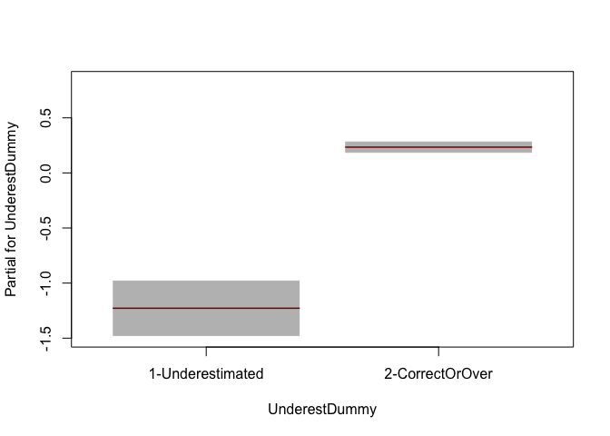
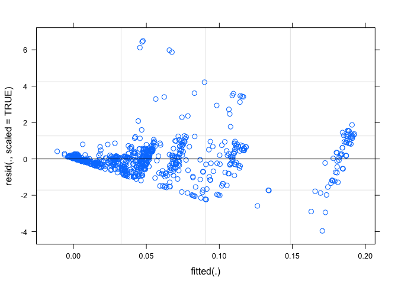
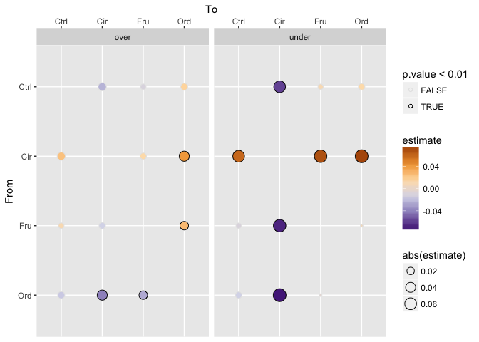
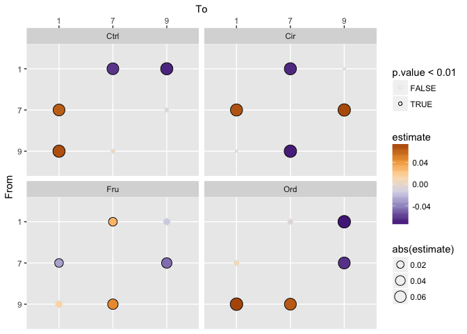

Layout Models for All Tasks
================
Angela Zoss
March 23, 2018

``` r
knitr::opts_chunk$set(warning=FALSE, message=FALSE)
```

## Summary

``` r
knitr::opts_chunk$set(warning=FALSE, message=FALSE)
```

``` r
source('GlobalSetup.R')
```

``` r
# load full graphics dataset for summary graphics

layouts <- readRDS(file.path(analysisDataDir, "Layouts.rds"))
```

``` r
layouts %>% filter(Task %in% c("AvgDeg","NumClust","NumHighDegree","NumLinks","NumNodes")) %>% 
  ggplot(aes(Task, LogError)) + geom_violin() + scale_y_log10()
```

<!-- -->

``` r
layouts %>% filter(Task %in% c("AvgDeg","NumClust","NumHighDegree","NumLinks","NumNodes")) %>% 
  ggplot(aes(Task, LogError)) + geom_boxplot() + #scale_y_log10() +
  labs(title="Distribution of LogError for Numerical Response Tasks,\nlayout conditions")
```

<!-- -->

## Mixed Models

### Average Degree

``` r
knitr::opts_chunk$set(warning=FALSE, message=FALSE)
```

``` r
source('GlobalSetup.R')
```

``` r
# load full graphics dataset for summary graphics

layouts_avgdeg <- readRDS(file.path(analysisDataDir, "LayoutsAvgDeg.rds"))
```

#### lme4

``` r
# Condition

layout.avgdeg.lmer <- lmer(LogError ~ Condition + (1|Demo.ResponseID), data=layouts_avgdeg, REML = T)

summary(layout.avgdeg.lmer)

anova(layout.avgdeg.lmer)

# Condition is not significant; trying Ctrl_dummy

layout.avgdeg.lmer <- lmer(LogError ~ Ctrl_dummy + (1|Demo.ResponseID), data=layouts_avgdeg, REML = T)

summary(layout.avgdeg.lmer)

anova(layout.avgdeg.lmer)

# Ctrl_dummy is not significant; trying Dataset

layout.avgdeg.lmer.data <- lmer(LogError ~ Dataset + (1|Demo.ResponseID), data = layouts_avgdeg, REML = T)

summary(layout.avgdeg.lmer.data)

anova(layout.avgdeg.lmer.data)

# Dataset is barely significant (p=0.02879)

#layout.avgdeg.lmer <- lmer(LogError ~ QuestionOrder + (1|Demo.ResponseID), data=layouts_avgdeg, REML = T)

layouts_avgdeg.CS <- layouts_avgdeg %>% mutate(QuestionOrder=scale(QuestionOrder))

layout.avgdeg.lmer <- lmer(LogError ~ QuestionOrder + (1|Demo.ResponseID), data=layouts_avgdeg.CS, REML = T)

summary(layout.avgdeg.lmer)

anova(layout.avgdeg.lmer)

# QuestionOrder is not significant

layout.avgdeg.lmer <- lmer(LogError ~ DatasetOrder + (1|Demo.ResponseID), data=layouts_avgdeg, REML = T)

summary(layout.avgdeg.lmer)

anova(layout.avgdeg.lmer)

# DatasetOrder is not significant

layout.avgdeg.lmer <- lmer(LogError ~ DatasetDuration + (1|Demo.ResponseID), data=layouts_avgdeg, REML = T)

summary(layout.avgdeg.lmer)

anova(layout.avgdeg.lmer)

# DatasetDuration is not significant

layout.avgdeg.lmer <- lmer(LogError ~ DatasetStartTime + (1|Demo.ResponseID), data=layouts_avgdeg, REML = T)

summary(layout.avgdeg.lmer)

anova(layout.avgdeg.lmer)

# DatasetStartTime is not significant; trying TaskOrder

layout.avgdeg.lmer <- lmer(LogError ~ TaskOrder + (1|Demo.ResponseID), data=layouts_avgdeg, REML = T)

summary(layout.avgdeg.lmer)

anova(layout.avgdeg.lmer)

# TaskOrder is not significant; trying CorrectAnswer

layout.avgdeg.lmer.correct <- lmer(LogError ~ CorrectAnswer + (1|Demo.ResponseID), data=layouts_avgdeg, REML = T)

summary(layout.avgdeg.lmer.correct)

anova(layout.avgdeg.lmer.correct)

# CorrectAnswer is barely significant (p=0.03933)

layout.avgdeg.lmer.underest <- lmer(LogError ~ Underestimated + (1|Demo.ResponseID), data=layouts_avgdeg, REML = T)

summary(layout.avgdeg.lmer.underest)

anova(layout.avgdeg.lmer.underest)

# Underestimated is highly significant (p = 1.432e-12)

layout.avgdeg.lmer <- lmer(LogError ~ Stats.Q_TotalDuration + (1|Demo.ResponseID), data=layouts_avgdeg, REML = T)

summary(layout.avgdeg.lmer)

anova(layout.avgdeg.lmer)

# Stats.Q_TotalDuration is not significant; trying Stats.dataset_count

layout.avgdeg.lmer <- lmer(LogError ~ Stats.dataset_count + (1|Demo.ResponseID), data=layouts_avgdeg, REML = T)

summary(layout.avgdeg.lmer)

anova(layout.avgdeg.lmer)

# Stats.dataset_count is not significant; trying Stats.OperatingSystem

layout.avgdeg.lmer <- lmer(LogError ~ Stats.OperatingSystem + (1|Demo.ResponseID), data=layouts_avgdeg, REML = T)

summary(layout.avgdeg.lmer)

anova(layout.avgdeg.lmer)

# Stats.OperatingSystem is not significant

layout.avgdeg.lmer <- lmer(LogError ~ Stats.OperatingSystemCombined + (1|Demo.ResponseID), data=layouts_avgdeg, REML = T)

summary(layout.avgdeg.lmer)

anova(layout.avgdeg.lmer)

# Stats.OperatingSystemCombined is not significant

layouts_avgdeg.CS <- layouts_avgdeg %>% mutate(StatsNumPixels=scale(StatsNumPixels))

layout.avgdeg.lmer <- lmer(LogError ~ StatsNumPixels + (1|Demo.ResponseID), data=layouts_avgdeg.CS, REML = T)

summary(layout.avgdeg.lmer)

anova(layout.avgdeg.lmer)

# StatsNumPixels is not significant; trying Demo.age

layout.avgdeg.lmer <- lmer(LogError ~ Demo.age + (1|Demo.ResponseID), data=layouts_avgdeg %>% filter(!(is.na(Demo.age))), REML = T)

summary(layout.avgdeg.lmer)

anova(layout.avgdeg.lmer)

# Demo.age is not significant; trying Demo.gender

layout.avgdeg.lmer <- lmer(LogError ~ Demo.gender + (1|Demo.ResponseID), data=layouts_avgdeg %>% filter(!(is.na(Demo.gender))), REML = T)

summary(layout.avgdeg.lmer)

anova(layout.avgdeg.lmer)

# Demo.gender is not signficant; trying Demo.lang

layout.avgdeg.lmer <- lmer(LogError ~ Demo.lang + (1|Demo.ResponseID), data=layouts_avgdeg %>% filter(!(is.na(Demo.lang))), REML = T)

summary(layout.avgdeg.lmer)

anova(layout.avgdeg.lmer)

# Demo.lang is not signficant; trying Demo.educ

layout.avgdeg.lmer <- lmer(LogError ~ Demo.educ + (1|Demo.ResponseID), data=layouts_avgdeg %>% filter(!(is.na(Demo.educ))), REML = T)

summary(layout.avgdeg.lmer)

anova(layout.avgdeg.lmer)

# Demo.educ is not signficant; trying Demo.acfield

layout.avgdeg.lmer <- lmer(LogError ~ Demo.acfield + (1|Demo.ResponseID), data=layouts_avgdeg %>% filter(!(is.na(Demo.acfield))), REML = T)

summary(layout.avgdeg.lmer)

anova(layout.avgdeg.lmer)

# Demo.acfield is not signficant overall; trying Demo.acfieldGrouped

layout.avgdeg.lmer <- lmer(LogError ~ Demo.acfieldGrouped + (1|Demo.ResponseID), data=layouts_avgdeg %>% filter(!(is.na(Demo.acfieldGrouped))), REML = T)

summary(layout.avgdeg.lmer)

anova(layout.avgdeg.lmer)

# Demo.acfieldGrouped is not significant

layout.avgdeg.lmer <- lmer(LogError ~ Demo.acfieldGrouped2 + (1|Demo.ResponseID), data=layouts_avgdeg %>% filter(!(is.na(Demo.acfieldGrouped2))), REML = T)

summary(layout.avgdeg.lmer)

anova(layout.avgdeg.lmer)

# Demo.acfieldGrouped2 is not significant

layout.avgdeg.lmer <- lmer(LogError ~ Demo.acfieldGrouped3 + (1|Demo.ResponseID), data=layouts_avgdeg %>% filter(!(is.na(Demo.acfieldGrouped3))), REML = T)

summary(layout.avgdeg.lmer)

anova(layout.avgdeg.lmer)

# Demo.acfieldGrouped3 is not significant

layout.avgdeg.lmer.comp <- lmer(LogError ~ Demo.dailytech_Computer + (1|Demo.ResponseID), data=layouts_avgdeg %>% filter(!(is.na(Demo.dailytech_Computer))), REML = T)

summary(layout.avgdeg.lmer.comp)

anova(layout.avgdeg.lmer.comp)

# Demo.dailytech_Computer is significant (p=0.006587); trying Demo.dailytech_Tablet

layout.avgdeg.lmer <- lmer(LogError ~ Demo.dailytech_Tablet + (1|Demo.ResponseID), data=layouts_avgdeg %>% filter(!(is.na(Demo.dailytech_Tablet))), REML = T)

summary(layout.avgdeg.lmer)

anova(layout.avgdeg.lmer)

# Demo.dailytech_Computer is not significant

layout.avgdeg.lmer.SP <- lmer(LogError ~ Demo.dailytech_SmartPhone + (1|Demo.ResponseID), data=layouts_avgdeg %>% filter(!(is.na(Demo.dailytech_SmartPhone))), REML = T)

summary(layout.avgdeg.lmer.SP)

anova(layout.avgdeg.lmer.SP)

# Demo.dailytech_SmartPhone is barely significant (p=0.03045)

layout.avgdeg.lmer <- lmer(LogError ~ Demo.weeklygaming + (1|Demo.ResponseID), data=layouts_avgdeg %>% filter(!(is.na(Demo.weeklygaming))), REML = T)

summary(layout.avgdeg.lmer)

anova(layout.avgdeg.lmer)

# Demo.weeklygaming is not significant; trying Demo.expdataanal

layout.avgdeg.lmer <- lmer(LogError ~ Demo.expdataanal + (1|Demo.ResponseID), data=layouts_avgdeg %>% filter(!(is.na(Demo.expdataanal))), REML = T)

summary(layout.avgdeg.lmer)

anova(layout.avgdeg.lmer)

# Demo.expdataanal is not significant; trying Demo.expdatavis

layout.avgdeg.lmer <- lmer(LogError ~ Demo.expdatavis + (1|Demo.ResponseID), data=layouts_avgdeg %>% filter(!(is.na(Demo.expdatavis))), REML = T)

summary(layout.avgdeg.lmer)

anova(layout.avgdeg.lmer)

# Demo.expdatavis is not significant; trying Demo.expreadnetvis

layout.avgdeg.lmer <- lmer(LogError ~ Demo.expreadnetvis + (1|Demo.ResponseID), data=layouts_avgdeg %>% filter(!(is.na(Demo.expreadnetvis))), REML = T)

summary(layout.avgdeg.lmer)

anova(layout.avgdeg.lmer)

# Demo.expreadnetvis is not significant

layout.avgdeg.lmer <- lmer(LogError ~ Demo.expcreatenetvis + (1|Demo.ResponseID), data=layouts_avgdeg %>% filter(!(is.na(Demo.expcreatenetvis))), REML = T)

summary(layout.avgdeg.lmer)

anova(layout.avgdeg.lmer)

# Demo.expcreatenetvis is not significant; trying AvgDeg

layout.avgdeg.lmer.avgdeg <- lmer(LogError ~ AvgDeg + (1|Demo.ResponseID), data=layouts_avgdeg, REML = T)

summary(layout.avgdeg.lmer.avgdeg)

anova(layout.avgdeg.lmer.avgdeg)

# AvgDeg is significant (p=0.03933)

layout.avgdeg.lmer <- lmer(LogError ~ Density + (1|Demo.ResponseID), data=layouts_avgdeg, REML = T)

summary(layout.avgdeg.lmer)

anova(layout.avgdeg.lmer)

# Density is barely not significant (p=0.05856)

layout.avgdeg.lmer.lgclust <- lmer(LogError ~ LargeClust1 + (1|Demo.ResponseID), data=layouts_avgdeg, REML = T)

summary(layout.avgdeg.lmer.lgclust)

anova(layout.avgdeg.lmer.lgclust)

# LargeClust1 is barely significant (p=0.04142)

layout.avgdeg.lmer.mod <- lmer(LogError ~ Modularity + (1|Demo.ResponseID), data=layouts_avgdeg, REML = T)

summary(layout.avgdeg.lmer.mod)

anova(layout.avgdeg.lmer.mod)

# Modularity is barely significant (p=0.03925)

layout.avgdeg.lmer.nclust <- lmer(LogError ~ NumClust + (1|Demo.ResponseID), data=layouts_avgdeg, REML = T)

summary(layout.avgdeg.lmer.nclust)

anova(layout.avgdeg.lmer.nclust)

# NumClust is significant (p=0.00886)

layout.avgdeg.lmer <- lmer(LogError ~ NumHighDegree + (1|Demo.ResponseID), data=layouts_avgdeg, REML = T)

summary(layout.avgdeg.lmer)

anova(layout.avgdeg.lmer)

# NumHighDegree is not significant

layout.avgdeg.lmer <- lmer(LogError ~ NumLinks + (1|Demo.ResponseID), data=layouts_avgdeg, REML = T)

summary(layout.avgdeg.lmer)

anova(layout.avgdeg.lmer)

# NumLinks is barely not significant

layout.avgdeg.lmer.numnodes <- lmer(LogError ~ NumNodes + (1|Demo.ResponseID), data=layouts_avgdeg, REML = T)

summary(layout.avgdeg.lmer.numnodes)

anova(layout.avgdeg.lmer.numnodes)

# NumNodes is barely significant (p=0.01815)

layout.avgdeg.lmer.numnodesclust1 <- lmer(LogError ~ NumNodesClust1 + (1|Demo.ResponseID), data=layouts_avgdeg, REML = T)

summary(layout.avgdeg.lmer.numnodesclust1)

anova(layout.avgdeg.lmer.numnodesclust1)

# NumNodesClust1 is barely significant (p=0.04227)

layout.avgdeg.lmer <- lmer(LogError ~ filename + (1|Demo.ResponseID), data=layouts_avgdeg, REML = T)

summary(layout.avgdeg.lmer)

anova(layout.avgdeg.lmer)

# filename is not significant

layout.avgdeg.lmer <- lmer(LogError ~ NetVisExperience + (1|Demo.ResponseID), data=layouts_avgdeg, REML = T)

summary(layout.avgdeg.lmer)

anova(layout.avgdeg.lmer)

# NetVisExperience is not significant

layout.avgdeg.lmer <- lmer(LogError ~ Stats.CompensationCondition + (1|Demo.ResponseID), data=layouts_avgdeg %>% filter(filename=="FacultyGrad"), REML = T)

summary(layout.avgdeg.lmer)

anova(layout.avgdeg.lmer)

# Stats.CompensationCondition is not significant
```

``` r
temp.avgdeg <- layouts_avgdeg %>% dplyr::select(Demo.ResponseID, LogError, Dataset, CorrectAnswer, Underestimated, Demo.dailytech_Computer, Demo.dailytech_SmartPhone, AvgDeg, LargeClust1, Modularity, NumClust, NumNodes, NumNodesClust1) %>% drop_na()
```

Run this
one

``` r
layout.avgdeg.lmer.full <- lmer(LogError ~ Dataset + Underestimated + Demo.dailytech_Computer + (1|Demo.ResponseID), data=temp.avgdeg, REML = T)

summary(layout.avgdeg.lmer.full)

anova(layout.avgdeg.lmer.full)

layout.avgdeg.lmer.underest <- lmer(LogError ~ Underestimated + (1|Demo.ResponseID), data=temp.avgdeg, REML = T)

anova(layout.avgdeg.lmer.full, layout.avgdeg.lmer.underest)
# keep full
```

Run this one

``` r
layout.avgdeg.lmer.int <- lmer(LogError ~ Dataset + 
                                 Underestimated + 
                                 Demo.dailytech_Computer + 
                                 Dataset:Demo.dailytech_Computer +
                                 (1|Demo.ResponseID), data=temp.avgdeg, REML = T)

summary(layout.avgdeg.lmer.int)

anova(layout.avgdeg.lmer.int)

anova(layout.avgdeg.lmer.full, layout.avgdeg.lmer.int)
# interaction barely significantly better

layout.avgdeg.lmer.int.2 <- lmer(LogError ~ Dataset + 
                                 Underestimated + 
                                 Demo.dailytech_Computer + 
                                 Dataset:Demo.dailytech_Computer +
                                   Underestimated:Demo.dailytech_Computer +
                                 (1|Demo.ResponseID), data=temp.avgdeg, REML = T)

summary(layout.avgdeg.lmer.int.2)

anova(layout.avgdeg.lmer.int.2)

anova(layout.avgdeg.lmer.full, layout.avgdeg.lmer.int.2) # definitely better than full
anova(layout.avgdeg.lmer.int, layout.avgdeg.lmer.int.2) # also better than previous interaction

#keep 2
```

Run this one

``` r
#SAVE THE RESULTS
save(layout.avgdeg.lmer.int.2, file = file.path(analysisDataDir,"fits/layout_avgdeg_lmer_int.RData"))
```

##### Load pre-built model

``` r
load(file.path(analysisDataDir,"fits/layout_avgdeg_lmer_int.RData"))
```

``` r
rand(layout.avgdeg.lmer.int.2)
```

    ## Analysis of Random effects Table:
    ##                 Chi.sq Chi.DF p.value    
    ## Demo.ResponseID   40.4      1   2e-10 ***
    ## ---
    ## Signif. codes:  0 '***' 0.001 '**' 0.01 '*' 0.05 '.' 0.1 ' ' 1

``` r
# result shows that random effects of participant are significant (p=2e-10)

anova(layout.avgdeg.lmer.int.2)
```

    ## Analysis of Variance Table of type III  with  Satterthwaite 
    ## approximation for degrees of freedom
    ##                                           Sum Sq   Mean Sq NumDF  DenDF
    ## Dataset                                0.0029547 0.0014774     2 579.06
    ## Underestimated                         0.0000082 0.0000082     1 737.18
    ## Demo.dailytech_Computer                0.0095942 0.0095942     1 451.43
    ## Dataset:Demo.dailytech_Computer        0.0067672 0.0033836     2 589.17
    ## Underestimated:Demo.dailytech_Computer 0.0092984 0.0092984     1 738.00
    ##                                        F.value   Pr(>F)   
    ## Dataset                                 1.3437 0.261685   
    ## Underestimated                          0.0075 0.931043   
    ## Demo.dailytech_Computer                 8.7263 0.003300 **
    ## Dataset:Demo.dailytech_Computer         3.0775 0.046817 * 
    ## Underestimated:Demo.dailytech_Computer  8.4572 0.003745 **
    ## ---
    ## Signif. codes:  0 '***' 0.001 '**' 0.01 '*' 0.05 '.' 0.1 ' ' 1

``` r
#ranef(layout.avgdeg.lmer.full)

# displays the random effects; not that useful

# unlike lme(), lmer() doesn't allow for heterogeneous error variance structures (the "weights")

ggplot(layouts_avgdeg) + geom_histogram(aes(LogError), binwidth=.005) + labs(title="Distribution of LogError values for Average Degree task,\nlayout conditions")
```

<!-- -->

``` r
(r2nsj = r2beta(layout.avgdeg.lmer.int.2, method = 'nsj', partial = TRUE))
```

    ##                                        Effect   Rsq upper.CL lower.CL
    ## 1                                       Model 0.102    0.151    0.071
    ## 5                     Demo.dailytech_Computer 0.025    0.051    0.008
    ## 8 Underestimatedunder:Demo.dailytech_Computer 0.011    0.031    0.001
    ## 7           Dataset.Q:Demo.dailytech_Computer 0.004    0.017    0.000
    ## 6           Dataset.L:Demo.dailytech_Computer 0.003    0.016    0.000
    ## 3                                   Dataset.Q 0.003    0.016    0.000
    ## 4                         Underestimatedunder 0.000    0.007    0.000
    ## 2                                   Dataset.L 0.000    0.007    0.000

``` r
(r2nsj = r2beta(layout.avgdeg.lmer.int.2, method = 'nsj', partial = TRUE))[1,'Rsq']
```

    ## [1] 0.1016992

``` r
plot(layout.avgdeg.lmer.int.2)

plot(layout.avgdeg.lmer.int.2, resid(., scaled=TRUE) ~ fitted(.), abline = 0)

plot(layout.avgdeg.lmer.int.2, resid(.) ~ fitted(.) | Underestimated, abline = 0)

plot(layout.avgdeg.lmer.int.2, resid(., scaled=TRUE) ~ fitted(.) | Underestimated, abline = 0)

plot(layout.avgdeg.lmer.int.2, LogError ~ fitted(.), abline = c(0,1))
```

``` r
layout.avgdeg.lmer.int.2.f <- fortify(layout.avgdeg.lmer.int.2)

ggplot(layout.avgdeg.lmer.int.2.f, aes(.fitted,.resid)) + 
  geom_point() +
  #facet_grid(.~Sex) + 
  geom_hline(yintercept=0)
```

<!-- -->

``` r
ggplot(layout.avgdeg.lmer.int.2.f, aes(.fitted,LogError)) + 
  geom_point() +
  geom_abline(aes(slope = 1, intercept = 0))
```

<!-- -->

``` r
ggplot(layout.avgdeg.lmer.int.2.f, aes(LogError,.fitted)) + 
  geom_point() +
  geom_abline(aes(slope = 1, intercept = 0)) +
  #scale_y_continuous(limits=c(0,0.3)) +
  labs(title="Real vs. Predicted LogError values for Average Degree task,\nlayout conditions")
```

<!-- -->

#### Least Squares Means

Do for each categorical predictor. Final model: layout.avgdeg.lmer.int.2
\<- lmer(LogError ~ Dataset + Underestimated + Demo.dailytech\_Computer
+ Dataset:Demo.dailytech\_Computer +
Underestimated:Demo.dailytech\_Computer + (1|Demo.ResponseID),
data=temp.avgdeg, REML = T)

##### Dataset

###### emmeans

``` r
# trying to use emmeans package for lsmeans table

# can use ref_grid to see if emmeans is finding nestings within variables, which can cause problems(?)
# ref_grid(layout.numhd.lmer.full.int.4)
# unfortunately, considers Overestimated nested in Dataset because I didn't include 
# Overestimated as a fixed effect; can use nesting = NULL to ignore this auto-detection of nesting

# also want to check if any combination of two factors has zeroes in the cells
# with(layouts_numhighdeg, table(Dataset,Overestimated))
# ref_grid(layout.numhd.lmer.full.int.4) @ grid; .wgt. is number of observations

layout.avgdeg.emm.data <- emmeans(layout.avgdeg.lmer.int.2, "Dataset", nesting = NULL)
#layout.numhd.emm.condition <- emmeans(layout.numhd.lmer.full.int.4, "Condition", lmer.df = "satterthwaite")

layout.avgdeg.emm.data
```

    ##  Dataset      emmean          SE     df    lower.CL   upper.CL
    ##  1       0.021792776 0.002518963 737.35 0.016847582 0.02673797
    ##  7       0.015791937 0.002460736 737.02 0.010961051 0.02062282
    ##  9       0.008300679 0.002435177 736.52 0.003519963 0.01308140
    ## 
    ## Results are averaged over the levels of: Underestimated 
    ## Degrees-of-freedom method: kenward-roger 
    ## Confidence level used: 0.95

``` r
layout.avgdeg.emm.data.df <- dplyr::as_data_frame(layout.avgdeg.emm.data)

layout.avgdeg.emm.data.df
```

    ## # A tibble: 3 x 6
    ##   Dataset  emmean      SE    df lower.CL upper.CL
    ## * <fct>     <dbl>   <dbl> <dbl>    <dbl>    <dbl>
    ## 1 1       0.0218  0.00252   737  0.0168    0.0267
    ## 2 7       0.0158  0.00246   737  0.0110    0.0206
    ## 3 9       0.00830 0.00244   737  0.00352   0.0131

``` r
# From: https://cran.r-project.org/web/packages/emmeans/vignettes/comparisons.html
# The blue bars are confidence intervals for the EMMs, and the red arrows are for the comparisons among them. If an arrow from one mean overlaps an arrow from another group, the difference is not significant, based on the adjust setting (which defaults to "tukey"). (Note: Don’t ever use confidence intervals for EMMs to perform comparisons; they can be very misleading.)

# TO DO : can't figure out how to extract data about the arrows in order to reproduce the layout

#xtable::xtable(layout.numhd.emm.condition)

layout.avgdeg.emm.data.cld <- cld(layout.avgdeg.emm.data,
                details=TRUE,
                #alpha=0.01,
                #by="Dataset",
                #Letters="|||||||||||||||||||",
                sort=TRUE
)

layout.avgdeg.emm.data.cld.df <- layout.avgdeg.emm.data.cld$emmeans

layout.avgdeg.emm.data.cld.df %>% dplyr::select(Dataset,.group)
```

    ##  Dataset .group
    ##  9        1    
    ##  7         2   
    ##  1         2   
    ## 
    ## Results are averaged over the levels of: Underestimated 
    ## Degrees-of-freedom method: kenward-roger 
    ## Confidence level used: 0.95 
    ## P value adjustment: tukey method for comparing a family of 3 estimates 
    ## significance level used: alpha = 0.05

``` r
layout.avgdeg.emm.data.cld.df
```

    ##  Dataset      emmean          SE     df    lower.CL   upper.CL .group
    ##  9       0.008300679 0.002435177 736.52 0.003519963 0.01308140  1    
    ##  7       0.015791937 0.002460736 737.02 0.010961051 0.02062282   2   
    ##  1       0.021792776 0.002518963 737.35 0.016847582 0.02673797   2   
    ## 
    ## Results are averaged over the levels of: Underestimated 
    ## Degrees-of-freedom method: kenward-roger 
    ## Confidence level used: 0.95 
    ## P value adjustment: tukey method for comparing a family of 3 estimates 
    ## significance level used: alpha = 0.05

``` r
layout.avgdeg.emm.data.cld.df$Dataset <- factor(layout.avgdeg.emm.data.cld.df$Dataset, levels=layout.avgdeg.emm.data.cld.df %>% arrange(desc(emmean)) %>% dplyr::select(Dataset) %>% unlist())


#emmip(layout.numlinks.lmer.full.int, ~Condition, CIs = TRUE)
emmip(layout.avgdeg.emm.data, ~Dataset, CIs = TRUE)
```

<!-- -->

``` r
plot(layout.avgdeg.emm.data)
```

<!-- -->

``` r
#plot(layout.numlinks.emm.cond, comparisons = TRUE)

layout.avgdeg.emm.data.cld.df %>% arrange(desc(emmean))
```

    ##   Dataset      emmean          SE       df    lower.CL   upper.CL .group
    ## 1       1 0.021792776 0.002518963 737.3526 0.016847582 0.02673797      2
    ## 2       7 0.015791937 0.002460736 737.0221 0.010961051 0.02062282      2
    ## 3       9 0.008300679 0.002435177 736.5239 0.003519963 0.01308140     1

``` r
ggplot(layout.avgdeg.emm.data.cld.df) +
  #geom_point(aes(x=Condition,y=emmean), shape=21, size=7) +
  geom_errorbar(aes(x=Dataset,ymax=upper.CL,ymin=lower.CL), width=.2) +
  geom_point(aes(x=Dataset,y=emmean), size=7) +
  #scale_fill_manual("Significance Levels", values=sig.colors) +
  coord_flip()
```

<!-- -->

``` r
#plot(ref_grid(layout.numnodes.lmer.int.3), by="Condition") 
# try to figure this out? maybe only works on the interaction?
```

``` r
layout.avgdeg.emm.data.pairs <- dplyr::as_data_frame(pairs(layout.avgdeg.emm.data)) 
layout.avgdeg.emm.data.pairs
```

    ## # A tibble: 3 x 6
    ##   contrast estimate      SE    df t.ratio  p.value
    ## * <fct>       <dbl>   <dbl> <dbl>   <dbl>    <dbl>
    ## 1 1 - 7     0.00600 0.00324   537    1.85 0.153   
    ## 2 1 - 9     0.0135  0.00324   536    4.17 0.000106
    ## 3 7 - 9     0.00749 0.00315   493    2.38 0.0469

``` r
# for some reason, full.cld$comparisons returns estimates that are all positive; 
# pairs(layout.numhd.emm.condition) has both negative and positive estimates
# and joins better to confint()

pairs.CI <- confint(pairs(layout.avgdeg.emm.data))

layout.avgdeg.emm.data.pairs <- full_join(layout.avgdeg.emm.data.pairs, pairs.CI)

#layout.numhd.diffemm.condition <- emmeans(layout.numhd.lmer.full.int.4, pairwise ~ Condition)
#layout.numhd.diffemm.condition$contrasts
#contrast(layout.numhd.emm.condition)
#confint(layout.numhd.emm.condition)
#pairs(layout.numhd.emm.condition, details=TRUE)
#confint(contrast(layout.numhd.emm.condition))
#confint(pairs(layout.numhd.emm.condition))
#coef(pairs(layout.numhd.emm.condition))


plot(pairs(layout.avgdeg.emm.data))
```

<!-- -->

``` r
plot(pairs(layout.avgdeg.emm.data), comparisons = TRUE)
```

<!-- -->

``` r
layout.avgdeg.emm.data.pairs$sig.levels <- 
  case_when(layout.avgdeg.emm.data.pairs$p.value < .0001 ~ sig.level.names[1],
            layout.avgdeg.emm.data.pairs$p.value < .001 ~ sig.level.names[2],
            layout.avgdeg.emm.data.pairs$p.value < .01 ~ sig.level.names[3],
            layout.avgdeg.emm.data.pairs$p.value < .05 ~ sig.level.names[4],
            TRUE ~ sig.level.names[5])

layout.avgdeg.emm.data.pairs$sig.levels <- factor(layout.avgdeg.emm.data.pairs$sig.levels, levels=sig.level.names,ordered=TRUE)


layout.avgdeg.emm.data.pairs$contrast <- factor(layout.avgdeg.emm.data.pairs$contrast, levels=layout.avgdeg.emm.data.pairs %>% arrange(desc(estimate)) %>% dplyr::select(contrast) %>% distinct() %>% unlist())

layout.avgdeg.emm.data.pairs <- layout.avgdeg.emm.data.pairs %>% separate(contrast, c("From", "del", "To"), sep="[ ]", remove=FALSE) %>% dplyr::select(-del)

layout.avgdeg.emm.data.pairs %>% arrange(estimate)
```

    ## # A tibble: 3 x 11
    ##   contrast From  To    estimate      SE    df t.ratio  p.value   lower.CL
    ##   <fct>    <chr> <chr>    <dbl>   <dbl> <dbl>   <dbl>    <dbl>      <dbl>
    ## 1 1 - 7    1     7      0.00600 0.00324   537    1.85 0.153    -0.00161  
    ## 2 7 - 9    7     9      0.00749 0.00315   493    2.38 0.0469    0.0000793
    ## 3 1 - 9    1     9      0.0135  0.00324   536    4.17 0.000106  0.00589  
    ## # ... with 2 more variables: upper.CL <dbl>, sig.levels <ord>

``` r
ggplot(layout.avgdeg.emm.data.pairs) +
  geom_errorbar(aes(x=contrast,ymax=upper.CL,ymin=lower.CL), width=.5) +
  geom_point(aes(x=contrast,y=estimate, fill=sig.levels), shape=21, size=7) +
  scale_fill_manual("Significance Levels", values=sig.colors) +
  coord_flip()
```

<!-- -->

``` r
ggplot(layout.avgdeg.emm.data.pairs) +
  geom_errorbar(aes(x=contrast,ymax=upper.CL,ymin=lower.CL), width=.5) +
  geom_point(aes(x=contrast,y=estimate, fill=sig.levels), shape=21, size=7) +
  geom_hline(aes(yintercept=0)) +
  scale_fill_manual("Significance Levels", values=sig.colors) +
  coord_flip()
```

<!-- -->

``` r
copy <- layout.avgdeg.emm.data.pairs %>% rename(From=To,To=From) %>% 
  mutate(estimate=-estimate,
         t.ratio=-t.ratio,
         lower.CL=-lower.CL,
         upper.CL=-upper.CL)

layout.avgdeg.emm.data.pairs.compl <- bind_rows(layout.avgdeg.emm.data.pairs, copy)

#cond.lev <- c("Ctrl","Phr","Col","Siz")

layout.avgdeg.emm.data.pairs.compl$From <- factor(layout.avgdeg.emm.data.pairs.compl$From, levels=rev(unique(layout.avgdeg.emm.data.pairs.compl$From)))
#layout.avgdeg.emm.under.pairs.compl$To <- factor(layout.avgdeg.emm.under.pairs.compl$To, levels=cond.lev)

#layout.numlinks.emm.cond.pairs.compl %>% arrange(desc(estimate))
layout.avgdeg.emm.data.pairs.compl %>% arrange(estimate)
```

    ## # A tibble: 6 x 11
    ##   contrast From  To    estimate      SE    df t.ratio  p.value   lower.CL
    ##   <fct>    <fct> <chr>    <dbl>   <dbl> <dbl>   <dbl>    <dbl>      <dbl>
    ## 1 1 - 9    9     1     -0.0135  0.00324   536   -4.17 0.000106 -0.00589  
    ## 2 7 - 9    9     7     -0.00749 0.00315   493   -2.38 0.0469   -0.0000793
    ## 3 1 - 7    7     1     -0.00600 0.00324   537   -1.85 0.153     0.00161  
    ## 4 1 - 7    1     7      0.00600 0.00324   537    1.85 0.153    -0.00161  
    ## 5 7 - 9    7     9      0.00749 0.00315   493    2.38 0.0469    0.0000793
    ## 6 1 - 9    1     9      0.0135  0.00324   536    4.17 0.000106  0.00589  
    ## # ... with 2 more variables: upper.CL <dbl>, sig.levels <ord>

``` r
ggplot(layout.avgdeg.emm.data.pairs.compl) +
  geom_tile(aes(x=To,y=From,fill=sig.levels), color="black") +
  scale_fill_manual("Significance Levels", values=sig.colors) +
  scale_x_discrete(drop=FALSE, position = "top") +
  scale_y_discrete(drop=FALSE, name="From")
```

<!-- -->

``` r
ggplot(layout.avgdeg.emm.data.pairs.compl) +
  geom_count(aes(x=To,y=From,size=abs(estimate),fill=sig.levels), shape=21, color="black") +
  scale_fill_manual("Significance Levels", values=sig.colors) +
  scale_x_discrete(drop=FALSE, position = "top") +
  scale_y_discrete(drop=FALSE, name="From")
```

<!-- -->

``` r
ggplot(layout.avgdeg.emm.data.pairs.compl) +
  geom_tile(aes(x=To,y=From,fill=estimate)) +
    scale_fill_distiller(type="div", palette=4) +
  scale_x_discrete(drop=FALSE, position = "top") +
  scale_y_discrete(drop=FALSE, name="From")
```

<!-- -->

``` r
ggplot(layout.avgdeg.emm.data.pairs.compl) +
  geom_count(aes(x=To,y=From,size=abs(estimate),fill=estimate, color=p.value<.01), shape=21) +
  scale_fill_distiller(type="div", palette=4) +
  scale_color_manual(values=c("grey90","black")) +
  scale_x_discrete(drop=FALSE, position = "top") +
  scale_y_discrete(drop=FALSE, name="From")
```

<!-- -->

##### Underestimated

###### emmeans

``` r
# trying to use emmeans package for lsmeans table

# can use ref_grid to see if emmeans is finding nestings within variables, which can cause problems(?)
# ref_grid(layout.numhd.lmer.full.int.4)
# unfortunately, considers Overestimated nested in Dataset because I didn't include 
# Overestimated as a fixed effect; can use nesting = NULL to ignore this auto-detection of nesting

# also want to check if any combination of two factors has zeroes in the cells
# with(layouts_numhighdeg, table(Dataset,Overestimated))
# ref_grid(layout.numhd.lmer.full.int.4) @ grid; .wgt. is number of observations

layout.avgdeg.emm.under <- emmeans(layout.avgdeg.lmer.int.2, "Underestimated", nesting = NULL)
#layout.numhd.emm.condition <- emmeans(layout.numhd.lmer.full.int.4, "Condition", lmer.df = "satterthwaite")

layout.avgdeg.emm.under
```

    ##  Underestimated      emmean          SE     df    lower.CL    upper.CL
    ##  over           0.025925733 0.002362872 617.86 0.021285500 0.030565967
    ##  under          0.004664528 0.002059105 534.38 0.000619595 0.008709462
    ## 
    ## Results are averaged over the levels of: Dataset 
    ## Degrees-of-freedom method: kenward-roger 
    ## Confidence level used: 0.95

``` r
layout.avgdeg.emm.under.df <- dplyr::as_data_frame(layout.avgdeg.emm.under)

layout.avgdeg.emm.under.df
```

    ## # A tibble: 2 x 6
    ##   Underestimated  emmean      SE    df lower.CL upper.CL
    ## * <fct>            <dbl>   <dbl> <dbl>    <dbl>    <dbl>
    ## 1 over           0.0259  0.00236   618 0.0213    0.0306 
    ## 2 under          0.00466 0.00206   534 0.000620  0.00871

``` r
# From: https://cran.r-project.org/web/packages/emmeans/vignettes/comparisons.html
# The blue bars are confidence intervals for the EMMs, and the red arrows are for the comparisons among them. If an arrow from one mean overlaps an arrow from another group, the difference is not significant, based on the adjust setting (which defaults to "tukey"). (Note: Don’t ever use confidence intervals for EMMs to perform comparisons; they can be very misleading.)

# TO DO : can't figure out how to extract data about the arrows in order to reproduce the layout

#xtable::xtable(layout.numhd.emm.condition)

layout.avgdeg.emm.under.cld <- cld(layout.avgdeg.emm.under,
                details=TRUE,
                #alpha=0.01,
                #by="Dataset",
                #Letters="|||||||||||||||||||",
                sort=TRUE
)

layout.avgdeg.emm.under.cld.df <- layout.avgdeg.emm.under.cld$emmeans

layout.avgdeg.emm.under.cld.df %>% dplyr::select(Underestimated,.group)
```

    ##  Underestimated .group
    ##  under           1    
    ##  over             2   
    ## 
    ## Results are averaged over the levels of: Dataset 
    ## Degrees-of-freedom method: kenward-roger 
    ## Confidence level used: 0.95 
    ## significance level used: alpha = 0.05

``` r
layout.avgdeg.emm.under.cld.df
```

    ##  Underestimated      emmean          SE     df    lower.CL    upper.CL
    ##  under          0.004664528 0.002059105 534.38 0.000619595 0.008709462
    ##  over           0.025925733 0.002362872 617.86 0.021285500 0.030565967
    ##  .group
    ##   1    
    ##    2   
    ## 
    ## Results are averaged over the levels of: Dataset 
    ## Degrees-of-freedom method: kenward-roger 
    ## Confidence level used: 0.95 
    ## significance level used: alpha = 0.05

``` r
layout.avgdeg.emm.under.cld.df$Underestimated <- factor(layout.avgdeg.emm.under.cld.df$Underestimated, levels=layout.avgdeg.emm.under.cld.df %>% arrange(desc(emmean)) %>% dplyr::select(Underestimated) %>% unlist())


#emmip(layout.numlinks.lmer.full.int, ~Condition, CIs = TRUE)
emmip(layout.avgdeg.emm.under, ~Underestimated, CIs = TRUE)
```

<!-- -->

``` r
plot(layout.avgdeg.emm.under)
```

<!-- -->

``` r
#plot(layout.numlinks.emm.cond, comparisons = TRUE)

layout.avgdeg.emm.under.cld.df %>% arrange(desc(emmean))
```

    ##   Underestimated      emmean          SE       df    lower.CL    upper.CL
    ## 1           over 0.025925733 0.002362872 617.8613 0.021285500 0.030565967
    ## 2          under 0.004664528 0.002059105 534.3812 0.000619595 0.008709462
    ##   .group
    ## 1      2
    ## 2     1

``` r
ggplot(layout.avgdeg.emm.under.cld.df) +
  #geom_point(aes(x=Condition,y=emmean), shape=21, size=7) +
  geom_errorbar(aes(x=Underestimated,ymax=upper.CL,ymin=lower.CL), width=.2) +
  geom_point(aes(x=Underestimated,y=emmean), size=7) +
  #scale_fill_manual("Significance Levels", values=sig.colors) +
  coord_flip()
```

<!-- -->

``` r
#plot(ref_grid(layout.numnodes.lmer.int.3), by="Condition") 
# try to figure this out? maybe only works on the interaction?
```

``` r
layout.avgdeg.emm.under.pairs <- dplyr::as_data_frame(pairs(layout.avgdeg.emm.under)) 
layout.avgdeg.emm.under.pairs
```

    ## # A tibble: 1 x 6
    ##   contrast     estimate      SE    df t.ratio          p.value
    ## * <fct>           <dbl>   <dbl> <dbl>   <dbl>            <dbl>
    ## 1 over - under   0.0213 0.00299   739    7.11 0.00000000000270

``` r
# for some reason, full.cld$comparisons returns estimates that are all positive; 
# pairs(layout.numhd.emm.condition) has both negative and positive estimates
# and joins better to confint()

pairs.CI <- confint(pairs(layout.avgdeg.emm.under))

layout.avgdeg.emm.under.pairs <- full_join(layout.avgdeg.emm.under.pairs, pairs.CI)

#layout.numhd.diffemm.condition <- emmeans(layout.numhd.lmer.full.int.4, pairwise ~ Condition)
#layout.numhd.diffemm.condition$contrasts
#contrast(layout.numhd.emm.condition)
#confint(layout.numhd.emm.condition)
#pairs(layout.numhd.emm.condition, details=TRUE)
#confint(contrast(layout.numhd.emm.condition))
#confint(pairs(layout.numhd.emm.condition))
#coef(pairs(layout.numhd.emm.condition))


plot(pairs(layout.avgdeg.emm.under))
```

<!-- -->

``` r
plot(pairs(layout.avgdeg.emm.under), comparisons = TRUE)
```

<!-- -->

``` r
layout.avgdeg.emm.under.pairs$sig.levels <- 
  case_when(layout.avgdeg.emm.under.pairs$p.value < .0001 ~ sig.level.names[1],
            layout.avgdeg.emm.under.pairs$p.value < .001 ~ sig.level.names[2],
            layout.avgdeg.emm.under.pairs$p.value < .01 ~ sig.level.names[3],
            layout.avgdeg.emm.under.pairs$p.value < .05 ~ sig.level.names[4],
            TRUE ~ sig.level.names[5])

layout.avgdeg.emm.under.pairs$sig.levels <- factor(layout.avgdeg.emm.under.pairs$sig.levels, levels=sig.level.names,ordered=TRUE)


layout.avgdeg.emm.under.pairs$contrast <- factor(layout.avgdeg.emm.under.pairs$contrast, levels=layout.avgdeg.emm.under.pairs %>% arrange(desc(estimate)) %>% dplyr::select(contrast) %>% distinct() %>% unlist())

layout.avgdeg.emm.under.pairs <- layout.avgdeg.emm.under.pairs %>% separate(contrast, c("From", "del", "To"), sep="[ ]", remove=FALSE) %>% dplyr::select(-del)

layout.avgdeg.emm.under.pairs %>% arrange(estimate)
```

    ## # A tibble: 1 x 11
    ##   contrast  From  To    estimate      SE    df t.ratio    p.value lower.CL
    ##   <fct>     <chr> <chr>    <dbl>   <dbl> <dbl>   <dbl>      <dbl>    <dbl>
    ## 1 over - u… over  under   0.0213 0.00299   739    7.11   2.70e⁻¹²   0.0154
    ## # ... with 2 more variables: upper.CL <dbl>, sig.levels <ord>

``` r
ggplot(layout.avgdeg.emm.under.pairs) +
  geom_errorbar(aes(x=contrast,ymax=upper.CL,ymin=lower.CL), width=.5) +
  geom_point(aes(x=contrast,y=estimate, fill=sig.levels), shape=21, size=7) +
  scale_fill_manual("Significance Levels", values=sig.colors) +
  coord_flip()
```

<!-- -->

``` r
ggplot(layout.avgdeg.emm.under.pairs) +
  geom_errorbar(aes(x=contrast,ymax=upper.CL,ymin=lower.CL), width=.5) +
  geom_point(aes(x=contrast,y=estimate, fill=sig.levels), shape=21, size=7) +
  geom_hline(aes(yintercept=0)) +
  scale_fill_manual("Significance Levels", values=sig.colors) +
  coord_flip()
```

<!-- -->

``` r
copy <- layout.avgdeg.emm.under.pairs %>% rename(From=To,To=From) %>% 
  mutate(estimate=-estimate,
         t.ratio=-t.ratio,
         lower.CL=-lower.CL,
         upper.CL=-upper.CL)

layout.avgdeg.emm.under.pairs.compl <- bind_rows(layout.avgdeg.emm.under.pairs, copy)

#cond.lev <- c("Ctrl","Phr","Col","Siz")

layout.avgdeg.emm.under.pairs.compl$From <- factor(layout.avgdeg.emm.under.pairs.compl$From, levels=rev(unique(layout.avgdeg.emm.under.pairs.compl$From)))
#layout.avgdeg.emm.under.pairs.compl$To <- factor(layout.avgdeg.emm.under.pairs.compl$To, levels=cond.lev)

#layout.numlinks.emm.cond.pairs.compl %>% arrange(desc(estimate))
layout.avgdeg.emm.under.pairs.compl %>% arrange(estimate)
```

    ## # A tibble: 2 x 11
    ##   contrast  From  To    estimate      SE    df t.ratio    p.value lower.CL
    ##   <fct>     <fct> <chr>    <dbl>   <dbl> <dbl>   <dbl>      <dbl>    <dbl>
    ## 1 over - u… under over   -0.0213 0.00299   739   -7.11   2.70e⁻¹²  -0.0154
    ## 2 over - u… over  under   0.0213 0.00299   739    7.11   2.70e⁻¹²   0.0154
    ## # ... with 2 more variables: upper.CL <dbl>, sig.levels <ord>

``` r
ggplot(layout.avgdeg.emm.under.pairs.compl) +
  geom_tile(aes(x=To,y=From,fill=sig.levels), color="black") +
  scale_fill_manual("Significance Levels", values=sig.colors) +
  scale_x_discrete(drop=FALSE, position = "top") +
  scale_y_discrete(drop=FALSE, name="From")
```

<!-- -->

``` r
ggplot(layout.avgdeg.emm.under.pairs.compl) +
  geom_count(aes(x=To,y=From,size=abs(estimate),fill=sig.levels), shape=21, color="black") +
  scale_fill_manual("Significance Levels", values=sig.colors) +
  scale_x_discrete(drop=FALSE, position = "top") +
  scale_y_discrete(drop=FALSE, name="From")
```

<!-- -->

``` r
ggplot(layout.avgdeg.emm.under.pairs.compl) +
  geom_tile(aes(x=To,y=From,fill=estimate)) +
    scale_fill_distiller(type="div", palette=4) +
  scale_x_discrete(drop=FALSE, position = "top") +
  scale_y_discrete(drop=FALSE, name="From")
```

<!-- -->

``` r
ggplot(layout.avgdeg.emm.under.pairs.compl) +
  geom_count(aes(x=To,y=From,size=abs(estimate),fill=estimate, color=p.value<.01), shape=21) +
  scale_fill_distiller(type="div", palette=4) +
  scale_color_manual(values=c("grey90","black")) +
  scale_x_discrete(drop=FALSE, position = "top") +
  scale_y_discrete(drop=FALSE, name="From")
```

<!-- -->

##### Demo.dailytech\_Computer - not a factor

``` r
ggplot(temp.avgdeg) +
  geom_point(aes(Demo.dailytech_Computer,LogError)) +
  geom_smooth(aes(Demo.dailytech_Computer,LogError), method="lm")
```

<!-- -->

##### Dataset:Demo.dailytech\_Computer

``` r
ggplot(temp.avgdeg) +
  geom_point(aes(Demo.dailytech_Computer,LogError)) +
  geom_smooth(aes(Demo.dailytech_Computer,LogError), method="lm") +
  facet_grid(.~Dataset)
```

<!-- -->

##### Underestimated:Demo.dailytech\_Computer

``` r
ggplot(temp.avgdeg) +
  geom_point(aes(Demo.dailytech_Computer,LogError)) +
  geom_smooth(aes(Demo.dailytech_Computer,LogError), method="lm") +
  facet_grid(.~Underestimated)
```

<!-- -->

### Betweenness Centrality

``` r
knitr::opts_chunk$set(warning=FALSE, message=FALSE)
```

``` r
source('GlobalSetup.R')
```

``` r
# load full graphics dataset for summary graphics

layouts_bc <- readRDS(file.path(analysisDataDir, "LayoutsBC.rds"))
```

#### Negative binomial model for click questions Node Rank

Ranks are like count data, in that they are nonnegative integers, so
using a negative binomial distribution to model. Negative binomial is
especially useful for over-dispersed data - data where the conditional
variances exceed conditional
means.

``` r
# https://stats.idre.ucla.edu/r/dae/negative-binomial-regression/ for non-mixed version

# Test for overdispersion

with(layouts_bc, tapply(NodeRank, Condition, function(x) {
    sprintf("M (SD) = %1.2f (%1.2f)", mean(x), sd(x))
}))
```

    ##                     Ctrl                      Cir                      Col 
    ##   "M (SD) = 3.19 (2.63)"   "M (SD) = 3.79 (9.26)"                       NA 
    ##                      Fru                      Ord                      Phr 
    ##  "M (SD) = 7.08 (13.18)" "M (SD) = 13.70 (25.99)"                       NA 
    ##                      Siz 
    ##                       NA

``` r
# variances in each condition (except Ctrl) are larger than means in the conditions
```

``` r
# negative binomial models - no offset, first single fixed effects, then multiple, then interactions

layout.bc.nb.null <- glmer.nb(NodeRank ~ (1|Demo.ResponseID), data=layouts_bc, verbose=TRUE)

summary(layout.bc.nb.null)

layout.bc.nb.cond <- glmer.nb(NodeRank ~ Condition + (1|Demo.ResponseID), data=layouts_bc, verbose=TRUE)

summary(layout.bc.nb.cond)

anova(layout.bc.nb.cond, layout.bc.nb.null)

# model is significantly different from null model (p < 2.2e-16), so Condition is a
# significant predictor


layout.bc.nb.dataset <- glmer.nb(NodeRank ~ Dataset + (1|Demo.ResponseID), data=layouts_bc, verbose=TRUE)

summary(layout.bc.nb.dataset)

anova(layout.bc.nb.dataset, layout.bc.nb.null)

# model is significantly different from null model (p < 2.2e-16)

layout.bc.nb <- glmer.nb(NodeRank ~ DatasetOrder + (1|Demo.ResponseID), data=layouts_bc, verbose=TRUE)

summary(layout.bc.nb)

anova(layout.bc.nb, layout.bc.nb.null)

# model is not significantly different from null model

#layout.bc.nb <- glmer.nb(NodeRank ~ DatasetDuration + (1|Demo.ResponseID), data=layouts_bc %>% filter(!is.na(DatasetDuration)), verbose=TRUE)

layouts_bc.CS <- layouts_bc %>% mutate(DatasetDuration=scale(DatasetDuration))

layout.bc.nb <- glmer.nb(NodeRank ~ DatasetDuration + (1|Demo.ResponseID), 
                        data=layouts_bc.CS %>% filter(!is.na(DatasetDuration)), verbose=TRUE)

summary(layout.bc.nb)

layout.bc.nb.null2 <- glmer.nb(NodeRank ~ (1|Demo.ResponseID), data=layouts_bc.CS %>% filter(!is.na(DatasetDuration)), verbose=TRUE)

anova(layout.bc.nb, layout.bc.nb.null2)

# DatasetDuration is not significant 

layout.bc.nb <- glmer.nb(NodeRank ~ TaskOrder + (1|Demo.ResponseID), data=layouts_bc, verbose=TRUE)

summary(layout.bc.nb)

anova(layout.bc.nb, layout.bc.nb.null)

# TaskOrder is not significant

#layout.bc.nb <- glmer.nb(NodeRank ~ QuestionOrder + (1|Demo.ResponseID), data=layouts_bc, verbose=TRUE)

# warnings about rescaling variables

layouts_bc.CS <- layouts_bc %>% mutate(QuestionOrder=scale(QuestionOrder))

layout.bc.nb <- glmer.nb(NodeRank ~ QuestionOrder + (1|Demo.ResponseID), 
                        data=layouts_bc.CS, verbose=TRUE)

summary(layout.bc.nb)

layout.bc.nb.null2 <- glmer.nb(NodeRank ~ (1|Demo.ResponseID), data=layouts_bc.CS, verbose=TRUE)

anova(layout.bc.nb, layout.bc.nb.null2)

# QuestionOrder is not significant


#layout.bc.nb <- glmer.nb(NodeRank ~ CorrectAnswer + (1|Demo.ResponseID), data=layouts_bc, verbose=TRUE)

# error about rescaling

layouts_bc.CS <- layouts_bc %>% mutate(CorrectAnswer=scale(CorrectAnswer))

layout.bc.nb.correct <- glmer.nb(NodeRank ~ CorrectAnswer + (1|Demo.ResponseID), 
                        data=layouts_bc.CS, verbose=TRUE)

summary(layout.bc.nb.correct)

layout.bc.nb.null2 <- glmer.nb(NodeRank ~ (1|Demo.ResponseID), data=layouts_bc.CS, verbose=TRUE)

anova(layout.bc.nb.correct, layout.bc.nb.null2)

# CorrectAnswer is significant (p < 2.2e-16)

#layout.bc.nb <- glmer.nb(NodeRank ~ Stats.Q_TotalDuration + (1|Demo.ResponseID), data=layouts_bc, verbose=TRUE)

# warnings about rescaling variables

layouts_bc.CS <- layouts_bc %>% mutate(Stats.Q_TotalDuration=scale(Stats.Q_TotalDuration))

layout.bc.nb <- glmer.nb(NodeRank ~ Stats.Q_TotalDuration + (1|Demo.ResponseID), data=layouts_bc.CS, verbose=TRUE)

summary(layout.bc.nb)

layout.bc.nb.null2 <- glmer.nb(NodeRank ~ (1|Demo.ResponseID), data=layouts_bc.CS, verbose=TRUE)

anova(layout.bc.nb, layout.bc.nb.null2)

# Stats.Q_TotalDuration is not significant


layout.bc.nb <- glmer.nb(NodeRank ~ Stats.OperatingSystem + (1|Demo.ResponseID), data=layouts_bc, verbose=TRUE)
# very slooooooow, but no errors

summary(layout.bc.nb) # nothing significant

anova(layout.bc.nb, layout.bc.nb.null)

# Stats.OperatingSystems is not significant

layout.bc.nb <- glmer.nb(NodeRank ~ Stats.OperatingSystemCombined + (1|Demo.ResponseID), data=layouts_bc, verbose=TRUE)

summary(layout.bc.nb) 

anova(layout.bc.nb, layout.bc.nb.null)

# Stats.OperatingSystemCombined is not significant

layout.bc.nb <- glmer.nb(NodeRank ~ Stats.OperatingSystemCombined2 + (1|Demo.ResponseID), data=layouts_bc, verbose=TRUE, control=glmerControl(optimizer = "bobyqa"))

summary(layout.bc.nb)

anova(layout.bc.nb, layout.bc.nb.null)

# Stats.OperatingSystemCombined2 is not significant

layout.bc.nb <- glmer.nb(NodeRank ~ Stats.OperatingSystemCombined3 + (1|Demo.ResponseID), data=layouts_bc, verbose=TRUE)

summary(layout.bc.nb)

anova(layout.bc.nb, layout.bc.nb.null)

# Stats.OperatingSystemCombined3 is not significant

layout.bc.nb <- glmer.nb(NodeRank ~ Stats.OperatingSystemCombined4 + (1|Demo.ResponseID), data=layouts_bc, verbose=TRUE, control=glmerControl(optimizer = "bobyqa"))

summary(layout.bc.nb)

anova(layout.bc.nb, layout.bc.nb.null)

# Stats.OperatingSystemCombined4 is not significant


#layout.bc.nb <- glmer.nb(NodeRank ~ StatsNumPixels + (1|Demo.ResponseID), data=layouts_bc, verbose=TRUE)

# need to rescale

layouts_bc.CS <- layouts_bc %>% mutate(StatsNumPixels=scale(StatsNumPixels))

layout.bc.nb <- glmer.nb(NodeRank ~ StatsNumPixels + (1|Demo.ResponseID), 
                        data=layouts_bc.CS, verbose=TRUE)

summary(layout.bc.nb)

layout.bc.nb.null2 <- glmer.nb(NodeRank ~ (1|Demo.ResponseID), data=layouts_bc.CS, verbose=TRUE)

anova(layout.bc.nb, layout.bc.nb.null2)

# StatsNumPixels not significant

#layout.bc.nb <- glmer.nb(NodeRank ~ Demo.age + (1|Demo.ResponseID), data=layouts_bc %>% filter(!is.na(Demo.age)), verbose=TRUE)

# need to rescale

layouts_bc.CS <- layouts_bc %>% mutate(Demo.age=scale(Demo.age))

layout.bc.nb <- glmer.nb(NodeRank ~ Demo.age + (1|Demo.ResponseID), 
                        data=layouts_bc.CS %>% filter(!is.na(Demo.age)), verbose=TRUE, 
                        control=glmerControl(optimizer = "bobyqa"))


summary(layout.bc.nb)

layout.bc.nb.null2 <- glmer.nb(NodeRank ~ (1|Demo.ResponseID), 
                        data=layouts_bc.CS %>% filter(!is.na(Demo.age)), verbose=TRUE)

anova(layout.bc.nb, layout.bc.nb.null2)

# Demo.age is not significant

layout.bc.nb <- glmer.nb(NodeRank ~ Demo.gender + (1|Demo.ResponseID), 
                        data=layouts_bc %>% filter(!is.na(Demo.gender)), verbose=TRUE, 
                        control=glmerControl(optimizer = "bobyqa"))

summary(layout.bc.nb)

layout.bc.nb.null.2 <- update(layout.bc.nb, . ~ . - Demo.gender)

summary(layout.bc.nb.null.2)

anova(layout.bc.nb, layout.bc.nb.null.2)

# Demo.gender is not significant

layout.bc.nb <- glmer.nb(NodeRank ~ Demo.lang + (1|Demo.ResponseID), 
                        data=layouts_bc %>% filter(!is.na(Demo.lang)), verbose=TRUE, 
                        control=glmerControl(optimizer = "bobyqa"))

summary(layout.bc.nb)

layout.bc.nb.null.2 <- update(layout.bc.nb, . ~ . - Demo.lang)

summary(layout.bc.nb.null.2)

anova(layout.bc.nb, layout.bc.nb.null.2)

# Demo.lang is not a significant predictor

layout.bc.nb <- glmer.nb(NodeRank ~ Demo.educ + (1|Demo.ResponseID), 
                        data=layouts_bc %>% filter(!is.na(Demo.educ)), verbose=TRUE, 
                        control=glmerControl(optimizer = "bobyqa"))

summary(layout.bc.nb)

layout.bc.nb.null.2 <- update(layout.bc.nb, . ~ . - Demo.educ)

anova(layout.bc.nb, layout.bc.nb.null.2)

# Demo.educ is not significant

layout.bc.nb.acfield <- glmer.nb(NodeRank ~ Demo.acfield + (1|Demo.ResponseID), 
                        data=layouts_bc %>% filter(!is.na(Demo.acfield)), verbose=TRUE, 
                        control=glmerControl(optimizer = "bobyqa"))

summary(layout.bc.nb.acfield)

# several categories significantly different from Anthropology:
# Architecture and design, Arts, Business, Earth sciences, Information science, Library and museum studies, Other, Political science
# marginal: Computer sciences, History, Languages, Psychology, Skipped, Sociology

layout.bc.nb.null.2 <- update(layout.bc.nb.acfield, . ~ . - Demo.acfield)

anova(layout.bc.nb.acfield, layout.bc.nb.null.2)

# significant (p=0.01502)

layout.bc.nb <- glmer.nb(NodeRank ~ Demo.acfieldGrouped + (1|Demo.ResponseID), 
                        data=layouts_bc %>% filter(!is.na(Demo.acfieldGrouped)), verbose=TRUE, 
                        control=glmerControl(optimizer = "bobyqa"))

layout.bc.nb.null.2 <- update(layout.bc.nb, . ~ . - Demo.acfieldGrouped)

anova(layout.bc.nb, layout.bc.nb.null.2)

# Demo.acfieldGrouped is not significant

layout.bc.nb <- glmer.nb(NodeRank ~ Demo.acfieldGrouped2 + (1|Demo.ResponseID), 
                        data=layouts_bc %>% filter(!is.na(Demo.acfieldGrouped2)), verbose=TRUE, 
                        control=glmerControl(optimizer = "bobyqa"))

layout.bc.nb.null.2 <- update(layout.bc.nb, . ~ . - Demo.acfieldGrouped2)

anova(layout.bc.nb, layout.bc.nb.null.2)

# Demo.acfieldGrouped2 not significant

layout.bc.nb <- glmer.nb(NodeRank ~ Demo.dailytech_Computer + (1|Demo.ResponseID), 
                        data=layouts_bc %>% filter(!is.na(Demo.dailytech_Computer)), verbose=TRUE, 
                        control=glmerControl(optimizer = "bobyqa"))

summary(layout.bc.nb)

# almost significant

layout.bc.nb.null.2 <- update(layout.bc.nb, . ~ . - Demo.dailytech_Computer)

anova(layout.bc.nb, layout.bc.nb.null.2)

# not significant

layout.bc.nb <- glmer.nb(NodeRank ~ Demo.dailytech_Tablet + (1|Demo.ResponseID), 
                        data=layouts_bc %>% filter(!is.na(Demo.dailytech_Tablet)), verbose=TRUE, 
                        control=glmerControl(optimizer = "bobyqa"))

summary(layout.bc.nb)

layout.bc.nb.null.2 <- update(layout.bc.nb, . ~ . - Demo.dailytech_Tablet)

anova(layout.bc.nb, layout.bc.nb.null.2)

# not significant

layout.bc.nb <- glmer.nb(NodeRank ~ Demo.dailytech_SmartPhone + (1|Demo.ResponseID), 
                        data=layouts_bc %>% filter(!is.na(Demo.dailytech_SmartPhone)), verbose=TRUE, 
                        control=glmerControl(optimizer = "bobyqa"))

summary(layout.bc.nb)

layout.bc.nb.null.2 <- update(layout.bc.nb, . ~ . - Demo.dailytech_SmartPhone)

anova(layout.bc.nb, layout.bc.nb.null.2)

# not significant

layout.bc.nb <- glmer.nb(NodeRank ~ Demo.weeklygaming + (1|Demo.ResponseID), 
                        data=layouts_bc %>% filter(!is.na(Demo.weeklygaming)), verbose=TRUE, 
                        control=glmerControl(optimizer = "bobyqa"))

summary(layout.bc.nb)

layout.bc.nb.null.2 <- update(layout.bc.nb, . ~ . - Demo.weeklygaming)

anova(layout.bc.nb, layout.bc.nb.null.2)

# not significant

layout.bc.nb <- glmer.nb(NodeRank ~ Demo.expdataanal + (1|Demo.ResponseID), 
                        data=layouts_bc %>% filter(!is.na(Demo.expdataanal)), verbose=TRUE, 
                        control=glmerControl(optimizer = "nlminbw"))

summary(layout.bc.nb)

layout.bc.nb.null.2 <- update(layout.bc.nb, . ~ . - Demo.expdataanal)

anova(layout.bc.nb, layout.bc.nb.null.2)

# not significant

layout.bc.nb <- glmer.nb(NodeRank ~ Demo.expdatavis + (1|Demo.ResponseID), 
                        data=layouts_bc %>% filter(!is.na(Demo.expdatavis)), verbose=TRUE)

summary(layout.bc.nb)

layout.bc.nb.null.2 <- update(layout.bc.nb, . ~ . - Demo.expdatavis)

anova(layout.bc.nb, layout.bc.nb.null.2)

# not significant

layout.bc.nb <- glmer.nb(NodeRank ~ Demo.expreadnetvis + (1|Demo.ResponseID), 
                        data=layouts_bc %>% filter(!is.na(Demo.expreadnetvis)), verbose=TRUE, 
                        control=glmerControl(optimizer = "nlminbw"))

summary(layout.bc.nb)

layout.bc.nb.null.2 <- update(layout.bc.nb, . ~ . - Demo.expreadnetvis)

anova(layout.bc.nb, layout.bc.nb.null.2)

# not significant

layout.bc.nb <- glmer.nb(NodeRank ~ Demo.expcreatenetvis + (1|Demo.ResponseID), 
                        data=layouts_bc %>% filter(!is.na(Demo.expcreatenetvis)), verbose=TRUE, 
                        control=glmerControl(optimizer = "nlminbw"))

summary(layout.bc.nb)

layout.bc.nb.null.2 <- update(layout.bc.nb, . ~ . - Demo.expcreatenetvis)

anova(layout.bc.nb, layout.bc.nb.null.2)

# not significant

layout.bc.nb.avgdeg <- glmer.nb(NodeRank ~ AvgDeg + (1|Demo.ResponseID), 
                               data=layouts_bc, verbose=TRUE, 
                        control=glmerControl(optimizer = "bobyqa"))

summary(layout.bc.nb.avgdeg)

anova(layout.bc.nb.avgdeg, layout.bc.nb.null)

# AvgDeg is significant (p < 2.2e-16)

layout.bc.nb.density <- glmer.nb(NodeRank ~ Density + (1|Demo.ResponseID), 
                                data=layouts_bc, verbose=TRUE)

summary(layout.bc.nb.density)

anova(layout.bc.nb.density, layout.bc.nb.null)

# Density is a significant(p < 2.2e-16)

#layout.bc.nb.largeclust <- glmer.nb(NodeRank ~ LargeClust1 + (1|Demo.ResponseID), 
#                                   data=layouts_bc, verbose=TRUE)

# need to rescale

layouts_bc.CS <- layouts_bc %>% mutate(LargeClust1=scale(LargeClust1))

layout.bc.nb.largeclust <- glmer.nb(NodeRank ~ LargeClust1 + (1|Demo.ResponseID), 
                        data=layouts_bc.CS, verbose=TRUE)

summary(layout.bc.nb.largeclust)

layout.bc.nb.null.2 <- update(layout.bc.nb.largeclust, . ~ . - LargeClust1)

anova(layout.bc.nb.largeclust, layout.bc.nb.null.2)

# LargeClust1 is significant (p < 2.2e-16)

layout.bc.nb.mod <- glmer.nb(NodeRank ~ Modularity + (1|Demo.ResponseID), 
                            data=layouts_bc, verbose=TRUE)

summary(layout.bc.nb.mod)

anova(layout.bc.nb.mod, layout.bc.nb.null)

# Modularity is significant(p < 2.2e-16)

layout.bc.nb.numclust <- glmer.nb(NodeRank ~ NumClust + (1|Demo.ResponseID), 
                                 data=layouts_bc, verbose=TRUE, 
                        control=glmerControl(optimizer = "bobyqa"))

summary(layout.bc.nb.numclust)

anova(layout.bc.nb.numclust, layout.bc.nb.null)

# NumClust is significant (p < 2.2e-16)

#layout.bc.nb <- glmer.nb(NodeRank ~ NumHighDegree + (1|Demo.ResponseID), 
#                        data=layouts_bc, verbose=TRUE)

# need to rescale

layouts_bc.CS <- layouts_bc %>% mutate(NumHighDegree=scale(NumHighDegree))

layout.bc.nb.numhighdeg <- glmer.nb(NodeRank ~ NumHighDegree + (1|Demo.ResponseID), 
                        data=layouts_bc.CS, verbose=TRUE)

summary(layout.bc.nb.numhighdeg)

layout.bc.nb.null.2 <- update(layout.bc.nb.numhighdeg, . ~ . - NumHighDegree)

anova(layout.bc.nb.numhighdeg, layout.bc.nb.null.2)

# NumHighDegree is significant (p=5.672e-05)

#layout.bc.nb.numlinks <- glmer.nb(NodeRank ~ NumLinks + (1|Demo.ResponseID), 
#                                 data=layouts_bc, verbose=TRUE)

# need to rescale

layouts_bc.CS <- layouts_bc %>% mutate(NumLinks=scale(NumLinks))

layout.bc.nb.numlinks <- glmer.nb(NodeRank ~ NumLinks + (1|Demo.ResponseID), 
                        data=layouts_bc.CS, verbose=TRUE)

summary(layout.bc.nb.numlinks)

layout.bc.nb.null.2 <- update(layout.bc.nb.numlinks, . ~ . - NumLinks)

anova(layout.bc.nb.numlinks, layout.bc.nb.null.2)

# NumLinks is significant (p < 2.2e-16)

#layout.bc.nb.numnodes <- glmer.nb(NodeRank ~ NumNodes + (1|Demo.ResponseID), 
#                                 data=layouts_bc, verbose=TRUE)

# need to rescale

layouts_bc.CS <- layouts_bc %>% mutate(NumNodes=scale(NumNodes))

layout.bc.nb.numnodes <- glmer.nb(NodeRank ~ NumNodes + (1|Demo.ResponseID), 
                        data=layouts_bc.CS, verbose=TRUE)

summary(layout.bc.nb.numnodes)

layout.bc.nb.null.2 <- update(layout.bc.nb.numnodes, . ~ . - NumNodes)

anova(layout.bc.nb.numnodes, layout.bc.nb.null.2)

# NumNodes is significant (p < 2.2e-16)

#layout.bc.nb <- glmer.nb(NodeRank ~ NumNodesClust1 + (1|Demo.ResponseID), 
#                        data=layouts_bc, verbose=TRUE)

# need to rescale

layouts_bc.CS <- layouts_bc %>% mutate(NumNodesClust1=scale(NumNodesClust1))

layout.bc.nb.numnodesclust1 <- glmer.nb(NodeRank ~ NumNodesClust1 + (1|Demo.ResponseID), 
                        data=layouts_bc.CS, verbose=TRUE)

summary(layout.bc.nb.numnodesclust1)

layout.bc.nb.null.2 <- update(layout.bc.nb.numnodesclust1, . ~ . - NumNodesClust1)

anova(layout.bc.nb.numnodesclust1, layout.bc.nb.null.2)

# NumNodesClust1 is significant (p < 2.2e-16)

layout.bc.nb <- glmer.nb(NodeRank ~ filename + (1|Demo.ResponseID), data=layouts_bc, verbose=TRUE)

summary(layout.bc.nb)

anova(layout.bc.nb,layout.bc.nb.null)

# filename is not significant

layout.bc.nb <- glmer.nb(NodeRank ~ NetVisExperience + (1|Demo.ResponseID), data=layouts_bc, verbose=TRUE)

summary(layout.bc.nb)

anova(layout.bc.nb,layout.bc.nb.null)

# NetVisExperience is not significant

layout.bc.nb <- glmer.nb(NodeRank ~ Stats.CompensationCondition + (1|Demo.ResponseID), data=layouts_bc %>% filter(filename=="FacultyGrad"), verbose=TRUE)

summary(layout.bc.nb)

layout.bc.nb.null.2 <- update(layout.bc.nb, . ~ . - Stats.CompensationCondition)

anova(layout.bc.nb,layout.bc.nb.null.2)

# Stats.CompensationCondition is not significant

layout.bc.nb <- glmer.nb(NodeRank ~ Attempt + (1|Demo.ResponseID), data=layouts_bc %>% filter(filename=="FacultyGrad"), verbose=TRUE)

summary(layout.bc.nb)

layout.bc.nb.null.2 <- update(layout.bc.nb, . ~ . - Attempt)

anova(layout.bc.nb,layout.bc.nb.null.2)

# Attempt is not significant
```

``` r
# Trying offset, since NodeRank does have a maximum, and that changes by dataset

layout.bc.nb.null.offset <- glmer.nb(NodeRank ~ (1|Demo.ResponseID) + offset(log(MaxNodeRank)), data=layouts_bc, verbose=TRUE)

summary(layout.bc.nb.null.offset)

anova(layout.bc.nb.null, layout.bc.nb.null.offset)

# no significant difference with offset; try once with a significant predictor 

layout.bc.nb.dataset.offset <- glmer.nb(NodeRank ~ Dataset + offset(log(MaxNodeRank)) + (1|Demo.ResponseID), data=layouts_bc, verbose=TRUE, control=glmerControl(optimizer = "nlminbw"))

summary(layout.bc.nb.dataset.offset)

anova(layout.bc.nb.dataset, layout.bc.nb.dataset.offset)

# nope, offset didn't make any difference; proceeding with no-offset models
```

``` r
temp.bc <- layouts_bc %>% dplyr::select(Demo.ResponseID, NodeRank, Condition, Dataset, CorrectAnswer, Demo.acfield, AvgDeg, Density, LargeClust1, Modularity, NumClust, NumHighDegree, NumLinks, NumNodes, NumNodesClust1) %>% drop_na() %>% mutate(NormRank=NodeRank/NumNodes, CorrectAnswer=scale(CorrectAnswer))
```

Run this one

``` r
#---------------------------------
# Multiple predictors
#---------------------------------

layout.bc.nb.full <- glmer.nb(NodeRank ~ Condition + Dataset + 
                                CorrectAnswer +
                               (1|Demo.ResponseID),
                             data=temp.bc, verbose=TRUE,
                             control=glmerControl(optimizer = "bobyqa"))

summary(layout.bc.nb.full)

layout.bc.nb.full.null <- glmer.nb(NodeRank ~ (1|Demo.ResponseID),
                             data=temp.bc, verbose=TRUE,
                             control=glmerControl(optimizer = "bobyqa"))

anova(layout.bc.nb.full, layout.bc.nb.full.null)
# definitely keep full
```

``` r
temp.bc.2 <- layouts_bc %>% dplyr::select(Demo.ResponseID, NodeRank, Condition, Dataset, CorrectAnswer, Demo.acfield, AvgDeg, Density, LargeClust1, Modularity, NumClust, NumHighDegree, NumLinks, NumNodes, NumNodesClust1) %>% drop_na() %>% mutate(NormRank=NodeRank/NumNodes)
```

Run this one

``` r
#---------------------------------
# Interactions
#---------------------------------

layout.bc.nb.full.int <- glmer.nb(NodeRank ~ Condition + Dataset + 
                                CorrectAnswer +
                                  Condition:Dataset +
                                   (1|Demo.ResponseID),
                                 data=temp.bc, verbose=TRUE,
                                 control=glmerControl(optimizer = "bobyqa"))

summary(layout.bc.nb.full.int)

#anova(layout.bc.nb.full, layout.bc.nb.full.int)
# yes, interaction is significantly different from just main effects (p < 2.2e-16)


layout.bc.nb.full.int.2 <- glmer.nb(NodeRank ~ Condition + Dataset + 
                                CorrectAnswer +
                                  Condition:Dataset +
                                   (1|Demo.ResponseID),
                                 data=temp.bc.2, verbose=TRUE,
                                 control=glmerControl(optimizer = "bobyqa"))

summary(layout.bc.nb.full.int.2)

# TO DO should have scaled CorrectAnswer
```

Run this one

``` r
#SAVE THE RESULTS
save(layout.bc.nb.full.int, file = file.path(analysisDataDir,"fits/layout_bc_nb_full_int.RData"))
save(layout.bc.nb.full.int.2, file = file.path(analysisDataDir,"fits/layout_bc_nb_full_int.2.RData"))
```

##### Load pre-built model

``` r
load(file.path(analysisDataDir,"fits/layout_bc_nb_full_int.RData"))
load(file.path(analysisDataDir,"fits/layout_bc_nb_full_int.2.RData"))
```

``` r
layout.bc.nb.full.int.f <- fortify(layout.bc.nb.full.int)

ggplot(layout.bc.nb.full.int.f, aes(.fitted,.resid)) + 
  geom_point() +
  geom_hline(yintercept=0)
```

<!-- -->

``` r
ggplot(layout.bc.nb.full.int.f, aes(.resid)) +
  geom_histogram()
```

<!-- -->

``` r
# not *quite* normally distributed...  but not too skewed?

ggplot(layout.bc.nb.full.int.f, aes(.fitted,NodeRank)) + 
  geom_point() +
  geom_hline(yintercept=0) +
  scale_y_log10()
```

<!-- -->

``` r
ggplot(layout.bc.nb.full.int.f, aes(.fitted,NodeRank, color=Dataset)) + 
  geom_point() +
  geom_hline(yintercept=0) +
  scale_y_log10() +
  scale_color_brewer(palette = "Dark2")
```

<!-- -->

``` r
ggplot(layout.bc.nb.full.int.f, aes(NodeRank,.fitted)) + 
  geom_point() +
  geom_hline(yintercept=0)
```

<!-- -->

``` r
ggplot(layout.bc.nb.full.int.f, aes(NodeRank, .fitted, color=Dataset)) + 
  geom_point() +
  geom_hline(yintercept=0) +
  scale_color_brewer(palette = "Dark2")
```

<!-- -->

``` r
ggplot(layout.bc.nb.full.int.f, aes(NodeRank,.fitted)) + 
  geom_point() +
  geom_hline(yintercept=0) +
  facet_wrap(~Dataset)
```

<!-- -->

``` r
(r2nsj = r2beta(layout.bc.nb.full.int, method = 'nsj', partial = TRUE))[1,'Rsq']
```

    ## [1] 0.3816038

``` r
ggplot(layouts_bc) + geom_histogram(aes(NodeRank), binwidth=1) + 
  labs(title="Distribution of NodeRank values for\nNode Betweenness Centrality task, layout conditions")
```

<!-- -->

``` r
ggplot(layout.bc.nb.full.int.f, aes(NodeRank,.fitted)) +
geom_bin2d() +
geom_abline(aes(slope = 1, intercept = 0)) +
#scale_y_continuous(limits=c(0,0.3)) +
labs(title="Real vs. Predicted NodeRank values for\nNode Betweenness Centrality task, layout conditions")
```

<!-- -->

``` r
(r2nsj = r2beta(layout.bc.nb.full.int.2, method = 'nsj', partial = TRUE))[1,'Rsq']

layout.bc.nb.full.int.2.f <- fortify(layout.bc.nb.full.int.2)

ggplot(layout.bc.nb.full.int.2.f, aes(NodeRank,.fitted)) +
geom_bin2d() +
geom_abline(aes(slope = 1, intercept = 0)) +
#scale_y_continuous(limits=c(0,0.3)) +
labs(title="Real vs. Predicted NodeRank values for\nNode Betweenness Centrality task, layout conditions")
```

``` r
# is negative binomial different from poisson?  if so, indicates over-dispersion is true
# and negative binomial is necessary

layout.bc.pois <- glmer(NodeRank ~ Condition + Dataset + 
                                CorrectAnswer +
                                  Condition:Dataset +
                                   (1|Demo.ResponseID), data=temp.bc, family="poisson")


pchisq(2 * (logLik(layout.bc.nb.full.int) - logLik(layout.bc.pois)), df=1, lower.tail = FALSE)
```

    ## 'log Lik.' 1.705061e-85 (df=14)

``` r
# value = 7.547669e-82, so keep the negative binomial
```

``` r
# run without mixed effects to validate

m.glm <- glm.nb(NodeRank ~ Condition + Dataset + 
                                CorrectAnswer +
                                  Condition:Dataset, data=temp.bc, trace=TRUE)
summary(m.glm)
```

    ## 
    ## Call:
    ## glm.nb(formula = NodeRank ~ Condition + Dataset + CorrectAnswer + 
    ##     Condition:Dataset, data = temp.bc, trace = TRUE, init.theta = 1.525039837, 
    ##     link = log)
    ## 
    ## Deviance Residuals: 
    ##     Min       1Q   Median       3Q      Max  
    ## -2.4826  -0.8322  -0.2474   0.2360   5.9894  
    ## 
    ## Coefficients: (1 not defined because of singularities)
    ##                         Estimate Std. Error z value Pr(>|z|)    
    ## (Intercept)              0.87808    0.08686  10.109  < 2e-16 ***
    ## ConditionCir            -0.38806    0.17909  -2.167 0.030248 *  
    ## ConditionFru             0.65424    0.10212   6.406 1.49e-10 ***
    ## ConditionOrd             0.90525    0.09990   9.061  < 2e-16 ***
    ## Dataset.L               55.10853   13.00667   4.237 2.27e-05 ***
    ## Dataset.Q              -13.61113    3.22031  -4.227 2.37e-05 ***
    ## CorrectAnswer          -32.14721    7.68173  -4.185 2.85e-05 ***
    ## ConditionCir:Dataset.L  -1.34468    0.38098  -3.530 0.000416 ***
    ## ConditionFru:Dataset.L   0.42967    0.18082   2.376 0.017488 *  
    ## ConditionOrd:Dataset.L   1.11160    0.17679   6.288 3.22e-10 ***
    ## ConditionCir:Dataset.Q        NA         NA      NA       NA    
    ## ConditionFru:Dataset.Q   0.78169    0.17286   4.522 6.13e-06 ***
    ## ConditionOrd:Dataset.Q   1.05781    0.16921   6.252 4.06e-10 ***
    ## ---
    ## Signif. codes:  0 '***' 0.001 '**' 0.01 '*' 0.05 '.' 0.1 ' ' 1
    ## 
    ## (Dispersion parameter for Negative Binomial(1.525) family taken to be 1)
    ## 
    ##     Null deviance: 1512.83  on 745  degrees of freedom
    ## Residual deviance:  687.66  on 734  degrees of freedom
    ## AIC: 3914
    ## 
    ## Number of Fisher Scoring iterations: 1
    ## 
    ## 
    ##               Theta:  1.5250 
    ##           Std. Err.:  0.0933 
    ## 
    ##  2 x log-likelihood:  -3888.0170

``` r
## The neg.binomial theta parameter:
getME(layout.bc.nb.full.int, "glmer.nb.theta")
```

    ## [1] 2.739654

``` r
#3.310846

## mixed model has 1 additional parameter (RE variance)
stopifnot(attr(logLik(layout.bc.nb.full.int),"df")==attr(logLik(m.glm),"df")+1) # not sure what this does

anova(layout.bc.nb.full.int,m.glm) # can I use anova to compare mixed and fixed effects?
```

    ## Data: temp.bc
    ## Models:
    ## m.glm: NodeRank ~ Condition + Dataset + CorrectAnswer + Condition:Dataset
    ## layout.bc.nb.full.int: NodeRank ~ Condition + Dataset + CorrectAnswer + Condition:Dataset + 
    ## layout.bc.nb.full.int:     (1 | Demo.ResponseID)
    ##                       Df    AIC    BIC  logLik deviance  Chisq Chi Df
    ## m.glm                 13 3914.0 3974.0 -1944.0   3888.0              
    ## layout.bc.nb.full.int 14 3841.8 3906.4 -1906.9   3813.8 74.228      1
    ##                       Pr(>Chisq)    
    ## m.glm                               
    ## layout.bc.nb.full.int  < 2.2e-16 ***
    ## ---
    ## Signif. codes:  0 '***' 0.001 '**' 0.01 '*' 0.05 '.' 0.1 ' ' 1

``` r
# p = 3.415e-14, so definitely random effects

plot(layout.bc.nb.full.int, resid(.) ~ NodeRank)# works, as long as data 'dd' is found
```

<!-- -->

``` r
# TO DO : check if this is all right
```

``` r
par(mfrow=c(2,2))
qqnorm(resid(layout.bc.nb.full.int), main="normal qq-plot, residuals")
qqline(resid(layout.bc.nb.full.int))

qqnorm(ranef(layout.bc.nb.full.int)$Demo.ResponseID[,1])
qqline(ranef(layout.bc.nb.full.int)$Demo.ResponseID[,1])


plot(fitted(layout.bc.nb.full.int), resid(layout.bc.nb.full.int)) #residuals vs fitted
abline(h=0)

#layout.avgdeg.nb2.f <- fortify(layout.avgdeg.nb2)

#ggplot(layout.avgdeg.nb2.f, aes(.fitted,.resid)) + 
#  geom_point() +
#  geom_hline(yintercept=0)

#temp <- layouts_avgdeg

temp.bc$fitted <- fitted(layout.bc.nb.full.int) 
plot(temp.bc$fitted, jitter(temp.bc$NodeRank,0.1)) #fitted vs observed
abline(0,1)
```

<!-- -->

``` r
#ggplot(layout.avgdeg.nb2.f, aes(.fitted,Response)) + 
#  geom_point() +
#  geom_abline(aes(slope = 1, intercept = 0))
```

``` r
# Confidence Intervals, using coefficients

(est <- cbind(Estimate = coef(layout.avgdeg.nb.full.int), confint(layout.avgdeg.nb.full.int)))

# exponentiate model to look at incident rate ratios instead of coefficients

exp(est)
```

``` r
# predictions

# model: Response ~ Dataset + TaskOrder + Demo.dailytech_SmartPhone + Dataset:TaskOrder + TaskOrder:Demo.dailytech_SmartPhone + Dataset:Demo.dailytech_SmartPhone + (1 | Demo.ResponseID)

newdata1 <- data.frame(Demo.dailytech_SmartPhone = rep(mean(temp$Demo.dailytech_SmartPhone),54), 
                       Dataset = factor(rep(c(1,3,5,7,8,9),9), levels = levels(temp$Dataset),ordered = TRUE),
                       TaskOrder = rep(1:9,6),
                       Demo.ResponseID = sample(temp$Demo.ResponseID,54))
newdata1$phat <- predict(layout.avgdeg.nb.full.int, newdata1, type = "response")
#newdata1

newdata2 <- data.frame(
  Demo.dailytech_SmartPhone = rep(seq(from = min(temp$Demo.dailytech_SmartPhone), to = max(temp$Demo.dailytech_SmartPhone), length.out = 100), 6),
  Dataset = factor(rep(c(1,3,5,7,8,9), each = 100), levels = levels(temp$Dataset),ordered = TRUE),
  TaskOrder = rep(1:9,len=600),
  Demo.ResponseID = sample(temp$Demo.ResponseID,600)
  )

#predict(layout.avgdeg.nb.full.int, newdata2, type = "link", se.fit=TRUE)
newdata2 <- cbind(newdata2, predict(layout.avgdeg.nb.full.int, newdata2, type = "link", se.fit=TRUE))

# not sure about this; asking for "fit", but that's not recognized. should the new column be called "fit"? what about se.fit?

#newdata2 <- within(newdata2, {
#  Response <- exp(fit)
#  LL <- exp(fit - 1.96 * se.fit)
#  UL <- exp(fit + 1.96 * se.fit)
#})

#ggplot(newdata2, aes(math, DaysAbsent)) +
#  geom_ribbon(aes(ymin = LL, ymax = UL, fill = prog), alpha = .25) +
#  geom_line(aes(colour = prog), size = 2) +
#  labs(x = "Math Score", y = "Predicted Days Absent")

# note on negative binomial:

# TO DO : If the data generating process does not allow for any 0s (such as the number of days spent in the hospital), then a zero-truncated model may be more appropriate.

# TO DO : Count data often have an exposure variable, which indicates the number of times the event could have happened (i.e. a max). This variable should be incorporated into your negative binomial regression model with the use of the offset option. See the glm documentation for details.  (so, that would make sense for click data???)

# other info:
# Cameron, A. C. and Trivedi, P. K. 1998. Regression Analysis of Count Data. New York: Cambridge Press.
# Dupont, W. D. 2002. Statistical Modeling for Biomedical Researchers: A Simple Introduction to the Analysis of Complex Data. New York: Cambridge Press.
```

#### Least Squares

Full model (layout.bc.nb.full.int): NodeRank ~ Condition + Dataset +
CorrectAnswer + Condition:Dataset + (1|Demo.ResponseID)

##### Condition

###### emmeans

``` r
# trying to use emmeans package for lsmeans table

# can use ref_grid to see if emmeans is finding nestings within variables, which can cause problems(?)
# ref_grid(layout.bc.nb.full.int)
# unfortunately, considers Overestimated nested in Dataset because I didn't include 
# Overestimated as a fixed effect; can use nesting = NULL to ignore this auto-detection of nesting

# also want to check if any combination of two factors has zeroes in the cells
# with(layouts_numhighdeg, table(Dataset,Overestimated))
# ref_grid(layout.bc.nb.full.int) @ grid; .wgt. is number of observations

#layout.bc.emm.cond <- emmeans(layout.bc.nb.full.int, "Condition", nesting = NULL)
layout.bc.emm.cond <- emmeans(layout.bc.nb.full.int.2, "Condition", nesting = NULL)

layout.bc.emm.cond
```

    ##  Condition    emmean         SE  df  asymp.LCL  asymp.UCL
    ##  Ctrl       0.697910 0.09856171 Inf  0.5047326 0.89108738
    ##  Cir       -0.130838 0.10307027 Inf -0.3328520 0.07117602
    ##  Fru        1.222620 0.09526795 Inf  1.0358979 1.40934136
    ##  Ord        1.394167 0.09296687 Inf  1.2119557 1.57637912
    ## 
    ## Results are averaged over the levels of: Dataset 
    ## Results are given on the log (not the response) scale. 
    ## Confidence level used: 0.95

``` r
layout.bc.emm.cond.df <- dplyr::as_data_frame(layout.bc.emm.cond)

layout.bc.emm.cond.df
```

    ## # A tibble: 4 x 6
    ##   Condition emmean     SE    df asymp.LCL asymp.UCL
    ## * <fct>      <dbl>  <dbl> <dbl>     <dbl>     <dbl>
    ## 1 Ctrl       0.698 0.0986   Inf     0.505    0.891 
    ## 2 Cir       -0.131 0.103    Inf    -0.333    0.0712
    ## 3 Fru        1.22  0.0953   Inf     1.04     1.41  
    ## 4 Ord        1.39  0.0930   Inf     1.21     1.58

``` r
# From: https://cran.r-project.org/web/packages/emmeans/vignettes/comparisons.html
# The blue bars are confidence intervals for the EMMs, and the red arrows are for the comparisons among them. If an arrow from one mean overlaps an arrow from another group, the difference is not significant, based on the adjust setting (which defaults to "tukey"). (Note: Don’t ever use confidence intervals for EMMs to perform comparisons; they can be very misleading.)

# TO DO : can't figure out how to extract data about the arrows in order to reproduce the layout

#xtable::xtable(layout.bc.emm.cond)

layout.bc.emm.cond.cld <- cld(layout.bc.emm.cond,
                details=TRUE,
                #alpha=0.01,
                #by="Dataset",
                #Letters="|||||||||||||||||||",
                sort=TRUE
)

layout.bc.emm.cond.cld.df <- layout.bc.emm.cond.cld$emmeans

layout.bc.emm.cond.cld.df %>% dplyr::select(Condition,.group)
```

    ##  Condition .group
    ##  Cir        12   
    ##  Ctrl       1    
    ##  Fru         2   
    ##  Ord         2   
    ## 
    ## Results are averaged over the levels of: Dataset 
    ## Results are given on the log (not the response) scale. 
    ## Confidence level used: 0.95 
    ## P value adjustment: tukey method for comparing a family of 4 estimates 
    ## significance level used: alpha = 0.05

``` r
layout.bc.emm.cond.cld.df
```

    ##  Condition    emmean         SE  df  asymp.LCL  asymp.UCL .group
    ##  Cir       -0.130838 0.10307027 Inf -0.3328520 0.07117602  12   
    ##  Ctrl       0.697910 0.09856171 Inf  0.5047326 0.89108738  1    
    ##  Fru        1.222620 0.09526795 Inf  1.0358979 1.40934136   2   
    ##  Ord        1.394167 0.09296687 Inf  1.2119557 1.57637912   2   
    ## 
    ## Results are averaged over the levels of: Dataset 
    ## Results are given on the log (not the response) scale. 
    ## Confidence level used: 0.95 
    ## P value adjustment: tukey method for comparing a family of 4 estimates 
    ## significance level used: alpha = 0.05

``` r
layout.bc.emm.cond.cld.df$Condition <- factor(layout.bc.emm.cond.cld.df$Condition, levels=layout.bc.emm.cond.cld.df %>% arrange(desc(emmean)) %>% dplyr::select(Condition) %>% unlist())


#emmip(layout.numlinks.lmer.full.int, ~Condition, CIs = TRUE)
emmip(layout.bc.emm.cond, ~Condition, CIs = TRUE)
```

<!-- -->

``` r
plot(layout.bc.emm.cond)
```

<!-- -->

``` r
#plot(layout.numlinks.emm.cond, comparisons = TRUE)

layout.bc.emm.cond.cld.df %>% arrange(desc(emmean))
```

    ##   Condition    emmean         SE  df  asymp.LCL  asymp.UCL .group
    ## 1       Ord  1.394167 0.09296687 Inf  1.2119557 1.57637912      2
    ## 2       Fru  1.222620 0.09526795 Inf  1.0358979 1.40934136      2
    ## 3      Ctrl  0.697910 0.09856171 Inf  0.5047326 0.89108738     1 
    ## 4       Cir -0.130838 0.10307027 Inf -0.3328520 0.07117602     12

``` r
ggplot(layout.bc.emm.cond.cld.df) +
  #geom_point(aes(x=Condition,y=emmean), shape=21, size=7) +
  geom_errorbar(aes(x=Condition,ymax=asymp.UCL,ymin=asymp.LCL), width=.2) +
  geom_point(aes(x=Condition,y=emmean), size=7) +
  #scale_fill_manual("Significance Levels", values=sig.colors) +
  coord_flip()
```

<!-- -->

``` r
ggplot(layout.bc.emm.cond.cld.df) +
  #geom_point(aes(x=Condition,y=emmean), shape=21, size=7) +
  geom_errorbar(aes(x=Condition,ymax=asymp.UCL,ymin=asymp.LCL), width=.2) +
  geom_point(aes(x=Condition,y=emmean), size=7) +
  #scale_fill_manual("Significance Levels", values=sig.colors) +
  coord_flip() +
labs(title="Estimated Marginal Means for Condition for\nNode Betweenness Centrality task, layout conditions")
```

<!-- -->

``` r
#plot(ref_grid(layout.numnodes.lmer.int.3), by="Condition") 
# try to figure this out? maybe only works on the interaction?
```

``` r
layout.bc.emm.cond.pairs <- dplyr::as_data_frame(pairs(layout.bc.emm.cond)) 
layout.bc.emm.cond.pairs
```

    ## # A tibble: 6 x 6
    ##   contrast   estimate     SE    df z.ratio      p.value
    ## * <fct>         <dbl>  <dbl> <dbl>   <dbl>        <dbl>
    ## 1 Ctrl - Cir   NA     NA        NA   NA    NA          
    ## 2 Ctrl - Fru  - 0.525  0.135   Inf  - 3.88  0.000610   
    ## 3 Ctrl - Ord  - 0.696  0.133   Inf  - 5.23  0.000000988
    ## 4 Cir - Fru    NA     NA        NA   NA    NA          
    ## 5 Cir - Ord    NA     NA        NA   NA    NA          
    ## 6 Fru - Ord   - 0.172  0.130   Inf  - 1.32  0.551

``` r
# for some reason, full.cld$comparisons returns estimates that are all positive; 
# pairs(layout.numhd.emm.condition) has both negative and positive estimates
# and joins better to confint()

pairs.CI <- confint(pairs(layout.bc.emm.cond))

layout.bc.emm.cond.pairs <- full_join(layout.bc.emm.cond.pairs, pairs.CI)

#layout.numhd.diffemm.condition <- emmeans(layout.numhd.lmer.full.int.4, pairwise ~ Condition)
#layout.numhd.diffemm.condition$contrasts
#contrast(layout.numhd.emm.condition)
#confint(layout.numhd.emm.condition)
#pairs(layout.numhd.emm.condition, details=TRUE)
#confint(contrast(layout.numhd.emm.condition))
#confint(pairs(layout.numhd.emm.condition))
#coef(pairs(layout.numhd.emm.condition))


#plot(pairs(layout.bc.emm.cond))
#plot(pairs(layout.bc.emm.cond), comparisons = TRUE)

layout.bc.emm.cond.pairs$sig.levels <- 
  case_when(layout.bc.emm.cond.pairs$p.value < .0001 ~ sig.level.names[1],
            layout.bc.emm.cond.pairs$p.value < .001 ~ sig.level.names[2],
            layout.bc.emm.cond.pairs$p.value < .01 ~ sig.level.names[3],
            layout.bc.emm.cond.pairs$p.value < .05 ~ sig.level.names[4],
            TRUE ~ sig.level.names[5])

layout.bc.emm.cond.pairs$sig.levels <- factor(layout.bc.emm.cond.pairs$sig.levels, levels=sig.level.names,ordered=TRUE)


layout.bc.emm.cond.pairs$contrast <- factor(layout.bc.emm.cond.pairs$contrast, levels=layout.bc.emm.cond.pairs %>% arrange(desc(estimate)) %>% dplyr::select(contrast) %>% distinct() %>% unlist())

layout.bc.emm.cond.pairs <- layout.bc.emm.cond.pairs %>% separate(contrast, c("From", "del", "To"), sep="[ ]", remove=FALSE) %>% dplyr::select(-del)

layout.bc.emm.cond.pairs %>% arrange(estimate)
```

    ## # A tibble: 6 x 11
    ##   contrast  From  To    estimate     SE    df z.ratio    p.value asymp.LCL
    ##   <fct>     <chr> <chr>    <dbl>  <dbl> <dbl>   <dbl>      <dbl>     <dbl>
    ## 1 Ctrl - O… Ctrl  Ord    - 0.696  0.133   Inf  - 5.23    9.88e⁻⁷   - 1.04 
    ## 2 Ctrl - F… Ctrl  Fru    - 0.525  0.135   Inf  - 3.88    6.10e⁻⁴   - 0.872
    ## 3 Fru - Ord Fru   Ord    - 0.172  0.130   Inf  - 1.32    5.51e⁻¹   - 0.506
    ## 4 Ctrl - C… Ctrl  Cir     NA     NA        NA   NA      NA          NA    
    ## 5 Cir - Fru Cir   Fru     NA     NA        NA   NA      NA          NA    
    ## 6 Cir - Ord Cir   Ord     NA     NA        NA   NA      NA          NA    
    ## # ... with 2 more variables: asymp.UCL <dbl>, sig.levels <ord>

``` r
ggplot(layout.bc.emm.cond.pairs) +
  geom_errorbar(aes(x=contrast,ymax=asymp.UCL,ymin=asymp.LCL), width=.5) +
  geom_point(aes(x=contrast,y=estimate, fill=sig.levels), shape=21, size=7) +
  scale_fill_manual("Significance Levels", values=sig.colors) +
  coord_flip()
```

<!-- -->

``` r
ggplot(layout.bc.emm.cond.pairs) +
  geom_errorbar(aes(x=contrast,ymax=asymp.UCL,ymin=asymp.LCL), width=.5) +
  geom_point(aes(x=contrast,y=estimate, fill=sig.levels), shape=21, size=7) +
  geom_hline(aes(yintercept=0)) +
  scale_fill_manual("Significance Levels", values=sig.colors) +
  coord_flip()
```

<!-- -->

``` r
#cond.lev <- c("Ctrl","Phr","Col","Siz")


copy <- layout.bc.emm.cond.pairs %>% rename(From=To,To=From) %>% 
  mutate(estimate=-estimate,
         z.ratio=-z.ratio,
         asymp.LCL=-asymp.LCL,
         asymp.UCL=-asymp.UCL)

layout.bc.emm.cond.pairs.compl <- bind_rows(layout.bc.emm.cond.pairs, copy)

copy$From <- factor(copy$From, levels=rev(unique(copy$From)))
#layout.bc.emm.data.pairs$To <- factor(layout.bc.emm.data.pairs$To, levels=cond.lev)
#layout.bc.emm.data.pairs$From <- factor(layout.bc.emm.data.pairs$From, levels=rev(cond.lev))

highest<-max(abs(copy$estimate))

ggplot(copy, aes(x=To,y=From)) +
  geom_tile(aes(fill=estimate)) +
  geom_text(aes(label=paste0(format(estimate, digits=2, nsmall=2),"\n(",sig.levels,")"))) +
    scale_fill_distiller(type="div", palette=4, limits=c(-highest,highest)) +
  scale_x_discrete(drop=FALSE, position = "top") +
  scale_y_discrete(drop=FALSE, name="From")
```

<!-- -->

``` r
layout.bc.emm.cond.pairs.compl$From <- factor(layout.bc.emm.cond.pairs.compl$From, levels=rev(unique(layout.bc.emm.cond.pairs.compl$From)))
#layout.bc.emm.data.pairs.compl$To <- factor(layout.bc.emm.data.pairs.compl$To, levels=cond.lev)
#layout.bc.emm.data.pairs.compl$From <- factor(layout.bc.emm.data.pairs.compl$From, levels=rev(cond.lev))


#layout.numlinks.emm.cond.pairs.compl %>% arrange(desc(estimate))
layout.bc.emm.cond.pairs.compl %>% arrange(estimate)
```

    ## # A tibble: 12 x 11
    ##    contrast  From  To    estimate     SE    df z.ratio   p.value asymp.LCL
    ##    <fct>     <fct> <chr>    <dbl>  <dbl> <dbl>   <dbl>     <dbl>     <dbl>
    ##  1 Ctrl - O… Ctrl  Ord    - 0.696  0.133   Inf  - 5.23   9.88e⁻⁷   - 1.04 
    ##  2 Ctrl - F… Ctrl  Fru    - 0.525  0.135   Inf  - 3.88   6.10e⁻⁴   - 0.872
    ##  3 Fru - Ord Fru   Ord    - 0.172  0.130   Inf  - 1.32   5.51e⁻¹   - 0.506
    ##  4 Fru - Ord Ord   Fru      0.172  0.130   Inf    1.32   5.51e⁻¹     0.506
    ##  5 Ctrl - F… Fru   Ctrl     0.525  0.135   Inf    3.88   6.10e⁻⁴     0.872
    ##  6 Ctrl - O… Ord   Ctrl     0.696  0.133   Inf    5.23   9.88e⁻⁷     1.04 
    ##  7 Ctrl - C… Ctrl  Cir     NA     NA        NA   NA     NA          NA    
    ##  8 Cir - Fru Cir   Fru     NA     NA        NA   NA     NA          NA    
    ##  9 Cir - Ord Cir   Ord     NA     NA        NA   NA     NA          NA    
    ## 10 Ctrl - C… Cir   Ctrl    NA     NA        NA   NA     NA          NA    
    ## 11 Cir - Fru Fru   Cir     NA     NA        NA   NA     NA          NA    
    ## 12 Cir - Ord Ord   Cir     NA     NA        NA   NA     NA          NA    
    ## # ... with 2 more variables: asymp.UCL <dbl>, sig.levels <ord>

``` r
ggplot(layout.bc.emm.cond.pairs.compl) +
  geom_tile(aes(x=To,y=From,fill=sig.levels), color="black") +
  scale_fill_manual("Significance Levels", values=sig.colors) +
  scale_x_discrete(drop=FALSE, position = "top") +
  scale_y_discrete(drop=FALSE, name="From")
```

<!-- -->

``` r
ggplot(layout.bc.emm.cond.pairs.compl) +
  geom_count(aes(x=To,y=From,size=abs(estimate),fill=sig.levels), shape=21, color="black") +
  scale_fill_manual("Significance Levels", values=sig.colors) +
  scale_x_discrete(drop=FALSE, position = "top") +
  scale_y_discrete(drop=FALSE, name="From")
```

<!-- -->

``` r
ggplot(layout.bc.emm.cond.pairs.compl) +
  geom_tile(aes(x=To,y=From,fill=estimate)) +
    scale_fill_distiller(type="div", palette=4) +
  scale_x_discrete(drop=FALSE, position = "top") +
  scale_y_discrete(drop=FALSE, name="From")
```

<!-- -->

``` r
ggplot(layout.bc.emm.cond.pairs.compl) +
  geom_count(aes(x=To,y=From,size=abs(estimate),fill=estimate, color=p.value<.01), shape=21) +
  scale_fill_distiller(type="div", palette=4) +
  scale_color_manual(values=c("grey90","black")) +
  scale_x_discrete(drop=FALSE, position = "top") +
  scale_y_discrete(drop=FALSE, name="From")
```

<!-- -->

###### networks

``` r
# try a network of the pairwise significance values?  bleh...
# using ilayout

layout <- layout_from_data_frame(layout.bc.emm.cond.pairs %>% dplyr::select(-contrast), directed=TRUE)

E(layout)$width <- abs(E(layout)$estimate)*10
E(layout)$edge.color <- sig.colors[E(layout)$sig.levels]

layout

plot(layout, 
     edge.arrow.size=.5,
     vertex.frame.color="#555555")
```

``` r
# using glayout and tidylayout

layout <- layout_from_data_frame(layout.bc.emm.cond.pairs.compl %>% dplyr::select(-contrast) %>% filter(sig.levels != "NS"), directed=TRUE)

# plot using glayout
glayout(layout, layout = 'kk') +
  geom_edge_link(aes(start_cap = label_rect(node1.name),
                       end_cap = label_rect(node2.name),
                     color=factor(sig.level.names[sig.levels]),
                     edge_width=.5/sig.levels
                     ), 
                   arrow = arrow(length = unit(4, 'mm')))+
  geom_node_text(label = vertex_attr(layout,"name")) +
  scale_edge_color_manual("Significance Levels", values=sig.colors) +
  scale_edge_width_continuous(labels=rev(sig.level.names)) +
  theme_layout()
```

##### Dataset

###### emmeans

``` r
# trying to use emmeans package for lsmeans table

# can use ref_grid to see if emmeans is finding nestings within variables, which can cause problems(?)
# ref_grid(layout.bc.nb.full.int)
# unfortunately, considers Overestimated nested in Dataset because I didn't include 
# Overestimated as a fixed effect; can use nesting = NULL to ignore this auto-detection of nesting

# also want to check if any combination of two factors has zeroes in the cells
# with(layouts_bc, table(Dataset,Condition))
# ref_grid(layout.numhd.lmer.full.int.4) @ grid; .wgt. is number of observations

layout.bc.emm.data <- emmeans(layout.bc.nb.full.int.2, "Dataset", nesting = NULL)
#layout.numhd.emm.condition <- emmeans(layout.numhd.lmer.full.int.4, "Condition", lmer.df = "satterthwaite")

#layout.bc.emm.data.2 <- emmeans(layout.bc.nb.full.int, "Dataset", nesting = NULL)


layout.bc.emm.data
```

    ##  Dataset    emmean         SE  df asymp.LCL asymp.UCL
    ##  1       -61.56127 0.14225022 Inf -61.84007 -61.28246
    ##  7        16.00335 0.06940862 Inf  15.86731  16.13938
    ##  9        47.94581 0.09001308 Inf  47.76939  48.12224
    ## 
    ## Results are averaged over the levels of: Condition 
    ## Results are given on the log (not the response) scale. 
    ## Confidence level used: 0.95

``` r
layout.bc.emm.data.df <- dplyr::as_data_frame(layout.bc.emm.data)

layout.bc.emm.data.df
```

    ## # A tibble: 3 x 6
    ##   Dataset emmean     SE    df asymp.LCL asymp.UCL
    ## * <fct>    <dbl>  <dbl> <dbl>     <dbl>     <dbl>
    ## 1 1        -61.6 0.142    Inf     -61.8     -61.3
    ## 2 7         16.0 0.0694   Inf      15.9      16.1
    ## 3 9         47.9 0.0900   Inf      47.8      48.1

``` r
# From: https://cran.r-project.org/web/packages/emmeans/vignettes/comparisons.html
# The blue bars are confidence intervals for the EMMs, and the red arrows are for the comparisons among them. If an arrow from one mean overlaps an arrow from another group, the difference is not significant, based on the adjust setting (which defaults to "tukey"). (Note: Don’t ever use confidence intervals for EMMs to perform comparisons; they can be very misleading.)

# TO DO : can't figure out how to extract data about the arrows in order to reproduce the layout

#xtable::xtable(layout.numhd.emm.condition)

layout.bc.emm.data.cld <- cld(layout.bc.emm.data,
                details=TRUE,
                #alpha=0.01,
                #by="Dataset",
                #Letters="|||||||||||||||||||",
                sort=TRUE
)

layout.bc.emm.data.cld.df <- layout.bc.emm.data.cld$emmeans

layout.bc.emm.data.cld.df %>% dplyr::select(Dataset,.group)
```

    ##  Dataset .group
    ##  1        1    
    ##  7        1    
    ##  9        1    
    ## 
    ## Results are averaged over the levels of: Condition 
    ## Results are given on the log (not the response) scale. 
    ## Confidence level used: 0.95 
    ## P value adjustment: tukey method for comparing a family of 3 estimates 
    ## significance level used: alpha = 0.05

``` r
layout.bc.emm.data.cld.df
```

    ##  Dataset    emmean         SE  df asymp.LCL asymp.UCL .group
    ##  1       -61.56127 0.14225022 Inf -61.84007 -61.28246  1    
    ##  7        16.00335 0.06940862 Inf  15.86731  16.13938  1    
    ##  9        47.94581 0.09001308 Inf  47.76939  48.12224  1    
    ## 
    ## Results are averaged over the levels of: Condition 
    ## Results are given on the log (not the response) scale. 
    ## Confidence level used: 0.95 
    ## P value adjustment: tukey method for comparing a family of 3 estimates 
    ## significance level used: alpha = 0.05

``` r
layout.bc.emm.data.cld.df$Dataset <- factor(layout.bc.emm.data.cld.df$Dataset, levels=layout.bc.emm.data.cld.df %>% arrange(desc(emmean)) %>% dplyr::select(Dataset) %>% unlist())


#emmip(layout.numlinks.lmer.full.int, ~Condition, CIs = TRUE)
emmip(layout.bc.emm.data, ~Dataset, CIs = TRUE)
```

<!-- -->

``` r
plot(layout.bc.emm.data)
```

<!-- -->

``` r
#plot(layout.numlinks.emm.cond, comparisons = TRUE)

layout.bc.emm.data.cld.df %>% arrange(desc(emmean))
```

    ##   Dataset    emmean         SE  df asymp.LCL asymp.UCL .group
    ## 1       9  47.94581 0.09001308 Inf  47.76939  48.12224      1
    ## 2       7  16.00335 0.06940862 Inf  15.86731  16.13938      1
    ## 3       1 -61.56127 0.14225022 Inf -61.84007 -61.28246      1

``` r
ggplot(layout.bc.emm.data.cld.df) +
  #geom_point(aes(x=Condition,y=emmean), shape=21, size=7) +
  geom_errorbar(aes(x=Dataset,ymax=asymp.UCL,ymin=asymp.LCL), width=.2) +
  geom_point(aes(x=Dataset,y=emmean), size=7) +
  #scale_fill_manual("Significance Levels", values=sig.colors) +
  coord_flip()
```

<!-- -->

``` r
ggplot(layout.bc.emm.data.cld.df) +
  #geom_point(aes(x=Condition,y=emmean), shape=21, size=7) +
  geom_errorbar(aes(x=Dataset,ymax=asymp.UCL,ymin=asymp.LCL), width=.2) +
  geom_point(aes(x=Dataset,y=emmean), size=3) +
  #scale_fill_manual("Significance Levels", values=sig.colors) +
  coord_flip() +
labs(title="Estimated Marginal Means for Dataset for\nNode Betweenness Centrality task, layout conditions")
```

<!-- -->

``` r
#plot(ref_grid(layout.numnodes.lmer.int.3), by="Condition") 
# try to figure this out? maybe only works on the interaction?
```

``` r
layout.bc.emm.data.pairs <- dplyr::as_data_frame(pairs(layout.bc.emm.data)) 
layout.bc.emm.data.pairs
```

    ## # A tibble: 3 x 6
    ##   contrast estimate    SE    df z.ratio p.value
    ## * <fct>       <dbl> <dbl> <dbl>   <dbl>   <dbl>
    ## 1 1 - 7          NA    NA    NA      NA      NA
    ## 2 1 - 9          NA    NA    NA      NA      NA
    ## 3 7 - 9          NA    NA    NA      NA      NA

``` r
# for some reason, full.cld$comparisons returns estimates that are all positive; 
# pairs(layout.numhd.emm.condition) has both negative and positive estimates
# and joins better to confint()

pairs.CI <- confint(pairs(layout.bc.emm.data))

layout.bc.emm.data.pairs <- full_join(layout.bc.emm.data.pairs, pairs.CI)

#layout.numhd.diffemm.condition <- emmeans(layout.numhd.lmer.full.int.4, pairwise ~ Condition)
#layout.numhd.diffemm.condition$contrasts
#contrast(layout.numhd.emm.condition)
#confint(layout.numhd.emm.condition)
#pairs(layout.numhd.emm.condition, details=TRUE)
#confint(contrast(layout.numhd.emm.condition))
#confint(pairs(layout.numhd.emm.condition))
#coef(pairs(layout.numhd.emm.condition))


#plot(pairs(layout.bc.emm.data))
#plot(pairs(layout.bc.emm.data), comparisons = TRUE)

layout.bc.emm.data.pairs$sig.levels <- 
  case_when(layout.bc.emm.data.pairs$p.value < .0001 ~ sig.level.names[1],
            layout.bc.emm.data.pairs$p.value < .001 ~ sig.level.names[2],
            layout.bc.emm.data.pairs$p.value < .01 ~ sig.level.names[3],
            layout.bc.emm.data.pairs$p.value < .05 ~ sig.level.names[4],
            TRUE ~ sig.level.names[5])

layout.bc.emm.data.pairs$sig.levels <- factor(layout.bc.emm.data.pairs$sig.levels, levels=sig.level.names,ordered=TRUE)


layout.bc.emm.data.pairs$contrast <- factor(layout.bc.emm.data.pairs$contrast, levels=layout.bc.emm.data.pairs %>% arrange(desc(estimate)) %>% dplyr::select(contrast) %>% distinct() %>% unlist())

layout.bc.emm.data.pairs <- layout.bc.emm.data.pairs %>% separate(contrast, c("From", "del", "To"), sep="[ ]", remove=FALSE) %>% dplyr::select(-del)

layout.bc.emm.data.pairs %>% arrange(estimate)
```

    ## # A tibble: 3 x 11
    ##   contrast From  To    estimate    SE    df z.ratio p.value asymp.LCL
    ##   <fct>    <chr> <chr>    <dbl> <dbl> <dbl>   <dbl>   <dbl>     <dbl>
    ## 1 1 - 7    1     7           NA    NA    NA      NA      NA        NA
    ## 2 1 - 9    1     9           NA    NA    NA      NA      NA        NA
    ## 3 7 - 9    7     9           NA    NA    NA      NA      NA        NA
    ## # ... with 2 more variables: asymp.UCL <dbl>, sig.levels <ord>

``` r
ggplot(layout.bc.emm.data.pairs) +
  geom_errorbar(aes(x=contrast,ymax=asymp.UCL,ymin=asymp.LCL), width=.5) +
  geom_point(aes(x=contrast,y=estimate, fill=sig.levels), shape=21, size=7) +
  scale_fill_manual("Significance Levels", values=sig.colors) +
  coord_flip()
```

<!-- -->

``` r
ggplot(layout.bc.emm.data.pairs) +
  geom_errorbar(aes(x=contrast,ymax=asymp.UCL,ymin=asymp.LCL), width=.5) +
  geom_point(aes(x=contrast,y=estimate, fill=sig.levels), shape=21, size=7) +
  geom_hline(aes(yintercept=0)) +
  scale_fill_manual("Significance Levels", values=sig.colors) +
  coord_flip()
```

<!-- -->

``` r
#cond.lev <- c("Ctrl","Phr","Col","Siz")


copy <- layout.bc.emm.data.pairs %>% rename(From=To,To=From) %>% 
  mutate(estimate=-estimate,
         z.ratio=-z.ratio,
         asymp.LCL=-asymp.LCL,
         asymp.UCL=-asymp.UCL)

layout.bc.emm.data.pairs.compl <- bind_rows(layout.bc.emm.data.pairs, copy)

copy$From <- factor(copy$From, levels=rev(unique(copy$From)))
#layout.bc.emm.data.pairs$To <- factor(layout.bc.emm.data.pairs$To, levels=cond.lev)
#layout.bc.emm.data.pairs$From <- factor(layout.bc.emm.data.pairs$From, levels=rev(cond.lev))

highest<-max(abs(copy$estimate))

ggplot(copy, aes(x=To,y=From)) +
  geom_tile(aes(fill=estimate)) +
  geom_text(aes(label=paste0(format(estimate, digits=2, nsmall=2),"\n(",sig.levels,")"))) +
    scale_fill_distiller(type="div", palette=4, limits=c(-highest,highest)) +
  scale_x_discrete(drop=FALSE, position = "top") +
  scale_y_discrete(drop=FALSE, name="From")
```

<!-- -->

``` r
layout.bc.emm.data.pairs.compl$From <- factor(layout.bc.emm.data.pairs.compl$From, levels=rev(unique(layout.bc.emm.data.pairs.compl$From)))
#layout.bc.emm.data.pairs.compl$To <- factor(layout.bc.emm.data.pairs.compl$To, levels=cond.lev)
#layout.bc.emm.data.pairs.compl$From <- factor(layout.bc.emm.data.pairs.compl$From, levels=rev(cond.lev))


#layout.numlinks.emm.cond.pairs.compl %>% arrange(desc(estimate))
layout.bc.emm.data.pairs.compl %>% arrange(estimate)
```

    ## # A tibble: 6 x 11
    ##   contrast From  To    estimate    SE    df z.ratio p.value asymp.LCL
    ##   <fct>    <fct> <chr>    <dbl> <dbl> <dbl>   <dbl>   <dbl>     <dbl>
    ## 1 1 - 7    1     7           NA    NA    NA      NA      NA        NA
    ## 2 1 - 9    1     9           NA    NA    NA      NA      NA        NA
    ## 3 7 - 9    7     9           NA    NA    NA      NA      NA        NA
    ## 4 1 - 7    7     1           NA    NA    NA      NA      NA        NA
    ## 5 1 - 9    9     1           NA    NA    NA      NA      NA        NA
    ## 6 7 - 9    9     7           NA    NA    NA      NA      NA        NA
    ## # ... with 2 more variables: asymp.UCL <dbl>, sig.levels <ord>

``` r
ggplot(layout.bc.emm.data.pairs.compl) +
  geom_tile(aes(x=To,y=From,fill=sig.levels), color="black") +
  scale_fill_manual("Significance Levels", values=sig.colors) +
  scale_x_discrete(drop=FALSE, position = "top") +
  scale_y_discrete(drop=FALSE, name="From")
```

<!-- -->

``` r
ggplot(layout.bc.emm.data.pairs.compl) +
  geom_count(aes(x=To,y=From,size=abs(estimate),fill=sig.levels), shape=21, color="black") +
  scale_fill_manual("Significance Levels", values=sig.colors) +
  scale_x_discrete(drop=FALSE, position = "top") +
  scale_y_discrete(drop=FALSE, name="From")
```

<!-- -->

``` r
ggplot(layout.bc.emm.data.pairs.compl) +
  geom_tile(aes(x=To,y=From,fill=estimate)) +
    scale_fill_distiller(type="div", palette=4) +
  scale_x_discrete(drop=FALSE, position = "top") +
  scale_y_discrete(drop=FALSE, name="From")
```

<!-- -->

``` r
ggplot(layout.bc.emm.data.pairs.compl) +
  geom_count(aes(x=To,y=From,size=abs(estimate),fill=estimate, color=p.value<.01), shape=21) +
  scale_fill_distiller(type="div", palette=4) +
  scale_color_manual(values=c("grey90","black")) +
  scale_x_discrete(drop=FALSE, position = "top") +
  scale_y_discrete(drop=FALSE, name="From")
```

<!-- -->

###### networks

``` r
# try a network of the pairwise significance values?  bleh...
# using ilayout

layout <- layout_from_data_frame(layout.bc.emm.data.pairs %>% dplyr::select(-contrast), directed=TRUE)

E(layout)$width <- abs(E(layout)$estimate)*10
E(layout)$edge.color <- sig.colors[E(layout)$sig.levels]

layout

plot(layout, 
     edge.arrow.size=.5,
     vertex.frame.color="#555555")
```

``` r
# using glayout and tidylayout

layout <- layout_from_data_frame(layout.bc.emm.data.pairs.compl %>% dplyr::select(-contrast) %>% filter(sig.levels != "NS"), directed=TRUE)

# plot using glayout
glayout(layout, layout = 'kk') +
  geom_edge_link(aes(start_cap = label_rect(node1.name),
                       end_cap = label_rect(node2.name),
                     color=factor(sig.level.names[sig.levels]),
                     edge_width=.5/sig.levels
                     ), 
                   arrow = arrow(length = unit(4, 'mm')))+
  geom_node_text(label = vertex_attr(layout,"name")) +
  scale_edge_color_manual("Significance Levels", values=sig.colors) +
  scale_edge_width_continuous(labels=rev(sig.level.names)) +
  theme_layout()
```

##### CorrectAnswer

``` r
ggplot(layouts_bc, aes(CorrectAnswer, NodeRank)) +
  geom_bin2d() +
  geom_smooth(method="lm") +
  labs(title="Correct Answer vs. NodeRank for\nNode Betweenness Centrality task, layout conditions",
       x="Correct Answer")
```

<!-- -->

##### Condition:Dataset

###### emmeans

``` r
# trying to use emmeans package for lsmeans table

# can use ref_grid to see if emmeans is finding nestings within variables, which can cause problems(?)
# ref_grid(layout.numhd.lmer.full.int.4)
# unfortunately, considers Overestimated nested in Dataset because I didn't include 
# Overestimated as a fixed effect; can use nesting = NULL to ignore this auto-detection of nesting

# also want to check if any combination of two factors has zeroes in the cells
# with(layouts_numnodes, table(Dataset,Underestimated))
# ref_grid(layout.numnodes.lmer.int.5) @ grid; .wgt. is number of observations

# See also: https://cran.r-project.org/web/packages/emmeans/vignettes/interactions.html

#layout.numnodes.emm.cond <- emmeans(layout.numnodes.lmer.int.3, "Condition", nesting = NULL)
layout.bc.emm.conddata <- emmeans(layout.bc.nb.full.int.2, ~ Dataset | Condition, nesting = NULL)
layout.bc.emm.conddata.2 <- emmeans(layout.bc.nb.full.int.2, ~ Condition | Dataset, nesting = NULL)

layout.bc.emm.conddata
```

    ## Condition = Ctrl:
    ##  Dataset    emmean        SE  df asymp.LCL asymp.UCL
    ##  1       -62.00855 0.1918307 Inf -62.38453 -61.63257
    ##  7        16.29518 0.1170107 Inf  16.06584  16.52451
    ##  9        47.80710 0.1423367 Inf  47.52813  48.08608
    ## 
    ## Condition = Cir:
    ##  Dataset    emmean        SE  df asymp.LCL asymp.UCL
    ##  1       -61.40415 0.1861196 Inf -61.76893 -61.03936
    ##  7        15.46643 0.1274673 Inf  15.21660  15.71626
    ##  9        45.54520 0.1466150 Inf  45.25784  45.83256
    ## 
    ## Condition = Fru:
    ##  Dataset    emmean        SE  df asymp.LCL asymp.UCL
    ##  1       -61.29214 0.1832516 Inf -61.65130 -60.93297
    ##  7        16.13499 0.1336638 Inf  15.87301  16.39697
    ##  9        48.82501 0.1365090 Inf  48.55745  49.09256
    ## 
    ## Condition = Ord:
    ##  Dataset    emmean        SE  df asymp.LCL asymp.UCL
    ##  1       -61.54023 0.1841767 Inf -61.90121 -61.17925
    ##  7        16.11678 0.1264837 Inf  15.86888  16.36469
    ##  9        49.60595 0.1284107 Inf  49.35427  49.85763
    ## 
    ## Results are given on the log (not the response) scale. 
    ## Confidence level used: 0.95

``` r
#layout.numnodes.diffemm.conddata <- emmeans(layout.numnodes.lmer.int.3, pairwise ~ Dataset | Condition, nesting = NULL)

#layout.numnodes.diffemm.conddata

layout.bc.emm.conddata.df <- dplyr::as_data_frame(layout.bc.emm.conddata)

#layout.bc.emm.conddata.df %>% View()

# From: https://cran.r-project.org/web/packages/emmeans/vignettes/comparisons.html
# The blue bars are confidence intervals for the EMMs, and the red arrows are for the comparisons among them. If an arrow from one mean overlaps an arrow from another group, the difference is not significant, based on the adjust setting (which defaults to "tukey"). (Note: Don’t ever use confidence intervals for EMMs to perform comparisons; they can be very misleading.)

# TO DO : can't figure out how to extract data about the arrows in order to reproduce the layout

#xtable::xtable(layout.numhd.emm.condition)

layout.bc.emm.conddata.cld <- cld(layout.bc.emm.conddata,
           details=TRUE,
           #alpha=0.01,
           #by="Dataset",
           #Letters="|||||||||||||||||||",
           sort=TRUE
           )

layout.bc.emm.conddata.cld[["emmeans"]]
```

    ## Condition = Ctrl:
    ##  Dataset    emmean        SE  df asymp.LCL asymp.UCL .group
    ##  1       -62.00855 0.1918307 Inf -62.38453 -61.63257  1    
    ##  7        16.29518 0.1170107 Inf  16.06584  16.52451  1    
    ##  9        47.80710 0.1423367 Inf  47.52813  48.08608  1    
    ## 
    ## Condition = Cir:
    ##  Dataset    emmean        SE  df asymp.LCL asymp.UCL .group
    ##  1       -61.40415 0.1861196 Inf -61.76893 -61.03936  1    
    ##  7        15.46643 0.1274673 Inf  15.21660  15.71626  1    
    ##  9        45.54520 0.1466150 Inf  45.25784  45.83256  1    
    ## 
    ## Condition = Fru:
    ##  Dataset    emmean        SE  df asymp.LCL asymp.UCL .group
    ##  1       -61.29214 0.1832516 Inf -61.65130 -60.93297  1    
    ##  7        16.13499 0.1336638 Inf  15.87301  16.39697  1    
    ##  9        48.82501 0.1365090 Inf  48.55745  49.09256  1    
    ## 
    ## Condition = Ord:
    ##  Dataset    emmean        SE  df asymp.LCL asymp.UCL .group
    ##  1       -61.54023 0.1841767 Inf -61.90121 -61.17925  1    
    ##  7        16.11678 0.1264837 Inf  15.86888  16.36469  1    
    ##  9        49.60595 0.1284107 Inf  49.35427  49.85763  1    
    ## 
    ## Results are given on the log (not the response) scale. 
    ## Confidence level used: 0.95 
    ## P value adjustment: tukey method for comparing a family of 3 estimates 
    ## significance level used: alpha = 0.05

``` r
layout.bc.emm.conddata.cld.df <- layout.bc.emm.conddata.cld[["emmeans"]]

layout.bc.emm.conddata.cld.df %>% dplyr::select(Dataset,Condition,.group) %>% print()
```

    ## Condition = Ctrl:
    ##  Dataset .group
    ##  1        1    
    ##  7        1    
    ##  9        1    
    ## 
    ## Condition = Cir:
    ##  Dataset .group
    ##  1        1    
    ##  7        1    
    ##  9        1    
    ## 
    ## Condition = Fru:
    ##  Dataset .group
    ##  1        1    
    ##  7        1    
    ##  9        1    
    ## 
    ## Condition = Ord:
    ##  Dataset .group
    ##  1        1    
    ##  7        1    
    ##  9        1    
    ## 
    ## Results are given on the log (not the response) scale. 
    ## Confidence level used: 0.95 
    ## P value adjustment: tukey method for comparing a family of 3 estimates 
    ## significance level used: alpha = 0.05

``` r
cld(layout.bc.emm.conddata.2, details=TRUE, sort=TRUE)[["emmeans"]] %>% dplyr::select(Dataset,Condition,.group) %>% print()
```

    ## Dataset = 1:
    ##  Condition .group
    ##  Ctrl       1    
    ##  Ord        12   
    ##  Cir         2   
    ##  Fru         2   
    ## 
    ## Dataset = 7:
    ##  Condition .group
    ##  Cir        1    
    ##  Ord         2   
    ##  Fru         2   
    ##  Ctrl        2   
    ## 
    ## Dataset = 9:
    ##  Condition .group
    ##  Cir        123  
    ##  Ctrl       1    
    ##  Fru         2   
    ##  Ord          3  
    ## 
    ## Results are given on the log (not the response) scale. 
    ## Confidence level used: 0.95 
    ## P value adjustment: tukey method for comparing a family of 4 estimates 
    ## significance level used: alpha = 0.05

``` r
# TO DO : get this to print as single table

#layout.numnodes.emm.conddata.cld.df$Condition <- factor(layout.numnodes.emm.conddata.cld.df$Condition, levels=layout.numnodes.emm.conddata.cld %>% arrange(desc(emmean)) %>% dplyr::select(Condition) %>% unlist())

#emmip(layout.numnodes.lmer.int.3, ~Condition, CIs = TRUE)
emmip(layout.bc.emm.conddata, ~Condition|Dataset, CIs = TRUE)
```

<!-- -->

``` r
plot(layout.bc.emm.conddata)
```

<!-- -->

``` r
#plot(layout.numnodes.emm.conddata, comparisons = TRUE)

layout.bc.emm.conddata.cld.df %>% arrange(desc(emmean))
```

    ##    Dataset Condition    emmean        SE  df asymp.LCL asymp.UCL .group
    ## 1        9       Ord  49.60595 0.1284107 Inf  49.35427  49.85763      1
    ## 2        9       Fru  48.82501 0.1365090 Inf  48.55745  49.09256      1
    ## 3        9      Ctrl  47.80710 0.1423367 Inf  47.52813  48.08608      1
    ## 4        9       Cir  45.54520 0.1466150 Inf  45.25784  45.83256      1
    ## 5        7      Ctrl  16.29518 0.1170107 Inf  16.06584  16.52451      1
    ## 6        7       Fru  16.13499 0.1336638 Inf  15.87301  16.39697      1
    ## 7        7       Ord  16.11678 0.1264837 Inf  15.86888  16.36469      1
    ## 8        7       Cir  15.46643 0.1274673 Inf  15.21660  15.71626      1
    ## 9        1       Fru -61.29214 0.1832516 Inf -61.65130 -60.93297      1
    ## 10       1       Cir -61.40415 0.1861196 Inf -61.76893 -61.03936      1
    ## 11       1       Ord -61.54023 0.1841767 Inf -61.90121 -61.17925      1
    ## 12       1      Ctrl -62.00855 0.1918307 Inf -62.38453 -61.63257      1

``` r
ggplot(layout.bc.emm.conddata.cld.df) +
  #geom_point(aes(x=Condition,y=emmean), shape=21, size=7) +
  geom_errorbar(aes(x=Condition,ymax=asymp.UCL,ymin=asymp.LCL), width=.2) +
  geom_point(aes(x=Condition,y=emmean), size=7) +
  #scale_fill_manual("Significance Levels", values=sig.colors) +
  facet_wrap(~Dataset) + 
  coord_flip()
```

<!-- -->

``` r
ggplot(layout.bc.emm.conddata.cld.df) +
  geom_errorbar(aes(x=Dataset,ymax=asymp.UCL,ymin=asymp.LCL, color=Condition), width=.2, position=position_dodge(width=0.2)) +
  geom_point(aes(x=Dataset,y=emmean, color=Condition), position=position_dodge(width=0.2)) +
  geom_line(aes(x=Dataset,y=emmean, color=Condition, group=Condition), position=position_dodge(width=0.2)) +
  #scale_color_manual(labels=c("Blue","Black"),values=c("steelblue","black"), name="Node Color") +
  #scale_color_discrete(labels=c("Control","Color","Phrasing","Size")) +
  labs(title="Estimated Marginal Means for Condition vs. Dataset for\nNode Betweenness Centrality task, layout conditions")
```

<!-- -->

``` r
ggplot(layout.bc.emm.conddata.cld.df) +
  geom_errorbar(aes(x=Condition,ymax=asymp.UCL,ymin=asymp.LCL), width=.2, position=position_dodge(width=0.2)) +
  geom_point(aes(x=Condition,y=emmean), position=position_dodge(width=0.2)) +
  #scale_color_manual(labels=c("Blue","Black"),values=c("steelblue","black"), name="Node Color") +
  #scale_color_discrete(labels=c("Control","Color","Phrasing","Size")) +
  labs(title="Estimated Marginal Means for Condition vs. Dataset for\nNode Betweenness Centrality task, layout conditions") +
  coord_flip() +
  facet_wrap(~Dataset, scales = "free_x")
```

<!-- -->

``` r
layout.bc.emm.conddata.pairs <- dplyr::as_data_frame(pairs(layout.bc.emm.conddata)) 
#layout.bc.emm.conddata.pairs %>% View()
# for some reason, full.cld$comparisons returns estimates that are all positive; 
# pairs(layout.numhd.emm.condition) has both negative and positive estimates
# and joins better to confint()

conddata.pairs.CI <- confint(pairs(layout.bc.emm.conddata))

layout.bc.emm.conddata.pairs <- full_join(layout.bc.emm.conddata.pairs, conddata.pairs.CI)

#layout.numnodes.diffemm.cond <- emmeans(layout.numnodes.lmer.int.3, pairwise ~ Condition)
#layout.numnodes.diffemm.cond$contrasts
#contrast(layout.numnodes.emm.cond)
#confint(layout.numnodes.emm.cond)
#pairs(layout.numnodes.emm.cond, details=TRUE)
#confint(contrast(layout.numnodes.emm.cond))
#confint(pairs(layout.numnodes.emm.cond))
#coef(pairs(layout.numnodes.emm.cond))

#plot(pairs(layout.numnodes.emm.conddata))
#plot(pairs(layout.numnodes.emm.conddata), comparisons = TRUE)

layout.bc.emm.conddata.pairs$sig.levels <- 
  case_when(layout.bc.emm.conddata.pairs$p.value < .0001 ~ sig.level.names[1],
            layout.bc.emm.conddata.pairs$p.value < .001 ~ sig.level.names[2],
            layout.bc.emm.conddata.pairs$p.value < .01 ~ sig.level.names[3],
            layout.bc.emm.conddata.pairs$p.value < .05 ~ sig.level.names[4],
            TRUE ~ sig.level.names[5])

layout.bc.emm.conddata.pairs$sig.levels <- factor(layout.bc.emm.conddata.pairs$sig.levels, levels=sig.level.names,ordered=TRUE)

layout.bc.emm.conddata.pairs$contrast.cond <- paste0(layout.bc.emm.conddata.pairs$contrast,layout.bc.emm.conddata.pairs$Condition)

layout.bc.emm.conddata.pairs$contrast.cond <- factor(layout.bc.emm.conddata.pairs$contrast.cond, levels=layout.bc.emm.conddata.pairs %>% arrange(desc(estimate)) %>% dplyr::select(contrast.cond) %>% distinct() %>% unlist())

#layout.numnodes.emm.conddata.pairs %>% View()

layout.bc.emm.conddata.pairs$contrast <- 
  factor(as.character(layout.bc.emm.conddata.pairs$contrast), 
         levels=layout.bc.emm.conddata.pairs %>% group_by(contrast) %>% summarise(avgEst = mean(estimate)) %>% arrange(desc(avgEst)) %>% dplyr::select(contrast) %>% distinct() %>% unlist())


layout.bc.emm.conddata.pairs <- layout.bc.emm.conddata.pairs %>% separate(contrast, c("From", "del", "To"), sep="[ ]", remove=FALSE) %>% dplyr::select(-del)

layout.bc.emm.conddata.pairs %>% arrange(estimate)
#layout.numnodes.emm.conddata.pairs %>% View()

ggplot(layout.bc.emm.conddata.pairs) +
  geom_errorbar(aes(x=contrast.cond,ymax=upper.CL,ymin=lower.CL), width=.5) +
  geom_point(aes(x=contrast.cond,y=estimate, fill=sig.levels), shape=21, size=7) +
  scale_fill_manual("Significance Levels", values=sig.colors) +
  facet_wrap(~Condition, scales="free_y") +
  coord_flip()

ggplot(layout.bc.emm.conddata.pairs) +
  geom_errorbar(aes(x=contrast.cond,ymax=upper.CL,ymin=lower.CL), width=.5) +
  geom_point(aes(x=contrast.cond,y=estimate, fill=sig.levels), shape=21, size=7) +
  geom_hline(aes(yintercept=0)) +
  scale_fill_manual("Significance Levels", values=sig.colors) +
  facet_wrap(~Condition, scales="free_y") +
  coord_flip()


ggplot(layout.bc.emm.conddata.pairs) +
  geom_errorbar(aes(x=contrast,ymax=upper.CL,ymin=lower.CL), width=.5) +
  geom_point(aes(x=contrast,y=estimate, fill=sig.levels), shape=21, size=7) +
  scale_fill_manual("Significance Levels", values=sig.colors) +
  facet_wrap(~Condition, scales="free_y") +
  coord_flip()

ggplot(layout.bc.emm.conddata.pairs) +
  geom_errorbar(aes(x=contrast,ymax=upper.CL,ymin=lower.CL), width=.5) +
  geom_point(aes(x=contrast,y=estimate, fill=sig.levels), shape=21, size=7) +
  geom_hline(aes(yintercept=0)) +
  scale_fill_manual("Significance Levels", values=sig.colors) +
  facet_wrap(~Condition, scales="free_y") +
  coord_flip()
```

``` r
copy <- layout.bc.emm.conddata.pairs %>% rename(From=To,To=From) %>% 
  mutate(estimate=-estimate,
         t.ratio=-t.ratio,
         lower.CL=-lower.CL,
         upper.CL=-upper.CL)

layout.bc.emm.conddata.pairs.compl <- bind_rows(layout.bc.emm.conddata.pairs,copy)


#cond.lev <- c("Ctrl","Phr","Col","Siz")

#layout.numnodes.emm.conddata.pairs.compl$From <- factor(layout.numnodes.emm.conddata.pairs.compl$From, levels=cond.lev)
#layout.numnodes.emm.conddata.pairs.compl$To <- factor(layout.numnodes.emm.conddata.pairs.compl$To, levels=cond.lev)

layout.bc.emm.conddata.pairs.compl$From <- factor(layout.bc.emm.conddata.pairs.compl$From, levels=c(9,7,1))


#layout.numnodes.emm.conddata.pairs.compl %>% arrange(desc(estimate))
layout.bc.emm.conddata.pairs.compl %>% arrange(estimate)

ggplot(layout.bc.emm.conddata.pairs.compl) +
  geom_tile(aes(x=To,y=From,fill=sig.levels), color="black") +
  scale_fill_manual("Significance Levels", values=sig.colors) +
  scale_x_discrete(drop=FALSE, position = "top") +
  scale_y_discrete(drop=FALSE, name="From") +
  facet_wrap(~Condition)

ggplot(layout.bc.emm.conddata.pairs.compl) +
  geom_count(aes(x=To,y=From,size=abs(estimate),fill=sig.levels), shape=21, color="black") +
  scale_fill_manual("Significance Levels", values=sig.colors) +
  scale_x_discrete(drop=FALSE, position = "top") +
  scale_y_discrete(drop=FALSE, name="From") +
  facet_wrap(~Condition)

ggplot(layout.bc.emm.conddata.pairs.compl) +
  geom_tile(aes(x=To,y=From,fill=estimate)) +
    scale_fill_distiller(type="div", palette=4) +
  scale_x_discrete(drop=FALSE, position = "top") +
  scale_y_discrete(drop=FALSE, name="From") +
  facet_wrap(~Condition)

ggplot(layout.bc.emm.conddata.pairs.compl) +
  geom_count(aes(x=To,y=From,size=abs(estimate),fill=estimate, color=p.value<.01), shape=21) +
  scale_fill_distiller(type="div", palette=4) +
  scale_color_manual(values=c("grey90","black")) +
  scale_x_discrete(drop=FALSE, position = "top") +
  scale_y_discrete(drop=FALSE, name="From") +
  facet_wrap(~Condition)
```

### Select Highest Degree Node

``` r
knitr::opts_chunk$set(warning=FALSE, message=FALSE)
```

``` r
source('GlobalSetup.R')
```

``` r
# load full graphics dataset for summary graphics

layouts_clickhighdeg <- readRDS(file.path(analysisDataDir, "LayoutsClickHD.rds"))
```

#### Negative binomial model for click questions Node Rank

Ranks are like count data, in that they are nonnegative integers, so
using a negative binomial distribution to model. Negative binomial is
especially useful for over-dispersed data - data where the conditional
variances exceed conditional
means.

``` r
# https://stats.idre.ucla.edu/r/dae/negative-binomial-regression/ for non-mixed version

# Test for overdispersion

with(layouts_clickhighdeg, tapply(NodeRank, Condition, function(x) {
    sprintf("M (SD) = %1.2f (%1.2f)", mean(x), sd(x))
}))
```

    ##                   Ctrl                    Cir                    Col 
    ## "M (SD) = 2.40 (2.43)" "M (SD) = 2.50 (2.53)"                     NA 
    ##                    Fru                    Ord                    Phr 
    ## "M (SD) = 3.01 (2.86)" "M (SD) = 3.89 (4.13)"                     NA 
    ##                    Siz 
    ##                     NA

``` r
# variances in each condition (except Control) are barely larger than means in the conditions
```

``` r
layout.clickhd.nb.null <- glmer.nb(NodeRank ~ (1|Demo.ResponseID), data=layouts_clickhighdeg, verbose=TRUE)

layout.clickhd.nb.cond <- glmer.nb(NodeRank ~ Condition + (1|Demo.ResponseID), data=layouts_clickhighdeg, verbose=TRUE)

summary(layout.clickhd.nb.cond)

anova(layout.clickhd.nb.cond, layout.clickhd.nb.null)

# Condition is significant (p=3.264e-07)

layout.clickhd.nb.dataset <- glmer.nb(NodeRank ~ Dataset + (1|Demo.ResponseID), data=layouts_clickhighdeg, verbose=TRUE)

summary(layout.clickhd.nb.dataset)

anova(layout.clickhd.nb.dataset, layout.clickhd.nb.null)

# model is significantly different from null model (p = 3.35e-11)

layout.clickhd.nb <- glmer.nb(NodeRank ~ DatasetOrder + (1|Demo.ResponseID), data=layouts_clickhighdeg, verbose=TRUE)

summary(layout.clickhd.nb)

anova(layout.clickhd.nb, layout.clickhd.nb.null)

# DatasetOrder is not significant

#layout.clickhd.nb <- glmer.nb(NodeRank ~ DatasetDuration + (1|Demo.ResponseID), data=layouts_clickhighdeg %>% filter(!is.na(DatasetDuration)), verbose=TRUE)

# major error: PIRLS step-halvings failed to reduce deviance in pwrssUpdate; rescale data

layouts_clickhighdeg.CS <- layouts_clickhighdeg %>% mutate(DatasetDuration=scale(DatasetDuration))

layout.clickhd.nb <- glmer.nb(NodeRank ~ DatasetDuration + (1|Demo.ResponseID), 
                        data=layouts_clickhighdeg.CS %>% filter(!is.na(DatasetDuration)), verbose=TRUE)

summary(layout.clickhd.nb)

layout.clickhd.nb.null2 <- update(layout.clickhd.nb, . ~ . - DatasetDuration)

anova(layout.clickhd.nb, layout.clickhd.nb.null2)

# DatasetDuration is not significant 

layout.clickhd.nb <- glmer.nb(NodeRank ~ TaskOrder + (1|Demo.ResponseID), data=layouts_clickhighdeg, verbose=TRUE)

summary(layout.clickhd.nb)

anova(layout.clickhd.nb, layout.clickhd.nb.null)

# TaskOrder is not significant

#layout.clickhd.nb <- glmer.nb(NodeRank ~ QuestionOrder + (1|Demo.ResponseID), data=layouts_clickhighdeg, verbose=TRUE)

# warnings about rescaling variables

layouts_clickhighdeg.CS <- layouts_clickhighdeg %>% mutate(QuestionOrder=scale(QuestionOrder))

layout.clickhd.nb <- glmer.nb(NodeRank ~ QuestionOrder + (1|Demo.ResponseID), 
                        data=layouts_clickhighdeg.CS, verbose=TRUE)

summary(layout.clickhd.nb)

layout.clickhd.nb.null2 <- update(layout.clickhd.nb, . ~ . - QuestionOrder)

anova(layout.clickhd.nb, layout.clickhd.nb.null2)

# QuestionOrder is not significant


#layout.clickhd.nb <- glmer.nb(NodeRank ~ CorrectAnswer + (1|Demo.ResponseID), data=layouts_clickhighdeg, verbose=TRUE)

# error about rescaling

layouts_clickhighdeg.CS <- layouts_clickhighdeg %>% mutate(CorrectAnswer=scale(CorrectAnswer))

layout.clickhd.nb.correct <- glmer.nb(NodeRank ~ CorrectAnswer + (1|Demo.ResponseID), 
                        data=layouts_clickhighdeg.CS, verbose=TRUE)

summary(layout.clickhd.nb.correct)

layout.clickhd.nb.null2 <- update(layout.clickhd.nb.correct, . ~ . - CorrectAnswer)

anova(layout.clickhd.nb.correct, layout.clickhd.nb.null2)

# CorrectAnswer is significant (p=0.006669)

#layout.clickhd.nb <- glmer.nb(NodeRank ~ Stats.Q_TotalDuration + (1|Demo.ResponseID), data=layouts_clickhighdeg, verbose=TRUE)

# warnings about rescaling variables

layouts_clickhighdeg.CS <- layouts_clickhighdeg %>% mutate(Stats.Q_TotalDuration=scale(Stats.Q_TotalDuration))

layout.clickhd.nb <- glmer.nb(NodeRank ~ Stats.Q_TotalDuration + (1|Demo.ResponseID), data=layouts_clickhighdeg.CS, verbose=TRUE, control=glmerControl(optimizer = "nlminbw"))

summary(layout.clickhd.nb)

layout.clickhd.nb.null2 <- update(layout.clickhd.nb, . ~ . - Stats.Q_TotalDuration)

anova(layout.clickhd.nb, layout.clickhd.nb.null2)

# Stats.Q_TotalDuration is not significant


layout.clickhd.nb <- glmer.nb(NodeRank ~ Stats.OperatingSystem + (1|Demo.ResponseID), data=layouts_clickhighdeg, verbose=TRUE, control=glmerControl(optimizer = "nlminbw"))
# very slooooooow, but no errors

summary(layout.clickhd.nb) 

anova(layout.clickhd.nb, layout.clickhd.nb.null) 

# Stats.OperatingSystems is barely not significant (p=0.06633)

layout.clickhd.nb <- glmer.nb(NodeRank ~ Stats.OperatingSystemCombined + (1|Demo.ResponseID), data=layouts_clickhighdeg, verbose=TRUE, control=glmerControl(optimizer = "bobyqa"))

summary(layout.clickhd.nb) # nothing significant

anova(layout.clickhd.nb, layout.clickhd.nb.null)

# Stats.OperatingSystemCombined is not significant

layout.clickhd.nb <- glmer.nb(NodeRank ~ Stats.OperatingSystemCombined2 + (1|Demo.ResponseID), data=layouts_clickhighdeg, verbose=TRUE, control=glmerControl(optimizer = "bobyqa"))

summary(layout.clickhd.nb)

anova(layout.clickhd.nb, layout.clickhd.nb.null)

# Stats.OperatingSystemCombined2 is not significant

layout.clickhd.nb <- glmer.nb(NodeRank ~ Stats.OperatingSystemCombined3 + (1|Demo.ResponseID), data=layouts_clickhighdeg, verbose=TRUE, control=glmerControl(optimizer = "bobyqa"))

summary(layout.clickhd.nb)

anova(layout.clickhd.nb, layout.clickhd.nb.null)

# Stats.OperatingSystemCombined3 is not significant

layout.clickhd.nb <- glmer.nb(NodeRank ~ Stats.OperatingSystemCombined4 + (1|Demo.ResponseID), data=layouts_clickhighdeg, verbose=TRUE, control=glmerControl(optimizer = "bobyqa"))

summary(layout.clickhd.nb)

anova(layout.clickhd.nb, layout.clickhd.nb.null)

# Stats.OperatingSystemCombined4 is not significant

layout.clickhd.nb <- glmer.nb(NodeRank ~ Stats.OperatingSystemCombined5 + (1|Demo.ResponseID), data=layouts_clickhighdeg, verbose=TRUE, control=glmerControl(optimizer = "bobyqa"))

summary(layout.clickhd.nb)

anova(layout.clickhd.nb, layout.clickhd.nb.null)

# Stats.OperatingSystemCombined5 is not significant

layout.clickhd.nb <- glmer.nb(NodeRank ~ Stats.OperatingSystemWindows + (1|Demo.ResponseID), data=layouts_clickhighdeg, verbose=TRUE, control=glmerControl(optimizer = "bobyqa"))

summary(layout.clickhd.nb)

anova(layout.clickhd.nb, layout.clickhd.nb.null)

# Stats.OperatingSystemWindows is not significant

layout.clickhd.nb <- glmer.nb(NodeRank ~ Stats.OperatingSystemMacintosh + (1|Demo.ResponseID), data=layouts_clickhighdeg, verbose=TRUE, control=glmerControl(optimizer = "bobyqa"))

summary(layout.clickhd.nb)

anova(layout.clickhd.nb, layout.clickhd.nb.null)

# Stats.OperatingSystemMacintosh is not significant

layout.clickhd.nb <- glmer.nb(NodeRank ~ Stats.OperatingSystemAndroid + (1|Demo.ResponseID), data=layouts_clickhighdeg, verbose=TRUE, control=glmerControl(optimizer = "bobyqa"))

summary(layout.clickhd.nb)

anova(layout.clickhd.nb, layout.clickhd.nb.null)

# Stats.OperatingSystemAndroid is not significant

layout.clickhd.nb <- glmer.nb(NodeRank ~ Stats.OperatingSystemiPhone + (1|Demo.ResponseID), data=layouts_clickhighdeg, verbose=TRUE, control=glmerControl(optimizer = "bobyqa"))

summary(layout.clickhd.nb)

anova(layout.clickhd.nb, layout.clickhd.nb.null)

# Stats.OperatingSystemiPhone is not significant


#layout.clickhd.nb <- glmer.nb(NodeRank ~ StatsNumPixels + (1|Demo.ResponseID), data=layouts_clickhighdeg, verbose=TRUE)

# need to rescale

layouts_clickhighdeg.CS <- layouts_clickhighdeg %>% mutate(StatsNumPixels=scale(StatsNumPixels))

layout.clickhd.nb <- glmer.nb(NodeRank ~ StatsNumPixels + (1|Demo.ResponseID), 
                        data=layouts_clickhighdeg.CS, verbose=TRUE, 
                        control=glmerControl(optimizer = "nlminbw"))

summary(layout.clickhd.nb)

layout.clickhd.nb.null2 <- update(layout.clickhd.nb, . ~ . - StatsNumPixels)

anova(layout.clickhd.nb, layout.clickhd.nb.null2)

# StatsNumPixels not significant

#layout.clickhd.nb <- glmer.nb(NodeRank ~ Demo.age + (1|Demo.ResponseID), data=layouts_clickhighdeg %>% filter(!is.na(Demo.age)), verbose=TRUE)

# need to rescale

layouts_clickhighdeg.CS <- layouts_clickhighdeg %>% mutate(Demo.age=scale(Demo.age))

layout.clickhd.nb <- glmer.nb(NodeRank ~ Demo.age + (1|Demo.ResponseID), 
                        data=layouts_clickhighdeg.CS %>% filter(!is.na(Demo.age)), verbose=TRUE, 
                        control=glmerControl(optimizer = "bobyqa"))


summary(layout.clickhd.nb)

layout.clickhd.nb.null2 <- update(layout.clickhd.nb, . ~ . - Demo.age)

anova(layout.clickhd.nb, layout.clickhd.nb.null2)

# Demo.age is not significant

layout.clickhd.nb <- glmer.nb(NodeRank ~ Demo.gender + (1|Demo.ResponseID), 
                        data=layouts_clickhighdeg %>% filter(!is.na(Demo.gender)), verbose=TRUE, 
                        control=glmerControl(optimizer = "bobyqa"))

summary(layout.clickhd.nb)

layout.clickhd.nb.null.2 <- update(layout.clickhd.nb, . ~ . - Demo.gender)

anova(layout.clickhd.nb, layout.clickhd.nb.null.2)

# Demo.gender is not significant 

layout.clickhd.nb <- glmer.nb(NodeRank ~ Demo.lang + (1|Demo.ResponseID), 
                        data=layouts_clickhighdeg %>% filter(!is.na(Demo.lang)), verbose=TRUE, 
                        control=glmerControl(optimizer = "bobyqa"))

summary(layout.clickhd.nb)

layout.clickhd.nb.null.2 <- update(layout.clickhd.nb, . ~ . - Demo.lang)

anova(layout.clickhd.nb, layout.clickhd.nb.null.2)

# Demo.lang is not a significant predictor

layout.clickhd.nb <- glmer.nb(NodeRank ~ Demo.educ + (1|Demo.ResponseID), 
                        data=layouts_clickhighdeg %>% filter(!is.na(Demo.educ)), verbose=TRUE, 
                        control=glmerControl(optimizer = "bobyqa"))

summary(layout.clickhd.nb)

layout.clickhd.nb.null.2 <- update(layout.clickhd.nb, . ~ . - Demo.educ)

anova(layout.clickhd.nb, layout.clickhd.nb.null.2)

# Demo.educ is not significant

layout.clickhd.nb <- glmer.nb(NodeRank ~ Demo.acfield + (1|Demo.ResponseID), 
                        data=layouts_clickhighdeg %>% filter(!is.na(Demo.acfield)), verbose=TRUE, 
                        control=glmerControl(optimizer = "nlminbw"))
# tons of categories, very slow

summary(layout.clickhd.nb) # only a few significant (or almost significant) categories

layout.clickhd.nb.null.2 <- update(layout.clickhd.nb, . ~ . - Demo.acfield)

anova(layout.clickhd.nb, layout.clickhd.nb.null.2)

# not significant

layout.clickhd.nb <- glmer.nb(NodeRank ~ Demo.acfieldGrouped + (1|Demo.ResponseID), 
                        data=layouts_clickhighdeg %>% filter(!is.na(Demo.acfieldGrouped)), verbose=TRUE, 
                        control=glmerControl(optimizer = "bobyqa"))

summary(layout.clickhd.nb)

layout.clickhd.nb.null.2 <- update(layout.clickhd.nb, . ~ . - Demo.acfieldGrouped)

anova(layout.clickhd.nb, layout.clickhd.nb.null.2)

# Demo.acfieldGrouped is not significant

layout.clickhd.nb <- glmer.nb(NodeRank ~ Demo.acfieldGrouped2 + (1|Demo.ResponseID), 
                        data=layouts_clickhighdeg %>% filter(!is.na(Demo.acfieldGrouped2)), verbose=TRUE, 
                        control=glmerControl(optimizer = "bobyqa"))

summary(layout.clickhd.nb)

layout.clickhd.nb.null.2 <- update(layout.clickhd.nb, . ~ . - Demo.acfieldGrouped2)

anova(layout.clickhd.nb, layout.clickhd.nb.null.2)

# Demo.acfieldGrouped2 is not significant

layout.clickhd.nb.acfield3 <- glmer.nb(NodeRank ~ Demo.acfieldGrouped3 + (1|Demo.ResponseID), 
                        data=layouts_clickhighdeg %>% filter(!is.na(Demo.acfieldGrouped3)), verbose=TRUE, 
                        control=glmerControl(optimizer = "bobyqa"))

summary(layout.clickhd.nb.acfield3)

layout.clickhd.nb.null.2 <- update(layout.clickhd.nb.acfield3, . ~ . - Demo.acfieldGrouped3)

anova(layout.clickhd.nb.acfield3, layout.clickhd.nb.null.2)

# Demo.acfieldGrouped3 is almost significant (0.05489)

layout.clickhd.nb <- glmer.nb(NodeRank ~ Demo.dailytech_Computer + (1|Demo.ResponseID), 
                        data=layouts_clickhighdeg %>% filter(!is.na(Demo.dailytech_Computer)), verbose=TRUE)

summary(layout.clickhd.nb)

layout.clickhd.nb.null.2 <- update(layout.clickhd.nb, . ~ . - Demo.dailytech_Computer)

anova(layout.clickhd.nb, layout.clickhd.nb.null.2)

# not significant

layout.clickhd.nb <- glmer.nb(NodeRank ~ Demo.dailytech_Tablet + (1|Demo.ResponseID), 
                        data=layouts_clickhighdeg %>% filter(!is.na(Demo.dailytech_Tablet)), verbose=TRUE, 
                        control=glmerControl(optimizer = "bobyqa"))

summary(layout.clickhd.nb)

layout.clickhd.nb.null.2 <- update(layout.clickhd.nb, . ~ . - Demo.dailytech_Tablet)

anova(layout.clickhd.nb, layout.clickhd.nb.null.2)

# not significant

layout.clickhd.nb <- glmer.nb(NodeRank ~ Demo.dailytech_SmartPhone + (1|Demo.ResponseID), 
                        data=layouts_clickhighdeg %>% filter(!is.na(Demo.dailytech_SmartPhone)), verbose=TRUE)

summary(layout.clickhd.nb)

layout.clickhd.nb.null.2 <- update(layout.clickhd.nb, . ~ . - Demo.dailytech_SmartPhone)

anova(layout.clickhd.nb, layout.clickhd.nb.null.2)

# not significant

layout.clickhd.nb <- glmer.nb(NodeRank ~ Demo.weeklygaming + (1|Demo.ResponseID), 
                        data=layouts_clickhighdeg %>% filter(!is.na(Demo.weeklygaming)), verbose=TRUE)

summary(layout.clickhd.nb)

layout.clickhd.nb.null.2 <- update(layout.clickhd.nb, . ~ . - Demo.weeklygaming)

anova(layout.clickhd.nb, layout.clickhd.nb.null.2)

# not significant

layout.clickhd.nb <- glmer.nb(NodeRank ~ Demo.expdataanal + (1|Demo.ResponseID), 
                        data=layouts_clickhighdeg %>% filter(!is.na(Demo.expdataanal)), verbose=TRUE)

summary(layout.clickhd.nb)

layout.clickhd.nb.null.2 <- update(layout.clickhd.nb, . ~ . - Demo.expdataanal)

anova(layout.clickhd.nb, layout.clickhd.nb.null.2)

# not significant

layout.clickhd.nb <- glmer.nb(NodeRank ~ Demo.expdatavis + (1|Demo.ResponseID), 
                        data=layouts_clickhighdeg %>% filter(!is.na(Demo.expdatavis)), verbose=TRUE)

summary(layout.clickhd.nb)

layout.clickhd.nb.null.2 <- update(layout.clickhd.nb, . ~ . - Demo.expdatavis)

anova(layout.clickhd.nb, layout.clickhd.nb.null.2)

# not significant

layout.clickhd.nb <- glmer.nb(NodeRank ~ Demo.expreadnetvis + (1|Demo.ResponseID), 
                        data=layouts_clickhighdeg %>% filter(!is.na(Demo.expreadnetvis)), verbose=TRUE)

summary(layout.clickhd.nb)

layout.clickhd.nb.null.2 <- update(layout.clickhd.nb, . ~ . - Demo.expreadnetvis)

anova(layout.clickhd.nb, layout.clickhd.nb.null.2)

# not significant

layout.clickhd.nb <- glmer.nb(NodeRank ~ Demo.expcreatenetvis + (1|Demo.ResponseID), 
                        data=layouts_clickhighdeg %>% filter(!is.na(Demo.expcreatenetvis)), verbose=TRUE)

summary(layout.clickhd.nb)

layout.clickhd.nb.null.2 <- update(layout.clickhd.nb, . ~ . - Demo.expcreatenetvis)

anova(layout.clickhd.nb, layout.clickhd.nb.null.2)

# not significant

layout.clickhd.nb.avgdeg <- glmer.nb(NodeRank ~ AvgDeg + (1|Demo.ResponseID), 
                               data=layouts_clickhighdeg, verbose=TRUE, 
                        control=glmerControl(optimizer = "bobyqa"))

summary(layout.clickhd.nb.avgdeg)

anova(layout.clickhd.nb.avgdeg, layout.clickhd.nb.null)

# AvgDeg is marginally significant (p = 3.867e-12)

layout.clickhd.nb.dens <- glmer.nb(NodeRank ~ Density + (1|Demo.ResponseID), 
                                data=layouts_clickhighdeg, verbose=TRUE)

summary(layout.clickhd.nb.dens)

anova(layout.clickhd.nb.dens, layout.clickhd.nb.null)

# Density is significant (p=5.863e-12)

#layout.clickhd.nb.largeclust <- glmer.nb(NodeRank ~ LargeClust1 + (1|Demo.ResponseID), 
#                                   data=layouts_clickhighdeg, verbose=TRUE)

# need to rescale

layouts_clickhighdeg.CS <- layouts_clickhighdeg %>% mutate(LargeClust1=scale(LargeClust1))

layout.clickhd.nb.lgclust <- glmer.nb(NodeRank ~ LargeClust1 + (1|Demo.ResponseID), 
                        data=layouts_clickhighdeg.CS, verbose=TRUE)

summary(layout.clickhd.nb.lgclust)

layout.clickhd.nb.null.2 <- update(layout.clickhd.nb.lgclust, . ~ . - LargeClust1)

anova(layout.clickhd.nb.lgclust, layout.clickhd.nb.null.2)

# LargeClust1 is significant (p=3.432e-12)

layout.clickhd.nb.mod <- glmer.nb(NodeRank ~ Modularity + (1|Demo.ResponseID), 
                            data=layouts_clickhighdeg, verbose=TRUE)

summary(layout.clickhd.nb.mod)

anova(layout.clickhd.nb.mod, layout.clickhd.nb.null)

# Modularity is significant (p=3.864e-12)

layout.clickhd.nb.numclust <- glmer.nb(NodeRank ~ NumClust + (1|Demo.ResponseID), 
                                 data=layouts_clickhighdeg, verbose=TRUE, 
                        control=glmerControl(optimizer = "bobyqa"))

summary(layout.clickhd.nb.numclust)

anova(layout.clickhd.nb.numclust, layout.clickhd.nb.null)

# NumClust is significant (p = 8.517e-10)

#layout.clickhd.nb <- glmer.nb(NodeRank ~ NumHighDegree + (1|Demo.ResponseID), 
#                        data=layouts_clickhighdeg, verbose=TRUE)

# need to rescale

layouts_clickhighdeg.CS <- layouts_clickhighdeg %>% mutate(NumHighDegree=scale(NumHighDegree))

layout.clickhd.nb.numhighdeg <- glmer.nb(NodeRank ~ NumHighDegree + (1|Demo.ResponseID), 
                        data=layouts_clickhighdeg.CS, verbose=TRUE)

summary(layout.clickhd.nb.numhighdeg)

layout.clickhd.nb.null.2 <- update(layout.clickhd.nb.numhighdeg, . ~ . - NumHighDegree)

anova(layout.clickhd.nb.numhighdeg, layout.clickhd.nb.null.2)

# NumHighDegree is significant (p=0.005727)

#layout.clickhd.nb.numlinks <- glmer.nb(NodeRank ~ NumLinks + (1|Demo.ResponseID), 
#                                 data=layouts_clickhighdeg, verbose=TRUE)

# need to rescale

layouts_clickhighdeg.CS <- layouts_clickhighdeg %>% mutate(NumLinks=scale(NumLinks))

layout.clickhd.nb.numlinks <- glmer.nb(NodeRank ~ NumLinks + (1|Demo.ResponseID), 
                        data=layouts_clickhighdeg.CS, verbose=TRUE)

summary(layout.clickhd.nb.numlinks)

layout.clickhd.nb.null.2 <- update(layout.clickhd.nb.numlinks, . ~ . - NumLinks)

anova(layout.clickhd.nb.numlinks, layout.clickhd.nb.null.2)

# NumLinks is significant (p=7.374e-12)

#layout.clickhd.nb.numnodes <- glmer.nb(NodeRank ~ NumNodes + (1|Demo.ResponseID), 
#                                 data=layouts_clickhighdeg, verbose=TRUE)

# need to rescale

layouts_clickhighdeg.CS <- layouts_clickhighdeg %>% mutate(NumNodes=scale(NumNodes))

layout.clickhd.nb.numnodes <- glmer.nb(NodeRank ~ NumNodes + (1|Demo.ResponseID), 
                        data=layouts_clickhighdeg.CS, verbose=TRUE)

summary(layout.clickhd.nb.numnodes)

layout.clickhd.nb.null.2 <- update(layout.clickhd.nb.numnodes, . ~ . - NumNodes)

anova(layout.clickhd.nb.numnodes, layout.clickhd.nb.null.2)

# NumNodes is barely significant (p=7.535e-12)

#layout.clickhd.nb <- glmer.nb(NodeRank ~ NumNodesClust1 + (1|Demo.ResponseID), 
#                        data=layouts_clickhighdeg, verbose=TRUE)

# need to rescale

layouts_clickhighdeg.CS <- layouts_clickhighdeg %>% mutate(NumNodesClust1=scale(NumNodesClust1))

layout.clickhd.nb.numnodesclust1 <- glmer.nb(NodeRank ~ NumNodesClust1 + (1|Demo.ResponseID), 
                        data=layouts_clickhighdeg.CS, verbose=TRUE)

summary(layout.clickhd.nb.numnodesclust1)

layout.clickhd.nb.null.2 <- update(layout.clickhd.nb.numnodesclust1, . ~ . - NumNodesClust1)

anova(layout.clickhd.nb.numnodesclust1, layout.clickhd.nb.null.2)

# NumNodesClust1 is significant (p=3.474e-12)

layout.clickhd.nb <- glmer.nb(NodeRank ~ filename + (1|Demo.ResponseID), data=layouts_clickhighdeg, verbose=TRUE)

summary(layout.clickhd.nb)

anova(layout.clickhd.nb,layout.clickhd.nb.null)

# filename is not significant

layout.clickhd.nb <- glmer.nb(NodeRank ~ NetVisExperience + (1|Demo.ResponseID), data=layouts_clickhighdeg, verbose=TRUE)

summary(layout.clickhd.nb)

anova(layout.clickhd.nb,layout.clickhd.nb.null)

# NetVisExperience is not significant

layout.clickhd.nb <- glmer.nb(NodeRank ~ Stats.CompensationCondition + (1|Demo.ResponseID), data=layouts_clickhighdeg %>% filter(filename=="FacultyGrad"), verbose=TRUE)

summary(layout.clickhd.nb)

layout.clickhd.nb.null.2 <- update(layout.clickhd.nb, . ~ . - Stats.CompensationCondition)

anova(layout.clickhd.nb,layout.clickhd.nb.null.2)

# Stats.CompensationCondition is not significant

layout.clickhd.nb <- glmer.nb(NodeRank ~ Attempt + (1|Demo.ResponseID), data=layouts_clickhighdeg %>% filter(filename=="FacultyGrad"), verbose=TRUE)

summary(layout.clickhd.nb)

layout.clickhd.nb.null.2 <- update(layout.clickhd.nb, . ~ . - Attempt)

anova(layout.clickhd.nb,layout.clickhd.nb.null.2)

# Attempt is not significant
```

``` r
temp.clickhd <- layouts_clickhighdeg %>% dplyr::select(Demo.ResponseID, NodeRank, Condition, Dataset, CorrectAnswer, AvgDeg, Density, LargeClust1, Modularity, NumClust, NumHighDegree, NumLinks, NumNodes, NumNodesClust1) %>% drop_na() %>% mutate(CorrectAnswer=scale(CorrectAnswer))

#temp <- temp %>% mutate(Stats.Q_TotalDuration=scale(Stats.Q_TotalDuration))
```

Run this one

``` r
#---------------------------------
# Multiple predictors
#---------------------------------

layout.clickhd.nb.full <- glmer.nb(NodeRank ~ Condition + Dataset + CorrectAnswer +
                                    (1|Demo.ResponseID),
                                  data=temp.clickhd, verbose=TRUE)

summary(layout.clickhd.nb.full)
```

``` r
temp.clickhd.2 <- layouts_clickhighdeg %>% dplyr::select(Demo.ResponseID, NodeRank, Condition, Dataset, CorrectAnswer, AvgDeg, Density, LargeClust1, Modularity, NumClust, NumHighDegree, NumLinks, NumNodes, NumNodesClust1) %>% drop_na() %>% mutate(CorrectAnswer=scale(CorrectAnswer))
```

Run this one

``` r
#---------------------------------
# Interactions
#---------------------------------

layout.clickhd.nb.full.int <- glmer.nb(NodeRank ~ Condition + Dataset + CorrectAnswer +
                                         Condition:Dataset +
                                        (1|Demo.ResponseID),
                                      data=temp.clickhd, verbose=TRUE,
                                      control=glmerControl(optimizer = "bobyqa"))

summary(layout.clickhd.nb.full.int)

#anova(layout.clickhd.nb.full, layout.clickhd.nb.full.int)
# keep int

layout.clickhd.nb.full.int.2 <- glmer.nb(NodeRank ~ Condition + Dataset + CorrectAnswer +
                                         Condition:Dataset +
                                        (1|Demo.ResponseID),
                                      data=temp.clickhd.2, verbose=TRUE,
                                      control=glmerControl(optimizer = "bobyqa"))

summary(layout.clickhd.nb.full.int.2)
```

Run this one

``` r
#SAVE THE RESULTS
save(layout.clickhd.nb.full.int, file = file.path(analysisDataDir,"fits/layout_clickhd_nb_full_int.RData"))
save(layout.clickhd.nb.full.int.2, file = file.path(analysisDataDir,"fits/layout_clickhd_nb_full_int.2.RData"))
```

##### Load pre-built model

``` r
load(file.path(analysisDataDir,"fits/layout_clickhd_nb_full_int.RData"))
load(file.path(analysisDataDir,"fits/layout_clickhd_nb_full_int.2.RData"))
```

``` r
layout.clickhd.nb.full.int.f <- fortify(layout.clickhd.nb.full.int)

ggplot(layout.clickhd.nb.full.int.f, aes(.fitted,.resid)) + 
  geom_point() +
  geom_hline(yintercept=0)
```

<!-- -->

``` r
ggplot(layout.clickhd.nb.full.int.f, aes(.resid)) +
  geom_histogram()
```

<!-- -->

``` r
# not *quite* normally distributed...  but not too skewed?

ggplot(layout.clickhd.nb.full.int.f, aes(.fitted,NodeRank)) + 
  geom_point() +
  geom_hline(yintercept=0) +
  scale_y_log10()
```

<!-- -->

``` r
ggplot(layout.clickhd.nb.full.int.f, aes(.fitted,NodeRank, color=Dataset)) + 
  geom_point() +
  geom_hline(yintercept=0) +
  scale_y_log10() +
  scale_color_brewer(palette = "Dark2")
```

<!-- -->

``` r
ggplot(layout.clickhd.nb.full.int.f, aes(.fitted,NodeRank)) + 
  geom_point() +
  geom_hline(yintercept=0) +
  scale_y_log10() +
  facet_wrap(~Dataset)
```

<!-- -->

``` r
(r2nsj = r2beta(layout.clickhd.nb.full.int, method = 'nsj', partial = TRUE))[1,'Rsq']
```

    ## [1] 0.2698849

``` r
ggplot(layouts_clickhighdeg) + geom_histogram(aes(NodeRank), binwidth=1) +
labs(title="Distribution of NodeRank values for\nHighest Degree Node task, layout conditions")
```

<!-- -->

``` r
ggplot(layout.clickhd.nb.full.int.f, aes(NodeRank,.fitted)) +
geom_bin2d() +
geom_abline(aes(slope = 1, intercept = 0)) +
#scale_y_continuous(limits=c(0,0.3)) +
labs(title="Real vs. Predicted NodeRank values for\nHighest Degree Node task, layout conditions")
```

<!-- -->

``` r
# is negative binomial different from poisson?  if so, indicates over-dispersion is true
# and negative binomial is necessary

#layout.clickhd.nb.full.int <- glmer.nb(NodeRank ~ Condition + Dataset + CorrectAnswer +
#                                         Condition:Dataset +
#                                        (1|Demo.ResponseID),
#                                      data=temp.clickhd, verbose=TRUE,
#                                      control=glmerControl(optimizer = "bobyqa"))


layout.clickhd.pois <- glmer(NodeRank ~ Condition + Dataset + CorrectAnswer +
                                         Condition:Dataset +
                                   (1|Demo.ResponseID), data=temp.clickhd, family="poisson")

pchisq(2 * (logLik(layout.clickhd.nb.full.int) - logLik(layout.clickhd.pois)), df=1, lower.tail = FALSE)

# value = 5.107801e-14, so keep the negative binomial
```

``` r
# run without mixed effects to validate

m.glm <- glm.nb(NodeRank ~ Condition + Dataset + CorrectAnswer +
                                         Condition:Dataset, 
                data=temp.clickhd, trace=TRUE)
summary(m.glm)

## The neg.binomial theta parameter:
getME(layout.clickhd.nb.full.int, "glmer.nb.theta")

#11.58727

## mixed model has 1 additional parameter (RE variance)
stopifnot(attr(logLik(layout.clickhd.nb.full.int),"df")==attr(logLik(m.glm),"df")+1) # not sure what this does

anova(layout.clickhd.nb.full.int,m.glm) # can I use anova to compare mixed and fixed effects?
# p = 9.017e-06, so definitely random effects

plot(layout.clickhd.nb.full.int, resid(.) ~ NodeRank)# works, as long as data 'dd' is found


# TO DO : check if this is all right
```

``` r
par(mfrow=c(2,2))
qqnorm(resid(layout.clickhd.nb.full.int), main="normal qq-plot, residuals")
qqline(resid(layout.clickhd.nb.full.int))

qqnorm(ranef(layout.clickhd.nb.full.int)$Demo.ResponseID[,1])
qqline(ranef(layout.clickhd.nb.full.int)$Demo.ResponseID[,1])


plot(fitted(layout.clickhd.nb.full.int), resid(layout.clickhd.nb.full.int)) #residuals vs fitted
abline(h=0)

#layout.avgdeg.nb2.f <- fortify(layout.avgdeg.nb2)

#ggplot(layout.avgdeg.nb2.f, aes(.fitted,.resid)) + 
#  geom_point() +
#  geom_hline(yintercept=0)

#temp <- layouts_avgdeg

temp.clickhd$fitted <- fitted(layout.clickhd.nb.full.int) 
plot(temp.clickhd$fitted, jitter(temp.clickhd$NodeRank,0.1)) #fitted vs observed
abline(0,1)

#ggplot(layout.avgdeg.nb2.f, aes(.fitted,Response)) + 
#  geom_point() +
#  geom_abline(aes(slope = 1, intercept = 0))
```

``` r
# Confidence Intervals, using coefficients

(est <- cbind(Estimate = coef(layout.clickhd.nb.full.int), confint(layout.clickhd.nb.full.int)))

# exponentiate model to look at incident rate ratios instead of coefficients

exp(est)
```

``` r
# predictions

# model: Response ~ Dataset + TaskOrder + Demo.dailytech_SmartPhone + Dataset:TaskOrder + TaskOrder:Demo.dailytech_SmartPhone + Dataset:Demo.dailytech_SmartPhone + (1 | Demo.ResponseID)

newdata1 <- data.frame(Demo.dailytech_SmartPhone = rep(mean(temp$Demo.dailytech_SmartPhone),54), 
                       Dataset = factor(rep(c(1,3,5,7,8,9),9), levels = levels(temp$Dataset),ordered = TRUE),
                       TaskOrder = rep(1:9,6),
                       Demo.ResponseID = sample(temp$Demo.ResponseID,54))
newdata1$phat <- predict(layout.avgdeg.nb.full.int, newdata1, type = "response")
#newdata1

newdata2 <- data.frame(
  Demo.dailytech_SmartPhone = rep(seq(from = min(temp$Demo.dailytech_SmartPhone), to = max(temp$Demo.dailytech_SmartPhone), length.out = 100), 6),
  Dataset = factor(rep(c(1,3,5,7,8,9), each = 100), levels = levels(temp$Dataset),ordered = TRUE),
  TaskOrder = rep(1:9,len=600),
  Demo.ResponseID = sample(temp$Demo.ResponseID,600)
  )

#predict(layout.avgdeg.nb.full.int, newdata2, type = "link", se.fit=TRUE)
newdata2 <- cbind(newdata2, predict(layout.avgdeg.nb.full.int, newdata2, type = "link", se.fit=TRUE))

# not sure about this; asking for "fit", but that's not recognized. should the new column be called "fit"? what about se.fit?

#newdata2 <- within(newdata2, {
#  Response <- exp(fit)
#  LL <- exp(fit - 1.96 * se.fit)
#  UL <- exp(fit + 1.96 * se.fit)
#})

#ggplot(newdata2, aes(math, DaysAbsent)) +
#  geom_ribbon(aes(ymin = LL, ymax = UL, fill = prog), alpha = .25) +
#  geom_line(aes(colour = prog), size = 2) +
#  labs(x = "Math Score", y = "Predicted Days Absent")

# note on negative binomial:

# TO DO : If the data generating process does not allow for any 0s (such as the number of days spent in the hospital), then a zero-truncated model may be more appropriate.

# TO DO : Count data often have an exposure variable, which indicates the number of times the event could have happened (i.e. a max). This variable should be incorporated into your negative binomial regression model with the use of the offset option. See the glm documentation for details.  (so, that would make sense for click data???)

# other info:
# Cameron, A. C. and Trivedi, P. K. 1998. Regression Analysis of Count Data. New York: Cambridge Press.
# Dupont, W. D. 2002. Statistical Modeling for Biomedical Researchers: A Simple Introduction to the Analysis of Complex Data. New York: Cambridge Press.
```

#### Least Squares

Full model (layout.clickhd.nb.full.int): NodeRank ~ Condition + Dataset
+ CorrectAnswer + Condition:Dataset +
(1|Demo.ResponseID)

##### Condition

###### broom

``` r
layout.clickhd.broom.tidy <- tidy(layout.clickhd.nb.full.int, conf.int=TRUE)
layout.clickhd.broom.aug <- augment(layout.clickhd.nb.full.int, temp.clickhd)
#layout.clickhd.broom.ci <- confint_tidy(layout.clickhd.nb.full.int)
#layout.clickhd.broom.tidyci <- bind_cols(layout.clickhd.broom.tidy %>% arrange(group), layout.clickhd.broom.ci)

#layout.clickhd.broom.tidyci$term <- factor(layout.clickhd.broom.tidyci$term,
#                                          levels=layout.clickhd.broom.tidyci %>% arrange(estimate) %>%
#                                            select(term) %>% unlist())

ggplot(layout.clickhd.broom.tidy, aes(term, estimate)) + 
  geom_point() + 
  coord_flip()
```

<!-- -->

``` r
ggplot(layout.clickhd.broom.aug %>% group_by(Dataset) %>% summarize(est=mean(.fitted))) +
  geom_point(aes(Dataset,est)) +
  #scale_y_continuous(limits = c(-.06,1.2), breaks=c(0,.3,.6,.9,1.2)) +
  coord_flip()
```

<!-- -->

``` r
plot(emmeans(layout.clickhd.nb.full.int, "Dataset"))
```

<!-- -->

``` r
ggplot(layout.clickhd.broom.aug) +
  geom_violin(aes(Dataset,.fitted)) +
  #scale_y_continuous(limits = c(-.06,1.2), breaks=c(0,.3,.6,.9,1.2)) +
  coord_flip()
```

<!-- -->

###### emmeans

``` r
# trying to use emmeans package for lsmeans table

# can use ref_grid to see if emmeans is finding nestings within variables, which can cause problems(?)
# ref_grid(layout.numhd.lmer.full.int.4)
# unfortunately, considers Overestimated nested in Dataset because I didn't include 
# Overestimated as a fixed effect; can use nesting = NULL to ignore this auto-detection of nesting

# also want to check if any combination of two factors has zeroes in the cells
# with(layouts_numhighdeg, table(Dataset,Overestimated))
# ref_grid(layout.clickhd.nb.full.int.2) @ grid; .wgt. is number of observations

#layout.clickhd.emm.data <- emmeans(layout.clickhd.nb.full.int, "Dataset", nesting = NULL)
layout.clickhd.emm.data <- emmeans(layout.clickhd.nb.full.int.2, "Dataset", nesting = NULL)
#layout.numhd.emm.condition <- emmeans(layout.numhd.lmer.full.int.4, "Condition", lmer.df = "satterthwaite")

layout.clickhd.emm.data
```

    ##  Dataset emmean SE df asymp.LCL asymp.UCL
    ##  1       nonEst NA NA        NA        NA
    ##  7       nonEst NA NA        NA        NA
    ##  9       nonEst NA NA        NA        NA
    ## 
    ## Results are averaged over the levels of: Condition 
    ## Results are given on the log (not the response) scale. 
    ## Confidence level used: 0.95

``` r
layout.clickhd.emm.data.df <- dplyr::as_data_frame(layout.clickhd.emm.data)

layout.clickhd.emm.data.df
```

    ## # A tibble: 3 x 6
    ##   Dataset emmean    SE    df asymp.LCL asymp.UCL
    ## * <fct>    <dbl> <dbl> <dbl>     <dbl>     <dbl>
    ## 1 1           NA    NA    NA        NA        NA
    ## 2 7           NA    NA    NA        NA        NA
    ## 3 9           NA    NA    NA        NA        NA

``` r
# From: https://cran.r-project.org/web/packages/emmeans/vignettes/comparisons.html
# The blue bars are confidence intervals for the EMMs, and the red arrows are for the comparisons among them. If an arrow from one mean overlaps an arrow from another group, the difference is not significant, based on the adjust setting (which defaults to "tukey"). (Note: Don’t ever use confidence intervals for EMMs to perform comparisons; they can be very misleading.)

# TO DO : can't figure out how to extract data about the arrows in order to reproduce the layout

#xtable::xtable(layout.numhd.emm.condition)

layout.clickhd.emm.data.cld <- cld(layout.clickhd.emm.data,
                details=TRUE,
                #alpha=0.01,
                #by="Dataset",
                #Letters="|||||||||||||||||||",
                sort=TRUE
)

layout.clickhd.emm.data.cld.df <- layout.clickhd.emm.data.cld$emmeans

layout.clickhd.emm.data.cld.df %>% dplyr::select(Dataset,.group)
```

    ##  Dataset .group
    ##  1             
    ##  7             
    ##  9             
    ## 
    ## Results are averaged over the levels of: Condition 
    ## Results are given on the log (not the response) scale. 
    ## Confidence level used: 0.95 
    ## P value adjustment: tukey method for comparing a family of 3 estimates 
    ## significance level used: alpha = 0.05

``` r
layout.clickhd.emm.data.cld.df
```

    ##  Dataset emmean SE df asymp.LCL asymp.UCL .group
    ##  1       nonEst NA NA        NA        NA       
    ##  7       nonEst NA NA        NA        NA       
    ##  9       nonEst NA NA        NA        NA       
    ## 
    ## Results are averaged over the levels of: Condition 
    ## Results are given on the log (not the response) scale. 
    ## Confidence level used: 0.95 
    ## P value adjustment: tukey method for comparing a family of 3 estimates 
    ## significance level used: alpha = 0.05

``` r
layout.clickhd.emm.data.cld.df$Dataset <- factor(layout.clickhd.emm.data.cld.df$Dataset, levels=layout.clickhd.emm.data.cld.df %>% arrange(desc(emmean)) %>% dplyr::select(Dataset) %>% unlist())


#emmip(layout.numlinks.lmer.full.int, ~Condition, CIs = TRUE)
emmip(layout.clickhd.emm.data, ~Dataset, CIs = TRUE)
```

<!-- -->

``` r
plot(layout.clickhd.emm.data)
```

<!-- -->

``` r
#plot(layout.numlinks.emm.cond, comparisons = TRUE)

layout.clickhd.emm.data.cld.df %>% arrange(desc(emmean))
```

    ##   Dataset emmean SE df asymp.LCL asymp.UCL .group
    ## 1       1     NA NA NA        NA        NA       
    ## 2       7     NA NA NA        NA        NA       
    ## 3       9     NA NA NA        NA        NA

``` r
ggplot(layout.clickhd.emm.data.cld.df) +
  #geom_point(aes(x=Condition,y=emmean), shape=21, size=7) +
  geom_errorbar(aes(x=Dataset,ymax=asymp.UCL,ymin=asymp.LCL), width=.2) +
  geom_point(aes(x=Dataset,y=emmean), size=7) +
  #scale_fill_manual("Significance Levels", values=sig.colors) +
  coord_flip()
```

<!-- -->

``` r
#plot(ref_grid(layout.numnodes.lmer.int.3), by="Condition") 
# try to figure this out? maybe only works on the interaction?
```

``` r
layout.clickhd.emm.data.pairs <- dplyr::as_data_frame(pairs(layout.clickhd.emm.data)) 
layout.clickhd.emm.data.pairs
```

    ## # A tibble: 3 x 6
    ##   contrast estimate    SE    df z.ratio p.value
    ## * <fct>       <dbl> <dbl> <dbl>   <dbl>   <dbl>
    ## 1 1 - 7          NA    NA    NA      NA      NA
    ## 2 1 - 9          NA    NA    NA      NA      NA
    ## 3 7 - 9          NA    NA    NA      NA      NA

``` r
# for some reason, full.cld$comparisons returns estimates that are all positive; 
# pairs(layout.numhd.emm.condition) has both negative and positive estimates
# and joins better to confint()

pairs.CI <- confint(pairs(layout.clickhd.emm.data))

layout.clickhd.emm.data.pairs <- full_join(layout.clickhd.emm.data.pairs, pairs.CI)

#layout.numhd.diffemm.condition <- emmeans(layout.numhd.lmer.full.int.4, pairwise ~ Condition)
#layout.numhd.diffemm.condition$contrasts
#contrast(layout.numhd.emm.condition)
#confint(layout.numhd.emm.condition)
#pairs(layout.numhd.emm.condition, details=TRUE)
#confint(contrast(layout.numhd.emm.condition))
#confint(pairs(layout.numhd.emm.condition))
#coef(pairs(layout.numhd.emm.condition))


#plot(pairs(layout.clickhd.emm.data))
#plot(pairs(layout.clickhd.emm.data), comparisons = TRUE)

layout.clickhd.emm.data.pairs$sig.levels <- 
  case_when(layout.clickhd.emm.data.pairs$p.value < .0001 ~ sig.level.names[1],
            layout.clickhd.emm.data.pairs$p.value < .001 ~ sig.level.names[2],
            layout.clickhd.emm.data.pairs$p.value < .01 ~ sig.level.names[3],
            layout.clickhd.emm.data.pairs$p.value < .05 ~ sig.level.names[4],
            TRUE ~ sig.level.names[5])

layout.clickhd.emm.data.pairs$sig.levels <- factor(layout.clickhd.emm.data.pairs$sig.levels, levels=sig.level.names,ordered=TRUE)


layout.clickhd.emm.data.pairs$contrast <- factor(layout.clickhd.emm.data.pairs$contrast, levels=layout.clickhd.emm.data.pairs %>% arrange(desc(estimate)) %>% dplyr::select(contrast) %>% distinct() %>% unlist())

layout.clickhd.emm.data.pairs <- layout.clickhd.emm.data.pairs %>% separate(contrast, c("From", "del", "To"), sep="[ ]", remove=FALSE) %>% dplyr::select(-del)

layout.clickhd.emm.data.pairs %>% arrange(estimate)
```

    ## # A tibble: 3 x 11
    ##   contrast From  To    estimate    SE    df z.ratio p.value asymp.LCL
    ##   <fct>    <chr> <chr>    <dbl> <dbl> <dbl>   <dbl>   <dbl>     <dbl>
    ## 1 1 - 7    1     7           NA    NA    NA      NA      NA        NA
    ## 2 1 - 9    1     9           NA    NA    NA      NA      NA        NA
    ## 3 7 - 9    7     9           NA    NA    NA      NA      NA        NA
    ## # ... with 2 more variables: asymp.UCL <dbl>, sig.levels <ord>

``` r
ggplot(layout.clickhd.emm.data.pairs) +
  geom_errorbar(aes(x=contrast,ymax=asymp.UCL,ymin=asymp.LCL), width=.5) +
  geom_point(aes(x=contrast,y=estimate, fill=sig.levels), shape=21, size=7) +
  scale_fill_manual("Significance Levels", values=sig.colors) +
  coord_flip()
```

<!-- -->

``` r
ggplot(layout.clickhd.emm.data.pairs) +
  geom_errorbar(aes(x=contrast,ymax=asymp.UCL,ymin=asymp.LCL), width=.5) +
  geom_point(aes(x=contrast,y=estimate, fill=sig.levels), shape=21, size=7) +
  geom_hline(aes(yintercept=0)) +
  scale_fill_manual("Significance Levels", values=sig.colors) +
  coord_flip()
```

<!-- -->

``` r
#cond.lev <- c("Ctrl","Phr","Col","Siz")


copy <- layout.clickhd.emm.data.pairs %>% rename(From=To,To=From) %>% 
  mutate(estimate=-estimate,
         z.ratio=-z.ratio,
         asymp.LCL=-asymp.LCL,
         asymp.UCL=-asymp.UCL)

layout.clickhd.emm.data.pairs.compl <- bind_rows(layout.clickhd.emm.data.pairs, copy)

copy$From <- factor(copy$From, levels=rev(unique(copy$From)))
#layout.bc.emm.data.pairs$To <- factor(layout.bc.emm.data.pairs$To, levels=cond.lev)
#layout.bc.emm.data.pairs$From <- factor(layout.bc.emm.data.pairs$From, levels=rev(cond.lev))

highest<-max(abs(copy$estimate))

ggplot(copy, aes(x=To,y=From)) +
  geom_tile(aes(fill=estimate)) +
  geom_text(aes(label=paste0(format(estimate, digits=2, nsmall=2),"\n(",sig.levels,")"))) +
    scale_fill_distiller(type="div", palette=4, limits=c(-highest,highest)) +
  scale_x_discrete(drop=FALSE, position = "top") +
  scale_y_discrete(drop=FALSE, name="From")
```

<!-- -->

``` r
layout.clickhd.emm.data.pairs.compl$From <- factor(layout.clickhd.emm.data.pairs.compl$From, levels=rev(unique(layout.clickhd.emm.data.pairs.compl$From)))
#layout.bc.emm.data.pairs.compl$To <- factor(layout.bc.emm.data.pairs.compl$To, levels=cond.lev)
#layout.bc.emm.data.pairs.compl$From <- factor(layout.bc.emm.data.pairs.compl$From, levels=rev(cond.lev))


#layout.numlinks.emm.cond.pairs.compl %>% arrange(desc(estimate))
layout.clickhd.emm.data.pairs.compl %>% arrange(estimate)
```

    ## # A tibble: 6 x 11
    ##   contrast From  To    estimate    SE    df z.ratio p.value asymp.LCL
    ##   <fct>    <fct> <chr>    <dbl> <dbl> <dbl>   <dbl>   <dbl>     <dbl>
    ## 1 1 - 7    1     7           NA    NA    NA      NA      NA        NA
    ## 2 1 - 9    1     9           NA    NA    NA      NA      NA        NA
    ## 3 7 - 9    7     9           NA    NA    NA      NA      NA        NA
    ## 4 1 - 7    7     1           NA    NA    NA      NA      NA        NA
    ## 5 1 - 9    9     1           NA    NA    NA      NA      NA        NA
    ## 6 7 - 9    9     7           NA    NA    NA      NA      NA        NA
    ## # ... with 2 more variables: asymp.UCL <dbl>, sig.levels <ord>

``` r
ggplot(layout.clickhd.emm.data.pairs.compl) +
  geom_tile(aes(x=To,y=From,fill=sig.levels), color="black") +
  scale_fill_manual("Significance Levels", values=sig.colors) +
  scale_x_discrete(drop=FALSE, position = "top") +
  scale_y_discrete(drop=FALSE, name="From")
```

<!-- -->

``` r
ggplot(layout.clickhd.emm.data.pairs.compl) +
  geom_count(aes(x=To,y=From,size=abs(estimate),fill=sig.levels), shape=21, color="black") +
  scale_fill_manual("Significance Levels", values=sig.colors) +
  scale_x_discrete(drop=FALSE, position = "top") +
  scale_y_discrete(drop=FALSE, name="From")
```

<!-- -->

``` r
ggplot(layout.clickhd.emm.data.pairs.compl) +
  geom_tile(aes(x=To,y=From,fill=estimate)) +
    scale_fill_distiller(type="div", palette=4) +
  scale_x_discrete(drop=FALSE, position = "top") +
  scale_y_discrete(drop=FALSE, name="From")
```

<!-- -->

``` r
ggplot(layout.clickhd.emm.data.pairs.compl) +
  geom_count(aes(x=To,y=From,size=abs(estimate),fill=estimate, color=p.value<.01), shape=21) +
  scale_fill_distiller(type="div", palette=4) +
  scale_color_manual(values=c("grey90","black")) +
  scale_x_discrete(drop=FALSE, position = "top") +
  scale_y_discrete(drop=FALSE, name="From")
```

<!-- -->

###### networks

``` r
# try a network of the pairwise significance values?  bleh...
# using ilayout

layout <- layout_from_data_frame(layout.clickhd.emm.data.pairs %>% dplyr::select(-contrast), directed=TRUE)

E(layout)$width <- abs(E(layout)$estimate)*10
E(layout)$edge.color <- sig.colors[E(layout)$sig.levels]

layout

plot(layout, 
     edge.arrow.size=.5,
     vertex.frame.color="#555555")
```

``` r
# using glayout and tidylayout

layout <- layout_from_data_frame(layout.clickhd.emm.data.pairs %>% dplyr::select(-contrast) %>% filter(sig.levels != "NS"), directed=TRUE)

# plot using glayout
glayout(layout, layout = 'kk') +
  geom_edge_link(aes(start_cap = label_rect(node1.name),
                       end_cap = label_rect(node2.name),
                     color=factor(sig.level.names[sig.levels]),
                     edge_width=.5/sig.levels
                     ), 
                   arrow = arrow(length = unit(4, 'mm')))+
  geom_node_text(label = vertex_attr(layout,"name")) +
  #scale_edge_color_manual("Significance Levels", values=sig.colors) +
  #scale_edge_width_continuous(labels=rev(sig.level.names)) +
  theme_layout()
```

##### Dataset

###### broom

``` r
layout.clickhd.broom.tidy <- tidy(layout.clickhd.nb.full.int, conf.int=TRUE)
layout.clickhd.broom.aug <- augment(layout.clickhd.nb.full.int, temp.clickhd)
#layout.clickhd.broom.ci <- confint_tidy(layout.clickhd.nb.full.int)
#layout.clickhd.broom.tidyci <- bind_cols(layout.clickhd.broom.tidy %>% arrange(group), layout.clickhd.broom.ci)

#layout.clickhd.broom.tidyci$term <- factor(layout.clickhd.broom.tidyci$term,
#                                          levels=layout.clickhd.broom.tidyci %>% arrange(estimate) %>%
#                                            select(term) %>% unlist())

ggplot(layout.clickhd.broom.tidy, aes(term, estimate)) + 
  geom_point() + 
  coord_flip()
```

<!-- -->

``` r
ggplot(layout.clickhd.broom.aug %>% group_by(Dataset) %>% summarize(est=mean(.fitted))) +
  geom_point(aes(Dataset,est)) +
  #scale_y_continuous(limits = c(-.06,1.2), breaks=c(0,.3,.6,.9,1.2)) +
  coord_flip()
```

<!-- -->

``` r
plot(emmeans(layout.clickhd.nb.full.int, "Dataset"))
```

<!-- -->

``` r
ggplot(layout.clickhd.broom.aug) +
  geom_violin(aes(Dataset,.fitted)) +
  #scale_y_continuous(limits = c(-.06,1.2), breaks=c(0,.3,.6,.9,1.2)) +
  coord_flip()
```

<!-- -->

###### emmeans

``` r
# trying to use emmeans package for lsmeans table

# can use ref_grid to see if emmeans is finding nestings within variables, which can cause problems(?)
# ref_grid(layout.numhd.lmer.full.int.4)
# unfortunately, considers Overestimated nested in Dataset because I didn't include 
# Overestimated as a fixed effect; can use nesting = NULL to ignore this auto-detection of nesting

# also want to check if any combination of two factors has zeroes in the cells
# with(layouts_numhighdeg, table(Dataset,Overestimated))
# ref_grid(layout.clickhd.nb.full.int) @ grid; .wgt. is number of observations

layout.clickhd.emm.data <- emmeans(layout.clickhd.nb.full.int, "Dataset", nesting = NULL)
#layout.numhd.emm.condition <- emmeans(layout.numhd.lmer.full.int.4, "Condition", lmer.df = "satterthwaite")

layout.clickhd.emm.data
```

    ##  Dataset emmean SE df asymp.LCL asymp.UCL
    ##  1       nonEst NA NA        NA        NA
    ##  7       nonEst NA NA        NA        NA
    ##  9       nonEst NA NA        NA        NA
    ## 
    ## Results are averaged over the levels of: Condition 
    ## Results are given on the log (not the response) scale. 
    ## Confidence level used: 0.95

``` r
layout.clickhd.emm.data.df <- dplyr::as_data_frame(layout.clickhd.emm.data)

layout.clickhd.emm.data.df
```

    ## # A tibble: 3 x 6
    ##   Dataset emmean    SE    df asymp.LCL asymp.UCL
    ## * <fct>    <dbl> <dbl> <dbl>     <dbl>     <dbl>
    ## 1 1           NA    NA    NA        NA        NA
    ## 2 7           NA    NA    NA        NA        NA
    ## 3 9           NA    NA    NA        NA        NA

``` r
# From: https://cran.r-project.org/web/packages/emmeans/vignettes/comparisons.html
# The blue bars are confidence intervals for the EMMs, and the red arrows are for the comparisons among them. If an arrow from one mean overlaps an arrow from another group, the difference is not significant, based on the adjust setting (which defaults to "tukey"). (Note: Don’t ever use confidence intervals for EMMs to perform comparisons; they can be very misleading.)

# TO DO : can't figure out how to extract data about the arrows in order to reproduce the layout

#xtable::xtable(layout.numhd.emm.condition)

layout.clickhd.emm.data.cld <- cld(layout.clickhd.emm.data,
                details=TRUE,
                #alpha=0.01,
                #by="Dataset",
                #Letters="|||||||||||||||||||",
                sort=TRUE
)

layout.clickhd.emm.data.cld.df <- layout.clickhd.emm.data.cld$emmeans

layout.clickhd.emm.data.cld.df %>% dplyr::select(Dataset,.group)
```

    ##  Dataset .group
    ##  1             
    ##  7             
    ##  9             
    ## 
    ## Results are averaged over the levels of: Condition 
    ## Results are given on the log (not the response) scale. 
    ## Confidence level used: 0.95 
    ## P value adjustment: tukey method for comparing a family of 3 estimates 
    ## significance level used: alpha = 0.05

``` r
layout.clickhd.emm.data.cld.df
```

    ##  Dataset emmean SE df asymp.LCL asymp.UCL .group
    ##  1       nonEst NA NA        NA        NA       
    ##  7       nonEst NA NA        NA        NA       
    ##  9       nonEst NA NA        NA        NA       
    ## 
    ## Results are averaged over the levels of: Condition 
    ## Results are given on the log (not the response) scale. 
    ## Confidence level used: 0.95 
    ## P value adjustment: tukey method for comparing a family of 3 estimates 
    ## significance level used: alpha = 0.05

``` r
layout.clickhd.emm.data.cld.df$Dataset <- factor(layout.clickhd.emm.data.cld.df$Dataset, levels=layout.clickhd.emm.data.cld.df %>% arrange(desc(emmean)) %>% dplyr::select(Dataset) %>% unlist())


#emmip(layout.numlinks.lmer.full.int, ~Condition, CIs = TRUE)
emmip(layout.clickhd.emm.data, ~Dataset, CIs = TRUE)
```

<!-- -->

``` r
plot(layout.clickhd.emm.data)
```

<!-- -->

``` r
#plot(layout.numlinks.emm.cond, comparisons = TRUE)

layout.clickhd.emm.data.cld.df %>% arrange(desc(emmean))
```

    ##   Dataset emmean SE df asymp.LCL asymp.UCL .group
    ## 1       1     NA NA NA        NA        NA       
    ## 2       7     NA NA NA        NA        NA       
    ## 3       9     NA NA NA        NA        NA

``` r
ggplot(layout.clickhd.emm.data.cld.df) +
  #geom_point(aes(x=Condition,y=emmean), shape=21, size=7) +
  geom_errorbar(aes(x=Dataset,ymax=asymp.UCL,ymin=asymp.LCL), width=.2) +
  geom_point(aes(x=Dataset,y=emmean), size=7) +
  #scale_fill_manual("Significance Levels", values=sig.colors) +
  coord_flip()
```

<!-- -->

``` r
#plot(ref_grid(layout.numnodes.lmer.int.3), by="Condition") 
# try to figure this out? maybe only works on the interaction?
```

``` r
layout.clickhd.emm.data.pairs <- dplyr::as_data_frame(pairs(layout.clickhd.emm.data)) 
layout.clickhd.emm.data.pairs
```

    ## # A tibble: 3 x 6
    ##   contrast estimate    SE    df z.ratio p.value
    ## * <fct>       <dbl> <dbl> <dbl>   <dbl>   <dbl>
    ## 1 1 - 7          NA    NA    NA      NA      NA
    ## 2 1 - 9          NA    NA    NA      NA      NA
    ## 3 7 - 9          NA    NA    NA      NA      NA

``` r
# for some reason, full.cld$comparisons returns estimates that are all positive; 
# pairs(layout.numhd.emm.condition) has both negative and positive estimates
# and joins better to confint()

pairs.CI <- confint(pairs(layout.clickhd.emm.data))

layout.clickhd.emm.data.pairs <- full_join(layout.clickhd.emm.data.pairs, pairs.CI)

#layout.numhd.diffemm.condition <- emmeans(layout.numhd.lmer.full.int.4, pairwise ~ Condition)
#layout.numhd.diffemm.condition$contrasts
#contrast(layout.numhd.emm.condition)
#confint(layout.numhd.emm.condition)
#pairs(layout.numhd.emm.condition, details=TRUE)
#confint(contrast(layout.numhd.emm.condition))
#confint(pairs(layout.numhd.emm.condition))
#coef(pairs(layout.numhd.emm.condition))


#plot(pairs(layout.clickhd.emm.data))
#plot(pairs(layout.clickhd.emm.data), comparisons = TRUE)

layout.clickhd.emm.data.pairs$sig.levels <- 
  case_when(layout.clickhd.emm.data.pairs$p.value < .0001 ~ sig.level.names[1],
            layout.clickhd.emm.data.pairs$p.value < .001 ~ sig.level.names[2],
            layout.clickhd.emm.data.pairs$p.value < .01 ~ sig.level.names[3],
            layout.clickhd.emm.data.pairs$p.value < .05 ~ sig.level.names[4],
            TRUE ~ sig.level.names[5])

layout.clickhd.emm.data.pairs$sig.levels <- factor(layout.clickhd.emm.data.pairs$sig.levels, levels=sig.level.names,ordered=TRUE)


layout.clickhd.emm.data.pairs$contrast <- factor(layout.clickhd.emm.data.pairs$contrast, levels=layout.clickhd.emm.data.pairs %>% arrange(desc(estimate)) %>% dplyr::select(contrast) %>% distinct() %>% unlist())

layout.clickhd.emm.data.pairs <- layout.clickhd.emm.data.pairs %>% separate(contrast, c("From", "del", "To"), sep="[ ]", remove=FALSE) %>% dplyr::select(-del)

layout.clickhd.emm.data.pairs %>% arrange(estimate)
```

    ## # A tibble: 3 x 11
    ##   contrast From  To    estimate    SE    df z.ratio p.value asymp.LCL
    ##   <fct>    <chr> <chr>    <dbl> <dbl> <dbl>   <dbl>   <dbl>     <dbl>
    ## 1 1 - 7    1     7           NA    NA    NA      NA      NA        NA
    ## 2 1 - 9    1     9           NA    NA    NA      NA      NA        NA
    ## 3 7 - 9    7     9           NA    NA    NA      NA      NA        NA
    ## # ... with 2 more variables: asymp.UCL <dbl>, sig.levels <ord>

``` r
ggplot(layout.clickhd.emm.data.pairs) +
  geom_errorbar(aes(x=contrast,ymax=asymp.UCL,ymin=asymp.LCL), width=.5) +
  geom_point(aes(x=contrast,y=estimate, fill=sig.levels), shape=21, size=7) +
  scale_fill_manual("Significance Levels", values=sig.colors) +
  coord_flip()
```

<!-- -->

``` r
ggplot(layout.clickhd.emm.data.pairs) +
  geom_errorbar(aes(x=contrast,ymax=asymp.UCL,ymin=asymp.LCL), width=.5) +
  geom_point(aes(x=contrast,y=estimate, fill=sig.levels), shape=21, size=7) +
  geom_hline(aes(yintercept=0)) +
  scale_fill_manual("Significance Levels", values=sig.colors) +
  coord_flip()
```

<!-- -->

``` r
#cond.lev <- c("Ctrl","Phr","Col","Siz")


copy <- layout.clickhd.emm.data.pairs %>% rename(From=To,To=From) %>% 
  mutate(estimate=-estimate,
         z.ratio=-z.ratio,
         asymp.LCL=-asymp.LCL,
         asymp.UCL=-asymp.UCL)

layout.clickhd.emm.data.pairs.compl <- bind_rows(layout.clickhd.emm.data.pairs, copy)

copy$From <- factor(copy$From, levels=rev(unique(copy$From)))
#layout.bc.emm.data.pairs$To <- factor(layout.bc.emm.data.pairs$To, levels=cond.lev)
#layout.bc.emm.data.pairs$From <- factor(layout.bc.emm.data.pairs$From, levels=rev(cond.lev))

highest<-max(abs(copy$estimate))

ggplot(copy, aes(x=To,y=From)) +
  geom_tile(aes(fill=estimate)) +
  geom_text(aes(label=paste0(format(estimate, digits=2, nsmall=2),"\n(",sig.levels,")"))) +
    scale_fill_distiller(type="div", palette=4, limits=c(-highest,highest)) +
  scale_x_discrete(drop=FALSE, position = "top") +
  scale_y_discrete(drop=FALSE, name="From")
```

<!-- -->

``` r
layout.clickhd.emm.data.pairs.compl$From <- factor(layout.clickhd.emm.data.pairs.compl$From, levels=rev(unique(layout.clickhd.emm.data.pairs.compl$From)))
#layout.bc.emm.data.pairs.compl$To <- factor(layout.bc.emm.data.pairs.compl$To, levels=cond.lev)
#layout.bc.emm.data.pairs.compl$From <- factor(layout.bc.emm.data.pairs.compl$From, levels=rev(cond.lev))


#layout.numlinks.emm.cond.pairs.compl %>% arrange(desc(estimate))
layout.clickhd.emm.data.pairs.compl %>% arrange(estimate)
```

    ## # A tibble: 6 x 11
    ##   contrast From  To    estimate    SE    df z.ratio p.value asymp.LCL
    ##   <fct>    <fct> <chr>    <dbl> <dbl> <dbl>   <dbl>   <dbl>     <dbl>
    ## 1 1 - 7    1     7           NA    NA    NA      NA      NA        NA
    ## 2 1 - 9    1     9           NA    NA    NA      NA      NA        NA
    ## 3 7 - 9    7     9           NA    NA    NA      NA      NA        NA
    ## 4 1 - 7    7     1           NA    NA    NA      NA      NA        NA
    ## 5 1 - 9    9     1           NA    NA    NA      NA      NA        NA
    ## 6 7 - 9    9     7           NA    NA    NA      NA      NA        NA
    ## # ... with 2 more variables: asymp.UCL <dbl>, sig.levels <ord>

``` r
ggplot(layout.clickhd.emm.data.pairs.compl) +
  geom_tile(aes(x=To,y=From,fill=sig.levels), color="black") +
  scale_fill_manual("Significance Levels", values=sig.colors) +
  scale_x_discrete(drop=FALSE, position = "top") +
  scale_y_discrete(drop=FALSE, name="From")
```

<!-- -->

``` r
ggplot(layout.clickhd.emm.data.pairs.compl) +
  geom_count(aes(x=To,y=From,size=abs(estimate),fill=sig.levels), shape=21, color="black") +
  scale_fill_manual("Significance Levels", values=sig.colors) +
  scale_x_discrete(drop=FALSE, position = "top") +
  scale_y_discrete(drop=FALSE, name="From")
```

<!-- -->

``` r
ggplot(layout.clickhd.emm.data.pairs.compl) +
  geom_tile(aes(x=To,y=From,fill=estimate)) +
    scale_fill_distiller(type="div", palette=4) +
  scale_x_discrete(drop=FALSE, position = "top") +
  scale_y_discrete(drop=FALSE, name="From")
```

<!-- -->

``` r
ggplot(layout.clickhd.emm.data.pairs.compl) +
  geom_count(aes(x=To,y=From,size=abs(estimate),fill=estimate, color=p.value<.01), shape=21) +
  scale_fill_distiller(type="div", palette=4) +
  scale_color_manual(values=c("grey90","black")) +
  scale_x_discrete(drop=FALSE, position = "top") +
  scale_y_discrete(drop=FALSE, name="From")
```

<!-- -->

###### networks

``` r
# try a network of the pairwise significance values?  bleh...
# using ilayout

layout <- layout_from_data_frame(layout.clickhd.emm.data.pairs %>% dplyr::select(-contrast), directed=TRUE)

E(layout)$width <- abs(E(layout)$estimate)*10
E(layout)$edge.color <- sig.colors[E(layout)$sig.levels]

layout

plot(layout, 
     edge.arrow.size=.5,
     vertex.frame.color="#555555")
```

``` r
# using glayout and tidylayout

layout <- layout_from_data_frame(layout.clickhd.emm.data.pairs %>% dplyr::select(-contrast) %>% filter(sig.levels != "NS"), directed=TRUE)

# plot using glayout
glayout(layout, layout = 'kk') +
  geom_edge_link(aes(start_cap = label_rect(node1.name),
                       end_cap = label_rect(node2.name),
                     color=factor(sig.level.names[sig.levels]),
                     edge_width=.5/sig.levels
                     ), 
                   arrow = arrow(length = unit(4, 'mm')))+
  geom_node_text(label = vertex_attr(layout,"name")) +
  #scale_edge_color_manual("Significance Levels", values=sig.colors) +
  #scale_edge_width_continuous(labels=rev(sig.level.names)) +
  theme_layout()
```

##### CorrectAnswer

``` r
ggplot(layouts_clickhighdeg, aes(CorrectAnswer, NodeRank)) +
geom_bin2d() +
geom_smooth(method="lm") +
labs(title="Correct Answer vs. NodeRank for\nHighest Degree Node task, layout conditions",
x="Correct Answer")
```

<!-- -->

##### Condition:Dataset

###### broom

``` r
layout.clickhd.broom.tidy <- tidy(layout.clickhd.nb.full.int, conf.int=TRUE)
layout.clickhd.broom.aug <- augment(layout.clickhd.nb.full.int, temp.clickhd)
#layout.clickhd.broom.ci <- confint_tidy(layout.clickhd.nb.full.int)
#layout.clickhd.broom.tidyci <- bind_cols(layout.clickhd.broom.tidy %>% arrange(group), layout.clickhd.broom.ci)

#layout.clickhd.broom.tidyci$term <- factor(layout.clickhd.broom.tidyci$term,
#                                          levels=layout.clickhd.broom.tidyci %>% arrange(estimate) %>%
#                                            select(term) %>% unlist())

ggplot(layout.clickhd.broom.tidy, aes(term, estimate)) + 
  geom_point() + 
  coord_flip()
```

<!-- -->

``` r
ggplot(layout.clickhd.broom.aug %>% group_by(Dataset) %>% summarize(est=mean(.fitted))) +
  geom_point(aes(Dataset,est)) +
  #scale_y_continuous(limits = c(-.06,1.2), breaks=c(0,.3,.6,.9,1.2)) +
  coord_flip()
```

<!-- -->

``` r
#plot(emmeans(layout.clickhd.nb.full.int, "Dataset"))

ggplot(layout.clickhd.broom.aug) +
  geom_violin(aes(Dataset,.fitted)) +
  #scale_y_continuous(limits = c(-.06,1.2), breaks=c(0,.3,.6,.9,1.2)) +
  coord_flip()
```

<!-- -->

###### emmeans

``` r
# trying to use emmeans package for lsmeans table

# can use ref_grid to see if emmeans is finding nestings within variables, which can cause problems(?)
# ref_grid(layout.numhd.lmer.full.int.4)
# unfortunately, considers Overestimated nested in Dataset because I didn't include 
# Overestimated as a fixed effect; can use nesting = NULL to ignore this auto-detection of nesting

# also want to check if any combination of two factors has zeroes in the cells
# with(layouts_numhighdeg, table(Dataset,Overestimated))
# ref_grid(layout.clickhd.nb.full.int) @ grid; .wgt. is number of observations

layout.clickhd.emm.data <- emmeans(layout.clickhd.nb.full.int, "Dataset", nesting = NULL)
#layout.numhd.emm.condition <- emmeans(layout.numhd.lmer.full.int.4, "Condition", lmer.df = "satterthwaite")

layout.clickhd.emm.data
```

    ##  Dataset emmean SE df asymp.LCL asymp.UCL
    ##  1       nonEst NA NA        NA        NA
    ##  7       nonEst NA NA        NA        NA
    ##  9       nonEst NA NA        NA        NA
    ## 
    ## Results are averaged over the levels of: Condition 
    ## Results are given on the log (not the response) scale. 
    ## Confidence level used: 0.95

``` r
layout.clickhd.emm.data.df <- dplyr::as_data_frame(layout.clickhd.emm.data)

layout.clickhd.emm.data.df
```

    ## # A tibble: 3 x 6
    ##   Dataset emmean    SE    df asymp.LCL asymp.UCL
    ## * <fct>    <dbl> <dbl> <dbl>     <dbl>     <dbl>
    ## 1 1           NA    NA    NA        NA        NA
    ## 2 7           NA    NA    NA        NA        NA
    ## 3 9           NA    NA    NA        NA        NA

``` r
# From: https://cran.r-project.org/web/packages/emmeans/vignettes/comparisons.html
# The blue bars are confidence intervals for the EMMs, and the red arrows are for the comparisons among them. If an arrow from one mean overlaps an arrow from another group, the difference is not significant, based on the adjust setting (which defaults to "tukey"). (Note: Don’t ever use confidence intervals for EMMs to perform comparisons; they can be very misleading.)

# TO DO : can't figure out how to extract data about the arrows in order to reproduce the layout

#xtable::xtable(layout.numhd.emm.condition)

layout.clickhd.emm.data.cld <- cld(layout.clickhd.emm.data,
                details=TRUE,
                #alpha=0.01,
                #by="Dataset",
                #Letters="|||||||||||||||||||",
                sort=TRUE
)

layout.clickhd.emm.data.cld.df <- layout.clickhd.emm.data.cld$emmeans

layout.clickhd.emm.data.cld.df %>% dplyr::select(Dataset,.group)
```

    ##  Dataset .group
    ##  1             
    ##  7             
    ##  9             
    ## 
    ## Results are averaged over the levels of: Condition 
    ## Results are given on the log (not the response) scale. 
    ## Confidence level used: 0.95 
    ## P value adjustment: tukey method for comparing a family of 3 estimates 
    ## significance level used: alpha = 0.05

``` r
layout.clickhd.emm.data.cld.df
```

    ##  Dataset emmean SE df asymp.LCL asymp.UCL .group
    ##  1       nonEst NA NA        NA        NA       
    ##  7       nonEst NA NA        NA        NA       
    ##  9       nonEst NA NA        NA        NA       
    ## 
    ## Results are averaged over the levels of: Condition 
    ## Results are given on the log (not the response) scale. 
    ## Confidence level used: 0.95 
    ## P value adjustment: tukey method for comparing a family of 3 estimates 
    ## significance level used: alpha = 0.05

``` r
layout.clickhd.emm.data.cld.df$Dataset <- factor(layout.clickhd.emm.data.cld.df$Dataset, levels=layout.clickhd.emm.data.cld.df %>% arrange(desc(emmean)) %>% dplyr::select(Dataset) %>% unlist())


#emmip(layout.numlinks.lmer.full.int, ~Condition, CIs = TRUE)
emmip(layout.clickhd.emm.data, ~Dataset, CIs = TRUE)
```

<!-- -->

``` r
plot(layout.clickhd.emm.data)
```

<!-- -->

``` r
#plot(layout.numlinks.emm.cond, comparisons = TRUE)

layout.clickhd.emm.data.cld.df %>% arrange(desc(emmean))
```

    ##   Dataset emmean SE df asymp.LCL asymp.UCL .group
    ## 1       1     NA NA NA        NA        NA       
    ## 2       7     NA NA NA        NA        NA       
    ## 3       9     NA NA NA        NA        NA

``` r
ggplot(layout.clickhd.emm.data.cld.df) +
  #geom_point(aes(x=Condition,y=emmean), shape=21, size=7) +
  geom_errorbar(aes(x=Dataset,ymax=asymp.UCL,ymin=asymp.LCL), width=.2) +
  geom_point(aes(x=Dataset,y=emmean), size=7) +
  #scale_fill_manual("Significance Levels", values=sig.colors) +
  coord_flip()
```

<!-- -->

``` r
#plot(ref_grid(layout.numnodes.lmer.int.3), by="Condition") 
# try to figure this out? maybe only works on the interaction?
```

``` r
layout.clickhd.emm.data.pairs <- dplyr::as_data_frame(pairs(layout.clickhd.emm.data)) 
layout.clickhd.emm.data.pairs
```

    ## # A tibble: 3 x 6
    ##   contrast estimate    SE    df z.ratio p.value
    ## * <fct>       <dbl> <dbl> <dbl>   <dbl>   <dbl>
    ## 1 1 - 7          NA    NA    NA      NA      NA
    ## 2 1 - 9          NA    NA    NA      NA      NA
    ## 3 7 - 9          NA    NA    NA      NA      NA

``` r
# for some reason, full.cld$comparisons returns estimates that are all positive; 
# pairs(layout.numhd.emm.condition) has both negative and positive estimates
# and joins better to confint()

pairs.CI <- confint(pairs(layout.clickhd.emm.data))

layout.clickhd.emm.data.pairs <- full_join(layout.clickhd.emm.data.pairs, pairs.CI)

#layout.numhd.diffemm.condition <- emmeans(layout.numhd.lmer.full.int.4, pairwise ~ Condition)
#layout.numhd.diffemm.condition$contrasts
#contrast(layout.numhd.emm.condition)
#confint(layout.numhd.emm.condition)
#pairs(layout.numhd.emm.condition, details=TRUE)
#confint(contrast(layout.numhd.emm.condition))
#confint(pairs(layout.numhd.emm.condition))
#coef(pairs(layout.numhd.emm.condition))


#plot(pairs(layout.clickhd.emm.data))
#plot(pairs(layout.clickhd.emm.data), comparisons = TRUE)

layout.clickhd.emm.data.pairs$sig.levels <- 
  case_when(layout.clickhd.emm.data.pairs$p.value < .0001 ~ sig.level.names[1],
            layout.clickhd.emm.data.pairs$p.value < .001 ~ sig.level.names[2],
            layout.clickhd.emm.data.pairs$p.value < .01 ~ sig.level.names[3],
            layout.clickhd.emm.data.pairs$p.value < .05 ~ sig.level.names[4],
            TRUE ~ sig.level.names[5])

layout.clickhd.emm.data.pairs$sig.levels <- factor(layout.clickhd.emm.data.pairs$sig.levels, levels=sig.level.names,ordered=TRUE)


layout.clickhd.emm.data.pairs$contrast <- factor(layout.clickhd.emm.data.pairs$contrast, levels=layout.clickhd.emm.data.pairs %>% arrange(desc(estimate)) %>% dplyr::select(contrast) %>% distinct() %>% unlist())

layout.clickhd.emm.data.pairs <- layout.clickhd.emm.data.pairs %>% separate(contrast, c("From", "del", "To"), sep="[ ]", remove=FALSE) %>% dplyr::select(-del)

layout.clickhd.emm.data.pairs %>% arrange(estimate)
```

    ## # A tibble: 3 x 11
    ##   contrast From  To    estimate    SE    df z.ratio p.value asymp.LCL
    ##   <fct>    <chr> <chr>    <dbl> <dbl> <dbl>   <dbl>   <dbl>     <dbl>
    ## 1 1 - 7    1     7           NA    NA    NA      NA      NA        NA
    ## 2 1 - 9    1     9           NA    NA    NA      NA      NA        NA
    ## 3 7 - 9    7     9           NA    NA    NA      NA      NA        NA
    ## # ... with 2 more variables: asymp.UCL <dbl>, sig.levels <ord>

``` r
ggplot(layout.clickhd.emm.data.pairs) +
  geom_errorbar(aes(x=contrast,ymax=asymp.UCL,ymin=asymp.LCL), width=.5) +
  geom_point(aes(x=contrast,y=estimate, fill=sig.levels), shape=21, size=7) +
  scale_fill_manual("Significance Levels", values=sig.colors) +
  coord_flip()
```

<!-- -->

``` r
ggplot(layout.clickhd.emm.data.pairs) +
  geom_errorbar(aes(x=contrast,ymax=asymp.UCL,ymin=asymp.LCL), width=.5) +
  geom_point(aes(x=contrast,y=estimate, fill=sig.levels), shape=21, size=7) +
  geom_hline(aes(yintercept=0)) +
  scale_fill_manual("Significance Levels", values=sig.colors) +
  coord_flip()
```

<!-- -->

``` r
#cond.lev <- c("Ctrl","Phr","Col","Siz")


copy <- layout.clickhd.emm.data.pairs %>% rename(From=To,To=From) %>% 
  mutate(estimate=-estimate,
         z.ratio=-z.ratio,
         asymp.LCL=-asymp.LCL,
         asymp.UCL=-asymp.UCL)

layout.clickhd.emm.data.pairs.compl <- bind_rows(layout.clickhd.emm.data.pairs, copy)

copy$From <- factor(copy$From, levels=rev(unique(copy$From)))
#layout.bc.emm.data.pairs$To <- factor(layout.bc.emm.data.pairs$To, levels=cond.lev)
#layout.bc.emm.data.pairs$From <- factor(layout.bc.emm.data.pairs$From, levels=rev(cond.lev))

highest<-max(abs(copy$estimate))

ggplot(copy, aes(x=To,y=From)) +
  geom_tile(aes(fill=estimate)) +
  geom_text(aes(label=paste0(format(estimate, digits=2, nsmall=2),"\n(",sig.levels,")"))) +
    scale_fill_distiller(type="div", palette=4, limits=c(-highest,highest)) +
  scale_x_discrete(drop=FALSE, position = "top") +
  scale_y_discrete(drop=FALSE, name="From")
```

<!-- -->

``` r
layout.clickhd.emm.data.pairs.compl$From <- factor(layout.clickhd.emm.data.pairs.compl$From, levels=rev(unique(layout.clickhd.emm.data.pairs.compl$From)))
#layout.bc.emm.data.pairs.compl$To <- factor(layout.bc.emm.data.pairs.compl$To, levels=cond.lev)
#layout.bc.emm.data.pairs.compl$From <- factor(layout.bc.emm.data.pairs.compl$From, levels=rev(cond.lev))


#layout.numlinks.emm.cond.pairs.compl %>% arrange(desc(estimate))
layout.clickhd.emm.data.pairs.compl %>% arrange(estimate)
```

    ## # A tibble: 6 x 11
    ##   contrast From  To    estimate    SE    df z.ratio p.value asymp.LCL
    ##   <fct>    <fct> <chr>    <dbl> <dbl> <dbl>   <dbl>   <dbl>     <dbl>
    ## 1 1 - 7    1     7           NA    NA    NA      NA      NA        NA
    ## 2 1 - 9    1     9           NA    NA    NA      NA      NA        NA
    ## 3 7 - 9    7     9           NA    NA    NA      NA      NA        NA
    ## 4 1 - 7    7     1           NA    NA    NA      NA      NA        NA
    ## 5 1 - 9    9     1           NA    NA    NA      NA      NA        NA
    ## 6 7 - 9    9     7           NA    NA    NA      NA      NA        NA
    ## # ... with 2 more variables: asymp.UCL <dbl>, sig.levels <ord>

``` r
ggplot(layout.clickhd.emm.data.pairs.compl) +
  geom_tile(aes(x=To,y=From,fill=sig.levels), color="black") +
  scale_fill_manual("Significance Levels", values=sig.colors) +
  scale_x_discrete(drop=FALSE, position = "top") +
  scale_y_discrete(drop=FALSE, name="From")
```

<!-- -->

``` r
ggplot(layout.clickhd.emm.data.pairs.compl) +
  geom_count(aes(x=To,y=From,size=abs(estimate),fill=sig.levels), shape=21, color="black") +
  scale_fill_manual("Significance Levels", values=sig.colors) +
  scale_x_discrete(drop=FALSE, position = "top") +
  scale_y_discrete(drop=FALSE, name="From")
```

<!-- -->

``` r
ggplot(layout.clickhd.emm.data.pairs.compl) +
  geom_tile(aes(x=To,y=From,fill=estimate)) +
    scale_fill_distiller(type="div", palette=4) +
  scale_x_discrete(drop=FALSE, position = "top") +
  scale_y_discrete(drop=FALSE, name="From")
```

<!-- -->

``` r
ggplot(layout.clickhd.emm.data.pairs.compl) +
  geom_count(aes(x=To,y=From,size=abs(estimate),fill=estimate, color=p.value<.01), shape=21) +
  scale_fill_distiller(type="div", palette=4) +
  scale_color_manual(values=c("grey90","black")) +
  scale_x_discrete(drop=FALSE, position = "top") +
  scale_y_discrete(drop=FALSE, name="From")
```

<!-- -->

###### networks

``` r
# try a network of the pairwise significance values?  bleh...
# using ilayout

layout <- layout_from_data_frame(layout.clickhd.emm.data.pairs %>% dplyr::select(-contrast), directed=TRUE)

E(layout)$width <- abs(E(layout)$estimate)*10
E(layout)$edge.color <- sig.colors[E(layout)$sig.levels]

layout

plot(layout, 
     edge.arrow.size=.5,
     vertex.frame.color="#555555")
```

``` r
# using glayout and tidylayout

layout <- layout_from_data_frame(layout.clickhd.emm.data.pairs %>% dplyr::select(-contrast) %>% filter(sig.levels != "NS"), directed=TRUE)

# plot using glayout
glayout(layout, layout = 'kk') +
  geom_edge_link(aes(start_cap = label_rect(node1.name),
                       end_cap = label_rect(node2.name),
                     color=factor(sig.level.names[sig.levels]),
                     edge_width=.5/sig.levels
                     ), 
                   arrow = arrow(length = unit(4, 'mm')))+
  geom_node_text(label = vertex_attr(layout,"name")) +
  #scale_edge_color_manual("Significance Levels", values=sig.colors) +
  #scale_edge_width_continuous(labels=rev(sig.level.names)) +
  theme_layout()
```

### Percentage of Nodes in Largest Cluster

``` r
knitr::opts_chunk$set(warning=FALSE, message=FALSE)
```

``` r
source('GlobalSetup.R')
```

``` r
# load full graphics dataset for summary graphics

layouts_lgclust <- readRDS(file.path(analysisDataDir, "LayoutsLgClust.rds"))
```

#### Beta regression for percentage

See also:
<http://rcompanion.org/handbook/J_02.html>

``` r
#layouts_lgclust.2 <- layouts_lgclust %>% mutate(ResponsePct = (Response-.001)/100)
layouts_lgclust.2 <- layouts_lgclust %>% mutate(ResponseInfl = Response/100,
                                                  ResponsePct = (Response+0.00000001)/100.01)
# should give a min of .00001 and a max of .99999
```

``` r
temp.lgclust.nodemo <- layouts_lgclust %>% 
  mutate(ResponsePct = Response/100, 
         StatsNumPixels=scale(StatsNumPixels)) %>%
  dplyr::select(-Demo.educ_TEXT,-starts_with("Demo"),-Attempt,-NodeRank,-MaxNodeRank,-Stats.CompensationCondition, -ClustConf,Demo.ResponseID) %>%
  drop_na()
```

##### brms/tidybayes

``` r
#library(rstan)

theme_set(theme_grey())

#fit <- brm(ResponseInfl~Dataset, data = layouts_lgclust.2, family = zero_one_inflated_beta())
#fit <- brm(bf(ResponseInfl ~ Dataset + UnderestDummy + Demo.gender + 
#    Demo.lang + Demo.expreadnetvis + Stats.OperatingSystemWindows + 
#    Dataset:UnderestDummy + Demo.gender:Stats.OperatingSystemWindows + 
#    UnderestDummy:Demo.gender + UnderestDummy:Stats.OperatingSystemWindows, 
#    sigma ~ Dataset + UnderestDummy), data = layouts_lgclust.2, family = zero_one_inflated_beta())

#compose_data(layouts_lgclust.2)

# THIS WAS RUN
#fit <- brm(bf(ResponseInfl ~ Dataset + UnderestDummy + Demo.gender + 
#    Demo.lang + Demo.expreadnetvis + Stats.OperatingSystemWindows + 
#    Dataset:UnderestDummy + Demo.gender:Stats.OperatingSystemWindows + 
#    UnderestDummy:Demo.gender + UnderestDummy:Stats.OperatingSystemWindows), 
#    data = layouts_lgclust.2, family = zero_one_inflated_beta())

#fit2 <- update(fit, formula = . ~ . + (1 | Demo.ResponseID), newdata=layouts_lgclust.2)

LOO(fit, fit2)

# fit2 has lower LOOIC (1646.85 < 1620.62), which is good

fit2$formula

#fixed_form <- brms:::extract_effects(fit$formula)$fixed
#mm <- brms:::get_model_matrix(fixed_form, data = fit$data) 

coef(fit2)
fixef(fit2)
fixef(fit2, robust=TRUE)
fitted(fit2)
tidy(fit2)


fit2 %<>% recover_types(layouts_lgclust.2)

#print(fit2, pars = c("b_Intercept"))

#str(extract(fit2))

summary(fit2, waic = TRUE) 
```

``` r
#plot(fit, ask=FALSE) 
#plot(marginal_effects(fit, probs = c(0.05, 0.95)),points=TRUE, ask=FALSE)
#plot(marginal_effects(fit, probs = c(0.05, 0.95)),ask=FALSE)
plot(marginal_effects(fit, effects="Dataset", probs = c(0.05, 0.95)),ask=FALSE)
```

``` r
#fit.df <- tidy(fit2)

# diff between each dataset and dataset 1
hyp.vs.1 <- c("Dataset.L = 0", 
         "Dataset.Q = 0",
         "Dataset.C = 0",
         "DatasetE4 = 0",
         "DatasetE5 = 0")

hyp.vs.1.res <- hypothesis(fit2, hyp.vs.1)

# 1 = Intercept
# 3 = Dataset.L + Intercept
# 5 = Dataset.Q + Intercept
# 7 = Dataset.C + Intercept
# 8 = DatasetE4 + Intercept
# 9 = DatasetE5 + Intercept

# diff between each dataset and dataset 3
hyp.vs.3 <- c("Dataset.Q > Dataset.L", # 5 vs. 3
         "Dataset.C > Dataset.L",
         "DatasetE4 > Dataset.L",
         "DatasetE5 > Dataset.L")

hyp.vs.3.res <- hypothesis(fit2, hyp.vs.3)

# diff between each dataset and dataset 5
hyp.vs.5 <- c("Dataset.C > Dataset.Q", # 7 vs. 5
         "DatasetE4 > Dataset.Q",
         "DatasetE5 > Dataset.Q")

hyp.vs.5.res <- hypothesis(fit2, hyp.vs.5)

# diff between each dataset and dataset 7
hyp.vs.7 <- c("DatasetE4 > Dataset.C", # 8 vs. 7
         "DatasetE5 > Dataset.C")

hyp.vs.7.res <- hypothesis(fit2, hyp.vs.7)

# diff between each dataset and dataset 8
hyp.vs.8 <- c("DatasetE5 > DatasetE4" # 9 vs. 8
         )

hyp.vs.8.res <- hypothesis(fit2, hyp.vs.8)

# sequential differences
hyp.seq <- c("Dataset.L = 0",
             "Dataset.L + Dataset.Q > Dataset.L",
             "Dataset.Q + Dataset.C > Dataset.Q",
             "Dataset.C + DatasetE4 > Dataset.C",
             "DatasetE4 + DatasetE5 > DatasetE4")

(hyp.seq.res <- hypothesis(fit2, hyp.seq))
```

``` r
# all pairs

hyp.pairs <- c("Dataset.L = 0", # 3 vs. 1
         "Dataset.Q = 0",
         "Dataset.C = 0",
         "DatasetE4 = 0",
         "DatasetE5 = 0",
         "Dataset.Q > Dataset.L", # 5 vs. 3
         "Dataset.C > Dataset.L",
         "DatasetE4 > Dataset.L",
         "DatasetE5 > Dataset.L",
         "Dataset.C > Dataset.Q", # 7 vs. 5
         "DatasetE4 > Dataset.Q",
         "DatasetE5 > Dataset.Q",
         "DatasetE4 > Dataset.C", # 8 vs. 7
         "DatasetE5 > Dataset.C",
         "DatasetE5 > DatasetE4")

# above syntax converts to Dataset.Q - Dataset.L > 0, which then calculates evidence ratio, which often makes upper CI infinite; correct syntax is Dataset.Q - Dataset.L = 0

hyp.pairs.2 <- c("Dataset.L = 0", # 3 vs. 1
         "Dataset.Q = 0",
         "Dataset.C = 0",
         "DatasetE4 = 0",
         "DatasetE5 = 0",
         "Dataset.Q - Dataset.L = 0", # 5 vs. 3
         "Dataset.C - Dataset.L = 0",
         "DatasetE4 - Dataset.L = 0",
         "DatasetE5 - Dataset.L = 0",
         "Dataset.C - Dataset.Q = 0", # 7 vs. 5
         "DatasetE4 - Dataset.Q = 0",
         "DatasetE5 - Dataset.Q = 0",
         "DatasetE4 - Dataset.C = 0", # 8 vs. 7
         "DatasetE5 - Dataset.C = 0",
         "DatasetE5 - DatasetE4 = 0")


(hyp.pairs.2.res <- hypothesis(fit2, hyp.pairs.2))

#plot(hyp.pairs.2.res, chars = NULL, ask=FALSE)

hyp.pairs.2.res.df <- hyp.pairs.2.res$hypothesis

hyp.pairs.2.res.df$contrast <- c("3-1","5-1","7-1","8-1","9-1","5-3","7-3","8-3","9-3","7-5","8-5","9-5","8-7","9-7","9-8")

hyp.pairs.2.res.df$contrast <- factor(hyp.pairs.2.res.df$contrast,
                                    levels=hyp.pairs.2.res.df %>% arrange(desc(Estimate)) %>%
                                      dplyr::select(contrast) %>% unlist())

ggplot(hyp.pairs.2.res.df, aes(contrast,Estimate)) + 
  geom_errorbar(aes(ymin=`l-95% CI`,ymax=`u-95% CI`)) +
  geom_point(aes(fill=Star=="*"), size=7, shape=21) +
  geom_hline(yintercept = 0) +
  scale_fill_manual(values=star.colors,name="Outside 95% CI") +
  coord_flip()
```

``` r
hyp.pairs.2.res.df <- hyp.pairs.2.res.df %>% separate(contrast, c("From", "To"), sep="[-]", remove=FALSE)

copy <- hyp.pairs.2.res.df %>% rename(From=To,To=From) %>% 
  mutate(Estimate=-Estimate,
         `l-95% CI`=-`l-95% CI`,
         `u-95% CI`=-`u-95% CI`)

pairs.compl <- bind_rows(hyp.pairs.2.res.df, copy)


#cond.lev <- c("Ctrl","Phr","Col","Siz")

#layout.numnodes.emm.conddata.pairs.compl$From <- factor(layout.numnodes.emm.conddata.pairs.compl$From, levels=cond.lev)
#layout.numnodes.emm.conddata.pairs.compl$To <- factor(layout.numnodes.emm.conddata.pairs.compl$To, levels=cond.lev)

pairs.compl$From <- factor(pairs.compl$From, levels=c(9,8,7,5,3,1))
pairs.compl$To <- factor(pairs.compl$To, levels=c(1,3,5,7,8,9))

#layout.numlinks.emm.conddata.pairs.compl %>% arrange(desc(estimate))
pairs.compl %>% arrange(Estimate)

# can't get color to go the right direction
ggplot(pairs.compl %>% filter(Estimate >= 0)) +
  geom_tile(aes(x=To,y=From,fill=Estimate), color="black") +
  scale_fill_distiller(palette="Greys", direction=1) +
  scale_x_discrete(drop=FALSE, position = "top") +
  scale_y_discrete(drop=FALSE, name="From")

ggplot(pairs.compl) +
  geom_count(aes(x=To,y=From,size=abs(Estimate),fill=Star=="*"),shape=21, color="black") +
  scale_fill_manual(values=star.colors, name="Outside 95% CI") +
  scale_x_discrete(drop=FALSE, position = "top") +
  scale_y_discrete(drop=FALSE, name="From")

ggplot(pairs.compl) +
  geom_tile(aes(x=To,y=From,fill=Estimate)) +
  scale_fill_distiller(type="div", palette=4) +
  scale_x_discrete(drop=FALSE, position = "top") +
  scale_y_discrete(drop=FALSE, name="From")

ggplot(pairs.compl) +
  geom_count(aes(x=To,y=From,size=abs(Estimate),fill=Estimate, color=Star=="*"), shape=21,stroke=1) +
  scale_fill_distiller(type="div", palette=4, limits=c(-max(abs(pairs.compl$Estimate)),max(abs(pairs.compl$Estimate)))) +
  scale_color_manual(values=c("grey90","black"), name="Outside 95% CI") +
  scale_x_discrete(drop=FALSE, position = "top") +
  scale_y_discrete(drop=FALSE, name="From")

hyp.pairs.2.res.df$From <- factor(hyp.pairs.2.res.df$From, levels=c(9,8,7,5,3,1))
hyp.pairs.2.res.df$To <- factor(hyp.pairs.2.res.df$To, levels=c(1,3,5,7,8,9))


ggplot(hyp.pairs.2.res.df) +
  geom_count(aes(x=To,y=From,size=abs(Estimate),fill=Estimate, color=Star=="*"), shape=21,stroke=1) +
  scale_fill_distiller(type="div", palette=4, limits=c(-max(abs(pairs.compl$Estimate)),max(abs(pairs.compl$Estimate)))) +
  scale_color_manual(values=c("grey90","black"), name="Outside 95% CI") +
  scale_x_discrete(drop=FALSE, position = "top") +
  scale_y_discrete(drop=FALSE, name="From")
```

##### mgcv

``` r
#mgcv

library(mgcv)

layout.lgclust.beta.data <- gam(ResponsePct~Dataset,family=mgcv::betar(),data=layouts_lgclust.2)
layout.lgclust.beta.data.infl <- gam(ResponseInfl~Dataset,family=mgcv::betar(),data=layouts_lgclust.2)

gam.check(layout.lgclust.beta.data.infl)

bGAM <- coef(layout.lgclust.beta.data.infl)[2:6]
seGAM <- diag(vcov(layout.lgclust.beta.data.infl))[2:6]

    df <- data.frame(term     = nms <- names(bGAM),
                     estimate = bGAM)
    df <- transform(df,
                    upper = estimate + sqrt(seGAM),
                    lower = estimate - sqrt(seGAM))
    df
    
    p1 <- ggplot(df, aes(y = estimate, x = term, ymax = upper, ymin = lower)) +
    geom_pointrange() +
    labs(y = NULL,
         x = "Regression estimate",
         caption = "Bars are ±1 SE")

p1
```

##### glmmTMB

``` r
#package glmmTMB:

(layout.lgclust.beta.cond <- glmmTMB(ResponsePct ~ Condition + (1|Demo.ResponseID), layouts_lgclust.2, family=list(family="beta",link="logit")))

summary(layout.lgclust.beta.cond) # no pseudo R^2, unlike betareg

#(layout.lgclust.beta.cond.ZI <- glmmTMB(Response ~ Condition + (1|Demo.ResponseID), layouts_lgclust.2, family=list(family="beta",link="logit"),ziformula =~1))
#Error in nlminb(start = par, objective = fn, gradient = gr, control = control$optCtrl) : gradient function must return a numeric vector of length 7

#ranef(layout.lgclust.beta.cond)

#fixef(layout.lgclust.beta.cond)

#confint(layout.lgclust.beta.cond)

#getME(layout.lgclust.beta.cond, name=c("X"))

hist(residuals(layout.lgclust.beta.cond))

lrtest(layout.lgclust.beta.cond)
```

##### betareg

``` r
# betareg package

layout.lgclust.beta.cond <- betareg(ResponsePct~Condition, data=layouts_lgclust.2, type="ML") 
# specify random effects?
# no zero inflation?

summary(layout.lgclust.beta.cond)

lrtest(layout.lgclust.beta.cond)

# from car library

Anova(layout.lgclust.beta.cond, type="II")
```

##### broom

``` r
# depends on gamlss, later

mod7$call

mod7.tidy.df <- tidy(mod7)
mod7.tidy.df.mu <- mod7.tidy.df %>% filter(parameter == "mu")

mod7.ci.df <- confint_tidy(mod7)
mod7.ci.df.nona <- mod7.ci.df %>% drop_na()

mod7.tidyci.df <- bind_cols(mod7.tidy.df.mu, mod7.ci.df.nona)

mod7.aug.df <- augment(mod7,temp) # augment isn't supposed to work but seems to
#mod7.summ.df <- glance(mod7) #glance doesn't work

mod7.tidyci.df$term <- factor(mod7.tidyci.df$term,
                                          levels=mod7.tidyci.df %>% arrange(estimate) %>%
                                            dplyr::select(term) %>% unlist())

ggplot(mod7.aug.df) + geom_point(aes(ResponsePct,.fitted))

#ggplot(mod7.tidyci.df, aes(term, estimate)) + 
#  geom_point() + 
#  coord_flip()

#ggplot(mod7.aug.df %>% group_by(Dataset) %>% summarize(est=mean(.fitted))) +
#  geom_point(aes(Dataset,est)) +
#  #scale_y_continuous(limits = c(-.06,1.2), breaks=c(0,.3,.6,.9,1.2)) +
#  coord_flip()

#plot(emmeans(layout.clickhd.nb.full, "Dataset"))

#ggplot(mod7.aug.df) +
#  geom_violin(aes(Dataset,.fitted)) +
#  geom_point(data=mod7.aug.df %>% group_by(Dataset) %>% summarize(est=median(ResponsePct)),aes(Dataset,est)) +
#  #scale_y_continuous(limits = c(-.06,1.2), breaks=c(0,.3,.6,.9,1.2)) +
#  coord_flip()

# could be okay, but not sure of calculation
#ggplot(data = mod7.aug.df) + 
#  geom_errorbar(data=mod7.aug.df %>% group_by(Dataset) %>% 
#               summarize(est=mean(.fitted), 
#                         ymin=mean(.fitted-1.96*.se.fit), 
#                         ymax=mean(.fitted+1.96*.se.fit)),
#             aes(Dataset,est, ymin=ymin, ymax=ymax, width=.2)) +
#  geom_point(data=mod7.aug.df %>% group_by(Dataset) %>% 
#               summarize(est=mean(.fitted), 
#                         ymin=mean(.fitted-1.96*.se.fit), 
#                         ymax=mean(.fitted+1.96*.se.fit)),
#             aes(Dataset,est))

# no good
#ggplot(data = mod7.aug.df) + 
#  geom_errorbar(data=mod7.aug.df %>% group_by(Dataset) %>% 
#               summarize(est=mean(ResponsePct), 
#                         ymin=mean(.fitted-1.96*.se.fit), 
#                         ymax=mean(.fitted+1.96*.se.fit)),
#             aes(Dataset,est, ymin=ymin, ymax=ymax, width=.2)) +
#  geom_point(data=mod7.aug.df %>% group_by(Dataset) %>% 
#               summarize(est=mean(ResponsePct), 
#                         ymin=mean(.fitted-1.96*.se.fit), 
#                         ymax=mean(.fitted+1.96*.se.fit)),
#             aes(Dataset,est))
```

``` r
set.seed(2014)

# doesn't work
bootnls <- mod7.aug.df %>% bootstrap(100) %>% do(tidy(
      gamlss(formula = ResponsePct ~ Dataset + UnderestDummy + Demo.gender + 
    Demo.lang + Demo.expreadnetvis + Stats.OperatingSystemWindows + 
    Dataset:UnderestDummy + Demo.gender:Stats.OperatingSystemWindows + 
    UnderestDummy:Demo.gender + UnderestDummy:Stats.OperatingSystemWindows, 
    sigma.formula = ~Dataset + UnderestDummy, family = BEINF, 
    ., trace = FALSE)
    ))
alpha = .05
bootnls %>% group_by(term) %>% summarize(low=quantile(estimate, alpha / 2),
                                         high=quantile(estimate, 1 - alpha / 2))
ggplot(bootnls, aes(estimate)) + geom_histogram(binwidth=2) + facet_wrap(~ term, scales="free")

bootnls_aug <- mtcars %>% bootstrap(100) %>%
    do(augment(nls(mpg ~ k / wt + b, ., start=list(k=1, b=0)), .))

ggplot(bootnls_aug, aes(wt, mpg)) + geom_point() +
    geom_line(aes(y=.fitted, group=replicate), alpha=.2)

smoothspline_aug <- mtcars %>% bootstrap(100) %>%
    do(augment(smooth.spline(.$wt, .$mpg, df=4), .))

ggplot(smoothspline_aug, aes(wt, mpg)) + geom_point() +
    geom_line(aes(y=.fitted, group=replicate), alpha=.2)
```

``` r
layout.lgclust.broom.tidy <- tidy(mod7)
layout.lgclust.broom.aug <- augment(layout.lgclust.nb.full, temp)
layout.lgclust.broom.ci <- confint_tidy(layout.lgclust.nb.full)
layout.lgclust.broom.tidyci <- bind_cols(layout.lgclust.broom.tidy %>% arrange(group), layout.lgclust.broom.ci)

layout.clickhd.broom.tidyci$term <- factor(layout.clickhd.broom.tidyci$term,
                                          levels=layout.clickhd.broom.tidyci %>% arrange(estimate) %>%
                                            select(term) %>% unlist())

ggplot(layout.clickhd.broom.tidyci, aes(term, estimate)) + 
  geom_point() + 
  coord_flip()

ggplot(layout.clickhd.broom.aug %>% group_by(Dataset) %>% summarize(est=mean(.fitted))) +
  geom_point(aes(Dataset,est)) +
  scale_y_continuous(limits = c(-.06,1.2), breaks=c(0,.3,.6,.9,1.2)) +
  coord_flip()

plot(emmeans(layout.clickhd.nb.full, "Dataset"))

ggplot(layout.clickhd.broom.aug) +
  geom_violin(aes(Dataset,.fitted)) +
  scale_y_continuous(limits = c(-.06,1.2), breaks=c(0,.3,.6,.9,1.2)) +
  coord_flip()
```

##### gamlss

``` r
# gamlss
# also from http://rcompanion.org/handbook/J_02.html
# https://stats.stackexchange.com/questions/48028/beta-regression-of-proportion-data-including-1-and-0
# http://www.de.ufpe.br/~raydonal/Talks/talk-10-12-2008.pdf
# https://stats.stackexchange.com/questions/253738/what-is-mu-in-zero-one-beta-inflated-models-gamlss-beinf
# http://www.de.ufpe.br/~raydonal/Talks/Gamlss-Theory.pdf
# http://www.de.ufpe.br/~raydonal/Talks/Gamlss-Applications.pdf
# https://www.researchgate.net/publication/228429663_Instructions_on_how_to_use_the_gamlss_package_in_R_Second_Edition

# For subsets use data=subset(mydata, subset_of_mydata),
# for na.action use data=na.omit(mydata)
# The function refit() can be used if the converged component of the gamlss fitted object is FALSE
# Warning: The random(), ra() and rc() additive functions do not have a predict option implemented.

#temp <- layouts_lgclust %>% mutate(Response=Response/100) %>% dplyr::select(Demo.ResponseID, Response, Condition, Dataset, DatasetOrder) %>% drop_na()
```

``` r
#===== Fit model (all covariates) =====
mod.0 <- gamlss(ResponsePct~. + re(random=~1|Demo.ResponseID, opt = 'optim'), nu.formula=~., family=BEINF, data=temp.lgclust.nodemo)

#==== model selection for alpha using AIC ====
mod.1 <- stepGAIC(mod.0, what="nu")

#==== model selection for mu using AIC ====
mod.2 <- stepGAIC(mod.1)

#==== final fit model ====
fit <- gamlss(formula = ResponsePct ~ Dataset + (re(random = ~1 | Demo.ResponseID, opt = "optim")) , nu.formula = ~1, family = BEINF, data = temp.lgclust.nodemo, trace = FALSE)

summary(fit)
mean.fit <- meanBEINF(fit)

# https://stats.stackexchange.com/questions/309047/zero-inflated-beta-regression-using-gamlss-for-vegetation-cover-data

#means_m1 <- lpred(fit, type='response', what='mu', se.fit=T)
# can't do prediction with random effects?
```

``` r
layout.lgclust.beta.cond <- gamlss(Response~Condition+random(factor(Demo.ResponseID)), data=temp, family=BEINF) 

layout.lgclust.beta.cond.2 <- gamlss(Response~Condition+re(random=~1|Demo.ResponseID, opt = 'optim'), data=temp, family=BEINF) 

layout.lgclust.beta.cond.3 <- gamlss(Response~re(fixed=~Condition, random=~1|Demo.ResponseID, opt = 'optim'), data=temp, family=BEINF) 


car::Anova(layout.lgclust.beta.cond.2)
# Error: $ operator is invalid for atomic vectors

AIC(layout.lgclust.beta.cond,layout.lgclust.beta.cond.2,layout.lgclust.beta.cond.3)

lrtest(layout.lgclust.beta.cond.2)

print(layout.lgclust.beta.cond.2)

summary(layout.lgclust.beta.cond.2)

#names(layout.lgclust.beta.cond.2)

#deviance(layout.lgclust.beta.cond.2, "G")
#deviance(layout.lgclust.beta.cond.2, "P")


#plot(fitted(layout.lgclust.beta.cond), fitted(layout.lgclust.beta.cond.2))

plot(fitted(layout.lgclust.beta.cond.2), residuals(layout.lgclust.beta.cond.2))

plot(layout.lgclust.beta.cond.2)

#term.plot(layout.lgclust.beta.cond.2)
wp(layout.lgclust.beta.cond.2)
wp(layout.lgclust.beta.cond.2,ylim.all=2)

#summary results
summary(layout.lgclust.beta.cond)
# fit values
mean.fit <- meanBEINF(layout.lgclust.beta.cond)
#meanBEINF(layout.lgclust.beta.cond)[1]

#source("ExtraBIc.R")
#source("residualsBIc.R")
# can't find these files

#==== residuals =====
#a <- residuals.BIc(layout.lgclust.beta.cond) #standardized residual
#b <- residuals.BIc(layout.lgclust.beta.cond, type="experimental") #weighted residual
#c <- residuals.BIc(layout.lgclust.beta.cond, type="quantil") #quantal residual

#==== normal probability plots ====
#envelope.BIc(layout.lgclust.beta.cond, main="standardized residual" )
#envelope.BIc(layout.lgclust.beta.cond, type="experimental", main="weighted residual" )
#envelope.BIc(layout.lgclust.beta.cond, type="quantil", main="quantal residual")
```

``` r
# from https://pdfs.semanticscholar.org/ed3d/f96aa477d6454d5737403a5aab751ccd9315.pdf

#gamlss(Response~Condition+random(factor(Demo.ResponseID)), data=temp, family=BEINF) 
#gamlss(Response~Condition+re(random=~1|Demo.ResponseID, opt = 'optim'), data=temp, family=BEINF) 
#gamlss(Response~re(fixed=~Condition, random=~1|Demo.ResponseID, opt = 'optim'), data=temp, family=BEINF)

mod01.0 <- gamlss(ResponsePct ~ 1, data = temp.lgclust.nodemo, family = BEINF)
mod01.r <- gamlss(ResponsePct ~ 1 + random(factor(Demo.ResponseID)), data = temp.lgclust.nodemo, family = BEINF) # lowest deviance, highest AIC, highest df
mod01.r1 <- gamlss(ResponsePct ~ 1 + re(random=~1|Demo.ResponseID), data = temp.lgclust.nodemo, family = BEINF)
mod01.r2 <- gamlss(ResponsePct ~ re(fixed=~1, random=~1|Demo.ResponseID), data = temp.lgclust.nodemo, family = BEINF)
mod01.r3 <- gamlss(ResponsePct ~ 1 + re(random=~1|Demo.ResponseID, opt = 'optim'), data = temp.lgclust.nodemo, family = BEINF) # change in optimizer decreases df a small fraction, much faster 
mod01.r4 <- gamlss(ResponsePct ~ re(fixed=~1, random=~1|Demo.ResponseID, opt = 'optim'), data = temp.lgclust.nodemo, family = BEINF)
AIC(mod01.0,mod01.r,mod01.r1,mod01.r2,mod01.r3,mod01.r4) # keep .r3 syntax

mod01 <- gamlss(ResponsePct ~ 1 + re(random=~1|Demo.ResponseID, opt = 'optim'), data = temp.lgclust.nodemo, family = BEINF)

mod02.0 <- gamlss(ResponsePct ~ Condition, data = temp, family = BEINF)
mod02.r <- gamlss(ResponsePct ~ Condition + re(random=~1|Demo.ResponseID, opt = 'optim'), data = temp, family = BEINF)
mod02.0.s <- gamlss(ResponsePct ~ 1 + re(random=~1|Demo.ResponseID, opt = 'optim'), sigma.fo = ~Condition, data = temp, family = BEINF)
mod02.0.n <- gamlss(ResponsePct ~ 1 + re(random=~1|Demo.ResponseID, opt = 'optim'), nu.fo = ~Condition, data = temp, family = BEINF)
mod02.0.t <- gamlss(ResponsePct ~ 1 + re(random=~1|Demo.ResponseID, opt = 'optim'), tau.fo = ~Condition, data = temp, family = BEINF)
mod02.0.s.n <- gamlss(ResponsePct ~ 1 + re(random=~1|Demo.ResponseID, opt = 'optim'), sigma.fo = ~Condition, nu.fo = ~Condition, data = temp, family = BEINF)
mod02.0.s.t <- gamlss(ResponsePct ~ 1 + re(random=~1|Demo.ResponseID, opt = 'optim'), sigma.fo = ~Condition, tau.fo = ~Condition, data = temp, family = BEINF)
mod02.0.n.t <- gamlss(ResponsePct ~ 1 + re(random=~1|Demo.ResponseID, opt = 'optim'), tau.fo = ~Condition, nu.fo = ~Condition, data = temp, family = BEINF)
mod02.0.s.n.t <- gamlss(ResponsePct ~ 1 + re(random=~1|Demo.ResponseID, opt = 'optim'), sigma.fo = ~Condition, nu.fo = ~Condition, tau.fo = ~Condition, data = temp, family = BEINF)
mod02.r.s <- gamlss(ResponsePct ~ Condition + re(random=~1|Demo.ResponseID, opt = 'optim'), sigma.fo = ~Condition, data = temp, family = BEINF)
mod02.r.n <- gamlss(ResponsePct ~ Condition + re(random=~1|Demo.ResponseID, opt = 'optim'), nu.fo = ~Condition, data = temp, family = BEINF)
mod02.r.t <- gamlss(ResponsePct ~ Condition + re(random=~1|Demo.ResponseID, opt = 'optim'), tau.fo = ~Condition, data = temp, family = BEINF)
mod02.r.s.n <- gamlss(ResponsePct ~ Condition + re(random=~1|Demo.ResponseID, opt = 'optim'), sigma.fo = ~Condition, nu.fo = ~Condition, data = temp, family = BEINF)
mod02.r.s.t <- gamlss(ResponsePct ~ Condition + re(random=~1|Demo.ResponseID, opt = 'optim'), sigma.fo = ~Condition, tau.fo = ~Condition, data = temp, family = BEINF)
mod02.r.n.t <- gamlss(ResponsePct ~ Condition + re(random=~1|Demo.ResponseID, opt = 'optim'), tau.fo = ~Condition, nu.fo = ~Condition, data = temp, family = BEINF)
mod02.r.s.n.t <- gamlss(ResponsePct ~ Condition + re(random=~1|Demo.ResponseID, opt = 'optim'), sigma.fo = ~Condition, nu.fo = ~Condition, tau.fo = ~Condition, data = temp, family = BEINF)

#summary(mod02.r.s.n.t)

AIC(mod01, mod02.0, mod02.r, mod02.0.s, mod02.0.n, mod02.0.t, mod02.0.s.n, mod02.0.s.t, mod02.0.n.t, mod02.0.s.n.t, mod02.r.s, mod02.r.n, mod02.r.t, mod02.r.s.n, mod02.r.s.t, mod02.r.n.t, mod02.r.s.n.t) 
# best is mod01

AIC(mod01, mod02.0, mod02.r, mod02.0.s, mod02.0.n, mod02.0.t, mod02.0.s.n, mod02.0.s.t, mod02.0.n.t, mod02.0.s.n.t, mod02.r.s, mod02.r.n, mod02.r.t, mod02.r.s.n, mod02.r.s.t, mod02.r.n.t, mod02.r.s.n.t, k=3.8) 
# best is mod01

AIC(mod01, mod02.0, mod02.r, mod02.0.s, mod02.0.n, mod02.0.t, mod02.0.s.n, mod02.0.s.t, mod02.0.n.t, mod02.0.s.n.t, mod02.r.s, mod02.r.n, mod02.r.t, mod02.r.s.n, mod02.r.s.t, mod02.r.n.t, mod02.r.s.n.t, k=7.96) 
# best is mod01

# adding condition does not improve model 

plot(mod01)
term.plot(mod01, se=T)

#op <- par(mfrow = c(4, 2))
#lev <- c(1, 2, 3, 4, 5, 6, 7)
#ind <- c(3, 2, 9, 12, 1, 7, 4)
#j <- 0
#for (i in ind) {
#  j = 1 + j
#  xlab <- paste("treatment = ", eval(substitute(lev[j])))
#  ylab <- paste("p(y)")
#  plotBEINF(mu = fitted(mod22)[i],
#  sigma = fitted(mod22, "sigma")[i],
#  nu = fitted(mod22, "nu")[i],
#  tau = fitted(mod22, "tau")[i],
#  from = 0, to = 1, n = 101, xlab = xlab, ylab = ylab)
#  }
#term.plot(mod22, se = T)
#par(op)

plotBEINF(mu=fitted(mod01)[1],
          sigma=fitted(mod01, "sigma")[1],
          nu=fitted(mod01, "nu")[1],
          tau=fitted(mod01, "tau")[1],
          from = 0, to = 1, n=101)
```

Run this one

``` r
#data(usair)
#mod1 <- gamlss(ResponsePct ~ ., data = temp.lgclust.nodemo, family = BEINF)

#mod1 <- gamlss(ResponsePct ~ Condition +
#Dataset + DatasetOrder +
#DatasetStartTime + TaskOrder + CorrectAnswer + Underestimated +
#Stats.Q_TotalDuration + Stats.OperatingSystem + Demo.age +
#Demo.gender + Demo.lang + Demo.educ + Demo.acfield +
#Demo.dailytech_Computer + Demo.dailytech_Tablet + Demo.dailytech_SmartPhone +
#Demo.weeklygaming + Demo.expdataanal + Demo.expdatavis + Demo.expreadnetvis +
#Demo.expcreatenetvis + StatsNumPixels + AvgDeg + Density + LargeClust1 +
#Modularity + NumClust + NumHighDegree + NumLinks + NumNodes + NumNodesClust1 +
#ConditionPhrasing + Conditionlayouts + ConditionColor + Ctrl_dummy +
#Demo.expreadnetvis.alot + Demo.expcreatenetvis.alot + Stats.OperatingSystemCombined +
#Stats.OperatingSystemCombined2 + Stats.OperatingSystemCombined3 +
#Stats.OperatingSystemCombined4 + Stats.OperatingSystemCombined5 +
#Stats.OperatingSystemWindows + Stats.OperatingSystemMacintosh +
#Stats.OperatingSystemAndroid + Stats.OperatingSystemiPhone +
#Stats.OperatingSystemNumClust + Demo.acfieldGrouped + Demo.acfieldGrouped2 +
#Demo.acfieldGrouped3 + Overestimated + UnderestDummy +
#DatasetDuration,
#data = temp, family = BEINF)

mod1 <- gamlss(ResponsePct ~ 
Dataset + DatasetOrder + 
#Demo.age +
#Demo.gender + Demo.lang + Demo.educ + Demo.acfield +
#Demo.dailytech_Computer + Demo.dailytech_Tablet + Demo.dailytech_SmartPhone +
#Demo.weeklygaming + Demo.expdataanal + Demo.expdatavis + Demo.expreadnetvis +
#Demo.expcreatenetvis + 
UnderestDummy,
data = temp.lgclust.nodemo, family = BEINF)

#library(MASS)
#dropterm(mod1, test = "Chisq")

dropterm(mod1, test = "Chisq")

#To demonstrate the function addterm consider adding a two way interaction term into the model mod1. Note that the scope argument has to be defined explicitly here.
#addterm(mod1, scope = ~(x1 + x2 + x3 + x4 + x5 + x6)^2, test = "Chisq")

addterm(mod1, scope = ~(Dataset + DatasetOrder + UnderestDummy)^2, test = "Chisq")

mod2 <- gamlss(ResponsePct ~ Dataset + DatasetOrder + UnderestDummy +
                 Dataset:UnderestDummy +
                 DatasetOrder:UnderestDummy,
               data = temp.lgclust.nodemo, family = BEINF)

summary(mod2)

mod3 <- stepGAIC(mod1, scope = list(lower = ~1, upper = ~(Dataset + DatasetOrder + UnderestDummy)^2))

# Final
# esponsePct ~ Dataset + DatasetOrder + UnderestDummy + Dataset:UnderestDummy + DatasetOrder:UnderestDummy 

AIC(mod1, mod2, mod3)
# mod3 is best

mod3$anova
# pretty complicated model, though

#gs <- gamlss.scope(model.frame(ResponsePct ~ Dataset + factor(UnderestDummy) + factor(Demo.gender) + factor(Demo.lang) + Demo.expreadnetvis + factor(Stats.OperatingSystemWindows), data = temp))

#gs

#mod4 <- stepGAIC.CH(mod3, scope = gs, k = 2)
# no real point looking for smoothing functions; all of these are factor variables
#mod4$anova
#formula(mod4, "mu")

#op <- par(mfrow = c(3, 2))
# term.plot(mod3, se = T, partial = T)
# par(op)

mod7<-stepGAIC(mod3, what="sigma", scope=~Dataset + DatasetOrder + UnderestDummy)

summary(mod7)
# final sigma: ~UnderestDummy + Dataset 
```

``` r
temp.lgclust.all <- layouts_lgclust %>% 
  mutate(ResponsePct = Response/100, 
         StatsNumPixels=scale(StatsNumPixels)) %>%
  dplyr::select(-Demo.educ_TEXT,-Demo.acfieldother,-Attempt,-NodeRank,-MaxNodeRank,-Stats.CompensationCondition, -ClustConf) %>%
  drop_na()


#data(usair)
#mod1 <- gamlss(ResponsePct ~ ., data = temp.lgclust.nodemo, family = BEINF)

#mod1 <- gamlss(ResponsePct ~ Condition +
#Dataset + DatasetOrder +
#DatasetStartTime + TaskOrder + CorrectAnswer + Underestimated +
#Stats.Q_TotalDuration + Stats.OperatingSystem + Demo.age +
#Demo.gender + Demo.lang + Demo.educ + Demo.acfield +
#Demo.dailytech_Computer + Demo.dailytech_Tablet + Demo.dailytech_SmartPhone +
#Demo.weeklygaming + Demo.expdataanal + Demo.expdatavis + Demo.expreadnetvis +
#Demo.expcreatenetvis + StatsNumPixels + AvgDeg + Density + LargeClust1 +
#Modularity + NumClust + NumHighDegree + NumLinks + NumNodes + NumNodesClust1 +
#ConditionPhrasing + Conditionlayouts + ConditionColor + Ctrl_dummy +
#Demo.expreadnetvis.alot + Demo.expcreatenetvis.alot + Stats.OperatingSystemCombined +
#Stats.OperatingSystemCombined2 + Stats.OperatingSystemCombined3 +
#Stats.OperatingSystemCombined4 + Stats.OperatingSystemCombined5 +
#Stats.OperatingSystemWindows + Stats.OperatingSystemMacintosh +
#Stats.OperatingSystemAndroid + Stats.OperatingSystemiPhone +
#Stats.OperatingSystemNumClust + Demo.acfieldGrouped + Demo.acfieldGrouped2 +
#Demo.acfieldGrouped3 + Overestimated + UnderestDummy +
#DatasetDuration,
#data = temp, family = BEINF)

mod1 <- gamlss(ResponsePct ~ DatasetOrder +
CorrectAnswer + 
Stats.OperatingSystem + 
Demo.acfield +
Demo.expdataanal + 
UnderestDummy,
data = temp.lgclust.all, family = BEINF)


#library(MASS)
#dropterm(mod1, test = "Chisq")

dropterm(mod1, test = "Chisq")

#To demonstrate the function addterm consider adding a two way interaction term into the model mod1. Note that the scope argument has to be defined explicitly here.
#addterm(mod1, scope = ~(x1 + x2 + x3 + x4 + x5 + x6)^2, test = "Chisq")

addterm(mod1, scope = ~(DatasetOrder + CorrectAnswer + Stats.OperatingSystem + 
    Demo.acfield + Demo.expdataanal + UnderestDummy)^2, test = "Chisq")

mod2.all <- gamlss(ResponsePct ~ DatasetOrder + CorrectAnswer + Stats.OperatingSystem + 
    Demo.acfield + Demo.expdataanal + UnderestDummy +
                 CorrectAnswer:UnderestDummy +
      Demo.expdataanal:UnderestDummy +
      CorrectAnswer:Demo.expdataanal +
      DatasetOrder:UnderestDummy +
      CorrectAnswer:Demo.acfield +
      CorrectAnswer:Stats.OperatingSystem +
      Stats.OperatingSystem:Demo.acfield,
               data = temp.lgclust.all, family = BEINF)

summary(mod2.all)

mod2.all$anova

AIC(mod7, mod2.all)

mod3.all <- stepGAIC(mod1, scope = list(lower = ~1, 
                                        upper = ~(DatasetOrder + CorrectAnswer + Stats.OperatingSystem +
                                                    Demo.acfield + Demo.expdataanal + UnderestDummy)^2))

# Final
# ResponsePct ~ DatasetOrder + CorrectAnswer + Stats.OperatingSystem +  
#    Demo.acfield + Demo.expdataanal + UnderestDummy + CorrectAnswer:UnderestDummy +  
#    CorrectAnswer:Demo.expdataanal + DatasetOrder:UnderestDummy 

AIC(mod1, mod2.all, mod3.all, mod7)
# mod3.all is best

mod3.all$anova
# pretty complicated model, though

#gs <- gamlss.scope(model.frame(ResponsePct ~ Dataset + factor(UnderestDummy) + factor(Demo.gender) + factor(Demo.lang) + Demo.expreadnetvis + factor(Stats.OperatingSystemWindows), data = temp))

#gs

#mod4 <- stepGAIC.CH(mod3, scope = gs, k = 2)
# no real point looking for smoothing functions; all of these are factor variables
#mod4$anova
#formula(mod4, "mu")

op <- par(mfrow = c(3, 2))
 term.plot(mod3.all, se = T, partial = T)
 par(op)

#mod7.all<-stepGAIC(mod3.all, what="sigma", scope=~DatasetOrder + CorrectAnswer + Stats.OperatingSystem +  
#    Demo.acfield + Demo.expdataanal + UnderestDummy)
mod7.all<-stepGAIC(mod3.all, what="sigma", scope=~DatasetOrder + CorrectAnswer + UnderestDummy)

summary(mod7.all)
# final sigma: ~UnderestDummy + CorrectAnswer
# final model:
# gamlss(formula = ResponsePct ~ DatasetOrder + CorrectAnswer +  
#    Stats.OperatingSystem + Demo.acfield + Demo.expdataanal +  
#    UnderestDummy + CorrectAnswer:UnderestDummy + CorrectAnswer:Demo.expdataanal +  
#    DatasetOrder:UnderestDummy, sigma.formula = ~UnderestDummy +  
#    CorrectAnswer, family = BEINF, data = temp.lgclust.all, trace = FALSE)

alt.mod7.all <- gamlss(formula = ResponsePct ~ Dataset + DatasetOrder +  
    UnderestDummy + Dataset:UnderestDummy + DatasetOrder:UnderestDummy,  
    sigma.formula = ~UnderestDummy + Dataset, family = BEINF,  
    data = temp.lgclust.all, trace = FALSE) 

alt.mod7 <- gamlss(formula = ResponsePct ~ DatasetOrder + CorrectAnswer +  
    Stats.OperatingSystem + 
    UnderestDummy + CorrectAnswer:UnderestDummy + 
    DatasetOrder:UnderestDummy, sigma.formula = ~UnderestDummy +  
    CorrectAnswer, family = BEINF, data = temp.lgclust.nodemo, trace = FALSE)

# mod7 fits very well (lower AIC, lower df) and includes more data (802 records instead of 605)
# mod7.all fits less well on fewer records, but takes into account more variables
# the same parameters for mod7 don't work as well on the dataset limited 
# to people who filled out demographics info, so that subset seems biased or underpowered? 
# or maybe mod7 is overfit? using non-demo parameters from mod7.all on nodemo data works well, 
# but not as well as original mod7


AIC(mod1, mod2.all, mod3.all, mod7.all, mod7, alt.mod7.all, alt.mod7)
```

Run this one

``` r
#SAVE THE RESULTS
save(mod7, file = file.path(analysisDataDir,"fits/layout_lgclust_beinf_int.RData"))
```

###### Load pre-built model

``` r
#load(file.path(analysisDataDir,"fits/layout_lgclust_beinf_int.old.RData"))
load(file.path(analysisDataDir,"fits/layout_lgclust_beinf_int.RData"))
```

``` r
mod7$call
```

    ## gamlss(formula = ResponsePct ~ Dataset + UnderestDummy + Dataset:UnderestDummy, 
    ##     family = BEINF, data = temp.lgclust.nodemo, trace = FALSE, 
    ##     sigma.formula = ~1)

``` r
mod7.tidy.df <- tidy(mod7)
mod7.tidy.df.mu <- mod7.tidy.df %>% filter(parameter == "mu")

mod7.ci.df <- confint_tidy(mod7)

# for .old.Rdata
#mod7.tidyci.df <- bind_cols(mod7.tidy.df.mu, mod7.ci.df)

# for .Rdata
mod7.ci.df.nona <- mod7.ci.df %>% drop_na()
mod7.tidyci.df <- bind_cols(mod7.tidy.df.mu, mod7.ci.df.nona)


mod7.aug.df <- augment(mod7,temp.lgclust.nodemo) # augment isn't supposed to work but seems to
```

    ## ******************************************************************
    ## Family:  c("BEINF", "Beta Inflated") 
    ## 
    ## Call:  gamlss(formula = ResponsePct ~ Dataset + UnderestDummy +  
    ##     Dataset:UnderestDummy, family = BEINF, data = temp.lgclust.nodemo,  
    ##     trace = FALSE, sigma.formula = ~1) 
    ## 
    ## Fitting method: RS() 
    ## 
    ## ------------------------------------------------------------------
    ## Mu link function:  logit
    ## Mu Coefficients:
    ##                                        Estimate Std. Error t value
    ## (Intercept)                             -1.4047     0.1401 -10.028
    ## Dataset.L                               -0.8779     0.2079  -4.222
    ## Dataset.Q                               -0.1008     0.2694  -0.374
    ## UnderestDummy2-CorrectOrOver             1.4623     0.1480   9.881
    ## Dataset.L:UnderestDummy2-CorrectOrOver  -1.1206     0.2295  -4.884
    ## Dataset.Q:UnderestDummy2-CorrectOrOver   1.1973     0.2842   4.212
    ##                                        Pr(>|t|)    
    ## (Intercept)                             < 2e-16 ***
    ## Dataset.L                              3.74e-05 ***
    ## Dataset.Q                                 0.709    
    ## UnderestDummy2-CorrectOrOver            < 2e-16 ***
    ## Dataset.L:UnderestDummy2-CorrectOrOver 2.19e-06 ***
    ## Dataset.Q:UnderestDummy2-CorrectOrOver 3.90e-05 ***
    ## ---
    ## Signif. codes:  0 '***' 0.001 '**' 0.01 '*' 0.05 '.' 0.1 ' ' 1
    ## 
    ## ------------------------------------------------------------------
    ## Sigma link function:  logit
    ## Sigma Coefficients:
    ##             Estimate Std. Error t value Pr(>|t|)    
    ## (Intercept) -1.10238    0.06205  -17.77   <2e-16 ***
    ## ---
    ## Signif. codes:  0 '***' 0.001 '**' 0.01 '*' 0.05 '.' 0.1 ' ' 1
    ## 
    ## ------------------------------------------------------------------
    ## Nu link function:  log 
    ## Nu Coefficients:
    ##             Estimate Std. Error t value Pr(>|t|)
    ## (Intercept)   -17.54     459.35  -0.038     0.97
    ## 
    ## ------------------------------------------------------------------
    ## Tau link function:  log 
    ## Tau Coefficients:
    ##             Estimate Std. Error t value Pr(>|t|)    
    ## (Intercept)  -3.8918     0.5051  -7.705 6.92e-13 ***
    ## ---
    ## Signif. codes:  0 '***' 0.001 '**' 0.01 '*' 0.05 '.' 0.1 ' ' 1
    ## 
    ## ------------------------------------------------------------------
    ## No. of observations in the fit:  200 
    ## Degrees of Freedom for the fit:  9
    ##       Residual Deg. of Freedom:  191 
    ##                       at cycle:  5 
    ##  
    ## Global Deviance:     -309.9477 
    ##             AIC:     -291.9477 
    ##             SBC:     -262.2628 
    ## ******************************************************************

``` r
#mod7.summ.df <- glance(mod7) #glance doesn't work

mod7.tidyci.df$term <- factor(mod7.tidyci.df$term,
                                          levels=mod7.tidyci.df %>% arrange(estimate) %>%
                                            dplyr::select(term) %>% unlist())

ggplot(mod7.aug.df) + geom_point(aes(ResponsePct,.fitted))
```

<!-- -->

``` r
ggplot(layouts_lgclust, aes(Response)) +
geom_histogram(binwidth = 1) +
labs(title="Distribution of Response values for Percentage of Nodes\nin Largest Cluster task, layout conditions")
```

<!-- -->

``` r
ggplot(mod7.aug.df, aes(ResponsePct,.fitted)) +
geom_bin2d() +
geom_smooth(method="lm") +
labs(title="Real vs. Predicted Response values for Percentage of Nodes\nin Largest Cluster task, layout conditions",
x="Response as a Percentage")
```

<!-- -->

``` r
Rsq(mod7)
```

    ## [1] 0.8205048

``` r
#ggplot(mod7.tidyci.df, aes(term, estimate)) + 
#  geom_point() + 
#  coord_flip()

#ggplot(mod7.aug.df %>% group_by(Dataset) %>% summarize(est=mean(.fitted))) +
#  geom_point(aes(Dataset,est)) +
#  #scale_y_continuous(limits = c(-.06,1.2), breaks=c(0,.3,.6,.9,1.2)) +
#  coord_flip()

#plot(emmeans(layout.clickhd.nb.full, "Dataset"))

#ggplot(mod7.aug.df) +
#  geom_violin(aes(Dataset,.fitted)) +
#  geom_point(data=mod7.aug.df %>% group_by(Dataset) %>% summarize(est=median(ResponsePct)),aes(Dataset,est)) +
#  #scale_y_continuous(limits = c(-.06,1.2), breaks=c(0,.3,.6,.9,1.2)) +
#  coord_flip()

# could be okay, but not sure of calculation
#ggplot(data = mod7.aug.df) + 
#  geom_errorbar(data=mod7.aug.df %>% group_by(Dataset) %>% 
#               summarize(est=mean(.fitted), 
#                         ymin=mean(.fitted-1.96*.se.fit), 
#                         ymax=mean(.fitted+1.96*.se.fit)),
#             aes(Dataset,est, ymin=ymin, ymax=ymax, width=.2)) +
#  geom_point(data=mod7.aug.df %>% group_by(Dataset) %>% 
#               summarize(est=mean(.fitted), 
#                         ymin=mean(.fitted-1.96*.se.fit), 
#                         ymax=mean(.fitted+1.96*.se.fit)),
#             aes(Dataset,est))

# no good
#ggplot(data = mod7.aug.df) + 
#  geom_errorbar(data=mod7.aug.df %>% group_by(Dataset) %>% 
#               summarize(est=mean(ResponsePct), 
#                         ymin=mean(.fitted-1.96*.se.fit), 
#                         ymax=mean(.fitted+1.96*.se.fit)),
#             aes(Dataset,est, ymin=ymin, ymax=ymax, width=.2)) +
#  geom_point(data=mod7.aug.df %>% group_by(Dataset) %>% 
#               summarize(est=mean(ResponsePct), 
#                         ymin=mean(.fitted-1.96*.se.fit), 
#                         ymax=mean(.fitted+1.96*.se.fit)),
#             aes(Dataset,est))
```

``` r
predict.current <- bind_cols(temp.lgclust.nodemo,
                             as.data.frame(predict(mod7,what="mu",type="response",se.fit=TRUE)))
# can also get fitted values with fitted(mod7), just join to temp

ggplot(predict.current) + geom_point(aes(ResponsePct,fit))
```

<!-- -->

``` r
# trying to reproduce other M/SE calculations; doesn't seem quite right
#ggplot(predict.current %>% 
#         group_by(Dataset) %>% 
#         summarise(avgFit=mean(fit),avgSE=mean(se.fit)) %>% 
#         mutate(lower.CI=avgFit-avgSE, upper.CI=avgFit+avgSE)) + 
#  geom_pointrange(aes(Dataset,avgFit,ymin=lower.CI,ymax=upper.CI))

#lsmeans(mod7, ~ Dataset)
#Anova(mod7)

ggplot(mod7.aug.df) + geom_point(aes(ResponsePct, .fitted))
```

<!-- -->

``` r
# the fitted values from this are different from the fitted values from augment with broom --
# different scale anyway.  why?
# answer: augment is using type="link" rather than type="response"; hard to compare to ResponsePct directly, but
# matches result from term.plot better?
```

``` r
Rsq(mod7)
```

    ## [1] 0.8205048

``` r
Rsq(mod7, type="both")
```

    ## $CoxSnell
    ## [1] 0.8205048
    ## 
    ## $CraggUhler
    ## [1] 5.309508

``` r
#a1 <- mod7$anova
#a1 <- anova(mod7)
#a1 <- aov(mod7, what="mu")

#posthoc <- TukeyHSD(x=a1, 'temp$Dataset', conf.level=0.95)
# doesn't work

summary(mod7)

#acfResid(mod7)

#dtop(mod7)

plot(mod7)

plot2way(mod7,c("Dataset","UnderestDummy"))

print(mod7)

rqres.plot(mod7, ylim.all=1)
#rqres.plot(mod7, howmany=40, plot="all")

term.plot(mod7, ask=FALSE)

ggplot(mod7.aug.df %>% group_by(Dataset) %>% summarise(median=median(.fitted))) + geom_boxplot(aes(Dataset,median)) + scale_y_continuous(limits=c(-2,3))

#term.plot(mod7, ask=FALSE, pages=1)
#term.plot(mod7, ask=FALSE, partial.resid = TRUE)
term.plot(mod7, what="mu", ask=FALSE)
term.plot(mod7, what="sigma", ask=FALSE)


temp2 <- temp
temp2$Demo.ResponseID <- factor(temp2$Demo.ResponseID)


hist(temp.lgclust.nodemo$ResponsePct)

pdf.plot(obj=mod7, min=0, max=1, step=.01)

# plotting the distribution
plotBEINF(mu = predict(mod7, what="mu", type="response")[1], 
          sigma = predict(mod7, what="sigma", type="response")[1], 
          nu = predict(mod7, what="nu", type="response")[1], 
          tau = predict(mod7, what="tau", type="response")[1],
          from = 0, 
          to = 1, 
          n = 101)

# trying link instead
#plotBEINF(mu = predict(mod7, what="mu", type="link"), 
#          sigma = predict(mod7, what="sigma", type="link"), 
#          nu = predict(mod7, what="nu", type="link"), 
#          tau = predict(mod7, what="tau", type="link"),
#          from = 0, 
#          to = 1, 
#          n = 101)


# plotting the cdf
plot(function(y) pBEINF(y, mu = predict(mod7, what="mu", type="response")[1], 
          sigma = predict(mod7, what="sigma", type="response")[1], 
          nu = predict(mod7, what="nu", type="response")[1], 
          tau = predict(mod7, what="tau", type="response")[1]), 0, 1)

# plotting the inverse cdf
plot(function(y) qBEINF(y, mu = predict(mod7, what="mu", type="response")[1], 
          sigma = predict(mod7, what="sigma", type="response")[1], 
          nu = predict(mod7, what="nu", type="response")[1], 
          tau = predict(mod7, what="tau", type="response")[1]), 0.01, .99)

# mean
meanBEINF(mod7)[1]


# from http://www.stat.tugraz.at/friedl/GAMLSS/Practical-Graz.pdf
# The worm plot (see Section ??) is a de-trended normal Q-Q plot of the residuals. Modelinadequacy is indicated when many points plotted lie outside the (dotted) point-wise 95% confidence bands. 

wp(mod7, ylim.all=1) # not great

#wp(mod7, resid = resid(mod7), xvar=~temp$Dataset)
# not quite right

#edfAll(mod7)

mod7$call

fittedPlot(mod7, x=temp.lgclust.nodemo$Dataset)
fittedPlot(mod7, x=factor(temp.lgclust.nodemo$DatasetOrder))
fittedPlot(mod7, x=factor(temp.lgclust.nodemo$UnderestDummy))

#Q.stats(mod7,xvar=temp.lgclust.nodemo$Dataset,n.inter=30)
```

``` r
smod7<-summary(mod7, save=TRUE)
smod7$mu.coef.table
smod7$sigma.coef.table
smod7$coef.table
smod7$coef
smod7$object$anova
#to get a list of all the slots in the object
str(smod7)

estimate.pval.mu <- as.data.frame(cbind(term=rownames(smod7$coef.table[c(1:23),]),smod7$coef.table[c(1:23),]), row.names=FALSE, stringsAsFactors = FALSE)
```

``` r
# try https://stats.stackexchange.com/questions/29044/plotting-confidence-intervals-for-the-predicted-probabilities-from-a-logistic-re

# https://stats.stackexchange.com/questions/299792/r-lm-covariance-matrix-manual-calculation-failure

#print(vcov(mod7))

#new.data <- expand.grid(
#  ResponsePct=seq(0,1,by=.001),
#  Dataset=unique(temp$Dataset),
#  UnderestDummy=unique(temp$UnderestDummy),
#  Demo.gender=unique(temp$Demo.gender),
#  Demo.lang=unique(temp$Demo.lang),
#  Demo.expreadnetvis=unique(temp$Demo.expreadnetvis),
#  Stats.OperatingSystemWindows=unique(temp$Stats.OperatingSystemWindows)
#  )

#beta.pred <-bind_cols(as.data.frame(predictAll(mod7, newdata=new.data, type="response")))

pi <- mod7.aug.df$.fitted

w <- pi * (1 - pi)

v <- diag(w, length(w), length(w))

#XtX_inv <- solve(t(as.matrix(new.data)) %*% v %*% as.matrix(new.data))
# still doesn't work

#p0 = nu /(1+nu+tau) & p1 = tau/(1+nu+tau)

vcov.mod7 <- vcov(mod7) # just mu? 23 x 23 (no, mu has 25 coefficients, but 23 df?)
vcov.mod7.2 <- smod7$covmat$vcov # all? 32 x 32
std.err <- sqrt(t(as.matrix(new.data)) %*% vcov.mod7 %*% as.matrix(new.data))

trans <- t(as.matrix(new.data))
new.data.mat <- as.matrix(new.data)

trans %*% new.data.mat

plot(mod7)

sum.pred <- beta.pred %>% group_by(Dataset) %>% summarise(mean=mean(mu),
                                                          sd=sd(mu),
                                                          sample.size=n(),
                                                          df=sample.size-1,
                                                          alpha=.025,
                                                          t.dist=1.96,
                                                          mod=t.dist*(sd/sqrt(sample.size)),
                                                          lower.ci=mean-mod,
                                                          upper.ci=mean+mod
                                                          )

ggplot(beta.pred) + geom_boxplot(aes(Dataset, mu)) + scale_y_continuous(limits=c(0,1)) + coord_flip()
ggplot(sum.pred, aes(Dataset, mean)) + geom_errorbar(aes(ymin=lower.ci,ymax=upper.ci)) + geom_point() + scale_y_continuous(limits=c(0,1)) + coord_flip()
```

``` r
#mod2 <- stepGAIC.VR(mod1) 
#or
#mod2<-stepGAIC(mod1, additive=FALSE)
#mod2$anova
#mod2 <- stepGAIC(mod1, k = log(41))
#mod3 <- stepGAIC(mod1, scope = list(lower = ~1, upper = ~(x1 + x2 + x3 + x4 + x5 + x6)^2))
#mod3$anova
#mod2 <- stepGAIC.VR(mod1)
#mod2$anova
#mod2 <- stepGAIC(mod1, k = log(41))
#mod3 <- stepGAIC(mod1, scope = list(lower = ~1, upper = ~(x1 + x2 + x3 + x4 + x5 + x6)^2))
#gs <- gamlss.scope(model.frame(y ~ x1 + x2 + x3 + x4 + x5 + x6, data = usair))
#gs
#gs1 <- gamlss.scope(model.frame(y ~ x1 + x2 + x3 + x4 + x5 + x6, data = usair), smoother = "lo", arg = "span=.7", form = TRUE)
#gs1
#mod5 <- gamlss(y ~ 1, data = usair, family = GA)
#mod6 <- stepGAIC(mod5, gs, additive = TRUE)
#mod6$anova
#mod6
#mod7<-stepGAIC(mod6, what="sigma", scope=~x1+x2+x3+x4+x5+x6)
#mod7$anova

#We start with a model for mu including all the explanatory variables.
#We shall now use the dropterm to check if model m1 can be simplified by dropping any of the existing terms in mu and the function addterm to check whether two way interactions of the existing terms are needed.
#Based on the Chi square tests no terms can be left out and no two way interaction is needed.
#Since we established that adding or dropping terms in mu is not beneficial there is nopoint using stepGAIC.VR() for modelling the mu parameter with linear terms. Instead we will use (stepGAIC.CH()) trying to establish if smoothing terms are needed in the mu model.
#gs <- gamlss.scope(model.frame(Claims ~ factor(SD) + L_Popdensity + L_KI + L_Accidents + L_Population, data = LGAclaims))
#gs
#m2 <- stepGAIC.CH(m1, scope = gs, k = 2)
#m2$anova
#formula(m2, "mu")
#The best model includes smoothing terms for L_Popdensity, L_Accidents and L_Population but not for L_KI.
#op <- par(mfrow = c(3, 2))
#term.plot(m2, se = T, partial = T)
#par(op)
#Given that we have establish a good model for mu, we proceed to find a good model for sigma. We start first with linear terms but we exclude the factor SD since some of the levels of the factor have very few observations.
#m11 <- stepGAIC.VR(m2, scope = ~L_Popdensity + L_KI + L_Accidents + L_Population, what = "sigma", k = 2)
#m11$anova
#Note that the argument what is used here to determine which distribution parameter is to be modelled. Here variables L_Population, L_KI and L_Accidents were found important in explaining the sigma parameter. The model chosen using AIC appears over complicated. Maybe a higher penalty for GAIC would be more appropriate here.
```

``` r
# https://github.com/mjskay/when-ish-is-my-bus/blob/master/bus-model.Rmd

predictions <- expand.grid(
  ResponsePct=seq(0,1,by=.001),
  Dataset=unique(temp$Dataset),
  UnderestDummy=unique(temp$UnderestDummy),
  Demo.gender=unique(temp$Demo.gender),
  Demo.lang=unique(temp$Demo.lang),
  Demo.expreadnetvis=unique(temp$Demo.expreadnetvis),
  Stats.OperatingSystemWindows=unique(temp$Stats.OperatingSystemWindows)
  ) %>% 
  cbind(predictAll(mod7, newdata = ., data=temp)) %>% 
  mutate(
        upper95 = qBEINF(.975, mu, sigma, nu, tau),
        lower95 = qBEINF(.025, mu, sigma, nu, tau),
        upper80 = qBEINF(.9, mu, sigma, nu, tau),
        lower80 = qBEINF(.1, mu, sigma, nu, tau),
        upper50 = qBEINF(.75, mu, sigma, nu, tau),
        lower50 = qBEINF(.25, mu, sigma, nu, tau),
        upper10 = qBEINF(.55, mu, sigma, nu, tau),
        lower10 = qBEINF(.45, mu, sigma, nu, tau)
    )
  
# What is predictAll adding?  is it really predicting a new value for ResponsePct? maybe need to take a log of mu?

predictions %>%
    ggplot(aes(x = ResponsePct, y=mu)) +
  geom_bin2d() +
  facet_wrap(~Dataset)
```

``` r
mbi1 <- gamlss(ResponsePct ~ 1, data = temp, family = BEINF)
mbi2<-stepGAIC(mbi1,scope=list(upper=~(Condition + Dataset + DatasetOrder)^2))

summary(mbi2)
mbi2$anova

mBB21<-stepGAIC(mbi2,what="sigma",scope=list(upper=~(Condition + Dataset + DatasetOrder)^2))

mBB22<-stepGAIC(mBB21,what="mu")

mBB22$call

mBB23 <- stepGAIC(mBB22,scope=gamlss.scope(model.frame(Response~Dataset, data=temp)),what="mu")

mBB23$anova

term.plot(mBB23)

mBB23$call
```

#### Least Squares

mod7 gamlss(formula = ResponsePct ~ Dataset + DatasetOrder +
UnderestDummy + Dataset:UnderestDummy + DatasetOrder:UnderestDummy,
sigma.formula = ~UnderestDummy + Dataset, family = BEINF, data =
temp.lgclust.nodemo, trace =
FALSE)

##### Dataset

###### gamlss

``` r
term.plot(mod7, ask=FALSE)
```

<!-- --><!-- -->

``` r
#means_m1 <- lpred(mod7, type='response', what='mu', se.fit=T)

means_m1 <- lpred(mod7, type='terms', terms="Dataset", what='mu', se.fit=T)

#mod.t <- lpred(mod7, type = "terms", terms= "Dataset")
#mod.t

#mod.lp <- lp(mod7)
#mod.lp

df_fit <- data.frame(Dataset = temp.lgclust.nodemo$Dataset, M = means_m1$fit, SE = means_m1$se.fit)
names(df_fit) <- c("Dataset","M","SE")

#ggplot(df_fit, aes(Dataset, M)) + 
#  geom_pointrange(aes(ymin=M-SE, ymax=M+SE)) + 
#  scale_y_continuous(labels=scales::percent)

# not bad, might work
ggplot(df_fit, aes(Dataset, M)) + 
  geom_errorbar(aes(ymin=M-SE, ymax=M+SE), width=.2) + 
  geom_point(size=7) +
  labs(title="Model Fit for Dataset for Percentage of Nodes\nin Largest Cluster task, layout conditions",
       y="Fit")
```

<!-- -->

``` r
#df_fit.compare <- df_fit %>% tibble::rowid_to_column(., ".iteration") %>% 
#  mutate(.chain=1,
#         Dataset=as.character(Dataset)) %>% 
#  rename(estimate=M) %>%
#  dplyr::select(-SE)

df_fit.compare <- mod7.aug.df %>% 
  dplyr::select(Dataset,.fitted) %>%
  tibble::rowid_to_column(., ".iteration") %>% 
  mutate(.chain=1, Dataset=as.character(Dataset)) %>% 
  rename(estimate=.fitted) 

mod7.pairs <- df_fit.compare %>% compare_levels(estimate, by=Dataset)
```

``` r
library(modelr)

mod7.aug.df %>%
  data_grid(Dataset) %>%
  add_predicted_samples(mod7) %>%
  ggplot(aes(x = pred, y = Dataset)) +
  stat_pointintervalh(.prob = c(.66, .95))
```

##### DatasetOrder

###### gamlss

``` r
term.plot(mod7, ask=FALSE)
```

``` r
#means_m1 <- lpred(mod7, type='response', what='mu', se.fit=T)

means_m1 <- lpred(mod7, type='terms', terms="DatasetOrder", what='mu', se.fit=T)

#mod.t <- lpred(mod7, type = "terms", terms= "Dataset")
#mod.t

#mod.lp <- lp(mod7)
#mod.lp

df_fit <- data.frame(DatasetOrder = factor(temp.lgclust.nodemo$DatasetOrder), M = means_m1$fit, SE = means_m1$se.fit)
names(df_fit) <- c("DatasetOrder","M","SE")

#ggplot(df_fit, aes(Dataset, M)) + 
#  geom_pointrange(aes(ymin=M-SE, ymax=M+SE)) + 
#  scale_y_continuous(labels=scales::percent)

# not bad, might work
ggplot(df_fit, aes(DatasetOrder, M)) + 
  geom_errorbar(aes(ymin=M-SE, ymax=M+SE), width=.2) + 
  geom_point(size=7) +
  labs(title="Model Fit for Dataset Order for Percentage of Nodes\nin Largest Cluster task, layout conditions",
       x="Dataset Order",
       y="Fit")
```

##### UnderestDummy

###### gamlss

``` r
term.plot(mod7, ask=FALSE)
```

<!-- --><!-- -->

``` r
#means_m1 <- lpred(mod7, type='response', what='mu', se.fit=T)

means_m1 <- lpred(mod7, type='terms', terms="UnderestDummy", what='mu', se.fit=T)

#mod.t <- lpred(mod7, type = "terms", terms= "Dataset")
#mod.t

#mod.lp <- lp(mod7)
#mod.lp

df_fit <- data.frame(UnderestDummy = temp.lgclust.nodemo$UnderestDummy, M = means_m1$fit, SE = means_m1$se.fit)
names(df_fit) <- c("UnderestDummy","M","SE")

#ggplot(df_fit, aes(Dataset, M)) + 
#  geom_pointrange(aes(ymin=M-SE, ymax=M+SE)) + 
#  scale_y_continuous(labels=scales::percent)

# not bad, might work
ggplot(df_fit, aes(UnderestDummy, M)) + 
  geom_errorbar(aes(ymin=M-SE, ymax=M+SE), width=.2) + 
  geom_point(size=7) +
  scale_x_discrete(labels=c("Underestimated", "Correct or Overestimated"), name="Underestimated") +
labs(title="Model Fit for Underestimated for Percentage of Nodes\nin Largest Cluster task, layout conditions",
y="Fit")
```

<!-- -->

##### Dataset:UnderestDummy

###### gamlss

``` r
plot2way(mod7,c("Dataset","UnderestDummy"))
```

<!-- -->

``` r
plot2way(mod7,c("UnderestDummy","Dataset"))
```

<!-- -->

``` r
means_m1 <- data.frame(lpred(mod7, type='terms', terms=c("Dataset","UnderestDummy"), what='mu', se.fit=T)) %>%
  unite(data.comb, fit.Dataset, se.fit.Dataset) %>% 
  unite(under.comb, fit.UnderestDummy, se.fit.UnderestDummy) %>%
  bind_cols(temp %>% dplyr::select(Dataset, UnderestDummy),.) %>%
  gather(key=term,value=united, data.comb, under.comb) %>%
  separate(united,into=c("fit","se.fit"), sep="[_]",convert=TRUE) %>%
  mutate(term=case_when(term=="data.comb" ~ "Dataset",
                        term=="under.comb" ~ "UnderestDummy"))

#means_m1

means_m1 <- data.frame(lpred(mod7, type='terms', terms=c("Dataset","UnderestDummy"), what='mu', se.fit=T)) %>%
  unite(data.comb, fit.Dataset, se.fit.Dataset) %>% 
  unite(under.comb, fit.UnderestDummy, se.fit.UnderestDummy) %>%
  bind_cols(temp %>% dplyr::select(Dataset, UnderestDummy),.) %>%
  gather(key=term,value=united, data.comb, under.comb) %>%
  separate(united,into=c("fit","se.fit"), sep="[_]",convert=TRUE) %>%
  mutate(term=case_when(term=="data.comb" ~ "Dataset",
                        term=="under.comb" ~ "UnderestDummy")) %>%
  group_by(Dataset, UnderestDummy,term) %>%
  summarize(meanFit=mean(fit),
            meanSE=mean(se.fit))

ggplot(means_m1, aes(Dataset, meanFit, color=term)) + 
  geom_errorbar(aes(ymin=meanFit-meanSE, ymax=meanFit+meanSE), width=.2) + 
  geom_point(size=7) +
  facet_grid(.~term)
```

##### DatasetOrder:UnderestDummy

###### gamlss

``` r
plot2way(mod7,c("DatasetOrder","UnderestDummy"))
```

<!-- -->

``` r
plot2way(mod7,c("UnderestDummy","DatasetOrder"))
```

<!-- -->

``` r
means_m1 <- data.frame(lpred(mod7, type='terms', terms=c("Dataset","UnderestDummy"), what='mu', se.fit=T)) %>%
  unite(data.comb, fit.Dataset, se.fit.Dataset) %>% 
  unite(under.comb, fit.UnderestDummy, se.fit.UnderestDummy) %>%
  bind_cols(temp %>% dplyr::select(Dataset, UnderestDummy),.) %>%
  gather(key=term,value=united, data.comb, under.comb) %>%
  separate(united,into=c("fit","se.fit"), sep="[_]",convert=TRUE) %>%
  mutate(term=case_when(term=="data.comb" ~ "Dataset",
                        term=="under.comb" ~ "UnderestDummy"))

#means_m1

means_m1 <- data.frame(lpred(mod7, type='terms', terms=c("Dataset","UnderestDummy"), what='mu', se.fit=T)) %>%
  unite(data.comb, fit.Dataset, se.fit.Dataset) %>% 
  unite(under.comb, fit.UnderestDummy, se.fit.UnderestDummy) %>%
  bind_cols(temp %>% dplyr::select(Dataset, UnderestDummy),.) %>%
  gather(key=term,value=united, data.comb, under.comb) %>%
  separate(united,into=c("fit","se.fit"), sep="[_]",convert=TRUE) %>%
  mutate(term=case_when(term=="data.comb" ~ "Dataset",
                        term=="under.comb" ~ "UnderestDummy")) %>%
  group_by(Dataset, UnderestDummy,term) %>%
  summarize(meanFit=mean(fit),
            meanSE=mean(se.fit))

ggplot(means_m1, aes(Dataset, meanFit, color=term)) + 
  geom_errorbar(aes(ymin=meanFit-meanSE, ymax=meanFit+meanSE), width=.2) + 
  geom_point(size=7) +
  facet_grid(.~term)
```

### Number of Clusters

``` r
knitr::opts_chunk$set(warning=FALSE, message=FALSE)
```

``` r
source('GlobalSetup.R')
```

``` r
# load full graphics dataset for summary graphics

layouts_numclust <- readRDS(file.path(analysisDataDir, "LayoutsNumClust.rds"))
```

#### lme4

``` r
# Individual fixed effects

layout.numclust.lmer <- lmer(LogError ~ Condition + (1|Demo.ResponseID), data=layouts_numclust, REML = T)

summary(layout.numclust.lmer) # Color significantly different from Control

anova(layout.numclust.lmer)

# Condition is not significant

layout.numclust.lmer <- lmer(LogError ~ Dataset + (1|Demo.ResponseID), data = layouts_numclust, REML = T)

lmsum <- summary(layout.numclust.lmer)
lmsum
#names(lmsum)

anova(layout.numclust.lmer)

# Dataset is not significant

layout.numclust.lmer <- lmer(LogError ~ DatasetOrder + (1|Demo.ResponseID), data=layouts_numclust, REML = T)

summary(layout.numclust.lmer)

anova(layout.numclust.lmer)

# DatasetOrder is not significant

layout.numclust.lmer <- lmer(LogError ~ DatasetDuration + (1|Demo.ResponseID), data=layouts_numclust, REML = T)

summary(layout.numclust.lmer)

anova(layout.numclust.lmer)

# DatasetDuration is not significant; trying DatasetStartTime

layout.numclust.lmer <- lmer(LogError ~ DatasetStartTime + (1|Demo.ResponseID), data=layouts_numclust, REML = T)

summary(layout.numclust.lmer)

anova(layout.numclust.lmer)

# DatasetStartTime is not significant; trying TaskOrder

layout.numclust.lmer <- lmer(LogError ~ TaskOrder + (1|Demo.ResponseID), data=layouts_numclust, REML = T)

summary(layout.numclust.lmer)

anova(layout.numclust.lmer)

# TaskOrder is not significant; trying CorrectAnswer

layout.numclust.lmer <- lmer(LogError ~ CorrectAnswer + (1|Demo.ResponseID), data=layouts_numclust, REML = T)

summary(layout.numclust.lmer)

anova(layout.numclust.lmer)

# CorrectAnswer is highly significant (p = 5.251e-07); trying Underestimated

layout.numclust.lmer.underest <- lmer(LogError ~ Underestimated + (1|Demo.ResponseID), data=layouts_numclust, REML = T)

summary(layout.numclust.lmer.underest)

anova(layout.numclust.lmer.underest)

# Underestimated is highly significant (p = 9.548e-15)

layout.numclust.lmer.underestdum <- lmer(LogError ~ UnderestDummy + (1|Demo.ResponseID), data=layouts_numclust, REML = T)

summary(layout.numclust.lmer.underestdum)

anova(layout.numclust.lmer.underestdum)

# UnderestDummy is highly significant (p = 6.179e-10)

layout.numclust.lmer.overest <- lmer(LogError ~ Overestimated + (1|Demo.ResponseID), data=layouts_numclust, REML = T)

summary(layout.numclust.lmer.overest)

anova(layout.numclust.lmer.overest)

# Overestimated is highly significant (p = 3.109e-15)

layout.numclust.lmer.conf <- lmer(LogError ~ ClustConf + (1|Demo.ResponseID), data=layouts_numclust, REML = T)

summary(layout.numclust.lmer.conf)

anova(layout.numclust.lmer.conf)

# ClustConf is significant (p=0.02515)

#layout.numclust.lmer <- lmer(LogError ~ Stats.Q_TotalDuration + (1|Demo.ResponseID), data=layouts_numclust, REML = T)
layouts_numclust.BC <- layouts_numclust %>% mutate(Stats.Q_TotalDuration=scale(Stats.Q_TotalDuration))

layout.numclust.lmer <- lmer(LogError ~ Stats.Q_TotalDuration + (1|Demo.ResponseID), data=layouts_numclust.BC, REML = T)

summary(layout.numclust.lmer)

anova(layout.numclust.lmer)

# Stats.Q_TotalDuration is not significant; trying Stats.dataset_count

layout.numclust.lmer <- lmer(LogError ~ Stats.dataset_count + (1|Demo.ResponseID), data=layouts_numclust, REML = T)

summary(layout.numclust.lmer)

anova(layout.numclust.lmer)

# Stats.dataset_count is not significant; trying Stats.OperatingSystem

layout.numclust.lmer.OS <- lmer(LogError ~ Stats.OperatingSystem + (1|Demo.ResponseID), data=layouts_numclust, REML = T)

summary(layout.numclust.lmer.OS)

# Various significant categories:
# *: Android 6.0.1, CrOS x86_64 9592.96.0, Linux x86_64, Ubuntu, Windows NT 10.0
#    Windows NT 5.1, Windows NT 6.0, Windows NT 6.1

anova(layout.numclust.lmer.OS)

# Stats.OperatingSystem is significant (p=6.251e-06)

layout.numclust.lmer.OSC <- lmer(LogError ~ Stats.OperatingSystemCombined + (1|Demo.ResponseID), data=layouts_numclust, REML = T)

summary(layout.numclust.lmer.OSC) # no significant categories

anova(layout.numclust.lmer.OSC)

# Stats.OperatingSystemCombined is significant (p=0.01947)

layout.numclust.lmer.OSC2 <- lmer(LogError ~ Stats.OperatingSystemCombined2 + (1|Demo.ResponseID), data=layouts_numclust, REML = T)

summary(layout.numclust.lmer.OSC2)

anova(layout.numclust.lmer.OSC2)

# Stats.OperatingSystemCombined2 is significant (p=0.02083)

layout.numclust.lmer.OSC3 <- lmer(LogError ~ Stats.OperatingSystemCombined3 + (1|Demo.ResponseID), data=layouts_numclust, REML = T)

summary(layout.numclust.lmer.OSC3) # Windows almost significantly different from Macintosh (0.0888)

anova(layout.numclust.lmer.OSC3)

# Stats.OperatingSystemCombined3 is significant (p=0.01584)

layout.numclust.lmer <- lmer(LogError ~ Stats.OperatingSystemCombined4 + (1|Demo.ResponseID), data=layouts_numclust, REML = T)

summary(layout.numclust.lmer)

anova(layout.numclust.lmer)

# Stats.OperatingSystemCombined4 is not significant; trying Stats.OperatingSystemCombined5

layout.numclust.lmer <- lmer(LogError ~ Stats.OperatingSystemCombined5 + (1|Demo.ResponseID), data=layouts_numclust, REML = T)

summary(layout.numclust.lmer)

anova(layout.numclust.lmer)

# Stats.OperatingSystemCombined5 is not significant; trying Stats.OperatingSystemWindows

layout.numclust.lmer <- lmer(LogError ~ Stats.OperatingSystemWindows + (1|Demo.ResponseID), data=layouts_numclust, REML = T)

summary(layout.numclust.lmer)

anova(layout.numclust.lmer)

# Stats.OperatingSystemWindows is not quite significant; trying Stats.OperatingSystemMacintosh

layout.numclust.lmer <- lmer(LogError ~ Stats.OperatingSystemMacintosh + (1|Demo.ResponseID), data=layouts_numclust, REML = T)

summary(layout.numclust.lmer)

anova(layout.numclust.lmer)

# Stats.OperatingSystemMacintosh is not quite significant

layout.numclust.lmer.OShighsig <- lmer(LogError ~ Stats.OperatingSystemNumClust + (1|Demo.ResponseID), data=layouts_numclust, REML = T)

summary(layout.numclust.lmer.OShighsig)

anova(layout.numclust.lmer.OShighsig)

# Stats.OperatingSystemNumClust is not significant

layouts_numclust.BC <- layouts_numclust %>% mutate(StatsNumPixels=scale(StatsNumPixels))

layout.numclust.lmer <- lmer(LogError ~ StatsNumPixels + (1|Demo.ResponseID), data=layouts_numclust.BC, REML = T)

summary(layout.numclust.lmer)

anova(layout.numclust.lmer)

# StatsNumPixels is significant (p=0.02508); trying Demo.age

layout.numclust.lmer.age <- lmer(LogError ~ Demo.age + (1|Demo.ResponseID), data=layouts_numclust %>% filter(!(is.na(Demo.age))), REML = T)

summary(layout.numclust.lmer.age)

anova(layout.numclust.lmer.age)

# Demo.age is significant (p=0.02985)

layout.numclust.lmer <- lmer(LogError ~ Demo.gender + (1|Demo.ResponseID), data=layouts_numclust %>% filter(!(is.na(Demo.gender))), REML = T)

summary(layout.numclust.lmer)

anova(layout.numclust.lmer)

# Demo.gender is not significant; trying Demo.lang

layout.numclust.lmer <- lmer(LogError ~ Demo.lang + (1|Demo.ResponseID), data=layouts_numclust %>% filter(!(is.na(Demo.lang))), REML = T)

summary(layout.numclust.lmer)

anova(layout.numclust.lmer)

# Demo.lang is not significant; trying Demo.educ

layout.numclust.lmer.educ <- lmer(LogError ~ Demo.educ + (1|Demo.ResponseID), data=layouts_numclust %>% filter(!(is.na(Demo.educ))), REML = T)

summary(layout.numclust.lmer.educ)

anova(layout.numclust.lmer.educ)

# Demo.educ is significant (p=0.01034)

layout.numclust.lmer <- lmer(LogError ~ Demo.acfield + (1|Demo.ResponseID), data=layouts_numclust %>% filter(!(is.na(Demo.acfield))), REML = T)

summary(layout.numclust.lmer) # no significant categories

anova(layout.numclust.lmer)

# Demo.acfield is not significant; trying Demo.acfieldGrouped

layout.numclust.lmer.acfieldgr <- lmer(LogError ~ Demo.acfieldGrouped + (1|Demo.ResponseID), data=layouts_numclust %>% filter(!(is.na(Demo.acfieldGrouped))), REML = T)

summary(layout.numclust.lmer.acfieldgr)

anova(layout.numclust.lmer.acfieldgr)

# Demo.acfieldGrouped is significant (p=0.005559)

layout.numclust.lmer <- lmer(LogError ~ Demo.dailytech_Computer + (1|Demo.ResponseID), data=layouts_numclust %>% filter(!(is.na(Demo.dailytech_Computer))), REML = T)

summary(layout.numclust.lmer)

anova(layout.numclust.lmer)

# Demo.dailytech_Computer is not significant

layout.numclust.lmer <- lmer(LogError ~ Demo.dailytech_Tablet + (1|Demo.ResponseID), data=layouts_numclust %>% filter(!(is.na(Demo.dailytech_Tablet))), REML = T)

summary(layout.numclust.lmer)

anova(layout.numclust.lmer)

# Demo.dailytech_Tablet is not significant

layout.numclust.lmer <- lmer(LogError ~ Demo.dailytech_SmartPhone + (1|Demo.ResponseID), data=layouts_numclust %>% filter(!(is.na(Demo.dailytech_SmartPhone))), REML = T)

summary(layout.numclust.lmer)

anova(layout.numclust.lmer)

# Demo.dailytech_SmartPhone is not significant

layout.numclust.lmer <- lmer(LogError ~ Demo.weeklygaming + (1|Demo.ResponseID), data=layouts_numclust %>% filter(!(is.na(Demo.weeklygaming))), REML = T)

summary(layout.numclust.lmer)

anova(layout.numclust.lmer)

# Demo.weeklygaming is not quite significant

layout.numclust.lmer.dataanal <- lmer(LogError ~ Demo.expdataanal + (1|Demo.ResponseID), data=layouts_numclust %>% filter(!(is.na(Demo.expdataanal))), REML = T)

summary(layout.numclust.lmer.dataanal)

anova(layout.numclust.lmer.dataanal)

# Demo.expdataanal is significant (p=0.01963)

layout.numclust.lmer.datavis <- lmer(LogError ~ Demo.expdatavis + (1|Demo.ResponseID), data=layouts_numclust %>% filter(!(is.na(Demo.expdatavis))), REML = T)

summary(layout.numclust.lmer.datavis)

anova(layout.numclust.lmer.datavis)

# Demo.expdatavis is significant (p=0.008997)

layout.numclust.lmer.ERNV <- lmer(LogError ~ Demo.expreadnetvis + (1|Demo.ResponseID), data=layouts_numclust %>% filter(!(is.na(Demo.expreadnetvis))), REML = T)

summary(layout.numclust.lmer.ERNV) # no levels significant

anova(layout.numclust.lmer.ERNV)

# Demo.expreadnetvis is barely significant (p=0.04577); trying Demo.expreadnetvis.alot

layout.numclust.lmer <- lmer(LogError ~ Demo.expreadnetvis.alot + (1|Demo.ResponseID), data=layouts_numclust %>% filter(!(is.na(Demo.expreadnetvis.alot))), REML = T)

summary(layout.numclust.lmer)

anova(layout.numclust.lmer)

# Demo.expreadnetvis.alot is not significant

layout.numclust.lmer.ERNVno <- lmer(LogError ~ Demo.expreadnetvis.none + (1|Demo.ResponseID), data=layouts_numclust %>% filter(!(is.na(Demo.expreadnetvis.none))), REML = T)

summary(layout.numclust.lmer.ERNVno)

anova(layout.numclust.lmer.ERNVno)

# Demo.expreadnetvis.none is significant (p=0.003088)

layout.numclust.lmer <- lmer(LogError ~ Demo.expreadnetvis.three + (1|Demo.ResponseID), data=layouts_numclust %>% filter(!(is.na(Demo.expreadnetvis.three))), REML = T)

summary(layout.numclust.lmer)

anova(layout.numclust.lmer)

# Demo.expreadnetvis.three is not significant

layout.numclust.lmer <- lmer(LogError ~ Demo.expcreatenetvis + (1|Demo.ResponseID), data=layouts_numclust %>% filter(!(is.na(Demo.expcreatenetvis))), REML = T)

summary(layout.numclust.lmer) 

anova(layout.numclust.lmer)

# Demo.expcreatenetvis is not significant

layout.numclust.lmer <- lmer(LogError ~ Demo.expcreatenetvis.alot + (1|Demo.ResponseID), data=layouts_numclust %>% filter(!(is.na(Demo.expcreatenetvis.alot))), REML = T)

summary(layout.numclust.lmer)

anova(layout.numclust.lmer)

# Demo.expcreatenetvis.alot is not significant

layout.numclust.lmer <- lmer(LogError ~ AvgDeg + (1|Demo.ResponseID), data=layouts_numclust, REML = T)

summary(layout.numclust.lmer)

anova(layout.numclust.lmer)

# AvgDeg is not significant

layout.numclust.lmer <- lmer(LogError ~ Density + (1|Demo.ResponseID), data=layouts_numclust, REML = T)

summary(layout.numclust.lmer)

anova(layout.numclust.lmer)

# Density is not significant

layout.numclust.lmer <- lmer(LogError ~ LargeClust1 + (1|Demo.ResponseID), data=layouts_numclust, REML = T)

summary(layout.numclust.lmer)

anova(layout.numclust.lmer)

# LargeClust1 is not significant

layout.numclust.lmer <- lmer(LogError ~ Modularity + (1|Demo.ResponseID), data=layouts_numclust, REML = T)

summary(layout.numclust.lmer)

anova(layout.numclust.lmer)

# Modularity is not significant

layout.numclust.lmer <- lmer(LogError ~ NumClust + (1|Demo.ResponseID), data=layouts_numclust, REML = T)

summary(layout.numclust.lmer)

anova(layout.numclust.lmer)

# NumClust is not significant

layout.numclust.lmer <- lmer(LogError ~ NumHighDegree + (1|Demo.ResponseID), data=layouts_numclust, REML = T)

summary(layout.numclust.lmer)

anova(layout.numclust.lmer)

# NumHighDegree is not significant; trying NumLinks

layout.numclust.lmer <- lmer(LogError ~ NumLinks + (1|Demo.ResponseID), data=layouts_numclust, REML = T)

summary(layout.numclust.lmer)

anova(layout.numclust.lmer)

# NumLinks is not significant; trying NumNodes

layout.numclust.lmer <- lmer(LogError ~ NumNodes + (1|Demo.ResponseID), data=layouts_numclust, REML = T)

summary(layout.numclust.lmer)

anova(layout.numclust.lmer)

# NumNodes is not significant

layout.numclust.lmer <- lmer(LogError ~ NumNodesClust1 + (1|Demo.ResponseID), data=layouts_numclust, REML = T)

summary(layout.numclust.lmer)

anova(layout.numclust.lmer)

# NumNodesClust1 is not significant 


layout.numclust.lmer.file <- lmer(LogError ~ filename + (1|Demo.ResponseID), data=layouts_numclust, REML = T)

summary(layout.numclust.lmer.file)

anova(layout.numclust.lmer.file)

# filename is significant (p=9e-04)

layout.numclust.lmer.netvis <- lmer(LogError ~ NetVisExperience + (1|Demo.ResponseID), data=layouts_numclust, REML = T)

summary(layout.numclust.lmer.netvis)

anova(layout.numclust.lmer.netvis)

# NetVisExperience is significant (p=5.253e-05)

layout.numclust.lmer <- lmer(LogError ~ Stats.CompensationCondition + (1|Demo.ResponseID), data=layouts_numclust %>% filter(filename=="FacultyGrad"), REML = T)

summary(layout.numclust.lmer)

anova(layout.numclust.lmer)

# Stats.CompensationCondition is not significant
```

``` r
temp.numclust <- layouts_numclust %>% 
  dplyr::select(Demo.ResponseID, LogError, CorrectAnswer, Underestimated, UnderestDummy, Overestimated, ClustConf, Stats.OperatingSystem, Stats.OperatingSystemCombined, Stats.OperatingSystemCombined2, Stats.OperatingSystemCombined3, StatsNumPixels, Demo.age, Demo.educ, Demo.acfieldGrouped, Demo.expdataanal, Demo.expdatavis, Demo.expreadnetvis, Demo.expreadnetvis.none, filename, NetVisExperience) %>% 
  drop_na() %>%
  mutate(StatsNumPixels=scale(StatsNumPixels))
```

Run this one

``` r
# combining individual predictors

layout.numclust.lmer.full <- lmer(LogError ~ 
                                    #CorrectAnswer + 
                                    Overestimated + 
                                    #ClustConf +
                                    Stats.OperatingSystem + 
                                    #StatsNumPixels +
                                    Demo.age +
                                    #Demo.educ +
                                    #Demo.acfieldGrouped +
                                    Demo.expdataanal +
                                    #Demo.expdatavis +
                                    #Demo.expreadnetvis +
                                    #Demo.expreadnetvis.none +
                                    #filename +
                                    #NetVisExperience +
                                    (1|Demo.ResponseID), data=temp.numclust, REML = T)

summary(layout.numclust.lmer.full)

anova(layout.numclust.lmer.full)
```

Run this one

``` r
# adding interactions

layout.numclust.lmer.full.int <- lmer(LogError ~ 
                                        Overestimated + 
                                        Stats.OperatingSystem + 
                                        Demo.age +
                                        Demo.expdataanal + 
                                        Overestimated:Demo.age +
                                        (1 | Demo.ResponseID), data=temp.numclust, REML = T)

summary(layout.numclust.lmer.full.int)

anova(layout.numclust.lmer.full.int)

anova(layout.numclust.lmer.full,layout.numclust.lmer.full.int)
#keep interaction


layout.numclust.lmer.full.int.2 <- lmer(LogError ~ 
                                        Overestimated + 
                                        Stats.OperatingSystem + 
                                        Demo.age +
                                        Demo.expdataanal + 
                                        Overestimated:Demo.age +
                                          Overestimated:Demo.expdataanal +
                                        (1 | Demo.ResponseID), data=temp.numclust, REML = T)

summary(layout.numclust.lmer.full.int.2)

anova(layout.numclust.lmer.full.int.2)

anova(layout.numclust.lmer.full.int.2, layout.numclust.lmer.full.int)

# keep int.2

layout.numclust.lmer.full.int.3 <- lmer(LogError ~ 
                                        Overestimated + 
                                        Stats.OperatingSystem + 
                                        Demo.age +
                                        Demo.expdataanal + 
                                        Overestimated:Demo.age +
                                          Overestimated:Demo.expdataanal +
                                          Stats.OperatingSystem:Demo.expdataanal +
                                        (1 | Demo.ResponseID), data=temp.numclust, REML = T)

summary(layout.numclust.lmer.full.int.3)

anova(layout.numclust.lmer.full.int.3)

anova(layout.numclust.lmer.full.int.2,layout.numclust.lmer.full.int.3)

# keep int.3

layout.numclust.lmer.full.int.4 <- lmer(LogError ~ 
                                        Stats.OperatingSystem + 
                                        Demo.age +
                                        Overestimated:Demo.age +
                                          Overestimated:Demo.expdataanal +
                                          Stats.OperatingSystem:Demo.expdataanal +
                                        (1 | Demo.ResponseID), data=temp.numclust, REML = T)

summary(layout.numclust.lmer.full.int.4)

anova(layout.numclust.lmer.full.int.4)

anova(layout.numclust.lmer.full.int.3,layout.numclust.lmer.full.int)

# going to use first int because Demo.expdataanal has too few observations in some buckets
```

Run this one

``` r
#SAVE THE RESULTS
save(layout.numclust.lmer.full.int, 
     file = file.path(analysisDataDir,"fits/layout_numclust_lmer_int.RData"))
```

##### Load pre-built model

``` r
load(file.path(analysisDataDir,"fits/layout_numclust_lmer_int.RData"))
```

``` r
rand(layout.numclust.lmer.full.int)
```

    ## Analysis of Random effects Table:
    ##                 Chi.sq Chi.DF p.value
    ## Demo.ResponseID  -1.61      1       1

``` r
# result shows that random effects of participant are not significant

#ranef(layout.avgdeg.lmer.SP)

# displays the random effects; not that useful

# unlike lme(), lmer() doesn't allow for heterogeneous error variance structures (the "weights")

ggplot(layouts_numclust) + geom_histogram(aes(LogError), binwidth=.005) + labs(title="Distribution of LogError values for Number of Clusters task,\nlayout conditions")
```

<!-- -->

``` r
(r2nsj = r2beta(layout.numclust.lmer.full.int, method = 'nsj', partial = TRUE))[1,'Rsq']
```

    ## [1] 0.1792627

``` r
plot(layout.numclust.lmer.full.int)
```

<!-- -->

``` r
plot(layout.numclust.lmer.full.int, resid(., scaled=TRUE) ~ fitted(.), abline = 0)
```

<!-- -->

``` r
plot(layout.numclust.lmer.full.int, resid(.) ~ fitted(.) | Overestimated, abline = 0)
```

<!-- -->

``` r
plot(layout.numclust.lmer.full.int, resid(., scaled=TRUE) ~ fitted(.) | Overestimated, abline = 0)
```

<!-- -->

``` r
plot(layout.numclust.lmer.full.int, LogError ~ fitted(.), abline = c(0,1))
```

<!-- -->

``` r
layout.numclust.lmer.full.int.f <- fortify(layout.numclust.lmer.full.int)

ggplot(layout.numclust.lmer.full.int.f, aes(.fitted,.resid)) + 
  geom_point() +
  #facet_grid(.~Sex) + 
  geom_hline(yintercept=0)
```

<!-- -->

``` r
ggplot(layout.numclust.lmer.full.int.f, aes(.fitted,LogError)) + 
  geom_point() +
  geom_abline(aes(slope = 1, intercept = 0))
```

<!-- -->

``` r
ggplot(layout.numclust.lmer.full.int.f, aes(LogError,.fitted)) +
geom_point() +
geom_abline(aes(slope = 1, intercept = 0)) +
labs(title="Real vs. Predicted LogError values for Number of Clusters task,\nlayout conditions")
```

<!-- -->

``` r
# TO DO: check out interpretation for these plots??

library(lattice)

prof <-  profile(layout.numclust.lmer.full.int.6, optimizer="Nelder_Mead", which="beta_")

prof.CI <- confint(prof)

#CI2 <- confint(layout.avgdeg.lmer.SP, maxpts = 8)

xyplot(prof)

xyplot(prof, absVal = TRUE)

xyplot(prof, conf = c(0.95, 0.99), main = "95% and 99% profile() intervals")

# can also apply logProf() and varianceProf() to profile object

densityplot(prof)

splom(prof)
```

#### Least Squares Means

Do for each categorical predictor. Final model
(layout.numclust.lmer.full.int): LogError ~ Overestimated +
Stats.OperatingSystem + Demo.age +  
Demo.expdataanal + Overestimated:Demo.age + (1 | Demo.ResponseID)

##### Overestimated

###### emmeans

``` r
# trying to use emmeans package for lsmeans table

# can use ref_grid to see if emmeans is finding nestings within variables, which can cause problems(?)
# ref_grid(layout.numhd.lmer.full.int.4)
# unfortunately, considers Overestimated nested in Dataset because I didn't include 
# Overestimated as a fixed effect; can use nesting = NULL to ignore this auto-detection of nesting

# also want to check if any combination of two factors has zeroes in the cells
# with(layouts_numhighdeg, table(Dataset,Overestimated))
# ref_grid(layout.numclust.lmer.full.int.3) @ grid; .wgt. is number of observations

layout.numclust.emm.over <- emmeans(layout.numclust.lmer.full.int, "Overestimated", nesting = NULL)
#layout.numhd.emm.condition <- emmeans(layout.numhd.lmer.full.int.4, "Condition", lmer.df = "satterthwaite")

layout.numclust.emm.over
```

    ##  Overestimated        emmean          SE     df   lower.CL   upper.CL
    ##  1-Overestimated  0.03884497 0.007251845 506.19 0.02459755 0.05309239
    ##  2-CorrectOrUnder 0.01897375 0.007226933 505.58 0.00477523 0.03317227
    ## 
    ## Results are averaged over the levels of: Stats.OperatingSystem, Demo.expdataanal 
    ## Degrees-of-freedom method: kenward-roger 
    ## Confidence level used: 0.95

``` r
layout.numclust.emm.over.df <- dplyr::as_data_frame(layout.numclust.emm.over)

layout.numclust.emm.over.df
```

    ## # A tibble: 2 x 6
    ##   Overestimated    emmean      SE    df lower.CL upper.CL
    ## * <fct>             <dbl>   <dbl> <dbl>    <dbl>    <dbl>
    ## 1 1-Overestimated  0.0388 0.00725   506  0.0246    0.0531
    ## 2 2-CorrectOrUnder 0.0190 0.00723   506  0.00478   0.0332

``` r
# From: https://cran.r-project.org/web/packages/emmeans/vignettes/comparisons.html
# The blue bars are confidence intervals for the EMMs, and the red arrows are for the comparisons among them. If an arrow from one mean overlaps an arrow from another group, the difference is not significant, based on the adjust setting (which defaults to "tukey"). (Note: Don’t ever use confidence intervals for EMMs to perform comparisons; they can be very misleading.)

# TO DO : can't figure out how to extract data about the arrows in order to reproduce the layout

#xtable::xtable(layout.numhd.emm.condition)

layout.numclust.emm.over.cld <- cld(layout.numclust.emm.over,
                details=TRUE,
                #alpha=0.01,
                #by="Dataset",
                #Letters="|||||||||||||||||||",
                sort=TRUE
)

layout.numclust.emm.over.cld.df <- layout.numclust.emm.over.cld$emmeans

layout.numclust.emm.over.cld.df %>% dplyr::select(Overestimated,.group)
```

    ##  Overestimated    .group
    ##  2-CorrectOrUnder  1    
    ##  1-Overestimated    2   
    ## 
    ## Results are averaged over the levels of: Stats.OperatingSystem, Demo.expdataanal 
    ## Degrees-of-freedom method: kenward-roger 
    ## Confidence level used: 0.95 
    ## significance level used: alpha = 0.05

``` r
layout.numclust.emm.over.cld.df
```

    ##  Overestimated        emmean          SE     df   lower.CL   upper.CL
    ##  2-CorrectOrUnder 0.01897375 0.007226933 505.58 0.00477523 0.03317227
    ##  1-Overestimated  0.03884497 0.007251845 506.19 0.02459755 0.05309239
    ##  .group
    ##   1    
    ##    2   
    ## 
    ## Results are averaged over the levels of: Stats.OperatingSystem, Demo.expdataanal 
    ## Degrees-of-freedom method: kenward-roger 
    ## Confidence level used: 0.95 
    ## significance level used: alpha = 0.05

``` r
layout.numclust.emm.over.cld.df$Overestimated <- factor(layout.numclust.emm.over.cld.df$Overestimated, levels=layout.numclust.emm.over.cld.df %>% arrange(desc(emmean)) %>% dplyr::select(Overestimated) %>% unlist())


#emmip(layout.numlinks.lmer.full.int, ~Condition, CIs = TRUE)
emmip(layout.numclust.emm.over, ~Overestimated, CIs = TRUE)
```

<!-- -->

``` r
plot(layout.numclust.emm.over)
```

<!-- -->

``` r
#plot(layout.numlinks.emm.cond, comparisons = TRUE)

layout.numclust.emm.over.cld.df %>% arrange(desc(emmean))
```

    ##      Overestimated     emmean          SE       df   lower.CL   upper.CL
    ## 1  1-Overestimated 0.03884497 0.007251845 506.1894 0.02459755 0.05309239
    ## 2 2-CorrectOrUnder 0.01897375 0.007226933 505.5790 0.00477523 0.03317227
    ##   .group
    ## 1      2
    ## 2     1

``` r
ggplot(layout.numclust.emm.over.cld.df) +
  #geom_point(aes(x=Condition,y=emmean), shape=21, size=7) +
  geom_errorbar(aes(x=Overestimated,ymax=upper.CL,ymin=lower.CL), width=.2) +
  geom_point(aes(x=Overestimated,y=emmean), size=7) +
  #scale_fill_manual("Significance Levels", values=sig.colors) +
  coord_flip()
```

<!-- -->

``` r
ggplot(layout.numclust.emm.over.cld.df) +
  geom_errorbar(aes(x=Overestimated,ymax=upper.CL,ymin=lower.CL), width=.2) +
  geom_point(aes(x=Overestimated,y=emmean), size=7) +
  scale_x_discrete(labels=c("Overestimated","Correct or\nUnderestimated")) +
  coord_flip() +
labs(title="Estimated Marginal Means for Overestimated for Number of Clusters task,\nlayout conditions")
```

<!-- -->

``` r
#plot(ref_grid(layout.numnodes.lmer.int.3), by="Condition") 
# try to figure this out? maybe only works on the interaction?
```

``` r
layout.numclust.emm.over.pairs <- dplyr::as_data_frame(pairs(layout.numclust.emm.over)) 
layout.numclust.emm.over.pairs
```

    ## # A tibble: 1 x 6
    ##   contrast                   estimate      SE    df t.ratio        p.value
    ## * <fct>                         <dbl>   <dbl> <dbl>   <dbl>          <dbl>
    ## 1 1-Overestimated - 2-Corre…   0.0199 0.00272   684    7.32       7.18e⁻¹³

``` r
# for some reason, full.cld$comparisons returns estimates that are all positive; 
# pairs(layout.numhd.emm.condition) has both negative and positive estimates
# and joins better to confint()

pairs.CI <- confint(pairs(layout.numclust.emm.over))

layout.numclust.emm.over.pairs <- full_join(layout.numclust.emm.over.pairs, pairs.CI)

#layout.numhd.diffemm.condition <- emmeans(layout.numhd.lmer.full.int.4, pairwise ~ Condition)
#layout.numhd.diffemm.condition$contrasts
#contrast(layout.numhd.emm.condition)
#confint(layout.numhd.emm.condition)
#pairs(layout.numhd.emm.condition, details=TRUE)
#confint(contrast(layout.numhd.emm.condition))
#confint(pairs(layout.numhd.emm.condition))
#coef(pairs(layout.numhd.emm.condition))


plot(pairs(layout.numclust.emm.over))
```

<!-- -->

``` r
plot(pairs(layout.numclust.emm.over), comparisons = TRUE)
```

<!-- -->

``` r
layout.numclust.emm.over.pairs$sig.levels <- 
  case_when(layout.numclust.emm.over.pairs$p.value < .0001 ~ sig.level.names[1],
            layout.numclust.emm.over.pairs$p.value < .001 ~ sig.level.names[2],
            layout.numclust.emm.over.pairs$p.value < .01 ~ sig.level.names[3],
            layout.numclust.emm.over.pairs$p.value < .05 ~ sig.level.names[4],
            TRUE ~ sig.level.names[5])

layout.numclust.emm.over.pairs$sig.levels <- factor(layout.numclust.emm.over.pairs$sig.levels, levels=sig.level.names,ordered=TRUE)


layout.numclust.emm.over.pairs$contrast <- factor(layout.numclust.emm.over.pairs$contrast, levels=layout.numclust.emm.over.pairs %>% arrange(desc(estimate)) %>% dplyr::select(contrast) %>% distinct() %>% unlist())

layout.numclust.emm.over.pairs <- layout.numclust.emm.over.pairs %>% separate(contrast, c("From", "del", "To"), sep="[ ]", remove=FALSE) %>% dplyr::select(-del)

layout.numclust.emm.over.pairs %>% arrange(estimate)
```

    ## # A tibble: 1 x 11
    ##   contrast   From   To    estimate      SE    df t.ratio  p.value lower.CL
    ##   <fct>      <chr>  <chr>    <dbl>   <dbl> <dbl>   <dbl>    <dbl>    <dbl>
    ## 1 1-Overest… 1-Ove… 2-Co…   0.0199 0.00272   684    7.32 7.18e⁻¹³   0.0145
    ## # ... with 2 more variables: upper.CL <dbl>, sig.levels <ord>

``` r
ggplot(layout.numclust.emm.over.pairs) +
  geom_errorbar(aes(x=contrast,ymax=upper.CL,ymin=lower.CL), width=.5) +
  geom_point(aes(x=contrast,y=estimate, fill=sig.levels), shape=21, size=7) +
  scale_fill_manual("Significance Levels", values=sig.colors) +
  coord_flip()
```

<!-- -->

``` r
ggplot(layout.numclust.emm.over.pairs) +
  geom_errorbar(aes(x=contrast,ymax=upper.CL,ymin=lower.CL), width=.5) +
  geom_point(aes(x=contrast,y=estimate, fill=sig.levels), shape=21, size=7) +
  geom_hline(aes(yintercept=0)) +
  scale_fill_manual("Significance Levels", values=sig.colors) +
  coord_flip()
```

<!-- -->

``` r
over.copy <- layout.numclust.emm.over.pairs %>% rename(From=To,To=From) %>% 
  mutate(estimate=-estimate,
         t.ratio=-t.ratio,
         lower.CL=-lower.CL,
         upper.CL=-upper.CL)

layout.numclust.emm.over.pairs.compl <- bind_rows(layout.numclust.emm.over.pairs, over.copy)


#cond.lev <- c("Ctrl","Phr","Col","Siz")

#layout.numlinks.emm.data.pairs.compl$From <- factor(layout.numlinks.emm.data.pairs.compl$From, levels=cond.lev)
#layout.numlinks.emm.data.pairs.compl$To <- factor(layout.numlinks.emm.data.pairs.compl$To, levels=cond.lev)

layout.numclust.emm.over.pairs.compl$From <- factor(layout.numclust.emm.over.pairs.compl$From, levels=rev(unique(layout.numclust.emm.over.pairs.compl$From)))

#layout.numlinks.emm.cond.pairs.compl %>% arrange(desc(estimate))
layout.numclust.emm.over.pairs.compl %>% arrange(estimate)
```

    ## # A tibble: 2 x 11
    ##   contrast   From   To    estimate      SE    df t.ratio  p.value lower.CL
    ##   <fct>      <fct>  <chr>    <dbl>   <dbl> <dbl>   <dbl>    <dbl>    <dbl>
    ## 1 1-Overest… 2-Cor… 1-Ov…  -0.0199 0.00272   684   -7.32 7.18e⁻¹³  -0.0145
    ## 2 1-Overest… 1-Ove… 2-Co…   0.0199 0.00272   684    7.32 7.18e⁻¹³   0.0145
    ## # ... with 2 more variables: upper.CL <dbl>, sig.levels <ord>

``` r
ggplot(layout.numclust.emm.over.pairs.compl) +
  geom_tile(aes(x=To,y=From,fill=sig.levels), color="black") +
  scale_fill_manual("Significance Levels", values=sig.colors) +
  scale_x_discrete(drop=FALSE, position = "top") +
  scale_y_discrete(drop=FALSE, name="From")
```

<!-- -->

``` r
ggplot(layout.numclust.emm.over.pairs.compl) +
  geom_count(aes(x=To,y=From,size=abs(estimate),fill=sig.levels), shape=21, color="black") +
  scale_fill_manual("Significance Levels", values=sig.colors) +
  scale_x_discrete(drop=FALSE, position = "top") +
  scale_y_discrete(drop=FALSE, name="From")
```

<!-- -->

``` r
ggplot(layout.numclust.emm.over.pairs.compl) +
  geom_tile(aes(x=To,y=From,fill=estimate)) +
    scale_fill_distiller(type="div", palette=4) +
  scale_x_discrete(drop=FALSE, position = "top") +
  scale_y_discrete(drop=FALSE, name="From")
```

<!-- -->

``` r
ggplot(layout.numclust.emm.over.pairs.compl) +
  geom_count(aes(x=To,y=From,size=abs(estimate),fill=estimate, color=p.value<.01), shape=21) +
  scale_fill_distiller(type="div", palette=4) +
  scale_color_manual(values=c("grey90","black")) +
  scale_x_discrete(drop=FALSE, position = "top") +
  scale_y_discrete(drop=FALSE, name="From")
```

<!-- -->

##### Stats.OperatingSystem

###### emmeans

``` r
# trying to use emmeans package for lsmeans table

# can use ref_grid to see if emmeans is finding nestings within variables, which can cause problems(?)
# ref_grid(layout.numhd.lmer.full.int.4)
# unfortunately, considers Overestimated nested in Dataset because I didn't include 
# Overestimated as a fixed effect; can use nesting = NULL to ignore this auto-detection of nesting

# also want to check if any combination of two factors has zeroes in the cells
# with(layouts_numhighdeg, table(Dataset,Overestimated))
# ref_grid(layout.numhd.lmer.full.int.4) @ grid; .wgt. is number of observations

layout.numclust.emm.OS <- emmeans(layout.numclust.lmer.full.int, "Stats.OperatingSystem", nesting = NULL)
#layout.numhd.emm.condition <- emmeans(layout.numhd.lmer.full.int.4, "Condition", lmer.df = "satterthwaite")

layout.numclust.emm.OS
```

    ##  Stats.OperatingSystem       emmean          SE     df     lower.CL
    ##  Android 4.4.2         -0.007409812 0.035946640 729.93 -0.077980948
    ##  Android 5.1.1          0.045030898 0.036041502 729.62 -0.025726524
    ##  Android 6.0.1         -0.007416848 0.035977788 729.64 -0.078049183
    ##  Android 7.0           -0.006126721 0.016854891 231.88 -0.039335027
    ##  CrOS armv7l 9592.96.0  0.290820647 0.035946909 729.95  0.220248986
    ##  CrOS i686 9000.26.0    0.023937105 0.025704310 373.46 -0.026606216
    ##  CrOS x86_64 9592.96.0  0.030103319 0.009823461 436.53  0.010796159
    ##  CrOS x86_64 9901.35.0  0.003497241 0.035963080 729.97 -0.067106166
    ##  Fedora                 0.003584161 0.021283621 163.57 -0.038441906
    ##  iPad                   0.027468851 0.018619046 376.40 -0.009141529
    ##  iPhone                 0.034258763 0.011077843 225.60  0.012429487
    ##  Linux x86_64           0.015975479 0.010837596 307.04 -0.005349878
    ##  Macintosh              0.015641227 0.006018842 332.15  0.003801372
    ##  Ubuntu                 0.016486650 0.010312174 245.98 -0.003824774
    ##  Windows NT 10.0        0.017136038 0.005291933 371.61  0.006730149
    ##  Windows NT 5.1         0.016840558 0.025704767 728.03 -0.033623756
    ##  Windows NT 6.0         0.010929465 0.021326234 494.23 -0.030971796
    ##  Windows NT 6.1         0.024718663 0.005908705 369.30  0.013099736
    ##  Windows NT 6.2         0.009624489 0.025724823 373.85 -0.040958998
    ##  Windows NT 6.3         0.013087025 0.007508879 355.15 -0.001680433
    ##    upper.CL
    ##  0.06316132
    ##  0.11578832
    ##  0.06321549
    ##  0.02708159
    ##  0.36139231
    ##  0.07448043
    ##  0.04941048
    ##  0.07410065
    ##  0.04561023
    ##  0.06407923
    ##  0.05608804
    ##  0.03730084
    ##  0.02748108
    ##  0.03679807
    ##  0.02754193
    ##  0.06730487
    ##  0.05283073
    ##  0.03633759
    ##  0.06020798
    ##  0.02785448
    ## 
    ## Results are averaged over the levels of: Overestimated, Demo.expdataanal 
    ## Degrees-of-freedom method: kenward-roger 
    ## Confidence level used: 0.95

``` r
layout.numclust.emm.OS.df <- dplyr::as_data_frame(layout.numclust.emm.OS)

layout.numclust.emm.OS.df
```

    ## # A tibble: 20 x 6
    ##    Stats.OperatingSystem   emmean      SE    df lower.CL upper.CL
    ##  * <fct>                    <dbl>   <dbl> <dbl>    <dbl>    <dbl>
    ##  1 Android 4.4.2         -0.00741 0.0359    730 -0.0780    0.0632
    ##  2 Android 5.1.1          0.0450  0.0360    730 -0.0257    0.116 
    ##  3 Android 6.0.1         -0.00742 0.0360    730 -0.0780    0.0632
    ##  4 Android 7.0           -0.00613 0.0169    232 -0.0393    0.0271
    ##  5 CrOS armv7l 9592.96.0  0.291   0.0359    730  0.220     0.361 
    ##  6 CrOS i686 9000.26.0    0.0239  0.0257    373 -0.0266    0.0745
    ##  7 CrOS x86_64 9592.96.0  0.0301  0.00982   437  0.0108    0.0494
    ##  8 CrOS x86_64 9901.35.0  0.00350 0.0360    730 -0.0671    0.0741
    ##  9 Fedora                 0.00358 0.0213    164 -0.0384    0.0456
    ## 10 iPad                   0.0275  0.0186    376 -0.00914   0.0641
    ## 11 iPhone                 0.0343  0.0111    226  0.0124    0.0561
    ## 12 Linux x86_64           0.0160  0.0108    307 -0.00535   0.0373
    ## 13 Macintosh              0.0156  0.00602   332  0.00380   0.0275
    ## 14 Ubuntu                 0.0165  0.0103    246 -0.00382   0.0368
    ## 15 Windows NT 10.0        0.0171  0.00529   372  0.00673   0.0275
    ## 16 Windows NT 5.1         0.0168  0.0257    728 -0.0336    0.0673
    ## 17 Windows NT 6.0         0.0109  0.0213    494 -0.0310    0.0528
    ## 18 Windows NT 6.1         0.0247  0.00591   369  0.0131    0.0363
    ## 19 Windows NT 6.2         0.00962 0.0257    374 -0.0410    0.0602
    ## 20 Windows NT 6.3         0.0131  0.00751   355 -0.00168   0.0279

``` r
# From: https://cran.r-project.org/web/packages/emmeans/vignettes/comparisons.html
# The blue bars are confidence intervals for the EMMs, and the red arrows are for the comparisons among them. If an arrow from one mean overlaps an arrow from another group, the difference is not significant, based on the adjust setting (which defaults to "tukey"). (Note: Don’t ever use confidence intervals for EMMs to perform comparisons; they can be very misleading.)

# TO DO : can't figure out how to extract data about the arrows in order to reproduce the layout

#xtable::xtable(layout.numhd.emm.condition)

layout.numclust.emm.OS.cld <- cld(layout.numclust.emm.OS,
                details=TRUE,
                #alpha=0.01,
                #by="Dataset",
                #Letters="|||||||||||||||||||",
                sort=TRUE
)

layout.numclust.emm.OS.cld.df <- layout.numclust.emm.OS.cld$emmeans

layout.numclust.emm.OS.cld.df %>% dplyr::select(Stats.OperatingSystem,.group)
```

    ##  Stats.OperatingSystem .group
    ##  Android 6.0.1          1    
    ##  Android 4.4.2          1    
    ##  Android 7.0            1    
    ##  CrOS x86_64 9901.35.0  1    
    ##  Fedora                 1    
    ##  Windows NT 6.2         1    
    ##  Windows NT 6.0         1    
    ##  Windows NT 6.3         1    
    ##  Macintosh              1    
    ##  Linux x86_64           1    
    ##  Ubuntu                 1    
    ##  Windows NT 5.1         1    
    ##  Windows NT 10.0        1    
    ##  CrOS i686 9000.26.0    1    
    ##  Windows NT 6.1         1    
    ##  iPad                   1    
    ##  CrOS x86_64 9592.96.0  1    
    ##  iPhone                 1    
    ##  Android 5.1.1          1    
    ##  CrOS armv7l 9592.96.0   2   
    ## 
    ## Results are averaged over the levels of: Overestimated, Demo.expdataanal 
    ## Degrees-of-freedom method: kenward-roger 
    ## Confidence level used: 0.95 
    ## P value adjustment: tukey method for comparing a family of 20 estimates 
    ## significance level used: alpha = 0.05

``` r
layout.numclust.emm.OS.cld.df
```

    ##  Stats.OperatingSystem       emmean          SE     df     lower.CL
    ##  Android 6.0.1         -0.007416848 0.035977788 729.64 -0.078049183
    ##  Android 4.4.2         -0.007409812 0.035946640 729.93 -0.077980948
    ##  Android 7.0           -0.006126721 0.016854891 231.88 -0.039335027
    ##  CrOS x86_64 9901.35.0  0.003497241 0.035963080 729.97 -0.067106166
    ##  Fedora                 0.003584161 0.021283621 163.57 -0.038441906
    ##  Windows NT 6.2         0.009624489 0.025724823 373.85 -0.040958998
    ##  Windows NT 6.0         0.010929465 0.021326234 494.23 -0.030971796
    ##  Windows NT 6.3         0.013087025 0.007508879 355.15 -0.001680433
    ##  Macintosh              0.015641227 0.006018842 332.15  0.003801372
    ##  Linux x86_64           0.015975479 0.010837596 307.04 -0.005349878
    ##  Ubuntu                 0.016486650 0.010312174 245.98 -0.003824774
    ##  Windows NT 5.1         0.016840558 0.025704767 728.03 -0.033623756
    ##  Windows NT 10.0        0.017136038 0.005291933 371.61  0.006730149
    ##  CrOS i686 9000.26.0    0.023937105 0.025704310 373.46 -0.026606216
    ##  Windows NT 6.1         0.024718663 0.005908705 369.30  0.013099736
    ##  iPad                   0.027468851 0.018619046 376.40 -0.009141529
    ##  CrOS x86_64 9592.96.0  0.030103319 0.009823461 436.53  0.010796159
    ##  iPhone                 0.034258763 0.011077843 225.60  0.012429487
    ##  Android 5.1.1          0.045030898 0.036041502 729.62 -0.025726524
    ##  CrOS armv7l 9592.96.0  0.290820647 0.035946909 729.95  0.220248986
    ##    upper.CL .group
    ##  0.06321549  1    
    ##  0.06316132  1    
    ##  0.02708159  1    
    ##  0.07410065  1    
    ##  0.04561023  1    
    ##  0.06020798  1    
    ##  0.05283073  1    
    ##  0.02785448  1    
    ##  0.02748108  1    
    ##  0.03730084  1    
    ##  0.03679807  1    
    ##  0.06730487  1    
    ##  0.02754193  1    
    ##  0.07448043  1    
    ##  0.03633759  1    
    ##  0.06407923  1    
    ##  0.04941048  1    
    ##  0.05608804  1    
    ##  0.11578832  1    
    ##  0.36139231   2   
    ## 
    ## Results are averaged over the levels of: Overestimated, Demo.expdataanal 
    ## Degrees-of-freedom method: kenward-roger 
    ## Confidence level used: 0.95 
    ## P value adjustment: tukey method for comparing a family of 20 estimates 
    ## significance level used: alpha = 0.05

``` r
layout.numclust.emm.OS.cld.df$Stats.OperatingSystem <- factor(layout.numclust.emm.OS.cld.df$Stats.OperatingSystem, levels=layout.numclust.emm.OS.cld.df %>% arrange(desc(emmean)) %>% dplyr::select(Stats.OperatingSystem) %>% unlist())


#emmip(layout.numlinks.lmer.full.int, ~Condition, CIs = TRUE)
emmip(layout.numclust.emm.OS, ~Stats.OperatingSystem, CIs = TRUE)
```

<!-- -->

``` r
plot(layout.numclust.emm.OS)
```

<!-- -->

``` r
#plot(layout.numlinks.emm.cond, comparisons = TRUE)

layout.numclust.emm.OS.cld.df %>% arrange(desc(emmean))
```

    ##    Stats.OperatingSystem       emmean          SE       df     lower.CL
    ## 1  CrOS armv7l 9592.96.0  0.290820647 0.035946909 729.9547  0.220248986
    ## 2          Android 5.1.1  0.045030898 0.036041502 729.6163 -0.025726524
    ## 3                 iPhone  0.034258763 0.011077843 225.6038  0.012429487
    ## 4  CrOS x86_64 9592.96.0  0.030103319 0.009823461 436.5342  0.010796159
    ## 5                   iPad  0.027468851 0.018619046 376.3960 -0.009141529
    ## 6         Windows NT 6.1  0.024718663 0.005908705 369.2976  0.013099736
    ## 7    CrOS i686 9000.26.0  0.023937105 0.025704310 373.4585 -0.026606216
    ## 8        Windows NT 10.0  0.017136038 0.005291933 371.6066  0.006730149
    ## 9         Windows NT 5.1  0.016840558 0.025704767 728.0316 -0.033623756
    ## 10                Ubuntu  0.016486650 0.010312174 245.9828 -0.003824774
    ## 11          Linux x86_64  0.015975479 0.010837596 307.0417 -0.005349878
    ## 12             Macintosh  0.015641227 0.006018842 332.1457  0.003801372
    ## 13        Windows NT 6.3  0.013087025 0.007508879 355.1482 -0.001680433
    ## 14        Windows NT 6.0  0.010929465 0.021326234 494.2318 -0.030971796
    ## 15        Windows NT 6.2  0.009624489 0.025724823 373.8464 -0.040958998
    ## 16                Fedora  0.003584161 0.021283621 163.5693 -0.038441906
    ## 17 CrOS x86_64 9901.35.0  0.003497241 0.035963080 729.9695 -0.067106166
    ## 18           Android 7.0 -0.006126721 0.016854891 231.8762 -0.039335027
    ## 19         Android 4.4.2 -0.007409812 0.035946640 729.9324 -0.077980948
    ## 20         Android 6.0.1 -0.007416848 0.035977788 729.6379 -0.078049183
    ##      upper.CL .group
    ## 1  0.36139231      2
    ## 2  0.11578832     1 
    ## 3  0.05608804     1 
    ## 4  0.04941048     1 
    ## 5  0.06407923     1 
    ## 6  0.03633759     1 
    ## 7  0.07448043     1 
    ## 8  0.02754193     1 
    ## 9  0.06730487     1 
    ## 10 0.03679807     1 
    ## 11 0.03730084     1 
    ## 12 0.02748108     1 
    ## 13 0.02785448     1 
    ## 14 0.05283073     1 
    ## 15 0.06020798     1 
    ## 16 0.04561023     1 
    ## 17 0.07410065     1 
    ## 18 0.02708159     1 
    ## 19 0.06316132     1 
    ## 20 0.06321549     1

``` r
ggplot(layout.numclust.emm.OS.cld.df) +
  #geom_point(aes(x=Condition,y=emmean), shape=21, size=7) +
  geom_errorbar(aes(x=Stats.OperatingSystem,ymax=upper.CL,ymin=lower.CL), width=.2) +
  geom_point(aes(x=Stats.OperatingSystem,y=emmean), size=7) +
  #scale_fill_manual("Significance Levels", values=sig.colors) +
  coord_flip()
```

<!-- -->

``` r
#plot(ref_grid(layout.numnodes.lmer.int.3), by="Condition") 
# try to figure this out? maybe only works on the interaction?
```

``` r
layout.numclust.emm.OS.pairs <- dplyr::as_data_frame(pairs(layout.numclust.emm.OS)) 
layout.numclust.emm.OS.pairs
```

    ## # A tibble: 190 x 6
    ##    contrast                      estimate     SE    df   t.ratio   p.value
    ##  * <fct>                            <dbl>  <dbl> <dbl>     <dbl>     <dbl>
    ##  1 Android 4.4.2 - Android 5.…   -5.24e⁻² 0.0503   731 -1.04      10.00e⁻¹
    ##  2 Android 4.4.2 - Android 6.…    7.04e⁻⁶ 0.0504   731  0.000140   1.00e⁺⁰
    ##  3 Android 4.4.2 - Android 7.0   -1.28e⁻³ 0.0391   676 -0.0328     1.00e⁺⁰
    ##  4 Android 4.4.2 - CrOS armv7…   -2.98e⁻¹ 0.0502   731 -5.94       8.31e⁻⁷
    ##  5 Android 4.4.2 - CrOS i686 …   -3.13e⁻² 0.0435   653 -0.720     10.00e⁻¹
    ##  6 Android 4.4.2 - CrOS x86_6…   -3.75e⁻² 0.0366   728 -1.03      10.00e⁻¹
    ##  7 Android 4.4.2 - CrOS x86_6…   -1.09e⁻² 0.0504   731 -0.216      1.00e⁺⁰
    ##  8 Android 4.4.2 - Fedora        -1.10e⁻² 0.0412   580 -0.267      1.00e⁺⁰
    ##  9 Android 4.4.2 - iPad          -3.49e⁻² 0.0398   697 -0.876     10.00e⁻¹
    ## 10 Android 4.4.2 - iPhone        -4.17e⁻² 0.0370   716 -1.13      10.00e⁻¹
    ## # ... with 180 more rows

``` r
# for some reason, full.cld$comparisons returns estimates that are all positive; 
# pairs(layout.numhd.emm.condition) has both negative and positive estimates
# and joins better to confint()

pairs.CI <- confint(pairs(layout.numclust.emm.OS))

layout.numclust.emm.OS.pairs <- full_join(layout.numclust.emm.OS.pairs, pairs.CI)

#layout.numhd.diffemm.condition <- emmeans(layout.numhd.lmer.full.int.4, pairwise ~ Condition)
#layout.numhd.diffemm.condition$contrasts
#contrast(layout.numhd.emm.condition)
#confint(layout.numhd.emm.condition)
#pairs(layout.numhd.emm.condition, details=TRUE)
#confint(contrast(layout.numhd.emm.condition))
#confint(pairs(layout.numhd.emm.condition))
#coef(pairs(layout.numhd.emm.condition))


plot(pairs(layout.numclust.emm.OS))
```

<!-- -->

``` r
#plot(pairs(layout.numclust.emm.OS), comparisons = TRUE)

layout.numclust.emm.OS.pairs$sig.levels <- 
  case_when(layout.numclust.emm.OS.pairs$p.value < .0001 ~ sig.level.names[1],
            layout.numclust.emm.OS.pairs$p.value < .001 ~ sig.level.names[2],
            layout.numclust.emm.OS.pairs$p.value < .01 ~ sig.level.names[3],
            layout.numclust.emm.OS.pairs$p.value < .05 ~ sig.level.names[4],
            TRUE ~ sig.level.names[5])

layout.numclust.emm.OS.pairs$sig.levels <- factor(layout.numclust.emm.OS.pairs$sig.levels, levels=sig.level.names,ordered=TRUE)


layout.numclust.emm.OS.pairs$contrast <- factor(layout.numclust.emm.OS.pairs$contrast, levels=layout.numclust.emm.OS.pairs %>% arrange(desc(estimate)) %>% dplyr::select(contrast) %>% distinct() %>% unlist())

layout.numclust.emm.OS.pairs <- layout.numclust.emm.OS.pairs %>% separate(contrast, c("From", "del", "To"), sep="[ ]", remove=FALSE) %>% dplyr::select(-del)

layout.numclust.emm.OS.pairs %>% arrange(estimate)
```

    ## # A tibble: 190 x 11
    ##    contrast    From  To    estimate     SE    df t.ratio  p.value lower.CL
    ##    <fct>       <chr> <chr>    <dbl>  <dbl> <dbl>   <dbl>    <dbl>    <dbl>
    ##  1 Android 6.… Andr… -      -0.298  0.0504   731   -5.92  9.15e⁻⁷   -0.477
    ##  2 Android 4.… Andr… -      -0.298  0.0502   731   -5.94  8.31e⁻⁷   -0.477
    ##  3 Android 7.… Andr… -      -0.297  0.0391   676   -7.59  0         -0.436
    ##  4 Android 5.… Andr… -      -0.246  0.0503   731   -4.88  2.29e⁻⁴   -0.425
    ##  5 Android 4.… Andr… -      -0.0524 0.0503   731   -1.04 10.00e⁻¹   -0.231
    ##  6 Android 6.… Andr… -      -0.0417 0.0370   715   -1.13 10.00e⁻¹   -0.173
    ##  7 Android 4.… Andr… -      -0.0417 0.0370   716   -1.13 10.00e⁻¹   -0.173
    ##  8 Android 7.… Andr… -      -0.0404 0.0189   217   -2.14  8.34e⁻¹   -0.108
    ##  9 Android 6.… Andr… -      -0.0375 0.0367   727   -1.02 10.00e⁻¹   -0.168
    ## 10 Android 4.… Andr… -      -0.0375 0.0366   728   -1.03 10.00e⁻¹   -0.168
    ## # ... with 180 more rows, and 2 more variables: upper.CL <dbl>,
    ## #   sig.levels <ord>

``` r
ggplot(layout.numclust.emm.OS.pairs %>% filter(sig.levels!="NS")) +
  geom_errorbar(aes(x=contrast,ymax=upper.CL,ymin=lower.CL), width=.5) +
  geom_point(aes(x=contrast,y=estimate, fill=sig.levels), shape=21, size=7) +
  scale_fill_manual("Significance Levels", values=sig.colors) +
  coord_flip()
```

<!-- -->

``` r
ggplot(layout.numclust.emm.OS.pairs %>% filter(sig.levels!="NS")) +
  geom_errorbar(aes(x=contrast,ymax=upper.CL,ymin=lower.CL), width=.5) +
  geom_point(aes(x=contrast,y=estimate, fill=sig.levels), shape=21, size=7) +
  geom_hline(aes(yintercept=0)) +
  scale_fill_manual("Significance Levels", values=sig.colors) +
  coord_flip()
```

<!-- -->

``` r
OS.copy <- layout.numclust.emm.OS.pairs %>% rename(From=To,To=From) %>% 
  mutate(estimate=-estimate,
         t.ratio=-t.ratio,
         lower.CL=-lower.CL,
         upper.CL=-upper.CL)

layout.numclust.emm.OS.pairs.compl <- bind_rows(layout.numclust.emm.OS.pairs, OS.copy)


#cond.lev <- c("Ctrl","Phr","Col","Siz")

#layout.numlinks.emm.data.pairs.compl$From <- factor(layout.numlinks.emm.data.pairs.compl$From, levels=cond.lev)
#layout.numlinks.emm.data.pairs.compl$To <- factor(layout.numlinks.emm.data.pairs.compl$To, levels=cond.lev)

layout.numclust.emm.OS.pairs.compl$From <- factor(layout.numclust.emm.OS.pairs.compl$From, levels=rev(unique(layout.numclust.emm.OS.pairs.compl$From)))

#layout.numlinks.emm.cond.pairs.compl %>% arrange(desc(estimate))
layout.numclust.emm.OS.pairs.compl %>% arrange(estimate)
```

    ## # A tibble: 380 x 11
    ##    contrast     From  To    estimate     SE    df t.ratio p.value lower.CL
    ##    <fct>        <fct> <chr>    <dbl>  <dbl> <dbl>   <dbl>   <dbl>    <dbl>
    ##  1 Android 6.0… Andr… -       -0.298 0.0504   731   -5.92 9.15e⁻⁷   -0.477
    ##  2 Android 4.4… Andr… -       -0.298 0.0502   731   -5.94 8.31e⁻⁷   -0.477
    ##  3 Android 7.0… Andr… -       -0.297 0.0391   676   -7.59 0         -0.436
    ##  4 CrOS armv7l… 9592… CrOS    -0.287 0.0504   731   -5.70 3.24e⁻⁶   -0.108
    ##  5 CrOS armv7l… 9592… CrOS    -0.287 0.0412   580   -6.97 2.11e⁻⁹   -0.141
    ##  6 CrOS armv7l… 9592… CrOS    -0.281 0.0437   652   -6.44 4.28e⁻⁸   -0.126
    ##  7 CrOS armv7l… 9592… CrOS    -0.280 0.0412   704   -6.79 1.53e⁻⁹   -0.133
    ##  8 CrOS armv7l… 9592… CrOS    -0.278 0.0360   730   -7.71 0         -0.150
    ##  9 CrOS armv7l… 9592… CrOS    -0.275 0.0358   730   -7.69 0         -0.148
    ## 10 CrOS armv7l… 9592… CrOS    -0.275 0.0369   722   -7.45 0         -0.144
    ## # ... with 370 more rows, and 2 more variables: upper.CL <dbl>,
    ## #   sig.levels <ord>

``` r
ggplot(layout.numclust.emm.OS.pairs.compl) +
  geom_tile(aes(x=To,y=From,fill=sig.levels), color="black") +
  scale_fill_manual("Significance Levels", values=sig.colors) +
  scale_x_discrete(drop=FALSE, position = "top") +
  scale_y_discrete(drop=FALSE, name="From")
```

<!-- -->

``` r
ggplot(layout.numclust.emm.OS.pairs.compl) +
  geom_count(aes(x=To,y=From,size=abs(estimate),fill=sig.levels), shape=21, color="black") +
  scale_fill_manual("Significance Levels", values=sig.colors) +
  scale_x_discrete(drop=FALSE, position = "top") +
  scale_y_discrete(drop=FALSE, name="From")
```

<!-- -->

``` r
ggplot(layout.numclust.emm.OS.pairs.compl) +
  geom_tile(aes(x=To,y=From,fill=estimate)) +
    scale_fill_distiller(type="div", palette=4) +
  scale_x_discrete(drop=FALSE, position = "top") +
  scale_y_discrete(drop=FALSE, name="From")
```

<!-- -->

``` r
ggplot(layout.numclust.emm.OS.pairs.compl) +
  geom_count(aes(x=To,y=From,size=abs(estimate),fill=estimate, color=p.value<.01), shape=21) +
  scale_fill_distiller(type="div", palette=4) +
  scale_color_manual(values=c("grey90","black")) +
  scale_x_discrete(drop=FALSE, position = "top") +
  scale_y_discrete(drop=FALSE, name="From")
```

<!-- -->

##### Demo.age

not a factor

##### Demo.expdataanal

###### emmeans

``` r
# trying to use emmeans package for lsmeans table

# can use ref_grid to see if emmeans is finding nestings within variables, which can cause problems(?)
# ref_grid(layout.numhd.lmer.full.int.4)
# unfortunately, considers Overestimated nested in Dataset because I didn't include 
# Overestimated as a fixed effect; can use nesting = NULL to ignore this auto-detection of nesting

# also want to check if any combination of two factors has zeroes in the cells
# with(layouts_numhighdeg, table(Dataset,Overestimated))
# ref_grid(layout.numhd.lmer.full.int.4) @ grid; .wgt. is number of observations

layout.numclust.emm.dataanal <- emmeans(layout.numclust.lmer.full.int, "Demo.expdataanal", nesting = NULL)
#layout.numhd.emm.condition <- emmeans(layout.numhd.lmer.full.int.4, "Condition", lmer.df = "satterthwaite")

layout.numclust.emm.dataanal
```

    ##  Demo.expdataanal     emmean          SE     df    lower.CL   upper.CL
    ##  None             0.03534168 0.005479737 615.78  0.02458044 0.04610291
    ##  A little         0.02537999 0.005288199 613.20  0.01499481 0.03576516
    ##  Some             0.02777846 0.005614949 546.10  0.01674892 0.03880800
    ##  A lot            0.02317824 0.005962264 464.05  0.01146186 0.03489462
    ##  Skipped          0.03286844 0.025704085 382.77 -0.01767044 0.08340732
    ## 
    ## Results are averaged over the levels of: Overestimated, Stats.OperatingSystem 
    ## Degrees-of-freedom method: kenward-roger 
    ## Confidence level used: 0.95

``` r
layout.numclust.emm.dataanal.df <- dplyr::as_data_frame(layout.numclust.emm.dataanal)

layout.numclust.emm.dataanal.df
```

    ## # A tibble: 5 x 6
    ##   Demo.expdataanal emmean      SE    df lower.CL upper.CL
    ## * <fct>             <dbl>   <dbl> <dbl>    <dbl>    <dbl>
    ## 1 None             0.0353 0.00548   616   0.0246   0.0461
    ## 2 A little         0.0254 0.00529   613   0.0150   0.0358
    ## 3 Some             0.0278 0.00561   546   0.0167   0.0388
    ## 4 A lot            0.0232 0.00596   464   0.0115   0.0349
    ## 5 Skipped          0.0329 0.0257    383  -0.0177   0.0834

``` r
# From: https://cran.r-project.org/web/packages/emmeans/vignettes/comparisons.html
# The blue bars are confidence intervals for the EMMs, and the red arrows are for the comparisons among them. If an arrow from one mean overlaps an arrow from another group, the difference is not significant, based on the adjust setting (which defaults to "tukey"). (Note: Don’t ever use confidence intervals for EMMs to perform comparisons; they can be very misleading.)

# TO DO : can't figure out how to extract data about the arrows in order to reproduce the layout

#xtable::xtable(layout.numhd.emm.condition)

layout.numclust.emm.dataanal.cld <- cld(layout.numclust.emm.dataanal,
                details=TRUE,
                #alpha=0.01,
                #by="Dataset",
                #Letters="|||||||||||||||||||",
                sort=TRUE
)

layout.numclust.emm.dataanal.cld.df <- layout.numclust.emm.dataanal.cld$emmeans

layout.numclust.emm.dataanal.cld.df %>% dplyr::select(Demo.expdataanal,.group)
```

    ##  Demo.expdataanal .group
    ##  A lot             1    
    ##  A little          1    
    ##  Some              12   
    ##  Skipped           12   
    ##  None               2   
    ## 
    ## Results are averaged over the levels of: Overestimated, Stats.OperatingSystem 
    ## Degrees-of-freedom method: kenward-roger 
    ## Confidence level used: 0.95 
    ## P value adjustment: tukey method for comparing a family of 5 estimates 
    ## significance level used: alpha = 0.05

``` r
layout.numclust.emm.dataanal.cld.df
```

    ##  Demo.expdataanal     emmean          SE     df    lower.CL   upper.CL
    ##  A lot            0.02317824 0.005962264 464.05  0.01146186 0.03489462
    ##  A little         0.02537999 0.005288199 613.20  0.01499481 0.03576516
    ##  Some             0.02777846 0.005614949 546.10  0.01674892 0.03880800
    ##  Skipped          0.03286844 0.025704085 382.77 -0.01767044 0.08340732
    ##  None             0.03534168 0.005479737 615.78  0.02458044 0.04610291
    ##  .group
    ##   1    
    ##   1    
    ##   12   
    ##   12   
    ##    2   
    ## 
    ## Results are averaged over the levels of: Overestimated, Stats.OperatingSystem 
    ## Degrees-of-freedom method: kenward-roger 
    ## Confidence level used: 0.95 
    ## P value adjustment: tukey method for comparing a family of 5 estimates 
    ## significance level used: alpha = 0.05

``` r
#layout.numclust.emm.dataanal.cld.df$Demo.expdataanal <- factor(layout.numclust.emm.dataanal.cld.df$Demo.expdataanal, levels=layout.numclust.emm.dataanal.cld.df %>% arrange(desc(emmean)) %>% dplyr::select(Demo.expdataanal) %>% unlist())


#emmip(layout.numlinks.lmer.full.int, ~Condition, CIs = TRUE)
emmip(layout.numclust.emm.dataanal, ~Demo.expdataanal, CIs = TRUE)
```

<!-- -->

``` r
plot(layout.numclust.emm.dataanal)
```

<!-- -->

``` r
#plot(layout.numlinks.emm.cond, comparisons = TRUE)

layout.numclust.emm.dataanal.cld.df %>% arrange(desc(emmean))
```

    ##   Demo.expdataanal     emmean          SE       df    lower.CL   upper.CL
    ## 1             None 0.03534168 0.005479737 615.7802  0.02458044 0.04610291
    ## 2          Skipped 0.03286844 0.025704085 382.7712 -0.01767044 0.08340732
    ## 3             Some 0.02777846 0.005614949 546.1031  0.01674892 0.03880800
    ## 4         A little 0.02537999 0.005288199 613.2006  0.01499481 0.03576516
    ## 5            A lot 0.02317824 0.005962264 464.0490  0.01146186 0.03489462
    ##   .group
    ## 1      2
    ## 2     12
    ## 3     12
    ## 4     1 
    ## 5     1

``` r
ggplot(layout.numclust.emm.dataanal.cld.df) +
  #geom_point(aes(x=Condition,y=emmean), shape=21, size=7) +
  geom_errorbar(aes(x=ordered(Demo.expdataanal,levels=rev(freq4)),ymax=upper.CL,ymin=lower.CL), width=.2) +
  geom_point(aes(x=Demo.expdataanal,y=emmean), size=7) +
  #scale_fill_manual("Significance Levels", values=sig.colors) +
  coord_flip()
```

<!-- -->

``` r
#plot(ref_grid(layout.numnodes.lmer.int.3), by="Condition") 
# try to figure this out? maybe only works on the interaction?
```

``` r
layout.numclust.emm.dataanal.pairs <- dplyr::as_data_frame(pairs(layout.numclust.emm.dataanal)) 
layout.numclust.emm.dataanal.pairs
```

    ## # A tibble: 10 x 6
    ##    contrast           estimate      SE    df t.ratio p.value
    ##  * <fct>                 <dbl>   <dbl> <dbl>   <dbl>   <dbl>
    ##  1 None - A little     0.00996 0.00331   434  3.01    0.0228
    ##  2 None - Some         0.00756 0.00391   315  1.94    0.300 
    ##  3 None - A lot        0.0122  0.00414   264  2.94    0.0293
    ##  4 None - Skipped      0.00247 0.0253    375  0.0978  1.000 
    ##  5 A little - Some    -0.00240 0.00383   289 -0.626   0.971 
    ##  6 A little - A lot    0.00220 0.00410   241  0.537   0.983 
    ##  7 A little - Skipped -0.00749 0.0253    374 -0.296   0.998 
    ##  8 Some - A lot        0.00460 0.00446   209  1.03    0.841 
    ##  9 Some - Skipped     -0.00509 0.0254    372 -0.201   1.000 
    ## 10 A lot - Skipped    -0.00969 0.0254    370 -0.381   0.996

``` r
# for some reason, full.cld$comparisons returns estimates that are all positive; 
# pairs(layout.numhd.emm.condition) has both negative and positive estimates
# and joins better to confint()

pairs.CI <- confint(pairs(layout.numclust.emm.dataanal))

layout.numclust.emm.dataanal.pairs <- full_join(layout.numclust.emm.dataanal.pairs, pairs.CI)

#layout.numhd.diffemm.condition <- emmeans(layout.numhd.lmer.full.int.4, pairwise ~ Condition)
#layout.numhd.diffemm.condition$contrasts
#contrast(layout.numhd.emm.condition)
#confint(layout.numhd.emm.condition)
#pairs(layout.numhd.emm.condition, details=TRUE)
#confint(contrast(layout.numhd.emm.condition))
#confint(pairs(layout.numhd.emm.condition))
#coef(pairs(layout.numhd.emm.condition))


plot(pairs(layout.numclust.emm.dataanal))
```

<!-- -->

``` r
plot(pairs(layout.numclust.emm.dataanal), comparisons = TRUE)
```

<!-- -->

``` r
layout.numclust.emm.dataanal.pairs$sig.levels <- 
  case_when(layout.numclust.emm.dataanal.pairs$p.value < .0001 ~ sig.level.names[1],
            layout.numclust.emm.dataanal.pairs$p.value < .001 ~ sig.level.names[2],
            layout.numclust.emm.dataanal.pairs$p.value < .01 ~ sig.level.names[3],
            layout.numclust.emm.dataanal.pairs$p.value < .05 ~ sig.level.names[4],
            TRUE ~ sig.level.names[5])

layout.numclust.emm.dataanal.pairs$sig.levels <- factor(layout.numclust.emm.dataanal.pairs$sig.levels, levels=sig.level.names,ordered=TRUE)


layout.numclust.emm.dataanal.pairs$contrast <- factor(layout.numclust.emm.dataanal.pairs$contrast, levels=layout.numclust.emm.dataanal.pairs %>% arrange(desc(estimate)) %>% dplyr::select(contrast) %>% distinct() %>% unlist())

layout.numclust.emm.dataanal.pairs <- layout.numclust.emm.dataanal.pairs %>% separate(contrast, c("From","To"), sep="[-]", remove=FALSE) %>% mutate(From=str_trim(From),To=str_trim(To))

layout.numclust.emm.dataanal.pairs %>% arrange(estimate)
```

    ## # A tibble: 10 x 11
    ##    contrast   From   To    estimate      SE    df t.ratio p.value lower.CL
    ##    <fct>      <chr>  <chr>    <dbl>   <dbl> <dbl>   <dbl>   <dbl>    <dbl>
    ##  1 A lot - S… A lot  Skip… -0.00969 0.0254    370 -0.381   0.996  -7.94e⁻²
    ##  2 A little … A lit… Skip… -0.00749 0.0253    374 -0.296   0.998  -7.68e⁻²
    ##  3 Some - Sk… Some   Skip… -0.00509 0.0254    372 -0.201   1.000  -7.47e⁻²
    ##  4 A little … A lit… Some  -0.00240 0.00383   289 -0.626   0.971  -1.29e⁻²
    ##  5 A little … A lit… A lot  0.00220 0.00410   241  0.537   0.983  -9.07e⁻³
    ##  6 None - Sk… None   Skip…  0.00247 0.0253    375  0.0978  1.000  -6.69e⁻²
    ##  7 Some - A … Some   A lot  0.00460 0.00446   209  1.03    0.841  -7.67e⁻³
    ##  8 None - So… None   Some   0.00756 0.00391   315  1.94    0.300  -3.15e⁻³
    ##  9 None - A … None   A li…  0.00996 0.00331   434  3.01    0.0228  9.07e⁻⁴
    ## 10 None - A … None   A lot  0.0122  0.00414   264  2.94    0.0293  7.92e⁻⁴
    ## # ... with 2 more variables: upper.CL <dbl>, sig.levels <ord>

``` r
ggplot(layout.numclust.emm.dataanal.pairs) +
  geom_errorbar(aes(x=contrast,ymax=upper.CL,ymin=lower.CL), width=.5) +
  geom_point(aes(x=contrast,y=estimate, fill=sig.levels), shape=21, size=7) +
  scale_fill_manual("Significance Levels", values=sig.colors) +
  coord_flip()
```

<!-- -->

``` r
ggplot(layout.numclust.emm.dataanal.pairs) +
  geom_errorbar(aes(x=contrast,ymax=upper.CL,ymin=lower.CL), width=.5) +
  geom_point(aes(x=contrast,y=estimate, fill=sig.levels), shape=21, size=7) +
  geom_hline(aes(yintercept=0)) +
  scale_fill_manual("Significance Levels", values=sig.colors) +
  coord_flip()
```

<!-- -->

``` r
data.copy <- layout.numclust.emm.dataanal.pairs %>% rename(From=To,To=From) %>% 
  mutate(estimate=-estimate,
         t.ratio=-t.ratio,
         lower.CL=-lower.CL,
         upper.CL=-upper.CL)

layout.numclust.emm.dataanal.pairs.compl <- bind_rows(layout.numclust.emm.dataanal.pairs, data.copy)


#cond.lev <- c("Ctrl","Phr","Col","Siz")

#layout.numlinks.emm.data.pairs.compl$From <- factor(layout.numlinks.emm.data.pairs.compl$From, levels=cond.lev)
#layout.numlinks.emm.data.pairs.compl$To <- factor(layout.numlinks.emm.data.pairs.compl$To, levels=cond.lev)

layout.numclust.emm.dataanal.pairs.compl$From <- factor(layout.numclust.emm.dataanal.pairs.compl$From, levels=rev(freq4))
layout.numclust.emm.dataanal.pairs.compl$To <- factor(layout.numclust.emm.dataanal.pairs.compl$To, levels=freq4)

#layout.numlinks.emm.cond.pairs.compl %>% arrange(desc(estimate))
layout.numclust.emm.dataanal.pairs.compl %>% arrange(estimate)
```

    ## # A tibble: 20 x 11
    ##    contrast   From   To    estimate      SE    df t.ratio p.value lower.CL
    ##    <fct>      <fct>  <fct>    <dbl>   <dbl> <dbl>   <dbl>   <dbl>    <dbl>
    ##  1 None - A … A lot  None  -0.0122  0.00414   264 -2.94    0.0293 -7.92e⁻⁴
    ##  2 None - A … A lit… None  -0.00996 0.00331   434 -3.01    0.0228 -9.07e⁻⁴
    ##  3 A lot - S… A lot  Skip… -0.00969 0.0254    370 -0.381   0.996  -7.94e⁻²
    ##  4 None - So… Some   None  -0.00756 0.00391   315 -1.94    0.300   3.15e⁻³
    ##  5 A little … A lit… Skip… -0.00749 0.0253    374 -0.296   0.998  -7.68e⁻²
    ##  6 Some - Sk… Some   Skip… -0.00509 0.0254    372 -0.201   1.000  -7.47e⁻²
    ##  7 Some - A … A lot  Some  -0.00460 0.00446   209 -1.03    0.841   7.67e⁻³
    ##  8 None - Sk… Skipp… None  -0.00247 0.0253    375 -0.0978  1.000   6.69e⁻²
    ##  9 A little … A lit… Some  -0.00240 0.00383   289 -0.626   0.971  -1.29e⁻²
    ## 10 A little … A lot  A li… -0.00220 0.00410   241 -0.537   0.983   9.07e⁻³
    ## 11 A little … A lit… A lot  0.00220 0.00410   241  0.537   0.983  -9.07e⁻³
    ## 12 A little … Some   A li…  0.00240 0.00383   289  0.626   0.971   1.29e⁻²
    ## 13 None - Sk… None   Skip…  0.00247 0.0253    375  0.0978  1.000  -6.69e⁻²
    ## 14 Some - A … Some   A lot  0.00460 0.00446   209  1.03    0.841  -7.67e⁻³
    ## 15 Some - Sk… Skipp… Some   0.00509 0.0254    372  0.201   1.000   7.47e⁻²
    ## 16 A little … Skipp… A li…  0.00749 0.0253    374  0.296   0.998   7.68e⁻²
    ## 17 None - So… None   Some   0.00756 0.00391   315  1.94    0.300  -3.15e⁻³
    ## 18 A lot - S… Skipp… A lot  0.00969 0.0254    370  0.381   0.996   7.94e⁻²
    ## 19 None - A … None   A li…  0.00996 0.00331   434  3.01    0.0228  9.07e⁻⁴
    ## 20 None - A … None   A lot  0.0122  0.00414   264  2.94    0.0293  7.92e⁻⁴
    ## # ... with 2 more variables: upper.CL <dbl>, sig.levels <ord>

``` r
ggplot(layout.numclust.emm.dataanal.pairs.compl) +
  geom_tile(aes(x=To,y=From,fill=sig.levels), color="black") +
  scale_fill_manual("Significance Levels", values=sig.colors) +
  scale_x_discrete(drop=FALSE, position = "top") +
  scale_y_discrete(drop=FALSE, name="From")
```

<!-- -->

``` r
ggplot(layout.numclust.emm.dataanal.pairs.compl) +
  geom_count(aes(x=To,y=From,size=abs(estimate),fill=sig.levels), shape=21, color="black") +
  scale_fill_manual("Significance Levels", values=sig.colors) +
  scale_x_discrete(drop=FALSE, position = "top") +
  scale_y_discrete(drop=FALSE, name="From")
```

<!-- -->

``` r
ggplot(layout.numclust.emm.dataanal.pairs.compl) +
  geom_tile(aes(x=To,y=From,fill=estimate)) +
    scale_fill_distiller(type="div", palette=4) +
  scale_x_discrete(drop=FALSE, position = "top") +
  scale_y_discrete(drop=FALSE, name="From")
```

<!-- -->

``` r
ggplot(layout.numclust.emm.dataanal.pairs.compl) +
  geom_count(aes(x=To,y=From,size=abs(estimate),fill=estimate, color=p.value<.01), shape=21) +
  scale_fill_distiller(type="div", palette=4) +
  scale_color_manual(values=c("grey90","black")) +
  scale_x_discrete(drop=FALSE, position = "top") +
  scale_y_discrete(drop=FALSE, name="From")
```

<!-- -->

##### Overestimated:Demo.age

Demo.age is not a factor

``` r
ggplot(temp.numclust) +
  geom_point(aes(Demo.age, LogError, color=Overestimated))+
  geom_smooth(aes(Demo.age, LogError, color=Overestimated), method="lm")
```

<!-- -->

``` r
ggplot(temp.numclust) +
  geom_point(aes(Demo.age, LogError))+
  geom_smooth(aes(Demo.age, LogError), method="lm") +
  facet_grid(~Overestimated)
```

<!-- -->

``` r
temp.numclust.2 <- temp.numclust %>% mutate(LogError=ifelse(Overestimated=="2-CorrectOrUnder",-LogError,LogError))

ggplot(temp.numclust.2) +
  geom_point(aes(Demo.age, LogError,color=Overestimated))
```

<!-- -->

### Degree of Highest Degree Node

``` r
knitr::opts_chunk$set(warning=FALSE, message=FALSE)
```

``` r
source('GlobalSetup.R')
```

``` r
# load full graphics dataset for summary graphics

layouts_numhighdeg <- readRDS(file.path(analysisDataDir, "LayoutsNumHD.rds"))
```

#### lme4

``` r
# Condition

layout.numhd.lmer.cond <- lmer(LogError ~ Condition + (1|Demo.ResponseID), data=layouts_numhighdeg, REML = T)

summary(layout.numhd.lmer.cond) # Color and Phrasing very significant, Size not at all

anova(layout.numhd.lmer.cond)

# Condition is significant (p < 2.2e-16);


layout.numhd.lmer.dataset <- lmer(LogError ~ Dataset + (1|Demo.ResponseID), data = layouts_numhighdeg, REML = T)

lmsum <- summary(layout.numhd.lmer.dataset)
lmsum
#names(lmsum)

anova(layout.numhd.lmer.dataset)

# Dataset is significant


layout.numhd.lmer <- lmer(LogError ~ DatasetOrder + (1|Demo.ResponseID), data=layouts_numhighdeg, REML = T)

summary(layout.numhd.lmer)

anova(layout.numhd.lmer)

# DatasetOrder is not significant

layout.numhd.lmer <- lmer(LogError ~ DatasetDuration + (1|Demo.ResponseID), data=layouts_numhighdeg, REML = T)

summary(layout.numhd.lmer)

anova(layout.numhd.lmer)

# DatasetDuration is  not significant

layout.numhd.lmer <- lmer(LogError ~ DatasetStartTime + (1|Demo.ResponseID), data=layouts_numhighdeg, REML = T)

summary(layout.numhd.lmer)

anova(layout.numhd.lmer)

# DatasetStartTime is not significant; trying TaskOrder

layout.numhd.lmer <- lmer(LogError ~ TaskOrder + (1|Demo.ResponseID), data=layouts_numhighdeg, REML = T)

summary(layout.numhd.lmer)

anova(layout.numhd.lmer)

# TaskOrder is not significant; trying CorrectAnswer

layout.numhd.lmer.correct <- lmer(LogError ~ CorrectAnswer + (1|Demo.ResponseID), data=layouts_numhighdeg, REML = T)

summary(layout.numhd.lmer.correct)

anova(layout.numhd.lmer.correct)

# CorrectAnswer is significant (p = 9.988e-09); trying Underestimated

layout.numhd.lmer.underest <- lmer(LogError ~ Underestimated + (1|Demo.ResponseID), data=layouts_numhighdeg, REML = T)

summary(layout.numhd.lmer.underest)

anova(layout.numhd.lmer.underest)

# Underestimated is significant (p = 0.03106); trying Overestimated

layout.numhd.lmer <- lmer(LogError ~ UnderestDummy + (1|Demo.ResponseID), data=layouts_numhighdeg, REML = T)

summary(layout.numhd.lmer)

anova(layout.numhd.lmer)

# UnderestDummy is not significant

layout.numhd.lmer <- lmer(LogError ~ Overestimated + (1|Demo.ResponseID), data=layouts_numhighdeg, REML = T)

summary(layout.numhd.lmer)

anova(layout.numhd.lmer)

# Overestimated is not significant

layouts_numhighdeg.CS <- layouts_numhighdeg %>% mutate(Stats.Q_TotalDuration=scale(Stats.Q_TotalDuration))

layout.numhd.lmer <- lmer(LogError ~ Stats.Q_TotalDuration + (1|Demo.ResponseID), data=layouts_numhighdeg.CS, REML = T)

summary(layout.numhd.lmer)

anova(layout.numhd.lmer)

# Stats.Q_TotalDuration is not significant; trying Stats.dataset_count

layout.numhd.lmer <- lmer(LogError ~ Stats.dataset_count + (1|Demo.ResponseID), data=layouts_numhighdeg, REML = T)

summary(layout.numhd.lmer)

anova(layout.numhd.lmer)

# Stats.dataset_count is not significant; trying Stats.OperatingSystem

layout.numhd.lmer <- lmer(LogError ~ Stats.OperatingSystem + (1|Demo.ResponseID), data=layouts_numhighdeg, REML = T)

summary(layout.numhd.lmer)

anova(layout.numhd.lmer)

# Stats.OperatingSystem is not significant (skipping combinations); trying StatsNumPixels

layout.numhd.lmer <- lmer(LogError ~ scale(StatsNumPixels) + (1|Demo.ResponseID), data=layouts_numhighdeg, REML = T)

summary(layout.numhd.lmer)

anova(layout.numhd.lmer)

# StatsNumPixels is not significant

layout.numhd.lmer <- lmer(LogError ~ Demo.age + (1|Demo.ResponseID), data=layouts_numhighdeg %>% filter(!(is.na(Demo.age))), REML = T)

summary(layout.numhd.lmer)

anova(layout.numhd.lmer)

# Demo.age is not significant

layout.numhd.lmer <- lmer(LogError ~ Demo.gender + (1|Demo.ResponseID), data=layouts_numhighdeg %>% filter(!(is.na(Demo.gender))), REML = T)

summary(layout.numhd.lmer)

anova(layout.numhd.lmer)

# Demo.gender is not significant; trying Demo.lang

layout.numhd.lmer <- lmer(LogError ~ Demo.lang + (1|Demo.ResponseID), data=layouts_numhighdeg %>% filter(!(is.na(Demo.lang))), REML = T)

summary(layout.numhd.lmer)

anova(layout.numhd.lmer)

# Demo.lang is not significant; trying Demo.educ

layout.numhd.lmer <- lmer(LogError ~ Demo.educ + (1|Demo.ResponseID), data=layouts_numhighdeg %>% filter(!(is.na(Demo.educ))), REML = T)

summary(layout.numhd.lmer)

anova(layout.numhd.lmer)

# Demo.educ is not significant; trying Demo.acfield

layout.numhd.lmer <- lmer(LogError ~ Demo.acfield + (1|Demo.ResponseID), data=layouts_numhighdeg %>% filter(!(is.na(Demo.acfield))), REML = T)

summary(layout.numhd.lmer) # hardly anything significant

anova(layout.numhd.lmer)

# Demo.acfield is not significant (skipping groups); trying Demo.dailytech_Computer

layout.numhd.lmer <- lmer(LogError ~ Demo.dailytech_Computer + (1|Demo.ResponseID), data=layouts_numhighdeg %>% filter(!(is.na(Demo.dailytech_Computer))), REML = T)

summary(layout.numhd.lmer)

anova(layout.numhd.lmer)

# Demo.dailytech_Computer is not significant; trying Demo.dailytech_Tablet

layout.numhd.lmer <- lmer(LogError ~ Demo.dailytech_Tablet + (1|Demo.ResponseID), data=layouts_numhighdeg %>% filter(!(is.na(Demo.dailytech_Tablet))), REML = T)

summary(layout.numhd.lmer)

anova(layout.numhd.lmer)

# Demo.dailytech_Computer is not significant; trying Demo.dailytech_SmartPhone

layout.numhd.lmer <- lmer(LogError ~ Demo.dailytech_SmartPhone + (1|Demo.ResponseID), data=layouts_numhighdeg %>% filter(!(is.na(Demo.dailytech_SmartPhone))), REML = T)

summary(layout.numhd.lmer)

anova(layout.numhd.lmer)

# Demo.dailytech_SmartPhone is not significant; trying Demo.weeklygaming

layout.numhd.lmer <- lmer(LogError ~ Demo.weeklygaming + (1|Demo.ResponseID), data=layouts_numhighdeg %>% filter(!(is.na(Demo.weeklygaming))), REML = T)

summary(layout.numhd.lmer)

anova(layout.numhd.lmer)

# Demo.weeklygaming is not significant; trying Demo.expdataanal

layout.numhd.lmer <- lmer(LogError ~ Demo.expdataanal + (1|Demo.ResponseID), data=layouts_numhighdeg %>% filter(!(is.na(Demo.expdataanal))), REML = T)

summary(layout.numhd.lmer)

anova(layout.numhd.lmer)

# Demo.expdataanal is barely not significant; trying Demo.expdatavis

layout.numhd.lmer <- lmer(LogError ~ Demo.expdatavis + (1|Demo.ResponseID), data=layouts_numhighdeg %>% filter(!(is.na(Demo.expdatavis))), REML = T)

summary(layout.numhd.lmer)

anova(layout.numhd.lmer)

# Demo.expdatavis is not significant; trying Demo.expreadnetvis

layout.numhd.lmer <- lmer(LogError ~ Demo.expreadnetvis + (1|Demo.ResponseID), data=layouts_numhighdeg %>% filter(!(is.na(Demo.expreadnetvis))), REML = T)

summary(layout.numhd.lmer)

anova(layout.numhd.lmer)

# Demo.expreadnetvis is barely not significant; trying Demo.expreadnetvis.alot

layout.numhd.lmer <- lmer(LogError ~ Demo.expreadnetvis.alot + (1|Demo.ResponseID), data=layouts_numhighdeg %>% filter(!(is.na(Demo.expreadnetvis.alot))), REML = T)

summary(layout.numhd.lmer)

anova(layout.numhd.lmer)

# Demo.expreadnetvis.alot is not significant; trying Demo.expcreatenetvis

layout.numhd.lmer <- lmer(LogError ~ Demo.expcreatenetvis + (1|Demo.ResponseID), data=layouts_numhighdeg %>% filter(!(is.na(Demo.expcreatenetvis))), REML = T)

summary(layout.numhd.lmer)

anova(layout.numhd.lmer)

# Demo.expcreatenetvis is not significant; trying Demo.expcreatenetvis.alot

layout.numhd.lmer <- lmer(LogError ~ Demo.expcreatenetvis.alot + (1|Demo.ResponseID), data=layouts_numhighdeg %>% filter(!(is.na(Demo.expcreatenetvis.alot))), REML = T)

summary(layout.numhd.lmer) # doesn't reach significance

anova(layout.numhd.lmer)

# Demo.expcreatenetvis.alot is not significant; trying AvgDeg

layout.numhd.lmer.avgdeg <- lmer(LogError ~ AvgDeg + (1|Demo.ResponseID), data=layouts_numhighdeg, REML = T)

summary(layout.numhd.lmer.avgdeg)

anova(layout.numhd.lmer.avgdeg)

# AvgDeg is significant (p < 2.2e-16); trying Density

layout.numhd.lmer.dens <- lmer(LogError ~ Density + (1|Demo.ResponseID), data=layouts_numhighdeg, REML = T)

summary(layout.numhd.lmer.dens)

anova(layout.numhd.lmer.dens)

# Density is significant (p < 2.2e-16); trying LargeClust1

layout.numhd.lmer.lgclust <- lmer(LogError ~ LargeClust1 + (1|Demo.ResponseID), data=layouts_numhighdeg, REML = T)

summary(layout.numhd.lmer.lgclust)

anova(layout.numhd.lmer.lgclust)

# LargeClust1 is significant (p < 2.2e-16); trying Modularity

layout.numhd.lmer.mod <- lmer(LogError ~ Modularity + (1|Demo.ResponseID), data=layouts_numhighdeg, REML = T)

summary(layout.numhd.lmer.mod)

anova(layout.numhd.lmer.mod)

# Modularity is significant (p < 2.2e-16); trying NumClust

layout.numhd.lmer.numclust <- lmer(LogError ~ NumClust + (1|Demo.ResponseID), data=layouts_numhighdeg, REML = T)

summary(layout.numhd.lmer.numclust)

anova(layout.numhd.lmer.numclust)

# NumClust is significant (p=3.464e-14); trying NumHighDegree

layout.numhd.lmer.numhd <- lmer(LogError ~ NumHighDegree + (1|Demo.ResponseID), data=layouts_numhighdeg, REML = T)

summary(layout.numhd.lmer.numhd)

anova(layout.numhd.lmer.numhd)

# NumHighDegree is significant (p=9.988e-09); trying NumLinks

layout.numhd.lmer.numlinks <- lmer(LogError ~ NumLinks + (1|Demo.ResponseID), data=layouts_numhighdeg, REML = T)

summary(layout.numhd.lmer.numlinks)

anova(layout.numhd.lmer.numlinks)

# NumLinks is  significant (p < 2.2e-16)

layout.numhd.lmer.numnodes <- lmer(LogError ~ NumNodes + (1|Demo.ResponseID), data=layouts_numhighdeg, REML = T)

summary(layout.numhd.lmer.numnodes)

anova(layout.numhd.lmer.numnodes)

# NumNodes is significant (p < 2.2e-16); trying NumNodesClust1

layout.numhd.lmer.numnodesclust1 <- lmer(LogError ~ NumNodesClust1 + (1|Demo.ResponseID), data=layouts_numhighdeg, REML = T)

summary(layout.numhd.lmer.numnodesclust1)

anova(layout.numhd.lmer.numnodesclust1)

# NumNodesClust1 is significant (p < 2.2e-16); 


layout.numhd.lmer <- lmer(LogError ~ filename + (1|Demo.ResponseID), data=layouts_numhighdeg, REML = T)

summary(layout.numhd.lmer)

anova(layout.numhd.lmer)

# filename is not significant

layout.numhd.lmer <- lmer(LogError ~ NetVisExperience + (1|Demo.ResponseID), data=layouts_numhighdeg, REML = T)

summary(layout.numhd.lmer)

anova(layout.numhd.lmer)

# NetVisExperience is not significant

layout.numhd.lmer <- lmer(LogError ~ Stats.CompensationCondition + (1|Demo.ResponseID), data=layouts_numhighdeg %>% filter(filename=="FacultyGrad"), REML = T)

summary(layout.numhd.lmer)

anova(layout.numhd.lmer)

# Stats.CompensationCondition is not significant
```

``` r
temp.numhd <- layouts_numhighdeg %>% 
  dplyr::select(Demo.ResponseID, LogError, Condition, Dataset, CorrectAnswer, Underestimated, AvgDeg, Density, LargeClust1, Modularity, NumClust, NumHighDegree, NumLinks, NumNodes, NumNodesClust1) %>% 
  drop_na() %>% 
  mutate(CorrectAnswer=scale(CorrectAnswer))

temp.numhd.2 <- temp.numhd %>% filter(Underestimated != "correct")
```

Run this one

``` r
# combinations of individual predictors

layout.numhd.lmer.full <- lmer(LogError ~ Condition + 
                                Dataset +
                                Underestimated +
                                (1|Demo.ResponseID), 
                              data=temp.numhd, REML = T)

summary(layout.numhd.lmer.full)

anova(layout.numhd.lmer.full)
```

Run this one

``` r
# interactions

layout.numhd.lmer.full.int <- lmer(LogError ~ Condition + 
                                Dataset +
                                Underestimated +
                                  Condition:Dataset +
                                (1|Demo.ResponseID), 
                              data=temp.numhd, REML = T)

summary(layout.numhd.lmer.full.int)

anova(layout.numhd.lmer.full.int)

anova(layout.numhd.lmer.full.int,layout.numhd.lmer.full)

# definitely keep the interaction

layout.numhd.lmer.full.int.2 <- lmer(LogError ~ Condition + 
                                Dataset +
                                Underestimated +
                                  Condition:Dataset +
                                  Condition:Underestimated +
                                (1|Demo.ResponseID), 
                              data=temp.numhd, REML = T)

summary(layout.numhd.lmer.full.int.2)

anova(layout.numhd.lmer.full.int.2)

anova(layout.numhd.lmer.full.int.2,layout.numhd.lmer.full.int)
#keep int.2

layout.numhd.lmer.full.int.3 <- lmer(LogError ~ Condition + 
                                Dataset +
                                Underestimated +
                                  Condition:Dataset +
                                  Condition:Underestimated +
                                  Dataset:Underestimated +
                                (1|Demo.ResponseID), 
                              data=temp.numhd, REML = T)

summary(layout.numhd.lmer.full.int.3)

anova(layout.numhd.lmer.full.int.3)

anova(layout.numhd.lmer.full.int.3,layout.numhd.lmer.full.int.2)

# keeping layout.numhd.lmer.full.int.3

layout.numhd.lmer.full.int.4 <- lmer(LogError ~ Condition + 
                                Dataset +
                                Underestimated +
                                  Condition:Dataset +
                                  Condition:Underestimated +
                                  Dataset:Underestimated +
                                (1|Demo.ResponseID), 
                              data=temp.numhd.2, REML = T)

summary(layout.numhd.lmer.full.int.4)

anova(layout.numhd.lmer.full.int.4)
anova(layout.numhd.lmer.full.int.3)
AIC(layout.numhd.lmer.full.int.4, layout.numhd.lmer.full.int.3)

# actually, 4 is better anyway
```

Run this one

``` r
#SAVE THE RESULTS
save(layout.numhd.lmer.full.int.4, 
     file = file.path(analysisDataDir,"fits/layout_numhd_lmer_int.RData"))
```

##### Load pre-built model

``` r
load(file.path(analysisDataDir,"fits/layout_numhd_lmer_int.RData"))
```

``` r
rand(layout.numhd.lmer.full.int.4)
```

    ## Analysis of Random effects Table:
    ##                 Chi.sq Chi.DF p.value
    ## Demo.ResponseID  -2.05      1       1

``` r
# result shows that random effects of participant are *not* significant (p=1)

#ranef(layout.numhd.lmer.full.int.4)

# displays the random effects; not that useful

# unlike lme(), lmer() doesn't allow for heterogeneous error variance structures (the "weights")

(r2nsj = r2beta(layout.numhd.lmer.full.int.4, method = 'nsj', partial = TRUE))[1,'Rsq']
```

    ## [1] 0.5746798

``` r
ggplot(layouts_numhighdeg) + geom_histogram(aes(LogError), binwidth=.005) + labs(title="Distribution of LogError values for Degree of Highest Degree Node task,\nlayout conditions")
```

<!-- -->

``` r
plot(layout.numhd.lmer.full.int.4)
```

<!-- -->

``` r
plot(layout.numhd.lmer.full.int.4, resid(., scaled=TRUE) ~ fitted(.), abline = 0)
```

<!-- -->

``` r
plot(layout.numhd.lmer.full.int.4, resid(.) ~ fitted(.) | Condition, abline = 0)
```

<!-- -->

``` r
plot(layout.numhd.lmer.full.int.4, resid(., scaled=TRUE) ~ fitted(.) | Condition, abline = 0)
```

<!-- -->

``` r
plot(layout.numhd.lmer.full.int.4, LogError ~ fitted(.), abline = c(0,1))
```

<!-- -->

``` r
layout.numhd.lmer.full.int.4.f <- fortify(layout.numhd.lmer.full.int.4)

ggplot(layout.numhd.lmer.full.int.4.f, aes(.fitted,.resid)) + 
  geom_point() +
  #facet_grid(.~Sex) + 
  geom_hline(yintercept=0)
```

<!-- -->

``` r
ggplot(layout.numhd.lmer.full.int.4.f, aes(.fitted,LogError)) + 
  geom_point() +
  geom_abline(aes(slope = 1, intercept = 0))
```

<!-- -->

``` r
ggplot(layout.numhd.lmer.full.int.4.f, aes(LogError,.fitted)) +
geom_point() +
geom_abline(aes(slope = 1, intercept = 0)) +
labs(title="Real vs. Predicted LogError values for Degree of Highest Degree Node task,\nlayout conditions")
```

<!-- -->

``` r
# TO DO: check out interpretation for these plots??

prof <-  profile(layout.numhd.lmer.full.int.4, optimizer="Nelder_Mead", which="beta_")

prof.CI <- confint(prof)

CI2 <- confint(layout.numhd.lmer.full.int.4, maxpts = 8)

xyplot(prof)

xyplot(prof, absVal = TRUE)

xyplot(prof, conf = c(0.95, 0.99), main = "95% and 99% profile() intervals")

# can also apply logProf() and varianceProf() to profile object

densityplot(prof)

splom(prof)
```

#### Least Squares Means

Do for each categorical predictor.

Final model (layout.numhd.lmer.full.int.4): LogError ~ Condition +
Dataset + Underestimated + Condition:Dataset +  
Condition:Underestimated + Dataset:Underestimated + (1 |
Demo.ResponseID)

##### Condition

###### emmeans

``` r
# trying to use emmeans package for lsmeans table

# can use ref_grid to see if emmeans is finding nestings within variables, which can cause problems(?)
# ref_grid(layout.numhd.lmer.full.int.4)
# unfortunately, considers Overestimated nested in Dataset because I didn't include 
# Overestimated as a fixed effect; can use nesting = NULL to ignore this auto-detection of nesting

# also want to check if any combination of two factors has zeroes in the cells
# with(layouts_numhighdeg, table(Dataset,Overestimated))
# ref_grid(layout.numhd.lmer.full.int.3) @ grid; .wgt. is number of observations

#grid <- ref_grid(layout.numhd.lmer.full.int.3, at = list(Underestimated = c("over","under")))
#layout.numhd.emm.cond <- emmeans(grid, "Condition")


layout.numhd.emm.cond <- emmeans(layout.numhd.lmer.full.int.4, "Condition")
#layout.numhd.emm.condition <- emmeans(layout.numhd.lmer.full.int.4, "Condition", lmer.df = "satterthwaite")

layout.numhd.emm.cond
```

    ##  Condition     emmean          SE     df   lower.CL   upper.CL
    ##  Ctrl      0.05037882 0.003804359 559.59 0.04290625 0.05785139
    ##  Cir       0.09235709 0.004241379 616.83 0.08402779 0.10068638
    ##  Fru       0.05078901 0.003358818 491.30 0.04418959 0.05738843
    ##  Ord       0.03476343 0.003314284 456.32 0.02825028 0.04127658
    ## 
    ## Results are averaged over the levels of: Dataset, Underestimated 
    ## Degrees-of-freedom method: kenward-roger 
    ## Confidence level used: 0.95

``` r
layout.numhd.emm.cond.df <- dplyr::as_data_frame(layout.numhd.emm.cond)

layout.numhd.emm.cond.df
```

    ## # A tibble: 4 x 6
    ##   Condition emmean      SE    df lower.CL upper.CL
    ## * <fct>      <dbl>   <dbl> <dbl>    <dbl>    <dbl>
    ## 1 Ctrl      0.0504 0.00380   560   0.0429   0.0579
    ## 2 Cir       0.0924 0.00424   617   0.0840   0.101 
    ## 3 Fru       0.0508 0.00336   491   0.0442   0.0574
    ## 4 Ord       0.0348 0.00331   456   0.0283   0.0413

``` r
layout.numhd.emm.cond.cld <- cld(layout.numhd.emm.cond,
                                   details=TRUE,
                                   #alpha=0.01,
                                   #by="Dataset",
                                   #Letters="|||||||||||||||||||",
                                   sort=TRUE
)

layout.numhd.emm.cond.cld.df <- layout.numhd.emm.cond.cld$emmeans

layout.numhd.emm.cond.cld.df %>% dplyr::select(Condition,.group)
```

    ##  Condition .group
    ##  Ord        1    
    ##  Ctrl        2   
    ##  Fru         2   
    ##  Cir          3  
    ## 
    ## Results are averaged over the levels of: Dataset, Underestimated 
    ## Degrees-of-freedom method: kenward-roger 
    ## Confidence level used: 0.95 
    ## P value adjustment: tukey method for comparing a family of 4 estimates 
    ## significance level used: alpha = 0.05

``` r
layout.numhd.emm.cond.cld.df
```

    ##  Condition     emmean          SE     df   lower.CL   upper.CL .group
    ##  Ord       0.03476343 0.003314284 456.32 0.02825028 0.04127658  1    
    ##  Ctrl      0.05037882 0.003804359 559.59 0.04290625 0.05785139   2   
    ##  Fru       0.05078901 0.003358818 491.30 0.04418959 0.05738843   2   
    ##  Cir       0.09235709 0.004241379 616.83 0.08402779 0.10068638    3  
    ## 
    ## Results are averaged over the levels of: Dataset, Underestimated 
    ## Degrees-of-freedom method: kenward-roger 
    ## Confidence level used: 0.95 
    ## P value adjustment: tukey method for comparing a family of 4 estimates 
    ## significance level used: alpha = 0.05

``` r
layout.numhd.emm.cond.cld.df$Condition <- factor(layout.numhd.emm.cond.cld.df$Condition, levels=layout.numhd.emm.cond.cld.df %>% arrange(desc(emmean)) %>% dplyr::select(Condition) %>% unlist())


#emmip(layout.numhd.lmer.full.int.4, ~Condition, CIs = TRUE)
emmip(layout.numhd.emm.cond, ~Condition, CIs = TRUE)
```

<!-- -->

``` r
plot(layout.numhd.emm.cond)
```

<!-- -->

``` r
#plot(layout.numhd.emm.cond, comparisons = TRUE)

layout.numhd.emm.cond.cld.df %>% arrange(desc(emmean))
```

    ##   Condition     emmean          SE       df   lower.CL   upper.CL .group
    ## 1       Cir 0.09235709 0.004241379 616.8312 0.08402779 0.10068638      3
    ## 2       Fru 0.05078901 0.003358818 491.2956 0.04418959 0.05738843     2 
    ## 3      Ctrl 0.05037882 0.003804359 559.5892 0.04290625 0.05785139     2 
    ## 4       Ord 0.03476343 0.003314284 456.3245 0.02825028 0.04127658    1

``` r
ggplot(layout.numhd.emm.cond.cld.df) +
  #geom_point(aes(x=Condition,y=emmean), shape=21, size=7) +
  geom_errorbar(aes(x=Condition,ymax=upper.CL,ymin=lower.CL), width=.2) +
  geom_point(aes(x=Condition,y=emmean), size=7) +
  #scale_fill_manual("Significance Levels", values=sig.colors) +
  coord_flip()
```

<!-- -->

``` r
ggplot(layout.numhd.emm.cond.cld.df) +
  #geom_point(aes(x=Condition,y=emmean), shape=21, size=7) +
  geom_errorbar(aes(x=Condition,ymax=upper.CL,ymin=lower.CL), width=.2) +
  geom_point(aes(x=Condition,y=emmean), size=7) +
  #scale_fill_manual("Significance Levels", values=sig.colors) +
  coord_flip() +
labs(title="Estimated Marginal Means for Condition for Degree of\nHighest Degree Node task, layout conditions")
```

<!-- -->

``` r
#plot(ref_grid(layout.numhd.lmer.full.int.4), by="Condition") 
# try to figure this out? maybe only works on the interaction?
```

``` r
layout.numhd.emm.cond.pairs <- dplyr::as_data_frame(pairs(layout.numhd.emm.cond)) 
layout.numhd.emm.cond.pairs
```

    ## # A tibble: 6 x 6
    ##   contrast    estimate      SE    df  t.ratio        p.value
    ## * <fct>          <dbl>   <dbl> <dbl>    <dbl>          <dbl>
    ## 1 Ctrl - Cir -0.0420   0.00553   568 - 7.59   0.000000000489
    ## 2 Ctrl - Fru -0.000410 0.00505   528 - 0.0812 1.000         
    ## 3 Ctrl - Ord  0.0156   0.00496   504   3.15   0.00935       
    ## 4 Cir - Fru   0.0416   0.00539   568   7.71   0.000000000488
    ## 5 Cir - Ord   0.0576   0.00527   546  10.9    0.000000000392
    ## 6 Fru - Ord   0.0160   0.00471   473   3.40   0.00402

``` r
# for some reason, full.cld$comparisons returns estimates that are all positive; 
# pairs(layout.numhd.emm.condition) has both negative and positive estimates
# and joins better to confint()

cond.pairs.CI <- confint(pairs(layout.numhd.emm.cond))

layout.numhd.emm.cond.pairs <- full_join(layout.numhd.emm.cond.pairs, cond.pairs.CI)

#layout.numhd.diffemm.condition <- emmeans(layout.numhd.lmer.full.int.4, pairwise ~ Condition)
#layout.numhd.diffemm.condition$contrasts
#contrast(layout.numhd.emm.condition)
#confint(layout.numhd.emm.condition)
#pairs(layout.numhd.emm.condition, details=TRUE)
#confint(contrast(layout.numhd.emm.condition))
#confint(pairs(layout.numhd.emm.condition))
#coef(pairs(layout.numhd.emm.condition))


plot(pairs(layout.numhd.emm.cond))
```

<!-- -->

``` r
plot(pairs(layout.numhd.emm.cond), comparisons = TRUE)
```

<!-- -->

``` r
layout.numhd.emm.cond.pairs$sig.levels <- 
  case_when(layout.numhd.emm.cond.pairs$p.value < .0001 ~ sig.level.names[1],
            layout.numhd.emm.cond.pairs$p.value < .001 ~ sig.level.names[2],
            layout.numhd.emm.cond.pairs$p.value < .01 ~ sig.level.names[3],
            layout.numhd.emm.cond.pairs$p.value < .05 ~ sig.level.names[4],
            TRUE ~ sig.level.names[5])

layout.numhd.emm.cond.pairs$sig.levels <- factor(layout.numhd.emm.cond.pairs$sig.levels, levels=sig.level.names,ordered=TRUE)

layout.numhd.emm.cond.pairs$contrast <- factor(layout.numhd.emm.cond.pairs$contrast, levels=layout.numhd.emm.cond.pairs %>% arrange(desc(estimate)) %>% dplyr::select(contrast) %>% distinct() %>% unlist())

layout.numhd.emm.cond.pairs <- layout.numhd.emm.cond.pairs %>% separate(contrast, c("From", "del", "To"), sep="[ ]", remove=FALSE) %>% dplyr::select(-del)

ggplot(layout.numhd.emm.cond.pairs) +
  geom_errorbar(aes(x=contrast,ymax=upper.CL,ymin=lower.CL), width=.5) +
  geom_point(aes(x=contrast,y=estimate, fill=sig.levels), shape=21, size=7) +
  scale_fill_manual("Significance Levels", values=sig.colors) +
  coord_flip()
```

<!-- -->

``` r
ggplot(layout.numhd.emm.cond.pairs) +
  geom_errorbar(aes(x=contrast,ymax=upper.CL,ymin=lower.CL), width=.5) +
  geom_point(aes(x=contrast,y=estimate, fill=sig.levels), shape=21, size=7) +
  geom_hline(aes(yintercept=0)) +
  scale_fill_manual("Significance Levels", values=sig.colors) +
  coord_flip()
```

<!-- -->

``` r
cond.copy <- layout.numhd.emm.cond.pairs %>% rename(From=To,To=From) %>% 
  mutate(estimate=-estimate,
         t.ratio=-t.ratio,
         lower.CL=-lower.CL,
         upper.CL=-upper.CL)

layout.numhd.emm.cond.pairs.compl <- bind_rows(layout.numhd.emm.cond.pairs, cond.copy)


cond.lev <- c("Ctrl","Cir","Fru","Ord")

layout.numhd.emm.cond.pairs.compl$From <- factor(layout.numhd.emm.cond.pairs.compl$From, levels=cond.lev)
layout.numhd.emm.cond.pairs.compl$To <- factor(layout.numhd.emm.cond.pairs.compl$To, levels=cond.lev)

#layout.numlinks.emm.cond.pairs.compl %>% arrange(desc(estimate))
layout.numhd.emm.cond.pairs.compl %>% arrange(estimate)
```

    ## # A tibble: 12 x 11
    ##    contrast From  To    estimate      SE    df  t.ratio   p.value lower.CL
    ##    <fct>    <fct> <fct>    <dbl>   <dbl> <dbl>    <dbl>     <dbl>    <dbl>
    ##  1 Cir - O… Ord   Cir   -5.76e⁻² 0.00527   546 -10.9     3.92e⁻¹⁰ -0.0440 
    ##  2 Ctrl - … Ctrl  Cir   -4.20e⁻² 0.00553   568 - 7.59    4.89e⁻¹⁰ -0.0562 
    ##  3 Cir - F… Fru   Cir   -4.16e⁻² 0.00539   568 - 7.71    4.88e⁻¹⁰ -0.0277 
    ##  4 Fru - O… Ord   Fru   -1.60e⁻² 0.00471   473 - 3.40    4.02e⁻ ³ -0.00388
    ##  5 Ctrl - … Ord   Ctrl  -1.56e⁻² 0.00496   504 - 3.15    9.35e⁻ ³ -0.00284
    ##  6 Ctrl - … Ctrl  Fru   -4.10e⁻⁴ 0.00505   528 - 0.0812 10.00e⁻ ¹ -0.0134 
    ##  7 Ctrl - … Fru   Ctrl   4.10e⁻⁴ 0.00505   528   0.0812 10.00e⁻ ¹  0.0134 
    ##  8 Ctrl - … Ctrl  Ord    1.56e⁻² 0.00496   504   3.15    9.35e⁻ ³  0.00284
    ##  9 Fru - O… Fru   Ord    1.60e⁻² 0.00471   473   3.40    4.02e⁻ ³  0.00388
    ## 10 Cir - F… Cir   Fru    4.16e⁻² 0.00539   568   7.71    4.88e⁻¹⁰  0.0277 
    ## 11 Ctrl - … Cir   Ctrl   4.20e⁻² 0.00553   568   7.59    4.89e⁻¹⁰  0.0562 
    ## 12 Cir - O… Cir   Ord    5.76e⁻² 0.00527   546  10.9     3.92e⁻¹⁰  0.0440 
    ## # ... with 2 more variables: upper.CL <dbl>, sig.levels <ord>

``` r
ggplot(layout.numhd.emm.cond.pairs.compl) +
  geom_tile(aes(x=To,y=ordered(From,levels=rev(cond.lev)),fill=sig.levels), color="black") +
  scale_fill_manual("Significance Levels", values=sig.colors) +
  scale_x_discrete(drop=FALSE, position = "top") +
  scale_y_discrete(drop=FALSE, name="From")
```

<!-- -->

``` r
ggplot(layout.numhd.emm.cond.pairs.compl) +
  geom_count(aes(x=To,y=ordered(From,levels=rev(cond.lev)),size=abs(estimate),fill=sig.levels), shape=21, color="black") +
  scale_fill_manual("Significance Levels", values=sig.colors) +
  scale_x_discrete(drop=FALSE, position = "top") +
  scale_y_discrete(drop=FALSE, name="From")
```

<!-- -->

``` r
ggplot(layout.numhd.emm.cond.pairs.compl) +
  geom_tile(aes(x=To,y=ordered(From,levels=rev(cond.lev)),fill=estimate)) +
  scale_fill_distiller(type="div", palette=4) +
  scale_x_discrete(drop=FALSE, position = "top") +
  scale_y_discrete(drop=FALSE, name="From")
```

<!-- -->

``` r
ggplot(layout.numhd.emm.cond.pairs.compl) +
  geom_count(aes(x=To,y=ordered(From,levels=rev(cond.lev)),size=abs(estimate),fill=estimate, color=p.value<.01), shape=21) +
  scale_fill_distiller(type="div", palette=4) +
  scale_color_manual(values=c("grey90","black")) +
  scale_x_discrete(drop=FALSE, position = "top") +
  scale_y_discrete(drop=FALSE, name="From")
```

<!-- -->

##### Dataset

###### emmeans

``` r
# trying to use emmeans package for lsmeans table

# can use ref_grid to see if emmeans is finding nestings within variables, which can cause problems(?)
# ref_grid(layout.numhd.lmer.full.int.4)
# unfortunately, considers Overestimated nested in Dataset because I didn't include 
# Overestimated as a fixed effect; can use nesting = NULL to ignore this auto-detection of nesting

# also want to check if any combination of two factors has zeroes in the cells
# with(layouts_numhighdeg, table(Dataset,Overestimated))
# ref_grid(layout.numhd.lmer.full.int.4) @ grid; .wgt. is number of observations

layout.numhd.emm.data <- emmeans(layout.numhd.lmer.full.int.4, "Dataset", nesting = NULL)
#layout.numhd.emm.condition <- emmeans(layout.numhd.lmer.full.int.4, "Condition", lmer.df = "satterthwaite")

layout.numhd.emm.data
```

    ##  Dataset     emmean          SE     df   lower.CL   upper.CL
    ##  1       0.03126957 0.002587826 779.92 0.02618964 0.03634950
    ##  7       0.06697654 0.003562283 778.92 0.05998373 0.07396935
    ##  9       0.07297015 0.003293545 779.21 0.06650488 0.07943542
    ## 
    ## Results are averaged over the levels of: Condition, Underestimated 
    ## Degrees-of-freedom method: kenward-roger 
    ## Confidence level used: 0.95

``` r
layout.numhd.emm.data.df <- dplyr::as_data_frame(layout.numhd.emm.data)

layout.numhd.emm.data.df
```

    ## # A tibble: 3 x 6
    ##   Dataset emmean      SE    df lower.CL upper.CL
    ## * <fct>    <dbl>   <dbl> <dbl>    <dbl>    <dbl>
    ## 1 1       0.0313 0.00259   780   0.0262   0.0363
    ## 2 7       0.0670 0.00356   779   0.0600   0.0740
    ## 3 9       0.0730 0.00329   779   0.0665   0.0794

``` r
# From: https://cran.r-project.org/web/packages/emmeans/vignettes/comparisons.html
# The blue bars are confidence intervals for the EMMs, and the red arrows are for the comparisons among them. If an arrow from one mean overlaps an arrow from another group, the difference is not significant, based on the adjust setting (which defaults to "tukey"). (Note: Don’t ever use confidence intervals for EMMs to perform comparisons; they can be very misleading.)

# TO DO : can't figure out how to extract data about the arrows in order to reproduce the layout

#xtable::xtable(layout.numhd.emm.condition)

layout.numhd.emm.data.cld <- cld(layout.numhd.emm.data,
                details=TRUE,
                #alpha=0.01,
                #by="Dataset",
                #Letters="|||||||||||||||||||",
                sort=TRUE
)

layout.numhd.emm.data.cld.df <- layout.numhd.emm.data.cld$emmeans

layout.numhd.emm.data.cld.df %>% dplyr::select(Dataset,.group)
```

    ##  Dataset .group
    ##  1        1    
    ##  7         2   
    ##  9         2   
    ## 
    ## Results are averaged over the levels of: Condition, Underestimated 
    ## Degrees-of-freedom method: kenward-roger 
    ## Confidence level used: 0.95 
    ## P value adjustment: tukey method for comparing a family of 3 estimates 
    ## significance level used: alpha = 0.05

``` r
layout.numhd.emm.data.cld.df
```

    ##  Dataset     emmean          SE     df   lower.CL   upper.CL .group
    ##  1       0.03126957 0.002587826 779.92 0.02618964 0.03634950  1    
    ##  7       0.06697654 0.003562283 778.92 0.05998373 0.07396935   2   
    ##  9       0.07297015 0.003293545 779.21 0.06650488 0.07943542   2   
    ## 
    ## Results are averaged over the levels of: Condition, Underestimated 
    ## Degrees-of-freedom method: kenward-roger 
    ## Confidence level used: 0.95 
    ## P value adjustment: tukey method for comparing a family of 3 estimates 
    ## significance level used: alpha = 0.05

``` r
layout.numhd.emm.data.cld.df$Dataset <- factor(layout.numhd.emm.data.cld.df$Dataset, levels=layout.numhd.emm.data.cld.df %>% arrange(desc(emmean)) %>% dplyr::select(Dataset) %>% unlist())


#emmip(layout.numlinks.lmer.full.int, ~Condition, CIs = TRUE)
emmip(layout.numhd.emm.data, ~Dataset, CIs = TRUE)
```

<!-- -->

``` r
plot(layout.numhd.emm.data)
```

<!-- -->

``` r
#plot(layout.numlinks.emm.cond, comparisons = TRUE)

layout.numhd.emm.data.cld.df %>% arrange(desc(emmean))
```

    ##   Dataset     emmean          SE       df   lower.CL   upper.CL .group
    ## 1       9 0.07297015 0.003293545 779.2143 0.06650488 0.07943542      2
    ## 2       7 0.06697654 0.003562283 778.9248 0.05998373 0.07396935      2
    ## 3       1 0.03126957 0.002587826 779.9200 0.02618964 0.03634950     1

``` r
ggplot(layout.numhd.emm.data.cld.df) +
  #geom_point(aes(x=Condition,y=emmean), shape=21, size=7) +
  geom_errorbar(aes(x=Dataset,ymax=upper.CL,ymin=lower.CL), width=.2) +
  geom_point(aes(x=Dataset,y=emmean), size=7) +
  #scale_fill_manual("Significance Levels", values=sig.colors) +
  coord_flip()
```

<!-- -->

``` r
ggplot(layout.numhd.emm.data.cld.df) +
  #geom_point(aes(x=Condition,y=emmean), shape=21, size=7) +
  geom_errorbar(aes(x=Dataset,ymax=upper.CL,ymin=lower.CL), width=.2) +
  geom_point(aes(x=Dataset,y=emmean), size=7) +
  #scale_fill_manual("Significance Levels", values=sig.colors) +
  coord_flip() +
labs(title="Estimated Marginal Means for Dataset for Degree of\nHighest Degree Node task, layout conditions")
```

<!-- -->

``` r
#plot(ref_grid(layout.numnodes.lmer.int.3), by="Condition") 
# try to figure this out? maybe only works on the interaction?
```

``` r
layout.numhd.emm.data.pairs <- dplyr::as_data_frame(pairs(layout.numhd.emm.data)) 
layout.numhd.emm.data.pairs
```

    ## # A tibble: 3 x 6
    ##   contrast estimate      SE    df t.ratio p.value
    ## * <fct>       <dbl>   <dbl> <dbl>   <dbl>   <dbl>
    ## 1 1 - 7    -0.0357  0.00433   685  - 8.24   0    
    ## 2 1 - 9    -0.0417  0.00412   686  -10.1    0    
    ## 3 7 - 9    -0.00599 0.00466   653  - 1.29   0.403

``` r
# for some reason, full.cld$comparisons returns estimates that are all positive; 
# pairs(layout.numhd.emm.condition) has both negative and positive estimates
# and joins better to confint()

pairs.CI <- confint(pairs(layout.numhd.emm.data))

layout.numhd.emm.data.pairs <- full_join(layout.numhd.emm.data.pairs, pairs.CI)

#layout.numhd.diffemm.condition <- emmeans(layout.numhd.lmer.full.int.4, pairwise ~ Condition)
#layout.numhd.diffemm.condition$contrasts
#contrast(layout.numhd.emm.condition)
#confint(layout.numhd.emm.condition)
#pairs(layout.numhd.emm.condition, details=TRUE)
#confint(contrast(layout.numhd.emm.condition))
#confint(pairs(layout.numhd.emm.condition))
#coef(pairs(layout.numhd.emm.condition))


plot(pairs(layout.numhd.emm.data))
```

<!-- -->

``` r
plot(pairs(layout.numhd.emm.data), comparisons = TRUE)
```

<!-- -->

``` r
layout.numhd.emm.data.pairs$sig.levels <- 
  case_when(layout.numhd.emm.data.pairs$p.value < .0001 ~ sig.level.names[1],
            layout.numhd.emm.data.pairs$p.value < .001 ~ sig.level.names[2],
            layout.numhd.emm.data.pairs$p.value < .01 ~ sig.level.names[3],
            layout.numhd.emm.data.pairs$p.value < .05 ~ sig.level.names[4],
            TRUE ~ sig.level.names[5])

layout.numhd.emm.data.pairs$sig.levels <- factor(layout.numhd.emm.data.pairs$sig.levels, levels=sig.level.names,ordered=TRUE)


layout.numhd.emm.data.pairs$contrast <- factor(layout.numhd.emm.data.pairs$contrast, levels=layout.numhd.emm.data.pairs %>% arrange(desc(estimate)) %>% dplyr::select(contrast) %>% distinct() %>% unlist())

layout.numhd.emm.data.pairs <- layout.numhd.emm.data.pairs %>% separate(contrast, c("From", "del", "To"), sep="[ ]", remove=FALSE) %>% dplyr::select(-del)

layout.numhd.emm.data.pairs %>% arrange(estimate)
```

    ## # A tibble: 3 x 11
    ##   contrast From  To    estimate      SE    df t.ratio p.value lower.CL
    ##   <fct>    <chr> <chr>    <dbl>   <dbl> <dbl>   <dbl>   <dbl>    <dbl>
    ## 1 1 - 9    1     9     -0.0417  0.00412   686  -10.1    0      -0.0514
    ## 2 1 - 7    1     7     -0.0357  0.00433   685  - 8.24   0      -0.0459
    ## 3 7 - 9    7     9     -0.00599 0.00466   653  - 1.29   0.403  -0.0169
    ## # ... with 2 more variables: upper.CL <dbl>, sig.levels <ord>

``` r
ggplot(layout.numhd.emm.data.pairs) +
  geom_errorbar(aes(x=contrast,ymax=upper.CL,ymin=lower.CL), width=.5) +
  geom_point(aes(x=contrast,y=estimate, fill=sig.levels), shape=21, size=7) +
  scale_fill_manual("Significance Levels", values=sig.colors) +
  coord_flip()
```

<!-- -->

``` r
ggplot(layout.numhd.emm.data.pairs) +
  geom_errorbar(aes(x=contrast,ymax=upper.CL,ymin=lower.CL), width=.5) +
  geom_point(aes(x=contrast,y=estimate, fill=sig.levels), shape=21, size=7) +
  geom_hline(aes(yintercept=0)) +
  scale_fill_manual("Significance Levels", values=sig.colors) +
  coord_flip()
```

<!-- -->

``` r
data.copy <- layout.numhd.emm.data.pairs %>% rename(From=To,To=From) %>% 
  mutate(estimate=-estimate,
         t.ratio=-t.ratio,
         lower.CL=-lower.CL,
         upper.CL=-upper.CL)

layout.numhd.emm.data.pairs.compl <- bind_rows(layout.numhd.emm.data.pairs, data.copy)


#cond.lev <- c("Ctrl","Phr","Col","Siz")

#layout.numlinks.emm.data.pairs.compl$From <- factor(layout.numlinks.emm.data.pairs.compl$From, levels=cond.lev)
#layout.numlinks.emm.data.pairs.compl$To <- factor(layout.numlinks.emm.data.pairs.compl$To, levels=cond.lev)

layout.numhd.emm.data.pairs.compl$From <- factor(layout.numhd.emm.data.pairs.compl$From, levels=rev(unique(layout.numhd.emm.data.pairs.compl$From)))

#layout.numhd.emm.data.pairs.compl %>% arrange(desc(estimate))
layout.numhd.emm.data.pairs.compl %>% arrange(estimate)
```

    ## # A tibble: 6 x 11
    ##   contrast From  To    estimate      SE    df t.ratio p.value lower.CL
    ##   <fct>    <fct> <chr>    <dbl>   <dbl> <dbl>   <dbl>   <dbl>    <dbl>
    ## 1 1 - 9    1     9     -0.0417  0.00412   686  -10.1    0      -0.0514
    ## 2 1 - 7    1     7     -0.0357  0.00433   685  - 8.24   0      -0.0459
    ## 3 7 - 9    7     9     -0.00599 0.00466   653  - 1.29   0.403  -0.0169
    ## 4 7 - 9    9     7      0.00599 0.00466   653    1.29   0.403   0.0169
    ## 5 1 - 7    7     1      0.0357  0.00433   685    8.24   0       0.0459
    ## 6 1 - 9    9     1      0.0417  0.00412   686   10.1    0       0.0514
    ## # ... with 2 more variables: upper.CL <dbl>, sig.levels <ord>

``` r
ggplot(layout.numhd.emm.data.pairs.compl) +
  geom_tile(aes(x=To,y=From,fill=sig.levels), color="black") +
  scale_fill_manual("Significance Levels", values=sig.colors) +
  scale_x_discrete(drop=FALSE, position = "top") +
  scale_y_discrete(drop=FALSE, name="From")
```

<!-- -->

``` r
ggplot(layout.numhd.emm.data.pairs.compl) +
  geom_count(aes(x=To,y=From,size=abs(estimate),fill=sig.levels), shape=21, color="black") +
  scale_fill_manual("Significance Levels", values=sig.colors) +
  scale_x_discrete(drop=FALSE, position = "top") +
  scale_y_discrete(drop=FALSE, name="From")
```

<!-- -->

``` r
ggplot(layout.numhd.emm.data.pairs.compl) +
  geom_tile(aes(x=To,y=From,fill=estimate)) +
    scale_fill_distiller(type="div", palette=4) +
  scale_x_discrete(drop=FALSE, position = "top") +
  scale_y_discrete(drop=FALSE, name="From")
```

<!-- -->

``` r
ggplot(layout.numhd.emm.data.pairs.compl) +
  geom_count(aes(x=To,y=From,size=abs(estimate),fill=estimate, color=p.value<.01), shape=21) +
  scale_fill_distiller(type="div", palette=4) +
  scale_color_manual(values=c("grey90","black")) +
  scale_x_discrete(drop=FALSE, position = "top") +
  scale_y_discrete(drop=FALSE, name="From")
```

<!-- -->

##### Underestimated

###### emmeans

``` r
# trying to use emmeans package for lsmeans table

# can use ref_grid to see if emmeans is finding nestings within variables, which can cause problems(?)
# ref_grid(layout.numhd.lmer.full.int.4)
# unfortunately, considers Overestimated nested in Dataset because I didn't include 
# Overestimated as a fixed effect; can use nesting = NULL to ignore this auto-detection of nesting

# also want to check if any combination of two factors has zeroes in the cells
# with(layouts_numhighdeg, table(Dataset,Overestimated))
# ref_grid(layout.numhd.lmer.full.int.4) @ grid; .wgt. is number of observations

layout.numhd.emm.under <- emmeans(layout.numhd.lmer.full.int.4, "Underestimated", nesting = NULL)
#layout.numhd.emm.condition <- emmeans(layout.numhd.lmer.full.int.4, "Condition", lmer.df = "satterthwaite")

layout.numhd.emm.under
```

    ##  Underestimated     emmean          SE    df   lower.CL   upper.CL
    ##  over           0.06455774 0.003366661 748.1 0.05794852 0.07116697
    ##  under          0.04958643 0.001767731 466.8 0.04611274 0.05306013
    ## 
    ## Results are averaged over the levels of: Condition, Dataset 
    ## Degrees-of-freedom method: kenward-roger 
    ## Confidence level used: 0.95

``` r
layout.numhd.emm.under.df <- dplyr::as_data_frame(layout.numhd.emm.under)

layout.numhd.emm.under.df
```

    ## # A tibble: 2 x 6
    ##   Underestimated emmean      SE    df lower.CL upper.CL
    ## * <fct>           <dbl>   <dbl> <dbl>    <dbl>    <dbl>
    ## 1 over           0.0646 0.00337   748   0.0579   0.0712
    ## 2 under          0.0496 0.00177   467   0.0461   0.0531

``` r
# From: https://cran.r-project.org/web/packages/emmeans/vignettes/comparisons.html
# The blue bars are confidence intervals for the EMMs, and the red arrows are for the comparisons among them. If an arrow from one mean overlaps an arrow from another group, the difference is not significant, based on the adjust setting (which defaults to "tukey"). (Note: Don’t ever use confidence intervals for EMMs to perform comparisons; they can be very misleading.)

# TO DO : can't figure out how to extract data about the arrows in order to reproduce the layout

#xtable::xtable(layout.numhd.emm.condition)

layout.numhd.emm.under.cld <- cld(layout.numhd.emm.under,
                details=TRUE,
                #alpha=0.01,
                #by="Dataset",
                #Letters="|||||||||||||||||||",
                sort=TRUE
)

layout.numhd.emm.under.cld.df <- layout.numhd.emm.under.cld$emmeans

layout.numhd.emm.under.cld.df %>% dplyr::select(Underestimated,.group)
```

    ##  Underestimated .group
    ##  under           1    
    ##  over             2   
    ## 
    ## Results are averaged over the levels of: Condition, Dataset 
    ## Degrees-of-freedom method: kenward-roger 
    ## Confidence level used: 0.95 
    ## significance level used: alpha = 0.05

``` r
layout.numhd.emm.under.cld.df
```

    ##  Underestimated     emmean          SE    df   lower.CL   upper.CL .group
    ##  under          0.04958643 0.001767731 466.8 0.04611274 0.05306013  1    
    ##  over           0.06455774 0.003366661 748.1 0.05794852 0.07116697   2   
    ## 
    ## Results are averaged over the levels of: Condition, Dataset 
    ## Degrees-of-freedom method: kenward-roger 
    ## Confidence level used: 0.95 
    ## significance level used: alpha = 0.05

``` r
layout.numhd.emm.under.cld.df$Underestimated <- factor(layout.numhd.emm.under.cld.df$Underestimated, levels=layout.numhd.emm.under.cld.df %>% arrange(desc(emmean)) %>% dplyr::select(Underestimated) %>% unlist())


#emmip(layout.numlinks.lmer.full.int, ~Condition, CIs = TRUE)
emmip(layout.numhd.emm.under, ~Underestimated, CIs = TRUE)
```

<!-- -->

``` r
plot(layout.numhd.emm.under)
```

<!-- -->

``` r
#plot(layout.numlinks.emm.cond, comparisons = TRUE)

layout.numhd.emm.under.cld.df %>% arrange(desc(emmean))
```

    ##   Underestimated     emmean          SE      df   lower.CL   upper.CL
    ## 1           over 0.06455774 0.003366661 748.100 0.05794852 0.07116697
    ## 2          under 0.04958643 0.001767731 466.802 0.04611274 0.05306013
    ##   .group
    ## 1      2
    ## 2     1

``` r
ggplot(layout.numhd.emm.under.cld.df) +
  #geom_point(aes(x=Condition,y=emmean), shape=21, size=7) +
  geom_errorbar(aes(x=Underestimated,ymax=upper.CL,ymin=lower.CL), width=.2) +
  geom_point(aes(x=Underestimated,y=emmean), size=7) +
  #scale_fill_manual("Significance Levels", values=sig.colors) +
  coord_flip()
```

<!-- -->

``` r
ggplot(layout.numhd.emm.under.cld.df) +
  #geom_point(aes(x=Condition,y=emmean), shape=21, size=7) +
  geom_errorbar(aes(x=Underestimated,ymax=upper.CL,ymin=lower.CL), width=.2) +
  geom_point(aes(x=Underestimated,y=emmean), size=7) +
  scale_x_discrete(labels=c("Overestimated","Underestimated")) +
  coord_flip() +
labs(title="Estimated Marginal Means for Underestimated for Degree of\nHighest Degree Node task, layout conditions")
```

<!-- -->

``` r
#plot(ref_grid(layout.numnodes.lmer.int.3), by="Condition") 
# try to figure this out? maybe only works on the interaction?
```

``` r
layout.numhd.emm.under.pairs <- dplyr::as_data_frame(pairs(layout.numhd.emm.under)) 
layout.numhd.emm.under.pairs
```

    ## # A tibble: 1 x 6
    ##   contrast     estimate      SE    df t.ratio   p.value
    ## * <fct>           <dbl>   <dbl> <dbl>   <dbl>     <dbl>
    ## 1 over - under   0.0150 0.00376   778    3.98 0.0000739

``` r
# for some reason, full.cld$comparisons returns estimates that are all positive; 
# pairs(layout.numhd.emm.condition) has both negative and positive estimates
# and joins better to confint()

pairs.CI <- confint(pairs(layout.numhd.emm.under))

layout.numhd.emm.under.pairs <- full_join(layout.numhd.emm.under.pairs, pairs.CI)

#layout.numhd.diffemm.condition <- emmeans(layout.numhd.lmer.full.int.4, pairwise ~ Condition)
#layout.numhd.diffemm.condition$contrasts
#contrast(layout.numhd.emm.condition)
#confint(layout.numhd.emm.condition)
#pairs(layout.numhd.emm.condition, details=TRUE)
#confint(contrast(layout.numhd.emm.condition))
#confint(pairs(layout.numhd.emm.condition))
#coef(pairs(layout.numhd.emm.condition))


plot(pairs(layout.numhd.emm.under))
```

<!-- -->

``` r
plot(pairs(layout.numhd.emm.under), comparisons = TRUE)
```

<!-- -->

``` r
layout.numhd.emm.under.pairs$sig.levels <- 
  case_when(layout.numhd.emm.under.pairs$p.value < .0001 ~ sig.level.names[1],
            layout.numhd.emm.under.pairs$p.value < .001 ~ sig.level.names[2],
            layout.numhd.emm.under.pairs$p.value < .01 ~ sig.level.names[3],
            layout.numhd.emm.under.pairs$p.value < .05 ~ sig.level.names[4],
            TRUE ~ sig.level.names[5])

layout.numhd.emm.under.pairs$sig.levels <- factor(layout.numhd.emm.under.pairs$sig.levels, levels=sig.level.names,ordered=TRUE)


layout.numhd.emm.under.pairs$contrast <- factor(layout.numhd.emm.under.pairs$contrast, levels=layout.numhd.emm.under.pairs %>% arrange(desc(estimate)) %>% dplyr::select(contrast) %>% distinct() %>% unlist())

layout.numhd.emm.under.pairs <- layout.numhd.emm.under.pairs %>% separate(contrast, c("From", "del", "To"), sep="[ ]", remove=FALSE) %>% dplyr::select(-del)

layout.numhd.emm.under.pairs %>% arrange(estimate)
```

    ## # A tibble: 1 x 11
    ##   contrast    From  To    estimate      SE    df t.ratio  p.value lower.CL
    ##   <fct>       <chr> <chr>    <dbl>   <dbl> <dbl>   <dbl>    <dbl>    <dbl>
    ## 1 over - und… over  under   0.0150 0.00376   778    3.98  7.39e⁻⁵  0.00760
    ## # ... with 2 more variables: upper.CL <dbl>, sig.levels <ord>

``` r
ggplot(layout.numhd.emm.under.pairs) +
  geom_errorbar(aes(x=contrast,ymax=upper.CL,ymin=lower.CL), width=.5) +
  geom_point(aes(x=contrast,y=estimate, fill=sig.levels), shape=21, size=7) +
  scale_fill_manual("Significance Levels", values=sig.colors) +
  coord_flip()
```

<!-- -->

``` r
ggplot(layout.numhd.emm.under.pairs) +
  geom_errorbar(aes(x=contrast,ymax=upper.CL,ymin=lower.CL), width=.5) +
  geom_point(aes(x=contrast,y=estimate, fill=sig.levels), shape=21, size=7) +
  geom_hline(aes(yintercept=0)) +
  scale_fill_manual("Significance Levels", values=sig.colors) +
  coord_flip()
```

<!-- -->

``` r
data.copy <- layout.numhd.emm.under.pairs %>% rename(From=To,To=From) %>% 
  mutate(estimate=-estimate,
         t.ratio=-t.ratio,
         lower.CL=-lower.CL,
         upper.CL=-upper.CL)

layout.numhd.emm.under.pairs.compl <- bind_rows(layout.numhd.emm.under.pairs, data.copy)


#cond.lev <- c("Ctrl","Phr","Col","Siz")

#layout.numlinks.emm.data.pairs.compl$From <- factor(layout.numlinks.emm.data.pairs.compl$From, levels=cond.lev)
#layout.numlinks.emm.data.pairs.compl$To <- factor(layout.numlinks.emm.data.pairs.compl$To, levels=cond.lev)

layout.numhd.emm.under.pairs.compl$From <- factor(layout.numhd.emm.under.pairs.compl$From, levels=rev(unique(layout.numhd.emm.under.pairs.compl$From)))

#layout.numhd.emm.data.pairs.compl %>% arrange(desc(estimate))
layout.numhd.emm.under.pairs.compl %>% arrange(estimate)
```

    ## # A tibble: 2 x 11
    ##   contrast    From  To    estimate      SE    df t.ratio  p.value lower.CL
    ##   <fct>       <fct> <chr>    <dbl>   <dbl> <dbl>   <dbl>    <dbl>    <dbl>
    ## 1 over - und… under over   -0.0150 0.00376   778   -3.98  7.39e⁻⁵ -0.00760
    ## 2 over - und… over  under   0.0150 0.00376   778    3.98  7.39e⁻⁵  0.00760
    ## # ... with 2 more variables: upper.CL <dbl>, sig.levels <ord>

``` r
ggplot(layout.numhd.emm.under.pairs.compl) +
  geom_tile(aes(x=To,y=From,fill=sig.levels), color="black") +
  scale_fill_manual("Significance Levels", values=sig.colors) +
  scale_x_discrete(drop=FALSE, position = "top") +
  scale_y_discrete(drop=FALSE, name="From")
```

<!-- -->

``` r
ggplot(layout.numhd.emm.under.pairs.compl) +
  geom_count(aes(x=To,y=From,size=abs(estimate),fill=sig.levels), shape=21, color="black") +
  scale_fill_manual("Significance Levels", values=sig.colors) +
  scale_x_discrete(drop=FALSE, position = "top") +
  scale_y_discrete(drop=FALSE, name="From")
```

<!-- -->

``` r
ggplot(layout.numhd.emm.under.pairs.compl) +
  geom_tile(aes(x=To,y=From,fill=estimate)) +
    scale_fill_distiller(type="div", palette=4) +
  scale_x_discrete(drop=FALSE, position = "top") +
  scale_y_discrete(drop=FALSE, name="From")
```

<!-- -->

``` r
ggplot(layout.numhd.emm.under.pairs.compl) +
  geom_count(aes(x=To,y=From,size=abs(estimate),fill=estimate, color=p.value<.01), shape=21) +
  scale_fill_distiller(type="div", palette=4) +
  scale_color_manual(values=c("grey90","black")) +
  scale_x_discrete(drop=FALSE, position = "top") +
  scale_y_discrete(drop=FALSE, name="From")
```

<!-- -->

##### Condition:Dataset

###### emmeans

``` r
# trying to use emmeans package for lsmeans table

# can use ref_grid to see if emmeans is finding nestings within variables, which can cause problems(?)
# ref_grid(layout.numhd.lmer.full.int.4)
# unfortunately, considers Overestimated nested in Dataset because I didn't include 
# Overestimated as a fixed effect; can use nesting = NULL to ignore this auto-detection of nesting

# also want to check if any combination of two factors has zeroes in the cells
# with(layouts_numnodes, table(Dataset,Underestimated))
# ref_grid(layout.numnodes.lmer.int.5) @ grid; .wgt. is number of observations

# See also: https://cran.r-project.org/web/packages/emmeans/vignettes/interactions.html

#layout.numnodes.emm.cond <- emmeans(layout.numnodes.lmer.int.3, "Condition", nesting = NULL)
layout.numhd.emm.conddata <- emmeans(layout.numhd.lmer.full.int.4, ~ Dataset | Condition, nesting = NULL)
layout.numhd.emm.conddata.2 <- emmeans(layout.numhd.lmer.full.int.4, ~ Condition | Dataset, nesting = NULL)

layout.numhd.emm.conddata
```

    ## Condition = Ctrl:
    ##  Dataset     emmean          SE     df    lower.CL   upper.CL
    ##  1       0.02463201 0.004973253 779.95 0.014869467 0.03439456
    ##  7       0.06868824 0.006236731 779.99 0.056445475 0.08093101
    ##  9       0.05781621 0.006194813 778.99 0.045655704 0.06997671
    ## 
    ## Condition = Cir:
    ##  Dataset     emmean          SE     df    lower.CL   upper.CL
    ##  1       0.01269983 0.005315209 779.77 0.002266019 0.02313365
    ##  7       0.16229230 0.007199534 778.62 0.148159505 0.17642510
    ##  9       0.10207912 0.006349378 778.24 0.089615187 0.11454306
    ## 
    ## Condition = Fru:
    ##  Dataset     emmean          SE     df    lower.CL   upper.CL
    ##  1       0.06795828 0.005334855 779.63 0.057485901 0.07843066
    ##  7       0.01289368 0.005259428 779.83 0.002569371 0.02321800
    ##  9       0.07151508 0.005459687 779.78 0.060797652 0.08223250
    ## 
    ## Condition = Ord:
    ##  Dataset     emmean          SE     df    lower.CL   upper.CL
    ##  1       0.01978817 0.004855099 779.86 0.010257554 0.02931878
    ##  7       0.02403193 0.005576589 779.95 0.013085027 0.03497883
    ##  9       0.06047019 0.005278752 778.26 0.050107916 0.07083247
    ## 
    ## Results are averaged over the levels of: Underestimated 
    ## Degrees-of-freedom method: kenward-roger 
    ## Confidence level used: 0.95

``` r
#layout.numnodes.diffemm.conddata <- emmeans(layout.numnodes.lmer.int.3, pairwise ~ Dataset | Condition, nesting = NULL)

#layout.numnodes.diffemm.conddata

layout.numhd.emm.conddata.df <- dplyr::as_data_frame(layout.numhd.emm.conddata)

layout.numhd.emm.conddata.df #%>% View()
```

    ## # A tibble: 12 x 7
    ##    Dataset Condition emmean      SE    df lower.CL upper.CL
    ##  * <fct>   <fct>      <dbl>   <dbl> <dbl>    <dbl>    <dbl>
    ##  1 1       Ctrl      0.0246 0.00497   780  0.0149    0.0344
    ##  2 7       Ctrl      0.0687 0.00624   780  0.0564    0.0809
    ##  3 9       Ctrl      0.0578 0.00619   779  0.0457    0.0700
    ##  4 1       Cir       0.0127 0.00532   780  0.00227   0.0231
    ##  5 7       Cir       0.162  0.00720   779  0.148     0.176 
    ##  6 9       Cir       0.102  0.00635   778  0.0896    0.115 
    ##  7 1       Fru       0.0680 0.00533   780  0.0575    0.0784
    ##  8 7       Fru       0.0129 0.00526   780  0.00257   0.0232
    ##  9 9       Fru       0.0715 0.00546   780  0.0608    0.0822
    ## 10 1       Ord       0.0198 0.00486   780  0.0103    0.0293
    ## 11 7       Ord       0.0240 0.00558   780  0.0131    0.0350
    ## 12 9       Ord       0.0605 0.00528   778  0.0501    0.0708

``` r
# From: https://cran.r-project.org/web/packages/emmeans/vignettes/comparisons.html
# The blue bars are confidence intervals for the EMMs, and the red arrows are for the comparisons among them. If an arrow from one mean overlaps an arrow from another group, the difference is not significant, based on the adjust setting (which defaults to "tukey"). (Note: Don’t ever use confidence intervals for EMMs to perform comparisons; they can be very misleading.)

# TO DO : can't figure out how to extract data about the arrows in order to reproduce the layout

#xtable::xtable(layout.numhd.emm.condition)

layout.numhd.emm.conddata.cld <- cld(layout.numhd.emm.conddata,
                                       details=TRUE,
                                       #alpha=0.01,
                                       #by="Dataset",
                                       #Letters="|||||||||||||||||||",
                                       sort=TRUE
)

layout.numhd.emm.conddata.cld[["emmeans"]]
```

    ## Condition = Ctrl:
    ##  Dataset     emmean          SE     df    lower.CL   upper.CL .group
    ##  1       0.02463201 0.004973253 779.95 0.014869467 0.03439456  1    
    ##  9       0.05781621 0.006194813 778.99 0.045655704 0.06997671   2   
    ##  7       0.06868824 0.006236731 779.99 0.056445475 0.08093101   2   
    ## 
    ## Condition = Cir:
    ##  Dataset     emmean          SE     df    lower.CL   upper.CL .group
    ##  1       0.01269983 0.005315209 779.77 0.002266019 0.02313365  1    
    ##  9       0.10207912 0.006349378 778.24 0.089615187 0.11454306   2   
    ##  7       0.16229230 0.007199534 778.62 0.148159505 0.17642510    3  
    ## 
    ## Condition = Fru:
    ##  Dataset     emmean          SE     df    lower.CL   upper.CL .group
    ##  7       0.01289368 0.005259428 779.83 0.002569371 0.02321800  1    
    ##  1       0.06795828 0.005334855 779.63 0.057485901 0.07843066   2   
    ##  9       0.07151508 0.005459687 779.78 0.060797652 0.08223250   2   
    ## 
    ## Condition = Ord:
    ##  Dataset     emmean          SE     df    lower.CL   upper.CL .group
    ##  1       0.01978817 0.004855099 779.86 0.010257554 0.02931878  1    
    ##  7       0.02403193 0.005576589 779.95 0.013085027 0.03497883  1    
    ##  9       0.06047019 0.005278752 778.26 0.050107916 0.07083247   2   
    ## 
    ## Results are averaged over the levels of: Underestimated 
    ## Degrees-of-freedom method: kenward-roger 
    ## Confidence level used: 0.95 
    ## P value adjustment: tukey method for comparing a family of 3 estimates 
    ## significance level used: alpha = 0.05

``` r
layout.numhd.emm.conddata.cld.df <- layout.numhd.emm.conddata.cld[["emmeans"]]

layout.numhd.emm.conddata.cld.df %>% dplyr::select(Dataset,Condition,.group) %>% print()
```

    ## Condition = Ctrl:
    ##  Dataset .group
    ##  1        1    
    ##  9         2   
    ##  7         2   
    ## 
    ## Condition = Cir:
    ##  Dataset .group
    ##  1        1    
    ##  9         2   
    ##  7          3  
    ## 
    ## Condition = Fru:
    ##  Dataset .group
    ##  7        1    
    ##  1         2   
    ##  9         2   
    ## 
    ## Condition = Ord:
    ##  Dataset .group
    ##  1        1    
    ##  7        1    
    ##  9         2   
    ## 
    ## Results are averaged over the levels of: Underestimated 
    ## Degrees-of-freedom method: kenward-roger 
    ## Confidence level used: 0.95 
    ## P value adjustment: tukey method for comparing a family of 3 estimates 
    ## significance level used: alpha = 0.05

``` r
cld(layout.numhd.emm.conddata.2, details=TRUE, sort=TRUE)[["emmeans"]] %>% dplyr::select(Dataset,Condition,.group) %>% print()
```

    ## Dataset = 1:
    ##  Condition .group
    ##  Cir        1    
    ##  Ord        1    
    ##  Ctrl       1    
    ##  Fru         2   
    ## 
    ## Dataset = 7:
    ##  Condition .group
    ##  Fru        1    
    ##  Ord        1    
    ##  Ctrl        2   
    ##  Cir          3  
    ## 
    ## Dataset = 9:
    ##  Condition .group
    ##  Ctrl       1    
    ##  Ord        1    
    ##  Fru        1    
    ##  Cir         2   
    ## 
    ## Results are averaged over the levels of: Underestimated 
    ## Degrees-of-freedom method: kenward-roger 
    ## Confidence level used: 0.95 
    ## P value adjustment: tukey method for comparing a family of 4 estimates 
    ## significance level used: alpha = 0.05

``` r
# TO DO : get this to print as single table

#layout.numnodes.emm.conddata.cld.df$Condition <- factor(layout.numnodes.emm.conddata.cld.df$Condition, levels=layout.numnodes.emm.conddata.cld %>% arrange(desc(emmean)) %>% dplyr::select(Condition) %>% unlist())

#emmip(layout.numnodes.lmer.int.3, ~Condition, CIs = TRUE)
emmip(layout.numhd.emm.conddata, ~Condition|Dataset, CIs = TRUE)
```

<!-- -->

``` r
plot(layout.numhd.emm.conddata)
```

<!-- -->

``` r
#plot(layout.numnodes.emm.conddata, comparisons = TRUE)

layout.numhd.emm.conddata.cld.df %>% arrange(desc(emmean))
```

    ##    Dataset Condition     emmean          SE       df    lower.CL
    ## 1        7       Cir 0.16229230 0.007199534 778.6169 0.148159505
    ## 2        9       Cir 0.10207912 0.006349378 778.2415 0.089615187
    ## 3        9       Fru 0.07151508 0.005459687 779.7800 0.060797652
    ## 4        7      Ctrl 0.06868824 0.006236731 779.9871 0.056445475
    ## 5        1       Fru 0.06795828 0.005334855 779.6325 0.057485901
    ## 6        9       Ord 0.06047019 0.005278752 778.2622 0.050107916
    ## 7        9      Ctrl 0.05781621 0.006194813 778.9895 0.045655704
    ## 8        1      Ctrl 0.02463201 0.004973253 779.9528 0.014869467
    ## 9        7       Ord 0.02403193 0.005576589 779.9481 0.013085027
    ## 10       1       Ord 0.01978817 0.004855099 779.8630 0.010257554
    ## 11       7       Fru 0.01289368 0.005259428 779.8347 0.002569371
    ## 12       1       Cir 0.01269983 0.005315209 779.7748 0.002266019
    ##      upper.CL .group
    ## 1  0.17642510      3
    ## 2  0.11454306     2 
    ## 3  0.08223250      2
    ## 4  0.08093101      2
    ## 5  0.07843066      2
    ## 6  0.07083247      2
    ## 7  0.06997671      2
    ## 8  0.03439456     1 
    ## 9  0.03497883     1 
    ## 10 0.02931878     1 
    ## 11 0.02321800     1 
    ## 12 0.02313365    1

``` r
ggplot(layout.numhd.emm.conddata.cld.df) +
  #geom_point(aes(x=Condition,y=emmean), shape=21, size=7) +
  geom_errorbar(aes(x=Condition,ymax=upper.CL,ymin=lower.CL), width=.2) +
  #geom_point(aes(x=Condition,y=emmean), size=7) +
  geom_point(aes(x=Condition,y=emmean)) +
  #scale_fill_manual("Significance Levels", values=sig.colors) +
  facet_wrap(~Dataset) + 
  coord_flip()
```

<!-- -->

``` r
ggplot(layout.numhd.emm.conddata.cld.df) +
  geom_errorbar(aes(x=Dataset,ymax=upper.CL,ymin=lower.CL, color=Condition), width=.2, position=position_dodge(width=0.2)) +
  geom_point(aes(x=Dataset,y=emmean, color=Condition), position=position_dodge(width=0.2)) +
  geom_line(aes(x=Dataset,y=emmean, color=Condition, group=Condition), position=position_dodge(width=0.2)) +
  #scale_color_manual(labels=c("Blue","Black"),values=c("steelblue","black"), name="Node Color") +
  #scale_color_discrete(labels=c("Control","Color","Phrasing","Size")) +
  labs(title="Estimated Marginal Means for Condition vs. Dataset for\nDegree of Highest Degree Node task, layout conditions")
```

<!-- -->

``` r
ggsave(file.path(figureDir, "emmeansconddatanumhdlayout.pdf"), width=7, height=5)
```

``` r
layout.numhd.emm.conddata.pairs <- dplyr::as_data_frame(pairs(layout.numhd.emm.conddata)) 
layout.numhd.emm.conddata.pairs #%>% View()
```

    ## # A tibble: 12 x 7
    ##    contrast Condition estimate      SE    df t.ratio        p.value
    ##  * <fct>    <fct>        <dbl>   <dbl> <dbl>   <dbl>          <dbl>
    ##  1 1 - 7    Ctrl      -0.0441  0.00760   646 - 5.79  0.0000000319  
    ##  2 1 - 9    Ctrl      -0.0332  0.00758   650 - 4.38  0.0000415     
    ##  3 7 - 9    Ctrl       0.0109  0.00778   603   1.40  0.343         
    ##  4 1 - 7    Cir       -0.150   0.00845   669 -17.7   0             
    ##  5 1 - 9    Cir       -0.0894  0.00784   654 -11.4   0             
    ##  6 7 - 9    Cir        0.0602  0.00815   588   7.39  0.000000000500
    ##  7 1 - 7    Fru        0.0551  0.00719   626   7.66  0.000000000143
    ##  8 1 - 9    Fru       -0.00356 0.00726   628 - 0.490 0.876         
    ##  9 7 - 9    Fru       -0.0586  0.00720   606 - 8.14  0.000000000405
    ## 10 1 - 7    Ord       -0.00424 0.00708   601 - 0.599 0.821         
    ## 11 1 - 9    Ord       -0.0407  0.00689   629 - 5.90  0.0000000176  
    ## 12 7 - 9    Ord       -0.0364  0.00715   595 - 5.10  0.00000138

``` r
# for some reason, full.cld$comparisons returns estimates that are all positive; 
# pairs(layout.numhd.emm.condition) has both negative and positive estimates
# and joins better to confint()

conddata.pairs.CI <- confint(pairs(layout.numhd.emm.conddata))

layout.numhd.emm.conddata.pairs <- full_join(layout.numhd.emm.conddata.pairs, conddata.pairs.CI)

#layout.numnodes.diffemm.cond <- emmeans(layout.numnodes.lmer.int.3, pairwise ~ Condition)
#layout.numnodes.diffemm.cond$contrasts
#contrast(layout.numnodes.emm.cond)
#confint(layout.numnodes.emm.cond)
#pairs(layout.numnodes.emm.cond, details=TRUE)
#confint(contrast(layout.numnodes.emm.cond))
#confint(pairs(layout.numnodes.emm.cond))
#coef(pairs(layout.numnodes.emm.cond))

plot(pairs(layout.numhd.emm.conddata))
```

<!-- -->

``` r
plot(pairs(layout.numhd.emm.conddata), comparisons = TRUE)
```

<!-- -->

``` r
layout.numhd.emm.conddata.pairs$sig.levels <- 
  case_when(layout.numhd.emm.conddata.pairs$p.value < .0001 ~ sig.level.names[1],
            layout.numhd.emm.conddata.pairs$p.value < .001 ~ sig.level.names[2],
            layout.numhd.emm.conddata.pairs$p.value < .01 ~ sig.level.names[3],
            layout.numhd.emm.conddata.pairs$p.value < .05 ~ sig.level.names[4],
            TRUE ~ sig.level.names[5])

layout.numhd.emm.conddata.pairs$sig.levels <- factor(layout.numhd.emm.conddata.pairs$sig.levels, levels=sig.level.names,ordered=TRUE)

layout.numhd.emm.conddata.pairs$contrast.cond <- paste0(layout.numhd.emm.conddata.pairs$contrast,layout.numhd.emm.conddata.pairs$Condition)

layout.numhd.emm.conddata.pairs$contrast.cond <- factor(layout.numhd.emm.conddata.pairs$contrast.cond, levels=layout.numhd.emm.conddata.pairs %>% arrange(desc(estimate)) %>% dplyr::select(contrast.cond) %>% distinct() %>% unlist())

#layout.numhd.emm.conddata.pairs %>% View()

layout.numhd.emm.conddata.pairs$contrast <- 
  factor(as.character(layout.numhd.emm.conddata.pairs$contrast), 
         levels=layout.numhd.emm.conddata.pairs %>% group_by(contrast) %>% summarise(avgEst = mean(estimate)) %>% arrange(desc(avgEst)) %>% dplyr::select(contrast) %>% distinct() %>% unlist())


layout.numhd.emm.conddata.pairs <- layout.numhd.emm.conddata.pairs %>% separate(contrast, c("From", "del", "To"), sep="[ ]", remove=FALSE) %>% dplyr::select(-del)

layout.numhd.emm.conddata.pairs %>% arrange(estimate)
```

    ## # A tibble: 12 x 13
    ##    contrast From  To    Condition estimate      SE    df t.ratio   p.value
    ##    <fct>    <chr> <chr> <fct>        <dbl>   <dbl> <dbl>   <dbl>     <dbl>
    ##  1 1 - 7    1     7     Cir       -0.150   0.00845   669 -17.7    0       
    ##  2 1 - 9    1     9     Cir       -0.0894  0.00784   654 -11.4    0       
    ##  3 7 - 9    7     9     Fru       -0.0586  0.00720   606 - 8.14   4.05e⁻¹⁰
    ##  4 1 - 7    1     7     Ctrl      -0.0441  0.00760   646 - 5.79   3.19e⁻ ⁸
    ##  5 1 - 9    1     9     Ord       -0.0407  0.00689   629 - 5.90   1.76e⁻ ⁸
    ##  6 7 - 9    7     9     Ord       -0.0364  0.00715   595 - 5.10   1.38e⁻ ⁶
    ##  7 1 - 9    1     9     Ctrl      -0.0332  0.00758   650 - 4.38   4.15e⁻ ⁵
    ##  8 1 - 7    1     7     Ord       -0.00424 0.00708   601 - 0.599  8.21e⁻ ¹
    ##  9 1 - 9    1     9     Fru       -0.00356 0.00726   628 - 0.490  8.76e⁻ ¹
    ## 10 7 - 9    7     9     Ctrl       0.0109  0.00778   603   1.40   3.43e⁻ ¹
    ## 11 1 - 7    1     7     Fru        0.0551  0.00719   626   7.66   1.43e⁻¹⁰
    ## 12 7 - 9    7     9     Cir        0.0602  0.00815   588   7.39   5.00e⁻¹⁰
    ## # ... with 4 more variables: lower.CL <dbl>, upper.CL <dbl>,
    ## #   sig.levels <ord>, contrast.cond <fct>

``` r
#layout.numlinks.emm.conddata.pairs %>% View()

ggplot(layout.numhd.emm.conddata.pairs) +
  geom_errorbar(aes(x=contrast.cond,ymax=upper.CL,ymin=lower.CL), width=.5) +
  #geom_point(aes(x=contrast.cond,y=estimate, fill=sig.levels), shape=21, size=7) +
  geom_point(aes(x=contrast.cond,y=estimate, fill=sig.levels), shape=21) +
  scale_fill_manual("Significance Levels", values=sig.colors) +
  facet_wrap(~Condition, scales="free_y") +
  coord_flip()
```

<!-- -->

``` r
ggplot(layout.numhd.emm.conddata.pairs) +
  geom_errorbar(aes(x=contrast.cond,ymax=upper.CL,ymin=lower.CL), width=.5) +
  #geom_point(aes(x=contrast.cond,y=estimate, fill=sig.levels), shape=21, size=7) +
  geom_point(aes(x=contrast.cond,y=estimate, fill=sig.levels), shape=21) +
  geom_hline(aes(yintercept=0)) +
  scale_fill_manual("Significance Levels", values=sig.colors) +
  facet_wrap(~Condition, scales="free_y") +
  coord_flip()
```

<!-- -->

``` r
ggplot(layout.numhd.emm.conddata.pairs) +
  geom_errorbar(aes(x=contrast,ymax=upper.CL,ymin=lower.CL), width=.5) +
  #geom_point(aes(x=contrast,y=estimate, fill=sig.levels), shape=21, size=7) +
  geom_point(aes(x=contrast,y=estimate, fill=sig.levels), shape=21) +
  scale_fill_manual("Significance Levels", values=sig.colors) +
  facet_wrap(~Condition, scales="free_y") +
  coord_flip()
```

<!-- -->

``` r
ggplot(layout.numhd.emm.conddata.pairs) +
  geom_errorbar(aes(x=contrast,ymax=upper.CL,ymin=lower.CL), width=.5) +
  #geom_point(aes(x=contrast,y=estimate, fill=sig.levels), shape=21, size=7) +
  geom_point(aes(x=contrast,y=estimate, fill=sig.levels), shape=21) +
  geom_hline(aes(yintercept=0)) +
  scale_fill_manual("Significance Levels", values=sig.colors) +
  facet_wrap(~Condition, scales="free_y") +
  coord_flip()
```

<!-- -->

``` r
conddata.copy <- layout.numhd.emm.conddata.pairs %>% rename(From=To,To=From) %>% 
  mutate(estimate=-estimate,
         t.ratio=-t.ratio,
         lower.CL=-lower.CL,
         upper.CL=-upper.CL)

layout.numhd.emm.conddata.pairs.compl <- bind_rows(layout.numhd.emm.conddata.pairs, conddata.copy)


#cond.lev <- c("Ctrl","Phr","Col","Siz")

#layout.numnodes.emm.conddata.pairs.compl$From <- factor(layout.numnodes.emm.conddata.pairs.compl$From, levels=cond.lev)
#layout.numnodes.emm.conddata.pairs.compl$To <- factor(layout.numnodes.emm.conddata.pairs.compl$To, levels=cond.lev)

layout.numhd.emm.conddata.pairs.compl$From <- factor(layout.numhd.emm.conddata.pairs.compl$From, levels=c(9,7,1))


#layout.numlinks.emm.conddata.pairs.compl %>% arrange(desc(estimate))
layout.numhd.emm.conddata.pairs.compl %>% arrange(estimate)
```

    ## # A tibble: 24 x 13
    ##    contrast From  To    Condition estimate      SE    df t.ratio   p.value
    ##    <fct>    <fct> <chr> <fct>        <dbl>   <dbl> <dbl>   <dbl>     <dbl>
    ##  1 1 - 7    1     7     Cir        -0.150  0.00845   669  -17.7   0       
    ##  2 1 - 9    1     9     Cir        -0.0894 0.00784   654  -11.4   0       
    ##  3 7 - 9    9     7     Cir        -0.0602 0.00815   588  - 7.39  5.00e⁻¹⁰
    ##  4 7 - 9    7     9     Fru        -0.0586 0.00720   606  - 8.14  4.05e⁻¹⁰
    ##  5 1 - 7    7     1     Fru        -0.0551 0.00719   626  - 7.66  1.43e⁻¹⁰
    ##  6 1 - 7    1     7     Ctrl       -0.0441 0.00760   646  - 5.79  3.19e⁻ ⁸
    ##  7 1 - 9    1     9     Ord        -0.0407 0.00689   629  - 5.90  1.76e⁻ ⁸
    ##  8 7 - 9    7     9     Ord        -0.0364 0.00715   595  - 5.10  1.38e⁻ ⁶
    ##  9 1 - 9    1     9     Ctrl       -0.0332 0.00758   650  - 4.38  4.15e⁻ ⁵
    ## 10 7 - 9    9     7     Ctrl       -0.0109 0.00778   603  - 1.40  3.43e⁻ ¹
    ## # ... with 14 more rows, and 4 more variables: lower.CL <dbl>,
    ## #   upper.CL <dbl>, sig.levels <ord>, contrast.cond <fct>

``` r
ggplot(layout.numhd.emm.conddata.pairs.compl) +
  geom_tile(aes(x=To,y=From,fill=sig.levels), color="black") +
  scale_fill_manual("Significance Levels", values=sig.colors) +
  scale_x_discrete(drop=FALSE, position = "top") +
  scale_y_discrete(drop=FALSE, name="From") +
  facet_wrap(~Condition)
```

<!-- -->

``` r
ggplot(layout.numhd.emm.conddata.pairs.compl) +
  geom_count(aes(x=To,y=From,size=abs(estimate),fill=sig.levels), shape=21, color="black") +
  scale_fill_manual("Significance Levels", values=sig.colors) +
  scale_x_discrete(drop=FALSE, position = "top") +
  scale_y_discrete(drop=FALSE, name="From") +
  facet_wrap(~Condition)
```

<!-- -->

``` r
ggplot(layout.numhd.emm.conddata.pairs.compl) +
  geom_tile(aes(x=To,y=From,fill=estimate)) +
  scale_fill_distiller(type="div", palette=4) +
  scale_x_discrete(drop=FALSE, position = "top") +
  scale_y_discrete(drop=FALSE, name="From") +
  facet_wrap(~Condition)
```

<!-- -->

``` r
ggplot(layout.numhd.emm.conddata.pairs.compl) +
  geom_count(aes(x=To,y=From,size=abs(estimate),fill=estimate, color=p.value<.01), shape=21) +
  scale_fill_distiller(type="div", palette=4) +
  scale_color_manual(values=c("grey90","black")) +
  scale_x_discrete(drop=FALSE, position = "top") +
  scale_y_discrete(drop=FALSE, name="From") +
  facet_wrap(~Condition)
```

<!-- -->

##### Condition:Underestimated

###### emmeans

``` r
# trying to use emmeans package for lsmeans table

# can use ref_grid to see if emmeans is finding nestings within variables, which can cause problems(?)
# ref_grid(layout.numhd.lmer.full.int.4)
# unfortunately, considers Overestimated nested in Dataset because I didn't include 
# Overestimated as a fixed effect; can use nesting = NULL to ignore this auto-detection of nesting

# also want to check if any combination of two factors has zeroes in the cells
# with(layouts_numnodes, table(Dataset,Underestimated))
# ref_grid(layout.numnodes.lmer.int.5) @ grid; .wgt. is number of observations

# See also: https://cran.r-project.org/web/packages/emmeans/vignettes/interactions.html

#layout.numnodes.emm.cond <- emmeans(layout.numnodes.lmer.int.3, "Condition", nesting = NULL)
layout.numhd.emm.condunder <- emmeans(layout.numhd.lmer.full.int.4, ~ Condition | Underestimated, nesting = NULL)
layout.numhd.emm.condunder.2 <- emmeans(layout.numhd.lmer.full.int.4, ~ Underestimated | Condition, nesting = NULL)

layout.numhd.emm.condunder
```

    ## Underestimated = over:
    ##  Condition     emmean          SE     df   lower.CL   upper.CL
    ##  Ctrl      0.06020078 0.006736297 757.36 0.04697674 0.07342481
    ##  Cir       0.08456755 0.007733495 771.86 0.06938637 0.09974873
    ##  Fru       0.07047330 0.005512895 730.20 0.05965029 0.08129632
    ##  Ord       0.04298935 0.005594930 656.13 0.03200322 0.05397548
    ## 
    ## Underestimated = under:
    ##  Condition     emmean          SE     df   lower.CL   upper.CL
    ##  Ctrl      0.04055687 0.003466386 461.02 0.03374499 0.04736874
    ##  Cir       0.10014662 0.003544982 482.90 0.09318113 0.10711212
    ##  Fru       0.03110473 0.003650749 456.96 0.02393039 0.03827907
    ##  Ord       0.02653751 0.003452883 457.17 0.01975202 0.03332300
    ## 
    ## Results are averaged over the levels of: Dataset 
    ## Degrees-of-freedom method: kenward-roger 
    ## Confidence level used: 0.95

``` r
#layout.numnodes.diffemm.conddata <- emmeans(layout.numnodes.lmer.int.3, pairwise ~ Dataset | Condition, nesting = NULL)

#layout.numnodes.diffemm.conddata

layout.numhd.emm.condunder.df <- dplyr::as_data_frame(layout.numhd.emm.condunder)

layout.numhd.emm.condunder.df #%>% View()
```

    ## # A tibble: 8 x 7
    ##   Condition Underestimated emmean      SE    df lower.CL upper.CL
    ## * <fct>     <fct>           <dbl>   <dbl> <dbl>    <dbl>    <dbl>
    ## 1 Ctrl      over           0.0602 0.00674   757   0.0470   0.0734
    ## 2 Cir       over           0.0846 0.00773   772   0.0694   0.0997
    ## 3 Fru       over           0.0705 0.00551   730   0.0597   0.0813
    ## 4 Ord       over           0.0430 0.00559   656   0.0320   0.0540
    ## 5 Ctrl      under          0.0406 0.00347   461   0.0337   0.0474
    ## 6 Cir       under          0.100  0.00354   483   0.0932   0.107 
    ## 7 Fru       under          0.0311 0.00365   457   0.0239   0.0383
    ## 8 Ord       under          0.0265 0.00345   457   0.0198   0.0333

``` r
# From: https://cran.r-project.org/web/packages/emmeans/vignettes/comparisons.html
# The blue bars are confidence intervals for the EMMs, and the red arrows are for the comparisons among them. If an arrow from one mean overlaps an arrow from another group, the difference is not significant, based on the adjust setting (which defaults to "tukey"). (Note: Don’t ever use confidence intervals for EMMs to perform comparisons; they can be very misleading.)

# TO DO : can't figure out how to extract data about the arrows in order to reproduce the layout

#xtable::xtable(layout.numhd.emm.condition)

layout.numhd.emm.condunder.cld <- cld(layout.numhd.emm.condunder,
                                       details=TRUE,
                                       #alpha=0.01,
                                       #by="Dataset",
                                       #Letters="|||||||||||||||||||",
                                       sort=TRUE
)

layout.numhd.emm.condunder.cld[["emmeans"]]
```

    ## Underestimated = over:
    ##  Condition     emmean          SE     df   lower.CL   upper.CL .group
    ##  Ord       0.04298935 0.005594930 656.13 0.03200322 0.05397548  1    
    ##  Ctrl      0.06020078 0.006736297 757.36 0.04697674 0.07342481  12   
    ##  Fru       0.07047330 0.005512895 730.20 0.05965029 0.08129632   2   
    ##  Cir       0.08456755 0.007733495 771.86 0.06938637 0.09974873   2   
    ## 
    ## Underestimated = under:
    ##  Condition     emmean          SE     df   lower.CL   upper.CL .group
    ##  Ord       0.02653751 0.003452883 457.17 0.01975202 0.03332300  1    
    ##  Fru       0.03110473 0.003650749 456.96 0.02393039 0.03827907  12   
    ##  Ctrl      0.04055687 0.003466386 461.02 0.03374499 0.04736874   2   
    ##  Cir       0.10014662 0.003544982 482.90 0.09318113 0.10711212    3  
    ## 
    ## Results are averaged over the levels of: Dataset 
    ## Degrees-of-freedom method: kenward-roger 
    ## Confidence level used: 0.95 
    ## P value adjustment: tukey method for comparing a family of 4 estimates 
    ## significance level used: alpha = 0.05

``` r
layout.numhd.emm.condunder.cld.df <- layout.numhd.emm.condunder.cld[["emmeans"]]

layout.numhd.emm.condunder.cld.df %>% dplyr::select(Condition,Underestimated,.group) %>% print()
```

    ## Underestimated = over:
    ##  Condition .group
    ##  Ord        1    
    ##  Ctrl       12   
    ##  Fru         2   
    ##  Cir         2   
    ## 
    ## Underestimated = under:
    ##  Condition .group
    ##  Ord        1    
    ##  Fru        12   
    ##  Ctrl        2   
    ##  Cir          3  
    ## 
    ## Results are averaged over the levels of: Dataset 
    ## Degrees-of-freedom method: kenward-roger 
    ## Confidence level used: 0.95 
    ## P value adjustment: tukey method for comparing a family of 4 estimates 
    ## significance level used: alpha = 0.05

``` r
cld(layout.numhd.emm.condunder.2, details=TRUE, sort=TRUE)[["emmeans"]] %>% dplyr::select(Condition,Underestimated,.group) %>% print()
```

    ## Condition = Ctrl:
    ##  Underestimated .group
    ##  under           1    
    ##  over             2   
    ## 
    ## Condition = Cir:
    ##  Underestimated .group
    ##  over            1    
    ##  under           1    
    ## 
    ## Condition = Fru:
    ##  Underestimated .group
    ##  under           1    
    ##  over             2   
    ## 
    ## Condition = Ord:
    ##  Underestimated .group
    ##  under           1    
    ##  over             2   
    ## 
    ## Results are averaged over the levels of: Dataset 
    ## Degrees-of-freedom method: kenward-roger 
    ## Confidence level used: 0.95 
    ## significance level used: alpha = 0.05

``` r
# TO DO : get this to print as single table

#layout.numnodes.emm.conddata.cld.df$Condition <- factor(layout.numnodes.emm.conddata.cld.df$Condition, levels=layout.numnodes.emm.conddata.cld %>% arrange(desc(emmean)) %>% dplyr::select(Condition) %>% unlist())

#emmip(layout.numnodes.lmer.int.3, ~Condition, CIs = TRUE)
emmip(layout.numhd.emm.condunder, ~Condition|Underestimated, CIs = TRUE)
```

<!-- -->

``` r
plot(layout.numhd.emm.condunder)
```

<!-- -->

``` r
#plot(layout.numnodes.emm.conddata, comparisons = TRUE)

layout.numhd.emm.condunder.cld.df %>% arrange(desc(emmean))
```

    ##   Condition Underestimated     emmean          SE       df   lower.CL
    ## 1       Cir          under 0.10014662 0.003544982 482.8978 0.09318113
    ## 2       Cir           over 0.08456755 0.007733495 771.8604 0.06938637
    ## 3       Fru           over 0.07047330 0.005512895 730.1967 0.05965029
    ## 4      Ctrl           over 0.06020078 0.006736297 757.3610 0.04697674
    ## 5       Ord           over 0.04298935 0.005594930 656.1286 0.03200322
    ## 6      Ctrl          under 0.04055687 0.003466386 461.0245 0.03374499
    ## 7       Fru          under 0.03110473 0.003650749 456.9554 0.02393039
    ## 8       Ord          under 0.02653751 0.003452883 457.1724 0.01975202
    ##     upper.CL .group
    ## 1 0.10711212      3
    ## 2 0.09974873      2
    ## 3 0.08129632      2
    ## 4 0.07342481     12
    ## 5 0.05397548     1 
    ## 6 0.04736874     2 
    ## 7 0.03827907    12 
    ## 8 0.03332300    1

``` r
ggplot(layout.numhd.emm.condunder.cld.df) +
  #geom_point(aes(x=Condition,y=emmean), shape=21, size=7) +
  geom_errorbar(aes(x=Condition,ymax=upper.CL,ymin=lower.CL), width=.2) +
  #geom_point(aes(x=Condition,y=emmean), size=7) +
  geom_point(aes(x=Condition,y=emmean)) +
  #scale_fill_manual("Significance Levels", values=sig.colors) +
  facet_wrap(~Underestimated) + 
  coord_flip()
```

<!-- -->

``` r
ggplot(layout.numhd.emm.condunder.cld.df) +
  geom_errorbar(aes(x=Condition,ymax=upper.CL,ymin=lower.CL, color=Underestimated), width=.2, position="dodge") +
  geom_point(aes(x=Condition,y=emmean,color=Underestimated),position=position_dodge(width=0.2))+
  scale_color_discrete(labels=c("Overestimated","Underestimated")) +
  labs(title="Estimated Marginal Means for Condition vs. Underestimated for\nDegree of Highest Degree Node task, layout conditions")
```

<!-- -->

``` r
layout.numhd.emm.condunder.pairs <- dplyr::as_data_frame(pairs(layout.numhd.emm.condunder)) 
layout.numhd.emm.condunder.pairs #%>% View()
```

    ## # A tibble: 12 x 7
    ##    contrast   Underestimated estimate      SE    df t.ratio        p.value
    ##  * <fct>      <fct>             <dbl>   <dbl> <dbl>   <dbl>          <dbl>
    ##  1 Ctrl - Cir over           -0.0244  0.00993   763 - 2.45        6.81e⁻ ²
    ##  2 Ctrl - Fru over           -0.0103  0.00867   748 - 1.18        6.37e⁻ ¹
    ##  3 Ctrl - Ord over            0.0172  0.00859   725   2.00        1.88e⁻ ¹
    ##  4 Cir - Fru  over            0.0141  0.00948   762   1.49        4.46e⁻ ¹
    ##  5 Cir - Ord  over            0.0416  0.00933   746   4.46        5.69e⁻ ⁵
    ##  6 Fru - Ord  over            0.0275  0.00785   696   3.50        2.75e⁻ ³
    ##  7 Ctrl - Cir under          -0.0596  0.00496   471 -12.0         2.56e⁻¹¹
    ##  8 Ctrl - Fru under           0.00945 0.00503   458   1.88        2.39e⁻ ¹
    ##  9 Ctrl - Ord under           0.0140  0.00489   458   2.87        2.24e⁻ ²
    ## 10 Cir - Fru  under           0.0690  0.00509   469  13.6         2.04e⁻¹¹
    ## 11 Cir - Ord  under           0.0736  0.00495   469  14.9         2.05e⁻¹¹
    ## 12 Fru - Ord  under           0.00457 0.00502   457   0.909       8.00e⁻ ¹

``` r
# for some reason, full.cld$comparisons returns estimates that are all positive; 
# pairs(layout.numhd.emm.condition) has both negative and positive estimates
# and joins better to confint()

condunder.pairs.CI <- confint(pairs(layout.numhd.emm.condunder))

layout.numhd.emm.condunder.pairs <- full_join(layout.numhd.emm.condunder.pairs, condunder.pairs.CI)

#layout.numnodes.diffemm.cond <- emmeans(layout.numnodes.lmer.int.3, pairwise ~ Condition)
#layout.numnodes.diffemm.cond$contrasts
#contrast(layout.numnodes.emm.cond)
#confint(layout.numnodes.emm.cond)
#pairs(layout.numnodes.emm.cond, details=TRUE)
#confint(contrast(layout.numnodes.emm.cond))
#confint(pairs(layout.numnodes.emm.cond))
#coef(pairs(layout.numnodes.emm.cond))

plot(pairs(layout.numhd.emm.condunder))
```

<!-- -->

``` r
plot(pairs(layout.numhd.emm.condunder), comparisons = TRUE)
```

<!-- -->

``` r
layout.numhd.emm.condunder.pairs$sig.levels <- 
  case_when(layout.numhd.emm.condunder.pairs$p.value < .0001 ~ sig.level.names[1],
            layout.numhd.emm.condunder.pairs$p.value < .001 ~ sig.level.names[2],
            layout.numhd.emm.condunder.pairs$p.value < .01 ~ sig.level.names[3],
            layout.numhd.emm.condunder.pairs$p.value < .05 ~ sig.level.names[4],
            TRUE ~ sig.level.names[5])

layout.numhd.emm.condunder.pairs$sig.levels <- factor(layout.numhd.emm.condunder.pairs$sig.levels, levels=sig.level.names,ordered=TRUE)

layout.numhd.emm.condunder.pairs$contrast.all <- paste0(layout.numhd.emm.condunder.pairs$contrast,layout.numhd.emm.condunder.pairs$Underestimated)

layout.numhd.emm.condunder.pairs$contrast.all <- factor(layout.numhd.emm.condunder.pairs$contrast.all, levels=layout.numhd.emm.condunder.pairs %>% arrange(desc(estimate)) %>% dplyr::select(contrast.all) %>% distinct() %>% unlist())

#layout.numhd.emm.conddata.pairs %>% View()

layout.numhd.emm.condunder.pairs$contrast <- 
  factor(as.character(layout.numhd.emm.condunder.pairs$contrast), 
         levels=layout.numhd.emm.condunder.pairs %>% group_by(contrast) %>% summarise(avgEst = mean(estimate)) %>% arrange(desc(avgEst)) %>% dplyr::select(contrast) %>% distinct() %>% unlist())


layout.numhd.emm.condunder.pairs <- layout.numhd.emm.condunder.pairs %>% separate(contrast, c("From", "del", "To"), sep="[ ]", remove=FALSE) %>% dplyr::select(-del)

layout.numhd.emm.condunder.pairs %>% arrange(estimate)
```

    ## # A tibble: 12 x 13
    ##    contrast   From  To    Underestimated estimate      SE    df t.ratio
    ##    <fct>      <chr> <chr> <fct>             <dbl>   <dbl> <dbl>   <dbl>
    ##  1 Ctrl - Cir Ctrl  Cir   under          -0.0596  0.00496   471 -12.0  
    ##  2 Ctrl - Cir Ctrl  Cir   over           -0.0244  0.00993   763 - 2.45 
    ##  3 Ctrl - Fru Ctrl  Fru   over           -0.0103  0.00867   748 - 1.18 
    ##  4 Fru - Ord  Fru   Ord   under           0.00457 0.00502   457   0.909
    ##  5 Ctrl - Fru Ctrl  Fru   under           0.00945 0.00503   458   1.88 
    ##  6 Ctrl - Ord Ctrl  Ord   under           0.0140  0.00489   458   2.87 
    ##  7 Cir - Fru  Cir   Fru   over            0.0141  0.00948   762   1.49 
    ##  8 Ctrl - Ord Ctrl  Ord   over            0.0172  0.00859   725   2.00 
    ##  9 Fru - Ord  Fru   Ord   over            0.0275  0.00785   696   3.50 
    ## 10 Cir - Ord  Cir   Ord   over            0.0416  0.00933   746   4.46 
    ## 11 Cir - Fru  Cir   Fru   under           0.0690  0.00509   469  13.6  
    ## 12 Cir - Ord  Cir   Ord   under           0.0736  0.00495   469  14.9  
    ## # ... with 5 more variables: p.value <dbl>, lower.CL <dbl>,
    ## #   upper.CL <dbl>, sig.levels <ord>, contrast.all <fct>

``` r
#layout.numlinks.emm.conddata.pairs %>% View()

ggplot(layout.numhd.emm.condunder.pairs) +
  geom_errorbar(aes(x=contrast.all,ymax=upper.CL,ymin=lower.CL), width=.5) +
  #geom_point(aes(x=contrast.cond,y=estimate, fill=sig.levels), shape=21, size=7) +
  geom_point(aes(x=contrast.all,y=estimate, fill=sig.levels), shape=21) +
  scale_fill_manual("Significance Levels", values=sig.colors) +
  facet_wrap(~Underestimated, scales="free_y") +
  coord_flip()
```

<!-- -->

``` r
ggplot(layout.numhd.emm.condunder.pairs) +
  geom_errorbar(aes(x=contrast.all,ymax=upper.CL,ymin=lower.CL), width=.5) +
  #geom_point(aes(x=contrast.cond,y=estimate, fill=sig.levels), shape=21, size=7) +
  geom_point(aes(x=contrast.all,y=estimate, fill=sig.levels), shape=21) +
  geom_hline(aes(yintercept=0)) +
  scale_fill_manual("Significance Levels", values=sig.colors) +
  facet_wrap(~Underestimated, scales="free_y") +
  coord_flip()
```

<!-- -->

``` r
ggplot(layout.numhd.emm.condunder.pairs) +
  geom_errorbar(aes(x=contrast,ymax=upper.CL,ymin=lower.CL), width=.5) +
  #geom_point(aes(x=contrast,y=estimate, fill=sig.levels), shape=21, size=7) +
  geom_point(aes(x=contrast,y=estimate, fill=sig.levels), shape=21) +
  scale_fill_manual("Significance Levels", values=sig.colors) +
  facet_wrap(~Underestimated, scales="free_y") +
  coord_flip()
```

<!-- -->

``` r
ggplot(layout.numhd.emm.condunder.pairs) +
  geom_errorbar(aes(x=contrast,ymax=upper.CL,ymin=lower.CL), width=.5) +
  #geom_point(aes(x=contrast,y=estimate, fill=sig.levels), shape=21, size=7) +
  geom_point(aes(x=contrast,y=estimate, fill=sig.levels), shape=21) +
  geom_hline(aes(yintercept=0)) +
  scale_fill_manual("Significance Levels", values=sig.colors) +
  facet_wrap(~Underestimated, scales="free_y") +
  coord_flip()
```

<!-- -->

``` r
condunder.copy <- layout.numhd.emm.condunder.pairs %>% rename(From=To,To=From) %>% 
  mutate(estimate=-estimate,
         t.ratio=-t.ratio,
         lower.CL=-lower.CL,
         upper.CL=-upper.CL)

layout.numhd.emm.condunder.pairs.compl <- bind_rows(layout.numhd.emm.condunder.pairs, condunder.copy)


cond.lev <- c("Ctrl","Cir","Fru","Ord")

layout.numhd.emm.condunder.pairs.compl$From <- factor(layout.numhd.emm.condunder.pairs.compl$From, levels=rev(cond.lev))
layout.numhd.emm.condunder.pairs.compl$To <- factor(layout.numhd.emm.condunder.pairs.compl$To, levels=cond.lev)


#layout.numlinks.emm.conddata.pairs.compl %>% arrange(desc(estimate))
layout.numhd.emm.condunder.pairs.compl %>% arrange(estimate)
```

    ## # A tibble: 24 x 13
    ##    contrast   From  To    Underestimated estimate      SE    df t.ratio
    ##    <fct>      <fct> <fct> <fct>             <dbl>   <dbl> <dbl>   <dbl>
    ##  1 Cir - Ord  Ord   Cir   under           -0.0736 0.00495   469  -14.9 
    ##  2 Cir - Fru  Fru   Cir   under           -0.0690 0.00509   469  -13.6 
    ##  3 Ctrl - Cir Ctrl  Cir   under           -0.0596 0.00496   471  -12.0 
    ##  4 Cir - Ord  Ord   Cir   over            -0.0416 0.00933   746  - 4.46
    ##  5 Fru - Ord  Ord   Fru   over            -0.0275 0.00785   696  - 3.50
    ##  6 Ctrl - Cir Ctrl  Cir   over            -0.0244 0.00993   763  - 2.45
    ##  7 Ctrl - Ord Ord   Ctrl  over            -0.0172 0.00859   725  - 2.00
    ##  8 Cir - Fru  Fru   Cir   over            -0.0141 0.00948   762  - 1.49
    ##  9 Ctrl - Ord Ord   Ctrl  under           -0.0140 0.00489   458  - 2.87
    ## 10 Ctrl - Fru Ctrl  Fru   over            -0.0103 0.00867   748  - 1.18
    ## # ... with 14 more rows, and 5 more variables: p.value <dbl>,
    ## #   lower.CL <dbl>, upper.CL <dbl>, sig.levels <ord>, contrast.all <fct>

``` r
ggplot(layout.numhd.emm.condunder.pairs.compl) +
  geom_tile(aes(x=To,y=From,fill=sig.levels), color="black") +
  scale_fill_manual("Significance Levels", values=sig.colors) +
  scale_x_discrete(drop=FALSE, position = "top") +
  scale_y_discrete(drop=FALSE, name="From") +
  facet_wrap(~Underestimated)
```

<!-- -->

``` r
ggplot(layout.numhd.emm.condunder.pairs.compl) +
  geom_count(aes(x=To,y=From,size=abs(estimate),fill=sig.levels), shape=21, color="black") +
  scale_fill_manual("Significance Levels", values=sig.colors) +
  scale_x_discrete(drop=FALSE, position = "top") +
  scale_y_discrete(drop=FALSE, name="From") +
  facet_wrap(~Underestimated)
```

<!-- -->

``` r
ggplot(layout.numhd.emm.condunder.pairs.compl) +
  geom_tile(aes(x=To,y=From,fill=estimate)) +
  scale_fill_distiller(type="div", palette=4) +
  scale_x_discrete(drop=FALSE, position = "top") +
  scale_y_discrete(drop=FALSE, name="From") +
  facet_wrap(~Underestimated)
```

<!-- -->

``` r
ggplot(layout.numhd.emm.condunder.pairs.compl) +
  geom_count(aes(x=To,y=From,size=abs(estimate),fill=estimate, color=p.value<.01), shape=21) +
  scale_fill_distiller(type="div", palette=4) +
  scale_color_manual(values=c("grey90","black")) +
  scale_x_discrete(drop=FALSE, position = "top") +
  scale_y_discrete(drop=FALSE, name="From") +
  facet_wrap(~Underestimated)
```

<!-- -->

##### Dataset:Underestimated

###### emmeans

``` r
# trying to use emmeans package for lsmeans table

# can use ref_grid to see if emmeans is finding nestings within variables, which can cause problems(?)
# ref_grid(layout.numhd.lmer.full.int.4)
# unfortunately, considers Overestimated nested in Dataset because I didn't include 
# Overestimated as a fixed effect; can use nesting = NULL to ignore this auto-detection of nesting

# also want to check if any combination of two factors has zeroes in the cells
# with(layouts_numnodes, table(Dataset,Underestimated))
# ref_grid(layout.numnodes.lmer.int.5) @ grid; .wgt. is number of observations

# See also: https://cran.r-project.org/web/packages/emmeans/vignettes/interactions.html

#layout.numnodes.emm.cond <- emmeans(layout.numnodes.lmer.int.3, "Condition", nesting = NULL)
layout.numhd.emm.dataunder <- emmeans(layout.numhd.lmer.full.int.4, ~ Dataset | Underestimated, nesting = NULL)
layout.numhd.emm.dataunder.2 <- emmeans(layout.numhd.lmer.full.int.4, ~ Underestimated | Dataset, nesting = NULL)

layout.numhd.emm.dataunder

#layout.numnodes.diffemm.conddata <- emmeans(layout.numnodes.lmer.int.3, pairwise ~ Dataset | Condition, nesting = NULL)

#layout.numnodes.diffemm.conddata

layout.numhd.emm.dataunder.df <- dplyr::as_data_frame(layout.numhd.emm.dataunder)

layout.numhd.emm.dataunder.df #%>% View()

# From: https://cran.r-project.org/web/packages/emmeans/vignettes/comparisons.html
# The blue bars are confidence intervals for the EMMs, and the red arrows are for the comparisons among them. If an arrow from one mean overlaps an arrow from another group, the difference is not significant, based on the adjust setting (which defaults to "tukey"). (Note: Don’t ever use confidence intervals for EMMs to perform comparisons; they can be very misleading.)

# TO DO : can't figure out how to extract data about the arrows in order to reproduce the layout

#xtable::xtable(layout.numhd.emm.condition)

layout.numhd.emm.dataunder.cld <- cld(layout.numhd.emm.dataunder,
                                       details=TRUE,
                                       #alpha=0.01,
                                       #by="Dataset",
                                       #Letters="|||||||||||||||||||",
                                       sort=TRUE
)

layout.numhd.emm.dataunder.cld[["emmeans"]]


layout.numhd.emm.dataunder.cld.df <- layout.numhd.emm.dataunder.cld[["emmeans"]]

layout.numhd.emm.dataunder.cld.df %>% dplyr::select(Dataset,Underestimated,.group) %>% print()

cld(layout.numhd.emm.dataunder.2, details=TRUE, sort=TRUE)[["emmeans"]] %>% dplyr::select(Dataset,Underestimated,.group) %>% print()


# TO DO : get this to print as single table

#layout.numnodes.emm.conddata.cld.df$Condition <- factor(layout.numnodes.emm.conddata.cld.df$Condition, levels=layout.numnodes.emm.conddata.cld %>% arrange(desc(emmean)) %>% dplyr::select(Condition) %>% unlist())

#emmip(layout.numnodes.lmer.int.3, ~Condition, CIs = TRUE)
emmip(layout.numhd.emm.dataunder, ~Dataset|Underestimated, CIs = TRUE)
plot(layout.numhd.emm.dataunder)
#plot(layout.numnodes.emm.conddata, comparisons = TRUE)

layout.numhd.emm.dataunder.cld.df %>% arrange(desc(emmean))

ggplot(layout.numhd.emm.dataunder.cld.df) +
  #geom_point(aes(x=Condition,y=emmean), shape=21, size=7) +
  geom_errorbar(aes(x=Dataset,ymax=upper.CL,ymin=lower.CL), width=.2) +
  #geom_point(aes(x=Condition,y=emmean), size=7) +
  geom_point(aes(x=Dataset,y=emmean)) +
  #scale_fill_manual("Significance Levels", values=sig.colors) +
  facet_wrap(~Underestimated) + 
  coord_flip()

ggplot(layout.numhd.emm.dataunder.cld.df) +
  geom_errorbar(aes(x=Dataset,ymax=upper.CL,ymin=lower.CL, color=Underestimated), width=.2, position=position_dodge(width=0.2)) +
  geom_point(aes(x=Dataset,y=emmean, color=Underestimated), position=position_dodge(width=0.2)) +
  geom_line(aes(x=Dataset,y=emmean, color=Underestimated, group=Underestimated), position=position_dodge(width=0.2)) +
  scale_color_discrete(labels=c("Overestimated","Underestimated")) +
  labs(title="Estimated Marginal Means for Dataset vs. Underestimated for\nDegree of Highest Degree Node task, layout conditions")
```

``` r
layout.numhd.emm.dataunder.pairs <- dplyr::as_data_frame(pairs(layout.numhd.emm.dataunder)) 
layout.numhd.emm.dataunder.pairs #%>% View()
# for some reason, full.cld$comparisons returns estimates that are all positive; 
# pairs(layout.numhd.emm.condition) has both negative and positive estimates
# and joins better to confint()

dataunder.pairs.CI <- confint(pairs(layout.numhd.emm.dataunder))

layout.numhd.emm.dataunder.pairs <- full_join(layout.numhd.emm.dataunder.pairs, dataunder.pairs.CI)

#layout.numnodes.diffemm.cond <- emmeans(layout.numnodes.lmer.int.3, pairwise ~ Condition)
#layout.numnodes.diffemm.cond$contrasts
#contrast(layout.numnodes.emm.cond)
#confint(layout.numnodes.emm.cond)
#pairs(layout.numnodes.emm.cond, details=TRUE)
#confint(contrast(layout.numnodes.emm.cond))
#confint(pairs(layout.numnodes.emm.cond))
#coef(pairs(layout.numnodes.emm.cond))

plot(pairs(layout.numhd.emm.dataunder))
plot(pairs(layout.numhd.emm.dataunder), comparisons = TRUE)

layout.numhd.emm.dataunder.pairs$sig.levels <- 
  case_when(layout.numhd.emm.dataunder.pairs$p.value < .0001 ~ sig.level.names[1],
            layout.numhd.emm.dataunder.pairs$p.value < .001 ~ sig.level.names[2],
            layout.numhd.emm.dataunder.pairs$p.value < .01 ~ sig.level.names[3],
            layout.numhd.emm.dataunder.pairs$p.value < .05 ~ sig.level.names[4],
            TRUE ~ sig.level.names[5])

layout.numhd.emm.dataunder.pairs$sig.levels <- factor(layout.numhd.emm.dataunder.pairs$sig.levels, levels=sig.level.names,ordered=TRUE)

layout.numhd.emm.dataunder.pairs$contrast.all <- paste0(layout.numhd.emm.dataunder.pairs$contrast,layout.numhd.emm.dataunder.pairs$Underestimated)

layout.numhd.emm.dataunder.pairs$contrast.all <- factor(layout.numhd.emm.dataunder.pairs$contrast.all, levels=layout.numhd.emm.dataunder.pairs %>% arrange(desc(estimate)) %>% dplyr::select(contrast.all) %>% distinct() %>% unlist())

#layout.numhd.emm.conddata.pairs %>% View()

layout.numhd.emm.dataunder.pairs$contrast <- 
  factor(as.character(layout.numhd.emm.dataunder.pairs$contrast), 
         levels=layout.numhd.emm.dataunder.pairs %>% group_by(contrast) %>% summarise(avgEst = mean(estimate)) %>% arrange(desc(avgEst)) %>% dplyr::select(contrast) %>% distinct() %>% unlist())


layout.numhd.emm.dataunder.pairs <- layout.numhd.emm.dataunder.pairs %>% separate(contrast, c("From", "del", "To"), sep="[ ]", remove=FALSE) %>% dplyr::select(-del)

layout.numhd.emm.dataunder.pairs %>% arrange(estimate)
#layout.numlinks.emm.conddata.pairs %>% View()

ggplot(layout.numhd.emm.dataunder.pairs) +
  geom_errorbar(aes(x=contrast.all,ymax=upper.CL,ymin=lower.CL), width=.5) +
  #geom_point(aes(x=contrast.cond,y=estimate, fill=sig.levels), shape=21, size=7) +
  geom_point(aes(x=contrast.all,y=estimate, fill=sig.levels), shape=21) +
  scale_fill_manual("Significance Levels", values=sig.colors) +
  facet_wrap(~Underestimated, scales="free_y") +
  coord_flip()

ggplot(layout.numhd.emm.dataunder.pairs) +
  geom_errorbar(aes(x=contrast.all,ymax=upper.CL,ymin=lower.CL), width=.5) +
  #geom_point(aes(x=contrast.cond,y=estimate, fill=sig.levels), shape=21, size=7) +
  geom_point(aes(x=contrast.all,y=estimate, fill=sig.levels), shape=21) +
  geom_hline(aes(yintercept=0)) +
  scale_fill_manual("Significance Levels", values=sig.colors) +
  facet_wrap(~Underestimated, scales="free_y") +
  coord_flip()


ggplot(layout.numhd.emm.dataunder.pairs) +
  geom_errorbar(aes(x=contrast,ymax=upper.CL,ymin=lower.CL), width=.5) +
  #geom_point(aes(x=contrast,y=estimate, fill=sig.levels), shape=21, size=7) +
  geom_point(aes(x=contrast,y=estimate, fill=sig.levels), shape=21) +
  scale_fill_manual("Significance Levels", values=sig.colors) +
  facet_wrap(~Underestimated, scales="free_y") +
  coord_flip()

ggplot(layout.numhd.emm.dataunder.pairs) +
  geom_errorbar(aes(x=contrast,ymax=upper.CL,ymin=lower.CL), width=.5) +
  #geom_point(aes(x=contrast,y=estimate, fill=sig.levels), shape=21, size=7) +
  geom_point(aes(x=contrast,y=estimate, fill=sig.levels), shape=21) +
  geom_hline(aes(yintercept=0)) +
  scale_fill_manual("Significance Levels", values=sig.colors) +
  facet_wrap(~Underestimated, scales="free_y") +
  coord_flip()
```

``` r
dataunder.copy <- layout.numhd.emm.dataunder.pairs %>% rename(From=To,To=From) %>% 
  mutate(estimate=-estimate,
         t.ratio=-t.ratio,
         lower.CL=-lower.CL,
         upper.CL=-upper.CL)

layout.numhd.emm.dataunder.pairs.compl <- bind_rows(layout.numhd.emm.dataunder.pairs, dataunder.copy)


#cond.lev <- c("Ctrl","Phr","Col","Siz")

#layout.numnodes.emm.conddata.pairs.compl$From <- factor(layout.numnodes.emm.conddata.pairs.compl$From, levels=cond.lev)
#layout.numnodes.emm.conddata.pairs.compl$To <- factor(layout.numnodes.emm.conddata.pairs.compl$To, levels=cond.lev)

layout.numhd.emm.dataunder.pairs.compl$From <- factor(layout.numhd.emm.dataunder.pairs.compl$From, levels=c(9,7,1))


#layout.numlinks.emm.conddata.pairs.compl %>% arrange(desc(estimate))
layout.numhd.emm.dataunder.pairs.compl %>% arrange(estimate)

ggplot(layout.numhd.emm.dataunder.pairs.compl) +
  geom_tile(aes(x=To,y=From,fill=sig.levels), color="black") +
  scale_fill_manual("Significance Levels", values=sig.colors) +
  scale_x_discrete(drop=FALSE, position = "top") +
  scale_y_discrete(drop=FALSE, name="From") +
  facet_wrap(~Underestimated)

ggplot(layout.numhd.emm.dataunder.pairs.compl) +
  geom_count(aes(x=To,y=From,size=abs(estimate),fill=sig.levels), shape=21, color="black") +
  scale_fill_manual("Significance Levels", values=sig.colors) +
  scale_x_discrete(drop=FALSE, position = "top") +
  scale_y_discrete(drop=FALSE, name="From") +
  facet_wrap(~Underestimated)

ggplot(layout.numhd.emm.dataunder.pairs.compl) +
  geom_tile(aes(x=To,y=From,fill=estimate)) +
  scale_fill_distiller(type="div", palette=4) +
  scale_x_discrete(drop=FALSE, position = "top") +
  scale_y_discrete(drop=FALSE, name="From") +
  facet_wrap(~Underestimated)

ggplot(layout.numhd.emm.dataunder.pairs.compl) +
  geom_count(aes(x=To,y=From,size=abs(estimate),fill=estimate, color=p.value<.01), shape=21) +
  scale_fill_distiller(type="div", palette=4) +
  scale_color_manual(values=c("grey90","black")) +
  scale_x_discrete(drop=FALSE, position = "top") +
  scale_y_discrete(drop=FALSE, name="From") +
  facet_wrap(~Underestimated)
```

### Number of Links

``` r
knitr::opts_chunk$set(warning=FALSE, message=FALSE)
```

``` r
source('GlobalSetup.R')
```

``` r
# load full graphics dataset for summary graphics

layouts_numlinks <- readRDS(file.path(analysisDataDir, "LayoutsNumLinks.rds"))
```

#### lme4

``` r
# Condition

layout.numlinks.lmer.cond <- lmer(LogError ~ Condition + (1|Demo.ResponseID), data=layouts_numlinks, REML = T)

summary(layout.numlinks.lmer.cond) # Size extremely significant

anova(layout.numlinks.lmer.cond)

# Condition is significant (p=2.32e-14); trying Ctrl_dummy

layout.numlinks.lmer.dataset <- lmer(LogError ~ Dataset + (1|Demo.ResponseID), data = layouts_numlinks, REML = T)

lmsum <- summary(layout.numlinks.lmer.dataset)
lmsum 

anova(layout.numlinks.lmer.dataset)

# Dataset is significant (p < 2.2e-16); 

layout.numlinks.lmer <- lmer(LogError ~ DatasetOrder + (1|Demo.ResponseID), data=layouts_numlinks, REML = T)

summary(layout.numlinks.lmer)

anova(layout.numlinks.lmer)

# DatasetOrder is not significant; trying DatasetDuration

layout.numlinks.lmer <- lmer(LogError ~ DatasetDuration + (1|Demo.ResponseID), data=layouts_numlinks, REML = T)

summary(layout.numlinks.lmer)

anova(layout.numlinks.lmer)

# DatasetDuration is not significant

layout.numlinks.lmer <- lmer(LogError ~ DatasetStartTime + (1|Demo.ResponseID), data=layouts_numlinks, REML = T)

summary(layout.numlinks.lmer)

anova(layout.numlinks.lmer)

# DatasetStartTime is not significant; trying TaskOrder

layout.numlinks.lmer <- lmer(LogError ~ TaskOrder + (1|Demo.ResponseID), data=layouts_numlinks, REML = T)

summary(layout.numlinks.lmer)

anova(layout.numlinks.lmer)

# TaskOrder is not significant; trying CorrectAnswer

layout.numlinks.lmer.correct <- lmer(LogError ~ CorrectAnswer + (1|Demo.ResponseID), data=layouts_numlinks, REML = T)

summary(layout.numlinks.lmer.correct)

anova(layout.numlinks.lmer.correct)

# CorrectAnswer is highly significant (p = 3.997e-15); trying Underestimated

layout.numlinks.lmer.underest <- lmer(LogError ~ Underestimated + (1|Demo.ResponseID), data=layouts_numlinks, REML = T)

summary(layout.numlinks.lmer.underest)

anova(layout.numlinks.lmer.underest)

# Underestimated is significant (p = 0.009515)

layout.numlinks.lmer <- lmer(LogError ~ scale(Stats.Q_TotalDuration) + (1|Demo.ResponseID), data=layouts_numlinks, REML = T)

summary(layout.numlinks.lmer)

anova(layout.numlinks.lmer)

# Stats.Q_TotalDuration is not significant; trying Stats.dataset_count

layout.numlinks.lmer <- lmer(LogError ~ Stats.dataset_count + (1|Demo.ResponseID), data=layouts_numlinks, REML = T)

summary(layout.numlinks.lmer)

anova(layout.numlinks.lmer)

# Stats.dataset_count is not signficant; trying Stats.OperatingSystem

layout.numlinks.lmer <- lmer(LogError ~ Stats.OperatingSystem + (1|Demo.ResponseID), data=layouts_numlinks, REML = T)

summary(layout.numlinks.lmer) # few categories significant

anova(layout.numlinks.lmer)

# Stats.OperatingSystem is not signficant; skipping combinations

layout.numlinks.lmer <- lmer(LogError ~ scale(StatsNumPixels) + (1|Demo.ResponseID), data=layouts_numlinks, REML = T)

summary(layout.numlinks.lmer)

anova(layout.numlinks.lmer)

# StatsNumPixels is not signficant; trying Demo.age

layout.numlinks.lmer <- lmer(LogError ~ Demo.age + (1|Demo.ResponseID), data=layouts_numlinks %>% filter(!(is.na(Demo.age))), REML = T)

summary(layout.numlinks.lmer)

anova(layout.numlinks.lmer)

# Demo.age is not signficant; trying Demo.gender

layout.numlinks.lmer <- lmer(LogError ~ Demo.gender + (1|Demo.ResponseID), data=layouts_numlinks %>% filter(!(is.na(Demo.gender))), REML = T)

summary(layout.numlinks.lmer)

anova(layout.numlinks.lmer)

# Demo.gender is not signficant

layout.numlinks.lmer <- lmer(LogError ~ Demo.lang + (1|Demo.ResponseID), data=layouts_numlinks %>% filter(!(is.na(Demo.lang))), REML = T)

summary(layout.numlinks.lmer)

anova(layout.numlinks.lmer)

# Demo.lang is not signficant; trying Demo.educ

layout.numlinks.lmer <- lmer(LogError ~ Demo.educ + (1|Demo.ResponseID), data=layouts_numlinks %>% filter(!(is.na(Demo.educ))), REML = T)

summary(layout.numlinks.lmer)

anova(layout.numlinks.lmer)

# Demo.educ is not signficant; trying Demo.acfield

layout.numlinks.lmer <- lmer(LogError ~ Demo.acfield + (1|Demo.ResponseID), data=layouts_numlinks %>% filter(!(is.na(Demo.acfield))), REML = T)

summary(layout.numlinks.lmer) # no categories significant

anova(layout.numlinks.lmer)

# Demo.acfield is not signficant; trying Demo.acfieldGrouped

layout.numlinks.lmer <- lmer(LogError ~ Demo.acfieldGrouped + (1|Demo.ResponseID), data=layouts_numlinks %>% filter(!(is.na(Demo.acfieldGrouped))), REML = T)

summary(layout.numlinks.lmer)

anova(layout.numlinks.lmer)

# Demo.acfieldGrouped is not signficant

layout.numlinks.lmer <- lmer(LogError ~ Demo.acfieldGrouped2 + (1|Demo.ResponseID), data=layouts_numlinks %>% filter(!(is.na(Demo.acfieldGrouped2))), REML = T)

summary(layout.numlinks.lmer)

anova(layout.numlinks.lmer)

# Demo.acfieldGrouped2 is  not signficant

layout.numlinks.lmer <- lmer(LogError ~ Demo.acfieldGrouped3 + (1|Demo.ResponseID), data=layouts_numlinks %>% filter(!(is.na(Demo.acfieldGrouped3))), REML = T)

summary(layout.numlinks.lmer)

anova(layout.numlinks.lmer)

# Demo.acfieldGrouped3 is not signficant

layout.numlinks.lmer <- lmer(LogError ~ Demo.dailytech_Computer + (1|Demo.ResponseID), data=layouts_numlinks %>% filter(!(is.na(Demo.dailytech_Computer))), REML = T)

summary(layout.numlinks.lmer)

anova(layout.numlinks.lmer)

# Demo.dailytech_Computer is not significant; trying Demo.dailytech_Tablet

layout.numlinks.lmer <- lmer(LogError ~ Demo.dailytech_Tablet + (1|Demo.ResponseID), data=layouts_numlinks %>% filter(!(is.na(Demo.dailytech_Tablet))), REML = T)

summary(layout.numlinks.lmer)

anova(layout.numlinks.lmer)

# Demo.dailytech_Computer is not significant; trying Demo.dailytech_SmartPhone

layout.numlinks.lmer <- lmer(LogError ~ Demo.dailytech_SmartPhone + (1|Demo.ResponseID), data=layouts_numlinks %>% filter(!(is.na(Demo.dailytech_SmartPhone))), REML = T)

summary(layout.numlinks.lmer)

anova(layout.numlinks.lmer)

# Demo.dailytech_SmartPhone is barely significant; trying Demo.weeklygaming

layout.numlinks.lmer <- lmer(LogError ~ Demo.weeklygaming + (1|Demo.ResponseID), data=layouts_numlinks %>% filter(!(is.na(Demo.weeklygaming))), REML = T)

summary(layout.numlinks.lmer)

anova(layout.numlinks.lmer)

# Demo.weeklygaming is not significant; trying Demo.expdataanal

layout.numlinks.lmer <- lmer(LogError ~ Demo.expdataanal + (1|Demo.ResponseID), data=layouts_numlinks %>% filter(!(is.na(Demo.expdataanal))), REML = T)

summary(layout.numlinks.lmer)

anova(layout.numlinks.lmer)

# Demo.expdataanal is not significant; trying Demo.expdatavis

layout.numlinks.lmer <- lmer(LogError ~ Demo.expdatavis + (1|Demo.ResponseID), data=layouts_numlinks %>% filter(!(is.na(Demo.expdatavis))), REML = T)

summary(layout.numlinks.lmer)

anova(layout.numlinks.lmer)

# Demo.expdatavis is not significant; trying Demo.expreadnetvis

layout.numlinks.lmer <- lmer(LogError ~ Demo.expreadnetvis + (1|Demo.ResponseID), data=layouts_numlinks %>% filter(!(is.na(Demo.expreadnetvis))), REML = T)

summary(layout.numlinks.lmer) 

anova(layout.numlinks.lmer)

# Demo.expreadnetvis is not significant; trying Demo.expreadnetvis.alot

layout.numlinks.lmer <- lmer(LogError ~ Demo.expreadnetvis.alot + (1|Demo.ResponseID), data=layouts_numlinks %>% filter(!(is.na(Demo.expreadnetvis.alot))), REML = T)

summary(layout.numlinks.lmer)

anova(layout.numlinks.lmer)

# Demo.expreadnetvis.alot is not significant; trying Demo.expcreatenetvis

layout.numlinks.lmer <- lmer(LogError ~ Demo.expcreatenetvis + (1|Demo.ResponseID), data=layouts_numlinks %>% filter(!(is.na(Demo.expcreatenetvis))), REML = T)

summary(layout.numlinks.lmer) 

anova(layout.numlinks.lmer)

# Demo.expcreatenetvis is not significant; trying Demo.expcreatenetvis.alot

layout.numlinks.lmer <- lmer(LogError ~ Demo.expcreatenetvis.alot + (1|Demo.ResponseID), data=layouts_numlinks %>% filter(!(is.na(Demo.expcreatenetvis.alot))), REML = T)

summary(layout.numlinks.lmer) 

anova(layout.numlinks.lmer)

# Demo.expcreatenetvis.alot is not significant; trying AvgDeg

layout.numlinks.lmer.avgdeg <- lmer(LogError ~ AvgDeg + (1|Demo.ResponseID), data=layouts_numlinks, REML = T)

summary(layout.numlinks.lmer.avgdeg)

anova(layout.numlinks.lmer.avgdeg)

# AvgDeg is significant (p < 2.2e-16); trying Density

layout.numlinks.lmer.dens <- lmer(LogError ~ Density + (1|Demo.ResponseID), data=layouts_numlinks, REML = T)

summary(layout.numlinks.lmer.dens)

anova(layout.numlinks.lmer.dens)

# Density is significant (p < 2.2e-16); trying LargeClust1

layout.numlinks.lmer.lgclust <- lmer(LogError ~ LargeClust1 + (1|Demo.ResponseID), data=layouts_numlinks, REML = T)

summary(layout.numlinks.lmer.lgclust)

anova(layout.numlinks.lmer.lgclust)

# LargeClust1 is significant (p < 2.2e-16); trying Modularity

layout.numlinks.lmer.mod <- lmer(LogError ~ Modularity + (1|Demo.ResponseID), data=layouts_numlinks, REML = T)

summary(layout.numlinks.lmer.mod)

anova(layout.numlinks.lmer.mod)

# Modularity is significant (p<2.2e-16); trying NumClust

layout.numlinks.lmer.numclust <- lmer(LogError ~ NumClust + (1|Demo.ResponseID), data=layouts_numlinks, REML = T)

summary(layout.numlinks.lmer.numclust)

anova(layout.numlinks.lmer.numclust)

# NumClust is significant (p<2.2e-16); trying NumHighDegree

layout.numlinks.lmer.numhd <- lmer(LogError ~ NumHighDegree + (1|Demo.ResponseID), data=layouts_numlinks, REML = T)

summary(layout.numlinks.lmer.numhd)

anova(layout.numlinks.lmer.numhd)

# NumHighDegree is significant (p=0.004365); trying NumLinks

layout.numlinks.lmer.numlinks <- lmer(LogError ~ NumLinks + (1|Demo.ResponseID), data=layouts_numlinks, REML = T)

summary(layout.numlinks.lmer.numlinks)

anova(layout.numlinks.lmer.numlinks)

# NumLinks is significant (p=3.997e-15); trying NumNodes

layout.numlinks.lmer.numnodes <- lmer(LogError ~ NumNodes + (1|Demo.ResponseID), data=layouts_numlinks, REML = T)

summary(layout.numlinks.lmer.numnodes)

anova(layout.numlinks.lmer.numnodes)

# NumNodes is significant (p<2.2e-16); trying NumNodesClust1

layout.numlinks.lmer.sizeclust1 <- lmer(LogError ~ NumNodesClust1 + (1|Demo.ResponseID), data=layouts_numlinks, REML = T)

summary(layout.numlinks.lmer.sizeclust1)

anova(layout.numlinks.lmer.sizeclust1)

# NumNodesClust1 is significant (p<2.2e-16); 

layout.numlinks.lmer <- lmer(LogError ~ filename + (1|Demo.ResponseID), data=layouts_numlinks, REML = T)

summary(layout.numlinks.lmer)

anova(layout.numlinks.lmer)

# filename is not significant

layout.numlinks.lmer <- lmer(LogError ~ NetVisExperience + (1|Demo.ResponseID), data=layouts_numlinks, REML = T)

summary(layout.numlinks.lmer)

anova(layout.numlinks.lmer)

# NetVisExperience is not significant

layout.numlinks.lmer <- lmer(LogError ~ Stats.CompensationCondition + (1|Demo.ResponseID), data=layouts_numlinks %>% filter(filename=="FacultyGrad"), REML = T)

summary(layout.numlinks.lmer)

anova(layout.numlinks.lmer)

# Stats.CompensationCondition is not significant
```

``` r
temp.numlinks <- layouts_numlinks %>% 
  dplyr::select(Demo.ResponseID,LogError,Condition,Dataset,CorrectAnswer,Underestimated,
                AvgDeg,Density,LargeClust1,Modularity,NumClust,NumHighDegree,NumLinks,
                NumNodes,NumNodesClust1) %>% drop_na() %>% mutate(CorrectAnswer=scale(CorrectAnswer))
```

Run this one

``` r
layout.numlinks.lmer.full <- lmer(LogError ~ Condition + 
                                   Dataset +
                                    Underestimated +
                                   (1|Demo.ResponseID), 
                                 data=temp.numlinks, REML = T)

summary(layout.numlinks.lmer.full)

anova(layout.numlinks.lmer.full)
```

Run this one

``` r
layout.numlinks.lmer.full.int <- lmer(LogError ~ Condition + 
                                   Dataset +
                                    Underestimated +
                                     Condition:Dataset +
                                   (1|Demo.ResponseID), 
                                 data=temp.numlinks, REML = T)

summary(layout.numlinks.lmer.full.int)

anova(layout.numlinks.lmer.full.int)

anova(layout.numlinks.lmer.full,layout.numlinks.lmer.full.int)
# keep interaction

layout.numlinks.lmer.full.int.2 <- lmer(LogError ~ Condition + 
                                   Dataset +
                                    Underestimated +
                                     Condition:Dataset +
                                     Condition:Underestimated +
                                   (1|Demo.ResponseID), 
                                 data=temp.numlinks, REML = T)

summary(layout.numlinks.lmer.full.int.2)

anova(layout.numlinks.lmer.full.int.2)

anova(layout.numlinks.lmer.full.int.2,layout.numlinks.lmer.full.int)

layout.numlinks.lmer.full.int.3 <- lmer(LogError ~ Condition + 
                                   Dataset +
                                    Underestimated +
                                     Condition:Dataset +
                                     Condition:Underestimated +
                                     Dataset:Underestimated +
                                   (1|Demo.ResponseID), 
                                 data=temp.numlinks, REML = T)

summary(layout.numlinks.lmer.full.int.3)

anova(layout.numlinks.lmer.full.int.3)

anova(layout.numlinks.lmer.full.int.2,layout.numlinks.lmer.full.int.3)

# keep int.3
```

Run this one

``` r
#SAVE THE RESULTS
save(layout.numlinks.lmer.full.int.3, 
     file = file.path(analysisDataDir,"fits/layout_numlinks_lmer_int.RData"))
```

##### Load pre-built model

``` r
load(file.path(analysisDataDir,"fits/layout_numlinks_lmer_int.RData"))
```

``` r
rand(layout.numlinks.lmer.full.int.3)
```

    ## Analysis of Random effects Table:
    ##                 Chi.sq Chi.DF p.value
    ## Demo.ResponseID  -1.48      1       1

``` r
# result shows that random effects of participant are not significant

anova(layout.numlinks.lmer.full.int.3)
```

    ## Analysis of Variance Table of type III  with  Satterthwaite 
    ## approximation for degrees of freedom
    ##                           Sum Sq  Mean Sq NumDF  DenDF F.value    Pr(>F)
    ## Condition                0.06415 0.021384     3 538.26  13.613 1.429e-08
    ## Dataset                  0.10968 0.054839     2 703.93  34.909 3.553e-15
    ## Underestimated           0.00265 0.002648     1 742.08   1.685 0.1945999
    ## Condition:Dataset        0.44346 0.073909     6 653.97  47.049 < 2.2e-16
    ## Condition:Underestimated 0.02666 0.008888     3 771.13   5.658 0.0007767
    ## Dataset:Underestimated   0.06621 0.033106     2 743.37  21.074 1.252e-09
    ##                             
    ## Condition                ***
    ## Dataset                  ***
    ## Underestimated              
    ## Condition:Dataset        ***
    ## Condition:Underestimated ***
    ## Dataset:Underestimated   ***
    ## ---
    ## Signif. codes:  0 '***' 0.001 '**' 0.01 '*' 0.05 '.' 0.1 ' ' 1

``` r
# SmartPhone significant, < 0.01

#ranef(layout.avgdeg.lmer.SP)

# displays the random effects; not that useful

# unlike lme(), lmer() doesn't allow for heterogeneous error variance structures (the "weights")

(r2nsj = r2beta(layout.numlinks.lmer.full.int.3, method = 'nsj', partial = TRUE))[1,'Rsq']
```

    ## [1] 0.479679

``` r
ggplot(layouts_numlinks) + geom_histogram(aes(LogError), binwidth=.005) + labs(title="Distribution of LogError values for Number of Links task,\nlayout conditions")
```

<!-- -->

``` r
plot(layout.numlinks.lmer.full.int.3)
```

<!-- -->

``` r
plot(layout.numlinks.lmer.full.int.3, resid(., scaled=TRUE) ~ fitted(.), abline = 0)
```

<!-- -->

``` r
plot(layout.numlinks.lmer.full.int.3, resid(.) ~ fitted(.) | Condition, abline = 0)
```

<!-- -->

``` r
plot(layout.numlinks.lmer.full.int.3, resid(., scaled=TRUE) ~ fitted(.) | Condition, abline = 0)
```

<!-- -->

``` r
plot(layout.numlinks.lmer.full.int.3, LogError ~ fitted(.), abline = c(0,1))
```

<!-- -->

``` r
layout.numlinks.lmer.full.int.3.f <- fortify(layout.numlinks.lmer.full.int.3)

ggplot(layout.numlinks.lmer.full.int.3.f, aes(.fitted,.resid)) + 
  geom_point() +
  #facet_grid(.~Sex) + 
  geom_hline(yintercept=0)
```

<!-- -->

``` r
ggplot(layout.numlinks.lmer.full.int.3.f, aes(.fitted,LogError)) + 
  geom_point() +
  geom_abline(aes(slope = 1, intercept = 0))
```

<!-- -->

``` r
ggplot(layout.numlinks.lmer.full.int.3.f, aes(LogError,.fitted)) +
geom_point() +
geom_abline(aes(slope = 1, intercept = 0)) +
#scale_y_continuous(limits=c(0,0.3)) +
labs(title="Real vs. Predicted LogError values for Number of Links task,\nlayout conditions")
```

<!-- -->

``` r
# TO DO: check out interpretation for these plots??

library(lattice)

prof <-  profile(layout.avgdeg.lmer.SP, optimizer="Nelder_Mead", which="beta_")

prof.CI <- confint(prof)

#CI2 <- confint(layout.avgdeg.lmer.SP, maxpts = 8)

xyplot(prof)

xyplot(prof, absVal = TRUE)

xyplot(prof, conf = c(0.95, 0.99), main = "95% and 99% profile() intervals")

# can also apply logProf() and varianceProf() to profile object

densityplot(prof)

splom(prof)
```

#### Least Squares Means

Do for each categorical predictor. Final model
(layout.numlinks.lmer.full.int.3): LogError ~ Condition + Dataset +
Underestimated + Condition:Dataset +  
Condition:Underestimated + Dataset:Underestimated + (1 |
Demo.ResponseID)

##### Condition

###### emmeans

``` r
# trying to use emmeans package for lsmeans table

# can use ref_grid to see if emmeans is finding nestings within variables, which can cause problems(?)
# ref_grid(layout.numhd.lmer.full.int.4)
# unfortunately, considers Overestimated nested in Dataset because I didn't include 
# Overestimated as a fixed effect; can use nesting = NULL to ignore this auto-detection of nesting

# also want to check if any combination of two factors has zeroes in the cells
# with(layouts_numhighdeg, table(Dataset,Overestimated))
# ref_grid(layout.numhd.lmer.full.int.3) @ grid; .wgt. is number of observations

#grid <- ref_grid(layout.numhd.lmer.full.int.3, at = list(Underestimated = c("over","under")))
#layout.numhd.emm.cond <- emmeans(grid, "Condition")


layout.numlinks.emm.cond <- emmeans(layout.numlinks.lmer.full.int.3, "Condition")
#layout.numhd.emm.condition <- emmeans(layout.numhd.lmer.full.int.4, "Condition", lmer.df = "satterthwaite")

layout.numlinks.emm.cond
```

    ##  Condition     emmean          SE     df   lower.CL   upper.CL
    ##  Ctrl      0.07310001 0.004350348 646.33 0.06455749 0.08164253
    ##  Cir       0.06257218 0.004201321 524.07 0.05431868 0.07082568
    ##  Fru       0.06669440 0.003601131 452.60 0.05961739 0.07377141
    ##  Ord       0.09455267 0.004098082 494.42 0.08650086 0.10260447
    ## 
    ## Results are averaged over the levels of: Dataset, Underestimated 
    ## Degrees-of-freedom method: kenward-roger 
    ## Confidence level used: 0.95

``` r
layout.numlinks.emm.cond.df <- dplyr::as_data_frame(layout.numlinks.emm.cond)

layout.numlinks.emm.cond.df
```

    ## # A tibble: 4 x 6
    ##   Condition emmean      SE    df lower.CL upper.CL
    ## * <fct>      <dbl>   <dbl> <dbl>    <dbl>    <dbl>
    ## 1 Ctrl      0.0731 0.00435   646   0.0646   0.0816
    ## 2 Cir       0.0626 0.00420   524   0.0543   0.0708
    ## 3 Fru       0.0667 0.00360   453   0.0596   0.0738
    ## 4 Ord       0.0946 0.00410   494   0.0865   0.103

``` r
layout.numlinks.emm.cond.cld <- cld(layout.numlinks.emm.cond,
                                   details=TRUE,
                                   #alpha=0.01,
                                   #by="Dataset",
                                   #Letters="|||||||||||||||||||",
                                   sort=TRUE
)

layout.numlinks.emm.cond.cld.df <- layout.numlinks.emm.cond.cld$emmeans

layout.numlinks.emm.cond.cld.df %>% dplyr::select(Condition,.group)
```

    ##  Condition .group
    ##  Cir        1    
    ##  Fru        1    
    ##  Ctrl       1    
    ##  Ord         2   
    ## 
    ## Results are averaged over the levels of: Dataset, Underestimated 
    ## Degrees-of-freedom method: kenward-roger 
    ## Confidence level used: 0.95 
    ## P value adjustment: tukey method for comparing a family of 4 estimates 
    ## significance level used: alpha = 0.05

``` r
layout.numlinks.emm.cond.cld.df
```

    ##  Condition     emmean          SE     df   lower.CL   upper.CL .group
    ##  Cir       0.06257218 0.004201321 524.07 0.05431868 0.07082568  1    
    ##  Fru       0.06669440 0.003601131 452.60 0.05961739 0.07377141  1    
    ##  Ctrl      0.07310001 0.004350348 646.33 0.06455749 0.08164253  1    
    ##  Ord       0.09455267 0.004098082 494.42 0.08650086 0.10260447   2   
    ## 
    ## Results are averaged over the levels of: Dataset, Underestimated 
    ## Degrees-of-freedom method: kenward-roger 
    ## Confidence level used: 0.95 
    ## P value adjustment: tukey method for comparing a family of 4 estimates 
    ## significance level used: alpha = 0.05

``` r
layout.numlinks.emm.cond.cld.df$Condition <- factor(layout.numlinks.emm.cond.cld.df$Condition, levels=layout.numlinks.emm.cond.cld.df %>% arrange(desc(emmean)) %>% dplyr::select(Condition) %>% unlist())


#emmip(layout.numhd.lmer.full.int.4, ~Condition, CIs = TRUE)
emmip(layout.numlinks.emm.cond, ~Condition, CIs = TRUE)
```

<!-- -->

``` r
plot(layout.numlinks.emm.cond)
```

<!-- -->

``` r
#plot(layout.numlinks.emm.cond, comparisons = TRUE)

layout.numlinks.emm.cond.cld.df %>% arrange(desc(emmean))
```

    ##   Condition     emmean          SE       df   lower.CL   upper.CL .group
    ## 1       Ord 0.09455267 0.004098082 494.4175 0.08650086 0.10260447      2
    ## 2      Ctrl 0.07310001 0.004350348 646.3345 0.06455749 0.08164253     1 
    ## 3       Fru 0.06669440 0.003601131 452.5956 0.05961739 0.07377141     1 
    ## 4       Cir 0.06257218 0.004201321 524.0727 0.05431868 0.07082568     1

``` r
ggplot(layout.numlinks.emm.cond.cld.df) +
  #geom_point(aes(x=Condition,y=emmean), shape=21, size=7) +
  geom_errorbar(aes(x=Condition,ymax=upper.CL,ymin=lower.CL), width=.2) +
  geom_point(aes(x=Condition,y=emmean), size=7) +
  #scale_fill_manual("Significance Levels", values=sig.colors) +
  coord_flip()
```

<!-- -->

``` r
ggplot(layout.numlinks.emm.cond.cld.df) +
  #geom_point(aes(x=Condition,y=emmean), shape=21, size=7) +
  geom_errorbar(aes(x=Condition,ymax=upper.CL,ymin=lower.CL), width=.2) +
  geom_point(aes(x=Condition,y=emmean), size=7) +
  #scale_fill_manual("Significance Levels", values=sig.colors) +
  coord_flip() +
labs(title="Estimated Marginal Means for Condition for Number of Links task,\nlayout conditions")
```

<!-- -->

``` r
#plot(ref_grid(layout.numhd.lmer.full.int.4), by="Condition") 
# try to figure this out? maybe only works on the interaction?
```

``` r
layout.numlinks.emm.cond.pairs <- dplyr::as_data_frame(pairs(layout.numlinks.emm.cond)) 
layout.numlinks.emm.cond.pairs
```

    ## # A tibble: 6 x 6
    ##   contrast   estimate      SE    df t.ratio      p.value
    ## * <fct>         <dbl>   <dbl> <dbl>   <dbl>        <dbl>
    ## 1 Ctrl - Cir  0.0105  0.00557   545   1.89  0.233       
    ## 2 Ctrl - Fru  0.00641 0.00543   546   1.18  0.640       
    ## 3 Ctrl - Ord -0.0215  0.00568   553  -3.77  0.00102     
    ## 4 Cir - Fru  -0.00412 0.00529   477  -0.779 0.864       
    ## 5 Cir - Ord  -0.0320  0.00554   493  -5.77  0.0000000822
    ## 6 Fru - Ord  -0.0279  0.00524   458  -5.31  0.000000998

``` r
# for some reason, full.cld$comparisons returns estimates that are all positive; 
# pairs(layout.numlinks.emm.condition) has both negative and positive estimates
# and joins better to confint()

cond.pairs.CI <- confint(pairs(layout.numlinks.emm.cond))

layout.numlinks.emm.cond.pairs <- full_join(layout.numlinks.emm.cond.pairs, cond.pairs.CI)

#layout.numhd.diffemm.condition <- emmeans(layout.numhd.lmer.full.int.4, pairwise ~ Condition)
#layout.numhd.diffemm.condition$contrasts
#contrast(layout.numlinks.emm.condition)
#confint(layout.numlinks.emm.condition)
#pairs(layout.numlinks.emm.condition, details=TRUE)
#confint(contrast(layout.numlinks.emm.condition))
#confint(pairs(layout.numlinks.emm.condition))
#coef(pairs(layout.numlinks.emm.condition))


plot(pairs(layout.numlinks.emm.cond))
```

<!-- -->

``` r
plot(pairs(layout.numlinks.emm.cond), comparisons = TRUE)
```

<!-- -->

``` r
layout.numlinks.emm.cond.pairs$sig.levels <- 
  case_when(layout.numlinks.emm.cond.pairs$p.value < .0001 ~ sig.level.names[1],
            layout.numlinks.emm.cond.pairs$p.value < .001 ~ sig.level.names[2],
            layout.numlinks.emm.cond.pairs$p.value < .01 ~ sig.level.names[3],
            layout.numlinks.emm.cond.pairs$p.value < .05 ~ sig.level.names[4],
            TRUE ~ sig.level.names[5])

layout.numlinks.emm.cond.pairs$sig.levels <- factor(layout.numlinks.emm.cond.pairs$sig.levels, levels=sig.level.names,ordered=TRUE)

layout.numlinks.emm.cond.pairs$contrast <- factor(layout.numlinks.emm.cond.pairs$contrast, levels=layout.numlinks.emm.cond.pairs %>% arrange(desc(estimate)) %>% dplyr::select(contrast) %>% distinct() %>% unlist())

layout.numlinks.emm.cond.pairs <- layout.numlinks.emm.cond.pairs %>% separate(contrast, c("From", "del", "To"), sep="[ ]", remove=FALSE) %>% dplyr::select(-del)

ggplot(layout.numlinks.emm.cond.pairs) +
  geom_errorbar(aes(x=contrast,ymax=upper.CL,ymin=lower.CL), width=.5) +
  geom_point(aes(x=contrast,y=estimate, fill=sig.levels), shape=21, size=7) +
  scale_fill_manual("Significance Levels", values=sig.colors) +
  coord_flip()
```

<!-- -->

``` r
ggplot(layout.numlinks.emm.cond.pairs) +
  geom_errorbar(aes(x=contrast,ymax=upper.CL,ymin=lower.CL), width=.5) +
  geom_point(aes(x=contrast,y=estimate, fill=sig.levels), shape=21, size=7) +
  geom_hline(aes(yintercept=0)) +
  scale_fill_manual("Significance Levels", values=sig.colors) +
  coord_flip()
```

<!-- -->

``` r
cond.copy <- layout.numlinks.emm.cond.pairs %>% rename(From=To,To=From) %>% 
  mutate(estimate=-estimate,
         t.ratio=-t.ratio,
         lower.CL=-lower.CL,
         upper.CL=-upper.CL)

layout.numlinks.emm.cond.pairs.compl <- bind_rows(layout.numlinks.emm.cond.pairs, cond.copy)


cond.lev <- c("Ctrl","Cir","Fru","Ord")

layout.numlinks.emm.cond.pairs.compl$From <- factor(layout.numlinks.emm.cond.pairs.compl$From, levels=cond.lev)
layout.numlinks.emm.cond.pairs.compl$To <- factor(layout.numlinks.emm.cond.pairs.compl$To, levels=cond.lev)

#layout.numlinks.emm.cond.pairs.compl %>% arrange(desc(estimate))
layout.numlinks.emm.cond.pairs.compl %>% arrange(estimate)
```

    ## # A tibble: 12 x 11
    ##    contrast  From  To    estimate      SE    df t.ratio   p.value lower.CL
    ##    <fct>     <fct> <fct>    <dbl>   <dbl> <dbl>   <dbl>     <dbl>    <dbl>
    ##  1 Cir - Ord Cir   Ord   -0.0320  0.00554   493  -5.77    8.22e⁻⁸ -0.0463 
    ##  2 Fru - Ord Fru   Ord   -0.0279  0.00524   458  -5.31    9.98e⁻⁷ -0.0414 
    ##  3 Ctrl - O… Ctrl  Ord   -0.0215  0.00568   553  -3.77    1.02e⁻³ -0.0361 
    ##  4 Ctrl - C… Cir   Ctrl  -0.0105  0.00557   545  -1.89    2.33e⁻¹  0.00382
    ##  5 Ctrl - F… Fru   Ctrl  -0.00641 0.00543   546  -1.18    6.40e⁻¹  0.00759
    ##  6 Cir - Fru Cir   Fru   -0.00412 0.00529   477  -0.779   8.64e⁻¹ -0.0178 
    ##  7 Cir - Fru Fru   Cir    0.00412 0.00529   477   0.779   8.64e⁻¹  0.0178 
    ##  8 Ctrl - F… Ctrl  Fru    0.00641 0.00543   546   1.18    6.40e⁻¹ -0.00759
    ##  9 Ctrl - C… Ctrl  Cir    0.0105  0.00557   545   1.89    2.33e⁻¹ -0.00382
    ## 10 Ctrl - O… Ord   Ctrl   0.0215  0.00568   553   3.77    1.02e⁻³  0.0361 
    ## 11 Fru - Ord Ord   Fru    0.0279  0.00524   458   5.31    9.98e⁻⁷  0.0414 
    ## 12 Cir - Ord Ord   Cir    0.0320  0.00554   493   5.77    8.22e⁻⁸  0.0463 
    ## # ... with 2 more variables: upper.CL <dbl>, sig.levels <ord>

``` r
ggplot(layout.numlinks.emm.cond.pairs.compl) +
  geom_tile(aes(x=To,y=ordered(From,levels=rev(cond.lev)),fill=sig.levels), color="black") +
  scale_fill_manual("Significance Levels", values=sig.colors) +
  scale_x_discrete(drop=FALSE, position = "top") +
  scale_y_discrete(drop=FALSE, name="From")
```

<!-- -->

``` r
ggplot(layout.numlinks.emm.cond.pairs.compl) +
  geom_count(aes(x=To,y=ordered(From,levels=rev(cond.lev)),size=abs(estimate),fill=sig.levels), shape=21, color="black") +
  scale_fill_manual("Significance Levels", values=sig.colors) +
  scale_x_discrete(drop=FALSE, position = "top") +
  scale_y_discrete(drop=FALSE, name="From")
```

<!-- -->

``` r
ggplot(layout.numlinks.emm.cond.pairs.compl) +
  geom_tile(aes(x=To,y=ordered(From,levels=rev(cond.lev)),fill=estimate)) +
  scale_fill_distiller(type="div", palette=4) +
  scale_x_discrete(drop=FALSE, position = "top") +
  scale_y_discrete(drop=FALSE, name="From")
```

<!-- -->

``` r
ggplot(layout.numlinks.emm.cond.pairs.compl) +
  geom_count(aes(x=To,y=ordered(From,levels=rev(cond.lev)),size=abs(estimate),fill=estimate, color=p.value<.01), shape=21) +
  scale_fill_distiller(type="div", palette=4) +
  scale_color_manual(values=c("grey90","black")) +
  scale_x_discrete(drop=FALSE, position = "top") +
  scale_y_discrete(drop=FALSE, name="From")
```

<!-- -->

##### Dataset

###### emmeans

``` r
# trying to use emmeans package for lsmeans table

# can use ref_grid to see if emmeans is finding nestings within variables, which can cause problems(?)
# ref_grid(layout.numhd.lmer.full.int.4)
# unfortunately, considers Overestimated nested in Dataset because I didn't include 
# Overestimated as a fixed effect; can use nesting = NULL to ignore this auto-detection of nesting

# also want to check if any combination of two factors has zeroes in the cells
# with(layouts_numhighdeg, table(Dataset,Overestimated))
# ref_grid(layout.numhd.lmer.full.int.4) @ grid; .wgt. is number of observations

layout.numlinks.emm.data <- emmeans(layout.numlinks.lmer.full.int.3, "Dataset", nesting = NULL)
#layout.numlinks.emm.condition <- emmeans(layout.numhd.lmer.full.int.4, "Condition", lmer.df = "satterthwaite")

layout.numlinks.emm.data
```

    ##  Dataset     emmean          SE     df   lower.CL   upper.CL
    ##  1       0.05190195 0.002578666 790.59 0.04684011 0.05696379
    ##  7       0.07962900 0.004166044 781.13 0.07145103 0.08780697
    ##  9       0.09115849 0.004646201 790.32 0.08203813 0.10027884
    ## 
    ## Results are averaged over the levels of: Condition, Underestimated 
    ## Degrees-of-freedom method: kenward-roger 
    ## Confidence level used: 0.95

``` r
layout.numlinks.emm.data.df <- dplyr::as_data_frame(layout.numlinks.emm.data)

layout.numlinks.emm.data.df
```

    ## # A tibble: 3 x 6
    ##   Dataset emmean      SE    df lower.CL upper.CL
    ## * <fct>    <dbl>   <dbl> <dbl>    <dbl>    <dbl>
    ## 1 1       0.0519 0.00258   791   0.0468   0.0570
    ## 2 7       0.0796 0.00417   781   0.0715   0.0878
    ## 3 9       0.0912 0.00465   790   0.0820   0.100

``` r
# From: https://cran.r-project.org/web/packages/emmeans/vignettes/comparisons.html
# The blue bars are confidence intervals for the EMMs, and the red arrows are for the comparisons among them. If an arrow from one mean overlaps an arrow from another group, the difference is not significant, based on the adjust setting (which defaults to "tukey"). (Note: Don’t ever use confidence intervals for EMMs to perform comparisons; they can be very misleading.)

# TO DO : can't figure out how to extract data about the arrows in order to reproduce the layout

#xtable::xtable(layout.numlinks.emm.condition)

layout.numlinks.emm.data.cld <- cld(layout.numlinks.emm.data,
                details=TRUE,
                #alpha=0.01,
                #by="Dataset",
                #Letters="|||||||||||||||||||",
                sort=TRUE
)

layout.numlinks.emm.data.cld.df <- layout.numlinks.emm.data.cld$emmeans

layout.numlinks.emm.data.cld.df %>% dplyr::select(Dataset,.group)
```

    ##  Dataset .group
    ##  1        1    
    ##  7         2   
    ##  9         2   
    ## 
    ## Results are averaged over the levels of: Condition, Underestimated 
    ## Degrees-of-freedom method: kenward-roger 
    ## Confidence level used: 0.95 
    ## P value adjustment: tukey method for comparing a family of 3 estimates 
    ## significance level used: alpha = 0.05

``` r
layout.numlinks.emm.data.cld.df
```

    ##  Dataset     emmean          SE     df   lower.CL   upper.CL .group
    ##  1       0.05190195 0.002578666 790.59 0.04684011 0.05696379  1    
    ##  7       0.07962900 0.004166044 781.13 0.07145103 0.08780697   2   
    ##  9       0.09115849 0.004646201 790.32 0.08203813 0.10027884   2   
    ## 
    ## Results are averaged over the levels of: Condition, Underestimated 
    ## Degrees-of-freedom method: kenward-roger 
    ## Confidence level used: 0.95 
    ## P value adjustment: tukey method for comparing a family of 3 estimates 
    ## significance level used: alpha = 0.05

``` r
layout.numlinks.emm.data.cld.df$Dataset <- factor(layout.numlinks.emm.data.cld.df$Dataset, levels=layout.numlinks.emm.data.cld.df %>% arrange(desc(emmean)) %>% dplyr::select(Dataset) %>% unlist())


#emmip(layout.numlinks.lmer.full.int, ~Condition, CIs = TRUE)
emmip(layout.numlinks.emm.data, ~Dataset, CIs = TRUE)
```

<!-- -->

``` r
plot(layout.numlinks.emm.data)
```

<!-- -->

``` r
#plot(layout.numlinks.emm.cond, comparisons = TRUE)

layout.numlinks.emm.data.cld.df %>% arrange(desc(emmean))
```

    ##   Dataset     emmean          SE       df   lower.CL   upper.CL .group
    ## 1       9 0.09115849 0.004646201 790.3231 0.08203813 0.10027884      2
    ## 2       7 0.07962900 0.004166044 781.1316 0.07145103 0.08780697      2
    ## 3       1 0.05190195 0.002578666 790.5914 0.04684011 0.05696379     1

``` r
ggplot(layout.numlinks.emm.data.cld.df) +
  #geom_point(aes(x=Condition,y=emmean), shape=21, size=7) +
  geom_errorbar(aes(x=Dataset,ymax=upper.CL,ymin=lower.CL), width=.2) +
  geom_point(aes(x=Dataset,y=emmean), size=7) +
  #scale_fill_manual("Significance Levels", values=sig.colors) +
  coord_flip()
```

<!-- -->

``` r
ggplot(layout.numlinks.emm.data.cld.df) +
  #geom_point(aes(x=Condition,y=emmean), shape=21, size=7) +
  geom_errorbar(aes(x=Dataset,ymax=upper.CL,ymin=lower.CL), width=.2) +
  geom_point(aes(x=Dataset,y=emmean), size=7) +
  #scale_fill_manual("Significance Levels", values=sig.colors) +
  coord_flip() +
labs(title="Estimated Marginal Means for Dataset for Number of Links task,\nlayout conditions")
```

<!-- -->

``` r
#plot(ref_grid(layout.numnodes.lmer.int.3), by="Condition") 
# try to figure this out? maybe only works on the interaction?
```

``` r
layout.numlinks.emm.data.pairs <- dplyr::as_data_frame(pairs(layout.numlinks.emm.data)) 
layout.numlinks.emm.data.pairs
```

    ## # A tibble: 3 x 6
    ##   contrast estimate      SE    df t.ratio      p.value
    ## * <fct>       <dbl>   <dbl> <dbl>   <dbl>        <dbl>
    ## 1 1 - 7     -0.0277 0.00489   682   -5.67 0.0000000609
    ## 2 1 - 9     -0.0393 0.00525   733   -7.48 0           
    ## 3 7 - 9     -0.0115 0.00606   627   -1.90 0.139

``` r
# for some reason, full.cld$comparisons returns estimates that are all positive; 
# pairs(layout.numlinks.emm.condition) has both negative and positive estimates
# and joins better to confint()

pairs.CI <- confint(pairs(layout.numlinks.emm.data))

layout.numlinks.emm.data.pairs <- full_join(layout.numlinks.emm.data.pairs, pairs.CI)

#layout.numhd.diffemm.condition <- emmeans(layout.numhd.lmer.full.int.4, pairwise ~ Condition)
#layout.numhd.diffemm.condition$contrasts
#contrast(layout.numlinks.emm.condition)
#confint(layout.numlinks.emm.condition)
#pairs(layout.numlinks.emm.condition, details=TRUE)
#confint(contrast(layout.numlinks.emm.condition))
#confint(pairs(layout.numlinks.emm.condition))
#coef(pairs(layout.numlinks.emm.condition))


plot(pairs(layout.numlinks.emm.data))
```

<!-- -->

``` r
plot(pairs(layout.numlinks.emm.data), comparisons = TRUE)
```

<!-- -->

``` r
layout.numlinks.emm.data.pairs$sig.levels <- 
  case_when(layout.numlinks.emm.data.pairs$p.value < .0001 ~ sig.level.names[1],
            layout.numlinks.emm.data.pairs$p.value < .001 ~ sig.level.names[2],
            layout.numlinks.emm.data.pairs$p.value < .01 ~ sig.level.names[3],
            layout.numlinks.emm.data.pairs$p.value < .05 ~ sig.level.names[4],
            TRUE ~ sig.level.names[5])

layout.numlinks.emm.data.pairs$sig.levels <- factor(layout.numlinks.emm.data.pairs$sig.levels, levels=sig.level.names,ordered=TRUE)


layout.numlinks.emm.data.pairs$contrast <- factor(layout.numlinks.emm.data.pairs$contrast, levels=layout.numlinks.emm.data.pairs %>% arrange(desc(estimate)) %>% dplyr::select(contrast) %>% distinct() %>% unlist())

layout.numlinks.emm.data.pairs <- layout.numlinks.emm.data.pairs %>% separate(contrast, c("From", "del", "To"), sep="[ ]", remove=FALSE) %>% dplyr::select(-del)

layout.numlinks.emm.data.pairs %>% arrange(estimate)
```

    ## # A tibble: 3 x 11
    ##   contrast From  To    estimate      SE    df t.ratio     p.value lower.CL
    ##   <fct>    <chr> <chr>    <dbl>   <dbl> <dbl>   <dbl>       <dbl>    <dbl>
    ## 1 1 - 9    1     9      -0.0393 0.00525   733   -7.48     0        -0.0516
    ## 2 1 - 7    1     7      -0.0277 0.00489   682   -5.67     6.09e⁻⁸  -0.0392
    ## 3 7 - 9    7     9      -0.0115 0.00606   627   -1.90     1.39e⁻¹  -0.0258
    ## # ... with 2 more variables: upper.CL <dbl>, sig.levels <ord>

``` r
ggplot(layout.numlinks.emm.data.pairs) +
  geom_errorbar(aes(x=contrast,ymax=upper.CL,ymin=lower.CL), width=.5) +
  geom_point(aes(x=contrast,y=estimate, fill=sig.levels), shape=21, size=7) +
  scale_fill_manual("Significance Levels", values=sig.colors) +
  coord_flip()
```

<!-- -->

``` r
ggplot(layout.numlinks.emm.data.pairs) +
  geom_errorbar(aes(x=contrast,ymax=upper.CL,ymin=lower.CL), width=.5) +
  geom_point(aes(x=contrast,y=estimate, fill=sig.levels), shape=21, size=7) +
  geom_hline(aes(yintercept=0)) +
  scale_fill_manual("Significance Levels", values=sig.colors) +
  coord_flip()
```

<!-- -->

``` r
data.copy <- layout.numlinks.emm.data.pairs %>% rename(From=To,To=From) %>% 
  mutate(estimate=-estimate,
         t.ratio=-t.ratio,
         lower.CL=-lower.CL,
         upper.CL=-upper.CL)

layout.numlinks.emm.data.pairs.compl <- bind_rows(layout.numlinks.emm.data.pairs, data.copy)


#cond.lev <- c("Ctrl","Phr","Col","Siz")

#layout.numlinks.emm.data.pairs.compl$From <- factor(layout.numlinks.emm.data.pairs.compl$From, levels=cond.lev)
#layout.numlinks.emm.data.pairs.compl$To <- factor(layout.numlinks.emm.data.pairs.compl$To, levels=cond.lev)

layout.numlinks.emm.data.pairs.compl$From <- factor(layout.numlinks.emm.data.pairs.compl$From, levels=rev(unique(layout.numlinks.emm.data.pairs.compl$From)))

#layout.numlinks.emm.data.pairs.compl %>% arrange(desc(estimate))
layout.numlinks.emm.data.pairs.compl %>% arrange(estimate)
```

    ## # A tibble: 6 x 11
    ##   contrast From  To    estimate      SE    df t.ratio     p.value lower.CL
    ##   <fct>    <fct> <chr>    <dbl>   <dbl> <dbl>   <dbl>       <dbl>    <dbl>
    ## 1 1 - 9    1     9      -0.0393 0.00525   733   -7.48     0        -0.0516
    ## 2 1 - 7    1     7      -0.0277 0.00489   682   -5.67     6.09e⁻⁸  -0.0392
    ## 3 7 - 9    7     9      -0.0115 0.00606   627   -1.90     1.39e⁻¹  -0.0258
    ## 4 7 - 9    9     7       0.0115 0.00606   627    1.90     1.39e⁻¹   0.0258
    ## 5 1 - 7    7     1       0.0277 0.00489   682    5.67     6.09e⁻⁸   0.0392
    ## 6 1 - 9    9     1       0.0393 0.00525   733    7.48     0         0.0516
    ## # ... with 2 more variables: upper.CL <dbl>, sig.levels <ord>

``` r
ggplot(layout.numlinks.emm.data.pairs.compl) +
  geom_tile(aes(x=To,y=From,fill=sig.levels), color="black") +
  scale_fill_manual("Significance Levels", values=sig.colors) +
  scale_x_discrete(drop=FALSE, position = "top") +
  scale_y_discrete(drop=FALSE, name="From")
```

<!-- -->

``` r
ggplot(layout.numlinks.emm.data.pairs.compl) +
  geom_count(aes(x=To,y=From,size=abs(estimate),fill=sig.levels), shape=21, color="black") +
  scale_fill_manual("Significance Levels", values=sig.colors) +
  scale_x_discrete(drop=FALSE, position = "top") +
  scale_y_discrete(drop=FALSE, name="From")
```

<!-- -->

``` r
ggplot(layout.numlinks.emm.data.pairs.compl) +
  geom_tile(aes(x=To,y=From,fill=estimate)) +
    scale_fill_distiller(type="div", palette=4) +
  scale_x_discrete(drop=FALSE, position = "top") +
  scale_y_discrete(drop=FALSE, name="From")
```

<!-- -->

``` r
ggplot(layout.numlinks.emm.data.pairs.compl) +
  geom_count(aes(x=To,y=From,size=abs(estimate),fill=estimate, color=p.value<.01), shape=21) +
  scale_fill_distiller(type="div", palette=4) +
  scale_color_manual(values=c("grey90","black")) +
  scale_x_discrete(drop=FALSE, position = "top") +
  scale_y_discrete(drop=FALSE, name="From")
```

<!-- -->

##### Underestimated

###### emmeans

``` r
# trying to use emmeans package for lsmeans table

# can use ref_grid to see if emmeans is finding nestings within variables, which can cause problems(?)
# ref_grid(layout.numhd.lmer.full.int.4)
# unfortunately, considers Overestimated nested in Dataset because I didn't include 
# Overestimated as a fixed effect; can use nesting = NULL to ignore this auto-detection of nesting

# also want to check if any combination of two factors has zeroes in the cells
# with(layouts_numhighdeg, table(Dataset,Overestimated))
# ref_grid(layout.numhd.lmer.full.int.4) @ grid; .wgt. is number of observations

layout.numlinks.emm.under <- emmeans(layout.numlinks.lmer.full.int.3, "Underestimated", nesting = NULL)
#layout.numlinks.emm.condition <- emmeans(layout.numhd.lmer.full.int.4, "Condition", lmer.df = "satterthwaite")

layout.numlinks.emm.under
```

    ##  Underestimated     emmean          SE     df   lower.CL   upper.CL
    ##  over           0.07723010 0.004279155 689.72 0.06882837 0.08563183
    ##  under          0.07122953 0.001797283 510.09 0.06769854 0.07476052
    ## 
    ## Results are averaged over the levels of: Condition, Dataset 
    ## Degrees-of-freedom method: kenward-roger 
    ## Confidence level used: 0.95

``` r
layout.numlinks.emm.under.df <- dplyr::as_data_frame(layout.numlinks.emm.under)

layout.numlinks.emm.under.df
```

    ## # A tibble: 2 x 6
    ##   Underestimated emmean      SE    df lower.CL upper.CL
    ## * <fct>           <dbl>   <dbl> <dbl>    <dbl>    <dbl>
    ## 1 over           0.0772 0.00428   690   0.0688   0.0856
    ## 2 under          0.0712 0.00180   510   0.0677   0.0748

``` r
# From: https://cran.r-project.org/web/packages/emmeans/vignettes/comparisons.html
# The blue bars are confidence intervals for the EMMs, and the red arrows are for the comparisons among them. If an arrow from one mean overlaps an arrow from another group, the difference is not significant, based on the adjust setting (which defaults to "tukey"). (Note: Don’t ever use confidence intervals for EMMs to perform comparisons; they can be very misleading.)

# TO DO : can't figure out how to extract data about the arrows in order to reproduce the layout

#xtable::xtable(layout.numlinks.emm.condition)

layout.numlinks.emm.under.cld <- cld(layout.numlinks.emm.under,
                details=TRUE,
                #alpha=0.01,
                #by="Dataset",
                #Letters="|||||||||||||||||||",
                sort=TRUE
)

layout.numlinks.emm.under.cld.df <- layout.numlinks.emm.under.cld$emmeans

layout.numlinks.emm.under.cld.df %>% dplyr::select(Underestimated,.group)
```

    ##  Underestimated .group
    ##  under           1    
    ##  over            1    
    ## 
    ## Results are averaged over the levels of: Condition, Dataset 
    ## Degrees-of-freedom method: kenward-roger 
    ## Confidence level used: 0.95 
    ## significance level used: alpha = 0.05

``` r
layout.numlinks.emm.under.cld.df
```

    ##  Underestimated     emmean          SE     df   lower.CL   upper.CL .group
    ##  under          0.07122953 0.001797283 510.09 0.06769854 0.07476052  1    
    ##  over           0.07723010 0.004279155 689.72 0.06882837 0.08563183  1    
    ## 
    ## Results are averaged over the levels of: Condition, Dataset 
    ## Degrees-of-freedom method: kenward-roger 
    ## Confidence level used: 0.95 
    ## significance level used: alpha = 0.05

``` r
layout.numlinks.emm.under.cld.df$Underestimated <- factor(layout.numlinks.emm.under.cld.df$Underestimated, levels=layout.numlinks.emm.under.cld.df %>% arrange(desc(emmean)) %>% dplyr::select(Underestimated) %>% unlist())


#emmip(layout.numlinks.lmer.full.int, ~Condition, CIs = TRUE)
emmip(layout.numlinks.emm.under, ~Underestimated, CIs = TRUE)
```

<!-- -->

``` r
plot(layout.numlinks.emm.under)
```

<!-- -->

``` r
#plot(layout.numlinks.emm.cond, comparisons = TRUE)

layout.numlinks.emm.under.cld.df %>% arrange(desc(emmean))
```

    ##   Underestimated     emmean          SE      df   lower.CL   upper.CL
    ## 1           over 0.07723010 0.004279155 689.717 0.06882837 0.08563183
    ## 2          under 0.07122953 0.001797283 510.094 0.06769854 0.07476052
    ##   .group
    ## 1      1
    ## 2      1

``` r
ggplot(layout.numlinks.emm.under.cld.df) +
  #geom_point(aes(x=Condition,y=emmean), shape=21, size=7) +
  geom_errorbar(aes(x=Underestimated,ymax=upper.CL,ymin=lower.CL), width=.2) +
  geom_point(aes(x=Underestimated,y=emmean), size=7) +
  #scale_fill_manual("Significance Levels", values=sig.colors) +
  coord_flip()
```

<!-- -->

``` r
#plot(ref_grid(layout.numnodes.lmer.int.3), by="Condition") 
# try to figure this out? maybe only works on the interaction?
```

``` r
layout.numlinks.emm.under.pairs <- dplyr::as_data_frame(pairs(layout.numlinks.emm.under)) 
layout.numlinks.emm.under.pairs
```

    ## # A tibble: 1 x 6
    ##   contrast     estimate      SE    df t.ratio p.value
    ## * <fct>           <dbl>   <dbl> <dbl>   <dbl>   <dbl>
    ## 1 over - under  0.00600 0.00463   733    1.29   0.196

``` r
# for some reason, full.cld$comparisons returns estimates that are all positive; 
# pairs(layout.numlinks.emm.condition) has both negative and positive estimates
# and joins better to confint()

pairs.CI <- confint(pairs(layout.numlinks.emm.under))

layout.numlinks.emm.under.pairs <- full_join(layout.numlinks.emm.under.pairs, pairs.CI)

#layout.numhd.diffemm.condition <- emmeans(layout.numhd.lmer.full.int.4, pairwise ~ Condition)
#layout.numhd.diffemm.condition$contrasts
#contrast(layout.numlinks.emm.condition)
#confint(layout.numlinks.emm.condition)
#pairs(layout.numlinks.emm.condition, details=TRUE)
#confint(contrast(layout.numlinks.emm.condition))
#confint(pairs(layout.numlinks.emm.condition))
#coef(pairs(layout.numlinks.emm.condition))


plot(pairs(layout.numlinks.emm.under))
```

<!-- -->

``` r
plot(pairs(layout.numlinks.emm.under), comparisons = TRUE)
```

<!-- -->

``` r
layout.numlinks.emm.under.pairs$sig.levels <- 
  case_when(layout.numlinks.emm.under.pairs$p.value < .0001 ~ sig.level.names[1],
            layout.numlinks.emm.under.pairs$p.value < .001 ~ sig.level.names[2],
            layout.numlinks.emm.under.pairs$p.value < .01 ~ sig.level.names[3],
            layout.numlinks.emm.under.pairs$p.value < .05 ~ sig.level.names[4],
            TRUE ~ sig.level.names[5])

layout.numlinks.emm.under.pairs$sig.levels <- factor(layout.numlinks.emm.under.pairs$sig.levels, levels=sig.level.names,ordered=TRUE)


layout.numlinks.emm.under.pairs$contrast <- factor(layout.numlinks.emm.under.pairs$contrast, levels=layout.numlinks.emm.under.pairs %>% arrange(desc(estimate)) %>% dplyr::select(contrast) %>% distinct() %>% unlist())

layout.numlinks.emm.under.pairs <- layout.numlinks.emm.under.pairs %>% separate(contrast, c("From", "del", "To"), sep="[ ]", remove=FALSE) %>% dplyr::select(-del)

layout.numlinks.emm.under.pairs %>% arrange(estimate)
```

    ## # A tibble: 1 x 11
    ##   contrast     From  To    estimate      SE    df t.ratio p.value lower.CL
    ##   <fct>        <chr> <chr>    <dbl>   <dbl> <dbl>   <dbl>   <dbl>    <dbl>
    ## 1 over - under over  under  0.00600 0.00463   733    1.29   0.196 -0.00310
    ## # ... with 2 more variables: upper.CL <dbl>, sig.levels <ord>

``` r
ggplot(layout.numlinks.emm.under.pairs) +
  geom_errorbar(aes(x=contrast,ymax=upper.CL,ymin=lower.CL), width=.5) +
  geom_point(aes(x=contrast,y=estimate, fill=sig.levels), shape=21, size=7) +
  scale_fill_manual("Significance Levels", values=sig.colors) +
  coord_flip()
```

<!-- -->

``` r
ggplot(layout.numlinks.emm.under.pairs) +
  geom_errorbar(aes(x=contrast,ymax=upper.CL,ymin=lower.CL), width=.5) +
  geom_point(aes(x=contrast,y=estimate, fill=sig.levels), shape=21, size=7) +
  geom_hline(aes(yintercept=0)) +
  scale_fill_manual("Significance Levels", values=sig.colors) +
  coord_flip()
```

<!-- -->

``` r
data.copy <- layout.numlinks.emm.under.pairs %>% rename(From=To,To=From) %>% 
  mutate(estimate=-estimate,
         t.ratio=-t.ratio,
         lower.CL=-lower.CL,
         upper.CL=-upper.CL)

layout.numlinks.emm.under.pairs.compl <- bind_rows(layout.numlinks.emm.under.pairs, data.copy)


#cond.lev <- c("Ctrl","Phr","Col","Siz")

#layout.numlinks.emm.data.pairs.compl$From <- factor(layout.numlinks.emm.data.pairs.compl$From, levels=cond.lev)
#layout.numlinks.emm.data.pairs.compl$To <- factor(layout.numlinks.emm.data.pairs.compl$To, levels=cond.lev)

layout.numlinks.emm.under.pairs.compl$From <- factor(layout.numlinks.emm.under.pairs.compl$From, levels=rev(unique(layout.numlinks.emm.under.pairs.compl$From)))

#layout.numlinks.emm.data.pairs.compl %>% arrange(desc(estimate))
layout.numlinks.emm.under.pairs.compl %>% arrange(estimate)
```

    ## # A tibble: 2 x 11
    ##   contrast     From  To    estimate      SE    df t.ratio p.value lower.CL
    ##   <fct>        <fct> <chr>    <dbl>   <dbl> <dbl>   <dbl>   <dbl>    <dbl>
    ## 1 over - under under over  -0.00600 0.00463   733   -1.29   0.196  0.00310
    ## 2 over - under over  under  0.00600 0.00463   733    1.29   0.196 -0.00310
    ## # ... with 2 more variables: upper.CL <dbl>, sig.levels <ord>

``` r
ggplot(layout.numlinks.emm.under.pairs.compl) +
  geom_tile(aes(x=To,y=From,fill=sig.levels), color="black") +
  scale_fill_manual("Significance Levels", values=sig.colors) +
  scale_x_discrete(drop=FALSE, position = "top") +
  scale_y_discrete(drop=FALSE, name="From")
```

<!-- -->

``` r
ggplot(layout.numlinks.emm.under.pairs.compl) +
  geom_count(aes(x=To,y=From,size=abs(estimate),fill=sig.levels), shape=21, color="black") +
  scale_fill_manual("Significance Levels", values=sig.colors) +
  scale_x_discrete(drop=FALSE, position = "top") +
  scale_y_discrete(drop=FALSE, name="From")
```

<!-- -->

``` r
ggplot(layout.numlinks.emm.under.pairs.compl) +
  geom_tile(aes(x=To,y=From,fill=estimate)) +
    scale_fill_distiller(type="div", palette=4) +
  scale_x_discrete(drop=FALSE, position = "top") +
  scale_y_discrete(drop=FALSE, name="From")
```

<!-- -->

``` r
ggplot(layout.numlinks.emm.under.pairs.compl) +
  geom_count(aes(x=To,y=From,size=abs(estimate),fill=estimate, color=p.value<.01), shape=21) +
  scale_fill_distiller(type="div", palette=4) +
  scale_color_manual(values=c("grey90","black")) +
  scale_x_discrete(drop=FALSE, position = "top") +
  scale_y_discrete(drop=FALSE, name="From")
```

<!-- -->

##### Condition:Dataset

###### emmeans

``` r
# trying to use emmeans package for lsmeans table

# can use ref_grid to see if emmeans is finding nestings within variables, which can cause problems(?)
# ref_grid(layout.numhd.lmer.full.int.4)
# unfortunately, considers Overestimated nested in Dataset because I didn't include 
# Overestimated as a fixed effect; can use nesting = NULL to ignore this auto-detection of nesting

# also want to check if any combination of two factors has zeroes in the cells
# with(layouts_numnodes, table(Dataset,Underestimated))
# ref_grid(layout.numnodes.lmer.int.5) @ grid; .wgt. is number of observations

# See also: https://cran.r-project.org/web/packages/emmeans/vignettes/interactions.html

#layout.numnodes.emm.cond <- emmeans(layout.numnodes.lmer.int.3, "Condition", nesting = NULL)
layout.numlinks.emm.conddata <- emmeans(layout.numlinks.lmer.full.int.3, ~ Dataset | Condition, nesting = NULL)
layout.numlinks.emm.conddata.2 <- emmeans(layout.numlinks.lmer.full.int.3, ~ Condition | Dataset, nesting = NULL)

layout.numlinks.emm.conddata
```

    ## Condition = Ctrl:
    ##  Dataset     emmean          SE     df   lower.CL   upper.CL
    ##  1       0.02869704 0.005027314 790.80 0.01882858 0.03856550
    ##  7       0.09247339 0.007379218 766.73 0.07798752 0.10695925
    ##  9       0.09812960 0.007164052 790.78 0.08406680 0.11219241
    ## 
    ## Condition = Cir:
    ##  Dataset     emmean          SE     df   lower.CL   upper.CL
    ##  1       0.04113079 0.005387649 790.83 0.03055500 0.05170657
    ##  7       0.10927973 0.007620127 790.47 0.09432165 0.12423781
    ##  9       0.03730603 0.007308011 781.06 0.02296036 0.05165170
    ## 
    ## Condition = Fru:
    ##  Dataset     emmean          SE     df   lower.CL   upper.CL
    ##  1       0.07084930 0.005192720 790.90 0.06065615 0.08104244
    ##  7       0.04091266 0.005618758 789.92 0.02988319 0.05194212
    ##  9       0.08832124 0.006525619 790.99 0.07551166 0.10113082
    ## 
    ## Condition = Ord:
    ##  Dataset     emmean          SE     df   lower.CL   upper.CL
    ##  1       0.06693069 0.005045844 789.55 0.05702583 0.07683554
    ##  7       0.07585024 0.006152399 786.33 0.06377317 0.08792731
    ##  9       0.14087707 0.007206909 787.57 0.12673005 0.15502409
    ## 
    ## Results are averaged over the levels of: Underestimated 
    ## Degrees-of-freedom method: kenward-roger 
    ## Confidence level used: 0.95

``` r
#layout.numnodes.diffemm.conddata <- emmeans(layout.numnodes.lmer.int.3, pairwise ~ Dataset | Condition, nesting = NULL)

#layout.numnodes.diffemm.conddata

layout.numlinks.emm.conddata.df <- dplyr::as_data_frame(layout.numlinks.emm.conddata)

layout.numlinks.emm.conddata.df #%>% View()
```

    ## # A tibble: 12 x 7
    ##    Dataset Condition emmean      SE    df lower.CL upper.CL
    ##  * <fct>   <fct>      <dbl>   <dbl> <dbl>    <dbl>    <dbl>
    ##  1 1       Ctrl      0.0287 0.00503   791   0.0188   0.0386
    ##  2 7       Ctrl      0.0925 0.00738   767   0.0780   0.107 
    ##  3 9       Ctrl      0.0981 0.00716   791   0.0841   0.112 
    ##  4 1       Cir       0.0411 0.00539   791   0.0306   0.0517
    ##  5 7       Cir       0.109  0.00762   790   0.0943   0.124 
    ##  6 9       Cir       0.0373 0.00731   781   0.0230   0.0517
    ##  7 1       Fru       0.0708 0.00519   791   0.0607   0.0810
    ##  8 7       Fru       0.0409 0.00562   790   0.0299   0.0519
    ##  9 9       Fru       0.0883 0.00653   791   0.0755   0.101 
    ## 10 1       Ord       0.0669 0.00505   790   0.0570   0.0768
    ## 11 7       Ord       0.0759 0.00615   786   0.0638   0.0879
    ## 12 9       Ord       0.141  0.00721   788   0.127    0.155

``` r
# From: https://cran.r-project.org/web/packages/emmeans/vignettes/comparisons.html
# The blue bars are confidence intervals for the EMMs, and the red arrows are for the comparisons among them. If an arrow from one mean overlaps an arrow from another group, the difference is not significant, based on the adjust setting (which defaults to "tukey"). (Note: Don’t ever use confidence intervals for EMMs to perform comparisons; they can be very misleading.)

# TO DO : can't figure out how to extract data about the arrows in order to reproduce the layout

#xtable::xtable(layout.numlinks.emm.condition)

layout.numlinks.emm.conddata.cld <- cld(layout.numlinks.emm.conddata,
                                       details=TRUE,
                                       #alpha=0.01,
                                       #by="Dataset",
                                       #Letters="|||||||||||||||||||",
                                       sort=TRUE
)

layout.numlinks.emm.conddata.cld[["emmeans"]]
```

    ## Condition = Ctrl:
    ##  Dataset     emmean          SE     df   lower.CL   upper.CL .group
    ##  1       0.02869704 0.005027314 790.80 0.01882858 0.03856550  1    
    ##  7       0.09247339 0.007379218 766.73 0.07798752 0.10695925   2   
    ##  9       0.09812960 0.007164052 790.78 0.08406680 0.11219241   2   
    ## 
    ## Condition = Cir:
    ##  Dataset     emmean          SE     df   lower.CL   upper.CL .group
    ##  9       0.03730603 0.007308011 781.06 0.02296036 0.05165170  1    
    ##  1       0.04113079 0.005387649 790.83 0.03055500 0.05170657  1    
    ##  7       0.10927973 0.007620127 790.47 0.09432165 0.12423781   2   
    ## 
    ## Condition = Fru:
    ##  Dataset     emmean          SE     df   lower.CL   upper.CL .group
    ##  7       0.04091266 0.005618758 789.92 0.02988319 0.05194212  1    
    ##  1       0.07084930 0.005192720 790.90 0.06065615 0.08104244   2   
    ##  9       0.08832124 0.006525619 790.99 0.07551166 0.10113082   2   
    ## 
    ## Condition = Ord:
    ##  Dataset     emmean          SE     df   lower.CL   upper.CL .group
    ##  1       0.06693069 0.005045844 789.55 0.05702583 0.07683554  1    
    ##  7       0.07585024 0.006152399 786.33 0.06377317 0.08792731  1    
    ##  9       0.14087707 0.007206909 787.57 0.12673005 0.15502409   2   
    ## 
    ## Results are averaged over the levels of: Underestimated 
    ## Degrees-of-freedom method: kenward-roger 
    ## Confidence level used: 0.95 
    ## P value adjustment: tukey method for comparing a family of 3 estimates 
    ## significance level used: alpha = 0.05

``` r
layout.numlinks.emm.conddata.cld.df <- layout.numlinks.emm.conddata.cld[["emmeans"]]

layout.numlinks.emm.conddata.cld.df %>% dplyr::select(Dataset,Condition,.group) %>% print()
```

    ## Condition = Ctrl:
    ##  Dataset .group
    ##  1        1    
    ##  7         2   
    ##  9         2   
    ## 
    ## Condition = Cir:
    ##  Dataset .group
    ##  9        1    
    ##  1        1    
    ##  7         2   
    ## 
    ## Condition = Fru:
    ##  Dataset .group
    ##  7        1    
    ##  1         2   
    ##  9         2   
    ## 
    ## Condition = Ord:
    ##  Dataset .group
    ##  1        1    
    ##  7        1    
    ##  9         2   
    ## 
    ## Results are averaged over the levels of: Underestimated 
    ## Degrees-of-freedom method: kenward-roger 
    ## Confidence level used: 0.95 
    ## P value adjustment: tukey method for comparing a family of 3 estimates 
    ## significance level used: alpha = 0.05

``` r
cld(layout.numlinks.emm.conddata.2, details=TRUE, sort=TRUE)[["emmeans"]] %>% dplyr::select(Dataset,Condition,.group) %>% print()
```

    ## Dataset = 1:
    ##  Condition .group
    ##  Ctrl       1    
    ##  Cir        1    
    ##  Ord         2   
    ##  Fru         2   
    ## 
    ## Dataset = 7:
    ##  Condition .group
    ##  Fru        1    
    ##  Ord         2   
    ##  Ctrl        23  
    ##  Cir          3  
    ## 
    ## Dataset = 9:
    ##  Condition .group
    ##  Cir        1    
    ##  Fru         2   
    ##  Ctrl        2   
    ##  Ord          3  
    ## 
    ## Results are averaged over the levels of: Underestimated 
    ## Degrees-of-freedom method: kenward-roger 
    ## Confidence level used: 0.95 
    ## P value adjustment: tukey method for comparing a family of 4 estimates 
    ## significance level used: alpha = 0.05

``` r
# TO DO : get this to print as single table

#layout.numnodes.emm.conddata.cld.df$Condition <- factor(layout.numnodes.emm.conddata.cld.df$Condition, levels=layout.numnodes.emm.conddata.cld %>% arrange(desc(emmean)) %>% dplyr::select(Condition) %>% unlist())

#emmip(layout.numnodes.lmer.int.3, ~Condition, CIs = TRUE)
emmip(layout.numlinks.emm.conddata, ~Condition|Dataset, CIs = TRUE)
```

<!-- -->

``` r
plot(layout.numlinks.emm.conddata)
```

<!-- -->

``` r
#plot(layout.numnodes.emm.conddata, comparisons = TRUE)

layout.numlinks.emm.conddata.cld.df %>% arrange(desc(emmean))
```

    ##    Dataset Condition     emmean          SE       df   lower.CL   upper.CL
    ## 1        9       Ord 0.14087707 0.007206909 787.5673 0.12673005 0.15502409
    ## 2        7       Cir 0.10927973 0.007620127 790.4726 0.09432165 0.12423781
    ## 3        9      Ctrl 0.09812960 0.007164052 790.7779 0.08406680 0.11219241
    ## 4        7      Ctrl 0.09247339 0.007379218 766.7315 0.07798752 0.10695925
    ## 5        9       Fru 0.08832124 0.006525619 790.9940 0.07551166 0.10113082
    ## 6        7       Ord 0.07585024 0.006152399 786.3288 0.06377317 0.08792731
    ## 7        1       Fru 0.07084930 0.005192720 790.8986 0.06065615 0.08104244
    ## 8        1       Ord 0.06693069 0.005045844 789.5496 0.05702583 0.07683554
    ## 9        1       Cir 0.04113079 0.005387649 790.8297 0.03055500 0.05170657
    ## 10       7       Fru 0.04091266 0.005618758 789.9235 0.02988319 0.05194212
    ## 11       9       Cir 0.03730603 0.007308011 781.0641 0.02296036 0.05165170
    ## 12       1      Ctrl 0.02869704 0.005027314 790.7970 0.01882858 0.03856550
    ##    .group
    ## 1       2
    ## 2       2
    ## 3       2
    ## 4       2
    ## 5       2
    ## 6      1 
    ## 7       2
    ## 8      1 
    ## 9      1 
    ## 10     1 
    ## 11     1 
    ## 12     1

``` r
ggplot(layout.numlinks.emm.conddata.cld.df) +
  #geom_point(aes(x=Condition,y=emmean), shape=21, size=7) +
  geom_errorbar(aes(x=Condition,ymax=upper.CL,ymin=lower.CL), width=.2) +
  #geom_point(aes(x=Condition,y=emmean), size=7) +
  geom_point(aes(x=Condition,y=emmean)) +
  #scale_fill_manual("Significance Levels", values=sig.colors) +
  facet_wrap(~Dataset) + 
  coord_flip()
```

<!-- -->

``` r
ggplot(layout.numlinks.emm.conddata.cld.df) +
  geom_errorbar(aes(x=Dataset,ymax=upper.CL,ymin=lower.CL, color=Condition), width=.2, position=position_dodge(width=0.2)) +
  geom_point(aes(x=Dataset,y=emmean, color=Condition), position=position_dodge(width=0.2)) +
  geom_line(aes(x=Dataset,y=emmean, color=Condition, group=Condition), position=position_dodge(width=0.2)) +
  #scale_color_manual(labels=c("Blue","Black"),values=c("steelblue","black"), name="Node Color") +
  #scale_color_discrete(labels=c("Control","Color","Phrasing","Size")) +
  labs(title="Estimated Marginal Means for Condition vs. Dataset for\nNumber of Links task, layout conditions")
```

<!-- -->

``` r
layout.numlinks.emm.conddata.pairs <- dplyr::as_data_frame(pairs(layout.numlinks.emm.conddata)) 
layout.numlinks.emm.conddata.pairs #%>% View()
```

    ## # A tibble: 12 x 7
    ##    contrast Condition estimate      SE    df t.ratio        p.value
    ##  * <fct>    <fct>        <dbl>   <dbl> <dbl>   <dbl>          <dbl>
    ##  1 1 - 7    Ctrl      -0.0638  0.00857   621  -7.44  0.000000000228
    ##  2 1 - 9    Ctrl      -0.0694  0.00844   701  -8.22  0             
    ##  3 7 - 9    Ctrl      -0.00566 0.00883   615  -0.640 0.798         
    ##  4 1 - 7    Cir       -0.0681  0.00972   743  -7.01  0             
    ##  5 1 - 9    Cir        0.00382 0.00939   763   0.407 0.913         
    ##  6 7 - 9    Cir        0.0720  0.00894   578   8.05  0.000000000505
    ##  7 1 - 7    Fru        0.0299  0.00744   626   4.02  0.000190      
    ##  8 1 - 9    Fru       -0.0175  0.00812   650  -2.15  0.0803        
    ##  9 7 - 9    Fru       -0.0474  0.00809   594  -5.86  0.0000000233  
    ## 10 1 - 7    Ord       -0.00892 0.00747   621  -1.19  0.457         
    ## 11 1 - 9    Ord       -0.0739  0.00822   675  -9.00  0             
    ## 12 7 - 9    Ord       -0.0650  0.00845   620  -7.70  0.000000000242

``` r
# for some reason, full.cld$comparisons returns estimates that are all positive; 
# pairs(layout.numlinks.emm.condition) has both negative and positive estimates
# and joins better to confint()

conddata.pairs.CI <- confint(pairs(layout.numlinks.emm.conddata))

layout.numlinks.emm.conddata.pairs <- full_join(layout.numlinks.emm.conddata.pairs, conddata.pairs.CI)

#layout.numnodes.diffemm.cond <- emmeans(layout.numnodes.lmer.int.3, pairwise ~ Condition)
#layout.numnodes.diffemm.cond$contrasts
#contrast(layout.numnodes.emm.cond)
#confint(layout.numnodes.emm.cond)
#pairs(layout.numnodes.emm.cond, details=TRUE)
#confint(contrast(layout.numnodes.emm.cond))
#confint(pairs(layout.numnodes.emm.cond))
#coef(pairs(layout.numnodes.emm.cond))

plot(pairs(layout.numlinks.emm.conddata))
```

<!-- -->

``` r
plot(pairs(layout.numlinks.emm.conddata), comparisons = TRUE)
```

<!-- -->

``` r
layout.numlinks.emm.conddata.pairs$sig.levels <- 
  case_when(layout.numlinks.emm.conddata.pairs$p.value < .0001 ~ sig.level.names[1],
            layout.numlinks.emm.conddata.pairs$p.value < .001 ~ sig.level.names[2],
            layout.numlinks.emm.conddata.pairs$p.value < .01 ~ sig.level.names[3],
            layout.numlinks.emm.conddata.pairs$p.value < .05 ~ sig.level.names[4],
            TRUE ~ sig.level.names[5])

layout.numlinks.emm.conddata.pairs$sig.levels <- factor(layout.numlinks.emm.conddata.pairs$sig.levels, levels=sig.level.names,ordered=TRUE)

layout.numlinks.emm.conddata.pairs$contrast.cond <- paste0(layout.numlinks.emm.conddata.pairs$contrast,layout.numlinks.emm.conddata.pairs$Condition)

layout.numlinks.emm.conddata.pairs$contrast.cond <- factor(layout.numlinks.emm.conddata.pairs$contrast.cond, levels=layout.numlinks.emm.conddata.pairs %>% arrange(desc(estimate)) %>% dplyr::select(contrast.cond) %>% distinct() %>% unlist())

#layout.numlinks.emm.conddata.pairs %>% View()

layout.numlinks.emm.conddata.pairs$contrast <- 
  factor(as.character(layout.numlinks.emm.conddata.pairs$contrast), 
         levels=layout.numlinks.emm.conddata.pairs %>% group_by(contrast) %>% summarise(avgEst = mean(estimate)) %>% arrange(desc(avgEst)) %>% dplyr::select(contrast) %>% distinct() %>% unlist())


layout.numlinks.emm.conddata.pairs <- layout.numlinks.emm.conddata.pairs %>% separate(contrast, c("From", "del", "To"), sep="[ ]", remove=FALSE) %>% dplyr::select(-del)

layout.numlinks.emm.conddata.pairs %>% arrange(estimate)
```

    ## # A tibble: 12 x 13
    ##    contrast From  To    Condition estimate      SE    df t.ratio   p.value
    ##    <fct>    <chr> <chr> <fct>        <dbl>   <dbl> <dbl>   <dbl>     <dbl>
    ##  1 1 - 9    1     9     Ord       -0.0739  0.00822   675  -9.00   0       
    ##  2 1 - 9    1     9     Ctrl      -0.0694  0.00844   701  -8.22   0       
    ##  3 1 - 7    1     7     Cir       -0.0681  0.00972   743  -7.01   0       
    ##  4 7 - 9    7     9     Ord       -0.0650  0.00845   620  -7.70   2.42e⁻¹⁰
    ##  5 1 - 7    1     7     Ctrl      -0.0638  0.00857   621  -7.44   2.28e⁻¹⁰
    ##  6 7 - 9    7     9     Fru       -0.0474  0.00809   594  -5.86   2.33e⁻ ⁸
    ##  7 1 - 9    1     9     Fru       -0.0175  0.00812   650  -2.15   8.03e⁻ ²
    ##  8 1 - 7    1     7     Ord       -0.00892 0.00747   621  -1.19   4.57e⁻ ¹
    ##  9 7 - 9    7     9     Ctrl      -0.00566 0.00883   615  -0.640  7.98e⁻ ¹
    ## 10 1 - 9    1     9     Cir        0.00382 0.00939   763   0.407  9.13e⁻ ¹
    ## 11 1 - 7    1     7     Fru        0.0299  0.00744   626   4.02   1.90e⁻ ⁴
    ## 12 7 - 9    7     9     Cir        0.0720  0.00894   578   8.05   5.05e⁻¹⁰
    ## # ... with 4 more variables: lower.CL <dbl>, upper.CL <dbl>,
    ## #   sig.levels <ord>, contrast.cond <fct>

``` r
#layout.numlinks.emm.conddata.pairs %>% View()

ggplot(layout.numlinks.emm.conddata.pairs) +
  geom_errorbar(aes(x=contrast.cond,ymax=upper.CL,ymin=lower.CL), width=.5) +
  #geom_point(aes(x=contrast.cond,y=estimate, fill=sig.levels), shape=21, size=7) +
  geom_point(aes(x=contrast.cond,y=estimate, fill=sig.levels), shape=21) +
  scale_fill_manual("Significance Levels", values=sig.colors) +
  facet_wrap(~Condition, scales="free_y") +
  coord_flip()
```

<!-- -->

``` r
ggplot(layout.numlinks.emm.conddata.pairs) +
  geom_errorbar(aes(x=contrast.cond,ymax=upper.CL,ymin=lower.CL), width=.5) +
  #geom_point(aes(x=contrast.cond,y=estimate, fill=sig.levels), shape=21, size=7) +
  geom_point(aes(x=contrast.cond,y=estimate, fill=sig.levels), shape=21) +
  geom_hline(aes(yintercept=0)) +
  scale_fill_manual("Significance Levels", values=sig.colors) +
  facet_wrap(~Condition, scales="free_y") +
  coord_flip()
```

<!-- -->

``` r
ggplot(layout.numlinks.emm.conddata.pairs) +
  geom_errorbar(aes(x=contrast,ymax=upper.CL,ymin=lower.CL), width=.5) +
  #geom_point(aes(x=contrast,y=estimate, fill=sig.levels), shape=21, size=7) +
  geom_point(aes(x=contrast,y=estimate, fill=sig.levels), shape=21) +
  scale_fill_manual("Significance Levels", values=sig.colors) +
  facet_wrap(~Condition, scales="free_y") +
  coord_flip()
```

<!-- -->

``` r
ggplot(layout.numlinks.emm.conddata.pairs) +
  geom_errorbar(aes(x=contrast,ymax=upper.CL,ymin=lower.CL), width=.5) +
  #geom_point(aes(x=contrast,y=estimate, fill=sig.levels), shape=21, size=7) +
  geom_point(aes(x=contrast,y=estimate, fill=sig.levels), shape=21) +
  geom_hline(aes(yintercept=0)) +
  scale_fill_manual("Significance Levels", values=sig.colors) +
  facet_wrap(~Condition, scales="free_y") +
  coord_flip()
```

<!-- -->

``` r
conddata.copy <- layout.numlinks.emm.conddata.pairs %>% rename(From=To,To=From) %>% 
  mutate(estimate=-estimate,
         t.ratio=-t.ratio,
         lower.CL=-lower.CL,
         upper.CL=-upper.CL)

layout.numlinks.emm.conddata.pairs.compl <- bind_rows(layout.numlinks.emm.conddata.pairs, conddata.copy)


#cond.lev <- c("Ctrl","Phr","Col","Siz")

#layout.numnodes.emm.conddata.pairs.compl$From <- factor(layout.numnodes.emm.conddata.pairs.compl$From, levels=cond.lev)
#layout.numnodes.emm.conddata.pairs.compl$To <- factor(layout.numnodes.emm.conddata.pairs.compl$To, levels=cond.lev)

layout.numlinks.emm.conddata.pairs.compl$From <- factor(layout.numlinks.emm.conddata.pairs.compl$From, levels=c(9,7,1))


#layout.numlinks.emm.conddata.pairs.compl %>% arrange(desc(estimate))
layout.numlinks.emm.conddata.pairs.compl %>% arrange(estimate)
```

    ## # A tibble: 24 x 13
    ##    contrast From  To    Condition estimate      SE    df t.ratio   p.value
    ##    <fct>    <fct> <chr> <fct>        <dbl>   <dbl> <dbl>   <dbl>     <dbl>
    ##  1 1 - 9    1     9     Ord       -0.0739  0.00822   675   -9.00  0       
    ##  2 7 - 9    9     7     Cir       -0.0720  0.00894   578   -8.05  5.05e⁻¹⁰
    ##  3 1 - 9    1     9     Ctrl      -0.0694  0.00844   701   -8.22  0       
    ##  4 1 - 7    1     7     Cir       -0.0681  0.00972   743   -7.01  0       
    ##  5 7 - 9    7     9     Ord       -0.0650  0.00845   620   -7.70  2.42e⁻¹⁰
    ##  6 1 - 7    1     7     Ctrl      -0.0638  0.00857   621   -7.44  2.28e⁻¹⁰
    ##  7 7 - 9    7     9     Fru       -0.0474  0.00809   594   -5.86  2.33e⁻ ⁸
    ##  8 1 - 7    7     1     Fru       -0.0299  0.00744   626   -4.02  1.90e⁻ ⁴
    ##  9 1 - 9    1     9     Fru       -0.0175  0.00812   650   -2.15  8.03e⁻ ²
    ## 10 1 - 7    1     7     Ord       -0.00892 0.00747   621   -1.19  4.57e⁻ ¹
    ## # ... with 14 more rows, and 4 more variables: lower.CL <dbl>,
    ## #   upper.CL <dbl>, sig.levels <ord>, contrast.cond <fct>

``` r
ggplot(layout.numlinks.emm.conddata.pairs.compl) +
  geom_tile(aes(x=To,y=From,fill=sig.levels), color="black") +
  scale_fill_manual("Significance Levels", values=sig.colors) +
  scale_x_discrete(drop=FALSE, position = "top") +
  scale_y_discrete(drop=FALSE, name="From") +
  facet_wrap(~Condition)
```

<!-- -->

``` r
ggplot(layout.numlinks.emm.conddata.pairs.compl) +
  geom_count(aes(x=To,y=From,size=abs(estimate),fill=sig.levels), shape=21, color="black") +
  scale_fill_manual("Significance Levels", values=sig.colors) +
  scale_x_discrete(drop=FALSE, position = "top") +
  scale_y_discrete(drop=FALSE, name="From") +
  facet_wrap(~Condition)
```

<!-- -->

``` r
ggplot(layout.numlinks.emm.conddata.pairs.compl) +
  geom_tile(aes(x=To,y=From,fill=estimate)) +
  scale_fill_distiller(type="div", palette=4) +
  scale_x_discrete(drop=FALSE, position = "top") +
  scale_y_discrete(drop=FALSE, name="From") +
  facet_wrap(~Condition)
```

<!-- -->

``` r
ggplot(layout.numlinks.emm.conddata.pairs.compl) +
  geom_count(aes(x=To,y=From,size=abs(estimate),fill=estimate, color=p.value<.01), shape=21) +
  scale_fill_distiller(type="div", palette=4) +
  scale_color_manual(values=c("grey90","black")) +
  scale_x_discrete(drop=FALSE, position = "top") +
  scale_y_discrete(drop=FALSE, name="From") +
  facet_wrap(~Condition)
```

<!-- -->

##### Condition:Underestimated

###### emmeans

``` r
# trying to use emmeans package for lsmeans table

# can use ref_grid to see if emmeans is finding nestings within variables, which can cause problems(?)
# ref_grid(layout.numhd.lmer.full.int.4)
# unfortunately, considers Overestimated nested in Dataset because I didn't include 
# Overestimated as a fixed effect; can use nesting = NULL to ignore this auto-detection of nesting

# also want to check if any combination of two factors has zeroes in the cells
# with(layouts_numnodes, table(Dataset,Underestimated))
# ref_grid(layout.numnodes.lmer.int.5) @ grid; .wgt. is number of observations

# See also: https://cran.r-project.org/web/packages/emmeans/vignettes/interactions.html

#layout.numnodes.emm.cond <- emmeans(layout.numnodes.lmer.int.3, "Condition", nesting = NULL)
layout.numlinks.emm.condunder <- emmeans(layout.numlinks.lmer.full.int.3, ~ Condition | Underestimated, nesting = NULL)
layout.numlinks.emm.condunder.2 <- emmeans(layout.numlinks.lmer.full.int.3, ~ Underestimated | Condition, nesting = NULL)


layout.numlinks.emm.condunder
```

    ## Underestimated = over:
    ##  Condition     emmean          SE     df   lower.CL   upper.CL
    ##  Ctrl      0.07491846 0.008087709 787.02 0.05904243 0.09079450
    ##  Cir       0.08020165 0.008017922 654.51 0.06445770 0.09594560
    ##  Fru       0.06566664 0.006235515 642.46 0.05342219 0.07791110
    ##  Ord       0.08813364 0.007527326 633.28 0.07335210 0.10291517
    ## 
    ## Underestimated = under:
    ##  Condition     emmean          SE     df   lower.CL   upper.CL
    ##  Ctrl      0.07128155 0.003431183 486.43 0.06453978 0.07802332
    ##  Cir       0.04494271 0.003950600 514.41 0.03718142 0.05270401
    ##  Fru       0.06772215 0.003631779 523.52 0.06058750 0.07485680
    ##  Ord       0.10097169 0.003264837 461.24 0.09455590 0.10738749
    ## 
    ## Results are averaged over the levels of: Dataset 
    ## Degrees-of-freedom method: kenward-roger 
    ## Confidence level used: 0.95

``` r
#layout.numnodes.diffemm.conddata <- emmeans(layout.numnodes.lmer.int.3, pairwise ~ Dataset | Condition, nesting = NULL)

#layout.numnodes.diffemm.conddata

layout.numlinks.emm.condunder.df <- dplyr::as_data_frame(layout.numlinks.emm.condunder)

layout.numlinks.emm.condunder.df #%>% View()
```

    ## # A tibble: 8 x 7
    ##   Condition Underestimated emmean      SE    df lower.CL upper.CL
    ## * <fct>     <fct>           <dbl>   <dbl> <dbl>    <dbl>    <dbl>
    ## 1 Ctrl      over           0.0749 0.00809   787   0.0590   0.0908
    ## 2 Cir       over           0.0802 0.00802   655   0.0645   0.0959
    ## 3 Fru       over           0.0657 0.00624   642   0.0534   0.0779
    ## 4 Ord       over           0.0881 0.00753   633   0.0734   0.103 
    ## 5 Ctrl      under          0.0713 0.00343   486   0.0645   0.0780
    ## 6 Cir       under          0.0449 0.00395   514   0.0372   0.0527
    ## 7 Fru       under          0.0677 0.00363   524   0.0606   0.0749
    ## 8 Ord       under          0.101  0.00326   461   0.0946   0.107

``` r
# From: https://cran.r-project.org/web/packages/emmeans/vignettes/comparisons.html
# The blue bars are confidence intervals for the EMMs, and the red arrows are for the comparisons among them. If an arrow from one mean overlaps an arrow from another group, the difference is not significant, based on the adjust setting (which defaults to "tukey"). (Note: Don’t ever use confidence intervals for EMMs to perform comparisons; they can be very misleading.)

# TO DO : can't figure out how to extract data about the arrows in order to reproduce the layout

#xtable::xtable(layout.numlinks.emm.condition)

layout.numlinks.emm.condunder.cld <- cld(layout.numlinks.emm.condunder,
                                       details=TRUE,
                                       #alpha=0.01,
                                       #by="Dataset",
                                       #Letters="|||||||||||||||||||",
                                       sort=TRUE
)

layout.numlinks.emm.condunder.cld[["emmeans"]]
```

    ## Underestimated = over:
    ##  Condition     emmean          SE     df   lower.CL   upper.CL .group
    ##  Fru       0.06566664 0.006235515 642.46 0.05342219 0.07791110  1    
    ##  Ctrl      0.07491846 0.008087709 787.02 0.05904243 0.09079450  1    
    ##  Cir       0.08020165 0.008017922 654.51 0.06445770 0.09594560  1    
    ##  Ord       0.08813364 0.007527326 633.28 0.07335210 0.10291517  1    
    ## 
    ## Underestimated = under:
    ##  Condition     emmean          SE     df   lower.CL   upper.CL .group
    ##  Cir       0.04494271 0.003950600 514.41 0.03718142 0.05270401  1    
    ##  Fru       0.06772215 0.003631779 523.52 0.06058750 0.07485680   2   
    ##  Ctrl      0.07128155 0.003431183 486.43 0.06453978 0.07802332   2   
    ##  Ord       0.10097169 0.003264837 461.24 0.09455590 0.10738749    3  
    ## 
    ## Results are averaged over the levels of: Dataset 
    ## Degrees-of-freedom method: kenward-roger 
    ## Confidence level used: 0.95 
    ## P value adjustment: tukey method for comparing a family of 4 estimates 
    ## significance level used: alpha = 0.05

``` r
layout.numlinks.emm.condunder.cld.df <- layout.numlinks.emm.condunder.cld[["emmeans"]]

layout.numlinks.emm.condunder.cld.df %>% dplyr::select(Condition,Underestimated,.group) %>% print()
```

    ## Underestimated = over:
    ##  Condition .group
    ##  Fru        1    
    ##  Ctrl       1    
    ##  Cir        1    
    ##  Ord        1    
    ## 
    ## Underestimated = under:
    ##  Condition .group
    ##  Cir        1    
    ##  Fru         2   
    ##  Ctrl        2   
    ##  Ord          3  
    ## 
    ## Results are averaged over the levels of: Dataset 
    ## Degrees-of-freedom method: kenward-roger 
    ## Confidence level used: 0.95 
    ## P value adjustment: tukey method for comparing a family of 4 estimates 
    ## significance level used: alpha = 0.05

``` r
cld(layout.numlinks.emm.condunder.2, details=TRUE, sort=TRUE)[["emmeans"]] %>% dplyr::select(Condition,Underestimated,.group) %>% print()
```

    ## Condition = Ctrl:
    ##  Underestimated .group
    ##  under           1    
    ##  over            1    
    ## 
    ## Condition = Cir:
    ##  Underestimated .group
    ##  under           1    
    ##  over             2   
    ## 
    ## Condition = Fru:
    ##  Underestimated .group
    ##  over            1    
    ##  under           1    
    ## 
    ## Condition = Ord:
    ##  Underestimated .group
    ##  over            1    
    ##  under           1    
    ## 
    ## Results are averaged over the levels of: Dataset 
    ## Degrees-of-freedom method: kenward-roger 
    ## Confidence level used: 0.95 
    ## significance level used: alpha = 0.05

``` r
# TO DO : get this to print as single table

#layout.numnodes.emm.conddata.cld.df$Condition <- factor(layout.numnodes.emm.conddata.cld.df$Condition, levels=layout.numnodes.emm.conddata.cld %>% arrange(desc(emmean)) %>% dplyr::select(Condition) %>% unlist())

#emmip(layout.numnodes.lmer.int.3, ~Condition, CIs = TRUE)
emmip(layout.numlinks.emm.condunder, ~Condition|Underestimated, CIs = TRUE)
```

<!-- -->

``` r
plot(layout.numlinks.emm.condunder)
```

<!-- -->

``` r
#plot(layout.numnodes.emm.conddata, comparisons = TRUE)

layout.numlinks.emm.condunder.cld.df %>% arrange(desc(emmean))
```

    ##   Condition Underestimated     emmean          SE       df   lower.CL
    ## 1       Ord          under 0.10097169 0.003264837 461.2401 0.09455590
    ## 2       Ord           over 0.08813364 0.007527326 633.2798 0.07335210
    ## 3       Cir           over 0.08020165 0.008017922 654.5061 0.06445770
    ## 4      Ctrl           over 0.07491846 0.008087709 787.0204 0.05904243
    ## 5      Ctrl          under 0.07128155 0.003431183 486.4265 0.06453978
    ## 6       Fru          under 0.06772215 0.003631779 523.5192 0.06058750
    ## 7       Fru           over 0.06566664 0.006235515 642.4566 0.05342219
    ## 8       Cir          under 0.04494271 0.003950600 514.4122 0.03718142
    ##     upper.CL .group
    ## 1 0.10738749      3
    ## 2 0.10291517      1
    ## 3 0.09594560      1
    ## 4 0.09079450      1
    ## 5 0.07802332     2 
    ## 6 0.07485680     2 
    ## 7 0.07791110      1
    ## 8 0.05270401    1

``` r
ggplot(layout.numlinks.emm.condunder.cld.df) +
  #geom_point(aes(x=Condition,y=emmean), shape=21, size=7) +
  geom_errorbar(aes(x=Condition,ymax=upper.CL,ymin=lower.CL), width=.2) +
  #geom_point(aes(x=Condition,y=emmean), size=7) +
  geom_point(aes(x=Condition,y=emmean)) +
  #scale_fill_manual("Significance Levels", values=sig.colors) +
  facet_wrap(~Underestimated) + 
  coord_flip()
```

<!-- -->

``` r
ggplot(layout.numlinks.emm.condunder.cld.df) +
  geom_errorbar(aes(x=Condition,ymax=upper.CL,ymin=lower.CL, color=Underestimated), width=.2, position="dodge") +
  geom_point(aes(x=Condition,y=emmean,color=Underestimated),position=position_dodge(width=0.2)) +
  scale_color_discrete(labels=c("Overestimated","Underestimated")) +
  labs(title="Estimated Marginal Means for Condition vs. Underestimated for\nNumber of Links task, layout conditions")
```

<!-- -->

``` r
layout.numlinks.emm.condunder.pairs <- dplyr::as_data_frame(pairs(layout.numlinks.emm.condunder)) 
layout.numlinks.emm.condunder.pairs #%>% View()
```

    ## # A tibble: 12 x 7
    ##    contrast   Underestimated estimate      SE    df t.ratio        p.value
    ##  * <fct>      <fct>             <dbl>   <dbl> <dbl>   <dbl>          <dbl>
    ##  1 Ctrl - Cir over           -0.00528 0.0105    740 - 0.503       9.58e⁻ ¹
    ##  2 Ctrl - Fru over            0.00925 0.00984   758   0.941       7.83e⁻ ¹
    ##  3 Ctrl - Ord over           -0.0132  0.0105    742 - 1.26        5.87e⁻ ¹
    ##  4 Cir - Fru  over            0.0145  0.00977   659   1.49        4.46e⁻ ¹
    ##  5 Cir - Ord  over           -0.00793 0.0104    658 - 0.763       8.71e⁻ ¹
    ##  6 Fru - Ord  over           -0.0225  0.00937   637 - 2.40        7.83e⁻ ²
    ##  7 Ctrl - Cir under           0.0263  0.00522   498   5.04        3.85e⁻ ⁶
    ##  8 Ctrl - Fru under           0.00356 0.00499   503   0.713       8.92e⁻ ¹
    ##  9 Ctrl - Ord under          -0.0297  0.00473   473 - 6.27        4.87e⁻ ⁹
    ## 10 Cir - Fru  under          -0.0228  0.00535   512 - 4.26        1.44e⁻ ⁴
    ## 11 Cir - Ord  under          -0.0560  0.00512   488 -10.9         8.21e⁻¹¹
    ## 12 Fru - Ord  under          -0.0332  0.00488   492 - 6.81        2.65e⁻¹⁰

``` r
# for some reason, full.cld$comparisons returns estimates that are all positive; 
# pairs(layout.numlinks.emm.condition) has both negative and positive estimates
# and joins better to confint()

condunder.pairs.CI <- confint(pairs(layout.numlinks.emm.condunder))

layout.numlinks.emm.condunder.pairs <- full_join(layout.numlinks.emm.condunder.pairs, condunder.pairs.CI)

#layout.numnodes.diffemm.cond <- emmeans(layout.numnodes.lmer.int.3, pairwise ~ Condition)
#layout.numnodes.diffemm.cond$contrasts
#contrast(layout.numnodes.emm.cond)
#confint(layout.numnodes.emm.cond)
#pairs(layout.numnodes.emm.cond, details=TRUE)
#confint(contrast(layout.numnodes.emm.cond))
#confint(pairs(layout.numnodes.emm.cond))
#coef(pairs(layout.numnodes.emm.cond))

plot(pairs(layout.numlinks.emm.condunder))
```

<!-- -->

``` r
plot(pairs(layout.numlinks.emm.condunder), comparisons = TRUE)
```

<!-- -->

``` r
layout.numlinks.emm.condunder.pairs$sig.levels <- 
  case_when(layout.numlinks.emm.condunder.pairs$p.value < .0001 ~ sig.level.names[1],
            layout.numlinks.emm.condunder.pairs$p.value < .001 ~ sig.level.names[2],
            layout.numlinks.emm.condunder.pairs$p.value < .01 ~ sig.level.names[3],
            layout.numlinks.emm.condunder.pairs$p.value < .05 ~ sig.level.names[4],
            TRUE ~ sig.level.names[5])

layout.numlinks.emm.condunder.pairs$sig.levels <- factor(layout.numlinks.emm.condunder.pairs$sig.levels, levels=sig.level.names,ordered=TRUE)

layout.numlinks.emm.condunder.pairs$contrast.all <- paste0(layout.numlinks.emm.condunder.pairs$contrast,layout.numlinks.emm.condunder.pairs$Underestimated)

layout.numlinks.emm.condunder.pairs$contrast.all <- factor(layout.numlinks.emm.condunder.pairs$contrast.all, levels=layout.numlinks.emm.condunder.pairs %>% arrange(desc(estimate)) %>% dplyr::select(contrast.all) %>% distinct() %>% unlist())

#layout.numlinks.emm.conddata.pairs %>% View()

layout.numlinks.emm.condunder.pairs$contrast <- 
  factor(as.character(layout.numlinks.emm.condunder.pairs$contrast), 
         levels=layout.numlinks.emm.condunder.pairs %>% group_by(contrast) %>% summarise(avgEst = mean(estimate)) %>% arrange(desc(avgEst)) %>% dplyr::select(contrast) %>% distinct() %>% unlist())


layout.numlinks.emm.condunder.pairs <- layout.numlinks.emm.condunder.pairs %>% separate(contrast, c("From", "del", "To"), sep="[ ]", remove=FALSE) %>% dplyr::select(-del)

layout.numlinks.emm.condunder.pairs %>% arrange(estimate)
```

    ## # A tibble: 12 x 13
    ##    contrast   From  To    Underestimated estimate      SE    df t.ratio
    ##    <fct>      <chr> <chr> <fct>             <dbl>   <dbl> <dbl>   <dbl>
    ##  1 Cir - Ord  Cir   Ord   under          -0.0560  0.00512   488 -10.9  
    ##  2 Fru - Ord  Fru   Ord   under          -0.0332  0.00488   492 - 6.81 
    ##  3 Ctrl - Ord Ctrl  Ord   under          -0.0297  0.00473   473 - 6.27 
    ##  4 Cir - Fru  Cir   Fru   under          -0.0228  0.00535   512 - 4.26 
    ##  5 Fru - Ord  Fru   Ord   over           -0.0225  0.00937   637 - 2.40 
    ##  6 Ctrl - Ord Ctrl  Ord   over           -0.0132  0.0105    742 - 1.26 
    ##  7 Cir - Ord  Cir   Ord   over           -0.00793 0.0104    658 - 0.763
    ##  8 Ctrl - Cir Ctrl  Cir   over           -0.00528 0.0105    740 - 0.503
    ##  9 Ctrl - Fru Ctrl  Fru   under           0.00356 0.00499   503   0.713
    ## 10 Ctrl - Fru Ctrl  Fru   over            0.00925 0.00984   758   0.941
    ## 11 Cir - Fru  Cir   Fru   over            0.0145  0.00977   659   1.49 
    ## 12 Ctrl - Cir Ctrl  Cir   under           0.0263  0.00522   498   5.04 
    ## # ... with 5 more variables: p.value <dbl>, lower.CL <dbl>,
    ## #   upper.CL <dbl>, sig.levels <ord>, contrast.all <fct>

``` r
#layout.numlinks.emm.conddata.pairs %>% View()

ggplot(layout.numlinks.emm.condunder.pairs) +
  geom_errorbar(aes(x=contrast.all,ymax=upper.CL,ymin=lower.CL), width=.5) +
  #geom_point(aes(x=contrast.cond,y=estimate, fill=sig.levels), shape=21, size=7) +
  geom_point(aes(x=contrast.all,y=estimate, fill=sig.levels), shape=21) +
  scale_fill_manual("Significance Levels", values=sig.colors) +
  facet_wrap(~Underestimated, scales="free_y") +
  coord_flip()
```

<!-- -->

``` r
ggplot(layout.numlinks.emm.condunder.pairs) +
  geom_errorbar(aes(x=contrast.all,ymax=upper.CL,ymin=lower.CL), width=.5) +
  #geom_point(aes(x=contrast.cond,y=estimate, fill=sig.levels), shape=21, size=7) +
  geom_point(aes(x=contrast.all,y=estimate, fill=sig.levels), shape=21) +
  geom_hline(aes(yintercept=0)) +
  scale_fill_manual("Significance Levels", values=sig.colors) +
  facet_wrap(~Underestimated, scales="free_y") +
  coord_flip()
```

<!-- -->

``` r
ggplot(layout.numlinks.emm.condunder.pairs) +
  geom_errorbar(aes(x=contrast,ymax=upper.CL,ymin=lower.CL), width=.5) +
  #geom_point(aes(x=contrast,y=estimate, fill=sig.levels), shape=21, size=7) +
  geom_point(aes(x=contrast,y=estimate, fill=sig.levels), shape=21) +
  scale_fill_manual("Significance Levels", values=sig.colors) +
  facet_wrap(~Underestimated, scales="free_y") +
  coord_flip()
```

<!-- -->

``` r
ggplot(layout.numlinks.emm.condunder.pairs) +
  geom_errorbar(aes(x=contrast,ymax=upper.CL,ymin=lower.CL), width=.5) +
  #geom_point(aes(x=contrast,y=estimate, fill=sig.levels), shape=21, size=7) +
  geom_point(aes(x=contrast,y=estimate, fill=sig.levels), shape=21) +
  geom_hline(aes(yintercept=0)) +
  scale_fill_manual("Significance Levels", values=sig.colors) +
  facet_wrap(~Underestimated, scales="free_y") +
  coord_flip()
```

<!-- -->

``` r
condunder.copy <- layout.numlinks.emm.condunder.pairs %>% rename(From=To,To=From) %>% 
  mutate(estimate=-estimate,
         t.ratio=-t.ratio,
         lower.CL=-lower.CL,
         upper.CL=-upper.CL)

layout.numlinks.emm.condunder.pairs.compl <- bind_rows(layout.numlinks.emm.condunder.pairs, condunder.copy)


cond.lev <- c("Ctrl","Cir","Fru","Ord")

layout.numlinks.emm.condunder.pairs.compl$From <- factor(layout.numlinks.emm.condunder.pairs.compl$From, levels=rev(cond.lev))
layout.numlinks.emm.condunder.pairs.compl$To <- factor(layout.numlinks.emm.condunder.pairs.compl$To, levels=cond.lev)


#layout.numlinks.emm.conddata.pairs.compl %>% arrange(desc(estimate))
layout.numlinks.emm.condunder.pairs.compl %>% arrange(estimate)
```

    ## # A tibble: 24 x 13
    ##    contrast   From  To    Underestimated estimate      SE    df t.ratio
    ##    <fct>      <fct> <fct> <fct>             <dbl>   <dbl> <dbl>   <dbl>
    ##  1 Cir - Ord  Cir   Ord   under          -0.0560  0.00512   488 -10.9  
    ##  2 Fru - Ord  Fru   Ord   under          -0.0332  0.00488   492 - 6.81 
    ##  3 Ctrl - Ord Ctrl  Ord   under          -0.0297  0.00473   473 - 6.27 
    ##  4 Ctrl - Cir Cir   Ctrl  under          -0.0263  0.00522   498 - 5.04 
    ##  5 Cir - Fru  Cir   Fru   under          -0.0228  0.00535   512 - 4.26 
    ##  6 Fru - Ord  Fru   Ord   over           -0.0225  0.00937   637 - 2.40 
    ##  7 Cir - Fru  Fru   Cir   over           -0.0145  0.00977   659 - 1.49 
    ##  8 Ctrl - Ord Ctrl  Ord   over           -0.0132  0.0105    742 - 1.26 
    ##  9 Ctrl - Fru Fru   Ctrl  over           -0.00925 0.00984   758 - 0.941
    ## 10 Cir - Ord  Cir   Ord   over           -0.00793 0.0104    658 - 0.763
    ## # ... with 14 more rows, and 5 more variables: p.value <dbl>,
    ## #   lower.CL <dbl>, upper.CL <dbl>, sig.levels <ord>, contrast.all <fct>

``` r
ggplot(layout.numlinks.emm.condunder.pairs.compl) +
  geom_tile(aes(x=To,y=From,fill=sig.levels), color="black") +
  scale_fill_manual("Significance Levels", values=sig.colors) +
  scale_x_discrete(drop=FALSE, position = "top") +
  scale_y_discrete(drop=FALSE, name="From") +
  facet_wrap(~Underestimated)
```

<!-- -->

``` r
ggplot(layout.numlinks.emm.condunder.pairs.compl) +
  geom_count(aes(x=To,y=From,size=abs(estimate),fill=sig.levels), shape=21, color="black") +
  scale_fill_manual("Significance Levels", values=sig.colors) +
  scale_x_discrete(drop=FALSE, position = "top") +
  scale_y_discrete(drop=FALSE, name="From") +
  facet_wrap(~Underestimated)
```

<!-- -->

``` r
ggplot(layout.numlinks.emm.condunder.pairs.compl) +
  geom_tile(aes(x=To,y=From,fill=estimate)) +
  scale_fill_distiller(type="div", palette=4) +
  scale_x_discrete(drop=FALSE, position = "top") +
  scale_y_discrete(drop=FALSE, name="From") +
  facet_wrap(~Underestimated)
```

<!-- -->

``` r
ggplot(layout.numlinks.emm.condunder.pairs.compl) +
  geom_count(aes(x=To,y=From,size=abs(estimate),fill=estimate, color=p.value<.01), shape=21) +
  scale_fill_distiller(type="div", palette=4) +
  scale_color_manual(values=c("grey90","black")) +
  scale_x_discrete(drop=FALSE, position = "top") +
  scale_y_discrete(drop=FALSE, name="From") +
  facet_wrap(~Underestimated)
```

<!-- -->

##### Dataset:Underestimated

###### emmeans

``` r
# trying to use emmeans package for lsmeans table

# can use ref_grid to see if emmeans is finding nestings within variables, which can cause problems(?)
# ref_grid(layout.numhd.lmer.full.int.4)
# unfortunately, considers Overestimated nested in Dataset because I didn't include 
# Overestimated as a fixed effect; can use nesting = NULL to ignore this auto-detection of nesting

# also want to check if any combination of two factors has zeroes in the cells
# with(layouts_numnodes, table(Dataset,Underestimated))
# ref_grid(layout.numnodes.lmer.int.5) @ grid; .wgt. is number of observations

# See also: https://cran.r-project.org/web/packages/emmeans/vignettes/interactions.html

#layout.numnodes.emm.cond <- emmeans(layout.numnodes.lmer.int.3, "Condition", nesting = NULL)
layout.numlinks.emm.dataunder <- emmeans(layout.numlinks.lmer.full.int.3, ~ Dataset | Underestimated, nesting = NULL)
layout.numlinks.emm.dataunder.2 <- emmeans(layout.numlinks.lmer.full.int.3, ~ Underestimated | Dataset, nesting = NULL)

layout.numlinks.emm.dataunder

#layout.numnodes.diffemm.conddata <- emmeans(layout.numnodes.lmer.int.3, pairwise ~ Dataset | Condition, nesting = NULL)

#layout.numnodes.diffemm.conddata

layout.numlinks.emm.dataunder.df <- dplyr::as_data_frame(layout.numlinks.emm.dataunder)

layout.numlinks.emm.dataunder.df #%>% View()

# From: https://cran.r-project.org/web/packages/emmeans/vignettes/comparisons.html
# The blue bars are confidence intervals for the EMMs, and the red arrows are for the comparisons among them. If an arrow from one mean overlaps an arrow from another group, the difference is not significant, based on the adjust setting (which defaults to "tukey"). (Note: Don’t ever use confidence intervals for EMMs to perform comparisons; they can be very misleading.)

# TO DO : can't figure out how to extract data about the arrows in order to reproduce the layout

#xtable::xtable(layout.numlinks.emm.condition)

layout.numlinks.emm.dataunder.cld <- cld(layout.numlinks.emm.dataunder,
                                       details=TRUE,
                                       #alpha=0.01,
                                       #by="Dataset",
                                       #Letters="|||||||||||||||||||",
                                       sort=TRUE
)

layout.numlinks.emm.dataunder.cld[["emmeans"]]


layout.numlinks.emm.dataunder.cld.df <- layout.numlinks.emm.dataunder.cld[["emmeans"]]

layout.numlinks.emm.dataunder.cld.df %>% dplyr::select(Dataset,Underestimated,.group) %>% print()

cld(layout.numlinks.emm.dataunder.2, details=TRUE, sort=TRUE)[["emmeans"]] %>% dplyr::select(Dataset,Underestimated,.group) %>% print()


# TO DO : get this to print as single table

#layout.numnodes.emm.conddata.cld.df$Condition <- factor(layout.numnodes.emm.conddata.cld.df$Condition, levels=layout.numnodes.emm.conddata.cld %>% arrange(desc(emmean)) %>% dplyr::select(Condition) %>% unlist())

#emmip(layout.numnodes.lmer.int.3, ~Condition, CIs = TRUE)
emmip(layout.numlinks.emm.dataunder, ~Dataset|Underestimated, CIs = TRUE)
plot(layout.numlinks.emm.dataunder)
#plot(layout.numnodes.emm.conddata, comparisons = TRUE)

layout.numlinks.emm.dataunder.cld.df %>% arrange(desc(emmean))

ggplot(layout.numlinks.emm.dataunder.cld.df) +
  #geom_point(aes(x=Condition,y=emmean), shape=21, size=7) +
  geom_errorbar(aes(x=Dataset,ymax=upper.CL,ymin=lower.CL), width=.2) +
  #geom_point(aes(x=Condition,y=emmean), size=7) +
  geom_point(aes(x=Dataset,y=emmean)) +
  #scale_fill_manual("Significance Levels", values=sig.colors) +
  facet_wrap(~Underestimated) + 
  coord_flip()

ggplot(layout.numlinks.emm.dataunder.cld.df) +
  geom_errorbar(aes(x=Dataset,ymax=upper.CL,ymin=lower.CL, color=Underestimated), width=.2, position="dodge") +
  geom_point(aes(x=Dataset,y=emmean, color=Underestimated), position=position_dodge(width=0.2)) +
  geom_line(aes(x=Dataset,y=emmean, color=Underestimated, group=Underestimated), position=position_dodge(width=0.2)) +
  scale_color_discrete(labels=c("Overestimated","Underestimated")) +
  labs(title="Estimated Marginal Means for Dataset vs. Underestimated for\nNumber of Links task, layout conditions")
```

``` r
layout.numlinks.emm.dataunder.pairs <- dplyr::as_data_frame(pairs(layout.numlinks.emm.dataunder)) 
layout.numlinks.emm.dataunder.pairs #%>% View()
# for some reason, full.cld$comparisons returns estimates that are all positive; 
# pairs(layout.numlinks.emm.condition) has both negative and positive estimates
# and joins better to confint()

dataunder.pairs.CI <- confint(pairs(layout.numlinks.emm.dataunder))

layout.numlinks.emm.dataunder.pairs <- full_join(layout.numlinks.emm.dataunder.pairs, dataunder.pairs.CI)

#layout.numnodes.diffemm.cond <- emmeans(layout.numnodes.lmer.int.3, pairwise ~ Condition)
#layout.numnodes.diffemm.cond$contrasts
#contrast(layout.numnodes.emm.cond)
#confint(layout.numnodes.emm.cond)
#pairs(layout.numnodes.emm.cond, details=TRUE)
#confint(contrast(layout.numnodes.emm.cond))
#confint(pairs(layout.numnodes.emm.cond))
#coef(pairs(layout.numnodes.emm.cond))

plot(pairs(layout.numlinks.emm.dataunder))
plot(pairs(layout.numlinks.emm.dataunder), comparisons = TRUE)

layout.numlinks.emm.dataunder.pairs$sig.levels <- 
  case_when(layout.numlinks.emm.dataunder.pairs$p.value < .0001 ~ sig.level.names[1],
            layout.numlinks.emm.dataunder.pairs$p.value < .001 ~ sig.level.names[2],
            layout.numlinks.emm.dataunder.pairs$p.value < .01 ~ sig.level.names[3],
            layout.numlinks.emm.dataunder.pairs$p.value < .05 ~ sig.level.names[4],
            TRUE ~ sig.level.names[5])

layout.numlinks.emm.dataunder.pairs$sig.levels <- factor(layout.numlinks.emm.dataunder.pairs$sig.levels, levels=sig.level.names,ordered=TRUE)

layout.numlinks.emm.dataunder.pairs$contrast.all <- paste0(layout.numlinks.emm.dataunder.pairs$contrast,layout.numlinks.emm.dataunder.pairs$Underestimated)

layout.numlinks.emm.dataunder.pairs$contrast.all <- factor(layout.numlinks.emm.dataunder.pairs$contrast.all, levels=layout.numlinks.emm.dataunder.pairs %>% arrange(desc(estimate)) %>% dplyr::select(contrast.all) %>% distinct() %>% unlist())

#layout.numlinks.emm.conddata.pairs %>% View()

layout.numlinks.emm.dataunder.pairs$contrast <- 
  factor(as.character(layout.numlinks.emm.dataunder.pairs$contrast), 
         levels=layout.numlinks.emm.dataunder.pairs %>% group_by(contrast) %>% summarise(avgEst = mean(estimate)) %>% arrange(desc(avgEst)) %>% dplyr::select(contrast) %>% distinct() %>% unlist())


layout.numlinks.emm.dataunder.pairs <- layout.numlinks.emm.dataunder.pairs %>% separate(contrast, c("From", "del", "To"), sep="[ ]", remove=FALSE) %>% dplyr::select(-del)

layout.numlinks.emm.dataunder.pairs %>% arrange(estimate)
#layout.numlinks.emm.conddata.pairs %>% View()

ggplot(layout.numlinks.emm.dataunder.pairs) +
  geom_errorbar(aes(x=contrast.all,ymax=upper.CL,ymin=lower.CL), width=.5) +
  #geom_point(aes(x=contrast.cond,y=estimate, fill=sig.levels), shape=21, size=7) +
  geom_point(aes(x=contrast.all,y=estimate, fill=sig.levels), shape=21) +
  scale_fill_manual("Significance Levels", values=sig.colors) +
  facet_wrap(~Underestimated, scales="free_y") +
  coord_flip()

ggplot(layout.numlinks.emm.dataunder.pairs) +
  geom_errorbar(aes(x=contrast.all,ymax=upper.CL,ymin=lower.CL), width=.5) +
  #geom_point(aes(x=contrast.cond,y=estimate, fill=sig.levels), shape=21, size=7) +
  geom_point(aes(x=contrast.all,y=estimate, fill=sig.levels), shape=21) +
  geom_hline(aes(yintercept=0)) +
  scale_fill_manual("Significance Levels", values=sig.colors) +
  facet_wrap(~Underestimated, scales="free_y") +
  coord_flip()


ggplot(layout.numlinks.emm.dataunder.pairs) +
  geom_errorbar(aes(x=contrast,ymax=upper.CL,ymin=lower.CL), width=.5) +
  #geom_point(aes(x=contrast,y=estimate, fill=sig.levels), shape=21, size=7) +
  geom_point(aes(x=contrast,y=estimate, fill=sig.levels), shape=21) +
  scale_fill_manual("Significance Levels", values=sig.colors) +
  facet_wrap(~Underestimated, scales="free_y") +
  coord_flip()

ggplot(layout.numlinks.emm.dataunder.pairs) +
  geom_errorbar(aes(x=contrast,ymax=upper.CL,ymin=lower.CL), width=.5) +
  #geom_point(aes(x=contrast,y=estimate, fill=sig.levels), shape=21, size=7) +
  geom_point(aes(x=contrast,y=estimate, fill=sig.levels), shape=21) +
  geom_hline(aes(yintercept=0)) +
  scale_fill_manual("Significance Levels", values=sig.colors) +
  facet_wrap(~Underestimated, scales="free_y") +
  coord_flip()
```

``` r
dataunder.copy <- layout.numlinks.emm.dataunder.pairs %>% rename(From=To,To=From) %>% 
  mutate(estimate=-estimate,
         t.ratio=-t.ratio,
         lower.CL=-lower.CL,
         upper.CL=-upper.CL)

layout.numlinks.emm.dataunder.pairs.compl <- bind_rows(layout.numlinks.emm.dataunder.pairs, dataunder.copy)


#cond.lev <- c("Ctrl","Phr","Col","Siz")

#layout.numnodes.emm.conddata.pairs.compl$From <- factor(layout.numnodes.emm.conddata.pairs.compl$From, levels=cond.lev)
#layout.numnodes.emm.conddata.pairs.compl$To <- factor(layout.numnodes.emm.conddata.pairs.compl$To, levels=cond.lev)

layout.numlinks.emm.dataunder.pairs.compl$From <- factor(layout.numlinks.emm.dataunder.pairs.compl$From, levels=c(9,7,1))


#layout.numlinks.emm.conddata.pairs.compl %>% arrange(desc(estimate))
layout.numlinks.emm.dataunder.pairs.compl %>% arrange(estimate)

ggplot(layout.numlinks.emm.dataunder.pairs.compl) +
  geom_tile(aes(x=To,y=From,fill=sig.levels), color="black") +
  scale_fill_manual("Significance Levels", values=sig.colors) +
  scale_x_discrete(drop=FALSE, position = "top") +
  scale_y_discrete(drop=FALSE, name="From") +
  facet_wrap(~Underestimated)

ggplot(layout.numlinks.emm.dataunder.pairs.compl) +
  geom_count(aes(x=To,y=From,size=abs(estimate),fill=sig.levels), shape=21, color="black") +
  scale_fill_manual("Significance Levels", values=sig.colors) +
  scale_x_discrete(drop=FALSE, position = "top") +
  scale_y_discrete(drop=FALSE, name="From") +
  facet_wrap(~Underestimated)

ggplot(layout.numlinks.emm.dataunder.pairs.compl) +
  geom_tile(aes(x=To,y=From,fill=estimate)) +
  scale_fill_distiller(type="div", palette=4) +
  scale_x_discrete(drop=FALSE, position = "top") +
  scale_y_discrete(drop=FALSE, name="From") +
  facet_wrap(~Underestimated)

ggplot(layout.numlinks.emm.dataunder.pairs.compl) +
  geom_count(aes(x=To,y=From,size=abs(estimate),fill=estimate, color=p.value<.01), shape=21) +
  scale_fill_distiller(type="div", palette=4) +
  scale_color_manual(values=c("grey90","black")) +
  scale_x_discrete(drop=FALSE, position = "top") +
  scale_y_discrete(drop=FALSE, name="From") +
  facet_wrap(~Underestimated)
```

### Number of Nodes

``` r
knitr::opts_chunk$set(warning=FALSE, message=FALSE)
```

``` r
source('GlobalSetup.R')
```

``` r
# load full graphics dataset for summary graphics

layouts_numnodes <- readRDS(file.path(analysisDataDir, "LayoutsNumNodes.rds"))
```

#### lme4

``` r
# Condition

layout.numnodes.lmer.cond <- lmer(LogError ~ Condition + (1|Demo.ResponseID), data=layouts_numnodes, REML = T)

summary(layout.numnodes.lmer.cond)

anova(layout.numnodes.lmer.cond)

# Condition is significant (p=1.631e-07); trying Dataset

layout.numnodes.lmer.dataset <- lmer(LogError ~ Dataset + (1|Demo.ResponseID), data = layouts_numnodes, REML = T)

lmsum <- summary(layout.numnodes.lmer.dataset)
lmsum
#names(lmsum)

anova(layout.numnodes.lmer.dataset)

# Dataset is significant (p < 2.2e-16); trying DatasetOrder

layout.numnodes.lmer <- lmer(LogError ~ DatasetOrder + (1|Demo.ResponseID), data=layouts_numnodes, REML = T)

summary(layout.numnodes.lmer)

anova(layout.numnodes.lmer)

# DatasetOrder is not significant

layout.numnodes.lmer.datadur <- lmer(LogError ~ DatasetDuration + (1|Demo.ResponseID), data=layouts_numnodes, REML = T)

summary(layout.numnodes.lmer.datadur)

anova(layout.numnodes.lmer.datadur)

# DatasetDuration is significant (p=0.001192); trying DatasetStartTime

layout.numnodes.lmer <- lmer(LogError ~ DatasetStartTime + (1|Demo.ResponseID), data=layouts_numnodes, REML = T)

summary(layout.numnodes.lmer)

anova(layout.numnodes.lmer)

# DatasetStartTime is not significant; trying TaskOrder

layout.numnodes.lmer <- lmer(LogError ~ TaskOrder + (1|Demo.ResponseID), data=layouts_numnodes, REML = T)

summary(layout.numnodes.lmer)

anova(layout.numnodes.lmer)

# TaskOrder is not significant; trying CorrectAnswer

layout.numnodes.lmer.correct <- lmer(LogError ~ CorrectAnswer + (1|Demo.ResponseID), data=layouts_numnodes, REML = T)

summary(layout.numnodes.lmer.correct)

anova(layout.numnodes.lmer.correct)

# CorrectAnswer is highly significant (p < 2.2e-16); trying Underestimated

layout.numnodes.lmer.underest <- lmer(LogError ~ Underestimated + (1|Demo.ResponseID), data=layouts_numnodes, REML = T)

summary(layout.numnodes.lmer.underest)

anova(layout.numnodes.lmer.underest)

# Underestimated is highly significant (p < 2.2e-16); trying Overestimated

layout.numnodes.lmer <- lmer(LogError ~ Overestimated + (1|Demo.ResponseID), data=layouts_numnodes, REML = T)

summary(layout.numnodes.lmer)

anova(layout.numnodes.lmer)

# Overestimated is not significant

layout.numnodes.lmer.underdum <- lmer(LogError ~ UnderestDummy + (1|Demo.ResponseID), data=layouts_numnodes, REML = T)

summary(layout.numnodes.lmer.underdum)

anova(layout.numnodes.lmer.underdum)

# UnderestDummy is highly significant (p < 2.2e-16); trying Stats.Q_TotalDuration

layout.numnodes.lmer <- lmer(LogError ~ Stats.Q_TotalDuration + (1|Demo.ResponseID), data=layouts_numnodes, REML = T)

summary(layout.numnodes.lmer)

anova(layout.numnodes.lmer)

# Stats.Q_TotalDuration is not significant; trying Stats.dataset_count

layout.numnodes.lmer <- lmer(LogError ~ Stats.dataset_count + (1|Demo.ResponseID), data=layouts_numnodes, REML = T)

summary(layout.numnodes.lmer)

anova(layout.numnodes.lmer)

# Stats.dataset_count is not signficant; trying Stats.OperatingSystem

layout.numnodes.lmer <- lmer(LogError ~ Stats.OperatingSystem + (1|Demo.ResponseID), data=layouts_numnodes, REML = T)

summary(layout.numnodes.lmer)

anova(layout.numnodes.lmer)

# Stats.OperatingSystem is not signficant; skipping combined

layouts_numnodes.CS <- layouts_numnodes %>% mutate(StatsNumPixels=scale(StatsNumPixels))

layout.numnodes.lmer <- lmer(LogError ~ StatsNumPixels + (1|Demo.ResponseID), data=layouts_numnodes.CS, REML = T)

summary(layout.numnodes.lmer)

anova(layout.numnodes.lmer)

# StatsNumPixels is not signficant; trying Demo.age

layout.numnodes.lmer <- lmer(LogError ~ Demo.age + (1|Demo.ResponseID), data=layouts_numnodes %>% filter(!(is.na(Demo.age))), REML = T)

summary(layout.numnodes.lmer)

anova(layout.numnodes.lmer)

# Demo.age is not signficant; trying Demo.gender

layout.numnodes.lmer <- lmer(LogError ~ Demo.gender + (1|Demo.ResponseID), data=layouts_numnodes %>% filter(!(is.na(Demo.gender))), REML = T)

summary(layout.numnodes.lmer)

anova(layout.numnodes.lmer)

# Demo.gender is not signficant; trying Demo.lang

layout.numnodes.lmer <- lmer(LogError ~ Demo.lang + (1|Demo.ResponseID), data=layouts_numnodes %>% filter(!(is.na(Demo.lang))), REML = T)

summary(layout.numnodes.lmer)

anova(layout.numnodes.lmer)

# Demo.lang is not signficant; trying Demo.educ

layout.numnodes.lmer <- lmer(LogError ~ Demo.educ + (1|Demo.ResponseID), data=layouts_numnodes %>% filter(!(is.na(Demo.educ))), REML = T)

summary(layout.numnodes.lmer)

anova(layout.numnodes.lmer)

# Demo.educ is not signficant; trying Demo.acfield

layout.numnodes.lmer <- lmer(LogError ~ Demo.acfield + (1|Demo.ResponseID), data=layouts_numnodes %>% filter(!(is.na(Demo.acfield))), REML = T)

summary(layout.numnodes.lmer)

anova(layout.numnodes.lmer)

# Demo.acfield is not signficant overall; trying Demo.acfieldGrouped

layout.numnodes.lmer <- lmer(LogError ~ Demo.acfieldGrouped + (1|Demo.ResponseID), data=layouts_numnodes %>% filter(!(is.na(Demo.acfieldGrouped))), REML = T)

summary(layout.numnodes.lmer)

anova(layout.numnodes.lmer)

# Demo.acfieldGrouped is not signficant

layout.numnodes.lmer <- lmer(LogError ~ Demo.acfieldGrouped2 + (1|Demo.ResponseID), data=layouts_numnodes %>% filter(!(is.na(Demo.acfieldGrouped2))), REML = T)

summary(layout.numnodes.lmer)

anova(layout.numnodes.lmer)

# Demo.acfieldGrouped2 is not signficant

layout.numnodes.lmer <- lmer(LogError ~ Demo.acfieldGrouped3 + (1|Demo.ResponseID), data=layouts_numnodes %>% filter(!(is.na(Demo.acfieldGrouped3))), REML = T)

summary(layout.numnodes.lmer)

anova(layout.numnodes.lmer)

# Demo.acfieldGrouped3 is not signficant

layout.numnodes.lmer <- lmer(LogError ~ Demo.dailytech_Computer + (1|Demo.ResponseID), data=layouts_numnodes %>% filter(!(is.na(Demo.dailytech_Computer))), REML = T)

summary(layout.numnodes.lmer)

anova(layout.numnodes.lmer)

# Demo.dailytech_Computer is not significant; trying Demo.dailytech_Tablet

layout.numnodes.lmer <- lmer(LogError ~ Demo.dailytech_Tablet + (1|Demo.ResponseID), data=layouts_numnodes %>% filter(!(is.na(Demo.dailytech_Tablet))), REML = T)

summary(layout.numnodes.lmer)

anova(layout.numnodes.lmer)

# Demo.dailytech_Computer is not significant (p=0.08993)

layout.numnodes.lmer <- lmer(LogError ~ Demo.dailytech_SmartPhone + (1|Demo.ResponseID), data=layouts_numnodes %>% filter(!(is.na(Demo.dailytech_SmartPhone))), REML = T)

summary(layout.numnodes.lmer)

anova(layout.numnodes.lmer)

# Demo.dailytech_SmartPhone is not significant; trying Demo.weeklygaming

layout.numnodes.lmer <- lmer(LogError ~ Demo.weeklygaming + (1|Demo.ResponseID), data=layouts_numnodes %>% filter(!(is.na(Demo.weeklygaming))), REML = T)

summary(layout.numnodes.lmer)

anova(layout.numnodes.lmer)

# Demo.weeklygaming is not significant; trying Demo.expdataanal

layout.numnodes.lmer <- lmer(LogError ~ Demo.expdataanal + (1|Demo.ResponseID), data=layouts_numnodes %>% filter(!(is.na(Demo.expdataanal))), REML = T)

summary(layout.numnodes.lmer)

anova(layout.numnodes.lmer)

# Demo.expdataanal is not significant; trying Demo.expdatavis

layout.numnodes.lmer <- lmer(LogError ~ Demo.expdatavis + (1|Demo.ResponseID), data=layouts_numnodes %>% filter(!(is.na(Demo.expdatavis))), REML = T)

summary(layout.numnodes.lmer)

anova(layout.numnodes.lmer)

# Demo.expdatavis is not significant; trying Demo.expreadnetvis

layout.numnodes.lmer <- lmer(LogError ~ Demo.expreadnetvis + (1|Demo.ResponseID), data=layouts_numnodes %>% filter(!(is.na(Demo.expreadnetvis))), REML = T)

summary(layout.numnodes.lmer)

anova(layout.numnodes.lmer)

# Demo.expreadnetvis is not significant; trying Demo.expreadnetvis.alot

layout.numnodes.lmer <- lmer(LogError ~ Demo.expreadnetvis.alot + (1|Demo.ResponseID), data=layouts_numnodes %>% filter(!(is.na(Demo.expreadnetvis.alot))), REML = T)

summary(layout.numnodes.lmer)

anova(layout.numnodes.lmer)

# Demo.expreadnetvis.alot is not significant; trying Demo.expcreatenetvis

layout.numnodes.lmer <- lmer(LogError ~ Demo.expcreatenetvis + (1|Demo.ResponseID), data=layouts_numnodes %>% filter(!(is.na(Demo.expcreatenetvis))), REML = T)

summary(layout.numnodes.lmer)

anova(layout.numnodes.lmer)

# Demo.expcreatenetvis is not significant; trying Demo.expcreatenetvis.alot

layout.numnodes.lmer <- lmer(LogError ~ Demo.expcreatenetvis.alot + (1|Demo.ResponseID), data=layouts_numnodes %>% filter(!(is.na(Demo.expcreatenetvis.alot))), REML = T)

summary(layout.numnodes.lmer)

anova(layout.numnodes.lmer)

# Demo.expcreatenetvis.alot is not significant; trying AvgDeg

layout.numnodes.lmer.avgdeg <- lmer(LogError ~ AvgDeg + (1|Demo.ResponseID), data=layouts_numnodes, REML = T)

summary(layout.numnodes.lmer.avgdeg)

anova(layout.numnodes.lmer.avgdeg)

# AvgDeg is significant (p < 2.2e-16); trying Density

layout.numnodes.lmer.dens <- lmer(LogError ~ Density + (1|Demo.ResponseID), data=layouts_numnodes, REML = T)

summary(layout.numnodes.lmer.dens)

anova(layout.numnodes.lmer.dens)

# Density is significant (p < 2.2e-16); trying LargeClust1

layout.numnodes.lmer.lgclust <- lmer(LogError ~ LargeClust1 + (1|Demo.ResponseID), data=layouts_numnodes, REML = T)

summary(layout.numnodes.lmer.lgclust)

anova(layout.numnodes.lmer.lgclust)

# LargeClust1 is significant (p < 2.2e-16); trying Modularity

layout.numnodes.lmer.mod <- lmer(LogError ~ Modularity + (1|Demo.ResponseID), data=layouts_numnodes, REML = T)

summary(layout.numnodes.lmer.mod)

anova(layout.numnodes.lmer.mod)

# Modularity is significant (p < 2.2e-16); trying NumClust

layout.numnodes.lmer.numclust <- lmer(LogError ~ NumClust + (1|Demo.ResponseID), data=layouts_numnodes, REML = T)

summary(layout.numnodes.lmer.numclust)

anova(layout.numnodes.lmer.numclust)

# NumClust is significant (p < 2.2e-16); trying NumHighDegree

layout.numnodes.lmer.numhighdeg <- lmer(LogError ~ NumHighDegree + (1|Demo.ResponseID), data=layouts_numnodes, REML = T)

summary(layout.numnodes.lmer.numhighdeg)

anova(layout.numnodes.lmer.numhighdeg)

# NumHighDegree is significant (p < 2.2e-16); trying NumLinks

layout.numnodes.lmer.numlinks <- lmer(LogError ~ NumLinks + (1|Demo.ResponseID), data=layouts_numnodes, REML = T)

summary(layout.numnodes.lmer.numlinks)

anova(layout.numnodes.lmer.numlinks)

# NumLinks is significant (p < 2.2e-16); trying NumNodes

layout.numnodes.lmer.numnodes <- lmer(LogError ~ NumNodes + (1|Demo.ResponseID), data=layouts_numnodes, REML = T)

summary(layout.numnodes.lmer.numnodes)

anova(layout.numnodes.lmer.numnodes)

# NumNodes is significant (p < 2.2e-16); trying NumNodesClust1

layout.numnodes.lmer.sizeclust1 <- lmer(LogError ~ NumNodesClust1 + (1|Demo.ResponseID), data=layouts_numnodes, REML = T)

summary(layout.numnodes.lmer.sizeclust1)

anova(layout.numnodes.lmer.sizeclust1)

# NumNodesClust1 is significant (p < 2.2e-16); 

layout.numnodes.lmer <- lmer(LogError ~ filename + (1|Demo.ResponseID), data=layouts_numnodes, REML = T)

summary(layout.numnodes.lmer)

anova(layout.numnodes.lmer)

# filename is not significant

layout.numnodes.lmer <- lmer(LogError ~ NetVisExperience + (1|Demo.ResponseID), data=layouts_numnodes, REML = T)

summary(layout.numnodes.lmer)

anova(layout.numnodes.lmer)

# NetVisExperience is not significant

layout.numnodes.lmer <- lmer(LogError ~ Stats.CompensationCondition + (1|Demo.ResponseID), data=layouts_numnodes %>% filter(filename=="FacultyGrad"), REML = T)

summary(layout.numnodes.lmer)

anova(layout.numnodes.lmer)

# Stats.CompensationCondition is almost significant (p=0.07018)
```

``` r
temp.numnodes <- layouts_numnodes %>% dplyr::select(Demo.ResponseID, LogError, Condition, Dataset, DatasetDuration, CorrectAnswer, Underestimated, UnderestDummy, AvgDeg, Density, LargeClust1, Modularity, NumClust, NumHighDegree, NumLinks, NumNodes, NumNodesClust1) %>% drop_na()
```

Run this one

``` r
layout.numnodes.lmer.full <- lmer(LogError ~ Condition + Dataset +
                                   DatasetDuration +
                                   (1|Demo.ResponseID), data=temp.numnodes, REML = T)

summary(layout.numnodes.lmer.full)

anova(layout.numnodes.lmer.full)
```

Run this one

``` r
layout.numnodes.lmer.int <- lmer(LogError ~ Condition + Dataset +
                                   DatasetDuration +
                                   Condition:Dataset +
                                   (1|Demo.ResponseID), data=temp.numnodes, REML = T)

summary(layout.numnodes.lmer.int)

anova(layout.numnodes.lmer.int)

anova(layout.numnodes.lmer.full, layout.numnodes.lmer.int)
# keep int
```

Run this one

``` r
#SAVE THE RESULTS
save(layout.numnodes.lmer.int, 
     file = file.path(analysisDataDir,"fits/layout_numnodes_lmer_int.RData"))
```

##### Load built-in model

``` r
load(file.path(analysisDataDir,"fits/layout_numnodes_lmer_int.RData"))
```

``` r
rand(layout.numnodes.lmer.int)
```

    ## Analysis of Random effects Table:
    ##                 Chi.sq Chi.DF p.value   
    ## Demo.ResponseID   9.19      1   0.002 **
    ## ---
    ## Signif. codes:  0 '***' 0.001 '**' 0.01 '*' 0.05 '.' 0.1 ' ' 1

``` r
# result shows that random effects of participant are significant (p=.002)

anova(layout.numnodes.lmer.int)
```

    ## Analysis of Variance Table of type III  with  Satterthwaite 
    ## approximation for degrees of freedom
    ##                    Sum Sq  Mean Sq NumDF  DenDF F.value    Pr(>F)    
    ## Condition         0.06544 0.021813     3 391.80  14.831 3.646e-09 ***
    ## Dataset           0.55668 0.278339     2 568.67 189.247 < 2.2e-16 ***
    ## DatasetDuration   0.03405 0.034049     1 725.32  23.151 1.823e-06 ***
    ## Condition:Dataset 0.19001 0.031668     6 567.67  21.531 < 2.2e-16 ***
    ## ---
    ## Signif. codes:  0 '***' 0.001 '**' 0.01 '*' 0.05 '.' 0.1 ' ' 1

``` r
# SmartPhone significant, < 0.01

#ranef(layout.avgdeg.lmer.SP)

# displays the random effects; not that useful

# unlike lme(), lmer() doesn't allow for heterogeneous error variance structures (the "weights")
```

``` r
plot(layout.numnodes.lmer.int)
```

<!-- -->

``` r
plot(layout.numnodes.lmer.int, resid(., scaled=TRUE) ~ fitted(.), abline = 0)
```

<!-- -->

``` r
plot(layout.numnodes.lmer.int, resid(.) ~ fitted(.) | Condition, abline = 0)
```

<!-- -->

``` r
plot(layout.numnodes.lmer.int, resid(., scaled=TRUE) ~ fitted(.) | Condition, abline = 0)
```

<!-- -->

``` r
plot(layout.numnodes.lmer.int, LogError ~ fitted(.), abline = c(0,1))
```

<!-- -->

``` r
rand(layout.numnodes.lmer.int)
```

    ## Analysis of Random effects Table:
    ##                 Chi.sq Chi.DF p.value   
    ## Demo.ResponseID   9.19      1   0.002 **
    ## ---
    ## Signif. codes:  0 '***' 0.001 '**' 0.01 '*' 0.05 '.' 0.1 ' ' 1

``` r
layout.numnodes.lmer.int.f <- fortify(layout.numnodes.lmer.int)

ggplot(layout.numnodes.lmer.int.f, aes(.fitted,.resid)) + 
  geom_point() +
  #facet_grid(.~Sex) + 
  geom_hline(yintercept=0)
```

<!-- -->

``` r
ggplot(layout.numnodes.lmer.int.f, aes(.fitted,LogError)) + 
  geom_point() +
  geom_abline(aes(slope = 1, intercept = 0))
```

<!-- -->

``` r
(r2nsj = r2beta(layout.numnodes.lmer.int, method = 'nsj', partial = TRUE))[1,'Rsq']
```

    ## [1] 0.3991631

``` r
ggplot(layouts_numnodes) + geom_histogram(aes(LogError), binwidth=.005) + labs(title="Distribution of LogError values for Number of Nodes task,\nlayout conditions")
```

<!-- -->

``` r
ggplot(layout.numnodes.lmer.int.f, aes(LogError,.fitted)) +
geom_point() +
geom_abline(aes(slope = 1, intercept = 0)) +
#scale_y_continuous(limits=c(0,0.3)) +
labs(title="Real vs. Predicted LogError values for Number of Nodes task,\nlayout conditions")
```

<!-- -->

``` r
# TO DO: check out interpretation for these plots??

library(lattice)

prof <-  profile(layout.numnodes.lmer.int, optimizer="Nelder_Mead", which="beta_")

prof.CI <- confint(prof)

#CI2 <- confint(layout.numnodes.lmer.int.3, maxpts = 8)

xyplot(prof)

xyplot(prof, absVal = TRUE)

xyplot(prof, conf = c(0.95, 0.99), main = "95% and 99% profile() intervals")

# can also apply logProf() and varianceProf() to profile object

densityplot(prof)

splom(prof)
```

#### Least Squares Means

Do for each categorical predictor and interaction. Final model
(layout.numnodes.lmer.int) LogError ~ Condition + Dataset +
DatasetDuration + Condition:Dataset + (1|Demo.ResponseID)

##### Condition

###### emmeans

``` r
# trying to use emmeans package for lsmeans table

# can use ref_grid to see if emmeans is finding nestings within variables, which can cause problems(?)
# ref_grid(layout.numhd.lmer.full.int.4)
# unfortunately, considers Overestimated nested in Dataset because I didn't include 
# Overestimated as a fixed effect; can use nesting = NULL to ignore this auto-detection of nesting

# also want to check if any combination of two factors has zeroes in the cells
# with(layouts_numnodes, table(Dataset,Underestimated))
# ref_grid(layout.numnodes.lmer.int.5) @ grid; .wgt. is number of observations

# See also: https://cran.r-project.org/web/packages/emmeans/vignettes/interactions.html

layout.numnodes.emm.cond <- emmeans(layout.numnodes.lmer.int, "Condition", nesting = NULL)
#layout.numhd.emm.condition <- emmeans(layout.numhd.lmer.full.int.4, "Condition", lmer.df = "satterthwaite")

layout.numnodes.emm.cond
```

    ##  Condition     emmean          SE     df   lower.CL   upper.CL
    ##  Ctrl      0.06786290 0.003299787 392.85 0.06137545 0.07435035
    ##  Cir       0.03708699 0.003386935 399.72 0.03042856 0.04374542
    ##  Fru       0.05478759 0.003298388 404.72 0.04830348 0.06127171
    ##  Ord       0.05854856 0.003160399 392.84 0.05233515 0.06476198
    ## 
    ## Results are averaged over the levels of: Dataset 
    ## Degrees-of-freedom method: kenward-roger 
    ## Confidence level used: 0.95

``` r
layout.numnodes.emm.cond.df <- dplyr::as_data_frame(layout.numnodes.emm.cond)

layout.numnodes.emm.cond.df
```

    ## # A tibble: 4 x 6
    ##   Condition emmean      SE    df lower.CL upper.CL
    ## * <fct>      <dbl>   <dbl> <dbl>    <dbl>    <dbl>
    ## 1 Ctrl      0.0679 0.00330   393   0.0614   0.0744
    ## 2 Cir       0.0371 0.00339   400   0.0304   0.0437
    ## 3 Fru       0.0548 0.00330   405   0.0483   0.0613
    ## 4 Ord       0.0585 0.00316   393   0.0523   0.0648

``` r
# From: https://cran.r-project.org/web/packages/emmeans/vignettes/comparisons.html
# The blue bars are confidence intervals for the EMMs, and the red arrows are for the comparisons among them. If an arrow from one mean overlaps an arrow from another group, the difference is not significant, based on the adjust setting (which defaults to "tukey"). (Note: Don’t ever use confidence intervals for EMMs to perform comparisons; they can be very misleading.)

# TO DO : can't figure out how to extract data about the arrows in order to reproduce the layout

#xtable::xtable(layout.numhd.emm.condition)

full.cld <- cld(layout.numnodes.emm.cond,
           details=TRUE,
           #alpha=0.01,
           #by="Dataset",
           #Letters="|||||||||||||||||||",
           sort=TRUE
           )
layout.numnodes.emm.cond.cld <- full.cld$emmeans

layout.numnodes.emm.cond.cld %>% dplyr::select(Condition,.group)
```

    ##  Condition .group
    ##  Cir        1    
    ##  Fru         2   
    ##  Ord         23  
    ##  Ctrl         3  
    ## 
    ## Results are averaged over the levels of: Dataset 
    ## Degrees-of-freedom method: kenward-roger 
    ## Confidence level used: 0.95 
    ## P value adjustment: tukey method for comparing a family of 4 estimates 
    ## significance level used: alpha = 0.05

``` r
layout.numnodes.emm.cond.cld
```

    ##  Condition     emmean          SE     df   lower.CL   upper.CL .group
    ##  Cir       0.03708699 0.003386935 399.72 0.03042856 0.04374542  1    
    ##  Fru       0.05478759 0.003298388 404.72 0.04830348 0.06127171   2   
    ##  Ord       0.05854856 0.003160399 392.84 0.05233515 0.06476198   23  
    ##  Ctrl      0.06786290 0.003299787 392.85 0.06137545 0.07435035    3  
    ## 
    ## Results are averaged over the levels of: Dataset 
    ## Degrees-of-freedom method: kenward-roger 
    ## Confidence level used: 0.95 
    ## P value adjustment: tukey method for comparing a family of 4 estimates 
    ## significance level used: alpha = 0.05

``` r
layout.numnodes.emm.cond.cld$Condition <- factor(layout.numnodes.emm.cond.cld$Condition, levels=layout.numnodes.emm.cond.cld %>% arrange(desc(emmean)) %>% dplyr::select(Condition) %>% unlist())

#emmip(layout.numnodes.lmer.int.3, ~Condition, CIs = TRUE)
emmip(layout.numnodes.emm.cond, ~Condition, CIs = TRUE)
```

<!-- -->

``` r
plot(layout.numnodes.emm.cond)
```

<!-- -->

``` r
#plot(layout.numnodes.emm.cond, comparisons = TRUE)

layout.numnodes.emm.cond.cld %>% arrange(desc(emmean))
```

    ##   Condition     emmean          SE       df   lower.CL   upper.CL .group
    ## 1      Ctrl 0.06786290 0.003299787 392.8515 0.06137545 0.07435035      3
    ## 2       Ord 0.05854856 0.003160399 392.8426 0.05233515 0.06476198     23
    ## 3       Fru 0.05478759 0.003298388 404.7190 0.04830348 0.06127171     2 
    ## 4       Cir 0.03708699 0.003386935 399.7234 0.03042856 0.04374542    1

``` r
ggplot(layout.numnodes.emm.cond.cld) +
  #geom_point(aes(x=Condition,y=emmean), shape=21, size=7) +
  geom_errorbar(aes(x=Condition,ymax=upper.CL,ymin=lower.CL), width=.2) +
  geom_point(aes(x=Condition,y=emmean), size=7) +
  #scale_fill_manual("Significance Levels", values=sig.colors) +
  coord_flip()
```

<!-- -->

``` r
ggplot(layout.numnodes.emm.cond.cld) +
  #geom_point(aes(x=Condition,y=emmean), shape=21, size=7) +
  geom_errorbar(aes(x=Condition,ymax=upper.CL,ymin=lower.CL), width=.2) +
  geom_point(aes(x=Condition,y=emmean), size=7) +
  #scale_fill_manual("Significance Levels", values=sig.colors) +
  coord_flip() +
labs(title="Estimated Marginal Means for Condition for Number of Nodes task,\nlayout conditions")
```

<!-- -->

``` r
#plot(ref_grid(layout.numnodes.lmer.int.3), by="Condition") 
# try to figure this out? maybe only works on the interaction?
```

``` r
layout.numnodes.emm.cond.pairs <- dplyr::as_data_frame(pairs(layout.numnodes.emm.cond)) 
layout.numnodes.emm.cond.pairs
```

    ## # A tibble: 6 x 6
    ##   contrast   estimate      SE    df t.ratio       p.value
    ## * <fct>         <dbl>   <dbl> <dbl>   <dbl>         <dbl>
    ## 1 Ctrl - Cir  0.0308  0.00473   396   6.51  0.00000000136
    ## 2 Ctrl - Fru  0.0131  0.00467   399   2.80  0.0272       
    ## 3 Ctrl - Ord  0.00931 0.00457   393   2.04  0.176        
    ## 4 Cir - Fru  -0.0177  0.00473   402  -3.74  0.00118      
    ## 5 Cir - Ord  -0.0215  0.00463   397  -4.63  0.0000290    
    ## 6 Fru - Ord  -0.00376 0.00457   399  -0.823 0.843

``` r
# for some reason, full.cld$comparisons returns estimates that are all positive; 
# pairs(layout.numhd.emm.condition) has both negative and positive estimates
# and joins better to confint()

pairs.CI <- confint(pairs(layout.numnodes.emm.cond))

layout.numnodes.emm.cond.pairs <- full_join(layout.numnodes.emm.cond.pairs, pairs.CI)

#layout.numnodes.diffemm.cond <- emmeans(layout.numnodes.lmer.int.3, pairwise ~ Condition)
#layout.numnodes.diffemm.cond$contrasts
#contrast(layout.numnodes.emm.cond)
#confint(layout.numnodes.emm.cond)
#pairs(layout.numnodes.emm.cond, details=TRUE)
#confint(contrast(layout.numnodes.emm.cond))
#confint(pairs(layout.numnodes.emm.cond))
#coef(pairs(layout.numnodes.emm.cond))

plot(pairs(layout.numnodes.emm.cond))
```

<!-- -->

``` r
plot(pairs(layout.numnodes.emm.cond), comparisons = TRUE)
```

<!-- -->

``` r
layout.numnodes.emm.cond.pairs$sig.levels <- 
  case_when(layout.numnodes.emm.cond.pairs$p.value < .0001 ~ sig.level.names[1],
            layout.numnodes.emm.cond.pairs$p.value < .001 ~ sig.level.names[2],
            layout.numnodes.emm.cond.pairs$p.value < .01 ~ sig.level.names[3],
            layout.numnodes.emm.cond.pairs$p.value < .05 ~ sig.level.names[4],
            TRUE ~ sig.level.names[5])

layout.numnodes.emm.cond.pairs$sig.levels <- factor(layout.numnodes.emm.cond.pairs$sig.levels, levels=sig.level.names,ordered=TRUE)


layout.numnodes.emm.cond.pairs$contrast <- factor(layout.numnodes.emm.cond.pairs$contrast, levels=layout.numnodes.emm.cond.pairs %>% arrange(desc(estimate)) %>% dplyr::select(contrast) %>% distinct() %>% unlist())

layout.numnodes.emm.cond.pairs <- layout.numnodes.emm.cond.pairs %>% separate(contrast, c("From", "del", "To"), sep="[ ]", remove=FALSE) %>% dplyr::select(-del)

layout.numnodes.emm.cond.pairs %>% arrange(estimate)
```

    ## # A tibble: 6 x 11
    ##   contrast  From  To    estimate      SE    df t.ratio    p.value lower.CL
    ##   <fct>     <chr> <chr>    <dbl>   <dbl> <dbl>   <dbl>      <dbl>    <dbl>
    ## 1 Cir - Ord Cir   Ord   -0.0215  0.00463   397  -4.63     2.90e⁻⁵ -0.0334 
    ## 2 Cir - Fru Cir   Fru   -0.0177  0.00473   402  -3.74     1.18e⁻³ -0.0299 
    ## 3 Fru - Ord Fru   Ord   -0.00376 0.00457   399  -0.823    8.43e⁻¹ -0.0155 
    ## 4 Ctrl - O… Ctrl  Ord    0.00931 0.00457   393   2.04     1.76e⁻¹ -0.00247
    ## 5 Ctrl - F… Ctrl  Fru    0.0131  0.00467   399   2.80     2.72e⁻²  0.00104
    ## 6 Ctrl - C… Ctrl  Cir    0.0308  0.00473   396   6.51     1.36e⁻⁹  0.0186 
    ## # ... with 2 more variables: upper.CL <dbl>, sig.levels <ord>

``` r
ggplot(layout.numnodes.emm.cond.pairs) +
  geom_errorbar(aes(x=contrast,ymax=upper.CL,ymin=lower.CL), width=.5) +
  geom_point(aes(x=contrast,y=estimate, fill=sig.levels), shape=21, size=7) +
  scale_fill_manual("Significance Levels", values=sig.colors) +
  coord_flip()
```

<!-- -->

``` r
ggplot(layout.numnodes.emm.cond.pairs) +
  geom_errorbar(aes(x=contrast,ymax=upper.CL,ymin=lower.CL), width=.5) +
  geom_point(aes(x=contrast,y=estimate, fill=sig.levels), shape=21, size=7) +
  geom_hline(aes(yintercept=0)) +
  scale_fill_manual("Significance Levels", values=sig.colors) +
  coord_flip()
```

<!-- -->

``` r
copy <- layout.numnodes.emm.cond.pairs %>% rename(From=To,To=From) %>% 
  mutate(estimate=-estimate,
         t.ratio=-t.ratio,
         lower.CL=-lower.CL,
         upper.CL=-upper.CL)

layout.numnodes.emm.cond.pairs.compl <- bind_rows(layout.numnodes.emm.cond.pairs,copy)


cond.lev <- c("Ctrl","Cir","Fru","Ord")

layout.numnodes.emm.cond.pairs.compl$From <- factor(layout.numnodes.emm.cond.pairs.compl$From, levels=rev(cond.lev))
layout.numnodes.emm.cond.pairs.compl$To <- factor(layout.numnodes.emm.cond.pairs.compl$To, levels=cond.lev)

#layout.numnodes.emm.cond.pairs.compl %>% arrange(desc(estimate))
layout.numnodes.emm.cond.pairs.compl %>% arrange(estimate)
```

    ## # A tibble: 12 x 11
    ##    contrast  From  To    estimate      SE    df t.ratio   p.value lower.CL
    ##    <fct>     <fct> <fct>    <dbl>   <dbl> <dbl>   <dbl>     <dbl>    <dbl>
    ##  1 Ctrl - C… Cir   Ctrl  -0.0308  0.00473   396  -6.51    1.36e⁻⁹ -0.0186 
    ##  2 Cir - Ord Cir   Ord   -0.0215  0.00463   397  -4.63    2.90e⁻⁵ -0.0334 
    ##  3 Cir - Fru Cir   Fru   -0.0177  0.00473   402  -3.74    1.18e⁻³ -0.0299 
    ##  4 Ctrl - F… Fru   Ctrl  -0.0131  0.00467   399  -2.80    2.72e⁻² -0.00104
    ##  5 Ctrl - O… Ord   Ctrl  -0.00931 0.00457   393  -2.04    1.76e⁻¹  0.00247
    ##  6 Fru - Ord Fru   Ord   -0.00376 0.00457   399  -0.823   8.43e⁻¹ -0.0155 
    ##  7 Fru - Ord Ord   Fru    0.00376 0.00457   399   0.823   8.43e⁻¹  0.0155 
    ##  8 Ctrl - O… Ctrl  Ord    0.00931 0.00457   393   2.04    1.76e⁻¹ -0.00247
    ##  9 Ctrl - F… Ctrl  Fru    0.0131  0.00467   399   2.80    2.72e⁻²  0.00104
    ## 10 Cir - Fru Fru   Cir    0.0177  0.00473   402   3.74    1.18e⁻³  0.0299 
    ## 11 Cir - Ord Ord   Cir    0.0215  0.00463   397   4.63    2.90e⁻⁵  0.0334 
    ## 12 Ctrl - C… Ctrl  Cir    0.0308  0.00473   396   6.51    1.36e⁻⁹  0.0186 
    ## # ... with 2 more variables: upper.CL <dbl>, sig.levels <ord>

``` r
ggplot(layout.numnodes.emm.cond.pairs.compl) +
  geom_tile(aes(x=To,y=ordered(From,levels=rev(cond.lev)),fill=sig.levels), color="black") +
  scale_fill_manual("Significance Levels", values=sig.colors) +
  scale_x_discrete(drop=FALSE, position = "top") +
  scale_y_discrete(drop=FALSE, name="From")
```

<!-- -->

``` r
ggplot(layout.numnodes.emm.cond.pairs.compl) +
  geom_count(aes(x=To,y=ordered(From,levels=rev(cond.lev)),size=abs(estimate),fill=sig.levels), shape=21, color="black") +
  scale_fill_manual("Significance Levels", values=sig.colors) +
  scale_x_discrete(drop=FALSE, position = "top") +
  scale_y_discrete(drop=FALSE, name="From")
```

<!-- -->

``` r
ggplot(layout.numnodes.emm.cond.pairs.compl) +
  geom_tile(aes(x=To,y=ordered(From,levels=rev(cond.lev)),fill=estimate)) +
    scale_fill_distiller(type="div", palette=4) +
  scale_x_discrete(drop=FALSE, position = "top") +
  scale_y_discrete(drop=FALSE, name="From")
```

<!-- -->

``` r
ggplot(layout.numnodes.emm.cond.pairs.compl) +
  geom_count(aes(x=To,y=ordered(From,levels=rev(cond.lev)),size=abs(estimate),fill=estimate, color=p.value<.01), shape=21) +
  scale_fill_distiller(type="div", palette=4) +
  scale_color_manual(values=c("grey90","black")) +
  scale_x_discrete(drop=FALSE, position = "top") +
  scale_y_discrete(drop=FALSE, name="From")
```

<!-- -->

##### Dataset

###### emmeans

``` r
# trying to use emmeans package for lsmeans table

# can use ref_grid to see if emmeans is finding nestings within variables, which can cause problems(?)
# ref_grid(layout.numhd.lmer.full.int.4)
# unfortunately, considers Overestimated nested in Dataset because I didn't include 
# Overestimated as a fixed effect; can use nesting = NULL to ignore this auto-detection of nesting

# also want to check if any combination of two factors has zeroes in the cells
# with(layouts_numnodes, table(Dataset,Underestimated))
# ref_grid(layout.numnodes.lmer.int.5) @ grid; .wgt. is number of observations

# See also: https://cran.r-project.org/web/packages/emmeans/vignettes/interactions.html

layout.numnodes.emm.data <- emmeans(layout.numnodes.lmer.int, "Dataset", nesting = NULL)
#layout.numhd.emm.condition <- emmeans(layout.numhd.lmer.full.int.4, "Condition", lmer.df = "satterthwaite")

layout.numnodes.emm.data
```

    ##  Dataset     emmean          SE     df   lower.CL   upper.CL
    ##  1       0.01559682 0.002580941 787.98 0.01053048 0.02066315
    ##  7       0.07416618 0.002594300 788.12 0.06907362 0.07925873
    ##  9       0.07395154 0.002587582 788.01 0.06887217 0.07903091
    ## 
    ## Results are averaged over the levels of: Condition 
    ## Degrees-of-freedom method: kenward-roger 
    ## Confidence level used: 0.95

``` r
layout.numnodes.emm.data.df <- dplyr::as_data_frame(layout.numnodes.emm.data)

layout.numnodes.emm.data.df
```

    ## # A tibble: 3 x 6
    ##   Dataset emmean      SE    df lower.CL upper.CL
    ## * <fct>    <dbl>   <dbl> <dbl>    <dbl>    <dbl>
    ## 1 1       0.0156 0.00258   788   0.0105   0.0207
    ## 2 7       0.0742 0.00259   788   0.0691   0.0793
    ## 3 9       0.0740 0.00259   788   0.0689   0.0790

``` r
# From: https://cran.r-project.org/web/packages/emmeans/vignettes/comparisons.html
# The blue bars are confidence intervals for the EMMs, and the red arrows are for the comparisons among them. If an arrow from one mean overlaps an arrow from another group, the difference is not significant, based on the adjust setting (which defaults to "tukey"). (Note: Don’t ever use confidence intervals for EMMs to perform comparisons; they can be very misleading.)

# TO DO : can't figure out how to extract data about the arrows in order to reproduce the layout

#xtable::xtable(layout.numnodes.emm.data)

layout.numnodes.emm.data.cld <- cld(layout.numnodes.emm.data,
           details=TRUE,
           #alpha=0.01,
           #by="Dataset",
           #Letters="|||||||||||||||||||",
           sort=TRUE
           )
layout.numnodes.emm.data.cld.df <- layout.numnodes.emm.data.cld$emmeans

layout.numnodes.emm.data.cld.df %>% dplyr::select(Dataset,.group)
```

    ##  Dataset .group
    ##  1        1    
    ##  9         2   
    ##  7         2   
    ## 
    ## Results are averaged over the levels of: Condition 
    ## Degrees-of-freedom method: kenward-roger 
    ## Confidence level used: 0.95 
    ## P value adjustment: tukey method for comparing a family of 3 estimates 
    ## significance level used: alpha = 0.05

``` r
layout.numnodes.emm.data.cld.df
```

    ##  Dataset     emmean          SE     df   lower.CL   upper.CL .group
    ##  1       0.01559682 0.002580941 787.98 0.01053048 0.02066315  1    
    ##  9       0.07395154 0.002587582 788.01 0.06887217 0.07903091   2   
    ##  7       0.07416618 0.002594300 788.12 0.06907362 0.07925873   2   
    ## 
    ## Results are averaged over the levels of: Condition 
    ## Degrees-of-freedom method: kenward-roger 
    ## Confidence level used: 0.95 
    ## P value adjustment: tukey method for comparing a family of 3 estimates 
    ## significance level used: alpha = 0.05

``` r
layout.numnodes.emm.data.cld.df$Dataset <- factor(layout.numnodes.emm.data.cld.df$Dataset, levels=layout.numnodes.emm.data.cld.df %>% arrange(desc(emmean)) %>% dplyr::select(Dataset) %>% unlist())

#emmip(layout.numnodes.lmer.int.3, ~Dataset, CIs = TRUE)
emmip(layout.numnodes.emm.data, ~Dataset, CIs = TRUE)
```

<!-- -->

``` r
plot(layout.numnodes.emm.data)
```

<!-- -->

``` r
#plot(layout.numnodes.emm.data, comparisons = TRUE)

layout.numnodes.emm.data.cld.df %>% arrange(desc(emmean))
```

    ##   Dataset     emmean          SE       df   lower.CL   upper.CL .group
    ## 1       7 0.07416618 0.002594300 788.1223 0.06907362 0.07925873      2
    ## 2       9 0.07395154 0.002587582 788.0141 0.06887217 0.07903091      2
    ## 3       1 0.01559682 0.002580941 787.9844 0.01053048 0.02066315     1

``` r
ggplot(layout.numnodes.emm.data.cld.df) +
  #geom_point(aes(x=Dataset,y=emmean), shape=21, size=7) +
  geom_errorbar(aes(x=Dataset,ymax=upper.CL,ymin=lower.CL), width=.2) +
  geom_point(aes(x=Dataset,y=emmean), size=7) +
  #scale_fill_manual("Significance Levels", values=sig.colors) +
  coord_flip()
```

<!-- -->

``` r
ggplot(layout.numnodes.emm.data.cld.df) +
  #geom_point(aes(x=Condition,y=emmean), shape=21, size=7) +
  geom_errorbar(aes(x=Dataset,ymax=upper.CL,ymin=lower.CL), width=.2) +
  geom_point(aes(x=Dataset,y=emmean), size=7) +
  #scale_fill_manual("Significance Levels", values=sig.colors) +
  coord_flip() +
labs(title="Estimated Marginal Means for Dataset for Number of Nodes task,\nlayout conditions")
```

<!-- -->

``` r
#plot(ref_grid(layout.numnodes.lmer.int.3), by="Dataset") 
# try to figure this out? maybe only works on the interaction?
```

``` r
layout.numnodes.emm.data.pairs <- dplyr::as_data_frame(pairs(layout.numnodes.emm.data)) 
layout.numnodes.emm.data.pairs
```

    ## # A tibble: 3 x 6
    ##   contrast  estimate      SE    df  t.ratio        p.value
    ## * <fct>        <dbl>   <dbl> <dbl>    <dbl>          <dbl>
    ## 1 1 - 7    -0.0586   0.00347   582 -16.9    0.000000000506
    ## 2 1 - 9    -0.0584   0.00347   589 -16.8    0.000000000495
    ## 3 7 - 9     0.000215 0.00345   550   0.0622 0.998

``` r
# for some reason, full.cld$comparisons returns estimates that are all positive; 
# pairs(layout.numhd.emm.condition) has both negative and positive estimates
# and joins better to confint()

data.pairs.CI <- confint(pairs(layout.numnodes.emm.data))

layout.numnodes.emm.data.pairs <- full_join(layout.numnodes.emm.data.pairs, data.pairs.CI)

#layout.numnodes.diffemm.cond <- emmeans(layout.numnodes.lmer.int.3, pairwise ~ Condition)
#layout.numnodes.diffemm.cond$contrasts
#contrast(layout.numnodes.emm.cond)
#confint(layout.numnodes.emm.cond)
#pairs(layout.numnodes.emm.cond, details=TRUE)
#confint(contrast(layout.numnodes.emm.cond))
#confint(pairs(layout.numnodes.emm.cond))
#coef(pairs(layout.numnodes.emm.cond))

plot(pairs(layout.numnodes.emm.data))
```

<!-- -->

``` r
plot(pairs(layout.numnodes.emm.data), comparisons = TRUE)
```

<!-- -->

``` r
layout.numnodes.emm.data.pairs$sig.levels <- 
  case_when(layout.numnodes.emm.data.pairs$p.value < .0001 ~ sig.level.names[1],
            layout.numnodes.emm.data.pairs$p.value < .001 ~ sig.level.names[2],
            layout.numnodes.emm.data.pairs$p.value < .01 ~ sig.level.names[3],
            layout.numnodes.emm.data.pairs$p.value < .05 ~ sig.level.names[4],
            TRUE ~ sig.level.names[5])

layout.numnodes.emm.data.pairs$sig.levels <- factor(layout.numnodes.emm.data.pairs$sig.levels, levels=sig.level.names,ordered=TRUE)


layout.numnodes.emm.data.pairs$contrast <- factor(layout.numnodes.emm.data.pairs$contrast, levels=layout.numnodes.emm.data.pairs %>% arrange(desc(estimate)) %>% dplyr::select(contrast) %>% distinct() %>% unlist())

layout.numnodes.emm.data.pairs <- layout.numnodes.emm.data.pairs %>% separate(contrast, c("From", "del", "To"), sep="[ ]", remove=FALSE) %>% dplyr::select(-del)

layout.numnodes.emm.data.pairs %>% arrange(estimate)
```

    ## # A tibble: 3 x 11
    ##   contrast From  To     estimate      SE    df  t.ratio   p.value lower.CL
    ##   <fct>    <chr> <chr>     <dbl>   <dbl> <dbl>    <dbl>     <dbl>    <dbl>
    ## 1 1 - 7    1     7     -0.0586   0.00347   582 -16.9     5.06e⁻¹⁰ -0.0667 
    ## 2 1 - 9    1     9     -0.0584   0.00347   589 -16.8     4.95e⁻¹⁰ -0.0665 
    ## 3 7 - 9    7     9      0.000215 0.00345   550   0.0622  9.98e⁻ ¹ -0.00789
    ## # ... with 2 more variables: upper.CL <dbl>, sig.levels <ord>

``` r
ggplot(layout.numnodes.emm.data.pairs) +
  geom_errorbar(aes(x=contrast,ymax=upper.CL,ymin=lower.CL), width=.5) +
  geom_point(aes(x=contrast,y=estimate, fill=sig.levels), shape=21, size=7) +
  scale_fill_manual("Significance Levels", values=sig.colors) +
  coord_flip()
```

<!-- -->

``` r
ggplot(layout.numnodes.emm.data.pairs) +
  geom_errorbar(aes(x=contrast,ymax=upper.CL,ymin=lower.CL), width=.5) +
  geom_point(aes(x=contrast,y=estimate, fill=sig.levels), shape=21, size=7) +
  geom_hline(aes(yintercept=0)) +
  scale_fill_manual("Significance Levels", values=sig.colors) +
  coord_flip()
```

<!-- -->

``` r
data.copy <- layout.numnodes.emm.data.pairs %>% rename(From=To,To=From) %>% 
  mutate(estimate=-estimate,
         t.ratio=-t.ratio,
         lower.CL=-lower.CL,
         upper.CL=-upper.CL)

layout.numnodes.emm.data.pairs.compl <- bind_rows(layout.numnodes.emm.data.pairs,data.copy)


#cond.lev <- c("Ctrl","Phr","Col","Siz")

#layout.numnodes.emm.cond.pairs.compl$From <- factor(layout.numnodes.emm.cond.pairs.compl$From, levels=cond.lev)
#layout.numnodes.emm.cond.pairs.compl$To <- factor(layout.numnodes.emm.cond.pairs.compl$To, levels=cond.lev)

layout.numnodes.emm.data.pairs.compl$From <- factor(layout.numnodes.emm.data.pairs.compl$From, levels=c(9,8,7,5,3,1))

#layout.numnodes.emm.data.pairs.compl %>% arrange(desc(estimate))
layout.numnodes.emm.data.pairs.compl %>% arrange(estimate)
```

    ## # A tibble: 6 x 11
    ##   contrast From  To     estimate      SE    df  t.ratio   p.value lower.CL
    ##   <fct>    <fct> <chr>     <dbl>   <dbl> <dbl>    <dbl>     <dbl>    <dbl>
    ## 1 1 - 7    1     7     -0.0586   0.00347   582 -16.9     5.06e⁻¹⁰ -0.0667 
    ## 2 1 - 9    1     9     -0.0584   0.00347   589 -16.8     4.95e⁻¹⁰ -0.0665 
    ## 3 7 - 9    9     7     -0.000215 0.00345   550 - 0.0622  9.98e⁻ ¹  0.00789
    ## 4 7 - 9    7     9      0.000215 0.00345   550   0.0622  9.98e⁻ ¹ -0.00789
    ## 5 1 - 9    9     1      0.0584   0.00347   589  16.8     4.95e⁻¹⁰  0.0665 
    ## 6 1 - 7    7     1      0.0586   0.00347   582  16.9     5.06e⁻¹⁰  0.0667 
    ## # ... with 2 more variables: upper.CL <dbl>, sig.levels <ord>

``` r
ggplot(layout.numnodes.emm.data.pairs.compl) +
  geom_tile(aes(x=To,y=From,fill=sig.levels), color="black") +
  scale_fill_manual("Significance Levels", values=sig.colors) +
  scale_x_discrete(drop=FALSE, position = "top") +
  scale_y_discrete(drop=FALSE, name="From")
```

<!-- -->

``` r
ggplot(layout.numnodes.emm.data.pairs.compl) +
  geom_count(aes(x=To,y=From,size=abs(estimate),fill=sig.levels), shape=21, color="black") +
  scale_fill_manual("Significance Levels", values=sig.colors) +
  scale_x_discrete(drop=FALSE, position = "top") +
  scale_y_discrete(drop=FALSE, name="From")
```

<!-- -->

``` r
ggplot(layout.numnodes.emm.data.pairs.compl) +
  geom_tile(aes(x=To,y=From,fill=estimate)) +
    scale_fill_distiller(type="div", palette=4) +
  scale_x_discrete(drop=FALSE, position = "top") +
  scale_y_discrete(drop=FALSE, name="From")
```

<!-- -->

``` r
ggplot(layout.numnodes.emm.data.pairs.compl) +
  geom_count(aes(x=To,y=From,size=abs(estimate),fill=estimate, color=p.value<.01), shape=21) +
  scale_fill_distiller(type="div", palette=4) +
  scale_color_manual(values=c("grey90","black")) +
  scale_x_discrete(drop=FALSE, position = "top") +
  scale_y_discrete(drop=FALSE, name="From")
```

<!-- -->

##### DatasetDuration

This is continuous; just plot against the estimate?

``` r
#layout.numnodes.lmer.int.f <- fortify(layout.numnodes.lmer.int)

#layout.numnodes.lmer.int.f %>% View()

ggplot(layout.numnodes.lmer.int.f, aes(DatasetDuration,LogError)) + 
  geom_bin2d() +
  geom_smooth(method="lm")
```

<!-- -->

``` r
ggplot(layout.numnodes.lmer.int.f, aes(.fitted,LogError)) + 
  geom_point() +
  geom_abline(aes(slope = 1, intercept = 0))
```

<!-- -->

``` r
ggplot(layout.numnodes.lmer.int.f, aes(DatasetDuration,LogError)) + 
  geom_bin2d() +
  geom_smooth(method="lm",se=FALSE) +
  labs(title="Time to Complete Dataset vs. LogError for\nNumber of Nodes task, layout conditions",
       x="Time to Complete Dataset (in sec)")
```

<!-- -->

``` r
ggplot(temp.numnodes) +
  geom_point(aes(DatasetDuration,LogError))
```

<!-- -->

##### Condition:Dataset

###### emmeans

``` r
# trying to use emmeans package for lsmeans table

# can use ref_grid to see if emmeans is finding nestings within variables, which can cause problems(?)
# ref_grid(layout.numhd.lmer.full.int.4)
# unfortunately, considers Overestimated nested in Dataset because I didn't include 
# Overestimated as a fixed effect; can use nesting = NULL to ignore this auto-detection of nesting

# also want to check if any combination of two factors has zeroes in the cells
# with(layouts_numnodes, table(Dataset,Underestimated))
# ref_grid(layout.numnodes.lmer.int.5) @ grid; .wgt. is number of observations

# See also: https://cran.r-project.org/web/packages/emmeans/vignettes/interactions.html

#layout.numnodes.emm.cond <- emmeans(layout.numnodes.lmer.int.3, "Condition", nesting = NULL)
layout.numnodes.emm.conddata <- emmeans(layout.numnodes.lmer.int, ~ Dataset | Condition, nesting = NULL)
layout.numnodes.emm.conddata.2 <- emmeans(layout.numnodes.lmer.int, ~ Condition | Dataset, nesting = NULL)

layout.numnodes.emm.conddata
```

    ## Condition = Ctrl:
    ##  Dataset      emmean          SE     df     lower.CL   upper.CL
    ##  1       0.007640105 0.005121371 787.70 -0.002413045 0.01769325
    ##  7       0.116142276 0.005200479 787.98  0.105933845 0.12635071
    ##  9       0.079806306 0.005235935 788.38  0.069528284 0.09008433
    ## 
    ## Condition = Cir:
    ##  Dataset      emmean          SE     df     lower.CL   upper.CL
    ##  1       0.026101832 0.005280897 787.61  0.015735535 0.03646813
    ##  7       0.034807890 0.005410952 788.24  0.024186309 0.04542947
    ##  9       0.050351237 0.005320832 787.73  0.039906550 0.06079592
    ## 
    ## Condition = Fru:
    ##  Dataset      emmean          SE     df     lower.CL   upper.CL
    ##  1       0.022685682 0.005277771 788.57  0.012325539 0.03304582
    ##  7       0.061544264 0.005158705 787.99  0.051417834 0.07167069
    ##  9       0.080132837 0.005162166 787.95  0.069999613 0.09026606
    ## 
    ## Condition = Ord:
    ##  Dataset      emmean          SE     df     lower.CL   upper.CL
    ##  1       0.005959651 0.004943088 787.92 -0.003743528 0.01566283
    ##  7       0.084170274 0.004975835 788.08  0.074402816 0.09393773
    ##  9       0.085515769 0.004975662 788.17  0.075748651 0.09528289
    ## 
    ## Degrees-of-freedom method: kenward-roger 
    ## Confidence level used: 0.95

``` r
#layout.numnodes.diffemm.conddata <- emmeans(layout.numnodes.lmer.int.3, pairwise ~ Dataset | Condition, nesting = NULL)

#layout.numnodes.diffemm.conddata

layout.numnodes.diffemm.conddata.df <- dplyr::as_data_frame(layout.numnodes.emm.conddata)

#layout.numnodes.diffemm.conddata.df %>% View()

# From: https://cran.r-project.org/web/packages/emmeans/vignettes/comparisons.html
# The blue bars are confidence intervals for the EMMs, and the red arrows are for the comparisons among them. If an arrow from one mean overlaps an arrow from another group, the difference is not significant, based on the adjust setting (which defaults to "tukey"). (Note: Don’t ever use confidence intervals for EMMs to perform comparisons; they can be very misleading.)

# TO DO : can't figure out how to extract data about the arrows in order to reproduce the layout

#xtable::xtable(layout.numhd.emm.condition)

layout.numnodes.emm.conddata.cld <- cld(layout.numnodes.emm.conddata,
           details=TRUE,
           #alpha=0.01,
           #by="Dataset",
           #Letters="|||||||||||||||||||",
           sort=TRUE
           )

layout.numnodes.emm.conddata.cld[["emmeans"]]
```

    ## Condition = Ctrl:
    ##  Dataset      emmean          SE     df     lower.CL   upper.CL .group
    ##  1       0.007640105 0.005121371 787.70 -0.002413045 0.01769325  1    
    ##  9       0.079806306 0.005235935 788.38  0.069528284 0.09008433   2   
    ##  7       0.116142276 0.005200479 787.98  0.105933845 0.12635071    3  
    ## 
    ## Condition = Cir:
    ##  Dataset      emmean          SE     df     lower.CL   upper.CL .group
    ##  1       0.026101832 0.005280897 787.61  0.015735535 0.03646813  1    
    ##  7       0.034807890 0.005410952 788.24  0.024186309 0.04542947  12   
    ##  9       0.050351237 0.005320832 787.73  0.039906550 0.06079592   2   
    ## 
    ## Condition = Fru:
    ##  Dataset      emmean          SE     df     lower.CL   upper.CL .group
    ##  1       0.022685682 0.005277771 788.57  0.012325539 0.03304582  1    
    ##  7       0.061544264 0.005158705 787.99  0.051417834 0.07167069   2   
    ##  9       0.080132837 0.005162166 787.95  0.069999613 0.09026606    3  
    ## 
    ## Condition = Ord:
    ##  Dataset      emmean          SE     df     lower.CL   upper.CL .group
    ##  1       0.005959651 0.004943088 787.92 -0.003743528 0.01566283  1    
    ##  7       0.084170274 0.004975835 788.08  0.074402816 0.09393773   2   
    ##  9       0.085515769 0.004975662 788.17  0.075748651 0.09528289   2   
    ## 
    ## Degrees-of-freedom method: kenward-roger 
    ## Confidence level used: 0.95 
    ## P value adjustment: tukey method for comparing a family of 3 estimates 
    ## significance level used: alpha = 0.05

``` r
layout.numnodes.emm.conddata.cld.df <- layout.numnodes.emm.conddata.cld[["emmeans"]]

layout.numnodes.emm.conddata.cld.df %>% dplyr::select(Dataset,Condition,.group) %>% print()
```

    ## Condition = Ctrl:
    ##  Dataset .group
    ##  1        1    
    ##  9         2   
    ##  7          3  
    ## 
    ## Condition = Cir:
    ##  Dataset .group
    ##  1        1    
    ##  7        12   
    ##  9         2   
    ## 
    ## Condition = Fru:
    ##  Dataset .group
    ##  1        1    
    ##  7         2   
    ##  9          3  
    ## 
    ## Condition = Ord:
    ##  Dataset .group
    ##  1        1    
    ##  7         2   
    ##  9         2   
    ## 
    ## Degrees-of-freedom method: kenward-roger 
    ## Confidence level used: 0.95 
    ## P value adjustment: tukey method for comparing a family of 3 estimates 
    ## significance level used: alpha = 0.05

``` r
cld(layout.numnodes.emm.conddata.2, details=TRUE, sort=TRUE)[["emmeans"]] %>% dplyr::select(Dataset,Condition,.group) %>% print()
```

    ## Dataset = 1:
    ##  Condition .group
    ##  Ord        1    
    ##  Ctrl       12   
    ##  Fru        12   
    ##  Cir         2   
    ## 
    ## Dataset = 7:
    ##  Condition .group
    ##  Cir        1    
    ##  Fru         2   
    ##  Ord          3  
    ##  Ctrl          4 
    ## 
    ## Dataset = 9:
    ##  Condition .group
    ##  Cir        1    
    ##  Ctrl        2   
    ##  Fru         2   
    ##  Ord         2   
    ## 
    ## Degrees-of-freedom method: kenward-roger 
    ## Confidence level used: 0.95 
    ## P value adjustment: tukey method for comparing a family of 4 estimates 
    ## significance level used: alpha = 0.05

``` r
# TO DO : get this to print as single table

#layout.numnodes.emm.conddata.cld.df$Condition <- factor(layout.numnodes.emm.conddata.cld.df$Condition, levels=layout.numnodes.emm.conddata.cld %>% arrange(desc(emmean)) %>% dplyr::select(Condition) %>% unlist())

#emmip(layout.numnodes.lmer.int.3, ~Condition, CIs = TRUE)
emmip(layout.numnodes.emm.conddata, ~Condition|Dataset, CIs = TRUE)
```

<!-- -->

``` r
plot(layout.numnodes.emm.conddata)
```

<!-- -->

``` r
#plot(layout.numnodes.emm.conddata, comparisons = TRUE)

layout.numnodes.emm.conddata.cld.df %>% arrange(desc(emmean))
```

    ##    Dataset Condition      emmean          SE       df     lower.CL
    ## 1        7      Ctrl 0.116142276 0.005200479 787.9821  0.105933845
    ## 2        9       Ord 0.085515769 0.004975662 788.1664  0.075748651
    ## 3        7       Ord 0.084170274 0.004975835 788.0823  0.074402816
    ## 4        9       Fru 0.080132837 0.005162166 787.9490  0.069999613
    ## 5        9      Ctrl 0.079806306 0.005235935 788.3848  0.069528284
    ## 6        7       Fru 0.061544264 0.005158705 787.9905  0.051417834
    ## 7        9       Cir 0.050351237 0.005320832 787.7276  0.039906550
    ## 8        7       Cir 0.034807890 0.005410952 788.2440  0.024186309
    ## 9        1       Cir 0.026101832 0.005280897 787.6107  0.015735535
    ## 10       1       Fru 0.022685682 0.005277771 788.5674  0.012325539
    ## 11       1      Ctrl 0.007640105 0.005121371 787.7031 -0.002413045
    ## 12       1       Ord 0.005959651 0.004943088 787.9245 -0.003743528
    ##      upper.CL .group
    ## 1  0.12635071      3
    ## 2  0.09528289      2
    ## 3  0.09393773      2
    ## 4  0.09026606      3
    ## 5  0.09008433     2 
    ## 6  0.07167069     2 
    ## 7  0.06079592      2
    ## 8  0.04542947     12
    ## 9  0.03646813     1 
    ## 10 0.03304582    1  
    ## 11 0.01769325    1  
    ## 12 0.01566283     1

``` r
ggplot(layout.numnodes.emm.conddata.cld.df) +
  #geom_point(aes(x=Condition,y=emmean), shape=21, size=7) +
  geom_errorbar(aes(x=Condition,ymax=upper.CL,ymin=lower.CL), width=.2) +
  geom_point(aes(x=Condition,y=emmean), size=7) +
  #scale_fill_manual("Significance Levels", values=sig.colors) +
  facet_wrap(~Dataset) + 
  coord_flip()
```

<!-- -->

``` r
ggplot(layout.numnodes.emm.conddata.cld.df) +
  geom_errorbar(aes(x=Dataset,ymax=upper.CL,ymin=lower.CL, color=Condition), width=.2, position=position_dodge(width=0.2)) +
  geom_point(aes(x=Dataset,y=emmean, color=Condition), position=position_dodge(width=0.2)) +
  geom_line(aes(x=Dataset,y=emmean, color=Condition, group=Condition), position=position_dodge(width=0.2)) +
  #scale_color_manual(labels=c("Blue","Black"),values=c("steelblue","black"), name="Node Color") +
  #scale_color_discrete(labels=c("Control","Color","Phrasing","Size")) +
  labs(title="Estimated Marginal Means for Condition vs. Dataset for\nNumber of Nodes task, layout conditions")
```

<!-- -->

``` r
layout.numnodes.emm.conddata.pairs <- dplyr::as_data_frame(pairs(layout.numnodes.emm.conddata)) 
#layout.numnodes.emm.conddata.pairs %>% View()
# for some reason, full.cld$comparisons returns estimates that are all positive; 
# pairs(layout.numhd.emm.condition) has both negative and positive estimates
# and joins better to confint()

conddata.pairs.CI <- confint(pairs(layout.numnodes.emm.conddata))

layout.numnodes.emm.conddata.pairs <- full_join(layout.numnodes.emm.conddata.pairs, conddata.pairs.CI)

#layout.numnodes.diffemm.cond <- emmeans(layout.numnodes.lmer.int.3, pairwise ~ Condition)
#layout.numnodes.diffemm.cond$contrasts
#contrast(layout.numnodes.emm.cond)
#confint(layout.numnodes.emm.cond)
#pairs(layout.numnodes.emm.cond, details=TRUE)
#confint(contrast(layout.numnodes.emm.cond))
#confint(pairs(layout.numnodes.emm.cond))
#coef(pairs(layout.numnodes.emm.cond))

plot(pairs(layout.numnodes.emm.conddata))
```

<!-- -->

``` r
plot(pairs(layout.numnodes.emm.conddata), comparisons = TRUE)
```

<!-- -->

``` r
layout.numnodes.emm.conddata.pairs$sig.levels <- 
  case_when(layout.numnodes.emm.conddata.pairs$p.value < .0001 ~ sig.level.names[1],
            layout.numnodes.emm.conddata.pairs$p.value < .001 ~ sig.level.names[2],
            layout.numnodes.emm.conddata.pairs$p.value < .01 ~ sig.level.names[3],
            layout.numnodes.emm.conddata.pairs$p.value < .05 ~ sig.level.names[4],
            TRUE ~ sig.level.names[5])

layout.numnodes.emm.conddata.pairs$sig.levels <- factor(layout.numnodes.emm.conddata.pairs$sig.levels, levels=sig.level.names,ordered=TRUE)

layout.numnodes.emm.conddata.pairs$contrast.cond <- paste0(layout.numnodes.emm.conddata.pairs$contrast,layout.numnodes.emm.conddata.pairs$Condition)

layout.numnodes.emm.conddata.pairs$contrast.cond <- factor(layout.numnodes.emm.conddata.pairs$contrast.cond, levels=layout.numnodes.emm.conddata.pairs %>% arrange(desc(estimate)) %>% dplyr::select(contrast.cond) %>% distinct() %>% unlist())

#layout.numnodes.emm.conddata.pairs %>% View()

layout.numnodes.emm.conddata.pairs$contrast <- 
  factor(as.character(layout.numnodes.emm.conddata.pairs$contrast), 
         levels=layout.numnodes.emm.conddata.pairs %>% group_by(contrast) %>% summarise(avgEst = mean(estimate)) %>% arrange(desc(avgEst)) %>% dplyr::select(contrast) %>% distinct() %>% unlist())


layout.numnodes.emm.conddata.pairs <- layout.numnodes.emm.conddata.pairs %>% separate(contrast, c("From", "del", "To"), sep="[ ]", remove=FALSE) %>% dplyr::select(-del)

layout.numnodes.emm.conddata.pairs %>% arrange(estimate)
```

    ## # A tibble: 12 x 13
    ##    contrast From  To    Condition estimate      SE    df t.ratio   p.value
    ##    <fct>    <chr> <chr> <fct>        <dbl>   <dbl> <dbl>   <dbl>     <dbl>
    ##  1 1 - 7    1     7     Ctrl      -0.109   0.00690   572 -15.7    4.98e⁻¹⁰
    ##  2 1 - 9    1     9     Ord       -0.0796  0.00663   572 -12.0    4.98e⁻¹⁰
    ##  3 1 - 7    1     7     Ord       -0.0782  0.00661   558 -11.8    4.53e⁻¹⁰
    ##  4 1 - 9    1     9     Ctrl      -0.0722  0.00694   583 -10.4    5.05e⁻¹⁰
    ##  5 1 - 9    1     9     Fru       -0.0574  0.00700   581 - 8.21   5.06e⁻¹⁰
    ##  6 1 - 7    1     7     Fru       -0.0389  0.00699   580 - 5.56   1.24e⁻ ⁷
    ##  7 1 - 9    1     9     Cir       -0.0242  0.00714   612 - 3.40   2.09e⁻ ³
    ##  8 7 - 9    7     9     Fru       -0.0186  0.00690   574 - 2.69   1.99e⁻ ²
    ##  9 7 - 9    7     9     Cir       -0.0155  0.00710   514 - 2.19   7.38e⁻ ²
    ## 10 1 - 7    1     7     Cir       -0.00871 0.00720   609 - 1.21   4.48e⁻ ¹
    ## 11 7 - 9    7     9     Ord       -0.00135 0.00665   570 - 0.202  9.78e⁻ ¹
    ## 12 7 - 9    7     9     Ctrl       0.0363  0.00695   547   5.23   7.29e⁻ ⁷
    ## # ... with 4 more variables: lower.CL <dbl>, upper.CL <dbl>,
    ## #   sig.levels <ord>, contrast.cond <fct>

``` r
#layout.numnodes.emm.conddata.pairs %>% View()

ggplot(layout.numnodes.emm.conddata.pairs) +
  geom_errorbar(aes(x=contrast.cond,ymax=upper.CL,ymin=lower.CL), width=.5) +
  geom_point(aes(x=contrast.cond,y=estimate, fill=sig.levels), shape=21, size=7) +
  scale_fill_manual("Significance Levels", values=sig.colors) +
  facet_wrap(~Condition, scales="free_y") +
  coord_flip()
```

<!-- -->

``` r
ggplot(layout.numnodes.emm.conddata.pairs) +
  geom_errorbar(aes(x=contrast.cond,ymax=upper.CL,ymin=lower.CL), width=.5) +
  geom_point(aes(x=contrast.cond,y=estimate, fill=sig.levels), shape=21, size=7) +
  geom_hline(aes(yintercept=0)) +
  scale_fill_manual("Significance Levels", values=sig.colors) +
  facet_wrap(~Condition, scales="free_y") +
  coord_flip()
```

<!-- -->

``` r
ggplot(layout.numnodes.emm.conddata.pairs) +
  geom_errorbar(aes(x=contrast,ymax=upper.CL,ymin=lower.CL), width=.5) +
  geom_point(aes(x=contrast,y=estimate, fill=sig.levels), shape=21, size=7) +
  scale_fill_manual("Significance Levels", values=sig.colors) +
  facet_wrap(~Condition, scales="free_y") +
  coord_flip()
```

<!-- -->

``` r
ggplot(layout.numnodes.emm.conddata.pairs) +
  geom_errorbar(aes(x=contrast,ymax=upper.CL,ymin=lower.CL), width=.5) +
  geom_point(aes(x=contrast,y=estimate, fill=sig.levels), shape=21, size=7) +
  geom_hline(aes(yintercept=0)) +
  scale_fill_manual("Significance Levels", values=sig.colors) +
  facet_wrap(~Condition, scales="free_y") +
  coord_flip()
```

<!-- -->

``` r
copy <- layout.numnodes.emm.conddata.pairs %>% rename(From=To,To=From) %>% 
  mutate(estimate=-estimate,
         t.ratio=-t.ratio,
         lower.CL=-lower.CL,
         upper.CL=-upper.CL)

layout.numnodes.emm.conddata.pairs.compl <- bind_rows(layout.numnodes.emm.conddata.pairs,copy)


#cond.lev <- c("Ctrl","Phr","Col","Siz")

#layout.numnodes.emm.conddata.pairs.compl$From <- factor(layout.numnodes.emm.conddata.pairs.compl$From, levels=cond.lev)
#layout.numnodes.emm.conddata.pairs.compl$To <- factor(layout.numnodes.emm.conddata.pairs.compl$To, levels=cond.lev)

layout.numnodes.emm.conddata.pairs.compl$From <- factor(layout.numnodes.emm.conddata.pairs.compl$From, levels=c(9,7,1))


#layout.numnodes.emm.conddata.pairs.compl %>% arrange(desc(estimate))
layout.numnodes.emm.conddata.pairs.compl %>% arrange(estimate)
```

    ## # A tibble: 24 x 13
    ##    contrast From  To    Condition estimate      SE    df t.ratio   p.value
    ##    <fct>    <fct> <chr> <fct>        <dbl>   <dbl> <dbl>   <dbl>     <dbl>
    ##  1 1 - 7    1     7     Ctrl       -0.109  0.00690   572  -15.7   4.98e⁻¹⁰
    ##  2 1 - 9    1     9     Ord        -0.0796 0.00663   572  -12.0   4.98e⁻¹⁰
    ##  3 1 - 7    1     7     Ord        -0.0782 0.00661   558  -11.8   4.53e⁻¹⁰
    ##  4 1 - 9    1     9     Ctrl       -0.0722 0.00694   583  -10.4   5.05e⁻¹⁰
    ##  5 1 - 9    1     9     Fru        -0.0574 0.00700   581  - 8.21  5.06e⁻¹⁰
    ##  6 1 - 7    1     7     Fru        -0.0389 0.00699   580  - 5.56  1.24e⁻ ⁷
    ##  7 7 - 9    9     7     Ctrl       -0.0363 0.00695   547  - 5.23  7.29e⁻ ⁷
    ##  8 1 - 9    1     9     Cir        -0.0242 0.00714   612  - 3.40  2.09e⁻ ³
    ##  9 7 - 9    7     9     Fru        -0.0186 0.00690   574  - 2.69  1.99e⁻ ²
    ## 10 7 - 9    7     9     Cir        -0.0155 0.00710   514  - 2.19  7.38e⁻ ²
    ## # ... with 14 more rows, and 4 more variables: lower.CL <dbl>,
    ## #   upper.CL <dbl>, sig.levels <ord>, contrast.cond <fct>

``` r
ggplot(layout.numnodes.emm.conddata.pairs.compl) +
  geom_tile(aes(x=To,y=From,fill=sig.levels), color="black") +
  scale_fill_manual("Significance Levels", values=sig.colors) +
  scale_x_discrete(drop=FALSE, position = "top") +
  scale_y_discrete(drop=FALSE, name="From") +
  facet_wrap(~Condition)
```

<!-- -->

``` r
ggplot(layout.numnodes.emm.conddata.pairs.compl) +
  geom_count(aes(x=To,y=From,size=abs(estimate),fill=sig.levels), shape=21, color="black") +
  scale_fill_manual("Significance Levels", values=sig.colors) +
  scale_x_discrete(drop=FALSE, position = "top") +
  scale_y_discrete(drop=FALSE, name="From") +
  facet_wrap(~Condition)
```

<!-- -->

``` r
ggplot(layout.numnodes.emm.conddata.pairs.compl) +
  geom_tile(aes(x=To,y=From,fill=estimate)) +
    scale_fill_distiller(type="div", palette=4) +
  scale_x_discrete(drop=FALSE, position = "top") +
  scale_y_discrete(drop=FALSE, name="From") +
  facet_wrap(~Condition)
```

<!-- -->

``` r
ggplot(layout.numnodes.emm.conddata.pairs.compl) +
  geom_count(aes(x=To,y=From,size=abs(estimate),fill=estimate, color=p.value<.01), shape=21) +
  scale_fill_distiller(type="div", palette=4) +
  scale_color_manual(values=c("grey90","black")) +
  scale_x_discrete(drop=FALSE, position = "top") +
  scale_y_discrete(drop=FALSE, name="From") +
  facet_wrap(~Condition)
```

<!-- -->
