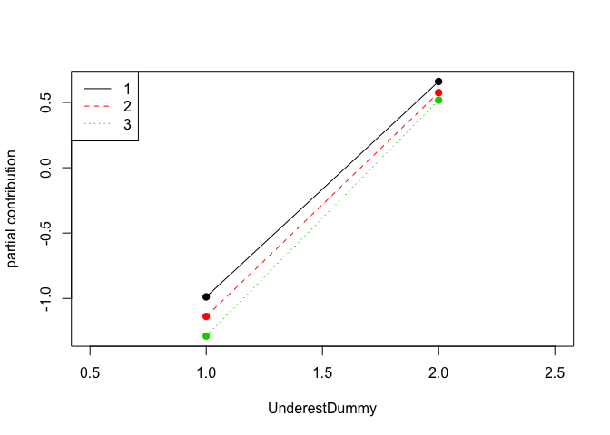
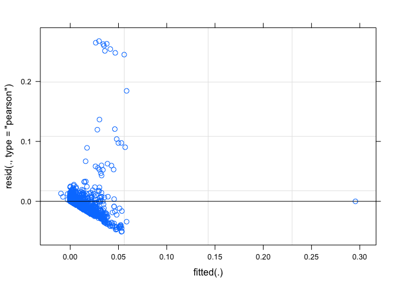
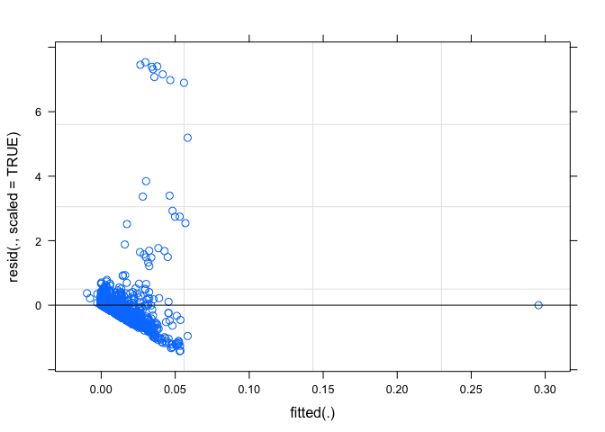
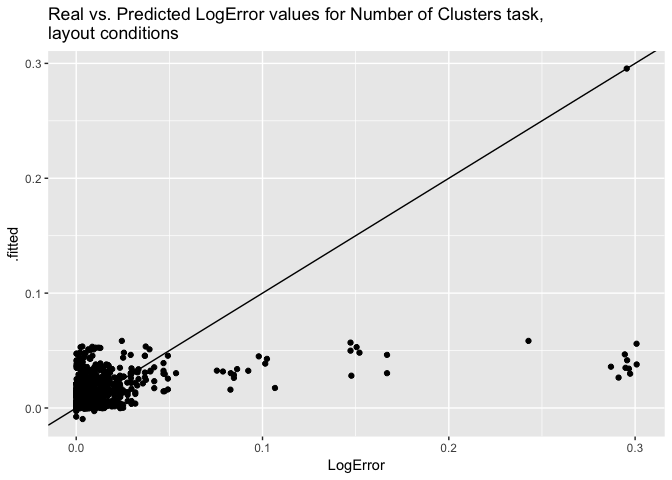

Layout Models for All Tasks
================
Angela Zoss
March 23, 2018

``` r
knitr::opts_chunk$set(warning=FALSE, message=FALSE)
```

``` r
source('LayoutSetup.R')
```

## Mixed Models

``` r
layouts %>% filter(Task %in% c("AvgDeg","NumClust","NumHighDegree","NumLinks","NumNodes")) %>% 
  ggplot(aes(Task, LogError)) + geom_violin() + scale_y_log10()
```

<!-- -->

``` r
layouts %>% filter(Task %in% c("AvgDeg","NumClust","NumHighDegree","NumLinks","NumNodes")) %>% 
  ggplot(aes(Task, LogError)) + geom_boxplot() + #scale_y_log10() +
  labs(title="Distribution of LogError for Numerical Response Tasks,\nlayout conditions")
```

<!-- -->

### Average Degree

``` r
knitr::opts_chunk$set(warning=FALSE, message=FALSE)
```

``` r
source('LayoutSetup.R')
```

#### lme4

``` r
# Condition

layout.avgdeg.lmer <- lmer(LogError ~ Condition + (1|Demo.ResponseID), data=layouts_avgdeg, REML = T)

summary(layout.avgdeg.lmer)

anova(layout.avgdeg.lmer)

# Condition is not significant; trying Ctrl_dummy

layout.avgdeg.lmer <- lmer(LogError ~ Ctrl_dummy + (1|Demo.ResponseID), data=layouts_avgdeg, REML = T)

summary(layout.avgdeg.lmer)

anova(layout.avgdeg.lmer)

# Ctrl_dummy is not significant; trying Dataset

layout.avgdeg.lmer.data <- lmer(LogError ~ Dataset + (1|Demo.ResponseID), data = layouts_avgdeg, REML = T)

summary(layout.avgdeg.lmer.data)

anova(layout.avgdeg.lmer.data)

# Dataset is barely significant (p=0.02879)

#layout.avgdeg.lmer <- lmer(LogError ~ QuestionOrder + (1|Demo.ResponseID), data=layouts_avgdeg, REML = T)

layouts_avgdeg.CS <- layouts_avgdeg %>% mutate(QuestionOrder=scale(QuestionOrder))

layout.avgdeg.lmer <- lmer(LogError ~ QuestionOrder + (1|Demo.ResponseID), data=layouts_avgdeg.CS, REML = T)

summary(layout.avgdeg.lmer)

anova(layout.avgdeg.lmer)

# QuestionOrder is not significant

layout.avgdeg.lmer <- lmer(LogError ~ DatasetOrder + (1|Demo.ResponseID), data=layouts_avgdeg, REML = T)

summary(layout.avgdeg.lmer)

anova(layout.avgdeg.lmer)

# DatasetOrder is not significant

layout.avgdeg.lmer <- lmer(LogError ~ DatasetDuration + (1|Demo.ResponseID), data=layouts_avgdeg, REML = T)

summary(layout.avgdeg.lmer)

anova(layout.avgdeg.lmer)

# DatasetDuration is not significant

layout.avgdeg.lmer <- lmer(LogError ~ DatasetStartTime + (1|Demo.ResponseID), data=layouts_avgdeg, REML = T)

summary(layout.avgdeg.lmer)

anova(layout.avgdeg.lmer)

# DatasetStartTime is not significant; trying TaskOrder

layout.avgdeg.lmer <- lmer(LogError ~ TaskOrder + (1|Demo.ResponseID), data=layouts_avgdeg, REML = T)

summary(layout.avgdeg.lmer)

anova(layout.avgdeg.lmer)

# TaskOrder is not significant; trying CorrectAnswer

layout.avgdeg.lmer.correct <- lmer(LogError ~ CorrectAnswer + (1|Demo.ResponseID), data=layouts_avgdeg, REML = T)

summary(layout.avgdeg.lmer.correct)

anova(layout.avgdeg.lmer.correct)

# CorrectAnswer is barely significant (p=0.03933)

layout.avgdeg.lmer.underest <- lmer(LogError ~ Underestimated + (1|Demo.ResponseID), data=layouts_avgdeg, REML = T)

summary(layout.avgdeg.lmer.underest)

anova(layout.avgdeg.lmer.underest)

# Underestimated is highly significant (p = 1.432e-12)

layout.avgdeg.lmer <- lmer(LogError ~ Stats.Q_TotalDuration + (1|Demo.ResponseID), data=layouts_avgdeg, REML = T)

summary(layout.avgdeg.lmer)

anova(layout.avgdeg.lmer)

# Stats.Q_TotalDuration is not significant; trying Stats.dataset_count

layout.avgdeg.lmer <- lmer(LogError ~ Stats.dataset_count + (1|Demo.ResponseID), data=layouts_avgdeg, REML = T)

summary(layout.avgdeg.lmer)

anova(layout.avgdeg.lmer)

# Stats.dataset_count is not significant; trying Stats.OperatingSystem

layout.avgdeg.lmer <- lmer(LogError ~ Stats.OperatingSystem + (1|Demo.ResponseID), data=layouts_avgdeg, REML = T)

summary(layout.avgdeg.lmer)

anova(layout.avgdeg.lmer)

# Stats.OperatingSystem is not significant

layout.avgdeg.lmer <- lmer(LogError ~ Stats.OperatingSystemCombined + (1|Demo.ResponseID), data=layouts_avgdeg, REML = T)

summary(layout.avgdeg.lmer)

anova(layout.avgdeg.lmer)

# Stats.OperatingSystemCombined is not significant

layouts_avgdeg.CS <- layouts_avgdeg %>% mutate(StatsNumPixels=scale(StatsNumPixels))

layout.avgdeg.lmer <- lmer(LogError ~ StatsNumPixels + (1|Demo.ResponseID), data=layouts_avgdeg.CS, REML = T)

summary(layout.avgdeg.lmer)

anova(layout.avgdeg.lmer)

# StatsNumPixels is not significant; trying Demo.age

layout.avgdeg.lmer <- lmer(LogError ~ Demo.age + (1|Demo.ResponseID), data=layouts_avgdeg %>% filter(!(is.na(Demo.age))), REML = T)

summary(layout.avgdeg.lmer)

anova(layout.avgdeg.lmer)

# Demo.age is not significant; trying Demo.gender

layout.avgdeg.lmer <- lmer(LogError ~ Demo.gender + (1|Demo.ResponseID), data=layouts_avgdeg %>% filter(!(is.na(Demo.gender))), REML = T)

summary(layout.avgdeg.lmer)

anova(layout.avgdeg.lmer)

# Demo.gender is not signficant; trying Demo.lang

layout.avgdeg.lmer <- lmer(LogError ~ Demo.lang + (1|Demo.ResponseID), data=layouts_avgdeg %>% filter(!(is.na(Demo.lang))), REML = T)

summary(layout.avgdeg.lmer)

anova(layout.avgdeg.lmer)

# Demo.lang is not signficant; trying Demo.educ

layout.avgdeg.lmer <- lmer(LogError ~ Demo.educ + (1|Demo.ResponseID), data=layouts_avgdeg %>% filter(!(is.na(Demo.educ))), REML = T)

summary(layout.avgdeg.lmer)

anova(layout.avgdeg.lmer)

# Demo.educ is not signficant; trying Demo.acfield

layout.avgdeg.lmer <- lmer(LogError ~ Demo.acfield + (1|Demo.ResponseID), data=layouts_avgdeg %>% filter(!(is.na(Demo.acfield))), REML = T)

summary(layout.avgdeg.lmer)

anova(layout.avgdeg.lmer)

# Demo.acfield is not signficant overall; trying Demo.acfieldGrouped

layout.avgdeg.lmer <- lmer(LogError ~ Demo.acfieldGrouped + (1|Demo.ResponseID), data=layouts_avgdeg %>% filter(!(is.na(Demo.acfieldGrouped))), REML = T)

summary(layout.avgdeg.lmer)

anova(layout.avgdeg.lmer)

# Demo.acfieldGrouped is not significant

layout.avgdeg.lmer <- lmer(LogError ~ Demo.acfieldGrouped2 + (1|Demo.ResponseID), data=layouts_avgdeg %>% filter(!(is.na(Demo.acfieldGrouped2))), REML = T)

summary(layout.avgdeg.lmer)

anova(layout.avgdeg.lmer)

# Demo.acfieldGrouped2 is not significant

layout.avgdeg.lmer <- lmer(LogError ~ Demo.acfieldGrouped3 + (1|Demo.ResponseID), data=layouts_avgdeg %>% filter(!(is.na(Demo.acfieldGrouped3))), REML = T)

summary(layout.avgdeg.lmer)

anova(layout.avgdeg.lmer)

# Demo.acfieldGrouped3 is not significant

layout.avgdeg.lmer.comp <- lmer(LogError ~ Demo.dailytech_Computer + (1|Demo.ResponseID), data=layouts_avgdeg %>% filter(!(is.na(Demo.dailytech_Computer))), REML = T)

summary(layout.avgdeg.lmer.comp)

anova(layout.avgdeg.lmer.comp)

# Demo.dailytech_Computer is significant (p=0.006587); trying Demo.dailytech_Tablet

layout.avgdeg.lmer <- lmer(LogError ~ Demo.dailytech_Tablet + (1|Demo.ResponseID), data=layouts_avgdeg %>% filter(!(is.na(Demo.dailytech_Tablet))), REML = T)

summary(layout.avgdeg.lmer)

anova(layout.avgdeg.lmer)

# Demo.dailytech_Computer is not significant

layout.avgdeg.lmer.SP <- lmer(LogError ~ Demo.dailytech_SmartPhone + (1|Demo.ResponseID), data=layouts_avgdeg %>% filter(!(is.na(Demo.dailytech_SmartPhone))), REML = T)

summary(layout.avgdeg.lmer.SP)

anova(layout.avgdeg.lmer.SP)

# Demo.dailytech_SmartPhone is barely significant (p=0.03045)

layout.avgdeg.lmer <- lmer(LogError ~ Demo.weeklygaming + (1|Demo.ResponseID), data=layouts_avgdeg %>% filter(!(is.na(Demo.weeklygaming))), REML = T)

summary(layout.avgdeg.lmer)

anova(layout.avgdeg.lmer)

# Demo.weeklygaming is not significant; trying Demo.expdataanal

layout.avgdeg.lmer <- lmer(LogError ~ Demo.expdataanal + (1|Demo.ResponseID), data=layouts_avgdeg %>% filter(!(is.na(Demo.expdataanal))), REML = T)

summary(layout.avgdeg.lmer)

anova(layout.avgdeg.lmer)

# Demo.expdataanal is not significant; trying Demo.expdatavis

layout.avgdeg.lmer <- lmer(LogError ~ Demo.expdatavis + (1|Demo.ResponseID), data=layouts_avgdeg %>% filter(!(is.na(Demo.expdatavis))), REML = T)

summary(layout.avgdeg.lmer)

anova(layout.avgdeg.lmer)

# Demo.expdatavis is not significant; trying Demo.expreadnetvis

layout.avgdeg.lmer <- lmer(LogError ~ Demo.expreadnetvis + (1|Demo.ResponseID), data=layouts_avgdeg %>% filter(!(is.na(Demo.expreadnetvis))), REML = T)

summary(layout.avgdeg.lmer)

anova(layout.avgdeg.lmer)

# Demo.expreadnetvis is not significant

layout.avgdeg.lmer <- lmer(LogError ~ Demo.expcreatenetvis + (1|Demo.ResponseID), data=layouts_avgdeg %>% filter(!(is.na(Demo.expcreatenetvis))), REML = T)

summary(layout.avgdeg.lmer)

anova(layout.avgdeg.lmer)

# Demo.expcreatenetvis is not significant; trying AvgDeg

layout.avgdeg.lmer.avgdeg <- lmer(LogError ~ AvgDeg + (1|Demo.ResponseID), data=layouts_avgdeg, REML = T)

summary(layout.avgdeg.lmer.avgdeg)

anova(layout.avgdeg.lmer.avgdeg)

# AvgDeg is significant (p=0.03933)

layout.avgdeg.lmer <- lmer(LogError ~ Density + (1|Demo.ResponseID), data=layouts_avgdeg, REML = T)

summary(layout.avgdeg.lmer)

anova(layout.avgdeg.lmer)

# Density is barely not significant (p=0.05856)

layout.avgdeg.lmer.lgclust <- lmer(LogError ~ LargeClust1 + (1|Demo.ResponseID), data=layouts_avgdeg, REML = T)

summary(layout.avgdeg.lmer.lgclust)

anova(layout.avgdeg.lmer.lgclust)

# LargeClust1 is barely significant (p=0.04142)

layout.avgdeg.lmer.mod <- lmer(LogError ~ Modularity + (1|Demo.ResponseID), data=layouts_avgdeg, REML = T)

summary(layout.avgdeg.lmer.mod)

anova(layout.avgdeg.lmer.mod)

# Modularity is barely significant (p=0.03925)

layout.avgdeg.lmer.nclust <- lmer(LogError ~ NumClust + (1|Demo.ResponseID), data=layouts_avgdeg, REML = T)

summary(layout.avgdeg.lmer.nclust)

anova(layout.avgdeg.lmer.nclust)

# NumClust is significant (p=0.00886)

layout.avgdeg.lmer <- lmer(LogError ~ NumHighDegree + (1|Demo.ResponseID), data=layouts_avgdeg, REML = T)

summary(layout.avgdeg.lmer)

anova(layout.avgdeg.lmer)

# NumHighDegree is not significant

layout.avgdeg.lmer <- lmer(LogError ~ NumLinks + (1|Demo.ResponseID), data=layouts_avgdeg, REML = T)

summary(layout.avgdeg.lmer)

anova(layout.avgdeg.lmer)

# NumLinks is barely not significant

layout.avgdeg.lmer.numnodes <- lmer(LogError ~ NumNodes + (1|Demo.ResponseID), data=layouts_avgdeg, REML = T)

summary(layout.avgdeg.lmer.numnodes)

anova(layout.avgdeg.lmer.numnodes)

# NumNodes is barely significant (p=0.01815)

layout.avgdeg.lmer.numnodesclust1 <- lmer(LogError ~ NumNodesClust1 + (1|Demo.ResponseID), data=layouts_avgdeg, REML = T)

summary(layout.avgdeg.lmer.numnodesclust1)

anova(layout.avgdeg.lmer.numnodesclust1)

# NumNodesClust1 is barely significant (p=0.04227)

layout.avgdeg.lmer <- lmer(LogError ~ filename + (1|Demo.ResponseID), data=layouts_avgdeg, REML = T)

summary(layout.avgdeg.lmer)

anova(layout.avgdeg.lmer)

# filename is not significant

layout.avgdeg.lmer <- lmer(LogError ~ NetVisExperience + (1|Demo.ResponseID), data=layouts_avgdeg, REML = T)

summary(layout.avgdeg.lmer)

anova(layout.avgdeg.lmer)

# NetVisExperience is not significant

layout.avgdeg.lmer <- lmer(LogError ~ Stats.CompensationCondition + (1|Demo.ResponseID), data=layouts_avgdeg %>% filter(filename=="FacultyGrad"), REML = T)

summary(layout.avgdeg.lmer)

anova(layout.avgdeg.lmer)

# Stats.CompensationCondition is not significant
```

``` r
temp.avgdeg <- layouts_avgdeg %>% dplyr::select(Demo.ResponseID, LogError, Dataset, CorrectAnswer, Underestimated, Demo.dailytech_Computer, Demo.dailytech_SmartPhone, AvgDeg, LargeClust1, Modularity, NumClust, NumNodes, NumNodesClust1) %>% drop_na()

layout.avgdeg.lmer.full <- lmer(LogError ~ Dataset + Underestimated + Demo.dailytech_Computer + (1|Demo.ResponseID), data=temp.avgdeg, REML = T)

summary(layout.avgdeg.lmer.full)
```

    ## Linear mixed model fit by REML t-tests use Satterthwaite approximations
    ##   to degrees of freedom [lmerMod]
    ## Formula: LogError ~ Dataset + Underestimated + Demo.dailytech_Computer +  
    ##     (1 | Demo.ResponseID)
    ##    Data: temp.avgdeg
    ## 
    ## REML criterion at convergence: -2694
    ## 
    ## Scaled residuals: 
    ##     Min      1Q  Median      3Q     Max 
    ## -2.1249 -0.3374 -0.0685  0.1021  7.0445 
    ## 
    ## Random effects:
    ##  Groups          Name        Variance  Std.Dev.
    ##  Demo.ResponseID (Intercept) 0.0004332 0.02081 
    ##  Residual                    0.0011174 0.03343 
    ## Number of obs: 747, groups:  Demo.ResponseID, 413
    ## 
    ## Fixed effects:
    ##                           Estimate Std. Error         df t value Pr(>|t|)
    ## (Intercept)               0.014431   0.004753 500.800000   3.036  0.00252
    ## Dataset.L                -0.009546   0.002301 578.300000  -4.149 3.84e-05
    ## Dataset.Q                -0.001325   0.002246 551.700000  -0.590  0.55558
    ## Underestimatedunder      -0.021698   0.002981 742.000000  -7.279 8.56e-13
    ## Demo.dailytech_Computer   0.001375   0.000479 453.400000   2.871  0.00428
    ##                            
    ## (Intercept)             ** 
    ## Dataset.L               ***
    ## Dataset.Q                  
    ## Underestimatedunder     ***
    ## Demo.dailytech_Computer ** 
    ## ---
    ## Signif. codes:  0 '***' 0.001 '**' 0.01 '*' 0.05 '.' 0.1 ' ' 1
    ## 
    ## Correlation of Fixed Effects:
    ##             (Intr) Dtst.L Dtst.Q Undrst
    ## Dataset.L   -0.055                     
    ## Dataset.Q    0.039 -0.025              
    ## Undrstmtdnd -0.377  0.212 -0.070       
    ## Dm.dlytch_C -0.867 -0.023 -0.020  0.018

``` r
anova(layout.avgdeg.lmer.full)
```

    ## Analysis of Variance Table of type III  with  Satterthwaite 
    ## approximation for degrees of freedom
    ##                           Sum Sq  Mean Sq NumDF  DenDF F.value    Pr(>F)
    ## Dataset                 0.019774 0.009887     2 564.36   8.848 0.0001645
    ## Underestimated          0.059209 0.059209     1 742.01  52.990 8.562e-13
    ## Demo.dailytech_Computer 0.009213 0.009213     1 453.41   8.245 0.0042769
    ##                            
    ## Dataset                 ***
    ## Underestimated          ***
    ## Demo.dailytech_Computer ** 
    ## ---
    ## Signif. codes:  0 '***' 0.001 '**' 0.01 '*' 0.05 '.' 0.1 ' ' 1

``` r
layout.avgdeg.lmer.underest <- lmer(LogError ~ Underestimated + (1|Demo.ResponseID), data=temp.avgdeg, REML = T)

anova(layout.avgdeg.lmer.full, layout.avgdeg.lmer.underest)
```

    ## Data: temp.avgdeg
    ## Models:
    ## ..1: LogError ~ Underestimated + (1 | Demo.ResponseID)
    ## object: LogError ~ Dataset + Underestimated + Demo.dailytech_Computer + 
    ## object:     (1 | Demo.ResponseID)
    ##        Df   AIC     BIC logLik deviance  Chisq Chi Df Pr(>Chisq)    
    ## ..1     4 -2716 -2697.5 1362.0    -2724                             
    ## object  7 -2735 -2702.7 1374.5    -2749 25.042      3  1.513e-05 ***
    ## ---
    ## Signif. codes:  0 '***' 0.001 '**' 0.01 '*' 0.05 '.' 0.1 ' ' 1

``` r
# keep full
```

``` r
layout.avgdeg.lmer.int <- lmer(LogError ~ Dataset + 
                                 Underestimated + 
                                 Demo.dailytech_Computer + 
                                 Dataset:Demo.dailytech_Computer +
                                 (1|Demo.ResponseID), data=temp.avgdeg, REML = T)

summary(layout.avgdeg.lmer.int)
```

    ## Linear mixed model fit by REML t-tests use Satterthwaite approximations
    ##   to degrees of freedom [lmerMod]
    ## Formula: LogError ~ Dataset + Underestimated + Demo.dailytech_Computer +  
    ##     Dataset:Demo.dailytech_Computer + (1 | Demo.ResponseID)
    ##    Data: temp.avgdeg
    ## 
    ## REML criterion at convergence: -2674.5
    ## 
    ## Scaled residuals: 
    ##     Min      1Q  Median      3Q     Max 
    ## -2.0353 -0.3294 -0.0759  0.1190  6.8896 
    ## 
    ## Random effects:
    ##  Groups          Name        Variance  Std.Dev.
    ##  Demo.ResponseID (Intercept) 0.0004378 0.02092 
    ##  Residual                    0.0011064 0.03326 
    ## Number of obs: 747, groups:  Demo.ResponseID, 413
    ## 
    ## Fixed effects:
    ##                                     Estimate Std. Error         df t value
    ## (Intercept)                        1.407e-02  4.776e-03  5.002e+02   2.945
    ## Dataset.L                         -4.333e-03  6.121e-03  5.705e+02  -0.708
    ## Dataset.Q                          1.205e-02  6.159e-03  5.645e+02   1.956
    ## Underestimatedunder               -2.093e-02  2.994e-03  7.400e+02  -6.988
    ## Demo.dailytech_Computer            1.379e-03  4.804e-04  4.528e+02   2.870
    ## Dataset.L:Demo.dailytech_Computer -5.865e-04  6.644e-04  5.782e+02  -0.883
    ## Dataset.Q:Demo.dailytech_Computer -1.579e-03  6.792e-04  5.697e+02  -2.324
    ##                                   Pr(>|t|)    
    ## (Intercept)                        0.00338 ** 
    ## Dataset.L                          0.47930    
    ## Dataset.Q                          0.05099 .  
    ## Underestimatedunder               6.22e-12 ***
    ## Demo.dailytech_Computer            0.00430 ** 
    ## Dataset.L:Demo.dailytech_Computer  0.37769    
    ## Dataset.Q:Demo.dailytech_Computer  0.02048 *  
    ## ---
    ## Signif. codes:  0 '***' 0.001 '**' 0.01 '*' 0.05 '.' 0.1 ' ' 1
    ## 
    ## Correlation of Fixed Effects:
    ##             (Intr) Dtst.L Dtst.Q Undrst Dm.d_C D.L:D.
    ## Dataset.L    0.057                                   
    ## Dataset.Q   -0.042  0.057                            
    ## Undrstmtdnd -0.381  0.061  0.083                     
    ## Dm.dlytch_C -0.868 -0.080  0.020  0.023              
    ## Dtst.L:D._C -0.085 -0.927 -0.050  0.022  0.078       
    ## Dtst.Q:D._C  0.061 -0.058 -0.932 -0.117 -0.030  0.046

``` r
anova(layout.avgdeg.lmer.int)
```

    ## Analysis of Variance Table of type III  with  Satterthwaite 
    ## approximation for degrees of freedom
    ##                                   Sum Sq  Mean Sq NumDF  DenDF F.value
    ## Dataset                         0.004975 0.002488     2 568.04   2.249
    ## Underestimated                  0.054029 0.054029     1 740.01  48.834
    ## Demo.dailytech_Computer         0.009114 0.009114     1 452.84   8.237
    ## Dataset:Demo.dailytech_Computer 0.006642 0.003321     2 574.36   3.002
    ##                                   Pr(>F)    
    ## Dataset                         0.106495    
    ## Underestimated                  6.22e-12 ***
    ## Demo.dailytech_Computer         0.004296 ** 
    ## Dataset:Demo.dailytech_Computer 0.050482 .  
    ## ---
    ## Signif. codes:  0 '***' 0.001 '**' 0.01 '*' 0.05 '.' 0.1 ' ' 1

``` r
anova(layout.avgdeg.lmer.full, layout.avgdeg.lmer.int)
```

    ## Data: temp.avgdeg
    ## Models:
    ## object: LogError ~ Dataset + Underestimated + Demo.dailytech_Computer + 
    ## object:     (1 | Demo.ResponseID)
    ## ..1: LogError ~ Dataset + Underestimated + Demo.dailytech_Computer + 
    ## ..1:     Dataset:Demo.dailytech_Computer + (1 | Demo.ResponseID)
    ##        Df   AIC     BIC logLik deviance Chisq Chi Df Pr(>Chisq)  
    ## object  7 -2735 -2702.7 1374.5    -2749                          
    ## ..1     9 -2737 -2695.5 1377.5    -2755 6.024      2    0.04919 *
    ## ---
    ## Signif. codes:  0 '***' 0.001 '**' 0.01 '*' 0.05 '.' 0.1 ' ' 1

``` r
# interaction barely significantly better

layout.avgdeg.lmer.int.2 <- lmer(LogError ~ Dataset + 
                                 Underestimated + 
                                 Demo.dailytech_Computer + 
                                 Dataset:Demo.dailytech_Computer +
                                   Underestimated:Demo.dailytech_Computer +
                                 (1|Demo.ResponseID), data=temp.avgdeg, REML = T)

summary(layout.avgdeg.lmer.int.2)
```

    ## Linear mixed model fit by REML t-tests use Satterthwaite approximations
    ##   to degrees of freedom [lmerMod]
    ## Formula: LogError ~ Dataset + Underestimated + Demo.dailytech_Computer +  
    ##     Dataset:Demo.dailytech_Computer + Underestimated:Demo.dailytech_Computer +  
    ##     (1 | Demo.ResponseID)
    ##    Data: temp.avgdeg
    ## 
    ## REML criterion at convergence: -2670.7
    ## 
    ## Scaled residuals: 
    ##     Min      1Q  Median      3Q     Max 
    ## -2.0981 -0.2839 -0.0651  0.1094  6.9740 
    ## 
    ## Random effects:
    ##  Groups          Name        Variance  Std.Dev.
    ##  Demo.ResponseID (Intercept) 0.0004278 0.02068 
    ##  Residual                    0.0010995 0.03316 
    ## Number of obs: 747, groups:  Demo.ResponseID, 413
    ## 
    ## Fixed effects:
    ##                                               Estimate Std. Error
    ## (Intercept)                                  2.931e-03  6.099e-03
    ## Dataset.L                                    2.566e-04  6.300e-03
    ## Dataset.Q                                    1.012e-02  6.171e-03
    ## Underestimatedunder                          6.938e-04  8.015e-03
    ## Demo.dailytech_Computer                      2.698e-03  6.582e-04
    ## Dataset.L:Demo.dailytech_Computer           -1.149e-03  6.898e-04
    ## Dataset.Q:Demo.dailytech_Computer           -1.258e-03  6.855e-04
    ## Underestimatedunder:Demo.dailytech_Computer -2.576e-03  8.857e-04
    ##                                                     df t value Pr(>|t|)
    ## (Intercept)                                  6.331e+02   0.480  0.63106
    ## Dataset.L                                    5.913e+02   0.041  0.96753
    ## Dataset.Q                                    5.661e+02   1.639  0.10170
    ## Underestimatedunder                          7.372e+02   0.087  0.93104
    ## Demo.dailytech_Computer                      6.301e+02   4.099  4.7e-05
    ## Dataset.L:Demo.dailytech_Computer            6.048e+02  -1.666  0.09618
    ## Dataset.Q:Demo.dailytech_Computer            5.740e+02  -1.836  0.06695
    ## Underestimatedunder:Demo.dailytech_Computer  7.380e+02  -2.908  0.00375
    ##                                                
    ## (Intercept)                                    
    ## Dataset.L                                      
    ## Dataset.Q                                      
    ## Underestimatedunder                            
    ## Demo.dailytech_Computer                     ***
    ## Dataset.L:Demo.dailytech_Computer           .  
    ## Dataset.Q:Demo.dailytech_Computer           .  
    ## Underestimatedunder:Demo.dailytech_Computer ** 
    ## ---
    ## Signif. codes:  0 '***' 0.001 '**' 0.01 '*' 0.05 '.' 0.1 ' ' 1
    ## 
    ## Correlation of Fixed Effects:
    ##             (Intr) Dtst.L Dtst.Q Undrst Dm.d_C D.L:D. D.Q:D.
    ## Dataset.L   -0.115                                          
    ## Dataset.Q    0.035  0.027                                   
    ## Undrstmtdnd -0.694  0.256 -0.069                            
    ## Dm.dlytch_C -0.922  0.117 -0.059  0.646                     
    ## Dtst.L:D._C  0.114 -0.932 -0.017 -0.254 -0.140              
    ## Dtst.Q:D._C -0.054 -0.015 -0.931  0.106  0.089 -0.002       
    ## Undrst:D._C  0.628 -0.252  0.107 -0.928 -0.689  0.282 -0.161

``` r
anova(layout.avgdeg.lmer.int.2)
```

    ## Analysis of Variance Table of type III  with  Satterthwaite 
    ## approximation for degrees of freedom
    ##                                           Sum Sq   Mean Sq NumDF  DenDF
    ## Dataset                                0.0029547 0.0014774     2 579.06
    ## Underestimated                         0.0000082 0.0000082     1 737.18
    ## Demo.dailytech_Computer                0.0095942 0.0095942     1 451.43
    ## Dataset:Demo.dailytech_Computer        0.0067672 0.0033836     2 589.17
    ## Underestimated:Demo.dailytech_Computer 0.0092984 0.0092984     1 738.00
    ##                                        F.value   Pr(>F)   
    ## Dataset                                 1.3437 0.261685   
    ## Underestimated                          0.0075 0.931043   
    ## Demo.dailytech_Computer                 8.7263 0.003300 **
    ## Dataset:Demo.dailytech_Computer         3.0775 0.046817 * 
    ## Underestimated:Demo.dailytech_Computer  8.4572 0.003745 **
    ## ---
    ## Signif. codes:  0 '***' 0.001 '**' 0.01 '*' 0.05 '.' 0.1 ' ' 1

``` r
anova(layout.avgdeg.lmer.full, layout.avgdeg.lmer.int.2) # definitely better than full
```

    ## Data: temp.avgdeg
    ## Models:
    ## object: LogError ~ Dataset + Underestimated + Demo.dailytech_Computer + 
    ## object:     (1 | Demo.ResponseID)
    ## ..1: LogError ~ Dataset + Underestimated + Demo.dailytech_Computer + 
    ## ..1:     Dataset:Demo.dailytech_Computer + Underestimated:Demo.dailytech_Computer + 
    ## ..1:     (1 | Demo.ResponseID)
    ##        Df     AIC     BIC logLik deviance  Chisq Chi Df Pr(>Chisq)   
    ## object  7 -2735.0 -2702.7 1374.5  -2749.0                            
    ## ..1    10 -2743.5 -2697.4 1381.8  -2763.5 14.515      3   0.002281 **
    ## ---
    ## Signif. codes:  0 '***' 0.001 '**' 0.01 '*' 0.05 '.' 0.1 ' ' 1

``` r
anova(layout.avgdeg.lmer.int, layout.avgdeg.lmer.int.2) # also better than previous interaction
```

    ## Data: temp.avgdeg
    ## Models:
    ## object: LogError ~ Dataset + Underestimated + Demo.dailytech_Computer + 
    ## object:     Dataset:Demo.dailytech_Computer + (1 | Demo.ResponseID)
    ## ..1: LogError ~ Dataset + Underestimated + Demo.dailytech_Computer + 
    ## ..1:     Dataset:Demo.dailytech_Computer + Underestimated:Demo.dailytech_Computer + 
    ## ..1:     (1 | Demo.ResponseID)
    ##        Df     AIC     BIC logLik deviance  Chisq Chi Df Pr(>Chisq)   
    ## object  9 -2737.0 -2695.5 1377.5  -2755.0                            
    ## ..1    10 -2743.5 -2697.4 1381.8  -2763.5 8.4914      1   0.003568 **
    ## ---
    ## Signif. codes:  0 '***' 0.001 '**' 0.01 '*' 0.05 '.' 0.1 ' ' 1

``` r
#keep 2
```

``` r
#SAVE THE RESULTS
save(layout.avgdeg.lmer.int.2, file = file.path(analysisDataDir,"fits/layout_avgdeg_lmer_int.RData"))
```

``` r
rand(layout.avgdeg.lmer.int.2)
```

    ## Analysis of Random effects Table:
    ##                 Chi.sq Chi.DF p.value    
    ## Demo.ResponseID   40.4      1   2e-10 ***
    ## ---
    ## Signif. codes:  0 '***' 0.001 '**' 0.01 '*' 0.05 '.' 0.1 ' ' 1

``` r
# result shows that random effects of participant are significant (p=2e-10)

anova(layout.avgdeg.lmer.int.2)
```

    ## Analysis of Variance Table of type III  with  Satterthwaite 
    ## approximation for degrees of freedom
    ##                                           Sum Sq   Mean Sq NumDF  DenDF
    ## Dataset                                0.0029547 0.0014774     2 579.06
    ## Underestimated                         0.0000082 0.0000082     1 737.18
    ## Demo.dailytech_Computer                0.0095942 0.0095942     1 451.43
    ## Dataset:Demo.dailytech_Computer        0.0067672 0.0033836     2 589.17
    ## Underestimated:Demo.dailytech_Computer 0.0092984 0.0092984     1 738.00
    ##                                        F.value   Pr(>F)   
    ## Dataset                                 1.3437 0.261685   
    ## Underestimated                          0.0075 0.931043   
    ## Demo.dailytech_Computer                 8.7263 0.003300 **
    ## Dataset:Demo.dailytech_Computer         3.0775 0.046817 * 
    ## Underestimated:Demo.dailytech_Computer  8.4572 0.003745 **
    ## ---
    ## Signif. codes:  0 '***' 0.001 '**' 0.01 '*' 0.05 '.' 0.1 ' ' 1

``` r
#ranef(layout.avgdeg.lmer.full)

# displays the random effects; not that useful

# unlike lme(), lmer() doesn't allow for heterogeneous error variance structures (the "weights")

ggplot(layouts_avgdeg) + geom_histogram(aes(LogError), binwidth=.005) + labs(title="Distribution of LogError values for Average Degree task,\nlayout conditions")
```

<!-- -->

``` r
(r2nsj = r2beta(layout.avgdeg.lmer.int.2, method = 'nsj', partial = TRUE))
```

    ##                                        Effect   Rsq upper.CL lower.CL
    ## 1                                       Model 0.102    0.151    0.071
    ## 5                     Demo.dailytech_Computer 0.025    0.051    0.008
    ## 8 Underestimatedunder:Demo.dailytech_Computer 0.011    0.031    0.001
    ## 7           Dataset.Q:Demo.dailytech_Computer 0.004    0.017    0.000
    ## 6           Dataset.L:Demo.dailytech_Computer 0.003    0.016    0.000
    ## 3                                   Dataset.Q 0.003    0.016    0.000
    ## 4                         Underestimatedunder 0.000    0.007    0.000
    ## 2                                   Dataset.L 0.000    0.007    0.000

``` r
(r2nsj = r2beta(layout.avgdeg.lmer.int.2, method = 'nsj', partial = TRUE))[1,'Rsq']
```

    ## [1] 0.1016992

``` r
plot(layout.avgdeg.lmer.int.2)

plot(layout.avgdeg.lmer.int.2, resid(., scaled=TRUE) ~ fitted(.), abline = 0)

plot(layout.avgdeg.lmer.int.2, resid(.) ~ fitted(.) | Underestimated, abline = 0)

plot(layout.avgdeg.lmer.int.2, resid(., scaled=TRUE) ~ fitted(.) | Underestimated, abline = 0)

plot(layout.avgdeg.lmer.int.2, LogError ~ fitted(.), abline = c(0,1))
```

``` r
layout.avgdeg.lmer.int.2.f <- fortify(layout.avgdeg.lmer.int.2)

ggplot(layout.avgdeg.lmer.int.2.f, aes(.fitted,.resid)) + 
  geom_point() +
  #facet_grid(.~Sex) + 
  geom_hline(yintercept=0)
```

<!-- -->

``` r
ggplot(layout.avgdeg.lmer.int.2.f, aes(.fitted,LogError)) + 
  geom_point() +
  geom_abline(aes(slope = 1, intercept = 0))
```

<!-- -->

``` r
ggplot(layout.avgdeg.lmer.int.2.f, aes(LogError,.fitted)) + 
  geom_point() +
  geom_abline(aes(slope = 1, intercept = 0)) +
  #scale_y_continuous(limits=c(0,0.3)) +
  labs(title="Real vs. Predicted LogError values for Average Degree task,\nlayout conditions")
```

<!-- -->

#### Least Squares Means

Do for each categorical predictor. Final model: layout.avgdeg.lmer.int.2
\<- lmer(LogError ~ Dataset + Underestimated + Demo.dailytech\_Computer
+ Dataset:Demo.dailytech\_Computer +
Underestimated:Demo.dailytech\_Computer + (1|Demo.ResponseID),
data=temp.avgdeg, REML = T)

##### Dataset

###### emmeans

``` r
# trying to use emmeans package for lsmeans table

# can use ref_grid to see if emmeans is finding nestings within variables, which can cause problems(?)
# ref_grid(layout.numhd.lmer.full.int.4)
# unfortunately, considers Overestimated nested in Dataset because I didn't include 
# Overestimated as a fixed effect; can use nesting = NULL to ignore this auto-detection of nesting

# also want to check if any combination of two factors has zeroes in the cells
# with(layouts_numhighdeg, table(Dataset,Overestimated))
# ref_grid(layout.numhd.lmer.full.int.4) @ grid; .wgt. is number of observations

layout.avgdeg.emm.data <- emmeans(layout.avgdeg.lmer.int.2, "Dataset", nesting = NULL)
#layout.numhd.emm.condition <- emmeans(layout.numhd.lmer.full.int.4, "Condition", lmer.df = "satterthwaite")

layout.avgdeg.emm.data
```

    ##  Dataset      emmean          SE     df    lower.CL   upper.CL
    ##  1       0.021792776 0.002518963 737.35 0.016847582 0.02673797
    ##  7       0.015791937 0.002460736 737.02 0.010961051 0.02062282
    ##  9       0.008300679 0.002435177 736.52 0.003519963 0.01308140
    ## 
    ## Results are averaged over the levels of: Underestimated 
    ## Degrees-of-freedom method: kenward-roger 
    ## Confidence level used: 0.95

``` r
layout.avgdeg.emm.data.df <- dplyr::as_data_frame(layout.avgdeg.emm.data)

layout.avgdeg.emm.data.df
```

    ## # A tibble: 3 x 6
    ##   Dataset  emmean      SE    df lower.CL upper.CL
    ## * <fct>     <dbl>   <dbl> <dbl>    <dbl>    <dbl>
    ## 1 1       0.0218  0.00252   737  0.0168    0.0267
    ## 2 7       0.0158  0.00246   737  0.0110    0.0206
    ## 3 9       0.00830 0.00244   737  0.00352   0.0131

``` r
# From: https://cran.r-project.org/web/packages/emmeans/vignettes/comparisons.html
# The blue bars are confidence intervals for the EMMs, and the red arrows are for the comparisons among them. If an arrow from one mean overlaps an arrow from another group, the difference is not significant, based on the adjust setting (which defaults to "tukey"). (Note: Don’t ever use confidence intervals for EMMs to perform comparisons; they can be very misleading.)

# TO DO : can't figure out how to extract data about the arrows in order to reproduce the layout

#xtable::xtable(layout.numhd.emm.condition)

layout.avgdeg.emm.data.cld <- cld(layout.avgdeg.emm.data,
                details=TRUE,
                #alpha=0.01,
                #by="Dataset",
                #Letters="|||||||||||||||||||",
                sort=TRUE
)

layout.avgdeg.emm.data.cld.df <- layout.avgdeg.emm.data.cld$emmeans

layout.avgdeg.emm.data.cld.df %>% dplyr::select(Dataset,.group)
```

    ##  Dataset .group
    ##  9        1    
    ##  7         2   
    ##  1         2   
    ## 
    ## Results are averaged over the levels of: Underestimated 
    ## Degrees-of-freedom method: kenward-roger 
    ## Confidence level used: 0.95 
    ## P value adjustment: tukey method for comparing a family of 3 estimates 
    ## significance level used: alpha = 0.05

``` r
layout.avgdeg.emm.data.cld.df
```

    ##  Dataset      emmean          SE     df    lower.CL   upper.CL .group
    ##  9       0.008300679 0.002435177 736.52 0.003519963 0.01308140  1    
    ##  7       0.015791937 0.002460736 737.02 0.010961051 0.02062282   2   
    ##  1       0.021792776 0.002518963 737.35 0.016847582 0.02673797   2   
    ## 
    ## Results are averaged over the levels of: Underestimated 
    ## Degrees-of-freedom method: kenward-roger 
    ## Confidence level used: 0.95 
    ## P value adjustment: tukey method for comparing a family of 3 estimates 
    ## significance level used: alpha = 0.05

``` r
layout.avgdeg.emm.data.cld.df$Dataset <- factor(layout.avgdeg.emm.data.cld.df$Dataset, levels=layout.avgdeg.emm.data.cld.df %>% arrange(desc(emmean)) %>% dplyr::select(Dataset) %>% unlist())


#emmip(layout.numlinks.lmer.full.int, ~Condition, CIs = TRUE)
emmip(layout.avgdeg.emm.data, ~Dataset, CIs = TRUE)
```

<!-- -->

``` r
plot(layout.avgdeg.emm.data)
```

<!-- -->

``` r
#plot(layout.numlinks.emm.cond, comparisons = TRUE)

layout.avgdeg.emm.data.cld.df %>% arrange(desc(emmean))
```

    ##   Dataset      emmean          SE       df    lower.CL   upper.CL .group
    ## 1       1 0.021792776 0.002518963 737.3526 0.016847582 0.02673797      2
    ## 2       7 0.015791937 0.002460736 737.0221 0.010961051 0.02062282      2
    ## 3       9 0.008300679 0.002435177 736.5239 0.003519963 0.01308140     1

``` r
ggplot(layout.avgdeg.emm.data.cld.df) +
  #geom_point(aes(x=Condition,y=emmean), shape=21, size=7) +
  geom_errorbar(aes(x=Dataset,ymax=upper.CL,ymin=lower.CL), width=.2) +
  geom_point(aes(x=Dataset,y=emmean), size=7) +
  #scale_fill_manual("Significance Levels", values=sig.colors) +
  coord_flip()
```

<!-- -->

``` r
#plot(ref_grid(layout.numnodes.lmer.int.3), by="Condition") 
# try to figure this out? maybe only works on the interaction?
```

``` r
layout.avgdeg.emm.data.pairs <- dplyr::as_data_frame(pairs(layout.avgdeg.emm.data)) 
layout.avgdeg.emm.data.pairs
```

    ## # A tibble: 3 x 6
    ##   contrast estimate      SE    df t.ratio  p.value
    ## * <fct>       <dbl>   <dbl> <dbl>   <dbl>    <dbl>
    ## 1 1 - 7     0.00600 0.00324   537    1.85 0.153   
    ## 2 1 - 9     0.0135  0.00324   536    4.17 0.000106
    ## 3 7 - 9     0.00749 0.00315   493    2.38 0.0469

``` r
# for some reason, full.cld$comparisons returns estimates that are all positive; 
# pairs(layout.numhd.emm.condition) has both negative and positive estimates
# and joins better to confint()

pairs.CI <- confint(pairs(layout.avgdeg.emm.data))

layout.avgdeg.emm.data.pairs <- full_join(layout.avgdeg.emm.data.pairs, pairs.CI)

#layout.numhd.diffemm.condition <- emmeans(layout.numhd.lmer.full.int.4, pairwise ~ Condition)
#layout.numhd.diffemm.condition$contrasts
#contrast(layout.numhd.emm.condition)
#confint(layout.numhd.emm.condition)
#pairs(layout.numhd.emm.condition, details=TRUE)
#confint(contrast(layout.numhd.emm.condition))
#confint(pairs(layout.numhd.emm.condition))
#coef(pairs(layout.numhd.emm.condition))


plot(pairs(layout.avgdeg.emm.data))
```

<!-- -->

``` r
plot(pairs(layout.avgdeg.emm.data), comparisons = TRUE)
```

<!-- -->

``` r
layout.avgdeg.emm.data.pairs$sig.levels <- 
  case_when(layout.avgdeg.emm.data.pairs$p.value < .0001 ~ sig.level.names[1],
            layout.avgdeg.emm.data.pairs$p.value < .001 ~ sig.level.names[2],
            layout.avgdeg.emm.data.pairs$p.value < .01 ~ sig.level.names[3],
            layout.avgdeg.emm.data.pairs$p.value < .05 ~ sig.level.names[4],
            TRUE ~ sig.level.names[5])

layout.avgdeg.emm.data.pairs$sig.levels <- factor(layout.avgdeg.emm.data.pairs$sig.levels, levels=sig.level.names,ordered=TRUE)


layout.avgdeg.emm.data.pairs$contrast <- factor(layout.avgdeg.emm.data.pairs$contrast, levels=layout.avgdeg.emm.data.pairs %>% arrange(desc(estimate)) %>% dplyr::select(contrast) %>% distinct() %>% unlist())

layout.avgdeg.emm.data.pairs <- layout.avgdeg.emm.data.pairs %>% separate(contrast, c("From", "del", "To"), sep="[ ]", remove=FALSE) %>% dplyr::select(-del)

layout.avgdeg.emm.data.pairs %>% arrange(estimate)
```

    ## # A tibble: 3 x 11
    ##   contrast From  To    estimate      SE    df t.ratio  p.value   lower.CL
    ##   <fct>    <chr> <chr>    <dbl>   <dbl> <dbl>   <dbl>    <dbl>      <dbl>
    ## 1 1 - 7    1     7      0.00600 0.00324   537    1.85 0.153    -0.00161  
    ## 2 7 - 9    7     9      0.00749 0.00315   493    2.38 0.0469    0.0000793
    ## 3 1 - 9    1     9      0.0135  0.00324   536    4.17 0.000106  0.00589  
    ## # ... with 2 more variables: upper.CL <dbl>, sig.levels <ord>

``` r
ggplot(layout.avgdeg.emm.data.pairs) +
  geom_errorbar(aes(x=contrast,ymax=upper.CL,ymin=lower.CL), width=.5) +
  geom_point(aes(x=contrast,y=estimate, fill=sig.levels), shape=21, size=7) +
  scale_fill_manual("Significance Levels", values=sig.colors) +
  coord_flip()
```

<!-- -->

``` r
ggplot(layout.avgdeg.emm.data.pairs) +
  geom_errorbar(aes(x=contrast,ymax=upper.CL,ymin=lower.CL), width=.5) +
  geom_point(aes(x=contrast,y=estimate, fill=sig.levels), shape=21, size=7) +
  geom_hline(aes(yintercept=0)) +
  scale_fill_manual("Significance Levels", values=sig.colors) +
  coord_flip()
```

<!-- -->

``` r
copy <- layout.avgdeg.emm.data.pairs %>% rename(From=To,To=From) %>% 
  mutate(estimate=-estimate,
         t.ratio=-t.ratio,
         lower.CL=-lower.CL,
         upper.CL=-upper.CL)

layout.avgdeg.emm.data.pairs.compl <- bind_rows(layout.avgdeg.emm.data.pairs, copy)

#cond.lev <- c("Ctrl","Phr","Col","Siz")

layout.avgdeg.emm.data.pairs.compl$From <- factor(layout.avgdeg.emm.data.pairs.compl$From, levels=rev(unique(layout.avgdeg.emm.data.pairs.compl$From)))
#layout.avgdeg.emm.under.pairs.compl$To <- factor(layout.avgdeg.emm.under.pairs.compl$To, levels=cond.lev)

#layout.numlinks.emm.cond.pairs.compl %>% arrange(desc(estimate))
layout.avgdeg.emm.data.pairs.compl %>% arrange(estimate)
```

    ## # A tibble: 6 x 11
    ##   contrast From  To    estimate      SE    df t.ratio  p.value   lower.CL
    ##   <fct>    <fct> <chr>    <dbl>   <dbl> <dbl>   <dbl>    <dbl>      <dbl>
    ## 1 1 - 9    9     1     -0.0135  0.00324   536   -4.17 0.000106 -0.00589  
    ## 2 7 - 9    9     7     -0.00749 0.00315   493   -2.38 0.0469   -0.0000793
    ## 3 1 - 7    7     1     -0.00600 0.00324   537   -1.85 0.153     0.00161  
    ## 4 1 - 7    1     7      0.00600 0.00324   537    1.85 0.153    -0.00161  
    ## 5 7 - 9    7     9      0.00749 0.00315   493    2.38 0.0469    0.0000793
    ## 6 1 - 9    1     9      0.0135  0.00324   536    4.17 0.000106  0.00589  
    ## # ... with 2 more variables: upper.CL <dbl>, sig.levels <ord>

``` r
ggplot(layout.avgdeg.emm.data.pairs.compl) +
  geom_tile(aes(x=To,y=From,fill=sig.levels), color="black") +
  scale_fill_manual("Significance Levels", values=sig.colors) +
  scale_x_discrete(drop=FALSE, position = "top") +
  scale_y_discrete(drop=FALSE, name="From")
```

<!-- -->

``` r
ggplot(layout.avgdeg.emm.data.pairs.compl) +
  geom_count(aes(x=To,y=From,size=abs(estimate),fill=sig.levels), shape=21, color="black") +
  scale_fill_manual("Significance Levels", values=sig.colors) +
  scale_x_discrete(drop=FALSE, position = "top") +
  scale_y_discrete(drop=FALSE, name="From")
```

<!-- -->

``` r
ggplot(layout.avgdeg.emm.data.pairs.compl) +
  geom_tile(aes(x=To,y=From,fill=estimate)) +
    scale_fill_distiller(type="div", palette=4) +
  scale_x_discrete(drop=FALSE, position = "top") +
  scale_y_discrete(drop=FALSE, name="From")
```

<!-- -->

``` r
ggplot(layout.avgdeg.emm.data.pairs.compl) +
  geom_count(aes(x=To,y=From,size=abs(estimate),fill=estimate, color=p.value<.01), shape=21) +
  scale_fill_distiller(type="div", palette=4) +
  scale_color_manual(values=c("grey90","black")) +
  scale_x_discrete(drop=FALSE, position = "top") +
  scale_y_discrete(drop=FALSE, name="From")
```

<!-- -->

##### Underestimated

###### emmeans

``` r
# trying to use emmeans package for lsmeans table

# can use ref_grid to see if emmeans is finding nestings within variables, which can cause problems(?)
# ref_grid(layout.numhd.lmer.full.int.4)
# unfortunately, considers Overestimated nested in Dataset because I didn't include 
# Overestimated as a fixed effect; can use nesting = NULL to ignore this auto-detection of nesting

# also want to check if any combination of two factors has zeroes in the cells
# with(layouts_numhighdeg, table(Dataset,Overestimated))
# ref_grid(layout.numhd.lmer.full.int.4) @ grid; .wgt. is number of observations

layout.avgdeg.emm.under <- emmeans(layout.avgdeg.lmer.int.2, "Underestimated", nesting = NULL)
#layout.numhd.emm.condition <- emmeans(layout.numhd.lmer.full.int.4, "Condition", lmer.df = "satterthwaite")

layout.avgdeg.emm.under
```

    ##  Underestimated      emmean          SE     df    lower.CL    upper.CL
    ##  over           0.025925733 0.002362872 617.86 0.021285500 0.030565967
    ##  under          0.004664528 0.002059105 534.38 0.000619595 0.008709462
    ## 
    ## Results are averaged over the levels of: Dataset 
    ## Degrees-of-freedom method: kenward-roger 
    ## Confidence level used: 0.95

``` r
layout.avgdeg.emm.under.df <- dplyr::as_data_frame(layout.avgdeg.emm.under)

layout.avgdeg.emm.under.df
```

    ## # A tibble: 2 x 6
    ##   Underestimated  emmean      SE    df lower.CL upper.CL
    ## * <fct>            <dbl>   <dbl> <dbl>    <dbl>    <dbl>
    ## 1 over           0.0259  0.00236   618 0.0213    0.0306 
    ## 2 under          0.00466 0.00206   534 0.000620  0.00871

``` r
# From: https://cran.r-project.org/web/packages/emmeans/vignettes/comparisons.html
# The blue bars are confidence intervals for the EMMs, and the red arrows are for the comparisons among them. If an arrow from one mean overlaps an arrow from another group, the difference is not significant, based on the adjust setting (which defaults to "tukey"). (Note: Don’t ever use confidence intervals for EMMs to perform comparisons; they can be very misleading.)

# TO DO : can't figure out how to extract data about the arrows in order to reproduce the layout

#xtable::xtable(layout.numhd.emm.condition)

layout.avgdeg.emm.under.cld <- cld(layout.avgdeg.emm.under,
                details=TRUE,
                #alpha=0.01,
                #by="Dataset",
                #Letters="|||||||||||||||||||",
                sort=TRUE
)

layout.avgdeg.emm.under.cld.df <- layout.avgdeg.emm.under.cld$emmeans

layout.avgdeg.emm.under.cld.df %>% dplyr::select(Underestimated,.group)
```

    ##  Underestimated .group
    ##  under           1    
    ##  over             2   
    ## 
    ## Results are averaged over the levels of: Dataset 
    ## Degrees-of-freedom method: kenward-roger 
    ## Confidence level used: 0.95 
    ## significance level used: alpha = 0.05

``` r
layout.avgdeg.emm.under.cld.df
```

    ##  Underestimated      emmean          SE     df    lower.CL    upper.CL
    ##  under          0.004664528 0.002059105 534.38 0.000619595 0.008709462
    ##  over           0.025925733 0.002362872 617.86 0.021285500 0.030565967
    ##  .group
    ##   1    
    ##    2   
    ## 
    ## Results are averaged over the levels of: Dataset 
    ## Degrees-of-freedom method: kenward-roger 
    ## Confidence level used: 0.95 
    ## significance level used: alpha = 0.05

``` r
layout.avgdeg.emm.under.cld.df$Underestimated <- factor(layout.avgdeg.emm.under.cld.df$Underestimated, levels=layout.avgdeg.emm.under.cld.df %>% arrange(desc(emmean)) %>% dplyr::select(Underestimated) %>% unlist())


#emmip(layout.numlinks.lmer.full.int, ~Condition, CIs = TRUE)
emmip(layout.avgdeg.emm.under, ~Underestimated, CIs = TRUE)
```

<!-- -->

``` r
plot(layout.avgdeg.emm.under)
```

<!-- -->

``` r
#plot(layout.numlinks.emm.cond, comparisons = TRUE)

layout.avgdeg.emm.under.cld.df %>% arrange(desc(emmean))
```

    ##   Underestimated      emmean          SE       df    lower.CL    upper.CL
    ## 1           over 0.025925733 0.002362872 617.8613 0.021285500 0.030565967
    ## 2          under 0.004664528 0.002059105 534.3812 0.000619595 0.008709462
    ##   .group
    ## 1      2
    ## 2     1

``` r
ggplot(layout.avgdeg.emm.under.cld.df) +
  #geom_point(aes(x=Condition,y=emmean), shape=21, size=7) +
  geom_errorbar(aes(x=Underestimated,ymax=upper.CL,ymin=lower.CL), width=.2) +
  geom_point(aes(x=Underestimated,y=emmean), size=7) +
  #scale_fill_manual("Significance Levels", values=sig.colors) +
  coord_flip()
```

<!-- -->

``` r
#plot(ref_grid(layout.numnodes.lmer.int.3), by="Condition") 
# try to figure this out? maybe only works on the interaction?
```

``` r
layout.avgdeg.emm.under.pairs <- dplyr::as_data_frame(pairs(layout.avgdeg.emm.under)) 
layout.avgdeg.emm.under.pairs
```

    ## # A tibble: 1 x 6
    ##   contrast     estimate      SE    df t.ratio          p.value
    ## * <fct>           <dbl>   <dbl> <dbl>   <dbl>            <dbl>
    ## 1 over - under   0.0213 0.00299   739    7.11 0.00000000000270

``` r
# for some reason, full.cld$comparisons returns estimates that are all positive; 
# pairs(layout.numhd.emm.condition) has both negative and positive estimates
# and joins better to confint()

pairs.CI <- confint(pairs(layout.avgdeg.emm.under))

layout.avgdeg.emm.under.pairs <- full_join(layout.avgdeg.emm.under.pairs, pairs.CI)

#layout.numhd.diffemm.condition <- emmeans(layout.numhd.lmer.full.int.4, pairwise ~ Condition)
#layout.numhd.diffemm.condition$contrasts
#contrast(layout.numhd.emm.condition)
#confint(layout.numhd.emm.condition)
#pairs(layout.numhd.emm.condition, details=TRUE)
#confint(contrast(layout.numhd.emm.condition))
#confint(pairs(layout.numhd.emm.condition))
#coef(pairs(layout.numhd.emm.condition))


plot(pairs(layout.avgdeg.emm.under))
```

<!-- -->

``` r
plot(pairs(layout.avgdeg.emm.under), comparisons = TRUE)
```

<!-- -->

``` r
layout.avgdeg.emm.under.pairs$sig.levels <- 
  case_when(layout.avgdeg.emm.under.pairs$p.value < .0001 ~ sig.level.names[1],
            layout.avgdeg.emm.under.pairs$p.value < .001 ~ sig.level.names[2],
            layout.avgdeg.emm.under.pairs$p.value < .01 ~ sig.level.names[3],
            layout.avgdeg.emm.under.pairs$p.value < .05 ~ sig.level.names[4],
            TRUE ~ sig.level.names[5])

layout.avgdeg.emm.under.pairs$sig.levels <- factor(layout.avgdeg.emm.under.pairs$sig.levels, levels=sig.level.names,ordered=TRUE)


layout.avgdeg.emm.under.pairs$contrast <- factor(layout.avgdeg.emm.under.pairs$contrast, levels=layout.avgdeg.emm.under.pairs %>% arrange(desc(estimate)) %>% dplyr::select(contrast) %>% distinct() %>% unlist())

layout.avgdeg.emm.under.pairs <- layout.avgdeg.emm.under.pairs %>% separate(contrast, c("From", "del", "To"), sep="[ ]", remove=FALSE) %>% dplyr::select(-del)

layout.avgdeg.emm.under.pairs %>% arrange(estimate)
```

    ## # A tibble: 1 x 11
    ##   contrast  From  To    estimate      SE    df t.ratio    p.value lower.CL
    ##   <fct>     <chr> <chr>    <dbl>   <dbl> <dbl>   <dbl>      <dbl>    <dbl>
    ## 1 over - u… over  under   0.0213 0.00299   739    7.11   2.70e⁻¹²   0.0154
    ## # ... with 2 more variables: upper.CL <dbl>, sig.levels <ord>

``` r
ggplot(layout.avgdeg.emm.under.pairs) +
  geom_errorbar(aes(x=contrast,ymax=upper.CL,ymin=lower.CL), width=.5) +
  geom_point(aes(x=contrast,y=estimate, fill=sig.levels), shape=21, size=7) +
  scale_fill_manual("Significance Levels", values=sig.colors) +
  coord_flip()
```

<!-- -->

``` r
ggplot(layout.avgdeg.emm.under.pairs) +
  geom_errorbar(aes(x=contrast,ymax=upper.CL,ymin=lower.CL), width=.5) +
  geom_point(aes(x=contrast,y=estimate, fill=sig.levels), shape=21, size=7) +
  geom_hline(aes(yintercept=0)) +
  scale_fill_manual("Significance Levels", values=sig.colors) +
  coord_flip()
```

<!-- -->

``` r
copy <- layout.avgdeg.emm.under.pairs %>% rename(From=To,To=From) %>% 
  mutate(estimate=-estimate,
         t.ratio=-t.ratio,
         lower.CL=-lower.CL,
         upper.CL=-upper.CL)

layout.avgdeg.emm.under.pairs.compl <- bind_rows(layout.avgdeg.emm.under.pairs, copy)

#cond.lev <- c("Ctrl","Phr","Col","Siz")

layout.avgdeg.emm.under.pairs.compl$From <- factor(layout.avgdeg.emm.under.pairs.compl$From, levels=rev(unique(layout.avgdeg.emm.under.pairs.compl$From)))
#layout.avgdeg.emm.under.pairs.compl$To <- factor(layout.avgdeg.emm.under.pairs.compl$To, levels=cond.lev)

#layout.numlinks.emm.cond.pairs.compl %>% arrange(desc(estimate))
layout.avgdeg.emm.under.pairs.compl %>% arrange(estimate)
```

    ## # A tibble: 2 x 11
    ##   contrast  From  To    estimate      SE    df t.ratio    p.value lower.CL
    ##   <fct>     <fct> <chr>    <dbl>   <dbl> <dbl>   <dbl>      <dbl>    <dbl>
    ## 1 over - u… under over   -0.0213 0.00299   739   -7.11   2.70e⁻¹²  -0.0154
    ## 2 over - u… over  under   0.0213 0.00299   739    7.11   2.70e⁻¹²   0.0154
    ## # ... with 2 more variables: upper.CL <dbl>, sig.levels <ord>

``` r
ggplot(layout.avgdeg.emm.under.pairs.compl) +
  geom_tile(aes(x=To,y=From,fill=sig.levels), color="black") +
  scale_fill_manual("Significance Levels", values=sig.colors) +
  scale_x_discrete(drop=FALSE, position = "top") +
  scale_y_discrete(drop=FALSE, name="From")
```

<!-- -->

``` r
ggplot(layout.avgdeg.emm.under.pairs.compl) +
  geom_count(aes(x=To,y=From,size=abs(estimate),fill=sig.levels), shape=21, color="black") +
  scale_fill_manual("Significance Levels", values=sig.colors) +
  scale_x_discrete(drop=FALSE, position = "top") +
  scale_y_discrete(drop=FALSE, name="From")
```

<!-- -->

``` r
ggplot(layout.avgdeg.emm.under.pairs.compl) +
  geom_tile(aes(x=To,y=From,fill=estimate)) +
    scale_fill_distiller(type="div", palette=4) +
  scale_x_discrete(drop=FALSE, position = "top") +
  scale_y_discrete(drop=FALSE, name="From")
```

<!-- -->

``` r
ggplot(layout.avgdeg.emm.under.pairs.compl) +
  geom_count(aes(x=To,y=From,size=abs(estimate),fill=estimate, color=p.value<.01), shape=21) +
  scale_fill_distiller(type="div", palette=4) +
  scale_color_manual(values=c("grey90","black")) +
  scale_x_discrete(drop=FALSE, position = "top") +
  scale_y_discrete(drop=FALSE, name="From")
```

<!-- -->

##### Demo.dailytech\_Computer - not a factor

``` r
ggplot(temp.avgdeg) +
  geom_point(aes(Demo.dailytech_Computer,LogError)) +
  geom_smooth(aes(Demo.dailytech_Computer,LogError), method="lm")
```

<!-- -->

##### Dataset:Demo.dailytech\_Computer

``` r
ggplot(temp.avgdeg) +
  geom_point(aes(Demo.dailytech_Computer,LogError)) +
  geom_smooth(aes(Demo.dailytech_Computer,LogError), method="lm") +
  facet_grid(.~Dataset)
```

<!-- -->

##### Underestimated:Demo.dailytech\_Computer

``` r
ggplot(temp.avgdeg) +
  geom_point(aes(Demo.dailytech_Computer,LogError)) +
  geom_smooth(aes(Demo.dailytech_Computer,LogError), method="lm") +
  facet_grid(.~Underestimated)
```

<!-- -->

### Betweenness Centrality

``` r
knitr::opts_chunk$set(warning=FALSE, message=FALSE)
```

``` r
source('LayoutSetup.R')
```

#### Negative binomial model for click questions Node Rank

Ranks are like count data, in that they are nonnegative integers, so
using a negative binomial distribution to model. Negative binomial is
especially useful for over-dispersed data - data where the conditional
variances exceed conditional
means.

``` r
# https://stats.idre.ucla.edu/r/dae/negative-binomial-regression/ for non-mixed version

# Test for overdispersion

with(layouts_bc, tapply(NodeRank, Condition, function(x) {
    sprintf("M (SD) = %1.2f (%1.2f)", mean(x), sd(x))
}))
```

    ##                     Ctrl                      Cir                      Fru 
    ##   "M (SD) = 3.19 (2.63)"   "M (SD) = 3.79 (9.26)"  "M (SD) = 7.08 (13.18)" 
    ##                      Ord 
    ## "M (SD) = 13.70 (25.99)"

``` r
# variances in each condition (except Ctrl) are larger than means in the conditions
```

``` r
# negative binomial models - no offset, first single fixed effects, then multiple, then interactions

layout.bc.nb.null <- glmer.nb(NodeRank ~ (1|Demo.ResponseID), data=layouts_bc, verbose=TRUE)

summary(layout.bc.nb.null)

layout.bc.nb.cond <- glmer.nb(NodeRank ~ Condition + (1|Demo.ResponseID), data=layouts_bc, verbose=TRUE)

summary(layout.bc.nb.cond)

anova(layout.bc.nb.cond, layout.bc.nb.null)

# model is significantly different from null model (p < 2.2e-16), so Condition is a
# significant predictor


layout.bc.nb.dataset <- glmer.nb(NodeRank ~ Dataset + (1|Demo.ResponseID), data=layouts_bc, verbose=TRUE)

summary(layout.bc.nb.dataset)

anova(layout.bc.nb.dataset, layout.bc.nb.null)

# model is significantly different from null model (p < 2.2e-16)

layout.bc.nb <- glmer.nb(NodeRank ~ DatasetOrder + (1|Demo.ResponseID), data=layouts_bc, verbose=TRUE)

summary(layout.bc.nb)

anova(layout.bc.nb, layout.bc.nb.null)

# model is not significantly different from null model

#layout.bc.nb <- glmer.nb(NodeRank ~ DatasetDuration + (1|Demo.ResponseID), data=layouts_bc %>% filter(!is.na(DatasetDuration)), verbose=TRUE)

layouts_bc.CS <- layouts_bc %>% mutate(DatasetDuration=scale(DatasetDuration))

layout.bc.nb <- glmer.nb(NodeRank ~ DatasetDuration + (1|Demo.ResponseID), 
                        data=layouts_bc.CS %>% filter(!is.na(DatasetDuration)), verbose=TRUE)

summary(layout.bc.nb)

layout.bc.nb.null2 <- glmer.nb(NodeRank ~ (1|Demo.ResponseID), data=layouts_bc.CS %>% filter(!is.na(DatasetDuration)), verbose=TRUE)

anova(layout.bc.nb, layout.bc.nb.null2)

# DatasetDuration is not significant 

layout.bc.nb <- glmer.nb(NodeRank ~ TaskOrder + (1|Demo.ResponseID), data=layouts_bc, verbose=TRUE)

summary(layout.bc.nb)

anova(layout.bc.nb, layout.bc.nb.null)

# TaskOrder is not significant

#layout.bc.nb <- glmer.nb(NodeRank ~ QuestionOrder + (1|Demo.ResponseID), data=layouts_bc, verbose=TRUE)

# warnings about rescaling variables

layouts_bc.CS <- layouts_bc %>% mutate(QuestionOrder=scale(QuestionOrder))

layout.bc.nb <- glmer.nb(NodeRank ~ QuestionOrder + (1|Demo.ResponseID), 
                        data=layouts_bc.CS, verbose=TRUE)

summary(layout.bc.nb)

layout.bc.nb.null2 <- glmer.nb(NodeRank ~ (1|Demo.ResponseID), data=layouts_bc.CS, verbose=TRUE)

anova(layout.bc.nb, layout.bc.nb.null2)

# QuestionOrder is not significant


#layout.bc.nb <- glmer.nb(NodeRank ~ CorrectAnswer + (1|Demo.ResponseID), data=layouts_bc, verbose=TRUE)

# error about rescaling

layouts_bc.CS <- layouts_bc %>% mutate(CorrectAnswer=scale(CorrectAnswer))

layout.bc.nb.correct <- glmer.nb(NodeRank ~ CorrectAnswer + (1|Demo.ResponseID), 
                        data=layouts_bc.CS, verbose=TRUE)

summary(layout.bc.nb.correct)

layout.bc.nb.null2 <- glmer.nb(NodeRank ~ (1|Demo.ResponseID), data=layouts_bc.CS, verbose=TRUE)

anova(layout.bc.nb.correct, layout.bc.nb.null2)

# CorrectAnswer is significant (p < 2.2e-16)

#layout.bc.nb <- glmer.nb(NodeRank ~ Stats.Q_TotalDuration + (1|Demo.ResponseID), data=layouts_bc, verbose=TRUE)

# warnings about rescaling variables

layouts_bc.CS <- layouts_bc %>% mutate(Stats.Q_TotalDuration=scale(Stats.Q_TotalDuration))

layout.bc.nb <- glmer.nb(NodeRank ~ Stats.Q_TotalDuration + (1|Demo.ResponseID), data=layouts_bc.CS, verbose=TRUE)

summary(layout.bc.nb)

layout.bc.nb.null2 <- glmer.nb(NodeRank ~ (1|Demo.ResponseID), data=layouts_bc.CS, verbose=TRUE)

anova(layout.bc.nb, layout.bc.nb.null2)

# Stats.Q_TotalDuration is not significant


layout.bc.nb <- glmer.nb(NodeRank ~ Stats.OperatingSystem + (1|Demo.ResponseID), data=layouts_bc, verbose=TRUE)
# very slooooooow, but no errors

summary(layout.bc.nb) # nothing significant

anova(layout.bc.nb, layout.bc.nb.null)

# Stats.OperatingSystems is not significant

layout.bc.nb <- glmer.nb(NodeRank ~ Stats.OperatingSystemCombined + (1|Demo.ResponseID), data=layouts_bc, verbose=TRUE)

summary(layout.bc.nb) 

anova(layout.bc.nb, layout.bc.nb.null)

# Stats.OperatingSystemCombined is not significant

layout.bc.nb <- glmer.nb(NodeRank ~ Stats.OperatingSystemCombined2 + (1|Demo.ResponseID), data=layouts_bc, verbose=TRUE, control=glmerControl(optimizer = "bobyqa"))

summary(layout.bc.nb)

anova(layout.bc.nb, layout.bc.nb.null)

# Stats.OperatingSystemCombined2 is not significant

layout.bc.nb <- glmer.nb(NodeRank ~ Stats.OperatingSystemCombined3 + (1|Demo.ResponseID), data=layouts_bc, verbose=TRUE)

summary(layout.bc.nb)

anova(layout.bc.nb, layout.bc.nb.null)

# Stats.OperatingSystemCombined3 is not significant

layout.bc.nb <- glmer.nb(NodeRank ~ Stats.OperatingSystemCombined4 + (1|Demo.ResponseID), data=layouts_bc, verbose=TRUE, control=glmerControl(optimizer = "bobyqa"))

summary(layout.bc.nb)

anova(layout.bc.nb, layout.bc.nb.null)

# Stats.OperatingSystemCombined4 is not significant


#layout.bc.nb <- glmer.nb(NodeRank ~ StatsNumPixels + (1|Demo.ResponseID), data=layouts_bc, verbose=TRUE)

# need to rescale

layouts_bc.CS <- layouts_bc %>% mutate(StatsNumPixels=scale(StatsNumPixels))

layout.bc.nb <- glmer.nb(NodeRank ~ StatsNumPixels + (1|Demo.ResponseID), 
                        data=layouts_bc.CS, verbose=TRUE)

summary(layout.bc.nb)

layout.bc.nb.null2 <- glmer.nb(NodeRank ~ (1|Demo.ResponseID), data=layouts_bc.CS, verbose=TRUE)

anova(layout.bc.nb, layout.bc.nb.null2)

# StatsNumPixels not significant

#layout.bc.nb <- glmer.nb(NodeRank ~ Demo.age + (1|Demo.ResponseID), data=layouts_bc %>% filter(!is.na(Demo.age)), verbose=TRUE)

# need to rescale

layouts_bc.CS <- layouts_bc %>% mutate(Demo.age=scale(Demo.age))

layout.bc.nb <- glmer.nb(NodeRank ~ Demo.age + (1|Demo.ResponseID), 
                        data=layouts_bc.CS %>% filter(!is.na(Demo.age)), verbose=TRUE, 
                        control=glmerControl(optimizer = "bobyqa"))


summary(layout.bc.nb)

layout.bc.nb.null2 <- glmer.nb(NodeRank ~ (1|Demo.ResponseID), 
                        data=layouts_bc.CS %>% filter(!is.na(Demo.age)), verbose=TRUE)

anova(layout.bc.nb, layout.bc.nb.null2)

# Demo.age is not significant

layout.bc.nb <- glmer.nb(NodeRank ~ Demo.gender + (1|Demo.ResponseID), 
                        data=layouts_bc %>% filter(!is.na(Demo.gender)), verbose=TRUE, 
                        control=glmerControl(optimizer = "bobyqa"))

summary(layout.bc.nb)

layout.bc.nb.null.2 <- update(layout.bc.nb, . ~ . - Demo.gender)

summary(layout.bc.nb.null.2)

anova(layout.bc.nb, layout.bc.nb.null.2)

# Demo.gender is not significant

layout.bc.nb <- glmer.nb(NodeRank ~ Demo.lang + (1|Demo.ResponseID), 
                        data=layouts_bc %>% filter(!is.na(Demo.lang)), verbose=TRUE, 
                        control=glmerControl(optimizer = "bobyqa"))

summary(layout.bc.nb)

layout.bc.nb.null.2 <- update(layout.bc.nb, . ~ . - Demo.lang)

summary(layout.bc.nb.null.2)

anova(layout.bc.nb, layout.bc.nb.null.2)

# Demo.lang is not a significant predictor

layout.bc.nb <- glmer.nb(NodeRank ~ Demo.educ + (1|Demo.ResponseID), 
                        data=layouts_bc %>% filter(!is.na(Demo.educ)), verbose=TRUE, 
                        control=glmerControl(optimizer = "bobyqa"))

summary(layout.bc.nb)

layout.bc.nb.null.2 <- update(layout.bc.nb, . ~ . - Demo.educ)

anova(layout.bc.nb, layout.bc.nb.null.2)

# Demo.educ is not significant

layout.bc.nb.acfield <- glmer.nb(NodeRank ~ Demo.acfield + (1|Demo.ResponseID), 
                        data=layouts_bc %>% filter(!is.na(Demo.acfield)), verbose=TRUE, 
                        control=glmerControl(optimizer = "bobyqa"))

summary(layout.bc.nb.acfield)

# several categories significantly different from Anthropology:
# Architecture and design, Arts, Business, Earth sciences, Information science, Library and museum studies, Other, Political science
# marginal: Computer sciences, History, Languages, Psychology, Skipped, Sociology

layout.bc.nb.null.2 <- update(layout.bc.nb.acfield, . ~ . - Demo.acfield)

anova(layout.bc.nb.acfield, layout.bc.nb.null.2)

# significant (p=0.01502)

layout.bc.nb <- glmer.nb(NodeRank ~ Demo.acfieldGrouped + (1|Demo.ResponseID), 
                        data=layouts_bc %>% filter(!is.na(Demo.acfieldGrouped)), verbose=TRUE, 
                        control=glmerControl(optimizer = "bobyqa"))

layout.bc.nb.null.2 <- update(layout.bc.nb, . ~ . - Demo.acfieldGrouped)

anova(layout.bc.nb, layout.bc.nb.null.2)

# Demo.acfieldGrouped is not significant

layout.bc.nb <- glmer.nb(NodeRank ~ Demo.acfieldGrouped2 + (1|Demo.ResponseID), 
                        data=layouts_bc %>% filter(!is.na(Demo.acfieldGrouped2)), verbose=TRUE, 
                        control=glmerControl(optimizer = "bobyqa"))

layout.bc.nb.null.2 <- update(layout.bc.nb, . ~ . - Demo.acfieldGrouped2)

anova(layout.bc.nb, layout.bc.nb.null.2)

# Demo.acfieldGrouped2 not significant

layout.bc.nb <- glmer.nb(NodeRank ~ Demo.dailytech_Computer + (1|Demo.ResponseID), 
                        data=layouts_bc %>% filter(!is.na(Demo.dailytech_Computer)), verbose=TRUE, 
                        control=glmerControl(optimizer = "bobyqa"))

summary(layout.bc.nb)

# almost significant

layout.bc.nb.null.2 <- update(layout.bc.nb, . ~ . - Demo.dailytech_Computer)

anova(layout.bc.nb, layout.bc.nb.null.2)

# not significant

layout.bc.nb <- glmer.nb(NodeRank ~ Demo.dailytech_Tablet + (1|Demo.ResponseID), 
                        data=layouts_bc %>% filter(!is.na(Demo.dailytech_Tablet)), verbose=TRUE, 
                        control=glmerControl(optimizer = "bobyqa"))

summary(layout.bc.nb)

layout.bc.nb.null.2 <- update(layout.bc.nb, . ~ . - Demo.dailytech_Tablet)

anova(layout.bc.nb, layout.bc.nb.null.2)

# not significant

layout.bc.nb <- glmer.nb(NodeRank ~ Demo.dailytech_SmartPhone + (1|Demo.ResponseID), 
                        data=layouts_bc %>% filter(!is.na(Demo.dailytech_SmartPhone)), verbose=TRUE, 
                        control=glmerControl(optimizer = "bobyqa"))

summary(layout.bc.nb)

layout.bc.nb.null.2 <- update(layout.bc.nb, . ~ . - Demo.dailytech_SmartPhone)

anova(layout.bc.nb, layout.bc.nb.null.2)

# not significant

layout.bc.nb <- glmer.nb(NodeRank ~ Demo.weeklygaming + (1|Demo.ResponseID), 
                        data=layouts_bc %>% filter(!is.na(Demo.weeklygaming)), verbose=TRUE, 
                        control=glmerControl(optimizer = "bobyqa"))

summary(layout.bc.nb)

layout.bc.nb.null.2 <- update(layout.bc.nb, . ~ . - Demo.weeklygaming)

anova(layout.bc.nb, layout.bc.nb.null.2)

# not significant

layout.bc.nb <- glmer.nb(NodeRank ~ Demo.expdataanal + (1|Demo.ResponseID), 
                        data=layouts_bc %>% filter(!is.na(Demo.expdataanal)), verbose=TRUE, 
                        control=glmerControl(optimizer = "nlminbw"))

summary(layout.bc.nb)

layout.bc.nb.null.2 <- update(layout.bc.nb, . ~ . - Demo.expdataanal)

anova(layout.bc.nb, layout.bc.nb.null.2)

# not significant

layout.bc.nb <- glmer.nb(NodeRank ~ Demo.expdatavis + (1|Demo.ResponseID), 
                        data=layouts_bc %>% filter(!is.na(Demo.expdatavis)), verbose=TRUE)

summary(layout.bc.nb)

layout.bc.nb.null.2 <- update(layout.bc.nb, . ~ . - Demo.expdatavis)

anova(layout.bc.nb, layout.bc.nb.null.2)

# not significant

layout.bc.nb <- glmer.nb(NodeRank ~ Demo.expreadnetvis + (1|Demo.ResponseID), 
                        data=layouts_bc %>% filter(!is.na(Demo.expreadnetvis)), verbose=TRUE, 
                        control=glmerControl(optimizer = "nlminbw"))

summary(layout.bc.nb)

layout.bc.nb.null.2 <- update(layout.bc.nb, . ~ . - Demo.expreadnetvis)

anova(layout.bc.nb, layout.bc.nb.null.2)

# not significant

layout.bc.nb <- glmer.nb(NodeRank ~ Demo.expcreatenetvis + (1|Demo.ResponseID), 
                        data=layouts_bc %>% filter(!is.na(Demo.expcreatenetvis)), verbose=TRUE, 
                        control=glmerControl(optimizer = "nlminbw"))

summary(layout.bc.nb)

layout.bc.nb.null.2 <- update(layout.bc.nb, . ~ . - Demo.expcreatenetvis)

anova(layout.bc.nb, layout.bc.nb.null.2)

# not significant

layout.bc.nb.avgdeg <- glmer.nb(NodeRank ~ AvgDeg + (1|Demo.ResponseID), 
                               data=layouts_bc, verbose=TRUE, 
                        control=glmerControl(optimizer = "bobyqa"))

summary(layout.bc.nb.avgdeg)

anova(layout.bc.nb.avgdeg, layout.bc.nb.null)

# AvgDeg is significant (p < 2.2e-16)

layout.bc.nb.density <- glmer.nb(NodeRank ~ Density + (1|Demo.ResponseID), 
                                data=layouts_bc, verbose=TRUE)

summary(layout.bc.nb.density)

anova(layout.bc.nb.density, layout.bc.nb.null)

# Density is a significant(p < 2.2e-16)

#layout.bc.nb.largeclust <- glmer.nb(NodeRank ~ LargeClust1 + (1|Demo.ResponseID), 
#                                   data=layouts_bc, verbose=TRUE)

# need to rescale

layouts_bc.CS <- layouts_bc %>% mutate(LargeClust1=scale(LargeClust1))

layout.bc.nb.largeclust <- glmer.nb(NodeRank ~ LargeClust1 + (1|Demo.ResponseID), 
                        data=layouts_bc.CS, verbose=TRUE)

summary(layout.bc.nb.largeclust)

layout.bc.nb.null.2 <- update(layout.bc.nb.largeclust, . ~ . - LargeClust1)

anova(layout.bc.nb.largeclust, layout.bc.nb.null.2)

# LargeClust1 is significant (p < 2.2e-16)

layout.bc.nb.mod <- glmer.nb(NodeRank ~ Modularity + (1|Demo.ResponseID), 
                            data=layouts_bc, verbose=TRUE)

summary(layout.bc.nb.mod)

anova(layout.bc.nb.mod, layout.bc.nb.null)

# Modularity is significant(p < 2.2e-16)

layout.bc.nb.numclust <- glmer.nb(NodeRank ~ NumClust + (1|Demo.ResponseID), 
                                 data=layouts_bc, verbose=TRUE, 
                        control=glmerControl(optimizer = "bobyqa"))

summary(layout.bc.nb.numclust)

anova(layout.bc.nb.numclust, layout.bc.nb.null)

# NumClust is significant (p < 2.2e-16)

#layout.bc.nb <- glmer.nb(NodeRank ~ NumHighDegree + (1|Demo.ResponseID), 
#                        data=layouts_bc, verbose=TRUE)

# need to rescale

layouts_bc.CS <- layouts_bc %>% mutate(NumHighDegree=scale(NumHighDegree))

layout.bc.nb.numhighdeg <- glmer.nb(NodeRank ~ NumHighDegree + (1|Demo.ResponseID), 
                        data=layouts_bc.CS, verbose=TRUE)

summary(layout.bc.nb.numhighdeg)

layout.bc.nb.null.2 <- update(layout.bc.nb.numhighdeg, . ~ . - NumHighDegree)

anova(layout.bc.nb.numhighdeg, layout.bc.nb.null.2)

# NumHighDegree is significant (p=5.672e-05)

#layout.bc.nb.numlinks <- glmer.nb(NodeRank ~ NumLinks + (1|Demo.ResponseID), 
#                                 data=layouts_bc, verbose=TRUE)

# need to rescale

layouts_bc.CS <- layouts_bc %>% mutate(NumLinks=scale(NumLinks))

layout.bc.nb.numlinks <- glmer.nb(NodeRank ~ NumLinks + (1|Demo.ResponseID), 
                        data=layouts_bc.CS, verbose=TRUE)

summary(layout.bc.nb.numlinks)

layout.bc.nb.null.2 <- update(layout.bc.nb.numlinks, . ~ . - NumLinks)

anova(layout.bc.nb.numlinks, layout.bc.nb.null.2)

# NumLinks is significant (p < 2.2e-16)

#layout.bc.nb.numnodes <- glmer.nb(NodeRank ~ NumNodes + (1|Demo.ResponseID), 
#                                 data=layouts_bc, verbose=TRUE)

# need to rescale

layouts_bc.CS <- layouts_bc %>% mutate(NumNodes=scale(NumNodes))

layout.bc.nb.numnodes <- glmer.nb(NodeRank ~ NumNodes + (1|Demo.ResponseID), 
                        data=layouts_bc.CS, verbose=TRUE)

summary(layout.bc.nb.numnodes)

layout.bc.nb.null.2 <- update(layout.bc.nb.numnodes, . ~ . - NumNodes)

anova(layout.bc.nb.numnodes, layout.bc.nb.null.2)

# NumNodes is significant (p < 2.2e-16)

#layout.bc.nb <- glmer.nb(NodeRank ~ NumNodesClust1 + (1|Demo.ResponseID), 
#                        data=layouts_bc, verbose=TRUE)

# need to rescale

layouts_bc.CS <- layouts_bc %>% mutate(NumNodesClust1=scale(NumNodesClust1))

layout.bc.nb.numnodesclust1 <- glmer.nb(NodeRank ~ NumNodesClust1 + (1|Demo.ResponseID), 
                        data=layouts_bc.CS, verbose=TRUE)

summary(layout.bc.nb.numnodesclust1)

layout.bc.nb.null.2 <- update(layout.bc.nb.numnodesclust1, . ~ . - NumNodesClust1)

anova(layout.bc.nb.numnodesclust1, layout.bc.nb.null.2)

# NumNodesClust1 is significant (p < 2.2e-16)

layout.bc.nb <- glmer.nb(NodeRank ~ filename + (1|Demo.ResponseID), data=layouts_bc, verbose=TRUE)

summary(layout.bc.nb)

anova(layout.bc.nb,layout.bc.nb.null)

# filename is not significant

layout.bc.nb <- glmer.nb(NodeRank ~ NetVisExperience + (1|Demo.ResponseID), data=layouts_bc, verbose=TRUE)

summary(layout.bc.nb)

anova(layout.bc.nb,layout.bc.nb.null)

# NetVisExperience is not significant

layout.bc.nb <- glmer.nb(NodeRank ~ Stats.CompensationCondition + (1|Demo.ResponseID), data=layouts_bc %>% filter(filename=="FacultyGrad"), verbose=TRUE)

summary(layout.bc.nb)

layout.bc.nb.null.2 <- update(layout.bc.nb, . ~ . - Stats.CompensationCondition)

anova(layout.bc.nb,layout.bc.nb.null.2)

# Stats.CompensationCondition is not significant

layout.bc.nb <- glmer.nb(NodeRank ~ Attempt + (1|Demo.ResponseID), data=layouts_bc %>% filter(filename=="FacultyGrad"), verbose=TRUE)

summary(layout.bc.nb)

layout.bc.nb.null.2 <- update(layout.bc.nb, . ~ . - Attempt)

anova(layout.bc.nb,layout.bc.nb.null.2)

# Attempt is not significant
```

``` r
# Trying offset, since NodeRank does have a maximum, and that changes by dataset

layout.bc.nb.null.offset <- glmer.nb(NodeRank ~ (1|Demo.ResponseID) + offset(log(MaxNodeRank)), data=layouts_bc, verbose=TRUE)

summary(layout.bc.nb.null.offset)

anova(layout.bc.nb.null, layout.bc.nb.null.offset)

# no significant difference with offset; try once with a significant predictor 

layout.bc.nb.dataset.offset <- glmer.nb(NodeRank ~ Dataset + offset(log(MaxNodeRank)) + (1|Demo.ResponseID), data=layouts_bc, verbose=TRUE, control=glmerControl(optimizer = "nlminbw"))

summary(layout.bc.nb.dataset.offset)

anova(layout.bc.nb.dataset, layout.bc.nb.dataset.offset)

# nope, offset didn't make any difference; proceeding with no-offset models
```

``` r
#---------------------------------
# Multiple predictors
#---------------------------------

temp.bc <- layouts_bc %>% dplyr::select(Demo.ResponseID, NodeRank, Condition, Dataset, CorrectAnswer, Demo.acfield, AvgDeg, Density, LargeClust1, Modularity, NumClust, NumHighDegree, NumLinks, NumNodes, NumNodesClust1) %>% drop_na() %>% mutate(NormRank=NodeRank/NumNodes, CorrectAnswer=scale(CorrectAnswer))

layout.bc.nb.full <- glmer.nb(NodeRank ~ Condition + Dataset + 
                                CorrectAnswer +
                               (1|Demo.ResponseID),
                             data=temp.bc, verbose=TRUE,
                             control=glmerControl(optimizer = "bobyqa"))
```

    ## th := est_theta(glmer(..)) = 6.433391 --> dev.= -2*logLik(.) = 4036.212 
    ##  1: th=    3.168625449, dev= 3944.63240639, beta[1]=    0.97633262
    ##  2: th=    13.06198034, dev= 4168.81314382, beta[1]=    0.87534251
    ##  3: th=    1.320366935, dev= 3954.08309397, beta[1]=    1.07567477
    ##  4: th=    2.200699472, dev= 3927.58198393, beta[1]=    1.01752050
    ##  5: th=    2.145782040, dev= 3927.38355147, beta[1]=    1.02075950
    ##  6: th=    2.089284569, dev= 3927.32585954, beta[1]=    1.02423626
    ##  7: th=    2.096547088, dev= 3927.32454293, beta[1]=    1.02378411
    ##  8: th=    2.096512123, dev= 3927.32454222, beta[1]=    1.02378530
    ##  9: th=    2.096167729, dev= 3927.32454520, beta[1]=    1.02380400
    ## 10: th=    2.096380569, dev= 3927.32454269, beta[1]=    1.02379284
    ## 11: th=    2.096458717, dev= 3927.32454231, beta[1]=    1.02378968
    ## 12: th=    2.096512123, dev= 3927.32454223, beta[1]=    1.02378656

``` r
summary(layout.bc.nb.full)
```

    ## Generalized linear mixed model fit by maximum likelihood (Laplace
    ##   Approximation) [glmerMod]
    ##  Family: Negative Binomial(2.0965)  ( log )
    ## Formula: 
    ## NodeRank ~ Condition + Dataset + CorrectAnswer + (1 | Demo.ResponseID)
    ##    Data: temp.bc
    ## Control: glmerControl(optimizer = "bobyqa")
    ## 
    ##      AIC      BIC   logLik deviance df.resid 
    ##   3945.3   3986.9  -1963.7   3927.3      737 
    ## 
    ## Scaled residuals: 
    ##     Min      1Q  Median      3Q     Max 
    ## -1.3065 -0.5949 -0.2331  0.3958  4.8851 
    ## 
    ## Random effects:
    ##  Groups          Name        Variance Std.Dev.
    ##  Demo.ResponseID (Intercept) 0.2785   0.5277  
    ## Number of obs: 746, groups:  Demo.ResponseID, 418
    ## 
    ## Fixed effects:
    ##                Estimate Std. Error z value Pr(>|z|)    
    ## (Intercept)     1.02379    0.09038  11.328  < 2e-16 ***
    ## ConditionCir    0.22350    0.14284   1.565  0.11765    
    ## ConditionFru    0.51518    0.12210   4.219 2.45e-05 ***
    ## ConditionOrd    0.86760    0.11893   7.295 2.99e-13 ***
    ## Dataset.L     -13.89608    5.11953  -2.714  0.00664 ** 
    ## Dataset.Q       3.86577    1.25533   3.079  0.00207 ** 
    ## CorrectAnswer   8.87536    3.04299   2.917  0.00354 ** 
    ## ---
    ## Signif. codes:  0 '***' 0.001 '**' 0.01 '*' 0.05 '.' 0.1 ' ' 1
    ## 
    ## Correlation of Fixed Effects:
    ##             (Intr) CndtnC CndtnF CndtnO Dtst.L Dtst.Q
    ## ConditionCr -0.523                                   
    ## ConditionFr -0.707  0.442                            
    ## ConditinOrd -0.725  0.445  0.542                     
    ## Dataset.L   -0.178 -0.452  0.017  0.040              
    ## Dataset.Q    0.182  0.447 -0.020 -0.045 -0.999       
    ## CorrctAnswr  0.178  0.452 -0.017 -0.040 -1.000  0.999

``` r
layout.bc.nb.full.null <- glmer.nb(NodeRank ~ (1|Demo.ResponseID),
                             data=temp.bc, verbose=TRUE,
                             control=glmerControl(optimizer = "bobyqa"))
```

    ## th := est_theta(glmer(..)) = 2.69035 --> dev.= -2*logLik(.) = 4350.759 
    ##  1: th=    1.325072538, dev= 4276.34843625, beta[1]=    1.44535199
    ##  2: th=    5.462327979, dev= 4578.25546395, beta[1]=    1.36041629
    ##  3: th=   0.5521580237, dev= 4434.80393805, beta[1]=    1.62016961
    ##  4: th=    1.447744068, dev= 4276.38940852, beta[1]=    1.43464867
    ##  5: th=    1.383349683, dev= 4276.02188069, beta[1]=    1.44000457
    ##  6: th=    1.383240721, dev= 4276.02196274, beta[1]=    1.44001524
    ##  7: th=    1.388031507, dev= 4276.02404506, beta[1]=    1.43959627
    ##  8: th=    1.385136114, dev= 4276.02227629, beta[1]=    1.43984901
    ##  9: th=    1.384027127, dev= 4276.02201270, beta[1]=    1.43994625
    ## 10: th=    1.383607507, dev= 4276.02197205, beta[1]=    1.43998302
    ## 11: th=    1.383419893, dev= 4276.02196428, beta[1]=    1.43999932
    ## 12: th=    1.383326620, dev= 4276.02196281, beta[1]=    1.44000771
    ## 13: th=    1.383376500, dev= 4276.02196366, beta[1]=    1.44000347
    ## 14: th=    1.383349683, dev= 4276.02196315, beta[1]=    1.44000573

``` r
anova(layout.bc.nb.full, layout.bc.nb.full.null)
```

    ## Data: temp.bc
    ## Models:
    ## layout.bc.nb.full.null: NodeRank ~ (1 | Demo.ResponseID)
    ## layout.bc.nb.full: NodeRank ~ Condition + Dataset + CorrectAnswer + (1 | Demo.ResponseID)
    ##                        Df    AIC    BIC  logLik deviance Chisq Chi Df
    ## layout.bc.nb.full.null  3 4282.0 4295.9 -2138.0   4276.0             
    ## layout.bc.nb.full       9 3945.3 3986.9 -1963.7   3927.3 348.7      6
    ##                        Pr(>Chisq)    
    ## layout.bc.nb.full.null               
    ## layout.bc.nb.full       < 2.2e-16 ***
    ## ---
    ## Signif. codes:  0 '***' 0.001 '**' 0.01 '*' 0.05 '.' 0.1 ' ' 1

``` r
# definitely keep full
```

``` r
#---------------------------------
# Interactions
#---------------------------------

layout.bc.nb.full.int <- glmer.nb(NodeRank ~ Condition + Dataset + 
                                CorrectAnswer +
                                  Condition:Dataset +
                                   (1|Demo.ResponseID),
                                 data=temp.bc, verbose=TRUE,
                                 control=glmerControl(optimizer = "bobyqa"))
```

    ## th := est_theta(glmer(..)) = 15.79476 --> dev.= -2*logLik(.) = 3966.666 
    ##  1: th=    7.779362134, dev= 3881.81379678, beta[1]=    0.66795895
    ##  2: th=    32.06875565, dev= 4047.43529925, beta[1]=    0.64131664
    ##  3: th=    3.241661946, dev= 3816.39133270, beta[1]=    0.69260920
    ##  4: th=    1.887147599, dev= 3826.93404493, beta[1]=    0.74758039
    ##  5: th=    2.863500980, dev= 3813.95081777, beta[1]=    0.72322394
    ##  6: th=    2.743733851, dev= 3813.78887406, beta[1]=    0.72722334
    ##  7: th=    2.747759225, dev= 3813.78946181, beta[1]=    0.72713459
    ##  8: th=    2.739053981, dev= 3813.78873759, beta[1]=    0.72744343
    ##  9: th=    2.740309819, dev= 3813.78874099, beta[1]=    0.72741734
    ## 10: th=    2.739506589, dev= 3813.78873655, beta[1]=    0.72743389
    ## 11: th=    2.739460890, dev= 3813.78873710, beta[1]=    0.72743510
    ## 12: th=    2.739813368, dev= 3813.78873669, beta[1]=    0.72742777
    ## 13: th=    2.739653663, dev= 3813.78873639, beta[1]=    0.72743130
    ## 14: th=    2.739607961, dev= 3813.78873652, beta[1]=    0.72743234
    ## 15: th=    2.739714664, dev= 3813.78873647, beta[1]=    0.72742939
    ## 16: th=    2.739653663, dev= 3813.78873643, beta[1]=    0.72743140

``` r
summary(layout.bc.nb.full.int)
```

    ## Generalized linear mixed model fit by maximum likelihood (Laplace
    ##   Approximation) [glmerMod]
    ##  Family: Negative Binomial(2.7397)  ( log )
    ## Formula: 
    ## NodeRank ~ Condition + Dataset + CorrectAnswer + Condition:Dataset +  
    ##     (1 | Demo.ResponseID)
    ##    Data: temp.bc
    ## Control: glmerControl(optimizer = "bobyqa")
    ## 
    ##      AIC      BIC   logLik deviance df.resid 
    ##   3841.8   3906.4  -1906.9   3813.8      732 
    ## 
    ## Scaled residuals: 
    ##     Min      1Q  Median      3Q     Max 
    ## -1.4785 -0.5139 -0.1401  0.3953  4.7645 
    ## 
    ## Random effects:
    ##  Groups          Name        Variance Std.Dev.
    ##  Demo.ResponseID (Intercept) 0.2999   0.5477  
    ## Number of obs: 746, groups:  Demo.ResponseID, 418
    ## 
    ## Fixed effects:
    ##                         Estimate Std. Error z value Pr(>|z|)    
    ## (Intercept)              0.72743    0.09773   7.443 9.83e-14 ***
    ## ConditionCir            -0.74014    0.19424  -3.811 0.000139 ***
    ## ConditionFru             0.55502    0.11903   4.663 3.12e-06 ***
    ## ConditionOrd             0.79984    0.11673   6.852 7.29e-12 ***
    ## Dataset.L               71.01549   12.96711   5.477 4.34e-08 ***
    ## Dataset.Q              -17.47679    3.20173  -5.459 4.80e-08 ***
    ## CorrectAnswer          -41.55612    7.65752  -5.427 5.74e-08 ***
    ## ConditionCir:Dataset.L  -1.90930    0.37831  -5.047 4.49e-07 ***
    ## ConditionFru:Dataset.L   0.22587    0.16722   1.351 0.176779    
    ## ConditionOrd:Dataset.L   0.91933    0.16355   5.621 1.90e-08 ***
    ## ConditionFru:Dataset.Q   0.87653    0.16101   5.444 5.21e-08 ***
    ## ConditionOrd:Dataset.Q   1.06870    0.15606   6.848 7.48e-12 ***
    ## ---
    ## Signif. codes:  0 '***' 0.001 '**' 0.01 '*' 0.05 '.' 0.1 ' ' 1
    ## 
    ## Correlation of Fixed Effects:
    ##             (Intr) CndtnC CndtnF CndtnO Dtst.L Dtst.Q CrrctA CC:D.L CF:D.L
    ## ConditionCr -0.033                                                        
    ## ConditionFr -0.659  0.285                                                 
    ## ConditinOrd -0.668  0.293  0.538                                          
    ## Dataset.L   -0.466 -0.768  0.051  0.050                                   
    ## Dataset.Q    0.466  0.767 -0.052 -0.051 -1.000                            
    ## CorrctAnswr  0.465  0.769 -0.050 -0.049 -1.000  1.000                     
    ## CndtnCr:D.L  0.459  0.654 -0.082 -0.081 -0.891  0.889  0.888              
    ## CndtnFr:D.L  0.153  0.016 -0.146 -0.091 -0.100  0.095  0.093  0.326       
    ## CndtnOr:D.L  0.158  0.018 -0.092 -0.164 -0.104  0.099  0.096  0.335  0.578
    ## CndtnFr:D.Q -0.262 -0.335  0.046  0.055  0.482 -0.495 -0.481 -0.441 -0.155
    ## CndtnOr:D.Q -0.265 -0.342  0.057  0.055  0.493 -0.507 -0.493 -0.452 -0.097
    ##             CO:D.L CF:D.Q
    ## ConditionCr              
    ## ConditionFr              
    ## ConditinOrd              
    ## Dataset.L                
    ## Dataset.Q                
    ## CorrctAnswr              
    ## CndtnCr:D.L              
    ## CndtnFr:D.L              
    ## CndtnOr:D.L              
    ## CndtnFr:D.Q -0.099       
    ## CndtnOr:D.Q -0.166  0.523
    ## fit warnings:
    ## fixed-effect model matrix is rank deficient so dropping 1 column / coefficient

``` r
anova(layout.bc.nb.full, layout.bc.nb.full.int)
```

    ## Data: temp.bc
    ## Models:
    ## layout.bc.nb.full: NodeRank ~ Condition + Dataset + CorrectAnswer + (1 | Demo.ResponseID)
    ## layout.bc.nb.full.int: NodeRank ~ Condition + Dataset + CorrectAnswer + Condition:Dataset + 
    ## layout.bc.nb.full.int:     (1 | Demo.ResponseID)
    ##                       Df    AIC    BIC  logLik deviance  Chisq Chi Df
    ## layout.bc.nb.full      9 3945.3 3986.9 -1963.7   3927.3              
    ## layout.bc.nb.full.int 14 3841.8 3906.4 -1906.9   3813.8 113.54      5
    ##                       Pr(>Chisq)    
    ## layout.bc.nb.full                   
    ## layout.bc.nb.full.int  < 2.2e-16 ***
    ## ---
    ## Signif. codes:  0 '***' 0.001 '**' 0.01 '*' 0.05 '.' 0.1 ' ' 1

``` r
# yes, interaction is significantly different from just main effects (p < 2.2e-16)

temp.bc.2 <- layouts_bc %>% dplyr::select(Demo.ResponseID, NodeRank, Condition, Dataset, CorrectAnswer, Demo.acfield, AvgDeg, Density, LargeClust1, Modularity, NumClust, NumHighDegree, NumLinks, NumNodes, NumNodesClust1) %>% drop_na() %>% mutate(NormRank=NodeRank/NumNodes)

layout.bc.nb.full.int.2 <- glmer.nb(NodeRank ~ Condition + Dataset + 
                                CorrectAnswer +
                                  Condition:Dataset +
                                   (1|Demo.ResponseID),
                                 data=temp.bc.2, verbose=TRUE,
                                 control=glmerControl(optimizer = "bobyqa"))
```

    ## th := est_theta(glmer(..)) = 15.3765 --> dev.= -2*logLik(.) = 3964.98 
    ##  1: th=    7.573354602, dev= 3881.47898723, beta[1]=   63.19175556
    ##  2: th=    31.21953368, dev= 4049.66029922, beta[1]=   63.19174907
    ##  3: th=    3.155818560, dev= 3831.18742294, beta[1]=   63.19175357
    ##  4: th=    1.669927306, dev= 3876.58983057, beta[1]=   63.19178198
    ##  5: th=    3.489387884, dev= 3831.56311810, beta[1]=   63.19178198
    ##  6: th=    3.258071024, dev= 3831.03812650, beta[1]=   63.19178198
    ##  7: th=    3.268265581, dev= 3831.01039885, beta[1]=   63.19178198
    ##  8: th=    3.351022647, dev= 3831.07885096, beta[1]=   63.19178198
    ##  9: th=    3.298431319, dev= 3830.97011649, beta[1]=   63.19178198
    ## 10: th=    3.303105823, dev= 3830.94304730, beta[1]=   63.19178198
    ## 11: th=    3.321327010, dev= 3830.93428651, beta[1]=   63.19178198
    ## 12: th=    3.313245264, dev= 3830.89120921, beta[1]=   63.19178198
    ## 13: th=    3.312623303, dev= 3830.85838937, beta[1]=   63.19178198
    ## 14: th=    3.308984717, dev= 3830.82175599, beta[1]=   63.19178198
    ## 15: th=    3.310301712, dev= 3830.79146331, beta[1]=   63.19178198
    ## 16: th=    3.310450107, dev= 3830.75972234, beta[1]=   63.19178198
    ## 17: th=    3.311280026, dev= 3830.72891433, beta[1]=   63.19178198
    ## 18: th=    3.310967784, dev= 3830.69665877, beta[1]=   63.19178198
    ## 19: th=    3.310912543, dev= 3830.66477301, beta[1]=   63.19178198
    ## 20: th=    3.310735900, dev= 3830.63275015, beta[1]=   63.19178198
    ## 21: th=    3.310791139, dev= 3830.60103364, beta[1]=   63.19178198
    ## 22: th=    3.310846378, dev= 3830.56937544, beta[1]=   63.19178198
    ## 23: th=    3.310846378, dev= 3830.53759130, beta[1]=   63.19178197

``` r
summary(layout.bc.nb.full.int.2)
```

    ## Generalized linear mixed model fit by maximum likelihood (Laplace
    ##   Approximation) [glmerMod]
    ##  Family: Negative Binomial(3.3108)  ( log )
    ## Formula: 
    ## NodeRank ~ Condition + Dataset + CorrectAnswer + Condition:Dataset +  
    ##     (1 | Demo.ResponseID)
    ##    Data: temp.bc.2
    ## Control: glmerControl(optimizer = "bobyqa")
    ## 
    ##      AIC      BIC   logLik deviance df.resid 
    ##   3858.5   3923.1  -1915.3   3830.5      732 
    ## 
    ## Scaled residuals: 
    ##     Min      1Q  Median      3Q     Max 
    ## -1.6181 -0.4743 -0.1197  0.4071  3.9732 
    ## 
    ## Random effects:
    ##  Groups          Name        Variance Std.Dev.
    ##  Demo.ResponseID (Intercept) 0.5348   0.7313  
    ## Number of obs: 746, groups:  Demo.ResponseID, 418
    ## 
    ## Fixed effects:
    ##                          Estimate Std. Error z value Pr(>|z|)    
    ## (Intercept)             6.319e+01  1.477e-01   428.0  < 2e-16 ***
    ## ConditionCir           -8.287e-01  1.409e-01    -5.9 4.09e-09 ***
    ## ConditionFru            5.247e-01  1.353e-01     3.9 0.000106 ***
    ## ConditionOrd            6.963e-01  1.330e-01     5.2 1.65e-07 ***
    ## Dataset.L               7.765e+01  1.822e-01   426.1  < 2e-16 ***
    ## Dataset.Q              -1.910e+01  9.164e-02  -208.4  < 2e-16 ***
    ## CorrectAnswer          -3.855e-03  7.608e-06  -506.7  < 2e-16 ***
    ## ConditionCir:Dataset.L -2.027e+00  1.735e-01   -11.7  < 2e-16 ***
    ## ConditionFru:Dataset.L  2.132e-01  1.646e-01     1.3 0.195190    
    ## ConditionOrd:Dataset.L  9.408e-01  1.609e-01     5.8 4.95e-09 ***
    ## ConditionFru:Dataset.Q  8.388e-01  1.403e-01     6.0 2.27e-09 ***
    ## ConditionOrd:Dataset.Q  1.071e+00  1.348e-01     7.9 1.95e-15 ***
    ## ---
    ## Signif. codes:  0 '***' 0.001 '**' 0.01 '*' 0.05 '.' 0.1 ' ' 1
    ## 
    ## Correlation of Fixed Effects:
    ##             (Intr) CndtnC CndtnF CndtnO Dtst.L Dtst.Q CrrctA CC:D.L CF:D.L
    ## ConditionCr -0.484                                                        
    ## ConditionFr -0.480  0.502                                                 
    ## ConditinOrd -0.507  0.512  0.530                                          
    ## Dataset.L    0.491  0.043  0.061  0.041                                   
    ## Dataset.Q   -0.254 -0.078 -0.043 -0.035 -0.372                            
    ## CorrctAnswr -0.750  0.034  0.007  0.035 -0.735  0.392                     
    ## CndtnCr:D.L  0.046 -0.076 -0.067 -0.067 -0.493  0.056  0.020              
    ## CndtnFr:D.L  0.058 -0.074 -0.122 -0.072 -0.517  0.097  0.012  0.530       
    ## CndtnOr:D.L  0.066 -0.076 -0.074 -0.142 -0.523  0.096  0.004  0.542  0.577
    ## CndtnFr:D.Q -0.005  0.058  0.017  0.029  0.077 -0.564 -0.030 -0.032 -0.136
    ## CndtnOr:D.Q -0.004  0.061  0.031  0.026  0.081 -0.587 -0.032 -0.033 -0.063
    ##             CO:D.L CF:D.Q
    ## ConditionCr              
    ## ConditionFr              
    ## ConditinOrd              
    ## Dataset.L                
    ## Dataset.Q                
    ## CorrctAnswr              
    ## CndtnCr:D.L              
    ## CndtnFr:D.L              
    ## CndtnOr:D.L              
    ## CndtnFr:D.Q -0.062       
    ## CndtnOr:D.Q -0.149  0.376
    ## fit warnings:
    ## fixed-effect model matrix is rank deficient so dropping 1 column / coefficient
    ## Some predictor variables are on very different scales: consider rescaling
    ## convergence code: 0
    ## Model failed to converge with max|grad| = 158.314 (tol = 0.001, component 1)
    ## Model is nearly unidentifiable: very large eigenvalue
    ##  - Rescale variables?
    ## Model is nearly unidentifiable: large eigenvalue ratio
    ##  - Rescale variables?

``` r
#SAVE THE RESULTS
save(layout.bc.nb.full.int, file = file.path(analysisDataDir,"fits/layout_bc_nb_full_int.RData"))
```

``` r
layout.bc.nb.full.int.f <- fortify(layout.bc.nb.full.int)

ggplot(layout.bc.nb.full.int.f, aes(.fitted,.resid)) + 
  geom_point() +
  geom_hline(yintercept=0)
```

<!-- -->

``` r
ggplot(layout.bc.nb.full.int.f, aes(.resid)) +
  geom_histogram()
```

<!-- -->

``` r
# not *quite* normally distributed...  but not too skewed?

ggplot(layout.bc.nb.full.int.f, aes(.fitted,NodeRank)) + 
  geom_point() +
  geom_hline(yintercept=0) +
  scale_y_log10()
```

<!-- -->

``` r
ggplot(layout.bc.nb.full.int.f, aes(.fitted,NodeRank, color=Dataset)) + 
  geom_point() +
  geom_hline(yintercept=0) +
  scale_y_log10() +
  scale_color_brewer(palette = "Dark2")
```

<!-- -->

``` r
ggplot(layout.bc.nb.full.int.f, aes(NodeRank,.fitted)) + 
  geom_point() +
  geom_hline(yintercept=0)
```

<!-- -->

``` r
ggplot(layout.bc.nb.full.int.f, aes(NodeRank, .fitted, color=Dataset)) + 
  geom_point() +
  geom_hline(yintercept=0) +
  scale_color_brewer(palette = "Dark2")
```

<!-- -->

``` r
ggplot(layout.bc.nb.full.int.f, aes(NodeRank,.fitted)) + 
  geom_point() +
  geom_hline(yintercept=0) +
  facet_wrap(~Dataset)
```

<!-- -->

``` r
(r2nsj = r2beta(layout.bc.nb.full.int, method = 'nsj', partial = TRUE))[1,'Rsq']
```

    ## [1] 0.3816038

``` r
ggplot(layouts_bc) + geom_histogram(aes(NodeRank), binwidth=1) + 
  labs(title="Distribution of NodeRank values for\nNode Betweenness Centrality task, layout conditions")
```

<!-- -->

``` r
ggplot(layout.bc.nb.full.int.f, aes(NodeRank,.fitted)) +
geom_bin2d() +
geom_abline(aes(slope = 1, intercept = 0)) +
#scale_y_continuous(limits=c(0,0.3)) +
labs(title="Real vs. Predicted NodeRank values for\nNode Betweenness Centrality task, layout conditions")
```

<!-- -->

``` r
(r2nsj = r2beta(layout.bc.nb.full.int.2, method = 'nsj', partial = TRUE))[1,'Rsq']
```

    ## [1] 0.376398

``` r
layout.bc.nb.full.int.2.f <- fortify(layout.bc.nb.full.int.2)

ggplot(layout.bc.nb.full.int.2.f, aes(NodeRank,.fitted)) +
geom_bin2d() +
geom_abline(aes(slope = 1, intercept = 0)) +
#scale_y_continuous(limits=c(0,0.3)) +
labs(title="Real vs. Predicted NodeRank values for\nNode Betweenness Centrality task, layout conditions")
```

<!-- -->

``` r
# is negative binomial different from poisson?  if so, indicates over-dispersion is true
# and negative binomial is necessary

layout.bc.pois <- glmer(NodeRank ~ Condition + Dataset + 
                                CorrectAnswer +
                                  Condition:Dataset +
                                   (1|Demo.ResponseID), data=temp.bc, family="poisson")


pchisq(2 * (logLik(layout.bc.nb.full.int) - logLik(layout.bc.pois)), df=1, lower.tail = FALSE)
```

    ## 'log Lik.' 1.705061e-85 (df=14)

``` r
# value = 7.547669e-82, so keep the negative binomial
```

``` r
# run without mixed effects to validate

m.glm <- glm.nb(NodeRank ~ Condition + Dataset + 
                                CorrectAnswer +
                                  Condition:Dataset, data=temp.bc, trace=TRUE)
summary(m.glm)
```

    ## 
    ## Call:
    ## glm.nb(formula = NodeRank ~ Condition + Dataset + CorrectAnswer + 
    ##     Condition:Dataset, data = temp.bc, trace = TRUE, init.theta = 1.525039837, 
    ##     link = log)
    ## 
    ## Deviance Residuals: 
    ##     Min       1Q   Median       3Q      Max  
    ## -2.4826  -0.8322  -0.2474   0.2360   5.9894  
    ## 
    ## Coefficients: (1 not defined because of singularities)
    ##                         Estimate Std. Error z value Pr(>|z|)    
    ## (Intercept)              0.87808    0.08686  10.109  < 2e-16 ***
    ## ConditionCir            -0.38806    0.17909  -2.167 0.030248 *  
    ## ConditionFru             0.65424    0.10212   6.406 1.49e-10 ***
    ## ConditionOrd             0.90525    0.09990   9.061  < 2e-16 ***
    ## Dataset.L               55.10853   13.00667   4.237 2.27e-05 ***
    ## Dataset.Q              -13.61113    3.22031  -4.227 2.37e-05 ***
    ## CorrectAnswer          -32.14721    7.68173  -4.185 2.85e-05 ***
    ## ConditionCir:Dataset.L  -1.34468    0.38098  -3.530 0.000416 ***
    ## ConditionFru:Dataset.L   0.42967    0.18082   2.376 0.017488 *  
    ## ConditionOrd:Dataset.L   1.11160    0.17679   6.288 3.22e-10 ***
    ## ConditionCir:Dataset.Q        NA         NA      NA       NA    
    ## ConditionFru:Dataset.Q   0.78169    0.17286   4.522 6.13e-06 ***
    ## ConditionOrd:Dataset.Q   1.05781    0.16921   6.252 4.06e-10 ***
    ## ---
    ## Signif. codes:  0 '***' 0.001 '**' 0.01 '*' 0.05 '.' 0.1 ' ' 1
    ## 
    ## (Dispersion parameter for Negative Binomial(1.525) family taken to be 1)
    ## 
    ##     Null deviance: 1512.83  on 745  degrees of freedom
    ## Residual deviance:  687.66  on 734  degrees of freedom
    ## AIC: 3914
    ## 
    ## Number of Fisher Scoring iterations: 1
    ## 
    ## 
    ##               Theta:  1.5250 
    ##           Std. Err.:  0.0933 
    ## 
    ##  2 x log-likelihood:  -3888.0170

``` r
## The neg.binomial theta parameter:
getME(layout.bc.nb.full.int, "glmer.nb.theta")
```

    ## [1] 2.739654

``` r
#3.310846

## mixed model has 1 additional parameter (RE variance)
stopifnot(attr(logLik(layout.bc.nb.full.int),"df")==attr(logLik(m.glm),"df")+1) # not sure what this does

anova(layout.bc.nb.full.int,m.glm) # can I use anova to compare mixed and fixed effects?
```

    ## Data: temp.bc
    ## Models:
    ## m.glm: NodeRank ~ Condition + Dataset + CorrectAnswer + Condition:Dataset
    ## layout.bc.nb.full.int: NodeRank ~ Condition + Dataset + CorrectAnswer + Condition:Dataset + 
    ## layout.bc.nb.full.int:     (1 | Demo.ResponseID)
    ##                       Df    AIC    BIC  logLik deviance  Chisq Chi Df
    ## m.glm                 13 3914.0 3974.0 -1944.0   3888.0              
    ## layout.bc.nb.full.int 14 3841.8 3906.4 -1906.9   3813.8 74.228      1
    ##                       Pr(>Chisq)    
    ## m.glm                               
    ## layout.bc.nb.full.int  < 2.2e-16 ***
    ## ---
    ## Signif. codes:  0 '***' 0.001 '**' 0.01 '*' 0.05 '.' 0.1 ' ' 1

``` r
# p = 3.415e-14, so definitely random effects

plot(layout.bc.nb.full.int, resid(.) ~ NodeRank)# works, as long as data 'dd' is found
```

<!-- -->

``` r
# TO DO : check if this is all right
```

``` r
par(mfrow=c(2,2))
qqnorm(resid(layout.bc.nb.full.int), main="normal qq-plot, residuals")
qqline(resid(layout.bc.nb.full.int))

qqnorm(ranef(layout.bc.nb.full.int)$Demo.ResponseID[,1])
qqline(ranef(layout.bc.nb.full.int)$Demo.ResponseID[,1])


plot(fitted(layout.bc.nb.full.int), resid(layout.bc.nb.full.int)) #residuals vs fitted
abline(h=0)

#layout.avgdeg.nb2.f <- fortify(layout.avgdeg.nb2)

#ggplot(layout.avgdeg.nb2.f, aes(.fitted,.resid)) + 
#  geom_point() +
#  geom_hline(yintercept=0)

#temp <- layouts_avgdeg

temp.bc$fitted <- fitted(layout.bc.nb.full.int) 
plot(temp.bc$fitted, jitter(temp.bc$NodeRank,0.1)) #fitted vs observed
abline(0,1)
```

<!-- -->

``` r
#ggplot(layout.avgdeg.nb2.f, aes(.fitted,Response)) + 
#  geom_point() +
#  geom_abline(aes(slope = 1, intercept = 0))
```

``` r
# Confidence Intervals, using coefficients

(est <- cbind(Estimate = coef(layout.avgdeg.nb.full.int), confint(layout.avgdeg.nb.full.int)))

# exponentiate model to look at incident rate ratios instead of coefficients

exp(est)
```

``` r
# predictions

# model: Response ~ Dataset + TaskOrder + Demo.dailytech_SmartPhone + Dataset:TaskOrder + TaskOrder:Demo.dailytech_SmartPhone + Dataset:Demo.dailytech_SmartPhone + (1 | Demo.ResponseID)

newdata1 <- data.frame(Demo.dailytech_SmartPhone = rep(mean(temp$Demo.dailytech_SmartPhone),54), 
                       Dataset = factor(rep(c(1,3,5,7,8,9),9), levels = levels(temp$Dataset),ordered = TRUE),
                       TaskOrder = rep(1:9,6),
                       Demo.ResponseID = sample(temp$Demo.ResponseID,54))
newdata1$phat <- predict(layout.avgdeg.nb.full.int, newdata1, type = "response")
#newdata1

newdata2 <- data.frame(
  Demo.dailytech_SmartPhone = rep(seq(from = min(temp$Demo.dailytech_SmartPhone), to = max(temp$Demo.dailytech_SmartPhone), length.out = 100), 6),
  Dataset = factor(rep(c(1,3,5,7,8,9), each = 100), levels = levels(temp$Dataset),ordered = TRUE),
  TaskOrder = rep(1:9,len=600),
  Demo.ResponseID = sample(temp$Demo.ResponseID,600)
  )

#predict(layout.avgdeg.nb.full.int, newdata2, type = "link", se.fit=TRUE)
newdata2 <- cbind(newdata2, predict(layout.avgdeg.nb.full.int, newdata2, type = "link", se.fit=TRUE))

# not sure about this; asking for "fit", but that's not recognized. should the new column be called "fit"? what about se.fit?

#newdata2 <- within(newdata2, {
#  Response <- exp(fit)
#  LL <- exp(fit - 1.96 * se.fit)
#  UL <- exp(fit + 1.96 * se.fit)
#})

#ggplot(newdata2, aes(math, DaysAbsent)) +
#  geom_ribbon(aes(ymin = LL, ymax = UL, fill = prog), alpha = .25) +
#  geom_line(aes(colour = prog), size = 2) +
#  labs(x = "Math Score", y = "Predicted Days Absent")

# note on negative binomial:

# TO DO : If the data generating process does not allow for any 0s (such as the number of days spent in the hospital), then a zero-truncated model may be more appropriate.

# TO DO : Count data often have an exposure variable, which indicates the number of times the event could have happened (i.e. a max). This variable should be incorporated into your negative binomial regression model with the use of the offset option. See the glm documentation for details.  (so, that would make sense for click data???)

# other info:
# Cameron, A. C. and Trivedi, P. K. 1998. Regression Analysis of Count Data. New York: Cambridge Press.
# Dupont, W. D. 2002. Statistical Modeling for Biomedical Researchers: A Simple Introduction to the Analysis of Complex Data. New York: Cambridge Press.
```

#### Least Squares

Full model (layout.bc.nb.full.int): NodeRank ~ Condition + Dataset +
CorrectAnswer + Condition:Dataset + (1|Demo.ResponseID)

##### Condition

###### emmeans

``` r
# trying to use emmeans package for lsmeans table

# can use ref_grid to see if emmeans is finding nestings within variables, which can cause problems(?)
# ref_grid(layout.bc.nb.full.int)
# unfortunately, considers Overestimated nested in Dataset because I didn't include 
# Overestimated as a fixed effect; can use nesting = NULL to ignore this auto-detection of nesting

# also want to check if any combination of two factors has zeroes in the cells
# with(layouts_numhighdeg, table(Dataset,Overestimated))
# ref_grid(layout.bc.nb.full.int) @ grid; .wgt. is number of observations

layout.bc.emm.cond <- emmeans(layout.bc.nb.full.int.2, "Condition", nesting = NULL)
#layout.bc.emm.cond <- emmeans(layout.bc.nb.full.int, "Condition", nesting = NULL, cov.reduce = FALSE)

layout.bc.emm.cond
```

    ##  Condition    emmean         SE  df  asymp.LCL  asymp.UCL
    ##  Ctrl       0.697910 0.09856171 Inf  0.5047326 0.89108738
    ##  Cir       -0.130838 0.10307027 Inf -0.3328520 0.07117602
    ##  Fru        1.222620 0.09526795 Inf  1.0358979 1.40934136
    ##  Ord        1.394167 0.09296687 Inf  1.2119557 1.57637912
    ## 
    ## Results are averaged over the levels of: Dataset 
    ## Results are given on the log (not the response) scale. 
    ## Confidence level used: 0.95

``` r
layout.bc.emm.cond.df <- dplyr::as_data_frame(layout.bc.emm.cond)

layout.bc.emm.cond.df
```

    ## # A tibble: 4 x 6
    ##   Condition emmean     SE    df asymp.LCL asymp.UCL
    ## * <fct>      <dbl>  <dbl> <dbl>     <dbl>     <dbl>
    ## 1 Ctrl       0.698 0.0986   Inf     0.505    0.891 
    ## 2 Cir       -0.131 0.103    Inf    -0.333    0.0712
    ## 3 Fru        1.22  0.0953   Inf     1.04     1.41  
    ## 4 Ord        1.39  0.0930   Inf     1.21     1.58

``` r
# From: https://cran.r-project.org/web/packages/emmeans/vignettes/comparisons.html
# The blue bars are confidence intervals for the EMMs, and the red arrows are for the comparisons among them. If an arrow from one mean overlaps an arrow from another group, the difference is not significant, based on the adjust setting (which defaults to "tukey"). (Note: Don’t ever use confidence intervals for EMMs to perform comparisons; they can be very misleading.)

# TO DO : can't figure out how to extract data about the arrows in order to reproduce the layout

#xtable::xtable(layout.bc.emm.cond)

layout.bc.emm.cond.cld <- cld(layout.bc.emm.cond,
                details=TRUE,
                #alpha=0.01,
                #by="Dataset",
                #Letters="|||||||||||||||||||",
                sort=TRUE
)

layout.bc.emm.cond.cld.df <- layout.bc.emm.cond.cld$emmeans

layout.bc.emm.cond.cld.df %>% dplyr::select(Condition,.group)
```

    ##  Condition .group
    ##  Cir        12   
    ##  Ctrl       1    
    ##  Fru         2   
    ##  Ord         2   
    ## 
    ## Results are averaged over the levels of: Dataset 
    ## Results are given on the log (not the response) scale. 
    ## Confidence level used: 0.95 
    ## P value adjustment: tukey method for comparing a family of 4 estimates 
    ## significance level used: alpha = 0.05

``` r
layout.bc.emm.cond.cld.df
```

    ##  Condition    emmean         SE  df  asymp.LCL  asymp.UCL .group
    ##  Cir       -0.130838 0.10307027 Inf -0.3328520 0.07117602  12   
    ##  Ctrl       0.697910 0.09856171 Inf  0.5047326 0.89108738  1    
    ##  Fru        1.222620 0.09526795 Inf  1.0358979 1.40934136   2   
    ##  Ord        1.394167 0.09296687 Inf  1.2119557 1.57637912   2   
    ## 
    ## Results are averaged over the levels of: Dataset 
    ## Results are given on the log (not the response) scale. 
    ## Confidence level used: 0.95 
    ## P value adjustment: tukey method for comparing a family of 4 estimates 
    ## significance level used: alpha = 0.05

``` r
layout.bc.emm.cond.cld.df$Condition <- factor(layout.bc.emm.cond.cld.df$Condition, levels=layout.bc.emm.cond.cld.df %>% arrange(desc(emmean)) %>% dplyr::select(Condition) %>% unlist())


#emmip(layout.numlinks.lmer.full.int, ~Condition, CIs = TRUE)
emmip(layout.bc.emm.cond, ~Condition, CIs = TRUE)
```

<!-- -->

``` r
plot(layout.bc.emm.cond)
```

<!-- -->

``` r
#plot(layout.numlinks.emm.cond, comparisons = TRUE)

layout.bc.emm.cond.cld.df %>% arrange(desc(emmean))
```

    ##   Condition    emmean         SE  df  asymp.LCL  asymp.UCL .group
    ## 1       Ord  1.394167 0.09296687 Inf  1.2119557 1.57637912      2
    ## 2       Fru  1.222620 0.09526795 Inf  1.0358979 1.40934136      2
    ## 3      Ctrl  0.697910 0.09856171 Inf  0.5047326 0.89108738     1 
    ## 4       Cir -0.130838 0.10307027 Inf -0.3328520 0.07117602     12

``` r
ggplot(layout.bc.emm.cond.cld.df) +
  #geom_point(aes(x=Condition,y=emmean), shape=21, size=7) +
  geom_errorbar(aes(x=Condition,ymax=asymp.UCL,ymin=asymp.LCL), width=.2) +
  geom_point(aes(x=Condition,y=emmean), size=7) +
  #scale_fill_manual("Significance Levels", values=sig.colors) +
  coord_flip()
```

<!-- -->

``` r
ggplot(layout.bc.emm.cond.cld.df) +
  #geom_point(aes(x=Condition,y=emmean), shape=21, size=7) +
  geom_errorbar(aes(x=Condition,ymax=asymp.UCL,ymin=asymp.LCL), width=.2) +
  geom_point(aes(x=Condition,y=emmean), size=7) +
  #scale_fill_manual("Significance Levels", values=sig.colors) +
  coord_flip() +
labs(title="Estimated Marginal Means for Condition for\nNode Betweenness Centrality task, layout conditions")
```

<!-- -->

``` r
#plot(ref_grid(layout.numnodes.lmer.int.3), by="Condition") 
# try to figure this out? maybe only works on the interaction?
```

``` r
layout.bc.emm.cond.pairs <- dplyr::as_data_frame(pairs(layout.bc.emm.cond)) 
layout.bc.emm.cond.pairs
```

    ## # A tibble: 6 x 6
    ##   contrast   estimate     SE    df z.ratio      p.value
    ## * <fct>         <dbl>  <dbl> <dbl>   <dbl>        <dbl>
    ## 1 Ctrl - Cir   NA     NA        NA   NA    NA          
    ## 2 Ctrl - Fru  - 0.525  0.135   Inf  - 3.88  0.000610   
    ## 3 Ctrl - Ord  - 0.696  0.133   Inf  - 5.23  0.000000988
    ## 4 Cir - Fru    NA     NA        NA   NA    NA          
    ## 5 Cir - Ord    NA     NA        NA   NA    NA          
    ## 6 Fru - Ord   - 0.172  0.130   Inf  - 1.32  0.551

``` r
# for some reason, full.cld$comparisons returns estimates that are all positive; 
# pairs(layout.numhd.emm.condition) has both negative and positive estimates
# and joins better to confint()

pairs.CI <- confint(pairs(layout.bc.emm.cond))

layout.bc.emm.cond.pairs <- full_join(layout.bc.emm.cond.pairs, pairs.CI)

#layout.numhd.diffemm.condition <- emmeans(layout.numhd.lmer.full.int.4, pairwise ~ Condition)
#layout.numhd.diffemm.condition$contrasts
#contrast(layout.numhd.emm.condition)
#confint(layout.numhd.emm.condition)
#pairs(layout.numhd.emm.condition, details=TRUE)
#confint(contrast(layout.numhd.emm.condition))
#confint(pairs(layout.numhd.emm.condition))
#coef(pairs(layout.numhd.emm.condition))


#plot(pairs(layout.bc.emm.cond))
#plot(pairs(layout.bc.emm.cond), comparisons = TRUE)

layout.bc.emm.cond.pairs$sig.levels <- 
  case_when(layout.bc.emm.cond.pairs$p.value < .0001 ~ sig.level.names[1],
            layout.bc.emm.cond.pairs$p.value < .001 ~ sig.level.names[2],
            layout.bc.emm.cond.pairs$p.value < .01 ~ sig.level.names[3],
            layout.bc.emm.cond.pairs$p.value < .05 ~ sig.level.names[4],
            TRUE ~ sig.level.names[5])

layout.bc.emm.cond.pairs$sig.levels <- factor(layout.bc.emm.cond.pairs$sig.levels, levels=sig.level.names,ordered=TRUE)


layout.bc.emm.cond.pairs$contrast <- factor(layout.bc.emm.cond.pairs$contrast, levels=layout.bc.emm.cond.pairs %>% arrange(desc(estimate)) %>% dplyr::select(contrast) %>% distinct() %>% unlist())

layout.bc.emm.cond.pairs <- layout.bc.emm.cond.pairs %>% separate(contrast, c("From", "del", "To"), sep="[ ]", remove=FALSE) %>% dplyr::select(-del)

layout.bc.emm.cond.pairs %>% arrange(estimate)
```

    ## # A tibble: 6 x 11
    ##   contrast  From  To    estimate     SE    df z.ratio    p.value asymp.LCL
    ##   <fct>     <chr> <chr>    <dbl>  <dbl> <dbl>   <dbl>      <dbl>     <dbl>
    ## 1 Ctrl - O… Ctrl  Ord    - 0.696  0.133   Inf  - 5.23    9.88e⁻⁷   - 1.04 
    ## 2 Ctrl - F… Ctrl  Fru    - 0.525  0.135   Inf  - 3.88    6.10e⁻⁴   - 0.872
    ## 3 Fru - Ord Fru   Ord    - 0.172  0.130   Inf  - 1.32    5.51e⁻¹   - 0.506
    ## 4 Ctrl - C… Ctrl  Cir     NA     NA        NA   NA      NA          NA    
    ## 5 Cir - Fru Cir   Fru     NA     NA        NA   NA      NA          NA    
    ## 6 Cir - Ord Cir   Ord     NA     NA        NA   NA      NA          NA    
    ## # ... with 2 more variables: asymp.UCL <dbl>, sig.levels <ord>

``` r
ggplot(layout.bc.emm.cond.pairs) +
  geom_errorbar(aes(x=contrast,ymax=asymp.UCL,ymin=asymp.LCL), width=.5) +
  geom_point(aes(x=contrast,y=estimate, fill=sig.levels), shape=21, size=7) +
  scale_fill_manual("Significance Levels", values=sig.colors) +
  coord_flip()
```

<!-- -->

``` r
ggplot(layout.bc.emm.cond.pairs) +
  geom_errorbar(aes(x=contrast,ymax=asymp.UCL,ymin=asymp.LCL), width=.5) +
  geom_point(aes(x=contrast,y=estimate, fill=sig.levels), shape=21, size=7) +
  geom_hline(aes(yintercept=0)) +
  scale_fill_manual("Significance Levels", values=sig.colors) +
  coord_flip()
```

<!-- -->

``` r
#cond.lev <- c("Ctrl","Phr","Col","Siz")


copy <- layout.bc.emm.cond.pairs %>% rename(From=To,To=From) %>% 
  mutate(estimate=-estimate,
         z.ratio=-z.ratio,
         asymp.LCL=-asymp.LCL,
         asymp.UCL=-asymp.UCL)

layout.bc.emm.cond.pairs.compl <- bind_rows(layout.bc.emm.cond.pairs, copy)

copy$From <- factor(copy$From, levels=rev(unique(copy$From)))
#layout.bc.emm.data.pairs$To <- factor(layout.bc.emm.data.pairs$To, levels=cond.lev)
#layout.bc.emm.data.pairs$From <- factor(layout.bc.emm.data.pairs$From, levels=rev(cond.lev))

highest<-max(abs(copy$estimate))

ggplot(copy, aes(x=To,y=From)) +
  geom_tile(aes(fill=estimate)) +
  geom_text(aes(label=paste0(format(estimate, digits=2, nsmall=2),"\n(",sig.levels,")"))) +
    scale_fill_distiller(type="div", palette=4, limits=c(-highest,highest)) +
  scale_x_discrete(drop=FALSE, position = "top") +
  scale_y_discrete(drop=FALSE, name="From")
```

<!-- -->

``` r
layout.bc.emm.cond.pairs.compl$From <- factor(layout.bc.emm.cond.pairs.compl$From, levels=rev(unique(layout.bc.emm.cond.pairs.compl$From)))
#layout.bc.emm.data.pairs.compl$To <- factor(layout.bc.emm.data.pairs.compl$To, levels=cond.lev)
#layout.bc.emm.data.pairs.compl$From <- factor(layout.bc.emm.data.pairs.compl$From, levels=rev(cond.lev))


#layout.numlinks.emm.cond.pairs.compl %>% arrange(desc(estimate))
layout.bc.emm.cond.pairs.compl %>% arrange(estimate)
```

    ## # A tibble: 12 x 11
    ##    contrast  From  To    estimate     SE    df z.ratio   p.value asymp.LCL
    ##    <fct>     <fct> <chr>    <dbl>  <dbl> <dbl>   <dbl>     <dbl>     <dbl>
    ##  1 Ctrl - O… Ctrl  Ord    - 0.696  0.133   Inf  - 5.23   9.88e⁻⁷   - 1.04 
    ##  2 Ctrl - F… Ctrl  Fru    - 0.525  0.135   Inf  - 3.88   6.10e⁻⁴   - 0.872
    ##  3 Fru - Ord Fru   Ord    - 0.172  0.130   Inf  - 1.32   5.51e⁻¹   - 0.506
    ##  4 Fru - Ord Ord   Fru      0.172  0.130   Inf    1.32   5.51e⁻¹     0.506
    ##  5 Ctrl - F… Fru   Ctrl     0.525  0.135   Inf    3.88   6.10e⁻⁴     0.872
    ##  6 Ctrl - O… Ord   Ctrl     0.696  0.133   Inf    5.23   9.88e⁻⁷     1.04 
    ##  7 Ctrl - C… Ctrl  Cir     NA     NA        NA   NA     NA          NA    
    ##  8 Cir - Fru Cir   Fru     NA     NA        NA   NA     NA          NA    
    ##  9 Cir - Ord Cir   Ord     NA     NA        NA   NA     NA          NA    
    ## 10 Ctrl - C… Cir   Ctrl    NA     NA        NA   NA     NA          NA    
    ## 11 Cir - Fru Fru   Cir     NA     NA        NA   NA     NA          NA    
    ## 12 Cir - Ord Ord   Cir     NA     NA        NA   NA     NA          NA    
    ## # ... with 2 more variables: asymp.UCL <dbl>, sig.levels <ord>

``` r
ggplot(layout.bc.emm.cond.pairs.compl) +
  geom_tile(aes(x=To,y=From,fill=sig.levels), color="black") +
  scale_fill_manual("Significance Levels", values=sig.colors) +
  scale_x_discrete(drop=FALSE, position = "top") +
  scale_y_discrete(drop=FALSE, name="From")
```

<!-- -->

``` r
ggplot(layout.bc.emm.cond.pairs.compl) +
  geom_count(aes(x=To,y=From,size=abs(estimate),fill=sig.levels), shape=21, color="black") +
  scale_fill_manual("Significance Levels", values=sig.colors) +
  scale_x_discrete(drop=FALSE, position = "top") +
  scale_y_discrete(drop=FALSE, name="From")
```

<!-- -->

``` r
ggplot(layout.bc.emm.cond.pairs.compl) +
  geom_tile(aes(x=To,y=From,fill=estimate)) +
    scale_fill_distiller(type="div", palette=4) +
  scale_x_discrete(drop=FALSE, position = "top") +
  scale_y_discrete(drop=FALSE, name="From")
```

<!-- -->

``` r
ggplot(layout.bc.emm.cond.pairs.compl) +
  geom_count(aes(x=To,y=From,size=abs(estimate),fill=estimate, color=p.value<.01), shape=21) +
  scale_fill_distiller(type="div", palette=4) +
  scale_color_manual(values=c("grey90","black")) +
  scale_x_discrete(drop=FALSE, position = "top") +
  scale_y_discrete(drop=FALSE, name="From")
```

<!-- -->

###### networks

``` r
# try a network of the pairwise significance values?  bleh...
# using ilayout

layout <- layout_from_data_frame(layout.bc.emm.cond.pairs %>% dplyr::select(-contrast), directed=TRUE)

E(layout)$width <- abs(E(layout)$estimate)*10
E(layout)$edge.color <- sig.colors[E(layout)$sig.levels]

layout

plot(layout, 
     edge.arrow.size=.5,
     vertex.frame.color="#555555")
```

``` r
# using glayout and tidylayout

layout <- layout_from_data_frame(layout.bc.emm.cond.pairs.compl %>% dplyr::select(-contrast) %>% filter(sig.levels != "NS"), directed=TRUE)

# plot using glayout
glayout(layout, layout = 'kk') +
  geom_edge_link(aes(start_cap = label_rect(node1.name),
                       end_cap = label_rect(node2.name),
                     color=factor(sig.level.names[sig.levels]),
                     edge_width=.5/sig.levels
                     ), 
                   arrow = arrow(length = unit(4, 'mm')))+
  geom_node_text(label = vertex_attr(layout,"name")) +
  scale_edge_color_manual("Significance Levels", values=sig.colors) +
  scale_edge_width_continuous(labels=rev(sig.level.names)) +
  theme_layout()
```

##### Dataset

###### emmeans

``` r
# trying to use emmeans package for lsmeans table

# can use ref_grid to see if emmeans is finding nestings within variables, which can cause problems(?)
# ref_grid(layout.bc.nb.full.int)
# unfortunately, considers Overestimated nested in Dataset because I didn't include 
# Overestimated as a fixed effect; can use nesting = NULL to ignore this auto-detection of nesting

# also want to check if any combination of two factors has zeroes in the cells
# with(layouts_bc, table(Dataset,Condition))
# ref_grid(layout.numhd.lmer.full.int.4) @ grid; .wgt. is number of observations

layout.bc.emm.data <- emmeans(layout.bc.nb.full.int.2, "Dataset", nesting = NULL)
#layout.numhd.emm.condition <- emmeans(layout.numhd.lmer.full.int.4, "Condition", lmer.df = "satterthwaite")

#layout.bc.emm.data.2 <- emmeans(layout.bc.nb.full.int, "Dataset", nesting = NULL)


layout.bc.emm.data
```

    ##  Dataset    emmean         SE  df asymp.LCL asymp.UCL
    ##  1       -61.56127 0.14225022 Inf -61.84007 -61.28246
    ##  7        16.00335 0.06940862 Inf  15.86731  16.13938
    ##  9        47.94581 0.09001308 Inf  47.76939  48.12224
    ## 
    ## Results are averaged over the levels of: Condition 
    ## Results are given on the log (not the response) scale. 
    ## Confidence level used: 0.95

``` r
layout.bc.emm.data.df <- dplyr::as_data_frame(layout.bc.emm.data)

layout.bc.emm.data.df
```

    ## # A tibble: 3 x 6
    ##   Dataset emmean     SE    df asymp.LCL asymp.UCL
    ## * <fct>    <dbl>  <dbl> <dbl>     <dbl>     <dbl>
    ## 1 1        -61.6 0.142    Inf     -61.8     -61.3
    ## 2 7         16.0 0.0694   Inf      15.9      16.1
    ## 3 9         47.9 0.0900   Inf      47.8      48.1

``` r
# From: https://cran.r-project.org/web/packages/emmeans/vignettes/comparisons.html
# The blue bars are confidence intervals for the EMMs, and the red arrows are for the comparisons among them. If an arrow from one mean overlaps an arrow from another group, the difference is not significant, based on the adjust setting (which defaults to "tukey"). (Note: Don’t ever use confidence intervals for EMMs to perform comparisons; they can be very misleading.)

# TO DO : can't figure out how to extract data about the arrows in order to reproduce the layout

#xtable::xtable(layout.numhd.emm.condition)

layout.bc.emm.data.cld <- cld(layout.bc.emm.data,
                details=TRUE,
                #alpha=0.01,
                #by="Dataset",
                #Letters="|||||||||||||||||||",
                sort=TRUE
)

layout.bc.emm.data.cld.df <- layout.bc.emm.data.cld$emmeans

layout.bc.emm.data.cld.df %>% dplyr::select(Dataset,.group)
```

    ##  Dataset .group
    ##  1        1    
    ##  7        1    
    ##  9        1    
    ## 
    ## Results are averaged over the levels of: Condition 
    ## Results are given on the log (not the response) scale. 
    ## Confidence level used: 0.95 
    ## P value adjustment: tukey method for comparing a family of 3 estimates 
    ## significance level used: alpha = 0.05

``` r
layout.bc.emm.data.cld.df
```

    ##  Dataset    emmean         SE  df asymp.LCL asymp.UCL .group
    ##  1       -61.56127 0.14225022 Inf -61.84007 -61.28246  1    
    ##  7        16.00335 0.06940862 Inf  15.86731  16.13938  1    
    ##  9        47.94581 0.09001308 Inf  47.76939  48.12224  1    
    ## 
    ## Results are averaged over the levels of: Condition 
    ## Results are given on the log (not the response) scale. 
    ## Confidence level used: 0.95 
    ## P value adjustment: tukey method for comparing a family of 3 estimates 
    ## significance level used: alpha = 0.05

``` r
layout.bc.emm.data.cld.df$Dataset <- factor(layout.bc.emm.data.cld.df$Dataset, levels=layout.bc.emm.data.cld.df %>% arrange(desc(emmean)) %>% dplyr::select(Dataset) %>% unlist())


#emmip(layout.numlinks.lmer.full.int, ~Condition, CIs = TRUE)
emmip(layout.bc.emm.data, ~Dataset, CIs = TRUE)
```

<!-- -->

``` r
plot(layout.bc.emm.data)
```

<!-- -->

``` r
#plot(layout.numlinks.emm.cond, comparisons = TRUE)

layout.bc.emm.data.cld.df %>% arrange(desc(emmean))
```

    ##   Dataset    emmean         SE  df asymp.LCL asymp.UCL .group
    ## 1       9  47.94581 0.09001308 Inf  47.76939  48.12224      1
    ## 2       7  16.00335 0.06940862 Inf  15.86731  16.13938      1
    ## 3       1 -61.56127 0.14225022 Inf -61.84007 -61.28246      1

``` r
ggplot(layout.bc.emm.data.cld.df) +
  #geom_point(aes(x=Condition,y=emmean), shape=21, size=7) +
  geom_errorbar(aes(x=Dataset,ymax=asymp.UCL,ymin=asymp.LCL), width=.2) +
  geom_point(aes(x=Dataset,y=emmean), size=7) +
  #scale_fill_manual("Significance Levels", values=sig.colors) +
  coord_flip()
```

<!-- -->

``` r
ggplot(layout.bc.emm.data.cld.df) +
  #geom_point(aes(x=Condition,y=emmean), shape=21, size=7) +
  geom_errorbar(aes(x=Dataset,ymax=asymp.UCL,ymin=asymp.LCL), width=.2) +
  geom_point(aes(x=Dataset,y=emmean), size=3) +
  #scale_fill_manual("Significance Levels", values=sig.colors) +
  coord_flip() +
labs(title="Estimated Marginal Means for Dataset for\nNode Betweenness Centrality task, layout conditions")
```

<!-- -->

``` r
#plot(ref_grid(layout.numnodes.lmer.int.3), by="Condition") 
# try to figure this out? maybe only works on the interaction?
```

``` r
layout.bc.emm.data.pairs <- dplyr::as_data_frame(pairs(layout.bc.emm.data)) 
layout.bc.emm.data.pairs
```

    ## # A tibble: 3 x 6
    ##   contrast estimate    SE    df z.ratio p.value
    ## * <fct>       <dbl> <dbl> <dbl>   <dbl>   <dbl>
    ## 1 1 - 7          NA    NA    NA      NA      NA
    ## 2 1 - 9          NA    NA    NA      NA      NA
    ## 3 7 - 9          NA    NA    NA      NA      NA

``` r
# for some reason, full.cld$comparisons returns estimates that are all positive; 
# pairs(layout.numhd.emm.condition) has both negative and positive estimates
# and joins better to confint()

pairs.CI <- confint(pairs(layout.bc.emm.data))

layout.bc.emm.data.pairs <- full_join(layout.bc.emm.data.pairs, pairs.CI)

#layout.numhd.diffemm.condition <- emmeans(layout.numhd.lmer.full.int.4, pairwise ~ Condition)
#layout.numhd.diffemm.condition$contrasts
#contrast(layout.numhd.emm.condition)
#confint(layout.numhd.emm.condition)
#pairs(layout.numhd.emm.condition, details=TRUE)
#confint(contrast(layout.numhd.emm.condition))
#confint(pairs(layout.numhd.emm.condition))
#coef(pairs(layout.numhd.emm.condition))


#plot(pairs(layout.bc.emm.data))
#plot(pairs(layout.bc.emm.data), comparisons = TRUE)

layout.bc.emm.data.pairs$sig.levels <- 
  case_when(layout.bc.emm.data.pairs$p.value < .0001 ~ sig.level.names[1],
            layout.bc.emm.data.pairs$p.value < .001 ~ sig.level.names[2],
            layout.bc.emm.data.pairs$p.value < .01 ~ sig.level.names[3],
            layout.bc.emm.data.pairs$p.value < .05 ~ sig.level.names[4],
            TRUE ~ sig.level.names[5])

layout.bc.emm.data.pairs$sig.levels <- factor(layout.bc.emm.data.pairs$sig.levels, levels=sig.level.names,ordered=TRUE)


layout.bc.emm.data.pairs$contrast <- factor(layout.bc.emm.data.pairs$contrast, levels=layout.bc.emm.data.pairs %>% arrange(desc(estimate)) %>% dplyr::select(contrast) %>% distinct() %>% unlist())

layout.bc.emm.data.pairs <- layout.bc.emm.data.pairs %>% separate(contrast, c("From", "del", "To"), sep="[ ]", remove=FALSE) %>% dplyr::select(-del)

layout.bc.emm.data.pairs %>% arrange(estimate)
```

    ## # A tibble: 3 x 11
    ##   contrast From  To    estimate    SE    df z.ratio p.value asymp.LCL
    ##   <fct>    <chr> <chr>    <dbl> <dbl> <dbl>   <dbl>   <dbl>     <dbl>
    ## 1 1 - 7    1     7           NA    NA    NA      NA      NA        NA
    ## 2 1 - 9    1     9           NA    NA    NA      NA      NA        NA
    ## 3 7 - 9    7     9           NA    NA    NA      NA      NA        NA
    ## # ... with 2 more variables: asymp.UCL <dbl>, sig.levels <ord>

``` r
ggplot(layout.bc.emm.data.pairs) +
  geom_errorbar(aes(x=contrast,ymax=asymp.UCL,ymin=asymp.LCL), width=.5) +
  geom_point(aes(x=contrast,y=estimate, fill=sig.levels), shape=21, size=7) +
  scale_fill_manual("Significance Levels", values=sig.colors) +
  coord_flip()
```

<!-- -->

``` r
ggplot(layout.bc.emm.data.pairs) +
  geom_errorbar(aes(x=contrast,ymax=asymp.UCL,ymin=asymp.LCL), width=.5) +
  geom_point(aes(x=contrast,y=estimate, fill=sig.levels), shape=21, size=7) +
  geom_hline(aes(yintercept=0)) +
  scale_fill_manual("Significance Levels", values=sig.colors) +
  coord_flip()
```

<!-- -->

``` r
#cond.lev <- c("Ctrl","Phr","Col","Siz")


copy <- layout.bc.emm.data.pairs %>% rename(From=To,To=From) %>% 
  mutate(estimate=-estimate,
         z.ratio=-z.ratio,
         asymp.LCL=-asymp.LCL,
         asymp.UCL=-asymp.UCL)

layout.bc.emm.data.pairs.compl <- bind_rows(layout.bc.emm.data.pairs, copy)

copy$From <- factor(copy$From, levels=rev(unique(copy$From)))
#layout.bc.emm.data.pairs$To <- factor(layout.bc.emm.data.pairs$To, levels=cond.lev)
#layout.bc.emm.data.pairs$From <- factor(layout.bc.emm.data.pairs$From, levels=rev(cond.lev))

highest<-max(abs(copy$estimate))

ggplot(copy, aes(x=To,y=From)) +
  geom_tile(aes(fill=estimate)) +
  geom_text(aes(label=paste0(format(estimate, digits=2, nsmall=2),"\n(",sig.levels,")"))) +
    scale_fill_distiller(type="div", palette=4, limits=c(-highest,highest)) +
  scale_x_discrete(drop=FALSE, position = "top") +
  scale_y_discrete(drop=FALSE, name="From")
```

<!-- -->

``` r
layout.bc.emm.data.pairs.compl$From <- factor(layout.bc.emm.data.pairs.compl$From, levels=rev(unique(layout.bc.emm.data.pairs.compl$From)))
#layout.bc.emm.data.pairs.compl$To <- factor(layout.bc.emm.data.pairs.compl$To, levels=cond.lev)
#layout.bc.emm.data.pairs.compl$From <- factor(layout.bc.emm.data.pairs.compl$From, levels=rev(cond.lev))


#layout.numlinks.emm.cond.pairs.compl %>% arrange(desc(estimate))
layout.bc.emm.data.pairs.compl %>% arrange(estimate)
```

    ## # A tibble: 6 x 11
    ##   contrast From  To    estimate    SE    df z.ratio p.value asymp.LCL
    ##   <fct>    <fct> <chr>    <dbl> <dbl> <dbl>   <dbl>   <dbl>     <dbl>
    ## 1 1 - 7    1     7           NA    NA    NA      NA      NA        NA
    ## 2 1 - 9    1     9           NA    NA    NA      NA      NA        NA
    ## 3 7 - 9    7     9           NA    NA    NA      NA      NA        NA
    ## 4 1 - 7    7     1           NA    NA    NA      NA      NA        NA
    ## 5 1 - 9    9     1           NA    NA    NA      NA      NA        NA
    ## 6 7 - 9    9     7           NA    NA    NA      NA      NA        NA
    ## # ... with 2 more variables: asymp.UCL <dbl>, sig.levels <ord>

``` r
ggplot(layout.bc.emm.data.pairs.compl) +
  geom_tile(aes(x=To,y=From,fill=sig.levels), color="black") +
  scale_fill_manual("Significance Levels", values=sig.colors) +
  scale_x_discrete(drop=FALSE, position = "top") +
  scale_y_discrete(drop=FALSE, name="From")
```

<!-- -->

``` r
ggplot(layout.bc.emm.data.pairs.compl) +
  geom_count(aes(x=To,y=From,size=abs(estimate),fill=sig.levels), shape=21, color="black") +
  scale_fill_manual("Significance Levels", values=sig.colors) +
  scale_x_discrete(drop=FALSE, position = "top") +
  scale_y_discrete(drop=FALSE, name="From")
```

<!-- -->

``` r
ggplot(layout.bc.emm.data.pairs.compl) +
  geom_tile(aes(x=To,y=From,fill=estimate)) +
    scale_fill_distiller(type="div", palette=4) +
  scale_x_discrete(drop=FALSE, position = "top") +
  scale_y_discrete(drop=FALSE, name="From")
```

<!-- -->

``` r
ggplot(layout.bc.emm.data.pairs.compl) +
  geom_count(aes(x=To,y=From,size=abs(estimate),fill=estimate, color=p.value<.01), shape=21) +
  scale_fill_distiller(type="div", palette=4) +
  scale_color_manual(values=c("grey90","black")) +
  scale_x_discrete(drop=FALSE, position = "top") +
  scale_y_discrete(drop=FALSE, name="From")
```

<!-- -->

###### networks

``` r
# try a network of the pairwise significance values?  bleh...
# using ilayout

layout <- layout_from_data_frame(layout.bc.emm.data.pairs %>% dplyr::select(-contrast), directed=TRUE)

E(layout)$width <- abs(E(layout)$estimate)*10
E(layout)$edge.color <- sig.colors[E(layout)$sig.levels]

layout

plot(layout, 
     edge.arrow.size=.5,
     vertex.frame.color="#555555")
```

``` r
# using glayout and tidylayout

layout <- layout_from_data_frame(layout.bc.emm.data.pairs.compl %>% dplyr::select(-contrast) %>% filter(sig.levels != "NS"), directed=TRUE)

# plot using glayout
glayout(layout, layout = 'kk') +
  geom_edge_link(aes(start_cap = label_rect(node1.name),
                       end_cap = label_rect(node2.name),
                     color=factor(sig.level.names[sig.levels]),
                     edge_width=.5/sig.levels
                     ), 
                   arrow = arrow(length = unit(4, 'mm')))+
  geom_node_text(label = vertex_attr(layout,"name")) +
  scale_edge_color_manual("Significance Levels", values=sig.colors) +
  scale_edge_width_continuous(labels=rev(sig.level.names)) +
  theme_layout()
```

##### CorrectAnswer

``` r
ggplot(layouts_bc, aes(CorrectAnswer, NodeRank)) +
  geom_bin2d() +
  geom_smooth(method="lm") +
  labs(title="Correct Answer vs. NodeRank for\nNode Betweenness Centrality task, layout conditions",
       x="Correct Answer")
```

<!-- -->

##### Condition:Dataset

###### emmeans

``` r
# trying to use emmeans package for lsmeans table

# can use ref_grid to see if emmeans is finding nestings within variables, which can cause problems(?)
# ref_grid(layout.numhd.lmer.full.int.4)
# unfortunately, considers Overestimated nested in Dataset because I didn't include 
# Overestimated as a fixed effect; can use nesting = NULL to ignore this auto-detection of nesting

# also want to check if any combination of two factors has zeroes in the cells
# with(layouts_numnodes, table(Dataset,Underestimated))
# ref_grid(layout.numnodes.lmer.int.5) @ grid; .wgt. is number of observations

# See also: https://cran.r-project.org/web/packages/emmeans/vignettes/interactions.html

#layout.numnodes.emm.cond <- emmeans(layout.numnodes.lmer.int.3, "Condition", nesting = NULL)
layout.bc.emm.conddata <- emmeans(layout.bc.nb.full.int.2, ~ Dataset | Condition, nesting = NULL)
layout.bc.emm.conddata.2 <- emmeans(layout.bc.nb.full.int.2, ~ Condition | Dataset, nesting = NULL)

layout.bc.emm.conddata
```

    ## Condition = Ctrl:
    ##  Dataset    emmean        SE  df asymp.LCL asymp.UCL
    ##  1       -62.00855 0.1918307 Inf -62.38453 -61.63257
    ##  7        16.29518 0.1170107 Inf  16.06584  16.52451
    ##  9        47.80710 0.1423367 Inf  47.52813  48.08608
    ## 
    ## Condition = Cir:
    ##  Dataset    emmean        SE  df asymp.LCL asymp.UCL
    ##  1       -61.40415 0.1861196 Inf -61.76893 -61.03936
    ##  7        15.46643 0.1274673 Inf  15.21660  15.71626
    ##  9        45.54520 0.1466150 Inf  45.25784  45.83256
    ## 
    ## Condition = Fru:
    ##  Dataset    emmean        SE  df asymp.LCL asymp.UCL
    ##  1       -61.29214 0.1832516 Inf -61.65130 -60.93297
    ##  7        16.13499 0.1336638 Inf  15.87301  16.39697
    ##  9        48.82501 0.1365090 Inf  48.55745  49.09256
    ## 
    ## Condition = Ord:
    ##  Dataset    emmean        SE  df asymp.LCL asymp.UCL
    ##  1       -61.54023 0.1841767 Inf -61.90121 -61.17925
    ##  7        16.11678 0.1264837 Inf  15.86888  16.36469
    ##  9        49.60595 0.1284107 Inf  49.35427  49.85763
    ## 
    ## Results are given on the log (not the response) scale. 
    ## Confidence level used: 0.95

``` r
#layout.numnodes.diffemm.conddata <- emmeans(layout.numnodes.lmer.int.3, pairwise ~ Dataset | Condition, nesting = NULL)

#layout.numnodes.diffemm.conddata

layout.bc.emm.conddata.df <- dplyr::as_data_frame(layout.bc.emm.conddata)

#layout.bc.emm.conddata.df %>% View()

# From: https://cran.r-project.org/web/packages/emmeans/vignettes/comparisons.html
# The blue bars are confidence intervals for the EMMs, and the red arrows are for the comparisons among them. If an arrow from one mean overlaps an arrow from another group, the difference is not significant, based on the adjust setting (which defaults to "tukey"). (Note: Don’t ever use confidence intervals for EMMs to perform comparisons; they can be very misleading.)

# TO DO : can't figure out how to extract data about the arrows in order to reproduce the layout

#xtable::xtable(layout.numhd.emm.condition)

layout.bc.emm.conddata.cld <- cld(layout.bc.emm.conddata,
           details=TRUE,
           #alpha=0.01,
           #by="Dataset",
           #Letters="|||||||||||||||||||",
           sort=TRUE
           )

layout.bc.emm.conddata.cld[["emmeans"]]
```

    ## Condition = Ctrl:
    ##  Dataset    emmean        SE  df asymp.LCL asymp.UCL .group
    ##  1       -62.00855 0.1918307 Inf -62.38453 -61.63257  1    
    ##  7        16.29518 0.1170107 Inf  16.06584  16.52451  1    
    ##  9        47.80710 0.1423367 Inf  47.52813  48.08608  1    
    ## 
    ## Condition = Cir:
    ##  Dataset    emmean        SE  df asymp.LCL asymp.UCL .group
    ##  1       -61.40415 0.1861196 Inf -61.76893 -61.03936  1    
    ##  7        15.46643 0.1274673 Inf  15.21660  15.71626  1    
    ##  9        45.54520 0.1466150 Inf  45.25784  45.83256  1    
    ## 
    ## Condition = Fru:
    ##  Dataset    emmean        SE  df asymp.LCL asymp.UCL .group
    ##  1       -61.29214 0.1832516 Inf -61.65130 -60.93297  1    
    ##  7        16.13499 0.1336638 Inf  15.87301  16.39697  1    
    ##  9        48.82501 0.1365090 Inf  48.55745  49.09256  1    
    ## 
    ## Condition = Ord:
    ##  Dataset    emmean        SE  df asymp.LCL asymp.UCL .group
    ##  1       -61.54023 0.1841767 Inf -61.90121 -61.17925  1    
    ##  7        16.11678 0.1264837 Inf  15.86888  16.36469  1    
    ##  9        49.60595 0.1284107 Inf  49.35427  49.85763  1    
    ## 
    ## Results are given on the log (not the response) scale. 
    ## Confidence level used: 0.95 
    ## P value adjustment: tukey method for comparing a family of 3 estimates 
    ## significance level used: alpha = 0.05

``` r
layout.bc.emm.conddata.cld.df <- layout.bc.emm.conddata.cld[["emmeans"]]

layout.bc.emm.conddata.cld.df %>% dplyr::select(Dataset,Condition,.group) %>% print()
```

    ## Condition = Ctrl:
    ##  Dataset .group
    ##  1        1    
    ##  7        1    
    ##  9        1    
    ## 
    ## Condition = Cir:
    ##  Dataset .group
    ##  1        1    
    ##  7        1    
    ##  9        1    
    ## 
    ## Condition = Fru:
    ##  Dataset .group
    ##  1        1    
    ##  7        1    
    ##  9        1    
    ## 
    ## Condition = Ord:
    ##  Dataset .group
    ##  1        1    
    ##  7        1    
    ##  9        1    
    ## 
    ## Results are given on the log (not the response) scale. 
    ## Confidence level used: 0.95 
    ## P value adjustment: tukey method for comparing a family of 3 estimates 
    ## significance level used: alpha = 0.05

``` r
cld(layout.bc.emm.conddata.2, details=TRUE, sort=TRUE)[["emmeans"]] %>% dplyr::select(Dataset,Condition,.group) %>% print()
```

    ## Dataset = 1:
    ##  Condition .group
    ##  Ctrl       1    
    ##  Ord        12   
    ##  Cir         2   
    ##  Fru         2   
    ## 
    ## Dataset = 7:
    ##  Condition .group
    ##  Cir        1    
    ##  Ord         2   
    ##  Fru         2   
    ##  Ctrl        2   
    ## 
    ## Dataset = 9:
    ##  Condition .group
    ##  Cir        123  
    ##  Ctrl       1    
    ##  Fru         2   
    ##  Ord          3  
    ## 
    ## Results are given on the log (not the response) scale. 
    ## Confidence level used: 0.95 
    ## P value adjustment: tukey method for comparing a family of 4 estimates 
    ## significance level used: alpha = 0.05

``` r
# TO DO : get this to print as single table

#layout.numnodes.emm.conddata.cld.df$Condition <- factor(layout.numnodes.emm.conddata.cld.df$Condition, levels=layout.numnodes.emm.conddata.cld %>% arrange(desc(emmean)) %>% dplyr::select(Condition) %>% unlist())

#emmip(layout.numnodes.lmer.int.3, ~Condition, CIs = TRUE)
emmip(layout.bc.emm.conddata, ~Condition|Dataset, CIs = TRUE)
```

<!-- -->

``` r
plot(layout.bc.emm.conddata)
```

<!-- -->

``` r
#plot(layout.numnodes.emm.conddata, comparisons = TRUE)

layout.bc.emm.conddata.cld.df %>% arrange(desc(emmean))
```

    ##    Dataset Condition    emmean        SE  df asymp.LCL asymp.UCL .group
    ## 1        9       Ord  49.60595 0.1284107 Inf  49.35427  49.85763      1
    ## 2        9       Fru  48.82501 0.1365090 Inf  48.55745  49.09256      1
    ## 3        9      Ctrl  47.80710 0.1423367 Inf  47.52813  48.08608      1
    ## 4        9       Cir  45.54520 0.1466150 Inf  45.25784  45.83256      1
    ## 5        7      Ctrl  16.29518 0.1170107 Inf  16.06584  16.52451      1
    ## 6        7       Fru  16.13499 0.1336638 Inf  15.87301  16.39697      1
    ## 7        7       Ord  16.11678 0.1264837 Inf  15.86888  16.36469      1
    ## 8        7       Cir  15.46643 0.1274673 Inf  15.21660  15.71626      1
    ## 9        1       Fru -61.29214 0.1832516 Inf -61.65130 -60.93297      1
    ## 10       1       Cir -61.40415 0.1861196 Inf -61.76893 -61.03936      1
    ## 11       1       Ord -61.54023 0.1841767 Inf -61.90121 -61.17925      1
    ## 12       1      Ctrl -62.00855 0.1918307 Inf -62.38453 -61.63257      1

``` r
ggplot(layout.bc.emm.conddata.cld.df) +
  #geom_point(aes(x=Condition,y=emmean), shape=21, size=7) +
  geom_errorbar(aes(x=Condition,ymax=asymp.UCL,ymin=asymp.LCL), width=.2) +
  geom_point(aes(x=Condition,y=emmean), size=7) +
  #scale_fill_manual("Significance Levels", values=sig.colors) +
  facet_wrap(~Dataset) + 
  coord_flip()
```

<!-- -->

``` r
ggplot(layout.bc.emm.conddata.cld.df) +
  geom_errorbar(aes(x=Dataset,ymax=asymp.UCL,ymin=asymp.LCL, color=Condition), width=.2, position=position_dodge(width=0.2)) +
  geom_point(aes(x=Dataset,y=emmean, color=Condition), position=position_dodge(width=0.2)) +
  geom_line(aes(x=Dataset,y=emmean, color=Condition, group=Condition), position=position_dodge(width=0.2)) +
  #scale_color_manual(labels=c("Blue","Black"),values=c("steelblue","black"), name="Node Color") +
  #scale_color_discrete(labels=c("Control","Color","Phrasing","Size")) +
  labs(title="Estimated Marginal Means for Condition vs. Dataset for\nNode Betweenness Centrality task, layout conditions")
```

<!-- -->

``` r
ggplot(layout.bc.emm.conddata.cld.df) +
  geom_errorbar(aes(x=Condition,ymax=asymp.UCL,ymin=asymp.LCL), width=.2, position=position_dodge(width=0.2)) +
  geom_point(aes(x=Condition,y=emmean), position=position_dodge(width=0.2)) +
  #scale_color_manual(labels=c("Blue","Black"),values=c("steelblue","black"), name="Node Color") +
  #scale_color_discrete(labels=c("Control","Color","Phrasing","Size")) +
  labs(title="Estimated Marginal Means for Condition vs. Dataset for\nNode Betweenness Centrality task, layout conditions") +
  coord_flip() +
  facet_wrap(~Dataset, scales = "free_x")
```

<!-- -->

``` r
layout.bc.emm.conddata.pairs <- dplyr::as_data_frame(pairs(layout.bc.emm.conddata)) 
#layout.bc.emm.conddata.pairs %>% View()
# for some reason, full.cld$comparisons returns estimates that are all positive; 
# pairs(layout.numhd.emm.condition) has both negative and positive estimates
# and joins better to confint()

conddata.pairs.CI <- confint(pairs(layout.bc.emm.conddata))

layout.bc.emm.conddata.pairs <- full_join(layout.bc.emm.conddata.pairs, conddata.pairs.CI)

#layout.numnodes.diffemm.cond <- emmeans(layout.numnodes.lmer.int.3, pairwise ~ Condition)
#layout.numnodes.diffemm.cond$contrasts
#contrast(layout.numnodes.emm.cond)
#confint(layout.numnodes.emm.cond)
#pairs(layout.numnodes.emm.cond, details=TRUE)
#confint(contrast(layout.numnodes.emm.cond))
#confint(pairs(layout.numnodes.emm.cond))
#coef(pairs(layout.numnodes.emm.cond))

#plot(pairs(layout.numnodes.emm.conddata))
#plot(pairs(layout.numnodes.emm.conddata), comparisons = TRUE)

layout.bc.emm.conddata.pairs$sig.levels <- 
  case_when(layout.bc.emm.conddata.pairs$p.value < .0001 ~ sig.level.names[1],
            layout.bc.emm.conddata.pairs$p.value < .001 ~ sig.level.names[2],
            layout.bc.emm.conddata.pairs$p.value < .01 ~ sig.level.names[3],
            layout.bc.emm.conddata.pairs$p.value < .05 ~ sig.level.names[4],
            TRUE ~ sig.level.names[5])

layout.bc.emm.conddata.pairs$sig.levels <- factor(layout.bc.emm.conddata.pairs$sig.levels, levels=sig.level.names,ordered=TRUE)

layout.bc.emm.conddata.pairs$contrast.cond <- paste0(layout.bc.emm.conddata.pairs$contrast,layout.bc.emm.conddata.pairs$Condition)

layout.bc.emm.conddata.pairs$contrast.cond <- factor(layout.bc.emm.conddata.pairs$contrast.cond, levels=layout.bc.emm.conddata.pairs %>% arrange(desc(estimate)) %>% dplyr::select(contrast.cond) %>% distinct() %>% unlist())

#layout.numnodes.emm.conddata.pairs %>% View()

layout.bc.emm.conddata.pairs$contrast <- 
  factor(as.character(layout.bc.emm.conddata.pairs$contrast), 
         levels=layout.bc.emm.conddata.pairs %>% group_by(contrast) %>% summarise(avgEst = mean(estimate)) %>% arrange(desc(avgEst)) %>% dplyr::select(contrast) %>% distinct() %>% unlist())


layout.bc.emm.conddata.pairs <- layout.bc.emm.conddata.pairs %>% separate(contrast, c("From", "del", "To"), sep="[ ]", remove=FALSE) %>% dplyr::select(-del)

layout.bc.emm.conddata.pairs %>% arrange(estimate)
#layout.numnodes.emm.conddata.pairs %>% View()

ggplot(layout.bc.emm.conddata.pairs) +
  geom_errorbar(aes(x=contrast.cond,ymax=upper.CL,ymin=lower.CL), width=.5) +
  geom_point(aes(x=contrast.cond,y=estimate, fill=sig.levels), shape=21, size=7) +
  scale_fill_manual("Significance Levels", values=sig.colors) +
  facet_wrap(~Condition, scales="free_y") +
  coord_flip()

ggplot(layout.bc.emm.conddata.pairs) +
  geom_errorbar(aes(x=contrast.cond,ymax=upper.CL,ymin=lower.CL), width=.5) +
  geom_point(aes(x=contrast.cond,y=estimate, fill=sig.levels), shape=21, size=7) +
  geom_hline(aes(yintercept=0)) +
  scale_fill_manual("Significance Levels", values=sig.colors) +
  facet_wrap(~Condition, scales="free_y") +
  coord_flip()


ggplot(layout.bc.emm.conddata.pairs) +
  geom_errorbar(aes(x=contrast,ymax=upper.CL,ymin=lower.CL), width=.5) +
  geom_point(aes(x=contrast,y=estimate, fill=sig.levels), shape=21, size=7) +
  scale_fill_manual("Significance Levels", values=sig.colors) +
  facet_wrap(~Condition, scales="free_y") +
  coord_flip()

ggplot(layout.bc.emm.conddata.pairs) +
  geom_errorbar(aes(x=contrast,ymax=upper.CL,ymin=lower.CL), width=.5) +
  geom_point(aes(x=contrast,y=estimate, fill=sig.levels), shape=21, size=7) +
  geom_hline(aes(yintercept=0)) +
  scale_fill_manual("Significance Levels", values=sig.colors) +
  facet_wrap(~Condition, scales="free_y") +
  coord_flip()
```

``` r
copy <- layout.bc.emm.conddata.pairs %>% rename(From=To,To=From) %>% 
  mutate(estimate=-estimate,
         t.ratio=-t.ratio,
         lower.CL=-lower.CL,
         upper.CL=-upper.CL)

layout.bc.emm.conddata.pairs.compl <- bind_rows(layout.bc.emm.conddata.pairs,copy)


#cond.lev <- c("Ctrl","Phr","Col","Siz")

#layout.numnodes.emm.conddata.pairs.compl$From <- factor(layout.numnodes.emm.conddata.pairs.compl$From, levels=cond.lev)
#layout.numnodes.emm.conddata.pairs.compl$To <- factor(layout.numnodes.emm.conddata.pairs.compl$To, levels=cond.lev)

layout.bc.emm.conddata.pairs.compl$From <- factor(layout.bc.emm.conddata.pairs.compl$From, levels=c(9,7,1))


#layout.numnodes.emm.conddata.pairs.compl %>% arrange(desc(estimate))
layout.bc.emm.conddata.pairs.compl %>% arrange(estimate)

ggplot(layout.bc.emm.conddata.pairs.compl) +
  geom_tile(aes(x=To,y=From,fill=sig.levels), color="black") +
  scale_fill_manual("Significance Levels", values=sig.colors) +
  scale_x_discrete(drop=FALSE, position = "top") +
  scale_y_discrete(drop=FALSE, name="From") +
  facet_wrap(~Condition)

ggplot(layout.bc.emm.conddata.pairs.compl) +
  geom_count(aes(x=To,y=From,size=abs(estimate),fill=sig.levels), shape=21, color="black") +
  scale_fill_manual("Significance Levels", values=sig.colors) +
  scale_x_discrete(drop=FALSE, position = "top") +
  scale_y_discrete(drop=FALSE, name="From") +
  facet_wrap(~Condition)

ggplot(layout.bc.emm.conddata.pairs.compl) +
  geom_tile(aes(x=To,y=From,fill=estimate)) +
    scale_fill_distiller(type="div", palette=4) +
  scale_x_discrete(drop=FALSE, position = "top") +
  scale_y_discrete(drop=FALSE, name="From") +
  facet_wrap(~Condition)

ggplot(layout.bc.emm.conddata.pairs.compl) +
  geom_count(aes(x=To,y=From,size=abs(estimate),fill=estimate, color=p.value<.01), shape=21) +
  scale_fill_distiller(type="div", palette=4) +
  scale_color_manual(values=c("grey90","black")) +
  scale_x_discrete(drop=FALSE, position = "top") +
  scale_y_discrete(drop=FALSE, name="From") +
  facet_wrap(~Condition)
```

### Select Highest Degree Node

``` r
knitr::opts_chunk$set(warning=FALSE, message=FALSE)
```

``` r
source('LayoutSetup.R')
```

#### Negative binomial model for click questions Node Rank

Ranks are like count data, in that they are nonnegative integers, so
using a negative binomial distribution to model. Negative binomial is
especially useful for over-dispersed data - data where the conditional
variances exceed conditional
means.

``` r
# https://stats.idre.ucla.edu/r/dae/negative-binomial-regression/ for non-mixed version

# Test for overdispersion

with(layouts_clickhighdeg, tapply(NodeRank, Condition, function(x) {
    sprintf("M (SD) = %1.2f (%1.2f)", mean(x), sd(x))
}))
```

    ##                   Ctrl                    Cir                    Fru 
    ## "M (SD) = 2.40 (2.43)" "M (SD) = 2.50 (2.53)" "M (SD) = 3.01 (2.86)" 
    ##                    Ord 
    ## "M (SD) = 3.89 (4.13)"

``` r
# variances in each condition (except Control) are barely larger than means in the conditions
```

``` r
layout.clickhd.nb.null <- glmer.nb(NodeRank ~ (1|Demo.ResponseID), data=layouts_clickhighdeg, verbose=TRUE)

layout.clickhd.nb.cond <- glmer.nb(NodeRank ~ Condition + (1|Demo.ResponseID), data=layouts_clickhighdeg, verbose=TRUE)

summary(layout.clickhd.nb.cond)

anova(layout.clickhd.nb.cond, layout.clickhd.nb.null)

# Condition is significant (p=3.264e-07)

layout.clickhd.nb.dataset <- glmer.nb(NodeRank ~ Dataset + (1|Demo.ResponseID), data=layouts_clickhighdeg, verbose=TRUE)

summary(layout.clickhd.nb.dataset)

anova(layout.clickhd.nb.dataset, layout.clickhd.nb.null)

# model is significantly different from null model (p = 3.35e-11)

layout.clickhd.nb <- glmer.nb(NodeRank ~ DatasetOrder + (1|Demo.ResponseID), data=layouts_clickhighdeg, verbose=TRUE)

summary(layout.clickhd.nb)

anova(layout.clickhd.nb, layout.clickhd.nb.null)

# DatasetOrder is not significant

#layout.clickhd.nb <- glmer.nb(NodeRank ~ DatasetDuration + (1|Demo.ResponseID), data=layouts_clickhighdeg %>% filter(!is.na(DatasetDuration)), verbose=TRUE)

# major error: PIRLS step-halvings failed to reduce deviance in pwrssUpdate; rescale data

layouts_clickhighdeg.CS <- layouts_clickhighdeg %>% mutate(DatasetDuration=scale(DatasetDuration))

layout.clickhd.nb <- glmer.nb(NodeRank ~ DatasetDuration + (1|Demo.ResponseID), 
                        data=layouts_clickhighdeg.CS %>% filter(!is.na(DatasetDuration)), verbose=TRUE)

summary(layout.clickhd.nb)

layout.clickhd.nb.null2 <- update(layout.clickhd.nb, . ~ . - DatasetDuration)

anova(layout.clickhd.nb, layout.clickhd.nb.null2)

# DatasetDuration is not significant 

layout.clickhd.nb <- glmer.nb(NodeRank ~ TaskOrder + (1|Demo.ResponseID), data=layouts_clickhighdeg, verbose=TRUE)

summary(layout.clickhd.nb)

anova(layout.clickhd.nb, layout.clickhd.nb.null)

# TaskOrder is not significant

#layout.clickhd.nb <- glmer.nb(NodeRank ~ QuestionOrder + (1|Demo.ResponseID), data=layouts_clickhighdeg, verbose=TRUE)

# warnings about rescaling variables

layouts_clickhighdeg.CS <- layouts_clickhighdeg %>% mutate(QuestionOrder=scale(QuestionOrder))

layout.clickhd.nb <- glmer.nb(NodeRank ~ QuestionOrder + (1|Demo.ResponseID), 
                        data=layouts_clickhighdeg.CS, verbose=TRUE)

summary(layout.clickhd.nb)

layout.clickhd.nb.null2 <- update(layout.clickhd.nb, . ~ . - QuestionOrder)

anova(layout.clickhd.nb, layout.clickhd.nb.null2)

# QuestionOrder is not significant


#layout.clickhd.nb <- glmer.nb(NodeRank ~ CorrectAnswer + (1|Demo.ResponseID), data=layouts_clickhighdeg, verbose=TRUE)

# error about rescaling

layouts_clickhighdeg.CS <- layouts_clickhighdeg %>% mutate(CorrectAnswer=scale(CorrectAnswer))

layout.clickhd.nb.correct <- glmer.nb(NodeRank ~ CorrectAnswer + (1|Demo.ResponseID), 
                        data=layouts_clickhighdeg.CS, verbose=TRUE)

summary(layout.clickhd.nb.correct)

layout.clickhd.nb.null2 <- update(layout.clickhd.nb.correct, . ~ . - CorrectAnswer)

anova(layout.clickhd.nb.correct, layout.clickhd.nb.null2)

# CorrectAnswer is significant (p=0.006669)

#layout.clickhd.nb <- glmer.nb(NodeRank ~ Stats.Q_TotalDuration + (1|Demo.ResponseID), data=layouts_clickhighdeg, verbose=TRUE)

# warnings about rescaling variables

layouts_clickhighdeg.CS <- layouts_clickhighdeg %>% mutate(Stats.Q_TotalDuration=scale(Stats.Q_TotalDuration))

layout.clickhd.nb <- glmer.nb(NodeRank ~ Stats.Q_TotalDuration + (1|Demo.ResponseID), data=layouts_clickhighdeg.CS, verbose=TRUE, control=glmerControl(optimizer = "nlminbw"))

summary(layout.clickhd.nb)

layout.clickhd.nb.null2 <- update(layout.clickhd.nb, . ~ . - Stats.Q_TotalDuration)

anova(layout.clickhd.nb, layout.clickhd.nb.null2)

# Stats.Q_TotalDuration is not significant


layout.clickhd.nb <- glmer.nb(NodeRank ~ Stats.OperatingSystem + (1|Demo.ResponseID), data=layouts_clickhighdeg, verbose=TRUE, control=glmerControl(optimizer = "nlminbw"))
# very slooooooow, but no errors

summary(layout.clickhd.nb) 

anova(layout.clickhd.nb, layout.clickhd.nb.null) 

# Stats.OperatingSystems is barely not significant (p=0.06633)

layout.clickhd.nb <- glmer.nb(NodeRank ~ Stats.OperatingSystemCombined + (1|Demo.ResponseID), data=layouts_clickhighdeg, verbose=TRUE, control=glmerControl(optimizer = "bobyqa"))

summary(layout.clickhd.nb) # nothing significant

anova(layout.clickhd.nb, layout.clickhd.nb.null)

# Stats.OperatingSystemCombined is not significant

layout.clickhd.nb <- glmer.nb(NodeRank ~ Stats.OperatingSystemCombined2 + (1|Demo.ResponseID), data=layouts_clickhighdeg, verbose=TRUE, control=glmerControl(optimizer = "bobyqa"))

summary(layout.clickhd.nb)

anova(layout.clickhd.nb, layout.clickhd.nb.null)

# Stats.OperatingSystemCombined2 is not significant

layout.clickhd.nb <- glmer.nb(NodeRank ~ Stats.OperatingSystemCombined3 + (1|Demo.ResponseID), data=layouts_clickhighdeg, verbose=TRUE, control=glmerControl(optimizer = "bobyqa"))

summary(layout.clickhd.nb)

anova(layout.clickhd.nb, layout.clickhd.nb.null)

# Stats.OperatingSystemCombined3 is not significant

layout.clickhd.nb <- glmer.nb(NodeRank ~ Stats.OperatingSystemCombined4 + (1|Demo.ResponseID), data=layouts_clickhighdeg, verbose=TRUE, control=glmerControl(optimizer = "bobyqa"))

summary(layout.clickhd.nb)

anova(layout.clickhd.nb, layout.clickhd.nb.null)

# Stats.OperatingSystemCombined4 is not significant

layout.clickhd.nb <- glmer.nb(NodeRank ~ Stats.OperatingSystemCombined5 + (1|Demo.ResponseID), data=layouts_clickhighdeg, verbose=TRUE, control=glmerControl(optimizer = "bobyqa"))

summary(layout.clickhd.nb)

anova(layout.clickhd.nb, layout.clickhd.nb.null)

# Stats.OperatingSystemCombined5 is not significant

layout.clickhd.nb <- glmer.nb(NodeRank ~ Stats.OperatingSystemWindows + (1|Demo.ResponseID), data=layouts_clickhighdeg, verbose=TRUE, control=glmerControl(optimizer = "bobyqa"))

summary(layout.clickhd.nb)

anova(layout.clickhd.nb, layout.clickhd.nb.null)

# Stats.OperatingSystemWindows is not significant

layout.clickhd.nb <- glmer.nb(NodeRank ~ Stats.OperatingSystemMacintosh + (1|Demo.ResponseID), data=layouts_clickhighdeg, verbose=TRUE, control=glmerControl(optimizer = "bobyqa"))

summary(layout.clickhd.nb)

anova(layout.clickhd.nb, layout.clickhd.nb.null)

# Stats.OperatingSystemMacintosh is not significant

layout.clickhd.nb <- glmer.nb(NodeRank ~ Stats.OperatingSystemAndroid + (1|Demo.ResponseID), data=layouts_clickhighdeg, verbose=TRUE, control=glmerControl(optimizer = "bobyqa"))

summary(layout.clickhd.nb)

anova(layout.clickhd.nb, layout.clickhd.nb.null)

# Stats.OperatingSystemAndroid is not significant

layout.clickhd.nb <- glmer.nb(NodeRank ~ Stats.OperatingSystemiPhone + (1|Demo.ResponseID), data=layouts_clickhighdeg, verbose=TRUE, control=glmerControl(optimizer = "bobyqa"))

summary(layout.clickhd.nb)

anova(layout.clickhd.nb, layout.clickhd.nb.null)

# Stats.OperatingSystemiPhone is not significant


#layout.clickhd.nb <- glmer.nb(NodeRank ~ StatsNumPixels + (1|Demo.ResponseID), data=layouts_clickhighdeg, verbose=TRUE)

# need to rescale

layouts_clickhighdeg.CS <- layouts_clickhighdeg %>% mutate(StatsNumPixels=scale(StatsNumPixels))

layout.clickhd.nb <- glmer.nb(NodeRank ~ StatsNumPixels + (1|Demo.ResponseID), 
                        data=layouts_clickhighdeg.CS, verbose=TRUE, 
                        control=glmerControl(optimizer = "nlminbw"))

summary(layout.clickhd.nb)

layout.clickhd.nb.null2 <- update(layout.clickhd.nb, . ~ . - StatsNumPixels)

anova(layout.clickhd.nb, layout.clickhd.nb.null2)

# StatsNumPixels not significant

#layout.clickhd.nb <- glmer.nb(NodeRank ~ Demo.age + (1|Demo.ResponseID), data=layouts_clickhighdeg %>% filter(!is.na(Demo.age)), verbose=TRUE)

# need to rescale

layouts_clickhighdeg.CS <- layouts_clickhighdeg %>% mutate(Demo.age=scale(Demo.age))

layout.clickhd.nb <- glmer.nb(NodeRank ~ Demo.age + (1|Demo.ResponseID), 
                        data=layouts_clickhighdeg.CS %>% filter(!is.na(Demo.age)), verbose=TRUE, 
                        control=glmerControl(optimizer = "bobyqa"))


summary(layout.clickhd.nb)

layout.clickhd.nb.null2 <- update(layout.clickhd.nb, . ~ . - Demo.age)

anova(layout.clickhd.nb, layout.clickhd.nb.null2)

# Demo.age is not significant

layout.clickhd.nb <- glmer.nb(NodeRank ~ Demo.gender + (1|Demo.ResponseID), 
                        data=layouts_clickhighdeg %>% filter(!is.na(Demo.gender)), verbose=TRUE, 
                        control=glmerControl(optimizer = "bobyqa"))

summary(layout.clickhd.nb)

layout.clickhd.nb.null.2 <- update(layout.clickhd.nb, . ~ . - Demo.gender)

anova(layout.clickhd.nb, layout.clickhd.nb.null.2)

# Demo.gender is not significant 

layout.clickhd.nb <- glmer.nb(NodeRank ~ Demo.lang + (1|Demo.ResponseID), 
                        data=layouts_clickhighdeg %>% filter(!is.na(Demo.lang)), verbose=TRUE, 
                        control=glmerControl(optimizer = "bobyqa"))

summary(layout.clickhd.nb)

layout.clickhd.nb.null.2 <- update(layout.clickhd.nb, . ~ . - Demo.lang)

anova(layout.clickhd.nb, layout.clickhd.nb.null.2)

# Demo.lang is not a significant predictor

layout.clickhd.nb <- glmer.nb(NodeRank ~ Demo.educ + (1|Demo.ResponseID), 
                        data=layouts_clickhighdeg %>% filter(!is.na(Demo.educ)), verbose=TRUE, 
                        control=glmerControl(optimizer = "bobyqa"))

summary(layout.clickhd.nb)

layout.clickhd.nb.null.2 <- update(layout.clickhd.nb, . ~ . - Demo.educ)

anova(layout.clickhd.nb, layout.clickhd.nb.null.2)

# Demo.educ is not significant

layout.clickhd.nb <- glmer.nb(NodeRank ~ Demo.acfield + (1|Demo.ResponseID), 
                        data=layouts_clickhighdeg %>% filter(!is.na(Demo.acfield)), verbose=TRUE, 
                        control=glmerControl(optimizer = "nlminbw"))
# tons of categories, very slow

summary(layout.clickhd.nb) # only a few significant (or almost significant) categories

layout.clickhd.nb.null.2 <- update(layout.clickhd.nb, . ~ . - Demo.acfield)

anova(layout.clickhd.nb, layout.clickhd.nb.null.2)

# not significant

layout.clickhd.nb <- glmer.nb(NodeRank ~ Demo.acfieldGrouped + (1|Demo.ResponseID), 
                        data=layouts_clickhighdeg %>% filter(!is.na(Demo.acfieldGrouped)), verbose=TRUE, 
                        control=glmerControl(optimizer = "bobyqa"))

summary(layout.clickhd.nb)

layout.clickhd.nb.null.2 <- update(layout.clickhd.nb, . ~ . - Demo.acfieldGrouped)

anova(layout.clickhd.nb, layout.clickhd.nb.null.2)

# Demo.acfieldGrouped is not significant

layout.clickhd.nb <- glmer.nb(NodeRank ~ Demo.acfieldGrouped2 + (1|Demo.ResponseID), 
                        data=layouts_clickhighdeg %>% filter(!is.na(Demo.acfieldGrouped2)), verbose=TRUE, 
                        control=glmerControl(optimizer = "bobyqa"))

summary(layout.clickhd.nb)

layout.clickhd.nb.null.2 <- update(layout.clickhd.nb, . ~ . - Demo.acfieldGrouped2)

anova(layout.clickhd.nb, layout.clickhd.nb.null.2)

# Demo.acfieldGrouped2 is not significant

layout.clickhd.nb.acfield3 <- glmer.nb(NodeRank ~ Demo.acfieldGrouped3 + (1|Demo.ResponseID), 
                        data=layouts_clickhighdeg %>% filter(!is.na(Demo.acfieldGrouped3)), verbose=TRUE, 
                        control=glmerControl(optimizer = "bobyqa"))

summary(layout.clickhd.nb.acfield3)

layout.clickhd.nb.null.2 <- update(layout.clickhd.nb.acfield3, . ~ . - Demo.acfieldGrouped3)

anova(layout.clickhd.nb.acfield3, layout.clickhd.nb.null.2)

# Demo.acfieldGrouped3 is almost significant (0.05489)

layout.clickhd.nb <- glmer.nb(NodeRank ~ Demo.dailytech_Computer + (1|Demo.ResponseID), 
                        data=layouts_clickhighdeg %>% filter(!is.na(Demo.dailytech_Computer)), verbose=TRUE)

summary(layout.clickhd.nb)

layout.clickhd.nb.null.2 <- update(layout.clickhd.nb, . ~ . - Demo.dailytech_Computer)

anova(layout.clickhd.nb, layout.clickhd.nb.null.2)

# not significant

layout.clickhd.nb <- glmer.nb(NodeRank ~ Demo.dailytech_Tablet + (1|Demo.ResponseID), 
                        data=layouts_clickhighdeg %>% filter(!is.na(Demo.dailytech_Tablet)), verbose=TRUE, 
                        control=glmerControl(optimizer = "bobyqa"))

summary(layout.clickhd.nb)

layout.clickhd.nb.null.2 <- update(layout.clickhd.nb, . ~ . - Demo.dailytech_Tablet)

anova(layout.clickhd.nb, layout.clickhd.nb.null.2)

# not significant

layout.clickhd.nb <- glmer.nb(NodeRank ~ Demo.dailytech_SmartPhone + (1|Demo.ResponseID), 
                        data=layouts_clickhighdeg %>% filter(!is.na(Demo.dailytech_SmartPhone)), verbose=TRUE)

summary(layout.clickhd.nb)

layout.clickhd.nb.null.2 <- update(layout.clickhd.nb, . ~ . - Demo.dailytech_SmartPhone)

anova(layout.clickhd.nb, layout.clickhd.nb.null.2)

# not significant

layout.clickhd.nb <- glmer.nb(NodeRank ~ Demo.weeklygaming + (1|Demo.ResponseID), 
                        data=layouts_clickhighdeg %>% filter(!is.na(Demo.weeklygaming)), verbose=TRUE)

summary(layout.clickhd.nb)

layout.clickhd.nb.null.2 <- update(layout.clickhd.nb, . ~ . - Demo.weeklygaming)

anova(layout.clickhd.nb, layout.clickhd.nb.null.2)

# not significant

layout.clickhd.nb <- glmer.nb(NodeRank ~ Demo.expdataanal + (1|Demo.ResponseID), 
                        data=layouts_clickhighdeg %>% filter(!is.na(Demo.expdataanal)), verbose=TRUE)

summary(layout.clickhd.nb)

layout.clickhd.nb.null.2 <- update(layout.clickhd.nb, . ~ . - Demo.expdataanal)

anova(layout.clickhd.nb, layout.clickhd.nb.null.2)

# not significant

layout.clickhd.nb <- glmer.nb(NodeRank ~ Demo.expdatavis + (1|Demo.ResponseID), 
                        data=layouts_clickhighdeg %>% filter(!is.na(Demo.expdatavis)), verbose=TRUE)

summary(layout.clickhd.nb)

layout.clickhd.nb.null.2 <- update(layout.clickhd.nb, . ~ . - Demo.expdatavis)

anova(layout.clickhd.nb, layout.clickhd.nb.null.2)

# not significant

layout.clickhd.nb <- glmer.nb(NodeRank ~ Demo.expreadnetvis + (1|Demo.ResponseID), 
                        data=layouts_clickhighdeg %>% filter(!is.na(Demo.expreadnetvis)), verbose=TRUE)

summary(layout.clickhd.nb)

layout.clickhd.nb.null.2 <- update(layout.clickhd.nb, . ~ . - Demo.expreadnetvis)

anova(layout.clickhd.nb, layout.clickhd.nb.null.2)

# not significant

layout.clickhd.nb <- glmer.nb(NodeRank ~ Demo.expcreatenetvis + (1|Demo.ResponseID), 
                        data=layouts_clickhighdeg %>% filter(!is.na(Demo.expcreatenetvis)), verbose=TRUE)

summary(layout.clickhd.nb)

layout.clickhd.nb.null.2 <- update(layout.clickhd.nb, . ~ . - Demo.expcreatenetvis)

anova(layout.clickhd.nb, layout.clickhd.nb.null.2)

# not significant

layout.clickhd.nb.avgdeg <- glmer.nb(NodeRank ~ AvgDeg + (1|Demo.ResponseID), 
                               data=layouts_clickhighdeg, verbose=TRUE, 
                        control=glmerControl(optimizer = "bobyqa"))

summary(layout.clickhd.nb.avgdeg)

anova(layout.clickhd.nb.avgdeg, layout.clickhd.nb.null)

# AvgDeg is marginally significant (p = 3.867e-12)

layout.clickhd.nb.dens <- glmer.nb(NodeRank ~ Density + (1|Demo.ResponseID), 
                                data=layouts_clickhighdeg, verbose=TRUE)

summary(layout.clickhd.nb.dens)

anova(layout.clickhd.nb.dens, layout.clickhd.nb.null)

# Density is significant (p=5.863e-12)

#layout.clickhd.nb.largeclust <- glmer.nb(NodeRank ~ LargeClust1 + (1|Demo.ResponseID), 
#                                   data=layouts_clickhighdeg, verbose=TRUE)

# need to rescale

layouts_clickhighdeg.CS <- layouts_clickhighdeg %>% mutate(LargeClust1=scale(LargeClust1))

layout.clickhd.nb.lgclust <- glmer.nb(NodeRank ~ LargeClust1 + (1|Demo.ResponseID), 
                        data=layouts_clickhighdeg.CS, verbose=TRUE)

summary(layout.clickhd.nb.lgclust)

layout.clickhd.nb.null.2 <- update(layout.clickhd.nb.lgclust, . ~ . - LargeClust1)

anova(layout.clickhd.nb.lgclust, layout.clickhd.nb.null.2)

# LargeClust1 is significant (p=3.432e-12)

layout.clickhd.nb.mod <- glmer.nb(NodeRank ~ Modularity + (1|Demo.ResponseID), 
                            data=layouts_clickhighdeg, verbose=TRUE)

summary(layout.clickhd.nb.mod)

anova(layout.clickhd.nb.mod, layout.clickhd.nb.null)

# Modularity is significant (p=3.864e-12)

layout.clickhd.nb.numclust <- glmer.nb(NodeRank ~ NumClust + (1|Demo.ResponseID), 
                                 data=layouts_clickhighdeg, verbose=TRUE, 
                        control=glmerControl(optimizer = "bobyqa"))

summary(layout.clickhd.nb.numclust)

anova(layout.clickhd.nb.numclust, layout.clickhd.nb.null)

# NumClust is significant (p = 8.517e-10)

#layout.clickhd.nb <- glmer.nb(NodeRank ~ NumHighDegree + (1|Demo.ResponseID), 
#                        data=layouts_clickhighdeg, verbose=TRUE)

# need to rescale

layouts_clickhighdeg.CS <- layouts_clickhighdeg %>% mutate(NumHighDegree=scale(NumHighDegree))

layout.clickhd.nb.numhighdeg <- glmer.nb(NodeRank ~ NumHighDegree + (1|Demo.ResponseID), 
                        data=layouts_clickhighdeg.CS, verbose=TRUE)

summary(layout.clickhd.nb.numhighdeg)

layout.clickhd.nb.null.2 <- update(layout.clickhd.nb.numhighdeg, . ~ . - NumHighDegree)

anova(layout.clickhd.nb.numhighdeg, layout.clickhd.nb.null.2)

# NumHighDegree is significant (p=0.005727)

#layout.clickhd.nb.numlinks <- glmer.nb(NodeRank ~ NumLinks + (1|Demo.ResponseID), 
#                                 data=layouts_clickhighdeg, verbose=TRUE)

# need to rescale

layouts_clickhighdeg.CS <- layouts_clickhighdeg %>% mutate(NumLinks=scale(NumLinks))

layout.clickhd.nb.numlinks <- glmer.nb(NodeRank ~ NumLinks + (1|Demo.ResponseID), 
                        data=layouts_clickhighdeg.CS, verbose=TRUE)

summary(layout.clickhd.nb.numlinks)

layout.clickhd.nb.null.2 <- update(layout.clickhd.nb.numlinks, . ~ . - NumLinks)

anova(layout.clickhd.nb.numlinks, layout.clickhd.nb.null.2)

# NumLinks is significant (p=7.374e-12)

#layout.clickhd.nb.numnodes <- glmer.nb(NodeRank ~ NumNodes + (1|Demo.ResponseID), 
#                                 data=layouts_clickhighdeg, verbose=TRUE)

# need to rescale

layouts_clickhighdeg.CS <- layouts_clickhighdeg %>% mutate(NumNodes=scale(NumNodes))

layout.clickhd.nb.numnodes <- glmer.nb(NodeRank ~ NumNodes + (1|Demo.ResponseID), 
                        data=layouts_clickhighdeg.CS, verbose=TRUE)

summary(layout.clickhd.nb.numnodes)

layout.clickhd.nb.null.2 <- update(layout.clickhd.nb.numnodes, . ~ . - NumNodes)

anova(layout.clickhd.nb.numnodes, layout.clickhd.nb.null.2)

# NumNodes is barely significant (p=7.535e-12)

#layout.clickhd.nb <- glmer.nb(NodeRank ~ NumNodesClust1 + (1|Demo.ResponseID), 
#                        data=layouts_clickhighdeg, verbose=TRUE)

# need to rescale

layouts_clickhighdeg.CS <- layouts_clickhighdeg %>% mutate(NumNodesClust1=scale(NumNodesClust1))

layout.clickhd.nb.numnodesclust1 <- glmer.nb(NodeRank ~ NumNodesClust1 + (1|Demo.ResponseID), 
                        data=layouts_clickhighdeg.CS, verbose=TRUE)

summary(layout.clickhd.nb.numnodesclust1)

layout.clickhd.nb.null.2 <- update(layout.clickhd.nb.numnodesclust1, . ~ . - NumNodesClust1)

anova(layout.clickhd.nb.numnodesclust1, layout.clickhd.nb.null.2)

# NumNodesClust1 is significant (p=3.474e-12)

layout.clickhd.nb <- glmer.nb(NodeRank ~ filename + (1|Demo.ResponseID), data=layouts_clickhighdeg, verbose=TRUE)

summary(layout.clickhd.nb)

anova(layout.clickhd.nb,layout.clickhd.nb.null)

# filename is not significant

layout.clickhd.nb <- glmer.nb(NodeRank ~ NetVisExperience + (1|Demo.ResponseID), data=layouts_clickhighdeg, verbose=TRUE)

summary(layout.clickhd.nb)

anova(layout.clickhd.nb,layout.clickhd.nb.null)

# NetVisExperience is not significant

layout.clickhd.nb <- glmer.nb(NodeRank ~ Stats.CompensationCondition + (1|Demo.ResponseID), data=layouts_clickhighdeg %>% filter(filename=="FacultyGrad"), verbose=TRUE)

summary(layout.clickhd.nb)

layout.clickhd.nb.null.2 <- update(layout.clickhd.nb, . ~ . - Stats.CompensationCondition)

anova(layout.clickhd.nb,layout.clickhd.nb.null.2)

# Stats.CompensationCondition is not significant

layout.clickhd.nb <- glmer.nb(NodeRank ~ Attempt + (1|Demo.ResponseID), data=layouts_clickhighdeg %>% filter(filename=="FacultyGrad"), verbose=TRUE)

summary(layout.clickhd.nb)

layout.clickhd.nb.null.2 <- update(layout.clickhd.nb, . ~ . - Attempt)

anova(layout.clickhd.nb,layout.clickhd.nb.null.2)

# Attempt is not significant
```

``` r
#---------------------------------
# Multiple predictors
#---------------------------------

temp.clickhd <- layouts_clickhighdeg %>% dplyr::select(Demo.ResponseID, NodeRank, Condition, Dataset, CorrectAnswer, AvgDeg, Density, LargeClust1, Modularity, NumClust, NumHighDegree, NumLinks, NumNodes, NumNodesClust1) %>% drop_na() %>% mutate(CorrectAnswer=scale(CorrectAnswer))

#temp <- temp %>% mutate(Stats.Q_TotalDuration=scale(Stats.Q_TotalDuration))

layout.clickhd.nb.full <- glmer.nb(NodeRank ~ Condition + Dataset + CorrectAnswer +
                                    (1|Demo.ResponseID),
                                  data=temp.clickhd, verbose=TRUE)
```

    ## th := est_theta(glmer(..)) = 13.71549 --> dev.= -2*logLik(.) = 3395.926 
    ##  1: th=    6.755261354, dev= 3355.35079275, beta[1]=    0.82211129
    ##  2: th=    27.84711934, dev= 3431.35419508, beta[1]=    0.79345695
    ##  3: th=    2.814918921, dev= 3333.96337150, beta[1]=    0.87965113
    ##  4: th=    1.673203594, dev= 3371.92402173, beta[1]=    0.92106117
    ##  5: th=    3.660514762, dev= 3333.11499013, beta[1]=    0.85667181
    ##  6: th=    3.326895548, dev= 3332.42681634, beta[1]=    0.86443409
    ##  7: th=    3.294122489, dev= 3332.41341185, beta[1]=    0.86575737
    ##  8: th=    3.270289867, dev= 3332.41288607, beta[1]=    0.86639468
    ##  9: th=    3.280593759, dev= 3332.41232451, beta[1]=    0.86611710
    ## 10: th=    3.280236161, dev= 3332.41232284, beta[1]=    0.86612966
    ## 11: th=    3.280021329, dev= 3332.41232310, beta[1]=    0.86613557
    ## 12: th=    3.280181433, dev= 3332.41232289, beta[1]=    0.86613118
    ## 13: th=    3.280372747, dev= 3332.41232299, beta[1]=    0.86612590
    ## 14: th=    3.280290890, dev= 3332.41232288, beta[1]=    0.86612834
    ## 15: th=    3.280236161, dev= 3332.41232286, beta[1]=    0.86612969

``` r
summary(layout.clickhd.nb.full)
```

    ## Generalized linear mixed model fit by maximum likelihood (Laplace
    ##   Approximation) [glmerMod]
    ##  Family: Negative Binomial(3.2802)  ( log )
    ## Formula: 
    ## NodeRank ~ Condition + Dataset + CorrectAnswer + (1 | Demo.ResponseID)
    ##    Data: temp.clickhd
    ## 
    ##      AIC      BIC   logLik deviance df.resid 
    ##   3350.4   3392.5  -1666.2   3332.4      785 
    ## 
    ## Scaled residuals: 
    ##     Min      1Q  Median      3Q     Max 
    ## -1.1458 -0.7206 -0.2914  0.5019  4.5420 
    ## 
    ## Random effects:
    ##  Groups          Name        Variance Std.Dev.
    ##  Demo.ResponseID (Intercept) 0.07088  0.2662  
    ## Number of obs: 794, groups:  Demo.ResponseID, 442
    ## 
    ## Fixed effects:
    ##                Estimate Std. Error z value Pr(>|z|)    
    ## (Intercept)     0.86613    0.06928  12.501  < 2e-16 ***
    ## ConditionCir   -0.30634    0.11545  -2.653  0.00797 ** 
    ## ConditionFru    0.20771    0.09317   2.229  0.02579 *  
    ## ConditionOrd    0.44351    0.08905   4.981 6.34e-07 ***
    ## Dataset.L       2.95640    0.49888   5.926 3.10e-09 ***
    ## Dataset.Q     -33.36618    6.32390  -5.276 1.32e-07 ***
    ## CorrectAnswer -19.26940    3.66639  -5.256 1.47e-07 ***
    ## ---
    ## Signif. codes:  0 '***' 0.001 '**' 0.01 '*' 0.05 '.' 0.1 ' ' 1
    ## 
    ## Correlation of Fixed Effects:
    ##             (Intr) CndtnC CndtnF CndtnO Dtst.L Dtst.Q
    ## ConditionCr -0.632                                   
    ## ConditionFr -0.710  0.436                            
    ## ConditinOrd -0.729  0.430  0.545                     
    ## Dataset.L    0.124 -0.541 -0.033  0.012              
    ## Dataset.Q   -0.124  0.539  0.036 -0.019 -0.994       
    ## CorrctAnswr -0.124  0.539  0.035 -0.019 -0.994  1.000

``` r
#---------------------------------
# Interactions
#---------------------------------

layout.clickhd.nb.full.int <- glmer.nb(NodeRank ~ Condition + Dataset + CorrectAnswer +
                                         Condition:Dataset +
                                        (1|Demo.ResponseID),
                                      data=temp.clickhd, verbose=TRUE,
                                      control=glmerControl(optimizer = "bobyqa"))
```

    ## th := est_theta(glmer(..)) = 125.7599 --> dev.= -2*logLik(.) = 3222.057 
    ##  1: th=    61.94029444, dev= 3215.32072299, beta[1]=    0.78744870
    ##  2: th=    255.3356089, dev= 3225.71475932, beta[1]=    0.78423659
    ##  3: th=    25.81053458, dev= 3200.61404478, beta[1]=    0.79319643
    ##  4: th=    15.02571495, dev= 3188.23438414, beta[1]=    0.80040378
    ##  5: th=    10.75525555, dev= 3180.59291383, beta[1]=    0.80703762
    ##  6: th=    8.747285299, dev= 3176.59332490, beta[1]=    0.81248000
    ##  7: th=    7.698503684, dev= 3174.65396650, beta[1]=    0.81649424
    ##  8: th=    7.114196383, dev= 3173.73537820, beta[1]=    0.81928214
    ##  9: th=    6.775468839, dev= 3173.29510679, beta[1]=    0.82106066
    ## 10: th=    6.574237313, dev= 3173.07690283, beta[1]=    0.82221052
    ## 11: th=    6.452869097, dev= 3172.96392431, beta[1]=    0.82293867
    ## 12: th=    6.378982366, dev= 3172.90276993, beta[1]=    0.82339644
    ## 13: th=    6.333741483, dev= 3172.86831663, beta[1]=    0.82379998
    ## 14: th=    6.305941653, dev= 3172.84836062, beta[1]=    0.82397842
    ## 15: th=    6.288821456, dev= 3172.83653241, beta[1]=    0.82408822
    ## 16: th=    6.278263841, dev= 3172.82941618, beta[1]=    0.82415594
    ## 17: th=    6.271747740, dev= 3172.82509246, beta[1]=    0.82419968
    ## 18: th=    6.267723950, dev= 3172.82244870, beta[1]=    0.82422527
    ## 19: th=    6.265238402, dev= 3172.82082566, beta[1]=    0.82424126
    ## 20: th=    6.263702741, dev= 3172.81982672, beta[1]=    0.82425124
    ## 21: th=    6.262753839, dev= 3172.81921093, beta[1]=    0.82425754
    ## 22: th=    6.262167458, dev= 3172.81883096, beta[1]=    0.82426121
    ## 23: th=    6.261805081, dev= 3172.81859636, beta[1]=    0.82426314
    ## 24: th=    6.261581131, dev= 3172.81845146, beta[1]=    0.82426449
    ## 25: th=    6.261442726, dev= 3172.81836193, beta[1]=    0.82426590
    ## 26: th=    6.261338198, dev= 3172.81829434, beta[1]=    0.82426681
    ## 27: th=    6.261338198, dev= 3172.81829435, beta[1]=    0.82426691

``` r
summary(layout.clickhd.nb.full.int)
```

    ## Generalized linear mixed model fit by maximum likelihood (Laplace
    ##   Approximation) [glmerMod]
    ##  Family: Negative Binomial(6.2613)  ( log )
    ## Formula: 
    ## NodeRank ~ Condition + Dataset + CorrectAnswer + Condition:Dataset +  
    ##     (1 | Demo.ResponseID)
    ##    Data: temp.clickhd
    ## Control: glmerControl(optimizer = "bobyqa")
    ## 
    ##      AIC      BIC   logLik deviance df.resid 
    ##   3200.8   3266.3  -1586.4   3172.8      780 
    ## 
    ## Scaled residuals: 
    ##     Min      1Q  Median      3Q     Max 
    ## -1.4170 -0.5530 -0.2151  0.4756  5.9649 
    ## 
    ## Random effects:
    ##  Groups          Name        Variance Std.Dev.
    ##  Demo.ResponseID (Intercept) 0.1242   0.3525  
    ## Number of obs: 794, groups:  Demo.ResponseID, 442
    ## 
    ## Fixed effects:
    ##                         Estimate Std. Error z value Pr(>|z|)    
    ## (Intercept)              0.82427    0.07099  11.611  < 2e-16 ***
    ## ConditionCir            -0.30699    0.16549  -1.855   0.0636 .  
    ## ConditionFru             0.11302    0.09383   1.204   0.2284    
    ## ConditionOrd             0.35997    0.08948   4.023 5.75e-05 ***
    ## Dataset.L                2.89699    1.30150   2.226   0.0260 *  
    ## Dataset.Q              -33.13067   15.77321  -2.100   0.0357 *  
    ## CorrectAnswer          -19.36649    9.12407  -2.123   0.0338 *  
    ## ConditionCir:Dataset.L  -0.16573    0.30378  -0.546   0.5854    
    ## ConditionFru:Dataset.L  -0.65928    0.14637  -4.504 6.66e-06 ***
    ## ConditionOrd:Dataset.L   0.78544    0.13400   5.862 4.58e-09 ***
    ## ConditionFru:Dataset.Q  -0.98665    0.13532  -7.291 3.07e-13 ***
    ## ConditionOrd:Dataset.Q  -0.51694    0.13164  -3.927 8.61e-05 ***
    ## ---
    ## Signif. codes:  0 '***' 0.001 '**' 0.01 '*' 0.05 '.' 0.1 ' ' 1
    ## 
    ## Correlation of Fixed Effects:
    ##             (Intr) CndtnC CndtnF CndtnO Dtst.L Dtst.Q CrrctA CC:D.L CF:D.L
    ## ConditionCr -0.632                                                        
    ## ConditionFr -0.672  0.312                                                 
    ## ConditinOrd -0.703  0.327  0.522                                          
    ## Dataset.L    0.320 -0.813 -0.039 -0.040                                   
    ## Dataset.Q   -0.323  0.816  0.041  0.042 -0.997                            
    ## CorrctAnswr -0.323  0.816  0.040  0.042 -0.997  1.000                     
    ## CndtnCr:D.L -0.277  0.703  0.028  0.029 -0.913  0.892  0.892              
    ## CndtnFr:D.L  0.017  0.005  0.071 -0.014 -0.064  0.016  0.016  0.220       
    ## CndtnOr:D.L  0.010  0.006 -0.013 -0.145 -0.072  0.019  0.019  0.241  0.466
    ## CndtnFr:D.Q  0.198 -0.389  0.081 -0.048  0.494 -0.496 -0.494 -0.430  0.055
    ## CndtnOr:D.Q  0.199 -0.400 -0.047  0.013  0.507 -0.510 -0.507 -0.441 -0.019
    ##             CO:D.L CF:D.Q
    ## ConditionCr              
    ## ConditionFr              
    ## ConditinOrd              
    ## Dataset.L                
    ## Dataset.Q                
    ## CorrctAnswr              
    ## CndtnCr:D.L              
    ## CndtnFr:D.L              
    ## CndtnOr:D.L              
    ## CndtnFr:D.Q -0.022       
    ## CndtnOr:D.Q -0.123  0.572
    ## fit warnings:
    ## fixed-effect model matrix is rank deficient so dropping 1 column / coefficient

``` r
#anova(layout.clickhd.nb.full, layout.clickhd.nb.full.int)
# keep int

temp.clickhd.2 <- layouts_clickhighdeg %>% dplyr::select(Demo.ResponseID, NodeRank, Condition, Dataset, CorrectAnswer, AvgDeg, Density, LargeClust1, Modularity, NumClust, NumHighDegree, NumLinks, NumNodes, NumNodesClust1) %>% drop_na()

layout.clickhd.nb.full.int.2 <- glmer.nb(NodeRank ~ Condition + Dataset + CorrectAnswer +
                                         Condition:Dataset +
                                        (1|Demo.ResponseID),
                                      data=temp.clickhd.2, verbose=TRUE,
                                      control=glmerControl(optimizer = "bobyqa"))
```

    ## th := est_theta(glmer(..)) = 117.753 --> dev.= -2*logLik(.) = 3221.589 
    ##  1: th=    57.99666672, dev= 3214.48236736, beta[1]=   37.78865126
    ##  2: th=    239.0788475, dev= 3225.46593271, beta[1]=   37.78550066
    ##  3: th=    24.16722403, dev= 3199.21184046, beta[1]=   37.79381989
    ##  4: th=    14.06905456, dev= 3186.68024286, beta[1]=   37.80244714
    ##  5: th=    10.07048767, dev= 3179.23074695, beta[1]=   37.80468825
    ##  6: th=    8.190361295, dev= 3175.53404683, beta[1]=   37.80830979
    ##  7: th=    7.208353729, dev= 3173.87557063, beta[1]=   37.81140917
    ##  8: th=    6.661248228, dev= 3173.17019197, beta[1]=   37.81208004
    ##  9: th=    6.344086861, dev= 3172.87965569, beta[1]=   37.81350974
    ## 10: th=    6.155667386, dev= 3172.76097863, beta[1]=   37.81463870
    ## 11: th=    6.042026467, dev= 3172.71226729, beta[1]=   37.81562675
    ## 12: th=    5.972843972, dev= 3172.69191171, beta[1]=   37.81608351
    ## 13: th=    5.930483495, dev= 3172.68314221, beta[1]=   37.81625318
    ## 14: th=    5.904453631, dev= 3172.67930475, beta[1]=   37.81627693
    ## 15: th=    5.888423446, dev= 3172.67731806, beta[1]=   37.81642574
    ## 16: th=    5.878538016, dev= 3172.67638149, beta[1]=   37.81645485
    ## 17: th=    5.872436783, dev= 3172.67588437, beta[1]=   37.81648210
    ## 18: th=    5.868669180, dev= 3172.67560421, beta[1]=   37.81649804
    ## 19: th=    5.866341883, dev= 3172.67544336, beta[1]=   37.81651522
    ## 20: th=    5.864903995, dev= 3172.67533481, beta[1]=   37.81657225
    ## 21: th=    5.864015508, dev= 3172.67527768, beta[1]=   37.81659427
    ## 22: th=    5.863466460, dev= 3172.67524333, beta[1]=   37.81661225
    ## 23: th=    5.863127155, dev= 3172.67522241, beta[1]=   37.81663342
    ## 24: th=    5.862917463, dev= 3172.67520956, beta[1]=   37.81665271
    ## 25: th=    5.862787870, dev= 3172.67520169, beta[1]=   37.81666242
    ## 26: th=    5.862690003, dev= 3172.67519575, beta[1]=   37.81667265
    ## 27: th=    5.862690003, dev= 3172.67519569, beta[1]=   37.81668101

``` r
summary(layout.clickhd.nb.full.int.2)
```

    ## Generalized linear mixed model fit by maximum likelihood (Laplace
    ##   Approximation) [glmerMod]
    ##  Family: Negative Binomial(5.8627)  ( log )
    ## Formula: 
    ## NodeRank ~ Condition + Dataset + CorrectAnswer + Condition:Dataset +  
    ##     (1 | Demo.ResponseID)
    ##    Data: temp.clickhd.2
    ## Control: glmerControl(optimizer = "bobyqa")
    ## 
    ##      AIC      BIC   logLik deviance df.resid 
    ##   3200.7   3266.2  -1586.3   3172.7      780 
    ## 
    ## Scaled residuals: 
    ##     Min      1Q  Median      3Q     Max 
    ## -1.3875 -0.5469 -0.2220  0.4650  6.1565 
    ## 
    ## Random effects:
    ##  Groups          Name        Variance Std.Dev.
    ##  Demo.ResponseID (Intercept) 0.1183   0.344   
    ## Number of obs: 794, groups:  Demo.ResponseID, 442
    ## 
    ## Fixed effects:
    ##                         Estimate Std. Error z value Pr(>|z|)    
    ## (Intercept)             37.81668   13.17346   2.871  0.00410 ** 
    ## ConditionCir            -0.29864    0.13757  -2.171  0.02995 *  
    ## ConditionFru             0.11284    0.09372   1.204  0.22857    
    ## ConditionOrd             0.36010    0.08936   4.030 5.59e-05 ***
    ## Dataset.L                2.81840    0.95700   2.945  0.00323 ** 
    ## Dataset.Q              -32.18430   11.57100  -2.781  0.00541 ** 
    ## CorrectAnswer           -0.75571    0.26878  -2.812  0.00493 ** 
    ## ConditionCir:Dataset.L  -0.14780    0.24205  -0.611  0.54146    
    ## ConditionFru:Dataset.L  -0.65754    0.14724  -4.466 7.98e-06 ***
    ## ConditionOrd:Dataset.L   0.78559    0.13495   5.821 5.84e-09 ***
    ## ConditionFru:Dataset.Q  -0.98990    0.12835  -7.713 1.23e-14 ***
    ## ConditionOrd:Dataset.Q  -0.52091    0.12445  -4.186 2.84e-05 ***
    ## ---
    ## Signif. codes:  0 '***' 0.001 '**' 0.01 '*' 0.05 '.' 0.1 ' ' 1
    ## 
    ## Correlation of Fixed Effects:
    ##             (Intr) CndtnC CndtnF CndtnO Dtst.L Dtst.Q CrrctA CC:D.L CF:D.L
    ## ConditionCr -0.722                                                        
    ## ConditionFr -0.034  0.357                                                 
    ## ConditinOrd -0.035  0.374  0.522                                          
    ## Dataset.L    0.995 -0.714 -0.028 -0.029                                   
    ## Dataset.Q   -1.000  0.719  0.030  0.032 -0.995                            
    ## CorrctAnswr -1.000  0.719  0.030  0.031 -0.995  1.000                     
    ## CndtnCr:D.L -0.820  0.552  0.015  0.015 -0.856  0.820  0.820              
    ## CndtnFr:D.L -0.012 -0.002  0.069 -0.014 -0.077  0.012  0.012  0.270       
    ## CndtnOr:D.L -0.014 -0.001 -0.014 -0.145 -0.086  0.014  0.014  0.295  0.467
    ## CndtnFr:D.Q  0.383 -0.258  0.095 -0.041  0.383 -0.387 -0.383 -0.300  0.062
    ## CndtnOr:D.Q  0.395 -0.266 -0.040  0.024  0.394 -0.399 -0.395 -0.309 -0.016
    ##             CO:D.L CF:D.Q
    ## ConditionCr              
    ## ConditionFr              
    ## ConditinOrd              
    ## Dataset.L                
    ## Dataset.Q                
    ## CorrctAnswr              
    ## CndtnCr:D.L              
    ## CndtnFr:D.L              
    ## CndtnOr:D.L              
    ## CndtnFr:D.Q -0.018       
    ## CndtnOr:D.Q -0.124  0.514
    ## fit warnings:
    ## fixed-effect model matrix is rank deficient so dropping 1 column / coefficient
    ## convergence code: 0
    ## Model failed to converge with max|grad| = 0.0161281 (tol = 0.001, component 1)
    ## Model is nearly unidentifiable: very large eigenvalue
    ##  - Rescale variables?
    ## Model is nearly unidentifiable: large eigenvalue ratio
    ##  - Rescale variables?

``` r
#SAVE THE RESULTS
save(layout.clickhd.nb.full.int, file = file.path(analysisDataDir,"fits/layout_clickhd_nb_full_int.RData"))
```

``` r
layout.clickhd.nb.full.int.f <- fortify(layout.clickhd.nb.full.int)

ggplot(layout.clickhd.nb.full.int.f, aes(.fitted,.resid)) + 
  geom_point() +
  geom_hline(yintercept=0)
```

<!-- -->

``` r
ggplot(layout.clickhd.nb.full.int.f, aes(.resid)) +
  geom_histogram()
```

<!-- -->

``` r
# not *quite* normally distributed...  but not too skewed?

ggplot(layout.clickhd.nb.full.int.f, aes(.fitted,NodeRank)) + 
  geom_point() +
  geom_hline(yintercept=0) +
  scale_y_log10()
```

<!-- -->

``` r
ggplot(layout.clickhd.nb.full.int.f, aes(.fitted,NodeRank, color=Dataset)) + 
  geom_point() +
  geom_hline(yintercept=0) +
  scale_y_log10() +
  scale_color_brewer(palette = "Dark2")
```

<!-- -->

``` r
ggplot(layout.clickhd.nb.full.int.f, aes(.fitted,NodeRank)) + 
  geom_point() +
  geom_hline(yintercept=0) +
  scale_y_log10() +
  facet_wrap(~Dataset)
```

<!-- -->

``` r
(r2nsj = r2beta(layout.clickhd.nb.full.int, method = 'nsj', partial = TRUE))[1,'Rsq']
```

    ## [1] 0.2698849

``` r
ggplot(layouts_clickhighdeg) + geom_histogram(aes(NodeRank), binwidth=1) +
labs(title="Distribution of NodeRank values for\nHighest Degree Node task, layout conditions")
```

<!-- -->

``` r
ggplot(layout.clickhd.nb.full.int.f, aes(NodeRank,.fitted)) +
geom_bin2d() +
geom_abline(aes(slope = 1, intercept = 0)) +
#scale_y_continuous(limits=c(0,0.3)) +
labs(title="Real vs. Predicted NodeRank values for\nHighest Degree Node task, layout conditions")
```

<!-- -->

``` r
# is negative binomial different from poisson?  if so, indicates over-dispersion is true
# and negative binomial is necessary

#layout.clickhd.nb.full.int <- glmer.nb(NodeRank ~ Condition + Dataset + CorrectAnswer +
#                                         Condition:Dataset +
#                                        (1|Demo.ResponseID),
#                                      data=temp.clickhd, verbose=TRUE,
#                                      control=glmerControl(optimizer = "bobyqa"))


layout.clickhd.pois <- glmer(NodeRank ~ Condition + Dataset + CorrectAnswer +
                                         Condition:Dataset +
                                   (1|Demo.ResponseID), data=temp.clickhd, family="poisson")

pchisq(2 * (logLik(layout.clickhd.nb.full.int) - logLik(layout.clickhd.pois)), df=1, lower.tail = FALSE)

# value = 5.107801e-14, so keep the negative binomial
```

``` r
# run without mixed effects to validate

m.glm <- glm.nb(NodeRank ~ Condition + Dataset + CorrectAnswer +
                                         Condition:Dataset, 
                data=temp.clickhd, trace=TRUE)
summary(m.glm)

## The neg.binomial theta parameter:
getME(layout.clickhd.nb.full.int, "glmer.nb.theta")

#11.58727

## mixed model has 1 additional parameter (RE variance)
stopifnot(attr(logLik(layout.clickhd.nb.full.int),"df")==attr(logLik(m.glm),"df")+1) # not sure what this does

anova(layout.clickhd.nb.full.int,m.glm) # can I use anova to compare mixed and fixed effects?
# p = 9.017e-06, so definitely random effects

plot(layout.clickhd.nb.full.int, resid(.) ~ NodeRank)# works, as long as data 'dd' is found


# TO DO : check if this is all right
```

``` r
par(mfrow=c(2,2))
qqnorm(resid(layout.clickhd.nb.full.int), main="normal qq-plot, residuals")
qqline(resid(layout.clickhd.nb.full.int))

qqnorm(ranef(layout.clickhd.nb.full.int)$Demo.ResponseID[,1])
qqline(ranef(layout.clickhd.nb.full.int)$Demo.ResponseID[,1])


plot(fitted(layout.clickhd.nb.full.int), resid(layout.clickhd.nb.full.int)) #residuals vs fitted
abline(h=0)

#layout.avgdeg.nb2.f <- fortify(layout.avgdeg.nb2)

#ggplot(layout.avgdeg.nb2.f, aes(.fitted,.resid)) + 
#  geom_point() +
#  geom_hline(yintercept=0)

#temp <- layouts_avgdeg

temp.clickhd$fitted <- fitted(layout.clickhd.nb.full.int) 
plot(temp.clickhd$fitted, jitter(temp.clickhd$NodeRank,0.1)) #fitted vs observed
abline(0,1)

#ggplot(layout.avgdeg.nb2.f, aes(.fitted,Response)) + 
#  geom_point() +
#  geom_abline(aes(slope = 1, intercept = 0))
```

``` r
# Confidence Intervals, using coefficients

(est <- cbind(Estimate = coef(layout.clickhd.nb.full.int), confint(layout.clickhd.nb.full.int)))

# exponentiate model to look at incident rate ratios instead of coefficients

exp(est)
```

``` r
# predictions

# model: Response ~ Dataset + TaskOrder + Demo.dailytech_SmartPhone + Dataset:TaskOrder + TaskOrder:Demo.dailytech_SmartPhone + Dataset:Demo.dailytech_SmartPhone + (1 | Demo.ResponseID)

newdata1 <- data.frame(Demo.dailytech_SmartPhone = rep(mean(temp$Demo.dailytech_SmartPhone),54), 
                       Dataset = factor(rep(c(1,3,5,7,8,9),9), levels = levels(temp$Dataset),ordered = TRUE),
                       TaskOrder = rep(1:9,6),
                       Demo.ResponseID = sample(temp$Demo.ResponseID,54))
newdata1$phat <- predict(layout.avgdeg.nb.full.int, newdata1, type = "response")
#newdata1

newdata2 <- data.frame(
  Demo.dailytech_SmartPhone = rep(seq(from = min(temp$Demo.dailytech_SmartPhone), to = max(temp$Demo.dailytech_SmartPhone), length.out = 100), 6),
  Dataset = factor(rep(c(1,3,5,7,8,9), each = 100), levels = levels(temp$Dataset),ordered = TRUE),
  TaskOrder = rep(1:9,len=600),
  Demo.ResponseID = sample(temp$Demo.ResponseID,600)
  )

#predict(layout.avgdeg.nb.full.int, newdata2, type = "link", se.fit=TRUE)
newdata2 <- cbind(newdata2, predict(layout.avgdeg.nb.full.int, newdata2, type = "link", se.fit=TRUE))

# not sure about this; asking for "fit", but that's not recognized. should the new column be called "fit"? what about se.fit?

#newdata2 <- within(newdata2, {
#  Response <- exp(fit)
#  LL <- exp(fit - 1.96 * se.fit)
#  UL <- exp(fit + 1.96 * se.fit)
#})

#ggplot(newdata2, aes(math, DaysAbsent)) +
#  geom_ribbon(aes(ymin = LL, ymax = UL, fill = prog), alpha = .25) +
#  geom_line(aes(colour = prog), size = 2) +
#  labs(x = "Math Score", y = "Predicted Days Absent")

# note on negative binomial:

# TO DO : If the data generating process does not allow for any 0s (such as the number of days spent in the hospital), then a zero-truncated model may be more appropriate.

# TO DO : Count data often have an exposure variable, which indicates the number of times the event could have happened (i.e. a max). This variable should be incorporated into your negative binomial regression model with the use of the offset option. See the glm documentation for details.  (so, that would make sense for click data???)

# other info:
# Cameron, A. C. and Trivedi, P. K. 1998. Regression Analysis of Count Data. New York: Cambridge Press.
# Dupont, W. D. 2002. Statistical Modeling for Biomedical Researchers: A Simple Introduction to the Analysis of Complex Data. New York: Cambridge Press.
```

#### Least Squares

Full model (layout.clickhd.nb.full.int): NodeRank ~ Condition + Dataset
+ CorrectAnswer + Condition:Dataset +
(1|Demo.ResponseID)

##### Condition

###### broom

``` r
layout.clickhd.broom.tidy <- tidy(layout.clickhd.nb.full.int, conf.int=TRUE)
layout.clickhd.broom.aug <- augment(layout.clickhd.nb.full.int, temp.clickhd)
layout.clickhd.broom.ci <- confint_tidy(layout.clickhd.nb.full.int)
#layout.clickhd.broom.tidyci <- bind_cols(layout.clickhd.broom.tidy %>% arrange(group), layout.clickhd.broom.ci)

#layout.clickhd.broom.tidyci$term <- factor(layout.clickhd.broom.tidyci$term,
#                                          levels=layout.clickhd.broom.tidyci %>% arrange(estimate) %>%
#                                            select(term) %>% unlist())

ggplot(layout.clickhd.broom.tidy, aes(term, estimate)) + 
  geom_point() + 
  coord_flip()
```

<!-- -->

``` r
ggplot(layout.clickhd.broom.aug %>% group_by(Dataset) %>% summarize(est=mean(.fitted))) +
  geom_point(aes(Dataset,est)) +
  #scale_y_continuous(limits = c(-.06,1.2), breaks=c(0,.3,.6,.9,1.2)) +
  coord_flip()
```

<!-- -->

``` r
plot(emmeans(layout.clickhd.nb.full.int, "Dataset"))
```

<!-- -->

``` r
ggplot(layout.clickhd.broom.aug) +
  geom_violin(aes(Dataset,.fitted)) +
  #scale_y_continuous(limits = c(-.06,1.2), breaks=c(0,.3,.6,.9,1.2)) +
  coord_flip()
```

<!-- -->

###### emmeans

``` r
# trying to use emmeans package for lsmeans table

# can use ref_grid to see if emmeans is finding nestings within variables, which can cause problems(?)
# ref_grid(layout.numhd.lmer.full.int.4)
# unfortunately, considers Overestimated nested in Dataset because I didn't include 
# Overestimated as a fixed effect; can use nesting = NULL to ignore this auto-detection of nesting

# also want to check if any combination of two factors has zeroes in the cells
# with(layouts_numhighdeg, table(Dataset,Overestimated))
# ref_grid(layout.clickhd.nb.full.int.2) @ grid; .wgt. is number of observations

layout.clickhd.emm.data <- emmeans(layout.clickhd.nb.full.int.2, "Dataset", nesting = NULL)
#layout.numhd.emm.condition <- emmeans(layout.numhd.lmer.full.int.4, "Condition", lmer.df = "satterthwaite")

layout.clickhd.emm.data
```

    ##  Dataset emmean SE df asymp.LCL asymp.UCL
    ##  1       nonEst NA NA        NA        NA
    ##  7       nonEst NA NA        NA        NA
    ##  9       nonEst NA NA        NA        NA
    ## 
    ## Results are averaged over the levels of: Condition 
    ## Results are given on the log (not the response) scale. 
    ## Confidence level used: 0.95

``` r
layout.clickhd.emm.data.df <- dplyr::as_data_frame(layout.clickhd.emm.data)

layout.clickhd.emm.data.df
```

    ## # A tibble: 3 x 6
    ##   Dataset emmean    SE    df asymp.LCL asymp.UCL
    ## * <fct>    <dbl> <dbl> <dbl>     <dbl>     <dbl>
    ## 1 1           NA    NA    NA        NA        NA
    ## 2 7           NA    NA    NA        NA        NA
    ## 3 9           NA    NA    NA        NA        NA

``` r
# From: https://cran.r-project.org/web/packages/emmeans/vignettes/comparisons.html
# The blue bars are confidence intervals for the EMMs, and the red arrows are for the comparisons among them. If an arrow from one mean overlaps an arrow from another group, the difference is not significant, based on the adjust setting (which defaults to "tukey"). (Note: Don’t ever use confidence intervals for EMMs to perform comparisons; they can be very misleading.)

# TO DO : can't figure out how to extract data about the arrows in order to reproduce the layout

#xtable::xtable(layout.numhd.emm.condition)

layout.clickhd.emm.data.cld <- cld(layout.clickhd.emm.data,
                details=TRUE,
                #alpha=0.01,
                #by="Dataset",
                #Letters="|||||||||||||||||||",
                sort=TRUE
)

layout.clickhd.emm.data.cld.df <- layout.clickhd.emm.data.cld$emmeans

layout.clickhd.emm.data.cld.df %>% dplyr::select(Dataset,.group)
```

    ##  Dataset .group
    ##  1             
    ##  7             
    ##  9             
    ## 
    ## Results are averaged over the levels of: Condition 
    ## Results are given on the log (not the response) scale. 
    ## Confidence level used: 0.95 
    ## P value adjustment: tukey method for comparing a family of 3 estimates 
    ## significance level used: alpha = 0.05

``` r
layout.clickhd.emm.data.cld.df
```

    ##  Dataset emmean SE df asymp.LCL asymp.UCL .group
    ##  1       nonEst NA NA        NA        NA       
    ##  7       nonEst NA NA        NA        NA       
    ##  9       nonEst NA NA        NA        NA       
    ## 
    ## Results are averaged over the levels of: Condition 
    ## Results are given on the log (not the response) scale. 
    ## Confidence level used: 0.95 
    ## P value adjustment: tukey method for comparing a family of 3 estimates 
    ## significance level used: alpha = 0.05

``` r
layout.clickhd.emm.data.cld.df$Dataset <- factor(layout.clickhd.emm.data.cld.df$Dataset, levels=layout.clickhd.emm.data.cld.df %>% arrange(desc(emmean)) %>% dplyr::select(Dataset) %>% unlist())


#emmip(layout.numlinks.lmer.full.int, ~Condition, CIs = TRUE)
emmip(layout.clickhd.emm.data, ~Dataset, CIs = TRUE)
```

<!-- -->

``` r
plot(layout.clickhd.emm.data)
```

<!-- -->

``` r
#plot(layout.numlinks.emm.cond, comparisons = TRUE)

layout.clickhd.emm.data.cld.df %>% arrange(desc(emmean))
```

    ##   Dataset emmean SE df asymp.LCL asymp.UCL .group
    ## 1       1     NA NA NA        NA        NA       
    ## 2       7     NA NA NA        NA        NA       
    ## 3       9     NA NA NA        NA        NA

``` r
ggplot(layout.clickhd.emm.data.cld.df) +
  #geom_point(aes(x=Condition,y=emmean), shape=21, size=7) +
  geom_errorbar(aes(x=Dataset,ymax=asymp.UCL,ymin=asymp.LCL), width=.2) +
  geom_point(aes(x=Dataset,y=emmean), size=7) +
  #scale_fill_manual("Significance Levels", values=sig.colors) +
  coord_flip()
```

<!-- -->

``` r
#plot(ref_grid(layout.numnodes.lmer.int.3), by="Condition") 
# try to figure this out? maybe only works on the interaction?
```

``` r
layout.clickhd.emm.data.pairs <- dplyr::as_data_frame(pairs(layout.clickhd.emm.data)) 
layout.clickhd.emm.data.pairs
```

    ## # A tibble: 3 x 6
    ##   contrast estimate    SE    df z.ratio p.value
    ## * <fct>       <dbl> <dbl> <dbl>   <dbl>   <dbl>
    ## 1 1 - 7          NA    NA    NA      NA      NA
    ## 2 1 - 9          NA    NA    NA      NA      NA
    ## 3 7 - 9          NA    NA    NA      NA      NA

``` r
# for some reason, full.cld$comparisons returns estimates that are all positive; 
# pairs(layout.numhd.emm.condition) has both negative and positive estimates
# and joins better to confint()

pairs.CI <- confint(pairs(layout.clickhd.emm.data))

layout.clickhd.emm.data.pairs <- full_join(layout.clickhd.emm.data.pairs, pairs.CI)

#layout.numhd.diffemm.condition <- emmeans(layout.numhd.lmer.full.int.4, pairwise ~ Condition)
#layout.numhd.diffemm.condition$contrasts
#contrast(layout.numhd.emm.condition)
#confint(layout.numhd.emm.condition)
#pairs(layout.numhd.emm.condition, details=TRUE)
#confint(contrast(layout.numhd.emm.condition))
#confint(pairs(layout.numhd.emm.condition))
#coef(pairs(layout.numhd.emm.condition))


#plot(pairs(layout.clickhd.emm.data))
#plot(pairs(layout.clickhd.emm.data), comparisons = TRUE)

layout.clickhd.emm.data.pairs$sig.levels <- 
  case_when(layout.clickhd.emm.data.pairs$p.value < .0001 ~ sig.level.names[1],
            layout.clickhd.emm.data.pairs$p.value < .001 ~ sig.level.names[2],
            layout.clickhd.emm.data.pairs$p.value < .01 ~ sig.level.names[3],
            layout.clickhd.emm.data.pairs$p.value < .05 ~ sig.level.names[4],
            TRUE ~ sig.level.names[5])

layout.clickhd.emm.data.pairs$sig.levels <- factor(layout.clickhd.emm.data.pairs$sig.levels, levels=sig.level.names,ordered=TRUE)


layout.clickhd.emm.data.pairs$contrast <- factor(layout.clickhd.emm.data.pairs$contrast, levels=layout.clickhd.emm.data.pairs %>% arrange(desc(estimate)) %>% dplyr::select(contrast) %>% distinct() %>% unlist())

layout.clickhd.emm.data.pairs <- layout.clickhd.emm.data.pairs %>% separate(contrast, c("From", "del", "To"), sep="[ ]", remove=FALSE) %>% dplyr::select(-del)

layout.clickhd.emm.data.pairs %>% arrange(estimate)
```

    ## # A tibble: 3 x 11
    ##   contrast From  To    estimate    SE    df z.ratio p.value asymp.LCL
    ##   <fct>    <chr> <chr>    <dbl> <dbl> <dbl>   <dbl>   <dbl>     <dbl>
    ## 1 1 - 7    1     7           NA    NA    NA      NA      NA        NA
    ## 2 1 - 9    1     9           NA    NA    NA      NA      NA        NA
    ## 3 7 - 9    7     9           NA    NA    NA      NA      NA        NA
    ## # ... with 2 more variables: asymp.UCL <dbl>, sig.levels <ord>

``` r
ggplot(layout.clickhd.emm.data.pairs) +
  geom_errorbar(aes(x=contrast,ymax=asymp.UCL,ymin=asymp.LCL), width=.5) +
  geom_point(aes(x=contrast,y=estimate, fill=sig.levels), shape=21, size=7) +
  scale_fill_manual("Significance Levels", values=sig.colors) +
  coord_flip()
```

<!-- -->

``` r
ggplot(layout.clickhd.emm.data.pairs) +
  geom_errorbar(aes(x=contrast,ymax=asymp.UCL,ymin=asymp.LCL), width=.5) +
  geom_point(aes(x=contrast,y=estimate, fill=sig.levels), shape=21, size=7) +
  geom_hline(aes(yintercept=0)) +
  scale_fill_manual("Significance Levels", values=sig.colors) +
  coord_flip()
```

<!-- -->

``` r
#cond.lev <- c("Ctrl","Phr","Col","Siz")


copy <- layout.clickhd.emm.data.pairs %>% rename(From=To,To=From) %>% 
  mutate(estimate=-estimate,
         z.ratio=-z.ratio,
         asymp.LCL=-asymp.LCL,
         asymp.UCL=-asymp.UCL)

layout.clickhd.emm.data.pairs.compl <- bind_rows(layout.clickhd.emm.data.pairs, copy)

copy$From <- factor(copy$From, levels=rev(unique(copy$From)))
#layout.bc.emm.data.pairs$To <- factor(layout.bc.emm.data.pairs$To, levels=cond.lev)
#layout.bc.emm.data.pairs$From <- factor(layout.bc.emm.data.pairs$From, levels=rev(cond.lev))

highest<-max(abs(copy$estimate))

ggplot(copy, aes(x=To,y=From)) +
  geom_tile(aes(fill=estimate)) +
  geom_text(aes(label=paste0(format(estimate, digits=2, nsmall=2),"\n(",sig.levels,")"))) +
    scale_fill_distiller(type="div", palette=4, limits=c(-highest,highest)) +
  scale_x_discrete(drop=FALSE, position = "top") +
  scale_y_discrete(drop=FALSE, name="From")
```

<!-- -->

``` r
layout.clickhd.emm.data.pairs.compl$From <- factor(layout.clickhd.emm.data.pairs.compl$From, levels=rev(unique(layout.clickhd.emm.data.pairs.compl$From)))
#layout.bc.emm.data.pairs.compl$To <- factor(layout.bc.emm.data.pairs.compl$To, levels=cond.lev)
#layout.bc.emm.data.pairs.compl$From <- factor(layout.bc.emm.data.pairs.compl$From, levels=rev(cond.lev))


#layout.numlinks.emm.cond.pairs.compl %>% arrange(desc(estimate))
layout.clickhd.emm.data.pairs.compl %>% arrange(estimate)
```

    ## # A tibble: 6 x 11
    ##   contrast From  To    estimate    SE    df z.ratio p.value asymp.LCL
    ##   <fct>    <fct> <chr>    <dbl> <dbl> <dbl>   <dbl>   <dbl>     <dbl>
    ## 1 1 - 7    1     7           NA    NA    NA      NA      NA        NA
    ## 2 1 - 9    1     9           NA    NA    NA      NA      NA        NA
    ## 3 7 - 9    7     9           NA    NA    NA      NA      NA        NA
    ## 4 1 - 7    7     1           NA    NA    NA      NA      NA        NA
    ## 5 1 - 9    9     1           NA    NA    NA      NA      NA        NA
    ## 6 7 - 9    9     7           NA    NA    NA      NA      NA        NA
    ## # ... with 2 more variables: asymp.UCL <dbl>, sig.levels <ord>

``` r
ggplot(layout.clickhd.emm.data.pairs.compl) +
  geom_tile(aes(x=To,y=From,fill=sig.levels), color="black") +
  scale_fill_manual("Significance Levels", values=sig.colors) +
  scale_x_discrete(drop=FALSE, position = "top") +
  scale_y_discrete(drop=FALSE, name="From")
```

<!-- -->

``` r
ggplot(layout.clickhd.emm.data.pairs.compl) +
  geom_count(aes(x=To,y=From,size=abs(estimate),fill=sig.levels), shape=21, color="black") +
  scale_fill_manual("Significance Levels", values=sig.colors) +
  scale_x_discrete(drop=FALSE, position = "top") +
  scale_y_discrete(drop=FALSE, name="From")
```

<!-- -->

``` r
ggplot(layout.clickhd.emm.data.pairs.compl) +
  geom_tile(aes(x=To,y=From,fill=estimate)) +
    scale_fill_distiller(type="div", palette=4) +
  scale_x_discrete(drop=FALSE, position = "top") +
  scale_y_discrete(drop=FALSE, name="From")
```

<!-- -->

``` r
ggplot(layout.clickhd.emm.data.pairs.compl) +
  geom_count(aes(x=To,y=From,size=abs(estimate),fill=estimate, color=p.value<.01), shape=21) +
  scale_fill_distiller(type="div", palette=4) +
  scale_color_manual(values=c("grey90","black")) +
  scale_x_discrete(drop=FALSE, position = "top") +
  scale_y_discrete(drop=FALSE, name="From")
```

<!-- -->

###### networks

``` r
# try a network of the pairwise significance values?  bleh...
# using ilayout

layout <- layout_from_data_frame(layout.clickhd.emm.data.pairs %>% dplyr::select(-contrast), directed=TRUE)

E(layout)$width <- abs(E(layout)$estimate)*10
E(layout)$edge.color <- sig.colors[E(layout)$sig.levels]

layout

plot(layout, 
     edge.arrow.size=.5,
     vertex.frame.color="#555555")
```

``` r
# using glayout and tidylayout

layout <- layout_from_data_frame(layout.clickhd.emm.data.pairs %>% dplyr::select(-contrast) %>% filter(sig.levels != "NS"), directed=TRUE)

# plot using glayout
glayout(layout, layout = 'kk') +
  geom_edge_link(aes(start_cap = label_rect(node1.name),
                       end_cap = label_rect(node2.name),
                     color=factor(sig.level.names[sig.levels]),
                     edge_width=.5/sig.levels
                     ), 
                   arrow = arrow(length = unit(4, 'mm')))+
  geom_node_text(label = vertex_attr(layout,"name")) +
  #scale_edge_color_manual("Significance Levels", values=sig.colors) +
  #scale_edge_width_continuous(labels=rev(sig.level.names)) +
  theme_layout()
```

##### Dataset

###### broom

``` r
layout.clickhd.broom.tidy <- tidy(layout.clickhd.nb.full.int, conf.int=TRUE)
layout.clickhd.broom.aug <- augment(layout.clickhd.nb.full.int, temp.clickhd)
#layout.clickhd.broom.ci <- confint_tidy(layout.clickhd.nb.full.int)
#layout.clickhd.broom.tidyci <- bind_cols(layout.clickhd.broom.tidy %>% arrange(group), layout.clickhd.broom.ci)

#layout.clickhd.broom.tidyci$term <- factor(layout.clickhd.broom.tidyci$term,
#                                          levels=layout.clickhd.broom.tidyci %>% arrange(estimate) %>%
#                                            select(term) %>% unlist())

ggplot(layout.clickhd.broom.tidy, aes(term, estimate)) + 
  geom_point() + 
  coord_flip()
```

<!-- -->

``` r
ggplot(layout.clickhd.broom.aug %>% group_by(Dataset) %>% summarize(est=mean(.fitted))) +
  geom_point(aes(Dataset,est)) +
  #scale_y_continuous(limits = c(-.06,1.2), breaks=c(0,.3,.6,.9,1.2)) +
  coord_flip()
```

<!-- -->

``` r
plot(emmeans(layout.clickhd.nb.full.int, "Dataset"))
```

<!-- -->

``` r
ggplot(layout.clickhd.broom.aug) +
  geom_violin(aes(Dataset,.fitted)) +
  #scale_y_continuous(limits = c(-.06,1.2), breaks=c(0,.3,.6,.9,1.2)) +
  coord_flip()
```

<!-- -->

###### emmeans

``` r
# trying to use emmeans package for lsmeans table

# can use ref_grid to see if emmeans is finding nestings within variables, which can cause problems(?)
# ref_grid(layout.numhd.lmer.full.int.4)
# unfortunately, considers Overestimated nested in Dataset because I didn't include 
# Overestimated as a fixed effect; can use nesting = NULL to ignore this auto-detection of nesting

# also want to check if any combination of two factors has zeroes in the cells
# with(layouts_numhighdeg, table(Dataset,Overestimated))
# ref_grid(layout.clickhd.nb.full.int) @ grid; .wgt. is number of observations

layout.clickhd.emm.data <- emmeans(layout.clickhd.nb.full.int, "Dataset", nesting = NULL)
#layout.numhd.emm.condition <- emmeans(layout.numhd.lmer.full.int.4, "Condition", lmer.df = "satterthwaite")

layout.clickhd.emm.data
```

    ##  Dataset emmean SE df asymp.LCL asymp.UCL
    ##  1       nonEst NA NA        NA        NA
    ##  7       nonEst NA NA        NA        NA
    ##  9       nonEst NA NA        NA        NA
    ## 
    ## Results are averaged over the levels of: Condition 
    ## Results are given on the log (not the response) scale. 
    ## Confidence level used: 0.95

``` r
layout.clickhd.emm.data.df <- dplyr::as_data_frame(layout.clickhd.emm.data)

layout.clickhd.emm.data.df
```

    ## # A tibble: 3 x 6
    ##   Dataset emmean    SE    df asymp.LCL asymp.UCL
    ## * <fct>    <dbl> <dbl> <dbl>     <dbl>     <dbl>
    ## 1 1           NA    NA    NA        NA        NA
    ## 2 7           NA    NA    NA        NA        NA
    ## 3 9           NA    NA    NA        NA        NA

``` r
# From: https://cran.r-project.org/web/packages/emmeans/vignettes/comparisons.html
# The blue bars are confidence intervals for the EMMs, and the red arrows are for the comparisons among them. If an arrow from one mean overlaps an arrow from another group, the difference is not significant, based on the adjust setting (which defaults to "tukey"). (Note: Don’t ever use confidence intervals for EMMs to perform comparisons; they can be very misleading.)

# TO DO : can't figure out how to extract data about the arrows in order to reproduce the layout

#xtable::xtable(layout.numhd.emm.condition)

layout.clickhd.emm.data.cld <- cld(layout.clickhd.emm.data,
                details=TRUE,
                #alpha=0.01,
                #by="Dataset",
                #Letters="|||||||||||||||||||",
                sort=TRUE
)

layout.clickhd.emm.data.cld.df <- layout.clickhd.emm.data.cld$emmeans

layout.clickhd.emm.data.cld.df %>% dplyr::select(Dataset,.group)
```

    ##  Dataset .group
    ##  1             
    ##  7             
    ##  9             
    ## 
    ## Results are averaged over the levels of: Condition 
    ## Results are given on the log (not the response) scale. 
    ## Confidence level used: 0.95 
    ## P value adjustment: tukey method for comparing a family of 3 estimates 
    ## significance level used: alpha = 0.05

``` r
layout.clickhd.emm.data.cld.df
```

    ##  Dataset emmean SE df asymp.LCL asymp.UCL .group
    ##  1       nonEst NA NA        NA        NA       
    ##  7       nonEst NA NA        NA        NA       
    ##  9       nonEst NA NA        NA        NA       
    ## 
    ## Results are averaged over the levels of: Condition 
    ## Results are given on the log (not the response) scale. 
    ## Confidence level used: 0.95 
    ## P value adjustment: tukey method for comparing a family of 3 estimates 
    ## significance level used: alpha = 0.05

``` r
layout.clickhd.emm.data.cld.df$Dataset <- factor(layout.clickhd.emm.data.cld.df$Dataset, levels=layout.clickhd.emm.data.cld.df %>% arrange(desc(emmean)) %>% dplyr::select(Dataset) %>% unlist())


#emmip(layout.numlinks.lmer.full.int, ~Condition, CIs = TRUE)
emmip(layout.clickhd.emm.data, ~Dataset, CIs = TRUE)
```

<!-- -->

``` r
plot(layout.clickhd.emm.data)
```

<!-- -->

``` r
#plot(layout.numlinks.emm.cond, comparisons = TRUE)

layout.clickhd.emm.data.cld.df %>% arrange(desc(emmean))
```

    ##   Dataset emmean SE df asymp.LCL asymp.UCL .group
    ## 1       1     NA NA NA        NA        NA       
    ## 2       7     NA NA NA        NA        NA       
    ## 3       9     NA NA NA        NA        NA

``` r
ggplot(layout.clickhd.emm.data.cld.df) +
  #geom_point(aes(x=Condition,y=emmean), shape=21, size=7) +
  geom_errorbar(aes(x=Dataset,ymax=asymp.UCL,ymin=asymp.LCL), width=.2) +
  geom_point(aes(x=Dataset,y=emmean), size=7) +
  #scale_fill_manual("Significance Levels", values=sig.colors) +
  coord_flip()
```

<!-- -->

``` r
#plot(ref_grid(layout.numnodes.lmer.int.3), by="Condition") 
# try to figure this out? maybe only works on the interaction?
```

``` r
layout.clickhd.emm.data.pairs <- dplyr::as_data_frame(pairs(layout.clickhd.emm.data)) 
layout.clickhd.emm.data.pairs
```

    ## # A tibble: 3 x 6
    ##   contrast estimate    SE    df z.ratio p.value
    ## * <fct>       <dbl> <dbl> <dbl>   <dbl>   <dbl>
    ## 1 1 - 7          NA    NA    NA      NA      NA
    ## 2 1 - 9          NA    NA    NA      NA      NA
    ## 3 7 - 9          NA    NA    NA      NA      NA

``` r
# for some reason, full.cld$comparisons returns estimates that are all positive; 
# pairs(layout.numhd.emm.condition) has both negative and positive estimates
# and joins better to confint()

pairs.CI <- confint(pairs(layout.clickhd.emm.data))

layout.clickhd.emm.data.pairs <- full_join(layout.clickhd.emm.data.pairs, pairs.CI)

#layout.numhd.diffemm.condition <- emmeans(layout.numhd.lmer.full.int.4, pairwise ~ Condition)
#layout.numhd.diffemm.condition$contrasts
#contrast(layout.numhd.emm.condition)
#confint(layout.numhd.emm.condition)
#pairs(layout.numhd.emm.condition, details=TRUE)
#confint(contrast(layout.numhd.emm.condition))
#confint(pairs(layout.numhd.emm.condition))
#coef(pairs(layout.numhd.emm.condition))


#plot(pairs(layout.clickhd.emm.data))
#plot(pairs(layout.clickhd.emm.data), comparisons = TRUE)

layout.clickhd.emm.data.pairs$sig.levels <- 
  case_when(layout.clickhd.emm.data.pairs$p.value < .0001 ~ sig.level.names[1],
            layout.clickhd.emm.data.pairs$p.value < .001 ~ sig.level.names[2],
            layout.clickhd.emm.data.pairs$p.value < .01 ~ sig.level.names[3],
            layout.clickhd.emm.data.pairs$p.value < .05 ~ sig.level.names[4],
            TRUE ~ sig.level.names[5])

layout.clickhd.emm.data.pairs$sig.levels <- factor(layout.clickhd.emm.data.pairs$sig.levels, levels=sig.level.names,ordered=TRUE)


layout.clickhd.emm.data.pairs$contrast <- factor(layout.clickhd.emm.data.pairs$contrast, levels=layout.clickhd.emm.data.pairs %>% arrange(desc(estimate)) %>% dplyr::select(contrast) %>% distinct() %>% unlist())

layout.clickhd.emm.data.pairs <- layout.clickhd.emm.data.pairs %>% separate(contrast, c("From", "del", "To"), sep="[ ]", remove=FALSE) %>% dplyr::select(-del)

layout.clickhd.emm.data.pairs %>% arrange(estimate)
```

    ## # A tibble: 3 x 11
    ##   contrast From  To    estimate    SE    df z.ratio p.value asymp.LCL
    ##   <fct>    <chr> <chr>    <dbl> <dbl> <dbl>   <dbl>   <dbl>     <dbl>
    ## 1 1 - 7    1     7           NA    NA    NA      NA      NA        NA
    ## 2 1 - 9    1     9           NA    NA    NA      NA      NA        NA
    ## 3 7 - 9    7     9           NA    NA    NA      NA      NA        NA
    ## # ... with 2 more variables: asymp.UCL <dbl>, sig.levels <ord>

``` r
ggplot(layout.clickhd.emm.data.pairs) +
  geom_errorbar(aes(x=contrast,ymax=asymp.UCL,ymin=asymp.LCL), width=.5) +
  geom_point(aes(x=contrast,y=estimate, fill=sig.levels), shape=21, size=7) +
  scale_fill_manual("Significance Levels", values=sig.colors) +
  coord_flip()
```

<!-- -->

``` r
ggplot(layout.clickhd.emm.data.pairs) +
  geom_errorbar(aes(x=contrast,ymax=asymp.UCL,ymin=asymp.LCL), width=.5) +
  geom_point(aes(x=contrast,y=estimate, fill=sig.levels), shape=21, size=7) +
  geom_hline(aes(yintercept=0)) +
  scale_fill_manual("Significance Levels", values=sig.colors) +
  coord_flip()
```

<!-- -->

``` r
#cond.lev <- c("Ctrl","Phr","Col","Siz")


copy <- layout.clickhd.emm.data.pairs %>% rename(From=To,To=From) %>% 
  mutate(estimate=-estimate,
         z.ratio=-z.ratio,
         asymp.LCL=-asymp.LCL,
         asymp.UCL=-asymp.UCL)

layout.clickhd.emm.data.pairs.compl <- bind_rows(layout.clickhd.emm.data.pairs, copy)

copy$From <- factor(copy$From, levels=rev(unique(copy$From)))
#layout.bc.emm.data.pairs$To <- factor(layout.bc.emm.data.pairs$To, levels=cond.lev)
#layout.bc.emm.data.pairs$From <- factor(layout.bc.emm.data.pairs$From, levels=rev(cond.lev))

highest<-max(abs(copy$estimate))

ggplot(copy, aes(x=To,y=From)) +
  geom_tile(aes(fill=estimate)) +
  geom_text(aes(label=paste0(format(estimate, digits=2, nsmall=2),"\n(",sig.levels,")"))) +
    scale_fill_distiller(type="div", palette=4, limits=c(-highest,highest)) +
  scale_x_discrete(drop=FALSE, position = "top") +
  scale_y_discrete(drop=FALSE, name="From")
```

<!-- -->

``` r
layout.clickhd.emm.data.pairs.compl$From <- factor(layout.clickhd.emm.data.pairs.compl$From, levels=rev(unique(layout.clickhd.emm.data.pairs.compl$From)))
#layout.bc.emm.data.pairs.compl$To <- factor(layout.bc.emm.data.pairs.compl$To, levels=cond.lev)
#layout.bc.emm.data.pairs.compl$From <- factor(layout.bc.emm.data.pairs.compl$From, levels=rev(cond.lev))


#layout.numlinks.emm.cond.pairs.compl %>% arrange(desc(estimate))
layout.clickhd.emm.data.pairs.compl %>% arrange(estimate)
```

    ## # A tibble: 6 x 11
    ##   contrast From  To    estimate    SE    df z.ratio p.value asymp.LCL
    ##   <fct>    <fct> <chr>    <dbl> <dbl> <dbl>   <dbl>   <dbl>     <dbl>
    ## 1 1 - 7    1     7           NA    NA    NA      NA      NA        NA
    ## 2 1 - 9    1     9           NA    NA    NA      NA      NA        NA
    ## 3 7 - 9    7     9           NA    NA    NA      NA      NA        NA
    ## 4 1 - 7    7     1           NA    NA    NA      NA      NA        NA
    ## 5 1 - 9    9     1           NA    NA    NA      NA      NA        NA
    ## 6 7 - 9    9     7           NA    NA    NA      NA      NA        NA
    ## # ... with 2 more variables: asymp.UCL <dbl>, sig.levels <ord>

``` r
ggplot(layout.clickhd.emm.data.pairs.compl) +
  geom_tile(aes(x=To,y=From,fill=sig.levels), color="black") +
  scale_fill_manual("Significance Levels", values=sig.colors) +
  scale_x_discrete(drop=FALSE, position = "top") +
  scale_y_discrete(drop=FALSE, name="From")
```

<!-- -->

``` r
ggplot(layout.clickhd.emm.data.pairs.compl) +
  geom_count(aes(x=To,y=From,size=abs(estimate),fill=sig.levels), shape=21, color="black") +
  scale_fill_manual("Significance Levels", values=sig.colors) +
  scale_x_discrete(drop=FALSE, position = "top") +
  scale_y_discrete(drop=FALSE, name="From")
```

<!-- -->

``` r
ggplot(layout.clickhd.emm.data.pairs.compl) +
  geom_tile(aes(x=To,y=From,fill=estimate)) +
    scale_fill_distiller(type="div", palette=4) +
  scale_x_discrete(drop=FALSE, position = "top") +
  scale_y_discrete(drop=FALSE, name="From")
```

<!-- -->

``` r
ggplot(layout.clickhd.emm.data.pairs.compl) +
  geom_count(aes(x=To,y=From,size=abs(estimate),fill=estimate, color=p.value<.01), shape=21) +
  scale_fill_distiller(type="div", palette=4) +
  scale_color_manual(values=c("grey90","black")) +
  scale_x_discrete(drop=FALSE, position = "top") +
  scale_y_discrete(drop=FALSE, name="From")
```

<!-- -->

###### networks

``` r
# try a network of the pairwise significance values?  bleh...
# using ilayout

layout <- layout_from_data_frame(layout.clickhd.emm.data.pairs %>% dplyr::select(-contrast), directed=TRUE)

E(layout)$width <- abs(E(layout)$estimate)*10
E(layout)$edge.color <- sig.colors[E(layout)$sig.levels]

layout

plot(layout, 
     edge.arrow.size=.5,
     vertex.frame.color="#555555")
```

``` r
# using glayout and tidylayout

layout <- layout_from_data_frame(layout.clickhd.emm.data.pairs %>% dplyr::select(-contrast) %>% filter(sig.levels != "NS"), directed=TRUE)

# plot using glayout
glayout(layout, layout = 'kk') +
  geom_edge_link(aes(start_cap = label_rect(node1.name),
                       end_cap = label_rect(node2.name),
                     color=factor(sig.level.names[sig.levels]),
                     edge_width=.5/sig.levels
                     ), 
                   arrow = arrow(length = unit(4, 'mm')))+
  geom_node_text(label = vertex_attr(layout,"name")) +
  #scale_edge_color_manual("Significance Levels", values=sig.colors) +
  #scale_edge_width_continuous(labels=rev(sig.level.names)) +
  theme_layout()
```

##### CorrectAnswer

``` r
ggplot(layouts_clickhighdeg, aes(CorrectAnswer, NodeRank)) +
geom_bin2d() +
geom_smooth(method="lm") +
labs(title="Correct Answer vs. NodeRank for\nHighest Degree Node task, layout conditions",
x="Correct Answer")
```

<!-- -->

##### Condition:Dataset

###### broom

``` r
layout.clickhd.broom.tidy <- tidy(layout.clickhd.nb.full.int, conf.int=TRUE)
layout.clickhd.broom.aug <- augment(layout.clickhd.nb.full.int, temp.clickhd)
#layout.clickhd.broom.ci <- confint_tidy(layout.clickhd.nb.full.int)
#layout.clickhd.broom.tidyci <- bind_cols(layout.clickhd.broom.tidy %>% arrange(group), layout.clickhd.broom.ci)

#layout.clickhd.broom.tidyci$term <- factor(layout.clickhd.broom.tidyci$term,
#                                          levels=layout.clickhd.broom.tidyci %>% arrange(estimate) %>%
#                                            select(term) %>% unlist())

ggplot(layout.clickhd.broom.tidy, aes(term, estimate)) + 
  geom_point() + 
  coord_flip()
```

<!-- -->

``` r
ggplot(layout.clickhd.broom.aug %>% group_by(Dataset) %>% summarize(est=mean(.fitted))) +
  geom_point(aes(Dataset,est)) +
  #scale_y_continuous(limits = c(-.06,1.2), breaks=c(0,.3,.6,.9,1.2)) +
  coord_flip()
```

<!-- -->

``` r
#plot(emmeans(layout.clickhd.nb.full.int, "Dataset"))

ggplot(layout.clickhd.broom.aug) +
  geom_violin(aes(Dataset,.fitted)) +
  #scale_y_continuous(limits = c(-.06,1.2), breaks=c(0,.3,.6,.9,1.2)) +
  coord_flip()
```

<!-- -->

###### emmeans

``` r
# trying to use emmeans package for lsmeans table

# can use ref_grid to see if emmeans is finding nestings within variables, which can cause problems(?)
# ref_grid(layout.numhd.lmer.full.int.4)
# unfortunately, considers Overestimated nested in Dataset because I didn't include 
# Overestimated as a fixed effect; can use nesting = NULL to ignore this auto-detection of nesting

# also want to check if any combination of two factors has zeroes in the cells
# with(layouts_numhighdeg, table(Dataset,Overestimated))
# ref_grid(layout.clickhd.nb.full.int) @ grid; .wgt. is number of observations

layout.clickhd.emm.data <- emmeans(layout.clickhd.nb.full.int, "Dataset", nesting = NULL)
#layout.numhd.emm.condition <- emmeans(layout.numhd.lmer.full.int.4, "Condition", lmer.df = "satterthwaite")

layout.clickhd.emm.data
```

    ##  Dataset emmean SE df asymp.LCL asymp.UCL
    ##  1       nonEst NA NA        NA        NA
    ##  7       nonEst NA NA        NA        NA
    ##  9       nonEst NA NA        NA        NA
    ## 
    ## Results are averaged over the levels of: Condition 
    ## Results are given on the log (not the response) scale. 
    ## Confidence level used: 0.95

``` r
layout.clickhd.emm.data.df <- dplyr::as_data_frame(layout.clickhd.emm.data)

layout.clickhd.emm.data.df
```

    ## # A tibble: 3 x 6
    ##   Dataset emmean    SE    df asymp.LCL asymp.UCL
    ## * <fct>    <dbl> <dbl> <dbl>     <dbl>     <dbl>
    ## 1 1           NA    NA    NA        NA        NA
    ## 2 7           NA    NA    NA        NA        NA
    ## 3 9           NA    NA    NA        NA        NA

``` r
# From: https://cran.r-project.org/web/packages/emmeans/vignettes/comparisons.html
# The blue bars are confidence intervals for the EMMs, and the red arrows are for the comparisons among them. If an arrow from one mean overlaps an arrow from another group, the difference is not significant, based on the adjust setting (which defaults to "tukey"). (Note: Don’t ever use confidence intervals for EMMs to perform comparisons; they can be very misleading.)

# TO DO : can't figure out how to extract data about the arrows in order to reproduce the layout

#xtable::xtable(layout.numhd.emm.condition)

layout.clickhd.emm.data.cld <- cld(layout.clickhd.emm.data,
                details=TRUE,
                #alpha=0.01,
                #by="Dataset",
                #Letters="|||||||||||||||||||",
                sort=TRUE
)

layout.clickhd.emm.data.cld.df <- layout.clickhd.emm.data.cld$emmeans

layout.clickhd.emm.data.cld.df %>% dplyr::select(Dataset,.group)
```

    ##  Dataset .group
    ##  1             
    ##  7             
    ##  9             
    ## 
    ## Results are averaged over the levels of: Condition 
    ## Results are given on the log (not the response) scale. 
    ## Confidence level used: 0.95 
    ## P value adjustment: tukey method for comparing a family of 3 estimates 
    ## significance level used: alpha = 0.05

``` r
layout.clickhd.emm.data.cld.df
```

    ##  Dataset emmean SE df asymp.LCL asymp.UCL .group
    ##  1       nonEst NA NA        NA        NA       
    ##  7       nonEst NA NA        NA        NA       
    ##  9       nonEst NA NA        NA        NA       
    ## 
    ## Results are averaged over the levels of: Condition 
    ## Results are given on the log (not the response) scale. 
    ## Confidence level used: 0.95 
    ## P value adjustment: tukey method for comparing a family of 3 estimates 
    ## significance level used: alpha = 0.05

``` r
layout.clickhd.emm.data.cld.df$Dataset <- factor(layout.clickhd.emm.data.cld.df$Dataset, levels=layout.clickhd.emm.data.cld.df %>% arrange(desc(emmean)) %>% dplyr::select(Dataset) %>% unlist())


#emmip(layout.numlinks.lmer.full.int, ~Condition, CIs = TRUE)
emmip(layout.clickhd.emm.data, ~Dataset, CIs = TRUE)
```

<!-- -->

``` r
plot(layout.clickhd.emm.data)
```

<!-- -->

``` r
#plot(layout.numlinks.emm.cond, comparisons = TRUE)

layout.clickhd.emm.data.cld.df %>% arrange(desc(emmean))
```

    ##   Dataset emmean SE df asymp.LCL asymp.UCL .group
    ## 1       1     NA NA NA        NA        NA       
    ## 2       7     NA NA NA        NA        NA       
    ## 3       9     NA NA NA        NA        NA

``` r
ggplot(layout.clickhd.emm.data.cld.df) +
  #geom_point(aes(x=Condition,y=emmean), shape=21, size=7) +
  geom_errorbar(aes(x=Dataset,ymax=asymp.UCL,ymin=asymp.LCL), width=.2) +
  geom_point(aes(x=Dataset,y=emmean), size=7) +
  #scale_fill_manual("Significance Levels", values=sig.colors) +
  coord_flip()
```

<!-- -->

``` r
#plot(ref_grid(layout.numnodes.lmer.int.3), by="Condition") 
# try to figure this out? maybe only works on the interaction?
```

``` r
layout.clickhd.emm.data.pairs <- dplyr::as_data_frame(pairs(layout.clickhd.emm.data)) 
layout.clickhd.emm.data.pairs
```

    ## # A tibble: 3 x 6
    ##   contrast estimate    SE    df z.ratio p.value
    ## * <fct>       <dbl> <dbl> <dbl>   <dbl>   <dbl>
    ## 1 1 - 7          NA    NA    NA      NA      NA
    ## 2 1 - 9          NA    NA    NA      NA      NA
    ## 3 7 - 9          NA    NA    NA      NA      NA

``` r
# for some reason, full.cld$comparisons returns estimates that are all positive; 
# pairs(layout.numhd.emm.condition) has both negative and positive estimates
# and joins better to confint()

pairs.CI <- confint(pairs(layout.clickhd.emm.data))

layout.clickhd.emm.data.pairs <- full_join(layout.clickhd.emm.data.pairs, pairs.CI)

#layout.numhd.diffemm.condition <- emmeans(layout.numhd.lmer.full.int.4, pairwise ~ Condition)
#layout.numhd.diffemm.condition$contrasts
#contrast(layout.numhd.emm.condition)
#confint(layout.numhd.emm.condition)
#pairs(layout.numhd.emm.condition, details=TRUE)
#confint(contrast(layout.numhd.emm.condition))
#confint(pairs(layout.numhd.emm.condition))
#coef(pairs(layout.numhd.emm.condition))


#plot(pairs(layout.clickhd.emm.data))
#plot(pairs(layout.clickhd.emm.data), comparisons = TRUE)

layout.clickhd.emm.data.pairs$sig.levels <- 
  case_when(layout.clickhd.emm.data.pairs$p.value < .0001 ~ sig.level.names[1],
            layout.clickhd.emm.data.pairs$p.value < .001 ~ sig.level.names[2],
            layout.clickhd.emm.data.pairs$p.value < .01 ~ sig.level.names[3],
            layout.clickhd.emm.data.pairs$p.value < .05 ~ sig.level.names[4],
            TRUE ~ sig.level.names[5])

layout.clickhd.emm.data.pairs$sig.levels <- factor(layout.clickhd.emm.data.pairs$sig.levels, levels=sig.level.names,ordered=TRUE)


layout.clickhd.emm.data.pairs$contrast <- factor(layout.clickhd.emm.data.pairs$contrast, levels=layout.clickhd.emm.data.pairs %>% arrange(desc(estimate)) %>% dplyr::select(contrast) %>% distinct() %>% unlist())

layout.clickhd.emm.data.pairs <- layout.clickhd.emm.data.pairs %>% separate(contrast, c("From", "del", "To"), sep="[ ]", remove=FALSE) %>% dplyr::select(-del)

layout.clickhd.emm.data.pairs %>% arrange(estimate)
```

    ## # A tibble: 3 x 11
    ##   contrast From  To    estimate    SE    df z.ratio p.value asymp.LCL
    ##   <fct>    <chr> <chr>    <dbl> <dbl> <dbl>   <dbl>   <dbl>     <dbl>
    ## 1 1 - 7    1     7           NA    NA    NA      NA      NA        NA
    ## 2 1 - 9    1     9           NA    NA    NA      NA      NA        NA
    ## 3 7 - 9    7     9           NA    NA    NA      NA      NA        NA
    ## # ... with 2 more variables: asymp.UCL <dbl>, sig.levels <ord>

``` r
ggplot(layout.clickhd.emm.data.pairs) +
  geom_errorbar(aes(x=contrast,ymax=asymp.UCL,ymin=asymp.LCL), width=.5) +
  geom_point(aes(x=contrast,y=estimate, fill=sig.levels), shape=21, size=7) +
  scale_fill_manual("Significance Levels", values=sig.colors) +
  coord_flip()
```

<!-- -->

``` r
ggplot(layout.clickhd.emm.data.pairs) +
  geom_errorbar(aes(x=contrast,ymax=asymp.UCL,ymin=asymp.LCL), width=.5) +
  geom_point(aes(x=contrast,y=estimate, fill=sig.levels), shape=21, size=7) +
  geom_hline(aes(yintercept=0)) +
  scale_fill_manual("Significance Levels", values=sig.colors) +
  coord_flip()
```

<!-- -->

``` r
#cond.lev <- c("Ctrl","Phr","Col","Siz")


copy <- layout.clickhd.emm.data.pairs %>% rename(From=To,To=From) %>% 
  mutate(estimate=-estimate,
         z.ratio=-z.ratio,
         asymp.LCL=-asymp.LCL,
         asymp.UCL=-asymp.UCL)

layout.clickhd.emm.data.pairs.compl <- bind_rows(layout.clickhd.emm.data.pairs, copy)

copy$From <- factor(copy$From, levels=rev(unique(copy$From)))
#layout.bc.emm.data.pairs$To <- factor(layout.bc.emm.data.pairs$To, levels=cond.lev)
#layout.bc.emm.data.pairs$From <- factor(layout.bc.emm.data.pairs$From, levels=rev(cond.lev))

highest<-max(abs(copy$estimate))

ggplot(copy, aes(x=To,y=From)) +
  geom_tile(aes(fill=estimate)) +
  geom_text(aes(label=paste0(format(estimate, digits=2, nsmall=2),"\n(",sig.levels,")"))) +
    scale_fill_distiller(type="div", palette=4, limits=c(-highest,highest)) +
  scale_x_discrete(drop=FALSE, position = "top") +
  scale_y_discrete(drop=FALSE, name="From")
```

<!-- -->

``` r
layout.clickhd.emm.data.pairs.compl$From <- factor(layout.clickhd.emm.data.pairs.compl$From, levels=rev(unique(layout.clickhd.emm.data.pairs.compl$From)))
#layout.bc.emm.data.pairs.compl$To <- factor(layout.bc.emm.data.pairs.compl$To, levels=cond.lev)
#layout.bc.emm.data.pairs.compl$From <- factor(layout.bc.emm.data.pairs.compl$From, levels=rev(cond.lev))


#layout.numlinks.emm.cond.pairs.compl %>% arrange(desc(estimate))
layout.clickhd.emm.data.pairs.compl %>% arrange(estimate)
```

    ## # A tibble: 6 x 11
    ##   contrast From  To    estimate    SE    df z.ratio p.value asymp.LCL
    ##   <fct>    <fct> <chr>    <dbl> <dbl> <dbl>   <dbl>   <dbl>     <dbl>
    ## 1 1 - 7    1     7           NA    NA    NA      NA      NA        NA
    ## 2 1 - 9    1     9           NA    NA    NA      NA      NA        NA
    ## 3 7 - 9    7     9           NA    NA    NA      NA      NA        NA
    ## 4 1 - 7    7     1           NA    NA    NA      NA      NA        NA
    ## 5 1 - 9    9     1           NA    NA    NA      NA      NA        NA
    ## 6 7 - 9    9     7           NA    NA    NA      NA      NA        NA
    ## # ... with 2 more variables: asymp.UCL <dbl>, sig.levels <ord>

``` r
ggplot(layout.clickhd.emm.data.pairs.compl) +
  geom_tile(aes(x=To,y=From,fill=sig.levels), color="black") +
  scale_fill_manual("Significance Levels", values=sig.colors) +
  scale_x_discrete(drop=FALSE, position = "top") +
  scale_y_discrete(drop=FALSE, name="From")
```

<!-- -->

``` r
ggplot(layout.clickhd.emm.data.pairs.compl) +
  geom_count(aes(x=To,y=From,size=abs(estimate),fill=sig.levels), shape=21, color="black") +
  scale_fill_manual("Significance Levels", values=sig.colors) +
  scale_x_discrete(drop=FALSE, position = "top") +
  scale_y_discrete(drop=FALSE, name="From")
```

<!-- -->

``` r
ggplot(layout.clickhd.emm.data.pairs.compl) +
  geom_tile(aes(x=To,y=From,fill=estimate)) +
    scale_fill_distiller(type="div", palette=4) +
  scale_x_discrete(drop=FALSE, position = "top") +
  scale_y_discrete(drop=FALSE, name="From")
```

<!-- -->

``` r
ggplot(layout.clickhd.emm.data.pairs.compl) +
  geom_count(aes(x=To,y=From,size=abs(estimate),fill=estimate, color=p.value<.01), shape=21) +
  scale_fill_distiller(type="div", palette=4) +
  scale_color_manual(values=c("grey90","black")) +
  scale_x_discrete(drop=FALSE, position = "top") +
  scale_y_discrete(drop=FALSE, name="From")
```

<!-- -->

###### networks

``` r
# try a network of the pairwise significance values?  bleh...
# using ilayout

layout <- layout_from_data_frame(layout.clickhd.emm.data.pairs %>% dplyr::select(-contrast), directed=TRUE)

E(layout)$width <- abs(E(layout)$estimate)*10
E(layout)$edge.color <- sig.colors[E(layout)$sig.levels]

layout

plot(layout, 
     edge.arrow.size=.5,
     vertex.frame.color="#555555")
```

``` r
# using glayout and tidylayout

layout <- layout_from_data_frame(layout.clickhd.emm.data.pairs %>% dplyr::select(-contrast) %>% filter(sig.levels != "NS"), directed=TRUE)

# plot using glayout
glayout(layout, layout = 'kk') +
  geom_edge_link(aes(start_cap = label_rect(node1.name),
                       end_cap = label_rect(node2.name),
                     color=factor(sig.level.names[sig.levels]),
                     edge_width=.5/sig.levels
                     ), 
                   arrow = arrow(length = unit(4, 'mm')))+
  geom_node_text(label = vertex_attr(layout,"name")) +
  #scale_edge_color_manual("Significance Levels", values=sig.colors) +
  #scale_edge_width_continuous(labels=rev(sig.level.names)) +
  theme_layout()
```

### Percentage of Nodes in Largest Cluster

``` r
knitr::opts_chunk$set(warning=FALSE, message=FALSE)
```

``` r
source('LayoutSetup.R')
```

#### Beta regression for percentage

See also:
<http://rcompanion.org/handbook/J_02.html>

``` r
#layouts_lgclust.2 <- layouts_lgclust %>% mutate(ResponsePct = (Response-.001)/100)
layouts_lgclust.2 <- layouts_lgclust %>% mutate(ResponseInfl = Response/100,
                                                  ResponsePct = (Response+0.00000001)/100.01)
# should give a min of .00001 and a max of .99999
```

``` r
temp.lgclust.nodemo <- layouts_lgclust %>% 
  mutate(ResponsePct = Response/100, 
         StatsNumPixels=scale(StatsNumPixels)) %>%
  dplyr::select(-Demo.educ_TEXT,-starts_with("Demo"),-Attempt,-NodeRank,-MaxNodeRank,-Stats.CompensationCondition, -ClustConf,Demo.ResponseID) %>%
  drop_na()
```

##### brms/tidybayes

``` r
#library(rstan)

theme_set(theme_grey())

#fit <- brm(ResponseInfl~Dataset, data = layouts_lgclust.2, family = zero_one_inflated_beta())
#fit <- brm(bf(ResponseInfl ~ Dataset + UnderestDummy + Demo.gender + 
#    Demo.lang + Demo.expreadnetvis + Stats.OperatingSystemWindows + 
#    Dataset:UnderestDummy + Demo.gender:Stats.OperatingSystemWindows + 
#    UnderestDummy:Demo.gender + UnderestDummy:Stats.OperatingSystemWindows, 
#    sigma ~ Dataset + UnderestDummy), data = layouts_lgclust.2, family = zero_one_inflated_beta())

#compose_data(layouts_lgclust.2)

# THIS WAS RUN
#fit <- brm(bf(ResponseInfl ~ Dataset + UnderestDummy + Demo.gender + 
#    Demo.lang + Demo.expreadnetvis + Stats.OperatingSystemWindows + 
#    Dataset:UnderestDummy + Demo.gender:Stats.OperatingSystemWindows + 
#    UnderestDummy:Demo.gender + UnderestDummy:Stats.OperatingSystemWindows), 
#    data = layouts_lgclust.2, family = zero_one_inflated_beta())

#fit2 <- update(fit, formula = . ~ . + (1 | Demo.ResponseID), newdata=layouts_lgclust.2)

LOO(fit, fit2)

# fit2 has lower LOOIC (1646.85 < 1620.62), which is good

fit2$formula

#fixed_form <- brms:::extract_effects(fit$formula)$fixed
#mm <- brms:::get_model_matrix(fixed_form, data = fit$data) 

coef(fit2)
fixef(fit2)
fixef(fit2, robust=TRUE)
fitted(fit2)
tidy(fit2)


fit2 %<>% recover_types(layouts_lgclust.2)

#print(fit2, pars = c("b_Intercept"))

#str(extract(fit2))

summary(fit2, waic = TRUE) 
```

``` r
#plot(fit, ask=FALSE) 
#plot(marginal_effects(fit, probs = c(0.05, 0.95)),points=TRUE, ask=FALSE)
#plot(marginal_effects(fit, probs = c(0.05, 0.95)),ask=FALSE)
plot(marginal_effects(fit, effects="Dataset", probs = c(0.05, 0.95)),ask=FALSE)
```

``` r
#fit.df <- tidy(fit2)

# diff between each dataset and dataset 1
hyp.vs.1 <- c("Dataset.L = 0", 
         "Dataset.Q = 0",
         "Dataset.C = 0",
         "DatasetE4 = 0",
         "DatasetE5 = 0")

hyp.vs.1.res <- hypothesis(fit2, hyp.vs.1)

# 1 = Intercept
# 3 = Dataset.L + Intercept
# 5 = Dataset.Q + Intercept
# 7 = Dataset.C + Intercept
# 8 = DatasetE4 + Intercept
# 9 = DatasetE5 + Intercept

# diff between each dataset and dataset 3
hyp.vs.3 <- c("Dataset.Q > Dataset.L", # 5 vs. 3
         "Dataset.C > Dataset.L",
         "DatasetE4 > Dataset.L",
         "DatasetE5 > Dataset.L")

hyp.vs.3.res <- hypothesis(fit2, hyp.vs.3)

# diff between each dataset and dataset 5
hyp.vs.5 <- c("Dataset.C > Dataset.Q", # 7 vs. 5
         "DatasetE4 > Dataset.Q",
         "DatasetE5 > Dataset.Q")

hyp.vs.5.res <- hypothesis(fit2, hyp.vs.5)

# diff between each dataset and dataset 7
hyp.vs.7 <- c("DatasetE4 > Dataset.C", # 8 vs. 7
         "DatasetE5 > Dataset.C")

hyp.vs.7.res <- hypothesis(fit2, hyp.vs.7)

# diff between each dataset and dataset 8
hyp.vs.8 <- c("DatasetE5 > DatasetE4" # 9 vs. 8
         )

hyp.vs.8.res <- hypothesis(fit2, hyp.vs.8)

# sequential differences
hyp.seq <- c("Dataset.L = 0",
             "Dataset.L + Dataset.Q > Dataset.L",
             "Dataset.Q + Dataset.C > Dataset.Q",
             "Dataset.C + DatasetE4 > Dataset.C",
             "DatasetE4 + DatasetE5 > DatasetE4")

(hyp.seq.res <- hypothesis(fit2, hyp.seq))
```

``` r
# all pairs

hyp.pairs <- c("Dataset.L = 0", # 3 vs. 1
         "Dataset.Q = 0",
         "Dataset.C = 0",
         "DatasetE4 = 0",
         "DatasetE5 = 0",
         "Dataset.Q > Dataset.L", # 5 vs. 3
         "Dataset.C > Dataset.L",
         "DatasetE4 > Dataset.L",
         "DatasetE5 > Dataset.L",
         "Dataset.C > Dataset.Q", # 7 vs. 5
         "DatasetE4 > Dataset.Q",
         "DatasetE5 > Dataset.Q",
         "DatasetE4 > Dataset.C", # 8 vs. 7
         "DatasetE5 > Dataset.C",
         "DatasetE5 > DatasetE4")

# above syntax converts to Dataset.Q - Dataset.L > 0, which then calculates evidence ratio, which often makes upper CI infinite; correct syntax is Dataset.Q - Dataset.L = 0

hyp.pairs.2 <- c("Dataset.L = 0", # 3 vs. 1
         "Dataset.Q = 0",
         "Dataset.C = 0",
         "DatasetE4 = 0",
         "DatasetE5 = 0",
         "Dataset.Q - Dataset.L = 0", # 5 vs. 3
         "Dataset.C - Dataset.L = 0",
         "DatasetE4 - Dataset.L = 0",
         "DatasetE5 - Dataset.L = 0",
         "Dataset.C - Dataset.Q = 0", # 7 vs. 5
         "DatasetE4 - Dataset.Q = 0",
         "DatasetE5 - Dataset.Q = 0",
         "DatasetE4 - Dataset.C = 0", # 8 vs. 7
         "DatasetE5 - Dataset.C = 0",
         "DatasetE5 - DatasetE4 = 0")


(hyp.pairs.2.res <- hypothesis(fit2, hyp.pairs.2))

#plot(hyp.pairs.2.res, chars = NULL, ask=FALSE)

hyp.pairs.2.res.df <- hyp.pairs.2.res$hypothesis

hyp.pairs.2.res.df$contrast <- c("3-1","5-1","7-1","8-1","9-1","5-3","7-3","8-3","9-3","7-5","8-5","9-5","8-7","9-7","9-8")

hyp.pairs.2.res.df$contrast <- factor(hyp.pairs.2.res.df$contrast,
                                    levels=hyp.pairs.2.res.df %>% arrange(desc(Estimate)) %>%
                                      dplyr::select(contrast) %>% unlist())

ggplot(hyp.pairs.2.res.df, aes(contrast,Estimate)) + 
  geom_errorbar(aes(ymin=`l-95% CI`,ymax=`u-95% CI`)) +
  geom_point(aes(fill=Star=="*"), size=7, shape=21) +
  geom_hline(yintercept = 0) +
  scale_fill_manual(values=star.colors,name="Outside 95% CI") +
  coord_flip()
```

``` r
hyp.pairs.2.res.df <- hyp.pairs.2.res.df %>% separate(contrast, c("From", "To"), sep="[-]", remove=FALSE)

copy <- hyp.pairs.2.res.df %>% rename(From=To,To=From) %>% 
  mutate(Estimate=-Estimate,
         `l-95% CI`=-`l-95% CI`,
         `u-95% CI`=-`u-95% CI`)

pairs.compl <- bind_rows(hyp.pairs.2.res.df, copy)


#cond.lev <- c("Ctrl","Phr","Col","Siz")

#layout.numnodes.emm.conddata.pairs.compl$From <- factor(layout.numnodes.emm.conddata.pairs.compl$From, levels=cond.lev)
#layout.numnodes.emm.conddata.pairs.compl$To <- factor(layout.numnodes.emm.conddata.pairs.compl$To, levels=cond.lev)

pairs.compl$From <- factor(pairs.compl$From, levels=c(9,8,7,5,3,1))
pairs.compl$To <- factor(pairs.compl$To, levels=c(1,3,5,7,8,9))

#layout.numlinks.emm.conddata.pairs.compl %>% arrange(desc(estimate))
pairs.compl %>% arrange(Estimate)

# can't get color to go the right direction
ggplot(pairs.compl %>% filter(Estimate >= 0)) +
  geom_tile(aes(x=To,y=From,fill=Estimate), color="black") +
  scale_fill_distiller(palette="Greys", direction=1) +
  scale_x_discrete(drop=FALSE, position = "top") +
  scale_y_discrete(drop=FALSE, name="From")

ggplot(pairs.compl) +
  geom_count(aes(x=To,y=From,size=abs(Estimate),fill=Star=="*"),shape=21, color="black") +
  scale_fill_manual(values=star.colors, name="Outside 95% CI") +
  scale_x_discrete(drop=FALSE, position = "top") +
  scale_y_discrete(drop=FALSE, name="From")

ggplot(pairs.compl) +
  geom_tile(aes(x=To,y=From,fill=Estimate)) +
  scale_fill_distiller(type="div", palette=4) +
  scale_x_discrete(drop=FALSE, position = "top") +
  scale_y_discrete(drop=FALSE, name="From")

ggplot(pairs.compl) +
  geom_count(aes(x=To,y=From,size=abs(Estimate),fill=Estimate, color=Star=="*"), shape=21,stroke=1) +
  scale_fill_distiller(type="div", palette=4, limits=c(-max(abs(pairs.compl$Estimate)),max(abs(pairs.compl$Estimate)))) +
  scale_color_manual(values=c("grey90","black"), name="Outside 95% CI") +
  scale_x_discrete(drop=FALSE, position = "top") +
  scale_y_discrete(drop=FALSE, name="From")

hyp.pairs.2.res.df$From <- factor(hyp.pairs.2.res.df$From, levels=c(9,8,7,5,3,1))
hyp.pairs.2.res.df$To <- factor(hyp.pairs.2.res.df$To, levels=c(1,3,5,7,8,9))


ggplot(hyp.pairs.2.res.df) +
  geom_count(aes(x=To,y=From,size=abs(Estimate),fill=Estimate, color=Star=="*"), shape=21,stroke=1) +
  scale_fill_distiller(type="div", palette=4, limits=c(-max(abs(pairs.compl$Estimate)),max(abs(pairs.compl$Estimate)))) +
  scale_color_manual(values=c("grey90","black"), name="Outside 95% CI") +
  scale_x_discrete(drop=FALSE, position = "top") +
  scale_y_discrete(drop=FALSE, name="From")
```

##### mgcv

``` r
#mgcv

library(mgcv)

layout.lgclust.beta.data <- gam(ResponsePct~Dataset,family=mgcv::betar(),data=layouts_lgclust.2)
layout.lgclust.beta.data.infl <- gam(ResponseInfl~Dataset,family=mgcv::betar(),data=layouts_lgclust.2)

gam.check(layout.lgclust.beta.data.infl)

bGAM <- coef(layout.lgclust.beta.data.infl)[2:6]
seGAM <- diag(vcov(layout.lgclust.beta.data.infl))[2:6]

    df <- data.frame(term     = nms <- names(bGAM),
                     estimate = bGAM)
    df <- transform(df,
                    upper = estimate + sqrt(seGAM),
                    lower = estimate - sqrt(seGAM))
    df
    
    p1 <- ggplot(df, aes(y = estimate, x = term, ymax = upper, ymin = lower)) +
    geom_pointrange() +
    labs(y = NULL,
         x = "Regression estimate",
         caption = "Bars are ±1 SE")

p1
```

##### glmmTMB

``` r
#package glmmTMB:

(layout.lgclust.beta.cond <- glmmTMB(ResponsePct ~ Condition + (1|Demo.ResponseID), layouts_lgclust.2, family=list(family="beta",link="logit")))

summary(layout.lgclust.beta.cond) # no pseudo R^2, unlike betareg

#(layout.lgclust.beta.cond.ZI <- glmmTMB(Response ~ Condition + (1|Demo.ResponseID), layouts_lgclust.2, family=list(family="beta",link="logit"),ziformula =~1))
#Error in nlminb(start = par, objective = fn, gradient = gr, control = control$optCtrl) : gradient function must return a numeric vector of length 7

#ranef(layout.lgclust.beta.cond)

#fixef(layout.lgclust.beta.cond)

#confint(layout.lgclust.beta.cond)

#getME(layout.lgclust.beta.cond, name=c("X"))

hist(residuals(layout.lgclust.beta.cond))

lrtest(layout.lgclust.beta.cond)
```

##### betareg

``` r
# betareg package

layout.lgclust.beta.cond <- betareg(ResponsePct~Condition, data=layouts_lgclust.2, type="ML") 
# specify random effects?
# no zero inflation?

summary(layout.lgclust.beta.cond)

lrtest(layout.lgclust.beta.cond)

# from car library

Anova(layout.lgclust.beta.cond, type="II")
```

##### broom

``` r
# depends on gamlss, later

mod7$call

mod7.tidy.df <- tidy(mod7)
mod7.tidy.df.mu <- mod7.tidy.df %>% filter(parameter == "mu")

mod7.ci.df <- confint_tidy(mod7)
mod7.ci.df.nona <- mod7.ci.df %>% drop_na()

mod7.tidyci.df <- bind_cols(mod7.tidy.df.mu, mod7.ci.df.nona)

mod7.aug.df <- augment(mod7,temp) # augment isn't supposed to work but seems to
#mod7.summ.df <- glance(mod7) #glance doesn't work

mod7.tidyci.df$term <- factor(mod7.tidyci.df$term,
                                          levels=mod7.tidyci.df %>% arrange(estimate) %>%
                                            dplyr::select(term) %>% unlist())

ggplot(mod7.aug.df) + geom_point(aes(ResponsePct,.fitted))

#ggplot(mod7.tidyci.df, aes(term, estimate)) + 
#  geom_point() + 
#  coord_flip()

#ggplot(mod7.aug.df %>% group_by(Dataset) %>% summarize(est=mean(.fitted))) +
#  geom_point(aes(Dataset,est)) +
#  #scale_y_continuous(limits = c(-.06,1.2), breaks=c(0,.3,.6,.9,1.2)) +
#  coord_flip()

#plot(emmeans(layout.clickhd.nb.full, "Dataset"))

#ggplot(mod7.aug.df) +
#  geom_violin(aes(Dataset,.fitted)) +
#  geom_point(data=mod7.aug.df %>% group_by(Dataset) %>% summarize(est=median(ResponsePct)),aes(Dataset,est)) +
#  #scale_y_continuous(limits = c(-.06,1.2), breaks=c(0,.3,.6,.9,1.2)) +
#  coord_flip()

# could be okay, but not sure of calculation
#ggplot(data = mod7.aug.df) + 
#  geom_errorbar(data=mod7.aug.df %>% group_by(Dataset) %>% 
#               summarize(est=mean(.fitted), 
#                         ymin=mean(.fitted-1.96*.se.fit), 
#                         ymax=mean(.fitted+1.96*.se.fit)),
#             aes(Dataset,est, ymin=ymin, ymax=ymax, width=.2)) +
#  geom_point(data=mod7.aug.df %>% group_by(Dataset) %>% 
#               summarize(est=mean(.fitted), 
#                         ymin=mean(.fitted-1.96*.se.fit), 
#                         ymax=mean(.fitted+1.96*.se.fit)),
#             aes(Dataset,est))

# no good
#ggplot(data = mod7.aug.df) + 
#  geom_errorbar(data=mod7.aug.df %>% group_by(Dataset) %>% 
#               summarize(est=mean(ResponsePct), 
#                         ymin=mean(.fitted-1.96*.se.fit), 
#                         ymax=mean(.fitted+1.96*.se.fit)),
#             aes(Dataset,est, ymin=ymin, ymax=ymax, width=.2)) +
#  geom_point(data=mod7.aug.df %>% group_by(Dataset) %>% 
#               summarize(est=mean(ResponsePct), 
#                         ymin=mean(.fitted-1.96*.se.fit), 
#                         ymax=mean(.fitted+1.96*.se.fit)),
#             aes(Dataset,est))
```

``` r
set.seed(2014)

# doesn't work
bootnls <- mod7.aug.df %>% bootstrap(100) %>% do(tidy(
      gamlss(formula = ResponsePct ~ Dataset + UnderestDummy + Demo.gender + 
    Demo.lang + Demo.expreadnetvis + Stats.OperatingSystemWindows + 
    Dataset:UnderestDummy + Demo.gender:Stats.OperatingSystemWindows + 
    UnderestDummy:Demo.gender + UnderestDummy:Stats.OperatingSystemWindows, 
    sigma.formula = ~Dataset + UnderestDummy, family = BEINF, 
    ., trace = FALSE)
    ))
alpha = .05
bootnls %>% group_by(term) %>% summarize(low=quantile(estimate, alpha / 2),
                                         high=quantile(estimate, 1 - alpha / 2))
ggplot(bootnls, aes(estimate)) + geom_histogram(binwidth=2) + facet_wrap(~ term, scales="free")

bootnls_aug <- mtcars %>% bootstrap(100) %>%
    do(augment(nls(mpg ~ k / wt + b, ., start=list(k=1, b=0)), .))

ggplot(bootnls_aug, aes(wt, mpg)) + geom_point() +
    geom_line(aes(y=.fitted, group=replicate), alpha=.2)

smoothspline_aug <- mtcars %>% bootstrap(100) %>%
    do(augment(smooth.spline(.$wt, .$mpg, df=4), .))

ggplot(smoothspline_aug, aes(wt, mpg)) + geom_point() +
    geom_line(aes(y=.fitted, group=replicate), alpha=.2)
```

``` r
layout.lgclust.broom.tidy <- tidy(mod7)
layout.lgclust.broom.aug <- augment(layout.lgclust.nb.full, temp)
layout.lgclust.broom.ci <- confint_tidy(layout.lgclust.nb.full)
layout.lgclust.broom.tidyci <- bind_cols(layout.lgclust.broom.tidy %>% arrange(group), layout.lgclust.broom.ci)

layout.clickhd.broom.tidyci$term <- factor(layout.clickhd.broom.tidyci$term,
                                          levels=layout.clickhd.broom.tidyci %>% arrange(estimate) %>%
                                            select(term) %>% unlist())

ggplot(layout.clickhd.broom.tidyci, aes(term, estimate)) + 
  geom_point() + 
  coord_flip()

ggplot(layout.clickhd.broom.aug %>% group_by(Dataset) %>% summarize(est=mean(.fitted))) +
  geom_point(aes(Dataset,est)) +
  scale_y_continuous(limits = c(-.06,1.2), breaks=c(0,.3,.6,.9,1.2)) +
  coord_flip()

plot(emmeans(layout.clickhd.nb.full, "Dataset"))

ggplot(layout.clickhd.broom.aug) +
  geom_violin(aes(Dataset,.fitted)) +
  scale_y_continuous(limits = c(-.06,1.2), breaks=c(0,.3,.6,.9,1.2)) +
  coord_flip()
```

##### gamlss

``` r
# gamlss
# also from http://rcompanion.org/handbook/J_02.html
# https://stats.stackexchange.com/questions/48028/beta-regression-of-proportion-data-including-1-and-0
# http://www.de.ufpe.br/~raydonal/Talks/talk-10-12-2008.pdf
# https://stats.stackexchange.com/questions/253738/what-is-mu-in-zero-one-beta-inflated-models-gamlss-beinf
# http://www.de.ufpe.br/~raydonal/Talks/Gamlss-Theory.pdf
# http://www.de.ufpe.br/~raydonal/Talks/Gamlss-Applications.pdf
# https://www.researchgate.net/publication/228429663_Instructions_on_how_to_use_the_gamlss_package_in_R_Second_Edition

# For subsets use data=subset(mydata, subset_of_mydata),
# for na.action use data=na.omit(mydata)
# The function refit() can be used if the converged component of the gamlss fitted object is FALSE
# Warning: The random(), ra() and rc() additive functions do not have a predict option implemented.

#temp <- layouts_lgclust %>% mutate(Response=Response/100) %>% dplyr::select(Demo.ResponseID, Response, Condition, Dataset, DatasetOrder) %>% drop_na()
```

``` r
#===== Fit model (all covariates) =====
mod.0 <- gamlss(ResponsePct~. + re(random=~1|Demo.ResponseID, opt = 'optim'), nu.formula=~., family=BEINF, data=temp.lgclust.nodemo)

#==== model selection for alpha using AIC ====
mod.1 <- stepGAIC(mod.0, what="nu")

#==== model selection for mu using AIC ====
mod.2 <- stepGAIC(mod.1)

#==== final fit model ====
fit <- gamlss(formula = ResponsePct ~ Dataset + (re(random = ~1 | Demo.ResponseID, opt = "optim")) , nu.formula = ~1, family = BEINF, data = temp.lgclust.nodemo, trace = FALSE)

summary(fit)
mean.fit <- meanBEINF(fit)

# https://stats.stackexchange.com/questions/309047/zero-inflated-beta-regression-using-gamlss-for-vegetation-cover-data

#means_m1 <- lpred(fit, type='response', what='mu', se.fit=T)
# can't do prediction with random effects?
```

``` r
layout.lgclust.beta.cond <- gamlss(Response~Condition+random(factor(Demo.ResponseID)), data=temp, family=BEINF) 

layout.lgclust.beta.cond.2 <- gamlss(Response~Condition+re(random=~1|Demo.ResponseID, opt = 'optim'), data=temp, family=BEINF) 

layout.lgclust.beta.cond.3 <- gamlss(Response~re(fixed=~Condition, random=~1|Demo.ResponseID, opt = 'optim'), data=temp, family=BEINF) 


car::Anova(layout.lgclust.beta.cond.2)
# Error: $ operator is invalid for atomic vectors

AIC(layout.lgclust.beta.cond,layout.lgclust.beta.cond.2,layout.lgclust.beta.cond.3)

lrtest(layout.lgclust.beta.cond.2)

print(layout.lgclust.beta.cond.2)

summary(layout.lgclust.beta.cond.2)

#names(layout.lgclust.beta.cond.2)

#deviance(layout.lgclust.beta.cond.2, "G")
#deviance(layout.lgclust.beta.cond.2, "P")


#plot(fitted(layout.lgclust.beta.cond), fitted(layout.lgclust.beta.cond.2))

plot(fitted(layout.lgclust.beta.cond.2), residuals(layout.lgclust.beta.cond.2))

plot(layout.lgclust.beta.cond.2)

#term.plot(layout.lgclust.beta.cond.2)
wp(layout.lgclust.beta.cond.2)
wp(layout.lgclust.beta.cond.2,ylim.all=2)

#summary results
summary(layout.lgclust.beta.cond)
# fit values
mean.fit <- meanBEINF(layout.lgclust.beta.cond)
#meanBEINF(layout.lgclust.beta.cond)[1]

#source("ExtraBIc.R")
#source("residualsBIc.R")
# can't find these files

#==== residuals =====
#a <- residuals.BIc(layout.lgclust.beta.cond) #standardized residual
#b <- residuals.BIc(layout.lgclust.beta.cond, type="experimental") #weighted residual
#c <- residuals.BIc(layout.lgclust.beta.cond, type="quantil") #quantal residual

#==== normal probability plots ====
#envelope.BIc(layout.lgclust.beta.cond, main="standardized residual" )
#envelope.BIc(layout.lgclust.beta.cond, type="experimental", main="weighted residual" )
#envelope.BIc(layout.lgclust.beta.cond, type="quantil", main="quantal residual")
```

``` r
# from https://pdfs.semanticscholar.org/ed3d/f96aa477d6454d5737403a5aab751ccd9315.pdf

#gamlss(Response~Condition+random(factor(Demo.ResponseID)), data=temp, family=BEINF) 
#gamlss(Response~Condition+re(random=~1|Demo.ResponseID, opt = 'optim'), data=temp, family=BEINF) 
#gamlss(Response~re(fixed=~Condition, random=~1|Demo.ResponseID, opt = 'optim'), data=temp, family=BEINF)

mod01.0 <- gamlss(ResponsePct ~ 1, data = temp.lgclust.nodemo, family = BEINF)
mod01.r <- gamlss(ResponsePct ~ 1 + random(factor(Demo.ResponseID)), data = temp.lgclust.nodemo, family = BEINF) # lowest deviance, highest AIC, highest df
mod01.r1 <- gamlss(ResponsePct ~ 1 + re(random=~1|Demo.ResponseID), data = temp.lgclust.nodemo, family = BEINF)
mod01.r2 <- gamlss(ResponsePct ~ re(fixed=~1, random=~1|Demo.ResponseID), data = temp.lgclust.nodemo, family = BEINF)
mod01.r3 <- gamlss(ResponsePct ~ 1 + re(random=~1|Demo.ResponseID, opt = 'optim'), data = temp.lgclust.nodemo, family = BEINF) # change in optimizer decreases df a small fraction, much faster 
mod01.r4 <- gamlss(ResponsePct ~ re(fixed=~1, random=~1|Demo.ResponseID, opt = 'optim'), data = temp.lgclust.nodemo, family = BEINF)
AIC(mod01.0,mod01.r,mod01.r1,mod01.r2,mod01.r3,mod01.r4) # keep .r3 syntax

mod01 <- gamlss(ResponsePct ~ 1 + re(random=~1|Demo.ResponseID, opt = 'optim'), data = temp.lgclust.nodemo, family = BEINF)

mod02.0 <- gamlss(ResponsePct ~ Condition, data = temp, family = BEINF)
mod02.r <- gamlss(ResponsePct ~ Condition + re(random=~1|Demo.ResponseID, opt = 'optim'), data = temp, family = BEINF)
mod02.0.s <- gamlss(ResponsePct ~ 1 + re(random=~1|Demo.ResponseID, opt = 'optim'), sigma.fo = ~Condition, data = temp, family = BEINF)
mod02.0.n <- gamlss(ResponsePct ~ 1 + re(random=~1|Demo.ResponseID, opt = 'optim'), nu.fo = ~Condition, data = temp, family = BEINF)
mod02.0.t <- gamlss(ResponsePct ~ 1 + re(random=~1|Demo.ResponseID, opt = 'optim'), tau.fo = ~Condition, data = temp, family = BEINF)
mod02.0.s.n <- gamlss(ResponsePct ~ 1 + re(random=~1|Demo.ResponseID, opt = 'optim'), sigma.fo = ~Condition, nu.fo = ~Condition, data = temp, family = BEINF)
mod02.0.s.t <- gamlss(ResponsePct ~ 1 + re(random=~1|Demo.ResponseID, opt = 'optim'), sigma.fo = ~Condition, tau.fo = ~Condition, data = temp, family = BEINF)
mod02.0.n.t <- gamlss(ResponsePct ~ 1 + re(random=~1|Demo.ResponseID, opt = 'optim'), tau.fo = ~Condition, nu.fo = ~Condition, data = temp, family = BEINF)
mod02.0.s.n.t <- gamlss(ResponsePct ~ 1 + re(random=~1|Demo.ResponseID, opt = 'optim'), sigma.fo = ~Condition, nu.fo = ~Condition, tau.fo = ~Condition, data = temp, family = BEINF)
mod02.r.s <- gamlss(ResponsePct ~ Condition + re(random=~1|Demo.ResponseID, opt = 'optim'), sigma.fo = ~Condition, data = temp, family = BEINF)
mod02.r.n <- gamlss(ResponsePct ~ Condition + re(random=~1|Demo.ResponseID, opt = 'optim'), nu.fo = ~Condition, data = temp, family = BEINF)
mod02.r.t <- gamlss(ResponsePct ~ Condition + re(random=~1|Demo.ResponseID, opt = 'optim'), tau.fo = ~Condition, data = temp, family = BEINF)
mod02.r.s.n <- gamlss(ResponsePct ~ Condition + re(random=~1|Demo.ResponseID, opt = 'optim'), sigma.fo = ~Condition, nu.fo = ~Condition, data = temp, family = BEINF)
mod02.r.s.t <- gamlss(ResponsePct ~ Condition + re(random=~1|Demo.ResponseID, opt = 'optim'), sigma.fo = ~Condition, tau.fo = ~Condition, data = temp, family = BEINF)
mod02.r.n.t <- gamlss(ResponsePct ~ Condition + re(random=~1|Demo.ResponseID, opt = 'optim'), tau.fo = ~Condition, nu.fo = ~Condition, data = temp, family = BEINF)
mod02.r.s.n.t <- gamlss(ResponsePct ~ Condition + re(random=~1|Demo.ResponseID, opt = 'optim'), sigma.fo = ~Condition, nu.fo = ~Condition, tau.fo = ~Condition, data = temp, family = BEINF)

#summary(mod02.r.s.n.t)

AIC(mod01, mod02.0, mod02.r, mod02.0.s, mod02.0.n, mod02.0.t, mod02.0.s.n, mod02.0.s.t, mod02.0.n.t, mod02.0.s.n.t, mod02.r.s, mod02.r.n, mod02.r.t, mod02.r.s.n, mod02.r.s.t, mod02.r.n.t, mod02.r.s.n.t) 
# best is mod01

AIC(mod01, mod02.0, mod02.r, mod02.0.s, mod02.0.n, mod02.0.t, mod02.0.s.n, mod02.0.s.t, mod02.0.n.t, mod02.0.s.n.t, mod02.r.s, mod02.r.n, mod02.r.t, mod02.r.s.n, mod02.r.s.t, mod02.r.n.t, mod02.r.s.n.t, k=3.8) 
# best is mod01

AIC(mod01, mod02.0, mod02.r, mod02.0.s, mod02.0.n, mod02.0.t, mod02.0.s.n, mod02.0.s.t, mod02.0.n.t, mod02.0.s.n.t, mod02.r.s, mod02.r.n, mod02.r.t, mod02.r.s.n, mod02.r.s.t, mod02.r.n.t, mod02.r.s.n.t, k=7.96) 
# best is mod01

# adding condition does not improve model 

plot(mod01)
term.plot(mod01, se=T)

#op <- par(mfrow = c(4, 2))
#lev <- c(1, 2, 3, 4, 5, 6, 7)
#ind <- c(3, 2, 9, 12, 1, 7, 4)
#j <- 0
#for (i in ind) {
#  j = 1 + j
#  xlab <- paste("treatment = ", eval(substitute(lev[j])))
#  ylab <- paste("p(y)")
#  plotBEINF(mu = fitted(mod22)[i],
#  sigma = fitted(mod22, "sigma")[i],
#  nu = fitted(mod22, "nu")[i],
#  tau = fitted(mod22, "tau")[i],
#  from = 0, to = 1, n = 101, xlab = xlab, ylab = ylab)
#  }
#term.plot(mod22, se = T)
#par(op)

plotBEINF(mu=fitted(mod01)[1],
          sigma=fitted(mod01, "sigma")[1],
          nu=fitted(mod01, "nu")[1],
          tau=fitted(mod01, "tau")[1],
          from = 0, to = 1, n=101)
```

``` r
#data(usair)
#mod1 <- gamlss(ResponsePct ~ ., data = temp.lgclust.nodemo, family = BEINF)

#mod1 <- gamlss(ResponsePct ~ Condition +
#Dataset + DatasetOrder +
#DatasetStartTime + TaskOrder + CorrectAnswer + Underestimated +
#Stats.Q_TotalDuration + Stats.OperatingSystem + Demo.age +
#Demo.gender + Demo.lang + Demo.educ + Demo.acfield +
#Demo.dailytech_Computer + Demo.dailytech_Tablet + Demo.dailytech_SmartPhone +
#Demo.weeklygaming + Demo.expdataanal + Demo.expdatavis + Demo.expreadnetvis +
#Demo.expcreatenetvis + StatsNumPixels + AvgDeg + Density + LargeClust1 +
#Modularity + NumClust + NumHighDegree + NumLinks + NumNodes + NumNodesClust1 +
#ConditionPhrasing + Conditionlayouts + ConditionColor + Ctrl_dummy +
#Demo.expreadnetvis.alot + Demo.expcreatenetvis.alot + Stats.OperatingSystemCombined +
#Stats.OperatingSystemCombined2 + Stats.OperatingSystemCombined3 +
#Stats.OperatingSystemCombined4 + Stats.OperatingSystemCombined5 +
#Stats.OperatingSystemWindows + Stats.OperatingSystemMacintosh +
#Stats.OperatingSystemAndroid + Stats.OperatingSystemiPhone +
#Stats.OperatingSystemNumClust + Demo.acfieldGrouped + Demo.acfieldGrouped2 +
#Demo.acfieldGrouped3 + Overestimated + UnderestDummy +
#DatasetDuration,
#data = temp, family = BEINF)

mod1 <- gamlss(ResponsePct ~ 
Dataset + DatasetOrder + 
#Demo.age +
#Demo.gender + Demo.lang + Demo.educ + Demo.acfield +
#Demo.dailytech_Computer + Demo.dailytech_Tablet + Demo.dailytech_SmartPhone +
#Demo.weeklygaming + Demo.expdataanal + Demo.expdatavis + Demo.expreadnetvis +
#Demo.expcreatenetvis + 
UnderestDummy,
data = temp.lgclust.nodemo, family = BEINF)
```

    ## GAMLSS-RS iteration 1: Global Deviance = -691.7329 
    ## GAMLSS-RS iteration 2: Global Deviance = -763.5257 
    ## GAMLSS-RS iteration 3: Global Deviance = -765.927 
    ## GAMLSS-RS iteration 4: Global Deviance = -765.968 
    ## GAMLSS-RS iteration 5: Global Deviance = -765.9688

``` r
#library(MASS)
#dropterm(mod1, test = "Chisq")

dropterm(mod1, test = "Chisq")
```

    ## Single term deletions for
    ## mu
    ## 
    ## Model:
    ## ResponsePct ~ Dataset + DatasetOrder + UnderestDummy
    ##               Df     AIC    LRT   Pr(Chi)    
    ## <none>           -749.97                     
    ## Dataset        2 -206.63 547.34 < 2.2e-16 ***
    ## DatasetOrder   1 -741.41  10.56  0.001154 ** 
    ## UnderestDummy  1 -116.02 635.95 < 2.2e-16 ***
    ## ---
    ## Signif. codes:  0 '***' 0.001 '**' 0.01 '*' 0.05 '.' 0.1 ' ' 1

``` r
#To demonstrate the function addterm consider adding a two way interaction term into the model mod1. Note that the scope argument has to be defined explicitly here.
#addterm(mod1, scope = ~(x1 + x2 + x3 + x4 + x5 + x6)^2, test = "Chisq")

addterm(mod1, scope = ~(Dataset + DatasetOrder + UnderestDummy)^2, test = "Chisq")
```

    ## Single term additions for
    ## mu
    ## 
    ## Model:
    ## ResponsePct ~ Dataset + DatasetOrder + UnderestDummy
    ##                            Df     AIC    LRT   Pr(Chi)    
    ## <none>                        -749.97                     
    ## Dataset:DatasetOrder        2 -747.47  1.501  0.472179    
    ## Dataset:UnderestDummy       2 -839.51 93.540 < 2.2e-16 ***
    ## DatasetOrder:UnderestDummy  1 -757.46  9.494  0.002061 ** 
    ## ---
    ## Signif. codes:  0 '***' 0.001 '**' 0.01 '*' 0.05 '.' 0.1 ' ' 1

``` r
mod2 <- gamlss(ResponsePct ~ Dataset + DatasetOrder + UnderestDummy +
                 Dataset:UnderestDummy +
                 DatasetOrder:UnderestDummy,
               data = temp.lgclust.nodemo, family = BEINF)
```

    ## GAMLSS-RS iteration 1: Global Deviance = -781.7214 
    ## GAMLSS-RS iteration 2: Global Deviance = -864.6755 
    ## GAMLSS-RS iteration 3: Global Deviance = -866.6107 
    ## GAMLSS-RS iteration 4: Global Deviance = -866.6289 
    ## GAMLSS-RS iteration 5: Global Deviance = -866.6291

``` r
summary(mod2)
```

    ## ******************************************************************
    ## Family:  c("BEINF", "Beta Inflated") 
    ## 
    ## Call:  gamlss(formula = ResponsePct ~ Dataset + DatasetOrder +  
    ##     UnderestDummy + Dataset:UnderestDummy + DatasetOrder:UnderestDummy,  
    ##     family = BEINF, data = temp.lgclust.nodemo) 
    ## 
    ## Fitting method: RS() 
    ## 
    ## ------------------------------------------------------------------
    ## Mu link function:  logit
    ## Mu Coefficients:
    ##                                           Estimate Std. Error t value
    ## (Intercept)                               -1.06790    0.11594  -9.211
    ## Dataset.L                                 -0.64954    0.07222  -8.994
    ## Dataset.Q                                  0.29631    0.09855   3.007
    ## DatasetOrder                              -0.22034    0.05488  -4.015
    ## UnderestDummy2-CorrectOrOver               1.35243    0.14054   9.623
    ## Dataset.L:UnderestDummy2-CorrectOrOver    -0.79759    0.09226  -8.645
    ## Dataset.Q:UnderestDummy2-CorrectOrOver     0.47247    0.10992   4.298
    ## DatasetOrder:UnderestDummy2-CorrectOrOver  0.17592    0.06587   2.671
    ##                                           Pr(>|t|)    
    ## (Intercept)                                < 2e-16 ***
    ## Dataset.L                                  < 2e-16 ***
    ## Dataset.Q                                  0.00272 ** 
    ## DatasetOrder                              6.51e-05 ***
    ## UnderestDummy2-CorrectOrOver               < 2e-16 ***
    ## Dataset.L:UnderestDummy2-CorrectOrOver     < 2e-16 ***
    ## Dataset.Q:UnderestDummy2-CorrectOrOver    1.94e-05 ***
    ## DatasetOrder:UnderestDummy2-CorrectOrOver  0.00773 ** 
    ## ---
    ## Signif. codes:  0 '***' 0.001 '**' 0.01 '*' 0.05 '.' 0.1 ' ' 1
    ## 
    ## ------------------------------------------------------------------
    ## Sigma link function:  logit
    ## Sigma Coefficients:
    ##             Estimate Std. Error t value Pr(>|t|)    
    ## (Intercept) -0.78711    0.03224  -24.41   <2e-16 ***
    ## ---
    ## Signif. codes:  0 '***' 0.001 '**' 0.01 '*' 0.05 '.' 0.1 ' ' 1
    ## 
    ## ------------------------------------------------------------------
    ## Nu link function:  log 
    ## Nu Coefficients:
    ##             Estimate Std. Error t value Pr(>|t|)    
    ## (Intercept)   -6.666      1.001  -6.661 5.08e-11 ***
    ## ---
    ## Signif. codes:  0 '***' 0.001 '**' 0.01 '*' 0.05 '.' 0.1 ' ' 1
    ## 
    ## ------------------------------------------------------------------
    ## Tau link function:  log 
    ## Tau Coefficients:
    ##             Estimate Std. Error t value Pr(>|t|)    
    ## (Intercept)  -3.8931     0.2525  -15.42   <2e-16 ***
    ## ---
    ## Signif. codes:  0 '***' 0.001 '**' 0.01 '*' 0.05 '.' 0.1 ' ' 1
    ## 
    ## ------------------------------------------------------------------
    ## No. of observations in the fit:  802 
    ## Degrees of Freedom for the fit:  11
    ##       Residual Deg. of Freedom:  791 
    ##                       at cycle:  5 
    ##  
    ## Global Deviance:     -866.6291 
    ##             AIC:     -844.6291 
    ##             SBC:     -793.0709 
    ## ******************************************************************

``` r
mod3 <- stepGAIC(mod1, scope = list(lower = ~1, upper = ~(Dataset + DatasetOrder + UnderestDummy)^2))
```

    ## Distribution parameter:  mu 
    ## Start:  AIC= -749.97 
    ##  ResponsePct ~ Dataset + DatasetOrder + UnderestDummy 
    ## 
    ##                              Df     AIC
    ## + Dataset:UnderestDummy       2 -839.51
    ## + DatasetOrder:UnderestDummy  1 -757.46
    ## <none>                          -749.97
    ## + Dataset:DatasetOrder        2 -747.47
    ## - DatasetOrder                1 -741.41
    ## - Dataset                     2 -206.63
    ## - UnderestDummy               1 -116.02
    ## 
    ## Step:  AIC= -839.51 
    ##  ResponsePct ~ Dataset + DatasetOrder + UnderestDummy + Dataset:UnderestDummy 
    ## 
    ##                              Df     AIC
    ## + DatasetOrder:UnderestDummy  1 -844.63
    ## <none>                          -839.51
    ## + Dataset:DatasetOrder        2 -837.44
    ## - DatasetOrder                1 -831.14
    ## - Dataset:UnderestDummy       2 -749.97
    ## 
    ## Step:  AIC= -844.63 
    ##  ResponsePct ~ Dataset + DatasetOrder + UnderestDummy + Dataset:UnderestDummy +  
    ##     DatasetOrder:UnderestDummy 
    ## 
    ##                              Df     AIC
    ## <none>                          -844.63
    ## + Dataset:DatasetOrder        2 -841.19
    ## - DatasetOrder:UnderestDummy  1 -839.51
    ## - Dataset:UnderestDummy       2 -757.46

``` r
# Final
# esponsePct ~ Dataset + DatasetOrder + UnderestDummy + Dataset:UnderestDummy + DatasetOrder:UnderestDummy 

AIC(mod1, mod2, mod3)
```

    ##      df       AIC
    ## mod2 11 -844.6291
    ## mod3 11 -844.6291
    ## mod1  8 -749.9688

``` r
# mod3 is best

mod3$anova
```

    ## Stepwise Model Path 
    ## Analysis of Deviance Table
    ## 
    ## Initial
    ## mu
    ##  Model:
    ## ResponsePct ~ Dataset + DatasetOrder + UnderestDummy
    ## 
    ## Final
    ## mu
    ##  Model:
    ## ResponsePct ~ Dataset + DatasetOrder + UnderestDummy + Dataset:UnderestDummy + 
    ##     DatasetOrder:UnderestDummy
    ## 
    ## 
    ##                           Step Df  Deviance Resid. Df Resid. Dev       AIC
    ## 1                                                 794  -765.9688 -749.9688
    ## 2      + Dataset:UnderestDummy  2 93.540103       792  -859.5089 -839.5089
    ## 3 + DatasetOrder:UnderestDummy  1  7.120184       791  -866.6291 -844.6291

``` r
# pretty complicated model, though

#gs <- gamlss.scope(model.frame(ResponsePct ~ Dataset + factor(UnderestDummy) + factor(Demo.gender) + factor(Demo.lang) + Demo.expreadnetvis + factor(Stats.OperatingSystemWindows), data = temp))

#gs

#mod4 <- stepGAIC.CH(mod3, scope = gs, k = 2)
# no real point looking for smoothing functions; all of these are factor variables
#mod4$anova
#formula(mod4, "mu")

#op <- par(mfrow = c(3, 2))
# term.plot(mod3, se = T, partial = T)
# par(op)

mod7<-stepGAIC(mod3, what="sigma", scope=~Dataset + DatasetOrder + UnderestDummy)
```

    ## Distribution parameter:  sigma 
    ## Start:  AIC= -844.63 
    ##  ~1 
    ## 
    ##                 Df     AIC
    ## + UnderestDummy  1 -855.61
    ## + Dataset        2 -848.92
    ## + DatasetOrder   1 -844.89
    ## <none>             -844.63
    ## 
    ## Step:  AIC= -855.61 
    ##  ~UnderestDummy 
    ## 
    ##                 Df     AIC
    ## + Dataset        2 -893.70
    ## <none>             -855.61
    ## + DatasetOrder   1 -854.95
    ## - UnderestDummy  1 -844.63
    ## 
    ## Step:  AIC= -893.7 
    ##  ~UnderestDummy + Dataset 
    ## 
    ##                 Df     AIC
    ## <none>             -893.70
    ## + DatasetOrder   1 -892.18
    ## - Dataset        2 -855.61
    ## - UnderestDummy  1 -848.92

``` r
summary(mod7)
```

    ## ******************************************************************
    ## Family:  c("BEINF", "Beta Inflated") 
    ## 
    ## Call:  gamlss(formula = ResponsePct ~ Dataset + DatasetOrder +  
    ##     UnderestDummy + Dataset:UnderestDummy + DatasetOrder:UnderestDummy,  
    ##     sigma.formula = ~UnderestDummy + Dataset, family = BEINF,  
    ##     data = temp.lgclust.nodemo, trace = FALSE) 
    ## 
    ## Fitting method: RS() 
    ## 
    ## ------------------------------------------------------------------
    ## Mu link function:  logit
    ## Mu Coefficients:
    ##                                           Estimate Std. Error t value
    ## (Intercept)                               -1.35166    0.10033 -13.472
    ## Dataset.L                                 -0.81050    0.05847 -13.861
    ## Dataset.Q                                  0.34035    0.07429   4.581
    ## DatasetOrder                              -0.15026    0.04622  -3.251
    ## UnderestDummy2-CorrectOrOver               1.58929    0.12796  12.420
    ## Dataset.L:UnderestDummy2-CorrectOrOver    -0.45913    0.10029  -4.578
    ## Dataset.Q:UnderestDummy2-CorrectOrOver     0.31644    0.09537   3.318
    ## DatasetOrder:UnderestDummy2-CorrectOrOver  0.08604    0.06048   1.423
    ##                                           Pr(>|t|)    
    ## (Intercept)                                < 2e-16 ***
    ## Dataset.L                                  < 2e-16 ***
    ## Dataset.Q                                 5.37e-06 ***
    ## DatasetOrder                              0.001199 ** 
    ## UnderestDummy2-CorrectOrOver               < 2e-16 ***
    ## Dataset.L:UnderestDummy2-CorrectOrOver    5.45e-06 ***
    ## Dataset.Q:UnderestDummy2-CorrectOrOver    0.000948 ***
    ## DatasetOrder:UnderestDummy2-CorrectOrOver 0.155230    
    ## ---
    ## Signif. codes:  0 '***' 0.001 '**' 0.01 '*' 0.05 '.' 0.1 ' ' 1
    ## 
    ## ------------------------------------------------------------------
    ## Sigma link function:  logit
    ## Sigma Coefficients:
    ##                              Estimate Std. Error t value Pr(>|t|)    
    ## (Intercept)                  -1.24996    0.06452 -19.375  < 2e-16 ***
    ## UnderestDummy2-CorrectOrOver  0.66059    0.09161   7.211 1.31e-12 ***
    ## Dataset.L                    -0.48485    0.07509  -6.457 1.87e-10 ***
    ## Dataset.Q                     0.14816    0.06186   2.395   0.0168 *  
    ## ---
    ## Signif. codes:  0 '***' 0.001 '**' 0.01 '*' 0.05 '.' 0.1 ' ' 1
    ## 
    ## ------------------------------------------------------------------
    ## Nu link function:  log 
    ## Nu Coefficients:
    ##             Estimate Std. Error t value Pr(>|t|)    
    ## (Intercept)   -6.666      1.001  -6.661 5.09e-11 ***
    ## ---
    ## Signif. codes:  0 '***' 0.001 '**' 0.01 '*' 0.05 '.' 0.1 ' ' 1
    ## 
    ## ------------------------------------------------------------------
    ## Tau link function:  log 
    ## Tau Coefficients:
    ##             Estimate Std. Error t value Pr(>|t|)    
    ## (Intercept)  -3.8931     0.2525  -15.42   <2e-16 ***
    ## ---
    ## Signif. codes:  0 '***' 0.001 '**' 0.01 '*' 0.05 '.' 0.1 ' ' 1
    ## 
    ## ------------------------------------------------------------------
    ## No. of observations in the fit:  802 
    ## Degrees of Freedom for the fit:  14
    ##       Residual Deg. of Freedom:  788 
    ##                       at cycle:  9 
    ##  
    ## Global Deviance:     -921.6977 
    ##             AIC:     -893.6977 
    ##             SBC:     -828.0782 
    ## ******************************************************************

``` r
# final sigma: ~UnderestDummy + Dataset 
```

``` r
temp.lgclust.all <- layouts_lgclust %>% 
  mutate(ResponsePct = Response/100, 
         StatsNumPixels=scale(StatsNumPixels)) %>%
  dplyr::select(-Demo.educ_TEXT,-Demo.acfieldother,-Attempt,-NodeRank,-MaxNodeRank,-Stats.CompensationCondition, -ClustConf) %>%
  drop_na()


#data(usair)
#mod1 <- gamlss(ResponsePct ~ ., data = temp.lgclust.nodemo, family = BEINF)

#mod1 <- gamlss(ResponsePct ~ Condition +
#Dataset + DatasetOrder +
#DatasetStartTime + TaskOrder + CorrectAnswer + Underestimated +
#Stats.Q_TotalDuration + Stats.OperatingSystem + Demo.age +
#Demo.gender + Demo.lang + Demo.educ + Demo.acfield +
#Demo.dailytech_Computer + Demo.dailytech_Tablet + Demo.dailytech_SmartPhone +
#Demo.weeklygaming + Demo.expdataanal + Demo.expdatavis + Demo.expreadnetvis +
#Demo.expcreatenetvis + StatsNumPixels + AvgDeg + Density + LargeClust1 +
#Modularity + NumClust + NumHighDegree + NumLinks + NumNodes + NumNodesClust1 +
#ConditionPhrasing + Conditionlayouts + ConditionColor + Ctrl_dummy +
#Demo.expreadnetvis.alot + Demo.expcreatenetvis.alot + Stats.OperatingSystemCombined +
#Stats.OperatingSystemCombined2 + Stats.OperatingSystemCombined3 +
#Stats.OperatingSystemCombined4 + Stats.OperatingSystemCombined5 +
#Stats.OperatingSystemWindows + Stats.OperatingSystemMacintosh +
#Stats.OperatingSystemAndroid + Stats.OperatingSystemiPhone +
#Stats.OperatingSystemNumClust + Demo.acfieldGrouped + Demo.acfieldGrouped2 +
#Demo.acfieldGrouped3 + Overestimated + UnderestDummy +
#DatasetDuration,
#data = temp, family = BEINF)

mod1 <- gamlss(ResponsePct ~ DatasetOrder +
CorrectAnswer + 
Stats.OperatingSystem + 
Demo.acfield +
Demo.expdataanal + 
UnderestDummy,
data = temp.lgclust.all, family = BEINF)


#library(MASS)
#dropterm(mod1, test = "Chisq")

dropterm(mod1, test = "Chisq")

#To demonstrate the function addterm consider adding a two way interaction term into the model mod1. Note that the scope argument has to be defined explicitly here.
#addterm(mod1, scope = ~(x1 + x2 + x3 + x4 + x5 + x6)^2, test = "Chisq")

addterm(mod1, scope = ~(DatasetOrder + CorrectAnswer + Stats.OperatingSystem + 
    Demo.acfield + Demo.expdataanal + UnderestDummy)^2, test = "Chisq")

mod2.all <- gamlss(ResponsePct ~ DatasetOrder + CorrectAnswer + Stats.OperatingSystem + 
    Demo.acfield + Demo.expdataanal + UnderestDummy +
                 CorrectAnswer:UnderestDummy +
      Demo.expdataanal:UnderestDummy +
      CorrectAnswer:Demo.expdataanal +
      DatasetOrder:UnderestDummy +
      CorrectAnswer:Demo.acfield +
      CorrectAnswer:Stats.OperatingSystem +
      Stats.OperatingSystem:Demo.acfield,
               data = temp.lgclust.all, family = BEINF)

summary(mod2.all)

mod2.all$anova

AIC(mod7, mod2.all)

mod3.all <- stepGAIC(mod1, scope = list(lower = ~1, 
                                        upper = ~(DatasetOrder + CorrectAnswer + Stats.OperatingSystem +
                                                    Demo.acfield + Demo.expdataanal + UnderestDummy)^2))

# Final
# ResponsePct ~ DatasetOrder + CorrectAnswer + Stats.OperatingSystem +  
#    Demo.acfield + Demo.expdataanal + UnderestDummy + CorrectAnswer:UnderestDummy +  
#    CorrectAnswer:Demo.expdataanal + DatasetOrder:UnderestDummy 

AIC(mod1, mod2.all, mod3.all, mod7)
# mod3.all is best

mod3.all$anova
# pretty complicated model, though

#gs <- gamlss.scope(model.frame(ResponsePct ~ Dataset + factor(UnderestDummy) + factor(Demo.gender) + factor(Demo.lang) + Demo.expreadnetvis + factor(Stats.OperatingSystemWindows), data = temp))

#gs

#mod4 <- stepGAIC.CH(mod3, scope = gs, k = 2)
# no real point looking for smoothing functions; all of these are factor variables
#mod4$anova
#formula(mod4, "mu")

op <- par(mfrow = c(3, 2))
 term.plot(mod3.all, se = T, partial = T)
 par(op)

#mod7.all<-stepGAIC(mod3.all, what="sigma", scope=~DatasetOrder + CorrectAnswer + Stats.OperatingSystem +  
#    Demo.acfield + Demo.expdataanal + UnderestDummy)
mod7.all<-stepGAIC(mod3.all, what="sigma", scope=~DatasetOrder + CorrectAnswer + UnderestDummy)

summary(mod7.all)
# final sigma: ~UnderestDummy + CorrectAnswer
# final model:
# gamlss(formula = ResponsePct ~ DatasetOrder + CorrectAnswer +  
#    Stats.OperatingSystem + Demo.acfield + Demo.expdataanal +  
#    UnderestDummy + CorrectAnswer:UnderestDummy + CorrectAnswer:Demo.expdataanal +  
#    DatasetOrder:UnderestDummy, sigma.formula = ~UnderestDummy +  
#    CorrectAnswer, family = BEINF, data = temp.lgclust.all, trace = FALSE)

alt.mod7.all <- gamlss(formula = ResponsePct ~ Dataset + DatasetOrder +  
    UnderestDummy + Dataset:UnderestDummy + DatasetOrder:UnderestDummy,  
    sigma.formula = ~UnderestDummy + Dataset, family = BEINF,  
    data = temp.lgclust.all, trace = FALSE) 

alt.mod7 <- gamlss(formula = ResponsePct ~ DatasetOrder + CorrectAnswer +  
    Stats.OperatingSystem + 
    UnderestDummy + CorrectAnswer:UnderestDummy + 
    DatasetOrder:UnderestDummy, sigma.formula = ~UnderestDummy +  
    CorrectAnswer, family = BEINF, data = temp.lgclust.nodemo, trace = FALSE)

# mod7 fits very well (lower AIC, lower df) and includes more data (802 records instead of 605)
# mod7.all fits less well on fewer records, but takes into account more variables
# the same parameters for mod7 don't work as well on the dataset limited 
# to people who filled out demographics info, so that subset seems biased or underpowered? 
# or maybe mod7 is overfit? using non-demo parameters from mod7.all on nodemo data works well, 
# but not as well as original mod7


AIC(mod1, mod2.all, mod3.all, mod7.all, mod7, alt.mod7.all, alt.mod7)
```

``` r
#SAVE THE RESULTS
save(mod7, file = file.path(analysisDataDir,"fits/layout_lgclust_beinf_int.RData"))
```

``` r
mod7$call
```

    ## gamlss(formula = ResponsePct ~ Dataset + DatasetOrder + UnderestDummy + 
    ##     Dataset:UnderestDummy + DatasetOrder:UnderestDummy, sigma.formula = ~UnderestDummy + 
    ##     Dataset, family = BEINF, data = temp.lgclust.nodemo, trace = FALSE)

``` r
mod7.tidy.df <- tidy(mod7)
mod7.tidy.df.mu <- mod7.tidy.df %>% filter(parameter == "mu")

mod7.ci.df <- confint_tidy(mod7)
#mod7.ci.df.nona <- mod7.ci.df %>% drop_na()

#mod7.tidyci.df <- bind_cols(mod7.tidy.df.mu, mod7.ci.df.nona)
mod7.tidyci.df <- bind_cols(mod7.tidy.df.mu, mod7.ci.df)

mod7.aug.df <- augment(mod7,temp.lgclust.nodemo) # augment isn't supposed to work but seems to
```

    ## ******************************************************************
    ## Family:  c("BEINF", "Beta Inflated") 
    ## 
    ## Call:  gamlss(formula = ResponsePct ~ Dataset + DatasetOrder +  
    ##     UnderestDummy + Dataset:UnderestDummy + DatasetOrder:UnderestDummy,  
    ##     sigma.formula = ~UnderestDummy + Dataset, family = BEINF,  
    ##     data = temp.lgclust.nodemo, trace = FALSE) 
    ## 
    ## Fitting method: RS() 
    ## 
    ## ------------------------------------------------------------------
    ## Mu link function:  logit
    ## Mu Coefficients:
    ##                                           Estimate Std. Error t value
    ## (Intercept)                               -1.35166    0.10033 -13.472
    ## Dataset.L                                 -0.81050    0.05847 -13.861
    ## Dataset.Q                                  0.34035    0.07429   4.581
    ## DatasetOrder                              -0.15026    0.04622  -3.251
    ## UnderestDummy2-CorrectOrOver               1.58929    0.12796  12.420
    ## Dataset.L:UnderestDummy2-CorrectOrOver    -0.45913    0.10029  -4.578
    ## Dataset.Q:UnderestDummy2-CorrectOrOver     0.31644    0.09537   3.318
    ## DatasetOrder:UnderestDummy2-CorrectOrOver  0.08604    0.06048   1.423
    ##                                           Pr(>|t|)    
    ## (Intercept)                                < 2e-16 ***
    ## Dataset.L                                  < 2e-16 ***
    ## Dataset.Q                                 5.37e-06 ***
    ## DatasetOrder                              0.001199 ** 
    ## UnderestDummy2-CorrectOrOver               < 2e-16 ***
    ## Dataset.L:UnderestDummy2-CorrectOrOver    5.45e-06 ***
    ## Dataset.Q:UnderestDummy2-CorrectOrOver    0.000948 ***
    ## DatasetOrder:UnderestDummy2-CorrectOrOver 0.155230    
    ## ---
    ## Signif. codes:  0 '***' 0.001 '**' 0.01 '*' 0.05 '.' 0.1 ' ' 1
    ## 
    ## ------------------------------------------------------------------
    ## Sigma link function:  logit
    ## Sigma Coefficients:
    ##                              Estimate Std. Error t value Pr(>|t|)    
    ## (Intercept)                  -1.24996    0.06452 -19.375  < 2e-16 ***
    ## UnderestDummy2-CorrectOrOver  0.66059    0.09161   7.211 1.31e-12 ***
    ## Dataset.L                    -0.48485    0.07509  -6.457 1.87e-10 ***
    ## Dataset.Q                     0.14816    0.06186   2.395   0.0168 *  
    ## ---
    ## Signif. codes:  0 '***' 0.001 '**' 0.01 '*' 0.05 '.' 0.1 ' ' 1
    ## 
    ## ------------------------------------------------------------------
    ## Nu link function:  log 
    ## Nu Coefficients:
    ##             Estimate Std. Error t value Pr(>|t|)    
    ## (Intercept)   -6.666      1.001  -6.661 5.09e-11 ***
    ## ---
    ## Signif. codes:  0 '***' 0.001 '**' 0.01 '*' 0.05 '.' 0.1 ' ' 1
    ## 
    ## ------------------------------------------------------------------
    ## Tau link function:  log 
    ## Tau Coefficients:
    ##             Estimate Std. Error t value Pr(>|t|)    
    ## (Intercept)  -3.8931     0.2525  -15.42   <2e-16 ***
    ## ---
    ## Signif. codes:  0 '***' 0.001 '**' 0.01 '*' 0.05 '.' 0.1 ' ' 1
    ## 
    ## ------------------------------------------------------------------
    ## No. of observations in the fit:  802 
    ## Degrees of Freedom for the fit:  14
    ##       Residual Deg. of Freedom:  788 
    ##                       at cycle:  9 
    ##  
    ## Global Deviance:     -921.6977 
    ##             AIC:     -893.6977 
    ##             SBC:     -828.0782 
    ## ******************************************************************

``` r
#mod7.summ.df <- glance(mod7) #glance doesn't work

mod7.tidyci.df$term <- factor(mod7.tidyci.df$term,
                                          levels=mod7.tidyci.df %>% arrange(estimate) %>%
                                            dplyr::select(term) %>% unlist())

ggplot(mod7.aug.df) + geom_point(aes(ResponsePct,.fitted))
```

<!-- -->

``` r
ggplot(layouts_lgclust, aes(Response)) +
geom_histogram(binwidth = 1) +
labs(title="Distribution of Response values for Percentage of Nodes\nin Largest Cluster task, layout conditions")
```

<!-- -->

``` r
ggplot(mod7.aug.df, aes(ResponsePct,.fitted)) +
geom_bin2d() +
geom_smooth(method="lm") +
labs(title="Real vs. Predicted Response values for Percentage of Nodes\nin Largest Cluster task, layout conditions",
x="Response as a Percentage")
```

<!-- -->

``` r
Rsq(mod7)
```

    ## [1] 0.7089417

``` r
#ggplot(mod7.tidyci.df, aes(term, estimate)) + 
#  geom_point() + 
#  coord_flip()

#ggplot(mod7.aug.df %>% group_by(Dataset) %>% summarize(est=mean(.fitted))) +
#  geom_point(aes(Dataset,est)) +
#  #scale_y_continuous(limits = c(-.06,1.2), breaks=c(0,.3,.6,.9,1.2)) +
#  coord_flip()

#plot(emmeans(layout.clickhd.nb.full, "Dataset"))

#ggplot(mod7.aug.df) +
#  geom_violin(aes(Dataset,.fitted)) +
#  geom_point(data=mod7.aug.df %>% group_by(Dataset) %>% summarize(est=median(ResponsePct)),aes(Dataset,est)) +
#  #scale_y_continuous(limits = c(-.06,1.2), breaks=c(0,.3,.6,.9,1.2)) +
#  coord_flip()

# could be okay, but not sure of calculation
#ggplot(data = mod7.aug.df) + 
#  geom_errorbar(data=mod7.aug.df %>% group_by(Dataset) %>% 
#               summarize(est=mean(.fitted), 
#                         ymin=mean(.fitted-1.96*.se.fit), 
#                         ymax=mean(.fitted+1.96*.se.fit)),
#             aes(Dataset,est, ymin=ymin, ymax=ymax, width=.2)) +
#  geom_point(data=mod7.aug.df %>% group_by(Dataset) %>% 
#               summarize(est=mean(.fitted), 
#                         ymin=mean(.fitted-1.96*.se.fit), 
#                         ymax=mean(.fitted+1.96*.se.fit)),
#             aes(Dataset,est))

# no good
#ggplot(data = mod7.aug.df) + 
#  geom_errorbar(data=mod7.aug.df %>% group_by(Dataset) %>% 
#               summarize(est=mean(ResponsePct), 
#                         ymin=mean(.fitted-1.96*.se.fit), 
#                         ymax=mean(.fitted+1.96*.se.fit)),
#             aes(Dataset,est, ymin=ymin, ymax=ymax, width=.2)) +
#  geom_point(data=mod7.aug.df %>% group_by(Dataset) %>% 
#               summarize(est=mean(ResponsePct), 
#                         ymin=mean(.fitted-1.96*.se.fit), 
#                         ymax=mean(.fitted+1.96*.se.fit)),
#             aes(Dataset,est))
```

``` r
predict.current <- bind_cols(temp.lgclust.nodemo,
                             as.data.frame(predict(mod7,what="mu",type="response",se.fit=TRUE)))
# can also get fitted values with fitted(mod7), just join to temp

ggplot(predict.current) + geom_point(aes(ResponsePct,fit))
```

<!-- -->

``` r
# trying to reproduce other M/SE calculations; doesn't seem quite right
#ggplot(predict.current %>% 
#         group_by(Dataset) %>% 
#         summarise(avgFit=mean(fit),avgSE=mean(se.fit)) %>% 
#         mutate(lower.CI=avgFit-avgSE, upper.CI=avgFit+avgSE)) + 
#  geom_pointrange(aes(Dataset,avgFit,ymin=lower.CI,ymax=upper.CI))

#lsmeans(mod7, ~ Dataset)
#Anova(mod7)

ggplot(mod7.aug.df) + geom_point(aes(ResponsePct, .fitted))
```

<!-- -->

``` r
# the fitted values from this are different from the fitted values from augment with broom --
# different scale anyway.  why?
# answer: augment is using type="link" rather than type="response"; hard to compare to ResponsePct directly, but
# matches result from term.plot better?
```

``` r
Rsq(mod7)
```

    ## [1] 0.7089417

``` r
Rsq(mod7, type="both")
```

    ## $CoxSnell
    ## [1] 0.7089417
    ## 
    ## $CraggUhler
    ## [1] 8.70169

``` r
#a1 <- mod7$anova
#a1 <- anova(mod7)
#a1 <- aov(mod7, what="mu")

#posthoc <- TukeyHSD(x=a1, 'temp$Dataset', conf.level=0.95)
# doesn't work

summary(mod7)

#acfResid(mod7)

#dtop(mod7)

plot(mod7)

plot2way(mod7,c("Dataset","UnderestDummy"))

print(mod7)

rqres.plot(mod7, ylim.all=1)
#rqres.plot(mod7, howmany=40, plot="all")

term.plot(mod7, ask=FALSE)

ggplot(mod7.aug.df %>% group_by(Dataset) %>% summarise(median=median(.fitted))) + geom_boxplot(aes(Dataset,median)) + scale_y_continuous(limits=c(-2,3))

#term.plot(mod7, ask=FALSE, pages=1)
#term.plot(mod7, ask=FALSE, partial.resid = TRUE)
term.plot(mod7, what="mu", ask=FALSE)
term.plot(mod7, what="sigma", ask=FALSE)


temp2 <- temp
temp2$Demo.ResponseID <- factor(temp2$Demo.ResponseID)


hist(temp.lgclust.nodemo$ResponsePct)

pdf.plot(obj=mod7, min=0, max=1, step=.01)

# plotting the distribution
plotBEINF(mu = predict(mod7, what="mu", type="response")[1], 
          sigma = predict(mod7, what="sigma", type="response")[1], 
          nu = predict(mod7, what="nu", type="response")[1], 
          tau = predict(mod7, what="tau", type="response")[1],
          from = 0, 
          to = 1, 
          n = 101)

# trying link instead
#plotBEINF(mu = predict(mod7, what="mu", type="link"), 
#          sigma = predict(mod7, what="sigma", type="link"), 
#          nu = predict(mod7, what="nu", type="link"), 
#          tau = predict(mod7, what="tau", type="link"),
#          from = 0, 
#          to = 1, 
#          n = 101)


# plotting the cdf
plot(function(y) pBEINF(y, mu = predict(mod7, what="mu", type="response")[1], 
          sigma = predict(mod7, what="sigma", type="response")[1], 
          nu = predict(mod7, what="nu", type="response")[1], 
          tau = predict(mod7, what="tau", type="response")[1]), 0, 1)

# plotting the inverse cdf
plot(function(y) qBEINF(y, mu = predict(mod7, what="mu", type="response")[1], 
          sigma = predict(mod7, what="sigma", type="response")[1], 
          nu = predict(mod7, what="nu", type="response")[1], 
          tau = predict(mod7, what="tau", type="response")[1]), 0.01, .99)

# mean
meanBEINF(mod7)[1]


# from http://www.stat.tugraz.at/friedl/GAMLSS/Practical-Graz.pdf
# The worm plot (see Section ??) is a de-trended normal Q-Q plot of the residuals. Modelinadequacy is indicated when many points plotted lie outside the (dotted) point-wise 95% confidence bands. 

wp(mod7, ylim.all=1) # not great

#wp(mod7, resid = resid(mod7), xvar=~temp$Dataset)
# not quite right

#edfAll(mod7)

mod7$call

fittedPlot(mod7, x=temp.lgclust.nodemo$Dataset)
fittedPlot(mod7, x=factor(temp.lgclust.nodemo$DatasetOrder))
fittedPlot(mod7, x=factor(temp.lgclust.nodemo$UnderestDummy))

#Q.stats(mod7,xvar=temp.lgclust.nodemo$Dataset,n.inter=30)
```

``` r
smod7<-summary(mod7, save=TRUE)
smod7$mu.coef.table
smod7$sigma.coef.table
smod7$coef.table
smod7$coef
smod7$object$anova
#to get a list of all the slots in the object
str(smod7)

estimate.pval.mu <- as.data.frame(cbind(term=rownames(smod7$coef.table[c(1:23),]),smod7$coef.table[c(1:23),]), row.names=FALSE, stringsAsFactors = FALSE)
```

``` r
# try https://stats.stackexchange.com/questions/29044/plotting-confidence-intervals-for-the-predicted-probabilities-from-a-logistic-re

# https://stats.stackexchange.com/questions/299792/r-lm-covariance-matrix-manual-calculation-failure

#print(vcov(mod7))

#new.data <- expand.grid(
#  ResponsePct=seq(0,1,by=.001),
#  Dataset=unique(temp$Dataset),
#  UnderestDummy=unique(temp$UnderestDummy),
#  Demo.gender=unique(temp$Demo.gender),
#  Demo.lang=unique(temp$Demo.lang),
#  Demo.expreadnetvis=unique(temp$Demo.expreadnetvis),
#  Stats.OperatingSystemWindows=unique(temp$Stats.OperatingSystemWindows)
#  )

#beta.pred <-bind_cols(as.data.frame(predictAll(mod7, newdata=new.data, type="response")))

pi <- mod7.aug.df$.fitted

w <- pi * (1 - pi)

v <- diag(w, length(w), length(w))

#XtX_inv <- solve(t(as.matrix(new.data)) %*% v %*% as.matrix(new.data))
# still doesn't work

#p0 = nu /(1+nu+tau) & p1 = tau/(1+nu+tau)

vcov.mod7 <- vcov(mod7) # just mu? 23 x 23 (no, mu has 25 coefficients, but 23 df?)
vcov.mod7.2 <- smod7$covmat$vcov # all? 32 x 32
std.err <- sqrt(t(as.matrix(new.data)) %*% vcov.mod7 %*% as.matrix(new.data))

trans <- t(as.matrix(new.data))
new.data.mat <- as.matrix(new.data)

trans %*% new.data.mat

plot(mod7)

sum.pred <- beta.pred %>% group_by(Dataset) %>% summarise(mean=mean(mu),
                                                          sd=sd(mu),
                                                          sample.size=n(),
                                                          df=sample.size-1,
                                                          alpha=.025,
                                                          t.dist=1.96,
                                                          mod=t.dist*(sd/sqrt(sample.size)),
                                                          lower.ci=mean-mod,
                                                          upper.ci=mean+mod
                                                          )

ggplot(beta.pred) + geom_boxplot(aes(Dataset, mu)) + scale_y_continuous(limits=c(0,1)) + coord_flip()
ggplot(sum.pred, aes(Dataset, mean)) + geom_errorbar(aes(ymin=lower.ci,ymax=upper.ci)) + geom_point() + scale_y_continuous(limits=c(0,1)) + coord_flip()
```

``` r
#mod2 <- stepGAIC.VR(mod1) 
#or
#mod2<-stepGAIC(mod1, additive=FALSE)
#mod2$anova
#mod2 <- stepGAIC(mod1, k = log(41))
#mod3 <- stepGAIC(mod1, scope = list(lower = ~1, upper = ~(x1 + x2 + x3 + x4 + x5 + x6)^2))
#mod3$anova
#mod2 <- stepGAIC.VR(mod1)
#mod2$anova
#mod2 <- stepGAIC(mod1, k = log(41))
#mod3 <- stepGAIC(mod1, scope = list(lower = ~1, upper = ~(x1 + x2 + x3 + x4 + x5 + x6)^2))
#gs <- gamlss.scope(model.frame(y ~ x1 + x2 + x3 + x4 + x5 + x6, data = usair))
#gs
#gs1 <- gamlss.scope(model.frame(y ~ x1 + x2 + x3 + x4 + x5 + x6, data = usair), smoother = "lo", arg = "span=.7", form = TRUE)
#gs1
#mod5 <- gamlss(y ~ 1, data = usair, family = GA)
#mod6 <- stepGAIC(mod5, gs, additive = TRUE)
#mod6$anova
#mod6
#mod7<-stepGAIC(mod6, what="sigma", scope=~x1+x2+x3+x4+x5+x6)
#mod7$anova

#We start with a model for mu including all the explanatory variables.
#We shall now use the dropterm to check if model m1 can be simplified by dropping any of the existing terms in mu and the function addterm to check whether two way interactions of the existing terms are needed.
#Based on the Chi square tests no terms can be left out and no two way interaction is needed.
#Since we established that adding or dropping terms in mu is not beneficial there is nopoint using stepGAIC.VR() for modelling the mu parameter with linear terms. Instead we will use (stepGAIC.CH()) trying to establish if smoothing terms are needed in the mu model.
#gs <- gamlss.scope(model.frame(Claims ~ factor(SD) + L_Popdensity + L_KI + L_Accidents + L_Population, data = LGAclaims))
#gs
#m2 <- stepGAIC.CH(m1, scope = gs, k = 2)
#m2$anova
#formula(m2, "mu")
#The best model includes smoothing terms for L_Popdensity, L_Accidents and L_Population but not for L_KI.
#op <- par(mfrow = c(3, 2))
#term.plot(m2, se = T, partial = T)
#par(op)
#Given that we have establish a good model for mu, we proceed to find a good model for sigma. We start first with linear terms but we exclude the factor SD since some of the levels of the factor have very few observations.
#m11 <- stepGAIC.VR(m2, scope = ~L_Popdensity + L_KI + L_Accidents + L_Population, what = "sigma", k = 2)
#m11$anova
#Note that the argument what is used here to determine which distribution parameter is to be modelled. Here variables L_Population, L_KI and L_Accidents were found important in explaining the sigma parameter. The model chosen using AIC appears over complicated. Maybe a higher penalty for GAIC would be more appropriate here.
```

``` r
# https://github.com/mjskay/when-ish-is-my-bus/blob/master/bus-model.Rmd

predictions <- expand.grid(
  ResponsePct=seq(0,1,by=.001),
  Dataset=unique(temp$Dataset),
  UnderestDummy=unique(temp$UnderestDummy),
  Demo.gender=unique(temp$Demo.gender),
  Demo.lang=unique(temp$Demo.lang),
  Demo.expreadnetvis=unique(temp$Demo.expreadnetvis),
  Stats.OperatingSystemWindows=unique(temp$Stats.OperatingSystemWindows)
  ) %>% 
  cbind(predictAll(mod7, newdata = ., data=temp)) %>% 
  mutate(
        upper95 = qBEINF(.975, mu, sigma, nu, tau),
        lower95 = qBEINF(.025, mu, sigma, nu, tau),
        upper80 = qBEINF(.9, mu, sigma, nu, tau),
        lower80 = qBEINF(.1, mu, sigma, nu, tau),
        upper50 = qBEINF(.75, mu, sigma, nu, tau),
        lower50 = qBEINF(.25, mu, sigma, nu, tau),
        upper10 = qBEINF(.55, mu, sigma, nu, tau),
        lower10 = qBEINF(.45, mu, sigma, nu, tau)
    )
  
# What is predictAll adding?  is it really predicting a new value for ResponsePct? maybe need to take a log of mu?

predictions %>%
    ggplot(aes(x = ResponsePct, y=mu)) +
  geom_bin2d() +
  facet_wrap(~Dataset)
```

``` r
mbi1 <- gamlss(ResponsePct ~ 1, data = temp, family = BEINF)
mbi2<-stepGAIC(mbi1,scope=list(upper=~(Condition + Dataset + DatasetOrder)^2))

summary(mbi2)
mbi2$anova

mBB21<-stepGAIC(mbi2,what="sigma",scope=list(upper=~(Condition + Dataset + DatasetOrder)^2))

mBB22<-stepGAIC(mBB21,what="mu")

mBB22$call

mBB23 <- stepGAIC(mBB22,scope=gamlss.scope(model.frame(Response~Dataset, data=temp)),what="mu")

mBB23$anova

term.plot(mBB23)

mBB23$call
```

#### Least Squares

mod7 gamlss(formula = ResponsePct ~ Dataset + DatasetOrder +
UnderestDummy + Dataset:UnderestDummy + DatasetOrder:UnderestDummy,
sigma.formula = ~UnderestDummy + Dataset, family = BEINF, data =
temp.lgclust.nodemo, trace =
FALSE)

##### Dataset

###### gamlss

``` r
term.plot(mod7, ask=FALSE)
```

<!-- --><!-- --><!-- -->

``` r
#means_m1 <- lpred(mod7, type='response', what='mu', se.fit=T)

means_m1 <- lpred(mod7, type='terms', terms="Dataset", what='mu', se.fit=T)

#mod.t <- lpred(mod7, type = "terms", terms= "Dataset")
#mod.t

#mod.lp <- lp(mod7)
#mod.lp

df_fit <- data.frame(Dataset = temp.lgclust.nodemo$Dataset, M = means_m1$fit, SE = means_m1$se.fit)
names(df_fit) <- c("Dataset","M","SE")

#ggplot(df_fit, aes(Dataset, M)) + 
#  geom_pointrange(aes(ymin=M-SE, ymax=M+SE)) + 
#  scale_y_continuous(labels=scales::percent)

# not bad, might work
ggplot(df_fit, aes(Dataset, M)) + 
  geom_errorbar(aes(ymin=M-SE, ymax=M+SE), width=.2) + 
  geom_point(size=7) +
  labs(title="Model Fit for Dataset for Percentage of Nodes\nin Largest Cluster task, layout conditions",
       y="Fit")
```

<!-- -->

``` r
#df_fit.compare <- df_fit %>% tibble::rowid_to_column(., ".iteration") %>% 
#  mutate(.chain=1,
#         Dataset=as.character(Dataset)) %>% 
#  rename(estimate=M) %>%
#  dplyr::select(-SE)

df_fit.compare <- mod7.aug.df %>% 
  dplyr::select(Dataset,.fitted) %>%
  tibble::rowid_to_column(., ".iteration") %>% 
  mutate(.chain=1, Dataset=as.character(Dataset)) %>% 
  rename(estimate=.fitted) 

mod7.pairs <- df_fit.compare %>% compare_levels(estimate, by=Dataset)
```

``` r
library(modelr)

mod7.aug.df %>%
  data_grid(Dataset) %>%
  add_predicted_samples(mod7) %>%
  ggplot(aes(x = pred, y = Dataset)) +
  stat_pointintervalh(.prob = c(.66, .95))
```

##### DatasetOrder

###### gamlss

``` r
term.plot(mod7, ask=FALSE)
```

<!-- --><!-- --><!-- -->

``` r
#means_m1 <- lpred(mod7, type='response', what='mu', se.fit=T)

means_m1 <- lpred(mod7, type='terms', terms="DatasetOrder", what='mu', se.fit=T)

#mod.t <- lpred(mod7, type = "terms", terms= "Dataset")
#mod.t

#mod.lp <- lp(mod7)
#mod.lp

df_fit <- data.frame(DatasetOrder = factor(temp.lgclust.nodemo$DatasetOrder), M = means_m1$fit, SE = means_m1$se.fit)
names(df_fit) <- c("DatasetOrder","M","SE")

#ggplot(df_fit, aes(Dataset, M)) + 
#  geom_pointrange(aes(ymin=M-SE, ymax=M+SE)) + 
#  scale_y_continuous(labels=scales::percent)

# not bad, might work
ggplot(df_fit, aes(DatasetOrder, M)) + 
  geom_errorbar(aes(ymin=M-SE, ymax=M+SE), width=.2) + 
  geom_point(size=7) +
  labs(title="Model Fit for Dataset Order for Percentage of Nodes\nin Largest Cluster task, layout conditions",
       x="Dataset Order",
       y="Fit")
```

<!-- -->

##### UnderestDummy

###### gamlss

``` r
term.plot(mod7, ask=FALSE)
```

<!-- --><!-- --><!-- -->

``` r
#means_m1 <- lpred(mod7, type='response', what='mu', se.fit=T)

means_m1 <- lpred(mod7, type='terms', terms="UnderestDummy", what='mu', se.fit=T)

#mod.t <- lpred(mod7, type = "terms", terms= "Dataset")
#mod.t

#mod.lp <- lp(mod7)
#mod.lp

df_fit <- data.frame(UnderestDummy = temp.lgclust.nodemo$UnderestDummy, M = means_m1$fit, SE = means_m1$se.fit)
names(df_fit) <- c("UnderestDummy","M","SE")

#ggplot(df_fit, aes(Dataset, M)) + 
#  geom_pointrange(aes(ymin=M-SE, ymax=M+SE)) + 
#  scale_y_continuous(labels=scales::percent)

# not bad, might work
ggplot(df_fit, aes(UnderestDummy, M)) + 
  geom_errorbar(aes(ymin=M-SE, ymax=M+SE), width=.2) + 
  geom_point(size=7) +
  scale_x_discrete(labels=c("Underestimated", "Correct or Overestimated"), name="Underestimated") +
labs(title="Model Fit for Underestimated for Percentage of Nodes\nin Largest Cluster task, layout conditions",
y="Fit")
```

<!-- -->

##### Dataset:UnderestDummy

###### gamlss

``` r
plot2way(mod7,c("Dataset","UnderestDummy"))
```

<!-- -->

``` r
plot2way(mod7,c("UnderestDummy","Dataset"))
```

<!-- -->

``` r
means_m1 <- data.frame(lpred(mod7, type='terms', terms=c("Dataset","UnderestDummy"), what='mu', se.fit=T)) %>%
  unite(data.comb, fit.Dataset, se.fit.Dataset) %>% 
  unite(under.comb, fit.UnderestDummy, se.fit.UnderestDummy) %>%
  bind_cols(temp %>% dplyr::select(Dataset, UnderestDummy),.) %>%
  gather(key=term,value=united, data.comb, under.comb) %>%
  separate(united,into=c("fit","se.fit"), sep="[_]",convert=TRUE) %>%
  mutate(term=case_when(term=="data.comb" ~ "Dataset",
                        term=="under.comb" ~ "UnderestDummy"))

#means_m1

means_m1 <- data.frame(lpred(mod7, type='terms', terms=c("Dataset","UnderestDummy"), what='mu', se.fit=T)) %>%
  unite(data.comb, fit.Dataset, se.fit.Dataset) %>% 
  unite(under.comb, fit.UnderestDummy, se.fit.UnderestDummy) %>%
  bind_cols(temp %>% dplyr::select(Dataset, UnderestDummy),.) %>%
  gather(key=term,value=united, data.comb, under.comb) %>%
  separate(united,into=c("fit","se.fit"), sep="[_]",convert=TRUE) %>%
  mutate(term=case_when(term=="data.comb" ~ "Dataset",
                        term=="under.comb" ~ "UnderestDummy")) %>%
  group_by(Dataset, UnderestDummy,term) %>%
  summarize(meanFit=mean(fit),
            meanSE=mean(se.fit))

ggplot(means_m1, aes(Dataset, meanFit, color=term)) + 
  geom_errorbar(aes(ymin=meanFit-meanSE, ymax=meanFit+meanSE), width=.2) + 
  geom_point(size=7) +
  facet_grid(.~term)
```

##### DatasetOrder:UnderestDummy

###### gamlss

``` r
plot2way(mod7,c("DatasetOrder","UnderestDummy"))
```

<!-- -->

``` r
plot2way(mod7,c("UnderestDummy","DatasetOrder"))
```

<!-- -->

``` r
means_m1 <- data.frame(lpred(mod7, type='terms', terms=c("Dataset","UnderestDummy"), what='mu', se.fit=T)) %>%
  unite(data.comb, fit.Dataset, se.fit.Dataset) %>% 
  unite(under.comb, fit.UnderestDummy, se.fit.UnderestDummy) %>%
  bind_cols(temp %>% dplyr::select(Dataset, UnderestDummy),.) %>%
  gather(key=term,value=united, data.comb, under.comb) %>%
  separate(united,into=c("fit","se.fit"), sep="[_]",convert=TRUE) %>%
  mutate(term=case_when(term=="data.comb" ~ "Dataset",
                        term=="under.comb" ~ "UnderestDummy"))

#means_m1

means_m1 <- data.frame(lpred(mod7, type='terms', terms=c("Dataset","UnderestDummy"), what='mu', se.fit=T)) %>%
  unite(data.comb, fit.Dataset, se.fit.Dataset) %>% 
  unite(under.comb, fit.UnderestDummy, se.fit.UnderestDummy) %>%
  bind_cols(temp %>% dplyr::select(Dataset, UnderestDummy),.) %>%
  gather(key=term,value=united, data.comb, under.comb) %>%
  separate(united,into=c("fit","se.fit"), sep="[_]",convert=TRUE) %>%
  mutate(term=case_when(term=="data.comb" ~ "Dataset",
                        term=="under.comb" ~ "UnderestDummy")) %>%
  group_by(Dataset, UnderestDummy,term) %>%
  summarize(meanFit=mean(fit),
            meanSE=mean(se.fit))

ggplot(means_m1, aes(Dataset, meanFit, color=term)) + 
  geom_errorbar(aes(ymin=meanFit-meanSE, ymax=meanFit+meanSE), width=.2) + 
  geom_point(size=7) +
  facet_grid(.~term)
```

### Number of Clusters

``` r
knitr::opts_chunk$set(warning=FALSE, message=FALSE)
```

``` r
source('LayoutSetup.R')
```

#### lme4

``` r
# Individual fixed effects

layout.numclust.lmer <- lmer(LogError ~ Condition + (1|Demo.ResponseID), data=layouts_numclust, REML = T)

summary(layout.numclust.lmer) # Color significantly different from Control
```

    ## Linear mixed model fit by REML t-tests use Satterthwaite approximations
    ##   to degrees of freedom [lmerMod]
    ## Formula: LogError ~ Condition + (1 | Demo.ResponseID)
    ##    Data: layouts_numclust
    ## 
    ## REML criterion at convergence: -2821.9
    ## 
    ## Scaled residuals: 
    ##     Min      1Q  Median      3Q     Max 
    ## -0.6660 -0.3394 -0.2410 -0.0330  6.7892 
    ## 
    ## Random effects:
    ##  Groups          Name        Variance  Std.Dev.
    ##  Demo.ResponseID (Intercept) 6.822e-05 0.00826 
    ##  Residual                    1.639e-03 0.04048 
    ## Number of obs: 808, groups:  Demo.ResponseID, 445
    ## 
    ## Fixed effects:
    ##                Estimate Std. Error         df t value Pr(>|t|)    
    ## (Intercept)    0.016279   0.002965 210.440000   5.491 1.15e-07 ***
    ## ConditionCir  -0.001796   0.004274 216.570000  -0.420    0.675    
    ## ConditionFru   0.003027   0.004212 215.630000   0.719    0.473    
    ## ConditionOrd   0.002934   0.004120 211.570000   0.712    0.477    
    ## ---
    ## Signif. codes:  0 '***' 0.001 '**' 0.01 '*' 0.05 '.' 0.1 ' ' 1
    ## 
    ## Correlation of Fixed Effects:
    ##             (Intr) CndtnC CndtnF
    ## ConditionCr -0.694              
    ## ConditionFr -0.704  0.488       
    ## ConditinOrd -0.720  0.499  0.507

``` r
anova(layout.numclust.lmer)
```

    ## Analysis of Variance Table of type III  with  Satterthwaite 
    ## approximation for degrees of freedom
    ##             Sum Sq   Mean Sq NumDF  DenDF F.value Pr(>F)
    ## Condition 0.003029 0.0010097     3 216.62 0.61609 0.6053

``` r
# Condition is not significant

layout.numclust.lmer <- lmer(LogError ~ Dataset + (1|Demo.ResponseID), data = layouts_numclust, REML = T)

lmsum <- summary(layout.numclust.lmer)
lmsum
```

    ## Linear mixed model fit by REML t-tests use Satterthwaite approximations
    ##   to degrees of freedom [lmerMod]
    ## Formula: LogError ~ Dataset + (1 | Demo.ResponseID)
    ##    Data: layouts_numclust
    ## 
    ## REML criterion at convergence: -2831.1
    ## 
    ## Scaled residuals: 
    ##     Min      1Q  Median      3Q     Max 
    ## -0.6831 -0.3436 -0.2165 -0.0802  6.7887 
    ## 
    ## Random effects:
    ##  Groups          Name        Variance  Std.Dev.
    ##  Demo.ResponseID (Intercept) 5.967e-05 0.007725
    ##  Residual                    1.642e-03 0.040519
    ## Number of obs: 808, groups:  Demo.ResponseID, 445
    ## 
    ## Fixed effects:
    ##              Estimate Std. Error        df t value Pr(>|t|)    
    ## (Intercept) 1.738e-02  1.479e-03 2.175e+02  11.750   <2e-16 ***
    ## Dataset.L   3.458e-03  2.486e-03 4.832e+02   1.391    0.165    
    ## Dataset.Q   2.928e-03  2.490e-03 4.439e+02   1.176    0.240    
    ## ---
    ## Signif. codes:  0 '***' 0.001 '**' 0.01 '*' 0.05 '.' 0.1 ' ' 1
    ## 
    ## Correlation of Fixed Effects:
    ##           (Intr) Dtst.L
    ## Dataset.L  0.001       
    ## Dataset.Q -0.004 -0.001

``` r
#names(lmsum)

anova(layout.numclust.lmer)
```

    ## Analysis of Variance Table of type III  with  Satterthwaite 
    ## approximation for degrees of freedom
    ##            Sum Sq   Mean Sq NumDF  DenDF F.value Pr(>F)
    ## Dataset 0.0054547 0.0027274     2 463.12  1.6612  0.191

``` r
# Dataset is not significant

layout.numclust.lmer <- lmer(LogError ~ DatasetOrder + (1|Demo.ResponseID), data=layouts_numclust, REML = T)

summary(layout.numclust.lmer)
```

    ## Linear mixed model fit by REML t-tests use Satterthwaite approximations
    ##   to degrees of freedom [lmerMod]
    ## Formula: LogError ~ DatasetOrder + (1 | Demo.ResponseID)
    ##    Data: layouts_numclust
    ## 
    ## REML criterion at convergence: -2837.4
    ## 
    ## Scaled residuals: 
    ##     Min      1Q  Median      3Q     Max 
    ## -0.5805 -0.3424 -0.2373 -0.0335  6.7375 
    ## 
    ## Random effects:
    ##  Groups          Name        Variance  Std.Dev.
    ##  Demo.ResponseID (Intercept) 5.644e-05 0.007513
    ##  Residual                    1.650e-03 0.040614
    ## Number of obs: 808, groups:  Demo.ResponseID, 445
    ## 
    ## Fixed effects:
    ##               Estimate Std. Error        df t value Pr(>|t|)    
    ## (Intercept)  1.608e-02  3.832e-03 6.655e+02   4.197 3.08e-05 ***
    ## DatasetOrder 6.517e-04  1.774e-03 4.706e+02   0.367    0.713    
    ## ---
    ## Signif. codes:  0 '***' 0.001 '**' 0.01 '*' 0.05 '.' 0.1 ' ' 1
    ## 
    ## Correlation of Fixed Effects:
    ##             (Intr)
    ## DatasetOrdr -0.922

``` r
anova(layout.numclust.lmer)
```

    ## Analysis of Variance Table of type III  with  Satterthwaite 
    ## approximation for degrees of freedom
    ##                  Sum Sq    Mean Sq NumDF  DenDF F.value Pr(>F)
    ## DatasetOrder 0.00022265 0.00022265     1 470.61 0.13498 0.7135

``` r
# DatasetOrder is not significant

layout.numclust.lmer <- lmer(LogError ~ DatasetDuration + (1|Demo.ResponseID), data=layouts_numclust, REML = T)

summary(layout.numclust.lmer)
```

    ## Linear mixed model fit by REML t-tests use Satterthwaite approximations
    ##   to degrees of freedom [lmerMod]
    ## Formula: LogError ~ DatasetDuration + (1 | Demo.ResponseID)
    ##    Data: layouts_numclust
    ## 
    ## REML criterion at convergence: -2819
    ## 
    ## Scaled residuals: 
    ##     Min      1Q  Median      3Q     Max 
    ## -0.6488 -0.3387 -0.2351 -0.0349  6.8116 
    ## 
    ## Random effects:
    ##  Groups          Name        Variance  Std.Dev.
    ##  Demo.ResponseID (Intercept) 5.684e-05 0.007539
    ##  Residual                    1.636e-03 0.040445
    ## Number of obs: 804, groups:  Demo.ResponseID, 444
    ## 
    ## Fixed effects:
    ##                  Estimate Std. Error        df t value Pr(>|t|)    
    ## (Intercept)     1.541e-02  2.473e-03 4.103e+02   6.228 1.17e-09 ***
    ## DatasetDuration 8.308e-06  9.194e-06 5.806e+02   0.904    0.367    
    ## ---
    ## Signif. codes:  0 '***' 0.001 '**' 0.01 '*' 0.05 '.' 0.1 ' ' 1
    ## 
    ## Correlation of Fixed Effects:
    ##             (Intr)
    ## DatasetDrtn -0.802

``` r
anova(layout.numclust.lmer)
```

    ## Analysis of Variance Table of type III  with  Satterthwaite 
    ## approximation for degrees of freedom
    ##                    Sum Sq   Mean Sq NumDF  DenDF F.value Pr(>F)
    ## DatasetDuration 0.0013359 0.0013359     1 580.64 0.81668 0.3665

``` r
# DatasetDuration is not significant; trying DatasetStartTime

layout.numclust.lmer <- lmer(LogError ~ DatasetStartTime + (1|Demo.ResponseID), data=layouts_numclust, REML = T)

summary(layout.numclust.lmer)
```

    ## Linear mixed model fit by REML t-tests use Satterthwaite approximations
    ##   to degrees of freedom [lmerMod]
    ## Formula: LogError ~ DatasetStartTime + (1 | Demo.ResponseID)
    ##    Data: layouts_numclust
    ## 
    ## REML criterion at convergence: -2806.6
    ## 
    ## Scaled residuals: 
    ##     Min      1Q  Median      3Q     Max 
    ## -0.6250 -0.3379 -0.2362 -0.0382  6.7611 
    ## 
    ## Random effects:
    ##  Groups          Name        Variance  Std.Dev.
    ##  Demo.ResponseID (Intercept) 6.573e-05 0.008107
    ##  Residual                    1.629e-03 0.040359
    ## Number of obs: 804, groups:  Demo.ResponseID, 444
    ## 
    ## Fixed effects:
    ##                    Estimate Std. Error         df t value Pr(>|t|)    
    ## (Intercept)       1.725e-02  1.490e-03  2.262e+02  11.582   <2e-16 ***
    ## DatasetStartTime -8.341e-09  2.757e-08  9.256e+01  -0.303    0.763    
    ## ---
    ## Signif. codes:  0 '***' 0.001 '**' 0.01 '*' 0.05 '.' 0.1 ' ' 1
    ## 
    ## Correlation of Fixed Effects:
    ##             (Intr)
    ## DatstStrtTm -0.097
    ## fit warnings:
    ## Some predictor variables are on very different scales: consider rescaling

``` r
anova(layout.numclust.lmer)
```

    ## Analysis of Variance Table of type III  with  Satterthwaite 
    ## approximation for degrees of freedom
    ##                      Sum Sq    Mean Sq NumDF  DenDF  F.value Pr(>F)
    ## DatasetStartTime 0.00014914 0.00014914     1 92.556 0.091566 0.7629

``` r
# DatasetStartTime is not significant; trying TaskOrder

layout.numclust.lmer <- lmer(LogError ~ TaskOrder + (1|Demo.ResponseID), data=layouts_numclust, REML = T)

summary(layout.numclust.lmer)
```

    ## Linear mixed model fit by REML t-tests use Satterthwaite approximations
    ##   to degrees of freedom [lmerMod]
    ## Formula: LogError ~ TaskOrder + (1 | Demo.ResponseID)
    ##    Data: layouts_numclust
    ## 
    ## REML criterion at convergence: -2835.9
    ## 
    ## Scaled residuals: 
    ##     Min      1Q  Median      3Q     Max 
    ## -0.6489 -0.3454 -0.2353 -0.0442  6.7710 
    ## 
    ## Random effects:
    ##  Groups          Name        Variance  Std.Dev.
    ##  Demo.ResponseID (Intercept) 6.518e-05 0.008073
    ##  Residual                    1.639e-03 0.040489
    ## Number of obs: 808, groups:  Demo.ResponseID, 445
    ## 
    ## Fixed effects:
    ##               Estimate Std. Error         df t value Pr(>|t|)    
    ## (Intercept)  2.025e-02  3.224e-03  7.191e+02   6.279 5.89e-10 ***
    ## TaskOrder   -5.656e-04  5.676e-04  8.043e+02  -0.996    0.319    
    ## ---
    ## Signif. codes:  0 '***' 0.001 '**' 0.01 '*' 0.05 '.' 0.1 ' ' 1
    ## 
    ## Correlation of Fixed Effects:
    ##           (Intr)
    ## TaskOrder -0.888

``` r
anova(layout.numclust.lmer)
```

    ## Analysis of Variance Table of type III  with  Satterthwaite 
    ## approximation for degrees of freedom
    ##              Sum Sq   Mean Sq NumDF DenDF F.value Pr(>F)
    ## TaskOrder 0.0016276 0.0016276     1 804.3 0.99284 0.3193

``` r
# TaskOrder is not significant; trying CorrectAnswer

layout.numclust.lmer <- lmer(LogError ~ CorrectAnswer + (1|Demo.ResponseID), data=layouts_numclust, REML = T)

summary(layout.numclust.lmer)
```

    ## Linear mixed model fit by REML t-tests use Satterthwaite approximations
    ##   to degrees of freedom [lmerMod]
    ## Formula: LogError ~ CorrectAnswer + (1 | Demo.ResponseID)
    ##    Data: layouts_numclust
    ## 
    ## REML criterion at convergence: -2835.2
    ## 
    ## Scaled residuals: 
    ##     Min      1Q  Median      3Q     Max 
    ## -0.6961 -0.3328 -0.2323 -0.0707  6.7975 
    ## 
    ## Random effects:
    ##  Groups          Name        Variance  Std.Dev.
    ##  Demo.ResponseID (Intercept) 6.971e-05 0.008349
    ##  Residual                    1.632e-03 0.040404
    ## Number of obs: 808, groups:  Demo.ResponseID, 445
    ## 
    ## Fixed effects:
    ##                Estimate Std. Error        df t value Pr(>|t|)    
    ## (Intercept)   1.395e-02  2.765e-03 7.903e+02   5.046  5.6e-07 ***
    ## CorrectAnswer 3.234e-04  2.188e-04 4.811e+02   1.478     0.14    
    ## ---
    ## Signif. codes:  0 '***' 0.001 '**' 0.01 '*' 0.05 '.' 0.1 ' ' 1
    ## 
    ## Correlation of Fixed Effects:
    ##             (Intr)
    ## CorrctAnswr -0.844

``` r
anova(layout.numclust.lmer)
```

    ## Analysis of Variance Table of type III  with  Satterthwaite 
    ## approximation for degrees of freedom
    ##                  Sum Sq   Mean Sq NumDF  DenDF F.value Pr(>F)
    ## CorrectAnswer 0.0035655 0.0035655     1 481.15  2.1841 0.1401

``` r
# CorrectAnswer is highly significant (p = 5.251e-07); trying Underestimated

layout.numclust.lmer.underest <- lmer(LogError ~ Underestimated + (1|Demo.ResponseID), data=layouts_numclust, REML = T)

summary(layout.numclust.lmer.underest)
```

    ## Linear mixed model fit by REML t-tests use Satterthwaite approximations
    ##   to degrees of freedom [lmerMod]
    ## Formula: LogError ~ Underestimated + (1 | Demo.ResponseID)
    ##    Data: layouts_numclust
    ## 
    ## REML criterion at convergence: -2894.2
    ## 
    ## Scaled residuals: 
    ##     Min      1Q  Median      3Q     Max 
    ## -0.7736 -0.4038 -0.0932  0.0455  6.7991 
    ## 
    ## Random effects:
    ##  Groups          Name        Variance Std.Dev.
    ##  Demo.ResponseID (Intercept) 0.000000 0.0000  
    ##  Residual                    0.001576 0.0397  
    ## Number of obs: 808, groups:  Demo.ResponseID, 445
    ## 
    ## Fixed effects:
    ##                      Estimate Std. Error        df t value Pr(>|t|)    
    ## (Intercept)         8.261e-16  5.559e-03 8.050e+02   0.000    1.000    
    ## Underestimatedover  3.091e-02  5.976e-03 8.050e+02   5.172 2.93e-07 ***
    ## Underestimatedunder 8.944e-03  5.880e-03 8.050e+02   1.521    0.129    
    ## ---
    ## Signif. codes:  0 '***' 0.001 '**' 0.01 '*' 0.05 '.' 0.1 ' ' 1
    ## 
    ## Correlation of Fixed Effects:
    ##             (Intr) Undrstmtdv
    ## Undrstmtdvr -0.930           
    ## Undrstmtdnd -0.945  0.879

``` r
anova(layout.numclust.lmer.underest)
```

    ## Analysis of Variance Table of type III  with  Satterthwaite 
    ## approximation for degrees of freedom
    ##                 Sum Sq  Mean Sq NumDF  DenDF F.value    Pr(>F)    
    ## Underestimated 0.10594 0.052967     2 805.01  33.606 9.548e-15 ***
    ## ---
    ## Signif. codes:  0 '***' 0.001 '**' 0.01 '*' 0.05 '.' 0.1 ' ' 1

``` r
# Underestimated is highly significant (p = 9.548e-15)

layout.numclust.lmer.underestdum <- lmer(LogError ~ UnderestDummy + (1|Demo.ResponseID), data=layouts_numclust, REML = T)

summary(layout.numclust.lmer.underestdum)
```

    ## Linear mixed model fit by REML t-tests use Satterthwaite approximations
    ##   to degrees of freedom [lmerMod]
    ## Formula: LogError ~ UnderestDummy + (1 | Demo.ResponseID)
    ##    Data: layouts_numclust
    ## 
    ## REML criterion at convergence: -2876.3
    ## 
    ## Scaled residuals: 
    ##     Min      1Q  Median      3Q     Max 
    ## -0.6632 -0.4500 -0.1146  0.0475  6.7962 
    ## 
    ## Random effects:
    ##  Groups          Name        Variance  Std.Dev. 
    ##  Demo.ResponseID (Intercept) 1.514e-18 1.230e-09
    ##  Residual                    1.626e-03 4.033e-02
    ## Number of obs: 808, groups:  Demo.ResponseID, 445
    ## 
    ## Fixed effects:
    ##                               Estimate Std. Error        df t value
    ## (Intercept)                  8.944e-03  1.947e-03 8.060e+02   4.593
    ## UnderestDummy2-CorrectOrOver 1.780e-02  2.843e-03 8.060e+02   6.262
    ##                              Pr(>|t|)    
    ## (Intercept)                  5.06e-06 ***
    ## UnderestDummy2-CorrectOrOver 6.18e-10 ***
    ## ---
    ## Signif. codes:  0 '***' 0.001 '**' 0.01 '*' 0.05 '.' 0.1 ' ' 1
    ## 
    ## Correlation of Fixed Effects:
    ##             (Intr)
    ## UndrsD2-COO -0.685

``` r
anova(layout.numclust.lmer.underestdum)
```

    ## Analysis of Variance Table of type III  with  Satterthwaite 
    ## approximation for degrees of freedom
    ##                 Sum Sq  Mean Sq NumDF  DenDF F.value    Pr(>F)    
    ## UnderestDummy 0.063777 0.063777     1 806.01  39.212 6.179e-10 ***
    ## ---
    ## Signif. codes:  0 '***' 0.001 '**' 0.01 '*' 0.05 '.' 0.1 ' ' 1

``` r
# UnderestDummy is highly significant (p = 6.179e-10)

layout.numclust.lmer.overest <- lmer(LogError ~ Overestimated + (1|Demo.ResponseID), data=layouts_numclust, REML = T)

summary(layout.numclust.lmer.overest)
```

    ## Linear mixed model fit by REML t-tests use Satterthwaite approximations
    ##   to degrees of freedom [lmerMod]
    ## Formula: LogError ~ Overestimated + (1 | Demo.ResponseID)
    ##    Data: layouts_numclust
    ## 
    ## REML criterion at convergence: -2900.3
    ## 
    ## Scaled residuals: 
    ##     Min      1Q  Median      3Q     Max 
    ## -0.7729 -0.4035 -0.1036  0.0614  6.7936 
    ## 
    ## Random effects:
    ##  Groups          Name        Variance Std.Dev.
    ##  Demo.ResponseID (Intercept) 0.000000 0.00000 
    ##  Residual                    0.001579 0.03973 
    ## Number of obs: 808, groups:  Demo.ResponseID, 445
    ## 
    ## Fixed effects:
    ##                                 Estimate Std. Error         df t value
    ## (Intercept)                     0.030906   0.002194 806.000000  14.087
    ## Overestimated2-CorrectOrUnder  -0.022912   0.002846 806.000000  -8.049
    ##                               Pr(>|t|)    
    ## (Intercept)                    < 2e-16 ***
    ## Overestimated2-CorrectOrUnder 3.11e-15 ***
    ## ---
    ## Signif. codes:  0 '***' 0.001 '**' 0.01 '*' 0.05 '.' 0.1 ' ' 1
    ## 
    ## Correlation of Fixed Effects:
    ##             (Intr)
    ## Ovrstm2-COU -0.771

``` r
anova(layout.numclust.lmer.overest)
```

    ## Analysis of Variance Table of type III  with  Satterthwaite 
    ## approximation for degrees of freedom
    ##                Sum Sq Mean Sq NumDF  DenDF F.value    Pr(>F)    
    ## Overestimated 0.10229 0.10229     1 806.01  64.793 3.109e-15 ***
    ## ---
    ## Signif. codes:  0 '***' 0.001 '**' 0.01 '*' 0.05 '.' 0.1 ' ' 1

``` r
# Overestimated is highly significant (p = 3.109e-15)

layout.numclust.lmer.conf <- lmer(LogError ~ ClustConf + (1|Demo.ResponseID), data=layouts_numclust, REML = T)

summary(layout.numclust.lmer.conf)
```

    ## Linear mixed model fit by REML t-tests use Satterthwaite approximations
    ##   to degrees of freedom [lmerMod]
    ## Formula: LogError ~ ClustConf + (1 | Demo.ResponseID)
    ##    Data: layouts_numclust
    ## 
    ## REML criterion at convergence: -2810.8
    ## 
    ## Scaled residuals: 
    ##     Min      1Q  Median      3Q     Max 
    ## -0.6918 -0.3365 -0.2075 -0.0333  6.7649 
    ## 
    ## Random effects:
    ##  Groups          Name        Variance  Std.Dev.
    ##  Demo.ResponseID (Intercept) 4.278e-05 0.006541
    ##  Residual                    1.654e-03 0.040674
    ## Number of obs: 804, groups:  Demo.ResponseID, 445
    ## 
    ## Fixed effects:
    ##               Estimate Std. Error         df t value Pr(>|t|)    
    ## (Intercept)  1.672e-02  1.641e-03  2.644e+02  10.192   <2e-16 ***
    ## ClustConf.L -9.181e-03  3.704e-03  6.292e+02  -2.479   0.0135 *  
    ## ClustConf.Q  2.281e-03  3.248e-03  7.689e+02   0.702   0.4827    
    ## ClustConf.C  3.588e-04  2.726e-03  7.971e+02   0.132   0.8953    
    ## ---
    ## Signif. codes:  0 '***' 0.001 '**' 0.01 '*' 0.05 '.' 0.1 ' ' 1
    ## 
    ## Correlation of Fixed Effects:
    ##             (Intr) ClsC.L ClsC.Q
    ## ClustConf.L 0.350               
    ## ClustConf.Q 0.363  0.356        
    ## ClustConf.C 0.175  0.230  0.143

``` r
anova(layout.numclust.lmer.conf)
```

    ## Analysis of Variance Table of type III  with  Satterthwaite 
    ## approximation for degrees of freedom
    ##             Sum Sq   Mean Sq NumDF  DenDF F.value  Pr(>F)  
    ## ClustConf 0.015535 0.0051783     3 713.46    3.13 0.02515 *
    ## ---
    ## Signif. codes:  0 '***' 0.001 '**' 0.01 '*' 0.05 '.' 0.1 ' ' 1

``` r
# ClustConf is significant (p=0.02515)

#layout.numclust.lmer <- lmer(LogError ~ Stats.Q_TotalDuration + (1|Demo.ResponseID), data=layouts_numclust, REML = T)
layouts_numclust.BC <- layouts_numclust %>% mutate(Stats.Q_TotalDuration=scale(Stats.Q_TotalDuration))

layout.numclust.lmer <- lmer(LogError ~ Stats.Q_TotalDuration + (1|Demo.ResponseID), data=layouts_numclust.BC, REML = T)

summary(layout.numclust.lmer)
```

    ## Linear mixed model fit by REML t-tests use Satterthwaite approximations
    ##   to degrees of freedom [lmerMod]
    ## Formula: LogError ~ Stats.Q_TotalDuration + (1 | Demo.ResponseID)
    ##    Data: layouts_numclust.BC
    ## 
    ## REML criterion at convergence: -2837
    ## 
    ## Scaled residuals: 
    ##     Min      1Q  Median      3Q     Max 
    ## -0.6385 -0.3408 -0.2367 -0.0360  6.7263 
    ## 
    ## Random effects:
    ##  Groups          Name        Variance  Std.Dev.
    ##  Demo.ResponseID (Intercept) 6.988e-05 0.00836 
    ##  Residual                    1.637e-03 0.04046 
    ## Number of obs: 808, groups:  Demo.ResponseID, 445
    ## 
    ## Fixed effects:
    ##                         Estimate Std. Error         df t value Pr(>|t|)
    ## (Intercept)            1.740e-02  1.486e-03  2.199e+02  11.709   <2e-16
    ## Stats.Q_TotalDuration -5.181e-04  1.512e-03  9.179e+01  -0.343    0.733
    ##                          
    ## (Intercept)           ***
    ## Stats.Q_TotalDuration    
    ## ---
    ## Signif. codes:  0 '***' 0.001 '**' 0.01 '*' 0.05 '.' 0.1 ' ' 1
    ## 
    ## Correlation of Fixed Effects:
    ##             (Intr)
    ## Stts.Q_TtlD 0.003

``` r
anova(layout.numclust.lmer)
```

    ## Analysis of Variance Table of type III  with  Satterthwaite 
    ## approximation for degrees of freedom
    ##                           Sum Sq    Mean Sq NumDF  DenDF F.value Pr(>F)
    ## Stats.Q_TotalDuration 0.00019232 0.00019232     1 91.789 0.11751 0.7325

``` r
# Stats.Q_TotalDuration is not significant; trying Stats.dataset_count

layout.numclust.lmer <- lmer(LogError ~ Stats.dataset_count + (1|Demo.ResponseID), data=layouts_numclust, REML = T)

summary(layout.numclust.lmer)
```

    ## Linear mixed model fit by REML t-tests use Satterthwaite approximations
    ##   to degrees of freedom [lmerMod]
    ## Formula: LogError ~ Stats.dataset_count + (1 | Demo.ResponseID)
    ##    Data: layouts_numclust
    ## 
    ## REML criterion at convergence: -2842.1
    ## 
    ## Scaled residuals: 
    ##     Min      1Q  Median      3Q     Max 
    ## -0.8062 -0.3391 -0.2384 -0.0388  6.7508 
    ## 
    ## Random effects:
    ##  Groups          Name        Variance  Std.Dev.
    ##  Demo.ResponseID (Intercept) 0.0000624 0.007899
    ##  Residual                    0.0016412 0.040512
    ## Number of obs: 808, groups:  Demo.ResponseID, 445
    ## 
    ## Fixed effects:
    ##                      Estimate Std. Error        df t value Pr(>|t|)  
    ## (Intercept)           0.05350    0.03115 685.90000   1.718   0.0863 .
    ## Stats.dataset_count  -0.01210    0.01042 681.70000  -1.161   0.2462  
    ## ---
    ## Signif. codes:  0 '***' 0.001 '**' 0.01 '*' 0.05 '.' 0.1 ' ' 1
    ## 
    ## Correlation of Fixed Effects:
    ##             (Intr)
    ## Stts.dtst_c -0.999

``` r
anova(layout.numclust.lmer)
```

    ## Analysis of Variance Table of type III  with  Satterthwaite 
    ## approximation for degrees of freedom
    ##                        Sum Sq   Mean Sq NumDF DenDF F.value Pr(>F)
    ## Stats.dataset_count 0.0022109 0.0022109     1 681.7  1.3471 0.2462

``` r
# Stats.dataset_count is not significant; trying Stats.OperatingSystem

layout.numclust.lmer.OS <- lmer(LogError ~ Stats.OperatingSystem + (1|Demo.ResponseID), data=layouts_numclust, REML = T)

summary(layout.numclust.lmer.OS)
```

    ## Linear mixed model fit by REML t-tests use Satterthwaite approximations
    ##   to degrees of freedom [lmerMod]
    ## Formula: LogError ~ Stats.OperatingSystem + (1 | Demo.ResponseID)
    ##    Data: layouts_numclust
    ## 
    ## REML criterion at convergence: -2784.8
    ## 
    ## Scaled residuals: 
    ##     Min      1Q  Median      3Q     Max 
    ## -0.7727 -0.3643 -0.1970  0.0039  6.9696 
    ## 
    ## Random effects:
    ##  Groups          Name        Variance  Std.Dev.
    ##  Demo.ResponseID (Intercept) 4.767e-05 0.006904
    ##  Residual                    1.563e-03 0.039541
    ## Number of obs: 808, groups:  Demo.ResponseID, 445
    ## 
    ## Fixed effects:
    ##                                              Estimate Std. Error
    ## (Intercept)                                 1.953e-04  4.014e-02
    ## Stats.OperatingSystemAndroid 5.1.1          3.152e-02  5.677e-02
    ## Stats.OperatingSystemAndroid 6.0.1          1.939e-03  4.940e-02
    ## Stats.OperatingSystemAndroid 7.0            6.429e-03  4.414e-02
    ## Stats.OperatingSystemCrOS armv7l 9592.96.0  2.953e-01  5.677e-02
    ## Stats.OperatingSystemCrOS i686 9000.26.0    2.193e-02  4.940e-02
    ## Stats.OperatingSystemCrOS x86_64 9460.73.1  1.824e-02  4.940e-02
    ## Stats.OperatingSystemCrOS x86_64 9592.85.0  4.587e-03  4.940e-02
    ## Stats.OperatingSystemCrOS x86_64 9592.96.0  2.815e-02  4.115e-02
    ## Stats.OperatingSystemCrOS x86_64 9901.35.0 -1.953e-04  5.677e-02
    ## Stats.OperatingSystemFedora                 1.953e-03  4.669e-02
    ## Stats.OperatingSystemiPad                   2.803e-02  4.501e-02
    ## Stats.OperatingSystemiPhone                 3.235e-02  4.173e-02
    ## Stats.OperatingSystemLinux x86_64           7.898e-03  4.142e-02
    ## Stats.OperatingSystemMacintosh              8.245e-03  4.028e-02
    ## Stats.OperatingSystemUbuntu                 6.676e-03  4.143e-02
    ## Stats.OperatingSystemWindows NT 10.0        1.659e-02  4.020e-02
    ## Stats.OperatingSystemWindows NT 5.1         1.005e-02  4.916e-02
    ## Stats.OperatingSystemWindows NT 6.0         2.157e-02  4.646e-02
    ## Stats.OperatingSystemWindows NT 6.1         2.375e-02  4.027e-02
    ## Stats.OperatingSystemWindows NT 6.2         1.165e-02  4.940e-02
    ## Stats.OperatingSystemWindows NT 6.3         2.312e-02  4.057e-02
    ##                                                    df t value Pr(>|t|)    
    ## (Intercept)                                 7.809e+02   0.005    0.996    
    ## Stats.OperatingSystemAndroid 5.1.1          7.809e+02   0.555    0.579    
    ## Stats.OperatingSystemAndroid 6.0.1          6.102e+02   0.039    0.969    
    ## Stats.OperatingSystemAndroid 7.0            6.569e+02   0.146    0.884    
    ## Stats.OperatingSystemCrOS armv7l 9592.96.0  7.809e+02   5.202 2.52e-07 ***
    ## Stats.OperatingSystemCrOS i686 9000.26.0    6.102e+02   0.444    0.657    
    ## Stats.OperatingSystemCrOS x86_64 9460.73.1  6.102e+02   0.369    0.712    
    ## Stats.OperatingSystemCrOS x86_64 9592.85.0  6.102e+02   0.093    0.926    
    ## Stats.OperatingSystemCrOS x86_64 9592.96.0  7.724e+02   0.684    0.494    
    ## Stats.OperatingSystemCrOS x86_64 9901.35.0  7.809e+02  -0.003    0.997    
    ## Stats.OperatingSystemFedora                 4.975e+02   0.042    0.967    
    ## Stats.OperatingSystemiPad                   6.978e+02   0.623    0.534    
    ## Stats.OperatingSystemiPhone                 7.412e+02   0.775    0.438    
    ## Stats.OperatingSystemLinux x86_64           7.613e+02   0.191    0.849    
    ## Stats.OperatingSystemMacintosh              7.790e+02   0.205    0.838    
    ## Stats.OperatingSystemUbuntu                 7.528e+02   0.161    0.872    
    ## Stats.OperatingSystemWindows NT 10.0        7.805e+02   0.413    0.680    
    ## Stats.OperatingSystemWindows NT 5.1         7.809e+02   0.205    0.838    
    ## Stats.OperatingSystemWindows NT 6.0         7.189e+02   0.464    0.643    
    ## Stats.OperatingSystemWindows NT 6.1         7.797e+02   0.590    0.556    
    ## Stats.OperatingSystemWindows NT 6.2         6.102e+02   0.236    0.814    
    ## Stats.OperatingSystemWindows NT 6.3         7.768e+02   0.570    0.569    
    ## ---
    ## Signif. codes:  0 '***' 0.001 '**' 0.01 '*' 0.05 '.' 0.1 ' ' 1

``` r
# Various significant categories:
# *: Android 6.0.1, CrOS x86_64 9592.96.0, Linux x86_64, Ubuntu, Windows NT 10.0
#    Windows NT 5.1, Windows NT 6.0, Windows NT 6.1

anova(layout.numclust.lmer.OS)
```

    ## Analysis of Variance Table of type III  with  Satterthwaite 
    ## approximation for degrees of freedom
    ##                        Sum Sq   Mean Sq NumDF  DenDF F.value    Pr(>F)    
    ## Stats.OperatingSystem 0.10549 0.0050235    21 255.13  3.2131 6.251e-06 ***
    ## ---
    ## Signif. codes:  0 '***' 0.001 '**' 0.01 '*' 0.05 '.' 0.1 ' ' 1

``` r
# Stats.OperatingSystem is significant (p=6.251e-06)

layout.numclust.lmer.OSC <- lmer(LogError ~ Stats.OperatingSystemCombined + (1|Demo.ResponseID), data=layouts_numclust, REML = T)

summary(layout.numclust.lmer.OSC) # no significant categories
```

    ## Linear mixed model fit by REML t-tests use Satterthwaite approximations
    ##   to degrees of freedom [lmerMod]
    ## Formula: LogError ~ Stats.OperatingSystemCombined + (1 | Demo.ResponseID)
    ##    Data: layouts_numclust
    ## 
    ## REML criterion at convergence: -2814.9
    ## 
    ## Scaled residuals: 
    ##     Min      1Q  Median      3Q     Max 
    ## -0.8272 -0.3590 -0.2009 -0.0015  6.7937 
    ## 
    ## Random effects:
    ##  Groups          Name        Variance  Std.Dev.
    ##  Demo.ResponseID (Intercept) 3.482e-05 0.005901
    ##  Residual                    1.647e-03 0.040585
    ## Number of obs: 808, groups:  Demo.ResponseID, 445
    ## 
    ## Fixed effects:
    ##                                             Estimate Std. Error         df
    ## (Intercept)                                7.752e-03  1.383e-02  2.118e+02
    ## Stats.OperatingSystemCombinedCrOS          2.646e-02  1.588e-02  2.336e+02
    ## Stats.OperatingSystemCombinedFedora       -5.604e-03  2.784e-02  1.002e+02
    ## Stats.OperatingSystemCombinediPad          2.047e-02  2.491e-02  2.294e+02
    ## Stats.OperatingSystemCombinediPhone        2.469e-02  1.803e-02  1.578e+02
    ## Stats.OperatingSystemCombinedLinux/Ubuntu -2.535e-04  1.566e-02  1.935e+02
    ## Stats.OperatingSystemCombinedMacintosh     6.865e-04  1.424e-02  2.048e+02
    ## Stats.OperatingSystemCombinedWindows       1.147e-02  1.393e-02  2.123e+02
    ##                                           t value Pr(>|t|)  
    ## (Intercept)                                 0.561    0.576  
    ## Stats.OperatingSystemCombinedCrOS           1.666    0.097 .
    ## Stats.OperatingSystemCombinedFedora        -0.201    0.841  
    ## Stats.OperatingSystemCombinediPad           0.822    0.412  
    ## Stats.OperatingSystemCombinediPhone         1.369    0.173  
    ## Stats.OperatingSystemCombinedLinux/Ubuntu  -0.016    0.987  
    ## Stats.OperatingSystemCombinedMacintosh      0.048    0.962  
    ## Stats.OperatingSystemCombinedWindows        0.823    0.411  
    ## ---
    ## Signif. codes:  0 '***' 0.001 '**' 0.01 '*' 0.05 '.' 0.1 ' ' 1
    ## 
    ## Correlation of Fixed Effects:
    ##                         (Intr) S.OSCC S.OSCF Stts.OprtngSystmCmbndPd
    ## Stts.OSCCOS             -0.871                                      
    ## Stts.OprSCF             -0.497  0.432                               
    ## Stts.OprtngSystmCmbndPd -0.555  0.483  0.276                        
    ## Stts.OprtngSystmCmbndPh -0.767  0.668  0.381  0.426                 
    ## Stts.OSCL/U             -0.883  0.769  0.438  0.490                 
    ## Stts.OprSCM             -0.971  0.846  0.482  0.539                 
    ## Stts.OprSCW             -0.992  0.864  0.493  0.551                 
    ##                         Stts.OprtngSystmCmbndPh S.OSCL S.OSCM
    ## Stts.OSCCOS                                                  
    ## Stts.OprSCF                                                  
    ## Stts.OprtngSystmCmbndPd                                      
    ## Stts.OprtngSystmCmbndPh                                      
    ## Stts.OSCL/U              0.677                               
    ## Stts.OprSCM              0.745                   0.857       
    ## Stts.OprSCW              0.761                   0.876  0.964

``` r
anova(layout.numclust.lmer.OSC)
```

    ## Analysis of Variance Table of type III  with  Satterthwaite 
    ## approximation for degrees of freedom
    ##                                 Sum Sq   Mean Sq NumDF DenDF F.value
    ## Stats.OperatingSystemCombined 0.028605 0.0040865     7 148.3   2.481
    ##                                Pr(>F)  
    ## Stats.OperatingSystemCombined 0.01947 *
    ## ---
    ## Signif. codes:  0 '***' 0.001 '**' 0.01 '*' 0.05 '.' 0.1 ' ' 1

``` r
# Stats.OperatingSystemCombined is significant (p=0.01947)

layout.numclust.lmer.OSC2 <- lmer(LogError ~ Stats.OperatingSystemCombined2 + (1|Demo.ResponseID), data=layouts_numclust, REML = T)

summary(layout.numclust.lmer.OSC2)
```

    ## Linear mixed model fit by REML t-tests use Satterthwaite approximations
    ##   to degrees of freedom [lmerMod]
    ## Formula: LogError ~ Stats.OperatingSystemCombined2 + (1 | Demo.ResponseID)
    ##    Data: layouts_numclust
    ## 
    ## REML criterion at convergence: -2819.3
    ## 
    ## Scaled residuals: 
    ##     Min      1Q  Median      3Q     Max 
    ## -0.8271 -0.3598 -0.2017 -0.0013  6.7944 
    ## 
    ## Random effects:
    ##  Groups          Name        Variance  Std.Dev.
    ##  Demo.ResponseID (Intercept) 3.281e-05 0.005728
    ##  Residual                    1.651e-03 0.040631
    ## Number of obs: 808, groups:  Demo.ResponseID, 445
    ## 
    ## Fixed effects:
    ##                                              Estimate Std. Error
    ## (Intercept)                                  0.022264   0.008871
    ## Stats.OperatingSystemCombined2CrOS           0.011944   0.011821
    ## Stats.OperatingSystemCombined2Fedora        -0.020115   0.025726
    ## Stats.OperatingSystemCombined2iPad           0.005957   0.022535
    ## Stats.OperatingSystemCombined2Linux/Ubuntu  -0.014763   0.011523
    ## Stats.OperatingSystemCombined2Macintosh     -0.013825   0.009496
    ## Stats.OperatingSystemCombined2Windows       -0.003046   0.009039
    ##                                                    df t value Pr(>|t|)  
    ## (Intercept)                                139.020000   2.510   0.0132 *
    ## Stats.OperatingSystemCombined2CrOS         195.170000   1.010   0.3135  
    ## Stats.OperatingSystemCombined2Fedora        85.720000  -0.782   0.4364  
    ## Stats.OperatingSystemCombined2iPad         216.340000   0.264   0.7918  
    ## Stats.OperatingSystemCombined2Linux/Ubuntu 140.240000  -1.281   0.2022  
    ## Stats.OperatingSystemCombined2Macintosh    136.710000  -1.456   0.1477  
    ## Stats.OperatingSystemCombined2Windows      141.670000  -0.337   0.7366  
    ## ---
    ## Signif. codes:  0 '***' 0.001 '**' 0.01 '*' 0.05 '.' 0.1 ' ' 1
    ## 
    ## Correlation of Fixed Effects:
    ##             (Intr) S.OSC2C S.OSC2F S.OSC2P S.OSC2L S.OSC2M
    ## Stt.OSC2COS -0.750                                        
    ## Stts.OpSC2F -0.345  0.259                                 
    ## Stts.OpSC2P -0.394  0.295   0.136                         
    ## Stt.OSC2L/U -0.770  0.578   0.265   0.303                 
    ## Stts.OpSC2M -0.934  0.701   0.322   0.368   0.719         
    ## Stts.OpSC2W -0.981  0.736   0.338   0.386   0.755   0.917

``` r
anova(layout.numclust.lmer.OSC2)
```

    ## Analysis of Variance Table of type III  with  Satterthwaite 
    ## approximation for degrees of freedom
    ##                                  Sum Sq   Mean Sq NumDF  DenDF F.value
    ## Stats.OperatingSystemCombined2 0.025576 0.0042626     6 147.08   2.582
    ##                                 Pr(>F)  
    ## Stats.OperatingSystemCombined2 0.02083 *
    ## ---
    ## Signif. codes:  0 '***' 0.001 '**' 0.01 '*' 0.05 '.' 0.1 ' ' 1

``` r
# Stats.OperatingSystemCombined2 is significant (p=0.02083)

layout.numclust.lmer.OSC3 <- lmer(LogError ~ Stats.OperatingSystemCombined3 + (1|Demo.ResponseID), data=layouts_numclust, REML = T)

summary(layout.numclust.lmer.OSC3) # Windows almost significantly different from Macintosh (0.0888)
```

    ## Linear mixed model fit by REML t-tests use Satterthwaite approximations
    ##   to degrees of freedom [lmerMod]
    ## Formula: LogError ~ Stats.OperatingSystemCombined3 + (1 | Demo.ResponseID)
    ##    Data: layouts_numclust
    ## 
    ## REML criterion at convergence: -2838.3
    ## 
    ## Scaled residuals: 
    ##     Min      1Q  Median      3Q     Max 
    ## -0.5596 -0.3610 -0.2206 -0.0295  6.7851 
    ## 
    ## Random effects:
    ##  Groups          Name        Variance  Std.Dev.
    ##  Demo.ResponseID (Intercept) 3.144e-05 0.005607
    ##  Residual                    1.658e-03 0.040724
    ## Number of obs: 808, groups:  Demo.ResponseID, 445
    ## 
    ## Fixed effects:
    ##                                        Estimate Std. Error        df
    ## (Intercept)                           8.439e-03  3.394e-03 1.231e+02
    ## Stats.OperatingSystemCombined3Other   1.192e-02  5.562e-03 1.556e+02
    ## Stats.OperatingSystemCombined3Windows 1.078e-02  3.814e-03 1.403e+02
    ##                                       t value Pr(>|t|)   
    ## (Intercept)                             2.486  0.01424 * 
    ## Stats.OperatingSystemCombined3Other     2.144  0.03362 * 
    ## Stats.OperatingSystemCombined3Windows   2.826  0.00541 **
    ## ---
    ## Signif. codes:  0 '***' 0.001 '**' 0.01 '*' 0.05 '.' 0.1 ' ' 1
    ## 
    ## Correlation of Fixed Effects:
    ##             (Intr) S.OSC3O
    ## Stts.OpSC3O -0.610        
    ## Stts.OpSC3W -0.890  0.543

``` r
anova(layout.numclust.lmer.OSC3)
```

    ## Analysis of Variance Table of type III  with  Satterthwaite 
    ## approximation for degrees of freedom
    ##                                  Sum Sq   Mean Sq NumDF  DenDF F.value
    ## Stats.OperatingSystemCombined3 0.014115 0.0070574     2 158.68  4.2555
    ##                                 Pr(>F)  
    ## Stats.OperatingSystemCombined3 0.01584 *
    ## ---
    ## Signif. codes:  0 '***' 0.001 '**' 0.01 '*' 0.05 '.' 0.1 ' ' 1

``` r
# Stats.OperatingSystemCombined3 is significant (p=0.01584)

layout.numclust.lmer <- lmer(LogError ~ Stats.OperatingSystemCombined4 + (1|Demo.ResponseID), data=layouts_numclust, REML = T)

summary(layout.numclust.lmer)
```

    ## Linear mixed model fit by REML t-tests use Satterthwaite approximations
    ##   to degrees of freedom [lmerMod]
    ## Formula: LogError ~ Stats.OperatingSystemCombined4 + (1 | Demo.ResponseID)
    ##    Data: layouts_numclust
    ## 
    ## REML criterion at convergence: -2839.7
    ## 
    ## Scaled residuals: 
    ##     Min      1Q  Median      3Q     Max 
    ## -0.6233 -0.3428 -0.2378 -0.0362  6.7326 
    ## 
    ## Random effects:
    ##  Groups          Name        Variance  Std.Dev.
    ##  Demo.ResponseID (Intercept) 6.786e-05 0.008238
    ##  Residual                    1.638e-03 0.040469
    ## Number of obs: 808, groups:  Demo.ResponseID, 445
    ## 
    ## Fixed effects:
    ##                                      Estimate Std. Error        df t value
    ## (Intercept)                         1.702e-02  1.573e-03 2.240e+02  10.817
    ## Stats.OperatingSystemCombined4Other 3.449e-03  4.751e-03 1.957e+02   0.726
    ##                                     Pr(>|t|)    
    ## (Intercept)                           <2e-16 ***
    ## Stats.OperatingSystemCombined4Other    0.469    
    ## ---
    ## Signif. codes:  0 '***' 0.001 '**' 0.01 '*' 0.05 '.' 0.1 ' ' 1
    ## 
    ## Correlation of Fixed Effects:
    ##             (Intr)
    ## Stts.OpSC4O -0.331

``` r
anova(layout.numclust.lmer)
```

    ## Analysis of Variance Table of type III  with  Satterthwaite 
    ## approximation for degrees of freedom
    ##                                    Sum Sq    Mean Sq NumDF DenDF F.value
    ## Stats.OperatingSystemCombined4 0.00086322 0.00086322     1 195.7 0.52708
    ##                                Pr(>F)
    ## Stats.OperatingSystemCombined4 0.4687

``` r
# Stats.OperatingSystemCombined4 is not significant; trying Stats.OperatingSystemCombined5

layout.numclust.lmer <- lmer(LogError ~ Stats.OperatingSystemCombined5 + (1|Demo.ResponseID), data=layouts_numclust, REML = T)

summary(layout.numclust.lmer)
```

    ## Linear mixed model fit by REML t-tests use Satterthwaite approximations
    ##   to degrees of freedom [lmerMod]
    ## Formula: LogError ~ Stats.OperatingSystemCombined5 + (1 | Demo.ResponseID)
    ##    Data: layouts_numclust
    ## 
    ## REML criterion at convergence: -2840
    ## 
    ## Scaled residuals: 
    ##     Min      1Q  Median      3Q     Max 
    ## -0.6328 -0.3366 -0.2328 -0.0477  6.7290 
    ## 
    ## Random effects:
    ##  Groups          Name        Variance  Std.Dev.
    ##  Demo.ResponseID (Intercept) 6.635e-05 0.008145
    ##  Residual                    1.639e-03 0.040489
    ## Number of obs: 808, groups:  Demo.ResponseID, 445
    ## 
    ## Fixed effects:
    ##                                       Estimate Std. Error         df
    ## (Intercept)                           0.017672   0.001543 225.860000
    ## Stats.OperatingSystemCombined5Other  -0.003714   0.005647 156.390000
    ##                                     t value Pr(>|t|)    
    ## (Intercept)                          11.456   <2e-16 ***
    ## Stats.OperatingSystemCombined5Other  -0.658    0.512    
    ## ---
    ## Signif. codes:  0 '***' 0.001 '**' 0.01 '*' 0.05 '.' 0.1 ' ' 1
    ## 
    ## Correlation of Fixed Effects:
    ##             (Intr)
    ## Stts.OpSC5O -0.273

``` r
anova(layout.numclust.lmer)
```

    ## Analysis of Variance Table of type III  with  Satterthwaite 
    ## approximation for degrees of freedom
    ##                                    Sum Sq    Mean Sq NumDF  DenDF F.value
    ## Stats.OperatingSystemCombined5 0.00070911 0.00070911     1 156.39 0.43255
    ##                                Pr(>F)
    ## Stats.OperatingSystemCombined5 0.5117

``` r
# Stats.OperatingSystemCombined5 is not significant; trying Stats.OperatingSystemWindows

layout.numclust.lmer <- lmer(LogError ~ Stats.OperatingSystemWindows + (1|Demo.ResponseID), data=layouts_numclust, REML = T)

summary(layout.numclust.lmer)
```

    ## Linear mixed model fit by REML t-tests use Satterthwaite approximations
    ##   to degrees of freedom [lmerMod]
    ## Formula: LogError ~ Stats.OperatingSystemWindows + (1 | Demo.ResponseID)
    ##    Data: layouts_numclust
    ## 
    ## REML criterion at convergence: -2842.3
    ## 
    ## Scaled residuals: 
    ##     Min      1Q  Median      3Q     Max 
    ## -0.5737 -0.3419 -0.2320 -0.0443  6.9131 
    ## 
    ## Random effects:
    ##  Groups          Name        Variance  Std.Dev.
    ##  Demo.ResponseID (Intercept) 3.626e-05 0.006022
    ##  Residual                    1.661e-03 0.040758
    ## Number of obs: 808, groups:  Demo.ResponseID, 445
    ## 
    ## Fixed effects:
    ##                                      Estimate Std. Error        df t value
    ## (Intercept)                         1.289e-02  2.700e-03 1.405e+02   4.772
    ## Stats.OperatingSystemWindowsWindows 6.335e-03  3.216e-03 1.639e+02   1.970
    ##                                     Pr(>|t|)    
    ## (Intercept)                         4.52e-06 ***
    ## Stats.OperatingSystemWindowsWindows   0.0505 .  
    ## ---
    ## Signif. codes:  0 '***' 0.001 '**' 0.01 '*' 0.05 '.' 0.1 ' ' 1
    ## 
    ## Correlation of Fixed Effects:
    ##             (Intr)
    ## Stts.OprSWW -0.840

``` r
anova(layout.numclust.lmer)
```

    ## Analysis of Variance Table of type III  with  Satterthwaite 
    ## approximation for degrees of freedom
    ##                                 Sum Sq   Mean Sq NumDF  DenDF F.value
    ## Stats.OperatingSystemWindows 0.0064466 0.0064466     1 163.86  3.8806
    ##                               Pr(>F)  
    ## Stats.OperatingSystemWindows 0.05053 .
    ## ---
    ## Signif. codes:  0 '***' 0.001 '**' 0.01 '*' 0.05 '.' 0.1 ' ' 1

``` r
# Stats.OperatingSystemWindows is not quite significant; trying Stats.OperatingSystemMacintosh

layout.numclust.lmer <- lmer(LogError ~ Stats.OperatingSystemMacintosh + (1|Demo.ResponseID), data=layouts_numclust, REML = T)

summary(layout.numclust.lmer)
```

    ## Linear mixed model fit by REML t-tests use Satterthwaite approximations
    ##   to degrees of freedom [lmerMod]
    ## Formula: LogError ~ Stats.OperatingSystemMacintosh + (1 | Demo.ResponseID)
    ##    Data: layouts_numclust
    ## 
    ## REML criterion at convergence: -2842.3
    ## 
    ## Scaled residuals: 
    ##     Min      1Q  Median      3Q     Max 
    ## -0.5737 -0.3419 -0.2320 -0.0443  6.9131 
    ## 
    ## Random effects:
    ##  Groups          Name        Variance  Std.Dev.
    ##  Demo.ResponseID (Intercept) 3.626e-05 0.006022
    ##  Residual                    1.661e-03 0.040758
    ## Number of obs: 808, groups:  Demo.ResponseID, 445
    ## 
    ## Fixed effects:
    ##                                       Estimate Std. Error         df
    ## (Intercept)                           0.019220   0.001747 245.680000
    ## Stats.OperatingSystemMacintoshOther  -0.006335   0.003216 163.860000
    ##                                     t value Pr(>|t|)    
    ## (Intercept)                           11.00   <2e-16 ***
    ## Stats.OperatingSystemMacintoshOther   -1.97   0.0505 .  
    ## ---
    ## Signif. codes:  0 '***' 0.001 '**' 0.01 '*' 0.05 '.' 0.1 ' ' 1
    ## 
    ## Correlation of Fixed Effects:
    ##             (Intr)
    ## Stts.OprSMO -0.543

``` r
anova(layout.numclust.lmer)
```

    ## Analysis of Variance Table of type III  with  Satterthwaite 
    ## approximation for degrees of freedom
    ##                                   Sum Sq   Mean Sq NumDF  DenDF F.value
    ## Stats.OperatingSystemMacintosh 0.0064466 0.0064466     1 163.86  3.8806
    ##                                 Pr(>F)  
    ## Stats.OperatingSystemMacintosh 0.05053 .
    ## ---
    ## Signif. codes:  0 '***' 0.001 '**' 0.01 '*' 0.05 '.' 0.1 ' ' 1

``` r
# Stats.OperatingSystemMacintosh is not quite significant

layout.numclust.lmer.OShighsig <- lmer(LogError ~ Stats.OperatingSystemNumClust + (1|Demo.ResponseID), data=layouts_numclust, REML = T)

summary(layout.numclust.lmer.OShighsig)
```

    ## Linear mixed model fit by REML t-tests use Satterthwaite approximations
    ##   to degrees of freedom [lmerMod]
    ## Formula: LogError ~ Stats.OperatingSystemNumClust + (1 | Demo.ResponseID)
    ##    Data: layouts_numclust
    ## 
    ## REML criterion at convergence: -2839.9
    ## 
    ## Scaled residuals: 
    ##     Min      1Q  Median      3Q     Max 
    ## -0.6040 -0.3371 -0.2349 -0.0378  6.7426 
    ## 
    ## Random effects:
    ##  Groups          Name        Variance  Std.Dev.
    ##  Demo.ResponseID (Intercept) 5.094e-05 0.007137
    ##  Residual                    1.652e-03 0.040644
    ## Number of obs: 808, groups:  Demo.ResponseID, 445
    ## 
    ## Fixed effects:
    ##                                      Estimate Std. Error         df
    ## (Intercept)                          0.018529   0.001751 247.070000
    ## Stats.OperatingSystemNumClustOther  -0.003994   0.003254 171.980000
    ##                                    t value Pr(>|t|)    
    ## (Intercept)                         10.583   <2e-16 ***
    ## Stats.OperatingSystemNumClustOther  -1.227    0.221    
    ## ---
    ## Signif. codes:  0 '***' 0.001 '**' 0.01 '*' 0.05 '.' 0.1 ' ' 1
    ## 
    ## Correlation of Fixed Effects:
    ##             (Intr)
    ## Stts.OpSNCO -0.538

``` r
anova(layout.numclust.lmer.OShighsig)
```

    ## Analysis of Variance Table of type III  with  Satterthwaite 
    ## approximation for degrees of freedom
    ##                                  Sum Sq   Mean Sq NumDF  DenDF F.value
    ## Stats.OperatingSystemNumClust 0.0024889 0.0024889     1 171.99  1.5066
    ##                               Pr(>F)
    ## Stats.OperatingSystemNumClust 0.2213

``` r
# Stats.OperatingSystemNumClust is not significant

layouts_numclust.BC <- layouts_numclust %>% mutate(StatsNumPixels=scale(StatsNumPixels))

layout.numclust.lmer <- lmer(LogError ~ StatsNumPixels + (1|Demo.ResponseID), data=layouts_numclust.BC, REML = T)

summary(layout.numclust.lmer)
```

    ## Linear mixed model fit by REML t-tests use Satterthwaite approximations
    ##   to degrees of freedom [lmerMod]
    ## Formula: LogError ~ StatsNumPixels + (1 | Demo.ResponseID)
    ##    Data: layouts_numclust.BC
    ## 
    ## REML criterion at convergence: -2839.3
    ## 
    ## Scaled residuals: 
    ##     Min      1Q  Median      3Q     Max 
    ## -0.6165 -0.3447 -0.2367 -0.0473  6.7542 
    ## 
    ## Random effects:
    ##  Groups          Name        Variance  Std.Dev.
    ##  Demo.ResponseID (Intercept) 5.198e-05 0.00721 
    ##  Residual                    1.649e-03 0.04061 
    ## Number of obs: 808, groups:  Demo.ResponseID, 445
    ## 
    ## Fixed effects:
    ##                  Estimate Std. Error         df t value Pr(>|t|)    
    ## (Intercept)      0.017374   0.001475 213.870000  11.775   <2e-16 ***
    ## StatsNumPixels  -0.002292   0.001479 182.660000  -1.549    0.123    
    ## ---
    ## Signif. codes:  0 '***' 0.001 '**' 0.01 '*' 0.05 '.' 0.1 ' ' 1
    ## 
    ## Correlation of Fixed Effects:
    ##             (Intr)
    ## StatsNmPxls 0.000

``` r
anova(layout.numclust.lmer)
```

    ## Analysis of Variance Table of type III  with  Satterthwaite 
    ## approximation for degrees of freedom
    ##                   Sum Sq   Mean Sq NumDF  DenDF F.value Pr(>F)
    ## StatsNumPixels 0.0039591 0.0039591     1 182.66  2.4008  0.123

``` r
# StatsNumPixels is significant (p=0.02508); trying Demo.age

layout.numclust.lmer.age <- lmer(LogError ~ Demo.age + (1|Demo.ResponseID), data=layouts_numclust %>% filter(!(is.na(Demo.age))), REML = T)

summary(layout.numclust.lmer.age)
```

    ## Linear mixed model fit by REML t-tests use Satterthwaite approximations
    ##   to degrees of freedom [lmerMod]
    ## Formula: LogError ~ Demo.age + (1 | Demo.ResponseID)
    ##    Data: layouts_numclust %>% filter(!(is.na(Demo.age)))
    ## 
    ## REML criterion at convergence: -2770.3
    ## 
    ## Scaled residuals: 
    ##     Min      1Q  Median      3Q     Max 
    ## -0.6981 -0.3405 -0.2164 -0.0193  7.2683 
    ## 
    ## Random effects:
    ##  Groups          Name        Variance  Std.Dev.
    ##  Demo.ResponseID (Intercept) 4.819e-05 0.006942
    ##  Residual                    1.439e-03 0.037929
    ## Number of obs: 761, groups:  Demo.ResponseID, 419
    ## 
    ## Fixed effects:
    ##              Estimate Std. Error        df t value Pr(>|t|)  
    ## (Intercept) 6.463e-03  4.777e-03 2.456e+02   1.353   0.1774  
    ## Demo.age    2.670e-04  1.222e-04 2.355e+02   2.185   0.0298 *
    ## ---
    ## Signif. codes:  0 '***' 0.001 '**' 0.01 '*' 0.05 '.' 0.1 ' ' 1
    ## 
    ## Correlation of Fixed Effects:
    ##          (Intr)
    ## Demo.age -0.955

``` r
anova(layout.numclust.lmer.age)
```

    ## Analysis of Variance Table of type III  with  Satterthwaite 
    ## approximation for degrees of freedom
    ##             Sum Sq   Mean Sq NumDF  DenDF F.value  Pr(>F)  
    ## Demo.age 0.0068706 0.0068706     1 235.52  4.7759 0.02985 *
    ## ---
    ## Signif. codes:  0 '***' 0.001 '**' 0.01 '*' 0.05 '.' 0.1 ' ' 1

``` r
# Demo.age is significant (p=0.02985)

layout.numclust.lmer <- lmer(LogError ~ Demo.gender + (1|Demo.ResponseID), data=layouts_numclust %>% filter(!(is.na(Demo.gender))), REML = T)

summary(layout.numclust.lmer)
```

    ## Linear mixed model fit by REML t-tests use Satterthwaite approximations
    ##   to degrees of freedom [lmerMod]
    ## Formula: LogError ~ Demo.gender + (1 | Demo.ResponseID)
    ##    Data: layouts_numclust %>% filter(!(is.na(Demo.gender)))
    ## 
    ## REML criterion at convergence: -2818.8
    ## 
    ## Scaled residuals: 
    ##     Min      1Q  Median      3Q     Max 
    ## -0.7045 -0.3385 -0.2309 -0.0150  7.2666 
    ## 
    ## Random effects:
    ##  Groups          Name        Variance Std.Dev.
    ##  Demo.ResponseID (Intercept) 0.000064 0.00800 
    ##  Residual                    0.001412 0.03758 
    ## Number of obs: 775, groups:  Demo.ResponseID, 424
    ## 
    ## Fixed effects:
    ##                        Estimate Std. Error        df t value Pr(>|t|)
    ## (Intercept)           8.668e-03  1.401e-02 1.788e+02   0.619    0.537
    ## Demo.genderFemale     9.136e-03  1.419e-02 1.807e+02   0.644    0.521
    ## Demo.genderMale       7.032e-03  1.413e-02 1.797e+02   0.498    0.619
    ## Demo.genderNon-binary 1.154e-03  2.650e-02 3.325e+02   0.044    0.965
    ## Demo.genderSkipped    2.491e-03  2.704e-02 1.242e+02   0.092    0.927
    ## 
    ## Correlation of Fixed Effects:
    ##             (Intr) Dm.gnF Dm.gnM Dm.gN-
    ## Dem.gndrFml -0.987                     
    ## Demo.gndrMl -0.992  0.979              
    ## Dm.gndrNn-b -0.529  0.522  0.524       
    ## Dm.gndrSkpp -0.518  0.511  0.514  0.274

``` r
anova(layout.numclust.lmer)
```

    ## Analysis of Variance Table of type III  with  Satterthwaite 
    ## approximation for degrees of freedom
    ##                Sum Sq    Mean Sq NumDF  DenDF F.value Pr(>F)
    ## Demo.gender 0.0013649 0.00034123     4 197.52 0.24161 0.9145

``` r
# Demo.gender is not significant; trying Demo.lang

layout.numclust.lmer <- lmer(LogError ~ Demo.lang + (1|Demo.ResponseID), data=layouts_numclust %>% filter(!(is.na(Demo.lang))), REML = T)

summary(layout.numclust.lmer)
```

    ## Linear mixed model fit by REML t-tests use Satterthwaite approximations
    ##   to degrees of freedom [lmerMod]
    ## Formula: LogError ~ Demo.lang + (1 | Demo.ResponseID)
    ##    Data: layouts_numclust %>% filter(!(is.na(Demo.lang)))
    ## 
    ## REML criterion at convergence: -2814.9
    ## 
    ## Scaled residuals: 
    ##     Min      1Q  Median      3Q     Max 
    ## -0.7056 -0.3413 -0.2233 -0.0153  7.2259 
    ## 
    ## Random effects:
    ##  Groups          Name        Variance  Std.Dev.
    ##  Demo.ResponseID (Intercept) 6.847e-05 0.008275
    ##  Residual                    1.408e-03 0.037526
    ## Number of obs: 775, groups:  Demo.ResponseID, 424
    ## 
    ## Fixed effects:
    ##                    Estimate Std. Error         df t value Pr(>|t|)
    ## (Intercept)       8.895e-03  8.546e-03  1.199e+02   1.041    0.300
    ## Demo.langEnglish  8.039e-03  8.672e-03  1.223e+02   0.927    0.356
    ## Demo.langHindi    4.209e-03  1.849e-02  1.123e+02   0.228    0.820
    ## Demo.langOther    2.149e-04  1.184e-02  1.152e+02   0.018    0.986
    ## Demo.langSkipped  1.480e-04  2.472e-02  1.114e+02   0.006    0.995
    ## Demo.langSpanish -5.395e-04  2.908e-02  2.591e+02  -0.019    0.985
    ## 
    ## Correlation of Fixed Effects:
    ##             (Intr) Dm.lnE Dm.lnH Dm.lnO Dm.lngSk
    ## Dm.lngEngls -0.986                              
    ## Demo.lngHnd -0.462  0.455                       
    ## Dem.lngOthr -0.722  0.711  0.333                
    ## Dm.lngSkppd -0.346  0.341  0.160  0.250         
    ## Dm.lngSpnsh -0.294  0.290  0.136  0.212  0.102

``` r
anova(layout.numclust.lmer)
```

    ## Analysis of Variance Table of type III  with  Satterthwaite 
    ## approximation for degrees of freedom
    ##              Sum Sq    Mean Sq NumDF DenDF F.value Pr(>F)
    ## Demo.lang 0.0027013 0.00054027     5 129.8 0.38366 0.8593

``` r
# Demo.lang is not significant; trying Demo.educ

layout.numclust.lmer.educ <- lmer(LogError ~ Demo.educ + (1|Demo.ResponseID), data=layouts_numclust %>% filter(!(is.na(Demo.educ))), REML = T)

summary(layout.numclust.lmer.educ)
```

    ## Linear mixed model fit by REML t-tests use Satterthwaite approximations
    ##   to degrees of freedom [lmerMod]
    ## Formula: LogError ~ Demo.educ + (1 | Demo.ResponseID)
    ##    Data: layouts_numclust %>% filter(!(is.na(Demo.educ)))
    ## 
    ## REML criterion at convergence: -2799.4
    ## 
    ## Scaled residuals: 
    ##     Min      1Q  Median      3Q     Max 
    ## -0.7703 -0.3662 -0.2023  0.0124  7.3594 
    ## 
    ## Random effects:
    ##  Groups          Name        Variance  Std.Dev. 
    ##  Demo.ResponseID (Intercept) 4.731e-19 6.878e-10
    ##  Residual                    1.453e-03 3.812e-02
    ## Number of obs: 771, groups:  Demo.ResponseID, 422
    ## 
    ## Fixed effects:
    ##               Estimate Std. Error         df t value Pr(>|t|)    
    ## (Intercept)   0.018014   0.002219 765.000000   8.118 1.78e-15 ***
    ## Demo.educ.L   0.000775   0.004876 765.000000   0.159   0.8737    
    ## Demo.educ.Q   0.004751   0.006079 765.000000   0.781   0.4348    
    ## Demo.educ.C  -0.001399   0.004641 765.000000  -0.301   0.7632    
    ## Demo.educ^4   0.009119   0.004705 765.000000   1.938   0.0530 .  
    ## Demo.educ^5   0.015331   0.006582 765.000000   2.329   0.0201 *  
    ## ---
    ## Signif. codes:  0 '***' 0.001 '**' 0.01 '*' 0.05 '.' 0.1 ' ' 1
    ## 
    ## Correlation of Fixed Effects:
    ##             (Intr) Dm.d.L Dm.d.Q Dm.d.C Dm.d^4
    ## Demo.educ.L  0.558                            
    ## Demo.educ.Q -0.204  0.355                     
    ## Demo.educ.C -0.110  0.259  0.633              
    ## Demo.educ^4  0.656  0.290 -0.364 -0.117       
    ## Demo.educ^5  0.486  0.255 -0.413 -0.513  0.563

``` r
anova(layout.numclust.lmer.educ)
```

    ## Analysis of Variance Table of type III  with  Satterthwaite 
    ## approximation for degrees of freedom
    ##             Sum Sq   Mean Sq NumDF  DenDF F.value  Pr(>F)  
    ## Demo.educ 0.021973 0.0043946     5 765.01  3.0247 0.01034 *
    ## ---
    ## Signif. codes:  0 '***' 0.001 '**' 0.01 '*' 0.05 '.' 0.1 ' ' 1

``` r
# Demo.educ is significant (p=0.01034)

layout.numclust.lmer <- lmer(LogError ~ Demo.acfield + (1|Demo.ResponseID), data=layouts_numclust %>% filter(!(is.na(Demo.acfield))), REML = T)

summary(layout.numclust.lmer) # no significant categories
```

    ## Linear mixed model fit by REML t-tests use Satterthwaite approximations
    ##   to degrees of freedom [lmerMod]
    ## Formula: LogError ~ Demo.acfield + (1 | Demo.ResponseID)
    ##    Data: layouts_numclust %>% filter(!(is.na(Demo.acfield)))
    ## 
    ## REML criterion at convergence: -2660
    ## 
    ## Scaled residuals: 
    ##     Min      1Q  Median      3Q     Max 
    ## -1.0321 -0.3315 -0.1660  0.0293  7.1405 
    ## 
    ## Random effects:
    ##  Groups          Name        Variance  Std.Dev.
    ##  Demo.ResponseID (Intercept) 6.466e-05 0.008041
    ##  Residual                    1.410e-03 0.037544
    ## Number of obs: 775, groups:  Demo.ResponseID, 424
    ## 
    ## Fixed effects:
    ##                                                           Estimate
    ## (Intercept)                                              6.033e-03
    ## Demo.acfieldArchitecture and design                      3.809e-03
    ## Demo.acfieldArts                                         5.586e-03
    ## Demo.acfieldBiology                                      8.469e-04
    ## Demo.acfieldBusiness                                     2.107e-02
    ## Demo.acfieldChemistry                                    2.953e-03
    ## Demo.acfieldCommunication studies                        3.468e-03
    ## Demo.acfieldComputer sciences                            5.552e-03
    ## Demo.acfieldEarth sciences                              -2.767e-03
    ## Demo.acfieldEconomics                                    1.077e-02
    ## Demo.acfieldEducation                                    1.274e-03
    ## Demo.acfieldEngineering                                  6.150e-03
    ## Demo.acfieldHistory                                      2.393e-03
    ## Demo.acfieldHuman physical performance and recreation    5.093e-03
    ## Demo.acfieldInformation science                          4.194e-03
    ## Demo.acfieldJournalism, media studies and communication  2.891e-03
    ## Demo.acfieldLanguages                                    4.165e-03
    ## Demo.acfieldLaw                                          2.543e-02
    ## Demo.acfieldLibrary and museum studies                   1.762e-02
    ## Demo.acfieldLinguistics                                  1.767e-02
    ## Demo.acfieldLiterature                                   6.219e-03
    ## Demo.acfieldMathematics                                  4.030e-03
    ## Demo.acfieldMedicine                                     9.398e-04
    ## Demo.acfieldOther                                        7.178e-03
    ## Demo.acfieldPhilosophy                                   9.202e-05
    ## Demo.acfieldPhysics                                      7.589e-04
    ## Demo.acfieldPolitical science                            5.444e-03
    ## Demo.acfieldPsychology                                   7.261e-03
    ## Demo.acfieldPublic administration                       -1.947e-04
    ## Demo.acfieldSkipped                                      1.893e-02
    ## Demo.acfieldSociology                                    1.260e-02
    ## Demo.acfieldSystems science                              3.038e-03
    ##                                                         Std. Error
    ## (Intercept)                                              1.400e-02
    ## Demo.acfieldArchitecture and design                      1.871e-02
    ## Demo.acfieldArts                                         1.578e-02
    ## Demo.acfieldBiology                                      1.548e-02
    ## Demo.acfieldBusiness                                     1.469e-02
    ## Demo.acfieldChemistry                                    4.087e-02
    ## Demo.acfieldCommunication studies                        2.393e-02
    ## Demo.acfieldComputer sciences                            1.457e-02
    ## Demo.acfieldEarth sciences                               3.107e-02
    ## Demo.acfieldEconomics                                    1.708e-02
    ## Demo.acfieldEducation                                    1.867e-02
    ## Demo.acfieldEngineering                                  1.624e-02
    ## Demo.acfieldHistory                                      2.376e-02
    ## Demo.acfieldHuman physical performance and recreation    2.703e-02
    ## Demo.acfieldInformation science                          1.612e-02
    ## Demo.acfieldJournalism, media studies and communication  1.867e-02
    ## Demo.acfieldLanguages                                    2.239e-02
    ## Demo.acfieldLaw                                          1.808e-02
    ## Demo.acfieldLibrary and museum studies                   4.087e-02
    ## Demo.acfieldLinguistics                                  2.410e-02
    ## Demo.acfieldLiterature                                   2.649e-02
    ## Demo.acfieldMathematics                                  1.970e-02
    ## Demo.acfieldMedicine                                     1.645e-02
    ## Demo.acfieldOther                                        1.484e-02
    ## Demo.acfieldPhilosophy                                   1.831e-02
    ## Demo.acfieldPhysics                                      1.647e-02
    ## Demo.acfieldPolitical science                            1.874e-02
    ## Demo.acfieldPsychology                                   1.540e-02
    ## Demo.acfieldPublic administration                        2.239e-02
    ## Demo.acfieldSkipped                                      1.429e-02
    ## Demo.acfieldSociology                                    1.741e-02
    ## Demo.acfieldSystems science                              1.816e-02
    ##                                                                 df t value
    ## (Intercept)                                              1.600e+02   0.431
    ## Demo.acfieldArchitecture and design                      1.942e+02   0.204
    ## Demo.acfieldArts                                         1.811e+02   0.354
    ## Demo.acfieldBiology                                      1.610e+02   0.055
    ## Demo.acfieldBusiness                                     1.708e+02   1.434
    ## Demo.acfieldChemistry                                    6.685e+02   0.072
    ## Demo.acfieldCommunication studies                        3.221e+02   0.145
    ## Demo.acfieldComputer sciences                            1.624e+02   0.381
    ## Demo.acfieldEarth sciences                               2.294e+02  -0.089
    ## Demo.acfieldEconomics                                    1.956e+02   0.631
    ## Demo.acfieldEducation                                    2.201e+02   0.068
    ## Demo.acfieldEngineering                                  1.709e+02   0.379
    ## Demo.acfieldHistory                                      4.782e+02   0.101
    ## Demo.acfieldHuman physical performance and recreation    1.113e+02   0.188
    ## Demo.acfieldInformation science                          1.462e+02   0.260
    ## Demo.acfieldJournalism, media studies and communication  2.149e+02   0.155
    ## Demo.acfieldLanguages                                    2.431e+02   0.186
    ## Demo.acfieldLaw                                          1.573e+02   1.406
    ## Demo.acfieldLibrary and museum studies                   6.685e+02   0.431
    ## Demo.acfieldLinguistics                                  2.152e+02   0.733
    ## Demo.acfieldLiterature                                   2.978e+02   0.235
    ## Demo.acfieldMathematics                                  2.060e+02   0.205
    ## Demo.acfieldMedicine                                     1.622e+02   0.057
    ## Demo.acfieldOther                                        1.606e+02   0.484
    ## Demo.acfieldPhilosophy                                   2.048e+02   0.005
    ## Demo.acfieldPhysics                                      1.539e+02   0.046
    ## Demo.acfieldPolitical science                            1.797e+02   0.290
    ## Demo.acfieldPsychology                                   1.658e+02   0.472
    ## Demo.acfieldPublic administration                        2.431e+02  -0.009
    ## Demo.acfieldSkipped                                      1.636e+02   1.325
    ## Demo.acfieldSociology                                    1.335e+02   0.724
    ## Demo.acfieldSystems science                              1.301e+02   0.167
    ##                                                         Pr(>|t|)
    ## (Intercept)                                                0.667
    ## Demo.acfieldArchitecture and design                        0.839
    ## Demo.acfieldArts                                           0.724
    ## Demo.acfieldBiology                                        0.956
    ## Demo.acfieldBusiness                                       0.153
    ## Demo.acfieldChemistry                                      0.942
    ## Demo.acfieldCommunication studies                          0.885
    ## Demo.acfieldComputer sciences                              0.704
    ## Demo.acfieldEarth sciences                                 0.929
    ## Demo.acfieldEconomics                                      0.529
    ## Demo.acfieldEducation                                      0.946
    ## Demo.acfieldEngineering                                    0.705
    ## Demo.acfieldHistory                                        0.920
    ## Demo.acfieldHuman physical performance and recreation      0.851
    ## Demo.acfieldInformation science                            0.795
    ## Demo.acfieldJournalism, media studies and communication    0.877
    ## Demo.acfieldLanguages                                      0.853
    ## Demo.acfieldLaw                                            0.162
    ## Demo.acfieldLibrary and museum studies                     0.667
    ## Demo.acfieldLinguistics                                    0.464
    ## Demo.acfieldLiterature                                     0.815
    ## Demo.acfieldMathematics                                    0.838
    ## Demo.acfieldMedicine                                       0.955
    ## Demo.acfieldOther                                          0.629
    ## Demo.acfieldPhilosophy                                     0.996
    ## Demo.acfieldPhysics                                        0.963
    ## Demo.acfieldPolitical science                              0.772
    ## Demo.acfieldPsychology                                     0.638
    ## Demo.acfieldPublic administration                          0.993
    ## Demo.acfieldSkipped                                        0.187
    ## Demo.acfieldSociology                                      0.471
    ## Demo.acfieldSystems science                                0.867

``` r
anova(layout.numclust.lmer)
```

    ## Analysis of Variance Table of type III  with  Satterthwaite 
    ## approximation for degrees of freedom
    ##                Sum Sq   Mean Sq NumDF  DenDF F.value Pr(>F)
    ## Demo.acfield 0.041026 0.0013234    31 222.45  0.9389 0.5642

``` r
# Demo.acfield is not significant; trying Demo.acfieldGrouped

layout.numclust.lmer.acfieldgr <- lmer(LogError ~ Demo.acfieldGrouped + (1|Demo.ResponseID), data=layouts_numclust %>% filter(!(is.na(Demo.acfieldGrouped))), REML = T)

summary(layout.numclust.lmer.acfieldgr)
```

    ## Linear mixed model fit by REML t-tests use Satterthwaite approximations
    ##   to degrees of freedom [lmerMod]
    ## Formula: LogError ~ Demo.acfieldGrouped + (1 | Demo.ResponseID)
    ##    Data: layouts_numclust %>% filter(!(is.na(Demo.acfieldGrouped)))
    ## 
    ## REML criterion at convergence: -2810.8
    ## 
    ## Scaled residuals: 
    ##     Min      1Q  Median      3Q     Max 
    ## -0.6521 -0.3567 -0.1877  0.0049  7.3264 
    ## 
    ## Random effects:
    ##  Groups          Name        Variance  Std.Dev.
    ##  Demo.ResponseID (Intercept) 1.556e-05 0.003944
    ##  Residual                    1.430e-03 0.037809
    ## Number of obs: 775, groups:  Demo.ResponseID, 424
    ## 
    ## Fixed effects:
    ##                                      Estimate Std. Error         df
    ## (Intercept)                          0.011202   0.003539 189.950000
    ## Demo.acfieldGroupedHumanities       -0.001631   0.006070 265.240000
    ## Demo.acfieldGroupedLife sciences    -0.004407   0.006082 172.460000
    ## Demo.acfieldGroupedOther             0.001932   0.005925 175.470000
    ## Demo.acfieldGroupedProfessional      0.007639   0.004585 222.290000
    ## Demo.acfieldGroupedSkipped           0.013721   0.004500 228.140000
    ## Demo.acfieldGroupedSocial sciences   0.002701   0.005062 183.470000
    ##                                    t value Pr(>|t|)   
    ## (Intercept)                          3.165  0.00181 **
    ## Demo.acfieldGroupedHumanities       -0.269  0.78839   
    ## Demo.acfieldGroupedLife sciences    -0.725  0.46965   
    ## Demo.acfieldGroupedOther             0.326  0.74475   
    ## Demo.acfieldGroupedProfessional      1.666  0.09707 . 
    ## Demo.acfieldGroupedSkipped           3.049  0.00257 **
    ## Demo.acfieldGroupedSocial sciences   0.534  0.59433   
    ## ---
    ## Signif. codes:  0 '***' 0.001 '**' 0.01 '*' 0.05 '.' 0.1 ' ' 1
    ## 
    ## Correlation of Fixed Effects:
    ##             (Intr) Dm.cGH Dm.GLs Dm.cGO Dm.cGP Dm.cGS
    ## Dm.cfldGrpH -0.583                                   
    ## Dm.cfldGrLs -0.582  0.339                            
    ## Dm.cfldGrpO -0.597  0.348  0.348                     
    ## Dm.cfldGrpP -0.772  0.450  0.449  0.461              
    ## Dm.cfldGrpS -0.787  0.459  0.458  0.470  0.607       
    ## Dm.cfldGrSs -0.699  0.408  0.407  0.418  0.540  0.550

``` r
anova(layout.numclust.lmer.acfieldgr)
```

    ## Analysis of Variance Table of type III  with  Satterthwaite 
    ## approximation for degrees of freedom
    ##                       Sum Sq   Mean Sq NumDF  DenDF F.value   Pr(>F)   
    ## Demo.acfieldGrouped 0.027023 0.0045038     6 215.06  3.1505 0.005559 **
    ## ---
    ## Signif. codes:  0 '***' 0.001 '**' 0.01 '*' 0.05 '.' 0.1 ' ' 1

``` r
# Demo.acfieldGrouped is significant (p=0.005559)

layout.numclust.lmer <- lmer(LogError ~ Demo.dailytech_Computer + (1|Demo.ResponseID), data=layouts_numclust %>% filter(!(is.na(Demo.dailytech_Computer))), REML = T)

summary(layout.numclust.lmer)
```

    ## Linear mixed model fit by REML t-tests use Satterthwaite approximations
    ##   to degrees of freedom [lmerMod]
    ## Formula: LogError ~ Demo.dailytech_Computer + (1 | Demo.ResponseID)
    ##    Data: layouts_numclust %>% filter(!(is.na(Demo.dailytech_Computer)))
    ## 
    ## REML criterion at convergence: -2833.5
    ## 
    ## Scaled residuals: 
    ##     Min      1Q  Median      3Q     Max 
    ## -0.6389 -0.3426 -0.2321 -0.0192  7.3343 
    ## 
    ## Random effects:
    ##  Groups          Name        Variance  Std.Dev.
    ##  Demo.ResponseID (Intercept) 4.787e-05 0.006919
    ##  Residual                    1.421e-03 0.037700
    ## Number of obs: 775, groups:  Demo.ResponseID, 424
    ## 
    ## Fixed effects:
    ##                          Estimate Std. Error        df t value Pr(>|t|)   
    ## (Intercept)             1.226e-02  3.799e-03 2.720e+02   3.228   0.0014 **
    ## Demo.dailytech_Computer 4.814e-04  4.131e-04 2.827e+02   1.165   0.2449   
    ## ---
    ## Signif. codes:  0 '***' 0.001 '**' 0.01 '*' 0.05 '.' 0.1 ' ' 1
    ## 
    ## Correlation of Fixed Effects:
    ##             (Intr)
    ## Dm.dlytch_C -0.929

``` r
anova(layout.numclust.lmer)
```

    ## Analysis of Variance Table of type III  with  Satterthwaite 
    ## approximation for degrees of freedom
    ##                            Sum Sq   Mean Sq NumDF  DenDF F.value Pr(>F)
    ## Demo.dailytech_Computer 0.0019296 0.0019296     1 282.74  1.3577 0.2449

``` r
# Demo.dailytech_Computer is not significant

layout.numclust.lmer <- lmer(LogError ~ Demo.dailytech_Tablet + (1|Demo.ResponseID), data=layouts_numclust %>% filter(!(is.na(Demo.dailytech_Tablet))), REML = T)

summary(layout.numclust.lmer)
```

    ## Linear mixed model fit by REML t-tests use Satterthwaite approximations
    ##   to degrees of freedom [lmerMod]
    ## Formula: LogError ~ Demo.dailytech_Tablet + (1 | Demo.ResponseID)
    ##    Data: layouts_numclust %>% filter(!(is.na(Demo.dailytech_Tablet)))
    ## 
    ## REML criterion at convergence: -2200.6
    ## 
    ## Scaled residuals: 
    ##     Min      1Q  Median      3Q     Max 
    ## -0.6182 -0.3588 -0.2456 -0.0450  6.9316 
    ## 
    ## Random effects:
    ##  Groups          Name        Variance  Std.Dev.
    ##  Demo.ResponseID (Intercept) 1.312e-05 0.003623
    ##  Residual                    1.651e-03 0.040634
    ## Number of obs: 624, groups:  Demo.ResponseID, 364
    ## 
    ## Fixed effects:
    ##                        Estimate Std. Error        df t value Pr(>|t|)    
    ## (Intercept)           1.693e-02  1.879e-03 3.040e+02   9.009   <2e-16 ***
    ## Demo.dailytech_Tablet 6.927e-04  8.763e-04 3.528e+02   0.790     0.43    
    ## ---
    ## Signif. codes:  0 '***' 0.001 '**' 0.01 '*' 0.05 '.' 0.1 ' ' 1
    ## 
    ## Correlation of Fixed Effects:
    ##             (Intr)
    ## Dm.dlytch_T -0.489

``` r
anova(layout.numclust.lmer)
```

    ## Analysis of Variance Table of type III  with  Satterthwaite 
    ## approximation for degrees of freedom
    ##                          Sum Sq   Mean Sq NumDF  DenDF F.value Pr(>F)
    ## Demo.dailytech_Tablet 0.0010317 0.0010317     1 352.79 0.62483 0.4298

``` r
# Demo.dailytech_Tablet is not significant

layout.numclust.lmer <- lmer(LogError ~ Demo.dailytech_SmartPhone + (1|Demo.ResponseID), data=layouts_numclust %>% filter(!(is.na(Demo.dailytech_SmartPhone))), REML = T)

summary(layout.numclust.lmer)
```

    ## Linear mixed model fit by REML t-tests use Satterthwaite approximations
    ##   to degrees of freedom [lmerMod]
    ## Formula: LogError ~ Demo.dailytech_SmartPhone + (1 | Demo.ResponseID)
    ##    Data: layouts_numclust %>% filter(!(is.na(Demo.dailytech_SmartPhone)))
    ## 
    ## REML criterion at convergence: -2775.9
    ## 
    ## Scaled residuals: 
    ##     Min      1Q  Median      3Q     Max 
    ## -0.6289 -0.3419 -0.2332 -0.0152  7.4971 
    ## 
    ## Random effects:
    ##  Groups          Name        Variance  Std.Dev.
    ##  Demo.ResponseID (Intercept) 4.768e-05 0.006905
    ##  Residual                    1.349e-03 0.036723
    ## Number of obs: 749, groups:  Demo.ResponseID, 413
    ## 
    ## Fixed effects:
    ##                             Estimate Std. Error         df t value
    ## (Intercept)                1.599e-02  1.867e-03  2.797e+02   8.562
    ## Demo.dailytech_SmartPhone -1.631e-05  4.475e-04  2.453e+02  -0.036
    ##                           Pr(>|t|)    
    ## (Intercept)               8.88e-16 ***
    ## Demo.dailytech_SmartPhone    0.971    
    ## ---
    ## Signif. codes:  0 '***' 0.001 '**' 0.01 '*' 0.05 '.' 0.1 ' ' 1
    ## 
    ## Correlation of Fixed Effects:
    ##             (Intr)
    ## Dm.dlytc_SP -0.667

``` r
anova(layout.numclust.lmer)
```

    ## Analysis of Variance Table of type III  with  Satterthwaite 
    ## approximation for degrees of freedom
    ##                               Sum Sq    Mean Sq NumDF  DenDF   F.value
    ## Demo.dailytech_SmartPhone 1.7925e-06 1.7925e-06     1 245.33 0.0013291
    ##                           Pr(>F)
    ## Demo.dailytech_SmartPhone 0.9709

``` r
# Demo.dailytech_SmartPhone is not significant

layout.numclust.lmer <- lmer(LogError ~ Demo.weeklygaming + (1|Demo.ResponseID), data=layouts_numclust %>% filter(!(is.na(Demo.weeklygaming))), REML = T)

summary(layout.numclust.lmer)
```

    ## Linear mixed model fit by REML t-tests use Satterthwaite approximations
    ##   to degrees of freedom [lmerMod]
    ## Formula: LogError ~ Demo.weeklygaming + (1 | Demo.ResponseID)
    ##    Data: layouts_numclust %>% filter(!(is.na(Demo.weeklygaming)))
    ## 
    ## REML criterion at convergence: -2743.2
    ## 
    ## Scaled residuals: 
    ##     Min      1Q  Median      3Q     Max 
    ## -0.9335 -0.3419 -0.2315 -0.0077  7.3519 
    ## 
    ## Random effects:
    ##  Groups          Name        Variance  Std.Dev.
    ##  Demo.ResponseID (Intercept) 3.338e-05 0.005778
    ##  Residual                    1.443e-03 0.037981
    ## Number of obs: 752, groups:  Demo.ResponseID, 414
    ## 
    ## Fixed effects:
    ##                    Estimate Std. Error        df t value Pr(>|t|)    
    ## (Intercept)       1.477e-02  1.659e-03 2.082e+02   8.902 2.22e-16 ***
    ## Demo.weeklygaming 3.110e-04  1.704e-04 2.978e+02   1.825    0.069 .  
    ## ---
    ## Signif. codes:  0 '***' 0.001 '**' 0.01 '*' 0.05 '.' 0.1 ' ' 1
    ## 
    ## Correlation of Fixed Effects:
    ##             (Intr)
    ## Dm.wklygmng -0.519

``` r
anova(layout.numclust.lmer)
```

    ## Analysis of Variance Table of type III  with  Satterthwaite 
    ## approximation for degrees of freedom
    ##                      Sum Sq   Mean Sq NumDF  DenDF F.value Pr(>F)  
    ## Demo.weeklygaming 0.0048046 0.0048046     1 297.77  3.3307  0.069 .
    ## ---
    ## Signif. codes:  0 '***' 0.001 '**' 0.01 '*' 0.05 '.' 0.1 ' ' 1

``` r
# Demo.weeklygaming is not quite significant

layout.numclust.lmer.dataanal <- lmer(LogError ~ Demo.expdataanal + (1|Demo.ResponseID), data=layouts_numclust %>% filter(!(is.na(Demo.expdataanal))), REML = T)

summary(layout.numclust.lmer.dataanal)
```

    ## Linear mixed model fit by REML t-tests use Satterthwaite approximations
    ##   to degrees of freedom [lmerMod]
    ## Formula: LogError ~ Demo.expdataanal + (1 | Demo.ResponseID)
    ##    Data: layouts_numclust %>% filter(!(is.na(Demo.expdataanal)))
    ## 
    ## REML criterion at convergence: -2822.4
    ## 
    ## Scaled residuals: 
    ##     Min      1Q  Median      3Q     Max 
    ## -0.6088 -0.3504 -0.2083  0.0079  7.4927 
    ## 
    ## Random effects:
    ##  Groups          Name        Variance  Std.Dev.
    ##  Demo.ResponseID (Intercept) 1.491e-05 0.003861
    ##  Residual                    1.439e-03 0.037938
    ## Number of obs: 775, groups:  Demo.ResponseID, 424
    ## 
    ## Fixed effects:
    ##                      Estimate Std. Error         df t value Pr(>|t|)   
    ## (Intercept)          0.014701   0.005539 268.780000   2.654  0.00843 **
    ## Demo.expdataanal.L  -0.008971   0.017263 273.550000  -0.520  0.60372   
    ## Demo.expdataanal.Q   0.004430   0.014684 271.470000   0.302  0.76311   
    ## Demo.expdataanal.C  -0.001209   0.008984 260.780000  -0.135  0.89305   
    ## Demo.expdataanal^4   0.001756   0.004397 209.970000   0.399  0.69006   
    ## ---
    ## Signif. codes:  0 '***' 0.001 '**' 0.01 '*' 0.05 '.' 0.1 ' ' 1
    ## 
    ## Correlation of Fixed Effects:
    ##             (Intr) Dm.x.L Dm.x.Q Dm.x.C
    ## Dm.xpdtnl.L 0.966                      
    ## Dm.xpdtnl.Q 0.950  0.969               
    ## Dm.xpdtnl.C 0.913  0.934  0.939        
    ## Dm.xpdtnl^4 0.719  0.715  0.709  0.734

``` r
anova(layout.numclust.lmer.dataanal)
```

    ## Analysis of Variance Table of type III  with  Satterthwaite 
    ## approximation for degrees of freedom
    ##                    Sum Sq   Mean Sq NumDF  DenDF F.value  Pr(>F)  
    ## Demo.expdataanal 0.017265 0.0043163     4 203.12   2.999 0.01963 *
    ## ---
    ## Signif. codes:  0 '***' 0.001 '**' 0.01 '*' 0.05 '.' 0.1 ' ' 1

``` r
# Demo.expdataanal is significant (p=0.01963)

layout.numclust.lmer.datavis <- lmer(LogError ~ Demo.expdatavis + (1|Demo.ResponseID), data=layouts_numclust %>% filter(!(is.na(Demo.expdatavis))), REML = T)

summary(layout.numclust.lmer.datavis)
```

    ## Linear mixed model fit by REML t-tests use Satterthwaite approximations
    ##   to degrees of freedom [lmerMod]
    ## Formula: LogError ~ Demo.expdatavis + (1 | Demo.ResponseID)
    ##    Data: layouts_numclust %>% filter(!(is.na(Demo.expdatavis)))
    ## 
    ## REML criterion at convergence: -2828.7
    ## 
    ## Scaled residuals: 
    ##     Min      1Q  Median      3Q     Max 
    ## -0.5465 -0.3725 -0.2128 -0.0065  7.4358 
    ## 
    ## Random effects:
    ##  Groups          Name        Variance  Std.Dev.
    ##  Demo.ResponseID (Intercept) 6.088e-06 0.002467
    ##  Residual                    1.446e-03 0.038030
    ## Number of obs: 775, groups:  Demo.ResponseID, 424
    ## 
    ## Fixed effects:
    ##                     Estimate Std. Error         df t value Pr(>|t|)    
    ## (Intercept)        1.355e-02  1.913e-03  1.212e+02   7.081 1.01e-10 ***
    ## Demo.expdatavis.L -1.090e-02  4.551e-03  1.125e+02  -2.395   0.0183 *  
    ## Demo.expdatavis.Q  8.972e-04  3.827e-03  1.212e+02   0.234   0.8150    
    ## Demo.expdatavis.C  1.956e-03  2.929e-03  1.467e+02   0.668   0.5052    
    ## ---
    ## Signif. codes:  0 '***' 0.001 '**' 0.01 '*' 0.05 '.' 0.1 ' ' 1
    ## 
    ## Correlation of Fixed Effects:
    ##             (Intr) Dm.x.L Dm.x.Q
    ## Dm.xpdtvs.L 0.690               
    ## Dm.xpdtvs.Q 0.518  0.647        
    ## Dm.xpdtvs.C 0.245  0.341  0.448

``` r
anova(layout.numclust.lmer.datavis)
```

    ## Analysis of Variance Table of type III  with  Satterthwaite 
    ## approximation for degrees of freedom
    ##                   Sum Sq   Mean Sq NumDF  DenDF F.value   Pr(>F)   
    ## Demo.expdatavis 0.017335 0.0057783     3 151.72  3.9952 0.008997 **
    ## ---
    ## Signif. codes:  0 '***' 0.001 '**' 0.01 '*' 0.05 '.' 0.1 ' ' 1

``` r
# Demo.expdatavis is significant (p=0.008997)

layout.numclust.lmer.ERNV <- lmer(LogError ~ Demo.expreadnetvis + (1|Demo.ResponseID), data=layouts_numclust %>% filter(!(is.na(Demo.expreadnetvis))), REML = T)

summary(layout.numclust.lmer.ERNV) # no levels significant
```

    ## Linear mixed model fit by REML t-tests use Satterthwaite approximations
    ##   to degrees of freedom [lmerMod]
    ## Formula: LogError ~ Demo.expreadnetvis + (1 | Demo.ResponseID)
    ##    Data: layouts_numclust %>% filter(!(is.na(Demo.expreadnetvis)))
    ## 
    ## REML criterion at convergence: -2821.5
    ## 
    ## Scaled residuals: 
    ##     Min      1Q  Median      3Q     Max 
    ## -0.5407 -0.3513 -0.2153  0.0119  7.3986 
    ## 
    ## Random effects:
    ##  Groups          Name        Variance  Std.Dev.
    ##  Demo.ResponseID (Intercept) 7.368e-06 0.002714
    ##  Residual                    1.451e-03 0.038088
    ## Number of obs: 775, groups:  Demo.ResponseID, 424
    ## 
    ## Fixed effects:
    ##                        Estimate Std. Error         df t value Pr(>|t|)   
    ## (Intercept)           1.265e-02  4.769e-03  3.322e+02   2.653  0.00836 **
    ## Demo.expreadnetvis.L -6.316e-03  1.423e-02  3.954e+02  -0.444  0.65744   
    ## Demo.expreadnetvis.Q  6.847e-03  1.222e-02  3.775e+02   0.560  0.57566   
    ## Demo.expreadnetvis.C  6.680e-04  8.570e-03  2.405e+02   0.078  0.93794   
    ## Demo.expreadnetvis^4 -5.181e-04  5.424e-03  1.357e+02  -0.096  0.92405   
    ## ---
    ## Signif. codes:  0 '***' 0.001 '**' 0.01 '*' 0.05 '.' 0.1 ' ' 1
    ## 
    ## Correlation of Fixed Effects:
    ##             (Intr) Dm.x.L Dm.x.Q Dm.x.C
    ## Dm.xprdnt.L 0.947                      
    ## Dm.xprdnt.Q 0.815  0.918               
    ## Dm.xprdnt.C 0.600  0.706  0.859        
    ## Dm.xprdnt^4 0.321  0.380  0.495  0.708

``` r
anova(layout.numclust.lmer.ERNV)
```

    ## Analysis of Variance Table of type III  with  Satterthwaite 
    ## approximation for degrees of freedom
    ##                      Sum Sq   Mean Sq NumDF  DenDF F.value  Pr(>F)  
    ## Demo.expreadnetvis 0.014428 0.0036071     4 154.95  2.4865 0.04577 *
    ## ---
    ## Signif. codes:  0 '***' 0.001 '**' 0.01 '*' 0.05 '.' 0.1 ' ' 1

``` r
# Demo.expreadnetvis is barely significant (p=0.04577); trying Demo.expreadnetvis.alot

layout.numclust.lmer <- lmer(LogError ~ Demo.expreadnetvis.alot + (1|Demo.ResponseID), data=layouts_numclust %>% filter(!(is.na(Demo.expreadnetvis.alot))), REML = T)

summary(layout.numclust.lmer)
```

    ## Linear mixed model fit by REML t-tests use Satterthwaite approximations
    ##   to degrees of freedom [lmerMod]
    ## Formula: LogError ~ Demo.expreadnetvis.alot + (1 | Demo.ResponseID)
    ##    Data: layouts_numclust %>% filter(!(is.na(Demo.expreadnetvis.alot)))
    ## 
    ## REML criterion at convergence: -2839
    ## 
    ## Scaled residuals: 
    ##     Min      1Q  Median      3Q     Max 
    ## -0.6300 -0.3419 -0.2305 -0.0175  7.2898 
    ## 
    ## Random effects:
    ##  Groups          Name        Variance  Std.Dev.
    ##  Demo.ResponseID (Intercept) 5.029e-05 0.007091
    ##  Residual                    1.419e-03 0.037676
    ## Number of obs: 775, groups:  Demo.ResponseID, 424
    ## 
    ## Fixed effects:
    ##                            Estimate Std. Error         df t value Pr(>|t|)
    ## (Intercept)                0.016650   0.001428 259.450000  11.661   <2e-16
    ## Demo.expreadnetvis.alot1  -0.008000   0.007759 110.700000  -1.031    0.305
    ##                             
    ## (Intercept)              ***
    ## Demo.expreadnetvis.alot1    
    ## ---
    ## Signif. codes:  0 '***' 0.001 '**' 0.01 '*' 0.05 '.' 0.1 ' ' 1
    ## 
    ## Correlation of Fixed Effects:
    ##             (Intr)
    ## Dm.xprdnt.1 -0.184

``` r
anova(layout.numclust.lmer)
```

    ## Analysis of Variance Table of type III  with  Satterthwaite 
    ## approximation for degrees of freedom
    ##                            Sum Sq   Mean Sq NumDF DenDF F.value Pr(>F)
    ## Demo.expreadnetvis.alot 0.0015092 0.0015092     1 110.7  1.0632 0.3047

``` r
# Demo.expreadnetvis.alot is not significant

layout.numclust.lmer.ERNVno <- lmer(LogError ~ Demo.expreadnetvis.none + (1|Demo.ResponseID), data=layouts_numclust %>% filter(!(is.na(Demo.expreadnetvis.none))), REML = T)

summary(layout.numclust.lmer.ERNVno)
```

    ## Linear mixed model fit by REML t-tests use Satterthwaite approximations
    ##   to degrees of freedom [lmerMod]
    ## Formula: LogError ~ Demo.expreadnetvis.none + (1 | Demo.ResponseID)
    ##    Data: layouts_numclust %>% filter(!(is.na(Demo.expreadnetvis.none)))
    ## 
    ## REML criterion at convergence: -2844.4
    ## 
    ## Scaled residuals: 
    ##     Min      1Q  Median      3Q     Max 
    ## -0.5254 -0.3425 -0.2072 -0.0053  7.4670 
    ## 
    ## Random effects:
    ##  Groups          Name        Variance  Std.Dev. 
    ##  Demo.ResponseID (Intercept) 1.144e-16 1.070e-08
    ##  Residual                    1.455e-03 3.814e-02
    ## Number of obs: 775, groups:  Demo.ResponseID, 424
    ## 
    ## Fixed effects:
    ##                           Estimate Std. Error        df t value Pr(>|t|)
    ## (Intercept)              1.187e-02  2.030e-03 7.730e+02   5.849 7.31e-09
    ## Demo.expreadnetvis.none1 8.166e-03  2.751e-03 7.730e+02   2.968  0.00309
    ##                             
    ## (Intercept)              ***
    ## Demo.expreadnetvis.none1 ** 
    ## ---
    ## Signif. codes:  0 '***' 0.001 '**' 0.01 '*' 0.05 '.' 0.1 ' ' 1
    ## 
    ## Correlation of Fixed Effects:
    ##             (Intr)
    ## Dm.xprdnt.1 -0.738

``` r
anova(layout.numclust.lmer.ERNVno)
```

    ## Analysis of Variance Table of type III  with  Satterthwaite 
    ## approximation for degrees of freedom
    ##                           Sum Sq  Mean Sq NumDF  DenDF F.value   Pr(>F)   
    ## Demo.expreadnetvis.none 0.012816 0.012816     1 773.01  8.8103 0.003088 **
    ## ---
    ## Signif. codes:  0 '***' 0.001 '**' 0.01 '*' 0.05 '.' 0.1 ' ' 1

``` r
# Demo.expreadnetvis.none is significant (p=0.003088)

layout.numclust.lmer <- lmer(LogError ~ Demo.expreadnetvis.three + (1|Demo.ResponseID), data=layouts_numclust %>% filter(!(is.na(Demo.expreadnetvis.three))), REML = T)

summary(layout.numclust.lmer)
```

    ## Linear mixed model fit by REML t-tests use Satterthwaite approximations
    ##   to degrees of freedom [lmerMod]
    ## Formula: LogError ~ Demo.expreadnetvis.three + (1 | Demo.ResponseID)
    ##    Data: layouts_numclust %>% filter(!(is.na(Demo.expreadnetvis.three)))
    ## 
    ## REML criterion at convergence: -2833.1
    ## 
    ## Scaled residuals: 
    ##     Min      1Q  Median      3Q     Max 
    ## -0.5382 -0.3443 -0.2305 -0.0397  6.8326 
    ## 
    ## Random effects:
    ##  Groups          Name        Variance  Std.Dev.
    ##  Demo.ResponseID (Intercept) 1.981e-05 0.004451
    ##  Residual                    1.679e-03 0.040980
    ## Number of obs: 808, groups:  Demo.ResponseID, 445
    ## 
    ## Fixed effects:
    ##                                Estimate Std. Error        df t value
    ## (Intercept)                   1.351e-02  2.715e-03 1.515e+02   4.975
    ## Demo.expreadnetvis.threeNone  6.519e-03  3.382e-03 1.842e+02   1.927
    ## Demo.expreadnetvis.threeOther 2.155e-03  4.331e-03 1.248e+02   0.498
    ##                               Pr(>|t|)    
    ## (Intercept)                   1.75e-06 ***
    ## Demo.expreadnetvis.threeNone    0.0555 .  
    ## Demo.expreadnetvis.threeOther   0.6197    
    ## ---
    ## Signif. codes:  0 '***' 0.001 '**' 0.01 '*' 0.05 '.' 0.1 ' ' 1
    ## 
    ## Correlation of Fixed Effects:
    ##             (Intr) Dm.x.N
    ## Dm.xprdnt.N -0.803       
    ## Dm.xprdnt.O -0.627  0.503

``` r
anova(layout.numclust.lmer)
```

    ## Analysis of Variance Table of type III  with  Satterthwaite 
    ## approximation for degrees of freedom
    ##                             Sum Sq   Mean Sq NumDF  DenDF F.value Pr(>F)
    ## Demo.expreadnetvis.three 0.0067412 0.0033706     2 147.86  2.0071  0.138

``` r
# Demo.expreadnetvis.three is not significant

layout.numclust.lmer <- lmer(LogError ~ Demo.expcreatenetvis + (1|Demo.ResponseID), data=layouts_numclust %>% filter(!(is.na(Demo.expcreatenetvis))), REML = T)

summary(layout.numclust.lmer) 
```

    ## Linear mixed model fit by REML t-tests use Satterthwaite approximations
    ##   to degrees of freedom [lmerMod]
    ## Formula: LogError ~ Demo.expcreatenetvis + (1 | Demo.ResponseID)
    ##    Data: layouts_numclust %>% filter(!(is.na(Demo.expcreatenetvis)))
    ## 
    ## REML criterion at convergence: -2818.5
    ## 
    ## Scaled residuals: 
    ##     Min      1Q  Median      3Q     Max 
    ## -0.5898 -0.3500 -0.2242 -0.0214  7.3070 
    ## 
    ## Random effects:
    ##  Groups          Name        Variance  Std.Dev.
    ##  Demo.ResponseID (Intercept) 3.018e-05 0.005494
    ##  Residual                    1.435e-03 0.037881
    ## Number of obs: 775, groups:  Demo.ResponseID, 424
    ## 
    ## Fixed effects:
    ##                          Estimate Std. Error         df t value Pr(>|t|)
    ## (Intercept)             1.144e-02  4.063e-03  1.338e+02   2.816   0.0056
    ## Demo.expcreatenetvis.L -7.241e-03  1.141e-02  1.406e+02  -0.635   0.5268
    ## Demo.expcreatenetvis.Q  4.402e-03  1.003e-02  1.381e+02   0.439   0.6615
    ## Demo.expcreatenetvis.C -7.859e-04  7.927e-03  1.259e+02  -0.099   0.9212
    ## Demo.expcreatenetvis^4 -2.816e-03  6.045e-03  1.152e+02  -0.466   0.6422
    ##                          
    ## (Intercept)            **
    ## Demo.expcreatenetvis.L   
    ## Demo.expcreatenetvis.Q   
    ## Demo.expcreatenetvis.C   
    ## Demo.expcreatenetvis^4   
    ## ---
    ## Signif. codes:  0 '***' 0.001 '**' 0.01 '*' 0.05 '.' 0.1 ' ' 1
    ## 
    ## Correlation of Fixed Effects:
    ##             (Intr) Dm.x.L Dm.x.Q Dm.x.C
    ## Dm.xpcrtn.L 0.897                      
    ## Dm.xpcrtn.Q 0.625  0.843               
    ## Dm.xpcrtn.C 0.363  0.497  0.760        
    ## Dm.xpcrtn^4 0.139  0.202  0.323  0.601

``` r
anova(layout.numclust.lmer)
```

    ## Analysis of Variance Table of type III  with  Satterthwaite 
    ## approximation for degrees of freedom
    ##                         Sum Sq   Mean Sq NumDF  DenDF F.value Pr(>F)
    ## Demo.expcreatenetvis 0.0088946 0.0022236     4 131.25  1.5496 0.1916

``` r
# Demo.expcreatenetvis is not significant

layout.numclust.lmer <- lmer(LogError ~ Demo.expcreatenetvis.alot + (1|Demo.ResponseID), data=layouts_numclust %>% filter(!(is.na(Demo.expcreatenetvis.alot))), REML = T)

summary(layout.numclust.lmer)
```

    ## Linear mixed model fit by REML t-tests use Satterthwaite approximations
    ##   to degrees of freedom [lmerMod]
    ## Formula: LogError ~ Demo.expcreatenetvis.alot + (1 | Demo.ResponseID)
    ##    Data: layouts_numclust %>% filter(!(is.na(Demo.expcreatenetvis.alot)))
    ## 
    ## REML criterion at convergence: -2838.8
    ## 
    ## Scaled residuals: 
    ##     Min      1Q  Median      3Q     Max 
    ## -0.6388 -0.3456 -0.2322 -0.0184  7.2832 
    ## 
    ## Random effects:
    ##  Groups          Name        Variance  Std.Dev.
    ##  Demo.ResponseID (Intercept) 5.305e-05 0.007283
    ##  Residual                    1.418e-03 0.037652
    ## Number of obs: 775, groups:  Demo.ResponseID, 424
    ## 
    ## Fixed effects:
    ##                              Estimate Std. Error         df t value
    ## (Intercept)                  0.016569   0.001425 258.360000  11.626
    ## Demo.expcreatenetvis.alot1  -0.006764   0.008572 120.460000  -0.789
    ##                            Pr(>|t|)    
    ## (Intercept)                  <2e-16 ***
    ## Demo.expcreatenetvis.alot1    0.432    
    ## ---
    ## Signif. codes:  0 '***' 0.001 '**' 0.01 '*' 0.05 '.' 0.1 ' ' 1
    ## 
    ## Correlation of Fixed Effects:
    ##             (Intr)
    ## Dm.xpcrtn.1 -0.166

``` r
anova(layout.numclust.lmer)
```

    ## Analysis of Variance Table of type III  with  Satterthwaite 
    ## approximation for degrees of freedom
    ##                               Sum Sq    Mean Sq NumDF  DenDF F.value
    ## Demo.expcreatenetvis.alot 0.00088271 0.00088271     1 120.46 0.62264
    ##                           Pr(>F)
    ## Demo.expcreatenetvis.alot 0.4316

``` r
# Demo.expcreatenetvis.alot is not significant

layout.numclust.lmer <- lmer(LogError ~ AvgDeg + (1|Demo.ResponseID), data=layouts_numclust, REML = T)

summary(layout.numclust.lmer)
```

    ## Linear mixed model fit by REML t-tests use Satterthwaite approximations
    ##   to degrees of freedom [lmerMod]
    ## Formula: LogError ~ AvgDeg + (1 | Demo.ResponseID)
    ##    Data: layouts_numclust
    ## 
    ## REML criterion at convergence: -2833.3
    ## 
    ## Scaled residuals: 
    ##     Min      1Q  Median      3Q     Max 
    ## -0.6408 -0.3470 -0.2432 -0.0571  6.7754 
    ## 
    ## Random effects:
    ##  Groups          Name        Variance  Std.Dev.
    ##  Demo.ResponseID (Intercept) 0.0000664 0.008149
    ##  Residual                    0.0016389 0.040483
    ## Number of obs: 808, groups:  Demo.ResponseID, 445
    ## 
    ## Fixed effects:
    ##               Estimate Std. Error         df t value Pr(>|t|)    
    ## (Intercept)  1.907e-02  2.557e-03  8.028e+02   7.456 2.31e-13 ***
    ## AvgDeg      -1.464e-04  1.824e-04  4.931e+02  -0.803    0.423    
    ## ---
    ## Signif. codes:  0 '***' 0.001 '**' 0.01 '*' 0.05 '.' 0.1 ' ' 1
    ## 
    ## Correlation of Fixed Effects:
    ##        (Intr)
    ## AvgDeg -0.814

``` r
anova(layout.numclust.lmer)
```

    ## Analysis of Variance Table of type III  with  Satterthwaite 
    ## approximation for degrees of freedom
    ##           Sum Sq   Mean Sq NumDF  DenDF F.value Pr(>F)
    ## AvgDeg 0.0010561 0.0010561     1 493.14 0.64441 0.4225

``` r
# AvgDeg is not significant

layout.numclust.lmer <- lmer(LogError ~ Density + (1|Demo.ResponseID), data=layouts_numclust, REML = T)

summary(layout.numclust.lmer)
```

    ## Linear mixed model fit by REML t-tests use Satterthwaite approximations
    ##   to degrees of freedom [lmerMod]
    ## Formula: LogError ~ Density + (1 | Demo.ResponseID)
    ##    Data: layouts_numclust
    ## 
    ## REML criterion at convergence: -2839.3
    ## 
    ## Scaled residuals: 
    ##     Min      1Q  Median      3Q     Max 
    ## -0.6285 -0.3492 -0.2434 -0.0569  6.7696 
    ## 
    ## Random effects:
    ##  Groups          Name        Variance  Std.Dev.
    ##  Demo.ResponseID (Intercept) 6.499e-05 0.008062
    ##  Residual                    1.641e-03 0.040506
    ## Number of obs: 808, groups:  Demo.ResponseID, 445
    ## 
    ## Fixed effects:
    ##               Estimate Std. Error         df t value Pr(>|t|)    
    ## (Intercept)   0.018102   0.001845 482.300000   9.810   <2e-16 ***
    ## Density      -0.002606   0.004034 492.500000  -0.646    0.519    
    ## ---
    ## Signif. codes:  0 '***' 0.001 '**' 0.01 '*' 0.05 '.' 0.1 ' ' 1
    ## 
    ## Correlation of Fixed Effects:
    ##         (Intr)
    ## Density -0.595

``` r
anova(layout.numclust.lmer)
```

    ## Analysis of Variance Table of type III  with  Satterthwaite 
    ## approximation for degrees of freedom
    ##             Sum Sq    Mean Sq NumDF  DenDF F.value Pr(>F)
    ## Density 0.00068457 0.00068457     1 492.48 0.41724 0.5186

``` r
# Density is not significant

layout.numclust.lmer <- lmer(LogError ~ LargeClust1 + (1|Demo.ResponseID), data=layouts_numclust, REML = T)

summary(layout.numclust.lmer)
```

    ## Linear mixed model fit by REML t-tests use Satterthwaite approximations
    ##   to degrees of freedom [lmerMod]
    ## Formula: LogError ~ LargeClust1 + (1 | Demo.ResponseID)
    ##    Data: layouts_numclust
    ## 
    ## REML criterion at convergence: -2831.4
    ## 
    ## Scaled residuals: 
    ##     Min      1Q  Median      3Q     Max 
    ## -0.6391 -0.3470 -0.2433 -0.0576  6.7747 
    ## 
    ## Random effects:
    ##  Groups          Name        Variance  Std.Dev.
    ##  Demo.ResponseID (Intercept) 6.623e-05 0.008138
    ##  Residual                    1.639e-03 0.040486
    ## Number of obs: 808, groups:  Demo.ResponseID, 445
    ## 
    ## Fixed effects:
    ##               Estimate Std. Error         df t value Pr(>|t|)    
    ## (Intercept)  1.918e-02  2.719e-03  8.051e+02   7.053 3.78e-12 ***
    ## LargeClust1 -5.603e-05  7.161e-05  4.931e+02  -0.782    0.434    
    ## ---
    ## Signif. codes:  0 '***' 0.001 '**' 0.01 '*' 0.05 '.' 0.1 ' ' 1
    ## 
    ## Correlation of Fixed Effects:
    ##             (Intr)
    ## LargeClust1 -0.838

``` r
anova(layout.numclust.lmer)
```

    ## Analysis of Variance Table of type III  with  Satterthwaite 
    ## approximation for degrees of freedom
    ##                Sum Sq   Mean Sq NumDF  DenDF F.value Pr(>F)
    ## LargeClust1 0.0010034 0.0010034     1 493.11 0.61212 0.4344

``` r
# LargeClust1 is not significant

layout.numclust.lmer <- lmer(LogError ~ Modularity + (1|Demo.ResponseID), data=layouts_numclust, REML = T)

summary(layout.numclust.lmer)
```

    ## Linear mixed model fit by REML t-tests use Satterthwaite approximations
    ##   to degrees of freedom [lmerMod]
    ## Formula: LogError ~ Modularity + (1 | Demo.ResponseID)
    ##    Data: layouts_numclust
    ## 
    ## REML criterion at convergence: -2839.5
    ## 
    ## Scaled residuals: 
    ##     Min      1Q  Median      3Q     Max 
    ## -0.6408 -0.3470 -0.2432 -0.0571  6.7754 
    ## 
    ## Random effects:
    ##  Groups          Name        Variance  Std.Dev.
    ##  Demo.ResponseID (Intercept) 6.641e-05 0.008149
    ##  Residual                    1.639e-03 0.040483
    ## Number of obs: 808, groups:  Demo.ResponseID, 445
    ## 
    ## Fixed effects:
    ##              Estimate Std. Error        df t value Pr(>|t|)    
    ## (Intercept) 1.571e-02  2.572e-03 8.055e+02   6.107 1.58e-09 ***
    ## Modularity  3.170e-03  3.945e-03 4.931e+02   0.804    0.422    
    ## ---
    ## Signif. codes:  0 '***' 0.001 '**' 0.01 '*' 0.05 '.' 0.1 ' ' 1
    ## 
    ## Correlation of Fixed Effects:
    ##            (Intr)
    ## Modularity -0.817

``` r
anova(layout.numclust.lmer)
```

    ## Analysis of Variance Table of type III  with  Satterthwaite 
    ## approximation for degrees of freedom
    ##               Sum Sq   Mean Sq NumDF  DenDF F.value Pr(>F)
    ## Modularity 0.0010582 0.0010582     1 493.14 0.64567 0.4221

``` r
# Modularity is not significant

layout.numclust.lmer <- lmer(LogError ~ NumClust + (1|Demo.ResponseID), data=layouts_numclust, REML = T)

summary(layout.numclust.lmer)
```

    ## Linear mixed model fit by REML t-tests use Satterthwaite approximations
    ##   to degrees of freedom [lmerMod]
    ## Formula: LogError ~ NumClust + (1 | Demo.ResponseID)
    ##    Data: layouts_numclust
    ## 
    ## REML criterion at convergence: -2835.2
    ## 
    ## Scaled residuals: 
    ##     Min      1Q  Median      3Q     Max 
    ## -0.6961 -0.3328 -0.2323 -0.0707  6.7975 
    ## 
    ## Random effects:
    ##  Groups          Name        Variance  Std.Dev.
    ##  Demo.ResponseID (Intercept) 6.971e-05 0.008349
    ##  Residual                    1.632e-03 0.040404
    ## Number of obs: 808, groups:  Demo.ResponseID, 445
    ## 
    ## Fixed effects:
    ##              Estimate Std. Error        df t value Pr(>|t|)    
    ## (Intercept) 1.395e-02  2.765e-03 7.903e+02   5.046  5.6e-07 ***
    ## NumClust    3.234e-04  2.188e-04 4.811e+02   1.478     0.14    
    ## ---
    ## Signif. codes:  0 '***' 0.001 '**' 0.01 '*' 0.05 '.' 0.1 ' ' 1
    ## 
    ## Correlation of Fixed Effects:
    ##          (Intr)
    ## NumClust -0.844

``` r
anova(layout.numclust.lmer)
```

    ## Analysis of Variance Table of type III  with  Satterthwaite 
    ## approximation for degrees of freedom
    ##             Sum Sq   Mean Sq NumDF  DenDF F.value Pr(>F)
    ## NumClust 0.0035655 0.0035655     1 481.15  2.1841 0.1401

``` r
# NumClust is not significant

layout.numclust.lmer <- lmer(LogError ~ NumHighDegree + (1|Demo.ResponseID), data=layouts_numclust, REML = T)

summary(layout.numclust.lmer)
```

    ## Linear mixed model fit by REML t-tests use Satterthwaite approximations
    ##   to degrees of freedom [lmerMod]
    ## Formula: LogError ~ NumHighDegree + (1 | Demo.ResponseID)
    ##    Data: layouts_numclust
    ## 
    ## REML criterion at convergence: -2831.5
    ## 
    ## Scaled residuals: 
    ##     Min      1Q  Median      3Q     Max 
    ## -0.6102 -0.3406 -0.2210 -0.0549  6.7379 
    ## 
    ## Random effects:
    ##  Groups          Name        Variance  Std.Dev.
    ##  Demo.ResponseID (Intercept) 5.167e-05 0.007188
    ##  Residual                    1.652e-03 0.040645
    ## Number of obs: 808, groups:  Demo.ResponseID, 445
    ## 
    ## Fixed effects:
    ##                 Estimate Std. Error         df t value Pr(>|t|)    
    ## (Intercept)    2.038e-02  3.198e-03  7.044e+02   6.375 3.31e-10 ***
    ## NumHighDegree -6.158e-05  5.801e-05  4.486e+02  -1.062    0.289    
    ## ---
    ## Signif. codes:  0 '***' 0.001 '**' 0.01 '*' 0.05 '.' 0.1 ' ' 1
    ## 
    ## Correlation of Fixed Effects:
    ##             (Intr)
    ## NumHighDegr -0.887

``` r
anova(layout.numclust.lmer)
```

    ## Analysis of Variance Table of type III  with  Satterthwaite 
    ## approximation for degrees of freedom
    ##                  Sum Sq   Mean Sq NumDF  DenDF F.value Pr(>F)
    ## NumHighDegree 0.0018618 0.0018618     1 448.62   1.127  0.289

``` r
# NumHighDegree is not significant; trying NumLinks

layout.numclust.lmer <- lmer(LogError ~ NumLinks + (1|Demo.ResponseID), data=layouts_numclust, REML = T)

summary(layout.numclust.lmer)
```

    ## Linear mixed model fit by REML t-tests use Satterthwaite approximations
    ##   to degrees of freedom [lmerMod]
    ## Formula: LogError ~ NumLinks + (1 | Demo.ResponseID)
    ##    Data: layouts_numclust
    ## 
    ## REML criterion at convergence: -2825.9
    ## 
    ## Scaled residuals: 
    ##     Min      1Q  Median      3Q     Max 
    ## -0.6232 -0.3498 -0.2444 -0.0548  6.7670 
    ## 
    ## Random effects:
    ##  Groups          Name        Variance  Std.Dev.
    ##  Demo.ResponseID (Intercept) 6.431e-05 0.008019
    ##  Residual                    1.642e-03 0.040516
    ## Number of obs: 808, groups:  Demo.ResponseID, 445
    ## 
    ## Fixed effects:
    ##              Estimate Std. Error        df t value Pr(>|t|)    
    ## (Intercept) 1.522e-02  4.061e-03 6.429e+02   3.748 0.000194 ***
    ## NumLinks    2.988e-06  5.201e-06 4.919e+02   0.574 0.565914    
    ## ---
    ## Signif. codes:  0 '***' 0.001 '**' 0.01 '*' 0.05 '.' 0.1 ' ' 1
    ## 
    ## Correlation of Fixed Effects:
    ##          (Intr)
    ## NumLinks -0.931

``` r
anova(layout.numclust.lmer)
```

    ## Analysis of Variance Table of type III  with  Satterthwaite 
    ## approximation for degrees of freedom
    ##              Sum Sq    Mean Sq NumDF  DenDF F.value Pr(>F)
    ## NumLinks 0.00054173 0.00054173     1 491.87 0.33001 0.5659

``` r
# NumLinks is not significant; trying NumNodes

layout.numclust.lmer <- lmer(LogError ~ NumNodes + (1|Demo.ResponseID), data=layouts_numclust, REML = T)

summary(layout.numclust.lmer)
```

    ## Linear mixed model fit by REML t-tests use Satterthwaite approximations
    ##   to degrees of freedom [lmerMod]
    ## Formula: LogError ~ NumNodes + (1 | Demo.ResponseID)
    ##    Data: layouts_numclust
    ## 
    ## REML criterion at convergence: -2828.1
    ## 
    ## Scaled residuals: 
    ##     Min      1Q  Median      3Q     Max 
    ## -0.6670 -0.3388 -0.2383 -0.0617  6.7868 
    ## 
    ## Random effects:
    ##  Groups          Name        Variance  Std.Dev.
    ##  Demo.ResponseID (Intercept) 6.874e-05 0.008291
    ##  Residual                    1.635e-03 0.040440
    ## Number of obs: 808, groups:  Demo.ResponseID, 445
    ## 
    ## Fixed effects:
    ##              Estimate Std. Error        df t value Pr(>|t|)    
    ## (Intercept) 1.492e-02  2.674e-03 8.002e+02   5.577 3.34e-08 ***
    ## NumNodes    1.098e-05  9.840e-06 4.911e+02   1.116    0.265    
    ## ---
    ## Signif. codes:  0 '***' 0.001 '**' 0.01 '*' 0.05 '.' 0.1 ' ' 1
    ## 
    ## Correlation of Fixed Effects:
    ##          (Intr)
    ## NumNodes -0.832

``` r
anova(layout.numclust.lmer)
```

    ## Analysis of Variance Table of type III  with  Satterthwaite 
    ## approximation for degrees of freedom
    ##             Sum Sq   Mean Sq NumDF  DenDF F.value Pr(>F)
    ## NumNodes 0.0020378 0.0020378     1 491.12  1.2461 0.2649

``` r
# NumNodes is not significant

layout.numclust.lmer <- lmer(LogError ~ NumNodesClust1 + (1|Demo.ResponseID), data=layouts_numclust, REML = T)

summary(layout.numclust.lmer)
```

    ## Linear mixed model fit by REML t-tests use Satterthwaite approximations
    ##   to degrees of freedom [lmerMod]
    ## Formula: LogError ~ NumNodesClust1 + (1 | Demo.ResponseID)
    ##    Data: layouts_numclust
    ## 
    ## REML criterion at convergence: -2831.6
    ## 
    ## Scaled residuals: 
    ##     Min      1Q  Median      3Q     Max 
    ## -0.6385 -0.3473 -0.2435 -0.0578  6.7744 
    ## 
    ## Random effects:
    ##  Groups          Name        Variance  Std.Dev.
    ##  Demo.ResponseID (Intercept) 6.616e-05 0.008134
    ##  Residual                    1.639e-03 0.040487
    ## Number of obs: 808, groups:  Demo.ResponseID, 445
    ## 
    ## Fixed effects:
    ##                 Estimate Std. Error        df t value Pr(>|t|)    
    ## (Intercept)    1.472e-02  3.761e-03 6.711e+02   3.913   0.0001 ***
    ## NumNodesClust1 6.183e-05  7.985e-05 4.931e+02   0.774   0.4391    
    ## ---
    ## Signif. codes:  0 '***' 0.001 '**' 0.01 '*' 0.05 '.' 0.1 ' ' 1
    ## 
    ## Correlation of Fixed Effects:
    ##             (Intr)
    ## NumNdsClst1 -0.919

``` r
anova(layout.numclust.lmer)
```

    ## Analysis of Variance Table of type III  with  Satterthwaite 
    ## approximation for degrees of freedom
    ##                    Sum Sq    Mean Sq NumDF DenDF F.value Pr(>F)
    ## NumNodesClust1 0.00098293 0.00098293     1 493.1 0.59963 0.4391

``` r
# NumNodesClust1 is not significant 


layout.numclust.lmer.file <- lmer(LogError ~ filename + (1|Demo.ResponseID), data=layouts_numclust, REML = T)

summary(layout.numclust.lmer.file)
```

    ## Linear mixed model fit by REML t-tests use Satterthwaite approximations
    ##   to degrees of freedom [lmerMod]
    ## Formula: LogError ~ filename + (1 | Demo.ResponseID)
    ##    Data: layouts_numclust
    ## 
    ## REML criterion at convergence: -2841.3
    ## 
    ## Scaled residuals: 
    ##     Min      1Q  Median      3Q     Max 
    ## -0.5161 -0.3895 -0.1986  0.0116  6.8341 
    ## 
    ## Random effects:
    ##  Groups          Name        Variance  Std.Dev. 
    ##  Demo.ResponseID (Intercept) 4.405e-21 6.637e-11
    ##  Residual                    1.675e-03 4.093e-02
    ## Number of obs: 808, groups:  Demo.ResponseID, 445
    ## 
    ## Fixed effects:
    ##                        Estimate Std. Error        df t value Pr(>|t|)    
    ## (Intercept)           8.127e-03  2.923e-03 8.040e+02   2.780 0.005565 ** 
    ## filenameMTurkFinal    1.300e-02  3.391e-03 8.040e+02   3.832 0.000137 ***
    ## filenameMTurkPilot3   2.106e-03  2.909e-02 8.040e+02   0.072 0.942302    
    ## filenamePilotStudents 8.052e-04  6.892e-03 8.040e+02   0.117 0.907032    
    ## ---
    ## Signif. codes:  0 '***' 0.001 '**' 0.01 '*' 0.05 '.' 0.1 ' ' 1
    ## 
    ## Correlation of Fixed Effects:
    ##             (Intr) flnMTF flMTP3
    ## flnmMTrkFnl -0.862              
    ## flnmMTrkPl3 -0.101  0.087       
    ## flnmPltStdn -0.424  0.366  0.043

``` r
anova(layout.numclust.lmer.file)
```

    ## Analysis of Variance Table of type III  with  Satterthwaite 
    ## approximation for degrees of freedom
    ##           Sum Sq   Mean Sq NumDF  DenDF F.value Pr(>F)    
    ## filename 0.02789 0.0092965     3 804.01  5.5496  9e-04 ***
    ## ---
    ## Signif. codes:  0 '***' 0.001 '**' 0.01 '*' 0.05 '.' 0.1 ' ' 1

``` r
# filename is significant (p=9e-04)

layout.numclust.lmer.netvis <- lmer(LogError ~ NetVisExperience + (1|Demo.ResponseID), data=layouts_numclust, REML = T)

summary(layout.numclust.lmer.netvis)
```

    ## Linear mixed model fit by REML t-tests use Satterthwaite approximations
    ##   to degrees of freedom [lmerMod]
    ## Formula: LogError ~ NetVisExperience + (1 | Demo.ResponseID)
    ##    Data: layouts_numclust
    ## 
    ## REML criterion at convergence: -2854.5
    ## 
    ## Scaled residuals: 
    ##     Min      1Q  Median      3Q     Max 
    ## -0.5157 -0.3890 -0.1986  0.0090  6.8429 
    ## 
    ## Random effects:
    ##  Groups          Name        Variance Std.Dev.
    ##  Demo.ResponseID (Intercept) 0.000000 0.00000 
    ##  Residual                    0.001671 0.04088 
    ## Number of obs: 808, groups:  Demo.ResponseID, 445
    ## 
    ## Fixed effects:
    ##                      Estimate Std. Error        df t value Pr(>|t|)    
    ## (Intercept)         8.272e-03  2.644e-03 8.060e+02   3.128  0.00182 ** 
    ## NetVisExperienceLow 1.281e-02  3.151e-03 8.060e+02   4.066 5.25e-05 ***
    ## ---
    ## Signif. codes:  0 '***' 0.001 '**' 0.01 '*' 0.05 '.' 0.1 ' ' 1
    ## 
    ## Correlation of Fixed Effects:
    ##             (Intr)
    ## NtVsExprncL -0.839

``` r
anova(layout.numclust.lmer.netvis)
```

    ## Analysis of Variance Table of type III  with  Satterthwaite 
    ## approximation for degrees of freedom
    ##                   Sum Sq Mean Sq NumDF  DenDF F.value    Pr(>F)    
    ## NetVisExperience 0.02763 0.02763     1 806.01  16.532 5.253e-05 ***
    ## ---
    ## Signif. codes:  0 '***' 0.001 '**' 0.01 '*' 0.05 '.' 0.1 ' ' 1

``` r
# NetVisExperience is significant (p=5.253e-05)

layout.numclust.lmer <- lmer(LogError ~ Stats.CompensationCondition + (1|Demo.ResponseID), data=layouts_numclust %>% filter(filename=="FacultyGrad"), REML = T)

summary(layout.numclust.lmer)
```

    ## Linear mixed model fit by REML t-tests use Satterthwaite approximations
    ##   to degrees of freedom [lmerMod]
    ## Formula: LogError ~ Stats.CompensationCondition + (1 | Demo.ResponseID)
    ##    Data: layouts_numclust %>% filter(filename == "FacultyGrad")
    ## 
    ## REML criterion at convergence: -1312
    ## 
    ## Scaled residuals: 
    ##     Min      1Q  Median      3Q     Max 
    ## -1.0243 -0.8122 -0.3205  0.5737  3.9263 
    ## 
    ## Random effects:
    ##  Groups          Name        Variance  Std.Dev. 
    ##  Demo.ResponseID (Intercept) 6.184e-20 2.487e-10
    ##  Residual                    6.462e-05 8.038e-03
    ## Number of obs: 196, groups:  Demo.ResponseID, 67
    ## 
    ## Fixed effects:
    ##                                      Estimate Std. Error        df t value
    ## (Intercept)                         7.891e-03  1.029e-03 1.941e+02   7.667
    ## Stats.CompensationConditionGiftCard 3.421e-04  1.240e-03 1.941e+02   0.276
    ##                                     Pr(>|t|)    
    ## (Intercept)                         8.24e-13 ***
    ## Stats.CompensationConditionGiftCard    0.783    
    ## ---
    ## Signif. codes:  0 '***' 0.001 '**' 0.01 '*' 0.05 '.' 0.1 ' ' 1
    ## 
    ## Correlation of Fixed Effects:
    ##             (Intr)
    ## Stts.CmpCGC -0.830

``` r
anova(layout.numclust.lmer)
```

    ## Analysis of Variance Table of type III  with  Satterthwaite 
    ## approximation for degrees of freedom
    ##                                 Sum Sq    Mean Sq NumDF  DenDF  F.value
    ## Stats.CompensationCondition 4.9185e-06 4.9185e-06     1 194.07 0.076119
    ##                             Pr(>F)
    ## Stats.CompensationCondition 0.7829

``` r
# Stats.CompensationCondition is not significant
```

``` r
# combining individual predictors

temp.numclust <- layouts_numclust %>% 
  dplyr::select(Demo.ResponseID, LogError, CorrectAnswer, Underestimated, UnderestDummy, Overestimated, ClustConf, Stats.OperatingSystem, Stats.OperatingSystemCombined, Stats.OperatingSystemCombined2, Stats.OperatingSystemCombined3, StatsNumPixels, Demo.age, Demo.educ, Demo.acfieldGrouped, Demo.expdataanal, Demo.expdatavis, Demo.expreadnetvis, Demo.expreadnetvis.none, filename, NetVisExperience) %>% 
  drop_na() %>%
  mutate(StatsNumPixels=scale(StatsNumPixels))

layout.numclust.lmer.full <- lmer(LogError ~ 
                                    #CorrectAnswer + 
                                    Overestimated + 
                                    #ClustConf +
                                    Stats.OperatingSystem + 
                                    #StatsNumPixels +
                                    Demo.age +
                                    #Demo.educ +
                                    #Demo.acfieldGrouped +
                                    Demo.expdataanal +
                                    #Demo.expdatavis +
                                    #Demo.expreadnetvis +
                                    #Demo.expreadnetvis.none +
                                    #filename +
                                    #NetVisExperience +
                                    (1|Demo.ResponseID), data=temp.numclust, REML = T)

summary(layout.numclust.lmer.full)
```

    ## Linear mixed model fit by REML t-tests use Satterthwaite approximations
    ##   to degrees of freedom [lmerMod]
    ## Formula: LogError ~ Overestimated + Stats.OperatingSystem + Demo.age +  
    ##     Demo.expdataanal + (1 | Demo.ResponseID)
    ##    Data: temp.numclust
    ## 
    ## REML criterion at convergence: -2734.2
    ## 
    ## Scaled residuals: 
    ##     Min      1Q  Median      3Q     Max 
    ## -1.2953 -0.4027 -0.1031  0.1339  7.4726 
    ## 
    ## Random effects:
    ##  Groups          Name        Variance  Std.Dev. 
    ##  Demo.ResponseID (Intercept) 3.894e-23 6.240e-12
    ##  Residual                    1.276e-03 3.572e-02
    ## Number of obs: 759, groups:  Demo.ResponseID, 418
    ## 
    ## Fixed effects:
    ##                                              Estimate Std. Error
    ## (Intercept)                                -7.521e-03  3.645e-02
    ## Overestimated2-CorrectOrUnder              -1.984e-02  2.724e-03
    ## Stats.OperatingSystemAndroid 5.1.1          4.747e-02  5.061e-02
    ## Stats.OperatingSystemAndroid 6.0.1         -1.385e-03  5.066e-02
    ## Stats.OperatingSystemAndroid 7.0            5.288e-03  3.927e-02
    ## Stats.OperatingSystemCrOS armv7l 9592.96.0  2.964e-01  5.052e-02
    ## Stats.OperatingSystemCrOS i686 9000.26.0    3.102e-02  4.377e-02
    ## Stats.OperatingSystemCrOS x86_64 9592.96.0  3.726e-02  3.680e-02
    ## Stats.OperatingSystemCrOS x86_64 9901.35.0  1.002e-02  5.070e-02
    ## Stats.OperatingSystemFedora                 8.654e-03  4.144e-02
    ## Stats.OperatingSystemiPad                   2.987e-02  4.000e-02
    ## Stats.OperatingSystemiPhone                 4.139e-02  3.717e-02
    ## Stats.OperatingSystemLinux x86_64           2.291e-02  3.712e-02
    ## Stats.OperatingSystemMacintosh              2.215e-02  3.601e-02
    ## Stats.OperatingSystemUbuntu                 2.351e-02  3.695e-02
    ## Stats.OperatingSystemWindows NT 10.0        2.384e-02  3.586e-02
    ## Stats.OperatingSystemWindows NT 5.1         2.164e-02  4.377e-02
    ## Stats.OperatingSystemWindows NT 6.0         1.893e-02  4.142e-02
    ## Stats.OperatingSystemWindows NT 6.1         3.106e-02  3.591e-02
    ## Stats.OperatingSystemWindows NT 6.2         1.528e-02  4.392e-02
    ## Stats.OperatingSystemWindows NT 6.3         2.099e-02  3.621e-02
    ## Demo.age                                    2.778e-04  1.155e-04
    ## Demo.expdataanal.L                         -3.442e-03  1.614e-02
    ## Demo.expdataanal.Q                          7.649e-03  1.376e-02
    ## Demo.expdataanal.C                          1.483e-04  8.464e-03
    ## Demo.expdataanal^4                          4.718e-03  4.199e-03
    ##                                                    df t value Pr(>|t|)    
    ## (Intercept)                                 7.330e+02  -0.206   0.8366    
    ## Overestimated2-CorrectOrUnder               7.330e+02  -7.283 8.46e-13 ***
    ## Stats.OperatingSystemAndroid 5.1.1          7.330e+02   0.938   0.3486    
    ## Stats.OperatingSystemAndroid 6.0.1          7.330e+02  -0.027   0.9782    
    ## Stats.OperatingSystemAndroid 7.0            7.330e+02   0.135   0.8929    
    ## Stats.OperatingSystemCrOS armv7l 9592.96.0  7.330e+02   5.868 6.69e-09 ***
    ## Stats.OperatingSystemCrOS i686 9000.26.0    7.330e+02   0.709   0.4787    
    ## Stats.OperatingSystemCrOS x86_64 9592.96.0  7.330e+02   1.013   0.3116    
    ## Stats.OperatingSystemCrOS x86_64 9901.35.0  7.330e+02   0.198   0.8433    
    ## Stats.OperatingSystemFedora                 7.330e+02   0.209   0.8346    
    ## Stats.OperatingSystemiPad                   7.330e+02   0.747   0.4554    
    ## Stats.OperatingSystemiPhone                 7.330e+02   1.113   0.2659    
    ## Stats.OperatingSystemLinux x86_64           7.330e+02   0.617   0.5373    
    ## Stats.OperatingSystemMacintosh              7.330e+02   0.615   0.5386    
    ## Stats.OperatingSystemUbuntu                 7.330e+02   0.636   0.5249    
    ## Stats.OperatingSystemWindows NT 10.0        7.330e+02   0.665   0.5064    
    ## Stats.OperatingSystemWindows NT 5.1         7.330e+02   0.494   0.6212    
    ## Stats.OperatingSystemWindows NT 6.0         7.330e+02   0.457   0.6478    
    ## Stats.OperatingSystemWindows NT 6.1         7.330e+02   0.865   0.3874    
    ## Stats.OperatingSystemWindows NT 6.2         7.330e+02   0.348   0.7280    
    ## Stats.OperatingSystemWindows NT 6.3         7.330e+02   0.580   0.5624    
    ## Demo.age                                    7.330e+02   2.405   0.0164 *  
    ## Demo.expdataanal.L                          7.330e+02  -0.213   0.8311    
    ## Demo.expdataanal.Q                          7.330e+02   0.556   0.5784    
    ## Demo.expdataanal.C                          7.330e+02   0.018   0.9860    
    ## Demo.expdataanal^4                          7.330e+02   1.124   0.2615    
    ## ---
    ## Signif. codes:  0 '***' 0.001 '**' 0.01 '*' 0.05 '.' 0.1 ' ' 1

``` r
anova(layout.numclust.lmer.full)
```

    ## Analysis of Variance Table of type III  with  Satterthwaite 
    ## approximation for degrees of freedom
    ##                         Sum Sq  Mean Sq NumDF  DenDF F.value   Pr(>F)    
    ## Overestimated         0.067666 0.067666     1 733.01  53.038 8.46e-13 ***
    ## Stats.OperatingSystem 0.091484 0.004815    19 733.01   3.774 1.25e-07 ***
    ## Demo.age              0.007377 0.007377     1 733.01   5.782  0.01644 *  
    ## Demo.expdataanal      0.015938 0.003985     4 733.01   3.123  0.01459 *  
    ## ---
    ## Signif. codes:  0 '***' 0.001 '**' 0.01 '*' 0.05 '.' 0.1 ' ' 1

``` r
# adding interactions

layout.numclust.lmer.full.int <- lmer(LogError ~ 
                                        Overestimated + 
                                        Stats.OperatingSystem + 
                                        Demo.age +
                                        Demo.expdataanal + 
                                        Overestimated:Demo.age +
                                        (1 | Demo.ResponseID), data=temp.numclust, REML = T)

summary(layout.numclust.lmer.full.int)
```

    ## Linear mixed model fit by REML t-tests use Satterthwaite approximations
    ##   to degrees of freedom [lmerMod]
    ## Formula: LogError ~ Overestimated + Stats.OperatingSystem + Demo.age +  
    ##     Demo.expdataanal + Overestimated:Demo.age + (1 | Demo.ResponseID)
    ##    Data: temp.numclust
    ## 
    ## REML criterion at convergence: -2729
    ## 
    ## Scaled residuals: 
    ##     Min      1Q  Median      3Q     Max 
    ## -1.4269 -0.3746 -0.0859  0.1359  7.5330 
    ## 
    ## Random effects:
    ##  Groups          Name        Variance  Std.Dev. 
    ##  Demo.ResponseID (Intercept) 2.088e-17 4.570e-09
    ##  Residual                    1.261e-03 3.551e-02
    ## Number of obs: 759, groups:  Demo.ResponseID, 418
    ## 
    ## Fixed effects:
    ##                                              Estimate Std. Error
    ## (Intercept)                                -2.483e-02  3.665e-02
    ## Overestimated2-CorrectOrUnder               7.126e-03  9.052e-03
    ## Stats.OperatingSystemAndroid 5.1.1          5.244e-02  5.034e-02
    ## Stats.OperatingSystemAndroid 6.0.1         -7.036e-06  5.036e-02
    ## Stats.OperatingSystemAndroid 7.0            1.283e-03  3.906e-02
    ## Stats.OperatingSystemCrOS armv7l 9592.96.0  2.982e-01  5.022e-02
    ## Stats.OperatingSystemCrOS i686 9000.26.0    3.135e-02  4.351e-02
    ## Stats.OperatingSystemCrOS x86_64 9592.96.0  3.751e-02  3.658e-02
    ## Stats.OperatingSystemCrOS x86_64 9901.35.0  1.091e-02  5.040e-02
    ## Stats.OperatingSystemFedora                 1.099e-02  4.120e-02
    ## Stats.OperatingSystemiPad                   3.488e-02  3.979e-02
    ## Stats.OperatingSystemiPhone                 4.167e-02  3.695e-02
    ## Stats.OperatingSystemLinux x86_64           2.339e-02  3.690e-02
    ## Stats.OperatingSystemMacintosh              2.305e-02  3.579e-02
    ## Stats.OperatingSystemUbuntu                 2.390e-02  3.673e-02
    ## Stats.OperatingSystemWindows NT 10.0        2.455e-02  3.565e-02
    ## Stats.OperatingSystemWindows NT 5.1         2.425e-02  4.352e-02
    ## Stats.OperatingSystemWindows NT 6.0         1.834e-02  4.118e-02
    ## Stats.OperatingSystemWindows NT 6.1         3.213e-02  3.570e-02
    ## Stats.OperatingSystemWindows NT 6.2         1.703e-02  4.367e-02
    ## Stats.OperatingSystemWindows NT 6.3         2.050e-02  3.600e-02
    ## Demo.age                                    7.321e-04  1.854e-04
    ## Demo.expdataanal.L                         -2.260e-03  1.605e-02
    ## Demo.expdataanal.Q                          8.634e-03  1.368e-02
    ## Demo.expdataanal.C                          6.104e-04  8.416e-03
    ## Demo.expdataanal^4                          4.858e-03  4.175e-03
    ## Overestimated2-CorrectOrUnder:Demo.age     -7.226e-04  2.314e-04
    ##                                                    df t value Pr(>|t|)    
    ## (Intercept)                                 7.320e+02  -0.677  0.49840    
    ## Overestimated2-CorrectOrUnder               7.320e+02   0.787  0.43141    
    ## Stats.OperatingSystemAndroid 5.1.1          7.320e+02   1.042  0.29786    
    ## Stats.OperatingSystemAndroid 6.0.1          7.320e+02   0.000  0.99989    
    ## Stats.OperatingSystemAndroid 7.0            7.320e+02   0.033  0.97381    
    ## Stats.OperatingSystemCrOS armv7l 9592.96.0  7.320e+02   5.938 4.44e-09 ***
    ## Stats.OperatingSystemCrOS i686 9000.26.0    7.320e+02   0.720  0.47147    
    ## Stats.OperatingSystemCrOS x86_64 9592.96.0  7.320e+02   1.026  0.30545    
    ## Stats.OperatingSystemCrOS x86_64 9901.35.0  7.320e+02   0.216  0.82874    
    ## Stats.OperatingSystemFedora                 7.320e+02   0.267  0.78969    
    ## Stats.OperatingSystemiPad                   7.320e+02   0.876  0.38106    
    ## Stats.OperatingSystemiPhone                 7.320e+02   1.128  0.25987    
    ## Stats.OperatingSystemLinux x86_64           7.320e+02   0.634  0.52649    
    ## Stats.OperatingSystemMacintosh              7.320e+02   0.644  0.51978    
    ## Stats.OperatingSystemUbuntu                 7.320e+02   0.651  0.51556    
    ## Stats.OperatingSystemWindows NT 10.0        7.320e+02   0.689  0.49131    
    ## Stats.OperatingSystemWindows NT 5.1         7.320e+02   0.557  0.57756    
    ## Stats.OperatingSystemWindows NT 6.0         7.320e+02   0.445  0.65620    
    ## Stats.OperatingSystemWindows NT 6.1         7.320e+02   0.900  0.36846    
    ## Stats.OperatingSystemWindows NT 6.2         7.320e+02   0.390  0.69658    
    ## Stats.OperatingSystemWindows NT 6.3         7.320e+02   0.569  0.56927    
    ## Demo.age                                    7.320e+02   3.949 8.59e-05 ***
    ## Demo.expdataanal.L                          7.320e+02  -0.141  0.88801    
    ## Demo.expdataanal.Q                          7.320e+02   0.631  0.52818    
    ## Demo.expdataanal.C                          7.320e+02   0.073  0.94220    
    ## Demo.expdataanal^4                          7.320e+02   1.164  0.24488    
    ## Overestimated2-CorrectOrUnder:Demo.age      7.320e+02  -3.122  0.00187 ** 
    ## ---
    ## Signif. codes:  0 '***' 0.001 '**' 0.01 '*' 0.05 '.' 0.1 ' ' 1

``` r
anova(layout.numclust.lmer.full.int)
```

    ## Analysis of Variance Table of type III  with  Satterthwaite 
    ## approximation for degrees of freedom
    ##                          Sum Sq   Mean Sq NumDF  DenDF F.value    Pr(>F)
    ## Overestimated          0.000781 0.0007813     1 732.01  0.6197  0.431413
    ## Stats.OperatingSystem  0.093844 0.0049391    19 732.01  3.9176 4.783e-08
    ## Demo.age               0.012315 0.0123148     1 732.01  9.7677  0.001846
    ## Demo.expdataanal       0.015943 0.0039857     4 732.01  3.1614  0.013670
    ## Overestimated:Demo.age 0.012290 0.0122896     1 732.01  9.7477  0.001866
    ##                           
    ## Overestimated             
    ## Stats.OperatingSystem  ***
    ## Demo.age               ** 
    ## Demo.expdataanal       *  
    ## Overestimated:Demo.age ** 
    ## ---
    ## Signif. codes:  0 '***' 0.001 '**' 0.01 '*' 0.05 '.' 0.1 ' ' 1

``` r
anova(layout.numclust.lmer.full,layout.numclust.lmer.full.int)
```

    ## Data: temp.numclust
    ## Models:
    ## object: LogError ~ Overestimated + Stats.OperatingSystem + Demo.age + 
    ## object:     Demo.expdataanal + (1 | Demo.ResponseID)
    ## ..1: LogError ~ Overestimated + Stats.OperatingSystem + Demo.age + 
    ## ..1:     Demo.expdataanal + Overestimated:Demo.age + (1 | Demo.ResponseID)
    ##        Df     AIC     BIC logLik deviance Chisq Chi Df Pr(>Chisq)   
    ## object 28 -2874.6 -2744.9 1465.3  -2930.6                           
    ## ..1    29 -2882.7 -2748.3 1470.3  -2940.7 10.04      1   0.001531 **
    ## ---
    ## Signif. codes:  0 '***' 0.001 '**' 0.01 '*' 0.05 '.' 0.1 ' ' 1

``` r
#keep interaction


layout.numclust.lmer.full.int.2 <- lmer(LogError ~ 
                                        Overestimated + 
                                        Stats.OperatingSystem + 
                                        Demo.age +
                                        Demo.expdataanal + 
                                        Overestimated:Demo.age +
                                          Overestimated:Demo.expdataanal +
                                        (1 | Demo.ResponseID), data=temp.numclust, REML = T)

summary(layout.numclust.lmer.full.int.2)
```

    ## Linear mixed model fit by REML t-tests use Satterthwaite approximations
    ##   to degrees of freedom [lmerMod]
    ## Formula: LogError ~ Overestimated + Stats.OperatingSystem + Demo.age +  
    ##     Demo.expdataanal + Overestimated:Demo.age + Overestimated:Demo.expdataanal +  
    ##     (1 | Demo.ResponseID)
    ##    Data: temp.numclust
    ## 
    ## REML criterion at convergence: -2722.8
    ## 
    ## Scaled residuals: 
    ##     Min      1Q  Median      3Q     Max 
    ## -1.6932 -0.2955 -0.0848  0.1100  7.7513 
    ## 
    ## Random effects:
    ##  Groups          Name        Variance  Std.Dev. 
    ##  Demo.ResponseID (Intercept) 3.421e-23 5.849e-12
    ##  Residual                    1.239e-03 3.521e-02
    ## Number of obs: 759, groups:  Demo.ResponseID, 418
    ## 
    ## Fixed effects:
    ##                                                    Estimate Std. Error
    ## (Intercept)                                      -3.780e-02  3.759e-02
    ## Overestimated2-CorrectOrUnder                     2.465e-02  1.396e-02
    ## Stats.OperatingSystemAndroid 5.1.1                4.723e-02  5.006e-02
    ## Stats.OperatingSystemAndroid 6.0.1               -1.793e-03  5.017e-02
    ## Stats.OperatingSystemAndroid 7.0                  2.086e-03  3.890e-02
    ## Stats.OperatingSystemCrOS armv7l 9592.96.0        2.983e-01  4.979e-02
    ## Stats.OperatingSystemCrOS i686 9000.26.0          2.862e-02  4.318e-02
    ## Stats.OperatingSystemCrOS x86_64 9592.96.0        3.307e-02  3.639e-02
    ## Stats.OperatingSystemCrOS x86_64 9901.35.0        1.370e-02  5.002e-02
    ## Stats.OperatingSystemFedora                       8.362e-03  4.099e-02
    ## Stats.OperatingSystemiPad                         3.410e-02  3.953e-02
    ## Stats.OperatingSystemiPhone                       3.692e-02  3.674e-02
    ## Stats.OperatingSystemLinux x86_64                 2.033e-02  3.670e-02
    ## Stats.OperatingSystemMacintosh                    1.939e-02  3.557e-02
    ## Stats.OperatingSystemUbuntu                       1.965e-02  3.649e-02
    ## Stats.OperatingSystemWindows NT 10.0              2.129e-02  3.542e-02
    ## Stats.OperatingSystemWindows NT 5.1               2.155e-02  4.319e-02
    ## Stats.OperatingSystemWindows NT 6.0               1.650e-02  4.113e-02
    ## Stats.OperatingSystemWindows NT 6.1               2.849e-02  3.548e-02
    ## Stats.OperatingSystemWindows NT 6.2               1.244e-02  4.337e-02
    ## Stats.OperatingSystemWindows NT 6.3               1.801e-02  3.576e-02
    ## Demo.age                                          7.437e-04  1.844e-04
    ## Demo.expdataanal.L                               -5.663e-02  3.551e-02
    ## Demo.expdataanal.Q                               -2.314e-02  3.042e-02
    ## Demo.expdataanal.C                               -2.299e-02  1.753e-02
    ## Demo.expdataanal^4                                1.177e-03  4.687e-03
    ## Overestimated2-CorrectOrUnder:Demo.age           -7.530e-04  2.312e-04
    ## Overestimated2-CorrectOrUnder:Demo.expdataanal.L  5.932e-02  3.226e-02
    ## Overestimated2-CorrectOrUnder:Demo.expdataanal.Q  2.595e-02  2.775e-02
    ## Overestimated2-CorrectOrUnder:Demo.expdataanal.C  2.345e-02  1.558e-02
    ##                                                          df t value
    ## (Intercept)                                       7.290e+02  -1.006
    ## Overestimated2-CorrectOrUnder                     7.290e+02   1.766
    ## Stats.OperatingSystemAndroid 5.1.1                7.290e+02   0.943
    ## Stats.OperatingSystemAndroid 6.0.1                7.290e+02  -0.036
    ## Stats.OperatingSystemAndroid 7.0                  7.290e+02   0.054
    ## Stats.OperatingSystemCrOS armv7l 9592.96.0        7.290e+02   5.990
    ## Stats.OperatingSystemCrOS i686 9000.26.0          7.290e+02   0.663
    ## Stats.OperatingSystemCrOS x86_64 9592.96.0        7.290e+02   0.909
    ## Stats.OperatingSystemCrOS x86_64 9901.35.0        7.290e+02   0.274
    ## Stats.OperatingSystemFedora                       7.290e+02   0.204
    ## Stats.OperatingSystemiPad                         7.290e+02   0.863
    ## Stats.OperatingSystemiPhone                       7.290e+02   1.005
    ## Stats.OperatingSystemLinux x86_64                 7.290e+02   0.554
    ## Stats.OperatingSystemMacintosh                    7.290e+02   0.545
    ## Stats.OperatingSystemUbuntu                       7.290e+02   0.539
    ## Stats.OperatingSystemWindows NT 10.0              7.290e+02   0.601
    ## Stats.OperatingSystemWindows NT 5.1               7.290e+02   0.499
    ## Stats.OperatingSystemWindows NT 6.0               7.290e+02   0.401
    ## Stats.OperatingSystemWindows NT 6.1               7.290e+02   0.803
    ## Stats.OperatingSystemWindows NT 6.2               7.290e+02   0.287
    ## Stats.OperatingSystemWindows NT 6.3               7.290e+02   0.504
    ## Demo.age                                          7.290e+02   4.034
    ## Demo.expdataanal.L                                7.290e+02  -1.595
    ## Demo.expdataanal.Q                                7.290e+02  -0.761
    ## Demo.expdataanal.C                                7.290e+02  -1.312
    ## Demo.expdataanal^4                                7.290e+02   0.251
    ## Overestimated2-CorrectOrUnder:Demo.age            7.290e+02  -3.257
    ## Overestimated2-CorrectOrUnder:Demo.expdataanal.L  7.290e+02   1.839
    ## Overestimated2-CorrectOrUnder:Demo.expdataanal.Q  7.290e+02   0.935
    ## Overestimated2-CorrectOrUnder:Demo.expdataanal.C  7.290e+02   1.504
    ##                                                  Pr(>|t|)    
    ## (Intercept)                                       0.31498    
    ## Overestimated2-CorrectOrUnder                     0.07783 .  
    ## Stats.OperatingSystemAndroid 5.1.1                0.34574    
    ## Stats.OperatingSystemAndroid 6.0.1                0.97150    
    ## Stats.OperatingSystemAndroid 7.0                  0.95725    
    ## Stats.OperatingSystemCrOS armv7l 9592.96.0       3.29e-09 ***
    ## Stats.OperatingSystemCrOS i686 9000.26.0          0.50770    
    ## Stats.OperatingSystemCrOS x86_64 9592.96.0        0.36383    
    ## Stats.OperatingSystemCrOS x86_64 9901.35.0        0.78420    
    ## Stats.OperatingSystemFedora                       0.83840    
    ## Stats.OperatingSystemiPad                         0.38865    
    ## Stats.OperatingSystemiPhone                       0.31539    
    ## Stats.OperatingSystemLinux x86_64                 0.57976    
    ## Stats.OperatingSystemMacintosh                    0.58577    
    ## Stats.OperatingSystemUbuntu                       0.59039    
    ## Stats.OperatingSystemWindows NT 10.0              0.54789    
    ## Stats.OperatingSystemWindows NT 5.1               0.61798    
    ## Stats.OperatingSystemWindows NT 6.0               0.68834    
    ## Stats.OperatingSystemWindows NT 6.1               0.42219    
    ## Stats.OperatingSystemWindows NT 6.2               0.77428    
    ## Stats.OperatingSystemWindows NT 6.3               0.61475    
    ## Demo.age                                         6.06e-05 ***
    ## Demo.expdataanal.L                                0.11113    
    ## Demo.expdataanal.Q                                0.44708    
    ## Demo.expdataanal.C                                0.19008    
    ## Demo.expdataanal^4                                0.80185    
    ## Overestimated2-CorrectOrUnder:Demo.age            0.00118 ** 
    ## Overestimated2-CorrectOrUnder:Demo.expdataanal.L  0.06634 .  
    ## Overestimated2-CorrectOrUnder:Demo.expdataanal.Q  0.35005    
    ## Overestimated2-CorrectOrUnder:Demo.expdataanal.C  0.13291    
    ## ---
    ## Signif. codes:  0 '***' 0.001 '**' 0.01 '*' 0.05 '.' 0.1 ' ' 1
    ## fit warnings:
    ## fixed-effect model matrix is rank deficient so dropping 1 column / coefficient

``` r
anova(layout.numclust.lmer.full.int.2)
```

    ## Analysis of Variance Table of type III  with  Satterthwaite 
    ## approximation for degrees of freedom
    ##                                  Sum Sq   Mean Sq NumDF  DenDF F.value
    ## Overestimated                  0.001492 0.0014917     1 729.01  1.2035
    ## Stats.OperatingSystem          0.092440 0.0048653    19 729.01  3.9253
    ## Demo.age                       0.012074 0.0120741     1 729.01  9.7413
    ## Demo.expdataanal               0.021882 0.0054704     4 729.01  4.4135
    ## Overestimated:Demo.age         0.013151 0.0131506     1 729.01 10.6099
    ## Overestimated:Demo.expdataanal 0.019310 0.0064368     3 729.01  5.1932
    ##                                   Pr(>F)    
    ## Overestimated                   0.272990    
    ## Stats.OperatingSystem          4.559e-08 ***
    ## Demo.age                        0.001873 ** 
    ## Demo.expdataanal                0.001568 ** 
    ## Overestimated:Demo.age          0.001177 ** 
    ## Overestimated:Demo.expdataanal  0.001487 ** 
    ## ---
    ## Signif. codes:  0 '***' 0.001 '**' 0.01 '*' 0.05 '.' 0.1 ' ' 1

``` r
anova(layout.numclust.lmer.full.int.2, layout.numclust.lmer.full.int)
```

    ## Data: temp.numclust
    ## Models:
    ## ..1: LogError ~ Overestimated + Stats.OperatingSystem + Demo.age + 
    ## ..1:     Demo.expdataanal + Overestimated:Demo.age + (1 | Demo.ResponseID)
    ## object: LogError ~ Overestimated + Stats.OperatingSystem + Demo.age + 
    ## object:     Demo.expdataanal + Overestimated:Demo.age + Overestimated:Demo.expdataanal + 
    ## object:     (1 | Demo.ResponseID)
    ##        Df     AIC     BIC logLik deviance Chisq Chi Df Pr(>Chisq)   
    ## ..1    29 -2882.7 -2748.3 1470.3  -2940.7                           
    ## object 32 -2892.7 -2744.5 1478.3  -2956.7 16.05      3   0.001108 **
    ## ---
    ## Signif. codes:  0 '***' 0.001 '**' 0.01 '*' 0.05 '.' 0.1 ' ' 1

``` r
# keep int.2

layout.numclust.lmer.full.int.3 <- lmer(LogError ~ 
                                        Overestimated + 
                                        Stats.OperatingSystem + 
                                        Demo.age +
                                        Demo.expdataanal + 
                                        Overestimated:Demo.age +
                                          Overestimated:Demo.expdataanal +
                                          Stats.OperatingSystem:Demo.expdataanal +
                                        (1 | Demo.ResponseID), data=temp.numclust, REML = T)

summary(layout.numclust.lmer.full.int.3)
```

    ## Linear mixed model fit by REML t-tests use Satterthwaite approximations
    ##   to degrees of freedom [lmerMod]
    ## Formula: LogError ~ Overestimated + Stats.OperatingSystem + Demo.age +  
    ##     Demo.expdataanal + Overestimated:Demo.age + Overestimated:Demo.expdataanal +  
    ##     Stats.OperatingSystem:Demo.expdataanal + (1 | Demo.ResponseID)
    ##    Data: temp.numclust
    ## 
    ## REML criterion at convergence: -2652
    ## 
    ## Scaled residuals: 
    ##     Min      1Q  Median      3Q     Max 
    ## -3.8250 -0.2547 -0.0722  0.1519  7.7988 
    ## 
    ## Random effects:
    ##  Groups          Name        Variance Std.Dev.
    ##  Demo.ResponseID (Intercept) 0.000000 0.00000 
    ##  Residual                    0.001196 0.03458 
    ## Number of obs: 759, groups:  Demo.ResponseID, 418
    ## 
    ## Fixed effects:
    ##                                                                 Estimate
    ## (Intercept)                                                   -2.842e-02
    ## Overestimated2-CorrectOrUnder                                  2.332e-02
    ## Stats.OperatingSystemAndroid 5.1.1                             4.624e-02
    ## Stats.OperatingSystemAndroid 6.0.1                             7.923e-03
    ## Stats.OperatingSystemAndroid 7.0                               9.192e-03
    ## Stats.OperatingSystemCrOS armv7l 9592.96.0                     2.982e-01
    ## Stats.OperatingSystemCrOS i686 9000.26.0                       2.832e-02
    ## Stats.OperatingSystemCrOS x86_64 9592.96.0                    -1.276e-01
    ## Stats.OperatingSystemCrOS x86_64 9901.35.0                     2.360e-02
    ## Stats.OperatingSystemFedora                                    1.790e-02
    ## Stats.OperatingSystemiPad                                      3.262e-02
    ## Stats.OperatingSystemiPhone                                    1.033e-02
    ## Stats.OperatingSystemLinux x86_64                              2.552e-02
    ## Stats.OperatingSystemMacintosh                                 2.104e-02
    ## Stats.OperatingSystemUbuntu                                    2.020e-02
    ## Stats.OperatingSystemWindows NT 10.0                           1.220e-02
    ## Stats.OperatingSystemWindows NT 5.1                            2.125e-02
    ## Stats.OperatingSystemWindows NT 6.0                            2.627e-02
    ## Stats.OperatingSystemWindows NT 6.1                            3.376e-02
    ## Stats.OperatingSystemWindows NT 6.2                            2.309e-02
    ## Stats.OperatingSystemWindows NT 6.3                            2.332e-02
    ## Demo.age                                                       7.317e-04
    ## Demo.expdataanal.L                                            -6.707e-03
    ## Demo.expdataanal.Q                                             1.479e-02
    ## Demo.expdataanal.C                                             5.612e-03
    ## Demo.expdataanal^4                                             3.423e-03
    ## Overestimated2-CorrectOrUnder:Demo.age                        -7.092e-04
    ## Overestimated2-CorrectOrUnder:Demo.expdataanal.L               5.772e-02
    ## Overestimated2-CorrectOrUnder:Demo.expdataanal.Q               2.530e-02
    ## Overestimated2-CorrectOrUnder:Demo.expdataanal.C               2.263e-02
    ## Stats.OperatingSystemAndroid 7.0:Demo.expdataanal.L            5.896e-04
    ## Stats.OperatingSystemCrOS x86_64 9592.96.0:Demo.expdataanal.L -5.707e-01
    ## Stats.OperatingSystemiPad:Demo.expdataanal.L                  -3.936e-02
    ## Stats.OperatingSystemiPhone:Demo.expdataanal.L                -1.147e-01
    ## Stats.OperatingSystemLinux x86_64:Demo.expdataanal.L           9.704e-03
    ## Stats.OperatingSystemMacintosh:Demo.expdataanal.L             -1.562e-02
    ## Stats.OperatingSystemUbuntu:Demo.expdataanal.L                -1.621e-02
    ## Stats.OperatingSystemWindows NT 10.0:Demo.expdataanal.L       -4.868e-02
    ## Stats.OperatingSystemWindows NT 6.1:Demo.expdataanal.L        -6.481e-03
    ## Stats.OperatingSystemCrOS x86_64 9592.96.0:Demo.expdataanal.Q -5.683e-01
    ## Stats.OperatingSystemiPhone:Demo.expdataanal.Q                -5.219e-02
    ## Stats.OperatingSystemLinux x86_64:Demo.expdataanal.Q          -2.836e-03
    ## Stats.OperatingSystemMacintosh:Demo.expdataanal.Q             -7.838e-03
    ## Stats.OperatingSystemUbuntu:Demo.expdataanal.Q                -1.299e-02
    ## Stats.OperatingSystemWindows NT 10.0:Demo.expdataanal.Q       -3.980e-02
    ## Stats.OperatingSystemWindows NT 6.1:Demo.expdataanal.Q         1.413e-02
    ## Stats.OperatingSystemCrOS x86_64 9592.96.0:Demo.expdataanal.C -2.893e-01
    ## Stats.OperatingSystemiPhone:Demo.expdataanal.C                -6.606e-02
    ## Stats.OperatingSystemLinux x86_64:Demo.expdataanal.C          -2.661e-03
    ## Stats.OperatingSystemMacintosh:Demo.expdataanal.C             -9.409e-03
    ## Stats.OperatingSystemUbuntu:Demo.expdataanal.C                -1.375e-02
    ## Stats.OperatingSystemWindows NT 10.0:Demo.expdataanal.C       -2.480e-02
    ## Stats.OperatingSystemWindows NT 6.1:Demo.expdataanal.C        -1.316e-02
    ##                                                               Std. Error
    ## (Intercept)                                                    4.488e-02
    ## Overestimated2-CorrectOrUnder                                  1.399e-02
    ## Stats.OperatingSystemAndroid 5.1.1                             4.918e-02
    ## Stats.OperatingSystemAndroid 6.0.1                             5.201e-02
    ## Stats.OperatingSystemAndroid 7.0                               4.139e-02
    ## Stats.OperatingSystemCrOS armv7l 9592.96.0                     4.891e-02
    ## Stats.OperatingSystemCrOS i686 9000.26.0                       4.242e-02
    ## Stats.OperatingSystemCrOS x86_64 9592.96.0                     5.709e-02
    ## Stats.OperatingSystemCrOS x86_64 9901.35.0                     5.040e-02
    ## Stats.OperatingSystemFedora                                    4.368e-02
    ## Stats.OperatingSystemiPad                                      4.592e-02
    ## Stats.OperatingSystemiPhone                                    5.533e-02
    ## Stats.OperatingSystemLinux x86_64                              5.530e-02
    ## Stats.OperatingSystemMacintosh                                 4.447e-02
    ## Stats.OperatingSystemUbuntu                                    5.153e-02
    ## Stats.OperatingSystemWindows NT 10.0                           4.373e-02
    ## Stats.OperatingSystemWindows NT 5.1                            4.243e-02
    ## Stats.OperatingSystemWindows NT 6.0                            4.368e-02
    ## Stats.OperatingSystemWindows NT 6.1                            4.473e-02
    ## Stats.OperatingSystemWindows NT 6.2                            4.408e-02
    ## Stats.OperatingSystemWindows NT 6.3                            3.561e-02
    ## Demo.age                                                       1.852e-04
    ## Demo.expdataanal.L                                             9.285e-02
    ## Demo.expdataanal.Q                                             7.727e-02
    ## Demo.expdataanal.C                                             4.035e-02
    ## Demo.expdataanal^4                                             5.720e-03
    ## Overestimated2-CorrectOrUnder:Demo.age                         2.323e-04
    ## Overestimated2-CorrectOrUnder:Demo.expdataanal.L               3.284e-02
    ## Overestimated2-CorrectOrUnder:Demo.expdataanal.Q               2.833e-02
    ## Overestimated2-CorrectOrUnder:Demo.expdataanal.C               1.595e-02
    ## Stats.OperatingSystemAndroid 7.0:Demo.expdataanal.L            4.085e-02
    ## Stats.OperatingSystemCrOS x86_64 9592.96.0:Demo.expdataanal.L  1.480e-01
    ## Stats.OperatingSystemiPad:Demo.expdataanal.L                   1.229e-01
    ## Stats.OperatingSystemiPhone:Demo.expdataanal.L                 1.369e-01
    ## Stats.OperatingSystemLinux x86_64:Demo.expdataanal.L           1.415e-01
    ## Stats.OperatingSystemMacintosh:Demo.expdataanal.L              9.169e-02
    ## Stats.OperatingSystemUbuntu:Demo.expdataanal.L                 1.277e-01
    ## Stats.OperatingSystemWindows NT 10.0:Demo.expdataanal.L        8.871e-02
    ## Stats.OperatingSystemWindows NT 6.1:Demo.expdataanal.L         9.379e-02
    ## Stats.OperatingSystemCrOS x86_64 9592.96.0:Demo.expdataanal.Q  1.274e-01
    ## Stats.OperatingSystemiPhone:Demo.expdataanal.Q                 1.164e-01
    ## Stats.OperatingSystemLinux x86_64:Demo.expdataanal.Q           1.246e-01
    ## Stats.OperatingSystemMacintosh:Demo.expdataanal.Q              7.726e-02
    ## Stats.OperatingSystemUbuntu:Demo.expdataanal.Q                 1.002e-01
    ## Stats.OperatingSystemWindows NT 10.0:Demo.expdataanal.Q        7.434e-02
    ## Stats.OperatingSystemWindows NT 6.1:Demo.expdataanal.Q         7.879e-02
    ## Stats.OperatingSystemCrOS x86_64 9592.96.0:Demo.expdataanal.C  6.708e-02
    ## Stats.OperatingSystemiPhone:Demo.expdataanal.C                 6.700e-02
    ## Stats.OperatingSystemLinux x86_64:Demo.expdataanal.C           7.178e-02
    ## Stats.OperatingSystemMacintosh:Demo.expdataanal.C              4.120e-02
    ## Stats.OperatingSystemUbuntu:Demo.expdataanal.C                 5.832e-02
    ## Stats.OperatingSystemWindows NT 10.0:Demo.expdataanal.C        3.800e-02
    ## Stats.OperatingSystemWindows NT 6.1:Demo.expdataanal.C         4.041e-02
    ##                                                                       df
    ## (Intercept)                                                    7.060e+02
    ## Overestimated2-CorrectOrUnder                                  7.060e+02
    ## Stats.OperatingSystemAndroid 5.1.1                             7.060e+02
    ## Stats.OperatingSystemAndroid 6.0.1                             7.060e+02
    ## Stats.OperatingSystemAndroid 7.0                               7.060e+02
    ## Stats.OperatingSystemCrOS armv7l 9592.96.0                     7.060e+02
    ## Stats.OperatingSystemCrOS i686 9000.26.0                       7.060e+02
    ## Stats.OperatingSystemCrOS x86_64 9592.96.0                     7.060e+02
    ## Stats.OperatingSystemCrOS x86_64 9901.35.0                     7.060e+02
    ## Stats.OperatingSystemFedora                                    7.060e+02
    ## Stats.OperatingSystemiPad                                      7.060e+02
    ## Stats.OperatingSystemiPhone                                    7.060e+02
    ## Stats.OperatingSystemLinux x86_64                              7.060e+02
    ## Stats.OperatingSystemMacintosh                                 7.060e+02
    ## Stats.OperatingSystemUbuntu                                    7.060e+02
    ## Stats.OperatingSystemWindows NT 10.0                           7.060e+02
    ## Stats.OperatingSystemWindows NT 5.1                            7.060e+02
    ## Stats.OperatingSystemWindows NT 6.0                            7.060e+02
    ## Stats.OperatingSystemWindows NT 6.1                            7.060e+02
    ## Stats.OperatingSystemWindows NT 6.2                            7.060e+02
    ## Stats.OperatingSystemWindows NT 6.3                            7.060e+02
    ## Demo.age                                                       7.060e+02
    ## Demo.expdataanal.L                                             7.060e+02
    ## Demo.expdataanal.Q                                             7.060e+02
    ## Demo.expdataanal.C                                             7.060e+02
    ## Demo.expdataanal^4                                             7.060e+02
    ## Overestimated2-CorrectOrUnder:Demo.age                         7.060e+02
    ## Overestimated2-CorrectOrUnder:Demo.expdataanal.L               7.060e+02
    ## Overestimated2-CorrectOrUnder:Demo.expdataanal.Q               7.060e+02
    ## Overestimated2-CorrectOrUnder:Demo.expdataanal.C               7.060e+02
    ## Stats.OperatingSystemAndroid 7.0:Demo.expdataanal.L            7.060e+02
    ## Stats.OperatingSystemCrOS x86_64 9592.96.0:Demo.expdataanal.L  7.060e+02
    ## Stats.OperatingSystemiPad:Demo.expdataanal.L                   7.060e+02
    ## Stats.OperatingSystemiPhone:Demo.expdataanal.L                 7.060e+02
    ## Stats.OperatingSystemLinux x86_64:Demo.expdataanal.L           7.060e+02
    ## Stats.OperatingSystemMacintosh:Demo.expdataanal.L              7.060e+02
    ## Stats.OperatingSystemUbuntu:Demo.expdataanal.L                 7.060e+02
    ## Stats.OperatingSystemWindows NT 10.0:Demo.expdataanal.L        7.060e+02
    ## Stats.OperatingSystemWindows NT 6.1:Demo.expdataanal.L         7.060e+02
    ## Stats.OperatingSystemCrOS x86_64 9592.96.0:Demo.expdataanal.Q  7.060e+02
    ## Stats.OperatingSystemiPhone:Demo.expdataanal.Q                 7.060e+02
    ## Stats.OperatingSystemLinux x86_64:Demo.expdataanal.Q           7.060e+02
    ## Stats.OperatingSystemMacintosh:Demo.expdataanal.Q              7.060e+02
    ## Stats.OperatingSystemUbuntu:Demo.expdataanal.Q                 7.060e+02
    ## Stats.OperatingSystemWindows NT 10.0:Demo.expdataanal.Q        7.060e+02
    ## Stats.OperatingSystemWindows NT 6.1:Demo.expdataanal.Q         7.060e+02
    ## Stats.OperatingSystemCrOS x86_64 9592.96.0:Demo.expdataanal.C  7.060e+02
    ## Stats.OperatingSystemiPhone:Demo.expdataanal.C                 7.060e+02
    ## Stats.OperatingSystemLinux x86_64:Demo.expdataanal.C           7.060e+02
    ## Stats.OperatingSystemMacintosh:Demo.expdataanal.C              7.060e+02
    ## Stats.OperatingSystemUbuntu:Demo.expdataanal.C                 7.060e+02
    ## Stats.OperatingSystemWindows NT 10.0:Demo.expdataanal.C        7.060e+02
    ## Stats.OperatingSystemWindows NT 6.1:Demo.expdataanal.C         7.060e+02
    ##                                                               t value
    ## (Intercept)                                                    -0.633
    ## Overestimated2-CorrectOrUnder                                   1.667
    ## Stats.OperatingSystemAndroid 5.1.1                              0.940
    ## Stats.OperatingSystemAndroid 6.0.1                              0.152
    ## Stats.OperatingSystemAndroid 7.0                                0.222
    ## Stats.OperatingSystemCrOS armv7l 9592.96.0                      6.098
    ## Stats.OperatingSystemCrOS i686 9000.26.0                        0.668
    ## Stats.OperatingSystemCrOS x86_64 9592.96.0                     -2.236
    ## Stats.OperatingSystemCrOS x86_64 9901.35.0                      0.468
    ## Stats.OperatingSystemFedora                                     0.410
    ## Stats.OperatingSystemiPad                                       0.710
    ## Stats.OperatingSystemiPhone                                     0.187
    ## Stats.OperatingSystemLinux x86_64                               0.462
    ## Stats.OperatingSystemMacintosh                                  0.473
    ## Stats.OperatingSystemUbuntu                                     0.392
    ## Stats.OperatingSystemWindows NT 10.0                            0.279
    ## Stats.OperatingSystemWindows NT 5.1                             0.501
    ## Stats.OperatingSystemWindows NT 6.0                             0.601
    ## Stats.OperatingSystemWindows NT 6.1                             0.755
    ## Stats.OperatingSystemWindows NT 6.2                             0.524
    ## Stats.OperatingSystemWindows NT 6.3                             0.655
    ## Demo.age                                                        3.952
    ## Demo.expdataanal.L                                             -0.072
    ## Demo.expdataanal.Q                                              0.191
    ## Demo.expdataanal.C                                              0.139
    ## Demo.expdataanal^4                                              0.598
    ## Overestimated2-CorrectOrUnder:Demo.age                         -3.053
    ## Overestimated2-CorrectOrUnder:Demo.expdataanal.L                1.757
    ## Overestimated2-CorrectOrUnder:Demo.expdataanal.Q                0.893
    ## Overestimated2-CorrectOrUnder:Demo.expdataanal.C                1.420
    ## Stats.OperatingSystemAndroid 7.0:Demo.expdataanal.L             0.014
    ## Stats.OperatingSystemCrOS x86_64 9592.96.0:Demo.expdataanal.L  -3.855
    ## Stats.OperatingSystemiPad:Demo.expdataanal.L                   -0.320
    ## Stats.OperatingSystemiPhone:Demo.expdataanal.L                 -0.838
    ## Stats.OperatingSystemLinux x86_64:Demo.expdataanal.L            0.069
    ## Stats.OperatingSystemMacintosh:Demo.expdataanal.L              -0.170
    ## Stats.OperatingSystemUbuntu:Demo.expdataanal.L                 -0.127
    ## Stats.OperatingSystemWindows NT 10.0:Demo.expdataanal.L        -0.549
    ## Stats.OperatingSystemWindows NT 6.1:Demo.expdataanal.L         -0.069
    ## Stats.OperatingSystemCrOS x86_64 9592.96.0:Demo.expdataanal.Q  -4.460
    ## Stats.OperatingSystemiPhone:Demo.expdataanal.Q                 -0.448
    ## Stats.OperatingSystemLinux x86_64:Demo.expdataanal.Q           -0.023
    ## Stats.OperatingSystemMacintosh:Demo.expdataanal.Q              -0.101
    ## Stats.OperatingSystemUbuntu:Demo.expdataanal.Q                 -0.130
    ## Stats.OperatingSystemWindows NT 10.0:Demo.expdataanal.Q        -0.535
    ## Stats.OperatingSystemWindows NT 6.1:Demo.expdataanal.Q          0.179
    ## Stats.OperatingSystemCrOS x86_64 9592.96.0:Demo.expdataanal.C  -4.313
    ## Stats.OperatingSystemiPhone:Demo.expdataanal.C                 -0.986
    ## Stats.OperatingSystemLinux x86_64:Demo.expdataanal.C           -0.037
    ## Stats.OperatingSystemMacintosh:Demo.expdataanal.C              -0.228
    ## Stats.OperatingSystemUbuntu:Demo.expdataanal.C                 -0.236
    ## Stats.OperatingSystemWindows NT 10.0:Demo.expdataanal.C        -0.653
    ## Stats.OperatingSystemWindows NT 6.1:Demo.expdataanal.C         -0.326
    ##                                                               Pr(>|t|)    
    ## (Intercept)                                                   0.526720    
    ## Overestimated2-CorrectOrUnder                                 0.096013 .  
    ## Stats.OperatingSystemAndroid 5.1.1                            0.347407    
    ## Stats.OperatingSystemAndroid 6.0.1                            0.878952    
    ## Stats.OperatingSystemAndroid 7.0                              0.824320    
    ## Stats.OperatingSystemCrOS armv7l 9592.96.0                    1.77e-09 ***
    ## Stats.OperatingSystemCrOS i686 9000.26.0                      0.504581    
    ## Stats.OperatingSystemCrOS x86_64 9592.96.0                    0.025676 *  
    ## Stats.OperatingSystemCrOS x86_64 9901.35.0                    0.639749    
    ## Stats.OperatingSystemFedora                                   0.682094    
    ## Stats.OperatingSystemiPad                                     0.477723    
    ## Stats.OperatingSystemiPhone                                   0.851979    
    ## Stats.OperatingSystemLinux x86_64                             0.644563    
    ## Stats.OperatingSystemMacintosh                                0.636164    
    ## Stats.OperatingSystemUbuntu                                   0.695164    
    ## Stats.OperatingSystemWindows NT 10.0                          0.780439    
    ## Stats.OperatingSystemWindows NT 5.1                           0.616593    
    ## Stats.OperatingSystemWindows NT 6.0                           0.547744    
    ## Stats.OperatingSystemWindows NT 6.1                           0.450718    
    ## Stats.OperatingSystemWindows NT 6.2                           0.600597    
    ## Stats.OperatingSystemWindows NT 6.3                           0.512668    
    ## Demo.age                                                      8.54e-05 ***
    ## Demo.expdataanal.L                                            0.942432    
    ## Demo.expdataanal.Q                                            0.848232    
    ## Demo.expdataanal.C                                            0.889425    
    ## Demo.expdataanal^4                                            0.549736    
    ## Overestimated2-CorrectOrUnder:Demo.age                        0.002348 ** 
    ## Overestimated2-CorrectOrUnder:Demo.expdataanal.L              0.079289 .  
    ## Overestimated2-CorrectOrUnder:Demo.expdataanal.Q              0.372043    
    ## Overestimated2-CorrectOrUnder:Demo.expdataanal.C              0.156189    
    ## Stats.OperatingSystemAndroid 7.0:Demo.expdataanal.L           0.988488    
    ## Stats.OperatingSystemCrOS x86_64 9592.96.0:Demo.expdataanal.L 0.000126 ***
    ## Stats.OperatingSystemiPad:Demo.expdataanal.L                  0.748845    
    ## Stats.OperatingSystemiPhone:Demo.expdataanal.L                0.402386    
    ## Stats.OperatingSystemLinux x86_64:Demo.expdataanal.L          0.945345    
    ## Stats.OperatingSystemMacintosh:Demo.expdataanal.L             0.864756    
    ## Stats.OperatingSystemUbuntu:Demo.expdataanal.L                0.899028    
    ## Stats.OperatingSystemWindows NT 10.0:Demo.expdataanal.L       0.583359    
    ## Stats.OperatingSystemWindows NT 6.1:Demo.expdataanal.L        0.944932    
    ## Stats.OperatingSystemCrOS x86_64 9592.96.0:Demo.expdataanal.Q 9.54e-06 ***
    ## Stats.OperatingSystemiPhone:Demo.expdataanal.Q                0.654031    
    ## Stats.OperatingSystemLinux x86_64:Demo.expdataanal.Q          0.981845    
    ## Stats.OperatingSystemMacintosh:Demo.expdataanal.Q             0.919230    
    ## Stats.OperatingSystemUbuntu:Demo.expdataanal.Q                0.896852    
    ## Stats.OperatingSystemWindows NT 10.0:Demo.expdataanal.Q       0.592573    
    ## Stats.OperatingSystemWindows NT 6.1:Demo.expdataanal.Q        0.857716    
    ## Stats.OperatingSystemCrOS x86_64 9592.96.0:Demo.expdataanal.C 1.84e-05 ***
    ## Stats.OperatingSystemiPhone:Demo.expdataanal.C                0.324495    
    ## Stats.OperatingSystemLinux x86_64:Demo.expdataanal.C          0.970440    
    ## Stats.OperatingSystemMacintosh:Demo.expdataanal.C             0.819435    
    ## Stats.OperatingSystemUbuntu:Demo.expdataanal.C                0.813725    
    ## Stats.OperatingSystemWindows NT 10.0:Demo.expdataanal.C       0.514250    
    ## Stats.OperatingSystemWindows NT 6.1:Demo.expdataanal.C        0.744815    
    ## ---
    ## Signif. codes:  0 '***' 0.001 '**' 0.01 '*' 0.05 '.' 0.1 ' ' 1
    ## fit warnings:
    ## fixed-effect model matrix is rank deficient so dropping 54 columns / coefficients
    ## Some predictor variables are on very different scales: consider rescaling

``` r
anova(layout.numclust.lmer.full.int.3)
```

    ## Analysis of Variance Table of type III  with  Satterthwaite 
    ## approximation for degrees of freedom
    ##                                          Sum Sq   Mean Sq NumDF  DenDF
    ## Overestimated                          0.001164 0.0011636     1 706.01
    ## Stats.OperatingSystem                  0.101326 0.0053329    19 706.01
    ## Demo.age                               0.012238 0.0122375     1 706.01
    ## Demo.expdataanal                       0.007978 0.0019945     4 706.01
    ## Overestimated:Demo.age                 0.011147 0.0111473     1 706.01
    ## Overestimated:Demo.expdataanal         0.017328 0.0057761     3 706.01
    ## Stats.OperatingSystem:Demo.expdataanal 0.059391 0.0025822    23 706.01
    ##                                        F.value    Pr(>F)    
    ## Overestimated                           0.9731  0.324241    
    ## Stats.OperatingSystem                   4.4600 1.259e-09 ***
    ## Demo.age                               10.2344  0.001440 ** 
    ## Demo.expdataanal                        1.6681  0.155564    
    ## Overestimated:Demo.age                  9.3226  0.002348 ** 
    ## Overestimated:Demo.expdataanal          4.8306  0.002459 ** 
    ## Stats.OperatingSystem:Demo.expdataanal  2.1595  0.001357 ** 
    ## ---
    ## Signif. codes:  0 '***' 0.001 '**' 0.01 '*' 0.05 '.' 0.1 ' ' 1

``` r
anova(layout.numclust.lmer.full.int.2,layout.numclust.lmer.full.int.3)
```

    ## Data: temp.numclust
    ## Models:
    ## object: LogError ~ Overestimated + Stats.OperatingSystem + Demo.age + 
    ## object:     Demo.expdataanal + Overestimated:Demo.age + Overestimated:Demo.expdataanal + 
    ## object:     (1 | Demo.ResponseID)
    ## ..1: LogError ~ Overestimated + Stats.OperatingSystem + Demo.age + 
    ## ..1:     Demo.expdataanal + Overestimated:Demo.age + Overestimated:Demo.expdataanal + 
    ## ..1:     Stats.OperatingSystem:Demo.expdataanal + (1 | Demo.ResponseID)
    ##        Df     AIC     BIC logLik deviance  Chisq Chi Df Pr(>Chisq)    
    ## object 32 -2892.7 -2744.5 1478.3  -2956.7                             
    ## ..1    55 -2898.3 -2643.6 1504.2  -3008.3 51.604     23   0.000565 ***
    ## ---
    ## Signif. codes:  0 '***' 0.001 '**' 0.01 '*' 0.05 '.' 0.1 ' ' 1

``` r
# keep int.3

layout.numclust.lmer.full.int.4 <- lmer(LogError ~ 
                                        Stats.OperatingSystem + 
                                        Demo.age +
                                        Overestimated:Demo.age +
                                          Overestimated:Demo.expdataanal +
                                          Stats.OperatingSystem:Demo.expdataanal +
                                        (1 | Demo.ResponseID), data=temp.numclust, REML = T)

summary(layout.numclust.lmer.full.int.4)
```

    ## Linear mixed model fit by REML t-tests use Satterthwaite approximations
    ##   to degrees of freedom [lmerMod]
    ## Formula: 
    ## LogError ~ Stats.OperatingSystem + Demo.age + Overestimated:Demo.age +  
    ##     Overestimated:Demo.expdataanal + Stats.OperatingSystem:Demo.expdataanal +  
    ##     (1 | Demo.ResponseID)
    ##    Data: temp.numclust
    ## 
    ## REML criterion at convergence: -2651
    ## 
    ## Scaled residuals: 
    ##     Min      1Q  Median      3Q     Max 
    ## -3.8250 -0.2547 -0.0722  0.1519  7.7988 
    ## 
    ## Random effects:
    ##  Groups          Name        Variance  Std.Dev. 
    ##  Demo.ResponseID (Intercept) 7.206e-19 8.489e-10
    ##  Residual                    1.196e-03 3.458e-02
    ## Number of obs: 759, groups:  Demo.ResponseID, 418
    ## 
    ## Fixed effects:
    ##                                                                 Estimate
    ## (Intercept)                                                   -5.103e-03
    ## Stats.OperatingSystemAndroid 5.1.1                             4.624e-02
    ## Stats.OperatingSystemAndroid 6.0.1                             7.923e-03
    ## Stats.OperatingSystemAndroid 7.0                               9.192e-03
    ## Stats.OperatingSystemCrOS armv7l 9592.96.0                     2.982e-01
    ## Stats.OperatingSystemCrOS i686 9000.26.0                       2.832e-02
    ## Stats.OperatingSystemCrOS x86_64 9592.96.0                    -1.276e-01
    ## Stats.OperatingSystemCrOS x86_64 9901.35.0                     2.360e-02
    ## Stats.OperatingSystemFedora                                    1.790e-02
    ## Stats.OperatingSystemiPad                                      3.262e-02
    ## Stats.OperatingSystemiPhone                                    1.033e-02
    ## Stats.OperatingSystemLinux x86_64                              2.552e-02
    ## Stats.OperatingSystemMacintosh                                 2.104e-02
    ## Stats.OperatingSystemUbuntu                                    2.020e-02
    ## Stats.OperatingSystemWindows NT 10.0                           1.220e-02
    ## Stats.OperatingSystemWindows NT 5.1                            2.125e-02
    ## Stats.OperatingSystemWindows NT 6.0                            2.627e-02
    ## Stats.OperatingSystemWindows NT 6.1                            3.376e-02
    ## Stats.OperatingSystemWindows NT 6.2                            2.309e-02
    ## Stats.OperatingSystemWindows NT 6.3                            2.332e-02
    ## Demo.age                                                       7.317e-04
    ## Demo.age:Overestimated2-CorrectOrUnder                        -7.092e-04
    ## Overestimated1-Overestimated:Demo.expdataanal.L                6.704e-02
    ## Overestimated2-CorrectOrUnder:Demo.expdataanal.L               5.101e-02
    ## Overestimated1-Overestimated:Demo.expdataanal.Q                7.712e-02
    ## Overestimated2-CorrectOrUnder:Demo.expdataanal.Q               4.010e-02
    ## Overestimated1-Overestimated:Demo.expdataanal.C                4.248e-02
    ## Overestimated2-CorrectOrUnder:Demo.expdataanal.C               2.825e-02
    ## Overestimated1-Overestimated:Demo.expdataanal^4                1.736e-02
    ## Overestimated2-CorrectOrUnder:Demo.expdataanal^4               3.423e-03
    ## Stats.OperatingSystemAndroid 7.0:Demo.expdataanal.L            5.896e-04
    ## Stats.OperatingSystemCrOS x86_64 9592.96.0:Demo.expdataanal.L -5.707e-01
    ## Stats.OperatingSystemiPad:Demo.expdataanal.L                  -3.936e-02
    ## Stats.OperatingSystemiPhone:Demo.expdataanal.L                -1.147e-01
    ## Stats.OperatingSystemLinux x86_64:Demo.expdataanal.L           9.704e-03
    ## Stats.OperatingSystemMacintosh:Demo.expdataanal.L             -1.562e-02
    ## Stats.OperatingSystemUbuntu:Demo.expdataanal.L                -1.621e-02
    ## Stats.OperatingSystemWindows NT 10.0:Demo.expdataanal.L       -4.868e-02
    ## Stats.OperatingSystemWindows NT 6.1:Demo.expdataanal.L        -6.481e-03
    ## Stats.OperatingSystemCrOS x86_64 9592.96.0:Demo.expdataanal.Q -5.683e-01
    ## Stats.OperatingSystemiPhone:Demo.expdataanal.Q                -5.219e-02
    ## Stats.OperatingSystemLinux x86_64:Demo.expdataanal.Q          -2.836e-03
    ## Stats.OperatingSystemMacintosh:Demo.expdataanal.Q             -7.838e-03
    ## Stats.OperatingSystemUbuntu:Demo.expdataanal.Q                -1.299e-02
    ## Stats.OperatingSystemWindows NT 10.0:Demo.expdataanal.Q       -3.980e-02
    ## Stats.OperatingSystemWindows NT 6.1:Demo.expdataanal.Q         1.413e-02
    ## Stats.OperatingSystemCrOS x86_64 9592.96.0:Demo.expdataanal.C -2.893e-01
    ## Stats.OperatingSystemiPhone:Demo.expdataanal.C                -6.606e-02
    ## Stats.OperatingSystemLinux x86_64:Demo.expdataanal.C          -2.661e-03
    ## Stats.OperatingSystemMacintosh:Demo.expdataanal.C             -9.409e-03
    ## Stats.OperatingSystemUbuntu:Demo.expdataanal.C                -1.375e-02
    ## Stats.OperatingSystemWindows NT 10.0:Demo.expdataanal.C       -2.480e-02
    ## Stats.OperatingSystemWindows NT 6.1:Demo.expdataanal.C        -1.316e-02
    ##                                                               Std. Error
    ## (Intercept)                                                    4.408e-02
    ## Stats.OperatingSystemAndroid 5.1.1                             4.918e-02
    ## Stats.OperatingSystemAndroid 6.0.1                             5.201e-02
    ## Stats.OperatingSystemAndroid 7.0                               4.139e-02
    ## Stats.OperatingSystemCrOS armv7l 9592.96.0                     4.891e-02
    ## Stats.OperatingSystemCrOS i686 9000.26.0                       4.242e-02
    ## Stats.OperatingSystemCrOS x86_64 9592.96.0                     5.709e-02
    ## Stats.OperatingSystemCrOS x86_64 9901.35.0                     5.040e-02
    ## Stats.OperatingSystemFedora                                    4.368e-02
    ## Stats.OperatingSystemiPad                                      4.592e-02
    ## Stats.OperatingSystemiPhone                                    5.533e-02
    ## Stats.OperatingSystemLinux x86_64                              5.530e-02
    ## Stats.OperatingSystemMacintosh                                 4.447e-02
    ## Stats.OperatingSystemUbuntu                                    5.153e-02
    ## Stats.OperatingSystemWindows NT 10.0                           4.373e-02
    ## Stats.OperatingSystemWindows NT 5.1                            4.243e-02
    ## Stats.OperatingSystemWindows NT 6.0                            4.368e-02
    ## Stats.OperatingSystemWindows NT 6.1                            4.473e-02
    ## Stats.OperatingSystemWindows NT 6.2                            4.408e-02
    ## Stats.OperatingSystemWindows NT 6.3                            3.561e-02
    ## Demo.age                                                       1.852e-04
    ## Demo.age:Overestimated2-CorrectOrUnder                         2.323e-04
    ## Overestimated1-Overestimated:Demo.expdataanal.L                9.355e-02
    ## Overestimated2-CorrectOrUnder:Demo.expdataanal.L               8.971e-02
    ## Overestimated1-Overestimated:Demo.expdataanal.Q                7.825e-02
    ## Overestimated2-CorrectOrUnder:Demo.expdataanal.Q               7.550e-02
    ## Overestimated1-Overestimated:Demo.expdataanal.C                4.118e-02
    ## Overestimated2-CorrectOrUnder:Demo.expdataanal.C               3.906e-02
    ## Overestimated1-Overestimated:Demo.expdataanal^4                8.614e-03
    ## Overestimated2-CorrectOrUnder:Demo.expdataanal^4               5.720e-03
    ## Stats.OperatingSystemAndroid 7.0:Demo.expdataanal.L            4.085e-02
    ## Stats.OperatingSystemCrOS x86_64 9592.96.0:Demo.expdataanal.L  1.480e-01
    ## Stats.OperatingSystemiPad:Demo.expdataanal.L                   1.229e-01
    ## Stats.OperatingSystemiPhone:Demo.expdataanal.L                 1.369e-01
    ## Stats.OperatingSystemLinux x86_64:Demo.expdataanal.L           1.415e-01
    ## Stats.OperatingSystemMacintosh:Demo.expdataanal.L              9.169e-02
    ## Stats.OperatingSystemUbuntu:Demo.expdataanal.L                 1.277e-01
    ## Stats.OperatingSystemWindows NT 10.0:Demo.expdataanal.L        8.871e-02
    ## Stats.OperatingSystemWindows NT 6.1:Demo.expdataanal.L         9.379e-02
    ## Stats.OperatingSystemCrOS x86_64 9592.96.0:Demo.expdataanal.Q  1.274e-01
    ## Stats.OperatingSystemiPhone:Demo.expdataanal.Q                 1.164e-01
    ## Stats.OperatingSystemLinux x86_64:Demo.expdataanal.Q           1.246e-01
    ## Stats.OperatingSystemMacintosh:Demo.expdataanal.Q              7.726e-02
    ## Stats.OperatingSystemUbuntu:Demo.expdataanal.Q                 1.002e-01
    ## Stats.OperatingSystemWindows NT 10.0:Demo.expdataanal.Q        7.434e-02
    ## Stats.OperatingSystemWindows NT 6.1:Demo.expdataanal.Q         7.879e-02
    ## Stats.OperatingSystemCrOS x86_64 9592.96.0:Demo.expdataanal.C  6.708e-02
    ## Stats.OperatingSystemiPhone:Demo.expdataanal.C                 6.700e-02
    ## Stats.OperatingSystemLinux x86_64:Demo.expdataanal.C           7.178e-02
    ## Stats.OperatingSystemMacintosh:Demo.expdataanal.C              4.120e-02
    ## Stats.OperatingSystemUbuntu:Demo.expdataanal.C                 5.832e-02
    ## Stats.OperatingSystemWindows NT 10.0:Demo.expdataanal.C        3.800e-02
    ## Stats.OperatingSystemWindows NT 6.1:Demo.expdataanal.C         4.041e-02
    ##                                                                       df
    ## (Intercept)                                                    7.060e+02
    ## Stats.OperatingSystemAndroid 5.1.1                             7.060e+02
    ## Stats.OperatingSystemAndroid 6.0.1                             7.060e+02
    ## Stats.OperatingSystemAndroid 7.0                               7.060e+02
    ## Stats.OperatingSystemCrOS armv7l 9592.96.0                     7.060e+02
    ## Stats.OperatingSystemCrOS i686 9000.26.0                       7.060e+02
    ## Stats.OperatingSystemCrOS x86_64 9592.96.0                     7.060e+02
    ## Stats.OperatingSystemCrOS x86_64 9901.35.0                     7.060e+02
    ## Stats.OperatingSystemFedora                                    7.060e+02
    ## Stats.OperatingSystemiPad                                      7.060e+02
    ## Stats.OperatingSystemiPhone                                    7.060e+02
    ## Stats.OperatingSystemLinux x86_64                              7.060e+02
    ## Stats.OperatingSystemMacintosh                                 7.060e+02
    ## Stats.OperatingSystemUbuntu                                    7.060e+02
    ## Stats.OperatingSystemWindows NT 10.0                           7.060e+02
    ## Stats.OperatingSystemWindows NT 5.1                            7.060e+02
    ## Stats.OperatingSystemWindows NT 6.0                            7.060e+02
    ## Stats.OperatingSystemWindows NT 6.1                            7.060e+02
    ## Stats.OperatingSystemWindows NT 6.2                            7.060e+02
    ## Stats.OperatingSystemWindows NT 6.3                            7.060e+02
    ## Demo.age                                                       7.060e+02
    ## Demo.age:Overestimated2-CorrectOrUnder                         7.060e+02
    ## Overestimated1-Overestimated:Demo.expdataanal.L                7.060e+02
    ## Overestimated2-CorrectOrUnder:Demo.expdataanal.L               7.060e+02
    ## Overestimated1-Overestimated:Demo.expdataanal.Q                7.060e+02
    ## Overestimated2-CorrectOrUnder:Demo.expdataanal.Q               7.060e+02
    ## Overestimated1-Overestimated:Demo.expdataanal.C                7.060e+02
    ## Overestimated2-CorrectOrUnder:Demo.expdataanal.C               7.060e+02
    ## Overestimated1-Overestimated:Demo.expdataanal^4                7.060e+02
    ## Overestimated2-CorrectOrUnder:Demo.expdataanal^4               7.060e+02
    ## Stats.OperatingSystemAndroid 7.0:Demo.expdataanal.L            7.060e+02
    ## Stats.OperatingSystemCrOS x86_64 9592.96.0:Demo.expdataanal.L  7.060e+02
    ## Stats.OperatingSystemiPad:Demo.expdataanal.L                   7.060e+02
    ## Stats.OperatingSystemiPhone:Demo.expdataanal.L                 7.060e+02
    ## Stats.OperatingSystemLinux x86_64:Demo.expdataanal.L           7.060e+02
    ## Stats.OperatingSystemMacintosh:Demo.expdataanal.L              7.060e+02
    ## Stats.OperatingSystemUbuntu:Demo.expdataanal.L                 7.060e+02
    ## Stats.OperatingSystemWindows NT 10.0:Demo.expdataanal.L        7.060e+02
    ## Stats.OperatingSystemWindows NT 6.1:Demo.expdataanal.L         7.060e+02
    ## Stats.OperatingSystemCrOS x86_64 9592.96.0:Demo.expdataanal.Q  7.060e+02
    ## Stats.OperatingSystemiPhone:Demo.expdataanal.Q                 7.060e+02
    ## Stats.OperatingSystemLinux x86_64:Demo.expdataanal.Q           7.060e+02
    ## Stats.OperatingSystemMacintosh:Demo.expdataanal.Q              7.060e+02
    ## Stats.OperatingSystemUbuntu:Demo.expdataanal.Q                 7.060e+02
    ## Stats.OperatingSystemWindows NT 10.0:Demo.expdataanal.Q        7.060e+02
    ## Stats.OperatingSystemWindows NT 6.1:Demo.expdataanal.Q         7.060e+02
    ## Stats.OperatingSystemCrOS x86_64 9592.96.0:Demo.expdataanal.C  7.060e+02
    ## Stats.OperatingSystemiPhone:Demo.expdataanal.C                 7.060e+02
    ## Stats.OperatingSystemLinux x86_64:Demo.expdataanal.C           7.060e+02
    ## Stats.OperatingSystemMacintosh:Demo.expdataanal.C              7.060e+02
    ## Stats.OperatingSystemUbuntu:Demo.expdataanal.C                 7.060e+02
    ## Stats.OperatingSystemWindows NT 10.0:Demo.expdataanal.C        7.060e+02
    ## Stats.OperatingSystemWindows NT 6.1:Demo.expdataanal.C         7.060e+02
    ##                                                               t value
    ## (Intercept)                                                    -0.116
    ## Stats.OperatingSystemAndroid 5.1.1                              0.940
    ## Stats.OperatingSystemAndroid 6.0.1                              0.152
    ## Stats.OperatingSystemAndroid 7.0                                0.222
    ## Stats.OperatingSystemCrOS armv7l 9592.96.0                      6.098
    ## Stats.OperatingSystemCrOS i686 9000.26.0                        0.668
    ## Stats.OperatingSystemCrOS x86_64 9592.96.0                     -2.236
    ## Stats.OperatingSystemCrOS x86_64 9901.35.0                      0.468
    ## Stats.OperatingSystemFedora                                     0.410
    ## Stats.OperatingSystemiPad                                       0.710
    ## Stats.OperatingSystemiPhone                                     0.187
    ## Stats.OperatingSystemLinux x86_64                               0.462
    ## Stats.OperatingSystemMacintosh                                  0.473
    ## Stats.OperatingSystemUbuntu                                     0.392
    ## Stats.OperatingSystemWindows NT 10.0                            0.279
    ## Stats.OperatingSystemWindows NT 5.1                             0.501
    ## Stats.OperatingSystemWindows NT 6.0                             0.601
    ## Stats.OperatingSystemWindows NT 6.1                             0.755
    ## Stats.OperatingSystemWindows NT 6.2                             0.524
    ## Stats.OperatingSystemWindows NT 6.3                             0.655
    ## Demo.age                                                        3.952
    ## Demo.age:Overestimated2-CorrectOrUnder                         -3.053
    ## Overestimated1-Overestimated:Demo.expdataanal.L                 0.717
    ## Overestimated2-CorrectOrUnder:Demo.expdataanal.L                0.569
    ## Overestimated1-Overestimated:Demo.expdataanal.Q                 0.986
    ## Overestimated2-CorrectOrUnder:Demo.expdataanal.Q                0.531
    ## Overestimated1-Overestimated:Demo.expdataanal.C                 1.032
    ## Overestimated2-CorrectOrUnder:Demo.expdataanal.C                0.723
    ## Overestimated1-Overestimated:Demo.expdataanal^4                 2.015
    ## Overestimated2-CorrectOrUnder:Demo.expdataanal^4                0.598
    ## Stats.OperatingSystemAndroid 7.0:Demo.expdataanal.L             0.014
    ## Stats.OperatingSystemCrOS x86_64 9592.96.0:Demo.expdataanal.L  -3.855
    ## Stats.OperatingSystemiPad:Demo.expdataanal.L                   -0.320
    ## Stats.OperatingSystemiPhone:Demo.expdataanal.L                 -0.838
    ## Stats.OperatingSystemLinux x86_64:Demo.expdataanal.L            0.069
    ## Stats.OperatingSystemMacintosh:Demo.expdataanal.L              -0.170
    ## Stats.OperatingSystemUbuntu:Demo.expdataanal.L                 -0.127
    ## Stats.OperatingSystemWindows NT 10.0:Demo.expdataanal.L        -0.549
    ## Stats.OperatingSystemWindows NT 6.1:Demo.expdataanal.L         -0.069
    ## Stats.OperatingSystemCrOS x86_64 9592.96.0:Demo.expdataanal.Q  -4.460
    ## Stats.OperatingSystemiPhone:Demo.expdataanal.Q                 -0.448
    ## Stats.OperatingSystemLinux x86_64:Demo.expdataanal.Q           -0.023
    ## Stats.OperatingSystemMacintosh:Demo.expdataanal.Q              -0.101
    ## Stats.OperatingSystemUbuntu:Demo.expdataanal.Q                 -0.130
    ## Stats.OperatingSystemWindows NT 10.0:Demo.expdataanal.Q        -0.535
    ## Stats.OperatingSystemWindows NT 6.1:Demo.expdataanal.Q          0.179
    ## Stats.OperatingSystemCrOS x86_64 9592.96.0:Demo.expdataanal.C  -4.313
    ## Stats.OperatingSystemiPhone:Demo.expdataanal.C                 -0.986
    ## Stats.OperatingSystemLinux x86_64:Demo.expdataanal.C           -0.037
    ## Stats.OperatingSystemMacintosh:Demo.expdataanal.C              -0.228
    ## Stats.OperatingSystemUbuntu:Demo.expdataanal.C                 -0.236
    ## Stats.OperatingSystemWindows NT 10.0:Demo.expdataanal.C        -0.653
    ## Stats.OperatingSystemWindows NT 6.1:Demo.expdataanal.C         -0.326
    ##                                                               Pr(>|t|)    
    ## (Intercept)                                                   0.907874    
    ## Stats.OperatingSystemAndroid 5.1.1                            0.347407    
    ## Stats.OperatingSystemAndroid 6.0.1                            0.878952    
    ## Stats.OperatingSystemAndroid 7.0                              0.824320    
    ## Stats.OperatingSystemCrOS armv7l 9592.96.0                    1.77e-09 ***
    ## Stats.OperatingSystemCrOS i686 9000.26.0                      0.504581    
    ## Stats.OperatingSystemCrOS x86_64 9592.96.0                    0.025676 *  
    ## Stats.OperatingSystemCrOS x86_64 9901.35.0                    0.639749    
    ## Stats.OperatingSystemFedora                                   0.682094    
    ## Stats.OperatingSystemiPad                                     0.477723    
    ## Stats.OperatingSystemiPhone                                   0.851979    
    ## Stats.OperatingSystemLinux x86_64                             0.644563    
    ## Stats.OperatingSystemMacintosh                                0.636164    
    ## Stats.OperatingSystemUbuntu                                   0.695164    
    ## Stats.OperatingSystemWindows NT 10.0                          0.780439    
    ## Stats.OperatingSystemWindows NT 5.1                           0.616593    
    ## Stats.OperatingSystemWindows NT 6.0                           0.547744    
    ## Stats.OperatingSystemWindows NT 6.1                           0.450718    
    ## Stats.OperatingSystemWindows NT 6.2                           0.600597    
    ## Stats.OperatingSystemWindows NT 6.3                           0.512668    
    ## Demo.age                                                      8.54e-05 ***
    ## Demo.age:Overestimated2-CorrectOrUnder                        0.002348 ** 
    ## Overestimated1-Overestimated:Demo.expdataanal.L               0.473873    
    ## Overestimated2-CorrectOrUnder:Demo.expdataanal.L              0.569756    
    ## Overestimated1-Overestimated:Demo.expdataanal.Q               0.324695    
    ## Overestimated2-CorrectOrUnder:Demo.expdataanal.Q              0.595543    
    ## Overestimated1-Overestimated:Demo.expdataanal.C               0.302627    
    ## Overestimated2-CorrectOrUnder:Demo.expdataanal.C              0.469826    
    ## Overestimated1-Overestimated:Demo.expdataanal^4               0.044255 *  
    ## Overestimated2-CorrectOrUnder:Demo.expdataanal^4              0.549736    
    ## Stats.OperatingSystemAndroid 7.0:Demo.expdataanal.L           0.988488    
    ## Stats.OperatingSystemCrOS x86_64 9592.96.0:Demo.expdataanal.L 0.000126 ***
    ## Stats.OperatingSystemiPad:Demo.expdataanal.L                  0.748845    
    ## Stats.OperatingSystemiPhone:Demo.expdataanal.L                0.402386    
    ## Stats.OperatingSystemLinux x86_64:Demo.expdataanal.L          0.945345    
    ## Stats.OperatingSystemMacintosh:Demo.expdataanal.L             0.864756    
    ## Stats.OperatingSystemUbuntu:Demo.expdataanal.L                0.899028    
    ## Stats.OperatingSystemWindows NT 10.0:Demo.expdataanal.L       0.583359    
    ## Stats.OperatingSystemWindows NT 6.1:Demo.expdataanal.L        0.944932    
    ## Stats.OperatingSystemCrOS x86_64 9592.96.0:Demo.expdataanal.Q 9.54e-06 ***
    ## Stats.OperatingSystemiPhone:Demo.expdataanal.Q                0.654031    
    ## Stats.OperatingSystemLinux x86_64:Demo.expdataanal.Q          0.981845    
    ## Stats.OperatingSystemMacintosh:Demo.expdataanal.Q             0.919230    
    ## Stats.OperatingSystemUbuntu:Demo.expdataanal.Q                0.896852    
    ## Stats.OperatingSystemWindows NT 10.0:Demo.expdataanal.Q       0.592573    
    ## Stats.OperatingSystemWindows NT 6.1:Demo.expdataanal.Q        0.857716    
    ## Stats.OperatingSystemCrOS x86_64 9592.96.0:Demo.expdataanal.C 1.84e-05 ***
    ## Stats.OperatingSystemiPhone:Demo.expdataanal.C                0.324495    
    ## Stats.OperatingSystemLinux x86_64:Demo.expdataanal.C          0.970440    
    ## Stats.OperatingSystemMacintosh:Demo.expdataanal.C             0.819435    
    ## Stats.OperatingSystemUbuntu:Demo.expdataanal.C                0.813725    
    ## Stats.OperatingSystemWindows NT 10.0:Demo.expdataanal.C       0.514250    
    ## Stats.OperatingSystemWindows NT 6.1:Demo.expdataanal.C        0.744815    
    ## ---
    ## Signif. codes:  0 '***' 0.001 '**' 0.01 '*' 0.05 '.' 0.1 ' ' 1
    ## fit warnings:
    ## fixed-effect model matrix is rank deficient so dropping 53 columns / coefficients
    ## Some predictor variables are on very different scales: consider rescaling

``` r
anova(layout.numclust.lmer.full.int.4)
```

    ## Analysis of Variance Table of type III  with  Satterthwaite 
    ## approximation for degrees of freedom
    ##                                          Sum Sq   Mean Sq NumDF  DenDF
    ## Stats.OperatingSystem                  0.101326 0.0053329    19 706.01
    ## Demo.age                               0.012238 0.0122375     1 706.01
    ## Demo.age:Overestimated                 0.011147 0.0111473     1 706.01
    ## Overestimated:Demo.expdataanal         0.017817 0.0044543     8 706.01
    ## Stats.OperatingSystem:Demo.expdataanal 0.059391 0.0025822    23 706.01
    ##                                        F.value    Pr(>F)    
    ## Stats.OperatingSystem                   4.4600 1.259e-09 ***
    ## Demo.age                               10.2344  0.001440 ** 
    ## Demo.age:Overestimated                  9.3226  0.002348 ** 
    ## Overestimated:Demo.expdataanal          3.7252  0.005211 ** 
    ## Stats.OperatingSystem:Demo.expdataanal  2.1595  0.001357 ** 
    ## ---
    ## Signif. codes:  0 '***' 0.001 '**' 0.01 '*' 0.05 '.' 0.1 ' ' 1

``` r
anova(layout.numclust.lmer.full.int.3,layout.numclust.lmer.full.int)
```

    ## Data: temp.numclust
    ## Models:
    ## ..1: LogError ~ Overestimated + Stats.OperatingSystem + Demo.age + 
    ## ..1:     Demo.expdataanal + Overestimated:Demo.age + (1 | Demo.ResponseID)
    ## object: LogError ~ Overestimated + Stats.OperatingSystem + Demo.age + 
    ## object:     Demo.expdataanal + Overestimated:Demo.age + Overestimated:Demo.expdataanal + 
    ## object:     Stats.OperatingSystem:Demo.expdataanal + (1 | Demo.ResponseID)
    ##        Df     AIC     BIC logLik deviance  Chisq Chi Df Pr(>Chisq)    
    ## ..1    29 -2882.7 -2748.3 1470.3  -2940.7                             
    ## object 55 -2898.3 -2643.6 1504.2  -3008.3 67.653     26  1.448e-05 ***
    ## ---
    ## Signif. codes:  0 '***' 0.001 '**' 0.01 '*' 0.05 '.' 0.1 ' ' 1

``` r
# going to use first int because Demo.expdataanal has too few observations in some buckets
```

``` r
#SAVE THE RESULTS
save(layout.numclust.lmer.full.int, 
     file = file.path(analysisDataDir,"fits/layout_numclust_lmer_int.RData"))
```

``` r
rand(layout.numclust.lmer.full.int)
```

    ## Analysis of Random effects Table:
    ##                 Chi.sq Chi.DF p.value
    ## Demo.ResponseID  -1.61      1       1

``` r
# result shows that random effects of participant are not significant

#ranef(layout.avgdeg.lmer.SP)

# displays the random effects; not that useful

# unlike lme(), lmer() doesn't allow for heterogeneous error variance structures (the "weights")

ggplot(layouts_numclust) + geom_histogram(aes(LogError), binwidth=.005) + labs(title="Distribution of LogError values for Number of Clusters task,\nlayout conditions")
```

<!-- -->

``` r
(r2nsj = r2beta(layout.numclust.lmer.full.int, method = 'nsj', partial = TRUE))[1,'Rsq']
```

    ## [1] 0.1792627

``` r
plot(layout.numclust.lmer.full.int)
```

<!-- -->

``` r
plot(layout.numclust.lmer.full.int, resid(., scaled=TRUE) ~ fitted(.), abline = 0)
```

<!-- -->

``` r
plot(layout.numclust.lmer.full.int, resid(.) ~ fitted(.) | Overestimated, abline = 0)
```

<!-- -->

``` r
plot(layout.numclust.lmer.full.int, resid(., scaled=TRUE) ~ fitted(.) | Overestimated, abline = 0)
```

<!-- -->

``` r
plot(layout.numclust.lmer.full.int, LogError ~ fitted(.), abline = c(0,1))
```

<!-- -->

``` r
layout.numclust.lmer.full.int.f <- fortify(layout.numclust.lmer.full.int)

ggplot(layout.numclust.lmer.full.int.f, aes(.fitted,.resid)) + 
  geom_point() +
  #facet_grid(.~Sex) + 
  geom_hline(yintercept=0)
```

<!-- -->

``` r
ggplot(layout.numclust.lmer.full.int.f, aes(.fitted,LogError)) + 
  geom_point() +
  geom_abline(aes(slope = 1, intercept = 0))
```

<!-- -->

``` r
ggplot(layout.numclust.lmer.full.int.f, aes(LogError,.fitted)) +
geom_point() +
geom_abline(aes(slope = 1, intercept = 0)) +
labs(title="Real vs. Predicted LogError values for Number of Clusters task,\nlayout conditions")
```

<!-- -->

``` r
# TO DO: check out interpretation for these plots??

library(lattice)

prof <-  profile(layout.numclust.lmer.full.int.6, optimizer="Nelder_Mead", which="beta_")

prof.CI <- confint(prof)

#CI2 <- confint(layout.avgdeg.lmer.SP, maxpts = 8)

xyplot(prof)

xyplot(prof, absVal = TRUE)

xyplot(prof, conf = c(0.95, 0.99), main = "95% and 99% profile() intervals")

# can also apply logProf() and varianceProf() to profile object

densityplot(prof)

splom(prof)
```

#### Least Squares Means

Do for each categorical predictor. Final model
(layout.numclust.lmer.full.int): LogError ~ Overestimated +
Stats.OperatingSystem + Demo.age +  
Demo.expdataanal + Overestimated:Demo.age + (1 | Demo.ResponseID)

##### Overestimated

###### emmeans

``` r
# trying to use emmeans package for lsmeans table

# can use ref_grid to see if emmeans is finding nestings within variables, which can cause problems(?)
# ref_grid(layout.numhd.lmer.full.int.4)
# unfortunately, considers Overestimated nested in Dataset because I didn't include 
# Overestimated as a fixed effect; can use nesting = NULL to ignore this auto-detection of nesting

# also want to check if any combination of two factors has zeroes in the cells
# with(layouts_numhighdeg, table(Dataset,Overestimated))
# ref_grid(layout.numclust.lmer.full.int.3) @ grid; .wgt. is number of observations

layout.numclust.emm.over <- emmeans(layout.numclust.lmer.full.int, "Overestimated", nesting = NULL)
#layout.numhd.emm.condition <- emmeans(layout.numhd.lmer.full.int.4, "Condition", lmer.df = "satterthwaite")

layout.numclust.emm.over
```

    ##  Overestimated        emmean          SE     df   lower.CL   upper.CL
    ##  1-Overestimated  0.03884497 0.007251845 506.19 0.02459755 0.05309239
    ##  2-CorrectOrUnder 0.01897375 0.007226933 505.58 0.00477523 0.03317227
    ## 
    ## Results are averaged over the levels of: Stats.OperatingSystem, Demo.expdataanal 
    ## Degrees-of-freedom method: kenward-roger 
    ## Confidence level used: 0.95

``` r
layout.numclust.emm.over.df <- dplyr::as_data_frame(layout.numclust.emm.over)

layout.numclust.emm.over.df
```

    ## # A tibble: 2 x 6
    ##   Overestimated    emmean      SE    df lower.CL upper.CL
    ## * <fct>             <dbl>   <dbl> <dbl>    <dbl>    <dbl>
    ## 1 1-Overestimated  0.0388 0.00725   506  0.0246    0.0531
    ## 2 2-CorrectOrUnder 0.0190 0.00723   506  0.00478   0.0332

``` r
# From: https://cran.r-project.org/web/packages/emmeans/vignettes/comparisons.html
# The blue bars are confidence intervals for the EMMs, and the red arrows are for the comparisons among them. If an arrow from one mean overlaps an arrow from another group, the difference is not significant, based on the adjust setting (which defaults to "tukey"). (Note: Don’t ever use confidence intervals for EMMs to perform comparisons; they can be very misleading.)

# TO DO : can't figure out how to extract data about the arrows in order to reproduce the layout

#xtable::xtable(layout.numhd.emm.condition)

layout.numclust.emm.over.cld <- cld(layout.numclust.emm.over,
                details=TRUE,
                #alpha=0.01,
                #by="Dataset",
                #Letters="|||||||||||||||||||",
                sort=TRUE
)

layout.numclust.emm.over.cld.df <- layout.numclust.emm.over.cld$emmeans

layout.numclust.emm.over.cld.df %>% dplyr::select(Overestimated,.group)
```

    ##  Overestimated    .group
    ##  2-CorrectOrUnder  1    
    ##  1-Overestimated    2   
    ## 
    ## Results are averaged over the levels of: Stats.OperatingSystem, Demo.expdataanal 
    ## Degrees-of-freedom method: kenward-roger 
    ## Confidence level used: 0.95 
    ## significance level used: alpha = 0.05

``` r
layout.numclust.emm.over.cld.df
```

    ##  Overestimated        emmean          SE     df   lower.CL   upper.CL
    ##  2-CorrectOrUnder 0.01897375 0.007226933 505.58 0.00477523 0.03317227
    ##  1-Overestimated  0.03884497 0.007251845 506.19 0.02459755 0.05309239
    ##  .group
    ##   1    
    ##    2   
    ## 
    ## Results are averaged over the levels of: Stats.OperatingSystem, Demo.expdataanal 
    ## Degrees-of-freedom method: kenward-roger 
    ## Confidence level used: 0.95 
    ## significance level used: alpha = 0.05

``` r
layout.numclust.emm.over.cld.df$Overestimated <- factor(layout.numclust.emm.over.cld.df$Overestimated, levels=layout.numclust.emm.over.cld.df %>% arrange(desc(emmean)) %>% dplyr::select(Overestimated) %>% unlist())


#emmip(layout.numlinks.lmer.full.int, ~Condition, CIs = TRUE)
emmip(layout.numclust.emm.over, ~Overestimated, CIs = TRUE)
```

<!-- -->

``` r
plot(layout.numclust.emm.over)
```

<!-- -->

``` r
#plot(layout.numlinks.emm.cond, comparisons = TRUE)

layout.numclust.emm.over.cld.df %>% arrange(desc(emmean))
```

    ##      Overestimated     emmean          SE       df   lower.CL   upper.CL
    ## 1  1-Overestimated 0.03884497 0.007251845 506.1894 0.02459755 0.05309239
    ## 2 2-CorrectOrUnder 0.01897375 0.007226933 505.5790 0.00477523 0.03317227
    ##   .group
    ## 1      2
    ## 2     1

``` r
ggplot(layout.numclust.emm.over.cld.df) +
  #geom_point(aes(x=Condition,y=emmean), shape=21, size=7) +
  geom_errorbar(aes(x=Overestimated,ymax=upper.CL,ymin=lower.CL), width=.2) +
  geom_point(aes(x=Overestimated,y=emmean), size=7) +
  #scale_fill_manual("Significance Levels", values=sig.colors) +
  coord_flip()
```

<!-- -->

``` r
ggplot(layout.numclust.emm.over.cld.df) +
  geom_errorbar(aes(x=Overestimated,ymax=upper.CL,ymin=lower.CL), width=.2) +
  geom_point(aes(x=Overestimated,y=emmean), size=7) +
  scale_x_discrete(labels=c("Overestimated","Correct or\nUnderestimated")) +
  coord_flip() +
labs(title="Estimated Marginal Means for Overestimated for Number of Clusters task,\nlayout conditions")
```

<!-- -->

``` r
#plot(ref_grid(layout.numnodes.lmer.int.3), by="Condition") 
# try to figure this out? maybe only works on the interaction?
```

``` r
layout.numclust.emm.over.pairs <- dplyr::as_data_frame(pairs(layout.numclust.emm.over)) 
layout.numclust.emm.over.pairs
```

    ## # A tibble: 1 x 6
    ##   contrast                   estimate      SE    df t.ratio        p.value
    ## * <fct>                         <dbl>   <dbl> <dbl>   <dbl>          <dbl>
    ## 1 1-Overestimated - 2-Corre…   0.0199 0.00272   684    7.32       7.18e⁻¹³

``` r
# for some reason, full.cld$comparisons returns estimates that are all positive; 
# pairs(layout.numhd.emm.condition) has both negative and positive estimates
# and joins better to confint()

pairs.CI <- confint(pairs(layout.numclust.emm.over))

layout.numclust.emm.over.pairs <- full_join(layout.numclust.emm.over.pairs, pairs.CI)

#layout.numhd.diffemm.condition <- emmeans(layout.numhd.lmer.full.int.4, pairwise ~ Condition)
#layout.numhd.diffemm.condition$contrasts
#contrast(layout.numhd.emm.condition)
#confint(layout.numhd.emm.condition)
#pairs(layout.numhd.emm.condition, details=TRUE)
#confint(contrast(layout.numhd.emm.condition))
#confint(pairs(layout.numhd.emm.condition))
#coef(pairs(layout.numhd.emm.condition))


plot(pairs(layout.numclust.emm.over))
```

<!-- -->

``` r
plot(pairs(layout.numclust.emm.over), comparisons = TRUE)
```

<!-- -->

``` r
layout.numclust.emm.over.pairs$sig.levels <- 
  case_when(layout.numclust.emm.over.pairs$p.value < .0001 ~ sig.level.names[1],
            layout.numclust.emm.over.pairs$p.value < .001 ~ sig.level.names[2],
            layout.numclust.emm.over.pairs$p.value < .01 ~ sig.level.names[3],
            layout.numclust.emm.over.pairs$p.value < .05 ~ sig.level.names[4],
            TRUE ~ sig.level.names[5])

layout.numclust.emm.over.pairs$sig.levels <- factor(layout.numclust.emm.over.pairs$sig.levels, levels=sig.level.names,ordered=TRUE)


layout.numclust.emm.over.pairs$contrast <- factor(layout.numclust.emm.over.pairs$contrast, levels=layout.numclust.emm.over.pairs %>% arrange(desc(estimate)) %>% dplyr::select(contrast) %>% distinct() %>% unlist())

layout.numclust.emm.over.pairs <- layout.numclust.emm.over.pairs %>% separate(contrast, c("From", "del", "To"), sep="[ ]", remove=FALSE) %>% dplyr::select(-del)

layout.numclust.emm.over.pairs %>% arrange(estimate)
```

    ## # A tibble: 1 x 11
    ##   contrast   From   To    estimate      SE    df t.ratio  p.value lower.CL
    ##   <fct>      <chr>  <chr>    <dbl>   <dbl> <dbl>   <dbl>    <dbl>    <dbl>
    ## 1 1-Overest… 1-Ove… 2-Co…   0.0199 0.00272   684    7.32 7.18e⁻¹³   0.0145
    ## # ... with 2 more variables: upper.CL <dbl>, sig.levels <ord>

``` r
ggplot(layout.numclust.emm.over.pairs) +
  geom_errorbar(aes(x=contrast,ymax=upper.CL,ymin=lower.CL), width=.5) +
  geom_point(aes(x=contrast,y=estimate, fill=sig.levels), shape=21, size=7) +
  scale_fill_manual("Significance Levels", values=sig.colors) +
  coord_flip()
```

<!-- -->

``` r
ggplot(layout.numclust.emm.over.pairs) +
  geom_errorbar(aes(x=contrast,ymax=upper.CL,ymin=lower.CL), width=.5) +
  geom_point(aes(x=contrast,y=estimate, fill=sig.levels), shape=21, size=7) +
  geom_hline(aes(yintercept=0)) +
  scale_fill_manual("Significance Levels", values=sig.colors) +
  coord_flip()
```

<!-- -->

``` r
over.copy <- layout.numclust.emm.over.pairs %>% rename(From=To,To=From) %>% 
  mutate(estimate=-estimate,
         t.ratio=-t.ratio,
         lower.CL=-lower.CL,
         upper.CL=-upper.CL)

layout.numclust.emm.over.pairs.compl <- bind_rows(layout.numclust.emm.over.pairs, over.copy)


#cond.lev <- c("Ctrl","Phr","Col","Siz")

#layout.numlinks.emm.data.pairs.compl$From <- factor(layout.numlinks.emm.data.pairs.compl$From, levels=cond.lev)
#layout.numlinks.emm.data.pairs.compl$To <- factor(layout.numlinks.emm.data.pairs.compl$To, levels=cond.lev)

layout.numclust.emm.over.pairs.compl$From <- factor(layout.numclust.emm.over.pairs.compl$From, levels=rev(unique(layout.numclust.emm.over.pairs.compl$From)))

#layout.numlinks.emm.cond.pairs.compl %>% arrange(desc(estimate))
layout.numclust.emm.over.pairs.compl %>% arrange(estimate)
```

    ## # A tibble: 2 x 11
    ##   contrast   From   To    estimate      SE    df t.ratio  p.value lower.CL
    ##   <fct>      <fct>  <chr>    <dbl>   <dbl> <dbl>   <dbl>    <dbl>    <dbl>
    ## 1 1-Overest… 2-Cor… 1-Ov…  -0.0199 0.00272   684   -7.32 7.18e⁻¹³  -0.0145
    ## 2 1-Overest… 1-Ove… 2-Co…   0.0199 0.00272   684    7.32 7.18e⁻¹³   0.0145
    ## # ... with 2 more variables: upper.CL <dbl>, sig.levels <ord>

``` r
ggplot(layout.numclust.emm.over.pairs.compl) +
  geom_tile(aes(x=To,y=From,fill=sig.levels), color="black") +
  scale_fill_manual("Significance Levels", values=sig.colors) +
  scale_x_discrete(drop=FALSE, position = "top") +
  scale_y_discrete(drop=FALSE, name="From")
```

<!-- -->

``` r
ggplot(layout.numclust.emm.over.pairs.compl) +
  geom_count(aes(x=To,y=From,size=abs(estimate),fill=sig.levels), shape=21, color="black") +
  scale_fill_manual("Significance Levels", values=sig.colors) +
  scale_x_discrete(drop=FALSE, position = "top") +
  scale_y_discrete(drop=FALSE, name="From")
```

<!-- -->

``` r
ggplot(layout.numclust.emm.over.pairs.compl) +
  geom_tile(aes(x=To,y=From,fill=estimate)) +
    scale_fill_distiller(type="div", palette=4) +
  scale_x_discrete(drop=FALSE, position = "top") +
  scale_y_discrete(drop=FALSE, name="From")
```

<!-- -->

``` r
ggplot(layout.numclust.emm.over.pairs.compl) +
  geom_count(aes(x=To,y=From,size=abs(estimate),fill=estimate, color=p.value<.01), shape=21) +
  scale_fill_distiller(type="div", palette=4) +
  scale_color_manual(values=c("grey90","black")) +
  scale_x_discrete(drop=FALSE, position = "top") +
  scale_y_discrete(drop=FALSE, name="From")
```

<!-- -->

##### Stats.OperatingSystem

###### emmeans

``` r
# trying to use emmeans package for lsmeans table

# can use ref_grid to see if emmeans is finding nestings within variables, which can cause problems(?)
# ref_grid(layout.numhd.lmer.full.int.4)
# unfortunately, considers Overestimated nested in Dataset because I didn't include 
# Overestimated as a fixed effect; can use nesting = NULL to ignore this auto-detection of nesting

# also want to check if any combination of two factors has zeroes in the cells
# with(layouts_numhighdeg, table(Dataset,Overestimated))
# ref_grid(layout.numhd.lmer.full.int.4) @ grid; .wgt. is number of observations

layout.numclust.emm.OS <- emmeans(layout.numclust.lmer.full.int, "Stats.OperatingSystem", nesting = NULL)
#layout.numhd.emm.condition <- emmeans(layout.numhd.lmer.full.int.4, "Condition", lmer.df = "satterthwaite")

layout.numclust.emm.OS
```

    ##  Stats.OperatingSystem       emmean          SE     df     lower.CL
    ##  Android 4.4.2         -0.007409812 0.035946640 729.93 -0.077980948
    ##  Android 5.1.1          0.045030898 0.036041502 729.62 -0.025726524
    ##  Android 6.0.1         -0.007416848 0.035977788 729.64 -0.078049183
    ##  Android 7.0           -0.006126721 0.016854891 231.88 -0.039335027
    ##  CrOS armv7l 9592.96.0  0.290820647 0.035946909 729.95  0.220248986
    ##  CrOS i686 9000.26.0    0.023937105 0.025704310 373.46 -0.026606216
    ##  CrOS x86_64 9592.96.0  0.030103319 0.009823461 436.53  0.010796159
    ##  CrOS x86_64 9901.35.0  0.003497241 0.035963080 729.97 -0.067106166
    ##  Fedora                 0.003584161 0.021283621 163.57 -0.038441906
    ##  iPad                   0.027468851 0.018619046 376.40 -0.009141529
    ##  iPhone                 0.034258763 0.011077843 225.60  0.012429487
    ##  Linux x86_64           0.015975479 0.010837596 307.04 -0.005349878
    ##  Macintosh              0.015641227 0.006018842 332.15  0.003801372
    ##  Ubuntu                 0.016486650 0.010312174 245.98 -0.003824774
    ##  Windows NT 10.0        0.017136038 0.005291933 371.61  0.006730149
    ##  Windows NT 5.1         0.016840558 0.025704767 728.03 -0.033623756
    ##  Windows NT 6.0         0.010929465 0.021326234 494.23 -0.030971796
    ##  Windows NT 6.1         0.024718663 0.005908705 369.30  0.013099736
    ##  Windows NT 6.2         0.009624489 0.025724823 373.85 -0.040958998
    ##  Windows NT 6.3         0.013087025 0.007508879 355.15 -0.001680433
    ##    upper.CL
    ##  0.06316132
    ##  0.11578832
    ##  0.06321549
    ##  0.02708159
    ##  0.36139231
    ##  0.07448043
    ##  0.04941048
    ##  0.07410065
    ##  0.04561023
    ##  0.06407923
    ##  0.05608804
    ##  0.03730084
    ##  0.02748108
    ##  0.03679807
    ##  0.02754193
    ##  0.06730487
    ##  0.05283073
    ##  0.03633759
    ##  0.06020798
    ##  0.02785448
    ## 
    ## Results are averaged over the levels of: Overestimated, Demo.expdataanal 
    ## Degrees-of-freedom method: kenward-roger 
    ## Confidence level used: 0.95

``` r
layout.numclust.emm.OS.df <- dplyr::as_data_frame(layout.numclust.emm.OS)

layout.numclust.emm.OS.df
```

    ## # A tibble: 20 x 6
    ##    Stats.OperatingSystem   emmean      SE    df lower.CL upper.CL
    ##  * <fct>                    <dbl>   <dbl> <dbl>    <dbl>    <dbl>
    ##  1 Android 4.4.2         -0.00741 0.0359    730 -0.0780    0.0632
    ##  2 Android 5.1.1          0.0450  0.0360    730 -0.0257    0.116 
    ##  3 Android 6.0.1         -0.00742 0.0360    730 -0.0780    0.0632
    ##  4 Android 7.0           -0.00613 0.0169    232 -0.0393    0.0271
    ##  5 CrOS armv7l 9592.96.0  0.291   0.0359    730  0.220     0.361 
    ##  6 CrOS i686 9000.26.0    0.0239  0.0257    373 -0.0266    0.0745
    ##  7 CrOS x86_64 9592.96.0  0.0301  0.00982   437  0.0108    0.0494
    ##  8 CrOS x86_64 9901.35.0  0.00350 0.0360    730 -0.0671    0.0741
    ##  9 Fedora                 0.00358 0.0213    164 -0.0384    0.0456
    ## 10 iPad                   0.0275  0.0186    376 -0.00914   0.0641
    ## 11 iPhone                 0.0343  0.0111    226  0.0124    0.0561
    ## 12 Linux x86_64           0.0160  0.0108    307 -0.00535   0.0373
    ## 13 Macintosh              0.0156  0.00602   332  0.00380   0.0275
    ## 14 Ubuntu                 0.0165  0.0103    246 -0.00382   0.0368
    ## 15 Windows NT 10.0        0.0171  0.00529   372  0.00673   0.0275
    ## 16 Windows NT 5.1         0.0168  0.0257    728 -0.0336    0.0673
    ## 17 Windows NT 6.0         0.0109  0.0213    494 -0.0310    0.0528
    ## 18 Windows NT 6.1         0.0247  0.00591   369  0.0131    0.0363
    ## 19 Windows NT 6.2         0.00962 0.0257    374 -0.0410    0.0602
    ## 20 Windows NT 6.3         0.0131  0.00751   355 -0.00168   0.0279

``` r
# From: https://cran.r-project.org/web/packages/emmeans/vignettes/comparisons.html
# The blue bars are confidence intervals for the EMMs, and the red arrows are for the comparisons among them. If an arrow from one mean overlaps an arrow from another group, the difference is not significant, based on the adjust setting (which defaults to "tukey"). (Note: Don’t ever use confidence intervals for EMMs to perform comparisons; they can be very misleading.)

# TO DO : can't figure out how to extract data about the arrows in order to reproduce the layout

#xtable::xtable(layout.numhd.emm.condition)

layout.numclust.emm.OS.cld <- cld(layout.numclust.emm.OS,
                details=TRUE,
                #alpha=0.01,
                #by="Dataset",
                #Letters="|||||||||||||||||||",
                sort=TRUE
)

layout.numclust.emm.OS.cld.df <- layout.numclust.emm.OS.cld$emmeans

layout.numclust.emm.OS.cld.df %>% dplyr::select(Stats.OperatingSystem,.group)
```

    ##  Stats.OperatingSystem .group
    ##  Android 6.0.1          1    
    ##  Android 4.4.2          1    
    ##  Android 7.0            1    
    ##  CrOS x86_64 9901.35.0  1    
    ##  Fedora                 1    
    ##  Windows NT 6.2         1    
    ##  Windows NT 6.0         1    
    ##  Windows NT 6.3         1    
    ##  Macintosh              1    
    ##  Linux x86_64           1    
    ##  Ubuntu                 1    
    ##  Windows NT 5.1         1    
    ##  Windows NT 10.0        1    
    ##  CrOS i686 9000.26.0    1    
    ##  Windows NT 6.1         1    
    ##  iPad                   1    
    ##  CrOS x86_64 9592.96.0  1    
    ##  iPhone                 1    
    ##  Android 5.1.1          1    
    ##  CrOS armv7l 9592.96.0   2   
    ## 
    ## Results are averaged over the levels of: Overestimated, Demo.expdataanal 
    ## Degrees-of-freedom method: kenward-roger 
    ## Confidence level used: 0.95 
    ## P value adjustment: tukey method for comparing a family of 20 estimates 
    ## significance level used: alpha = 0.05

``` r
layout.numclust.emm.OS.cld.df
```

    ##  Stats.OperatingSystem       emmean          SE     df     lower.CL
    ##  Android 6.0.1         -0.007416848 0.035977788 729.64 -0.078049183
    ##  Android 4.4.2         -0.007409812 0.035946640 729.93 -0.077980948
    ##  Android 7.0           -0.006126721 0.016854891 231.88 -0.039335027
    ##  CrOS x86_64 9901.35.0  0.003497241 0.035963080 729.97 -0.067106166
    ##  Fedora                 0.003584161 0.021283621 163.57 -0.038441906
    ##  Windows NT 6.2         0.009624489 0.025724823 373.85 -0.040958998
    ##  Windows NT 6.0         0.010929465 0.021326234 494.23 -0.030971796
    ##  Windows NT 6.3         0.013087025 0.007508879 355.15 -0.001680433
    ##  Macintosh              0.015641227 0.006018842 332.15  0.003801372
    ##  Linux x86_64           0.015975479 0.010837596 307.04 -0.005349878
    ##  Ubuntu                 0.016486650 0.010312174 245.98 -0.003824774
    ##  Windows NT 5.1         0.016840558 0.025704767 728.03 -0.033623756
    ##  Windows NT 10.0        0.017136038 0.005291933 371.61  0.006730149
    ##  CrOS i686 9000.26.0    0.023937105 0.025704310 373.46 -0.026606216
    ##  Windows NT 6.1         0.024718663 0.005908705 369.30  0.013099736
    ##  iPad                   0.027468851 0.018619046 376.40 -0.009141529
    ##  CrOS x86_64 9592.96.0  0.030103319 0.009823461 436.53  0.010796159
    ##  iPhone                 0.034258763 0.011077843 225.60  0.012429487
    ##  Android 5.1.1          0.045030898 0.036041502 729.62 -0.025726524
    ##  CrOS armv7l 9592.96.0  0.290820647 0.035946909 729.95  0.220248986
    ##    upper.CL .group
    ##  0.06321549  1    
    ##  0.06316132  1    
    ##  0.02708159  1    
    ##  0.07410065  1    
    ##  0.04561023  1    
    ##  0.06020798  1    
    ##  0.05283073  1    
    ##  0.02785448  1    
    ##  0.02748108  1    
    ##  0.03730084  1    
    ##  0.03679807  1    
    ##  0.06730487  1    
    ##  0.02754193  1    
    ##  0.07448043  1    
    ##  0.03633759  1    
    ##  0.06407923  1    
    ##  0.04941048  1    
    ##  0.05608804  1    
    ##  0.11578832  1    
    ##  0.36139231   2   
    ## 
    ## Results are averaged over the levels of: Overestimated, Demo.expdataanal 
    ## Degrees-of-freedom method: kenward-roger 
    ## Confidence level used: 0.95 
    ## P value adjustment: tukey method for comparing a family of 20 estimates 
    ## significance level used: alpha = 0.05

``` r
layout.numclust.emm.OS.cld.df$Stats.OperatingSystem <- factor(layout.numclust.emm.OS.cld.df$Stats.OperatingSystem, levels=layout.numclust.emm.OS.cld.df %>% arrange(desc(emmean)) %>% dplyr::select(Stats.OperatingSystem) %>% unlist())


#emmip(layout.numlinks.lmer.full.int, ~Condition, CIs = TRUE)
emmip(layout.numclust.emm.OS, ~Stats.OperatingSystem, CIs = TRUE)
```

<!-- -->

``` r
plot(layout.numclust.emm.OS)
```

<!-- -->

``` r
#plot(layout.numlinks.emm.cond, comparisons = TRUE)

layout.numclust.emm.OS.cld.df %>% arrange(desc(emmean))
```

    ##    Stats.OperatingSystem       emmean          SE       df     lower.CL
    ## 1  CrOS armv7l 9592.96.0  0.290820647 0.035946909 729.9547  0.220248986
    ## 2          Android 5.1.1  0.045030898 0.036041502 729.6163 -0.025726524
    ## 3                 iPhone  0.034258763 0.011077843 225.6038  0.012429487
    ## 4  CrOS x86_64 9592.96.0  0.030103319 0.009823461 436.5342  0.010796159
    ## 5                   iPad  0.027468851 0.018619046 376.3960 -0.009141529
    ## 6         Windows NT 6.1  0.024718663 0.005908705 369.2976  0.013099736
    ## 7    CrOS i686 9000.26.0  0.023937105 0.025704310 373.4585 -0.026606216
    ## 8        Windows NT 10.0  0.017136038 0.005291933 371.6066  0.006730149
    ## 9         Windows NT 5.1  0.016840558 0.025704767 728.0316 -0.033623756
    ## 10                Ubuntu  0.016486650 0.010312174 245.9828 -0.003824774
    ## 11          Linux x86_64  0.015975479 0.010837596 307.0417 -0.005349878
    ## 12             Macintosh  0.015641227 0.006018842 332.1457  0.003801372
    ## 13        Windows NT 6.3  0.013087025 0.007508879 355.1482 -0.001680433
    ## 14        Windows NT 6.0  0.010929465 0.021326234 494.2318 -0.030971796
    ## 15        Windows NT 6.2  0.009624489 0.025724823 373.8464 -0.040958998
    ## 16                Fedora  0.003584161 0.021283621 163.5693 -0.038441906
    ## 17 CrOS x86_64 9901.35.0  0.003497241 0.035963080 729.9695 -0.067106166
    ## 18           Android 7.0 -0.006126721 0.016854891 231.8762 -0.039335027
    ## 19         Android 4.4.2 -0.007409812 0.035946640 729.9324 -0.077980948
    ## 20         Android 6.0.1 -0.007416848 0.035977788 729.6379 -0.078049183
    ##      upper.CL .group
    ## 1  0.36139231      2
    ## 2  0.11578832     1 
    ## 3  0.05608804     1 
    ## 4  0.04941048     1 
    ## 5  0.06407923     1 
    ## 6  0.03633759     1 
    ## 7  0.07448043     1 
    ## 8  0.02754193     1 
    ## 9  0.06730487     1 
    ## 10 0.03679807     1 
    ## 11 0.03730084     1 
    ## 12 0.02748108     1 
    ## 13 0.02785448     1 
    ## 14 0.05283073     1 
    ## 15 0.06020798     1 
    ## 16 0.04561023     1 
    ## 17 0.07410065     1 
    ## 18 0.02708159     1 
    ## 19 0.06316132     1 
    ## 20 0.06321549     1

``` r
ggplot(layout.numclust.emm.OS.cld.df) +
  #geom_point(aes(x=Condition,y=emmean), shape=21, size=7) +
  geom_errorbar(aes(x=Stats.OperatingSystem,ymax=upper.CL,ymin=lower.CL), width=.2) +
  geom_point(aes(x=Stats.OperatingSystem,y=emmean), size=7) +
  #scale_fill_manual("Significance Levels", values=sig.colors) +
  coord_flip()
```

<!-- -->

``` r
#plot(ref_grid(layout.numnodes.lmer.int.3), by="Condition") 
# try to figure this out? maybe only works on the interaction?
```

``` r
layout.numclust.emm.OS.pairs <- dplyr::as_data_frame(pairs(layout.numclust.emm.OS)) 
layout.numclust.emm.OS.pairs
```

    ## # A tibble: 190 x 6
    ##    contrast                      estimate     SE    df   t.ratio   p.value
    ##  * <fct>                            <dbl>  <dbl> <dbl>     <dbl>     <dbl>
    ##  1 Android 4.4.2 - Android 5.…   -5.24e⁻² 0.0503   731 -1.04      10.00e⁻¹
    ##  2 Android 4.4.2 - Android 6.…    7.04e⁻⁶ 0.0504   731  0.000140   1.00e⁺⁰
    ##  3 Android 4.4.2 - Android 7.0   -1.28e⁻³ 0.0391   676 -0.0328     1.00e⁺⁰
    ##  4 Android 4.4.2 - CrOS armv7…   -2.98e⁻¹ 0.0502   731 -5.94       8.31e⁻⁷
    ##  5 Android 4.4.2 - CrOS i686 …   -3.13e⁻² 0.0435   653 -0.720     10.00e⁻¹
    ##  6 Android 4.4.2 - CrOS x86_6…   -3.75e⁻² 0.0366   728 -1.03      10.00e⁻¹
    ##  7 Android 4.4.2 - CrOS x86_6…   -1.09e⁻² 0.0504   731 -0.216      1.00e⁺⁰
    ##  8 Android 4.4.2 - Fedora        -1.10e⁻² 0.0412   580 -0.267      1.00e⁺⁰
    ##  9 Android 4.4.2 - iPad          -3.49e⁻² 0.0398   697 -0.876     10.00e⁻¹
    ## 10 Android 4.4.2 - iPhone        -4.17e⁻² 0.0370   716 -1.13      10.00e⁻¹
    ## # ... with 180 more rows

``` r
# for some reason, full.cld$comparisons returns estimates that are all positive; 
# pairs(layout.numhd.emm.condition) has both negative and positive estimates
# and joins better to confint()

pairs.CI <- confint(pairs(layout.numclust.emm.OS))

layout.numclust.emm.OS.pairs <- full_join(layout.numclust.emm.OS.pairs, pairs.CI)

#layout.numhd.diffemm.condition <- emmeans(layout.numhd.lmer.full.int.4, pairwise ~ Condition)
#layout.numhd.diffemm.condition$contrasts
#contrast(layout.numhd.emm.condition)
#confint(layout.numhd.emm.condition)
#pairs(layout.numhd.emm.condition, details=TRUE)
#confint(contrast(layout.numhd.emm.condition))
#confint(pairs(layout.numhd.emm.condition))
#coef(pairs(layout.numhd.emm.condition))


plot(pairs(layout.numclust.emm.OS))
```

<!-- -->

``` r
#plot(pairs(layout.numclust.emm.OS), comparisons = TRUE)

layout.numclust.emm.OS.pairs$sig.levels <- 
  case_when(layout.numclust.emm.OS.pairs$p.value < .0001 ~ sig.level.names[1],
            layout.numclust.emm.OS.pairs$p.value < .001 ~ sig.level.names[2],
            layout.numclust.emm.OS.pairs$p.value < .01 ~ sig.level.names[3],
            layout.numclust.emm.OS.pairs$p.value < .05 ~ sig.level.names[4],
            TRUE ~ sig.level.names[5])

layout.numclust.emm.OS.pairs$sig.levels <- factor(layout.numclust.emm.OS.pairs$sig.levels, levels=sig.level.names,ordered=TRUE)


layout.numclust.emm.OS.pairs$contrast <- factor(layout.numclust.emm.OS.pairs$contrast, levels=layout.numclust.emm.OS.pairs %>% arrange(desc(estimate)) %>% dplyr::select(contrast) %>% distinct() %>% unlist())

layout.numclust.emm.OS.pairs <- layout.numclust.emm.OS.pairs %>% separate(contrast, c("From", "del", "To"), sep="[ ]", remove=FALSE) %>% dplyr::select(-del)

layout.numclust.emm.OS.pairs %>% arrange(estimate)
```

    ## # A tibble: 190 x 11
    ##    contrast    From  To    estimate     SE    df t.ratio  p.value lower.CL
    ##    <fct>       <chr> <chr>    <dbl>  <dbl> <dbl>   <dbl>    <dbl>    <dbl>
    ##  1 Android 6.… Andr… -      -0.298  0.0504   731   -5.92  9.15e⁻⁷   -0.477
    ##  2 Android 4.… Andr… -      -0.298  0.0502   731   -5.94  8.31e⁻⁷   -0.477
    ##  3 Android 7.… Andr… -      -0.297  0.0391   676   -7.59  0         -0.436
    ##  4 Android 5.… Andr… -      -0.246  0.0503   731   -4.88  2.29e⁻⁴   -0.425
    ##  5 Android 4.… Andr… -      -0.0524 0.0503   731   -1.04 10.00e⁻¹   -0.231
    ##  6 Android 6.… Andr… -      -0.0417 0.0370   715   -1.13 10.00e⁻¹   -0.173
    ##  7 Android 4.… Andr… -      -0.0417 0.0370   716   -1.13 10.00e⁻¹   -0.173
    ##  8 Android 7.… Andr… -      -0.0404 0.0189   217   -2.14  8.34e⁻¹   -0.108
    ##  9 Android 6.… Andr… -      -0.0375 0.0367   727   -1.02 10.00e⁻¹   -0.168
    ## 10 Android 4.… Andr… -      -0.0375 0.0366   728   -1.03 10.00e⁻¹   -0.168
    ## # ... with 180 more rows, and 2 more variables: upper.CL <dbl>,
    ## #   sig.levels <ord>

``` r
ggplot(layout.numclust.emm.OS.pairs %>% filter(sig.levels!="NS")) +
  geom_errorbar(aes(x=contrast,ymax=upper.CL,ymin=lower.CL), width=.5) +
  geom_point(aes(x=contrast,y=estimate, fill=sig.levels), shape=21, size=7) +
  scale_fill_manual("Significance Levels", values=sig.colors) +
  coord_flip()
```

<!-- -->

``` r
ggplot(layout.numclust.emm.OS.pairs %>% filter(sig.levels!="NS")) +
  geom_errorbar(aes(x=contrast,ymax=upper.CL,ymin=lower.CL), width=.5) +
  geom_point(aes(x=contrast,y=estimate, fill=sig.levels), shape=21, size=7) +
  geom_hline(aes(yintercept=0)) +
  scale_fill_manual("Significance Levels", values=sig.colors) +
  coord_flip()
```

<!-- -->

``` r
OS.copy <- layout.numclust.emm.OS.pairs %>% rename(From=To,To=From) %>% 
  mutate(estimate=-estimate,
         t.ratio=-t.ratio,
         lower.CL=-lower.CL,
         upper.CL=-upper.CL)

layout.numclust.emm.OS.pairs.compl <- bind_rows(layout.numclust.emm.OS.pairs, OS.copy)


#cond.lev <- c("Ctrl","Phr","Col","Siz")

#layout.numlinks.emm.data.pairs.compl$From <- factor(layout.numlinks.emm.data.pairs.compl$From, levels=cond.lev)
#layout.numlinks.emm.data.pairs.compl$To <- factor(layout.numlinks.emm.data.pairs.compl$To, levels=cond.lev)

layout.numclust.emm.OS.pairs.compl$From <- factor(layout.numclust.emm.OS.pairs.compl$From, levels=rev(unique(layout.numclust.emm.OS.pairs.compl$From)))

#layout.numlinks.emm.cond.pairs.compl %>% arrange(desc(estimate))
layout.numclust.emm.OS.pairs.compl %>% arrange(estimate)
```

    ## # A tibble: 380 x 11
    ##    contrast     From  To    estimate     SE    df t.ratio p.value lower.CL
    ##    <fct>        <fct> <chr>    <dbl>  <dbl> <dbl>   <dbl>   <dbl>    <dbl>
    ##  1 Android 6.0… Andr… -       -0.298 0.0504   731   -5.92 9.15e⁻⁷   -0.477
    ##  2 Android 4.4… Andr… -       -0.298 0.0502   731   -5.94 8.31e⁻⁷   -0.477
    ##  3 Android 7.0… Andr… -       -0.297 0.0391   676   -7.59 0         -0.436
    ##  4 CrOS armv7l… 9592… CrOS    -0.287 0.0504   731   -5.70 3.24e⁻⁶   -0.108
    ##  5 CrOS armv7l… 9592… CrOS    -0.287 0.0412   580   -6.97 2.11e⁻⁹   -0.141
    ##  6 CrOS armv7l… 9592… CrOS    -0.281 0.0437   652   -6.44 4.28e⁻⁸   -0.126
    ##  7 CrOS armv7l… 9592… CrOS    -0.280 0.0412   704   -6.79 1.53e⁻⁹   -0.133
    ##  8 CrOS armv7l… 9592… CrOS    -0.278 0.0360   730   -7.71 0         -0.150
    ##  9 CrOS armv7l… 9592… CrOS    -0.275 0.0358   730   -7.69 0         -0.148
    ## 10 CrOS armv7l… 9592… CrOS    -0.275 0.0369   722   -7.45 0         -0.144
    ## # ... with 370 more rows, and 2 more variables: upper.CL <dbl>,
    ## #   sig.levels <ord>

``` r
ggplot(layout.numclust.emm.OS.pairs.compl) +
  geom_tile(aes(x=To,y=From,fill=sig.levels), color="black") +
  scale_fill_manual("Significance Levels", values=sig.colors) +
  scale_x_discrete(drop=FALSE, position = "top") +
  scale_y_discrete(drop=FALSE, name="From")
```

<!-- -->

``` r
ggplot(layout.numclust.emm.OS.pairs.compl) +
  geom_count(aes(x=To,y=From,size=abs(estimate),fill=sig.levels), shape=21, color="black") +
  scale_fill_manual("Significance Levels", values=sig.colors) +
  scale_x_discrete(drop=FALSE, position = "top") +
  scale_y_discrete(drop=FALSE, name="From")
```

<!-- -->

``` r
ggplot(layout.numclust.emm.OS.pairs.compl) +
  geom_tile(aes(x=To,y=From,fill=estimate)) +
    scale_fill_distiller(type="div", palette=4) +
  scale_x_discrete(drop=FALSE, position = "top") +
  scale_y_discrete(drop=FALSE, name="From")
```

<!-- -->

``` r
ggplot(layout.numclust.emm.OS.pairs.compl) +
  geom_count(aes(x=To,y=From,size=abs(estimate),fill=estimate, color=p.value<.01), shape=21) +
  scale_fill_distiller(type="div", palette=4) +
  scale_color_manual(values=c("grey90","black")) +
  scale_x_discrete(drop=FALSE, position = "top") +
  scale_y_discrete(drop=FALSE, name="From")
```

<!-- -->

##### Demo.age

not a factor

##### Demo.expdataanal

###### emmeans

``` r
# trying to use emmeans package for lsmeans table

# can use ref_grid to see if emmeans is finding nestings within variables, which can cause problems(?)
# ref_grid(layout.numhd.lmer.full.int.4)
# unfortunately, considers Overestimated nested in Dataset because I didn't include 
# Overestimated as a fixed effect; can use nesting = NULL to ignore this auto-detection of nesting

# also want to check if any combination of two factors has zeroes in the cells
# with(layouts_numhighdeg, table(Dataset,Overestimated))
# ref_grid(layout.numhd.lmer.full.int.4) @ grid; .wgt. is number of observations

layout.numclust.emm.dataanal <- emmeans(layout.numclust.lmer.full.int, "Demo.expdataanal", nesting = NULL)
#layout.numhd.emm.condition <- emmeans(layout.numhd.lmer.full.int.4, "Condition", lmer.df = "satterthwaite")

layout.numclust.emm.dataanal
```

    ##  Demo.expdataanal     emmean          SE     df    lower.CL   upper.CL
    ##  None             0.03534168 0.005479737 615.78  0.02458044 0.04610291
    ##  A little         0.02537999 0.005288199 613.20  0.01499481 0.03576516
    ##  Some             0.02777846 0.005614949 546.10  0.01674892 0.03880800
    ##  A lot            0.02317824 0.005962264 464.05  0.01146186 0.03489462
    ##  Skipped          0.03286844 0.025704085 382.77 -0.01767044 0.08340732
    ## 
    ## Results are averaged over the levels of: Overestimated, Stats.OperatingSystem 
    ## Degrees-of-freedom method: kenward-roger 
    ## Confidence level used: 0.95

``` r
layout.numclust.emm.dataanal.df <- dplyr::as_data_frame(layout.numclust.emm.dataanal)

layout.numclust.emm.dataanal.df
```

    ## # A tibble: 5 x 6
    ##   Demo.expdataanal emmean      SE    df lower.CL upper.CL
    ## * <fct>             <dbl>   <dbl> <dbl>    <dbl>    <dbl>
    ## 1 None             0.0353 0.00548   616   0.0246   0.0461
    ## 2 A little         0.0254 0.00529   613   0.0150   0.0358
    ## 3 Some             0.0278 0.00561   546   0.0167   0.0388
    ## 4 A lot            0.0232 0.00596   464   0.0115   0.0349
    ## 5 Skipped          0.0329 0.0257    383  -0.0177   0.0834

``` r
# From: https://cran.r-project.org/web/packages/emmeans/vignettes/comparisons.html
# The blue bars are confidence intervals for the EMMs, and the red arrows are for the comparisons among them. If an arrow from one mean overlaps an arrow from another group, the difference is not significant, based on the adjust setting (which defaults to "tukey"). (Note: Don’t ever use confidence intervals for EMMs to perform comparisons; they can be very misleading.)

# TO DO : can't figure out how to extract data about the arrows in order to reproduce the layout

#xtable::xtable(layout.numhd.emm.condition)

layout.numclust.emm.dataanal.cld <- cld(layout.numclust.emm.dataanal,
                details=TRUE,
                #alpha=0.01,
                #by="Dataset",
                #Letters="|||||||||||||||||||",
                sort=TRUE
)

layout.numclust.emm.dataanal.cld.df <- layout.numclust.emm.dataanal.cld$emmeans

layout.numclust.emm.dataanal.cld.df %>% dplyr::select(Demo.expdataanal,.group)
```

    ##  Demo.expdataanal .group
    ##  A lot             1    
    ##  A little          1    
    ##  Some              12   
    ##  Skipped           12   
    ##  None               2   
    ## 
    ## Results are averaged over the levels of: Overestimated, Stats.OperatingSystem 
    ## Degrees-of-freedom method: kenward-roger 
    ## Confidence level used: 0.95 
    ## P value adjustment: tukey method for comparing a family of 5 estimates 
    ## significance level used: alpha = 0.05

``` r
layout.numclust.emm.dataanal.cld.df
```

    ##  Demo.expdataanal     emmean          SE     df    lower.CL   upper.CL
    ##  A lot            0.02317824 0.005962264 464.05  0.01146186 0.03489462
    ##  A little         0.02537999 0.005288199 613.20  0.01499481 0.03576516
    ##  Some             0.02777846 0.005614949 546.10  0.01674892 0.03880800
    ##  Skipped          0.03286844 0.025704085 382.77 -0.01767044 0.08340732
    ##  None             0.03534168 0.005479737 615.78  0.02458044 0.04610291
    ##  .group
    ##   1    
    ##   1    
    ##   12   
    ##   12   
    ##    2   
    ## 
    ## Results are averaged over the levels of: Overestimated, Stats.OperatingSystem 
    ## Degrees-of-freedom method: kenward-roger 
    ## Confidence level used: 0.95 
    ## P value adjustment: tukey method for comparing a family of 5 estimates 
    ## significance level used: alpha = 0.05

``` r
#layout.numclust.emm.dataanal.cld.df$Demo.expdataanal <- factor(layout.numclust.emm.dataanal.cld.df$Demo.expdataanal, levels=layout.numclust.emm.dataanal.cld.df %>% arrange(desc(emmean)) %>% dplyr::select(Demo.expdataanal) %>% unlist())


#emmip(layout.numlinks.lmer.full.int, ~Condition, CIs = TRUE)
emmip(layout.numclust.emm.dataanal, ~Demo.expdataanal, CIs = TRUE)
```

<!-- -->

``` r
plot(layout.numclust.emm.dataanal)
```

<!-- -->

``` r
#plot(layout.numlinks.emm.cond, comparisons = TRUE)

layout.numclust.emm.dataanal.cld.df %>% arrange(desc(emmean))
```

    ##   Demo.expdataanal     emmean          SE       df    lower.CL   upper.CL
    ## 1             None 0.03534168 0.005479737 615.7802  0.02458044 0.04610291
    ## 2          Skipped 0.03286844 0.025704085 382.7712 -0.01767044 0.08340732
    ## 3             Some 0.02777846 0.005614949 546.1031  0.01674892 0.03880800
    ## 4         A little 0.02537999 0.005288199 613.2006  0.01499481 0.03576516
    ## 5            A lot 0.02317824 0.005962264 464.0490  0.01146186 0.03489462
    ##   .group
    ## 1      2
    ## 2     12
    ## 3     12
    ## 4     1 
    ## 5     1

``` r
ggplot(layout.numclust.emm.dataanal.cld.df) +
  #geom_point(aes(x=Condition,y=emmean), shape=21, size=7) +
  geom_errorbar(aes(x=ordered(Demo.expdataanal,levels=rev(freq4)),ymax=upper.CL,ymin=lower.CL), width=.2) +
  geom_point(aes(x=Demo.expdataanal,y=emmean), size=7) +
  #scale_fill_manual("Significance Levels", values=sig.colors) +
  coord_flip()
```

<!-- -->

``` r
#plot(ref_grid(layout.numnodes.lmer.int.3), by="Condition") 
# try to figure this out? maybe only works on the interaction?
```

``` r
layout.numclust.emm.dataanal.pairs <- dplyr::as_data_frame(pairs(layout.numclust.emm.dataanal)) 
layout.numclust.emm.dataanal.pairs
```

    ## # A tibble: 10 x 6
    ##    contrast           estimate      SE    df t.ratio p.value
    ##  * <fct>                 <dbl>   <dbl> <dbl>   <dbl>   <dbl>
    ##  1 None - A little     0.00996 0.00331   434  3.01    0.0228
    ##  2 None - Some         0.00756 0.00391   315  1.94    0.300 
    ##  3 None - A lot        0.0122  0.00414   264  2.94    0.0293
    ##  4 None - Skipped      0.00247 0.0253    375  0.0978  1.000 
    ##  5 A little - Some    -0.00240 0.00383   289 -0.626   0.971 
    ##  6 A little - A lot    0.00220 0.00410   241  0.537   0.983 
    ##  7 A little - Skipped -0.00749 0.0253    374 -0.296   0.998 
    ##  8 Some - A lot        0.00460 0.00446   209  1.03    0.841 
    ##  9 Some - Skipped     -0.00509 0.0254    372 -0.201   1.000 
    ## 10 A lot - Skipped    -0.00969 0.0254    370 -0.381   0.996

``` r
# for some reason, full.cld$comparisons returns estimates that are all positive; 
# pairs(layout.numhd.emm.condition) has both negative and positive estimates
# and joins better to confint()

pairs.CI <- confint(pairs(layout.numclust.emm.dataanal))

layout.numclust.emm.dataanal.pairs <- full_join(layout.numclust.emm.dataanal.pairs, pairs.CI)

#layout.numhd.diffemm.condition <- emmeans(layout.numhd.lmer.full.int.4, pairwise ~ Condition)
#layout.numhd.diffemm.condition$contrasts
#contrast(layout.numhd.emm.condition)
#confint(layout.numhd.emm.condition)
#pairs(layout.numhd.emm.condition, details=TRUE)
#confint(contrast(layout.numhd.emm.condition))
#confint(pairs(layout.numhd.emm.condition))
#coef(pairs(layout.numhd.emm.condition))


plot(pairs(layout.numclust.emm.dataanal))
```

<!-- -->

``` r
plot(pairs(layout.numclust.emm.dataanal), comparisons = TRUE)
```

<!-- -->

``` r
layout.numclust.emm.dataanal.pairs$sig.levels <- 
  case_when(layout.numclust.emm.dataanal.pairs$p.value < .0001 ~ sig.level.names[1],
            layout.numclust.emm.dataanal.pairs$p.value < .001 ~ sig.level.names[2],
            layout.numclust.emm.dataanal.pairs$p.value < .01 ~ sig.level.names[3],
            layout.numclust.emm.dataanal.pairs$p.value < .05 ~ sig.level.names[4],
            TRUE ~ sig.level.names[5])

layout.numclust.emm.dataanal.pairs$sig.levels <- factor(layout.numclust.emm.dataanal.pairs$sig.levels, levels=sig.level.names,ordered=TRUE)


layout.numclust.emm.dataanal.pairs$contrast <- factor(layout.numclust.emm.dataanal.pairs$contrast, levels=layout.numclust.emm.dataanal.pairs %>% arrange(desc(estimate)) %>% dplyr::select(contrast) %>% distinct() %>% unlist())

layout.numclust.emm.dataanal.pairs <- layout.numclust.emm.dataanal.pairs %>% separate(contrast, c("From","To"), sep="[-]", remove=FALSE) %>% mutate(From=str_trim(From),To=str_trim(To))

layout.numclust.emm.dataanal.pairs %>% arrange(estimate)
```

    ## # A tibble: 10 x 11
    ##    contrast   From   To    estimate      SE    df t.ratio p.value lower.CL
    ##    <fct>      <chr>  <chr>    <dbl>   <dbl> <dbl>   <dbl>   <dbl>    <dbl>
    ##  1 A lot - S… A lot  Skip… -0.00969 0.0254    370 -0.381   0.996  -7.94e⁻²
    ##  2 A little … A lit… Skip… -0.00749 0.0253    374 -0.296   0.998  -7.68e⁻²
    ##  3 Some - Sk… Some   Skip… -0.00509 0.0254    372 -0.201   1.000  -7.47e⁻²
    ##  4 A little … A lit… Some  -0.00240 0.00383   289 -0.626   0.971  -1.29e⁻²
    ##  5 A little … A lit… A lot  0.00220 0.00410   241  0.537   0.983  -9.07e⁻³
    ##  6 None - Sk… None   Skip…  0.00247 0.0253    375  0.0978  1.000  -6.69e⁻²
    ##  7 Some - A … Some   A lot  0.00460 0.00446   209  1.03    0.841  -7.67e⁻³
    ##  8 None - So… None   Some   0.00756 0.00391   315  1.94    0.300  -3.15e⁻³
    ##  9 None - A … None   A li…  0.00996 0.00331   434  3.01    0.0228  9.07e⁻⁴
    ## 10 None - A … None   A lot  0.0122  0.00414   264  2.94    0.0293  7.92e⁻⁴
    ## # ... with 2 more variables: upper.CL <dbl>, sig.levels <ord>

``` r
ggplot(layout.numclust.emm.dataanal.pairs) +
  geom_errorbar(aes(x=contrast,ymax=upper.CL,ymin=lower.CL), width=.5) +
  geom_point(aes(x=contrast,y=estimate, fill=sig.levels), shape=21, size=7) +
  scale_fill_manual("Significance Levels", values=sig.colors) +
  coord_flip()
```

<!-- -->

``` r
ggplot(layout.numclust.emm.dataanal.pairs) +
  geom_errorbar(aes(x=contrast,ymax=upper.CL,ymin=lower.CL), width=.5) +
  geom_point(aes(x=contrast,y=estimate, fill=sig.levels), shape=21, size=7) +
  geom_hline(aes(yintercept=0)) +
  scale_fill_manual("Significance Levels", values=sig.colors) +
  coord_flip()
```

<!-- -->

``` r
data.copy <- layout.numclust.emm.dataanal.pairs %>% rename(From=To,To=From) %>% 
  mutate(estimate=-estimate,
         t.ratio=-t.ratio,
         lower.CL=-lower.CL,
         upper.CL=-upper.CL)

layout.numclust.emm.dataanal.pairs.compl <- bind_rows(layout.numclust.emm.dataanal.pairs, data.copy)


#cond.lev <- c("Ctrl","Phr","Col","Siz")

#layout.numlinks.emm.data.pairs.compl$From <- factor(layout.numlinks.emm.data.pairs.compl$From, levels=cond.lev)
#layout.numlinks.emm.data.pairs.compl$To <- factor(layout.numlinks.emm.data.pairs.compl$To, levels=cond.lev)

layout.numclust.emm.dataanal.pairs.compl$From <- factor(layout.numclust.emm.dataanal.pairs.compl$From, levels=rev(freq4))
layout.numclust.emm.dataanal.pairs.compl$To <- factor(layout.numclust.emm.dataanal.pairs.compl$To, levels=freq4)

#layout.numlinks.emm.cond.pairs.compl %>% arrange(desc(estimate))
layout.numclust.emm.dataanal.pairs.compl %>% arrange(estimate)
```

    ## # A tibble: 20 x 11
    ##    contrast   From   To    estimate      SE    df t.ratio p.value lower.CL
    ##    <fct>      <fct>  <fct>    <dbl>   <dbl> <dbl>   <dbl>   <dbl>    <dbl>
    ##  1 None - A … A lot  None  -0.0122  0.00414   264 -2.94    0.0293 -7.92e⁻⁴
    ##  2 None - A … A lit… None  -0.00996 0.00331   434 -3.01    0.0228 -9.07e⁻⁴
    ##  3 A lot - S… A lot  Skip… -0.00969 0.0254    370 -0.381   0.996  -7.94e⁻²
    ##  4 None - So… Some   None  -0.00756 0.00391   315 -1.94    0.300   3.15e⁻³
    ##  5 A little … A lit… Skip… -0.00749 0.0253    374 -0.296   0.998  -7.68e⁻²
    ##  6 Some - Sk… Some   Skip… -0.00509 0.0254    372 -0.201   1.000  -7.47e⁻²
    ##  7 Some - A … A lot  Some  -0.00460 0.00446   209 -1.03    0.841   7.67e⁻³
    ##  8 None - Sk… Skipp… None  -0.00247 0.0253    375 -0.0978  1.000   6.69e⁻²
    ##  9 A little … A lit… Some  -0.00240 0.00383   289 -0.626   0.971  -1.29e⁻²
    ## 10 A little … A lot  A li… -0.00220 0.00410   241 -0.537   0.983   9.07e⁻³
    ## 11 A little … A lit… A lot  0.00220 0.00410   241  0.537   0.983  -9.07e⁻³
    ## 12 A little … Some   A li…  0.00240 0.00383   289  0.626   0.971   1.29e⁻²
    ## 13 None - Sk… None   Skip…  0.00247 0.0253    375  0.0978  1.000  -6.69e⁻²
    ## 14 Some - A … Some   A lot  0.00460 0.00446   209  1.03    0.841  -7.67e⁻³
    ## 15 Some - Sk… Skipp… Some   0.00509 0.0254    372  0.201   1.000   7.47e⁻²
    ## 16 A little … Skipp… A li…  0.00749 0.0253    374  0.296   0.998   7.68e⁻²
    ## 17 None - So… None   Some   0.00756 0.00391   315  1.94    0.300  -3.15e⁻³
    ## 18 A lot - S… Skipp… A lot  0.00969 0.0254    370  0.381   0.996   7.94e⁻²
    ## 19 None - A … None   A li…  0.00996 0.00331   434  3.01    0.0228  9.07e⁻⁴
    ## 20 None - A … None   A lot  0.0122  0.00414   264  2.94    0.0293  7.92e⁻⁴
    ## # ... with 2 more variables: upper.CL <dbl>, sig.levels <ord>

``` r
ggplot(layout.numclust.emm.dataanal.pairs.compl) +
  geom_tile(aes(x=To,y=From,fill=sig.levels), color="black") +
  scale_fill_manual("Significance Levels", values=sig.colors) +
  scale_x_discrete(drop=FALSE, position = "top") +
  scale_y_discrete(drop=FALSE, name="From")
```

<!-- -->

``` r
ggplot(layout.numclust.emm.dataanal.pairs.compl) +
  geom_count(aes(x=To,y=From,size=abs(estimate),fill=sig.levels), shape=21, color="black") +
  scale_fill_manual("Significance Levels", values=sig.colors) +
  scale_x_discrete(drop=FALSE, position = "top") +
  scale_y_discrete(drop=FALSE, name="From")
```

<!-- -->

``` r
ggplot(layout.numclust.emm.dataanal.pairs.compl) +
  geom_tile(aes(x=To,y=From,fill=estimate)) +
    scale_fill_distiller(type="div", palette=4) +
  scale_x_discrete(drop=FALSE, position = "top") +
  scale_y_discrete(drop=FALSE, name="From")
```

<!-- -->

``` r
ggplot(layout.numclust.emm.dataanal.pairs.compl) +
  geom_count(aes(x=To,y=From,size=abs(estimate),fill=estimate, color=p.value<.01), shape=21) +
  scale_fill_distiller(type="div", palette=4) +
  scale_color_manual(values=c("grey90","black")) +
  scale_x_discrete(drop=FALSE, position = "top") +
  scale_y_discrete(drop=FALSE, name="From")
```

<!-- -->

##### Overestimated:Demo.age

Demo.age is not a factor

``` r
ggplot(temp.numclust) +
  geom_point(aes(Demo.age, LogError, color=Overestimated))+
  geom_smooth(aes(Demo.age, LogError, color=Overestimated), method="lm")
```

<!-- -->

``` r
ggplot(temp.numclust) +
  geom_point(aes(Demo.age, LogError))+
  geom_smooth(aes(Demo.age, LogError), method="lm") +
  facet_grid(~Overestimated)
```

<!-- -->

``` r
temp.numclust.2 <- temp.numclust %>% mutate(LogError=ifelse(Overestimated=="2-CorrectOrUnder",-LogError,LogError))

ggplot(temp.numclust.2) +
  geom_point(aes(Demo.age, LogError,color=Overestimated))
```

<!-- -->

### Degree of Highest Degree Node

``` r
knitr::opts_chunk$set(warning=FALSE, message=FALSE)
```

``` r
source('LayoutSetup.R')
```

#### lme4

``` r
# Condition

layout.numhd.lmer.cond <- lmer(LogError ~ Condition + (1|Demo.ResponseID), data=layouts_numhighdeg, REML = T)

summary(layout.numhd.lmer.cond) # Color and Phrasing very significant, Size not at all
```

    ## Linear mixed model fit by REML t-tests use Satterthwaite approximations
    ##   to degrees of freedom [lmerMod]
    ## Formula: LogError ~ Condition + (1 | Demo.ResponseID)
    ##    Data: layouts_numhighdeg
    ## 
    ## REML criterion at convergence: -2288.1
    ## 
    ## Scaled residuals: 
    ##     Min      1Q  Median      3Q     Max 
    ## -1.7035 -0.6448 -0.1071  0.4002  4.5552 
    ## 
    ## Random effects:
    ##  Groups          Name        Variance Std.Dev.
    ##  Demo.ResponseID (Intercept) 0.000000 0.00000 
    ##  Residual                    0.003288 0.05735 
    ## Number of obs: 806, groups:  Demo.ResponseID, 445
    ## 
    ## Fixed effects:
    ##                Estimate Std. Error         df t value Pr(>|t|)    
    ## (Intercept)    0.046171   0.004045 802.000000  11.415   <2e-16 ***
    ## ConditionCir   0.051516   0.005810 802.000000   8.866   <2e-16 ***
    ## ConditionFru  -0.004438   0.005742 802.000000  -0.773   0.4398    
    ## ConditionOrd  -0.013102   0.005608 802.000000  -2.337   0.0197 *  
    ## ---
    ## Signif. codes:  0 '***' 0.001 '**' 0.01 '*' 0.05 '.' 0.1 ' ' 1
    ## 
    ## Correlation of Fixed Effects:
    ##             (Intr) CndtnC CndtnF
    ## ConditionCr -0.696              
    ## ConditionFr -0.704  0.490       
    ## ConditinOrd -0.721  0.502  0.508

``` r
anova(layout.numhd.lmer.cond)
```

    ## Analysis of Variance Table of type III  with  Satterthwaite 
    ## approximation for degrees of freedom
    ##            Sum Sq Mean Sq NumDF  DenDF F.value    Pr(>F)    
    ## Condition 0.49822 0.16607     3 802.01  50.501 < 2.2e-16 ***
    ## ---
    ## Signif. codes:  0 '***' 0.001 '**' 0.01 '*' 0.05 '.' 0.1 ' ' 1

``` r
# Condition is significant (p < 2.2e-16);


layout.numhd.lmer.dataset <- lmer(LogError ~ Dataset + (1|Demo.ResponseID), data = layouts_numhighdeg, REML = T)

lmsum <- summary(layout.numhd.lmer.dataset)
lmsum
```

    ## Linear mixed model fit by REML t-tests use Satterthwaite approximations
    ##   to degrees of freedom [lmerMod]
    ## Formula: LogError ~ Dataset + (1 | Demo.ResponseID)
    ##    Data: layouts_numhighdeg
    ## 
    ## REML criterion at convergence: -2253.8
    ## 
    ## Scaled residuals: 
    ##     Min      1Q  Median      3Q     Max 
    ## -1.5461 -0.5477 -0.2375  0.2146  4.4183 
    ## 
    ## Random effects:
    ##  Groups          Name        Variance  Std.Dev.
    ##  Demo.ResponseID (Intercept) 0.0005926 0.02434 
    ##  Residual                    0.0029196 0.05403 
    ## Number of obs: 806, groups:  Demo.ResponseID, 445
    ## 
    ## Fixed effects:
    ##               Estimate Std. Error         df t value Pr(>|t|)    
    ## (Intercept)   0.053967   0.002265 369.900000  23.830  < 2e-16 ***
    ## Dataset.L     0.028679   0.003415 575.100000   8.399 4.44e-16 ***
    ## Dataset.Q    -0.018577   0.003416 544.000000  -5.439 8.12e-08 ***
    ## ---
    ## Signif. codes:  0 '***' 0.001 '**' 0.01 '*' 0.05 '.' 0.1 ' ' 1
    ## 
    ## Correlation of Fixed Effects:
    ##           (Intr) Dtst.L
    ## Dataset.L  0.006       
    ## Dataset.Q -0.010 -0.002

``` r
#names(lmsum)

anova(layout.numhd.lmer.dataset)
```

    ## Analysis of Variance Table of type III  with  Satterthwaite 
    ## approximation for degrees of freedom
    ##          Sum Sq Mean Sq NumDF  DenDF F.value    Pr(>F)    
    ## Dataset 0.29164 0.14582     2 559.42  49.947 < 2.2e-16 ***
    ## ---
    ## Signif. codes:  0 '***' 0.001 '**' 0.01 '*' 0.05 '.' 0.1 ' ' 1

``` r
# Dataset is significant


layout.numhd.lmer <- lmer(LogError ~ DatasetOrder + (1|Demo.ResponseID), data=layouts_numhighdeg, REML = T)

summary(layout.numhd.lmer)
```

    ## Linear mixed model fit by REML t-tests use Satterthwaite approximations
    ##   to degrees of freedom [lmerMod]
    ## Formula: LogError ~ DatasetOrder + (1 | Demo.ResponseID)
    ##    Data: layouts_numhighdeg
    ## 
    ## REML criterion at convergence: -2169.6
    ## 
    ## Scaled residuals: 
    ##     Min      1Q  Median      3Q     Max 
    ## -1.2265 -0.6977 -0.2772  0.3070  3.7691 
    ## 
    ## Random effects:
    ##  Groups          Name        Variance  Std.Dev.
    ##  Demo.ResponseID (Intercept) 0.0004333 0.02082 
    ##  Residual                    0.0034709 0.05891 
    ## Number of obs: 806, groups:  Demo.ResponseID, 445
    ## 
    ## Fixed effects:
    ##               Estimate Std. Error        df t value Pr(>|t|)    
    ## (Intercept)  5.284e-02  5.714e-03 7.274e+02   9.248   <2e-16 ***
    ## DatasetOrder 4.370e-04  2.619e-03 5.825e+02   0.167    0.868    
    ## ---
    ## Signif. codes:  0 '***' 0.001 '**' 0.01 '*' 0.05 '.' 0.1 ' ' 1
    ## 
    ## Correlation of Fixed Effects:
    ##             (Intr)
    ## DatasetOrdr -0.913

``` r
anova(layout.numhd.lmer)
```

    ## Analysis of Variance Table of type III  with  Satterthwaite 
    ## approximation for degrees of freedom
    ##                  Sum Sq    Mean Sq NumDF  DenDF  F.value Pr(>F)
    ## DatasetOrder 9.6615e-05 9.6615e-05     1 582.49 0.027836 0.8676

``` r
# DatasetOrder is not significant

layout.numhd.lmer <- lmer(LogError ~ DatasetDuration + (1|Demo.ResponseID), data=layouts_numhighdeg, REML = T)

summary(layout.numhd.lmer)
```

    ## Linear mixed model fit by REML t-tests use Satterthwaite approximations
    ##   to degrees of freedom [lmerMod]
    ## Formula: LogError ~ DatasetDuration + (1 | Demo.ResponseID)
    ##    Data: layouts_numhighdeg
    ## 
    ## REML criterion at convergence: -2160.2
    ## 
    ## Scaled residuals: 
    ##     Min      1Q  Median      3Q     Max 
    ## -1.2446 -0.7003 -0.2744  0.3184  3.7847 
    ## 
    ## Random effects:
    ##  Groups          Name        Variance  Std.Dev.
    ##  Demo.ResponseID (Intercept) 0.0004424 0.02103 
    ##  Residual                    0.0034191 0.05847 
    ## Number of obs: 803, groups:  Demo.ResponseID, 444
    ## 
    ## Fixed effects:
    ##                   Estimate Std. Error         df t value Pr(>|t|)    
    ## (Intercept)      5.494e-02  3.822e-03  5.709e+02  14.373   <2e-16 ***
    ## DatasetDuration -6.282e-06  1.406e-05  7.081e+02  -0.447    0.655    
    ## ---
    ## Signif. codes:  0 '***' 0.001 '**' 0.01 '*' 0.05 '.' 0.1 ' ' 1
    ## 
    ## Correlation of Fixed Effects:
    ##             (Intr)
    ## DatasetDrtn -0.794

``` r
anova(layout.numhd.lmer)
```

    ## Analysis of Variance Table of type III  with  Satterthwaite 
    ## approximation for degrees of freedom
    ##                     Sum Sq    Mean Sq NumDF  DenDF F.value Pr(>F)
    ## DatasetDuration 0.00068273 0.00068273     1 708.08 0.19968 0.6551

``` r
# DatasetDuration is  not significant

layout.numhd.lmer <- lmer(LogError ~ DatasetStartTime + (1|Demo.ResponseID), data=layouts_numhighdeg, REML = T)

summary(layout.numhd.lmer)
```

    ## Linear mixed model fit by REML t-tests use Satterthwaite approximations
    ##   to degrees of freedom [lmerMod]
    ## Formula: LogError ~ DatasetStartTime + (1 | Demo.ResponseID)
    ##    Data: layouts_numhighdeg
    ## 
    ## REML criterion at convergence: -2149
    ## 
    ## Scaled residuals: 
    ##     Min      1Q  Median      3Q     Max 
    ## -1.2459 -0.6992 -0.2686  0.3166  3.7918 
    ## 
    ## Random effects:
    ##  Groups          Name        Variance Std.Dev.
    ##  Demo.ResponseID (Intercept) 0.000454 0.02131 
    ##  Residual                    0.003407 0.05837 
    ## Number of obs: 803, groups:  Demo.ResponseID, 444
    ## 
    ## Fixed effects:
    ##                    Estimate Std. Error         df t value Pr(>|t|)    
    ## (Intercept)       5.376e-02  2.337e-03  3.703e+02  23.000   <2e-16 ***
    ## DatasetStartTime -3.404e-08  4.452e-08  1.863e+02  -0.765    0.445    
    ## ---
    ## Signif. codes:  0 '***' 0.001 '**' 0.01 '*' 0.05 '.' 0.1 ' ' 1
    ## 
    ## Correlation of Fixed Effects:
    ##             (Intr)
    ## DatstStrtTm -0.095
    ## fit warnings:
    ## Some predictor variables are on very different scales: consider rescaling

``` r
anova(layout.numhd.lmer)
```

    ## Analysis of Variance Table of type III  with  Satterthwaite 
    ## approximation for degrees of freedom
    ##                     Sum Sq   Mean Sq NumDF  DenDF F.value Pr(>F)
    ## DatasetStartTime 0.0019924 0.0019924     1 186.32 0.58479 0.4454

``` r
# DatasetStartTime is not significant; trying TaskOrder

layout.numhd.lmer <- lmer(LogError ~ TaskOrder + (1|Demo.ResponseID), data=layouts_numhighdeg, REML = T)

summary(layout.numhd.lmer)
```

    ## Linear mixed model fit by REML t-tests use Satterthwaite approximations
    ##   to degrees of freedom [lmerMod]
    ## Formula: LogError ~ TaskOrder + (1 | Demo.ResponseID)
    ##    Data: layouts_numhighdeg
    ## 
    ## REML criterion at convergence: -2167.3
    ## 
    ## Scaled residuals: 
    ##     Min      1Q  Median      3Q     Max 
    ## -1.2224 -0.7000 -0.2733  0.3113  3.7741 
    ## 
    ## Random effects:
    ##  Groups          Name        Variance  Std.Dev.
    ##  Demo.ResponseID (Intercept) 0.0004376 0.02092 
    ##  Residual                    0.0034672 0.05888 
    ## Number of obs: 806, groups:  Demo.ResponseID, 445
    ## 
    ## Fixed effects:
    ##               Estimate Std. Error         df t value Pr(>|t|)    
    ## (Intercept)  5.388e-02  4.876e-03  7.977e+02   11.05   <2e-16 ***
    ## TaskOrder   -3.393e-05  8.488e-04  7.699e+02   -0.04    0.968    
    ## ---
    ## Signif. codes:  0 '***' 0.001 '**' 0.01 '*' 0.05 '.' 0.1 ' ' 1
    ## 
    ## Correlation of Fixed Effects:
    ##           (Intr)
    ## TaskOrder -0.878

``` r
anova(layout.numhd.lmer)
```

    ## Analysis of Variance Table of type III  with  Satterthwaite 
    ## approximation for degrees of freedom
    ##               Sum Sq    Mean Sq NumDF  DenDF  F.value Pr(>F)
    ## TaskOrder 5.5407e-06 5.5407e-06     1 769.92 0.001598 0.9681

``` r
# TaskOrder is not significant; trying CorrectAnswer

layout.numhd.lmer.correct <- lmer(LogError ~ CorrectAnswer + (1|Demo.ResponseID), data=layouts_numhighdeg, REML = T)

summary(layout.numhd.lmer.correct)
```

    ## Linear mixed model fit by REML t-tests use Satterthwaite approximations
    ##   to degrees of freedom [lmerMod]
    ## Formula: LogError ~ CorrectAnswer + (1 | Demo.ResponseID)
    ##    Data: layouts_numhighdeg
    ## 
    ## REML criterion at convergence: -2195.4
    ## 
    ## Scaled residuals: 
    ##     Min      1Q  Median      3Q     Max 
    ## -1.4769 -0.6252 -0.2053  0.3604  3.9504 
    ## 
    ## Random effects:
    ##  Groups          Name        Variance Std.Dev.
    ##  Demo.ResponseID (Intercept) 0.000556 0.02358 
    ##  Residual                    0.003212 0.05667 
    ## Number of obs: 806, groups:  Demo.ResponseID, 445
    ## 
    ## Fixed effects:
    ##                Estimate Std. Error        df t value Pr(>|t|)    
    ## (Intercept)   3.020e-02  4.663e-03 7.543e+02   6.477 1.69e-10 ***
    ## CorrectAnswer 4.829e-04  8.297e-05 5.533e+02   5.820 9.99e-09 ***
    ## ---
    ## Signif. codes:  0 '***' 0.001 '**' 0.01 '*' 0.05 '.' 0.1 ' ' 1
    ## 
    ## Correlation of Fixed Effects:
    ##             (Intr)
    ## CorrctAnswr -0.867

``` r
anova(layout.numhd.lmer.correct)
```

    ## Analysis of Variance Table of type III  with  Satterthwaite 
    ## approximation for degrees of freedom
    ##                Sum Sq Mean Sq NumDF  DenDF F.value    Pr(>F)    
    ## CorrectAnswer 0.10878 0.10878     1 553.32  33.869 9.988e-09 ***
    ## ---
    ## Signif. codes:  0 '***' 0.001 '**' 0.01 '*' 0.05 '.' 0.1 ' ' 1

``` r
# CorrectAnswer is significant (p = 9.988e-09); trying Underestimated

layout.numhd.lmer.underest <- lmer(LogError ~ Underestimated + (1|Demo.ResponseID), data=layouts_numhighdeg, REML = T)

summary(layout.numhd.lmer.underest)
```

    ## Linear mixed model fit by REML t-tests use Satterthwaite approximations
    ##   to degrees of freedom [lmerMod]
    ## Formula: LogError ~ Underestimated + (1 | Demo.ResponseID)
    ##    Data: layouts_numhighdeg
    ## 
    ## REML criterion at convergence: -2172
    ## 
    ## Scaled residuals: 
    ##     Min      1Q  Median      3Q     Max 
    ## -1.2683 -0.6994 -0.2668  0.3042  3.7872 
    ## 
    ## Random effects:
    ##  Groups          Name        Variance  Std.Dev.
    ##  Demo.ResponseID (Intercept) 0.0004762 0.02182 
    ##  Residual                    0.0034053 0.05835 
    ## Number of obs: 806, groups:  Demo.ResponseID, 445
    ## 
    ## Fixed effects:
    ##                       Estimate Std. Error         df t value Pr(>|t|)   
    ## (Intercept)          -0.003201   0.021800 769.300000  -0.147  0.88331   
    ## Underestimatedover    0.056283   0.022179 753.600000   2.538  0.01136 * 
    ## Underestimatedunder   0.057857   0.021933 766.200000   2.638  0.00851 **
    ## ---
    ## Signif. codes:  0 '***' 0.001 '**' 0.01 '*' 0.05 '.' 0.1 ' ' 1
    ## 
    ## Correlation of Fixed Effects:
    ##             (Intr) Undrstmtdv
    ## Undrstmtdvr -0.979           
    ## Undrstmtdnd -0.993  0.973

``` r
anova(layout.numhd.lmer.underest)
```

    ## Analysis of Variance Table of type III  with  Satterthwaite 
    ## approximation for degrees of freedom
    ##                  Sum Sq  Mean Sq NumDF DenDF F.value  Pr(>F)  
    ## Underestimated 0.023751 0.011876     2 784.3  3.4874 0.03106 *
    ## ---
    ## Signif. codes:  0 '***' 0.001 '**' 0.01 '*' 0.05 '.' 0.1 ' ' 1

``` r
# Underestimated is significant (p = 0.03106); trying Overestimated

layout.numhd.lmer <- lmer(LogError ~ UnderestDummy + (1|Demo.ResponseID), data=layouts_numhighdeg, REML = T)

summary(layout.numhd.lmer)
```

    ## Linear mixed model fit by REML t-tests use Satterthwaite approximations
    ##   to degrees of freedom [lmerMod]
    ## Formula: LogError ~ UnderestDummy + (1 | Demo.ResponseID)
    ##    Data: layouts_numhighdeg
    ## 
    ## REML criterion at convergence: -2171.4
    ## 
    ## Scaled residuals: 
    ##     Min      1Q  Median      3Q     Max 
    ## -1.2371 -0.6961 -0.2783  0.3072  3.8117 
    ## 
    ## Random effects:
    ##  Groups          Name        Variance  Std.Dev.
    ##  Demo.ResponseID (Intercept) 0.0004424 0.02103 
    ##  Residual                    0.0034605 0.05883 
    ## Number of obs: 806, groups:  Demo.ResponseID, 445
    ## 
    ## Fixed effects:
    ##                                Estimate Std. Error         df t value
    ## (Intercept)                    0.054653   0.002667 448.400000  20.494
    ## UnderestDummy2-CorrectOrOver  -0.003673   0.005072 802.000000  -0.724
    ##                              Pr(>|t|)    
    ## (Intercept)                    <2e-16 ***
    ## UnderestDummy2-CorrectOrOver    0.469    
    ## ---
    ## Signif. codes:  0 '***' 0.001 '**' 0.01 '*' 0.05 '.' 0.1 ' ' 1
    ## 
    ## Correlation of Fixed Effects:
    ##             (Intr)
    ## UndrsD2-COO -0.486

``` r
anova(layout.numhd.lmer)
```

    ## Analysis of Variance Table of type III  with  Satterthwaite 
    ## approximation for degrees of freedom
    ##                 Sum Sq  Mean Sq NumDF  DenDF F.value Pr(>F)
    ## UnderestDummy 0.001815 0.001815     1 801.99 0.52448 0.4691

``` r
# UnderestDummy is not significant

layout.numhd.lmer <- lmer(LogError ~ Overestimated + (1|Demo.ResponseID), data=layouts_numhighdeg, REML = T)

summary(layout.numhd.lmer)
```

    ## Linear mixed model fit by REML t-tests use Satterthwaite approximations
    ##   to degrees of freedom [lmerMod]
    ## Formula: LogError ~ Overestimated + (1 | Demo.ResponseID)
    ##    Data: layouts_numhighdeg
    ## 
    ## REML criterion at convergence: -2170.9
    ## 
    ## Scaled residuals: 
    ##     Min      1Q  Median      3Q     Max 
    ## -1.2242 -0.7014 -0.2745  0.3099  3.7810 
    ## 
    ## Random effects:
    ##  Groups          Name        Variance  Std.Dev.
    ##  Demo.ResponseID (Intercept) 0.0004387 0.02095 
    ##  Residual                    0.0034662 0.05887 
    ## Number of obs: 806, groups:  Demo.ResponseID, 445
    ## 
    ## Fixed effects:
    ##                                Estimate Std. Error        df t value
    ## (Intercept)                   5.323e-02  4.516e-03 7.562e+02  11.787
    ## Overestimated2-CorrectOrUnder 6.424e-04  5.131e-03 8.038e+02   0.125
    ##                               Pr(>|t|)    
    ## (Intercept)                     <2e-16 ***
    ## Overestimated2-CorrectOrUnder      0.9    
    ## ---
    ## Signif. codes:  0 '***' 0.001 '**' 0.01 '*' 0.05 '.' 0.1 ' ' 1
    ## 
    ## Correlation of Fixed Effects:
    ##             (Intr)
    ## Ovrstm2-COU -0.857

``` r
anova(layout.numhd.lmer)
```

    ## Analysis of Variance Table of type III  with  Satterthwaite 
    ## approximation for degrees of freedom
    ##                   Sum Sq    Mean Sq NumDF  DenDF  F.value Pr(>F)
    ## Overestimated 5.4327e-05 5.4327e-05     1 803.85 0.015673 0.9004

``` r
# Overestimated is not significant

layouts_numhighdeg.CS <- layouts_numhighdeg %>% mutate(Stats.Q_TotalDuration=scale(Stats.Q_TotalDuration))

layout.numhd.lmer <- lmer(LogError ~ Stats.Q_TotalDuration + (1|Demo.ResponseID), data=layouts_numhighdeg.CS, REML = T)

summary(layout.numhd.lmer)
```

    ## Linear mixed model fit by REML t-tests use Satterthwaite approximations
    ##   to degrees of freedom [lmerMod]
    ## Formula: LogError ~ Stats.Q_TotalDuration + (1 | Demo.ResponseID)
    ##    Data: layouts_numhighdeg.CS
    ## 
    ## REML criterion at convergence: -2170.1
    ## 
    ## Scaled residuals: 
    ##     Min      1Q  Median      3Q     Max 
    ## -1.2292 -0.7004 -0.2735  0.3115  3.7724 
    ## 
    ## Random effects:
    ##  Groups          Name        Variance Std.Dev.
    ##  Demo.ResponseID (Intercept) 0.000443 0.02105 
    ##  Residual                    0.003459 0.05881 
    ## Number of obs: 806, groups:  Demo.ResponseID, 445
    ## 
    ## Fixed effects:
    ##                         Estimate Std. Error         df t value Pr(>|t|)
    ## (Intercept)             0.053701   0.002330 364.800000  23.044   <2e-16
    ## Stats.Q_TotalDuration  -0.002060   0.002434 185.800000  -0.846    0.398
    ##                          
    ## (Intercept)           ***
    ## Stats.Q_TotalDuration    
    ## ---
    ## Signif. codes:  0 '***' 0.001 '**' 0.01 '*' 0.05 '.' 0.1 ' ' 1
    ## 
    ## Correlation of Fixed Effects:
    ##             (Intr)
    ## Stts.Q_TtlD 0.007

``` r
anova(layout.numhd.lmer)
```

    ## Analysis of Variance Table of type III  with  Satterthwaite 
    ## approximation for degrees of freedom
    ##                          Sum Sq   Mean Sq NumDF  DenDF F.value Pr(>F)
    ## Stats.Q_TotalDuration 0.0024777 0.0024777     1 185.75  0.7163 0.3985

``` r
# Stats.Q_TotalDuration is not significant; trying Stats.dataset_count

layout.numhd.lmer <- lmer(LogError ~ Stats.dataset_count + (1|Demo.ResponseID), data=layouts_numhighdeg, REML = T)

summary(layout.numhd.lmer)
```

    ## Linear mixed model fit by REML t-tests use Satterthwaite approximations
    ##   to degrees of freedom [lmerMod]
    ## Formula: LogError ~ Stats.dataset_count + (1 | Demo.ResponseID)
    ##    Data: layouts_numhighdeg
    ## 
    ## REML criterion at convergence: -2173.2
    ## 
    ## Scaled residuals: 
    ##     Min      1Q  Median      3Q     Max 
    ## -1.2245 -0.6999 -0.2722  0.3108  3.7739 
    ## 
    ## Random effects:
    ##  Groups          Name        Variance  Std.Dev.
    ##  Demo.ResponseID (Intercept) 0.0004404 0.02099 
    ##  Residual                    0.0034647 0.05886 
    ## Number of obs: 806, groups:  Demo.ResponseID, 445
    ## 
    ## Fixed effects:
    ##                      Estimate Std. Error        df t value Pr(>|t|)
    ## (Intercept)         5.146e-02  4.756e-02 7.154e+02   1.082    0.280
    ## Stats.dataset_count 7.553e-04  1.592e-02 7.129e+02   0.047    0.962
    ## 
    ## Correlation of Fixed Effects:
    ##             (Intr)
    ## Stts.dtst_c -0.999

``` r
anova(layout.numhd.lmer)
```

    ## Analysis of Variance Table of type III  with  Satterthwaite 
    ## approximation for degrees of freedom
    ##                         Sum Sq    Mean Sq NumDF  DenDF   F.value Pr(>F)
    ## Stats.dataset_count 7.7981e-06 7.7981e-06     1 712.92 0.0022507 0.9622

``` r
# Stats.dataset_count is not significant; trying Stats.OperatingSystem

layout.numhd.lmer <- lmer(LogError ~ Stats.OperatingSystem + (1|Demo.ResponseID), data=layouts_numhighdeg, REML = T)

summary(layout.numhd.lmer)
```

    ## Linear mixed model fit by REML t-tests use Satterthwaite approximations
    ##   to degrees of freedom [lmerMod]
    ## Formula: LogError ~ Stats.OperatingSystem + (1 | Demo.ResponseID)
    ##    Data: layouts_numhighdeg
    ## 
    ## REML criterion at convergence: -2085.3
    ## 
    ## Scaled residuals: 
    ##     Min      1Q  Median      3Q     Max 
    ## -1.3085 -0.6887 -0.2408  0.3080  3.7500 
    ## 
    ## Random effects:
    ##  Groups          Name        Variance  Std.Dev.
    ##  Demo.ResponseID (Intercept) 0.0004546 0.02132 
    ##  Residual                    0.0034768 0.05896 
    ## Number of obs: 806, groups:  Demo.ResponseID, 445
    ## 
    ## Fixed effects:
    ##                                              Estimate Std. Error
    ## (Intercept)                                 6.920e-02  6.270e-02
    ## Stats.OperatingSystemAndroid 5.1.1         -6.295e-02  8.867e-02
    ## Stats.OperatingSystemAndroid 6.0.1         -3.542e-02  7.826e-02
    ## Stats.OperatingSystemAndroid 7.0           -2.667e-02  6.972e-02
    ## Stats.OperatingSystemCrOS armv7l 9592.96.0 -2.015e-02  8.867e-02
    ## Stats.OperatingSystemCrOS i686 9000.26.0   -2.700e-02  7.826e-02
    ## Stats.OperatingSystemCrOS x86_64 9460.73.1 -6.862e-02  7.826e-02
    ## Stats.OperatingSystemCrOS x86_64 9592.85.0 -5.015e-02  7.826e-02
    ## Stats.OperatingSystemCrOS x86_64 9592.96.0  9.763e-04  6.446e-02
    ## Stats.OperatingSystemCrOS x86_64 9901.35.0  3.912e-02  8.867e-02
    ## Stats.OperatingSystemFedora                -4.795e-02  7.446e-02
    ## Stats.OperatingSystemiPad                  -5.648e-02  7.091e-02
    ## Stats.OperatingSystemiPhone                -7.486e-03  6.551e-02
    ## Stats.OperatingSystemLinux x86_64          -3.954e-02  6.489e-02
    ## Stats.OperatingSystemMacintosh             -1.804e-02  6.295e-02
    ## Stats.OperatingSystemUbuntu                -3.151e-02  6.497e-02
    ## Stats.OperatingSystemWindows NT 10.0       -1.478e-02  6.280e-02
    ## Stats.OperatingSystemWindows NT 5.1         2.842e-02  7.679e-02
    ## Stats.OperatingSystemWindows NT 6.0        -6.027e-02  7.307e-02
    ## Stats.OperatingSystemWindows NT 6.1        -8.939e-03  6.293e-02
    ## Stats.OperatingSystemWindows NT 6.2        -5.354e-02  7.826e-02
    ## Stats.OperatingSystemWindows NT 6.3        -1.635e-02  6.342e-02
    ##                                                    df t value Pr(>|t|)
    ## (Intercept)                                 7.643e+02   1.104    0.270
    ## Stats.OperatingSystemAndroid 5.1.1          7.643e+02  -0.710    0.478
    ## Stats.OperatingSystemAndroid 6.0.1          6.250e+02  -0.453    0.651
    ## Stats.OperatingSystemAndroid 7.0            6.616e+02  -0.383    0.702
    ## Stats.OperatingSystemCrOS armv7l 9592.96.0  7.643e+02  -0.227    0.820
    ## Stats.OperatingSystemCrOS i686 9000.26.0    6.250e+02  -0.345    0.730
    ## Stats.OperatingSystemCrOS x86_64 9460.73.1  6.250e+02  -0.877    0.381
    ## Stats.OperatingSystemCrOS x86_64 9592.85.0  6.250e+02  -0.641    0.522
    ## Stats.OperatingSystemCrOS x86_64 9592.96.0  7.546e+02   0.015    0.988
    ## Stats.OperatingSystemCrOS x86_64 9901.35.0  7.643e+02   0.441    0.659
    ## Stats.OperatingSystemFedora                 5.426e+02  -0.644    0.520
    ## Stats.OperatingSystemiPad                   6.896e+02  -0.797    0.426
    ## Stats.OperatingSystemiPhone                 7.250e+02  -0.114    0.909
    ## Stats.OperatingSystemLinux x86_64           7.436e+02  -0.609    0.543
    ## Stats.OperatingSystemMacintosh              7.618e+02  -0.287    0.774
    ## Stats.OperatingSystemUbuntu                 7.360e+02  -0.485    0.628
    ## Stats.OperatingSystemWindows NT 10.0        7.637e+02  -0.235    0.814
    ## Stats.OperatingSystemWindows NT 5.1         7.643e+02   0.370    0.711
    ## Stats.OperatingSystemWindows NT 6.0         7.099e+02  -0.825    0.410
    ## Stats.OperatingSystemWindows NT 6.1         7.628e+02  -0.142    0.887
    ## Stats.OperatingSystemWindows NT 6.2         6.250e+02  -0.684    0.494
    ## Stats.OperatingSystemWindows NT 6.3         7.592e+02  -0.258    0.797

``` r
anova(layout.numhd.lmer)
```

    ## Analysis of Variance Table of type III  with  Satterthwaite 
    ## approximation for degrees of freedom
    ##                         Sum Sq   Mean Sq NumDF  DenDF F.value Pr(>F)
    ## Stats.OperatingSystem 0.051949 0.0024737    21 362.39 0.71151 0.8218

``` r
# Stats.OperatingSystem is not significant (skipping combinations); trying StatsNumPixels

layout.numhd.lmer <- lmer(LogError ~ scale(StatsNumPixels) + (1|Demo.ResponseID), data=layouts_numhighdeg, REML = T)

summary(layout.numhd.lmer)
```

    ## Linear mixed model fit by REML t-tests use Satterthwaite approximations
    ##   to degrees of freedom [lmerMod]
    ## Formula: LogError ~ scale(StatsNumPixels) + (1 | Demo.ResponseID)
    ##    Data: layouts_numhighdeg
    ## 
    ## REML criterion at convergence: -2170
    ## 
    ## Scaled residuals: 
    ##     Min      1Q  Median      3Q     Max 
    ## -1.2403 -0.7024 -0.2778  0.3005  3.7592 
    ## 
    ## Random effects:
    ##  Groups          Name        Variance  Std.Dev.
    ##  Demo.ResponseID (Intercept) 0.0004336 0.02082 
    ##  Residual                    0.0034674 0.05888 
    ## Number of obs: 806, groups:  Demo.ResponseID, 445
    ## 
    ## Fixed effects:
    ##                         Estimate Std. Error         df t value Pr(>|t|)
    ## (Intercept)             0.053710   0.002327 363.600000  23.076   <2e-16
    ## scale(StatsNumPixels)  -0.001972   0.002344 326.600000  -0.841    0.401
    ##                          
    ## (Intercept)           ***
    ## scale(StatsNumPixels)    
    ## ---
    ## Signif. codes:  0 '***' 0.001 '**' 0.01 '*' 0.05 '.' 0.1 ' ' 1
    ## 
    ## Correlation of Fixed Effects:
    ##             (Intr)
    ## scl(SttsNP) 0.001

``` r
anova(layout.numhd.lmer)
```

    ## Analysis of Variance Table of type III  with  Satterthwaite 
    ## approximation for degrees of freedom
    ##                          Sum Sq   Mean Sq NumDF  DenDF F.value Pr(>F)
    ## scale(StatsNumPixels) 0.0024537 0.0024537     1 326.56 0.70765 0.4008

``` r
# StatsNumPixels is not significant

layout.numhd.lmer <- lmer(LogError ~ Demo.age + (1|Demo.ResponseID), data=layouts_numhighdeg %>% filter(!(is.na(Demo.age))), REML = T)

summary(layout.numhd.lmer)
```

    ## Linear mixed model fit by REML t-tests use Satterthwaite approximations
    ##   to degrees of freedom [lmerMod]
    ## Formula: LogError ~ Demo.age + (1 | Demo.ResponseID)
    ##    Data: layouts_numhighdeg %>% filter(!(is.na(Demo.age)))
    ## 
    ## REML criterion at convergence: -2039
    ## 
    ## Scaled residuals: 
    ##     Min      1Q  Median      3Q     Max 
    ## -1.2338 -0.6953 -0.2835  0.2947  3.7667 
    ## 
    ## Random effects:
    ##  Groups          Name        Variance  Std.Dev.
    ##  Demo.ResponseID (Intercept) 0.0004385 0.02094 
    ##  Residual                    0.0034835 0.05902 
    ## Number of obs: 761, groups:  Demo.ResponseID, 419
    ## 
    ## Fixed effects:
    ##              Estimate Std. Error        df t value Pr(>|t|)    
    ## (Intercept) 4.766e-02  8.077e-03 3.429e+02   5.901 8.66e-09 ***
    ## Demo.age    1.677e-04  2.068e-04 3.326e+02   0.811    0.418    
    ## ---
    ## Signif. codes:  0 '***' 0.001 '**' 0.01 '*' 0.05 '.' 0.1 ' ' 1
    ## 
    ## Correlation of Fixed Effects:
    ##          (Intr)
    ## Demo.age -0.955

``` r
anova(layout.numhd.lmer)
```

    ## Analysis of Variance Table of type III  with  Satterthwaite 
    ## approximation for degrees of freedom
    ##             Sum Sq   Mean Sq NumDF  DenDF F.value Pr(>F)
    ## Demo.age 0.0022905 0.0022905     1 332.64 0.65753  0.418

``` r
# Demo.age is not significant

layout.numhd.lmer <- lmer(LogError ~ Demo.gender + (1|Demo.ResponseID), data=layouts_numhighdeg %>% filter(!(is.na(Demo.gender))), REML = T)

summary(layout.numhd.lmer)
```

    ## Linear mixed model fit by REML t-tests use Satterthwaite approximations
    ##   to degrees of freedom [lmerMod]
    ## Formula: LogError ~ Demo.gender + (1 | Demo.ResponseID)
    ##    Data: layouts_numhighdeg %>% filter(!(is.na(Demo.gender)))
    ## 
    ## REML criterion at convergence: -2079.6
    ## 
    ## Scaled residuals: 
    ##     Min      1Q  Median      3Q     Max 
    ## -1.2564 -0.6930 -0.2729  0.2977  3.7689 
    ## 
    ## Random effects:
    ##  Groups          Name        Variance Std.Dev.
    ##  Demo.ResponseID (Intercept) 0.000463 0.02152 
    ##  Residual                    0.003422 0.05849 
    ## Number of obs: 775, groups:  Demo.ResponseID, 424
    ## 
    ## Fixed effects:
    ##                         Estimate Std. Error         df t value Pr(>|t|)  
    ## (Intercept)             0.059502   0.023822 277.500000   2.498   0.0131 *
    ## Demo.genderFemale      -0.006849   0.024129 279.600000  -0.284   0.7767  
    ## Demo.genderMale        -0.004996   0.024021 278.400000  -0.208   0.8354  
    ## Demo.genderNon-binary  -0.042633   0.044287 420.900000  -0.963   0.3363  
    ## Demo.genderSkipped     -0.019518   0.046595 198.900000  -0.419   0.6757  
    ## ---
    ## Signif. codes:  0 '***' 0.001 '**' 0.01 '*' 0.05 '.' 0.1 ' ' 1
    ## 
    ## Correlation of Fixed Effects:
    ##             (Intr) Dm.gnF Dm.gnM Dm.gN-
    ## Dem.gndrFml -0.987                     
    ## Demo.gndrMl -0.992  0.979              
    ## Dm.gndrNn-b -0.538  0.531  0.533       
    ## Dm.gndrSkpp -0.511  0.505  0.507  0.275

``` r
anova(layout.numhd.lmer)
```

    ## Analysis of Variance Table of type III  with  Satterthwaite 
    ## approximation for degrees of freedom
    ##                Sum Sq   Mean Sq NumDF  DenDF F.value Pr(>F)
    ## Demo.gender 0.0044215 0.0011054     4 290.87 0.32305 0.8624

``` r
# Demo.gender is not significant; trying Demo.lang

layout.numhd.lmer <- lmer(LogError ~ Demo.lang + (1|Demo.ResponseID), data=layouts_numhighdeg %>% filter(!(is.na(Demo.lang))), REML = T)

summary(layout.numhd.lmer)
```

    ## Linear mixed model fit by REML t-tests use Satterthwaite approximations
    ##   to degrees of freedom [lmerMod]
    ## Formula: LogError ~ Demo.lang + (1 | Demo.ResponseID)
    ##    Data: layouts_numhighdeg %>% filter(!(is.na(Demo.lang)))
    ## 
    ## REML criterion at convergence: -2082.6
    ## 
    ## Scaled residuals: 
    ##     Min      1Q  Median      3Q     Max 
    ## -1.2288 -0.7001 -0.2753  0.3007  3.7953 
    ## 
    ## Random effects:
    ##  Groups          Name        Variance  Std.Dev.
    ##  Demo.ResponseID (Intercept) 0.0004195 0.02048 
    ##  Residual                    0.0034310 0.05857 
    ## Number of obs: 775, groups:  Demo.ResponseID, 424
    ## 
    ## Fixed effects:
    ##                    Estimate Std. Error         df t value Pr(>|t|)   
    ## (Intercept)        0.047554   0.014528 188.100000   3.273  0.00127 **
    ## Demo.langEnglish   0.006758   0.014732 191.300000   0.459  0.64696   
    ## Demo.langHindi     0.003448   0.031507 176.700000   0.109  0.91298   
    ## Demo.langOther    -0.017236   0.020161 181.000000  -0.855  0.39372   
    ## Demo.langSkipped  -0.009962   0.042122 175.400000  -0.236  0.81332   
    ## Demo.langSpanish   0.108275   0.048437 334.600000   2.235  0.02605 * 
    ## ---
    ## Signif. codes:  0 '***' 0.001 '**' 0.01 '*' 0.05 '.' 0.1 ' ' 1
    ## 
    ## Correlation of Fixed Effects:
    ##             (Intr) Dm.lnE Dm.lnH Dm.lnO Dm.lngSk
    ## Dm.lngEngls -0.986                              
    ## Demo.lngHnd -0.461  0.455                       
    ## Dem.lngOthr -0.721  0.711  0.332                
    ## Dm.lngSkppd -0.345  0.340  0.159  0.249         
    ## Dm.lngSpnsh -0.300  0.296  0.138  0.216  0.103

``` r
anova(layout.numhd.lmer)
```

    ## Analysis of Variance Table of type III  with  Satterthwaite 
    ## approximation for degrees of freedom
    ##            Sum Sq   Mean Sq NumDF  DenDF F.value Pr(>F)
    ## Demo.lang 0.02779 0.0055579     5 199.25  1.6199 0.1563

``` r
# Demo.lang is not significant; trying Demo.educ

layout.numhd.lmer <- lmer(LogError ~ Demo.educ + (1|Demo.ResponseID), data=layouts_numhighdeg %>% filter(!(is.na(Demo.educ))), REML = T)

summary(layout.numhd.lmer)
```

    ## Linear mixed model fit by REML t-tests use Satterthwaite approximations
    ##   to degrees of freedom [lmerMod]
    ## Formula: LogError ~ Demo.educ + (1 | Demo.ResponseID)
    ##    Data: layouts_numhighdeg %>% filter(!(is.na(Demo.educ)))
    ## 
    ## REML criterion at convergence: -2054.4
    ## 
    ## Scaled residuals: 
    ##     Min      1Q  Median      3Q     Max 
    ## -1.2785 -0.7032 -0.2680  0.3117  3.7583 
    ## 
    ## Random effects:
    ##  Groups          Name        Variance  Std.Dev.
    ##  Demo.ResponseID (Intercept) 0.0004188 0.02046 
    ##  Residual                    0.0034573 0.05880 
    ## Number of obs: 771, groups:  Demo.ResponseID, 422
    ## 
    ## Fixed effects:
    ##               Estimate Std. Error         df t value Pr(>|t|)    
    ## (Intercept)   0.051877   0.003848 314.500000  13.482   <2e-16 ***
    ## Demo.educ.L  -0.004305   0.008351 396.400000  -0.516    0.606    
    ## Demo.educ.Q   0.009794   0.010492 342.500000   0.933    0.351    
    ## Demo.educ.C   0.015207   0.008055 309.400000   1.888    0.060 .  
    ## Demo.educ^4   0.002690   0.008222 274.300000   0.327    0.744    
    ## Demo.educ^5  -0.008309   0.011485 281.200000  -0.723    0.470    
    ## ---
    ## Signif. codes:  0 '***' 0.001 '**' 0.01 '*' 0.05 '.' 0.1 ' ' 1
    ## 
    ## Correlation of Fixed Effects:
    ##             (Intr) Dm.d.L Dm.d.Q Dm.d.C Dm.d^4
    ## Demo.educ.L  0.558                            
    ## Demo.educ.Q -0.226  0.343                     
    ## Demo.educ.C -0.127  0.234  0.628              
    ## Demo.educ^4  0.646  0.276 -0.376 -0.109       
    ## Demo.educ^5  0.480  0.255 -0.414 -0.514  0.562

``` r
anova(layout.numhd.lmer)
```

    ## Analysis of Variance Table of type III  with  Satterthwaite 
    ## approximation for degrees of freedom
    ##             Sum Sq   Mean Sq NumDF  DenDF F.value Pr(>F)
    ## Demo.educ 0.019734 0.0039469     5 298.94  1.1416 0.3383

``` r
# Demo.educ is not significant; trying Demo.acfield

layout.numhd.lmer <- lmer(LogError ~ Demo.acfield + (1|Demo.ResponseID), data=layouts_numhighdeg %>% filter(!(is.na(Demo.acfield))), REML = T)

summary(layout.numhd.lmer) # hardly anything significant
```

    ## Linear mixed model fit by REML t-tests use Satterthwaite approximations
    ##   to degrees of freedom [lmerMod]
    ## Formula: LogError ~ Demo.acfield + (1 | Demo.ResponseID)
    ##    Data: layouts_numhighdeg %>% filter(!(is.na(Demo.acfield)))
    ## 
    ## REML criterion at convergence: -1952.9
    ## 
    ## Scaled residuals: 
    ##     Min      1Q  Median      3Q     Max 
    ## -1.4882 -0.6328 -0.2591  0.3497  3.9388 
    ## 
    ## Random effects:
    ##  Groups          Name        Variance  Std.Dev.
    ##  Demo.ResponseID (Intercept) 0.0004281 0.02069 
    ##  Residual                    0.0034234 0.05851 
    ## Number of obs: 775, groups:  Demo.ResponseID, 424
    ## 
    ## Fixed effects:
    ##                                                           Estimate
    ## (Intercept)                                              3.740e-02
    ## Demo.acfieldArchitecture and design                      3.890e-02
    ## Demo.acfieldArts                                         4.359e-02
    ## Demo.acfieldBiology                                      1.527e-02
    ## Demo.acfieldBusiness                                     6.259e-03
    ## Demo.acfieldChemistry                                   -3.675e-02
    ## Demo.acfieldCommunication studies                       -1.371e-02
    ## Demo.acfieldComputer sciences                            8.905e-03
    ## Demo.acfieldEarth sciences                              -6.444e-04
    ## Demo.acfieldEconomics                                    3.325e-02
    ## Demo.acfieldEducation                                    2.375e-02
    ## Demo.acfieldEngineering                                  9.855e-03
    ## Demo.acfieldHistory                                     -7.168e-03
    ## Demo.acfieldHuman physical performance and recreation   -2.667e-02
    ## Demo.acfieldInformation science                          1.758e-02
    ## Demo.acfieldJournalism, media studies and communication  6.590e-02
    ## Demo.acfieldLanguages                                    6.463e-03
    ## Demo.acfieldLaw                                          1.797e-02
    ## Demo.acfieldLibrary and museum studies                  -2.873e-03
    ## Demo.acfieldLinguistics                                  6.206e-02
    ## Demo.acfieldLiterature                                   2.186e-02
    ## Demo.acfieldMathematics                                 -8.297e-03
    ## Demo.acfieldMedicine                                    -3.208e-03
    ## Demo.acfieldOther                                        2.509e-02
    ## Demo.acfieldPhilosophy                                  -4.927e-03
    ## Demo.acfieldPhysics                                      4.218e-02
    ## Demo.acfieldPolitical science                            1.913e-02
    ## Demo.acfieldPsychology                                   1.037e-02
    ## Demo.acfieldPublic administration                        3.676e-02
    ## Demo.acfieldSkipped                                      1.532e-02
    ## Demo.acfieldSociology                                    3.856e-02
    ## Demo.acfieldSystems science                              3.668e-03
    ##                                                         Std. Error
    ## (Intercept)                                              2.361e-02
    ## Demo.acfieldArchitecture and design                      3.139e-02
    ## Demo.acfieldArts                                         2.651e-02
    ## Demo.acfieldBiology                                      2.610e-02
    ## Demo.acfieldBusiness                                     2.473e-02
    ## Demo.acfieldChemistry                                    6.640e-02
    ## Demo.acfieldCommunication studies                        3.964e-02
    ## Demo.acfieldComputer sciences                            2.455e-02
    ## Demo.acfieldEarth sciences                               5.194e-02
    ## Demo.acfieldEconomics                                    2.864e-02
    ## Demo.acfieldEducation                                    3.120e-02
    ## Demo.acfieldEngineering                                  2.732e-02
    ## Demo.acfieldHistory                                      3.899e-02
    ## Demo.acfieldHuman physical performance and recreation    4.612e-02
    ## Demo.acfieldInformation science                          2.725e-02
    ## Demo.acfieldJournalism, media studies and communication  3.124e-02
    ## Demo.acfieldLanguages                                    3.735e-02
    ## Demo.acfieldLaw                                          3.051e-02
    ## Demo.acfieldLibrary and museum studies                   6.640e-02
    ## Demo.acfieldLinguistics                                  4.034e-02
    ## Demo.acfieldLiterature                                   4.397e-02
    ## Demo.acfieldMathematics                                  3.299e-02
    ## Demo.acfieldMedicine                                     2.773e-02
    ## Demo.acfieldOther                                        2.502e-02
    ## Demo.acfieldPhilosophy                                   3.067e-02
    ## Demo.acfieldPhysics                                      2.780e-02
    ## Demo.acfieldPolitical science                            3.150e-02
    ## Demo.acfieldPsychology                                   2.593e-02
    ## Demo.acfieldPublic administration                        3.735e-02
    ## Demo.acfieldSkipped                                      2.408e-02
    ## Demo.acfieldSociology                                    2.952e-02
    ## Demo.acfieldSystems science                              3.082e-02
    ##                                                                 df t value
    ## (Intercept)                                              2.519e+02   1.584
    ## Demo.acfieldArchitecture and design                      2.826e+02   1.239
    ## Demo.acfieldArts                                         2.755e+02   1.644
    ## Demo.acfieldBiology                                      2.519e+02   0.585
    ## Demo.acfieldBusiness                                     2.639e+02   0.253
    ## Demo.acfieldChemistry                                    6.707e+02  -0.554
    ## Demo.acfieldCommunication studies                        4.118e+02  -0.346
    ## Demo.acfieldComputer sciences                            2.544e+02   0.363
    ## Demo.acfieldEarth sciences                               3.114e+02  -0.012
    ## Demo.acfieldEconomics                                    2.911e+02   1.161
    ## Demo.acfieldEducation                                    3.207e+02   0.761
    ## Demo.acfieldEngineering                                  2.632e+02   0.361
    ## Demo.acfieldHistory                                      5.357e+02  -0.184
    ## Demo.acfieldHuman physical performance and recreation    1.807e+02  -0.578
    ## Demo.acfieldInformation science                          2.313e+02   0.645
    ## Demo.acfieldJournalism, media studies and communication  3.076e+02   2.109
    ## Demo.acfieldLanguages                                    3.338e+02   0.173
    ## Demo.acfieldLaw                                          2.432e+02   0.589
    ## Demo.acfieldLibrary and museum studies                   6.707e+02  -0.043
    ## Demo.acfieldLinguistics                                  3.001e+02   1.538
    ## Demo.acfieldLiterature                                   3.869e+02   0.497
    ## Demo.acfieldMathematics                                  3.049e+02  -0.251
    ## Demo.acfieldMedicine                                     2.528e+02  -0.116
    ## Demo.acfieldOther                                        2.520e+02   1.003
    ## Demo.acfieldPhilosophy                                   3.022e+02  -0.161
    ## Demo.acfieldPhysics                                      2.422e+02   1.517
    ## Demo.acfieldPolitical science                            2.703e+02   0.607
    ## Demo.acfieldPsychology                                   2.574e+02   0.400
    ## Demo.acfieldPublic administration                        3.338e+02   0.984
    ## Demo.acfieldSkipped                                      2.559e+02   0.636
    ## Demo.acfieldSociology                                    2.133e+02   1.306
    ## Demo.acfieldSystems science                              2.083e+02   0.119
    ##                                                         Pr(>|t|)  
    ## (Intercept)                                               0.1144  
    ## Demo.acfieldArchitecture and design                       0.2162  
    ## Demo.acfieldArts                                          0.1013  
    ## Demo.acfieldBiology                                       0.5589  
    ## Demo.acfieldBusiness                                      0.8004  
    ## Demo.acfieldChemistry                                     0.5801  
    ## Demo.acfieldCommunication studies                         0.7297  
    ## Demo.acfieldComputer sciences                             0.7171  
    ## Demo.acfieldEarth sciences                                0.9901  
    ## Demo.acfieldEconomics                                     0.2467  
    ## Demo.acfieldEducation                                     0.4471  
    ## Demo.acfieldEngineering                                   0.7186  
    ## Demo.acfieldHistory                                       0.8542  
    ## Demo.acfieldHuman physical performance and recreation     0.5638  
    ## Demo.acfieldInformation science                           0.5196  
    ## Demo.acfieldJournalism, media studies and communication   0.0357 *
    ## Demo.acfieldLanguages                                     0.8627  
    ## Demo.acfieldLaw                                           0.5565  
    ## Demo.acfieldLibrary and museum studies                    0.9655  
    ## Demo.acfieldLinguistics                                   0.1250  
    ## Demo.acfieldLiterature                                    0.6193  
    ## Demo.acfieldMathematics                                   0.8016  
    ## Demo.acfieldMedicine                                      0.9080  
    ## Demo.acfieldOther                                         0.3168  
    ## Demo.acfieldPhilosophy                                    0.8725  
    ## Demo.acfieldPhysics                                       0.1305  
    ## Demo.acfieldPolitical science                             0.5442  
    ## Demo.acfieldPsychology                                    0.6896  
    ## Demo.acfieldPublic administration                         0.3257  
    ## Demo.acfieldSkipped                                       0.5252  
    ## Demo.acfieldSociology                                     0.1928  
    ## Demo.acfieldSystems science                               0.9054  
    ## ---
    ## Signif. codes:  0 '***' 0.001 '**' 0.01 '*' 0.05 '.' 0.1 ' ' 1

``` r
anova(layout.numhd.lmer)
```

    ## Analysis of Variance Table of type III  with  Satterthwaite 
    ## approximation for degrees of freedom
    ##               Sum Sq   Mean Sq NumDF  DenDF F.value Pr(>F)
    ## Demo.acfield 0.11681 0.0037679    31 313.54  1.1006 0.3311

``` r
# Demo.acfield is not significant (skipping groups); trying Demo.dailytech_Computer

layout.numhd.lmer <- lmer(LogError ~ Demo.dailytech_Computer + (1|Demo.ResponseID), data=layouts_numhighdeg %>% filter(!(is.na(Demo.dailytech_Computer))), REML = T)

summary(layout.numhd.lmer)
```

    ## Linear mixed model fit by REML t-tests use Satterthwaite approximations
    ##   to degrees of freedom [lmerMod]
    ## Formula: LogError ~ Demo.dailytech_Computer + (1 | Demo.ResponseID)
    ##    Data: layouts_numhighdeg %>% filter(!(is.na(Demo.dailytech_Computer)))
    ## 
    ## REML criterion at convergence: -2090.9
    ## 
    ## Scaled residuals: 
    ##     Min      1Q  Median      3Q     Max 
    ## -1.2273 -0.6889 -0.2774  0.3227  3.8462 
    ## 
    ## Random effects:
    ##  Groups          Name        Variance  Std.Dev.
    ##  Demo.ResponseID (Intercept) 0.0004417 0.02102 
    ##  Residual                    0.0034242 0.05852 
    ## Number of obs: 775, groups:  Demo.ResponseID, 424
    ## 
    ## Fixed effects:
    ##                          Estimate Std. Error        df t value Pr(>|t|)
    ## (Intercept)             4.630e-02  6.404e-03 3.713e+02   7.230 2.77e-12
    ## Demo.dailytech_Computer 8.574e-04  6.955e-04 3.808e+02   1.233    0.218
    ##                            
    ## (Intercept)             ***
    ## Demo.dailytech_Computer    
    ## ---
    ## Signif. codes:  0 '***' 0.001 '**' 0.01 '*' 0.05 '.' 0.1 ' ' 1
    ## 
    ## Correlation of Fixed Effects:
    ##             (Intr)
    ## Dm.dlytch_C -0.929

``` r
anova(layout.numhd.lmer)
```

    ## Analysis of Variance Table of type III  with  Satterthwaite 
    ## approximation for degrees of freedom
    ##                            Sum Sq   Mean Sq NumDF  DenDF F.value Pr(>F)
    ## Demo.dailytech_Computer 0.0052034 0.0052034     1 380.75  1.5196 0.2184

``` r
# Demo.dailytech_Computer is not significant; trying Demo.dailytech_Tablet

layout.numhd.lmer <- lmer(LogError ~ Demo.dailytech_Tablet + (1|Demo.ResponseID), data=layouts_numhighdeg %>% filter(!(is.na(Demo.dailytech_Tablet))), REML = T)

summary(layout.numhd.lmer)
```

    ## Linear mixed model fit by REML t-tests use Satterthwaite approximations
    ##   to degrees of freedom [lmerMod]
    ## Formula: LogError ~ Demo.dailytech_Tablet + (1 | Demo.ResponseID)
    ##    Data: layouts_numhighdeg %>% filter(!(is.na(Demo.dailytech_Tablet)))
    ## 
    ## REML criterion at convergence: -1670.2
    ## 
    ## Scaled residuals: 
    ##     Min      1Q  Median      3Q     Max 
    ## -1.2738 -0.6970 -0.2765  0.3195  3.7376 
    ## 
    ## Random effects:
    ##  Groups          Name        Variance  Std.Dev.
    ##  Demo.ResponseID (Intercept) 0.0005042 0.02245 
    ##  Residual                    0.0034326 0.05859 
    ## Number of obs: 624, groups:  Demo.ResponseID, 364
    ## 
    ## Fixed effects:
    ##                        Estimate Std. Error        df t value Pr(>|t|)    
    ## (Intercept)           5.455e-02  3.037e-03 3.263e+02  17.963   <2e-16 ***
    ## Demo.dailytech_Tablet 3.177e-04  1.406e-03 3.664e+02   0.226    0.821    
    ## ---
    ## Signif. codes:  0 '***' 0.001 '**' 0.01 '*' 0.05 '.' 0.1 ' ' 1
    ## 
    ## Correlation of Fixed Effects:
    ##             (Intr)
    ## Dm.dlytch_T -0.482

``` r
anova(layout.numhd.lmer)
```

    ## Analysis of Variance Table of type III  with  Satterthwaite 
    ## approximation for degrees of freedom
    ##                           Sum Sq    Mean Sq NumDF  DenDF  F.value Pr(>F)
    ## Demo.dailytech_Tablet 0.00017528 0.00017528     1 366.39 0.051063 0.8213

``` r
# Demo.dailytech_Computer is not significant; trying Demo.dailytech_SmartPhone

layout.numhd.lmer <- lmer(LogError ~ Demo.dailytech_SmartPhone + (1|Demo.ResponseID), data=layouts_numhighdeg %>% filter(!(is.na(Demo.dailytech_SmartPhone))), REML = T)

summary(layout.numhd.lmer)
```

    ## Linear mixed model fit by REML t-tests use Satterthwaite approximations
    ##   to degrees of freedom [lmerMod]
    ## Formula: LogError ~ Demo.dailytech_SmartPhone + (1 | Demo.ResponseID)
    ##    Data: 
    ## layouts_numhighdeg %>% filter(!(is.na(Demo.dailytech_SmartPhone)))
    ## 
    ## REML criterion at convergence: -2011.9
    ## 
    ## Scaled residuals: 
    ##     Min      1Q  Median      3Q     Max 
    ## -1.2794 -0.6930 -0.2729  0.2955  3.7729 
    ## 
    ## Random effects:
    ##  Groups          Name        Variance  Std.Dev.
    ##  Demo.ResponseID (Intercept) 0.0004554 0.02134 
    ##  Residual                    0.0034547 0.05878 
    ## Number of obs: 749, groups:  Demo.ResponseID, 413
    ## 
    ## Fixed effects:
    ##                            Estimate Std. Error        df t value Pr(>|t|)
    ## (Intercept)               5.194e-02  3.254e-03 3.419e+02  15.961   <2e-16
    ## Demo.dailytech_SmartPhone 7.452e-04  7.833e-04 3.101e+02   0.951    0.342
    ##                              
    ## (Intercept)               ***
    ## Demo.dailytech_SmartPhone    
    ## ---
    ## Signif. codes:  0 '***' 0.001 '**' 0.01 '*' 0.05 '.' 0.1 ' ' 1
    ## 
    ## Correlation of Fixed Effects:
    ##             (Intr)
    ## Dm.dlytc_SP -0.667

``` r
anova(layout.numhd.lmer)
```

    ## Analysis of Variance Table of type III  with  Satterthwaite 
    ## approximation for degrees of freedom
    ##                              Sum Sq   Mean Sq NumDF  DenDF F.value Pr(>F)
    ## Demo.dailytech_SmartPhone 0.0031269 0.0031269     1 310.13  0.9051 0.3422

``` r
# Demo.dailytech_SmartPhone is not significant; trying Demo.weeklygaming

layout.numhd.lmer <- lmer(LogError ~ Demo.weeklygaming + (1|Demo.ResponseID), data=layouts_numhighdeg %>% filter(!(is.na(Demo.weeklygaming))), REML = T)

summary(layout.numhd.lmer)
```

    ## Linear mixed model fit by REML t-tests use Satterthwaite approximations
    ##   to degrees of freedom [lmerMod]
    ## Formula: LogError ~ Demo.weeklygaming + (1 | Demo.ResponseID)
    ##    Data: layouts_numhighdeg %>% filter(!(is.na(Demo.weeklygaming)))
    ## 
    ## REML criterion at convergence: -2020
    ## 
    ## Scaled residuals: 
    ##     Min      1Q  Median      3Q     Max 
    ## -1.2595 -0.6917 -0.2724  0.3094  3.7605 
    ## 
    ## Random effects:
    ##  Groups          Name        Variance Std.Dev.
    ##  Demo.ResponseID (Intercept) 0.000475 0.02179 
    ##  Residual                    0.003428 0.05854 
    ## Number of obs: 752, groups:  Demo.ResponseID, 414
    ## 
    ## Fixed effects:
    ##                     Estimate Std. Error         df t value Pr(>|t|)    
    ## (Intercept)        5.445e-02  2.844e-03  3.197e+02   19.14   <2e-16 ***
    ## Demo.weeklygaming -8.660e-05  2.887e-04  3.964e+02   -0.30    0.764    
    ## ---
    ## Signif. codes:  0 '***' 0.001 '**' 0.01 '*' 0.05 '.' 0.1 ' ' 1
    ## 
    ## Correlation of Fixed Effects:
    ##             (Intr)
    ## Dm.wklygmng -0.524

``` r
anova(layout.numhd.lmer)
```

    ## Analysis of Variance Table of type III  with  Satterthwaite 
    ## approximation for degrees of freedom
    ##                       Sum Sq    Mean Sq NumDF  DenDF  F.value Pr(>F)
    ## Demo.weeklygaming 0.00030845 0.00030845     1 396.44 0.089993 0.7643

``` r
# Demo.weeklygaming is not significant; trying Demo.expdataanal

layout.numhd.lmer <- lmer(LogError ~ Demo.expdataanal + (1|Demo.ResponseID), data=layouts_numhighdeg %>% filter(!(is.na(Demo.expdataanal))), REML = T)

summary(layout.numhd.lmer)
```

    ## Linear mixed model fit by REML t-tests use Satterthwaite approximations
    ##   to degrees of freedom [lmerMod]
    ## Formula: LogError ~ Demo.expdataanal + (1 | Demo.ResponseID)
    ##    Data: layouts_numhighdeg %>% filter(!(is.na(Demo.expdataanal)))
    ## 
    ## REML criterion at convergence: -2079.6
    ## 
    ## Scaled residuals: 
    ##     Min      1Q  Median      3Q     Max 
    ## -1.2580 -0.6829 -0.2764  0.2987  3.8652 
    ## 
    ## Random effects:
    ##  Groups          Name        Variance  Std.Dev.
    ##  Demo.ResponseID (Intercept) 0.0003842 0.01960 
    ##  Residual                    0.0034549 0.05878 
    ## Number of obs: 775, groups:  Demo.ResponseID, 424
    ## 
    ## Fixed effects:
    ##                      Estimate Std. Error         df t value Pr(>|t|)    
    ## (Intercept)          0.051331   0.009397 352.000000   5.462  8.9e-08 ***
    ## Demo.expdataanal.L  -0.009133   0.029270 355.800000  -0.312    0.755    
    ## Demo.expdataanal.Q   0.006904   0.024903 354.200000   0.277    0.782    
    ## Demo.expdataanal.C   0.003700   0.015255 345.200000   0.243    0.808    
    ## Demo.expdataanal^4  -0.008096   0.007516 303.200000  -1.077    0.282    
    ## ---
    ## Signif. codes:  0 '***' 0.001 '**' 0.01 '*' 0.05 '.' 0.1 ' ' 1
    ## 
    ## Correlation of Fixed Effects:
    ##             (Intr) Dm.x.L Dm.x.Q Dm.x.C
    ## Dm.xpdtnl.L 0.967                      
    ## Dm.xpdtnl.Q 0.948  0.969               
    ## Dm.xpdtnl.C 0.909  0.932  0.939        
    ## Dm.xpdtnl^4 0.712  0.708  0.702  0.733

``` r
anova(layout.numhd.lmer)
```

    ## Analysis of Variance Table of type III  with  Satterthwaite 
    ## approximation for degrees of freedom
    ##                    Sum Sq  Mean Sq NumDF  DenDF F.value  Pr(>F)  
    ## Demo.expdataanal 0.029948 0.007487     4 303.87  2.1671 0.07265 .
    ## ---
    ## Signif. codes:  0 '***' 0.001 '**' 0.01 '*' 0.05 '.' 0.1 ' ' 1

``` r
# Demo.expdataanal is barely not significant; trying Demo.expdatavis

layout.numhd.lmer <- lmer(LogError ~ Demo.expdatavis + (1|Demo.ResponseID), data=layouts_numhighdeg %>% filter(!(is.na(Demo.expdatavis))), REML = T)

summary(layout.numhd.lmer)
```

    ## Linear mixed model fit by REML t-tests use Satterthwaite approximations
    ##   to degrees of freedom [lmerMod]
    ## Formula: LogError ~ Demo.expdatavis + (1 | Demo.ResponseID)
    ##    Data: layouts_numhighdeg %>% filter(!(is.na(Demo.expdatavis)))
    ## 
    ## REML criterion at convergence: -2081.3
    ## 
    ## Scaled residuals: 
    ##     Min      1Q  Median      3Q     Max 
    ## -1.1625 -0.6837 -0.2923  0.3032  3.8295 
    ## 
    ## Random effects:
    ##  Groups          Name        Variance  Std.Dev.
    ##  Demo.ResponseID (Intercept) 0.0004278 0.02068 
    ##  Residual                    0.0034302 0.05857 
    ## Number of obs: 775, groups:  Demo.ResponseID, 424
    ## 
    ## Fixed effects:
    ##                     Estimate Std. Error         df t value Pr(>|t|)    
    ## (Intercept)        5.157e-02  3.389e-03  2.149e+02  15.220   <2e-16 ***
    ## Demo.expdatavis.L -8.605e-03  8.090e-03  2.027e+02  -1.064    0.289    
    ## Demo.expdatavis.Q  4.857e-03  6.777e-03  2.149e+02   0.717    0.474    
    ## Demo.expdatavis.C  5.516e-04  5.140e-03  2.496e+02   0.107    0.915    
    ## ---
    ## Signif. codes:  0 '***' 0.001 '**' 0.01 '*' 0.05 '.' 0.1 ' ' 1
    ## 
    ## Correlation of Fixed Effects:
    ##             (Intr) Dm.x.L Dm.x.Q
    ## Dm.xpdtvs.L 0.712               
    ## Dm.xpdtvs.Q 0.531  0.665        
    ## Dm.xpdtvs.C 0.251  0.352  0.472

``` r
anova(layout.numhd.lmer)
```

    ## Analysis of Variance Table of type III  with  Satterthwaite 
    ## approximation for degrees of freedom
    ##                   Sum Sq   Mean Sq NumDF  DenDF F.value Pr(>F)
    ## Demo.expdatavis 0.016445 0.0054816     3 258.14   1.598 0.1903

``` r
# Demo.expdatavis is not significant; trying Demo.expreadnetvis

layout.numhd.lmer <- lmer(LogError ~ Demo.expreadnetvis + (1|Demo.ResponseID), data=layouts_numhighdeg %>% filter(!(is.na(Demo.expreadnetvis))), REML = T)

summary(layout.numhd.lmer)
```

    ## Linear mixed model fit by REML t-tests use Satterthwaite approximations
    ##   to degrees of freedom [lmerMod]
    ## Formula: LogError ~ Demo.expreadnetvis + (1 | Demo.ResponseID)
    ##    Data: layouts_numhighdeg %>% filter(!(is.na(Demo.expreadnetvis)))
    ## 
    ## REML criterion at convergence: -2081.3
    ## 
    ## Scaled residuals: 
    ##     Min      1Q  Median      3Q     Max 
    ## -1.2085 -0.6931 -0.2838  0.3124  3.8768 
    ## 
    ## Random effects:
    ##  Groups          Name        Variance  Std.Dev.
    ##  Demo.ResponseID (Intercept) 0.0003923 0.01981 
    ##  Residual                    0.0034456 0.05870 
    ## Number of obs: 775, groups:  Demo.ResponseID, 424
    ## 
    ## Fixed effects:
    ##                       Estimate Std. Error        df t value Pr(>|t|)    
    ## (Intercept)          6.566e-02  8.035e-03 4.277e+02   8.171 3.55e-15 ***
    ## Demo.expreadnetvis.L 4.470e-02  2.384e-02 4.809e+02   1.875   0.0614 .  
    ## Demo.expreadnetvis.Q 5.129e-02  2.051e-02 4.665e+02   2.501   0.0127 *  
    ## Demo.expreadnetvis.C 3.486e-02  1.460e-02 3.419e+02   2.387   0.0175 *  
    ## Demo.expreadnetvis^4 2.221e-02  9.444e-03 2.297e+02   2.352   0.0195 *  
    ## ---
    ## Signif. codes:  0 '***' 0.001 '**' 0.01 '*' 0.05 '.' 0.1 ' ' 1
    ## 
    ## Correlation of Fixed Effects:
    ##             (Intr) Dm.x.L Dm.x.Q Dm.x.C
    ## Dm.xprdnt.L 0.944                      
    ## Dm.xprdnt.Q 0.796  0.910               
    ## Dm.xprdnt.C 0.565  0.680  0.850        
    ## Dm.xprdnt^4 0.290  0.352  0.477  0.706

``` r
anova(layout.numhd.lmer)
```

    ## Analysis of Variance Table of type III  with  Satterthwaite 
    ## approximation for degrees of freedom
    ##                      Sum Sq   Mean Sq NumDF  DenDF F.value  Pr(>F)  
    ## Demo.expreadnetvis 0.031306 0.0078264     4 261.57  2.2715 0.06197 .
    ## ---
    ## Signif. codes:  0 '***' 0.001 '**' 0.01 '*' 0.05 '.' 0.1 ' ' 1

``` r
# Demo.expreadnetvis is barely not significant; trying Demo.expreadnetvis.alot

layout.numhd.lmer <- lmer(LogError ~ Demo.expreadnetvis.alot + (1|Demo.ResponseID), data=layouts_numhighdeg %>% filter(!(is.na(Demo.expreadnetvis.alot))), REML = T)

summary(layout.numhd.lmer)
```

    ## Linear mixed model fit by REML t-tests use Satterthwaite approximations
    ##   to degrees of freedom [lmerMod]
    ## Formula: LogError ~ Demo.expreadnetvis.alot + (1 | Demo.ResponseID)
    ##    Data: layouts_numhighdeg %>% filter(!(is.na(Demo.expreadnetvis.alot)))
    ## 
    ## REML criterion at convergence: -2097.7
    ## 
    ## Scaled residuals: 
    ##     Min      1Q  Median      3Q     Max 
    ## -1.2271 -0.7050 -0.2782  0.3152  3.7914 
    ## 
    ## Random effects:
    ##  Groups          Name        Variance  Std.Dev.
    ##  Demo.ResponseID (Intercept) 0.0004201 0.02050 
    ##  Residual                    0.0034387 0.05864 
    ## Number of obs: 775, groups:  Demo.ResponseID, 424
    ## 
    ## Fixed effects:
    ##                            Estimate Std. Error         df t value Pr(>|t|)
    ## (Intercept)                0.054301   0.002399 357.200000  22.633   <2e-16
    ## Demo.expreadnetvis.alot1  -0.020882   0.013409 179.000000  -1.557    0.121
    ##                             
    ## (Intercept)              ***
    ## Demo.expreadnetvis.alot1    
    ## ---
    ## Signif. codes:  0 '***' 0.001 '**' 0.01 '*' 0.05 '.' 0.1 ' ' 1
    ## 
    ## Correlation of Fixed Effects:
    ##             (Intr)
    ## Dm.xprdnt.1 -0.179

``` r
anova(layout.numhd.lmer)
```

    ## Analysis of Variance Table of type III  with  Satterthwaite 
    ## approximation for degrees of freedom
    ##                            Sum Sq   Mean Sq NumDF  DenDF F.value Pr(>F)
    ## Demo.expreadnetvis.alot 0.0083404 0.0083404     1 178.97  2.4254 0.1211

``` r
# Demo.expreadnetvis.alot is not significant; trying Demo.expcreatenetvis

layout.numhd.lmer <- lmer(LogError ~ Demo.expcreatenetvis + (1|Demo.ResponseID), data=layouts_numhighdeg %>% filter(!(is.na(Demo.expcreatenetvis))), REML = T)

summary(layout.numhd.lmer)
```

    ## Linear mixed model fit by REML t-tests use Satterthwaite approximations
    ##   to degrees of freedom [lmerMod]
    ## Formula: LogError ~ Demo.expcreatenetvis + (1 | Demo.ResponseID)
    ##    Data: layouts_numhighdeg %>% filter(!(is.na(Demo.expcreatenetvis)))
    ## 
    ## REML criterion at convergence: -2079.4
    ## 
    ## Scaled residuals: 
    ##     Min      1Q  Median      3Q     Max 
    ## -1.4244 -0.7012 -0.2675  0.3195  3.8011 
    ## 
    ## Random effects:
    ##  Groups          Name        Variance  Std.Dev.
    ##  Demo.ResponseID (Intercept) 0.0004189 0.02047 
    ##  Residual                    0.0034346 0.05861 
    ## Number of obs: 775, groups:  Demo.ResponseID, 424
    ## 
    ## Fixed effects:
    ##                         Estimate Std. Error        df t value Pr(>|t|)    
    ## (Intercept)            5.790e-02  7.034e-03 2.224e+02   8.232 1.55e-14 ***
    ## Demo.expcreatenetvis.L 2.140e-02  1.971e-02 2.305e+02   1.085   0.2788    
    ## Demo.expcreatenetvis.Q 3.492e-02  1.734e-02 2.274e+02   2.013   0.0452 *  
    ## Demo.expcreatenetvis.C 3.210e-02  1.375e-02 2.131e+02   2.334   0.0205 *  
    ## Demo.expcreatenetvis^4 7.707e-03  1.053e-02 1.997e+02   0.732   0.4649    
    ## ---
    ## Signif. codes:  0 '***' 0.001 '**' 0.01 '*' 0.05 '.' 0.1 ' ' 1
    ## 
    ## Correlation of Fixed Effects:
    ##             (Intr) Dm.x.L Dm.x.Q Dm.x.C
    ## Dm.xpcrtn.L 0.897                      
    ## Dm.xpcrtn.Q 0.619  0.841               
    ## Dm.xpcrtn.C 0.354  0.491  0.760        
    ## Dm.xpcrtn^4 0.134  0.197  0.320  0.604

``` r
anova(layout.numhd.lmer)
```

    ## Analysis of Variance Table of type III  with  Satterthwaite 
    ## approximation for degrees of freedom
    ##                        Sum Sq   Mean Sq NumDF  DenDF F.value Pr(>F)
    ## Demo.expcreatenetvis 0.022324 0.0055811     4 221.64   1.625 0.1689

``` r
# Demo.expcreatenetvis is not significant; trying Demo.expcreatenetvis.alot

layout.numhd.lmer <- lmer(LogError ~ Demo.expcreatenetvis.alot + (1|Demo.ResponseID), data=layouts_numhighdeg %>% filter(!(is.na(Demo.expcreatenetvis.alot))), REML = T)

summary(layout.numhd.lmer) # doesn't reach significance
```

    ## Linear mixed model fit by REML t-tests use Satterthwaite approximations
    ##   to degrees of freedom [lmerMod]
    ## Formula: LogError ~ Demo.expcreatenetvis.alot + (1 | Demo.ResponseID)
    ##    Data: 
    ## layouts_numhighdeg %>% filter(!(is.na(Demo.expcreatenetvis.alot)))
    ## 
    ## REML criterion at convergence: -2097.8
    ## 
    ## Scaled residuals: 
    ##     Min      1Q  Median      3Q     Max 
    ## -1.2268 -0.7040 -0.2731  0.3131  3.7921 
    ## 
    ## Random effects:
    ##  Groups          Name        Variance  Std.Dev.
    ##  Demo.ResponseID (Intercept) 0.0004208 0.02051 
    ##  Residual                    0.0034381 0.05864 
    ## Number of obs: 775, groups:  Demo.ResponseID, 424
    ## 
    ## Fixed effects:
    ##                              Estimate Std. Error         df t value
    ## (Intercept)                  0.054236   0.002392 355.000000  22.670
    ## Demo.expcreatenetvis.alot1  -0.022889   0.014741 193.000000  -1.553
    ##                            Pr(>|t|)    
    ## (Intercept)                  <2e-16 ***
    ## Demo.expcreatenetvis.alot1    0.122    
    ## ---
    ## Signif. codes:  0 '***' 0.001 '**' 0.01 '*' 0.05 '.' 0.1 ' ' 1
    ## 
    ## Correlation of Fixed Effects:
    ##             (Intr)
    ## Dm.xpcrtn.1 -0.162

``` r
anova(layout.numhd.lmer)
```

    ## Analysis of Variance Table of type III  with  Satterthwaite 
    ## approximation for degrees of freedom
    ##                              Sum Sq   Mean Sq NumDF  DenDF F.value Pr(>F)
    ## Demo.expcreatenetvis.alot 0.0082899 0.0082899     1 193.01  2.4112 0.1221

``` r
# Demo.expcreatenetvis.alot is not significant; trying AvgDeg

layout.numhd.lmer.avgdeg <- lmer(LogError ~ AvgDeg + (1|Demo.ResponseID), data=layouts_numhighdeg, REML = T)

summary(layout.numhd.lmer.avgdeg)
```

    ## Linear mixed model fit by REML t-tests use Satterthwaite approximations
    ##   to degrees of freedom [lmerMod]
    ## Formula: LogError ~ AvgDeg + (1 | Demo.ResponseID)
    ##    Data: layouts_numhighdeg
    ## 
    ## REML criterion at convergence: -2255.6
    ## 
    ## Scaled residuals: 
    ##     Min      1Q  Median      3Q     Max 
    ## -1.5421 -0.5327 -0.2593  0.2138  4.4217 
    ## 
    ## Random effects:
    ##  Groups          Name        Variance  Std.Dev.
    ##  Demo.ResponseID (Intercept) 0.0005676 0.02382 
    ##  Residual                    0.0029467 0.05428 
    ## Number of obs: 806, groups:  Demo.ResponseID, 445
    ## 
    ## Fixed effects:
    ##               Estimate Std. Error         df t value Pr(>|t|)    
    ## (Intercept)  8.214e-02  3.665e-03  8.013e+02  22.415   <2e-16 ***
    ## AvgDeg      -2.475e-03  2.514e-04  5.858e+02  -9.844   <2e-16 ***
    ## ---
    ## Signif. codes:  0 '***' 0.001 '**' 0.01 '*' 0.05 '.' 0.1 ' ' 1
    ## 
    ## Correlation of Fixed Effects:
    ##        (Intr)
    ## AvgDeg -0.788

``` r
anova(layout.numhd.lmer.avgdeg)
```

    ## Analysis of Variance Table of type III  with  Satterthwaite 
    ## approximation for degrees of freedom
    ##         Sum Sq Mean Sq NumDF  DenDF F.value    Pr(>F)    
    ## AvgDeg 0.28552 0.28552     1 585.81  96.895 < 2.2e-16 ***
    ## ---
    ## Signif. codes:  0 '***' 0.001 '**' 0.01 '*' 0.05 '.' 0.1 ' ' 1

``` r
# AvgDeg is significant (p < 2.2e-16); trying Density

layout.numhd.lmer.dens <- lmer(LogError ~ Density + (1|Demo.ResponseID), data=layouts_numhighdeg, REML = T)

summary(layout.numhd.lmer.dens)
```

    ## Linear mixed model fit by REML t-tests use Satterthwaite approximations
    ##   to degrees of freedom [lmerMod]
    ## Formula: LogError ~ Density + (1 | Demo.ResponseID)
    ##    Data: layouts_numhighdeg
    ## 
    ## REML criterion at convergence: -2263.9
    ## 
    ## Scaled residuals: 
    ##     Min      1Q  Median      3Q     Max 
    ## -1.5249 -0.5363 -0.2400  0.2166  4.4252 
    ## 
    ## Random effects:
    ##  Groups          Name        Variance  Std.Dev.
    ##  Demo.ResponseID (Intercept) 0.0005849 0.02418 
    ##  Residual                    0.0029236 0.05407 
    ## Number of obs: 806, groups:  Demo.ResponseID, 445
    ## 
    ## Fixed effects:
    ##               Estimate Std. Error         df t value Pr(>|t|)    
    ## (Intercept)   0.068937   0.002727 603.600000  25.277   <2e-16 ***
    ## Density      -0.055269   0.005543 583.400000  -9.972   <2e-16 ***
    ## ---
    ## Signif. codes:  0 '***' 0.001 '**' 0.01 '*' 0.05 '.' 0.1 ' ' 1
    ## 
    ## Correlation of Fixed Effects:
    ##         (Intr)
    ## Density -0.559

``` r
anova(layout.numhd.lmer.dens)
```

    ## Analysis of Variance Table of type III  with  Satterthwaite 
    ## approximation for degrees of freedom
    ##          Sum Sq Mean Sq NumDF  DenDF F.value    Pr(>F)    
    ## Density 0.29071 0.29071     1 583.43  99.436 < 2.2e-16 ***
    ## ---
    ## Signif. codes:  0 '***' 0.001 '**' 0.01 '*' 0.05 '.' 0.1 ' ' 1

``` r
# Density is significant (p < 2.2e-16); trying LargeClust1

layout.numhd.lmer.lgclust <- lmer(LogError ~ LargeClust1 + (1|Demo.ResponseID), data=layouts_numhighdeg, REML = T)

summary(layout.numhd.lmer.lgclust)
```

    ## Linear mixed model fit by REML t-tests use Satterthwaite approximations
    ##   to degrees of freedom [lmerMod]
    ## Formula: LogError ~ LargeClust1 + (1 | Demo.ResponseID)
    ##    Data: layouts_numhighdeg
    ## 
    ## REML criterion at convergence: -2254.1
    ## 
    ## Scaled residuals: 
    ##     Min      1Q  Median      3Q     Max 
    ## -1.5404 -0.5315 -0.2574  0.2106  4.4229 
    ## 
    ## Random effects:
    ##  Groups          Name        Variance Std.Dev.
    ##  Demo.ResponseID (Intercept) 0.000570 0.02387 
    ##  Residual                    0.002943 0.05425 
    ## Number of obs: 806, groups:  Demo.ResponseID, 445
    ## 
    ## Fixed effects:
    ##               Estimate Std. Error         df t value Pr(>|t|)    
    ## (Intercept)  8.486e-02  3.880e-03  8.039e+02  21.871   <2e-16 ***
    ## LargeClust1 -9.733e-04  9.865e-05  5.855e+02  -9.866   <2e-16 ***
    ## ---
    ## Signif. codes:  0 '***' 0.001 '**' 0.01 '*' 0.05 '.' 0.1 ' ' 1
    ## 
    ## Correlation of Fixed Effects:
    ##             (Intr)
    ## LargeClust1 -0.813

``` r
anova(layout.numhd.lmer.lgclust)
```

    ## Analysis of Variance Table of type III  with  Satterthwaite 
    ## approximation for degrees of freedom
    ##              Sum Sq Mean Sq NumDF  DenDF F.value    Pr(>F)    
    ## LargeClust1 0.28648 0.28648     1 585.52  97.338 < 2.2e-16 ***
    ## ---
    ## Signif. codes:  0 '***' 0.001 '**' 0.01 '*' 0.05 '.' 0.1 ' ' 1

``` r
# LargeClust1 is significant (p < 2.2e-16); trying Modularity

layout.numhd.lmer.mod <- lmer(LogError ~ Modularity + (1|Demo.ResponseID), data=layouts_numhighdeg, REML = T)

summary(layout.numhd.lmer.mod)
```

    ## Linear mixed model fit by REML t-tests use Satterthwaite approximations
    ##   to degrees of freedom [lmerMod]
    ## Formula: LogError ~ Modularity + (1 | Demo.ResponseID)
    ##    Data: layouts_numhighdeg
    ## 
    ## REML criterion at convergence: -2261.7
    ## 
    ## Scaled residuals: 
    ##     Min      1Q  Median      3Q     Max 
    ## -1.5422 -0.5329 -0.2594  0.2140  4.4217 
    ## 
    ## Random effects:
    ##  Groups          Name        Variance  Std.Dev.
    ##  Demo.ResponseID (Intercept) 0.0005675 0.02382 
    ##  Residual                    0.0029469 0.05428 
    ## Number of obs: 806, groups:  Demo.ResponseID, 445
    ## 
    ## Fixed effects:
    ##              Estimate Std. Error        df t value Pr(>|t|)    
    ## (Intercept) 2.539e-02  3.660e-03 8.040e+02   6.937 8.26e-12 ***
    ## Modularity  5.352e-02  5.437e-03 5.858e+02   9.843  < 2e-16 ***
    ## ---
    ## Signif. codes:  0 '***' 0.001 '**' 0.01 '*' 0.05 '.' 0.1 ' ' 1
    ## 
    ## Correlation of Fixed Effects:
    ##            (Intr)
    ## Modularity -0.787

``` r
anova(layout.numhd.lmer.mod)
```

    ## Analysis of Variance Table of type III  with  Satterthwaite 
    ## approximation for degrees of freedom
    ##             Sum Sq Mean Sq NumDF  DenDF F.value    Pr(>F)    
    ## Modularity 0.28548 0.28548     1 585.82  96.877 < 2.2e-16 ***
    ## ---
    ## Signif. codes:  0 '***' 0.001 '**' 0.01 '*' 0.05 '.' 0.1 ' ' 1

``` r
# Modularity is significant (p < 2.2e-16); trying NumClust

layout.numhd.lmer.numclust <- lmer(LogError ~ NumClust + (1|Demo.ResponseID), data=layouts_numhighdeg, REML = T)

summary(layout.numhd.lmer.numclust)
```

    ## Linear mixed model fit by REML t-tests use Satterthwaite approximations
    ##   to degrees of freedom [lmerMod]
    ## Formula: LogError ~ NumClust + (1 | Demo.ResponseID)
    ##    Data: layouts_numhighdeg
    ## 
    ## REML criterion at convergence: -2223.5
    ## 
    ## Scaled residuals: 
    ##     Min      1Q  Median      3Q     Max 
    ## -1.4794 -0.5339 -0.3357  0.1889  4.2313 
    ## 
    ## Random effects:
    ##  Groups          Name        Variance  Std.Dev.
    ##  Demo.ResponseID (Intercept) 0.0004585 0.02141 
    ##  Residual                    0.0031804 0.05639 
    ## Number of obs: 806, groups:  Demo.ResponseID, 445
    ## 
    ## Fixed effects:
    ##              Estimate Std. Error        df t value Pr(>|t|)    
    ## (Intercept) 2.800e-02  4.010e-03 7.983e+02   6.983 6.11e-12 ***
    ## NumClust    2.419e-03  3.112e-04 5.883e+02   7.772 3.46e-14 ***
    ## ---
    ## Signif. codes:  0 '***' 0.001 '**' 0.01 '*' 0.05 '.' 0.1 ' ' 1
    ## 
    ## Correlation of Fixed Effects:
    ##          (Intr)
    ## NumClust -0.825

``` r
anova(layout.numhd.lmer.numclust)
```

    ## Analysis of Variance Table of type III  with  Satterthwaite 
    ## approximation for degrees of freedom
    ##           Sum Sq Mean Sq NumDF  DenDF F.value    Pr(>F)    
    ## NumClust 0.19211 0.19211     1 588.29  60.406 3.464e-14 ***
    ## ---
    ## Signif. codes:  0 '***' 0.001 '**' 0.01 '*' 0.05 '.' 0.1 ' ' 1

``` r
# NumClust is significant (p=3.464e-14); trying NumHighDegree

layout.numhd.lmer.numhd <- lmer(LogError ~ NumHighDegree + (1|Demo.ResponseID), data=layouts_numhighdeg, REML = T)

summary(layout.numhd.lmer.numhd)
```

    ## Linear mixed model fit by REML t-tests use Satterthwaite approximations
    ##   to degrees of freedom [lmerMod]
    ## Formula: LogError ~ NumHighDegree + (1 | Demo.ResponseID)
    ##    Data: layouts_numhighdeg
    ## 
    ## REML criterion at convergence: -2195.4
    ## 
    ## Scaled residuals: 
    ##     Min      1Q  Median      3Q     Max 
    ## -1.4769 -0.6252 -0.2053  0.3604  3.9504 
    ## 
    ## Random effects:
    ##  Groups          Name        Variance Std.Dev.
    ##  Demo.ResponseID (Intercept) 0.000556 0.02358 
    ##  Residual                    0.003212 0.05667 
    ## Number of obs: 806, groups:  Demo.ResponseID, 445
    ## 
    ## Fixed effects:
    ##                Estimate Std. Error        df t value Pr(>|t|)    
    ## (Intercept)   3.020e-02  4.663e-03 7.543e+02   6.477 1.69e-10 ***
    ## NumHighDegree 4.829e-04  8.297e-05 5.533e+02   5.820 9.99e-09 ***
    ## ---
    ## Signif. codes:  0 '***' 0.001 '**' 0.01 '*' 0.05 '.' 0.1 ' ' 1
    ## 
    ## Correlation of Fixed Effects:
    ##             (Intr)
    ## NumHighDegr -0.867

``` r
anova(layout.numhd.lmer.numhd)
```

    ## Analysis of Variance Table of type III  with  Satterthwaite 
    ## approximation for degrees of freedom
    ##                Sum Sq Mean Sq NumDF  DenDF F.value    Pr(>F)    
    ## NumHighDegree 0.10878 0.10878     1 553.32  33.869 9.988e-09 ***
    ## ---
    ## Signif. codes:  0 '***' 0.001 '**' 0.01 '*' 0.05 '.' 0.1 ' ' 1

``` r
# NumHighDegree is significant (p=9.988e-09); trying NumLinks

layout.numhd.lmer.numlinks <- lmer(LogError ~ NumLinks + (1|Demo.ResponseID), data=layouts_numhighdeg, REML = T)

summary(layout.numhd.lmer.numlinks)
```

    ## Linear mixed model fit by REML t-tests use Satterthwaite approximations
    ##   to degrees of freedom [lmerMod]
    ## Formula: LogError ~ NumLinks + (1 | Demo.ResponseID)
    ##    Data: layouts_numhighdeg
    ## 
    ## REML criterion at convergence: -2250.9
    ## 
    ## Scaled residuals: 
    ##     Min      1Q  Median      3Q     Max 
    ## -1.5359 -0.5425 -0.2400  0.2204  4.4229 
    ## 
    ## Random effects:
    ##  Groups          Name        Variance  Std.Dev.
    ##  Demo.ResponseID (Intercept) 0.0005916 0.02432 
    ##  Residual                    0.0029165 0.05400 
    ## Number of obs: 806, groups:  Demo.ResponseID, 445
    ## 
    ## Fixed effects:
    ##              Estimate Std. Error        df t value Pr(>|t|)    
    ## (Intercept) 2.033e-03  5.645e-03 7.092e+02   0.360    0.719    
    ## NumLinks    7.137e-05  7.139e-06 5.822e+02   9.997   <2e-16 ***
    ## ---
    ## Signif. codes:  0 '***' 0.001 '**' 0.01 '*' 0.05 '.' 0.1 ' ' 1
    ## 
    ## Correlation of Fixed Effects:
    ##          (Intr)
    ## NumLinks -0.916

``` r
anova(layout.numhd.lmer.numlinks)
```

    ## Analysis of Variance Table of type III  with  Satterthwaite 
    ## approximation for degrees of freedom
    ##           Sum Sq Mean Sq NumDF  DenDF F.value    Pr(>F)    
    ## NumLinks 0.29148 0.29148     1 582.24  99.944 < 2.2e-16 ***
    ## ---
    ## Signif. codes:  0 '***' 0.001 '**' 0.01 '*' 0.05 '.' 0.1 ' ' 1

``` r
# NumLinks is  significant (p < 2.2e-16)

layout.numhd.lmer.numnodes <- lmer(LogError ~ NumNodes + (1|Demo.ResponseID), data=layouts_numhighdeg, REML = T)

summary(layout.numhd.lmer.numnodes)
```

    ## Linear mixed model fit by REML t-tests use Satterthwaite approximations
    ##   to degrees of freedom [lmerMod]
    ## Formula: LogError ~ NumNodes + (1 | Demo.ResponseID)
    ##    Data: layouts_numhighdeg
    ## 
    ## REML criterion at convergence: -2240
    ## 
    ## Scaled residuals: 
    ##     Min      1Q  Median      3Q     Max 
    ## -1.5454 -0.5147 -0.3052  0.2179  4.3737 
    ## 
    ## Random effects:
    ##  Groups          Name        Variance  Std.Dev.
    ##  Demo.ResponseID (Intercept) 0.0005231 0.02287 
    ##  Residual                    0.0030259 0.05501 
    ## Number of obs: 806, groups:  Demo.ResponseID, 445
    ## 
    ## Fixed effects:
    ##              Estimate Std. Error        df t value Pr(>|t|)    
    ## (Intercept) 2.519e-02  3.823e-03 8.027e+02   6.589 8.01e-11 ***
    ## NumNodes    1.268e-04  1.371e-05 5.891e+02   9.248  < 2e-16 ***
    ## ---
    ## Signif. codes:  0 '***' 0.001 '**' 0.01 '*' 0.05 '.' 0.1 ' ' 1
    ## 
    ## Correlation of Fixed Effects:
    ##          (Intr)
    ## NumNodes -0.807

``` r
anova(layout.numhd.lmer.numnodes)
```

    ## Analysis of Variance Table of type III  with  Satterthwaite 
    ## approximation for degrees of freedom
    ##           Sum Sq Mean Sq NumDF  DenDF F.value    Pr(>F)    
    ## NumNodes 0.25879 0.25879     1 589.11  85.525 < 2.2e-16 ***
    ## ---
    ## Signif. codes:  0 '***' 0.001 '**' 0.01 '*' 0.05 '.' 0.1 ' ' 1

``` r
# NumNodes is significant (p < 2.2e-16); trying NumNodesClust1

layout.numhd.lmer.numnodesclust1 <- lmer(LogError ~ NumNodesClust1 + (1|Demo.ResponseID), data=layouts_numhighdeg, REML = T)

summary(layout.numhd.lmer.numnodesclust1)
```

    ## Linear mixed model fit by REML t-tests use Satterthwaite approximations
    ##   to degrees of freedom [lmerMod]
    ## Formula: LogError ~ NumNodesClust1 + (1 | Demo.ResponseID)
    ##    Data: layouts_numhighdeg
    ## 
    ## REML criterion at convergence: -2254.5
    ## 
    ## Scaled residuals: 
    ##     Min      1Q  Median      3Q     Max 
    ## -1.5397 -0.5308 -0.2566  0.2097  4.4233 
    ## 
    ## Random effects:
    ##  Groups          Name        Variance  Std.Dev.
    ##  Demo.ResponseID (Intercept) 0.0005709 0.02389 
    ##  Residual                    0.0029417 0.05424 
    ## Number of obs: 806, groups:  Demo.ResponseID, 445
    ## 
    ## Fixed effects:
    ##                 Estimate Std. Error        df t value Pr(>|t|)    
    ## (Intercept)    6.884e-03  5.255e-03 7.293e+02   1.310    0.191    
    ## NumNodesClust1 1.086e-03  1.100e-04 5.854e+02   9.874   <2e-16 ***
    ## ---
    ## Signif. codes:  0 '***' 0.001 '**' 0.01 '*' 0.05 '.' 0.1 ' ' 1
    ## 
    ## Correlation of Fixed Effects:
    ##             (Intr)
    ## NumNdsClst1 -0.903

``` r
anova(layout.numhd.lmer.numnodesclust1)
```

    ## Analysis of Variance Table of type III  with  Satterthwaite 
    ## approximation for degrees of freedom
    ##                 Sum Sq Mean Sq NumDF  DenDF F.value    Pr(>F)    
    ## NumNodesClust1 0.28683 0.28683     1 585.41  97.504 < 2.2e-16 ***
    ## ---
    ## Signif. codes:  0 '***' 0.001 '**' 0.01 '*' 0.05 '.' 0.1 ' ' 1

``` r
# NumNodesClust1 is significant (p < 2.2e-16); 


layout.numhd.lmer <- lmer(LogError ~ filename + (1|Demo.ResponseID), data=layouts_numhighdeg, REML = T)

summary(layout.numhd.lmer)
```

    ## Linear mixed model fit by REML t-tests use Satterthwaite approximations
    ##   to degrees of freedom [lmerMod]
    ## Formula: LogError ~ filename + (1 | Demo.ResponseID)
    ##    Data: layouts_numhighdeg
    ## 
    ## REML criterion at convergence: -2165.8
    ## 
    ## Scaled residuals: 
    ##     Min      1Q  Median      3Q     Max 
    ## -1.3335 -0.7012 -0.2717  0.2974  3.7611 
    ## 
    ## Random effects:
    ##  Groups          Name        Variance  Std.Dev.
    ##  Demo.ResponseID (Intercept) 0.0004005 0.02001 
    ##  Residual                    0.0034791 0.05898 
    ## Number of obs: 806, groups:  Demo.ResponseID, 445
    ## 
    ## Fixed effects:
    ##                         Estimate Std. Error         df t value Pr(>|t|)
    ## (Intercept)             0.044144   0.004887 181.200000   9.032 2.22e-16
    ## filenameMTurkFinal      0.011924   0.005593 222.900000   2.132   0.0341
    ## filenameMTurkPilot3    -0.028476   0.044314 785.200000  -0.643   0.5207
    ## filenamePilotStudents   0.020282   0.011394 180.300000   1.780   0.0767
    ##                          
    ## (Intercept)           ***
    ## filenameMTurkFinal    *  
    ## filenameMTurkPilot3      
    ## filenamePilotStudents .  
    ## ---
    ## Signif. codes:  0 '***' 0.001 '**' 0.01 '*' 0.05 '.' 0.1 ' ' 1
    ## 
    ## Correlation of Fixed Effects:
    ##             (Intr) flnMTF flMTP3
    ## flnmMTrkFnl -0.874              
    ## flnmMTrkPl3 -0.110  0.096       
    ## flnmPltStdn -0.429  0.375  0.047

``` r
anova(layout.numhd.lmer)
```

    ## Analysis of Variance Table of type III  with  Satterthwaite 
    ## approximation for degrees of freedom
    ##           Sum Sq   Mean Sq NumDF  DenDF F.value  Pr(>F)  
    ## filename 0.02231 0.0074366     3 279.76  2.1375 0.09571 .
    ## ---
    ## Signif. codes:  0 '***' 0.001 '**' 0.01 '*' 0.05 '.' 0.1 ' ' 1

``` r
# filename is not significant

layout.numhd.lmer <- lmer(LogError ~ NetVisExperience + (1|Demo.ResponseID), data=layouts_numhighdeg, REML = T)

summary(layout.numhd.lmer)
```

    ## Linear mixed model fit by REML t-tests use Satterthwaite approximations
    ##   to degrees of freedom [lmerMod]
    ## Formula: LogError ~ NetVisExperience + (1 | Demo.ResponseID)
    ##    Data: layouts_numhighdeg
    ## 
    ## REML criterion at convergence: -2173.3
    ## 
    ## Scaled residuals: 
    ##     Min      1Q  Median      3Q     Max 
    ## -1.1409 -0.6982 -0.2857  0.2961  3.7537 
    ## 
    ## Random effects:
    ##  Groups          Name        Variance  Std.Dev.
    ##  Demo.ResponseID (Intercept) 0.0004223 0.02055 
    ##  Residual                    0.0034693 0.05890 
    ## Number of obs: 806, groups:  Demo.ResponseID, 445
    ## 
    ## Fixed effects:
    ##                      Estimate Std. Error        df t value Pr(>|t|)    
    ## (Intercept)         4.788e-02  4.441e-03 1.849e+02  10.781   <2e-16 ***
    ## NetVisExperienceLow 8.032e-03  5.210e-03 2.350e+02   1.542    0.124    
    ## ---
    ## Signif. codes:  0 '***' 0.001 '**' 0.01 '*' 0.05 '.' 0.1 ' ' 1
    ## 
    ## Correlation of Fixed Effects:
    ##             (Intr)
    ## NtVsExprncL -0.852

``` r
anova(layout.numhd.lmer)
```

    ## Analysis of Variance Table of type III  with  Satterthwaite 
    ## approximation for degrees of freedom
    ##                    Sum Sq  Mean Sq NumDF  DenDF F.value Pr(>F)
    ## NetVisExperience 0.008248 0.008248     1 234.96  2.3774 0.1244

``` r
# NetVisExperience is not significant

layout.numhd.lmer <- lmer(LogError ~ Stats.CompensationCondition + (1|Demo.ResponseID), data=layouts_numhighdeg %>% filter(filename=="FacultyGrad"), REML = T)

summary(layout.numhd.lmer)
```

    ## Linear mixed model fit by REML t-tests use Satterthwaite approximations
    ##   to degrees of freedom [lmerMod]
    ## Formula: LogError ~ Stats.CompensationCondition + (1 | Demo.ResponseID)
    ##    Data: layouts_numhighdeg %>% filter(filename == "FacultyGrad")
    ## 
    ## REML criterion at convergence: -570.9
    ## 
    ## Scaled residuals: 
    ##     Min      1Q  Median      3Q     Max 
    ## -0.9844 -0.7081 -0.3037  0.2984  4.3110 
    ## 
    ## Random effects:
    ##  Groups          Name        Variance  Std.Dev.
    ##  Demo.ResponseID (Intercept) 9.653e-05 0.009825
    ##  Residual                    2.810e-03 0.053007
    ## Number of obs: 195, groups:  Demo.ResponseID, 67
    ## 
    ## Fixed effects:
    ##                                      Estimate Std. Error        df t value
    ## (Intercept)                          0.046654   0.007179 66.900000   6.498
    ## Stats.CompensationConditionGiftCard -0.003618   0.008630 66.580000  -0.419
    ##                                     Pr(>|t|)    
    ## (Intercept)                         1.19e-08 ***
    ## Stats.CompensationConditionGiftCard    0.676    
    ## ---
    ## Signif. codes:  0 '***' 0.001 '**' 0.01 '*' 0.05 '.' 0.1 ' ' 1
    ## 
    ## Correlation of Fixed Effects:
    ##             (Intr)
    ## Stts.CmpCGC -0.832

``` r
anova(layout.numhd.lmer)
```

    ## Analysis of Variance Table of type III  with  Satterthwaite 
    ## approximation for degrees of freedom
    ##                                 Sum Sq    Mean Sq NumDF  DenDF F.value
    ## Stats.CompensationCondition 0.00049398 0.00049398     1 66.579 0.17581
    ##                             Pr(>F)
    ## Stats.CompensationCondition 0.6763

``` r
# Stats.CompensationCondition is not significant
```

``` r
# combinations of individual predictors

temp.numhd <- layouts_numhighdeg %>% 
  dplyr::select(Demo.ResponseID, LogError, Condition, Dataset, CorrectAnswer, Underestimated, AvgDeg, Density, LargeClust1, Modularity, NumClust, NumHighDegree, NumLinks, NumNodes, NumNodesClust1) %>% 
  drop_na() %>% 
  mutate(CorrectAnswer=scale(CorrectAnswer))

layout.numhd.lmer.full <- lmer(LogError ~ Condition + 
                                Dataset +
                                Underestimated +
                                (1|Demo.ResponseID), 
                              data=temp.numhd, REML = T)

summary(layout.numhd.lmer.full)
```

    ## Linear mixed model fit by REML t-tests use Satterthwaite approximations
    ##   to degrees of freedom [lmerMod]
    ## Formula: 
    ## LogError ~ Condition + Dataset + Underestimated + (1 | Demo.ResponseID)
    ##    Data: temp.numhd
    ## 
    ## REML criterion at convergence: -2378.5
    ## 
    ## Scaled residuals: 
    ##     Min      1Q  Median      3Q     Max 
    ## -2.2494 -0.5742 -0.1293  0.3676  5.2652 
    ## 
    ## Random effects:
    ##  Groups          Name        Variance Std.Dev.
    ##  Demo.ResponseID (Intercept) 0.000000 0.00000 
    ##  Residual                    0.002829 0.05319 
    ## Number of obs: 806, groups:  Demo.ResponseID, 445
    ## 
    ## Fixed effects:
    ##                       Estimate Std. Error         df t value Pr(>|t|)    
    ## (Intercept)           0.001443   0.019354 798.000000   0.075  0.94060    
    ## ConditionCir          0.052741   0.005400 798.000000   9.768  < 2e-16 ***
    ## ConditionFru         -0.006161   0.005338 798.000000  -1.154  0.24879    
    ## ConditionOrd         -0.014341   0.005208 798.000000  -2.754  0.00603 ** 
    ## Dataset.L             0.031226   0.003318 798.000000   9.412  < 2e-16 ***
    ## Dataset.Q            -0.019401   0.003292 798.000000  -5.893  5.6e-09 ***
    ## Underestimatedover    0.057129   0.019295 798.000000   2.961  0.00316 ** 
    ## Underestimatedunder   0.042095   0.019133 798.000000   2.200  0.02809 *  
    ## ---
    ## Signif. codes:  0 '***' 0.001 '**' 0.01 '*' 0.05 '.' 0.1 ' ' 1
    ## 
    ## Correlation of Fixed Effects:
    ##             (Intr) CndtnC CndtnF CndtnO Dtst.L Dtst.Q Undrstmtdv
    ## ConditionCr -0.190                                              
    ## ConditionFr -0.158  0.488                                       
    ## ConditinOrd -0.140  0.499  0.510                                
    ## Dataset.L    0.096 -0.002 -0.027 -0.016                         
    ## Dataset.Q   -0.073 -0.003  0.017  0.008 -0.032                  
    ## Undrstmtdvr -0.964  0.060  0.010 -0.008 -0.058  0.048           
    ## Undrstmtdnd -0.980  0.055  0.025  0.003 -0.106  0.081  0.972

``` r
anova(layout.numhd.lmer.full)
```

    ## Analysis of Variance Table of type III  with  Satterthwaite 
    ## approximation for degrees of freedom
    ##                 Sum Sq  Mean Sq NumDF  DenDF F.value    Pr(>F)    
    ## Condition      0.53319 0.177729     3 798.01  62.820 < 2.2e-16 ***
    ## Dataset        0.33928 0.169642     2 798.01  59.962 < 2.2e-16 ***
    ## Underestimated 0.04868 0.024339     2 798.01   8.603 0.0002012 ***
    ## ---
    ## Signif. codes:  0 '***' 0.001 '**' 0.01 '*' 0.05 '.' 0.1 ' ' 1

``` r
# interactions

layout.numhd.lmer.full.int <- lmer(LogError ~ Condition + 
                                Dataset +
                                Underestimated +
                                  Condition:Dataset +
                                (1|Demo.ResponseID), 
                              data=temp.numhd, REML = T)

summary(layout.numhd.lmer.full.int)
```

    ## Linear mixed model fit by REML t-tests use Satterthwaite approximations
    ##   to degrees of freedom [lmerMod]
    ## Formula: 
    ## LogError ~ Condition + Dataset + Underestimated + Condition:Dataset +  
    ##     (1 | Demo.ResponseID)
    ##    Data: temp.numhd
    ## 
    ## REML criterion at convergence: -2719.8
    ## 
    ## Scaled residuals: 
    ##     Min      1Q  Median      3Q     Max 
    ## -3.9188 -0.4015 -0.0470  0.2364  6.2053 
    ## 
    ## Random effects:
    ##  Groups          Name        Variance  Std.Dev.
    ##  Demo.ResponseID (Intercept) 0.0001841 0.01357 
    ##  Residual                    0.0015731 0.03966 
    ## Number of obs: 806, groups:  Demo.ResponseID, 445
    ## 
    ## Fixed effects:
    ##                          Estimate Std. Error         df t value Pr(>|t|)
    ## (Intercept)              0.022939   0.015288 779.700000   1.500 0.133902
    ## ConditionCir             0.054197   0.004489 340.500000  12.074  < 2e-16
    ## ConditionFru            -0.005743   0.004438 341.000000  -1.294 0.196523
    ## ConditionOrd            -0.015015   0.004333 335.900000  -3.465 0.000599
    ## Dataset.L                0.024629   0.005000 580.600000   4.926 1.09e-06
    ## Dataset.Q               -0.032165   0.004982 532.500000  -6.457 2.41e-10
    ## Underestimatedover       0.041791   0.015185 755.600000   2.752 0.006062
    ## Underestimatedunder      0.018836   0.015097 770.700000   1.248 0.212527
    ## ConditionCir:Dataset.L   0.045878   0.007147 592.500000   6.419 2.80e-10
    ## ConditionFru:Dataset.L  -0.020463   0.007075 568.500000  -2.892 0.003972
    ## ConditionOrd:Dataset.L   0.005938   0.006867 565.400000   0.865 0.387548
    ## ConditionCir:Dataset.Q  -0.070363   0.007151 525.900000  -9.840  < 2e-16
    ## ConditionFru:Dataset.Q   0.071968   0.007044 547.300000  10.217  < 2e-16
    ## ConditionOrd:Dataset.Q   0.037031   0.006878 534.500000   5.384 1.09e-07
    ##                           
    ## (Intercept)               
    ## ConditionCir           ***
    ## ConditionFru              
    ## ConditionOrd           ***
    ## Dataset.L              ***
    ## Dataset.Q              ***
    ## Underestimatedover     ** 
    ## Underestimatedunder       
    ## ConditionCir:Dataset.L ***
    ## ConditionFru:Dataset.L ** 
    ## ConditionOrd:Dataset.L    
    ## ConditionCir:Dataset.Q ***
    ## ConditionFru:Dataset.Q ***
    ## ConditionOrd:Dataset.Q ***
    ## ---
    ## Signif. codes:  0 '***' 0.001 '**' 0.01 '*' 0.05 '.' 0.1 ' ' 1

``` r
anova(layout.numhd.lmer.full.int)
```

    ## Analysis of Variance Table of type III  with  Satterthwaite 
    ## approximation for degrees of freedom
    ##                    Sum Sq  Mean Sq NumDF  DenDF F.value    Pr(>F)    
    ## Condition         0.45310 0.151032     3 340.93  96.011 < 2.2e-16 ***
    ## Dataset           0.36896 0.184479     2 571.11 117.273 < 2.2e-16 ***
    ## Underestimated    0.06931 0.034653     2 779.79  22.029 4.937e-10 ***
    ## Condition:Dataset 0.81374 0.135624     6 556.10  86.216 < 2.2e-16 ***
    ## ---
    ## Signif. codes:  0 '***' 0.001 '**' 0.01 '*' 0.05 '.' 0.1 ' ' 1

``` r
anova(layout.numhd.lmer.full.int,layout.numhd.lmer.full)
```

    ## Data: temp.numhd
    ## Models:
    ## ..1: LogError ~ Condition + Dataset + Underestimated + (1 | Demo.ResponseID)
    ## object: LogError ~ Condition + Dataset + Underestimated + Condition:Dataset + 
    ## object:     (1 | Demo.ResponseID)
    ##        Df     AIC     BIC logLik deviance  Chisq Chi Df Pr(>Chisq)    
    ## ..1    10 -2430.1 -2383.2 1225.1  -2450.1                             
    ## object 16 -2812.9 -2737.8 1422.5  -2844.9 394.78      6  < 2.2e-16 ***
    ## ---
    ## Signif. codes:  0 '***' 0.001 '**' 0.01 '*' 0.05 '.' 0.1 ' ' 1

``` r
# definitely keep the interaction

layout.numhd.lmer.full.int.2 <- lmer(LogError ~ Condition + 
                                Dataset +
                                Underestimated +
                                  Condition:Dataset +
                                  Condition:Underestimated +
                                (1|Demo.ResponseID), 
                              data=temp.numhd, REML = T)

summary(layout.numhd.lmer.full.int.2)
```

    ## Linear mixed model fit by REML t-tests use Satterthwaite approximations
    ##   to degrees of freedom [lmerMod]
    ## Formula: 
    ## LogError ~ Condition + Dataset + Underestimated + Condition:Dataset +  
    ##     Condition:Underestimated + (1 | Demo.ResponseID)
    ##    Data: temp.numhd
    ## 
    ## REML criterion at convergence: -2703.6
    ## 
    ## Scaled residuals: 
    ##     Min      1Q  Median      3Q     Max 
    ## -3.8491 -0.3567 -0.0540  0.2366  6.6380 
    ## 
    ## Random effects:
    ##  Groups          Name        Variance  Std.Dev.
    ##  Demo.ResponseID (Intercept) 0.0001361 0.01167 
    ##  Residual                    0.0015858 0.03982 
    ## Number of obs: 806, groups:  Demo.ResponseID, 445
    ## 
    ## Fixed effects:
    ##                                    Estimate Std. Error         df t value
    ## (Intercept)                       -0.017514   0.041585 780.700000  -0.421
    ## ConditionCir                       0.108466   0.046689 780.900000   2.323
    ## ConditionFru                       0.009505   0.051015 778.900000   0.186
    ## ConditionOrd                       0.037324   0.058731 768.000000   0.636
    ## Dataset.L                          0.025908   0.005181 588.800000   5.001
    ## Dataset.Q                         -0.032423   0.005044 525.300000  -6.427
    ## Underestimatedover                 0.085696   0.042142 774.200000   2.033
    ## Underestimatedunder                0.058569   0.041704 781.200000   1.404
    ## ConditionCir:Dataset.L             0.040540   0.007483 599.600000   5.418
    ## ConditionFru:Dataset.L            -0.021132   0.007253 574.100000  -2.913
    ## ConditionOrd:Dataset.L             0.004413   0.007088 576.300000   0.623
    ## ConditionCir:Dataset.Q            -0.065821   0.007360 525.800000  -8.943
    ## ConditionFru:Dataset.Q             0.073034   0.007092 533.600000  10.298
    ## ConditionOrd:Dataset.Q             0.037493   0.006979 524.700000   5.372
    ## ConditionCir:Underestimatedover   -0.080806   0.047481 770.400000  -1.702
    ## ConditionFru:Underestimatedover   -0.007175   0.051682 766.900000  -0.139
    ## ConditionOrd:Underestimatedover   -0.057644   0.059310 763.700000  -0.972
    ## ConditionCir:Underestimatedunder  -0.048709   0.046971 780.500000  -1.037
    ## ConditionFru:Underestimatedunder  -0.019170   0.051264 780.000000  -0.374
    ## ConditionOrd:Underestimatedunder  -0.050961   0.058918 766.300000  -0.865
    ##                                  Pr(>|t|)    
    ## (Intercept)                       0.67375    
    ## ConditionCir                      0.02043 *  
    ## ConditionFru                      0.85224    
    ## ConditionOrd                      0.52529    
    ## Dataset.L                        7.55e-07 ***
    ## Dataset.Q                        2.92e-10 ***
    ## Underestimatedover                0.04234 *  
    ## Underestimatedunder               0.16059    
    ## ConditionCir:Dataset.L           8.75e-08 ***
    ## ConditionFru:Dataset.L            0.00371 ** 
    ## ConditionOrd:Dataset.L            0.53373    
    ## ConditionCir:Dataset.Q            < 2e-16 ***
    ## ConditionFru:Dataset.Q            < 2e-16 ***
    ## ConditionOrd:Dataset.Q           1.17e-07 ***
    ## ConditionCir:Underestimatedover   0.08919 .  
    ## ConditionFru:Underestimatedover   0.88962    
    ## ConditionOrd:Underestimatedover   0.33141    
    ## ConditionCir:Underestimatedunder  0.30006    
    ## ConditionFru:Underestimatedunder  0.70855    
    ## ConditionOrd:Underestimatedunder  0.38734    
    ## ---
    ## Signif. codes:  0 '***' 0.001 '**' 0.01 '*' 0.05 '.' 0.1 ' ' 1

``` r
anova(layout.numhd.lmer.full.int.2)
```

    ## Analysis of Variance Table of type III  with  Satterthwaite 
    ## approximation for degrees of freedom
    ##                           Sum Sq  Mean Sq NumDF  DenDF F.value    Pr(>F)
    ## Condition                0.05991 0.019969     3 777.88  12.593 4.800e-08
    ## Dataset                  0.34166 0.170831     2 552.86 107.729 < 2.2e-16
    ## Underestimated           0.05672 0.028358     2 776.63  17.883 2.553e-08
    ## Condition:Dataset        0.70553 0.117588     6 551.74  74.153 < 2.2e-16
    ## Condition:Underestimated 0.03236 0.005394     6 770.94   3.402  0.002555
    ##                             
    ## Condition                ***
    ## Dataset                  ***
    ## Underestimated           ***
    ## Condition:Dataset        ***
    ## Condition:Underestimated ** 
    ## ---
    ## Signif. codes:  0 '***' 0.001 '**' 0.01 '*' 0.05 '.' 0.1 ' ' 1

``` r
anova(layout.numhd.lmer.full.int.2,layout.numhd.lmer.full.int)
```

    ## Data: temp.numhd
    ## Models:
    ## ..1: LogError ~ Condition + Dataset + Underestimated + Condition:Dataset + 
    ## ..1:     (1 | Demo.ResponseID)
    ## object: LogError ~ Condition + Dataset + Underestimated + Condition:Dataset + 
    ## object:     Condition:Underestimated + (1 | Demo.ResponseID)
    ##        Df     AIC     BIC logLik deviance Chisq Chi Df Pr(>Chisq)   
    ## ..1    16 -2812.9 -2737.8 1422.5  -2844.9                           
    ## object 22 -2821.3 -2718.1 1432.7  -2865.3 20.43      6   0.002321 **
    ## ---
    ## Signif. codes:  0 '***' 0.001 '**' 0.01 '*' 0.05 '.' 0.1 ' ' 1

``` r
#keep int.2

layout.numhd.lmer.full.int.3 <- lmer(LogError ~ Condition + 
                                Dataset +
                                Underestimated +
                                  Condition:Dataset +
                                  Condition:Underestimated +
                                  Dataset:Underestimated +
                                (1|Demo.ResponseID), 
                              data=temp.numhd, REML = T)

summary(layout.numhd.lmer.full.int.3)
```

    ## Linear mixed model fit by REML t-tests use Satterthwaite approximations
    ##   to degrees of freedom [lmerMod]
    ## Formula: 
    ## LogError ~ Condition + Dataset + Underestimated + Condition:Dataset +  
    ##     Condition:Underestimated + Dataset:Underestimated + (1 |  
    ##     Demo.ResponseID)
    ##    Data: temp.numhd
    ## 
    ## REML criterion at convergence: -2717.3
    ## 
    ## Scaled residuals: 
    ##     Min      1Q  Median      3Q     Max 
    ## -3.9679 -0.3410 -0.0308  0.2136  6.5069 
    ## 
    ## Random effects:
    ##  Groups          Name        Variance  Std.Dev.
    ##  Demo.ResponseID (Intercept) 0.0001823 0.01350 
    ##  Residual                    0.0014839 0.03852 
    ## Number of obs: 806, groups:  Demo.ResponseID, 445
    ## 
    ## Fixed effects:
    ##                                    Estimate Std. Error         df t value
    ## (Intercept)                       -0.022494   0.040797 773.100000  -0.551
    ## ConditionCir                       0.118810   0.045819 772.000000   2.593
    ## ConditionFru                       0.022275   0.050059 768.200000   0.445
    ## ConditionOrd                       0.050234   0.057590 750.700000   0.872
    ## Dataset.L                          0.030909   0.005213 585.600000   5.929
    ## Dataset.Q                         -0.038028   0.005019 527.700000  -7.578
    ## Underestimatedover                 0.082698   0.041340 765.600000   2.000
    ## Underestimatedunder                0.063051   0.040915 773.800000   1.541
    ## ConditionCir:Dataset.L             0.039742   0.007299 592.100000   5.445
    ## ConditionFru:Dataset.L            -0.020954   0.007082 566.900000  -2.959
    ## ConditionOrd:Dataset.L             0.005301   0.006930 568.600000   0.765
    ## ConditionCir:Dataset.Q            -0.063231   0.007184 520.200000  -8.802
    ## ConditionFru:Dataset.Q             0.068835   0.006970 529.800000   9.876
    ## ConditionOrd:Dataset.Q             0.035568   0.006808 521.500000   5.224
    ## ConditionCir:Underestimatedover   -0.094422   0.046567 757.600000  -2.028
    ## ConditionFru:Underestimatedover   -0.012011   0.050653 754.500000  -0.237
    ## ConditionOrd:Underestimatedover   -0.067448   0.058120 745.300000  -1.160
    ## ConditionCir:Underestimatedunder  -0.059226   0.046094 771.100000  -1.285
    ## ConditionFru:Underestimatedunder  -0.031727   0.050307 769.900000  -0.631
    ## ConditionOrd:Underestimatedunder  -0.064253   0.057768 748.400000  -1.112
    ## Dataset.L:Underestimatedover      -0.014881   0.005857 745.700000  -2.541
    ## Dataset.Q:Underestimatedover       0.031209   0.006631 745.800000   4.706
    ##                                  Pr(>|t|)    
    ## (Intercept)                       0.58153    
    ## ConditionCir                      0.00969 ** 
    ## ConditionFru                      0.65646    
    ## ConditionOrd                      0.38334    
    ## Dataset.L                        5.22e-09 ***
    ## Dataset.Q                        1.59e-13 ***
    ## Underestimatedover                0.04581 *  
    ## Underestimatedunder               0.12372    
    ## ConditionCir:Dataset.L           7.61e-08 ***
    ## ConditionFru:Dataset.L            0.00322 ** 
    ## ConditionOrd:Dataset.L            0.44467    
    ## ConditionCir:Dataset.Q            < 2e-16 ***
    ## ConditionFru:Dataset.Q            < 2e-16 ***
    ## ConditionOrd:Dataset.Q           2.53e-07 ***
    ## ConditionCir:Underestimatedover   0.04295 *  
    ## ConditionFru:Underestimatedover   0.81262    
    ## ConditionOrd:Underestimatedover   0.24622    
    ## ConditionCir:Underestimatedunder  0.19921    
    ## ConditionFru:Underestimatedunder  0.52844    
    ## ConditionOrd:Underestimatedunder  0.26639    
    ## Dataset.L:Underestimatedover      0.01126 *  
    ## Dataset.Q:Underestimatedover     3.01e-06 ***
    ## ---
    ## Signif. codes:  0 '***' 0.001 '**' 0.01 '*' 0.05 '.' 0.1 ' ' 1
    ## fit warnings:
    ## fixed-effect model matrix is rank deficient so dropping 2 columns / coefficients

``` r
anova(layout.numhd.lmer.full.int.3)
```

    ## Analysis of Variance Table of type III  with  Satterthwaite 
    ## approximation for degrees of freedom
    ##                           Sum Sq  Mean Sq NumDF  DenDF F.value    Pr(>F)
    ## Condition                0.04911 0.016372     3 639.30  11.033 4.534e-07
    ## Dataset                  0.18562 0.092808     2 641.66  62.544 < 2.2e-16
    ## Underestimated           0.03154 0.015771     2 773.49  10.628 2.796e-05
    ## Condition:Dataset        0.61267 0.102112     6 545.87  68.814 < 2.2e-16
    ## Condition:Underestimated 0.04253 0.008506     6 761.83   5.732 3.343e-05
    ## Dataset:Underestimated   0.04608 0.023042     2 743.75  15.528 2.473e-07
    ##                             
    ## Condition                ***
    ## Dataset                  ***
    ## Underestimated           ***
    ## Condition:Dataset        ***
    ## Condition:Underestimated ***
    ## Dataset:Underestimated   ***
    ## ---
    ## Signif. codes:  0 '***' 0.001 '**' 0.01 '*' 0.05 '.' 0.1 ' ' 1

``` r
anova(layout.numhd.lmer.full.int.3,layout.numhd.lmer.full.int.2)
```

    ## Data: temp.numhd
    ## Models:
    ## ..1: LogError ~ Condition + Dataset + Underestimated + Condition:Dataset + 
    ## ..1:     Condition:Underestimated + (1 | Demo.ResponseID)
    ## object: LogError ~ Condition + Dataset + Underestimated + Condition:Dataset + 
    ## object:     Condition:Underestimated + Dataset:Underestimated + (1 | 
    ## object:     Demo.ResponseID)
    ##        Df     AIC     BIC logLik deviance  Chisq Chi Df Pr(>Chisq)    
    ## ..1    22 -2821.3 -2718.1 1432.7  -2865.3                             
    ## object 24 -2848.4 -2735.8 1448.2  -2896.4 31.082      2  1.781e-07 ***
    ## ---
    ## Signif. codes:  0 '***' 0.001 '**' 0.01 '*' 0.05 '.' 0.1 ' ' 1

``` r
# keeping layout.numhd.lmer.full.int.3

temp.numhd.2 <- temp.numhd %>% filter(Underestimated != "correct")

layout.numhd.lmer.full.int.4 <- lmer(LogError ~ Condition + 
                                Dataset +
                                Underestimated +
                                  Condition:Dataset +
                                  Condition:Underestimated +
                                  Dataset:Underestimated +
                                (1|Demo.ResponseID), 
                              data=temp.numhd.2, REML = T)

summary(layout.numhd.lmer.full.int.4)
```

    ## Linear mixed model fit by REML t-tests use Satterthwaite approximations
    ##   to degrees of freedom [lmerMod]
    ## Formula: 
    ## LogError ~ Condition + Dataset + Underestimated + Condition:Dataset +  
    ##     Condition:Underestimated + Dataset:Underestimated + (1 |  
    ##     Demo.ResponseID)
    ##    Data: temp.numhd.2
    ## 
    ## REML criterion at convergence: -2701.1
    ## 
    ## Scaled residuals: 
    ##     Min      1Q  Median      3Q     Max 
    ## -3.9580 -0.3434 -0.0309  0.2174  6.4901 
    ## 
    ## Random effects:
    ##  Groups          Name        Variance  Std.Dev.
    ##  Demo.ResponseID (Intercept) 0.0001834 0.01354 
    ##  Residual                    0.0014912 0.03862 
    ## Number of obs: 798, groups:  Demo.ResponseID, 445
    ## 
    ## Fixed effects:
    ##                                    Estimate Std. Error         df t value
    ## (Intercept)                        0.060201   0.006724 748.000000   8.953
    ## ConditionCir                       0.024367   0.009907 755.300000   2.460
    ## ConditionFru                       0.010273   0.008657 735.500000   1.187
    ## ConditionOrd                      -0.017211   0.008578 703.200000  -2.006
    ## Dataset.L                          0.016018   0.006872 675.500000   2.331
    ## Dataset.Q                         -0.006820   0.007507 658.800000  -0.908
    ## Underestimatedunder               -0.019644   0.007526 779.900000  -2.610
    ## ConditionCir:Dataset.L             0.039736   0.007317 589.000000   5.430
    ## ConditionFru:Dataset.L            -0.020950   0.007100 563.900000  -2.951
    ## ConditionOrd:Dataset.L             0.005302   0.006948 565.500000   0.763
    ## ConditionCir:Dataset.Q            -0.063228   0.007202 518.000000  -8.779
    ## ConditionFru:Dataset.Q             0.068836   0.006987 526.900000   9.852
    ## ConditionOrd:Dataset.Q             0.035568   0.006825 518.700000   5.211
    ## ConditionCir:Underestimatedunder   0.035223   0.011106 778.100000   3.171
    ## ConditionFru:Underestimatedunder  -0.019725   0.009925 779.200000  -1.987
    ## ConditionOrd:Underestimatedunder   0.003192   0.009838 772.100000   0.324
    ## Dataset.L:Underestimatedunder      0.014893   0.005872 743.100000   2.536
    ## Dataset.Q:Underestimatedunder     -0.031209   0.006648 741.900000  -4.694
    ##                                  Pr(>|t|)    
    ## (Intercept)                       < 2e-16 ***
    ## ConditionCir                      0.01414 *  
    ## ConditionFru                      0.23577    
    ## ConditionOrd                      0.04519 *  
    ## Dataset.L                         0.02004 *  
    ## Dataset.Q                         0.36397    
    ## Underestimatedunder               0.00923 ** 
    ## ConditionCir:Dataset.L           8.24e-08 ***
    ## ConditionFru:Dataset.L            0.00330 ** 
    ## ConditionOrd:Dataset.L            0.44571    
    ## ConditionCir:Dataset.Q            < 2e-16 ***
    ## ConditionFru:Dataset.Q            < 2e-16 ***
    ## ConditionOrd:Dataset.Q           2.71e-07 ***
    ## ConditionCir:Underestimatedunder  0.00158 ** 
    ## ConditionFru:Underestimatedunder  0.04722 *  
    ## ConditionOrd:Underestimatedunder  0.74568    
    ## Dataset.L:Underestimatedunder     0.01141 *  
    ## Dataset.Q:Underestimatedunder    3.19e-06 ***
    ## ---
    ## Signif. codes:  0 '***' 0.001 '**' 0.01 '*' 0.05 '.' 0.1 ' ' 1

``` r
anova(layout.numhd.lmer.full.int.4)
```

    ## Analysis of Variance Table of type III  with  Satterthwaite 
    ## approximation for degrees of freedom
    ##                           Sum Sq  Mean Sq NumDF  DenDF F.value    Pr(>F)
    ## Condition                0.18342 0.061138     3 460.75  40.999 < 2.2e-16
    ## Dataset                  0.18555 0.092773     2 639.02  62.214 < 2.2e-16
    ## Underestimated           0.02379 0.023790     1 777.70  15.953 7.108e-05
    ## Condition:Dataset        0.61255 0.102092     6 543.16  68.463 < 2.2e-16
    ## Condition:Underestimated 0.03949 0.013164     3 771.15   8.828 9.286e-06
    ## Dataset:Underestimated   0.04610 0.023048     2 740.72  15.456 2.654e-07
    ##                             
    ## Condition                ***
    ## Dataset                  ***
    ## Underestimated           ***
    ## Condition:Dataset        ***
    ## Condition:Underestimated ***
    ## Dataset:Underestimated   ***
    ## ---
    ## Signif. codes:  0 '***' 0.001 '**' 0.01 '*' 0.05 '.' 0.1 ' ' 1

``` r
anova(layout.numhd.lmer.full.int.3)
```

    ## Analysis of Variance Table of type III  with  Satterthwaite 
    ## approximation for degrees of freedom
    ##                           Sum Sq  Mean Sq NumDF  DenDF F.value    Pr(>F)
    ## Condition                0.04911 0.016372     3 639.30  11.033 4.534e-07
    ## Dataset                  0.18562 0.092808     2 641.66  62.544 < 2.2e-16
    ## Underestimated           0.03154 0.015771     2 773.49  10.628 2.796e-05
    ## Condition:Dataset        0.61267 0.102112     6 545.87  68.814 < 2.2e-16
    ## Condition:Underestimated 0.04253 0.008506     6 761.83   5.732 3.343e-05
    ## Dataset:Underestimated   0.04608 0.023042     2 743.75  15.528 2.473e-07
    ##                             
    ## Condition                ***
    ## Dataset                  ***
    ## Underestimated           ***
    ## Condition:Dataset        ***
    ## Condition:Underestimated ***
    ## Dataset:Underestimated   ***
    ## ---
    ## Signif. codes:  0 '***' 0.001 '**' 0.01 '*' 0.05 '.' 0.1 ' ' 1

``` r
AIC(layout.numhd.lmer.full.int.4, layout.numhd.lmer.full.int.3)
```

    ##                              df       AIC
    ## layout.numhd.lmer.full.int.4 20 -2661.120
    ## layout.numhd.lmer.full.int.3 24 -2669.286

``` r
# actually, 4 is better anyway
```

``` r
#SAVE THE RESULTS
save(layout.numhd.lmer.full.int.4, 
     file = file.path(analysisDataDir,"fits/layout_numhd_lmer_int.RData"))
```

``` r
rand(layout.numhd.lmer.full.int.4)
```

    ## Analysis of Random effects Table:
    ##                 Chi.sq Chi.DF p.value
    ## Demo.ResponseID  -2.05      1       1

``` r
# result shows that random effects of participant are *not* significant (p=1)

#ranef(layout.numhd.lmer.full.int.4)

# displays the random effects; not that useful

# unlike lme(), lmer() doesn't allow for heterogeneous error variance structures (the "weights")

(r2nsj = r2beta(layout.numhd.lmer.full.int.4, method = 'nsj', partial = TRUE))[1,'Rsq']
```

    ## [1] 0.5746798

``` r
ggplot(layouts_numhighdeg) + geom_histogram(aes(LogError), binwidth=.005) + labs(title="Distribution of LogError values for Degree of Highest Degree Node task,\nlayout conditions")
```

<!-- -->

``` r
plot(layout.numhd.lmer.full.int.4)
```

<!-- -->

``` r
plot(layout.numhd.lmer.full.int.4, resid(., scaled=TRUE) ~ fitted(.), abline = 0)
```

<!-- -->

``` r
plot(layout.numhd.lmer.full.int.4, resid(.) ~ fitted(.) | Condition, abline = 0)
```

<!-- -->

``` r
plot(layout.numhd.lmer.full.int.4, resid(., scaled=TRUE) ~ fitted(.) | Condition, abline = 0)
```

<!-- -->

``` r
plot(layout.numhd.lmer.full.int.4, LogError ~ fitted(.), abline = c(0,1))
```

<!-- -->

``` r
layout.numhd.lmer.full.int.4.f <- fortify(layout.numhd.lmer.full.int.4)

ggplot(layout.numhd.lmer.full.int.4.f, aes(.fitted,.resid)) + 
  geom_point() +
  #facet_grid(.~Sex) + 
  geom_hline(yintercept=0)
```

<!-- -->

``` r
ggplot(layout.numhd.lmer.full.int.4.f, aes(.fitted,LogError)) + 
  geom_point() +
  geom_abline(aes(slope = 1, intercept = 0))
```

<!-- -->

``` r
ggplot(layout.numhd.lmer.full.int.4.f, aes(LogError,.fitted)) +
geom_point() +
geom_abline(aes(slope = 1, intercept = 0)) +
labs(title="Real vs. Predicted LogError values for Degree of Highest Degree Node task,\nlayout conditions")
```

<!-- -->

``` r
# TO DO: check out interpretation for these plots??

prof <-  profile(layout.numhd.lmer.full.int.4, optimizer="Nelder_Mead", which="beta_")

prof.CI <- confint(prof)

CI2 <- confint(layout.numhd.lmer.full.int.4, maxpts = 8)

xyplot(prof)

xyplot(prof, absVal = TRUE)

xyplot(prof, conf = c(0.95, 0.99), main = "95% and 99% profile() intervals")

# can also apply logProf() and varianceProf() to profile object

densityplot(prof)

splom(prof)
```

#### Least Squares Means

Do for each categorical predictor.

Final model (layout.numhd.lmer.full.int.4): LogError ~ Condition +
Dataset + Underestimated + Condition:Dataset +  
Condition:Underestimated + Dataset:Underestimated + (1 |
Demo.ResponseID)

##### Condition

###### emmeans

``` r
# trying to use emmeans package for lsmeans table

# can use ref_grid to see if emmeans is finding nestings within variables, which can cause problems(?)
# ref_grid(layout.numhd.lmer.full.int.4)
# unfortunately, considers Overestimated nested in Dataset because I didn't include 
# Overestimated as a fixed effect; can use nesting = NULL to ignore this auto-detection of nesting

# also want to check if any combination of two factors has zeroes in the cells
# with(layouts_numhighdeg, table(Dataset,Overestimated))
# ref_grid(layout.numhd.lmer.full.int.3) @ grid; .wgt. is number of observations

#grid <- ref_grid(layout.numhd.lmer.full.int.3, at = list(Underestimated = c("over","under")))
#layout.numhd.emm.cond <- emmeans(grid, "Condition")


layout.numhd.emm.cond <- emmeans(layout.numhd.lmer.full.int.4, "Condition")
#layout.numhd.emm.condition <- emmeans(layout.numhd.lmer.full.int.4, "Condition", lmer.df = "satterthwaite")

layout.numhd.emm.cond
```

    ##  Condition     emmean          SE     df   lower.CL   upper.CL
    ##  Ctrl      0.05037882 0.003804359 559.59 0.04290625 0.05785139
    ##  Cir       0.09235709 0.004241379 616.83 0.08402779 0.10068638
    ##  Fru       0.05078901 0.003358818 491.30 0.04418959 0.05738843
    ##  Ord       0.03476343 0.003314284 456.32 0.02825028 0.04127658
    ## 
    ## Results are averaged over the levels of: Dataset, Underestimated 
    ## Degrees-of-freedom method: kenward-roger 
    ## Confidence level used: 0.95

``` r
layout.numhd.emm.cond.df <- dplyr::as_data_frame(layout.numhd.emm.cond)

layout.numhd.emm.cond.df
```

    ## # A tibble: 4 x 6
    ##   Condition emmean      SE    df lower.CL upper.CL
    ## * <fct>      <dbl>   <dbl> <dbl>    <dbl>    <dbl>
    ## 1 Ctrl      0.0504 0.00380   560   0.0429   0.0579
    ## 2 Cir       0.0924 0.00424   617   0.0840   0.101 
    ## 3 Fru       0.0508 0.00336   491   0.0442   0.0574
    ## 4 Ord       0.0348 0.00331   456   0.0283   0.0413

``` r
layout.numhd.emm.cond.cld <- cld(layout.numhd.emm.cond,
                                   details=TRUE,
                                   #alpha=0.01,
                                   #by="Dataset",
                                   #Letters="|||||||||||||||||||",
                                   sort=TRUE
)

layout.numhd.emm.cond.cld.df <- layout.numhd.emm.cond.cld$emmeans

layout.numhd.emm.cond.cld.df %>% dplyr::select(Condition,.group)
```

    ##  Condition .group
    ##  Ord        1    
    ##  Ctrl        2   
    ##  Fru         2   
    ##  Cir          3  
    ## 
    ## Results are averaged over the levels of: Dataset, Underestimated 
    ## Degrees-of-freedom method: kenward-roger 
    ## Confidence level used: 0.95 
    ## P value adjustment: tukey method for comparing a family of 4 estimates 
    ## significance level used: alpha = 0.05

``` r
layout.numhd.emm.cond.cld.df
```

    ##  Condition     emmean          SE     df   lower.CL   upper.CL .group
    ##  Ord       0.03476343 0.003314284 456.32 0.02825028 0.04127658  1    
    ##  Ctrl      0.05037882 0.003804359 559.59 0.04290625 0.05785139   2   
    ##  Fru       0.05078901 0.003358818 491.30 0.04418959 0.05738843   2   
    ##  Cir       0.09235709 0.004241379 616.83 0.08402779 0.10068638    3  
    ## 
    ## Results are averaged over the levels of: Dataset, Underestimated 
    ## Degrees-of-freedom method: kenward-roger 
    ## Confidence level used: 0.95 
    ## P value adjustment: tukey method for comparing a family of 4 estimates 
    ## significance level used: alpha = 0.05

``` r
layout.numhd.emm.cond.cld.df$Condition <- factor(layout.numhd.emm.cond.cld.df$Condition, levels=layout.numhd.emm.cond.cld.df %>% arrange(desc(emmean)) %>% dplyr::select(Condition) %>% unlist())


#emmip(layout.numhd.lmer.full.int.4, ~Condition, CIs = TRUE)
emmip(layout.numhd.emm.cond, ~Condition, CIs = TRUE)
```

<!-- -->

``` r
plot(layout.numhd.emm.cond)
```

<!-- -->

``` r
#plot(layout.numhd.emm.cond, comparisons = TRUE)

layout.numhd.emm.cond.cld.df %>% arrange(desc(emmean))
```

    ##   Condition     emmean          SE       df   lower.CL   upper.CL .group
    ## 1       Cir 0.09235709 0.004241379 616.8312 0.08402779 0.10068638      3
    ## 2       Fru 0.05078901 0.003358818 491.2956 0.04418959 0.05738843     2 
    ## 3      Ctrl 0.05037882 0.003804359 559.5892 0.04290625 0.05785139     2 
    ## 4       Ord 0.03476343 0.003314284 456.3245 0.02825028 0.04127658    1

``` r
ggplot(layout.numhd.emm.cond.cld.df) +
  #geom_point(aes(x=Condition,y=emmean), shape=21, size=7) +
  geom_errorbar(aes(x=Condition,ymax=upper.CL,ymin=lower.CL), width=.2) +
  geom_point(aes(x=Condition,y=emmean), size=7) +
  #scale_fill_manual("Significance Levels", values=sig.colors) +
  coord_flip()
```

<!-- -->

``` r
ggplot(layout.numhd.emm.cond.cld.df) +
  #geom_point(aes(x=Condition,y=emmean), shape=21, size=7) +
  geom_errorbar(aes(x=Condition,ymax=upper.CL,ymin=lower.CL), width=.2) +
  geom_point(aes(x=Condition,y=emmean), size=7) +
  #scale_fill_manual("Significance Levels", values=sig.colors) +
  coord_flip() +
labs(title="Estimated Marginal Means for Condition for Degree of\nHighest Degree Node task, layout conditions")
```

<!-- -->

``` r
#plot(ref_grid(layout.numhd.lmer.full.int.4), by="Condition") 
# try to figure this out? maybe only works on the interaction?
```

``` r
layout.numhd.emm.cond.pairs <- dplyr::as_data_frame(pairs(layout.numhd.emm.cond)) 
layout.numhd.emm.cond.pairs
```

    ## # A tibble: 6 x 6
    ##   contrast    estimate      SE    df  t.ratio        p.value
    ## * <fct>          <dbl>   <dbl> <dbl>    <dbl>          <dbl>
    ## 1 Ctrl - Cir -0.0420   0.00553   568 - 7.59   0.000000000489
    ## 2 Ctrl - Fru -0.000410 0.00505   528 - 0.0812 1.000         
    ## 3 Ctrl - Ord  0.0156   0.00496   504   3.15   0.00935       
    ## 4 Cir - Fru   0.0416   0.00539   568   7.71   0.000000000488
    ## 5 Cir - Ord   0.0576   0.00527   546  10.9    0.000000000392
    ## 6 Fru - Ord   0.0160   0.00471   473   3.40   0.00402

``` r
# for some reason, full.cld$comparisons returns estimates that are all positive; 
# pairs(layout.numhd.emm.condition) has both negative and positive estimates
# and joins better to confint()

cond.pairs.CI <- confint(pairs(layout.numhd.emm.cond))

layout.numhd.emm.cond.pairs <- full_join(layout.numhd.emm.cond.pairs, cond.pairs.CI)

#layout.numhd.diffemm.condition <- emmeans(layout.numhd.lmer.full.int.4, pairwise ~ Condition)
#layout.numhd.diffemm.condition$contrasts
#contrast(layout.numhd.emm.condition)
#confint(layout.numhd.emm.condition)
#pairs(layout.numhd.emm.condition, details=TRUE)
#confint(contrast(layout.numhd.emm.condition))
#confint(pairs(layout.numhd.emm.condition))
#coef(pairs(layout.numhd.emm.condition))


plot(pairs(layout.numhd.emm.cond))
```

<!-- -->

``` r
plot(pairs(layout.numhd.emm.cond), comparisons = TRUE)
```

<!-- -->

``` r
layout.numhd.emm.cond.pairs$sig.levels <- 
  case_when(layout.numhd.emm.cond.pairs$p.value < .0001 ~ sig.level.names[1],
            layout.numhd.emm.cond.pairs$p.value < .001 ~ sig.level.names[2],
            layout.numhd.emm.cond.pairs$p.value < .01 ~ sig.level.names[3],
            layout.numhd.emm.cond.pairs$p.value < .05 ~ sig.level.names[4],
            TRUE ~ sig.level.names[5])

layout.numhd.emm.cond.pairs$sig.levels <- factor(layout.numhd.emm.cond.pairs$sig.levels, levels=sig.level.names,ordered=TRUE)

layout.numhd.emm.cond.pairs$contrast <- factor(layout.numhd.emm.cond.pairs$contrast, levels=layout.numhd.emm.cond.pairs %>% arrange(desc(estimate)) %>% dplyr::select(contrast) %>% distinct() %>% unlist())

layout.numhd.emm.cond.pairs <- layout.numhd.emm.cond.pairs %>% separate(contrast, c("From", "del", "To"), sep="[ ]", remove=FALSE) %>% dplyr::select(-del)

ggplot(layout.numhd.emm.cond.pairs) +
  geom_errorbar(aes(x=contrast,ymax=upper.CL,ymin=lower.CL), width=.5) +
  geom_point(aes(x=contrast,y=estimate, fill=sig.levels), shape=21, size=7) +
  scale_fill_manual("Significance Levels", values=sig.colors) +
  coord_flip()
```

<!-- -->

``` r
ggplot(layout.numhd.emm.cond.pairs) +
  geom_errorbar(aes(x=contrast,ymax=upper.CL,ymin=lower.CL), width=.5) +
  geom_point(aes(x=contrast,y=estimate, fill=sig.levels), shape=21, size=7) +
  geom_hline(aes(yintercept=0)) +
  scale_fill_manual("Significance Levels", values=sig.colors) +
  coord_flip()
```

<!-- -->

``` r
cond.copy <- layout.numhd.emm.cond.pairs %>% rename(From=To,To=From) %>% 
  mutate(estimate=-estimate,
         t.ratio=-t.ratio,
         lower.CL=-lower.CL,
         upper.CL=-upper.CL)

layout.numhd.emm.cond.pairs.compl <- bind_rows(layout.numhd.emm.cond.pairs, cond.copy)


cond.lev <- c("Ctrl","Cir","Fru","Ord")

layout.numhd.emm.cond.pairs.compl$From <- factor(layout.numhd.emm.cond.pairs.compl$From, levels=cond.lev)
layout.numhd.emm.cond.pairs.compl$To <- factor(layout.numhd.emm.cond.pairs.compl$To, levels=cond.lev)

#layout.numlinks.emm.cond.pairs.compl %>% arrange(desc(estimate))
layout.numhd.emm.cond.pairs.compl %>% arrange(estimate)
```

    ## # A tibble: 12 x 11
    ##    contrast From  To    estimate      SE    df  t.ratio   p.value lower.CL
    ##    <fct>    <fct> <fct>    <dbl>   <dbl> <dbl>    <dbl>     <dbl>    <dbl>
    ##  1 Cir - O… Ord   Cir   -5.76e⁻² 0.00527   546 -10.9     3.92e⁻¹⁰ -0.0440 
    ##  2 Ctrl - … Ctrl  Cir   -4.20e⁻² 0.00553   568 - 7.59    4.89e⁻¹⁰ -0.0562 
    ##  3 Cir - F… Fru   Cir   -4.16e⁻² 0.00539   568 - 7.71    4.88e⁻¹⁰ -0.0277 
    ##  4 Fru - O… Ord   Fru   -1.60e⁻² 0.00471   473 - 3.40    4.02e⁻ ³ -0.00388
    ##  5 Ctrl - … Ord   Ctrl  -1.56e⁻² 0.00496   504 - 3.15    9.35e⁻ ³ -0.00284
    ##  6 Ctrl - … Ctrl  Fru   -4.10e⁻⁴ 0.00505   528 - 0.0812 10.00e⁻ ¹ -0.0134 
    ##  7 Ctrl - … Fru   Ctrl   4.10e⁻⁴ 0.00505   528   0.0812 10.00e⁻ ¹  0.0134 
    ##  8 Ctrl - … Ctrl  Ord    1.56e⁻² 0.00496   504   3.15    9.35e⁻ ³  0.00284
    ##  9 Fru - O… Fru   Ord    1.60e⁻² 0.00471   473   3.40    4.02e⁻ ³  0.00388
    ## 10 Cir - F… Cir   Fru    4.16e⁻² 0.00539   568   7.71    4.88e⁻¹⁰  0.0277 
    ## 11 Ctrl - … Cir   Ctrl   4.20e⁻² 0.00553   568   7.59    4.89e⁻¹⁰  0.0562 
    ## 12 Cir - O… Cir   Ord    5.76e⁻² 0.00527   546  10.9     3.92e⁻¹⁰  0.0440 
    ## # ... with 2 more variables: upper.CL <dbl>, sig.levels <ord>

``` r
ggplot(layout.numhd.emm.cond.pairs.compl) +
  geom_tile(aes(x=To,y=ordered(From,levels=rev(cond.lev)),fill=sig.levels), color="black") +
  scale_fill_manual("Significance Levels", values=sig.colors) +
  scale_x_discrete(drop=FALSE, position = "top") +
  scale_y_discrete(drop=FALSE, name="From")
```

<!-- -->

``` r
ggplot(layout.numhd.emm.cond.pairs.compl) +
  geom_count(aes(x=To,y=ordered(From,levels=rev(cond.lev)),size=abs(estimate),fill=sig.levels), shape=21, color="black") +
  scale_fill_manual("Significance Levels", values=sig.colors) +
  scale_x_discrete(drop=FALSE, position = "top") +
  scale_y_discrete(drop=FALSE, name="From")
```

<!-- -->

``` r
ggplot(layout.numhd.emm.cond.pairs.compl) +
  geom_tile(aes(x=To,y=ordered(From,levels=rev(cond.lev)),fill=estimate)) +
  scale_fill_distiller(type="div", palette=4) +
  scale_x_discrete(drop=FALSE, position = "top") +
  scale_y_discrete(drop=FALSE, name="From")
```

<!-- -->

``` r
ggplot(layout.numhd.emm.cond.pairs.compl) +
  geom_count(aes(x=To,y=ordered(From,levels=rev(cond.lev)),size=abs(estimate),fill=estimate, color=p.value<.01), shape=21) +
  scale_fill_distiller(type="div", palette=4) +
  scale_color_manual(values=c("grey90","black")) +
  scale_x_discrete(drop=FALSE, position = "top") +
  scale_y_discrete(drop=FALSE, name="From")
```

<!-- -->

##### Dataset

###### emmeans

``` r
# trying to use emmeans package for lsmeans table

# can use ref_grid to see if emmeans is finding nestings within variables, which can cause problems(?)
# ref_grid(layout.numhd.lmer.full.int.4)
# unfortunately, considers Overestimated nested in Dataset because I didn't include 
# Overestimated as a fixed effect; can use nesting = NULL to ignore this auto-detection of nesting

# also want to check if any combination of two factors has zeroes in the cells
# with(layouts_numhighdeg, table(Dataset,Overestimated))
# ref_grid(layout.numhd.lmer.full.int.4) @ grid; .wgt. is number of observations

layout.numhd.emm.data <- emmeans(layout.numhd.lmer.full.int.4, "Dataset", nesting = NULL)
#layout.numhd.emm.condition <- emmeans(layout.numhd.lmer.full.int.4, "Condition", lmer.df = "satterthwaite")

layout.numhd.emm.data
```

    ##  Dataset     emmean          SE     df   lower.CL   upper.CL
    ##  1       0.03126957 0.002587826 779.92 0.02618964 0.03634950
    ##  7       0.06697654 0.003562283 778.92 0.05998373 0.07396935
    ##  9       0.07297015 0.003293545 779.21 0.06650488 0.07943542
    ## 
    ## Results are averaged over the levels of: Condition, Underestimated 
    ## Degrees-of-freedom method: kenward-roger 
    ## Confidence level used: 0.95

``` r
layout.numhd.emm.data.df <- dplyr::as_data_frame(layout.numhd.emm.data)

layout.numhd.emm.data.df
```

    ## # A tibble: 3 x 6
    ##   Dataset emmean      SE    df lower.CL upper.CL
    ## * <fct>    <dbl>   <dbl> <dbl>    <dbl>    <dbl>
    ## 1 1       0.0313 0.00259   780   0.0262   0.0363
    ## 2 7       0.0670 0.00356   779   0.0600   0.0740
    ## 3 9       0.0730 0.00329   779   0.0665   0.0794

``` r
# From: https://cran.r-project.org/web/packages/emmeans/vignettes/comparisons.html
# The blue bars are confidence intervals for the EMMs, and the red arrows are for the comparisons among them. If an arrow from one mean overlaps an arrow from another group, the difference is not significant, based on the adjust setting (which defaults to "tukey"). (Note: Don’t ever use confidence intervals for EMMs to perform comparisons; they can be very misleading.)

# TO DO : can't figure out how to extract data about the arrows in order to reproduce the layout

#xtable::xtable(layout.numhd.emm.condition)

layout.numhd.emm.data.cld <- cld(layout.numhd.emm.data,
                details=TRUE,
                #alpha=0.01,
                #by="Dataset",
                #Letters="|||||||||||||||||||",
                sort=TRUE
)

layout.numhd.emm.data.cld.df <- layout.numhd.emm.data.cld$emmeans

layout.numhd.emm.data.cld.df %>% dplyr::select(Dataset,.group)
```

    ##  Dataset .group
    ##  1        1    
    ##  7         2   
    ##  9         2   
    ## 
    ## Results are averaged over the levels of: Condition, Underestimated 
    ## Degrees-of-freedom method: kenward-roger 
    ## Confidence level used: 0.95 
    ## P value adjustment: tukey method for comparing a family of 3 estimates 
    ## significance level used: alpha = 0.05

``` r
layout.numhd.emm.data.cld.df
```

    ##  Dataset     emmean          SE     df   lower.CL   upper.CL .group
    ##  1       0.03126957 0.002587826 779.92 0.02618964 0.03634950  1    
    ##  7       0.06697654 0.003562283 778.92 0.05998373 0.07396935   2   
    ##  9       0.07297015 0.003293545 779.21 0.06650488 0.07943542   2   
    ## 
    ## Results are averaged over the levels of: Condition, Underestimated 
    ## Degrees-of-freedom method: kenward-roger 
    ## Confidence level used: 0.95 
    ## P value adjustment: tukey method for comparing a family of 3 estimates 
    ## significance level used: alpha = 0.05

``` r
layout.numhd.emm.data.cld.df$Dataset <- factor(layout.numhd.emm.data.cld.df$Dataset, levels=layout.numhd.emm.data.cld.df %>% arrange(desc(emmean)) %>% dplyr::select(Dataset) %>% unlist())


#emmip(layout.numlinks.lmer.full.int, ~Condition, CIs = TRUE)
emmip(layout.numhd.emm.data, ~Dataset, CIs = TRUE)
```

<!-- -->

``` r
plot(layout.numhd.emm.data)
```

<!-- -->

``` r
#plot(layout.numlinks.emm.cond, comparisons = TRUE)

layout.numhd.emm.data.cld.df %>% arrange(desc(emmean))
```

    ##   Dataset     emmean          SE       df   lower.CL   upper.CL .group
    ## 1       9 0.07297015 0.003293545 779.2143 0.06650488 0.07943542      2
    ## 2       7 0.06697654 0.003562283 778.9248 0.05998373 0.07396935      2
    ## 3       1 0.03126957 0.002587826 779.9200 0.02618964 0.03634950     1

``` r
ggplot(layout.numhd.emm.data.cld.df) +
  #geom_point(aes(x=Condition,y=emmean), shape=21, size=7) +
  geom_errorbar(aes(x=Dataset,ymax=upper.CL,ymin=lower.CL), width=.2) +
  geom_point(aes(x=Dataset,y=emmean), size=7) +
  #scale_fill_manual("Significance Levels", values=sig.colors) +
  coord_flip()
```

<!-- -->

``` r
ggplot(layout.numhd.emm.data.cld.df) +
  #geom_point(aes(x=Condition,y=emmean), shape=21, size=7) +
  geom_errorbar(aes(x=Dataset,ymax=upper.CL,ymin=lower.CL), width=.2) +
  geom_point(aes(x=Dataset,y=emmean), size=7) +
  #scale_fill_manual("Significance Levels", values=sig.colors) +
  coord_flip() +
labs(title="Estimated Marginal Means for Dataset for Degree of\nHighest Degree Node task, layout conditions")
```

<!-- -->

``` r
#plot(ref_grid(layout.numnodes.lmer.int.3), by="Condition") 
# try to figure this out? maybe only works on the interaction?
```

``` r
layout.numhd.emm.data.pairs <- dplyr::as_data_frame(pairs(layout.numhd.emm.data)) 
layout.numhd.emm.data.pairs
```

    ## # A tibble: 3 x 6
    ##   contrast estimate      SE    df t.ratio p.value
    ## * <fct>       <dbl>   <dbl> <dbl>   <dbl>   <dbl>
    ## 1 1 - 7    -0.0357  0.00433   685  - 8.24   0    
    ## 2 1 - 9    -0.0417  0.00412   686  -10.1    0    
    ## 3 7 - 9    -0.00599 0.00466   653  - 1.29   0.403

``` r
# for some reason, full.cld$comparisons returns estimates that are all positive; 
# pairs(layout.numhd.emm.condition) has both negative and positive estimates
# and joins better to confint()

pairs.CI <- confint(pairs(layout.numhd.emm.data))

layout.numhd.emm.data.pairs <- full_join(layout.numhd.emm.data.pairs, pairs.CI)

#layout.numhd.diffemm.condition <- emmeans(layout.numhd.lmer.full.int.4, pairwise ~ Condition)
#layout.numhd.diffemm.condition$contrasts
#contrast(layout.numhd.emm.condition)
#confint(layout.numhd.emm.condition)
#pairs(layout.numhd.emm.condition, details=TRUE)
#confint(contrast(layout.numhd.emm.condition))
#confint(pairs(layout.numhd.emm.condition))
#coef(pairs(layout.numhd.emm.condition))


plot(pairs(layout.numhd.emm.data))
```

<!-- -->

``` r
plot(pairs(layout.numhd.emm.data), comparisons = TRUE)
```

<!-- -->

``` r
layout.numhd.emm.data.pairs$sig.levels <- 
  case_when(layout.numhd.emm.data.pairs$p.value < .0001 ~ sig.level.names[1],
            layout.numhd.emm.data.pairs$p.value < .001 ~ sig.level.names[2],
            layout.numhd.emm.data.pairs$p.value < .01 ~ sig.level.names[3],
            layout.numhd.emm.data.pairs$p.value < .05 ~ sig.level.names[4],
            TRUE ~ sig.level.names[5])

layout.numhd.emm.data.pairs$sig.levels <- factor(layout.numhd.emm.data.pairs$sig.levels, levels=sig.level.names,ordered=TRUE)


layout.numhd.emm.data.pairs$contrast <- factor(layout.numhd.emm.data.pairs$contrast, levels=layout.numhd.emm.data.pairs %>% arrange(desc(estimate)) %>% dplyr::select(contrast) %>% distinct() %>% unlist())

layout.numhd.emm.data.pairs <- layout.numhd.emm.data.pairs %>% separate(contrast, c("From", "del", "To"), sep="[ ]", remove=FALSE) %>% dplyr::select(-del)

layout.numhd.emm.data.pairs %>% arrange(estimate)
```

    ## # A tibble: 3 x 11
    ##   contrast From  To    estimate      SE    df t.ratio p.value lower.CL
    ##   <fct>    <chr> <chr>    <dbl>   <dbl> <dbl>   <dbl>   <dbl>    <dbl>
    ## 1 1 - 9    1     9     -0.0417  0.00412   686  -10.1    0      -0.0514
    ## 2 1 - 7    1     7     -0.0357  0.00433   685  - 8.24   0      -0.0459
    ## 3 7 - 9    7     9     -0.00599 0.00466   653  - 1.29   0.403  -0.0169
    ## # ... with 2 more variables: upper.CL <dbl>, sig.levels <ord>

``` r
ggplot(layout.numhd.emm.data.pairs) +
  geom_errorbar(aes(x=contrast,ymax=upper.CL,ymin=lower.CL), width=.5) +
  geom_point(aes(x=contrast,y=estimate, fill=sig.levels), shape=21, size=7) +
  scale_fill_manual("Significance Levels", values=sig.colors) +
  coord_flip()
```

<!-- -->

``` r
ggplot(layout.numhd.emm.data.pairs) +
  geom_errorbar(aes(x=contrast,ymax=upper.CL,ymin=lower.CL), width=.5) +
  geom_point(aes(x=contrast,y=estimate, fill=sig.levels), shape=21, size=7) +
  geom_hline(aes(yintercept=0)) +
  scale_fill_manual("Significance Levels", values=sig.colors) +
  coord_flip()
```

<!-- -->

``` r
data.copy <- layout.numhd.emm.data.pairs %>% rename(From=To,To=From) %>% 
  mutate(estimate=-estimate,
         t.ratio=-t.ratio,
         lower.CL=-lower.CL,
         upper.CL=-upper.CL)

layout.numhd.emm.data.pairs.compl <- bind_rows(layout.numhd.emm.data.pairs, data.copy)


#cond.lev <- c("Ctrl","Phr","Col","Siz")

#layout.numlinks.emm.data.pairs.compl$From <- factor(layout.numlinks.emm.data.pairs.compl$From, levels=cond.lev)
#layout.numlinks.emm.data.pairs.compl$To <- factor(layout.numlinks.emm.data.pairs.compl$To, levels=cond.lev)

layout.numhd.emm.data.pairs.compl$From <- factor(layout.numhd.emm.data.pairs.compl$From, levels=rev(unique(layout.numhd.emm.data.pairs.compl$From)))

#layout.numhd.emm.data.pairs.compl %>% arrange(desc(estimate))
layout.numhd.emm.data.pairs.compl %>% arrange(estimate)
```

    ## # A tibble: 6 x 11
    ##   contrast From  To    estimate      SE    df t.ratio p.value lower.CL
    ##   <fct>    <fct> <chr>    <dbl>   <dbl> <dbl>   <dbl>   <dbl>    <dbl>
    ## 1 1 - 9    1     9     -0.0417  0.00412   686  -10.1    0      -0.0514
    ## 2 1 - 7    1     7     -0.0357  0.00433   685  - 8.24   0      -0.0459
    ## 3 7 - 9    7     9     -0.00599 0.00466   653  - 1.29   0.403  -0.0169
    ## 4 7 - 9    9     7      0.00599 0.00466   653    1.29   0.403   0.0169
    ## 5 1 - 7    7     1      0.0357  0.00433   685    8.24   0       0.0459
    ## 6 1 - 9    9     1      0.0417  0.00412   686   10.1    0       0.0514
    ## # ... with 2 more variables: upper.CL <dbl>, sig.levels <ord>

``` r
ggplot(layout.numhd.emm.data.pairs.compl) +
  geom_tile(aes(x=To,y=From,fill=sig.levels), color="black") +
  scale_fill_manual("Significance Levels", values=sig.colors) +
  scale_x_discrete(drop=FALSE, position = "top") +
  scale_y_discrete(drop=FALSE, name="From")
```

<!-- -->

``` r
ggplot(layout.numhd.emm.data.pairs.compl) +
  geom_count(aes(x=To,y=From,size=abs(estimate),fill=sig.levels), shape=21, color="black") +
  scale_fill_manual("Significance Levels", values=sig.colors) +
  scale_x_discrete(drop=FALSE, position = "top") +
  scale_y_discrete(drop=FALSE, name="From")
```

<!-- -->

``` r
ggplot(layout.numhd.emm.data.pairs.compl) +
  geom_tile(aes(x=To,y=From,fill=estimate)) +
    scale_fill_distiller(type="div", palette=4) +
  scale_x_discrete(drop=FALSE, position = "top") +
  scale_y_discrete(drop=FALSE, name="From")
```

<!-- -->

``` r
ggplot(layout.numhd.emm.data.pairs.compl) +
  geom_count(aes(x=To,y=From,size=abs(estimate),fill=estimate, color=p.value<.01), shape=21) +
  scale_fill_distiller(type="div", palette=4) +
  scale_color_manual(values=c("grey90","black")) +
  scale_x_discrete(drop=FALSE, position = "top") +
  scale_y_discrete(drop=FALSE, name="From")
```

<!-- -->

##### Underestimated

###### emmeans

``` r
# trying to use emmeans package for lsmeans table

# can use ref_grid to see if emmeans is finding nestings within variables, which can cause problems(?)
# ref_grid(layout.numhd.lmer.full.int.4)
# unfortunately, considers Overestimated nested in Dataset because I didn't include 
# Overestimated as a fixed effect; can use nesting = NULL to ignore this auto-detection of nesting

# also want to check if any combination of two factors has zeroes in the cells
# with(layouts_numhighdeg, table(Dataset,Overestimated))
# ref_grid(layout.numhd.lmer.full.int.4) @ grid; .wgt. is number of observations

layout.numhd.emm.under <- emmeans(layout.numhd.lmer.full.int.4, "Underestimated", nesting = NULL)
#layout.numhd.emm.condition <- emmeans(layout.numhd.lmer.full.int.4, "Condition", lmer.df = "satterthwaite")

layout.numhd.emm.under
```

    ##  Underestimated     emmean          SE    df   lower.CL   upper.CL
    ##  over           0.06455774 0.003366661 748.1 0.05794852 0.07116697
    ##  under          0.04958643 0.001767731 466.8 0.04611274 0.05306013
    ## 
    ## Results are averaged over the levels of: Condition, Dataset 
    ## Degrees-of-freedom method: kenward-roger 
    ## Confidence level used: 0.95

``` r
layout.numhd.emm.under.df <- dplyr::as_data_frame(layout.numhd.emm.under)

layout.numhd.emm.under.df
```

    ## # A tibble: 2 x 6
    ##   Underestimated emmean      SE    df lower.CL upper.CL
    ## * <fct>           <dbl>   <dbl> <dbl>    <dbl>    <dbl>
    ## 1 over           0.0646 0.00337   748   0.0579   0.0712
    ## 2 under          0.0496 0.00177   467   0.0461   0.0531

``` r
# From: https://cran.r-project.org/web/packages/emmeans/vignettes/comparisons.html
# The blue bars are confidence intervals for the EMMs, and the red arrows are for the comparisons among them. If an arrow from one mean overlaps an arrow from another group, the difference is not significant, based on the adjust setting (which defaults to "tukey"). (Note: Don’t ever use confidence intervals for EMMs to perform comparisons; they can be very misleading.)

# TO DO : can't figure out how to extract data about the arrows in order to reproduce the layout

#xtable::xtable(layout.numhd.emm.condition)

layout.numhd.emm.under.cld <- cld(layout.numhd.emm.under,
                details=TRUE,
                #alpha=0.01,
                #by="Dataset",
                #Letters="|||||||||||||||||||",
                sort=TRUE
)

layout.numhd.emm.under.cld.df <- layout.numhd.emm.under.cld$emmeans

layout.numhd.emm.under.cld.df %>% dplyr::select(Underestimated,.group)
```

    ##  Underestimated .group
    ##  under           1    
    ##  over             2   
    ## 
    ## Results are averaged over the levels of: Condition, Dataset 
    ## Degrees-of-freedom method: kenward-roger 
    ## Confidence level used: 0.95 
    ## significance level used: alpha = 0.05

``` r
layout.numhd.emm.under.cld.df
```

    ##  Underestimated     emmean          SE    df   lower.CL   upper.CL .group
    ##  under          0.04958643 0.001767731 466.8 0.04611274 0.05306013  1    
    ##  over           0.06455774 0.003366661 748.1 0.05794852 0.07116697   2   
    ## 
    ## Results are averaged over the levels of: Condition, Dataset 
    ## Degrees-of-freedom method: kenward-roger 
    ## Confidence level used: 0.95 
    ## significance level used: alpha = 0.05

``` r
layout.numhd.emm.under.cld.df$Underestimated <- factor(layout.numhd.emm.under.cld.df$Underestimated, levels=layout.numhd.emm.under.cld.df %>% arrange(desc(emmean)) %>% dplyr::select(Underestimated) %>% unlist())


#emmip(layout.numlinks.lmer.full.int, ~Condition, CIs = TRUE)
emmip(layout.numhd.emm.under, ~Underestimated, CIs = TRUE)
```

<!-- -->

``` r
plot(layout.numhd.emm.under)
```

<!-- -->

``` r
#plot(layout.numlinks.emm.cond, comparisons = TRUE)

layout.numhd.emm.under.cld.df %>% arrange(desc(emmean))
```

    ##   Underestimated     emmean          SE      df   lower.CL   upper.CL
    ## 1           over 0.06455774 0.003366661 748.100 0.05794852 0.07116697
    ## 2          under 0.04958643 0.001767731 466.802 0.04611274 0.05306013
    ##   .group
    ## 1      2
    ## 2     1

``` r
ggplot(layout.numhd.emm.under.cld.df) +
  #geom_point(aes(x=Condition,y=emmean), shape=21, size=7) +
  geom_errorbar(aes(x=Underestimated,ymax=upper.CL,ymin=lower.CL), width=.2) +
  geom_point(aes(x=Underestimated,y=emmean), size=7) +
  #scale_fill_manual("Significance Levels", values=sig.colors) +
  coord_flip()
```

<!-- -->

``` r
ggplot(layout.numhd.emm.under.cld.df) +
  #geom_point(aes(x=Condition,y=emmean), shape=21, size=7) +
  geom_errorbar(aes(x=Underestimated,ymax=upper.CL,ymin=lower.CL), width=.2) +
  geom_point(aes(x=Underestimated,y=emmean), size=7) +
  scale_x_discrete(labels=c("Overestimated","Underestimated")) +
  coord_flip() +
labs(title="Estimated Marginal Means for Underestimated for Degree of\nHighest Degree Node task, layout conditions")
```

<!-- -->

``` r
#plot(ref_grid(layout.numnodes.lmer.int.3), by="Condition") 
# try to figure this out? maybe only works on the interaction?
```

``` r
layout.numhd.emm.under.pairs <- dplyr::as_data_frame(pairs(layout.numhd.emm.under)) 
layout.numhd.emm.under.pairs
```

    ## # A tibble: 1 x 6
    ##   contrast     estimate      SE    df t.ratio   p.value
    ## * <fct>           <dbl>   <dbl> <dbl>   <dbl>     <dbl>
    ## 1 over - under   0.0150 0.00376   778    3.98 0.0000739

``` r
# for some reason, full.cld$comparisons returns estimates that are all positive; 
# pairs(layout.numhd.emm.condition) has both negative and positive estimates
# and joins better to confint()

pairs.CI <- confint(pairs(layout.numhd.emm.under))

layout.numhd.emm.under.pairs <- full_join(layout.numhd.emm.under.pairs, pairs.CI)

#layout.numhd.diffemm.condition <- emmeans(layout.numhd.lmer.full.int.4, pairwise ~ Condition)
#layout.numhd.diffemm.condition$contrasts
#contrast(layout.numhd.emm.condition)
#confint(layout.numhd.emm.condition)
#pairs(layout.numhd.emm.condition, details=TRUE)
#confint(contrast(layout.numhd.emm.condition))
#confint(pairs(layout.numhd.emm.condition))
#coef(pairs(layout.numhd.emm.condition))


plot(pairs(layout.numhd.emm.under))
```

<!-- -->

``` r
plot(pairs(layout.numhd.emm.under), comparisons = TRUE)
```

<!-- -->

``` r
layout.numhd.emm.under.pairs$sig.levels <- 
  case_when(layout.numhd.emm.under.pairs$p.value < .0001 ~ sig.level.names[1],
            layout.numhd.emm.under.pairs$p.value < .001 ~ sig.level.names[2],
            layout.numhd.emm.under.pairs$p.value < .01 ~ sig.level.names[3],
            layout.numhd.emm.under.pairs$p.value < .05 ~ sig.level.names[4],
            TRUE ~ sig.level.names[5])

layout.numhd.emm.under.pairs$sig.levels <- factor(layout.numhd.emm.under.pairs$sig.levels, levels=sig.level.names,ordered=TRUE)


layout.numhd.emm.under.pairs$contrast <- factor(layout.numhd.emm.under.pairs$contrast, levels=layout.numhd.emm.under.pairs %>% arrange(desc(estimate)) %>% dplyr::select(contrast) %>% distinct() %>% unlist())

layout.numhd.emm.under.pairs <- layout.numhd.emm.under.pairs %>% separate(contrast, c("From", "del", "To"), sep="[ ]", remove=FALSE) %>% dplyr::select(-del)

layout.numhd.emm.under.pairs %>% arrange(estimate)
```

    ## # A tibble: 1 x 11
    ##   contrast    From  To    estimate      SE    df t.ratio  p.value lower.CL
    ##   <fct>       <chr> <chr>    <dbl>   <dbl> <dbl>   <dbl>    <dbl>    <dbl>
    ## 1 over - und… over  under   0.0150 0.00376   778    3.98  7.39e⁻⁵  0.00760
    ## # ... with 2 more variables: upper.CL <dbl>, sig.levels <ord>

``` r
ggplot(layout.numhd.emm.under.pairs) +
  geom_errorbar(aes(x=contrast,ymax=upper.CL,ymin=lower.CL), width=.5) +
  geom_point(aes(x=contrast,y=estimate, fill=sig.levels), shape=21, size=7) +
  scale_fill_manual("Significance Levels", values=sig.colors) +
  coord_flip()
```

<!-- -->

``` r
ggplot(layout.numhd.emm.under.pairs) +
  geom_errorbar(aes(x=contrast,ymax=upper.CL,ymin=lower.CL), width=.5) +
  geom_point(aes(x=contrast,y=estimate, fill=sig.levels), shape=21, size=7) +
  geom_hline(aes(yintercept=0)) +
  scale_fill_manual("Significance Levels", values=sig.colors) +
  coord_flip()
```

<!-- -->

``` r
data.copy <- layout.numhd.emm.under.pairs %>% rename(From=To,To=From) %>% 
  mutate(estimate=-estimate,
         t.ratio=-t.ratio,
         lower.CL=-lower.CL,
         upper.CL=-upper.CL)

layout.numhd.emm.under.pairs.compl <- bind_rows(layout.numhd.emm.under.pairs, data.copy)


#cond.lev <- c("Ctrl","Phr","Col","Siz")

#layout.numlinks.emm.data.pairs.compl$From <- factor(layout.numlinks.emm.data.pairs.compl$From, levels=cond.lev)
#layout.numlinks.emm.data.pairs.compl$To <- factor(layout.numlinks.emm.data.pairs.compl$To, levels=cond.lev)

layout.numhd.emm.under.pairs.compl$From <- factor(layout.numhd.emm.under.pairs.compl$From, levels=rev(unique(layout.numhd.emm.under.pairs.compl$From)))

#layout.numhd.emm.data.pairs.compl %>% arrange(desc(estimate))
layout.numhd.emm.under.pairs.compl %>% arrange(estimate)
```

    ## # A tibble: 2 x 11
    ##   contrast    From  To    estimate      SE    df t.ratio  p.value lower.CL
    ##   <fct>       <fct> <chr>    <dbl>   <dbl> <dbl>   <dbl>    <dbl>    <dbl>
    ## 1 over - und… under over   -0.0150 0.00376   778   -3.98  7.39e⁻⁵ -0.00760
    ## 2 over - und… over  under   0.0150 0.00376   778    3.98  7.39e⁻⁵  0.00760
    ## # ... with 2 more variables: upper.CL <dbl>, sig.levels <ord>

``` r
ggplot(layout.numhd.emm.under.pairs.compl) +
  geom_tile(aes(x=To,y=From,fill=sig.levels), color="black") +
  scale_fill_manual("Significance Levels", values=sig.colors) +
  scale_x_discrete(drop=FALSE, position = "top") +
  scale_y_discrete(drop=FALSE, name="From")
```

<!-- -->

``` r
ggplot(layout.numhd.emm.under.pairs.compl) +
  geom_count(aes(x=To,y=From,size=abs(estimate),fill=sig.levels), shape=21, color="black") +
  scale_fill_manual("Significance Levels", values=sig.colors) +
  scale_x_discrete(drop=FALSE, position = "top") +
  scale_y_discrete(drop=FALSE, name="From")
```

<!-- -->

``` r
ggplot(layout.numhd.emm.under.pairs.compl) +
  geom_tile(aes(x=To,y=From,fill=estimate)) +
    scale_fill_distiller(type="div", palette=4) +
  scale_x_discrete(drop=FALSE, position = "top") +
  scale_y_discrete(drop=FALSE, name="From")
```

<!-- -->

``` r
ggplot(layout.numhd.emm.under.pairs.compl) +
  geom_count(aes(x=To,y=From,size=abs(estimate),fill=estimate, color=p.value<.01), shape=21) +
  scale_fill_distiller(type="div", palette=4) +
  scale_color_manual(values=c("grey90","black")) +
  scale_x_discrete(drop=FALSE, position = "top") +
  scale_y_discrete(drop=FALSE, name="From")
```

<!-- -->

##### Condition:Dataset

###### emmeans

``` r
# trying to use emmeans package for lsmeans table

# can use ref_grid to see if emmeans is finding nestings within variables, which can cause problems(?)
# ref_grid(layout.numhd.lmer.full.int.4)
# unfortunately, considers Overestimated nested in Dataset because I didn't include 
# Overestimated as a fixed effect; can use nesting = NULL to ignore this auto-detection of nesting

# also want to check if any combination of two factors has zeroes in the cells
# with(layouts_numnodes, table(Dataset,Underestimated))
# ref_grid(layout.numnodes.lmer.int.5) @ grid; .wgt. is number of observations

# See also: https://cran.r-project.org/web/packages/emmeans/vignettes/interactions.html

#layout.numnodes.emm.cond <- emmeans(layout.numnodes.lmer.int.3, "Condition", nesting = NULL)
layout.numhd.emm.conddata <- emmeans(layout.numhd.lmer.full.int.4, ~ Dataset | Condition, nesting = NULL)
layout.numhd.emm.conddata.2 <- emmeans(layout.numhd.lmer.full.int.4, ~ Condition | Dataset, nesting = NULL)

layout.numhd.emm.conddata
```

    ## Condition = Ctrl:
    ##  Dataset     emmean          SE     df    lower.CL   upper.CL
    ##  1       0.02463201 0.004973253 779.95 0.014869467 0.03439456
    ##  7       0.06868824 0.006236731 779.99 0.056445475 0.08093101
    ##  9       0.05781621 0.006194813 778.99 0.045655704 0.06997671
    ## 
    ## Condition = Cir:
    ##  Dataset     emmean          SE     df    lower.CL   upper.CL
    ##  1       0.01269983 0.005315209 779.77 0.002266019 0.02313365
    ##  7       0.16229230 0.007199534 778.62 0.148159505 0.17642510
    ##  9       0.10207912 0.006349378 778.24 0.089615187 0.11454306
    ## 
    ## Condition = Fru:
    ##  Dataset     emmean          SE     df    lower.CL   upper.CL
    ##  1       0.06795828 0.005334855 779.63 0.057485901 0.07843066
    ##  7       0.01289368 0.005259428 779.83 0.002569371 0.02321800
    ##  9       0.07151508 0.005459687 779.78 0.060797652 0.08223250
    ## 
    ## Condition = Ord:
    ##  Dataset     emmean          SE     df    lower.CL   upper.CL
    ##  1       0.01978817 0.004855099 779.86 0.010257554 0.02931878
    ##  7       0.02403193 0.005576589 779.95 0.013085027 0.03497883
    ##  9       0.06047019 0.005278752 778.26 0.050107916 0.07083247
    ## 
    ## Results are averaged over the levels of: Underestimated 
    ## Degrees-of-freedom method: kenward-roger 
    ## Confidence level used: 0.95

``` r
#layout.numnodes.diffemm.conddata <- emmeans(layout.numnodes.lmer.int.3, pairwise ~ Dataset | Condition, nesting = NULL)

#layout.numnodes.diffemm.conddata

layout.numhd.emm.conddata.df <- dplyr::as_data_frame(layout.numhd.emm.conddata)

layout.numhd.emm.conddata.df #%>% View()
```

    ## # A tibble: 12 x 7
    ##    Dataset Condition emmean      SE    df lower.CL upper.CL
    ##  * <fct>   <fct>      <dbl>   <dbl> <dbl>    <dbl>    <dbl>
    ##  1 1       Ctrl      0.0246 0.00497   780  0.0149    0.0344
    ##  2 7       Ctrl      0.0687 0.00624   780  0.0564    0.0809
    ##  3 9       Ctrl      0.0578 0.00619   779  0.0457    0.0700
    ##  4 1       Cir       0.0127 0.00532   780  0.00227   0.0231
    ##  5 7       Cir       0.162  0.00720   779  0.148     0.176 
    ##  6 9       Cir       0.102  0.00635   778  0.0896    0.115 
    ##  7 1       Fru       0.0680 0.00533   780  0.0575    0.0784
    ##  8 7       Fru       0.0129 0.00526   780  0.00257   0.0232
    ##  9 9       Fru       0.0715 0.00546   780  0.0608    0.0822
    ## 10 1       Ord       0.0198 0.00486   780  0.0103    0.0293
    ## 11 7       Ord       0.0240 0.00558   780  0.0131    0.0350
    ## 12 9       Ord       0.0605 0.00528   778  0.0501    0.0708

``` r
# From: https://cran.r-project.org/web/packages/emmeans/vignettes/comparisons.html
# The blue bars are confidence intervals for the EMMs, and the red arrows are for the comparisons among them. If an arrow from one mean overlaps an arrow from another group, the difference is not significant, based on the adjust setting (which defaults to "tukey"). (Note: Don’t ever use confidence intervals for EMMs to perform comparisons; they can be very misleading.)

# TO DO : can't figure out how to extract data about the arrows in order to reproduce the layout

#xtable::xtable(layout.numhd.emm.condition)

layout.numhd.emm.conddata.cld <- cld(layout.numhd.emm.conddata,
                                       details=TRUE,
                                       #alpha=0.01,
                                       #by="Dataset",
                                       #Letters="|||||||||||||||||||",
                                       sort=TRUE
)

layout.numhd.emm.conddata.cld[["emmeans"]]
```

    ## Condition = Ctrl:
    ##  Dataset     emmean          SE     df    lower.CL   upper.CL .group
    ##  1       0.02463201 0.004973253 779.95 0.014869467 0.03439456  1    
    ##  9       0.05781621 0.006194813 778.99 0.045655704 0.06997671   2   
    ##  7       0.06868824 0.006236731 779.99 0.056445475 0.08093101   2   
    ## 
    ## Condition = Cir:
    ##  Dataset     emmean          SE     df    lower.CL   upper.CL .group
    ##  1       0.01269983 0.005315209 779.77 0.002266019 0.02313365  1    
    ##  9       0.10207912 0.006349378 778.24 0.089615187 0.11454306   2   
    ##  7       0.16229230 0.007199534 778.62 0.148159505 0.17642510    3  
    ## 
    ## Condition = Fru:
    ##  Dataset     emmean          SE     df    lower.CL   upper.CL .group
    ##  7       0.01289368 0.005259428 779.83 0.002569371 0.02321800  1    
    ##  1       0.06795828 0.005334855 779.63 0.057485901 0.07843066   2   
    ##  9       0.07151508 0.005459687 779.78 0.060797652 0.08223250   2   
    ## 
    ## Condition = Ord:
    ##  Dataset     emmean          SE     df    lower.CL   upper.CL .group
    ##  1       0.01978817 0.004855099 779.86 0.010257554 0.02931878  1    
    ##  7       0.02403193 0.005576589 779.95 0.013085027 0.03497883  1    
    ##  9       0.06047019 0.005278752 778.26 0.050107916 0.07083247   2   
    ## 
    ## Results are averaged over the levels of: Underestimated 
    ## Degrees-of-freedom method: kenward-roger 
    ## Confidence level used: 0.95 
    ## P value adjustment: tukey method for comparing a family of 3 estimates 
    ## significance level used: alpha = 0.05

``` r
layout.numhd.emm.conddata.cld.df <- layout.numhd.emm.conddata.cld[["emmeans"]]

layout.numhd.emm.conddata.cld.df %>% dplyr::select(Dataset,Condition,.group) %>% print()
```

    ## Condition = Ctrl:
    ##  Dataset .group
    ##  1        1    
    ##  9         2   
    ##  7         2   
    ## 
    ## Condition = Cir:
    ##  Dataset .group
    ##  1        1    
    ##  9         2   
    ##  7          3  
    ## 
    ## Condition = Fru:
    ##  Dataset .group
    ##  7        1    
    ##  1         2   
    ##  9         2   
    ## 
    ## Condition = Ord:
    ##  Dataset .group
    ##  1        1    
    ##  7        1    
    ##  9         2   
    ## 
    ## Results are averaged over the levels of: Underestimated 
    ## Degrees-of-freedom method: kenward-roger 
    ## Confidence level used: 0.95 
    ## P value adjustment: tukey method for comparing a family of 3 estimates 
    ## significance level used: alpha = 0.05

``` r
cld(layout.numhd.emm.conddata.2, details=TRUE, sort=TRUE)[["emmeans"]] %>% dplyr::select(Dataset,Condition,.group) %>% print()
```

    ## Dataset = 1:
    ##  Condition .group
    ##  Cir        1    
    ##  Ord        1    
    ##  Ctrl       1    
    ##  Fru         2   
    ## 
    ## Dataset = 7:
    ##  Condition .group
    ##  Fru        1    
    ##  Ord        1    
    ##  Ctrl        2   
    ##  Cir          3  
    ## 
    ## Dataset = 9:
    ##  Condition .group
    ##  Ctrl       1    
    ##  Ord        1    
    ##  Fru        1    
    ##  Cir         2   
    ## 
    ## Results are averaged over the levels of: Underestimated 
    ## Degrees-of-freedom method: kenward-roger 
    ## Confidence level used: 0.95 
    ## P value adjustment: tukey method for comparing a family of 4 estimates 
    ## significance level used: alpha = 0.05

``` r
# TO DO : get this to print as single table

#layout.numnodes.emm.conddata.cld.df$Condition <- factor(layout.numnodes.emm.conddata.cld.df$Condition, levels=layout.numnodes.emm.conddata.cld %>% arrange(desc(emmean)) %>% dplyr::select(Condition) %>% unlist())

#emmip(layout.numnodes.lmer.int.3, ~Condition, CIs = TRUE)
emmip(layout.numhd.emm.conddata, ~Condition|Dataset, CIs = TRUE)
```

<!-- -->

``` r
plot(layout.numhd.emm.conddata)
```

<!-- -->

``` r
#plot(layout.numnodes.emm.conddata, comparisons = TRUE)

layout.numhd.emm.conddata.cld.df %>% arrange(desc(emmean))
```

    ##    Dataset Condition     emmean          SE       df    lower.CL
    ## 1        7       Cir 0.16229230 0.007199534 778.6169 0.148159505
    ## 2        9       Cir 0.10207912 0.006349378 778.2415 0.089615187
    ## 3        9       Fru 0.07151508 0.005459687 779.7800 0.060797652
    ## 4        7      Ctrl 0.06868824 0.006236731 779.9871 0.056445475
    ## 5        1       Fru 0.06795828 0.005334855 779.6325 0.057485901
    ## 6        9       Ord 0.06047019 0.005278752 778.2622 0.050107916
    ## 7        9      Ctrl 0.05781621 0.006194813 778.9895 0.045655704
    ## 8        1      Ctrl 0.02463201 0.004973253 779.9528 0.014869467
    ## 9        7       Ord 0.02403193 0.005576589 779.9481 0.013085027
    ## 10       1       Ord 0.01978817 0.004855099 779.8630 0.010257554
    ## 11       7       Fru 0.01289368 0.005259428 779.8347 0.002569371
    ## 12       1       Cir 0.01269983 0.005315209 779.7748 0.002266019
    ##      upper.CL .group
    ## 1  0.17642510      3
    ## 2  0.11454306     2 
    ## 3  0.08223250      2
    ## 4  0.08093101      2
    ## 5  0.07843066      2
    ## 6  0.07083247      2
    ## 7  0.06997671      2
    ## 8  0.03439456     1 
    ## 9  0.03497883     1 
    ## 10 0.02931878     1 
    ## 11 0.02321800     1 
    ## 12 0.02313365    1

``` r
ggplot(layout.numhd.emm.conddata.cld.df) +
  #geom_point(aes(x=Condition,y=emmean), shape=21, size=7) +
  geom_errorbar(aes(x=Condition,ymax=upper.CL,ymin=lower.CL), width=.2) +
  #geom_point(aes(x=Condition,y=emmean), size=7) +
  geom_point(aes(x=Condition,y=emmean)) +
  #scale_fill_manual("Significance Levels", values=sig.colors) +
  facet_wrap(~Dataset) + 
  coord_flip()
```

<!-- -->

``` r
ggplot(layout.numhd.emm.conddata.cld.df) +
  geom_errorbar(aes(x=Dataset,ymax=upper.CL,ymin=lower.CL, color=Condition), width=.2, position=position_dodge(width=0.2)) +
  geom_point(aes(x=Dataset,y=emmean, color=Condition), position=position_dodge(width=0.2)) +
  geom_line(aes(x=Dataset,y=emmean, color=Condition, group=Condition), position=position_dodge(width=0.2)) +
  #scale_color_manual(labels=c("Blue","Black"),values=c("steelblue","black"), name="Node Color") +
  #scale_color_discrete(labels=c("Control","Color","Phrasing","Size")) +
  labs(title="Estimated Marginal Means for Condition vs. Dataset for\nDegree of Highest Degree Node task, layout conditions")
```

<!-- -->

``` r
ggsave(file.path(figureDir, "emmeansconddatanumhdlayout.pdf"), width=7, height=5)
```

``` r
layout.numhd.emm.conddata.pairs <- dplyr::as_data_frame(pairs(layout.numhd.emm.conddata)) 
layout.numhd.emm.conddata.pairs #%>% View()
```

    ## # A tibble: 12 x 7
    ##    contrast Condition estimate      SE    df t.ratio        p.value
    ##  * <fct>    <fct>        <dbl>   <dbl> <dbl>   <dbl>          <dbl>
    ##  1 1 - 7    Ctrl      -0.0441  0.00760   646 - 5.79  0.0000000319  
    ##  2 1 - 9    Ctrl      -0.0332  0.00758   650 - 4.38  0.0000415     
    ##  3 7 - 9    Ctrl       0.0109  0.00778   603   1.40  0.343         
    ##  4 1 - 7    Cir       -0.150   0.00845   669 -17.7   0             
    ##  5 1 - 9    Cir       -0.0894  0.00784   654 -11.4   0             
    ##  6 7 - 9    Cir        0.0602  0.00815   588   7.39  0.000000000500
    ##  7 1 - 7    Fru        0.0551  0.00719   626   7.66  0.000000000143
    ##  8 1 - 9    Fru       -0.00356 0.00726   628 - 0.490 0.876         
    ##  9 7 - 9    Fru       -0.0586  0.00720   606 - 8.14  0.000000000405
    ## 10 1 - 7    Ord       -0.00424 0.00708   601 - 0.599 0.821         
    ## 11 1 - 9    Ord       -0.0407  0.00689   629 - 5.90  0.0000000176  
    ## 12 7 - 9    Ord       -0.0364  0.00715   595 - 5.10  0.00000138

``` r
# for some reason, full.cld$comparisons returns estimates that are all positive; 
# pairs(layout.numhd.emm.condition) has both negative and positive estimates
# and joins better to confint()

conddata.pairs.CI <- confint(pairs(layout.numhd.emm.conddata))

layout.numhd.emm.conddata.pairs <- full_join(layout.numhd.emm.conddata.pairs, conddata.pairs.CI)

#layout.numnodes.diffemm.cond <- emmeans(layout.numnodes.lmer.int.3, pairwise ~ Condition)
#layout.numnodes.diffemm.cond$contrasts
#contrast(layout.numnodes.emm.cond)
#confint(layout.numnodes.emm.cond)
#pairs(layout.numnodes.emm.cond, details=TRUE)
#confint(contrast(layout.numnodes.emm.cond))
#confint(pairs(layout.numnodes.emm.cond))
#coef(pairs(layout.numnodes.emm.cond))

plot(pairs(layout.numhd.emm.conddata))
```

<!-- -->

``` r
plot(pairs(layout.numhd.emm.conddata), comparisons = TRUE)
```

<!-- -->

``` r
layout.numhd.emm.conddata.pairs$sig.levels <- 
  case_when(layout.numhd.emm.conddata.pairs$p.value < .0001 ~ sig.level.names[1],
            layout.numhd.emm.conddata.pairs$p.value < .001 ~ sig.level.names[2],
            layout.numhd.emm.conddata.pairs$p.value < .01 ~ sig.level.names[3],
            layout.numhd.emm.conddata.pairs$p.value < .05 ~ sig.level.names[4],
            TRUE ~ sig.level.names[5])

layout.numhd.emm.conddata.pairs$sig.levels <- factor(layout.numhd.emm.conddata.pairs$sig.levels, levels=sig.level.names,ordered=TRUE)

layout.numhd.emm.conddata.pairs$contrast.cond <- paste0(layout.numhd.emm.conddata.pairs$contrast,layout.numhd.emm.conddata.pairs$Condition)

layout.numhd.emm.conddata.pairs$contrast.cond <- factor(layout.numhd.emm.conddata.pairs$contrast.cond, levels=layout.numhd.emm.conddata.pairs %>% arrange(desc(estimate)) %>% dplyr::select(contrast.cond) %>% distinct() %>% unlist())

#layout.numhd.emm.conddata.pairs %>% View()

layout.numhd.emm.conddata.pairs$contrast <- 
  factor(as.character(layout.numhd.emm.conddata.pairs$contrast), 
         levels=layout.numhd.emm.conddata.pairs %>% group_by(contrast) %>% summarise(avgEst = mean(estimate)) %>% arrange(desc(avgEst)) %>% dplyr::select(contrast) %>% distinct() %>% unlist())


layout.numhd.emm.conddata.pairs <- layout.numhd.emm.conddata.pairs %>% separate(contrast, c("From", "del", "To"), sep="[ ]", remove=FALSE) %>% dplyr::select(-del)

layout.numhd.emm.conddata.pairs %>% arrange(estimate)
```

    ## # A tibble: 12 x 13
    ##    contrast From  To    Condition estimate      SE    df t.ratio   p.value
    ##    <fct>    <chr> <chr> <fct>        <dbl>   <dbl> <dbl>   <dbl>     <dbl>
    ##  1 1 - 7    1     7     Cir       -0.150   0.00845   669 -17.7    0       
    ##  2 1 - 9    1     9     Cir       -0.0894  0.00784   654 -11.4    0       
    ##  3 7 - 9    7     9     Fru       -0.0586  0.00720   606 - 8.14   4.05e⁻¹⁰
    ##  4 1 - 7    1     7     Ctrl      -0.0441  0.00760   646 - 5.79   3.19e⁻ ⁸
    ##  5 1 - 9    1     9     Ord       -0.0407  0.00689   629 - 5.90   1.76e⁻ ⁸
    ##  6 7 - 9    7     9     Ord       -0.0364  0.00715   595 - 5.10   1.38e⁻ ⁶
    ##  7 1 - 9    1     9     Ctrl      -0.0332  0.00758   650 - 4.38   4.15e⁻ ⁵
    ##  8 1 - 7    1     7     Ord       -0.00424 0.00708   601 - 0.599  8.21e⁻ ¹
    ##  9 1 - 9    1     9     Fru       -0.00356 0.00726   628 - 0.490  8.76e⁻ ¹
    ## 10 7 - 9    7     9     Ctrl       0.0109  0.00778   603   1.40   3.43e⁻ ¹
    ## 11 1 - 7    1     7     Fru        0.0551  0.00719   626   7.66   1.43e⁻¹⁰
    ## 12 7 - 9    7     9     Cir        0.0602  0.00815   588   7.39   5.00e⁻¹⁰
    ## # ... with 4 more variables: lower.CL <dbl>, upper.CL <dbl>,
    ## #   sig.levels <ord>, contrast.cond <fct>

``` r
#layout.numlinks.emm.conddata.pairs %>% View()

ggplot(layout.numhd.emm.conddata.pairs) +
  geom_errorbar(aes(x=contrast.cond,ymax=upper.CL,ymin=lower.CL), width=.5) +
  #geom_point(aes(x=contrast.cond,y=estimate, fill=sig.levels), shape=21, size=7) +
  geom_point(aes(x=contrast.cond,y=estimate, fill=sig.levels), shape=21) +
  scale_fill_manual("Significance Levels", values=sig.colors) +
  facet_wrap(~Condition, scales="free_y") +
  coord_flip()
```

<!-- -->

``` r
ggplot(layout.numhd.emm.conddata.pairs) +
  geom_errorbar(aes(x=contrast.cond,ymax=upper.CL,ymin=lower.CL), width=.5) +
  #geom_point(aes(x=contrast.cond,y=estimate, fill=sig.levels), shape=21, size=7) +
  geom_point(aes(x=contrast.cond,y=estimate, fill=sig.levels), shape=21) +
  geom_hline(aes(yintercept=0)) +
  scale_fill_manual("Significance Levels", values=sig.colors) +
  facet_wrap(~Condition, scales="free_y") +
  coord_flip()
```

<!-- -->

``` r
ggplot(layout.numhd.emm.conddata.pairs) +
  geom_errorbar(aes(x=contrast,ymax=upper.CL,ymin=lower.CL), width=.5) +
  #geom_point(aes(x=contrast,y=estimate, fill=sig.levels), shape=21, size=7) +
  geom_point(aes(x=contrast,y=estimate, fill=sig.levels), shape=21) +
  scale_fill_manual("Significance Levels", values=sig.colors) +
  facet_wrap(~Condition, scales="free_y") +
  coord_flip()
```

<!-- -->

``` r
ggplot(layout.numhd.emm.conddata.pairs) +
  geom_errorbar(aes(x=contrast,ymax=upper.CL,ymin=lower.CL), width=.5) +
  #geom_point(aes(x=contrast,y=estimate, fill=sig.levels), shape=21, size=7) +
  geom_point(aes(x=contrast,y=estimate, fill=sig.levels), shape=21) +
  geom_hline(aes(yintercept=0)) +
  scale_fill_manual("Significance Levels", values=sig.colors) +
  facet_wrap(~Condition, scales="free_y") +
  coord_flip()
```

<!-- -->

``` r
conddata.copy <- layout.numhd.emm.conddata.pairs %>% rename(From=To,To=From) %>% 
  mutate(estimate=-estimate,
         t.ratio=-t.ratio,
         lower.CL=-lower.CL,
         upper.CL=-upper.CL)

layout.numhd.emm.conddata.pairs.compl <- bind_rows(layout.numhd.emm.conddata.pairs, conddata.copy)


#cond.lev <- c("Ctrl","Phr","Col","Siz")

#layout.numnodes.emm.conddata.pairs.compl$From <- factor(layout.numnodes.emm.conddata.pairs.compl$From, levels=cond.lev)
#layout.numnodes.emm.conddata.pairs.compl$To <- factor(layout.numnodes.emm.conddata.pairs.compl$To, levels=cond.lev)

layout.numhd.emm.conddata.pairs.compl$From <- factor(layout.numhd.emm.conddata.pairs.compl$From, levels=c(9,7,1))


#layout.numlinks.emm.conddata.pairs.compl %>% arrange(desc(estimate))
layout.numhd.emm.conddata.pairs.compl %>% arrange(estimate)
```

    ## # A tibble: 24 x 13
    ##    contrast From  To    Condition estimate      SE    df t.ratio   p.value
    ##    <fct>    <fct> <chr> <fct>        <dbl>   <dbl> <dbl>   <dbl>     <dbl>
    ##  1 1 - 7    1     7     Cir        -0.150  0.00845   669  -17.7   0       
    ##  2 1 - 9    1     9     Cir        -0.0894 0.00784   654  -11.4   0       
    ##  3 7 - 9    9     7     Cir        -0.0602 0.00815   588  - 7.39  5.00e⁻¹⁰
    ##  4 7 - 9    7     9     Fru        -0.0586 0.00720   606  - 8.14  4.05e⁻¹⁰
    ##  5 1 - 7    7     1     Fru        -0.0551 0.00719   626  - 7.66  1.43e⁻¹⁰
    ##  6 1 - 7    1     7     Ctrl       -0.0441 0.00760   646  - 5.79  3.19e⁻ ⁸
    ##  7 1 - 9    1     9     Ord        -0.0407 0.00689   629  - 5.90  1.76e⁻ ⁸
    ##  8 7 - 9    7     9     Ord        -0.0364 0.00715   595  - 5.10  1.38e⁻ ⁶
    ##  9 1 - 9    1     9     Ctrl       -0.0332 0.00758   650  - 4.38  4.15e⁻ ⁵
    ## 10 7 - 9    9     7     Ctrl       -0.0109 0.00778   603  - 1.40  3.43e⁻ ¹
    ## # ... with 14 more rows, and 4 more variables: lower.CL <dbl>,
    ## #   upper.CL <dbl>, sig.levels <ord>, contrast.cond <fct>

``` r
ggplot(layout.numhd.emm.conddata.pairs.compl) +
  geom_tile(aes(x=To,y=From,fill=sig.levels), color="black") +
  scale_fill_manual("Significance Levels", values=sig.colors) +
  scale_x_discrete(drop=FALSE, position = "top") +
  scale_y_discrete(drop=FALSE, name="From") +
  facet_wrap(~Condition)
```

<!-- -->

``` r
ggplot(layout.numhd.emm.conddata.pairs.compl) +
  geom_count(aes(x=To,y=From,size=abs(estimate),fill=sig.levels), shape=21, color="black") +
  scale_fill_manual("Significance Levels", values=sig.colors) +
  scale_x_discrete(drop=FALSE, position = "top") +
  scale_y_discrete(drop=FALSE, name="From") +
  facet_wrap(~Condition)
```

<!-- -->

``` r
ggplot(layout.numhd.emm.conddata.pairs.compl) +
  geom_tile(aes(x=To,y=From,fill=estimate)) +
  scale_fill_distiller(type="div", palette=4) +
  scale_x_discrete(drop=FALSE, position = "top") +
  scale_y_discrete(drop=FALSE, name="From") +
  facet_wrap(~Condition)
```

<!-- -->

``` r
ggplot(layout.numhd.emm.conddata.pairs.compl) +
  geom_count(aes(x=To,y=From,size=abs(estimate),fill=estimate, color=p.value<.01), shape=21) +
  scale_fill_distiller(type="div", palette=4) +
  scale_color_manual(values=c("grey90","black")) +
  scale_x_discrete(drop=FALSE, position = "top") +
  scale_y_discrete(drop=FALSE, name="From") +
  facet_wrap(~Condition)
```

<!-- -->

##### Condition:Underestimated

###### emmeans

``` r
# trying to use emmeans package for lsmeans table

# can use ref_grid to see if emmeans is finding nestings within variables, which can cause problems(?)
# ref_grid(layout.numhd.lmer.full.int.4)
# unfortunately, considers Overestimated nested in Dataset because I didn't include 
# Overestimated as a fixed effect; can use nesting = NULL to ignore this auto-detection of nesting

# also want to check if any combination of two factors has zeroes in the cells
# with(layouts_numnodes, table(Dataset,Underestimated))
# ref_grid(layout.numnodes.lmer.int.5) @ grid; .wgt. is number of observations

# See also: https://cran.r-project.org/web/packages/emmeans/vignettes/interactions.html

#layout.numnodes.emm.cond <- emmeans(layout.numnodes.lmer.int.3, "Condition", nesting = NULL)
layout.numhd.emm.condunder <- emmeans(layout.numhd.lmer.full.int.4, ~ Condition | Underestimated, nesting = NULL)
layout.numhd.emm.condunder.2 <- emmeans(layout.numhd.lmer.full.int.4, ~ Underestimated | Condition, nesting = NULL)

layout.numhd.emm.condunder
```

    ## Underestimated = over:
    ##  Condition     emmean          SE     df   lower.CL   upper.CL
    ##  Ctrl      0.06020078 0.006736297 757.36 0.04697674 0.07342481
    ##  Cir       0.08456755 0.007733495 771.86 0.06938637 0.09974873
    ##  Fru       0.07047330 0.005512895 730.20 0.05965029 0.08129632
    ##  Ord       0.04298935 0.005594930 656.13 0.03200322 0.05397548
    ## 
    ## Underestimated = under:
    ##  Condition     emmean          SE     df   lower.CL   upper.CL
    ##  Ctrl      0.04055687 0.003466386 461.02 0.03374499 0.04736874
    ##  Cir       0.10014662 0.003544982 482.90 0.09318113 0.10711212
    ##  Fru       0.03110473 0.003650749 456.96 0.02393039 0.03827907
    ##  Ord       0.02653751 0.003452883 457.17 0.01975202 0.03332300
    ## 
    ## Results are averaged over the levels of: Dataset 
    ## Degrees-of-freedom method: kenward-roger 
    ## Confidence level used: 0.95

``` r
#layout.numnodes.diffemm.conddata <- emmeans(layout.numnodes.lmer.int.3, pairwise ~ Dataset | Condition, nesting = NULL)

#layout.numnodes.diffemm.conddata

layout.numhd.emm.condunder.df <- dplyr::as_data_frame(layout.numhd.emm.condunder)

layout.numhd.emm.condunder.df #%>% View()
```

    ## # A tibble: 8 x 7
    ##   Condition Underestimated emmean      SE    df lower.CL upper.CL
    ## * <fct>     <fct>           <dbl>   <dbl> <dbl>    <dbl>    <dbl>
    ## 1 Ctrl      over           0.0602 0.00674   757   0.0470   0.0734
    ## 2 Cir       over           0.0846 0.00773   772   0.0694   0.0997
    ## 3 Fru       over           0.0705 0.00551   730   0.0597   0.0813
    ## 4 Ord       over           0.0430 0.00559   656   0.0320   0.0540
    ## 5 Ctrl      under          0.0406 0.00347   461   0.0337   0.0474
    ## 6 Cir       under          0.100  0.00354   483   0.0932   0.107 
    ## 7 Fru       under          0.0311 0.00365   457   0.0239   0.0383
    ## 8 Ord       under          0.0265 0.00345   457   0.0198   0.0333

``` r
# From: https://cran.r-project.org/web/packages/emmeans/vignettes/comparisons.html
# The blue bars are confidence intervals for the EMMs, and the red arrows are for the comparisons among them. If an arrow from one mean overlaps an arrow from another group, the difference is not significant, based on the adjust setting (which defaults to "tukey"). (Note: Don’t ever use confidence intervals for EMMs to perform comparisons; they can be very misleading.)

# TO DO : can't figure out how to extract data about the arrows in order to reproduce the layout

#xtable::xtable(layout.numhd.emm.condition)

layout.numhd.emm.condunder.cld <- cld(layout.numhd.emm.condunder,
                                       details=TRUE,
                                       #alpha=0.01,
                                       #by="Dataset",
                                       #Letters="|||||||||||||||||||",
                                       sort=TRUE
)

layout.numhd.emm.condunder.cld[["emmeans"]]
```

    ## Underestimated = over:
    ##  Condition     emmean          SE     df   lower.CL   upper.CL .group
    ##  Ord       0.04298935 0.005594930 656.13 0.03200322 0.05397548  1    
    ##  Ctrl      0.06020078 0.006736297 757.36 0.04697674 0.07342481  12   
    ##  Fru       0.07047330 0.005512895 730.20 0.05965029 0.08129632   2   
    ##  Cir       0.08456755 0.007733495 771.86 0.06938637 0.09974873   2   
    ## 
    ## Underestimated = under:
    ##  Condition     emmean          SE     df   lower.CL   upper.CL .group
    ##  Ord       0.02653751 0.003452883 457.17 0.01975202 0.03332300  1    
    ##  Fru       0.03110473 0.003650749 456.96 0.02393039 0.03827907  12   
    ##  Ctrl      0.04055687 0.003466386 461.02 0.03374499 0.04736874   2   
    ##  Cir       0.10014662 0.003544982 482.90 0.09318113 0.10711212    3  
    ## 
    ## Results are averaged over the levels of: Dataset 
    ## Degrees-of-freedom method: kenward-roger 
    ## Confidence level used: 0.95 
    ## P value adjustment: tukey method for comparing a family of 4 estimates 
    ## significance level used: alpha = 0.05

``` r
layout.numhd.emm.condunder.cld.df <- layout.numhd.emm.condunder.cld[["emmeans"]]

layout.numhd.emm.condunder.cld.df %>% dplyr::select(Condition,Underestimated,.group) %>% print()
```

    ## Underestimated = over:
    ##  Condition .group
    ##  Ord        1    
    ##  Ctrl       12   
    ##  Fru         2   
    ##  Cir         2   
    ## 
    ## Underestimated = under:
    ##  Condition .group
    ##  Ord        1    
    ##  Fru        12   
    ##  Ctrl        2   
    ##  Cir          3  
    ## 
    ## Results are averaged over the levels of: Dataset 
    ## Degrees-of-freedom method: kenward-roger 
    ## Confidence level used: 0.95 
    ## P value adjustment: tukey method for comparing a family of 4 estimates 
    ## significance level used: alpha = 0.05

``` r
cld(layout.numhd.emm.condunder.2, details=TRUE, sort=TRUE)[["emmeans"]] %>% dplyr::select(Condition,Underestimated,.group) %>% print()
```

    ## Condition = Ctrl:
    ##  Underestimated .group
    ##  under           1    
    ##  over             2   
    ## 
    ## Condition = Cir:
    ##  Underestimated .group
    ##  over            1    
    ##  under           1    
    ## 
    ## Condition = Fru:
    ##  Underestimated .group
    ##  under           1    
    ##  over             2   
    ## 
    ## Condition = Ord:
    ##  Underestimated .group
    ##  under           1    
    ##  over             2   
    ## 
    ## Results are averaged over the levels of: Dataset 
    ## Degrees-of-freedom method: kenward-roger 
    ## Confidence level used: 0.95 
    ## significance level used: alpha = 0.05

``` r
# TO DO : get this to print as single table

#layout.numnodes.emm.conddata.cld.df$Condition <- factor(layout.numnodes.emm.conddata.cld.df$Condition, levels=layout.numnodes.emm.conddata.cld %>% arrange(desc(emmean)) %>% dplyr::select(Condition) %>% unlist())

#emmip(layout.numnodes.lmer.int.3, ~Condition, CIs = TRUE)
emmip(layout.numhd.emm.condunder, ~Condition|Underestimated, CIs = TRUE)
```

<!-- -->

``` r
plot(layout.numhd.emm.condunder)
```

<!-- -->

``` r
#plot(layout.numnodes.emm.conddata, comparisons = TRUE)

layout.numhd.emm.condunder.cld.df %>% arrange(desc(emmean))
```

    ##   Condition Underestimated     emmean          SE       df   lower.CL
    ## 1       Cir          under 0.10014662 0.003544982 482.8978 0.09318113
    ## 2       Cir           over 0.08456755 0.007733495 771.8604 0.06938637
    ## 3       Fru           over 0.07047330 0.005512895 730.1967 0.05965029
    ## 4      Ctrl           over 0.06020078 0.006736297 757.3610 0.04697674
    ## 5       Ord           over 0.04298935 0.005594930 656.1286 0.03200322
    ## 6      Ctrl          under 0.04055687 0.003466386 461.0245 0.03374499
    ## 7       Fru          under 0.03110473 0.003650749 456.9554 0.02393039
    ## 8       Ord          under 0.02653751 0.003452883 457.1724 0.01975202
    ##     upper.CL .group
    ## 1 0.10711212      3
    ## 2 0.09974873      2
    ## 3 0.08129632      2
    ## 4 0.07342481     12
    ## 5 0.05397548     1 
    ## 6 0.04736874     2 
    ## 7 0.03827907    12 
    ## 8 0.03332300    1

``` r
ggplot(layout.numhd.emm.condunder.cld.df) +
  #geom_point(aes(x=Condition,y=emmean), shape=21, size=7) +
  geom_errorbar(aes(x=Condition,ymax=upper.CL,ymin=lower.CL), width=.2) +
  #geom_point(aes(x=Condition,y=emmean), size=7) +
  geom_point(aes(x=Condition,y=emmean)) +
  #scale_fill_manual("Significance Levels", values=sig.colors) +
  facet_wrap(~Underestimated) + 
  coord_flip()
```

<!-- -->

``` r
ggplot(layout.numhd.emm.condunder.cld.df) +
  geom_errorbar(aes(x=Condition,ymax=upper.CL,ymin=lower.CL, color=Underestimated), width=.2, position="dodge") +
  geom_point(aes(x=Condition,y=emmean,color=Underestimated),position=position_dodge(width=0.2))+
  scale_color_discrete(labels=c("Overestimated","Underestimated")) +
  labs(title="Estimated Marginal Means for Condition vs. Underestimated for\nDegree of Highest Degree Node task, layout conditions")
```

<!-- -->

``` r
layout.numhd.emm.condunder.pairs <- dplyr::as_data_frame(pairs(layout.numhd.emm.condunder)) 
layout.numhd.emm.condunder.pairs #%>% View()
```

    ## # A tibble: 12 x 7
    ##    contrast   Underestimated estimate      SE    df t.ratio        p.value
    ##  * <fct>      <fct>             <dbl>   <dbl> <dbl>   <dbl>          <dbl>
    ##  1 Ctrl - Cir over           -0.0244  0.00993   763 - 2.45        6.81e⁻ ²
    ##  2 Ctrl - Fru over           -0.0103  0.00867   748 - 1.18        6.37e⁻ ¹
    ##  3 Ctrl - Ord over            0.0172  0.00859   725   2.00        1.88e⁻ ¹
    ##  4 Cir - Fru  over            0.0141  0.00948   762   1.49        4.46e⁻ ¹
    ##  5 Cir - Ord  over            0.0416  0.00933   746   4.46        5.69e⁻ ⁵
    ##  6 Fru - Ord  over            0.0275  0.00785   696   3.50        2.75e⁻ ³
    ##  7 Ctrl - Cir under          -0.0596  0.00496   471 -12.0         2.56e⁻¹¹
    ##  8 Ctrl - Fru under           0.00945 0.00503   458   1.88        2.39e⁻ ¹
    ##  9 Ctrl - Ord under           0.0140  0.00489   458   2.87        2.24e⁻ ²
    ## 10 Cir - Fru  under           0.0690  0.00509   469  13.6         2.04e⁻¹¹
    ## 11 Cir - Ord  under           0.0736  0.00495   469  14.9         2.05e⁻¹¹
    ## 12 Fru - Ord  under           0.00457 0.00502   457   0.909       8.00e⁻ ¹

``` r
# for some reason, full.cld$comparisons returns estimates that are all positive; 
# pairs(layout.numhd.emm.condition) has both negative and positive estimates
# and joins better to confint()

condunder.pairs.CI <- confint(pairs(layout.numhd.emm.condunder))

layout.numhd.emm.condunder.pairs <- full_join(layout.numhd.emm.condunder.pairs, condunder.pairs.CI)

#layout.numnodes.diffemm.cond <- emmeans(layout.numnodes.lmer.int.3, pairwise ~ Condition)
#layout.numnodes.diffemm.cond$contrasts
#contrast(layout.numnodes.emm.cond)
#confint(layout.numnodes.emm.cond)
#pairs(layout.numnodes.emm.cond, details=TRUE)
#confint(contrast(layout.numnodes.emm.cond))
#confint(pairs(layout.numnodes.emm.cond))
#coef(pairs(layout.numnodes.emm.cond))

plot(pairs(layout.numhd.emm.condunder))
```

<!-- -->

``` r
plot(pairs(layout.numhd.emm.condunder), comparisons = TRUE)
```

<!-- -->

``` r
layout.numhd.emm.condunder.pairs$sig.levels <- 
  case_when(layout.numhd.emm.condunder.pairs$p.value < .0001 ~ sig.level.names[1],
            layout.numhd.emm.condunder.pairs$p.value < .001 ~ sig.level.names[2],
            layout.numhd.emm.condunder.pairs$p.value < .01 ~ sig.level.names[3],
            layout.numhd.emm.condunder.pairs$p.value < .05 ~ sig.level.names[4],
            TRUE ~ sig.level.names[5])

layout.numhd.emm.condunder.pairs$sig.levels <- factor(layout.numhd.emm.condunder.pairs$sig.levels, levels=sig.level.names,ordered=TRUE)

layout.numhd.emm.condunder.pairs$contrast.all <- paste0(layout.numhd.emm.condunder.pairs$contrast,layout.numhd.emm.condunder.pairs$Underestimated)

layout.numhd.emm.condunder.pairs$contrast.all <- factor(layout.numhd.emm.condunder.pairs$contrast.all, levels=layout.numhd.emm.condunder.pairs %>% arrange(desc(estimate)) %>% dplyr::select(contrast.all) %>% distinct() %>% unlist())

#layout.numhd.emm.conddata.pairs %>% View()

layout.numhd.emm.condunder.pairs$contrast <- 
  factor(as.character(layout.numhd.emm.condunder.pairs$contrast), 
         levels=layout.numhd.emm.condunder.pairs %>% group_by(contrast) %>% summarise(avgEst = mean(estimate)) %>% arrange(desc(avgEst)) %>% dplyr::select(contrast) %>% distinct() %>% unlist())


layout.numhd.emm.condunder.pairs <- layout.numhd.emm.condunder.pairs %>% separate(contrast, c("From", "del", "To"), sep="[ ]", remove=FALSE) %>% dplyr::select(-del)

layout.numhd.emm.condunder.pairs %>% arrange(estimate)
```

    ## # A tibble: 12 x 13
    ##    contrast   From  To    Underestimated estimate      SE    df t.ratio
    ##    <fct>      <chr> <chr> <fct>             <dbl>   <dbl> <dbl>   <dbl>
    ##  1 Ctrl - Cir Ctrl  Cir   under          -0.0596  0.00496   471 -12.0  
    ##  2 Ctrl - Cir Ctrl  Cir   over           -0.0244  0.00993   763 - 2.45 
    ##  3 Ctrl - Fru Ctrl  Fru   over           -0.0103  0.00867   748 - 1.18 
    ##  4 Fru - Ord  Fru   Ord   under           0.00457 0.00502   457   0.909
    ##  5 Ctrl - Fru Ctrl  Fru   under           0.00945 0.00503   458   1.88 
    ##  6 Ctrl - Ord Ctrl  Ord   under           0.0140  0.00489   458   2.87 
    ##  7 Cir - Fru  Cir   Fru   over            0.0141  0.00948   762   1.49 
    ##  8 Ctrl - Ord Ctrl  Ord   over            0.0172  0.00859   725   2.00 
    ##  9 Fru - Ord  Fru   Ord   over            0.0275  0.00785   696   3.50 
    ## 10 Cir - Ord  Cir   Ord   over            0.0416  0.00933   746   4.46 
    ## 11 Cir - Fru  Cir   Fru   under           0.0690  0.00509   469  13.6  
    ## 12 Cir - Ord  Cir   Ord   under           0.0736  0.00495   469  14.9  
    ## # ... with 5 more variables: p.value <dbl>, lower.CL <dbl>,
    ## #   upper.CL <dbl>, sig.levels <ord>, contrast.all <fct>

``` r
#layout.numlinks.emm.conddata.pairs %>% View()

ggplot(layout.numhd.emm.condunder.pairs) +
  geom_errorbar(aes(x=contrast.all,ymax=upper.CL,ymin=lower.CL), width=.5) +
  #geom_point(aes(x=contrast.cond,y=estimate, fill=sig.levels), shape=21, size=7) +
  geom_point(aes(x=contrast.all,y=estimate, fill=sig.levels), shape=21) +
  scale_fill_manual("Significance Levels", values=sig.colors) +
  facet_wrap(~Underestimated, scales="free_y") +
  coord_flip()
```

<!-- -->

``` r
ggplot(layout.numhd.emm.condunder.pairs) +
  geom_errorbar(aes(x=contrast.all,ymax=upper.CL,ymin=lower.CL), width=.5) +
  #geom_point(aes(x=contrast.cond,y=estimate, fill=sig.levels), shape=21, size=7) +
  geom_point(aes(x=contrast.all,y=estimate, fill=sig.levels), shape=21) +
  geom_hline(aes(yintercept=0)) +
  scale_fill_manual("Significance Levels", values=sig.colors) +
  facet_wrap(~Underestimated, scales="free_y") +
  coord_flip()
```

<!-- -->

``` r
ggplot(layout.numhd.emm.condunder.pairs) +
  geom_errorbar(aes(x=contrast,ymax=upper.CL,ymin=lower.CL), width=.5) +
  #geom_point(aes(x=contrast,y=estimate, fill=sig.levels), shape=21, size=7) +
  geom_point(aes(x=contrast,y=estimate, fill=sig.levels), shape=21) +
  scale_fill_manual("Significance Levels", values=sig.colors) +
  facet_wrap(~Underestimated, scales="free_y") +
  coord_flip()
```

<!-- -->

``` r
ggplot(layout.numhd.emm.condunder.pairs) +
  geom_errorbar(aes(x=contrast,ymax=upper.CL,ymin=lower.CL), width=.5) +
  #geom_point(aes(x=contrast,y=estimate, fill=sig.levels), shape=21, size=7) +
  geom_point(aes(x=contrast,y=estimate, fill=sig.levels), shape=21) +
  geom_hline(aes(yintercept=0)) +
  scale_fill_manual("Significance Levels", values=sig.colors) +
  facet_wrap(~Underestimated, scales="free_y") +
  coord_flip()
```

<!-- -->

``` r
condunder.copy <- layout.numhd.emm.condunder.pairs %>% rename(From=To,To=From) %>% 
  mutate(estimate=-estimate,
         t.ratio=-t.ratio,
         lower.CL=-lower.CL,
         upper.CL=-upper.CL)

layout.numhd.emm.condunder.pairs.compl <- bind_rows(layout.numhd.emm.condunder.pairs, condunder.copy)


cond.lev <- c("Ctrl","Cir","Fru","Ord")

layout.numhd.emm.condunder.pairs.compl$From <- factor(layout.numhd.emm.condunder.pairs.compl$From, levels=rev(cond.lev))
layout.numhd.emm.condunder.pairs.compl$To <- factor(layout.numhd.emm.condunder.pairs.compl$To, levels=cond.lev)


#layout.numlinks.emm.conddata.pairs.compl %>% arrange(desc(estimate))
layout.numhd.emm.condunder.pairs.compl %>% arrange(estimate)
```

    ## # A tibble: 24 x 13
    ##    contrast   From  To    Underestimated estimate      SE    df t.ratio
    ##    <fct>      <fct> <fct> <fct>             <dbl>   <dbl> <dbl>   <dbl>
    ##  1 Cir - Ord  Ord   Cir   under           -0.0736 0.00495   469  -14.9 
    ##  2 Cir - Fru  Fru   Cir   under           -0.0690 0.00509   469  -13.6 
    ##  3 Ctrl - Cir Ctrl  Cir   under           -0.0596 0.00496   471  -12.0 
    ##  4 Cir - Ord  Ord   Cir   over            -0.0416 0.00933   746  - 4.46
    ##  5 Fru - Ord  Ord   Fru   over            -0.0275 0.00785   696  - 3.50
    ##  6 Ctrl - Cir Ctrl  Cir   over            -0.0244 0.00993   763  - 2.45
    ##  7 Ctrl - Ord Ord   Ctrl  over            -0.0172 0.00859   725  - 2.00
    ##  8 Cir - Fru  Fru   Cir   over            -0.0141 0.00948   762  - 1.49
    ##  9 Ctrl - Ord Ord   Ctrl  under           -0.0140 0.00489   458  - 2.87
    ## 10 Ctrl - Fru Ctrl  Fru   over            -0.0103 0.00867   748  - 1.18
    ## # ... with 14 more rows, and 5 more variables: p.value <dbl>,
    ## #   lower.CL <dbl>, upper.CL <dbl>, sig.levels <ord>, contrast.all <fct>

``` r
ggplot(layout.numhd.emm.condunder.pairs.compl) +
  geom_tile(aes(x=To,y=From,fill=sig.levels), color="black") +
  scale_fill_manual("Significance Levels", values=sig.colors) +
  scale_x_discrete(drop=FALSE, position = "top") +
  scale_y_discrete(drop=FALSE, name="From") +
  facet_wrap(~Underestimated)
```

<!-- -->

``` r
ggplot(layout.numhd.emm.condunder.pairs.compl) +
  geom_count(aes(x=To,y=From,size=abs(estimate),fill=sig.levels), shape=21, color="black") +
  scale_fill_manual("Significance Levels", values=sig.colors) +
  scale_x_discrete(drop=FALSE, position = "top") +
  scale_y_discrete(drop=FALSE, name="From") +
  facet_wrap(~Underestimated)
```

<!-- -->

``` r
ggplot(layout.numhd.emm.condunder.pairs.compl) +
  geom_tile(aes(x=To,y=From,fill=estimate)) +
  scale_fill_distiller(type="div", palette=4) +
  scale_x_discrete(drop=FALSE, position = "top") +
  scale_y_discrete(drop=FALSE, name="From") +
  facet_wrap(~Underestimated)
```

<!-- -->

``` r
ggplot(layout.numhd.emm.condunder.pairs.compl) +
  geom_count(aes(x=To,y=From,size=abs(estimate),fill=estimate, color=p.value<.01), shape=21) +
  scale_fill_distiller(type="div", palette=4) +
  scale_color_manual(values=c("grey90","black")) +
  scale_x_discrete(drop=FALSE, position = "top") +
  scale_y_discrete(drop=FALSE, name="From") +
  facet_wrap(~Underestimated)
```

<!-- -->

##### Dataset:Underestimated

###### emmeans

``` r
# trying to use emmeans package for lsmeans table

# can use ref_grid to see if emmeans is finding nestings within variables, which can cause problems(?)
# ref_grid(layout.numhd.lmer.full.int.4)
# unfortunately, considers Overestimated nested in Dataset because I didn't include 
# Overestimated as a fixed effect; can use nesting = NULL to ignore this auto-detection of nesting

# also want to check if any combination of two factors has zeroes in the cells
# with(layouts_numnodes, table(Dataset,Underestimated))
# ref_grid(layout.numnodes.lmer.int.5) @ grid; .wgt. is number of observations

# See also: https://cran.r-project.org/web/packages/emmeans/vignettes/interactions.html

#layout.numnodes.emm.cond <- emmeans(layout.numnodes.lmer.int.3, "Condition", nesting = NULL)
layout.numhd.emm.dataunder <- emmeans(layout.numhd.lmer.full.int.4, ~ Dataset | Underestimated, nesting = NULL)
layout.numhd.emm.dataunder.2 <- emmeans(layout.numhd.lmer.full.int.4, ~ Underestimated | Dataset, nesting = NULL)

layout.numhd.emm.dataunder

#layout.numnodes.diffemm.conddata <- emmeans(layout.numnodes.lmer.int.3, pairwise ~ Dataset | Condition, nesting = NULL)

#layout.numnodes.diffemm.conddata

layout.numhd.emm.dataunder.df <- dplyr::as_data_frame(layout.numhd.emm.dataunder)

layout.numhd.emm.dataunder.df #%>% View()

# From: https://cran.r-project.org/web/packages/emmeans/vignettes/comparisons.html
# The blue bars are confidence intervals for the EMMs, and the red arrows are for the comparisons among them. If an arrow from one mean overlaps an arrow from another group, the difference is not significant, based on the adjust setting (which defaults to "tukey"). (Note: Don’t ever use confidence intervals for EMMs to perform comparisons; they can be very misleading.)

# TO DO : can't figure out how to extract data about the arrows in order to reproduce the layout

#xtable::xtable(layout.numhd.emm.condition)

layout.numhd.emm.dataunder.cld <- cld(layout.numhd.emm.dataunder,
                                       details=TRUE,
                                       #alpha=0.01,
                                       #by="Dataset",
                                       #Letters="|||||||||||||||||||",
                                       sort=TRUE
)

layout.numhd.emm.dataunder.cld[["emmeans"]]


layout.numhd.emm.dataunder.cld.df <- layout.numhd.emm.dataunder.cld[["emmeans"]]

layout.numhd.emm.dataunder.cld.df %>% dplyr::select(Dataset,Underestimated,.group) %>% print()

cld(layout.numhd.emm.dataunder.2, details=TRUE, sort=TRUE)[["emmeans"]] %>% dplyr::select(Dataset,Underestimated,.group) %>% print()


# TO DO : get this to print as single table

#layout.numnodes.emm.conddata.cld.df$Condition <- factor(layout.numnodes.emm.conddata.cld.df$Condition, levels=layout.numnodes.emm.conddata.cld %>% arrange(desc(emmean)) %>% dplyr::select(Condition) %>% unlist())

#emmip(layout.numnodes.lmer.int.3, ~Condition, CIs = TRUE)
emmip(layout.numhd.emm.dataunder, ~Dataset|Underestimated, CIs = TRUE)
plot(layout.numhd.emm.dataunder)
#plot(layout.numnodes.emm.conddata, comparisons = TRUE)

layout.numhd.emm.dataunder.cld.df %>% arrange(desc(emmean))

ggplot(layout.numhd.emm.dataunder.cld.df) +
  #geom_point(aes(x=Condition,y=emmean), shape=21, size=7) +
  geom_errorbar(aes(x=Dataset,ymax=upper.CL,ymin=lower.CL), width=.2) +
  #geom_point(aes(x=Condition,y=emmean), size=7) +
  geom_point(aes(x=Dataset,y=emmean)) +
  #scale_fill_manual("Significance Levels", values=sig.colors) +
  facet_wrap(~Underestimated) + 
  coord_flip()

ggplot(layout.numhd.emm.dataunder.cld.df) +
  geom_errorbar(aes(x=Dataset,ymax=upper.CL,ymin=lower.CL, color=Underestimated), width=.2, position=position_dodge(width=0.2)) +
  geom_point(aes(x=Dataset,y=emmean, color=Underestimated), position=position_dodge(width=0.2)) +
  geom_line(aes(x=Dataset,y=emmean, color=Underestimated, group=Underestimated), position=position_dodge(width=0.2)) +
  scale_color_discrete(labels=c("Overestimated","Underestimated")) +
  labs(title="Estimated Marginal Means for Dataset vs. Underestimated for\nDegree of Highest Degree Node task, layout conditions")
```

``` r
layout.numhd.emm.dataunder.pairs <- dplyr::as_data_frame(pairs(layout.numhd.emm.dataunder)) 
layout.numhd.emm.dataunder.pairs #%>% View()
# for some reason, full.cld$comparisons returns estimates that are all positive; 
# pairs(layout.numhd.emm.condition) has both negative and positive estimates
# and joins better to confint()

dataunder.pairs.CI <- confint(pairs(layout.numhd.emm.dataunder))

layout.numhd.emm.dataunder.pairs <- full_join(layout.numhd.emm.dataunder.pairs, dataunder.pairs.CI)

#layout.numnodes.diffemm.cond <- emmeans(layout.numnodes.lmer.int.3, pairwise ~ Condition)
#layout.numnodes.diffemm.cond$contrasts
#contrast(layout.numnodes.emm.cond)
#confint(layout.numnodes.emm.cond)
#pairs(layout.numnodes.emm.cond, details=TRUE)
#confint(contrast(layout.numnodes.emm.cond))
#confint(pairs(layout.numnodes.emm.cond))
#coef(pairs(layout.numnodes.emm.cond))

plot(pairs(layout.numhd.emm.dataunder))
plot(pairs(layout.numhd.emm.dataunder), comparisons = TRUE)

layout.numhd.emm.dataunder.pairs$sig.levels <- 
  case_when(layout.numhd.emm.dataunder.pairs$p.value < .0001 ~ sig.level.names[1],
            layout.numhd.emm.dataunder.pairs$p.value < .001 ~ sig.level.names[2],
            layout.numhd.emm.dataunder.pairs$p.value < .01 ~ sig.level.names[3],
            layout.numhd.emm.dataunder.pairs$p.value < .05 ~ sig.level.names[4],
            TRUE ~ sig.level.names[5])

layout.numhd.emm.dataunder.pairs$sig.levels <- factor(layout.numhd.emm.dataunder.pairs$sig.levels, levels=sig.level.names,ordered=TRUE)

layout.numhd.emm.dataunder.pairs$contrast.all <- paste0(layout.numhd.emm.dataunder.pairs$contrast,layout.numhd.emm.dataunder.pairs$Underestimated)

layout.numhd.emm.dataunder.pairs$contrast.all <- factor(layout.numhd.emm.dataunder.pairs$contrast.all, levels=layout.numhd.emm.dataunder.pairs %>% arrange(desc(estimate)) %>% dplyr::select(contrast.all) %>% distinct() %>% unlist())

#layout.numhd.emm.conddata.pairs %>% View()

layout.numhd.emm.dataunder.pairs$contrast <- 
  factor(as.character(layout.numhd.emm.dataunder.pairs$contrast), 
         levels=layout.numhd.emm.dataunder.pairs %>% group_by(contrast) %>% summarise(avgEst = mean(estimate)) %>% arrange(desc(avgEst)) %>% dplyr::select(contrast) %>% distinct() %>% unlist())


layout.numhd.emm.dataunder.pairs <- layout.numhd.emm.dataunder.pairs %>% separate(contrast, c("From", "del", "To"), sep="[ ]", remove=FALSE) %>% dplyr::select(-del)

layout.numhd.emm.dataunder.pairs %>% arrange(estimate)
#layout.numlinks.emm.conddata.pairs %>% View()

ggplot(layout.numhd.emm.dataunder.pairs) +
  geom_errorbar(aes(x=contrast.all,ymax=upper.CL,ymin=lower.CL), width=.5) +
  #geom_point(aes(x=contrast.cond,y=estimate, fill=sig.levels), shape=21, size=7) +
  geom_point(aes(x=contrast.all,y=estimate, fill=sig.levels), shape=21) +
  scale_fill_manual("Significance Levels", values=sig.colors) +
  facet_wrap(~Underestimated, scales="free_y") +
  coord_flip()

ggplot(layout.numhd.emm.dataunder.pairs) +
  geom_errorbar(aes(x=contrast.all,ymax=upper.CL,ymin=lower.CL), width=.5) +
  #geom_point(aes(x=contrast.cond,y=estimate, fill=sig.levels), shape=21, size=7) +
  geom_point(aes(x=contrast.all,y=estimate, fill=sig.levels), shape=21) +
  geom_hline(aes(yintercept=0)) +
  scale_fill_manual("Significance Levels", values=sig.colors) +
  facet_wrap(~Underestimated, scales="free_y") +
  coord_flip()


ggplot(layout.numhd.emm.dataunder.pairs) +
  geom_errorbar(aes(x=contrast,ymax=upper.CL,ymin=lower.CL), width=.5) +
  #geom_point(aes(x=contrast,y=estimate, fill=sig.levels), shape=21, size=7) +
  geom_point(aes(x=contrast,y=estimate, fill=sig.levels), shape=21) +
  scale_fill_manual("Significance Levels", values=sig.colors) +
  facet_wrap(~Underestimated, scales="free_y") +
  coord_flip()

ggplot(layout.numhd.emm.dataunder.pairs) +
  geom_errorbar(aes(x=contrast,ymax=upper.CL,ymin=lower.CL), width=.5) +
  #geom_point(aes(x=contrast,y=estimate, fill=sig.levels), shape=21, size=7) +
  geom_point(aes(x=contrast,y=estimate, fill=sig.levels), shape=21) +
  geom_hline(aes(yintercept=0)) +
  scale_fill_manual("Significance Levels", values=sig.colors) +
  facet_wrap(~Underestimated, scales="free_y") +
  coord_flip()
```

``` r
dataunder.copy <- layout.numhd.emm.dataunder.pairs %>% rename(From=To,To=From) %>% 
  mutate(estimate=-estimate,
         t.ratio=-t.ratio,
         lower.CL=-lower.CL,
         upper.CL=-upper.CL)

layout.numhd.emm.dataunder.pairs.compl <- bind_rows(layout.numhd.emm.dataunder.pairs, dataunder.copy)


#cond.lev <- c("Ctrl","Phr","Col","Siz")

#layout.numnodes.emm.conddata.pairs.compl$From <- factor(layout.numnodes.emm.conddata.pairs.compl$From, levels=cond.lev)
#layout.numnodes.emm.conddata.pairs.compl$To <- factor(layout.numnodes.emm.conddata.pairs.compl$To, levels=cond.lev)

layout.numhd.emm.dataunder.pairs.compl$From <- factor(layout.numhd.emm.dataunder.pairs.compl$From, levels=c(9,7,1))


#layout.numlinks.emm.conddata.pairs.compl %>% arrange(desc(estimate))
layout.numhd.emm.dataunder.pairs.compl %>% arrange(estimate)

ggplot(layout.numhd.emm.dataunder.pairs.compl) +
  geom_tile(aes(x=To,y=From,fill=sig.levels), color="black") +
  scale_fill_manual("Significance Levels", values=sig.colors) +
  scale_x_discrete(drop=FALSE, position = "top") +
  scale_y_discrete(drop=FALSE, name="From") +
  facet_wrap(~Underestimated)

ggplot(layout.numhd.emm.dataunder.pairs.compl) +
  geom_count(aes(x=To,y=From,size=abs(estimate),fill=sig.levels), shape=21, color="black") +
  scale_fill_manual("Significance Levels", values=sig.colors) +
  scale_x_discrete(drop=FALSE, position = "top") +
  scale_y_discrete(drop=FALSE, name="From") +
  facet_wrap(~Underestimated)

ggplot(layout.numhd.emm.dataunder.pairs.compl) +
  geom_tile(aes(x=To,y=From,fill=estimate)) +
  scale_fill_distiller(type="div", palette=4) +
  scale_x_discrete(drop=FALSE, position = "top") +
  scale_y_discrete(drop=FALSE, name="From") +
  facet_wrap(~Underestimated)

ggplot(layout.numhd.emm.dataunder.pairs.compl) +
  geom_count(aes(x=To,y=From,size=abs(estimate),fill=estimate, color=p.value<.01), shape=21) +
  scale_fill_distiller(type="div", palette=4) +
  scale_color_manual(values=c("grey90","black")) +
  scale_x_discrete(drop=FALSE, position = "top") +
  scale_y_discrete(drop=FALSE, name="From") +
  facet_wrap(~Underestimated)
```

### Number of Links

``` r
knitr::opts_chunk$set(warning=FALSE, message=FALSE)
```

``` r
source('LayoutSetup.R')
```

#### lme4

``` r
# Condition

layout.numlinks.lmer.cond <- lmer(LogError ~ Condition + (1|Demo.ResponseID), data=layouts_numlinks, REML = T)

summary(layout.numlinks.lmer.cond) # Size extremely significant
```

    ## Linear mixed model fit by REML t-tests use Satterthwaite approximations
    ##   to degrees of freedom [lmerMod]
    ## Formula: LogError ~ Condition + (1 | Demo.ResponseID)
    ##    Data: layouts_numlinks
    ## 
    ## REML criterion at convergence: -2363.7
    ## 
    ## Scaled residuals: 
    ##     Min      1Q  Median      3Q     Max 
    ## -1.7531 -0.8042 -0.2140  0.5318  3.9973 
    ## 
    ## Random effects:
    ##  Groups          Name        Variance Std.Dev.
    ##  Demo.ResponseID (Intercept) 0.000000 0.00000 
    ##  Residual                    0.003026 0.05501 
    ## Number of obs: 809, groups:  Demo.ResponseID, 447
    ## 
    ## Fixed effects:
    ##                Estimate Std. Error         df t value Pr(>|t|)    
    ## (Intercept)    0.073035   0.003870 805.000000  18.871  < 2e-16 ***
    ## ConditionCir  -0.016581   0.005559 805.000000  -2.983  0.00294 ** 
    ## ConditionFru  -0.002664   0.005487 805.000000  -0.485  0.62751    
    ## ConditionOrd   0.027363   0.005378 805.000000   5.088 4.51e-07 ***
    ## ---
    ## Signif. codes:  0 '***' 0.001 '**' 0.01 '*' 0.05 '.' 0.1 ' ' 1
    ## 
    ## Correlation of Fixed Effects:
    ##             (Intr) CndtnC CndtnF
    ## ConditionCr -0.696              
    ## ConditionFr -0.705  0.491       
    ## ConditinOrd -0.720  0.501  0.508

``` r
anova(layout.numlinks.lmer.cond)
```

    ## Analysis of Variance Table of type III  with  Satterthwaite 
    ## approximation for degrees of freedom
    ##            Sum Sq  Mean Sq NumDF  DenDF F.value   Pr(>F)    
    ## Condition 0.20984 0.069947     3 805.01  23.117 2.32e-14 ***
    ## ---
    ## Signif. codes:  0 '***' 0.001 '**' 0.01 '*' 0.05 '.' 0.1 ' ' 1

``` r
# Condition is significant (p=2.32e-14); trying Ctrl_dummy

layout.numlinks.lmer.dataset <- lmer(LogError ~ Dataset + (1|Demo.ResponseID), data = layouts_numlinks, REML = T)

lmsum <- summary(layout.numlinks.lmer.dataset)
lmsum 
```

    ## Linear mixed model fit by REML t-tests use Satterthwaite approximations
    ##   to degrees of freedom [lmerMod]
    ## Formula: LogError ~ Dataset + (1 | Demo.ResponseID)
    ##    Data: layouts_numlinks
    ## 
    ## REML criterion at convergence: -2461.8
    ## 
    ## Scaled residuals: 
    ##     Min      1Q  Median      3Q     Max 
    ## -2.0793 -0.7159 -0.0075  0.4683  4.4157 
    ## 
    ## Random effects:
    ##  Groups          Name        Variance  Std.Dev.
    ##  Demo.ResponseID (Intercept) 2.201e-05 0.004691
    ##  Residual                    2.678e-03 0.051753
    ## Number of obs: 809, groups:  Demo.ResponseID, 447
    ## 
    ## Fixed effects:
    ##              Estimate Std. Error        df t value Pr(>|t|)    
    ## (Intercept) 7.577e-02  1.835e-03 3.920e+02  41.282  < 2e-16 ***
    ## Dataset.L   3.950e-02  3.153e-03 6.497e+02  12.528  < 2e-16 ***
    ## Dataset.Q   1.316e-02  3.162e-03 6.198e+02   4.163 3.58e-05 ***
    ## ---
    ## Signif. codes:  0 '***' 0.001 '**' 0.01 '*' 0.05 '.' 0.1 ' ' 1
    ## 
    ## Correlation of Fixed Effects:
    ##           (Intr) Dtst.L
    ## Dataset.L -0.001       
    ## Dataset.Q -0.005 -0.001

``` r
anova(layout.numlinks.lmer.dataset)
```

    ## Analysis of Variance Table of type III  with  Satterthwaite 
    ## approximation for degrees of freedom
    ##          Sum Sq Mean Sq NumDF  DenDF F.value    Pr(>F)    
    ## Dataset 0.46715 0.23358     2 634.77  87.209 < 2.2e-16 ***
    ## ---
    ## Signif. codes:  0 '***' 0.001 '**' 0.01 '*' 0.05 '.' 0.1 ' ' 1

``` r
# Dataset is significant (p < 2.2e-16); 

layout.numlinks.lmer <- lmer(LogError ~ DatasetOrder + (1|Demo.ResponseID), data=layouts_numlinks, REML = T)

summary(layout.numlinks.lmer)
```

    ## Linear mixed model fit by REML t-tests use Satterthwaite approximations
    ##   to degrees of freedom [lmerMod]
    ## Formula: LogError ~ DatasetOrder + (1 | Demo.ResponseID)
    ##    Data: layouts_numlinks
    ## 
    ## REML criterion at convergence: -2313.6
    ## 
    ## Scaled residuals: 
    ##     Min      1Q  Median      3Q     Max 
    ## -1.3412 -0.7875 -0.1847  0.4305  3.6580 
    ## 
    ## Random effects:
    ##  Groups          Name        Variance  Std.Dev. 
    ##  Demo.ResponseID (Intercept) 1.078e-19 3.284e-10
    ##  Residual                    3.277e-03 5.725e-02
    ## Number of obs: 809, groups:  Demo.ResponseID, 447
    ## 
    ## Fixed effects:
    ##                Estimate Std. Error         df t value Pr(>|t|)    
    ## (Intercept)    0.078611   0.005339 807.000000  14.723   <2e-16 ***
    ## DatasetOrder  -0.001400   0.002482 807.000000  -0.564    0.573    
    ## ---
    ## Signif. codes:  0 '***' 0.001 '**' 0.01 '*' 0.05 '.' 0.1 ' ' 1
    ## 
    ## Correlation of Fixed Effects:
    ##             (Intr)
    ## DatasetOrdr -0.926

``` r
anova(layout.numlinks.lmer)
```

    ## Analysis of Variance Table of type III  with  Satterthwaite 
    ## approximation for degrees of freedom
    ##                 Sum Sq   Mean Sq NumDF  DenDF F.value Pr(>F)
    ## DatasetOrder 0.0010423 0.0010423     1 807.01 0.31806 0.5729

``` r
# DatasetOrder is not significant; trying DatasetDuration

layout.numlinks.lmer <- lmer(LogError ~ DatasetDuration + (1|Demo.ResponseID), data=layouts_numlinks, REML = T)

summary(layout.numlinks.lmer)
```

    ## Linear mixed model fit by REML t-tests use Satterthwaite approximations
    ##   to degrees of freedom [lmerMod]
    ## Formula: LogError ~ DatasetDuration + (1 | Demo.ResponseID)
    ##    Data: layouts_numlinks
    ## 
    ## REML criterion at convergence: -2287
    ## 
    ## Scaled residuals: 
    ##     Min      1Q  Median      3Q     Max 
    ## -1.3268 -0.7779 -0.1817  0.4348  3.5959 
    ## 
    ## Random effects:
    ##  Groups          Name        Variance  Std.Dev. 
    ##  Demo.ResponseID (Intercept) 3.652e-17 6.043e-09
    ##  Residual                    3.272e-03 5.720e-02
    ## Number of obs: 803, groups:  Demo.ResponseID, 444
    ## 
    ## Fixed effects:
    ##                   Estimate Std. Error         df t value Pr(>|t|)    
    ## (Intercept)      7.914e-02  3.403e-03  8.010e+02  23.254   <2e-16 ***
    ## DatasetDuration -1.539e-05  1.270e-05  8.010e+02  -1.212    0.226    
    ## ---
    ## Signif. codes:  0 '***' 0.001 '**' 0.01 '*' 0.05 '.' 0.1 ' ' 1
    ## 
    ## Correlation of Fixed Effects:
    ##             (Intr)
    ## DatasetDrtn -0.805

``` r
anova(layout.numlinks.lmer)
```

    ## Analysis of Variance Table of type III  with  Satterthwaite 
    ## approximation for degrees of freedom
    ##                    Sum Sq   Mean Sq NumDF  DenDF F.value Pr(>F)
    ## DatasetDuration 0.0048071 0.0048071     1 801.01  1.4693 0.2258

``` r
# DatasetDuration is not significant

layout.numlinks.lmer <- lmer(LogError ~ DatasetStartTime + (1|Demo.ResponseID), data=layouts_numlinks, REML = T)

summary(layout.numlinks.lmer)
```

    ## Linear mixed model fit by REML t-tests use Satterthwaite approximations
    ##   to degrees of freedom [lmerMod]
    ## Formula: LogError ~ DatasetStartTime + (1 | Demo.ResponseID)
    ##    Data: layouts_numlinks
    ## 
    ## REML criterion at convergence: -2274.3
    ## 
    ## Scaled residuals: 
    ##     Min      1Q  Median      3Q     Max 
    ## -1.3184 -0.7758 -0.1756  0.4526  3.6318 
    ## 
    ## Random effects:
    ##  Groups          Name        Variance Std.Dev.
    ##  Demo.ResponseID (Intercept) 0.000000 0.00000 
    ##  Residual                    0.003276 0.05724 
    ## Number of obs: 803, groups:  Demo.ResponseID, 444
    ## 
    ## Fixed effects:
    ##                    Estimate Std. Error         df t value Pr(>|t|)    
    ## (Intercept)       7.595e-02  2.030e-03  8.010e+02  37.424   <2e-16 ***
    ## DatasetStartTime -2.465e-08  3.694e-08  8.010e+02  -0.667    0.505    
    ## ---
    ## Signif. codes:  0 '***' 0.001 '**' 0.01 '*' 0.05 '.' 0.1 ' ' 1
    ## 
    ## Correlation of Fixed Effects:
    ##             (Intr)
    ## DatstStrtTm -0.098
    ## fit warnings:
    ## Some predictor variables are on very different scales: consider rescaling

``` r
anova(layout.numlinks.lmer)
```

    ## Analysis of Variance Table of type III  with  Satterthwaite 
    ## approximation for degrees of freedom
    ##                     Sum Sq   Mean Sq NumDF  DenDF F.value Pr(>F)
    ## DatasetStartTime 0.0014588 0.0014588     1 801.01 0.44531 0.5048

``` r
# DatasetStartTime is not significant; trying TaskOrder

layout.numlinks.lmer <- lmer(LogError ~ TaskOrder + (1|Demo.ResponseID), data=layouts_numlinks, REML = T)

summary(layout.numlinks.lmer)
```

    ## Linear mixed model fit by REML t-tests use Satterthwaite approximations
    ##   to degrees of freedom [lmerMod]
    ## Formula: LogError ~ TaskOrder + (1 | Demo.ResponseID)
    ##    Data: layouts_numlinks
    ## 
    ## REML criterion at convergence: -2311.8
    ## 
    ## Scaled residuals: 
    ##     Min      1Q  Median      3Q     Max 
    ## -1.3524 -0.7930 -0.1799  0.4423  3.6208 
    ## 
    ## Random effects:
    ##  Groups          Name        Variance Std.Dev.
    ##  Demo.ResponseID (Intercept) 0.000000 0.00000 
    ##  Residual                    0.003275 0.05723 
    ## Number of obs: 809, groups:  Demo.ResponseID, 447
    ## 
    ## Fixed effects:
    ##               Estimate Std. Error         df t value Pr(>|t|)    
    ## (Intercept)  7.947e-02  4.387e-03  8.070e+02  18.112   <2e-16 ***
    ## TaskOrder   -7.132e-04  7.632e-04  8.070e+02  -0.935     0.35    
    ## ---
    ## Signif. codes:  0 '***' 0.001 '**' 0.01 '*' 0.05 '.' 0.1 ' ' 1
    ## 
    ## Correlation of Fixed Effects:
    ##           (Intr)
    ## TaskOrder -0.889

``` r
anova(layout.numlinks.lmer)
```

    ## Analysis of Variance Table of type III  with  Satterthwaite 
    ## approximation for degrees of freedom
    ##              Sum Sq   Mean Sq NumDF  DenDF F.value Pr(>F)
    ## TaskOrder 0.0028602 0.0028602     1 807.01 0.87342 0.3503

``` r
# TaskOrder is not significant; trying CorrectAnswer

layout.numlinks.lmer.correct <- lmer(LogError ~ CorrectAnswer + (1|Demo.ResponseID), data=layouts_numlinks, REML = T)

summary(layout.numlinks.lmer.correct)
```

    ## Linear mixed model fit by REML t-tests use Satterthwaite approximations
    ##   to degrees of freedom [lmerMod]
    ## Formula: LogError ~ CorrectAnswer + (1 | Demo.ResponseID)
    ##    Data: layouts_numlinks
    ## 
    ## REML criterion at convergence: -2363.3
    ## 
    ## Scaled residuals: 
    ##     Min      1Q  Median      3Q     Max 
    ## -1.5521 -0.7657 -0.1443  0.5505  4.1718 
    ## 
    ## Random effects:
    ##  Groups          Name        Variance  Std.Dev. 
    ##  Demo.ResponseID (Intercept) 1.334e-16 1.155e-08
    ##  Residual                    3.037e-03 5.511e-02
    ## Number of obs: 809, groups:  Demo.ResponseID, 447
    ## 
    ## Fixed effects:
    ##                Estimate Std. Error        df t value Pr(>|t|)    
    ## (Intercept)   3.499e-02  5.455e-03 8.070e+02   6.415  2.4e-10 ***
    ## CorrectAnswer 5.613e-05  7.010e-06 8.070e+02   8.008  4.0e-15 ***
    ## ---
    ## Signif. codes:  0 '***' 0.001 '**' 0.01 '*' 0.05 '.' 0.1 ' ' 1
    ## 
    ## Correlation of Fixed Effects:
    ##             (Intr)
    ## CorrctAnswr -0.935

``` r
anova(layout.numlinks.lmer.correct)
```

    ## Analysis of Variance Table of type III  with  Satterthwaite 
    ## approximation for degrees of freedom
    ##                Sum Sq Mean Sq NumDF  DenDF F.value    Pr(>F)    
    ## CorrectAnswer 0.19475 0.19475     1 807.01  64.125 3.997e-15 ***
    ## ---
    ## Signif. codes:  0 '***' 0.001 '**' 0.01 '*' 0.05 '.' 0.1 ' ' 1

``` r
# CorrectAnswer is highly significant (p = 3.997e-15); trying Underestimated

layout.numlinks.lmer.underest <- lmer(LogError ~ Underestimated + (1|Demo.ResponseID), data=layouts_numlinks, REML = T)

summary(layout.numlinks.lmer.underest)
```

    ## Linear mixed model fit by REML t-tests use Satterthwaite approximations
    ##   to degrees of freedom [lmerMod]
    ## Formula: LogError ~ Underestimated + (1 | Demo.ResponseID)
    ##    Data: layouts_numlinks
    ## 
    ## REML criterion at convergence: -2321.3
    ## 
    ## Scaled residuals: 
    ##     Min      1Q  Median      3Q     Max 
    ## -1.3655 -0.7672 -0.1111  0.4076  3.8180 
    ## 
    ## Random effects:
    ##  Groups          Name        Variance Std.Dev.
    ##  Demo.ResponseID (Intercept) 0.000000 0.00000 
    ##  Residual                    0.003251 0.05702 
    ## Number of obs: 809, groups:  Demo.ResponseID, 447
    ## 
    ## Fixed effects:
    ##                      Estimate Std. Error        df t value Pr(>|t|)    
    ## (Intercept)         6.612e-02  4.238e-03 8.070e+02  15.600  < 2e-16 ***
    ## Underestimatedunder 1.250e-02  4.810e-03 8.070e+02   2.599  0.00952 ** 
    ## ---
    ## Signif. codes:  0 '***' 0.001 '**' 0.01 '*' 0.05 '.' 0.1 ' ' 1
    ## 
    ## Correlation of Fixed Effects:
    ##             (Intr)
    ## Undrstmtdnd -0.881

``` r
anova(layout.numlinks.lmer.underest)
```

    ## Analysis of Variance Table of type III  with  Satterthwaite 
    ## approximation for degrees of freedom
    ##                  Sum Sq  Mean Sq NumDF  DenDF F.value   Pr(>F)   
    ## Underestimated 0.021964 0.021964     1 807.01  6.7558 0.009515 **
    ## ---
    ## Signif. codes:  0 '***' 0.001 '**' 0.01 '*' 0.05 '.' 0.1 ' ' 1

``` r
# Underestimated is significant (p = 0.009515)

layout.numlinks.lmer <- lmer(LogError ~ scale(Stats.Q_TotalDuration) + (1|Demo.ResponseID), data=layouts_numlinks, REML = T)

summary(layout.numlinks.lmer)
```

    ## Linear mixed model fit by REML t-tests use Satterthwaite approximations
    ##   to degrees of freedom [lmerMod]
    ## Formula: LogError ~ scale(Stats.Q_TotalDuration) + (1 | Demo.ResponseID)
    ##    Data: layouts_numlinks
    ## 
    ## REML criterion at convergence: -2313.2
    ## 
    ## Scaled residuals: 
    ##     Min      1Q  Median      3Q     Max 
    ## -1.3180 -0.7755 -0.1753  0.4529  3.6315 
    ## 
    ## Random effects:
    ##  Groups          Name        Variance Std.Dev.
    ##  Demo.ResponseID (Intercept) 0.000000 0.00000 
    ##  Residual                    0.003277 0.05724 
    ## Number of obs: 809, groups:  Demo.ResponseID, 447
    ## 
    ## Fixed effects:
    ##                                Estimate Std. Error         df t value
    ## (Intercept)                    0.075822   0.002013 807.000000  37.673
    ## scale(Stats.Q_TotalDuration)  -0.001149   0.002014 807.000000  -0.571
    ##                              Pr(>|t|)    
    ## (Intercept)                    <2e-16 ***
    ## scale(Stats.Q_TotalDuration)    0.568    
    ## ---
    ## Signif. codes:  0 '***' 0.001 '**' 0.01 '*' 0.05 '.' 0.1 ' ' 1
    ## 
    ## Correlation of Fixed Effects:
    ##             (Intr)
    ## scl(S.Q_TD) 0.000

``` r
anova(layout.numlinks.lmer)
```

    ## Analysis of Variance Table of type III  with  Satterthwaite 
    ## approximation for degrees of freedom
    ##                                 Sum Sq   Mean Sq NumDF  DenDF F.value
    ## scale(Stats.Q_TotalDuration) 0.0010666 0.0010666     1 807.01 0.32547
    ##                              Pr(>F)
    ## scale(Stats.Q_TotalDuration) 0.5685

``` r
# Stats.Q_TotalDuration is not significant; trying Stats.dataset_count

layout.numlinks.lmer <- lmer(LogError ~ Stats.dataset_count + (1|Demo.ResponseID), data=layouts_numlinks, REML = T)

summary(layout.numlinks.lmer)
```

    ## Linear mixed model fit by REML t-tests use Satterthwaite approximations
    ##   to degrees of freedom [lmerMod]
    ## Formula: LogError ~ Stats.dataset_count + (1 | Demo.ResponseID)
    ##    Data: layouts_numlinks
    ## 
    ## REML criterion at convergence: -2316.7
    ## 
    ## Scaled residuals: 
    ##     Min      1Q  Median      3Q     Max 
    ## -1.3176 -0.7867 -0.1744  0.4538  3.6318 
    ## 
    ## Random effects:
    ##  Groups          Name        Variance Std.Dev.
    ##  Demo.ResponseID (Intercept) 0.000000 0.00000 
    ##  Residual                    0.003278 0.05725 
    ## Number of obs: 809, groups:  Demo.ResponseID, 447
    ## 
    ## Fixed effects:
    ##                      Estimate Std. Error        df t value Pr(>|t|)  
    ## (Intercept)           0.06723    0.04057 807.00000   1.657   0.0979 .
    ## Stats.dataset_count   0.00288    0.01359 807.00000   0.212   0.8322  
    ## ---
    ## Signif. codes:  0 '***' 0.001 '**' 0.01 '*' 0.05 '.' 0.1 ' ' 1
    ## 
    ## Correlation of Fixed Effects:
    ##             (Intr)
    ## Stts.dtst_c -0.999

``` r
anova(layout.numlinks.lmer)
```

    ## Analysis of Variance Table of type III  with  Satterthwaite 
    ## approximation for degrees of freedom
    ##                         Sum Sq    Mean Sq NumDF  DenDF  F.value Pr(>F)
    ## Stats.dataset_count 0.00014728 0.00014728     1 807.01 0.044928 0.8322

``` r
# Stats.dataset_count is not signficant; trying Stats.OperatingSystem

layout.numlinks.lmer <- lmer(LogError ~ Stats.OperatingSystem + (1|Demo.ResponseID), data=layouts_numlinks, REML = T)

summary(layout.numlinks.lmer) # few categories significant
```

    ## Linear mixed model fit by REML t-tests use Satterthwaite approximations
    ##   to degrees of freedom [lmerMod]
    ## Formula: LogError ~ Stats.OperatingSystem + (1 | Demo.ResponseID)
    ##    Data: layouts_numlinks
    ## 
    ## REML criterion at convergence: -2231.7
    ## 
    ## Scaled residuals: 
    ##     Min      1Q  Median      3Q     Max 
    ## -1.3385 -0.7859 -0.1341  0.4132  3.7161 
    ## 
    ## Random effects:
    ##  Groups          Name        Variance Std.Dev.
    ##  Demo.ResponseID (Intercept) 0.000000 0.00000 
    ##  Residual                    0.003264 0.05713 
    ## Number of obs: 809, groups:  Demo.ResponseID, 447
    ## 
    ## Fixed effects:
    ##                                             Estimate Std. Error        df
    ## (Intercept)                                6.556e-03  5.713e-02 7.870e+02
    ## Stats.OperatingSystemAndroid 5.1.1         1.622e-01  8.080e-02 7.870e+02
    ## Stats.OperatingSystemAndroid 6.0.1         4.861e-02  6.997e-02 7.870e+02
    ## Stats.OperatingSystemAndroid 7.0           5.851e-02  6.259e-02 7.870e+02
    ## Stats.OperatingSystemCrOS armv7l 9592.96.0 9.802e-02  8.080e-02 7.870e+02
    ## Stats.OperatingSystemCrOS i686 9000.26.0   1.767e-01  6.997e-02 7.870e+02
    ## Stats.OperatingSystemCrOS x86_64 9460.73.1 1.480e-02  6.997e-02 7.870e+02
    ## Stats.OperatingSystemCrOS x86_64 9592.85.0 1.563e-02  6.997e-02 7.870e+02
    ## Stats.OperatingSystemCrOS x86_64 9592.96.0 6.495e-02  5.854e-02 7.870e+02
    ## Stats.OperatingSystemCrOS x86_64 9901.35.0 3.748e-02  8.080e-02 7.870e+02
    ## Stats.OperatingSystemFedora                1.610e-02  6.597e-02 7.870e+02
    ## Stats.OperatingSystemiPad                  6.136e-02  6.388e-02 7.870e+02
    ## Stats.OperatingSystemiPhone                5.543e-02  5.929e-02 7.870e+02
    ## Stats.OperatingSystemLinux x86_64          6.827e-02  5.889e-02 7.870e+02
    ## Stats.OperatingSystemMacintosh             7.030e-02  5.732e-02 7.870e+02
    ## Stats.OperatingSystemUbuntu                5.157e-02  5.889e-02 7.870e+02
    ## Stats.OperatingSystemWindows NT 10.0       7.170e-02  5.721e-02 7.870e+02
    ## Stats.OperatingSystemWindows NT 5.1        9.119e-02  6.997e-02 7.870e+02
    ## Stats.OperatingSystemWindows NT 6.0        3.369e-02  6.597e-02 7.870e+02
    ## Stats.OperatingSystemWindows NT 6.1        6.742e-02  5.732e-02 7.870e+02
    ## Stats.OperatingSystemWindows NT 6.2        5.288e-02  6.997e-02 7.870e+02
    ## Stats.OperatingSystemWindows NT 6.3        7.282e-02  5.772e-02 7.870e+02
    ##                                            t value Pr(>|t|)  
    ## (Intercept)                                  0.115   0.9087  
    ## Stats.OperatingSystemAndroid 5.1.1           2.007   0.0451 *
    ## Stats.OperatingSystemAndroid 6.0.1           0.695   0.4874  
    ## Stats.OperatingSystemAndroid 7.0             0.935   0.3501  
    ## Stats.OperatingSystemCrOS armv7l 9592.96.0   1.213   0.2254  
    ## Stats.OperatingSystemCrOS i686 9000.26.0     2.525   0.0118 *
    ## Stats.OperatingSystemCrOS x86_64 9460.73.1   0.212   0.8325  
    ## Stats.OperatingSystemCrOS x86_64 9592.85.0   0.223   0.8233  
    ## Stats.OperatingSystemCrOS x86_64 9592.96.0   1.109   0.2676  
    ## Stats.OperatingSystemCrOS x86_64 9901.35.0   0.464   0.6429  
    ## Stats.OperatingSystemFedora                  0.244   0.8073  
    ## Stats.OperatingSystemiPad                    0.961   0.3370  
    ## Stats.OperatingSystemiPhone                  0.935   0.3501  
    ## Stats.OperatingSystemLinux x86_64            1.159   0.2467  
    ## Stats.OperatingSystemMacintosh               1.226   0.2204  
    ## Stats.OperatingSystemUbuntu                  0.876   0.3815  
    ## Stats.OperatingSystemWindows NT 10.0         1.253   0.2105  
    ## Stats.OperatingSystemWindows NT 5.1          1.303   0.1929  
    ## Stats.OperatingSystemWindows NT 6.0          0.511   0.6097  
    ## Stats.OperatingSystemWindows NT 6.1          1.176   0.2398  
    ## Stats.OperatingSystemWindows NT 6.2          0.756   0.4500  
    ## Stats.OperatingSystemWindows NT 6.3          1.261   0.2075  
    ## ---
    ## Signif. codes:  0 '***' 0.001 '**' 0.01 '*' 0.05 '.' 0.1 ' ' 1

``` r
anova(layout.numlinks.lmer)
```

    ## Analysis of Variance Table of type III  with  Satterthwaite 
    ## approximation for degrees of freedom
    ##                         Sum Sq   Mean Sq NumDF  DenDF F.value Pr(>F)
    ## Stats.OperatingSystem 0.076787 0.0036565    21 787.01  1.1202   0.32

``` r
# Stats.OperatingSystem is not signficant; skipping combinations

layout.numlinks.lmer <- lmer(LogError ~ scale(StatsNumPixels) + (1|Demo.ResponseID), data=layouts_numlinks, REML = T)

summary(layout.numlinks.lmer)
```

    ## Linear mixed model fit by REML t-tests use Satterthwaite approximations
    ##   to degrees of freedom [lmerMod]
    ## Formula: LogError ~ scale(StatsNumPixels) + (1 | Demo.ResponseID)
    ##    Data: layouts_numlinks
    ## 
    ## REML criterion at convergence: -2312.9
    ## 
    ## Scaled residuals: 
    ##     Min      1Q  Median      3Q     Max 
    ## -1.3211 -0.7796 -0.1730  0.4531  3.6283 
    ## 
    ## Random effects:
    ##  Groups          Name        Variance Std.Dev.
    ##  Demo.ResponseID (Intercept) 0.000000 0.00000 
    ##  Residual                    0.003278 0.05726 
    ## Number of obs: 809, groups:  Demo.ResponseID, 447
    ## 
    ## Fixed effects:
    ##                         Estimate Std. Error         df t value Pr(>|t|)
    ## (Intercept)            7.582e-02  2.013e-03  8.070e+02  37.666   <2e-16
    ## scale(StatsNumPixels) -3.733e-04  2.014e-03  8.070e+02  -0.185    0.853
    ##                          
    ## (Intercept)           ***
    ## scale(StatsNumPixels)    
    ## ---
    ## Signif. codes:  0 '***' 0.001 '**' 0.01 '*' 0.05 '.' 0.1 ' ' 1
    ## 
    ## Correlation of Fixed Effects:
    ##             (Intr)
    ## scl(SttsNP) 0.000

``` r
anova(layout.numlinks.lmer)
```

    ## Analysis of Variance Table of type III  with  Satterthwaite 
    ## approximation for degrees of freedom
    ##                           Sum Sq    Mean Sq NumDF  DenDF  F.value Pr(>F)
    ## scale(StatsNumPixels) 0.00011259 0.00011259     1 807.01 0.034346  0.853

``` r
# StatsNumPixels is not signficant; trying Demo.age

layout.numlinks.lmer <- lmer(LogError ~ Demo.age + (1|Demo.ResponseID), data=layouts_numlinks %>% filter(!(is.na(Demo.age))), REML = T)

summary(layout.numlinks.lmer)
```

    ## Linear mixed model fit by REML t-tests use Satterthwaite approximations
    ##   to degrees of freedom [lmerMod]
    ## Formula: LogError ~ Demo.age + (1 | Demo.ResponseID)
    ##    Data: layouts_numlinks %>% filter(!(is.na(Demo.age)))
    ## 
    ## REML criterion at convergence: -2174.5
    ## 
    ## Scaled residuals: 
    ##     Min      1Q  Median      3Q     Max 
    ## -1.3899 -0.7787 -0.1629  0.4342  3.6488 
    ## 
    ## Random effects:
    ##  Groups          Name        Variance Std.Dev.
    ##  Demo.ResponseID (Intercept) 0.000000 0.00000 
    ##  Residual                    0.003257 0.05707 
    ## Number of obs: 761, groups:  Demo.ResponseID, 419
    ## 
    ## Fixed effects:
    ##              Estimate Std. Error        df t value Pr(>|t|)    
    ## (Intercept) 6.947e-02  6.944e-03 7.590e+02  10.005   <2e-16 ***
    ## Demo.age    1.690e-04  1.775e-04 7.590e+02   0.952    0.341    
    ## ---
    ## Signif. codes:  0 '***' 0.001 '**' 0.01 '*' 0.05 '.' 0.1 ' ' 1
    ## 
    ## Correlation of Fixed Effects:
    ##          (Intr)
    ## Demo.age -0.955

``` r
anova(layout.numlinks.lmer)
```

    ## Analysis of Variance Table of type III  with  Satterthwaite 
    ## approximation for degrees of freedom
    ##             Sum Sq   Mean Sq NumDF  DenDF F.value Pr(>F)
    ## Demo.age 0.0029546 0.0029546     1 759.01 0.90703 0.3412

``` r
# Demo.age is not signficant; trying Demo.gender

layout.numlinks.lmer <- lmer(LogError ~ Demo.gender + (1|Demo.ResponseID), data=layouts_numlinks %>% filter(!(is.na(Demo.gender))), REML = T)

summary(layout.numlinks.lmer)
```

    ## Linear mixed model fit by REML t-tests use Satterthwaite approximations
    ##   to degrees of freedom [lmerMod]
    ## Formula: LogError ~ Demo.gender + (1 | Demo.ResponseID)
    ##    Data: layouts_numlinks %>% filter(!(is.na(Demo.gender)))
    ## 
    ## REML criterion at convergence: -2199.7
    ## 
    ## Scaled residuals: 
    ##     Min      1Q  Median      3Q     Max 
    ## -1.3888 -0.7900 -0.1438  0.4762  3.6531 
    ## 
    ## Random effects:
    ##  Groups          Name        Variance  Std.Dev. 
    ##  Demo.ResponseID (Intercept) 1.535e-18 1.239e-09
    ##  Residual                    3.294e-03 5.740e-02
    ## Number of obs: 775, groups:  Demo.ResponseID, 424
    ## 
    ## Fixed effects:
    ##                         Estimate Std. Error         df t value Pr(>|t|)
    ## (Intercept)             0.069898   0.020293 770.000000   3.445 0.000603
    ## Demo.genderFemale       0.010248   0.020565 770.000000   0.498 0.618412
    ## Demo.genderMale         0.004241   0.020467 770.000000   0.207 0.835884
    ## Demo.genderNon-binary   0.003893   0.038858 770.000000   0.100 0.920224
    ## Demo.genderSkipped     -0.018137   0.038858 770.000000  -0.467 0.640814
    ##                          
    ## (Intercept)           ***
    ## Demo.genderFemale        
    ## Demo.genderMale          
    ## Demo.genderNon-binary    
    ## Demo.genderSkipped       
    ## ---
    ## Signif. codes:  0 '***' 0.001 '**' 0.01 '*' 0.05 '.' 0.1 ' ' 1
    ## 
    ## Correlation of Fixed Effects:
    ##             (Intr) Dm.gnF Dm.gnM Dm.gN-
    ## Dem.gndrFml -0.987                     
    ## Demo.gndrMl -0.992  0.978              
    ## Dm.gndrNn-b -0.522  0.515  0.518       
    ## Dm.gndrSkpp -0.522  0.515  0.518  0.273

``` r
anova(layout.numlinks.lmer)
```

    ## Analysis of Variance Table of type III  with  Satterthwaite 
    ## approximation for degrees of freedom
    ##                Sum Sq   Mean Sq NumDF  DenDF F.value Pr(>F)
    ## Demo.gender 0.0087017 0.0021754     4 770.01 0.66035 0.6197

``` r
# Demo.gender is not signficant

layout.numlinks.lmer <- lmer(LogError ~ Demo.lang + (1|Demo.ResponseID), data=layouts_numlinks %>% filter(!(is.na(Demo.lang))), REML = T)

summary(layout.numlinks.lmer)
```

    ## Linear mixed model fit by REML t-tests use Satterthwaite approximations
    ##   to degrees of freedom [lmerMod]
    ## Formula: LogError ~ Demo.lang + (1 | Demo.ResponseID)
    ##    Data: layouts_numlinks %>% filter(!(is.na(Demo.lang)))
    ## 
    ## REML criterion at convergence: -2197.5
    ## 
    ## Scaled residuals: 
    ##     Min      1Q  Median      3Q     Max 
    ## -1.4223 -0.7803 -0.1825  0.4370  3.6093 
    ## 
    ## Random effects:
    ##  Groups          Name        Variance Std.Dev.
    ##  Demo.ResponseID (Intercept) 0.00000  0.00000 
    ##  Residual                    0.00329  0.05736 
    ## Number of obs: 775, groups:  Demo.ResponseID, 424
    ## 
    ## Fixed effects:
    ##                    Estimate Std. Error         df t value Pr(>|t|)    
    ## (Intercept)        0.069347   0.012229 769.000000   5.671 2.01e-08 ***
    ## Demo.langEnglish   0.007440   0.012415 769.000000   0.599    0.549    
    ## Demo.langHindi     0.015191   0.026417 769.000000   0.575    0.565    
    ## Demo.langOther    -0.008476   0.016930 769.000000  -0.501    0.617    
    ## Demo.langSkipped   0.057495   0.035302 769.000000   1.629    0.104    
    ## Demo.langSpanish  -0.005913   0.042362 769.000000  -0.140    0.889    
    ## ---
    ## Signif. codes:  0 '***' 0.001 '**' 0.01 '*' 0.05 '.' 0.1 ' ' 1
    ## 
    ## Correlation of Fixed Effects:
    ##             (Intr) Dm.lnE Dm.lnH Dm.lnO Dm.lngSk
    ## Dm.lngEngls -0.985                              
    ## Demo.lngHnd -0.463  0.456                       
    ## Dem.lngOthr -0.722  0.711  0.334                
    ## Dm.lngSkppd -0.346  0.341  0.160  0.250         
    ## Dm.lngSpnsh -0.289  0.284  0.134  0.209  0.100

``` r
anova(layout.numlinks.lmer)
```

    ## Analysis of Variance Table of type III  with  Satterthwaite 
    ## approximation for degrees of freedom
    ##             Sum Sq   Mean Sq NumDF  DenDF F.value Pr(>F)
    ## Demo.lang 0.015349 0.0030698     5 769.01 0.93308 0.4587

``` r
# Demo.lang is not signficant; trying Demo.educ

layout.numlinks.lmer <- lmer(LogError ~ Demo.educ + (1|Demo.ResponseID), data=layouts_numlinks %>% filter(!(is.na(Demo.educ))), REML = T)

summary(layout.numlinks.lmer)
```

    ## Linear mixed model fit by REML t-tests use Satterthwaite approximations
    ##   to degrees of freedom [lmerMod]
    ## Formula: LogError ~ Demo.educ + (1 | Demo.ResponseID)
    ##    Data: layouts_numlinks %>% filter(!(is.na(Demo.educ)))
    ## 
    ## REML criterion at convergence: -2176.5
    ## 
    ## Scaled residuals: 
    ##     Min      1Q  Median      3Q     Max 
    ## -1.5743 -0.7768 -0.1623  0.4424  3.6735 
    ## 
    ## Random effects:
    ##  Groups          Name        Variance Std.Dev.
    ##  Demo.ResponseID (Intercept) 0.00000  0.00000 
    ##  Residual                    0.00328  0.05727 
    ## Number of obs: 771, groups:  Demo.ResponseID, 422
    ## 
    ## Fixed effects:
    ##              Estimate Std. Error        df t value Pr(>|t|)    
    ## (Intercept) 7.760e-02  3.334e-03 7.650e+02  23.275   <2e-16 ***
    ## Demo.educ.L 1.087e-02  7.326e-03 7.650e+02   1.484    0.138    
    ## Demo.educ.Q 1.276e-02  9.133e-03 7.650e+02   1.397    0.163    
    ## Demo.educ.C 7.355e-03  6.973e-03 7.650e+02   1.055    0.292    
    ## Demo.educ^4 1.395e-04  7.069e-03 7.650e+02   0.020    0.984    
    ## Demo.educ^5 3.184e-03  9.889e-03 7.650e+02   0.322    0.748    
    ## ---
    ## Signif. codes:  0 '***' 0.001 '**' 0.01 '*' 0.05 '.' 0.1 ' ' 1
    ## 
    ## Correlation of Fixed Effects:
    ##             (Intr) Dm.d.L Dm.d.Q Dm.d.C Dm.d^4
    ## Demo.educ.L  0.558                            
    ## Demo.educ.Q -0.204  0.355                     
    ## Demo.educ.C -0.110  0.259  0.633              
    ## Demo.educ^4  0.656  0.290 -0.364 -0.117       
    ## Demo.educ^5  0.486  0.255 -0.413 -0.513  0.563

``` r
anova(layout.numlinks.lmer)
```

    ## Analysis of Variance Table of type III  with  Satterthwaite 
    ## approximation for degrees of freedom
    ##             Sum Sq   Mean Sq NumDF  DenDF F.value Pr(>F)
    ## Demo.educ 0.012047 0.0024095     5 765.01 0.73468 0.5976

``` r
# Demo.educ is not signficant; trying Demo.acfield

layout.numlinks.lmer <- lmer(LogError ~ Demo.acfield + (1|Demo.ResponseID), data=layouts_numlinks %>% filter(!(is.na(Demo.acfield))), REML = T)

summary(layout.numlinks.lmer) # no categories significant
```

    ## Linear mixed model fit by REML t-tests use Satterthwaite approximations
    ##   to degrees of freedom [lmerMod]
    ## Formula: LogError ~ Demo.acfield + (1 | Demo.ResponseID)
    ##    Data: layouts_numlinks %>% filter(!(is.na(Demo.acfield)))
    ## 
    ## REML criterion at convergence: -2051.1
    ## 
    ## Scaled residuals: 
    ##     Min      1Q  Median      3Q     Max 
    ## -1.5101 -0.7649 -0.1464  0.4877  3.6592 
    ## 
    ## Random effects:
    ##  Groups          Name        Variance Std.Dev.
    ##  Demo.ResponseID (Intercept) 0.000000 0.00000 
    ##  Residual                    0.003335 0.05775 
    ## Number of obs: 775, groups:  Demo.ResponseID, 424
    ## 
    ## Fixed effects:
    ##                                                           Estimate
    ## (Intercept)                                              8.650e-02
    ## Demo.acfieldArchitecture and design                     -2.335e-02
    ## Demo.acfieldArts                                        -4.650e-03
    ## Demo.acfieldBiology                                     -1.650e-02
    ## Demo.acfieldBusiness                                    -5.496e-03
    ## Demo.acfieldChemistry                                   -6.306e-02
    ## Demo.acfieldCommunication studies                        5.650e-03
    ## Demo.acfieldComputer sciences                           -1.260e-02
    ## Demo.acfieldEarth sciences                              -5.868e-02
    ## Demo.acfieldEconomics                                   -5.892e-03
    ## Demo.acfieldEducation                                   -2.987e-02
    ## Demo.acfieldEngineering                                 -5.313e-04
    ## Demo.acfieldHistory                                      1.982e-02
    ## Demo.acfieldHuman physical performance and recreation   -5.206e-02
    ## Demo.acfieldInformation science                         -2.117e-02
    ## Demo.acfieldJournalism, media studies and communication  1.496e-02
    ## Demo.acfieldLanguages                                   -2.437e-02
    ## Demo.acfieldLaw                                         -1.321e-03
    ## Demo.acfieldLibrary and museum studies                  -9.617e-03
    ## Demo.acfieldLinguistics                                 -9.194e-03
    ## Demo.acfieldLiterature                                   4.419e-02
    ## Demo.acfieldMathematics                                 -3.800e-02
    ## Demo.acfieldMedicine                                    -1.790e-02
    ## Demo.acfieldOther                                       -8.275e-03
    ## Demo.acfieldPhilosophy                                  -3.240e-02
    ## Demo.acfieldPhysics                                     -1.438e-02
    ## Demo.acfieldPolitical science                           -1.190e-02
    ## Demo.acfieldPsychology                                  -4.067e-03
    ## Demo.acfieldPublic administration                       -1.108e-02
    ## Demo.acfieldSkipped                                     -9.747e-03
    ## Demo.acfieldSociology                                   -1.637e-03
    ## Demo.acfieldSystems science                             -1.300e-02
    ##                                                         Std. Error
    ## (Intercept)                                              2.042e-02
    ## Demo.acfieldArchitecture and design                      2.739e-02
    ## Demo.acfieldArts                                         2.306e-02
    ## Demo.acfieldBiology                                      2.257e-02
    ## Demo.acfieldBusiness                                     2.145e-02
    ## Demo.acfieldChemistry                                    6.126e-02
    ## Demo.acfieldCommunication studies                        3.537e-02
    ## Demo.acfieldComputer sciences                            2.124e-02
    ## Demo.acfieldEarth sciences                               4.566e-02
    ## Demo.acfieldEconomics                                    2.501e-02
    ## Demo.acfieldEducation                                    2.739e-02
    ## Demo.acfieldEngineering                                  2.371e-02
    ## Demo.acfieldHistory                                      3.537e-02
    ## Demo.acfieldHuman physical performance and recreation    3.910e-02
    ## Demo.acfieldInformation science                          2.346e-02
    ## Demo.acfieldJournalism, media studies and communication  2.739e-02
    ## Demo.acfieldLanguages                                    3.292e-02
    ## Demo.acfieldLaw                                          2.636e-02
    ## Demo.acfieldLibrary and museum studies                   6.126e-02
    ## Demo.acfieldLinguistics                                  3.537e-02
    ## Demo.acfieldLiterature                                   3.910e-02
    ## Demo.acfieldMathematics                                  2.888e-02
    ## Demo.acfieldMedicine                                     2.399e-02
    ## Demo.acfieldOther                                        2.164e-02
    ## Demo.acfieldPhilosophy                                   2.684e-02
    ## Demo.acfieldPhysics                                      2.399e-02
    ## Demo.acfieldPolitical science                            2.739e-02
    ## Demo.acfieldPsychology                                   2.247e-02
    ## Demo.acfieldPublic administration                        3.292e-02
    ## Demo.acfieldSkipped                                      2.085e-02
    ## Demo.acfieldSociology                                    2.528e-02
    ## Demo.acfieldSystems science                              2.636e-02
    ##                                                                 df t value
    ## (Intercept)                                              7.430e+02   4.237
    ## Demo.acfieldArchitecture and design                      7.430e+02  -0.852
    ## Demo.acfieldArts                                         7.430e+02  -0.202
    ## Demo.acfieldBiology                                      7.430e+02  -0.731
    ## Demo.acfieldBusiness                                     7.430e+02  -0.256
    ## Demo.acfieldChemistry                                    7.430e+02  -1.029
    ## Demo.acfieldCommunication studies                        7.430e+02   0.160
    ## Demo.acfieldComputer sciences                            7.430e+02  -0.593
    ## Demo.acfieldEarth sciences                               7.430e+02  -1.285
    ## Demo.acfieldEconomics                                    7.430e+02  -0.236
    ## Demo.acfieldEducation                                    7.430e+02  -1.090
    ## Demo.acfieldEngineering                                  7.430e+02  -0.022
    ## Demo.acfieldHistory                                      7.430e+02   0.560
    ## Demo.acfieldHuman physical performance and recreation    7.430e+02  -1.331
    ## Demo.acfieldInformation science                          7.430e+02  -0.903
    ## Demo.acfieldJournalism, media studies and communication  7.430e+02   0.546
    ## Demo.acfieldLanguages                                    7.430e+02  -0.740
    ## Demo.acfieldLaw                                          7.430e+02  -0.050
    ## Demo.acfieldLibrary and museum studies                   7.430e+02  -0.157
    ## Demo.acfieldLinguistics                                  7.430e+02  -0.260
    ## Demo.acfieldLiterature                                   7.430e+02   1.130
    ## Demo.acfieldMathematics                                  7.430e+02  -1.316
    ## Demo.acfieldMedicine                                     7.430e+02  -0.746
    ## Demo.acfieldOther                                        7.430e+02  -0.382
    ## Demo.acfieldPhilosophy                                   7.430e+02  -1.207
    ## Demo.acfieldPhysics                                      7.430e+02  -0.599
    ## Demo.acfieldPolitical science                            7.430e+02  -0.434
    ## Demo.acfieldPsychology                                   7.430e+02  -0.181
    ## Demo.acfieldPublic administration                        7.430e+02  -0.337
    ## Demo.acfieldSkipped                                      7.430e+02  -0.468
    ## Demo.acfieldSociology                                    7.430e+02  -0.065
    ## Demo.acfieldSystems science                              7.430e+02  -0.493
    ##                                                         Pr(>|t|)    
    ## (Intercept)                                             2.56e-05 ***
    ## Demo.acfieldArchitecture and design                        0.394    
    ## Demo.acfieldArts                                           0.840    
    ## Demo.acfieldBiology                                        0.465    
    ## Demo.acfieldBusiness                                       0.798    
    ## Demo.acfieldChemistry                                      0.304    
    ## Demo.acfieldCommunication studies                          0.873    
    ## Demo.acfieldComputer sciences                              0.553    
    ## Demo.acfieldEarth sciences                                 0.199    
    ## Demo.acfieldEconomics                                      0.814    
    ## Demo.acfieldEducation                                      0.276    
    ## Demo.acfieldEngineering                                    0.982    
    ## Demo.acfieldHistory                                        0.575    
    ## Demo.acfieldHuman physical performance and recreation      0.183    
    ## Demo.acfieldInformation science                            0.367    
    ## Demo.acfieldJournalism, media studies and communication    0.585    
    ## Demo.acfieldLanguages                                      0.459    
    ## Demo.acfieldLaw                                            0.960    
    ## Demo.acfieldLibrary and museum studies                     0.875    
    ## Demo.acfieldLinguistics                                    0.795    
    ## Demo.acfieldLiterature                                     0.259    
    ## Demo.acfieldMathematics                                    0.189    
    ## Demo.acfieldMedicine                                       0.456    
    ## Demo.acfieldOther                                          0.702    
    ## Demo.acfieldPhilosophy                                     0.228    
    ## Demo.acfieldPhysics                                        0.549    
    ## Demo.acfieldPolitical science                              0.664    
    ## Demo.acfieldPsychology                                     0.856    
    ## Demo.acfieldPublic administration                          0.736    
    ## Demo.acfieldSkipped                                        0.640    
    ## Demo.acfieldSociology                                      0.948    
    ## Demo.acfieldSystems science                                0.622    
    ## ---
    ## Signif. codes:  0 '***' 0.001 '**' 0.01 '*' 0.05 '.' 0.1 ' ' 1

``` r
anova(layout.numlinks.lmer)
```

    ## Analysis of Variance Table of type III  with  Satterthwaite 
    ## approximation for degrees of freedom
    ##                Sum Sq  Mean Sq NumDF  DenDF F.value Pr(>F)
    ## Demo.acfield 0.067145 0.002166    31 743.01 0.64938 0.9303

``` r
# Demo.acfield is not signficant; trying Demo.acfieldGrouped

layout.numlinks.lmer <- lmer(LogError ~ Demo.acfieldGrouped + (1|Demo.ResponseID), data=layouts_numlinks %>% filter(!(is.na(Demo.acfieldGrouped))), REML = T)

summary(layout.numlinks.lmer)
```

    ## Linear mixed model fit by REML t-tests use Satterthwaite approximations
    ##   to degrees of freedom [lmerMod]
    ## Formula: LogError ~ Demo.acfieldGrouped + (1 | Demo.ResponseID)
    ##    Data: layouts_numlinks %>% filter(!(is.na(Demo.acfieldGrouped)))
    ## 
    ## REML criterion at convergence: -2175.5
    ## 
    ## Scaled residuals: 
    ##     Min      1Q  Median      3Q     Max 
    ## -1.3455 -0.7857 -0.1879  0.4268  3.7015 
    ## 
    ## Random effects:
    ##  Groups          Name        Variance Std.Dev.
    ##  Demo.ResponseID (Intercept) 0.000000 0.00000 
    ##  Residual                    0.003304 0.05748 
    ## Number of obs: 775, groups:  Demo.ResponseID, 424
    ## 
    ## Fixed effects:
    ##                                      Estimate Std. Error         df
    ## (Intercept)                          0.072125   0.005314 768.000000
    ## Demo.acfieldGroupedHumanities        0.007693   0.009128 768.000000
    ## Demo.acfieldGroupedLife sciences    -0.003558   0.009128 768.000000
    ## Demo.acfieldGroupedOther             0.006104   0.008893 768.000000
    ## Demo.acfieldGroupedProfessional      0.006059   0.006889 768.000000
    ## Demo.acfieldGroupedSkipped           0.004632   0.006762 768.000000
    ## Demo.acfieldGroupedSocial sciences   0.006023   0.007599 768.000000
    ##                                    t value Pr(>|t|)    
    ## (Intercept)                         13.572   <2e-16 ***
    ## Demo.acfieldGroupedHumanities        0.843    0.400    
    ## Demo.acfieldGroupedLife sciences    -0.390    0.697    
    ## Demo.acfieldGroupedOther             0.686    0.493    
    ## Demo.acfieldGroupedProfessional      0.880    0.379    
    ## Demo.acfieldGroupedSkipped           0.685    0.494    
    ## Demo.acfieldGroupedSocial sciences   0.793    0.428    
    ## ---
    ## Signif. codes:  0 '***' 0.001 '**' 0.01 '*' 0.05 '.' 0.1 ' ' 1
    ## 
    ## Correlation of Fixed Effects:
    ##             (Intr) Dm.cGH Dm.GLs Dm.cGO Dm.cGP Dm.cGS
    ## Dm.cfldGrpH -0.582                                   
    ## Dm.cfldGrLs -0.582  0.339                            
    ## Dm.cfldGrpO -0.598  0.348  0.348                     
    ## Dm.cfldGrpP -0.771  0.449  0.449  0.461              
    ## Dm.cfldGrpS -0.786  0.458  0.458  0.470  0.606       
    ## Dm.cfldGrSs -0.699  0.407  0.407  0.418  0.540  0.550

``` r
anova(layout.numlinks.lmer)
```

    ## Analysis of Variance Table of type III  with  Satterthwaite 
    ## approximation for degrees of freedom
    ##                        Sum Sq   Mean Sq NumDF  DenDF F.value Pr(>F)
    ## Demo.acfieldGrouped 0.0076446 0.0012741     6 768.01 0.38559 0.8885

``` r
# Demo.acfieldGrouped is not signficant

layout.numlinks.lmer <- lmer(LogError ~ Demo.acfieldGrouped2 + (1|Demo.ResponseID), data=layouts_numlinks %>% filter(!(is.na(Demo.acfieldGrouped2))), REML = T)

summary(layout.numlinks.lmer)
```

    ## Linear mixed model fit by REML t-tests use Satterthwaite approximations
    ##   to degrees of freedom [lmerMod]
    ## Formula: LogError ~ Demo.acfieldGrouped2 + (1 | Demo.ResponseID)
    ##    Data: layouts_numlinks %>% filter(!(is.na(Demo.acfieldGrouped2)))
    ## 
    ## REML criterion at convergence: -2314.6
    ## 
    ## Scaled residuals: 
    ##     Min      1Q  Median      3Q     Max 
    ## -1.3286 -0.7854 -0.1792  0.4329  3.6466 
    ## 
    ## Random effects:
    ##  Groups          Name        Variance Std.Dev.
    ##  Demo.ResponseID (Intercept) 0.000000 0.00000 
    ##  Residual                    0.003277 0.05725 
    ## Number of obs: 809, groups:  Demo.ResponseID, 447
    ## 
    ## Fixed effects:
    ##                               Estimate Std. Error         df t value
    ## (Intercept)                   0.077416   0.003537 807.000000  21.890
    ## Demo.acfieldGrouped2ZZ-Etc.  -0.002359   0.004301 807.000000  -0.548
    ##                             Pr(>|t|)    
    ## (Intercept)                   <2e-16 ***
    ## Demo.acfieldGrouped2ZZ-Etc.    0.584    
    ## ---
    ## Signif. codes:  0 '***' 0.001 '**' 0.01 '*' 0.05 '.' 0.1 ' ' 1
    ## 
    ## Correlation of Fixed Effects:
    ##             (Intr)
    ## Dm.cG2ZZ-E. -0.822

``` r
anova(layout.numlinks.lmer)
```

    ## Analysis of Variance Table of type III  with  Satterthwaite 
    ## approximation for degrees of freedom
    ##                          Sum Sq    Mean Sq NumDF  DenDF F.value Pr(>F)
    ## Demo.acfieldGrouped2 0.00098542 0.00098542     1 807.01  0.3007 0.5836

``` r
# Demo.acfieldGrouped2 is  not signficant

layout.numlinks.lmer <- lmer(LogError ~ Demo.acfieldGrouped3 + (1|Demo.ResponseID), data=layouts_numlinks %>% filter(!(is.na(Demo.acfieldGrouped3))), REML = T)

summary(layout.numlinks.lmer)
```

    ## Linear mixed model fit by REML t-tests use Satterthwaite approximations
    ##   to degrees of freedom [lmerMod]
    ## Formula: LogError ~ Demo.acfieldGrouped3 + (1 | Demo.ResponseID)
    ##    Data: layouts_numlinks %>% filter(!(is.na(Demo.acfieldGrouped3)))
    ## 
    ## REML criterion at convergence: -2315.1
    ## 
    ## Scaled residuals: 
    ##     Min      1Q  Median      3Q     Max 
    ## -1.3367 -0.8028 -0.1856  0.4462  3.6349 
    ## 
    ## Random effects:
    ##  Groups          Name        Variance  Std.Dev. 
    ##  Demo.ResponseID (Intercept) 1.598e-17 3.998e-09
    ##  Residual                    3.275e-03 5.723e-02
    ## Number of obs: 809, groups:  Demo.ResponseID, 447
    ## 
    ## Fixed effects:
    ##                               Estimate Std. Error         df t value
    ## (Intercept)                   0.076939   0.002418 807.000000  31.813
    ## Demo.acfieldGrouped3ZZ-Etc.  -0.003632   0.004359 807.000000  -0.833
    ##                             Pr(>|t|)    
    ## (Intercept)                   <2e-16 ***
    ## Demo.acfieldGrouped3ZZ-Etc.    0.405    
    ## ---
    ## Signif. codes:  0 '***' 0.001 '**' 0.01 '*' 0.05 '.' 0.1 ' ' 1
    ## 
    ## Correlation of Fixed Effects:
    ##             (Intr)
    ## Dm.cG3ZZ-E. -0.555

``` r
anova(layout.numlinks.lmer)
```

    ## Analysis of Variance Table of type III  with  Satterthwaite 
    ## approximation for degrees of freedom
    ##                         Sum Sq   Mean Sq NumDF  DenDF F.value Pr(>F)
    ## Demo.acfieldGrouped3 0.0022735 0.0022735     1 807.01 0.69411  0.405

``` r
# Demo.acfieldGrouped3 is not signficant

layout.numlinks.lmer <- lmer(LogError ~ Demo.dailytech_Computer + (1|Demo.ResponseID), data=layouts_numlinks %>% filter(!(is.na(Demo.dailytech_Computer))), REML = T)

summary(layout.numlinks.lmer)
```

    ## Linear mixed model fit by REML t-tests use Satterthwaite approximations
    ##   to degrees of freedom [lmerMod]
    ## Formula: LogError ~ Demo.dailytech_Computer + (1 | Demo.ResponseID)
    ##    Data: layouts_numlinks %>% filter(!(is.na(Demo.dailytech_Computer)))
    ## 
    ## REML criterion at convergence: -2209.1
    ## 
    ## Scaled residuals: 
    ##     Min      1Q  Median      3Q     Max 
    ## -1.3265 -0.7819 -0.1753  0.4411  3.6238 
    ## 
    ## Random effects:
    ##  Groups          Name        Variance Std.Dev.
    ##  Demo.ResponseID (Intercept) 0.000000 0.00000 
    ##  Residual                    0.003293 0.05738 
    ## Number of obs: 775, groups:  Demo.ResponseID, 424
    ## 
    ## Fixed effects:
    ##                          Estimate Std. Error        df t value Pr(>|t|)
    ## (Intercept)             7.488e-02  5.592e-03 7.730e+02  13.390   <2e-16
    ## Demo.dailytech_Computer 1.667e-04  6.084e-04 7.730e+02   0.274    0.784
    ##                            
    ## (Intercept)             ***
    ## Demo.dailytech_Computer    
    ## ---
    ## Signif. codes:  0 '***' 0.001 '**' 0.01 '*' 0.05 '.' 0.1 ' ' 1
    ## 
    ## Correlation of Fixed Effects:
    ##             (Intr)
    ## Dm.dlytch_C -0.930

``` r
anova(layout.numlinks.lmer)
```

    ## Analysis of Variance Table of type III  with  Satterthwaite 
    ## approximation for degrees of freedom
    ##                             Sum Sq    Mean Sq NumDF  DenDF  F.value Pr(>F)
    ## Demo.dailytech_Computer 0.00024708 0.00024708     1 773.01 0.075043 0.7842

``` r
# Demo.dailytech_Computer is not significant; trying Demo.dailytech_Tablet

layout.numlinks.lmer <- lmer(LogError ~ Demo.dailytech_Tablet + (1|Demo.ResponseID), data=layouts_numlinks %>% filter(!(is.na(Demo.dailytech_Tablet))), REML = T)

summary(layout.numlinks.lmer)
```

    ## Linear mixed model fit by REML t-tests use Satterthwaite approximations
    ##   to degrees of freedom [lmerMod]
    ## Formula: LogError ~ Demo.dailytech_Tablet + (1 | Demo.ResponseID)
    ##    Data: layouts_numlinks %>% filter(!(is.na(Demo.dailytech_Tablet)))
    ## 
    ## REML criterion at convergence: -1815.6
    ## 
    ## Scaled residuals: 
    ##     Min      1Q  Median      3Q     Max 
    ## -1.4444 -0.7957 -0.1640  0.4787  3.7553 
    ## 
    ## Random effects:
    ##  Groups          Name        Variance Std.Dev.
    ##  Demo.ResponseID (Intercept) 0.00000  0.00000 
    ##  Residual                    0.00309  0.05559 
    ## Number of obs: 624, groups:  Demo.ResponseID, 364
    ## 
    ## Fixed effects:
    ##                        Estimate Std. Error        df t value Pr(>|t|)    
    ## (Intercept)           7.506e-02  2.551e-03 6.220e+02  29.421   <2e-16 ***
    ## Demo.dailytech_Tablet 1.379e-03  1.190e-03 6.220e+02   1.159    0.247    
    ## ---
    ## Signif. codes:  0 '***' 0.001 '**' 0.01 '*' 0.05 '.' 0.1 ' ' 1
    ## 
    ## Correlation of Fixed Effects:
    ##             (Intr)
    ## Dm.dlytch_T -0.489

``` r
anova(layout.numlinks.lmer)
```

    ## Analysis of Variance Table of type III  with  Satterthwaite 
    ## approximation for degrees of freedom
    ##                          Sum Sq   Mean Sq NumDF DenDF F.value Pr(>F)
    ## Demo.dailytech_Tablet 0.0041478 0.0041478     1   622  1.3422 0.2471

``` r
# Demo.dailytech_Computer is not significant; trying Demo.dailytech_SmartPhone

layout.numlinks.lmer <- lmer(LogError ~ Demo.dailytech_SmartPhone + (1|Demo.ResponseID), data=layouts_numlinks %>% filter(!(is.na(Demo.dailytech_SmartPhone))), REML = T)

summary(layout.numlinks.lmer)
```

    ## Linear mixed model fit by REML t-tests use Satterthwaite approximations
    ##   to degrees of freedom [lmerMod]
    ## Formula: LogError ~ Demo.dailytech_SmartPhone + (1 | Demo.ResponseID)
    ##    Data: layouts_numlinks %>% filter(!(is.na(Demo.dailytech_SmartPhone)))
    ## 
    ## REML criterion at convergence: -2147.9
    ## 
    ## Scaled residuals: 
    ##     Min      1Q  Median      3Q     Max 
    ## -1.4806 -0.7869 -0.1623  0.4412  3.6677 
    ## 
    ## Random effects:
    ##  Groups          Name        Variance Std.Dev.
    ##  Demo.ResponseID (Intercept) 0.000000 0.00000 
    ##  Residual                    0.003234 0.05687 
    ## Number of obs: 749, groups:  Demo.ResponseID, 413
    ## 
    ## Fixed effects:
    ##                            Estimate Std. Error        df t value Pr(>|t|)
    ## (Intercept)               7.354e-02  2.789e-03 7.470e+02  26.369   <2e-16
    ## Demo.dailytech_SmartPhone 8.511e-04  6.669e-04 7.470e+02   1.276    0.202
    ##                              
    ## (Intercept)               ***
    ## Demo.dailytech_SmartPhone    
    ## ---
    ## Signif. codes:  0 '***' 0.001 '**' 0.01 '*' 0.05 '.' 0.1 ' ' 1
    ## 
    ## Correlation of Fixed Effects:
    ##             (Intr)
    ## Dm.dlytc_SP -0.667

``` r
anova(layout.numlinks.lmer)
```

    ## Analysis of Variance Table of type III  with  Satterthwaite 
    ## approximation for degrees of freedom
    ##                              Sum Sq   Mean Sq NumDF  DenDF F.value Pr(>F)
    ## Demo.dailytech_SmartPhone 0.0052661 0.0052661     1 747.01  1.6284 0.2023

``` r
# Demo.dailytech_SmartPhone is barely significant; trying Demo.weeklygaming

layout.numlinks.lmer <- lmer(LogError ~ Demo.weeklygaming + (1|Demo.ResponseID), data=layouts_numlinks %>% filter(!(is.na(Demo.weeklygaming))), REML = T)

summary(layout.numlinks.lmer)
```

    ## Linear mixed model fit by REML t-tests use Satterthwaite approximations
    ##   to degrees of freedom [lmerMod]
    ## Formula: LogError ~ Demo.weeklygaming + (1 | Demo.ResponseID)
    ##    Data: layouts_numlinks %>% filter(!(is.na(Demo.weeklygaming)))
    ## 
    ## REML criterion at convergence: -2160.2
    ## 
    ## Scaled residuals: 
    ##     Min      1Q  Median      3Q     Max 
    ## -1.3316 -0.7793 -0.1732  0.4569  3.6672 
    ## 
    ## Random effects:
    ##  Groups          Name        Variance Std.Dev.
    ##  Demo.ResponseID (Intercept) 0.00000  0.00000 
    ##  Residual                    0.00321  0.05666 
    ## Number of obs: 752, groups:  Demo.ResponseID, 414
    ## 
    ## Fixed effects:
    ##                    Estimate Std. Error        df t value Pr(>|t|)    
    ## (Intercept)       7.583e-02  2.414e-03 7.500e+02  31.416   <2e-16 ***
    ## Demo.weeklygaming 2.342e-05  2.488e-04 7.500e+02   0.094    0.925    
    ## ---
    ## Signif. codes:  0 '***' 0.001 '**' 0.01 '*' 0.05 '.' 0.1 ' ' 1
    ## 
    ## Correlation of Fixed Effects:
    ##             (Intr)
    ## Dm.wklygmng -0.517

``` r
anova(layout.numlinks.lmer)
```

    ## Analysis of Variance Table of type III  with  Satterthwaite 
    ## approximation for degrees of freedom
    ##                       Sum Sq    Mean Sq NumDF  DenDF   F.value Pr(>F)
    ## Demo.weeklygaming 2.8438e-05 2.8438e-05     1 750.01 0.0088593  0.925

``` r
# Demo.weeklygaming is not significant; trying Demo.expdataanal

layout.numlinks.lmer <- lmer(LogError ~ Demo.expdataanal + (1|Demo.ResponseID), data=layouts_numlinks %>% filter(!(is.na(Demo.expdataanal))), REML = T)

summary(layout.numlinks.lmer)
```

    ## Linear mixed model fit by REML t-tests use Satterthwaite approximations
    ##   to degrees of freedom [lmerMod]
    ## Formula: LogError ~ Demo.expdataanal + (1 | Demo.ResponseID)
    ##    Data: layouts_numlinks %>% filter(!(is.na(Demo.expdataanal)))
    ## 
    ## REML criterion at convergence: -2196.9
    ## 
    ## Scaled residuals: 
    ##     Min      1Q  Median      3Q     Max 
    ## -1.4412 -0.7899 -0.1459  0.4782  3.5911 
    ## 
    ## Random effects:
    ##  Groups          Name        Variance Std.Dev.
    ##  Demo.ResponseID (Intercept) 0.000000 0.00000 
    ##  Residual                    0.003276 0.05724 
    ## Number of obs: 775, groups:  Demo.ResponseID, 424
    ## 
    ## Fixed effects:
    ##                     Estimate Std. Error        df t value Pr(>|t|)    
    ## (Intercept)        8.743e-02  8.271e-03 7.700e+02  10.570   <2e-16 ***
    ## Demo.expdataanal.L 3.225e-02  2.578e-02 7.700e+02   1.251    0.211    
    ## Demo.expdataanal.Q 3.488e-02  2.193e-02 7.700e+02   1.591    0.112    
    ## Demo.expdataanal.C 1.620e-02  1.341e-02 7.700e+02   1.208    0.227    
    ## Demo.expdataanal^4 1.323e-02  6.558e-03 7.700e+02   2.017    0.044 *  
    ## ---
    ## Signif. codes:  0 '***' 0.001 '**' 0.01 '*' 0.05 '.' 0.1 ' ' 1
    ## 
    ## Correlation of Fixed Effects:
    ##             (Intr) Dm.x.L Dm.x.Q Dm.x.C
    ## Dm.xpdtnl.L 0.966                      
    ## Dm.xpdtnl.Q 0.950  0.969               
    ## Dm.xpdtnl.C 0.913  0.934  0.939        
    ## Dm.xpdtnl^4 0.720  0.716  0.710  0.735

``` r
anova(layout.numlinks.lmer)
```

    ## Analysis of Variance Table of type III  with  Satterthwaite 
    ## approximation for degrees of freedom
    ##                    Sum Sq   Mean Sq NumDF  DenDF F.value Pr(>F)
    ## Demo.expdataanal 0.022818 0.0057045     4 770.01  1.7413 0.1389

``` r
# Demo.expdataanal is not significant; trying Demo.expdatavis

layout.numlinks.lmer <- lmer(LogError ~ Demo.expdatavis + (1|Demo.ResponseID), data=layouts_numlinks %>% filter(!(is.na(Demo.expdatavis))), REML = T)

summary(layout.numlinks.lmer)
```

    ## Linear mixed model fit by REML t-tests use Satterthwaite approximations
    ##   to degrees of freedom [lmerMod]
    ## Formula: LogError ~ Demo.expdatavis + (1 | Demo.ResponseID)
    ##    Data: layouts_numlinks %>% filter(!(is.na(Demo.expdatavis)))
    ## 
    ## REML criterion at convergence: -2199.7
    ## 
    ## Scaled residuals: 
    ##     Min      1Q  Median      3Q     Max 
    ## -1.3839 -0.7907 -0.1547  0.4907  3.6660 
    ## 
    ## Random effects:
    ##  Groups          Name        Variance Std.Dev.
    ##  Demo.ResponseID (Intercept) 0.000000 0.0000  
    ##  Residual                    0.003284 0.0573  
    ## Number of obs: 775, groups:  Demo.ResponseID, 424
    ## 
    ## Fixed effects:
    ##                     Estimate Std. Error         df t value Pr(>|t|)    
    ## (Intercept)         0.074456   0.002867 771.000000  25.974   <2e-16 ***
    ## Demo.expdatavis.L  -0.007950   0.006817 771.000000  -1.166    0.244    
    ## Demo.expdatavis.Q   0.002556   0.005733 771.000000   0.446    0.656    
    ## Demo.expdatavis.C  -0.001819   0.004390 771.000000  -0.414    0.679    
    ## ---
    ## Signif. codes:  0 '***' 0.001 '**' 0.01 '*' 0.05 '.' 0.1 ' ' 1
    ## 
    ## Correlation of Fixed Effects:
    ##             (Intr) Dm.x.L Dm.x.Q
    ## Dm.xpdtvs.L 0.689               
    ## Dm.xpdtvs.Q 0.517  0.646        
    ## Dm.xpdtvs.C 0.244  0.341  0.447

``` r
anova(layout.numlinks.lmer)
```

    ## Analysis of Variance Table of type III  with  Satterthwaite 
    ## approximation for degrees of freedom
    ##                   Sum Sq   Mean Sq NumDF  DenDF F.value Pr(>F)
    ## Demo.expdatavis 0.013524 0.0045081     3 771.01  1.3728 0.2498

``` r
# Demo.expdatavis is not significant; trying Demo.expreadnetvis

layout.numlinks.lmer <- lmer(LogError ~ Demo.expreadnetvis + (1|Demo.ResponseID), data=layouts_numlinks %>% filter(!(is.na(Demo.expreadnetvis))), REML = T)

summary(layout.numlinks.lmer) 
```

    ## Linear mixed model fit by REML t-tests use Satterthwaite approximations
    ##   to degrees of freedom [lmerMod]
    ## Formula: LogError ~ Demo.expreadnetvis + (1 | Demo.ResponseID)
    ##    Data: layouts_numlinks %>% filter(!(is.na(Demo.expreadnetvis)))
    ## 
    ## REML criterion at convergence: -2193
    ## 
    ## Scaled residuals: 
    ##     Min      1Q  Median      3Q     Max 
    ## -1.3549 -0.8036 -0.1551  0.4883  3.6211 
    ## 
    ## Random effects:
    ##  Groups          Name        Variance Std.Dev.
    ##  Demo.ResponseID (Intercept) 0.000000 0.00000 
    ##  Residual                    0.003298 0.05743 
    ## Number of obs: 775, groups:  Demo.ResponseID, 424
    ## 
    ## Fixed effects:
    ##                       Estimate Std. Error        df t value Pr(>|t|)    
    ## (Intercept)          7.735e-02  7.157e-03 7.700e+02  10.808   <2e-16 ***
    ## Demo.expreadnetvis.L 6.145e-03  2.136e-02 7.700e+02   0.288    0.774    
    ## Demo.expreadnetvis.Q 1.149e-02  1.835e-02 7.700e+02   0.626    0.531    
    ## Demo.expreadnetvis.C 4.383e-03  1.285e-02 7.700e+02   0.341    0.733    
    ## Demo.expreadnetvis^4 3.597e-03  8.125e-03 7.700e+02   0.443    0.658    
    ## ---
    ## Signif. codes:  0 '***' 0.001 '**' 0.01 '*' 0.05 '.' 0.1 ' ' 1
    ## 
    ## Correlation of Fixed Effects:
    ##             (Intr) Dm.x.L Dm.x.Q Dm.x.C
    ## Dm.xprdnt.L 0.948                      
    ## Dm.xprdnt.Q 0.816  0.918               
    ## Dm.xprdnt.C 0.602  0.707  0.860        
    ## Dm.xprdnt^4 0.323  0.381  0.496  0.708

``` r
anova(layout.numlinks.lmer)
```

    ## Analysis of Variance Table of type III  with  Satterthwaite 
    ## approximation for degrees of freedom
    ##                       Sum Sq   Mean Sq NumDF  DenDF F.value Pr(>F)
    ## Demo.expreadnetvis 0.0059352 0.0014838     4 770.01 0.44992 0.7725

``` r
# Demo.expreadnetvis is not significant; trying Demo.expreadnetvis.alot

layout.numlinks.lmer <- lmer(LogError ~ Demo.expreadnetvis.alot + (1|Demo.ResponseID), data=layouts_numlinks %>% filter(!(is.na(Demo.expreadnetvis.alot))), REML = T)

summary(layout.numlinks.lmer)
```

    ## Linear mixed model fit by REML t-tests use Satterthwaite approximations
    ##   to degrees of freedom [lmerMod]
    ## Formula: LogError ~ Demo.expreadnetvis.alot + (1 | Demo.ResponseID)
    ##    Data: layouts_numlinks %>% filter(!(is.na(Demo.expreadnetvis.alot)))
    ## 
    ## REML criterion at convergence: -2215.1
    ## 
    ## Scaled residuals: 
    ##     Min      1Q  Median      3Q     Max 
    ## -1.3251 -0.7830 -0.1769  0.4425  3.6138 
    ## 
    ## Random effects:
    ##  Groups          Name        Variance  Std.Dev. 
    ##  Demo.ResponseID (Intercept) 2.264e-18 1.505e-09
    ##  Residual                    3.292e-03 5.738e-02
    ## Number of obs: 775, groups:  Demo.ResponseID, 424
    ## 
    ## Fixed effects:
    ##                            Estimate Std. Error         df t value Pr(>|t|)
    ## (Intercept)                0.076467   0.002098 773.000000  36.449   <2e-16
    ## Demo.expreadnetvis.alot1  -0.004737   0.011240 773.000000  -0.421    0.674
    ##                             
    ## (Intercept)              ***
    ## Demo.expreadnetvis.alot1    
    ## ---
    ## Signif. codes:  0 '***' 0.001 '**' 0.01 '*' 0.05 '.' 0.1 ' ' 1
    ## 
    ## Correlation of Fixed Effects:
    ##             (Intr)
    ## Dm.xprdnt.1 -0.187

``` r
anova(layout.numlinks.lmer)
```

    ## Analysis of Variance Table of type III  with  Satterthwaite 
    ## approximation for degrees of freedom
    ##                             Sum Sq    Mean Sq NumDF  DenDF F.value Pr(>F)
    ## Demo.expreadnetvis.alot 0.00058463 0.00058463     1 773.01 0.17759 0.6736

``` r
# Demo.expreadnetvis.alot is not significant; trying Demo.expcreatenetvis

layout.numlinks.lmer <- lmer(LogError ~ Demo.expcreatenetvis + (1|Demo.ResponseID), data=layouts_numlinks %>% filter(!(is.na(Demo.expcreatenetvis))), REML = T)

summary(layout.numlinks.lmer) 
```

    ## Linear mixed model fit by REML t-tests use Satterthwaite approximations
    ##   to degrees of freedom [lmerMod]
    ## Formula: LogError ~ Demo.expcreatenetvis + (1 | Demo.ResponseID)
    ##    Data: layouts_numlinks %>% filter(!(is.na(Demo.expcreatenetvis)))
    ## 
    ## REML criterion at convergence: -2192.5
    ## 
    ## Scaled residuals: 
    ##     Min      1Q  Median      3Q     Max 
    ## -1.3399 -0.7921 -0.1682  0.4346  3.6109 
    ## 
    ## Random effects:
    ##  Groups          Name        Variance Std.Dev.
    ##  Demo.ResponseID (Intercept) 0.000000 0.00000 
    ##  Residual                    0.003302 0.05746 
    ## Number of obs: 775, groups:  Demo.ResponseID, 424
    ## 
    ## Fixed effects:
    ##                          Estimate Std. Error         df t value Pr(>|t|)
    ## (Intercept)              0.074303   0.005998 770.000000  12.388   <2e-16
    ## Demo.expcreatenetvis.L  -0.001432   0.016853 770.000000  -0.085    0.932
    ## Demo.expcreatenetvis.Q   0.005201   0.014813 770.000000   0.351    0.726
    ## Demo.expcreatenetvis.C   0.002775   0.011694 770.000000   0.237    0.812
    ## Demo.expcreatenetvis^4   0.002646   0.008909 770.000000   0.297    0.767
    ##                           
    ## (Intercept)            ***
    ## Demo.expcreatenetvis.L    
    ## Demo.expcreatenetvis.Q    
    ## Demo.expcreatenetvis.C    
    ## Demo.expcreatenetvis^4    
    ## ---
    ## Signif. codes:  0 '***' 0.001 '**' 0.01 '*' 0.05 '.' 0.1 ' ' 1
    ## 
    ## Correlation of Fixed Effects:
    ##             (Intr) Dm.x.L Dm.x.Q Dm.x.C
    ## Dm.xpcrtn.L 0.897                      
    ## Dm.xpcrtn.Q 0.626  0.844               
    ## Dm.xpcrtn.C 0.365  0.498  0.760        
    ## Dm.xpcrtn^4 0.140  0.204  0.324  0.600

``` r
anova(layout.numlinks.lmer)
```

    ## Analysis of Variance Table of type III  with  Satterthwaite 
    ## approximation for degrees of freedom
    ##                         Sum Sq    Mean Sq NumDF  DenDF F.value Pr(>F)
    ## Demo.expcreatenetvis 0.0030077 0.00075193     4 770.01 0.22774 0.9229

``` r
# Demo.expcreatenetvis is not significant; trying Demo.expcreatenetvis.alot

layout.numlinks.lmer <- lmer(LogError ~ Demo.expcreatenetvis.alot + (1|Demo.ResponseID), data=layouts_numlinks %>% filter(!(is.na(Demo.expcreatenetvis.alot))), REML = T)

summary(layout.numlinks.lmer) 
```

    ## Linear mixed model fit by REML t-tests use Satterthwaite approximations
    ##   to degrees of freedom [lmerMod]
    ## Formula: LogError ~ Demo.expcreatenetvis.alot + (1 | Demo.ResponseID)
    ##    Data: layouts_numlinks %>% filter(!(is.na(Demo.expcreatenetvis.alot)))
    ## 
    ## REML criterion at convergence: -2215.4
    ## 
    ## Scaled residuals: 
    ##     Min      1Q  Median      3Q     Max 
    ## -1.3259 -0.7829 -0.1775  0.4419  3.6135 
    ## 
    ## Random effects:
    ##  Groups          Name        Variance  Std.Dev. 
    ##  Demo.ResponseID (Intercept) 2.547e-18 1.596e-09
    ##  Residual                    3.291e-03 5.737e-02
    ## Number of obs: 775, groups:  Demo.ResponseID, 424
    ## 
    ## Fixed effects:
    ##                              Estimate Std. Error         df t value
    ## (Intercept)                  0.076502   0.002091 773.000000  36.591
    ## Demo.expcreatenetvis.alot1  -0.007062   0.012409 773.000000  -0.569
    ##                            Pr(>|t|)    
    ## (Intercept)                  <2e-16 ***
    ## Demo.expcreatenetvis.alot1    0.569    
    ## ---
    ## Signif. codes:  0 '***' 0.001 '**' 0.01 '*' 0.05 '.' 0.1 ' ' 1
    ## 
    ## Correlation of Fixed Effects:
    ##             (Intr)
    ## Dm.xpcrtn.1 -0.168

``` r
anova(layout.numlinks.lmer)
```

    ## Analysis of Variance Table of type III  with  Satterthwaite 
    ## approximation for degrees of freedom
    ##                              Sum Sq   Mean Sq NumDF  DenDF F.value Pr(>F)
    ## Demo.expcreatenetvis.alot 0.0010661 0.0010661     1 773.01  0.3239 0.5694

``` r
# Demo.expcreatenetvis.alot is not significant; trying AvgDeg

layout.numlinks.lmer.avgdeg <- lmer(LogError ~ AvgDeg + (1|Demo.ResponseID), data=layouts_numlinks, REML = T)

summary(layout.numlinks.lmer.avgdeg)
```

    ## Linear mixed model fit by REML t-tests use Satterthwaite approximations
    ##   to degrees of freedom [lmerMod]
    ## Formula: LogError ~ AvgDeg + (1 | Demo.ResponseID)
    ##    Data: layouts_numlinks
    ## 
    ## REML criterion at convergence: -2391.4
    ## 
    ## Scaled residuals: 
    ##     Min      1Q  Median      3Q     Max 
    ## -1.6538 -0.7717 -0.1609  0.4763  4.2844 
    ## 
    ## Random effects:
    ##  Groups          Name        Variance  Std.Dev. 
    ##  Demo.ResponseID (Intercept) 1.860e-20 1.364e-10
    ##  Residual                    2.959e-03 5.440e-02
    ## Number of obs: 809, groups:  Demo.ResponseID, 447
    ## 
    ## Fixed effects:
    ##               Estimate Std. Error         df t value Pr(>|t|)    
    ## (Intercept)  1.016e-01  3.364e-03  8.070e+02  30.214   <2e-16 ***
    ## AvgDeg      -2.265e-03  2.428e-04  8.070e+02  -9.331   <2e-16 ***
    ## ---
    ## Signif. codes:  0 '***' 0.001 '**' 0.01 '*' 0.05 '.' 0.1 ' ' 1
    ## 
    ## Correlation of Fixed Effects:
    ##        (Intr)
    ## AvgDeg -0.823

``` r
anova(layout.numlinks.lmer.avgdeg)
```

    ## Analysis of Variance Table of type III  with  Satterthwaite 
    ## approximation for degrees of freedom
    ##         Sum Sq Mean Sq NumDF  DenDF F.value    Pr(>F)    
    ## AvgDeg 0.25764 0.25764     1 807.01   87.07 < 2.2e-16 ***
    ## ---
    ## Signif. codes:  0 '***' 0.001 '**' 0.01 '*' 0.05 '.' 0.1 ' ' 1

``` r
# AvgDeg is significant (p < 2.2e-16); trying Density

layout.numlinks.lmer.dens <- lmer(LogError ~ Density + (1|Demo.ResponseID), data=layouts_numlinks, REML = T)

summary(layout.numlinks.lmer.dens)
```

    ## Linear mixed model fit by REML t-tests use Satterthwaite approximations
    ##   to degrees of freedom [lmerMod]
    ## Formula: LogError ~ Density + (1 | Demo.ResponseID)
    ##    Data: layouts_numlinks
    ## 
    ## REML criterion at convergence: -2383
    ## 
    ## Scaled residuals: 
    ##     Min      1Q  Median      3Q     Max 
    ## -1.5824 -0.7823 -0.1388  0.5285  4.2077 
    ## 
    ## Random effects:
    ##  Groups          Name        Variance  Std.Dev. 
    ##  Demo.ResponseID (Intercept) 5.152e-22 2.270e-11
    ##  Residual                    3.013e-03 5.489e-02
    ## Number of obs: 809, groups:  Demo.ResponseID, 447
    ## 
    ## Fixed effects:
    ##               Estimate Std. Error         df t value Pr(>|t|)    
    ## (Intercept)   0.088206   0.002426 807.000000  36.362   <2e-16 ***
    ## Density      -0.045644   0.005416 807.000000  -8.427   <2e-16 ***
    ## ---
    ## Signif. codes:  0 '***' 0.001 '**' 0.01 '*' 0.05 '.' 0.1 ' ' 1
    ## 
    ## Correlation of Fixed Effects:
    ##         (Intr)
    ## Density -0.606

``` r
anova(layout.numlinks.lmer.dens)
```

    ## Analysis of Variance Table of type III  with  Satterthwaite 
    ## approximation for degrees of freedom
    ##          Sum Sq Mean Sq NumDF  DenDF F.value    Pr(>F)    
    ## Density 0.21398 0.21398     1 807.01  71.017 < 2.2e-16 ***
    ## ---
    ## Signif. codes:  0 '***' 0.001 '**' 0.01 '*' 0.05 '.' 0.1 ' ' 1

``` r
# Density is significant (p < 2.2e-16); trying LargeClust1

layout.numlinks.lmer.lgclust <- lmer(LogError ~ LargeClust1 + (1|Demo.ResponseID), data=layouts_numlinks, REML = T)

summary(layout.numlinks.lmer.lgclust)
```

    ## Linear mixed model fit by REML t-tests use Satterthwaite approximations
    ##   to degrees of freedom [lmerMod]
    ## Formula: LogError ~ LargeClust1 + (1 | Demo.ResponseID)
    ##    Data: layouts_numlinks
    ## 
    ## REML criterion at convergence: -2387.6
    ## 
    ## Scaled residuals: 
    ##     Min      1Q  Median      3Q     Max 
    ## -1.6442 -0.7738 -0.1545  0.4834  4.2746 
    ## 
    ## Random effects:
    ##  Groups          Name        Variance  Std.Dev. 
    ##  Demo.ResponseID (Intercept) 1.303e-16 1.141e-08
    ##  Residual                    2.966e-03 5.446e-02
    ## Number of obs: 809, groups:  Demo.ResponseID, 447
    ## 
    ## Fixed effects:
    ##               Estimate Std. Error         df t value Pr(>|t|)    
    ## (Intercept)  1.038e-01  3.586e-03  8.070e+02  28.935   <2e-16 ***
    ## LargeClust1 -8.793e-04  9.542e-05  8.070e+02  -9.215   <2e-16 ***
    ## ---
    ## Signif. codes:  0 '***' 0.001 '**' 0.01 '*' 0.05 '.' 0.1 ' ' 1
    ## 
    ## Correlation of Fixed Effects:
    ##             (Intr)
    ## LargeClust1 -0.846

``` r
anova(layout.numlinks.lmer.lgclust)
```

    ## Analysis of Variance Table of type III  with  Satterthwaite 
    ## approximation for degrees of freedom
    ##              Sum Sq Mean Sq NumDF  DenDF F.value    Pr(>F)    
    ## LargeClust1 0.25188 0.25188     1 807.01  84.918 < 2.2e-16 ***
    ## ---
    ## Signif. codes:  0 '***' 0.001 '**' 0.01 '*' 0.05 '.' 0.1 ' ' 1

``` r
# LargeClust1 is significant (p < 2.2e-16); trying Modularity

layout.numlinks.lmer.mod <- lmer(LogError ~ Modularity + (1|Demo.ResponseID), data=layouts_numlinks, REML = T)

summary(layout.numlinks.lmer.mod)
```

    ## Linear mixed model fit by REML t-tests use Satterthwaite approximations
    ##   to degrees of freedom [lmerMod]
    ## Formula: LogError ~ Modularity + (1 | Demo.ResponseID)
    ##    Data: layouts_numlinks
    ## 
    ## REML criterion at convergence: -2397.6
    ## 
    ## Scaled residuals: 
    ##     Min      1Q  Median      3Q     Max 
    ## -1.6542 -0.7716 -0.1608  0.4761  4.2848 
    ## 
    ## Random effects:
    ##  Groups          Name        Variance  Std.Dev. 
    ##  Demo.ResponseID (Intercept) 5.103e-21 7.143e-11
    ##  Residual                    2.959e-03 5.439e-02
    ## Number of obs: 809, groups:  Demo.ResponseID, 447
    ## 
    ## Fixed effects:
    ##              Estimate Std. Error        df t value Pr(>|t|)    
    ## (Intercept) 4.968e-02  3.391e-03 8.070e+02  14.652   <2e-16 ***
    ## Modularity  4.901e-02  5.250e-03 8.070e+02   9.336   <2e-16 ***
    ## ---
    ## Signif. codes:  0 '***' 0.001 '**' 0.01 '*' 0.05 '.' 0.1 ' ' 1
    ## 
    ## Correlation of Fixed Effects:
    ##            (Intr)
    ## Modularity -0.826

``` r
anova(layout.numlinks.lmer.mod)
```

    ## Analysis of Variance Table of type III  with  Satterthwaite 
    ## approximation for degrees of freedom
    ##             Sum Sq Mean Sq NumDF  DenDF F.value    Pr(>F)    
    ## Modularity 0.25787 0.25787     1 807.01  87.153 < 2.2e-16 ***
    ## ---
    ## Signif. codes:  0 '***' 0.001 '**' 0.01 '*' 0.05 '.' 0.1 ' ' 1

``` r
# Modularity is significant (p<2.2e-16); trying NumClust

layout.numlinks.lmer.numclust <- lmer(LogError ~ NumClust + (1|Demo.ResponseID), data=layouts_numlinks, REML = T)

summary(layout.numlinks.lmer.numclust)
```

    ## Linear mixed model fit by REML t-tests use Satterthwaite approximations
    ##   to degrees of freedom [lmerMod]
    ## Formula: LogError ~ NumClust + (1 | Demo.ResponseID)
    ##    Data: layouts_numlinks
    ## 
    ## REML criterion at convergence: -2456.1
    ## 
    ## Scaled residuals: 
    ##     Min      1Q  Median      3Q     Max 
    ## -1.9965 -0.7464 -0.0344  0.4600  4.4657 
    ## 
    ## Random effects:
    ##  Groups          Name        Variance  Std.Dev.
    ##  Demo.ResponseID (Intercept) 3.485e-05 0.005903
    ##  Residual                    2.698e-03 0.051939
    ## Number of obs: 809, groups:  Demo.ResponseID, 447
    ## 
    ## Fixed effects:
    ##              Estimate Std. Error        df t value Pr(>|t|)    
    ## (Intercept) 3.786e-02  3.509e-03 8.009e+02   10.79   <2e-16 ***
    ## NumClust    3.557e-03  2.792e-04 6.454e+02   12.74   <2e-16 ***
    ## ---
    ## Signif. codes:  0 '***' 0.001 '**' 0.01 '*' 0.05 '.' 0.1 ' ' 1
    ## 
    ## Correlation of Fixed Effects:
    ##          (Intr)
    ## NumClust -0.850

``` r
anova(layout.numlinks.lmer.numclust)
```

    ## Analysis of Variance Table of type III  with  Satterthwaite 
    ## approximation for degrees of freedom
    ##           Sum Sq Mean Sq NumDF  DenDF F.value    Pr(>F)    
    ## NumClust 0.43789 0.43789     1 645.41  162.32 < 2.2e-16 ***
    ## ---
    ## Signif. codes:  0 '***' 0.001 '**' 0.01 '*' 0.05 '.' 0.1 ' ' 1

``` r
# NumClust is significant (p<2.2e-16); trying NumHighDegree

layout.numlinks.lmer.numhd <- lmer(LogError ~ NumHighDegree + (1|Demo.ResponseID), data=layouts_numlinks, REML = T)

summary(layout.numlinks.lmer.numhd)
```

    ## Linear mixed model fit by REML t-tests use Satterthwaite approximations
    ##   to degrees of freedom [lmerMod]
    ## Formula: LogError ~ NumHighDegree + (1 | Demo.ResponseID)
    ##    Data: layouts_numlinks
    ## 
    ## REML criterion at convergence: -2314.5
    ## 
    ## Scaled residuals: 
    ##     Min      1Q  Median      3Q     Max 
    ## -1.4039 -0.7697 -0.1757  0.4903  3.7499 
    ## 
    ## Random effects:
    ##  Groups          Name        Variance Std.Dev.
    ##  Demo.ResponseID (Intercept) 0.000000 0.00000 
    ##  Residual                    0.003245 0.05697 
    ## Number of obs: 809, groups:  Demo.ResponseID, 447
    ## 
    ## Fixed effects:
    ##                 Estimate Std. Error         df t value Pr(>|t|)    
    ## (Intercept)    8.711e-02  4.429e-03  8.070e+02  19.669  < 2e-16 ***
    ## NumHighDegree -2.309e-04  8.079e-05  8.070e+02  -2.859  0.00436 ** 
    ## ---
    ## Signif. codes:  0 '***' 0.001 '**' 0.01 '*' 0.05 '.' 0.1 ' ' 1
    ## 
    ## Correlation of Fixed Effects:
    ##             (Intr)
    ## NumHighDegr -0.892

``` r
anova(layout.numlinks.lmer.numhd)
```

    ## Analysis of Variance Table of type III  with  Satterthwaite 
    ## approximation for degrees of freedom
    ##                Sum Sq Mean Sq NumDF  DenDF F.value   Pr(>F)   
    ## NumHighDegree 0.02652 0.02652     1 807.01  8.1716 0.004365 **
    ## ---
    ## Signif. codes:  0 '***' 0.001 '**' 0.01 '*' 0.05 '.' 0.1 ' ' 1

``` r
# NumHighDegree is significant (p=0.004365); trying NumLinks

layout.numlinks.lmer.numlinks <- lmer(LogError ~ NumLinks + (1|Demo.ResponseID), data=layouts_numlinks, REML = T)

summary(layout.numlinks.lmer.numlinks)
```

    ## Linear mixed model fit by REML t-tests use Satterthwaite approximations
    ##   to degrees of freedom [lmerMod]
    ## Formula: LogError ~ NumLinks + (1 | Demo.ResponseID)
    ##    Data: layouts_numlinks
    ## 
    ## REML criterion at convergence: -2363.3
    ## 
    ## Scaled residuals: 
    ##     Min      1Q  Median      3Q     Max 
    ## -1.5521 -0.7657 -0.1443  0.5505  4.1718 
    ## 
    ## Random effects:
    ##  Groups          Name        Variance  Std.Dev. 
    ##  Demo.ResponseID (Intercept) 1.334e-16 1.155e-08
    ##  Residual                    3.037e-03 5.511e-02
    ## Number of obs: 809, groups:  Demo.ResponseID, 447
    ## 
    ## Fixed effects:
    ##              Estimate Std. Error        df t value Pr(>|t|)    
    ## (Intercept) 3.499e-02  5.455e-03 8.070e+02   6.415  2.4e-10 ***
    ## NumLinks    5.613e-05  7.010e-06 8.070e+02   8.008  4.0e-15 ***
    ## ---
    ## Signif. codes:  0 '***' 0.001 '**' 0.01 '*' 0.05 '.' 0.1 ' ' 1
    ## 
    ## Correlation of Fixed Effects:
    ##          (Intr)
    ## NumLinks -0.935

``` r
anova(layout.numlinks.lmer.numlinks)
```

    ## Analysis of Variance Table of type III  with  Satterthwaite 
    ## approximation for degrees of freedom
    ##           Sum Sq Mean Sq NumDF  DenDF F.value    Pr(>F)    
    ## NumLinks 0.19475 0.19475     1 807.01  64.125 3.997e-15 ***
    ## ---
    ## Signif. codes:  0 '***' 0.001 '**' 0.01 '*' 0.05 '.' 0.1 ' ' 1

``` r
# NumLinks is significant (p=3.997e-15); trying NumNodes

layout.numlinks.lmer.numnodes <- lmer(LogError ~ NumNodes + (1|Demo.ResponseID), data=layouts_numlinks, REML = T)

summary(layout.numlinks.lmer.numnodes)
```

    ## Linear mixed model fit by REML t-tests use Satterthwaite approximations
    ##   to degrees of freedom [lmerMod]
    ## Formula: LogError ~ NumNodes + (1 | Demo.ResponseID)
    ##    Data: layouts_numlinks
    ## 
    ## REML criterion at convergence: -2416.5
    ## 
    ## Scaled residuals: 
    ##     Min      1Q  Median      3Q     Max 
    ## -1.8120 -0.7747 -0.1176  0.5001  4.4159 
    ## 
    ## Random effects:
    ##  Groups          Name        Variance  Std.Dev.
    ##  Demo.ResponseID (Intercept) 4.061e-06 0.002015
    ##  Residual                    2.844e-03 0.053327
    ## Number of obs: 809, groups:  Demo.ResponseID, 447
    ## 
    ## Fixed effects:
    ##              Estimate Std. Error        df t value Pr(>|t|)    
    ## (Intercept) 4.368e-02  3.463e-03 8.045e+02   12.61   <2e-16 ***
    ## NumNodes    1.420e-04  1.285e-05 6.521e+02   11.05   <2e-16 ***
    ## ---
    ## Signif. codes:  0 '***' 0.001 '**' 0.01 '*' 0.05 '.' 0.1 ' ' 1
    ## 
    ## Correlation of Fixed Effects:
    ##          (Intr)
    ## NumNodes -0.840

``` r
anova(layout.numlinks.lmer.numnodes)
```

    ## Analysis of Variance Table of type III  with  Satterthwaite 
    ## approximation for degrees of freedom
    ##           Sum Sq Mean Sq NumDF  DenDF F.value    Pr(>F)    
    ## NumNodes 0.34722 0.34722     1 652.12   122.1 < 2.2e-16 ***
    ## ---
    ## Signif. codes:  0 '***' 0.001 '**' 0.01 '*' 0.05 '.' 0.1 ' ' 1

``` r
# NumNodes is significant (p<2.2e-16); trying NumNodesClust1

layout.numlinks.lmer.sizeclust1 <- lmer(LogError ~ NumNodesClust1 + (1|Demo.ResponseID), data=layouts_numlinks, REML = T)

summary(layout.numlinks.lmer.sizeclust1)
```

    ## Linear mixed model fit by REML t-tests use Satterthwaite approximations
    ##   to degrees of freedom [lmerMod]
    ## Formula: LogError ~ NumNodesClust1 + (1 | Demo.ResponseID)
    ##    Data: layouts_numlinks
    ## 
    ## REML criterion at convergence: -2387
    ## 
    ## Scaled residuals: 
    ##     Min      1Q  Median      3Q     Max 
    ## -1.6404 -0.7746 -0.1514  0.4862  4.2708 
    ## 
    ## Random effects:
    ##  Groups          Name        Variance Std.Dev.
    ##  Demo.ResponseID (Intercept) 0.000000 0.00000 
    ##  Residual                    0.002969 0.05449 
    ## Number of obs: 809, groups:  Demo.ResponseID, 447
    ## 
    ## Fixed effects:
    ##                 Estimate Std. Error        df t value Pr(>|t|)    
    ## (Intercept)    3.354e-02  4.993e-03 8.070e+02   6.716 3.52e-11 ***
    ## NumNodesClust1 9.760e-04  1.064e-04 8.070e+02   9.169  < 2e-16 ***
    ## ---
    ## Signif. codes:  0 '***' 0.001 '**' 0.01 '*' 0.05 '.' 0.1 ' ' 1
    ## 
    ## Correlation of Fixed Effects:
    ##             (Intr)
    ## NumNdsClst1 -0.923

``` r
anova(layout.numlinks.lmer.sizeclust1)
```

    ## Analysis of Variance Table of type III  with  Satterthwaite 
    ## approximation for degrees of freedom
    ##                 Sum Sq Mean Sq NumDF  DenDF F.value    Pr(>F)    
    ## NumNodesClust1 0.24962 0.24962     1 807.01  84.075 < 2.2e-16 ***
    ## ---
    ## Signif. codes:  0 '***' 0.001 '**' 0.01 '*' 0.05 '.' 0.1 ' ' 1

``` r
# NumNodesClust1 is significant (p<2.2e-16); 

layout.numlinks.lmer <- lmer(LogError ~ filename + (1|Demo.ResponseID), data=layouts_numlinks, REML = T)

summary(layout.numlinks.lmer)
```

    ## Linear mixed model fit by REML t-tests use Satterthwaite approximations
    ##   to degrees of freedom [lmerMod]
    ## Formula: LogError ~ filename + (1 | Demo.ResponseID)
    ##    Data: layouts_numlinks
    ## 
    ## REML criterion at convergence: -2306.5
    ## 
    ## Scaled residuals: 
    ##     Min      1Q  Median      3Q     Max 
    ## -1.7301 -0.7887 -0.1522  0.4325  3.6146 
    ## 
    ## Random effects:
    ##  Groups          Name        Variance Std.Dev.
    ##  Demo.ResponseID (Intercept) 0.00000  0.00000 
    ##  Residual                    0.00327  0.05718 
    ## Number of obs: 809, groups:  Demo.ResponseID, 447
    ## 
    ## Fixed effects:
    ##                        Estimate Std. Error        df t value Pr(>|t|)    
    ## (Intercept)           7.032e-02  4.095e-03 8.050e+02  17.173   <2e-16 ***
    ## filenameMTurkFinal    6.804e-03  4.745e-03 8.050e+02   1.434    0.152    
    ## filenameMTurkPilot3   5.740e-02  4.064e-02 8.050e+02   1.412    0.158    
    ## filenamePilotStudents 1.078e-02  9.634e-03 8.050e+02   1.120    0.263    
    ## ---
    ## Signif. codes:  0 '***' 0.001 '**' 0.01 '*' 0.05 '.' 0.1 ' ' 1
    ## 
    ## Correlation of Fixed Effects:
    ##             (Intr) flnMTF flMTP3
    ## flnmMTrkFnl -0.863              
    ## flnmMTrkPl3 -0.101  0.087       
    ## flnmPltStdn -0.425  0.367  0.043

``` r
anova(layout.numlinks.lmer)
```

    ## Analysis of Variance Table of type III  with  Satterthwaite 
    ## approximation for degrees of freedom
    ##            Sum Sq   Mean Sq NumDF  DenDF F.value Pr(>F)
    ## filename 0.013454 0.0044847     3 805.01  1.3716 0.2502

``` r
# filename is not significant

layout.numlinks.lmer <- lmer(LogError ~ NetVisExperience + (1|Demo.ResponseID), data=layouts_numlinks, REML = T)

summary(layout.numlinks.lmer)
```

    ## Linear mixed model fit by REML t-tests use Satterthwaite approximations
    ##   to degrees of freedom [lmerMod]
    ## Formula: LogError ~ NetVisExperience + (1 | Demo.ResponseID)
    ##    Data: layouts_numlinks
    ## 
    ## REML criterion at convergence: -2315.7
    ## 
    ## Scaled residuals: 
    ##     Min      1Q  Median      3Q     Max 
    ## -1.3436 -0.7953 -0.1598  0.4292  3.6544 
    ## 
    ## Random effects:
    ##  Groups          Name        Variance Std.Dev.
    ##  Demo.ResponseID (Intercept) 0.000000 0.00000 
    ##  Residual                    0.003273 0.05721 
    ## Number of obs: 809, groups:  Demo.ResponseID, 447
    ## 
    ## Fixed effects:
    ##                      Estimate Std. Error        df t value Pr(>|t|)    
    ## (Intercept)         7.227e-02  3.708e-03 8.070e+02   19.49   <2e-16 ***
    ## NetVisExperienceLow 5.032e-03  4.414e-03 8.070e+02    1.14    0.255    
    ## ---
    ## Signif. codes:  0 '***' 0.001 '**' 0.01 '*' 0.05 '.' 0.1 ' ' 1
    ## 
    ## Correlation of Fixed Effects:
    ##             (Intr)
    ## NtVsExprncL -0.840

``` r
anova(layout.numlinks.lmer)
```

    ## Analysis of Variance Table of type III  with  Satterthwaite 
    ## approximation for degrees of freedom
    ##                     Sum Sq   Mean Sq NumDF  DenDF F.value Pr(>F)
    ## NetVisExperience 0.0042542 0.0042542     1 807.01  1.2998 0.2546

``` r
# NetVisExperience is not significant

layout.numlinks.lmer <- lmer(LogError ~ Stats.CompensationCondition + (1|Demo.ResponseID), data=layouts_numlinks %>% filter(filename=="FacultyGrad"), REML = T)

summary(layout.numlinks.lmer)
```

    ## Linear mixed model fit by REML t-tests use Satterthwaite approximations
    ##   to degrees of freedom [lmerMod]
    ## Formula: LogError ~ Stats.CompensationCondition + (1 | Demo.ResponseID)
    ##    Data: layouts_numlinks %>% filter(filename == "FacultyGrad")
    ## 
    ## REML criterion at convergence: -549.8
    ## 
    ## Scaled residuals: 
    ##     Min      1Q  Median      3Q     Max 
    ## -1.3200 -0.7937 -0.1634  0.4294  3.6540 
    ## 
    ## Random effects:
    ##  Groups          Name        Variance Std.Dev.
    ##  Demo.ResponseID (Intercept) 0.000000 0.00000 
    ##  Residual                    0.003236 0.05689 
    ## Number of obs: 195, groups:  Demo.ResponseID, 67
    ## 
    ## Fixed effects:
    ##                                       Estimate Std. Error         df
    ## (Intercept)                           0.075928   0.007344 193.000000
    ## Stats.CompensationConditionGiftCard  -0.008098   0.008826 193.000000
    ##                                     t value Pr(>|t|)    
    ## (Intercept)                          10.339   <2e-16 ***
    ## Stats.CompensationConditionGiftCard  -0.918     0.36    
    ## ---
    ## Signif. codes:  0 '***' 0.001 '**' 0.01 '*' 0.05 '.' 0.1 ' ' 1
    ## 
    ## Correlation of Fixed Effects:
    ##             (Intr)
    ## Stts.CmpCGC -0.832

``` r
anova(layout.numlinks.lmer)
```

    ## Analysis of Variance Table of type III  with  Satterthwaite 
    ## approximation for degrees of freedom
    ##                                Sum Sq   Mean Sq NumDF DenDF F.value Pr(>F)
    ## Stats.CompensationCondition 0.0027243 0.0027243     1   193 0.84186   0.36

``` r
# Stats.CompensationCondition is not significant
```

``` r
temp.numlinks <- layouts_numlinks %>% 
  dplyr::select(Demo.ResponseID,LogError,Condition,Dataset,CorrectAnswer,Underestimated,
                AvgDeg,Density,LargeClust1,Modularity,NumClust,NumHighDegree,NumLinks,
                NumNodes,NumNodesClust1) %>% drop_na() %>% mutate(CorrectAnswer=scale(CorrectAnswer))

layout.numlinks.lmer.full <- lmer(LogError ~ Condition + 
                                   Dataset +
                                    Underestimated +
                                   (1|Demo.ResponseID), 
                                 data=temp.numlinks, REML = T)

summary(layout.numlinks.lmer.full)
```

    ## Linear mixed model fit by REML t-tests use Satterthwaite approximations
    ##   to degrees of freedom [lmerMod]
    ## Formula: 
    ## LogError ~ Condition + Dataset + Underestimated + (1 | Demo.ResponseID)
    ##    Data: temp.numlinks
    ## 
    ## REML criterion at convergence: -2513.4
    ## 
    ## Scaled residuals: 
    ##     Min      1Q  Median      3Q     Max 
    ## -2.2968 -0.7334 -0.1260  0.6414  4.8164 
    ## 
    ## Random effects:
    ##  Groups          Name        Variance Std.Dev.
    ##  Demo.ResponseID (Intercept) 0.000000 0.00000 
    ##  Residual                    0.002434 0.04934 
    ## Number of obs: 809, groups:  Demo.ResponseID, 447
    ## 
    ## Fixed effects:
    ##                       Estimate Std. Error         df t value Pr(>|t|)    
    ## (Intercept)           0.081442   0.005120 802.000000  15.906  < 2e-16 ***
    ## ConditionCir         -0.017642   0.004999 802.000000  -3.529 0.000440 ***
    ## ConditionFru         -0.004193   0.004940 802.000000  -0.849 0.396185    
    ## ConditionOrd          0.027363   0.004824 802.000000   5.673 1.96e-08 ***
    ## Dataset.L             0.042398   0.003260 802.000000  13.007  < 2e-16 ***
    ## Dataset.Q             0.011968   0.003067 802.000000   3.902 0.000103 ***
    ## Underestimatedunder  -0.010109   0.004619 802.000000  -2.189 0.028903 *  
    ## ---
    ## Signif. codes:  0 '***' 0.001 '**' 0.01 '*' 0.05 '.' 0.1 ' ' 1
    ## 
    ## Correlation of Fixed Effects:
    ##             (Intr) CndtnC CndtnF CndtnO Dtst.L Dtst.Q
    ## ConditionCr -0.523                                   
    ## ConditionFr -0.538  0.494                            
    ## ConditinOrd -0.483  0.499  0.505                     
    ## Dataset.L    0.291 -0.032 -0.045  0.000              
    ## Dataset.Q   -0.146  0.013  0.026  0.003 -0.077       
    ## Undrstmtdnd -0.735  0.071  0.084 -0.006 -0.391  0.193

``` r
anova(layout.numlinks.lmer.full)
```

    ## Analysis of Variance Table of type III  with  Satterthwaite 
    ## approximation for degrees of freedom
    ##                 Sum Sq  Mean Sq NumDF  DenDF F.value Pr(>F)    
    ## Condition      0.21968 0.073227     3 802.01  30.083 <2e-16 ***
    ## Dataset        0.47051 0.235257     2 802.01  96.648 <2e-16 ***
    ## Underestimated 0.01166 0.011661     1 802.01   4.791 0.0289 *  
    ## ---
    ## Signif. codes:  0 '***' 0.001 '**' 0.01 '*' 0.05 '.' 0.1 ' ' 1

``` r
layout.numlinks.lmer.full.int <- lmer(LogError ~ Condition + 
                                   Dataset +
                                    Underestimated +
                                     Condition:Dataset +
                                   (1|Demo.ResponseID), 
                                 data=temp.numlinks, REML = T)

summary(layout.numlinks.lmer.full.int)
```

    ## Linear mixed model fit by REML t-tests use Satterthwaite approximations
    ##   to degrees of freedom [lmerMod]
    ## Formula: 
    ## LogError ~ Condition + Dataset + Underestimated + Condition:Dataset +  
    ##     (1 | Demo.ResponseID)
    ##    Data: temp.numlinks
    ## 
    ## REML criterion at convergence: -2701.3
    ## 
    ## Scaled residuals: 
    ##     Min      1Q  Median      3Q     Max 
    ## -3.3400 -0.4184  0.0112  0.3577  5.6307 
    ## 
    ## Random effects:
    ##  Groups          Name        Variance  Std.Dev.
    ##  Demo.ResponseID (Intercept) 0.0001229 0.01109 
    ##  Residual                    0.0017062 0.04131 
    ## Number of obs: 809, groups:  Demo.ResponseID, 447
    ## 
    ## Fixed effects:
    ##                          Estimate Std. Error         df t value Pr(>|t|)
    ## (Intercept)              0.083400   0.004573 606.000000  18.238  < 2e-16
    ## ConditionCir            -0.017512   0.004488 417.600000  -3.902 0.000111
    ## ConditionFru            -0.004342   0.004436 417.000000  -0.979 0.328207
    ## ConditionOrd             0.027504   0.004335 408.100000   6.345 5.93e-10
    ## Dataset.L                0.065432   0.005197 661.400000  12.591  < 2e-16
    ## Dataset.Q               -0.007168   0.005170 604.000000  -1.386 0.166164
    ## Underestimatedunder     -0.012117   0.004100 769.300000  -2.956 0.003216
    ## ConditionCir:Dataset.L  -0.066181   0.007339 652.700000  -9.018  < 2e-16
    ## ConditionFru:Dataset.L  -0.037156   0.007250 637.300000  -5.125 3.94e-07
    ## ConditionOrd:Dataset.L   0.007727   0.007082 634.300000   1.091 0.275658
    ## ConditionCir:Dataset.Q  -0.024953   0.007372 604.700000  -3.385 0.000758
    ## ConditionFru:Dataset.Q   0.050997   0.007251 610.900000   7.033 5.43e-12
    ## ConditionOrd:Dataset.Q   0.044257   0.007127 608.100000   6.210 9.84e-10
    ##                           
    ## (Intercept)            ***
    ## ConditionCir           ***
    ## ConditionFru              
    ## ConditionOrd           ***
    ## Dataset.L              ***
    ## Dataset.Q                 
    ## Underestimatedunder    ** 
    ## ConditionCir:Dataset.L ***
    ## ConditionFru:Dataset.L ***
    ## ConditionOrd:Dataset.L    
    ## ConditionCir:Dataset.Q ***
    ## ConditionFru:Dataset.Q ***
    ## ConditionOrd:Dataset.Q ***
    ## ---
    ## Signif. codes:  0 '***' 0.001 '**' 0.01 '*' 0.05 '.' 0.1 ' ' 1

``` r
anova(layout.numlinks.lmer.full.int)
```

    ## Analysis of Variance Table of type III  with  Satterthwaite 
    ## approximation for degrees of freedom
    ##                    Sum Sq  Mean Sq NumDF  DenDF F.value    Pr(>F)    
    ## Condition         0.19167 0.063890     3 415.30  37.446 < 2.2e-16 ***
    ## Dataset           0.42358 0.211790     2 657.85 124.130 < 2.2e-16 ***
    ## Underestimated    0.01490 0.014905     1 769.31   8.736  0.003216 ** 
    ## Condition:Dataset 0.48269 0.080449     6 626.13  47.151 < 2.2e-16 ***
    ## ---
    ## Signif. codes:  0 '***' 0.001 '**' 0.01 '*' 0.05 '.' 0.1 ' ' 1

``` r
anova(layout.numlinks.lmer.full,layout.numlinks.lmer.full.int)
```

    ## Data: temp.numlinks
    ## Models:
    ## object: LogError ~ Condition + Dataset + Underestimated + (1 | Demo.ResponseID)
    ## ..1: LogError ~ Condition + Dataset + Underestimated + Condition:Dataset + 
    ## ..1:     (1 | Demo.ResponseID)
    ##        Df     AIC     BIC logLik deviance  Chisq Chi Df Pr(>Chisq)    
    ## object  9 -2561.9 -2519.6 1289.9  -2579.9                             
    ## ..1    15 -2789.2 -2718.7 1409.6  -2819.2 239.28      6  < 2.2e-16 ***
    ## ---
    ## Signif. codes:  0 '***' 0.001 '**' 0.01 '*' 0.05 '.' 0.1 ' ' 1

``` r
# keep interaction

layout.numlinks.lmer.full.int.2 <- lmer(LogError ~ Condition + 
                                   Dataset +
                                    Underestimated +
                                     Condition:Dataset +
                                     Condition:Underestimated +
                                   (1|Demo.ResponseID), 
                                 data=temp.numlinks, REML = T)

summary(layout.numlinks.lmer.full.int.2)
```

    ## Linear mixed model fit by REML t-tests use Satterthwaite approximations
    ##   to degrees of freedom [lmerMod]
    ## Formula: 
    ## LogError ~ Condition + Dataset + Underestimated + Condition:Dataset +  
    ##     Condition:Underestimated + (1 | Demo.ResponseID)
    ##    Data: temp.numlinks
    ## 
    ## REML criterion at convergence: -2692.3
    ## 
    ## Scaled residuals: 
    ##     Min      1Q  Median      3Q     Max 
    ## -3.1103 -0.4242  0.0234  0.3547  5.7189 
    ## 
    ## Random effects:
    ##  Groups          Name        Variance Std.Dev.
    ##  Demo.ResponseID (Intercept) 0.000106 0.01030 
    ##  Residual                    0.001700 0.04123 
    ## Number of obs: 809, groups:  Demo.ResponseID, 447
    ## 
    ## Fixed effects:
    ##                                    Estimate Std. Error         df t value
    ## (Intercept)                        0.081629   0.007640 783.400000  10.684
    ## ConditionCir                       0.005220   0.010697 742.500000   0.488
    ## ConditionFru                      -0.006517   0.009779 743.800000  -0.666
    ## ConditionOrd                       0.018369   0.010516 732.000000   1.747
    ## Dataset.L                          0.064870   0.005527 695.900000  11.737
    ## Dataset.Q                         -0.006779   0.005304 596.000000  -1.278
    ## Underestimatedunder               -0.009947   0.008570 788.700000  -1.161
    ## ConditionCir:Dataset.L            -0.054014   0.008484 741.100000  -6.366
    ## ConditionFru:Dataset.L            -0.037906   0.007758 681.400000  -4.886
    ## ConditionOrd:Dataset.L             0.005612   0.007564 681.400000   0.742
    ## ConditionCir:Dataset.Q            -0.032635   0.007839 624.100000  -4.163
    ## ConditionFru:Dataset.Q             0.050904   0.007358 609.700000   6.918
    ## ConditionOrd:Dataset.Q             0.044537   0.007239 606.400000   6.152
    ## ConditionCir:Underestimatedunder  -0.030570   0.012552 780.400000  -2.435
    ## ConditionFru:Underestimatedunder   0.003264   0.011203 791.000000   0.291
    ## ConditionOrd:Underestimatedunder   0.011022   0.011723 784.200000   0.940
    ##                                  Pr(>|t|)    
    ## (Intercept)                       < 2e-16 ***
    ## ConditionCir                       0.6257    
    ## ConditionFru                       0.5054    
    ## ConditionOrd                       0.0811 .  
    ## Dataset.L                         < 2e-16 ***
    ## Dataset.Q                          0.2017    
    ## Underestimatedunder                0.2461    
    ## ConditionCir:Dataset.L           3.39e-10 ***
    ## ConditionFru:Dataset.L           1.28e-06 ***
    ## ConditionOrd:Dataset.L             0.4584    
    ## ConditionCir:Dataset.Q           3.58e-05 ***
    ## ConditionFru:Dataset.Q           1.16e-11 ***
    ## ConditionOrd:Dataset.Q           1.39e-09 ***
    ## ConditionCir:Underestimatedunder   0.0151 *  
    ## ConditionFru:Underestimatedunder   0.7709    
    ## ConditionOrd:Underestimatedunder   0.3474    
    ## ---
    ## Signif. codes:  0 '***' 0.001 '**' 0.01 '*' 0.05 '.' 0.1 ' ' 1

``` r
anova(layout.numlinks.lmer.full.int.2)
```

    ## Analysis of Variance Table of type III  with  Satterthwaite 
    ## approximation for degrees of freedom
    ##                           Sum Sq  Mean Sq NumDF  DenDF F.value    Pr(>F)
    ## Condition                0.07583 0.025276     3 518.43  14.872  2.66e-09
    ## Dataset                  0.44234 0.221170     2 663.80 130.135 < 2.2e-16
    ## Underestimated           0.01953 0.019533     1 765.51  11.493 0.0007344
    ## Condition:Dataset        0.44689 0.074481     6 658.69  43.824 < 2.2e-16
    ## Condition:Underestimated 0.02199 0.007331     3 762.83   4.314 0.0049937
    ##                             
    ## Condition                ***
    ## Dataset                  ***
    ## Underestimated           ***
    ## Condition:Dataset        ***
    ## Condition:Underestimated ** 
    ## ---
    ## Signif. codes:  0 '***' 0.001 '**' 0.01 '*' 0.05 '.' 0.1 ' ' 1

``` r
anova(layout.numlinks.lmer.full.int.2,layout.numlinks.lmer.full.int)
```

    ## Data: temp.numlinks
    ## Models:
    ## ..1: LogError ~ Condition + Dataset + Underestimated + Condition:Dataset + 
    ## ..1:     (1 | Demo.ResponseID)
    ## object: LogError ~ Condition + Dataset + Underestimated + Condition:Dataset + 
    ## object:     Condition:Underestimated + (1 | Demo.ResponseID)
    ##        Df     AIC     BIC logLik deviance  Chisq Chi Df Pr(>Chisq)   
    ## ..1    15 -2789.2 -2718.7 1409.6  -2819.2                            
    ## object 18 -2796.2 -2711.7 1416.1  -2832.2 13.059      3   0.004511 **
    ## ---
    ## Signif. codes:  0 '***' 0.001 '**' 0.01 '*' 0.05 '.' 0.1 ' ' 1

``` r
layout.numlinks.lmer.full.int.3 <- lmer(LogError ~ Condition + 
                                   Dataset +
                                    Underestimated +
                                     Condition:Dataset +
                                     Condition:Underestimated +
                                     Dataset:Underestimated +
                                   (1|Demo.ResponseID), 
                                 data=temp.numlinks, REML = T)

summary(layout.numlinks.lmer.full.int.3)
```

    ## Linear mixed model fit by REML t-tests use Satterthwaite approximations
    ##   to degrees of freedom [lmerMod]
    ## Formula: 
    ## LogError ~ Condition + Dataset + Underestimated + Condition:Dataset +  
    ##     Condition:Underestimated + Dataset:Underestimated + (1 |  
    ##     Demo.ResponseID)
    ##    Data: temp.numlinks
    ## 
    ## REML criterion at convergence: -2717.2
    ## 
    ## Scaled residuals: 
    ##     Min      1Q  Median      3Q     Max 
    ## -2.9744 -0.4018  0.0194  0.3653  5.8642 
    ## 
    ## Random effects:
    ##  Groups          Name        Variance  Std.Dev.
    ##  Demo.ResponseID (Intercept) 0.0001527 0.01236 
    ##  Residual                    0.0015709 0.03963 
    ## Number of obs: 809, groups:  Demo.ResponseID, 447
    ## 
    ## Fixed effects:
    ##                                    Estimate Std. Error         df t value
    ## (Intercept)                        0.074918   0.008072 787.700000   9.282
    ## ConditionCir                       0.005283   0.010482 747.800000   0.504
    ## ConditionFru                      -0.009252   0.009814 763.000000  -0.943
    ## ConditionOrd                       0.013215   0.010442 749.800000   1.266
    ## Dataset.L                          0.027566   0.008303 747.000000   3.320
    ## Dataset.Q                         -0.041076   0.009048 655.400000  -4.540
    ## Underestimatedunder               -0.003637   0.008851 784.400000  -0.411
    ## ConditionCir:Dataset.L            -0.051801   0.008258 733.300000  -6.273
    ## ConditionFru:Dataset.L            -0.036742   0.007554 675.800000  -4.864
    ## ConditionOrd:Dataset.L             0.003192   0.007343 675.500000   0.435
    ## ConditionCir:Dataset.Q            -0.033477   0.007588 615.500000  -4.412
    ## ConditionFru:Dataset.Q             0.055303   0.007257 611.200000   7.621
    ## ConditionOrd:Dataset.Q             0.046633   0.007031 601.000000   6.633
    ## ConditionCir:Underestimatedunder  -0.031622   0.012274 783.300000  -2.576
    ## ConditionFru:Underestimatedunder   0.005692   0.011163 791.000000   0.510
    ## ConditionOrd:Underestimatedunder   0.016475   0.011575 788.700000   1.423
    ## Dataset.L:Underestimatedunder      0.043061   0.007478 770.600000   5.758
    ## Dataset.Q:Underestimatedunder      0.034697   0.007929 700.500000   4.376
    ##                                  Pr(>|t|)    
    ## (Intercept)                       < 2e-16 ***
    ## ConditionCir                     0.614398    
    ## ConditionFru                     0.346110    
    ## ConditionOrd                     0.206038    
    ## Dataset.L                        0.000944 ***
    ## Dataset.Q                        6.69e-06 ***
    ## Underestimatedunder              0.681266    
    ## ConditionCir:Dataset.L           6.05e-10 ***
    ## ConditionFru:Dataset.L           1.43e-06 ***
    ## ConditionOrd:Dataset.L           0.663941    
    ## ConditionCir:Dataset.Q           1.21e-05 ***
    ## ConditionFru:Dataset.Q           9.66e-14 ***
    ## ConditionOrd:Dataset.Q           7.35e-11 ***
    ## ConditionCir:Underestimatedunder 0.010167 *  
    ## ConditionFru:Underestimatedunder 0.610237    
    ## ConditionOrd:Underestimatedunder 0.155025    
    ## Dataset.L:Underestimatedunder    1.23e-08 ***
    ## Dataset.Q:Underestimatedunder    1.39e-05 ***
    ## ---
    ## Signif. codes:  0 '***' 0.001 '**' 0.01 '*' 0.05 '.' 0.1 ' ' 1

``` r
anova(layout.numlinks.lmer.full.int.3)
```

    ## Analysis of Variance Table of type III  with  Satterthwaite 
    ## approximation for degrees of freedom
    ##                           Sum Sq  Mean Sq NumDF  DenDF F.value    Pr(>F)
    ## Condition                0.06415 0.021384     3 538.26  13.613 1.429e-08
    ## Dataset                  0.10968 0.054839     2 703.93  34.909 3.553e-15
    ## Underestimated           0.00265 0.002648     1 742.08   1.685 0.1945999
    ## Condition:Dataset        0.44346 0.073909     6 653.97  47.049 < 2.2e-16
    ## Condition:Underestimated 0.02666 0.008888     3 771.13   5.658 0.0007767
    ## Dataset:Underestimated   0.06621 0.033106     2 743.37  21.074 1.252e-09
    ##                             
    ## Condition                ***
    ## Dataset                  ***
    ## Underestimated              
    ## Condition:Dataset        ***
    ## Condition:Underestimated ***
    ## Dataset:Underestimated   ***
    ## ---
    ## Signif. codes:  0 '***' 0.001 '**' 0.01 '*' 0.05 '.' 0.1 ' ' 1

``` r
anova(layout.numlinks.lmer.full.int.2,layout.numlinks.lmer.full.int.3)
```

    ## Data: temp.numlinks
    ## Models:
    ## object: LogError ~ Condition + Dataset + Underestimated + Condition:Dataset + 
    ## object:     Condition:Underestimated + (1 | Demo.ResponseID)
    ## ..1: LogError ~ Condition + Dataset + Underestimated + Condition:Dataset + 
    ## ..1:     Condition:Underestimated + Dataset:Underestimated + (1 | 
    ## ..1:     Demo.ResponseID)
    ##        Df     AIC     BIC logLik deviance  Chisq Chi Df Pr(>Chisq)    
    ## object 18 -2796.2 -2711.7 1416.1  -2832.2                             
    ## ..1    20 -2833.8 -2739.8 1436.9  -2873.8 41.551      2  9.493e-10 ***
    ## ---
    ## Signif. codes:  0 '***' 0.001 '**' 0.01 '*' 0.05 '.' 0.1 ' ' 1

``` r
# keep int.3
```

``` r
#SAVE THE RESULTS
save(layout.numlinks.lmer.full.int.3, 
     file = file.path(analysisDataDir,"fits/layout_numlinks_lmer_int.RData"))
```

``` r
rand(layout.numlinks.lmer.full.int.3)
```

    ## Analysis of Random effects Table:
    ##                 Chi.sq Chi.DF p.value
    ## Demo.ResponseID  -1.48      1       1

``` r
# result shows that random effects of participant are not significant

anova(layout.numlinks.lmer.full.int.3)
```

    ## Analysis of Variance Table of type III  with  Satterthwaite 
    ## approximation for degrees of freedom
    ##                           Sum Sq  Mean Sq NumDF  DenDF F.value    Pr(>F)
    ## Condition                0.06415 0.021384     3 538.26  13.613 1.429e-08
    ## Dataset                  0.10968 0.054839     2 703.93  34.909 3.553e-15
    ## Underestimated           0.00265 0.002648     1 742.08   1.685 0.1945999
    ## Condition:Dataset        0.44346 0.073909     6 653.97  47.049 < 2.2e-16
    ## Condition:Underestimated 0.02666 0.008888     3 771.13   5.658 0.0007767
    ## Dataset:Underestimated   0.06621 0.033106     2 743.37  21.074 1.252e-09
    ##                             
    ## Condition                ***
    ## Dataset                  ***
    ## Underestimated              
    ## Condition:Dataset        ***
    ## Condition:Underestimated ***
    ## Dataset:Underestimated   ***
    ## ---
    ## Signif. codes:  0 '***' 0.001 '**' 0.01 '*' 0.05 '.' 0.1 ' ' 1

``` r
# SmartPhone significant, < 0.01

#ranef(layout.avgdeg.lmer.SP)

# displays the random effects; not that useful

# unlike lme(), lmer() doesn't allow for heterogeneous error variance structures (the "weights")

(r2nsj = r2beta(layout.numlinks.lmer.full.int.3, method = 'nsj', partial = TRUE))[1,'Rsq']
```

    ## [1] 0.479679

``` r
ggplot(layouts_numlinks) + geom_histogram(aes(LogError), binwidth=.005) + labs(title="Distribution of LogError values for Number of Links task,\nlayout conditions")
```

<!-- -->

``` r
plot(layout.numlinks.lmer.full.int.3)
```

<!-- -->

``` r
plot(layout.numlinks.lmer.full.int.3, resid(., scaled=TRUE) ~ fitted(.), abline = 0)
```

<!-- -->

``` r
plot(layout.numlinks.lmer.full.int.3, resid(.) ~ fitted(.) | Condition, abline = 0)
```

<!-- -->

``` r
plot(layout.numlinks.lmer.full.int.3, resid(., scaled=TRUE) ~ fitted(.) | Condition, abline = 0)
```

<!-- -->

``` r
plot(layout.numlinks.lmer.full.int.3, LogError ~ fitted(.), abline = c(0,1))
```

<!-- -->

``` r
layout.numlinks.lmer.full.int.3.f <- fortify(layout.numlinks.lmer.full.int.3)

ggplot(layout.numlinks.lmer.full.int.3.f, aes(.fitted,.resid)) + 
  geom_point() +
  #facet_grid(.~Sex) + 
  geom_hline(yintercept=0)
```

<!-- -->

``` r
ggplot(layout.numlinks.lmer.full.int.3.f, aes(.fitted,LogError)) + 
  geom_point() +
  geom_abline(aes(slope = 1, intercept = 0))
```

<!-- -->

``` r
ggplot(layout.numlinks.lmer.full.int.3.f, aes(LogError,.fitted)) +
geom_point() +
geom_abline(aes(slope = 1, intercept = 0)) +
#scale_y_continuous(limits=c(0,0.3)) +
labs(title="Real vs. Predicted LogError values for Number of Links task,\nlayout conditions")
```

<!-- -->

``` r
# TO DO: check out interpretation for these plots??

library(lattice)

prof <-  profile(layout.avgdeg.lmer.SP, optimizer="Nelder_Mead", which="beta_")

prof.CI <- confint(prof)

#CI2 <- confint(layout.avgdeg.lmer.SP, maxpts = 8)

xyplot(prof)

xyplot(prof, absVal = TRUE)

xyplot(prof, conf = c(0.95, 0.99), main = "95% and 99% profile() intervals")

# can also apply logProf() and varianceProf() to profile object

densityplot(prof)

splom(prof)
```

#### Least Squares Means

Do for each categorical predictor. Final model
(layout.numlinks.lmer.full.int.3): LogError ~ Condition + Dataset +
Underestimated + Condition:Dataset +  
Condition:Underestimated + Dataset:Underestimated + (1 |
Demo.ResponseID)

##### Condition

###### emmeans

``` r
# trying to use emmeans package for lsmeans table

# can use ref_grid to see if emmeans is finding nestings within variables, which can cause problems(?)
# ref_grid(layout.numhd.lmer.full.int.4)
# unfortunately, considers Overestimated nested in Dataset because I didn't include 
# Overestimated as a fixed effect; can use nesting = NULL to ignore this auto-detection of nesting

# also want to check if any combination of two factors has zeroes in the cells
# with(layouts_numhighdeg, table(Dataset,Overestimated))
# ref_grid(layout.numhd.lmer.full.int.3) @ grid; .wgt. is number of observations

#grid <- ref_grid(layout.numhd.lmer.full.int.3, at = list(Underestimated = c("over","under")))
#layout.numhd.emm.cond <- emmeans(grid, "Condition")


layout.numlinks.emm.cond <- emmeans(layout.numlinks.lmer.full.int.3, "Condition")
#layout.numhd.emm.condition <- emmeans(layout.numhd.lmer.full.int.4, "Condition", lmer.df = "satterthwaite")

layout.numlinks.emm.cond
```

    ##  Condition     emmean          SE     df   lower.CL   upper.CL
    ##  Ctrl      0.07310001 0.004350348 646.33 0.06455749 0.08164253
    ##  Cir       0.06257218 0.004201321 524.07 0.05431868 0.07082568
    ##  Fru       0.06669440 0.003601131 452.60 0.05961739 0.07377141
    ##  Ord       0.09455267 0.004098082 494.42 0.08650086 0.10260447
    ## 
    ## Results are averaged over the levels of: Dataset, Underestimated 
    ## Degrees-of-freedom method: kenward-roger 
    ## Confidence level used: 0.95

``` r
layout.numlinks.emm.cond.df <- dplyr::as_data_frame(layout.numlinks.emm.cond)

layout.numlinks.emm.cond.df
```

    ## # A tibble: 4 x 6
    ##   Condition emmean      SE    df lower.CL upper.CL
    ## * <fct>      <dbl>   <dbl> <dbl>    <dbl>    <dbl>
    ## 1 Ctrl      0.0731 0.00435   646   0.0646   0.0816
    ## 2 Cir       0.0626 0.00420   524   0.0543   0.0708
    ## 3 Fru       0.0667 0.00360   453   0.0596   0.0738
    ## 4 Ord       0.0946 0.00410   494   0.0865   0.103

``` r
layout.numlinks.emm.cond.cld <- cld(layout.numlinks.emm.cond,
                                   details=TRUE,
                                   #alpha=0.01,
                                   #by="Dataset",
                                   #Letters="|||||||||||||||||||",
                                   sort=TRUE
)

layout.numlinks.emm.cond.cld.df <- layout.numlinks.emm.cond.cld$emmeans

layout.numlinks.emm.cond.cld.df %>% dplyr::select(Condition,.group)
```

    ##  Condition .group
    ##  Cir        1    
    ##  Fru        1    
    ##  Ctrl       1    
    ##  Ord         2   
    ## 
    ## Results are averaged over the levels of: Dataset, Underestimated 
    ## Degrees-of-freedom method: kenward-roger 
    ## Confidence level used: 0.95 
    ## P value adjustment: tukey method for comparing a family of 4 estimates 
    ## significance level used: alpha = 0.05

``` r
layout.numlinks.emm.cond.cld.df
```

    ##  Condition     emmean          SE     df   lower.CL   upper.CL .group
    ##  Cir       0.06257218 0.004201321 524.07 0.05431868 0.07082568  1    
    ##  Fru       0.06669440 0.003601131 452.60 0.05961739 0.07377141  1    
    ##  Ctrl      0.07310001 0.004350348 646.33 0.06455749 0.08164253  1    
    ##  Ord       0.09455267 0.004098082 494.42 0.08650086 0.10260447   2   
    ## 
    ## Results are averaged over the levels of: Dataset, Underestimated 
    ## Degrees-of-freedom method: kenward-roger 
    ## Confidence level used: 0.95 
    ## P value adjustment: tukey method for comparing a family of 4 estimates 
    ## significance level used: alpha = 0.05

``` r
layout.numlinks.emm.cond.cld.df$Condition <- factor(layout.numlinks.emm.cond.cld.df$Condition, levels=layout.numlinks.emm.cond.cld.df %>% arrange(desc(emmean)) %>% dplyr::select(Condition) %>% unlist())


#emmip(layout.numhd.lmer.full.int.4, ~Condition, CIs = TRUE)
emmip(layout.numlinks.emm.cond, ~Condition, CIs = TRUE)
```

<!-- -->

``` r
plot(layout.numlinks.emm.cond)
```

<!-- -->

``` r
#plot(layout.numlinks.emm.cond, comparisons = TRUE)

layout.numlinks.emm.cond.cld.df %>% arrange(desc(emmean))
```

    ##   Condition     emmean          SE       df   lower.CL   upper.CL .group
    ## 1       Ord 0.09455267 0.004098082 494.4175 0.08650086 0.10260447      2
    ## 2      Ctrl 0.07310001 0.004350348 646.3345 0.06455749 0.08164253     1 
    ## 3       Fru 0.06669440 0.003601131 452.5956 0.05961739 0.07377141     1 
    ## 4       Cir 0.06257218 0.004201321 524.0727 0.05431868 0.07082568     1

``` r
ggplot(layout.numlinks.emm.cond.cld.df) +
  #geom_point(aes(x=Condition,y=emmean), shape=21, size=7) +
  geom_errorbar(aes(x=Condition,ymax=upper.CL,ymin=lower.CL), width=.2) +
  geom_point(aes(x=Condition,y=emmean), size=7) +
  #scale_fill_manual("Significance Levels", values=sig.colors) +
  coord_flip()
```

<!-- -->

``` r
ggplot(layout.numlinks.emm.cond.cld.df) +
  #geom_point(aes(x=Condition,y=emmean), shape=21, size=7) +
  geom_errorbar(aes(x=Condition,ymax=upper.CL,ymin=lower.CL), width=.2) +
  geom_point(aes(x=Condition,y=emmean), size=7) +
  #scale_fill_manual("Significance Levels", values=sig.colors) +
  coord_flip() +
labs(title="Estimated Marginal Means for Condition for Number of Links task,\nlayout conditions")
```

<!-- -->

``` r
#plot(ref_grid(layout.numhd.lmer.full.int.4), by="Condition") 
# try to figure this out? maybe only works on the interaction?
```

``` r
layout.numlinks.emm.cond.pairs <- dplyr::as_data_frame(pairs(layout.numlinks.emm.cond)) 
layout.numlinks.emm.cond.pairs
```

    ## # A tibble: 6 x 6
    ##   contrast   estimate      SE    df t.ratio      p.value
    ## * <fct>         <dbl>   <dbl> <dbl>   <dbl>        <dbl>
    ## 1 Ctrl - Cir  0.0105  0.00557   545   1.89  0.233       
    ## 2 Ctrl - Fru  0.00641 0.00543   546   1.18  0.640       
    ## 3 Ctrl - Ord -0.0215  0.00568   553  -3.77  0.00102     
    ## 4 Cir - Fru  -0.00412 0.00529   477  -0.779 0.864       
    ## 5 Cir - Ord  -0.0320  0.00554   493  -5.77  0.0000000822
    ## 6 Fru - Ord  -0.0279  0.00524   458  -5.31  0.000000998

``` r
# for some reason, full.cld$comparisons returns estimates that are all positive; 
# pairs(layout.numlinks.emm.condition) has both negative and positive estimates
# and joins better to confint()

cond.pairs.CI <- confint(pairs(layout.numlinks.emm.cond))

layout.numlinks.emm.cond.pairs <- full_join(layout.numlinks.emm.cond.pairs, cond.pairs.CI)

#layout.numhd.diffemm.condition <- emmeans(layout.numhd.lmer.full.int.4, pairwise ~ Condition)
#layout.numhd.diffemm.condition$contrasts
#contrast(layout.numlinks.emm.condition)
#confint(layout.numlinks.emm.condition)
#pairs(layout.numlinks.emm.condition, details=TRUE)
#confint(contrast(layout.numlinks.emm.condition))
#confint(pairs(layout.numlinks.emm.condition))
#coef(pairs(layout.numlinks.emm.condition))


plot(pairs(layout.numlinks.emm.cond))
```

<!-- -->

``` r
plot(pairs(layout.numlinks.emm.cond), comparisons = TRUE)
```

<!-- -->

``` r
layout.numlinks.emm.cond.pairs$sig.levels <- 
  case_when(layout.numlinks.emm.cond.pairs$p.value < .0001 ~ sig.level.names[1],
            layout.numlinks.emm.cond.pairs$p.value < .001 ~ sig.level.names[2],
            layout.numlinks.emm.cond.pairs$p.value < .01 ~ sig.level.names[3],
            layout.numlinks.emm.cond.pairs$p.value < .05 ~ sig.level.names[4],
            TRUE ~ sig.level.names[5])

layout.numlinks.emm.cond.pairs$sig.levels <- factor(layout.numlinks.emm.cond.pairs$sig.levels, levels=sig.level.names,ordered=TRUE)

layout.numlinks.emm.cond.pairs$contrast <- factor(layout.numlinks.emm.cond.pairs$contrast, levels=layout.numlinks.emm.cond.pairs %>% arrange(desc(estimate)) %>% dplyr::select(contrast) %>% distinct() %>% unlist())

layout.numlinks.emm.cond.pairs <- layout.numlinks.emm.cond.pairs %>% separate(contrast, c("From", "del", "To"), sep="[ ]", remove=FALSE) %>% dplyr::select(-del)

ggplot(layout.numlinks.emm.cond.pairs) +
  geom_errorbar(aes(x=contrast,ymax=upper.CL,ymin=lower.CL), width=.5) +
  geom_point(aes(x=contrast,y=estimate, fill=sig.levels), shape=21, size=7) +
  scale_fill_manual("Significance Levels", values=sig.colors) +
  coord_flip()
```

<!-- -->

``` r
ggplot(layout.numlinks.emm.cond.pairs) +
  geom_errorbar(aes(x=contrast,ymax=upper.CL,ymin=lower.CL), width=.5) +
  geom_point(aes(x=contrast,y=estimate, fill=sig.levels), shape=21, size=7) +
  geom_hline(aes(yintercept=0)) +
  scale_fill_manual("Significance Levels", values=sig.colors) +
  coord_flip()
```

<!-- -->

``` r
cond.copy <- layout.numlinks.emm.cond.pairs %>% rename(From=To,To=From) %>% 
  mutate(estimate=-estimate,
         t.ratio=-t.ratio,
         lower.CL=-lower.CL,
         upper.CL=-upper.CL)

layout.numlinks.emm.cond.pairs.compl <- bind_rows(layout.numlinks.emm.cond.pairs, cond.copy)


cond.lev <- c("Ctrl","Cir","Fru","Ord")

layout.numlinks.emm.cond.pairs.compl$From <- factor(layout.numlinks.emm.cond.pairs.compl$From, levels=cond.lev)
layout.numlinks.emm.cond.pairs.compl$To <- factor(layout.numlinks.emm.cond.pairs.compl$To, levels=cond.lev)

#layout.numlinks.emm.cond.pairs.compl %>% arrange(desc(estimate))
layout.numlinks.emm.cond.pairs.compl %>% arrange(estimate)
```

    ## # A tibble: 12 x 11
    ##    contrast  From  To    estimate      SE    df t.ratio   p.value lower.CL
    ##    <fct>     <fct> <fct>    <dbl>   <dbl> <dbl>   <dbl>     <dbl>    <dbl>
    ##  1 Cir - Ord Cir   Ord   -0.0320  0.00554   493  -5.77    8.22e⁻⁸ -0.0463 
    ##  2 Fru - Ord Fru   Ord   -0.0279  0.00524   458  -5.31    9.98e⁻⁷ -0.0414 
    ##  3 Ctrl - O… Ctrl  Ord   -0.0215  0.00568   553  -3.77    1.02e⁻³ -0.0361 
    ##  4 Ctrl - C… Cir   Ctrl  -0.0105  0.00557   545  -1.89    2.33e⁻¹  0.00382
    ##  5 Ctrl - F… Fru   Ctrl  -0.00641 0.00543   546  -1.18    6.40e⁻¹  0.00759
    ##  6 Cir - Fru Cir   Fru   -0.00412 0.00529   477  -0.779   8.64e⁻¹ -0.0178 
    ##  7 Cir - Fru Fru   Cir    0.00412 0.00529   477   0.779   8.64e⁻¹  0.0178 
    ##  8 Ctrl - F… Ctrl  Fru    0.00641 0.00543   546   1.18    6.40e⁻¹ -0.00759
    ##  9 Ctrl - C… Ctrl  Cir    0.0105  0.00557   545   1.89    2.33e⁻¹ -0.00382
    ## 10 Ctrl - O… Ord   Ctrl   0.0215  0.00568   553   3.77    1.02e⁻³  0.0361 
    ## 11 Fru - Ord Ord   Fru    0.0279  0.00524   458   5.31    9.98e⁻⁷  0.0414 
    ## 12 Cir - Ord Ord   Cir    0.0320  0.00554   493   5.77    8.22e⁻⁸  0.0463 
    ## # ... with 2 more variables: upper.CL <dbl>, sig.levels <ord>

``` r
ggplot(layout.numlinks.emm.cond.pairs.compl) +
  geom_tile(aes(x=To,y=ordered(From,levels=rev(cond.lev)),fill=sig.levels), color="black") +
  scale_fill_manual("Significance Levels", values=sig.colors) +
  scale_x_discrete(drop=FALSE, position = "top") +
  scale_y_discrete(drop=FALSE, name="From")
```

<!-- -->

``` r
ggplot(layout.numlinks.emm.cond.pairs.compl) +
  geom_count(aes(x=To,y=ordered(From,levels=rev(cond.lev)),size=abs(estimate),fill=sig.levels), shape=21, color="black") +
  scale_fill_manual("Significance Levels", values=sig.colors) +
  scale_x_discrete(drop=FALSE, position = "top") +
  scale_y_discrete(drop=FALSE, name="From")
```

<!-- -->

``` r
ggplot(layout.numlinks.emm.cond.pairs.compl) +
  geom_tile(aes(x=To,y=ordered(From,levels=rev(cond.lev)),fill=estimate)) +
  scale_fill_distiller(type="div", palette=4) +
  scale_x_discrete(drop=FALSE, position = "top") +
  scale_y_discrete(drop=FALSE, name="From")
```

<!-- -->

``` r
ggplot(layout.numlinks.emm.cond.pairs.compl) +
  geom_count(aes(x=To,y=ordered(From,levels=rev(cond.lev)),size=abs(estimate),fill=estimate, color=p.value<.01), shape=21) +
  scale_fill_distiller(type="div", palette=4) +
  scale_color_manual(values=c("grey90","black")) +
  scale_x_discrete(drop=FALSE, position = "top") +
  scale_y_discrete(drop=FALSE, name="From")
```

<!-- -->

##### Dataset

###### emmeans

``` r
# trying to use emmeans package for lsmeans table

# can use ref_grid to see if emmeans is finding nestings within variables, which can cause problems(?)
# ref_grid(layout.numhd.lmer.full.int.4)
# unfortunately, considers Overestimated nested in Dataset because I didn't include 
# Overestimated as a fixed effect; can use nesting = NULL to ignore this auto-detection of nesting

# also want to check if any combination of two factors has zeroes in the cells
# with(layouts_numhighdeg, table(Dataset,Overestimated))
# ref_grid(layout.numhd.lmer.full.int.4) @ grid; .wgt. is number of observations

layout.numlinks.emm.data <- emmeans(layout.numlinks.lmer.full.int.3, "Dataset", nesting = NULL)
#layout.numlinks.emm.condition <- emmeans(layout.numhd.lmer.full.int.4, "Condition", lmer.df = "satterthwaite")

layout.numlinks.emm.data
```

    ##  Dataset     emmean          SE     df   lower.CL   upper.CL
    ##  1       0.05190195 0.002578666 790.59 0.04684011 0.05696379
    ##  7       0.07962900 0.004166044 781.13 0.07145103 0.08780697
    ##  9       0.09115849 0.004646201 790.32 0.08203813 0.10027884
    ## 
    ## Results are averaged over the levels of: Condition, Underestimated 
    ## Degrees-of-freedom method: kenward-roger 
    ## Confidence level used: 0.95

``` r
layout.numlinks.emm.data.df <- dplyr::as_data_frame(layout.numlinks.emm.data)

layout.numlinks.emm.data.df
```

    ## # A tibble: 3 x 6
    ##   Dataset emmean      SE    df lower.CL upper.CL
    ## * <fct>    <dbl>   <dbl> <dbl>    <dbl>    <dbl>
    ## 1 1       0.0519 0.00258   791   0.0468   0.0570
    ## 2 7       0.0796 0.00417   781   0.0715   0.0878
    ## 3 9       0.0912 0.00465   790   0.0820   0.100

``` r
# From: https://cran.r-project.org/web/packages/emmeans/vignettes/comparisons.html
# The blue bars are confidence intervals for the EMMs, and the red arrows are for the comparisons among them. If an arrow from one mean overlaps an arrow from another group, the difference is not significant, based on the adjust setting (which defaults to "tukey"). (Note: Don’t ever use confidence intervals for EMMs to perform comparisons; they can be very misleading.)

# TO DO : can't figure out how to extract data about the arrows in order to reproduce the layout

#xtable::xtable(layout.numlinks.emm.condition)

layout.numlinks.emm.data.cld <- cld(layout.numlinks.emm.data,
                details=TRUE,
                #alpha=0.01,
                #by="Dataset",
                #Letters="|||||||||||||||||||",
                sort=TRUE
)

layout.numlinks.emm.data.cld.df <- layout.numlinks.emm.data.cld$emmeans

layout.numlinks.emm.data.cld.df %>% dplyr::select(Dataset,.group)
```

    ##  Dataset .group
    ##  1        1    
    ##  7         2   
    ##  9         2   
    ## 
    ## Results are averaged over the levels of: Condition, Underestimated 
    ## Degrees-of-freedom method: kenward-roger 
    ## Confidence level used: 0.95 
    ## P value adjustment: tukey method for comparing a family of 3 estimates 
    ## significance level used: alpha = 0.05

``` r
layout.numlinks.emm.data.cld.df
```

    ##  Dataset     emmean          SE     df   lower.CL   upper.CL .group
    ##  1       0.05190195 0.002578666 790.59 0.04684011 0.05696379  1    
    ##  7       0.07962900 0.004166044 781.13 0.07145103 0.08780697   2   
    ##  9       0.09115849 0.004646201 790.32 0.08203813 0.10027884   2   
    ## 
    ## Results are averaged over the levels of: Condition, Underestimated 
    ## Degrees-of-freedom method: kenward-roger 
    ## Confidence level used: 0.95 
    ## P value adjustment: tukey method for comparing a family of 3 estimates 
    ## significance level used: alpha = 0.05

``` r
layout.numlinks.emm.data.cld.df$Dataset <- factor(layout.numlinks.emm.data.cld.df$Dataset, levels=layout.numlinks.emm.data.cld.df %>% arrange(desc(emmean)) %>% dplyr::select(Dataset) %>% unlist())


#emmip(layout.numlinks.lmer.full.int, ~Condition, CIs = TRUE)
emmip(layout.numlinks.emm.data, ~Dataset, CIs = TRUE)
```

<!-- -->

``` r
plot(layout.numlinks.emm.data)
```

<!-- -->

``` r
#plot(layout.numlinks.emm.cond, comparisons = TRUE)

layout.numlinks.emm.data.cld.df %>% arrange(desc(emmean))
```

    ##   Dataset     emmean          SE       df   lower.CL   upper.CL .group
    ## 1       9 0.09115849 0.004646201 790.3231 0.08203813 0.10027884      2
    ## 2       7 0.07962900 0.004166044 781.1316 0.07145103 0.08780697      2
    ## 3       1 0.05190195 0.002578666 790.5914 0.04684011 0.05696379     1

``` r
ggplot(layout.numlinks.emm.data.cld.df) +
  #geom_point(aes(x=Condition,y=emmean), shape=21, size=7) +
  geom_errorbar(aes(x=Dataset,ymax=upper.CL,ymin=lower.CL), width=.2) +
  geom_point(aes(x=Dataset,y=emmean), size=7) +
  #scale_fill_manual("Significance Levels", values=sig.colors) +
  coord_flip()
```

<!-- -->

``` r
ggplot(layout.numlinks.emm.data.cld.df) +
  #geom_point(aes(x=Condition,y=emmean), shape=21, size=7) +
  geom_errorbar(aes(x=Dataset,ymax=upper.CL,ymin=lower.CL), width=.2) +
  geom_point(aes(x=Dataset,y=emmean), size=7) +
  #scale_fill_manual("Significance Levels", values=sig.colors) +
  coord_flip() +
labs(title="Estimated Marginal Means for Dataset for Number of Links task,\nlayout conditions")
```

<!-- -->

``` r
#plot(ref_grid(layout.numnodes.lmer.int.3), by="Condition") 
# try to figure this out? maybe only works on the interaction?
```

``` r
layout.numlinks.emm.data.pairs <- dplyr::as_data_frame(pairs(layout.numlinks.emm.data)) 
layout.numlinks.emm.data.pairs
```

    ## # A tibble: 3 x 6
    ##   contrast estimate      SE    df t.ratio      p.value
    ## * <fct>       <dbl>   <dbl> <dbl>   <dbl>        <dbl>
    ## 1 1 - 7     -0.0277 0.00489   682   -5.67 0.0000000609
    ## 2 1 - 9     -0.0393 0.00525   733   -7.48 0           
    ## 3 7 - 9     -0.0115 0.00606   627   -1.90 0.139

``` r
# for some reason, full.cld$comparisons returns estimates that are all positive; 
# pairs(layout.numlinks.emm.condition) has both negative and positive estimates
# and joins better to confint()

pairs.CI <- confint(pairs(layout.numlinks.emm.data))

layout.numlinks.emm.data.pairs <- full_join(layout.numlinks.emm.data.pairs, pairs.CI)

#layout.numhd.diffemm.condition <- emmeans(layout.numhd.lmer.full.int.4, pairwise ~ Condition)
#layout.numhd.diffemm.condition$contrasts
#contrast(layout.numlinks.emm.condition)
#confint(layout.numlinks.emm.condition)
#pairs(layout.numlinks.emm.condition, details=TRUE)
#confint(contrast(layout.numlinks.emm.condition))
#confint(pairs(layout.numlinks.emm.condition))
#coef(pairs(layout.numlinks.emm.condition))


plot(pairs(layout.numlinks.emm.data))
```

<!-- -->

``` r
plot(pairs(layout.numlinks.emm.data), comparisons = TRUE)
```

<!-- -->

``` r
layout.numlinks.emm.data.pairs$sig.levels <- 
  case_when(layout.numlinks.emm.data.pairs$p.value < .0001 ~ sig.level.names[1],
            layout.numlinks.emm.data.pairs$p.value < .001 ~ sig.level.names[2],
            layout.numlinks.emm.data.pairs$p.value < .01 ~ sig.level.names[3],
            layout.numlinks.emm.data.pairs$p.value < .05 ~ sig.level.names[4],
            TRUE ~ sig.level.names[5])

layout.numlinks.emm.data.pairs$sig.levels <- factor(layout.numlinks.emm.data.pairs$sig.levels, levels=sig.level.names,ordered=TRUE)


layout.numlinks.emm.data.pairs$contrast <- factor(layout.numlinks.emm.data.pairs$contrast, levels=layout.numlinks.emm.data.pairs %>% arrange(desc(estimate)) %>% dplyr::select(contrast) %>% distinct() %>% unlist())

layout.numlinks.emm.data.pairs <- layout.numlinks.emm.data.pairs %>% separate(contrast, c("From", "del", "To"), sep="[ ]", remove=FALSE) %>% dplyr::select(-del)

layout.numlinks.emm.data.pairs %>% arrange(estimate)
```

    ## # A tibble: 3 x 11
    ##   contrast From  To    estimate      SE    df t.ratio     p.value lower.CL
    ##   <fct>    <chr> <chr>    <dbl>   <dbl> <dbl>   <dbl>       <dbl>    <dbl>
    ## 1 1 - 9    1     9      -0.0393 0.00525   733   -7.48     0        -0.0516
    ## 2 1 - 7    1     7      -0.0277 0.00489   682   -5.67     6.09e⁻⁸  -0.0392
    ## 3 7 - 9    7     9      -0.0115 0.00606   627   -1.90     1.39e⁻¹  -0.0258
    ## # ... with 2 more variables: upper.CL <dbl>, sig.levels <ord>

``` r
ggplot(layout.numlinks.emm.data.pairs) +
  geom_errorbar(aes(x=contrast,ymax=upper.CL,ymin=lower.CL), width=.5) +
  geom_point(aes(x=contrast,y=estimate, fill=sig.levels), shape=21, size=7) +
  scale_fill_manual("Significance Levels", values=sig.colors) +
  coord_flip()
```

<!-- -->

``` r
ggplot(layout.numlinks.emm.data.pairs) +
  geom_errorbar(aes(x=contrast,ymax=upper.CL,ymin=lower.CL), width=.5) +
  geom_point(aes(x=contrast,y=estimate, fill=sig.levels), shape=21, size=7) +
  geom_hline(aes(yintercept=0)) +
  scale_fill_manual("Significance Levels", values=sig.colors) +
  coord_flip()
```

<!-- -->

``` r
data.copy <- layout.numlinks.emm.data.pairs %>% rename(From=To,To=From) %>% 
  mutate(estimate=-estimate,
         t.ratio=-t.ratio,
         lower.CL=-lower.CL,
         upper.CL=-upper.CL)

layout.numlinks.emm.data.pairs.compl <- bind_rows(layout.numlinks.emm.data.pairs, data.copy)


#cond.lev <- c("Ctrl","Phr","Col","Siz")

#layout.numlinks.emm.data.pairs.compl$From <- factor(layout.numlinks.emm.data.pairs.compl$From, levels=cond.lev)
#layout.numlinks.emm.data.pairs.compl$To <- factor(layout.numlinks.emm.data.pairs.compl$To, levels=cond.lev)

layout.numlinks.emm.data.pairs.compl$From <- factor(layout.numlinks.emm.data.pairs.compl$From, levels=rev(unique(layout.numlinks.emm.data.pairs.compl$From)))

#layout.numlinks.emm.data.pairs.compl %>% arrange(desc(estimate))
layout.numlinks.emm.data.pairs.compl %>% arrange(estimate)
```

    ## # A tibble: 6 x 11
    ##   contrast From  To    estimate      SE    df t.ratio     p.value lower.CL
    ##   <fct>    <fct> <chr>    <dbl>   <dbl> <dbl>   <dbl>       <dbl>    <dbl>
    ## 1 1 - 9    1     9      -0.0393 0.00525   733   -7.48     0        -0.0516
    ## 2 1 - 7    1     7      -0.0277 0.00489   682   -5.67     6.09e⁻⁸  -0.0392
    ## 3 7 - 9    7     9      -0.0115 0.00606   627   -1.90     1.39e⁻¹  -0.0258
    ## 4 7 - 9    9     7       0.0115 0.00606   627    1.90     1.39e⁻¹   0.0258
    ## 5 1 - 7    7     1       0.0277 0.00489   682    5.67     6.09e⁻⁸   0.0392
    ## 6 1 - 9    9     1       0.0393 0.00525   733    7.48     0         0.0516
    ## # ... with 2 more variables: upper.CL <dbl>, sig.levels <ord>

``` r
ggplot(layout.numlinks.emm.data.pairs.compl) +
  geom_tile(aes(x=To,y=From,fill=sig.levels), color="black") +
  scale_fill_manual("Significance Levels", values=sig.colors) +
  scale_x_discrete(drop=FALSE, position = "top") +
  scale_y_discrete(drop=FALSE, name="From")
```

<!-- -->

``` r
ggplot(layout.numlinks.emm.data.pairs.compl) +
  geom_count(aes(x=To,y=From,size=abs(estimate),fill=sig.levels), shape=21, color="black") +
  scale_fill_manual("Significance Levels", values=sig.colors) +
  scale_x_discrete(drop=FALSE, position = "top") +
  scale_y_discrete(drop=FALSE, name="From")
```

<!-- -->

``` r
ggplot(layout.numlinks.emm.data.pairs.compl) +
  geom_tile(aes(x=To,y=From,fill=estimate)) +
    scale_fill_distiller(type="div", palette=4) +
  scale_x_discrete(drop=FALSE, position = "top") +
  scale_y_discrete(drop=FALSE, name="From")
```

<!-- -->

``` r
ggplot(layout.numlinks.emm.data.pairs.compl) +
  geom_count(aes(x=To,y=From,size=abs(estimate),fill=estimate, color=p.value<.01), shape=21) +
  scale_fill_distiller(type="div", palette=4) +
  scale_color_manual(values=c("grey90","black")) +
  scale_x_discrete(drop=FALSE, position = "top") +
  scale_y_discrete(drop=FALSE, name="From")
```

<!-- -->

##### Underestimated

###### emmeans

``` r
# trying to use emmeans package for lsmeans table

# can use ref_grid to see if emmeans is finding nestings within variables, which can cause problems(?)
# ref_grid(layout.numhd.lmer.full.int.4)
# unfortunately, considers Overestimated nested in Dataset because I didn't include 
# Overestimated as a fixed effect; can use nesting = NULL to ignore this auto-detection of nesting

# also want to check if any combination of two factors has zeroes in the cells
# with(layouts_numhighdeg, table(Dataset,Overestimated))
# ref_grid(layout.numhd.lmer.full.int.4) @ grid; .wgt. is number of observations

layout.numlinks.emm.under <- emmeans(layout.numlinks.lmer.full.int.3, "Underestimated", nesting = NULL)
#layout.numlinks.emm.condition <- emmeans(layout.numhd.lmer.full.int.4, "Condition", lmer.df = "satterthwaite")

layout.numlinks.emm.under
```

    ##  Underestimated     emmean          SE     df   lower.CL   upper.CL
    ##  over           0.07723010 0.004279155 689.72 0.06882837 0.08563183
    ##  under          0.07122953 0.001797283 510.09 0.06769854 0.07476052
    ## 
    ## Results are averaged over the levels of: Condition, Dataset 
    ## Degrees-of-freedom method: kenward-roger 
    ## Confidence level used: 0.95

``` r
layout.numlinks.emm.under.df <- dplyr::as_data_frame(layout.numlinks.emm.under)

layout.numlinks.emm.under.df
```

    ## # A tibble: 2 x 6
    ##   Underestimated emmean      SE    df lower.CL upper.CL
    ## * <fct>           <dbl>   <dbl> <dbl>    <dbl>    <dbl>
    ## 1 over           0.0772 0.00428   690   0.0688   0.0856
    ## 2 under          0.0712 0.00180   510   0.0677   0.0748

``` r
# From: https://cran.r-project.org/web/packages/emmeans/vignettes/comparisons.html
# The blue bars are confidence intervals for the EMMs, and the red arrows are for the comparisons among them. If an arrow from one mean overlaps an arrow from another group, the difference is not significant, based on the adjust setting (which defaults to "tukey"). (Note: Don’t ever use confidence intervals for EMMs to perform comparisons; they can be very misleading.)

# TO DO : can't figure out how to extract data about the arrows in order to reproduce the layout

#xtable::xtable(layout.numlinks.emm.condition)

layout.numlinks.emm.under.cld <- cld(layout.numlinks.emm.under,
                details=TRUE,
                #alpha=0.01,
                #by="Dataset",
                #Letters="|||||||||||||||||||",
                sort=TRUE
)

layout.numlinks.emm.under.cld.df <- layout.numlinks.emm.under.cld$emmeans

layout.numlinks.emm.under.cld.df %>% dplyr::select(Underestimated,.group)
```

    ##  Underestimated .group
    ##  under           1    
    ##  over            1    
    ## 
    ## Results are averaged over the levels of: Condition, Dataset 
    ## Degrees-of-freedom method: kenward-roger 
    ## Confidence level used: 0.95 
    ## significance level used: alpha = 0.05

``` r
layout.numlinks.emm.under.cld.df
```

    ##  Underestimated     emmean          SE     df   lower.CL   upper.CL .group
    ##  under          0.07122953 0.001797283 510.09 0.06769854 0.07476052  1    
    ##  over           0.07723010 0.004279155 689.72 0.06882837 0.08563183  1    
    ## 
    ## Results are averaged over the levels of: Condition, Dataset 
    ## Degrees-of-freedom method: kenward-roger 
    ## Confidence level used: 0.95 
    ## significance level used: alpha = 0.05

``` r
layout.numlinks.emm.under.cld.df$Underestimated <- factor(layout.numlinks.emm.under.cld.df$Underestimated, levels=layout.numlinks.emm.under.cld.df %>% arrange(desc(emmean)) %>% dplyr::select(Underestimated) %>% unlist())


#emmip(layout.numlinks.lmer.full.int, ~Condition, CIs = TRUE)
emmip(layout.numlinks.emm.under, ~Underestimated, CIs = TRUE)
```

<!-- -->

``` r
plot(layout.numlinks.emm.under)
```

<!-- -->

``` r
#plot(layout.numlinks.emm.cond, comparisons = TRUE)

layout.numlinks.emm.under.cld.df %>% arrange(desc(emmean))
```

    ##   Underestimated     emmean          SE      df   lower.CL   upper.CL
    ## 1           over 0.07723010 0.004279155 689.717 0.06882837 0.08563183
    ## 2          under 0.07122953 0.001797283 510.094 0.06769854 0.07476052
    ##   .group
    ## 1      1
    ## 2      1

``` r
ggplot(layout.numlinks.emm.under.cld.df) +
  #geom_point(aes(x=Condition,y=emmean), shape=21, size=7) +
  geom_errorbar(aes(x=Underestimated,ymax=upper.CL,ymin=lower.CL), width=.2) +
  geom_point(aes(x=Underestimated,y=emmean), size=7) +
  #scale_fill_manual("Significance Levels", values=sig.colors) +
  coord_flip()
```

<!-- -->

``` r
#plot(ref_grid(layout.numnodes.lmer.int.3), by="Condition") 
# try to figure this out? maybe only works on the interaction?
```

``` r
layout.numlinks.emm.under.pairs <- dplyr::as_data_frame(pairs(layout.numlinks.emm.under)) 
layout.numlinks.emm.under.pairs
```

    ## # A tibble: 1 x 6
    ##   contrast     estimate      SE    df t.ratio p.value
    ## * <fct>           <dbl>   <dbl> <dbl>   <dbl>   <dbl>
    ## 1 over - under  0.00600 0.00463   733    1.29   0.196

``` r
# for some reason, full.cld$comparisons returns estimates that are all positive; 
# pairs(layout.numlinks.emm.condition) has both negative and positive estimates
# and joins better to confint()

pairs.CI <- confint(pairs(layout.numlinks.emm.under))

layout.numlinks.emm.under.pairs <- full_join(layout.numlinks.emm.under.pairs, pairs.CI)

#layout.numhd.diffemm.condition <- emmeans(layout.numhd.lmer.full.int.4, pairwise ~ Condition)
#layout.numhd.diffemm.condition$contrasts
#contrast(layout.numlinks.emm.condition)
#confint(layout.numlinks.emm.condition)
#pairs(layout.numlinks.emm.condition, details=TRUE)
#confint(contrast(layout.numlinks.emm.condition))
#confint(pairs(layout.numlinks.emm.condition))
#coef(pairs(layout.numlinks.emm.condition))


plot(pairs(layout.numlinks.emm.under))
```

<!-- -->

``` r
plot(pairs(layout.numlinks.emm.under), comparisons = TRUE)
```

<!-- -->

``` r
layout.numlinks.emm.under.pairs$sig.levels <- 
  case_when(layout.numlinks.emm.under.pairs$p.value < .0001 ~ sig.level.names[1],
            layout.numlinks.emm.under.pairs$p.value < .001 ~ sig.level.names[2],
            layout.numlinks.emm.under.pairs$p.value < .01 ~ sig.level.names[3],
            layout.numlinks.emm.under.pairs$p.value < .05 ~ sig.level.names[4],
            TRUE ~ sig.level.names[5])

layout.numlinks.emm.under.pairs$sig.levels <- factor(layout.numlinks.emm.under.pairs$sig.levels, levels=sig.level.names,ordered=TRUE)


layout.numlinks.emm.under.pairs$contrast <- factor(layout.numlinks.emm.under.pairs$contrast, levels=layout.numlinks.emm.under.pairs %>% arrange(desc(estimate)) %>% dplyr::select(contrast) %>% distinct() %>% unlist())

layout.numlinks.emm.under.pairs <- layout.numlinks.emm.under.pairs %>% separate(contrast, c("From", "del", "To"), sep="[ ]", remove=FALSE) %>% dplyr::select(-del)

layout.numlinks.emm.under.pairs %>% arrange(estimate)
```

    ## # A tibble: 1 x 11
    ##   contrast     From  To    estimate      SE    df t.ratio p.value lower.CL
    ##   <fct>        <chr> <chr>    <dbl>   <dbl> <dbl>   <dbl>   <dbl>    <dbl>
    ## 1 over - under over  under  0.00600 0.00463   733    1.29   0.196 -0.00310
    ## # ... with 2 more variables: upper.CL <dbl>, sig.levels <ord>

``` r
ggplot(layout.numlinks.emm.under.pairs) +
  geom_errorbar(aes(x=contrast,ymax=upper.CL,ymin=lower.CL), width=.5) +
  geom_point(aes(x=contrast,y=estimate, fill=sig.levels), shape=21, size=7) +
  scale_fill_manual("Significance Levels", values=sig.colors) +
  coord_flip()
```

<!-- -->

``` r
ggplot(layout.numlinks.emm.under.pairs) +
  geom_errorbar(aes(x=contrast,ymax=upper.CL,ymin=lower.CL), width=.5) +
  geom_point(aes(x=contrast,y=estimate, fill=sig.levels), shape=21, size=7) +
  geom_hline(aes(yintercept=0)) +
  scale_fill_manual("Significance Levels", values=sig.colors) +
  coord_flip()
```

<!-- -->

``` r
data.copy <- layout.numlinks.emm.under.pairs %>% rename(From=To,To=From) %>% 
  mutate(estimate=-estimate,
         t.ratio=-t.ratio,
         lower.CL=-lower.CL,
         upper.CL=-upper.CL)

layout.numlinks.emm.under.pairs.compl <- bind_rows(layout.numlinks.emm.under.pairs, data.copy)


#cond.lev <- c("Ctrl","Phr","Col","Siz")

#layout.numlinks.emm.data.pairs.compl$From <- factor(layout.numlinks.emm.data.pairs.compl$From, levels=cond.lev)
#layout.numlinks.emm.data.pairs.compl$To <- factor(layout.numlinks.emm.data.pairs.compl$To, levels=cond.lev)

layout.numlinks.emm.under.pairs.compl$From <- factor(layout.numlinks.emm.under.pairs.compl$From, levels=rev(unique(layout.numlinks.emm.under.pairs.compl$From)))

#layout.numlinks.emm.data.pairs.compl %>% arrange(desc(estimate))
layout.numlinks.emm.under.pairs.compl %>% arrange(estimate)
```

    ## # A tibble: 2 x 11
    ##   contrast     From  To    estimate      SE    df t.ratio p.value lower.CL
    ##   <fct>        <fct> <chr>    <dbl>   <dbl> <dbl>   <dbl>   <dbl>    <dbl>
    ## 1 over - under under over  -0.00600 0.00463   733   -1.29   0.196  0.00310
    ## 2 over - under over  under  0.00600 0.00463   733    1.29   0.196 -0.00310
    ## # ... with 2 more variables: upper.CL <dbl>, sig.levels <ord>

``` r
ggplot(layout.numlinks.emm.under.pairs.compl) +
  geom_tile(aes(x=To,y=From,fill=sig.levels), color="black") +
  scale_fill_manual("Significance Levels", values=sig.colors) +
  scale_x_discrete(drop=FALSE, position = "top") +
  scale_y_discrete(drop=FALSE, name="From")
```

<!-- -->

``` r
ggplot(layout.numlinks.emm.under.pairs.compl) +
  geom_count(aes(x=To,y=From,size=abs(estimate),fill=sig.levels), shape=21, color="black") +
  scale_fill_manual("Significance Levels", values=sig.colors) +
  scale_x_discrete(drop=FALSE, position = "top") +
  scale_y_discrete(drop=FALSE, name="From")
```

<!-- -->

``` r
ggplot(layout.numlinks.emm.under.pairs.compl) +
  geom_tile(aes(x=To,y=From,fill=estimate)) +
    scale_fill_distiller(type="div", palette=4) +
  scale_x_discrete(drop=FALSE, position = "top") +
  scale_y_discrete(drop=FALSE, name="From")
```

<!-- -->

``` r
ggplot(layout.numlinks.emm.under.pairs.compl) +
  geom_count(aes(x=To,y=From,size=abs(estimate),fill=estimate, color=p.value<.01), shape=21) +
  scale_fill_distiller(type="div", palette=4) +
  scale_color_manual(values=c("grey90","black")) +
  scale_x_discrete(drop=FALSE, position = "top") +
  scale_y_discrete(drop=FALSE, name="From")
```

<!-- -->

##### Condition:Dataset

###### emmeans

``` r
# trying to use emmeans package for lsmeans table

# can use ref_grid to see if emmeans is finding nestings within variables, which can cause problems(?)
# ref_grid(layout.numhd.lmer.full.int.4)
# unfortunately, considers Overestimated nested in Dataset because I didn't include 
# Overestimated as a fixed effect; can use nesting = NULL to ignore this auto-detection of nesting

# also want to check if any combination of two factors has zeroes in the cells
# with(layouts_numnodes, table(Dataset,Underestimated))
# ref_grid(layout.numnodes.lmer.int.5) @ grid; .wgt. is number of observations

# See also: https://cran.r-project.org/web/packages/emmeans/vignettes/interactions.html

#layout.numnodes.emm.cond <- emmeans(layout.numnodes.lmer.int.3, "Condition", nesting = NULL)
layout.numlinks.emm.conddata <- emmeans(layout.numlinks.lmer.full.int.3, ~ Dataset | Condition, nesting = NULL)
layout.numlinks.emm.conddata.2 <- emmeans(layout.numlinks.lmer.full.int.3, ~ Condition | Dataset, nesting = NULL)

layout.numlinks.emm.conddata
```

    ## Condition = Ctrl:
    ##  Dataset     emmean          SE     df   lower.CL   upper.CL
    ##  1       0.02869704 0.005027314 790.80 0.01882858 0.03856550
    ##  7       0.09247339 0.007379218 766.73 0.07798752 0.10695925
    ##  9       0.09812960 0.007164052 790.78 0.08406680 0.11219241
    ## 
    ## Condition = Cir:
    ##  Dataset     emmean          SE     df   lower.CL   upper.CL
    ##  1       0.04113079 0.005387649 790.83 0.03055500 0.05170657
    ##  7       0.10927973 0.007620127 790.47 0.09432165 0.12423781
    ##  9       0.03730603 0.007308011 781.06 0.02296036 0.05165170
    ## 
    ## Condition = Fru:
    ##  Dataset     emmean          SE     df   lower.CL   upper.CL
    ##  1       0.07084930 0.005192720 790.90 0.06065615 0.08104244
    ##  7       0.04091266 0.005618758 789.92 0.02988319 0.05194212
    ##  9       0.08832124 0.006525619 790.99 0.07551166 0.10113082
    ## 
    ## Condition = Ord:
    ##  Dataset     emmean          SE     df   lower.CL   upper.CL
    ##  1       0.06693069 0.005045844 789.55 0.05702583 0.07683554
    ##  7       0.07585024 0.006152399 786.33 0.06377317 0.08792731
    ##  9       0.14087707 0.007206909 787.57 0.12673005 0.15502409
    ## 
    ## Results are averaged over the levels of: Underestimated 
    ## Degrees-of-freedom method: kenward-roger 
    ## Confidence level used: 0.95

``` r
#layout.numnodes.diffemm.conddata <- emmeans(layout.numnodes.lmer.int.3, pairwise ~ Dataset | Condition, nesting = NULL)

#layout.numnodes.diffemm.conddata

layout.numlinks.emm.conddata.df <- dplyr::as_data_frame(layout.numlinks.emm.conddata)

layout.numlinks.emm.conddata.df #%>% View()
```

    ## # A tibble: 12 x 7
    ##    Dataset Condition emmean      SE    df lower.CL upper.CL
    ##  * <fct>   <fct>      <dbl>   <dbl> <dbl>    <dbl>    <dbl>
    ##  1 1       Ctrl      0.0287 0.00503   791   0.0188   0.0386
    ##  2 7       Ctrl      0.0925 0.00738   767   0.0780   0.107 
    ##  3 9       Ctrl      0.0981 0.00716   791   0.0841   0.112 
    ##  4 1       Cir       0.0411 0.00539   791   0.0306   0.0517
    ##  5 7       Cir       0.109  0.00762   790   0.0943   0.124 
    ##  6 9       Cir       0.0373 0.00731   781   0.0230   0.0517
    ##  7 1       Fru       0.0708 0.00519   791   0.0607   0.0810
    ##  8 7       Fru       0.0409 0.00562   790   0.0299   0.0519
    ##  9 9       Fru       0.0883 0.00653   791   0.0755   0.101 
    ## 10 1       Ord       0.0669 0.00505   790   0.0570   0.0768
    ## 11 7       Ord       0.0759 0.00615   786   0.0638   0.0879
    ## 12 9       Ord       0.141  0.00721   788   0.127    0.155

``` r
# From: https://cran.r-project.org/web/packages/emmeans/vignettes/comparisons.html
# The blue bars are confidence intervals for the EMMs, and the red arrows are for the comparisons among them. If an arrow from one mean overlaps an arrow from another group, the difference is not significant, based on the adjust setting (which defaults to "tukey"). (Note: Don’t ever use confidence intervals for EMMs to perform comparisons; they can be very misleading.)

# TO DO : can't figure out how to extract data about the arrows in order to reproduce the layout

#xtable::xtable(layout.numlinks.emm.condition)

layout.numlinks.emm.conddata.cld <- cld(layout.numlinks.emm.conddata,
                                       details=TRUE,
                                       #alpha=0.01,
                                       #by="Dataset",
                                       #Letters="|||||||||||||||||||",
                                       sort=TRUE
)

layout.numlinks.emm.conddata.cld[["emmeans"]]
```

    ## Condition = Ctrl:
    ##  Dataset     emmean          SE     df   lower.CL   upper.CL .group
    ##  1       0.02869704 0.005027314 790.80 0.01882858 0.03856550  1    
    ##  7       0.09247339 0.007379218 766.73 0.07798752 0.10695925   2   
    ##  9       0.09812960 0.007164052 790.78 0.08406680 0.11219241   2   
    ## 
    ## Condition = Cir:
    ##  Dataset     emmean          SE     df   lower.CL   upper.CL .group
    ##  9       0.03730603 0.007308011 781.06 0.02296036 0.05165170  1    
    ##  1       0.04113079 0.005387649 790.83 0.03055500 0.05170657  1    
    ##  7       0.10927973 0.007620127 790.47 0.09432165 0.12423781   2   
    ## 
    ## Condition = Fru:
    ##  Dataset     emmean          SE     df   lower.CL   upper.CL .group
    ##  7       0.04091266 0.005618758 789.92 0.02988319 0.05194212  1    
    ##  1       0.07084930 0.005192720 790.90 0.06065615 0.08104244   2   
    ##  9       0.08832124 0.006525619 790.99 0.07551166 0.10113082   2   
    ## 
    ## Condition = Ord:
    ##  Dataset     emmean          SE     df   lower.CL   upper.CL .group
    ##  1       0.06693069 0.005045844 789.55 0.05702583 0.07683554  1    
    ##  7       0.07585024 0.006152399 786.33 0.06377317 0.08792731  1    
    ##  9       0.14087707 0.007206909 787.57 0.12673005 0.15502409   2   
    ## 
    ## Results are averaged over the levels of: Underestimated 
    ## Degrees-of-freedom method: kenward-roger 
    ## Confidence level used: 0.95 
    ## P value adjustment: tukey method for comparing a family of 3 estimates 
    ## significance level used: alpha = 0.05

``` r
layout.numlinks.emm.conddata.cld.df <- layout.numlinks.emm.conddata.cld[["emmeans"]]

layout.numlinks.emm.conddata.cld.df %>% dplyr::select(Dataset,Condition,.group) %>% print()
```

    ## Condition = Ctrl:
    ##  Dataset .group
    ##  1        1    
    ##  7         2   
    ##  9         2   
    ## 
    ## Condition = Cir:
    ##  Dataset .group
    ##  9        1    
    ##  1        1    
    ##  7         2   
    ## 
    ## Condition = Fru:
    ##  Dataset .group
    ##  7        1    
    ##  1         2   
    ##  9         2   
    ## 
    ## Condition = Ord:
    ##  Dataset .group
    ##  1        1    
    ##  7        1    
    ##  9         2   
    ## 
    ## Results are averaged over the levels of: Underestimated 
    ## Degrees-of-freedom method: kenward-roger 
    ## Confidence level used: 0.95 
    ## P value adjustment: tukey method for comparing a family of 3 estimates 
    ## significance level used: alpha = 0.05

``` r
cld(layout.numlinks.emm.conddata.2, details=TRUE, sort=TRUE)[["emmeans"]] %>% dplyr::select(Dataset,Condition,.group) %>% print()
```

    ## Dataset = 1:
    ##  Condition .group
    ##  Ctrl       1    
    ##  Cir        1    
    ##  Ord         2   
    ##  Fru         2   
    ## 
    ## Dataset = 7:
    ##  Condition .group
    ##  Fru        1    
    ##  Ord         2   
    ##  Ctrl        23  
    ##  Cir          3  
    ## 
    ## Dataset = 9:
    ##  Condition .group
    ##  Cir        1    
    ##  Fru         2   
    ##  Ctrl        2   
    ##  Ord          3  
    ## 
    ## Results are averaged over the levels of: Underestimated 
    ## Degrees-of-freedom method: kenward-roger 
    ## Confidence level used: 0.95 
    ## P value adjustment: tukey method for comparing a family of 4 estimates 
    ## significance level used: alpha = 0.05

``` r
# TO DO : get this to print as single table

#layout.numnodes.emm.conddata.cld.df$Condition <- factor(layout.numnodes.emm.conddata.cld.df$Condition, levels=layout.numnodes.emm.conddata.cld %>% arrange(desc(emmean)) %>% dplyr::select(Condition) %>% unlist())

#emmip(layout.numnodes.lmer.int.3, ~Condition, CIs = TRUE)
emmip(layout.numlinks.emm.conddata, ~Condition|Dataset, CIs = TRUE)
```

<!-- -->

``` r
plot(layout.numlinks.emm.conddata)
```

<!-- -->

``` r
#plot(layout.numnodes.emm.conddata, comparisons = TRUE)

layout.numlinks.emm.conddata.cld.df %>% arrange(desc(emmean))
```

    ##    Dataset Condition     emmean          SE       df   lower.CL   upper.CL
    ## 1        9       Ord 0.14087707 0.007206909 787.5673 0.12673005 0.15502409
    ## 2        7       Cir 0.10927973 0.007620127 790.4726 0.09432165 0.12423781
    ## 3        9      Ctrl 0.09812960 0.007164052 790.7779 0.08406680 0.11219241
    ## 4        7      Ctrl 0.09247339 0.007379218 766.7315 0.07798752 0.10695925
    ## 5        9       Fru 0.08832124 0.006525619 790.9940 0.07551166 0.10113082
    ## 6        7       Ord 0.07585024 0.006152399 786.3288 0.06377317 0.08792731
    ## 7        1       Fru 0.07084930 0.005192720 790.8986 0.06065615 0.08104244
    ## 8        1       Ord 0.06693069 0.005045844 789.5496 0.05702583 0.07683554
    ## 9        1       Cir 0.04113079 0.005387649 790.8297 0.03055500 0.05170657
    ## 10       7       Fru 0.04091266 0.005618758 789.9235 0.02988319 0.05194212
    ## 11       9       Cir 0.03730603 0.007308011 781.0641 0.02296036 0.05165170
    ## 12       1      Ctrl 0.02869704 0.005027314 790.7970 0.01882858 0.03856550
    ##    .group
    ## 1       2
    ## 2       2
    ## 3       2
    ## 4       2
    ## 5       2
    ## 6      1 
    ## 7       2
    ## 8      1 
    ## 9      1 
    ## 10     1 
    ## 11     1 
    ## 12     1

``` r
ggplot(layout.numlinks.emm.conddata.cld.df) +
  #geom_point(aes(x=Condition,y=emmean), shape=21, size=7) +
  geom_errorbar(aes(x=Condition,ymax=upper.CL,ymin=lower.CL), width=.2) +
  #geom_point(aes(x=Condition,y=emmean), size=7) +
  geom_point(aes(x=Condition,y=emmean)) +
  #scale_fill_manual("Significance Levels", values=sig.colors) +
  facet_wrap(~Dataset) + 
  coord_flip()
```

<!-- -->

``` r
ggplot(layout.numlinks.emm.conddata.cld.df) +
  geom_errorbar(aes(x=Dataset,ymax=upper.CL,ymin=lower.CL, color=Condition), width=.2, position=position_dodge(width=0.2)) +
  geom_point(aes(x=Dataset,y=emmean, color=Condition), position=position_dodge(width=0.2)) +
  geom_line(aes(x=Dataset,y=emmean, color=Condition, group=Condition), position=position_dodge(width=0.2)) +
  #scale_color_manual(labels=c("Blue","Black"),values=c("steelblue","black"), name="Node Color") +
  #scale_color_discrete(labels=c("Control","Color","Phrasing","Size")) +
  labs(title="Estimated Marginal Means for Condition vs. Dataset for\nNumber of Links task, layout conditions")
```

<!-- -->

``` r
layout.numlinks.emm.conddata.pairs <- dplyr::as_data_frame(pairs(layout.numlinks.emm.conddata)) 
layout.numlinks.emm.conddata.pairs #%>% View()
```

    ## # A tibble: 12 x 7
    ##    contrast Condition estimate      SE    df t.ratio        p.value
    ##  * <fct>    <fct>        <dbl>   <dbl> <dbl>   <dbl>          <dbl>
    ##  1 1 - 7    Ctrl      -0.0638  0.00857   621  -7.44  0.000000000228
    ##  2 1 - 9    Ctrl      -0.0694  0.00844   701  -8.22  0             
    ##  3 7 - 9    Ctrl      -0.00566 0.00883   615  -0.640 0.798         
    ##  4 1 - 7    Cir       -0.0681  0.00972   743  -7.01  0             
    ##  5 1 - 9    Cir        0.00382 0.00939   763   0.407 0.913         
    ##  6 7 - 9    Cir        0.0720  0.00894   578   8.05  0.000000000505
    ##  7 1 - 7    Fru        0.0299  0.00744   626   4.02  0.000190      
    ##  8 1 - 9    Fru       -0.0175  0.00812   650  -2.15  0.0803        
    ##  9 7 - 9    Fru       -0.0474  0.00809   594  -5.86  0.0000000233  
    ## 10 1 - 7    Ord       -0.00892 0.00747   621  -1.19  0.457         
    ## 11 1 - 9    Ord       -0.0739  0.00822   675  -9.00  0             
    ## 12 7 - 9    Ord       -0.0650  0.00845   620  -7.70  0.000000000242

``` r
# for some reason, full.cld$comparisons returns estimates that are all positive; 
# pairs(layout.numlinks.emm.condition) has both negative and positive estimates
# and joins better to confint()

conddata.pairs.CI <- confint(pairs(layout.numlinks.emm.conddata))

layout.numlinks.emm.conddata.pairs <- full_join(layout.numlinks.emm.conddata.pairs, conddata.pairs.CI)

#layout.numnodes.diffemm.cond <- emmeans(layout.numnodes.lmer.int.3, pairwise ~ Condition)
#layout.numnodes.diffemm.cond$contrasts
#contrast(layout.numnodes.emm.cond)
#confint(layout.numnodes.emm.cond)
#pairs(layout.numnodes.emm.cond, details=TRUE)
#confint(contrast(layout.numnodes.emm.cond))
#confint(pairs(layout.numnodes.emm.cond))
#coef(pairs(layout.numnodes.emm.cond))

plot(pairs(layout.numlinks.emm.conddata))
```

<!-- -->

``` r
plot(pairs(layout.numlinks.emm.conddata), comparisons = TRUE)
```

<!-- -->

``` r
layout.numlinks.emm.conddata.pairs$sig.levels <- 
  case_when(layout.numlinks.emm.conddata.pairs$p.value < .0001 ~ sig.level.names[1],
            layout.numlinks.emm.conddata.pairs$p.value < .001 ~ sig.level.names[2],
            layout.numlinks.emm.conddata.pairs$p.value < .01 ~ sig.level.names[3],
            layout.numlinks.emm.conddata.pairs$p.value < .05 ~ sig.level.names[4],
            TRUE ~ sig.level.names[5])

layout.numlinks.emm.conddata.pairs$sig.levels <- factor(layout.numlinks.emm.conddata.pairs$sig.levels, levels=sig.level.names,ordered=TRUE)

layout.numlinks.emm.conddata.pairs$contrast.cond <- paste0(layout.numlinks.emm.conddata.pairs$contrast,layout.numlinks.emm.conddata.pairs$Condition)

layout.numlinks.emm.conddata.pairs$contrast.cond <- factor(layout.numlinks.emm.conddata.pairs$contrast.cond, levels=layout.numlinks.emm.conddata.pairs %>% arrange(desc(estimate)) %>% dplyr::select(contrast.cond) %>% distinct() %>% unlist())

#layout.numlinks.emm.conddata.pairs %>% View()

layout.numlinks.emm.conddata.pairs$contrast <- 
  factor(as.character(layout.numlinks.emm.conddata.pairs$contrast), 
         levels=layout.numlinks.emm.conddata.pairs %>% group_by(contrast) %>% summarise(avgEst = mean(estimate)) %>% arrange(desc(avgEst)) %>% dplyr::select(contrast) %>% distinct() %>% unlist())


layout.numlinks.emm.conddata.pairs <- layout.numlinks.emm.conddata.pairs %>% separate(contrast, c("From", "del", "To"), sep="[ ]", remove=FALSE) %>% dplyr::select(-del)

layout.numlinks.emm.conddata.pairs %>% arrange(estimate)
```

    ## # A tibble: 12 x 13
    ##    contrast From  To    Condition estimate      SE    df t.ratio   p.value
    ##    <fct>    <chr> <chr> <fct>        <dbl>   <dbl> <dbl>   <dbl>     <dbl>
    ##  1 1 - 9    1     9     Ord       -0.0739  0.00822   675  -9.00   0       
    ##  2 1 - 9    1     9     Ctrl      -0.0694  0.00844   701  -8.22   0       
    ##  3 1 - 7    1     7     Cir       -0.0681  0.00972   743  -7.01   0       
    ##  4 7 - 9    7     9     Ord       -0.0650  0.00845   620  -7.70   2.42e⁻¹⁰
    ##  5 1 - 7    1     7     Ctrl      -0.0638  0.00857   621  -7.44   2.28e⁻¹⁰
    ##  6 7 - 9    7     9     Fru       -0.0474  0.00809   594  -5.86   2.33e⁻ ⁸
    ##  7 1 - 9    1     9     Fru       -0.0175  0.00812   650  -2.15   8.03e⁻ ²
    ##  8 1 - 7    1     7     Ord       -0.00892 0.00747   621  -1.19   4.57e⁻ ¹
    ##  9 7 - 9    7     9     Ctrl      -0.00566 0.00883   615  -0.640  7.98e⁻ ¹
    ## 10 1 - 9    1     9     Cir        0.00382 0.00939   763   0.407  9.13e⁻ ¹
    ## 11 1 - 7    1     7     Fru        0.0299  0.00744   626   4.02   1.90e⁻ ⁴
    ## 12 7 - 9    7     9     Cir        0.0720  0.00894   578   8.05   5.05e⁻¹⁰
    ## # ... with 4 more variables: lower.CL <dbl>, upper.CL <dbl>,
    ## #   sig.levels <ord>, contrast.cond <fct>

``` r
#layout.numlinks.emm.conddata.pairs %>% View()

ggplot(layout.numlinks.emm.conddata.pairs) +
  geom_errorbar(aes(x=contrast.cond,ymax=upper.CL,ymin=lower.CL), width=.5) +
  #geom_point(aes(x=contrast.cond,y=estimate, fill=sig.levels), shape=21, size=7) +
  geom_point(aes(x=contrast.cond,y=estimate, fill=sig.levels), shape=21) +
  scale_fill_manual("Significance Levels", values=sig.colors) +
  facet_wrap(~Condition, scales="free_y") +
  coord_flip()
```

<!-- -->

``` r
ggplot(layout.numlinks.emm.conddata.pairs) +
  geom_errorbar(aes(x=contrast.cond,ymax=upper.CL,ymin=lower.CL), width=.5) +
  #geom_point(aes(x=contrast.cond,y=estimate, fill=sig.levels), shape=21, size=7) +
  geom_point(aes(x=contrast.cond,y=estimate, fill=sig.levels), shape=21) +
  geom_hline(aes(yintercept=0)) +
  scale_fill_manual("Significance Levels", values=sig.colors) +
  facet_wrap(~Condition, scales="free_y") +
  coord_flip()
```

<!-- -->

``` r
ggplot(layout.numlinks.emm.conddata.pairs) +
  geom_errorbar(aes(x=contrast,ymax=upper.CL,ymin=lower.CL), width=.5) +
  #geom_point(aes(x=contrast,y=estimate, fill=sig.levels), shape=21, size=7) +
  geom_point(aes(x=contrast,y=estimate, fill=sig.levels), shape=21) +
  scale_fill_manual("Significance Levels", values=sig.colors) +
  facet_wrap(~Condition, scales="free_y") +
  coord_flip()
```

<!-- -->

``` r
ggplot(layout.numlinks.emm.conddata.pairs) +
  geom_errorbar(aes(x=contrast,ymax=upper.CL,ymin=lower.CL), width=.5) +
  #geom_point(aes(x=contrast,y=estimate, fill=sig.levels), shape=21, size=7) +
  geom_point(aes(x=contrast,y=estimate, fill=sig.levels), shape=21) +
  geom_hline(aes(yintercept=0)) +
  scale_fill_manual("Significance Levels", values=sig.colors) +
  facet_wrap(~Condition, scales="free_y") +
  coord_flip()
```

<!-- -->

``` r
conddata.copy <- layout.numlinks.emm.conddata.pairs %>% rename(From=To,To=From) %>% 
  mutate(estimate=-estimate,
         t.ratio=-t.ratio,
         lower.CL=-lower.CL,
         upper.CL=-upper.CL)

layout.numlinks.emm.conddata.pairs.compl <- bind_rows(layout.numlinks.emm.conddata.pairs, conddata.copy)


#cond.lev <- c("Ctrl","Phr","Col","Siz")

#layout.numnodes.emm.conddata.pairs.compl$From <- factor(layout.numnodes.emm.conddata.pairs.compl$From, levels=cond.lev)
#layout.numnodes.emm.conddata.pairs.compl$To <- factor(layout.numnodes.emm.conddata.pairs.compl$To, levels=cond.lev)

layout.numlinks.emm.conddata.pairs.compl$From <- factor(layout.numlinks.emm.conddata.pairs.compl$From, levels=c(9,7,1))


#layout.numlinks.emm.conddata.pairs.compl %>% arrange(desc(estimate))
layout.numlinks.emm.conddata.pairs.compl %>% arrange(estimate)
```

    ## # A tibble: 24 x 13
    ##    contrast From  To    Condition estimate      SE    df t.ratio   p.value
    ##    <fct>    <fct> <chr> <fct>        <dbl>   <dbl> <dbl>   <dbl>     <dbl>
    ##  1 1 - 9    1     9     Ord       -0.0739  0.00822   675   -9.00  0       
    ##  2 7 - 9    9     7     Cir       -0.0720  0.00894   578   -8.05  5.05e⁻¹⁰
    ##  3 1 - 9    1     9     Ctrl      -0.0694  0.00844   701   -8.22  0       
    ##  4 1 - 7    1     7     Cir       -0.0681  0.00972   743   -7.01  0       
    ##  5 7 - 9    7     9     Ord       -0.0650  0.00845   620   -7.70  2.42e⁻¹⁰
    ##  6 1 - 7    1     7     Ctrl      -0.0638  0.00857   621   -7.44  2.28e⁻¹⁰
    ##  7 7 - 9    7     9     Fru       -0.0474  0.00809   594   -5.86  2.33e⁻ ⁸
    ##  8 1 - 7    7     1     Fru       -0.0299  0.00744   626   -4.02  1.90e⁻ ⁴
    ##  9 1 - 9    1     9     Fru       -0.0175  0.00812   650   -2.15  8.03e⁻ ²
    ## 10 1 - 7    1     7     Ord       -0.00892 0.00747   621   -1.19  4.57e⁻ ¹
    ## # ... with 14 more rows, and 4 more variables: lower.CL <dbl>,
    ## #   upper.CL <dbl>, sig.levels <ord>, contrast.cond <fct>

``` r
ggplot(layout.numlinks.emm.conddata.pairs.compl) +
  geom_tile(aes(x=To,y=From,fill=sig.levels), color="black") +
  scale_fill_manual("Significance Levels", values=sig.colors) +
  scale_x_discrete(drop=FALSE, position = "top") +
  scale_y_discrete(drop=FALSE, name="From") +
  facet_wrap(~Condition)
```

<!-- -->

``` r
ggplot(layout.numlinks.emm.conddata.pairs.compl) +
  geom_count(aes(x=To,y=From,size=abs(estimate),fill=sig.levels), shape=21, color="black") +
  scale_fill_manual("Significance Levels", values=sig.colors) +
  scale_x_discrete(drop=FALSE, position = "top") +
  scale_y_discrete(drop=FALSE, name="From") +
  facet_wrap(~Condition)
```

<!-- -->

``` r
ggplot(layout.numlinks.emm.conddata.pairs.compl) +
  geom_tile(aes(x=To,y=From,fill=estimate)) +
  scale_fill_distiller(type="div", palette=4) +
  scale_x_discrete(drop=FALSE, position = "top") +
  scale_y_discrete(drop=FALSE, name="From") +
  facet_wrap(~Condition)
```

<!-- -->

``` r
ggplot(layout.numlinks.emm.conddata.pairs.compl) +
  geom_count(aes(x=To,y=From,size=abs(estimate),fill=estimate, color=p.value<.01), shape=21) +
  scale_fill_distiller(type="div", palette=4) +
  scale_color_manual(values=c("grey90","black")) +
  scale_x_discrete(drop=FALSE, position = "top") +
  scale_y_discrete(drop=FALSE, name="From") +
  facet_wrap(~Condition)
```

<!-- -->

##### Condition:Underestimated

###### emmeans

``` r
# trying to use emmeans package for lsmeans table

# can use ref_grid to see if emmeans is finding nestings within variables, which can cause problems(?)
# ref_grid(layout.numhd.lmer.full.int.4)
# unfortunately, considers Overestimated nested in Dataset because I didn't include 
# Overestimated as a fixed effect; can use nesting = NULL to ignore this auto-detection of nesting

# also want to check if any combination of two factors has zeroes in the cells
# with(layouts_numnodes, table(Dataset,Underestimated))
# ref_grid(layout.numnodes.lmer.int.5) @ grid; .wgt. is number of observations

# See also: https://cran.r-project.org/web/packages/emmeans/vignettes/interactions.html

#layout.numnodes.emm.cond <- emmeans(layout.numnodes.lmer.int.3, "Condition", nesting = NULL)
layout.numlinks.emm.condunder <- emmeans(layout.numlinks.lmer.full.int.3, ~ Condition | Underestimated, nesting = NULL)
layout.numlinks.emm.condunder.2 <- emmeans(layout.numlinks.lmer.full.int.3, ~ Underestimated | Condition, nesting = NULL)


layout.numlinks.emm.condunder
```

    ## Underestimated = over:
    ##  Condition     emmean          SE     df   lower.CL   upper.CL
    ##  Ctrl      0.07491846 0.008087709 787.02 0.05904243 0.09079450
    ##  Cir       0.08020165 0.008017922 654.51 0.06445770 0.09594560
    ##  Fru       0.06566664 0.006235515 642.46 0.05342219 0.07791110
    ##  Ord       0.08813364 0.007527326 633.28 0.07335210 0.10291517
    ## 
    ## Underestimated = under:
    ##  Condition     emmean          SE     df   lower.CL   upper.CL
    ##  Ctrl      0.07128155 0.003431183 486.43 0.06453978 0.07802332
    ##  Cir       0.04494271 0.003950600 514.41 0.03718142 0.05270401
    ##  Fru       0.06772215 0.003631779 523.52 0.06058750 0.07485680
    ##  Ord       0.10097169 0.003264837 461.24 0.09455590 0.10738749
    ## 
    ## Results are averaged over the levels of: Dataset 
    ## Degrees-of-freedom method: kenward-roger 
    ## Confidence level used: 0.95

``` r
#layout.numnodes.diffemm.conddata <- emmeans(layout.numnodes.lmer.int.3, pairwise ~ Dataset | Condition, nesting = NULL)

#layout.numnodes.diffemm.conddata

layout.numlinks.emm.condunder.df <- dplyr::as_data_frame(layout.numlinks.emm.condunder)

layout.numlinks.emm.condunder.df #%>% View()
```

    ## # A tibble: 8 x 7
    ##   Condition Underestimated emmean      SE    df lower.CL upper.CL
    ## * <fct>     <fct>           <dbl>   <dbl> <dbl>    <dbl>    <dbl>
    ## 1 Ctrl      over           0.0749 0.00809   787   0.0590   0.0908
    ## 2 Cir       over           0.0802 0.00802   655   0.0645   0.0959
    ## 3 Fru       over           0.0657 0.00624   642   0.0534   0.0779
    ## 4 Ord       over           0.0881 0.00753   633   0.0734   0.103 
    ## 5 Ctrl      under          0.0713 0.00343   486   0.0645   0.0780
    ## 6 Cir       under          0.0449 0.00395   514   0.0372   0.0527
    ## 7 Fru       under          0.0677 0.00363   524   0.0606   0.0749
    ## 8 Ord       under          0.101  0.00326   461   0.0946   0.107

``` r
# From: https://cran.r-project.org/web/packages/emmeans/vignettes/comparisons.html
# The blue bars are confidence intervals for the EMMs, and the red arrows are for the comparisons among them. If an arrow from one mean overlaps an arrow from another group, the difference is not significant, based on the adjust setting (which defaults to "tukey"). (Note: Don’t ever use confidence intervals for EMMs to perform comparisons; they can be very misleading.)

# TO DO : can't figure out how to extract data about the arrows in order to reproduce the layout

#xtable::xtable(layout.numlinks.emm.condition)

layout.numlinks.emm.condunder.cld <- cld(layout.numlinks.emm.condunder,
                                       details=TRUE,
                                       #alpha=0.01,
                                       #by="Dataset",
                                       #Letters="|||||||||||||||||||",
                                       sort=TRUE
)

layout.numlinks.emm.condunder.cld[["emmeans"]]
```

    ## Underestimated = over:
    ##  Condition     emmean          SE     df   lower.CL   upper.CL .group
    ##  Fru       0.06566664 0.006235515 642.46 0.05342219 0.07791110  1    
    ##  Ctrl      0.07491846 0.008087709 787.02 0.05904243 0.09079450  1    
    ##  Cir       0.08020165 0.008017922 654.51 0.06445770 0.09594560  1    
    ##  Ord       0.08813364 0.007527326 633.28 0.07335210 0.10291517  1    
    ## 
    ## Underestimated = under:
    ##  Condition     emmean          SE     df   lower.CL   upper.CL .group
    ##  Cir       0.04494271 0.003950600 514.41 0.03718142 0.05270401  1    
    ##  Fru       0.06772215 0.003631779 523.52 0.06058750 0.07485680   2   
    ##  Ctrl      0.07128155 0.003431183 486.43 0.06453978 0.07802332   2   
    ##  Ord       0.10097169 0.003264837 461.24 0.09455590 0.10738749    3  
    ## 
    ## Results are averaged over the levels of: Dataset 
    ## Degrees-of-freedom method: kenward-roger 
    ## Confidence level used: 0.95 
    ## P value adjustment: tukey method for comparing a family of 4 estimates 
    ## significance level used: alpha = 0.05

``` r
layout.numlinks.emm.condunder.cld.df <- layout.numlinks.emm.condunder.cld[["emmeans"]]

layout.numlinks.emm.condunder.cld.df %>% dplyr::select(Condition,Underestimated,.group) %>% print()
```

    ## Underestimated = over:
    ##  Condition .group
    ##  Fru        1    
    ##  Ctrl       1    
    ##  Cir        1    
    ##  Ord        1    
    ## 
    ## Underestimated = under:
    ##  Condition .group
    ##  Cir        1    
    ##  Fru         2   
    ##  Ctrl        2   
    ##  Ord          3  
    ## 
    ## Results are averaged over the levels of: Dataset 
    ## Degrees-of-freedom method: kenward-roger 
    ## Confidence level used: 0.95 
    ## P value adjustment: tukey method for comparing a family of 4 estimates 
    ## significance level used: alpha = 0.05

``` r
cld(layout.numlinks.emm.condunder.2, details=TRUE, sort=TRUE)[["emmeans"]] %>% dplyr::select(Condition,Underestimated,.group) %>% print()
```

    ## Condition = Ctrl:
    ##  Underestimated .group
    ##  under           1    
    ##  over            1    
    ## 
    ## Condition = Cir:
    ##  Underestimated .group
    ##  under           1    
    ##  over             2   
    ## 
    ## Condition = Fru:
    ##  Underestimated .group
    ##  over            1    
    ##  under           1    
    ## 
    ## Condition = Ord:
    ##  Underestimated .group
    ##  over            1    
    ##  under           1    
    ## 
    ## Results are averaged over the levels of: Dataset 
    ## Degrees-of-freedom method: kenward-roger 
    ## Confidence level used: 0.95 
    ## significance level used: alpha = 0.05

``` r
# TO DO : get this to print as single table

#layout.numnodes.emm.conddata.cld.df$Condition <- factor(layout.numnodes.emm.conddata.cld.df$Condition, levels=layout.numnodes.emm.conddata.cld %>% arrange(desc(emmean)) %>% dplyr::select(Condition) %>% unlist())

#emmip(layout.numnodes.lmer.int.3, ~Condition, CIs = TRUE)
emmip(layout.numlinks.emm.condunder, ~Condition|Underestimated, CIs = TRUE)
```

<!-- -->

``` r
plot(layout.numlinks.emm.condunder)
```

<!-- -->

``` r
#plot(layout.numnodes.emm.conddata, comparisons = TRUE)

layout.numlinks.emm.condunder.cld.df %>% arrange(desc(emmean))
```

    ##   Condition Underestimated     emmean          SE       df   lower.CL
    ## 1       Ord          under 0.10097169 0.003264837 461.2401 0.09455590
    ## 2       Ord           over 0.08813364 0.007527326 633.2798 0.07335210
    ## 3       Cir           over 0.08020165 0.008017922 654.5061 0.06445770
    ## 4      Ctrl           over 0.07491846 0.008087709 787.0204 0.05904243
    ## 5      Ctrl          under 0.07128155 0.003431183 486.4265 0.06453978
    ## 6       Fru          under 0.06772215 0.003631779 523.5192 0.06058750
    ## 7       Fru           over 0.06566664 0.006235515 642.4566 0.05342219
    ## 8       Cir          under 0.04494271 0.003950600 514.4122 0.03718142
    ##     upper.CL .group
    ## 1 0.10738749      3
    ## 2 0.10291517      1
    ## 3 0.09594560      1
    ## 4 0.09079450      1
    ## 5 0.07802332     2 
    ## 6 0.07485680     2 
    ## 7 0.07791110      1
    ## 8 0.05270401    1

``` r
ggplot(layout.numlinks.emm.condunder.cld.df) +
  #geom_point(aes(x=Condition,y=emmean), shape=21, size=7) +
  geom_errorbar(aes(x=Condition,ymax=upper.CL,ymin=lower.CL), width=.2) +
  #geom_point(aes(x=Condition,y=emmean), size=7) +
  geom_point(aes(x=Condition,y=emmean)) +
  #scale_fill_manual("Significance Levels", values=sig.colors) +
  facet_wrap(~Underestimated) + 
  coord_flip()
```

<!-- -->

``` r
ggplot(layout.numlinks.emm.condunder.cld.df) +
  geom_errorbar(aes(x=Condition,ymax=upper.CL,ymin=lower.CL, color=Underestimated), width=.2, position="dodge") +
  geom_point(aes(x=Condition,y=emmean,color=Underestimated),position=position_dodge(width=0.2)) +
  scale_color_discrete(labels=c("Overestimated","Underestimated")) +
  labs(title="Estimated Marginal Means for Condition vs. Underestimated for\nNumber of Links task, layout conditions")
```

<!-- -->

``` r
layout.numlinks.emm.condunder.pairs <- dplyr::as_data_frame(pairs(layout.numlinks.emm.condunder)) 
layout.numlinks.emm.condunder.pairs #%>% View()
```

    ## # A tibble: 12 x 7
    ##    contrast   Underestimated estimate      SE    df t.ratio        p.value
    ##  * <fct>      <fct>             <dbl>   <dbl> <dbl>   <dbl>          <dbl>
    ##  1 Ctrl - Cir over           -0.00528 0.0105    740 - 0.503       9.58e⁻ ¹
    ##  2 Ctrl - Fru over            0.00925 0.00984   758   0.941       7.83e⁻ ¹
    ##  3 Ctrl - Ord over           -0.0132  0.0105    742 - 1.26        5.87e⁻ ¹
    ##  4 Cir - Fru  over            0.0145  0.00977   659   1.49        4.46e⁻ ¹
    ##  5 Cir - Ord  over           -0.00793 0.0104    658 - 0.763       8.71e⁻ ¹
    ##  6 Fru - Ord  over           -0.0225  0.00937   637 - 2.40        7.83e⁻ ²
    ##  7 Ctrl - Cir under           0.0263  0.00522   498   5.04        3.85e⁻ ⁶
    ##  8 Ctrl - Fru under           0.00356 0.00499   503   0.713       8.92e⁻ ¹
    ##  9 Ctrl - Ord under          -0.0297  0.00473   473 - 6.27        4.87e⁻ ⁹
    ## 10 Cir - Fru  under          -0.0228  0.00535   512 - 4.26        1.44e⁻ ⁴
    ## 11 Cir - Ord  under          -0.0560  0.00512   488 -10.9         8.21e⁻¹¹
    ## 12 Fru - Ord  under          -0.0332  0.00488   492 - 6.81        2.65e⁻¹⁰

``` r
# for some reason, full.cld$comparisons returns estimates that are all positive; 
# pairs(layout.numlinks.emm.condition) has both negative and positive estimates
# and joins better to confint()

condunder.pairs.CI <- confint(pairs(layout.numlinks.emm.condunder))

layout.numlinks.emm.condunder.pairs <- full_join(layout.numlinks.emm.condunder.pairs, condunder.pairs.CI)

#layout.numnodes.diffemm.cond <- emmeans(layout.numnodes.lmer.int.3, pairwise ~ Condition)
#layout.numnodes.diffemm.cond$contrasts
#contrast(layout.numnodes.emm.cond)
#confint(layout.numnodes.emm.cond)
#pairs(layout.numnodes.emm.cond, details=TRUE)
#confint(contrast(layout.numnodes.emm.cond))
#confint(pairs(layout.numnodes.emm.cond))
#coef(pairs(layout.numnodes.emm.cond))

plot(pairs(layout.numlinks.emm.condunder))
```

<!-- -->

``` r
plot(pairs(layout.numlinks.emm.condunder), comparisons = TRUE)
```

<!-- -->

``` r
layout.numlinks.emm.condunder.pairs$sig.levels <- 
  case_when(layout.numlinks.emm.condunder.pairs$p.value < .0001 ~ sig.level.names[1],
            layout.numlinks.emm.condunder.pairs$p.value < .001 ~ sig.level.names[2],
            layout.numlinks.emm.condunder.pairs$p.value < .01 ~ sig.level.names[3],
            layout.numlinks.emm.condunder.pairs$p.value < .05 ~ sig.level.names[4],
            TRUE ~ sig.level.names[5])

layout.numlinks.emm.condunder.pairs$sig.levels <- factor(layout.numlinks.emm.condunder.pairs$sig.levels, levels=sig.level.names,ordered=TRUE)

layout.numlinks.emm.condunder.pairs$contrast.all <- paste0(layout.numlinks.emm.condunder.pairs$contrast,layout.numlinks.emm.condunder.pairs$Underestimated)

layout.numlinks.emm.condunder.pairs$contrast.all <- factor(layout.numlinks.emm.condunder.pairs$contrast.all, levels=layout.numlinks.emm.condunder.pairs %>% arrange(desc(estimate)) %>% dplyr::select(contrast.all) %>% distinct() %>% unlist())

#layout.numlinks.emm.conddata.pairs %>% View()

layout.numlinks.emm.condunder.pairs$contrast <- 
  factor(as.character(layout.numlinks.emm.condunder.pairs$contrast), 
         levels=layout.numlinks.emm.condunder.pairs %>% group_by(contrast) %>% summarise(avgEst = mean(estimate)) %>% arrange(desc(avgEst)) %>% dplyr::select(contrast) %>% distinct() %>% unlist())


layout.numlinks.emm.condunder.pairs <- layout.numlinks.emm.condunder.pairs %>% separate(contrast, c("From", "del", "To"), sep="[ ]", remove=FALSE) %>% dplyr::select(-del)

layout.numlinks.emm.condunder.pairs %>% arrange(estimate)
```

    ## # A tibble: 12 x 13
    ##    contrast   From  To    Underestimated estimate      SE    df t.ratio
    ##    <fct>      <chr> <chr> <fct>             <dbl>   <dbl> <dbl>   <dbl>
    ##  1 Cir - Ord  Cir   Ord   under          -0.0560  0.00512   488 -10.9  
    ##  2 Fru - Ord  Fru   Ord   under          -0.0332  0.00488   492 - 6.81 
    ##  3 Ctrl - Ord Ctrl  Ord   under          -0.0297  0.00473   473 - 6.27 
    ##  4 Cir - Fru  Cir   Fru   under          -0.0228  0.00535   512 - 4.26 
    ##  5 Fru - Ord  Fru   Ord   over           -0.0225  0.00937   637 - 2.40 
    ##  6 Ctrl - Ord Ctrl  Ord   over           -0.0132  0.0105    742 - 1.26 
    ##  7 Cir - Ord  Cir   Ord   over           -0.00793 0.0104    658 - 0.763
    ##  8 Ctrl - Cir Ctrl  Cir   over           -0.00528 0.0105    740 - 0.503
    ##  9 Ctrl - Fru Ctrl  Fru   under           0.00356 0.00499   503   0.713
    ## 10 Ctrl - Fru Ctrl  Fru   over            0.00925 0.00984   758   0.941
    ## 11 Cir - Fru  Cir   Fru   over            0.0145  0.00977   659   1.49 
    ## 12 Ctrl - Cir Ctrl  Cir   under           0.0263  0.00522   498   5.04 
    ## # ... with 5 more variables: p.value <dbl>, lower.CL <dbl>,
    ## #   upper.CL <dbl>, sig.levels <ord>, contrast.all <fct>

``` r
#layout.numlinks.emm.conddata.pairs %>% View()

ggplot(layout.numlinks.emm.condunder.pairs) +
  geom_errorbar(aes(x=contrast.all,ymax=upper.CL,ymin=lower.CL), width=.5) +
  #geom_point(aes(x=contrast.cond,y=estimate, fill=sig.levels), shape=21, size=7) +
  geom_point(aes(x=contrast.all,y=estimate, fill=sig.levels), shape=21) +
  scale_fill_manual("Significance Levels", values=sig.colors) +
  facet_wrap(~Underestimated, scales="free_y") +
  coord_flip()
```

<!-- -->

``` r
ggplot(layout.numlinks.emm.condunder.pairs) +
  geom_errorbar(aes(x=contrast.all,ymax=upper.CL,ymin=lower.CL), width=.5) +
  #geom_point(aes(x=contrast.cond,y=estimate, fill=sig.levels), shape=21, size=7) +
  geom_point(aes(x=contrast.all,y=estimate, fill=sig.levels), shape=21) +
  geom_hline(aes(yintercept=0)) +
  scale_fill_manual("Significance Levels", values=sig.colors) +
  facet_wrap(~Underestimated, scales="free_y") +
  coord_flip()
```

<!-- -->

``` r
ggplot(layout.numlinks.emm.condunder.pairs) +
  geom_errorbar(aes(x=contrast,ymax=upper.CL,ymin=lower.CL), width=.5) +
  #geom_point(aes(x=contrast,y=estimate, fill=sig.levels), shape=21, size=7) +
  geom_point(aes(x=contrast,y=estimate, fill=sig.levels), shape=21) +
  scale_fill_manual("Significance Levels", values=sig.colors) +
  facet_wrap(~Underestimated, scales="free_y") +
  coord_flip()
```

<!-- -->

``` r
ggplot(layout.numlinks.emm.condunder.pairs) +
  geom_errorbar(aes(x=contrast,ymax=upper.CL,ymin=lower.CL), width=.5) +
  #geom_point(aes(x=contrast,y=estimate, fill=sig.levels), shape=21, size=7) +
  geom_point(aes(x=contrast,y=estimate, fill=sig.levels), shape=21) +
  geom_hline(aes(yintercept=0)) +
  scale_fill_manual("Significance Levels", values=sig.colors) +
  facet_wrap(~Underestimated, scales="free_y") +
  coord_flip()
```

<!-- -->

``` r
condunder.copy <- layout.numlinks.emm.condunder.pairs %>% rename(From=To,To=From) %>% 
  mutate(estimate=-estimate,
         t.ratio=-t.ratio,
         lower.CL=-lower.CL,
         upper.CL=-upper.CL)

layout.numlinks.emm.condunder.pairs.compl <- bind_rows(layout.numlinks.emm.condunder.pairs, condunder.copy)


cond.lev <- c("Ctrl","Cir","Fru","Ord")

layout.numlinks.emm.condunder.pairs.compl$From <- factor(layout.numlinks.emm.condunder.pairs.compl$From, levels=rev(cond.lev))
layout.numlinks.emm.condunder.pairs.compl$To <- factor(layout.numlinks.emm.condunder.pairs.compl$To, levels=cond.lev)


#layout.numlinks.emm.conddata.pairs.compl %>% arrange(desc(estimate))
layout.numlinks.emm.condunder.pairs.compl %>% arrange(estimate)
```

    ## # A tibble: 24 x 13
    ##    contrast   From  To    Underestimated estimate      SE    df t.ratio
    ##    <fct>      <fct> <fct> <fct>             <dbl>   <dbl> <dbl>   <dbl>
    ##  1 Cir - Ord  Cir   Ord   under          -0.0560  0.00512   488 -10.9  
    ##  2 Fru - Ord  Fru   Ord   under          -0.0332  0.00488   492 - 6.81 
    ##  3 Ctrl - Ord Ctrl  Ord   under          -0.0297  0.00473   473 - 6.27 
    ##  4 Ctrl - Cir Cir   Ctrl  under          -0.0263  0.00522   498 - 5.04 
    ##  5 Cir - Fru  Cir   Fru   under          -0.0228  0.00535   512 - 4.26 
    ##  6 Fru - Ord  Fru   Ord   over           -0.0225  0.00937   637 - 2.40 
    ##  7 Cir - Fru  Fru   Cir   over           -0.0145  0.00977   659 - 1.49 
    ##  8 Ctrl - Ord Ctrl  Ord   over           -0.0132  0.0105    742 - 1.26 
    ##  9 Ctrl - Fru Fru   Ctrl  over           -0.00925 0.00984   758 - 0.941
    ## 10 Cir - Ord  Cir   Ord   over           -0.00793 0.0104    658 - 0.763
    ## # ... with 14 more rows, and 5 more variables: p.value <dbl>,
    ## #   lower.CL <dbl>, upper.CL <dbl>, sig.levels <ord>, contrast.all <fct>

``` r
ggplot(layout.numlinks.emm.condunder.pairs.compl) +
  geom_tile(aes(x=To,y=From,fill=sig.levels), color="black") +
  scale_fill_manual("Significance Levels", values=sig.colors) +
  scale_x_discrete(drop=FALSE, position = "top") +
  scale_y_discrete(drop=FALSE, name="From") +
  facet_wrap(~Underestimated)
```

<!-- -->

``` r
ggplot(layout.numlinks.emm.condunder.pairs.compl) +
  geom_count(aes(x=To,y=From,size=abs(estimate),fill=sig.levels), shape=21, color="black") +
  scale_fill_manual("Significance Levels", values=sig.colors) +
  scale_x_discrete(drop=FALSE, position = "top") +
  scale_y_discrete(drop=FALSE, name="From") +
  facet_wrap(~Underestimated)
```

<!-- -->

``` r
ggplot(layout.numlinks.emm.condunder.pairs.compl) +
  geom_tile(aes(x=To,y=From,fill=estimate)) +
  scale_fill_distiller(type="div", palette=4) +
  scale_x_discrete(drop=FALSE, position = "top") +
  scale_y_discrete(drop=FALSE, name="From") +
  facet_wrap(~Underestimated)
```

<!-- -->

``` r
ggplot(layout.numlinks.emm.condunder.pairs.compl) +
  geom_count(aes(x=To,y=From,size=abs(estimate),fill=estimate, color=p.value<.01), shape=21) +
  scale_fill_distiller(type="div", palette=4) +
  scale_color_manual(values=c("grey90","black")) +
  scale_x_discrete(drop=FALSE, position = "top") +
  scale_y_discrete(drop=FALSE, name="From") +
  facet_wrap(~Underestimated)
```

<!-- -->

##### Dataset:Underestimated

###### emmeans

``` r
# trying to use emmeans package for lsmeans table

# can use ref_grid to see if emmeans is finding nestings within variables, which can cause problems(?)
# ref_grid(layout.numhd.lmer.full.int.4)
# unfortunately, considers Overestimated nested in Dataset because I didn't include 
# Overestimated as a fixed effect; can use nesting = NULL to ignore this auto-detection of nesting

# also want to check if any combination of two factors has zeroes in the cells
# with(layouts_numnodes, table(Dataset,Underestimated))
# ref_grid(layout.numnodes.lmer.int.5) @ grid; .wgt. is number of observations

# See also: https://cran.r-project.org/web/packages/emmeans/vignettes/interactions.html

#layout.numnodes.emm.cond <- emmeans(layout.numnodes.lmer.int.3, "Condition", nesting = NULL)
layout.numlinks.emm.dataunder <- emmeans(layout.numlinks.lmer.full.int.3, ~ Dataset | Underestimated, nesting = NULL)
layout.numlinks.emm.dataunder.2 <- emmeans(layout.numlinks.lmer.full.int.3, ~ Underestimated | Dataset, nesting = NULL)

layout.numlinks.emm.dataunder

#layout.numnodes.diffemm.conddata <- emmeans(layout.numnodes.lmer.int.3, pairwise ~ Dataset | Condition, nesting = NULL)

#layout.numnodes.diffemm.conddata

layout.numlinks.emm.dataunder.df <- dplyr::as_data_frame(layout.numlinks.emm.dataunder)

layout.numlinks.emm.dataunder.df #%>% View()

# From: https://cran.r-project.org/web/packages/emmeans/vignettes/comparisons.html
# The blue bars are confidence intervals for the EMMs, and the red arrows are for the comparisons among them. If an arrow from one mean overlaps an arrow from another group, the difference is not significant, based on the adjust setting (which defaults to "tukey"). (Note: Don’t ever use confidence intervals for EMMs to perform comparisons; they can be very misleading.)

# TO DO : can't figure out how to extract data about the arrows in order to reproduce the layout

#xtable::xtable(layout.numlinks.emm.condition)

layout.numlinks.emm.dataunder.cld <- cld(layout.numlinks.emm.dataunder,
                                       details=TRUE,
                                       #alpha=0.01,
                                       #by="Dataset",
                                       #Letters="|||||||||||||||||||",
                                       sort=TRUE
)

layout.numlinks.emm.dataunder.cld[["emmeans"]]


layout.numlinks.emm.dataunder.cld.df <- layout.numlinks.emm.dataunder.cld[["emmeans"]]

layout.numlinks.emm.dataunder.cld.df %>% dplyr::select(Dataset,Underestimated,.group) %>% print()

cld(layout.numlinks.emm.dataunder.2, details=TRUE, sort=TRUE)[["emmeans"]] %>% dplyr::select(Dataset,Underestimated,.group) %>% print()


# TO DO : get this to print as single table

#layout.numnodes.emm.conddata.cld.df$Condition <- factor(layout.numnodes.emm.conddata.cld.df$Condition, levels=layout.numnodes.emm.conddata.cld %>% arrange(desc(emmean)) %>% dplyr::select(Condition) %>% unlist())

#emmip(layout.numnodes.lmer.int.3, ~Condition, CIs = TRUE)
emmip(layout.numlinks.emm.dataunder, ~Dataset|Underestimated, CIs = TRUE)
plot(layout.numlinks.emm.dataunder)
#plot(layout.numnodes.emm.conddata, comparisons = TRUE)

layout.numlinks.emm.dataunder.cld.df %>% arrange(desc(emmean))

ggplot(layout.numlinks.emm.dataunder.cld.df) +
  #geom_point(aes(x=Condition,y=emmean), shape=21, size=7) +
  geom_errorbar(aes(x=Dataset,ymax=upper.CL,ymin=lower.CL), width=.2) +
  #geom_point(aes(x=Condition,y=emmean), size=7) +
  geom_point(aes(x=Dataset,y=emmean)) +
  #scale_fill_manual("Significance Levels", values=sig.colors) +
  facet_wrap(~Underestimated) + 
  coord_flip()

ggplot(layout.numlinks.emm.dataunder.cld.df) +
  geom_errorbar(aes(x=Dataset,ymax=upper.CL,ymin=lower.CL, color=Underestimated), width=.2, position="dodge") +
  geom_point(aes(x=Dataset,y=emmean, color=Underestimated), position=position_dodge(width=0.2)) +
  geom_line(aes(x=Dataset,y=emmean, color=Underestimated, group=Underestimated), position=position_dodge(width=0.2)) +
  scale_color_discrete(labels=c("Overestimated","Underestimated")) +
  labs(title="Estimated Marginal Means for Dataset vs. Underestimated for\nNumber of Links task, layout conditions")
```

``` r
layout.numlinks.emm.dataunder.pairs <- dplyr::as_data_frame(pairs(layout.numlinks.emm.dataunder)) 
layout.numlinks.emm.dataunder.pairs #%>% View()
# for some reason, full.cld$comparisons returns estimates that are all positive; 
# pairs(layout.numlinks.emm.condition) has both negative and positive estimates
# and joins better to confint()

dataunder.pairs.CI <- confint(pairs(layout.numlinks.emm.dataunder))

layout.numlinks.emm.dataunder.pairs <- full_join(layout.numlinks.emm.dataunder.pairs, dataunder.pairs.CI)

#layout.numnodes.diffemm.cond <- emmeans(layout.numnodes.lmer.int.3, pairwise ~ Condition)
#layout.numnodes.diffemm.cond$contrasts
#contrast(layout.numnodes.emm.cond)
#confint(layout.numnodes.emm.cond)
#pairs(layout.numnodes.emm.cond, details=TRUE)
#confint(contrast(layout.numnodes.emm.cond))
#confint(pairs(layout.numnodes.emm.cond))
#coef(pairs(layout.numnodes.emm.cond))

plot(pairs(layout.numlinks.emm.dataunder))
plot(pairs(layout.numlinks.emm.dataunder), comparisons = TRUE)

layout.numlinks.emm.dataunder.pairs$sig.levels <- 
  case_when(layout.numlinks.emm.dataunder.pairs$p.value < .0001 ~ sig.level.names[1],
            layout.numlinks.emm.dataunder.pairs$p.value < .001 ~ sig.level.names[2],
            layout.numlinks.emm.dataunder.pairs$p.value < .01 ~ sig.level.names[3],
            layout.numlinks.emm.dataunder.pairs$p.value < .05 ~ sig.level.names[4],
            TRUE ~ sig.level.names[5])

layout.numlinks.emm.dataunder.pairs$sig.levels <- factor(layout.numlinks.emm.dataunder.pairs$sig.levels, levels=sig.level.names,ordered=TRUE)

layout.numlinks.emm.dataunder.pairs$contrast.all <- paste0(layout.numlinks.emm.dataunder.pairs$contrast,layout.numlinks.emm.dataunder.pairs$Underestimated)

layout.numlinks.emm.dataunder.pairs$contrast.all <- factor(layout.numlinks.emm.dataunder.pairs$contrast.all, levels=layout.numlinks.emm.dataunder.pairs %>% arrange(desc(estimate)) %>% dplyr::select(contrast.all) %>% distinct() %>% unlist())

#layout.numlinks.emm.conddata.pairs %>% View()

layout.numlinks.emm.dataunder.pairs$contrast <- 
  factor(as.character(layout.numlinks.emm.dataunder.pairs$contrast), 
         levels=layout.numlinks.emm.dataunder.pairs %>% group_by(contrast) %>% summarise(avgEst = mean(estimate)) %>% arrange(desc(avgEst)) %>% dplyr::select(contrast) %>% distinct() %>% unlist())


layout.numlinks.emm.dataunder.pairs <- layout.numlinks.emm.dataunder.pairs %>% separate(contrast, c("From", "del", "To"), sep="[ ]", remove=FALSE) %>% dplyr::select(-del)

layout.numlinks.emm.dataunder.pairs %>% arrange(estimate)
#layout.numlinks.emm.conddata.pairs %>% View()

ggplot(layout.numlinks.emm.dataunder.pairs) +
  geom_errorbar(aes(x=contrast.all,ymax=upper.CL,ymin=lower.CL), width=.5) +
  #geom_point(aes(x=contrast.cond,y=estimate, fill=sig.levels), shape=21, size=7) +
  geom_point(aes(x=contrast.all,y=estimate, fill=sig.levels), shape=21) +
  scale_fill_manual("Significance Levels", values=sig.colors) +
  facet_wrap(~Underestimated, scales="free_y") +
  coord_flip()

ggplot(layout.numlinks.emm.dataunder.pairs) +
  geom_errorbar(aes(x=contrast.all,ymax=upper.CL,ymin=lower.CL), width=.5) +
  #geom_point(aes(x=contrast.cond,y=estimate, fill=sig.levels), shape=21, size=7) +
  geom_point(aes(x=contrast.all,y=estimate, fill=sig.levels), shape=21) +
  geom_hline(aes(yintercept=0)) +
  scale_fill_manual("Significance Levels", values=sig.colors) +
  facet_wrap(~Underestimated, scales="free_y") +
  coord_flip()


ggplot(layout.numlinks.emm.dataunder.pairs) +
  geom_errorbar(aes(x=contrast,ymax=upper.CL,ymin=lower.CL), width=.5) +
  #geom_point(aes(x=contrast,y=estimate, fill=sig.levels), shape=21, size=7) +
  geom_point(aes(x=contrast,y=estimate, fill=sig.levels), shape=21) +
  scale_fill_manual("Significance Levels", values=sig.colors) +
  facet_wrap(~Underestimated, scales="free_y") +
  coord_flip()

ggplot(layout.numlinks.emm.dataunder.pairs) +
  geom_errorbar(aes(x=contrast,ymax=upper.CL,ymin=lower.CL), width=.5) +
  #geom_point(aes(x=contrast,y=estimate, fill=sig.levels), shape=21, size=7) +
  geom_point(aes(x=contrast,y=estimate, fill=sig.levels), shape=21) +
  geom_hline(aes(yintercept=0)) +
  scale_fill_manual("Significance Levels", values=sig.colors) +
  facet_wrap(~Underestimated, scales="free_y") +
  coord_flip()
```

``` r
dataunder.copy <- layout.numlinks.emm.dataunder.pairs %>% rename(From=To,To=From) %>% 
  mutate(estimate=-estimate,
         t.ratio=-t.ratio,
         lower.CL=-lower.CL,
         upper.CL=-upper.CL)

layout.numlinks.emm.dataunder.pairs.compl <- bind_rows(layout.numlinks.emm.dataunder.pairs, dataunder.copy)


#cond.lev <- c("Ctrl","Phr","Col","Siz")

#layout.numnodes.emm.conddata.pairs.compl$From <- factor(layout.numnodes.emm.conddata.pairs.compl$From, levels=cond.lev)
#layout.numnodes.emm.conddata.pairs.compl$To <- factor(layout.numnodes.emm.conddata.pairs.compl$To, levels=cond.lev)

layout.numlinks.emm.dataunder.pairs.compl$From <- factor(layout.numlinks.emm.dataunder.pairs.compl$From, levels=c(9,7,1))


#layout.numlinks.emm.conddata.pairs.compl %>% arrange(desc(estimate))
layout.numlinks.emm.dataunder.pairs.compl %>% arrange(estimate)

ggplot(layout.numlinks.emm.dataunder.pairs.compl) +
  geom_tile(aes(x=To,y=From,fill=sig.levels), color="black") +
  scale_fill_manual("Significance Levels", values=sig.colors) +
  scale_x_discrete(drop=FALSE, position = "top") +
  scale_y_discrete(drop=FALSE, name="From") +
  facet_wrap(~Underestimated)

ggplot(layout.numlinks.emm.dataunder.pairs.compl) +
  geom_count(aes(x=To,y=From,size=abs(estimate),fill=sig.levels), shape=21, color="black") +
  scale_fill_manual("Significance Levels", values=sig.colors) +
  scale_x_discrete(drop=FALSE, position = "top") +
  scale_y_discrete(drop=FALSE, name="From") +
  facet_wrap(~Underestimated)

ggplot(layout.numlinks.emm.dataunder.pairs.compl) +
  geom_tile(aes(x=To,y=From,fill=estimate)) +
  scale_fill_distiller(type="div", palette=4) +
  scale_x_discrete(drop=FALSE, position = "top") +
  scale_y_discrete(drop=FALSE, name="From") +
  facet_wrap(~Underestimated)

ggplot(layout.numlinks.emm.dataunder.pairs.compl) +
  geom_count(aes(x=To,y=From,size=abs(estimate),fill=estimate, color=p.value<.01), shape=21) +
  scale_fill_distiller(type="div", palette=4) +
  scale_color_manual(values=c("grey90","black")) +
  scale_x_discrete(drop=FALSE, position = "top") +
  scale_y_discrete(drop=FALSE, name="From") +
  facet_wrap(~Underestimated)
```

### Number of Nodes

``` r
knitr::opts_chunk$set(warning=FALSE, message=FALSE)
```

``` r
source('LayoutSetup.R')
```

#### lme4

``` r
# Condition

layout.numnodes.lmer.cond <- lmer(LogError ~ Condition + (1|Demo.ResponseID), data=layouts_numnodes, REML = T)

summary(layout.numnodes.lmer.cond)
```

    ## Linear mixed model fit by REML t-tests use Satterthwaite approximations
    ##   to degrees of freedom [lmerMod]
    ## Formula: LogError ~ Condition + (1 | Demo.ResponseID)
    ##    Data: layouts_numnodes
    ## 
    ## REML criterion at convergence: -2394
    ## 
    ## Scaled residuals: 
    ##     Min      1Q  Median      3Q     Max 
    ## -1.2632 -0.8676 -0.1389  0.6556  4.4276 
    ## 
    ## Random effects:
    ##  Groups          Name        Variance  Std.Dev. 
    ##  Demo.ResponseID (Intercept) 1.205e-21 3.472e-11
    ##  Residual                    2.882e-03 5.368e-02
    ## Number of obs: 806, groups:  Demo.ResponseID, 446
    ## 
    ## Fixed effects:
    ##                Estimate Std. Error         df t value Pr(>|t|)    
    ## (Intercept)    0.067811   0.003796 802.000000  17.864  < 2e-16 ***
    ## ConditionCir  -0.031491   0.005446 802.000000  -5.783 1.05e-08 ***
    ## ConditionFru  -0.012056   0.005375 802.000000  -2.243   0.0252 *  
    ## ConditionOrd  -0.009523   0.005256 802.000000  -1.812   0.0704 .  
    ## ---
    ## Signif. codes:  0 '***' 0.001 '**' 0.01 '*' 0.05 '.' 0.1 ' ' 1
    ## 
    ## Correlation of Fixed Effects:
    ##             (Intr) CndtnC CndtnF
    ## ConditionCr -0.697              
    ## ConditionFr -0.706  0.492       
    ## ConditinOrd -0.722  0.503  0.510

``` r
anova(layout.numnodes.lmer.cond)
```

    ## Analysis of Variance Table of type III  with  Satterthwaite 
    ## approximation for degrees of freedom
    ##            Sum Sq  Mean Sq NumDF  DenDF F.value    Pr(>F)    
    ## Condition 0.10123 0.033743     3 802.01  11.709 1.631e-07 ***
    ## ---
    ## Signif. codes:  0 '***' 0.001 '**' 0.01 '*' 0.05 '.' 0.1 ' ' 1

``` r
# Condition is significant (p=1.631e-07); trying Dataset

layout.numnodes.lmer.dataset <- lmer(LogError ~ Dataset + (1|Demo.ResponseID), data = layouts_numnodes, REML = T)

lmsum <- summary(layout.numnodes.lmer.dataset)
lmsum
```

    ## Linear mixed model fit by REML t-tests use Satterthwaite approximations
    ##   to degrees of freedom [lmerMod]
    ## Formula: LogError ~ Dataset + (1 | Demo.ResponseID)
    ##    Data: layouts_numnodes
    ## 
    ## REML criterion at convergence: -2624
    ## 
    ## Scaled residuals: 
    ##     Min      1Q  Median      3Q     Max 
    ## -1.8429 -0.5229 -0.2003  0.3955  5.6775 
    ## 
    ## Random effects:
    ##  Groups          Name        Variance  Std.Dev.
    ##  Demo.ResponseID (Intercept) 0.0003767 0.01941 
    ##  Residual                    0.0018387 0.04288 
    ## Number of obs: 806, groups:  Demo.ResponseID, 446
    ## 
    ## Fixed effects:
    ##               Estimate Std. Error         df t value Pr(>|t|)    
    ## (Intercept)   0.054991   0.001799 411.400000   30.57   <2e-16 ***
    ## Dataset.L     0.041861   0.002714 607.400000   15.43   <2e-16 ***
    ## Dataset.Q    -0.024110   0.002709 577.800000   -8.90   <2e-16 ***
    ## ---
    ## Signif. codes:  0 '***' 0.001 '**' 0.01 '*' 0.05 '.' 0.1 ' ' 1
    ## 
    ## Correlation of Fixed Effects:
    ##           (Intr) Dtst.L
    ## Dataset.L  0.002       
    ## Dataset.Q -0.007 -0.006

``` r
#names(lmsum)

anova(layout.numnodes.lmer.dataset)
```

    ## Analysis of Variance Table of type III  with  Satterthwaite 
    ## approximation for degrees of freedom
    ##         Sum Sq Mean Sq NumDF  DenDF F.value    Pr(>F)    
    ## Dataset 0.5801 0.29005     2 592.42  157.75 < 2.2e-16 ***
    ## ---
    ## Signif. codes:  0 '***' 0.001 '**' 0.01 '*' 0.05 '.' 0.1 ' ' 1

``` r
# Dataset is significant (p < 2.2e-16); trying DatasetOrder

layout.numnodes.lmer <- lmer(LogError ~ DatasetOrder + (1|Demo.ResponseID), data=layouts_numnodes, REML = T)

summary(layout.numnodes.lmer)
```

    ## Linear mixed model fit by REML t-tests use Satterthwaite approximations
    ##   to degrees of freedom [lmerMod]
    ## Formula: LogError ~ DatasetOrder + (1 | Demo.ResponseID)
    ##    Data: layouts_numnodes
    ## 
    ## REML criterion at convergence: -2376.4
    ## 
    ## Scaled residuals: 
    ##     Min      1Q  Median      3Q     Max 
    ## -1.0652 -0.9190 -0.2195  0.6206  4.3926 
    ## 
    ## Random effects:
    ##  Groups          Name        Variance  Std.Dev.
    ##  Demo.ResponseID (Intercept) 5.746e-05 0.00758 
    ##  Residual                    2.941e-03 0.05423 
    ## Number of obs: 806, groups:  Demo.ResponseID, 446
    ## 
    ## Fixed effects:
    ##               Estimate Std. Error        df t value Pr(>|t|)    
    ## (Intercept)  5.144e-02  5.099e-03 7.353e+02   10.09   <2e-16 ***
    ## DatasetOrder 1.723e-03  2.361e-03 6.144e+02    0.73    0.466    
    ## ---
    ## Signif. codes:  0 '***' 0.001 '**' 0.01 '*' 0.05 '.' 0.1 ' ' 1
    ## 
    ## Correlation of Fixed Effects:
    ##             (Intr)
    ## DatasetOrdr -0.924

``` r
anova(layout.numnodes.lmer)
```

    ## Analysis of Variance Table of type III  with  Satterthwaite 
    ## approximation for degrees of freedom
    ##                 Sum Sq   Mean Sq NumDF  DenDF F.value Pr(>F)
    ## DatasetOrder 0.0015655 0.0015655     1 614.43 0.53224 0.4659

``` r
# DatasetOrder is not significant

layout.numnodes.lmer.datadur <- lmer(LogError ~ DatasetDuration + (1|Demo.ResponseID), data=layouts_numnodes, REML = T)

summary(layout.numnodes.lmer.datadur)
```

    ## Linear mixed model fit by REML t-tests use Satterthwaite approximations
    ##   to degrees of freedom [lmerMod]
    ## Formula: LogError ~ DatasetDuration + (1 | Demo.ResponseID)
    ##    Data: layouts_numnodes
    ## 
    ## REML criterion at convergence: -2363.6
    ## 
    ## Scaled residuals: 
    ##     Min      1Q  Median      3Q     Max 
    ## -1.1185 -0.8843 -0.1642  0.6183  4.3671 
    ## 
    ## Random effects:
    ##  Groups          Name        Variance  Std.Dev. 
    ##  Demo.ResponseID (Intercept) 3.281e-16 1.811e-08
    ##  Residual                    2.962e-03 5.443e-02
    ## Number of obs: 802, groups:  Demo.ResponseID, 443
    ## 
    ## Fixed effects:
    ##                   Estimate Std. Error         df t value Pr(>|t|)    
    ## (Intercept)      6.319e-02  3.239e-03  8.000e+02  19.512  < 2e-16 ***
    ## DatasetDuration -3.930e-05  1.208e-05  8.000e+02  -3.253  0.00119 ** 
    ## ---
    ## Signif. codes:  0 '***' 0.001 '**' 0.01 '*' 0.05 '.' 0.1 ' ' 1
    ## 
    ## Correlation of Fixed Effects:
    ##             (Intr)
    ## DatasetDrtn -0.805

``` r
anova(layout.numnodes.lmer.datadur)
```

    ## Analysis of Variance Table of type III  with  Satterthwaite 
    ## approximation for degrees of freedom
    ##                  Sum Sq Mean Sq NumDF  DenDF F.value   Pr(>F)   
    ## DatasetDuration 0.03134 0.03134     1 800.01  10.579 0.001192 **
    ## ---
    ## Signif. codes:  0 '***' 0.001 '**' 0.01 '*' 0.05 '.' 0.1 ' ' 1

``` r
# DatasetDuration is significant (p=0.001192); trying DatasetStartTime

layout.numnodes.lmer <- lmer(LogError ~ DatasetStartTime + (1|Demo.ResponseID), data=layouts_numnodes, REML = T)

summary(layout.numnodes.lmer)
```

    ## Linear mixed model fit by REML t-tests use Satterthwaite approximations
    ##   to degrees of freedom [lmerMod]
    ## Formula: LogError ~ DatasetStartTime + (1 | Demo.ResponseID)
    ##    Data: layouts_numnodes
    ## 
    ## REML criterion at convergence: -2341.8
    ## 
    ## Scaled residuals: 
    ##     Min      1Q  Median      3Q     Max 
    ## -1.0533 -0.9160 -0.2217  0.6062  4.3628 
    ## 
    ## Random effects:
    ##  Groups          Name        Variance  Std.Dev.
    ##  Demo.ResponseID (Intercept) 0.0000545 0.007382
    ##  Residual                    0.0029462 0.054279
    ## Number of obs: 802, groups:  Demo.ResponseID, 443
    ## 
    ## Fixed effects:
    ##                    Estimate Std. Error         df t value Pr(>|t|)    
    ## (Intercept)       5.482e-02  1.963e-03  3.610e+02  27.923   <2e-16 ***
    ## DatasetStartTime -1.985e-08  3.598e-08  1.696e+02  -0.552    0.582    
    ## ---
    ## Signif. codes:  0 '***' 0.001 '**' 0.01 '*' 0.05 '.' 0.1 ' ' 1
    ## 
    ## Correlation of Fixed Effects:
    ##             (Intr)
    ## DatstStrtTm -0.098
    ## fit warnings:
    ## Some predictor variables are on very different scales: consider rescaling

``` r
anova(layout.numnodes.lmer)
```

    ## Analysis of Variance Table of type III  with  Satterthwaite 
    ## approximation for degrees of freedom
    ##                      Sum Sq    Mean Sq NumDF  DenDF F.value Pr(>F)
    ## DatasetStartTime 0.00089651 0.00089651     1 169.62 0.30429 0.5819

``` r
# DatasetStartTime is not significant; trying TaskOrder

layout.numnodes.lmer <- lmer(LogError ~ TaskOrder + (1|Demo.ResponseID), data=layouts_numnodes, REML = T)

summary(layout.numnodes.lmer)
```

    ## Linear mixed model fit by REML t-tests use Satterthwaite approximations
    ##   to degrees of freedom [lmerMod]
    ## Formula: LogError ~ TaskOrder + (1 | Demo.ResponseID)
    ##    Data: layouts_numnodes
    ## 
    ## REML criterion at convergence: -2374.4
    ## 
    ## Scaled residuals: 
    ##     Min      1Q  Median      3Q     Max 
    ## -1.0747 -0.9146 -0.2173  0.6222  4.3372 
    ## 
    ## Random effects:
    ##  Groups          Name        Variance  Std.Dev.
    ##  Demo.ResponseID (Intercept) 5.769e-05 0.007596
    ##  Residual                    2.940e-03 0.054223
    ## Number of obs: 806, groups:  Demo.ResponseID, 446
    ## 
    ## Fixed effects:
    ##               Estimate Std. Error         df t value Pr(>|t|)    
    ## (Intercept)  5.822e-02  4.220e-03  7.857e+02  13.797   <2e-16 ***
    ## TaskOrder   -6.748e-04  7.548e-04  7.997e+02  -0.894    0.372    
    ## ---
    ## Signif. codes:  0 '***' 0.001 '**' 0.01 '*' 0.05 '.' 0.1 ' ' 1
    ## 
    ## Correlation of Fixed Effects:
    ##           (Intr)
    ## TaskOrder -0.887

``` r
anova(layout.numnodes.lmer)
```

    ## Analysis of Variance Table of type III  with  Satterthwaite 
    ## approximation for degrees of freedom
    ##              Sum Sq   Mean Sq NumDF  DenDF F.value Pr(>F)
    ## TaskOrder 0.0023504 0.0023504     1 799.74 0.79942 0.3715

``` r
# TaskOrder is not significant; trying CorrectAnswer

layout.numnodes.lmer.correct <- lmer(LogError ~ CorrectAnswer + (1|Demo.ResponseID), data=layouts_numnodes, REML = T)

summary(layout.numnodes.lmer.correct)
```

    ## Linear mixed model fit by REML t-tests use Satterthwaite approximations
    ##   to degrees of freedom [lmerMod]
    ## Formula: LogError ~ CorrectAnswer + (1 | Demo.ResponseID)
    ##    Data: layouts_numnodes
    ## 
    ## REML criterion at convergence: -2594
    ## 
    ## Scaled residuals: 
    ##     Min      1Q  Median      3Q     Max 
    ## -1.6112 -0.5303 -0.2556  0.3108  5.5154 
    ## 
    ## Random effects:
    ##  Groups          Name        Variance  Std.Dev.
    ##  Demo.ResponseID (Intercept) 0.0003475 0.01864 
    ##  Residual                    0.0019389 0.04403 
    ## Number of obs: 806, groups:  Demo.ResponseID, 446
    ## 
    ## Fixed effects:
    ##                Estimate Std. Error        df t value Pr(>|t|)    
    ## (Intercept)   1.371e-02  3.077e-03 8.029e+02   4.457 9.51e-06 ***
    ## CorrectAnswer 1.821e-04  1.100e-05 6.164e+02  16.544  < 2e-16 ***
    ## ---
    ## Signif. codes:  0 '***' 0.001 '**' 0.01 '*' 0.05 '.' 0.1 ' ' 1
    ## 
    ## Correlation of Fixed Effects:
    ##             (Intr)
    ## CorrctAnswr -0.808

``` r
anova(layout.numnodes.lmer.correct)
```

    ## Analysis of Variance Table of type III  with  Satterthwaite 
    ## approximation for degrees of freedom
    ##                Sum Sq Mean Sq NumDF  DenDF F.value    Pr(>F)    
    ## CorrectAnswer 0.53072 0.53072     1 616.41  273.71 < 2.2e-16 ***
    ## ---
    ## Signif. codes:  0 '***' 0.001 '**' 0.01 '*' 0.05 '.' 0.1 ' ' 1

``` r
# CorrectAnswer is highly significant (p < 2.2e-16); trying Underestimated

layout.numnodes.lmer.underest <- lmer(LogError ~ Underestimated + (1|Demo.ResponseID), data=layouts_numnodes, REML = T)

summary(layout.numnodes.lmer.underest)
```

    ## Linear mixed model fit by REML t-tests use Satterthwaite approximations
    ##   to degrees of freedom [lmerMod]
    ## Formula: LogError ~ Underestimated + (1 | Demo.ResponseID)
    ##    Data: layouts_numnodes
    ## 
    ## REML criterion at convergence: -2551.2
    ## 
    ## Scaled residuals: 
    ##     Min      1Q  Median      3Q     Max 
    ## -1.4624 -0.7031 -0.0132  0.4738  4.8054 
    ## 
    ## Random effects:
    ##  Groups          Name        Variance  Std.Dev.
    ##  Demo.ResponseID (Intercept) 0.0001112 0.01055 
    ##  Residual                    0.0022853 0.04780 
    ## Number of obs: 806, groups:  Demo.ResponseID, 446
    ## 
    ## Fixed effects:
    ##                      Estimate Std. Error        df t value Pr(>|t|)    
    ## (Intercept)         1.101e-04  4.273e-03 8.026e+02   0.026    0.979    
    ## Underestimatedover  5.597e-02  5.901e-03 8.030e+02   9.486   <2e-16 ***
    ## Underestimatedunder 6.801e-02  4.749e-03 7.606e+02  14.320   <2e-16 ***
    ## ---
    ## Signif. codes:  0 '***' 0.001 '**' 0.01 '*' 0.05 '.' 0.1 ' ' 1
    ## 
    ## Correlation of Fixed Effects:
    ##             (Intr) Undrstmtdv
    ## Undrstmtdvr -0.719           
    ## Undrstmtdnd -0.890  0.644

``` r
anova(layout.numnodes.lmer.underest)
```

    ## Analysis of Variance Table of type III  with  Satterthwaite 
    ## approximation for degrees of freedom
    ##                Sum Sq Mean Sq NumDF DenDF F.value    Pr(>F)    
    ## Underestimated 0.4689 0.23445     2 801.3  102.59 < 2.2e-16 ***
    ## ---
    ## Signif. codes:  0 '***' 0.001 '**' 0.01 '*' 0.05 '.' 0.1 ' ' 1

``` r
# Underestimated is highly significant (p < 2.2e-16); trying Overestimated

layout.numnodes.lmer <- lmer(LogError ~ Overestimated + (1|Demo.ResponseID), data=layouts_numnodes, REML = T)

summary(layout.numnodes.lmer)
```

    ## Linear mixed model fit by REML t-tests use Satterthwaite approximations
    ##   to degrees of freedom [lmerMod]
    ## Formula: LogError ~ Overestimated + (1 | Demo.ResponseID)
    ##    Data: layouts_numnodes
    ## 
    ## REML criterion at convergence: -2377.5
    ## 
    ## Scaled residuals: 
    ##     Min      1Q  Median      3Q     Max 
    ## -1.0524 -0.9196 -0.2093  0.6323  4.3403 
    ## 
    ## Random effects:
    ##  Groups          Name        Variance  Std.Dev.
    ##  Demo.ResponseID (Intercept) 5.729e-05 0.007569
    ##  Residual                    2.943e-03 0.054252
    ## Number of obs: 806, groups:  Demo.ResponseID, 446
    ## 
    ## Fixed effects:
    ##                                 Estimate Std. Error         df t value
    ## (Intercept)                     0.055956   0.004567 689.300000  12.253
    ## Overestimated2-CorrectOrUnder  -0.001319   0.005036 751.300000  -0.262
    ##                               Pr(>|t|)    
    ## (Intercept)                     <2e-16 ***
    ## Overestimated2-CorrectOrUnder    0.793    
    ## ---
    ## Signif. codes:  0 '***' 0.001 '**' 0.01 '*' 0.05 '.' 0.1 ' ' 1
    ## 
    ## Correlation of Fixed Effects:
    ##             (Intr)
    ## Ovrstm2-COU -0.904

``` r
anova(layout.numnodes.lmer)
```

    ## Analysis of Variance Table of type III  with  Satterthwaite 
    ## approximation for degrees of freedom
    ##                   Sum Sq    Mean Sq NumDF  DenDF  F.value Pr(>F)
    ## Overestimated 0.00020188 0.00020188     1 751.33 0.068591 0.7935

``` r
# Overestimated is not significant

layout.numnodes.lmer.underdum <- lmer(LogError ~ UnderestDummy + (1|Demo.ResponseID), data=layouts_numnodes, REML = T)

summary(layout.numnodes.lmer.underdum)
```

    ## Linear mixed model fit by REML t-tests use Satterthwaite approximations
    ##   to degrees of freedom [lmerMod]
    ## Formula: LogError ~ UnderestDummy + (1 | Demo.ResponseID)
    ##    Data: layouts_numnodes
    ## 
    ## REML criterion at convergence: -2474.3
    ## 
    ## Scaled residuals: 
    ##     Min      1Q  Median      3Q     Max 
    ## -1.3626 -0.5762 -0.2959  0.4961  5.0941 
    ## 
    ## Random effects:
    ##  Groups          Name        Variance  Std.Dev.
    ##  Demo.ResponseID (Intercept) 9.178e-05 0.00958 
    ##  Residual                    2.568e-03 0.05068 
    ## Number of obs: 806, groups:  Demo.ResponseID, 446
    ## 
    ## Fixed effects:
    ##                                Estimate Std. Error         df t value
    ## (Intercept)                    0.068231   0.002269 515.300000   30.07
    ## UnderestDummy2-CorrectOrOver  -0.038956   0.003829 804.000000  -10.18
    ##                              Pr(>|t|)    
    ## (Intercept)                    <2e-16 ***
    ## UnderestDummy2-CorrectOrOver   <2e-16 ***
    ## ---
    ## Signif. codes:  0 '***' 0.001 '**' 0.01 '*' 0.05 '.' 0.1 ' ' 1
    ## 
    ## Correlation of Fixed Effects:
    ##             (Intr)
    ## UndrsD2-COO -0.578

``` r
anova(layout.numnodes.lmer.underdum)
```

    ## Analysis of Variance Table of type III  with  Satterthwaite 
    ## approximation for degrees of freedom
    ##               Sum Sq Mean Sq NumDF  DenDF F.value    Pr(>F)    
    ## UnderestDummy 0.2659  0.2659     1 803.99  103.53 < 2.2e-16 ***
    ## ---
    ## Signif. codes:  0 '***' 0.001 '**' 0.01 '*' 0.05 '.' 0.1 ' ' 1

``` r
# UnderestDummy is highly significant (p < 2.2e-16); trying Stats.Q_TotalDuration

layout.numnodes.lmer <- lmer(LogError ~ Stats.Q_TotalDuration + (1|Demo.ResponseID), data=layouts_numnodes, REML = T)

summary(layout.numnodes.lmer)
```

    ## Linear mixed model fit by REML t-tests use Satterthwaite approximations
    ##   to degrees of freedom [lmerMod]
    ## Formula: LogError ~ Stats.Q_TotalDuration + (1 | Demo.ResponseID)
    ##    Data: layouts_numnodes
    ## 
    ## REML criterion at convergence: -2354
    ## 
    ## Scaled residuals: 
    ##     Min      1Q  Median      3Q     Max 
    ## -1.0599 -0.9176 -0.2142  0.6264  4.3580 
    ## 
    ## Random effects:
    ##  Groups          Name        Variance  Std.Dev.
    ##  Demo.ResponseID (Intercept) 0.0000583 0.007635
    ##  Residual                    0.0029415 0.054236
    ## Number of obs: 806, groups:  Demo.ResponseID, 446
    ## 
    ## Fixed effects:
    ##                         Estimate Std. Error         df t value Pr(>|t|)
    ## (Intercept)            5.499e-02  1.962e-03  3.633e+02   28.02   <2e-16
    ## Stats.Q_TotalDuration -1.818e-08  3.568e-08  1.724e+02   -0.51    0.611
    ##                          
    ## (Intercept)           ***
    ## Stats.Q_TotalDuration    
    ## ---
    ## Signif. codes:  0 '***' 0.001 '**' 0.01 '*' 0.05 '.' 0.1 ' ' 1
    ## 
    ## Correlation of Fixed Effects:
    ##             (Intr)
    ## Stts.Q_TtlD -0.112
    ## fit warnings:
    ## Some predictor variables are on very different scales: consider rescaling

``` r
anova(layout.numnodes.lmer)
```

    ## Analysis of Variance Table of type III  with  Satterthwaite 
    ## approximation for degrees of freedom
    ##                           Sum Sq    Mean Sq NumDF  DenDF F.value Pr(>F)
    ## Stats.Q_TotalDuration 0.00076372 0.00076372     1 172.39 0.25963  0.611

``` r
# Stats.Q_TotalDuration is not significant; trying Stats.dataset_count

layout.numnodes.lmer <- lmer(LogError ~ Stats.dataset_count + (1|Demo.ResponseID), data=layouts_numnodes, REML = T)

summary(layout.numnodes.lmer)
```

    ## Linear mixed model fit by REML t-tests use Satterthwaite approximations
    ##   to degrees of freedom [lmerMod]
    ## Formula: LogError ~ Stats.dataset_count + (1 | Demo.ResponseID)
    ##    Data: layouts_numnodes
    ## 
    ## REML criterion at convergence: -2381.2
    ## 
    ## Scaled residuals: 
    ##     Min      1Q  Median      3Q     Max 
    ## -1.3288 -0.9206 -0.2285  0.6340  4.3721 
    ## 
    ## Random effects:
    ##  Groups          Name        Variance  Std.Dev.
    ##  Demo.ResponseID (Intercept) 5.304e-05 0.007283
    ##  Residual                    2.941e-03 0.054232
    ## Number of obs: 806, groups:  Demo.ResponseID, 446
    ## 
    ## Fixed effects:
    ##                      Estimate Std. Error        df t value Pr(>|t|)   
    ## (Intercept)           0.11087    0.04245 803.50000   2.612  0.00918 **
    ## Stats.dataset_count  -0.01875    0.01420 803.20000  -1.321  0.18704   
    ## ---
    ## Signif. codes:  0 '***' 0.001 '**' 0.01 '*' 0.05 '.' 0.1 ' ' 1
    ## 
    ## Correlation of Fixed Effects:
    ##             (Intr)
    ## Stts.dtst_c -0.999

``` r
anova(layout.numnodes.lmer)
```

    ## Analysis of Variance Table of type III  with  Satterthwaite 
    ## approximation for degrees of freedom
    ##                        Sum Sq   Mean Sq NumDF  DenDF F.value Pr(>F)
    ## Stats.dataset_count 0.0051286 0.0051286     1 803.17  1.7437  0.187

``` r
# Stats.dataset_count is not signficant; trying Stats.OperatingSystem

layout.numnodes.lmer <- lmer(LogError ~ Stats.OperatingSystem + (1|Demo.ResponseID), data=layouts_numnodes, REML = T)

summary(layout.numnodes.lmer)
```

    ## Linear mixed model fit by REML t-tests use Satterthwaite approximations
    ##   to degrees of freedom [lmerMod]
    ## Formula: LogError ~ Stats.OperatingSystem + (1 | Demo.ResponseID)
    ##    Data: layouts_numnodes
    ## 
    ## REML criterion at convergence: -2285.6
    ## 
    ## Scaled residuals: 
    ##     Min      1Q  Median      3Q     Max 
    ## -1.3088 -0.8738 -0.2013  0.6063  4.2751 
    ## 
    ## Random effects:
    ##  Groups          Name        Variance  Std.Dev.
    ##  Demo.ResponseID (Intercept) 7.014e-05 0.008375
    ##  Residual                    2.947e-03 0.054285
    ## Number of obs: 806, groups:  Demo.ResponseID, 446
    ## 
    ## Fixed effects:
    ##                                             Estimate Std. Error        df
    ## (Intercept)                                1.465e-03  5.493e-02 7.819e+02
    ## Stats.OperatingSystemAndroid 5.1.1         9.414e-02  7.768e-02 7.819e+02
    ## Stats.OperatingSystemAndroid 6.0.1         2.068e-02  6.753e-02 6.831e+02
    ## Stats.OperatingSystemAndroid 7.0           5.064e-02  6.035e-02 7.126e+02
    ## Stats.OperatingSystemCrOS armv7l 9592.96.0 5.071e-02  7.768e-02 7.819e+02
    ## Stats.OperatingSystemCrOS i686 9000.26.0   5.907e-02  6.753e-02 6.831e+02
    ## Stats.OperatingSystemCrOS x86_64 9460.73.1 3.327e-02  6.753e-02 6.831e+02
    ## Stats.OperatingSystemCrOS x86_64 9592.85.0 3.015e-02  6.753e-02 6.831e+02
    ## Stats.OperatingSystemCrOS x86_64 9592.96.0 4.394e-02  5.638e-02 7.780e+02
    ## Stats.OperatingSystemCrOS x86_64 9901.35.0 2.009e-02  7.768e-02 7.819e+02
    ## Stats.OperatingSystemFedora                4.520e-03  6.379e-02 6.025e+02
    ## Stats.OperatingSystemiPad                  6.721e-02  6.155e-02 7.372e+02
    ## Stats.OperatingSystemiPhone                3.950e-02  5.708e-02 7.614e+02
    ## Stats.OperatingSystemLinux x86_64          6.444e-02  5.678e-02 7.719e+02
    ## Stats.OperatingSystemMacintosh             4.892e-02  5.512e-02 7.810e+02
    ## Stats.OperatingSystemUbuntu                6.762e-02  5.668e-02 7.676e+02
    ## Stats.OperatingSystemWindows NT 10.0       5.706e-02  5.500e-02 7.817e+02
    ## Stats.OperatingSystemWindows NT 5.1        1.678e-02  6.727e-02 7.819e+02
    ## Stats.OperatingSystemWindows NT 6.0        4.631e-02  6.355e-02 7.490e+02
    ## Stats.OperatingSystemWindows NT 6.1        5.601e-02  5.511e-02 7.814e+02
    ## Stats.OperatingSystemWindows NT 6.2        2.362e-02  6.753e-02 6.831e+02
    ## Stats.OperatingSystemWindows NT 6.3        4.037e-02  5.550e-02 7.800e+02
    ##                                            t value Pr(>|t|)
    ## (Intercept)                                  0.027    0.979
    ## Stats.OperatingSystemAndroid 5.1.1           1.212    0.226
    ## Stats.OperatingSystemAndroid 6.0.1           0.306    0.760
    ## Stats.OperatingSystemAndroid 7.0             0.839    0.402
    ## Stats.OperatingSystemCrOS armv7l 9592.96.0   0.653    0.514
    ## Stats.OperatingSystemCrOS i686 9000.26.0     0.875    0.382
    ## Stats.OperatingSystemCrOS x86_64 9460.73.1   0.493    0.622
    ## Stats.OperatingSystemCrOS x86_64 9592.85.0   0.446    0.655
    ## Stats.OperatingSystemCrOS x86_64 9592.96.0   0.779    0.436
    ## Stats.OperatingSystemCrOS x86_64 9901.35.0   0.259    0.796
    ## Stats.OperatingSystemFedora                  0.071    0.944
    ## Stats.OperatingSystemiPad                    1.092    0.275
    ## Stats.OperatingSystemiPhone                  0.692    0.489
    ## Stats.OperatingSystemLinux x86_64            1.135    0.257
    ## Stats.OperatingSystemMacintosh               0.888    0.375
    ## Stats.OperatingSystemUbuntu                  1.193    0.233
    ## Stats.OperatingSystemWindows NT 10.0         1.037    0.300
    ## Stats.OperatingSystemWindows NT 5.1          0.249    0.803
    ## Stats.OperatingSystemWindows NT 6.0          0.729    0.466
    ## Stats.OperatingSystemWindows NT 6.1          1.016    0.310
    ## Stats.OperatingSystemWindows NT 6.2          0.350    0.727
    ## Stats.OperatingSystemWindows NT 6.3          0.727    0.467

``` r
anova(layout.numnodes.lmer)
```

    ## Analysis of Variance Table of type III  with  Satterthwaite 
    ## approximation for degrees of freedom
    ##                         Sum Sq   Mean Sq NumDF  DenDF F.value Pr(>F)
    ## Stats.OperatingSystem 0.046479 0.0022133    21 374.17 0.75107 0.7787

``` r
# Stats.OperatingSystem is not signficant; skipping combined

layouts_numnodes.CS <- layouts_numnodes %>% mutate(StatsNumPixels=scale(StatsNumPixels))

layout.numnodes.lmer <- lmer(LogError ~ StatsNumPixels + (1|Demo.ResponseID), data=layouts_numnodes.CS, REML = T)

summary(layout.numnodes.lmer)
```

    ## Linear mixed model fit by REML t-tests use Satterthwaite approximations
    ##   to degrees of freedom [lmerMod]
    ## Formula: LogError ~ StatsNumPixels + (1 | Demo.ResponseID)
    ##    Data: layouts_numnodes.CS
    ## 
    ## REML criterion at convergence: -2375.8
    ## 
    ## Scaled residuals: 
    ##     Min      1Q  Median      3Q     Max 
    ## -1.0893 -0.9129 -0.2223  0.6065  4.3600 
    ## 
    ## Random effects:
    ##  Groups          Name        Variance  Std.Dev.
    ##  Demo.ResponseID (Intercept) 5.976e-05 0.007731
    ##  Residual                    2.940e-03 0.054222
    ## Number of obs: 806, groups:  Demo.ResponseID, 446
    ## 
    ## Fixed effects:
    ##                 Estimate Std. Error        df t value Pr(>|t|)    
    ## (Intercept)    5.488e-02  1.951e-03 3.625e+02   28.13   <2e-16 ***
    ## StatsNumPixels 1.036e-03  1.954e-03 3.291e+02    0.53    0.596    
    ## ---
    ## Signif. codes:  0 '***' 0.001 '**' 0.01 '*' 0.05 '.' 0.1 ' ' 1
    ## 
    ## Correlation of Fixed Effects:
    ##             (Intr)
    ## StatsNmPxls 0.000

``` r
anova(layout.numnodes.lmer)
```

    ## Analysis of Variance Table of type III  with  Satterthwaite 
    ## approximation for degrees of freedom
    ##                    Sum Sq    Mean Sq NumDF  DenDF F.value Pr(>F)
    ## StatsNumPixels 0.00082648 0.00082648     1 329.09 0.28111 0.5963

``` r
# StatsNumPixels is not signficant; trying Demo.age

layout.numnodes.lmer <- lmer(LogError ~ Demo.age + (1|Demo.ResponseID), data=layouts_numnodes %>% filter(!(is.na(Demo.age))), REML = T)

summary(layout.numnodes.lmer)
```

    ## Linear mixed model fit by REML t-tests use Satterthwaite approximations
    ##   to degrees of freedom [lmerMod]
    ## Formula: LogError ~ Demo.age + (1 | Demo.ResponseID)
    ##    Data: layouts_numnodes %>% filter(!(is.na(Demo.age)))
    ## 
    ## REML criterion at convergence: -2252.1
    ## 
    ## Scaled residuals: 
    ##     Min      1Q  Median      3Q     Max 
    ## -1.0469 -0.9165 -0.2212  0.6149  4.4231 
    ## 
    ## Random effects:
    ##  Groups          Name        Variance  Std.Dev.
    ##  Demo.ResponseID (Intercept) 5.065e-05 0.007117
    ##  Residual                    2.891e-03 0.053767
    ## Number of obs: 761, groups:  Demo.ResponseID, 419
    ## 
    ## Fixed effects:
    ##               Estimate Std. Error         df t value Pr(>|t|)    
    ## (Intercept)  5.419e-02  6.664e-03  3.374e+02   8.132 7.99e-15 ***
    ## Demo.age    -5.512e-06  1.704e-04  3.257e+02  -0.032    0.974    
    ## ---
    ## Signif. codes:  0 '***' 0.001 '**' 0.01 '*' 0.05 '.' 0.1 ' ' 1
    ## 
    ## Correlation of Fixed Effects:
    ##          (Intr)
    ## Demo.age -0.955

``` r
anova(layout.numnodes.lmer)
```

    ## Analysis of Variance Table of type III  with  Satterthwaite 
    ## approximation for degrees of freedom
    ##              Sum Sq    Mean Sq NumDF  DenDF   F.value Pr(>F)
    ## Demo.age 3.0256e-06 3.0256e-06     1 325.69 0.0010466 0.9742

``` r
# Demo.age is not signficant; trying Demo.gender

layout.numnodes.lmer <- lmer(LogError ~ Demo.gender + (1|Demo.ResponseID), data=layouts_numnodes %>% filter(!(is.na(Demo.gender))), REML = T)

summary(layout.numnodes.lmer)
```

    ## Linear mixed model fit by REML t-tests use Satterthwaite approximations
    ##   to degrees of freedom [lmerMod]
    ## Formula: LogError ~ Demo.gender + (1 | Demo.ResponseID)
    ##    Data: layouts_numnodes %>% filter(!(is.na(Demo.gender)))
    ## 
    ## REML criterion at convergence: -2282.4
    ## 
    ## Scaled residuals: 
    ##     Min      1Q  Median      3Q     Max 
    ## -1.1363 -0.9075 -0.2308  0.6314  4.3158 
    ## 
    ## Random effects:
    ##  Groups          Name        Variance  Std.Dev.
    ##  Demo.ResponseID (Intercept) 4.859e-05 0.006971
    ##  Residual                    2.911e-03 0.053954
    ## Number of obs: 775, groups:  Demo.ResponseID, 424
    ## 
    ## Fixed effects:
    ##                         Estimate Std. Error         df t value Pr(>|t|)  
    ## (Intercept)             0.046741   0.019468 255.700000   2.401   0.0171 *
    ## Demo.genderFemale       0.012580   0.019727 258.300000   0.638   0.5242  
    ## Demo.genderMale         0.004905   0.019634 256.900000   0.250   0.8029  
    ## Demo.genderNon-binary  -0.003512   0.037098 440.000000  -0.095   0.9246  
    ## Demo.genderSkipped     -0.018276   0.037389 186.700000  -0.489   0.6255  
    ## ---
    ## Signif. codes:  0 '***' 0.001 '**' 0.01 '*' 0.05 '.' 0.1 ' ' 1
    ## 
    ## Correlation of Fixed Effects:
    ##             (Intr) Dm.gnF Dm.gnM Dm.gN-
    ## Dem.gndrFml -0.987                     
    ## Demo.gndrMl -0.992  0.979              
    ## Dm.gndrNn-b -0.525  0.518  0.520       
    ## Dm.gndrSkpp -0.521  0.514  0.516  0.273

``` r
anova(layout.numnodes.lmer)
```

    ## Analysis of Variance Table of type III  with  Satterthwaite 
    ## approximation for degrees of freedom
    ##              Sum Sq   Mean Sq NumDF  DenDF F.value Pr(>F)
    ## Demo.gender 0.01307 0.0032676     4 282.97  1.1225 0.3461

``` r
# Demo.gender is not signficant; trying Demo.lang

layout.numnodes.lmer <- lmer(LogError ~ Demo.lang + (1|Demo.ResponseID), data=layouts_numnodes %>% filter(!(is.na(Demo.lang))), REML = T)

summary(layout.numnodes.lmer)
```

    ## Linear mixed model fit by REML t-tests use Satterthwaite approximations
    ##   to degrees of freedom [lmerMod]
    ## Formula: LogError ~ Demo.lang + (1 | Demo.ResponseID)
    ##    Data: layouts_numnodes %>% filter(!(is.na(Demo.lang)))
    ## 
    ## REML criterion at convergence: -2277.4
    ## 
    ## Scaled residuals: 
    ##     Min      1Q  Median      3Q     Max 
    ## -1.6720 -0.8938 -0.2020  0.6340  4.3885 
    ## 
    ## Random effects:
    ##  Groups          Name        Variance  Std.Dev.
    ##  Demo.ResponseID (Intercept) 4.824e-05 0.006945
    ##  Residual                    2.918e-03 0.054021
    ## Number of obs: 775, groups:  Demo.ResponseID, 424
    ## 
    ## Fixed effects:
    ##                   Estimate Std. Error        df t value Pr(>|t|)    
    ## (Intercept)      4.072e-02  1.179e-02 1.771e+02   3.453 0.000692 ***
    ## Demo.langEnglish 1.429e-02  1.197e-02 1.806e+02   1.194 0.234104    
    ## Demo.langHindi   2.734e-03  2.549e-02 1.672e+02   0.107 0.914713    
    ## Demo.langOther   6.110e-03  1.633e-02 1.710e+02   0.374 0.708742    
    ## Demo.langSkipped 5.396e-02  3.406e-02 1.660e+02   1.584 0.115037    
    ## Demo.langSpanish 1.124e-02  4.058e-02 3.624e+02   0.277 0.781841    
    ## ---
    ## Signif. codes:  0 '***' 0.001 '**' 0.01 '*' 0.05 '.' 0.1 ' ' 1
    ## 
    ## Correlation of Fixed Effects:
    ##             (Intr) Dm.lnE Dm.lnH Dm.lnO Dm.lngSk
    ## Dm.lngEngls -0.985                              
    ## Demo.lngHnd -0.463  0.456                       
    ## Dem.lngOthr -0.722  0.711  0.334                
    ## Dm.lngSkppd -0.346  0.341  0.160  0.250         
    ## Dm.lngSpnsh -0.291  0.286  0.134  0.210  0.101

``` r
anova(layout.numnodes.lmer)
```

    ## Analysis of Variance Table of type III  with  Satterthwaite 
    ## approximation for degrees of freedom
    ##             Sum Sq   Mean Sq NumDF  DenDF F.value Pr(>F)
    ## Demo.lang 0.010828 0.0021657     5 191.79 0.74212 0.5928

``` r
# Demo.lang is not signficant; trying Demo.educ

layout.numnodes.lmer <- lmer(LogError ~ Demo.educ + (1|Demo.ResponseID), data=layouts_numnodes %>% filter(!(is.na(Demo.educ))), REML = T)

summary(layout.numnodes.lmer)
```

    ## Linear mixed model fit by REML t-tests use Satterthwaite approximations
    ##   to degrees of freedom [lmerMod]
    ## Formula: LogError ~ Demo.educ + (1 | Demo.ResponseID)
    ##    Data: layouts_numnodes %>% filter(!(is.na(Demo.educ)))
    ## 
    ## REML criterion at convergence: -2255.8
    ## 
    ## Scaled residuals: 
    ##     Min      1Q  Median      3Q     Max 
    ## -1.3756 -0.9050 -0.2613  0.6186  4.4120 
    ## 
    ## Random effects:
    ##  Groups          Name        Variance  Std.Dev.
    ##  Demo.ResponseID (Intercept) 5.989e-05 0.007739
    ##  Residual                    2.898e-03 0.053834
    ## Number of obs: 771, groups:  Demo.ResponseID, 422
    ## 
    ## Fixed effects:
    ##               Estimate Std. Error         df t value Pr(>|t|)    
    ## (Intercept)   0.057740   0.003205 321.000000  18.016   <2e-16 ***
    ## Demo.educ.L   0.004547   0.007025 403.800000   0.647    0.518    
    ## Demo.educ.Q  -0.008405   0.008771 350.000000  -0.958    0.339    
    ## Demo.educ.C  -0.006877   0.006704 315.500000  -1.026    0.306    
    ## Demo.educ^4   0.007535   0.006805 278.700000   1.107    0.269    
    ## Demo.educ^5   0.013965   0.009518 286.400000   1.467    0.143    
    ## ---
    ## Signif. codes:  0 '***' 0.001 '**' 0.01 '*' 0.05 '.' 0.1 ' ' 1
    ## 
    ## Correlation of Fixed Effects:
    ##             (Intr) Dm.d.L Dm.d.Q Dm.d.C Dm.d^4
    ## Demo.educ.L  0.558                            
    ## Demo.educ.Q -0.208  0.353                     
    ## Demo.educ.C -0.113  0.254  0.632              
    ## Demo.educ^4  0.654  0.287 -0.367 -0.115       
    ## Demo.educ^5  0.485  0.255 -0.413 -0.513  0.563

``` r
anova(layout.numnodes.lmer)
```

    ## Analysis of Variance Table of type III  with  Satterthwaite 
    ## approximation for degrees of freedom
    ##              Sum Sq  Mean Sq NumDF  DenDF F.value Pr(>F)
    ## Demo.educ 0.0079702 0.001594     5 301.33 0.55002 0.7383

``` r
# Demo.educ is not signficant; trying Demo.acfield

layout.numnodes.lmer <- lmer(LogError ~ Demo.acfield + (1|Demo.ResponseID), data=layouts_numnodes %>% filter(!(is.na(Demo.acfield))), REML = T)

summary(layout.numnodes.lmer)
```

    ## Linear mixed model fit by REML t-tests use Satterthwaite approximations
    ##   to degrees of freedom [lmerMod]
    ## Formula: LogError ~ Demo.acfield + (1 | Demo.ResponseID)
    ##    Data: layouts_numnodes %>% filter(!(is.na(Demo.acfield)))
    ## 
    ## REML criterion at convergence: -2130.3
    ## 
    ## Scaled residuals: 
    ##     Min      1Q  Median      3Q     Max 
    ## -1.8061 -0.8378 -0.1965  0.6160  4.2251 
    ## 
    ## Random effects:
    ##  Groups          Name        Variance  Std.Dev.
    ##  Demo.ResponseID (Intercept) 8.823e-05 0.009393
    ##  Residual                    2.915e-03 0.053995
    ## Number of obs: 775, groups:  Demo.ResponseID, 424
    ## 
    ## Fixed effects:
    ##                                                           Estimate
    ## (Intercept)                                              5.704e-02
    ## Demo.acfieldArchitecture and design                     -1.040e-02
    ## Demo.acfieldArts                                        -8.718e-03
    ## Demo.acfieldBiology                                     -1.157e-02
    ## Demo.acfieldBusiness                                    -3.583e-03
    ## Demo.acfieldChemistry                                   -2.296e-02
    ## Demo.acfieldCommunication studies                        3.489e-03
    ## Demo.acfieldComputer sciences                            4.206e-03
    ## Demo.acfieldEarth sciences                              -1.882e-02
    ## Demo.acfieldEconomics                                   -1.894e-02
    ## Demo.acfieldEducation                                    1.186e-02
    ## Demo.acfieldEngineering                                  1.616e-02
    ## Demo.acfieldHistory                                     -1.375e-02
    ## Demo.acfieldHuman physical performance and recreation   -4.240e-02
    ## Demo.acfieldInformation science                         -3.170e-03
    ## Demo.acfieldJournalism, media studies and communication  3.047e-03
    ## Demo.acfieldLanguages                                    4.313e-02
    ## Demo.acfieldLaw                                          6.207e-03
    ## Demo.acfieldLibrary and museum studies                  -8.025e-03
    ## Demo.acfieldLinguistics                                 -1.966e-02
    ## Demo.acfieldLiterature                                  -2.415e-02
    ## Demo.acfieldMathematics                                  1.622e-02
    ## Demo.acfieldMedicine                                     4.851e-03
    ## Demo.acfieldOther                                       -9.860e-03
    ## Demo.acfieldPhilosophy                                  -1.303e-02
    ## Demo.acfieldPhysics                                     -1.497e-02
    ## Demo.acfieldPolitical science                            3.927e-03
    ## Demo.acfieldPsychology                                   3.524e-03
    ## Demo.acfieldPublic administration                       -5.239e-04
    ## Demo.acfieldSkipped                                     -3.910e-03
    ## Demo.acfieldSociology                                    1.223e-02
    ## Demo.acfieldSystems science                             -1.608e-02
    ##                                                         Std. Error
    ## (Intercept)                                              1.979e-02
    ## Demo.acfieldArchitecture and design                      2.648e-02
    ## Demo.acfieldArts                                         2.232e-02
    ## Demo.acfieldBiology                                      2.188e-02
    ## Demo.acfieldBusiness                                     2.078e-02
    ## Demo.acfieldChemistry                                    5.827e-02
    ## Demo.acfieldCommunication studies                        3.396e-02
    ## Demo.acfieldComputer sciences                            2.059e-02
    ## Demo.acfieldEarth sciences                               4.402e-02
    ## Demo.acfieldEconomics                                    2.417e-02
    ## Demo.acfieldEducation                                    2.644e-02
    ## Demo.acfieldEngineering                                  2.296e-02
    ## Demo.acfieldHistory                                      3.380e-02
    ## Demo.acfieldHuman physical performance and recreation    3.810e-02
    ## Demo.acfieldInformation science                          2.277e-02
    ## Demo.acfieldJournalism, media studies and communication  2.644e-02
    ## Demo.acfieldLanguages                                    3.173e-02
    ## Demo.acfieldLaw                                          2.555e-02
    ## Demo.acfieldLibrary and museum studies                   5.827e-02
    ## Demo.acfieldLinguistics                                  3.413e-02
    ## Demo.acfieldLiterature                                   3.758e-02
    ## Demo.acfieldMathematics                                  2.789e-02
    ## Demo.acfieldMedicine                                     2.325e-02
    ## Demo.acfieldOther                                        2.097e-02
    ## Demo.acfieldPhilosophy                                   2.592e-02
    ## Demo.acfieldPhysics                                      2.327e-02
    ## Demo.acfieldPolitical science                            2.651e-02
    ## Demo.acfieldPsychology                                   2.176e-02
    ## Demo.acfieldPublic administration                        3.173e-02
    ## Demo.acfieldSkipped                                      2.020e-02
    ## Demo.acfieldSociology                                    2.457e-02
    ## Demo.acfieldSystems science                              2.563e-02
    ##                                                                 df t value
    ## (Intercept)                                              2.362e+02   2.882
    ## Demo.acfieldArchitecture and design                      2.819e+02  -0.393
    ## Demo.acfieldArts                                         2.637e+02  -0.391
    ## Demo.acfieldBiology                                      2.377e+02  -0.529
    ## Demo.acfieldBusiness                                     2.504e+02  -0.172
    ## Demo.acfieldChemistry                                    7.032e+02  -0.394
    ## Demo.acfieldCommunication studies                        4.258e+02   0.103
    ## Demo.acfieldComputer sciences                            2.394e+02   0.204
    ## Demo.acfieldEarth sciences                               3.269e+02  -0.427
    ## Demo.acfieldEconomics                                    2.820e+02  -0.784
    ## Demo.acfieldEducation                                    3.110e+02   0.449
    ## Demo.acfieldEngineering                                  2.507e+02   0.704
    ## Demo.acfieldHistory                                      5.688e+02  -0.407
    ## Demo.acfieldHuman physical performance and recreation    1.720e+02  -1.113
    ## Demo.acfieldInformation science                          2.188e+02  -0.139
    ## Demo.acfieldJournalism, media studies and communication  3.068e+02   0.115
    ## Demo.acfieldLanguages                                    3.407e+02   1.360
    ## Demo.acfieldLaw                                          2.338e+02   0.243
    ## Demo.acfieldLibrary and museum studies                   7.032e+02  -0.138
    ## Demo.acfieldLinguistics                                  3.091e+02  -0.576
    ## Demo.acfieldLiterature                                   4.012e+02  -0.643
    ## Demo.acfieldMathematics                                  2.941e+02   0.581
    ## Demo.acfieldMedicine                                     2.394e+02   0.209
    ## Demo.acfieldOther                                        2.371e+02  -0.470
    ## Demo.acfieldPhilosophy                                   2.930e+02  -0.503
    ## Demo.acfieldPhysics                                      2.287e+02  -0.643
    ## Demo.acfieldPolitical science                            2.627e+02   0.148
    ## Demo.acfieldPsychology                                   2.440e+02   0.162
    ## Demo.acfieldPublic administration                        3.407e+02  -0.017
    ## Demo.acfieldSkipped                                      2.409e+02  -0.194
    ## Demo.acfieldSociology                                    2.020e+02   0.498
    ## Demo.acfieldSystems science                              1.974e+02  -0.627
    ##                                                         Pr(>|t|)   
    ## (Intercept)                                              0.00432 **
    ## Demo.acfieldArchitecture and design                      0.69480   
    ## Demo.acfieldArts                                         0.69637   
    ## Demo.acfieldBiology                                      0.59741   
    ## Demo.acfieldBusiness                                     0.86322   
    ## Demo.acfieldChemistry                                    0.69367   
    ## Demo.acfieldCommunication studies                        0.91822   
    ## Demo.acfieldComputer sciences                            0.83830   
    ## Demo.acfieldEarth sciences                               0.66933   
    ## Demo.acfieldEconomics                                    0.43391   
    ## Demo.acfieldEducation                                    0.65392   
    ## Demo.acfieldEngineering                                  0.48212   
    ## Demo.acfieldHistory                                      0.68433   
    ## Demo.acfieldHuman physical performance and recreation    0.26733   
    ## Demo.acfieldInformation science                          0.88938   
    ## Demo.acfieldJournalism, media studies and communication  0.90833   
    ## Demo.acfieldLanguages                                    0.17486   
    ## Demo.acfieldLaw                                          0.80830   
    ## Demo.acfieldLibrary and museum studies                   0.89050   
    ## Demo.acfieldLinguistics                                  0.56507   
    ## Demo.acfieldLiterature                                   0.52088   
    ## Demo.acfieldMathematics                                  0.56146   
    ## Demo.acfieldMedicine                                     0.83494   
    ## Demo.acfieldOther                                        0.63872   
    ## Demo.acfieldPhilosophy                                   0.61554   
    ## Demo.acfieldPhysics                                      0.52064   
    ## Demo.acfieldPolitical science                            0.88234   
    ## Demo.acfieldPsychology                                   0.87152   
    ## Demo.acfieldPublic administration                        0.98683   
    ## Demo.acfieldSkipped                                      0.84670   
    ## Demo.acfieldSociology                                    0.61932   
    ## Demo.acfieldSystems science                              0.53108   
    ## ---
    ## Signif. codes:  0 '***' 0.001 '**' 0.01 '*' 0.05 '.' 0.1 ' ' 1

``` r
anova(layout.numnodes.lmer)
```

    ## Analysis of Variance Table of type III  with  Satterthwaite 
    ## approximation for degrees of freedom
    ##                Sum Sq   Mean Sq NumDF  DenDF F.value Pr(>F)
    ## Demo.acfield 0.059813 0.0019295    31 316.74 0.66181 0.9177

``` r
# Demo.acfield is not signficant overall; trying Demo.acfieldGrouped

layout.numnodes.lmer <- lmer(LogError ~ Demo.acfieldGrouped + (1|Demo.ResponseID), data=layouts_numnodes %>% filter(!(is.na(Demo.acfieldGrouped))), REML = T)

summary(layout.numnodes.lmer)
```

    ## Linear mixed model fit by REML t-tests use Satterthwaite approximations
    ##   to degrees of freedom [lmerMod]
    ## Formula: LogError ~ Demo.acfieldGrouped + (1 | Demo.ResponseID)
    ##    Data: layouts_numnodes %>% filter(!(is.na(Demo.acfieldGrouped)))
    ## 
    ## REML criterion at convergence: -2259.5
    ## 
    ## Scaled residuals: 
    ##     Min      1Q  Median      3Q     Max 
    ## -1.1225 -0.8718 -0.1960  0.6208  4.3066 
    ## 
    ## Random effects:
    ##  Groups          Name        Variance  Std.Dev.
    ##  Demo.ResponseID (Intercept) 0.0000413 0.006426
    ##  Residual                    0.0029213 0.054049
    ## Number of obs: 775, groups:  Demo.ResponseID, 424
    ## 
    ## Fixed effects:
    ##                                      Estimate Std. Error         df
    ## (Intercept)                          0.060021   0.005078 291.700000
    ## Demo.acfieldGroupedHumanities       -0.008175   0.008705 380.400000
    ## Demo.acfieldGroupedLife sciences    -0.016159   0.008728 269.200000
    ## Demo.acfieldGroupedOther            -0.012812   0.008502 273.200000
    ## Demo.acfieldGroupedProfessional     -0.001911   0.006576 331.200000
    ## Demo.acfieldGroupedSkipped          -0.006863   0.006455 338.100000
    ## Demo.acfieldGroupedSocial sciences  -0.003847   0.007263 283.400000
    ##                                    t value Pr(>|t|)    
    ## (Intercept)                         11.819   <2e-16 ***
    ## Demo.acfieldGroupedHumanities       -0.939   0.3483    
    ## Demo.acfieldGroupedLife sciences    -1.852   0.0652 .  
    ## Demo.acfieldGroupedOther            -1.507   0.1330    
    ## Demo.acfieldGroupedProfessional     -0.291   0.7715    
    ## Demo.acfieldGroupedSkipped          -1.063   0.2884    
    ## Demo.acfieldGroupedSocial sciences  -0.530   0.5968    
    ## ---
    ## Signif. codes:  0 '***' 0.001 '**' 0.01 '*' 0.05 '.' 0.1 ' ' 1
    ## 
    ## Correlation of Fixed Effects:
    ##             (Intr) Dm.cGH Dm.GLs Dm.cGO Dm.cGP Dm.cGS
    ## Dm.cfldGrpH -0.583                                   
    ## Dm.cfldGrLs -0.582  0.339                            
    ## Dm.cfldGrpO -0.597  0.348  0.348                     
    ## Dm.cfldGrpP -0.772  0.450  0.449  0.461              
    ## Dm.cfldGrpS -0.787  0.459  0.458  0.470  0.608       
    ## Dm.cfldGrSs -0.699  0.408  0.407  0.418  0.540  0.550

``` r
anova(layout.numnodes.lmer)
```

    ## Analysis of Variance Table of type III  with  Satterthwaite 
    ## approximation for degrees of freedom
    ##                       Sum Sq   Mean Sq NumDF DenDF F.value Pr(>F)
    ## Demo.acfieldGrouped 0.016576 0.0027627     6 322.6 0.94571 0.4624

``` r
# Demo.acfieldGrouped is not signficant

layout.numnodes.lmer <- lmer(LogError ~ Demo.acfieldGrouped2 + (1|Demo.ResponseID), data=layouts_numnodes %>% filter(!(is.na(Demo.acfieldGrouped2))), REML = T)

summary(layout.numnodes.lmer)
```

    ## Linear mixed model fit by REML t-tests use Satterthwaite approximations
    ##   to degrees of freedom [lmerMod]
    ## Formula: LogError ~ Demo.acfieldGrouped2 + (1 | Demo.ResponseID)
    ##    Data: layouts_numnodes %>% filter(!(is.na(Demo.acfieldGrouped2)))
    ## 
    ## REML criterion at convergence: -2377.4
    ## 
    ## Scaled residuals: 
    ##     Min      1Q  Median      3Q     Max 
    ## -1.0475 -0.9112 -0.2258  0.6290  4.3458 
    ## 
    ## Random effects:
    ##  Groups          Name        Variance  Std.Dev.
    ##  Demo.ResponseID (Intercept) 5.827e-05 0.007634
    ##  Residual                    2.941e-03 0.054233
    ## Number of obs: 806, groups:  Demo.ResponseID, 446
    ## 
    ## Fixed effects:
    ##                              Estimate Std. Error        df t value
    ## (Intercept)                 5.321e-02  3.421e-03 3.552e+02   15.56
    ## Demo.acfieldGrouped2ZZ-Etc. 2.458e-03  4.163e-03 3.584e+02    0.59
    ##                             Pr(>|t|)    
    ## (Intercept)                   <2e-16 ***
    ## Demo.acfieldGrouped2ZZ-Etc.    0.555    
    ## ---
    ## Signif. codes:  0 '***' 0.001 '**' 0.01 '*' 0.05 '.' 0.1 ' ' 1
    ## 
    ## Correlation of Fixed Effects:
    ##             (Intr)
    ## Dm.cG2ZZ-E. -0.822

``` r
anova(layout.numnodes.lmer)
```

    ## Analysis of Variance Table of type III  with  Satterthwaite 
    ## approximation for degrees of freedom
    ##                         Sum Sq   Mean Sq NumDF DenDF F.value Pr(>F)
    ## Demo.acfieldGrouped2 0.0010254 0.0010254     1 358.4 0.34863 0.5553

``` r
# Demo.acfieldGrouped2 is not signficant

layout.numnodes.lmer <- lmer(LogError ~ Demo.acfieldGrouped3 + (1|Demo.ResponseID), data=layouts_numnodes %>% filter(!(is.na(Demo.acfieldGrouped3))), REML = T)

summary(layout.numnodes.lmer)
```

    ## Linear mixed model fit by REML t-tests use Satterthwaite approximations
    ##   to degrees of freedom [lmerMod]
    ## Formula: LogError ~ Demo.acfieldGrouped3 + (1 | Demo.ResponseID)
    ##    Data: layouts_numnodes %>% filter(!(is.na(Demo.acfieldGrouped3)))
    ## 
    ## REML criterion at convergence: -2377.3
    ## 
    ## Scaled residuals: 
    ##     Min      1Q  Median      3Q     Max 
    ## -1.0532 -0.9125 -0.2333  0.6109  4.3677 
    ## 
    ## Random effects:
    ##  Groups          Name        Variance  Std.Dev.
    ##  Demo.ResponseID (Intercept) 6.252e-05 0.007907
    ##  Residual                    2.938e-03 0.054199
    ## Number of obs: 806, groups:  Demo.ResponseID, 446
    ## 
    ## Fixed effects:
    ##                              Estimate Std. Error        df t value
    ## (Intercept)                 5.425e-02  2.341e-03 3.635e+02  23.172
    ## Demo.acfieldGrouped3ZZ-Etc. 2.049e-03  4.238e-03 3.597e+02   0.484
    ##                             Pr(>|t|)    
    ## (Intercept)                   <2e-16 ***
    ## Demo.acfieldGrouped3ZZ-Etc.    0.629    
    ## ---
    ## Signif. codes:  0 '***' 0.001 '**' 0.01 '*' 0.05 '.' 0.1 ' ' 1
    ## 
    ## Correlation of Fixed Effects:
    ##             (Intr)
    ## Dm.cG3ZZ-E. -0.552

``` r
anova(layout.numnodes.lmer)
```

    ## Analysis of Variance Table of type III  with  Satterthwaite 
    ## approximation for degrees of freedom
    ##                          Sum Sq    Mean Sq NumDF  DenDF F.value Pr(>F)
    ## Demo.acfieldGrouped3 0.00068688 0.00068688     1 359.69 0.23383  0.629

``` r
# Demo.acfieldGrouped3 is not signficant

layout.numnodes.lmer <- lmer(LogError ~ Demo.dailytech_Computer + (1|Demo.ResponseID), data=layouts_numnodes %>% filter(!(is.na(Demo.dailytech_Computer))), REML = T)

summary(layout.numnodes.lmer)
```

    ## Linear mixed model fit by REML t-tests use Satterthwaite approximations
    ##   to degrees of freedom [lmerMod]
    ## Formula: LogError ~ Demo.dailytech_Computer + (1 | Demo.ResponseID)
    ##    Data: layouts_numnodes %>% filter(!(is.na(Demo.dailytech_Computer)))
    ## 
    ## REML criterion at convergence: -2291.5
    ## 
    ## Scaled residuals: 
    ##     Min      1Q  Median      3Q     Max 
    ## -1.1937 -0.9109 -0.2073  0.6009  4.4237 
    ## 
    ## Random effects:
    ##  Groups          Name        Variance Std.Dev.
    ##  Demo.ResponseID (Intercept) 3.02e-05 0.005496
    ##  Residual                    2.93e-03 0.054127
    ## Number of obs: 775, groups:  Demo.ResponseID, 424
    ## 
    ## Fixed effects:
    ##                          Estimate Std. Error        df t value Pr(>|t|)
    ## (Intercept)             4.870e-02  5.331e-03 3.706e+02   9.135   <2e-16
    ## Demo.dailytech_Computer 6.688e-04  5.799e-04 3.829e+02   1.153    0.249
    ##                            
    ## (Intercept)             ***
    ## Demo.dailytech_Computer    
    ## ---
    ## Signif. codes:  0 '***' 0.001 '**' 0.01 '*' 0.05 '.' 0.1 ' ' 1
    ## 
    ## Correlation of Fixed Effects:
    ##             (Intr)
    ## Dm.dlytch_C -0.930

``` r
anova(layout.numnodes.lmer)
```

    ## Analysis of Variance Table of type III  with  Satterthwaite 
    ## approximation for degrees of freedom
    ##                            Sum Sq   Mean Sq NumDF  DenDF F.value Pr(>F)
    ## Demo.dailytech_Computer 0.0038972 0.0038972     1 382.92  1.3302 0.2495

``` r
# Demo.dailytech_Computer is not significant; trying Demo.dailytech_Tablet

layout.numnodes.lmer <- lmer(LogError ~ Demo.dailytech_Tablet + (1|Demo.ResponseID), data=layouts_numnodes %>% filter(!(is.na(Demo.dailytech_Tablet))), REML = T)

summary(layout.numnodes.lmer)
```

    ## Linear mixed model fit by REML t-tests use Satterthwaite approximations
    ##   to degrees of freedom [lmerMod]
    ## Formula: LogError ~ Demo.dailytech_Tablet + (1 | Demo.ResponseID)
    ##    Data: layouts_numnodes %>% filter(!(is.na(Demo.dailytech_Tablet)))
    ## 
    ## REML criterion at convergence: -1839.2
    ## 
    ## Scaled residuals: 
    ##     Min      1Q  Median      3Q     Max 
    ## -1.0709 -0.9328 -0.1693  0.6531  4.3526 
    ## 
    ## Random effects:
    ##  Groups          Name        Variance  Std.Dev.
    ##  Demo.ResponseID (Intercept) 0.0000678 0.008234
    ##  Residual                    0.0029084 0.053929
    ## Number of obs: 624, groups:  Demo.ResponseID, 364
    ## 
    ## Fixed effects:
    ##                         Estimate Std. Error         df t value Pr(>|t|)
    ## (Intercept)             0.055853   0.002530 325.800000  22.078   <2e-16
    ## Demo.dailytech_Tablet  -0.000348   0.001179 373.000000  -0.295    0.768
    ##                          
    ## (Intercept)           ***
    ## Demo.dailytech_Tablet    
    ## ---
    ## Signif. codes:  0 '***' 0.001 '**' 0.01 '*' 0.05 '.' 0.1 ' ' 1
    ## 
    ## Correlation of Fixed Effects:
    ##             (Intr)
    ## Dm.dlytch_T -0.488

``` r
anova(layout.numnodes.lmer)
```

    ## Analysis of Variance Table of type III  with  Satterthwaite 
    ## approximation for degrees of freedom
    ##                           Sum Sq    Mean Sq NumDF  DenDF  F.value Pr(>F)
    ## Demo.dailytech_Tablet 0.00025362 0.00025362     1 372.98 0.087201 0.7679

``` r
# Demo.dailytech_Computer is not significant (p=0.08993)

layout.numnodes.lmer <- lmer(LogError ~ Demo.dailytech_SmartPhone + (1|Demo.ResponseID), data=layouts_numnodes %>% filter(!(is.na(Demo.dailytech_SmartPhone))), REML = T)

summary(layout.numnodes.lmer)
```

    ## Linear mixed model fit by REML t-tests use Satterthwaite approximations
    ##   to degrees of freedom [lmerMod]
    ## Formula: LogError ~ Demo.dailytech_SmartPhone + (1 | Demo.ResponseID)
    ##    Data: layouts_numnodes %>% filter(!(is.na(Demo.dailytech_SmartPhone)))
    ## 
    ## REML criterion at convergence: -2218.6
    ## 
    ## Scaled residuals: 
    ##     Min      1Q  Median      3Q     Max 
    ## -1.1608 -0.9179 -0.2044  0.6159  4.4361 
    ## 
    ## Random effects:
    ##  Groups          Name        Variance  Std.Dev.
    ##  Demo.ResponseID (Intercept) 3.554e-05 0.005961
    ##  Residual                    2.907e-03 0.053914
    ## Number of obs: 749, groups:  Demo.ResponseID, 413
    ## 
    ## Fixed effects:
    ##                            Estimate Std. Error        df t value Pr(>|t|)
    ## (Intercept)               5.301e-02  2.678e-03 3.404e+02  19.793   <2e-16
    ## Demo.dailytech_SmartPhone 4.307e-04  6.410e-04 3.019e+02   0.672    0.502
    ##                              
    ## (Intercept)               ***
    ## Demo.dailytech_SmartPhone    
    ## ---
    ## Signif. codes:  0 '***' 0.001 '**' 0.01 '*' 0.05 '.' 0.1 ' ' 1
    ## 
    ## Correlation of Fixed Effects:
    ##             (Intr)
    ## Dm.dlytc_SP -0.667

``` r
anova(layout.numnodes.lmer)
```

    ## Analysis of Variance Table of type III  with  Satterthwaite 
    ## approximation for degrees of freedom
    ##                              Sum Sq   Mean Sq NumDF  DenDF F.value Pr(>F)
    ## Demo.dailytech_SmartPhone 0.0013126 0.0013126     1 301.93 0.45158 0.5021

``` r
# Demo.dailytech_SmartPhone is not significant; trying Demo.weeklygaming

layout.numnodes.lmer <- lmer(LogError ~ Demo.weeklygaming + (1|Demo.ResponseID), data=layouts_numnodes %>% filter(!(is.na(Demo.weeklygaming))), REML = T)

summary(layout.numnodes.lmer)
```

    ## Linear mixed model fit by REML t-tests use Satterthwaite approximations
    ##   to degrees of freedom [lmerMod]
    ## Formula: LogError ~ Demo.weeklygaming + (1 | Demo.ResponseID)
    ##    Data: layouts_numnodes %>% filter(!(is.na(Demo.weeklygaming)))
    ## 
    ## REML criterion at convergence: -2222.3
    ## 
    ## Scaled residuals: 
    ##     Min      1Q  Median      3Q     Max 
    ## -1.0486 -0.9296 -0.2176  0.6372  4.4056 
    ## 
    ## Random effects:
    ##  Groups          Name        Variance  Std.Dev.
    ##  Demo.ResponseID (Intercept) 5.084e-05 0.00713 
    ##  Residual                    2.905e-03 0.05390 
    ## Number of obs: 752, groups:  Demo.ResponseID, 414
    ## 
    ## Fixed effects:
    ##                     Estimate Std. Error         df t value Pr(>|t|)    
    ## (Intercept)        5.499e-02  2.340e-03  3.133e+02  23.496   <2e-16 ***
    ## Demo.weeklygaming -1.211e-04  2.406e-04  4.151e+02  -0.503    0.615    
    ## ---
    ## Signif. codes:  0 '***' 0.001 '**' 0.01 '*' 0.05 '.' 0.1 ' ' 1
    ## 
    ## Correlation of Fixed Effects:
    ##             (Intr)
    ## Dm.wklygmng -0.518

``` r
anova(layout.numnodes.lmer)
```

    ## Analysis of Variance Table of type III  with  Satterthwaite 
    ## approximation for degrees of freedom
    ##                       Sum Sq    Mean Sq NumDF  DenDF F.value Pr(>F)
    ## Demo.weeklygaming 0.00073624 0.00073624     1 415.11 0.25344 0.6149

``` r
# Demo.weeklygaming is not significant; trying Demo.expdataanal

layout.numnodes.lmer <- lmer(LogError ~ Demo.expdataanal + (1|Demo.ResponseID), data=layouts_numnodes %>% filter(!(is.na(Demo.expdataanal))), REML = T)

summary(layout.numnodes.lmer)
```

    ## Linear mixed model fit by REML t-tests use Satterthwaite approximations
    ##   to degrees of freedom [lmerMod]
    ## Formula: LogError ~ Demo.expdataanal + (1 | Demo.ResponseID)
    ##    Data: layouts_numnodes %>% filter(!(is.na(Demo.expdataanal)))
    ## 
    ## REML criterion at convergence: -2276.3
    ## 
    ## Scaled residuals: 
    ##     Min      1Q  Median      3Q     Max 
    ## -1.0661 -0.8986 -0.2226  0.6201  4.4387 
    ## 
    ## Random effects:
    ##  Groups          Name        Variance  Std.Dev.
    ##  Demo.ResponseID (Intercept) 3.651e-05 0.006042
    ##  Residual                    2.919e-03 0.054029
    ## Number of obs: 775, groups:  Demo.ResponseID, 424
    ## 
    ## Fixed effects:
    ##                     Estimate Std. Error        df t value Pr(>|t|)    
    ## (Intercept)        6.861e-02  7.906e-03 3.895e+02   8.679   <2e-16 ***
    ## Demo.expdataanal.L 4.328e-02  2.464e-02 3.947e+02   1.757   0.0798 .  
    ## Demo.expdataanal.Q 4.162e-02  2.096e-02 3.924e+02   1.986   0.0477 *  
    ## Demo.expdataanal.C 2.450e-02  1.282e-02 3.807e+02   1.911   0.0568 .  
    ## Demo.expdataanal^4 1.285e-02  6.276e-03 3.217e+02   2.048   0.0414 *  
    ## ---
    ## Signif. codes:  0 '***' 0.001 '**' 0.01 '*' 0.05 '.' 0.1 ' ' 1
    ## 
    ## Correlation of Fixed Effects:
    ##             (Intr) Dm.x.L Dm.x.Q Dm.x.C
    ## Dm.xpdtnl.L 0.966                      
    ## Dm.xpdtnl.Q 0.950  0.969               
    ## Dm.xpdtnl.C 0.913  0.934  0.939        
    ## Dm.xpdtnl^4 0.719  0.715  0.708  0.734

``` r
anova(layout.numnodes.lmer)
```

    ## Analysis of Variance Table of type III  with  Satterthwaite 
    ## approximation for degrees of freedom
    ##                    Sum Sq   Mean Sq NumDF  DenDF F.value Pr(>F)
    ## Demo.expdataanal 0.016044 0.0040111     4 313.69  1.3741 0.2427

``` r
# Demo.expdataanal is not significant; trying Demo.expdatavis

layout.numnodes.lmer <- lmer(LogError ~ Demo.expdatavis + (1|Demo.ResponseID), data=layouts_numnodes %>% filter(!(is.na(Demo.expdatavis))), REML = T)

summary(layout.numnodes.lmer)
```

    ## Linear mixed model fit by REML t-tests use Satterthwaite approximations
    ##   to degrees of freedom [lmerMod]
    ## Formula: LogError ~ Demo.expdatavis + (1 | Demo.ResponseID)
    ##    Data: layouts_numnodes %>% filter(!(is.na(Demo.expdatavis)))
    ## 
    ## REML criterion at convergence: -2278.4
    ## 
    ## Scaled residuals: 
    ##     Min      1Q  Median      3Q     Max 
    ## -1.0481 -0.9086 -0.1884  0.6384  4.4207 
    ## 
    ## Random effects:
    ##  Groups          Name        Variance  Std.Dev.
    ##  Demo.ResponseID (Intercept) 3.788e-05 0.006155
    ##  Residual                    2.928e-03 0.054111
    ## Number of obs: 775, groups:  Demo.ResponseID, 424
    ## 
    ## Fixed effects:
    ##                     Estimate Std. Error         df t value Pr(>|t|)    
    ## (Intercept)         0.051964   0.002754 204.410000  18.868   <2e-16 ***
    ## Demo.expdatavis.L  -0.008623   0.006553 191.510000  -1.316    0.190    
    ## Demo.expdatavis.Q  -0.003912   0.005508 204.410000  -0.710    0.478    
    ## Demo.expdatavis.C  -0.002486   0.004212 240.700000  -0.590    0.556    
    ## ---
    ## Signif. codes:  0 '***' 0.001 '**' 0.01 '*' 0.05 '.' 0.1 ' ' 1
    ## 
    ## Correlation of Fixed Effects:
    ##             (Intr) Dm.x.L Dm.x.Q
    ## Dm.xpdtvs.L 0.692               
    ## Dm.xpdtvs.Q 0.519  0.648        
    ## Dm.xpdtvs.C 0.245  0.342  0.450

``` r
anova(layout.numnodes.lmer)
```

    ## Analysis of Variance Table of type III  with  Satterthwaite 
    ## approximation for degrees of freedom
    ##                    Sum Sq   Mean Sq NumDF  DenDF F.value Pr(>F)
    ## Demo.expdatavis 0.0053157 0.0017719     3 247.93 0.60516 0.6122

``` r
# Demo.expdatavis is not significant; trying Demo.expreadnetvis

layout.numnodes.lmer <- lmer(LogError ~ Demo.expreadnetvis + (1|Demo.ResponseID), data=layouts_numnodes %>% filter(!(is.na(Demo.expreadnetvis))), REML = T)

summary(layout.numnodes.lmer)
```

    ## Linear mixed model fit by REML t-tests use Satterthwaite approximations
    ##   to degrees of freedom [lmerMod]
    ## Formula: LogError ~ Demo.expreadnetvis + (1 | Demo.ResponseID)
    ##    Data: layouts_numnodes %>% filter(!(is.na(Demo.expreadnetvis)))
    ## 
    ## REML criterion at convergence: -2274.3
    ## 
    ## Scaled residuals: 
    ##     Min      1Q  Median      3Q     Max 
    ## -1.0524 -0.8880 -0.2060  0.6196  4.4044 
    ## 
    ## Random effects:
    ##  Groups          Name        Variance  Std.Dev.
    ##  Demo.ResponseID (Intercept) 4.335e-05 0.006584
    ##  Residual                    2.925e-03 0.054080
    ## Number of obs: 775, groups:  Demo.ResponseID, 424
    ## 
    ## Fixed effects:
    ##                        Estimate Std. Error         df t value Pr(>|t|)    
    ## (Intercept)            0.056967   0.006830 460.000000   8.340 8.88e-16 ***
    ## Demo.expreadnetvis.L   0.010800   0.020372 517.900000   0.530    0.596    
    ## Demo.expreadnetvis.Q   0.014117   0.017499 502.200000   0.807    0.420    
    ## Demo.expreadnetvis.C   0.004321   0.012289 363.600000   0.352    0.725    
    ## Demo.expreadnetvis^4  -0.003482   0.007797 230.400000  -0.447    0.656    
    ## ---
    ## Signif. codes:  0 '***' 0.001 '**' 0.01 '*' 0.05 '.' 0.1 ' ' 1
    ## 
    ## Correlation of Fixed Effects:
    ##             (Intr) Dm.x.L Dm.x.Q Dm.x.C
    ## Dm.xprdnt.L 0.947                      
    ## Dm.xprdnt.Q 0.813  0.917               
    ## Dm.xprdnt.C 0.596  0.703  0.858        
    ## Dm.xprdnt^4 0.317  0.377  0.493  0.707

``` r
anova(layout.numnodes.lmer)
```

    ## Analysis of Variance Table of type III  with  Satterthwaite 
    ## approximation for degrees of freedom
    ##                       Sum Sq   Mean Sq NumDF  DenDF F.value Pr(>F)
    ## Demo.expreadnetvis 0.0066824 0.0016706     4 258.57 0.57121 0.6838

``` r
# Demo.expreadnetvis is not significant; trying Demo.expreadnetvis.alot

layout.numnodes.lmer <- lmer(LogError ~ Demo.expreadnetvis.alot + (1|Demo.ResponseID), data=layouts_numnodes %>% filter(!(is.na(Demo.expreadnetvis.alot))), REML = T)

summary(layout.numnodes.lmer)
```

    ## Linear mixed model fit by REML t-tests use Satterthwaite approximations
    ##   to degrees of freedom [lmerMod]
    ## Formula: LogError ~ Demo.expreadnetvis.alot + (1 | Demo.ResponseID)
    ##    Data: layouts_numnodes %>% filter(!(is.na(Demo.expreadnetvis.alot)))
    ## 
    ## REML criterion at convergence: -2296
    ## 
    ## Scaled residuals: 
    ##     Min      1Q  Median      3Q     Max 
    ## -1.0562 -0.9204 -0.2083  0.6214  4.4011 
    ## 
    ## Random effects:
    ##  Groups          Name        Variance  Std.Dev.
    ##  Demo.ResponseID (Intercept) 4.776e-05 0.006911
    ##  Residual                    2.918e-03 0.054014
    ## Number of obs: 775, groups:  Demo.ResponseID, 424
    ## 
    ## Fixed effects:
    ##                           Estimate Std. Error        df t value Pr(>|t|)
    ## (Intercept)              5.437e-02  2.009e-03 3.610e+02  27.066   <2e-16
    ## Demo.expreadnetvis.alot1 1.172e-03  1.083e-02 1.720e+02   0.108    0.914
    ##                             
    ## (Intercept)              ***
    ## Demo.expreadnetvis.alot1    
    ## ---
    ## Signif. codes:  0 '***' 0.001 '**' 0.01 '*' 0.05 '.' 0.1 ' ' 1
    ## 
    ## Correlation of Fixed Effects:
    ##             (Intr)
    ## Dm.xprdnt.1 -0.185

``` r
anova(layout.numnodes.lmer)
```

    ## Analysis of Variance Table of type III  with  Satterthwaite 
    ## approximation for degrees of freedom
    ##                            Sum Sq   Mean Sq NumDF  DenDF  F.value Pr(>F)
    ## Demo.expreadnetvis.alot 3.411e-05 3.411e-05     1 172.04 0.011692  0.914

``` r
# Demo.expreadnetvis.alot is not significant; trying Demo.expcreatenetvis

layout.numnodes.lmer <- lmer(LogError ~ Demo.expcreatenetvis + (1|Demo.ResponseID), data=layouts_numnodes %>% filter(!(is.na(Demo.expcreatenetvis))), REML = T)

summary(layout.numnodes.lmer)
```

    ## Linear mixed model fit by REML t-tests use Satterthwaite approximations
    ##   to degrees of freedom [lmerMod]
    ## Formula: LogError ~ Demo.expcreatenetvis + (1 | Demo.ResponseID)
    ##    Data: layouts_numnodes %>% filter(!(is.na(Demo.expcreatenetvis)))
    ## 
    ## REML criterion at convergence: -2277.2
    ## 
    ## Scaled residuals: 
    ##     Min      1Q  Median      3Q     Max 
    ## -1.3914 -0.9001 -0.1937  0.6288  4.4087 
    ## 
    ## Random effects:
    ##  Groups          Name        Variance  Std.Dev.
    ##  Demo.ResponseID (Intercept) 0.0000276 0.005253
    ##  Residual                    0.0029307 0.054136
    ## Number of obs: 775, groups:  Demo.ResponseID, 424
    ## 
    ## Fixed effects:
    ##                          Estimate Std. Error         df t value Pr(>|t|)
    ## (Intercept)              0.056285   0.005721 213.030000   9.838   <2e-16
    ## Demo.expcreatenetvis.L   0.013354   0.016072 222.680000   0.831    0.407
    ## Demo.expcreatenetvis.Q   0.021442   0.014128 219.100000   1.518    0.131
    ## Demo.expcreatenetvis.C   0.009967   0.011157 201.610000   0.893    0.373
    ## Demo.expcreatenetvis^4  -0.005420   0.008505 186.040000  -0.637    0.525
    ##                           
    ## (Intercept)            ***
    ## Demo.expcreatenetvis.L    
    ## Demo.expcreatenetvis.Q    
    ## Demo.expcreatenetvis.C    
    ## Demo.expcreatenetvis^4    
    ## ---
    ## Signif. codes:  0 '***' 0.001 '**' 0.01 '*' 0.05 '.' 0.1 ' ' 1
    ## 
    ## Correlation of Fixed Effects:
    ##             (Intr) Dm.x.L Dm.x.Q Dm.x.C
    ## Dm.xpcrtn.L 0.897                      
    ## Dm.xpcrtn.Q 0.626  0.844               
    ## Dm.xpcrtn.C 0.364  0.497  0.760        
    ## Dm.xpcrtn^4 0.139  0.203  0.324  0.600

``` r
anova(layout.numnodes.lmer)
```

    ## Analysis of Variance Table of type III  with  Satterthwaite 
    ## approximation for degrees of freedom
    ##                        Sum Sq   Mean Sq NumDF  DenDF F.value Pr(>F)
    ## Demo.expcreatenetvis 0.013934 0.0034834     4 209.12  1.1886 0.3169

``` r
# Demo.expcreatenetvis is not significant; trying Demo.expcreatenetvis.alot

layout.numnodes.lmer <- lmer(LogError ~ Demo.expcreatenetvis.alot + (1|Demo.ResponseID), data=layouts_numnodes %>% filter(!(is.na(Demo.expcreatenetvis.alot))), REML = T)

summary(layout.numnodes.lmer)
```

    ## Linear mixed model fit by REML t-tests use Satterthwaite approximations
    ##   to degrees of freedom [lmerMod]
    ## Formula: LogError ~ Demo.expcreatenetvis.alot + (1 | Demo.ResponseID)
    ##    Data: layouts_numnodes %>% filter(!(is.na(Demo.expcreatenetvis.alot)))
    ## 
    ## REML criterion at convergence: -2296.3
    ## 
    ## Scaled residuals: 
    ##     Min      1Q  Median      3Q     Max 
    ## -1.0461 -0.9189 -0.2115  0.6373  4.4004 
    ## 
    ## Random effects:
    ##  Groups          Name        Variance  Std.Dev.
    ##  Demo.ResponseID (Intercept) 0.0000457 0.00676 
    ##  Residual                    0.0029193 0.05403 
    ## Number of obs: 775, groups:  Demo.ResponseID, 424
    ## 
    ## Fixed effects:
    ##                              Estimate Std. Error         df t value
    ## (Intercept)                  0.054506   0.002001 357.700000  27.235
    ## Demo.expcreatenetvis.alot1  -0.003402   0.011947 183.500000  -0.285
    ##                            Pr(>|t|)    
    ## (Intercept)                  <2e-16 ***
    ## Demo.expcreatenetvis.alot1    0.776    
    ## ---
    ## Signif. codes:  0 '***' 0.001 '**' 0.01 '*' 0.05 '.' 0.1 ' ' 1
    ## 
    ## Correlation of Fixed Effects:
    ##             (Intr)
    ## Dm.xpcrtn.1 -0.168

``` r
anova(layout.numnodes.lmer)
```

    ## Analysis of Variance Table of type III  with  Satterthwaite 
    ## approximation for degrees of freedom
    ##                               Sum Sq    Mean Sq NumDF  DenDF  F.value
    ## Demo.expcreatenetvis.alot 0.00023672 0.00023672     1 183.55 0.081087
    ##                           Pr(>F)
    ## Demo.expcreatenetvis.alot 0.7762

``` r
# Demo.expcreatenetvis.alot is not significant; trying AvgDeg

layout.numnodes.lmer.avgdeg <- lmer(LogError ~ AvgDeg + (1|Demo.ResponseID), data=layouts_numnodes, REML = T)

summary(layout.numnodes.lmer.avgdeg)
```

    ## Linear mixed model fit by REML t-tests use Satterthwaite approximations
    ##   to degrees of freedom [lmerMod]
    ## Formula: LogError ~ AvgDeg + (1 | Demo.ResponseID)
    ##    Data: layouts_numnodes
    ## 
    ## REML criterion at convergence: -2625.1
    ## 
    ## Scaled residuals: 
    ##     Min      1Q  Median      3Q     Max 
    ## -1.7571 -0.5262 -0.2156  0.3522  5.6589 
    ## 
    ## Random effects:
    ##  Groups          Name        Variance  Std.Dev.
    ##  Demo.ResponseID (Intercept) 0.0003749 0.01936 
    ##  Residual                    0.0018473 0.04298 
    ## Number of obs: 806, groups:  Demo.ResponseID, 446
    ## 
    ## Fixed effects:
    ##               Estimate Std. Error         df t value Pr(>|t|)    
    ## (Intercept)  9.511e-02  2.910e-03  8.016e+02   32.69   <2e-16 ***
    ## AvgDeg      -3.521e-03  1.998e-04  6.149e+02  -17.62   <2e-16 ***
    ## ---
    ## Signif. codes:  0 '***' 0.001 '**' 0.01 '*' 0.05 '.' 0.1 ' ' 1
    ## 
    ## Correlation of Fixed Effects:
    ##        (Intr)
    ## AvgDeg -0.785

``` r
anova(layout.numnodes.lmer.avgdeg)
```

    ## Analysis of Variance Table of type III  with  Satterthwaite 
    ## approximation for degrees of freedom
    ##         Sum Sq Mean Sq NumDF  DenDF F.value    Pr(>F)    
    ## AvgDeg 0.57379 0.57379     1 614.85  310.61 < 2.2e-16 ***
    ## ---
    ## Signif. codes:  0 '***' 0.001 '**' 0.01 '*' 0.05 '.' 0.1 ' ' 1

``` r
# AvgDeg is significant (p < 2.2e-16); trying Density

layout.numnodes.lmer.dens <- lmer(LogError ~ Density + (1|Demo.ResponseID), data=layouts_numnodes, REML = T)

summary(layout.numnodes.lmer.dens)
```

    ## Linear mixed model fit by REML t-tests use Satterthwaite approximations
    ##   to degrees of freedom [lmerMod]
    ## Formula: LogError ~ Density + (1 | Demo.ResponseID)
    ##    Data: layouts_numnodes
    ## 
    ## REML criterion at convergence: -2634.9
    ## 
    ## Scaled residuals: 
    ##     Min      1Q  Median      3Q     Max 
    ## -1.8367 -0.5203 -0.2074  0.3931  5.6799 
    ## 
    ## Random effects:
    ##  Groups          Name        Variance  Std.Dev.
    ##  Demo.ResponseID (Intercept) 0.0003781 0.01944 
    ##  Residual                    0.0018351 0.04284 
    ## Number of obs: 806, groups:  Demo.ResponseID, 446
    ## 
    ## Fixed effects:
    ##               Estimate Std. Error         df t value Pr(>|t|)    
    ## (Intercept)   0.076210   0.002164 630.400000   35.22   <2e-16 ***
    ## Density      -0.078292   0.004405 613.800000  -17.77   <2e-16 ***
    ## ---
    ## Signif. codes:  0 '***' 0.001 '**' 0.01 '*' 0.05 '.' 0.1 ' ' 1
    ## 
    ## Correlation of Fixed Effects:
    ##         (Intr)
    ## Density -0.556

``` r
anova(layout.numnodes.lmer.dens)
```

    ## Analysis of Variance Table of type III  with  Satterthwaite 
    ## approximation for degrees of freedom
    ##          Sum Sq Mean Sq NumDF  DenDF F.value    Pr(>F)    
    ## Density 0.57976 0.57976     1 613.84  315.93 < 2.2e-16 ***
    ## ---
    ## Signif. codes:  0 '***' 0.001 '**' 0.01 '*' 0.05 '.' 0.1 ' ' 1

``` r
# Density is significant (p < 2.2e-16); trying LargeClust1

layout.numnodes.lmer.lgclust <- lmer(LogError ~ LargeClust1 + (1|Demo.ResponseID), data=layouts_numnodes, REML = T)

summary(layout.numnodes.lmer.lgclust)
```

    ## Linear mixed model fit by REML t-tests use Satterthwaite approximations
    ##   to degrees of freedom [lmerMod]
    ## Formula: LogError ~ LargeClust1 + (1 | Demo.ResponseID)
    ##    Data: layouts_numnodes
    ## 
    ## REML criterion at convergence: -2624
    ## 
    ## Scaled residuals: 
    ##     Min      1Q  Median      3Q     Max 
    ## -1.7690 -0.5290 -0.2152  0.3574  5.6635 
    ## 
    ## Random effects:
    ##  Groups          Name        Variance  Std.Dev.
    ##  Demo.ResponseID (Intercept) 0.0003757 0.01938 
    ##  Residual                    0.0018445 0.04295 
    ## Number of obs: 806, groups:  Demo.ResponseID, 446
    ## 
    ## Fixed effects:
    ##               Estimate Std. Error         df t value Pr(>|t|)    
    ## (Intercept)  9.894e-02  3.080e-03  8.039e+02   32.13   <2e-16 ***
    ## LargeClust1 -1.384e-03  7.839e-05  6.147e+02  -17.66   <2e-16 ***
    ## ---
    ## Signif. codes:  0 '***' 0.001 '**' 0.01 '*' 0.05 '.' 0.1 ' ' 1
    ## 
    ## Correlation of Fixed Effects:
    ##             (Intr)
    ## LargeClust1 -0.811

``` r
anova(layout.numnodes.lmer.lgclust)
```

    ## Analysis of Variance Table of type III  with  Satterthwaite 
    ## approximation for degrees of freedom
    ##              Sum Sq Mean Sq NumDF  DenDF F.value    Pr(>F)    
    ## LargeClust1 0.57509 0.57509     1 614.73  311.78 < 2.2e-16 ***
    ## ---
    ## Signif. codes:  0 '***' 0.001 '**' 0.01 '*' 0.05 '.' 0.1 ' ' 1

``` r
# LargeClust1 is significant (p < 2.2e-16); trying Modularity

layout.numnodes.lmer.mod <- lmer(LogError ~ Modularity + (1|Demo.ResponseID), data=layouts_numnodes, REML = T)

summary(layout.numnodes.lmer.mod)
```

    ## Linear mixed model fit by REML t-tests use Satterthwaite approximations
    ##   to degrees of freedom [lmerMod]
    ## Formula: LogError ~ Modularity + (1 | Demo.ResponseID)
    ##    Data: layouts_numnodes
    ## 
    ## REML criterion at convergence: -2631.2
    ## 
    ## Scaled residuals: 
    ##     Min      1Q  Median      3Q     Max 
    ## -1.7566 -0.5265 -0.2158  0.3525  5.6587 
    ## 
    ## Random effects:
    ##  Groups          Name        Variance  Std.Dev.
    ##  Demo.ResponseID (Intercept) 0.0003749 0.01936 
    ##  Residual                    0.0018474 0.04298 
    ## Number of obs: 806, groups:  Demo.ResponseID, 446
    ## 
    ## Fixed effects:
    ##              Estimate Std. Error        df t value Pr(>|t|)    
    ## (Intercept) 1.435e-02  2.919e-03 8.040e+02   4.914 1.08e-06 ***
    ## Modularity  7.615e-02  4.321e-03 6.149e+02  17.623  < 2e-16 ***
    ## ---
    ## Signif. codes:  0 '***' 0.001 '**' 0.01 '*' 0.05 '.' 0.1 ' ' 1
    ## 
    ## Correlation of Fixed Effects:
    ##            (Intr)
    ## Modularity -0.787

``` r
anova(layout.numnodes.lmer.mod)
```

    ## Analysis of Variance Table of type III  with  Satterthwaite 
    ## approximation for degrees of freedom
    ##             Sum Sq Mean Sq NumDF  DenDF F.value    Pr(>F)    
    ## Modularity 0.57373 0.57373     1 614.86  310.56 < 2.2e-16 ***
    ## ---
    ## Signif. codes:  0 '***' 0.001 '**' 0.01 '*' 0.05 '.' 0.1 ' ' 1

``` r
# Modularity is significant (p < 2.2e-16); trying NumClust

layout.numnodes.lmer.numclust <- lmer(LogError ~ NumClust + (1|Demo.ResponseID), data=layouts_numnodes, REML = T)

summary(layout.numnodes.lmer.numclust)
```

    ## Linear mixed model fit by REML t-tests use Satterthwaite approximations
    ##   to degrees of freedom [lmerMod]
    ## Formula: LogError ~ NumClust + (1 | Demo.ResponseID)
    ##    Data: layouts_numnodes
    ## 
    ## REML criterion at convergence: -2536.5
    ## 
    ## Scaled residuals: 
    ##     Min      1Q  Median      3Q     Max 
    ## -1.5833 -0.5527 -0.3489  0.3432  5.1708 
    ## 
    ## Random effects:
    ##  Groups          Name        Variance  Std.Dev.
    ##  Demo.ResponseID (Intercept) 0.0002715 0.01648 
    ##  Residual                    0.0021891 0.04679 
    ## Number of obs: 806, groups:  Demo.ResponseID, 446
    ## 
    ## Fixed effects:
    ##              Estimate Std. Error        df t value Pr(>|t|)    
    ## (Intercept) 1.728e-02  3.311e-03 7.988e+02   5.221 2.27e-07 ***
    ## NumClust    3.523e-03  2.576e-04 6.154e+02  13.677  < 2e-16 ***
    ## ---
    ## Signif. codes:  0 '***' 0.001 '**' 0.01 '*' 0.05 '.' 0.1 ' ' 1
    ## 
    ## Correlation of Fixed Effects:
    ##          (Intr)
    ## NumClust -0.830

``` r
anova(layout.numnodes.lmer.numclust)
```

    ## Analysis of Variance Table of type III  with  Satterthwaite 
    ## approximation for degrees of freedom
    ##          Sum Sq Mean Sq NumDF DenDF F.value    Pr(>F)    
    ## NumClust 0.4095  0.4095     1 615.4  187.07 < 2.2e-16 ***
    ## ---
    ## Signif. codes:  0 '***' 0.001 '**' 0.01 '*' 0.05 '.' 0.1 ' ' 1

``` r
# NumClust is significant (p < 2.2e-16); trying NumHighDegree

layout.numnodes.lmer.numhighdeg <- lmer(LogError ~ NumHighDegree + (1|Demo.ResponseID), data=layouts_numnodes, REML = T)

summary(layout.numnodes.lmer.numhighdeg)
```

    ## Linear mixed model fit by REML t-tests use Satterthwaite approximations
    ##   to degrees of freedom [lmerMod]
    ## Formula: LogError ~ NumHighDegree + (1 | Demo.ResponseID)
    ##    Data: layouts_numnodes
    ## 
    ## REML criterion at convergence: -2441.3
    ## 
    ## Scaled residuals: 
    ##     Min      1Q  Median      3Q     Max 
    ## -1.4351 -0.7827 -0.3091  0.6970  4.7436 
    ## 
    ## Random effects:
    ##  Groups          Name        Variance  Std.Dev.
    ##  Demo.ResponseID (Intercept) 0.0001485 0.01219 
    ##  Residual                    0.0025982 0.05097 
    ## Number of obs: 806, groups:  Demo.ResponseID, 446
    ## 
    ## Fixed effects:
    ##                Estimate Std. Error        df t value Pr(>|t|)    
    ## (Intercept)   2.364e-02  4.051e-03 7.572e+02   5.835 7.96e-09 ***
    ## NumHighDegree 6.392e-04  7.322e-05 5.946e+02   8.730  < 2e-16 ***
    ## ---
    ## Signif. codes:  0 '***' 0.001 '**' 0.01 '*' 0.05 '.' 0.1 ' ' 1
    ## 
    ## Correlation of Fixed Effects:
    ##             (Intr)
    ## NumHighDegr -0.883

``` r
anova(layout.numnodes.lmer.numhighdeg)
```

    ## Analysis of Variance Table of type III  with  Satterthwaite 
    ## approximation for degrees of freedom
    ##                Sum Sq Mean Sq NumDF  DenDF F.value    Pr(>F)    
    ## NumHighDegree 0.19803 0.19803     1 594.63  76.218 < 2.2e-16 ***
    ## ---
    ## Signif. codes:  0 '***' 0.001 '**' 0.01 '*' 0.05 '.' 0.1 ' ' 1

``` r
# NumHighDegree is significant (p < 2.2e-16); trying NumLinks

layout.numnodes.lmer.numlinks <- lmer(LogError ~ NumLinks + (1|Demo.ResponseID), data=layouts_numnodes, REML = T)

summary(layout.numnodes.lmer.numlinks)
```

    ## Linear mixed model fit by REML t-tests use Satterthwaite approximations
    ##   to degrees of freedom [lmerMod]
    ## Formula: LogError ~ NumLinks + (1 | Demo.ResponseID)
    ##    Data: layouts_numnodes
    ## 
    ## REML criterion at convergence: -2621.4
    ## 
    ## Scaled residuals: 
    ##     Min      1Q  Median      3Q     Max 
    ## -1.8637 -0.5281 -0.1879  0.4031  5.6790 
    ## 
    ## Random effects:
    ##  Groups          Name        Variance  Std.Dev.
    ##  Demo.ResponseID (Intercept) 0.0003775 0.01943 
    ##  Residual                    0.0018361 0.04285 
    ## Number of obs: 806, groups:  Demo.ResponseID, 446
    ## 
    ## Fixed effects:
    ##               Estimate Std. Error         df t value Pr(>|t|)    
    ## (Intercept) -1.842e-02  4.498e-03  7.249e+02  -4.095  4.7e-05 ***
    ## NumLinks     1.009e-04  5.679e-06  6.134e+02  17.766  < 2e-16 ***
    ## ---
    ## Signif. codes:  0 '***' 0.001 '**' 0.01 '*' 0.05 '.' 0.1 ' ' 1
    ## 
    ## Correlation of Fixed Effects:
    ##          (Intr)
    ## NumLinks -0.917

``` r
anova(layout.numnodes.lmer.numlinks)
```

    ## Analysis of Variance Table of type III  with  Satterthwaite 
    ## approximation for degrees of freedom
    ##           Sum Sq Mean Sq NumDF  DenDF F.value    Pr(>F)    
    ## NumLinks 0.57951 0.57951     1 613.36  315.62 < 2.2e-16 ***
    ## ---
    ## Signif. codes:  0 '***' 0.001 '**' 0.01 '*' 0.05 '.' 0.1 ' ' 1

``` r
# NumLinks is significant (p < 2.2e-16); trying NumNodes

layout.numnodes.lmer.numnodes <- lmer(LogError ~ NumNodes + (1|Demo.ResponseID), data=layouts_numnodes, REML = T)

summary(layout.numnodes.lmer.numnodes)
```

    ## Linear mixed model fit by REML t-tests use Satterthwaite approximations
    ##   to degrees of freedom [lmerMod]
    ## Formula: LogError ~ NumNodes + (1 | Demo.ResponseID)
    ##    Data: layouts_numnodes
    ## 
    ## REML criterion at convergence: -2594
    ## 
    ## Scaled residuals: 
    ##     Min      1Q  Median      3Q     Max 
    ## -1.6112 -0.5303 -0.2556  0.3108  5.5154 
    ## 
    ## Random effects:
    ##  Groups          Name        Variance  Std.Dev.
    ##  Demo.ResponseID (Intercept) 0.0003475 0.01864 
    ##  Residual                    0.0019389 0.04403 
    ## Number of obs: 806, groups:  Demo.ResponseID, 446
    ## 
    ## Fixed effects:
    ##              Estimate Std. Error        df t value Pr(>|t|)    
    ## (Intercept) 1.371e-02  3.077e-03 8.029e+02   4.457 9.51e-06 ***
    ## NumNodes    1.821e-04  1.100e-05 6.164e+02  16.544  < 2e-16 ***
    ## ---
    ## Signif. codes:  0 '***' 0.001 '**' 0.01 '*' 0.05 '.' 0.1 ' ' 1
    ## 
    ## Correlation of Fixed Effects:
    ##          (Intr)
    ## NumNodes -0.808

``` r
anova(layout.numnodes.lmer.numnodes)
```

    ## Analysis of Variance Table of type III  with  Satterthwaite 
    ## approximation for degrees of freedom
    ##           Sum Sq Mean Sq NumDF  DenDF F.value    Pr(>F)    
    ## NumNodes 0.53072 0.53072     1 616.41  273.71 < 2.2e-16 ***
    ## ---
    ## Signif. codes:  0 '***' 0.001 '**' 0.01 '*' 0.05 '.' 0.1 ' ' 1

``` r
# NumNodes is significant (p < 2.2e-16); trying NumNodesClust1

layout.numnodes.lmer.sizeclust1 <- lmer(LogError ~ NumNodesClust1 + (1|Demo.ResponseID), data=layouts_numnodes, REML = T)

summary(layout.numnodes.lmer.sizeclust1)
```

    ## Linear mixed model fit by REML t-tests use Satterthwaite approximations
    ##   to degrees of freedom [lmerMod]
    ## Formula: LogError ~ NumNodesClust1 + (1 | Demo.ResponseID)
    ##    Data: layouts_numnodes
    ## 
    ## REML criterion at convergence: -2624.5
    ## 
    ## Scaled residuals: 
    ##     Min      1Q  Median      3Q     Max 
    ## -1.7736 -0.5262 -0.2180  0.3603  5.6651 
    ## 
    ## Random effects:
    ##  Groups          Name        Variance  Std.Dev.
    ##  Demo.ResponseID (Intercept) 0.0003759 0.01939 
    ##  Residual                    0.0018435 0.04294 
    ## Number of obs: 806, groups:  Demo.ResponseID, 446
    ## 
    ## Fixed effects:
    ##                  Estimate Std. Error         df t value Pr(>|t|)    
    ## (Intercept)    -1.193e-02  4.185e-03  7.417e+02  -2.851  0.00448 ** 
    ## NumNodesClust1  1.544e-03  8.738e-05  6.147e+02  17.669  < 2e-16 ***
    ## ---
    ## Signif. codes:  0 '***' 0.001 '**' 0.01 '*' 0.05 '.' 0.1 ' ' 1
    ## 
    ## Correlation of Fixed Effects:
    ##             (Intr)
    ## NumNdsClst1 -0.903

``` r
anova(layout.numnodes.lmer.sizeclust1)
```

    ## Analysis of Variance Table of type III  with  Satterthwaite 
    ## approximation for degrees of freedom
    ##                 Sum Sq Mean Sq NumDF  DenDF F.value    Pr(>F)    
    ## NumNodesClust1 0.57556 0.57556     1 614.68   312.2 < 2.2e-16 ***
    ## ---
    ## Signif. codes:  0 '***' 0.001 '**' 0.01 '*' 0.05 '.' 0.1 ' ' 1

``` r
# NumNodesClust1 is significant (p < 2.2e-16); 

layout.numnodes.lmer <- lmer(LogError ~ filename + (1|Demo.ResponseID), data=layouts_numnodes, REML = T)

summary(layout.numnodes.lmer)
```

    ## Linear mixed model fit by REML t-tests use Satterthwaite approximations
    ##   to degrees of freedom [lmerMod]
    ## Formula: LogError ~ filename + (1 | Demo.ResponseID)
    ##    Data: layouts_numnodes
    ## 
    ## REML criterion at convergence: -2366.4
    ## 
    ## Scaled residuals: 
    ##     Min      1Q  Median      3Q     Max 
    ## -1.0768 -0.9035 -0.2104  0.6327  4.4330 
    ## 
    ## Random effects:
    ##  Groups          Name        Variance  Std.Dev.
    ##  Demo.ResponseID (Intercept) 5.221e-05 0.007225
    ##  Residual                    2.950e-03 0.054317
    ## Number of obs: 806, groups:  Demo.ResponseID, 446
    ## 
    ## Fixed effects:
    ##                        Estimate Std. Error        df t value Pr(>|t|)    
    ## (Intercept)           5.062e-02  4.011e-03 1.712e+02  12.620   <2e-16 ***
    ## filenameMTurkFinal    5.659e-03  4.631e-03 2.180e+02   1.222    0.223    
    ## filenameMTurkPilot3   5.566e-03  3.895e-02 8.004e+02   0.143    0.886    
    ## filenamePilotStudents 4.387e-03  9.396e-03 1.719e+02   0.467    0.641    
    ## ---
    ## Signif. codes:  0 '***' 0.001 '**' 0.01 '*' 0.05 '.' 0.1 ' ' 1
    ## 
    ## Correlation of Fixed Effects:
    ##             (Intr) flnMTF flMTP3
    ## flnmMTrkFnl -0.866              
    ## flnmMTrkPl3 -0.103  0.089       
    ## flnmPltStdn -0.427  0.370  0.044

``` r
anova(layout.numnodes.lmer)
```

    ## Analysis of Variance Table of type III  with  Satterthwaite 
    ## approximation for degrees of freedom
    ##             Sum Sq   Mean Sq NumDF  DenDF F.value Pr(>F)
    ## filename 0.0044108 0.0014703     3 272.05 0.49833 0.6837

``` r
# filename is not significant

layout.numnodes.lmer <- lmer(LogError ~ NetVisExperience + (1|Demo.ResponseID), data=layouts_numnodes, REML = T)

summary(layout.numnodes.lmer)
```

    ## Linear mixed model fit by REML t-tests use Satterthwaite approximations
    ##   to degrees of freedom [lmerMod]
    ## Formula: LogError ~ NetVisExperience + (1 | Demo.ResponseID)
    ##    Data: layouts_numnodes
    ## 
    ## REML criterion at convergence: -2378.4
    ## 
    ## Scaled residuals: 
    ##     Min      1Q  Median      3Q     Max 
    ## -1.0727 -0.9123 -0.2175  0.6409  4.4297 
    ## 
    ## Random effects:
    ##  Groups          Name        Variance  Std.Dev.
    ##  Demo.ResponseID (Intercept) 4.648e-05 0.006818
    ##  Residual                    2.949e-03 0.054307
    ## Number of obs: 806, groups:  Demo.ResponseID, 446
    ## 
    ## Fixed effects:
    ##                      Estimate Std. Error        df t value Pr(>|t|)    
    ## (Intercept)         5.142e-02  3.617e-03 1.718e+02  14.217   <2e-16 ***
    ## NetVisExperienceLow 4.864e-03  4.289e-03 2.279e+02   1.134    0.258    
    ## ---
    ## Signif. codes:  0 '***' 0.001 '**' 0.01 '*' 0.05 '.' 0.1 ' ' 1
    ## 
    ## Correlation of Fixed Effects:
    ##             (Intr)
    ## NtVsExprncL -0.843

``` r
anova(layout.numnodes.lmer)
```

    ## Analysis of Variance Table of type III  with  Satterthwaite 
    ## approximation for degrees of freedom
    ##                    Sum Sq  Mean Sq NumDF  DenDF F.value Pr(>F)
    ## NetVisExperience 0.003793 0.003793     1 227.87  1.2861  0.258

``` r
# NetVisExperience is not significant

layout.numnodes.lmer <- lmer(LogError ~ Stats.CompensationCondition + (1|Demo.ResponseID), data=layouts_numnodes %>% filter(filename=="FacultyGrad"), REML = T)

summary(layout.numnodes.lmer)
```

    ## Linear mixed model fit by REML t-tests use Satterthwaite approximations
    ##   to degrees of freedom [lmerMod]
    ## Formula: LogError ~ Stats.CompensationCondition + (1 | Demo.ResponseID)
    ##    Data: layouts_numnodes %>% filter(filename == "FacultyGrad")
    ## 
    ## REML criterion at convergence: -571.1
    ## 
    ## Scaled residuals: 
    ##     Min      1Q  Median      3Q     Max 
    ## -1.1525 -0.8432 -0.2753  0.5434  4.4442 
    ## 
    ## Random effects:
    ##  Groups          Name        Variance  Std.Dev.
    ##  Demo.ResponseID (Intercept) 5.109e-26 2.26e-13
    ##  Residual                    2.809e-03 5.30e-02
    ## Number of obs: 193, groups:  Demo.ResponseID, 66
    ## 
    ## Fixed effects:
    ##                                      Estimate Std. Error        df t value
    ## (Intercept)                           0.06108    0.00690 191.00000   8.852
    ## Stats.CompensationConditionGiftCard  -0.01508    0.00828 191.00000  -1.821
    ##                                     Pr(>|t|)    
    ## (Intercept)                         4.44e-16 ***
    ## Stats.CompensationConditionGiftCard   0.0702 .  
    ## ---
    ## Signif. codes:  0 '***' 0.001 '**' 0.01 '*' 0.05 '.' 0.1 ' ' 1
    ## 
    ## Correlation of Fixed Effects:
    ##             (Intr)
    ## Stts.CmpCGC -0.833

``` r
anova(layout.numnodes.lmer)
```

    ## Analysis of Variance Table of type III  with  Satterthwaite 
    ## approximation for degrees of freedom
    ##                                Sum Sq   Mean Sq NumDF DenDF F.value
    ## Stats.CompensationCondition 0.0093128 0.0093128     1   191  3.3158
    ##                              Pr(>F)  
    ## Stats.CompensationCondition 0.07018 .
    ## ---
    ## Signif. codes:  0 '***' 0.001 '**' 0.01 '*' 0.05 '.' 0.1 ' ' 1

``` r
# Stats.CompensationCondition is almost significant (p=0.07018)
```

``` r
temp.numnodes <- layouts_numnodes %>% dplyr::select(Demo.ResponseID, LogError, Condition, Dataset, DatasetDuration, CorrectAnswer, Underestimated, UnderestDummy, AvgDeg, Density, LargeClust1, Modularity, NumClust, NumHighDegree, NumLinks, NumNodes, NumNodesClust1) %>% drop_na()

layout.numnodes.lmer.full <- lmer(LogError ~ Condition + Dataset +
                                   DatasetDuration +
                                   (1|Demo.ResponseID), data=temp.numnodes, REML = T)

summary(layout.numnodes.lmer.full)
```

    ## Linear mixed model fit by REML t-tests use Satterthwaite approximations
    ##   to degrees of freedom [lmerMod]
    ## Formula: 
    ## LogError ~ Condition + Dataset + DatasetDuration + (1 | Demo.ResponseID)
    ##    Data: temp.numnodes
    ## 
    ## REML criterion at convergence: -2620.5
    ## 
    ## Scaled residuals: 
    ##     Min      1Q  Median      3Q     Max 
    ## -1.8185 -0.5881 -0.1955  0.3534  5.8459 
    ## 
    ## Random effects:
    ##  Groups          Name        Variance  Std.Dev.
    ##  Demo.ResponseID (Intercept) 0.0001825 0.01351 
    ##  Residual                    0.0018649 0.04318 
    ## Number of obs: 802, groups:  Demo.ResponseID, 443
    ## 
    ## Fixed effects:
    ##                   Estimate Std. Error         df t value Pr(>|t|)    
    ## (Intercept)      7.805e-02  4.026e-03  4.254e+02  19.388  < 2e-16 ***
    ## ConditionCir    -3.029e-02  4.819e-03  3.688e+02  -6.286 9.22e-10 ***
    ## ConditionFru    -1.304e-02  4.756e-03  3.689e+02  -2.741  0.00643 ** 
    ## ConditionOrd    -9.427e-03  4.654e-03  3.622e+02  -2.025  0.04356 *  
    ## Dataset.L        4.230e-02  2.695e-03  6.041e+02  15.695  < 2e-16 ***
    ## Dataset.Q       -2.485e-02  2.694e-03  5.736e+02  -9.224  < 2e-16 ***
    ## DatasetDuration -4.759e-05  1.022e-05  6.943e+02  -4.654 3.89e-06 ***
    ## ---
    ## Signif. codes:  0 '***' 0.001 '**' 0.01 '*' 0.05 '.' 0.1 ' ' 1
    ## 
    ## Correlation of Fixed Effects:
    ##             (Intr) CndtnC CndtnF CndtnO Dtst.L Dtst.Q
    ## ConditionCr -0.579                                   
    ## ConditionFr -0.593  0.493                            
    ## ConditinOrd -0.607  0.504  0.510                     
    ## Dataset.L    0.035 -0.002 -0.013 -0.006              
    ## Dataset.Q   -0.022 -0.006  0.006  0.001 -0.002       
    ## DatasetDrtn -0.550 -0.007  0.005  0.008 -0.048  0.035

``` r
anova(layout.numnodes.lmer.full)
```

    ## Analysis of Variance Table of type III  with  Satterthwaite 
    ## approximation for degrees of freedom
    ##                  Sum Sq  Mean Sq NumDF  DenDF F.value    Pr(>F)    
    ## Condition       0.07693 0.025645     3 368.40  13.752 1.608e-08 ***
    ## Dataset         0.61682 0.308412     2 588.02 165.380 < 2.2e-16 ***
    ## DatasetDuration 0.04040 0.040399     1 694.35  21.663 3.893e-06 ***
    ## ---
    ## Signif. codes:  0 '***' 0.001 '**' 0.01 '*' 0.05 '.' 0.1 ' ' 1

``` r
layout.numnodes.lmer.int <- lmer(LogError ~ Condition + Dataset +
                                   DatasetDuration +
                                   Condition:Dataset +
                                   (1|Demo.ResponseID), data=temp.numnodes, REML = T)

summary(layout.numnodes.lmer.int)
```

    ## Linear mixed model fit by REML t-tests use Satterthwaite approximations
    ##   to degrees of freedom [lmerMod]
    ## Formula: 
    ## LogError ~ Condition + Dataset + DatasetDuration + Condition:Dataset +  
    ##     (1 | Demo.ResponseID)
    ##    Data: temp.numnodes
    ## 
    ## REML criterion at convergence: -2687.4
    ## 
    ## Scaled residuals: 
    ##     Min      1Q  Median      3Q     Max 
    ## -2.5063 -0.4919 -0.1294  0.3634  6.5009 
    ## 
    ## Random effects:
    ##  Groups          Name        Variance  Std.Dev.
    ##  Demo.ResponseID (Intercept) 0.0003363 0.01834 
    ##  Residual                    0.0014708 0.03835 
    ## Number of obs: 802, groups:  Demo.ResponseID, 443
    ## 
    ## Fixed effects:
    ##                          Estimate Std. Error         df t value Pr(>|t|)
    ## (Intercept)             7.795e-02  3.921e-03  4.552e+02  19.880  < 2e-16
    ## ConditionCir           -3.078e-02  4.725e-03  3.908e+02  -6.513 2.26e-10
    ## ConditionFru           -1.308e-02  4.662e-03  3.930e+02  -2.805  0.00529
    ## ConditionOrd           -9.314e-03  4.566e-03  3.868e+02  -2.040  0.04203
    ## Dataset.L               5.103e-02  4.901e-03  5.785e+02  10.412  < 2e-16
    ## Dataset.Q              -5.913e-02  4.888e-03  5.467e+02 -12.097  < 2e-16
    ## DatasetDuration        -4.674e-05  9.715e-06  7.253e+02  -4.812 1.82e-06
    ## ConditionCir:Dataset.L -3.388e-02  7.031e-03  5.936e+02  -4.819 1.84e-06
    ## ConditionFru:Dataset.L -1.041e-02  6.960e-03  5.770e+02  -1.495  0.13538
    ## ConditionOrd:Dataset.L  5.225e-03  6.780e-03  5.728e+02   0.771  0.44118
    ## ConditionCir:Dataset.Q  6.192e-02  7.022e-03  5.421e+02   8.818  < 2e-16
    ## ConditionFru:Dataset.Q  5.085e-02  6.918e-03  5.590e+02   7.351 7.03e-13
    ## ConditionOrd:Dataset.Q  2.775e-02  6.772e-03  5.522e+02   4.098 4.79e-05
    ##                           
    ## (Intercept)            ***
    ## ConditionCir           ***
    ## ConditionFru           ** 
    ## ConditionOrd           *  
    ## Dataset.L              ***
    ## Dataset.Q              ***
    ## DatasetDuration        ***
    ## ConditionCir:Dataset.L ***
    ## ConditionFru:Dataset.L    
    ## ConditionOrd:Dataset.L    
    ## ConditionCir:Dataset.Q ***
    ## ConditionFru:Dataset.Q ***
    ## ConditionOrd:Dataset.Q ***
    ## ---
    ## Signif. codes:  0 '***' 0.001 '**' 0.01 '*' 0.05 '.' 0.1 ' ' 1

``` r
anova(layout.numnodes.lmer.int)
```

    ## Analysis of Variance Table of type III  with  Satterthwaite 
    ## approximation for degrees of freedom
    ##                    Sum Sq  Mean Sq NumDF  DenDF F.value    Pr(>F)    
    ## Condition         0.06544 0.021813     3 391.80  14.831 3.646e-09 ***
    ## Dataset           0.55668 0.278339     2 568.67 189.247 < 2.2e-16 ***
    ## DatasetDuration   0.03405 0.034049     1 725.32  23.151 1.823e-06 ***
    ## Condition:Dataset 0.19001 0.031668     6 567.67  21.531 < 2.2e-16 ***
    ## ---
    ## Signif. codes:  0 '***' 0.001 '**' 0.01 '*' 0.05 '.' 0.1 ' ' 1

``` r
anova(layout.numnodes.lmer.full, layout.numnodes.lmer.int)
```

    ## Data: temp.numnodes
    ## Models:
    ## object: LogError ~ Condition + Dataset + DatasetDuration + (1 | Demo.ResponseID)
    ## ..1: LogError ~ Condition + Dataset + DatasetDuration + Condition:Dataset + 
    ## ..1:     (1 | Demo.ResponseID)
    ##        Df     AIC     BIC logLik deviance Chisq Chi Df Pr(>Chisq)    
    ## object  9 -2681.9 -2639.7 1350.0  -2699.9                            
    ## ..1    15 -2787.6 -2717.3 1408.8  -2817.6 117.7      6  < 2.2e-16 ***
    ## ---
    ## Signif. codes:  0 '***' 0.001 '**' 0.01 '*' 0.05 '.' 0.1 ' ' 1

``` r
# keep int
```

``` r
#SAVE THE RESULTS
save(layout.numnodes.lmer.int, 
     file = file.path(analysisDataDir,"fits/layout_numnodes_lmer_int.RData"))
```

``` r
rand(layout.numnodes.lmer.int)
```

    ## Analysis of Random effects Table:
    ##                 Chi.sq Chi.DF p.value   
    ## Demo.ResponseID   9.19      1   0.002 **
    ## ---
    ## Signif. codes:  0 '***' 0.001 '**' 0.01 '*' 0.05 '.' 0.1 ' ' 1

``` r
# result shows that random effects of participant are significant (p=.002)

anova(layout.numnodes.lmer.int)
```

    ## Analysis of Variance Table of type III  with  Satterthwaite 
    ## approximation for degrees of freedom
    ##                    Sum Sq  Mean Sq NumDF  DenDF F.value    Pr(>F)    
    ## Condition         0.06544 0.021813     3 391.80  14.831 3.646e-09 ***
    ## Dataset           0.55668 0.278339     2 568.67 189.247 < 2.2e-16 ***
    ## DatasetDuration   0.03405 0.034049     1 725.32  23.151 1.823e-06 ***
    ## Condition:Dataset 0.19001 0.031668     6 567.67  21.531 < 2.2e-16 ***
    ## ---
    ## Signif. codes:  0 '***' 0.001 '**' 0.01 '*' 0.05 '.' 0.1 ' ' 1

``` r
# SmartPhone significant, < 0.01

#ranef(layout.avgdeg.lmer.SP)

# displays the random effects; not that useful

# unlike lme(), lmer() doesn't allow for heterogeneous error variance structures (the "weights")
```

``` r
plot(layout.numnodes.lmer.int)
```

<!-- -->

``` r
plot(layout.numnodes.lmer.int, resid(., scaled=TRUE) ~ fitted(.), abline = 0)
```

<!-- -->

``` r
plot(layout.numnodes.lmer.int, resid(.) ~ fitted(.) | Condition, abline = 0)
```

<!-- -->

``` r
plot(layout.numnodes.lmer.int, resid(., scaled=TRUE) ~ fitted(.) | Condition, abline = 0)
```

<!-- -->

``` r
plot(layout.numnodes.lmer.int, LogError ~ fitted(.), abline = c(0,1))
```

<!-- -->

``` r
rand(layout.numnodes.lmer.int)
```

    ## Analysis of Random effects Table:
    ##                 Chi.sq Chi.DF p.value   
    ## Demo.ResponseID   9.19      1   0.002 **
    ## ---
    ## Signif. codes:  0 '***' 0.001 '**' 0.01 '*' 0.05 '.' 0.1 ' ' 1

``` r
layout.numnodes.lmer.int.f <- fortify(layout.numnodes.lmer.int)

ggplot(layout.numnodes.lmer.int.f, aes(.fitted,.resid)) + 
  geom_point() +
  #facet_grid(.~Sex) + 
  geom_hline(yintercept=0)
```

<!-- -->

``` r
ggplot(layout.numnodes.lmer.int.f, aes(.fitted,LogError)) + 
  geom_point() +
  geom_abline(aes(slope = 1, intercept = 0))
```

<!-- -->

``` r
(r2nsj = r2beta(layout.numnodes.lmer.int, method = 'nsj', partial = TRUE))[1,'Rsq']
```

    ## [1] 0.3991631

``` r
ggplot(layouts_numnodes) + geom_histogram(aes(LogError), binwidth=.005) + labs(title="Distribution of LogError values for Number of Nodes task,\nlayout conditions")
```

<!-- -->

``` r
ggplot(layout.numnodes.lmer.int.f, aes(LogError,.fitted)) +
geom_point() +
geom_abline(aes(slope = 1, intercept = 0)) +
#scale_y_continuous(limits=c(0,0.3)) +
labs(title="Real vs. Predicted LogError values for Number of Nodes task,\nlayout conditions")
```

<!-- -->

``` r
# TO DO: check out interpretation for these plots??

library(lattice)

prof <-  profile(layout.numnodes.lmer.int, optimizer="Nelder_Mead", which="beta_")

prof.CI <- confint(prof)

#CI2 <- confint(layout.numnodes.lmer.int.3, maxpts = 8)

xyplot(prof)

xyplot(prof, absVal = TRUE)

xyplot(prof, conf = c(0.95, 0.99), main = "95% and 99% profile() intervals")

# can also apply logProf() and varianceProf() to profile object

densityplot(prof)

splom(prof)
```

#### Least Squares Means

Do for each categorical predictor and interaction. Final model
(layout.numnodes.lmer.int) LogError ~ Condition + Dataset +
DatasetDuration + Condition:Dataset + (1|Demo.ResponseID)

##### Condition

###### emmeans

``` r
# trying to use emmeans package for lsmeans table

# can use ref_grid to see if emmeans is finding nestings within variables, which can cause problems(?)
# ref_grid(layout.numhd.lmer.full.int.4)
# unfortunately, considers Overestimated nested in Dataset because I didn't include 
# Overestimated as a fixed effect; can use nesting = NULL to ignore this auto-detection of nesting

# also want to check if any combination of two factors has zeroes in the cells
# with(layouts_numnodes, table(Dataset,Underestimated))
# ref_grid(layout.numnodes.lmer.int.5) @ grid; .wgt. is number of observations

# See also: https://cran.r-project.org/web/packages/emmeans/vignettes/interactions.html

layout.numnodes.emm.cond <- emmeans(layout.numnodes.lmer.int, "Condition", nesting = NULL)
#layout.numhd.emm.condition <- emmeans(layout.numhd.lmer.full.int.4, "Condition", lmer.df = "satterthwaite")

layout.numnodes.emm.cond
```

    ##  Condition     emmean          SE     df   lower.CL   upper.CL
    ##  Ctrl      0.06786290 0.003299787 392.85 0.06137545 0.07435035
    ##  Cir       0.03708699 0.003386935 399.72 0.03042856 0.04374542
    ##  Fru       0.05478759 0.003298388 404.72 0.04830348 0.06127171
    ##  Ord       0.05854856 0.003160399 392.84 0.05233515 0.06476198
    ## 
    ## Results are averaged over the levels of: Dataset 
    ## Degrees-of-freedom method: kenward-roger 
    ## Confidence level used: 0.95

``` r
layout.numnodes.emm.cond.df <- dplyr::as_data_frame(layout.numnodes.emm.cond)

layout.numnodes.emm.cond.df
```

    ## # A tibble: 4 x 6
    ##   Condition emmean      SE    df lower.CL upper.CL
    ## * <fct>      <dbl>   <dbl> <dbl>    <dbl>    <dbl>
    ## 1 Ctrl      0.0679 0.00330   393   0.0614   0.0744
    ## 2 Cir       0.0371 0.00339   400   0.0304   0.0437
    ## 3 Fru       0.0548 0.00330   405   0.0483   0.0613
    ## 4 Ord       0.0585 0.00316   393   0.0523   0.0648

``` r
# From: https://cran.r-project.org/web/packages/emmeans/vignettes/comparisons.html
# The blue bars are confidence intervals for the EMMs, and the red arrows are for the comparisons among them. If an arrow from one mean overlaps an arrow from another group, the difference is not significant, based on the adjust setting (which defaults to "tukey"). (Note: Don’t ever use confidence intervals for EMMs to perform comparisons; they can be very misleading.)

# TO DO : can't figure out how to extract data about the arrows in order to reproduce the layout

#xtable::xtable(layout.numhd.emm.condition)

full.cld <- cld(layout.numnodes.emm.cond,
           details=TRUE,
           #alpha=0.01,
           #by="Dataset",
           #Letters="|||||||||||||||||||",
           sort=TRUE
           )
layout.numnodes.emm.cond.cld <- full.cld$emmeans

layout.numnodes.emm.cond.cld %>% dplyr::select(Condition,.group)
```

    ##  Condition .group
    ##  Cir        1    
    ##  Fru         2   
    ##  Ord         23  
    ##  Ctrl         3  
    ## 
    ## Results are averaged over the levels of: Dataset 
    ## Degrees-of-freedom method: kenward-roger 
    ## Confidence level used: 0.95 
    ## P value adjustment: tukey method for comparing a family of 4 estimates 
    ## significance level used: alpha = 0.05

``` r
layout.numnodes.emm.cond.cld
```

    ##  Condition     emmean          SE     df   lower.CL   upper.CL .group
    ##  Cir       0.03708699 0.003386935 399.72 0.03042856 0.04374542  1    
    ##  Fru       0.05478759 0.003298388 404.72 0.04830348 0.06127171   2   
    ##  Ord       0.05854856 0.003160399 392.84 0.05233515 0.06476198   23  
    ##  Ctrl      0.06786290 0.003299787 392.85 0.06137545 0.07435035    3  
    ## 
    ## Results are averaged over the levels of: Dataset 
    ## Degrees-of-freedom method: kenward-roger 
    ## Confidence level used: 0.95 
    ## P value adjustment: tukey method for comparing a family of 4 estimates 
    ## significance level used: alpha = 0.05

``` r
layout.numnodes.emm.cond.cld$Condition <- factor(layout.numnodes.emm.cond.cld$Condition, levels=layout.numnodes.emm.cond.cld %>% arrange(desc(emmean)) %>% dplyr::select(Condition) %>% unlist())

#emmip(layout.numnodes.lmer.int.3, ~Condition, CIs = TRUE)
emmip(layout.numnodes.emm.cond, ~Condition, CIs = TRUE)
```

<!-- -->

``` r
plot(layout.numnodes.emm.cond)
```

<!-- -->

``` r
#plot(layout.numnodes.emm.cond, comparisons = TRUE)

layout.numnodes.emm.cond.cld %>% arrange(desc(emmean))
```

    ##   Condition     emmean          SE       df   lower.CL   upper.CL .group
    ## 1      Ctrl 0.06786290 0.003299787 392.8515 0.06137545 0.07435035      3
    ## 2       Ord 0.05854856 0.003160399 392.8426 0.05233515 0.06476198     23
    ## 3       Fru 0.05478759 0.003298388 404.7190 0.04830348 0.06127171     2 
    ## 4       Cir 0.03708699 0.003386935 399.7234 0.03042856 0.04374542    1

``` r
ggplot(layout.numnodes.emm.cond.cld) +
  #geom_point(aes(x=Condition,y=emmean), shape=21, size=7) +
  geom_errorbar(aes(x=Condition,ymax=upper.CL,ymin=lower.CL), width=.2) +
  geom_point(aes(x=Condition,y=emmean), size=7) +
  #scale_fill_manual("Significance Levels", values=sig.colors) +
  coord_flip()
```

<!-- -->

``` r
ggplot(layout.numnodes.emm.cond.cld) +
  #geom_point(aes(x=Condition,y=emmean), shape=21, size=7) +
  geom_errorbar(aes(x=Condition,ymax=upper.CL,ymin=lower.CL), width=.2) +
  geom_point(aes(x=Condition,y=emmean), size=7) +
  #scale_fill_manual("Significance Levels", values=sig.colors) +
  coord_flip() +
labs(title="Estimated Marginal Means for Condition for Number of Nodes task,\nlayout conditions")
```

<!-- -->

``` r
#plot(ref_grid(layout.numnodes.lmer.int.3), by="Condition") 
# try to figure this out? maybe only works on the interaction?
```

``` r
layout.numnodes.emm.cond.pairs <- dplyr::as_data_frame(pairs(layout.numnodes.emm.cond)) 
layout.numnodes.emm.cond.pairs
```

    ## # A tibble: 6 x 6
    ##   contrast   estimate      SE    df t.ratio       p.value
    ## * <fct>         <dbl>   <dbl> <dbl>   <dbl>         <dbl>
    ## 1 Ctrl - Cir  0.0308  0.00473   396   6.51  0.00000000136
    ## 2 Ctrl - Fru  0.0131  0.00467   399   2.80  0.0272       
    ## 3 Ctrl - Ord  0.00931 0.00457   393   2.04  0.176        
    ## 4 Cir - Fru  -0.0177  0.00473   402  -3.74  0.00118      
    ## 5 Cir - Ord  -0.0215  0.00463   397  -4.63  0.0000290    
    ## 6 Fru - Ord  -0.00376 0.00457   399  -0.823 0.843

``` r
# for some reason, full.cld$comparisons returns estimates that are all positive; 
# pairs(layout.numhd.emm.condition) has both negative and positive estimates
# and joins better to confint()

pairs.CI <- confint(pairs(layout.numnodes.emm.cond))

layout.numnodes.emm.cond.pairs <- full_join(layout.numnodes.emm.cond.pairs, pairs.CI)

#layout.numnodes.diffemm.cond <- emmeans(layout.numnodes.lmer.int.3, pairwise ~ Condition)
#layout.numnodes.diffemm.cond$contrasts
#contrast(layout.numnodes.emm.cond)
#confint(layout.numnodes.emm.cond)
#pairs(layout.numnodes.emm.cond, details=TRUE)
#confint(contrast(layout.numnodes.emm.cond))
#confint(pairs(layout.numnodes.emm.cond))
#coef(pairs(layout.numnodes.emm.cond))

plot(pairs(layout.numnodes.emm.cond))
```

<!-- -->

``` r
plot(pairs(layout.numnodes.emm.cond), comparisons = TRUE)
```

<!-- -->

``` r
layout.numnodes.emm.cond.pairs$sig.levels <- 
  case_when(layout.numnodes.emm.cond.pairs$p.value < .0001 ~ sig.level.names[1],
            layout.numnodes.emm.cond.pairs$p.value < .001 ~ sig.level.names[2],
            layout.numnodes.emm.cond.pairs$p.value < .01 ~ sig.level.names[3],
            layout.numnodes.emm.cond.pairs$p.value < .05 ~ sig.level.names[4],
            TRUE ~ sig.level.names[5])

layout.numnodes.emm.cond.pairs$sig.levels <- factor(layout.numnodes.emm.cond.pairs$sig.levels, levels=sig.level.names,ordered=TRUE)


layout.numnodes.emm.cond.pairs$contrast <- factor(layout.numnodes.emm.cond.pairs$contrast, levels=layout.numnodes.emm.cond.pairs %>% arrange(desc(estimate)) %>% dplyr::select(contrast) %>% distinct() %>% unlist())

layout.numnodes.emm.cond.pairs <- layout.numnodes.emm.cond.pairs %>% separate(contrast, c("From", "del", "To"), sep="[ ]", remove=FALSE) %>% dplyr::select(-del)

layout.numnodes.emm.cond.pairs %>% arrange(estimate)
```

    ## # A tibble: 6 x 11
    ##   contrast  From  To    estimate      SE    df t.ratio    p.value lower.CL
    ##   <fct>     <chr> <chr>    <dbl>   <dbl> <dbl>   <dbl>      <dbl>    <dbl>
    ## 1 Cir - Ord Cir   Ord   -0.0215  0.00463   397  -4.63     2.90e⁻⁵ -0.0334 
    ## 2 Cir - Fru Cir   Fru   -0.0177  0.00473   402  -3.74     1.18e⁻³ -0.0299 
    ## 3 Fru - Ord Fru   Ord   -0.00376 0.00457   399  -0.823    8.43e⁻¹ -0.0155 
    ## 4 Ctrl - O… Ctrl  Ord    0.00931 0.00457   393   2.04     1.76e⁻¹ -0.00247
    ## 5 Ctrl - F… Ctrl  Fru    0.0131  0.00467   399   2.80     2.72e⁻²  0.00104
    ## 6 Ctrl - C… Ctrl  Cir    0.0308  0.00473   396   6.51     1.36e⁻⁹  0.0186 
    ## # ... with 2 more variables: upper.CL <dbl>, sig.levels <ord>

``` r
ggplot(layout.numnodes.emm.cond.pairs) +
  geom_errorbar(aes(x=contrast,ymax=upper.CL,ymin=lower.CL), width=.5) +
  geom_point(aes(x=contrast,y=estimate, fill=sig.levels), shape=21, size=7) +
  scale_fill_manual("Significance Levels", values=sig.colors) +
  coord_flip()
```

<!-- -->

``` r
ggplot(layout.numnodes.emm.cond.pairs) +
  geom_errorbar(aes(x=contrast,ymax=upper.CL,ymin=lower.CL), width=.5) +
  geom_point(aes(x=contrast,y=estimate, fill=sig.levels), shape=21, size=7) +
  geom_hline(aes(yintercept=0)) +
  scale_fill_manual("Significance Levels", values=sig.colors) +
  coord_flip()
```

<!-- -->

``` r
copy <- layout.numnodes.emm.cond.pairs %>% rename(From=To,To=From) %>% 
  mutate(estimate=-estimate,
         t.ratio=-t.ratio,
         lower.CL=-lower.CL,
         upper.CL=-upper.CL)

layout.numnodes.emm.cond.pairs.compl <- bind_rows(layout.numnodes.emm.cond.pairs,copy)


cond.lev <- c("Ctrl","Cir","Fru","Ord")

layout.numnodes.emm.cond.pairs.compl$From <- factor(layout.numnodes.emm.cond.pairs.compl$From, levels=rev(cond.lev))
layout.numnodes.emm.cond.pairs.compl$To <- factor(layout.numnodes.emm.cond.pairs.compl$To, levels=cond.lev)

#layout.numnodes.emm.cond.pairs.compl %>% arrange(desc(estimate))
layout.numnodes.emm.cond.pairs.compl %>% arrange(estimate)
```

    ## # A tibble: 12 x 11
    ##    contrast  From  To    estimate      SE    df t.ratio   p.value lower.CL
    ##    <fct>     <fct> <fct>    <dbl>   <dbl> <dbl>   <dbl>     <dbl>    <dbl>
    ##  1 Ctrl - C… Cir   Ctrl  -0.0308  0.00473   396  -6.51    1.36e⁻⁹ -0.0186 
    ##  2 Cir - Ord Cir   Ord   -0.0215  0.00463   397  -4.63    2.90e⁻⁵ -0.0334 
    ##  3 Cir - Fru Cir   Fru   -0.0177  0.00473   402  -3.74    1.18e⁻³ -0.0299 
    ##  4 Ctrl - F… Fru   Ctrl  -0.0131  0.00467   399  -2.80    2.72e⁻² -0.00104
    ##  5 Ctrl - O… Ord   Ctrl  -0.00931 0.00457   393  -2.04    1.76e⁻¹  0.00247
    ##  6 Fru - Ord Fru   Ord   -0.00376 0.00457   399  -0.823   8.43e⁻¹ -0.0155 
    ##  7 Fru - Ord Ord   Fru    0.00376 0.00457   399   0.823   8.43e⁻¹  0.0155 
    ##  8 Ctrl - O… Ctrl  Ord    0.00931 0.00457   393   2.04    1.76e⁻¹ -0.00247
    ##  9 Ctrl - F… Ctrl  Fru    0.0131  0.00467   399   2.80    2.72e⁻²  0.00104
    ## 10 Cir - Fru Fru   Cir    0.0177  0.00473   402   3.74    1.18e⁻³  0.0299 
    ## 11 Cir - Ord Ord   Cir    0.0215  0.00463   397   4.63    2.90e⁻⁵  0.0334 
    ## 12 Ctrl - C… Ctrl  Cir    0.0308  0.00473   396   6.51    1.36e⁻⁹  0.0186 
    ## # ... with 2 more variables: upper.CL <dbl>, sig.levels <ord>

``` r
ggplot(layout.numnodes.emm.cond.pairs.compl) +
  geom_tile(aes(x=To,y=ordered(From,levels=rev(cond.lev)),fill=sig.levels), color="black") +
  scale_fill_manual("Significance Levels", values=sig.colors) +
  scale_x_discrete(drop=FALSE, position = "top") +
  scale_y_discrete(drop=FALSE, name="From")
```

<!-- -->

``` r
ggplot(layout.numnodes.emm.cond.pairs.compl) +
  geom_count(aes(x=To,y=ordered(From,levels=rev(cond.lev)),size=abs(estimate),fill=sig.levels), shape=21, color="black") +
  scale_fill_manual("Significance Levels", values=sig.colors) +
  scale_x_discrete(drop=FALSE, position = "top") +
  scale_y_discrete(drop=FALSE, name="From")
```

<!-- -->

``` r
ggplot(layout.numnodes.emm.cond.pairs.compl) +
  geom_tile(aes(x=To,y=ordered(From,levels=rev(cond.lev)),fill=estimate)) +
    scale_fill_distiller(type="div", palette=4) +
  scale_x_discrete(drop=FALSE, position = "top") +
  scale_y_discrete(drop=FALSE, name="From")
```

<!-- -->

``` r
ggplot(layout.numnodes.emm.cond.pairs.compl) +
  geom_count(aes(x=To,y=ordered(From,levels=rev(cond.lev)),size=abs(estimate),fill=estimate, color=p.value<.01), shape=21) +
  scale_fill_distiller(type="div", palette=4) +
  scale_color_manual(values=c("grey90","black")) +
  scale_x_discrete(drop=FALSE, position = "top") +
  scale_y_discrete(drop=FALSE, name="From")
```

<!-- -->

##### Dataset

###### emmeans

``` r
# trying to use emmeans package for lsmeans table

# can use ref_grid to see if emmeans is finding nestings within variables, which can cause problems(?)
# ref_grid(layout.numhd.lmer.full.int.4)
# unfortunately, considers Overestimated nested in Dataset because I didn't include 
# Overestimated as a fixed effect; can use nesting = NULL to ignore this auto-detection of nesting

# also want to check if any combination of two factors has zeroes in the cells
# with(layouts_numnodes, table(Dataset,Underestimated))
# ref_grid(layout.numnodes.lmer.int.5) @ grid; .wgt. is number of observations

# See also: https://cran.r-project.org/web/packages/emmeans/vignettes/interactions.html

layout.numnodes.emm.data <- emmeans(layout.numnodes.lmer.int, "Dataset", nesting = NULL)
#layout.numhd.emm.condition <- emmeans(layout.numhd.lmer.full.int.4, "Condition", lmer.df = "satterthwaite")

layout.numnodes.emm.data
```

    ##  Dataset     emmean          SE     df   lower.CL   upper.CL
    ##  1       0.01559682 0.002580941 787.98 0.01053048 0.02066315
    ##  7       0.07416618 0.002594300 788.12 0.06907362 0.07925873
    ##  9       0.07395154 0.002587582 788.01 0.06887217 0.07903091
    ## 
    ## Results are averaged over the levels of: Condition 
    ## Degrees-of-freedom method: kenward-roger 
    ## Confidence level used: 0.95

``` r
layout.numnodes.emm.data.df <- dplyr::as_data_frame(layout.numnodes.emm.data)

layout.numnodes.emm.data.df
```

    ## # A tibble: 3 x 6
    ##   Dataset emmean      SE    df lower.CL upper.CL
    ## * <fct>    <dbl>   <dbl> <dbl>    <dbl>    <dbl>
    ## 1 1       0.0156 0.00258   788   0.0105   0.0207
    ## 2 7       0.0742 0.00259   788   0.0691   0.0793
    ## 3 9       0.0740 0.00259   788   0.0689   0.0790

``` r
# From: https://cran.r-project.org/web/packages/emmeans/vignettes/comparisons.html
# The blue bars are confidence intervals for the EMMs, and the red arrows are for the comparisons among them. If an arrow from one mean overlaps an arrow from another group, the difference is not significant, based on the adjust setting (which defaults to "tukey"). (Note: Don’t ever use confidence intervals for EMMs to perform comparisons; they can be very misleading.)

# TO DO : can't figure out how to extract data about the arrows in order to reproduce the layout

#xtable::xtable(layout.numnodes.emm.data)

layout.numnodes.emm.data.cld <- cld(layout.numnodes.emm.data,
           details=TRUE,
           #alpha=0.01,
           #by="Dataset",
           #Letters="|||||||||||||||||||",
           sort=TRUE
           )
layout.numnodes.emm.data.cld.df <- layout.numnodes.emm.data.cld$emmeans

layout.numnodes.emm.data.cld.df %>% dplyr::select(Dataset,.group)
```

    ##  Dataset .group
    ##  1        1    
    ##  9         2   
    ##  7         2   
    ## 
    ## Results are averaged over the levels of: Condition 
    ## Degrees-of-freedom method: kenward-roger 
    ## Confidence level used: 0.95 
    ## P value adjustment: tukey method for comparing a family of 3 estimates 
    ## significance level used: alpha = 0.05

``` r
layout.numnodes.emm.data.cld.df
```

    ##  Dataset     emmean          SE     df   lower.CL   upper.CL .group
    ##  1       0.01559682 0.002580941 787.98 0.01053048 0.02066315  1    
    ##  9       0.07395154 0.002587582 788.01 0.06887217 0.07903091   2   
    ##  7       0.07416618 0.002594300 788.12 0.06907362 0.07925873   2   
    ## 
    ## Results are averaged over the levels of: Condition 
    ## Degrees-of-freedom method: kenward-roger 
    ## Confidence level used: 0.95 
    ## P value adjustment: tukey method for comparing a family of 3 estimates 
    ## significance level used: alpha = 0.05

``` r
layout.numnodes.emm.data.cld.df$Dataset <- factor(layout.numnodes.emm.data.cld.df$Dataset, levels=layout.numnodes.emm.data.cld.df %>% arrange(desc(emmean)) %>% dplyr::select(Dataset) %>% unlist())

#emmip(layout.numnodes.lmer.int.3, ~Dataset, CIs = TRUE)
emmip(layout.numnodes.emm.data, ~Dataset, CIs = TRUE)
```

<!-- -->

``` r
plot(layout.numnodes.emm.data)
```

<!-- -->

``` r
#plot(layout.numnodes.emm.data, comparisons = TRUE)

layout.numnodes.emm.data.cld.df %>% arrange(desc(emmean))
```

    ##   Dataset     emmean          SE       df   lower.CL   upper.CL .group
    ## 1       7 0.07416618 0.002594300 788.1223 0.06907362 0.07925873      2
    ## 2       9 0.07395154 0.002587582 788.0141 0.06887217 0.07903091      2
    ## 3       1 0.01559682 0.002580941 787.9844 0.01053048 0.02066315     1

``` r
ggplot(layout.numnodes.emm.data.cld.df) +
  #geom_point(aes(x=Dataset,y=emmean), shape=21, size=7) +
  geom_errorbar(aes(x=Dataset,ymax=upper.CL,ymin=lower.CL), width=.2) +
  geom_point(aes(x=Dataset,y=emmean), size=7) +
  #scale_fill_manual("Significance Levels", values=sig.colors) +
  coord_flip()
```

<!-- -->

``` r
ggplot(layout.numnodes.emm.data.cld.df) +
  #geom_point(aes(x=Condition,y=emmean), shape=21, size=7) +
  geom_errorbar(aes(x=Dataset,ymax=upper.CL,ymin=lower.CL), width=.2) +
  geom_point(aes(x=Dataset,y=emmean), size=7) +
  #scale_fill_manual("Significance Levels", values=sig.colors) +
  coord_flip() +
labs(title="Estimated Marginal Means for Dataset for Number of Nodes task,\nlayout conditions")
```

<!-- -->

``` r
#plot(ref_grid(layout.numnodes.lmer.int.3), by="Dataset") 
# try to figure this out? maybe only works on the interaction?
```

``` r
layout.numnodes.emm.data.pairs <- dplyr::as_data_frame(pairs(layout.numnodes.emm.data)) 
layout.numnodes.emm.data.pairs
```

    ## # A tibble: 3 x 6
    ##   contrast  estimate      SE    df  t.ratio        p.value
    ## * <fct>        <dbl>   <dbl> <dbl>    <dbl>          <dbl>
    ## 1 1 - 7    -0.0586   0.00347   582 -16.9    0.000000000506
    ## 2 1 - 9    -0.0584   0.00347   589 -16.8    0.000000000495
    ## 3 7 - 9     0.000215 0.00345   550   0.0622 0.998

``` r
# for some reason, full.cld$comparisons returns estimates that are all positive; 
# pairs(layout.numhd.emm.condition) has both negative and positive estimates
# and joins better to confint()

data.pairs.CI <- confint(pairs(layout.numnodes.emm.data))

layout.numnodes.emm.data.pairs <- full_join(layout.numnodes.emm.data.pairs, data.pairs.CI)

#layout.numnodes.diffemm.cond <- emmeans(layout.numnodes.lmer.int.3, pairwise ~ Condition)
#layout.numnodes.diffemm.cond$contrasts
#contrast(layout.numnodes.emm.cond)
#confint(layout.numnodes.emm.cond)
#pairs(layout.numnodes.emm.cond, details=TRUE)
#confint(contrast(layout.numnodes.emm.cond))
#confint(pairs(layout.numnodes.emm.cond))
#coef(pairs(layout.numnodes.emm.cond))

plot(pairs(layout.numnodes.emm.data))
```

<!-- -->

``` r
plot(pairs(layout.numnodes.emm.data), comparisons = TRUE)
```

<!-- -->

``` r
layout.numnodes.emm.data.pairs$sig.levels <- 
  case_when(layout.numnodes.emm.data.pairs$p.value < .0001 ~ sig.level.names[1],
            layout.numnodes.emm.data.pairs$p.value < .001 ~ sig.level.names[2],
            layout.numnodes.emm.data.pairs$p.value < .01 ~ sig.level.names[3],
            layout.numnodes.emm.data.pairs$p.value < .05 ~ sig.level.names[4],
            TRUE ~ sig.level.names[5])

layout.numnodes.emm.data.pairs$sig.levels <- factor(layout.numnodes.emm.data.pairs$sig.levels, levels=sig.level.names,ordered=TRUE)


layout.numnodes.emm.data.pairs$contrast <- factor(layout.numnodes.emm.data.pairs$contrast, levels=layout.numnodes.emm.data.pairs %>% arrange(desc(estimate)) %>% dplyr::select(contrast) %>% distinct() %>% unlist())

layout.numnodes.emm.data.pairs <- layout.numnodes.emm.data.pairs %>% separate(contrast, c("From", "del", "To"), sep="[ ]", remove=FALSE) %>% dplyr::select(-del)

layout.numnodes.emm.data.pairs %>% arrange(estimate)
```

    ## # A tibble: 3 x 11
    ##   contrast From  To     estimate      SE    df  t.ratio   p.value lower.CL
    ##   <fct>    <chr> <chr>     <dbl>   <dbl> <dbl>    <dbl>     <dbl>    <dbl>
    ## 1 1 - 7    1     7     -0.0586   0.00347   582 -16.9     5.06e⁻¹⁰ -0.0667 
    ## 2 1 - 9    1     9     -0.0584   0.00347   589 -16.8     4.95e⁻¹⁰ -0.0665 
    ## 3 7 - 9    7     9      0.000215 0.00345   550   0.0622  9.98e⁻ ¹ -0.00789
    ## # ... with 2 more variables: upper.CL <dbl>, sig.levels <ord>

``` r
ggplot(layout.numnodes.emm.data.pairs) +
  geom_errorbar(aes(x=contrast,ymax=upper.CL,ymin=lower.CL), width=.5) +
  geom_point(aes(x=contrast,y=estimate, fill=sig.levels), shape=21, size=7) +
  scale_fill_manual("Significance Levels", values=sig.colors) +
  coord_flip()
```

<!-- -->

``` r
ggplot(layout.numnodes.emm.data.pairs) +
  geom_errorbar(aes(x=contrast,ymax=upper.CL,ymin=lower.CL), width=.5) +
  geom_point(aes(x=contrast,y=estimate, fill=sig.levels), shape=21, size=7) +
  geom_hline(aes(yintercept=0)) +
  scale_fill_manual("Significance Levels", values=sig.colors) +
  coord_flip()
```

<!-- -->

``` r
data.copy <- layout.numnodes.emm.data.pairs %>% rename(From=To,To=From) %>% 
  mutate(estimate=-estimate,
         t.ratio=-t.ratio,
         lower.CL=-lower.CL,
         upper.CL=-upper.CL)

layout.numnodes.emm.data.pairs.compl <- bind_rows(layout.numnodes.emm.data.pairs,data.copy)


#cond.lev <- c("Ctrl","Phr","Col","Siz")

#layout.numnodes.emm.cond.pairs.compl$From <- factor(layout.numnodes.emm.cond.pairs.compl$From, levels=cond.lev)
#layout.numnodes.emm.cond.pairs.compl$To <- factor(layout.numnodes.emm.cond.pairs.compl$To, levels=cond.lev)

layout.numnodes.emm.data.pairs.compl$From <- factor(layout.numnodes.emm.data.pairs.compl$From, levels=c(9,8,7,5,3,1))

#layout.numnodes.emm.data.pairs.compl %>% arrange(desc(estimate))
layout.numnodes.emm.data.pairs.compl %>% arrange(estimate)
```

    ## # A tibble: 6 x 11
    ##   contrast From  To     estimate      SE    df  t.ratio   p.value lower.CL
    ##   <fct>    <fct> <chr>     <dbl>   <dbl> <dbl>    <dbl>     <dbl>    <dbl>
    ## 1 1 - 7    1     7     -0.0586   0.00347   582 -16.9     5.06e⁻¹⁰ -0.0667 
    ## 2 1 - 9    1     9     -0.0584   0.00347   589 -16.8     4.95e⁻¹⁰ -0.0665 
    ## 3 7 - 9    9     7     -0.000215 0.00345   550 - 0.0622  9.98e⁻ ¹  0.00789
    ## 4 7 - 9    7     9      0.000215 0.00345   550   0.0622  9.98e⁻ ¹ -0.00789
    ## 5 1 - 9    9     1      0.0584   0.00347   589  16.8     4.95e⁻¹⁰  0.0665 
    ## 6 1 - 7    7     1      0.0586   0.00347   582  16.9     5.06e⁻¹⁰  0.0667 
    ## # ... with 2 more variables: upper.CL <dbl>, sig.levels <ord>

``` r
ggplot(layout.numnodes.emm.data.pairs.compl) +
  geom_tile(aes(x=To,y=From,fill=sig.levels), color="black") +
  scale_fill_manual("Significance Levels", values=sig.colors) +
  scale_x_discrete(drop=FALSE, position = "top") +
  scale_y_discrete(drop=FALSE, name="From")
```

<!-- -->

``` r
ggplot(layout.numnodes.emm.data.pairs.compl) +
  geom_count(aes(x=To,y=From,size=abs(estimate),fill=sig.levels), shape=21, color="black") +
  scale_fill_manual("Significance Levels", values=sig.colors) +
  scale_x_discrete(drop=FALSE, position = "top") +
  scale_y_discrete(drop=FALSE, name="From")
```

<!-- -->

``` r
ggplot(layout.numnodes.emm.data.pairs.compl) +
  geom_tile(aes(x=To,y=From,fill=estimate)) +
    scale_fill_distiller(type="div", palette=4) +
  scale_x_discrete(drop=FALSE, position = "top") +
  scale_y_discrete(drop=FALSE, name="From")
```

<!-- -->

``` r
ggplot(layout.numnodes.emm.data.pairs.compl) +
  geom_count(aes(x=To,y=From,size=abs(estimate),fill=estimate, color=p.value<.01), shape=21) +
  scale_fill_distiller(type="div", palette=4) +
  scale_color_manual(values=c("grey90","black")) +
  scale_x_discrete(drop=FALSE, position = "top") +
  scale_y_discrete(drop=FALSE, name="From")
```

<!-- -->

##### DatasetDuration

This is continuous; just plot against the estimate?

``` r
#layout.numnodes.lmer.int.f <- fortify(layout.numnodes.lmer.int)

#layout.numnodes.lmer.int.f %>% View()

ggplot(layout.numnodes.lmer.int.f, aes(DatasetDuration,LogError)) + 
  geom_bin2d() +
  geom_smooth(method="lm")
```

<!-- -->

``` r
ggplot(layout.numnodes.lmer.int.f, aes(.fitted,LogError)) + 
  geom_point() +
  geom_abline(aes(slope = 1, intercept = 0))
```

<!-- -->

``` r
ggplot(layout.numnodes.lmer.int.f, aes(DatasetDuration,LogError)) + 
  geom_bin2d() +
  geom_smooth(method="lm",se=FALSE) +
  labs(title="Time to Complete Dataset vs. LogError for\nNumber of Nodes task, layout conditions",
       x="Time to Complete Dataset (in sec)")
```

<!-- -->

``` r
ggplot(temp.numnodes) +
  geom_point(aes(DatasetDuration,LogError))
```

<!-- -->

##### Condition:Dataset

###### emmeans

``` r
# trying to use emmeans package for lsmeans table

# can use ref_grid to see if emmeans is finding nestings within variables, which can cause problems(?)
# ref_grid(layout.numhd.lmer.full.int.4)
# unfortunately, considers Overestimated nested in Dataset because I didn't include 
# Overestimated as a fixed effect; can use nesting = NULL to ignore this auto-detection of nesting

# also want to check if any combination of two factors has zeroes in the cells
# with(layouts_numnodes, table(Dataset,Underestimated))
# ref_grid(layout.numnodes.lmer.int.5) @ grid; .wgt. is number of observations

# See also: https://cran.r-project.org/web/packages/emmeans/vignettes/interactions.html

#layout.numnodes.emm.cond <- emmeans(layout.numnodes.lmer.int.3, "Condition", nesting = NULL)
layout.numnodes.emm.conddata <- emmeans(layout.numnodes.lmer.int, ~ Dataset | Condition, nesting = NULL)
layout.numnodes.emm.conddata.2 <- emmeans(layout.numnodes.lmer.int, ~ Condition | Dataset, nesting = NULL)

layout.numnodes.emm.conddata
```

    ## Condition = Ctrl:
    ##  Dataset      emmean          SE     df     lower.CL   upper.CL
    ##  1       0.007640105 0.005121371 787.70 -0.002413045 0.01769325
    ##  7       0.116142276 0.005200479 787.98  0.105933845 0.12635071
    ##  9       0.079806306 0.005235935 788.38  0.069528284 0.09008433
    ## 
    ## Condition = Cir:
    ##  Dataset      emmean          SE     df     lower.CL   upper.CL
    ##  1       0.026101832 0.005280897 787.61  0.015735535 0.03646813
    ##  7       0.034807890 0.005410952 788.24  0.024186309 0.04542947
    ##  9       0.050351237 0.005320832 787.73  0.039906550 0.06079592
    ## 
    ## Condition = Fru:
    ##  Dataset      emmean          SE     df     lower.CL   upper.CL
    ##  1       0.022685682 0.005277771 788.57  0.012325539 0.03304582
    ##  7       0.061544264 0.005158705 787.99  0.051417834 0.07167069
    ##  9       0.080132837 0.005162166 787.95  0.069999613 0.09026606
    ## 
    ## Condition = Ord:
    ##  Dataset      emmean          SE     df     lower.CL   upper.CL
    ##  1       0.005959651 0.004943088 787.92 -0.003743528 0.01566283
    ##  7       0.084170274 0.004975835 788.08  0.074402816 0.09393773
    ##  9       0.085515769 0.004975662 788.17  0.075748651 0.09528289
    ## 
    ## Degrees-of-freedom method: kenward-roger 
    ## Confidence level used: 0.95

``` r
#layout.numnodes.diffemm.conddata <- emmeans(layout.numnodes.lmer.int.3, pairwise ~ Dataset | Condition, nesting = NULL)

#layout.numnodes.diffemm.conddata

layout.numnodes.diffemm.conddata.df <- dplyr::as_data_frame(layout.numnodes.emm.conddata)

#layout.numnodes.diffemm.conddata.df %>% View()

# From: https://cran.r-project.org/web/packages/emmeans/vignettes/comparisons.html
# The blue bars are confidence intervals for the EMMs, and the red arrows are for the comparisons among them. If an arrow from one mean overlaps an arrow from another group, the difference is not significant, based on the adjust setting (which defaults to "tukey"). (Note: Don’t ever use confidence intervals for EMMs to perform comparisons; they can be very misleading.)

# TO DO : can't figure out how to extract data about the arrows in order to reproduce the layout

#xtable::xtable(layout.numhd.emm.condition)

layout.numnodes.emm.conddata.cld <- cld(layout.numnodes.emm.conddata,
           details=TRUE,
           #alpha=0.01,
           #by="Dataset",
           #Letters="|||||||||||||||||||",
           sort=TRUE
           )

layout.numnodes.emm.conddata.cld[["emmeans"]]
```

    ## Condition = Ctrl:
    ##  Dataset      emmean          SE     df     lower.CL   upper.CL .group
    ##  1       0.007640105 0.005121371 787.70 -0.002413045 0.01769325  1    
    ##  9       0.079806306 0.005235935 788.38  0.069528284 0.09008433   2   
    ##  7       0.116142276 0.005200479 787.98  0.105933845 0.12635071    3  
    ## 
    ## Condition = Cir:
    ##  Dataset      emmean          SE     df     lower.CL   upper.CL .group
    ##  1       0.026101832 0.005280897 787.61  0.015735535 0.03646813  1    
    ##  7       0.034807890 0.005410952 788.24  0.024186309 0.04542947  12   
    ##  9       0.050351237 0.005320832 787.73  0.039906550 0.06079592   2   
    ## 
    ## Condition = Fru:
    ##  Dataset      emmean          SE     df     lower.CL   upper.CL .group
    ##  1       0.022685682 0.005277771 788.57  0.012325539 0.03304582  1    
    ##  7       0.061544264 0.005158705 787.99  0.051417834 0.07167069   2   
    ##  9       0.080132837 0.005162166 787.95  0.069999613 0.09026606    3  
    ## 
    ## Condition = Ord:
    ##  Dataset      emmean          SE     df     lower.CL   upper.CL .group
    ##  1       0.005959651 0.004943088 787.92 -0.003743528 0.01566283  1    
    ##  7       0.084170274 0.004975835 788.08  0.074402816 0.09393773   2   
    ##  9       0.085515769 0.004975662 788.17  0.075748651 0.09528289   2   
    ## 
    ## Degrees-of-freedom method: kenward-roger 
    ## Confidence level used: 0.95 
    ## P value adjustment: tukey method for comparing a family of 3 estimates 
    ## significance level used: alpha = 0.05

``` r
layout.numnodes.emm.conddata.cld.df <- layout.numnodes.emm.conddata.cld[["emmeans"]]

layout.numnodes.emm.conddata.cld.df %>% dplyr::select(Dataset,Condition,.group) %>% print()
```

    ## Condition = Ctrl:
    ##  Dataset .group
    ##  1        1    
    ##  9         2   
    ##  7          3  
    ## 
    ## Condition = Cir:
    ##  Dataset .group
    ##  1        1    
    ##  7        12   
    ##  9         2   
    ## 
    ## Condition = Fru:
    ##  Dataset .group
    ##  1        1    
    ##  7         2   
    ##  9          3  
    ## 
    ## Condition = Ord:
    ##  Dataset .group
    ##  1        1    
    ##  7         2   
    ##  9         2   
    ## 
    ## Degrees-of-freedom method: kenward-roger 
    ## Confidence level used: 0.95 
    ## P value adjustment: tukey method for comparing a family of 3 estimates 
    ## significance level used: alpha = 0.05

``` r
cld(layout.numnodes.emm.conddata.2, details=TRUE, sort=TRUE)[["emmeans"]] %>% dplyr::select(Dataset,Condition,.group) %>% print()
```

    ## Dataset = 1:
    ##  Condition .group
    ##  Ord        1    
    ##  Ctrl       12   
    ##  Fru        12   
    ##  Cir         2   
    ## 
    ## Dataset = 7:
    ##  Condition .group
    ##  Cir        1    
    ##  Fru         2   
    ##  Ord          3  
    ##  Ctrl          4 
    ## 
    ## Dataset = 9:
    ##  Condition .group
    ##  Cir        1    
    ##  Ctrl        2   
    ##  Fru         2   
    ##  Ord         2   
    ## 
    ## Degrees-of-freedom method: kenward-roger 
    ## Confidence level used: 0.95 
    ## P value adjustment: tukey method for comparing a family of 4 estimates 
    ## significance level used: alpha = 0.05

``` r
# TO DO : get this to print as single table

#layout.numnodes.emm.conddata.cld.df$Condition <- factor(layout.numnodes.emm.conddata.cld.df$Condition, levels=layout.numnodes.emm.conddata.cld %>% arrange(desc(emmean)) %>% dplyr::select(Condition) %>% unlist())

#emmip(layout.numnodes.lmer.int.3, ~Condition, CIs = TRUE)
emmip(layout.numnodes.emm.conddata, ~Condition|Dataset, CIs = TRUE)
```

<!-- -->

``` r
plot(layout.numnodes.emm.conddata)
```

<!-- -->

``` r
#plot(layout.numnodes.emm.conddata, comparisons = TRUE)

layout.numnodes.emm.conddata.cld.df %>% arrange(desc(emmean))
```

    ##    Dataset Condition      emmean          SE       df     lower.CL
    ## 1        7      Ctrl 0.116142276 0.005200479 787.9821  0.105933845
    ## 2        9       Ord 0.085515769 0.004975662 788.1664  0.075748651
    ## 3        7       Ord 0.084170274 0.004975835 788.0823  0.074402816
    ## 4        9       Fru 0.080132837 0.005162166 787.9490  0.069999613
    ## 5        9      Ctrl 0.079806306 0.005235935 788.3848  0.069528284
    ## 6        7       Fru 0.061544264 0.005158705 787.9905  0.051417834
    ## 7        9       Cir 0.050351237 0.005320832 787.7276  0.039906550
    ## 8        7       Cir 0.034807890 0.005410952 788.2440  0.024186309
    ## 9        1       Cir 0.026101832 0.005280897 787.6107  0.015735535
    ## 10       1       Fru 0.022685682 0.005277771 788.5674  0.012325539
    ## 11       1      Ctrl 0.007640105 0.005121371 787.7031 -0.002413045
    ## 12       1       Ord 0.005959651 0.004943088 787.9245 -0.003743528
    ##      upper.CL .group
    ## 1  0.12635071      3
    ## 2  0.09528289      2
    ## 3  0.09393773      2
    ## 4  0.09026606      3
    ## 5  0.09008433     2 
    ## 6  0.07167069     2 
    ## 7  0.06079592      2
    ## 8  0.04542947     12
    ## 9  0.03646813     1 
    ## 10 0.03304582    1  
    ## 11 0.01769325    1  
    ## 12 0.01566283     1

``` r
ggplot(layout.numnodes.emm.conddata.cld.df) +
  #geom_point(aes(x=Condition,y=emmean), shape=21, size=7) +
  geom_errorbar(aes(x=Condition,ymax=upper.CL,ymin=lower.CL), width=.2) +
  geom_point(aes(x=Condition,y=emmean), size=7) +
  #scale_fill_manual("Significance Levels", values=sig.colors) +
  facet_wrap(~Dataset) + 
  coord_flip()
```

<!-- -->

``` r
ggplot(layout.numnodes.emm.conddata.cld.df) +
  geom_errorbar(aes(x=Dataset,ymax=upper.CL,ymin=lower.CL, color=Condition), width=.2, position=position_dodge(width=0.2)) +
  geom_point(aes(x=Dataset,y=emmean, color=Condition), position=position_dodge(width=0.2)) +
  geom_line(aes(x=Dataset,y=emmean, color=Condition, group=Condition), position=position_dodge(width=0.2)) +
  #scale_color_manual(labels=c("Blue","Black"),values=c("steelblue","black"), name="Node Color") +
  #scale_color_discrete(labels=c("Control","Color","Phrasing","Size")) +
  labs(title="Estimated Marginal Means for Condition vs. Dataset for\nNumber of Nodes task, layout conditions")
```

<!-- -->

``` r
layout.numnodes.emm.conddata.pairs <- dplyr::as_data_frame(pairs(layout.numnodes.emm.conddata)) 
#layout.numnodes.emm.conddata.pairs %>% View()
# for some reason, full.cld$comparisons returns estimates that are all positive; 
# pairs(layout.numhd.emm.condition) has both negative and positive estimates
# and joins better to confint()

conddata.pairs.CI <- confint(pairs(layout.numnodes.emm.conddata))

layout.numnodes.emm.conddata.pairs <- full_join(layout.numnodes.emm.conddata.pairs, conddata.pairs.CI)

#layout.numnodes.diffemm.cond <- emmeans(layout.numnodes.lmer.int.3, pairwise ~ Condition)
#layout.numnodes.diffemm.cond$contrasts
#contrast(layout.numnodes.emm.cond)
#confint(layout.numnodes.emm.cond)
#pairs(layout.numnodes.emm.cond, details=TRUE)
#confint(contrast(layout.numnodes.emm.cond))
#confint(pairs(layout.numnodes.emm.cond))
#coef(pairs(layout.numnodes.emm.cond))

plot(pairs(layout.numnodes.emm.conddata))
```

<!-- -->

``` r
plot(pairs(layout.numnodes.emm.conddata), comparisons = TRUE)
```

<!-- -->

``` r
layout.numnodes.emm.conddata.pairs$sig.levels <- 
  case_when(layout.numnodes.emm.conddata.pairs$p.value < .0001 ~ sig.level.names[1],
            layout.numnodes.emm.conddata.pairs$p.value < .001 ~ sig.level.names[2],
            layout.numnodes.emm.conddata.pairs$p.value < .01 ~ sig.level.names[3],
            layout.numnodes.emm.conddata.pairs$p.value < .05 ~ sig.level.names[4],
            TRUE ~ sig.level.names[5])

layout.numnodes.emm.conddata.pairs$sig.levels <- factor(layout.numnodes.emm.conddata.pairs$sig.levels, levels=sig.level.names,ordered=TRUE)

layout.numnodes.emm.conddata.pairs$contrast.cond <- paste0(layout.numnodes.emm.conddata.pairs$contrast,layout.numnodes.emm.conddata.pairs$Condition)

layout.numnodes.emm.conddata.pairs$contrast.cond <- factor(layout.numnodes.emm.conddata.pairs$contrast.cond, levels=layout.numnodes.emm.conddata.pairs %>% arrange(desc(estimate)) %>% dplyr::select(contrast.cond) %>% distinct() %>% unlist())

#layout.numnodes.emm.conddata.pairs %>% View()

layout.numnodes.emm.conddata.pairs$contrast <- 
  factor(as.character(layout.numnodes.emm.conddata.pairs$contrast), 
         levels=layout.numnodes.emm.conddata.pairs %>% group_by(contrast) %>% summarise(avgEst = mean(estimate)) %>% arrange(desc(avgEst)) %>% dplyr::select(contrast) %>% distinct() %>% unlist())


layout.numnodes.emm.conddata.pairs <- layout.numnodes.emm.conddata.pairs %>% separate(contrast, c("From", "del", "To"), sep="[ ]", remove=FALSE) %>% dplyr::select(-del)

layout.numnodes.emm.conddata.pairs %>% arrange(estimate)
```

    ## # A tibble: 12 x 13
    ##    contrast From  To    Condition estimate      SE    df t.ratio   p.value
    ##    <fct>    <chr> <chr> <fct>        <dbl>   <dbl> <dbl>   <dbl>     <dbl>
    ##  1 1 - 7    1     7     Ctrl      -0.109   0.00690   572 -15.7    4.98e⁻¹⁰
    ##  2 1 - 9    1     9     Ord       -0.0796  0.00663   572 -12.0    4.98e⁻¹⁰
    ##  3 1 - 7    1     7     Ord       -0.0782  0.00661   558 -11.8    4.53e⁻¹⁰
    ##  4 1 - 9    1     9     Ctrl      -0.0722  0.00694   583 -10.4    5.05e⁻¹⁰
    ##  5 1 - 9    1     9     Fru       -0.0574  0.00700   581 - 8.21   5.06e⁻¹⁰
    ##  6 1 - 7    1     7     Fru       -0.0389  0.00699   580 - 5.56   1.24e⁻ ⁷
    ##  7 1 - 9    1     9     Cir       -0.0242  0.00714   612 - 3.40   2.09e⁻ ³
    ##  8 7 - 9    7     9     Fru       -0.0186  0.00690   574 - 2.69   1.99e⁻ ²
    ##  9 7 - 9    7     9     Cir       -0.0155  0.00710   514 - 2.19   7.38e⁻ ²
    ## 10 1 - 7    1     7     Cir       -0.00871 0.00720   609 - 1.21   4.48e⁻ ¹
    ## 11 7 - 9    7     9     Ord       -0.00135 0.00665   570 - 0.202  9.78e⁻ ¹
    ## 12 7 - 9    7     9     Ctrl       0.0363  0.00695   547   5.23   7.29e⁻ ⁷
    ## # ... with 4 more variables: lower.CL <dbl>, upper.CL <dbl>,
    ## #   sig.levels <ord>, contrast.cond <fct>

``` r
#layout.numnodes.emm.conddata.pairs %>% View()

ggplot(layout.numnodes.emm.conddata.pairs) +
  geom_errorbar(aes(x=contrast.cond,ymax=upper.CL,ymin=lower.CL), width=.5) +
  geom_point(aes(x=contrast.cond,y=estimate, fill=sig.levels), shape=21, size=7) +
  scale_fill_manual("Significance Levels", values=sig.colors) +
  facet_wrap(~Condition, scales="free_y") +
  coord_flip()
```

<!-- -->

``` r
ggplot(layout.numnodes.emm.conddata.pairs) +
  geom_errorbar(aes(x=contrast.cond,ymax=upper.CL,ymin=lower.CL), width=.5) +
  geom_point(aes(x=contrast.cond,y=estimate, fill=sig.levels), shape=21, size=7) +
  geom_hline(aes(yintercept=0)) +
  scale_fill_manual("Significance Levels", values=sig.colors) +
  facet_wrap(~Condition, scales="free_y") +
  coord_flip()
```

<!-- -->

``` r
ggplot(layout.numnodes.emm.conddata.pairs) +
  geom_errorbar(aes(x=contrast,ymax=upper.CL,ymin=lower.CL), width=.5) +
  geom_point(aes(x=contrast,y=estimate, fill=sig.levels), shape=21, size=7) +
  scale_fill_manual("Significance Levels", values=sig.colors) +
  facet_wrap(~Condition, scales="free_y") +
  coord_flip()
```

<!-- -->

``` r
ggplot(layout.numnodes.emm.conddata.pairs) +
  geom_errorbar(aes(x=contrast,ymax=upper.CL,ymin=lower.CL), width=.5) +
  geom_point(aes(x=contrast,y=estimate, fill=sig.levels), shape=21, size=7) +
  geom_hline(aes(yintercept=0)) +
  scale_fill_manual("Significance Levels", values=sig.colors) +
  facet_wrap(~Condition, scales="free_y") +
  coord_flip()
```

<!-- -->

``` r
copy <- layout.numnodes.emm.conddata.pairs %>% rename(From=To,To=From) %>% 
  mutate(estimate=-estimate,
         t.ratio=-t.ratio,
         lower.CL=-lower.CL,
         upper.CL=-upper.CL)

layout.numnodes.emm.conddata.pairs.compl <- bind_rows(layout.numnodes.emm.conddata.pairs,copy)


#cond.lev <- c("Ctrl","Phr","Col","Siz")

#layout.numnodes.emm.conddata.pairs.compl$From <- factor(layout.numnodes.emm.conddata.pairs.compl$From, levels=cond.lev)
#layout.numnodes.emm.conddata.pairs.compl$To <- factor(layout.numnodes.emm.conddata.pairs.compl$To, levels=cond.lev)

layout.numnodes.emm.conddata.pairs.compl$From <- factor(layout.numnodes.emm.conddata.pairs.compl$From, levels=c(9,7,1))


#layout.numnodes.emm.conddata.pairs.compl %>% arrange(desc(estimate))
layout.numnodes.emm.conddata.pairs.compl %>% arrange(estimate)
```

    ## # A tibble: 24 x 13
    ##    contrast From  To    Condition estimate      SE    df t.ratio   p.value
    ##    <fct>    <fct> <chr> <fct>        <dbl>   <dbl> <dbl>   <dbl>     <dbl>
    ##  1 1 - 7    1     7     Ctrl       -0.109  0.00690   572  -15.7   4.98e⁻¹⁰
    ##  2 1 - 9    1     9     Ord        -0.0796 0.00663   572  -12.0   4.98e⁻¹⁰
    ##  3 1 - 7    1     7     Ord        -0.0782 0.00661   558  -11.8   4.53e⁻¹⁰
    ##  4 1 - 9    1     9     Ctrl       -0.0722 0.00694   583  -10.4   5.05e⁻¹⁰
    ##  5 1 - 9    1     9     Fru        -0.0574 0.00700   581  - 8.21  5.06e⁻¹⁰
    ##  6 1 - 7    1     7     Fru        -0.0389 0.00699   580  - 5.56  1.24e⁻ ⁷
    ##  7 7 - 9    9     7     Ctrl       -0.0363 0.00695   547  - 5.23  7.29e⁻ ⁷
    ##  8 1 - 9    1     9     Cir        -0.0242 0.00714   612  - 3.40  2.09e⁻ ³
    ##  9 7 - 9    7     9     Fru        -0.0186 0.00690   574  - 2.69  1.99e⁻ ²
    ## 10 7 - 9    7     9     Cir        -0.0155 0.00710   514  - 2.19  7.38e⁻ ²
    ## # ... with 14 more rows, and 4 more variables: lower.CL <dbl>,
    ## #   upper.CL <dbl>, sig.levels <ord>, contrast.cond <fct>

``` r
ggplot(layout.numnodes.emm.conddata.pairs.compl) +
  geom_tile(aes(x=To,y=From,fill=sig.levels), color="black") +
  scale_fill_manual("Significance Levels", values=sig.colors) +
  scale_x_discrete(drop=FALSE, position = "top") +
  scale_y_discrete(drop=FALSE, name="From") +
  facet_wrap(~Condition)
```

<!-- -->

``` r
ggplot(layout.numnodes.emm.conddata.pairs.compl) +
  geom_count(aes(x=To,y=From,size=abs(estimate),fill=sig.levels), shape=21, color="black") +
  scale_fill_manual("Significance Levels", values=sig.colors) +
  scale_x_discrete(drop=FALSE, position = "top") +
  scale_y_discrete(drop=FALSE, name="From") +
  facet_wrap(~Condition)
```

<!-- -->

``` r
ggplot(layout.numnodes.emm.conddata.pairs.compl) +
  geom_tile(aes(x=To,y=From,fill=estimate)) +
    scale_fill_distiller(type="div", palette=4) +
  scale_x_discrete(drop=FALSE, position = "top") +
  scale_y_discrete(drop=FALSE, name="From") +
  facet_wrap(~Condition)
```

<!-- -->

``` r
ggplot(layout.numnodes.emm.conddata.pairs.compl) +
  geom_count(aes(x=To,y=From,size=abs(estimate),fill=estimate, color=p.value<.01), shape=21) +
  scale_fill_distiller(type="div", palette=4) +
  scale_color_manual(values=c("grey90","black")) +
  scale_x_discrete(drop=FALSE, position = "top") +
  scale_y_discrete(drop=FALSE, name="From") +
  facet_wrap(~Condition)
```

<!-- -->
