Models for Combined NetVisLit Data
================
Angela Zoss
January 17, 2018

Notes:

These command files should contain commands that open up your analysis data files, and then use those data to generate the output upon which your results are based.

Every command that generates any of your results should be preceded by a comment that states which result the command generates. A few Hypothetical examples illustrate what these comments might look like:

-   The following command generates the first column of Table 6.

The command files for your analysis phase should not contain any commands that generate new variables or process your data in any way. All the procedures required to prepare your data for analysis should be executed by the command files you wrote for the processing phase.

It is often convenient to write all the commands for the analysis phase in a single command file. However, if the nature of your project or the structure of your data are such that you think it would make sense to divide the code that generates the results into two or more command files, you should feel free to do so. No matter how you organize your analysis command files, your Read Me file will include an explanation of how to use them to reproduce your results.

Save the command files you write for the analysis phase in the Command Files folder.

``` r
knitr::opts_chunk$set(warning=FALSE, message=FALSE)
```

Load packages
-------------

``` r
require(tidyverse)

# modeling

library(nlme)
library(lme4)
#library(car)
library(lmerTest)

# output

#library(officer)
#library(rvg)
#library(devEMF)
```

Environmental Variables
-----------------------

``` r
originalDataDir <- "../../Original Data"
analysisDataDir <- "../../Analysis Data"

generatedDataDir <- file.path(originalDataDir, "Generated data")

figureDir <- "../../Documents/"
```

Loading analysis data files
---------------------------

``` r
graphics <- read_csv(file.path(analysisDataDir, "Graphics.csv"))

layoutfac <- read_csv(file.path(analysisDataDir, "LayoutFac.csv"))
```

Slight processing for analysis
------------------------------

``` r
graphics$ClustConf <- factor(graphics$ClustConf,
                             levels = c("Very confident (76-100%)", 
                                        "Somewhat confident (51-75%)", 
                                        "Somewhat doubtful (26-50%)", 
                                        "Very doubtful (0-25%)"),
                             ordered = TRUE)
```

Mixed Models
------------

TO DO: try all covariates again

### Graphics subset, linear mixed model (nlme)

``` r
graphics_lme <- graphics

graphics_lme$Dataset <- factor(graphics_lme$Dataset, ordered = TRUE)

graphics_lme <- rename(graphics_lme, DemoResponseID = `Demo-ResponseID`)

#Make control the reference group
#TO DO: decide on reference group for task??

graphics_lme <- graphics_lme %>% mutate(Condition1 = factor(
  case_when(
  Condition == "Ctrl" ~ 0,
  Condition == "Phr" ~ 1,
  Condition == "Col" ~ 2,
  Condition == "Siz" ~ 3)
  )
)

graphics_lme$Condition <- factor(graphics_lme$Condition)

graphics_lme$Condition <- relevel(graphics_lme$Condition, ref = "Ctrl")
```

``` r
# https://iucat.iu.edu/catalog/14518998, chapters 3 and 5
# data at http://www-personal.umich.edu/~bwest/almmussp.html

# testing models, no nesting/grouping

# Repeated measures, tasks and datasets (crossed)

# starting with older package (nlme), with function lme()

# R by default treats the lowest category (alphabetically or numerically) of a
# categorical fixed factor as the reference category in a model

# We don't really have reference categories for the repeated measures factors, 
# though, so I guess it doesn't matter?  Maybe want to exclude training dataset

# Note about syntax; can use either ":" or "*" for interaction, but using "*" automatically adds
# the main effects of each factor into the model, too, instead of just the interaction

model.lme <- lme(LogError ~ Task + Dataset + Task:Dataset, random = ~ 1 | DemoResponseID, method="REML", data=graphics_lme)

summary(model.lme)
```

    ## Linear mixed-effects model fit by REML
    ##  Data: graphics_lme 
    ##        AIC      BIC    logLik
    ##   28983.53 29357.98 -14441.77
    ## 
    ## Random effects:
    ##  Formula: ~1 | DemoResponseID
    ##         (Intercept)  Residual
    ## StdDev:  0.07083507 0.7112002
    ## 
    ## Fixed effects: LogError ~ Task + Dataset + Task:Dataset 
    ##                                  Value  Std.Error    DF   t-value p-value
    ## (Intercept)                  0.6929742 0.02074753 12805  33.40033  0.0000
    ## TaskBC                       2.5636690 0.02292778 12805 111.81498  0.0000
    ## TaskClickHighDeg            -0.3446412 0.02902330 12805 -11.87464  0.0000
    ## TaskLargeClust1              0.4996390 0.02890016 12805  17.28845  0.0000
    ## TaskNumClust                 0.1454946 0.02893605 12805   5.02814  0.0000
    ## TaskNumHighDegree            0.4753544 0.02892398 12805  16.43461  0.0000
    ## TaskNumLinks                 1.6408784 0.02891199 12805  56.75426  0.0000
    ## TaskNumNodes                 0.9056698 0.02890610 12805  31.33145  0.0000
    ## Dataset.L                   -0.1692809 0.05012584 12805  -3.37712  0.0007
    ## Dataset.Q                    0.2448674 0.05027648 12805   4.87042  0.0000
    ## Dataset.C                   -0.2915423 0.05012217 12805  -5.81663  0.0000
    ## Dataset^4                    0.2886770 0.05012603 12805   5.75902  0.0000
    ## Dataset^5                    0.2522097 0.05038461 12805   5.00569  0.0000
    ## TaskBC:Dataset.L             2.2850127 0.05638950 12805  40.52196  0.0000
    ## TaskClickHighDeg:Dataset.L   0.1858780 0.07094020 12805   2.62021  0.0088
    ## TaskLargeClust1:Dataset.L    0.0357622 0.07070354 12805   0.50581  0.6130
    ## TaskNumClust:Dataset.L       0.6646031 0.07079272 12805   9.38801  0.0000
    ## TaskNumHighDegree:Dataset.L  0.4872856 0.07077891 12805   6.88462  0.0000
    ## TaskNumLinks:Dataset.L       0.8201547 0.07073587 12805  11.59461  0.0000
    ## TaskNumNodes:Dataset.L       1.6445317 0.07071478 12805  23.25584  0.0000
    ## TaskBC:Dataset.Q            -1.3839140 0.05643525 12805 -24.52216  0.0000
    ## TaskClickHighDeg:Dataset.Q   0.1378072 0.07120195 12805   1.93544  0.0530
    ## TaskLargeClust1:Dataset.Q   -0.2267388 0.07090162 12805  -3.19793  0.0014
    ## TaskNumClust:Dataset.Q      -0.2298028 0.07099047 12805  -3.23709  0.0012
    ## TaskNumHighDegree:Dataset.Q -0.4143173 0.07097146 12805  -5.83780  0.0000
    ## TaskNumLinks:Dataset.Q      -0.0357089 0.07094398 12805  -0.50334  0.6147
    ## TaskNumNodes:Dataset.Q      -0.7306711 0.07090266 12805 -10.30527  0.0000
    ## TaskBC:Dataset.C             0.2999904 0.05601451 12805   5.35558  0.0000
    ## TaskClickHighDeg:Dataset.C   0.4973228 0.07094900 12805   7.00958  0.0000
    ## TaskLargeClust1:Dataset.C    0.2588039 0.07067029 12805   3.66213  0.0003
    ## TaskNumClust:Dataset.C       0.2815536 0.07075798 12805   3.97911  0.0001
    ## TaskNumHighDegree:Dataset.C -0.0272729 0.07072631 12805  -0.38561  0.6998
    ## TaskNumLinks:Dataset.C      -0.1886646 0.07069013 12805  -2.66890  0.0076
    ## TaskNumNodes:Dataset.C       0.2859226 0.07069409 12805   4.04450  0.0001
    ## TaskBC:Dataset^4            -0.2560921 0.05585284 12805  -4.58512  0.0000
    ## TaskClickHighDeg:Dataset^4  -0.1325879 0.07098402 12805  -1.86786  0.0618
    ## TaskLargeClust1:Dataset^4   -0.0602169 0.07067948 12805  -0.85197  0.3942
    ## TaskNumClust:Dataset^4      -0.3289738 0.07076646 12805  -4.64872  0.0000
    ## TaskNumHighDegree:Dataset^4  0.2272080 0.07072630 12805   3.21250  0.0013
    ## TaskNumLinks:Dataset^4       0.0966666 0.07069503 12805   1.36737  0.1715
    ## TaskNumNodes:Dataset^4      -0.0788810 0.07070757 12805  -1.11559  0.2646
    ## TaskBC:Dataset^5            -0.5054419 0.05603282 12805  -9.02046  0.0000
    ## TaskClickHighDeg:Dataset^5  -0.1281180 0.07138550 12805  -1.79473  0.0727
    ## TaskLargeClust1:Dataset^5   -0.6808719 0.07099761 12805  -9.59007  0.0000
    ## TaskNumClust:Dataset^5      -0.5484905 0.07108451 12805  -7.71603  0.0000
    ## TaskNumHighDegree:Dataset^5 -0.3674018 0.07104133 12805  -5.17166  0.0000
    ## TaskNumLinks:Dataset^5       0.0387848 0.07103235 12805   0.54602  0.5851
    ## TaskNumNodes:Dataset^5      -0.4204524 0.07100625 12805  -5.92134  0.0000
    ##  Correlation: 
    ##                             (Intr) TaskBC TskCHD TskLC1 TskNmC TskNHD
    ## TaskBC                      -0.879                                   
    ## TaskClickHighDeg            -0.694  0.628                            
    ## TaskLargeClust1             -0.697  0.631  0.498                     
    ## TaskNumClust                -0.696  0.630  0.498  0.500              
    ## TaskNumHighDegree           -0.697  0.631  0.498  0.500  0.500       
    ## TaskNumLinks                -0.697  0.631  0.498  0.500  0.500  0.500
    ## TaskNumNodes                -0.697  0.631  0.498  0.501  0.500  0.500
    ## Dataset.L                    0.010 -0.009 -0.007 -0.007 -0.007 -0.007
    ## Dataset.Q                   -0.004  0.003  0.003  0.003  0.003  0.003
    ## Dataset.C                   -0.007  0.006  0.005  0.005  0.005  0.005
    ## Dataset^4                    0.007 -0.006 -0.005 -0.005 -0.005 -0.005
    ## Dataset^5                    0.006 -0.006 -0.005 -0.005 -0.005 -0.005
    ## TaskBC:Dataset.L            -0.009 -0.013  0.006  0.006  0.006  0.006
    ## TaskClickHighDeg:Dataset.L  -0.007  0.006  0.008  0.005  0.005  0.005
    ## TaskLargeClust1:Dataset.L   -0.007  0.006  0.005  0.010  0.005  0.005
    ## TaskNumClust:Dataset.L      -0.007  0.006  0.005  0.005  0.011  0.005
    ## TaskNumHighDegree:Dataset.L -0.007  0.006  0.005  0.005  0.005  0.010
    ## TaskNumLinks:Dataset.L      -0.007  0.006  0.005  0.005  0.005  0.005
    ## TaskNumNodes:Dataset.L      -0.007  0.006  0.005  0.005  0.005  0.005
    ## TaskBC:Dataset.Q             0.003  0.010 -0.002 -0.002 -0.002 -0.002
    ## TaskClickHighDeg:Dataset.Q   0.003 -0.002 -0.005 -0.002 -0.002 -0.002
    ## TaskLargeClust1:Dataset.Q    0.003 -0.002 -0.002 -0.003 -0.002 -0.002
    ## TaskNumClust:Dataset.Q       0.003 -0.002 -0.002 -0.002 -0.003 -0.002
    ## TaskNumHighDegree:Dataset.Q  0.003 -0.002 -0.002 -0.002 -0.002 -0.002
    ## TaskNumLinks:Dataset.Q       0.003 -0.002 -0.002 -0.002 -0.002 -0.002
    ## TaskNumNodes:Dataset.Q       0.003 -0.002 -0.002 -0.002 -0.002 -0.002
    ## TaskBC:Dataset.C             0.006 -0.013 -0.004 -0.004 -0.004 -0.004
    ## TaskClickHighDeg:Dataset.C   0.005 -0.004 -0.006 -0.003 -0.003 -0.003
    ## TaskLargeClust1:Dataset.C    0.005 -0.004 -0.003 -0.006 -0.003 -0.003
    ## TaskNumClust:Dataset.C       0.005 -0.004 -0.003 -0.003 -0.005 -0.003
    ## TaskNumHighDegree:Dataset.C  0.005 -0.004 -0.003 -0.003 -0.003 -0.006
    ## TaskNumLinks:Dataset.C       0.005 -0.004 -0.003 -0.003 -0.003 -0.003
    ## TaskNumNodes:Dataset.C       0.005 -0.004 -0.003 -0.003 -0.003 -0.003
    ## TaskBC:Dataset^4            -0.006  0.011  0.005  0.005  0.005  0.005
    ## TaskClickHighDeg:Dataset^4  -0.005  0.005  0.008  0.004  0.004  0.004
    ## TaskLargeClust1:Dataset^4   -0.005  0.005  0.004  0.007  0.004  0.004
    ## TaskNumClust:Dataset^4      -0.005  0.005  0.004  0.004  0.007  0.004
    ## TaskNumHighDegree:Dataset^4 -0.005  0.005  0.004  0.004  0.004  0.007
    ## TaskNumLinks:Dataset^4      -0.005  0.005  0.004  0.004  0.004  0.004
    ## TaskNumNodes:Dataset^4      -0.005  0.005  0.004  0.004  0.004  0.004
    ## TaskBC:Dataset^5            -0.006 -0.004  0.004  0.004  0.004  0.004
    ## TaskClickHighDeg:Dataset^5  -0.004  0.004  0.011  0.003  0.003  0.003
    ## TaskLargeClust1:Dataset^5   -0.005  0.004  0.003  0.007  0.003  0.003
    ## TaskNumClust:Dataset^5      -0.005  0.004  0.003  0.003  0.006  0.003
    ## TaskNumHighDegree:Dataset^5 -0.005  0.004  0.003  0.003  0.003  0.006
    ## TaskNumLinks:Dataset^5      -0.005  0.004  0.003  0.003  0.003  0.003
    ## TaskNumNodes:Dataset^5      -0.005  0.004  0.003  0.003  0.003  0.003
    ##                             TskNmL TskNmN Dtst.L Dtst.Q Dtst.C Dtst^4
    ## TaskBC                                                               
    ## TaskClickHighDeg                                                     
    ## TaskLargeClust1                                                      
    ## TaskNumClust                                                         
    ## TaskNumHighDegree                                                    
    ## TaskNumLinks                                                         
    ## TaskNumNodes                 0.500                                   
    ## Dataset.L                   -0.007 -0.007                            
    ## Dataset.Q                    0.003  0.003  0.004                     
    ## Dataset.C                    0.005  0.005  0.002  0.010              
    ## Dataset^4                   -0.005 -0.005 -0.001 -0.005  0.004       
    ## Dataset^5                   -0.005 -0.005  0.004 -0.008 -0.008  0.013
    ## TaskBC:Dataset.L             0.006  0.006 -0.885 -0.003 -0.002  0.001
    ## TaskClickHighDeg:Dataset.L   0.005  0.005 -0.703 -0.003 -0.001  0.001
    ## TaskLargeClust1:Dataset.L    0.005  0.005 -0.706 -0.003 -0.001  0.001
    ## TaskNumClust:Dataset.L       0.005  0.005 -0.705 -0.003 -0.001  0.001
    ## TaskNumHighDegree:Dataset.L  0.005  0.005 -0.705 -0.003 -0.001  0.001
    ## TaskNumLinks:Dataset.L       0.009  0.005 -0.705 -0.003 -0.001  0.001
    ## TaskNumNodes:Dataset.L       0.005  0.010 -0.705 -0.003 -0.001  0.001
    ## TaskBC:Dataset.Q            -0.002 -0.002 -0.003 -0.887 -0.009  0.005
    ## TaskClickHighDeg:Dataset.Q  -0.002 -0.002 -0.003 -0.703 -0.007  0.004
    ## TaskLargeClust1:Dataset.Q   -0.002 -0.002 -0.003 -0.706 -0.007  0.004
    ## TaskNumClust:Dataset.Q      -0.002 -0.002 -0.003 -0.705 -0.007  0.004
    ## TaskNumHighDegree:Dataset.Q -0.002 -0.002 -0.003 -0.705 -0.007  0.004
    ## TaskNumLinks:Dataset.Q      -0.003 -0.002 -0.003 -0.705 -0.007  0.004
    ## TaskNumNodes:Dataset.Q      -0.002 -0.003 -0.003 -0.706 -0.007  0.004
    ## TaskBC:Dataset.C            -0.004 -0.004 -0.002 -0.009 -0.890 -0.004
    ## TaskClickHighDeg:Dataset.C  -0.003 -0.003 -0.001 -0.007 -0.703 -0.003
    ## TaskLargeClust1:Dataset.C   -0.003 -0.003 -0.001 -0.007 -0.706 -0.003
    ## TaskNumClust:Dataset.C      -0.003 -0.003 -0.001 -0.007 -0.705 -0.003
    ## TaskNumHighDegree:Dataset.C -0.003 -0.003 -0.001 -0.007 -0.705 -0.003
    ## TaskNumLinks:Dataset.C      -0.006 -0.003 -0.001 -0.007 -0.706 -0.003
    ## TaskNumNodes:Dataset.C      -0.003 -0.006 -0.001 -0.007 -0.706 -0.003
    ## TaskBC:Dataset^4             0.005  0.005  0.001  0.005 -0.004 -0.894
    ## TaskClickHighDeg:Dataset^4   0.004  0.004  0.001  0.004 -0.003 -0.703
    ## TaskLargeClust1:Dataset^4    0.004  0.004  0.001  0.004 -0.003 -0.706
    ## TaskNumClust:Dataset^4       0.004  0.004  0.001  0.004 -0.003 -0.705
    ## TaskNumHighDegree:Dataset^4  0.004  0.004  0.001  0.004 -0.003 -0.706
    ## TaskNumLinks:Dataset^4       0.008  0.004  0.001  0.004 -0.003 -0.706
    ## TaskNumNodes:Dataset^4       0.004  0.007  0.001  0.004 -0.003 -0.706
    ## TaskBC:Dataset^5             0.004  0.004 -0.003  0.007  0.006 -0.012
    ## TaskClickHighDeg:Dataset^5   0.003  0.003 -0.002  0.006  0.005 -0.009
    ## TaskLargeClust1:Dataset^5    0.003  0.003 -0.003  0.006  0.005 -0.009
    ## TaskNumClust:Dataset^5       0.003  0.003 -0.003  0.006  0.005 -0.009
    ## TaskNumHighDegree:Dataset^5  0.003  0.003 -0.003  0.006  0.005 -0.009
    ## TaskNumLinks:Dataset^5       0.006  0.003 -0.003  0.006  0.005 -0.009
    ## TaskNumNodes:Dataset^5       0.003  0.006 -0.003  0.006  0.005 -0.009
    ##                             Dtst^5 TBC:D.L TCHD:D.L TLC1:D.L TNC:D.L
    ## TaskBC                                                              
    ## TaskClickHighDeg                                                    
    ## TaskLargeClust1                                                     
    ## TaskNumClust                                                        
    ## TaskNumHighDegree                                                   
    ## TaskNumLinks                                                        
    ## TaskNumNodes                                                        
    ## Dataset.L                                                           
    ## Dataset.Q                                                           
    ## Dataset.C                                                           
    ## Dataset^4                                                           
    ## Dataset^5                                                           
    ## TaskBC:Dataset.L            -0.003                                  
    ## TaskClickHighDeg:Dataset.L  -0.003  0.625                           
    ## TaskLargeClust1:Dataset.L   -0.003  0.627   0.499                   
    ## TaskNumClust:Dataset.L      -0.003  0.626   0.498    0.500          
    ## TaskNumHighDegree:Dataset.L -0.003  0.627   0.498    0.500    0.499 
    ## TaskNumLinks:Dataset.L      -0.003  0.627   0.498    0.500    0.499 
    ## TaskNumNodes:Dataset.L      -0.003  0.627   0.498    0.500    0.499 
    ## TaskBC:Dataset.Q             0.007 -0.021   0.002    0.002    0.002 
    ## TaskClickHighDeg:Dataset.Q   0.006  0.002   0.003    0.002    0.002 
    ## TaskLargeClust1:Dataset.Q    0.006  0.002   0.002    0.004    0.002 
    ## TaskNumClust:Dataset.Q       0.006  0.002   0.002    0.002    0.006 
    ## TaskNumHighDegree:Dataset.Q  0.006  0.002   0.002    0.002    0.002 
    ## TaskNumLinks:Dataset.Q       0.006  0.002   0.002    0.002    0.002 
    ## TaskNumNodes:Dataset.Q       0.006  0.002   0.002    0.002    0.002 
    ## TaskBC:Dataset.C             0.006  0.015   0.001    0.001    0.001 
    ## TaskClickHighDeg:Dataset.C   0.005  0.001   0.002    0.001    0.001 
    ## TaskLargeClust1:Dataset.C    0.005  0.001   0.001    0.002    0.001 
    ## TaskNumClust:Dataset.C       0.005  0.001   0.001    0.001    0.003 
    ## TaskNumHighDegree:Dataset.C  0.005  0.001   0.001    0.001    0.001 
    ## TaskNumLinks:Dataset.C       0.005  0.001   0.001    0.001    0.001 
    ## TaskNumNodes:Dataset.C       0.005  0.001   0.001    0.001    0.001 
    ## TaskBC:Dataset^4            -0.012 -0.011  -0.001   -0.001   -0.001 
    ## TaskClickHighDeg:Dataset^4  -0.009 -0.001   0.002   -0.001   -0.001 
    ## TaskLargeClust1:Dataset^4   -0.009 -0.001  -0.001   -0.001   -0.001 
    ## TaskNumClust:Dataset^4      -0.009 -0.001  -0.001   -0.001    0.000 
    ## TaskNumHighDegree:Dataset^4 -0.009 -0.001  -0.001   -0.001   -0.001 
    ## TaskNumLinks:Dataset^4      -0.009 -0.001  -0.001   -0.001   -0.001 
    ## TaskNumNodes:Dataset^4      -0.009 -0.001  -0.001   -0.001   -0.001 
    ## TaskBC:Dataset^5            -0.895  0.005   0.002    0.002    0.002 
    ## TaskClickHighDeg:Dataset^5  -0.702  0.002   0.004    0.002    0.002 
    ## TaskLargeClust1:Dataset^5   -0.706  0.002   0.002    0.003    0.002 
    ## TaskNumClust:Dataset^5      -0.705  0.002   0.002    0.002    0.003 
    ## TaskNumHighDegree:Dataset^5 -0.706  0.002   0.002    0.002    0.002 
    ## TaskNumLinks:Dataset^5      -0.706  0.002   0.002    0.002    0.002 
    ## TaskNumNodes:Dataset^5      -0.706  0.002   0.002    0.002    0.002 
    ##                             TNHD:D.L TNL:D.L TNN:D.L TBC:D.Q TCHD:D.Q
    ## TaskBC                                                               
    ## TaskClickHighDeg                                                     
    ## TaskLargeClust1                                                      
    ## TaskNumClust                                                         
    ## TaskNumHighDegree                                                    
    ## TaskNumLinks                                                         
    ## TaskNumNodes                                                         
    ## Dataset.L                                                            
    ## Dataset.Q                                                            
    ## Dataset.C                                                            
    ## Dataset^4                                                            
    ## Dataset^5                                                            
    ## TaskBC:Dataset.L                                                     
    ## TaskClickHighDeg:Dataset.L                                           
    ## TaskLargeClust1:Dataset.L                                            
    ## TaskNumClust:Dataset.L                                               
    ## TaskNumHighDegree:Dataset.L                                          
    ## TaskNumLinks:Dataset.L       0.499                                   
    ## TaskNumNodes:Dataset.L       0.500    0.500                          
    ## TaskBC:Dataset.Q             0.002    0.002   0.002                  
    ## TaskClickHighDeg:Dataset.Q   0.002    0.002   0.002   0.626          
    ## TaskLargeClust1:Dataset.Q    0.002    0.002   0.002   0.629   0.498  
    ## TaskNumClust:Dataset.Q       0.002    0.002   0.002   0.628   0.498  
    ## TaskNumHighDegree:Dataset.Q  0.004    0.002   0.002   0.628   0.498  
    ## TaskNumLinks:Dataset.Q       0.002    0.003   0.002   0.628   0.498  
    ## TaskNumNodes:Dataset.Q       0.002    0.002   0.004   0.629   0.498  
    ## TaskBC:Dataset.C             0.001    0.001   0.001  -0.012   0.006  
    ## TaskClickHighDeg:Dataset.C   0.001    0.001   0.001   0.006   0.011  
    ## TaskLargeClust1:Dataset.C    0.001    0.001   0.001   0.006   0.005  
    ## TaskNumClust:Dataset.C       0.001    0.001   0.001   0.006   0.005  
    ## TaskNumHighDegree:Dataset.C  0.003    0.001   0.001   0.006   0.005  
    ## TaskNumLinks:Dataset.C       0.001    0.003   0.001   0.006   0.005  
    ## TaskNumNodes:Dataset.C       0.001    0.001   0.002   0.006   0.005  
    ## TaskBC:Dataset^4            -0.001   -0.001  -0.001   0.002  -0.003  
    ## TaskClickHighDeg:Dataset^4  -0.001   -0.001  -0.001  -0.003  -0.006  
    ## TaskLargeClust1:Dataset^4   -0.001   -0.001  -0.001  -0.003  -0.003  
    ## TaskNumClust:Dataset^4      -0.001   -0.001  -0.001  -0.003  -0.003  
    ## TaskNumHighDegree:Dataset^4 -0.001   -0.001  -0.001  -0.003  -0.003  
    ## TaskNumLinks:Dataset^4      -0.001   -0.001  -0.001  -0.003  -0.003  
    ## TaskNumNodes:Dataset^4      -0.001   -0.001  -0.001  -0.003  -0.003  
    ## TaskBC:Dataset^5             0.002    0.002   0.002  -0.002  -0.005  
    ## TaskClickHighDeg:Dataset^5   0.002    0.002   0.002  -0.005  -0.012  
    ## TaskLargeClust1:Dataset^5    0.002    0.002   0.002  -0.005  -0.004  
    ## TaskNumClust:Dataset^5       0.002    0.002   0.002  -0.005  -0.004  
    ## TaskNumHighDegree:Dataset^5  0.004    0.002   0.002  -0.005  -0.004  
    ## TaskNumLinks:Dataset^5       0.002    0.004   0.002  -0.005  -0.004  
    ## TaskNumNodes:Dataset^5       0.002    0.002   0.003  -0.005  -0.004  
    ##                             TLC1:D.Q TNC:D.Q TNHD:D.Q TNL:D.Q TNN:D.Q
    ## TaskBC                                                               
    ## TaskClickHighDeg                                                     
    ## TaskLargeClust1                                                      
    ## TaskNumClust                                                         
    ## TaskNumHighDegree                                                    
    ## TaskNumLinks                                                         
    ## TaskNumNodes                                                         
    ## Dataset.L                                                            
    ## Dataset.Q                                                            
    ## Dataset.C                                                            
    ## Dataset^4                                                            
    ## Dataset^5                                                            
    ## TaskBC:Dataset.L                                                     
    ## TaskClickHighDeg:Dataset.L                                           
    ## TaskLargeClust1:Dataset.L                                            
    ## TaskNumClust:Dataset.L                                               
    ## TaskNumHighDegree:Dataset.L                                          
    ## TaskNumLinks:Dataset.L                                               
    ## TaskNumNodes:Dataset.L                                               
    ## TaskBC:Dataset.Q                                                     
    ## TaskClickHighDeg:Dataset.Q                                           
    ## TaskLargeClust1:Dataset.Q                                            
    ## TaskNumClust:Dataset.Q       0.500                                   
    ## TaskNumHighDegree:Dataset.Q  0.500    0.499                          
    ## TaskNumLinks:Dataset.Q       0.500    0.500   0.500                  
    ## TaskNumNodes:Dataset.Q       0.500    0.500   0.500    0.500         
    ## TaskBC:Dataset.C             0.006    0.006   0.006    0.006   0.006 
    ## TaskClickHighDeg:Dataset.C   0.005    0.005   0.005    0.005   0.005 
    ## TaskLargeClust1:Dataset.C    0.010    0.005   0.005    0.005   0.005 
    ## TaskNumClust:Dataset.C       0.005    0.010   0.005    0.005   0.005 
    ## TaskNumHighDegree:Dataset.C  0.005    0.005   0.010    0.005   0.005 
    ## TaskNumLinks:Dataset.C       0.005    0.005   0.005    0.009   0.005 
    ## TaskNumNodes:Dataset.C       0.005    0.005   0.005    0.005   0.010 
    ## TaskBC:Dataset^4            -0.003   -0.003  -0.003   -0.003  -0.003 
    ## TaskClickHighDeg:Dataset^4  -0.003   -0.003  -0.003   -0.003  -0.003 
    ## TaskLargeClust1:Dataset^4   -0.004   -0.003  -0.003   -0.003  -0.003 
    ## TaskNumClust:Dataset^4      -0.003   -0.004  -0.003   -0.003  -0.003 
    ## TaskNumHighDegree:Dataset^4 -0.003   -0.003  -0.004   -0.003  -0.003 
    ## TaskNumLinks:Dataset^4      -0.003   -0.003  -0.003   -0.005  -0.003 
    ## TaskNumNodes:Dataset^4      -0.003   -0.003  -0.003   -0.003  -0.004 
    ## TaskBC:Dataset^5            -0.005   -0.005  -0.005   -0.005  -0.005 
    ## TaskClickHighDeg:Dataset^5  -0.004   -0.004  -0.004   -0.004  -0.004 
    ## TaskLargeClust1:Dataset^5   -0.008   -0.004  -0.004   -0.004  -0.004 
    ## TaskNumClust:Dataset^5      -0.004   -0.007  -0.004   -0.004  -0.004 
    ## TaskNumHighDegree:Dataset^5 -0.004   -0.004  -0.007   -0.004  -0.004 
    ## TaskNumLinks:Dataset^5      -0.004   -0.004  -0.004   -0.008  -0.004 
    ## TaskNumNodes:Dataset^5      -0.004   -0.004  -0.004   -0.004  -0.008 
    ##                             TBC:D.C TCHD:D.C TLC1:D.C TNC:D.C TNHD:D.C
    ## TaskBC                                                                
    ## TaskClickHighDeg                                                      
    ## TaskLargeClust1                                                       
    ## TaskNumClust                                                          
    ## TaskNumHighDegree                                                     
    ## TaskNumLinks                                                          
    ## TaskNumNodes                                                          
    ## Dataset.L                                                             
    ## Dataset.Q                                                             
    ## Dataset.C                                                             
    ## Dataset^4                                                             
    ## Dataset^5                                                             
    ## TaskBC:Dataset.L                                                      
    ## TaskClickHighDeg:Dataset.L                                            
    ## TaskLargeClust1:Dataset.L                                             
    ## TaskNumClust:Dataset.L                                                
    ## TaskNumHighDegree:Dataset.L                                           
    ## TaskNumLinks:Dataset.L                                                
    ## TaskNumNodes:Dataset.L                                                
    ## TaskBC:Dataset.Q                                                      
    ## TaskClickHighDeg:Dataset.Q                                            
    ## TaskLargeClust1:Dataset.Q                                             
    ## TaskNumClust:Dataset.Q                                                
    ## TaskNumHighDegree:Dataset.Q                                           
    ## TaskNumLinks:Dataset.Q                                                
    ## TaskNumNodes:Dataset.Q                                                
    ## TaskBC:Dataset.C                                                      
    ## TaskClickHighDeg:Dataset.C   0.629                                    
    ## TaskLargeClust1:Dataset.C    0.632   0.499                            
    ## TaskNumClust:Dataset.C       0.631   0.498    0.500                   
    ## TaskNumHighDegree:Dataset.C  0.631   0.498    0.500    0.500          
    ## TaskNumLinks:Dataset.C       0.631   0.498    0.500    0.500   0.500  
    ## TaskNumNodes:Dataset.C       0.631   0.498    0.500    0.500   0.500  
    ## TaskBC:Dataset^4             0.001   0.003    0.003    0.003   0.003  
    ## TaskClickHighDeg:Dataset^4   0.003  -0.001    0.002    0.002   0.002  
    ## TaskLargeClust1:Dataset^4    0.003   0.002    0.004    0.002   0.002  
    ## TaskNumClust:Dataset^4       0.003   0.002    0.002    0.005   0.002  
    ## TaskNumHighDegree:Dataset^4  0.003   0.002    0.002    0.002   0.005  
    ## TaskNumLinks:Dataset^4       0.003   0.002    0.002    0.002   0.002  
    ## TaskNumNodes:Dataset^4       0.003   0.002    0.002    0.002   0.002  
    ## TaskBC:Dataset^5            -0.005  -0.005   -0.005   -0.005  -0.005  
    ## TaskClickHighDeg:Dataset^5  -0.005  -0.008   -0.004   -0.004  -0.004  
    ## TaskLargeClust1:Dataset^5   -0.005  -0.004   -0.007   -0.004  -0.004  
    ## TaskNumClust:Dataset^5      -0.005  -0.004   -0.004   -0.007  -0.004  
    ## TaskNumHighDegree:Dataset^5 -0.005  -0.004   -0.004   -0.004  -0.007  
    ## TaskNumLinks:Dataset^5      -0.005  -0.004   -0.004   -0.004  -0.004  
    ## TaskNumNodes:Dataset^5      -0.005  -0.004   -0.004   -0.004  -0.004  
    ##                             TNL:D.C TNN:D.C TBC:D^4 TCHD:D^4 TLC1:D^4
    ## TaskBC                                                               
    ## TaskClickHighDeg                                                     
    ## TaskLargeClust1                                                      
    ## TaskNumClust                                                         
    ## TaskNumHighDegree                                                    
    ## TaskNumLinks                                                         
    ## TaskNumNodes                                                         
    ## Dataset.L                                                            
    ## Dataset.Q                                                            
    ## Dataset.C                                                            
    ## Dataset^4                                                            
    ## Dataset^5                                                            
    ## TaskBC:Dataset.L                                                     
    ## TaskClickHighDeg:Dataset.L                                           
    ## TaskLargeClust1:Dataset.L                                            
    ## TaskNumClust:Dataset.L                                               
    ## TaskNumHighDegree:Dataset.L                                          
    ## TaskNumLinks:Dataset.L                                               
    ## TaskNumNodes:Dataset.L                                               
    ## TaskBC:Dataset.Q                                                     
    ## TaskClickHighDeg:Dataset.Q                                           
    ## TaskLargeClust1:Dataset.Q                                            
    ## TaskNumClust:Dataset.Q                                               
    ## TaskNumHighDegree:Dataset.Q                                          
    ## TaskNumLinks:Dataset.Q                                               
    ## TaskNumNodes:Dataset.Q                                               
    ## TaskBC:Dataset.C                                                     
    ## TaskClickHighDeg:Dataset.C                                           
    ## TaskLargeClust1:Dataset.C                                            
    ## TaskNumClust:Dataset.C                                               
    ## TaskNumHighDegree:Dataset.C                                          
    ## TaskNumLinks:Dataset.C                                               
    ## TaskNumNodes:Dataset.C       0.500                                   
    ## TaskBC:Dataset^4             0.003   0.003                           
    ## TaskClickHighDeg:Dataset^4   0.002   0.002   0.631                   
    ## TaskLargeClust1:Dataset^4    0.002   0.002   0.634   0.499           
    ## TaskNumClust:Dataset^4       0.002   0.002   0.633   0.498    0.500  
    ## TaskNumHighDegree:Dataset^4  0.002   0.002   0.633   0.498    0.500  
    ## TaskNumLinks:Dataset^4       0.004   0.002   0.634   0.499    0.501  
    ## TaskNumNodes:Dataset^4       0.002   0.005   0.633   0.498    0.501  
    ## TaskBC:Dataset^5            -0.005  -0.005   0.002   0.008    0.008  
    ## TaskClickHighDeg:Dataset^5  -0.004  -0.004   0.008   0.014    0.006  
    ## TaskLargeClust1:Dataset^5   -0.004  -0.004   0.008   0.006    0.013  
    ## TaskNumClust:Dataset^5      -0.004  -0.004   0.008   0.006    0.007  
    ## TaskNumHighDegree:Dataset^5 -0.004  -0.004   0.008   0.006    0.007  
    ## TaskNumLinks:Dataset^5      -0.007  -0.004   0.008   0.006    0.007  
    ## TaskNumNodes:Dataset^5      -0.004  -0.006   0.008   0.006    0.007  
    ##                             TNC:D^4 TNHD:D^4 TNL:D^4 TNN:D^4 TBC:D^5
    ## TaskBC                                                              
    ## TaskClickHighDeg                                                    
    ## TaskLargeClust1                                                     
    ## TaskNumClust                                                        
    ## TaskNumHighDegree                                                   
    ## TaskNumLinks                                                        
    ## TaskNumNodes                                                        
    ## Dataset.L                                                           
    ## Dataset.Q                                                           
    ## Dataset.C                                                           
    ## Dataset^4                                                           
    ## Dataset^5                                                           
    ## TaskBC:Dataset.L                                                    
    ## TaskClickHighDeg:Dataset.L                                          
    ## TaskLargeClust1:Dataset.L                                           
    ## TaskNumClust:Dataset.L                                              
    ## TaskNumHighDegree:Dataset.L                                         
    ## TaskNumLinks:Dataset.L                                              
    ## TaskNumNodes:Dataset.L                                              
    ## TaskBC:Dataset.Q                                                    
    ## TaskClickHighDeg:Dataset.Q                                          
    ## TaskLargeClust1:Dataset.Q                                           
    ## TaskNumClust:Dataset.Q                                              
    ## TaskNumHighDegree:Dataset.Q                                         
    ## TaskNumLinks:Dataset.Q                                              
    ## TaskNumNodes:Dataset.Q                                              
    ## TaskBC:Dataset.C                                                    
    ## TaskClickHighDeg:Dataset.C                                          
    ## TaskLargeClust1:Dataset.C                                           
    ## TaskNumClust:Dataset.C                                              
    ## TaskNumHighDegree:Dataset.C                                         
    ## TaskNumLinks:Dataset.C                                              
    ## TaskNumNodes:Dataset.C                                              
    ## TaskBC:Dataset^4                                                    
    ## TaskClickHighDeg:Dataset^4                                          
    ## TaskLargeClust1:Dataset^4                                           
    ## TaskNumClust:Dataset^4                                              
    ## TaskNumHighDegree:Dataset^4  0.500                                  
    ## TaskNumLinks:Dataset^4       0.500   0.500                          
    ## TaskNumNodes:Dataset^4       0.500   0.500    0.500                 
    ## TaskBC:Dataset^5             0.008   0.008    0.008   0.008         
    ## TaskClickHighDeg:Dataset^5   0.006   0.006    0.006   0.006   0.632 
    ## TaskLargeClust1:Dataset^5    0.007   0.007    0.007   0.007   0.635 
    ## TaskNumClust:Dataset^5       0.011   0.006    0.006   0.007   0.634 
    ## TaskNumHighDegree:Dataset^5  0.006   0.012    0.007   0.007   0.635 
    ## TaskNumLinks:Dataset^5       0.006   0.007    0.012   0.007   0.635 
    ## TaskNumNodes:Dataset^5       0.007   0.007    0.007   0.013   0.635 
    ##                             TCHD:D^5 TLC1:D^5 TNC:D^5 TNHD:D^5 TNL:D^5
    ## TaskBC                                                                
    ## TaskClickHighDeg                                                      
    ## TaskLargeClust1                                                       
    ## TaskNumClust                                                          
    ## TaskNumHighDegree                                                     
    ## TaskNumLinks                                                          
    ## TaskNumNodes                                                          
    ## Dataset.L                                                             
    ## Dataset.Q                                                             
    ## Dataset.C                                                             
    ## Dataset^4                                                             
    ## Dataset^5                                                             
    ## TaskBC:Dataset.L                                                      
    ## TaskClickHighDeg:Dataset.L                                            
    ## TaskLargeClust1:Dataset.L                                             
    ## TaskNumClust:Dataset.L                                                
    ## TaskNumHighDegree:Dataset.L                                           
    ## TaskNumLinks:Dataset.L                                                
    ## TaskNumNodes:Dataset.L                                                
    ## TaskBC:Dataset.Q                                                      
    ## TaskClickHighDeg:Dataset.Q                                            
    ## TaskLargeClust1:Dataset.Q                                             
    ## TaskNumClust:Dataset.Q                                                
    ## TaskNumHighDegree:Dataset.Q                                           
    ## TaskNumLinks:Dataset.Q                                                
    ## TaskNumNodes:Dataset.Q                                                
    ## TaskBC:Dataset.C                                                      
    ## TaskClickHighDeg:Dataset.C                                            
    ## TaskLargeClust1:Dataset.C                                             
    ## TaskNumClust:Dataset.C                                                
    ## TaskNumHighDegree:Dataset.C                                           
    ## TaskNumLinks:Dataset.C                                                
    ## TaskNumNodes:Dataset.C                                                
    ## TaskBC:Dataset^4                                                      
    ## TaskClickHighDeg:Dataset^4                                            
    ## TaskLargeClust1:Dataset^4                                             
    ## TaskNumClust:Dataset^4                                                
    ## TaskNumHighDegree:Dataset^4                                           
    ## TaskNumLinks:Dataset^4                                                
    ## TaskNumNodes:Dataset^4                                                
    ## TaskBC:Dataset^5                                                      
    ## TaskClickHighDeg:Dataset^5                                            
    ## TaskLargeClust1:Dataset^5    0.498                                    
    ## TaskNumClust:Dataset^5       0.498    0.501                           
    ## TaskNumHighDegree:Dataset^5  0.498    0.501    0.500                  
    ## TaskNumLinks:Dataset^5       0.498    0.501    0.500   0.501          
    ## TaskNumNodes:Dataset^5       0.498    0.501    0.500   0.501    0.501 
    ## 
    ## Standardized Within-Group Residuals:
    ##        Min         Q1        Med         Q3        Max 
    ## -5.9416818 -0.2006423  0.1777216  0.4865903  3.8033714 
    ## 
    ## Number of Observations: 13262
    ## Number of Groups: 410

``` r
anova(model.lme)
```

    ##              numDF denDF  F-value p-value
    ## (Intercept)      1 12805 75603.89  <.0001
    ## Task             7 12805  4973.11  <.0001
    ## Dataset          5 12805   882.84  <.0001
    ## Task:Dataset    35 12805   155.01  <.0001

``` r
random.effects(model.lme)
```

    ##                     (Intercept)
    ## R_00QI9tEVok6cpJ7 -7.145345e-02
    ## R_06aJ1UJlmyKQ893 -2.087741e-02
    ## R_0dEqWPdQqQL91nj -1.976493e-02
    ## R_0dh1Bi8ISCEA0tH -2.992947e-02
    ## R_0eSHVr3x4EFqL1n  1.954076e-02
    ## R_0O3MxR4nLN8iOXL -2.500191e-02
    ## R_0ogJywd6rCCILiV  2.917623e-02
    ## R_0TJeamRSAK4pZYt -2.201683e-03
    ## R_0vwhF9JNt26Lc77  5.335287e-02
    ## R_10DgpPDJLI0lWe4 -1.556340e-02
    ## R_10DwCbnn3mhButQ  5.591679e-02
    ## R_10OYgRlusiSVEUi -8.114305e-03
    ## R_10qSkmqNa7Ge8kk -1.784984e-02
    ## R_10qtuqMgAdz7hL7  3.245813e-02
    ## R_10Ymaa7unz5Np5q -3.100589e-03
    ## R_10ZO89me8dRCvOX -7.368672e-02
    ## R_10ZU8oA3xU5gGSE -1.992104e-02
    ## R_110dw45hUjfkXCH  7.882911e-04
    ## R_1111qF6cMxhXybe  4.450663e-03
    ## R_116HC3wx1bjqeJv  9.968944e-03
    ## R_11dT1d8B5KPZcno  8.337542e-03
    ## R_12hZsCZkU8DGrgS -1.965205e-02
    ## R_1BQt909qV1FdMY1  2.802278e-02
    ## R_1C7qh05Squqi8jo  9.715028e-03
    ## R_1CI3aCGE5xKCFCj -3.996268e-03
    ## R_1Cj4bqpOCjKK2oF  4.538945e-02
    ## R_1d9W3QURj4fv3R4  1.794051e-02
    ## R_1dAHNApQaAHv8BT -3.300573e-03
    ## R_1dogyunajkXsei2  1.548784e-02
    ## R_1DzNm3T7cdPfJOF -4.287319e-02
    ## R_1E4AkoTk8Xj53XU -7.467757e-04
    ## R_1E6bOAFsgR5wuyc -1.589707e-02
    ## R_1eEKztwnLCGpUNs  6.793363e-04
    ## R_1Ej6JTYMKbT87ML  5.033241e-04
    ## R_1erX0bGLOVR8nZR  4.772436e-02
    ## R_1eVIF7UtWqNpTNC  2.737253e-02
    ## R_1EYhqnKs9lwGkmW  1.438182e-02
    ## R_1f8hHRe2riRTrl4  1.183129e-01
    ## R_1FD4h47FF9jtqcE -5.270292e-02
    ## R_1FE8QFLQB2Ja3no -5.514177e-02
    ## R_1ffSH8e4lTe8V1S -1.328332e-02
    ## R_1g5XoMNiKiYqmxo -5.001633e-02
    ## R_1GBrn1aHfsZZXOr -8.577646e-03
    ## R_1GCTXCYebsSp3YW -5.684851e-02
    ## R_1giLh4WIbZRzldP -1.395933e-02
    ## R_1GIwzHXFwM5GaAN  1.480920e-02
    ## R_1gqgbM1qJiqcVv0 -2.089609e-02
    ## R_1gT7nIvUzX25mHB  9.909403e-03
    ## R_1gUUl3a8xxtbJO8 -5.053089e-02
    ## R_1GV16nBEXb9Mqoj -6.347501e-03
    ## R_1GWhyOAE6AaPXXG  5.714242e-02
    ## R_1GxX714nNpCN4oc -4.660111e-02
    ## R_1HbfKcFKifrMMlc -6.609514e-03
    ## R_1hL16zT2GUUoW26  1.450476e-03
    ## R_1iaq3eEaKETU2pP -2.600540e-02
    ## R_1IfQK5v3tfbRu5o -6.654032e-03
    ## R_1igqQIkneOSXUAJ  8.877278e-03
    ## R_1IgTe23QWj25Opj -3.420710e-02
    ## R_1IMgBl47fdCi5J2 -1.989090e-02
    ## R_1IQqzHpqAfrHTpa  2.928833e-02
    ## R_1IR6Nte8PxkOeWq -7.001921e-02
    ## R_1IsCZYNrR2sSZ9t  4.616377e-03
    ## R_1IsyFYRpZBOEKtS  9.054345e-03
    ## R_1IuAyejJJGlWyM2  1.578926e-02
    ## R_1IZ5GSHgwJWj0ek  2.599800e-03
    ## R_1j9uBLg9aLnRjDl -1.221041e-02
    ## R_1jANHLLkQVJyePC  1.334429e-02
    ## R_1JEp6ZtCPPwKn6Z -2.258774e-02
    ## R_1JIRHCwW1EeIzn6 -5.872652e-02
    ## R_1jMT6qhp5KPkVcc  4.423163e-02
    ## R_1jNCsDSXt4Zcu3Y  2.030345e-02
    ## R_1jOGHtPJcsk68CF -3.968467e-03
    ## R_1JOtRT2Dmv5Ju7G  1.993560e-02
    ## R_1jTUjO2lC2qawB3  2.183369e-02
    ## R_1K1kzDXrkTVEQkL  8.866558e-02
    ## R_1kIF0t1kIVvo0q4  3.384607e-02
    ## R_1kMP4OBNw8oqDD9  6.542242e-03
    ## R_1kXHGUoKqrIF7Dg  3.611482e-02
    ## R_1laGmCC2uSY70N8  2.142049e-02
    ## R_1LTgQwpcfeSsClG  2.420074e-02
    ## R_1LtYLpObTUqguYp -1.088612e-03
    ## R_1M3UTwCUjAQdcM0 -5.076604e-03
    ## R_1mL8n6bLQwBKhBs -9.222200e-03
    ## R_1MTbL1gpXpHltpc -1.067457e-01
    ## R_1mUyrc8vOCc5qPo  6.707470e-02
    ## R_1MVUdQ9DNMd9lGZ -2.213639e-02
    ## R_1MVXlw3Swo3FFTv  4.466192e-02
    ## R_1n11cllQ6mZ6Yov  3.978781e-04
    ## R_1N3EwEGmeJY0OJ3  3.586331e-03
    ## R_1Nf6fu4wV1FxhTj  1.002019e-02
    ## R_1NzBWyEOTUfDZOG  1.563286e-02
    ## R_1OB64xfGndxrVOk -5.253522e-02
    ## R_1ojWyOF3LLUjzmQ  2.197766e-02
    ## R_1OOJdDhAbC1Frvl -2.983825e-02
    ## R_1OTsXLVFVQFtoSB  7.111485e-02
    ## R_1OYJR9IrVReZQu2 -1.868578e-02
    ## R_1oyZGbHEdblXElo  1.415194e-02
    ## R_1P5gCXpjQ6eqoHo -3.972627e-02
    ## R_1P5hggzuXCWj4EN -2.255970e-02
    ## R_1P7cKepeZ63bAmZ  3.176464e-02
    ## R_1PdywUZNbWhSw9g -1.183553e-02
    ## R_1prgAGUJEaenCcp  7.249159e-03
    ## R_1pRQtxaTzHmBNgn  2.291273e-02
    ## R_1q2L6AfogO4FE9w  4.139585e-02
    ## R_1QAdA1G7jqNsZOw -1.876931e-03
    ## R_1Qbkm7pJglJuWpt  2.910153e-02
    ## R_1QFaMYtAmGWhXbv -1.240763e-02
    ## R_1QGVtEThdRCfk9E -3.283008e-02
    ## R_1r0KeHx23ceqDH2  8.264468e-03
    ## R_1rpRIXVBrvVJFqW -1.091444e-04
    ## R_20OOIx72pewFxTR  1.311760e-02
    ## R_2118XUeo5q8xpqU  1.970724e-02
    ## R_211lW1lKKc51Mx7 -3.848792e-02
    ## R_21omDshWZJ6YuP2 -2.517071e-02
    ## R_21sSgIRKoz2sp9b  1.274097e-02
    ## R_22npZmESbQuwR6h  3.035489e-02
    ## R_22tbpkkPbVpbu8w  2.019727e-02
    ## R_22y8I0ywLTSnvX1 -5.965993e-02
    ## R_237vojpZdP9fOJW -4.005147e-02
    ## R_239yrt2R60bCHmX  1.499552e-02
    ## R_246u4zxxcOj1FoF -5.775102e-03
    ## R_247tiKUDamNpRbk  2.658824e-02
    ## R_24uQm4mIUiBkWF5  6.712674e-03
    ## R_25SeKxCUmtbBPVZ -2.204438e-02
    ## R_25XvsAysKu6jbnP  3.780129e-02
    ## R_25ZAlyZ4JbMsmjY  5.268008e-03
    ## R_265413DkkEe5d6k  5.432088e-02
    ## R_268Q16X7LvrRiwh  3.533641e-02
    ## R_26hGP60m0DuQuO0  1.200523e-02
    ## R_26hkGNPBOa7YoXn  1.283890e-02
    ## R_26kFg0KKNtLQgpX  2.240137e-02
    ## R_27HgY7EBkbGatHq  3.970519e-03
    ## R_27UKPGKz9zO3cc5  2.215316e-02
    ## R_28NhOddLlwbFsi9  3.039051e-02
    ## R_28TIJmGJqBjsIeE -8.082087e-03
    ## R_29h28Yi6EVpw16c  5.206141e-02
    ## R_29nPOwOl51dkwrz  7.132486e-05
    ## R_2A0V1wYHGbymREL -2.987774e-02
    ## R_2amdPycmGWHyaoB -2.935533e-02
    ## R_2anUpyXVLx94k1W -2.393331e-02
    ## R_2arbM9OmECoS2q8  3.261495e-02
    ## R_2aRkgQzmq6Ums6d -2.982340e-02
    ## R_2aUzVzxEUCi4O0T -2.217419e-02
    ## R_2b15UKnjwpnBStk  1.609050e-02
    ## R_2CB9BK7ITvACqLu -1.246766e-02
    ## R_2CBaw7sCzLNUzaH  1.054106e-02
    ## R_2ctJBTPmBh4oafD  6.772748e-04
    ## R_2cwlN6F2klmsB10 -7.969621e-02
    ## R_2dLJqlZ5iqUTytk -4.151996e-02
    ## R_2dvhp2PcSrwcVzF -4.275035e-02
    ## R_2DZTwoyR19SJQpY  2.104839e-02
    ## R_2e39z1FnGci6Lld -4.597114e-02
    ## R_2E66vKkii2jLqm7  2.029438e-03
    ## R_2e9a4oLb8u7b9i8  2.849272e-03
    ## R_2EoZ83nROBtqJaS -3.866167e-02
    ## R_2EoZn92f9bSf0Bh -3.949427e-02
    ## R_2eQnqweI12P6fOV  3.154076e-02
    ## R_2Et8YM0VJOmw65O  2.111861e-02
    ## R_2eWQFhIVKhDwrbr -2.075695e-02
    ## R_2EyDXQttciIE4zX -8.414968e-02
    ## R_2f6CEeIjqUFFalw -7.570854e-02
    ## R_2fwjQEliDHspYNx  3.536127e-02
    ## R_2gflI3GRd4Mm2vT -6.412710e-02
    ## R_2OHJtZTrie1Pcur  2.016361e-02
    ## R_2oi9t5SnJvPWgwh -1.237101e-02
    ## R_2PpO41DTCrzu1M5 -1.291246e-02
    ## R_2pQqNuyAcftDMeo  9.859066e-02
    ## R_2pS6xEYEruWFL1u  2.007352e-02
    ## R_2q3h0v8C5ZerYIE -1.606060e-02
    ## R_2q7wzih6anOwYgi -3.941861e-02
    ## R_2qa3hYvHBBxnKIN  2.808802e-02
    ## R_2qr7KgyabK6sQ8w -9.061699e-03
    ## R_2qw4PUGsMc9GeK6  2.672879e-02
    ## R_2rDA9kD3cEw4bEA  6.976803e-02
    ## R_2S1DSVEvOkCUPXO -3.074106e-03
    ## R_2s1Qy3ioA23yQOE  5.074921e-02
    ## R_2SccHh5ZoHws5d7  6.563765e-02
    ## R_2SDnlDOSWeDJGlA -4.540035e-03
    ## R_2SDp0i2mduj1RSC  1.113824e-02
    ## R_2SicdlEiS4QFlxC -1.013792e-03
    ## R_2Sl6mmLOTeBz4nP -3.437003e-02
    ## R_2SrE6Wdvljsf6N4  1.858971e-02
    ## R_2TBFT3SSUK26Zzo  1.264109e-02
    ## R_2tLucYnPMaO7JIK -1.078213e-02
    ## R_2tm81FS3KDqEmtP -6.663928e-02
    ## R_2TQY6Jl6i77kBpk  6.174014e-03
    ## R_2trn2Th2qWHlKuo  4.755046e-03
    ## R_2UgszmmhuRIAoNy -2.356318e-03
    ## R_2uHBCIEg2tLavNq -5.186427e-02
    ## R_2uqUMbqu2Rp8fP5  1.175973e-02
    ## R_2UVMueJL0CWgEEr  1.668804e-02
    ## R_2uX6Xa6q7IHNj6j  4.430301e-02
    ## R_2v09FpxjW8l7szb -4.436919e-02
    ## R_2vbGP5fLpkCtzt1 -2.428562e-02
    ## R_2VegW0fzS55MDlY -2.394450e-02
    ## R_2veS8yTKJpC1Jfm  4.951011e-02
    ## R_2Vl5jI3RCZe8Kty -5.422346e-02
    ## R_2Vs63Ihqovj6nZ5 -8.289769e-03
    ## R_2VvuSX8lK29OF9R  4.566016e-03
    ## R_2WCfthn22mgyuDs  4.373981e-02
    ## R_2wdyNN3Y9dllnuS  4.945013e-03
    ## R_2wLxzsVHUjwkNZ7 -4.015653e-03
    ## R_2WNhoEcCaD0MbAO  5.070951e-02
    ## R_2WZu9d5OO7XvXea  2.862430e-02
    ## R_2X6QpyDKLe2JYk9 -5.067676e-03
    ## R_2xRGe0o9obYWRmI -5.908828e-03
    ## R_2y1RWl6bjjEiAT0  2.784267e-02
    ## R_2Y4isRUNGX1Uzf0  1.272315e-02
    ## R_2y8E8KfXQwdj7KC  6.007291e-03
    ## R_2YDiXFOHDHe0M29  2.218748e-02
    ## R_2YhvM8iZ2eHZxcG  5.166648e-02
    ## R_2ymaOKHVJToUTmV  2.573821e-02
    ## R_2YrCw3LlAjYaZRX  1.275270e-03
    ## R_2YRKN9Lip7yeuuA  3.211869e-02
    ## R_2YXsqY22YjrWlvX  1.342919e-02
    ## R_2YynfVWT2jq4LyT -1.610798e-02
    ## R_2z5Bt3aISEkahL8  1.406370e-02
    ## R_2zGYntlcXNo6Slz -3.093664e-03
    ## R_2zNIzg2C6m2qsBI -2.769537e-02
    ## R_2zOOszVCOUD1OkG -2.879271e-02
    ## R_2zXY4qbvLPxYuzZ -4.027516e-03
    ## R_2ZZyES5t0nokaQo  3.565720e-02
    ## R_30duGyF7H9uurYG  1.294929e-02
    ## R_30kF3ymvWY4JfXP -4.490380e-02
    ## R_30xcn1XGNiUnmy0 -1.385620e-02
    ## R_31GCA9xkX1qyakj  4.854236e-02
    ## R_31XYqQyQWFDpiIp  5.938674e-03
    ## R_32KLz1nODmC57Hu -3.502303e-02
    ## R_33mz0jnOrgBJGdY  1.705933e-02
    ## R_33wqVd2VWgIIZxm  7.633879e-02
    ## R_3CBDMJ3LhNFX8NP  4.094759e-02
    ## R_3CTSa5wMpWHZtWE -8.370927e-03
    ## R_3D24jBXjsp85W1L -1.338169e-02
    ## R_3D8EknclrlmOC7O  3.791256e-03
    ## R_3dJGNCHDlndPYK2 -3.357560e-02
    ## R_3dXKC1S1ZLtVXqv -1.784894e-02
    ## R_3dYr08nKUYTDLpA  4.327604e-02
    ## R_3e8rFmOLycR0ICr -8.986992e-02
    ## R_3EbvIrhjqAaboO3 -2.377665e-02
    ## R_3EFiMYdz1AJJdCe  4.387147e-02
    ## R_3EGqKm5IzIq4MX9  5.043126e-03
    ## R_3EnxzxywKVv5kK6  2.049785e-02
    ## R_3ERzkSIXbqvploJ -5.361784e-02
    ## R_3EuOUkpWpCQlSBH  9.424680e-03
    ## R_3Ey8Y1UpeZEobVg -2.302714e-02
    ## R_3F4LVnz9T03mfuw -3.674334e-02
    ## R_3fBihmFOwc7UDOF -7.216758e-02
    ## R_3fDkkEu0d3eHYYx -7.976741e-02
    ## R_3fDz5AiKhdol8Lb -6.044657e-03
    ## R_3fUiFyHdBMsYuWY -4.183257e-03
    ## R_3g0iawK5O3dQ3qD  2.175739e-02
    ## R_3g0XmqD5QwaWymv  4.067741e-03
    ## R_3g5TJNQhmzsQ1Yk  9.494630e-03
    ## R_3GcyygZEQY2lHGk -4.845052e-03
    ## R_3GDlEOoHagJSjv6  3.815269e-02
    ## R_3GpSsefaRA2fKPn -2.576505e-02
    ## R_3gXwvWETatL65GF -7.101005e-02
    ## R_3HiFoskjI7fQaSa  4.135058e-03
    ## R_3hikoZ5Rh1OsNUI  4.524516e-02
    ## R_3HRDDEBWncSvE6b  8.266548e-03
    ## R_3HUqlXgcTdLJdnn -3.545749e-02
    ## R_3Hw59AcdIIgG533  1.409835e-02
    ## R_3HwEojEqBrOthJd  3.077084e-02
    ## R_3HZZjlSfztpVy94 -2.512126e-02
    ## R_3I06D1D3SQdgYDO  3.756278e-02
    ## R_3ikyTOsRfAuhG8Y  3.401743e-02
    ## R_3IRmYQVhpIxud85  2.983108e-02
    ## R_3iVWmoWrNyEdzB0  4.355688e-02
    ## R_3iXADYWlOxYAVNd  6.535950e-03
    ## R_3J1JcupUTK10Qu2 -3.391119e-02
    ## R_3JlyCTsuKOOblSh  3.213713e-02
    ## R_3kddEKEuOfSr4Kk  8.749273e-02
    ## R_3kFYJsKi514mvmO -1.309556e-02
    ## R_3KPmeAnNwxCWsGe  2.305901e-02
    ## R_3ktUAxIElkRBdlp  1.981286e-02
    ## R_3Ldlcw3IQU4ZLj4  4.230343e-02
    ## R_3lLEKV97JuyFZmv  3.822541e-02
    ## R_3lM6w1ngaCvMTPv  6.560685e-03
    ## R_3ltCV4yza76tmes -4.512230e-02
    ## R_3luarSJhXQxhTMI -5.674064e-03
    ## R_3lXM6RNvEbh7Hd9 -1.677697e-02
    ## R_3M5nRwo5Iyil7Iu  4.232152e-03
    ## R_3m97rKwrr4DNgdN -9.943441e-03
    ## R_3MAy33SckOVIvJD -1.056218e-02
    ## R_3MJTI6AAH0gpvtE  3.652721e-02
    ## R_3nd3NliXgenl4DA  2.596581e-02
    ## R_3nr5GCNTXOMrGQp  9.407999e-03
    ## R_3nSkSug3hh6Dhu3  4.255728e-02
    ## R_3nTTbR2mMy6wm2x  9.727228e-04
    ## R_3P655E62t7ufi2T  2.174095e-02
    ## R_3PC8sozb4L9sYOF -1.641456e-02
    ## R_3PHws74WpJ7lFMf -7.620017e-02
    ## R_3pshRkCfgFwdl9w  2.597091e-02
    ## R_3PsIBh7lRdmOn4I -5.641505e-02
    ## R_3qjNDydmEsYhWPf -3.440717e-02
    ## R_3qKY7YbpioODgwJ  2.819698e-02
    ## R_3qkyQ4gUJHWfS83 -5.522050e-02
    ## R_3QYRJWEQmUQJNxc -2.757886e-02
    ## R_3r39ZozK7nSlLvm -2.827072e-02
    ## R_3RqKAcO9ROqWqN8 -3.725349e-02
    ## R_3rTDktXwPjJp669  3.175863e-02
    ## R_3rUTqA6OXOBl5u1 -2.012332e-02
    ## R_3rYU28tsWTVJD28 -2.455365e-02
    ## R_3scAN9BlykTmnvx  2.988165e-02
    ## R_3szS5TTEKkFI5jm  5.992019e-02
    ## R_3V0oyFXXPQkgu9H -5.286159e-03
    ## R_5p7NGEUbQdjii2d  4.941038e-02
    ## R_6tyuNFKTuW5orU5  6.262632e-02
    ## R_7Upm72YZn0vO0nv -1.139359e-02
    ## R_8A3fgUkCGT6xSDf -7.854227e-02
    ## R_8H9UEOAGLzKmfLz -1.798549e-02
    ## R_9BSXN7lOzq3H5kd -1.166959e-03
    ## R_9uvLxXBozcjxVoR -5.490591e-03
    ## R_A0w8SUbeYCDt5mx -3.575747e-02
    ## R_aiaGnR9abM343Hb  5.669095e-02
    ## R_AMP1JJS2Kt969J7  1.249297e-02
    ## R_b43e3ri4GTS9iOR -1.161091e-02
    ## R_b7rKdHburf18qWJ -8.170282e-03
    ## R_bjb2rtwfDiqNWKJ  1.384484e-02
    ## R_BJT9FoEu7hGvkMp  1.871773e-02
    ## R_BM9Z0ap753yKxUJ  1.992304e-02
    ## R_BPUkaedZQihlzS9 -3.216039e-02
    ## R_BV2g6Mk2AaIqWUF  2.144828e-02
    ## R_C3W2B7zmYFXUjhn  2.341065e-02
    ## R_cA1FE8YIuc7KNHz  2.745567e-02
    ## R_cLKlEufSEZcp8o9 -7.199025e-02
    ## R_cMkfyD8E0MCJsc1  3.423216e-02
    ## R_cT23TvzxocxLl5L -1.401570e-02
    ## R_ctKXGP1lMICzxXX -4.617282e-03
    ## R_cXPjtSYtMH55YcN  3.117343e-02
    ## R_d5SdLIsUgOV4nQJ -5.416268e-02
    ## R_dgwQVvV3rVEwwKd  2.526707e-03
    ## R_DhGH8ywFANPvjih -5.311220e-02
    ## R_Diafd0lXEz01a4p -5.280032e-02
    ## R_DqtEn9aP7JwRTLr  3.319698e-03
    ## R_eDjZ2pkMAIjqfG9  1.147290e-02
    ## R_ehNBFpp3mcRVJ2p  2.073550e-02
    ## R_ekXir4Z3tA6sfuh -7.798839e-02
    ## R_encrt47YSmOAx8t  1.510135e-02
    ## R_ePskDEUsbvbFHqh  6.830208e-02
    ## R_eqT83t8LRohbRRL  3.789174e-02
    ## R_er4krML8ILhvFHb  4.327326e-02
    ## R_NUBsktefYNUeJln -2.740858e-02
    ## R_O6X2pUZWcFGIGPL -4.568818e-02
    ## R_O8Tg0nIxgUhOnVD -1.943033e-02
    ## R_OJc55NMnWXO3Dxf  1.944392e-02
    ## R_OvcnhhuTcC1NrUd -9.827607e-03
    ## R_oXkmSJohPBrxHdT  3.182805e-02
    ## R_p4PWkVlf12fW5LX -7.093540e-03
    ## R_p4wUuqXU6Gwvdsd -3.229472e-02
    ## R_ph41N8PE8j7qrUl -3.333998e-03
    ## R_PI124y0stIWTPEJ -4.840851e-02
    ## R_PI3RV5qKmZ8pJkJ -3.483055e-02
    ## R_PTaUyd6o0Bj9HTb -1.975339e-02
    ## R_Q0RacnywAoc8Uc9  4.553978e-02
    ## R_Q5IrI9t8qil4nmN  1.259136e-02
    ## R_QgOzhzGgb18gj9T  1.793193e-03
    ## R_qOuRTNxxhe5gfCh -7.457762e-02
    ## R_qQp5JppWisqzleh -3.711087e-02
    ## R_qU6wX1va4fIlkbv  2.386193e-02
    ## R_qU9HL2BRh9k31iF -2.380695e-03
    ## R_qWmcf2sstR0WjKh -3.087867e-02
    ## R_r0Wgqy1fNVEGSYx  7.061714e-02
    ## R_r73hOej3iC7smOd -2.863762e-02
    ## R_R9zVfQSnS0CqC4N -2.939781e-02
    ## R_Rf7V9PZNtfP9Yzv  2.084537e-02
    ## R_Rhm7hgCk607QFGN  2.134713e-04
    ## R_RJrNGaM9dtGw3mN  2.934322e-03
    ## R_RnmRhX6Xw5EGdcB -7.051203e-02
    ## R_RQtws0CTdRQ0uTD  2.198570e-02
    ## R_RRAvxm2meHP7rAl -1.227431e-03
    ## R_s5tYhvWAf2CkBPz -6.895886e-03
    ## R_SJNsLNKgkL6OaxX  6.172195e-02
    ## R_SNTJVpXYyCDa1mp  1.630082e-02
    ## R_SNVQqtixziybj57  3.565427e-02
    ## R_sNWCgNnh8BjhxlL  8.521859e-02
    ## R_spYLG7q2ASeBNHH -2.821282e-02
    ## R_sQXkoLsGF3GvnyN  5.801294e-02
    ## R_STC0vkeAs5ht5E5  1.971510e-02
    ## R_T14VVJrrMf69GsF -4.393429e-03
    ## R_TiJNaha4Zs2cMBr  1.188771e-02
    ## R_Tu40dGOKQIqempX -1.038830e-02
    ## R_TvH7RmlWkDTbRdv  1.040987e-02
    ## R_tWokOQSIgDZaGgF  2.373143e-02
    ## R_UfOSvzbMxnRgwDL  3.388330e-03
    ## R_UFPXG5SyTMSxzzP  1.211537e-02
    ## R_um5YMF9GQaGRWb7  1.399777e-02
    ## R_uzaI7GfbcHoTSiR -4.449047e-02
    ## R_vOKxvBYya0EyrF7 -5.821114e-03
    ## R_vOWKykJTafqW7Gp -5.208456e-02
    ## R_VWgpmq0lbp6A6fT -5.664806e-02
    ## R_w0mJs2pLl1oHdOV  3.421248e-02
    ## R_W7rxaZivCPzlaBb  1.120654e-02
    ## R_WeAdy2foCQQCmVr -2.594195e-02
    ## R_WffRoASab6xEktH -6.569971e-02
    ## R_x4scLYm0fIiArnj  1.124383e-02
    ## R_XFFBYcuVntn1eBr -1.822171e-02
    ## R_XGrqjmGp37ceHoB  1.646539e-02
    ## R_Xi9nNkHOe3VLv2x -1.105338e-02
    ## R_XjPtNwz5BKXhmV3 -5.787803e-02
    ## R_XTeu43DhrEqRwn7  1.404741e-02
    ## R_Y4zlOwM8Favs5G1  4.384151e-02
    ## R_yI3ih2dNPMSvypj -5.941458e-03
    ## R_YREC5wNW9fGWOT7 -4.530485e-02
    ## R_ysaefhMiNKaIFkl -1.163065e-02
    ## R_yyDFlO8vM4Euq5z -5.796151e-02
    ## R_z6BS2dmBgIWvJNn  1.826365e-02
    ## R_z6Ty8L6QabhBOXT  4.364457e-02
    ## R_zeze554UWwTYhoJ  2.194687e-02
    ## R_zfkbczsGwo62jQt  2.291912e-02

``` r
# do we really need random effects?  test model without random effects using gls

#model.gls <- gls(LogError ~ Task + Dataset + Task:Dataset, data = graphics_lme)

#anova(model.lme, model.gls)

# result of anova is significant, indicating that there is a significant difference when
# you remove random effects, so should leave them in
```

``` r
# model with nesting; takes *forever* but does finish
# can nest when I recode Condition as 0, 1, 2, 3 (Condition1), 
# but if I just list Ctrl as the ref (Condition), won't converge

model.lme.update.nest <- update(model.lme, random = ~ Condition1 | DemoResponseID)

summary(model.lme.update.nest)
```

    ## Linear mixed-effects model fit by REML
    ##  Data: graphics_lme 
    ##        AIC      BIC logLik
    ##   28999.99 29441.85 -14441
    ## 
    ## Random effects:
    ##  Formula: ~Condition1 | DemoResponseID
    ##  Structure: General positive-definite, Log-Cholesky parametrization
    ##             StdDev      Corr                
    ## (Intercept) 0.062599488 (Intr) Cndt11 Cndt12
    ## Condition11 0.094592574 -0.399              
    ## Condition12 0.006750559 -0.052  0.020       
    ## Condition13 0.001346899 -0.014  0.005  0.006
    ## Residual    0.711204026                     
    ## 
    ## Fixed effects: LogError ~ Task + Dataset + Task:Dataset 
    ##                                  Value  Std.Error    DF   t-value p-value
    ## (Intercept)                  0.6939960 0.02073801 12805  33.46493  0.0000
    ## TaskBC                       2.5637088 0.02292707 12805 111.82018  0.0000
    ## TaskClickHighDeg            -0.3447014 0.02902342 12805 -11.87666  0.0000
    ## TaskLargeClust1              0.4996399 0.02890029 12805  17.28840  0.0000
    ## TaskNumClust                 0.1454972 0.02893618 12805   5.02821  0.0000
    ## TaskNumHighDegree            0.4753575 0.02892409 12805  16.43466  0.0000
    ## TaskNumLinks                 1.6408786 0.02891211 12805  56.75403  0.0000
    ## TaskNumNodes                 0.9056783 0.02890621 12805  31.33161  0.0000
    ## Dataset.L                   -0.1691460 0.05012336 12805  -3.37459  0.0007
    ## Dataset.Q                    0.2451533 0.05027060 12805   4.87667  0.0000
    ## Dataset.C                   -0.2917671 0.05011729 12805  -5.82169  0.0000
    ## Dataset^4                    0.2887620 0.05012703 12805   5.76060  0.0000
    ## Dataset^5                    0.2519163 0.05038244 12805   5.00008  0.0000
    ## TaskBC:Dataset.L             2.2849231 0.05638910 12805  40.52065  0.0000
    ## TaskClickHighDeg:Dataset.L   0.1859165 0.07094069 12805   2.62073  0.0088
    ## TaskLargeClust1:Dataset.L    0.0357470 0.07070386 12805   0.50559  0.6132
    ## TaskNumClust:Dataset.L       0.6645383 0.07079305 12805   9.38706  0.0000
    ## TaskNumHighDegree:Dataset.L  0.4872628 0.07077920 12805   6.88427  0.0000
    ## TaskNumLinks:Dataset.L       0.8201325 0.07073614 12805  11.59425  0.0000
    ## TaskNumNodes:Dataset.L       1.6445326 0.07071506 12805  23.25576  0.0000
    ## TaskBC:Dataset.Q            -1.3840511 0.05643444 12805 -24.52494  0.0000
    ## TaskClickHighDeg:Dataset.Q   0.1376588 0.07120186 12805   1.93336  0.0532
    ## TaskLargeClust1:Dataset.Q   -0.2267386 0.07090188 12805  -3.19792  0.0014
    ## TaskNumClust:Dataset.Q      -0.2298554 0.07099068 12805  -3.23783  0.0012
    ## TaskNumHighDegree:Dataset.Q -0.4143194 0.07097169 12805  -5.83781  0.0000
    ## TaskNumLinks:Dataset.Q      -0.0356909 0.07094417 12805  -0.50308  0.6149
    ## TaskNumNodes:Dataset.Q      -0.7306757 0.07090291 12805 -10.30530  0.0000
    ## TaskBC:Dataset.C             0.3001080 0.05601396 12805   5.35774  0.0000
    ## TaskClickHighDeg:Dataset.C   0.4973739 0.07094944 12805   7.01026  0.0000
    ## TaskLargeClust1:Dataset.C    0.2588582 0.07067069 12805   3.66288  0.0003
    ## TaskNumClust:Dataset.C       0.2815790 0.07075838 12805   3.97944  0.0001
    ## TaskNumHighDegree:Dataset.C -0.0272645 0.07072661 12805  -0.38549  0.6999
    ## TaskNumLinks:Dataset.C      -0.1886224 0.07069050 12805  -2.66829  0.0076
    ## TaskNumNodes:Dataset.C       0.2859534 0.07069441 12805   4.04492  0.0001
    ## TaskBC:Dataset^4            -0.2561789 0.05585295 12805  -4.58667  0.0000
    ## TaskClickHighDeg:Dataset^4  -0.1326433 0.07098441 12805  -1.86863  0.0617
    ## TaskLargeClust1:Dataset^4   -0.0601756 0.07067991 12805  -0.85138  0.3946
    ## TaskNumClust:Dataset^4      -0.3290028 0.07076688 12805  -4.64911  0.0000
    ## TaskNumHighDegree:Dataset^4  0.2272138 0.07072661 12805   3.21256  0.0013
    ## TaskNumLinks:Dataset^4       0.0967031 0.07069543 12805   1.36788  0.1714
    ## TaskNumNodes:Dataset^4      -0.0788651 0.07070790 12805  -1.11537  0.2647
    ## TaskBC:Dataset^5            -0.5052540 0.05603256 12805  -9.01715  0.0000
    ## TaskClickHighDeg:Dataset^5  -0.1281992 0.07138568 12805  -1.79587  0.0725
    ## TaskLargeClust1:Dataset^5   -0.6809078 0.07099792 12805  -9.59053  0.0000
    ## TaskNumClust:Dataset^5      -0.5485276 0.07108472 12805  -7.71653  0.0000
    ## TaskNumHighDegree:Dataset^5 -0.3674416 0.07104156 12805  -5.17221  0.0000
    ## TaskNumLinks:Dataset^5       0.0387610 0.07103261 12805   0.54568  0.5853
    ## TaskNumNodes:Dataset^5      -0.4205024 0.07100652 12805  -5.92202  0.0000
    ##  Correlation: 
    ##                             (Intr) TaskBC TskCHD TskLC1 TskNmC TskNHD
    ## TaskBC                      -0.879                                   
    ## TaskClickHighDeg            -0.695  0.628                            
    ## TaskLargeClust1             -0.698  0.631  0.498                     
    ## TaskNumClust                -0.697  0.630  0.498  0.500              
    ## TaskNumHighDegree           -0.697  0.631  0.498  0.500  0.500       
    ## TaskNumLinks                -0.697  0.631  0.498  0.500  0.500  0.500
    ## TaskNumNodes                -0.698  0.631  0.498  0.501  0.500  0.500
    ## Dataset.L                    0.010 -0.009 -0.007 -0.007 -0.007 -0.007
    ## Dataset.Q                   -0.004  0.003  0.003  0.003  0.003  0.003
    ## Dataset.C                   -0.007  0.006  0.005  0.005  0.005  0.005
    ## Dataset^4                    0.007 -0.006 -0.005 -0.005 -0.005 -0.005
    ## Dataset^5                    0.006 -0.006 -0.005 -0.005 -0.005 -0.005
    ## TaskBC:Dataset.L            -0.009 -0.013  0.006  0.006  0.006  0.006
    ## TaskClickHighDeg:Dataset.L  -0.007  0.006  0.008  0.005  0.005  0.005
    ## TaskLargeClust1:Dataset.L   -0.007  0.006  0.005  0.010  0.005  0.005
    ## TaskNumClust:Dataset.L      -0.007  0.006  0.005  0.005  0.011  0.005
    ## TaskNumHighDegree:Dataset.L -0.007  0.006  0.005  0.005  0.005  0.010
    ## TaskNumLinks:Dataset.L      -0.007  0.006  0.005  0.005  0.005  0.005
    ## TaskNumNodes:Dataset.L      -0.007  0.006  0.005  0.005  0.005  0.005
    ## TaskBC:Dataset.Q             0.004  0.010 -0.002 -0.002 -0.002 -0.002
    ## TaskClickHighDeg:Dataset.Q   0.003 -0.002 -0.005 -0.002 -0.002 -0.002
    ## TaskLargeClust1:Dataset.Q    0.003 -0.002 -0.002 -0.003 -0.002 -0.002
    ## TaskNumClust:Dataset.Q       0.003 -0.002 -0.002 -0.002 -0.003 -0.002
    ## TaskNumHighDegree:Dataset.Q  0.003 -0.002 -0.002 -0.002 -0.002 -0.002
    ## TaskNumLinks:Dataset.Q       0.003 -0.002 -0.002 -0.002 -0.002 -0.002
    ## TaskNumNodes:Dataset.Q       0.003 -0.002 -0.002 -0.002 -0.002 -0.002
    ## TaskBC:Dataset.C             0.006 -0.013 -0.004 -0.004 -0.004 -0.004
    ## TaskClickHighDeg:Dataset.C   0.005 -0.004 -0.006 -0.003 -0.003 -0.003
    ## TaskLargeClust1:Dataset.C    0.005 -0.004 -0.003 -0.006 -0.003 -0.003
    ## TaskNumClust:Dataset.C       0.005 -0.004 -0.003 -0.003 -0.005 -0.003
    ## TaskNumHighDegree:Dataset.C  0.005 -0.004 -0.003 -0.003 -0.003 -0.006
    ## TaskNumLinks:Dataset.C       0.005 -0.004 -0.003 -0.003 -0.003 -0.003
    ## TaskNumNodes:Dataset.C       0.005 -0.004 -0.003 -0.003 -0.003 -0.003
    ## TaskBC:Dataset^4            -0.006  0.011  0.005  0.005  0.005  0.005
    ## TaskClickHighDeg:Dataset^4  -0.005  0.005  0.008  0.004  0.004  0.004
    ## TaskLargeClust1:Dataset^4   -0.005  0.005  0.004  0.007  0.004  0.004
    ## TaskNumClust:Dataset^4      -0.005  0.005  0.004  0.004  0.007  0.004
    ## TaskNumHighDegree:Dataset^4 -0.005  0.005  0.004  0.004  0.004  0.007
    ## TaskNumLinks:Dataset^4      -0.005  0.005  0.004  0.004  0.004  0.004
    ## TaskNumNodes:Dataset^4      -0.005  0.005  0.004  0.004  0.004  0.004
    ## TaskBC:Dataset^5            -0.006 -0.004  0.004  0.004  0.004  0.004
    ## TaskClickHighDeg:Dataset^5  -0.005  0.004  0.011  0.003  0.003  0.003
    ## TaskLargeClust1:Dataset^5   -0.005  0.004  0.003  0.007  0.003  0.003
    ## TaskNumClust:Dataset^5      -0.005  0.004  0.003  0.003  0.006  0.003
    ## TaskNumHighDegree:Dataset^5 -0.005  0.004  0.003  0.003  0.003  0.006
    ## TaskNumLinks:Dataset^5      -0.005  0.004  0.003  0.003  0.003  0.003
    ## TaskNumNodes:Dataset^5      -0.005  0.004  0.003  0.003  0.003  0.003
    ##                             TskNmL TskNmN Dtst.L Dtst.Q Dtst.C Dtst^4
    ## TaskBC                                                               
    ## TaskClickHighDeg                                                     
    ## TaskLargeClust1                                                      
    ## TaskNumClust                                                         
    ## TaskNumHighDegree                                                    
    ## TaskNumLinks                                                         
    ## TaskNumNodes                 0.500                                   
    ## Dataset.L                   -0.007 -0.007                            
    ## Dataset.Q                    0.003  0.003  0.004                     
    ## Dataset.C                    0.005  0.005  0.002  0.010              
    ## Dataset^4                   -0.005 -0.005 -0.001 -0.004  0.004       
    ## Dataset^5                   -0.005 -0.005  0.003 -0.008 -0.008  0.013
    ## TaskBC:Dataset.L             0.006  0.006 -0.885 -0.003 -0.001  0.001
    ## TaskClickHighDeg:Dataset.L   0.005  0.005 -0.703 -0.003 -0.001  0.001
    ## TaskLargeClust1:Dataset.L    0.005  0.005 -0.706 -0.003 -0.001  0.001
    ## TaskNumClust:Dataset.L       0.005  0.005 -0.705 -0.003 -0.001  0.001
    ## TaskNumHighDegree:Dataset.L  0.005  0.005 -0.705 -0.003 -0.001  0.001
    ## TaskNumLinks:Dataset.L       0.009  0.005 -0.705 -0.003 -0.001  0.001
    ## TaskNumNodes:Dataset.L       0.005  0.010 -0.705 -0.003 -0.001  0.001
    ## TaskBC:Dataset.Q            -0.002 -0.002 -0.003 -0.887 -0.009  0.005
    ## TaskClickHighDeg:Dataset.Q  -0.002 -0.002 -0.003 -0.703 -0.007  0.004
    ## TaskLargeClust1:Dataset.Q   -0.002 -0.002 -0.003 -0.706 -0.007  0.004
    ## TaskNumClust:Dataset.Q      -0.002 -0.002 -0.003 -0.705 -0.007  0.004
    ## TaskNumHighDegree:Dataset.Q -0.002 -0.002 -0.003 -0.705 -0.007  0.004
    ## TaskNumLinks:Dataset.Q      -0.003 -0.002 -0.003 -0.706 -0.007  0.004
    ## TaskNumNodes:Dataset.Q      -0.002 -0.003 -0.003 -0.706 -0.007  0.004
    ## TaskBC:Dataset.C            -0.004 -0.004 -0.002 -0.009 -0.891 -0.004
    ## TaskClickHighDeg:Dataset.C  -0.003 -0.003 -0.001 -0.007 -0.703 -0.003
    ## TaskLargeClust1:Dataset.C   -0.003 -0.003 -0.001 -0.007 -0.706 -0.003
    ## TaskNumClust:Dataset.C      -0.003 -0.003 -0.001 -0.007 -0.705 -0.003
    ## TaskNumHighDegree:Dataset.C -0.003 -0.003 -0.001 -0.007 -0.705 -0.003
    ## TaskNumLinks:Dataset.C      -0.006 -0.003 -0.001 -0.007 -0.706 -0.003
    ## TaskNumNodes:Dataset.C      -0.003 -0.006 -0.001 -0.007 -0.706 -0.003
    ## TaskBC:Dataset^4             0.005  0.005  0.001  0.005 -0.004 -0.894
    ## TaskClickHighDeg:Dataset^4   0.004  0.004  0.001  0.004 -0.003 -0.703
    ## TaskLargeClust1:Dataset^4    0.004  0.004  0.001  0.004 -0.003 -0.706
    ## TaskNumClust:Dataset^4       0.004  0.004  0.001  0.004 -0.003 -0.705
    ## TaskNumHighDegree:Dataset^4  0.004  0.004  0.001  0.004 -0.003 -0.706
    ## TaskNumLinks:Dataset^4       0.008  0.004  0.001  0.004 -0.003 -0.706
    ## TaskNumNodes:Dataset^4       0.004  0.007  0.001  0.004 -0.003 -0.706
    ## TaskBC:Dataset^5             0.004  0.004 -0.003  0.007  0.006 -0.012
    ## TaskClickHighDeg:Dataset^5   0.003  0.003 -0.002  0.006  0.005 -0.009
    ## TaskLargeClust1:Dataset^5    0.003  0.003 -0.003  0.006  0.005 -0.009
    ## TaskNumClust:Dataset^5       0.003  0.003 -0.003  0.006  0.005 -0.009
    ## TaskNumHighDegree:Dataset^5  0.003  0.003 -0.003  0.006  0.005 -0.009
    ## TaskNumLinks:Dataset^5       0.006  0.003 -0.003  0.006  0.005 -0.009
    ## TaskNumNodes:Dataset^5       0.003  0.006 -0.003  0.006  0.005 -0.009
    ##                             Dtst^5 TBC:D.L TCHD:D.L TLC1:D.L TNC:D.L
    ## TaskBC                                                              
    ## TaskClickHighDeg                                                    
    ## TaskLargeClust1                                                     
    ## TaskNumClust                                                        
    ## TaskNumHighDegree                                                   
    ## TaskNumLinks                                                        
    ## TaskNumNodes                                                        
    ## Dataset.L                                                           
    ## Dataset.Q                                                           
    ## Dataset.C                                                           
    ## Dataset^4                                                           
    ## Dataset^5                                                           
    ## TaskBC:Dataset.L            -0.003                                  
    ## TaskClickHighDeg:Dataset.L  -0.003  0.625                           
    ## TaskLargeClust1:Dataset.L   -0.003  0.627   0.499                   
    ## TaskNumClust:Dataset.L      -0.003  0.626   0.498    0.500          
    ## TaskNumHighDegree:Dataset.L -0.003  0.627   0.498    0.500    0.499 
    ## TaskNumLinks:Dataset.L      -0.003  0.627   0.498    0.500    0.499 
    ## TaskNumNodes:Dataset.L      -0.003  0.627   0.498    0.500    0.499 
    ## TaskBC:Dataset.Q             0.007 -0.021   0.002    0.002    0.002 
    ## TaskClickHighDeg:Dataset.Q   0.006  0.002   0.003    0.002    0.002 
    ## TaskLargeClust1:Dataset.Q    0.006  0.002   0.002    0.004    0.002 
    ## TaskNumClust:Dataset.Q       0.006  0.002   0.002    0.002    0.006 
    ## TaskNumHighDegree:Dataset.Q  0.006  0.002   0.002    0.002    0.002 
    ## TaskNumLinks:Dataset.Q       0.006  0.002   0.002    0.002    0.002 
    ## TaskNumNodes:Dataset.Q       0.006  0.002   0.002    0.002    0.002 
    ## TaskBC:Dataset.C             0.006  0.015   0.001    0.001    0.001 
    ## TaskClickHighDeg:Dataset.C   0.005  0.001   0.002    0.001    0.001 
    ## TaskLargeClust1:Dataset.C    0.005  0.001   0.001    0.002    0.001 
    ## TaskNumClust:Dataset.C       0.005  0.001   0.001    0.001    0.003 
    ## TaskNumHighDegree:Dataset.C  0.005  0.001   0.001    0.001    0.001 
    ## TaskNumLinks:Dataset.C       0.005  0.001   0.001    0.001    0.001 
    ## TaskNumNodes:Dataset.C       0.005  0.001   0.001    0.001    0.001 
    ## TaskBC:Dataset^4            -0.012 -0.011  -0.001   -0.001   -0.001 
    ## TaskClickHighDeg:Dataset^4  -0.009 -0.001   0.002   -0.001   -0.001 
    ## TaskLargeClust1:Dataset^4   -0.009 -0.001  -0.001   -0.001   -0.001 
    ## TaskNumClust:Dataset^4      -0.009 -0.001  -0.001   -0.001    0.000 
    ## TaskNumHighDegree:Dataset^4 -0.009 -0.001  -0.001   -0.001   -0.001 
    ## TaskNumLinks:Dataset^4      -0.009 -0.001  -0.001   -0.001   -0.001 
    ## TaskNumNodes:Dataset^4      -0.009 -0.001  -0.001   -0.001   -0.001 
    ## TaskBC:Dataset^5            -0.895  0.005   0.002    0.002    0.002 
    ## TaskClickHighDeg:Dataset^5  -0.702  0.002   0.004    0.002    0.002 
    ## TaskLargeClust1:Dataset^5   -0.706  0.002   0.002    0.003    0.002 
    ## TaskNumClust:Dataset^5      -0.705  0.002   0.002    0.002    0.003 
    ## TaskNumHighDegree:Dataset^5 -0.706  0.002   0.002    0.002    0.002 
    ## TaskNumLinks:Dataset^5      -0.706  0.002   0.002    0.002    0.002 
    ## TaskNumNodes:Dataset^5      -0.706  0.002   0.002    0.002    0.002 
    ##                             TNHD:D.L TNL:D.L TNN:D.L TBC:D.Q TCHD:D.Q
    ## TaskBC                                                               
    ## TaskClickHighDeg                                                     
    ## TaskLargeClust1                                                      
    ## TaskNumClust                                                         
    ## TaskNumHighDegree                                                    
    ## TaskNumLinks                                                         
    ## TaskNumNodes                                                         
    ## Dataset.L                                                            
    ## Dataset.Q                                                            
    ## Dataset.C                                                            
    ## Dataset^4                                                            
    ## Dataset^5                                                            
    ## TaskBC:Dataset.L                                                     
    ## TaskClickHighDeg:Dataset.L                                           
    ## TaskLargeClust1:Dataset.L                                            
    ## TaskNumClust:Dataset.L                                               
    ## TaskNumHighDegree:Dataset.L                                          
    ## TaskNumLinks:Dataset.L       0.499                                   
    ## TaskNumNodes:Dataset.L       0.500    0.500                          
    ## TaskBC:Dataset.Q             0.002    0.002   0.002                  
    ## TaskClickHighDeg:Dataset.Q   0.002    0.002   0.002   0.626          
    ## TaskLargeClust1:Dataset.Q    0.002    0.002   0.002   0.629   0.498  
    ## TaskNumClust:Dataset.Q       0.002    0.002   0.002   0.628   0.498  
    ## TaskNumHighDegree:Dataset.Q  0.004    0.002   0.002   0.628   0.498  
    ## TaskNumLinks:Dataset.Q       0.002    0.003   0.002   0.628   0.498  
    ## TaskNumNodes:Dataset.Q       0.002    0.002   0.004   0.629   0.498  
    ## TaskBC:Dataset.C             0.001    0.001   0.001  -0.012   0.006  
    ## TaskClickHighDeg:Dataset.C   0.001    0.001   0.001   0.006   0.011  
    ## TaskLargeClust1:Dataset.C    0.001    0.001   0.001   0.006   0.005  
    ## TaskNumClust:Dataset.C       0.001    0.001   0.001   0.006   0.005  
    ## TaskNumHighDegree:Dataset.C  0.003    0.001   0.001   0.006   0.005  
    ## TaskNumLinks:Dataset.C       0.001    0.003   0.001   0.006   0.005  
    ## TaskNumNodes:Dataset.C       0.001    0.001   0.002   0.006   0.005  
    ## TaskBC:Dataset^4            -0.001   -0.001  -0.001   0.002  -0.003  
    ## TaskClickHighDeg:Dataset^4  -0.001   -0.001  -0.001  -0.003  -0.006  
    ## TaskLargeClust1:Dataset^4   -0.001   -0.001  -0.001  -0.003  -0.003  
    ## TaskNumClust:Dataset^4      -0.001   -0.001  -0.001  -0.003  -0.003  
    ## TaskNumHighDegree:Dataset^4 -0.001   -0.001  -0.001  -0.003  -0.003  
    ## TaskNumLinks:Dataset^4      -0.001   -0.001  -0.001  -0.003  -0.003  
    ## TaskNumNodes:Dataset^4      -0.001   -0.001  -0.001  -0.003  -0.003  
    ## TaskBC:Dataset^5             0.002    0.002   0.002  -0.002  -0.005  
    ## TaskClickHighDeg:Dataset^5   0.002    0.002   0.002  -0.005  -0.012  
    ## TaskLargeClust1:Dataset^5    0.002    0.002   0.002  -0.005  -0.004  
    ## TaskNumClust:Dataset^5       0.002    0.002   0.002  -0.005  -0.004  
    ## TaskNumHighDegree:Dataset^5  0.004    0.002   0.002  -0.005  -0.004  
    ## TaskNumLinks:Dataset^5       0.002    0.004   0.002  -0.005  -0.004  
    ## TaskNumNodes:Dataset^5       0.002    0.002   0.003  -0.005  -0.004  
    ##                             TLC1:D.Q TNC:D.Q TNHD:D.Q TNL:D.Q TNN:D.Q
    ## TaskBC                                                               
    ## TaskClickHighDeg                                                     
    ## TaskLargeClust1                                                      
    ## TaskNumClust                                                         
    ## TaskNumHighDegree                                                    
    ## TaskNumLinks                                                         
    ## TaskNumNodes                                                         
    ## Dataset.L                                                            
    ## Dataset.Q                                                            
    ## Dataset.C                                                            
    ## Dataset^4                                                            
    ## Dataset^5                                                            
    ## TaskBC:Dataset.L                                                     
    ## TaskClickHighDeg:Dataset.L                                           
    ## TaskLargeClust1:Dataset.L                                            
    ## TaskNumClust:Dataset.L                                               
    ## TaskNumHighDegree:Dataset.L                                          
    ## TaskNumLinks:Dataset.L                                               
    ## TaskNumNodes:Dataset.L                                               
    ## TaskBC:Dataset.Q                                                     
    ## TaskClickHighDeg:Dataset.Q                                           
    ## TaskLargeClust1:Dataset.Q                                            
    ## TaskNumClust:Dataset.Q       0.500                                   
    ## TaskNumHighDegree:Dataset.Q  0.500    0.499                          
    ## TaskNumLinks:Dataset.Q       0.500    0.500   0.500                  
    ## TaskNumNodes:Dataset.Q       0.500    0.500   0.500    0.500         
    ## TaskBC:Dataset.C             0.006    0.006   0.006    0.006   0.006 
    ## TaskClickHighDeg:Dataset.C   0.005    0.005   0.005    0.005   0.005 
    ## TaskLargeClust1:Dataset.C    0.010    0.005   0.005    0.005   0.005 
    ## TaskNumClust:Dataset.C       0.005    0.010   0.005    0.005   0.005 
    ## TaskNumHighDegree:Dataset.C  0.005    0.005   0.010    0.005   0.005 
    ## TaskNumLinks:Dataset.C       0.005    0.005   0.005    0.009   0.005 
    ## TaskNumNodes:Dataset.C       0.005    0.005   0.005    0.005   0.010 
    ## TaskBC:Dataset^4            -0.003   -0.003  -0.003   -0.003  -0.003 
    ## TaskClickHighDeg:Dataset^4  -0.003   -0.003  -0.003   -0.003  -0.003 
    ## TaskLargeClust1:Dataset^4   -0.004   -0.003  -0.003   -0.003  -0.003 
    ## TaskNumClust:Dataset^4      -0.003   -0.004  -0.003   -0.003  -0.003 
    ## TaskNumHighDegree:Dataset^4 -0.003   -0.003  -0.004   -0.003  -0.003 
    ## TaskNumLinks:Dataset^4      -0.003   -0.003  -0.003   -0.005  -0.003 
    ## TaskNumNodes:Dataset^4      -0.003   -0.003  -0.003   -0.003  -0.004 
    ## TaskBC:Dataset^5            -0.005   -0.005  -0.005   -0.005  -0.005 
    ## TaskClickHighDeg:Dataset^5  -0.004   -0.004  -0.004   -0.004  -0.004 
    ## TaskLargeClust1:Dataset^5   -0.008   -0.004  -0.004   -0.004  -0.004 
    ## TaskNumClust:Dataset^5      -0.004   -0.007  -0.004   -0.004  -0.004 
    ## TaskNumHighDegree:Dataset^5 -0.004   -0.004  -0.007   -0.004  -0.004 
    ## TaskNumLinks:Dataset^5      -0.004   -0.004  -0.004   -0.008  -0.004 
    ## TaskNumNodes:Dataset^5      -0.004   -0.004  -0.004   -0.004  -0.008 
    ##                             TBC:D.C TCHD:D.C TLC1:D.C TNC:D.C TNHD:D.C
    ## TaskBC                                                                
    ## TaskClickHighDeg                                                      
    ## TaskLargeClust1                                                       
    ## TaskNumClust                                                          
    ## TaskNumHighDegree                                                     
    ## TaskNumLinks                                                          
    ## TaskNumNodes                                                          
    ## Dataset.L                                                             
    ## Dataset.Q                                                             
    ## Dataset.C                                                             
    ## Dataset^4                                                             
    ## Dataset^5                                                             
    ## TaskBC:Dataset.L                                                      
    ## TaskClickHighDeg:Dataset.L                                            
    ## TaskLargeClust1:Dataset.L                                             
    ## TaskNumClust:Dataset.L                                                
    ## TaskNumHighDegree:Dataset.L                                           
    ## TaskNumLinks:Dataset.L                                                
    ## TaskNumNodes:Dataset.L                                                
    ## TaskBC:Dataset.Q                                                      
    ## TaskClickHighDeg:Dataset.Q                                            
    ## TaskLargeClust1:Dataset.Q                                             
    ## TaskNumClust:Dataset.Q                                                
    ## TaskNumHighDegree:Dataset.Q                                           
    ## TaskNumLinks:Dataset.Q                                                
    ## TaskNumNodes:Dataset.Q                                                
    ## TaskBC:Dataset.C                                                      
    ## TaskClickHighDeg:Dataset.C   0.629                                    
    ## TaskLargeClust1:Dataset.C    0.632   0.499                            
    ## TaskNumClust:Dataset.C       0.631   0.498    0.500                   
    ## TaskNumHighDegree:Dataset.C  0.631   0.498    0.500    0.500          
    ## TaskNumLinks:Dataset.C       0.631   0.498    0.500    0.500   0.500  
    ## TaskNumNodes:Dataset.C       0.631   0.498    0.500    0.500   0.500  
    ## TaskBC:Dataset^4             0.001   0.003    0.003    0.003   0.003  
    ## TaskClickHighDeg:Dataset^4   0.003  -0.001    0.002    0.002   0.002  
    ## TaskLargeClust1:Dataset^4    0.003   0.002    0.004    0.002   0.002  
    ## TaskNumClust:Dataset^4       0.003   0.002    0.002    0.005   0.002  
    ## TaskNumHighDegree:Dataset^4  0.003   0.002    0.002    0.002   0.005  
    ## TaskNumLinks:Dataset^4       0.003   0.002    0.002    0.002   0.002  
    ## TaskNumNodes:Dataset^4       0.003   0.002    0.002    0.002   0.002  
    ## TaskBC:Dataset^5            -0.005  -0.005   -0.005   -0.005  -0.005  
    ## TaskClickHighDeg:Dataset^5  -0.005  -0.008   -0.004   -0.004  -0.004  
    ## TaskLargeClust1:Dataset^5   -0.005  -0.004   -0.007   -0.004  -0.004  
    ## TaskNumClust:Dataset^5      -0.005  -0.004   -0.004   -0.007  -0.004  
    ## TaskNumHighDegree:Dataset^5 -0.005  -0.004   -0.004   -0.004  -0.007  
    ## TaskNumLinks:Dataset^5      -0.005  -0.004   -0.004   -0.004  -0.004  
    ## TaskNumNodes:Dataset^5      -0.005  -0.004   -0.004   -0.004  -0.004  
    ##                             TNL:D.C TNN:D.C TBC:D^4 TCHD:D^4 TLC1:D^4
    ## TaskBC                                                               
    ## TaskClickHighDeg                                                     
    ## TaskLargeClust1                                                      
    ## TaskNumClust                                                         
    ## TaskNumHighDegree                                                    
    ## TaskNumLinks                                                         
    ## TaskNumNodes                                                         
    ## Dataset.L                                                            
    ## Dataset.Q                                                            
    ## Dataset.C                                                            
    ## Dataset^4                                                            
    ## Dataset^5                                                            
    ## TaskBC:Dataset.L                                                     
    ## TaskClickHighDeg:Dataset.L                                           
    ## TaskLargeClust1:Dataset.L                                            
    ## TaskNumClust:Dataset.L                                               
    ## TaskNumHighDegree:Dataset.L                                          
    ## TaskNumLinks:Dataset.L                                               
    ## TaskNumNodes:Dataset.L                                               
    ## TaskBC:Dataset.Q                                                     
    ## TaskClickHighDeg:Dataset.Q                                           
    ## TaskLargeClust1:Dataset.Q                                            
    ## TaskNumClust:Dataset.Q                                               
    ## TaskNumHighDegree:Dataset.Q                                          
    ## TaskNumLinks:Dataset.Q                                               
    ## TaskNumNodes:Dataset.Q                                               
    ## TaskBC:Dataset.C                                                     
    ## TaskClickHighDeg:Dataset.C                                           
    ## TaskLargeClust1:Dataset.C                                            
    ## TaskNumClust:Dataset.C                                               
    ## TaskNumHighDegree:Dataset.C                                          
    ## TaskNumLinks:Dataset.C                                               
    ## TaskNumNodes:Dataset.C       0.500                                   
    ## TaskBC:Dataset^4             0.003   0.003                           
    ## TaskClickHighDeg:Dataset^4   0.002   0.002   0.631                   
    ## TaskLargeClust1:Dataset^4    0.002   0.002   0.634   0.499           
    ## TaskNumClust:Dataset^4       0.002   0.002   0.633   0.498    0.500  
    ## TaskNumHighDegree:Dataset^4  0.002   0.002   0.633   0.498    0.500  
    ## TaskNumLinks:Dataset^4       0.004   0.002   0.634   0.499    0.501  
    ## TaskNumNodes:Dataset^4       0.002   0.005   0.633   0.498    0.501  
    ## TaskBC:Dataset^5            -0.005  -0.005   0.002   0.008    0.008  
    ## TaskClickHighDeg:Dataset^5  -0.004  -0.004   0.008   0.014    0.006  
    ## TaskLargeClust1:Dataset^5   -0.004  -0.004   0.008   0.006    0.013  
    ## TaskNumClust:Dataset^5      -0.004  -0.004   0.008   0.006    0.007  
    ## TaskNumHighDegree:Dataset^5 -0.004  -0.004   0.008   0.006    0.007  
    ## TaskNumLinks:Dataset^5      -0.007  -0.004   0.008   0.006    0.007  
    ## TaskNumNodes:Dataset^5      -0.004  -0.006   0.008   0.006    0.007  
    ##                             TNC:D^4 TNHD:D^4 TNL:D^4 TNN:D^4 TBC:D^5
    ## TaskBC                                                              
    ## TaskClickHighDeg                                                    
    ## TaskLargeClust1                                                     
    ## TaskNumClust                                                        
    ## TaskNumHighDegree                                                   
    ## TaskNumLinks                                                        
    ## TaskNumNodes                                                        
    ## Dataset.L                                                           
    ## Dataset.Q                                                           
    ## Dataset.C                                                           
    ## Dataset^4                                                           
    ## Dataset^5                                                           
    ## TaskBC:Dataset.L                                                    
    ## TaskClickHighDeg:Dataset.L                                          
    ## TaskLargeClust1:Dataset.L                                           
    ## TaskNumClust:Dataset.L                                              
    ## TaskNumHighDegree:Dataset.L                                         
    ## TaskNumLinks:Dataset.L                                              
    ## TaskNumNodes:Dataset.L                                              
    ## TaskBC:Dataset.Q                                                    
    ## TaskClickHighDeg:Dataset.Q                                          
    ## TaskLargeClust1:Dataset.Q                                           
    ## TaskNumClust:Dataset.Q                                              
    ## TaskNumHighDegree:Dataset.Q                                         
    ## TaskNumLinks:Dataset.Q                                              
    ## TaskNumNodes:Dataset.Q                                              
    ## TaskBC:Dataset.C                                                    
    ## TaskClickHighDeg:Dataset.C                                          
    ## TaskLargeClust1:Dataset.C                                           
    ## TaskNumClust:Dataset.C                                              
    ## TaskNumHighDegree:Dataset.C                                         
    ## TaskNumLinks:Dataset.C                                              
    ## TaskNumNodes:Dataset.C                                              
    ## TaskBC:Dataset^4                                                    
    ## TaskClickHighDeg:Dataset^4                                          
    ## TaskLargeClust1:Dataset^4                                           
    ## TaskNumClust:Dataset^4                                              
    ## TaskNumHighDegree:Dataset^4  0.500                                  
    ## TaskNumLinks:Dataset^4       0.500   0.500                          
    ## TaskNumNodes:Dataset^4       0.500   0.500    0.500                 
    ## TaskBC:Dataset^5             0.008   0.008    0.008   0.008         
    ## TaskClickHighDeg:Dataset^5   0.006   0.006    0.006   0.006   0.632 
    ## TaskLargeClust1:Dataset^5    0.007   0.007    0.007   0.007   0.635 
    ## TaskNumClust:Dataset^5       0.011   0.006    0.007   0.007   0.634 
    ## TaskNumHighDegree:Dataset^5  0.006   0.012    0.007   0.007   0.635 
    ## TaskNumLinks:Dataset^5       0.006   0.007    0.012   0.007   0.635 
    ## TaskNumNodes:Dataset^5       0.007   0.007    0.007   0.013   0.635 
    ##                             TCHD:D^5 TLC1:D^5 TNC:D^5 TNHD:D^5 TNL:D^5
    ## TaskBC                                                                
    ## TaskClickHighDeg                                                      
    ## TaskLargeClust1                                                       
    ## TaskNumClust                                                          
    ## TaskNumHighDegree                                                     
    ## TaskNumLinks                                                          
    ## TaskNumNodes                                                          
    ## Dataset.L                                                             
    ## Dataset.Q                                                             
    ## Dataset.C                                                             
    ## Dataset^4                                                             
    ## Dataset^5                                                             
    ## TaskBC:Dataset.L                                                      
    ## TaskClickHighDeg:Dataset.L                                            
    ## TaskLargeClust1:Dataset.L                                             
    ## TaskNumClust:Dataset.L                                                
    ## TaskNumHighDegree:Dataset.L                                           
    ## TaskNumLinks:Dataset.L                                                
    ## TaskNumNodes:Dataset.L                                                
    ## TaskBC:Dataset.Q                                                      
    ## TaskClickHighDeg:Dataset.Q                                            
    ## TaskLargeClust1:Dataset.Q                                             
    ## TaskNumClust:Dataset.Q                                                
    ## TaskNumHighDegree:Dataset.Q                                           
    ## TaskNumLinks:Dataset.Q                                                
    ## TaskNumNodes:Dataset.Q                                                
    ## TaskBC:Dataset.C                                                      
    ## TaskClickHighDeg:Dataset.C                                            
    ## TaskLargeClust1:Dataset.C                                             
    ## TaskNumClust:Dataset.C                                                
    ## TaskNumHighDegree:Dataset.C                                           
    ## TaskNumLinks:Dataset.C                                                
    ## TaskNumNodes:Dataset.C                                                
    ## TaskBC:Dataset^4                                                      
    ## TaskClickHighDeg:Dataset^4                                            
    ## TaskLargeClust1:Dataset^4                                             
    ## TaskNumClust:Dataset^4                                                
    ## TaskNumHighDegree:Dataset^4                                           
    ## TaskNumLinks:Dataset^4                                                
    ## TaskNumNodes:Dataset^4                                                
    ## TaskBC:Dataset^5                                                      
    ## TaskClickHighDeg:Dataset^5                                            
    ## TaskLargeClust1:Dataset^5    0.498                                    
    ## TaskNumClust:Dataset^5       0.498    0.501                           
    ## TaskNumHighDegree:Dataset^5  0.498    0.501    0.500                  
    ## TaskNumLinks:Dataset^5       0.498    0.501    0.500   0.501          
    ## TaskNumNodes:Dataset^5       0.498    0.501    0.500   0.501    0.501 
    ## 
    ## Standardized Within-Group Residuals:
    ##        Min         Q1        Med         Q3        Max 
    ## -5.9410605 -0.1975483  0.1789563  0.4853817  3.8211388 
    ## 
    ## Number of Observations: 13262
    ## Number of Groups: 410

``` r
anova(model.lme.update.nest)
```

    ##              numDF denDF  F-value p-value
    ## (Intercept)      1 12805 76238.33  <.0001
    ## Task             7 12805  4973.25  <.0001
    ## Dataset          5 12805   884.68  <.0001
    ## Task:Dataset    35 12805   155.02  <.0001

``` r
# might want to check whether nesting makes a difference, but can't run anova because 
# "the test statistic has a null distribution that is a mixture of X12 and X22 distributions
# with equal weights of 0.5, so the anova() function cannot be used for the p-value." (p.220)

# Check summary of each model for -2 REML log-likelihood values 

# "logLik" value for unnested: -14415.3
# "logLik" value for nested: -14441
# -2 REML logLik is just -2 * the logLik value

# test statistics = unnested - nested
test.stat <- abs((-2*-14415.3) - (-2*-14441)) # ~51.4

# note: when test.stat was negative, p-value was not significant, but highly significant when
# positive
p.val <- 0.5*(1-pchisq(test.stat,1)) + 0.5*(1-pchisq(test.stat,2))

# p-value is < 0.001, so nesting is significantly different
```

``` r
# adding weights to have a separate residual variance for each treatment group
# TO DO: are these the only weights I need to consider???

model.lme.nest.weight <- lme(LogError ~ Task + Dataset + Task:Dataset, 
                 random = ~ Condition1 | DemoResponseID, 
                 method="REML", 
                 data=graphics_lme,
                 weights = varIdent(form = ~1 | Condition1))

summary(model.lme.nest.weight)
```

    ## Linear mixed-effects model fit by REML
    ##  Data: graphics_lme 
    ##       AIC      BIC   logLik
    ##   28954.6 29418.92 -14415.3
    ## 
    ## Random effects:
    ##  Formula: ~Condition1 | DemoResponseID
    ##  Structure: General positive-definite, Log-Cholesky parametrization
    ##             StdDev     Corr                
    ## (Intercept) 0.08257059 (Intr) Cndt11 Cndt12
    ## Condition11 0.02044089 -0.407              
    ## Condition12 0.03208974 -0.541  0.299       
    ## Condition13 0.06858125 -0.777  0.412  0.511
    ## Residual    0.69371005                     
    ## 
    ## Variance function:
    ##  Structure: Different standard deviations per stratum
    ##  Formula: ~1 | Condition1 
    ##  Parameter estimates:
    ##         0         3         1         2 
    ## 1.0000000 1.0062359 1.1006189 0.9861303 
    ## Fixed effects: LogError ~ Task + Dataset + Task:Dataset 
    ##                                  Value  Std.Error    DF   t-value p-value
    ## (Intercept)                  0.6918749 0.02065934 12805  33.48969  0.0000
    ## TaskBC                       2.5669949 0.02283812 12805 112.39959  0.0000
    ## TaskClickHighDeg            -0.3406392 0.02890430 12805 -11.78507  0.0000
    ## TaskLargeClust1              0.5018434 0.02878226 12805  17.43586  0.0000
    ## TaskNumClust                 0.1468660 0.02881716 12805   5.09648  0.0000
    ## TaskNumHighDegree            0.4807995 0.02880583 12805  16.69105  0.0000
    ## TaskNumLinks                 1.6428817 0.02879447 12805  57.05546  0.0000
    ## TaskNumNodes                 0.9069245 0.02878735 12805  31.50428  0.0000
    ## Dataset.L                   -0.1713255 0.04992741 12805  -3.43149  0.0006
    ## Dataset.Q                    0.2434784 0.05008173 12805   4.86162  0.0000
    ## Dataset.C                   -0.2870821 0.04991034 12805  -5.75196  0.0000
    ## Dataset^4                    0.2889864 0.04990781 12805   5.79040  0.0000
    ## Dataset^5                    0.2556892 0.05017597 12805   5.09585  0.0000
    ## TaskBC:Dataset.L             2.2900939 0.05618447 12805  40.76027  0.0000
    ## TaskClickHighDeg:Dataset.L   0.1895649 0.07065928 12805   2.68280  0.0073
    ## TaskLargeClust1:Dataset.L    0.0377117 0.07042426 12805   0.53549  0.5923
    ## TaskNumClust:Dataset.L       0.6715128 0.07051159 12805   9.52344  0.0000
    ## TaskNumHighDegree:Dataset.L  0.4885088 0.07049998 12805   6.92921  0.0000
    ## TaskNumLinks:Dataset.L       0.8245189 0.07045742 12805  11.70237  0.0000
    ## TaskNumNodes:Dataset.L       1.6465045 0.07043388 12805  23.37660  0.0000
    ## TaskBC:Dataset.Q            -1.3875075 0.05623365 12805 -24.67397  0.0000
    ## TaskClickHighDeg:Dataset.Q   0.1401999 0.07093194 12805   1.97654  0.0481
    ## TaskLargeClust1:Dataset.Q   -0.2211537 0.07062785 12805  -3.13125  0.0017
    ## TaskNumClust:Dataset.Q      -0.2333966 0.07071873 12805  -3.30035  0.0010
    ## TaskNumHighDegree:Dataset.Q -0.4152598 0.07069975 12805  -5.87357  0.0000
    ## TaskNumLinks:Dataset.Q      -0.0359310 0.07067148 12805  -0.50842  0.6112
    ## TaskNumNodes:Dataset.Q      -0.7341753 0.07062874 12805 -10.39485  0.0000
    ## TaskBC:Dataset.C             0.2950619 0.05578708 12805   5.28907  0.0000
    ## TaskClickHighDeg:Dataset.C   0.4909939 0.07064534 12805   6.95012  0.0000
    ## TaskLargeClust1:Dataset.C    0.2577551 0.07037349 12805   3.66267  0.0003
    ## TaskNumClust:Dataset.C       0.2811813 0.07045549 12805   3.99091  0.0001
    ## TaskNumHighDegree:Dataset.C -0.0326989 0.07042715 12805  -0.46429  0.6424
    ## TaskNumLinks:Dataset.C      -0.1920424 0.07039394 12805  -2.72811  0.0064
    ## TaskNumNodes:Dataset.C       0.2806070 0.07039388 12805   3.98624  0.0001
    ## TaskBC:Dataset^4            -0.2552636 0.05561588 12805  -4.58976  0.0000
    ## TaskClickHighDeg:Dataset^4  -0.1325145 0.07067155 12805  -1.87508  0.0608
    ## TaskLargeClust1:Dataset^4   -0.0576232 0.07037564 12805  -0.81879  0.4129
    ## TaskNumClust:Dataset^4      -0.3330008 0.07045571 12805  -4.72639  0.0000
    ## TaskNumHighDegree:Dataset^4  0.2284649 0.07041911 12805   3.24436  0.0012
    ## TaskNumLinks:Dataset^4       0.0948351 0.07039175 12805   1.34725  0.1779
    ## TaskNumNodes:Dataset^4      -0.0815108 0.07039971 12805  -1.15783  0.2470
    ## TaskBC:Dataset^5            -0.5094127 0.05580694 12805  -9.12812  0.0000
    ## TaskClickHighDeg:Dataset^5  -0.1277597 0.07109546 12805  -1.79702  0.0724
    ## TaskLargeClust1:Dataset^5   -0.6879938 0.07070735 12805  -9.73016  0.0000
    ## TaskNumClust:Dataset^5      -0.5526472 0.07079447 12805  -7.80636  0.0000
    ## TaskNumHighDegree:Dataset^5 -0.3712770 0.07075118 12805  -5.24764  0.0000
    ## TaskNumLinks:Dataset^5       0.0343870 0.07074342 12805   0.48608  0.6269
    ## TaskNumNodes:Dataset^5      -0.4268715 0.07071475 12805  -6.03653  0.0000
    ##  Correlation: 
    ##                             (Intr) TaskBC TskCHD TskLC1 TskNmC TskNHD
    ## TaskBC                      -0.879                                   
    ## TaskClickHighDeg            -0.695  0.628                            
    ## TaskLargeClust1             -0.697  0.631  0.498                     
    ## TaskNumClust                -0.697  0.630  0.498  0.500              
    ## TaskNumHighDegree           -0.697  0.630  0.498  0.500  0.500       
    ## TaskNumLinks                -0.697  0.631  0.498  0.500  0.500  0.500
    ## TaskNumNodes                -0.697  0.631  0.498  0.501  0.500  0.500
    ## Dataset.L                    0.010 -0.009 -0.007 -0.007 -0.007 -0.007
    ## Dataset.Q                   -0.004  0.003  0.003  0.003  0.003  0.003
    ## Dataset.C                   -0.007  0.006  0.005  0.005  0.005  0.005
    ## Dataset^4                    0.008 -0.007 -0.006 -0.006 -0.006 -0.006
    ## Dataset^5                    0.007 -0.006 -0.005 -0.005 -0.005 -0.005
    ## TaskBC:Dataset.L            -0.009 -0.013  0.006  0.006  0.006  0.006
    ## TaskClickHighDeg:Dataset.L  -0.007  0.006  0.008  0.005  0.005  0.005
    ## TaskLargeClust1:Dataset.L   -0.007  0.006  0.005  0.010  0.005  0.005
    ## TaskNumClust:Dataset.L      -0.007  0.006  0.005  0.005  0.011  0.005
    ## TaskNumHighDegree:Dataset.L -0.007  0.006  0.005  0.005  0.005  0.010
    ## TaskNumLinks:Dataset.L      -0.007  0.006  0.005  0.005  0.005  0.005
    ## TaskNumNodes:Dataset.L      -0.007  0.006  0.005  0.005  0.005  0.005
    ## TaskBC:Dataset.Q             0.003  0.011 -0.002 -0.002 -0.002 -0.002
    ## TaskClickHighDeg:Dataset.Q   0.003 -0.002 -0.005 -0.002 -0.002 -0.002
    ## TaskLargeClust1:Dataset.Q    0.003 -0.002 -0.002 -0.003 -0.002 -0.002
    ## TaskNumClust:Dataset.Q       0.003 -0.002 -0.002 -0.002 -0.003 -0.002
    ## TaskNumHighDegree:Dataset.Q  0.003 -0.002 -0.002 -0.002 -0.002 -0.002
    ## TaskNumLinks:Dataset.Q       0.003 -0.002 -0.002 -0.002 -0.002 -0.002
    ## TaskNumNodes:Dataset.Q       0.003 -0.002 -0.002 -0.002 -0.002 -0.002
    ## TaskBC:Dataset.C             0.006 -0.014 -0.005 -0.005 -0.005 -0.005
    ## TaskClickHighDeg:Dataset.C   0.005 -0.005 -0.007 -0.004 -0.004 -0.004
    ## TaskLargeClust1:Dataset.C    0.005 -0.005 -0.004 -0.007 -0.004 -0.004
    ## TaskNumClust:Dataset.C       0.005 -0.005 -0.004 -0.004 -0.005 -0.004
    ## TaskNumHighDegree:Dataset.C  0.005 -0.005 -0.004 -0.004 -0.004 -0.007
    ## TaskNumLinks:Dataset.C       0.005 -0.005 -0.004 -0.004 -0.004 -0.004
    ## TaskNumNodes:Dataset.C       0.005 -0.005 -0.004 -0.004 -0.004 -0.004
    ## TaskBC:Dataset^4            -0.007  0.012  0.005  0.005  0.005  0.005
    ## TaskClickHighDeg:Dataset^4  -0.006  0.005  0.009  0.004  0.004  0.004
    ## TaskLargeClust1:Dataset^4   -0.006  0.005  0.004  0.008  0.004  0.004
    ## TaskNumClust:Dataset^4      -0.006  0.005  0.004  0.004  0.008  0.004
    ## TaskNumHighDegree:Dataset^4 -0.006  0.005  0.004  0.004  0.004  0.008
    ## TaskNumLinks:Dataset^4      -0.006  0.005  0.004  0.004  0.004  0.004
    ## TaskNumNodes:Dataset^4      -0.006  0.005  0.004  0.004  0.004  0.004
    ## TaskBC:Dataset^5            -0.006 -0.003  0.004  0.004  0.004  0.004
    ## TaskClickHighDeg:Dataset^5  -0.005  0.004  0.012  0.004  0.004  0.004
    ## TaskLargeClust1:Dataset^5   -0.005  0.004  0.004  0.007  0.004  0.004
    ## TaskNumClust:Dataset^5      -0.005  0.004  0.004  0.004  0.006  0.004
    ## TaskNumHighDegree:Dataset^5 -0.005  0.004  0.004  0.004  0.004  0.006
    ## TaskNumLinks:Dataset^5      -0.005  0.004  0.004  0.004  0.004  0.004
    ## TaskNumNodes:Dataset^5      -0.005  0.004  0.004  0.004  0.004  0.004
    ##                             TskNmL TskNmN Dtst.L Dtst.Q Dtst.C Dtst^4
    ## TaskBC                                                               
    ## TaskClickHighDeg                                                     
    ## TaskLargeClust1                                                      
    ## TaskNumClust                                                         
    ## TaskNumHighDegree                                                    
    ## TaskNumLinks                                                         
    ## TaskNumNodes                 0.500                                   
    ## Dataset.L                   -0.007 -0.007                            
    ## Dataset.Q                    0.003  0.003  0.003                     
    ## Dataset.C                    0.005  0.005  0.002  0.010              
    ## Dataset^4                   -0.006 -0.006 -0.002 -0.005  0.004       
    ## Dataset^5                   -0.005 -0.005  0.004 -0.009 -0.008  0.014
    ## TaskBC:Dataset.L             0.006  0.006 -0.884 -0.003 -0.002  0.001
    ## TaskClickHighDeg:Dataset.L   0.005  0.005 -0.703 -0.002 -0.002  0.001
    ## TaskLargeClust1:Dataset.L    0.005  0.005 -0.706 -0.002 -0.002  0.001
    ## TaskNumClust:Dataset.L       0.005  0.005 -0.705 -0.002 -0.002  0.001
    ## TaskNumHighDegree:Dataset.L  0.005  0.005 -0.705 -0.002 -0.002  0.001
    ## TaskNumLinks:Dataset.L       0.009  0.005 -0.705 -0.002 -0.002  0.001
    ## TaskNumNodes:Dataset.L       0.005  0.010 -0.705 -0.002 -0.002  0.001
    ## TaskBC:Dataset.Q            -0.002 -0.002 -0.003 -0.887 -0.009  0.005
    ## TaskClickHighDeg:Dataset.Q  -0.002 -0.002 -0.002 -0.703 -0.007  0.004
    ## TaskLargeClust1:Dataset.Q   -0.002 -0.002 -0.002 -0.706 -0.007  0.004
    ## TaskNumClust:Dataset.Q      -0.002 -0.002 -0.002 -0.705 -0.007  0.004
    ## TaskNumHighDegree:Dataset.Q -0.002 -0.002 -0.002 -0.705 -0.007  0.004
    ## TaskNumLinks:Dataset.Q      -0.002 -0.002 -0.002 -0.705 -0.007  0.004
    ## TaskNumNodes:Dataset.Q      -0.002 -0.003 -0.002 -0.706 -0.007  0.004
    ## TaskBC:Dataset.C            -0.005 -0.005 -0.002 -0.009 -0.890 -0.004
    ## TaskClickHighDeg:Dataset.C  -0.004 -0.004 -0.002 -0.007 -0.703 -0.003
    ## TaskLargeClust1:Dataset.C   -0.004 -0.004 -0.002 -0.007 -0.706 -0.003
    ## TaskNumClust:Dataset.C      -0.004 -0.004 -0.002 -0.007 -0.705 -0.003
    ## TaskNumHighDegree:Dataset.C -0.004 -0.004 -0.002 -0.007 -0.705 -0.003
    ## TaskNumLinks:Dataset.C      -0.007 -0.004 -0.002 -0.007 -0.706 -0.003
    ## TaskNumNodes:Dataset.C      -0.004 -0.007 -0.002 -0.007 -0.706 -0.003
    ## TaskBC:Dataset^4             0.005  0.005  0.001  0.005 -0.004 -0.893
    ## TaskClickHighDeg:Dataset^4   0.004  0.004  0.001  0.004 -0.003 -0.703
    ## TaskLargeClust1:Dataset^4    0.004  0.004  0.001  0.004 -0.003 -0.706
    ## TaskNumClust:Dataset^4       0.004  0.004  0.001  0.004 -0.003 -0.705
    ## TaskNumHighDegree:Dataset^4  0.004  0.004  0.001  0.004 -0.003 -0.706
    ## TaskNumLinks:Dataset^4       0.008  0.004  0.001  0.004 -0.003 -0.706
    ## TaskNumNodes:Dataset^4       0.004  0.007  0.001  0.004 -0.003 -0.706
    ## TaskBC:Dataset^5             0.004  0.004 -0.004  0.008  0.007 -0.012
    ## TaskClickHighDeg:Dataset^5   0.004  0.004 -0.003  0.006  0.005 -0.010
    ## TaskLargeClust1:Dataset^5    0.004  0.004 -0.003  0.006  0.005 -0.010
    ## TaskNumClust:Dataset^5       0.004  0.004 -0.003  0.006  0.005 -0.010
    ## TaskNumHighDegree:Dataset^5  0.004  0.004 -0.003  0.006  0.005 -0.010
    ## TaskNumLinks:Dataset^5       0.007  0.004 -0.003  0.006  0.005 -0.010
    ## TaskNumNodes:Dataset^5       0.004  0.007 -0.003  0.006  0.005 -0.010
    ##                             Dtst^5 TBC:D.L TCHD:D.L TLC1:D.L TNC:D.L
    ## TaskBC                                                              
    ## TaskClickHighDeg                                                    
    ## TaskLargeClust1                                                     
    ## TaskNumClust                                                        
    ## TaskNumHighDegree                                                   
    ## TaskNumLinks                                                        
    ## TaskNumNodes                                                        
    ## Dataset.L                                                           
    ## Dataset.Q                                                           
    ## Dataset.C                                                           
    ## Dataset^4                                                           
    ## Dataset^5                                                           
    ## TaskBC:Dataset.L            -0.003                                  
    ## TaskClickHighDeg:Dataset.L  -0.003  0.625                           
    ## TaskLargeClust1:Dataset.L   -0.003  0.627   0.499                   
    ## TaskNumClust:Dataset.L      -0.003  0.626   0.498    0.500          
    ## TaskNumHighDegree:Dataset.L -0.003  0.626   0.498    0.500    0.499 
    ## TaskNumLinks:Dataset.L      -0.003  0.627   0.498    0.500    0.499 
    ## TaskNumNodes:Dataset.L      -0.003  0.627   0.498    0.500    0.499 
    ## TaskBC:Dataset.Q             0.008 -0.022   0.002    0.002    0.002 
    ## TaskClickHighDeg:Dataset.Q   0.006  0.002   0.002    0.001    0.001 
    ## TaskLargeClust1:Dataset.Q    0.006  0.002   0.001    0.003    0.001 
    ## TaskNumClust:Dataset.Q       0.006  0.002   0.001    0.001    0.005 
    ## TaskNumHighDegree:Dataset.Q  0.006  0.002   0.001    0.002    0.001 
    ## TaskNumLinks:Dataset.Q       0.006  0.002   0.001    0.002    0.001 
    ## TaskNumNodes:Dataset.Q       0.006  0.002   0.001    0.002    0.001 
    ## TaskBC:Dataset.C             0.007  0.016   0.002    0.002    0.002 
    ## TaskClickHighDeg:Dataset.C   0.005  0.002   0.002    0.001    0.001 
    ## TaskLargeClust1:Dataset.C    0.005  0.002   0.001    0.003    0.001 
    ## TaskNumClust:Dataset.C       0.005  0.002   0.001    0.001    0.003 
    ## TaskNumHighDegree:Dataset.C  0.005  0.002   0.001    0.001    0.001 
    ## TaskNumLinks:Dataset.C       0.005  0.002   0.001    0.001    0.001 
    ## TaskNumNodes:Dataset.C       0.005  0.002   0.001    0.001    0.001 
    ## TaskBC:Dataset^4            -0.012 -0.011  -0.001   -0.001   -0.001 
    ## TaskClickHighDeg:Dataset^4  -0.010 -0.001   0.002   -0.001   -0.001 
    ## TaskLargeClust1:Dataset^4   -0.010 -0.001  -0.001   -0.001   -0.001 
    ## TaskNumClust:Dataset^4      -0.010 -0.001  -0.001   -0.001   -0.001 
    ## TaskNumHighDegree:Dataset^4 -0.010 -0.001  -0.001   -0.001   -0.001 
    ## TaskNumLinks:Dataset^4      -0.010 -0.001  -0.001   -0.001   -0.001 
    ## TaskNumNodes:Dataset^4      -0.010 -0.001  -0.001   -0.001   -0.001 
    ## TaskBC:Dataset^5            -0.895  0.006   0.002    0.002    0.002 
    ## TaskClickHighDeg:Dataset^5  -0.702  0.002   0.004    0.002    0.002 
    ## TaskLargeClust1:Dataset^5   -0.706  0.002   0.002    0.004    0.002 
    ## TaskNumClust:Dataset^5      -0.705  0.002   0.002    0.002    0.004 
    ## TaskNumHighDegree:Dataset^5 -0.706  0.002   0.002    0.002    0.002 
    ## TaskNumLinks:Dataset^5      -0.706  0.002   0.002    0.002    0.002 
    ## TaskNumNodes:Dataset^5      -0.706  0.002   0.002    0.002    0.002 
    ##                             TNHD:D.L TNL:D.L TNN:D.L TBC:D.Q TCHD:D.Q
    ## TaskBC                                                               
    ## TaskClickHighDeg                                                     
    ## TaskLargeClust1                                                      
    ## TaskNumClust                                                         
    ## TaskNumHighDegree                                                    
    ## TaskNumLinks                                                         
    ## TaskNumNodes                                                         
    ## Dataset.L                                                            
    ## Dataset.Q                                                            
    ## Dataset.C                                                            
    ## Dataset^4                                                            
    ## Dataset^5                                                            
    ## TaskBC:Dataset.L                                                     
    ## TaskClickHighDeg:Dataset.L                                           
    ## TaskLargeClust1:Dataset.L                                            
    ## TaskNumClust:Dataset.L                                               
    ## TaskNumHighDegree:Dataset.L                                          
    ## TaskNumLinks:Dataset.L       0.499                                   
    ## TaskNumNodes:Dataset.L       0.500    0.500                          
    ## TaskBC:Dataset.Q             0.002    0.002   0.002                  
    ## TaskClickHighDeg:Dataset.Q   0.001    0.001   0.001   0.626          
    ## TaskLargeClust1:Dataset.Q    0.002    0.002   0.002   0.629   0.498  
    ## TaskNumClust:Dataset.Q       0.001    0.001   0.001   0.628   0.498  
    ## TaskNumHighDegree:Dataset.Q  0.003    0.002   0.002   0.628   0.498  
    ## TaskNumLinks:Dataset.Q       0.002    0.002   0.002   0.628   0.498  
    ## TaskNumNodes:Dataset.Q       0.002    0.002   0.003   0.629   0.498  
    ## TaskBC:Dataset.C             0.002    0.002   0.002  -0.012   0.006  
    ## TaskClickHighDeg:Dataset.C   0.001    0.001   0.001   0.006   0.011  
    ## TaskLargeClust1:Dataset.C    0.001    0.001   0.001   0.006   0.005  
    ## TaskNumClust:Dataset.C       0.001    0.001   0.001   0.006   0.005  
    ## TaskNumHighDegree:Dataset.C  0.004    0.001   0.001   0.006   0.005  
    ## TaskNumLinks:Dataset.C       0.001    0.004   0.001   0.006   0.005  
    ## TaskNumNodes:Dataset.C       0.001    0.001   0.003   0.006   0.005  
    ## TaskBC:Dataset^4            -0.001   -0.001  -0.001   0.002  -0.003  
    ## TaskClickHighDeg:Dataset^4  -0.001   -0.001  -0.001  -0.003  -0.006  
    ## TaskLargeClust1:Dataset^4   -0.001   -0.001  -0.001  -0.003  -0.003  
    ## TaskNumClust:Dataset^4      -0.001   -0.001  -0.001  -0.003  -0.003  
    ## TaskNumHighDegree:Dataset^4 -0.001   -0.001  -0.001  -0.003  -0.003  
    ## TaskNumLinks:Dataset^4      -0.001   -0.001  -0.001  -0.003  -0.003  
    ## TaskNumNodes:Dataset^4      -0.001   -0.001  -0.001  -0.003  -0.003  
    ## TaskBC:Dataset^5             0.002    0.002   0.002  -0.002  -0.006  
    ## TaskClickHighDeg:Dataset^5   0.002    0.002   0.002  -0.006  -0.013  
    ## TaskLargeClust1:Dataset^5    0.002    0.002   0.002  -0.006  -0.004  
    ## TaskNumClust:Dataset^5       0.002    0.002   0.002  -0.006  -0.004  
    ## TaskNumHighDegree:Dataset^5  0.004    0.002   0.002  -0.006  -0.004  
    ## TaskNumLinks:Dataset^5       0.002    0.004   0.002  -0.006  -0.004  
    ## TaskNumNodes:Dataset^5       0.002    0.002   0.003  -0.006  -0.004  
    ##                             TLC1:D.Q TNC:D.Q TNHD:D.Q TNL:D.Q TNN:D.Q
    ## TaskBC                                                               
    ## TaskClickHighDeg                                                     
    ## TaskLargeClust1                                                      
    ## TaskNumClust                                                         
    ## TaskNumHighDegree                                                    
    ## TaskNumLinks                                                         
    ## TaskNumNodes                                                         
    ## Dataset.L                                                            
    ## Dataset.Q                                                            
    ## Dataset.C                                                            
    ## Dataset^4                                                            
    ## Dataset^5                                                            
    ## TaskBC:Dataset.L                                                     
    ## TaskClickHighDeg:Dataset.L                                           
    ## TaskLargeClust1:Dataset.L                                            
    ## TaskNumClust:Dataset.L                                               
    ## TaskNumHighDegree:Dataset.L                                          
    ## TaskNumLinks:Dataset.L                                               
    ## TaskNumNodes:Dataset.L                                               
    ## TaskBC:Dataset.Q                                                     
    ## TaskClickHighDeg:Dataset.Q                                           
    ## TaskLargeClust1:Dataset.Q                                            
    ## TaskNumClust:Dataset.Q       0.500                                   
    ## TaskNumHighDegree:Dataset.Q  0.500    0.499                          
    ## TaskNumLinks:Dataset.Q       0.500    0.500   0.500                  
    ## TaskNumNodes:Dataset.Q       0.501    0.500   0.500    0.500         
    ## TaskBC:Dataset.C             0.006    0.006   0.006    0.006   0.006 
    ## TaskClickHighDeg:Dataset.C   0.005    0.005   0.005    0.005   0.005 
    ## TaskLargeClust1:Dataset.C    0.010    0.005   0.005    0.005   0.005 
    ## TaskNumClust:Dataset.C       0.005    0.010   0.005    0.005   0.005 
    ## TaskNumHighDegree:Dataset.C  0.005    0.005   0.010    0.005   0.005 
    ## TaskNumLinks:Dataset.C       0.005    0.005   0.005    0.009   0.005 
    ## TaskNumNodes:Dataset.C       0.005    0.005   0.005    0.005   0.010 
    ## TaskBC:Dataset^4            -0.003   -0.003  -0.003   -0.003  -0.003 
    ## TaskClickHighDeg:Dataset^4  -0.003   -0.003  -0.003   -0.003  -0.003 
    ## TaskLargeClust1:Dataset^4   -0.004   -0.003  -0.003   -0.003  -0.003 
    ## TaskNumClust:Dataset^4      -0.003   -0.004  -0.003   -0.003  -0.003 
    ## TaskNumHighDegree:Dataset^4 -0.003   -0.003  -0.004   -0.003  -0.003 
    ## TaskNumLinks:Dataset^4      -0.003   -0.003  -0.003   -0.005  -0.003 
    ## TaskNumNodes:Dataset^4      -0.003   -0.003  -0.003   -0.003  -0.004 
    ## TaskBC:Dataset^5            -0.006   -0.006  -0.006   -0.006  -0.006 
    ## TaskClickHighDeg:Dataset^5  -0.004   -0.004  -0.004   -0.004  -0.004 
    ## TaskLargeClust1:Dataset^5   -0.009   -0.004  -0.004   -0.004  -0.004 
    ## TaskNumClust:Dataset^5      -0.004   -0.007  -0.004   -0.004  -0.004 
    ## TaskNumHighDegree:Dataset^5 -0.004   -0.004  -0.008   -0.004  -0.004 
    ## TaskNumLinks:Dataset^5      -0.004   -0.004  -0.004   -0.008  -0.004 
    ## TaskNumNodes:Dataset^5      -0.004   -0.004  -0.004   -0.004  -0.009 
    ##                             TBC:D.C TCHD:D.C TLC1:D.C TNC:D.C TNHD:D.C
    ## TaskBC                                                                
    ## TaskClickHighDeg                                                      
    ## TaskLargeClust1                                                       
    ## TaskNumClust                                                          
    ## TaskNumHighDegree                                                     
    ## TaskNumLinks                                                          
    ## TaskNumNodes                                                          
    ## Dataset.L                                                             
    ## Dataset.Q                                                             
    ## Dataset.C                                                             
    ## Dataset^4                                                             
    ## Dataset^5                                                             
    ## TaskBC:Dataset.L                                                      
    ## TaskClickHighDeg:Dataset.L                                            
    ## TaskLargeClust1:Dataset.L                                             
    ## TaskNumClust:Dataset.L                                                
    ## TaskNumHighDegree:Dataset.L                                           
    ## TaskNumLinks:Dataset.L                                                
    ## TaskNumNodes:Dataset.L                                                
    ## TaskBC:Dataset.Q                                                      
    ## TaskClickHighDeg:Dataset.Q                                            
    ## TaskLargeClust1:Dataset.Q                                             
    ## TaskNumClust:Dataset.Q                                                
    ## TaskNumHighDegree:Dataset.Q                                           
    ## TaskNumLinks:Dataset.Q                                                
    ## TaskNumNodes:Dataset.Q                                                
    ## TaskBC:Dataset.C                                                      
    ## TaskClickHighDeg:Dataset.C   0.629                                    
    ## TaskLargeClust1:Dataset.C    0.631   0.499                            
    ## TaskNumClust:Dataset.C       0.631   0.498    0.500                   
    ## TaskNumHighDegree:Dataset.C  0.631   0.498    0.500    0.500          
    ## TaskNumLinks:Dataset.C       0.631   0.498    0.500    0.500   0.500  
    ## TaskNumNodes:Dataset.C       0.631   0.498    0.500    0.500   0.500  
    ## TaskBC:Dataset^4             0.001   0.003    0.003    0.003   0.003  
    ## TaskClickHighDeg:Dataset^4   0.003  -0.001    0.002    0.002   0.002  
    ## TaskLargeClust1:Dataset^4    0.003   0.002    0.004    0.002   0.002  
    ## TaskNumClust:Dataset^4       0.003   0.002    0.002    0.005   0.002  
    ## TaskNumHighDegree:Dataset^4  0.003   0.002    0.002    0.002   0.005  
    ## TaskNumLinks:Dataset^4       0.003   0.002    0.002    0.002   0.002  
    ## TaskNumNodes:Dataset^4       0.003   0.002    0.002    0.002   0.002  
    ## TaskBC:Dataset^5            -0.005  -0.005   -0.005   -0.005  -0.005  
    ## TaskClickHighDeg:Dataset^5  -0.005  -0.009   -0.004   -0.004  -0.004  
    ## TaskLargeClust1:Dataset^5   -0.005  -0.004   -0.007   -0.004  -0.004  
    ## TaskNumClust:Dataset^5      -0.005  -0.004   -0.004   -0.007  -0.004  
    ## TaskNumHighDegree:Dataset^5 -0.005  -0.004   -0.004   -0.004  -0.007  
    ## TaskNumLinks:Dataset^5      -0.005  -0.004   -0.004   -0.004  -0.004  
    ## TaskNumNodes:Dataset^5      -0.005  -0.004   -0.004   -0.004  -0.004  
    ##                             TNL:D.C TNN:D.C TBC:D^4 TCHD:D^4 TLC1:D^4
    ## TaskBC                                                               
    ## TaskClickHighDeg                                                     
    ## TaskLargeClust1                                                      
    ## TaskNumClust                                                         
    ## TaskNumHighDegree                                                    
    ## TaskNumLinks                                                         
    ## TaskNumNodes                                                         
    ## Dataset.L                                                            
    ## Dataset.Q                                                            
    ## Dataset.C                                                            
    ## Dataset^4                                                            
    ## Dataset^5                                                            
    ## TaskBC:Dataset.L                                                     
    ## TaskClickHighDeg:Dataset.L                                           
    ## TaskLargeClust1:Dataset.L                                            
    ## TaskNumClust:Dataset.L                                               
    ## TaskNumHighDegree:Dataset.L                                          
    ## TaskNumLinks:Dataset.L                                               
    ## TaskNumNodes:Dataset.L                                               
    ## TaskBC:Dataset.Q                                                     
    ## TaskClickHighDeg:Dataset.Q                                           
    ## TaskLargeClust1:Dataset.Q                                            
    ## TaskNumClust:Dataset.Q                                               
    ## TaskNumHighDegree:Dataset.Q                                          
    ## TaskNumLinks:Dataset.Q                                               
    ## TaskNumNodes:Dataset.Q                                               
    ## TaskBC:Dataset.C                                                     
    ## TaskClickHighDeg:Dataset.C                                           
    ## TaskLargeClust1:Dataset.C                                            
    ## TaskNumClust:Dataset.C                                               
    ## TaskNumHighDegree:Dataset.C                                          
    ## TaskNumLinks:Dataset.C                                               
    ## TaskNumNodes:Dataset.C       0.500                                   
    ## TaskBC:Dataset^4             0.003   0.003                           
    ## TaskClickHighDeg:Dataset^4   0.002   0.002   0.631                   
    ## TaskLargeClust1:Dataset^4    0.002   0.002   0.634   0.499           
    ## TaskNumClust:Dataset^4       0.002   0.002   0.633   0.498    0.500  
    ## TaskNumHighDegree:Dataset^4  0.002   0.002   0.633   0.498    0.500  
    ## TaskNumLinks:Dataset^4       0.004   0.002   0.633   0.499    0.501  
    ## TaskNumNodes:Dataset^4       0.002   0.004   0.633   0.498    0.501  
    ## TaskBC:Dataset^5            -0.005  -0.005   0.003   0.009    0.009  
    ## TaskClickHighDeg:Dataset^5  -0.004  -0.004   0.009   0.015    0.007  
    ## TaskLargeClust1:Dataset^5   -0.004  -0.004   0.009   0.007    0.013  
    ## TaskNumClust:Dataset^5      -0.004  -0.004   0.009   0.007    0.007  
    ## TaskNumHighDegree:Dataset^5 -0.004  -0.004   0.009   0.007    0.007  
    ## TaskNumLinks:Dataset^5      -0.007  -0.004   0.009   0.007    0.007  
    ## TaskNumNodes:Dataset^5      -0.004  -0.007   0.009   0.007    0.007  
    ##                             TNC:D^4 TNHD:D^4 TNL:D^4 TNN:D^4 TBC:D^5
    ## TaskBC                                                              
    ## TaskClickHighDeg                                                    
    ## TaskLargeClust1                                                     
    ## TaskNumClust                                                        
    ## TaskNumHighDegree                                                   
    ## TaskNumLinks                                                        
    ## TaskNumNodes                                                        
    ## Dataset.L                                                           
    ## Dataset.Q                                                           
    ## Dataset.C                                                           
    ## Dataset^4                                                           
    ## Dataset^5                                                           
    ## TaskBC:Dataset.L                                                    
    ## TaskClickHighDeg:Dataset.L                                          
    ## TaskLargeClust1:Dataset.L                                           
    ## TaskNumClust:Dataset.L                                              
    ## TaskNumHighDegree:Dataset.L                                         
    ## TaskNumLinks:Dataset.L                                              
    ## TaskNumNodes:Dataset.L                                              
    ## TaskBC:Dataset.Q                                                    
    ## TaskClickHighDeg:Dataset.Q                                          
    ## TaskLargeClust1:Dataset.Q                                           
    ## TaskNumClust:Dataset.Q                                              
    ## TaskNumHighDegree:Dataset.Q                                         
    ## TaskNumLinks:Dataset.Q                                              
    ## TaskNumNodes:Dataset.Q                                              
    ## TaskBC:Dataset.C                                                    
    ## TaskClickHighDeg:Dataset.C                                          
    ## TaskLargeClust1:Dataset.C                                           
    ## TaskNumClust:Dataset.C                                              
    ## TaskNumHighDegree:Dataset.C                                         
    ## TaskNumLinks:Dataset.C                                              
    ## TaskNumNodes:Dataset.C                                              
    ## TaskBC:Dataset^4                                                    
    ## TaskClickHighDeg:Dataset^4                                          
    ## TaskLargeClust1:Dataset^4                                           
    ## TaskNumClust:Dataset^4                                              
    ## TaskNumHighDegree:Dataset^4  0.500                                  
    ## TaskNumLinks:Dataset^4       0.500   0.500                          
    ## TaskNumNodes:Dataset^4       0.500   0.500    0.500                 
    ## TaskBC:Dataset^5             0.009   0.009    0.009   0.009         
    ## TaskClickHighDeg:Dataset^5   0.007   0.007    0.007   0.007   0.632 
    ## TaskLargeClust1:Dataset^5    0.007   0.007    0.007   0.007   0.635 
    ## TaskNumClust:Dataset^5       0.012   0.007    0.007   0.007   0.634 
    ## TaskNumHighDegree:Dataset^5  0.007   0.013    0.007   0.007   0.635 
    ## TaskNumLinks:Dataset^5       0.007   0.007    0.013   0.007   0.635 
    ## TaskNumNodes:Dataset^5       0.007   0.007    0.007   0.014   0.635 
    ##                             TCHD:D^5 TLC1:D^5 TNC:D^5 TNHD:D^5 TNL:D^5
    ## TaskBC                                                                
    ## TaskClickHighDeg                                                      
    ## TaskLargeClust1                                                       
    ## TaskNumClust                                                          
    ## TaskNumHighDegree                                                     
    ## TaskNumLinks                                                          
    ## TaskNumNodes                                                          
    ## Dataset.L                                                             
    ## Dataset.Q                                                             
    ## Dataset.C                                                             
    ## Dataset^4                                                             
    ## Dataset^5                                                             
    ## TaskBC:Dataset.L                                                      
    ## TaskClickHighDeg:Dataset.L                                            
    ## TaskLargeClust1:Dataset.L                                             
    ## TaskNumClust:Dataset.L                                                
    ## TaskNumHighDegree:Dataset.L                                           
    ## TaskNumLinks:Dataset.L                                                
    ## TaskNumNodes:Dataset.L                                                
    ## TaskBC:Dataset.Q                                                      
    ## TaskClickHighDeg:Dataset.Q                                            
    ## TaskLargeClust1:Dataset.Q                                             
    ## TaskNumClust:Dataset.Q                                                
    ## TaskNumHighDegree:Dataset.Q                                           
    ## TaskNumLinks:Dataset.Q                                                
    ## TaskNumNodes:Dataset.Q                                                
    ## TaskBC:Dataset.C                                                      
    ## TaskClickHighDeg:Dataset.C                                            
    ## TaskLargeClust1:Dataset.C                                             
    ## TaskNumClust:Dataset.C                                                
    ## TaskNumHighDegree:Dataset.C                                           
    ## TaskNumLinks:Dataset.C                                                
    ## TaskNumNodes:Dataset.C                                                
    ## TaskBC:Dataset^4                                                      
    ## TaskClickHighDeg:Dataset^4                                            
    ## TaskLargeClust1:Dataset^4                                             
    ## TaskNumClust:Dataset^4                                                
    ## TaskNumHighDegree:Dataset^4                                           
    ## TaskNumLinks:Dataset^4                                                
    ## TaskNumNodes:Dataset^4                                                
    ## TaskBC:Dataset^5                                                      
    ## TaskClickHighDeg:Dataset^5                                            
    ## TaskLargeClust1:Dataset^5    0.498                                    
    ## TaskNumClust:Dataset^5       0.498    0.501                           
    ## TaskNumHighDegree:Dataset^5  0.498    0.501    0.500                  
    ## TaskNumLinks:Dataset^5       0.498    0.501    0.500   0.501          
    ## TaskNumNodes:Dataset^5       0.498    0.501    0.500   0.501    0.501 
    ## 
    ## Standardized Within-Group Residuals:
    ##        Min         Q1        Med         Q3        Max 
    ## -6.1490699 -0.2002366  0.1786007  0.4834319  3.8771874 
    ## 
    ## Number of Observations: 13262
    ## Number of Groups: 410

``` r
# Parameter estimates are:
#         0         3         1         2 
# 1.0000000 1.0062359 1.1006189 0.9861303 

anova(model.lme.update.nest, model.lme.nest.weight)
```

    ##                       Model df      AIC      BIC   logLik   Test  L.Ratio
    ## model.lme.update.nest     1 59 28999.99 29441.85 -14441.0                
    ## model.lme.nest.weight     2 62 28954.60 29418.92 -14415.3 1 vs 2 51.39529
    ##                       p-value
    ## model.lme.update.nest        
    ## model.lme.nest.weight  <.0001

``` r
# result is significant, which suggests that we should retain the second model with the weights,
# otherwise known as the "heterogeneous variances model" (p. 94)
```

``` r
graphics_lme$Ctrl_dummy[graphics_lme$Condition == "Ctrl"] <- 1
graphics_lme$Ctrl_dummy[graphics_lme$Condition != "Ctrl"] <- 2

model.lme.weight.pooled <- lme(LogError ~ Task + Dataset + Task:Dataset, 
                 random = ~ Condition1 | DemoResponseID, 
                 method="REML", 
                 data=graphics_lme,
                 weights = varIdent(form = ~1 | Ctrl_dummy))

#anova(model.lme, model.lme.weight.pooled)
anova(model.lme.nest.weight, model.lme.weight.pooled)
```

    ##                         Model df      AIC      BIC    logLik   Test
    ## model.lme.nest.weight       1 62 28954.60 29418.92 -14415.30       
    ## model.lme.weight.pooled     2 60 28996.27 29445.61 -14438.13 1 vs 2
    ##                         L.Ratio p-value
    ## model.lme.nest.weight                  
    ## model.lme.weight.pooled 45.6684  <.0001

``` r
# test is significant, so should keep the weights pooled? or not? p. 95 not clear, since in example difference is not significant but pooled model is retained anyway

anova(model.lme.update.nest, model.lme.weight.pooled)
```

    ##                         Model df      AIC      BIC    logLik   Test
    ## model.lme.update.nest       1 59 28999.99 29441.85 -14441.00       
    ## model.lme.weight.pooled     2 60 28996.27 29445.61 -14438.13 1 vs 2
    ##                          L.Ratio p-value
    ## model.lme.update.nest                   
    ## model.lme.weight.pooled 5.726893  0.0167

``` r
# wow, okay. so, model with no weights not significantly different from model with pooled weights??

summary(model.lme.weight.pooled)
```

    ## Linear mixed-effects model fit by REML
    ##  Data: graphics_lme 
    ##        AIC      BIC    logLik
    ##   28996.27 29445.61 -14438.13
    ## 
    ## Random effects:
    ##  Formula: ~Condition1 | DemoResponseID
    ##  Structure: General positive-definite, Log-Cholesky parametrization
    ##             StdDev     Corr                
    ## (Intercept) 0.08237860 (Intr) Cndt11 Cndt12
    ## Condition11 0.12623309 -0.711              
    ## Condition12 0.03625021 -0.774  0.542       
    ## Condition13 0.10297760 -0.911  0.635  0.764
    ## Residual    0.69372191                     
    ## 
    ## Variance function:
    ##  Structure: Different standard deviations per stratum
    ##  Formula: ~1 | Ctrl_dummy 
    ##  Parameter estimates:
    ##        1        2 
    ## 1.000000 1.032806 
    ## Fixed effects: LogError ~ Task + Dataset + Task:Dataset 
    ##                                  Value  Std.Error    DF   t-value p-value
    ## (Intercept)                  0.6937840 0.02072601 12805  33.47407  0.0000
    ## TaskBC                       2.5643369 0.02291849 12805 111.88942  0.0000
    ## TaskClickHighDeg            -0.3436106 0.02901488 12805 -11.84256  0.0000
    ## TaskLargeClust1              0.5002062 0.02889076 12805  17.31371  0.0000
    ## TaskNumClust                 0.1464884 0.02892681 12805   5.06411  0.0000
    ## TaskNumHighDegree            0.4769860 0.02891495 12805  16.49617  0.0000
    ## TaskNumLinks                 1.6420041 0.02890279 12805  56.81127  0.0000
    ## TaskNumNodes                 0.9059600 0.02889658 12805  31.35180  0.0000
    ## Dataset.L                   -0.1715008 0.05010980 12805  -3.42250  0.0006
    ## Dataset.Q                    0.2447737 0.05025849 12805   4.87030  0.0000
    ## Dataset.C                   -0.2915465 0.05009804 12805  -5.81952  0.0000
    ## Dataset^4                    0.2894251 0.05009995 12805   5.77695  0.0000
    ## Dataset^5                    0.2535893 0.05036705 12805   5.03483  0.0000
    ## TaskBC:Dataset.L             2.2885719 0.05636946 12805  40.59950  0.0000
    ## TaskClickHighDeg:Dataset.L   0.1877426 0.07092276 12805   2.64714  0.0081
    ## TaskLargeClust1:Dataset.L    0.0379020 0.07068461 12805   0.53621  0.5918
    ## TaskNumClust:Dataset.L       0.6662128 0.07077209 12805   9.41350  0.0000
    ## TaskNumHighDegree:Dataset.L  0.4880780 0.07076075 12805   6.89758  0.0000
    ## TaskNumLinks:Dataset.L       0.8215369 0.07071641 12805  11.61734  0.0000
    ## TaskNumNodes:Dataset.L       1.6472125 0.07069561 12805  23.30007  0.0000
    ## TaskBC:Dataset.Q            -1.3833894 0.05642385 12805 -24.51781  0.0000
    ## TaskClickHighDeg:Dataset.Q   0.1374182 0.07119393 12805   1.93020  0.0536
    ## TaskLargeClust1:Dataset.Q   -0.2262506 0.07088933 12805  -3.19160  0.0014
    ## TaskNumClust:Dataset.Q      -0.2292750 0.07097865 12805  -3.23020  0.0012
    ## TaskNumHighDegree:Dataset.Q -0.4144031 0.07096077 12805  -5.83989  0.0000
    ## TaskNumLinks:Dataset.Q      -0.0363703 0.07093204 12805  -0.51275  0.6081
    ## TaskNumNodes:Dataset.Q      -0.7300909 0.07089035 12805 -10.29888  0.0000
    ## TaskBC:Dataset.C             0.2983937 0.05598839 12805   5.32956  0.0000
    ## TaskClickHighDeg:Dataset.C   0.4964295 0.07092026 12805   6.99983  0.0000
    ## TaskLargeClust1:Dataset.C    0.2601237 0.07064051 12805   3.68236  0.0002
    ## TaskNumClust:Dataset.C       0.2811126 0.07072768 12805   3.97458  0.0001
    ## TaskNumHighDegree:Dataset.C -0.0276805 0.07069681 12805  -0.39154  0.6954
    ## TaskNumLinks:Dataset.C      -0.1883470 0.07066053 12805  -2.66552  0.0077
    ## TaskNumNodes:Dataset.C       0.2850026 0.07066383 12805   4.03322  0.0001
    ## TaskBC:Dataset^4            -0.2563647 0.05582483 12805  -4.59231  0.0000
    ## TaskClickHighDeg:Dataset^4  -0.1337662 0.07095132 12805  -1.88532  0.0594
    ## TaskLargeClust1:Dataset^4   -0.0601157 0.07064573 12805  -0.85095  0.3948
    ## TaskNumClust:Dataset^4      -0.3306312 0.07073297 12805  -4.67436  0.0000
    ## TaskNumHighDegree:Dataset^4  0.2262683 0.07069272 12805   3.20073  0.0014
    ## TaskNumLinks:Dataset^4       0.0961170 0.07066187 12805   1.36024  0.1738
    ## TaskNumNodes:Dataset^4      -0.0786191 0.07067325 12805  -1.11243  0.2660
    ## TaskBC:Dataset^5            -0.5074007 0.05601836 12805  -9.05776  0.0000
    ## TaskClickHighDeg:Dataset^5  -0.1292119 0.07137015 12805  -1.81045  0.0702
    ## TaskLargeClust1:Dataset^5   -0.6807543 0.07097730 12805  -9.59116  0.0000
    ## TaskNumClust:Dataset^5      -0.5496736 0.07106750 12805  -7.73453  0.0000
    ## TaskNumHighDegree:Dataset^5 -0.3685118 0.07102263 12805  -5.18865  0.0000
    ## TaskNumLinks:Dataset^5       0.0374376 0.07101381 12805   0.52719  0.5981
    ## TaskNumNodes:Dataset^5      -0.4224326 0.07098575 12805  -5.95095  0.0000
    ##  Correlation: 
    ##                             (Intr) TaskBC TskCHD TskLC1 TskNmC TskNHD
    ## TaskBC                      -0.880                                   
    ## TaskClickHighDeg            -0.695  0.628                            
    ## TaskLargeClust1             -0.698  0.631  0.498                     
    ## TaskNumClust                -0.697  0.630  0.498  0.500              
    ## TaskNumHighDegree           -0.697  0.631  0.498  0.500  0.500       
    ## TaskNumLinks                -0.698  0.631  0.498  0.500  0.500  0.500
    ## TaskNumNodes                -0.698  0.631  0.498  0.501  0.500  0.500
    ## Dataset.L                    0.010 -0.009 -0.007 -0.007 -0.007 -0.007
    ## Dataset.Q                   -0.004  0.003  0.003  0.003  0.003  0.003
    ## Dataset.C                   -0.007  0.006  0.005  0.005  0.005  0.005
    ## Dataset^4                    0.008 -0.007 -0.005 -0.005 -0.006 -0.006
    ## Dataset^5                    0.007 -0.006 -0.005 -0.005 -0.005 -0.005
    ## TaskBC:Dataset.L            -0.009 -0.013  0.006  0.006  0.006  0.006
    ## TaskClickHighDeg:Dataset.L  -0.007  0.006  0.008  0.005  0.005  0.005
    ## TaskLargeClust1:Dataset.L   -0.007  0.006  0.005  0.010  0.005  0.005
    ## TaskNumClust:Dataset.L      -0.007  0.006  0.005  0.005  0.011  0.005
    ## TaskNumHighDegree:Dataset.L -0.007  0.006  0.005  0.005  0.005  0.010
    ## TaskNumLinks:Dataset.L      -0.007  0.006  0.005  0.005  0.005  0.005
    ## TaskNumNodes:Dataset.L      -0.007  0.006  0.005  0.005  0.005  0.005
    ## TaskBC:Dataset.Q             0.003  0.010 -0.002 -0.002 -0.002 -0.002
    ## TaskClickHighDeg:Dataset.Q   0.003 -0.002 -0.005 -0.002 -0.002 -0.002
    ## TaskLargeClust1:Dataset.Q    0.003 -0.002 -0.002 -0.003 -0.002 -0.002
    ## TaskNumClust:Dataset.Q       0.003 -0.002 -0.002 -0.002 -0.003 -0.002
    ## TaskNumHighDegree:Dataset.Q  0.003 -0.002 -0.002 -0.002 -0.002 -0.002
    ## TaskNumLinks:Dataset.Q       0.003 -0.002 -0.002 -0.002 -0.002 -0.002
    ## TaskNumNodes:Dataset.Q       0.003 -0.002 -0.002 -0.002 -0.002 -0.002
    ## TaskBC:Dataset.C             0.006 -0.013 -0.004 -0.004 -0.004 -0.004
    ## TaskClickHighDeg:Dataset.C   0.005 -0.004 -0.006 -0.003 -0.003 -0.003
    ## TaskLargeClust1:Dataset.C    0.005 -0.004 -0.003 -0.006 -0.003 -0.003
    ## TaskNumClust:Dataset.C       0.005 -0.004 -0.003 -0.003 -0.005 -0.003
    ## TaskNumHighDegree:Dataset.C  0.005 -0.004 -0.003 -0.003 -0.003 -0.006
    ## TaskNumLinks:Dataset.C       0.005 -0.004 -0.003 -0.003 -0.003 -0.003
    ## TaskNumNodes:Dataset.C       0.005 -0.004 -0.003 -0.003 -0.003 -0.003
    ## TaskBC:Dataset^4            -0.007  0.011  0.005  0.005  0.005  0.005
    ## TaskClickHighDeg:Dataset^4  -0.005  0.005  0.009  0.004  0.004  0.004
    ## TaskLargeClust1:Dataset^4   -0.005  0.005  0.004  0.008  0.004  0.004
    ## TaskNumClust:Dataset^4      -0.005  0.005  0.004  0.004  0.008  0.004
    ## TaskNumHighDegree:Dataset^4 -0.005  0.005  0.004  0.004  0.004  0.008
    ## TaskNumLinks:Dataset^4      -0.005  0.005  0.004  0.004  0.004  0.004
    ## TaskNumNodes:Dataset^4      -0.005  0.005  0.004  0.004  0.004  0.004
    ## TaskBC:Dataset^5            -0.006 -0.003  0.004  0.004  0.004  0.004
    ## TaskClickHighDeg:Dataset^5  -0.005  0.004  0.012  0.003  0.003  0.003
    ## TaskLargeClust1:Dataset^5   -0.005  0.004  0.003  0.007  0.003  0.003
    ## TaskNumClust:Dataset^5      -0.005  0.004  0.003  0.003  0.006  0.003
    ## TaskNumHighDegree:Dataset^5 -0.005  0.004  0.003  0.003  0.003  0.006
    ## TaskNumLinks:Dataset^5      -0.005  0.004  0.003  0.003  0.003  0.003
    ## TaskNumNodes:Dataset^5      -0.005  0.004  0.003  0.003  0.003  0.003
    ##                             TskNmL TskNmN Dtst.L Dtst.Q Dtst.C Dtst^4
    ## TaskBC                                                               
    ## TaskClickHighDeg                                                     
    ## TaskLargeClust1                                                      
    ## TaskNumClust                                                         
    ## TaskNumHighDegree                                                    
    ## TaskNumLinks                                                         
    ## TaskNumNodes                 0.500                                   
    ## Dataset.L                   -0.007 -0.007                            
    ## Dataset.Q                    0.003  0.003  0.004                     
    ## Dataset.C                    0.005  0.005  0.002  0.010              
    ## Dataset^4                   -0.006 -0.006 -0.001 -0.005  0.004       
    ## Dataset^5                   -0.005 -0.005  0.004 -0.008 -0.008  0.014
    ## TaskBC:Dataset.L             0.006  0.006 -0.885 -0.003 -0.002  0.001
    ## TaskClickHighDeg:Dataset.L   0.005  0.005 -0.703 -0.002 -0.002  0.001
    ## TaskLargeClust1:Dataset.L    0.005  0.005 -0.706 -0.003 -0.002  0.001
    ## TaskNumClust:Dataset.L       0.005  0.005 -0.705 -0.002 -0.002  0.001
    ## TaskNumHighDegree:Dataset.L  0.005  0.005 -0.705 -0.003 -0.002  0.001
    ## TaskNumLinks:Dataset.L       0.009  0.005 -0.705 -0.003 -0.002  0.001
    ## TaskNumNodes:Dataset.L       0.005  0.010 -0.705 -0.003 -0.002  0.001
    ## TaskBC:Dataset.Q            -0.002 -0.002 -0.003 -0.887 -0.009  0.005
    ## TaskClickHighDeg:Dataset.Q  -0.002 -0.002 -0.002 -0.703 -0.007  0.004
    ## TaskLargeClust1:Dataset.Q   -0.002 -0.002 -0.002 -0.706 -0.007  0.004
    ## TaskNumClust:Dataset.Q      -0.002 -0.002 -0.002 -0.705 -0.007  0.004
    ## TaskNumHighDegree:Dataset.Q -0.002 -0.002 -0.002 -0.705 -0.007  0.004
    ## TaskNumLinks:Dataset.Q      -0.003 -0.002 -0.002 -0.706 -0.007  0.004
    ## TaskNumNodes:Dataset.Q      -0.002 -0.003 -0.002 -0.706 -0.007  0.004
    ## TaskBC:Dataset.C            -0.004 -0.004 -0.002 -0.009 -0.890 -0.004
    ## TaskClickHighDeg:Dataset.C  -0.003 -0.003 -0.002 -0.007 -0.703 -0.003
    ## TaskLargeClust1:Dataset.C   -0.003 -0.003 -0.002 -0.007 -0.706 -0.003
    ## TaskNumClust:Dataset.C      -0.003 -0.003 -0.002 -0.007 -0.705 -0.003
    ## TaskNumHighDegree:Dataset.C -0.003 -0.003 -0.002 -0.007 -0.705 -0.003
    ## TaskNumLinks:Dataset.C      -0.006 -0.003 -0.002 -0.007 -0.706 -0.003
    ## TaskNumNodes:Dataset.C      -0.003 -0.007 -0.002 -0.007 -0.706 -0.003
    ## TaskBC:Dataset^4             0.005  0.005  0.001  0.005 -0.004 -0.894
    ## TaskClickHighDeg:Dataset^4   0.004  0.004  0.001  0.004 -0.003 -0.703
    ## TaskLargeClust1:Dataset^4    0.004  0.004  0.001  0.004 -0.003 -0.706
    ## TaskNumClust:Dataset^4       0.004  0.004  0.001  0.004 -0.003 -0.705
    ## TaskNumHighDegree:Dataset^4  0.004  0.004  0.001  0.004 -0.003 -0.706
    ## TaskNumLinks:Dataset^4       0.008  0.004  0.001  0.004 -0.003 -0.706
    ## TaskNumNodes:Dataset^4       0.004  0.007  0.001  0.004 -0.003 -0.706
    ## TaskBC:Dataset^5             0.004  0.004 -0.003  0.008  0.007 -0.012
    ## TaskClickHighDeg:Dataset^5   0.003  0.003 -0.003  0.006  0.005 -0.009
    ## TaskLargeClust1:Dataset^5    0.003  0.003 -0.003  0.006  0.005 -0.009
    ## TaskNumClust:Dataset^5       0.003  0.003 -0.003  0.006  0.005 -0.009
    ## TaskNumHighDegree:Dataset^5  0.003  0.003 -0.003  0.006  0.005 -0.009
    ## TaskNumLinks:Dataset^5       0.006  0.003 -0.003  0.006  0.005 -0.009
    ## TaskNumNodes:Dataset^5       0.003  0.007 -0.003  0.006  0.005 -0.009
    ##                             Dtst^5 TBC:D.L TCHD:D.L TLC1:D.L TNC:D.L
    ## TaskBC                                                              
    ## TaskClickHighDeg                                                    
    ## TaskLargeClust1                                                     
    ## TaskNumClust                                                        
    ## TaskNumHighDegree                                                   
    ## TaskNumLinks                                                        
    ## TaskNumNodes                                                        
    ## Dataset.L                                                           
    ## Dataset.Q                                                           
    ## Dataset.C                                                           
    ## Dataset^4                                                           
    ## Dataset^5                                                           
    ## TaskBC:Dataset.L            -0.003                                  
    ## TaskClickHighDeg:Dataset.L  -0.003  0.625                           
    ## TaskLargeClust1:Dataset.L   -0.003  0.627   0.499                   
    ## TaskNumClust:Dataset.L      -0.003  0.626   0.498    0.500          
    ## TaskNumHighDegree:Dataset.L -0.003  0.627   0.498    0.500    0.499 
    ## TaskNumLinks:Dataset.L      -0.003  0.627   0.498    0.500    0.499 
    ## TaskNumNodes:Dataset.L      -0.003  0.627   0.498    0.500    0.499 
    ## TaskBC:Dataset.Q             0.008 -0.021   0.002    0.002    0.002 
    ## TaskClickHighDeg:Dataset.Q   0.006  0.002   0.003    0.002    0.002 
    ## TaskLargeClust1:Dataset.Q    0.006  0.002   0.002    0.004    0.002 
    ## TaskNumClust:Dataset.Q       0.006  0.002   0.002    0.002    0.006 
    ## TaskNumHighDegree:Dataset.Q  0.006  0.002   0.002    0.002    0.002 
    ## TaskNumLinks:Dataset.Q       0.006  0.002   0.002    0.002    0.002 
    ## TaskNumNodes:Dataset.Q       0.006  0.002   0.002    0.002    0.002 
    ## TaskBC:Dataset.C             0.007  0.015   0.001    0.001    0.001 
    ## TaskClickHighDeg:Dataset.C   0.005  0.001   0.002    0.001    0.001 
    ## TaskLargeClust1:Dataset.C    0.005  0.001   0.001    0.003    0.001 
    ## TaskNumClust:Dataset.C       0.005  0.001   0.001    0.001    0.003 
    ## TaskNumHighDegree:Dataset.C  0.005  0.001   0.001    0.001    0.001 
    ## TaskNumLinks:Dataset.C       0.005  0.001   0.001    0.001    0.001 
    ## TaskNumNodes:Dataset.C       0.005  0.001   0.001    0.001    0.001 
    ## TaskBC:Dataset^4            -0.012 -0.010  -0.001   -0.001   -0.001 
    ## TaskClickHighDeg:Dataset^4  -0.009 -0.001   0.002    0.000    0.000 
    ## TaskLargeClust1:Dataset^4   -0.009 -0.001   0.000    0.000    0.000 
    ## TaskNumClust:Dataset^4      -0.009 -0.001   0.000    0.000    0.000 
    ## TaskNumHighDegree:Dataset^4 -0.009 -0.001   0.000    0.000    0.000 
    ## TaskNumLinks:Dataset^4      -0.009 -0.001   0.000    0.000    0.000 
    ## TaskNumNodes:Dataset^4      -0.009 -0.001   0.000    0.000    0.000 
    ## TaskBC:Dataset^5            -0.895  0.006   0.002    0.002    0.002 
    ## TaskClickHighDeg:Dataset^5  -0.702  0.002   0.004    0.002    0.002 
    ## TaskLargeClust1:Dataset^5   -0.706  0.002   0.002    0.004    0.002 
    ## TaskNumClust:Dataset^5      -0.705  0.002   0.002    0.002    0.004 
    ## TaskNumHighDegree:Dataset^5 -0.706  0.002   0.002    0.002    0.002 
    ## TaskNumLinks:Dataset^5      -0.706  0.002   0.002    0.002    0.002 
    ## TaskNumNodes:Dataset^5      -0.706  0.002   0.002    0.002    0.002 
    ##                             TNHD:D.L TNL:D.L TNN:D.L TBC:D.Q TCHD:D.Q
    ## TaskBC                                                               
    ## TaskClickHighDeg                                                     
    ## TaskLargeClust1                                                      
    ## TaskNumClust                                                         
    ## TaskNumHighDegree                                                    
    ## TaskNumLinks                                                         
    ## TaskNumNodes                                                         
    ## Dataset.L                                                            
    ## Dataset.Q                                                            
    ## Dataset.C                                                            
    ## Dataset^4                                                            
    ## Dataset^5                                                            
    ## TaskBC:Dataset.L                                                     
    ## TaskClickHighDeg:Dataset.L                                           
    ## TaskLargeClust1:Dataset.L                                            
    ## TaskNumClust:Dataset.L                                               
    ## TaskNumHighDegree:Dataset.L                                          
    ## TaskNumLinks:Dataset.L       0.499                                   
    ## TaskNumNodes:Dataset.L       0.500    0.500                          
    ## TaskBC:Dataset.Q             0.002    0.002   0.002                  
    ## TaskClickHighDeg:Dataset.Q   0.002    0.002   0.002   0.626          
    ## TaskLargeClust1:Dataset.Q    0.002    0.002   0.002   0.629   0.498  
    ## TaskNumClust:Dataset.Q       0.002    0.002   0.002   0.628   0.498  
    ## TaskNumHighDegree:Dataset.Q  0.004    0.002   0.002   0.628   0.498  
    ## TaskNumLinks:Dataset.Q       0.002    0.003   0.002   0.628   0.498  
    ## TaskNumNodes:Dataset.Q       0.002    0.002   0.004   0.629   0.498  
    ## TaskBC:Dataset.C             0.001    0.001   0.001  -0.012   0.006  
    ## TaskClickHighDeg:Dataset.C   0.001    0.001   0.001   0.006   0.011  
    ## TaskLargeClust1:Dataset.C    0.001    0.001   0.001   0.006   0.005  
    ## TaskNumClust:Dataset.C       0.001    0.001   0.001   0.006   0.005  
    ## TaskNumHighDegree:Dataset.C  0.003    0.001   0.001   0.006   0.005  
    ## TaskNumLinks:Dataset.C       0.001    0.003   0.001   0.006   0.005  
    ## TaskNumNodes:Dataset.C       0.001    0.001   0.002   0.006   0.005  
    ## TaskBC:Dataset^4            -0.001   -0.001  -0.001   0.002  -0.003  
    ## TaskClickHighDeg:Dataset^4   0.000    0.000   0.000  -0.003  -0.006  
    ## TaskLargeClust1:Dataset^4    0.000    0.000   0.000  -0.003  -0.003  
    ## TaskNumClust:Dataset^4       0.000    0.000   0.000  -0.003  -0.003  
    ## TaskNumHighDegree:Dataset^4 -0.001    0.000   0.000  -0.003  -0.003  
    ## TaskNumLinks:Dataset^4       0.000   -0.001   0.000  -0.003  -0.003  
    ## TaskNumNodes:Dataset^4       0.000    0.000  -0.001  -0.003  -0.003  
    ## TaskBC:Dataset^5             0.002    0.002   0.002  -0.002  -0.005  
    ## TaskClickHighDeg:Dataset^5   0.002    0.002   0.002  -0.005  -0.013  
    ## TaskLargeClust1:Dataset^5    0.002    0.002   0.002  -0.005  -0.004  
    ## TaskNumClust:Dataset^5       0.002    0.002   0.002  -0.005  -0.004  
    ## TaskNumHighDegree:Dataset^5  0.004    0.002   0.002  -0.005  -0.004  
    ## TaskNumLinks:Dataset^5       0.002    0.004   0.002  -0.005  -0.004  
    ## TaskNumNodes:Dataset^5       0.002    0.002   0.003  -0.005  -0.004  
    ##                             TLC1:D.Q TNC:D.Q TNHD:D.Q TNL:D.Q TNN:D.Q
    ## TaskBC                                                               
    ## TaskClickHighDeg                                                     
    ## TaskLargeClust1                                                      
    ## TaskNumClust                                                         
    ## TaskNumHighDegree                                                    
    ## TaskNumLinks                                                         
    ## TaskNumNodes                                                         
    ## Dataset.L                                                            
    ## Dataset.Q                                                            
    ## Dataset.C                                                            
    ## Dataset^4                                                            
    ## Dataset^5                                                            
    ## TaskBC:Dataset.L                                                     
    ## TaskClickHighDeg:Dataset.L                                           
    ## TaskLargeClust1:Dataset.L                                            
    ## TaskNumClust:Dataset.L                                               
    ## TaskNumHighDegree:Dataset.L                                          
    ## TaskNumLinks:Dataset.L                                               
    ## TaskNumNodes:Dataset.L                                               
    ## TaskBC:Dataset.Q                                                     
    ## TaskClickHighDeg:Dataset.Q                                           
    ## TaskLargeClust1:Dataset.Q                                            
    ## TaskNumClust:Dataset.Q       0.500                                   
    ## TaskNumHighDegree:Dataset.Q  0.500    0.499                          
    ## TaskNumLinks:Dataset.Q       0.500    0.500   0.500                  
    ## TaskNumNodes:Dataset.Q       0.501    0.500   0.500    0.500         
    ## TaskBC:Dataset.C             0.006    0.006   0.006    0.006   0.006 
    ## TaskClickHighDeg:Dataset.C   0.005    0.005   0.005    0.005   0.005 
    ## TaskLargeClust1:Dataset.C    0.010    0.005   0.005    0.005   0.005 
    ## TaskNumClust:Dataset.C       0.005    0.010   0.005    0.005   0.005 
    ## TaskNumHighDegree:Dataset.C  0.005    0.005   0.010    0.005   0.005 
    ## TaskNumLinks:Dataset.C       0.005    0.005   0.005    0.009   0.005 
    ## TaskNumNodes:Dataset.C       0.005    0.005   0.005    0.005   0.010 
    ## TaskBC:Dataset^4            -0.003   -0.003  -0.003   -0.003  -0.003 
    ## TaskClickHighDeg:Dataset^4  -0.003   -0.003  -0.003   -0.003  -0.003 
    ## TaskLargeClust1:Dataset^4   -0.005   -0.003  -0.003   -0.003  -0.003 
    ## TaskNumClust:Dataset^4      -0.003   -0.005  -0.003   -0.003  -0.003 
    ## TaskNumHighDegree:Dataset^4 -0.003   -0.003  -0.004   -0.003  -0.003 
    ## TaskNumLinks:Dataset^4      -0.003   -0.003  -0.003   -0.005  -0.003 
    ## TaskNumNodes:Dataset^4      -0.003   -0.003  -0.003   -0.003  -0.004 
    ## TaskBC:Dataset^5            -0.005   -0.005  -0.005   -0.005  -0.005 
    ## TaskClickHighDeg:Dataset^5  -0.004   -0.004  -0.004   -0.004  -0.004 
    ## TaskLargeClust1:Dataset^5   -0.009   -0.004  -0.004   -0.004  -0.004 
    ## TaskNumClust:Dataset^5      -0.004   -0.007  -0.004   -0.004  -0.004 
    ## TaskNumHighDegree:Dataset^5 -0.004   -0.004  -0.008   -0.004  -0.004 
    ## TaskNumLinks:Dataset^5      -0.004   -0.004  -0.004   -0.008  -0.004 
    ## TaskNumNodes:Dataset^5      -0.004   -0.004  -0.004   -0.004  -0.009 
    ##                             TBC:D.C TCHD:D.C TLC1:D.C TNC:D.C TNHD:D.C
    ## TaskBC                                                                
    ## TaskClickHighDeg                                                      
    ## TaskLargeClust1                                                       
    ## TaskNumClust                                                          
    ## TaskNumHighDegree                                                     
    ## TaskNumLinks                                                          
    ## TaskNumNodes                                                          
    ## Dataset.L                                                             
    ## Dataset.Q                                                             
    ## Dataset.C                                                             
    ## Dataset^4                                                             
    ## Dataset^5                                                             
    ## TaskBC:Dataset.L                                                      
    ## TaskClickHighDeg:Dataset.L                                            
    ## TaskLargeClust1:Dataset.L                                             
    ## TaskNumClust:Dataset.L                                                
    ## TaskNumHighDegree:Dataset.L                                           
    ## TaskNumLinks:Dataset.L                                                
    ## TaskNumNodes:Dataset.L                                                
    ## TaskBC:Dataset.Q                                                      
    ## TaskClickHighDeg:Dataset.Q                                            
    ## TaskLargeClust1:Dataset.Q                                             
    ## TaskNumClust:Dataset.Q                                                
    ## TaskNumHighDegree:Dataset.Q                                           
    ## TaskNumLinks:Dataset.Q                                                
    ## TaskNumNodes:Dataset.Q                                                
    ## TaskBC:Dataset.C                                                      
    ## TaskClickHighDeg:Dataset.C   0.629                                    
    ## TaskLargeClust1:Dataset.C    0.632   0.499                            
    ## TaskNumClust:Dataset.C       0.631   0.498    0.500                   
    ## TaskNumHighDegree:Dataset.C  0.631   0.498    0.500    0.500          
    ## TaskNumLinks:Dataset.C       0.631   0.498    0.500    0.500   0.500  
    ## TaskNumNodes:Dataset.C       0.631   0.498    0.500    0.500   0.500  
    ## TaskBC:Dataset^4             0.000   0.003    0.003    0.003   0.003  
    ## TaskClickHighDeg:Dataset^4   0.003  -0.001    0.002    0.002   0.002  
    ## TaskLargeClust1:Dataset^4    0.003   0.002    0.004    0.002   0.002  
    ## TaskNumClust:Dataset^4       0.003   0.002    0.002    0.005   0.002  
    ## TaskNumHighDegree:Dataset^4  0.003   0.002    0.002    0.002   0.005  
    ## TaskNumLinks:Dataset^4       0.003   0.002    0.002    0.002   0.002  
    ## TaskNumNodes:Dataset^4       0.003   0.002    0.002    0.002   0.002  
    ## TaskBC:Dataset^5            -0.005  -0.005   -0.005   -0.005  -0.005  
    ## TaskClickHighDeg:Dataset^5  -0.005  -0.009   -0.004   -0.004  -0.004  
    ## TaskLargeClust1:Dataset^5   -0.005  -0.004   -0.007   -0.004  -0.004  
    ## TaskNumClust:Dataset^5      -0.005  -0.004   -0.004   -0.007  -0.004  
    ## TaskNumHighDegree:Dataset^5 -0.005  -0.004   -0.004   -0.004  -0.007  
    ## TaskNumLinks:Dataset^5      -0.005  -0.004   -0.004   -0.004  -0.004  
    ## TaskNumNodes:Dataset^5      -0.005  -0.004   -0.004   -0.004  -0.004  
    ##                             TNL:D.C TNN:D.C TBC:D^4 TCHD:D^4 TLC1:D^4
    ## TaskBC                                                               
    ## TaskClickHighDeg                                                     
    ## TaskLargeClust1                                                      
    ## TaskNumClust                                                         
    ## TaskNumHighDegree                                                    
    ## TaskNumLinks                                                         
    ## TaskNumNodes                                                         
    ## Dataset.L                                                            
    ## Dataset.Q                                                            
    ## Dataset.C                                                            
    ## Dataset^4                                                            
    ## Dataset^5                                                            
    ## TaskBC:Dataset.L                                                     
    ## TaskClickHighDeg:Dataset.L                                           
    ## TaskLargeClust1:Dataset.L                                            
    ## TaskNumClust:Dataset.L                                               
    ## TaskNumHighDegree:Dataset.L                                          
    ## TaskNumLinks:Dataset.L                                               
    ## TaskNumNodes:Dataset.L                                               
    ## TaskBC:Dataset.Q                                                     
    ## TaskClickHighDeg:Dataset.Q                                           
    ## TaskLargeClust1:Dataset.Q                                            
    ## TaskNumClust:Dataset.Q                                               
    ## TaskNumHighDegree:Dataset.Q                                          
    ## TaskNumLinks:Dataset.Q                                               
    ## TaskNumNodes:Dataset.Q                                               
    ## TaskBC:Dataset.C                                                     
    ## TaskClickHighDeg:Dataset.C                                           
    ## TaskLargeClust1:Dataset.C                                            
    ## TaskNumClust:Dataset.C                                               
    ## TaskNumHighDegree:Dataset.C                                          
    ## TaskNumLinks:Dataset.C                                               
    ## TaskNumNodes:Dataset.C       0.500                                   
    ## TaskBC:Dataset^4             0.003   0.003                           
    ## TaskClickHighDeg:Dataset^4   0.002   0.002   0.631                   
    ## TaskLargeClust1:Dataset^4    0.002   0.002   0.634   0.499           
    ## TaskNumClust:Dataset^4       0.002   0.002   0.633   0.498    0.500  
    ## TaskNumHighDegree:Dataset^4  0.002   0.002   0.633   0.498    0.500  
    ## TaskNumLinks:Dataset^4       0.004   0.002   0.634   0.499    0.501  
    ## TaskNumNodes:Dataset^4       0.002   0.004   0.633   0.498    0.501  
    ## TaskBC:Dataset^5            -0.005  -0.005   0.002   0.008    0.008  
    ## TaskClickHighDeg:Dataset^5  -0.004  -0.004   0.008   0.014    0.007  
    ## TaskLargeClust1:Dataset^5   -0.004  -0.004   0.008   0.007    0.013  
    ## TaskNumClust:Dataset^5      -0.004  -0.004   0.008   0.007    0.007  
    ## TaskNumHighDegree:Dataset^5 -0.004  -0.004   0.008   0.007    0.007  
    ## TaskNumLinks:Dataset^5      -0.007  -0.004   0.008   0.007    0.007  
    ## TaskNumNodes:Dataset^5      -0.004  -0.007   0.008   0.007    0.007  
    ##                             TNC:D^4 TNHD:D^4 TNL:D^4 TNN:D^4 TBC:D^5
    ## TaskBC                                                              
    ## TaskClickHighDeg                                                    
    ## TaskLargeClust1                                                     
    ## TaskNumClust                                                        
    ## TaskNumHighDegree                                                   
    ## TaskNumLinks                                                        
    ## TaskNumNodes                                                        
    ## Dataset.L                                                           
    ## Dataset.Q                                                           
    ## Dataset.C                                                           
    ## Dataset^4                                                           
    ## Dataset^5                                                           
    ## TaskBC:Dataset.L                                                    
    ## TaskClickHighDeg:Dataset.L                                          
    ## TaskLargeClust1:Dataset.L                                           
    ## TaskNumClust:Dataset.L                                              
    ## TaskNumHighDegree:Dataset.L                                         
    ## TaskNumLinks:Dataset.L                                              
    ## TaskNumNodes:Dataset.L                                              
    ## TaskBC:Dataset.Q                                                    
    ## TaskClickHighDeg:Dataset.Q                                          
    ## TaskLargeClust1:Dataset.Q                                           
    ## TaskNumClust:Dataset.Q                                              
    ## TaskNumHighDegree:Dataset.Q                                         
    ## TaskNumLinks:Dataset.Q                                              
    ## TaskNumNodes:Dataset.Q                                              
    ## TaskBC:Dataset.C                                                    
    ## TaskClickHighDeg:Dataset.C                                          
    ## TaskLargeClust1:Dataset.C                                           
    ## TaskNumClust:Dataset.C                                              
    ## TaskNumHighDegree:Dataset.C                                         
    ## TaskNumLinks:Dataset.C                                              
    ## TaskNumNodes:Dataset.C                                              
    ## TaskBC:Dataset^4                                                    
    ## TaskClickHighDeg:Dataset^4                                          
    ## TaskLargeClust1:Dataset^4                                           
    ## TaskNumClust:Dataset^4                                              
    ## TaskNumHighDegree:Dataset^4  0.500                                  
    ## TaskNumLinks:Dataset^4       0.500   0.500                          
    ## TaskNumNodes:Dataset^4       0.500   0.500    0.500                 
    ## TaskBC:Dataset^5             0.008   0.008    0.008   0.008         
    ## TaskClickHighDeg:Dataset^5   0.007   0.007    0.007   0.007   0.632 
    ## TaskLargeClust1:Dataset^5    0.007   0.007    0.007   0.007   0.635 
    ## TaskNumClust:Dataset^5       0.011   0.007    0.007   0.007   0.634 
    ## TaskNumHighDegree:Dataset^5  0.007   0.012    0.007   0.007   0.635 
    ## TaskNumLinks:Dataset^5       0.007   0.007    0.012   0.007   0.635 
    ## TaskNumNodes:Dataset^5       0.007   0.007    0.007   0.013   0.635 
    ##                             TCHD:D^5 TLC1:D^5 TNC:D^5 TNHD:D^5 TNL:D^5
    ## TaskBC                                                                
    ## TaskClickHighDeg                                                      
    ## TaskLargeClust1                                                       
    ## TaskNumClust                                                          
    ## TaskNumHighDegree                                                     
    ## TaskNumLinks                                                          
    ## TaskNumNodes                                                          
    ## Dataset.L                                                             
    ## Dataset.Q                                                             
    ## Dataset.C                                                             
    ## Dataset^4                                                             
    ## Dataset^5                                                             
    ## TaskBC:Dataset.L                                                      
    ## TaskClickHighDeg:Dataset.L                                            
    ## TaskLargeClust1:Dataset.L                                             
    ## TaskNumClust:Dataset.L                                                
    ## TaskNumHighDegree:Dataset.L                                           
    ## TaskNumLinks:Dataset.L                                                
    ## TaskNumNodes:Dataset.L                                                
    ## TaskBC:Dataset.Q                                                      
    ## TaskClickHighDeg:Dataset.Q                                            
    ## TaskLargeClust1:Dataset.Q                                             
    ## TaskNumClust:Dataset.Q                                                
    ## TaskNumHighDegree:Dataset.Q                                           
    ## TaskNumLinks:Dataset.Q                                                
    ## TaskNumNodes:Dataset.Q                                                
    ## TaskBC:Dataset.C                                                      
    ## TaskClickHighDeg:Dataset.C                                            
    ## TaskLargeClust1:Dataset.C                                             
    ## TaskNumClust:Dataset.C                                                
    ## TaskNumHighDegree:Dataset.C                                           
    ## TaskNumLinks:Dataset.C                                                
    ## TaskNumNodes:Dataset.C                                                
    ## TaskBC:Dataset^4                                                      
    ## TaskClickHighDeg:Dataset^4                                            
    ## TaskLargeClust1:Dataset^4                                             
    ## TaskNumClust:Dataset^4                                                
    ## TaskNumHighDegree:Dataset^4                                           
    ## TaskNumLinks:Dataset^4                                                
    ## TaskNumNodes:Dataset^4                                                
    ## TaskBC:Dataset^5                                                      
    ## TaskClickHighDeg:Dataset^5                                            
    ## TaskLargeClust1:Dataset^5    0.498                                    
    ## TaskNumClust:Dataset^5       0.498    0.501                           
    ## TaskNumHighDegree:Dataset^5  0.498    0.501    0.500                  
    ## TaskNumLinks:Dataset^5       0.498    0.501    0.500   0.501          
    ## TaskNumNodes:Dataset^5       0.498    0.501    0.500   0.501    0.501 
    ## 
    ## Standardized Within-Group Residuals:
    ##        Min         Q1        Med         Q3        Max 
    ## -6.0091260 -0.1972814  0.1782612  0.4854363  3.8635447 
    ## 
    ## Number of Observations: 13262
    ## Number of Groups: 410

``` r
anova(model.lme.weight.pooled)
```

    ##              numDF denDF  F-value p-value
    ## (Intercept)      1 12805 76668.86  <.0001
    ## Task             7 12805  4976.50  <.0001
    ## Dataset          5 12805   885.74  <.0001
    ## Task:Dataset    35 12805   155.39  <.0001

``` r
# TO DO: need to conduct Type I F-test (section 5.7)? to try to remove nonsignficant fixed effects?
# note p. 223 explains that large F-statistics can indicate significance, even when you don't compute
# p-values

# another way to test if each additional item is significant:
# create two models, one with and one without the fixed effect
# use ML estimation (REML = F for lmer()) for each
# use anova() to compare the models (see 4.4.3.2)

# On p. 238, talks about needing to be careful about interpretation because an interaction is
# also significant; can investigate "estimated marginal means" of the combinations of levels in the
# interaction (needs to be pairwise for the interaction?)

# On p. 133, "Post-hoc comparisons can also be computed in R with 
# some additional programming (Faraway, 2005)"

# From Faraway, 2015, p. 20:
# https://search.library.duke.edu/search?id=DUKE008022150

# "We can extract the regression quantities we need from the model object. Commonly used are residuals(),
# fitted(), df.residual() which gives the degrees of freedon, deviance() which gives the RSS and
# coef() which gives the ^Beta."

modsum <- summary(model.lme.weight.pooled)
names(modsum)
```

    ##  [1] "modelStruct"  "dims"         "contrasts"    "coefficients"
    ##  [5] "varFix"       "sigma"        "apVar"        "logLik"      
    ##  [9] "numIter"      "groups"       "call"         "terms"       
    ## [13] "method"       "fitted"       "residuals"    "fixDF"       
    ## [17] "na.action"    "data"         "corFixed"     "tTable"      
    ## [21] "BIC"          "AIC"

``` r
modsum$logLik * -2
```

    ## 'log Lik.' 28876.27 (df=1)

``` r
modsum$sigma # 0.711... what is sigma, exactly?
```

    ## [1] 0.6937219

``` r
# Residuals plot
plot(model.lme.weight.pooled)
```

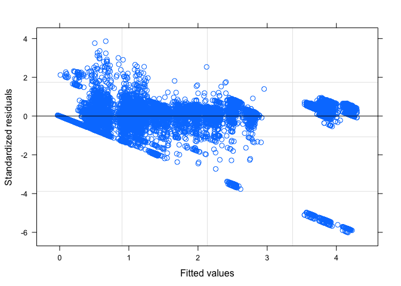

``` r
# Residuals vs. Task, boxplot
plot(model.lme.weight.pooled, Task ~ resid(.))
```

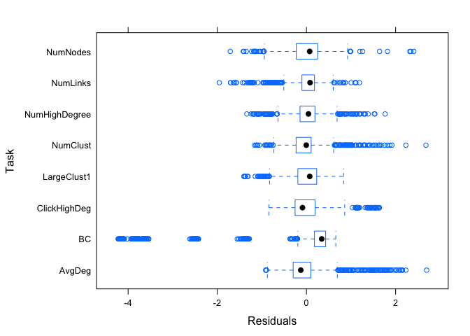

``` r
# Predicted vs. Task
plot(model.lme.weight.pooled, Task ~ fitted(.))
```

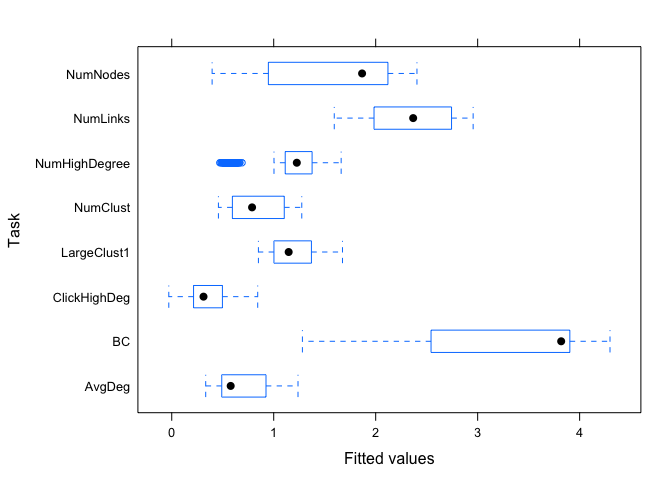

``` r
# Predicted vs. Actual LogError
plot(model.lme.weight.pooled, LogError ~ fitted(.), abline = c(0,1))
```

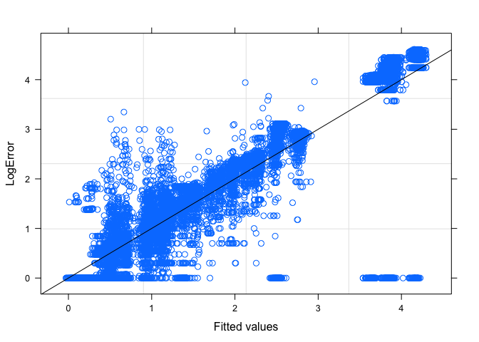

``` r
qqnorm(model.lme.weight.pooled, abline = c(0,1))
```

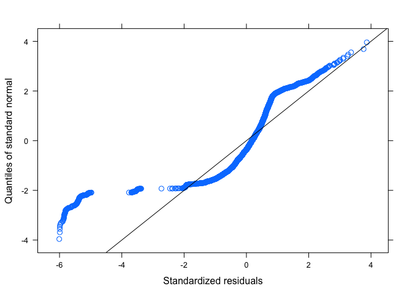

``` r
qqnorm(model.lme.weight.pooled, ~ resid(., type = "p") | Task, abline = c(0,1))
```

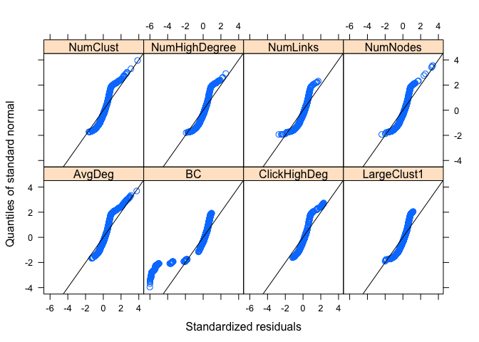

``` r
qqnorm(model.lme.weight.pooled, ~ resid(., type = "p") | Dataset, abline = c(0,1))
```

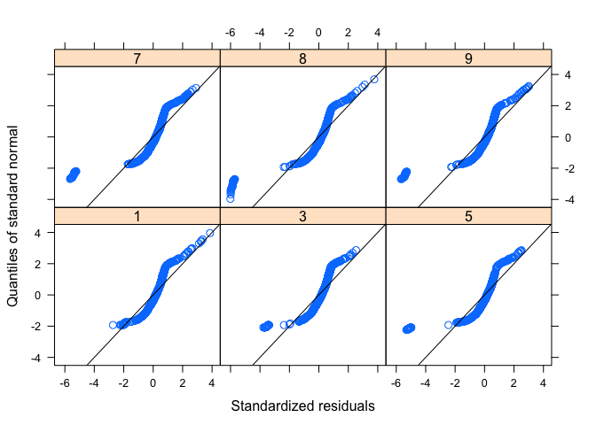

``` r
qqnorm(model.lme.weight.pooled, ~ranef(.))
```

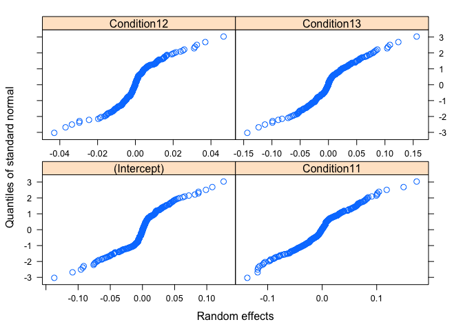

### Graphics subset, linear mixed model (lme4)

``` r
model.fit.lmer <- lmer(LogError ~ Dataset + Task + Task:Dataset + (1|DemoResponseID), data = graphics_lme, REML = T)

lmsum <- summary(model.fit.lmer)
lmsum
```

    ## Linear mixed model fit by REML t-tests use Satterthwaite approximations
    ##   to degrees of freedom [lmerMod]
    ## Formula: LogError ~ Dataset + Task + Task:Dataset + (1 | DemoResponseID)
    ##    Data: graphics_lme
    ## 
    ## REML criterion at convergence: 28883.5
    ## 
    ## Scaled residuals: 
    ##     Min      1Q  Median      3Q     Max 
    ## -5.9417 -0.2006  0.1777  0.4866  3.8034 
    ## 
    ## Random effects:
    ##  Groups         Name        Variance Std.Dev.
    ##  DemoResponseID (Intercept) 0.005018 0.07084 
    ##  Residual                   0.505806 0.71120 
    ## Number of obs: 13262, groups:  DemoResponseID, 410
    ## 
    ## Fixed effects:
    ##                               Estimate Std. Error         df t value
    ## (Intercept)                  6.930e-01  2.075e-02  1.054e+04  33.400
    ## Dataset.L                   -1.693e-01  5.013e-02  1.312e+04  -3.377
    ## Dataset.Q                    2.449e-01  5.028e-02  1.311e+04   4.870
    ## Dataset.C                   -2.915e-01  5.012e-02  1.312e+04  -5.817
    ## Dataset^4                    2.887e-01  5.013e-02  1.310e+04   5.759
    ## Dataset^5                    2.522e-01  5.038e-02  1.312e+04   5.006
    ## TaskBC                       2.564e+00  2.293e-02  1.291e+04 111.815
    ## TaskClickHighDeg            -3.446e-01  2.902e-02  1.281e+04 -11.875
    ## TaskLargeClust1              4.996e-01  2.890e-02  1.281e+04  17.288
    ## TaskNumClust                 1.455e-01  2.894e-02  1.281e+04   5.028
    ## TaskNumHighDegree            4.753e-01  2.892e-02  1.281e+04  16.435
    ## TaskNumLinks                 1.641e+00  2.891e-02  1.281e+04  56.754
    ## TaskNumNodes                 9.057e-01  2.891e-02  1.281e+04  31.331
    ## Dataset.L:TaskBC             2.285e+00  5.639e-02  1.289e+04  40.522
    ## Dataset.Q:TaskBC            -1.384e+00  5.644e-02  1.288e+04 -24.522
    ## Dataset.C:TaskBC             3.000e-01  5.601e-02  1.286e+04   5.356
    ## Dataset^4:TaskBC            -2.561e-01  5.585e-02  1.285e+04  -4.585
    ## Dataset^5:TaskBC            -5.054e-01  5.603e-02  1.285e+04  -9.020
    ## Dataset.L:TaskClickHighDeg   1.859e-01  7.094e-02  1.281e+04   2.620
    ## Dataset.Q:TaskClickHighDeg   1.378e-01  7.120e-02  1.282e+04   1.935
    ## Dataset.C:TaskClickHighDeg   4.973e-01  7.095e-02  1.281e+04   7.010
    ## Dataset^4:TaskClickHighDeg  -1.326e-01  7.098e-02  1.281e+04  -1.868
    ## Dataset^5:TaskClickHighDeg  -1.281e-01  7.139e-02  1.282e+04  -1.795
    ## Dataset.L:TaskLargeClust1    3.576e-02  7.070e-02  1.281e+04   0.506
    ## Dataset.Q:TaskLargeClust1   -2.267e-01  7.090e-02  1.281e+04  -3.198
    ## Dataset.C:TaskLargeClust1    2.588e-01  7.067e-02  1.281e+04   3.662
    ## Dataset^4:TaskLargeClust1   -6.022e-02  7.068e-02  1.281e+04  -0.852
    ## Dataset^5:TaskLargeClust1   -6.809e-01  7.100e-02  1.281e+04  -9.590
    ## Dataset.L:TaskNumClust       6.646e-01  7.079e-02  1.281e+04   9.388
    ## Dataset.Q:TaskNumClust      -2.298e-01  7.099e-02  1.281e+04  -3.237
    ## Dataset.C:TaskNumClust       2.816e-01  7.076e-02  1.281e+04   3.979
    ## Dataset^4:TaskNumClust      -3.290e-01  7.077e-02  1.281e+04  -4.649
    ## Dataset^5:TaskNumClust      -5.485e-01  7.108e-02  1.281e+04  -7.716
    ## Dataset.L:TaskNumHighDegree  4.873e-01  7.078e-02  1.281e+04   6.885
    ## Dataset.Q:TaskNumHighDegree -4.143e-01  7.097e-02  1.281e+04  -5.838
    ## Dataset.C:TaskNumHighDegree -2.727e-02  7.073e-02  1.281e+04  -0.386
    ## Dataset^4:TaskNumHighDegree  2.272e-01  7.073e-02  1.281e+04   3.212
    ## Dataset^5:TaskNumHighDegree -3.674e-01  7.104e-02  1.281e+04  -5.172
    ## Dataset.L:TaskNumLinks       8.202e-01  7.074e-02  1.281e+04  11.595
    ## Dataset.Q:TaskNumLinks      -3.571e-02  7.094e-02  1.281e+04  -0.503
    ## Dataset.C:TaskNumLinks      -1.887e-01  7.069e-02  1.281e+04  -2.669
    ## Dataset^4:TaskNumLinks       9.667e-02  7.070e-02  1.281e+04   1.367
    ## Dataset^5:TaskNumLinks       3.878e-02  7.103e-02  1.281e+04   0.546
    ## Dataset.L:TaskNumNodes       1.645e+00  7.071e-02  1.281e+04  23.256
    ## Dataset.Q:TaskNumNodes      -7.307e-01  7.090e-02  1.281e+04 -10.305
    ## Dataset.C:TaskNumNodes       2.859e-01  7.069e-02  1.281e+04   4.045
    ## Dataset^4:TaskNumNodes      -7.888e-02  7.071e-02  1.281e+04  -1.116
    ## Dataset^5:TaskNumNodes      -4.204e-01  7.101e-02  1.281e+04  -5.921
    ##                             Pr(>|t|)    
    ## (Intercept)                  < 2e-16 ***
    ## Dataset.L                   0.000735 ***
    ## Dataset.Q                   1.13e-06 ***
    ## Dataset.C                   6.14e-09 ***
    ## Dataset^4                   8.65e-09 ***
    ## Dataset^5                   5.64e-07 ***
    ## TaskBC                       < 2e-16 ***
    ## TaskClickHighDeg             < 2e-16 ***
    ## TaskLargeClust1              < 2e-16 ***
    ## TaskNumClust                5.02e-07 ***
    ## TaskNumHighDegree            < 2e-16 ***
    ## TaskNumLinks                 < 2e-16 ***
    ## TaskNumNodes                 < 2e-16 ***
    ## Dataset.L:TaskBC             < 2e-16 ***
    ## Dataset.Q:TaskBC             < 2e-16 ***
    ## Dataset.C:TaskBC            8.67e-08 ***
    ## Dataset^4:TaskBC            4.58e-06 ***
    ## Dataset^5:TaskBC             < 2e-16 ***
    ## Dataset.L:TaskClickHighDeg  0.008798 ** 
    ## Dataset.Q:TaskClickHighDeg  0.052958 .  
    ## Dataset.C:TaskClickHighDeg  2.51e-12 ***
    ## Dataset^4:TaskClickHighDeg  0.061805 .  
    ## Dataset^5:TaskClickHighDeg  0.072720 .  
    ## Dataset.L:TaskLargeClust1   0.613002    
    ## Dataset.Q:TaskLargeClust1   0.001388 ** 
    ## Dataset.C:TaskLargeClust1   0.000251 ***
    ## Dataset^4:TaskLargeClust1   0.394246    
    ## Dataset^5:TaskLargeClust1    < 2e-16 ***
    ## Dataset.L:TaskNumClust       < 2e-16 ***
    ## Dataset.Q:TaskNumClust      0.001211 ** 
    ## Dataset.C:TaskNumClust      6.96e-05 ***
    ## Dataset^4:TaskNumClust      3.37e-06 ***
    ## Dataset^5:TaskNumClust      1.29e-14 ***
    ## Dataset.L:TaskNumHighDegree 6.06e-12 ***
    ## Dataset.Q:TaskNumHighDegree 5.42e-09 ***
    ## Dataset.C:TaskNumHighDegree 0.699791    
    ## Dataset^4:TaskNumHighDegree 0.001319 ** 
    ## Dataset^5:TaskNumHighDegree 2.36e-07 ***
    ## Dataset.L:TaskNumLinks       < 2e-16 ***
    ## Dataset.Q:TaskNumLinks      0.614735    
    ## Dataset.C:TaskNumLinks      0.007620 ** 
    ## Dataset^4:TaskNumLinks      0.171532    
    ## Dataset^5:TaskNumLinks      0.585064    
    ## Dataset.L:TaskNumNodes       < 2e-16 ***
    ## Dataset.Q:TaskNumNodes       < 2e-16 ***
    ## Dataset.C:TaskNumNodes      5.27e-05 ***
    ## Dataset^4:TaskNumNodes      0.264617    
    ## Dataset^5:TaskNumNodes      3.28e-09 ***
    ## ---
    ## Signif. codes:  0 '***' 0.001 '**' 0.01 '*' 0.05 '.' 0.1 ' ' 1

``` r
#names(lmsum)
```

``` r
# Try adding condition as a nesting variable for random participant effects; ultimately not necessary

#model.fit.lmer.nest <- lmer(LogError ~ Dataset + Task + Task:Dataset + (Condition1|DemoResponseID), data = graphics_lme, REML = T)

# error: 
# unable to evaluate scaled gradientModel failed to converge: degenerate  Hessian with 1 negative eigenvalues 

model.fit.lmer.nest <- lmer(LogError ~ Dataset + Task + Task:Dataset + (Condition|DemoResponseID), data = graphics_lme, REML = T)

# warning 
# Model is nearly unidentifiable: large eigenvalue ratio - Rescale variables?

nestsum <- summary(model.fit.lmer.nest)
nestsum

# want to compare unnested and nested; not supposed to do anova, so should
# create test statistic by subtracting -2 REML log-likelihood values from
# each model

# "logLik" value for unnested: -14441.77
# "logLik" value for nested: -14440.5
# -2 REML logLik is just -2 * the logLik value

# test statistics = unnested - nested
test.stat <- (-2*as.numeric(lmsum$logLik)) - (-2*as.numeric(nestsum$logLik)) # ~2.53


p.val <- 0.5*(1-pchisq(test.stat,1)) + 0.5*(1-pchisq(test.stat,2))

# p-value ~ 0.1969, so nesting is not significantly different
```

``` r
rand(model.fit.lmer)
```

    ## Analysis of Random effects Table:
    ##                Chi.sq Chi.DF p.value
    ## DemoResponseID   2.45      1     0.1

``` r
# result shows that random effects of participant are *not* significant (p=0.1)

anova(model.fit.lmer)
```

    ## Analysis of Variance Table of type III  with  Satterthwaite 
    ## approximation for degrees of freedom
    ##               Sum Sq Mean Sq NumDF   DenDF F.value    Pr(>F)    
    ## Dataset        749.3  149.87     5  9791.4   296.3 < 2.2e-16 ***
    ## Task         16239.1 2319.88     7 12846.8  4586.5 < 2.2e-16 ***
    ## Dataset:Task  2744.2   78.41    35 12830.1   155.0 < 2.2e-16 ***
    ## ---
    ## Signif. codes:  0 '***' 0.001 '**' 0.01 '*' 0.05 '.' 0.1 ' ' 1

``` r
# Task, Dataset, and Task:Dataset significant, < 0.001

#ranef(model.fit.lmer)

# displays the random effects; not that useful

# unlike lme(), lmer() doesn't allow for heterogeneous error variance structures (the "weights")
```

``` r
# From Faraway (2015), p. 156 - use step() to start with a complex model and 
# systematically remove each effects

full.lmer.model <- lmer(LogError ~ Dataset + Task + Task:Dataset + Condition1 + 
                           QuestionOrder + filename + (1|DemoResponseID), 
                         data = graphics_lme, REML = T)

step(full.lmer.model)
```

    ## 
    ## Random effects:
    ##                Chi.sq Chi.DF elim.num p.value
    ## DemoResponseID    2.2      1        1  0.1383
    ## 
    ## Fixed effects:
    ## Single term deletions
    ## 
    ## Model:
    ## y ~ Dataset + Task + Condition1 + QuestionOrder + filename + 
    ##     Dataset:Task
    ##               Df Sum of Sq    RSS     AIC  F value Pr(>F)    
    ## <none>                     6746.6 -8857.3                    
    ## Condition1     3      2.95 6749.6 -8857.5   1.9255 0.1231    
    ## QuestionOrder  1      0.00 6746.6 -8859.3   0.0046 0.9462    
    ## filename       1      0.26 6746.9 -8858.8   0.5096 0.4753    
    ## Dataset:Task  35   2749.45 9496.1 -4393.9 153.8022 <2e-16 ***
    ## ---
    ## Signif. codes:  0 '***' 0.001 '**' 0.01 '*' 0.05 '.' 0.1 ' ' 1
    ## 
    ## Least squares means:
    ##      Estimate Standard Error DF t-value Lower CI Upper CI p-value
    ## 
    ## Final model:
    ## 
    ## Call:
    ## lm(formula = fo, data = mm2, contrasts = l.lmerTest.private.contrast)
    ## 
    ## Coefficients:
    ##                (Intercept)                    Dataset1  
    ##                  2.192e+00                  -1.732e+00  
    ##                   Dataset3                    Dataset5  
    ##                 -1.292e+00                  -4.255e-01  
    ##                   Dataset7                    Dataset8  
    ##                 -2.779e-01                  -1.225e-01  
    ##                 TaskAvgDeg                      TaskBC  
    ##                 -1.555e+00                   1.650e+00  
    ##           TaskClickHighDeg             TaskLargeClust1  
    ##                 -1.562e+00                  -1.116e+00  
    ##               TaskNumClust           TaskNumHighDegree  
    ##                 -1.130e+00                  -1.005e+00  
    ##               TaskNumLinks                 Condition10  
    ##                  5.069e-01                  -2.019e-02  
    ##                Condition11                 Condition12  
    ##                 -4.136e-02                  -1.607e-02  
    ##              QuestionOrder          filenameMTurkFinal  
    ##                 -5.557e-08                   6.857e-02  
    ##        Dataset1:TaskAvgDeg         Dataset3:TaskAvgDeg  
    ##                  2.126e+00                   1.098e+00  
    ##        Dataset5:TaskAvgDeg         Dataset7:TaskAvgDeg  
    ##                  2.065e-01                   5.140e-01  
    ##        Dataset8:TaskAvgDeg             Dataset1:TaskBC  
    ##                 -4.793e-02                  -7.634e-01  
    ##            Dataset3:TaskBC             Dataset5:TaskBC  
    ##                 -7.028e-02                   2.063e-01  
    ##            Dataset7:TaskBC             Dataset8:TaskBC  
    ##                  2.433e-01                   4.283e-01  
    ##  Dataset1:TaskClickHighDeg   Dataset3:TaskClickHighDeg  
    ##                  1.549e+00                   9.730e-01  
    ##  Dataset5:TaskClickHighDeg   Dataset7:TaskClickHighDeg  
    ##                 -3.461e-02                  -1.415e-01  
    ##  Dataset8:TaskClickHighDeg    Dataset1:TaskLargeClust1  
    ##                 -4.781e-01                   1.976e+00  
    ##   Dataset3:TaskLargeClust1    Dataset5:TaskLargeClust1  
    ##                  1.125e+00                   8.449e-01  
    ##   Dataset7:TaskLargeClust1    Dataset8:TaskLargeClust1  
    ##                  1.484e-01                   1.634e-01  
    ##      Dataset1:TaskNumClust       Dataset3:TaskNumClust  
    ##                  1.191e+00                   7.654e-01  
    ##      Dataset5:TaskNumClust       Dataset7:TaskNumClust  
    ##                  2.529e-01                  -1.399e-01  
    ##      Dataset8:TaskNumClust  Dataset1:TaskNumHighDegree  
    ##                  1.480e-01                   1.610e+00  
    ## Dataset3:TaskNumHighDegree  Dataset5:TaskNumHighDegree  
    ##                  6.349e-01                   5.637e-01  
    ## Dataset7:TaskNumHighDegree  Dataset8:TaskNumHighDegree  
    ##                  5.408e-01                   9.842e-02  
    ##      Dataset1:TaskNumLinks       Dataset3:TaskNumLinks  
    ##                  1.281e+00                   2.456e-01  
    ##      Dataset5:TaskNumLinks       Dataset7:TaskNumLinks  
    ##                 -3.411e-01                   3.236e-01  
    ##      Dataset8:TaskNumLinks  
    ##                 -1.395e-01

``` r
# not sure this is useful
```

``` r
# Clustered Longitudinal Data (Chapter 7)

#model7.1.fit <- lme(gcf ~ time + 
#                   base_gcf + cda + 
#                   age + 
#                   time:base_gcf + time:cda + 
#                   time:age, 
#                   random = list(patient = ~time, tooth = ~1), 
#                   data = veneer, 
#                   method = "REML")

clust.model.fit <- lme(LogError ~ Task + TaskOrder +
                         Dataset + DatasetOrder +
                         Task:TaskOrder + 
                         Task:Dataset + Task:DatasetOrder,
                       random = list(`DemoResponseID` = ~Condition),
                       data = exp_only,
                       method = "REML")

summary(clust.model.fit)

intervals(clust.model.fit)

random.effects(clust.model.fit)
```

``` r
plot(model.fit.lmer)
```


``` r
plot(model.fit.lmer, resid(., scaled=TRUE) ~ fitted(.), abline = 0)
```


``` r
plot(model.fit.lmer, resid(.) ~ fitted(.) | Task, abline = 0)
```

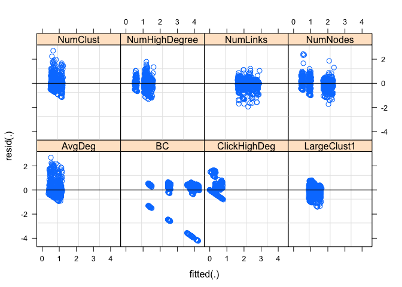

``` r
plot(model.fit.lmer, resid(., scaled=TRUE) ~ fitted(.) | Task, abline = 0)
```

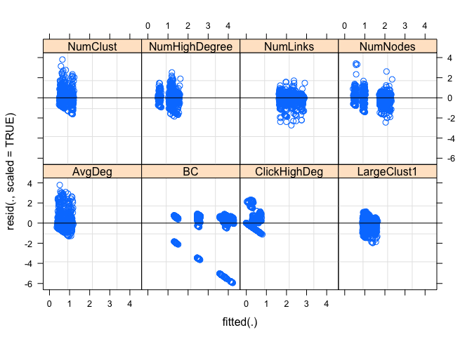

``` r
plot(model.fit.lmer, LogError ~ fitted(.), abline = c(0,1))
```


``` r
model.fit.lmer.f <- fortify(model.fit.lmer)

ggplot(model.fit.lmer.f, aes(.fitted,.resid)) + 
  geom_point() +
  #facet_grid(.~Sex) + 
  geom_hline(yintercept=0)
```

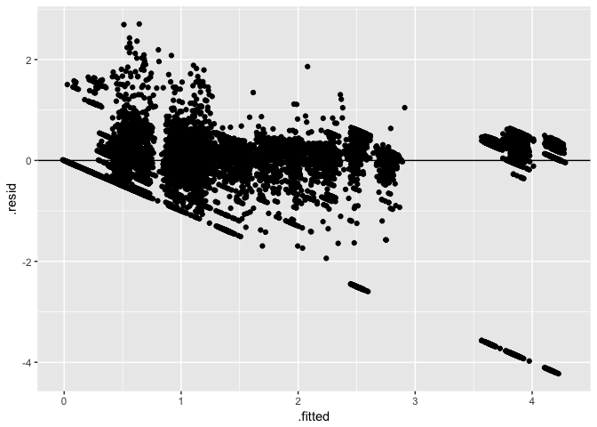

``` r
ggplot(model.fit.lmer.f, aes(.fitted,LogError)) + 
  geom_point() +
  geom_abline(aes(slope = 1, intercept = 0))
```

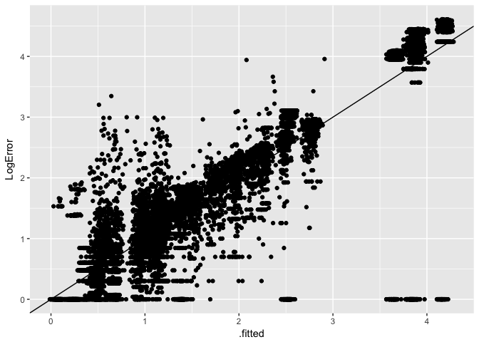

``` r
# profile not working yet - takes too long?

library(lattice)

#prof <-  profile(model.fit.lmer, optimizer="Nelder_Mead", which="beta_")

#prof.CI <- confint(prof)

CI2 <- confint(model.fit.lmer, maxpts = 8)

xyplot(prof)

xyplot(prof, absVal = TRUE)

xyplot(prof, conf = c(0.95, 0.99), main = "95% and 99% profile() intervals")

# can also apply logProf() and varianceProf() to profile object

densityplot(prof)

splom(prof)
```

``` r
lsm.task <- lsmeansLT(model.fit.lmer, test.effs = "Task")

plot(lsm.task)
```

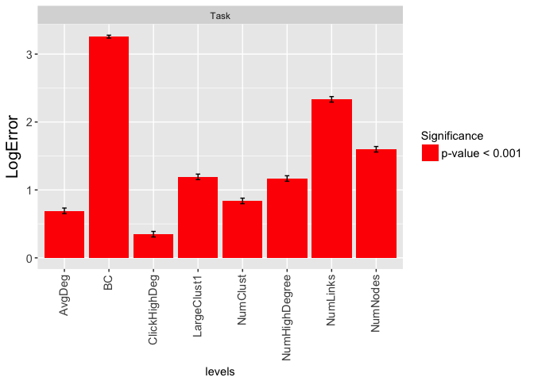

``` r
lsm.task.df <- as_data_frame(lsm.task$lsmeans.table)

lsm.task.df
```

    ## # A tibble: 8 x 8
    ##            Task Estimate `Standard Error`      DF `t-value` `Lower CI`
    ## *        <fctr>    <dbl>            <dbl>   <dbl>     <dbl>      <dbl>
    ## 1        AvgDeg   0.6930           0.0207 10535.2     33.40     0.6523
    ## 2            BC   3.2566           0.0109  1984.0    297.42     3.2352
    ## 3  ClickHighDeg   0.3483           0.0209 10593.3     16.67     0.3074
    ## 4   LargeClust1   1.1926           0.0207 10523.9     57.55     1.1520
    ## 5      NumClust   0.8385           0.0208 10543.5     40.36     0.7978
    ## 6 NumHighDegree   1.1683           0.0208 10538.8     56.29     1.1276
    ## 7      NumLinks   2.3339           0.0207 10531.2    112.54     2.2932
    ## 8      NumNodes   1.5986           0.0207 10527.7     77.12     1.5580
    ## # ... with 2 more variables: `Upper CI` <dbl>, `p-value` <dbl>

``` r
lsm.task.df$Task <- factor(lsm.task.df$Task, levels=lsm.task.df %>% arrange(desc(Estimate)) %>% select(Task) %>% unlist())

lsm.task.df %>% arrange(desc(Estimate))
```

    ## # A tibble: 8 x 8
    ##            Task Estimate `Standard Error`      DF `t-value` `Lower CI`
    ##          <fctr>    <dbl>            <dbl>   <dbl>     <dbl>      <dbl>
    ## 1            BC   3.2566           0.0109  1984.0    297.42     3.2352
    ## 2      NumLinks   2.3339           0.0207 10531.2    112.54     2.2932
    ## 3      NumNodes   1.5986           0.0207 10527.7     77.12     1.5580
    ## 4   LargeClust1   1.1926           0.0207 10523.9     57.55     1.1520
    ## 5 NumHighDegree   1.1683           0.0208 10538.8     56.29     1.1276
    ## 6      NumClust   0.8385           0.0208 10543.5     40.36     0.7978
    ## 7        AvgDeg   0.6930           0.0207 10535.2     33.40     0.6523
    ## 8  ClickHighDeg   0.3483           0.0209 10593.3     16.67     0.3074
    ## # ... with 2 more variables: `Upper CI` <dbl>, `p-value` <dbl>

``` r
ggplot(lsm.task.df) +
  geom_point(aes(x=Task,y=Estimate, color=`p-value`<.01)) +
  geom_errorbar(aes(x=Task,ymax=`Upper CI`,ymin=`Lower CI`), width=.2) +
  coord_flip()
```


``` r
# TO DO: add a color scale so TRUE/FALSE values are always same color across all plots
```

``` r
difflsm.task <- difflsmeans(model.fit.lmer, test.effs = "Task")

plot(difflsm.task)
```

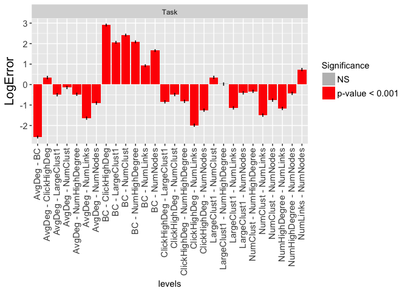

``` r
difflsm.task.df <- as_data_frame(difflsm.task$diffs.lsmeans.table)

difflsm.task.df
```

    ## # A tibble: 28 x 7
    ##    Estimate `Standard Error`      DF `t-value` `Lower CI` `Upper CI`
    ##  *    <dbl>            <dbl>   <dbl>     <dbl>      <dbl>      <dbl>
    ##  1  -2.5637           0.0229 12906.8   -111.81    -2.6086    -2.5187
    ##  2   0.3446           0.0290 12812.6     11.87     0.2878     0.4015
    ##  3  -0.4996           0.0289 12808.4    -17.29    -0.5563    -0.4430
    ##  4  -0.1455           0.0289 12809.0     -5.03    -0.2022    -0.0888
    ##  5  -0.4754           0.0289 12808.4    -16.43    -0.5320    -0.4187
    ##  6  -1.6409           0.0289 12808.9    -56.75    -1.6976    -1.5842
    ##  7  -0.9057           0.0289 12808.2    -31.33    -0.9623    -0.8490
    ##  8   2.9083           0.0231 12902.3    126.13     2.8631     2.9535
    ##  9   2.0640           0.0229 12908.4     90.11     2.0191     2.1089
    ## 10   2.4182           0.0229 12904.4    105.37     2.3732     2.4632
    ## # ... with 18 more rows, and 1 more variables: `p-value` <dbl>

``` r
difflsm.task.df <- difflsm.task.df %>% mutate(Pair=rownames(.)) %>% separate(Pair, c("del","Pair"), sep=5) %>% select(-del) %>% separate(Pair, c("From", "del", "To"), sep="[ ]", remove=FALSE) %>% select(-del)

difflsm.task.df$Pair <- factor(difflsm.task.df$Pair, levels=difflsm.task.df %>% arrange(desc(Estimate)) %>% select(Pair) %>% unlist())

difflsm.task.df %>% arrange(desc(Estimate))
```

    ## # A tibble: 28 x 10
    ##    Estimate `Standard Error`      DF `t-value` `Lower CI` `Upper CI`
    ##       <dbl>            <dbl>   <dbl>     <dbl>      <dbl>      <dbl>
    ##  1   2.9083           0.0231 12902.3    126.13     2.8631     2.9535
    ##  2   2.4182           0.0229 12904.4    105.37     2.3732     2.4632
    ##  3   2.0883           0.0229 12907.9     91.05     2.0434     2.1333
    ##  4   2.0640           0.0229 12908.4     90.11     2.0191     2.1089
    ##  5   1.6580           0.0229 12908.2     72.36     1.6131     1.7029
    ##  6   0.9228           0.0229 12908.6     40.26     0.8779     0.9677
    ##  7   0.7352           0.0289 12807.8     25.44     0.6786     0.7919
    ##  8   0.3541           0.0289 12809.3     12.25     0.2975     0.4108
    ##  9   0.3446           0.0290 12812.6     11.87     0.2878     0.4015
    ## 10   0.0243           0.0289 12808.1      0.84    -0.0324     0.0809
    ## # ... with 18 more rows, and 4 more variables: `p-value` <dbl>,
    ## #   Pair <fctr>, From <chr>, To <chr>

``` r
ggplot(difflsm.task.df) +
  geom_point(aes(x=Pair,y=Estimate, color=`p-value`<.01)) +
  geom_errorbar(aes(x=Pair,ymax=`Upper CI`,ymin=`Lower CI`), width=.5) +
  geom_hline(aes(yintercept=0)) +
  coord_flip()
```

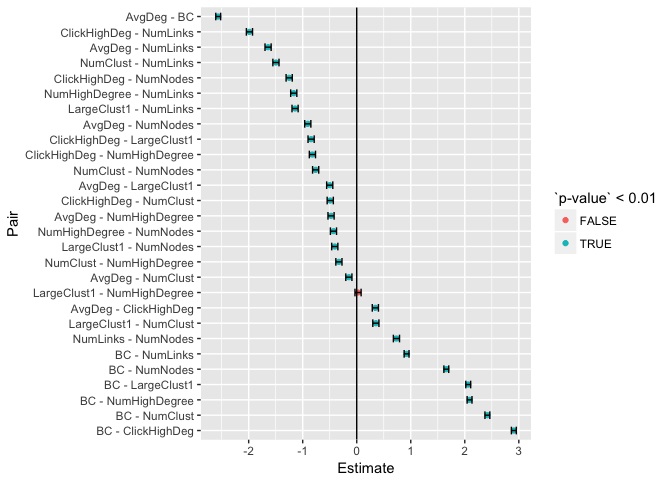

``` r
ggplot(difflsm.task.df) +
  geom_tile(aes(x=To,y=From,fill=Estimate)) +
    scale_fill_distiller(type="div", palette=4)
```

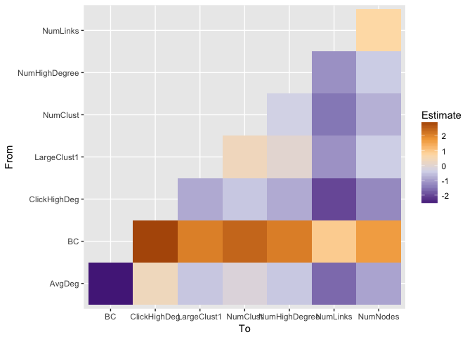

``` r
ggplot(difflsm.task.df) +
  geom_count(aes(x=To,y=From,size=abs(Estimate),fill=Estimate, color=`p-value`<.01), shape=21) +
  scale_fill_distiller(type="div", palette=4) +
  scale_color_manual(values=c("grey90","black"))
```

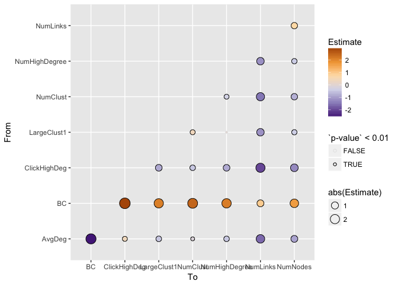

#### Layout subset, linear mixed model (nlme)

#### Layout subset, linear mixed model (lme4)

### Logistic regression for over/underestimation

### Beta regression for percentage

### Negative binomial model for responses
